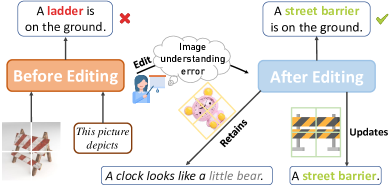
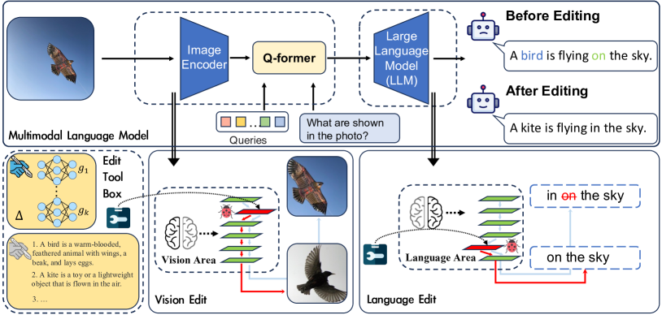
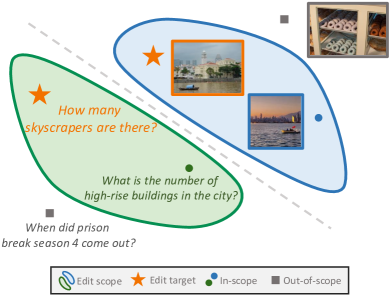
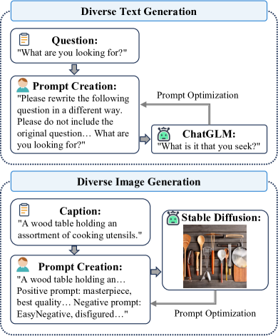
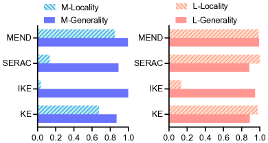
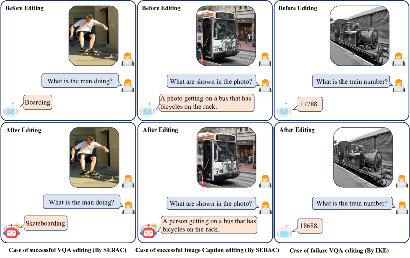
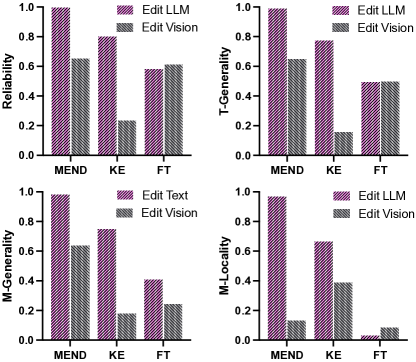

# Can We Edit Multimodal Large Language Models?

###### Abstract

In this paper, we focus on editing Multimodal Large Language Models (MLLMs). Compared to editing single-modal LLMs, multimodal model editing is more challenging, which demands a higher level of scrutiny and careful consideration in the editing process. To facilitate research in this area, we construct a new benchmark, dubbed MMEdit, for editing multimodal LLMs and establishing a suite of innovative metrics for evaluation. We conduct comprehensive experiments involving various model editing baselines and analyze the impact of editing different components for multimodal LLMs. Empirically, we notice that previous baselines can implement editing multimodal LLMs to some extent, but the effect is still barely satisfactory, indicating the potential difficulty of this task. We hope that our work can provide the NLP community with insights111Code and dataset are available in <https://github.com/zjunlp/EasyEdit>..  

## 1 Introduction

With the widespread deployment of Large Language Models (LLMs) Zhao et al. ([2023](#bib.bib59)), the necessity to maintain their knowledge accurate and current without incurring significant retraining costs is becoming increasingly paramount Sinitsin et al. ([2020](#bib.bib45)). Previous research has introduced knowledge editing methodologies designed to incrementally infuse a language model with a new set of facts Mitchell et al. ([2022a](#bib.bib38)); Han et al. ([2023](#bib.bib18)); Hartvigsen et al. ([2022](#bib.bib19)); Zhong et al. ([2023](#bib.bib61)); Gandikota et al. ([2023](#bib.bib13)); Yao et al. ([2023](#bib.bib53)).  

[FIGURE S1.F1.g1]

Figure 1: 
Overview of the multimodal model editing task.
The editing target is to update the model’s understanding of the edited input (e.g., image or text), while ensuring its interpretation of unrelated inputs remains as consistent as possible.
[/FIGURE]

Different from single-modal model editing, the task of editing multimodal LLMs presents considerable challenges, given their inherent diversity and complexity. Specifically, incorrect outputs from multimodal models may stem from the synergistic effects of various modalities. Incorrect outputs may stem not just from LLMs, analogous to human errors like misreading or misrecognition (e.g., color blindness affecting color identification in images). As shown in Figure [1](#S1.F1 "Figure 1 ‣ 1 Introduction ‣ Can We Edit Multimodal Large Language Models?"), before the editing, the model misidentified the object as a “ladder” instead of the correct “barrier”, resulting in an erroneous prediction. After the editing, the model accurately recognized the “barrier”. Note that the utility of multimodal LLMs Yin et al. ([2023](#bib.bib55)) is increasing, yet there is a lack of corresponding dataset resources and benchmarks for editing multimodal large language models.  

To facilitate research in this area, we take the first step to construct a Multimodal Model Editing benchmark: dubbed as MMEdit, which encompass two sub-tasks: Editing VQA and Editing Image Captioning. Specifically, we follow single-modal model editing approaches Mitchell et al. ([2022a](#bib.bib38)); Cao et al. ([2021](#bib.bib3)); Mitchell et al. ([2022b](#bib.bib39)) to construct the datasets, which extends the previous evaluation principle, namely Reliability222The metric used to measure the success of editing target., Locality333It measures whether unrelated facts retain their outputs., and Generality444It measures the success of editing related knowledge., to multimodal settings.  

For Reliability evaluation, we start with rigorous data collection, gathering underperforming multimodal model data to create a dedicated reliability editing dataset (§[3.2.1](#S3.SS2.SSS1 "3.2.1 Reliability Dataset Construction ‣ 3.2 Datasets ‣ 3 Editing Multimodal LLMs ‣ Can We Edit Multimodal Large Language Models?")). For Locality evaluation, we split it into the textual and multimodal locality to evaluate the stability of multimodal LLMs (§[3.2.2](#S3.SS2.SSS2 "3.2.2 Locality Dataset Construction ‣ 3.2 Datasets ‣ 3 Editing Multimodal LLMs ‣ Can We Edit Multimodal Large Language Models?")). For Generality evaluation, similar to Locality, we divide it into textual and multimodal generality and utilize ChatGLM Du et al. ([2022](#bib.bib12)), and Stable Diffusion Rombach et al. ([2022](#bib.bib43)) to generate rephrased text as well as rephrased images for evaluation (§[3.2.3](#S3.SS2.SSS3 "3.2.3 Generality Dataset Construction ‣ 3.2 Datasets ‣ 3 Editing Multimodal LLMs ‣ Can We Edit Multimodal Large Language Models?")). We evaluate several knowledge editing approaches on MMEdit. Empirically, we notice that current editing approaches are effective for editing the textual model in the multimodal language model but not as effective for editing the vision module. For example, in editing the language module of the BLIP-2 model, the reliability of MEND can reach 99.4%, but only attain 65.2% if editing the vision module, indicating the potential difficulty and opportunities of this task. In general, our primary contributions are as follows:  

* We take the first step to investigate editing multimodal LLMs, which extends model editing to multimodal settings. 
* We propose MMEdit, a new benchmark, to evaluate the reliability, locality, and generality of multimodal model editing approaches. 
* We conduct experiments with various baselines, demonstrating that while current methodologies can somewhat aid in multimodal editing, the outcomes still fall short of complete satisfaction. We will make the code and datasets publicly available for future research purposes. 

## 2 Related Work

### 2.1 Multimodal Language Models

Multimodal Learning (MML) Xu et al. ([2022a](#bib.bib51)); Yin et al. ([2023](#bib.bib55)) provides a holistic approach to crafting AI models that can extract and correlate information from various data modalities. Due to its societal significance, MML has established a foothold in the research community, solidifying itself as a crucial field of study over the past decade. Vision-language pre-training is one of the important branches of MML, which aims to learn multimodal foundation models with improved performance on various vision and language tasks. Vision Transformer (ViT) Dosovitskiy et al. ([2021](#bib.bib11)) is a seminal work that contributes an end-to-end solution by applying the encoder of Transformers to images. CLIP Radford et al. ([2021](#bib.bib42)) proposes a method, which uses multimodal pre-training to convert classification as a retrieval task that enables the pre-trained models to tackle zero-shot recognition. Recently, the advancement of LLMs, such as LLaMA Touvron et al. ([2023](#bib.bib47)), BLOOM Scao et al. ([2022](#bib.bib44)), and ChatGPT OpenAI ([2022](#bib.bib41)), has been bolstered by scaled-up training data and increased parameters, yielding significant recent success. These models showcase impressive language understanding, generation, and knowledge reasoning capabilities, enhancing their ability to comprehend natural language and generate high-quality, context-based text. The evolution of large language models has spurred the widespread use of auto-regressive language models as decoders in vision-language tasks. Utilizing cross-modal transfer, this approach enables knowledge sharing between language and multimodal domains Gao et al. ([2023](#bib.bib14)); Liu et al. ([2023](#bib.bib32)); Li et al. ([2023a](#bib.bib28)); Ye et al. ([2023](#bib.bib54)); Zhu et al. ([2023](#bib.bib62)); Li et al. ([2023b](#bib.bib29)); Zhang et al. ([2023](#bib.bib58)).  

[FIGURE S2.F2.g1]

Figure 2: 
Utilizing multimodal LLM (e.g., BLIP-2 OPT) as an example, we dissect the comprehensive multimodal LLM into two components (Vision module and Textual module).
The model’s erroneous output could potentially stem from either or both of these modules.
Drawing an analogy with human errors in “vision” and “speech”, we apply model editing methods to these two components, thereby changing the model to refine its output.
[/FIGURE]

### 2.2 Model Editing

LLMs Zhao et al. ([2023](#bib.bib59)) primarily derive knowledge from the training corpus. Yet, the quality of the dataset is not always guaranteed, potentially integrating harmful or incorrect information into the model Hernandez et al. ([2023](#bib.bib23)). One solution is retraining models with updated knowledge, though this might be unfordable and difficult to implement. Alternatively, fine-tuning with a few updated facts could be considered, but it risks over-fitting and catastrophic forgetting Zhai et al. ([2023](#bib.bib57)). To address these issues, Sinitsin et al. ([2020](#bib.bib45)) proposes Model Editing, which aims to efficiently and accurately alter the factual knowledge stored within models. This approach is applied in various domains Mao et al. ([2023](#bib.bib34)); Onoe et al. ([2023](#bib.bib40)); Xu et al. ([2022b](#bib.bib52)); Wang et al. ([2023a](#bib.bib48)); Li et al. ([2023c](#bib.bib30)); Cheng et al. ([2023](#bib.bib5)), with an increasing number of studies investigating the impact of editing Ilharco et al. ([2023](#bib.bib26)); Gupta et al. ([2023](#bib.bib17)); Hase et al. ([2023a](#bib.bib20)); Cohen et al. ([2023](#bib.bib7)); Wu et al. ([2023](#bib.bib50)); Wang et al. ([2023b](#bib.bib49)); Gandikota et al. ([2023](#bib.bib13)); Li et al. ([2023d](#bib.bib31)); Hase et al. ([2023b](#bib.bib21)). Presently, there are three primary types of model editing approaches: 1) Meta-learning Method, 2) Locate-Then-Edit Method, and 3) In-Context Knowledge Editing Method.  

##### Meta-learning Method.

MEND Mitchell et al. ([2022a](#bib.bib38)) and Knowledge Editor (KE) Cao et al. ([2021](#bib.bib3)) propose approaches involving an external editor, capable of learning the optimal parameter set, $\theta$, for knowledge updating, while concurrently imposing constraints to maintain model stability. CaliNET Dong et al. ([2022](#bib.bib10)) and T-Patcher Huang et al. ([2023](#bib.bib25)), drawing inspiration from Dai et al. ([2022](#bib.bib9)), introduce additional trainable parameters into the feed-forward module of Pretrained Language Models. SERAC Mitchell et al. ([2022b](#bib.bib39)) utilize an explicit memory to store edits and learns to reason over them to modulate the base model’s predictions as needed.  

##### Locate-Then-Edit Method.

ROME Meng et al. ([2022a](#bib.bib36)) proposes approaches that employ causal mediation analysis to identify the area for editing. ROME discovers that memorized factual associations can be pinpointed to a specific location within a GPT model. However, a notable limitation of ROME is its ability only to edit one fact at a time. To address this, Meng et al. ([2022b](#bib.bib37)) proposes a new method known as MEMIT, which is a successor to the previous work ROME, which performs a rank-one modification of the MLP weights of a single layer to write a memory into the model directly.  

##### In-Context Knowledge Editing Method.

In-Context Learning (ICL) Brown et al. ([2020](#bib.bib2)) signifies a training-free paradigm where knowledge is obtained from demonstrations directly concatenated within the input context. A novel editing paradigm has recently emerged that capitalizes on the ability of LLMs to comprehend context Zheng et al. ([2023](#bib.bib60)), thereby enabling the performance of context-based model editing, guiding the model’s generation process, and offering an efficient, lightweight approach to model editing.  

Model editing methods to date largely cater to single-modal scenarios, leaving a gap in multimodal editing. To the best of our knowledge, we are the first to investigate multimodal model editing for LLMs and provide a new benchmark to facilitate research in this area.  

## 3 Editing Multimodal LLMs

We illustrate the proposed task of multimodal editing in Figure [2](#S2.F2 "Figure 2 ‣ 2.1 Multimodal Language Models ‣ 2 Related Work ‣ Can We Edit Multimodal Large Language Models?"). We will introduce the task definition (§[3.1](#S3.SS1 "3.1 Task Definition ‣ 3 Editing Multimodal LLMs ‣ Can We Edit Multimodal Large Language Models?")), dataset construction details in (§[3.2](#S3.SS2 "3.2 Datasets ‣ 3 Editing Multimodal LLMs ‣ Can We Edit Multimodal Large Language Models?")), the multimodal models (§[3.3](#S3.SS3 "3.3 Multimodal Language Models ‣ 3 Editing Multimodal LLMs ‣ Can We Edit Multimodal Large Language Models?")), and the baselines (§[3.4](#S3.SS4 "3.4 Baselines ‣ 3 Editing Multimodal LLMs ‣ Can We Edit Multimodal Large Language Models?")) we used in the experiments.  

### 3.1 Task Definition

[FIGURE S3.F3.g1]

Figure 3: 
Taking the text modality as an example, Edit target and its generalization pertain to *in-scope*, which involves querying the quantity of skyscrapers in a given image, while the *out-of-scope* refers to inquiries about the publication date. In-scope inputs require editing, whereas out-of-scope inputs remain unchanged.
[/FIGURE]

Assuming we have a multimodal LLM $f$ parameterized by $\theta$ (consisting of two parts, $f_{vision}$ and $f_{text}$ parameterized by $\theta_{vision}$ and $\theta_{text}$) that map the input $i_{e}$ and $x_{e}$ to the prediction to $y_{o}$, where $i_{e}$ refer to the editing image input, $x_{e}$ refer to the editing text prompt input and $y_{o}$ denote as the origin output. We denote $\mathcal{M}$ as a symbolic representation for a particular metric, with subscripts indicating specific metrics and superscripts representing variations in edit data. We prepare the editing datasets stated in §[3.2.1](#S3.SS2.SSS1 "3.2.1 Reliability Dataset Construction ‣ 3.2 Datasets ‣ 3 Editing Multimodal LLMs ‣ Can We Edit Multimodal Large Language Models?"), which present as $\mathcal{D}_{\textrm{edit}}$. Inspired by Yao et al. ([2023](#bib.bib53)), we introduce a series of multimodal model editing metrics.  

##### Reliability.

Editing reliability is needed to change prediction from $y_{o}$ to $y_{e}$. Intuitively, what we need is an updated $\theta_{e}$ with $f(i_{e},x_{e};\theta_{e})=y_{e}$. To measure the reliability, we use the editing accuracy, as described by the following:  

|  | $$\mathcal{M}_{rel}=\mathbb{E}_{(i_{e},x_{e},y_{e})\sim\mathcal{D}_{\textrm{edit}}}\left[\mathds{1}_{f\left(i_{e},x_{e};\theta_{e}\left(i_{e},x_{e},y_{e}\right)\right)=y_{e}}\right]$$ |  | (1) |
| --- | --- | --- | --- |

where $\theta_{e}$ refers to the edited parameters.  

##### Locality.

To maintain the model’s stability, minimizing the unintended side effects of editing on the model’s broader knowledge base is imperative. In pursuit of this objective, we introduce two metrics: $\mathcal{M}^{Text}_{loc}$ (T-Locality) and $\mathcal{M}^{Img}_{loc}$ (M-Locality), both of which are designed to preserve the model’s stability during the editing process. Given that the knowledge in the multimodal language model is inherited from LLMs, safeguarding this knowledge is paramount. With this aim in mind, we set aside the model’s visual discrimination module and instead employ rudimentary question-and-answer datasets $\mathcal{D}_{\textrm{loc-t}}$ as we stated in §[3.2.2](#S3.SS2.SSS2 "3.2.2 Locality Dataset Construction ‣ 3.2 Datasets ‣ 3 Editing Multimodal LLMs ‣ Can We Edit Multimodal Large Language Models?"). We define the question as $x$ and the answer as $y$, as below:  

|  | $$\mathcal{M}^{Text}_{loc}=\mathbb{E}_{(i_{e},x_{e},y_{e})\sim\mathcal{D}_{\textrm{edit}}\atop(x,y)\sim\mathcal{D}_{\textrm{loc-t}}}\left[\mathds{1}_{f\left(x;\theta_{e}\left(i_{e},x_{e},y_{e}\right)\right)=f\left(x,\theta\right)}\right]$$ |  | (2) |
| --- | --- | --- | --- |

The vision encoder serves a critical function in the multimodal language model, transforming images into vector representations for co-encoding alongside natural language text. Consequently, we must take into account the potential ramifications of any modifications to this module. We construct the dataset denoted as $\mathcal{D}_{\textrm{loc-v}}$ for test $\mathcal{M}^{Img}_{loc}$, and calculate as delineated below:  

|  | $$\mathcal{M}^{Img}_{loc}=\mathbb{E}_{(i_{v},x_{v},y_{v})\sim\mathcal{D}_{\textrm{loc-v}}}\left[\mathds{1}_{f\left(i_{v},x_{v};\theta_{e}\right)=f\left(i_{v},x_{v};\theta\right)}\right]$$ |  | (3) |
| --- | --- | --- | --- |

where $(i_{v},x_{v},y_{v})$ is the out-of-scope data, and $\theta_{e}$ denote the parameter updated by edit data $(i_{e},x_{e},y_{e})$.  

##### Generality.

Throughout the editing process, it is not adequate to merely amend individual erroneous inputs. The revised model should also retain the capacity for generalization and consistently produce congruent outputs for equivalent inputs (e.g., rephrased sentences), as shown in Figure [3](#S3.F3 "Figure 3 ‣ 3.1 Task Definition ‣ 3 Editing Multimodal LLMs ‣ Can We Edit Multimodal Large Language Models?"). While previous unimodal model editing tasks only required consideration of the rephrased text, multimodal scenarios necessitate the generalization of images as well. To address this, we introduce two generalization considerations: $\mathcal{M}^{Text}_{gen}$ (T-Generality) and $\mathcal{M}^{Img}_{gen}$ (M-Generality), which are expressed as follows:  

|  | $$\mathcal{M}^{Text}_{gen}=\mathbb{E}_{(x_{r})\sim\mathcal{N}(x_{e})}\left[\mathds{1}_{f\left(i_{e},x_{r};\theta_{e}\right)=f\left(i_{e},x_{e};\theta_{e}\right)}\right]$$ |  | (4) |
| --- | --- | --- | --- |

|  | $$\mathcal{M}^{Img}_{gen}=\mathbb{E}_{(i_{r})\sim\mathcal{N}(i_{e})}\left[\mathds{1}_{f\left(i_{r},x_{e};\theta_{e}\right)=f\left(i_{e},x_{e};\theta_{e}\right)}\right]$$ |  | (5) |
| --- | --- | --- | --- |

where $i_{r}$ presents the rephrased image, $x_{r}$ refers to the rephrased text prompt, and $\mathcal{N}(x)$ denotes to in-scope objects of $x$.  

[TABLE S3.T1]

<table class="ltx_tabular ltx_guessed_headers ltx_align_middle">
<thead class="ltx_thead">
<tr class="ltx_tr">
<th class="ltx_td ltx_align_left ltx_th ltx_th_column ltx_th_row ltx_border_tt">TASK</th>
<th class="ltx_td ltx_align_center ltx_th ltx_th_column ltx_border_tt">Train</th>
<th class="ltx_td ltx_align_center ltx_th ltx_th_column ltx_border_tt">Test</th>
<th class="ltx_td ltx_align_center ltx_th ltx_th_column ltx_border_tt">L-Locality</th>
<th class="ltx_td ltx_align_center ltx_th ltx_th_column ltx_border_tt">M-Locality</th>
</tr>
</thead>
<tbody class="ltx_tbody">
<tr class="ltx_tr">
<th class="ltx_td ltx_align_left ltx_th ltx_th_row ltx_border_t">E-VQA</th>
<td class="ltx_td ltx_align_center ltx_border_t">6,346</td>
<td class="ltx_td ltx_align_center ltx_border_t">2,093</td>
<td class="ltx_td ltx_align_center ltx_border_t">4,289</td>
<td class="ltx_td ltx_align_center ltx_border_t">5,046</td>
</tr>
<tr class="ltx_tr">
<th class="ltx_td ltx_align_left ltx_th ltx_th_row ltx_border_bb">E-IC</th>
<td class="ltx_td ltx_align_center ltx_border_bb">2,849</td>
<td class="ltx_td ltx_align_center ltx_border_bb">1,000</td>
<td class="ltx_td ltx_align_center ltx_border_bb">4,289</td>
<td class="ltx_td ltx_align_center ltx_border_bb">5,046</td>
</tr>
</tbody>
</table>

Table 1: 
The statistic of datasets for the E-VQA and E-IC sub-tasks.
L-Locality and M-Locality are the test sets for knowledge locality to evaluate the rest of the knowledge in multimodal models when successfully updating specific facts.
[/TABLE]

### 3.2 Datasets

The dataset MMEdit we constructed mainly contains two subtasks: Editing VQA (*E-VQA*) and Editing Image Captioning (*E-IC*).  

#### 3.2.1 Reliability Dataset Construction

[FIGURE S3.F4.g1]

Figure 4: Generality dataset construction process.
[/FIGURE]

To benchmark our experiments, we selected two common multimodal tasks: Visual Question Answering (VQA) Antol et al. ([2015](#bib.bib1)) and Image Captioning Herdade et al. ([2019](#bib.bib22)). VQA is to devise algorithms that can not only comprehend the visual content within an image, but also understand the natural language used to inquire about that image, and subsequently generate precise answers to those queries. Image Captioning is to devise algorithms capable of comprehending the visual content of an image, subsequently generating a coherent and precise description of the image in natural language. In this study, we opt for BLIP-2 OPT. Our foundational edit data originates from suboptimal entries across two eval datasets, namely, VQAv2 Goyal et al. ([2017](#bib.bib16)) and COCO Caption Chen et al. ([2015](#bib.bib4)).  

Besides the foundational edit data, utilizing additional data is crucial. This data not only aids the editing process but also validates the efficacy of the changes, assessing model edits for both stability and generality.  

#### 3.2.2 Locality Dataset Construction

We must deliberate on the effects of editing on the language function within a multimodal model, analogous to how we evaluate various cognitive regions of an individual’s brain post-surgery.  

##### Textual Locality Dataset.

To evaluate the stability of the language model, we leverage the NQ dataset Kwiatkowski et al. ([2019](#bib.bib27)), previously used in MEND, as a benchmark for the stability of the LLM component within the model. We specifically use the model’s output pre and post-editing to construct a KL scatter plot, facilitating constraints on the model’s edits. Additionally, we calculate the proportion of instances maintaining a top-1 status, further quantifying the model’s stability.  

##### MultiModal Locality Dataset.

Similarly, it’s crucial to verify the impact of editing on the visual module. Hence, we utilize a straightforward dataset OK-VQA Marino et al. ([2019](#bib.bib35)) in the realm of multimodality, serving as a measure of the locality for the multimodal visual module. Once again, we update the KL dispersion constraint using logits both before and after the editing process.  

#### 3.2.3 Generality Dataset Construction

We propose two forms of generality within a multimodal model. The overall process of generality dataset construction is shown in Figure [4](#S3.F4 "Figure 4 ‣ 3.2.1 Reliability Dataset Construction ‣ 3.2 Datasets ‣ 3 Editing Multimodal LLMs ‣ Can We Edit Multimodal Large Language Models?").  

##### Textual Generality Dataset.

To be noted, LLMs exhibit robust conversational and powerful problem-solving capabilities, which enables us to formulate task instructions, whereby we can instruct the model to produce analogous text inputs. For the E-VQA task, we utilize ChatGLM Du et al. ([2022](#bib.bib12)); Zeng et al. ([2022](#bib.bib56)) to generate similar queries. However, for the E-IC task, due to the succinctness and relative straightforwardness of the prompts, the quality of the model’s generated output is not satisfactory. Therefore, we employ a manually written template with 20 prompts to replace the original ones randomly.  

##### Visual Generality Dataset.

The diffusion model Ho et al. ([2020](#bib.bib24)) has garnered significant success in the realm of image generation in recent years. Surpassing the original state-of-the-art model: Generative Adversarial Networks (GAN) models Goodfellow et al. ([2014](#bib.bib15)). The diffusion model has excelled in numerous image-generation tasks and has shown commendable performance across various application domains. Stable Diffusion Rombach et al. ([2022](#bib.bib43)) is a latent text-to-image diffusion model capable of generating photo-realistic images given text input. We utilize [Stable Diffusion 2.1](https://github.com/Stability-AI/StableDiffusion) for generating reinterpreted images. This dataset, drawing upon caption descriptions from the COCO dataset, is leveraged to evaluate the model’s capability for image generalization.  

### 3.3 Multimodal Language Models

##### BLIP-2 OPT.

BLIP-2 Li et al. ([2023b](#bib.bib29)) is a generic and efficient pre-training strategy that bootstraps vision-language pre-training from off-the-shelf frozen pre-trained image encoders and frozen large language models. The model utilizes a lightweight Quering Transformer to bridge the gap between vision modality and text modality and achieves state-of-the-art performance on various vision-language tasks. We select the BLIP-2 OPT as our basic edit model, which utilizes the ViT-L in the vision block, and select the unsupervised-trained OPT model for decoder-based LLM.  

##### MiniGPT-4.

MiniGPT-4 Zhu et al. ([2023](#bib.bib62)) is a potent vision-language model akin to BLIP-2, leveraging a frozen visual encoder in tandem with the frozen Vicuna Chiang et al. ([2023](#bib.bib6)). Vicuna, built upon LLaMA, is reported to achieve 90% of ChatGPT’s performance based on GPT-4’s evaluation criteria. MiniGPT-4 adds a single projection layer to align the encoded visual features with the Vicuna language model. And MiniGPT-4 employs the same pre-trained vision component of BLIP-2 that consists of a Vit-G/14 from EVA-CLIP Sun et al. ([2023](#bib.bib46)) and a Q-Former.  

[TABLE S3.T2]

<table class="ltx_tabular ltx_align_middle">
<tbody class="ltx_tbody">
<tr class="ltx_tr">
<td class="ltx_td ltx_border_tt"></td>
<td class="ltx_td ltx_align_center ltx_border_tt">Editing VQA</td>
<td class="ltx_td ltx_align_center ltx_border_tt">Editing Image Caption</td>
</tr>
<tr class="ltx_tr">
<td class="ltx_td"></td>
<td class="ltx_td ltx_align_center">Method</td>
<td class="ltx_td ltx_align_right ltx_border_t">Reliability   <math class="ltx_Math"><semantics><mo>↑</mo><annotation-xml><ci>↑</ci></annotation-xml><annotation>\uparrow</annotation></semantics></math>
</td>
<td class="ltx_td ltx_align_right ltx_border_t">T-Generality   <math class="ltx_Math"><semantics><mo>↑</mo><annotation-xml><ci>↑</ci></annotation-xml><annotation>\uparrow</annotation></semantics></math>
</td>
<td class="ltx_td ltx_align_right ltx_border_t">T-Locality   <math class="ltx_Math"><semantics><mo>↑</mo><annotation-xml><ci>↑</ci></annotation-xml><annotation>\uparrow</annotation></semantics></math>
</td>
<td class="ltx_td ltx_align_right ltx_border_t">M-Locality   <math class="ltx_Math"><semantics><mo>↑</mo><annotation-xml><ci>↑</ci></annotation-xml><annotation>\uparrow</annotation></semantics></math>
</td>
<td class="ltx_td ltx_align_right ltx_border_t">Reliability   <math class="ltx_Math"><semantics><mo>↑</mo><annotation-xml><ci>↑</ci></annotation-xml><annotation>\uparrow</annotation></semantics></math>
</td>
<td class="ltx_td ltx_align_right ltx_border_t">T-Generality   <math class="ltx_Math"><semantics><mo>↑</mo><annotation-xml><ci>↑</ci></annotation-xml><annotation>\uparrow</annotation></semantics></math>
</td>
<td class="ltx_td ltx_align_right ltx_border_t">T-Locality   <math class="ltx_Math"><semantics><mo>↑</mo><annotation-xml><ci>↑</ci></annotation-xml><annotation>\uparrow</annotation></semantics></math>
</td>
<td class="ltx_td ltx_align_right ltx_border_t">M-Locality   <math class="ltx_Math"><semantics><mo>↑</mo><annotation-xml><ci>↑</ci></annotation-xml><annotation>\uparrow</annotation></semantics></math>
</td>
</tr>
<tr class="ltx_tr">
<td class="ltx_td ltx_align_left ltx_border_t"></td>
<td class="ltx_td ltx_align_center ltx_border_t">BLIP-2 OPT</td>
<td class="ltx_td ltx_align_right ltx_border_t">Size: 3.8B</td>
</tr>
<tr class="ltx_tr">
<td class="ltx_td ltx_align_left ltx_border_t">Base Methods</td>
<td class="ltx_td ltx_align_center ltx_border_t">Base Model</td>
<td class="ltx_td ltx_align_center ltx_border_t">0.00</td>
<td class="ltx_td ltx_align_center ltx_border_t">0.00</td>
<td class="ltx_td ltx_align_center ltx_border_t">100.0</td>
<td class="ltx_td ltx_align_center ltx_border_r ltx_border_t">100.0</td>
<td class="ltx_td ltx_align_center ltx_border_t">0.00</td>
<td class="ltx_td ltx_align_center ltx_border_t">0.00</td>
<td class="ltx_td ltx_align_center ltx_border_t">100.0</td>
<td class="ltx_td ltx_align_center ltx_border_t">100.0</td>
</tr>
<tr class="ltx_tr">
<td class="ltx_td ltx_align_center">FT (vision block)</td>
<td class="ltx_td ltx_align_center">60.98</td>
<td class="ltx_td ltx_align_center">49.79</td>
<td class="ltx_td ltx_align_center">100.0</td>
<td class="ltx_td ltx_align_center ltx_border_r">8.47</td>
<td class="ltx_td ltx_align_center">18.94</td>
<td class="ltx_td ltx_align_center">5.86</td>
<td class="ltx_td ltx_align_center">100.0</td>
<td class="ltx_td ltx_align_center">8.40</td>
</tr>
<tr class="ltx_tr">
<td class="ltx_td ltx_align_center">FT (last layer)</td>
<td class="ltx_td ltx_align_center">58.66</td>
<td class="ltx_td ltx_align_center">49.22</td>
<td class="ltx_td ltx_align_center">21.67</td>
<td class="ltx_td ltx_align_center ltx_border_r">3.06</td>
<td class="ltx_td ltx_align_center">16.60</td>
<td class="ltx_td ltx_align_center">3.50</td>
<td class="ltx_td ltx_align_center">24.96</td>
<td class="ltx_td ltx_align_center">7.12</td>
</tr>
<tr class="ltx_tr">
<td class="ltx_td ltx_align_left ltx_border_t">Model Editing</td>
<td class="ltx_td ltx_align_center ltx_border_t">Knowledge Editor</td>
<td class="ltx_td ltx_align_center ltx_border_t">80.00</td>
<td class="ltx_td ltx_align_center ltx_border_t">77.40</td>
<td class="ltx_td ltx_align_center ltx_border_t">93.79</td>
<td class="ltx_td ltx_align_center ltx_border_r ltx_border_t">66.43</td>
<td class="ltx_td ltx_align_center ltx_border_t">5.60</td>
<td class="ltx_td ltx_align_center ltx_border_t">4.40</td>
<td class="ltx_td ltx_align_center ltx_border_t">95.00</td>
<td class="ltx_td ltx_align_center ltx_border_t">64.32</td>
</tr>
<tr class="ltx_tr">
<td class="ltx_td ltx_align_center">In-Context Editing</td>
<td class="ltx_td ltx_align_center">99.95</td>
<td class="ltx_td ltx_align_center">91.59</td>
<td class="ltx_td ltx_align_center">13.16</td>
<td class="ltx_td ltx_align_center ltx_border_r">1.88</td>
<td class="ltx_td ltx_align_center">96.70</td>
<td class="ltx_td ltx_align_center">78.20</td>
<td class="ltx_td ltx_align_center">13.36</td>
<td class="ltx_td ltx_align_center">2.17</td>
</tr>
<tr class="ltx_tr">
<td class="ltx_td ltx_align_center">SERAC</td>
<td class="ltx_td ltx_align_center">99.40</td>
<td class="ltx_td ltx_align_center">99.40</td>
<td class="ltx_td ltx_align_center">100.0</td>
<td class="ltx_td ltx_align_center ltx_border_r">1.33</td>
<td class="ltx_td ltx_align_center">99.70</td>
<td class="ltx_td ltx_align_center">99.68</td>
<td class="ltx_td ltx_align_center">100.0</td>
<td class="ltx_td ltx_align_center">6.84</td>
</tr>
<tr class="ltx_tr">
<td class="ltx_td ltx_align_center">MEND</td>
<td class="ltx_td ltx_align_center">99.40</td>
<td class="ltx_td ltx_align_center">98.80</td>
<td class="ltx_td ltx_align_center">99.94</td>
<td class="ltx_td ltx_align_center ltx_border_r">96.65</td>
<td class="ltx_td ltx_align_center">96.11</td>
<td class="ltx_td ltx_align_center">95.82</td>
<td class="ltx_td ltx_align_center">94.54</td>
<td class="ltx_td ltx_align_center">70.84</td>
</tr>
<tr class="ltx_tr">
<td class="ltx_td ltx_align_left ltx_border_t"></td>
<td class="ltx_td ltx_align_center ltx_border_t">MiniGPT-4</td>
<td class="ltx_td ltx_align_right ltx_border_t">Size: 7.3B</td>
</tr>
<tr class="ltx_tr">
<td class="ltx_td ltx_align_left ltx_border_t">Base Methods</td>
<td class="ltx_td ltx_align_center ltx_border_t">Base Model</td>
<td class="ltx_td ltx_align_center ltx_border_t">0.00</td>
<td class="ltx_td ltx_align_center ltx_border_t">0.00</td>
<td class="ltx_td ltx_align_center ltx_border_t">100.0</td>
<td class="ltx_td ltx_align_center ltx_border_r ltx_border_t">100.0</td>
<td class="ltx_td ltx_align_center ltx_border_t">0.00</td>
<td class="ltx_td ltx_align_center ltx_border_t">0.00</td>
<td class="ltx_td ltx_align_center ltx_border_t">100.0</td>
<td class="ltx_td ltx_align_center ltx_border_t">100.0</td>
</tr>
<tr class="ltx_tr">
<td class="ltx_td ltx_align_center">FT (vision block)</td>
<td class="ltx_td ltx_align_center">36.3</td>
<td class="ltx_td ltx_align_center">0.3</td>
<td class="ltx_td ltx_align_center">100.0</td>
<td class="ltx_td ltx_align_center ltx_border_r">9.29</td>
<td class="ltx_td ltx_align_center">3.10</td>
<td class="ltx_td ltx_align_center">0.00</td>
<td class="ltx_td ltx_align_center">100.0</td>
<td class="ltx_td ltx_align_center">8.56</td>
</tr>
<tr class="ltx_tr">
<td class="ltx_td ltx_align_center">FT (last layer)</td>
<td class="ltx_td ltx_align_center">0.10</td>
<td class="ltx_td ltx_align_center">0.00</td>
<td class="ltx_td ltx_align_center">72.60</td>
<td class="ltx_td ltx_align_center ltx_border_r">15.75</td>
<td class="ltx_td ltx_align_center">0.00</td>
<td class="ltx_td ltx_align_center">0.00</td>
<td class="ltx_td ltx_align_center">53.50</td>
<td class="ltx_td ltx_align_center">12.68</td>
</tr>
<tr class="ltx_tr">
<td class="ltx_td ltx_align_left ltx_border_bb ltx_border_t">Model Editing</td>
<td class="ltx_td ltx_align_center ltx_border_t">Knowledge Editor</td>
<td class="ltx_td ltx_align_center ltx_border_t">91.80</td>
<td class="ltx_td ltx_align_center ltx_border_t">89.00</td>
<td class="ltx_td ltx_align_center ltx_border_t">96.91</td>
<td class="ltx_td ltx_align_center ltx_border_r ltx_border_t">67.83</td>
<td class="ltx_td ltx_align_center ltx_border_t">34.40</td>
<td class="ltx_td ltx_align_center ltx_border_t">29.20</td>
<td class="ltx_td ltx_align_center ltx_border_t">97.30</td>
<td class="ltx_td ltx_align_center ltx_border_t">64.36</td>
</tr>
<tr class="ltx_tr">
<td class="ltx_td ltx_align_center">In-Context Editing</td>
<td class="ltx_td ltx_align_center">100.0</td>
<td class="ltx_td ltx_align_center">94.89</td>
<td class="ltx_td ltx_align_center">13.46</td>
<td class="ltx_td ltx_align_center ltx_border_r">3.67</td>
<td class="ltx_td ltx_align_center">90.90</td>
<td class="ltx_td ltx_align_center">81.60</td>
<td class="ltx_td ltx_align_center">14.23</td>
<td class="ltx_td ltx_align_center">4.68</td>
</tr>
<tr class="ltx_tr">
<td class="ltx_td ltx_align_center">SERAC</td>
<td class="ltx_td ltx_align_center">87.70</td>
<td class="ltx_td ltx_align_center">87.60</td>
<td class="ltx_td ltx_align_center">100.0</td>
<td class="ltx_td ltx_align_center ltx_border_r">14.22</td>
<td class="ltx_td ltx_align_center">91.74</td>
<td class="ltx_td ltx_align_center">91.43</td>
<td class="ltx_td ltx_align_center">100.0</td>
<td class="ltx_td ltx_align_center">4.56</td>
</tr>
<tr class="ltx_tr">
<td class="ltx_td ltx_align_center ltx_border_bb">MEND</td>
<td class="ltx_td ltx_align_center ltx_border_bb">98.80</td>
<td class="ltx_td ltx_align_center ltx_border_bb">98.60</td>
<td class="ltx_td ltx_align_center ltx_border_bb">98.23</td>
<td class="ltx_td ltx_align_center ltx_border_bb ltx_border_r">81.08</td>
<td class="ltx_td ltx_align_center ltx_border_bb">96.55</td>
<td class="ltx_td ltx_align_center ltx_border_bb">96.08</td>
<td class="ltx_td ltx_align_center ltx_border_bb">98.41</td>
<td class="ltx_td ltx_align_center ltx_border_bb">75.25</td>
</tr>
</tbody>
</table>

Table 2: Main results on the MMEdit.
T-Locality, M-Locality refer to the textual and multimodal stability.
T-Generality represents textual generality.
Reliability denotes the accuracy of successful editing.
[/TABLE]

### 3.4 Baselines

##### Finetune.

Fine-tuning has emerged as a widely employed strategy for adapting pre-trained language models to specific tasks or domains Cortes et al. ([2015](#bib.bib8)). In our exploration, we delve into two distinct fine-tuning methodologies: one focusing on the last layer of the language model. Take the BLIP-2 OPT model as an example, we finetune the 31st decoder layer of the OPT model. The other targets the vision block within the multimodal language model, specifically, we finetune the Q-former model to overfit the editing dataset.  

##### MEND.

Model Editor Networks with Gradient Decomposition Mitchell et al. ([2022a](#bib.bib38)) conducts efficient local edits to language models with a single input-output pair. Essentially, MEND learns to transform the gradient of fine-tuned LLMs, which utilizes a low-rank decomposition of gradients.  

##### Knowledge Editor.

KE Cao et al. ([2021](#bib.bib3)) is a method that can edit wrong knowledge in language models without re-training the whole model. KE utilizes a hyper network (a bidirectional-LSTM) with constrained optimization, which is used to predict the weight update during inference.  

##### SERAC.

SERAC Mitchell et al. ([2022b](#bib.bib39)) introduces a memory-based model editing approach, which leverages an explicit memory system to cache edits. This memory is subsequently used to adjust the output of the base model during inference. The system utilizes a small auxiliary *scope classifier* alongside *counterfactual model*. The role of the scope classifier is to ascertain whether the input is within the ambit of the memory cache. Should the input be found within this scope, it is combined with the most relevant cache item and input into the counterfactual model for prediction.  

##### In-Context Knowledge Editing.

In-Context Knowledge Editing (IKE) Zheng et al. ([2023](#bib.bib60)) constructs $k$ demonstrations $C=\{c_{1},\dots,c_{k}\}$, following the approach outlined in Liu et al. ([2022](#bib.bib33)). This method employs an unsupervised retriever based on cosine similarity to fetch demonstrations from the training set prior to injecting fact $f=(x^{*},y^{*})$ into Language Models. The $x^{*}$ is the prompt to probe the factual knowledge in models (e.g., The president of the US is), and $y^{*}$ will be the editing target Joe Biden. The ranking of in-context demonstrations also hinges on cosine similarity: $cos(c_{1},f)<cos(c_{2},f)<\dots<cos(c_{k},f)$. where $c_{1},\dots,c_{k}$ are sequentially arranged in the context from left to right. Demonstrations $C$ can be viewed as an externally augmented knowledge base, primarily designed to guide the generation within LMs. Its ultimate objective is to maximize $\mathcal{P}(y\mid x,f,C)$ when the prompt $x$ falls within the editing scope of the target prompt $x^{*}$.  

## 4 Experiments

### 4.1 Results

In this part, we present a comparative analysis of multiple editing methods on MMEdit. The results of these comparisons are displayed in Table [2](#S3.T2 "Table 2 ‣ MiniGPT-4. ‣ 3.3 Multimodal Language Models ‣ 3 Editing Multimodal LLMs ‣ Can We Edit Multimodal Large Language Models?"). After this, we delve into a tripartite evaluation of the experimental results, including three aspects of Reliability, Locality, and Generality. Furthermore, we analyze Locality and Generality through text and visual modalities and provide several editing cases in Figure [6](#S4.F6 "Figure 6 ‣ Locality. ‣ 4.1 Results ‣ 4 Experiments ‣ Can We Edit Multimodal Large Language Models?").  

##### Reliability.

From the results, all model editing methods outperform the base methods in Reliability. Particularly, IKE and SERAC, methodologies leveraging external memory for editing, exhibit commendable performance in multimodal language models. We observe that the fine-tuning method demonstrates poorer performance than the model editing method. Note that merely fine-tuning the parameters of the LLM or the modal fusion block does not adequately capture the characteristics of the multimodal data.  

[FIGURE S4.F5.g1]

Figure 5: Generality of different editing methods.
[/FIGURE]

We analyze the reasons as follows: the data used for fine-tuning differs significantly from the original model, such as the Q-former and OPT model, which need to collaborate effectively. Simply fine-tuning one of these modules may not capture the task-specific characteristics accurately. On the other hand, fine-tuning all modules incurs a significant resource overhead. Moreover, based on our experimental results, we observe that fine-tuning can lead to substantial changes in the original model, often resulting in the loss of other knowledge, particularly evident in multimodal datasets.  

##### Locality.

Several traditional editing methods remain applicable in multimodal editing, proving valuable for effectively modifying the knowledge within the model and rectifying its outputs. However, IKE and SERAC, despite their superior performance in Reliability, exhibit poor performance on the M-Locality due to their lack of constraints on it, indicating that although these external memory-based editing techniques undoubtedly succeed in fixing the outputs, their efficacy in stabilizing internal knowledge within the models leaves room for improvement. As for T-Locality, the majority of Model Editing methods obtain good performance, with IKE once again falling short. The underlying reason is that the other three approaches impose constraints on T-Locality, whereas IKE, as an In-Context Learning method, lacks a robust constraint mechanism, resulting in subpar performance.  

[FIGURE S4.F6.g1]

Figure 6: Cases of multimodal model editing. Top: The output before editing. Bottom: The output after editing.
[/FIGURE]

[FIGURE S4.F7.g1]

Figure 7: Results of editing different components.
[/FIGURE]

##### Generality.

We undertake a comparative exploration of various methods’ text and image generalization capabilities with MiniGPT-4 in E-VQA. Note that KE tends to display a lesser degree of image generalization, predominantly due to its inherent consideration of M-Locality during the training phase. On the other hand, the superior image generalization capability exhibited by memory-based methods is achieved at the cost of compromising M-Locality, resulting in significantly lower levels of M-Locality. Through our evaluation of diverse editing methods, we recurrently identify that image generalization performance tends to be less robust than text generalization.   

### 4.2 Editing Different Component

We further analyze the variations in editing different regions of the multimodal model. In contrast to editing single-modal models, due to the complexity and diversity of multimodal models, we can try to edit more modules and analyze their impact on visual and textual knowledge. The results are shown in Figure [7](#S4.F7 "Figure 7 ‣ Locality. ‣ 4.1 Results ‣ 4 Experiments ‣ Can We Edit Multimodal Large Language Models?"). For the BLIP-2 OPT model, we investigate the distinctions in editing the Q-former and OPT on the VQA dataset. Regarding the MiniGPT-4 model, we mainly focus on the distinctions in editing the last few layers of the *llama\_proj* and Vicuna models. The selected editing approaches for analysis are MEND, KE, and FT, which enable us to specify the editing area.  

The results highlight that editing the vision module is more challenging than editing the language module (also see the failure editing in Figure [6](#S4.F6 "Figure 6 ‣ Locality. ‣ 4.1 Results ‣ 4 Experiments ‣ Can We Edit Multimodal Large Language Models?")). We argue that this difficulty may be attributed to the model’s architecture. Editing the last layer of the LLM allows for direct modification of the output, while modifying the vision module only affects the input to the LLM, resulting in relatively less impact on the model. Concretely, various modalities reside in distinct spaces, which implies that the factual knowledge may be stored in separate parameters within the model. Considering that the LLMs possess a large number of parameters, this aspect becomes even more critical for multimodal models. Thus editing the language model can lead to significant performance improvements. Notably, the visual module in the model plays a crucial role in image comprehension, thereby suggesting that future work needs to consider information from different modalities simultaneously.  

## 5 Conclusion

In this paper, we introduce multimodal model editing, with a new benchmark MMEdit. Empirically, we analyze the effectiveness of various model editing baselines and explore their impact on different components (e.g., visual and text).  

## Acknowledgment

We would like to express gratitude to the anonymous reviewers for their kind comments. This work was supported by the National Natural Science Foundation of China (No.62206246), Zhejiang Provincial Natural Science Foundation of China (No. LGG22F030011), Ningbo Natural Science Foundation (2021J190), Yongjiang Talent Introduction Programme (2021A-156-G), Zhejiang Provincial Science and Technology Plan Project (2023C01120), CCF-Tencent Rhino-Bird Open Research Fund, and Information Technology Center and State Key Lab of CAD&CG, Zhejiang University.  

## 6 Limitations

##### Models.

We only edit several basic multimodal LLMs, leaving many others behind. Besides, due to the resource limitation, the number of parameters for the multimodal LLMs we edit is below 10B, and we cannot afford to edit LLMs with a larger number of parameters such as the 65B LLaMA Adapter V2 Gao et al. ([2023](#bib.bib14)).  

##### Efficient Vision Editing.

In this paper, our analysis has been primarily focused on comparing the varied effects of existing editing methods across modules of different modalities. However, the results are not satisfactory. Moving forward, our primary objective is to explore how to efficiently and accurately edit information across other modalities. This includes investigating techniques such as co-editing between different modalities by pinpointing the knowledge within the multimodal model and identifying the content requiring modification.  

## References

* Antol et al. (2015)  Stanislaw Antol, Aishwarya Agrawal, Jiasen Lu, Margaret Mitchell, Dhruv Batra, C. Lawrence Zitnick, and Devi Parikh. 2015.   [VQA: visual question answering](https://doi.org/10.1109/ICCV.2015.279).   In *2015 IEEE International Conference on Computer Vision, ICCV 2015, Santiago, Chile, December 7-13, 2015*, pages 2425–2433. IEEE Computer Society. 
* Brown et al. (2020)  Tom B. Brown, Benjamin Mann, Nick Ryder, Melanie Subbiah, Jared Kaplan, Prafulla Dhariwal, Arvind Neelakantan, Pranav Shyam, Girish Sastry, Amanda Askell, Sandhini Agarwal, Ariel Herbert-Voss, Gretchen Krueger, Tom Henighan, Rewon Child, Aditya Ramesh, Daniel M. Ziegler, Jeffrey Wu, Clemens Winter, Christopher Hesse, Mark Chen, Eric Sigler, Mateusz Litwin, Scott Gray, Benjamin Chess, Jack Clark, Christopher Berner, Sam McCandlish, Alec Radford, Ilya Sutskever, and Dario Amodei. 2020.   [Language models are few-shot learners](https://proceedings.neurips.cc/paper/2020/hash/1457c0d6bfcb4967418bfb8ac142f64a-Abstract.html).   In *Advances in Neural Information Processing Systems 33: Annual Conference on Neural Information Processing Systems 2020, NeurIPS 2020, December 6-12, 2020, virtual*. 
* Cao et al. (2021)  Nicola De Cao, Wilker Aziz, and Ivan Titov. 2021.   [Editing factual knowledge in language models](https://doi.org/10.18653/v1/2021.emnlp-main.522).   In *EMNLP*. 
* Chen et al. (2015)  Xinlei Chen, Hao Fang, Tsung-Yi Lin, Ramakrishna Vedantam, Saurabh Gupta, Piotr Dollár, and C. Lawrence Zitnick. 2015.   [Microsoft COCO captions: Data collection and evaluation server](http://arxiv.org/abs/1504.00325).   *CoRR*, abs/1504.00325. 
* Cheng et al. (2023)  Siyuan Cheng, Ningyu Zhang, Bozhong Tian, Xi Chen, Qingbing Liu, and Huajun Chen. 2023.   [Editing language model-based knowledge graph embeddings](http://arxiv.org/abs/2301.10405). 
* Chiang et al. (2023)  Wei-Lin Chiang, Zhuohan Li, Zi Lin, Ying Sheng, Zhanghao Wu, Hao Zhang, Lianmin Zheng, Siyuan Zhuang, Yonghao Zhuang, Joseph E. Gonzalez, Ion Stoica, and Eric P. Xing. 2023.   [Vicuna: An open-source chatbot impressing gpt-4 with 90%\* chatgpt quality](https://lmsys.org/blog/2023-03-30-vicuna/). 
* Cohen et al. (2023)  Roi Cohen, Eden Biran, Ori Yoran, Amir Globerson, and Mor Geva. 2023.   [Evaluating the ripple effects of knowledge editing in language models](https://doi.org/10.48550/arXiv.2307.12976).   *CoRR*, abs/2307.12976. 
* Cortes et al. (2015)  Corinna Cortes, Neil D. Lawrence, Daniel D. Lee, Masashi Sugiyama, and Roman Garnett, editors. 2015.   [*Advances in Neural Information Processing Systems 28: Annual Conference on Neural Information Processing Systems 2015, December 7-12, 2015, Montreal, Quebec, Canada*](https://proceedings.neurips.cc/paper/2015). 
* Dai et al. (2022)  Damai Dai, Li Dong, Yaru Hao, Zhifang Sui, Baobao Chang, and Furu Wei. 2022.   Knowledge neurons in pretrained transformers.   In *ACL*. 
* Dong et al. (2022)  Qingxiu Dong, Damai Dai, Yifan Song, Jingjing Xu, Zhifang Sui, and Lei Li. 2022.   [Calibrating factual knowledge in pretrained language models](https://doi.org/10.48550/arXiv.2210.03329).   In *EMNLP*, Findings of EMNLP. 
* Dosovitskiy et al. (2021)  Alexey Dosovitskiy, Lucas Beyer, Alexander Kolesnikov, Dirk Weissenborn, Xiaohua Zhai, Thomas Unterthiner, Mostafa Dehghani, Matthias Minderer, Georg Heigold, Sylvain Gelly, Jakob Uszkoreit, and Neil Houlsby. 2021.   [An image is worth 16x16 words: Transformers for image recognition at scale](https://openreview.net/forum?id=YicbFdNTTy).   In *9th International Conference on Learning Representations, ICLR 2021, Virtual Event, Austria, May 3-7, 2021*. OpenReview.net. 
* Du et al. (2022)  Zhengxiao Du, Yujie Qian, Xiao Liu, Ming Ding, Jiezhong Qiu, Zhilin Yang, and Jie Tang. 2022.   Glm: General language model pretraining with autoregressive blank infilling.   In *Proceedings of the 60th Annual Meeting of the Association for Computational Linguistics (Volume 1: Long Papers)*, pages 320–335. 
* Gandikota et al. (2023)  Rohit Gandikota, Joanna Materzynska, Jaden Fiotto-Kaufman, and David Bau. 2023.   [Erasing concepts from diffusion models](https://doi.org/10.48550/arXiv.2303.07345).   *CoRR*, abs/2303.07345. 
* Gao et al. (2023)  Peng Gao, Jiaming Han, Renrui Zhang, Ziyi Lin, Shijie Geng, Aojun Zhou, Wei Zhang, Pan Lu, Conghui He, Xiangyu Yue, Hongsheng Li, and Yu Qiao. 2023.   [Llama-adapter V2: parameter-efficient visual instruction model](https://doi.org/10.48550/arXiv.2304.15010).   *CoRR*, abs/2304.15010. 
* Goodfellow et al. (2014)  Ian J. Goodfellow, Jean Pouget-Abadie, Mehdi Mirza, Bing Xu, David Warde-Farley, Sherjil Ozair, Aaron C. Courville, and Yoshua Bengio. 2014.   [Generative adversarial networks](http://arxiv.org/abs/1406.2661).   *CoRR*, abs/1406.2661. 
* Goyal et al. (2017)  Yash Goyal, Tejas Khot, Douglas Summers-Stay, Dhruv Batra, and Devi Parikh. 2017.   [Making the V in VQA matter: Elevating the role of image understanding in visual question answering](https://doi.org/10.1109/CVPR.2017.670).   In *2017 IEEE Conference on Computer Vision and Pattern Recognition, CVPR 2017, Honolulu, HI, USA, July 21-26, 2017*, pages 6325–6334. IEEE Computer Society. 
* Gupta et al. (2023)  Anshita Gupta, Debanjan Mondal, Akshay Krishna Sheshadri, Wenlong Zhao, Xiang Lorraine Li, Sarah Wiegreffe, and Niket Tandon. 2023.   [Editing commonsense knowledge in GPT](https://doi.org/10.48550/arXiv.2305.14956).   *CoRR*, abs/2305.14956. 
* Han et al. (2023)  Xiaoqi Han, Ru Li, Xiaoli Li, and Jeff Z. Pan. 2023.   [A divide and conquer framework for knowledge editing](https://doi.org/https://doi.org/10.1016/j.knosys.2023.110826).   *Knowledge-Based Systems*, 279:110826. 
* Hartvigsen et al. (2022)  Thomas Hartvigsen, Swami Sankaranarayanan, Hamid Palangi, Yoon Kim, and Marzyeh Ghassemi. 2022.   [Aging with GRACE: lifelong model editing with discrete key-value adaptors](https://doi.org/10.48550/arXiv.2211.11031).   *CoRR*, abs/2211.11031. 
* Hase et al. (2023a)  Peter Hase, Mohit Bansal, Been Kim, and Asma Ghandeharioun. 2023a.   [Does localization inform editing? surprising differences in causality-based localization vs. knowledge editing in language models](https://doi.org/10.48550/arXiv.2301.04213).   *CoRR*, abs/2301.04213. 
* Hase et al. (2023b)  Peter Hase, Mohit Bansal, Been Kim, and Asma Ghandeharioun. 2023b.   [Does localization inform editing? surprising differences in causality-based localization vs. knowledge editing in language models](http://arxiv.org/abs/2301.04213). 
* Herdade et al. (2019)  Simao Herdade, Armin Kappeler, Kofi Boakye, and Joao Soares. 2019.   [Image captioning: Transforming objects into words](https://proceedings.neurips.cc/paper/2019/hash/680390c55bbd9ce416d1d69a9ab4760d-Abstract.html).   In *Advances in Neural Information Processing Systems 32: Annual Conference on Neural Information Processing Systems 2019, NeurIPS 2019, December 8-14, 2019, Vancouver, BC, Canada*, pages 11135–11145. 
* Hernandez et al. (2023)  Evan Hernandez, Belinda Z. Li, and Jacob Andreas. 2023.   [Inspecting and editing knowledge representations in language models](http://arxiv.org/abs/2304.00740). 
* Ho et al. (2020)  Jonathan Ho, Ajay Jain, and Pieter Abbeel. 2020.   [Denoising diffusion probabilistic models](https://proceedings.neurips.cc/paper/2020/hash/4c5bcfec8584af0d967f1ab10179ca4b-Abstract.html).   In *Advances in Neural Information Processing Systems 33: Annual Conference on Neural Information Processing Systems 2020, NeurIPS 2020, December 6-12, 2020, virtual*. 
* Huang et al. (2023)  Zeyu Huang, Yikang Shen, Xiaofeng Zhang, Jie Zhou, Wenge Rong, and Zhang Xiong. 2023.   [Transformer-patcher: One mistake worth one neuron](https://doi.org/10.48550/arXiv.2301.09785).   *CoRR*, abs/2301.09785. 
* Ilharco et al. (2023)  Gabriel Ilharco, Marco Tulio Ribeiro, Mitchell Wortsman, Ludwig Schmidt, Hannaneh Hajishirzi, and Ali Farhadi. 2023.   [Editing models with task arithmetic](https://openreview.net/forum?id=6t0Kwf8-jrj).   In *The Eleventh International Conference on Learning Representations*. 
* Kwiatkowski et al. (2019)  Tom Kwiatkowski, Jennimaria Palomaki, Olivia Redfield, Michael Collins, Ankur P. Parikh, Chris Alberti, Danielle Epstein, Illia Polosukhin, Jacob Devlin, Kenton Lee, Kristina Toutanova, Llion Jones, Matthew Kelcey, Ming-Wei Chang, Andrew M. Dai, Jakob Uszkoreit, Quoc Le, and Slav Petrov. 2019.   [Natural questions: a benchmark for question answering research](https://doi.org/10.1162/tacl_a_00276).   *Trans. Assoc. Comput. Linguistics*, 7:452–466. 
* Li et al. (2023a)  Bo Li, Yuanhan Zhang, Liangyu Chen, Jinghao Wang, Jingkang Yang, and Ziwei Liu. 2023a.   [Otter: A multi-modal model with in-context instruction tuning](https://doi.org/10.48550/arXiv.2305.03726).   *CoRR*, abs/2305.03726. 
* Li et al. (2023b)  Junnan Li, Dongxu Li, Silvio Savarese, and Steven C. H. Hoi. 2023b.   [BLIP-2: bootstrapping language-image pre-training with frozen image encoders and large language models](https://doi.org/10.48550/arXiv.2301.12597).   *CoRR*, abs/2301.12597. 
* Li et al. (2023c)  Xiaopeng Li, Shasha Li, Shezheng Song, Jing Yang, Jun Ma, and Jie Yu. 2023c.   [Pmet: Precise model editing in a transformer](https://api.semanticscholar.org/CorpusID:261030625). 
* Li et al. (2023d)  Zhoubo Li, Ningyu Zhang, Yunzhi Yao, Mengru Wang, Xi Chen, and Huajun Chen. 2023d.   Unveiling the pitfalls of knowledge editing for large language models.   *arXiv preprint arXiv:2310.02129*. 
* Liu et al. (2023)  Haotian Liu, Chunyuan Li, Qingyang Wu, and Yong Jae Lee. 2023.   [Visual instruction tuning](https://doi.org/10.48550/arXiv.2304.08485).   *CoRR*, abs/2304.08485. 
* Liu et al. (2022)  Jiachang Liu, Dinghan Shen, Yizhe Zhang, Bill Dolan, Lawrence Carin, and Weizhu Chen. 2022.   [What makes good in-context examples for GPT-3?](https://doi.org/10.18653/v1/2022.deelio-1.10)  In *Proceedings of Deep Learning Inside Out (DeeLIO 2022): The 3rd Workshop on Knowledge Extraction and Integration for Deep Learning Architectures*. Association for Computational Linguistics. 
* Mao et al. (2023)  Shengyu Mao, Ningyu Zhang, Xiaohan Wang, Mengru Wang, Yunzhi Yao, Yong Jiang, Pengjun Xie, Fei Huang, and Huajun Chen. 2023.   [Editing personality for llms](https://doi.org/10.48550/arXiv.2310.02168). 
* Marino et al. (2019)  Kenneth Marino, Mohammad Rastegari, Ali Farhadi, and Roozbeh Mottaghi. 2019.   [OK-VQA: A visual question answering benchmark requiring external knowledge](https://doi.org/10.1109/CVPR.2019.00331).   In *IEEE Conference on Computer Vision and Pattern Recognition, CVPR 2019, Long Beach, CA, USA, June 16-20, 2019*, pages 3195–3204. Computer Vision Foundation / IEEE. 
* Meng et al. (2022a)  Kevin Meng, David Bau, Alex Andonian, and Yonatan Belinkov. 2022a.   Locating and editing factual knowledge in GPT.   In *NeurIPS*. 
* Meng et al. (2022b)  Kevin Meng, Arnab Sen Sharma, Alex Andonian, Yonatan Belinkov, and David Bau. 2022b.   [Mass-editing memory in a transformer](https://doi.org/10.48550/arXiv.2210.07229).   *CoRR*, abs/2210.07229. 
* Mitchell et al. (2022a)  Eric Mitchell, Charles Lin, Antoine Bosselut, Chelsea Finn, and Christopher D. Manning. 2022a.   [Fast model editing at scale](https://openreview.net/forum?id=0DcZxeWfOPt).   In *ICLR*. 
* Mitchell et al. (2022b)  Eric Mitchell, Charles Lin, Antoine Bosselut, Christopher D. Manning, and Chelsea Finn. 2022b.   [Memory-based model editing at scale](https://proceedings.mlr.press/v162/mitchell22a.html).   In *International Conference on Machine Learning, ICML 2022, 17-23 July 2022, Baltimore, Maryland, USA*, volume 162 of *Proceedings of Machine Learning Research*, pages 15817–15831. PMLR. 
* Onoe et al. (2023)  Yasumasa Onoe, Michael J. Q. Zhang, Shankar Padmanabhan, Greg Durrett, and Eunsol Choi. 2023.   [Can lms learn new entities from descriptions? challenges in propagating injected knowledge](https://doi.org/10.18653/v1/2023.acl-long.300).   In *Proceedings of the 61st Annual Meeting of the Association for Computational Linguistics (Volume 1: Long Papers), ACL 2023, Toronto, Canada, July 9-14, 2023*, pages 5469–5485. Association for Computational Linguistics. 
* OpenAI (2022)  OpenAI. 2022.   The blog used to introduce chatgpt.   *https://openai.com/blog/chatgpt*. 
* Radford et al. (2021)  Alec Radford, Jong Wook Kim, Chris Hallacy, Aditya Ramesh, Gabriel Goh, Sandhini Agarwal, Girish Sastry, Amanda Askell, Pamela Mishkin, Jack Clark, Gretchen Krueger, and Ilya Sutskever. 2021.   [Learning transferable visual models from natural language supervision](http://proceedings.mlr.press/v139/radford21a.html).   In *Proceedings of the 38th International Conference on Machine Learning, ICML 2021, 18-24 July 2021, Virtual Event*, volume 139 of *Proceedings of Machine Learning Research*, pages 8748–8763. PMLR. 
* Rombach et al. (2022)  Robin Rombach, Andreas Blattmann, Dominik Lorenz, Patrick Esser, and Björn Ommer. 2022.   [High-resolution image synthesis with latent diffusion models](https://doi.org/10.1109/CVPR52688.2022.01042).   In *IEEE/CVF Conference on Computer Vision and Pattern Recognition, CVPR 2022, New Orleans, LA, USA, June 18-24, 2022*, pages 10674–10685. IEEE. 
* Scao et al. (2022)  Teven Le Scao, Angela Fan, Christopher Akiki, Ellie Pavlick, Suzana Ilic, Daniel Hesslow, Roman Castagné, Alexandra Sasha Luccioni, François Yvon, Matthias Gallé, Jonathan Tow, Alexander M. Rush, Stella Biderman, Albert Webson, Pawan Sasanka Ammanamanchi, Thomas Wang, Benoît Sagot, Niklas Muennighoff, Albert Villanova del Moral, Olatunji Ruwase, Rachel Bawden, Stas Bekman, Angelina McMillan-Major, Iz Beltagy, Huu Nguyen, Lucile Saulnier, Samson Tan, Pedro Ortiz Suarez, Victor Sanh, Hugo Laurençon, Yacine Jernite, Julien Launay, Margaret Mitchell, Colin Raffel, Aaron Gokaslan, Adi Simhi, Aitor Soroa, Alham Fikri Aji, Amit Alfassy, Anna Rogers, Ariel Kreisberg Nitzav, Canwen Xu, Chenghao Mou, Chris Emezue, Christopher Klamm, Colin Leong, Daniel van Strien, David Ifeoluwa Adelani, and et al. 2022.   [BLOOM: A 176b-parameter open-access multilingual language model](https://doi.org/10.48550/arXiv.2211.05100).   *CoRR*, abs/2211.05100. 
* Sinitsin et al. (2020)  Anton Sinitsin, Vsevolod Plokhotnyuk, Dmitry V. Pyrkin, Sergei Popov, and Artem Babenko. 2020.   [Editable neural networks](https://openreview.net/forum?id=HJedXaEtvS).   In *ICLR*. 
* Sun et al. (2023)  Quan Sun, Yuxin Fang, Ledell Wu, Xinlong Wang, and Yue Cao. 2023.   [EVA-CLIP: improved training techniques for CLIP at scale](https://doi.org/10.48550/arXiv.2303.15389).   *CoRR*, abs/2303.15389. 
* Touvron et al. (2023)  Hugo Touvron, Thibaut Lavril, Gautier Izacard, Xavier Martinet, Marie-Anne Lachaux, Timothée Lacroix, Baptiste Rozière, Naman Goyal, Eric Hambro, Faisal Azhar, Aurélien Rodriguez, Armand Joulin, Edouard Grave, and Guillaume Lample. 2023.   [Llama: Open and efficient foundation language models](https://doi.org/10.48550/arXiv.2302.13971).   *CoRR*, abs/2302.13971. 
* Wang et al. (2023a)  Jiaan Wang, Yunlong Liang, Zengkui Sun, Yuxuan Cao, and Jiarong Xu. 2023a.   [Cross-lingual knowledge editing in large language models](http://arxiv.org/abs/2309.08952). 
* Wang et al. (2023b)  Peng Wang, Ningyu Zhang, Xin Xie, Yunzhi Yao, Bozhong Tian, Mengru Wang, Zekun Xi, Siyuan Cheng, Kangwei Liu, Guozhou Zheng, and Huajun Chen. 2023b.   [Easyedit: An easy-to-use knowledge editing framework for large language models](https://doi.org/10.48550/arXiv.2308.07269).   *CoRR*, abs/2308.07269. 
* Wu et al. (2023)  Suhang Wu, Minlong Peng, Yue Chen, Jinsong Su, and Mingming Sun. 2023.   [Eva-kellm: A new benchmark for evaluating knowledge editing of llms](https://doi.org/10.48550/arXiv.2308.09954).   *CoRR*, abs/2308.09954. 
* Xu et al. (2022a)  Peng Xu, Xiatian Zhu, and David A. Clifton. 2022a.   [Multimodal learning with transformers: A survey](https://doi.org/10.48550/arXiv.2206.06488).   *CoRR*, abs/2206.06488. 
* Xu et al. (2022b)  Yang Xu, Yutai Hou, and Wanxiang Che. 2022b.   Language anisotropic cross-lingual model editing.   *ArXiv*, abs/2205.12677. 
* Yao et al. (2023)  Yunzhi Yao, Peng Wang, Bozhong Tian, Siyuan Cheng, Zhoubo Li, Shumin Deng, Huajun Chen, and Ningyu Zhang. 2023.   [Editing large language models: Problems, methods, and opportunities](https://doi.org/10.48550/arXiv.2305.13172).   *CoRR*, abs/2305.13172. 
* Ye et al. (2023)  Qinghao Ye, Haiyang Xu, Guohai Xu, Jiabo Ye, Ming Yan, Yiyang Zhou, Junyang Wang, Anwen Hu, Pengcheng Shi, Yaya Shi, Chenliang Li, Yuanhong Xu, Hehong Chen, Junfeng Tian, Qian Qi, Ji Zhang, and Fei Huang. 2023.   [mplug-owl: Modularization empowers large language models with multimodality](https://doi.org/10.48550/arXiv.2304.14178).   *CoRR*, abs/2304.14178. 
* Yin et al. (2023)  Shukang Yin, Chaoyou Fu, Sirui Zhao, Ke Li, Xing Sun, Tong Xu, and Enhong Chen. 2023.   [A survey on multimodal large language models](https://doi.org/10.48550/arXiv.2306.13549).   *CoRR*, abs/2306.13549. 
* Zeng et al. (2022)  Aohan Zeng, Xiao Liu, Zhengxiao Du, Zihan Wang, Hanyu Lai, Ming Ding, Zhuoyi Yang, Yifan Xu, Wendi Zheng, Xiao Xia, et al. 2022.   Glm-130b: An open bilingual pre-trained model.   *arXiv preprint arXiv:2210.02414*. 
* Zhai et al. (2023)  Yuexiang Zhai, Shengbang Tong, Xiao Li, Mu Cai, Qing Qu, Yong Jae Lee, and Yi Ma. 2023.   [Investigating the catastrophic forgetting in multimodal large language models](https://doi.org/10.48550/arXiv.2309.10313).   *CoRR*, abs/2309.10313. 
* Zhang et al. (2023)  Ao Zhang, Hao Fei, Yuan Yao, Wei Ji, Li Li, Zhiyuan Liu, and Tat-Seng Chua. 2023.   [Transfer visual prompt generator across llms](https://doi.org/10.48550/arXiv.2305.01278).   *CoRR*, abs/2305.01278. 
* Zhao et al. (2023)  Wayne Xin Zhao, Kun Zhou, Junyi Li, Tianyi Tang, Xiaolei Wang, Yupeng Hou, Yingqian Min, Beichen Zhang, Junjie Zhang, Zican Dong, Yifan Du, Chen Yang, Yushuo Chen, Zhipeng Chen, Jinhao Jiang, Ruiyang Ren, Yifan Li, Xinyu Tang, Zikang Liu, Peiyu Liu, Jian-Yun Nie, and Ji-Rong Wen. 2023.   [A survey of large language models](https://doi.org/10.48550/arXiv.2303.18223).   *CoRR*, abs/2303.18223. 
* Zheng et al. (2023)  Ce Zheng, Lei Li, Qingxiu Dong, Yuxuan Fan, Zhiyong Wu, Jingjing Xu, and Baobao Chang. 2023.   [Can we edit factual knowledge by in-context learning?](https://doi.org/10.48550/arXiv.2305.12740)  *CoRR*, abs/2305.12740. 
* Zhong et al. (2023)  Zexuan Zhong, Zhengxuan Wu, Christopher D. Manning, Christopher Potts, and Danqi Chen. 2023.   [Mquake: Assessing knowledge editing in language models via multi-hop questions](https://doi.org/10.48550/arXiv.2305.14795).   *CoRR*, abs/2305.14795. 
* Zhu et al. (2023)  Deyao Zhu, Jun Chen, Xiaoqian Shen, Xiang Li, and Mohamed Elhoseiny. 2023.   [Minigpt-4: Enhancing vision-language understanding with advanced large language models](https://doi.org/10.48550/arXiv.2304.10592).   *CoRR*, abs/2304.10592. 

## Appendix A Appendix

Our code is available in the supplementary materials for reproducibility.  

[TABLE A1.T3]

<table class="ltx_tabular ltx_guessed_headers ltx_align_middle">
<thead class="ltx_thead">
<tr class="ltx_tr">
<th class="ltx_td ltx_align_left ltx_th ltx_th_column ltx_border_r ltx_border_t">Hyper-Parameters</th>
<th class="ltx_td ltx_align_left ltx_th ltx_th_column ltx_border_r ltx_border_t">MaxIter</th>
<th class="ltx_td ltx_align_left ltx_th ltx_th_column ltx_border_r ltx_border_t">Edit Num</th>
<th class="ltx_td ltx_align_left ltx_th ltx_th_column ltx_border_r ltx_border_t">Optimizer</th>
<th class="ltx_td ltx_align_left ltx_th ltx_th_column ltx_border_t">LR</th>
</tr>
</thead>
<tbody class="ltx_tbody">
<tr class="ltx_tr">
<td class="ltx_td ltx_align_left ltx_border_r ltx_border_t"><math class="ltx_Math"><semantics><msubsup><mi>D</mi><mrow><mi>B</mi><mo>​</mo><mi>L</mi><mo>​</mo><mi>I</mi><mo>​</mo><mi>P</mi><mo>​</mo><mn>2</mn></mrow><mrow><mi>E</mi><mo>−</mo><mrow><mi>V</mi><mo>​</mo><mi>Q</mi><mo>​</mo><mi>A</mi></mrow></mrow></msubsup><annotation-xml><apply><csymbol>superscript</csymbol><apply><csymbol>subscript</csymbol><ci>𝐷</ci><apply><times></times><ci>𝐵</ci><ci>𝐿</ci><ci>𝐼</ci><ci>𝑃</ci><cn>2</cn></apply></apply><apply><minus></minus><ci>𝐸</ci><apply><times></times><ci>𝑉</ci><ci>𝑄</ci><ci>𝐴</ci></apply></apply></apply></annotation-xml><annotation>D_{BLIP2}^{E-VQA}</annotation></semantics></math></td>
<td class="ltx_td ltx_align_left ltx_border_r ltx_border_t">40000</td>
<td class="ltx_td ltx_align_left ltx_border_r ltx_border_t">1</td>
<td class="ltx_td ltx_align_left ltx_border_r ltx_border_t">ASGD</td>
<td class="ltx_td ltx_align_left ltx_border_t">1e-5</td>
</tr>
<tr class="ltx_tr">
<td class="ltx_td ltx_align_left ltx_border_r ltx_border_t"><math class="ltx_Math"><semantics><msubsup><mi>D</mi><mrow><mi>B</mi><mo>​</mo><mi>L</mi><mo>​</mo><mi>I</mi><mo>​</mo><mi>P</mi><mo>​</mo><mn>2</mn></mrow><mrow><mi>E</mi><mo>−</mo><mrow><mi>I</mi><mo>​</mo><mi>C</mi></mrow></mrow></msubsup><annotation-xml><apply><csymbol>superscript</csymbol><apply><csymbol>subscript</csymbol><ci>𝐷</ci><apply><times></times><ci>𝐵</ci><ci>𝐿</ci><ci>𝐼</ci><ci>𝑃</ci><cn>2</cn></apply></apply><apply><minus></minus><ci>𝐸</ci><apply><times></times><ci>𝐼</ci><ci>𝐶</ci></apply></apply></apply></annotation-xml><annotation>D_{BLIP2}^{E-IC}</annotation></semantics></math></td>
<td class="ltx_td ltx_align_left ltx_border_r ltx_border_t">40000</td>
<td class="ltx_td ltx_align_left ltx_border_r ltx_border_t">1</td>
<td class="ltx_td ltx_align_left ltx_border_r ltx_border_t">ASGD</td>
<td class="ltx_td ltx_align_left ltx_border_t">1e-5</td>
</tr>
<tr class="ltx_tr">
<td class="ltx_td ltx_align_left ltx_border_r ltx_border_t"><math class="ltx_Math"><semantics><msubsup><mi>D</mi><mrow><mrow><mi>M</mi><mo>​</mo><mi>i</mi><mo>​</mo><mi>n</mi><mo>​</mo><mi>i</mi><mo>​</mo><mi>G</mi><mo>​</mo><mi>P</mi><mo>​</mo><mi>T</mi></mrow><mo>−</mo><mn>4</mn></mrow><mrow><mi>E</mi><mo>−</mo><mrow><mi>V</mi><mo>​</mo><mi>Q</mi><mo>​</mo><mi>A</mi></mrow></mrow></msubsup><annotation-xml><apply><csymbol>superscript</csymbol><apply><csymbol>subscript</csymbol><ci>𝐷</ci><apply><minus></minus><apply><times></times><ci>𝑀</ci><ci>𝑖</ci><ci>𝑛</ci><ci>𝑖</ci><ci>𝐺</ci><ci>𝑃</ci><ci>𝑇</ci></apply><cn>4</cn></apply></apply><apply><minus></minus><ci>𝐸</ci><apply><times></times><ci>𝑉</ci><ci>𝑄</ci><ci>𝐴</ci></apply></apply></apply></annotation-xml><annotation>D_{MiniGPT-4}^{E-VQA}</annotation></semantics></math></td>
<td class="ltx_td ltx_align_left ltx_border_r ltx_border_t">40000</td>
<td class="ltx_td ltx_align_left ltx_border_r ltx_border_t">1</td>
<td class="ltx_td ltx_align_left ltx_border_r ltx_border_t">ASGD</td>
<td class="ltx_td ltx_align_left ltx_border_t">1e-5</td>
</tr>
<tr class="ltx_tr">
<td class="ltx_td ltx_align_left ltx_border_b ltx_border_r ltx_border_t"><math class="ltx_Math"><semantics><msubsup><mi>D</mi><mrow><mrow><mi>M</mi><mo>​</mo><mi>i</mi><mo>​</mo><mi>n</mi><mo>​</mo><mi>i</mi><mo>​</mo><mi>G</mi><mo>​</mo><mi>P</mi><mo>​</mo><mi>T</mi></mrow><mo>−</mo><mn>4</mn></mrow><mrow><mi>E</mi><mo>−</mo><mrow><mi>I</mi><mo>​</mo><mi>C</mi></mrow></mrow></msubsup><annotation-xml><apply><csymbol>superscript</csymbol><apply><csymbol>subscript</csymbol><ci>𝐷</ci><apply><minus></minus><apply><times></times><ci>𝑀</ci><ci>𝑖</ci><ci>𝑛</ci><ci>𝑖</ci><ci>𝐺</ci><ci>𝑃</ci><ci>𝑇</ci></apply><cn>4</cn></apply></apply><apply><minus></minus><ci>𝐸</ci><apply><times></times><ci>𝐼</ci><ci>𝐶</ci></apply></apply></apply></annotation-xml><annotation>D_{MiniGPT-4}^{E-IC}</annotation></semantics></math></td>
<td class="ltx_td ltx_align_left ltx_border_b ltx_border_r ltx_border_t">40000</td>
<td class="ltx_td ltx_align_left ltx_border_b ltx_border_r ltx_border_t">1</td>
<td class="ltx_td ltx_align_left ltx_border_b ltx_border_r ltx_border_t">ASGD</td>
<td class="ltx_td ltx_align_left ltx_border_b ltx_border_t">1e-5</td>
</tr>
</tbody>
</table>

Table 3: FT-vision hyper-parameters
[/TABLE]

[TABLE A1.T4]

<table class="ltx_tabular ltx_guessed_headers ltx_align_middle">
<thead class="ltx_thead">
<tr class="ltx_tr">
<th class="ltx_td ltx_align_left ltx_th ltx_th_column ltx_border_r ltx_border_t">Hyper-Parameters</th>
<th class="ltx_td ltx_align_left ltx_th ltx_th_column ltx_border_r ltx_border_t">MaxIter</th>
<th class="ltx_td ltx_align_left ltx_th ltx_th_column ltx_border_r ltx_border_t">Edit Num</th>
<th class="ltx_td ltx_align_left ltx_th ltx_th_column ltx_border_r ltx_border_t">Optimizer</th>
<th class="ltx_td ltx_align_left ltx_th ltx_th_column ltx_border_t">LR</th>
</tr>
</thead>
<tbody class="ltx_tbody">
<tr class="ltx_tr">
<td class="ltx_td ltx_align_left ltx_border_r ltx_border_t"><math class="ltx_Math"><semantics><msubsup><mi>D</mi><mrow><mi>B</mi><mo>​</mo><mi>L</mi><mo>​</mo><mi>I</mi><mo>​</mo><mi>P</mi><mo>​</mo><mn>2</mn></mrow><mrow><mi>E</mi><mo>−</mo><mrow><mi>V</mi><mo>​</mo><mi>Q</mi><mo>​</mo><mi>A</mi></mrow></mrow></msubsup><annotation-xml><apply><csymbol>superscript</csymbol><apply><csymbol>subscript</csymbol><ci>𝐷</ci><apply><times></times><ci>𝐵</ci><ci>𝐿</ci><ci>𝐼</ci><ci>𝑃</ci><cn>2</cn></apply></apply><apply><minus></minus><ci>𝐸</ci><apply><times></times><ci>𝑉</ci><ci>𝑄</ci><ci>𝐴</ci></apply></apply></apply></annotation-xml><annotation>D_{BLIP2}^{E-VQA}</annotation></semantics></math></td>
<td class="ltx_td ltx_align_left ltx_border_r ltx_border_t">20000</td>
<td class="ltx_td ltx_align_left ltx_border_r ltx_border_t">1</td>
<td class="ltx_td ltx_align_left ltx_border_r ltx_border_t">ASGD</td>
<td class="ltx_td ltx_align_left ltx_border_t">1e-5</td>
</tr>
<tr class="ltx_tr">
<td class="ltx_td ltx_align_left ltx_border_r ltx_border_t"><math class="ltx_Math"><semantics><msubsup><mi>D</mi><mrow><mi>B</mi><mo>​</mo><mi>L</mi><mo>​</mo><mi>I</mi><mo>​</mo><mi>P</mi><mo>​</mo><mn>2</mn></mrow><mrow><mi>E</mi><mo>−</mo><mrow><mi>I</mi><mo>​</mo><mi>C</mi></mrow></mrow></msubsup><annotation-xml><apply><csymbol>superscript</csymbol><apply><csymbol>subscript</csymbol><ci>𝐷</ci><apply><times></times><ci>𝐵</ci><ci>𝐿</ci><ci>𝐼</ci><ci>𝑃</ci><cn>2</cn></apply></apply><apply><minus></minus><ci>𝐸</ci><apply><times></times><ci>𝐼</ci><ci>𝐶</ci></apply></apply></apply></annotation-xml><annotation>D_{BLIP2}^{E-IC}</annotation></semantics></math></td>
<td class="ltx_td ltx_align_left ltx_border_r ltx_border_t">20000</td>
<td class="ltx_td ltx_align_left ltx_border_r ltx_border_t">1</td>
<td class="ltx_td ltx_align_left ltx_border_r ltx_border_t">ASGD</td>
<td class="ltx_td ltx_align_left ltx_border_t">1e-5</td>
</tr>
<tr class="ltx_tr">
<td class="ltx_td ltx_align_left ltx_border_r ltx_border_t"><math class="ltx_Math"><semantics><msubsup><mi>D</mi><mrow><mrow><mi>M</mi><mo>​</mo><mi>i</mi><mo>​</mo><mi>n</mi><mo>​</mo><mi>i</mi><mo>​</mo><mi>G</mi><mo>​</mo><mi>P</mi><mo>​</mo><mi>T</mi></mrow><mo>−</mo><mn>4</mn></mrow><mrow><mi>E</mi><mo>−</mo><mrow><mi>V</mi><mo>​</mo><mi>Q</mi><mo>​</mo><mi>A</mi></mrow></mrow></msubsup><annotation-xml><apply><csymbol>superscript</csymbol><apply><csymbol>subscript</csymbol><ci>𝐷</ci><apply><minus></minus><apply><times></times><ci>𝑀</ci><ci>𝑖</ci><ci>𝑛</ci><ci>𝑖</ci><ci>𝐺</ci><ci>𝑃</ci><ci>𝑇</ci></apply><cn>4</cn></apply></apply><apply><minus></minus><ci>𝐸</ci><apply><times></times><ci>𝑉</ci><ci>𝑄</ci><ci>𝐴</ci></apply></apply></apply></annotation-xml><annotation>D_{MiniGPT-4}^{E-VQA}</annotation></semantics></math></td>
<td class="ltx_td ltx_align_left ltx_border_r ltx_border_t">20000</td>
<td class="ltx_td ltx_align_left ltx_border_r ltx_border_t">1</td>
<td class="ltx_td ltx_align_left ltx_border_r ltx_border_t">ASGD</td>
<td class="ltx_td ltx_align_left ltx_border_t">1e-5</td>
</tr>
<tr class="ltx_tr">
<td class="ltx_td ltx_align_left ltx_border_b ltx_border_r ltx_border_t"><math class="ltx_Math"><semantics><msubsup><mi>D</mi><mrow><mrow><mi>M</mi><mo>​</mo><mi>i</mi><mo>​</mo><mi>n</mi><mo>​</mo><mi>i</mi><mo>​</mo><mi>G</mi><mo>​</mo><mi>P</mi><mo>​</mo><mi>T</mi></mrow><mo>−</mo><mn>4</mn></mrow><mrow><mi>E</mi><mo>−</mo><mrow><mi>I</mi><mo>​</mo><mi>C</mi></mrow></mrow></msubsup><annotation-xml><apply><csymbol>superscript</csymbol><apply><csymbol>subscript</csymbol><ci>𝐷</ci><apply><minus></minus><apply><times></times><ci>𝑀</ci><ci>𝑖</ci><ci>𝑛</ci><ci>𝑖</ci><ci>𝐺</ci><ci>𝑃</ci><ci>𝑇</ci></apply><cn>4</cn></apply></apply><apply><minus></minus><ci>𝐸</ci><apply><times></times><ci>𝐼</ci><ci>𝐶</ci></apply></apply></apply></annotation-xml><annotation>D_{MiniGPT-4}^{E-IC}</annotation></semantics></math></td>
<td class="ltx_td ltx_align_left ltx_border_b ltx_border_r ltx_border_t">20000</td>
<td class="ltx_td ltx_align_left ltx_border_b ltx_border_r ltx_border_t">1</td>
<td class="ltx_td ltx_align_left ltx_border_b ltx_border_r ltx_border_t">ASGD</td>
<td class="ltx_td ltx_align_left ltx_border_b ltx_border_t">1e-5</td>
</tr>
</tbody>
</table>

Table 4: FT-last-layer hyper-parameters
[/TABLE]

In this section, we describe the implementation of our experiments in detail, including the training procedures, backbone model, and hyperparameters for each dataset.  

[TABLE A1.T5]

<table class="ltx_tabular ltx_guessed_headers ltx_align_middle">
<thead class="ltx_thead">
<tr class="ltx_tr">
<th class="ltx_td ltx_align_left ltx_th ltx_th_column ltx_border_r ltx_border_t">Hyper-Parameters</th>
<th class="ltx_td ltx_align_left ltx_th ltx_th_column ltx_border_r ltx_border_t">MaxIter</th>
<th class="ltx_td ltx_align_left ltx_th ltx_th_column ltx_border_r ltx_border_t">Edit Num</th>
<th class="ltx_td ltx_align_left ltx_th ltx_th_column ltx_border_r ltx_border_t">Optimizer</th>
<th class="ltx_td ltx_align_left ltx_th ltx_th_column ltx_border_t">LR</th>
</tr>
</thead>
<tbody class="ltx_tbody">
<tr class="ltx_tr">
<td class="ltx_td ltx_align_left ltx_border_r ltx_border_t"><math class="ltx_Math"><semantics><msubsup><mi>D</mi><mrow><mi>B</mi><mo>​</mo><mi>L</mi><mo>​</mo><mi>I</mi><mo>​</mo><mi>P</mi><mo>​</mo><mn>2</mn></mrow><mrow><mi>E</mi><mo>−</mo><mrow><mi>V</mi><mo>​</mo><mi>Q</mi><mo>​</mo><mi>A</mi></mrow></mrow></msubsup><annotation-xml><apply><csymbol>superscript</csymbol><apply><csymbol>subscript</csymbol><ci>𝐷</ci><apply><times></times><ci>𝐵</ci><ci>𝐿</ci><ci>𝐼</ci><ci>𝑃</ci><cn>2</cn></apply></apply><apply><minus></minus><ci>𝐸</ci><apply><times></times><ci>𝑉</ci><ci>𝑄</ci><ci>𝐴</ci></apply></apply></apply></annotation-xml><annotation>D_{BLIP2}^{E-VQA}</annotation></semantics></math></td>
<td class="ltx_td ltx_align_left ltx_border_r ltx_border_t">20,000</td>
<td class="ltx_td ltx_align_left ltx_border_r ltx_border_t">1</td>
<td class="ltx_td ltx_align_left ltx_border_r ltx_border_t">Adam</td>
<td class="ltx_td ltx_align_left ltx_border_t">1e-5</td>
</tr>
<tr class="ltx_tr">
<td class="ltx_td ltx_align_left ltx_border_r ltx_border_t"><math class="ltx_Math"><semantics><msubsup><mi>D</mi><mrow><mi>B</mi><mo>​</mo><mi>L</mi><mo>​</mo><mi>I</mi><mo>​</mo><mi>P</mi><mo>​</mo><mn>2</mn></mrow><mrow><mi>E</mi><mo>−</mo><mrow><mi>I</mi><mo>​</mo><mi>C</mi></mrow></mrow></msubsup><annotation-xml><apply><csymbol>superscript</csymbol><apply><csymbol>subscript</csymbol><ci>𝐷</ci><apply><times></times><ci>𝐵</ci><ci>𝐿</ci><ci>𝐼</ci><ci>𝑃</ci><cn>2</cn></apply></apply><apply><minus></minus><ci>𝐸</ci><apply><times></times><ci>𝐼</ci><ci>𝐶</ci></apply></apply></apply></annotation-xml><annotation>D_{BLIP2}^{E-IC}</annotation></semantics></math></td>
<td class="ltx_td ltx_align_left ltx_border_r ltx_border_t">20,000</td>
<td class="ltx_td ltx_align_left ltx_border_r ltx_border_t">1</td>
<td class="ltx_td ltx_align_left ltx_border_r ltx_border_t">Adam</td>
<td class="ltx_td ltx_align_left ltx_border_t">1e-5</td>
</tr>
<tr class="ltx_tr">
<td class="ltx_td ltx_align_left ltx_border_r ltx_border_t"><math class="ltx_Math"><semantics><msubsup><mi>D</mi><mrow><mrow><mi>M</mi><mo>​</mo><mi>i</mi><mo>​</mo><mi>n</mi><mo>​</mo><mi>i</mi><mo>​</mo><mi>G</mi><mo>​</mo><mi>P</mi><mo>​</mo><mi>T</mi></mrow><mo>−</mo><mn>4</mn></mrow><mrow><mi>E</mi><mo>−</mo><mrow><mi>V</mi><mo>​</mo><mi>Q</mi><mo>​</mo><mi>A</mi></mrow></mrow></msubsup><annotation-xml><apply><csymbol>superscript</csymbol><apply><csymbol>subscript</csymbol><ci>𝐷</ci><apply><minus></minus><apply><times></times><ci>𝑀</ci><ci>𝑖</ci><ci>𝑛</ci><ci>𝑖</ci><ci>𝐺</ci><ci>𝑃</ci><ci>𝑇</ci></apply><cn>4</cn></apply></apply><apply><minus></minus><ci>𝐸</ci><apply><times></times><ci>𝑉</ci><ci>𝑄</ci><ci>𝐴</ci></apply></apply></apply></annotation-xml><annotation>D_{MiniGPT-4}^{E-VQA}</annotation></semantics></math></td>
<td class="ltx_td ltx_align_left ltx_border_r ltx_border_t">25,000</td>
<td class="ltx_td ltx_align_left ltx_border_r ltx_border_t">1</td>
<td class="ltx_td ltx_align_left ltx_border_r ltx_border_t">AdamW</td>
<td class="ltx_td ltx_align_left ltx_border_t">5e-4</td>
</tr>
<tr class="ltx_tr">
<td class="ltx_td ltx_align_left ltx_border_b ltx_border_r ltx_border_t"><math class="ltx_Math"><semantics><msubsup><mi>D</mi><mrow><mrow><mi>M</mi><mo>​</mo><mi>i</mi><mo>​</mo><mi>n</mi><mo>​</mo><mi>i</mi><mo>​</mo><mi>G</mi><mo>​</mo><mi>P</mi><mo>​</mo><mi>T</mi></mrow><mo>−</mo><mn>4</mn></mrow><mrow><mi>E</mi><mo>−</mo><mrow><mi>I</mi><mo>​</mo><mi>C</mi></mrow></mrow></msubsup><annotation-xml><apply><csymbol>superscript</csymbol><apply><csymbol>subscript</csymbol><ci>𝐷</ci><apply><minus></minus><apply><times></times><ci>𝑀</ci><ci>𝑖</ci><ci>𝑛</ci><ci>𝑖</ci><ci>𝐺</ci><ci>𝑃</ci><ci>𝑇</ci></apply><cn>4</cn></apply></apply><apply><minus></minus><ci>𝐸</ci><apply><times></times><ci>𝐼</ci><ci>𝐶</ci></apply></apply></apply></annotation-xml><annotation>D_{MiniGPT-4}^{E-IC}</annotation></semantics></math></td>
<td class="ltx_td ltx_align_left ltx_border_b ltx_border_r ltx_border_t">35,000</td>
<td class="ltx_td ltx_align_left ltx_border_b ltx_border_r ltx_border_t">1</td>
<td class="ltx_td ltx_align_left ltx_border_b ltx_border_r ltx_border_t">AdamW</td>
<td class="ltx_td ltx_align_left ltx_border_b ltx_border_t">5e-4</td>
</tr>
</tbody>
</table>

Table 5: KE hyper-parameters
[/TABLE]

[TABLE A1.T6]

<table class="ltx_tabular ltx_guessed_headers ltx_align_middle">
<thead class="ltx_thead">
<tr class="ltx_tr">
<th class="ltx_td ltx_align_left ltx_th ltx_th_column ltx_border_r ltx_border_t">Hyper-Parameters</th>
<th class="ltx_td ltx_align_left ltx_th ltx_th_column ltx_border_r ltx_border_t">MaxIter</th>
<th class="ltx_td ltx_align_left ltx_th ltx_th_column ltx_border_r ltx_border_t">Edit Num</th>
<th class="ltx_td ltx_align_left ltx_th ltx_th_column ltx_border_r ltx_border_t">Optimizer</th>
<th class="ltx_td ltx_align_left ltx_th ltx_th_column ltx_border_t">LR</th>
</tr>
</thead>
<tbody class="ltx_tbody">
<tr class="ltx_tr">
<td class="ltx_td ltx_align_left ltx_border_r ltx_border_t"><math class="ltx_Math"><semantics><msubsup><mi>D</mi><mrow><mi>B</mi><mo>​</mo><mi>L</mi><mo>​</mo><mi>I</mi><mo>​</mo><mi>P</mi><mo>​</mo><mn>2</mn></mrow><mrow><mi>E</mi><mo>−</mo><mrow><mi>V</mi><mo>​</mo><mi>Q</mi><mo>​</mo><mi>A</mi></mrow></mrow></msubsup><annotation-xml><apply><csymbol>superscript</csymbol><apply><csymbol>subscript</csymbol><ci>𝐷</ci><apply><times></times><ci>𝐵</ci><ci>𝐿</ci><ci>𝐼</ci><ci>𝑃</ci><cn>2</cn></apply></apply><apply><minus></minus><ci>𝐸</ci><apply><times></times><ci>𝑉</ci><ci>𝑄</ci><ci>𝐴</ci></apply></apply></apply></annotation-xml><annotation>D_{BLIP2}^{E-VQA}</annotation></semantics></math></td>
<td class="ltx_td ltx_align_left ltx_border_r ltx_border_t">15,000</td>
<td class="ltx_td ltx_align_left ltx_border_r ltx_border_t">1</td>
<td class="ltx_td ltx_align_left ltx_border_r ltx_border_t">Adam</td>
<td class="ltx_td ltx_align_left ltx_border_t">1e-5</td>
</tr>
<tr class="ltx_tr">
<td class="ltx_td ltx_align_left ltx_border_r ltx_border_t"><math class="ltx_Math"><semantics><msubsup><mi>D</mi><mrow><mi>B</mi><mo>​</mo><mi>L</mi><mo>​</mo><mi>I</mi><mo>​</mo><mi>P</mi><mo>​</mo><mn>2</mn></mrow><mrow><mi>E</mi><mo>−</mo><mrow><mi>I</mi><mo>​</mo><mi>C</mi></mrow></mrow></msubsup><annotation-xml><apply><csymbol>superscript</csymbol><apply><csymbol>subscript</csymbol><ci>𝐷</ci><apply><times></times><ci>𝐵</ci><ci>𝐿</ci><ci>𝐼</ci><ci>𝑃</ci><cn>2</cn></apply></apply><apply><minus></minus><ci>𝐸</ci><apply><times></times><ci>𝐼</ci><ci>𝐶</ci></apply></apply></apply></annotation-xml><annotation>D_{BLIP2}^{E-IC}</annotation></semantics></math></td>
<td class="ltx_td ltx_align_left ltx_border_r ltx_border_t">15,000</td>
<td class="ltx_td ltx_align_left ltx_border_r ltx_border_t">1</td>
<td class="ltx_td ltx_align_left ltx_border_r ltx_border_t">Adam</td>
<td class="ltx_td ltx_align_left ltx_border_t">1e-5</td>
</tr>
<tr class="ltx_tr">
<td class="ltx_td ltx_align_left ltx_border_r ltx_border_t"><math class="ltx_Math"><semantics><msubsup><mi>D</mi><mrow><mrow><mi>M</mi><mo>​</mo><mi>i</mi><mo>​</mo><mi>n</mi><mo>​</mo><mi>i</mi><mo>​</mo><mi>G</mi><mo>​</mo><mi>P</mi><mo>​</mo><mi>T</mi></mrow><mo>−</mo><mn>4</mn></mrow><mrow><mi>E</mi><mo>−</mo><mrow><mi>V</mi><mo>​</mo><mi>Q</mi><mo>​</mo><mi>A</mi></mrow></mrow></msubsup><annotation-xml><apply><csymbol>superscript</csymbol><apply><csymbol>subscript</csymbol><ci>𝐷</ci><apply><minus></minus><apply><times></times><ci>𝑀</ci><ci>𝑖</ci><ci>𝑛</ci><ci>𝑖</ci><ci>𝐺</ci><ci>𝑃</ci><ci>𝑇</ci></apply><cn>4</cn></apply></apply><apply><minus></minus><ci>𝐸</ci><apply><times></times><ci>𝑉</ci><ci>𝑄</ci><ci>𝐴</ci></apply></apply></apply></annotation-xml><annotation>D_{MiniGPT-4}^{E-VQA}</annotation></semantics></math></td>
<td class="ltx_td ltx_align_left ltx_border_r ltx_border_t">20,000</td>
<td class="ltx_td ltx_align_left ltx_border_r ltx_border_t">1</td>
<td class="ltx_td ltx_align_left ltx_border_r ltx_border_t">Adam</td>
<td class="ltx_td ltx_align_left ltx_border_t">1e-5</td>
</tr>
<tr class="ltx_tr">
<td class="ltx_td ltx_align_left ltx_border_b ltx_border_r ltx_border_t"><math class="ltx_Math"><semantics><msubsup><mi>D</mi><mrow><mrow><mi>M</mi><mo>​</mo><mi>i</mi><mo>​</mo><mi>n</mi><mo>​</mo><mi>i</mi><mo>​</mo><mi>G</mi><mo>​</mo><mi>P</mi><mo>​</mo><mi>T</mi></mrow><mo>−</mo><mn>4</mn></mrow><mrow><mi>E</mi><mo>−</mo><mrow><mi>I</mi><mo>​</mo><mi>C</mi></mrow></mrow></msubsup><annotation-xml><apply><csymbol>superscript</csymbol><apply><csymbol>subscript</csymbol><ci>𝐷</ci><apply><minus></minus><apply><times></times><ci>𝑀</ci><ci>𝑖</ci><ci>𝑛</ci><ci>𝑖</ci><ci>𝐺</ci><ci>𝑃</ci><ci>𝑇</ci></apply><cn>4</cn></apply></apply><apply><minus></minus><ci>𝐸</ci><apply><times></times><ci>𝐼</ci><ci>𝐶</ci></apply></apply></apply></annotation-xml><annotation>D_{MiniGPT-4}^{E-IC}</annotation></semantics></math></td>
<td class="ltx_td ltx_align_left ltx_border_b ltx_border_r ltx_border_t">30,000</td>
<td class="ltx_td ltx_align_left ltx_border_b ltx_border_r ltx_border_t">1</td>
<td class="ltx_td ltx_align_left ltx_border_b ltx_border_r ltx_border_t">Adam</td>
<td class="ltx_td ltx_align_left ltx_border_b ltx_border_t">1e-5</td>
</tr>
</tbody>
</table>

Table 6: SERAC hyper-parameters
[/TABLE]

[TABLE A1.T7]

<table class="ltx_tabular ltx_guessed_headers ltx_align_middle">
<thead class="ltx_thead">
<tr class="ltx_tr">
<th class="ltx_td ltx_align_left ltx_th ltx_th_column ltx_border_r ltx_border_tt">Hyper-Parameters</th>
<th class="ltx_td ltx_align_left ltx_th ltx_th_column ltx_border_r ltx_border_tt">MaxIter</th>
<th class="ltx_td ltx_align_left ltx_th ltx_th_column ltx_border_r ltx_border_tt">Edit Num</th>
<th class="ltx_td ltx_align_left ltx_th ltx_th_column ltx_border_r ltx_border_tt">Optimizer</th>
<th class="ltx_td ltx_align_left ltx_th ltx_th_column ltx_border_tt">LR</th>
</tr>
</thead>
<tbody class="ltx_tbody">
<tr class="ltx_tr">
<td class="ltx_td ltx_align_left ltx_border_r ltx_border_t"><math class="ltx_Math"><semantics><msubsup><mi>D</mi><mrow><mi>B</mi><mo>​</mo><mi>L</mi><mo>​</mo><mi>I</mi><mo>​</mo><mi>P</mi><mo>​</mo><mn>2</mn></mrow><mrow><mi>E</mi><mo>−</mo><mrow><mi>V</mi><mo>​</mo><mi>Q</mi><mo>​</mo><mi>A</mi></mrow></mrow></msubsup><annotation-xml><apply><csymbol>superscript</csymbol><apply><csymbol>subscript</csymbol><ci>𝐷</ci><apply><times></times><ci>𝐵</ci><ci>𝐿</ci><ci>𝐼</ci><ci>𝑃</ci><cn>2</cn></apply></apply><apply><minus></minus><ci>𝐸</ci><apply><times></times><ci>𝑉</ci><ci>𝑄</ci><ci>𝐴</ci></apply></apply></apply></annotation-xml><annotation>D_{BLIP2}^{E-VQA}</annotation></semantics></math></td>
<td class="ltx_td ltx_align_left ltx_border_r ltx_border_t">20,000</td>
<td class="ltx_td ltx_align_left ltx_border_r ltx_border_t">1</td>
<td class="ltx_td ltx_align_left ltx_border_r ltx_border_t">Adam</td>
<td class="ltx_td ltx_align_left ltx_border_t">1e-6</td>
</tr>
<tr class="ltx_tr">
<td class="ltx_td ltx_align_left ltx_border_r ltx_border_t"><math class="ltx_Math"><semantics><msubsup><mi>D</mi><mrow><mi>B</mi><mo>​</mo><mi>L</mi><mo>​</mo><mi>I</mi><mo>​</mo><mi>P</mi><mo>​</mo><mn>2</mn></mrow><mrow><mi>E</mi><mo>−</mo><mrow><mi>I</mi><mo>​</mo><mi>C</mi></mrow></mrow></msubsup><annotation-xml><apply><csymbol>superscript</csymbol><apply><csymbol>subscript</csymbol><ci>𝐷</ci><apply><times></times><ci>𝐵</ci><ci>𝐿</ci><ci>𝐼</ci><ci>𝑃</ci><cn>2</cn></apply></apply><apply><minus></minus><ci>𝐸</ci><apply><times></times><ci>𝐼</ci><ci>𝐶</ci></apply></apply></apply></annotation-xml><annotation>D_{BLIP2}^{E-IC}</annotation></semantics></math></td>
<td class="ltx_td ltx_align_left ltx_border_r ltx_border_t">20,000</td>
<td class="ltx_td ltx_align_left ltx_border_r ltx_border_t">1</td>
<td class="ltx_td ltx_align_left ltx_border_r ltx_border_t">Adam</td>
<td class="ltx_td ltx_align_left ltx_border_t">1e-6</td>
</tr>
<tr class="ltx_tr">
<td class="ltx_td ltx_align_left ltx_border_r ltx_border_t"><math class="ltx_Math"><semantics><msubsup><mi>D</mi><mrow><mrow><mi>M</mi><mo>​</mo><mi>i</mi><mo>​</mo><mi>n</mi><mo>​</mo><mi>i</mi><mo>​</mo><mi>G</mi><mo>​</mo><mi>P</mi><mo>​</mo><mi>T</mi></mrow><mo>−</mo><mn>4</mn></mrow><mrow><mi>E</mi><mo>−</mo><mrow><mi>V</mi><mo>​</mo><mi>Q</mi><mo>​</mo><mi>A</mi></mrow></mrow></msubsup><annotation-xml><apply><csymbol>superscript</csymbol><apply><csymbol>subscript</csymbol><ci>𝐷</ci><apply><minus></minus><apply><times></times><ci>𝑀</ci><ci>𝑖</ci><ci>𝑛</ci><ci>𝑖</ci><ci>𝐺</ci><ci>𝑃</ci><ci>𝑇</ci></apply><cn>4</cn></apply></apply><apply><minus></minus><ci>𝐸</ci><apply><times></times><ci>𝑉</ci><ci>𝑄</ci><ci>𝐴</ci></apply></apply></apply></annotation-xml><annotation>D_{MiniGPT-4}^{E-VQA}</annotation></semantics></math></td>
<td class="ltx_td ltx_align_left ltx_border_r ltx_border_t">20,000</td>
<td class="ltx_td ltx_align_left ltx_border_r ltx_border_t">1</td>
<td class="ltx_td ltx_align_left ltx_border_r ltx_border_t">Adam</td>
<td class="ltx_td ltx_align_left ltx_border_t">1e-6</td>
</tr>
<tr class="ltx_tr">
<td class="ltx_td ltx_align_left ltx_border_bb ltx_border_r ltx_border_t"><math class="ltx_Math"><semantics><msubsup><mi>D</mi><mrow><mrow><mi>M</mi><mo>​</mo><mi>i</mi><mo>​</mo><mi>n</mi><mo>​</mo><mi>i</mi><mo>​</mo><mi>G</mi><mo>​</mo><mi>P</mi><mo>​</mo><mi>T</mi></mrow><mo>−</mo><mn>4</mn></mrow><mrow><mi>E</mi><mo>−</mo><mrow><mi>I</mi><mo>​</mo><mi>C</mi></mrow></mrow></msubsup><annotation-xml><apply><csymbol>superscript</csymbol><apply><csymbol>subscript</csymbol><ci>𝐷</ci><apply><minus></minus><apply><times></times><ci>𝑀</ci><ci>𝑖</ci><ci>𝑛</ci><ci>𝑖</ci><ci>𝐺</ci><ci>𝑃</ci><ci>𝑇</ci></apply><cn>4</cn></apply></apply><apply><minus></minus><ci>𝐸</ci><apply><times></times><ci>𝐼</ci><ci>𝐶</ci></apply></apply></apply></annotation-xml><annotation>D_{MiniGPT-4}^{E-IC}</annotation></semantics></math></td>
<td class="ltx_td ltx_align_left ltx_border_bb ltx_border_r ltx_border_t">20,000</td>
<td class="ltx_td ltx_align_left ltx_border_bb ltx_border_r ltx_border_t">1</td>
<td class="ltx_td ltx_align_left ltx_border_bb ltx_border_r ltx_border_t">Adam</td>
<td class="ltx_td ltx_align_left ltx_border_bb ltx_border_t">1e-6</td>
</tr>
</tbody>
</table>

Table 7: MEND hyper-parameters
[/TABLE]

