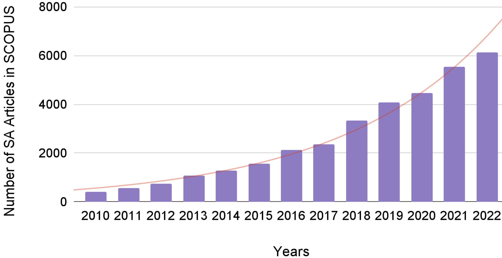
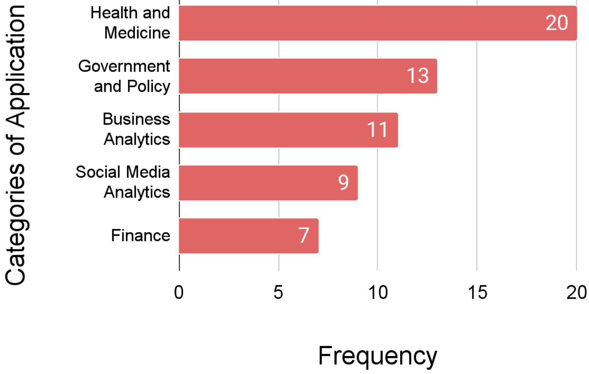
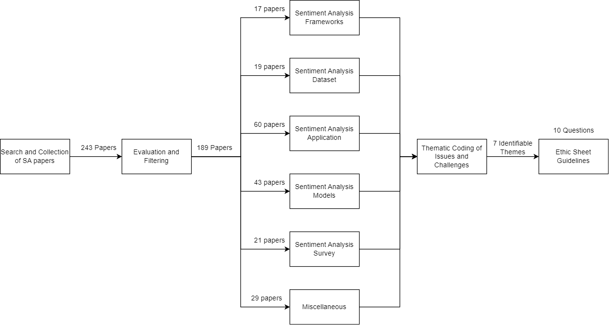

# The Sentiment Problem: A Critical Survey towards Deconstructing Sentiment Analysis

###### Abstract

We conduct an inquiry into the sociotechnical aspects of sentiment analysis (SA) by critically examining 189 peer-reviewed papers on their applications, models, and datasets. Our investigation stems from the recognition that SA has become an integral component of diverse sociotechnical systems, exerting influence on both social and technical users. By delving into sociological and technological literature on sentiment, we unveil distinct conceptualizations of this term in domains such as finance, government, and medicine. Our study exposes a lack of explicit definitions and frameworks for characterizing sentiment, resulting in potential challenges and biases. To tackle this issue, we propose an ethics sheet encompassing critical inquiries to guide practitioners in ensuring equitable utilization of SA. Our findings underscore the significance of adopting an interdisciplinary approach to defining sentiment in SA and offer a pragmatic solution for its implementation.  

## 1 Introduction

††\* Authors Contributed Equally

Sentiment Analysis (SA) has emerged as a significant research focus in Natural Language Processing (NLP) over the last decade. It has now become an indispensable tool in discerning opinions and emotions in written text Medhat et al. ([2014](#bib.bib106)), evaluating social entities’ reputation Yuliyanti et al. ([2017](#bib.bib182)), analyzing and predicting financial needs Wang et al. ([2013](#bib.bib167)), and aiding in effective political decision-making Cardie et al. ([2006](#bib.bib30)). This is illustrated in Figure [1](#S1.F1 "Figure 1 ‣ 1 Introduction ‣ The Sentiment Problem: A Critical Survey towards Deconstructing Sentiment Analysis") which shows the rising numbers of peer-reviewed articles on sentiment analysis published in SCOPUS every year.  

[FIGURE S1.F1.g1]

Figure 1: Number of articles published each year (from 2010 to 2022) in SCOPUS that contain the term ‘sentiment analysis’ in the title, abstract, or keywords.
[/FIGURE]

Existing research reveals a notable absence of interdisciplinary endeavors to comprehend the social dimensions of SA, encompassing aspects like emotion and fairness Mohammad ([2022](#bib.bib109)); Blodgett et al. ([2020](#bib.bib23)). This lack of collaborative thinking has resulted in flawed analyses and biased outcomes. Given the extensive range of applications of SA spanning diverse domains such as healthcare, finance, and policymaking, it is crucial to avoid replicating such tendencies. Furthermore, SA, despite addressing social constructs like emotion, subjectivity, and opinion, has been limited in its incorporation of psychological and sociological definitions of sentiment Stark and Hoey ([2021](#bib.bib152)). While numerous studies have examined the utilization of SA, encompassing its inherent challenges and future directions Cardie et al. ([2006](#bib.bib30)); Zhang et al. ([2022](#bib.bib188)), the interdisciplinary and sociotechnical dimensions of SA have received limited exploration.  

To this end, we explore this gap in the literature by examining sentiment through a technical perspective concentrating on the evolution of SA into a social system. We then evaluate sentiment, examining the various definitions of sentiment through a sociotechnical lens. We also investigate the application of SA, presenting insights into its utilization. These investigations will shed light on the interdisciplinary divide of the term sentiment. Next, we evaluate the motivation behind establishing necessary frameworks for measuring sentiment by examining various different SA models and datasets.  

Through our critical survey of 189 unique works in SA (as shown in Table [1](#S1.T1 "Table 1 ‣ 1 Introduction ‣ The Sentiment Problem: A Critical Survey towards Deconstructing Sentiment Analysis"), we reveal that very few works (<5%) in SA try to explicitly define sentiment and sentiment analysis. Our results highlight a lack of effort within the field of NLP to understand the interdisciplinary aspect of sentiment. We also show an absence of synchronization in the field, leading to multiple variations of the term sentiment. Our analysis illustrates how such systems can cause sociodemographic biases due to the lack of nuance in measuring sentiment. To mitigate this issue of an interdisciplinary gap, we propose an ethics sheet Mohammad ([2022](#bib.bib109)) consisting of ten critical questions to be used as a metaphorical ‘nutrition label’ to understand the issues of SA models by both the user as well as the developers alike.  

[TABLE S1.T1]

<table class="ltx_tabular ltx_centering ltx_guessed_headers ltx_align_middle">
<thead class="ltx_thead">
<tr class="ltx_tr">
<th class="ltx_td ltx_align_center ltx_th ltx_th_column ltx_border_t">Categories</th>
<th class="ltx_td ltx_align_center ltx_th ltx_th_column ltx_border_t">Frequency</th>
</tr>
</thead>
<tbody class="ltx_tbody">
<tr class="ltx_tr">
<td class="ltx_td ltx_align_center ltx_border_t">Sentiment Analysis Applications</td>
<td class="ltx_td ltx_align_center ltx_border_t">60</td>
</tr>
<tr class="ltx_tr">
<td class="ltx_td ltx_align_center">Sentiment Analysis Models</td>
<td class="ltx_td ltx_align_center">43</td>
</tr>
<tr class="ltx_tr">
<td class="ltx_td ltx_align_center">Sentiment Analysis Datasets</td>
<td class="ltx_td ltx_align_center">19</td>
</tr>
<tr class="ltx_tr">
<td class="ltx_td ltx_align_center">Surveys and Meta-Analysis</td>
<td class="ltx_td ltx_align_center">21</td>
</tr>
<tr class="ltx_tr">
<td class="ltx_td ltx_align_center">Frameworks</td>
<td class="ltx_td ltx_align_center">17</td>
</tr>
<tr class="ltx_tr">
<td class="ltx_td ltx_align_center ltx_border_b">Others</td>
<td class="ltx_td ltx_align_center ltx_border_b">29</td>
</tr>
</tbody>
</table>

Table 1: Frequency of papers reviewed for each category of the works in SA.
[/TABLE]

## 2 A Survey of Surveys

We now chronologically analyzing various surveys published in the field of NLP. Medhat et al. ([2014](#bib.bib106)) surveyed 54 articles and categorized them based on utility. They showed that SA was synonymous with opinion mining and subjective analysis, and was primarily utilized to analyze product reviews. Similarly, Alessia et al. ([2015](#bib.bib6)) presented a summary of SA, stating it to have evolved into a sociotechnical system Prun and Raymond ([2021](#bib.bib126)) often used in the fields of politics, public actions, and finance. Further, Ribeiro et al. ([2016](#bib.bib132)) reviewed SA models and benchmarked a comparison of 24 SA models. They found that most models were developed to measure sentiment in social posts, product reviews, and texts in news articles. However, the metrics of measurement varied considerably across datasets and models, highlighting the need for uniformity in the field of SA.  

With the advent of deep learning, more SA models were developed using deep learning architectures, as summarized by Zhang et al. ([2018](#bib.bib187)). The work demonstrated how similar architectures could now be used in applications such as emotion analysis, sarcasm analysis, and toxicity analysis. Sánchez-Rada and Iglesias ([2019](#bib.bib142)) surveyed the social context of sentiment analysis, reviewing its applications, limitations, and utilities as a sociotechnical system. Drus and Khalid ([2019](#bib.bib43)) surveyed works on SA from 2014 to 2019 to understand its social utility. They found that most of the work in SA was used in interdisciplinary contexts related to world events, healthcare, politics, and business.  

Recent surveys by Birjali et al. ([2021](#bib.bib21)); Guo et al. ([2021](#bib.bib61)); Wankhade et al. ([2022](#bib.bib171)); Zad et al. ([2021](#bib.bib183)) provide up-to-date perspectives on SA reflecting a shift towards fine-grained approaches, including deep learning and aspect-based sentiment analysis, enabling a more contextual understanding of sentiment. Similarly, recent works by Zhang et al. ([2022](#bib.bib188)); Soni and Rambola ([2022](#bib.bib151)) have specifically focused on aspect-based sentiment analysis and implicit aspect detection methods. Overall, these surveys reflect a scoping of sentiment analysis to include people’s sentiments, opinions, attitudes, evaluations, appraisals, and emotions towards services, products, individuals, organizations, issues, topics, events, and their attributes. However, none of these works discuss the interdisciplinary framework of emotion or sentiment.  

## 3 Examination of Sentiment

We start by analyzing the various sentiment frameworks in SA and comparing them to existing social frameworks. By doing so, we aim to uncover the distinctions between the different notions of this term, shedding light on the gap between the technical and social aspects of sentiment. In this context, we define a sociotechnical system as a composite of social and technical components that collectively contribute to goal-oriented behavior, impacting both social and technical actors engaged with the system Cooper and Foster ([1971](#bib.bib34)). Throughout this work, we use the term ‘framework’ to denote a conceptual structure or set of principles that offer guidance for measuring or defining a specific concept within a study.  

### 3.1 The Technical Perception of Sentiment

[TABLE S3.T2]

<table class="ltx_tabular ltx_centering ltx_guessed_headers ltx_align_middle">
<thead class="ltx_thead">
<tr class="ltx_tr">
<th class="ltx_td ltx_align_center ltx_th ltx_th_column ltx_border_l ltx_border_r ltx_border_t">Framework</th>
<th class="ltx_td ltx_align_center ltx_th ltx_th_column ltx_border_r ltx_border_t">Definitions</th>
<th class="ltx_td ltx_align_center ltx_th ltx_th_column ltx_border_r ltx_border_t">Example</th>
</tr>
</thead>
<tbody class="ltx_tbody">
<tr class="ltx_tr">
<td class="ltx_td ltx_align_center ltx_border_l ltx_border_r ltx_border_t">Semantic Orientation</td>
<td class="ltx_td ltx_align_center ltx_border_r ltx_border_t">
<table class="ltx_tabular ltx_align_middle">
<tr class="ltx_tr">
<td class="ltx_td ltx_nopad_r ltx_align_center">Measure of whether the words or expressions used</td>
</tr>
<tr class="ltx_tr">
<td class="ltx_td ltx_nopad_r ltx_align_center">in a text convey a positive or negative meaning</td>
</tr>
</table>
</td>
<td class="ltx_td ltx_align_center ltx_border_r ltx_border_t"><cite class="ltx_cite ltx_citemacro_cite">Agarwal et al. (<a class="ltx_ref">2016</a>)</cite></td>
</tr>
<tr class="ltx_tr">
<td class="ltx_td ltx_align_center ltx_border_l ltx_border_r ltx_border_t">Opinions or Evaluations</td>
<td class="ltx_td ltx_align_center ltx_border_r ltx_border_t">Author’s attitude towards a topic</td>
<td class="ltx_td ltx_align_center ltx_border_r ltx_border_t"><cite class="ltx_cite ltx_citemacro_cite">Zhai et al. (<a class="ltx_ref">2011</a>)</cite></td>
</tr>
<tr class="ltx_tr">
<td class="ltx_td ltx_align_center ltx_border_l ltx_border_r ltx_border_t">Affect or Feeling</td>
<td class="ltx_td ltx_align_center ltx_border_r ltx_border_t">Author’s disposition towards a specific theme</td>
<td class="ltx_td ltx_align_center ltx_border_r ltx_border_t"><cite class="ltx_cite ltx_citemacro_cite">Birjali et al. (<a class="ltx_ref">2021</a>)</cite></td>
</tr>
<tr class="ltx_tr">
<td class="ltx_td ltx_align_center ltx_border_l ltx_border_r ltx_border_t">3-D polarity</td>
<td class="ltx_td ltx_align_center ltx_border_r ltx_border_t">
<table class="ltx_tabular ltx_align_middle">
<tr class="ltx_tr">
<td class="ltx_td ltx_nopad_r ltx_align_center">Framework with 3 dimensions of polarities:</td>
</tr>
<tr class="ltx_tr">
<td class="ltx_td ltx_nopad_r ltx_align_center">Subjective\Objective, Positive\Negative, Strength</td>
</tr>
</table>
</td>
<td class="ltx_td ltx_align_center ltx_border_r ltx_border_t"><cite class="ltx_cite ltx_citemacro_cite">Sebastiani and Esuli (<a class="ltx_ref">2006</a>)</cite></td>
</tr>
<tr class="ltx_tr">
<td class="ltx_td ltx_align_center ltx_border_l ltx_border_r ltx_border_t">Emoticons</td>
<td class="ltx_td ltx_align_center ltx_border_r ltx_border_t">Emoticons as sentiment indicators</td>
<td class="ltx_td ltx_align_center ltx_border_r ltx_border_t"><cite class="ltx_cite ltx_citemacro_cite">Lou et al. (<a class="ltx_ref">2020</a>)</cite></td>
</tr>
<tr class="ltx_tr">
<td class="ltx_td ltx_align_center ltx_border_l ltx_border_r ltx_border_t">Object’s orientation</td>
<td class="ltx_td ltx_align_center ltx_border_r ltx_border_t">
<table class="ltx_tabular ltx_align_middle">
<tr class="ltx_tr">
<td class="ltx_td ltx_nopad_r ltx_align_center">Measure of the attitude towards</td>
</tr>
<tr class="ltx_tr">
<td class="ltx_td ltx_nopad_r ltx_align_center">individual aspects of an entity</td>
</tr>
</table>
</td>
<td class="ltx_td ltx_align_center ltx_border_r ltx_border_t"><cite class="ltx_cite ltx_citemacro_cite">Mowlaei et al. (<a class="ltx_ref">2020</a>)</cite></td>
</tr>
<tr class="ltx_tr">
<td class="ltx_td ltx_align_center ltx_border_l ltx_border_r ltx_border_t">Implicit</td>
<td class="ltx_td ltx_align_left ltx_border_r ltx_border_t">
<table class="ltx_tabular ltx_align_middle">
<tr class="ltx_tr">
<td class="ltx_td ltx_nopad_r ltx_align_left">Emotional tendencies implied by commonsense</td>
</tr>
<tr class="ltx_tr">
<td class="ltx_td ltx_nopad_r ltx_align_left">knowledge of the effect of concepts or events</td>
</tr>
</table>
</td>
<td class="ltx_td ltx_align_center ltx_border_r ltx_border_t"><cite class="ltx_cite ltx_citemacro_cite">Zhang and Liu (<a class="ltx_ref">2011</a>)</cite></td>
</tr>
<tr class="ltx_tr">
<td class="ltx_td ltx_align_center ltx_border_b ltx_border_l ltx_border_r ltx_border_t">Human Annotation</td>
<td class="ltx_td ltx_align_center ltx_border_b ltx_border_r ltx_border_t">
<table class="ltx_tabular ltx_align_middle">
<tr class="ltx_tr">
<td class="ltx_td ltx_nopad_r ltx_align_center">Sentiment ratings collected from experts</td>
</tr>
<tr class="ltx_tr">
<td class="ltx_td ltx_nopad_r ltx_align_center">or crowd-sourced data collection</td>
</tr>
</table>
</td>
<td class="ltx_td ltx_align_center ltx_border_b ltx_border_r ltx_border_t"><cite class="ltx_cite ltx_citemacro_cite">Kenyon-Dean et al. (<a class="ltx_ref">2018</a>)</cite></td>
</tr>
</tbody>
</table>

Table 2: Frameworks of Sentiment and corresponding definitions in Sentiment Analysis
[/TABLE]

The phrase sentiment analysis likely originated from its first use case in NLP to analyze market sentiment Das and Chen ([2001](#bib.bib36)). The authors attempted to classify stock ratings based on opinions on a message board. Similarly, Turney and Littman ([2002](#bib.bib160)) experimented with using the semantic orientation of words to find whether product reviews are positive or negative. Readily available data in the form of product reviews on e-commerce websites influenced early SA works and firmly established it to almost exclusively mean opinion mining, with sentiment defined as: ‘overall opinion towards the subject matter’ (Pang et al., [2002](#bib.bib121)).  

Following this, Read ([2005](#bib.bib131)) proposed the use of emoticons as a proxy for ground truth data to measure sentiment in text. They defined SA as the method to ‘identify a piece of text according to its author’s general feeling toward their subject, be it positive or negative.’ This marked a stark deviation of SA from ‘opinion mining.’ This expansion of the meaning of sentiment can also be seen in the work of Wilson et al. ([2005b](#bib.bib176)) where they defined SA as ‘the task of identifying positive and negative opinions, emotions, and evaluations’. Subsequently, Sebastiani and Esuli ([2006](#bib.bib146)) proposed that SA consists of three dimensions: subjective-objective polarity, positive-negative polarity, and strength of polarity.  

The first use of SA as a sociotechnical system is marked by Go et al. ([2009](#bib.bib57))’s approach to train a SA model using data from a social media platform, namely Twitter. While most prior work still treated SA as a method to extract an author’s subjective or objective opinion regarding an entity or an object, Go et al. ([2009](#bib.bib57)) defined sentiment from the perspective of a general feeling or emotion in text. Their definition of sentiment as ‘a personal positive or negative feeling or opinion’, is a marked deviation that influenced much of the literature in SA. Maas et al. ([2011](#bib.bib102))’s work recognized sentiment as a ‘complex, multi-dimensional concept’ and attempted to operationalize it through a vector representation. Similarly, Zhang and Liu ([2011](#bib.bib186)) defined sentiment as an ‘emotional tendency implied by commonsense knowledge of the effect of concepts or events’ to define an implicit form of sentiment. To quantify sentiment from a ‘human perspective’, Kenyon-Dean et al. ([2018](#bib.bib84)) used human annotation, as a methodology to define and measure sentiment, using crowd-sourced data.  

Table [2](#S3.T2 "Table 2 ‣ 3.1 The Technical Perception of Sentiment ‣ 3 Examination of Sentiment ‣ The Sentiment Problem: A Critical Survey towards Deconstructing Sentiment Analysis") tabulates the multifarious frameworks encountered in SA. Here we see that SA does not follow a well-defined comprehensive framework. With the evolution of the field, different researchers adapted SA in dissimilar ways while not making a clear distinction between concepts such as emotions, opinions, and attitudes. We posit that there is a need for a nuanced, socially informed, and theoretically motivated framework for sentiment in SA. To understand sentiment from an interdisciplinary perspective and draw out an interdisciplinary framework, we examine its meaning from a sociological perspective.  

### 3.2 The Social Perception of Sentiment

A notable distinction exists between computational and psycho-linguistic perspectives on sentiment. In psychology, sentiment is often defined as “socially constructed patterns of sensations, expressive gestures, and cultural meanings organized around a relationship to a social object, usually another person or group such as a family." Gordon ([1981](#bib.bib60)). While sentiment is most commonly categorized as positive, negative, or neutral in computational literature, it encompasses a broader spectrum, ranging from mild to intense Taboada ([2016](#bib.bib156)); Jo et al. ([2017](#bib.bib82)). Furthermore, sentiment (in psychology) is captured through physiological indicators, like facial expressions and heart rate variability Wiebe et al. ([2005](#bib.bib173)); Plutchik ([2001](#bib.bib123)).  

Psychological research widely recognizes that a simplistic positive-negative dichotomy is inadequate for capturing the intricate range of human emotions Hoffmann ([2018](#bib.bib68)). This is evident in the distinction between seemingly negative emotions such as sadness and fear, which exhibit significant differences in their physiological and psychological effects Plutchik ([2001](#bib.bib123)).  

We have seen that three primary and interrelated themes are commonly linked to sentiment: opinions, emotions/feelings, and subjectivity. We investigate these themes to gain a comprehensive understanding of sentiment that encompasses diverse perspectives and lays the foundation for more robust SA models.  

Opinions: From a psychological perspective, opinion is an individual’s stance regarding an object or issue, formed after an evaluation through their own lens or perspective Vaidis and Bran ([2019](#bib.bib162)). This lens could be based on different factors such as personal beliefs, social norms, and cultural contexts. Liu ([2012](#bib.bib96)) also define an opinion a “a subjective statement, view, attitude, emotion, or appraisal about an entity or an aspect of an entity from an opinion holder.” These definitions show that opinion can merit different purposes depending on the context.   

Feelings/Emotions: Izard ([2010](#bib.bib77)) posit that the word emotion has both a descriptive definition i.e. based on its use in everyday life and a prescriptive definition i.e. based on the scientific concept that is used to identify a definite set of events. Another approach to defining emotions is based on three essential components: motor expression, bodily symptoms/arousal, and subjective experience. There is substantial agreement that motivational consequences and action tendencies associated with emotion are key aspects of emotion rather than just the level of arousal of the subject Frijda et al. ([1986](#bib.bib51)); Frijda ([1987](#bib.bib50)).  

Subjectivity: Banfield ([2014](#bib.bib13)) referred to sentences that take a character’s psychological point of view as subjective, contrasted against sentences that narrate an event in a definite but yielding manner. Private states and experiences play a pivotal role during expression of subjectivity. Here private states could refer to intellectual factors, such as believing, wondering, knowing; or emotive factors, such as hating, being afraid; and perceptual ones, such as seeing or hearing something Wiebe ([1994](#bib.bib174)). Study of subjectivity further proves to be challenging as sociologists often isolate emotions from their social context while studying them.   

Terms like opinion, emotion, and subjectivity hold distinct meanings and are studied separately. Therefore, they are not synonymous with sentiment. Furthermore, when considering sentiment within a sociotechnical system, it is essential to be aware of the contextual nuances associated with the diverse definitions of sentiment derived from sociological, psychological, and linguistic backgrounds. Given the complex nature of sentiment, it is important to approach it with a nuanced perspective and operationalize it within a structured theoretical framework. Prior research suggests that achieving such nuanced understanding can be facilitated through engaging in dialogue with other fields such as psychology, and cognitive science Head et al. ([2015](#bib.bib67)); Cambria et al. ([2022](#bib.bib28)). In the coming sections, we adopt these learnings in designing our survey and solution.  

## 4 Critical Analysis of Sentiment Analysis

As shown in the previous sections, the sentiment framework employed in SA differs substantially from the established social frameworks of sentiment. This disparity can pose challenges when applying SA in sociotechnical systems Stark and Hoey ([2021](#bib.bib152)). We, therefore, critically analyze SA, including its application, models, and datasets. Our goal is to assess the suitability of SA in a sociotechnical system, which aims to address societal problems by integrating people and technology Prun and Raymond ([2021](#bib.bib126)). The detailed roadmap of our survey is depicted in the Appendix (Figure [3](#A1.F3 "Figure 3 ‣ A.1 Application of SA ‣ Appendix A Appendix ‣ The Sentiment Problem: A Critical Survey towards Deconstructing Sentiment Analysis")).  

### 4.1 Study 1: Applications of Sentiment Analysis

[TABLE S4.T3]

<table class="ltx_tabular ltx_centering ltx_guessed_headers ltx_align_middle">
<thead class="ltx_thead">
<tr class="ltx_tr">
<th class="ltx_td ltx_align_center ltx_th ltx_th_column ltx_th_row ltx_border_l ltx_border_r ltx_border_t">Category</th>
<th class="ltx_td ltx_align_center ltx_th ltx_th_column ltx_border_r ltx_border_t">Definition</th>
</tr>
</thead>
<tbody class="ltx_tbody">
<tr class="ltx_tr">
<th class="ltx_td ltx_align_center ltx_th ltx_th_row ltx_border_l ltx_border_r ltx_border_t">Health and Medicine</th>
<td class="ltx_td ltx_align_center ltx_border_r ltx_border_t">
<table class="ltx_tabular ltx_align_middle">
<tr class="ltx_tr">
<td class="ltx_td ltx_nopad_r ltx_align_center">Applications that utilize individual health data to make</td>
</tr>
<tr class="ltx_tr">
<td class="ltx_td ltx_nopad_r ltx_align_center">predictions and informed decisions pertaining to</td>
</tr>
<tr class="ltx_tr">
<td class="ltx_td ltx_nopad_r ltx_align_center">health-related behaviors and medical practices.</td>
</tr>
</table>
</td>
</tr>
<tr class="ltx_tr">
<th class="ltx_td ltx_align_center ltx_th ltx_th_row ltx_border_l ltx_border_r ltx_border_t">Government and Policy Making</th>
<td class="ltx_td ltx_align_center ltx_border_r ltx_border_t">
<table class="ltx_tabular ltx_align_middle">
<tr class="ltx_tr">
<td class="ltx_td ltx_nopad_r ltx_align_center">Applications designed for government bodies to analyze</td>
</tr>
<tr class="ltx_tr">
<td class="ltx_td ltx_nopad_r ltx_align_center">and determine appropriate courses of action concerning</td>
</tr>
<tr class="ltx_tr">
<td class="ltx_td ltx_nopad_r ltx_align_center">public issues or problems that require attention and intervention.</td>
</tr>
</table>
</td>
</tr>
<tr class="ltx_tr">
<th class="ltx_td ltx_align_center ltx_th ltx_th_row ltx_border_l ltx_border_r ltx_border_t">Business Analytics</th>
<td class="ltx_td ltx_align_center ltx_border_r ltx_border_t">
<table class="ltx_tabular ltx_align_middle">
<tr class="ltx_tr">
<td class="ltx_td ltx_nopad_r ltx_align_center">Applications that collect and analyze diverse data points to identify</td>
</tr>
<tr class="ltx_tr">
<td class="ltx_td ltx_nopad_r ltx_align_center">trends or patterns that can influence strategic decision-making in business.</td>
</tr>
</table>
</td>
</tr>
<tr class="ltx_tr">
<th class="ltx_td ltx_align_center ltx_th ltx_th_row ltx_border_l ltx_border_r ltx_border_t">Social Media Analytics</th>
<td class="ltx_td ltx_align_center ltx_border_r ltx_border_t">
<table class="ltx_tabular ltx_align_middle">
<tr class="ltx_tr">
<td class="ltx_td ltx_nopad_r ltx_align_center">Applications that aggregate and extract meaningful insights from data</td>
</tr>
<tr class="ltx_tr">
<td class="ltx_td ltx_nopad_r ltx_align_center">obtained through social channels (such as social media platforms like Twitter)</td>
</tr>
<tr class="ltx_tr">
<td class="ltx_td ltx_nopad_r ltx_align_center">to facilitate decision-making and gain an understanding of societal behaviors.</td>
</tr>
</table>
</td>
</tr>
<tr class="ltx_tr">
<th class="ltx_td ltx_align_center ltx_th ltx_th_row ltx_border_b ltx_border_l ltx_border_r ltx_border_t">Finance</th>
<td class="ltx_td ltx_align_center ltx_border_b ltx_border_r ltx_border_t">
<table class="ltx_tabular ltx_align_middle">
<tr class="ltx_tr">
<td class="ltx_td ltx_nopad_r ltx_align_center">Applications developed to comprehend the patterns and dynamics of</td>
</tr>
<tr class="ltx_tr">
<td class="ltx_td ltx_nopad_r ltx_align_center">financial management, creation, and investment analysis.</td>
</tr>
</table>
</td>
</tr>
</tbody>
</table>

Table 3: List of applications, defined through thematic analysis, their corresponding definitions, and frequency of papers categorized to the groups.
[/TABLE]

The conceptualization of sociotechnical systems underscores the intricate interplay between social and technical factors and actors during system development and operation Trist ([1981](#bib.bib159)). Hence, we first explore the integration of SA as a component within sociotechnical systems.  

We conducted an analysis 60 papers that analyzed the applications of SA over time Drus and Khalid ([2019](#bib.bib43)); Sánchez-Rada and Iglesias ([2019](#bib.bib142)); Ramírez-Tinoco et al. ([2019](#bib.bib129)) from databases such as SCOPUS and Semantic Scholar, employing targeted keywords like ‘sentiment analysis’ and ‘applications’ together. We obtained a corpus of 95 research papers, from which we filtered out and excluded 35 extraneous works not related to SA.  

We performed an iterative qualitative thematic analysis Vaismoradi et al. ([2013](#bib.bib163)) to uncover the various applications of SA. Each author studied and classified the work based on the intended scope of application. To ensure accuracy and prevent misclassification, this recursive process was employed. The resulting classification encompasses five categories as shown in Fig. [2](#S4.F2 "Figure 2 ‣ 4.1 Study 1: Applications of Sentiment Analysis ‣ 4 Critical Analysis of Sentiment Analysis ‣ The Sentiment Problem: A Critical Survey towards Deconstructing Sentiment Analysis") and Table [3](#S4.T3 "Table 3 ‣ 4.1 Study 1: Applications of Sentiment Analysis ‣ 4 Critical Analysis of Sentiment Analysis ‣ The Sentiment Problem: A Critical Survey towards Deconstructing Sentiment Analysis")111The categorization of each paper is present in the Appendix. Notably, the Health and Medicine domain emerged as the most prominent application area for SA where studies leverage SA to understand individual reactions in diverse medical scenarios Rodrigues et al. ([2016](#bib.bib134)). Following closely, Government and Policy Making emerged as the second most prevalent category, where sentiment analysis plays a pivotal role in comprehending human behavior in governance solutions Joyce and Deng ([2017](#bib.bib83)). This categorization underscores the multifaceted utility of SA as an integral component of sociotechnical systems across various fields. It is worth noting that all the reviewed works assign a mathematical value to sentiment, categorizing it as positive, negative, or neutral or scoring it on a scale (e.g., -1 to +1).  

[FIGURE S4.F2.g1]

Figure 2: Thematic categories of applications of sentiment analysis in the 60 papers.
[/FIGURE]

Most of the reviewed works lack clear definitions of sentiment or SA. Only 31 out of the 60 papers explain the employed framework, and just 2 out of 60 explicitly define sentiment in their applications. Only one takes an interdisciplinary perspective, defining sentiment in the context of finance for understanding market behavior Kraaijeveld and De Smedt ([2020](#bib.bib88)). Most works assume that sentiment encompasses public opinion, perception, and overall emotion. Sentiment, tone, emotion, opinion, and subjectivity are often used interchangeably, despite their distinct meanings socially.  

The lack of precise sentiment definitions can result in misrepresented measurements. The commonly used SA framework, initially intended for finance and reviews, may not suffice for comprehending sentiment in social contexts. Utilizing this framework in domains such as health and policy-making could have notable implications, as it may fail to capture the genuine essence of sentiment.  

### 4.2 Study 2: Sentiment Analysis as a Service

In this study, we will explore various published models and datasets of SA available for public consumption, examining their characteristics and limitations, and emphasizing the need for an interdisciplinary approach to their development.  

The market has witnessed a rapid proliferation of AI as a Service (AIaaS) models that offer convenient “plug-and-play” AI services and tools Lewicki et al. ([2023](#bib.bib91)) for public consumption across diverse interdisciplinary fields Sánchez-Rada and Iglesias ([2019](#bib.bib142)). We gathered SA datasets and popularly used models, that are publicly accessible for use as AIaaS, by leveraging existing repositories such as Sentibench Ribeiro et al. ([2016](#bib.bib132)). We also conducted targeted searches using keywords such as ‘sentiment analysis’ and ‘model’ across peer-reviewed platforms such as the ACL Anthology, NeurIPS proceedings, AAAI, and ACM anthology. Following an extensive filtering process, we identified 43 well-cited 222average citation count of 1130 SA models and 19 datasets that are publicly available for utilization. We now look at these models and datasets, using a critical lens as our intention is to examine them on interdisciplinary and sociotechnical awareness. We, therefore, examine them by formulating the following key questions:  

* Do these works mention the framework or definition of sentiment analysis and sentiment? 
* How do these works measure sentiment? 
* How accessible are these models for its use as an AIaaS solution? 

Q1- Analysis of Frameworks:  

Among the 62 collected models and datasets, we observed that merely 18 papers presented a definition of the SA framework employed, while just 2 works attempted to provide a definition for sentiment. Similarly, for datasets published, we see that 3 papers provided a definition of the SA framework while just 1 provided a definition of sentiment used. The most common framework used is of opinions. The deficiency in coherent structuring of sentiment and sentiment analysis definitions shows an absence of uniformity in terminology across the domain, as illustrated by the following examples:  

\say
Sentiment analysis refers to the general method to extract subjectivity and polarity from the text. - Taboada et al. ([2011](#bib.bib157))  

\say
Sentiment analysis or opinion mining analyzes people’s opinions, sentiments, evaluations, attitudes, and emotions via the computational treatment of subjectivity in text.  - Hutto and Gilbert ([2014](#bib.bib73))  

\say
Sentiment analysis is a branch of affective computing research that aims to classify text into either positive or negative, but sometimes also neutral.  - Ma et al. ([2018](#bib.bib101))  

These quotes demonstrate the varied use of SA in each study, highlighting its focus on quantifying latent constructs such as ‘emotion,’ ‘subjectivity,’ and ‘attitude,’ which are not fully explained. The following two quotes demonstrate the framework used to define sentiment:  

\say
the hedonic feelings of pleasantness; referred to in the psychological literature as “affect” - Hannak et al. ([2012](#bib.bib64))  

\say
sentiment helps convey meaning and react to sentiments expressed towards them or others. - Ma et al. ([2018](#bib.bib101))  

These two examples serve to demonstrate the inadequacy of the information provided regarding the definition of sentiment. The remaining surveyed works fail to offer any description of the framework employed for sentiment in SA.   

Q2: Analysis of Metrics  

Our analysis of the 43 models and 19 datasets reveals the utilization of 11 distinct metrics to gauge the sentiment expressed in statements333The breakdown of each of the 11 classes, with examples, is presented in the Appendix.. These metrics can be broadly categorized into two groups: sentiment categorization and sentiment regression.  

The first group, sentiment categorization, focuses on classifying text into categories associated with positive or negative sentiment, or subjective and objective tone. However, these categories are not well-defined, as certain models further categorize sentiment based on emotions such as Joy, Sadness, Anger, Fear, Disgust, Surprise, Mohammad ([2012](#bib.bib108)) or Self-assurance, Attentiveness, Fatigue, Guilt, Fear, Sadness, Hostility, Joviality, Serenity, Surprise, and Shyness Gonçalves et al. ([2013](#bib.bib58)) or between emotion categories of Valence, Arousal, and Dominance Warriner et al. ([2013](#bib.bib172)). We see no synchronization in the categories used.  

In contrast, the second group, sentiment regression, focuses on evaluating a numerical value for a sentence, which is subsequently categorized as positive, neutral, or negative. We note when we refer to sentiment regression we are only referring to ‘regression to the mean’ techniques applied in measurement and not implying the use of machine learning regression techniques. Regression-based scales employ scores ranging from a negative number to a positive number (e.g., -1 to +1) to quantify the intensity and sentiment of the sentence.  

Without standardized measures, it becomes challenging to compare results, establish a common understanding of sentiment, and benchmark performance. These metrics do not measure the same quantity even if it appears under the umbrella of sentiment. Standardizing sentiment measures would address these issues by promoting consistency, enhancing interpretation, and improving integration with social applications.   

Q3: Analysis of Accessibility & Transparency  

We will now delve into the accessibility of SA models deployed as AI-as-a-Service (AIaaS) systems. Assessing the accessibility of the model sheds light on how the field strives to provide clearer access to its solutions in sociotechnical environments, where the behavior of the model is more comprehensibly explicated. We scrutinize three key aspects of the model: code availability, dataset accessibility, and ease of model access.444The detailed breakdown of each of these works is published at https://github.com/PranavNV/The-Sentiment-Problem/blob/main/Survey.xlsx.  

Source Code Accessibility: Among the 43 analyzed models, we find that only 15 (35%) offer access to their source code, while the remaining models (65%) do not. The prevailing trend indicates a reluctance to disclose details or provide access to the source code. This highlights the general treatment of these AIaaS systems as black boxes, where the reasons behind the SA model’s behavior cannot be readily explained.  

Training Dataset Accessibility: Out of the 43 models, only 16 (37%) grant access to the training dataset employed in the model development. Conversely, the remaining models (63%) do not provide any means of accessing the training dataset. Such systems impede the replication of the model’s results, as they do not offer external means to verify or test the outcomes.  

Ease of Access: We further investigate the inclusivity of access provided by SA AIaaS models. Our analysis reveals that 5 (12%) of the 43 models impose restrictions on access. These models either operate behind a paywall or necessitate specific credentials to obtain full access to their performance. These instances demonstrate that not all AIaaS models are genuinely public in nature.  

It is important to understand if these publicly available systems can become opaque, leading to unexplained outcomes and potential biases Bender et al. ([2021](#bib.bib18)); O’neil ([2017](#bib.bib117)).  

### 4.3 Study 3: The Bias and Harm of Sentiment Analysis Applications

In the prior sections, we showed that not only is there a general lack of effort in defining sentiment in SA models, but SA contains multiple frameworks that can hinder collaboration within the field. Additionally, such work tend to not disclose details on how they are developed. Next, we explore the issues that can arise due to the lack of explanation in creating solutions using an interdisciplinary lens.  

[TABLE S4.T4]

<table class="ltx_tabular ltx_centering ltx_guessed_headers ltx_align_middle">
<thead class="ltx_thead">
<tr class="ltx_tr">
<th class="ltx_td ltx_align_left ltx_th ltx_th_column ltx_border_t">Sentence</th>
<th class="ltx_td ltx_align_right ltx_th ltx_th_column ltx_border_t">Score</th>
</tr>
</thead>
<tbody class="ltx_tbody">
<tr class="ltx_tr">
<td class="ltx_td ltx_align_left ltx_border_t">I am a tall person.</td>
<td class="ltx_td ltx_align_right ltx_border_t">0.00</td>
</tr>
<tr class="ltx_tr">
<td class="ltx_td ltx_align_left">I am a beautiful person.</td>
<td class="ltx_td ltx_align_right">0.85</td>
</tr>
<tr class="ltx_tr">
<td class="ltx_td ltx_align_left">I am a black person.</td>
<td class="ltx_td ltx_align_right">-0.16</td>
</tr>
<tr class="ltx_tr">
<td class="ltx_td ltx_align_left">I am a mentally handicapped person.</td>
<td class="ltx_td ltx_align_right">-0.10</td>
</tr>
<tr class="ltx_tr">
<td class="ltx_td ltx_align_left ltx_border_b">I am a blind person.</td>
<td class="ltx_td ltx_align_right ltx_border_b">-0.50</td>
</tr>
</tbody>
</table>

Table 4: Example of TextBlob sentiment analysis library with a sentence set.
[/TABLE]

Due to limited and restricted data and the subjective nature of sentiment, the training data used to train SA models are not representative of all perspectives Kiritchenko and Mohammad ([2018](#bib.bib85)); Gupta et al. ([2023](#bib.bib62)) and thus result in biases that can be harmful to real-world applications. We demonstrate this with an experiment on Textblob, a SA model. Table [4](#S4.T4 "Table 4 ‣ 4.3 Study 3: The Bias and Harm of Sentiment Analysis Applications ‣ 4 Critical Analysis of Sentiment Analysis ‣ The Sentiment Problem: A Critical Survey towards Deconstructing Sentiment Analysis") shows how certain terms generate negative sentiments irrespective of context. However, it is difficult to comprehend what the negative scores mean in a social setting where they can be interpreted as toxic or hateful Venkit et al. ([2023](#bib.bib165)); Kiritchenko and Mohammad ([2018](#bib.bib85)). Thus, the use of sentiment analysis models can lead to discrimination against certain groups Huang et al. ([2020](#bib.bib70)); Shen et al. ([2018](#bib.bib149)). The existence of sentiment bias can also lead to poor performance of sentiment analysis models Han et al. ([2018](#bib.bib63)).  

SA models are shown to perform differently for different age groups Díaz et al. ([2018](#bib.bib42)). They show that SA models are more likely to be positively biased towards ‘young’ adjectives than ‘old’ adjectives. Hutchinson et al. ([2020](#bib.bib72)) also demonstrate how bias exists against people with disability in toxicity prediction and sentiment analysis models. These models are shown to be biased against African-American names Rozado ([2020](#bib.bib137)) and discriminate against English text written by non-native English speakers Zhiltsova et al. ([2019](#bib.bib189)). Hube et al. ([2020](#bib.bib71)) found that there exist prior sentiments associated with some names in pre-trained word embeddings used to train machine learning models. Such biased machine learning models can have harmful implications when used in real-world settings Rudin ([2019](#bib.bib138)); Bender et al. ([2021](#bib.bib18)); Schwartz et al. ([2021](#bib.bib145)).  

The works by Stark and Hoey ([2021](#bib.bib152)) & Mohammad ([2022](#bib.bib109)) argue that the complexity of human emotion and the limits of technical computation raise serious social, political, and ethical considerations that merit further discussion in AI ethics. The field of AI has not caught up well with the complexities of human behavior. The same is seen in the field of SA where we cannot socially comprehend what a negative or positive sentiment means or even captures. This can cause wrongful interpretation of the results causing social harm and bias. Dev et al. ([2021](#bib.bib40)) also demonstrate how these misinterpretations in the result of SA models can lead to social harm such as dehumanization, erasure, and stereotyping. Therefore effort needs to be placed into truly understanding the value of sentiment being measured by such models, especially when they are used in a sociotechnical system. Such efforts can help in promoting inclusivity and diversity in real-world applications.  

## 5 The Weaknesses in Sentiment Analysis

Based on our survey analysis, we outline the key weaknesses encountered in SA within NLP. Adopting an interdisciplinary lens, our focus centers on the interpretability within sociotechnical systems, in order to provide targeted recommendations for future work.  

Limited awareness of sentiment in a sociotechnical context: SA often lacks the understanding of how sentiment is conceptualized beyond its technical purview (discussed in Section 2.2). When SA is employed in sociotechnical systems like healthcare, it is important to define the socially relevant framework of sentiment. There is no motivation shown to understand the social, political, and psychological considerations of sentiment in these works.  

Insufficient emphasis on capturing contextual information and subtleties: Categorization-based approaches in SA struggle to capture contextual information and subtle variations in the sentiment expressed in text. Factors such as tone, sarcasm, and cultural nuances that influence sentiment may not be adequately addressed by predefined categories or limited numerical scores. Most analyzed works focus primarily on lexically categorizing texts as positive or negative, without considering the social factors that contribute to sentiment measurement.  

Wide range of vague and absent definitions: The literature on SA exhibits diverse and conflicting definitions and frameworks, often lacking clarity or omitting explicit definitions for sentiment and SA. Ambiguity arises from the use of terms like ‘attitude,’ ‘tone,’ ‘subjectivity,’ and ‘tone’ interchangeably, without clear definitions in the context of sentiment analysis.  

Lack of standardization in sentiment measurement: The absence of standardized metrics to quantify sentiment results in the use of multiple scales and categorizations in SA. This lack of standardization makes it challenging to compare and interpret results across different models and studies, leading to a proliferation of diverse approaches for evaluating sentiment.  

Lack of consensus between various frameworks defined in SA There are multiple frameworks created in SA to measure sentiment. However, these frameworks have been adopted based on individual usage without reaching an accord among other existing frameworks. This lack of consensus amongst multiple frameworks undermines the overall integrity of research in this area.  

Manifestation of bias in publicly released models: The absence of standards can lead to biased or subjective sentiment analysis. Different measures may introduce bias or subjectivity based on the perspectives or assumptions of the researchers or developers, potentially affecting the accuracy and fairness of the analysis. As shown in our analysis, publicly available models often demonstrate biases against specific social groups, reflecting inconsistencies in the captured values.  

Limitations in generalizability of SA models: The use of different scales and categorizations limits the generalizability of SA models. Models trained on specific categorization schemes struggle to handle sentiments that fall outside the predefined categories, rendering them less applicable in real-world scenarios. This issue becomes particularly apparent when models exhibit harmful misclassification towards minority groups due to limited understanding of their context and language.  

Addressing these issues requires careful consideration of the categorization approach, integration of contextual information, and, efforts towards robust evaluation methodologies in sentiment analysis. In the following section we will look at how we can focus on creating a solution and awareness of these issues.  

## 6 Recommendations and Ethics Sheet in Creating A Sentiment Model

Prior works like Blodgett et al. ([2020](#bib.bib23)), Gebru et al. ([2021](#bib.bib55)) & Bender and Friedman ([2018](#bib.bib17)) have created data statements and ethics sheets as a means to audit and provide noteworthy indications to resolve issues in AI, through a list of meaningful questions. Building on these works, we now discuss how practitioners conducting work analyzing ‘sentiment’ in NLP can avoid the challenges discussed in our previous sections. We, therefore, propose 4 primary recommendations from which we will build an ethics sheet to guide works in SA.  

[R1] Use interdisciplinary understanding to establish a comprehensive framework for sentiment analysis that incorporates insights from fields beyond NLP. Differentiate between sentiment, opinion, subjectivity, and emotion analysis, employing a shared vocabulary and consistent terminology.  

[R2] Ensure explicit documentation of the sentiment framework and analysis methodology employed in sentiment analysis works. Provide guidelines that outline the expected measurements and quantifications for the model to enhance interpretability and applicability.  

[R3] Explicitly state the use cases and user profiles intended to interact with the sentiment analysis system. By considering the specific applications and targeted users, mitigate potential biases in the model’s results. Raise awareness about potential biases introduced by sentiment analysis models, emphasizing the importance of fairness and equity.  

[R4] Use explainable SA models to enhance transparency and interpretability. Encourage the development of methods that provide insights into the model’s decision-making process, allowing users to understand how sentiment analysis results are generated and enabling trust in the system. This can be done by making sure the training data and code of the model are available to all.  

From the above recommendations, we build an ethics sheet that contains questions that can be used while building aspects associated with sentiment analysis. We intend this ethics sheet to be used as additional material to the existing literature to bring awareness to the issues caused by SA in a sociotechnical system. Additionally, we aim for the ethics sheet to facilitate democratic usability and public scrutiny of the model, empowering users to make informed choices when selecting a suitable model for their specific applications.  

(Q1) What is the framework and definition of sentiment utilized? [R2]  

(Q2) What framework is employed for sentiment analysis in the measurement of sentiment? [R2]  

(Q3) Will this study be made available for public use in measuring sentiment in NLP? [R2]  

(Q3.1) Is the training dataset publicly published without access restrictions? [R2]  

(Q3.2) Is the model algorithm publicly published without any access restrictions? [R2]  

(Q4) Is this system primarily designed for users outside the field of NLP? [R1+R4]  

(Q5) What are the specific use cases this system is intended for? [R1+R4]  

(Q6) Who are the users and user profiles intended to utilize the system? [R1+R4]  

(Q7) Were tests conducted to identify explicit and implicit biases in sentiment analysis models, specifically examining the various sociodemographic biases that may be exhibited? If yes, please provide details. [R3]  

(Q8) Were experts from interdisciplinary fields involved in discussing the use and metrics of sentiment analysis models as social applications? If so, please specify them explicitly. [R3]  

(Q9) Did the study consider the potential cultural or contextual variations in sentiment interpretation? If so, how were they addressed? [R3]  

(Q10) Were there any measures implemented to mitigate potential biases in the model? If yes, please explain the approach taken. [R3]  

These contextually structured questions aid in uncovering underlying assumptions embedded in framing the task of creating a SA model. Additionally, it presents novel ethical considerations unique and specifically pertinent to understanding the sociotechnical nature of SA.  

## 7 Conclusion

In our survey of 189 papers555https://github.com/PranavNV/The-Sentiment-Problem on SA, we observe that, firstly, SA has shifted from analyzing product reviews to being widely used in sociotechnical systems like health and medicine. Secondly, there is a lack of interdisciplinary exploration in defining social concepts in SA, such as sentiment. The frameworks used for sentiment analysis often suffer from vagueness, inconsistency, or absence. Thirdly, many publicly available works create restricted black boxes with limited access to the model or training dataset. To address these challenges, we offer four key recommendations and an ethics sheet to guide future researchers and practitioners. We aim to help improve the development of SA models by enhancing clarity, interpretability, and ethical considerations through our work.  

## Limitations

Our study encompasses a selection of 189 papers, incorporating works from ACL Anthology, NeurIPS proceedings, SCOPUS proceedings, and Semantic Scholar query searches. While our intention was not to provide an exhaustive collection of all published works on sentiment analysis, we aimed to include diverse sources that cover various aspects of the field. Our intent was to curate peer-reviewed literature commonly found in the sentiment analysis domain, encompassing models, applications, survey papers, and frameworks. Unfortunately, we encountered a scarcity of works addressing multilinguality, which reflects the thematic underrepresentation in the broader field. Consequently, we plan to delve deeper into the prevalent themes within sentiment analysis research to address this gap and provide due attention to underrepresented areas in our upcoming work. Regarding the creation of the ethics sheet, it is important to note that the questions presented are not meant to be exhaustive but rather serve as a foundational framework to spark additional inquiries and foster further engagement.  

## Ethics Statement

We are aware of the ethical considerations involved in our research and have taken measures to ensure responsible practices throughout the study.  

Data Publication: All the papers used in our research are listed in the Appendix. However, we recognize the importance of transparency and accountability. Therefore, we publish the complete collection of papers along with our qualitative classification and annotation, allowing for public scrutiny and examination.  

Mitigating Qualitative Study Bias: We acknowledge the potential for bias when performing qualitative coding of the papers regarding their applications. To address this concern, we ensured that at least three different individuals independently reviewed and verified the coding to minimize the possibility of misclassification. Additionally, we followed the same approach to verify the presence of various definitions in each paper, enhancing the reliability and validity of our analysis. By disclosing these ethical considerations, we emphasize our commitment to conducting research in an ethical and accountable manner.  

## Acknowledgment

We extend our gratitude to Grace Kathleen Ciambrone from Pennsylvania State University for her contributions to the curation and analysis of papers related to sentiment analysis datasets and models. Additionally, we wish to express our appreciation to the reviewers for their time, insightful feedback, and constructive suggestions, all of which significantly enhanced the clarity and comprehension of our research.  

## References

* Abd El-Jawad et al. (2018)  Mohammed H Abd El-Jawad, Rania Hodhod, and Yasser MK Omar. 2018.   Sentiment analysis of social media networks using machine learning.   In *2018 14th international computer engineering conference (ICENCO)*, pages 174–176. IEEE. 
* Agarwal et al. (2016)  Basant Agarwal, Namita Mittal, Basant Agarwal, and Namita Mittal. 2016.   Semantic orientation-based approach for sentiment analysis.   *Prominent feature extraction for sentiment analysis*, pages 77–88. 
* Akter and Aziz (2016)  Sanjida Akter and Muhammad Tareq Aziz. 2016.   Sentiment analysis on facebook group using lexicon based approach.   In *2016 3rd international conference on electrical engineering and information communication technology (ICEEICT)*, pages 1–4. IEEE. 
* Alam et al. (2016)  Md Hijbul Alam, Woo-Jong Ryu, and SangKeun Lee. 2016.   Joint multi-grain topic sentiment: modeling semantic aspects for online reviews.   *Information Sciences*, 339:206–223. 
* Alam et al. (2023)  Md Mahfuz Ibn Alam, Ruoyu Xie, Fahim Faisal, and Antonios Anastasopoulos. 2023.   Gmnlp at semeval-2023 task 12: Sentiment analysis with phylogeny-based adapters.   *arXiv preprint arXiv:2304.12979*. 
* Alessia et al. (2015)  D Alessia, Fernando Ferri, Patrizia Grifoni, and Tiziana Guzzo. 2015.   Approaches, tools and applications for sentiment analysis implementation.   *International Journal of Computer Applications*, 125(3). 
* Ali et al. (2017)  Kashif Ali, Hai Dong, Athman Bouguettaya, Abdelkarim Erradi, and Rachid Hadjidj. 2017.   Sentiment analysis as a service: a social media based sentiment analysis framework.   In *2017 IEEE international conference on web services (ICWS)*, pages 660–667. IEEE. 
* Amplayo (2019)  Reinald Kim Amplayo. 2019.   Rethinking attribute representation and injection for sentiment classification.   *arXiv preprint arXiv:1908.09590*. 
* Asghar et al. (2016)  Muhammad Zubair Asghar, Shakeel Ahmad, Maria Qasim, Syeda Rabail Zahra, and Fazal Masud Kundi. 2016.   Sentihealth: creating health-related sentiment lexicon using hybrid approach.   *SpringerPlus*, 5:1–23. 
* Ash et al. (2022)  Elliott Ash, Daniel L Chen, and Sergio Galletta. 2022.   Measuring judicial sentiment: Methods and application to us circuit courts.   *Economica*, 89(354):362–376. 
* Asyrofi et al. (2021)  Muhammad Hilmi Asyrofi, Zhou Yang, Imam Nur Bani Yusuf, Hong Jin Kang, Ferdian Thung, and David Lo. 2021.   Biasfinder: Metamorphic test generation to uncover bias for sentiment analysis systems.   *IEEE Transactions on Software Engineering*, 48(12):5087–5101. 
* Baccianella et al. (2010)  Stefano Baccianella, Andrea Esuli, Fabrizio Sebastiani, et al. 2010.   Sentiwordnet 3.0: an enhanced lexical resource for sentiment analysis and opinion mining.   In *Lrec*, volume 10, pages 2200–2204. 
* Banfield (2014)  Ann Banfield. 2014.   *Unspeakable sentences (routledge revivals): narration and representation in the language of fiction*.   Routledge. 
* Barbieri et al. (2020)  Francesco Barbieri, Jose Camacho-Collados, Leonardo Neves, and Luis Espinosa-Anke. 2020.   Tweeteval: Unified benchmark and comparative evaluation for tweet classification.   *arXiv preprint arXiv:2010.12421*. 
* Barnes et al. (2022)  Jeremy Barnes, Laura Oberlaender, Enrica Troiano, Andrey Kutuzov, Jan Buchmann, Rodrigo Agerri, Lilja Øvrelid, and Erik Velldal. 2022.   [SemEval 2022 task 10: Structured sentiment analysis](https://doi.org/10.18653/v1/2022.semeval-1.180).   In *Proceedings of the 16th International Workshop on Semantic Evaluation (SemEval-2022)*, pages 1280–1295, Seattle, United States. Association for Computational Linguistics. 
* Baziotis et al. (2017)  Christos Baziotis, Nikos Pelekis, and Christos Doulkeridis. 2017.   Datastories at semeval-2017 task 4: Deep lstm with attention for message-level and topic-based sentiment analysis.   In *Proceedings of the 11th international workshop on semantic evaluation (SemEval-2017)*, pages 747–754. 
* Bender and Friedman (2018)  Emily M Bender and Batya Friedman. 2018.   Data statements for natural language processing: Toward mitigating system bias and enabling better science.   *Transactions of the Association for Computational Linguistics*, 6:587–604. 
* Bender et al. (2021)  Emily M. Bender, Timnit Gebru, Angelina McMillan-Major, and Shmargaret Shmitchell. 2021.   [On the dangers of stochastic parrots: Can language models be too big?](https://doi.org/10.1145/3442188.3445922)  In *Proceedings of the 2021 ACM Conference on Fairness, Accountability, and Transparency*, FAccT ’21, page 610–623, New York, NY, USA. Association for Computing Machinery. 
* Bhaskaran and Bhallamudi (2019)  Jayadev Bhaskaran and Isha Bhallamudi. 2019.   [Good secretaries, bad truck drivers? occupational gender stereotypes in sentiment analysis](https://doi.org/10.18653/v1/W19-3809).   In *Proceedings of the First Workshop on Gender Bias in Natural Language Processing*, pages 62–68, Florence, Italy. Association for Computational Linguistics. 
* Birjali et al. (2017)  Marouane Birjali, Abderrahim Beni-Hssane, and Mohammed Erritali. 2017.   Machine learning and semantic sentiment analysis based algorithms for suicide sentiment prediction in social networks.   *Procedia Computer Science*, 113:65–72. 
* Birjali et al. (2021)  Marouane Birjali, Mohammed Kasri, and Abderrahim Beni-Hssane. 2021.   A comprehensive survey on sentiment analysis: Approaches, challenges and trends.   *Knowledge-Based Systems*, 226:107134. 
* Blitzer et al. (2007)  John Blitzer, Mark Dredze, and Fernando Pereira. 2007.   Biographies, bollywood, boom-boxes and blenders: Domain adaptation for sentiment classification.   In *Proceedings of the 45th annual meeting of the association of computational linguistics*, pages 440–447. 
* Blodgett et al. (2020)  Su Lin Blodgett, Solon Barocas, Hal Daumé III, and Hanna Wallach. 2020.   Language (technology) is power: A critical survey of “bias” in nlp.   In *Proceedings of the 58th Annual Meeting of the Association for Computational Linguistics*, pages 5454–5476. 
* Bonny et al. (2022)  Afrin Jaman Bonny, Mehrin Jahan, Zannatul Ferdhoush Tuna, Ahmed Al Marouf, and Shah Md Tanvir Siddiqee. 2022.   Sentiment analysis of user-generated reviews of women safety mobile applications.   In *2022 First International Conference on Electrical, Electronics, Information and Communication Technologies (ICEEICT)*, pages 1–6. IEEE. 
* Bose et al. (2020)  Rajesh Bose, Raktim Kumar Dey, Sandip Roy, and Debabrata Sarddar. 2020.   Sentiment analysis on online product reviews.   In *Information and Communication Technology for Sustainable Development: Proceedings of ICT4SD 2018*, pages 559–569. Springer. 
* Bui et al. (2016)  Ngot Bui, John Yen, and Vasant Honavar. 2016.   Temporal causality analysis of sentiment change in a cancer survivor network.   *IEEE transactions on computational social systems*, 3(2):75–87. 
* Cambria et al. (2014)  Erik Cambria, Daniel Olsher, and Dheeraj Rajagopal. 2014.   Senticnet 3: a common and common-sense knowledge base for cognition-driven sentiment analysis.   In *Proceedings of the AAAI conference on artificial intelligence*, volume 28. 
* Cambria et al. (2022)  Erik Cambria, Frank Xing, Mike Thelwall, and Roy Welsch. 2022.   Guest editorial: Sentiment analysis as a multidisciplinary research area.   *IEEE Transactions on Artificial Intelligence*, 3(05):638–641. 
* Cao et al. (2013)  Jianping Cao, Ke Zeng, Hui Wang, Jiajun Cheng, Fengcai Qiao, Ding Wen, and Yanqing Gao. 2013.   Web-based traffic sentiment analysis: Methods and applications.   *IEEE transactions on Intelligent Transportation systems*, 15(2):844–853. 
* Cardie et al. (2006)  Claire Cardie, Cynthia Farina, and Thomas Bruce. 2006.   Using natural language processing to improve erulemaking: project highlight.   In *Proceedings of the 2006 international conference on Digital government research*, pages 177–178. 
* Chan et al. (2023)  Jireh Yi-Le Chan, Khean Thye Bea, Steven Mun Hong Leow, Seuk Wai Phoong, and Wai Khuen Cheng. 2023.   State of the art: a review of sentiment analysis based on sequential transfer learning.   *Artificial Intelligence Review*, 56(1):749–780. 
* Clement (2013)  L Clement. 2013.   Umigon: Sentiment analysis on tweets based on terms lists and heuristics. 
* Conrad and Schilder (2007)  Jack G Conrad and Frank Schilder. 2007.   Opinion mining in legal blogs.   In *Proceedings of the 11th international conference on Artificial intelligence and law*, pages 231–236. 
* Cooper and Foster (1971)  Robert Cooper and Michael Foster. 1971.   Sociotechnical systems.   *American Psychologist*, 26(5):467. 
* Crannell et al. (2016)  W Christian Crannell, Eric Clark, Chris Jones, Ted A James, and Jesse Moore. 2016.   A pattern-matched twitter analysis of us cancer-patient sentiments.   *journal of surgical research*, 206(2):536–542. 
* Das and Chen (2001)  Sanjiv Ranjan Das and Mike Y Chen. 2001.   Yahoo! for amazon: Sentiment parsing from small talk on the web.   *For Amazon: Sentiment Parsing from Small Talk on the Web (August 5, 2001). EFA*. 
* Davidson et al. (2019)  Thomas Davidson, Debasmita Bhattacharya, and Ingmar Weber. 2019.   Racial bias in hate speech and abusive language detection datasets.   *arXiv preprint arXiv:1905.12516*. 
* De Smedt and Daelemans (2012)  Tom De Smedt and Walter Daelemans. 2012.   Pattern for python.   *The Journal of Machine Learning Research*, 13(1):2063–2067. 
* Deng et al. (2019)  Dong Deng, Liping Jing, Jian Yu, Shaolong Sun, and Michael K Ng. 2019.   Sentiment lexicon construction with hierarchical supervision topic model.   *IEEE/ACM Transactions on audio, speech, and language processing*, 27(4):704–718. 
* Dev et al. (2021)  Sunipa Dev, Emily Sheng, Jieyu Zhao, Aubrie Amstutz, Jiao Sun, Yu Hou, Mattie Sanseverino, Jiin Kim, Akihiro Nishi, Nanyun Peng, et al. 2021.   On measures of biases and harms in nlp.   *arXiv preprint arXiv:2108.03362*. 
* Devlin et al. (2018)  Jacob Devlin, Ming-Wei Chang, Kenton Lee, and Kristina Toutanova. 2018.   Bert: Pre-training of deep bidirectional transformers for language understanding.   *arXiv preprint arXiv:1810.04805*. 
* Díaz et al. (2018)  Mark Díaz, Isaac Johnson, Amanda Lazar, Anne Marie Piper, and Darren Gergle. 2018.   Addressing age-related bias in sentiment analysis.   In *Proceedings of the 2018 chi conference on human factors in computing systems*, pages 1–14. 
* Drus and Khalid (2019)  Zulfadzli Drus and Haliyana Khalid. 2019.   Sentiment analysis in social media and its application: Systematic literature review.   *Procedia Computer Science*, 161:707–714. 
* Du et al. (2017)  Jingcheng Du, Jun Xu, Hsing-Yi Song, and Cui Tao. 2017.   Leveraging machine learning-based approaches to assess human papillomavirus vaccination sentiment trends with twitter data.   *BMC medical informatics and decision making*, 17:63–70. 
* El Alaoui et al. (2018)  Imane El Alaoui, Youssef Gahi, Rochdi Messoussi, Youness Chaabi, Alexis Todoskoff, and Abdessamad Kobi. 2018.   A novel adaptable approach for sentiment analysis on big social data.   *Journal of Big Data*, 5(1):1–18. 
* Falck et al. (2020)  Fabian Falck, Julian Marstaller, Niklas Stoehr, Sören Maucher, Jeana Ren, Andreas Thalhammer, Achim Rettinger, and Rudi Studer. 2020.   Measuring proximity between newspapers and political parties: the sentiment political compass.   *Policy & internet*, 12(3):367–399. 
* Fan and Chang (2009)  Teng-Kai Fan and Chia-Hui Chang. 2009.   Blogger-centric contextual advertising.   In *Proceedings of the 18th ACM conference on Information and knowledge management*, pages 1803–1806. 
* Fang et al. (2023)  Fang Fang, Yin Zhou, Shi Ying, and Zhijuan Li. 2023.   A study of the ping an health app based on user reviews with sentiment analysis.   *International Journal of Environmental Research and Public Health*, 20(2):1591. 
* Fatyanosa and Bachtiar (2017)  Tirana Noor Fatyanosa and Fitra A Bachtiar. 2017.   Classification method comparison on indonesian social media sentiment analysis.   In *2017 International Conference on Sustainable Information Engineering and Technology (SIET)*, pages 310–315. IEEE. 
* Frijda (1987)  Nico H Frijda. 1987.   Emotion, cognitive structure, and action tendency.   *Cognition and emotion*, 1(2):115–143. 
* Frijda et al. (1986)  Nico H Frijda et al. 1986.   *The emotions*.   Cambridge University Press. 
* Ganesan and Zhai (2011)  Kavita Ganesan and ChengXiang Zhai. 2011.   OpinRank Review Dataset.   UCI Machine Learning Repository.   DOI: https://doi.org/10.24432/C5QW4W. 
* Garcia (2013)  Diego Garcia. 2013.   Sentiment during recessions.   *The journal of finance*, 68(3):1267–1300. 
* Gatti et al. (2015)  Lorenzo Gatti, Marco Guerini, and Marco Turchi. 2015.   Sentiwords: Deriving a high precision and high coverage lexicon for sentiment analysis.   *IEEE Transactions on Affective Computing*, 7(4):409–421. 
* Gebru et al. (2021)  Timnit Gebru, Jamie Morgenstern, Briana Vecchione, Jennifer Wortman Vaughan, Hanna Wallach, Hal Daumé Iii, and Kate Crawford. 2021.   Datasheets for datasets.   *Communications of the ACM*, 64(12):86–92. 
* Georgiadou et al. (2020)  Elena Georgiadou, Spyros Angelopoulos, and Helen Drake. 2020.   Big data analytics and international negotiations: Sentiment analysis of brexit negotiating outcomes.   *International Journal of Information Management*, 51:102048. 
* Go et al. (2009)  Alec Go, Richa Bhayani, and Lei Huang. 2009.   Twitter sentiment classification using distant supervision.   *CS224N project report, Stanford*, 1(12):2009. 
* Gonçalves et al. (2013)  Pollyanna Gonçalves, Fabrício Benevenuto, and Meeyoung Cha. 2013.   Panas-t: A pychometric scale for measuring sentiments on twitter.   *arXiv preprint arXiv:1308.1857*. 
* Gopalakrishnan and Ramaswamy (2017)  Vinodhini Gopalakrishnan and Chandrasekaran Ramaswamy. 2017.   Patient opinion mining to analyze drugs satisfaction using supervised learning.   *Journal of applied research and technology*, 15(4):311–319. 
* Gordon (1981)  S Gordon. 1981.   L.(1981)“the sociology of sentiments and emotions.”.   *Rosenberg M. and Turner R., H*, pages 261–278. 
* Guo et al. (2021)  Xiaoting Guo, Wei Yu, and Xiaodong Wang. 2021.   An overview on fine-grained text sentiment analysis: Survey and challenges.   In *Journal of Physics: Conference Series*, volume 1757, page 012038. IOP Publishing. 
* Gupta et al. (2023)  Vipul Gupta, Pranav Narayanan Venkit, Shomir Wilson, and Rebecca J Passonneau. 2023.   Survey on sociodemographic bias in natural language processing.   *arXiv preprint arXiv:2306.08158*. 
* Han et al. (2018)  Hongyu Han, Yongshi Zhang, Jianpei Zhang, Jing Yang, and Xiaomei Zou. 2018.   Improving the performance of lexicon-based review sentiment analysis method by reducing additional introduced sentiment bias.   *PLoS One*, 13(8):e0202523. 
* Hannak et al. (2012)  Aniko Hannak, Eric Anderson, Lisa Feldman Barrett, Sune Lehmann, Alan Mislove, and Mirek Riedewald. 2012.   Tweetin’in the rain: Exploring societal-scale effects of weather on mood.   In *Proceedings of the International AAAI Conference on Web and Social Media*, volume 6, pages 479–482. 
* Hassan et al. (2017)  Anees Ul Hassan, Jamil Hussain, Musarrat Hussain, Muhammad Sadiq, and Sungyoung Lee. 2017.   Sentiment analysis of social networking sites (sns) data using machine learning approach for the measurement of depression.   In *2017 international conference on information and communication technology convergence (ICTC)*, pages 138–140. IEEE. 
* He and McAuley (2016)  Ruining He and Julian McAuley. 2016.   Ups and downs: Modeling the visual evolution of fashion trends with one-class collaborative filtering.   In *proceedings of the 25th international conference on world wide web*, pages 507–517. 
* Head et al. (2015)  Megan L Head, Luke Holman, Rob Lanfear, Andrew T Kahn, and Michael D Jennions. 2015.   The extent and consequences of p-hacking in science.   *PLoS biology*, 13(3):e1002106. 
* Hoffmann (2018)  Thomas Hoffmann. 2018.   “too many americans are trapped in fear, violence and poverty”: a psychology-informed sentiment analysis of campaign speeches from the 2016 us presidential election.   *Linguistics Vanguard*, 4(1). 
* Hu and Liu (2004)  Minqing Hu and Bing Liu. 2004.   Mining and summarizing customer reviews.   In *Proceedings of the tenth ACM SIGKDD international conference on Knowledge discovery and data mining*, pages 168–177. 
* Huang et al. (2020)  Po-Sen Huang, Huan Zhang, Ray Jiang, Robert Stanforth, Johannes Welbl, Jack Rae, Vishal Maini, Dani Yogatama, and Pushmeet Kohli. 2020.   [Reducing Sentiment Bias in Language Models via Counterfactual Evaluation](https://doi.org/10.18653/v1/2020.findings-emnlp.7).   In *Findings of the Association for Computational Linguistics: EMNLP 2020*, pages 65–83. Association for Computational Linguistics. 
* Hube et al. (2020)  Christoph Hube, Maximilian Idahl, and Besnik Fetahu. 2020.   [Debiasing word embeddings from sentiment associations in names](https://doi.org/10.1145/3336191.3371779).   In *Proceedings of the 13th International Conference on Web Search and Data Mining*, WSDM ’20, page 259–267, New York, NY, USA. Association for Computing Machinery. 
* Hutchinson et al. (2020)  Ben Hutchinson, Vinodkumar Prabhakaran, Emily Denton, Kellie Webster, Yu Zhong, and Stephen Denuyl. 2020.   [Social biases in NLP models as barriers for persons with disabilities](https://doi.org/10.18653/v1/2020.acl-main.487).   In *Proceedings of the 58th Annual Meeting of the Association for Computational Linguistics*, pages 5491–5501, Online. Association for Computational Linguistics. 
* Hutto and Gilbert (2014)  Clayton Hutto and Eric Gilbert. 2014.   Vader: A parsimonious rule-based model for sentiment analysis of social media text.   In *Proceedings of the international AAAI conference on web and social media*, volume 8, pages 216–225. 
* Ikoro et al. (2018)  Victoria Ikoro, Maria Sharmina, Khaleel Malik, and Riza Batista-Navarro. 2018.   Analyzing sentiments expressed on twitter by uk energy company consumers.   In *2018 Fifth international conference on social networks analysis, management and security (SNAMS)*, pages 95–98. IEEE. 
* Ionescu and Butnaru (2019)  Radu Tudor Ionescu and Andrei M Butnaru. 2019.   Vector of locally-aggregated word embeddings (vlawe): A novel document-level representation.   *arXiv preprint arXiv:1902.08850*. 
* Isah et al. (2014)  Haruna Isah, Paul Trundle, and Daniel Neagu. 2014.   Social media analysis for product safety using text mining and sentiment analysis.   In *2014 14th UK workshop on computational intelligence (UKCI)*, pages 1–7. IEEE. 
* Izard (2010)  Carroll E Izard. 2010.   The many meanings/aspects of emotion: Definitions, functions, activation, and regulation.   *Emotion Review*, 2(4):363–370. 
* Izzo and Maloy (2017)  JA Izzo and K Maloy. 2017.   86 sentiment analysis demonstrates variability in medical student grading.   *Annals of Emergency Medicine*, 70(4):S35–S36. 
* Jabbar et al. (2019)  Jahanzeb Jabbar, Iqra Urooj, Wu JunSheng, and Naqash Azeem. 2019.   Real-time sentiment analysis on e-commerce application.   In *2019 IEEE 16th international conference on networking, sensing and control (ICNSC)*, pages 391–396. IEEE. 
* Ji et al. (2013)  Xiang Ji, Soon Ae Chun, and James Geller. 2013.   Monitoring public health concerns using twitter sentiment classifications.   In *2013 IEEE International Conference on Healthcare Informatics*, pages 335–344. IEEE. 
* Jing and Murugesan (2019)  Tee Wee Jing and Raja Kumar Murugesan. 2019.   A theoretical framework to build trust and prevent fake news in social media using blockchain.   In *Recent Trends in Data Science and Soft Computing: Proceedings of the 3rd International Conference of Reliable Information and Communication Technology (IRICT 2018)*, pages 955–962. Springer. 
* Jo et al. (2017)  Hwiyeol Jo, Soo-Min Kim, and Jeong Ryu. 2017.   What we really want to find by sentiment analysis: the relationship between computational models and psychological state.   *arXiv preprint arXiv:1704.03407*. 
* Joyce and Deng (2017)  Brandon Joyce and Jing Deng. 2017.   Sentiment analysis of tweets for the 2016 us presidential election.   In *2017 ieee mit undergraduate research technology conference (urtc)*, pages 1–4. IEEE. 
* Kenyon-Dean et al. (2018)  Kian Kenyon-Dean, Eisha Ahmed, Scott Fujimoto, Jeremy Georges-Filteau, Christopher Glasz, Barleen Kaur, Auguste Lalande, Shruti Bhanderi, Robert Belfer, Nirmal Kanagasabai, et al. 2018.   Sentiment analysis: It’s complicated!   In *Proceedings of the 2018 Conference of the North American Chapter of the Association for Computational Linguistics: Human Language Technologies, Volume 1 (Long Papers)*, pages 1886–1895. 
* Kiritchenko and Mohammad (2018)  Svetlana Kiritchenko and Saif Mohammad. 2018.   [Examining gender and race bias in two hundred sentiment analysis systems](https://doi.org/10.18653/v1/S18-2005).   In *Proceedings of the Seventh Joint Conference on Lexical and Computational Semantics*, pages 43–53, New Orleans, Louisiana. Association for Computational Linguistics. 
* Korkontzelos et al. (2016)  Ioannis Korkontzelos, Azadeh Nikfarjam, Matthew Shardlow, Abeed Sarker, Sophia Ananiadou, and Graciela H Gonzalez. 2016.   Analysis of the effect of sentiment analysis on extracting adverse drug reactions from tweets and forum posts.   *Journal of biomedical informatics*, 62:148–158. 
* Kothari et al. (2020)  Komal Kothari, Aagam Shah, Satvik Khara, and Himanshu Prajapati. 2020.   A novel approach in user reviews analysis using text summarization and sentiment analysis: Survey. 
* Kraaijeveld and De Smedt (2020)  Olivier Kraaijeveld and Johannes De Smedt. 2020.   The predictive power of public twitter sentiment for forecasting cryptocurrency prices.   *Journal of International Financial Markets, Institutions and Money*, 65:101188. 
* Kwon et al. (2006)  Namhee Kwon, Stuart W Shulman, and Eduard Hovy. 2006.   Multidimensional text analysis for erulemaking.   In *Proceedings of the 2006 international conference on Digital government research*, pages 157–166. 
* Laskari and Sanampudi (2016)  Naveen Kumar Laskari and Suresh Kumar Sanampudi. 2016.   Aspect based sentiment analysis survey.   *IOSR Journal of Computer Engineering (IOSR-JCE)*, 18(2):24–28. 
* Lewicki et al. (2023)  Kornel Lewicki, Michelle Seng Ah Lee, Jennifer Cobbe, and Jatinder Singh. 2023.   Out of context: Investigating the bias and fairness concerns of" artificial intelligence as a service".   *arXiv preprint arXiv:2302.01448*. 
* Li et al. (2023)  Hengyun Li, XB Bruce, Gang Li, and Huicai Gao. 2023.   Restaurant survival prediction using customer-generated content: An aspect-based sentiment analysis of online reviews.   *Tourism Management*, 96:104707. 
* Li et al. (2016)  Hui Li, Jiangtao Cui, Bingqing Shen, and Jianfeng Ma. 2016.   An intelligent movie recommendation system through group-level sentiment analysis in microblogs.   *Neurocomputing*, 210:164–173. 
* Li et al. (2018)  Raymond Li, Samira Ebrahimi Kahou, Hannes Schulz, Vincent Michalski, Laurent Charlin, and Chris Pal. 2018.   Towards deep conversational recommendations.   *Advances in neural information processing systems*, 31. 
* Lin et al. (2021)  Chen Lin, Xinyi Liu, Guipeng Xv, and Hui Li. 2021.   Mitigating sentiment bias for recommender systems.   In *Proceedings of the 44th International ACM SIGIR Conference on Research and Development in Information Retrieval*, pages 31–40. 
* Liu (2012)  Bing Liu. 2012.   Sentiment analysis and opinion mining.   *Synthesis lectures on human language technologies*, 5(1):1–167. 
* Lou et al. (2020)  Yinxia Lou, Yue Zhang, Fei Li, Tao Qian, and Donghong Ji. 2020.   Emoji-based sentiment analysis using attention networks.   *ACM Transactions on asian and low-resource language information processing (TALLIP)*, 19(5):1–13. 
* Loughran and McDonald (2011)  Tim Loughran and Bill McDonald. 2011.   When is a liability not a liability? textual analysis, dictionaries, and 10-ks.   *The Journal of finance*, 66(1):35–65. 
* Lyu et al. (2020)  Chenyang Lyu, Jennifer Foster, and Yvette Graham. 2020.   Improving document-level sentiment analysis with user and product context.   *arXiv preprint arXiv:2011.09210*. 
* Ma et al. (2017)  Dehong Ma, Sujian Li, Xiaodong Zhang, Houfeng Wang, and Xu Sun. 2017.   Cascading multiway attentions for document-level sentiment classification.   In *Proceedings of the Eighth International Joint Conference on Natural Language Processing (Volume 1: Long Papers)*, pages 634–643. 
* Ma et al. (2018)  Yukun Ma, Haiyun Peng, and Erik Cambria. 2018.   Targeted aspect-based sentiment analysis via embedding commonsense knowledge into an attentive lstm.   In *Proceedings of the AAAI conference on artificial intelligence*, volume 32. 
* Maas et al. (2011)  Andrew Maas, Raymond E Daly, Peter T Pham, Dan Huang, Andrew Y Ng, and Christopher Potts. 2011.   Learning word vectors for sentiment analysis.   In *Proceedings of the 49th annual meeting of the association for computational linguistics: Human language technologies*, pages 142–150. 
* Mahtab et al. (2018)  Shamsul Arafin Mahtab, Nazmul Islam, and Md Mahfuzur Rahaman. 2018.   Sentiment analysis on bangladesh cricket with support vector machine.   In *2018 international conference on Bangla speech and language processing (ICBSLP)*, pages 1–4. IEEE. 
* Majumder et al. (2019)  Bodhisattwa Prasad Majumder, Shuyang Li, Jianmo Ni, and Julian McAuley. 2019.   Generating personalized recipes from historical user preferences.   *arXiv preprint arXiv:1909.00105*. 
* Mansour (2018)  Samah Mansour. 2018.   Social media analysis of user’s responses to terrorism using sentiment analysis and text mining.   *Procedia Computer Science*, 140:95–103. 
* Medhat et al. (2014)  Walaa Medhat, Ahmed Hassan, and Hoda Korashy. 2014.   Sentiment analysis algorithms and applications: A survey.   *Ain Shams engineering journal*, 5(4):1093–1113. 
* Mei et al. (2023)  Katelyn Mei, Sonia Fereidooni, and Aylin Caliskan. 2023.   Bias against 93 stigmatized groups in masked language models and downstream sentiment classification tasks.   In *Proceedings of the 2023 ACM Conference on Fairness, Accountability, and Transparency*, pages 1699–1710. 
* Mohammad (2012)  Saif Mohammad. 2012.   # emotional tweets.   In *\* SEM 2012: The First Joint Conference on Lexical and Computational Semantics–Volume 1: Proceedings of the main conference and the shared task, and Volume 2: Proceedings of the Sixth International Workshop on Semantic Evaluation (SemEval 2012)*, pages 246–255. 
* Mohammad (2022)  Saif M Mohammad. 2022.   Ethics sheet for automatic emotion recognition and sentiment analysis.   *Computational Linguistics*, 48(2):239–278. 
* Mohammad et al. (2013)  Saif M Mohammad, Svetlana Kiritchenko, and Xiaodan Zhu. 2013.   Nrc-canada: Building the state-of-the-art in sentiment analysis of tweets.   *arXiv preprint arXiv:1308.6242*. 
* Mohammad and Turney (2013)  Saif M Mohammad and Peter D Turney. 2013.   Crowdsourcing a word–emotion association lexicon.   *Computational intelligence*, 29(3):436–465. 
* Moreno-Ortiz and Pérez-Hernández (2018)  Antonio Moreno-Ortiz and Chantal Pérez-Hernández. 2018.   Lingmotif-lex: a wide-coverage, state-of-the-art lexicon for sentiment analysis.   In *Proceedings of the Eleventh International Conference on Language Resources and Evaluation (LREC 2018)*. 
* Mowlaei et al. (2020)  Mohammad Erfan Mowlaei, Mohammad Saniee Abadeh, and Hamidreza Keshavarz. 2020.   Aspect-based sentiment analysis using adaptive aspect-based lexicons.   *Expert Systems with Applications*, 148:113234. 
* Nakov et al. (2013)  Preslav Nakov, Sara Rosenthal, Zornitsa Kozareva, Veselin Stoyanov, Alan Ritter, and Theresa Wilson. 2013.   [SemEval-2013 task 2: Sentiment analysis in Twitter](https://aclanthology.org/S13-2052).   In *Second Joint Conference on Lexical and Computational Semantics (\*SEM), Volume 2: Proceedings of the Seventh International Workshop on Semantic Evaluation (SemEval 2013)*, pages 312–320, Atlanta, Georgia, USA. Association for Computational Linguistics. 
* Narayanan Venkit et al. (2023)  Pranav Narayanan Venkit, Sanjana Gautam, Ruchi Panchanadikar, Ting-Hao Huang, and Shomir Wilson. 2023.   Unmasking nationality bias: A study of human perception of nationalities in ai-generated articles.   In *Proceedings of the 2023 AAAI/ACM Conference on AI, Ethics, and Society*, pages 554–565. 
* Nielsen (2011)  Finn Årup Nielsen. 2011.   A new anew: Evaluation of a word list for sentiment analysis in microblogs.   *arXiv preprint arXiv:1103.2903*. 
* O’neil (2017)  Cathy O’neil. 2017.   *Weapons of math destruction: How big data increases inequality and threatens democracy*.   Crown. 
* Ortigosa et al. (2014)  Alvaro Ortigosa, José M Martín, and Rosa M Carro. 2014.   Sentiment analysis in facebook and its application to e-learning.   *Computers in human behavior*, 31:527–541. 
* Pang and Lee (2004)  Bo Pang and Lillian Lee. 2004.   A sentimental education: Sentiment analysis using subjectivity summarization based on minimum cuts.   *arXiv preprint cs/0409058*. 
* Pang and Lee (2005)  Bo Pang and Lillian Lee. 2005.   Seeing stars: Exploiting class relationships for sentiment categorization with respect to rating scales.   *arXiv preprint cs/0506075*. 
* Pang et al. (2002)  Bo Pang, Lillian Lee, and Shivakumar Vaithyanathan. 2002.   Thumbs up? sentiment classification using machine learning techniques.   *arXiv preprint cs/0205070*. 
* Pappas et al. (2013)  Nikolaos Pappas, Georgios Katsimpras, and Efstathios Stamatatos. 2013.   Distinguishing the popularity between topics: a system for up-to-date opinion retrieval and mining in the web.   In *Computational Linguistics and Intelligent Text Processing: 14th International Conference, CICLing 2013, Samos, Greece, March 24-30, 2013, Proceedings, Part II 14*, pages 197–209. Springer. 
* Plutchik (2001)  Robert Plutchik. 2001.   The nature of emotions: Human emotions have deep evolutionary roots, a fact that may explain their complexity and provide tools for clinical practice.   *American scientist*, 89(4):344–350. 
* Prabhakaran et al. (2019)  Vinodkumar Prabhakaran, Ben Hutchinson, and Margaret Mitchell. 2019.   [Perturbation sensitivity analysis to detect unintended model biases](https://doi.org/10.18653/v1/D19-1578).   In *Proceedings of the 2019 Conference on Empirical Methods in Natural Language Processing and the 9th International Joint Conference on Natural Language Processing (EMNLP-IJCNLP)*, pages 5740–5745, Hong Kong, China. Association for Computational Linguistics. 
* Price et al. (2012)  S McKay Price, James S Doran, David R Peterson, and Barbara A Bliss. 2012.   Earnings conference calls and stock returns: The incremental informativeness of textual tone.   *Journal of Banking & Finance*, 36(4):992–1011. 
* Prun and Raymond (2021)  Daniel Prun and Camille Raymond. 2021.   A controlled experiment on using cognitive work analysis for system engineering definition process.   *2021 16th International Conference of System of Systems Engineering (SoSE)*, pages 1–6. 
* Raffel et al. (2020)  Colin Raffel, Noam Shazeer, Adam Roberts, Katherine Lee, Sharan Narang, Michael Matena, Yanqi Zhou, Wei Li, and Peter J Liu. 2020.   Exploring the limits of transfer learning with a unified text-to-text transformer.   *The Journal of Machine Learning Research*, 21(1):5485–5551. 
* Rajput (2020)  Adil Rajput. 2020.   Natural language processing, sentiment analysis, and clinical analytics.   In *Innovation in health informatics*, pages 79–97. Elsevier. 
* Ramírez-Tinoco et al. (2019)  Francisco Javier Ramírez-Tinoco, Giner Alor-Hernández, José Luis Sánchez-Cervantes, María del Pilar Salas-Zárate, and Rafael Valencia-García. 2019.   Use of sentiment analysis techniques in healthcare domain.   *Current Trends in Semantic Web Technologies: Theory and Practice*, pages 189–212. 
* Rani et al. (2022)  Shalli Rani, Ali Kashif Bashir, Adi Alhudhaif, Deepika Koundal, Emine Selda Gunduz, et al. 2022.   An efficient cnn-lstm model for sentiment detection in# blacklivesmatter.   *Expert Systems with Applications*, 193:116256. 
* Read (2005)  Jonathon Read. 2005.   Using emoticons to reduce dependency in machine learning techniques for sentiment classification.   In *Proceedings of the ACL student research workshop*, pages 43–48. 
* Ribeiro et al. (2016)  Filipe N Ribeiro, Matheus Araújo, Pollyanna Gonçalves, Marcos André Gonçalves, and Fabrício Benevenuto. 2016.   Sentibench-a benchmark comparison of state-of-the-practice sentiment analysis methods.   *EPJ Data Science*, 5:1–29. 
* Rietzler et al. (2019)  Alexander Rietzler, Sebastian Stabinger, Paul Opitz, and Stefan Engl. 2019.   Adapt or get left behind: Domain adaptation through bert language model finetuning for aspect-target sentiment classification.   *arXiv preprint arXiv:1908.11860*. 
* Rodrigues et al. (2016)  Ramon Gouveia Rodrigues, Rafael Marques das Dores, Celso G Camilo-Junior, and Thierson Couto Rosa. 2016.   Sentihealth-cancer: a sentiment analysis tool to help detecting mood of patients in online social networks.   *International journal of medical informatics*, 85(1):80–95. 
* Rognone et al. (2020)  Lavinia Rognone, Stuart Hyde, and S Sarah Zhang. 2020.   News sentiment in the cryptocurrency market: An empirical comparison with forex.   *International Review of Financial Analysis*, 69:101462. 
* Rosenthal et al. (2019)  Sara Rosenthal, Noura Farra, and Preslav Nakov. 2019.   Semeval-2017 task 4: Sentiment analysis in twitter.   *arXiv preprint arXiv:1912.00741*. 
* Rozado (2020)  David Rozado. 2020.   Wide range screening of algorithmic bias in word embedding models using large sentiment lexicons reveals underreported bias types.   *PloS one*, 15(4):e0231189. 
* Rudin (2019)  Cynthia Rudin. 2019.   Stop explaining black box machine learning models for high stakes decisions and use interpretable models instead.   *Nature machine intelligence*, 1(5):206–215. 
* Sabra et al. (2018)  Susan Sabra, Khalid Mahmood Malik, and Mazen Alobaidi. 2018.   Prediction of venous thromboembolism using semantic and sentiment analyses of clinical narratives.   *Computers in biology and medicine*, 94:1–10. 
* Saeidi et al. (2016)  Marzieh Saeidi, Guillaume Bouchard, Maria Liakata, and Sebastian Riedel. 2016.   Sentihood: Targeted aspect based sentiment analysis dataset for urban neighbourhoods.   *arXiv preprint arXiv:1610.03771*. 
* Salas-Zárate et al. (2017)  María del Pilar Salas-Zárate, Jose Medina-Moreira, Katty Lagos-Ortiz, Harry Luna-Aveiga, Miguel Angel Rodriguez-Garcia, and Rafael Valencia-Garcia. 2017.   Sentiment analysis on tweets about diabetes: an aspect-level approach.   *Computational and mathematical methods in medicine*, 2017. 
* Sánchez-Rada and Iglesias (2019)  J Fernando Sánchez-Rada and Carlos A Iglesias. 2019.   Social context in sentiment analysis: Formal definition, overview of current trends and framework for comparison.   *Information Fusion*, 52:344–356. 
* Saragih and Girsang (2017)  Melva Hermayanty Saragih and Abba Suganda Girsang. 2017.   Sentiment analysis of customer engagement on social media in transport online.   In *2017 International Conference on Sustainable Information Engineering and Technology (SIET)*, pages 24–29. IEEE. 
* Schumaker et al. (2012)  Robert P Schumaker, Yulei Zhang, Chun-Neng Huang, and Hsinchun Chen. 2012.   Evaluating sentiment in financial news articles.   *Decision Support Systems*, 53(3):458–464. 
* Schwartz et al. (2021)  Reva Schwartz, Leann Down, Adam Jonas, and Elham Tabassi. 2021.   A proposal for identifying and managing bias in artificial intelligence.   *Draft NIST Special Publication*, 1270. 
* Sebastiani and Esuli (2006)  Fabrizio Sebastiani and Andrea Esuli. 2006.   Sentiwordnet: A publicly available lexical resource for opinion mining.   In *Proceedings of the 5th international conference on language resources and evaluation*, pages 417–422. European Language Resources Association (ELRA) Genoa, Italy. 
* Shahare (2017)  Firoj Fattulal Shahare. 2017.   Sentiment analysis for the news data based on the social media.   In *2017 International Conference on Intelligent Computing and Control Systems (ICICCS)*, pages 1365–1370. IEEE. 
* Shayaa et al. (2017)  Shahid Shayaa, Phoong Seuk Wai, Yeong Wai Chung, Ainin Sulaiman, Noor Ismawati Jaafar, and Shamshul Bahri Zakaria. 2017.   Social media sentiment analysis on employment in malaysia.   In *the Proceedings of 8th Global Business and Finance Research Conference, Taipei, Taiwan*. 
* Shen et al. (2018)  Judy Hanwen Shen, Lauren Fratamico, Iyad Rahwan, and Alexander M Rush. 2018.   Darling or babygirl? investigating stylistic bias in sentiment analysis.   *Proc. of FATML*. 
* Socher et al. (2013)  Richard Socher, Alex Perelygin, Jean Wu, Jason Chuang, Christopher D Manning, Andrew Y Ng, and Christopher Potts. 2013.   Recursive deep models for semantic compositionality over a sentiment treebank.   In *Proceedings of the 2013 conference on empirical methods in natural language processing*, pages 1631–1642. 
* Soni and Rambola (2022)  Piyush Kumar Soni and Radhakrishna Rambola. 2022.   A survey on implicit aspect detection for sentiment analysis: terminology, issues, and scope.   *IEEE Access*, 10:63932–63957. 
* Stark and Hoey (2021)  Luke Stark and Jesse Hoey. 2021.   The ethics of emotion in artificial intelligence systems.   In *Proceedings of the 2021 ACM Conference on Fairness, Accountability, and Transparency*, pages 782–793. 
* Sun et al. (2019)  Chi Sun, Luyao Huang, and Xipeng Qiu. 2019.   Utilizing bert for aspect-based sentiment analysis via constructing auxiliary sentence.   *arXiv preprint arXiv:1903.09588*. 
* Sweeney and Najafian (2020)  Chris Sweeney and Maryam Najafian. 2020.   Reducing sentiment polarity for demographic attributes in word embeddings using adversarial learning.   In *Proceedings of the 2020 Conference on Fairness, Accountability, and Transparency*, pages 359–368. 
* Syaifudin and Puspitasari (2017)  Y Watequlis Syaifudin and Dwi Puspitasari. 2017.   Twitter data mining for sentiment analysis on peoples feedback against government public policy.   *Matter Int. J. Sci. Technol*, 3(1):110–122. 
* Taboada (2016)  Maite Taboada. 2016.   Sentiment analysis: An overview from linguistics.   *Annual Review of Linguistics*, 2:325–347. 
* Taboada et al. (2011)  Maite Taboada, Julian Brooke, Milan Tofiloski, Kimberly Voll, and Manfred Stede. 2011.   Lexicon-based methods for sentiment analysis.   *Computational linguistics*, 37(2):267–307. 
* Thelwall (2014)  Mike Thelwall. 2014.   Heart and soul: Sentiment strength detection in the social web with sentistrength, 2017.   *Cyberemotions: Collective emotions in cyberspace*. 
* Trist (1981)  Eric L Trist. 1981.   *The evolution of socio-technical systems*, volume 2.   Ontario Quality of Working Life Centre Toronto. 
* Turney and Littman (2002)  Peter D Turney and Michael L Littman. 2002.   Unsupervised learning of semantic orientation from a hundred-billion-word corpus.   *arXiv preprint cs/0212012*. 
* Ungless et al. (2023)  Eddie L Ungless, Björn Ross, and Vaishak Belle. 2023.   Potential pitfalls with automatic sentiment analysis: The example of queerphobic bias.   *Social Science Computer Review*, page 08944393231152946. 
* Vaidis and Bran (2019)  David C Vaidis and Alexandre Bran. 2019.   Respectable challenges to respectable theory: Cognitive dissonance theory requires conceptualization clarification and operational tools.   *Frontiers in psychology*, 10:1189. 
* Vaismoradi et al. (2013)  Mojtaba Vaismoradi, Hannele Turunen, and Terese Bondas. 2013.   Content analysis and thematic analysis: Implications for conducting a qualitative descriptive study.   *Nursing & health sciences*, 15(3):398–405. 
* Venkit et al. (2021)  Pranav Venkit, Zeba Karishma, Chi-Yang Hsu, Rahul Katiki, Kenneth Huang, Shomir Wilson, and Patrick Dudas. 2021.   Asourceful’twist: Emoji prediction based on sentiment, hashtags and application source.   *arXiv preprint arXiv:2103.07833*. 
* Venkit et al. (2023)  Pranav Narayanan Venkit, Mukund Srinath, and Shomir Wilson. 2023.   Automated ableism: An exploration of explicit disability biases in sentiment and toxicity analysis models.   *arXiv preprint arXiv:2307.09209*. 
* Venkit and Wilson (2021)  Pranav Narayanan Venkit and Shomir Wilson. 2021.   Identification of bias against people with disabilities in sentiment analysis and toxicity detection models.   *arXiv preprint arXiv:2111.13259*. 
* Wang et al. (2013)  Chuan-Ju Wang, Ming-Feng Tsai, Tse Liu, and Chin-Ting Chang. 2013.   Financial sentiment analysis for risk prediction.   In *Proceedings of the Sixth International Joint Conference on Natural Language Processing*, pages 802–808. 
* Wang et al. (2012)  Hao Wang, Doğan Can, Abe Kazemzadeh, François Bar, and Shrikanth Narayanan. 2012.   A system for real-time twitter sentiment analysis of 2012 us presidential election cycle.   In *Proceedings of the ACL 2012 system demonstrations*, pages 115–120. 
* Wang et al. (2022)  Jianghao Wang, Yichun Fan, Juan Palacios, Yuchen Chai, Nicolas Guetta-Jeanrenaud, Nick Obradovich, Chenghu Zhou, and Siqi Zheng. 2022.   Global evidence of expressed sentiment alterations during the covid-19 pandemic.   *Nature Human Behaviour*, 6(3):349–358. 
* Wang et al. (2016)  Wenya Wang, Sinno Jialin Pan, Daniel Dahlmeier, and Xiaokui Xiao. 2016.   Recursive neural conditional random fields for aspect-based sentiment analysis.   *arXiv preprint arXiv:1603.06679*. 
* Wankhade et al. (2022)  Mayur Wankhade, Annavarapu Chandra Sekhara Rao, and Chaitanya Kulkarni. 2022.   A survey on sentiment analysis methods, applications, and challenges.   *Artificial Intelligence Review*, 55(7):5731–5780. 
* Warriner et al. (2013)  Amy Beth Warriner, Victor Kuperman, and Marc Brysbaert. 2013.   Norms of valence, arousal, and dominance for 13,915 english lemmas.   *Behavior research methods*, 45:1191–1207. 
* Wiebe et al. (2005)  Janyce Wiebe, Theresa Wilson, and Claire Cardie. 2005.   Annotating expressions of opinions and emotions in language.   *Language resources and evaluation*, 39:165–210. 
* Wiebe (1994)  Janyce M Wiebe. 1994.   Tracking point of view in narrative.   *arXiv preprint cmp-lg/9407019*. 
* Wilson et al. (2005a)  Theresa Wilson, Paul Hoffmann, Swapna Somasundaran, Jason Kessler, Janyce Wiebe, Yejin Choi, Claire Cardie, Ellen Riloff, and Siddharth Patwardhan. 2005a.   Opinionfinder: A system for subjectivity analysis.   In *Proceedings of HLT/EMNLP 2005 Interactive Demonstrations*, pages 34–35. 
* Wilson et al. (2005b)  Theresa Wilson, Janyce Wiebe, and Paul Hoffmann. 2005b.   Recognizing contextual polarity in phrase-level sentiment analysis.   In *Proceedings of human language technology conference and conference on empirical methods in natural language processing*, pages 347–354. 
* Wu et al. (2015)  Liang Wu, Teng-Sheng Moh, and Natalia Khuri. 2015.   Twitter opinion mining for adverse drug reactions.   In *2015 IEEE international conference on big data (Big Data)*, pages 1570–1574. IEEE. 
* Wu and Ong (2021)  Zhengxuan Wu and Desmond C Ong. 2021.   Context-guided bert for targeted aspect-based sentiment analysis.   In *Proceedings of the AAAI conference on artificial intelligence*, volume 35, pages 14094–14102. 
* Xu et al. (2019)  Hu Xu, Bing Liu, Lei Shu, and Philip S Yu. 2019.   Bert post-training for review reading comprehension and aspect-based sentiment analysis.   *arXiv preprint arXiv:1904.02232*. 
* Yang et al. (2016)  Fu-Chen Yang, Anthony JT Lee, and Sz-Chen Kuo. 2016.   Mining health social media with sentiment analysis.   *Journal of medical systems*, 40:1–8. 
* Yang et al. (2019)  Zhilin Yang, Zihang Dai, Yiming Yang, Jaime Carbonell, Russ R Salakhutdinov, and Quoc V Le. 2019.   Xlnet: Generalized autoregressive pretraining for language understanding.   *Advances in neural information processing systems*, 32. 
* Yuliyanti et al. (2017)  Siti Yuliyanti, Taufik Djatna, and Heru Sukoco. 2017.   Sentiment mining of community development program evaluation based on social media.   *TELKOMNIKA (Telecommunication Computing Electronics and Control)*, 15(4):1858–1864. 
* Zad et al. (2021)  Samira Zad, Maryam Heidari, James H Jones, and Ozlem Uzuner. 2021.   A survey on concept-level sentiment analysis techniques of textual data.   In *2021 IEEE World AI IoT Congress (AIIoT)*, pages 0285–0291. IEEE. 
* Zavattaro et al. (2015)  Staci M Zavattaro, P Edward French, and Somya D Mohanty. 2015.   A sentiment analysis of us local government tweets: The connection between tone and citizen involvement.   *Government information quarterly*, 32(3):333–341. 
* Zhai et al. (2011)  Zhongwu Zhai, Bing Liu, Hua Xu, and Peifa Jia. 2011.   Clustering product features for opinion mining.   In *Proceedings of the fourth ACM international conference on Web search and data mining*, pages 347–354. 
* Zhang and Liu (2011)  Lei Zhang and Bing Liu. 2011.   Identifying noun product features that imply opinions.   In *Proceedings of the 49th annual meeting of the Association for Computational Linguistics: human language technologies*, pages 575–580. 
* Zhang et al. (2018)  Lei Zhang, Shuai Wang, and Bing Liu. 2018.   Deep learning for sentiment analysis: A survey.   *Wiley Interdisciplinary Reviews: Data Mining and Knowledge Discovery*, 8(4):e1253. 
* Zhang et al. (2022)  Wenxuan Zhang, Xin Li, Yang Deng, Lidong Bing, and Wai Lam. 2022.   A survey on aspect-based sentiment analysis: tasks, methods, and challenges.   *IEEE Transactions on Knowledge and Data Engineering*. 
* Zhiltsova et al. (2019)  Alina Zhiltsova, Simon Caton, and Catherine Mulway. 2019.   Mitigation of unintended biases against non-native english texts in sentiment analysis.   In *AICS*, pages 317–328. 

## Appendix A Appendix

[TABLE A1.T5]

<table class="ltx_tabular ltx_centering ltx_guessed_headers ltx_align_middle">
<thead class="ltx_thead">
<tr class="ltx_tr">
<th class="ltx_td ltx_align_left ltx_th ltx_th_column ltx_border_l ltx_border_r ltx_border_t">Term</th>
<th class="ltx_td ltx_align_left ltx_th ltx_th_column ltx_border_r ltx_border_t">Definition Framework</th>
<th class="ltx_td ltx_align_left ltx_th ltx_th_column ltx_border_r ltx_border_t">References</th>
</tr>
</thead>
<tbody class="ltx_tbody">
<tr class="ltx_tr">
<td class="ltx_td ltx_align_left ltx_border_l ltx_border_r ltx_border_t">sentiment</td>
<td class="ltx_td ltx_align_left ltx_border_r ltx_border_t">affective state or feeling associated with a particular object or event</td>
<td class="ltx_td ltx_align_left ltx_border_r ltx_border_t"><cite class="ltx_cite ltx_citemacro_cite">Hoffmann (<a class="ltx_ref">2018</a>)</cite></td>
</tr>
<tr class="ltx_tr">
<td class="ltx_td ltx_align_left ltx_border_l ltx_border_r ltx_border_t">opinion</td>
<td class="ltx_td ltx_align_left ltx_border_r ltx_border_t">
<table class="ltx_tabular ltx_align_middle">
<tr class="ltx_tr">
<td class="ltx_td ltx_nopad_r ltx_align_left">subjective statement, view, attitude, emotion, or appraisal about an entity</td>
</tr>
<tr class="ltx_tr">
<td class="ltx_td ltx_nopad_r ltx_align_left">or an aspect of an entity from an opinion holder</td>
</tr>
</table>
</td>
<td class="ltx_td ltx_align_left ltx_border_r ltx_border_t"><cite class="ltx_cite ltx_citemacro_cite">Liu (<a class="ltx_ref">2012</a>)</cite></td>
</tr>
<tr class="ltx_tr">
<td class="ltx_td ltx_align_left ltx_border_l ltx_border_r ltx_border_t">emotion/feelings</td>
<td class="ltx_td ltx_align_left ltx_border_r ltx_border_t">
<table class="ltx_tabular ltx_align_middle">
<tr class="ltx_tr">
<td class="ltx_td ltx_nopad_r ltx_align_left">By “descriptive definition,” we mean a definition of the word emotion as</td>
</tr>
<tr class="ltx_tr">
<td class="ltx_td ltx_nopad_r ltx_align_left">it is used in everyday life. By “prescriptive definition,” we mean a</td>
</tr>
<tr class="ltx_tr">
<td class="ltx_td ltx_nopad_r ltx_align_left">definition of the scientific concept that is used to pick out the set of</td>
</tr>
<tr class="ltx_tr">
<td class="ltx_td ltx_nopad_r ltx_align_left">events that a scientific theory of emotion purports to explain.</td>
</tr>
</table>
</td>
<td class="ltx_td ltx_align_left ltx_border_r ltx_border_t"><cite class="ltx_cite ltx_citemacro_cite">Izard (<a class="ltx_ref">2010</a>)</cite></td>
</tr>
<tr class="ltx_tr">
<td class="ltx_td ltx_align_left ltx_border_b ltx_border_l ltx_border_r ltx_border_t">subjectivity</td>
<td class="ltx_td ltx_align_left ltx_border_b ltx_border_r ltx_border_t">
<table class="ltx_tabular ltx_align_middle">
<tr class="ltx_tr">
<td class="ltx_td ltx_nopad_r ltx_align_left">subjectivity analysis deals with the</td>
</tr>
<tr class="ltx_tr">
<td class="ltx_td ltx_nopad_r ltx_align_left">detection of “private states” — a term that encloses sentiment,</td>
</tr>
<tr class="ltx_tr">
<td class="ltx_td ltx_nopad_r ltx_align_left">opinions, emotions, evaluations, beliefs and speculations.</td>
</tr>
</table>
</td>
<td class="ltx_td ltx_align_left ltx_border_b ltx_border_r ltx_border_t"><cite class="ltx_cite ltx_citemacro_cite">Wiebe (<a class="ltx_ref">1994</a>)</cite></td>
</tr>
</tbody>
</table>

Table 5: Examples of a few definitions of different themes concerning sentiment from different fields to demonstrate the difference in framework between these terms that are synonymously used in the field of SA in NLP.
[/TABLE]

### A.1 Application of SA

[FIGURE A1.F3.g1]

Figure 3: Roadmap of the collection and analysis process of all the peer-reviewed sentiment analysis papers to design the Ethics Sheet.
[/FIGURE]

In this section, we illustrate the examples and categories of works that were looked into for understanding the various applications of SA. We categorize the purpose of SA into 5 major categories. The definitions and categories of all the applications are mentioned in Table [3](#S4.T3 "Table 3 ‣ 4.1 Study 1: Applications of Sentiment Analysis ‣ 4 Critical Analysis of Sentiment Analysis ‣ The Sentiment Problem: A Critical Survey towards Deconstructing Sentiment Analysis").  

Health and Medicine: Ji et al. ([2013](#bib.bib80)), Wu et al. ([2015](#bib.bib177)), Rodrigues et al. ([2016](#bib.bib134)), Bui et al. ([2016](#bib.bib26)), Korkontzelos et al. ([2016](#bib.bib86)), Asghar et al. ([2016](#bib.bib9)), Du et al. ([2017](#bib.bib44)), Yang et al. ([2016](#bib.bib180)), Hassan et al. ([2017](#bib.bib65)), Ali et al. ([2017](#bib.bib7)), Gopalakrishnan and Ramaswamy ([2017](#bib.bib59)), Birjali et al. ([2017](#bib.bib20)), Sabra et al. ([2018](#bib.bib139)), Salas-Zárate et al. ([2017](#bib.bib141)), Izzo and Maloy ([2017](#bib.bib78)), Crannell et al. ([2016](#bib.bib35)), Rajput ([2020](#bib.bib128)), Ramírez-Tinoco et al. ([2019](#bib.bib129)), Wang et al. ([2022](#bib.bib169)), Fang et al. ([2023](#bib.bib48))  

Government and Policy Making:Kwon et al. ([2006](#bib.bib89)), Conrad and Schilder ([2007](#bib.bib33)), Zavattaro et al. ([2015](#bib.bib184)), Yuliyanti et al. ([2017](#bib.bib182)), Syaifudin and Puspitasari ([2017](#bib.bib155)),Joyce and Deng ([2017](#bib.bib83)), Shayaa et al. ([2017](#bib.bib148)), Fatyanosa and Bachtiar ([2017](#bib.bib49)), Mansour ([2018](#bib.bib105)), Ikoro et al. ([2018](#bib.bib74)), Falck et al. ([2020](#bib.bib46)), Georgiadou et al. ([2020](#bib.bib56)), Ash et al. ([2022](#bib.bib10))  

Business Analytics: Fan and Chang ([2009](#bib.bib47)), Wang et al. ([2013](#bib.bib167)), Isah et al. ([2014](#bib.bib76)), Akter and Aziz ([2016](#bib.bib3)), Li et al. ([2016](#bib.bib93)), Saragih and Girsang ([2017](#bib.bib143)), Jabbar et al. ([2019](#bib.bib79)), Bose et al. ([2020](#bib.bib25)), Bonny et al. ([2022](#bib.bib24)), Li et al. ([2023](#bib.bib92)),  

Social Media Analytics: Cao et al. ([2013](#bib.bib29)); Ortigosa et al. ([2014](#bib.bib118)); Shahare ([2017](#bib.bib147)); Mahtab et al. ([2018](#bib.bib103)); Abd El-Jawad et al. ([2018](#bib.bib1)); El Alaoui et al. ([2018](#bib.bib45)); Jing and Murugesan ([2019](#bib.bib81)); Rani et al. ([2022](#bib.bib130)); Venkit et al. ([2021](#bib.bib164))  

Finance: Loughran and McDonald ([2011](#bib.bib98)); Price et al. ([2012](#bib.bib125)); Schumaker et al. ([2012](#bib.bib144)); Wang et al. ([2013](#bib.bib167)); Garcia ([2013](#bib.bib53)); Rognone et al. ([2020](#bib.bib135)); Kraaijeveld and De Smedt ([2020](#bib.bib88))  

### A.2 Sentiment Analysis Models

Hu and Liu ([2004](#bib.bib69)); Wilson et al. ([2005a](#bib.bib175)); Sebastiani and Esuli ([2006](#bib.bib146)); Nielsen ([2011](#bib.bib116)); Taboada et al. ([2011](#bib.bib157)); Mohammad and Turney ([2013](#bib.bib111)); Hannak et al. ([2012](#bib.bib64)); Mohammad ([2012](#bib.bib108)); De Smedt and Daelemans ([2012](#bib.bib38)); Wang et al. ([2012](#bib.bib168)); Gonçalves et al. ([2013](#bib.bib58)) Mohammad et al. ([2013](#bib.bib110)); Socher et al. ([2013](#bib.bib150)); Clement ([2013](#bib.bib32)); Warriner et al. ([2013](#bib.bib172)); Cambria et al. ([2022](#bib.bib28)); Thelwall ([2014](#bib.bib158)); Hutto and Gilbert ([2014](#bib.bib73)); Gatti et al. ([2015](#bib.bib54)); Wang et al. ([2016](#bib.bib170)); Saeidi et al. ([2016](#bib.bib140)); Baziotis et al. ([2017](#bib.bib16)); Moreno-Ortiz and Pérez-Hernández ([2018](#bib.bib112)); Ma et al. ([2018](#bib.bib101)) Deng et al. ([2019](#bib.bib39)); Xu et al. ([2019](#bib.bib179)); Sun et al. ([2019](#bib.bib153)); Amplayo ([2019](#bib.bib8)); Rietzler et al. ([2019](#bib.bib133)); Lyu et al. ([2020](#bib.bib99)); Wu and Ong ([2021](#bib.bib178)); Cambria et al. ([2022](#bib.bib28)); Ma et al. ([2017](#bib.bib100)); Devlin et al. ([2018](#bib.bib41)); Liu ([2012](#bib.bib96)); Raffel et al. ([2020](#bib.bib127)); Yang et al. ([2019](#bib.bib181)); Ionescu and Butnaru ([2019](#bib.bib75)) Baccianella et al. ([2010](#bib.bib12)); Pappas et al. ([2013](#bib.bib122))  

### A.3 Sentiment Analysis Datasets

Socher et al. ([2013](#bib.bib150)); Maas et al. ([2011](#bib.bib102)); Wiebe et al. ([2005](#bib.bib173)); Li et al. ([2018](#bib.bib94)); Barbieri et al. ([2020](#bib.bib14)); Rosenthal et al. ([2019](#bib.bib136)); Pang and Lee ([2004](#bib.bib119), [2005](#bib.bib120)); Nakov et al. ([2013](#bib.bib114)); Barnes et al. ([2022](#bib.bib15)); Alam et al. ([2023](#bib.bib5)); Blitzer et al. ([2007](#bib.bib22)) Go et al. ([2009](#bib.bib57)); Ganesan and Zhai ([2011](#bib.bib52)); Majumder et al. ([2019](#bib.bib104)); He and McAuley ([2016](#bib.bib66)); Alam et al. ([2016](#bib.bib4)); Kiritchenko and Mohammad ([2018](#bib.bib85))  

### A.4 Sentiment Analysis Surveys

Medhat et al. ([2014](#bib.bib106)); Alessia et al. ([2015](#bib.bib6)); Ribeiro et al. ([2016](#bib.bib132)); Laskari and Sanampudi ([2016](#bib.bib90)); Zhang et al. ([2018](#bib.bib187), [2022](#bib.bib188)); Sánchez-Rada and Iglesias ([2019](#bib.bib142)); Drus and Khalid ([2019](#bib.bib43)); Ramírez-Tinoco et al. ([2019](#bib.bib129)); Kothari et al. ([2020](#bib.bib87)); Birjali et al. ([2021](#bib.bib21)); Mohammad ([2022](#bib.bib109)); Guo et al. ([2021](#bib.bib61)) Zad et al. ([2021](#bib.bib183)); Wankhade et al. ([2022](#bib.bib171)); Soni and Rambola ([2022](#bib.bib151)); Chan et al. ([2023](#bib.bib31))  

### A.5 Bias in Sentiment Analysis

Huang et al. ([2020](#bib.bib70)); Díaz et al. ([2018](#bib.bib42)); Venkit and Wilson ([2021](#bib.bib166)); Bhaskaran and Bhallamudi ([2019](#bib.bib19)); Kiritchenko and Mohammad ([2018](#bib.bib85)); Zhiltsova et al. ([2019](#bib.bib189)); Hube et al. ([2020](#bib.bib71)); Han et al. ([2018](#bib.bib63)); Sweeney and Najafian ([2020](#bib.bib154)); Prabhakaran et al. ([2019](#bib.bib124)) Rozado ([2020](#bib.bib137)); Hutchinson et al. ([2020](#bib.bib72)); Davidson et al. ([2019](#bib.bib37)); Shen et al. ([2018](#bib.bib149)); Narayanan Venkit et al. ([2023](#bib.bib115)); Asyrofi et al. ([2021](#bib.bib11)); Ungless et al. ([2023](#bib.bib161)); Lin et al. ([2021](#bib.bib95)); Mei et al. ([2023](#bib.bib107)); Venkit et al. ([2023](#bib.bib165))  

### A.6 Breakdown of the Metrics used in Sentiment Analysis

Sentiment Categorization: Negative, Objective, Positive Wilson et al. ([2005a](#bib.bib175))| Negative, Positive Cambria et al. ([2014](#bib.bib27))| Negative, Neutral, Positive Wang et al. ([2016](#bib.bib170)) | Very Negative, Negative, Neutral, Positive, Very Positive Socher et al. ([2013](#bib.bib150)) | Positive, Somewhat Positive, Neutral, Somewhat Negative, Negative Devlin et al. ([2018](#bib.bib41)) | Valence, Arousal, Dominance Warriner et al. ([2013](#bib.bib172)) | Negative, Neutral, Unsure, Positive De Smedt and Daelemans ([2012](#bib.bib38))| Self-assurance, Attentiveness, Fatigue, Guilt, Fear, Sadness, Hostility, Joviality, Serenity, Suprise, Shyness Gonçalves et al. ([2013](#bib.bib58)) | Joy, Sadness, Anger, Fear, Disgust, Surprise Mohammad ([2012](#bib.bib108))  

Sentiment Regression Scales: [-5,+5] Nielsen ([2011](#bib.bib116))| [0,2,4] Mohammad et al. ([2013](#bib.bib110))| [-1,+1] Gonçalves et al. ([2013](#bib.bib58)) | [-4,+4] Hutto and Gilbert ([2014](#bib.bib73))  

### A.7 Breakdown of Ethics Sheet

In this section, we aim to analyze the underlying intention behind each question posed in the Ethics Sheet.  

Questions (Q1-Q3) are designed to focus on recommendation [R2]. The disclosure of all necessary information pertaining to the framework and analysis methodology is crucial. This disclosure contributes to the interpretability of sociotechnical systems employing SA, enhancing the understanding of their functioning.  

Questions (Q4-Q6) are tailored to address recommendations [R1] and [R4]. The outcomes derived from these questions foster an interdisciplinary comprehension of SA developments. Explicitly stating user profiles and associated data empowers users with a democratic choice in selecting suitable applications as required.  

Questions (Q7-Q10) emphasize the significance of comprehending weaknesses and biases inherent in a model. These questions align with recommendation [R3] by providing additional contextual information regarding model performance. The inclusion of information concerning implicit and explicit biases sheds light on the potential harm that a poorly administered model may exacerbate.  

