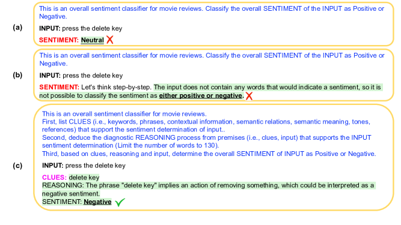

# Text Classification via Large Language Models

###### Abstract

Despite the remarkable success of large-scale Language Models (LLMs) such as GPT-3, their performances still significantly underperform fine-tuned models in the task of text classification. This is due to (1) the lack of reasoning ability in addressing complex linguistic phenomena (e.g., intensification, contrast, irony etc); (2) limited number of tokens allowed in in-context learning.  

In this paper, we introduce Clue And Reasoning Prompting (CARP). CARP adopts a progressive reasoning strategy tailored to addressing the complex linguistic phenomena involved in text classification: CARP first prompts LLMs to find superficial clues (e.g., keywords, tones, semantic relations, references, etc), based on which a diagnostic reasoning process is induced for final decisions. To further address the limited-token issue, CARP uses a fine-tuned model on the supervised dataset for $k$NN demonstration search in the in-context learning, allowing the model to take the advantage of both LLM’s generalization ability and the task-specific evidence provided by the full labeled dataset.  

Remarkably, CARP yields new SOTA performances on 4 out of 5 widely-used text-classification benchmarks, 97.39 (+1.24) on SST-2, 96.40 (+0.72) on AGNews, 98.78 (+0.25) on R8 and 96.95 (+0.6) on R52, and a performance comparable to SOTA on MR (92.39 v.s. 93.3). More importantly, we find that CARP delivers impressive abilities on low-resource and domain-adaptation setups. Specifically, using 16 examples per class, CARP achieves comparable performances to supervised models with 1,024 examples per class. Code and data are available at [github.com/ShannonAI/GPT-CLS-CARP](https://github.com/ShannonAI/GPT-CLS-CARP) 111 \* indicates equal contributions. 222 ◆Zhejiang University, ♣ Shannon.AI, ★Amazon     ${}^{\text{\char 170}}$Nanyang Technological University, ▲ Chongqing University     {xiaofei\_sun, wufei, jiwei\_li}@zju.edu.cn     xiaoya\_li@shannonai.com, swguo@cqu.edu.cn    tianwei.zhang@ntu.edu.sg, guoyiwan@amazon.com  

## 1 Introduction

Large language models (LLMs) (Radford et al., [2019a](#bib.bib35); Xue et al., [2020](#bib.bib63); Zhang et al., [2022a](#bib.bib69); Rae et al., [2021](#bib.bib37); Brown et al., [2020](#bib.bib2); Chowdhery et al., [2022](#bib.bib5); Ouyang et al., [2022](#bib.bib32); Thoppilan et al., [2022](#bib.bib51)) have shown the ability for in-context learning (ICL). Given a few demonstration examples, LLMs are prompted to generate results for a new test example, and have achieved performance comparable to supervised baselines or even state-of-the-art results in a variety of natural language processing (NLP) tasks such as question answering (Trivedi et al., [2022](#bib.bib52)), natural language inference, (Schick and Schütze, [2020](#bib.bib41)), named entity recognition Wang et al. ([2023](#bib.bib56)), relation extraction Wan et al. ([2023](#bib.bib54)) and information extraction (Han et al., [2021](#bib.bib13)).  

[FIGURE S1.F1.1.g1]

Figure 1: Examples of zero-shot prompting methods for the text classification task: (a) represents for the vanilla prompting method; (b) denotes for the Chain-of-Thought (CoT) (Kojima et al., [2022](#bib.bib22)) prompting method; c represents for the proposed CARP prompting method.
[/FIGURE]

[FIGURE S1.F2.1.g1]

Figure 2: Examples of few-shot ($k$=1) prompting methods for the text classification task: (a) represents for the vanilla prompting method; (b) denotes for the Chain-of-Thought (CoT) (Kojima et al., [2022](#bib.bib22)) prompting method; (c) represents for the proposed CARP prompting method.
[/FIGURE]

In spite of the success, LLMs with ICL still significantly underperform fine-tuned models for text classification. This is due to two reasons: (1) Text classification requires models with more powerful reasoning abilities to resolve complex linguistic phenomenon including clause composition (e.g., concession, negation, intensification), irony, etc. Recent efforts to improve LLMs’ reasoning capabilities (Wei et al., [2022b](#bib.bib58); Kojima et al., [2022](#bib.bib22); Ye and Durrett, [2022](#bib.bib67); Zhang et al., [2022b](#bib.bib71)) mainly focus on tackling math problems, and thus are not tailored to addressing the reasoning process necessary for the multitude of intricate linguistic phenomena in text classification; (2) This number of demonstration examples allowed in in-context learning is limited, e.g., the longest context allowed for GPT-3 is 4,096 subtokens. Therefore, LLMs are only able to take the advantage of a small proportion of the training set, performing well below supervised baselines;  

In this paper, we introduce Clue And Reasoning Prompting (CARP), an extensible, annotation-free and efficient framework for text classification via large language models. To address the reasoning process necessary for handling the linguistic phenomena in text classification, CARP decomposes the reasoning process into three steps, where LLMs are first prompted to find superficial clues (e.g., keywords, tones, semantic relations, etc) in the given text; next, CARP treats the clues and input as premises and induce a diagnostic reasoning process; and finally determine the final label considering the above two steps. We find this progressive reasoning strategy to be effective in enhancing LLMs’ ability in language reasoning involved in text classification. Due to the limited number of tokens allowed in context, a more effective demonstration search is needed. CARP uses a fine-tuned model on the supervised dataset for $k$NN demonstration search for in-context learning. Since the fine-tuned model is trained based on task-specific labels, it guarantees that retrieved samples are close to the input sequence with respect to the task. Using fine-tuned models for demonstration search provides a channel to connect LLMs with the full training set, in spite of the limited number of tokens allowed in demonstrations. This strategy lets the model take the advantage of both the LLMs’ generalization abilities and all task-specific evidence provided by the training dataset.  

Remarkably, CARP yields new SOTA performances on four out of 5 widely-used text-classification benchmarks, 97.39 (+1.24) on SST-2, 96.40 (+0.72) on AGNews, 98.78 (+0.25) on R8 and 96.95 (+0.6) on R52, and a performance comparable to SOTA on MR (92.39 v.s. 93.3). More importantly, we find that CARP delivers impressive ability on low-resource and domain adaptation setups with orders of magnitude fewer training examples. Specifically, CARP achieves comparable performances with 16 examples per class to supervised models trained on the full training set containing more than 1 thousand examples per class. This demonstrates the capabilities of CARP in real-world text classification cases where training data is limited.  

## 2 Related Work

### 2.1 Large Language Models

Large language models (LLMs) are models that are trained using self-teaching algorithms on large unlabeled corpora. With emergent capabilities (Xie et al., [2021](#bib.bib62); Wei et al., [2022a](#bib.bib57)), LLMs achieve significant performance boosts in NLP tasks.  

LLMs can be broadly divided into three categories based on the model architecture. The first category is the encoder-only model like BERT (Devlin et al., [2018](#bib.bib10)). BERT (300M) (Devlin et al., [2018](#bib.bib10)) and its variants (Liu et al., [2019](#bib.bib30); Sun et al., [2020](#bib.bib48); Clark et al., [2020](#bib.bib6); Feng et al., [2020](#bib.bib11); Sun et al., [2021](#bib.bib49)) adopt the pre-training then fine-tuning paradigm for NLP tasks: use masked language models as the main training objective for pretraining, and fine-tune the pretrained model in the annotated downstream datasets.  

The second category is the decoder-only models like GPT (Radford et al., [2019a](#bib.bib35)). GPT (Radford et al., [2019a](#bib.bib35)) uses the decoder of an auto-regressive transformer (Vaswani et al., [2017](#bib.bib53)) model for predicting the next token in a sequence. GPT (Radford et al., [2019a](#bib.bib35)) and its variants (Dai et al., [2019](#bib.bib8); Keskar et al., [2019](#bib.bib19); Radford et al., [2019b](#bib.bib36); Chowdhery et al., [2022](#bib.bib5); Zhang et al., [2022a](#bib.bib69)) also follow the pre-training then fine-tuning paradigm. GPT-3 (175B) (Brown et al., [2020](#bib.bib2)) proposes to formalize all NLP tasks as generating textual responses condition on the given prompt.  

The third category is the encoder-decoder models like T5 (Raffel et al., [2020](#bib.bib38)). T5 (11B) (Raffel et al., [2020](#bib.bib38)) and its variants (Lewis et al., [2019](#bib.bib25); Xue et al., [2020](#bib.bib63)) are encoder-decoder transformer models, which generate new sentences depending on a given input, following the pre-training then fine-tuning paradigm.  

### 2.2 In-context Learning

Unlike the pre-training then fine-tuning paradigm (Devlin et al., [2018](#bib.bib10)), which saves model weights and uses task-specific datasets (i.e., train/valid/test set), in-context learning (ICL) generates textual responses (i.e., label words) conditioning on the given prompt (usually) with a few annotated examples for downstream tasks.  

Li and Liang ([2021](#bib.bib26)); Zhong et al. ([2021](#bib.bib72)); Qin and Eisner ([2021](#bib.bib34)) propose to optimize prompts in the continuous space. Rubin et al. ([2021](#bib.bib40)); Das et al. ([2021](#bib.bib9)); Liu et al. ([2021](#bib.bib28)); Su et al. ([2022](#bib.bib45)) introduce different strategies for selecting in-context examples. Lampinen et al. ([2022](#bib.bib24)) show that explanations of examples in a few-shot prompt lead to a performance boost. Marasović et al. ([2021](#bib.bib31)) find that GPT-3 outperforms other models by a large margin in the explanation generation task. Wei et al. ([2022b](#bib.bib58)) propose chain-of-thought reasoning and utilized <input, chain-of-thought, output> triples as the prompt for LLMs. Wiegreffe et al. ([2021](#bib.bib60)) traine a supervised filter to select explanations generated by GPT-3 on the SNLI and CommonsenseQA tasks.  

### 2.3 Text Classification

Text classification is a task that aims to assign predefined labels (e.g., sentiment polarity, topic, etc) to a given text. Earlier work decouple the task into two steps: (1) extract features using neural models such as RNNs (Irsoy and Cardie, [2014](#bib.bib17); Yang et al., [2016](#bib.bib65); Wang et al., [2018](#bib.bib55); Liu et al., [2016](#bib.bib29); Xie et al., [2020](#bib.bib61)), CNNs (Kim, [2014](#bib.bib21); Zhang et al., [2015](#bib.bib70); Lai et al., [2015](#bib.bib23); Conneau et al., [2016](#bib.bib7); Wei and Zou, [2019](#bib.bib59)), GCN (Yao et al., [2019](#bib.bib66)), LLMs (Howard and Ruder, [2018](#bib.bib15); Sun et al., [2019](#bib.bib46); Chai et al., [2020](#bib.bib3); Chen et al., [2020](#bib.bib4); Lin et al., [2021](#bib.bib27)); and (2) feed extracted features into a classifier (Joulin et al., [2016](#bib.bib18)) to obtain the final label.  

Recently, in-context learning has achieved success and changes the paradigm in the text classification task. Schick and Schütze ([2020](#bib.bib41)) reformulate input examples into cloze-style phrases and annotate the unlabeled text. Han et al. ([2021](#bib.bib13)) design sub-prompts and applied logic rules to compose sub-prompts into final prompts. Liu et al. ([2021](#bib.bib28)) retrieve semantically-similar examples to a test sample to formulate its corresponding prompt. Shi et al. ([2022](#bib.bib43)) retrieve label-words-similar examples as demonstrations in prompts.  

## 3 Prompt Construction

### 3.1 Overview

We follow the standard prompt-based in-context learning paradigm. Given an input sequence $\bm{x_{\textit{input}}}=\{x_{1},x_{2},...,x_{l}\}$, the task of assigning a text-class label to an input text is transformed to generating a pre-defined textual response ${\bm{y}}\in\mathcal{Y}_{\textit{verb}}$ (e.g., positive, negative, etc) conditioning on the prompt $\bm{x}_{\textit{prompt}}$ using a language model.  

### 3.2 Prompt Construction

The prompt $\bm{x}_{\textit{prompt}}$, which is constructed based on $\bm{x}$, consists of the following three components:  

##### (1) Task description $\bm{x}_{\textit{desc}}$

generally describes the task. For different classification tasks, e..g, sentiment classification, topic classification, etc, descriptions are different. Take the sentiment classification task as an example, the task description is given as follows:  

Classify the overall sentiment of the input as positive or negative  

##### (2) Demonstration

consists of a sequence of annotated examples:  

|  | $$\{(\bm{x}^{1}_{\textit{demo}},\bm{y}^{1}_{\textit{demo}}),...,(\bm{x}^{k}_{\textit{demo}},\bm{y}^{k}_{\textit{demo}})\}$$ |  |
| --- | --- | --- |

where $\bm{x}^{j}_{\textit{demo}},1\leq j\leq k$ denotes the $j$th input sequence and $\bm{y}^{j}_{\textit{demo}}$ denotes the text which is transformed from the label, e.g., positive or negative for the binary sentiment classification task. Demonstration serves as two purposes: (1) providing the LLM with evidence to consult on for decision making, which will significantly boost performances; (2) provides an output format that LLM’s outputs need to follow, so that the output, which takes the form of natural language, can be further easily transformed to labels. It is worth noting that demonstrations are only needed for the few-shot learning setup, but not for the zero-shot learning setup.  

##### (3) Input $\bm{x_{\textit{input}}}$

is the test text sequence to classify.  

The prompt $\bm{x}_{\textit{prompt}}$ for a test input is constructed by concatenating the task description $\bm{x}_{\textit{desc}}$, a sequence of demonstrations $\{(\bm{x}^{1}_{\textit{demo}},\bm{y}^{1}_{\textit{demo}}),...,(\bm{x}^{k}_{\textit{demo}},\bm{y}^{k}_{\textit{demo}})\}$, and the test sequence $\bm{x}_{\textit{test}}$, which can be given as follows:  

|  | $$\{\bm{x}_{\textit{desc}};\text{\textbackslash n};\text{<demo>}^{1};\text{\textbackslash n};...;\text{<demo>}^{k};\text{\textbackslash n};\bm{x}_{\textit{test}}\}$$ |  |
| --- | --- | --- |

### 3.3 Demonstration Sampling

The few-shot setup requires demonstrations sampled from the training set. Strategies that we explore include:  

##### Random Sampling

a straightforward strategy from samplings is to randomly sample $k$ examples $\{(\bm{x}^{1},\bm{y}^{1}),...,(\bm{x}^{k},\bm{y}^{k})\}$ from the training set $\mathcal{D}_{\textit{train}}$ for a text sequence $\bm{x}_{\textit{test}}$.  

##### $k$NN Sampling

The key disadvantage for random sampling is that there is no guarantee that selected samples are semantically related to the input sequence. One straightforward alternative is to sample examples that are similar to the test sequence using $k$NN search (Khandelwal et al., [2020](#bib.bib20)). In this process, the test sequence $\bm{x}_{\textit{test}}$ is first mapped to a vector $\bm{v}_{\textit{test}}$ using an encoder model $f$. Then using $\bm{v}_{\textit{test}}$ as the query, we search through the entire training set $\mathcal{D}_{\textit{train}}$ to retrieve $k$ nearest text sequence to get $k$ nearest data examples $\mathcal{N}=\{\bm{x}_{j},\bm{y}_{j}\}_{j=1}^{k}$ as demonstrations. We use the following encoder models to obtain sentence representations and similarity scores:  

##### SimCSE

(Gao et al., [2021](#bib.bib12)) is a contrastive learning model for sentence embeddings. We use Sup-SimCSE-RoBERTa-Large model as an encoder model, which is initizlied with RoBERTa-Large (Liu et al., [2019](#bib.bib30)) and fine-tuned on the natural language inference datasets. SimCSE (Gao et al., [2021](#bib.bib12)) is a semantic-based model and retrieves semantically similar examples, but not necessarily examples with the same labels.  

##### Finetuned Model

FT for short. The key disadvantage for SimCSE (Gao et al., [2021](#bib.bib12)) and other general semantic encoding models  (Reimers and Gurevych, [2019](#bib.bib39); Seonwoo et al., [2022](#bib.bib42); Sun et al., [2022](#bib.bib47)) is that it measures the general semantic similarity but is not specifically tailored to the text classification task. To resolve this issue, CARP uses the model fine-tuned on the training dataset as the $k$NN encoder model. Specifically, we first fine-tune a Roberta model on the training data. Next we use the [CLS] embedding as the sentence level representation for KNN search. Since the fine-tuned model is trained based on task-specific labels, it guarantees that retrieved samples are close to the input sequence with respect to the task. Using fine-tuned model provides a channel to connect LLMs with the full training set, in spite of the limited number of tokens allowed in demonstrations. This strategy lets the model take the advantage of both the LLMs’ generalization abilities and all task-specific evidence provided by the training dataset.  

## 4 Clues Collecting and Reasoning

To enhance the models’ reasoning ability in addressing linguistic phenomenon tailored to text classification, we propose a progressive reasoning strategy that involves clue collection, reasoning and decision making. This process also mimics how human decisions: where we first collect evidence from the input, separating chaff from wheat; next we piece together local evidence to form a global picture, which leads to final decision making. Next we first given an overview of the the clue collecting and reasoning process, and then describe implementation details.  

### 4.1 Overview

##### Collecting Clues

For a test sequence, clues are local fact evidence such as keywords, phrases, contextual information, semantic meaning, semantic relationships, tones, references, etc. The following is an example for clues of an input:  

Input: Steers turns in a snappy screenplay that curls at the edges; it’s so clever you want to hate it.    Clues: "snappy", "clever", "want to hate it" are clues for determining the sentiment of the input sentence.  

##### Reasoning

For reasoning, the LLM is prompted to go beyond superficial keywords to mine deeper perspectives, considering language phenomenon such as negation, intensification, irony, etc), and piece together local evidence to form the final decision. The following example shows the reasoning process to decide the sentiment of the above example based on the evidence collected:   

1. The phrase "snappy screenplay" implies that the screenplay is of a high quality and is well-crafted.     2. The phrase "curls at the edges" implies that the screenplay is cleverly written.     3. The phrase "so clever you want to hate it" is a paradoxical statement, which suggests that the sentiment is positive despite the use of the word "hate".       

##### Decision Making

Based on the reasoning process, the model makes the decision for the sentiment of the given input:  

Overall, the clues and reasoning process point to a positive sentiment for the input sentence.  

The merits for the incorporation of clue finding and reasonings are as follows: (1) it prompts the model to progressively think and make decisions: clue finding focuses more on superficial features such as keywords, while reasoning makes deeper justifications based on superficial features. This process better mimics how we humans decide; (2) clue finding and reasoning serve as a tunnel to let human intervene: in the few-shot setup, where clues and reasons need to be prepared in advance for demonstrations, we can modify them as we see fit. This is extremely helpful for trouble shooting in the prompt-construction stage for error corrections; (3) from an interpretation and uncertainty estimation perspective, clues and reasoning in few-shot setups are human-readable influence functions; (4) in contrast to list annotated (text, label) pairs in few-shot setups, incorporating clues and reasoning process in prompts aligns closer with the instruction tuning objective. The discrepancy between LLMs training objectives and in-context learning for downstream tasks has been reduced.  

### 4.2 Collecting clues and reasoning in zero-shot

In the zero-shot setup, as no demonstration is allowed, no concrete example for clues and reasons can be provided. In this way, we only add requests asking the model to output clues and reasons in the prompt. The prompt is given as follows:  

> This is an overall sentiment classifier for opinion snippets.     First, list CLUES (i.e., keywords, phrases, contextual information, semantic relations, semantic meaning, tones, references) for determining the overall sentiment of the input.     Next, deduce a diagnostic reasoning process from clues and the input to determine the overall sentiment.     Finally, determine the sentiment of input as Positive or Negative considering clues, the reasoning process and the input.        INPUT: <text>     CLUES:

#### 4.2.1 Clue Collecting and Reasoning in few-shot

In the few-shot setup , we need to prepare clues and reasonings for all examples in the training set in advance as all training examples have chances to be selected as demonstrations given different test inputs. Previous efforts in math problems Wei et al. ([2022b](#bib.bib58)); Kojima et al. ([2022](#bib.bib22)); Ye and Durrett ([2022](#bib.bib67)); Zhang et al. ([2022b](#bib.bib71)) prepare hand-drafted reasoning for a few examples, and always use these example as demonstrations. This strategy does not fit for our situation as it is extremely time-intensive to manually generate clues and reasonings for all training examples, To resolve this issue, we harness LLMs for automatic clue and reasoning generation, where we ask LLMs to generate clues and reasoning based on both the input and its corresponding label.  

[TABLE S4.T1]

<table class="ltx_tabular ltx_guessed_headers ltx_align_middle">
<thead class="ltx_thead">
<tr class="ltx_tr">
<th class="ltx_td ltx_align_justify ltx_align_top ltx_th ltx_th_column ltx_border_tt">

INPUT &amp; GOLD LABEL

</th>
<th class="ltx_td ltx_align_justify ltx_align_top ltx_th ltx_th_column ltx_border_tt">

CLUES

</th>
<th class="ltx_td ltx_align_justify ltx_align_top ltx_th ltx_th_column ltx_border_tt">

REASONING

</th>
</tr>
</thead>
<tbody class="ltx_tbody">
<tr class="ltx_tr">
<td class="ltx_td ltx_align_justify ltx_align_top ltx_border_t">

INPUT: johnnie to and wai ka fai are sure to find an enthusiastic audience among american action adventure buffs, but the film ’s interests may be too narrow to attract crossover viewers 
 GOLD LABEL: Negative

</td>
<td class="ltx_td ltx_align_justify ltx_align_top ltx_border_t">

- Positive Clues: enthusiastic, action, adventure. 
 - Negative Clues: narrow, crossover

</td>
<td class="ltx_td ltx_align_justify ltx_align_top ltx_border_t">

The diagnostic reasoning process supporting the sentiment determination of the input is that the phrase "johnnie to and wai ka fai are sure to find an enthusiastic audience among american action adventure buffs" suggests that the film is likely to be well-received by this specific demographic. However, the subsequent phrase "but the film’s interests may be too narrow to attract crossover viewers" implies that the film is unlikely to appeal to a broader audience, suggesting a negative sentiment. Therefore, the overall sentiment of the input is negative.

</td>
</tr>
<tr class="ltx_tr">
<td class="ltx_td ltx_align_justify ltx_align_top ltx_border_bb ltx_border_t">

INPUT: moore sell globe unit moore resources inc said agreed principle sell globe inc unit cyprus minerals co undisclosed terms sale expected close mid april subject certain conditions including board approval companies globe produces silicon metals products used chemical aluminum iron rubber semiconductor industries reuter 
 GOLD LABEL: Acquisitions

</td>
<td class="ltx_td ltx_align_justify ltx_align_top ltx_border_bb ltx_border_t">

- Acquisition (agreed, sell, unit, sale, close, board approval) 
 - Companies (Moore Resources Inc, Globe Inc, Cyprus Minerals Co) 
 - Products (silicon, metals, chemical, aluminum, iron, rubber, semiconductor) 
 - Reuter (news agency)

</td>
<td class="ltx_td ltx_align_justify ltx_align_top ltx_border_bb ltx_border_t">

The input mentions an acquisition agreement between Moore Resources Inc and Globe Inc, and the sale is expected to close in mid-April, suggesting an Acquisitions topic. The input also mentions Cyprus Minerals Co, silicon and metals products which are used in chemical, aluminum, iron, rubber, and semiconductor industries, and a Reuter news agency, all of which support the Acquisitions topic.

</td>
</tr>
</tbody>
</table>

Table 1: Examples of generated clues and reasoning for demonstrations.
[/TABLE]

##### Clue Generation

For a given training example <text> paired with the label word <label-word> (e.g., positive), we ask LLM to generate clues that indicate the label:  

> List CLUES (i.e., keywords, phrases, contextual information, semantic meaning, semantic relationships, tones, references) that support the sentiment determination of the input (limit to 15 words).    INPUT: <text>     SENTIMENT: <label-word>

##### Reasoning Generation

Based on clues generated clues, the input, and the label, we ask LLMs to generate reasoning details333LLMs often generate long responses, in order to ensemble more demonstrations in prompts, we use ”limit to 50 words”. After conducting an analysis of the generated responses, we find that LLMs can explain the reason within limited words.:  

> Based on the input and clues, articulate the diagnostic reasoning process that supports the sentiment determination of the input.     INPUT: <text>     LABEL: <label-word>     CLUES: <clues>     REASONING:

Given the generated clues and reasonings for all training examples, at test time, when K-nearest examples are selected demonstrations, its corresponding clues and reasons are concatenated to the demonstration. In this way, each demonstration example is composed by a (text, clues, reasons, golden label word) pair. The prompt is thus given as follows:  

> This is a sentiment classifier for input opinion snippets.     List CLUES (i.e., keywords, phrases, contextual information, semantic meaning, semantic relationships, tones, references) that support the sentiment determination of the input.     Next, deduce the diagnostic REASONING process from premises (i.e., clues, input) that support the sentiment determination.     Finally, based on clues, the reasoning and the input, categorize the overall SENTIMENT of input as Positive or Negative.        input: <demo-text-1>     clues: <demo-clues-1>     reasoning: <demo-reason-1>     sentiment: <demo-label-word-1>     input: <demo-text-2>     clues: <demo-clues-2>     reasoning: <demo-reason-2>     sentiment: <demo-label-word-2>     … …     input: <demo-text-n>     clues: <demo-clues-n>     reasoning: <demo-reason-n>     sentiment: <demo-label-word-n>     input: <text>

Examples for prompts with clues and reasons are shown in Figure [2](#S1.F2 "Figure 2 ‣ 1 Introduction ‣ Text Classification via Large Language Models"). In this way, for a test example, by following the format of demonstrations, the LLM will first output clues, then reasons, and at last decisions.  

### 4.3 Voting

Unlike conventional discriminative models for text classification, which generate deterministic results during inferences, LLMs for in-context learning are generative models and generate distinct textual responses with diverse sampling strategies in multiple runs. We consider the following voting strategies in the paper:  

* Majority Vote: the final result is the most frequent prediction among multiple runs. 
* Weighted Probability Vote: the final result is the one with weighted summed probability from multiple runs. 

[TABLE S4.T2]

<table class="ltx_tabular ltx_guessed_headers ltx_align_middle">
<tbody class="ltx_tbody">
<tr class="ltx_tr">
<th class="ltx_td ltx_th ltx_th_row ltx_border_tt"></th>
<td class="ltx_td ltx_align_center ltx_border_tt">SST-2</td>
<td class="ltx_td ltx_align_center ltx_border_tt">AGNews</td>
<td class="ltx_td ltx_align_center ltx_border_tt">R8</td>
<td class="ltx_td ltx_align_center ltx_border_tt">R52</td>
<td class="ltx_td ltx_align_center ltx_border_tt">MR</td>
<td class="ltx_td ltx_align_center ltx_border_tt">Average</td>
</tr>
<tr class="ltx_tr">
<th class="ltx_td ltx_nopad_r ltx_align_right ltx_th ltx_th_row ltx_border_t">
Supervised Methods
</th>
</tr>
<tr class="ltx_tr">
<th class="ltx_td ltx_align_left ltx_th ltx_th_row ltx_border_t">RoBERTa-Large <cite class="ltx_cite ltx_citemacro_citep">(Liu et al., <a class="ltx_ref">2019</a>)</cite>
</th>
<td class="ltx_td ltx_align_center ltx_border_t">95.99</td>
<td class="ltx_td ltx_align_center ltx_border_t">95.55</td>
<td class="ltx_td ltx_align_center ltx_border_t">97.76</td>
<td class="ltx_td ltx_align_center ltx_border_t">96.42</td>
<td class="ltx_td ltx_align_center ltx_border_t">91.16</td>
<td class="ltx_td ltx_align_center ltx_border_t">95.38</td>
</tr>
<tr class="ltx_tr">
<th class="ltx_td ltx_align_left ltx_th ltx_th_row">DeBERTa <cite class="ltx_cite ltx_citemacro_citep">(He et al., <a class="ltx_ref">2020</a>)</cite>
</th>
<td class="ltx_td ltx_align_center">94.75</td>
<td class="ltx_td ltx_align_center">95.32</td>
<td class="ltx_td ltx_align_center">98.33</td>
<td class="ltx_td ltx_align_center">96.32</td>
<td class="ltx_td ltx_align_center">90.19</td>
<td class="ltx_td ltx_align_center">94.99</td>
</tr>
<tr class="ltx_tr">
<th class="ltx_td ltx_align_left ltx_th ltx_th_row">RoBERTa-GCN <cite class="ltx_cite ltx_citemacro_citep">(Lin et al., <a class="ltx_ref">2021</a>)</cite>
</th>
<td class="ltx_td ltx_align_center">95.80</td>
<td class="ltx_td ltx_align_center">95.68*</td>
<td class="ltx_td ltx_align_center">98.2</td>
<td class="ltx_td ltx_align_center">96.1</td>
<td class="ltx_td ltx_align_center">89.7</td>
<td class="ltx_td ltx_align_center">95.10</td>
</tr>
<tr class="ltx_tr">
<th class="ltx_td ltx_align_left ltx_th ltx_th_row">XLNet <cite class="ltx_cite ltx_citemacro_citep">(Yang et al., <a class="ltx_ref">2019</a>)</cite>
</th>
<td class="ltx_td ltx_align_center">96.10*</td>
<td class="ltx_td ltx_align_center">95.55</td>
<td class="ltx_td ltx_align_center">-</td>
<td class="ltx_td ltx_align_center">-</td>
<td class="ltx_td ltx_align_center">-</td>
<td class="ltx_td ltx_align_center">-</td>
</tr>
<tr class="ltx_tr">
<th class="ltx_td ltx_align_left ltx_th ltx_th_row">VLAWE <cite class="ltx_cite ltx_citemacro_citep">(Ionescu and Butnaru, <a class="ltx_ref">2019</a>)</cite>
</th>
<td class="ltx_td ltx_align_center">-</td>
<td class="ltx_td ltx_align_center">-</td>
<td class="ltx_td ltx_align_center">-</td>
<td class="ltx_td ltx_align_center">-</td>
<td class="ltx_td ltx_align_center">93.3*</td>
<td class="ltx_td ltx_align_center">-</td>
</tr>
<tr class="ltx_tr">
<th class="ltx_td ltx_align_left ltx_th ltx_th_row">GCN-SB <cite class="ltx_cite ltx_citemacro_citep">(Zeng et al., <a class="ltx_ref">2022</a>)</cite>
</th>
<td class="ltx_td ltx_align_center">-</td>
<td class="ltx_td ltx_align_center">-</td>
<td class="ltx_td ltx_align_center">98.53*</td>
<td class="ltx_td ltx_align_center">96.35*</td>
<td class="ltx_td ltx_align_center">87.59</td>
<td class="ltx_td ltx_align_center">-</td>
</tr>
<tr class="ltx_tr">
<th class="ltx_td ltx_nopad_r ltx_align_right ltx_th ltx_th_row ltx_border_t">
Zero-shot Setting
</th>
</tr>
<tr class="ltx_tr">
<th class="ltx_td ltx_align_left ltx_th ltx_th_row ltx_border_t">Vanilla <cite class="ltx_cite ltx_citemacro_citep">(Brown et al., <a class="ltx_ref">2020</a>)</cite>
</th>
<td class="ltx_td ltx_align_center ltx_border_t">91.55</td>
<td class="ltx_td ltx_align_center ltx_border_t">90.72</td>
<td class="ltx_td ltx_align_center ltx_border_t">90.19</td>
<td class="ltx_td ltx_align_center ltx_border_t">89.06</td>
<td class="ltx_td ltx_align_center ltx_border_t">88.69</td>
<td class="ltx_td ltx_align_center ltx_border_t">90.04</td>
</tr>
<tr class="ltx_tr">
<th class="ltx_td ltx_align_left ltx_th ltx_th_row">CoT <cite class="ltx_cite ltx_citemacro_citep">(Kojima et al., <a class="ltx_ref">2022</a>)</cite>
</th>
<td class="ltx_td ltx_align_center">92.11</td>
<td class="ltx_td ltx_align_center">91.25</td>
<td class="ltx_td ltx_align_center">90.48</td>
<td class="ltx_td ltx_align_center">91.24</td>
<td class="ltx_td ltx_align_center">89.37</td>
<td class="ltx_td ltx_align_center">90.89</td>
</tr>
<tr class="ltx_tr">
<th class="ltx_td ltx_align_left ltx_th ltx_th_row">CARP</th>
<td class="ltx_td ltx_align_center">93.01</td>
<td class="ltx_td ltx_align_center">92.60</td>
<td class="ltx_td ltx_align_center">91.75</td>
<td class="ltx_td ltx_align_center">91.80</td>
<td class="ltx_td ltx_align_center">89.94</td>
<td class="ltx_td ltx_align_center">91.82</td>
</tr>
<tr class="ltx_tr">
<th class="ltx_td ltx_nopad_r ltx_align_right ltx_th ltx_th_row ltx_border_t">
Few-shot Setting (<math class="ltx_Math"><semantics><mi>k</mi><annotation-xml><ci>𝑘</ci></annotation-xml><annotation>k</annotation></semantics></math>=16)
</th>
</tr>
<tr class="ltx_tr">
<th class="ltx_td ltx_align_left ltx_th ltx_th_row ltx_border_t">Random Sampler</th>
<td class="ltx_td ltx_border_t"></td>
<td class="ltx_td ltx_border_t"></td>
<td class="ltx_td ltx_border_t"></td>
<td class="ltx_td ltx_border_t"></td>
<td class="ltx_td ltx_border_t"></td>
<td class="ltx_td ltx_border_t"></td>
</tr>
<tr class="ltx_tr">
<th class="ltx_td ltx_align_left ltx_th ltx_th_row ltx_border_t">Vanilla <cite class="ltx_cite ltx_citemacro_citep">(Brown et al., <a class="ltx_ref">2020</a>)</cite>
</th>
<td class="ltx_td ltx_align_center ltx_border_t">92.36</td>
<td class="ltx_td ltx_align_center ltx_border_t">91.74</td>
<td class="ltx_td ltx_align_center ltx_border_t">91.58</td>
<td class="ltx_td ltx_align_center ltx_border_t">91.56</td>
<td class="ltx_td ltx_align_center ltx_border_t">89.15</td>
<td class="ltx_td ltx_align_center ltx_border_t">91.28</td>
</tr>
<tr class="ltx_tr">
<th class="ltx_td ltx_align_left ltx_th ltx_th_row">CoT <cite class="ltx_cite ltx_citemacro_citep">(Kojima et al., <a class="ltx_ref">2022</a>)</cite>
</th>
<td class="ltx_td ltx_align_center">94.56</td>
<td class="ltx_td ltx_align_center">95.02</td>
<td class="ltx_td ltx_align_center">92.49</td>
<td class="ltx_td ltx_align_center">92.03</td>
<td class="ltx_td ltx_align_center">89.91</td>
<td class="ltx_td ltx_align_center">92.80</td>
</tr>
<tr class="ltx_tr">
<th class="ltx_td ltx_align_left ltx_th ltx_th_row">CARP</th>
<td class="ltx_td ltx_align_center">96.20</td>
<td class="ltx_td ltx_align_center">95.18</td>
<td class="ltx_td ltx_align_center">97.60</td>
<td class="ltx_td ltx_align_center">96.19</td>
<td class="ltx_td ltx_align_center">90.03</td>
<td class="ltx_td ltx_align_center">95.04</td>
</tr>
<tr class="ltx_tr">
<th class="ltx_td ltx_align_left ltx_th ltx_th_row ltx_border_t">SimCSE <math class="ltx_Math"><semantics><mi>k</mi><annotation-xml><ci>𝑘</ci></annotation-xml><annotation>k</annotation></semantics></math>NN-Sampler</th>
<td class="ltx_td ltx_border_t"></td>
<td class="ltx_td ltx_border_t"></td>
<td class="ltx_td ltx_border_t"></td>
<td class="ltx_td ltx_border_t"></td>
<td class="ltx_td ltx_border_t"></td>
<td class="ltx_td ltx_border_t"></td>
</tr>
<tr class="ltx_tr">
<th class="ltx_td ltx_align_left ltx_th ltx_th_row ltx_border_t">Vanilla <cite class="ltx_cite ltx_citemacro_citep">(Brown et al., <a class="ltx_ref">2020</a>)</cite>
</th>
<td class="ltx_td ltx_align_center ltx_border_t">93.90</td>
<td class="ltx_td ltx_align_center ltx_border_t">93.50</td>
<td class="ltx_td ltx_align_center ltx_border_t">94.36</td>
<td class="ltx_td ltx_align_center ltx_border_t">92.40</td>
<td class="ltx_td ltx_align_center ltx_border_t">89.59</td>
<td class="ltx_td ltx_align_center ltx_border_t">94.05</td>
</tr>
<tr class="ltx_tr">
<th class="ltx_td ltx_align_left ltx_th ltx_th_row">CoT <cite class="ltx_cite ltx_citemacro_citep">(Kojima et al., <a class="ltx_ref">2022</a>)</cite>
</th>
<td class="ltx_td ltx_align_center">94.21</td>
<td class="ltx_td ltx_align_center">94.28</td>
<td class="ltx_td ltx_align_center">95.07</td>
<td class="ltx_td ltx_align_center">92.98</td>
<td class="ltx_td ltx_align_center">90.27</td>
<td class="ltx_td ltx_align_center">93.69</td>
</tr>
<tr class="ltx_tr">
<th class="ltx_td ltx_align_left ltx_th ltx_th_row">CARP</th>
<td class="ltx_td ltx_align_center">95.69</td>
<td class="ltx_td ltx_align_center">95.25</td>
<td class="ltx_td ltx_align_center">97.83</td>
<td class="ltx_td ltx_align_center">96.27</td>
<td class="ltx_td ltx_align_center">90.74</td>
<td class="ltx_td ltx_align_center">95.16</td>
</tr>
<tr class="ltx_tr">
<th class="ltx_td ltx_align_left ltx_th ltx_th_row ltx_border_t">FT <math class="ltx_Math"><semantics><mi>k</mi><annotation-xml><ci>𝑘</ci></annotation-xml><annotation>k</annotation></semantics></math>NN-Sampler</th>
<td class="ltx_td ltx_border_t"></td>
<td class="ltx_td ltx_border_t"></td>
<td class="ltx_td ltx_border_t"></td>
<td class="ltx_td ltx_border_t"></td>
<td class="ltx_td ltx_border_t"></td>
<td class="ltx_td ltx_border_t"></td>
</tr>
<tr class="ltx_tr">
<th class="ltx_td ltx_align_left ltx_th ltx_th_row ltx_border_t">Vanilla <cite class="ltx_cite ltx_citemacro_citep">(Brown et al., <a class="ltx_ref">2020</a>)</cite>
</th>
<td class="ltx_td ltx_align_center ltx_border_t">94.01</td>
<td class="ltx_td ltx_align_center ltx_border_t">94.14</td>
<td class="ltx_td ltx_align_center ltx_border_t">95.57</td>
<td class="ltx_td ltx_align_center ltx_border_t">95.79</td>
<td class="ltx_td ltx_align_center ltx_border_t">90.90</td>
<td class="ltx_td ltx_align_center ltx_border_t">94.08</td>
</tr>
<tr class="ltx_tr">
<th class="ltx_td ltx_align_left ltx_th ltx_th_row">CoT <cite class="ltx_cite ltx_citemacro_citep">(Kojima et al., <a class="ltx_ref">2022</a>)</cite>
</th>
<td class="ltx_td ltx_align_center">95.48</td>
<td class="ltx_td ltx_align_center">94.89</td>
<td class="ltx_td ltx_align_center">95.59</td>
<td class="ltx_td ltx_align_center">95.89</td>
<td class="ltx_td ltx_align_center">90.17</td>
<td class="ltx_td ltx_align_center">94.40</td>
</tr>
<tr class="ltx_tr">
<th class="ltx_td ltx_align_left ltx_th ltx_th_row">CARP</th>
<td class="ltx_td ltx_align_center">96.80</td>
<td class="ltx_td ltx_align_center">95.99</td>
<td class="ltx_td ltx_align_center">98.29</td>
<td class="ltx_td ltx_align_center">96.82</td>
<td class="ltx_td ltx_align_center">91.90</td>
<td class="ltx_td ltx_align_center">95.97</td>
</tr>
<tr class="ltx_tr">
<th class="ltx_td ltx_align_left ltx_th ltx_th_row ltx_border_bb">
CARP (WP Vote)</th>
<td class="ltx_td ltx_align_center ltx_border_bb">97.39</td>
<td class="ltx_td ltx_align_center ltx_border_bb">96.40</td>
<td class="ltx_td ltx_align_center ltx_border_bb">98.78</td>
<td class="ltx_td ltx_align_center ltx_border_bb">96.95</td>
<td class="ltx_td ltx_align_center ltx_border_bb">92.39</td>
<td class="ltx_td ltx_align_center ltx_border_bb">96.38</td>
</tr>
</tbody>
</table>

Table 2: Accuracy performances of different settings on benchmarks.
We report mean and standard deviation results over 5 runs.
The GPT-3 denotes text-davinci-003.
In few-shot experiments, we sample 16 annotated examples ($k$=16) for every test instance.
\* indicates previous state-of-the-art results. "MJ Vote" is short for majority vote. "WP Vote" denotes weighted probability vote.
[/TABLE]

## 5 Experiments

In order to evaluate the effectiveness of the proposed method, we conduct experiments on two setups: (1) full training setup, where the model has the access to the full training data; and (2) low-resource setup, where the model can only access partial training dataset. The low-resource setup better mimics real-world situations where training data is limited. For the full training setup, we follow the standard train/dev/test split. For the low-resource setup, we randomly sample $n$ instances per class ($n$ in $\{16,128,256,512,1024\}$) from the benchmark training set. The sampled subset forms a new training set to test different models’ abilities in the low-resource situations. During experiments, we train models/sample demonstrations with the new training set.  

We conduct experiments on five widely-used datasets, including SST-2 (Socher et al., [2013](#bib.bib44)), R8, R52444R8 and R52 are original from <https://www.cs.umb.edu/~smimarog/textmining/datasets/>, AGNews (Zhang et al., [2015](#bib.bib70)) and Movie Review (MR) (Pang and Lee, [2005](#bib.bib33)). More details of the benchmarks and low-resource datasets can be found in Appendix LABEL:app:dataset.  

For zero-shot and few-shot experiments, we use InstructGPT-3 (Ouyang et al., [2022](#bib.bib32)) (text-davinci-003, 175B) as the backbone. Due to the input token limitation, we use $k=16$ for few-shot setups. Prompts on the five datasets are shown in Appendix LABEL:app:prompt. Model hyper-parameters can be found in Table [3](#S5.T3 "Table 3 ‣ Few-shot Setup ‣ 5.1 Models for Comparison ‣ 5 Experiments ‣ Text Classification via Large Language Models") 555During experiments, we find that CARP is robust with different hyper-parameters. Experimental results can be found in Appendix [B.2](#A2.SS2 "B.2 The influence of hyper-parameters ‣ Appendix B Hyper-parameters ‣ 7 Conclusion ‣ 6.5 The effect of demonstration order ‣ 6 Ablation Studies ‣ 5.4 Domain Adaptation ‣ 5 Experiments ‣ Text Classification via Large Language Models").  

We use Vanilla to denote the conventional ICL approach where LLMs are directly prompted to generate labels. We use CoT (Kojima et al., [2022](#bib.bib22)) to denote the baseline that mimics the chain-of-thought strategy and use CARP to denote the proposed method.  

### 5.1 Models for Comparison

##### Supervised models

trained on the trained set naturally constitute baselines to compare with. We use the following models as baselines, and more details of hyper-parameters are shown in Appendix [B.1](#A2.SS1 "B.1 Fine-tuning Hyper-parameters ‣ Appendix B Hyper-parameters ‣ 7 Conclusion ‣ 6.5 The effect of demonstration order ‣ 6 Ablation Studies ‣ 5.4 Domain Adaptation ‣ 5 Experiments ‣ Text Classification via Large Language Models"):  

* RoBERTa-Large:We fine-tune RoBERTa-Large (Liu et al., [2019](#bib.bib30)) on the training set. 
* RoBERTa-GCN:Lin et al. ([2021](#bib.bib27)) constructs heterogeneous graph networks on top of the RoBERTa-Large (Liu et al., [2019](#bib.bib30)) model. 
* DeBERTa:He et al. ([2020](#bib.bib14)) improve RoBERTa by using disentangled attention mechanism and an enhanced mask decoder. 
* XLNet:Yang et al. ([2019](#bib.bib64)) propose a generalized autoregressive pretraining method that enables learning bidirectional contexts. 
* GCN-SB:Zeng et al. ([2022](#bib.bib68)) propose a simplified boosting algorithm, which makes CNN learn the samples misclassified by GCN again. 
* VLAWE:Ionescu and Butnaru ([2019](#bib.bib16)) obtain document embeddings based on aggregating the differences between each codeword vector and each word vector (from the document) associated to the respective codeword. 

##### Few-shot Setup

For demonstration sample strategies in the few-shot setup, we consider the following strategies for comparison: (more details can be found in Section [3.3](#S3.SS3 "3.3 Demonstration Sampling ‣ 3 Prompt Construction ‣ Text Classification via Large Language Models")):  

* Random Sampler: randomly samples $k$ examples. 
* SimCSE $k$NN-Sampler: samples $k$ nearest examples based on SimCSE (Gao et al., [2021](#bib.bib12)) representations666Specifically, we use Sup-SimCSE-RoBERTa-Large as the text encoder.. 
* FT $k$NN-Sampler: sample $k$ nearest examples using Fine-Tuned RoBERTa-Large representations. 

[TABLE S5.T3]

<table class="ltx_tabular ltx_guessed_headers ltx_align_middle">
<tbody class="ltx_tbody">
<tr class="ltx_tr">
<th class="ltx_td ltx_align_left ltx_th ltx_th_row ltx_border_tt">Parameter</th>
<td class="ltx_td ltx_align_center ltx_border_tt">Value</td>
</tr>
<tr class="ltx_tr">
<th class="ltx_td ltx_align_left ltx_th ltx_th_row ltx_border_t">Engine Name</th>
<td class="ltx_td ltx_align_center ltx_border_t">text-davinci-003</td>
</tr>
<tr class="ltx_tr">
<th class="ltx_td ltx_align_left ltx_th ltx_th_row">Max Tokens</th>
<td class="ltx_td ltx_align_center">200</td>
</tr>
<tr class="ltx_tr">
<th class="ltx_td ltx_align_left ltx_th ltx_th_row">Temperature</th>
<td class="ltx_td ltx_align_center">0.7</td>
</tr>
<tr class="ltx_tr">
<th class="ltx_td ltx_align_left ltx_th ltx_th_row">Top P</th>
<td class="ltx_td ltx_align_center">1</td>
</tr>
<tr class="ltx_tr">
<th class="ltx_td ltx_align_left ltx_th ltx_th_row">Frequency Penalty</th>
<td class="ltx_td ltx_align_center">0.0</td>
</tr>
<tr class="ltx_tr">
<th class="ltx_td ltx_align_left ltx_th ltx_th_row">Presence Penalty</th>
<td class="ltx_td ltx_align_center">0.0</td>
</tr>
<tr class="ltx_tr">
<th class="ltx_td ltx_align_left ltx_th ltx_th_row ltx_border_bb">Best Of</th>
<td class="ltx_td ltx_align_center ltx_border_bb">1</td>
</tr>
</tbody>
</table>

Table 3: OpenAI API Hyper-parameters.
[/TABLE]

### 5.2 Results on the full training set

Experimental results are shown in Table [2](#S4.T2 "Table 2 ‣ 4.3 Voting ‣ 4 Clues Collecting and Reasoning ‣ Text Classification via Large Language Models"). As can be seen, performances of few-shot setups consistently outperform zero-shot setups. In terms of sampling strategies in the few-shot setups, we observe that simcse KNN-sampler outperform random sampler, illustrating the importance of adding demonstrations that are relevant to the test input in the few-shot setup. We also observe that FT KNN-sampler consistently outperforms simcse KNN-sampler. This shows that, the fine-tuned model, which takes the advantage of the full training set, serves as a better retriever for task-specific demonstration retrieval than the general-purposed simcse retriever.  

For different reasoning strategies, we first observe that the CoT strategy outperforms the vanilla strategy, which straightforwardly asks LLMs to generate results without further reasoning steps. CARP consistently outperforms CoT across all benchmarks, i.e., +1.48, +0.97, +2.76, + 3.29, +0.47 respectively on SST-2, AGNews, R8, R52 and MR datasets. This demonstrates the necessity of building models with complex linguistic phenomena involved in text classification, and the effectiveness of CARP in doing this job.  

Compared with supervised learning baselines, we find that the vanilla model using LLM underperforms supervised baselines, while few-shot CoT is able to obtain slightly worse or comparable results agains supervised baselines. Notably, single CARP outperforms fine-tuned RoBBERTa on all benchmarks. Using WP voting strategies, CARP yields new SOTA performances on four out of the 5 datasets, 97.39 on SST-2 (+1.24), 96.40 (+0.72) on AGNews, 98.78 (+0.25) on R8 and 96.95 (+0.6) on R52, and a performance comparable to SOTA on MR (92.39 v.s. 93.3).  

### 5.3 Results on low-resource settings

To estimate low-resource circumstances, we sample $n=\{16,128,256,512,1024\}$ instances for each class as low-resource setups. Experimental results are shown in Table [4](#S5.T4 "Table 4 ‣ 5.3 Results on low-resource settings ‣ 5 Experiments ‣ Text Classification via Large Language Models"). As can be seen, when the training set size is extremely small (i.e., 16 or 128 sentences), and the performance of the supervised model is far below CARP. Even with only 16 examples to train on, the accuracy of CARP of SST-2 already around 90%, whereas supervised models’ performance is similar to random guess. This demonstrates the strong generalization ability of CARP in the low-resource setup. As we anticipated, the $k$NN search efficiency improved at a faster rate as the amount of the training data increases; Enlarging the training dataset increases the chances that the chosen examples will correspond to the input, resulting in improved results. Specifically, using 16 examples per class, CARP achieves comparable performances to supervised models with 1,024 examples per class; using 512 instance per class annotation data, CARP achieves comparable performances to supervised models trained on the full set.  

[TABLE S5.T4]

<table class="ltx_tabular ltx_guessed_headers ltx_align_middle">
<thead class="ltx_thead">
<tr class="ltx_tr">
<th class="ltx_td ltx_align_left ltx_th ltx_th_column ltx_th_row ltx_border_tt">Dataset</th>
<th class="ltx_td ltx_align_left ltx_th ltx_th_column ltx_th_row ltx_border_tt">Model</th>
<th class="ltx_td ltx_align_center ltx_th ltx_th_column ltx_border_tt">
<math class="ltx_Math"><semantics><mi>n</mi><annotation-xml><ci>𝑛</ci></annotation-xml><annotation>n</annotation></semantics></math>=16
</th>
<th class="ltx_td ltx_align_center ltx_th ltx_th_column ltx_border_tt">
<math class="ltx_Math"><semantics><mi>n</mi><annotation-xml><ci>𝑛</ci></annotation-xml><annotation>n</annotation></semantics></math>=128
</th>
<th class="ltx_td ltx_align_center ltx_th ltx_th_column ltx_border_tt">
<math class="ltx_Math"><semantics><mi>n</mi><annotation-xml><ci>𝑛</ci></annotation-xml><annotation>n</annotation></semantics></math>=256
</th>
<th class="ltx_td ltx_align_center ltx_th ltx_th_column ltx_border_tt">
<math class="ltx_Math"><semantics><mi>n</mi><annotation-xml><ci>𝑛</ci></annotation-xml><annotation>n</annotation></semantics></math>=512
</th>
<th class="ltx_td ltx_align_center ltx_th ltx_th_column ltx_border_tt">
<math class="ltx_Math"><semantics><mi>n</mi><annotation-xml><ci>𝑛</ci></annotation-xml><annotation>n</annotation></semantics></math>=1024
</th>
</tr>
</thead>
<tbody class="ltx_tbody">
<tr class="ltx_tr">
<th class="ltx_td ltx_th ltx_th_row ltx_border_r ltx_border_t"></th>
<th class="ltx_td ltx_align_left ltx_th ltx_th_row ltx_border_t">FT RoBERTa</th>
<td class="ltx_td ltx_align_center ltx_border_t">51.52</td>
<td class="ltx_td ltx_align_center ltx_border_t">52.31</td>
<td class="ltx_td ltx_align_center ltx_border_t">53.89</td>
<td class="ltx_td ltx_align_center ltx_border_t">70.49</td>
<td class="ltx_td ltx_align_center ltx_border_t">90.30</td>
</tr>
<tr class="ltx_tr">
<th class="ltx_td ltx_align_left ltx_th ltx_th_row ltx_border_r">SST-2</th>
<th class="ltx_td ltx_align_left ltx_th ltx_th_row">GPT-3 Vanilla</th>
<td class="ltx_td ltx_align_center">90.15</td>
<td class="ltx_td ltx_align_center">90.36</td>
<td class="ltx_td ltx_align_center">91.70</td>
<td class="ltx_td ltx_align_center">93.86</td>
<td class="ltx_td ltx_align_center">94.68</td>
</tr>
<tr class="ltx_tr">
<th class="ltx_td ltx_align_left ltx_th ltx_th_row">GPT-3 Zero-shot-CoT</th>
<td class="ltx_td ltx_align_center">89.66</td>
<td class="ltx_td ltx_align_center">90.19</td>
<td class="ltx_td ltx_align_center">90.80</td>
<td class="ltx_td ltx_align_center">94.42</td>
<td class="ltx_td ltx_align_center">94.89</td>
</tr>
<tr class="ltx_tr">
<th class="ltx_td ltx_th ltx_th_row ltx_border_r"></th>
<th class="ltx_td ltx_align_left ltx_th ltx_th_row">GPT-3 CRAP</th>
<td class="ltx_td ltx_align_center">90.48</td>
<td class="ltx_td ltx_align_center">91.07</td>
<td class="ltx_td ltx_align_center">91.77</td>
<td class="ltx_td ltx_align_center">94.03</td>
<td class="ltx_td ltx_align_center">95.20</td>
</tr>
<tr class="ltx_tr">
<th class="ltx_td ltx_align_left ltx_th ltx_th_row ltx_border_r ltx_border_t">AGNews</th>
<th class="ltx_td ltx_align_left ltx_th ltx_th_row ltx_border_t">FT RoBERTa</th>
<td class="ltx_td ltx_align_center ltx_border_t">21.87</td>
<td class="ltx_td ltx_align_center ltx_border_t">38.19</td>
<td class="ltx_td ltx_align_center ltx_border_t">40.08</td>
<td class="ltx_td ltx_align_center ltx_border_t">50.18</td>
<td class="ltx_td ltx_align_center ltx_border_t">78.09</td>
</tr>
<tr class="ltx_tr">
<th class="ltx_td ltx_align_left ltx_th ltx_th_row">GPT-3 Vanilla</th>
<td class="ltx_td ltx_align_center">89.47</td>
<td class="ltx_td ltx_align_center">89.63</td>
<td class="ltx_td ltx_align_center">90.54</td>
<td class="ltx_td ltx_align_center">93.02</td>
<td class="ltx_td ltx_align_center">94.79</td>
</tr>
<tr class="ltx_tr">
<th class="ltx_td ltx_align_left ltx_th ltx_th_row">GPT-3 Zero-shot-CoT</th>
<td class="ltx_td ltx_align_center">89.66</td>
<td class="ltx_td ltx_align_center">90.16</td>
<td class="ltx_td ltx_align_center">91.70</td>
<td class="ltx_td ltx_align_center">94.86</td>
<td class="ltx_td ltx_align_center">95.28</td>
</tr>
<tr class="ltx_tr">
<th class="ltx_td ltx_align_left ltx_th ltx_th_row">GPT-3 CRAP</th>
<td class="ltx_td ltx_align_center">90.16</td>
<td class="ltx_td ltx_align_center">90.94</td>
<td class="ltx_td ltx_align_center">91.07</td>
<td class="ltx_td ltx_align_center">94.08</td>
<td class="ltx_td ltx_align_center">95.48</td>
</tr>
<tr class="ltx_tr">
<th class="ltx_td ltx_align_left ltx_th ltx_th_row ltx_border_r ltx_border_t">R8</th>
<th class="ltx_td ltx_align_left ltx_th ltx_th_row ltx_border_t">FT RoBERTa</th>
<td class="ltx_td ltx_align_center ltx_border_t">11.29</td>
<td class="ltx_td ltx_align_center ltx_border_t">48.19</td>
<td class="ltx_td ltx_align_center ltx_border_t">60.18</td>
<td class="ltx_td ltx_align_center ltx_border_t">70.70</td>
<td class="ltx_td ltx_align_center ltx_border_t">88.68</td>
</tr>
<tr class="ltx_tr">
<th class="ltx_td ltx_align_left ltx_th ltx_th_row">GPT-3 Vanilla</th>
<td class="ltx_td ltx_align_center">89.15</td>
<td class="ltx_td ltx_align_center">90.27</td>
<td class="ltx_td ltx_align_center">91.70</td>
<td class="ltx_td ltx_align_center">94.00</td>
<td class="ltx_td ltx_align_center">94.91</td>
</tr>
<tr class="ltx_tr">
<th class="ltx_td ltx_align_left ltx_th ltx_th_row">GPT-3 Zero-shot-CoT</th>
<td class="ltx_td ltx_align_center">90.49</td>
<td class="ltx_td ltx_align_center">90.88</td>
<td class="ltx_td ltx_align_center">91.81</td>
<td class="ltx_td ltx_align_center">95.42</td>
<td class="ltx_td ltx_align_center">95.75</td>
</tr>
<tr class="ltx_tr">
<th class="ltx_td ltx_align_left ltx_th ltx_th_row">GPT-3 CRAP</th>
<td class="ltx_td ltx_align_center">90.23</td>
<td class="ltx_td ltx_align_center">91.03</td>
<td class="ltx_td ltx_align_center">91.77</td>
<td class="ltx_td ltx_align_center">95.56</td>
<td class="ltx_td ltx_align_center">96.67</td>
</tr>
<tr class="ltx_tr">
<th class="ltx_td ltx_align_left ltx_th ltx_th_row ltx_border_r ltx_border_t">R52</th>
<th class="ltx_td ltx_align_left ltx_th ltx_th_row ltx_border_t">FT RoBERTa</th>
<td class="ltx_td ltx_align_center ltx_border_t">38.29</td>
<td class="ltx_td ltx_align_center ltx_border_t">39.10</td>
<td class="ltx_td ltx_align_center ltx_border_t">59.18</td>
<td class="ltx_td ltx_align_center ltx_border_t">67.19</td>
<td class="ltx_td ltx_align_center ltx_border_t">81.53</td>
</tr>
<tr class="ltx_tr">
<th class="ltx_td ltx_align_left ltx_th ltx_th_row">GPT-3 Vanilla</th>
<td class="ltx_td ltx_align_center">89.15</td>
<td class="ltx_td ltx_align_center">90.04</td>
<td class="ltx_td ltx_align_center">90.29</td>
<td class="ltx_td ltx_align_center">91.88</td>
<td class="ltx_td ltx_align_center">92.06</td>
</tr>
<tr class="ltx_tr">
<th class="ltx_td ltx_align_left ltx_th ltx_th_row">GPT-3 Zero-shot-CoT</th>
<td class="ltx_td ltx_align_center">89.46</td>
<td class="ltx_td ltx_align_center">90.02</td>
<td class="ltx_td ltx_align_center">90.73</td>
<td class="ltx_td ltx_align_center">93.20</td>
<td class="ltx_td ltx_align_center">94.12</td>
</tr>
<tr class="ltx_tr">
<th class="ltx_td ltx_align_left ltx_th ltx_th_row">GPT-3 CRAP</th>
<td class="ltx_td ltx_align_center">90.82</td>
<td class="ltx_td ltx_align_center">91.00</td>
<td class="ltx_td ltx_align_center">95.85</td>
<td class="ltx_td ltx_align_center">94.36</td>
<td class="ltx_td ltx_align_center">96.27</td>
</tr>
<tr class="ltx_tr">
<th class="ltx_td ltx_align_left ltx_th ltx_th_row ltx_border_bb ltx_border_r ltx_border_t">MR</th>
<th class="ltx_td ltx_align_left ltx_th ltx_th_row ltx_border_t">FT RoBERTa</th>
<td class="ltx_td ltx_align_center ltx_border_t">51.20</td>
<td class="ltx_td ltx_align_center ltx_border_t">52.11</td>
<td class="ltx_td ltx_align_center ltx_border_t">53.58</td>
<td class="ltx_td ltx_align_center ltx_border_t">68.29</td>
<td class="ltx_td ltx_align_center ltx_border_t">88.37</td>
</tr>
<tr class="ltx_tr">
<th class="ltx_td ltx_align_left ltx_th ltx_th_row">GPT-3 Vanilla</th>
<td class="ltx_td ltx_align_center">86.04</td>
<td class="ltx_td ltx_align_center">88.68</td>
<td class="ltx_td ltx_align_center">88.99</td>
<td class="ltx_td ltx_align_center">89.80</td>
<td class="ltx_td ltx_align_center">90.18</td>
</tr>
<tr class="ltx_tr">
<th class="ltx_td ltx_align_left ltx_th ltx_th_row">GPT-3 Zero-shot-CoT</th>
<td class="ltx_td ltx_align_center">86.26</td>
<td class="ltx_td ltx_align_center">89.00</td>
<td class="ltx_td ltx_align_center">90.01</td>
<td class="ltx_td ltx_align_center">90.16</td>
<td class="ltx_td ltx_align_center">90.89</td>
</tr>
<tr class="ltx_tr">
<th class="ltx_td ltx_align_left ltx_th ltx_th_row ltx_border_bb">GPT-3 CRAP</th>
<td class="ltx_td ltx_align_center ltx_border_bb">86.54</td>
<td class="ltx_td ltx_align_center ltx_border_bb">87.19</td>
<td class="ltx_td ltx_align_center ltx_border_bb">89.63</td>
<td class="ltx_td ltx_align_center ltx_border_bb">90.01</td>
<td class="ltx_td ltx_align_center ltx_border_bb">91.20</td>
</tr>
</tbody>
</table>

Table 4: Experimental results on low-resource ($n$ example per class) settings.
We compare fine-tuned RoBERTa-Large with $16$-shots GPT-3 setting.
For GPT-3, we use SimCSE (Gao et al., [2021](#bib.bib12)) to retrieve 16 annotated examples from the low-resource train set.
"cls" represents GPT-3 makes decisions by generating label words; "reason-cls" denotes that GPT-3 first generates the reasoning process and then makes decisions; "clue-reason-cls" represents that GPT-3 finds clues in the given text, then explain the reasoning process and finally makes decisions.
[/TABLE]

### 5.4 Domain Adaptation

It is unclear whether it is essential to train models on the specific dataset for retrieving demonstrations.  In this subsection, we conduct an analysis on using demonstrations from out-of-distribution datasets.  

We use SST-2 and Yelp, and the task is to determine the positive or negative polarity of the given text. SST-2 and Yelp are from different domains: SST-2 are snippets from Rotten Tomatoes777<https://www.rottentomatoes.com/>, whereas Yelp888<https://drive.google.com/drive/folders/0Bz8a_Dbh9Qhbfll6bVpmNUtUcFdjYmF2SEpmZUZUcVNiMUw1TWN6RDV3a0JHT3kxLVhVR2M?resourcekey=0-TLwzfR2O-D2aPitmn5o9VQ&usp=share_link> consists of product reviews from the online website.  

[TABLE S5.SS4.4]

<table class="ltx_tabular ltx_figure_panel ltx_guessed_headers ltx_align_middle">
<tbody class="ltx_tbody">
<tr class="ltx_tr">
<th class="ltx_td ltx_th ltx_th_row ltx_border_tt"></th>
<td class="ltx_td ltx_align_center ltx_border_tt">FT RoBERTa on</td>
<td class="ltx_td ltx_align_center ltx_border_tt">FT RoBERTa on</td>
</tr>
<tr class="ltx_tr">
<th class="ltx_td ltx_th ltx_th_row"></th>
<td class="ltx_td ltx_align_center">SST-2 Train</td>
<td class="ltx_td ltx_align_center">Yelp Train</td>
</tr>
<tr class="ltx_tr">
<th class="ltx_td ltx_align_left ltx_th ltx_th_row ltx_border_t">SST-2 Test</th>
<td class="ltx_td ltx_align_center ltx_border_t">95.99</td>
<td class="ltx_td ltx_align_center ltx_border_t">88.78</td>
</tr>
<tr class="ltx_tr">
<th class="ltx_td ltx_align_left ltx_th ltx_th_row">Yelp Test</th>
<td class="ltx_td ltx_align_center">92.38</td>
<td class="ltx_td ltx_align_center">96.04</td>
</tr>
<tr class="ltx_tr">
<th class="ltx_td ltx_align_left ltx_th ltx_th_row ltx_border_tt">
\cdashline1-3</th>
<td class="ltx_td ltx_align_center ltx_border_tt">CARP with</td>
<td class="ltx_td ltx_align_center ltx_border_tt">CARP with</td>
</tr>
<tr class="ltx_tr">
<th class="ltx_td ltx_th ltx_th_row"></th>
<td class="ltx_td ltx_align_center">SST-2 demon.</td>
<td class="ltx_td ltx_align_center">Yelp demon.</td>
</tr>
<tr class="ltx_tr">
<th class="ltx_td ltx_align_left ltx_th ltx_th_row ltx_border_t">SST-2 Test</th>
<td class="ltx_td ltx_align_center ltx_border_t">96.80</td>
<td class="ltx_td ltx_align_center ltx_border_t">96.29</td>
</tr>
<tr class="ltx_tr">
<th class="ltx_td ltx_align_left ltx_th ltx_th_row ltx_border_bb">Yelp Test</th>
<td class="ltx_td ltx_align_center ltx_border_bb">95.94</td>
<td class="ltx_td ltx_align_center ltx_border_bb">96.32</td>
</tr>
</tbody>
</table>

Experimental results are shown in Table <a class="ltx_ref">5.4</a>.
SST-2 train &amp; SST-2 test means that demonstrations are from the SST-2 dataset and
test is performed on SST-2 dataset;
Yelp train &amp; SST-2 test means demonstrations are from yelp and
test is performed on SST-2 dataset.
We see a significant decrease (-7.2%, 95.99% v.s.88.78% ) in performance when switching SST-2 train to Yelp-2 train using supervised RoBERTa, which illustrates that supervised models are very sensitive
to the out-of-distribution data.
On the contrary,
we only observe a slight decrease in performance (-0.5%, 96.80% v.s. 96.29%) when switching SST-2 train to Yelp-2 train on SST-2 test,
illustration the greater capabilities of CARP on the domain adaptation situations.

This means CARP is very robust when training and test are not from the same domain.
On the contrary,

<figure class="ltx_table ltx_figure_panel">

<table class="ltx_tabular ltx_guessed_headers ltx_align_middle">
<tbody class="ltx_tbody">
<tr class="ltx_tr">
<th class="ltx_td ltx_th ltx_th_row ltx_border_tt"></th>
<td class="ltx_td ltx_align_center ltx_border_tt">SST-2</td>
<td class="ltx_td ltx_align_center ltx_border_tt">AGNews</td>
<td class="ltx_td ltx_align_center ltx_border_tt">R8</td>
<td class="ltx_td ltx_align_center ltx_border_tt">R52</td>
<td class="ltx_td ltx_align_center ltx_border_tt">MR</td>
<td class="ltx_td ltx_align_center ltx_border_tt">Average</td>
</tr>
<tr class="ltx_tr">
<th class="ltx_td ltx_nopad_r ltx_align_right ltx_th ltx_th_row ltx_border_t">
Supervised Methods
</th>
</tr>
<tr class="ltx_tr">
<th class="ltx_td ltx_align_left ltx_th ltx_th_row ltx_border_t">RoBERTa-Large</th>
<td class="ltx_td ltx_align_center ltx_border_t">95.99</td>
<td class="ltx_td ltx_align_center ltx_border_t">95.55</td>
<td class="ltx_td ltx_align_center ltx_border_t">97.76</td>
<td class="ltx_td ltx_align_center ltx_border_t">96.42</td>
<td class="ltx_td ltx_align_center ltx_border_t">91.16</td>
<td class="ltx_td ltx_align_center ltx_border_t">95.38</td>
</tr>
<tr class="ltx_tr">
<th class="ltx_td ltx_align_left ltx_th ltx_th_row">RoBERTa-GCN</th>
<td class="ltx_td ltx_align_center">95.80</td>
<td class="ltx_td ltx_align_center">95.68</td>
<td class="ltx_td ltx_align_center">98.2</td>
<td class="ltx_td ltx_align_center">96.1</td>
<td class="ltx_td ltx_align_center">89.7</td>
<td class="ltx_td ltx_align_center">95.10</td>
</tr>
<tr class="ltx_tr">
<th class="ltx_td ltx_nopad_r ltx_align_right ltx_th ltx_th_row ltx_border_t">
Zero-shot Setting
</th>
</tr>
<tr class="ltx_tr">
<th class="ltx_td ltx_align_left ltx_th ltx_th_row ltx_border_t">Vanilla</th>
<td class="ltx_td ltx_align_center ltx_border_t">91.55</td>
<td class="ltx_td ltx_align_center ltx_border_t">90.72</td>
<td class="ltx_td ltx_align_center ltx_border_t">90.19</td>
<td class="ltx_td ltx_align_center ltx_border_t">89.06</td>
<td class="ltx_td ltx_align_center ltx_border_t">88.69</td>
<td class="ltx_td ltx_align_center ltx_border_t">90.04</td>
</tr>
<tr class="ltx_tr">
<th class="ltx_td ltx_align_left ltx_th ltx_th_row">Zero-shot-CoT</th>
<td class="ltx_td ltx_align_center">92.11</td>
<td class="ltx_td ltx_align_center">91.25</td>
<td class="ltx_td ltx_align_center">90.48</td>
<td class="ltx_td ltx_align_center">91.24</td>
<td class="ltx_td ltx_align_center">89.37</td>
<td class="ltx_td ltx_align_center">90.89</td>
</tr>
<tr class="ltx_tr">
<th class="ltx_td ltx_align_left ltx_th ltx_th_row">CARP</th>
<td class="ltx_td ltx_align_center">94.41</td>
<td class="ltx_td ltx_align_center">93.18</td>
<td class="ltx_td ltx_align_center">93.29</td>
<td class="ltx_td ltx_align_center">92.69</td>
<td class="ltx_td ltx_align_center">90.03</td>
<td class="ltx_td ltx_align_center">92.72</td>
</tr>
<tr class="ltx_tr">
<th class="ltx_td ltx_nopad_r ltx_align_right ltx_th ltx_th_row ltx_border_t">
Few-shot Setting
</th>
</tr>
<tr class="ltx_tr">
<th class="ltx_td ltx_align_left ltx_th ltx_th_row ltx_border_t">Random Sampler</th>
<td class="ltx_td ltx_border_t"></td>
<td class="ltx_td ltx_border_t"></td>
<td class="ltx_td ltx_border_t"></td>
<td class="ltx_td ltx_border_t"></td>
<td class="ltx_td ltx_border_t"></td>
<td class="ltx_td ltx_border_t"></td>
</tr>
<tr class="ltx_tr">
<th class="ltx_td ltx_align_left ltx_th ltx_th_row ltx_border_t">Vanilla</th>
<td class="ltx_td ltx_align_center ltx_border_t">91.36</td>
<td class="ltx_td ltx_align_center ltx_border_t">91.48</td>
<td class="ltx_td ltx_align_center ltx_border_t">90.60</td>
<td class="ltx_td ltx_align_center ltx_border_t">90.68</td>
<td class="ltx_td ltx_align_center ltx_border_t">89.15</td>
<td class="ltx_td ltx_align_center ltx_border_t">90.65</td>
</tr>
<tr class="ltx_tr">
<th class="ltx_td ltx_align_left ltx_th ltx_th_row">Zero-shot-CoT</th>
<td class="ltx_td ltx_align_center">92.56</td>
<td class="ltx_td ltx_align_center">92.65</td>
<td class="ltx_td ltx_align_center">92.49</td>
<td class="ltx_td ltx_align_center">92.03</td>
<td class="ltx_td ltx_align_center">89.91</td>
<td class="ltx_td ltx_align_center">91.93</td>
</tr>
<tr class="ltx_tr">
<th class="ltx_td ltx_align_left ltx_th ltx_th_row">CARP</th>
<td class="ltx_td ltx_align_center">94.41</td>
<td class="ltx_td ltx_align_center">93.18</td>
<td class="ltx_td ltx_align_center">93.29</td>
<td class="ltx_td ltx_align_center">92.69</td>
<td class="ltx_td ltx_align_center">90.03</td>
<td class="ltx_td ltx_align_center">92.72</td>
</tr>
<tr class="ltx_tr">
<th class="ltx_td ltx_align_left ltx_th ltx_th_row ltx_border_t">SimCSE <math class="ltx_Math"><semantics><mi>k</mi><annotation-xml><ci>𝑘</ci></annotation-xml><annotation>k</annotation></semantics></math>NN-Sampler</th>
<td class="ltx_td ltx_border_t"></td>
<td class="ltx_td ltx_border_t"></td>
<td class="ltx_td ltx_border_t"></td>
<td class="ltx_td ltx_border_t"></td>
<td class="ltx_td ltx_border_t"></td>
<td class="ltx_td ltx_border_t"></td>
</tr>
<tr class="ltx_tr">
<th class="ltx_td ltx_align_left ltx_th ltx_th_row ltx_border_t">Vanilla</th>
<td class="ltx_td ltx_align_center ltx_border_t">93.90</td>
<td class="ltx_td ltx_align_center ltx_border_t">93.50</td>
<td class="ltx_td ltx_align_center ltx_border_t">94.36</td>
<td class="ltx_td ltx_align_center ltx_border_t">92.40</td>
<td class="ltx_td ltx_align_center ltx_border_t">89.59</td>
<td class="ltx_td ltx_align_center ltx_border_t">92.75</td>
</tr>
<tr class="ltx_tr">
<th class="ltx_td ltx_align_left ltx_th ltx_th_row">Zero-shot-CoT</th>
<td class="ltx_td ltx_align_center">94.21</td>
<td class="ltx_td ltx_align_center">94.28</td>
<td class="ltx_td ltx_align_center">95.07</td>
<td class="ltx_td ltx_align_center">92.98</td>
<td class="ltx_td ltx_align_center">90.27</td>
<td class="ltx_td ltx_align_center">93.36</td>
</tr>
<tr class="ltx_tr">
<th class="ltx_td ltx_align_left ltx_th ltx_th_row">CARP</th>
<td class="ltx_td ltx_align_center">95.99</td>
<td class="ltx_td ltx_align_center">95.53</td>
<td class="ltx_td ltx_align_center">95.31</td>
<td class="ltx_td ltx_align_center">93.84</td>
<td class="ltx_td ltx_align_center">90.64</td>
<td class="ltx_td ltx_align_center">94.26</td>
</tr>
<tr class="ltx_tr">
<th class="ltx_td ltx_align_left ltx_th ltx_th_row ltx_border_t">FT <math class="ltx_Math"><semantics><mi>k</mi><annotation-xml><ci>𝑘</ci></annotation-xml><annotation>k</annotation></semantics></math>NN-Sampler</th>
<td class="ltx_td ltx_border_t"></td>
<td class="ltx_td ltx_border_t"></td>
<td class="ltx_td ltx_border_t"></td>
<td class="ltx_td ltx_border_t"></td>
<td class="ltx_td ltx_border_t"></td>
<td class="ltx_td ltx_border_t"></td>
</tr>
<tr class="ltx_tr">
<th class="ltx_td ltx_align_left ltx_th ltx_th_row ltx_border_t">Vanilla</th>
<td class="ltx_td ltx_align_center ltx_border_t">94.01</td>
<td class="ltx_td ltx_align_center ltx_border_t">94.14</td>
<td class="ltx_td ltx_align_center ltx_border_t">95.57</td>
<td class="ltx_td ltx_align_center ltx_border_t">95.79</td>
<td class="ltx_td ltx_align_center ltx_border_t">90.90</td>
<td class="ltx_td ltx_align_center ltx_border_t">94.08</td>
</tr>
<tr class="ltx_tr">
<th class="ltx_td ltx_align_left ltx_th ltx_th_row">Zero-shot-CoT</th>
<td class="ltx_td ltx_align_center">95.48</td>
<td class="ltx_td ltx_align_center">94.89</td>
<td class="ltx_td ltx_align_center">95.59</td>
<td class="ltx_td ltx_align_center">95.89</td>
<td class="ltx_td ltx_align_center">90.17</td>
<td class="ltx_td ltx_align_center">94.40</td>
</tr>
<tr class="ltx_tr">
<th class="ltx_td ltx_align_left ltx_th ltx_th_row ltx_border_bb">CARP</th>
<td class="ltx_td ltx_align_center ltx_border_bb">96.62</td>
<td class="ltx_td ltx_align_center ltx_border_bb">95.97</td>
<td class="ltx_td ltx_align_center ltx_border_bb">98.13</td>
<td class="ltx_td ltx_align_center ltx_border_bb">96.12</td>
<td class="ltx_td ltx_align_center ltx_border_bb">91.86</td>
<td class="ltx_td ltx_align_center ltx_border_bb">95.74</td>
</tr>
</tbody>
</table>

<figcaption class="ltx_caption ltx_centering">Table 6: Accuracy performances of different settings on test subsets (results are over 5 runs).
GPT-3 denotes text-davinci-003.
In few-shot experiments, we sample 16 annotated examples (<math class="ltx_Math"><semantics><mi>k</mi><annotation-xml><ci>𝑘</ci></annotation-xml><annotation>k</annotation></semantics></math>=16) per prompt. "MJ Vote" is short for majority vote. "WP Vote" denotes weighted probability vote.</figcaption>
</figure>

<section class="ltx_section ltx_figure_panel">
<h2 class="ltx_title ltx_title_section">
6 Ablation Studies</h2>

In this section, we conduct comprehensive ablation studies to get a better knowledge about different elements of CARP.

<figure class="ltx_figure"><svg class="ltx_picture ltx_centering"><g><g class="ltx_nestedsvg"><g><path></path></g><g><path></path></g><g><path></path></g><g><path></path></g><g><path></path><g><foreignobject>0</foreignobject></g><g><foreignobject>2</foreignobject></g><g><foreignobject>4</foreignobject></g><g><foreignobject>8</foreignobject></g><g><foreignobject>12</foreignobject></g><g><foreignobject>16</foreignobject></g><g><foreignobject>20</foreignobject></g><g><foreignobject>24</foreignobject></g><g><foreignobject><math class="ltx_Math"><semantics><mn>92</mn><annotation-xml><cn>92</cn></annotation-xml><annotation>92</annotation></semantics></math></foreignobject></g><g><foreignobject><math class="ltx_Math"><semantics><mn>93</mn><annotation-xml><cn>93</cn></annotation-xml><annotation>93</annotation></semantics></math></foreignobject></g><g><foreignobject><math class="ltx_Math"><semantics><mn>94</mn><annotation-xml><cn>94</cn></annotation-xml><annotation>94</annotation></semantics></math></foreignobject></g><g><foreignobject><math class="ltx_Math"><semantics><mn>95</mn><annotation-xml><cn>95</cn></annotation-xml><annotation>95</annotation></semantics></math></foreignobject></g><g><foreignobject><math class="ltx_Math"><semantics><mn>96</mn><annotation-xml><cn>96</cn></annotation-xml><annotation>96</annotation></semantics></math></foreignobject></g><g><foreignobject><math class="ltx_Math"><semantics><mn>97</mn><annotation-xml><cn>97</cn></annotation-xml><annotation>97</annotation></semantics></math></foreignobject></g><g><foreignobject><math class="ltx_Math"><semantics><mn>98</mn><annotation-xml><cn>98</cn></annotation-xml><annotation>98</annotation></semantics></math></foreignobject></g><clippath><path></path></clippath><g><g><path></path></g><g></g><g><path></path></g><g></g><g><path></path></g><g></g></g><g><path></path><path></path><path></path><path></path><path></path><path></path><path></path><path></path></g><g><path></path><path></path><path></path><path></path><path></path><path></path><path></path><path></path></g><g><path></path><path></path><path></path><path></path><path></path><path></path><path></path><path></path></g><g><foreignobject>Number of Demonstrations</foreignobject></g><g><foreignobject>Test Accuracy (%)</foreignobject></g><g><path></path></g><g><g class="ltx_tikzmatrix"><g class="ltx_tikzmatrix_row"><g class="ltx_tikzmatrix_col ltx_nopad_l ltx_nopad_r"><path></path><path></path></g><g class="ltx_tikzmatrix_col ltx_nopad_l ltx_nopad_r"><foreignobject>Random Sampler</foreignobject></g></g><g class="ltx_tikzmatrix_row"><g class="ltx_tikzmatrix_col ltx_nopad_l ltx_nopad_r"><path></path><path></path></g><g class="ltx_tikzmatrix_col ltx_nopad_l ltx_nopad_r"><foreignobject>SimCSE <math class="ltx_Math"><semantics><mi>k</mi><annotation-xml><ci>𝑘</ci></annotation-xml><annotation>k</annotation></semantics></math>NN-Sampler</foreignobject></g></g><g class="ltx_tikzmatrix_row"><g class="ltx_tikzmatrix_col ltx_nopad_l ltx_nopad_r"><path></path><path></path></g><g class="ltx_tikzmatrix_col ltx_nopad_l ltx_nopad_r"><foreignobject>FT <math class="ltx_Math"><semantics><mi>k</mi><annotation-xml><ci>𝑘</ci></annotation-xml><annotation>k</annotation></semantics></math>NN-Sampler</foreignobject></g></g></g></g></g></g></g></svg>
<figcaption class="ltx_caption ltx_centering">Figure 3: Performances v.s. the number of demonstrations in few-shot prompts.</figcaption>
</figure>
<figure class="ltx_figure"><svg class="ltx_picture ltx_centering"><g><g class="ltx_nestedsvg"><g><path></path></g><g><path></path></g><g><path></path></g><g><path></path></g><g><path></path><g><foreignobject>0</foreignobject></g><g><foreignobject>2</foreignobject></g><g><foreignobject>4</foreignobject></g><g><foreignobject>8</foreignobject></g><g><foreignobject>12</foreignobject></g><g><foreignobject>16</foreignobject></g><g><foreignobject>20</foreignobject></g><g><foreignobject>24</foreignobject></g><g><foreignobject><math class="ltx_Math"><semantics><mn>92</mn><annotation-xml><cn>92</cn></annotation-xml><annotation>92</annotation></semantics></math></foreignobject></g><g><foreignobject><math class="ltx_Math"><semantics><mn>93</mn><annotation-xml><cn>93</cn></annotation-xml><annotation>93</annotation></semantics></math></foreignobject></g><g><foreignobject><math class="ltx_Math"><semantics><mn>94</mn><annotation-xml><cn>94</cn></annotation-xml><annotation>94</annotation></semantics></math></foreignobject></g><g><foreignobject><math class="ltx_Math"><semantics><mn>95</mn><annotation-xml><cn>95</cn></annotation-xml><annotation>95</annotation></semantics></math></foreignobject></g><g><foreignobject><math class="ltx_Math"><semantics><mn>96</mn><annotation-xml><cn>96</cn></annotation-xml><annotation>96</annotation></semantics></math></foreignobject></g><g><foreignobject><math class="ltx_Math"><semantics><mn>97</mn><annotation-xml><cn>97</cn></annotation-xml><annotation>97</annotation></semantics></math></foreignobject></g><g><foreignobject><math class="ltx_Math"><semantics><mn>98</mn><annotation-xml><cn>98</cn></annotation-xml><annotation>98</annotation></semantics></math></foreignobject></g><clippath><path></path></clippath><g><g><path></path></g><g></g><g><path></path></g><g></g><g><path></path></g><g></g></g><g><path></path><path></path><path></path><path></path><path></path><path></path><path></path><path></path></g><g><path></path><path></path><path></path><path></path><path></path><path></path><path></path><path></path></g><g><path></path><path></path><path></path><path></path><path></path><path></path><path></path><path></path></g><g><foreignobject>Number of Demonstrations</foreignobject></g><g><foreignobject>Test Accuracy (%)</foreignobject></g><g><path></path></g><g><g class="ltx_tikzmatrix"><g class="ltx_tikzmatrix_row"><g class="ltx_tikzmatrix_col ltx_nopad_l ltx_nopad_r"><path></path><path></path></g><g class="ltx_tikzmatrix_col ltx_nopad_l ltx_nopad_r"><foreignobject>Random Sampler</foreignobject></g></g><g class="ltx_tikzmatrix_row"><g class="ltx_tikzmatrix_col ltx_nopad_l ltx_nopad_r"><path></path><path></path></g><g class="ltx_tikzmatrix_col ltx_nopad_l ltx_nopad_r"><foreignobject>SimCSE <math class="ltx_Math"><semantics><mi>k</mi><annotation-xml><ci>𝑘</ci></annotation-xml><annotation>k</annotation></semantics></math>NN-Sampler</foreignobject></g></g><g class="ltx_tikzmatrix_row"><g class="ltx_tikzmatrix_col ltx_nopad_l ltx_nopad_r"><path></path><path></path></g><g class="ltx_tikzmatrix_col ltx_nopad_l ltx_nopad_r"><foreignobject>FT <math class="ltx_Math"><semantics><mi>k</mi><annotation-xml><ci>𝑘</ci></annotation-xml><annotation>k</annotation></semantics></math>NN-Sampler</foreignobject></g></g></g></g></g></g></g></svg>
<figcaption class="ltx_caption ltx_centering">Figure 4: Performances v.s. the number of demonstrations in few-shot prompts for the CARP strategy, where LLMs are first asked to generate evidence, then to reason and at last to generate final results.</figcaption>
</figure>
<section class="ltx_subsection">
<h3 class="ltx_title ltx_title_subsection">
6.1 Impact of the number of demonstrations</h3>

We explore the effect of the number of demonstrations in prompts. We conduct experiments on the SST-2 dataset.
Results for the vanilla prompting and the CARP schemas using different sampling strategies are shown in Figure <a class="ltx_ref">3</a> and Figure <a class="ltx_ref">4</a>, respectively.
As can be seen, performances improve as the number of demonstrations increases for both the vanilla and the CARP schemas.

<figure class="ltx_table">

<table class="ltx_tabular ltx_guessed_headers ltx_align_middle">
<thead class="ltx_thead">
<tr class="ltx_tr">
<th class="ltx_td ltx_align_left ltx_th ltx_th_column ltx_th_row ltx_border_tt">Prompts</th>
<th class="ltx_td ltx_align_center ltx_th ltx_th_column ltx_border_tt">SST-2</th>
<th class="ltx_td ltx_align_center ltx_th ltx_th_column ltx_border_tt">R8</th>
</tr>
<tr class="ltx_tr">
<th class="ltx_td ltx_align_left ltx_th ltx_th_column ltx_th_row ltx_border_t">CARP</th>
<th class="ltx_td ltx_align_center ltx_th ltx_th_column ltx_border_t">96.80</th>
<th class="ltx_td ltx_align_center ltx_th ltx_th_column ltx_border_t">98.29</th>
</tr>
</thead>
<tbody class="ltx_tbody">
<tr class="ltx_tr">
<th class="ltx_td ltx_align_left ltx_th ltx_th_row ltx_border_t">w/o Text</th>
<td class="ltx_td ltx_align_center ltx_border_t">92.28</td>
<td class="ltx_td ltx_align_center ltx_border_t">94.18</td>
</tr>
<tr class="ltx_tr">
<th class="ltx_td ltx_align_left ltx_th ltx_th_row">w/o Clue</th>
<td class="ltx_td ltx_align_center">95.48</td>
<td class="ltx_td ltx_align_center">95.29</td>
</tr>
<tr class="ltx_tr">
<th class="ltx_td ltx_align_left ltx_th ltx_th_row">w/o Reason</th>
<td class="ltx_td ltx_align_center">95.72</td>
<td class="ltx_td ltx_align_center">97.82</td>
</tr>
<tr class="ltx_tr">
<th class="ltx_td ltx_align_left ltx_th ltx_th_row ltx_border_bb">w/o Label</th>
<td class="ltx_td ltx_align_center ltx_border_bb">96.53</td>
<td class="ltx_td ltx_align_center ltx_border_bb">98.18</td>
</tr>
</tbody>
</table>

<figcaption class="ltx_caption ltx_centering">Table 7: The effect of components on the SST-2 dataset with different strategies.</figcaption>
</figure>
</section>
<section class="ltx_subsection">
<h3 class="ltx_title ltx_title_subsection">
6.2 The effect of components in demonstrations</h3>

CARP uses (text, clues, reasons, golden label word) pairs as demonstrations.
In this subsection, we exploit the influence of each component in (text, clues, reasons, golden label word) by removing it from prompts.
Experimental results are shown in Table <a class="ltx_ref">7</a>.
As shown in Table <a class="ltx_ref">7</a>, text in demonstrations has the biggest influence impact of the final results.
When (text, clue, reason) as demonstrations, the label has effect to the performances.

</section>
<section class="ltx_subsection">
<h3 class="ltx_title ltx_title_subsection">
6.3 The effect of different types of label words</h3>

Label words denote words generated by LLMs
that indicate the label of the input.
In this subsection, we explore the impact of using different kinds of label words:

<ul class="ltx_itemize">
<li class="ltx_item">
•

Position index: number of index. i.e., one, two, three and etc to denote the label.

</li>
<li class="ltx_item">
•

Annotation words: words used to refer to the category in the annotation file. e.g., positive, negative. 999GPT-3 generates the same label words for binary sentiment classification task.

</li>
<li class="ltx_item">
•

Synonyms words: synonyms words e.g., great, terrible.

</li>
<li class="ltx_item">
•

Flipped words: words that are contrary to original target meanings.
e.g., "positive" to denote the negative polarity, "negative" to denote the positive polarity.

</li>
<li class="ltx_item">
•

Random words: randomly choose words in the vocabulary. e.g., order, number.

</li>
<li class="ltx_item">
•

Special tokens: tokens that do not have semantic meaning. They are independent of the input and added for a certain purpose. e.g., &lt;cls&gt;, &lt;mask&gt;.

</li>
</ul>

<figure class="ltx_table">

<table class="ltx_tabular ltx_guessed_headers ltx_align_middle">
<thead class="ltx_thead">
<tr class="ltx_tr">
<th class="ltx_td ltx_align_left ltx_th ltx_th_column ltx_border_tt">Strategy</th>
<th class="ltx_td ltx_align_left ltx_th ltx_th_column ltx_border_tt">Label Words(+,-)</th>
<th class="ltx_td ltx_align_left ltx_th ltx_th_column ltx_border_tt">CARP</th>
</tr>
</thead>
<tbody class="ltx_tbody">
<tr class="ltx_tr">
<td class="ltx_td ltx_align_left ltx_border_t">Position Index</td>
<td class="ltx_td ltx_align_left ltx_border_t">One, Two</td>
<td class="ltx_td ltx_align_left ltx_border_t">95.66</td>
</tr>
<tr class="ltx_tr">
<td class="ltx_td ltx_align_left">Annotation Words</td>
<td class="ltx_td ltx_align_left">Positive, Negative</td>
<td class="ltx_td ltx_align_left">96.86</td>
</tr>
<tr class="ltx_tr">
<td class="ltx_td ltx_align_left">Synonyms Words</td>
<td class="ltx_td ltx_align_left">Great, Terrible</td>
<td class="ltx_td ltx_align_left">96.27</td>
</tr>
<tr class="ltx_tr">
<td class="ltx_td ltx_align_left">Flipped Words</td>
<td class="ltx_td ltx_align_left">Negative, Positive</td>
<td class="ltx_td ltx_align_left">64.63</td>
</tr>
<tr class="ltx_tr">
<td class="ltx_td ltx_align_left">Random Words</td>
<td class="ltx_td ltx_align_left">Cf, Ng</td>
<td class="ltx_td ltx_align_left">95.06</td>
</tr>
<tr class="ltx_tr">
<td class="ltx_td ltx_align_left ltx_border_bb">Special Tokens</td>
<td class="ltx_td ltx_align_left ltx_border_bb">&lt;POS&gt;, &lt;NEG&gt;</td>
<td class="ltx_td ltx_align_left ltx_border_bb">96.65</td>
</tr>
</tbody>
</table>

<figcaption class="ltx_caption ltx_centering">Table 8: Label words and results on the SST-2 dataset with different strategies.
"+" represents positive polarity; "-" denotes negative polarity.</figcaption>
</figure>

Results are shown in Table <a class="ltx_ref">8</a>.
As can be seen, few-shot ICL with annotation words as label words achieves the best performances.
It is also worth noting that we observe a significant performance decrease when
flipped words are used as label words in demonstrations.

</section>
<section class="ltx_subsection">
<h3 class="ltx_title ltx_title_subsection">
6.4 The influence of clues</h3>

As mentioned in Section <a class="ltx_ref">3</a>, clues are keywords, phrases, contextual information, semantic meaning, semantic relationships, tones, references that support making decisions.
We remove different types of words in clues and evaluate its influence on SST-2 and R8 datasets.
Editing prompts achieve this goal.
The original prompt for clue collecting is List CLUES (i.e., keywords, phrases, contextual information, semantic meaning, semantic relationships, tones, references) that support the sentiment determination of the input.
If we want to remove keywords &amp; phrases, we just remove them from the prompt.

<ul class="ltx_itemize">
<li class="ltx_item">
•

w/o keywords &amp; phrases: keywords and phrases are surface evidence for making decisions such as "like", "hate".

</li>
<li class="ltx_item">
•

w/o contextual information &amp; semantic meaning: contextual information and semantic meaning are meaning in sentences/paragraphs such as The author express his happiness.

</li>
<li class="ltx_item">
•

w/o semantic relationships: semantic relationships refer to relations between subjects such as "emotional danger" suggests a romantic and thrilling relationship between Idemoto and Kim that creates a positive sentiment..

</li>
<li class="ltx_item">
•

w/o tones: tones are the general mood of the text such as The sentence is expressed in an objective tone.

</li>
<li class="ltx_item">
•

w/o references: references are mentions of commonsense facts or books such as The reference to the popular, comedic character "Ferris Bueller" implies that the kid is seen in a positive light..

</li>
</ul>

<figure class="ltx_table">

<table class="ltx_tabular ltx_guessed_headers ltx_align_middle">
<thead class="ltx_thead">
<tr class="ltx_tr">
<th class="ltx_td ltx_align_left ltx_th ltx_th_column ltx_th_row ltx_border_tt">Prompts</th>
<th class="ltx_td ltx_align_center ltx_th ltx_th_column ltx_border_tt">SST-2</th>
<th class="ltx_td ltx_align_center ltx_th ltx_th_column ltx_border_tt">R8</th>
</tr>
<tr class="ltx_tr">
<th class="ltx_td ltx_align_left ltx_th ltx_th_column ltx_th_row ltx_border_t">Clues</th>
<th class="ltx_td ltx_align_center ltx_th ltx_th_column ltx_border_t">96.80</th>
<th class="ltx_td ltx_align_center ltx_th ltx_th_column ltx_border_t">98.29</th>
</tr>
</thead>
<tbody class="ltx_tbody">
<tr class="ltx_tr">
<th class="ltx_td ltx_align_left ltx_th ltx_th_row ltx_border_t">w/o keyword&amp;phrase</th>
<td class="ltx_td ltx_align_center ltx_border_t">96.21</td>
<td class="ltx_td ltx_align_center ltx_border_t">96.91</td>
</tr>
<tr class="ltx_tr">
<th class="ltx_td ltx_align_left ltx_th ltx_th_row">w/o contextual info.</th>
<td class="ltx_td ltx_align_center">96.23</td>
<td class="ltx_td ltx_align_center">97.10</td>
</tr>
<tr class="ltx_tr">
<th class="ltx_td ltx_align_left ltx_th ltx_th_row">w/o semantic relations</th>
<td class="ltx_td ltx_align_center">96.30</td>
<td class="ltx_td ltx_align_center">97.38</td>
</tr>
<tr class="ltx_tr">
<th class="ltx_td ltx_align_left ltx_th ltx_th_row">w/o tones</th>
<td class="ltx_td ltx_align_center">96.40</td>
<td class="ltx_td ltx_align_center">97.35</td>
</tr>
<tr class="ltx_tr">
<th class="ltx_td ltx_align_left ltx_th ltx_th_row ltx_border_bb">w/o reference</th>
<td class="ltx_td ltx_align_center ltx_border_bb">96.50</td>
<td class="ltx_td ltx_align_center ltx_border_bb">97.19</td>
</tr>
</tbody>
</table>

<figcaption class="ltx_caption ltx_centering">Table 9: Label words and results on the SST-2 dataset with different strategies.</figcaption>
</figure>

Experimental results are shown in Table <a class="ltx_ref">9</a>.
For R8 and SST-2 datasets, keywords play the key role for GPT predictions.

</section>
<section class="ltx_subsection">
<h3 class="ltx_title ltx_title_subsection">
6.5 The effect of demonstration order</h3>

During experiments, we find that the ranking order of demonstration affect final results.
In this subsection, we further investigate the influence of orders of demonstrations. As mentioned in Section <a class="ltx_ref">3.3</a>, we retrieved <math class="ltx_Math"><semantics><mi>k</mi><annotation-xml><ci>𝑘</ci></annotation-xml><annotation>k</annotation></semantics></math> data instances <math class="ltx_Math"><semantics><mrow><mi class="ltx_font_mathcaligraphic">𝒩</mi><mo>=</mo><msubsup><mrow><mo>{</mo><msub><mi>𝒙</mi><mi>j</mi></msub><mo>,</mo><msub><mi>𝒚</mi><mi>j</mi></msub><mo>}</mo></mrow><mrow><mi>j</mi><mo>=</mo><mn>1</mn></mrow><mi>k</mi></msubsup></mrow><annotation-xml><apply><eq></eq><ci>𝒩</ci><apply><csymbol>superscript</csymbol><apply><csymbol>subscript</csymbol><set><apply><csymbol>subscript</csymbol><ci>𝒙</ci><ci>𝑗</ci></apply><apply><csymbol>subscript</csymbol><ci>𝒚</ci><ci>𝑗</ci></apply></set><apply><eq></eq><ci>𝑗</ci><cn>1</cn></apply></apply><ci>𝑘</ci></apply></apply></annotation-xml><annotation>\mathcal{N}=\{\bm{x}_{j},\bm{y}_{j}\}_{j=1}^{k}</annotation></semantics></math> according to the cosine similarity with the test sequence.
Orders the demonstrations in the prompt we investigate include:

<ul class="ltx_itemize">
<li class="ltx_item">
•

Random: randomly shuffle retrieved demonstrations.

</li>
<li class="ltx_item">
•

Low-to-High:
demonstrations with lower similarity scores come first. Therefore
demonstrations with higher similarity scores are placed closer to the test sequence, which is placed at the end of the prompt.

</li>
<li class="ltx_item">
•

High-to-Low: demonstrations with lower similarity scores are placed closer to the test sequence.

</li>
</ul>

<figure class="ltx_table">
<table class="ltx_tabular ltx_guessed_headers ltx_align_middle">
<thead class="ltx_thead">
<tr class="ltx_tr">
<th class="ltx_td ltx_align_left ltx_th ltx_th_column ltx_th_row ltx_border_tt">Ranking</th>
<th class="ltx_td ltx_align_left ltx_th ltx_th_column ltx_border_tt">SimCSE</th>
<th class="ltx_td ltx_align_left ltx_th ltx_th_column ltx_border_tt">FT</th>
</tr>
<tr class="ltx_tr">
<th class="ltx_td ltx_nopad_r ltx_align_right ltx_th ltx_th_column ltx_th_row ltx_border_t">
CARP</th>
</tr>
</thead>
<tbody class="ltx_tbody">
<tr class="ltx_tr">
<th class="ltx_td ltx_align_left ltx_th ltx_th_row ltx_border_tt">
\cdashline1-3

Random</th>
<td class="ltx_td ltx_align_left ltx_border_tt">95.39</td>
<td class="ltx_td ltx_align_left ltx_border_tt">95.99</td>
</tr>
<tr class="ltx_tr">
<th class="ltx_td ltx_align_left ltx_th ltx_th_row">High-to-Low</th>
<td class="ltx_td ltx_align_left">95.22</td>
<td class="ltx_td ltx_align_left">96.71</td>
</tr>
<tr class="ltx_tr">
<th class="ltx_td ltx_align_left ltx_th ltx_th_row ltx_border_bb">Low-to-High</th>
<td class="ltx_td ltx_align_left ltx_border_bb">96.39</td>
<td class="ltx_td ltx_align_left ltx_border_bb">96.80</td>
</tr>
</tbody>
</table>
<figcaption class="ltx_caption">Table 10: Accuracy scores on SST-2 when assembling demonstrations with different ranking strategies.</figcaption>

As shown in Table <a class="ltx_ref">6.5</a>,
performance is sensitive the ordering of the demonstrations.
The low-to-high ordering achieves the best performance compared to random and high-to-low ordering.

<section class="ltx_subsection">
<h3 class="ltx_title ltx_title_subsection">
6.6 Quality of the reasoning process</h3>

In this paper, we use LLMs to generate rationable explanations instead of human editing.
Therefore, the quality of generated reasoning process affects the final results.
In this subsection, we sample 500 training (text, clues, reason, label) pairs and evaluate the
generated reasoning process from the following perspectives:

(1) Reliability: Inspired by the emergent generalization ability of LLMs, we use zero-shot GPT-3 (175B) as the self-critique model to evaluate the quality of generated reasoning processes. To be specific, we ask the GPT-3 to return yes/no if the generated reasoning process supports making decisions for the input text.
If the GPT-3 returns "yes", it denotes that the reasoning process is reliable for
making decisions. If the GPT-3 returns "no", it represents that the reasoning process is not reliable.

The prompt for SST-2 is shown as follows:

</section>
</figure>

INPUT: &lt;text&gt; 
REASONING: &lt;reasoning-process&gt;

where &lt;text&gt; is the text sequence for the data and &lt;reasoning-process&gt; is generated reasoning process.

<figure class="ltx_table">

<table class="ltx_tabular ltx_guessed_headers ltx_align_middle">
<thead class="ltx_thead">
<tr class="ltx_tr">
<th class="ltx_td ltx_th ltx_th_row ltx_border_tt"></th>
<th class="ltx_td ltx_align_center ltx_th ltx_th_column ltx_border_tt">Reliability(%) <math class="ltx_Math"><semantics><mo>↑</mo><annotation-xml><ci>↑</ci></annotation-xml><annotation>\uparrow</annotation></semantics></math></th>
<th class="ltx_td ltx_align_center ltx_th ltx_th_column ltx_border_tt">Fluency(ppl) <math class="ltx_Math"><semantics><mo>↓</mo><annotation-xml><ci>↓</ci></annotation-xml><annotation>\downarrow</annotation></semantics></math></th>
<th class="ltx_td ltx_align_center ltx_th ltx_th_column ltx_border_tt">Logic Faithful(%) <math class="ltx_Math"><semantics><mo>↑</mo><annotation-xml><ci>↑</ci></annotation-xml><annotation>\uparrow</annotation></semantics></math></th>
</tr>
</thead>
<tbody class="ltx_tbody">
<tr class="ltx_tr">
<th class="ltx_td ltx_align_left ltx_th ltx_th_row ltx_border_t">SST-2</th>
<td class="ltx_td ltx_align_center ltx_border_t">96.18</td>
<td class="ltx_td ltx_align_center ltx_border_t">3.89</td>
<td class="ltx_td ltx_align_center ltx_border_t">95.20</td>
</tr>
<tr class="ltx_tr">
<th class="ltx_td ltx_align_left ltx_th ltx_th_row ltx_border_bb">R8</th>
<td class="ltx_td ltx_align_center ltx_border_bb">95.34</td>
<td class="ltx_td ltx_align_center ltx_border_bb">3.29</td>
<td class="ltx_td ltx_align_center ltx_border_bb">94.55</td>
</tr>
</tbody>
</table>

<figcaption class="ltx_caption ltx_centering">Table 11: Results for evaluating the quality of generated reasoning explanation. We sample 500 (text, reason) instances for SST-2 and R8.</figcaption>
</figure>

(2) Fluency: use LLMs to generate reasoning explanations is a reference-free text generation task. We use perplexity to evaluate the generated text.

(3) Logic Faithful: previous work often use models, which are trained on natural language inference datasets, to determine whether the given “hypothesis” logically follows from the “premise”.
However, lacking annotation datasets, NLI-trained models can not generalize across multiple domains (e.g., opinion, reviews, news).
Since then, we use <math class="ltx_Math"><semantics><mn>16</mn><annotation-xml><cn>16</cn></annotation-xml><annotation>16</annotation></semantics></math>-shot ICL with GPT-3 to evaluate whether the generated rationable explanations can be entailed from the input text.
If the InstructGPT responds with "entailment", it denotes that the generated reasoning process is logic faithful with the text. Otherwise, it represents the reasoning process is not faithful to the text.
We sample training instances from the SNLI dataset <cite class="ltx_cite ltx_citemacro_citep">(Bowman et al., <a class="ltx_ref">2015</a>)</cite> as demonstrations.
And prompts are shown as follows:

Given the premise and hypothesis, please justify whether the HYPOTHESIS can be entailed from the PREMISE. Please return yes or no. 
 PREMISE: &lt;text&gt; 
 HYPOTHESIS: &lt;reasoning-process&gt;

Evaluation results are shown in Table <a class="ltx_ref">11</a>.
As can be seen, the reliability percentages for SST-2 and R5 are higher than 95%.
This indicates that it is feasible to use the model-generated reasoning process as part of the prompts to augment ICL performances.
The perplexity of generated reasoning text is smaller than 4, which denotes that the generated reasoning text is fluent.
And scores of logic faithful are larger than 93%, which is in line with our expectation that LLMs can generate reasonable explanations.

<section class="ltx_section">
<h2 class="ltx_title ltx_title_section">
7 Conclusion</h2>

In this paper, we introduce Clue And Reasoning Prompting (CARP) for text classification task.
CARP yields new SOTA performances on 4 out of 5 widely-used
text-classification benchmarks.
More importantly, we find that CARP delivers impressive abilities on
low-resource and domain-adaption setups.
In the future, we would like to explore CARP on more natural language understanding tasks.

<section class="ltx_bibliography">
<h2 class="ltx_title ltx_title_bibliography">References</h2>
<ul class="ltx_biblist">
<li class="ltx_bibitem">
Bowman et al. (2015)

Samuel R. Bowman, Gabor Angeli, Christopher Potts, and Christopher D. Manning.
2015.

A large annotated corpus for learning natural language inference.

In <em class="ltx_emph ltx_font_italic">Proceedings of the 2015 Conference on Empirical Methods in
Natural Language Processing (EMNLP)</em>. Association for Computational
Linguistics.

</li>
<li class="ltx_bibitem">
Brown et al. (2020)

Tom Brown, Benjamin Mann, Nick Ryder, Melanie Subbiah, Jared D Kaplan, Prafulla
Dhariwal, Arvind Neelakantan, Pranav Shyam, Girish Sastry, Amanda Askell,
et al. 2020.

Language models are few-shot learners.

<em class="ltx_emph ltx_font_italic">Advances in neural information processing systems</em>,
33:1877–1901.

</li>
<li class="ltx_bibitem">
Chai et al. (2020)

Duo Chai, Wei Wu, Qinghong Han, Fei Wu, and Jiwei Li. 2020.

Description based text classification with reinforcement learning.

In <em class="ltx_emph ltx_font_italic">International Conference on Machine Learning</em>. PMLR.

</li>
<li class="ltx_bibitem">
Chen et al. (2020)

Jiaao Chen, Zichao Yang, and Diyi Yang. 2020.

Mixtext: Linguistically-informed interpolation of hidden space for
semi-supervised text classification.

<em class="ltx_emph ltx_font_italic">arXiv preprint arXiv:2004.12239</em>.

</li>
<li class="ltx_bibitem">
Chowdhery et al. (2022)

Aakanksha Chowdhery, Sharan Narang, Jacob Devlin, Maarten Bosma, Gaurav Mishra,
Adam Roberts, Paul Barham, Hyung Won Chung, Charles Sutton, Sebastian
Gehrmann, et al. 2022.

Palm: Scaling language modeling with pathways.

<em class="ltx_emph ltx_font_italic">arXiv preprint arXiv:2204.02311</em>.

</li>
<li class="ltx_bibitem">
Clark et al. (2020)

Kevin Clark, Minh-Thang Luong, Quoc V Le, and Christopher D Manning. 2020.

Electra: Pre-training text encoders as discriminators rather than
generators.

<em class="ltx_emph ltx_font_italic">arXiv preprint arXiv:2003.10555</em>.

</li>
<li class="ltx_bibitem">
Conneau et al. (2016)

Alexis Conneau, Holger Schwenk, Loïc Barrault, and Yann Lecun. 2016.

Very deep convolutional networks for text classification.

<em class="ltx_emph ltx_font_italic">arXiv preprint arXiv:1606.01781</em>.

</li>
<li class="ltx_bibitem">
Dai et al. (2019)

Zihang Dai, Zhilin Yang, Yiming Yang, Jaime Carbonell, Quoc V Le, and Ruslan
Salakhutdinov. 2019.

Transformer-xl: Attentive language models beyond a fixed-length
context.

<em class="ltx_emph ltx_font_italic">arXiv preprint arXiv:1901.02860</em>.

</li>
<li class="ltx_bibitem">
Das et al. (2021)

Rajarshi Das, Manzil Zaheer, Dung Thai, Ameya Godbole, Ethan Perez, Jay-Yoon
Lee, Lizhen Tan, Lazaros Polymenakos, and Andrew McCallum. 2021.

Case-based reasoning for natural language queries over knowledge
bases.

<em class="ltx_emph ltx_font_italic">arXiv preprint arXiv:2104.08762</em>.

</li>
<li class="ltx_bibitem">
Devlin et al. (2018)

Jacob Devlin, Ming-Wei Chang, Kenton Lee, and Kristina Toutanova. 2018.

Bert: Pre-training of deep bidirectional transformers for language
understanding.

<em class="ltx_emph ltx_font_italic">arXiv preprint arXiv:1810.04805</em>.

</li>
<li class="ltx_bibitem">
Feng et al. (2020)

Zhangyin Feng, Daya Guo, Duyu Tang, Nan Duan, Xiaocheng Feng, Ming Gong, Linjun
Shou, Bing Qin, Ting Liu, Daxin Jiang, et al. 2020.

Codebert: A pre-trained model for programming and natural languages.

<em class="ltx_emph ltx_font_italic">arXiv preprint arXiv:2002.08155</em>.

</li>
<li class="ltx_bibitem">
Gao et al. (2021)

Tianyu Gao, Xingcheng Yao, and Danqi Chen. 2021.

Simcse: Simple contrastive learning of sentence embeddings.

<em class="ltx_emph ltx_font_italic">arXiv preprint arXiv:2104.08821</em>.

</li>
<li class="ltx_bibitem">
Han et al. (2021)

Xu Han, Weilin Zhao, Ning Ding, Zhiyuan Liu, and Maosong Sun. 2021.

Ptr: Prompt tuning with rules for text classification.

<em class="ltx_emph ltx_font_italic">arXiv preprint arXiv:2105.11259</em>.

</li>
<li class="ltx_bibitem">
He et al. (2020)

Pengcheng He, Xiaodong Liu, Jianfeng Gao, and Weizhu Chen. 2020.

Deberta: Decoding-enhanced bert with disentangled attention.

<em class="ltx_emph ltx_font_italic">ArXiv</em>.

</li>
<li class="ltx_bibitem">
Howard and Ruder (2018)

Jeremy Howard and Sebastian Ruder. 2018.

Universal language model fine-tuning for text classification.

<em class="ltx_emph ltx_font_italic">arXiv preprint arXiv:1801.06146</em>.

</li>
<li class="ltx_bibitem">
Ionescu and Butnaru (2019)

Radu Tudor Ionescu and Andrei M Butnaru. 2019.

Vector of locally-aggregated word embeddings (vlawe): A novel
document-level representation.

<em class="ltx_emph ltx_font_italic">arXiv preprint arXiv:1902.08850</em>.

</li>
<li class="ltx_bibitem">
Irsoy and Cardie (2014)

Ozan Irsoy and Claire Cardie. 2014.

Deep recursive neural networks for compositionality in language.

<em class="ltx_emph ltx_font_italic">Advances in neural information processing systems</em>, 27.

</li>
<li class="ltx_bibitem">
Joulin et al. (2016)

Armand Joulin, Edouard Grave, Piotr Bojanowski, and Tomas Mikolov. 2016.

Bag of tricks for efficient text classification.

<em class="ltx_emph ltx_font_italic">arXiv preprint arXiv:1607.01759</em>.

</li>
<li class="ltx_bibitem">
Keskar et al. (2019)

Nitish Shirish Keskar, Bryan McCann, Lav R Varshney, Caiming Xiong, and Richard
Socher. 2019.

Ctrl: A conditional transformer language model for controllable
generation.

<em class="ltx_emph ltx_font_italic">arXiv preprint arXiv:1909.05858</em>.

</li>
<li class="ltx_bibitem">
Khandelwal et al. (2020)

Urvashi Khandelwal, Angela Fan, Dan Jurafsky, Luke Zettlemoyer, and Mike Lewis.
2020.

Nearest neighbor machine translation.

<em class="ltx_emph ltx_font_italic">arXiv preprint arXiv:2010.00710</em>.

</li>
<li class="ltx_bibitem">
Kim (2014)

Yoon Kim. 2014.

Convolutional neural networks for sentence classification.

In <em class="ltx_emph ltx_font_italic">Conference on Empirical Methods in Natural Language
Processing</em>.

</li>
<li class="ltx_bibitem">
Kojima et al. (2022)

Takeshi Kojima, Shixiang Shane Gu, Machel Reid, Yutaka Matsuo, and Yusuke
Iwasawa. 2022.

Large language models are zero-shot reasoners.

<em class="ltx_emph ltx_font_italic">ArXiv</em>.

</li>
<li class="ltx_bibitem">
Lai et al. (2015)

Siwei Lai, Liheng Xu, Kang Liu, and Jun Zhao. 2015.

Recurrent convolutional neural networks for text classification.

In <em class="ltx_emph ltx_font_italic">Proceedings of the AAAI conference on artificial
intelligence</em>.

</li>
<li class="ltx_bibitem">
Lampinen et al. (2022)

Andrew K Lampinen, Ishita Dasgupta, Stephanie CY Chan, Kory Matthewson,
Michael Henry Tessler, Antonia Creswell, James L McClelland, Jane X Wang, and
Felix Hill. 2022.

Can language models learn from explanations in context?

<em class="ltx_emph ltx_font_italic">arXiv preprint arXiv:2204.02329</em>.

</li>
<li class="ltx_bibitem">
Lewis et al. (2019)

Mike Lewis, Yinhan Liu, Naman Goyal, Marjan Ghazvininejad, Abdelrahman Mohamed,
Omer Levy, Ves Stoyanov, and Luke Zettlemoyer. 2019.

Bart: Denoising sequence-to-sequence pre-training for natural
language generation, translation, and comprehension.

<em class="ltx_emph ltx_font_italic">arXiv preprint arXiv:1910.13461</em>.

</li>
<li class="ltx_bibitem">
Li and Liang (2021)

Xiang Lisa Li and Percy Liang. 2021.

Prefix-tuning: Optimizing continuous prompts for generation.

<em class="ltx_emph ltx_font_italic">arXiv preprint arXiv:2101.00190</em>.

</li>
<li class="ltx_bibitem">
Lin et al. (2021)

Yuxiao Lin, Yuxian Meng, Xiaofei Sun, Qinghong Han, Kun Kuang, Jiwei Li, and
Fei Wu. 2021.

Bertgcn: Transductive text classification by combining gcn and bert.

<em class="ltx_emph ltx_font_italic">arXiv preprint arXiv:2105.05727</em>.

</li>
<li class="ltx_bibitem">
Liu et al. (2021)

Jiachang Liu, Dinghan Shen, Yizhe Zhang, Bill Dolan, Lawrence Carin, and Weizhu
Chen. 2021.

What makes good in-context examples for gpt-<math class="ltx_Math"><semantics><mn>3</mn><annotation-xml><cn>3</cn></annotation-xml><annotation>3</annotation></semantics></math>?

<em class="ltx_emph ltx_font_italic">arXiv preprint arXiv:2101.06804</em>.

</li>
<li class="ltx_bibitem">
Liu et al. (2016)

Pengfei Liu, Xipeng Qiu, and Xuanjing Huang. 2016.

Recurrent neural network for text classification with multi-task
learning.

<em class="ltx_emph ltx_font_italic">arXiv preprint arXiv:1605.05101</em>.

</li>
<li class="ltx_bibitem">
Liu et al. (2019)

Yinhan Liu, Myle Ott, Naman Goyal, Jingfei Du, Mandar Joshi, Danqi Chen, Omer
Levy, Mike Lewis, Luke Zettlemoyer, and Veselin Stoyanov. 2019.

Roberta: A robustly optimized bert pretraining approach.

<em class="ltx_emph ltx_font_italic">arXiv preprint arXiv:1907.11692</em>.

</li>
<li class="ltx_bibitem">
Marasović et al. (2021)

Ana Marasović, Iz Beltagy, Doug Downey, and Matthew E Peters. 2021.

Few-shot self-rationalization with natural language prompts.

<em class="ltx_emph ltx_font_italic">arXiv preprint arXiv:2111.08284</em>.

</li>
<li class="ltx_bibitem">
Ouyang et al. (2022)

Long Ouyang, Jeff Wu, Xu Jiang, Diogo Almeida, Carroll L Wainwright, Pamela
Mishkin, Chong Zhang, Sandhini Agarwal, Katarina Slama, Alex Ray, et al.
2022.

Training language models to follow instructions with human feedback.

<em class="ltx_emph ltx_font_italic">arXiv preprint arXiv:2203.02155</em>.

</li>
<li class="ltx_bibitem">
Pang and Lee (2005)

Bo Pang and Lillian Lee. 2005.

Seeing stars: Exploiting class relationships for sentiment
categorization with respect to rating scales.

<em class="ltx_emph ltx_font_italic">arXiv preprint cs/0506075</em>.

</li>
<li class="ltx_bibitem">
Qin and Eisner (2021)

Guanghui Qin and Jason Eisner. 2021.

Learning how to ask: Querying lms with mixtures of soft prompts.

<em class="ltx_emph ltx_font_italic">arXiv preprint arXiv:2104.06599</em>.

</li>
<li class="ltx_bibitem">
Radford et al. (2019a)

Alec Radford, Jeff Wu, Rewon Child, David Luan, Dario Amodei, and Ilya
Sutskever. 2019a.

Language models are unsupervised multitask learners.

</li>
<li class="ltx_bibitem">
Radford et al. (2019b)

Alec Radford, Jeffrey Wu, Rewon Child, David Luan, Dario Amodei, Ilya
Sutskever, et al. 2019b.

Language models are unsupervised multitask learners.

<em class="ltx_emph ltx_font_italic">OpenAI blog</em>.

</li>
<li class="ltx_bibitem">
Rae et al. (2021)

Jack W Rae, Sebastian Borgeaud, Trevor Cai, Katie Millican, Jordan Hoffmann,
Francis Song, John Aslanides, Sarah Henderson, Roman Ring, Susannah Young,
et al. 2021.

Scaling language models: Methods, analysis &amp; insights from training
gopher.

<em class="ltx_emph ltx_font_italic">arXiv preprint arXiv:2112.11446</em>.

</li>
<li class="ltx_bibitem">
Raffel et al. (2020)

Colin Raffel, Noam Shazeer, Adam Roberts, Katherine Lee, Sharan Narang, Michael
Matena, Yanqi Zhou, Wei Li, and Peter J Liu. 2020.

Exploring the limits of transfer learning with a unified text-to-text
transformer.

<em class="ltx_emph ltx_font_italic">The Journal of Machine Learning Research</em>, 21(1):5485–5551.

</li>
<li class="ltx_bibitem">
Reimers and Gurevych (2019)

Nils Reimers and Iryna Gurevych. 2019.

Sentence-bert: Sentence embeddings using siamese bert-networks.

<em class="ltx_emph ltx_font_italic">arXiv preprint arXiv:1908.10084</em>.

</li>
<li class="ltx_bibitem">
Rubin et al. (2021)

Ohad Rubin, Jonathan Herzig, and Jonathan Berant. 2021.

Learning to retrieve prompts for in-context learning.

<em class="ltx_emph ltx_font_italic">arXiv preprint arXiv:2112.08633</em>.

</li>
<li class="ltx_bibitem">
Schick and Schütze (2020)

Timo Schick and Hinrich Schütze. 2020.

Exploiting cloze questions for few shot text classification and
natural language inference.

<em class="ltx_emph ltx_font_italic">arXiv preprint arXiv:2001.07676</em>.

</li>
<li class="ltx_bibitem">
Seonwoo et al. (2022)

Yeon Seonwoo, Guoyin Wang, Sajal Choudhary, Changmin Seo, Jiwei Li, Xiang Li,
Puyang Xu, Sunghyun Park, and Alice Oh. 2022.

Ranking-enhanced unsupervised sentence representation learning.

<em class="ltx_emph ltx_font_italic">arXiv preprint arXiv:2209.04333</em>.

</li>
<li class="ltx_bibitem">
Shi et al. (2022)

Weijia Shi, Julian Michael, Suchin Gururangan, and Luke Zettlemoyer. 2022.

Nearest neighbor zero-shot inference.

<em class="ltx_emph ltx_font_italic">arXiv preprint arXiv:2205.13792</em>.

</li>
<li class="ltx_bibitem">
Socher et al. (2013)

Richard Socher, Alex Perelygin, Jean Wu, Jason Chuang, Christopher D Manning,
Andrew Y Ng, and Christopher Potts. 2013.

Recursive deep models for semantic compositionality over a sentiment
treebank.

In <em class="ltx_emph ltx_font_italic">Proceedings of the 2013 conference on empirical methods in
natural language processing</em>, pages 1631–1642.

</li>
<li class="ltx_bibitem">
Su et al. (2022)

Hongjin Su, Jungo Kasai, Chen Henry Wu, Weijia Shi, Tianlu Wang, Jiayi Xin, Rui
Zhang, Mari Ostendorf, Luke Zettlemoyer, Noah A Smith, et al. 2022.

Selective annotation makes language models better few-shot learners.

<em class="ltx_emph ltx_font_italic">arXiv preprint arXiv:2209.01975</em>.

</li>
<li class="ltx_bibitem">
Sun et al. (2019)

Chi Sun, Xipeng Qiu, Yige Xu, and Xuanjing Huang. 2019.

How to fine-tune bert for text classification?

In <em class="ltx_emph ltx_font_italic">Chinese Computational Linguistics: 18th China National
Conference, CCL 2019, Kunming, China, October 18–20, 2019, Proceedings 18</em>.
Springer.

</li>
<li class="ltx_bibitem">
Sun et al. (2022)

Xiaofei Sun, Yuxian Meng, Xiang Ao, Fei Wu, Tianwei Zhang, Jiwei Li, and Chun
Fan. 2022.

Sentence similarity based on contexts.

<em class="ltx_emph ltx_font_italic">Transactions of the Association for Computational Linguistics</em>.

</li>
<li class="ltx_bibitem">
Sun et al. (2020)

Yu Sun, Shuohuan Wang, Yukun Li, Shikun Feng, Hao Tian, Hua Wu, and Haifeng
Wang. 2020.

Ernie 2.0: A continual pre-training framework for language
understanding.

In <em class="ltx_emph ltx_font_italic">Proceedings of the AAAI conference on artificial
intelligence</em>, volume 34.

</li>
<li class="ltx_bibitem">
Sun et al. (2021)

Zijun Sun, Xiaoya Li, Xiaofei Sun, Yuxian Meng, Xiang Ao, Qing He, Fei Wu, and
Jiwei Li. 2021.

Chinesebert: Chinese pretraining enhanced by glyph and pinyin
information.

<em class="ltx_emph ltx_font_italic">arXiv preprint arXiv:2106.16038</em>.

</li>
<li class="ltx_bibitem">
Tang et al. (2015)

Jian Tang, Meng Qu, and Qiaozhu Mei. 2015.

Pte: Predictive text embedding through large-scale heterogeneous text
networks.

In <em class="ltx_emph ltx_font_italic">Proceedings of the 21th ACM SIGKDD international conference
on knowledge discovery and data mining</em>, pages 1165–1174.

</li>
<li class="ltx_bibitem">
Thoppilan et al. (2022)

Romal Thoppilan, Daniel De Freitas, Jamie Hall, Noam Shazeer, Apoorv
Kulshreshtha, Heng-Tze Cheng, Alicia Jin, Taylor Bos, Leslie Baker, Yu Du,
et al. 2022.

Lamda: Language models for dialog applications.

<em class="ltx_emph ltx_font_italic">arXiv preprint arXiv:2201.08239</em>.

</li>
<li class="ltx_bibitem">
Trivedi et al. (2022)

Harsh Trivedi, Niranjan Balasubramanian, Tushar Khot, and Ashish Sabharwal.
2022.

Interleaving retrieval with chain-of-thought reasoning for
knowledge-intensive multi-step questions.

<em class="ltx_emph ltx_font_italic">arXiv preprint arXiv:2212.10509</em>.

</li>
<li class="ltx_bibitem">
Vaswani et al. (2017)

Ashish Vaswani, Noam Shazeer, Niki Parmar, Jakob Uszkoreit, Llion Jones,
Aidan N Gomez, Łukasz Kaiser, and Illia Polosukhin. 2017.

Attention is all you need.

<em class="ltx_emph ltx_font_italic">Advances in neural information processing systems</em>, 30.

</li>
<li class="ltx_bibitem">
Wan et al. (2023)

Zhen Wan, Fei Cheng, Zhuoyuan Mao, Qianying Liu, Haiyue Song, Jiwei Li, and
Sadao Kurohashi. 2023.

Gpt-re: In-context learning for relation extraction using large
language models.

<em class="ltx_emph ltx_font_italic">arXiv preprint arXiv:2305.02105</em>.

</li>
<li class="ltx_bibitem">
Wang et al. (2018)

Guoyin Wang, Chunyuan Li, Wenlin Wang, Yizhe Zhang, Dinghan Shen, Xinyuan
Zhang, Ricardo Henao, and Lawrence Carin. 2018.

Joint embedding of words and labels for text classification.

<em class="ltx_emph ltx_font_italic">arXiv preprint arXiv:1805.04174</em>.

</li>
<li class="ltx_bibitem">
Wang et al. (2023)

Shuhe Wang, Xiaofei Sun, Xiaoya Li, Rongbin Ouyang, Fei Wu, Tianwei Zhang,
Jiwei Li, and Guoyin Wang. 2023.

Gpt-ner: Named entity recognition via large language models.

<em class="ltx_emph ltx_font_italic">arXiv preprint arXiv:2304.10428</em>.

</li>
<li class="ltx_bibitem">
Wei et al. (2022a)

Jason Wei, Yi Tay, Rishi Bommasani, Colin Raffel, Barret Zoph, Sebastian
Borgeaud, Dani Yogatama, Maarten Bosma, Denny Zhou, Donald Metzler, et al.
2022a.

Emergent abilities of large language models.

<em class="ltx_emph ltx_font_italic">arXiv preprint arXiv:2206.07682</em>.

</li>
<li class="ltx_bibitem">
Wei et al. (2022b)

Jason Wei, Xuezhi Wang, Dale Schuurmans, Maarten Bosma, Ed Chi, Quoc Le, and
Denny Zhou. 2022b.

Chain of thought prompting elicits reasoning in large language
models.

<em class="ltx_emph ltx_font_italic">arXiv preprint arXiv:2201.11903</em>.

</li>
<li class="ltx_bibitem">
Wei and Zou (2019)

Jason Wei and Kai Zou. 2019.

Eda: Easy data augmentation techniques for boosting performance on
text classification tasks.

<em class="ltx_emph ltx_font_italic">arXiv preprint arXiv:1901.11196</em>.

</li>
<li class="ltx_bibitem">
Wiegreffe et al. (2021)

Sarah Wiegreffe, Jack Hessel, Swabha Swayamdipta, Mark Riedl, and Yejin Choi.
2021.

Reframing human-ai collaboration for generating free-text
explanations.

<em class="ltx_emph ltx_font_italic">arXiv preprint arXiv:2112.08674</em>.

</li>
<li class="ltx_bibitem">
Xie et al. (2020)

Qizhe Xie, Zihang Dai, Eduard Hovy, Thang Luong, and Quoc Le. 2020.

Unsupervised data augmentation for consistency training.

<em class="ltx_emph ltx_font_italic">Advances in neural information processing systems</em>.

</li>
<li class="ltx_bibitem">
Xie et al. (2021)

Sang Michael Xie, Aditi Raghunathan, Percy Liang, and Tengyu Ma. 2021.

An explanation of in-context learning as implicit bayesian inference.

<em class="ltx_emph ltx_font_italic">arXiv preprint arXiv:2111.02080</em>.

</li>
<li class="ltx_bibitem">
Xue et al. (2020)

Linting Xue, Noah Constant, Adam Roberts, Mihir Kale, Rami Al-Rfou, Aditya
Siddhant, Aditya Barua, and Colin Raffel. 2020.

mt5: A massively multilingual pre-trained text-to-text transformer.

<em class="ltx_emph ltx_font_italic">arXiv preprint arXiv:2010.11934</em>.

</li>
<li class="ltx_bibitem">
Yang et al. (2019)

Zhilin Yang, Zihang Dai, Yiming Yang, Jaime Carbonell, Russ R Salakhutdinov,
and Quoc V Le. 2019.

Xlnet: Generalized autoregressive pretraining for language
understanding.

<em class="ltx_emph ltx_font_italic">Advances in neural information processing systems</em>, 32.

</li>
<li class="ltx_bibitem">
Yang et al. (2016)

Zichao Yang, Diyi Yang, Chris Dyer, Xiaodong He, Alex Smola, and Eduard Hovy.
2016.

Hierarchical attention networks for document classification.

In <em class="ltx_emph ltx_font_italic">Proceedings of the 2016 conference of the North American
chapter of the association for computational linguistics: human language
technologies</em>, pages 1480–1489.

</li>
<li class="ltx_bibitem">
Yao et al. (2019)

Liang Yao, Chengsheng Mao, and Yuan Luo. 2019.

Graph convolutional networks for text classification.

In <em class="ltx_emph ltx_font_italic">Proceedings of the AAAI conference on artificial
intelligence</em>, volume 33, pages 7370–7377.

</li>
<li class="ltx_bibitem">
Ye and Durrett (2022)

Xi Ye and Greg Durrett. 2022.

The unreliability of explanations in few-shot prompting for textual
reasoning.

<em class="ltx_emph ltx_font_italic">Advances in neural information processing systems</em>.

</li>
<li class="ltx_bibitem">
Zeng et al. (2022)

Fang Zeng, Niannian Chen, Dan Yang, and Zhigang Meng. 2022.

Simplified-boosting ensemble convolutional network for text
classification.

<em class="ltx_emph ltx_font_italic">Neural Process. Lett.</em>, 54(6).

</li>
<li class="ltx_bibitem">
Zhang et al. (2022a)

Susan Zhang, Stephen Roller, Naman Goyal, Mikel Artetxe, Moya Chen, Shuohui
Chen, Christopher Dewan, Mona Diab, Xian Li, Xi Victoria Lin, et al.
2022a.

Opt: Open pre-trained transformer language models.

<em class="ltx_emph ltx_font_italic">arXiv preprint arXiv:2205.01068</em>.

</li>
<li class="ltx_bibitem">
Zhang et al. (2015)

Xiang Zhang, Junbo Zhao, and Yann LeCun. 2015.

Character-level convolutional networks for text classification.

<em class="ltx_emph ltx_font_italic">Advances in neural information processing systems</em>, 28.

</li>
<li class="ltx_bibitem">
Zhang et al. (2022b)

Zhuosheng Zhang, Aston Zhang, Mu Li, and Alex Smola. 2022b.

Automatic chain of thought prompting in large language models.

<em class="ltx_emph ltx_font_italic">arXiv preprint arXiv:2210.03493</em>.

</li>
<li class="ltx_bibitem">
Zhong et al. (2021)

Zexuan Zhong, Dan Friedman, and Danqi Chen. 2021.

Factual probing is [mask]: Learning vs. learning to recall.

<em class="ltx_emph ltx_font_italic">arXiv preprint arXiv:2104.05240</em>.

</li>
</ul>
</section>
<section class="ltx_appendix">
<h2 class="ltx_title ltx_title_appendix">
Appendix A Dataset</h2>

SST-2 <cite class="ltx_cite ltx_citemacro_citep">(Socher et al., <a class="ltx_ref">2013</a>)</cite>, R8, R52101010R8 and R52 are from <a class="ltx_ref ltx_url ltx_font_typewriter">https://www.cs.umb.edu/~smimarog/textmining/datasets/</a>, AGNews <cite class="ltx_cite ltx_citemacro_citep">(Zhang et al., <a class="ltx_ref">2015</a>)</cite> and MR (Movie Review) <cite class="ltx_cite ltx_citemacro_citep">(Pang and Lee, <a class="ltx_ref">2005</a>)</cite>.

<ul class="ltx_itemize">
<li class="ltx_item">
•

SST-2: The original data in SST-2 are sampled from snippets of Rotten Tomatoes HTML files.
We use the same train/dev/test splits with <cite class="ltx_cite ltx_citemacro_citet">Socher et al. (<a class="ltx_ref">2013</a>)</cite>.

</li>
<li class="ltx_item">
•

R8 and R52: R8 and R5211 are two subsections of the Reuters collection, containing 8 and 52 classifications, respectively. The R8 dataset is composed of 5,485 documents for training and 2,189 documents for testing. The R52 dataset is composed of 6,532 training and 2,568 test documents.

</li>
<li class="ltx_item">
•

AGNews: The AG News consists of news articles from the AG’s corpus. The dataset contains 30,000 training and 1,900 testing examples for each class.

</li>
<li class="ltx_item">
•

MR (Movie Review): The MR contains reviews of films for determining whether a sentiment is either positive or negative. The corpus has 10,662 reviews. We follow <cite class="ltx_cite ltx_citemacro_citep">(Tang et al., <a class="ltx_ref">2015</a>)</cite> and use the same train/test split.

</li>
</ul>

<figure class="ltx_table">

<table class="ltx_tabular ltx_guessed_headers ltx_align_middle">
<thead class="ltx_thead">
<tr class="ltx_tr">
<th class="ltx_td ltx_align_left ltx_th ltx_th_column ltx_border_r ltx_border_t">Dataset</th>
<th class="ltx_td ltx_align_left ltx_th ltx_th_column ltx_border_t">Task</th>
<th class="ltx_td ltx_align_center ltx_th ltx_th_column ltx_border_t"># Label</th>
<th class="ltx_td ltx_align_center ltx_th ltx_th_column ltx_border_r ltx_border_t">Source</th>
<th class="ltx_td ltx_align_center ltx_th ltx_th_column ltx_border_t"># Train</th>
<th class="ltx_td ltx_align_center ltx_th ltx_th_column ltx_border_t"># Dev</th>
<th class="ltx_td ltx_align_center ltx_th ltx_th_column ltx_border_t"># Test</th>
</tr>
</thead>
<tbody class="ltx_tbody">
<tr class="ltx_tr">
<td class="ltx_td ltx_align_left ltx_border_r ltx_border_t">SST-2</td>
<td class="ltx_td ltx_align_left ltx_border_t">sentiment</td>
<td class="ltx_td ltx_align_center ltx_border_t">2</td>
<td class="ltx_td ltx_align_center ltx_border_r ltx_border_t">review</td>
<td class="ltx_td ltx_align_center ltx_border_t">6,920</td>
<td class="ltx_td ltx_align_center ltx_border_t">872</td>
<td class="ltx_td ltx_align_center ltx_border_t">1,821</td>
</tr>
<tr class="ltx_tr">
<td class="ltx_td ltx_align_left ltx_border_r">AGNews</td>
<td class="ltx_td ltx_align_left">topic</td>
<td class="ltx_td ltx_align_center">4</td>
<td class="ltx_td ltx_align_center ltx_border_r">news</td>
<td class="ltx_td ltx_align_center">96,000</td>
<td class="ltx_td ltx_align_center">24,000</td>
<td class="ltx_td ltx_align_center">7,600</td>
</tr>
<tr class="ltx_tr">
<td class="ltx_td ltx_align_left ltx_border_r">R8</td>
<td class="ltx_td ltx_align_left">topic</td>
<td class="ltx_td ltx_align_center">8</td>
<td class="ltx_td ltx_align_center ltx_border_r">news</td>
<td class="ltx_td ltx_align_center">4,941</td>
<td class="ltx_td ltx_align_center">544</td>
<td class="ltx_td ltx_align_center">2,189</td>
</tr>
<tr class="ltx_tr">
<td class="ltx_td ltx_align_left ltx_border_r">R52</td>
<td class="ltx_td ltx_align_left">topic</td>
<td class="ltx_td ltx_align_center">52</td>
<td class="ltx_td ltx_align_center ltx_border_r">news</td>
<td class="ltx_td ltx_align_center">5,905</td>
<td class="ltx_td ltx_align_center">627</td>
<td class="ltx_td ltx_align_center">2,568</td>
</tr>
<tr class="ltx_tr">
<td class="ltx_td ltx_align_left ltx_border_b ltx_border_r">MR</td>
<td class="ltx_td ltx_align_left ltx_border_b">sentiment</td>
<td class="ltx_td ltx_align_center ltx_border_b">2</td>
<td class="ltx_td ltx_align_center ltx_border_b ltx_border_r">reviews</td>
<td class="ltx_td ltx_align_center ltx_border_b">6,398</td>
<td class="ltx_td ltx_align_center ltx_border_b">710</td>
<td class="ltx_td ltx_align_center ltx_border_b">3,554</td>
</tr>
</tbody>
</table>

<figcaption class="ltx_caption ltx_centering">Table 12: Benchmark Dataset</figcaption>
</figure>
<figure class="ltx_table">

<table class="ltx_tabular ltx_guessed_headers ltx_align_middle">
<thead class="ltx_thead">
<tr class="ltx_tr">
<th class="ltx_td ltx_align_left ltx_th ltx_th_column ltx_border_r ltx_border_t">Dataset</th>
<th class="ltx_td ltx_align_left ltx_th ltx_th_column ltx_border_t">Task</th>
<th class="ltx_td ltx_align_center ltx_th ltx_th_column ltx_border_t"># Label</th>
<th class="ltx_td ltx_align_center ltx_th ltx_th_column ltx_border_r ltx_border_t">Source</th>
<th class="ltx_td ltx_align_center ltx_th ltx_th_column ltx_border_t"># Train</th>
<th class="ltx_td ltx_align_center ltx_th ltx_th_column ltx_border_t"># Dev</th>
<th class="ltx_td ltx_align_center ltx_th ltx_th_column ltx_border_t"># Subtest</th>
</tr>
</thead>
<tbody class="ltx_tbody">
<tr class="ltx_tr">
<td class="ltx_td ltx_align_left ltx_border_r ltx_border_t">SST-2</td>
<td class="ltx_td ltx_align_left ltx_border_t">sentiment</td>
<td class="ltx_td ltx_align_center ltx_border_t">2</td>
<td class="ltx_td ltx_align_center ltx_border_r ltx_border_t">review</td>
<td class="ltx_td ltx_align_center ltx_border_t">6,920</td>
<td class="ltx_td ltx_align_center ltx_border_t">872</td>
<td class="ltx_td ltx_align_center ltx_border_t">728</td>
</tr>
<tr class="ltx_tr">
<td class="ltx_td ltx_align_left ltx_border_r">AGNews</td>
<td class="ltx_td ltx_align_left">topic</td>
<td class="ltx_td ltx_align_center">4</td>
<td class="ltx_td ltx_align_center ltx_border_r">news</td>
<td class="ltx_td ltx_align_center">96,000</td>
<td class="ltx_td ltx_align_center">24,000</td>
<td class="ltx_td ltx_align_center">760</td>
</tr>
<tr class="ltx_tr">
<td class="ltx_td ltx_align_left ltx_border_r">R8</td>
<td class="ltx_td ltx_align_left">topic</td>
<td class="ltx_td ltx_align_center">8</td>
<td class="ltx_td ltx_align_center ltx_border_r">news</td>
<td class="ltx_td ltx_align_center">4,941</td>
<td class="ltx_td ltx_align_center">544</td>
<td class="ltx_td ltx_align_center">875</td>
</tr>
<tr class="ltx_tr">
<td class="ltx_td ltx_align_left ltx_border_r">R52</td>
<td class="ltx_td ltx_align_left">topic</td>
<td class="ltx_td ltx_align_center">52</td>
<td class="ltx_td ltx_align_center ltx_border_r">news</td>
<td class="ltx_td ltx_align_center">5,905</td>
<td class="ltx_td ltx_align_center">627</td>
<td class="ltx_td ltx_align_center">1,027</td>
</tr>
<tr class="ltx_tr">
<td class="ltx_td ltx_align_left ltx_border_b ltx_border_r">MR</td>
<td class="ltx_td ltx_align_left ltx_border_b">sentiment</td>
<td class="ltx_td ltx_align_center ltx_border_b">2</td>
<td class="ltx_td ltx_align_center ltx_border_b ltx_border_r">reviews</td>
<td class="ltx_td ltx_align_center ltx_border_b">6,398</td>
<td class="ltx_td ltx_align_center ltx_border_b">710</td>
<td class="ltx_td ltx_align_center ltx_border_b">888</td>
</tr>
</tbody>
</table>

<figcaption class="ltx_caption ltx_centering">Table 13: Dataset Subsets</figcaption>
</figure>
</section>
<section class="ltx_appendix">
<h2 class="ltx_title ltx_title_appendix">
Appendix B Hyper-parameters</h2>
<section class="ltx_subsection">
<h3 class="ltx_title ltx_title_subsection">
B.1 Fine-tuning Hyper-parameters</h3>

We fine-tune RoBERTa and RoBERT-GCN on 4 NVIDIA 3090 GPUs with FP16.
Model hyper-parameters are tuned on the validation set, where
learning rate <math class="ltx_Math"><semantics><mo>{</mo><annotation-xml><ci>{</ci></annotation-xml><annotation>\{</annotation></semantics></math>2e-5, 3e-5, 4e-5<math class="ltx_Math"><semantics><mo>}</mo><annotation-xml><ci>}</ci></annotation-xml><annotation>\}</annotation></semantics></math>, batch size <math class="ltx_Math"><semantics><mrow><mo>{</mo><mn>16</mn><mo>,</mo><mn>32</mn><mo>,</mo><mn>32</mn><mo>}</mo></mrow><annotation-xml><set><cn>16</cn><cn>32</cn><cn>32</cn></set></annotation-xml><annotation>\{16,32,32\}</annotation></semantics></math>,
a dropout rate of 0.3, a weight decay of 0.01,
a warmup proportion of 0.01.

</section>
<section class="ltx_subsection">
<h3 class="ltx_title ltx_title_subsection">
B.2 The influence of hyper-parameters</h3>

We investigate the effect of model hyper-parameters including temperature, frequency penalty.
We conduct experiments with Instruct-GPT3 on the SST-2 dataset.

<section class="ltx_paragraph">
<h5 class="ltx_title ltx_title_paragraph">Temperature</h5>

The temperature <math class="ltx_Math"><semantics><mi>τ</mi><annotation-xml><ci>𝜏</ci></annotation-xml><annotation>\tau</annotation></semantics></math> controls the generated text variety when another hyper-parameter <math class="ltx_Math"><semantics><mrow><mi>t</mi><mo>​</mo><mi>o</mi><mo>​</mo><msub><mi>p</mi><mi>p</mi></msub></mrow><annotation-xml><apply><times></times><ci>𝑡</ci><ci>𝑜</ci><apply><csymbol>subscript</csymbol><ci>𝑝</ci><ci>𝑝</ci></apply></apply></annotation-xml><annotation>top_{p}</annotation></semantics></math>=1. More higher <math class="ltx_Math"><semantics><mi>τ</mi><annotation-xml><ci>𝜏</ci></annotation-xml><annotation>\tau</annotation></semantics></math>, more variety is introduced.
When <math class="ltx_Math"><semantics><mi>τ</mi><annotation-xml><ci>𝜏</ci></annotation-xml><annotation>\tau</annotation></semantics></math> is close to 0, the model generates the same result with the greedy decoding method.
To exploit the effect of temperature <math class="ltx_Math"><semantics><mi>τ</mi><annotation-xml><ci>𝜏</ci></annotation-xml><annotation>\tau</annotation></semantics></math>, we set <math class="ltx_Math"><semantics><mi>τ</mi><annotation-xml><ci>𝜏</ci></annotation-xml><annotation>\tau</annotation></semantics></math> from 0 to 1.0.
Experimental results are shown in Table <a class="ltx_ref">B.2</a>.
We tokenize the response text with GPT-Tokenizer111111<a class="ltx_ref ltx_url ltx_font_typewriter">https://platform.openai.com/tokenizer</a> and then count the number of tokens.

<table class="ltx_tabular ltx_centering ltx_guessed_headers ltx_align_middle">
<thead class="ltx_thead">
<tr class="ltx_tr">
<th class="ltx_td ltx_align_center ltx_th ltx_th_column ltx_th_row ltx_border_t"><math class="ltx_Math"><semantics><mi>τ</mi><annotation-xml><ci>𝜏</ci></annotation-xml><annotation>\tau</annotation></semantics></math></th>
<th class="ltx_td ltx_align_center ltx_th ltx_th_column ltx_border_t">SST-2 Accuracy</th>
</tr>
</thead>
<tbody class="ltx_tbody">
<tr class="ltx_tr">
<th class="ltx_td ltx_align_center ltx_th ltx_th_row ltx_border_t"><math class="ltx_Math"><semantics><mrow><mi>τ</mi><mo>=</mo><mn>0.0</mn></mrow><annotation-xml><apply><eq></eq><ci>𝜏</ci><cn>0.0</cn></apply></annotation-xml><annotation>\tau=0.0</annotation></semantics></math></th>
<td class="ltx_td ltx_align_center ltx_border_t">96.39</td>
</tr>
<tr class="ltx_tr">
<th class="ltx_td ltx_align_center ltx_th ltx_th_row"><math class="ltx_Math"><semantics><mrow><mi>τ</mi><mo>=</mo><mn>0.2</mn></mrow><annotation-xml><apply><eq></eq><ci>𝜏</ci><cn>0.2</cn></apply></annotation-xml><annotation>\tau=0.2</annotation></semantics></math></th>
<td class="ltx_td ltx_align_center">96.48</td>
</tr>
<tr class="ltx_tr">
<th class="ltx_td ltx_align_center ltx_th ltx_th_row"><math class="ltx_Math"><semantics><mrow><mi>τ</mi><mo>=</mo><mn>0.4</mn></mrow><annotation-xml><apply><eq></eq><ci>𝜏</ci><cn>0.4</cn></apply></annotation-xml><annotation>\tau=0.4</annotation></semantics></math></th>
<td class="ltx_td ltx_align_center">96.40</td>
</tr>
<tr class="ltx_tr">
<th class="ltx_td ltx_align_center ltx_th ltx_th_row"><math class="ltx_Math"><semantics><mrow><mi>τ</mi><mo>=</mo><mn>0.6</mn></mrow><annotation-xml><apply><eq></eq><ci>𝜏</ci><cn>0.6</cn></apply></annotation-xml><annotation>\tau=0.6</annotation></semantics></math></th>
<td class="ltx_td ltx_align_center">96.59</td>
</tr>
<tr class="ltx_tr">
<th class="ltx_td ltx_align_center ltx_th ltx_th_row"><math class="ltx_Math"><semantics><mrow><mi>τ</mi><mo>=</mo><mn>0.8</mn></mrow><annotation-xml><apply><eq></eq><ci>𝜏</ci><cn>0.8</cn></apply></annotation-xml><annotation>\tau=0.8</annotation></semantics></math></th>
<td class="ltx_td ltx_align_center">96.68</td>
</tr>
<tr class="ltx_tr">
<th class="ltx_td ltx_align_center ltx_th ltx_th_row ltx_border_b"><math class="ltx_Math"><semantics><mrow><mi>τ</mi><mo>=</mo><mn>1.0</mn></mrow><annotation-xml><apply><eq></eq><ci>𝜏</ci><cn>1.0</cn></apply></annotation-xml><annotation>\tau=1.0</annotation></semantics></math></th>
<td class="ltx_td ltx_align_center ltx_border_b">96.70</td>
</tr>
</tbody>
</table>

<figure class="ltx_table">

<table class="ltx_tabular ltx_guessed_headers ltx_align_middle">
<thead class="ltx_thead">
<tr class="ltx_tr">
<th class="ltx_td ltx_align_center ltx_th ltx_th_column ltx_th_row ltx_border_tt">SST-2 : positive/negative sentiment analysis</th>
</tr>
</thead>
<tbody class="ltx_tbody">
<tr class="ltx_tr">
<th class="ltx_td ltx_align_left ltx_th ltx_th_row ltx_border_tt">Label Word Map</th>
<td class="ltx_td ltx_align_left ltx_border_tt">{0: Negative, 1: Positive}</td>
</tr>
<tr class="ltx_tr">
<th class="ltx_td ltx_align_left ltx_th ltx_th_row ltx_border_t">Zero-Shot</th>
<td class="ltx_td ltx_border_t"></td>
</tr>
<tr class="ltx_tr">
<th class="ltx_td ltx_align_left ltx_th ltx_th_row ltx_border_tt">
\cdashline1-2

Classify Prompt:</th>
<td class="ltx_td ltx_align_left ltx_border_tt">Please classify the overall SENTIMENT polarity of the INPUT sentence as Positive or Negative.</td>
</tr>
<tr class="ltx_tr">
<th class="ltx_td ltx_th ltx_th_row"></th>
<td class="ltx_td ltx_align_left">INPUT: &lt;sent&gt;</td>
</tr>
<tr class="ltx_tr">
<th class="ltx_td ltx_th ltx_th_row"></th>
<td class="ltx_td ltx_align_left">SENTIMENT:</td>
</tr>
<tr class="ltx_tr">
<th class="ltx_td ltx_align_left ltx_th ltx_th_row ltx_border_tt">
\cdashline1-2

Reason-Classify Prompts:</th>
<td class="ltx_td ltx_align_left ltx_border_tt">Please classify the overall SENTIMENT polarity of the INPUT sentence as Positive or Negative.</td>
</tr>
<tr class="ltx_tr">
<th class="ltx_td ltx_th ltx_th_row"></th>
<td class="ltx_td ltx_align_left">INPUT: &lt;sent&gt;</td>
</tr>
<tr class="ltx_tr">
<th class="ltx_td ltx_th ltx_th_row"></th>
<td class="ltx_td ltx_align_left"></td>
</tr>
<tr class="ltx_tr">
<th class="ltx_td ltx_align_left ltx_th ltx_th_row ltx_border_tt">
\cdashline1-2

Findclue-Reason-Classify</th>
<td class="ltx_td ltx_align_left ltx_border_tt">Step 1:</td>
</tr>
<tr class="ltx_tr">
<th class="ltx_td ltx_th ltx_th_row"></th>
<td class="ltx_td ltx_align_left">Please classify the overall SENTIMENT polarity of the INPUT sentence as Positive or Negative.</td>
</tr>
<tr class="ltx_tr">
<th class="ltx_td ltx_th ltx_th_row"></th>
<td class="ltx_td ltx_align_left">INPUT: &lt;sent&gt;</td>
</tr>
<tr class="ltx_tr">
<th class="ltx_td ltx_th ltx_th_row"></th>
<td class="ltx_td ltx_align_left"></td>
</tr>
<tr class="ltx_tr">
<th class="ltx_td ltx_th ltx_th_row"></th>
<td class="ltx_td ltx_align_left">Step 2:</td>
</tr>
<tr class="ltx_tr">
<th class="ltx_td ltx_th ltx_th_row"></th>
<td class="ltx_td ltx_align_left">Please classify the overall SENTIMENT polarity of the INPUT sentence as Positive or Negative.</td>
</tr>
<tr class="ltx_tr">
<th class="ltx_td ltx_th ltx_th_row"></th>
<td class="ltx_td ltx_align_left">INPUT: &lt;sent&gt;</td>
</tr>
<tr class="ltx_tr">
<th class="ltx_td ltx_th ltx_th_row"></th>
<td class="ltx_td ltx_align_left">CLUES: &lt;step-1-response&gt;</td>
</tr>
<tr class="ltx_tr">
<th class="ltx_td ltx_th ltx_th_row"></th>
<td class="ltx_td ltx_align_left"></td>
</tr>
<tr class="ltx_tr">
<th class="ltx_td ltx_align_left ltx_th ltx_th_row ltx_border_t">Few-Shot</th>
<td class="ltx_td ltx_border_t"></td>
</tr>
<tr class="ltx_tr">
<th class="ltx_td ltx_align_left ltx_th ltx_th_row ltx_border_tt">
\cdashline1-2

Classify Prompt:</th>
<td class="ltx_td ltx_align_left ltx_border_tt">Please classify the overall SENTIMENT polarity of the INPUT sentence as Positive or Negative.</td>
</tr>
<tr class="ltx_tr">
<th class="ltx_td ltx_th ltx_th_row"></th>
<td class="ltx_td ltx_align_left">INPUT: &lt;demo-sent&gt;</td>
</tr>
<tr class="ltx_tr">
<th class="ltx_td ltx_th ltx_th_row"></th>
<td class="ltx_td ltx_align_left">SENTIMENT: &lt;demo-label-word&gt;</td>
</tr>
<tr class="ltx_tr">
<th class="ltx_td ltx_th ltx_th_row"></th>
<td class="ltx_td ltx_align_left"></td>
</tr>
<tr class="ltx_tr">
<th class="ltx_td ltx_th ltx_th_row"></th>
<td class="ltx_td ltx_align_left">INPUT: &lt;demo-sent&gt;</td>
</tr>
<tr class="ltx_tr">
<th class="ltx_td ltx_th ltx_th_row"></th>
<td class="ltx_td ltx_align_left">SENTIMENT: &lt;demo-label-word&gt;</td>
</tr>
<tr class="ltx_tr">
<th class="ltx_td ltx_th ltx_th_row"></th>
<td class="ltx_td ltx_align_left"></td>
</tr>
<tr class="ltx_tr">
<th class="ltx_td ltx_th ltx_th_row"></th>
<td class="ltx_td ltx_align_left">INPUT: &lt;sent&gt;</td>
</tr>
<tr class="ltx_tr">
<th class="ltx_td ltx_th ltx_th_row"></th>
<td class="ltx_td ltx_align_left">SENTIMENT:</td>
</tr>
<tr class="ltx_tr">
<th class="ltx_td ltx_align_left ltx_th ltx_th_row ltx_border_tt">
\cdashline1-2

Reason-Classify Prompts:</th>
<td class="ltx_td ltx_align_left ltx_border_tt">Step 1:</td>
</tr>
<tr class="ltx_tr">
<th class="ltx_td ltx_th ltx_th_row"></th>
<td class="ltx_td ltx_align_left">Classify the sentiment of the input sentence as positive or negative.</td>
</tr>
<tr class="ltx_tr">
<th class="ltx_td ltx_th ltx_th_row"></th>
<td class="ltx_td ltx_align_left">INPUT: &lt;demo-sent&gt;</td>
</tr>
<tr class="ltx_tr">
<th class="ltx_td ltx_th ltx_th_row"></th>
<td class="ltx_td ltx_align_left"></td>
</tr>
<tr class="ltx_tr">
<th class="ltx_td ltx_th ltx_th_row"></th>
<td class="ltx_td ltx_align_left">Step 2:</td>
</tr>
<tr class="ltx_tr">
<th class="ltx_td ltx_th ltx_th_row"></th>
<td class="ltx_td ltx_align_left">Classify the sentiment of the input sentence as positive or negative.</td>
</tr>
<tr class="ltx_tr">
<th class="ltx_td ltx_th ltx_th_row"></th>
<td class="ltx_td ltx_align_left"></td>
</tr>
<tr class="ltx_tr">
<th class="ltx_td ltx_th ltx_th_row"></th>
<td class="ltx_td ltx_align_left">INPUT: &lt;demo-sent&gt;</td>
</tr>
<tr class="ltx_tr">
<th class="ltx_td ltx_th ltx_th_row"></th>
<td class="ltx_td ltx_align_left">REASONING: &lt;step-1-generated&gt;</td>
</tr>
<tr class="ltx_tr">
<th class="ltx_td ltx_th ltx_th_row"></th>
<td class="ltx_td ltx_align_left">SENTIMENT: &lt;demo-label-word&gt;</td>
</tr>
<tr class="ltx_tr">
<th class="ltx_td ltx_th ltx_th_row"></th>
<td class="ltx_td ltx_align_left"></td>
</tr>
<tr class="ltx_tr">
<th class="ltx_td ltx_th ltx_th_row"></th>
<td class="ltx_td ltx_align_left">INPUT: &lt;demo-sent&gt;</td>
</tr>
<tr class="ltx_tr">
<th class="ltx_td ltx_th ltx_th_row"></th>
<td class="ltx_td ltx_align_left">REASONING: &lt;step-1-generated&gt;</td>
</tr>
<tr class="ltx_tr">
<th class="ltx_td ltx_th ltx_th_row"></th>
<td class="ltx_td ltx_align_left">SENTIMENT: &lt;demo-label-word&gt;</td>
</tr>
<tr class="ltx_tr">
<th class="ltx_td ltx_th ltx_th_row"></th>
<td class="ltx_td ltx_align_left"></td>
</tr>
<tr class="ltx_tr">
<th class="ltx_td ltx_th ltx_th_row"></th>
<td class="ltx_td ltx_align_left">INPUT: &lt;test-sent&gt;</td>
</tr>
<tr class="ltx_tr">
<th class="ltx_td ltx_align_left ltx_th ltx_th_row ltx_border_tt">
\cdashline1-2

Findclue-Reason-Classify Prompts:</th>
<td class="ltx_td ltx_align_left ltx_border_tt">Step 1:</td>
</tr>
<tr class="ltx_tr">
<th class="ltx_td ltx_th ltx_th_row"></th>
<td class="ltx_td ltx_align_left">Classify the sentiment of the input sentence as positive or negative.</td>
</tr>
<tr class="ltx_tr">
<th class="ltx_td ltx_th ltx_th_row"></th>
<td class="ltx_td ltx_align_left">INPUT: &lt;demo-sent&gt;</td>
</tr>
<tr class="ltx_tr">
<th class="ltx_td ltx_th ltx_th_row"></th>
<td class="ltx_td ltx_align_left"></td>
</tr>
<tr class="ltx_tr">
<th class="ltx_td ltx_th ltx_th_row"></th>
<td class="ltx_td ltx_align_left">Step 2:</td>
</tr>
<tr class="ltx_tr">
<th class="ltx_td ltx_th ltx_th_row"></th>
<td class="ltx_td ltx_align_left">Classify the sentiment of the input sentence as positive or negative.</td>
</tr>
<tr class="ltx_tr">
<th class="ltx_td ltx_th ltx_th_row"></th>
<td class="ltx_td ltx_align_left"></td>
</tr>
<tr class="ltx_tr">
<th class="ltx_td ltx_th ltx_th_row"></th>
<td class="ltx_td ltx_align_left">INPUT: &lt;demo-sent&gt;</td>
</tr>
<tr class="ltx_tr">
<th class="ltx_td ltx_th ltx_th_row"></th>
<td class="ltx_td ltx_align_left">REASONING: &lt;step-1-generated&gt;</td>
</tr>
<tr class="ltx_tr">
<th class="ltx_td ltx_th ltx_th_row"></th>
<td class="ltx_td ltx_align_left">SENTIMENT: &lt;demo-label-word&gt;</td>
</tr>
<tr class="ltx_tr">
<th class="ltx_td ltx_th ltx_th_row"></th>
<td class="ltx_td ltx_align_left"></td>
</tr>
<tr class="ltx_tr">
<th class="ltx_td ltx_th ltx_th_row"></th>
<td class="ltx_td ltx_align_left">INPUT: &lt;demo-sent&gt;</td>
</tr>
<tr class="ltx_tr">
<th class="ltx_td ltx_th ltx_th_row"></th>
<td class="ltx_td ltx_align_left">REASONING: &lt;step-1-generated&gt;</td>
</tr>
<tr class="ltx_tr">
<th class="ltx_td ltx_th ltx_th_row"></th>
<td class="ltx_td ltx_align_left">SENTIMENT: &lt;demo-label-word&gt;</td>
</tr>
<tr class="ltx_tr">
<th class="ltx_td ltx_th ltx_th_row"></th>
<td class="ltx_td ltx_align_left"></td>
</tr>
<tr class="ltx_tr">
<th class="ltx_td ltx_th ltx_th_row ltx_border_bb"></th>
<td class="ltx_td ltx_align_left ltx_border_bb">INPUT: &lt;test-sent&gt;</td>
</tr>
</tbody>
</table>

<figcaption class="ltx_caption">Table 14: Examples of prompts for setups in Section <a class="ltx_ref">3</a>.</figcaption>

<figure class="ltx_table ltx_figure_panel">

<table class="ltx_tabular ltx_guessed_headers ltx_align_middle">
<thead class="ltx_thead">
<tr class="ltx_tr">
<th class="ltx_td ltx_align_center ltx_th ltx_th_column ltx_th_row ltx_border_tt">R8 : topic classification</th>
</tr>
</thead>
<tbody class="ltx_tbody">
<tr class="ltx_tr">
<th class="ltx_td ltx_align_left ltx_th ltx_th_row ltx_border_tt">Label Word Map</th>
<td class="ltx_td ltx_align_left ltx_border_tt">{0: Money/Foreign Exchange,
1: Acquisitions,
2: Trade,
3: Interest Rates,</td>
</tr>
<tr class="ltx_tr">
<th class="ltx_td ltx_th ltx_th_row"></th>
<td class="ltx_td ltx_align_left">4: Shipping,
5: Earnings and Earnings Forecasts,
6: Grain,
7: Crude Oil}</td>
</tr>
<tr class="ltx_tr">
<th class="ltx_td ltx_align_left ltx_th ltx_th_row ltx_border_t">Zero-Shot</th>
<td class="ltx_td ltx_border_t"></td>
</tr>
<tr class="ltx_tr">
<th class="ltx_td ltx_align_left ltx_th ltx_th_row ltx_border_tt">
\cdashline1-2

Classify Prompt:</th>
<td class="ltx_td ltx_align_left ltx_border_tt">Please classify the overall SENTIMENT polarity of the INPUT sentence as Positive or Negative.</td>
</tr>
<tr class="ltx_tr">
<th class="ltx_td ltx_th ltx_th_row"></th>
<td class="ltx_td ltx_align_left">INPUT: &lt;sent&gt;</td>
</tr>
<tr class="ltx_tr">
<th class="ltx_td ltx_th ltx_th_row"></th>
<td class="ltx_td ltx_align_left">SENTIMENT:</td>
</tr>
<tr class="ltx_tr">
<th class="ltx_td ltx_align_left ltx_th ltx_th_row ltx_border_tt">
\cdashline1-2

Reason-Classify Prompts:</th>
<td class="ltx_td ltx_align_left ltx_border_tt">Please classify the overall SENTIMENT polarity of the INPUT sentence as Positive or Negative.</td>
</tr>
<tr class="ltx_tr">
<th class="ltx_td ltx_th ltx_th_row"></th>
<td class="ltx_td ltx_align_left">INPUT: &lt;sent&gt;</td>
</tr>
<tr class="ltx_tr">
<th class="ltx_td ltx_th ltx_th_row"></th>
<td class="ltx_td ltx_align_left"></td>
</tr>
<tr class="ltx_tr">
<th class="ltx_td ltx_align_left ltx_th ltx_th_row ltx_border_tt">
\cdashline1-2

Findclue-Reason-Classify</th>
<td class="ltx_td ltx_align_left ltx_border_tt">Step 1:</td>
</tr>
<tr class="ltx_tr">
<th class="ltx_td ltx_th ltx_th_row"></th>
<td class="ltx_td ltx_align_left">Please classify the overall SENTIMENT polarity of the INPUT sentence as Positive or Negative.</td>
</tr>
<tr class="ltx_tr">
<th class="ltx_td ltx_th ltx_th_row"></th>
<td class="ltx_td ltx_align_left">INPUT: &lt;sent&gt;</td>
</tr>
<tr class="ltx_tr">
<th class="ltx_td ltx_th ltx_th_row"></th>
<td class="ltx_td ltx_align_left"></td>
</tr>
<tr class="ltx_tr">
<th class="ltx_td ltx_th ltx_th_row"></th>
<td class="ltx_td ltx_align_left">Step 2:</td>
</tr>
<tr class="ltx_tr">
<th class="ltx_td ltx_th ltx_th_row"></th>
<td class="ltx_td ltx_align_left">Please classify the overall SENTIMENT polarity of the INPUT sentence as Positive or Negative.</td>
</tr>
<tr class="ltx_tr">
<th class="ltx_td ltx_th ltx_th_row"></th>
<td class="ltx_td ltx_align_left">INPUT: &lt;sent&gt;</td>
</tr>
<tr class="ltx_tr">
<th class="ltx_td ltx_th ltx_th_row"></th>
<td class="ltx_td ltx_align_left">CLUES: &lt;step-1-response&gt;</td>
</tr>
<tr class="ltx_tr">
<th class="ltx_td ltx_th ltx_th_row"></th>
<td class="ltx_td ltx_align_left"></td>
</tr>
<tr class="ltx_tr">
<th class="ltx_td ltx_align_left ltx_th ltx_th_row ltx_border_t">Few-Shot</th>
<td class="ltx_td ltx_border_t"></td>
</tr>
<tr class="ltx_tr">
<th class="ltx_td ltx_align_left ltx_th ltx_th_row ltx_border_tt">
\cdashline1-2

Classify Prompt:</th>
<td class="ltx_td ltx_align_left ltx_border_tt">Please classify the overall SENTIMENT polarity of the INPUT sentence as Positive or Negative.</td>
</tr>
<tr class="ltx_tr">
<th class="ltx_td ltx_th ltx_th_row"></th>
<td class="ltx_td ltx_align_left">INPUT: &lt;demo-sent&gt;</td>
</tr>
<tr class="ltx_tr">
<th class="ltx_td ltx_th ltx_th_row"></th>
<td class="ltx_td ltx_align_left">SENTIMENT: &lt;demo-label-word&gt;</td>
</tr>
<tr class="ltx_tr">
<th class="ltx_td ltx_th ltx_th_row"></th>
<td class="ltx_td ltx_align_left"></td>
</tr>
<tr class="ltx_tr">
<th class="ltx_td ltx_th ltx_th_row"></th>
<td class="ltx_td ltx_align_left">INPUT: &lt;demo-sent&gt;</td>
</tr>
<tr class="ltx_tr">
<th class="ltx_td ltx_th ltx_th_row"></th>
<td class="ltx_td ltx_align_left">SENTIMENT: &lt;demo-label-word&gt;</td>
</tr>
<tr class="ltx_tr">
<th class="ltx_td ltx_th ltx_th_row"></th>
<td class="ltx_td ltx_align_left"></td>
</tr>
<tr class="ltx_tr">
<th class="ltx_td ltx_th ltx_th_row"></th>
<td class="ltx_td ltx_align_left">INPUT: &lt;sent&gt;</td>
</tr>
<tr class="ltx_tr">
<th class="ltx_td ltx_th ltx_th_row"></th>
<td class="ltx_td ltx_align_left">SENTIMENT:</td>
</tr>
<tr class="ltx_tr">
<th class="ltx_td ltx_align_left ltx_th ltx_th_row ltx_border_tt">
\cdashline1-2

Reason-Classify Prompts:</th>
<td class="ltx_td ltx_align_left ltx_border_tt">Step 1:</td>
</tr>
<tr class="ltx_tr">
<th class="ltx_td ltx_th ltx_th_row"></th>
<td class="ltx_td ltx_align_left">Classify the sentiment of the input sentence as positive or negative.</td>
</tr>
<tr class="ltx_tr">
<th class="ltx_td ltx_th ltx_th_row"></th>
<td class="ltx_td ltx_align_left">INPUT: &lt;demo-sent&gt;</td>
</tr>
<tr class="ltx_tr">
<th class="ltx_td ltx_th ltx_th_row"></th>
<td class="ltx_td ltx_align_left"></td>
</tr>
<tr class="ltx_tr">
<th class="ltx_td ltx_th ltx_th_row"></th>
<td class="ltx_td ltx_align_left">Step 2:</td>
</tr>
<tr class="ltx_tr">
<th class="ltx_td ltx_th ltx_th_row"></th>
<td class="ltx_td ltx_align_left">Classify the sentiment of the input sentence as positive or negative.</td>
</tr>
<tr class="ltx_tr">
<th class="ltx_td ltx_th ltx_th_row"></th>
<td class="ltx_td ltx_align_left"></td>
</tr>
<tr class="ltx_tr">
<th class="ltx_td ltx_th ltx_th_row"></th>
<td class="ltx_td ltx_align_left">INPUT: &lt;demo-sent&gt;</td>
</tr>
<tr class="ltx_tr">
<th class="ltx_td ltx_th ltx_th_row"></th>
<td class="ltx_td ltx_align_left">REASONING: &lt;step-1-generated&gt;</td>
</tr>
<tr class="ltx_tr">
<th class="ltx_td ltx_th ltx_th_row"></th>
<td class="ltx_td ltx_align_left">SENTIMENT: &lt;demo-label-word&gt;</td>
</tr>
<tr class="ltx_tr">
<th class="ltx_td ltx_th ltx_th_row"></th>
<td class="ltx_td ltx_align_left"></td>
</tr>
<tr class="ltx_tr">
<th class="ltx_td ltx_th ltx_th_row"></th>
<td class="ltx_td ltx_align_left">INPUT: &lt;demo-sent&gt;</td>
</tr>
<tr class="ltx_tr">
<th class="ltx_td ltx_th ltx_th_row"></th>
<td class="ltx_td ltx_align_left">REASONING: &lt;step-1-generated&gt;</td>
</tr>
<tr class="ltx_tr">
<th class="ltx_td ltx_th ltx_th_row"></th>
<td class="ltx_td ltx_align_left">SENTIMENT: &lt;demo-label-word&gt;</td>
</tr>
<tr class="ltx_tr">
<th class="ltx_td ltx_th ltx_th_row"></th>
<td class="ltx_td ltx_align_left"></td>
</tr>
<tr class="ltx_tr">
<th class="ltx_td ltx_th ltx_th_row"></th>
<td class="ltx_td ltx_align_left">INPUT: &lt;test-sent&gt;</td>
</tr>
<tr class="ltx_tr">
<th class="ltx_td ltx_align_left ltx_th ltx_th_row ltx_border_tt">
\cdashline1-2

Findclue-Reason-Classify Prompts:</th>
<td class="ltx_td ltx_align_left ltx_border_tt">Step 1:</td>
</tr>
<tr class="ltx_tr">
<th class="ltx_td ltx_th ltx_th_row"></th>
<td class="ltx_td ltx_align_left">Classify the sentiment of the input sentence as positive or negative.</td>
</tr>
<tr class="ltx_tr">
<th class="ltx_td ltx_th ltx_th_row"></th>
<td class="ltx_td ltx_align_left">INPUT: &lt;demo-sent&gt;</td>
</tr>
<tr class="ltx_tr">
<th class="ltx_td ltx_th ltx_th_row"></th>
<td class="ltx_td ltx_align_left"></td>
</tr>
<tr class="ltx_tr">
<th class="ltx_td ltx_th ltx_th_row"></th>
<td class="ltx_td ltx_align_left">Step 2:</td>
</tr>
<tr class="ltx_tr">
<th class="ltx_td ltx_th ltx_th_row"></th>
<td class="ltx_td ltx_align_left">Classify the sentiment of the input sentence as positive or negative.</td>
</tr>
<tr class="ltx_tr">
<th class="ltx_td ltx_th ltx_th_row"></th>
<td class="ltx_td ltx_align_left"></td>
</tr>
<tr class="ltx_tr">
<th class="ltx_td ltx_th ltx_th_row"></th>
<td class="ltx_td ltx_align_left">INPUT: &lt;demo-sent&gt;</td>
</tr>
<tr class="ltx_tr">
<th class="ltx_td ltx_th ltx_th_row"></th>
<td class="ltx_td ltx_align_left">REASONING: &lt;step-1-generated&gt;</td>
</tr>
<tr class="ltx_tr">
<th class="ltx_td ltx_th ltx_th_row"></th>
<td class="ltx_td ltx_align_left">SENTIMENT: &lt;demo-label-word&gt;</td>
</tr>
<tr class="ltx_tr">
<th class="ltx_td ltx_th ltx_th_row"></th>
<td class="ltx_td ltx_align_left"></td>
</tr>
<tr class="ltx_tr">
<th class="ltx_td ltx_th ltx_th_row"></th>
<td class="ltx_td ltx_align_left">INPUT: &lt;demo-sent&gt;</td>
</tr>
<tr class="ltx_tr">
<th class="ltx_td ltx_th ltx_th_row"></th>
<td class="ltx_td ltx_align_left">REASONING: &lt;step-1-generated&gt;</td>
</tr>
<tr class="ltx_tr">
<th class="ltx_td ltx_th ltx_th_row"></th>
<td class="ltx_td ltx_align_left">SENTIMENT: &lt;demo-label-word&gt;</td>
</tr>
<tr class="ltx_tr">
<th class="ltx_td ltx_th ltx_th_row"></th>
<td class="ltx_td ltx_align_left"></td>
</tr>
<tr class="ltx_tr">
<th class="ltx_td ltx_th ltx_th_row ltx_border_bb"></th>
<td class="ltx_td ltx_align_left ltx_border_bb">INPUT: &lt;test-sent&gt;</td>
</tr>
</tbody>
</table>

<figcaption class="ltx_caption">Table 15: Examples of prompts for setups in Section <a class="ltx_ref">3</a>.</figcaption>

<figure class="ltx_table ltx_figure_panel">

<table class="ltx_tabular ltx_guessed_headers ltx_align_middle">
<thead class="ltx_thead">
<tr class="ltx_tr">
<th class="ltx_td ltx_align_center ltx_th ltx_th_column ltx_th_row ltx_border_tt">MR : topic classification</th>
</tr>
</thead>
<tbody class="ltx_tbody">
<tr class="ltx_tr">
<th class="ltx_td ltx_align_left ltx_th ltx_th_row ltx_border_tt">Label Word Map</th>
<td class="ltx_td ltx_align_left ltx_border_tt">{0: Negative, 1: Positive}</td>
</tr>
<tr class="ltx_tr">
<th class="ltx_td ltx_align_left ltx_th ltx_th_row ltx_border_t">Zero-Shot</th>
<td class="ltx_td ltx_border_t"></td>
</tr>
<tr class="ltx_tr">
<th class="ltx_td ltx_align_left ltx_th ltx_th_row ltx_border_tt">
\cdashline1-2

Classify Prompt:</th>
<td class="ltx_td ltx_align_left ltx_border_tt">Please classify the overall SENTIMENT polarity of the INPUT sentence as Positive or Negative.</td>
</tr>
<tr class="ltx_tr">
<th class="ltx_td ltx_th ltx_th_row"></th>
<td class="ltx_td ltx_align_left">INPUT: &lt;sent&gt;</td>
</tr>
<tr class="ltx_tr">
<th class="ltx_td ltx_th ltx_th_row"></th>
<td class="ltx_td ltx_align_left">SENTIMENT:</td>
</tr>
<tr class="ltx_tr">
<th class="ltx_td ltx_align_left ltx_th ltx_th_row ltx_border_tt">
\cdashline1-2

Reason-Classify Prompts:</th>
<td class="ltx_td ltx_align_left ltx_border_tt">Please classify the overall SENTIMENT polarity of the INPUT sentence as Positive or Negative.</td>
</tr>
<tr class="ltx_tr">
<th class="ltx_td ltx_th ltx_th_row"></th>
<td class="ltx_td ltx_align_left">INPUT: &lt;sent&gt;</td>
</tr>
<tr class="ltx_tr">
<th class="ltx_td ltx_th ltx_th_row"></th>
<td class="ltx_td ltx_align_left"></td>
</tr>
<tr class="ltx_tr">
<th class="ltx_td ltx_align_left ltx_th ltx_th_row ltx_border_tt">
\cdashline1-2

Findclue-Reason-Classify</th>
<td class="ltx_td ltx_align_left ltx_border_tt">Step 1:</td>
</tr>
<tr class="ltx_tr">
<th class="ltx_td ltx_th ltx_th_row"></th>
<td class="ltx_td ltx_align_left">Please classify the overall SENTIMENT polarity of the INPUT sentence as Positive or Negative.</td>
</tr>
<tr class="ltx_tr">
<th class="ltx_td ltx_th ltx_th_row"></th>
<td class="ltx_td ltx_align_left">INPUT: &lt;sent&gt;</td>
</tr>
<tr class="ltx_tr">
<th class="ltx_td ltx_th ltx_th_row"></th>
<td class="ltx_td ltx_align_left"></td>
</tr>
<tr class="ltx_tr">
<th class="ltx_td ltx_th ltx_th_row"></th>
<td class="ltx_td ltx_align_left">Step 2:</td>
</tr>
<tr class="ltx_tr">
<th class="ltx_td ltx_th ltx_th_row"></th>
<td class="ltx_td ltx_align_left">Please classify the overall SENTIMENT polarity of the INPUT sentence as Positive or Negative.</td>
</tr>
<tr class="ltx_tr">
<th class="ltx_td ltx_th ltx_th_row"></th>
<td class="ltx_td ltx_align_left">INPUT: &lt;sent&gt;</td>
</tr>
<tr class="ltx_tr">
<th class="ltx_td ltx_th ltx_th_row"></th>
<td class="ltx_td ltx_align_left">CLUES: &lt;step-1-response&gt;</td>
</tr>
<tr class="ltx_tr">
<th class="ltx_td ltx_th ltx_th_row"></th>
<td class="ltx_td ltx_align_left"></td>
</tr>
<tr class="ltx_tr">
<th class="ltx_td ltx_align_left ltx_th ltx_th_row ltx_border_t">Few-Shot</th>
<td class="ltx_td ltx_border_t"></td>
</tr>
<tr class="ltx_tr">
<th class="ltx_td ltx_align_left ltx_th ltx_th_row ltx_border_tt">
\cdashline1-2

Classify Prompt:</th>
<td class="ltx_td ltx_align_left ltx_border_tt">Please classify the overall SENTIMENT polarity of the INPUT sentence as Positive or Negative.</td>
</tr>
<tr class="ltx_tr">
<th class="ltx_td ltx_th ltx_th_row"></th>
<td class="ltx_td ltx_align_left">INPUT: &lt;demo-sent&gt;</td>
</tr>
<tr class="ltx_tr">
<th class="ltx_td ltx_th ltx_th_row"></th>
<td class="ltx_td ltx_align_left">SENTIMENT: &lt;demo-label-word&gt;</td>
</tr>
<tr class="ltx_tr">
<th class="ltx_td ltx_th ltx_th_row"></th>
<td class="ltx_td ltx_align_left"></td>
</tr>
<tr class="ltx_tr">
<th class="ltx_td ltx_th ltx_th_row"></th>
<td class="ltx_td ltx_align_left">INPUT: &lt;demo-sent&gt;</td>
</tr>
<tr class="ltx_tr">
<th class="ltx_td ltx_th ltx_th_row"></th>
<td class="ltx_td ltx_align_left">SENTIMENT: &lt;demo-label-word&gt;</td>
</tr>
<tr class="ltx_tr">
<th class="ltx_td ltx_th ltx_th_row"></th>
<td class="ltx_td ltx_align_left"></td>
</tr>
<tr class="ltx_tr">
<th class="ltx_td ltx_th ltx_th_row"></th>
<td class="ltx_td ltx_align_left">INPUT: &lt;sent&gt;</td>
</tr>
<tr class="ltx_tr">
<th class="ltx_td ltx_th ltx_th_row"></th>
<td class="ltx_td ltx_align_left">SENTIMENT:</td>
</tr>
<tr class="ltx_tr">
<th class="ltx_td ltx_align_left ltx_th ltx_th_row ltx_border_tt">
\cdashline1-2

Reason-Classify Prompts:</th>
<td class="ltx_td ltx_align_left ltx_border_tt">Step 1:</td>
</tr>
<tr class="ltx_tr">
<th class="ltx_td ltx_th ltx_th_row"></th>
<td class="ltx_td ltx_align_left">Classify the sentiment of the input sentence as positive or negative.</td>
</tr>
<tr class="ltx_tr">
<th class="ltx_td ltx_th ltx_th_row"></th>
<td class="ltx_td ltx_align_left">INPUT: &lt;demo-sent&gt;</td>
</tr>
<tr class="ltx_tr">
<th class="ltx_td ltx_th ltx_th_row"></th>
<td class="ltx_td ltx_align_left"></td>
</tr>
<tr class="ltx_tr">
<th class="ltx_td ltx_th ltx_th_row"></th>
<td class="ltx_td ltx_align_left">Step 2:</td>
</tr>
<tr class="ltx_tr">
<th class="ltx_td ltx_th ltx_th_row"></th>
<td class="ltx_td ltx_align_left">Classify the sentiment of the input sentence as positive or negative.</td>
</tr>
<tr class="ltx_tr">
<th class="ltx_td ltx_th ltx_th_row"></th>
<td class="ltx_td ltx_align_left"></td>
</tr>
<tr class="ltx_tr">
<th class="ltx_td ltx_th ltx_th_row"></th>
<td class="ltx_td ltx_align_left">INPUT: &lt;demo-sent&gt;</td>
</tr>
<tr class="ltx_tr">
<th class="ltx_td ltx_th ltx_th_row"></th>
<td class="ltx_td ltx_align_left">REASONING: &lt;step-1-generated&gt;</td>
</tr>
<tr class="ltx_tr">
<th class="ltx_td ltx_th ltx_th_row"></th>
<td class="ltx_td ltx_align_left">SENTIMENT: &lt;demo-label-word&gt;</td>
</tr>
<tr class="ltx_tr">
<th class="ltx_td ltx_th ltx_th_row"></th>
<td class="ltx_td ltx_align_left"></td>
</tr>
<tr class="ltx_tr">
<th class="ltx_td ltx_th ltx_th_row"></th>
<td class="ltx_td ltx_align_left">INPUT: &lt;demo-sent&gt;</td>
</tr>
<tr class="ltx_tr">
<th class="ltx_td ltx_th ltx_th_row"></th>
<td class="ltx_td ltx_align_left">REASONING: &lt;step-1-generated&gt;</td>
</tr>
<tr class="ltx_tr">
<th class="ltx_td ltx_th ltx_th_row"></th>
<td class="ltx_td ltx_align_left">SENTIMENT: &lt;demo-label-word&gt;</td>
</tr>
<tr class="ltx_tr">
<th class="ltx_td ltx_th ltx_th_row"></th>
<td class="ltx_td ltx_align_left"></td>
</tr>
<tr class="ltx_tr">
<th class="ltx_td ltx_th ltx_th_row"></th>
<td class="ltx_td ltx_align_left">INPUT: &lt;test-sent&gt;</td>
</tr>
<tr class="ltx_tr">
<th class="ltx_td ltx_align_left ltx_th ltx_th_row ltx_border_tt">
\cdashline1-2

Findclue-Reason-Classify Prompts:</th>
<td class="ltx_td ltx_align_left ltx_border_tt">Step 1:</td>
</tr>
<tr class="ltx_tr">
<th class="ltx_td ltx_th ltx_th_row"></th>
<td class="ltx_td ltx_align_left">Classify the sentiment of the input sentence as positive or negative.</td>
</tr>
<tr class="ltx_tr">
<th class="ltx_td ltx_th ltx_th_row"></th>
<td class="ltx_td ltx_align_left">INPUT: &lt;demo-sent&gt;</td>
</tr>
<tr class="ltx_tr">
<th class="ltx_td ltx_th ltx_th_row"></th>
<td class="ltx_td ltx_align_left"></td>
</tr>
<tr class="ltx_tr">
<th class="ltx_td ltx_th ltx_th_row"></th>
<td class="ltx_td ltx_align_left">Step 2:</td>
</tr>
<tr class="ltx_tr">
<th class="ltx_td ltx_th ltx_th_row"></th>
<td class="ltx_td ltx_align_left">Classify the sentiment of the input sentence as positive or negative.</td>
</tr>
<tr class="ltx_tr">
<th class="ltx_td ltx_th ltx_th_row"></th>
<td class="ltx_td ltx_align_left"></td>
</tr>
<tr class="ltx_tr">
<th class="ltx_td ltx_th ltx_th_row"></th>
<td class="ltx_td ltx_align_left">INPUT: &lt;demo-sent&gt;</td>
</tr>
<tr class="ltx_tr">
<th class="ltx_td ltx_th ltx_th_row"></th>
<td class="ltx_td ltx_align_left">REASONING: &lt;step-1-generated&gt;</td>
</tr>
<tr class="ltx_tr">
<th class="ltx_td ltx_th ltx_th_row"></th>
<td class="ltx_td ltx_align_left">SENTIMENT: &lt;demo-label-word&gt;</td>
</tr>
<tr class="ltx_tr">
<th class="ltx_td ltx_th ltx_th_row"></th>
<td class="ltx_td ltx_align_left"></td>
</tr>
<tr class="ltx_tr">
<th class="ltx_td ltx_th ltx_th_row"></th>
<td class="ltx_td ltx_align_left">INPUT: &lt;demo-sent&gt;</td>
</tr>
<tr class="ltx_tr">
<th class="ltx_td ltx_th ltx_th_row"></th>
<td class="ltx_td ltx_align_left">REASONING: &lt;step-1-generated&gt;</td>
</tr>
<tr class="ltx_tr">
<th class="ltx_td ltx_th ltx_th_row"></th>
<td class="ltx_td ltx_align_left">SENTIMENT: &lt;demo-label-word&gt;</td>
</tr>
<tr class="ltx_tr">
<th class="ltx_td ltx_th ltx_th_row"></th>
<td class="ltx_td ltx_align_left"></td>
</tr>
<tr class="ltx_tr">
<th class="ltx_td ltx_th ltx_th_row ltx_border_bb"></th>
<td class="ltx_td ltx_align_left ltx_border_bb">INPUT: &lt;test-sent&gt;</td>
</tr>
</tbody>
</table>

<figcaption class="ltx_caption">Table 16: Examples of prompts for setups in Section <a class="ltx_ref">3</a>.</figcaption>

</figure>

</figure>

</figure>
</section>
</section>
</section>
</section>
</section>
</section>

Table 5: Results for Yelp test set when using in-domain/out-of-domain $k$NN sampler and demonstrations source. We use FT $k$NN Sampler to retrieve demonstrations on the corresponding train set.
[/TABLE]

