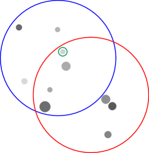

# Symbolic Planning and Code Generation
for Grounded Dialogue

###### Abstract

Large language models (LLMs) excel at processing and generating both text and code. However, LLMs have had limited applicability in grounded task-oriented dialogue as they are difficult to steer toward task objectives and fail to handle novel grounding. We present a modular and interpretable grounded dialogue system that addresses these shortcomings by composing LLMs with a symbolic planner and grounded code execution. Our system consists of a reader and planner: the reader leverages an LLM to convert partner utterances into executable code, calling functions that perform grounding. The translated code’s output is stored to track dialogue state, while a symbolic planner determines the next appropriate response. We evaluate our system’s performance on the demanding OneCommon dialogue task, involving collaborative reference resolution on abstract images of scattered dots. Our system substantially outperforms the previous state-of-the-art, including improving task success in human evaluations from 56% to 69% in the most challenging setting.  

## 1 Introduction

Success in grounded task-oriented dialogue requires intentional communication guided by strategic planning (cohen1979-speech-acts; traum1994computational; Walker2004-generation; Rieser2009-planning; cicero, *inter alia*). Dialogue agents must read partner utterances, update their beliefs, then make a plan that furthers their goal. These plans must take into account both dialogue history and grounding, such as in an image. In end-to-end systems based solely on large language models (LLMs), this process is implicit and therefore difficult to control, requiring extra supervision (rlhf) or expensive search (astaresque) to improve. While recent work has taken steps to rectify implicit reasoning via planning in language space, where intermediate steps are generated by an LLM (cot), there is no guarantee that these approaches result in plans that further task progress. Additionally, planning in language space is expensive, requiring inference in an LLM (yarats2017rollout; bamcp).  

[FIGURE S1.F1.g1]

Figure 1: 
An example grounded dialogue from OneCommon. Our dialogue agent, SPC, and a human partner have different but overlapping circular views of a shared board.
The agent and partner must collaborate through dialogue in order to find and
select a shared dot.
OneCommon demands careful, grounded reasoning.
[/FIGURE]

Rather than implicit or heuristic reasoning, we are interested in explicit reasoning and planning over symbolic actions. Symbolic actions are controllable by construction, allowing system designers to easily build in task-specific knowledge (he2018dnd; cicero). This controllability is crucial for obtaining task-specific success using general tools, even with LLMs.  

We provide an example from OneCommon, a particularly challenging grounded dialogue game (onecommon). The goal of OneCommon is to, through dialogue, identify one dot in common with your partner, who has an overlapping but different view of an underlying set of dots, illustrated in [Figure 1](#S1.F1 "Figure 1 ‣ 1 Introduction ‣ Symbolic Planning and Code Generation for Grounded Dialogue"). The challenge in OneCommon is grounding the contextual spatial relationships described in language to dots.  

Recent work has utilized code-generation for grounded language understanding (vipergpt). In particular, they translate natural language questions to code as an intermediate representation, then execute that code to obtain an answer. Code has a couple appealing properties as an intermediate representation: First, modern language models are trained on a mixture of code and natural language, affording them the capability of, with some accuracy, translating between the two (chen2021evaluating). Second, code acts as a compositional knowledge representation. This allows code-generation systems to perform grounded compositional reasoning, provided a library of Python functions that perform grounding (codeaspolicies2022).  

We present a system, Symbolic Planning and Code-generation (SPC), that reads by translating partner utterances into code and plans based on symbolic reasoning over what to say next. Code as a compositional knowledge representation closely mirrors the compositional nature of utterances, which are composed of grounded parts. SPC plans by optimizing expected information gain, which has been shown to be effective at building a key aspect of collaborative dialogue: common ground (yu2019info; white-etal-2021-open; ocp). Symbolic planning allows SPC to explicitly and efficiently optimize for task success while taking advantage of task-specific properties.  

We evaluate our SPC system on the most challenging subset of the OneCommon task, comparing our system to the previous state-of-the-art supervised system for the task (fried). In both evaluations with human partners and automated self-play evaluations, we find that our approach substantially outperforms the previous state-of-the-art in task accuracy, improving from 56% to 69% accuracy, and obtains comparable task accuracy to human-human pairs on average.  

## 2 Related Work

Prior work on collaborative reference games focuses on building common ground (mf; pb; pip). Prior work by fried implements an approximation of pragmatic reasoning on OneCommon, but plans in language space and utilizes supervised models for mapping language to symbols. pip plan in symbolic space, but without natural language. We plan in symbolic space and map from language to symbols via code generation.  

Dialogue systems have a long history of reasoning with symbolic actions. When available, symbolic actions have been found to improve the performance of dialogue systems, especially in the setting of grounded dialogue (winograd; young2006pomdp; he2018dnd; sm; cicero). The closest work to ours is Cicero, which utilizes symbolic planning in a system for Diplomacy, a dialogue and strategy game that requires negotiation and coordination between players (cicero). Cicero requires a supervised dataset to train their system. We use code LLMs which require minimal supervision beyond constructing a small perceptual grounding API.  

Planning in dialogue systems has recently eschewed symbolic actions in favor of planning directly in text, where systems either perform roll-outs, tree-search, or other forms of intermediate reasoning in language. This allows system designers to avoid manually defining symbolic actions (yarats2017rollout; jang2020bapomdp; gandhi2023strategic). However, the accuracy of language-space planners is still low in many settings (fried; valmeekam2023planning). We focus on symbolic planning, where planning is defined in a space that ensures accuracy and controllability.  

With the recent progress in large language modeling, code generation for modular grounded systems has quickly gained interest. Grounded code generation systems do not require task-specific training data, making them cheap to apply. A body of work utilizes a large language model for instruction following by generating Python code that makes calls to lower-level perception libraries (codeaspolicies2022; vipergpt; gupta2022visual; gao2023pal). This extends prior work on executable semantic parsing (liang2016learning; johnson2017inferring; cheng2018learning) with large language models. Concurrent work has also utilized code-generation to interpret language, integrated with symbolic reasoning (wong2023word). We apply these advances to the setting of grounded task-oriented dialogue, where code generation grounds language to symbolic actions for use in explicit planning.  

## 3 Overview: Reference Games

Collaborative reference games pair an agent and a partner in order to build common ground through natural language dialogue (pb; pip; mf; onecommon). Mirroring realistic scenarios, many reference games are also partially observable, where the agent and partner have different perspectives, and so they must resolve ambiguity.  

OneCommon (onecommon), as shown in Figure [1](#S1.F1 "Figure 1 ‣ 1 Introduction ‣ Symbolic Planning and Code Generation for Grounded Dialogue"), is a reference game that exemplifies two challenges: grounding and planning. In OneCommon, the agent and partner see different but overlapping views of a set of dots, and the goal is to find and select one dot common to both players’ views. Grounding in OneCommon is particularly difficult due to the dot-based visual context, which requires abstract spatial reasoning. Planning is complicated by the partial observability caused by differing perspectives, which require agents to use complex referring expressions in order to avoid ambiguity.111The contexts in OneCommon were constructed to make referring expressions challenging and context-dependent. For example, if the agent sees only light dots, a relatively ‘dark’ dot for the agent may not be considered dark at all by the partner.OneCommon is an ideal testbed for pragmatic methods that reason about contextual meaning. While our approach does not address pragmatics, we hope future work will. We focus on OneCommon due to its simplicity and difficulty.  

Our approach to grounded reference games separates symbolic reasoning from language, allowing explicit steering. Our system, Symbolic Planning and Code-generation (SPC), breaks down a turn into three procedures: reading, planning, and writing. Reading and writing convert from language to symbols and vice versa, while planning reasons in purely symbolic space.  

The agent maintains a belief distribution over possible worlds, $z$, representing task-specific unknowns. The goal of dialogue is to gain information about $z$ until the agent is confident enough to end the game. At each turn, the agent reads the partner’s utterance $u$, converting it into a symbolic action, $p(x|u)$. This symbolic action potentially builds upon the action $x^{\prime}$ of a previous utterance, $u^{\prime}$. The agent then plans in symbolic space. The system uses reasoning to update its belief state, $p(z|u)=\sum_{x}p(z|x)p(x|u)$, then produces a response $y^{*}$ of what to say next, which it describes in language to the partner. There is additionally a templated write module for generating a response from $y^{*}$ described in Appendix LABEL:sec:templates.  

In OneCommon, given a set of dots $\mathcal{D}$, the state $z\in\{0,1\}^{|\mathcal{D}|}$ represents which dots the agent believes are contained (1) and not contained (0) in the partner’s view, illustrated in Figure LABEL:fig:system. We call a set of dots a configuration. The action representation of partner, $x$ and $x^{\prime}$, and agent utterances, $y^{*}$, alike is also a configuration in $\{0,1\}^{|\mathcal{D}|}$, as well as any answers or confirmations to previous questions.  

## 4 Reading: From Language to Symbols

Reading in SPC requires interpreting utterances to a grounded symbolic action, which in turn facilitates the planning stage. Consider the following exchange:  

