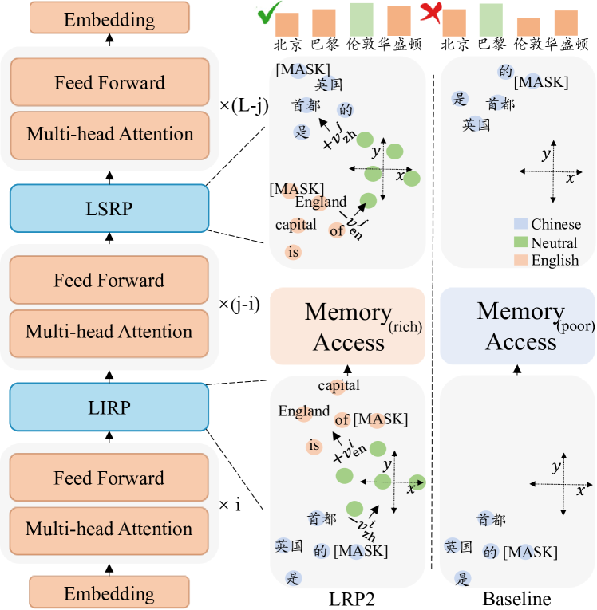
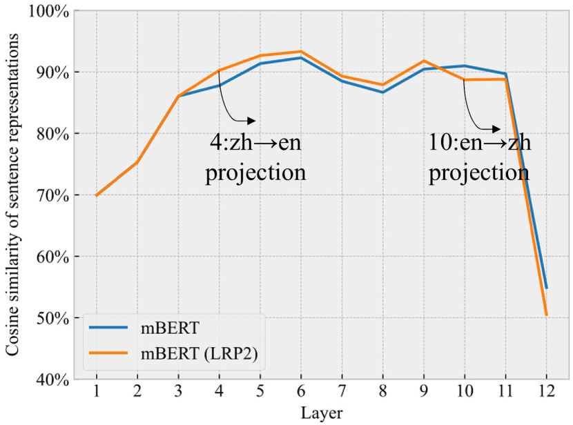
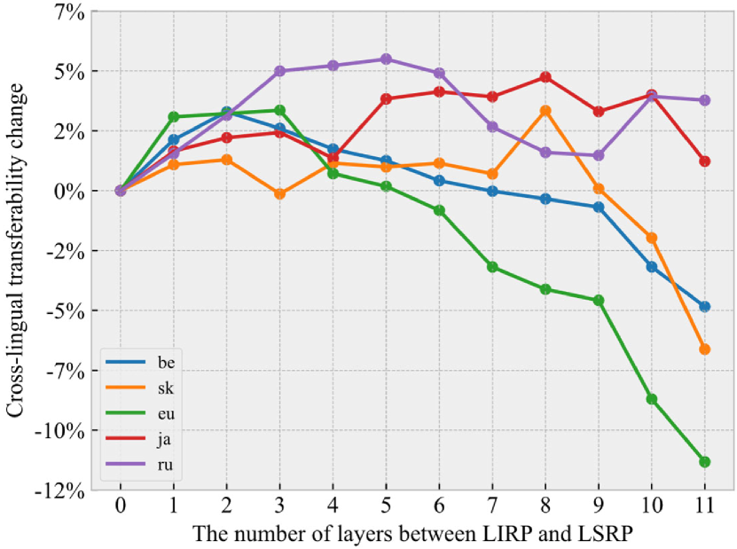
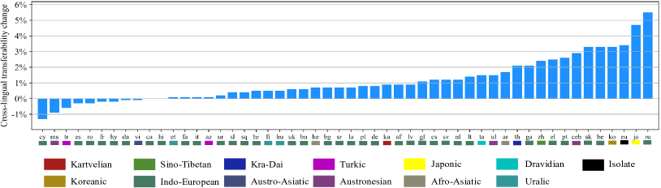
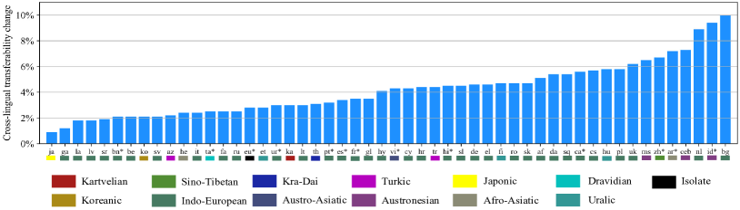
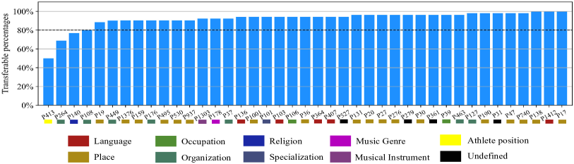
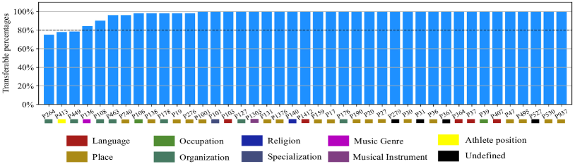

# Language Representation Projection: Can We Transfer Factual Knowledge across Languages in Multilingual Language Models?

###### Abstract

Multilingual pretrained language models serve as repositories of multilingual factual knowledge. Nevertheless, a substantial performance gap of factual knowledge probing exists between high-resource languages and low-resource languages, suggesting limited implicit factual knowledge transfer across languages in multilingual pretrained language models. This paper investigates the feasibility of explicitly transferring relatively rich factual knowledge from English to non-English languages. To accomplish this, we propose two parameter-free Language Representation Projection modules (LRP2). The first module converts non-English representations into English-like equivalents, while the second module reverts English-like representations back into representations of the corresponding non-English language. Experimental results on the mLAMA dataset demonstrate that LRP2 significantly improves factual knowledge retrieval accuracy and facilitates knowledge transferability across diverse non-English languages. We further investigate the working mechanism of LRP2 from the perspectives of representation space and cross-lingual knowledge neuron.  

## 1 Introduction

Previous studies demonstrate that a language model is a knowledge base that can recall factual knowledge without additional fine-tuning (Petroni et al., [2019](#bib.bib18); Jiang et al., [2020b](#bib.bib11)). This task of factual knowledge probing, aiming to examine what factual knowledge language models capture during the pre-training phase, can be extended to multiple languages in multilingual pretrained language models, e.g., mBERT (Devlin et al., [2019](#bib.bib9)), XLM (Conneau and Lample, [2019](#bib.bib6)), mT5 (Xue et al., [2021](#bib.bib23)), XGLM (Lin et al., [2022](#bib.bib15)) and BLOOM (Scao et al., [2022](#bib.bib19)). Although multilingual pretrained models serve as repositories of multilingual factual knowledge, a factual knowledge gap exists between English and other languages in terms of the amount of factual knowledge captured for each language (Kassner et al., [2021](#bib.bib12); Jiang et al., [2020a](#bib.bib10)).  

Many works on cross-lingual transfer (Conneau et al., [2020](#bib.bib5); Chi et al., [2021](#bib.bib4); Wu et al., [2022](#bib.bib21); Yang et al., [2022](#bib.bib24)) validate the effectiveness of cross-lingual alignment of representation spaces in facilitating cross-lingual knowledge transfer. These studies primarily evaluate their methods on specific downstream tasks, including natural language inference (Conneau et al., [2018](#bib.bib7)), sentence retrieval (Artetxe and Schwenk, [2019](#bib.bib1)), question answering (Lewis et al., [2020](#bib.bib13)) and text generation (Wu et al., [2022](#bib.bib21)), etc.  

Different from such studies, we focus on the task of factual knowledge probing in multilingual pretrained language models and attempt to answer a question in this paper: *Can cross-lingual alignment of representation spaces enable factual knowledge transfer across languages?* In particular, we explore the feasibility of transferring factual knowledge from English to non-English languages.  

To answer this question, we propose LRP2, which incorporates two parameter-free Language Representation Projection modules into multilingual pretrained models: a language-independent representation projection module that projects representations of non-English languages into English-like representations and a language-specific representation projection module that maps the English-like representations back to representations of individual non-English languages. These two modules, as depicted in Figure [1](#S2.F1 "Figure 1 ‣ 2 Multilingual Factual Knowledge Probing ‣ Language Representation Projection: Can We Transfer Factual Knowledge across Languages in Multilingual Language Models?"), locate at different layers of Transformer.  

Experiments on mLAMA (Kassner et al., [2021](#bib.bib12)) suggest that LRP2 improves factual knowledge retrieval accuracy and facilitates knowledge transfer across diverse languages. We further conduct in-depth analysis to investigate the varying degrees of representation alignment required by different non-English languages, as well as the transferability of different types of factual knowledge. Delving into the working mechanism of LRP2, we identify cross-lingual knowledge neurons in multilingual pretrained language models.  

Our contributions are summarized as follows.  

* We propose a parameter-free framework LRP2 that enhances factual knowledge retrieval accuracy and cross-lingual factual knowledge transfer. 
* We reveal that LRP2 poses an impact on the alignment of representation spaces and enhances the overlap of knowledge neurons across languages. 
* We discover that cross-lingual knowledge neurons exist in multilingual language models. 

## 2 Multilingual Factual Knowledge Probing

In the multilingual factual knowledge probing task, multilingual pretrained language models take language-specific fill-in-the-blank queries as input, such as "The capital of England is [MASK]" in English, or the corresponding Chinese question "英国的首都是[MASK]". As a knowledge base, the probed pretrained language model initially encodes the input query, then retrieves its parameterized memory and ultimately predicts an answer with a probability distribution over the vocabulary.  

The success of factual knowledge transfer across languages relies on a language-independent representation space for different languages to trigger similar memories within the probed multilingual pretrained model and language-specific representations to allow the model to predict tokens in the corresponding language.  

[FIGURE S2.F1.g1]

Figure 1: The diagram of the proposed LRP2 that inserts two language representation projection modules as additional layers into the multilingual pretrained language model. The input question is "英国的首都是[MASK]". $\bm{v}_{\text{zh}}^{i}$,
$\bm{v}_{\text{en}}^{i}$,
$\bm{v}_{\text{zh}}^{j}$ and $\bm{v}_{\text{en}}^{j}$ represent language vectors obtained for Chinese and English from the $i$-th and $j$-th layer of the multilingual pretrained language model in advance. We use Chinese to showcase our framework and our method is applicable to other languages in the same way. For simplicity, we ignore other sublayers in Transformer in the diagram. Note that our method is based on the core assumption that the representation spaces of two languages can be transferred through a Euclidean distance mapping. This form of straightforward mapping is relatively coarse, incapable of achieving the level of precise semantic transfer depicted in the figure, which is presented for the sake of illustration but may appear somewhat overly idealized.
[/FIGURE]

[TABLE S2.T1]

Model
 

English

(Source)
 
Language Family
Language Resource
Avg

Indo-European
non-Indo-European
High
Medium
Low

<em class="ltx_emph ltx_font_italic">Retrieval Accuracy</em>

mBERT
35.2
20.9
18.4
23.4
22.2
17.4
20.0

mBERT (LRP2)
35.2
21.2
19.4
24.1
23.0
17.7
20.6

BLOOM
35.1
17.8
18.4
21.7
17.2
16.1
18.0

BLOOM (LRP2)
35.1
21.3
22.4
25.8
21.2
19.3
21.7

<em class="ltx_emph ltx_font_italic">English-centric Cross-lingual Transferability</em>

mBERT
1
37.0
31.8
41.6
37.7
30.5
35.2

mBERT (LRP2)
1
37.9
33.1
43.1
38.5
31.5
36.3

BLOOM
1
20.4
20.3
25.7
19.3
17.6
20.4

BLOOM (LRP2)
1
24.5
24.7
30.3
24.0
21.4
24.6

Table 1: Evaluation results on mLAMA. We report factual knowledge retrieval accuracy and English-centric cross-lingual transferability. We list average results for Indo-European, non-Indo-European, high-resource, medium-resource, low-resource and all non-English languages. We measure the amount of language resource based on the number of Wikipedia articles for each language.
[/TABLE]

## 3 LRP2

The primary objective of LRP2 is to bridge the gap of factual knowledge probing between English and non-English languages by aligning their representation spaces.  

Libovický et al. ([2020](#bib.bib14)) demonstrate that it is possible to induce language-neutral representations for a given language, by subtracting its corresponding language vector. The proposed LRP2 draws inspiration from this work and initiates its process by computing a set of language vectors $\mathcal{V}_{l}$ for each language $l$. Specifically, for language $l$, we feed a set of its sentences into the multilingual pretrained language model to be probed. From the $i$-th layer of the model, we gather sentence-level vectors through mean-pooling over the representations of all tokens in the corresponding sentence. We then further average these sentence vectors, obtaining $\bm{v}_{l}^{i}\in\mathbb{R}^{n}$, where $n$ is the hidden dimension of the model. In this way, we collect a set of vectors $\mathcal{V}_{l}=[\bm{v}_{l}^{1},\bm{v}_{l}^{2},...,\bm{v}_{l}^{L}]$, where ${L}$ denotes the number of layers of the model. These language vectors serve as the basis for language representation projection within the proposed LRP2 framework.  

As illustrated in Figure [1](#S2.F1 "Figure 1 ‣ 2 Multilingual Factual Knowledge Probing ‣ Language Representation Projection: Can We Transfer Factual Knowledge across Languages in Multilingual Language Models?"), LRP2 incorporates two language representation projection modules into the probed multilingual pretrained language model, which are referred to as the Language-Independent Representation Projection (LIRP) module and the Language-Specific Representation Projection (LSRP) module, respectively. These two modules are inserted into the model as two additional layers. Representations of a non-English language with limited information are projected to the English representation space by LIRP, which enables the non-English language to access relatively rich memory encoded in the parameters of the model, in the form of English-like representations. The accessed memory is then projected back to the non-English language by LSRP so that answers in the corresponding non-English language can be yielded.  

Specifically, given an input query in a non-English language $l$, the LIRP first projects the contextual representations from the $i$-th layer of the model into English-like representations, which can be formulated as follows:  

|  | $$\bm{\hat{h}}^{i}_{l}=\bm{h}^{i}_{l}-\bm{v}^{i}_{l}+\bm{v}^{i}_{\text{en}}\quad(1\leq i\textless{L})$$ |  | (1) |
| --- | --- | --- | --- |

where $\bm{h}^{i}_{l}$ represent the $i$-th layer hidden states of the input query in language $l$. $\bm{v}^{i}_{l}$ and $\bm{v}^{i}_{\text{en}}$ denote the language vectors of the $i$-th layer for non-English language $l$ and English respectively. By performing this projection, the representations of non-English language $l$ are mapped into the English space and subsequently fed to the succeeding layers.  

As mentioned in Section [2](#S2 "2 Multilingual Factual Knowledge Probing ‣ Language Representation Projection: Can We Transfer Factual Knowledge across Languages in Multilingual Language Models?"), in the multilingual factual knowledge probing task, it is essential for the multilingual pretrained language model to yield answers in the corresponding language. To recover the language-specific information of the input language, we insert the LSRP into the $j$-th layer of the model. The back-projection to the input language is formulated as:  

|  | $$\bm{\hat{h}}^{j}_{l}=\bm{h}^{j}_{l}-\bm{v}^{j}_{\text{en}}+\bm{v}^{j}_{l}\quad(i\textless j\leq{L})$$ |  | (2) |
| --- | --- | --- | --- |

where $\bm{h}^{j}_{l}$ represent the $j$-th layer hidden states of the input query in language $l$. $\bm{h}^{j}_{l}$ are English-like representations because of the first projection. They are transformed back into the language $l$’s representation space, resulting in $\bm{\hat{h}}^{j}_{l}$. These language-specific representations are further fed to the succeeding layers of the model.  

## 4 Experiments

We conducted extensive experiments to examine the effectiveness of the proposed LRP2 framework in factual knowledge transfer across languages.  

### 4.1 Settings

We utilized the TREx portion of mLAMA (Kassner et al., [2021](#bib.bib12)) for our experiments. Further information regarding mLAMA and the dataset employed to acquire language vectors can be found in Appendix [3](#footnote3 "footnote 3 ‣ A.1 Datasets ‣ Appendix A Experiment Details ‣ Language Representation Projection: Can We Transfer Factual Knowledge across Languages in Multilingual Language Models?"). We calculated factual knowledge retrieval accuracy as well as English-centric cross-lingual transferability for each language. The details on these evaluation metrics can be found in Appendix [A.2](#A1.SS2 "A.2 Evaluation Metrics ‣ Appendix A Experiment Details ‣ Language Representation Projection: Can We Transfer Factual Knowledge across Languages in Multilingual Language Models?"). The experiments were based on two multilingual pretrained language models, mBERT111https://huggingface.co/bert-base-multilingual-cased and BLOOM222https://huggingface.co/bigscience/bloom-560m (the version with 559 million parameters). The details of probing them can be found in Appendix [A.3](#A1.SS3 "A.3 Probing mBERT and BLOOM ‣ Appendix A Experiment Details ‣ Language Representation Projection: Can We Transfer Factual Knowledge across Languages in Multilingual Language Models?"). Note that the $i$-layer for inserting LIRP and the $j$-layer for inserting LSRP are two hyperparameters, the details on the setting of them can be found in Appendix [A.4](#A1.SS4 "A.4 Hyperparameters ‣ Appendix A Experiment Details ‣ Language Representation Projection: Can We Transfer Factual Knowledge across Languages in Multilingual Language Models?").  

### 4.2 Results

Table [1](#S2.T1 "Table 1 ‣ 2 Multilingual Factual Knowledge Probing ‣ Language Representation Projection: Can We Transfer Factual Knowledge across Languages in Multilingual Language Models?") presents the experimental results on mLAMA, it shows that LRP2 achieves significant improvements in terms of both factual knowledge retrieval accuracy and cross-lingual transferability across various non-English languages over the baseline. The results indicate that cross-lingual alignment of representation spaces indeed facilitates the transfer of rich factual knowledge from English to non-English. More specifically, for both mBERT and BLOOM, LRP2 demonstrates better performance in certain non-Indo-European languages as well as medium- and high-resource languages.  

Additional experimental results on X-FACTR (Jiang et al., [2020a](#bib.bib10)) are provided in Appendix [B.1](#A2.SS1 "B.1 Experiments on X-FACTR ‣ Appendix B Additional Results ‣ Language Representation Projection: Can We Transfer Factual Knowledge across Languages in Multilingual Language Models?"). To provide further insights, we present the performance changes for different languages as the number of layers between LIRP and LSRP varies in Appendix [B.2](#A2.SS2 "B.2 Different Languages Necessitate Varying Optimal Layer Settings ‣ Appendix B Additional Results ‣ Language Representation Projection: Can We Transfer Factual Knowledge across Languages in Multilingual Language Models?"). The specific effects of LRP2 on different non-English languages are provided in Appendix [B.3](#A2.SS3 "B.3 The Impact of LRP2 Differs across Non-English Languages ‣ Appendix B Additional Results ‣ Language Representation Projection: Can We Transfer Factual Knowledge across Languages in Multilingual Language Models?"). In addition, we observe that the transferability of knowledge shows variations across different types of factual relations, as evidenced in Appendix [B.4](#A2.SS4 "B.4 The Transferability Varies across Factual Relations ‣ Appendix B Additional Results ‣ Language Representation Projection: Can We Transfer Factual Knowledge across Languages in Multilingual Language Models?").  

[FIGURE S4.F2.sf1.g1]

(a) Representation Spaces
[/FIGURE]

[TABLE S4.T2]

Model
Same
Different
Avg

mBERT
17.9%
11.5%
11.7%

mBERT (LRP2)
18.5%
11.9%
12.1%

Table 2: Overlap rate of knowledge neurons for factual relations in Chinese and English.
[/TABLE]

## 5 Working Mechanism of LRP2

In this section, we study the working mechanism of LRP2 from the perspectives of representation space and knowledge neuron.  

### 5.1 LRP2 Affects the Alignment of Representation Spaces across Languages

We utilized Chinese-English parallel queries in the mLAMA dataset to collect sentence representations and further calculated the layer-wise cosine similarity of these two languages’ sentence representations, as the distance between the representation spaces of these two languages. We conducted a comparative analysis of the distance with and without the utilization of LRP2.  

Figure [2(a)](#S4.F2.sf1 "In Figure 2 ‣ 4.2 Results ‣ 4 Experiments ‣ Language Representation Projection: Can We Transfer Factual Knowledge across Languages in Multilingual Language Models?") presents the distance between the representation spaces of Chinese and English. It clearly shows the distinct functions of LIRP and LSRP. Specifically, the LIRP module first brings Chinese sentences closer to the representation space of English, thereby facilitating cross-lingual knowledge transfer, while the LSRP module increases the distance between Chinese sentences and the representation space of English, inducing language-specific outputs in Chinese.  

### 5.2 LRP2 Enhances the Overlap of Knowledge Neurons across Languages

Dai et al. ([2022](#bib.bib8)) discover that knowledge neurons expressing specific factual knowledge exist in pretrained Transformers. Building upon their work, we identify knowledge neurons in multilingual pretrained Transformers and employ them to elucidate the working mechanism of LRP2. The details on how we identify knowledge neurons in multilingual pretrained language models are provided in Appendix [C](#A3 "Appendix C Identifying Knowledge Neurons in Multilingual Pretrained Models ‣ Language Representation Projection: Can We Transfer Factual Knowledge across Languages in Multilingual Language Models?").  

Table [2](#S4.T2 "Table 2 ‣ 4.2 Results ‣ 4 Experiments ‣ Language Representation Projection: Can We Transfer Factual Knowledge across Languages in Multilingual Language Models?") showcases the overlap rate of knowledge neurons for factual relations in Chinese and English. Notably, we have two interesting findings. First, the overlap rate of knowledge neurons associated with the same relations is considerably higher compared to that with different relations, suggesting the existence of language-independent knowledge neurons within mBERT. Second, LRP2 increases the overlap rate of knowledge neurons between Chinese and English. This improvement indicates that LRP2 facilitates the alignment of English and non-English representation spaces and enhances the activation of knowledge neurons in non-English languages, making them more similar to those in English. In this way, non-English languages acquire factual knowledge transferred from English. Additionally, Figure [2(b)](#S4.F2.sf2 "In Figure 2 ‣ 4.2 Results ‣ 4 Experiments ‣ Language Representation Projection: Can We Transfer Factual Knowledge across Languages in Multilingual Language Models?") visualizes the overlap rate of knowledge neurons across different layers. Notably, the layers between LIRP and LSRP exhibit a prominent increase in the overlap rate of knowledge neurons between Chinese and English.  

## 6 Related Work

#### Factual Knowledge Probing

Previous works (Petroni et al., [2019](#bib.bib18); Jiang et al., [2020b](#bib.bib11)) have shown that a language model is a knowledge base. Subsequent works (Kassner et al., [2021](#bib.bib12); Jiang et al., [2020a](#bib.bib10)) extend monolingual factual knowledge probing to multiple languages. Notably, Jiang et al. ([2020a](#bib.bib10)) improve multilingual factual knowledge probing in a code-switching style. Significantly different from this, we suggest that it is essential to allow multilingual pretrained language models to yield language-specific answers.  

#### Model Editing

A variety of approaches have been proposed to edit knowledge in monolingual language models (Sinitsin et al., [2020](#bib.bib20); Cao et al., [2021](#bib.bib2); Mitchell et al., [2022](#bib.bib17); Meng et al., [2022](#bib.bib16); Dai et al., [2022](#bib.bib8)). Recently, Xu et al. ([2022](#bib.bib22)) define a cross-lingual model editing task, where knowledge updates in one language need to occur in other languages as well. In this paper, we focus on factual knowledge that already exists in multilingual language models and enhance the transferability of them, rather than trying to update a model with new knowledge.  

#### Cross-lingual Knowledge Transfer

Cross-lingual transfer learning approaches are usually categorized into instance transfer (Zheng et al., [2021](#bib.bib28); Yang et al., [2022](#bib.bib24)), parameter transfer (Chen et al., [2019](#bib.bib3); Zhou et al., [2019](#bib.bib29)), and feature transfer (Libovický et al., [2020](#bib.bib14); Zhao et al., [2021](#bib.bib27)). Most of these works explore cross-lingual knowledge transfer on specific downstream tasks, while we focus on factual knowledge captured by language models and explore the possibility of cross-lingual factual knowledge transfer.  

## 7 Conclusion

We have presented a simple yet effective method to transfer factual knowledge from English to non-English languages in multilingual pretrained language models. We empirically confirm that cross-lingual alignment of representation spaces enables factual knowledge transfer across languages in multilingual pretrained language models. Further analysis on knowledge neurons shows that the alignment of English and non-English representation spaces brought by LRP2 can help non-English languages to stimulate knowledge neurons similar to English, thereby acquiring knowledge transferred from English.  

## Limitations

While LRP2 significantly improves factual knowledge retrieval accuracy and facilitates knowledge transferability across diverse non-English languages, it is noteworthy that the LIRP and LSRP modules in LRP2 are inserted into multilingual pretrained language models as two additional layers. Thus, the effectiveness of LRP2 heavily relies on the inherent capabilities of multilingual pretrained language models.  

Through extensive experiments conducted on the proposed LRP2 framework, we have demonstrated that cross-lingual alignment of representation spaces enables factual knowledge transfer across different languages. Although this finding is applicable to multilingual pretrained language models of varying architectures, our experiments are limited to two relatively small models due to the limited compute resource available to us. We plan to investigate LRP2 on larger language models when more compute resource is available.  

## Acknowledgements

The present research was supported by Zhejiang Lab (No. 2022KH0AB01). We would like to thank the anonymous reviewers for their insightful comments.  

## References

* Artetxe and Schwenk (2019)  Mikel Artetxe and Holger Schwenk. 2019.   [Massively multilingual sentence embeddings for zero-shot cross-lingual transfer and beyond](https://doi.org/10.1162/tacl_a_00288).   *Trans. Assoc. Comput. Linguistics*, 7:597–610. 
* Cao et al. (2021)  Nicola De Cao, Wilker Aziz, and Ivan Titov. 2021.   [Editing factual knowledge in language models](https://doi.org/10.18653/v1/2021.emnlp-main.522).   In *Proceedings of the 2021 Conference on Empirical Methods in Natural Language Processing, EMNLP 2021, Virtual Event / Punta Cana, Dominican Republic, 7-11 November, 2021*, pages 6491–6506. Association for Computational Linguistics. 
* Chen et al. (2019)  Xilun Chen, Ahmed Hassan Awadallah, Hany Hassan, Wei Wang, and Claire Cardie. 2019.   [Multi-source cross-lingual model transfer: Learning what to share](https://doi.org/10.18653/v1/p19-1299).   In *Proceedings of the 57th Conference of the Association for Computational Linguistics, ACL 2019, Florence, Italy, July 28- August 2, 2019, Volume 1: Long Papers*, pages 3098–3112. Association for Computational Linguistics. 
* Chi et al. (2021)  Zewen Chi, Li Dong, Furu Wei, Nan Yang, Saksham Singhal, Wenhui Wang, Xia Song, Xian-Ling Mao, Heyan Huang, and Ming Zhou. 2021.   [Infoxlm: An information-theoretic framework for cross-lingual language model pre-training](https://doi.org/10.18653/v1/2021.naacl-main.280).   In *Proceedings of the 2021 Conference of the North American Chapter of the Association for Computational Linguistics: Human Language Technologies, NAACL-HLT 2021, Online, June 6-11, 2021*, pages 3576–3588. Association for Computational Linguistics. 
* Conneau et al. (2020)  Alexis Conneau, Kartikay Khandelwal, Naman Goyal, Vishrav Chaudhary, Guillaume Wenzek, Francisco Guzmán, Edouard Grave, Myle Ott, Luke Zettlemoyer, and Veselin Stoyanov. 2020.   [Unsupervised cross-lingual representation learning at scale](https://doi.org/10.18653/v1/2020.acl-main.747).   In *Proceedings of the 58th Annual Meeting of the Association for Computational Linguistics, ACL 2020, Online, July 5-10, 2020*, pages 8440–8451. Association for Computational Linguistics. 
* Conneau and Lample (2019)  Alexis Conneau and Guillaume Lample. 2019.   [Cross-lingual language model pretraining](https://proceedings.neurips.cc/paper/2019/hash/c04c19c2c2474dbf5f7ac4372c5b9af1-Abstract.html).   In *Advances in Neural Information Processing Systems 32: Annual Conference on Neural Information Processing Systems 2019, NeurIPS 2019, December 8-14, 2019, Vancouver, BC, Canada*, pages 7057–7067. 
* Conneau et al. (2018)  Alexis Conneau, Ruty Rinott, Guillaume Lample, Adina Williams, Samuel R. Bowman, Holger Schwenk, and Veselin Stoyanov. 2018.   [XNLI: evaluating cross-lingual sentence representations](https://doi.org/10.18653/v1/d18-1269).   In *Proceedings of the 2018 Conference on Empirical Methods in Natural Language Processing, Brussels, Belgium, October 31 - November 4, 2018*, pages 2475–2485. Association for Computational Linguistics. 
* Dai et al. (2022)  Damai Dai, Li Dong, Yaru Hao, Zhifang Sui, Baobao Chang, and Furu Wei. 2022.   [Knowledge neurons in pretrained transformers](https://doi.org/10.18653/v1/2022.acl-long.581).   In *Proceedings of the 60th Annual Meeting of the Association for Computational Linguistics (Volume 1: Long Papers), ACL 2022, Dublin, Ireland, May 22-27, 2022*, pages 8493–8502. Association for Computational Linguistics. 
* Devlin et al. (2019)  Jacob Devlin, Ming-Wei Chang, Kenton Lee, and Kristina Toutanova. 2019.   [BERT: pre-training of deep bidirectional transformers for language understanding](https://doi.org/10.18653/v1/n19-1423).   In *Proceedings of the 2019 Conference of the North American Chapter of the Association for Computational Linguistics: Human Language Technologies, NAACL-HLT 2019, Minneapolis, MN, USA, June 2-7, 2019, Volume 1 (Long and Short Papers)*, pages 4171–4186. Association for Computational Linguistics. 
* Jiang et al. (2020a)  Zhengbao Jiang, Antonios Anastasopoulos, Jun Araki, Haibo Ding, and Graham Neubig. 2020a.   [X-FACTR: multilingual factual knowledge retrieval from pretrained language models](https://doi.org/10.18653/v1/2020.emnlp-main.479).   In *Proceedings of the 2020 Conference on Empirical Methods in Natural Language Processing, EMNLP 2020, Online, November 16-20, 2020*, pages 5943–5959. Association for Computational Linguistics. 
* Jiang et al. (2020b)  Zhengbao Jiang, Frank F. Xu, Jun Araki, and Graham Neubig. 2020b.   [How can we know what language models know](https://doi.org/10.1162/tacl_a_00324).   *Trans. Assoc. Comput. Linguistics*, 8:423–438. 
* Kassner et al. (2021)  Nora Kassner, Philipp Dufter, and Hinrich Schütze. 2021.   [Multilingual LAMA: investigating knowledge in multilingual pretrained language models](https://doi.org/10.18653/v1/2021.eacl-main.284).   In *Proceedings of the 16th Conference of the European Chapter of the Association for Computational Linguistics: Main Volume, EACL 2021, Online, April 19 - 23, 2021*, pages 3250–3258. Association for Computational Linguistics. 
* Lewis et al. (2020)  Patrick S. H. Lewis, Barlas Oguz, Ruty Rinott, Sebastian Riedel, and Holger Schwenk. 2020.   [MLQA: evaluating cross-lingual extractive question answering](https://doi.org/10.18653/v1/2020.acl-main.653).   In *Proceedings of the 58th Annual Meeting of the Association for Computational Linguistics, ACL 2020, Online, July 5-10, 2020*, pages 7315–7330. Association for Computational Linguistics. 
* Libovický et al. (2020)  Jindrich Libovický, Rudolf Rosa, and Alexander Fraser. 2020.   [On the language neutrality of pre-trained multilingual representations](https://doi.org/10.18653/v1/2020.findings-emnlp.150).   In *Findings of the Association for Computational Linguistics: EMNLP 2020, Online Event, 16-20 November 2020*, volume EMNLP 2020 of *Findings of ACL*, pages 1663–1674. Association for Computational Linguistics. 
* Lin et al. (2022)  Xi Victoria Lin, Todor Mihaylov, Mikel Artetxe, Tianlu Wang, Shuohui Chen, Daniel Simig, Myle Ott, Naman Goyal, Shruti Bhosale, Jingfei Du, Ramakanth Pasunuru, Sam Shleifer, Punit Singh Koura, Vishrav Chaudhary, Brian O’Horo, Jeff Wang, Luke Zettlemoyer, Zornitsa Kozareva, Mona T. Diab, Veselin Stoyanov, and Xian Li. 2022.   [Few-shot learning with multilingual generative language models](https://aclanthology.org/2022.emnlp-main.616).   In *Proceedings of the 2022 Conference on Empirical Methods in Natural Language Processing, EMNLP 2022, Abu Dhabi, United Arab Emirates, December 7-11, 2022*, pages 9019–9052. Association for Computational Linguistics. 
* Meng et al. (2022)  Kevin Meng, David Bau, Alex Andonian, and Yonatan Belinkov. 2022.   [Locating and editing factual knowledge in GPT](http://arxiv.org/abs/2202.05262).   *CoRR*, abs/2202.05262. 
* Mitchell et al. (2022)  Eric Mitchell, Charles Lin, Antoine Bosselut, Chelsea Finn, and Christopher D. Manning. 2022.   [Fast model editing at scale](https://openreview.net/forum?id=0DcZxeWfOPt).   In *The Tenth International Conference on Learning Representations, ICLR 2022, Virtual Event, April 25-29, 2022*. OpenReview.net. 
* Petroni et al. (2019)  Fabio Petroni, Tim Rocktäschel, Sebastian Riedel, Patrick S. H. Lewis, Anton Bakhtin, Yuxiang Wu, and Alexander H. Miller. 2019.   [Language models as knowledge bases?](https://doi.org/10.18653/v1/D19-1250)  In *Proceedings of the 2019 Conference on Empirical Methods in Natural Language Processing and the 9th International Joint Conference on Natural Language Processing, EMNLP-IJCNLP 2019, Hong Kong, China, November 3-7, 2019*, pages 2463–2473. Association for Computational Linguistics. 
* Scao et al. (2022)  Teven Le Scao, Angela Fan, Christopher Akiki, Ellie Pavlick, Suzana Ilic, Daniel Hesslow, Roman Castagné, Alexandra Sasha Luccioni, François Yvon, Matthias Gallé, Jonathan Tow, Alexander M. Rush, Stella Biderman, Albert Webson, Pawan Sasanka Ammanamanchi, Thomas Wang, Benoît Sagot, Niklas Muennighoff, Albert Villanova del Moral, Olatunji Ruwase, Rachel Bawden, Stas Bekman, Angelina McMillan-Major, Iz Beltagy, Huu Nguyen, Lucile Saulnier, Samson Tan, Pedro Ortiz Suarez, Victor Sanh, Hugo Laurençon, Yacine Jernite, Julien Launay, Margaret Mitchell, Colin Raffel, Aaron Gokaslan, Adi Simhi, Aitor Soroa, Alham Fikri Aji, Amit Alfassy, Anna Rogers, Ariel Kreisberg Nitzav, Canwen Xu, Chenghao Mou, Chris Emezue, Christopher Klamm, Colin Leong, Daniel van Strien, David Ifeoluwa Adelani, and et al. 2022.   [BLOOM: A 176b-parameter open-access multilingual language model](https://doi.org/10.48550/arXiv.2211.05100).   *CoRR*, abs/2211.05100. 
* Sinitsin et al. (2020)  Anton Sinitsin, Vsevolod Plokhotnyuk, Dmitry V. Pyrkin, Sergei Popov, and Artem Babenko. 2020.   [Editable neural networks](https://openreview.net/forum?id=HJedXaEtvS).   In *8th International Conference on Learning Representations, ICLR 2020, Addis Ababa, Ethiopia, April 26-30, 2020*. OpenReview.net. 
* Wu et al. (2022)  Xianze Wu, Zaixiang Zheng, Hao Zhou, and Yong Yu. 2022.   Laft: Cross-lingual transfer for text generation by language-agnostic finetuning.   In *Proceedings of the 15th International Conference on Natural Language Generation*, pages 260–266. 
* Xu et al. (2022)  Yang Xu, Yutai Hou, and Wanxiang Che. 2022.   [Language anisotropic cross-lingual model editing](https://doi.org/10.48550/arXiv.2205.12677).   *CoRR*, abs/2205.12677. 
* Xue et al. (2021)  Linting Xue, Noah Constant, Adam Roberts, Mihir Kale, Rami Al-Rfou, Aditya Siddhant, Aditya Barua, and Colin Raffel. 2021.   [mt5: A massively multilingual pre-trained text-to-text transformer](https://doi.org/10.18653/v1/2021.naacl-main.41).   In *Proceedings of the 2021 Conference of the North American Chapter of the Association for Computational Linguistics: Human Language Technologies, NAACL-HLT 2021, Online, June 6-11, 2021*, pages 483–498. Association for Computational Linguistics. 
* Yang et al. (2022)  Huiyun Yang, Huadong Chen, Hao Zhou, and Lei Li. 2022.   [Enhancing cross-lingual transfer by manifold mixup](https://openreview.net/forum?id=OjPmfr9GkVv).   In *The Tenth International Conference on Learning Representations, ICLR 2022, Virtual Event, April 25-29, 2022*. OpenReview.net. 
* Yin et al. (2022)  Da Yin, Hritik Bansal, Masoud Monajatipoor, Liunian Harold Li, and Kai-Wei Chang. 2022.   [Geomlama: Geo-diverse commonsense probing on multilingual pre-trained language models](https://aclanthology.org/2022.emnlp-main.132).   In *Proceedings of the 2022 Conference on Empirical Methods in Natural Language Processing, EMNLP 2022, Abu Dhabi, United Arab Emirates, December 7-11, 2022*, pages 2039–2055. Association for Computational Linguistics. 
* Zhang et al. (2020)  Biao Zhang, Philip Williams, Ivan Titov, and Rico Sennrich. 2020.   [Improving massively multilingual neural machine translation and zero-shot translation](https://doi.org/10.18653/v1/2020.acl-main.148).   In *Proceedings of the 58th Annual Meeting of the Association for Computational Linguistics, ACL 2020, Online, July 5-10, 2020*, pages 1628–1639. Association for Computational Linguistics. 
* Zhao et al. (2021)  Wei Zhao, Steffen Eger, Johannes Bjerva, and Isabelle Augenstein. 2021.   [Inducing language-agnostic multilingual representations](https://doi.org/10.18653/v1/2021.starsem-1.22).   In *Proceedings of \*SEM 2021: The Tenth Joint Conference on Lexical and Computational Semantics, \*SEM 2021, Online, August 5-6, 2021*, pages 229–240. Association for Computational Linguistics. 
* Zheng et al. (2021)  Bo Zheng, Li Dong, Shaohan Huang, Wenhui Wang, Zewen Chi, Saksham Singhal, Wanxiang Che, Ting Liu, Xia Song, and Furu Wei. 2021.   [Consistency regularization for cross-lingual fine-tuning](https://doi.org/10.18653/v1/2021.acl-long.264).   In *Proceedings of the 59th Annual Meeting of the Association for Computational Linguistics and the 11th International Joint Conference on Natural Language Processing, ACL/IJCNLP 2021, (Volume 1: Long Papers), Virtual Event, August 1-6, 2021*, pages 3403–3417. Association for Computational Linguistics. 
* Zhou et al. (2019)  Joey Tianyi Zhou, Hao Zhang, Di Jin, Hongyuan Zhu, Meng Fang, Rick Siow Mong Goh, and Kenneth Kwok. 2019.   [Dual adversarial neural transfer for low-resource named entity recognition](https://doi.org/10.18653/v1/p19-1336).   In *Proceedings of the 57th Conference of the Association for Computational Linguistics, ACL 2019, Florence, Italy, July 28- August 2, 2019, Volume 1: Long Papers*, pages 3461–3471. Association for Computational Linguistics. 

## Appendix A Experiment Details

### A.1 Datasets

mLAMA (Kassner et al., [2021](#bib.bib12)) is a multilingual factual knowledge probing dataset containing 53 languages and 44 factual relations, and the TREx part contains 41 of them. To obtain language vectors, we used OPUS-100 (Zhang et al., [2020](#bib.bib26)) to collect 10,000 filtered sentences for most of the 53 languages, and for languages not included in OPUS-100, such as ceb, we obtained data from the OPUS.333https://opus.nlpl.eu  

### A.2 Evaluation Metrics

We calculated factual knowledge retrieval accuracy for each language $l$ as $\operatorname{Acc}_{l}=\frac{\lvert\mathcal{R}_{l}\lvert}{\lvert\mathcal{D}_{l}\lvert}*100$, where $\mathcal{R}_{l}$ represents the set of correctly predicted knowledge for language $l$ and $\mathcal{D}_{l}$ represents the entire probing data for language $l$. Additionally, we calculated English-centric cross-lingual transferability as $\operatorname{Trans}_{l}=\frac{\lvert\mathcal{R}_{l}\cap\mathcal{R}_{\text{en}}\lvert}{\lvert\mathcal{R}_{l}\cup\mathcal{R}_{\text{en}}\lvert}*100$. Here, the denominator $\lvert\mathcal{R}_{l}\cup\mathcal{R}_{\text{en}}\lvert$ corresponds to the amount of knowledge stored in the probed model, whether in non-English language $l$ or in English form, while the numerator $\lvert\mathcal{R}_{l}\cap\mathcal{R}_{\text{en}}\lvert$ represents the amount of the stored knowledge both in the form of language $l$ and English, indicating the amount of transferable knowledge.  

### A.3 Probing mBERT and BLOOM

Following mLAMA (Kassner et al., [2021](#bib.bib12)), we adopted a typed querying approach for probing. This entails considering all candidate objects of a relation as the candidate pool. For each query associated with a specific relation, we determined the ranking of the correct answer within its candidate pool. The prediction is considered correct if the correct answer is ranked at the top position.  

#### Probing mBERT

When probing mBERT, the input query follows the format like "The capital of England is [MASK]", the model’s probability predictions for the [MASK] tokens are used to compute the ranking. The number of [MASK] tokens depends on the length of the tokenized object to be predicted. In cases of multiple [MASK] tokens, we calculated the average log probability of these tokens. We utilized the complete candidate pools for probing mBERT (with an average number of candidates per relation of approximately 90).  

#### Probing BLOOM

We notice that the objects to be predicted can appear in the middle of the corresponding query templates in the mLAMA dataset. However, due to the pre-training task of causal language modeling, autoregressive models like BLOOM are more adept at answering factual knowledge questions by predicting the next token in a given query. To address the mismatch between the form of query templates in mLAMA and the generative nature of BLOOM, we employed a compromise approach inspired by  Yin et al. ([2022](#bib.bib25)). Specifically, when probing the autoregressive BLOOM, we filled each query with objects from its candidate pool to construct complete sentences. We then calculated the model’s generation probabilities for these sentences, which serve as the prediction probabilities for different objects. Due to limitation of compute resource, we restricted the size of the candidate pools to 10 when probing BLOOM.  

### A.4 Hyperparameters

The $i$-layer for inserting LIRP and the $j$-layer for inserting LSRP are two hyperparameters. We systematically evaluate different combinations of them for each language and report the best results. This exploration allows us to investigate the potential for cross-lingual factual knowledge transfer facilitated by the alignment of representation spaces.  

## Appendix B Additional Results

[TABLE A2.T3]

 

English

(Source)

zh
ko
nl
vi
ceb
ja

<em class="ltx_emph ltx_font_italic">Retrieval Accuracy</em>

mBERT
22.6
14.4
12.2
18.3
22.8
14.3
10.6

mBERT (LRP2)
22.6
15.4
13.3
18.8
23.3
15.6
12.8

<em class="ltx_emph ltx_font_italic">English-centric Cross-lingual Transferability</em>

mBERT
1
30.0
24.9
48.5
46.4
25.4
23.4

mBERT (LRP2)
1
32.6
28.6
48.7
47.0
25.3
30.1

Table 3: Evaluation results of mBERT on X-FACTR.
[/TABLE]

### B.1 Experiments on X-FACTR

Yet another dataset used to probe multilingual factual knowledge is X-FACTR (Jiang et al., [2020a](#bib.bib10)). In contrast to mLAMA, this dataset contains fewer languages and slightly more factual relations (23 and 46, respectively). We supplemented experiments on 6 languages of X-FACTR, using mBERT as the baseline model. The results are listed in Table [3](#A2.T3 "Table 3 ‣ Appendix B Additional Results ‣ Language Representation Projection: Can We Transfer Factual Knowledge across Languages in Multilingual Language Models?"), which shows that LRP2 can also achieve improvements on the X-FACTR dataset.  

### B.2 Different Languages Necessitate Varying Optimal Layer Settings

Figure [3](#A2.F3 "Figure 3 ‣ B.2 Different Languages Necessitate Varying Optimal Layer Settings ‣ Appendix B Additional Results ‣ Language Representation Projection: Can We Transfer Factual Knowledge across Languages in Multilingual Language Models?") presents the change of cross-lingual transferability for five languages as the number of layers between LIRP and LSRP varies. Notably, we observe that different languages exhibit distinct requirements for representation space alignment to achieve optimal transferability. In addition, we notice that the performance of certain languages is very sensitive to the choice of model layers for the insertion of LIRP and LSRP modules. For certain numbers of layers between LIRP and LSRP for some languages, such as 9 for language eu in Figure [3(a)](#A2.F3.sf1 "In Figure 3 ‣ B.2 Different Languages Necessitate Varying Optimal Layer Settings ‣ Appendix B Additional Results ‣ Language Representation Projection: Can We Transfer Factual Knowledge across Languages in Multilingual Language Models?"), none of the particular insertion settings (the layers where LIRP and LSRP are inserted into are 1/10, 2/11, 3/12, respectively) lead to efficient knowledge transfer. We hypothesize that such sensitivity may stem from the relatively fragile nature of the representation space learned by mBERT for these languages. Consequently, the representations of these languages could easily lose semantic information and become meaningless after language representation projections, leading to a complete failure of knowledge transfer.  

In addition, Table [4](#A2.T4 "Table 4 ‣ B.4 The Transferability Varies across Factual Relations ‣ Appendix B Additional Results ‣ Language Representation Projection: Can We Transfer Factual Knowledge across Languages in Multilingual Language Models?") and Table [5](#A2.T5 "Table 5 ‣ B.4 The Transferability Varies across Factual Relations ‣ Appendix B Additional Results ‣ Language Representation Projection: Can We Transfer Factual Knowledge across Languages in Multilingual Language Models?") show mBERT’s and BLOOM’s optimal layer configurations for all languages respectively, further underscoring the substantial disparity in the optimal layer settings among various languages.  

[FIGURE A2.F3.sf1.g1]

(a) mBERT
[/FIGURE]

### B.3 The Impact of LRP2 Differs across Non-English Languages

Figure [4](#A3.F4 "Figure 4 ‣ Appendix C Identifying Knowledge Neurons in Multilingual Pretrained Models ‣ Language Representation Projection: Can We Transfer Factual Knowledge across Languages in Multilingual Language Models?") and Figure [5](#A3.F5 "Figure 5 ‣ Appendix C Identifying Knowledge Neurons in Multilingual Pretrained Models ‣ Language Representation Projection: Can We Transfer Factual Knowledge across Languages in Multilingual Language Models?") illustrate the specific effects of LRP2 on different non-English languages for mBERT and BLOOM respectively. It is noteworthy that LRP2 is effective for languages that are not covered by the training data of BLOOM. This can be attributed to BLOOM’s utilization of a byte-level BPE algorithm for subword tokenization (Scao et al., [2022](#bib.bib19)), ensuring that unknown tokens are never yielded. In this way, unknown languages can be effectively represented to a certain extent, enabling the transfer of factual knowledge between them and other languages.  

### B.4 The Transferability Varies across Factual Relations

We assess the transferability change of each factual relation in every language and consider a factual relation to be transferable from English to a non-English language if its transferability improves under any configurations of the LIRP and LSRP modules. Figure [6](#A3.F6 "Figure 6 ‣ Appendix C Identifying Knowledge Neurons in Multilingual Pretrained Models ‣ Language Representation Projection: Can We Transfer Factual Knowledge across Languages in Multilingual Language Models?") illustrates the transferable percentages across all factual relations for mBERT. We observe that 37 out of 41 relations exhibit transferability from English to over 80% non-English languages. Notably, the relations P17, P1412, and P138, representing Place (e.g., Germany, Ireland) and Language (e.g., Italian, Spanish) demonstrate consistent transferability across all languages. However, some factual relations display lower transferability, e.g., P413, P264, P140, and P108, which represent Athlete Position (e.g., midfielder, pitcher), Organization (e.g., Decca, Motown), Religion (e.g., Buddhism, Islam) and Organization (e.g., Apple, Microsoft), respectively.  

In addition, Figure [7](#A3.F7 "Figure 7 ‣ Appendix C Identifying Knowledge Neurons in Multilingual Pretrained Models ‣ Language Representation Projection: Can We Transfer Factual Knowledge across Languages in Multilingual Language Models?") reveals a similar trend in the transferability of factual relations between BLOOM and mBERT. Specifically, the factual relations P264, P413 and P449 exhibit lower transferability, while relations representing Place or Language, such as P937, P530, P407, P37, and so on, demonstrate higher transferability in BLOOM.  

[TABLE A2.T4]

ceb
cs
cy
fa
gl
id
ko
lt
pl
pt
ro
sk
ur
vi
af
ar
de
he
hi
ja
zh
es
th
az
bg
bn
da
el
fr
sv
tr
ga
ru
sr
be
ca
eu
hu
hy
it
ka
la
lv
nl
ta
uk
sq
et
fi
ms
hr
sl

LIRP
1
1
1
1
1
1
1
1
1
1
1
1
1
1
3
3
3
3
3
3
4
5
5
6
6
6
6
6
6
6
6
7
7
7
8
8
8
8
8
8
8
8
8
8
8
8
9
10
10
10
11
11

LSRP
2
5
2
2
2
2
3
3
2
2
2
9
2
2
4
4
4
6
7
11
10
6
11
7
7
7
7
11
7
7
7
10
12
12
10
9
11
9
9
9
12
9
10
9
9
9
10
11
11
11
12
12

Table 4: mBERT’s optimal layer configurations for all languages. ’LIRP’ indicates which layer of mBERT the LIRP module is inserted into, ’LSRP’ follows the same pattern.
[/TABLE]

[TABLE A2.T5]

da
ru
sq
ja
ca
es
la
az
cy
af
bg
ceb
et
lt
sl
sr
ta
cs
el
fa
fi
hr
pl
ro
sk
uk
be
hu
hi
hy
ga
id
ka
th
vi
ko
lv
tr
zh
gl
it
nl
eu
pt
fr
de
ms
bn
sv
ur
ar
he

LIRP
1
1
1
2
3
4
4
7
8
8
8
8
8
8
8
8
9
9
9
9
9
9
9
9
9
9
10
10
11
11
13
14
15
15
16
16
16
16
17
17
17
17
18
18
18
18
18
20
20
21
21
21

LSRP
14
22
24
22
22
20
13
9
13
14
22
24
15
13
20
13
19
13
22
18
22
22
15
22
20
14
13
21
21
21
16
19
22
19
21
21
22
21
23
21
21
21
22
22
22
23
21
22
23
23
23
22

Table 5: BLOOM’s optimal layer configurations for all languages. ’LIRP’ indicates which layer of BLOOM the LIRP module is inserted into, ’LSRP’ follows the same pattern.
[/TABLE]

## Appendix C Identifying Knowledge Neurons in Multilingual Pretrained Models

We identify knowledge neurons in multilingual pretrained models using Knowledge Attribution proposed by Dai et al. ([2022](#bib.bib8)). We first identify the knowledge neurons of all prompts in a relation. Specifically, for each prompt, we calculate the knowledge attribution scores of neurons and take top-20 neurons as its knowledge neurons. Further, for each factual relation, we take the top-20 neurons with the highest number of occurrences in its all prompts as knowledge neurons of it. For a language, we identify knowledge neurons of all its factual relations in mLAMA, such as $\mathcal{KN}_{\text{P101}}$, $\mathcal{KN}_{\text{P17}}$, etc. Unlike Dai et al. ([2022](#bib.bib8)), we perform score ranking at each layer of the model, i.e., for a factual relation, we obtain its knowledge neurons in all layers, e.g., $\mathcal{KN}_{\text{P101}}=\{\mathcal{KN}_{\text{P101}}^{1},\mathcal{KN}_{\text{P101}}^{2},...,\mathcal{KN}_{\text{P101}}^{L}\}$, where $L$ is the number of layers of pretrained language models. Specifically, we identified knowledge neurons for both Chinese and English in mBERT. For Chinese, we additionally detected knowledge neurons under the configuration that yields the best transferability result of Chinese.  

[FIGURE A3.F4.g1]

Figure 4: 
The effect of LRP2 on English-centric cross-lingual transferability of different non-English languages. Results are based on mBERT.
[/FIGURE]

[FIGURE A3.F5.g1]

Figure 5: 
The effect of LRP2 on English-centric cross-lingual transferability of different non-English languages. Results are based on BLOOM. Note that the training data for BLOOM cover only 14 of all languages in the mLAMA dataset, which are marked with an asterisk (\*).
[/FIGURE]

[FIGURE A3.F6.g1]

Figure 6: 
Transferable percentages of all factual relations in mLAMA. Results are based on mBERT.
[/FIGURE]

[FIGURE A3.F7.g1]

Figure 7: 
Transferable percentages of all factual relations in mLAMA. Results are based on BLOOM.
[/FIGURE]

