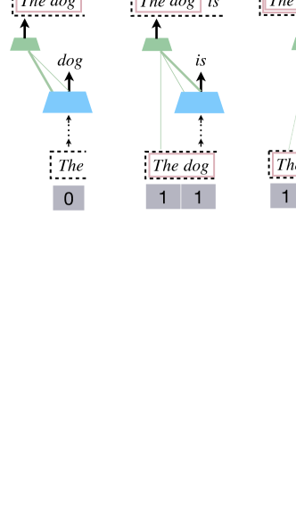
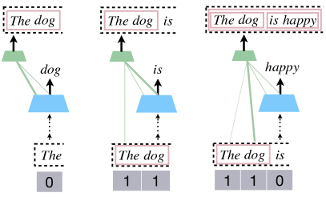
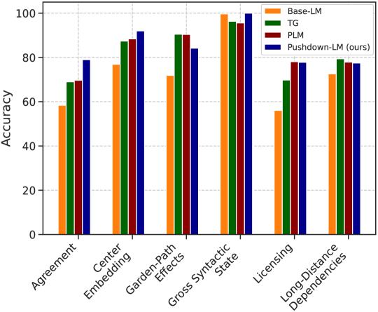
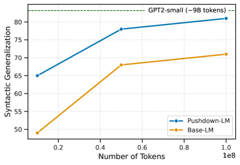
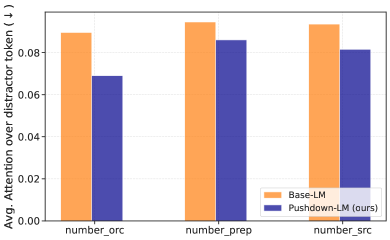
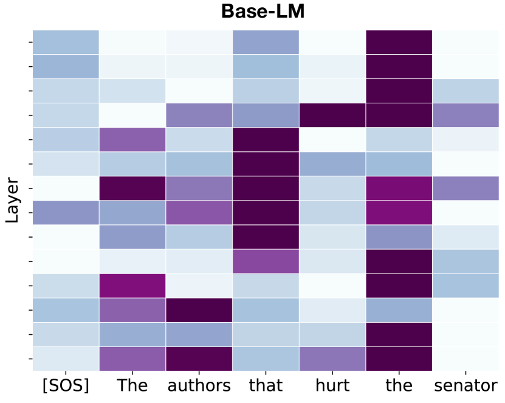

# Pushdown Layers: Encoding Recursive Structure 
in Transformer Language Models

###### Abstract

Recursion is a prominent feature of human language, and fundamentally challenging for self-attention due to the lack of an explicit recursive-state tracking mechanism. Consequently, Transformer language models poorly capture long-tail recursive structure and exhibit sample-inefficient syntactic generalization. This work introduces *Pushdown Layers*, a new self-attention layer that models recursive state via a *stack tape* that tracks estimated depths of every token in an incremental parse of the observed prefix. Transformer LMs with Pushdown Layers are syntactic language models that autoregressively and synchronously update this stack tape as they predict new tokens, in turn using the stack tape to softly modulate attention over tokens—for instance, learning to “skip” over closed constituents. When trained on a corpus of strings annotated with silver constituency parses, Transformers equipped with Pushdown Layers achieve dramatically better and 3-5x more sample-efficient syntactic generalization, while maintaining similar perplexities. Pushdown Layers are a drop-in replacement for standard self-attention. We illustrate this by finetuning GPT2-medium with Pushdown Layers on an automatically parsed WikiText-103, leading to improvements on several GLUE text classification tasks.  

## 1 Introduction

[FIGURE S1.F1.g1]

Figure 1: (a) Pushdown Layers use a stack-tape to featurize contents of an explicit stack, in terms of estimated token depths, where the stack represents incremental parses. (b) These depths map onto depth embeddings (in blue) that are added to token keys before computing attention scores, softly biasing attention towards a recursive syntactic computation. (c) The stack is updated *synchronously* with the newly predicted word, via an attachment head that selects a constituent to reduce the newly predicted word with, via attention.
[/FIGURE]

An important property of human language and thought is *recursion*, which allows us to compose and reason about complex objects in terms of simpler constituents (Hauser et al., [2002](#bib.bib17)). While extensively studied in natural language syntax and semantics, recursion is also a key component of several other aspects of intelligent behaviors including mathematical reasoning, programming, and goal-directed planning. Most recursion-capable systems model recursive processes via a stack memory, which is updated as new computation is performed. For instance, a programming language may implement recursion by maintaining a run-time stack of caller-callee frames, storing intermediate outputs in the stack, and updating the stack as new function calls are made. Similarly, a shift-reduce parser implements recursion through a stack of intermediate constituents, shifting tokens onto the stack as they are observed, and occasionally reducing stack elements into constituents as they are completed.  

In contrast, the self-attention mechanism underlying modern neural sequence models has no explicit mechanism to maintain a stack memory as it generates strings, and instead relies on hidden representations to implicitly but imperfectly encode such information (Manning et al., [2020](#bib.bib26)). While this encoding can model bounded recursive structure in formal languages (Yao et al., [2021](#bib.bib45)), it is unclear if it is sufficient for robust syntactic generalization, especially under data-constrained settings.  

In this work, we show that an explicit stack memory mechanism can improve syntactic generalization in Transformer language models (LMs). We introduce *Pushdown Layers*111We borrow this term from pushdown automata, which are finite state machines augmented with stacks., a drop-in replacement for standard self-attention that augments Transformer LMs with stack memory. This memory is modeled using a *stack tape* that stores estimated depths of every token in an incremental parse of the observed prefix. The stack tape is updated autoregressively: as new tokens are predicted, Transformers with Pushdown Layers (Pushdown Transformers) synchronously make probabilistic *attachment decisions* to either “shift”, thus assigning the newly predicted token a depth of $0$, or “reduce” with one of the constituents in the prefix so far, updating token depths accordingly (see [Fig. 1](#S1.F1 "Figure 1 ‣ 1 Introduction ‣ Pushdown Layers: Encoding Recursive Structure in Transformer Language Models")). This stack tape is used to additively and softly modulate the attention of the Transformer over tokens—for instance, Pushdown Layers may guide the LM to only attend to head words of constituents, or skip over reduced constituents by decreasing attention.  

Pushdown Transformer LMs are *syntactic language models* that learn joint probabilities of sequences and parses in terms of individual word predictions and structure-building operations, and can be trained on any text corpus annotated with constituency parses. But unlike other syntactic language models with structural supervision (Vinyals et al., [2015](#bib.bib41); Choe and Charniak, [2016](#bib.bib6); Qian et al., [2021](#bib.bib33); Sartran et al., [2022](#bib.bib35)), Pushdown Layers do not change the output space of the underlying sequence model, and impose no constraints on attention mechanisms—the manner in which Pushdown Layers use syntactic structure for representation building is learnt purely via gradient descent.  

Pushdown Transformers obtain strong generalization improvements over standard Transformer LMs. When trained on depth-bounded Dyck strings and evaluated on deeper Dyck strings, Pushdown Transformers improve performance over baseline LMs by over 25% ([Section 4.1](#S4.SS1 "4.1 Warm-up: Dyck Languages ‣ 4 Experiments ‣ Pushdown Layers: Encoding Recursive Structure in Transformer Language Models")). When trained on sentence-level language modeling on the BLLIP-lg datasets of Hu et al. ([2020](#bib.bib19)), Pushdown Transformers improve syntactic generalization over standard Transformer LMs by  5–13 points as well as other joint models of strings and parses such as Qian et al. ([2021](#bib.bib33)); Sartran et al. ([2022](#bib.bib35)) by 0.3–4 points ([Section 4.2](#S4.SS2 "4.2 Sentence-Level Language Modeling ‣ 4 Experiments ‣ Pushdown Layers: Encoding Recursive Structure in Transformer Language Models")). When trained on a new, 100-million-token dataset of parsed Wikipedia articles we call WikiTrees, Pushdown Transformers match the syntactic generalization of ordinary Transformers with 3–5$\times$ less data. Finally, when Pushdown Layers are inserted into a pre-trained GPT-2 (medium) model and fine-tuned on WikiTrees they yield improvements of  0.3–1 points on several GLUE text classification tasks.  

## 2 Background

#### Multi-Head Self-Attention.

Transformer language models (Vaswani et al., [2017](#bib.bib40)) are a class of neural sequence models that use multi-head *self-attention* to obtain contextualized representations of tokens in a sequence, which are then used to predict the next token. In particular, let $x=\{x_{1},x_{2},\ldots,x_{n}\}$ be an input sequence. Let $\bm{h}^{l}_{i}\in\mathbb{R}^{d}$ be the hidden representation of the $i$${}^{\hbox{th}}$ token at the $l$${}^{\hbox{th}}$ attention block. Then, the hidden representation of the $i$${}^{\hbox{th}}$ token is updated as  

|  | $\displaystyle\bm{h}_{i}^{l+1}=\mathrm{FF}(O\cdot[\mathrm{A}_{1}(\bm{h}^{l}_{\leq{i}}),,\cdots,\mathrm{A}_{K}(\bm{h}^{l}_{\leq{i}})]),$ |  | (1) |
| --- | --- | --- | --- |

where $O\in\mathbb{R}^{d\times d}$ is a learnt matrix, $\mathrm{FF}$ denotes a feed-forward + residual + layer-norm block, and $\mathrm{A}_{p}$ is the $p$${}^{\hbox{th}}$ self-attention head. Each attention head performs a weighted average over its inputs,  

|  | $\displaystyle\mathrm{A}_{p}(\bm{h}^{l}_{\leq{i}})=\sum_{j=1}^{i}\alpha_{ij}W^{p}_{\text{value}}\bm{h}^{l}_{j},$ |  | (2) |
| --- | --- | --- | --- |

where $\alpha_{ij}$ is the *attention weight* assigned to the $j$${}^{\hbox{th}}$ token by the $i$${}^{\hbox{th}}$ token. These attention weights are computed as  

|  | $\displaystyle\alpha_{ij}=\mathrm{softmax}[(W^{p}_{\text{key}}\bm{h}^{l}_{j})^{\top}W^{p}_{\text{query}}\bm{h}^{l}_{i}].$ |  | (3) |
| --- | --- | --- | --- |

Each self-attention head introduces learnt parameters $W^{p}_{\text{key}},W^{p}_{\text{query}},W^{p}_{\text{value}}\in\mathbb{R}^{d/K\times d}$.  

#### Limitations of Self-Attention.

When trained on text corpora, transformers implicitly encode several aspects of linguistic structure unsupervisedly (Clark et al., [2019](#bib.bib7); Hewitt and Manning, [2019](#bib.bib18); Murty et al., [2023](#bib.bib30)). However, there is mounting evidence that recursion, a key feature of human language, remains a challenge. Hahn ([2020](#bib.bib16)) shows theoretically that hard-attention cannot model simple recursive structures like 2Dyck (see [Section 6](#S6 "6 Other Related Work ‣ Pushdown Layers: Encoding Recursive Structure in Transformer Language Models") for an extended discussion). Empirically, Lakretz et al. ([2022](#bib.bib24)) show that self-attention struggles on center embedding phenomenon, and Zhang et al. ([2023](#bib.bib46)) show poor performance on simple recursive tree-traversal problems. We hypothesize that a key reason for poor modeling of recursive structure in self-attention is a lack of an explicit structural inductive bias. One common way to add such an inductive bias is via joint modeling of strings and syntactic structure, which we introduce next.  

#### Syntactic Language Models.

Let $y$ be the ground-truth syntactic parse of $x$. A long line of work (Vinyals et al., [2015](#bib.bib41); Dyer et al., [2016](#bib.bib14); Choe and Charniak, [2016](#bib.bib6); Qian et al., [2021](#bib.bib33); Sartran et al., [2022](#bib.bib35)) considers learning joint distributions $p(x,y)$ to incorporate explicit syntactic structure into neural language models, by learning to output a sequence of *transition actions*,  

|  | $\displaystyle p(x,y)=p(\mathbf{a}_{xy})=\prod_{i}p(a_{i}\mid a_{<i})$ |  | (4) |
| --- | --- | --- | --- |

where actions $a_{i}$ correspond to both word-level predictions as well as *structural actions* corresponding to opening and closing of constituents, building up the parse tree in a top-down, left-to-right manner. Recent work explores using Transformers to parameterize these joint distributions. For instance, Qian et al. ([2021](#bib.bib33)); Sartran et al. ([2022](#bib.bib35)) train Transformer LMs over transition actions (Parsing as Language Modeling or PLM), sometimes with constrained attention heads (PLM-mask), and Transformer Grammars (TG; Sartran et al., [2022](#bib.bib35)) model transition actions with Transformers, also with hard constraints on attention to model shift/reduce actions.  

These models have several limitations that motivate our proposed approach. First, their outputs are sequences of transition actions that include both text and tree-building operations; as each constituent in a parse tree has an opening and closing transition action, and there are $\approx{}n$ constituents for $x$, this increases input length by a factor of $3$, leading to significant computation and memory overhead. Second, inference in neural models operating on transitions require bespoke decoding procedures that carefully balance tradeoffs between high-entropy word-level predictions and low-entropy structural predictions (Stern et al., [2017](#bib.bib37)). Finally, to explicitly bias Transformer computations to mirror the recursive structure of parse trees, some approaches like PLM-mask (Qian et al., [2021](#bib.bib33)) and TGs (Sartran et al., [2022](#bib.bib35)) impose hard constraints on attention patterns. Pushdown Layers provide a softer syntactic bias that is amenable to gradient-based learning, while having broader applicability to phenomena beyond local tree-structuredness, such as topical dependencies, coreference, etc.  

## 3 Pushdown Layers

Transformer LMs with *Pushdown Layers* are syntactic language models that generate strings while simultaneously building a parse tree over these strings from left to right. This parse tree is built incrementally by tracking the recursive state of every token, which is synchronously updated along with word-level predictions. This recursive state is represented via our *stack tape* as tree-depths of every prefix token, and updates are realized with a stack. The contents of the stack tape are used to *softly modulate* attention over prefix tokens via additive offsets to attention logits ([Fig. 2](#S3.F2 "Figure 2 ‣ Updating the Stack Tape. ‣ 3.1 Stack Tape ‣ 3 Pushdown Layers ‣ Pushdown Layers: Encoding Recursive Structure in Transformer Language Models")).  

### 3.1 Stack Tape

Like ordinary self-attention, Pushdown Layers take a sequence of hidden states $\{\bm{h}_{k}^{l}\}$ as input, and output a sequence $\{\bm{h}_{k}^{l+1}\}$. Additionally, Pushdown Layers use a *stack tape* $\mathcal{W}_{k}\in\{0,k\}^{k}$ to simulate a pushdown automaton that performs shift/reduce operations over tokens as they are predicted ([Fig. 2](#S3.F2 "Figure 2 ‣ Updating the Stack Tape. ‣ 3.1 Stack Tape ‣ 3 Pushdown Layers ‣ Pushdown Layers: Encoding Recursive Structure in Transformer Language Models")). The contents of the stack tape encode recursive state by tracking the depth of each token within reduced constituents in the stack. Concretely, after observing the prefix $x_{\leq{k}}=\{x_{1},x_{2},\ldots,x_{k}\}$, $\mathcal{W}_{k}[j]=0$ if token $x_{j}$ has not been reduced with any other token, while $\mathcal{W}_{k}[j]=p$ means that $x_{j}$ has appeared in $p$ reduce operations such that the resulting *constituent* has token $x_{j}$ at depth $p$—in [Fig. 2](#S3.F2 "Figure 2 ‣ Updating the Stack Tape. ‣ 3.1 Stack Tape ‣ 3 Pushdown Layers ‣ Pushdown Layers: Encoding Recursive Structure in Transformer Language Models"), the stack tape encodes [1, 1, 0] for the incremental parse [The dog] is.  

#### Updating the Stack Tape.

As shown in [Fig. 2](#S3.F2 "Figure 2 ‣ Updating the Stack Tape. ‣ 3.1 Stack Tape ‣ 3 Pushdown Layers ‣ Pushdown Layers: Encoding Recursive Structure in Transformer Language Models"), along with predicting the next word happy, Transformers with Pushdown Layers (*Pushdown Transformers*) make an attachment decision to update their stack tape. In our running example, this is done by selecting a constituent from the incremental parse [The dog] is happy.  

Concretely, given prefix $x_{<k}$, Pushdown Transformers predict the next token $x_{k}$ as well as an update to the stack tape $\mathcal{W}_{k-1}$. This is done by selecting a token $r_{k}$ to reduce with, out of candidate tokens $\{x_{1},x_{2},\ldots,x_{k}\}$, via attention over hidden states $\{\bm{h}_{1}^{L},\bm{h}_{2}^{L},\ldots,\bm{h}_{k-1}^{L},\bm{\tilde{h}}_{k}^{L}\}$, where $L$ is the final layer of the Transformer, and $\bm{\tilde{h}}_{k}^{L}$ is a vector representation for the newly predicted token $x_{k}$, obtained as $\bm{\tilde{h}}_{k}^{L}=\mathrm{MLP}(x_{k},\bm{h}_{k-1}^{L})$. This vector attends to all tokens to make a probabilistic attachment decision,  

|  | $\displaystyle p(r_{k}=j\mid x_{<k};\mathcal{W}_{k-1})$ | $\displaystyle\propto$ |  |
| --- | --- | --- | --- |
|  | $\displaystyle\begin{cases}(\bm{h}^{L\top}_{j}{W^{\top}}\bm{{\tilde{h}}}_{k}^{L})&\textit{if $j\neq k$, \text{shift + reduce}}\\ (\bm{\tilde{h}}^{L\top}_{k}{W^{\top}}\bm{{\tilde{h}}}_{k}^{L})&\textit{shift only}\\ \end{cases}$ |  |  | (5) |
| --- | --- | --- | --- | --- |

where $W\in\mathbb{R}^{d\times d}$ is a learnt parameter matrix. We use these probabilities to select token $r_{k}=\operatorname*{arg\,max}p(j\mid{x_{<k}};\mathcal{W}_{k-1})$ to reduce $x_{k}$ with, and the stack tape is updated accordingly via Algorithm [1](#alg1 "In Updating the Stack Tape. ‣ 3.1 Stack Tape ‣ 3 Pushdown Layers ‣ Pushdown Layers: Encoding Recursive Structure in Transformer Language Models"). Note that attachment decisions to constituents are made by computing the attachment score for the rightmost token in the constituent. In our running example, the model selects the constituent [The dog] by selecting the word dog, forming the parse [[The dog] [is happy]] and updating the stack tape from [1, 1, 0] $\rightarrow$ [2, 2, 2, 2].  

[FIGURE S3.F2.g1]

Figure 2: Illustration of how the parse [[The dog [is happy]] is built as a unique sequence of stack-tape updates in Pushdown LMs. Here, as the word happy is predicted, the attachment head chooses a constituent (bolded) from the current incremental parse, via attention. Attachment decisions are made to constituents by attending to their rightmost token, and none of the other tokens of a constituent can be attended to (shown as dashed lines). These attachment decisions are used to update depth values in the tape.
[/FIGURE]

[FIGURE alg1]

Input: $\mathcal{W}_{k-1}$, $k$, $r_{k}$, stack

Output: $\mathcal{W}_{k}$, stack

[1em]

UpdateStackTape($\mathcal{W}_{k-1}$, $k$, $r_{k}$, stack)

[0.5em]

$\mathcal{W}_{k}\leftarrow\mathcal{W}_{k-1}$

$\texttt{constituent}\leftarrow[k]$

if *$r_{k}$ == k* then

      $\texttt{stack.push}(\texttt{constituent})$

      return

 end if

while *True* do

      
$\texttt{top}\leftarrow\texttt{stack.pop()}$

      
// *Perform a reduce*

      [0.25em]
$\texttt{constituent}\leftarrow\texttt{top}+\texttt{constituent}$

      
// *Update depths in stack tape*

      [0.25em]
forall *$d\in\texttt{constituent}$* do

            
$\mathcal{W}_{k}[d]$ += $1$

       end forall

      if *top == $r_{k}$* then

            break

       end if

      

 end while

$\texttt{stack.push}(\texttt{constituent})$

Algorithm 1 Stack Tape Update
[/FIGURE]

### 3.2 Computing Attention Scores

We map contents of $\mathcal{W}_{k}$ onto a *per-layer* depth embedding $\bm{d}^{l}_{kj}$ for every token $j\in\{0,1,\ldots,k\}$. These depth embeddings are added to attention keys, resulting in a *locally additive* modulation to attention scores,  

|  | $\displaystyle\tilde{\alpha}_{kj}^{l}=\mathrm{softmax}\big{(}[\bm{h}^{l}_{j}+\bm{d}_{kj}^{l}]^{\top}{W^{\top}_{\text{key}}W_{\text{query}}}\bm{h}^{l}_{k}\big{)}.$ |  | (6) |
| --- | --- | --- | --- |

Of course, since these logits are themselves part of a softmax and non-linearities, the overall effect can be arbitrarily non-linear. These modified attention weights are used to compute contextualized vectors using Eq [2](#S2.E2 "In Multi-Head Self-Attention. ‣ 2 Background ‣ Pushdown Layers: Encoding Recursive Structure in Transformer Language Models") and Eq [1](#S2.E1 "In Multi-Head Self-Attention. ‣ 2 Background ‣ Pushdown Layers: Encoding Recursive Structure in Transformer Language Models").  

### 3.3 Training and Inference

#### Training.

Given a corpus of strings annotated with parses, we first extract ground-truth values of $\mathcal{W}_{k}$ for every prefix $x_{\leq{k}}$. We also extract ground-truth attachment decisions for $x_{k}$, given prefix $x_{<k}$. With these quantities precomputed, we can train Pushdown Transformers in *parallel*, like standard Transformers. Attachment probabilities (Eq [5](#S3.E5 "In Updating the Stack Tape. ‣ 3.1 Stack Tape ‣ 3 Pushdown Layers ‣ Pushdown Layers: Encoding Recursive Structure in Transformer Language Models")) are supervised with ground-truth attachments, along with the standard LM objective, all using hidden states that are contextualized using the Pushdown Layer attention mechanism that uses the precomputed stack tape.  

#### Inference.

For any string $x$ and parse $y$, joint probability $p(x,y)$ factorizes as a product of word-level and attachment scores as  

|  | $\displaystyle p(x,y)=\prod_{k=1}^{n}\Big{(}$ | $\displaystyle p(x_{k}\mid x_{<k};\mathcal{W}_{k-1})\times$ |  |
| --- | --- | --- | --- |
|  |  | $\displaystyle p(r_{k}\mid x_{<k};\mathcal{W}_{k-1})\Big{)}.$ |  | (7) |
| --- | --- | --- | --- | --- |

While computing the full marginal $p(x)=\sum_{y}p(x,y)$ is computationally infeasible due to the large space of possible parses, we approximate this by marginalizing over a smaller subset with beam search. Crucially, since our model predicts words and structural actions in *parallel* rather than sequentially, we do not need to use complex word-synchronous decoding procedures (Stern et al., [2017](#bib.bib37)) that introduce additional hyperparameters.  

### 3.4 Implementation Details

#### FLOPs and memory overhead.

Consider query and key matrices $Q\in\mathbb{R}^{n_{d}\times d},K\in\mathbb{R}^{n_{s}\times d}$ where $n_{d}$ and $n_{s}$ refer to destination (hidden states attending) and source (hidden states being attended to). Let $S\in\mathbb{R}^{n_{d}\times n_{s}}$ be the (lower-triangular) matrix denoting pre-computed stack tape values for every prefix. For each Pushdown Layer, we use $S$ to index into depth embeddings to obtain $D\in\mathbb{R}^{n_{d}\times n_{s}\times d}$, which is added to $K$ to obtain $K_{D}\in\mathbb{R}^{n_{d}\times n_{s}\times d}$. Unlike standard self-attention which multiplies $Q$ and $K$ directly, Pushdown Layers multiply $Q$ (a 2D tensor) with $K_{D}$ (a 3D tensor). This is done by casting $Q$ into a 3D tensor $\in\mathbb{R}^{n_{d}\times 1\times d}$ and performing a batched matrix multiplication with $K_{D}$, leading to the same number of operations as standard self-attention 222We note that standard self-attention is faster in practice due to better GPU memory bandwidth management,. However, since Pushdown Layers require storing 3D tensors for keys, this increases memory requirements from $O(n_{d}\cdot n_{s}+n_{s}\cdot d+n_{d}\cdot d)$ to $O(n_{d}\cdot n_{s}+n_{s}\cdot n_{d}\cdot d+n_{d}\cdot d)$. We provide standalone code for implementing a Pushdown Layer block in Appendix [D](#A4 "Appendix D Implementation details: Pseudocode for implementing Pushdown Layers ‣ Pushdown Layers: Encoding Recursive Structure in Transformer Language Models").  

#### Attending to hidden states with old memory.

Pushdown Transformers build parse trees incrementally from left-to-right, and so, depth values of prefix tokens change as new tokens are predicted. Thus, a token at position $i$ builds its representation based on attending to $x_{\leq{i}}$ with a stack tape that may soon become “stale" due to future transition operations that reduce tokens in $x_{\leq{i}}$ with new tokens. As an example, suppose we have the incremental parse [[The dog] [in [the park]]]. Here, the representation for in attends to representations of The, dog and in with depths [1, 1, 0] while the representation for park attends to these representations with *updated* depths [2, 2, 2].  

## 4 Experiments

### 4.1 Warm-up: Dyck Languages

We train 6 layer LMs with Pushdown Layers (Pushdown-LM) as well as standard LMs on 100k strings sampled from Dyck20,10, the language of well-nested brackets with 20 bracket types and max-nesting depth of 10. To ensure that improvements are not merely due to multi-task learning with an attachment head, base-LM is also trained with an attachment loss in a standard multi-task learning setup. To test generalization, models are provided an input prefix from a separate Dyck language, and evaluated on choosing the correct closing bracket. Specifically, we test generalization to Dyck strings with deeper nesting of 15–50, and Dyck strings with longer-range dependencies than seen at training time (measured as the distance to the matching bracket that needs to be closed). From Table [1](#S4.T1 "Table 1 ‣ 4.1 Warm-up: Dyck Languages ‣ 4 Experiments ‣ Pushdown Layers: Encoding Recursive Structure in Transformer Language Models"), we find that Pushdown-LM obtains over 25% accuracy point improvement over standard language models at generalizing to deeper structure, as well as large improvements at generalizing to longer-range dependencies.  

[TABLE S4.T1]

<table class="ltx_tabular ltx_guessed_headers ltx_align_middle">
<tbody class="ltx_tbody">
<tr class="ltx_tr">
<th class="ltx_td ltx_th ltx_th_row ltx_border_tt"></th>
<td class="ltx_td ltx_align_center ltx_border_tt">Base-LM</td>
<td class="ltx_td ltx_nopad_r ltx_align_center ltx_border_tt">Pushdown-LM</td>
</tr>
<tr class="ltx_tr">
<th class="ltx_td ltx_align_center ltx_th ltx_th_row ltx_border_t">Long-Range Dependencies</th>
</tr>
<tr class="ltx_tr">
<th class="ltx_td ltx_align_left ltx_th ltx_th_row ltx_border_t">
Dyck (50)</th>
<td class="ltx_td ltx_align_center ltx_border_t">90.0</td>
<td class="ltx_td ltx_nopad_r ltx_align_center ltx_border_t">96.5</td>
</tr>
<tr class="ltx_tr">
<th class="ltx_td ltx_align_left ltx_th ltx_th_row">
Dyck (100)</th>
<td class="ltx_td ltx_align_center">81.0</td>
<td class="ltx_td ltx_nopad_r ltx_align_center">88.0</td>
</tr>
<tr class="ltx_tr">
<th class="ltx_td ltx_align_left ltx_th ltx_th_row">
Dyck (200)</th>
<td class="ltx_td ltx_align_center">40.6</td>
<td class="ltx_td ltx_nopad_r ltx_align_center">61.2</td>
</tr>
<tr class="ltx_tr">
<th class="ltx_td ltx_align_left ltx_th ltx_th_row">
Dyck (300)</th>
<td class="ltx_td ltx_align_center">14.1</td>
<td class="ltx_td ltx_nopad_r ltx_align_center">42.9</td>
</tr>
<tr class="ltx_tr">
<th class="ltx_td ltx_align_center ltx_th ltx_th_row ltx_border_t">Deeper Embedded Structure</th>
</tr>
<tr class="ltx_tr">
<th class="ltx_td ltx_align_left ltx_th ltx_th_row ltx_border_bb ltx_border_t">Depth Gen.</th>
<td class="ltx_td ltx_align_center ltx_border_bb ltx_border_t">40.6</td>
<td class="ltx_td ltx_nopad_r ltx_align_center ltx_border_bb ltx_border_t">68.3</td>
</tr>
</tbody>
</table>

Table 1: Evaluating LMs at closing Dyck prefixes with longer dependencies (dep. length in brackets) and deeper structure. We find significant improvements from using Pushdown Layers over standard self-attention.
[/TABLE]

[FIGURE S4.F3.g1]

Figure 3: Comparing Pushdown-LMs with baseline Transformer LMs and other syntactic LMs. While Pushdown-LMs are comparable with Transformer Grammars (TG; Sartran et al., [2022](#bib.bib35)) across all examples in SG test suites (Table [2](#S4.T2 "Table 2 ‣ Results. ‣ 4.2 Sentence-Level Language Modeling ‣ 4 Experiments ‣ Pushdown Layers: Encoding Recursive Structure in Transformer Language Models")), they outperform TGs on 4 out of 6 tests, including the recursive center embedding tests.
[/FIGURE]

### 4.2 Sentence-Level Language Modeling

#### Setup.

Next, we train 16-layer Pushdown Transformer LMs on the BLLIP-lg dataset of Charniak et al. ([2000](#bib.bib3)), with training splits from Hu et al. ([2020](#bib.bib19)), and the same pre-processing as Qian et al. ([2021](#bib.bib33)). We use the same hyperparameters (model size, dropout, learning rate schedulers) as Sartran et al. ([2022](#bib.bib35)). To measure syntactic generalization, we evaluate on BLIMP (Warstadt et al., [2020](#bib.bib44)) and the SG test suites (Hu et al., [2020](#bib.bib19)). In BLIMP, models are provided with a grammatical and ungrammatical sentence, and evaluated on assigning a higher probability to the grammatical sentence. SG test suites consist of an extensive set of hand-crafted test cases, covering 6 fine-grained syntactic phenomena. Each test case involves satisfying a specific inequality constraint among surprisal values of various continuations given prefixes, where these inequalities are grounded in theories of incremental language processing—for instance, assigning a higher surprisal to the last verb in *The painting that the artist deteriorated painted* vs. *The painting that the artist painted deteriorated*. For BLIMP, we obtain $p(x)$ by approximate marginalization via beam search. Since surprisal values $-\log{p(x_{t}\mid x_{<t})}$ in SG test suites are meant to reflect incremental sentence processing, we perform marginalization based on the beam state at time step $t$. We fix the beam size at 300.  

#### Results.

We present results on SG test suites in Figure [3](#S4.F3 "Figure 3 ‣ 4.1 Warm-up: Dyck Languages ‣ 4 Experiments ‣ Pushdown Layers: Encoding Recursive Structure in Transformer Language Models"). As baselines, we compare against a standard 16 layer Transformer LM and prior structured models (TG, PLM) from Sartran et al. ([2022](#bib.bib35)). As expected, all models with an explicit notion of structure have much better syntactic generalization across all test suites. Next, we note that Pushdown-LM, a 16 layer Transformer LM with all self-attention blocks replaced with Pushdown Layers, outperforms prior approaches—Pushdown-LM beats TG on 4/6 tests and PLM on 3/6 tests with similar performance on licensing. Next, we present results (averaged across 3 seeds) on BLIMP as well as aggregate SG test suite results and perplexity on the BLLIP test set in Table [2](#S4.T2 "Table 2 ‣ Results. ‣ 4.2 Sentence-Level Language Modeling ‣ 4 Experiments ‣ Pushdown Layers: Encoding Recursive Structure in Transformer Language Models"). Here, we note that Pushdown-LM achieves better syntactic generalization than prior structured models (including the PLM-mask model from (Qian et al., [2021](#bib.bib33))) on BLIMP. Finally, we find that Pushdown-LM achieves slight gains in perplexity compared to Base-LM.  

[TABLE S4.T2]

<table class="ltx_tabular ltx_guessed_headers ltx_align_middle">
<tbody class="ltx_tbody">
<tr class="ltx_tr">
<th class="ltx_td ltx_align_left ltx_th ltx_th_row ltx_border_tt">Model</th>
<td class="ltx_td ltx_align_center ltx_border_tt">BLIMP <math class="ltx_Math"><semantics><mo>↑</mo><annotation-xml><ci>↑</ci></annotation-xml><annotation>\uparrow</annotation></semantics></math></td>
<td class="ltx_td ltx_align_center ltx_border_tt">SG test suites <math class="ltx_Math"><semantics><mo>↑</mo><annotation-xml><ci>↑</ci></annotation-xml><annotation>\uparrow</annotation></semantics></math></td>
<td class="ltx_td ltx_nopad_r ltx_align_center ltx_border_tt">PPL <math class="ltx_Math"><semantics><mo>↓</mo><annotation-xml><ci>↓</ci></annotation-xml><annotation>\downarrow</annotation></semantics></math></td>
</tr>
<tr class="ltx_tr">
<th class="ltx_td ltx_align_center ltx_th ltx_th_row ltx_border_t">Models that add structural tokens to inputs</th>
</tr>
<tr class="ltx_tr">
<th class="ltx_td ltx_align_left ltx_th ltx_th_row ltx_border_t">PLM</th>
<td class="ltx_td ltx_align_center ltx_border_t">75.1</td>
<td class="ltx_td ltx_align_center ltx_border_t">80.2</td>
<td class="ltx_td ltx_nopad_r ltx_align_center ltx_border_t">29.8‡
</td>
</tr>
<tr class="ltx_tr">
<th class="ltx_td ltx_align_left ltx_th ltx_th_row">PLM-Mask</th>
<td class="ltx_td ltx_align_center">75.3</td>
<td class="ltx_td ltx_align_center">78.3</td>
<td class="ltx_td ltx_nopad_r ltx_align_center">49.1‡
</td>
</tr>
<tr class="ltx_tr">
<th class="ltx_td ltx_align_left ltx_th ltx_th_row">TG</th>
<td class="ltx_td ltx_align_center">–</td>
<td class="ltx_td ltx_align_center">82.5∗</td>
<td class="ltx_td ltx_nopad_r ltx_align_center">30.3‡
</td>
</tr>
<tr class="ltx_tr">
<th class="ltx_td ltx_align_center ltx_th ltx_th_row ltx_border_t">Models that do not add extra tokens to inputs</th>
</tr>
<tr class="ltx_tr">
<th class="ltx_td ltx_align_left ltx_th ltx_th_row ltx_border_t">Base-LM</th>
<td class="ltx_td ltx_align_center ltx_border_t">70.1</td>
<td class="ltx_td ltx_align_center ltx_border_t">69.5</td>
<td class="ltx_td ltx_nopad_r ltx_align_center ltx_border_t">20.1</td>
</tr>
<tr class="ltx_tr">
<th class="ltx_td ltx_align_left ltx_th ltx_th_row ltx_border_bb">Pushdown-LM (ours)</th>
<td class="ltx_td ltx_align_center ltx_border_bb">75.6</td>
<td class="ltx_td ltx_align_center ltx_border_bb">82.3∗</td>
<td class="ltx_td ltx_nopad_r ltx_align_center ltx_border_bb">19.9</td>
</tr>
</tbody>
</table>

Table 2: Syntactic Generalization on BLIMP and SG test suites. All results for PLM-Mask are taken from Qian et al. ([2021](#bib.bib33)) and results for PLM and TGs are taken from Sartran et al. ([2022](#bib.bib35)). ${*}$ denotes differences that are not significant. PPL results marked with $\ddagger$ are taken from prior work and not comparable due to differences in tokenization.
[/TABLE]

### 4.3 Language Modeling with WikiTrees

Can Pushdown Layers continue to offer improvements on larger-scale language modeling? We construct WikiTrees, a dataset of over 100 million tokens extracted from Wikipedia Articles (WikiText-103; Merity et al. ([2017](#bib.bib28))), parsed automatically using a state-of-the-art neural constituency parser (Kitaev et al., [2019](#bib.bib22)). Typically, LMs trained on web-scale data are given multi-sentence contexts with large window sizes as inputs, and to adapt this to Pushdown-LMs we make a small number of modifications (see Appendix [B](#A2 "Appendix B Training Pushdown-LM with context-windows ‣ Pushdown Layers: Encoding Recursive Structure in Transformer Language Models") for details).  

#### Sample-Efficient Generalization.

To measure sample efficiency in Pushdown Transformers, we train LMs on [10M, 50M, 100M] tokens from WikiTrees. To ensure stable training under low data regimes, we train a 12 layer GPT2 using the exact configuration and tokenization scheme as GPT2-small (Radford et al., [2019](#bib.bib34)), and additionally use dropout to prevent overfitting. For these experiments, we compare Base-LM with an LM where the final 6 self-attention blocks are Pushdown Layers (Pushdown-LM). To measure syntactic generalization, we compute aggregate performance on the SG test suites. From results in [Fig. 4](#S4.F4 "Figure 4 ‣ Sample-Efficient Generalization. ‣ 4.3 Language Modeling with WikiTrees ‣ 4 Experiments ‣ Pushdown Layers: Encoding Recursive Structure in Transformer Language Models"), we find that Pushdown-LMs exhibit drastically more sample-efficient syntactic generalization—for instance, syntactic generalization of Pushdown-LM trained on 10M tokens requires over 40M tokens for the Base-LM to surpass.  

[FIGURE S4.F4.g1]

Figure 4: Comparing a standard GPT-2 small architecture (Base-LM) with a model where the last 6 self-attention blocks use Pushdown Layers, trained on various amounts of tokens from WikiTrees. We find that Pushdown Layers greatly improve sample efficiency of syntactic generalization. For reference, we also include GPT2-small, which is trained on over 9 billion tokens.
[/FIGURE]

#### Finetuning for text classification.

Can Pushdown Layers offer improvements on language understanding tasks, beyond syntactic generalization? To answer this, we perform staged finetuning of GPT2-medium with Pushdown Layers. Specifically, we finetune GPT-2 medium with the final 12 self-attention blocks replaced with Pushdown Layers (Pushdown-GPT2), as a language model on WikiTrees. We use this model to obtain parses on 4 text classification tasks: RTE, SST5, MRPC and STS-B from GLUE (Wang et al., [2019a](#bib.bib42)), and use these parses to pre-compute the stack tape for every token. Then, in a second finetuning step, Pushdown-GPT2 is trained to perform text classification over these datasets by reducing each task into language modeling via prompting (See Appendix [A](#A1 "Appendix A Model Hyperparameters ‣ Pushdown Layers: Encoding Recursive Structure in Transformer Language Models") for prompt details). As a comparison, we also perform the same staged finetuning for the standard GPT2-medium architecture. We report averaged results across 3 seeds in Table [3](#S4.T3 "Table 3 ‣ Finetuning for text classification. ‣ 4.3 Language Modeling with WikiTrees ‣ 4 Experiments ‣ Pushdown Layers: Encoding Recursive Structure in Transformer Language Models"). We find that Pushdown Layers offer improvements on 3 out of 4 text classification tasks.  

[TABLE S4.T3]

<table class="ltx_tabular ltx_centering ltx_guessed_headers ltx_align_middle">
<thead class="ltx_thead">
<tr class="ltx_tr">
<th class="ltx_td ltx_align_left ltx_th ltx_th_column ltx_border_tt">Model</th>
<th class="ltx_td ltx_align_center ltx_th ltx_th_column ltx_border_tt">RTE</th>
<th class="ltx_td ltx_align_center ltx_th ltx_th_column ltx_border_tt">SST5</th>
<th class="ltx_td ltx_align_center ltx_th ltx_th_column ltx_border_tt">MRPC</th>
<th class="ltx_td ltx_nopad_r ltx_align_center ltx_th ltx_th_column ltx_border_tt">STS-B</th>
</tr>
</thead>
<tbody class="ltx_tbody">
<tr class="ltx_tr">
<td class="ltx_td ltx_align_left ltx_border_t">GPT2</td>
<td class="ltx_td ltx_align_center ltx_border_t">72.2</td>
<td class="ltx_td ltx_align_center ltx_border_t">54.8</td>
<td class="ltx_td ltx_align_center ltx_border_t">88.4</td>
<td class="ltx_td ltx_nopad_r ltx_align_center ltx_border_t">89.6/89.8</td>
</tr>
<tr class="ltx_tr">
<td class="ltx_td ltx_align_left ltx_border_bb">Pushdown-GPT2</td>
<td class="ltx_td ltx_align_center ltx_border_bb">72.9</td>
<td class="ltx_td ltx_align_center ltx_border_bb">54.5</td>
<td class="ltx_td ltx_align_center ltx_border_bb">89.3</td>
<td class="ltx_td ltx_nopad_r ltx_align_center ltx_border_bb">
89.8/90.1
</td>
</tr>
</tbody>
</table>

Table 3: Finetuning models on various semantic text classification/regression tasks. We report accuracy for RTE and SST5, F1 for MRPC, and Spearman/Pearson Correlation for STS-B.
[/TABLE]

## 5 Analysis

For all analyses, we use the 16 layer Pushdown-LM trained on BLLIP-lg from [Section 4.2](#S4.SS2 "4.2 Sentence-Level Language Modeling ‣ 4 Experiments ‣ Pushdown Layers: Encoding Recursive Structure in Transformer Language Models").  

#### Parsing.

Since Pushdown-LM is a syntactic language model, we obtain parses via beam search (beam size = 300) to approximately recover the most likely parse $y^{*}=\operatorname*{arg\,max}_{y}p(x,y)$ under our model. However, since this parse is (a) unlabeled and (b) binarized, we perform an *unlabeled F1 evaluation* (using EVALB; Collins, [1997](#bib.bib8)) over *binarized* ground-truth parses from the PTB test set. We also remove instances consisting of unknown words for our model, since our model is trained without any UNK tokens, giving us 2335 out of 2416 sentences. We compare our model against Kitaev et al. ([2019](#bib.bib22)), the parser that was used to annotate training data for Pushdown-LM. We also present unlabeled F1 on the auto-parsed BLLIP-lg test set. From results in Table [4](#S5.T4 "Table 4 ‣ Parsing. ‣ 5 Analysis ‣ Pushdown Layers: Encoding Recursive Structure in Transformer Language Models"), we note that our model achieves a very competitive unlabeled F1 score of 95.3, outperforming the official implementation of Kitaev et al. ([2019](#bib.bib22))333We use the benepar\_en\_large model from https://github.com/nikitakit/self-attentive-parser which reports a score of 96.29 on the full PTB test set, while we obtain 95.66 (labeled F1, using the standard EVALB script). . We also find that our model obtains a high F1 score of 97.3 on the BLLIP-lg test set.  

[TABLE S5.T4]

<table class="ltx_tabular ltx_guessed_headers ltx_align_middle">
<thead class="ltx_thead">
<tr class="ltx_tr">
<th class="ltx_td ltx_align_left ltx_th ltx_th_column ltx_th_row ltx_border_tt">Model</th>
<th class="ltx_td ltx_align_center ltx_th ltx_th_column ltx_border_tt">PTB</th>
<th class="ltx_td ltx_nopad_r ltx_align_center ltx_th ltx_th_column ltx_border_tt">BLLIP-lg</th>
</tr>
</thead>
<tbody class="ltx_tbody">
<tr class="ltx_tr">
<th class="ltx_td ltx_align_left ltx_th ltx_th_row ltx_border_t">Pushdown-LM</th>
<td class="ltx_td ltx_align_center ltx_border_t">95.3</td>
<td class="ltx_td ltx_nopad_r ltx_align_center ltx_border_t">97.3</td>
</tr>
<tr class="ltx_tr">
<th class="ltx_td ltx_align_left ltx_th ltx_th_row ltx_border_bb"><cite class="ltx_cite ltx_citemacro_citep">(Kitaev et al., <a class="ltx_ref">2019</a>)</cite></th>
<td class="ltx_td ltx_align_center ltx_border_bb">94.7</td>
<td class="ltx_td ltx_nopad_r ltx_align_center ltx_border_bb">-</td>
</tr>
</tbody>
</table>

Table 4: Unlabeled F1 scores against binarized ground-truth parses from the PTB and BLLIP test sets. We filter all examples from the PTB test set with unknown words, giving us 2335 out of 2416 sentences. Annotations on BLLIP-lg are obtained using Kitaev et al. ([2019](#bib.bib22)).
[/TABLE]

[FIGURE S5.F5.g1]

Figure 5: For the three subject-verb agreement tasks from (Marvin and Linzen, [2018](#bib.bib27)), we compute average attention over the distractor noun when the verb is being predicted, for both the Base-LM and Pushdown-LM (ours). Across all variants, we find that our model consistently pulls attention away from distractor nouns.
[/FIGURE]

#### Case Study: Analyzing attention patterns on subject-verb agreement tasks.

We consider the 3 Subject-Verb agreement tasks (Marvin and Linzen, [2018](#bib.bib27)) from the SG test suites. On these tasks, models are presented with a prefix consisting of a main subject and a distractor embedded subject, where these items conflict in number. The objective is to assign a higher logprob to the verb that agrees with the main subject rather than the distractor subject. For instance, for prefix The author that hurt the senators, the model must assign a higher probability to is than are.  

From [Fig. 3](#S4.F3 "Figure 3 ‣ 4.1 Warm-up: Dyck Languages ‣ 4 Experiments ‣ Pushdown Layers: Encoding Recursive Structure in Transformer Language Models"), we find that Pushdown-LM significantly outperforms other models with close to 80% accuracy while Base-LM achieves less than 60% accuracy. To understand how Pushdown Layers modulate attention on these examples, we obtain attention scores over all prefix tokens (averaged across all layers). We present the average attention assigned to the distractor token for both Pushdown-LM and Base-LM in [Fig. 5](#S5.F5 "Figure 5 ‣ Parsing. ‣ 5 Analysis ‣ Pushdown Layers: Encoding Recursive Structure in Transformer Language Models") where we observe that Pushdown-LM pulls attention away from the distractor noun, allowing it to predict the correct verb. Finally, we plot some (averaged) attention heatmaps in [Fig. 6](#S5.F6 "Figure 6 ‣ Case Study: Analyzing attention patterns on subject-verb agreement tasks. ‣ 5 Analysis ‣ Pushdown Layers: Encoding Recursive Structure in Transformer Language Models").  

[FIGURE S5.F6.1.g1]

Figure 6: Given a prefix containing a main noun and a distractor noun, Pushdown-LM pulls attention away from the distractor (here senator), helping the model predict the verb with the correct number. These attention maps average across all the instances in the number\_src test of SG test suites, and we show the attention over all prefix tokens when the main verb is predicted
[/FIGURE]

## 6 Other Related Work

While recursive structure is fundamental to natural language, modeling such structure is difficult for self-attention. Hahn ([2020](#bib.bib16)) considers Dyck, the simplest formal language with recursive structure, proving that hard attention cannot recognize Dyck and soft attention cannot recognize Dyck with low cross-entropy. In practice, we find that even simpler languages like Parity are challenging for encoder-only Transformers (Chiang and Cholak, [2022](#bib.bib5); Bhattamishra et al., [2020](#bib.bib1)). On the other hand, Transformers with decoders have been shown to be Turing-complete (Perez et al., [2021](#bib.bib32)), but these constructions rely on the impractical assumption of running the decoder for an unbounded number of steps. In practice, we find that Transformer LMs struggle with generalization beyond regular languages and tend to learn shortcuts instead (Deletang et al., [2023](#bib.bib10); Liu et al., [2023](#bib.bib25)).  

Given these limitations, there is significant interest in inductive biases that encourage recursive structure in Transformers. One line of work considers constraining self-attention patterns according to syntactic parses (Strubell et al., [2018](#bib.bib38); Wang et al., [2019b](#bib.bib43); Peng et al., [2019](#bib.bib31); Deshpande and Narasimhan, [2020](#bib.bib11), among others). A second line of work adds structure to language modeling by learning joint probabilistic modeling of structure and strings (Chelba, [1997](#bib.bib4); Mirowski and Vlachos, [2015](#bib.bib29); Choe and Charniak, [2016](#bib.bib6); Dyer et al., [2016](#bib.bib14), among others). Both of these ideas are combined in recent work of Qian et al. ([2021](#bib.bib33)); Sartran et al. ([2022](#bib.bib35)), that proposes joint string, parse Transformer language models with constrained attention patterns. While Pushdown Layers are also in this modeling tradition, we do so without operating on long transition actions, and enforce structural constraints via gradient based learning.  

A separate line of work proposes neural networks augmented with structured memory like stacks (Das et al., [1992](#bib.bib9); Grefenstette et al., [2015](#bib.bib15); Joulin and Mikolov, [2015](#bib.bib20); DuSell and Chiang, [2022](#bib.bib13)) or random access memories (Kurach et al., [2015](#bib.bib23)). Such augmented neural networks are vastly better at algorithmic generalization and learning recursive structure (Suzgun et al., [2019](#bib.bib39); Deletang et al., [2023](#bib.bib10)). Our work is the first that designs a structured memory (the stack-tape) for Transformers, that is updated just like stacks in a shift/reduce manner, but unlike prior work, the specific design of Pushdown Layers makes training parallelizable.  

Finally, there have been several efforts to add syntactic inductive biases into sequence models (typically RNNs) that can acquire and use parse structures in an unsupervised manner (Bowman et al., [2016](#bib.bib2); Shen et al., [2019](#bib.bib36); Drozdov et al., [2019](#bib.bib12); Kim et al., [2019](#bib.bib21), among others). We leave unsupervised training of Pushdown Transformers for future work.  

## 7 Conclusion

We propose Pushdown Layers, a new kind of self-attention that augments Transformer language models with a stack based memory. Pushdown Layers enable auto-regressive Transformers to softly bias attention towards a recursive syntactic computation, through an updatable stack-tape that stores token depths in an incremental parse. When trained on synthetic and natural languages, we find that Transformer LMs with Pushdown Layers achieve better generalization to deep recursive structure, as well as better and more sample-efficient syntactic generalization. When pre-trained LMs are finetuned with Pushdown Layers, we obtain improvements on some GLUE tasks.  

## 8 Reproducibility

Code and data for these experiments is available at <https://github.com/MurtyShikhar/Pushdown-Layers>.  

## Limitations

Pushdown Layers require constituency-parse annotated datasets, which may not be available for many languages due to a lack of high performing off-the-shelf constituency parsers. This also limits applicability to domains beyond natural and synthetic languages, such as algorithmic reasoning. Finally, Pushdown Layers can only be applied to languages with constituency structure, and our experiments are limited to English.  

## Acknowledgements

SM was funded by a gift from Apple Inc. CM is a fellow in the CIFAR Learning in Machines and Brains program. PS and JA are funded by Project CETI via grants from The Audacious Project: a collaborative funding initiative housed at TED. We thank John Hewitt, Sidd Karamcheti and Róbert Csordás for feedback and discussions.  

## References

* Bhattamishra et al. (2020)  Satwik Bhattamishra, Kabir Ahuja, and Navin Goyal. 2020.   [On the Ability and Limitations of Transformers to Recognize Formal Languages](https://doi.org/10.18653/v1/2020.emnlp-main.576).   In *Proceedings of the 2020 Conference on Empirical Methods in Natural Language Processing (EMNLP)*, pages 7096–7116, Online. Association for Computational Linguistics. 
* Bowman et al. (2016)  Samuel Bowman, Jon Gauthier, Abhinav Rastogi, Raghav Gupta, Christopher D Manning, and Christopher Potts. 2016.   A fast unified model for parsing and sentence understanding.   In *Proceedings of the 54th Annual Meeting of the Association for Computational Linguistics (Volume 1: Long Papers)*, pages 1466–1477. 
* Charniak et al. (2000)  Eugene Charniak, Don Blaheta, Niyu Ge, Keith Hall, John Hale, and Mark Johnson. 2000.   Bllip 1987-89 wsj corpus release 1.   *Linguistic Data Consortium, Philadelphia*, 36. 
* Chelba (1997)  Ciprian Chelba. 1997.   A structured language model.   In *35th Annual Meeting of the Association for Computational Linguistics and 8th Conference of the European Chapter of the Association for Computational Linguistics*, pages 498–500. 
* Chiang and Cholak (2022)  David Chiang and Peter Cholak. 2022.   [Overcoming a theoretical limitation of self-attention](https://doi.org/10.18653/v1/2022.acl-long.527).   In *Proceedings of the 60th Annual Meeting of the Association for Computational Linguistics (Volume 1: Long Papers)*, pages 7654–7664, Dublin, Ireland. Association for Computational Linguistics. 
* Choe and Charniak (2016)  Do Kook Choe and Eugene Charniak. 2016.   [Parsing as language modeling](https://doi.org/10.18653/v1/D16-1257).   In *Proceedings of the 2016 Conference on Empirical Methods in Natural Language Processing*, pages 2331–2336, Austin, Texas. Association for Computational Linguistics. 
* Clark et al. (2019)  Kevin Clark, Urvashi Khandelwal, Omer Levy, and Christopher D. Manning. 2019.   [What does BERT look at? an analysis of BERT’s attention](https://doi.org/10.18653/v1/W19-4828).   In *Proceedings of the 2019 ACL Workshop BlackboxNLP: Analyzing and Interpreting Neural Networks for NLP*, pages 276–286, Florence, Italy. Association for Computational Linguistics. 
* Collins (1997)  Michael Collins. 1997.   Three generative, lexicalised models for statistical parsing.   In *35th Annual Meeting of the Association for Computational Linguistics and 8th Conference of the European Chapter of the Association for Computational Linguistics*, pages 16–23. 
* Das et al. (1992)  Sreerupa Das, C Lee Giles, and Guo-Zheng Sun. 1992.   Learning context-free grammars: Capabilities and limitations of a recurrent neural network with an external stack memory.   In *Proceedings of The Fourteenth Annual Conference of Cognitive Science Society. Indiana University*, volume 14. 
* Deletang et al. (2023)  Gregoire Deletang, Anian Ruoss, Jordi Grau-Moya, Tim Genewein, Li Kevin Wenliang, Elliot Catt, Chris Cundy, Marcus Hutter, Shane Legg, Joel Veness, and Pedro A Ortega. 2023.   [Neural networks and the chomsky hierarchy](https://openreview.net/forum?id=WbxHAzkeQcn).   In *The Eleventh International Conference on Learning Representations*. 
* Deshpande and Narasimhan (2020)  Ameet Deshpande and Karthik Narasimhan. 2020.   Guiding attention for self-supervised learning with transformers.   In *Findings of the Association for Computational Linguistics: EMNLP 2020*, pages 4676–4686. 
* Drozdov et al. (2019)  Andrew Drozdov, Patrick Verga, Mohit Yadav, Mohit Iyyer, and Andrew McCallum. 2019.   Unsupervised latent tree induction with deep inside-outside recursive auto-encoders.   In *Proceedings of the 2019 Conference of the North American Chapter of the Association for Computational Linguistics: Human Language Technologies, Volume 1 (Long and Short Papers)*, pages 1129–1141. 
* DuSell and Chiang (2022)  Brian DuSell and David Chiang. 2022.   [Learning hierarchical structures with differentiable nondeterministic stacks](https://openreview.net/forum?id=5LXw_QplBiF).   In *International Conference on Learning Representations*. 
* Dyer et al. (2016)  Chris Dyer, Adhiguna Kuncoro, Miguel Ballesteros, and Noah A. Smith. 2016.   [Recurrent neural network grammars](https://doi.org/10.18653/v1/N16-1024).   In *Proceedings of the 2016 Conference of the North American Chapter of the Association for Computational Linguistics: Human Language Technologies*, pages 199–209, San Diego, California. Association for Computational Linguistics. 
* Grefenstette et al. (2015)  Edward Grefenstette, Karl Moritz Hermann, Mustafa Suleyman, and Phil Blunsom. 2015.   Learning to transduce with unbounded memory.   *Advances in neural information processing systems*, 28. 
* Hahn (2020)  Michael Hahn. 2020.   [Theoretical Limitations of Self-Attention in Neural Sequence Models](https://doi.org/10.1162/tacl_a_00306).   *Transactions of the Association for Computational Linguistics*, 8:156–171. 
* Hauser et al. (2002)  Marc D. Hauser, Noam Chomsky, and W. Tecumseh Fitch. 2002.   [The faculty of language: What is it, who has it, and how did it evolve?](https://doi.org/10.1126/science.298.5598.1569)  *Science*, 298(5598):1569–1579. 
* Hewitt and Manning (2019)  John Hewitt and Christopher D. Manning. 2019.   [A structural probe for finding syntax in word representations](https://doi.org/10.18653/v1/N19-1419).   In *Proceedings of the 2019 Conference of the North American Chapter of the Association for Computational Linguistics: Human Language Technologies, Volume 1 (Long and Short Papers)*, pages 4129–4138, Minneapolis, Minnesota. Association for Computational Linguistics. 
* Hu et al. (2020)  Jennifer Hu, Jon Gauthier, Peng Qian, Ethan Wilcox, and Roger Levy. 2020.   [A systematic assessment of syntactic generalization in neural language models](https://doi.org/10.18653/v1/2020.acl-main.158).   In *Proceedings of the 58th Annual Meeting of the Association for Computational Linguistics*, pages 1725–1744, Online. Association for Computational Linguistics. 
* Joulin and Mikolov (2015)  Armand Joulin and Tomas Mikolov. 2015.   Inferring algorithmic patterns with stack-augmented recurrent nets.   *Advances in neural information processing systems*, 28. 
* Kim et al. (2019)  Yoon Kim, Alexander M Rush, Lei Yu, Adhiguna Kuncoro, Chris Dyer, and Gábor Melis. 2019.   Unsupervised recurrent neural network grammars.   In *Proceedings of the 2019 Conference of the North American Chapter of the Association for Computational Linguistics: Human Language Technologies, Volume 1 (Long and Short Papers)*, pages 1105–1117. 
* Kitaev et al. (2019)  Nikita Kitaev, Steven Cao, and Dan Klein. 2019.   Multilingual constituency parsing with self-attention and pre-training.   In *Proceedings of the 57th Annual Meeting of the Association for Computational Linguistics*, pages 3499–3505. 
* Kurach et al. (2015)  Karol Kurach, Marcin Andrychowicz, and Ilya Sutskever. 2015.   Neural random-access machines.   *arXiv preprint arXiv:1511.06392*. 
* Lakretz et al. (2022)  Yair Lakretz, Théo Desbordes, Dieuwke Hupkes, and Stanislas Dehaene. 2022.   [Can transformers process recursive nested constructions, like humans?](https://aclanthology.org/2022.coling-1.285)  In *Proceedings of the 29th International Conference on Computational Linguistics*, pages 3226–3232, Gyeongju, Republic of Korea. International Committee on Computational Linguistics. 
* Liu et al. (2023)  Bingbin Liu, Jordan T. Ash, Surbhi Goel, Akshay Krishnamurthy, and Cyril Zhang. 2023.   [Transformers learn shortcuts to automata](https://openreview.net/forum?id=De4FYqjFueZ).   In *The Eleventh International Conference on Learning Representations*. 
* Manning et al. (2020)  Christopher D. Manning, Kevin Clark, John Hewitt, Urvashi Khandelwal, and Omer Levy. 2020.   Emergent linguistic structure in artificial neural networks trained by self-supervision.   *Proceedings of the National Academy of Sciences*, 117:30046 – 30054. 
* Marvin and Linzen (2018)  Rebecca Marvin and Tal Linzen. 2018.   [Targeted syntactic evaluation of language models](https://doi.org/10.18653/v1/D18-1151).   In *Proceedings of the 2018 Conference on Empirical Methods in Natural Language Processing*, pages 1192–1202, Brussels, Belgium. Association for Computational Linguistics. 
* Merity et al. (2017)  Stephen Merity, Caiming Xiong, James Bradbury, and Richard Socher. 2017.   [Pointer sentinel mixture models](https://openreview.net/forum?id=Byj72udxe).   In *International Conference on Learning Representations*. 
* Mirowski and Vlachos (2015)  Piotr Mirowski and Andreas Vlachos. 2015.   Dependency recurrent neural language models for sentence completion.   In *Proceedings of the 53rd Annual Meeting of the Association for Computational Linguistics and the 7th International Joint Conference on Natural Language Processing (Volume 2: Short Papers)*, pages 511–517. 
* Murty et al. (2023)  Shikhar Murty, Pratyusha Sharma, Jacob Andreas, and Christopher D Manning. 2023.   [Characterizing intrinsic compositionality in transformers with tree projections](https://openreview.net/forum?id=sAOOeI878Ns).   In *The Eleventh International Conference on Learning Representations*. 
* Peng et al. (2019)  Hao Peng, Roy Schwartz, and Noah A. Smith. 2019.   [PaLM: A hybrid parser and language model](https://doi.org/10.18653/v1/D19-1376).   In *Proceedings of the 2019 Conference on Empirical Methods in Natural Language Processing and the 9th International Joint Conference on Natural Language Processing (EMNLP-IJCNLP)*, pages 3644–3651, Hong Kong, China. Association for Computational Linguistics. 
* Perez et al. (2021)  Jorge Perez, Pablo Barcelo, and Javier Marinkovic. 2021.   [Attention is turing-complete](http://jmlr.org/papers/v22/20-302.html).   *Journal of Machine Learning Research*, 22(75):1–35. 
* Qian et al. (2021)  Peng Qian, Tahira Naseem, Roger Levy, and Ramón Fernandez Astudillo. 2021.   [Structural guidance for transformer language models](https://doi.org/10.18653/v1/2021.acl-long.289).   In *Proceedings of the 59th Annual Meeting of the Association for Computational Linguistics and the 11th International Joint Conference on Natural Language Processing (Volume 1: Long Papers)*, pages 3735–3745, Online. Association for Computational Linguistics. 
* Radford et al. (2019)  Alec Radford, Jeff Wu, Rewon Child, David Luan, Dario Amodei, and Ilya Sutskever. 2019.   [Language models are unsupervised multitask learners](https://d4mucfpksywv.cloudfront.net/better-language-models/language_models_are_unsupervised_multitask_learners.pdf). 
* Sartran et al. (2022)  Laurent Sartran, Samuel Barrett, Adhiguna Kuncoro, Miloš Stanojević, Phil Blunsom, and Chris Dyer. 2022.   [Transformer Grammars: Augmenting Transformer Language Models with Syntactic Inductive Biases at Scale](https://doi.org/10.1162/tacl_a_00526).   *Transactions of the Association for Computational Linguistics*, 10:1423–1439. 
* Shen et al. (2019)  Yikang Shen, Shawn Tan, Alessandro Sordoni, and Aaron Courville. 2019.   [Ordered neurons: Integrating tree structures into recurrent neural networks](https://openreview.net/forum?id=B1l6qiR5F7).   In *International Conference on Learning Representations*. 
* Stern et al. (2017)  Mitchell Stern, Daniel Fried, and Dan Klein. 2017.   [Effective inference for generative neural parsing](https://doi.org/10.18653/v1/D17-1178).   In *Proceedings of the 2017 Conference on Empirical Methods in Natural Language Processing*, pages 1695–1700, Copenhagen, Denmark. Association for Computational Linguistics. 
* Strubell et al. (2018)  Emma Strubell, Patrick Verga, Daniel Andor, David Weiss, and Andrew McCallum. 2018.   [Linguistically-informed self-attention for semantic role labeling](https://doi.org/10.18653/v1/D18-1548).   In *Proceedings of the 2018 Conference on Empirical Methods in Natural Language Processing*, pages 5027–5038, Brussels, Belgium. Association for Computational Linguistics. 
* Suzgun et al. (2019)  Mirac Suzgun, Sebastian Gehrmann, Yonatan Belinkov, and Stuart M Shieber. 2019.   Memory-augmented recurrent neural networks can learn generalized dyck languages.   *arXiv preprint arXiv:1911.03329*. 
* Vaswani et al. (2017)  Ashish Vaswani, Noam Shazeer, Niki Parmar, Jakob Uszkoreit, Llion Jones, Aidan N Gomez, Łukasz Kaiser, and Illia Polosukhin. 2017.   [Attention is all you need](https://proceedings.neurips.cc/paper_files/paper/2017/file/3f5ee243547dee91fbd053c1c4a845aa-Paper.pdf).   In *Advances in Neural Information Processing Systems*, volume 30. Curran Associates, Inc. 
* Vinyals et al. (2015)  Oriol Vinyals, Łukasz Kaiser, Terry Koo, Slav Petrov, Ilya Sutskever, and Geoffrey Hinton. 2015.   [Grammar as a foreign language](https://proceedings.neurips.cc/paper_files/paper/2015/file/277281aada22045c03945dcb2ca6f2ec-Paper.pdf).   In *Advances in Neural Information Processing Systems*, volume 28. Curran Associates, Inc. 
* Wang et al. (2019a)  Alex Wang, Amanpreet Singh, Julian Michael, Felix Hill, Omer Levy, and Samuel R. Bowman. 2019a.   [GLUE: A multi-task benchmark and analysis platform for natural language understanding](https://openreview.net/forum?id=rJ4km2R5t7).   In *International Conference on Learning Representations*. 
* Wang et al. (2019b)  Yaushian Wang, Hung-Yi Lee, and Yun-Nung Chen. 2019b.   [Tree transformer: Integrating tree structures into self-attention](https://doi.org/10.18653/v1/D19-1098).   In *Proceedings of the 2019 Conference on Empirical Methods in Natural Language Processing and the 9th International Joint Conference on Natural Language Processing (EMNLP-IJCNLP)*, pages 1061–1070, Hong Kong, China. Association for Computational Linguistics. 
* Warstadt et al. (2020)  Alex Warstadt, Alicia Parrish, Haokun Liu, Anhad Mohananey, Wei Peng, Sheng-Fu Wang, and Samuel R. Bowman. 2020.   [BLiMP: The benchmark of linguistic minimal pairs for English](https://doi.org/10.1162/tacl_a_00321).   *Transactions of the Association for Computational Linguistics*, 8:377–392. 
* Yao et al. (2021)  Shunyu Yao, Binghui Peng, Christos Papadimitriou, and Karthik Narasimhan. 2021.   [Self-attention networks can process bounded hierarchical languages](https://doi.org/10.18653/v1/2021.acl-long.292).   In *Proceedings of the 59th Annual Meeting of the Association for Computational Linguistics and the 11th International Joint Conference on Natural Language Processing (Volume 1: Long Papers)*, pages 3770–3785, Online. Association for Computational Linguistics. 
* Zhang et al. (2023)  Shizhuo Dylan Zhang, Curt Tigges, Stella Biderman, Maxim Raginsky, and Talia Ringer. 2023.   Can transformers learn to solve problems recursively?   *arXiv preprint arXiv:2305.14699*. 

## Appendix A Model Hyperparameters

#### BLLIP.

All our hyperparameters for BLLIP are borrowed from the 16-layer Transformer LM used in Sartran et al. ([2022](#bib.bib35)). This includes model hyperparameters (hidden state dimension, number of attention heads, number of layers), dropout (input dropout, output dropout, attention dropout), and learning rate schedulers. We train for 300k steps, evaluating every 3k steps and early stop based on validation set perplexity.  

#### WikiTrees.

For experiments on WikiTrees, we use the same model hyperparameters as GPT2-small, and a context window of 512. We train with a batch size of 480, and train till validation loss stops decreasing, with a learning rate that linearly warms up from 0 to 6e-4 over 200 iterations, followed by a cosine learning rate scheduler. For sample efficiency experiments, we add dropout of 0.2 to prevent overfitting.  

#### GPT2-medium finetuning.

We use a batch size of 256, and a constant learning rate of 3e-5. We early stop based on validation set performance, and report average of 3 runs. To convert text classification tasks into language modeling, we use the following prompts:  

* RTE: Premise: {p}. Hypothesis: {h}. Label: {l}, given a premise, hypothesis pair ($p$,$h$) with label $l$ mapped into {Yes, No}. 
* MRPC: Given the sentence pair $(s_{1},s_{2})$, we create a prompt Sentence1: {$s_{1}$}. Sentence2: {$s_{2}$}. Label: {$l$}. where $l\in\{0,1\}$. 
* SST5: Sentence: {s}. Sentiment: {l} for an input sentence $s$ with label $l$. 
* STS-B: Given the sentence pair $(s_{1},s_{2})$, we create a prompt Sentence1: {$s_{1}$}. Sentence2: {$s_{2}$}, and use the final hidden state to featurize a linear regressor, trained jointly with the LM. 

## Appendix B Training Pushdown-LM with context-windows

In standard LMs, context windows for training are arbitrary offsets into the entire corpora—a window might start in the middle of some sentence. Because Pushdown-LMs always start with the stack state initialized as all 0s and make attachments only to stack tape contents, a Pushdown-LM cannot start in the middle of a sentence without the stack tape appropriately initialized. We get around this by simply sampling these context windows to always start at sentence boundaries. We also prepend a special token ROOT before the start of every sentence such that the attachment decision of the final word is made to this ROOT token.  

## Appendix C Parsing with Pushdown-LM.

Since the BLLIP-lg trained Pushdown-LM operates over sub-word tokens, parses produced by this model have subwords as leaf nodes. We process this by recursively merging leaf siblings that are part of the same word. For instance, given the bracketing (ab, (ra, (ca, dabra))), we recursively merge these to get a single node abracadabra. This procedure deterministically converts the parse over subwords into a parse tree over words.  

## Appendix D Implementation details: Pseudocode for implementing Pushdown Layers

See [Fig. 7](#A4.F7 "Figure 7 ‣ Appendix D Implementation details: Pseudocode for implementing Pushdown Layers ‣ Pushdown Layers: Encoding Recursive Structure in Transformer Language Models") and [Fig. 8](#A4.F8 "Figure 8 ‣ Appendix D Implementation details: Pseudocode for implementing Pushdown Layers ‣ Pushdown Layers: Encoding Recursive Structure in Transformer Language Models") for reference implementations of Pushdown Layers and the attachment head.  

[FIGURE A4.F7]

[⬇](data:text/plain;base64,ICAgIC4uLgoKICAgIGRlZiBmb3J3YXJkKHNlbGYsIHgsIHN0YWNrX3RhcGUpOgogICAgICAgIEIsIFQsIEMgPSB4LnNpemUoKQogICAgICAgIHEsIGssIHYgPSBzZWxmLmNfYXR0bih4KS5zcGxpdChzZWxmLm5fZW1iZCwgZGltPTIpCgogICAgICAgICMgKEIsIG5oLCBUIChkZXN0KSwgaHMpCiAgICAgICAgcSA9IHEudmlldyhCLCBULCBzZWxmLm5faGVhZCwgQyAvLyBzZWxmLm5faGVhZCkudHJhbnNwb3NlKDEsIDIpCiAgICAgICAgIyAoQiwgbmgsIFQgKHNyYyksIGhzKQogICAgICAgIGsgPSBrLnZpZXcoQiwgVCwgc2VsZi5uX2hlYWQsIEMgLy8gc2VsZi5uX2hlYWQpLnRyYW5zcG9zZSgxLCAyKQogICAgICAgICMgKEIsIG5oLCBULCBocykKICAgICAgICB2ID0gdi52aWV3KEIsIFQsIHNlbGYubl9oZWFkLCBDIC8vIHNlbGYubl9oZWFkKS50cmFuc3Bvc2UoMSwgMikKCgogICAgICAgIGF1Z21lbnRlZF9rZXlzID0gay51bnNxdWVlemUoMikgKyBzZWxmLmJldGEoc3RhY2tfdGFwZS5pbnQoKSkudW5zcXVlZXplKDEpCiAgICAgICAgYXVnbWVudGVkX2tleXMgLz0gbWF0aC5zcXJ0KGsuc2l6ZSgtMSkpCiAgICAgICAgICMgQiB4IG5oIHggVCAoZGVzdCkgeCBUKHNyYykKICAgICAgICBhdWdtZW50ZWRfYXR0ID0gKHEudW5zcXVlZXplKDMpIEAgYXVnbWVudGVkX2tleXMudHJhbnNwb3NlKC0yLCAtMSkpLnNxdWVlemUoMykKCiAgICAgICAgYXR0ID0gYXVnbWVudGVkX2F0dC5tYXNrZWRfZmlsbChzZWxmLmJpYXNbOiwgOiwgOlQsIDpUXSA9PSAwLCBmbG9hdCgiLWluZiIpKQoKICAgICAgICBhdHQgPSBGLnNvZnRtYXgoYXR0LCBkaW09LTEpCiAgICAgICAgYXR0ID0gc2VsZi5hdHRuX2Ryb3BvdXQoYXR0KQogICAgICAgICMgKEIsIG5oLCBULCBUKSB4IChCLCBuaCwgVCwgaHMpIC0+IChCLCBuaCwgVCwgaHMpCiAgICAgICAgeSA9IGF0dCBAIHYKICAgICAgICAjIHJlLWFzc2VtYmxlIGFsbCBoZWFkIG91dHB1dHMgc2lkZSBieSBzaWRlCiAgICAgICAgeSA9IHkudHJhbnNwb3NlKDEsIDIpLmNvbnRpZ3VvdXMoKS52aWV3KEIsIFQsIEMpCiAgICAgICAgIyBvdXRwdXQgcHJvamVjdGlvbgogICAgICAgIHkgPSBzZWxmLnJlc2lkX2Ryb3BvdXQoc2VsZi5jX3Byb2ooeSkpCiAgICAgICAgcmV0dXJuIHkK)

 …

 def forward(self, x, stack\_tape):

 B, T, C = x.size()

 q, k, v = self.c\_attn(x).split(self.n\_embd, dim=2)

 # (B, nh, T (dest), hs)

 q = q.view(B, T, self.n\_head, C // self.n\_head).transpose(1, 2)

 # (B, nh, T (src), hs)

 k = k.view(B, T, self.n\_head, C // self.n\_head).transpose(1, 2)

 # (B, nh, T, hs)

 v = v.view(B, T, self.n\_head, C // self.n\_head).transpose(1, 2)

 augmented\_keys = k.unsqueeze(2) + self.beta(stack\_tape.int()).unsqueeze(1)

 augmented\_keys /= math.sqrt(k.size(-1))

 # B x nh x T (dest) x T(src)

 augmented\_att = (q.unsqueeze(3) @ augmented\_keys.transpose(-2, -1)).squeeze(3)

 att = augmented\_att.masked\_fill(self.bias[:, :, :T, :T] == 0, float("-inf"))

 att = F.softmax(att, dim=-1)

 att = self.attn\_dropout(att)

 # (B, nh, T, T) x (B, nh, T, hs) -> (B, nh, T, hs)

 y = att @ v

 # re-assemble all head outputs side by side

 y = y.transpose(1, 2).contiguous().view(B, T, C)

 # output projection

 y = self.resid\_dropout(self.c\_proj(y))

 return y

Figure 7: Python implementation of a Pushdown Layer attention block.
[/FIGURE]

[FIGURE A4.F8]

[⬇](data:text/plain;base64,ICAgIC4uLgogICAgZGVmIGZvcndhcmQoc2VsZiwgeCwgc3RhY2tfdGFwZSwgbmV4dF93b3JkKToKICAgICAgICBCLCBULCBDID0geC5zaXplKCkKCiAgICAgICAgcSwgayA9IHNlbGYuZGF0YV90b19xayh4KS5zcGxpdChzZWxmLmVtYmRfZGltLCBkaW09MikKICAgICAgICAjIChCLCBUIChkZXN0KSwgaHMpCiAgICAgICAgbmV4dF93b3JkX3EgPSBzZWxmLnFfbmV4dF93b3JkX21scCh0b3JjaC5jYXQoW3EsIG5leHRfd29yZF0sIGRpbT0tMSkpCiAgICAgICAgIyAoQiwgVCAoZGVzdCksIGhzKQogICAgICAgIG5leHRfd29yZF9rID0gc2VsZi5rX25leHRfd29yZF9tbHAodG9yY2guY2F0KFtxLCBuZXh0X3dvcmRdLCBkaW09LTEpKQogICAgICAgICMgKEIsIFQgKGRlc3QpLCBUIChzcmMpLCBocykKICAgICAgICBrID0gay51bnNxdWVlemUoMSkucmVwZWF0KDEsIFQsIDEsIDEpCiAgICAgICAgIyBCIHggIFQgKGRlc3QpIHggVCAoc3JjKSB4IGhzCiAgICAgICAgZGVwdGhfZW1iZHMgPSBzZWxmLmJldGEoc3RhY2tfdGFwZS5pbnQoKSkKICAgICAgICBrX3dpdGhfd3JpdGVfaW5mbyA9IHNlbGYua2V5X2FuZF9zdGFja19tbHAodG9yY2guY2F0KFtrLCBkZXB0aF9lbWJkc10sIGRpbT0tMSkpCgogICAgICAgICMgZmlyc3QsIGNhbGN1bGF0ZSBhdHRlbnRpb24gc2NvcmUgYmV0d2VlbiBxdWVyeSBhbmQga2V5cwogICAgICAgIGtfd2l0aF93cml0ZV9pbmZvIC89IG1hdGguc3FydChrLnNpemUoLTEpKQogICAgICAgIGF0dGFjaF9sb2dpdHMgPSAobmV4dF93b3JkX3EudW5zcXVlZXplKDIpIEAga193aXRoX3dyaXRlX2luZm8udHJhbnNwb3NlKC0yLCAtMSkpLnNxdWVlemUoMikKCiAgICAgICAgIyBpZiBubyByZWR1Y2UsIHRoZW4gd2UgY29tcHV0ZSBzY29yZSB3aXRoIGl0c2VsZgogICAgICAgIG5leHRfd29yZF9rIC89IG1hdGguc3FydChrLnNpemUoLTEpKQogICAgICAgIGxvZ2l0c19zZWxmID0gKG5leHRfd29yZF9xLnVuc3F1ZWV6ZSgyKSBAIG5leHRfd29yZF9rLnVuc3F1ZWV6ZSgzKSkuc3F1ZWV6ZSgyKQoKICAgICAgICAjIG5vdyBpbnNlcnQgbG9naXRzX3NlbGYgaW50byB0aGUgaysxdGggcG9zaXRpb24gb2YgYXR0YWNoX2xvZ2l0cyBmb3IgZWFjaCBrCiAgICAgICAgcGFkX3RlbnNvciA9IHRvcmNoLnplcm9zKGF0dGFjaF9sb2dpdHMuc2hhcGVbMF0sIGF0dGFjaF9sb2dpdHMuc2hhcGVbMV0sIDEsIGRldmljZT1hdHRhY2hfbG9naXRzLmRldmljZSkKCiAgICAgICAgYXR0YWNoX2xvZ2l0c19sID0gdG9yY2guY2F0KFthdHRhY2hfbG9naXRzLCBwYWRfdGVuc29yXSwgZGltPS0xKQoKICAgICAgICBsb2dpdHMgPSBhdHRhY2hfbG9naXRzX2wuc2NhdHRlcigKICAgICAgICAgICAgMiwKICAgICAgICAgICAgKDEgKyB0b3JjaC5hcmFuZ2UoVCkpCiAgICAgICAgICAgIC51bnNxdWVlemUoMCkKICAgICAgICAgICAgLnVuc3F1ZWV6ZSgtMSkKICAgICAgICAgICAgLnJlcGVhdChCLCAxLCAxKQogICAgICAgICAgICAudG8oYXR0YWNoX2xvZ2l0c19sLmRldmljZSksCiAgICAgICAgICAgIGxvZ2l0c19zZWxmLAogICAgICAgICkKCiAgICAgICAgIyBCIHggVCB4IFQrMS4gPT4gQiB4IFQrMSB4IFQrMSBieSBwYWRkaW5nIHRoZSBmaXJzdCByb3cgd2l0aCB6ZXJvcwogICAgICAgIGxvZ2l0cyA9IHRvcmNoLmNhdCgKICAgICAgICAgICAgWwogICAgICAgICAgICAgICAgdG9yY2guemVyb3MoCiAgICAgICAgICAgICAgICAgICAgbG9naXRzLnNoYXBlWzBdLAogICAgICAgICAgICAgICAgICAgIDEsCiAgICAgICAgICAgICAgICAgICAgbG9naXRzLnNoYXBlWzJdLAogICAgICAgICAgICAgICAgICAgIGRldmljZT1sb2dpdHMuZGV2aWNlLAogICAgICAgICAgICAgICAgKSwKICAgICAgICAgICAgICAgIGxvZ2l0cywKICAgICAgICAgICAgXSwKICAgICAgICAgICAgZGltPTEsCiAgICAgICAgKQoKICAgICAgICAjIHNldCB1cHBlciB0cmlhbmd1bGFyIHBhcnQgdG8gLWluZgogICAgICAgIGxvZ2l0cyA9IGxvZ2l0cy5tYXNrZWRfZmlsbChzZWxmLmJpYXNbOiw6VCsxLCA6VCsxXSA9PSAwLCBmbG9hdCgiLWluZiIpKQogICAgICAgIHJldHVybiBsb2dpdHNbOiwgMTpd)

 …

 def forward(self, x, stack\_tape, next\_word):

 B, T, C = x.size()

 q, k = self.data\_to\_qk(x).split(self.embd\_dim, dim=2)

 # (B, T (dest), hs)

 next\_word\_q = self.q\_next\_word\_mlp(torch.cat([q, next\_word], dim=-1))

 # (B, T (dest), hs)

 next\_word\_k = self.k\_next\_word\_mlp(torch.cat([q, next\_word], dim=-1))

 # (B, T (dest), T (src), hs)

 k = k.unsqueeze(1).repeat(1, T, 1, 1)

 # B x T (dest) x T (src) x hs

 depth\_embds = self.beta(stack\_tape.int())

 k\_with\_write\_info = self.key\_and\_stack\_mlp(torch.cat([k, depth\_embds], dim=-1))

 # first, calculate attention score between query and keys

 k\_with\_write\_info /= math.sqrt(k.size(-1))

 attach\_logits = (next\_word\_q.unsqueeze(2) @ k\_with\_write\_info.transpose(-2, -1)).squeeze(2)

 # if no reduce, then we compute score with itself

 next\_word\_k /= math.sqrt(k.size(-1))

 logits\_self = (next\_word\_q.unsqueeze(2) @ next\_word\_k.unsqueeze(3)).squeeze(2)

 # now insert logits\_self into the k+1th position of attach\_logits for each k

 pad\_tensor = torch.zeros(attach\_logits.shape[0], attach\_logits.shape[1], 1, device=attach\_logits.device)

 attach\_logits\_l = torch.cat([attach\_logits, pad\_tensor], dim=-1)

 logits = attach\_logits\_l.scatter(

 2,

 (1 + torch.arange(T))

 .unsqueeze(0)

 .unsqueeze(-1)

 .repeat(B, 1, 1)

 .to(attach\_logits\_l.device),

 logits\_self,

 )

 # B x T x T+1. => B x T+1 x T+1 by padding the first row with zeros

 logits = torch.cat(

 [

 torch.zeros(

 logits.shape[0],

 1,

 logits.shape[2],

 device=logits.device,

 ),

 logits,

 ],

 dim=1,

 )

 # set upper triangular part to -inf

 logits = logits.masked\_fill(self.bias[:,:T+1, :T+1] == 0, float("-inf"))

 return logits[:, 1:]

Figure 8: Python implementation of the Attachment head in Pushdown Transformers.
[/FIGURE]

