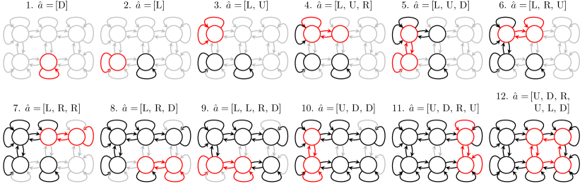
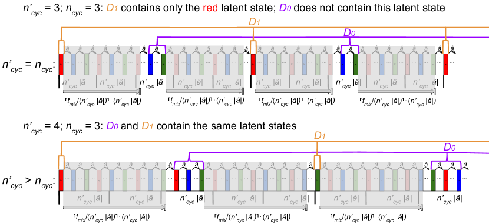
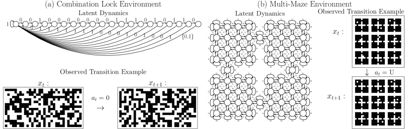

# Learning a Fast Mixing Exogenous Block MDP using a Single Trajectory

###### Abstract

In order to train agents that can quickly adapt to new objectives or reward functions, efficient unsupervised representation learning in sequential decision-making environments can be important. Frameworks such as the Exogenous Block Markov Decision Process (Ex-BMDP) have been proposed to formalize this representation-learning problem (Efroni et al., [2022b](#bib.bib6)). In the Ex-BMDP framework, the agent’s high-dimensional observations of the environment have two latent factors: a controllable factor, which evolves deterministically within a small state space according to the agent’s actions, and an exogenous factor, which represents time-correlated noise, and can be highly complex. The goal of the representation learning problem is to learn an encoder that maps from observations into the controllable latent space, as well as the dynamics of this space. Efroni et al. ([2022b](#bib.bib6)) has shown that this is possible with a sample complexity that depends only on the size of the controllable latent space, and not on the size of the noise factor. However, this prior work has focused on the episodic setting, where the controllable latent state resets to a specific start state after a finite horizon.  

By contrast, if the agent can only interact with the environment in a single continuous trajectory, prior works have not established sample-complexity bounds. We propose STEEL, the first provably sample-efficient algorithm for learning the controllable dynamics of an Ex-BMDP from a single trajectory, in the function approximation setting. STEEL has a sample complexity that depends only on the sizes of the controllable latent space and the encoder function class, and (at worst linearly) on the mixing time of the exogenous noise factor. We prove that STEEL is correct and sample-efficient, and demonstrate STEEL on two toy problems. Code is available at: <https://github.com/midi-lab/steel>.  

## 1 Introduction

This work considers the unsupervised representation learning problem in sequential control environments. Suppose an agent (e.g., a robot) is able to make observations and take actions in an environment for some period of time, but does not yet have an externally-defined task to accomplish. We want the agent to learn a model of the environment that may be useful for many downstream tasks: the question is then how to efficiently explore the environment to learn such a model.  

Sequential decision-making tasks are often modeled as Markov Decision Processes (MDPs). In the unsupervised setting, an MDP consists of a set of possible observations $\mathcal{X}$, a set of possible actions $\mathcal{A}$, a distribution over initial observations $\pi_{0}\in\mathcal{P}(\mathcal{X})$, and a transition function $\mathcal{T}:\mathcal{X}\times\mathcal{A}\rightarrow\mathcal{P}(\mathcal{X})$. The agent does not have direct access to $\mathcal{T}$. Instead, at each timestep $t$, the agent observes $x_{t}\in\mathcal{X}$ and selects action $a_{t}$. The next observation $x_{t+1}$ is then sampled as $x_{t+1}\sim\mathcal{T}(x_{t},a_{t})$.  

In the totally generic MDP setting, the only model learning possible is to directly learn the transition function $\mathcal{T}$. However, if the space of possible observations is large, this task becomes intractable. Therefore, prior works have attempted to simplify the problem by assuming that the MDP has some underlying structure, which a learning algorithm can exploit. One such structural assumption is the Ex-BMDP (Exogenous Block MDP) framework, introduced by Efroni et al. ([2022b](#bib.bib6)). The Ex-BMDP framework captures situations where the space of observations $\mathcal{X}$ is very large, but the parts of the environment that the agent has control over can be represented by a much smaller latent state.  

An Ex-BMDP has an observation space $\mathcal{X}$, a controllable (or endogenous) latent state space $\mathcal{S}$, and an exogenous state space $\mathcal{E}$. In the version of this setting that we consider, the controllable state $s_{t}\in\mathcal{S}$ evolves deterministically according to a latent transition function $T:\mathcal{S}\times\mathcal{A}\rightarrow\mathcal{S}$. That is: $s_{t+1}=T(s_{t},a_{t})$. The exogenous state $e_{t}\in\mathcal{E}$ represents time correlated noise: it evolves stochastically, independently of actions, according to a transition function $\mathcal{T}_{e}:\mathcal{E}\rightarrow\mathcal{P}(\mathcal{E})$. That is: $e_{t+1}\sim\mathcal{T}_{e}(e_{t})$. Neither $s$ nor $e$ is directly observed. Instead, the observation $x_{t}$ is sampled as $x_{t}\sim\mathcal{Q}(s_{t},e_{t})$, where $\mathcal{Q}\in\mathcal{S}\times\mathcal{E}\rightarrow\mathcal{P}(\mathcal{X})$ is the emission function. We make a block assumption on $\mathcal{Q}$ with respect to $\mathcal{S}$: that is, we assume that for distinct latent states $s,s^{\prime}\in\mathcal{S}$, the sets of possible observations that can be sampled from $\mathcal{Q}(s,\cdot)$ and $\mathcal{Q}(s^{\prime},\cdot)$ are disjoint. In other words, there exists a deterministic partial inverse of $\mathcal{Q}$, which is $\phi^{*}:\mathcal{X}\rightarrow\mathcal{S}$, such that if $x\sim\mathcal{Q}(s,e)$, then $\phi^{*}(x)=s$. Hence, it is always possible in principle to infer $s$ from $x$. 111Unlike most prior works on Ex-BMDPs, we do not make a block assumption on $\mathcal{E}$: we allow the same $x$ to be emitted by $\mathcal{Q}(s,e)$ and $\mathcal{Q}(s,e^{\prime})$, for distinct $e,e^{\prime}$. Technically, then, our Ex-BMDP framework represents a restricted class of Partially-Observed MDPs (POMDPs), rather than MDPs, because the complete state is not encoded within the observed $\mathcal{X}$.  

As in the general MDP setting, the agent only directly observes $x_{t}\in\mathcal{X}$, and chooses actions $a_{t}$ in response. However, rather than attempting to learn the full transition dynamics $\mathcal{T}$ of the system (which is determined by $T$, $\mathcal{T}_{e}$, and $\mathcal{Q}$ together), the objective of the agent is instead to efficiently model only the latent encoder $\phi^{*}$ and the latent transition function $T$. Together, these models allow the agent to plan or learn in downstream tasks using the encoded representations $\phi^{*}(x)$, modeling only the parts of the environment that the agent can actually control (the latent state $s\in\mathcal{S}$) while ignoring the potentially-complex dynamics of time-correlated noise.  

Specifically, the aim of efficient representation learning in this setting is to learn $\phi^{*}$ and $T$, using a number of environment steps of exploration that is dependent only on $|\mathcal{S}|$ and the size of the function class $\mathcal{F}$ that the encoder $\phi^{*}$ belongs to, and is not dependent on the size of $\mathcal{X}$ or $\mathcal{E}$. This allows $\mathcal{X}$ and $\mathcal{E}$ to be very large or potentially even infinite, but still allows for representation learning to be tractable. Efroni et al. ([2022b](#bib.bib6)) proposes an algorithm, PPE, with this property. However, PPE only works in a finite-horizon setting, where the agent interacts with the environment in episodes of fixed length $H$. After each episode, the controllable state (almost) always resets to a deterministic start state $s_{0}\in\mathcal{S}$ at the beginning of each episode. In this work, we instead consider the single-trajectory, no-reset setting, where the agent interacts with the environment in a single episode of unbounded length, with no ability to reset the state. This better models real-world cases, where, for example, expensive human intervention would be required to “reset” the environment that a robot trains in: we would rather not require this intervention. This no-reset Ex-BMDP setting was previously considered by Lamb et al. ([2023](#bib.bib9)) and Levine et al. ([2024](#bib.bib11)), however, the algorithms presented in those works do not have sample-complexity guarantees.  

By contrast, the algorithm presented in this work is guaranteed to learn $\phi^{*}$ and $T$ using samples polynomial in $|\mathcal{S}|$ and $\log|\mathcal{F}|$, with no dependence on $|\mathcal{E}|$ and $|\mathcal{X}|$. We only require that the mixing time of the exogenous noise is bounded. In other words, the requirement is that $t_{\text{mix}}$, the mixing time of the Markov chain on $\mathcal{E}$ induced by $\mathcal{T}_{e}$, is at most some known quantity $\hat{t}_{\text{mix}}$. Note that we do not require that the endogenous state $s$ mixes quickly under any particular policy (although we do require – as do Lamb et al. ([2023](#bib.bib9)) and Levine et al. ([2024](#bib.bib11)) – that all states in $\mathcal{S}$ are eventually reachable from one another). In this setting, we derive an algorithm with the following asymptotic sample complexity (where $\mathcal{O}^{*}(f(x)):=\mathcal{O}(f(x)\log(f(x)))$):  

|  | $$\mathcal{O}^{*}\Big{(}ND|\mathcal{S}|^{2}|\mathcal{A}|\cdot\log\frac{|\mathcal{F}|}{\delta}+|\mathcal{S}||\mathcal{A}|\hat{t}_{\text{mix}}\cdot\log\frac{N|\mathcal{F}|}{\delta}+\frac{|\mathcal{S}|^{2}D}{\epsilon}\cdot\log\frac{|\mathcal{F}|}{\delta}+\frac{|\mathcal{S}|\hat{t}_{\text{mix}}}{\epsilon}\cdot\log\frac{|\mathcal{F}|}{\delta}\Big{)},$$ |  | (1) |
| --- | --- | --- | --- |

where $N$ is a predetermined upper-bound on $|\mathcal{S}|$, $\delta$ is the failure rate of the algorithm, $D$ is the maximum distance between any two latent states in $\mathcal{S}$ (at most $|\mathcal{S}|$), and $\epsilon$ is the minimum accuracy of the output learned encoder $\phi$ on any latent state class $s\in\mathcal{S}$. Note that this expression is at worst polynomial in $|\mathcal{S}|$, and linear in $\hat{t}_{\text{mix}}$ and $\log|\mathcal{F}|$.  

Our algorithm proceeds iteratively, at each iteration taking a certain sequence of actions repeatedly in a loop. Because the latent state dynamics $T$ are deterministic, this process is guaranteed to (after some transient period) enter a cycle of latent states, of bounded length. Because the latent states in this cycle are repeatedly re-visited, the algorithm is then able to predictably collect many samples of the same latent state, without the need to “re-set” the environment. Furthermore, because this looping can be continued indefinitely, the algorithm can “wait out” the mixing time of the exogenous dynamics, in order to collect near-i.i.d. samples of each latent state. We call our algorithm Single-Trajectory Exploration for Ex-BMDPs via Looping, or STEEL. In summary, we:  

* introduce STEEL, the first provably sample-efficient algorithm for learning Ex-BMDPs in a general function-approximation setting from a single trajectory, 
* prove the correctness and sample complexity of STEEL, and 
* empirically test STEEL on two toy problems to demonstrate its efficacy. 

## 2 Related Works

[TABLE S2.T1]

<table class="ltx_tabular ltx_centering ltx_align_middle">
<tbody class="ltx_tbody">
<tr class="ltx_tr">
<td class="ltx_td ltx_border_l ltx_border_r ltx_border_t"></td>
<td class="ltx_td ltx_align_center ltx_border_r ltx_border_t">No-</td>
<td class="ltx_td ltx_align_center ltx_border_r ltx_border_t">Sample-</td>
<td class="ltx_td ltx_align_center ltx_border_r ltx_border_t">Function</td>
<td class="ltx_td ltx_align_center ltx_border_r ltx_border_t">Nondeterministic</td>
<td class="ltx_td ltx_align_center ltx_border_r ltx_border_t">Partially-</td>
<td class="ltx_td ltx_align_center ltx_border_r ltx_border_t">Nondeterministic</td>
</tr>
<tr class="ltx_tr">
<td class="ltx_td ltx_border_l ltx_border_r"></td>
<td class="ltx_td ltx_align_center ltx_border_r">Reset</td>
<td class="ltx_td ltx_align_center ltx_border_r">Complexity</td>
<td class="ltx_td ltx_align_center ltx_border_r">Approx-</td>
<td class="ltx_td ltx_align_center ltx_border_r">Reset</td>
<td class="ltx_td ltx_align_center ltx_border_r">Observed</td>
<td class="ltx_td ltx_align_center ltx_border_r">Latent</td>
</tr>
<tr class="ltx_tr">
<td class="ltx_td ltx_border_l ltx_border_r"></td>
<td class="ltx_td ltx_align_center ltx_border_r">Setting</td>
<td class="ltx_td ltx_align_center ltx_border_r">Guarantees</td>
<td class="ltx_td ltx_align_center ltx_border_r">imation</td>
<td class="ltx_td ltx_align_center ltx_border_r">State</td>
<td class="ltx_td ltx_align_center ltx_border_r">Exogenous State</td>
<td class="ltx_td ltx_align_center ltx_border_r">Transitions</td>
</tr>
<tr class="ltx_tr">
<td class="ltx_td ltx_align_center ltx_border_l ltx_border_r ltx_border_t">STEEL</td>
<td class="ltx_td ltx_align_center ltx_border_r ltx_border_t">✓</td>
<td class="ltx_td ltx_align_center ltx_border_r ltx_border_t">✓</td>
<td class="ltx_td ltx_align_center ltx_border_r ltx_border_t">✓</td>
<td class="ltx_td ltx_align_center ltx_border_r ltx_border_t">✓</td>
<td class="ltx_td ltx_align_center ltx_border_r ltx_border_t">✓</td>
<td class="ltx_td ltx_align_center ltx_border_r ltx_border_t">✗</td>
</tr>
<tr class="ltx_tr">
<td class="ltx_td ltx_align_center ltx_border_l ltx_border_r ltx_border_t"><cite class="ltx_cite ltx_citemacro_citepalias">(<a class="ltx_ref">Efroni’22b</a>)</cite></td>
<td class="ltx_td ltx_align_center ltx_border_r ltx_border_t">✗</td>
<td class="ltx_td ltx_align_center ltx_border_r ltx_border_t">✓</td>
<td class="ltx_td ltx_align_center ltx_border_r ltx_border_t">✓</td>
<td class="ltx_td ltx_align_center ltx_border_r ltx_border_t">✗</td>
<td class="ltx_td ltx_align_center ltx_border_r ltx_border_t">?</td>
<td class="ltx_td ltx_align_center ltx_border_r ltx_border_t">✗</td>
</tr>
<tr class="ltx_tr">
<td class="ltx_td ltx_align_center ltx_border_l ltx_border_r ltx_border_t"><cite class="ltx_cite ltx_citemacro_citepalias">(<a class="ltx_ref">Lamb’23</a>)</cite></td>
<td class="ltx_td ltx_align_center ltx_border_r ltx_border_t">✓</td>
<td class="ltx_td ltx_align_center ltx_border_r ltx_border_t">✗</td>
<td class="ltx_td ltx_align_center ltx_border_r ltx_border_t">✓</td>
<td class="ltx_td ltx_align_center ltx_border_r ltx_border_t">✓</td>
<td class="ltx_td ltx_align_center ltx_border_r ltx_border_t">?</td>
<td class="ltx_td ltx_align_center ltx_border_r ltx_border_t">✗</td>
</tr>
<tr class="ltx_tr">
<td class="ltx_td ltx_align_center ltx_border_l ltx_border_r ltx_border_t"><cite class="ltx_cite ltx_citemacro_citepalias">(<a class="ltx_ref">Levine’24</a>)</cite></td>
<td class="ltx_td ltx_align_center ltx_border_r ltx_border_t">✓</td>
<td class="ltx_td ltx_align_center ltx_border_r ltx_border_t">✗</td>
<td class="ltx_td ltx_align_center ltx_border_r ltx_border_t">✓</td>
<td class="ltx_td ltx_align_center ltx_border_r ltx_border_t">✓</td>
<td class="ltx_td ltx_align_center ltx_border_r ltx_border_t">?</td>
<td class="ltx_td ltx_align_center ltx_border_r ltx_border_t">✗</td>
</tr>
<tr class="ltx_tr">
<td class="ltx_td ltx_align_center ltx_border_b ltx_border_l ltx_border_r ltx_border_t"><cite class="ltx_cite ltx_citemacro_citepalias">(<a class="ltx_ref">Efroni’22a</a>)</cite></td>
<td class="ltx_td ltx_align_center ltx_border_b ltx_border_r ltx_border_t">✗</td>
<td class="ltx_td ltx_align_center ltx_border_b ltx_border_r ltx_border_t">✓</td>
<td class="ltx_td ltx_align_center ltx_border_b ltx_border_r ltx_border_t">✗</td>
<td class="ltx_td ltx_align_center ltx_border_b ltx_border_r ltx_border_t">✓</td>
<td class="ltx_td ltx_align_center ltx_border_b ltx_border_r ltx_border_t">✗</td>
<td class="ltx_td ltx_align_center ltx_border_b ltx_border_r ltx_border_t">✓</td>
</tr>
</tbody>
</table>

Table 1: Comparison to Prior Works for learning Ex-BMDP Latent Dynamics
[/TABLE]

### 2.1 Representation Learning for Ex-BMDP and Exo-MDPs

The Ex-BMDP model was originally introduced by Efroni et al. ([2022b](#bib.bib6)), who propose the PPE algorithm to learn the endogenous state encoder $\phi(\cdot)$ and latent transition dynamics $T$ of an Ex-BMDP. PPE has explicit sample-complexity guarantees that are polynomial in $|\mathcal{S}|$ and $\log|\mathcal{F}|$: crucially, the sample complexity does not depend explicitly on $|\mathcal{E}|$ or $|\mathcal{X}|$. However, unlike the method proposed in this work, PPE is restricted to the episodic, finite horizon setting with (nearly) deterministic resets. After each episode, the endogenous state is (nearly) always reset to the same starting latent state $s_{0}\in\mathcal{S}$, and the exogenous state $e_{0}\in\mathcal{E}$ is i.i.d. resampled from a fixed starting distribution. Similarly to this work, PPE assumes that the latent transition dynamics $T$ are (close to) deterministic. Because both $s_{0}$ and $T$ are nearly deterministic, PPE can collect i.i.d. samples of observations $x$ associated with any latent state $s\in\mathcal{S}$ simply by executing the same sequence of actions starting from $s_{0}$ after each reset. By contrast, in our setting, we cannot reset the Ex-BMDP state, so it is more challenging to collect samples of a given latent state $s$.  

Other works have considered the Ex-BMDP setting without latent state resets. Lamb et al. ([2023](#bib.bib9)) and Levine et al. ([2024](#bib.bib11)) consider a setting similar to ours, where the agent interacts with the environment in a single trajectory. However, these methods do not provide sample-complexity guarantees, and instead are only guaranteed to converge to the correct encoder in the limit of infinite samples.  

Efroni et al. ([2022a](#bib.bib5)) considers a related “Exo-MDP” setting, and proposes the ExoRL algorithm. In this setting, while the environment is episodic, the latent state $s_{0}$ resets to a starting value sampled randomly from a fixed distribution after each episode. Additionally, the latent transition dynamics may be non-deterministic. However, unlike our work, Efroni et al. ([2022a](#bib.bib5)) does not consider the general function-approximation setting for state encoders. Instead, the observation $x$ is explicitly factorized into $d$ factors, and the controllable state $s$ consists of some unknown subset of $k$ of these factors: the representation learning problem is reduced to identifying which $k$ of the $d$ factors are action-dependent. ExoRL guarantees a sample-complexity polynomial in $2^{k}=|\mathcal{S}|$ and $\log(d)$.222Because ExoRL allows for nondeterministic starting latent states, one might be able to adapt the method to the infinite-horizon no-reset setting by considering the single episode as a chain of “pseudo-episodes” with nondeterministic start state (c.f., Xu et al. ([2024](#bib.bib20))). However, to do so, one would have to ensure that $s$ mixes sufficiently between episodes, which may be challenging given that $s$ is not directly observed and has unknown, controllable dynamics. Even still, the resulting algorithm would not apply to the general function-approximation setting which we consider.  

In addition to our main claim that our proposed algorithm is the first provably sample-efficient algorithm for representation learning in the single-trajectory Ex-BMDP setting, another property of our method is that we do not make a “block” assumption on the exogenous state $e$. For a fixed $s\in\mathcal{S}$, in our setting, the same observation $x\in\mathcal{X}$ may be emitted by multiple distinct exogenous states $e,e^{\prime}\in\mathcal{E}$. Prior works (Efroni et al., [2022b](#bib.bib6); [a](#bib.bib5); Lamb et al., [2023](#bib.bib9); Levine et al., [2024](#bib.bib11)) have stated assumptions that require that $e$ may be uniquely inferred from $x$.333Although it is not immediately clear why this restriction is necessary for the proposed algorithms. Removing this restriction allows one to model a greater range of phenomena. For example, suppose an agent can turn on or turn off a “noisy TV”: i.e., the agent can control whether or not some source of temporally-correlated noise is observable. This is allowed in our version of the Ex-BMDP formulation, but is not allowed if $e$ must be fully inferable from $x$. One prior work, Wu et al. ([2024](#bib.bib19)), also (implicitly) removes the block restriction on the exogenous state $e$. That work extends Ex-BMDP representation learning to the partially-observed state setting, with the assumption that the observation history within some known window is sufficient to infer the latent state $s$. However, Wu et al. ([2024](#bib.bib19)) does not provide any sample-complexity guarantees. Wang et al. ([2022](#bib.bib17)) and Kooi et al. ([2023](#bib.bib8)) consider similar settings with continuous controllable latent state. However, the proposed methods require explicitly modeling the exogenous noise state $e$, and there are no sample complexity guarantees. Trimponias & Dietterich ([2023](#bib.bib15)) considers the sample-efficiency of reward-based reinforcement learning in Ex-BMDPs assuming known endogenous and exogenous state encoders; however, it does not address the sample complexity of the representation learning problem.  

### 2.2 Representation Learning for Block MDPs and Low-Rank MDPs

The Ex-BMDP framework can be considered as a generalization of the Block MDP framework (Dann et al., [2018](#bib.bib3); Du et al., [2019](#bib.bib4)). Like the Ex-BMDP setting, the Block MDP setting models environments where the observed state space $\mathcal{X}$ of the overall MDP is much larger than an action-dependent latent state space $\mathcal{S}$. Some works in the Block MDP framework (Mhammedi et al., [2023](#bib.bib12); Misra et al., [2020](#bib.bib13)) also allow for nondeterministic latent state transitions: that is $s_{t+1}\sim\mathcal{T}_{s}(s_{t},a_{t})$. However, unlike the Ex-BMDP setting, there is no exogenous latent state $e\in\mathcal{E}$ or exogenous dynamics $\mathcal{T}_{e}$: the observation is simply sampled as $x_{t}\sim\mathcal{Q}(s_{t})$. In other words, the Block MDP setting does not allow for time correlated noise outside of the modelled latent state $s$. Therefore, even when stochastic latent-state transition are allowed, any time-correlated noise must be captured in $\mathcal{S}$, and so impacts the sample complexity (which is typically polynomial in $|\mathcal{S}|$).  

The Low-Rank MDP framework can also be considered as an extension the Block MDP framework, but is an orthogonal extension to the Ex-BMDP framework. In Low Rank MDPs, there exist functions $\phi:\mathcal{X}\times\mathcal{A}\rightarrow\mathbb{R}^{d}$ and $\mu:\mathcal{X}\rightarrow\mathbb{R}^{d}$, such that $\Pr(x_{t+1}=x^{\prime}|x_{t}=x,a_{t}=a)=\phi(x,a)^{T}\mu(x^{\prime})$. The sample complexity depends only polynomially on $d$ and logarithmically on the size of the function classes for the state encoders $\phi$ and $\mu$; it should not depend explicitly on $|\mathcal{X}|$. Works under this framework include Agarwal et al. ([2020](#bib.bib1)); Uehara et al. ([2022](#bib.bib16)) and Cheng et al. ([2023](#bib.bib2)). Other works in the Low Rank MDP framework use a reward signal and only explicitly learn part of the representation (the encoder $\phi$), including Mhammedi et al. ([2023](#bib.bib12)) and Jiang et al. ([2017](#bib.bib7)); see Mhammedi et al. ([2023](#bib.bib12)) for a recent, thorough comparison of these works. Note that while BMDPs can be formulated as low-rank BMDPs with $d=|\mathcal{S}|$, this does not hold for Ex-BMDPs: the rank of the transition probabilities on $\mathcal{X}$ depends on $|\mathcal{E}|$ – as noted by Efroni et al. ([2022b](#bib.bib6)).  

## 3 Notation and Assumptions

* The Ex-BMDP, $M$, has observation space $\mathcal{X}$, with discrete endogenous states $\mathcal{S}$ that have deterministic, controllable dynamics, and possibly continuous exogenous states $\mathcal{E}$ with nondeterministic dynamics that do not depend on actions. Concretely, we have that $s_{t+1}=T(s_{t},a_{t})$, where $T$ is a deterministic function, and $e_{t+1}\sim\mathcal{T}_{e}(e_{t})$. Let $x_{t}\sim\mathcal{Q}(s_{t},e_{t})$, for $x_{t}\in\mathcal{X}$, $s_{t}\in\mathcal{S}$, $e_{t}\in\mathcal{E}$, with the block assumption on $\mathcal{S}$. That is, a given $x\in\mathcal{X}$ can be emitted only by one particular $s\in\mathcal{S}$, which we define as $\phi^{*}(x_{t})=s_{t}$. We assume that $M$ is accessed in one continuous trajectory. The initial endogenous state is an arbitrary $s_{\text{init}}\in\mathcal{S}$, and the initial exogenous state $e_{\text{init}}\sim\pi_{\mathcal{E}}^{\text{init}}$, where $\pi_{\mathcal{E}}^{\text{init}}\in\mathcal{P}(\mathcal{E})$. 
* The exogenous dynamics on $\mathcal{E}$ are irreducible and aperiodic, with stationary distribution $\pi_{\mathcal{E}}$. There is a known upper bound $\hat{t}_{\text{mix}}$ on the mixing time $t_{\text{mix}}$, where (as defined in Levin & Peres ([2017](#bib.bib10)) and elsewhere) $t_{\text{mix}}:=t_{\text{mix}}(1/4)$, where $t_{\text{mix}}(\epsilon)$ is defined such that:      |  | $$\forall e\in\mathcal{E},\,\,\,\|\Pr(e_{t+t_{\text{mix}}(\epsilon)}=e^{\prime}|e_{t}=e)-\pi_{\mathcal{E}}(e^{\prime})\|_{\text{TV}}\leq\epsilon.$$ |  | (2) | | --- | --- | --- | --- |   This assumption bounds how “temporally correlated” the noise in the Ex-BMDP is: it ensures that the exogenous noise state $e_{t}$ at time $t$ is relatively unlikely to affect $e_{t+\hat{t}_{\text{mix}}}$. 
* We have a known upper bound on the number of endogenous latent states, $N\geq|\mathcal{S}|$. Additionally, we assume that all endogenous latent states can be reached from one another in at most $D$ steps, for some finite $D$ (note that we do not assume that all pairs of states in $\mathcal{S}$ can be reached from one another in exactly $D$ steps). We assume that there is a known upper bound on this diameter: $\hat{D}\geq D$. Trivially, if all endogenous latent states are reachable from one another then $D\leq N-1$, so if a tighter bound is not available then we can use $\hat{D}:=N-1$. (In fact, it is not very important to use a tight bound here: $\hat{D}$ does not appear in the asymptotic sample complexity.) 
* There is an encoder hypothesis class $\mathcal{F}:\mathcal{X}\rightarrow\{0,1\}$, with realizablity for one-vs-rest classification of endogenous states. That is,      |  | $$\forall s\in\mathcal{S},\,\exists f\in\mathcal{F}:\forall x\in\mathcal{X},\,f(x)=\mathbbm{1}_{\phi^{*}(x)=s}.$$ |  | (3) | | --- | --- | --- | --- |   In other words, for every latent state $s\in\mathcal{S}$, there is some function $f\in\mathcal{F}$ such that $f(x)=1$ if and only if $\phi^{*}(x)=s$. 
* The algorithm has access to a training oracle for $\mathcal{F}$, which, given two finite multi-sets $D_{0}$ and $D_{1}$ each with elements from $\mathcal{X}$, returns a classifier $f\in\mathcal{F}$. The only requirement that we have for this oracle is that, if there exist any classifiers $\mathcal{F}^{*}\subset\mathcal{F}$, such that, for $f^{*}\in\mathcal{F}^{*}$, $\forall x\in D_{0}$, $f^{*}(x)=0$ and $\forall x\in D_{1}$, $f^{*}(x)=1$, then the oracle will return some member of $\mathcal{F}^{*}$. Note that an optimizer that minimizes the 0-1 loss on $D_{0}\cup D_{1}$ will satisfy this requirement. However, it is not strictly necessary to minimize the 0-1 loss in particular. 
* General notation: Let $\mathcal{M}(\mathcal{A})$ be the set of all multisets of the set $\mathcal{A}$. Let $\bot$ represent an undefined value. For lists $x$, $y$, let $x\cdot y$ represent their concatenation: that is, $[a,b]\cdot[c,d]=[a,b,c,d]$. For multisets $A$ and $B$, let $A\uplus B$ be their union, where their multiplicities are additive. Let $\%$ be the modulo operator, so that $a\%b\equiv a\pmod{b}$ and $0\leq a\%b\leq b-1$. 

## 4 Algorithm

The STEEL algorithm is presented in full as Algorithm [1](#algorithm1 "In 4 Algorithm ‣ Learning a Fast Mixing Exogenous Block MDP using a Single Trajectory"), with a major subroutine, CycleFind, split out as Algorithm [2](#algorithm2 "In 4 Algorithm ‣ Learning a Fast Mixing Exogenous Block MDP using a Single Trajectory"). We state the sample-complexity and correctness of STEEL in the following theorem, which is proved in Appendix [A](#A1 "Appendix A Proofs ‣ Learning a Fast Mixing Exogenous Block MDP using a Single Trajectory").  

###### Theorem 1.

For an Ex-BMDP $M=\langle\mathcal{X},\mathcal{A},\mathcal{S},\mathcal{E},\mathcal{Q},T,\mathcal{T}_{e},\pi_{\mathcal{E}}^{\text{init}}\rangle$ starting at an arbitrary endogenous latent state $s_{\text{init}}\in\mathcal{S}$, with $|\mathcal{S}|\leq N$, where the exogenous Markov chain $\mathcal{T}_{e}$ has mixing time at most $\hat{t}_{\text{mix}}$, and where all states in $\mathcal{S}$ are reachable from one another in at most $\hat{D}$ steps; and corresponding encoder function class $\mathcal{F}$ such that Equation [3](#S3.E3 "In 4th item ‣ 3 Notation and Assumptions ‣ Learning a Fast Mixing Exogenous Block MDP using a Single Trajectory") holds, the algorithm STEEL$(M,\mathcal{F},N,\hat{D},\hat{t}_{\text{mix}},\delta,\epsilon)$ will output a learned endogenous state space $\mathcal{S}^{\prime}$, transition model $T^{\prime}$, and encoder $\phi^{\prime}$, such that, with probability at least $1-\delta$,  

* $|\mathcal{S}^{\prime}|=|\mathcal{S}|$, and under some bijective function $\sigma:\mathcal{S}\rightarrow\mathcal{S}^{\prime}$, it holds that      |  | $$\forall s\in\mathcal{S},a\in\mathcal{A}:\sigma(T(s,a))=T^{\prime}(\sigma(s),a),\text{ and,}$$ |  | (4) | | --- | --- | --- | --- | 
* Under the same bijection $\sigma$,      |  | $$\forall s\in\mathcal{S},\Pr_{\begin{subarray}{c}x\sim\mathcal{Q}(s,e),\\ e\sim\pi_{\mathcal{E}}\end{subarray}}(\phi^{\prime}(x)=\sigma(\phi^{*}(x)))\geq 1-\epsilon,$$ |  | (5) | | --- | --- | --- | --- |   where $\pi_{\mathcal{E}}$ is the stationary distribution of $\mathcal{T}_{e}$. 

Furthermore, the number of steps that STEEL executes on $M$ scales as:  

|  | $$\mathcal{O}^{*}\Big{(}ND|\mathcal{S}|^{2}|\mathcal{A}|\cdot\log\frac{|\mathcal{F}|}{\delta}+|\mathcal{S}||\mathcal{A}|\hat{t}_{\text{mix}}\cdot\log\frac{N|\mathcal{F}|}{\delta}+\frac{|\mathcal{S}|^{2}D}{\epsilon}\cdot\log\frac{|\mathcal{F}|}{\delta}+\frac{|\mathcal{S}|\hat{t}_{\text{mix}}}{\epsilon}\cdot\log\frac{|\mathcal{F}|}{\delta}\Big{)},$$ |  |
| --- | --- | --- |

where $\mathcal{O}^{*}(f(x)):=\mathcal{O}(f(x)\log(f(x)))$.  

Here, we give a high-level overview of STEEL. The algorithm proceeds in three phases. In the first phase, the algorithm learns the transition dynamics $T^{\prime}$; in the second phase, it collects additional samples of observations of each latent state in $\mathcal{S}$; in the final phase, the encoder $\phi^{\prime}$ is learned.  

STEEL Phase 1: Learning latent dynamics. In the first phase, STEEL constructs $\mathcal{S}^{\prime}$ and $T^{\prime}$ by iteratively adding cycles to the known transition graph. At each iteration, a sequence of actions $\hat{a}$ is chosen such that, starting anywhere in the known $T^{\prime}$, taking the actions in $\hat{a}$ is guaranteed to traverse a transition not already in $T^{\prime}$. The method for choosing $\hat{a}$ shown in Algorithm [1](#algorithm1 "In 4 Algorithm ‣ Learning a Fast Mixing Exogenous Block MDP using a Single Trajectory") guarantees that $|\hat{a}|\leq|\mathcal{S}^{\prime}|\cdot D$ (see proof in Appendix [A.1.2](#A1.SS1.SSS2 "A.1.2 STEEL Phase 1 ‣ A.1 STEEL ‣ Appendix A Proofs ‣ Learning a Fast Mixing Exogenous Block MDP using a Single Trajectory")). STEEL then takes the actions in $\hat{a}$ repeatedly, collecting a sequence of observations $x_{CF}$. Because the transitions in $T$ are deterministic, this sequence of transitions must eventually (after at most $|\mathcal{S}||\hat{a}|$ steps) enter a cycle of latent states, of length $n_{\text{cyc}}|\hat{a}|$, for some $n_{\text{cyc}}\leq|\mathcal{S}|$. Because $\hat{a}$ was chosen to always escape the known transitions in $T^{\prime}$, this cycle cannot be contained in $T^{\prime}$, so adding the states and transitions of the new cycle to $\mathcal{S}^{\prime}$ and $T^{\prime}$ is guaranteed to expand the known dynamics graph by at least one edge: this process will discover the full transition dynamics after at most $|\mathcal{S}||\mathcal{A}|$ iterations. See Figure [1](#S4.F1 "Figure 1 ‣ 4 Algorithm ‣ Learning a Fast Mixing Exogenous Block MDP using a Single Trajectory") for an example of how STEEL constructs $\mathcal{S}^{\prime}$ and $T^{\prime}$ by adding cycles to the dynamics. At each iteration, to identify the distinct latent states in the cycle, STEEL uses the CycleFind subroutine, which itself has two phases:  

[FIGURE S4.F1.g1]

Figure 1: STEEL discovers the latent dynamics $\mathcal{S}$ and $T$ by iteratively adding cycles to the learned dynamics graph. In this simple example, the initially-unknown “true” dynamics consist of 6 states arranged in a grid, where the agent can move (U)p, (D)own, (L)eft, or (R)ight. STEEL takes 12 iterations to discover the full dynamics: each pane corresponds to an iteration, and shows the still-unknown parts of the dynamics graph in grey, the already-known parts of the dynamics graph in black, and the cycle being explored in red. States are represented as circles and transitions as arrows.
[/FIGURE]

[FIGURE S4.F2.g1]

Figure 2: CycleFind determines the period of the cycle in $x_{CF}$. See Section [4](#S4 "4 Algorithm ‣ Learning a Fast Mixing Exogenous Block MDP using a Single Trajectory") under
“CycleFind Phase 1.” We show the sequence $x_{CF}$ sampled from $M$: specifically, we show every $|\hat{a}|$’th observation, where the same actions $\hat{a}$ are taken between each one. The observations’ latent states are color-coded as red, blue, and green: a pattern repeats every $3|\hat{a}|$ steps, so $n_{cyc}=3$. $D_{1}$ consists of the first observation in each $(n_{cyc}^{\prime}|\hat{a}|)$-cycle, and $D_{0}$ the other observations taken between executions of $\hat{a}$. (Spans of length $\geq\hat{t}_{\text{mix}}$ are skipped to ensure certain subsets of the datasets are near-i.i.d.)
[/FIGURE]

[FIGURE algorithm1]

Input: Access to Ex-BMDP $M$, access to training oracle for function class $\mathcal{F}$, knowledge of upper bounds $N$, $\hat{D}$, $\hat{t}_{\text{mix}}$, parameters $\delta$, $\epsilon$.

Initialize learned latent state set $\mathcal{S}^{\prime}$, initially empty;

Initialize table of collected datasets for each latent state: $\mathcal{D}:\mathcal{S}^{\prime}\rightarrow\mathcal{M}(\mathcal{X})$;

Initialize learned latent dynamics: $T^{\prime}:(\mathcal{S}^{\prime}\cup\{\bot\})\times\mathcal{A}\rightarrow(\mathcal{S}^{\prime}\cup\{\bot\})$. (When a state $s$ is added to $\mathcal{S}^{\prime}$, we initially set $\forall a\in\mathcal{A},\,\,\,T(s,a):=\bot$. Also, we set $\forall a\in\mathcal{A},\,\,\,T(\bot,a):=\bot$ as a permanent definition. );

// Phase 1: Discover latent dynamics $T$. 

Chose arbitrary $a\in\mathcal{A}$;

$\mathcal{S^{\prime}},\mathcal{D},T^{\prime},s_{\text{curr.}}\leftarrow\text{CycleFind}([a],\mathcal{S^{\prime}},\mathcal{D},T^{\prime})$; // Special case for first iteration 

while *$\exists s\in\mathcal{S}^{\prime},a\in\mathcal{A}:\,\,T^{\prime}(s,a):=\bot$.* do

      
Initialize $\mathcal{B}\leftarrow S^{\prime}$; and initialize action list $\hat{a}\leftarrow[\,]$;

      while *$\mathcal{B}$ non-empty* do

            
Chose arbitrary $s\in\mathcal{B}$.;
$\mathcal{B}\leftarrow\mathcal{B}\setminus\{s\}$;

            Let $\hat{a}^{\prime}:=$ a minimum-length sequence of actions such that $T^{\prime}(T^{\prime}(T^{\prime}(...T^{\prime}(s,\hat{a}^{\prime}_{1}),\hat{a}^{\prime}_{2}),\hat{a}^{\prime}_{3}),...,\hat{a}^{\prime}_{|\hat{a}^{\prime}|})=\bot$. (This can be found using Dijkstra’s algorithm.);

            $\hat{a}\leftarrow\hat{a}\cdot\hat{a}^{\prime}$;

            $\mathcal{B}\leftarrow\{s^{\prime\prime}\in\mathcal{S}^{\prime}\,|\,\exists\,s^{\prime}\in\mathcal{B}:\,T^{\prime}(T^{\prime}(T^{\prime}(...T^{\prime}(s^{\prime},\hat{a}^{\prime}_{0}),\hat{a}^{\prime}_{1}),\hat{a}^{\prime}_{2}),...,\hat{a}^{\prime}_{|\hat{a}^{\prime}|-1})=s^{\prime\prime}\}$;

      $\mathcal{S^{\prime}},\mathcal{D},T^{\prime},s_{\text{curr.}}\leftarrow\text{CycleFind}(\hat{a},\mathcal{S^{\prime}},\mathcal{D},T^{\prime})$;

// Phase 2: Collect additional latent samples to train encoder. 

Let $d:=\lceil\frac{3|\mathcal{S}^{\prime}|\ln(16|\mathcal{S}^{\prime}|^{2}|\mathcal{F}|/\delta)}{\epsilon}\rceil$;

while *$\exists s\in\mathcal{S^{\prime}}:\,|\mathcal{D}(s)|<d$* do

      
Let $\mathcal{C}:=\{s\in\mathcal{S}^{\prime}||\mathcal{D}(s)|\leq d\land s\neq s_{\text{curr.}}\}$;

      Use $T^{\prime}$ to plan a cycle of actions $\bar{a}$ starting at $s_{\text{curr.}}$ that visits all states $\mathcal{C}$ and then returns to $s_{\text{curr.}}$, by greedily applying Dijkstra’s algorithm repeatedly;

      If $|\bar{a}|<\hat{t}_{\text{mix}}$, use $T^{\prime}$ to extend $\bar{a}$ by repeatedly inserting the shortest-length self-loop of some state visited in $\bar{a}$ into $\bar{a}$ until $|\bar{a}|\geq\hat{t}_{\text{mix}}$ ;

      Execute all actions in $\bar{a}$ once without collecting data;

      while *$\forall s\in\mathcal{C}:\,|\mathcal{D}(s)|<d$* do

            
for *$a$ in $\bar{a}_{0},...,\bar{a}_{|\bar{a}|-1}$* do

                  
Take action $a$ on $M$;

                  $s_{\text{curr.}}\leftarrow T^{\prime}(s_{\text{curr.}},a)$;

                  if  *$s_{\text{curr.}}$ is being visited for the first time in this execution through $\bar{a}$*  then

                        
Let $x_{\text{curr.}}:=$ the observed state of $M$;

                        $\mathcal{D}(s_{\text{curr.}})\leftarrow\mathcal{D}(s_{\text{curr.}})\uplus\{x_{\text{curr.}}\}$;

// Phase 3: Train latent state encoder $\phi^{\prime}$. 

for *$s\in\mathcal{S}^{\prime}$* do

      
Let $D_{0}:=\mathop{\uplus}_{s^{\prime}\in\mathcal{S}^{\prime}\setminus\{s\}}\mathcal{D}(s^{\prime})$; $D_{1}:=\mathcal{D}(s)$;

      Apply training oracle to $D_{0}$ from $D_{1}$, yielding $f_{s}\in\mathcal{F}$;

return  $\mathcal{S}^{\prime}$, $T^{\prime}$, and $\phi^{\prime}(x):=\arg\max_{s}f_{s}(x)$;

Algorithm 1 STEEL
[/FIGURE]

[FIGURE algorithm2]

Input: Action list $\hat{a}$; current learned state set $\mathcal{S}^{\prime}$, datasets $\mathcal{D}$, and transition dynamics $T^{\prime}$. Also, access to Ex-BMDP $M$, access to training oracle for function class $\mathcal{F}$, knowledge of upper bounds $N$, $\hat{t}_{\text{mix}}$, and $\hat{D}$, and parameters $\delta$, $\epsilon$.

// Phase 1: find length of cycle, $n_{\text{cyc}}\cdot|\hat{a}|$. 

Let $n_{\text{samp. cyc.}}:=\Bigg{\lceil}\ln\left(\frac{\delta}{4|\mathcal{A}|\cdot N\cdot(N-1)\cdot|\mathcal{F}|}\right)\Big{/}\ln\left(\frac{9}{16}\right)\Bigg{\rceil}$;

Let $c_{\text{init}}:=(2\hat{t}_{\text{mix}}+3N\cdot|\hat{a}|-2)\cdot n_{\text{samp. cyc.}}-\hat{t}_{\text{mix}}-N\cdot|\hat{a}|+1+\max((N-1)\cdot|\hat{a}|,\hat{t}_{\text{mix}})$;

Collect a sequence of observation $x_{CF}:=[x_{1},...x_{c_{\text{init}}}]$ from $M$ by taking the actions in $\hat{a}$ repeatedly in a loop, for a total of $c_{\text{init}}$ actions. (Action $\hat{a}_{i\,\%\,|\hat{a}|}$ is taken after observing $x_{i}$.);

Let $\bar{x}_{i}:=x_{i\cdot|\hat{a}|+\max((N-1)\cdot|\hat{a}|,\hat{t}_{\text{mix}})}$;

Initialize $n_{\text{cyc}}\leftarrow 1$; // Default value if no other $n_{\text{cyc}}^{\prime}$ is $n_{\text{cyc}}$ 

for *$n_{\text{cyc}}^{\prime}$ in [N, N-1…,3,2]* do

      
Let $q:=\lceil\hat{t}_{\text{mix}}/(n_{\text{cyc}}^{\prime}\cdot|\hat{a}|)\rceil$, $r:=q\cdot n_{\text{cyc}}^{\prime}$, $k:=\lfloor\frac{c_{\text{init}}+r\cdot|\hat{a}|-\max((N-1)\cdot|\hat{a}|,\hat{t}_{\text{mix}})}{2r\cdot|\hat{a}|+n_{\text{cyc}}^{\prime}\cdot|\hat{a}|}\rfloor$;

      Let $D_{0}:=\{\bar{x}_{r+(2r+n_{\text{cyc}}^{\prime})i+j}|\,i\in\{0,...,k-1\},\,\,j\in\{1,...,n_{\text{cyc}}^{\prime}-1\}\}$;

      Let $D_{1}:=\{\bar{x}_{(2r+n_{\text{cyc}}^{\prime})i}|\,i\in\{0,...,k-1\}\}$;

      Apply training oracle to $D_{0}$ from $D_{1}$, yielding $f\in\mathcal{F}$;

      if  *$(\forall x\in D_{0}$, $f(x)=0$ and $\forall x\in D_{0}$, $f(x)=1)$* then

            
$n_{\text{cyc}}\leftarrow n_{\text{cyc}}^{\prime}$;

            break;

// Phase 2: Assemble datasets for observations from cycle, identify new latent states, and update $\mathcal{S}^{\prime}$, $\mathcal{D}$, and $T^{\prime}$. 

Let $n_{\text{samp.}}:=\Bigg{\lceil}\ln\left(\frac{\delta}{4|\mathcal{A}|\cdot N^{4}\cdot(\hat{D}+1)\cdot|\mathcal{F}|}\right)\Big{/}\ln\left(\frac{9}{16}\right)\Bigg{\rceil}$;

Let $c:=2\cdot n_{\text{cyc}}\cdot|\hat{a}|\cdot\left((n_{\text{samp.}}-1)\cdot\left\lceil\frac{\hat{t}_{\text{mix}}}{|\hat{a}|\cdot n_{\text{cyc}}}\right\rceil+1\right)+\hat{t}_{\text{mix}}+\max((N-n_{\text{cyc}})\cdot|\hat{a}|,\hat{t}_{\text{mix}})$;

Extend the sequence of observation $x_{CF}$ to length at least $c$ by taking the actions $\hat{a}$ repeatedly in a loop on $M$, for $\max(0,c-c_{\text{init}})$ additional steps, so that $x_{CF}=[x_{1},...x_{c}]$;

Let $n_{0}:=\max((N-n_{\text{cyc}})\cdot|\hat{a}|,\hat{t}_{\text{mix}})$ , $n_{0}^{\prime}:=n_{0}+(n_{\text{samp.}}-1)\cdot|\hat{a}|\cdot n_{\text{cyc}}\cdot\left\lceil\frac{\hat{t}_{\text{mix}}}{|\hat{a}|\cdot n_{\text{cyc}}}\right\rceil+|\hat{a}|\cdot n_{\text{cyc}}+\hat{t}_{\text{mix}}$;

$\forall i\in\{0,...,n_{\text{cyc}}\cdot|\hat{a}|-1\}$, Let:

|  | $$\mathcal{D}^{\prime}_{i}=\Big{\{}x_{j}|\exists k\in\{0,...,n_{\text{samp.}}-1\},\,\,\exists\text{ offset }\in\{n_{0},n_{0}^{\prime}\}:j=k\cdot|\hat{a}|\cdot n_{\text{cyc}}\cdot\left\lceil\frac{\hat{t}_{\text{mix}}}{|\hat{a}|\cdot n_{\text{cyc}}}\right\rceil+\text{ offset }+(i-\text{ offset})\%(n_{\text{cyc}}\cdot|\hat{a}|\Big{\}}$$ |  |
| --- | --- | --- |

;

for *$i\in\{0,...,n_{\text{cyc}}\cdot|\hat{a}|-1\}$* do

      
Initialize StateAlreadyFound? $\leftarrow$ False;

      for *$s\in\mathcal{S}^{\prime}$* do

            
Let $D_{0}:=\mathcal{D}(s)$; $D_{1}:=\mathcal{D}_{i}^{\prime}$;

            Apply training oracle to $D_{0}$ from $D_{1}$, yielding $f\in\mathcal{F}$;

            if *not $(\forall x\in D_{0}$, $f(x)=0$ and $\forall x\in D_{0}$, $f(x)=1)$* then

                  
$s_{i}^{\text{cyc}}\leftarrow s$;

                  (Optionally) $\mathcal{D}(s)\leftarrow\mathcal{D}(s)\uplus\mathcal{D}_{i}^{\prime}$;

                  StateAlreadyFound? $\leftarrow$ True;

                  break;

      if *not StateAlreadyFound?* then

            
Insert new state $s^{\prime}$ into $\mathcal{S}^{\prime}$;

            $\mathcal{D}(s^{\prime})\leftarrow\mathcal{D}_{i}^{\prime}$;

            $s_{i}^{\text{cyc}}\leftarrow s^{\prime}$;

for *$i\in\{0,...,n_{\text{cyc}}\cdot|\hat{a}|-1\}$* do

      
$T^{\prime}(s_{i}^{\text{cyc}},a_{i\%|\hat{a}|})\leftarrow s_{(i+1)\%(|\hat{a}|\cdot n_{\text{cyc}})}^{\text{cyc}}$;

$s_{\text{curr.}}:=s^{\text{cyc}}_{\max(c,c_{\text{init}})\%(n_{\text{cyc}}\cdot|\hat{a}|)}$;

return  $\mathcal{S^{\prime}},\mathcal{D},T^{\prime},s_{\text{curr.}}$; 

Algorithm 2 CycleFind Subroutine
[/FIGURE]

CycleFind Phase 1: Finding the cycle’s periodicity. To identify the latent states in the cycle in $x_{CF}$, CycleFind first determines cycle’s period, $n_{\text{cyc}}|\hat{a}|$. To find $n_{\text{cyc}}$, CycleFind tests all possible values of $n_{\text{cyc}}$ from $N$ to $1$, in decreasing order. To check whether some candidate value, $n_{\text{cyc}}^{\prime}$, is in fact $n_{\text{cyc}}$, CycleFind constructs two datasets, $D_{0}$ and $D_{1}$ from $x_{CF}$ (see Figure [2](#S4.F2 "Figure 2 ‣ 4 Algorithm ‣ Learning a Fast Mixing Exogenous Block MDP using a Single Trajectory")). These datasets are constructed so that if $n_{\text{cyc}}^{\prime}=n_{\text{cyc}}$, then $D_{1}$ contains observations of only one controllable latent state $s$, and $D_{0}$ contains no observations of $s$. Meanwhile, if $n_{\text{cyc}}^{\prime}>n_{\text{cyc}}$, then for each observation in $D_{1}$, there is a corresponding observation in $D_{0}$ with the same latent state, that is nearly-identically and independently distributed (i.e, they are collected $\geq\hat{t}_{\text{mix}}$ steps apart). Therefore, if one attempts to train a classifier $f$ to distinguish observations in $D_{0}$ from those in $D_{1}$, then such a classifier is unlikely to exist in $\mathcal{F}$ if $n_{\text{cyc}}^{\prime}>n_{\text{cyc}}$, but is guaranteed to exist if $n_{\text{cyc}}^{\prime}=n_{\text{cyc}}$, by the realizability assumption. In this way, CycleFind uses the training oracle to determine $n_{\text{cyc}}$.  

CycleFind Phase 2: Identifying latent states in the cycle. Once $n_{\text{cyc}}$ is known, CycleFind can identify the latent states which re-occur every $n_{\text{cyc}}|\hat{a}|$ steps in $x_{CF}$. These latent states are not necessarily distinct from each other, and may also have been discovered already in a previous iteration of CycleFind. Therefore, CycleFind extracts from $x_{CF}$ datasets $\mathcal{D}^{\prime}_{i}$ for each position in the cycle: $i\in\{0,...,n_{\text{cyc}}|\hat{a}|-1\}$. CycleFind also uses datasets $\mathcal{D}(s)$ collected in previous iterations representing the already-discovered states in $\mathcal{S}^{\prime}$. CycleFind determines whether two datasets represent the same latent state by attempting to learn a classifier $f\in\mathcal{F}$ that distinguishes them: if they both consist of near-i.i.d. samples of the the same latent state, then it is highly unlikely that such a classifier exists. To ensure the near-i.i.d. property “well enough,” we only need that samples are separated by $\hat{t}_{\text{mix}}$ steps within each individual $\mathcal{D}_{i}^{\prime}$; and that for each pair $(i,j)$, there are two (sufficiently large) subsets of $\mathcal{D}_{i}^{\prime}$ and $\mathcal{D}_{j}^{\prime}$ respectively such that all samples in the two subsets are collected at least $\hat{t}_{\text{mix}}$ steps apart – ensuring this second condition only doubles the number of samples we must collect. Thus, we do not need to “wait” $\hat{t}_{\text{mix}}$ steps between collecting each usable sample from $x_{CF}$; rather, we collect a usable sample for each latent state once for every roughly $2\max(\hat{t}_{\text{mix}},n_{\text{cyc}}|\hat{a}|)$ steps. This is why $\hat{t}_{\text{mix}}$ does not appear in the largest term (in $|\mathcal{S}|$) of our asymptotic sample complexity.  

STEEL Phase 2: Collecting additional samples to train encoder.444In some scenarios, one might not need to learn an encoder at all. Note that the latent state $s$ of the agent is known at the last environment timestep $t$ of Phase 1 of STEEL. At this point, the full latent dynamics are already known. Thus, if the agent is “deployed” only once, immediately after training such that the latent state does not reset, then one could keep track of $s$ in an entirely open-loop manner while planning or learning rewards, without ever needing to use an encoder. In this case, the sample complexity terms involving $\epsilon$ disappear. Once we have the complete latent dynamics graph, the determinism of the latent dynamics allows us to use open-loop planning to efficiently re-visit each latent state, in order to collect enough samples to learn a highly-accurate encoder. Note that we can navigate to any arbitrary latent state in $D$ steps, so we can visit every latent state in $|\mathcal{S}|D$ steps. STEEL collects datasets $\mathcal{D}(s)$ for each latent state $s$ where, within each $\mathcal{D}(s)$, the samples are collected at least $\hat{t}_{\text{mix}}$ steps apart: therefore, it can add one sample to each dataset $\mathcal{D}(s)$ at worst roughly every $\max(|\mathcal{S}|D,\hat{t}_{\text{mix}})$ steps.  

STEEL Phase 3: Training the encoder. Finally, STEEL trains the encoder. Specifically, for each latent state $s\in\mathcal{S}^{\prime}$, it trains a binary classifier $f_{s}\in\mathcal{F}$ to distinguish $\mathcal{D}(s)$ from $\uplus_{s^{\prime}\in\mathcal{S}^{\prime}\setminus\{s\}}\mathcal{D}(s^{\prime})$. To ensure that only the correct binary classifier, $f_{\sigma(\phi^{*}(x))}(x)$, returns 1, we ensure that each $f_{s}$ has an accuracy of $1-\epsilon/|\mathcal{S}|$ on each latent state. We guarantee the accuracy of each classifier on each latent state separately and apply a union bound: note that because we use a union bound here, we do not need the samples in different datasets $\mathcal{D}(s)$, $\mathcal{D}(s^{\prime})$ to be independent, which is why we are able to collect samples more frequently that every $\hat{t}_{\text{mix}}$ steps. Finally, we define $\phi^{\prime}(x):=\arg\max_{s}f_{s}(x)$.  

## 5 Simulation Experiments

We test the STEEL algorithm on two toy problems: an infinite-horizon environment inspired by the “combination lock” environment from Efroni et al. ([2022b](#bib.bib6)), and a version of the ”multi-maze” environment from Lamb et al. ([2023](#bib.bib9)). In our combination lock environment, $\mathcal{A}=\{0,1\}$, $\mathcal{S}=\{0,..,K-1\}$, and there is some sequence of “correct” actions $[a^{*}_{0},...a^{*}_{K-1}]$, such that $T(i,a^{*}_{i})=i+1$, but $T(i,1-a^{*}_{i})=0$. In other words, in order to progress through the states, the agent must select the correct next action from the (arbitrary) sequence $[a^{*}_{0},...a^{*}_{K-1}]$; otherwise, the latent state is reset to $0$. The observation space $\mathcal{X}=\{0,1\}^{L}$, where $L\gg K$. Some arbitrary subset of size $K$ of the components in $\mathcal{X}$ are indicators for each latent state in $\mathcal{S}$: that is, $\forall i\in\mathcal{S},\exists j\in\{0,...,L-1\}:(x_{t})_{j}=1\leftrightarrow s_{t}=i$. The other $L-K$ components in $\mathcal{X}$ are independent two-state Markov chains with states {0,1}, each with different arbitrary transition probabilities (bounded such that no transition probability for any of the two-state chains is less than $0.1$). Because each component is time-correlated, they all must be contained in $\mathcal{E}$, so $|\mathcal{E}|=2^{L-K}$. In the multi-maze environment, the agent learns to navigate a four-room maze (similar to the one in Sutton et al. ([1999](#bib.bib14))) using actions $\mathcal{A}=\{$Up, Down, Left, Right$\}$. The latent state space has size $|\mathcal{S}|=68$. However, the observation $x\in\mathcal{X}$ in fact consists of nine copies of this maze, each containing a different apparent “agent.” Eight of these “agents” move according to random actions: the true controllable agent is only present in one of the mazes. Because the eight distractor mazes can be in any configuration and have temporally-persistent state, we have that $|\mathcal{E}|=68^{8}$. For both environments, we use the hypothesis class $\mathcal{F}:=\{(x\rightarrow(x)_{i}|i\in\{0,\dim(\mathcal{X})-1\}\}$. In other words, the hypothesis class assumes that for each latent state $s$, there is some component of $i$ of the observations such that $\phi^{*}(x)=s$ if and only if $(x)_{i}=1$. The two environments are visualized in Figure [3](#S5.F3 "Figure 3 ‣ 5 Simulation Experiments ‣ Learning a Fast Mixing Exogenous Block MDP using a Single Trajectory") .  

There are four sources of potential variability in these simulation experiments: (1) the random elements of the environments’ dynamics, $\mathcal{T}_{e}$, $\mathcal{Q}$, and $e_{\text{init}}$; (2) the starting latent state $s_{\text{init}}$; (3) steps in Algorithm [1](#algorithm1 "In 4 Algorithm ‣ Learning a Fast Mixing Exogenous Block MDP using a Single Trajectory") that allow for arbitrary choices (e.g., the choice of action $\hat{a}=[a]$ in the first invocation of CycleFind); and (4) the parameters of the environment, such as the “correct” action sequence $[a^{*}_{0},...a^{*}_{K-1}]$ in the combination lock. STEEL is designed in such a way that, with high probability (i.e., if the algorithm succeeds), no choice that the algorithm makes in terms of control flow or actions will depend on exogenous noise.555This property is theoretically important because it ensures that the decision to collect a given observation is independent of all previous observations, given the ground truth dynamics and initial latent state. Therefore, if we hold (2-4) constant, we expect the number of environment steps taken to be constant, regardless of the exogenous noise. To verify this, we test both environments for 20 simulations, in both a “fixed environment” setting with (2-4) held constant, and a “variable environment” setting with (2-4) set randomly. We test the combination lock environment with latent states $K\in\{20,30,40\}$. We measure the success rate in exactly learning $\phi^{*}(x)$ and $T$ (up to permutation) and the number of steps taken. Results are shown in Table [2](#S5.T2 "Table 2 ‣ 5 Simulation Experiments ‣ Learning a Fast Mixing Exogenous Block MDP using a Single Trajectory").  

STEEL correctly learned the latent dynamics $T$ and optimal encoder $\phi^{*}$ in every simulation run; and we verify that the step counts do not depend on exogenous noise. In the combination lock experiments for large $K$, which are hard exploration problems, the total step counts were many orders of magnitude smaller than either the size of the observation space ($\approx 10^{154}$); or the reciprocal-probability of a uniformly-random policy navigating from state $0$ to state $K-1$ ($\approx 10^{12}$ for $K=40$). This shows that STEEL is effective at learning latent dynamics for hard exploration problems under high-dimensional, time-correlated noise. For the multi-maze experiment (which is not a hard exploration task), STEEL took a few orders of magnitude greater steps than reported in Lamb et al. ([2023](#bib.bib9)) or Levine et al. ([2024](#bib.bib11)) for the same environment ($\approx 10^{3}-10^{4}$ steps). However, unlike these prior methods, STEEL is guaranteed to discover the correct encoder with high probability; this requires the use of conservative bounds when defining sample counts $d$, $n_{\text{samp. cyc.}}$ and $n_{\text{samp.}}$ in Algorithms [1](#algorithm1 "In 4 Algorithm ‣ Learning a Fast Mixing Exogenous Block MDP using a Single Trajectory") and [2](#algorithm2 "In 4 Algorithm ‣ Learning a Fast Mixing Exogenous Block MDP using a Single Trajectory"), and in making other adversarial assumptions in the design of the algorithm that ensure that it is correct and sample-efficient even in pathological cases. Additionally, note that the encoder hypothesis class $\mathcal{F}$ used in this experiment has no spatial priors. By contrast, Lamb et al. ([2023](#bib.bib9)) choose a neural-network encoder for this environment with strong spatial priors that favor focusing attention on a single maze, using sparsely-gated patch encodings (and Levine et al. ([2024](#bib.bib11)) use this same network architecture in order to compare to Lamb et al. ([2023](#bib.bib9))) – this difference in priors over representations may also account for some of the gap in apparent sample efficiency.  

[FIGURE S5.F3.g1]

Figure 3: Visualisations of the simulation experiment environments. For both environments, we show the ground-truth latent dynamics $T$ (in the case of the combination lock, we show an arbitrary instance of $T$, for some $[a^{*}_{0},...a^{*}_{K-1}]$), and an example transition in the observed space $\mathcal{X}$.
[/FIGURE]

[TABLE S5.T2]

<table class="ltx_tabular ltx_centering ltx_align_middle">
<tbody class="ltx_tbody">
<tr class="ltx_tr">
<td class="ltx_td ltx_border_l ltx_border_r ltx_border_t"></td>
<td class="ltx_td ltx_align_center ltx_border_r ltx_border_t">Combo. Lock</td>
<td class="ltx_td ltx_align_center ltx_border_r ltx_border_t">Combo. Lock</td>
<td class="ltx_td ltx_align_center ltx_border_r ltx_border_t">Combo. Lock</td>
<td class="ltx_td ltx_border_r ltx_border_t"></td>
</tr>
<tr class="ltx_tr">
<td class="ltx_td ltx_border_l ltx_border_r"></td>
<td class="ltx_td ltx_align_center ltx_border_r"><math class="ltx_Math"><semantics><mrow><mo>(</mo><mrow><mi>K</mi><mo>=</mo><mn>20</mn></mrow><mo>)</mo></mrow><annotation-xml><apply><eq></eq><ci>𝐾</ci><cn>20</cn></apply></annotation-xml><annotation>(K=20)</annotation></semantics></math></td>
<td class="ltx_td ltx_align_center ltx_border_r"><math class="ltx_Math"><semantics><mrow><mo>(</mo><mrow><mi>K</mi><mo>=</mo><mn>30</mn></mrow><mo>)</mo></mrow><annotation-xml><apply><eq></eq><ci>𝐾</ci><cn>30</cn></apply></annotation-xml><annotation>(K=30)</annotation></semantics></math></td>
<td class="ltx_td ltx_align_center ltx_border_r"><math class="ltx_Math"><semantics><mrow><mo>(</mo><mrow><mi>K</mi><mo>=</mo><mn>40</mn></mrow><mo>)</mo></mrow><annotation-xml><apply><eq></eq><ci>𝐾</ci><cn>40</cn></apply></annotation-xml><annotation>(K=40)</annotation></semantics></math></td>
<td class="ltx_td ltx_align_center ltx_border_r">Multi-Maze</td>
</tr>
<tr class="ltx_tr">
<td class="ltx_td ltx_align_center ltx_border_l ltx_border_r ltx_border_t">Fixed Env. Accuracy</td>
<td class="ltx_td ltx_align_center ltx_border_r ltx_border_t">20/20</td>
<td class="ltx_td ltx_align_center ltx_border_r ltx_border_t">20/20</td>
<td class="ltx_td ltx_align_center ltx_border_r ltx_border_t">20/20</td>
<td class="ltx_td ltx_align_center ltx_border_r ltx_border_t">20/20</td>
</tr>
<tr class="ltx_tr">
<td class="ltx_td ltx_align_center ltx_border_l ltx_border_r ltx_border_t">Fixed Env. Steps</td>
<td class="ltx_td ltx_align_center ltx_border_r ltx_border_t">1886582<math class="ltx_Math"><semantics><mo>±</mo><annotation-xml><csymbol>plus-or-minus</csymbol></annotation-xml><annotation>\pm</annotation></semantics></math>0</td>
<td class="ltx_td ltx_align_center ltx_border_r ltx_border_t">4282081<math class="ltx_Math"><semantics><mo>±</mo><annotation-xml><csymbol>plus-or-minus</csymbol></annotation-xml><annotation>\pm</annotation></semantics></math>0</td>
<td class="ltx_td ltx_align_center ltx_border_r ltx_border_t">7914856<math class="ltx_Math"><semantics><mo>±</mo><annotation-xml><csymbol>plus-or-minus</csymbol></annotation-xml><annotation>\pm</annotation></semantics></math>0</td>
<td class="ltx_td ltx_align_center ltx_border_r ltx_border_t">40899175<math class="ltx_Math"><semantics><mo>±</mo><annotation-xml><csymbol>plus-or-minus</csymbol></annotation-xml><annotation>\pm</annotation></semantics></math>0</td>
</tr>
<tr class="ltx_tr">
<td class="ltx_td ltx_align_center ltx_border_l ltx_border_r ltx_border_t">Variable Env. Accuracy</td>
<td class="ltx_td ltx_align_center ltx_border_r ltx_border_t">20/20</td>
<td class="ltx_td ltx_align_center ltx_border_r ltx_border_t">20/20</td>
<td class="ltx_td ltx_align_center ltx_border_r ltx_border_t">20/20</td>
<td class="ltx_td ltx_align_center ltx_border_r ltx_border_t">20/20</td>
</tr>
<tr class="ltx_tr">
<td class="ltx_td ltx_align_center ltx_border_l ltx_border_r ltx_border_t">Variable Env. Steps</td>
<td class="ltx_td ltx_align_center ltx_border_r ltx_border_t">2.00<math class="ltx_Math"><semantics><mrow><mi></mi><mo>⋅</mo><msup><mn>10</mn><mn>6</mn></msup></mrow><annotation-xml><apply><ci>⋅</ci><csymbol>absent</csymbol><apply><csymbol>superscript</csymbol><cn>10</cn><cn>6</cn></apply></apply></annotation-xml><annotation>\cdot 10^{6}</annotation></semantics></math>
</td>
<td class="ltx_td ltx_align_center ltx_border_r ltx_border_t">4.71<math class="ltx_Math"><semantics><mrow><mi></mi><mo>⋅</mo><msup><mn>10</mn><mn>6</mn></msup></mrow><annotation-xml><apply><ci>⋅</ci><csymbol>absent</csymbol><apply><csymbol>superscript</csymbol><cn>10</cn><cn>6</cn></apply></apply></annotation-xml><annotation>\cdot 10^{6}</annotation></semantics></math>
</td>
<td class="ltx_td ltx_align_center ltx_border_r ltx_border_t">9.08<math class="ltx_Math"><semantics><mrow><mi></mi><mo>⋅</mo><msup><mn>10</mn><mn>6</mn></msup></mrow><annotation-xml><apply><ci>⋅</ci><csymbol>absent</csymbol><apply><csymbol>superscript</csymbol><cn>10</cn><cn>6</cn></apply></apply></annotation-xml><annotation>\cdot 10^{6}</annotation></semantics></math>
</td>
<td class="ltx_td ltx_align_center ltx_border_r ltx_border_t">4.12<math class="ltx_Math"><semantics><mrow><mi></mi><mo>⋅</mo><msup><mn>10</mn><mn>7</mn></msup></mrow><annotation-xml><apply><ci>⋅</ci><csymbol>absent</csymbol><apply><csymbol>superscript</csymbol><cn>10</cn><cn>7</cn></apply></apply></annotation-xml><annotation>\cdot 10^{7}</annotation></semantics></math>
</td>
</tr>
<tr class="ltx_tr">
<td class="ltx_td ltx_border_b ltx_border_l ltx_border_r"></td>
<td class="ltx_td ltx_align_center ltx_border_b ltx_border_r">
<math class="ltx_Math"><semantics><mo>±</mo><annotation-xml><csymbol>plus-or-minus</csymbol></annotation-xml><annotation>\pm</annotation></semantics></math>1.27<math class="ltx_Math"><semantics><mrow><mi></mi><mo>⋅</mo><msup><mn>10</mn><mn>5</mn></msup></mrow><annotation-xml><apply><ci>⋅</ci><csymbol>absent</csymbol><apply><csymbol>superscript</csymbol><cn>10</cn><cn>5</cn></apply></apply></annotation-xml><annotation>\cdot 10^{5}</annotation></semantics></math>
</td>
<td class="ltx_td ltx_align_center ltx_border_b ltx_border_r">
<math class="ltx_Math"><semantics><mo>±</mo><annotation-xml><csymbol>plus-or-minus</csymbol></annotation-xml><annotation>\pm</annotation></semantics></math>4.42<math class="ltx_Math"><semantics><mrow><mi></mi><mo>⋅</mo><msup><mn>10</mn><mn>5</mn></msup></mrow><annotation-xml><apply><ci>⋅</ci><csymbol>absent</csymbol><apply><csymbol>superscript</csymbol><cn>10</cn><cn>5</cn></apply></apply></annotation-xml><annotation>\cdot 10^{5}</annotation></semantics></math>
</td>
<td class="ltx_td ltx_align_center ltx_border_b ltx_border_r">
<math class="ltx_Math"><semantics><mo>±</mo><annotation-xml><csymbol>plus-or-minus</csymbol></annotation-xml><annotation>\pm</annotation></semantics></math>7.55<math class="ltx_Math"><semantics><mrow><mi></mi><mo>⋅</mo><msup><mn>10</mn><mn>5</mn></msup></mrow><annotation-xml><apply><ci>⋅</ci><csymbol>absent</csymbol><apply><csymbol>superscript</csymbol><cn>10</cn><cn>5</cn></apply></apply></annotation-xml><annotation>\cdot 10^{5}</annotation></semantics></math>
</td>
<td class="ltx_td ltx_align_center ltx_border_b ltx_border_r">
<math class="ltx_Math"><semantics><mo>±</mo><annotation-xml><csymbol>plus-or-minus</csymbol></annotation-xml><annotation>\pm</annotation></semantics></math>1.09<math class="ltx_Math"><semantics><mrow><mi></mi><mo>⋅</mo><msup><mn>10</mn><mn>6</mn></msup></mrow><annotation-xml><apply><ci>⋅</ci><csymbol>absent</csymbol><apply><csymbol>superscript</csymbol><cn>10</cn><cn>6</cn></apply></apply></annotation-xml><annotation>\cdot 10^{6}</annotation></semantics></math>
</td>
</tr>
</tbody>
</table>

Table 2: Success rate and number of steps taken for STEEL on both simulation environments. For all experiments, we set $\delta=\epsilon=.05$. For the combination lock experiments, we set $L=512$, and use the (intentionally loose) upper bounds $N=\hat{D}=K+10\,\,(=|\mathcal{S}|+10)$ and $\hat{t}_{\text{mix}}=40$. For the multi-maze environment, we use $N=\hat{D}=80\,\,(>|\mathcal{S}|=68)$, and $\hat{t}_{\text{mix}}=300$. See Appendix [C](#A3 "Appendix C Upper-bounding mixing times for examples ‣ Learning a Fast Mixing Exogenous Block MDP using a Single Trajectory") for how we chose the (loose) bounds $\hat{t}_{\text{mix}}\geq t_{\text{mix}}$.
[/TABLE]

## 6 Limitations and Conclusion

A major limitation of STEEL that may constrain its real-world applicability is its strict determinism assumption on $T$. In the episodic setting, Efroni et al. ([2022b](#bib.bib6)) can get away with allowing rare deviations from deterministic latent transitions (no more often on average than once every $4|\mathcal{S}|$ episodes) because the environment resets “erase” these deviations before they can propagate for too long. By contrast, in the single-trajectory setting, the STEEL algorithm is fragile to even rare deviations in latent dynamics; ameliorating this issue may require significant changes to the algorithm.  

A second barrier to practical applicability of STEEL is the need for an optimal training oracle for $\mathcal{F}$. While this is tractable for, e.g., linear models (with the realizability assumption ensuring linear separability), it becomes computationally intractable for anything much more complicated. However, this kind of assumption is common in sample-complexity results; and could be worked around in adapting STEEL to practical settings.666Similarly to how Efroni et al. ([2022b](#bib.bib6)) adapts PPE to practical settings in their experimental section.  

Finally, the core assumption that $\mathcal{S}$ is finite and small is of course a major limitation: sample-efficient reinforcement learning in combinatorial and continuous state spaces is a broad area of ongoing and future work. Despite these limitations, STEEL represents what we hope is an important contribution to representation learning in scenarios where resetting the environment during training is not possible, and observations are impacted by high-dimensional, time-correlated noise.  

## Acknowledgements

A portion of this research has taken place in the Learning Agents Research Group (LARG) at the Artificial Intelligence Laboratory, The University of Texas at Austin. LARG research is supported in part by the National Science Foundation (FAIN-2019844, NRT-2125858), the Office of Naval Research (N00014-18-2243), Army Research Office (W911NF-23-2-0004, W911NF-17-2-0181), Lockheed Martin, and Good Systems, a research grand challenge at the University of Texas at Austin. The views and conclusions contained in this document are those of the authors alone. Peter Stone serves as the Executive Director of Sony AI America and receives financial compensation for this work. The terms of this arrangement have been reviewed and approved by the University of Texas at Austin in accordance with its policy on objectivity in research. Alexander Levine is supported by the NSF Institute for Foundations of Machine Learning (FAIN-2019844). Amy Zhang and Alexander Levine are supported by National Science Foundation (2340651) and Army Research Office (W911NF-24-1-0193).  

## References

* Agarwal et al. (2020)  Alekh Agarwal, Sham Kakade, Akshay Krishnamurthy, and Wen Sun.   Flambe: Structural complexity and representation learning of low rank mdps.   *Advances in neural information processing systems*, 33:20095–20107, 2020. 
* Cheng et al. (2023)  Yuan Cheng, Ruiquan Huang, Yingbin Liang, and Jing Yang.   Improved sample complexity for reward-free reinforcement learning under low-rank MDPs.   In *The Eleventh International Conference on Learning Representations*, 2023.   URL <https://openreview.net/forum?id=jpsw-KuOi7r>. 
* Dann et al. (2018)  Christoph Dann, Nan Jiang, Akshay Krishnamurthy, Alekh Agarwal, John Langford, and Robert E Schapire.   On oracle-efficient pac rl with rich observations.   In S. Bengio, H. Wallach, H. Larochelle, K. Grauman, N. Cesa-Bianchi, and R. Garnett (eds.), *Advances in Neural Information Processing Systems*, volume 31. Curran Associates, Inc., 2018. 
* Du et al. (2019)  Simon Du, Akshay Krishnamurthy, Nan Jiang, Alekh Agarwal, Miroslav Dudik, and John Langford.   Provably efficient rl with rich observations via latent state decoding.   In *International Conference on Machine Learning*, pp.  1665–1674. PMLR, 2019. 
* Efroni et al. (2022a)  Yonathan Efroni, Dylan J Foster, Dipendra Misra, Akshay Krishnamurthy, and John Langford.   Sample-efficient reinforcement learning in the presence of exogenous information.   In *Conference on Learning Theory*, pp.  5062–5127. PMLR, 2022a. 
* Efroni et al. (2022b)  Yonathan Efroni, Dipendra Misra, Akshay Krishnamurthy, Alekh Agarwal, and John Langford.   Provably filtering exogenous distractors using multistep inverse dynamics.   In *International Conference on Learning Representations*, 2022b.   URL <https://openreview.net/forum?id=RQLLzMCefQu>. 
* Jiang et al. (2017)  Nan Jiang, Akshay Krishnamurthy, Alekh Agarwal, John Langford, and Robert E. Schapire.   Contextual decision processes with low Bellman rank are PAC-learnable.   In Doina Precup and Yee Whye Teh (eds.), *Proceedings of the 34th International Conference on Machine Learning*, volume 70 of *Proceedings of Machine Learning Research*, pp.  1704–1713. PMLR, 06–11 Aug 2017.   URL <https://proceedings.mlr.press/v70/jiang17c.html>. 
* Kooi et al. (2023)  Jacob Eeuwe Kooi, Mark Hoogendoorn, and Vincent Francois-Lavet.   Interpretable (un)controllable features in MDP’s.   In *Sixteenth European Workshop on Reinforcement Learning*, 2023.   URL <https://openreview.net/forum?id=VZFgkZV3a5>. 
* Lamb et al. (2023)  Alex Lamb, Riashat Islam, Yonathan Efroni, Aniket Rajiv Didolkar, Dipendra Misra, Dylan J Foster, Lekan P Molu, Rajan Chari, Akshay Krishnamurthy, and John Langford.   Guaranteed discovery of control-endogenous latent states with multi-step inverse models.   *Transactions on Machine Learning Research*, 2023.   ISSN 2835-8856.   URL <https://openreview.net/forum?id=TNocbXm5MZ>. 
* Levin & Peres (2017)  D.A. Levin and Y. Peres.   *Markov Chains and Mixing Times*.   MBK. American Mathematical Society, 2017.   ISBN 9781470429621.   URL <https://books.google.com/books?id=f208DwAAQBAJ>. 
* Levine et al. (2024)  Alexander Levine, Peter Stone, and Amy Zhang.   Multistep inverse is not all you need.   *Reinforcement Learning Journal*, 1, 2024. 
* Mhammedi et al. (2023)  Zakaria Mhammedi, Dylan J Foster, and Alexander Rakhlin.   Representation learning with multi-step inverse kinematics: An efficient and optimal approach to rich-observation rl.   In *International Conference on Machine Learning*, pp.  24659–24700. PMLR, 2023. 
* Misra et al. (2020)  Dipendra Misra, Mikael Henaff, Akshay Krishnamurthy, and John Langford.   Kinematic state abstraction and provably efficient rich-observation reinforcement learning.   In Hal Daumé III and Aarti Singh (eds.), *Proceedings of the 37th International Conference on Machine Learning*, volume 119 of *Proceedings of Machine Learning Research*, pp.  6961–6971. PMLR, 13–18 Jul 2020.   URL <https://proceedings.mlr.press/v119/misra20a.html>. 
* Sutton et al. (1999)  Richard S Sutton, Doina Precup, and Satinder Singh.   Between mdps and semi-mdps: A framework for temporal abstraction in reinforcement learning.   *Artificial intelligence*, 112(1-2):181–211, 1999. 
* Trimponias & Dietterich (2023)  George Trimponias and Thomas G Dietterich.   Reinforcement learning with exogenous states and rewards.   *arXiv preprint arXiv:2303.12957*, 2023. 
* Uehara et al. (2022)  Masatoshi Uehara, Xuezhou Zhang, and Wen Sun.   Representation learning for online and offline RL in low-rank MDPs.   In *International Conference on Learning Representations*, 2022.   URL <https://openreview.net/forum?id=J4iSIR9fhY0>. 
* Wang et al. (2022)  Tongzhou Wang, Simon Du, Antonio Torralba, Phillip Isola, Amy Zhang, and Yuandong Tian.   Denoised MDPs: Learning world models better than the world itself.   In Kamalika Chaudhuri, Stefanie Jegelka, Le Song, Csaba Szepesvari, Gang Niu, and Sivan Sabato (eds.), *Proceedings of the 39th International Conference on Machine Learning*, volume 162 of *Proceedings of Machine Learning Research*, pp.  22591–22612. PMLR, 17–23 Jul 2022.   URL <https://proceedings.mlr.press/v162/wang22c.html>. 
* Williams (1992)  Kenneth S Williams.   The n th power of a 2$\times$ 2 matrix.   *Mathematics Magazine*, 65(5):336–336, 1992. 
* Wu et al. (2024)  Lili Wu, Ben Evans, Riashat Islam, Raihan Seraj, Yonathan Efroni, and Alex Lamb.   Generalizing multi-step inverse models for representation learning to finite-memory pomdps.   *arXiv preprint arXiv:2404.14552*, 2024. 
* Xu et al. (2024)  Wanqiao Xu, Shi Dong, and Benjamin Van Roy.   Posterior sampling for continuing environments.   *Reinforcement Learning Journal*, 1, 2024. 

## Appendix A Proofs

### A.1 STEEL

Here, we explain the STEEL algorithm (Algorithm [1](#algorithm1 "In 4 Algorithm ‣ Learning a Fast Mixing Exogenous Block MDP using a Single Trajectory")), and prove the correctness of Theorem [1](#Thmtheorem1 "Theorem 1. ‣ 4 Algorithm ‣ Learning a Fast Mixing Exogenous Block MDP using a Single Trajectory"). STEEL proceeds in three phases: in the first phase, we learn a tabular representation of the endogenous latent states $\mathcal{S}$ and associated dynamics $T$ of the Ex-BMDP. For each $s\in\mathcal{S}$, we also begin to collect a dataset $\mathcal{D}(s)$, where for each $x\in\mathcal{D}(s)$, we have that $\phi^{*}(x)=s$, and additionally where all samples in $\mathcal{D}:=\bigcup_{s\in\mathcal{S}}\mathcal{D}(s)$ were collected from the Ex-BMDP $M$ at least $\hat{t}_{\text{mix}}$ time steps apart.  

Then, in the second phase, we use the learned dynamics model $T^{\prime}$ to efficiently collect additional samples for each learned latent state $s\in\mathcal{S}^{\prime}$ and add them to $\mathcal{D}(s)$, until $|\mathcal{D}(s)|\geq d$, where:  

|  | $$d:=\lceil\frac{3|\mathcal{S}^{\prime}|\ln(16|\mathcal{S}^{\prime}|^{2}|\mathcal{F}|/\delta)}{\epsilon}\rceil.$$ |  | (6) |
| --- | --- | --- | --- |

Finally, in the third phase, we use $\mathcal{D}$ to learn an encoder $\phi_{\theta}$, which approximates $\phi^{*}$ with high probability when the exogenous state $e$ of the Ex-BMDP is sampled from its stationary distribution $\pi_{e}$.  

STEEL relies on the CycleFind subroutine, which is described in detail and proven correct in Section [A.1.1](#A1.SS1.SSS1 "A.1.1 CycleFind Subroutine ‣ A.1 STEEL ‣ Appendix A Proofs ‣ Learning a Fast Mixing Exogenous Block MDP using a Single Trajectory"). This subroutine is given a list of actions $\hat{a}$ and the previously-learned states $\mathcal{S}^{\prime}$, datasets $\mathcal{D}$, and dynamics $T^{\prime}$. It identifies and collects samples of all latent states in some state cycle which is traversed by taking the actions $\hat{a}$ repeatedly, and also identifies the latent state transitions in this cycle.  

We restate Theorem [1](#Thmtheorem1 "Theorem 1. ‣ 4 Algorithm ‣ Learning a Fast Mixing Exogenous Block MDP using a Single Trajectory") here:  

See [1](#Thmtheorem1 "Theorem 1. ‣ 4 Algorithm ‣ Learning a Fast Mixing Exogenous Block MDP using a Single Trajectory")  

For the sake of our proof, we will treat the ground-truth properties of the Ex-BMDP, such as the latent dynamics $T$, as (unknown, arbitrary) fixed quantities, not as random variables. Similarly, we will treat the initial latent state $s_{init}$ as an arbitrary but fixed quantity, rather than a random variable. Furthermore, in the proof, we will treat decisions that are specified (implicitly or explicitly) as “arbitrary” in Algorithms [1](#algorithm1 "In 4 Algorithm ‣ Learning a Fast Mixing Exogenous Block MDP using a Single Trajectory") and [2](#algorithm2 "In 4 Algorithm ‣ Learning a Fast Mixing Exogenous Block MDP using a Single Trajectory") (such as the choice of the action $\hat{a}=[a]$ in the first invocation of CycleFind, or the choice of “shortest” paths in cases of ties when Dijkstra’s algorithm is used) as being made deterministically, such as by a pseudorandom process – crucially, we require that these choices are made in a way that does not depend of the observations of the Ex-BMDP.  

This leaves the exogenous noise transitions $\mathcal{T}_{e}$, the emission function $\mathcal{Q}$, and the initial exogenous latent state $e_{init}$ as the only sources of randomness in the algorithm. We notate the sample space over these three processes together as $\Omega$. Throughout the algorithm, we will ensure that decisions such as control flow choices, choices of actions, and choices of how to assemble datasets, are made deterministically, independently of $\Omega$, with high probability. That is, unless the algorithm fails, these decisions will be fully determined by $s_{0}$, $T$, and algorithm parameters. While whether or not the algorithm fails will depend (solely) on $\Omega$, we will ultimately bound the total probability of failure as less that $\delta$ by union bound, so that at each step in the proof, we can treat the algorithm’s choices as statistically independent of $\Omega$.  

STEEL begins by repeatedly applying the CycleFind subroutine. CycleFind identifies a cycle in the latent dynamics $T$ of the Ex-BMDP, and collects observations of the states in that cycle. In Phase 1 of STEEL, throughout these application of CycleFind, the algorithm maintains a representation of the learned Ex-BMDP “so far”, in the form of an incomplete set of learned states $\mathcal{S}^{\prime}$, learned latent dynamics $T^{\prime}:(\mathcal{S}^{\prime}\cup\{\bot\})\times\mathcal{A}\rightarrow(\mathcal{S}^{\prime}\cup\{\bot\})$, and a table of datasets corresponding to each latent state $\mathcal{D}:\mathcal{S}^{\prime}\rightarrow\mathcal{M}(\mathcal{X})$.  

We first describe the CycleFind subroutine in detail:  

#### A.1.1 CycleFind Subroutine

Here, we describe CycleFind, and prove its correctness. CycleFind accepts as input a list of actions $\hat{a}:=[\hat{a}_{0},...,\hat{a}_{|\hat{a}|-1}]$, and the Ex-BMDP $M$ starting at an arbitrary state $x_{0}$. CycleFind also takes the representation of the learned Ex-BMDP “so far”, in the form $\mathcal{S}^{\prime}$, $\mathcal{D}$ and $T^{\prime}$. We assume that, for each $s\in\mathcal{S}^{\prime}$ all of the previously-observed observations in $\mathcal{D}(s^{\prime})$ were collected with gaps of at least $\hat{t}_{\text{mix}}$ steps between them. Also, we assume that $\forall s\in\mathcal{S}^{\prime},\,|\mathcal{D}(s)|\geq n_{\text{samp.}}$, where, in terms of the upper bounds $N\geq|S|$ and $\hat{t}_{\text{mix}}\geq t_{\text{mix}}$, and total failure probability $\delta$,  

|  | $$n_{\text{samp.}}:=\Bigg{\lceil}\ln\left(\frac{\delta}{4|\mathcal{A}|\cdot N^{4}\cdot(\hat{D}+1)\cdot|\mathcal{F}|}\right)\Big{/}\ln\left(\frac{9}{16}\right)\Bigg{\rceil}.$$ |  | (7) |
| --- | --- | --- | --- |

CycleFind first proceeds to take the actions $\hat{a}_{0},...,\hat{a}_{|\hat{a}|-1}$ repeatedly in a loop. CycleFind then uses this collected sequence of observations (which may need to be extended by cycling through $\hat{a}$ for additional iterations) to learn new states and update $\mathcal{S}^{\prime}$, $\mathcal{D}$, and $T^{\prime}$.  

We will show that sequence of latent states visited by CycleFind is eventually periodic; that is, it guaranteed to eventually get stuck in a cycle of latent states, with a period in the form $n_{\text{cyc}}\cdot|\hat{a}|$, for some $n_{\text{cyc}}\leq N$. The goal of CycleFind is to:  

1. Identify the period of this cycle. (That is, determine $n_{\text{cyc}}$.) 
2. Use this period to extract from the sequence of observed states some new multisets of observations $\mathcal{D}_{i}^{\prime}\in\mathcal{M}(\mathcal{X})$ for $i\in\{0,...,n_{\text{cyc}}\cdot|\hat{a}|-1\}$, which each contain only one unique latent state, corresponding to the position $i$ in the cycle. These multisets will only contain observations collected at least $\hat{t}_{\text{mix}}$ timesteps apart, so will be close-to-i.i.d. samples. (Depending on $n_{\text{cyc}}$, we may need to perform additional cycles of data collection at this step.) 
3. Identify which of these multisets $\mathcal{D}_{i}^{\prime}$ have the same latent states that have been previously identified in $\mathcal{S}^{\prime}$, and which have a new latent state, and determine among the new multisets which ones have the same latent states to each other, and which are distinct. This allows us to update $\mathcal{S}^{\prime}$ and $\mathcal{D}$ with the new samples from $\mathcal{D}_{i}^{\prime}$, while maintaining the property that $\forall s\in\mathcal{S^{\prime}},\forall x,x^{\prime}\in\mathcal{D}(s),\phi^{*}(x)=\phi^{*}(x^{\prime})$, and $\forall s,s^{\prime}\in\mathcal{S}^{\prime},\forall x\in\mathcal{D}(s),x^{\prime}\in\mathcal{D}(s^{\prime}),\phi^{*}(x)\neq\phi^{*}(x^{\prime})$.) We also update the learned transitions $T^{\prime}$. 
4. Return the updated learned state set $\mathcal{S}^{\prime}$, datasets $\mathcal{D}$, transition function $T^{\prime}$, and the current latent state of $M$, $s_{\text{curr.}}\in\mathcal{S}^{\prime}$. 

Specifically, CycleFind has the following property:  

###### Proposition 1.

For any action sequence $\hat{a}$ of length at most $(D+1)N$, there exists at least one sequence of ground-truth states in $\mathcal{S}$, $[s^{cyc*}_{0},s^{cyc*}_{1},...,s^{cyc*}_{|\hat{a}|\cdot n_{\text{cyc}}-1}]$, for some $n_{\text{cyc}}\leq N$, such that $\forall i\in\{0,1,...,|\hat{a}|\cdot n_{\text{cyc}}-1\},\,\,T(s^{cyc*}_{i},\hat{a}_{i\%|\hat{a}|})=s^{cyc*}_{(i+1)\%(|\hat{a}|\cdot n_{\text{cyc}})}$. Given a sequence of actions $\hat{a}$, learned partial state set $\mathcal{S}^{\prime}$, transition dynamics $T^{\prime}$, and datasets $\mathcal{D}$ which meet the following inductive assumptions:  

* There exists an injective mapping $\sigma^{-1}:\mathcal{S}^{\prime}\rightarrow\mathcal{S}$ such that      |  | $$\forall s\in\mathcal{S}^{\prime},a\in\mathcal{A},\,\,\,T^{\prime}(s,a)=\bot\lor\sigma^{-1}(T^{\prime}(s,a))=T(\sigma^{-1}(s),a)$$ |  | (8) | | --- | --- | --- | --- |   and additionally,      |  | $$\forall s\in\mathcal{S}^{\prime},\forall x\in\mathcal{D}(s),\phi^{*}(x)=\sigma^{-1}(s).$$ |  | (9) | | --- | --- | --- | --- | 
* $\forall s\in\mathcal{S}^{\prime},\,|\mathcal{D}(s)|\geq n_{\text{samp.}}$; and for each $s$, the the samples in $\mathcal{D}(s)$ were all sampled from $M$ at least $\hat{t}_{\text{mix}}$ steps apart. Additionally, the choice to add any sample $x$ to $\mathcal{D}(s)$ was made fully deterministically (as a function of $T$, $s_{init.}$, the timestep $t$ at which $x$ was collected, and algorithm parameters), and independently of the random processes captured by $\Omega$. 
* The choice of action sequence $\hat{a}$ is similarly fully deterministic and independent of $\Omega$. 

then, with probability at least:  

|  | $$1-\frac{\delta}{2\cdot|\mathcal{A}|\cdot N}$$ |  | (10) |
| --- | --- | --- | --- |

CycleFind will return updated $\mathcal{S}^{\prime}$, $\mathcal{D}$, $T^{\prime}$, and $s_{\text{curr.}}$ which meet the same inductive assumptions, and for which additionally:  

* The image of the updated $\mathcal{S}^{\prime}_{(new)}$, $\sigma^{-1}(\mathcal{S}^{\prime}_{(new)})$ is a (non-strict) superset of $\sigma^{-1}(\mathcal{S}^{\prime})$, which additionally includes all unique states in some $[s^{cyc*}_{0},s^{cyc*}_{1},...,s^{cyc*}_{|\hat{a}|\cdot n_{\text{cyc}}-1}]$. 
* The transition matrix $T^{\prime}_{(new)}$ is a (non-strict) superset of the old transition matrix $T^{\prime}$ (in the sense that its domain is now $\mathcal{S}^{\prime}_{(new)}\supseteq\mathcal{S}^{\prime}_{(old)}$, and if $T^{\prime}_{(old)}(s,a)\neq\bot$ then $T^{\prime}_{(new)}(s,a)\neq\bot$), and $T^{\prime}_{(new)}$ additionally includes the transitions corresponding to the cycle; that is:      |  | $$\begin{split}\forall i,\exists s,s^{\prime}\in\mathcal{S}^{\prime}:&\sigma^{-1}(s)=s^{cyc*}_{i}\land\sigma^{-1}(s)=s^{cyc*}_{(i+1)\%(|\hat{a}|\cdot n_{\text{cyc}})}\land\\ &T^{\prime}_{(new)}(s,\hat{a}_{i\%|\hat{a}|})=s^{\prime}.\end{split}$$ |  | (11) | | --- | --- | --- | --- | 
* The final observation $x$ sampled by CycleFind from $M$ is such that $\sigma^{-1}(s_{\text{curr.}})=\phi^{*}(x)$. 

Additionally, CycleFind will take at most:  

|  | $$\begin{split}\max\Big{(}&(2\hat{t}_{\text{mix}}+3N\cdot|\hat{a}|-2)\cdot n_{\text{samp. cyc.}}-N\cdot|\hat{a}|,2\cdot(\hat{t}_{\text{mix}}+|\mathcal{S}|\cdot|\hat{a}|-1)\cdot n_{\text{samp.}}+1\Big{)}\\ &+\max(N\cdot|\hat{a}|-|\hat{a}|-\hat{t}_{\text{mix}},0)+1\text{ actions},\end{split}$$ |  | (12) |
| --- | --- | --- | --- |

where $n_{\text{samp.}}$ is defined in Equation [7](#A1.E7 "In A.1.1 CycleFind Subroutine ‣ A.1 STEEL ‣ Appendix A Proofs ‣ Learning a Fast Mixing Exogenous Block MDP using a Single Trajectory") and $n_{\text{samp. cyc.}}$ is defined in Equation [14](#A1.E14 "In Proof. ‣ A.1.1 CycleFind Subroutine ‣ A.1 STEEL ‣ Appendix A Proofs ‣ Learning a Fast Mixing Exogenous Block MDP using a Single Trajectory").  

###### Proof.

Determining $n_{\text{cyc}}$:  

CycleFind initially takes $c_{\text{init}}$ actions, where, in terms of the upper bounds $N\geq|S|$ and $\hat{t}_{\text{mix}}\geq t_{\text{mix}}$,  

|  | $$c_{\text{init}}:=(2\hat{t}_{\text{mix}}+3N\cdot|\hat{a}|-2)\cdot n_{\text{samp. cyc.}}-\hat{t}_{\text{mix}}-N\cdot|\hat{a}|+1+\max((N-1)\cdot|\hat{a}|,\hat{t}_{\text{mix}}),$$ |  | (13) |
| --- | --- | --- | --- |

where  

|  | $$n_{\text{samp. cyc.}}:=\Bigg{\lceil}\ln\left(\frac{\delta}{4|\mathcal{A}|\cdot N\cdot(N-1)\cdot|\mathcal{F}|}\right)\Big{/}\ln\left(\frac{9}{16}\right)\Bigg{\rceil}.$$ |  | (14) |
| --- | --- | --- | --- |

CycleFind first takes action $\hat{a}_{0}$, then $\hat{a}_{1}$, then $\hat{a}_{2}$, etc, until taking action $\hat{a}_{|\hat{a}|-1}$, at which point it repeats the process starting at $\hat{a}_{0}$, for a total of $c_{\text{init}}$ steps. The observation after each of these actions is recorded as $x_{CF}:=[x_{1},...,x_{c_{\text{init}}}]$. Let $s_{CF}:=[s_{1},...,s_{c_{\text{init}}}]$ be the (initially unknown) latent states corresponding to these observations; that is, $\phi^{*}(x)$ for each $x$ in $x_{CF}$. (For indexing purposes, $x_{0}$ and $s_{0}$ will refer to the observation and latent state, respectively, of the Ex-BMDP before the first action was taken by CycleFind. However, these will not be used by the algorithm.)  

First, we show that $s_{CF}$ must in fact end in a cycle of period $n_{\text{cyc}}\cdot|\hat{a}|$, for some $n_{\text{cyc}}\leq N$. Let $s_{per.}$ consist of every $|\hat{a}|$’th element in $s_{CF}$ starting at an offset $m:=\max(0,\hat{t}_{\text{mix}}-(N-1)\cdot|\hat{a}|)$; that is, $s_{per.}:=[s_{m},s_{m+|\hat{a}|},s_{m+2|\hat{a}|},...,s_{m+\lfloor(c_{\text{init}}-m)/|\hat{a}|\rfloor|\hat{a}|}]$. Note that the evolution from one state to the next in $s_{per.}$ is deterministic, because it is caused by the same sequence of actions, $[\hat{a}_{(m+1)\,\%\,|\hat{a}|},\hat{a}_{(m+2)\,\%\,|\hat{a}|},...,\hat{a}_{(m+|\hat{a}|)\,\%\,|\hat{a}|}]$, being taken after each state. That is, if $s_{m+i\cdot|\hat{a}|}=s$ and $s_{m+j\cdot|\hat{a}|}=s$ and $s_{m+(i+1)\cdot|\hat{a}|}=s^{\prime}$, then $s_{m+(j+1)\cdot|\hat{a}|}=s^{\prime}$. As a consequence, if $s_{m+i\cdot|\hat{a}|}=s$, and the next occurrence of the latent state $s$ in the sequence $s_{per.}$ is $s_{m+(i+t)\cdot|\hat{a}|}=s$, then all subsequent states in the sequence $s_{per.}$ will consist of repetitions of the sequence of $s_{m+(i+1)\cdot|\hat{a}|}$ through $s_{m+(i+t)\cdot|\hat{a}|}$.  

Then $s_{per.}$ must consist of some sequence of ‘transient’ latent states which occur only once at the beginning of the sequence, followed by a repeated cycle. Because these states never re-occur, the transient part lasts length $n_{\text{trn}}\leq N-1$.  

Then, the period of the cycle is $n_{\text{cyc}}$, where $n_{\text{trn}}+n_{\text{cyc}}\leq N$. Note that the cycle in $s_{per.}$ contains no repeated states. (Otherwise, the span between the first two repetitions of a state in the cyclic sequence in $s_{per.}$ will itself repeat indefinitely, so we can analyse this smaller cycle as the cycle of length $n_{\text{cyc}}$.)  

There is a corresponding cycle in $s_{CF}$, of length $n_{\text{cyc}}\cdot|\hat{a}|$. To see this, note that for all $i\geq n_{\text{trn}}$, we have that $s_{m+i|\hat{a}|}=s_{m+i|\hat{a}|+n_{\text{cyc}}\cdot|\hat{a}|}$. Furthermore, for all $j$ in $\{0,...|\hat{a}|-1\}$, the sequence of actions taken between $s_{m+i|\hat{a}|}$ and $s_{m+i|\hat{a}|+j}$ is the same as the sequence of actions taken between $s_{m+i|\hat{a}|+n_{\text{cyc}}\cdot|\hat{a}|}$ and $s_{m+i|\hat{a}|+j+n_{\text{cyc}}\cdot|\hat{a}|}$. Therefore $s_{m+i|\hat{a}|+j}=s_{m+i|\hat{a}|+j+n_{\text{cyc}}\cdot|\hat{a}|}$. Thus, for any general $i^{\prime}\geq n_{\text{trn}}|\hat{a}|$ (which always can be written as $i^{\prime}=i|\hat{a}|+j$) we have that $s_{m+i^{\prime}}=s_{m+i^{\prime}+n_{\text{cyc}}\cdot|\hat{a}|}$. However, this cycle may contain repeated states.  

In order to avoid the transient part of $s_{CF}$, and to prevent sampling observations with exogenous noise that is correlated to samples taken in previous iterations of CycleFind, we skip the first $\max((N-1)\cdot|\hat{a}|,\hat{t}_{\text{mix}})$ transitions in $s_{CF}$. For convenience, we will let $\bar{s}_{i}:=s_{i\cdot|\hat{a}|+\max((N-1)\cdot|\hat{a}|,\hat{t}_{\text{mix}})}$, and similarly $\bar{x}_{i}:=x_{i\cdot|\hat{a}|+\max((N-1)\cdot|\hat{a}|,\hat{t}_{\text{mix}})}$. Note that the sequence $[\bar{s}_{0},\bar{s}_{1},...]$ is equivalent to $s_{per.}$ after skipping the first $N-1\geq n_{trn.}$ elements of the sequence.  

Because the cycle in $s_{per.}$ contains no repeated states, we have that  

|  | $$\forall i,j\in\mathbb{N},\,\,\,\bar{s}_{i}=\bar{s}_{j}\Leftrightarrow i\equiv j\pmod{n_{\text{cyc}}}$$ |  | (15) |
| --- | --- | --- | --- |

In order to find $n_{\text{cyc}}$, we test the hypothesis that $n_{\text{cyc}}=n_{\text{cyc}}^{\prime}$, for each $n_{\text{cyc}}^{\prime}\in\{N,...,2\}$, in order, until we identify $n_{\text{cyc}}$. If none of the tests pass, then we know that $n_{\text{cyc}}=1$. The test for each hypothesis $n_{\text{cyc}}=n_{\text{cyc}}^{\prime}$ has a zero false-negative rate. Consequently, the loop will always end before $n_{\text{cyc}}>n_{\text{cyc}}^{\prime}$, so at each iteration, it must always be the case that $n_{\text{cyc}}\leq n_{\text{cyc}}^{\prime}$. A failure can only occur if the test that $n_{\text{cyc}}=n_{\text{cyc}}^{\prime}$ has a false positive, when in fact $n_{\text{cyc}}<n_{\text{cyc}}^{\prime}$.  

Each test proceeds as follows:  

* Let $q:=\lceil\hat{t}_{\text{mix}}/(n_{\text{cyc}}^{\prime}\cdot|\hat{a}|)\rceil$ and $r:=q\cdot n_{\text{cyc}}^{\prime}$. 
* Let $k:=\lfloor\frac{c_{\text{init}}+r\cdot|\hat{a}|-\max((N-1)\cdot|\hat{a}|,\hat{t}_{\text{mix}})}{2r\cdot|\hat{a}|+n_{\text{cyc}}^{\prime}\cdot|\hat{a}|}\rfloor$ 
* Let $D_{0}:=\{\bar{x}_{r+(2r+n_{\text{cyc}}^{\prime})i+j}|\,i\in\{0,...,k-1\},\,\,j\in\{1,...,n_{\text{cyc}}^{\prime}-1\}\}$. 
* Let $D_{1}:=\{\bar{x}_{(2r+n_{\text{cyc}}^{\prime})i}|\,i\in\{0,...,k-1\}\}$. 
* Use the training oracle to try to learn to distinguish $D_{0}$ from $D_{1}$, yielding $f\in\mathcal{F}$. 
* If $n_{\text{cyc}}=n_{\text{cyc}}^{\prime}$, then,     	+ Note that, because $n_{\text{cyc}}|r$      |  | $$\forall i\in\mathbb{N},\,\,\,(2r+n^{\prime}_{\text{cyc}})i\equiv 0\pmod{n_{\text{cyc}}},$$ |  | (16) | | --- | --- | --- | --- |   but      |  | $$\begin{split}\forall i\in\mathbb{N},j\in\{1,...,n_{\text{cyc}}^{\prime}-1\},&\\ r+(2r+n_{\text{cyc}}^{\prime})i+j&\equiv j\not\equiv 0\pmod{n_{\text{cyc}}},\end{split}$$ |  | (17) | | --- | --- | --- | --- |  	+ Consequently, by Equation [15](#A1.E15 "In Proof. ‣ A.1.1 CycleFind Subroutine ‣ A.1 STEEL ‣ Appendix A Proofs ‣ Learning a Fast Mixing Exogenous Block MDP using a Single Trajectory"), all elements of $D_{1}$ will have the same latent state, and none of the elements of $D_{0}$ have this latent state. By realizability, $f$ will have 100% accuracy on the training set. (This is the “true positive” case of the test.) 
* Conversely, if $n_{\text{cyc}}<n_{\text{cyc}}^{\prime}$, there is only a small chance that any classifier $f$ will have 100% accuracy on the training set.     	+ Define $j^{\prime}$ as the (unknown) value $j^{\prime}:=(-r)\,\%\,n_{\text{cyc}}$. Noting, by assumption, that $n_{\text{cyc}}<n_{\text{cyc}}^{\prime}$, we have that $j^{\prime}\in\{0,..,n_{\text{cyc}}^{\prime}-1\}$. Then, $\forall i\in\{0,...,k-1\}$, we have that $\bar{x}_{r+(2r+n_{\text{cyc}}^{\prime})i+j^{\prime}}\in D_{0}$, while $\bar{x}_{(2r+n_{\text{cyc}}^{\prime})i}\in D_{1}$. However, we also have that:      |  | $$r+(2r+n_{\text{cyc}}^{\prime})i+j^{\prime}\equiv(2r+n_{\text{cyc}}^{\prime})i\pmod{n_{\text{cyc}}}$$ |  | (18) | | --- | --- | --- | --- |   which by Equation [15](#A1.E15 "In Proof. ‣ A.1.1 CycleFind Subroutine ‣ A.1 STEEL ‣ Appendix A Proofs ‣ Learning a Fast Mixing Exogenous Block MDP using a Single Trajectory") implies that      |  | $$\bar{s}_{r+(2r+n_{\text{cyc}}^{\prime})i+j^{\prime}}=\bar{s}_{(2r+n_{\text{cyc}}^{\prime})i}.$$ |  | (19) | | --- | --- | --- | --- |  	+ Now, we can define $D_{0}^{(j^{\prime})}\subseteq D_{0}$ as      |  | $$D_{0}^{(j^{\prime})}:=\{\bar{x}_{r+(2r+n_{\text{cyc}}^{\prime})i+j^{\prime}}|\,i\in\{0,...,k-1\}\}.$$ |  | (20) | | --- | --- | --- | --- |  	+ Fix any arbitrary classifier $f^{\prime}\in\mathcal{F}$.  	+ In order for $f^{\prime}$ to have 100% accuracy on the training set, we must have $f^{\prime}(x)=1$ for all $x\in D_{1}$, and $f^{\prime}(x)=0$ for all $x\in D_{0}^{(j^{\prime})}$.  	+ Note that all observations in $D_{1}\uplus D_{0}^{(j^{\prime})}$ are collected at least $t_{\text{mix}}$ steps apart from one another. (Specifically, $\bar{x}_{r+(2r+n_{\text{cyc}}^{\prime})i+j^{\prime}}$ is collected $(r+j^{\prime})\cdot|\hat{a}|\geq r\cdot|\hat{a}|\geq t_{mix}$ steps after $\bar{x}_{(2r+n_{\text{cyc}}^{\prime})i}$, and $(r+n_{\text{cyc}}^{\prime}-j^{\prime})\cdot|\hat{a}|\geq r\cdot|\hat{a}|\geq t_{mix}$ steps before $\bar{x}_{(2r+n_{\text{cyc}}^{\prime})(i+1)}$.)  	+ Because, additionally, $D_{0}^{(j^{\prime})}$ and $D_{1}$ are defined independently of $\Omega$, by Lemma [1](#Thmlemma1 "Lemma 1. ‣ Appendix B Useful Lemmata ‣ Learning a Fast Mixing Exogenous Block MDP using a Single Trajectory") we have:      |  | $$\begin{split}\forall t\in&\{t^{\prime}|\bar{x}_{t^{\prime}}\in D_{1}\uplus D_{0}^{(j^{\prime})}\},\\ &p_{s}-1/4\leq\Pr(f^{\prime}(\bar{x}_{t})=1|(D_{1}\uplus D_{0}^{(j^{\prime})})_{<t},\phi^{*}(\bar{x}_{t})=s)\leq p_{s}+1/4\end{split}$$ |  | (21) | | --- | --- | --- | --- |   where $(D_{1}\uplus D_{0}^{(j^{\prime})})_{<t}$ refers to the samples in $D_{1}\uplus D_{0}^{(j^{\prime})}$ collected before $\bar{x}_{t}$ and:      |  | $$\forall s\in\mathcal{S},\,\,\,p_{s}:=\Pr(f^{\prime}(x)=1|x\sim\mathcal{Q}(s,e),e\sim\pi_{\mathcal{E}}).$$ |  | (22) | | --- | --- | --- | --- |   Then, by Equation [22](#A1.E22 "In 6th item ‣ 7th item ‣ Proof. ‣ A.1.1 CycleFind Subroutine ‣ A.1 STEEL ‣ Appendix A Proofs ‣ Learning a Fast Mixing Exogenous Block MDP using a Single Trajectory"), the probability that $f^{\prime}$ returns $1$ on all samples in $D_{1}$, and $0$ on all samples in $D_{0}^{(j^{\prime})}$ is at most:      |  | $$\Pi_{i=0}^{k-1}(p_{\bar{s}_{(2r+n_{\text{cyc}}^{\prime})i}}+1/4)\cdot\Pi_{i=0}^{k-1}(1-(p_{\bar{s}_{r+(2r+n_{\text{cyc}}^{\prime})i+j^{\prime}}}-1/4)).$$ |  | (23) | | --- | --- | --- | --- |   By Equation [19](#A1.E19 "In 1st item ‣ 7th item ‣ Proof. ‣ A.1.1 CycleFind Subroutine ‣ A.1 STEEL ‣ Appendix A Proofs ‣ Learning a Fast Mixing Exogenous Block MDP using a Single Trajectory"), this is:      |  | $$\Pi_{i=0}^{k-1}(p_{\bar{s}_{(2r+n_{\text{cyc}}^{\prime})i}}+1/4)\cdot\Pi_{i=0}^{k-1}(1-(p_{\bar{s}_{(2r+n_{\text{cyc}}^{\prime})i}}-1/4)).$$ |  | (24) | | --- | --- | --- | --- |   Rearranging gives us:      |  | $$\text{FPR}(f^{\prime})\leq\Pi_{i=0}^{k-1}(-p_{\bar{s}_{(2r+n_{\text{cyc}}^{\prime})i}}^{2}+p_{\bar{s}_{(2r+n_{\text{cyc}}^{\prime})i}}+5/16).$$ |  | (25) | | --- | --- | --- | --- |   Because $\forall p,\,-p^{2}+p+5/16\leq 9/16$, we can upper-bound this as:      |  | $$\text{FPR}(f^{\prime})\leq\Pi_{i=0}^{k-1}(-p_{\bar{s}_{(2r+n_{\text{cyc}}^{\prime})i}}^{2}+p_{\bar{s}_{(2r+n_{\text{cyc}}^{\prime})i}}+5/16)\leq\left(\frac{9}{16}\right)^{k}$$ |  | (26) | | --- | --- | --- | --- |  	+ As a uniform convergence bound:      |  | $$FPR(f)\leq|\mathcal{F}|\left(\frac{9}{16}\right)^{k}$$ |  | (27) | | --- | --- | --- | --- | 
* Finally, we take a union bound over all values of $n^{\prime}_{\text{cyc}}$. To do this, we must lower bound $k$ for all values of $n^{\prime}_{\text{cyc}}$. First, note that      |  | $$\hat{t}_{\text{mix}}+N|\hat{a}|-1\geq\hat{t}_{\text{mix}}+n^{\prime}_{\text{cyc}}|\hat{a}|-1\geq r|\hat{a}|$$ |  | (28) | | --- | --- | --- | --- |     Then:      |  | $$\begin{split}k&=\lfloor\frac{(\hat{t}_{\text{mix}}+N\cdot|\hat{a}|-1)\cdot(2\cdot n_{\text{samp. cyc.}}-1)+N\cdot|\hat{a}|\cdot n_{\text{samp. cyc.}}+r\cdot|\hat{a}|}{2r\cdot|\hat{a}|+n_{\text{cyc}}^{\prime}\cdot|\hat{a}|}\rfloor\\ &\geq\lfloor\frac{r\cdot|\hat{a}|\cdot(2\cdot n_{\text{samp. cyc.}}-1)+N\cdot|\hat{a}|\cdot n_{\text{samp. cyc.}}+r\cdot|\hat{a}|}{2r\cdot|\hat{a}|+N\cdot|\hat{a}|}\rfloor\\ &\geq\lfloor n_{\text{samp. cyc.}}\rfloor\\ &\geq n_{\text{samp. cyc.}}.\end{split}$$ |  | (29) | | --- | --- | --- | --- |   So we have that, by union bound over all values of $n^{\prime}_{\text{cyc}}$:      |  | $$FPR(f)\leq(N-1)|\mathcal{F}|\left(\frac{9}{16}\right)^{n_{\text{samp. cyc.}}}$$ |  | (30) | | --- | --- | --- | --- | 

Collecting $\mathcal{D}_{i}^{\prime}$:  

We now know that $s_{CF}$ eventually enters a cycle of length $n_{\text{cyc}}\cdot|\hat{a}|$, where $n_{\text{cyc}}$ is known. This is the latent-state cycle $[s^{cyc*}_{0},s^{cyc*}_{1},...,s^{cyc*}_{|\hat{a}|\cdot n_{\text{cyc}}-1}]$ mentioned in Proposition [1](#Thmproposition1 "Proposition 1. ‣ A.1.1 CycleFind Subroutine ‣ A.1 STEEL ‣ Appendix A Proofs ‣ Learning a Fast Mixing Exogenous Block MDP using a Single Trajectory").  

Depending on the value of $n_{\text{cyc}}$, we might now need to extend $x_{CF}$ (and, respectively $s_{CF}$) by making additional loops through $\hat{a}$, until the length of $x_{CF}$ is at least $c$, where:  

|  | $$c:=2\cdot n_{\text{cyc}}\cdot|\hat{a}|\cdot\left((n_{\text{samp.}}-1)\cdot\left\lceil\frac{\hat{t}_{\text{mix}}}{|\hat{a}|\cdot n_{\text{cyc}}}\right\rceil+1\right)+\hat{t}_{\text{mix}}+\max((N-n_{\text{cyc}})\cdot|\hat{a}|,\hat{t}_{\text{mix}}).$$ |  | (31) |
| --- | --- | --- | --- |

This will entail taking an additional $\max(c-c_{\text{init}},0)$ steps on $M$. Note that in the worst case, this means that CycleFind takes a total of at most:  

|  | $$\begin{split}\max(c_{\text{init}},c)\leq\max\Big{(}&(2\hat{t}_{\text{mix}}+3N\cdot|\hat{a}|-2)\cdot n_{\text{samp. cyc.}}-N\cdot|\hat{a}|,\\ &2\cdot(\hat{t}_{\text{mix}}+|\mathcal{S}|\cdot|\hat{a}|-1)\cdot n_{\text{samp.}}+1\Big{)}\\ &+\max(N\cdot|\hat{a}|-|\hat{a}|-\hat{t}_{\text{mix}},0)+1\text{ actions}.\end{split}$$ |  | (32) |
| --- | --- | --- | --- |

We now define how to collect two datasets for each position in the cycle in $s_{CF}$, $\mathcal{D}^{A}_{i}$ and $\mathcal{D}^{B}_{i}$ for each $i\in\{0,...,n_{\text{cyc}}\cdot|\hat{a}|-1\}$. Specifically we take:  

|  | $$\begin{split}\mathcal{D}^{A}_{i}=&\Bigg{\{}x_{j}|\exists k\in\{0,...,n_{\text{samp.}}-1\}:\\ &j=k\cdot\Bigg{(}|\hat{a}|\cdot n_{\text{cyc}}\cdot\left\lceil\frac{\hat{t}_{\text{mix}}}{|\hat{a}|\cdot n_{\text{cyc}}}\right\rceil\Bigg{)}+n_{0}+(i-n_{0})\%\Big{(}n_{\text{cyc}}\cdot|\hat{a}|\Big{)}\Bigg{\}}\end{split}$$ |  | (33) |
| --- | --- | --- | --- |

where we let  

|  | $$n_{0}:=\max((N-n_{\text{cyc}})\cdot|\hat{a}|,\hat{t}_{\text{mix}}),$$ |  | (34) |
| --- | --- | --- | --- |

and  

|  | $$\begin{split}\mathcal{D}^{B}_{i}=&\Bigg{\{}x_{j}|\exists k\in\{0,...,n_{\text{samp.}}-1\}:\\ &j=k\cdot\Bigg{(}|\hat{a}|\cdot n_{\text{cyc}}\cdot\left\lceil\frac{\hat{t}_{\text{mix}}}{|\hat{a}|\cdot n_{\text{cyc}}}\right\rceil\Bigg{)}+n_{0}^{\prime}+(i-n_{0}^{\prime})\%\Big{(}n_{\text{cyc}}\cdot|\hat{a}|\Big{)}\Bigg{\}}\end{split}$$ |  | (35) |
| --- | --- | --- | --- |

where  

|  | $$n_{0}^{\prime}:=n_{0}+(n_{\text{samp.}}-1)\cdot\Bigg{(}|\hat{a}|\cdot n_{\text{cyc}}\cdot\left\lceil\frac{\hat{t}_{\text{mix}}}{|\hat{a}|\cdot n_{\text{cyc}}}\right\rceil\Bigg{)}+|\hat{a}|\cdot n_{\text{cyc}}+\hat{t}_{\text{mix}}.$$ |  | (36) |
| --- | --- | --- | --- |

Note that, because we know that $s_{CF}$ enters a cycle of length $n_{\text{cyc}}\cdot|\hat{a}|$ after at most $(N-n_{\text{cyc}})\cdot|\hat{a}|\leq n_{0}$ transitions, we have that,  

|  | $$\forall i,j\geq n_{0},\,\,\,i\equiv j\pmod{n_{\text{cyc}}\cdot|\hat{a}|}\rightarrow s_{i}=s_{j}.$$ |  | (37) |
| --- | --- | --- | --- |

Therefore, because:  

|  | $$k\cdot\Bigg{(}|\hat{a}|\cdot n_{\text{cyc}}\cdot\left\lceil\frac{\hat{t}_{\text{mix}}}{|\hat{a}|\cdot n_{\text{cyc}}}\right\rceil\Bigg{)}+n_{0}+(i-n_{0})\%\Big{(}n_{\text{cyc}}\cdot|\hat{a}|\Big{)}\equiv i\pmod{n_{\text{cyc}}\cdot|\hat{a}|}$$ |  | (38) |
| --- | --- | --- | --- |

(and a similar equivalence holds for $n_{0}^{\prime}$), we have that, for any fixed $i$, all observations in $\mathcal{D}_{i}^{A}\uplus\mathcal{D}_{i}^{B}$ must share the same latent state. Also, for any fixed $i$, all observations in $\mathcal{D}_{i}^{A}$ and $\mathcal{D}_{i}^{B}$ are collected at least $\hat{t}$ steps apart. Additionally, $\mathcal{D}_{i}^{A}$ and $\mathcal{D}_{i}^{B}$ are defined solely in terms of $n_{\text{cyc}}$ and $\hat{a}$, and so the selection of samples to put in these sets only depends on the sequence of latent states $s$ that the Ex-BMDP traverses, and is therefore defined deterministically and independently of of $\Omega$ (assuming $n_{\text{cyc}}$ is correctly determined). We therefore define  

|  | $$\mathcal{D}_{i}^{\prime}:=\mathcal{D}_{i}^{A}\uplus\mathcal{D}_{i}^{B},$$ |  | (39) |
| --- | --- | --- | --- |

and note that all elements in this set both share the same latent state and were collected at least $\hat{t}$ steps apart from one another.  

Additionally, for any fixed pair $i,j$, all observations in $\mathcal{D}_{i}^{A}\uplus\mathcal{D}_{j}^{B}$ are collected at least $\hat{t}$ steps apart from one another.  

Using the $c$ samples in $x_{CF}$, this allows us to construct $\mathcal{D}_{i}^{A}$ and $\mathcal{D}_{i}^{B}$, for each $i\in\{0,n_{\text{cyc}}\cdot|\hat{a}|-1\}$, where $|\mathcal{D}_{i}^{A}|=|\mathcal{D}_{i}^{B}|=n_{\text{samp.}}$.  

Identifying new latent states from $\mathcal{D}^{\prime}$:  

At this point, each set $\mathcal{D}^{\prime}_{i}$ consists of observations of a single latent state $s$, but two such sets $\mathcal{D}^{\prime}_{i}$ and $\mathcal{D}^{\prime}_{j}$ may represent the same latent state, and $\mathcal{D}^{\prime}_{i}$ may contain the same latent state as some previously-collected $\mathcal{D}(s)$ for some $s\in\mathcal{S}^{\prime}$.  

In order to identify the newly-discovered latent states to add to $\mathcal{S}^{\prime}$, and appropriately update $\mathcal{D}(\cdot)$ and $T^{\prime}$, we proceed as follows:  

* For $i\in\{0,...,n_{\text{cyc}}\cdot|\hat{a}|-1\}$:     	+ For each $s\in\mathcal{S}^{\prime}$, use the training oracle to learn a classifier $f\in\mathcal{F}$, with $D_{0}:=\mathcal{D}(s)$ and $D_{1}:=\mathcal{D}^{\prime}_{i}$. If $f$ can distinguish $D_{0}$ from $D_{1}$ with 100% training set accuracy, then we conclude (with high probability) that $\mathcal{D}(s)$ and $\mathcal{D}^{\prime}_{i}$ represent two different latent states. Otherwise, we conclude that $\mathcal{D}(s)$ and $\mathcal{D}^{\prime}_{i}$ both represent the same latent state.  	+ If $\mathcal{D}^{\prime}_{i}$ is identified as representing some already-discovered latent state $s\in\mathcal{S}^{\prime}$ then discard $\mathcal{D}^{\prime}_{i}$. (Or, we can update $\mathcal{D}(s)$ by merging the samples in $\mathcal{D}^{\prime}_{i}$ into it; this choice does not affect our analysis.) Record this latent state $s$ as:      |  | $$s_{i}^{\text{cyc}}:=s$$ |  | (40) | | --- | --- | --- | --- |  	+ Otherwise, if $\mathcal{D}^{\prime}_{i}$ does not represent the any latent state $s\in\mathcal{S}^{\prime}$, then $\mathcal{D}^{\prime}_{i}$ (and $\mathcal{D}^{\prime\prime}_{i}$) represents a newly-discovered state. We update $\mathcal{S}^{\prime}$ by inserting a new state $s^{\prime}$ into it, and update $\mathcal{D}(s)$ by associating $s^{\prime}$ with $\mathcal{D}^{\prime}_{i}$ :      |  | $$\begin{split}\mathcal{S}^{\prime}\leftarrow\mathcal{S}^{\prime}\cup\{s^{\prime}\}\\ \mathcal{D}(s^{\prime}):=\mathcal{D}^{\prime}_{i}\end{split}$$ |  | (41) | | --- | --- | --- | --- |   Finally, we also record this new latent state as :      |  | $$s_{i}^{\text{cyc}}:=s^{\prime}$$ |  | (42) | | --- | --- | --- | --- | 
* To analyse the success rate of using the training oracle to determine if a given $\mathcal{D}(s)$ and $\mathcal{D}^{\prime}_{i}$ represent the same latent state, consider the following:       	+ If $\mathcal{D}(s)$ and $\mathcal{D}^{\prime}_{i}$ contain different latent states, then $f$ will be able to distinguish $D_{0}$ from $D_{1}$, deterministically, with 100% accuracy on the training set (due to our realizability assumption.)  	+ Otherwise, $\mathcal{D}(s)$ and $\mathcal{D}^{\prime}_{i}$ both contain samples entirely of the same latent state, $s$. Then, either:     	- The latent state $s$ was identified before the current run of the CycleFind subroutine. Therefore, some subset of samples $D_{0}^{\prime}\subseteq D_{0}=\mathcal{D}(s)$ were added to $\mathcal{D}(s)$ before the current run of CycleFind, such that $|D_{0}^{\prime}|\geq n_{\text{samp.}}$ Let $D_{1}^{\prime}:=D_{1}=\mathcal{D}^{\prime}_{i}$, and note also that all samples in $D_{0}^{\prime}\uplus D_{1}^{\prime}$ were collected at least $\hat{t}_{\text{mix}}$ steps apart from one another. (This is by inductive hypothesis for $\mathcal{D}(s)$, by construction for $\mathcal{D}^{\prime}_{i}$, and by the fact that each run of CycleFind starts by “wasting” at least $\hat{t}_{\text{mix}}$ steps.)  	- The latent state $s$ was identified during the current run of CycleFind, such that $\mathcal{D}(s)=\mathcal{D}_{j}^{\prime}$ for some $j<i$. Then let $D_{0}^{\prime}:=\mathcal{D}_{j}^{A}\subseteq D_{0}$ and $D_{1}^{\prime}:=\mathcal{D}_{i}^{B}\subseteq D_{1}$. Note that $|D_{0}^{\prime}|,\,|D_{1}^{\prime}|\geq n_{\text{samp.}}$, and all observations in $D_{0}^{\prime}\uplus D_{1}^{\prime}$ were collected at least $\hat{t}_{\text{mix}}$ steps apart from one another.  	- In either case, the choice of samples to include in $D_{0}^{\prime}\uplus D_{1}^{\prime}$ was made deterministically and independently of $\Omega$ (by construction and/or assumption).   We define $p_{s}$ as in Equation [68](#A2.E68 "In Lemma 1. ‣ Appendix B Useful Lemmata ‣ Learning a Fast Mixing Exogenous Block MDP using a Single Trajectory"). Note that the samples in $D_{0}^{\prime}$ and $D_{1}^{\prime}$ were observed at least $\hat{t}_{\text{mix}}$ steps apart, at deterministically-chosen timesteps. Then Lemma [1](#Thmlemma1 "Lemma 1. ‣ Appendix B Useful Lemmata ‣ Learning a Fast Mixing Exogenous Block MDP using a Single Trajectory") is applicable, and we have that the probability that an arbitrary $f^{\prime}\in\mathcal{F}$ returns 1 on all samples from $D_{1}\supseteq D_{1}^{\prime}$; and also returns 0 on all samples from $D_{0}\supseteq D_{0}^{\prime}$ is at most:      |  | $$\begin{split}(p_{s}+1/4)^{n_{\text{samp.}}}\cdot(1-(p_{s}-1/4))^{n_{\text{samp.}}}&=\\ (-p_{s}^{2}+p_{s}+5/16)^{n_{\text{samp.}}}&\leq\left(\frac{9}{16}\right)^{n_{\text{samp.}}}\end{split}$$ |  | (43) | | --- | --- | --- | --- |   As a uniform convergence bound, we then have that:      |  | $$FPR(f)\leq|\mathcal{F}|\left(\frac{9}{16}\right)^{n_{\text{samp.}}}$$ |  | (44) | | --- | --- | --- | --- | 
* Note that at all iterations, $|\mathcal{S}^{\prime}|\leq|\mathcal{S}|$, so we train at most $|\mathcal{S}|\cdot n_{\text{cyc}}\cdot|\hat{a}|$ classifiers. Therefore, by union bound, the total failure rate is bounded by:      |  | $$\Pr(\text{fail})\leq|\mathcal{S}|\cdot n_{\text{cyc}}\cdot|\hat{a}|\cdot|\mathcal{F}|\left(\frac{9}{16}\right)^{n_{\text{samp.}}}$$ |  | (45) | | --- | --- | --- | --- | 
* Note that the states $s_{i}^{\text{cyc}}$ now represent the latent states associated with the cyclic part of $x_{CF}$. Because we know the actions in the cycle, we can use this information to update $T^{\prime}$. Specifically, $\forall i\in\{0,1,...,|\hat{a}|\cdot n_{\text{cyc}}-1\}$, the action taken after $s_{i}^{\text{cyc}}$ and before $s_{(i+1)\%(|\hat{a}|\cdot n_{\text{cyc}})}^{\text{cyc}}$ is $\hat{a}_{i\%|\hat{a}|}$. We can then update:      |  | $$T^{\prime}(s_{i}^{\text{cyc}},a_{i\%|\hat{a}|})\leftarrow s_{(i+1)\%(|\hat{a}|\cdot n_{\text{cyc}})}^{\text{cyc}}$$ |  | (46) | | --- | --- | --- | --- | 

Return the updated $\mathcal{S}^{\prime}$,$\mathcal{D}$, and $T^{\prime}$, as well as $s_{\text{curr.}}$:  

Returning the updated $\mathcal{S}^{\prime}$,$\mathcal{D}$, and $T^{\prime}$ is straightforward. Note that the choice to assign or merge a given $\mathcal{D}^{\prime}_{i}$ in to a given $\mathcal{D}(s)$ depends only on the latent states $s$ in the datasets, and so is independent of $\Omega$.  

We have then shown that, if CycleFind succeeds, then states $[s_{0}^{\text{cyc}},..,s_{n_{\text{cyc}}\cdot|\hat{a}|-1}^{\text{cyc}}]$, have been added to $\mathcal{S^{\prime}}$, if they were not present already. These states correspond to the states in the cycle $[s_{0}^{cyc*},..,s_{n_{\text{cyc}}\cdot|\hat{a}|-1}^{cyc*}]$, and the corresponding transitions have been added to $T^{\prime}$; furthermore, the datasets $\mathcal{D}(s)$ have been updated appropriately.  

To determine the learned latent state of the Ex-BMDP $M$ after CycleFind is run, simply note that this is equivalently the state corresponding to the observation $x_{c}$, which we know belongs to dataset $\mathcal{D}^{\prime}_{c\%(n_{\text{cyc}}\dot{|}\hat{a}|)}$. We then know that this observation must have the same latent state as the rest of $\mathcal{D}^{\prime}_{c\%(n_{\text{cyc}}\dot{|}\hat{a}|)}$; that is, the observation $s^{\text{cyc}}_{c\%(n_{\text{cyc}}\cdot|\hat{a}|)}$.  

The total failure rate for the CycleFind algorithm can be bounded by union bound from the failure rates of Parts 1 and 3 of the algorithm; that is, Equations [30](#A1.E30 "In 8th item ‣ Proof. ‣ A.1.1 CycleFind Subroutine ‣ A.1 STEEL ‣ Appendix A Proofs ‣ Learning a Fast Mixing Exogenous Block MDP using a Single Trajectory") and [45](#A1.E45 "In 3rd item ‣ Proof. ‣ A.1.1 CycleFind Subroutine ‣ A.1 STEEL ‣ Appendix A Proofs ‣ Learning a Fast Mixing Exogenous Block MDP using a Single Trajectory"). That is:  

|  | $$\begin{split}\Pr(\text{fail})&\leq(N-1)\cdot|\mathcal{F}|\left(\frac{9}{16}\right)^{n_{\text{samp. cyc.}}}+|\mathcal{S}|\cdot n_{\text{cyc}}\cdot|\hat{a}|\cdot|\mathcal{F}|\left(\frac{9}{16}\right)^{n_{\text{samp.}}}\\ &\leq(N-1)\cdot|\mathcal{F}|\frac{\delta}{4|\mathcal{A}|N(N-1)|\mathcal{F}|}+N^{3}\cdot(D+1)\cdot|\mathcal{F}|\frac{\delta}{4|\mathcal{A}|N^{4}(\hat{D}+1)|\mathcal{F}|}\\ &\leq\frac{\delta}{2|\mathcal{A}|\cdot N}.\end{split}$$ |  | (47) |
| --- | --- | --- | --- |

All claims of Proposition [1](#Thmproposition1 "Proposition 1. ‣ A.1.1 CycleFind Subroutine ‣ A.1 STEEL ‣ Appendix A Proofs ‣ Learning a Fast Mixing Exogenous Block MDP using a Single Trajectory") have therefore been proven. ∎  

#### A.1.2 STEEL Phase 1

Note that given a fixed $\hat{a}$, there might be multiple different state cycles that could be discovered by CycleFind. However, only one will actually be discovered, depending on the state that the Ex-BMDP starts in as well as the not-yet-discovered parts of the state dynamics. For example, consider an Ex-BMDP $\mathcal{A}:=\{L,R\}$, $\mathcal{S}:=\{\hat{1},\hat{2}\}$ with the following latent dynamics:  

$\hat{1}$$\hat{2}$RRLL
If we set $\hat{a}:=[L]$, then, depending on the initial state, CycleFind will either collect samples of $\hat{1}$ and discover its self-loop transition, or collect samples of $\hat{2}$ and discover its self-loop transition.  

In order to learn the complete latent dynamics of the Ex-BMDP, we maintain a representation $T^{\prime}$ of the partial transition graph that has been discovered so far, and iteratively apply CycleFind using, at each step, an action sequence $\hat{a}$ that is guaranteed to produce a cycle that is not entirely contained in the partial graph discovered so far.  

Note that this is not as simple as choosing a sequence of actions that leads to an unknown state transition from the final latent state of the Ex-BMDP reached in the previous iteration of CycleFind. For example, consider the following partially-learned latent state dynamics (with $\mathcal{A}:=\{L,R\}$):  

$\hat{1}$$\hat{2}$$\hat{3}$$\hat{4}$RRRRLLLL
Here, the only unknown transition from an known state is the effect of the ‘R’ action from $\hat{3}$. Suppose we know from the previous iteration of CycleFind that the current latent state of the Ex-BMDP is $s_{\text{curr.}}=\hat{3}$. Naively, it might seem as if running CycleFind with $\hat{a}=[R,R]$ would learn some new transition dynamics or states, because it would navigate through the unknown transition. However, this might not be the case in fact. In particular, the ‘R’-transition from $\hat{3}$ might only be visited transiently. For example, suppose the full latent dynamics of the Ex-BMDP are as follows (with the currently unknown parts shown in gray):  

$\hat{1}$$\hat{2}$$\hat{3}$$\hat{4}$$\hat{5}$$\hat{6}$RRRRLLLLRLRL
Then, if we run CycleFind with $\hat{a}=[R,R]$, it will converge to a cycle between the nodes $\hat{1}$ and $\hat{2}$:  

$\hat{1}$$\hat{2}$$\hat{3}$$\hat{4}$$\hat{5}$$\hat{6}$RRRRLLLLRLRLRRRRRR

Note that the states ($\hat{1}$ and $\hat{2}$) and associated transitions that CycleFind converges on were already explored, so we learn no new information from this application of CycleFind.  

Instead, at each iteration, we design $\hat{a}$ so that no cycle of the actions $\hat{a}$ can be entirely contained within the currently-known partial transition graph. We show that the length of the resulting $\hat{a}$ is at most $(D+1)|\mathcal{S}|$.  

We proceed as follows. Note that in the first iteration, before any latent states are known, we can simply use $\hat{a}=[a]$ for some arbitrary $a\in\mathcal{A}$. Otherwise, we use the following algorithm:  

* Initialize $\mathcal{B}$ with all of the previously-learned latent states (that is, $\mathcal{B}\leftarrow\mathcal{S}^{\prime}$.) 
* While $\mathcal{B}$ is non-empty:     	+ Remove some latent state $s$ from $\mathcal{B}$.  	+ Use Dijkstra’s algorithm to compute a shortest path in the partial transition graph that starts at $s$ and ends at any not-yet-defined transition. (that, is, any transition for which $T^{\prime}(\cdot,\cdot)=\bot$). ( Note this must be possible. Otherwise, because all states can reach each other in the full latent dynamics, if there were no such undiscovered edge in the same connected component as $s$, then we would know that we have already found the complete latent dynamics.) Also note that the shortest path through such an edge can have length at most $D+1$, simply because:     	- The length of the shortest path from $s$ to the state with the undefined edge in the full transition graph $T$ is at most $D$.  	- Suppose that some transition on this shortest path is missing in the partial transition graph $T^{\prime}$. Concretely, let $d$ be the first state along this path such that the transition out of it is missing. Then, we have a path from $s$ to $d$ of length less than $D$, and we know that $d$ is itself missing a transition. Then $d$ can be used in place of the original state with the undefined edge: it has a missing transition, and it is at most $D$ steps, in $T^{\prime}$, from $s$.  	+ Let $\hat{a}^{\prime}$ be the list of actions on the path we have found from $s$ through an undefined edge. Note that taking actions $\hat{a}^{\prime}$ from $s$ will result in taking an unknown transition, and that $|\hat{a}^{\prime}|\leq D+1$.  	+ Replace $\mathcal{B}$ with the set of states that can result from starting at any state $s^{\prime}\in\mathcal{B}$ and then taking actions $\hat{a}^{\prime}$, according to the learned partial transition graph $T^{\prime}$. For a given $s^{\prime}\in\mathcal{B}$, if this path leads to an unknown transition, do not insert any state corresponding to $s^{\prime}$ into the new $\mathcal{B}$ .  	+ Concatenate $\hat{a}^{\prime}$ to the end of $\hat{a}$. 

Note that at every iteration, $|\mathcal{B}|$ decreases by at least 1, so the algorithm runs for at most $|\mathcal{S}^{\prime}|$ iterations, so the final length of $\hat{a}$ is at most $(D+1)|\mathcal{S}^{\prime}|$. Also note that, by construction, taking all actions in $\hat{a}$ will traverse an unknown transition at some point, starting at any latent state that has been learned so far. As a consequence, any cycle traversed by taking $\hat{a}$ repeatedly must involve at least one transition (and possibly some states) that are not yet included in the partial transition graph. Therefore, applying CycleFind using an $\hat{a}$ constructed in this way is guaranteed to learn at least one new transition. Therefore, to fully learn the transition dynamics, we must apply CycleFind at most $|\mathcal{A}|\cdot|\mathcal{S}|$ times.  

Also, note that the process of constructing $\hat{a}$ at each iteration depends only on the partial latent dynamics model $T^{\prime}$, which in turn depends only on the choices of $\hat{a}$ in previous invocations of CycleFind, and ultimately these depend only on the starting latent state $s_{\text{init}}$ and the ground-truth dynamics $T$. Therefore $\hat{a}$ is at every iteration independent of $\Omega$, as required by Proposition [1](#Thmproposition1 "Proposition 1. ‣ A.1.1 CycleFind Subroutine ‣ A.1 STEEL ‣ Appendix A Proofs ‣ Learning a Fast Mixing Exogenous Block MDP using a Single Trajectory").  

Then, assuming CycleFind succeeds at each invocation, by the end of Phase 1, STEEL will have discovered the complete state set $\mathcal{S}$ and transition function $T$, up to permutation.  

#### A.1.3 STEEL Phase 2

In the next phase, once we have completely learned $T^{\prime}$ (that is, once there are no state-action pairs $s\in\mathcal{S}^{\prime},a\in\mathcal{A}$ for which $T^{\prime}(s,a)$ is undefined), we collect additional samples of each latent state, until the total number of samples collected for each is at least $d$, where:  

|  | $$d:=\lceil\frac{3|\mathcal{S}^{\prime}|\ln(16|\mathcal{S}^{\prime}|^{2}|\mathcal{F}|/\delta)}{\epsilon}\rceil.$$ |  | (48) |
| --- | --- | --- | --- |

We can leverage the fact that we now have a complete latent transition graph as well as knowledge of the current latent state $s_{\text{curr.}}$ from the last iteration of CycleFind.  

To do this, we proceed as follows:  

* Use $T^{\prime}$ to plan a sequence of actions $\bar{a}$ such that:     	+ $\hat{t}_{\text{mix}}\leq|\bar{a}|\leq\max(|\mathcal{S}|\cdot D,\hat{t}_{\text{mix}}+D)$, and  	+ Taking the actions in $\bar{a}$ starting at $s_{\text{curr.}}$ traverses a cycle. That is,      |  | $$T^{\prime}(T^{\prime}(T^{\prime}(...T^{\prime}(s_{\text{curr.}},\bar{a}_{0}),\bar{a}_{1}),\bar{a}_{2}),...,\bar{a}_{|\bar{a}|-1}))=s_{\text{curr.}}$$ |  | (49) | | --- | --- | --- | --- |   and,  	+ Taking the actions in $\bar{a}$ starting at $s_{\text{curr.}}$ visits all latent states in $s\in\mathcal{S}^{\prime}\setminus\{s_{\text{curr.}}\}$ such that $|\mathcal{D}(s)|\leq d$ at least once. Note that planning such a sequence $\bar{a}$ always must be possible. For example, starting at $s_{\text{curr.}}$, we can greedily plan a route to the nearest as-of-yet-unvisited latent state $s\in\mathcal{S}^{\prime}\setminus\{s_{\text{curr.}}\}$ such that $|\mathcal{D}(s)|\leq d$ and repeat until all such states have been visited, and then navigate back to $s_{\text{curr.}}$. This takes at most $|\mathcal{S}^{\prime}|\cdot D$ steps. If this sequence has length less than $\hat{t}_{\text{mix}}$, then we can insert a self-loop at any state in the sequence (such as the state with the shortest self-loop) and repeat this self-loop as many times as necessary until $|\bar{a}|\geq\hat{t}_{\text{mix}}$. Because all self-loops are of length at most $D+1$, this can “overshoot” by at most $D$, so we have that $|\bar{a}|\leq\max(|\mathcal{S}|\cdot D,\hat{t}_{\text{mix}}+D)$. 
* Execute the actions in $\bar{a}$ on $M$ once without collecting data, in order to ensure that within each set $\mathcal{D}(s)$, the newly-collected observations are collected at least $\hat{t}_{\text{mix}}$ steps after observations added in previous phases of STEEL. 
* Repeatedly take the actions $\bar{a}$ on $M$, collecting the observation of each latent state $s$ the first time in the cycle that it is visited and inserting the observation into $\mathcal{D}(s)$, until $\forall s\in\mathcal{S}^{\prime},\,\,|\mathcal{D}(s)|\geq d$. Note that for a given latent state $s$, we collect observations of $s$ exactly $|\bar{a}|$ steps apart. Because $|\hat{a}|\geq\hat{t}_{\text{mix}}$, this ensures that the observation added to $\mathcal{D}(s)$ are collected at least $\hat{t}_{\text{mix}}$ steps apart. Because each $\mathcal{D}(s)$ will already contain at least one sample (from CycleFind), this process will take at most $d-1$ iterations. 
* Note that if for some state $s\in\mathcal{S}^{\prime}$, $|\mathcal{D}(s)|$ reaches $d$ during some iteration of taking the actions $\bar{a}$, then for the next iteration, we can re-plan a shorter $\bar{a}$ that does not necessarily visit $s$. However, when we do this, we must execute the newly-planned cycle $\bar{a}$ once without collecting data, in order to ensure that all observation added to any particular $\mathcal{D}(s)$ are collected at least $\hat{t}_{\text{mix}}$ steps apart. This could require at most $|\mathcal{S}|$ additional iterations through some $\bar{a}$. 

This process will ensure that $\forall s\in\mathcal{S}^{\prime},\,\,|\mathcal{D}(s)|\geq d$, in at most  

|  | $$(d-1+|\mathcal{S}|)\cdot\max(D+\hat{t}_{\text{mix}},|\mathcal{S}|\cdot D)\text{ steps.}$$ |  | (50) |
| --- | --- | --- | --- |

Also, note that all samples collected during this phase are sorted into the appropriate dataset $\mathcal{D}(s)$ entirely by open-loop planning on $T^{\prime}$, so the choice of samples in each $\mathcal{D}(s)$ remains independent of $\Omega$, and, in principle, can be a deterministic function of $s_{\text{init}}$.  

#### A.1.4 STEEL Phase 3

Finally, for each learned latent state $s\in\mathcal{S}^{\prime}$, we train a classifier $f_{s}$ to distinguish $D_{0}:=\mathop{\uplus}_{s^{\prime}\in\mathcal{S}^{\prime}\setminus\{s\}}\mathcal{D}(s^{\prime})$ from $D_{1}:=\mathcal{D}(s)$. This set of classifiers allows us to perform one-versus-rest classification to identify the latent state of any observation $x$, by defining:  

|  | $$\phi^{\prime}(x):=\arg\max_{s}f_{s}(x).$$ |  | (51) |
| --- | --- | --- | --- |

Along with the learned transition dynamics $T^{\prime}$, this should be a sufficient representation of the latent dynamics.  

We want to guarantee that when the exogenous state $e$ of the Ex-BMDP is at equilibrium (that is, is sampled from its stationary distribution), for any latent state $s$, if $x\sim\mathcal{Q}(s,e)$, then the probability that $f_{s}(x)=1$ and, $\forall$ $s^{\prime}\neq s$, $f(s^{\prime})=0$ is at least $1-\epsilon$. By union bound, we can do this by ensuring that the accuracy of each classifier $f_{s}$, on each latent state $s^{\prime}\in\mathcal{S}$, is at least $1-\epsilon/|\mathcal{S}|$. By realizability, we know that $\forall s,$ there exists some classifier $f_{s}^{*}\in\mathcal{F}$ for which $f_{s}^{*}(s)=1$ iff $\phi^{*}(x)=s$. Therefore, we need to upper-bound the probability that $\exists$ $f^{\prime}\in\mathcal{F}$, for which $\forall x\in D_{1},f(x)=1$ and $\forall x\in D_{0},f(x)=0$, but for which either  

|  | $$\Pr_{x\sim\mathcal{Q}(s,e);e\sim\pi}(f^{\prime}(x)=0)\geq\frac{\epsilon}{|\mathcal{S}|}$$ |  | (52) |
| --- | --- | --- | --- |

Or, for any $s^{\prime}\neq s$,  

|  | $$\Pr_{x\sim\mathcal{Q}(s^{\prime},e);e\sim\pi}(f^{\prime}(x)=1)\geq\frac{\epsilon}{|\mathcal{S}|}.$$ |  | (53) |
| --- | --- | --- | --- |

For all $s$, all samples in $\mathcal{D}(s)$ are collected at least $t_{\text{mix}}$ samples apart at timesteps chosen deterministically and independently of $\Omega$. Therefore, for any single fixed classifier $f$,we can use Lemma [74](#A2.E74 "In Lemma 2. ‣ Appendix B Useful Lemmata ‣ Learning a Fast Mixing Exogenous Block MDP using a Single Trajectory") and the fact that $\forall s,|\mathcal{D}(s)|\geq d$ to bound the false-positive rates in Equations [52](#A1.E52 "In A.1.4 STEEL Phase 3 ‣ A.1 STEEL ‣ Appendix A Proofs ‣ Learning a Fast Mixing Exogenous Block MDP using a Single Trajectory") and [53](#A1.E53 "In A.1.4 STEEL Phase 3 ‣ A.1 STEEL ‣ Appendix A Proofs ‣ Learning a Fast Mixing Exogenous Block MDP using a Single Trajectory") as:  

|  | $$\Pr\left(\forall x\in\mathcal{D}(s),\,f^{\prime}(x)=1\bigwedge\Pr_{x\sim\mathcal{Q}(s,e);e\sim\pi}f^{\prime}(x)=0\geq\frac{\epsilon}{|\mathcal{S}|}\right)\leq 8e^{-\frac{\epsilon\cdot d}{3|\mathcal{S}|}}.$$ |  | (54) |
| --- | --- | --- | --- |

and, $\forall s^{\prime}\in\mathcal{S}^{\prime}\setminus\{s\},$  

|  | $$\Pr\left(\forall x\in\mathcal{D}(s^{\prime}),\,f^{\prime}(x)=0\bigwedge\Pr_{x\sim\mathcal{Q}(s^{\prime},e);e\sim\pi}f^{\prime}(x)=1\geq\frac{\epsilon}{|\mathcal{S}|}\right)\leq 8e^{-\frac{\epsilon\cdot d}{3|\mathcal{S}|}}.$$ |  | (55) |
| --- | --- | --- | --- |

Taking the union bound bound over $s$ and all latent states $s^{\prime}\in\mathcal{S}^{\prime}\setminus\{s\}$ gives a total false positive rate for learning $f^{\prime}$ as $f_{s}$ as:  

|  | $$\text{FPR}(f^{\prime},s)\leq 8|\mathcal{S}|e^{-\frac{\epsilon\cdot d}{3|\mathcal{S}|}}.$$ |  | (56) |
| --- | --- | --- | --- |

Taking the union bound over all $f\in\mathcal{F}$ gives:  

|  | $$\text{FPR}(f_{s})\leq 8|\mathcal{S}||\mathcal{F}|e^{-\frac{\epsilon\cdot d}{3|\mathcal{S}|}}.$$ |  | (57) |
| --- | --- | --- | --- |

Finally, taking the union bound over each classifier $f_{s}$ gives:  

|  | $$\text{FPR}\leq 8|\mathcal{S}|^{2}|\mathcal{F}|e^{-\frac{\epsilon\cdot d}{3|\mathcal{S}|}}.$$ |  | (58) |
| --- | --- | --- | --- |

#### A.1.5 Bounding the overall failure rate and sample complexity

Here, we bound the overall failure rate of the STEEL algorithm. We do this by separately bounding the failure rate of the first phase of the algorithm (the repeated applications of CycleFind) and the final phase of the algorithm, the learning of classifiers $f_{s}$. We let each of these failure rates be at most $\delta/2$. Therefore, we must have, over the at most $|\mathcal{S}|\cdot|\mathcal{A}|$ iterations of CycleFind, a failure rate of at most  

|  | $$\frac{\delta}{2}\geq|\mathcal{S}|\cdot|\mathcal{A}|\cdot\Pr(\text{CycleFind Fails}).$$ |  | (59) |
| --- | --- | --- | --- |

This is satisfied by Proposition [1](#Thmproposition1 "Proposition 1. ‣ A.1.1 CycleFind Subroutine ‣ A.1 STEEL ‣ Appendix A Proofs ‣ Learning a Fast Mixing Exogenous Block MDP using a Single Trajectory") (noting that $N\geq|\mathcal{S}|$). The number of samples needed for these $|\mathcal{S}|\cdot|\mathcal{A}|$ iterations of CycleFind, each with $|\hat{a}|\leq|\mathcal{S}|\cdot(D+1)$, is (by Equation [32](#A1.E32 "In Proof. ‣ A.1.1 CycleFind Subroutine ‣ A.1 STEEL ‣ Appendix A Proofs ‣ Learning a Fast Mixing Exogenous Block MDP using a Single Trajectory")) at most:  

|  | $$\begin{split}|\mathcal{S}|\cdot|\mathcal{A}|\cdot\Bigg{(}\max\Big{(}&(2\hat{t}_{\text{mix}}+3N\cdot|\mathcal{S}|\cdot(D+1)-2)\cdot n_{\text{samp. cyc.}}-N\cdot|\mathcal{S}|\cdot(D+1),\\ &2\cdot(\hat{t}_{\text{mix}}+|\mathcal{S}|^{2}\cdot(D+1)-1)\cdot n_{\text{samp.}}+1\Big{)}\\ &+\max((N-1)\cdot|\mathcal{S}|\cdot(D+1)-\hat{t}_{\text{mix}},0)+1\Bigg{)}\end{split}$$ |  | (60) |
| --- | --- | --- | --- |

Which is upper-bounded by:  

|  | $$\begin{split}|\mathcal{S}|\cdot|\mathcal{A}|\cdot\Bigg{(}\max\Big{(}&(2\hat{t}_{\text{mix}}+3N\cdot|\mathcal{S}|\cdot(D+1)-2)\cdot n_{\text{samp. cyc.}},\\ &2\cdot(\hat{t}_{\text{mix}}+|\mathcal{S}|^{2}\cdot(D+1)-1)\cdot n_{\text{samp.}}\\ &\,\,\,\,\,\,\,+2+\max((N-1)\cdot|\mathcal{S}|\cdot(D+1)-\hat{t}_{\text{mix}},0)\Big{)}\Bigg{)}\end{split}$$ |  | (61) |
| --- | --- | --- | --- |

where $n_{\text{samp.}}$ is given by Equation [7](#A1.E7 "In A.1.1 CycleFind Subroutine ‣ A.1 STEEL ‣ Appendix A Proofs ‣ Learning a Fast Mixing Exogenous Block MDP using a Single Trajectory") and $n_{\text{samp. cyc.}}$ is given by Equation [14](#A1.E14 "In Proof. ‣ A.1.1 CycleFind Subroutine ‣ A.1 STEEL ‣ Appendix A Proofs ‣ Learning a Fast Mixing Exogenous Block MDP using a Single Trajectory"). Meanwhile, the overall failure rate of the second phase is at most  

|  | $$\frac{\delta}{2}\geq 8|\mathcal{S}|^{2}|\mathcal{F}|e^{-\frac{\epsilon\cdot d}{3|\mathcal{S}|}}.$$ |  | (62) |
| --- | --- | --- | --- |

Solving for $d$ in Equation [62](#A1.E62 "In A.1.5 Bounding the overall failure rate and sample complexity ‣ A.1 STEEL ‣ Appendix A Proofs ‣ Learning a Fast Mixing Exogenous Block MDP using a Single Trajectory") gives:  

|  | $$\frac{3|\mathcal{S}|\ln(16|\mathcal{S}|^{2}|\mathcal{F}|/\delta)}{\epsilon}\leq d.$$ |  | (63) |
| --- | --- | --- | --- |

Which is indeed satisfied by Equation [48](#A1.E48 "In A.1.3 STEEL Phase 2 ‣ A.1 STEEL ‣ Appendix A Proofs ‣ Learning a Fast Mixing Exogenous Block MDP using a Single Trajectory"), given that the structure of the latent dynamics were correctly learned using CycleFind in the first phase of the algorithm, so that $|\mathcal{S^{\prime}}|=|\mathcal{S}|$.  

By Equation [50](#A1.E50 "In A.1.3 STEEL Phase 2 ‣ A.1 STEEL ‣ Appendix A Proofs ‣ Learning a Fast Mixing Exogenous Block MDP using a Single Trajectory"), we then know that the number of samples needed for this phase is at most:  

|  | $$\max(D+\hat{t}_{\text{mix}},|\mathcal{S}|\cdot D)\cdot\left(\lceil\frac{3|\mathcal{S}|\ln(16|\mathcal{S}|^{2}|\mathcal{F}|/\delta)}{\epsilon}\rceil-1+|\mathcal{S}|\right).$$ |  | (64) |
| --- | --- | --- | --- |

Combining the number of samples over both phases and simplifying gives us an overall upper-bound of the number of required samples of:  

|  | $$\begin{split}\max(D+\hat{t}_{\text{mix}},|\mathcal{S}|\cdot D)\cdot&\left(\frac{3|\mathcal{S}|\ln(16|\mathcal{S}|^{2}|\mathcal{F}|/\delta)}{\epsilon}+|\mathcal{S}|\right)+\\ |\mathcal{S}|\cdot|\mathcal{A}|\cdot\Bigg{(}\max\Big{(}&(2\hat{t}_{\text{mix}}+3N\cdot|\mathcal{S}|\cdot(D+1)-2)\cdot\\ &\;\;\;\;\;\;\;\;\;\;(\ln\Big{(}4|\mathcal{A}|\cdot N\cdot(N-1)\cdot|\mathcal{F}|/\delta\Big{)}/\ln(16/9)+1),\\ &2\cdot(\hat{t}_{\text{mix}}+|\mathcal{S}|^{2}\cdot(D+1)-1)\cdot\\ &\;\;\;\;\;\;\;\;\;\;(\ln\Big{(}4|\mathcal{A}|\cdot N^{4}\cdot(\hat{D}+1)\cdot|\mathcal{F}|/\delta\Big{)}/\ln(16/9)+1)\\ &\,\,\,\,\,\,\,\,\,\,\,\,+2+\max((N-1)\cdot|\mathcal{S}|\cdot(D+1)-\hat{t}_{\text{mix}},0)\Big{)}\Bigg{)}\end{split}$$ |  | (65) |
| --- | --- | --- | --- |

This gives us a big-O sample complexity of (using that $\hat{D}\leq N$ and $|\mathcal{S}|\leq N$ ):  

|  | $$\begin{split}\mathcal{O}\Big{(}&|\mathcal{S}|^{2}\cdot N\cdot D\cdot|\mathcal{A}|\cdot(\log|\mathcal{A}|+\log(N)+\log|\mathcal{F}|+\log(1/\delta))+\\ &|\mathcal{S}|\cdot|\mathcal{A}|\cdot\hat{t}_{\text{mix}}\cdot(\log|\mathcal{A}|+\log(N)+\log|\mathcal{F}|+\log(1/\delta))+\\ &|\mathcal{S}|^{2}\cdot D\cdot(1/\epsilon)\cdot(\log(|\mathcal{S}|)+\log|\mathcal{F}|+\log(1/\delta))+\\ &|\mathcal{S}|\cdot\hat{t}_{\text{mix}}\cdot(1/\epsilon)\cdot(\log(|\mathcal{S}|)+\log|\mathcal{F}|+\log(1/\delta))\Big{)}\end{split}$$ |  | (66) |
| --- | --- | --- | --- |

Using the notation $\mathcal{O}^{*}(f(x)):=\mathcal{O}(f(x)\log(f(x)))$, we can write this as:  

|  | $$\mathcal{O}^{*}\Big{(}ND|\mathcal{S}|^{2}|\mathcal{A}|\cdot\log\frac{|\mathcal{F}|}{\delta}+|\mathcal{S}||\mathcal{A}|\hat{t}_{\text{mix}}\cdot\log\frac{N|\mathcal{F}|}{\delta}+\frac{|\mathcal{S}|^{2}D}{\epsilon}\cdot\log\frac{|\mathcal{F}|}{\delta}+\frac{|\mathcal{S}|\hat{t}_{\text{mix}}}{\epsilon}\cdot\log\frac{|\mathcal{F}|}{\delta}\Big{)}.$$ |  | (67) |
| --- | --- | --- | --- |

Therefore, we have shown that, with high probability, STEEL returns (up to permutation) the correct latent dynamics for the Ex-BMDP, and a high-accuracy latent-state encoder $\phi^{\prime}$, within the sample-complexity bound stated in Theorem [1](#Thmtheorem1 "Theorem 1. ‣ 4 Algorithm ‣ Learning a Fast Mixing Exogenous Block MDP using a Single Trajectory"). This completes the proof.  

## Appendix B Useful Lemmata

###### Lemma 1.

Consider an Ex-BMDP $M=\langle\mathcal{X},\mathcal{A},\mathcal{S},\mathcal{E},\mathcal{Q},T,\mathcal{T}_{e},\pi_{\mathcal{E}}^{\text{init}}\rangle$ starting at an arbitrary latent endogenous state $s_{\text{init}}\in\mathcal{S}$. Let $\Omega$ represent the sample space of the three sources of randomness in $M$: that is, $\mathcal{T}_{e}$, $\mathcal{Q}$, and the initial exogenous latent state $e_{init}$. Assume that all actions on $M$ are taken deterministically and independently of $\Omega$. Let $f\in\mathcal{X}\rightarrow\{0,1\}$ be a fixed arbitrary function, and for each $s\in\mathcal{S}$ let  

|  | $$p_{s}:=\Pr(f(x)=1|x\sim\mathcal{Q}(s,e),e\sim\pi_{\mathcal{E}}).$$ |  | (68) |
| --- | --- | --- | --- |

where $\pi_{\mathcal{E}}$ is the stationary distribution of $\mathcal{T}_{e}$. Consider a trajectory sampled from this Ex-BMDP denoted as $x_{\text{traj}}:=x^{\prime}_{0},x^{\prime}_{1},x^{\prime}_{2}...$, with endogenous latent states $s_{\text{traj}}:=s^{\prime}_{0},s^{\prime}_{1},s^{\prime}_{2}...$ (so that $s^{\prime}_{0}=s_{\text{init}}$), and exogenous states $e_{\text{traj}}:=e^{\prime}_{0},e^{\prime}_{1},e^{\prime}_{2}...$ . Then, for any fixed $t_{1},t_{2}\in\mathbb{N}$, selected independently of $\Omega$, where $t_{2}-t_{1}\geq t_{\text{mix}}$, we have that:  

|  | $$p_{s}-1/4\leq\Pr(f(x^{\prime}_{t_{2}})=1|x^{\prime}_{\leq t_{1}},s^{\prime}_{t_{2}}=s)\leq p_{s}+1/4,$$ |  | (69) |
| --- | --- | --- | --- |

where $x^{\prime}_{\leq t_{1}}$ denotes the observations in the trajectory $x_{\text{traj}}$ up to and including $x^{\prime}_{t_{1}}$.  

Note that this does not necessarily hold if $t_{1},\,t_{2}$ depend on $\Omega$.  

###### Proof.

From the definition of mixing time:  

|  | $$\forall e\in\mathcal{E},\|\Pr(e_{t_{2}}^{\prime}=\cdot|e_{t_{1}}^{\prime}=e)-\pi_{\mathcal{E}}\|_{\text{TV}}\leq\frac{1}{4}.$$ |  | (70) |
| --- | --- | --- | --- |

Then,  

|  | $$\forall e\in\mathcal{E},\Big{|}\Pr(f(x)=1|x\sim\mathcal{Q}(s^{\prime}_{t_{2}},e^{\prime}),e^{\prime}\sim\pi_{\mathcal{E}})-\Pr_{x\sim\mathcal{Q}(s^{\prime}_{t_{2}},e^{\prime}_{t_{2}})}(f(x)=1|e_{t_{1}}^{\prime}=e)\Big{|}\leq\frac{1}{4}.$$ |  | (71) |
| --- | --- | --- | --- |

Because $e^{\prime}_{t_{2}}$ depends on $x^{\prime}_{\leq t_{1}}$ only through $e_{t_{1}}^{\prime}$, we have:  

|  | $$\Big{|}\Pr(f(x)=1|x\sim\mathcal{Q}(s^{\prime}_{t_{2}},e^{\prime}),e^{\prime}\sim\pi_{\mathcal{E}})-\Pr_{x\sim\mathcal{Q}(s^{\prime}_{t_{2}},e^{\prime}_{t_{2}})}(f(x)=1|x^{\prime}_{\leq t_{1}})\Big{|}\leq\frac{1}{4}.$$ |  | (72) |
| --- | --- | --- | --- |

Then by Equation [68](#A2.E68 "In Lemma 1. ‣ Appendix B Useful Lemmata ‣ Learning a Fast Mixing Exogenous Block MDP using a Single Trajectory"),  

|  | $$\Big{|}p_{s^{\prime}_{t_{2}}}-\Pr_{x\sim\mathcal{Q}(s^{\prime}_{t_{2}},e^{\prime}_{t_{2}})}(f(x)=1|x^{\prime}_{\leq t_{1}})\Big{|}\leq\frac{1}{4},$$ |  | (73) |
| --- | --- | --- | --- |

which directly implies Equation [69](#A2.E69 "In Lemma 1. ‣ Appendix B Useful Lemmata ‣ Learning a Fast Mixing Exogenous Block MDP using a Single Trajectory"). Note that this is does not hold if $t_{1}$ and $t_{2}$ can depend on $\Omega$. For example, if we define $t_{2}:=(\min t\text{ such that }f(x^{\prime}_{t})=0\text{ and }t\geq t_{1}+t_{\text{mix}})$, then trivially Equation [69](#A2.E69 "In Lemma 1. ‣ Appendix B Useful Lemmata ‣ Learning a Fast Mixing Exogenous Block MDP using a Single Trajectory") may not apply. ∎  

###### Lemma 2.

Consider an irreducible, aperiodic Markov chain $\mathcal{T}_{e}$ on states $\mathcal{E}$ with mixing time $t_{\text{mix}}$ and stationary distribution $\pi_{\mathcal{E}}$, and an arbitrary function $f:\mathcal{E}\rightarrow\{0,1\}$. Suppose $\Pr_{e\sim\pi_{\mathcal{E}}}(f(e)=1)\leq 1-\epsilon$. Consider a fixed sequence of $N$ timesteps $t_{1},...,t_{N}$, where $\forall i,\,t_{i}-t_{i-1}\geq t_{\text{mix}}$. Now, for a trajectory $e_{0},...,e_{t_{N}}$ sampled from the Markov chain, starting at an arbitrary $e_{0}$, we have that:  

|  | $$\Pr(\bigcap_{i=1}^{N}f(e_{t_{i}})=1)\leq 8e^{-\frac{\epsilon\cdot N}{3}}.$$ |  | (74) |
| --- | --- | --- | --- |

###### Proof.

Define $\epsilon^{\prime}$ as:  

|  | $$\epsilon^{\prime}:=\Pr_{e\sim\pi_{\mathcal{E}}}(f(e)=0).$$ |  | (75) |
| --- | --- | --- | --- |

Note that we know that $\epsilon^{\prime}\geq\epsilon$. Now, fix any $i\geq t_{\text{mix}}$. Let $M^{i}$ denote the linear operator on state distributions corresponding to taking $i$ steps of the Markov chain: that is, $M^{i}\pi$ gives the distribution after $i$ time steps. Also, let $\Pi$ be the linear operator defined as:  

|  | $$\Pi\pi:=\left(\int_{e\ \in\mathcal{E}}\pi(e)de\right)\pi_{e}.$$ |  | (76) |
| --- | --- | --- | --- |

Define the linear operator $\Delta^{i}$ as:  

|  | $$\Delta^{i}:=M^{i}-\Pi.$$ |  | (77) |
| --- | --- | --- | --- |

By linearity and noting that both $M^{i}$ and $\Pi$ are stochastic operators, we have that, for any $\pi$,  

|  | $$\int_{e\in\mathcal{E}}(\Delta^{i}\pi)(e)de=0.$$ |  | (78) |
| --- | --- | --- | --- |

Also, from the definition of mixing time, we have, for any function $\pi$:  

|  | $$\|\Delta^{i}\pi\|_{1}\leq\frac{1}{2}\|\pi\|_{1}.$$ |  | (79) |
| --- | --- | --- | --- |

(To see this, for any $e\in\mathcal{E}$ consider the unit vector $\vec{e}$. Then, note that:  

|  | $$\|\Delta^{i}\vec{e}\|_{1}=2\cdot\|\pi_{e}-M^{i}\vec{e}\|_{TV}\leq\frac{1}{2}.$$ |  | (80) |
| --- | --- | --- | --- |

Then, for any $\pi$, we have:  

|  | $$\|\Delta^{i}\pi\|_{1}=\|\int_{e\in\mathcal{E}}\pi(e)\Delta^{i}\vec{e}\,de\|_{1}\leq\int_{e\in\mathcal{E}}|\pi(e)|\|\Delta^{i}\vec{e}\|_{1}de\leq\frac{1}{2}\|\pi\|_{1}.)$$ |  | (81) |
| --- | --- | --- | --- |

Because $\pi_{e}$ is a stationary distribution of $M^{i}$, we also have that:  

|  | $$\Delta^{i}\pi_{e}=(|M^{i}-\Pi)\pi_{e}=\pi_{e}-\pi_{e}=0.$$ |  | (82) |
| --- | --- | --- | --- |

Additionally, let $\Gamma$ be the linear operator defined as:  

|  | $$\Gamma\pi:=\int_{e\in\mathcal{E}}\pi(e)f(e)\vec{e}\,\,de$$ |  | (83) |
| --- | --- | --- | --- |

In other words, $(\Gamma\pi)(e):=f(e)\cdot\pi(e)$. One useful fact about this operator is that, for any function $\pi_{0}$ such that $\int_{e\in\mathcal{E}}\pi_{0}(e)de=0,$ we have that  

|  | $$\int_{e\in\mathcal{E}}(\Gamma\pi_{0})(e)de\leq\frac{1}{2}\|\pi_{0}\|_{1}.$$ |  | (84) |
| --- | --- | --- | --- |

(To see this, note that we have:  

|  | $$\int_{e\in\mathcal{E}}(\Gamma\pi_{0})(e)de+\int_{e\in\mathcal{E}}((I-\Gamma)\pi_{0})(e)de=0,$$ |  | (85) |
| --- | --- | --- | --- |

and also that, because $\Gamma\pi_{0}$ and $(I-\Gamma)\pi_{0}$ are nonzero for disjoint $e$’s:  

|  | $$\|\Gamma\pi_{0}\|_{1}+\|(I-\Gamma)\pi_{0})\|_{1}=\|\pi_{0}\|_{1}.$$ |  | (86) |
| --- | --- | --- | --- |

Then, we also have:  

|  | $$\Big{|}\int_{e\in\mathcal{E}}(\Gamma\pi_{0})(e)de\Big{|}\leq\|\Gamma\pi_{0}\|_{1},$$ |  | (87) |
| --- | --- | --- | --- |

and  

|  | $$\Big{|}\int_{e\in\mathcal{E}}(\Gamma\pi_{0})(e)de\Big{|}=\Big{|}\int_{e\in\mathcal{E}}((I-\Gamma)\pi_{0})(e)de\Big{|}\leq\|(I-\Gamma)\pi_{0}\|_{1}.$$ |  | (88) |
| --- | --- | --- | --- |

Combining these equations and inequalities yields Equation [84](#A2.E84 "In Proof. ‣ Appendix B Useful Lemmata ‣ Learning a Fast Mixing Exogenous Block MDP using a Single Trajectory").)  

Now, consider the operator $M^{i}\Gamma$. This operator, when applied to a probability distribution $\pi$, yields the (unnormalized) probability density that results from applying $\mathcal{T}_{e}$ to $e^{\prime}$ $i$ times, where $e^{\prime}$ is sampled from $\pi$ conditioned on $f(e^{\prime})=1$. More precisely, it is the density of $e\sim\mathcal{T}_{e}^{i}(e^{\prime})$, scaled down by the probability that $f(e^{\prime})=1$. In other words, it is given by:  

|  | $$(M^{i}\Gamma\pi)(e)=p(e_{i}=e|e\sim\mathcal{T}_{e}^{i}(e^{\prime})\land f(e^{\prime})=1\land e^{\prime}\sim\pi)\cdot\Pr_{e^{\prime}\sim\pi}(f(e^{\prime})=1).$$ |  | (89) |
| --- | --- | --- | --- |

Now, consider any vector $v$. Note that $v$ always can be uniquely decomposed as follows:  

|  | $$v:=a\pi_{e}+b\bar{v}\text{ where }\int_{e\in\mathcal{E}}\bar{v}(e)de=0\text{ and }\|\bar{v}\|_{1}=1\text{ and }b\geq 0.$$ |  | (90) |
| --- | --- | --- | --- |

(Specifically, we must set $a:=\int_{e\in\mathcal{E}}v(e)de$ and $b:=\|v-a\pi_{e}\|_{1}$ and $\bar{v}:=(v-a\pi_{e})/b$.)     Assume that $v$ is such that $a\geq 0$. Now, consider the equation:  

|  | $$v^{\prime}=M^{i}\Gamma v$$ |  | (91) |
| --- | --- | --- | --- |

If we consider the above decomposition, we have:  

|  | $$a^{\prime}\pi_{e}+b^{\prime}\bar{v}^{\prime}=M^{i}\Gamma(a\pi_{e}+b\bar{v})$$ |  | (92) |
| --- | --- | --- | --- |

Note that this can be re-written as:  

|  | $$a^{\prime}\pi_{e}+b^{\prime}\bar{v}^{\prime}=\Pi\Gamma(a\pi_{e}+b\bar{v})+\Delta^{i}\Gamma(a\pi_{e}+b\bar{v}).$$ |  | (93) |
| --- | --- | --- | --- |

Note that by Equation [76](#A2.E76 "In Proof. ‣ Appendix B Useful Lemmata ‣ Learning a Fast Mixing Exogenous Block MDP using a Single Trajectory"), the image of $\Pi$ can be written in the form $a^{\prime}\pi_{e}$, while, by Equation [78](#A2.E78 "In Proof. ‣ Appendix B Useful Lemmata ‣ Learning a Fast Mixing Exogenous Block MDP using a Single Trajectory"), the image of $\Delta^{i}$ can be written as $b^{\prime}\bar{v}$, where $b^{\prime}$ and $\bar{v}$ are constrained as in Equation [93](#A2.E93 "In Proof. ‣ Appendix B Useful Lemmata ‣ Learning a Fast Mixing Exogenous Block MDP using a Single Trajectory"). Then, we have (using Equation [76](#A2.E76 "In Proof. ‣ Appendix B Useful Lemmata ‣ Learning a Fast Mixing Exogenous Block MDP using a Single Trajectory")):  

|  | $$a^{\prime}=\int_{e\ \in\mathcal{E}}(\Gamma(a\pi_{e}+b\bar{v}))(e)de=a\int_{e\ \in\mathcal{E}}(\Gamma\pi_{e}))(e)de+b\int_{e\ \in\mathcal{E}}(\Gamma\bar{v}))(e)de$$ |  | (94) |
| --- | --- | --- | --- |

and:  

|  | $$b^{\prime}=\|\Delta^{i}\Gamma(a\pi_{e}+b\bar{v})\|_{1}\leq a\|\Delta^{i}\Gamma\pi_{e}\|_{1}+b\|\Delta^{i}\Gamma\bar{v}\|_{1}.$$ |  | (95) |
| --- | --- | --- | --- |

Now, from Equation [94](#A2.E94 "In Proof. ‣ Appendix B Useful Lemmata ‣ Learning a Fast Mixing Exogenous Block MDP using a Single Trajectory"), we have:  

|  | $$\begin{split}a^{\prime}=&\,a\int_{e\ \in\mathcal{E}}(\Gamma\pi_{e})(e)de+b\int_{e\ \in\mathcal{E}}(\Gamma\bar{v})(e)de\\ \leq&\,a\int_{e\ \in\mathcal{E}}(\Gamma\pi_{e})(e)de+\frac{b}{2}\|\bar{v}\|_{1}\text{\;\;\;\;\;\;\;\;\;\;(by Equation \ref{eq:mk_sampling_lemma_pf_gamma})}\\ \leq&\,a(1-\epsilon^{\prime})+\frac{b}{2}\|\bar{v}\|_{1}\text{\;\;\;\;\;\;\;\;\;\;(by Equation \ref{eq:eq:mk_sampling_lemma_pf_eps_prime})}\\ \leq&\,a(1-\epsilon^{\prime})+\frac{b}{2}\text{\;\;\;\;\;\;\;\;\;\;(by definition of $\bar{v}$)}\end{split}$$ |  | (96) |
| --- | --- | --- | --- |

And, from Equation [95](#A2.E95 "In Proof. ‣ Appendix B Useful Lemmata ‣ Learning a Fast Mixing Exogenous Block MDP using a Single Trajectory"), we have:  

|  | $$\begin{split}b^{\prime}\leq&\,a\|\Delta^{i}\Gamma\pi_{e}\|_{1}+b\|\Delta^{i}\Gamma\bar{v}\|_{1}\\ \leq&\,a\|\Delta^{i}(I-(I-\Gamma))\pi_{e}\|_{1}+b\|\Delta^{i}\Gamma\bar{v}\|_{1}\\ \leq&\,a\|\Delta^{i}\pi_{e}\|_{1}+a\|\Delta^{i}(I-\Gamma)\pi_{e}\|_{1}+b\|\Delta^{i}\Gamma\bar{v}\|_{1}\\ \leq&\,a\|\Delta^{i}(I-\Gamma)\pi_{e}\|_{1}+b\|\Delta^{i}\Gamma\bar{v}\|_{1}\text{\;\;\;\;\;\;\;\;\;\;(by Equation \ref{eq:mk_sampling_lemma_pf_Delta_pi_e_0})}\\ \leq&\,\frac{a}{2}\|(I-\Gamma)\pi_{e}\|_{1}+\frac{b}{2}\|\Gamma\bar{v}\|_{1}\text{\;\;\;\;\;\;\;\;\;\;(by Equation \ref{eq:mk_sampling_lemma_pf_Delta_half})}\\ \leq&\,\frac{a\epsilon^{\prime}}{2}+\frac{b}{2}\|\Gamma\bar{v}\|_{1}\text{\;\;\;\;\;\;\;\;\;\;(by Equation \ref{eq:eq:mk_sampling_lemma_pf_eps_prime})}\\ \leq&\,\frac{a\epsilon^{\prime}}{2}+\frac{b}{2}\|\bar{v}\|_{1}\text{\;\;\;\;\;\;\;\;\;\;(by Equation \ref{eq:mk_sampling_lemma_pf_gamma_pi}) }\\ \leq&\,\frac{a\epsilon^{\prime}}{2}+\frac{b}{2}\text{\;\;\;\;\;\;\;\;\;\;(by definition of $\bar{v}$.) }\end{split}$$ |  | (97) |
| --- | --- | --- | --- |

We can summarize these results as:  

|  | $$\begin{bmatrix}a^{\prime}\\ b^{\prime}\end{bmatrix}\leq\begin{bmatrix}1-\epsilon^{\prime}&\frac{1}{2}\\ \frac{\epsilon^{\prime}}{2}&\frac{1}{2}\end{bmatrix}\begin{bmatrix}a\\ b\end{bmatrix}.$$ |  | (98) |
| --- | --- | --- | --- |

where there “$\leq$” sign applies elementwise. Also, because the elements of this matrix are all non-negative, we have:  

|  | $$\begin{bmatrix}x^{\prime}\\ y^{\prime}\end{bmatrix}\leq\begin{bmatrix}x\\ y\end{bmatrix}\implies\begin{bmatrix}1-\epsilon^{\prime}&\frac{1}{2}\\ \frac{\epsilon^{\prime}}{2}&\frac{1}{2}\end{bmatrix}\begin{bmatrix}x^{\prime}\\ y^{\prime}\end{bmatrix}\leq\begin{bmatrix}1-\epsilon^{\prime}&\frac{1}{2}\\ \frac{\epsilon^{\prime}}{2}&\frac{1}{2}\end{bmatrix}\begin{bmatrix}x\\ y\end{bmatrix}.$$ |  | (99) |
| --- | --- | --- | --- |

Now, let $\pi_{t_{1}}$ represent the probability distribution of the Markov chain at timestep $t_{1}$, and $\pi_{t_{N}+t_{\text{mix}}}$ be the probability distribution at timestep $t_{N}+t_{\text{mix}}$. Applying Equation [89](#A2.E89 "In Proof. ‣ Appendix B Useful Lemmata ‣ Learning a Fast Mixing Exogenous Block MDP using a Single Trajectory") repeatedly gives us that:  

|  | $$\begin{split}M^{t_{\text{mix}}}\Gamma M^{t_{N}-t_{N-1}}\Gamma M^{t_{N-1}-t_{N-2}}\Gamma\,...\,M^{t_{2}-t_{1}}\Gamma\pi_{t_{1}}&=\\ \pi_{t_{N}+t_{\text{mix}}}\cdot\Pr(f(e_{t_{1}})=1)\cdot\Pr(f(e_{t_{2}})=1|f(e_{t_{1}})=1)\,...\,&\\ \Pr(f(e_{t_{N-1}})=1|\cap_{i=1}^{N-2}f(e_{t_{i}})=1)\cdot\Pr(f(e_{t_{N}})=1|\cap_{i=1}^{N-1}f(e_{t_{i})}=1)&\end{split}$$ |  | (100) |
| --- | --- | --- | --- |

This gives us that:  

|  | $$\int_{e\in\mathcal{E}}(M^{t_{\text{mix}}}\Gamma M^{t_{N}-t_{N-1}}\Gamma\,...\,M^{t_{2}-t_{1}}\Gamma\pi_{t_{1}})(e)de=\ \Pr(\cap_{i=1}^{N}f(e_{t_{i}})=1)$$ |  | (101) |
| --- | --- | --- | --- |

where the right-hand side is the probability that we are ultimately trying to bound.  

Now, let $v_{0}:=\pi_{t_{1}}$; for $1\leq i\leq N-1$, let $v_{i}:=M^{t_{i+1}-t_{i}}\Gamma M^{t_{i}-t_{i-1}}\Gamma...\Gamma\pi_{t_{1}}$; and finally let $v_{N}:=M^{t_{\text{mix}}}\Gamma M^{t_{N}-t_{N-1}}\Gamma...\Gamma\pi_{t_{1}}$. Let $a_{i}$ and $b_{i}$ represent the components $a$ and $b$ in the decomposition given in Equation [90](#A2.E90 "In Proof. ‣ Appendix B Useful Lemmata ‣ Learning a Fast Mixing Exogenous Block MDP using a Single Trajectory") of $v_{i}$. Note that:  

|  | $$a_{N}=\int_{e\in\mathcal{E}}(M^{t_{\text{mix}}}\Gamma M^{t_{N}-t_{N-1}}\Gamma\,...\,M^{t_{2}-t_{1}}\Gamma\pi_{t_{1}})(e)de=\ \Pr(\cap_{i=1}^{N}f(e_{t_{i}})=1).$$ |  | (102) |
| --- | --- | --- | --- |

Also, note that $\forall j\in[1,N],$ we have that $v_{j}=M^{i}\Gamma v_{j-1}$, for some $i\geq t_{\text{mix}}$. Therefore, by Equation [98](#A2.E98 "In Proof. ‣ Appendix B Useful Lemmata ‣ Learning a Fast Mixing Exogenous Block MDP using a Single Trajectory"),  

|  | $$\begin{bmatrix}a_{i}\\ b_{i}\end{bmatrix}\leq\begin{bmatrix}1-\epsilon^{\prime}&\frac{1}{2}\\ \frac{\epsilon^{\prime}}{2}&\frac{1}{2}\end{bmatrix}\begin{bmatrix}a_{i-1}\\ b_{i-1}\end{bmatrix}.$$ |  | (103) |
| --- | --- | --- | --- |

(Additionally, each $a_{i}$ represents a probability, and so $a_{i}\geq 0$, so Equation [98](#A2.E98 "In Proof. ‣ Appendix B Useful Lemmata ‣ Learning a Fast Mixing Exogenous Block MDP using a Single Trajectory") is applicable.) Now, due to the relation shown in Equation [99](#A2.E99 "In Proof. ‣ Appendix B Useful Lemmata ‣ Learning a Fast Mixing Exogenous Block MDP using a Single Trajectory"), we can apply this inequality recursively:  

|  | $$\begin{split}\begin{bmatrix}a_{i}\\ b_{i}\end{bmatrix}\leq\begin{bmatrix}1-\epsilon^{\prime}&\frac{1}{2}\\ \frac{\epsilon^{\prime}}{2}&\frac{1}{2}\end{bmatrix}\begin{bmatrix}a_{i-1}\\ b_{i-1}\end{bmatrix}\bigwedge\begin{bmatrix}a_{i-1}\\ b_{i-1}\end{bmatrix}\leq\begin{bmatrix}1-\epsilon^{\prime}&\frac{1}{2}\\ \frac{\epsilon^{\prime}}{2}&\frac{1}{2}\end{bmatrix}\begin{bmatrix}a_{i-2}\\ b_{i-2}\end{bmatrix}&\implies\\ \begin{bmatrix}a_{i}\\ b_{i}\end{bmatrix}\leq\begin{bmatrix}1-\epsilon^{\prime}&\frac{1}{2}\\ \frac{\epsilon^{\prime}}{2}&\frac{1}{2}\end{bmatrix}\begin{bmatrix}a_{i-1}\\ b_{i-1}\end{bmatrix}\bigwedge\hskip 20.0pt&\\ \begin{bmatrix}1-\epsilon^{\prime}&\frac{1}{2}\\ \frac{\epsilon^{\prime}}{2}&\frac{1}{2}\end{bmatrix}\begin{bmatrix}a_{i-1}\\ b_{i-1}\end{bmatrix}\leq\begin{bmatrix}1-\epsilon^{\prime}&\frac{1}{2}\\ \frac{\epsilon^{\prime}}{2}&\frac{1}{2}\end{bmatrix}\begin{bmatrix}1-\epsilon^{\prime}&\frac{1}{2}\\ \frac{\epsilon^{\prime}}{2}&\frac{1}{2}\end{bmatrix}\begin{bmatrix}a_{i-2}\\ b_{i-2}\end{bmatrix}&\implies\\ \begin{bmatrix}a_{i}\\ b_{i}\end{bmatrix}\leq\begin{bmatrix}1-\epsilon^{\prime}&\frac{1}{2}\\ \frac{\epsilon^{\prime}}{2}&\frac{1}{2}\end{bmatrix}\begin{bmatrix}a_{i-1}\\ b_{i-1}\end{bmatrix}\leq\begin{bmatrix}1-\epsilon^{\prime}&\frac{1}{2}\\ \frac{\epsilon^{\prime}}{2}&\frac{1}{2}\end{bmatrix}\begin{bmatrix}1-\epsilon^{\prime}&\frac{1}{2}\\ \frac{\epsilon^{\prime}}{2}&\frac{1}{2}\end{bmatrix}\begin{bmatrix}a_{i-2}\\ b_{i-2}\end{bmatrix}&\end{split}$$ |  | (104) |
| --- | --- | --- | --- |

So that we have:  

|  | $$\begin{bmatrix}a_{N}\\ b_{N}\end{bmatrix}\leq\left(\begin{bmatrix}1-\epsilon^{\prime}&\frac{1}{2}\\ \frac{\epsilon^{\prime}}{2}&\frac{1}{2}\end{bmatrix}\right)^{N}\begin{bmatrix}a_{0}\\ b_{0}\end{bmatrix}.$$ |  | (105) |
| --- | --- | --- | --- |

The matrix $\begin{bmatrix}1-\epsilon^{\prime}&\frac{1}{2}\\ \frac{\epsilon^{\prime}}{2}&\frac{1}{2}\end{bmatrix}$ has eigenvalues $\frac{(\frac{3}{2}-\epsilon^{\prime})\pm\sqrt{\epsilon^{\prime 2}+\frac{1}{4}}}{2}$; we can use the closed-form solution to the Nth power of an arbitrary $2\times 2$ matrix given by Williams ([1992](#bib.bib18)) to exactly write this upper-bound on $a_{N}$:  

|  | $$\begin{split}a_{N}\leq&\Bigg{[}\left(\frac{(\frac{3}{2}-\epsilon^{\prime})+\sqrt{\epsilon^{\prime 2}+\frac{1}{4}}}{2}\right)^{N}\frac{1}{\sqrt{\epsilon^{\prime 2}+\frac{1}{4}}}\begin{bmatrix}1-\epsilon^{\prime}-\frac{(\frac{3}{2}-\epsilon^{\prime})-\sqrt{\epsilon^{\prime 2}+\frac{1}{4}}}{2}\\ \frac{1}{2}\end{bmatrix}^{T}\\ -&\left(\frac{(\frac{3}{2}-\epsilon^{\prime})-\sqrt{\epsilon^{\prime 2}+\frac{1}{4}}}{2}\right)^{N}\frac{1}{\sqrt{\epsilon^{\prime 2}+\frac{1}{4}}}\begin{bmatrix}1-\epsilon^{\prime}-\frac{(\frac{3}{2}-\epsilon^{\prime})+\sqrt{\epsilon^{\prime 2}+\frac{1}{4}}}{2}\\ \frac{1}{2}\end{bmatrix}^{T}\Bigg{]}\begin{bmatrix}1\\ b_{0}\end{bmatrix}.\end{split}$$ |  |
| --- | --- | --- |

Where we are also using that $\pi_{t_{1}}$ is a normalized probability distribution, so $a_{0}=1$. Simplifying:  

|  | $$\begin{split}a_{N}\leq&\Bigg{[}\left(\frac{(\frac{3}{2}-\epsilon^{\prime})+\sqrt{\epsilon^{\prime 2}+\frac{1}{4}}}{2}\right)^{N}\frac{1}{\sqrt{\epsilon^{\prime 2}+\frac{1}{4}}}\left(\frac{1}{4}-\frac{3\epsilon^{\prime}}{2}+\frac{\sqrt{\epsilon^{\prime 2}+\frac{1}{4}}}{2}+\frac{b_{0}}{2}\right)\\ -&\left(\frac{(\frac{3}{2}-\epsilon^{\prime})-\sqrt{\epsilon^{\prime 2}+\frac{1}{4}}}{2}\right)^{N}\frac{1}{\sqrt{\epsilon^{\prime 2}+\frac{1}{4}}}\left(\frac{1}{4}-\frac{3\epsilon^{\prime}}{2}-\frac{\sqrt{\epsilon^{\prime 2}+\frac{1}{4}}}{2}+\frac{b_{0}}{2}\right)\Bigg{]}\end{split}$$ |  |
| --- | --- | --- |

This gives us:  

|  | $$\begin{split}a_{N}\leq&\Bigg{[}\left|\frac{(\frac{3}{2}-\epsilon^{\prime})+\sqrt{\epsilon^{\prime 2}+\frac{1}{4}}}{2}\right|^{N}\frac{1}{\sqrt{\epsilon^{\prime 2}+\frac{1}{4}}}\left|\frac{1}{4}-\frac{3\epsilon^{\prime}}{2}+\frac{\sqrt{\epsilon^{\prime 2}+\frac{1}{4}}}{2}+\frac{b_{0}}{2}\right|\\ +&\left|\frac{(\frac{3}{2}-\epsilon^{\prime})-\sqrt{\epsilon^{\prime 2}+\frac{1}{4}}}{2}\right|^{N}\frac{1}{\sqrt{\epsilon^{\prime 2}+\frac{1}{4}}}\left|\frac{1}{4}-\frac{3\epsilon^{\prime}}{2}-\frac{\sqrt{\epsilon^{\prime 2}+\frac{1}{4}}}{2}+\frac{b_{0}}{2}\right|\Bigg{]}\end{split}$$ |  | (106) |
| --- | --- | --- | --- |

Note that because $\pi_{t_{1}}$ is a normalized probability distribution, we have that $b_{0}$ is at most 2 (with this maximum achieved when $\pi_{t_{1}}$ has disjoint support from $\pi_{e}$.) Numerically one can see that, for $\epsilon^{\prime}\in[0,1]$,  

|  | $$-.7<\frac{1}{4}-\frac{3\epsilon^{\prime}}{2}+\frac{\sqrt{\epsilon^{\prime 2}+\frac{1}{4}}}{2}\leq.5$$ |  | (107) |
| --- | --- | --- | --- |

|  | $$-1.9<\frac{1}{4}-\frac{3\epsilon^{\prime}}{2}-\frac{\sqrt{\epsilon^{\prime 2}+\frac{1}{4}}}{2}\leq 0$$ |  | (108) |
| --- | --- | --- | --- |

Additionally, we can bound $\frac{1}{\sqrt{\epsilon^{\prime 2}+\frac{1}{4}}}\leq 2$. Then this gives us:  

|  | $$a_{N}\leq\Bigg{[}4\left|\frac{(\frac{3}{2}-\epsilon^{\prime})+\sqrt{\epsilon^{\prime 2}+\frac{1}{4}}}{2}\right|^{N}+4\left|\frac{(\frac{3}{2}-\epsilon^{\prime})-\sqrt{\epsilon^{\prime 2}+\frac{1}{4}}}{2}\right|^{N}\Bigg{]}$$ |  | (109) |
| --- | --- | --- | --- |

Because, for $\epsilon^{\prime}\in[0,1]$, $\left|\frac{(\frac{3}{2}-\epsilon^{\prime})-\sqrt{\epsilon^{\prime 2}+\frac{1}{4}}}{2}\right|<\left|\frac{(\frac{3}{2}-\epsilon^{\prime})+\sqrt{\epsilon^{\prime 2}+\frac{1}{4}}}{2}\right|$, and using Equation [102](#A2.E102 "In Proof. ‣ Appendix B Useful Lemmata ‣ Learning a Fast Mixing Exogenous Block MDP using a Single Trajectory"), we can bound:  

|  | $$\Pr(\bigcap_{i=1}^{N}f(e_{t_{i}})=1)\leq 8\left(\frac{(\frac{3}{2}-\epsilon^{\prime})+\sqrt{\epsilon^{\prime 2}+\frac{1}{4}}}{2}\right)^{N}$$ |  | (110) |
| --- | --- | --- | --- |

This bound is clearly somewhat unwieldy; to obtain a more manageable bound, it is helpful to consider the asymptotic behavior near $\epsilon^{\prime}=0$. Letting $\delta:=\Pr(\bigcap_{i=1}^{N}f(e_{t_{i}})=1)$, we have:  

|  | $$\ln{\delta}\leq\ln{8}+N\ln{\frac{(\frac{3}{2}-\epsilon^{\prime})+\sqrt{\epsilon^{\prime 2}+\frac{1}{4}}}{2}}$$ |  | (111) |
| --- | --- | --- | --- |

For $\epsilon^{\prime}$ small, we have $\epsilon^{\prime 2}\ll\frac{1}{4}$, so $\sqrt{\epsilon^{\prime 2}+\frac{1}{4}}\approx\frac{1}{2}$. Then:  

|  | $$\ln{\delta}\lesssim\ln{8}+N\ln{\left(1-\frac{\epsilon^{\prime}}{2}\right)}$$ |  | (112) |
| --- | --- | --- | --- |

Then, using the standard approximation $\ln(1-x)\approx-x$ gives us:  

|  | $$\ln{\delta}\lesssim\ln{8}-\frac{N\epsilon^{\prime}}{2}.$$ |  | (113) |
| --- | --- | --- | --- |

This approximation would give us $\delta\lesssim 8e^{-\frac{N\epsilon^{\prime}}{2}}$. However, while this holds approximately for small $\epsilon^{\prime}$, it does not hold exactly. Despite this, it does suggest a form for our final bound. If we try $8e^{-\frac{N\epsilon^{\prime}}{3}}$, we find that it holds that:  

|  | $$\frac{(\frac{3}{2}-\epsilon^{\prime})+\sqrt{\epsilon^{\prime 2}+\frac{1}{4}}}{2}\leq e^{-\frac{\epsilon^{\prime}}{3}}\text{ on the interval }0\leq\epsilon^{\prime}\leq 0.44.$$ |  | (114) |
| --- | --- | --- | --- |

Combining with Equation [110](#A2.E110 "In Proof. ‣ Appendix B Useful Lemmata ‣ Learning a Fast Mixing Exogenous Block MDP using a Single Trajectory"), this implies that  

|  | $$\delta\leq 8e^{-\frac{N\epsilon^{\prime}}{3}}\text{ on the interval }0\leq\epsilon^{\prime}\leq 0.44.$$ |  | (115) |
| --- | --- | --- | --- |

For very large $\epsilon^{\prime}$, we can use a much simpler bound on $\Pr(\bigcap_{i=1}^{N}f(e_{t_{i}})=1)$. Recall that:  

|  | $$\begin{split}\delta=\Pr\left(\bigcap_{i=1}^{N}f(e_{t_{i}})=1\right)=&\Pr\left(f(e_{t_{N}})=1\Bigg{|}\bigcap_{i=1}^{N-1}f(e_{t_{i}})=1\right)\\ \cdot&\Pr\left(f(e_{t_{N-1}})=1\Bigg{|}\bigcap_{i=1}^{N-2}f(e_{t_{i}})=1\right)\\ \cdot&\,...\,\\ \cdot&\Pr(f(e_{t_{2}})=1|f(e_{t_{1}})=1)\cdot\Pr(f(e_{t_{1}})=1)\end{split}$$ |  | (116) |
| --- | --- | --- | --- |

However, because $\forall i,\,t_{i}-t_{i-1}\geq t_{\text{mix}}$, we have that:  

|  | $$\forall i>1,\,\,\,\Pr\left(f(e_{t_{i}})=1\Bigg{|}\bigcap_{j=1}^{i-1}f(e_{t_{j}})=1\right)\leq\Pr_{e\sim\pi_{e}}\left(f(e)=1\right)+\frac{1}{4}=\frac{5}{4}-\epsilon^{\prime}$$ |  | (117) |
| --- | --- | --- | --- |

Combining these equations gives us:  

|  | $$\begin{split}\delta&\leq\left(\frac{5}{4}-\epsilon^{\prime}\right)^{N-1}\cdot\Pr(f(e_{t_{1}})=1)\\ &\leq\left(\frac{5}{4}-\epsilon^{\prime}\right)^{N-1}=\left(\frac{5}{4}-\epsilon^{\prime}\right)^{-1}\left(\frac{5}{4}-\epsilon^{\prime}\right)^{N}\leq 8\left(\frac{5}{4}-\epsilon^{\prime}\right)^{N}\end{split}$$ |  | (118) |
| --- | --- | --- | --- |

Where we used that $\epsilon^{\prime}\leq 1$ in the last step. Finally, it holds that:  

|  | $$\left(\frac{5}{4}-\epsilon^{\prime}\right)\leq e^{-\frac{\epsilon^{\prime}}{3}}\text{ on the interval }0.37\leq\epsilon^{\prime}\leq 1.$$ |  | (119) |
| --- | --- | --- | --- |

This then implies that:  

|  | $$\delta\leq 8e^{-\frac{N\epsilon^{\prime}}{3}}\text{ on the interval }0.37\leq\epsilon^{\prime}\leq 1.$$ |  | (120) |
| --- | --- | --- | --- |

Combining with Equation [115](#A2.E115 "In Proof. ‣ Appendix B Useful Lemmata ‣ Learning a Fast Mixing Exogenous Block MDP using a Single Trajectory"), we have that  

|  | $$\forall\epsilon^{\prime}\in[0,1],\,\,\,\,\Pr\left(\bigcap_{i=1}^{N}f(e_{t_{i}})\right)\leq 8e^{-\frac{N\epsilon^{\prime}}{3}}$$ |  | (121) |
| --- | --- | --- | --- |

Because $\epsilon^{\prime}\geq\epsilon$, we have:  

|  | $$\Pr\left(\bigcap_{i=1}^{N}f(e_{t_{i}})\right)\leq 8e^{-\frac{N\epsilon^{\prime}}{3}}\leq 8e^{-\frac{N\epsilon}{3}}.$$ |  | (122) |
| --- | --- | --- | --- |

which was to be proven. ∎  

## Appendix C Upper-bounding mixing times for examples

Here, we prove that the values of $\hat{t}_{\text{mix}}$ used in the simulation experiments are in fact (somewhat loose) upper bounds on the true mixing times of $\mathcal{T}_{e}$ for these environments. While in practice, the true mixing times would not be known a priori, it is important for the validity of our examples that the true $t_{\text{mix}}$ is in fact $\leq\hat{t}_{\text{mix}}$.  

We use the following following well-known fact:  

For distributions $\mathcal{A}:=\mathcal{A}_{1}\otimes\mathcal{A}_{2}\otimes...\otimes\mathcal{A}_{n}$ and $\mathcal{B}:=\mathcal{B}_{1}\otimes\mathcal{B}_{2}\otimes...\otimes\mathcal{B}_{n}$:  

|  | $$\|\mathcal{A}-\mathcal{B}\|_{TV}\leq\sum_{i=1}^{n}\|\mathcal{A}_{i}-\mathcal{B}_{i}\|_{TV}$$ |  | (123) |
| --- | --- | --- | --- |

First, we deal with the combination lock experiment. We can write the transition matrix for any arbitrary two-state Markov chain as  

|  | $$\begin{bmatrix}1-\epsilon_{0}&\epsilon_{1}\\ \epsilon_{0}&1-\epsilon_{1}\end{bmatrix}$$ |  | (124) |
| --- | --- | --- | --- |

where $0\leq\{\epsilon_{0},\epsilon_{1}\}\leq 1$. Note that in our particular example, we have $0.1\leq\{\epsilon_{0},\epsilon_{1}\}\leq 0.9$.  

This matrix has eigenvalues $1$ and $1-\epsilon_{0}-\epsilon_{1}$, and the stationary distribution (the eigenvector corresponding to the eigenvalue 1) is  

|  | $$\pi_{\infty}:=[\epsilon_{1}/(\epsilon_{0}+\epsilon_{1}),\epsilon_{0}/(\epsilon_{0}+\epsilon_{1})]^{T}.$$ |  | (125) |
| --- | --- | --- | --- |

Using the closed-form formula for the $n$’th power of a two-state Markov Chain given by Williams ([1992](#bib.bib18)), we have:  

|  | $$\left(\begin{bmatrix}1-\epsilon_{0}&\epsilon_{1}\\ \epsilon_{0}&1-\epsilon_{1}\end{bmatrix}\right)^{n}=\frac{1}{\epsilon_{0}+\epsilon_{1}}\left[\begin{bmatrix}\epsilon_{1}&\epsilon_{1}\\ \epsilon_{0}&\epsilon_{0}\end{bmatrix}-(1-\epsilon_{0}-\epsilon_{1})^{n}\begin{bmatrix}-\epsilon_{0}&\epsilon_{1}\\ \epsilon_{0}&-\epsilon_{1}\end{bmatrix}\right]$$ |  | (126) |
| --- | --- | --- | --- |

To compute the mixing time, we compute the state distribution $\pi_{n}$, $n$ timesteps after each starting state:  

|  | $$\left(\begin{bmatrix}1-\epsilon_{0}&\epsilon_{1}\\ \epsilon_{0}&1-\epsilon_{1}\end{bmatrix}\right)^{n}\begin{bmatrix}1\\ 0\end{bmatrix}=\frac{1}{\epsilon_{0}+\epsilon_{1}}\begin{bmatrix}\epsilon_{1}+(1-\epsilon_{0}-\epsilon_{1})^{n}\epsilon_{0}\\ \epsilon_{0}-(1-\epsilon_{0}-\epsilon_{1})^{n}\epsilon_{0}\end{bmatrix}$$ |  | (127) |
| --- | --- | --- | --- |

and,  

|  | $$\left(\begin{bmatrix}1-\epsilon_{0}&\epsilon_{1}\\ \epsilon_{0}&1-\epsilon_{1}\end{bmatrix}\right)^{n}\begin{bmatrix}0\\ 1\end{bmatrix}=\frac{1}{\epsilon_{0}+\epsilon_{1}}\begin{bmatrix}\epsilon_{1}-(1-\epsilon_{0}-\epsilon_{1})^{n}\epsilon_{1}\\ \epsilon_{0}+(1-\epsilon_{0}-\epsilon_{1})^{n}\epsilon_{1}\end{bmatrix}$$ |  | (128) |
| --- | --- | --- | --- |

Note that the TV distance between either of these distributions and the stationary distribution $\pi$ is at most  

|  | $$\|\pi_{n}-\pi_{\infty}\|_{TV}\leq\frac{|(1-\epsilon_{0}-\epsilon_{1})|^{n}\max(\epsilon_{0},\epsilon_{1})}{(\epsilon_{0}+\epsilon_{1})}\leq|(1-\epsilon_{0}-\epsilon_{1})|^{n}.$$ |  | (129) |
| --- | --- | --- | --- |

The parameters $\{\epsilon_{0},\epsilon_{1}\}$ for each two-state Markov chain are chosen uniformly at random, such that $0.1\leq\{\epsilon_{0},\epsilon_{1}\}\leq 0.9$. Therefore, $0\leq|(1-\epsilon_{0}-\epsilon_{1})|\leq 0.8$. Then, for any individual chain, we have:  

|  | $$\|\pi_{n}-\pi_{\infty}\|_{TV}\leq|(1-\epsilon_{0}-\epsilon_{1})|^{n}\leq 0.8^{n}$$ |  | (130) |
| --- | --- | --- | --- |

In the combination lock experiments, there are up to $L=512$ of these noise Markov chains; the probability distribution over the exogenous noise $\mathcal{E}$ is the product distribution over these chains. Then we use Equation [123](#A3.E123 "In Appendix C Upper-bounding mixing times for examples ‣ Learning a Fast Mixing Exogenous Block MDP using a Single Trajectory") to bound the total TV distance for the chain $\mathcal{T}_{e}$ to its stationary distribution $\pi_{\mathcal{E}}$; that is:  

|  | $$\|\pi^{\text{total}}_{n}-\pi_{\mathcal{E}}\|_{TV}\leq 512\cdot 0.8^{n}.$$ |  | (131) |
| --- | --- | --- | --- |

Then, by the definition of mixing time, we have:  

|  | $$t_{\text{mix}}\leq\min n,\text{ such that }512\cdot 0.8^{n}\leq\frac{1}{4}$$ |  | (132) |
| --- | --- | --- | --- |

Which gives us:  

|  | $$t_{\text{mix}}\leq\left\lceil\frac{-\log(2048)}{\log(0.8)}\right\rceil=35.$$ |  | (133) |
| --- | --- | --- | --- |

So the value that we use in the experiment, $\hat{t}_{\text{mix}}=40$, is a valid upper bound.  

For the multi-maze experiment, the exogenous noise state consists of eight identical mazes, with agents moving uniformly at random in each of them. Unlike the “combination lock” example, where the individual components of the exogenous noise are conditioned on parameters $\epsilon_{0}$, $\epsilon_{1}$, which can vary, in the multi-maze example the individual mazes always represent instances of exactly the same, specific Markov chain. Let the transition matrix of this chain be $M$, with stationary distribution $\pi_{M}$. Then, by Equation [123](#A3.E123 "In Appendix C Upper-bounding mixing times for examples ‣ Learning a Fast Mixing Exogenous Block MDP using a Single Trajectory"), for the whole exogenous state $\mathcal{T}_{e}$, we have:  

|  | $$\begin{split}t_{\text{mix}}=&\min n,\text{ such that }\forall s_{0},\|(\mathcal{T}_{e})^{n}s_{0}-\pi_{\mathcal{E}}\|\leq\frac{1}{4}\\ =&\min n,\text{ such that }\forall s_{0}^{(1)},s_{0}^{(2)},...s_{0}^{(8)},\Big{\|}M^{n}s_{0}^{(1)}\otimes M^{n}s_{0}^{(2)}\otimes...\otimes M^{n}s_{0}^{(8)}-\\ &\hskip 220.00034pt\pi_{M}\otimes\pi_{M}\otimes...\otimes\pi_{M}\Big{\|}\leq\frac{1}{4}\\ \leq&\min n,\text{ such that }\forall s_{0},\sum_{i=1}^{8}\|M^{n}s_{0}-\pi_{M}\|\leq\frac{1}{4}\\ =&\min n,\text{ such that }\forall s_{0},\|M^{n}s_{0}-\pi_{M}\|\leq\frac{1}{32}\\ \end{split}$$ |  | (134) |
| --- | --- | --- | --- |

Which is to say that $t_{mix}$ for the entire exogenous noise chain is upper-bounded by $t_{mix}(1/32)$ for the individual maze chain $M$. Furthermore, while the state space for the entire chain is of size $|\mathcal{E}|=68^{8}$, the individual maze chain $M$ operates on a state of size 68. This is small enough that it is tractable to exactly compute $t_{mix}(1/32)$ for $M$ using numerical techniques. We performed the computation (source code is provided with the supplementary materials), and found that  

|  | $$\min n,\text{ such that }\forall s_{0},\|M^{n}s_{0}-\pi_{M}\|\leq\frac{1}{32}=293.$$ |  | (135) |
| --- | --- | --- | --- |

Therefore, for the full exogenous noise chain $\mathcal{T}_{e}$, we have that $t_{mix}\leq 293$. Then the value that we use in the experiment, $\hat{t}_{\text{mix}}=300$, is a valid upper bound.  

