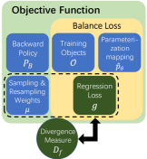
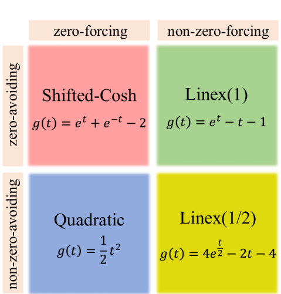
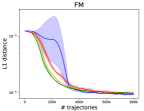
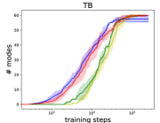
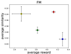

# Beyond Squared Error: Exploring Loss Design for Enhanced Training of Generative Flow Networks

###### Abstract

Generative Flow Networks (GFlowNets) are a novel class of generative models designed to sample from unnormalized distributions and have found applications in various important tasks, attracting great research interest in their training algorithms. In general, GFlowNets are trained by fitting the forward flow to the backward flow on sampled training objects. Prior work focused on the choice of training objects, parameterizations, sampling and resampling strategies, and backward policies, aiming to enhance credit assignment, exploration, or exploitation of the training process. However, the choice of regression loss, which can highly influence the exploration and exploitation behavior of the under-training policy, has been overlooked. Due to the lack of theoretical understanding for choosing an appropriate regression loss, most existing algorithms train the flow network by minimizing the squared error of the forward and backward flows in log-space, i.e., using the quadratic regression loss. In this work, we rigorously prove that distinct regression losses correspond to specific divergence measures, enabling us to design and analyze regression losses according to the desired properties of the corresponding divergence measures. Specifically, we examine two key properties: zero-forcing and zero-avoiding, where the former promotes exploitation and higher rewards, and the latter encourages exploration and enhances diversity. Based on our theoretical framework, we propose three novel regression losses, namely, Shifted-Cosh, Linex(1/2), and Linex(1). We evaluate them across three benchmarks: hyper-grid, bit-sequence generation, and molecule generation. Our proposed losses are compatible with most existing training algorithms, and significantly improve the performances of the algorithms concerning convergence speed, sample diversity, and robustness.  

## 1 Introduction

Generative Flow Networks (GFlowNets), introduced by Bengio et al. ([2021a](#bib.bib4), [b](#bib.bib5)), represent a novel class of generative models. They have been successfully employed in a wide range of important applications including molecule discovery (Bengio et al., [2021a](#bib.bib4)), biological sequence design (Jain et al., [2022](#bib.bib15)), combinatorial optimization (Zhang et al., [2023b](#bib.bib47)), and text generation (Hu et al., [2023](#bib.bib14)), attracting increasing interests for their ability to generate a diverse set of high-quality samples.  

GFlowNets are learning-based methods for sampling from an unnormalized distribution. Compared to the learning-free Monte-Carlo Markov Chain (MCMC) methods, GFlowNets provide an alternative to exchange the complexity of iterative sampling through long chains for the complexity of training a sampler (Bengio et al., [2021b](#bib.bib5)). GFlowNets achieves this by decomposing the generating process into multiple steps and modeling all possible trajectories as a directed acyclic graph (DAG). The training goal is to determine a forward policy on this DAG, ensuring that the resulting probability distribution over terminal states aligns with the unnormalized target distribution. However, achieving this alignment is challenging due to the necessity of marginalizing the forward policy across a vast trajectory space. To address this, GFlowNets utilize a backward flow to distribute the unnormalized target distribution over trajectories, thereby aligning the forward and backward flows.  

[FIGURE S1.F1.g1]

Figure 1: An illustration of our main theoretical results: the unified framework for GFlowNet training algorithms and the correspondence between regression losses over forward and backward flows on training objects and $f$-divergences between the two flows over minimal cuts.
[/FIGURE]

Building on this foundation, various training algorithms for GFlowNets have been proposed, aiming to enhance the training of GFlowNets from different aspects such as credit assignment, exploration, and exploitation. Depending on the main focus of the methods, these algorithms can be divided into four categories, including training objects (Malkin et al., [2022a](#bib.bib29); Madan et al., [2023](#bib.bib28)), parameterization methods (Pan et al., [2023a](#bib.bib35); Deleu et al., [2022](#bib.bib8)), sampling and resampling strategies (Rector-Brooks et al., [2023](#bib.bib39); Kim et al., [2023b](#bib.bib22); Lau et al., [2024](#bib.bib25)) and the selection of backward policies (Shen et al., [2023](#bib.bib40); Jang et al., [2024](#bib.bib19)).  

Most existing algorithms train the flow network by minimizing the squared error of the forward and backward flows in log-space, i.e., using the quadratic regression loss. However, there may exist more potential choices for loss functions beyond square error. Intuitively, any convex function that is minimized at zero point also provides a valid objective, in the sense that the forward and backward policies are aligned if and only if the loss is minimized. Further, the gradients of different regression losses lead to different optimization trajectories of the forward policy, thus highly influencing the exploration and exploitation behaviors. Yet, due to the lack of theoretical understanding for choosing an appropriate regression loss, it is unclear whether the above intuition is practical. In particular, the following central question remains open:  

*Can a theoretical foundation be established for designing and analyzing regression loss functions?*  

To answer this question, we conduct a systematic investigation of the largely overlooked regression loss aspect in GFlowNet training. Specifically, building on the work of Malkin et al. ([2022b](#bib.bib30)), which established that training GFlowNets is analogous to optimizing a KL divergence, we rigorously prove that the gradient of the objective function using different regression losses, when combined with appropriate proposal distributions and resampling weights, equal to that of distinct divergence measures between the target distribution and the flow network-induced distribution. As different divergence measures endow the training objectives with different properties, and hence show different characteristics in the training process, our results provide a unified framework to generalize existing training methods and provide a principled way of designing efficient regression losses for GFlowNets training. Fig. [1](#S1.F1 "Figure 1 ‣ 1 Introduction ‣ Beyond Squared Error: Exploring Loss Design for Enhanced Training of Generative Flow Networks") provides an overview of our technical results.  

[FIGURE S1.F2.g1]

Figure 2: Our proposed regression losses and their properties.
[/FIGURE]

In particular, we study two important properties of the training objectives, i.e., zero-forcing and zero-avoiding, and systematically investigate their effects. In general, zero-forcing losses encourage exploitation, while zero-avoiding losses encourage exploration. Equipped with our new framework, we design three novel regression losses, namely Linex(1), Linex(1/2), and Shifted-Cosh, filling the four quadrants made up of the zero-forcing and zero-avoiding properties. We evaluate the new losses on three popular benchmarks: hyper-grid, bit-sequence generation, and molecule generation. Our results show that the newly proposed losses exhibit significant advantages over existing losses in terms of diversity, quality, and robustness, demonstrating the effectiveness of our design framework.  

Our contributions can be summarized as follows:  

* We develop a novel framework of the objective functions for training GFlowNets. The new framework offers a clear identification of the key components in the objective function and unifies all existing GFlowNet training algorithms including Flow-Matching GFlowNets (Bengio et al., [2021a](#bib.bib4)), Detailed-Balance GFlowNets (Bengio et al., [2021b](#bib.bib5)), Trajectory-Balance GFlowNets (Malkin et al., [2022a](#bib.bib29)), Sub-Trajectory-Balance GFlowNets (Madan et al., [2023](#bib.bib28)) and their variants like Forward-Looking GFlowNets (Pan et al., [2022](#bib.bib34)) and DAG GFlowNets (Deleu et al., [2022](#bib.bib8)), etc (see Section [4.1](#S4.SS1 "4.1 A Unified Framework for GFlowNet Training Algorithms ‣ 4 Training Generative Flow Networks ‣ Beyond Squared Error: Exploring Loss Design for Enhanced Training of Generative Flow Networks")). 
* We establish the correspondence between the various objective functions for GFlowNets and different divergence measures. This insight facilitates a deeper understanding of how to design and analyze effective training objectives for GFlowNets (See Section [4.2](#S4.SS2 "4.2 The Information-Theoretic Interpretation of Training Objectives ‣ 4 Training Generative Flow Networks ‣ Beyond Squared Error: Exploring Loss Design for Enhanced Training of Generative Flow Networks")). 
* Based on our framework, we conduct an in-depth investigation on two key properties of regression losses, i.e., zero-forcing and zero-avoiding. We then design three new loss functions possessing different exploration/exploitation features, namely, Linex(1), Linex(1/2), and Shifted-Cosh (see Section [4.3](#S4.SS3 "4.3 Designing New Regression Losses ‣ 4 Training Generative Flow Networks ‣ Beyond Squared Error: Exploring Loss Design for Enhanced Training of Generative Flow Networks")). 
* We conduct extensive experiments on three popular benchmarks: hyper-grid (Bengio et al., [2021a](#bib.bib4)), bit-sequence generation (Malkin et al., [2022a](#bib.bib29)), and molecule generation (Bengio et al., [2021a](#bib.bib4)). Our results demonstrate that the new losses significantly outperform the common squared loss in metrics including convergence speed, diversity, quality, and robustness (see Section [5](#S5 "5 Experiments ‣ Beyond Squared Error: Exploring Loss Design for Enhanced Training of Generative Flow Networks")). 

## 2 Related Work

Generative Flow Networks (GFlowNets). GFlowNets were initially proposed by Bengio et al. ([2021a](#bib.bib4)) for scientific discovery (Jain et al., [2023a](#bib.bib16)) as a framework for generative models capable of learning to sample from unnormalized distributions. The foundational theoretical framework was further developed by Bengio et al. ([2021b](#bib.bib5)). Since then, numerous studies have focused on enhancing GFlowNet training from various perspectives, such as introducing novel balance conditions and loss functions (Malkin et al., [2022a](#bib.bib29); Madan et al., [2023](#bib.bib28)), refining sampling and resampling strategies (Shen et al., [2023](#bib.bib40); Rector-Brooks et al., [2023](#bib.bib39); Kim et al., [2023b](#bib.bib22); Lau et al., [2024](#bib.bib25)), improving credit assignment (Pan et al., [2023a](#bib.bib35); Jang et al., [2023](#bib.bib18)) and exploring different options for backward policies (Shen et al., [2023](#bib.bib40); Mohammadpour et al., [2024](#bib.bib32); Jang et al., [2024](#bib.bib19)).  

People also try to extend the formulation of GFlowNets to more complex scenarios, allowing continuous space (Lahlou et al., [2023](#bib.bib24)), intermediate rewards (Pan et al., [2022](#bib.bib34)), stochastic rewards (Zhang et al., [2023c](#bib.bib48)), implicit reward given by priority (Chen & Mauch, [2023](#bib.bib7)), conditioned rewards (Kim et al., [2023a](#bib.bib21)), stochastic transitions (Pan et al., [2023b](#bib.bib36)), non-acyclic transitions (Brunswic et al., [2024](#bib.bib6)), etc. Equipped with these techniques, GFlowNets are applied to a increasingly wide range of fields including molecular discovery (Jain et al., [2023b](#bib.bib17); Zhu et al., [2024](#bib.bib51); Pandey et al., [2024](#bib.bib37)), biological sequence design (Jain et al., [2022](#bib.bib15); Ghari et al., [2023](#bib.bib12)), causal inference (Zhang et al., [2022](#bib.bib45); Atanackovic et al., [2023](#bib.bib3); Deleu et al., [2024](#bib.bib9)), combinatorial optimization (Zhang et al., [2023b](#bib.bib47); Kim et al., [2024](#bib.bib23)), diffusion models (Zhang et al., [2023a](#bib.bib46); Venkatraman et al., [2024](#bib.bib43)) and large language models (Hu et al., [2023](#bib.bib14); Song et al., [2024](#bib.bib41)).  

#### Theoretical aspects on GFlowNets and $f$-divergence.

From a theoretical perspective, GFlowNets are closely related to variational inference (VI, Malkin et al. [2022b](#bib.bib30)) and entropy-regularized reinforcement learning (RL) on deterministic MDPs (Tiapkin et al., [2024](#bib.bib42); Mohammadpour et al., [2024](#bib.bib32)). All of them can be viewed as solving distribution matching problems, and the gradients of their training objectives are consistent with that of the reverse KL divergence. The properties of divergence measures and their effects as training objectives have been studied by Minka et al. ([2005](#bib.bib31)). The idea of introducing a more general class of divergence measures has successfully improved the performances of a variety of algorithms for training generative models, including GAN (Nowozin et al., [2016](#bib.bib33); Arjovsky et al., [2017](#bib.bib2)), VAE (Zhang et al., [2019](#bib.bib49)), VI (Li & Turner, [2016](#bib.bib26); Dieng et al., [2017](#bib.bib10)), Distributional Policy Gradient (DPG for RL, Go et al. [2023](#bib.bib13)), and Direct Preference Optimization (DPO for RLHF, Wang et al. [2023](#bib.bib44)). Garg et al. ([2023](#bib.bib11)) proposes to use the Linex function of the TD error to learn a soft Q-function that solves the soft Bellman equation.  

Different from the aforementioned studies, in this work, we establish a theoretical framework for the regression loss component of GFlowNets and prove that different regression losses correspond to specific divergence measures. By analyzing the zero-forcing and zero-avoiding properties of these divergence measures, we can opt for the desired regression loss for enhancing exploitation and/or exploitation in GflowNets training algorithms.  

## 3 Preliminaries of GFlowNets and $f$-Divergence

In this section, we first present preliminaries of GFlowNets and the $f$-divergence, which will be the foundation of our subsequent exposition.  

### 3.1 GFlowNets

A GFlowNet is defined on a directed acyclic graph $G=(V,E)$ with a source node $s_{o}$ and a sink node $s_{f}$, such that every other vertex is reachable starting from $s_{o}$, and $s_{f}$ is reachable starting from any other vertex. Let $\mathcal{T}$ be the collection of all complete trajectories, and $\Sigma$ be the corresponding $\sigma$-algebra, then a flow is a measure $F$ on $(\mathcal{T},\Sigma)$.  

Further, we define state-flow, edge-flow and total flow by  

|  | $\displaystyle F(s)$ | $\displaystyle:=F(\{\tau:s\in\tau\}),$ |  |
| --- | --- | --- | --- |
|  | $\displaystyle F(s\to s^{\prime})$ | $\displaystyle:=F(\{\tau:(s\to s^{\prime})\in\tau\}),$ |  |
| --- | --- | --- | --- |
|  | $\displaystyle Z$ | $\displaystyle:=F(\{\mathcal{T}\})=F(s_{0})=F(s_{f}).$ |  |
| --- | --- | --- | --- |

A flow then induces a forward probability $P_{F}(s^{\prime}|s)$ and a backward probability $P_{B}(s|s^{\prime})$, defined as:  

|  | $\displaystyle P_{F}(s^{\prime}|s):=P(s\to s^{\prime}|s)=\frac{F(s\to s^{\prime})}{F(s)},\quad P_{B}(s|s^{\prime}):=P(s\to s^{\prime}|s^{\prime})=\frac{F(s\to s^{\prime})}{F(s^{\prime})}.$ |  |
| --- | --- | --- |

Markovian flow is a special family of flows such that at each step, the future behavior of a particle in the flow stream only depends on its current state. Formally speaking, let $\iota$ be any trajectories from $s_{o}$ to $s$, then $P(s\to s^{\prime}|\iota)=P(s\to s^{\prime}|s)=P_{F}(s^{\prime}|s)$. We focus on Markovian flows in the following.  

A set of (not necessarily complete) trajectories $C$ is a cut if and only if for any complete trajectory $\tau$, there exists $\iota\in C$ such that $\iota$ is a part of $\tau$. Here we view vertices and edges as trajectories of length $1$ or $2$ and further extend the definition of $F$ to all trajectories as  

|  | $\displaystyle F(\iota)=F(\{\tau:\iota\text{ is a part of }\tau\}).$ |  |
| --- | --- | --- |

A minimal cut is a cut such that the sum of flows in the cut is minimized. According to the max-flow min-cut theorem, this amount is equal to $Z$ the total flow. Let $\mathcal{C}$ be the collection of all minimal cuts, then for each minimal cut $C\in\mathcal{C}$, let $p^{C}(\iota):=F(\iota)$ for all $\iota\in C$, then $p^{C}(\cdot)$ can be viewed as an unnormalized distribution over $C$.  

Let the terminating set $S^{f}$ be the collection of nodes that directly link to $s_{f}$. Note that $C=\{(s\to s^{\prime}):s^{\prime}=s_{f}\}$ is a minimal cut, so $p^{C}(\cdot)$ induces a distribution over $S_{f}$. We denote it as $p_{F}^{T}$ and its induced probability distribution as $P_{T}$ (called the terminating probability):  

|  | $\displaystyle\forall s\in S^{f},\ $ | $\displaystyle p_{F}^{T}(s)=F(s\to s_{f}),$ |  |
| --- | --- | --- | --- |
|  |  | $\displaystyle P_{T}(s)=\frac{p_{F}^{T}(s)}{\sum_{s^{\prime}\in S^{f}}p_{F}^{T}(s^{\prime})}=\frac{F(s\to s_{f})}{Z}.$ |  |
| --- | --- | --- | --- |

The ultimate goal of training a GFlowNet is to match $p_{F}^{T}$ with $R$, so that the forward policy draws samples from $P_{T}=P_{R}$, where $P_{R}$ denotes the normalized probability distribution defined by $R$.  

### 3.2 $f$-Divergence

The $f$-divergence is a general class of divergence measures (Liese & Vajda, [2006](#bib.bib27); Polyanskiy, [2019](#bib.bib38)):  

|  | $\displaystyle D_{f}(p||q)=\sum_{x\in\mathcal{X}}q(x)f\left(\frac{p(x)}{q(x)}\right)+f^{\prime}(\infty)p\left(\{x\in\mathcal{X}:q(x)=0\}\right),$ |  |
| --- | --- | --- |

where $p$ and $q$ are two probability distributions on a measurable space $(\mathcal{X},\mathcal{F})$, $f:\mathbb{R}_{++}\to\mathbb{R}$ is a twice differentiable convex function with $f(1)=f^{\prime}(1)=0$ , and $f^{\prime}(\infty)=\lim_{t\to+\infty}\frac{f(t)}{t}$. Hence, the Kullback-Leibler (KL) divergence (Zhu & Rohwer, [1995](#bib.bib50)) $D_{\text{KL}}(p||q)$ and $D_{\text{KL}}(q||p)$ correspond to $D_{f}(p||q)$ with $f(t)=t\log t-t+1$ and $f(t)=t-\log t-1$, respectively. When $f(t)=-\frac{t^{\alpha}}{\alpha(1-\alpha)}+\frac{t}{1-\alpha}+\frac{1}{\alpha}$, the $f$-divergence corresponds to the $\alpha$-divergence $D_{\alpha}(p||q)$ introduced in (Zhu & Rohwer, [1995](#bib.bib50); Amari, [2012](#bib.bib1)).  

The $f$-divergence preserves the following nice properties of KL divergence, ensuring that they can also serve as good optimization objectives.  

###### Fact 3.1 (Liese & Vajda ([2006](#bib.bib27))).

$D_{f}(p||q)=0$ if and only if $p=q$.  

###### Fact 3.2 (Liese & Vajda ([2006](#bib.bib27))).

$D_{f}(p||q)$ is convex with respect to either $p$ or $q$.  

The definition of $D_{f}(p||q)$ can be further extended to all twice differentiable functions $f$ with $f(1)=f^{\prime}(1)=0$, termed pseudo $f$-divergence.  

## 4 Training Generative Flow Networks

In this section, we present our perspective on analyzing GFlowNet training algorithms in detail. In Section [4.1](#S4.SS1 "4.1 A Unified Framework for GFlowNet Training Algorithms ‣ 4 Training Generative Flow Networks ‣ Beyond Squared Error: Exploring Loss Design for Enhanced Training of Generative Flow Networks"), we provide a general framework with five customizable components to unify existing training algorithms. In Section [4.2](#S4.SS2 "4.2 The Information-Theoretic Interpretation of Training Objectives ‣ 4 Training Generative Flow Networks ‣ Beyond Squared Error: Exploring Loss Design for Enhanced Training of Generative Flow Networks"), we dive deep into the regression loss component, which has been overlooked in existing research, and establish a rigorous connection between it and divergence measures. In Section [4.3](#S4.SS3 "4.3 Designing New Regression Losses ‣ 4 Training Generative Flow Networks ‣ Beyond Squared Error: Exploring Loss Design for Enhanced Training of Generative Flow Networks"), we further show how to utilize this connection for designing and analyzing objective functions.  

### 4.1 A Unified Framework for GFlowNet Training Algorithms

Consider the following general objective function for forward policy:  

|  | $\displaystyle\mathcal{L}_{\mathcal{O},\widehat{p}_{\theta},\mu,P_{B},g}=$ | $\displaystyle\sum_{o\in\mathcal{O}}\mu(o)g\left(\log\frac{\widehat{p}_{B}(o;\theta)}{\widehat{p}_{F}(o;\theta)}\right)$ |  | (4.1) |
| --- | --- | --- | --- | --- |

This formulation is defined by five key components. i) The set of training objects $\mathcal{O}$, which can include states, transitions, partial trajectories, or complete trajectories. (ii) The parameterization mapping $\widehat{p}_{\theta}$, which defines how the parameters of the flow network represent the forward flow $\widehat{p}_{F}$ and the backward flow $\widehat{p}_{B}$. (iii) The sampling and resampling weights $\mu$, which influence how training objects are sampled and weighted. (iv) The choice of backward policy $P_{B}$, which can be either fixed or learned. (v) The regression loss function $g$, ensuring that the forward and backward policies align when minimized.  

[TABLE S4.T1]

<table class="ltx_tabular ltx_align_middle">
<tr class="ltx_tr">
<td class="ltx_td ltx_align_center ltx_border_l ltx_border_r ltx_border_t">Design Component</td>
<td class="ltx_td ltx_align_center ltx_align_middle ltx_border_l ltx_border_r ltx_border_t">Algorithms</td>
</tr>
<tr class="ltx_tr">
<td class="ltx_td ltx_align_center ltx_border_l ltx_border_r ltx_border_t">
 

Training Objects <math class="ltx_Math"><semantics><mi class="ltx_font_mathcaligraphic">𝒪</mi><annotation-xml><ci>𝒪</ci></annotation-xml><annotation>\mathcal{O}</annotation></semantics></math> and

Parameterization Mapping <math class="ltx_Math"><semantics><msub><mover><mi>p</mi><mo>^</mo></mover><mi>θ</mi></msub><annotation-xml><apply><csymbol>subscript</csymbol><apply><ci>^</ci><ci>𝑝</ci></apply><ci>𝜃</ci></apply></annotation-xml><annotation>\widehat{p}_{\theta}</annotation></semantics></math>
</td>
<td class="ltx_td ltx_align_justify ltx_align_middle ltx_border_r ltx_border_t">

FM-GFN <cite class="ltx_cite ltx_citemacro_citep">(Bengio et al., <a class="ltx_ref">2021a</a>)</cite>, DB-GFN <cite class="ltx_cite ltx_citemacro_citep">(Bengio et al., <a class="ltx_ref">2021b</a>)</cite>, TB-GFN <cite class="ltx_cite ltx_citemacro_citep">(Malkin et al., <a class="ltx_ref">2022a</a>)</cite>, STB-GFN <cite class="ltx_cite ltx_citemacro_citep">(Madan et al., <a class="ltx_ref">2023</a>)</cite>, FL-GFN <cite class="ltx_cite ltx_citemacro_citep">(Pan et al., <a class="ltx_ref">2023a</a>)</cite>, DAG-GFN <cite class="ltx_cite ltx_citemacro_citep">(Deleu et al., <a class="ltx_ref">2022</a>; Hu et al., <a class="ltx_ref">2023</a>)</cite>

</td>
</tr>
<tr class="ltx_tr">
<td class="ltx_td ltx_align_center ltx_border_l ltx_border_r ltx_border_t">
 

Sampling/Resampling Weights <math class="ltx_Math"><semantics><mi>μ</mi><annotation-xml><ci>𝜇</ci></annotation-xml><annotation>\mu</annotation></semantics></math>
</td>
<td class="ltx_td ltx_align_justify ltx_align_middle ltx_border_r ltx_border_t">

PRT <cite class="ltx_cite ltx_citemacro_citep">(Shen et al., <a class="ltx_ref">2023</a>)</cite>, TS-GFN <cite class="ltx_cite ltx_citemacro_citep">(Rector-Brooks et al., <a class="ltx_ref">2023</a>)</cite>, LS-GFN <cite class="ltx_cite ltx_citemacro_citep">(Kim et al., <a class="ltx_ref">2023b</a>)</cite>, QGFN <cite class="ltx_cite ltx_citemacro_citep">(Lau et al., <a class="ltx_ref">2024</a>)</cite>

</td>
</tr>
<tr class="ltx_tr">
<td class="ltx_td ltx_align_center ltx_border_l ltx_border_r ltx_border_t">
 

Backward Policy <math class="ltx_Math"><semantics><msub><mi>P</mi><mi>B</mi></msub><annotation-xml><apply><csymbol>subscript</csymbol><ci>𝑃</ci><ci>𝐵</ci></apply></annotation-xml><annotation>P_{B}</annotation></semantics></math>
</td>
<td class="ltx_td ltx_align_justify ltx_align_middle ltx_border_r ltx_border_t">

GTB <cite class="ltx_cite ltx_citemacro_citep">(Shen et al., <a class="ltx_ref">2023</a>)</cite>, ME-GFN <cite class="ltx_cite ltx_citemacro_citep">(Mohammadpour et al., <a class="ltx_ref">2024</a>)</cite>, PBP-GFN <cite class="ltx_cite ltx_citemacro_citep">(Jang et al., <a class="ltx_ref">2024</a>)</cite>

</td>
</tr>
<tr class="ltx_tr">
<td class="ltx_td ltx_align_center ltx_border_b ltx_border_l ltx_border_r ltx_border_t">
 

Regression Loss <math class="ltx_Math"><semantics><mi>g</mi><annotation-xml><ci>𝑔</ci></annotation-xml><annotation>g</annotation></semantics></math>
</td>
<td class="ltx_td ltx_align_justify ltx_align_middle ltx_border_b ltx_border_r ltx_border_t">

Ours

</td>
</tr>
</table>

Table 1: Summary of existing GFlowNet training algorithms and techniques.
[/TABLE]

While most GFlowNets training objectives are not explicitly written in this form, Equation ([4.1](#S4.E1 "In 4.1 A Unified Framework for GFlowNet Training Algorithms ‣ 4 Training Generative Flow Networks ‣ Beyond Squared Error: Exploring Loss Design for Enhanced Training of Generative Flow Networks")) unifies all existing training objectives. Table [1](#S4.T1 "Table 1 ‣ 4.1 A Unified Framework for GFlowNet Training Algorithms ‣ 4 Training Generative Flow Networks ‣ Beyond Squared Error: Exploring Loss Design for Enhanced Training of Generative Flow Networks") below presents a categorization of existing algorithms according to the components they specify.  

In previous literature, $g(t)=\frac{1}{2}t^{2}$ has been the only choice for regression loss, and the term $g\left(\log\frac{\widehat{p}_{B}(o;\theta)}{\widehat{p}_{F}(o;\theta)}\right)=\frac{1}{2}\left(\log\frac{\widehat{p}_{B}(o;\theta)}{\widehat{p}_{F}(o;\theta)}\right)^{2}$ is usually referred to as the balance loss. It is specified by the training objects and parameterization mapping. Popular balance losses are flow-matching (FM) loss, detailed-balance (DB) loss, trajectory-balance (TB) loss sub-trajectory-balance (STB) loss, and their modified versions. For example, the objective function of on-policy TB loss with fixed uniform $P_{B}$ can be written as  

|  | $\displaystyle\mathcal{L}=\sum_{\tau\in\mathcal{T}}\widehat{P}_{F}(\tau;\theta)\frac{1}{2}\left(\log\frac{\widehat{p}_{B}(\tau;\theta)}{\widehat{p}_{F}(\tau;\theta)}\right)^{2},$ |  |
| --- | --- | --- |

where for $\tau=(s_{0}=s_{o},s_{1},s_{2},\cdots,s_{T-1},s_{T}=s_{f})$, we have  

|  | $\displaystyle\widehat{P}_{F}(\tau;\theta)=$ | $\displaystyle\prod_{t=1}^{T}\widehat{P}_{F}(s_{t}|s_{t-1};\theta),$ |  |
| --- | --- | --- | --- |
|  | $\displaystyle\widehat{p}_{F}(\tau;\theta)=$ | $\displaystyle\widehat{Z}(\theta)\widehat{P}_{F}(\tau;\theta)=\widehat{Z}(\theta)\prod_{t=1}^{T}\widehat{P}_{F}(s_{t}|s_{t-1};\theta),$ |  |
| --- | --- | --- | --- |
|  | $\displaystyle\widehat{p}_{B}(\tau;\theta)=$ | $\displaystyle R(s_{T-1})P_{B}(\tau)=R(s_{T-1})\prod_{t=1}^{T-1}P_{B}(s_{t-1}|s_{t})=R(s_{T-1})\prod_{t=1}^{T-1}\frac{1}{\text{indegree}(s_{t})}.$ |  |
| --- | --- | --- | --- |

Please refer to Appendix [A](#A1 "Appendix A Unifying Training Algorithms of GFlowNets ‣ Beyond Squared Error: Exploring Loss Design for Enhanced Training of Generative Flow Networks") for the detailed correspondence of other algorithms under this unified framework.  

### 4.2 The Information-Theoretic Interpretation of Training Objectives

Based on our proposed framework, We establish a novel connection between the $g$ functions and the $f$-divergences. The result is summarized in Theorem [4.1](#S4.Thmtheorem1 "Theorem 4.1. ‣ 4.2 The Information-Theoretic Interpretation of Training Objectives ‣ 4 Training Generative Flow Networks ‣ Beyond Squared Error: Exploring Loss Design for Enhanced Training of Generative Flow Networks") below.  

###### Theorem 4.1.

Let $\theta$ be the parameters for forward policies. For each minimal cut $C\in\mathcal{C}$, the restrictions of both forward and backward flow functions on $C$ can be viewed as unnormalized distributions over it, denoted as $\widehat{p}^{C}_{F}$ and $\widehat{p}^{C}_{B}$, respectively.  

If there exists $w:\mathcal{C}\to\mathbb{R}_{+}$ such that $\mu(o)=\widehat{p}_{F}(o)\sum_{C\in\mathcal{C},o\in C}w(C)$ for any $o\in\mathcal{O}$, then  

|  | $\displaystyle\nabla_{\theta_{F}}\mathcal{L}_{\mathcal{O},\widehat{p}_{\theta},\mu,P_{B},g}=\nabla_{\theta_{F}}\sum_{C\in\mathcal{C}}w(C)D_{f}(\widehat{p}^{C}_{B}||\widehat{p}^{C}_{F}),\,\text{where }f(t)=t\int_{1}^{t}\frac{g^{\prime}(\log s)}{s^{2}}ds.$ |  | (4.2) |
| --- | --- | --- | --- |

The theorem states that the expected gradient of the objective function equals the gradient of a weighted sum of $f$-divergence over minimal cuts if the sampling and resampling weights $\mu$ on each training object $o$ equals the forward flow times the accumulated weights on minimal cuts consisting of $o$. For example, $w(C)=\mathbb{I}[C=\mathcal{T}]$ corresponds to TB GFlowNets using on-policy sampling. The detailed proof of Theorem [4.1](#S4.Thmtheorem1 "Theorem 4.1. ‣ 4.2 The Information-Theoretic Interpretation of Training Objectives ‣ 4 Training Generative Flow Networks ‣ Beyond Squared Error: Exploring Loss Design for Enhanced Training of Generative Flow Networks") is provided in Appendix [B](#A2 "Appendix B Theorem 4.1 and its Proof ‣ Beyond Squared Error: Exploring Loss Design for Enhanced Training of Generative Flow Networks"). We also provide a thorough discussion about the interpretations of FM, DB, and subTB loss under this framework. Please see Appendix [C](#A3 "Appendix C Interpretation of Theorem 4.1 for Different Kinds of Losses ‣ Beyond Squared Error: Exploring Loss Design for Enhanced Training of Generative Flow Networks") for details.  

Note that when $g(t)=\frac{1}{2}t^{2}$, i.e., the popular squared loss, we obtain $f(t)=t-\log t-1$. Thus, $D_{f}$ is the reverse KL divergence, recovering the results in Malkin et al. ([2022b](#bib.bib30)). Compared to existing work, Theorem [4.1](#S4.Thmtheorem1 "Theorem 4.1. ‣ 4.2 The Information-Theoretic Interpretation of Training Objectives ‣ 4 Training Generative Flow Networks ‣ Beyond Squared Error: Exploring Loss Design for Enhanced Training of Generative Flow Networks") offers a general connection and applies to a wide range of algorithms shown in Table [1](#S4.T1 "Table 1 ‣ 4.1 A Unified Framework for GFlowNet Training Algorithms ‣ 4 Training Generative Flow Networks ‣ Beyond Squared Error: Exploring Loss Design for Enhanced Training of Generative Flow Networks"). Below, we conclude this section with the following two remarks on the connections between function $g$ and $f$.  

###### Remark 4.2.

Note that $f(1)=0$, $f^{\prime}(1)=g^{\prime}(0)$, and $f^{\prime\prime}(t)=\frac{g^{\prime\prime}(\log t)}{t^{2}}$. If $g$ is twice differentiable, then $D_{f}$ is an $f$-divergence if and only if $g$ is convex.  

###### Remark 4.3.

Solving for $g$ from $f(t)=t\int_{1}^{t}\frac{g^{\prime}(\log s)}{s^{2}}ds$ and $g(0)=0$ gives $g(t)=f(e^{t})-\int_{1}^{e^{t}}\frac{f(s)}{s}ds$.  

### 4.3 Designing New Regression Losses

Equipped with the connection established in Theorem [4.1](#S4.Thmtheorem1 "Theorem 4.1. ‣ 4.2 The Information-Theoretic Interpretation of Training Objectives ‣ 4 Training Generative Flow Networks ‣ Beyond Squared Error: Exploring Loss Design for Enhanced Training of Generative Flow Networks"), we now show how one can build upon it and design regression losses with two important properties: zero-forcing and zero-avoiding. A zero-forcing objective leads to a conservative result, while a zero-avoiding objective offers a diverse approximated distribution. As pointed out by previous studies (Minka et al., [2005](#bib.bib31); Go et al., [2023](#bib.bib13)), zero-forcing property encourages exploitation, while zero-avoiding property encourages exploration. Therefore, a zero-avoiding loss may converge faster to a more diverse distribution, while a zero-forcing one may converge to a distribution with a higher average reward.  

To this end, we first study the effect of using different divergence measures as optimization objectives.  

###### Proposition 4.4 (Liese & Vajda ([2006](#bib.bib27))).

Denote $f(0)=\lim_{t\to 0^{+}}f(t)$, $f^{\prime}(\infty)=\lim_{t\to+\infty}\frac{f(t)}{t}$,  

1. Suppose $f(0)=\infty$, then $D_{f}(p||q)=\infty$ if $p(x)=0$ and $q(x)>0$ for some $x$. 
2. Suppose $f^{\prime}(\infty)=\infty$, then $D_{f}(p||q)=\infty$ if $p(x)>0$ and $q(x)=0$ for some $x$. 

In particular, $D_{\alpha}(p||q)$ for $\alpha\leq 0$, including reverse KL divergence, satisfies the first condition, while $D_{\alpha}(p||q)$ for $\alpha\geq 1$, including forward KL divergence, satisfy the second condition. Proposition [4.4](#S4.Thmtheorem4 "Proposition 4.4 (Liese & Vajda (2006)). ‣ 4.3 Designing New Regression Losses ‣ 4 Training Generative Flow Networks ‣ Beyond Squared Error: Exploring Loss Design for Enhanced Training of Generative Flow Networks") leads to the following results of approximating a distribution by using $f$-divergence.  

###### Proposition 4.5 (Liese & Vajda ([2006](#bib.bib27))).

Let $S$ be a subset of the collection of distributions over $\mathcal{X}$. Let $\widehat{p}_{S}\in\mathop{\arg\min}_{q\in S}D_{f}(p||q)$.  

1. Zero-forcing: Suppose $f(0)=\infty$, then $\widehat{p}_{S}(x)=0$ if $p(x)=0$. 
2. Zero-avoiding: Suppose $f^{\prime}(\infty)=\infty$, then $\widehat{p}_{S}(x)>0$ if $p(x)>0$. 

Proposition [4.5](#S4.Thmtheorem5 "Proposition 4.5 (Liese & Vajda (2006)). ‣ 4.3 Designing New Regression Losses ‣ 4 Training Generative Flow Networks ‣ Beyond Squared Error: Exploring Loss Design for Enhanced Training of Generative Flow Networks") suggests that when $S$ does not cover the target distribution $p$, the best approximation may vary according to the divergence chosen as the objective.  

Since the objective functions for GFlowNets with varying regression losses are closely related to different divergence measures, we similarly define their zero-forcing and zero-avoiding properties.  

###### Definition 4.6.

An objective function $\mathcal{L}$ for training GFlowNets is  

1. Zero-forcing: if for any parameter space $\Theta$ and $\theta^{*}=\mathop{\arg\min}_{\theta\in\Theta}\mathcal{L}(\theta)$,      |  | $\displaystyle\forall s\in S^{f}:R(s)=0\implies\widehat{P}_{T}(s;\theta^{*})=0,$ |  | | --- | --- | --- | 
2. Zero-avoiding: if for any parameter space $\Theta$ and $\theta^{*}=\mathop{\arg\min}_{\theta\in\Theta}\mathcal{L}(\theta)$,      |  | $\displaystyle\forall s\in S^{f}:R(s)>0\implies\widehat{P}_{T}(s;\theta^{*})>0.$ |  | | --- | --- | --- | 

In such cases, we also say that the regression function $g$ itself is zero-forcing or zero-avoiding.  

We then have the following theorem regarding the zero-forcing and zero-avoiding objective functions and regression losses of GFlowNets.  

###### Theorem 4.7.

Let $\mathcal{L}$ be an objective function for training GFlowNets, whose regression loss $g$ corresponds to $D_{f}$ according to Theorem [4.1](#S4.Thmtheorem1 "Theorem 4.1. ‣ 4.2 The Information-Theoretic Interpretation of Training Objectives ‣ 4 Training Generative Flow Networks ‣ Beyond Squared Error: Exploring Loss Design for Enhanced Training of Generative Flow Networks"). If $D_{f}$ is zero-forcing, then $\mathcal{L}$ and $g$ are both zero-forcing. If $D_{f}$ is zero-avoiding, then $\mathcal{L}$ and $g$ are both zero-avoiding.  

[TABLE S4.T2]

<table class="ltx_tabular ltx_align_middle">
<tr class="ltx_tr">
<td class="ltx_td ltx_align_center ltx_border_tt">Loss</td>
<td class="ltx_td ltx_align_left ltx_border_tt"><math class="ltx_Math"><semantics><mrow><mi>𝒈</mi><mo>​</mo><mrow><mo class="ltx_mathvariant_bold">(</mo><mi>𝒕</mi><mo class="ltx_mathvariant_bold">)</mo></mrow></mrow><annotation-xml><apply><times></times><ci>𝒈</ci><ci>𝒕</ci></apply></annotation-xml><annotation>\bm{g(t)}</annotation></semantics></math></td>
<td class="ltx_td ltx_align_left ltx_border_tt"><math class="ltx_Math"><semantics><mrow><mi>𝒇</mi><mo>​</mo><mrow><mo class="ltx_mathvariant_bold">(</mo><mi>𝒕</mi><mo class="ltx_mathvariant_bold">)</mo></mrow></mrow><annotation-xml><apply><times></times><ci>𝒇</ci><ci>𝒕</ci></apply></annotation-xml><annotation>\bm{f(t)}</annotation></semantics></math></td>
<td class="ltx_td ltx_align_center ltx_border_tt"><math class="ltx_Math"><semantics><mrow><mi>𝒇</mi><mo>​</mo><mrow><mo class="ltx_mathvariant_bold">(</mo><mn>𝟎</mn><mo class="ltx_mathvariant_bold">)</mo></mrow></mrow><annotation-xml><apply><times></times><ci>𝒇</ci><cn>0</cn></apply></annotation-xml><annotation>\bm{f(0)}</annotation></semantics></math></td>
<td class="ltx_td ltx_align_center ltx_border_tt"><math class="ltx_Math"><semantics><mrow><msup><mi>𝒇</mi><mo class="ltx_mathvariant_bold">′</mo></msup><mo>​</mo><mrow><mo class="ltx_mathvariant_bold">(</mo><mi class="ltx_mathvariant_bold">∞</mi><mo class="ltx_mathvariant_bold">)</mo></mrow></mrow><annotation-xml><apply><times></times><apply><csymbol>superscript</csymbol><ci>𝒇</ci><ci>bold-′</ci></apply><infinity></infinity></apply></annotation-xml><annotation>\bm{f^{\prime}(\infty)}</annotation></semantics></math></td>
<td class="ltx_td ltx_align_center ltx_border_tt">Zero-forcing</td>
<td class="ltx_td ltx_align_center ltx_border_tt">Zero-avoiding</td>
</tr>
<tr class="ltx_tr">
<td class="ltx_td ltx_align_center ltx_border_t">Quadratic</td>
<td class="ltx_td ltx_align_left ltx_border_t"><math class="ltx_Math"><semantics><mrow><mfrac><mn>1</mn><mn>2</mn></mfrac><mo>​</mo><msup><mi>t</mi><mn>2</mn></msup></mrow><annotation-xml><apply><times></times><apply><divide></divide><cn>1</cn><cn>2</cn></apply><apply><csymbol>superscript</csymbol><ci>𝑡</ci><cn>2</cn></apply></apply></annotation-xml><annotation>\frac{1}{2}t^{2}</annotation></semantics></math></td>
<td class="ltx_td ltx_align_left ltx_border_t"><math class="ltx_Math"><semantics><mrow><mi>t</mi><mo>−</mo><mrow><mi>log</mi><mo>⁡</mo><mi>t</mi></mrow><mo>−</mo><mn>1</mn></mrow><annotation-xml><apply><minus></minus><ci>𝑡</ci><apply><log></log><ci>𝑡</ci></apply><cn>1</cn></apply></annotation-xml><annotation>t-\log t-1</annotation></semantics></math></td>
<td class="ltx_td ltx_align_center ltx_border_t"><math class="ltx_Math"><semantics><mi>∞</mi><annotation-xml><infinity></infinity></annotation-xml><annotation>\infty</annotation></semantics></math></td>
<td class="ltx_td ltx_align_center ltx_border_t"><math class="ltx_Math"><semantics><mn>1</mn><annotation-xml><cn>1</cn></annotation-xml><annotation>1</annotation></semantics></math></td>
<td class="ltx_td ltx_align_center ltx_border_t">✓</td>
<td class="ltx_td ltx_border_t"></td>
</tr>
<tr class="ltx_tr">
<td class="ltx_td ltx_align_center">Linex<math class="ltx_Math"><semantics><mrow><mo>(</mo><mn>1</mn><mo>)</mo></mrow><annotation-xml><cn>1</cn></annotation-xml><annotation>(1)</annotation></semantics></math>
</td>
<td class="ltx_td ltx_align_left"><math class="ltx_Math"><semantics><mrow><msup><mi>e</mi><mi>t</mi></msup><mo>−</mo><mi>t</mi><mo>−</mo><mn>1</mn></mrow><annotation-xml><apply><minus></minus><apply><csymbol>superscript</csymbol><ci>𝑒</ci><ci>𝑡</ci></apply><ci>𝑡</ci><cn>1</cn></apply></annotation-xml><annotation>e^{t}-t-1</annotation></semantics></math></td>
<td class="ltx_td ltx_align_left"><math class="ltx_Math"><semantics><mrow><mrow><mrow><mi>t</mi><mo>​</mo><mrow><mi>log</mi><mo>⁡</mo><mi>t</mi></mrow></mrow><mo>−</mo><mi>t</mi></mrow><mo>+</mo><mn>1</mn></mrow><annotation-xml><apply><plus></plus><apply><minus></minus><apply><times></times><ci>𝑡</ci><apply><log></log><ci>𝑡</ci></apply></apply><ci>𝑡</ci></apply><cn>1</cn></apply></annotation-xml><annotation>t\log t-t+1</annotation></semantics></math></td>
<td class="ltx_td ltx_align_center"><math class="ltx_Math"><semantics><mn>1</mn><annotation-xml><cn>1</cn></annotation-xml><annotation>1</annotation></semantics></math></td>
<td class="ltx_td ltx_align_center"><math class="ltx_Math"><semantics><mi>∞</mi><annotation-xml><infinity></infinity></annotation-xml><annotation>\infty</annotation></semantics></math></td>
<td class="ltx_td"></td>
<td class="ltx_td ltx_align_center">✓</td>
</tr>
<tr class="ltx_tr">
<td class="ltx_td ltx_align_center">Linex<math class="ltx_Math"><semantics><mrow><mo>(</mo><mrow><mn>1</mn><mo>/</mo><mn>2</mn></mrow><mo>)</mo></mrow><annotation-xml><apply><divide></divide><cn>1</cn><cn>2</cn></apply></annotation-xml><annotation>\left(1/2\right)</annotation></semantics></math>
</td>
<td class="ltx_td ltx_align_left"><math class="ltx_Math"><semantics><mrow><mrow><mn>4</mn><mo>​</mo><msup><mi>e</mi><mfrac><mi>t</mi><mn>2</mn></mfrac></msup></mrow><mo>−</mo><mrow><mn>2</mn><mo>​</mo><mi>t</mi></mrow><mo>−</mo><mn>4</mn></mrow><annotation-xml><apply><minus></minus><apply><times></times><cn>4</cn><apply><csymbol>superscript</csymbol><ci>𝑒</ci><apply><divide></divide><ci>𝑡</ci><cn>2</cn></apply></apply></apply><apply><times></times><cn>2</cn><ci>𝑡</ci></apply><cn>4</cn></apply></annotation-xml><annotation>4e^{\frac{t}{2}}-2t-4</annotation></semantics></math></td>
<td class="ltx_td ltx_align_left"><math class="ltx_Math"><semantics><mrow><mrow><mrow><mn>2</mn><mo>​</mo><mi>t</mi></mrow><mo>−</mo><mrow><mn>4</mn><mo>​</mo><msqrt><mi>t</mi></msqrt></mrow></mrow><mo>+</mo><mn>2</mn></mrow><annotation-xml><apply><plus></plus><apply><minus></minus><apply><times></times><cn>2</cn><ci>𝑡</ci></apply><apply><times></times><cn>4</cn><apply><root></root><ci>𝑡</ci></apply></apply></apply><cn>2</cn></apply></annotation-xml><annotation>2t-4\sqrt{t}+2</annotation></semantics></math></td>
<td class="ltx_td ltx_align_center"><math class="ltx_Math"><semantics><mn>2</mn><annotation-xml><cn>2</cn></annotation-xml><annotation>2</annotation></semantics></math></td>
<td class="ltx_td ltx_align_center"><math class="ltx_Math"><semantics><mn>2</mn><annotation-xml><cn>2</cn></annotation-xml><annotation>2</annotation></semantics></math></td>
<td class="ltx_td"></td>
<td class="ltx_td"></td>
</tr>
<tr class="ltx_tr">
<td class="ltx_td ltx_align_center ltx_border_bb">Shifted-Cosh</td>
<td class="ltx_td ltx_align_left ltx_border_bb"><math class="ltx_Math"><semantics><mrow><mrow><msup><mi>e</mi><mi>t</mi></msup><mo>+</mo><msup><mi>e</mi><mrow><mo>−</mo><mi>t</mi></mrow></msup></mrow><mo>−</mo><mn>2</mn></mrow><annotation-xml><apply><minus></minus><apply><plus></plus><apply><csymbol>superscript</csymbol><ci>𝑒</ci><ci>𝑡</ci></apply><apply><csymbol>superscript</csymbol><ci>𝑒</ci><apply><minus></minus><ci>𝑡</ci></apply></apply></apply><cn>2</cn></apply></annotation-xml><annotation>e^{t}+e^{-t}-2</annotation></semantics></math></td>
<td class="ltx_td ltx_align_left ltx_border_bb"><math class="ltx_Math"><semantics><mrow><mrow><mrow><mi>t</mi><mo>​</mo><mrow><mi>log</mi><mo>⁡</mo><mi>t</mi></mrow></mrow><mo>−</mo><mfrac><mi>t</mi><mn>2</mn></mfrac></mrow><mo>+</mo><mfrac><mn>1</mn><mrow><mn>2</mn><mo>​</mo><mi>t</mi></mrow></mfrac></mrow><annotation-xml><apply><plus></plus><apply><minus></minus><apply><times></times><ci>𝑡</ci><apply><log></log><ci>𝑡</ci></apply></apply><apply><divide></divide><ci>𝑡</ci><cn>2</cn></apply></apply><apply><divide></divide><cn>1</cn><apply><times></times><cn>2</cn><ci>𝑡</ci></apply></apply></apply></annotation-xml><annotation>t\log t-\frac{t}{2}+\frac{1}{2t}</annotation></semantics></math></td>
<td class="ltx_td ltx_align_center ltx_border_bb"><math class="ltx_Math"><semantics><mi>∞</mi><annotation-xml><infinity></infinity></annotation-xml><annotation>\infty</annotation></semantics></math></td>
<td class="ltx_td ltx_align_center ltx_border_bb"><math class="ltx_Math"><semantics><mi>∞</mi><annotation-xml><infinity></infinity></annotation-xml><annotation>\infty</annotation></semantics></math></td>
<td class="ltx_td ltx_align_center ltx_border_bb">✓</td>
<td class="ltx_td ltx_align_center ltx_border_bb">✓</td>
</tr>
</table>

Table 2: Four representative $g$ functions and their corresponding $f$-divergences. Quadratic loss corresponds to reverse KL-divergence or the $\alpha$-divergence with $\alpha\to 0$. Linex$(1)$ corresponds to forward KL-divergence or the $\alpha$-divergence with $\alpha\to 1$. Linex$\left(1/2\right)$ corresponds to the $\alpha$-divergence with $\alpha=0.5$. Shifted-Cosh corresponds to an $f$-divergence that is both zero-forcing and zero-avoiding.
[/TABLE]

According to Theorem [4.7](#S4.Thmtheorem7 "Theorem 4.7. ‣ 4.3 Designing New Regression Losses ‣ 4 Training Generative Flow Networks ‣ Beyond Squared Error: Exploring Loss Design for Enhanced Training of Generative Flow Networks"), the quadratic regression loss $g(t)=\frac{1}{2}t^{2}$ is a zero-forcing regression loss and focuses on exploitation. Combined with Remark [4.3](#S4.Thmtheorem3 "Remark 4.3. ‣ 4.2 The Information-Theoretic Interpretation of Training Objectives ‣ 4 Training Generative Flow Networks ‣ Beyond Squared Error: Exploring Loss Design for Enhanced Training of Generative Flow Networks") that enables us to determine a $g$ from an arbitrary $D_{f}$, we can easily find regression losses with both, either or neither of the zero-forcing and zero-avoiding properties. Since these two properties are finally rooted in $f(0)$ and $f^{\prime}(\infty)$, our framework allows us to directly design a desired $g$ loss from a desired $D_{f}$. This provides a systematic and principled way of designing regression losses. For example, to obtain a zero-avoiding loss that focuses on exploration, we can solve for $g$ from $f(t)=t\log t-t-1$ the forward KL divergence, which gives $g(t)=e^{t}-t-1$ the Linex$(1)$ function. We also design Linex$(1/2)$ and Shifted-Cosh. The former is neither zero-forcing nor zero-avoiding, while the latter is both zero-forcing and zero-avoiding (see Table [2](#S4.T2 "Table 2 ‣ 4.3 Designing New Regression Losses ‣ 4 Training Generative Flow Networks ‣ Beyond Squared Error: Exploring Loss Design for Enhanced Training of Generative Flow Networks")).  

## 5 Experiments

In this section, we consider four representative $g$-functions (Table [2](#S4.T2 "Table 2 ‣ 4.3 Designing New Regression Losses ‣ 4 Training Generative Flow Networks ‣ Beyond Squared Error: Exploring Loss Design for Enhanced Training of Generative Flow Networks")) and evaluate their performances over Flow-matching GFlowNets, Trajectory-balance GFlowNets, Detailed-balance GFlowNets, and Sub-trajectory-balance GFlowNets, across different choices of backward policies and sampling strategies. We consider the following three popular benchmarks, hyper-grid, bit-sequence generation, and molecule generation. Although the sampling and resampling weights $\mu$ may not fully meet the conditions of Theorem [4.1](#S4.Thmtheorem1 "Theorem 4.1. ‣ 4.2 The Information-Theoretic Interpretation of Training Objectives ‣ 4 Training Generative Flow Networks ‣ Beyond Squared Error: Exploring Loss Design for Enhanced Training of Generative Flow Networks"), the effects of zero-forcing and zero-avoiding properties are significant, demonstrating great compatibility with existing algorithms.  

### 5.1 Hyper-grid

We first consider the didactic environment hyper-grid introduced by Bengio et al. ([2021a](#bib.bib4)). In this setting, the non-terminal states are the cells of a $D$-dimensional hypercubic grid with side length $H$. Each non-terminal state has a terminal copy. The initial state is at the coordinate $x=(0,0,\cdots,0)$. For a non-terminal state, the allowed actions are to increase one of the coordinates by $1$ without exiting the grid and to move to the corresponding terminal state.  

The reward of coordinate $x=(x_{1},\cdots,x_{D})$ is given according to  

|  | $\displaystyle R(x)=R_{0}+R_{1}\prod_{i=1}^{D}\mathbb{I}\left[\left|\frac{x_{i}}{H}-0.5\right|>0.25\right]+R_{2}\prod_{i=1}^{D}\mathbb{I}\left[0.3<\left|\frac{x_{i}}{H}-0.5\right|<0.4\right],$ |  |
| --- | --- | --- |

where $0<-R_{1}<R_{0}\ll R_{2}$. Therefore, there are $2^{D}$ reward modes near the corners of the hypercube.  

In our experiments, we set $D=4,H=20,R_{0}=10^{-4},R_{1}=-9.9\times 10^{-5},R_{2}=1-10^{-6}$. The backward policy is learned using the same objectives as the forward policy. We use the forward policy to sample training objects. We plot the empirical $L_{1}$ errors between $P_{T}$ and $P_{R}$ in Figure [3](#S5.F3 "Figure 3 ‣ 5.1 Hyper-grid ‣ 5 Experiments ‣ Beyond Squared Error: Exploring Loss Design for Enhanced Training of Generative Flow Networks"). Additional details can be found in Appendix [E.1](#A5.SS1 "E.1 Hyper-grid ‣ Appendix E Experimental Details ‣ Beyond Squared Error: Exploring Loss Design for Enhanced Training of Generative Flow Networks").  

[FIGURE S5.F3.g1]

Figure 3: Hyper-grid results: the empirical L1 distance between $P_{T}$ and $P_{R}$.
[/FIGURE]

As shown in Figure [3](#S5.F3 "Figure 3 ‣ 5.1 Hyper-grid ‣ 5 Experiments ‣ Beyond Squared Error: Exploring Loss Design for Enhanced Training of Generative Flow Networks"), the quadratic loss (baseline) leads to the slowest convergence among the four choices. This is because it has the poorest exploration ability. Despite the differences in convergence speed, the $L_{1}$ errors between $P_{T}$ and $P_{R}$ are almost the same at convergence when using different regression functions.  

### 5.2 Bit-sequence generation

In our second experimental setting, we study the bit-sequence generation task proposed by Malkin et al. ([2022a](#bib.bib29)) and Tiapkin et al. ([2024](#bib.bib42)). The goal is to generate binary strings of length $n$ given a fixed word length $k\mid n$. In this setup, an $n$-bit string is represented as a sequence of $n/k$ $k$-bit words. The generation process starts with a sequence of $n/k$ special empty words. At each step, a valid action replaces an empty word with any $k$-bit word. Terminal states are sequences with no empty words. The reward is defined based on the minimal Hamming distance to any target mode in the given set $M\subset\mathbb{Z}_{2}^{n}$. Specifically, $R(x)=\exp\left\{-\min_{x^{\prime}\in M}d(x,x^{\prime})\right\}$.  

[FIGURE S5.F4.g1]

Figure 4: The number of modes found by the algorithm during training.
[/FIGURE]

In our experiments, we follow the setup in Tiapkin et al. ([2024](#bib.bib42)) where $n=120,k=8,|M|=60$. $P_{B}$ is fixed to be uniform during training. We use the $\epsilon$-noisy forward policy with a random action probability of $0.001$ to sample training objects and the forward-looking style parameterizations for DB and STB experiments. We evaluate the number of modes found during training (the number of bit sequences in $M$ such that a candidate within a distance $\Delta=30$ has been generated) as well as the Spearman Correlation between $P_{T}$ and $P_{R}$ over a test set, which has also been adopted by Malkin et al. ([2022a](#bib.bib29)), Madan et al. ([2023](#bib.bib28)) and Tiapkin et al. ([2024](#bib.bib42)). Additional details can be found in Appendix [E.2](#A5.SS2 "E.2 Bit-sequence Generation ‣ Appendix E Experimental Details ‣ Beyond Squared Error: Exploring Loss Design for Enhanced Training of Generative Flow Networks").  

[TABLE S5.T3]

<table class="ltx_tabular ltx_centering ltx_align_middle">
<tr class="ltx_tr">
<td class="ltx_td ltx_border_tt"></td>
<td class="ltx_td ltx_align_center ltx_border_tt">Quadratic (baseline)</td>
<td class="ltx_td ltx_align_center ltx_border_tt">
Linex<math class="ltx_Math"><semantics><mrow><mo>(</mo><mn>1</mn><mo>)</mo></mrow><annotation-xml><cn>1</cn></annotation-xml><annotation>(1)</annotation></semantics></math>
</td>
<td class="ltx_td ltx_align_center ltx_border_tt">
Linex<math class="ltx_Math"><semantics><mrow><mo>(</mo><mrow><mn>1</mn><mo>/</mo><mn>2</mn></mrow><mo>)</mo></mrow><annotation-xml><apply><divide></divide><cn>1</cn><cn>2</cn></apply></annotation-xml><annotation>\left(1/2\right)</annotation></semantics></math>
</td>
<td class="ltx_td ltx_align_center ltx_border_tt">Shifted-Cosh</td>
</tr>
<tr class="ltx_tr">
<td class="ltx_td ltx_align_center ltx_border_t">TB</td>
<td class="ltx_td ltx_align_center ltx_border_t">1/5,    –</td>
<td class="ltx_td ltx_align_center ltx_border_t">
5/5, 98.0k
</td>
<td class="ltx_td ltx_align_center ltx_border_t">
5/5, 111.2k
</td>
<td class="ltx_td ltx_align_center ltx_border_t">
4/5, 92.2k
</td>
</tr>
<tr class="ltx_tr">
<td class="ltx_td ltx_align_center">DB</td>
<td class="ltx_td ltx_align_center">
5/5, 13.4k
</td>
<td class="ltx_td ltx_align_center">
5/5, 10.8k
</td>
<td class="ltx_td ltx_align_center">
5/5, 11.7k
</td>
<td class="ltx_td ltx_align_center">0/5,    –</td>
</tr>
<tr class="ltx_tr">
<td class="ltx_td ltx_align_center ltx_border_bb">STB</td>
<td class="ltx_td ltx_align_center ltx_border_bb">4/5, 50.6k</td>
<td class="ltx_td ltx_align_center ltx_border_bb">
5/5, 20.3k
</td>
<td class="ltx_td ltx_align_center ltx_border_bb">
5/5, 55.9k
</td>
<td class="ltx_td ltx_align_center ltx_border_bb">
5/5, 90.0k
</td>
</tr>
</table>

Table 3: The number of runs that find all modes within 250k steps, and the median of the steps before they find all modes.
[/TABLE]

As shown in Figure [4](#S5.F4 "Figure 4 ‣ 5.2 Bit-sequence generation ‣ 5 Experiments ‣ Beyond Squared Error: Exploring Loss Design for Enhanced Training of Generative Flow Networks"), the quadratic loss seems to find new modes faster than the other three, but it always slows down and then is overtaken before finding all modes. As shown in Table [3](#S5.T3 "Table 3 ‣ 5.2 Bit-sequence generation ‣ 5 Experiments ‣ Beyond Squared Error: Exploring Loss Design for Enhanced Training of Generative Flow Networks"), quadratic loss fails to find all modes in one of the five STB runs, and four out of the five TB runs. On the contrary, Linex(1) and Linex(1/2) succeed in finding all modes in all 15 runs with three different settings, and Linex(1) is always faster. The performance of shifted-Cosh varies from different algorithms. As we analyzed in Section [4.3](#S4.SS3 "4.3 Designing New Regression Losses ‣ 4 Training Generative Flow Networks ‣ Beyond Squared Error: Exploring Loss Design for Enhanced Training of Generative Flow Networks"), a zero-avoiding loss benefits exploration, while a zero-forcing loss does the opposite. These results are consistent with our analysis in general.  

[TABLE S5.T4]

<table class="ltx_tabular ltx_centering ltx_align_middle">
<tr class="ltx_tr">
<td class="ltx_td ltx_border_tt"></td>
<td class="ltx_td ltx_align_center ltx_border_tt">Quadratic (baseline)</td>
<td class="ltx_td ltx_align_center ltx_border_tt">
Linex<math class="ltx_Math"><semantics><mrow><mo>(</mo><mn>1</mn><mo>)</mo></mrow><annotation-xml><cn>1</cn></annotation-xml><annotation>(1)</annotation></semantics></math>
</td>
<td class="ltx_td ltx_align_center ltx_border_tt">
Linex<math class="ltx_Math"><semantics><mrow><mo>(</mo><mrow><mn>1</mn><mo>/</mo><mn>2</mn></mrow><mo>)</mo></mrow><annotation-xml><apply><divide></divide><cn>1</cn><cn>2</cn></apply></annotation-xml><annotation>\left(1/2\right)</annotation></semantics></math>
</td>
<td class="ltx_td ltx_align_center ltx_border_tt">Shifted-Cosh</td>
</tr>
<tr class="ltx_tr">
<td class="ltx_td ltx_align_left ltx_border_t">zero-forcing</td>
<td class="ltx_td ltx_align_center ltx_border_t">✓</td>
<td class="ltx_td ltx_align_center ltx_border_t">✗</td>
<td class="ltx_td ltx_align_center ltx_border_t">✗</td>
<td class="ltx_td ltx_align_center ltx_border_t">✓</td>
</tr>
<tr class="ltx_tr">
<td class="ltx_td ltx_align_left ltx_border_t">DB</td>
<td class="ltx_td ltx_align_center ltx_border_t"><math class="ltx_Math"><semantics><mrow><munder><mn>0.7907</mn><mo>¯</mo></munder><mo>​</mo><mrow><mo>(</mo><mrow><mo>±</mo><mn>0.0175</mn></mrow><mo>)</mo></mrow></mrow><annotation-xml><apply><times></times><apply><ci>¯</ci><cn>0.7907</cn></apply><apply><csymbol>plus-or-minus</csymbol><cn>0.0175</cn></apply></apply></annotation-xml><annotation>\underline{0.7907}{(\pm 0.0175)}</annotation></semantics></math></td>
<td class="ltx_td ltx_align_center ltx_border_t"><math class="ltx_Math"><semantics><mrow><mn>0.7464</mn><mo>​</mo><mrow><mo>(</mo><mrow><mo>±</mo><mn>0.0107</mn></mrow><mo>)</mo></mrow></mrow><annotation-xml><apply><times></times><cn>0.7464</cn><apply><csymbol>plus-or-minus</csymbol><cn>0.0107</cn></apply></apply></annotation-xml><annotation>0.7464(\pm 0.0107)</annotation></semantics></math></td>
<td class="ltx_td ltx_align_center ltx_border_t"><math class="ltx_Math"><semantics><mrow><mn>0.7580</mn><mo>​</mo><mrow><mo>(</mo><mrow><mo>±</mo><mn>0.0132</mn></mrow><mo>)</mo></mrow></mrow><annotation-xml><apply><times></times><cn>0.7580</cn><apply><csymbol>plus-or-minus</csymbol><cn>0.0132</cn></apply></apply></annotation-xml><annotation>0.7580(\pm 0.0132)</annotation></semantics></math></td>
<td class="ltx_td ltx_align_center ltx_border_t"><math class="ltx_Math"><semantics><mrow><mn class="ltx_mathvariant_bold">0.8213</mn><mo>​</mo><mrow><mo>(</mo><mrow><mo>±</mo><mn>0.0094</mn></mrow><mo>)</mo></mrow></mrow><annotation-xml><apply><times></times><cn>0.8213</cn><apply><csymbol>plus-or-minus</csymbol><cn>0.0094</cn></apply></apply></annotation-xml><annotation>\mathbf{0.8213}{(\pm 0.0094)}</annotation></semantics></math></td>
</tr>
<tr class="ltx_tr">
<td class="ltx_td ltx_align_left">TB</td>
<td class="ltx_td ltx_align_center"><math class="ltx_Math"><semantics><mrow><munder><mn>0.8081</mn><mo>¯</mo></munder><mo>​</mo><mrow><mo>(</mo><mrow><mo>±</mo><mn>0.0159</mn></mrow><mo>)</mo></mrow></mrow><annotation-xml><apply><times></times><apply><ci>¯</ci><cn>0.8081</cn></apply><apply><csymbol>plus-or-minus</csymbol><cn>0.0159</cn></apply></apply></annotation-xml><annotation>\underline{0.8081}{(\pm 0.0159)}</annotation></semantics></math></td>
<td class="ltx_td ltx_align_center"><math class="ltx_Math"><semantics><mrow><mn>0.7421</mn><mo>​</mo><mrow><mo>(</mo><mrow><mo>±</mo><mn>0.0216</mn></mrow><mo>)</mo></mrow></mrow><annotation-xml><apply><times></times><cn>0.7421</cn><apply><csymbol>plus-or-minus</csymbol><cn>0.0216</cn></apply></apply></annotation-xml><annotation>0.7421(\pm 0.0216)</annotation></semantics></math></td>
<td class="ltx_td ltx_align_center"><math class="ltx_Math"><semantics><mrow><mn>0.7454</mn><mo>​</mo><mrow><mo>(</mo><mrow><mo>±</mo><mn>0.0021</mn></mrow><mo>)</mo></mrow></mrow><annotation-xml><apply><times></times><cn>0.7454</cn><apply><csymbol>plus-or-minus</csymbol><cn>0.0021</cn></apply></apply></annotation-xml><annotation>0.7454(\pm 0.0021)</annotation></semantics></math></td>
<td class="ltx_td ltx_align_center"><math class="ltx_Math"><semantics><mrow><mn class="ltx_mathvariant_bold">0.8122</mn><mo>​</mo><mrow><mo>(</mo><mrow><mo>±</mo><mn>0.0145</mn></mrow><mo>)</mo></mrow></mrow><annotation-xml><apply><times></times><cn>0.8122</cn><apply><csymbol>plus-or-minus</csymbol><cn>0.0145</cn></apply></apply></annotation-xml><annotation>\mathbf{0.8122}{(\pm 0.0145)}</annotation></semantics></math></td>
</tr>
<tr class="ltx_tr">
<td class="ltx_td ltx_align_left ltx_border_bb">STB</td>
<td class="ltx_td ltx_align_center ltx_border_bb"><math class="ltx_Math"><semantics><mrow><munder><mn>0.8088</mn><mo>¯</mo></munder><mo>​</mo><mrow><mo>(</mo><mrow><mo>±</mo><mn>0.0169</mn></mrow><mo>)</mo></mrow></mrow><annotation-xml><apply><times></times><apply><ci>¯</ci><cn>0.8088</cn></apply><apply><csymbol>plus-or-minus</csymbol><cn>0.0169</cn></apply></apply></annotation-xml><annotation>\underline{0.8088}{(\pm 0.0169)}</annotation></semantics></math></td>
<td class="ltx_td ltx_align_center ltx_border_bb"><math class="ltx_Math"><semantics><mrow><mn>0.7517</mn><mo>​</mo><mrow><mo>(</mo><mrow><mo>±</mo><mn>0.0246</mn></mrow><mo>)</mo></mrow></mrow><annotation-xml><apply><times></times><cn>0.7517</cn><apply><csymbol>plus-or-minus</csymbol><cn>0.0246</cn></apply></apply></annotation-xml><annotation>0.7517(\pm 0.0246)</annotation></semantics></math></td>
<td class="ltx_td ltx_align_center ltx_border_bb"><math class="ltx_Math"><semantics><mrow><mn>0.7711</mn><mo>​</mo><mrow><mo>(</mo><mrow><mo>±</mo><mn>0.0190</mn></mrow><mo>)</mo></mrow></mrow><annotation-xml><apply><times></times><cn>0.7711</cn><apply><csymbol>plus-or-minus</csymbol><cn>0.0190</cn></apply></apply></annotation-xml><annotation>0.7711(\pm 0.0190)</annotation></semantics></math></td>
<td class="ltx_td ltx_align_center ltx_border_bb"><math class="ltx_Math"><semantics><mrow><mn class="ltx_mathvariant_bold">0.8132</mn><mo>​</mo><mrow><mo>(</mo><mrow><mo>±</mo><mn>0.0149</mn></mrow><mo>)</mo></mrow></mrow><annotation-xml><apply><times></times><cn>0.8132</cn><apply><csymbol>plus-or-minus</csymbol><cn>0.0149</cn></apply></apply></annotation-xml><annotation>\mathbf{0.8132}{(\pm 0.0149)}</annotation></semantics></math></td>
</tr>
</table>

Table 4: The Spearman correlation between $P_{T}$ and $P_{R}$ over a test set (the higher the better). The failed runs that modal collapse happened are eliminated.
[/TABLE]

In this environment, the state space is so large that the training objects can not fully cover the whole space. Consequently, although the algorithms appear to converge, the distribution $\widehat{P}_{T}$ only approximates $P_{R}$ rather than perfectly matching it. In such cases, zero-forcing losses have advantages on the qualities of samples compared to non-zero-forcing ones. As shown in Table [4](#S5.T4 "Table 4 ‣ 5.2 Bit-sequence generation ‣ 5 Experiments ‣ Beyond Squared Error: Exploring Loss Design for Enhanced Training of Generative Flow Networks"), zero-forcing losses (Quadratic and Shifted-Cosh) result in a higher correlation between $P_{T}$ and $P_{R}$, meaning that they fit the target distribution better within its support. Besides, we also observe that for TB GFlowNets with quadratic loss, the forward policy sometimes collapses to fitting only a small proportion of the modes in the target distribution, resulting in extremely low correlation. We eliminate these runs when presenting Table [4](#S5.T4 "Table 4 ‣ 5.2 Bit-sequence generation ‣ 5 Experiments ‣ Beyond Squared Error: Exploring Loss Design for Enhanced Training of Generative Flow Networks").  

### 5.3 Molecule generation

[FIGURE S5.F5.g1]

Figure 5: Molecule generation results. Top: Average reward and pair-wise similarities of all $200k$ generated molecules during each training episode. The similarities are calculated among a randomly chosen subset of $1000$ molecules. Bottom: Average reward and pair-wise similarities of the top $k$ generated molecules during each training episode.
[/FIGURE]

The goal of this task is to generate binders of the sEH (soluble epoxide hydrolase) protein by sequentially joining ‘blocks’ from a fixed library to the partial molecular graph (Jin et al. ([2018](#bib.bib20))). The reward function is given by a pretrained proxy model given by Bengio et al. ([2021a](#bib.bib4)), and then adjusted by a reward exponent hyperparameter $\beta$, i.e., $R(x)=\widetilde{R}(x)^{\beta}$ where $\widetilde{R}(x)$ is the output of the proxy model. For DB, TB, and STB experiments, the backward policies are fixed to be uniform. The training objects are sampled from the $\epsilon$-noisy forward policy with a random action probability of $0.05$. Additional details can be found in Appendix [E.3](#A5.SS3 "E.3 Molecule Generation ‣ Appendix E Experimental Details ‣ Beyond Squared Error: Exploring Loss Design for Enhanced Training of Generative Flow Networks").  

It can be seen in Figure [5](#S5.F5 "Figure 5 ‣ 5.3 Molecule generation ‣ 5 Experiments ‣ Beyond Squared Error: Exploring Loss Design for Enhanced Training of Generative Flow Networks") that zero-forcing objectives (Quadractic and shifted-Cosh) have a higher overall average reward, while zero-avoiding objectives (Linex$(1)$ and Linex$\left(1/2\right)$) have lower overall similarities, meaning that the samples are more diverse. However, things become different when it comes to the top $k$ molecules, but Linex$\left(1/2\right)$, which is neither zero-forcing nor zero-avoiding, demonstrates the best robustness among them.  

## 6 Conclusion

In this work, we develop a principled and systematic approach for designing regression losses for efficient GFlowNets training. Specifically, we rigorously prove that distinct regression losses correspond to specific divergence measures, enabling us to design and analyze regression losses according to the desired properties of the corresponding divergence measures. Based on our theoretical framework, we designed three novel regression losses: Shifted-Cosh, Linex(1/2), and Linex(1). Through extensive evaluation across three benchmarks: hyper-grid, bit-sequence generation, and molecule generation, we show that our newly proposed losses are compatible with most existing training algorithms and significantly improve the performance of the algorithms in terms of convergence speed, sample diversity, and robustness.  

## References

* Amari (2012)  Shun-ichi Amari.   *Differential-geometrical methods in statistics*, volume 28.   Springer Science & Business Media, 2012. 
* Arjovsky et al. (2017)  Martin Arjovsky, Soumith Chintala, and Léon Bottou.   Wasserstein generative adversarial networks.   In *International conference on machine learning*, pp.  214–223. PMLR, 2017. 
* Atanackovic et al. (2023)  Lazar Atanackovic, Alexander Tong, Jason Hartford, Leo J Lee, Bo Wang, and Yoshua Bengio.   Dyngfn: Bayesian dynamic causal discovery using generative flow networks.   *arXiv preprint arXiv:2302.04178*, 2023. 
* Bengio et al. (2021a)  Emmanuel Bengio, Moksh Jain, Maksym Korablyov, Doina Precup, and Yoshua Bengio.   Flow network based generative models for non-iterative diverse candidate generation.   *Advances in Neural Information Processing Systems*, 34:27381–27394, 2021a. 
* Bengio et al. (2021b)  Yoshua Bengio, Salem Lahlou, Tristan Deleu, Edward J Hu, Mo Tiwari, and Emmanuel Bengio.   Gflownet foundations.   *arXiv preprint arXiv:2111.09266*, 2021b. 
* Brunswic et al. (2024)  Leo Brunswic, Yinchuan Li, Yushun Xu, Yijun Feng, Shangling Jui, and Lizhuang Ma.   A theory of non-acyclic generative flow networks.   In *Proceedings of the AAAI Conference on Artificial Intelligence*, volume 38, pp.  11124–11131, 2024. 
* Chen & Mauch (2023)  Yihang Chen and Lukas Mauch.   Order-preserving gflownets.   *arXiv preprint arXiv:2310.00386*, 2023. 
* Deleu et al. (2022)  Tristan Deleu, António Góis, Chris Emezue, Mansi Rankawat, Simon Lacoste-Julien, Stefan Bauer, and Yoshua Bengio.   Bayesian structure learning with generative flow networks.   In *Uncertainty in Artificial Intelligence*, pp.  518–528. PMLR, 2022. 
* Deleu et al. (2024)  Tristan Deleu, Mizu Nishikawa-Toomey, Jithendaraa Subramanian, Nikolay Malkin, Laurent Charlin, and Yoshua Bengio.   Joint bayesian inference of graphical structure and parameters with a single generative flow network.   *Advances in Neural Information Processing Systems*, 36, 2024. 
* Dieng et al. (2017)  Adji Bousso Dieng, Dustin Tran, Rajesh Ranganath, John Paisley, and David Blei.   Variational inference via $\chi$ upper bound minimization.   *Advances in Neural Information Processing Systems*, 30, 2017. 
* Garg et al. (2023)  Divyansh Garg, Joey Hejna, Matthieu Geist, and Stefano Ermon.   Extreme q-learning: Maxent rl without entropy.   *arXiv preprint arXiv:2301.02328*, 2023. 
* Ghari et al. (2023)  Pouya M Ghari, Alex Tseng, Gökcen Eraslan, Romain Lopez, Tommaso Biancalani, Gabriele Scalia, and Ehsan Hajiramezanali.   Generative flow networks assisted biological sequence editing.   In *NeurIPS 2023 Generative AI and Biology (GenBio) Workshop*, 2023. 
* Go et al. (2023)  Dongyoung Go, Tomasz Korbak, Germán Kruszewski, Jos Rozen, Nahyeon Ryu, and Marc Dymetman.   Aligning language models with preferences through f-divergence minimization.   *arXiv preprint arXiv:2302.08215*, 2023. 
* Hu et al. (2023)  Edward J Hu, Moksh Jain, Eric Elmoznino, Younesse Kaddar, Guillaume Lajoie, Yoshua Bengio, and Nikolay Malkin.   Amortizing intractable inference in large language models.   *arXiv preprint arXiv:2310.04363*, 2023. 
* Jain et al. (2022)  Moksh Jain, Emmanuel Bengio, Alex Hernandez-Garcia, Jarrid Rector-Brooks, Bonaventure FP Dossou, Chanakya Ajit Ekbote, Jie Fu, Tianyu Zhang, Michael Kilgour, Dinghuai Zhang, et al.   Biological sequence design with gflownets.   In *International Conference on Machine Learning*, pp.  9786–9801. PMLR, 2022. 
* Jain et al. (2023a)  Moksh Jain, Tristan Deleu, Jason Hartford, Cheng-Hao Liu, Alex Hernandez-Garcia, and Yoshua Bengio.   Gflownets for ai-driven scientific discovery.   *Digital Discovery*, 2(3):557–577, 2023a. 
* Jain et al. (2023b)  Moksh Jain, Sharath Chandra Raparthy, Alex Hernández-Garcıa, Jarrid Rector-Brooks, Yoshua Bengio, Santiago Miret, and Emmanuel Bengio.   Multi-objective gflownets.   In *International conference on machine learning*, pp.  14631–14653. PMLR, 2023b. 
* Jang et al. (2023)  Hyosoon Jang, Minsu Kim, and Sungsoo Ahn.   Learning energy decompositions for partial inference of gflownets.   *arXiv preprint arXiv:2310.03301*, 2023. 
* Jang et al. (2024)  Hyosoon Jang, Yunhui Jang, Minsu Kim, Jinkyoo Park, and Sungsoo Ahn.   Pessimistic backward policy for gflownets.   *arXiv preprint arXiv:2405.16012*, 2024. 
* Jin et al. (2018)  Wengong Jin, Regina Barzilay, and Tommi Jaakkola.   Junction tree variational autoencoder for molecular graph generation.   In *International conference on machine learning*, pp.  2323–2332. PMLR, 2018. 
* Kim et al. (2023a)  Minsu Kim, Joohwan Ko, Dinghuai Zhang, Ling Pan, Taeyoung Yun, Woochang Kim, Jinkyoo Park, and Yoshua Bengio.   Learning to scale logits for temperature-conditional gflownets.   *arXiv preprint arXiv:2310.02823*, 2023a. 
* Kim et al. (2023b)  Minsu Kim, Taeyoung Yun, Emmanuel Bengio, Dinghuai Zhang, Yoshua Bengio, Sungsoo Ahn, and Jinkyoo Park.   Local search gflownets.   *arXiv preprint arXiv:2310.02710*, 2023b. 
* Kim et al. (2024)  Minsu Kim, Sanghyeok Choi, Jiwoo Son, Hyeonah Kim, Jinkyoo Park, and Yoshua Bengio.   Ant colony sampling with gflownets for combinatorial optimization.   *arXiv preprint arXiv:2403.07041*, 2024. 
* Lahlou et al. (2023)  Salem Lahlou, Tristan Deleu, Pablo Lemos, Dinghuai Zhang, Alexandra Volokhova, Alex Hernández-Garcıa, Léna Néhale Ezzine, Yoshua Bengio, and Nikolay Malkin.   A theory of continuous generative flow networks.   In *International Conference on Machine Learning*, pp.  18269–18300. PMLR, 2023. 
* Lau et al. (2024)  Elaine Lau, Stephen Zhewen Lu, Ling Pan, Doina Precup, and Emmanuel Bengio.   Qgfn: Controllable greediness with action values.   *arXiv preprint arXiv:2402.05234*, 2024. 
* Li & Turner (2016)  Yingzhen Li and Richard E Turner.   Rényi divergence variational inference.   *Advances in neural information processing systems*, 29, 2016. 
* Liese & Vajda (2006)  Friedrich Liese and Igor Vajda.   On divergences and informations in statistics and information theory.   *IEEE Transactions on Information Theory*, 52(10):4394–4412, 2006. 
* Madan et al. (2023)  Kanika Madan, Jarrid Rector-Brooks, Maksym Korablyov, Emmanuel Bengio, Moksh Jain, Andrei Cristian Nica, Tom Bosc, Yoshua Bengio, and Nikolay Malkin.   Learning gflownets from partial episodes for improved convergence and stability.   In *International Conference on Machine Learning*, pp.  23467–23483. PMLR, 2023. 
* Malkin et al. (2022a)  Nikolay Malkin, Moksh Jain, Emmanuel Bengio, Chen Sun, and Yoshua Bengio.   Trajectory balance: Improved credit assignment in gflownets.   *Advances in Neural Information Processing Systems*, 35:5955–5967, 2022a. 
* Malkin et al. (2022b)  Nikolay Malkin, Salem Lahlou, Tristan Deleu, Xu Ji, Edward Hu, Katie Everett, Dinghuai Zhang, and Yoshua Bengio.   Gflownets and variational inference.   *arXiv preprint arXiv:2210.00580*, 2022b. 
* Minka et al. (2005)  Tom Minka et al.   Divergence measures and message passing.   Technical report, Technical report, Microsoft Research, 2005. 
* Mohammadpour et al. (2024)  Sobhan Mohammadpour, Emmanuel Bengio, Emma Frejinger, and Pierre-Luc Bacon.   Maximum entropy gflownets with soft q-learning.   In *International Conference on Artificial Intelligence and Statistics*, pp.  2593–2601. PMLR, 2024. 
* Nowozin et al. (2016)  Sebastian Nowozin, Botond Cseke, and Ryota Tomioka.   f-gan: Training generative neural samplers using variational divergence minimization.   *Advances in neural information processing systems*, 29, 2016. 
* Pan et al. (2022)  Ling Pan, Dinghuai Zhang, Aaron Courville, Longbo Huang, and Yoshua Bengio.   Generative augmented flow networks.   *arXiv preprint arXiv:2210.03308*, 2022. 
* Pan et al. (2023a)  Ling Pan, Nikolay Malkin, Dinghuai Zhang, and Yoshua Bengio.   Better training of gflownets with local credit and incomplete trajectories.   In *International Conference on Machine Learning*, pp.  26878–26890. PMLR, 2023a. 
* Pan et al. (2023b)  Ling Pan, Dinghuai Zhang, Moksh Jain, Longbo Huang, and Yoshua Bengio.   Stochastic generative flow networks.   In *Uncertainty in Artificial Intelligence*, pp.  1628–1638. PMLR, 2023b. 
* Pandey et al. (2024)  Mohit Pandey, Gopeshh Subbaraj, and Emmanuel Bengio.   Gflownet pretraining with inexpensive rewards.   *arXiv preprint arXiv:2409.09702*, 2024. 
* Polyanskiy (2019)  Yury Polyanskiy, 2019.   URL: <https://people.lids.mit.edu/yp/homepage/data/LN_fdiv.pdf>. Last visited on 2024/09/23. 
* Rector-Brooks et al. (2023)  Jarrid Rector-Brooks, Kanika Madan, Moksh Jain, Maksym Korablyov, Cheng-Hao Liu, Sarath Chandar, Nikolay Malkin, and Yoshua Bengio.   Thompson sampling for improved exploration in gflownets.   *arXiv preprint arXiv:2306.17693*, 2023. 
* Shen et al. (2023)  Max W Shen, Emmanuel Bengio, Ehsan Hajiramezanali, Andreas Loukas, Kyunghyun Cho, and Tommaso Biancalani.   Towards understanding and improving gflownet training.   In *International Conference on Machine Learning*, pp.  30956–30975. PMLR, 2023. 
* Song et al. (2024)  Zitao Song, Chao Yang, Chaojie Wang, Bo An, and Shuang Li.   Latent logic tree extraction for event sequence explanation from llms.   *arXiv preprint arXiv:2406.01124*, 2024. 
* Tiapkin et al. (2024)  Daniil Tiapkin, Nikita Morozov, Alexey Naumov, and Dmitry P Vetrov.   Generative flow networks as entropy-regularized rl.   In *International Conference on Artificial Intelligence and Statistics*, pp.  4213–4221. PMLR, 2024. 
* Venkatraman et al. (2024)  Siddarth Venkatraman, Moksh Jain, Luca Scimeca, Minsu Kim, Marcin Sendera, Mohsin Hasan, Luke Rowe, Sarthak Mittal, Pablo Lemos, Emmanuel Bengio, et al.   Amortizing intractable inference in diffusion models for vision, language, and control.   *arXiv preprint arXiv:2405.20971*, 2024. 
* Wang et al. (2023)  Chaoqi Wang, Yibo Jiang, Chenghao Yang, Han Liu, and Yuxin Chen.   Beyond reverse kl: Generalizing direct preference optimization with diverse divergence constraints.   *arXiv preprint arXiv:2309.16240*, 2023. 
* Zhang et al. (2022)  Dinghuai Zhang, Nikolay Malkin, Zhen Liu, Alexandra Volokhova, Aaron Courville, and Yoshua Bengio.   Generative flow networks for discrete probabilistic modeling.   In *International Conference on Machine Learning*, pp.  26412–26428. PMLR, 2022. 
* Zhang et al. (2023a)  Dinghuai Zhang, Ricky Tian Qi Chen, Cheng-Hao Liu, Aaron Courville, and Yoshua Bengio.   Diffusion generative flow samplers: Improving learning signals through partial trajectory optimization.   *arXiv preprint arXiv:2310.02679*, 2023a. 
* Zhang et al. (2023b)  Dinghuai Zhang, Hanjun Dai, Nikolay Malkin, Aaron C Courville, Yoshua Bengio, and Ling Pan.   Let the flows tell: Solving graph combinatorial problems with gflownets.   *Advances in neural information processing systems*, 36:11952–11969, 2023b. 
* Zhang et al. (2023c)  Dinghuai Zhang, Ling Pan, Ricky TQ Chen, Aaron Courville, and Yoshua Bengio.   Distributional gflownets with quantile flows.   *arXiv preprint arXiv:2302.05793*, 2023c. 
* Zhang et al. (2019)  Mingtian Zhang, Thomas Bird, Raza Habib, Tianlin Xu, and David Barber.   Variational f-divergence minimization.   *arXiv preprint arXiv:1907.11891*, 2019. 
* Zhu & Rohwer (1995)  Huaiyu Zhu and Richard Rohwer.   Information geometric measurements of generalisation.   1995. 
* Zhu et al. (2024)  Yiheng Zhu, Jialu Wu, Chaowen Hu, Jiahuan Yan, Tingjun Hou, Jian Wu, et al.   Sample-efficient multi-objective molecular optimization with gflownets.   *Advances in Neural Information Processing Systems*, 36, 2024. 

\appendixpage

\startcontents
[section] \printcontents[section]l1  

## Appendix A Unifying Training Algorithms of GFlowNets

An objective function for training GFlowNets is specified by five key components, the training objects $\mathcal{O}$, the parameterization mapping $\widehat{p}_{\theta}$, the sampling and resampling weights $\mu$, the backward policy $P_{B}$ and the regression loss $g$. Most existing algorithms specify only one to two of the former four components.  

### A.1 Training Objects and Parameterization Mapping

The choice of these two components are usually coupled since the parameters are mapped to the flow functions defined on training objects. The choice of training objects include states, edges, partial trajectories and complete trajectories, corresponding to Flow-Matching GFlownets (FM-GFN, Bengio et al. [2021a](#bib.bib4)), Detailed-Balance GFlowNets (DB-GFN, Bengio et al. [2021b](#bib.bib5)), Sub-Trajectory-Balance GFlowNets (STB-GFN, Madan et al. [2023](#bib.bib28)) and Trajectory-Balance GFlowNets (TB-GFN, Malkin et al. [2022a](#bib.bib29)), respectively. Detailed-Balance GFlowNets and Sub-Trajectory-Balance GFlowNets can be parameterized in different ways, the variants of which are Forward-Looking GFlowNets (FL-GFN, Pan et al. [2023a](#bib.bib35)) and DAG GFlowNets (DAG-GFN, also called modified-DB or modified-STB, Deleu et al. [2022](#bib.bib8); Hu et al. [2023](#bib.bib14)). These algorithms can be summarized in Table [5](#A1.T5 "Table 5 ‣ A.1 Training Objects and Parameterization Mapping ‣ Appendix A Unifying Training Algorithms of GFlowNets ‣ Beyond Squared Error: Exploring Loss Design for Enhanced Training of Generative Flow Networks").  

[TABLE A1.T5]

<table class="ltx_tabular ltx_align_middle">
<tr class="ltx_tr">
<td class="ltx_td ltx_align_center ltx_border_tt">Algorithm</td>
<td class="ltx_td ltx_align_center ltx_border_tt">Training Objects</td>
<td class="ltx_td ltx_align_center ltx_border_tt">Parameters</td>
<td class="ltx_td ltx_align_center ltx_border_tt">Parameterization mapping</td>
</tr>
<tr class="ltx_tr">
<td class="ltx_td ltx_align_center ltx_border_t">FM</td>
<td class="ltx_td ltx_align_center ltx_border_t">states</td>
<td class="ltx_td ltx_align_center ltx_border_t"><math class="ltx_Math"><semantics><mrow><mover><mi>F</mi><mo>^</mo></mover><mo>​</mo><mrow><mo>(</mo><mrow><mi>s</mi><mo>→</mo><msup><mi>s</mi><mo>′</mo></msup></mrow><mo>)</mo></mrow></mrow><annotation-xml><apply><times></times><apply><ci>^</ci><ci>𝐹</ci></apply><apply><ci>→</ci><ci>𝑠</ci><apply><csymbol>superscript</csymbol><ci>𝑠</ci><ci>′</ci></apply></apply></apply></annotation-xml><annotation>\widehat{F}(s\to s^{\prime})</annotation></semantics></math></td>
<td class="ltx_td ltx_align_center ltx_border_t">Equation (<a class="ltx_ref">A.1</a>), (<a class="ltx_ref">A.2</a>)</td>
</tr>
<tr class="ltx_tr">
<td class="ltx_td ltx_align_center">DB</td>
<td class="ltx_td ltx_align_center">transitions</td>
<td class="ltx_td ltx_align_center"><math class="ltx_math_unparsed"><semantics><mrow><mover><mi>F</mi><mo>^</mo></mover><mrow><mo>(</mo><mi>s</mi><mo>)</mo></mrow><mo>,</mo><msub><mover><mi>P</mi><mo>^</mo></mover><mi>F</mi></msub><mrow><mo>(</mo><msup><mi>s</mi><mo>′</mo></msup><mo>|</mo><mi>s</mi><mo>)</mo></mrow><mrow><mo>(</mo><mo>,</mo><msub><mover><mi>P</mi><mo>^</mo></mover><mi>B</mi></msub><mrow><mo>(</mo><mi>s</mi><mo>|</mo><msup><mi>s</mi><mo>′</mo></msup><mo>)</mo></mrow><mo>)</mo></mrow></mrow><annotation>\widehat{F}(s),\widehat{P}_{F}(s^{\prime}|s)\,(,\widehat{P}_{B}(s|s^{\prime}))</annotation></semantics></math></td>
<td class="ltx_td ltx_align_center">Equation (<a class="ltx_ref">A.3</a>), (<a class="ltx_ref">A.4</a>)</td>
</tr>
<tr class="ltx_tr">
<td class="ltx_td ltx_align_center">FL-DB</td>
<td class="ltx_td ltx_align_center">transitions</td>
<td class="ltx_td ltx_align_center"><math class="ltx_math_unparsed"><semantics><mrow><mover><mi>F</mi><mo>~</mo></mover><mrow><mo>(</mo><mi>s</mi><mo>)</mo></mrow><mo>,</mo><msub><mover><mi>P</mi><mo>^</mo></mover><mi>F</mi></msub><mrow><mo>(</mo><msup><mi>s</mi><mo>′</mo></msup><mo>|</mo><mi>s</mi><mo>)</mo></mrow><mrow><mo>(</mo><mo>,</mo><msub><mover><mi>P</mi><mo>^</mo></mover><mi>B</mi></msub><mrow><mo>(</mo><mi>s</mi><mo>|</mo><msup><mi>s</mi><mo>′</mo></msup><mo>)</mo></mrow><mo>)</mo></mrow></mrow><annotation>\widetilde{F}(s),\widehat{P}_{F}(s^{\prime}|s)\,(,\widehat{P}_{B}(s|s^{\prime}))</annotation></semantics></math></td>
<td class="ltx_td ltx_align_center">Equation (<a class="ltx_ref">A.9</a>), (<a class="ltx_ref">A.10</a>)</td>
</tr>
<tr class="ltx_tr">
<td class="ltx_td ltx_align_center">modified-DB</td>
<td class="ltx_td ltx_align_center">transitions</td>
<td class="ltx_td ltx_align_center"><math class="ltx_math_unparsed"><semantics><mrow><msub><mover><mi>P</mi><mo>^</mo></mover><mi>F</mi></msub><mrow><mo>(</mo><msup><mi>s</mi><mo>′</mo></msup><mo>|</mo><mi>s</mi><mo>)</mo></mrow><mrow><mo>(</mo><mo>,</mo><msub><mover><mi>P</mi><mo>^</mo></mover><mi>B</mi></msub><mrow><mo>(</mo><mi>s</mi><mo>|</mo><msup><mi>s</mi><mo>′</mo></msup><mo>)</mo></mrow><mo>)</mo></mrow></mrow><annotation>\widehat{P}_{F}(s^{\prime}|s)\,(,\widehat{P}_{B}(s|s^{\prime}))</annotation></semantics></math></td>
<td class="ltx_td ltx_align_center">Equation (<a class="ltx_ref">A.13</a>), (<a class="ltx_ref">A.14</a>)</td>
</tr>
<tr class="ltx_tr">
<td class="ltx_td ltx_align_center">TB</td>
<td class="ltx_td ltx_align_center">complete trajectories</td>
<td class="ltx_td ltx_align_center"><math class="ltx_math_unparsed"><semantics><mrow><mover><mi>Z</mi><mo>^</mo></mover><mo>,</mo><msub><mover><mi>P</mi><mo>^</mo></mover><mi>F</mi></msub><mrow><mo>(</mo><msup><mi>s</mi><mo>′</mo></msup><mo>|</mo><mi>s</mi><mo>)</mo></mrow><mrow><mo>(</mo><mo>,</mo><msub><mover><mi>P</mi><mo>^</mo></mover><mi>B</mi></msub><mrow><mo>(</mo><mi>s</mi><mo>|</mo><msup><mi>s</mi><mo>′</mo></msup><mo>)</mo></mrow><mo>)</mo></mrow></mrow><annotation>\widehat{Z},\widehat{P}_{F}(s^{\prime}|s)\,(,\widehat{P}_{B}(s|s^{\prime}))</annotation></semantics></math></td>
<td class="ltx_td ltx_align_center">Equation (<a class="ltx_ref">A.5</a>), (<a class="ltx_ref">A.6</a>)</td>
</tr>
<tr class="ltx_tr">
<td class="ltx_td ltx_align_center">STB</td>
<td class="ltx_td ltx_align_center">partial trajectories</td>
<td class="ltx_td ltx_align_center"><math class="ltx_math_unparsed"><semantics><mrow><mover><mi>F</mi><mo>^</mo></mover><mrow><mo>(</mo><mi>s</mi><mo>)</mo></mrow><mo>,</mo><msub><mover><mi>P</mi><mo>^</mo></mover><mi>F</mi></msub><mrow><mo>(</mo><msup><mi>s</mi><mo>′</mo></msup><mo>|</mo><mi>s</mi><mo>)</mo></mrow><mrow><mo>(</mo><mo>,</mo><msub><mover><mi>P</mi><mo>^</mo></mover><mi>B</mi></msub><mrow><mo>(</mo><mi>s</mi><mo>|</mo><msup><mi>s</mi><mo>′</mo></msup><mo>)</mo></mrow><mo>)</mo></mrow></mrow><annotation>\widehat{F}(s),\widehat{P}_{F}(s^{\prime}|s)\,(,\widehat{P}_{B}(s|s^{\prime}))</annotation></semantics></math></td>
<td class="ltx_td ltx_align_center">Equation (<a class="ltx_ref">A.7</a>), (<a class="ltx_ref">A.8</a>)</td>
</tr>
<tr class="ltx_tr">
<td class="ltx_td ltx_align_center">FL-STB</td>
<td class="ltx_td ltx_align_center">partial trajectories</td>
<td class="ltx_td ltx_align_center"><math class="ltx_math_unparsed"><semantics><mrow><mover><mi>F</mi><mo>~</mo></mover><mrow><mo>(</mo><mi>s</mi><mo>)</mo></mrow><mo>,</mo><msub><mover><mi>P</mi><mo>^</mo></mover><mi>F</mi></msub><mrow><mo>(</mo><msup><mi>s</mi><mo>′</mo></msup><mo>|</mo><mi>s</mi><mo>)</mo></mrow><mrow><mo>(</mo><mo>,</mo><msub><mover><mi>P</mi><mo>^</mo></mover><mi>B</mi></msub><mrow><mo>(</mo><mi>s</mi><mo>|</mo><msup><mi>s</mi><mo>′</mo></msup><mo>)</mo></mrow><mo>)</mo></mrow></mrow><annotation>\widetilde{F}(s),\widehat{P}_{F}(s^{\prime}|s)\,(,\widehat{P}_{B}(s|s^{\prime}))</annotation></semantics></math></td>
<td class="ltx_td ltx_align_center">Equation (<a class="ltx_ref">A.11</a>), (<a class="ltx_ref">A.12</a>)</td>
</tr>
<tr class="ltx_tr">
<td class="ltx_td ltx_align_center ltx_border_b">modified-STB</td>
<td class="ltx_td ltx_align_center ltx_border_b">partial trajectories</td>
<td class="ltx_td ltx_align_center ltx_border_b"><math class="ltx_math_unparsed"><semantics><mrow><msub><mover><mi>P</mi><mo>^</mo></mover><mi>F</mi></msub><mrow><mo>(</mo><msup><mi>s</mi><mo>′</mo></msup><mo>|</mo><mi>s</mi><mo>)</mo></mrow><mrow><mo>(</mo><mo>,</mo><msub><mover><mi>P</mi><mo>^</mo></mover><mi>B</mi></msub><mrow><mo>(</mo><mi>s</mi><mo>|</mo><msup><mi>s</mi><mo>′</mo></msup><mo>)</mo></mrow><mo>)</mo></mrow></mrow><annotation>\widehat{P}_{F}(s^{\prime}|s)\,(,\widehat{P}_{B}(s|s^{\prime}))</annotation></semantics></math></td>
<td class="ltx_td ltx_align_center ltx_border_b">Equation (<a class="ltx_ref">A.15</a>), (<a class="ltx_ref">A.16</a>)</td>
</tr>
</table>

Table 5: The training objects and parameterization mappings of different GFlowNet training algorithms. Among the parameters, $\widehat{P}_{B}$ can be either fixed or learned.
[/TABLE]

#### Flow-Matching GFlowNets (FM-GFN).

An FM-GFN is parameterized by an edge-flow function $\widehat{F}:E\to\mathbb{R}_{+}$. It uniquely determines a valid flow network if and only if the flow-matching conditions hold:  

|  | $\displaystyle\forall s\in V\setminus\{s_{o},s_{f}\},\sum_{(s^{\prime}\to s)\in E}\widehat{F}(s^{\prime}\to s)=R(s)+\sum_{\begin{subarray}{c}(s\to s^{\prime\prime})\in E\\ s^{\prime\prime}\neq s_{f}\end{subarray}}\widehat{F}(s\to s^{\prime\prime})$ |  |
| --- | --- | --- |

The flow-matching loss for state $s$ is defined as  

|  | $\displaystyle L_{FM}(s)=$ | $\displaystyle\frac{1}{2}\left(\log\frac{\widehat{p}_{B}(s)}{\widehat{p}_{F}(s)}\right)^{2}$ |  |
| --- | --- | --- | --- |
|  | $\displaystyle\text{where }\widehat{p}_{F}(s)=$ | $\displaystyle\sum_{(s^{\prime}\to s)\in E}\widehat{F}(s^{\prime}\to s)$ |  | (A.1) |
| --- | --- | --- | --- | --- |
|  | $\displaystyle\widehat{p}_{B}(s)=$ | $\displaystyle R(s)+\sum_{\begin{subarray}{c}(s\to s^{\prime\prime})\in E\\ s^{\prime\prime}\neq s_{f}\end{subarray}}\widehat{F}(s\to s^{\prime\prime})$ |  | (A.2) |
| --- | --- | --- | --- | --- |

#### Detailed-Balance GFlowNets (DB-GFN).

A DB-GFN is parameterized by a state-flow function $\widehat{F}:V\setminus\{s_{f}\}\to\mathbb{R}_{+}$, a forward probability function $\widehat{P}_{F}:V\setminus\{s_{f}\}\to\Delta(V)$ and a backward probability function $\widehat{P}_{B}:V\setminus\{s_{0},s_{f}\}\to\Delta(V)$. They uniquely determine a valid flow network if and only if the detailed balance conditions hold:  

|  | $\displaystyle\forall s\in S^{f},\widehat{F}(s)\widehat{P}_{F}(s_{f}|s)=R(s)$ |  |
| --- | --- | --- |
|  | $\displaystyle\forall(s\to s^{\prime})\in E,s^{\prime}\neq s_{f},\widehat{F}(s)\widehat{P}_{F}(s^{\prime}|s)=\widehat{F}(s^{\prime})\widehat{P}_{B}(s|s^{\prime})$ |  |
| --- | --- | --- |

The detailed-balance loss for transition $s\to s^{\prime}$ is defined as  

|  | $\displaystyle L_{DB}(s\to s^{\prime})=$ | $\displaystyle\frac{1}{2}\left(\log\frac{\widehat{p}_{B}(s\to s^{\prime})}{\widehat{p}_{F}(s\to s^{\prime})}\right)^{2}$ |  |
| --- | --- | --- | --- |
|  | $\displaystyle\text{where }\widehat{p}_{F}(s\to s^{\prime})=$ | $\displaystyle\widehat{F}(s)\widehat{P}_{F}(s^{\prime}|s)$ |  | (A.3) |
| --- | --- | --- | --- | --- |
|  | $\displaystyle\widehat{p}_{B}(s\to s^{\prime})=$ | $\displaystyle\begin{cases}\widehat{F}(s^{\prime})\widehat{P}_{B}(s|s^{\prime})&,s^{\prime}\neq s_{f}\\ R(s)&,s^{\prime}=s_{f}\end{cases}$ |  | (A.4) |
| --- | --- | --- | --- | --- |

#### Trajectory-Balance GFlowNets (TB-GFN).

A TB-GFN is parameterized by a total flow function $\widehat{Z}$, a forward probability function $\widehat{P}_{F}:V\setminus\{s_{f}\}\to\Delta(V\setminus\{s_{0}\})$ and a backward probability function $\widehat{P}_{B}:V\setminus\{s_{0}\}\to\Delta(V\setminus\{s_{f}\})$. They uniquely determine a GFlowNet if and only if the trajectory balance conditions hold:  

|  | $\displaystyle\forall\tau=(s_{0}=s_{o},s_{1},\cdots,s_{T-1},s_{T}=s_{f}),$ | $\displaystyle\ \widehat{Z}\prod_{t=0}^{T=1}\widehat{P}_{F}(s_{t+1}|s_{t})=R(s_{T-1})\prod_{t=1}^{T-1}\widehat{P}_{B}(s_{t-1}|s_{t})$ |  |
| --- | --- | --- | --- |

The trajectory-balance loss for complete trajectory $\tau=(s_{0}=s_{o},s_{1},\cdots,s_{T-1},s_{T}=s_{f})$ is defined as  

|  | $\displaystyle L_{TB}(\tau)=$ | $\displaystyle\frac{1}{2}\left(\log\frac{\widehat{p}_{B}(\tau)}{\widehat{p}_{F}(\tau)}\right)^{2}$ |  |
| --- | --- | --- | --- |
|  | $\displaystyle\text{where }\widehat{p}_{F}(\tau)=$ | $\displaystyle\widehat{Z}\prod_{t=0}^{T=1}\widehat{P}_{F}(s_{t+1}|s_{t})$ |  | (A.5) |
| --- | --- | --- | --- | --- |
|  | $\displaystyle\widehat{p}_{B}(\tau)=$ | $\displaystyle R(s_{T-1})\prod_{t=1}^{T-1}\widehat{P}_{B}(s_{t-1}|s_{t})$ |  | (A.6) |
| --- | --- | --- | --- | --- |

#### Sub-Trajectory-Balance GFlowNets (STB-GFN).

An STB-GFN uses the same parameters as a DB-GFN with an alternative loss, the sub-trajectory-balance loss. It is defined for partial trajectory $\iota=(s_{0},s_{1},\cdots,s_{T-1},s_{T})$ as  

|  | $\displaystyle L_{STB}(\iota)=$ | $\displaystyle\frac{1}{2}\left(\log\frac{\widehat{p}_{B}(\iota)}{\widehat{p}_{F}(\iota)}\right)^{2}$ |  |
| --- | --- | --- | --- |
|  | $\displaystyle\text{where }\widehat{p}_{F}(\iota)=$ | $\displaystyle\widehat{F}(s_{0})\prod_{t=0}^{T=1}\widehat{P}_{F}(s_{t+1}|s_{t})$ |  | (A.7) |
| --- | --- | --- | --- | --- |
|  | $\displaystyle\widehat{p}_{B}(\iota)=$ | $\displaystyle\begin{cases}\widehat{F}(s_{T})\prod_{t=1}^{T}\widehat{P}_{B}(s_{t-1}|s_{t})&,s_{T}\neq s_{f}\\ R(s_{T-1})\prod_{t=1}^{T-1}\widehat{P}_{B}(s_{t-1}|s_{t})&,s_{T}=s_{f}\end{cases}$ |  | (A.8) |
| --- | --- | --- | --- | --- |

#### Forward-looking GFlowNets (FL-GFN).

FL-GFNs require the assumption that the reward function can be extended to the whole state space, instead of restricted to only terminal states. The parameters of FL-GFN are quite similar to that of the original DB GFlowNets and STB GFlowNets, including a forward-looking state-flow function $\widetilde{F}:V\setminus\{s_{f}\}\to\mathbb{R}_{+}$, a forward probability function $\widehat{P}_{F}:V\setminus\{s_{f}\}\to\Delta(V)$ and a backward probability function $\widehat{P}_{B}:V\setminus\{s_{0},s_{f}\}\to\Delta(V)$. The only difference is that the original state-flow function $\widehat{F}$ is replaced by the forward-looking version $\widetilde{F}$, following $\widehat{F}(s)=R(s)\widetilde{F}(s)$. The forward-looking detailed-balance loss and forward-looking sub-trajectory-balance loss can be obtained by substituting them with the original ones:  

|  | $\displaystyle L_{\text{FL-DB}}(s\to s^{\prime})=$ | $\displaystyle\frac{1}{2}\left(\log\frac{\widehat{p}_{B}(s\to s^{\prime})}{\widehat{p}_{F}(s\to s^{\prime})}\right)^{2}$ |  |
| --- | --- | --- | --- |
|  | $\displaystyle\text{where }\widehat{p}_{F}(s\to s^{\prime})=$ | $\displaystyle R(s)\widetilde{F}(s)\widehat{P}_{F}(s^{\prime}|s)$ |  | (A.9) |
| --- | --- | --- | --- | --- |
|  | $\displaystyle\widehat{p}_{B}(s\to s^{\prime})=$ | $\displaystyle\begin{cases}R(s^{\prime})\widetilde{F}(s^{\prime})\widehat{P}_{B}(s|s^{\prime}),&s^{\prime}\neq s_{f}\\ R(s),&s^{\prime}=s_{f}\end{cases}$ |  | (A.10) |
| --- | --- | --- | --- | --- |
|  | $\displaystyle L_{\text{FL-STB}}(\iota)=$ | $\displaystyle\frac{1}{2}\left(\log\frac{\widehat{p}_{B}(\iota)}{\widehat{p}_{F}(\iota)}\right)^{2}$ |  |
| --- | --- | --- | --- |
|  | $\displaystyle\text{where }\widehat{p}_{F}(\iota)=$ | $\displaystyle R(s_{0})\widetilde{F}(s_{0})\prod_{t=0}^{T=1}\widehat{P}_{F}(s_{t+1}|s_{t})$ |  | (A.11) |
| --- | --- | --- | --- | --- |
|  | $\displaystyle\widehat{p}_{B}(\iota)=$ | $\displaystyle\begin{cases}R(s_{T})\widetilde{F}(s_{T})\prod_{t=1}^{T}\widehat{P}_{B}(s_{t-1}|s_{t}),&s_{T}\neq s_{f}\\ R(s_{T-1})\prod_{t=1}^{T-1}\widehat{P}_{B}(s_{t-1}|s_{t}),&s_{T}=s_{f}\end{cases}$ |  | (A.12) |
| --- | --- | --- | --- | --- |

#### DAG GFlowNets (DAG-GFN).

DAG-GFNs require that each state is terminated and has a non-zero reward. Then according to the detailed-balance condition, $\widehat{F}(s)=\frac{R(s)}{\widehat{p}_{F}(s_{f}|s)}$ for all $s$. Therefore, the flow network can be parameterized by only the forward probability function $\widehat{P}_{F}:V\setminus\{s_{f}\}\to\Delta(V)$ and the backward probability function $\widehat{P}_{B}:V\setminus\{s_{0},s_{f}\}\to\Delta(V)$. The modified detailed-balance loss and modified sub-trajectory-balance loss can be obtained by substituting them into the original ones:  

|  | $\displaystyle L_{\text{modified-DB}}(s\to s^{\prime})=$ | $\displaystyle\frac{1}{2}\left(\log\frac{\widehat{p}_{B}(s\to s^{\prime})}{\widehat{p}_{F}(s\to s^{\prime})}\right)^{2}$ |  |
| --- | --- | --- | --- |
|  | $\displaystyle\text{where }\widehat{p}_{F}(s\to s^{\prime})=$ | $\displaystyle\frac{R(s)\widehat{P}_{F}(s^{\prime}|s)}{\widehat{P}_{F}(s_{f}|s)}$ |  | (A.13) |
| --- | --- | --- | --- | --- |
|  | $\displaystyle\widehat{p}_{B}(s\to s^{\prime})=$ | $\displaystyle\begin{cases}\frac{R(s^{\prime})\widehat{P}_{B}(s|s^{\prime})}{\widehat{P}_{F}(s_{f}|s^{\prime})}&,s^{\prime}\neq s_{f}\\ R(s)&,s^{\prime}=s_{f}\end{cases}$ |  | (A.14) |
| --- | --- | --- | --- | --- |
|  | $\displaystyle L_{\text{modified-STB}}(\iota)=$ | $\displaystyle\frac{1}{2}\left(\log\frac{\widehat{p}_{B}(\iota)}{\widehat{p}_{F}(\iota)}\right)^{2}$ |  |
| --- | --- | --- | --- |
|  | $\displaystyle\text{where }\widehat{p}_{F}(\iota)=$ | $\displaystyle\frac{R(s_{0})}{\widehat{P}_{F}(s_{f}|s_{0})}\prod_{t=0}^{T=1}\widehat{P}_{F}(s_{t+1}|s_{t})$ |  | (A.15) |
| --- | --- | --- | --- | --- |
|  | $\displaystyle\widehat{p}_{B}(\iota)=$ | $\displaystyle\begin{cases}\frac{R(s_{T})}{\widehat{P}_{F}(s_{f}|s_{T})}\prod_{t=1}^{T}\widehat{P}_{B}(s_{t-1}|s_{t})&,s_{T}\neq s_{f}\\ R(s_{T-1})\prod_{t=1}^{T-1}\widehat{P}_{B}(s_{t-1}|s_{t})&,s_{T}=s_{f}\end{cases}$ |  | (A.16) |
| --- | --- | --- | --- | --- |

### A.2 Sampling and Resampling Weights

There exist various strategies to sample training objects to enhance exploration and hence accelerate convergence. The usual practice is to use the forward policy, the backward policy, a tempered or $\epsilon$-noisy version of them, an offline dataset, or a mixture of these strategies. Other choices include using a reward prioritized replay buffer (Shen et al., [2023](#bib.bib40)), applying Thompson sampling (Rector-Brooks et al., [2023](#bib.bib39)) or local search (Kim et al., [2023b](#bib.bib22)) to the sampled trajectories for extra samples, increasing greediness according to state-action value $Q$ (Lau et al., [2024](#bib.bib25)), etc. The sampled objects may also be reweighed. For example, STB-GFN weights each partial trajectory by a factor proportional to $\lambda^{l}$, where $l$ is its length and $\lambda$ is a hyper-parameter.  

### A.3 Backward Policy

The most common choice of $P_{B}$ is to either fix it to be uniform or simultaneously train it using the same objective as the forward policy. Other criteria include matching a (possibly non-Markovian) prior (Shen et al., [2023](#bib.bib40)), maximizing the entropy of the corresponding forward policy (Mohammadpour et al., [2024](#bib.bib32)) and learning a pessimistic one that focuses on observed trajectories (Jang et al., [2024](#bib.bib19)).  

## Appendix B Theorem [4.1](#S4.Thmtheorem1 "Theorem 4.1. ‣ 4.2 The Information-Theoretic Interpretation of Training Objectives ‣ 4 Training Generative Flow Networks ‣ Beyond Squared Error: Exploring Loss Design for Enhanced Training of Generative Flow Networks") and its Proof

###### Theorem B.1 (An extension of Theorem [4.1](#S4.Thmtheorem1 "Theorem 4.1. ‣ 4.2 The Information-Theoretic Interpretation of Training Objectives ‣ 4 Training Generative Flow Networks ‣ Beyond Squared Error: Exploring Loss Design for Enhanced Training of Generative Flow Networks")).

Let $\theta_{F}$ and $\theta_{B}$ be the parameters for forward and backward policies, respectively. For each minimal cut $C\in\mathcal{C}$, the restrictions of both forward and backward flow functions on $C$ can be viewed as unnormalized distributions over it, denoted as $\widehat{p}^{C}_{F}$ and $\widehat{p}^{C}_{B}$, respectively.  

If there exists $w:\mathcal{C}\to\mathbb{R}_{+}$ such that $\mu(o)=\widehat{p}_{F}(o)\sum_{C\in\mathcal{C},o\in C}w(C)$ for any $o\in\mathcal{O}$, then  

|  | $\displaystyle\nabla_{\theta_{F}}\mathcal{L}_{\mathcal{O},\widehat{p}_{\theta},\mu,P_{B},g}=\nabla_{\theta_{F}}\sum_{C\in\mathcal{C}}w(C)D_{f_{1}}(\widehat{p}^{C}_{B}||\widehat{p}^{C}_{F}),\text{where }f_{1}(t)=t\int_{1}^{t}\frac{g^{\prime}(\log s)}{s^{2}}ds$ |  |
| --- | --- | --- |
|  | $\displaystyle\nabla_{\theta_{B}}\mathcal{L}_{\mathcal{O},\widehat{p}_{\theta},\mu,P_{B},g}=\nabla_{\theta_{B}}\sum_{C\in\mathcal{C}}w(C)D_{f_{2}}(\widehat{p}^{C}_{B}||\widehat{p}^{C}_{F}),\text{where }f_{2}(t)=g(\log t)$ |  |
| --- | --- | --- |

If there exists $w:\mathcal{C}\to\mathbb{R}_{+}$ such that $\mu(o)=\widehat{p}_{B}(o)\sum_{C\in\mathcal{C},o\in C}w(C)$ for any $o\in\mathcal{O}$, then  

|  | $\displaystyle\nabla_{\theta_{F}}\mathcal{L}_{\mathcal{O},\widehat{p}_{\theta},\mu,P_{B},g}=\nabla_{\theta_{F}}\sum_{C\in\mathcal{C}}w(C)D_{f_{3}}(\widehat{p}^{C}_{B}||\widehat{p}^{C}_{F}),\text{where }f_{3}(t)=tg(\log t)$ |  |
| --- | --- | --- |
|  | $\displaystyle\nabla_{\theta_{B}}\mathcal{L}_{\mathcal{O},\widehat{p}_{\theta},\mu,P_{B},g}=\nabla_{\theta_{B}}\sum_{C\in\mathcal{C}}w(C)D_{f_{4}}(\widehat{p}^{C}_{B}||\widehat{p}^{C}_{F}),\text{where }f_{4}(t)=\int_{1}^{t}g^{\prime}(\log s)ds$ |  |
| --- | --- | --- |

###### Proof.

We prove the theorem by deriving the correspondence. Specifically, assume $\mu(o)=\widehat{p}_{F}(o)\sum_{C\in\mathcal{C},o\in C}w(C)$. Then,  

|  | $\displaystyle\nabla_{\theta_{F}}\sum_{C\in\mathcal{C}}w(C)D_{f_{1}}(\widehat{p}^{C}_{B}||\widehat{p}^{C}_{F})=$ | $\displaystyle\sum_{C\in\mathcal{C}}w(C)\sum_{o\in C}\nabla_{\theta_{F}}\left[\widehat{p}^{C}_{F}(o)f_{1}\left(\frac{\widehat{p}^{C}_{B}(o)}{\widehat{p}^{C}_{F}(o)}\right)\right]$ |  |
| --- | --- | --- | --- |
|  | $\displaystyle=$ | $\displaystyle\sum_{C\in\mathcal{C}}w(C)\sum_{o\in C}\left[f_{1}\left(\frac{\widehat{p}^{C}_{B}(o)}{\widehat{p}^{C}_{F}(o)}\right)-\frac{\widehat{p}^{C}_{B}(o)}{\widehat{p}^{C}_{F}(o)}f_{1}^{\prime}\left(\frac{\widehat{p}^{C}_{B}(o)}{\widehat{p}^{C}_{F}(o)}\right)\right]\nabla_{\theta_{F}}\widehat{p}^{C}_{F}(o)$ |  |
| --- | --- | --- | --- |
|  | $\displaystyle=$ | $\displaystyle\sum_{C\in\mathcal{C}}w(C)\sum_{o\in C}-g^{\prime}\left(\log\frac{\widehat{p}^{C}_{B}(o)}{\widehat{p}^{C}_{F}(o)}\right)\nabla_{\theta_{F}}\widehat{p}^{C}_{F}(o)$ |  |
| --- | --- | --- | --- |
|  | $\displaystyle=$ | $\displaystyle\sum_{C\in\mathcal{C}}w(C)\sum_{o\in C}\widehat{p}^{C}_{F}(o)g^{\prime}\left(\log\frac{\widehat{p}^{C}_{B}(o)}{\widehat{p}^{C}_{F}(o)}\right)\left(-\frac{1}{\widehat{p}^{C}_{F}(o)}\right)\nabla_{\theta_{F}}\widehat{p}^{C}_{F}(o)$ |  |
| --- | --- | --- | --- |
|  | $\displaystyle=$ | $\displaystyle\sum_{o\in\mathcal{O}}\mu(o)\nabla_{\theta_{F}}g\left(\log\frac{\widehat{p}^{C}_{B}(o)}{\widehat{p}^{C}_{F}(o)}\right)$ |  |
| --- | --- | --- | --- |
|  | $\displaystyle=$ | $\displaystyle\nabla_{\theta_{F}}\mathcal{L}_{\mathcal{O},\widehat{p}_{\theta},\mu,P_{B},g}$ |  |
| --- | --- | --- | --- |
|  | $\displaystyle\nabla_{\theta_{B}}\sum_{C\in\mathcal{C}}w(C)D_{f_{2}}(\widehat{p}^{C}_{B}||\widehat{p}^{C}_{F})=$ | $\displaystyle\sum_{C\in\mathcal{C}}w(C)\sum_{o\in C}\nabla_{\theta_{B}}\left[\widehat{p}^{C}_{F}(o)f_{2}\left(\frac{\widehat{p}^{C}_{B}(o)}{\widehat{p}^{C}_{F}(o)}\right)\right]$ |  |
| --- | --- | --- | --- |
|  | $\displaystyle=$ | $\displaystyle\sum_{C\in\mathcal{C}}w(C)\sum_{o\in C}\left[\widehat{p}^{C}_{F}(o)\nabla_{\theta_{B}}g\left(\log\frac{\widehat{p}^{C}_{B}(o)}{\widehat{p}^{C}_{F}(o)}\right)\right]$ |  |
| --- | --- | --- | --- |
|  | $\displaystyle=$ | $\displaystyle\sum_{o\in\mathcal{O}}\mu(o)\nabla_{\theta_{B}}g\left(\log\frac{\widehat{p}^{C}_{B}(o)}{\widehat{p}^{C}_{F}(o)}\right)$ |  |
| --- | --- | --- | --- |
|  | $\displaystyle=$ | $\displaystyle\nabla_{\theta_{B}}\mathcal{L}_{\mathcal{O},\widehat{p}_{\theta},\mu,P_{B},g}$ |  |
| --- | --- | --- | --- |

In the second case, suppose $\mu(o)=\widehat{p}_{B}(o)\sum_{C\in\mathcal{C},o\in C}w(C)$. Then,  

|  | $\displaystyle\nabla_{\theta_{F}}\sum_{C\in\mathcal{C}}w(C)D_{f_{3}}(\widehat{p}^{C}_{B}||\widehat{p}^{C}_{F})=$ | $\displaystyle\sum_{C\in\mathcal{C}}w(C)\sum_{o\in C}\nabla_{\theta_{F}}\left[\widehat{p}^{C}_{F}(o)f_{3}\left(\frac{\widehat{p}^{C}_{B}(o)}{\widehat{p}^{C}_{F}(o)}\right)\right]$ |  |
| --- | --- | --- | --- |
|  | $\displaystyle=$ | $\displaystyle\sum_{C\in\mathcal{C}}w(C)\sum_{o\in C}\left[f_{3}\left(\frac{\widehat{p}^{C}_{B}(o)}{\widehat{p}^{C}_{F}(o)}\right)-\frac{\widehat{p}^{C}_{B}(o)}{\widehat{p}^{C}_{F}(o)}f_{3}^{\prime}\left(\frac{\widehat{p}^{C}_{B}(o)}{\widehat{p}^{C}_{F}(o)}\right)\right]\nabla_{\theta_{F}}\widehat{p}^{C}_{F}(o)$ |  |
| --- | --- | --- | --- |
|  | $\displaystyle=$ | $\displaystyle\sum_{C\in\mathcal{C}}w(C)\sum_{o\in C}-\frac{\widehat{p}^{C}_{B}(o)}{\widehat{p}^{C}_{F}(o)}g^{\prime}\left(\log\frac{\widehat{p}^{C}_{B}(o)}{\widehat{p}^{C}_{F}(o)}\right)\nabla_{\theta_{F}}\widehat{p}^{C}_{F}(o)$ |  |
| --- | --- | --- | --- |
|  | $\displaystyle=$ | $\displaystyle\sum_{C\in\mathcal{C}}w(C)\sum_{o\in C}\widehat{p}^{C}_{B}(o)g^{\prime}\left(\log\frac{\widehat{p}^{C}_{B}(o)}{\widehat{p}^{C}_{F}(o)}\right)\left(-\frac{1}{\widehat{p}^{C}_{F}(o)}\right)\nabla_{\theta_{F}}\widehat{p}^{C}_{F}(o)$ |  |
| --- | --- | --- | --- |
|  | $\displaystyle=$ | $\displaystyle\sum_{o\in\mathcal{O}}\mu(o)\nabla_{\theta_{F}}g\left(\log\frac{\widehat{p}^{C}_{B}(o)}{\widehat{p}^{C}_{F}(o)}\right)$ |  |
| --- | --- | --- | --- |
|  | $\displaystyle=$ | $\displaystyle\nabla_{\theta_{F}}\mathcal{L}_{\mathcal{O},\widehat{p}_{\theta},\mu,P_{B},g}$ |  |
| --- | --- | --- | --- |
|  | $\displaystyle\nabla_{\theta_{B}}\sum_{C\in\mathcal{C}}w(C)D_{f_{4}}(\widehat{p}^{C}_{B}||\widehat{p}^{C}_{F})=$ | $\displaystyle\sum_{C\in\mathcal{C}}w(C)\sum_{o\in C}\nabla_{\theta_{B}}\left[\widehat{p}^{C}_{F}(o)f_{4}\left(\frac{\widehat{p}^{C}_{B}(o)}{\widehat{p}^{C}_{F}(o)}\right)\right]$ |  |
| --- | --- | --- | --- |
|  | $\displaystyle=$ | $\displaystyle\sum_{C\in\mathcal{C}}w(C)\sum_{o\in C}f_{4}^{\prime}\left(\frac{\widehat{p}^{C}_{B}(o)}{\widehat{p}^{C}_{F}(o)}\right)\nabla_{\theta_{B}}\widehat{p}^{C}_{B}(o)$ |  |
| --- | --- | --- | --- |
|  | $\displaystyle=$ | $\displaystyle\sum_{C\in\mathcal{C}}w(C)\sum_{o\in C}\widehat{p}^{C}_{B}(o)g^{\prime}\left(\log\frac{\widehat{p}^{C}_{B}(o)}{\widehat{p}^{C}_{F}(o)}\right)\frac{1}{\widehat{p}^{C}_{B}(o)}\nabla_{\theta_{B}}\widehat{p}^{C}_{B}(o)$ |  |
| --- | --- | --- | --- |
|  | $\displaystyle=$ | $\displaystyle\sum_{o\in\mathcal{O}}\mu(o)\nabla_{\theta_{B}}g\left(\log\frac{\widehat{p}^{C}_{B}(o)}{\widehat{p}^{C}_{F}(o)}\right)$ |  |
| --- | --- | --- | --- |
|  | $\displaystyle=$ | $\displaystyle\nabla_{\theta_{B}}\mathcal{L}_{\mathcal{O},\widehat{p}_{\theta},\mu,P_{B},g}$ |  |
| --- | --- | --- | --- |

∎  

## Appendix C Interpretation of Theorem [4.1](#S4.Thmtheorem1 "Theorem 4.1. ‣ 4.2 The Information-Theoretic Interpretation of Training Objectives ‣ 4 Training Generative Flow Networks ‣ Beyond Squared Error: Exploring Loss Design for Enhanced Training of Generative Flow Networks") for Different Kinds of Losses

### C.1 Flow Matching Loss

For any $s\in V$, let $l(s)$ be the length of the longest trajectory from $s_{o}$ to $s$. For any $(s\to s^{\prime})\in E$, if $l(s)+1<l(s^{\prime})$, then we insert $l(s^{\prime})-l(s)-1$ virtual states on this edge, denoted as $s_{(s\to s^{\prime}),l}$ for $l(s)<l<l(s^{\prime})$, and define  

|  | $\displaystyle\widehat{p}_{F}(s_{(s\to s^{\prime}),l})=\widehat{p}_{B}(s_{(s\to s^{\prime}),l})=\widehat{F}(s\to s^{\prime})$ |  |
| --- | --- | --- |

then these virtual states have no contribution to the total loss, thus we can assign to them arbitrary weights.  

Let $V^{i}$ be the collections of states in layer $i$, and let $w(V^{i})=1$, then we have  

|  | $\displaystyle\mu(s)=\widehat{p}_{F}^{V^{l(s)}}(s)=\widehat{p}_{F}(s)$ |  |
| --- | --- | --- |

### C.2 Detailed Balance Loss

For any $s\in V$, let $l(s)$ be the length of the longest trajectory from $s_{o}$ to $s$. For any $(s\to s^{\prime})\in E$, if $l(s)+1<l(s^{\prime})$, then we insert $l(s^{\prime})-l(s)-1$ virtual states on this edge, denoted as $s_{(s\to s^{\prime}),l}$ for $l(s)<l<l(s^{\prime})$, and define  

|  | $\displaystyle\widehat{p}^{l}_{F}(s\to s^{\prime})=$ | $\displaystyle\widehat{p}_{F}(s\to s^{\prime})$ |  |
| --- | --- | --- | --- |
|  | $\displaystyle\widehat{p}^{l}_{B}(s\to s^{\prime})=$ | $\displaystyle\begin{cases}\widehat{p}_{F}(s\to s^{\prime})&,l<l(s^{\prime})\\ \widehat{p}_{B}(s\to s^{\prime})&,l=l(s^{\prime})\end{cases}$ |  |
| --- | --- | --- | --- |

then these virtual transitions have no contribution to the total loss, thus we can assign to them arbitrary weights.  

Let $E^{i}$ be the collections of edges from layer $i$ to layer $i+1$, and let $w(E^{i})=1$, then we have  

|  | $\displaystyle\mu(s\to s^{\prime})=\widehat{p}_{F}^{E^{l(s)}}(s\to s^{\prime})=\widehat{p}_{F}(s\to s^{\prime})$ |  |
| --- | --- | --- |

### C.3 Sub-Trajectory Balance Loss

Assume that $G$ is a graded DAG with $L+1$ layers. Suppose $\tau=(s_{0}=s_{o},s_{1},\cdots,s_{L}=s_{f})$ is a complete trajectory, we use $\tau_{i:j}=(s_{i},s_{i+1},\cdots,s_{j})$ to denote a partial trajectory. Let $\mathcal{T}^{i:j}$ be the collections of trajectories from layer $i$ to layer $j$, then  

|  | $\displaystyle\mu(\iota)=$ | $\displaystyle\sum_{\tau:\iota=\tau_{i:j}}\widehat{P}_{F}(\tau)\frac{\lambda^{j-i}}{\sum_{0\leq i<j\leq L}\lambda^{j-i}}$ |  |
| --- | --- | --- | --- |
|  | $\displaystyle\approx$ | $\displaystyle\frac{\lambda^{j-i}}{\sum_{0\leq i<j\leq L}\lambda^{j-i}}\widehat{p}_{F}^{\mathcal{T}^{i:j}}(\iota)$ |  |
| --- | --- | --- | --- |

Hence $w(\mathcal{T}^{i:j})=\frac{\lambda^{j-i}}{\sum_{0\leq i<j\leq L}}$ and $0$ otherwise.  

## Appendix D Proof of Theorem [4.7](#S4.Thmtheorem7 "Theorem 4.7. ‣ 4.3 Designing New Regression Losses ‣ 4 Training Generative Flow Networks ‣ Beyond Squared Error: Exploring Loss Design for Enhanced Training of Generative Flow Networks")

###### Theorem D.1.

Let $\mathcal{L}$ be an objective function for training GFlowNets, whose regression loss $g$ corresponds to $D_{f}$ according to Theorem [4.1](#S4.Thmtheorem1 "Theorem 4.1. ‣ 4.2 The Information-Theoretic Interpretation of Training Objectives ‣ 4 Training Generative Flow Networks ‣ Beyond Squared Error: Exploring Loss Design for Enhanced Training of Generative Flow Networks"). If $D_{f}$ is zero-forcing, then $\mathcal{L}$ and $g$ are both zero-forcing. If $D_{f}$ is zero-avoiding, then $\mathcal{L}$ and $g$ are both zero-avoiding.  

###### Proof.

Assume that $D_{f}$ is zero-forcing, and $\widehat{P}_{T}(s;\theta^{*})>0$ for some terminating state $s$. Then there exists a trajectory $\tau=(s_{o},\cdots,s,s_{f})$ such that $\widehat{P}_{F}(\tau;\theta)>0$, thus  

|  | $$\widehat{p}_{F}^{C}(o)=\widehat{p}_{F}(o)>0$$ |  |
| --- | --- | --- |

for any $o\in\tau,o\in C,w(C)>0$. Since $D_{f}$ is zero-forcing, $\widehat{p}_{B}(o)=\widehat{p}_{B}^{C}(o)>0$ for any $o\in\tau$, meaning that $\widehat{P}_{B}(\tau)>0$ and $R(s)>0$. Thus, $R(s)=0$ implies $\widehat{P}_{T}(s;\theta)=0$ , so $\mathcal{L}$ is zero-forcing, and then $g$ is zero-forcing as well.  

Similarly, assume that $D_{f}$ is zero-avoiding, and $R(s)>0$ for some terminating state $s$. Then there exists a trajectory $\tau=(s_{o},\cdots,s,s_{f})$ such that $\widehat{P}_{B}(\tau)>0$, thus  

|  | $$\widehat{p}_{B}^{C}(o)=\widehat{p}_{B}(o)>0$$ |  |
| --- | --- | --- |

for any $o\in\tau,o\in C,w(C)>0$. Since $D_{f}$ is zero-avoiding, $\widehat{p}_{F}(o)=\widehat{p}_{F}^{C}(o)>0$ for any $o\in\tau$, meaning that $\widehat{P}_{F}(\tau;\theta)>0$, so $\widehat{P}_{T}(s;\theta)>0$. Thus, $R(s)>0$ implies that $\widehat{P}_{T}(s;\theta)>0$, so $\mathcal{L}$ is zero-avoiding, and then $g$ is zero-avoiding as well. ∎  

## Appendix E Experimental Details

### E.1 Hyper-grid

Our implementation of the baselines is based on Tiapkin et al. ([2024](#bib.bib42)). All models are parameterized by an MLP with 2 hidden layers of 256 neurons. We train the model with Adam optimizer using a batch size of 16 and a learning rate of 0.001. For the TB case, we use a larger learning rate of 0.1 for learnable total flow $\widehat{Z}$. For STB parameter $\lambda$, we use the value of $0.9$ following Tiapkin et al. ([2024](#bib.bib42)) and Madan et al. ([2023](#bib.bib28)). We repeat each experiment 3 times using different random seeds. In each run, we train the models until 800k trajectories have been collected, and the empirical sample distribution is computed over the last 80k seen trajectories.  

### E.2 Bit-sequence Generation

In this experiment, our implementation of the baselines is based on Tiapkin et al. ([2024](#bib.bib42)) and Pan et al. ([2023a](#bib.bib35)). The model is a 3-layer Transformer with 64 hidden units and 8 attention heads per layer. We train the model with Adam optimizer using a batch size of 16 and a learning rate of 0.001. For the TB case, we use a larger learning rate of 0.002 for learnable total flow $\widehat{Z}$. For STB parameter $\lambda$, we use the value of $1.5$. Following Tiapkin et al. ([2024](#bib.bib42)), we use a reward exponent of $2$. To calculate the Spearman Correlation, we use the same Monte-Carlo estimation for $P_{T}$ as Zhang et al. ([2022](#bib.bib45)) and Tiapkin et al. ([2024](#bib.bib42)), namely  

|  | $\displaystyle P_{T}(x)\approx\frac{1}{N}\sum_{i=1}^{N}\frac{P_{F}(\tau^{i})}{P_{B}(\tau^{i}|x)}$ |  |
| --- | --- | --- |

with $N=10$. We repeat each experiment 5 times using different random seeds.  

### E.3 Molecule Generation

In the molecule generation experiment, our implementation of the baselines is based on Tiapkin et al. ([2024](#bib.bib42)). We use Message Passing Neural Networks (MPNN) as the model architecture. We train the model with Adam optimizer using a batch size of 4 and a learning rate of 0.0005. We use a reward exponent of $4$, and the STB parameter $\lambda$ is set to $0.99$. We repeat each experiment 4 times using different random seeds. In each run, We train the models for 50000 steps, generating 200k molecules.  

