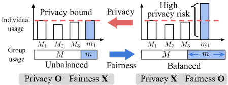
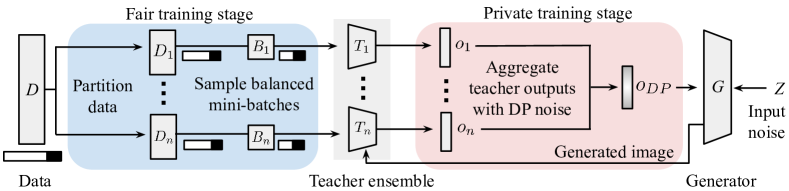
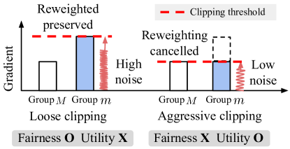

# PFGuard: A Generative Framework with
Privacy and Fairness Safeguards

###### Abstract

Generative models must ensure both privacy and fairness for Trustworthy AI. While these goals have been pursued separately, recent studies propose to combine existing privacy and fairness techniques to achieve both goals. However, naïvely combining these techniques can be insufficient due to privacy-fairness conflicts, where a sample in a minority group may be amplified for fairness, only to be suppressed for privacy. We demonstrate how these conflicts lead to adverse effects, such as privacy violations and unexpected fairness-utility tradeoffs. To mitigate these risks, we propose PFGuard, a generative framework with privacy and fairness safeguards, which simultaneously addresses privacy, fairness, and utility. By using an ensemble of multiple teacher models, PFGuard balances privacy-fairness conflicts between fair and private training stages and achieves high utility based on ensemble learning. Extensive experiments show that PFGuard successfully generates synthetic data on high-dimensional data while providing both fairness convergence and strict DP guarantees – the first of its kind to our knowledge.  

## 1 Introduction

Recently, generative models have shown remarkable performance in various applications including vision (Wang et al., [2021b](#bib.bib65)) and language tasks (Brown et al., [2020](#bib.bib7)) – while also raising significant ethical concerns. In particular, privacy and fairness concerns have emerged due to generative models mimicking their training data. On the privacy side, specific training data can be memorized, allowing the reconstruction of sensitive information like facial images (Hilprecht et al., [2019](#bib.bib29); Sun et al., [2021](#bib.bib54)). On the fairness side, any bias in the training data can be learned, resulting in biased synthetic data and unfair downstream performances across demographic groups (Zhao et al., [2018](#bib.bib75); Tan et al., [2020](#bib.bib56)).  

Although privacy and fairness are both essential for generative models, previous research has primarily tackled them separately. Differential Privacy (DP) techniques (Dwork et al., [2014](#bib.bib18)), which provide rigorous privacy guarantees, have been developed for private generative models (Xie et al., [2018](#bib.bib67); Jordon et al., [2018](#bib.bib33)); various fair training techniques, which remove data bias and generate more balanced synthetic data, have been proposed for fair generative models (Xu et al., [2018](#bib.bib68); Choi et al., [2020](#bib.bib14)). To achieve both objectives, harnessing these techniques has emerged as a promising direction. For example, Xu et al. ([2021](#bib.bib71)) combine a fair pre-processing technique (Celis et al., [2020](#bib.bib10)) with a private generative model (Chanyaswad et al., [2019](#bib.bib11)) to train both fair and private generative models.  

[FIGURE S1.F1.g1]

Figure 1: Privacy-fairness conflict. Privacy techniques prefer the left-hand scenario to prevent privacy risk of a certain data sample, while fairness techniques prefer the right-hand scenario to balance learning w.r.t. groups. Related empirical results are shown in Table [5.2](#S5.SS2 "5.2 Privacy-Fairness-Utility Tradeoff ‣ 5 Experiments ‣ PFGuard: A Generative Framework with Privacy and Fairness Safeguards").
[/FIGURE]

However, we contend that naïvely combining developed techniques for privacy and fairness can lead to a worse privacy-fairness-utility tradeoff, where utility is a model’s ability to generate realistic synthetic data. We first illustrate how privacy and fairness can conflict in Fig. [1](#S1.F1 "Figure 1 ‣ 1 Introduction ‣ PFGuard: A Generative Framework with Privacy and Fairness Safeguards"). Given the data samples $M_{1}$, $M_{2}$, $M_{3}$, and $m_{1}$ where $M$ and $m$ denote the majority and minority data groups, respectively, DP and fairness techniques play a tug-of-war regarding the use of minority data point $m_{1}$; DP techniques limit its use to prevent privacy risks such as memorization, while fairness techniques increase its use to promote more balanced learning w.r.t. groups given the biased data. As a result, fairness techniques may undermine privacy by overusing $m_{1}$, while DP techniques may undermine fairness by limiting $m_{1}$’s usage. Moreover, combining different techniques can introduce new technical constraints, reducing the effectiveness of original methods. For instance, the fair preprocessing technique used by Xu et al. ([2021](#bib.bib71)) hinders the utility of the DP generative model by requiring data binarization, which incurs significant information loss on high-dimensional data such as images – restricting their overall framework only applicable to low-dimensional structural data.  

[FIGURE S1.F2.g1]

Figure 2: Overview of PFGuard. PFGuard integrates fairness and privacy in generative models through a two-stage process. In the fair training stage (blue), we train fair teacher models by sampling balanced mini-batches from biased data subsets. In the private training stage (red), we aggregate the teacher outputs to supervise the generator (e.g., whether the generated image given input noise $Z$ is realistic or unrealistic) with DP noise to ensure privacy. With these training stages to achieve fairness and privacy, PFGuard also achieves high utility based on ensemble learning of teacher models, resulting in high-quality, unbiased, and private synthetic data.
[/FIGURE]

Therefore, we design a generative framework that simultaneously addresses fairness and privacy while achieving utility for high-dimensional synthetic data generation. To this end, we propose PFGuard: a generative framework with Privacy and Fairness Safeguards. As illustrated in Fig. [2](#S1.F2 "Figure 2 ‣ 1 Introduction ‣ PFGuard: A Generative Framework with Privacy and Fairness Safeguards"), the key component is an ensemble of intermediate teacher models, which balances privacy-fairness conflicts between fair training and private training stages. In the fair training stage, we design a new sampling technique to train fair teachers, which provides a theoretical convergence guarantee to the fair generator. In the private training stage, we employ the Private Teacher Ensemble Learning (PTEL) approach (Papernot et al., [2016](#bib.bib43); [2018](#bib.bib44)), which aggregates each teacher’s knowledge with random DP noise (e.g., noisy voting), to privatize the knowledge transfer to the generator. As a result, PFGuard provides a unified solution to train both fair and private generative models by transferring the teachers’ fair knowledge in a privacy-preserving manner.  

Compared to simple sequential approaches, PFGuard is carefully designed to address privacy-fairness conflicts. Recall that fairness techniques can incur privacy breaches by overusing minority data; in contrast, PFGuard prevents privacy breaches by decoupling fairness and privacy with intermediate teacher models. Although fair sampling can still compromise privacy in teacher models by potentially overusing minority data, PFGuard ensures privacy in the generator – our target model – by training it solely with the privatized teacher output, as shown in Fig. [2](#S1.F2 "Figure 2 ‣ 1 Introduction ‣ PFGuard: A Generative Framework with Privacy and Fairness Safeguards"). Also, recall that privacy techniques can lead to fairness cancellation by suppressing the use of minority data; in contrast, PFGuard avoids fairness cancellation through teacher-level privacy bounding using PTEL approaches. Compared to sample-level privacy bounding methods like gradient clipping (Abadi et al., [2016](#bib.bib1)), teacher-level bounding leaves room for teachers to effectively learn balanced knowledge via fair training. As a result, PFGuard provides strict DP guarantees for the generator and better preserves fairness compared to the combination of fairness-only and privacy-only techniques – see more analyses in Sec. 3.  

Moreover, PFGuard is compatible with a wide range of existing private generative models and preserves their utility. PTEL is widely adopted in private generative models as it provides prominent privacy-utility tradeoff (Jordon et al., [2018](#bib.bib33); Chen et al., [2020](#bib.bib12); Long et al., [2021](#bib.bib38); Wang et al., [2021a](#bib.bib64)). PFGuard can extend any of these models with a fair training stage as shown in Fig. [2](#S1.F2 "Figure 2 ‣ 1 Introduction ‣ PFGuard: A Generative Framework with Privacy and Fairness Safeguards"), which requires a simple modification in the minibatch sampling process. Since additional fair sampling does not require additional training complexity compared to say adding a loss term for fairness, PFGuard preserves the privacy-utility tradeoff of PTEL as well while improving fairness. We also provide guidelines to control the fairness-privacy-utility tradeoff – see more details in Sec. 4.  

Experiments show that PFGuard successfully generates high-dimensional synthetic data while ensuring both privacy and fairness; to our knowledge, PFGuard is the first framework that works on high-dimensional data including images. Our results also reveal two key findings: (1) existing private generative models can produce highly-biased synthetic data in real-world scenarios even with simple bias settings, and (2) a naïve combination of individual techniques may fail to achieve either privacy or fairness even with simple datasets – highlighting PFGuard’s effectiveness and the need for a better integration of fair and private generative models.  

Summary of Contributions  1) We identify how privacy and fairness conflict with each other, which complicates the development of responsible generative models. 2) We propose PFGuard, which is to our knowledge the first generative framework that supports privacy and fairness for high-dimensional data. 3) Through extensive experiments, we show the value of integrated solutions to address the privacy-fairness-utility-tradeoff compared to simple combinations of individual techniques.  

## 2 Preliminaries

#### Generative Models

We focus on Generative Adversarial Networks (Goodfellow et al., [2014](#bib.bib25)), which are widely-used generative models that leverage adversarial training of two networks to generate realistic synthetic data: 1) a generator that learns the underlying training data distribution and generates new samples and 2) a discriminator that distinguishes between real and generated data. The discriminator can be considered as the teacher model of the generator, as the generator does not have access to the real data and only learns from the discriminator via the GAN loss function.  

#### Differential Privacy

We use Differential Privacy (DP) (Dwork et al., [2014](#bib.bib18)) to privatize generative models, a gold standard privacy notion that provides quantitative privacy analysis of an algorithm. DP measures how much an adversary can learn about a single sample by differentiating two outputs of an algorithm $\mathcal{M}$. This privacy guarantee is quantified with the parameters $(\varepsilon,\delta$) as follows:  

###### Definition 2.1.

($(\epsilon,\delta)$-Differential Privacy (Dwork et al., [2006](#bib.bib17))) A randomized mechanism $\mathcal{M}:\mathcal{D}\rightarrow\mathcal{R}$ with domain $\mathcal{D}$ and range $\mathcal{R}$ satisfies $(\epsilon,\delta)$-differential privacy if for any two adjacent inputs $D,D^{\prime}$, which differ by a single sample, and for any subset of outputs $O\subseteq\mathcal{R}$, the following holds:  

|  | $$\Pr(\mathcal{M}(D)\in O)\leq e^{\epsilon}\Pr(\mathcal{M}(D^{\prime})\in O)+\delta,$$ |  |
| --- | --- | --- |

where $\epsilon$ is the upper bound of privacy loss, and $\delta$ is the probability of breaching DP constraints.  

We can enforce DP in an algorithm in two steps (Dwork et al., [2014](#bib.bib18)). First, we bound its “sensitivity” (Def. [2.2](#S2.Thmdefinition2 "Definition 2.2. ‣ Differential Privacy ‣ 2 Preliminaries ‣ PFGuard: A Generative Framework with Privacy and Fairness Safeguards")), which captures the maximum influence of an individual sample. Second, we add random noise that is proportional to the sensitivity. A common way to ensure DP is to use a Gaussian mechanism (Dwork et al., [2014](#bib.bib18)) (Thm. [2.1](#S2.Thmtheorem1 "Theorem 2.1. ‣ Differential Privacy ‣ 2 Preliminaries ‣ PFGuard: A Generative Framework with Privacy and Fairness Safeguards")), which utilizes Gaussian random noise with a scale proportional to $l_{2}$-sensitivity. Two datasets $D$, $D^{\prime}$ are adjacent if they differ by a single sample.  

###### Definition 2.2.

(Sensitivity (Dwork et al., [2014](#bib.bib18))) The $l_{p}$-sensitivity for a $d$-dimensional function $f:\mathcal{D}{\rightarrow}\mathbb{R}^{d}$ is defined as $\Delta_{f}^{p}=\underset{D,D^{\prime}}{\max}\left\|f(D)-f(D^{\prime})\right\|_{p}$ over all adjacent datasets $D,D^{\prime}$.  

###### Theorem 2.1.

(Gaussian mechanism (Dwork et al., [2014](#bib.bib18); Mironov, [2017](#bib.bib41))) Let $f:\mathcal{X}\rightarrow\mathbb{R}^{d}$ be an arbitrary $d$-dimensional function with $l_{2}$-sensitivity $\Delta_{f}^{2}$. The Gaussian mechanism $\mathcal{M}_{\sigma}$, parameterized by $\sigma$, adds Gaussian noise into the output, i.e., $\mathcal{M}_{\sigma}({\bm{x}})=f({\bm{x}})+\mathcal{N}(0,\sigma^{2}\bm{I})$, and satisfies $(\varepsilon,\delta)$-DP for $\sigma\geq\sqrt{2\ln(1.25/\delta)}\Delta_{f}^{2}/\varepsilon$.  

#### Fairness

We consider a generative model to be fair if two criteria are satisfied: 1) the model generates similar amounts of data for different demographic groups with similar quality, and 2) the generated data can be used to train a fair downstream model w.r.t. traditional group fairness measures. For 1), we measure the size and image quality disparities between the groups using the Fréchet Inception Distance (FID) score (Heusel et al., [2017](#bib.bib28); Choi et al., [2020](#bib.bib14)) to assess image quality. For 2), we use two prominent group fairness measures: equalized odds (Hardt et al., [2016](#bib.bib27)) where the groups should have the same label-wise accuracies; and demographic parity (Feldman et al., [2015](#bib.bib21)) where the groups should have similar positive prediction rates.  

## 3 Challenges of Satisfying Both Privacy and Fairness

In this section, we examine the practical challenges of integrating privacy-only and fairness-only techniques to train both private and fair generative models. Based on Fig. [1](#S1.F1 "Figure 1 ‣ 1 Introduction ‣ PFGuard: A Generative Framework with Privacy and Fairness Safeguards")’s intuition on how privacy and fairness conflict, we analyze how existing approaches for DP generative models and fair generative models can technically conflict with each other.  

#### Adding Fairness Can Worsen Privacy

Ensuring fairness in DP generative models can significantly increase sensitivity (Def. [2.2](#S2.Thmdefinition2 "Definition 2.2. ‣ Differential Privacy ‣ 2 Preliminaries ‣ PFGuard: A Generative Framework with Privacy and Fairness Safeguards")), leading to invalid DP guarantees. Sensitivity, which measures a data sample’s maximum impact on an algorithm, is crucial in DP generative models because the noise amount required for DP guarantees is often proportional to this sensitivity value. However, integrating fairness techniques in DP generative models can invalidate their sensitivity analyses by adjusting model outputs for fairness purposes. Examples include amplifying the impact of certain data samples to balance model training across groups (Choi et al., [2020](#bib.bib14)) and directly feeding data attributes such as class labels or sensitive attributes (e.g., race, gender) to a generator for more balanced synthetic data (Xu et al., [2018](#bib.bib68); Sattigeri et al., [2019](#bib.bib51); Yu et al., [2020](#bib.bib73)), which can cause large fluctuations in the generator output with any variation in these data attributes. As a result, fairness techniques can end up increasing sensitivity and require more noise to maintain the same privacy level, compromising the original DP guarantees unless modifying DP techniques to add more noise. However, this modification is also not straightforward as assessing the increased sensitivity by fairness techniques can be challenging (Tran et al., [2021b](#bib.bib60)).  

#### Adding Privacy Can Worsen the Fairness-Utility Tradeoff

Another direction is to ensure privacy in fair generative models, but configuring an appropriate privacy bound can be challenging, leading to unexpected fairness-utility tradeoffs. We illustrate below using standard DP and fairness techniques: DP-SGD (Abadi et al., [2016](#bib.bib1)) and reweighting (Choi et al., [2020](#bib.bib14)). Let $\bm{g}({\mathbf{x}})$ denote the gradient of the data sample ${\mathbf{x}}$, and $p_{\text{bal}}$ and $p_{\text{bias}}$ denote balanced and biased data distributions, respectively.  

* DP-SGD is a standard DP technique Chen et al. ([2020](#bib.bib12)) for converting non-DP algorithms to DP algorithms by modifying traditional stochastic gradient descent (SGD). Compared to SGD, DP-SGD 1) applies gradient clipping to limit the individual data point’s contribution, where $\bm{g}({\mathbf{x}})$ is clipped to $\bm{g}({\mathbf{x}})/\max(1,||\bm{g}({\mathbf{x}})||_{2}/C)$ (the sensitivity becomes the clipping threshold $C$), and 2) uses a Gaussian mechanism (Thm. [2.1](#S2.Thmtheorem1 "Theorem 2.1. ‣ Differential Privacy ‣ 2 Preliminaries ‣ PFGuard: A Generative Framework with Privacy and Fairness Safeguards")) to add sufficient noise to ensure DP. 
* Reweighting is a traditional fairness method (Horvitz & Thompson, [1952](#bib.bib30)) widely used in generative modeling (Choi et al., [2020](#bib.bib14); Kim et al., [2024](#bib.bib34)), which assigns greater weights to minority groups for a “balanced” loss during SGD. In particular, setting the sample weight to the likelihood ratio $h({\mathbf{x}}_{i}){=}p_{\text{bal}}({\mathbf{x}}_{i})/p_{\text{bias}}({\mathbf{x}}_{i})$ produces an unbiased estimate of $\mathbb{E}_{{\mathbf{x}}\sim p_{\text{bal}}}[\bm{g}({\mathbf{x}})]$ as follows:        |  | $\displaystyle\mathbb{E}_{{\mathbf{x}}\sim p_{\text{bias}}}[\bm{g}({\mathbf{x}})\cdot h({\mathbf{x}})]=\mathbb{E}_{{\mathbf{x}}\sim p_{\text{bias}}}\Bigl{[}\bm{g}({\mathbf{x}})\frac{p_{\text{bal}}({\mathbf{x}})}{p_{\text{bias}}({\mathbf{x}})}\Bigr{]}=\mathbb{E}_{{\mathbf{x}}\sim p_{\text{bal}}}[\bm{g}({\mathbf{x}})].$ |  | (1) | | --- | --- | --- | --- | 

[FIGURE S3.F3.g1]

Figure 3: Fairness-utility tradeoff caused by DP-SGD when used on top of reweighting. Depending on the choice of $C$, DP-SGD may compromise utility (left) or fairness (right).
[/FIGURE]

We can extend reweighting for fairness to also satisfy DP using DP-SGD, but finding the clipping threshold $C$ that balances fairness and utility can be challenging. Note that if we perform DP-SGD and then reweighting, privacy breach may occur by amplifying sample gradients beyond $C$, invalidating the sensitivity derived from gradient clipping. We thus consider performing reweighting and then DP-SGD, which at least guarantees DP for reweighting-based fair generative models. However, the clipping now undoes the fairness adjustments where reweighted gradients $\bm{g}({\mathbf{x}})\cdot h({\mathbf{x}})$ are clipped to $\bm{g}({\mathbf{x}})\cdot h({\mathbf{x}})/\max(1,||\bm{g}({\mathbf{x}})\cdot h({\mathbf{x}})||_{2}/C)$, and Eq. [1](#S3.E1 "In 2nd item ‣ Adding Privacy Can Worsen the Fairness-Utility Tradeoff ‣ 3 Challenges of Satisfying Both Privacy and Fairness ‣ PFGuard: A Generative Framework with Privacy and Fairness Safeguards") does not hold if $C\leq\bm{g}({\mathbf{x}})$. Here one solution is to use a larger $C$ such that $C\geq\bm{g}({\mathbf{x}})$. However, increasing $C$ also increases the noise required for DP, which reduces utility (Fig. [3](#S3.F3 "Figure 3 ‣ Adding Privacy Can Worsen the Fairness-Utility Tradeoff ‣ 3 Challenges of Satisfying Both Privacy and Fairness ‣ PFGuard: A Generative Framework with Privacy and Fairness Safeguards")). As a result, selecting a $C$ that balances fairness and utility may necessitate extensive hyperparameter tuning (Bu et al., [2024](#bib.bib8)), complicating the systematic integration of fairness into DP generative models.  

Overall, we show that a naïve combination of existing fairness-only and privacy-only techniques can be insufficient to achieve both objectives. While we have not exhaustively covered all possible combinations, one can see how privacy breaches and unexpected fairness-utility tradeoffs can easily occur without a careful design. To avoid these downsides, we emphasize the need for a unified design that integrates both privacy and fairness in generative models.  

###### Remark 1.

Our study is the first to reveal that fairness and privacy techniques can counteract each other. We also demonstrate how both can be compromised – see empirical results in Sec. [5](#S5 "5 Experiments ‣ PFGuard: A Generative Framework with Privacy and Fairness Safeguards").  

###### Remark 2.

We emphasize the need for a framework tailored to generative settings. There are notable fairness-privacy techniques for classification, but directly extending them to data generation can be challenging due to the fundamentally different goals of the two settings – see more details in Sec. [A](#A1 "Appendix A Challenges of Extending Classification Techniques ‣ Reproducibility Statement ‣ 7 Conclusion ‣ 6 Related Work ‣ 5.4 Analysis with Stronger Privacy, High-Dimensional Images ‣ Impact of Reference Dataset Size ‣ 5.3 Ablation Study ‣ 5.2 Privacy-Fairness-Utility Tradeoff ‣ 5 Experiments ‣ PFGuard: A Generative Framework with Privacy and Fairness Safeguards").  

## 4 Framework

We now propose PFGuard, the first generative framework that simultaneously achieves statistical fairness and DP on high-dimensional data, such as images. As shown in Fig. [2](#S1.F2 "Figure 2 ‣ 1 Introduction ‣ PFGuard: A Generative Framework with Privacy and Fairness Safeguards"), PFGuard balances privacy-fairness conflicts between fair and private training stages using an ensemble of teacher models as a key component. In Sec. [4.1](#S4.SS1 "4.1 Fair Training with Balanced Minibatch Sampling ‣ 4 Framework ‣ PFGuard: A Generative Framework with Privacy and Fairness Safeguards"), we first explain the fair training stage, which trains a fair teacher ensemble. In Sec. [4.2](#S4.SS2 "4.2 Private Training with Private Teacher Ensemble Learning ‣ 4 Framework ‣ PFGuard: A Generative Framework with Privacy and Fairness Safeguards"), we then explain the private training stage, which transfers the knowledge of this teacher ensemble to the generator with DP guarantees – ultimately training a generator that is both fair and private. In Sec. [4.3](#S4.SS3 "4.3 Advantages of Integrated Design ‣ 4 Framework ‣ PFGuard: A Generative Framework with Privacy and Fairness Safeguards"), we lastly discuss how PFGuard’s integrated design offers advantages in terms of fairness, utility, and privacy compared to the naïve approaches discussed in Sec. [3](#S3 "3 Challenges of Satisfying Both Privacy and Fairness ‣ PFGuard: A Generative Framework with Privacy and Fairness Safeguards").  

### 4.1 Fair Training with Balanced Minibatch Sampling

#### Intuition

We ensure fairness in the teachers by balancing the minibatches used for training. Here we assume a general training setup of stochastic gradient descent, where we iteratively pick a subset $B$ of the training data (i.e., minibatches) to update model parameters more efficiently. Since generative models then only learn the underlying data distribution through $B$, using balanced minibatches $B\sim p_{\text{bal}}$ will result in modeling $p_{\text{bal}}$ even if we have biased training data $D\sim p_{\text{bias}}$. While another approach is to debias the training data itself by acquiring more minority data, this approach is costly and often infeasible for private domains with limited publicly-available data (Jordon et al., [2018](#bib.bib33)).  

#### Theoretical Foundation

To develop a fair minibatch sampling technique with a convergence guarantee, we leverage Sampling-Importance Resampling (SIR) (Rubin, [1988](#bib.bib48); Smith & Gelfand, [1992](#bib.bib53)) as the theoretical foundation. SIR is a statistical method for drawing random samples from a target distribution $\pi(x)$ by using a proposal distribution $\psi(x)$. SIR proceeds in two steps: 1) we draw a set of $n$ independent random samples $S_{1}=\{x_{i}\}_{i=1}^{n}$ from $\psi(x)$ and 2) we resample a smaller set of $m$ independent random samples $S_{2}=\{x_{i}\}_{i=1}^{m}$ from $S_{1}$. Here, the resampling probability $w(x_{i})$ is set proportional to $h(x_{i})$, where $h(x_{i})=\pi(x_{i})/\psi(x_{i})$. Then, the resulting samples in $S_{2}$ are approximately distributed according to $\pi(x)$ as follows:  

|  | $\displaystyle\Pr(x\leq t)$ | $\displaystyle=\scalebox{1.2}{$\sum_{i:x_{i}\leq t}$}w(x_{i})=\scalebox{1.2}{$\sum_{i:x_{i}\leq t}$}\frac{h(x_{i})}{\sum_{i}h(x_{i})}=\frac{\sum_{i}\mathbbm{1}\{x_{i}\leq t\}\pi(x_{i})/\psi(x_{i})}{\sum_{i}\pi(x_{i})/\psi(x_{i})}$ |  | (2) |
| --- | --- | --- | --- | --- |
|  |  | $\displaystyle\underset{n\rightarrow\infty}{\rightarrow}\frac{\int\mathbbm{1}\{x\leq t\}\{\pi(x)/\psi(x)\}\psi(x)dx}{\int\{\pi(x)/\psi(x)\}\psi(x)dx}=\int\mathbbm{1}\{x\leq t\}\pi(x)dx$ |  | (3) |
| --- | --- | --- | --- | --- |

where $\mathbbm{1}(\cdot)$ is the indicator function. The distribution becomes exact when $n\rightarrow\infty$.  

#### Methodology

We now present our sampling technique, which guarantees $B\sim p_{\text{bal}}$ based on SIR. We first make the following reasonable assumptions: 1) each data sample has a uniquely defined sensitive attribute ${\mathbf{s}}\in\mathcal{S}$ (e.g., race); 2) $p_{\text{bal}}$ is uniformly distributed over ${\mathbf{s}}$; 3) following Choi et al. ([2020](#bib.bib14)), the same relevant input features are shared for each group ${\mathbf{s}}$ between the balanced and biased datasets (e.g., $p_{\text{bal}}({\mathbf{x}}|{\mathbf{s}}{=}s)=p_{\text{bias}}({\mathbf{x}}|{\mathbf{s}}{=}s)$), and similarly between the training dataset $D$ and any subset $D_{i}$ (e.g., $p_{D}({\mathbf{x}}|{\mathbf{s}}{=}s)=p_{D_{i}}({\mathbf{x}}|{\mathbf{s}}{=}s)$). We now outline the technique step-by-step below.  

* We set the target distribution to $p_{\text{bal}}({\mathbf{x}})$ and the proposal distribution to $p_{\text{bias}}({\mathbf{x}})$, as our goal is to sample a balanced minibatch $B\sim p_{\text{bal}}$ from the biased training dataset $D\sim p_{\text{bias}}$. 
* We divide $D$ into $n_{T}$ disjoint subsets $\{D_{i}\}^{n_{T}}_{i=1}$ to train each teacher model $T_{i}$, such that each $D_{i}$ retains the same value distribution of ${\mathbf{s}}$ as $D$ using the ${\mathbf{s}}$ labels (i.e., $p_{D_{i}}({\mathbf{s}}=s)=p_{D}({\mathbf{s}}=s)$). Then, we can derive $D_{i}\sim p_{\text{bias}}$ using assumption 3) above as follows:      |  | $\displaystyle p_{D_{i}}({\mathbf{x}})=\Sigma_{s}p_{D_{i}}({\mathbf{x}}|{\mathbf{s}}{=}s)p_{D_{i}}({\mathbf{s}}{=}s)=\Sigma_{s}p_{D}({\mathbf{x}}|{\mathbf{s}}{=}s)p_{D}({\mathbf{s}}{=}s)=p_{\text{bias}}({\mathbf{x}})$ |  | (4) | | --- | --- | --- | --- | 
* We sample $B$ from $D_{i}$ with a resampling probability $w({\mathbf{x}})$ that is proportional to $h({\mathbf{x}})=p_{\text{bal}}({\mathbf{x}})/p_{\text{bias}}({\mathbf{x}})$, which is computed as follows:      |  | $\displaystyle h({\mathbf{x}})=\frac{p_{\text{bal}}({\mathbf{x}})}{p_{\text{bias}}({\mathbf{x}})}=\frac{p_{\text{bal}}({\mathbf{x}}|{\mathbf{s}}{=}s)p_{\text{bal}}({\mathbf{s}}{=}s)}{p_{\text{bias}}({\mathbf{x}}|{\mathbf{s}}{=}s)p_{\text{bias}}({\mathbf{s}}{=}s)}=\frac{p_{\text{bal}}({\mathbf{s}}{=}s)}{p_{\text{bias}}({\mathbf{s}}{=}s)}\simeq\frac{1/|\mathcal{S}|}{|\{{\mathbf{x}}{\in}D|{\mathbf{s}}{=}s\}|/|D|}$ |  | (5) | | --- | --- | --- | --- |   where the second and third equality follows from assumption 1) and 3) above, respectively, and the last approximation follows from assumption 2) above and $D\sim p_{\text{bias}}$. 

A sample $B$ from the above procedure is approximately distributed according to $p_{\text{bal}}$ based on SIR; we sample $D_{i}$ from $p_{\text{bias}}$ and resample $B$ from $D_{i}$, where the resampling probability is proportional to $h({\mathbf{x}})=p_{\text{bal}}({\mathbf{x}})/p_{\text{bias}}({\mathbf{x}})$. Since a large number of minibatch samplings is needed to train generative models, the $B$ distribution eventually converges to $p_{\text{bal}}$, leading to a fair generative modeling of $p_{\text{bal}}$.  

#### Extensions

Our fair sampling technique is also extensible to private settings where the label of sensitive attribute ${\mathbf{s}}$ is unavailable, for example due to privacy regulations (Jagielski et al., [2019](#bib.bib32); Mozannar et al., [2020](#bib.bib42); Tran et al., [2022](#bib.bib61)). In such settings, we can employ a binary classification approach to estimate $h({\mathbf{x}})$ like Choi et al. ([2020](#bib.bib14)). While their work focuses on non-private settings and assumes an unbiased public reference data on the order of 10%–100% of $|D|$ for the estimation, this assumption can be unrealistic in private domains due to the lack of public data. Our empirical study in Sec. [5.3](#S5.SS3 "5.3 Ablation Study ‣ 5.2 Privacy-Fairness-Utility Tradeoff ‣ 5 Experiments ‣ PFGuard: A Generative Framework with Privacy and Fairness Safeguards") shows that we can achieve fairness with only 1–10% of the data, leveraging the ensemble learning of multiple-teacher structure, which can further reduce the estimation error. Note that in this extension, the convergence guarantee may not hold, as $D_{i}\sim p_{\text{bias}}$ in step (2) might not be true in practice if the dataset is randomly partitioned without considering sensitive attribute labels.  

### 4.2 Private Training with Private Teacher Ensemble Learning

#### Intuition

We ensure DP by privatizing knowledge transfer from a teacher ensemble to the generator. Although the sampling technique in Sec. [4.1](#S4.SS1 "4.1 Fair Training with Balanced Minibatch Sampling ‣ 4 Framework ‣ PFGuard: A Generative Framework with Privacy and Fairness Safeguards") transfers more balanced knowledge, privacy risks can be also transferred due to privacy-fairness conflicts. For example, if certain data samples are resampled repeatedly during teacher training, privacy risks like memorization can occur in the teacher models and be transferred to the generator. We thus privatize the knowledge transfer with DP techniques to provide strict DP guarantees in the generator. Note that only the generator needs to have privacy as it is the one that is released publicly to produce synthetic data.  

#### Privacy Guarantee

We utilize Private Teacher Ensemble Learning (PTEL) (Papernot et al., [2016](#bib.bib43); [2018](#bib.bib44)) to ensure DP in the knowledge transfer. Compared to non-private ensemble learning, PTEL 1) assumes each teacher model is trained on a disjoint data subset and 2) adds noise proportional to the sensitivity of the knowledge aggregation. Here, sensitivity is derived from data disjointness, where a single data point affects at most one teacher. For example, GNMax aggregator (Papernot et al., [2018](#bib.bib44)) aggregates prediction of teacher models $\{T_{i}\}^{n_{T}}_{i=1}$ on a data sample ${\mathbf{x}}$ for its class label as follows:  

|  | $\displaystyle\text{GNMax}({\mathbf{x}})=\operatorname*{arg\,max}_{j}\{n_{j}({\mathbf{x}})+\mathcal{N}(0,\sigma^{2})\}\quad\text{for}~{}j=1,...,c$ |  | (6) |
| --- | --- | --- | --- |

where $n_{j}({\mathbf{x}})$ denotes the vote count for the $j$-th class (i.e., $n_{j}({\mathbf{x}})=|\{i:T_{i}({\mathbf{x}}){=}j\}|$), and $\mathcal{N}(0,\sigma^{2})$ denotes random Gaussian noise. Here, the $l_{2}$-sensitivity (Def. [2.2](#S2.Thmdefinition2 "Definition 2.2. ‣ Differential Privacy ‣ 2 Preliminaries ‣ PFGuard: A Generative Framework with Privacy and Fairness Safeguards")) is $\sqrt{2}$, as a single data point affects at most one teacher, increasing the vote counts by 1 for one class and decreasing the count by 1 for another class (see a more detailed analysis in Sec. [B.2](#A2.SS2 "B.2 Sensitivity Analysis of GNMax Aggregator ‣ Appendix B Differential Privacy ‣ Reproducibility Statement ‣ 7 Conclusion ‣ 6 Related Work ‣ 5.4 Analysis with Stronger Privacy, High-Dimensional Images ‣ Impact of Reference Dataset Size ‣ 5.3 Ablation Study ‣ 5.2 Privacy-Fairness-Utility Tradeoff ‣ 5 Experiments ‣ PFGuard: A Generative Framework with Privacy and Fairness Safeguards")). Consequently, the GNMax aggregator satisfies $(\varepsilon,\delta)$-DP for $\sigma\geq\sqrt{8\ln(1.25/\delta)}/\varepsilon$ based on the Gaussian mechanism (Thm. [2.1](#S2.Thmtheorem1 "Theorem 2.1. ‣ Differential Privacy ‣ 2 Preliminaries ‣ PFGuard: A Generative Framework with Privacy and Fairness Safeguards")).  

#### Methodology

PFGuard can be easily integrated with existing PTEL-based generative models by simply modifying the minibatch sampling process as described in Sec. [4.1](#S4.SS1 "4.1 Fair Training with Balanced Minibatch Sampling ‣ 4 Framework ‣ PFGuard: A Generative Framework with Privacy and Fairness Safeguards"). PTEL has been widely adopted to train generators with privatized teacher output to ensure DP (Jordon et al., [2018](#bib.bib33); Chen et al., [2020](#bib.bib12); Long et al., [2021](#bib.bib38); Wang et al., [2021a](#bib.bib64)). Although the exact sensitivity values of these PTEL-based generative models vary depending on what teacher knowledge is aggregated (e.g., votes on class labels (Jordon et al., [2018](#bib.bib33)) or gradient directions (Wang et al., [2021a](#bib.bib64))), PFGuard preserves any sensitivity as long as the PTEL enforce data disjointness; even with fair sampling, a single data point still affects only one teacher. PFGuard is thus compatible with various PTEL-based generative models, enhancing fairness while preserving DP guarantees – see Sec. [C.1](#A3.SS1 "C.1 Training Algorithm ‣ Appendix C PFGuard Framework ‣ Reproducibility Statement ‣ 7 Conclusion ‣ 6 Related Work ‣ 5.4 Analysis with Stronger Privacy, High-Dimensional Images ‣ Impact of Reference Dataset Size ‣ 5.3 Ablation Study ‣ 5.2 Privacy-Fairness-Utility Tradeoff ‣ 5 Experiments ‣ PFGuard: A Generative Framework with Privacy and Fairness Safeguards") for the full algorithm.  

#### Number of Teachers

We provide guidelines on how to set the number of teachers $n_{T}$ for PFGuard, which affects the privacy-fairness-utility tradeoff. While $n_{T}$ is typically tuned through experiments in PTEL approaches (Long et al., [2021](#bib.bib38); Wang et al., [2021a](#bib.bib64)), we need a different way to set $n_{T}$ to additionally consider fairness. Note that a large $n_{T}$ would result in a diverse ensemble that can generalize better, but also lead to a teacher receiving a data subset that is too small for training. We thus suggest $n_{T}$ to be at most $\lfloor|D|\min_{s\in\mathcal{S}}p_{\text{bias}}(s)\rfloor$ where $\lfloor\cdot\rfloor$ denotes the floor function. This mathematical upper bound guarantees that each teacher probabilistically gets at least one sample of the smallest minority data group. In Sec. [5.3](#S5.SS3 "5.3 Ablation Study ‣ 5.2 Privacy-Fairness-Utility Tradeoff ‣ 5 Experiments ‣ PFGuard: A Generative Framework with Privacy and Fairness Safeguards"), we demonstrate how this bound helps avoid compromising fairness. We also discuss how to set $n_{T}$ when sensitive attribute labels are unavailable in Sec. [C.2](#A3.SS2 "C.2 Setting Number of Teachers without Sensitive Attribute Labels ‣ Appendix C PFGuard Framework ‣ Reproducibility Statement ‣ 7 Conclusion ‣ 6 Related Work ‣ 5.4 Analysis with Stronger Privacy, High-Dimensional Images ‣ Impact of Reference Dataset Size ‣ 5.3 Ablation Study ‣ 5.2 Privacy-Fairness-Utility Tradeoff ‣ 5 Experiments ‣ PFGuard: A Generative Framework with Privacy and Fairness Safeguards").  

### 4.3 Advantages of Integrated Design

We discuss how PFGuard overcomes the challenges of naïve approaches discussed in Sec. [3](#S3 "3 Challenges of Satisfying Both Privacy and Fairness ‣ PFGuard: A Generative Framework with Privacy and Fairness Safeguards").  

#### Balances Privacy-Fairness Conflict

PFGuard can sidestep privacy breaches and fairness cancellation arising from privacy-fairness conflicts. Applying fairness-only techniques to existing DP generators can compromise DP guarantees and require complex sensitivity assessments; in contrast, PFGuard automatically preserves DP guarantees of any PTEL-based DP generators through data disjointness, eliminating the need of such assessments. Privacy-only techniques often use sample-level bounding, which directly limits an individual sample’s influence (e.g., gradient clipping discussed in Sec. [3](#S3 "3 Challenges of Satisfying Both Privacy and Fairness ‣ PFGuard: A Generative Framework with Privacy and Fairness Safeguards")) and can lead to fairness cancellation by suppressing the use of minority data. In contrast, PFGuard uses indirect privacy bounding, in the sense that we limit the knowledge transfer of teacher models in order to limit individual sample’s influence. Since there are no DP constraints during the teacher learning, the teacher models can effectively learn balanced knowledge across data groups.  

#### Achieves Better Fairness-Utility Tradeoff

The fair training of PFGuard adds minimal training complexity, preserving the utility for the subsequent private training stage. The proposed sampling technique requires a simple modification in the minibatch sampling process for fairness, avoiding the need for additional fairness loss terms (Sattigeri et al., [2019](#bib.bib51); Yu et al., [2020](#bib.bib73)) or auxiliary classifiers (Tan et al., [2020](#bib.bib56); Um & Suh, [2023](#bib.bib62)) typically employed in fairness-only techniques. In Sec. [5](#S5 "5 Experiments ‣ PFGuard: A Generative Framework with Privacy and Fairness Safeguards"), we also show that PFGuard incurs negligible overhead in computation time when integrated with existing PTEL-based generative models.  

## 5 Experiments

We perform experiments to evaluate PFGuard’s effectiveness in terms of fairness, privacy, and utility.  

Datasets     We evaluate PFGuard on three image datasets: 1) MNIST (LeCun et al., [1998](#bib.bib35)) and FashionMNIST (Xiao et al., [2017](#bib.bib66)) for various analyses and baseline comparisons, and 2) CelebA (Liu et al., [2015](#bib.bib37)) to observe performance in real-world scenarios more closely related to privacy and fairness concerns. Here, MNIST contains handwritten digit images, FashionMNIST contains clothing item images, and CelebA contains facial images. While MNIST and FashionMNIST are simplistic and less reflective of real-world biases, they enable reliable fairness analyses on top of high-performing DP generative models on these datasets, making them widely adopted in recent studies addressing the privacy-fairness intersections (Bagdasaryan et al., [2019](#bib.bib3); Farrand et al., [2020](#bib.bib20); Ganev et al., [2022](#bib.bib23)). For CelebA, we resize the images to 32 $\times$ 32 $\times$ 3 (i.e., CelebA(S)) and to 64 $\times$ 64 $\times$ 3 (i.e., CelebA(L)) following the conventions in the DP generative model literature (Long et al., [2021](#bib.bib38); Wang et al., [2021a](#bib.bib64); Cao et al., [2021](#bib.bib9)). More dataset details are in Sec. [D.1](#A4.SS1 "D.1 Datasets and Bias Settings ‣ Appendix D Experimental Settings ‣ Reproducibility Statement ‣ 7 Conclusion ‣ 6 Related Work ‣ 5.4 Analysis with Stronger Privacy, High-Dimensional Images ‣ Impact of Reference Dataset Size ‣ 5.3 Ablation Study ‣ 5.2 Privacy-Fairness-Utility Tradeoff ‣ 5 Experiments ‣ PFGuard: A Generative Framework with Privacy and Fairness Safeguards").  

Bias Settings     We create various bias settings across classes and subgroups, focusing on four scenarios: 1) binary class bias, which is a basic scenario often addressed in DP generative models, and 2) multi-class bias, subgroup bias, and unknown subgroup bias, which are more challenging scenarios typically addressed in fairness techniques, but not in DP generative models. We observe that DP generative models mostly perform poorly in these challenging scenarios, especially with complex datasets like CelebA, so we use MNIST for more reliable analyses. While recent privacy-fairness studies on MNIST mostly focus on class bias (Bagdasaryan et al., [2019](#bib.bib3); Farrand et al., [2020](#bib.bib20)), we additionally analyze subgroup bias using image rotation for more fine-grained fairness analyses and to support prominent fairness metrics like equalized odds (Hardt et al., [2016](#bib.bib27)). In all experiments, we denote $Y=0$ as the minority class and $S=0$ as the minority group. More details on bias levels (e.g., size ratios between majority and minority data) and bias creation are in Sec. [D.1](#A4.SS1 "D.1 Datasets and Bias Settings ‣ Appendix D Experimental Settings ‣ Reproducibility Statement ‣ 7 Conclusion ‣ 6 Related Work ‣ 5.4 Analysis with Stronger Privacy, High-Dimensional Images ‣ Impact of Reference Dataset Size ‣ 5.3 Ablation Study ‣ 5.2 Privacy-Fairness-Utility Tradeoff ‣ 5 Experiments ‣ PFGuard: A Generative Framework with Privacy and Fairness Safeguards").  

Metrics     We evaluate utility, privacy, and fairness in both synthetic data and downstream tasks.  

* Utility. We measure the overall and groupwise Frechet Inception Distance (FID) (Heusel et al., [2017](#bib.bib28)) to evaluate the sample quality of synthetic data. We evaluate model accuracy in downstream tasks by training Multi-layer Perceptrons (MLP) and Convolutional Neural Networks (CNN) on synthetic data and testing on real datasets (Chen et al., [2020](#bib.bib12)). 
* Fairness. We measure the group size disparity in synthetic data with the KL divergence to uniform distribution $U(S)$ (i.e., $D_{KL}(p_{G}(S)||U(S))$) (Yu et al., [2020](#bib.bib73)) and the distribution disparity (i.e., $|p_{G}(S)-U(S)|$) (Choi et al., [2020](#bib.bib14)), where $p_{G}(S)$ denotes generated distribution w.r.t. $S$. We measure the fairness disparities in downstream tasks as follows: equalized odds disparity (i.e., $\max_{y,s_{1},s_{2}}|\Pr(\hat{Y}{=}y|Y{=}y,S{=}s_{1}){-}\Pr(\hat{Y}{=}y|Y{=}y,S{=}s_{2})|,~{}\forall y\in\mathcal{Y}$, $s_{1},s_{2}{\in}\mathcal{S}$), demographic disparity (i.e., $\max_{s_{1},s_{2}}|\Pr(\hat{Y}{=}1|S{=}s_{1}){-}\Pr(\hat{Y}{=}1|S{=}s_{2})|,~{}\forall s_{1},s_{2}\in\mathcal{S}$), and accuracy disparity (i.e., $\max_{y_{1},y_{2}}|\Pr(\hat{Y}{=}y_{1}|Y{=}y_{1}){-}\Pr(\hat{Y}{=}y_{2}|Y{=}y_{2})|,~{}\forall y_{1},y_{2}\in\mathcal{Y}$). 
* Privacy. We use privacy budget $\varepsilon$ for DP (Def. [2.1](#S2.Thmdefinition1 "Definition 2.1. ‣ Differential Privacy ‣ 2 Preliminaries ‣ PFGuard: A Generative Framework with Privacy and Fairness Safeguards")), which is preserved in both synthetic data and downstream tasks due to the post-processing property of DP (see more details in Sec. [B.1](#A2.SS1 "B.1 Post-processing Property of Differential Privacy ‣ Appendix B Differential Privacy ‣ Reproducibility Statement ‣ 7 Conclusion ‣ 6 Related Work ‣ 5.4 Analysis with Stronger Privacy, High-Dimensional Images ‣ Impact of Reference Dataset Size ‣ 5.3 Ablation Study ‣ 5.2 Privacy-Fairness-Utility Tradeoff ‣ 5 Experiments ‣ PFGuard: A Generative Framework with Privacy and Fairness Safeguards")). 

Baselines We compare PFGuard with three types of baselines: 1) privacy-only and fairness-only approaches for data generation, 2) simple combinations of these methods, and 3) recent privacy-fairness classification methods applicable to data generation. For 1) and 2), we use three state-of-the-art DP generative models – GS-WGAN (Chen et al., [2020](#bib.bib12)), G-PATE (Long et al., [2021](#bib.bib38)) and DataLens (Wang et al., [2021a](#bib.bib64)) – and a widely-adopted fair reweighting method (Choi et al., [2020](#bib.bib14)). For 3), we extend DP-SGD-F (Xu et al., [2020](#bib.bib70)) and DPSGD-Global-Adapt (Esipova et al., [2022](#bib.bib19)), which are fair variants of DP-SGD (Abadi et al., [2016](#bib.bib1)). Specifically, we replace the DP-SGD used in GS-WGAN with these fairness-enhanced variants. We faithfully implement all baseline methods with their official codes and reported hyperparameters. More details on baseline methods are in Sec. [D.2](#A4.SS2 "D.2 Baselines ‣ Appendix D Experimental Settings ‣ Reproducibility Statement ‣ 7 Conclusion ‣ 6 Related Work ‣ 5.4 Analysis with Stronger Privacy, High-Dimensional Images ‣ Impact of Reference Dataset Size ‣ 5.3 Ablation Study ‣ 5.2 Privacy-Fairness-Utility Tradeoff ‣ 5 Experiments ‣ PFGuard: A Generative Framework with Privacy and Fairness Safeguards").  

### 5.1 Improving Existing Privacy-Only Generative Models

We evaluate how PFGuard enhances the performance of existing DP generative models. As PFGuard guarantees the same level of DP, we focus on the fairness and utility performances while fixing the privacy budget to $\varepsilon{=}10$, which is one of the most conventional values (Ghalebikesabi et al., [2023](#bib.bib24)).  

#### Analysis on Synthetic Data

Table [1](#S5.T1 "Table 1 ‣ Analysis on Synthetic Data ‣ 5.1 Improving Existing Privacy-Only Generative Models ‣ 5 Experiments ‣ PFGuard: A Generative Framework with Privacy and Fairness Safeguards") shows the fairness and utility performances on synthetic data. Private generative models generally produce synthetic data with better overall image quality, but exhibit high group size disparity. In contrast, PFGuard significantly improves fairness by balancing group size and groupwise image quality, with a slight decrease in overall image quality.  

[TABLE S5.T1]

<table class="ltx_tabular ltx_guessed_headers ltx_align_middle">
<tbody class="ltx_tbody">
<tr class="ltx_tr">
<th class="ltx_td ltx_th ltx_th_row ltx_border_tt"></th>
<td class="ltx_td ltx_align_center ltx_border_tt">Fairness</td>
<td class="ltx_td ltx_align_center ltx_border_tt">Utility</td>
</tr>
<tr class="ltx_tr">
<th class="ltx_td ltx_align_left ltx_th ltx_th_row ltx_border_t">Method</th>
<td class="ltx_td ltx_nopad_l ltx_align_center ltx_border_t">KL (<math class="ltx_Math"><semantics><mo>↓</mo><annotation-xml><ci>↓</ci></annotation-xml><annotation>\downarrow</annotation></semantics></math>)</td>
<td class="ltx_td ltx_nopad_l ltx_align_center ltx_border_t">Dist. Disp. (<math class="ltx_Math"><semantics><mo>↓</mo><annotation-xml><ci>↓</ci></annotation-xml><annotation>\downarrow</annotation></semantics></math>)</td>
<td class="ltx_td ltx_nopad_l ltx_align_center ltx_border_t">FID (<math class="ltx_Math"><semantics><mo>↓</mo><annotation-xml><ci>↓</ci></annotation-xml><annotation>\downarrow</annotation></semantics></math>)</td>
<td class="ltx_td ltx_nopad_l ltx_align_center ltx_border_t">Y=1, S=1</td>
<td class="ltx_td ltx_nopad_l ltx_align_center ltx_border_t">Y=1, S=0</td>
<td class="ltx_td ltx_nopad_l ltx_align_center ltx_border_t">Y=0, S=1</td>
<td class="ltx_td ltx_nopad_l ltx_align_center ltx_border_t">Y=0, S=0</td>
</tr>
<tr class="ltx_tr">
<th class="ltx_td ltx_align_left ltx_th ltx_th_row ltx_border_t">GS-WGAN</th>
<td class="ltx_td ltx_nopad_l ltx_align_center ltx_border_t">0.177<math class="ltx_Math"><semantics><mo>±</mo><annotation-xml><csymbol>plus-or-minus</csymbol></annotation-xml><annotation>\pm</annotation></semantics></math>0.103</td>
<td class="ltx_td ltx_nopad_l ltx_align_center ltx_border_t">0.383<math class="ltx_Math"><semantics><mo>±</mo><annotation-xml><csymbol>plus-or-minus</csymbol></annotation-xml><annotation>\pm</annotation></semantics></math>0.097</td>
<td class="ltx_td ltx_nopad_l ltx_align_center ltx_border_t">77.97<math class="ltx_Math"><semantics><mo>±</mo><annotation-xml><csymbol>plus-or-minus</csymbol></annotation-xml><annotation>\pm</annotation></semantics></math>2.25</td>
<td class="ltx_td ltx_nopad_l ltx_align_center ltx_border_t">95.58<math class="ltx_Math"><semantics><mo>±</mo><annotation-xml><csymbol>plus-or-minus</csymbol></annotation-xml><annotation>\pm</annotation></semantics></math>3.35</td>
<td class="ltx_td ltx_nopad_l ltx_align_center ltx_border_t">155.20<math class="ltx_Math"><semantics><mo>±</mo><annotation-xml><csymbol>plus-or-minus</csymbol></annotation-xml><annotation>\pm</annotation></semantics></math>16.25</td>
<td class="ltx_td ltx_nopad_l ltx_align_center ltx_border_t">89.66<math class="ltx_Math"><semantics><mo>±</mo><annotation-xml><csymbol>plus-or-minus</csymbol></annotation-xml><annotation>\pm</annotation></semantics></math>0.79</td>
<td class="ltx_td ltx_nopad_l ltx_align_center ltx_border_t">101.39<math class="ltx_Math"><semantics><mo>±</mo><annotation-xml><csymbol>plus-or-minus</csymbol></annotation-xml><annotation>\pm</annotation></semantics></math>7.09</td>
</tr>
<tr class="ltx_tr">
<th class="ltx_td ltx_align_left ltx_th ltx_th_row">G-PATE</th>
<td class="ltx_td ltx_nopad_l ltx_align_center">0.305<math class="ltx_Math"><semantics><mo>±</mo><annotation-xml><csymbol>plus-or-minus</csymbol></annotation-xml><annotation>\pm</annotation></semantics></math>0.011</td>
<td class="ltx_td ltx_nopad_l ltx_align_center">0.522<math class="ltx_Math"><semantics><mo>±</mo><annotation-xml><csymbol>plus-or-minus</csymbol></annotation-xml><annotation>\pm</annotation></semantics></math>0.008</td>
<td class="ltx_td ltx_nopad_l ltx_align_center">176.03<math class="ltx_Math"><semantics><mo>±</mo><annotation-xml><csymbol>plus-or-minus</csymbol></annotation-xml><annotation>\pm</annotation></semantics></math>3.03</td>
<td class="ltx_td ltx_nopad_l ltx_align_center">182.50<math class="ltx_Math"><semantics><mo>±</mo><annotation-xml><csymbol>plus-or-minus</csymbol></annotation-xml><annotation>\pm</annotation></semantics></math>1.27</td>
<td class="ltx_td ltx_nopad_l ltx_align_center">183.31<math class="ltx_Math"><semantics><mo>±</mo><annotation-xml><csymbol>plus-or-minus</csymbol></annotation-xml><annotation>\pm</annotation></semantics></math>2.99</td>
<td class="ltx_td ltx_nopad_l ltx_align_center">178.89<math class="ltx_Math"><semantics><mo>±</mo><annotation-xml><csymbol>plus-or-minus</csymbol></annotation-xml><annotation>\pm</annotation></semantics></math>4.13</td>
<td class="ltx_td ltx_nopad_l ltx_align_center">187.37<math class="ltx_Math"><semantics><mo>±</mo><annotation-xml><csymbol>plus-or-minus</csymbol></annotation-xml><annotation>\pm</annotation></semantics></math>3.51</td>
</tr>
<tr class="ltx_tr">
<th class="ltx_td ltx_align_left ltx_th ltx_th_row">DataLens</th>
<td class="ltx_td ltx_nopad_l ltx_align_center">0.220<math class="ltx_Math"><semantics><mo>±</mo><annotation-xml><csymbol>plus-or-minus</csymbol></annotation-xml><annotation>\pm</annotation></semantics></math>0.030</td>
<td class="ltx_td ltx_nopad_l ltx_align_center">0.450<math class="ltx_Math"><semantics><mo>±</mo><annotation-xml><csymbol>plus-or-minus</csymbol></annotation-xml><annotation>\pm</annotation></semantics></math>0.028</td>
<td class="ltx_td ltx_nopad_l ltx_align_center">192.29<math class="ltx_Math"><semantics><mo>±</mo><annotation-xml><csymbol>plus-or-minus</csymbol></annotation-xml><annotation>\pm</annotation></semantics></math>3.67</td>
<td class="ltx_td ltx_nopad_l ltx_align_center">197.13<math class="ltx_Math"><semantics><mo>±</mo><annotation-xml><csymbol>plus-or-minus</csymbol></annotation-xml><annotation>\pm</annotation></semantics></math>6.18</td>
<td class="ltx_td ltx_nopad_l ltx_align_center">197.99<math class="ltx_Math"><semantics><mo>±</mo><annotation-xml><csymbol>plus-or-minus</csymbol></annotation-xml><annotation>\pm</annotation></semantics></math>6.01</td>
<td class="ltx_td ltx_nopad_l ltx_align_center">202.86<math class="ltx_Math"><semantics><mo>±</mo><annotation-xml><csymbol>plus-or-minus</csymbol></annotation-xml><annotation>\pm</annotation></semantics></math>4.12</td>
<td class="ltx_td ltx_nopad_l ltx_align_center">207.12<math class="ltx_Math"><semantics><mo>±</mo><annotation-xml><csymbol>plus-or-minus</csymbol></annotation-xml><annotation>\pm</annotation></semantics></math>12.75</td>
</tr>
<tr class="ltx_tr">
<th class="ltx_td ltx_align_left ltx_th ltx_th_row ltx_border_t">GS-WGAN + PFGuard</th>
<td class="ltx_td ltx_nopad_l ltx_align_center ltx_border_t">
0.067<math class="ltx_Math"><semantics><mo>±</mo><annotation-xml><csymbol>plus-or-minus</csymbol></annotation-xml><annotation>\pm</annotation></semantics></math>0.036 (<math class="ltx_Math"><semantics><mo>↓</mo><annotation-xml><ci>↓</ci></annotation-xml><annotation>\downarrow</annotation></semantics></math>)</td>
<td class="ltx_td ltx_nopad_l ltx_align_center ltx_border_t">
0.242<math class="ltx_Math"><semantics><mo>±</mo><annotation-xml><csymbol>plus-or-minus</csymbol></annotation-xml><annotation>\pm</annotation></semantics></math>0.080 (<math class="ltx_Math"><semantics><mo>↓</mo><annotation-xml><ci>↓</ci></annotation-xml><annotation>\downarrow</annotation></semantics></math>)</td>
<td class="ltx_td ltx_nopad_l ltx_align_center ltx_border_t">83.67 <math class="ltx_Math"><semantics><mo>±</mo><annotation-xml><csymbol>plus-or-minus</csymbol></annotation-xml><annotation>\pm</annotation></semantics></math>6.98 (<math class="ltx_Math"><semantics><mo>↑</mo><annotation-xml><ci>↑</ci></annotation-xml><annotation>\uparrow</annotation></semantics></math>)</td>
<td class="ltx_td ltx_nopad_l ltx_align_center ltx_border_t">114.54<math class="ltx_Math"><semantics><mo>±</mo><annotation-xml><csymbol>plus-or-minus</csymbol></annotation-xml><annotation>\pm</annotation></semantics></math>27.74</td>
<td class="ltx_td ltx_nopad_l ltx_align_center ltx_border_t">149.47<math class="ltx_Math"><semantics><mo>±</mo><annotation-xml><csymbol>plus-or-minus</csymbol></annotation-xml><annotation>\pm</annotation></semantics></math>17.31</td>
<td class="ltx_td ltx_nopad_l ltx_align_center ltx_border_t">79.94<math class="ltx_Math"><semantics><mo>±</mo><annotation-xml><csymbol>plus-or-minus</csymbol></annotation-xml><annotation>\pm</annotation></semantics></math>7.08</td>
<td class="ltx_td ltx_nopad_l ltx_align_center ltx_border_t">72.44<math class="ltx_Math"><semantics><mo>±</mo><annotation-xml><csymbol>plus-or-minus</csymbol></annotation-xml><annotation>\pm</annotation></semantics></math>7.96</td>
</tr>
<tr class="ltx_tr">
<th class="ltx_td ltx_align_left ltx_th ltx_th_row">G-PATE + PFGuard</th>
<td class="ltx_td ltx_nopad_l ltx_align_center">0.206 <math class="ltx_Math"><semantics><mo>±</mo><annotation-xml><csymbol>plus-or-minus</csymbol></annotation-xml><annotation>\pm</annotation></semantics></math>0.062 (<math class="ltx_Math"><semantics><mo>↓</mo><annotation-xml><ci>↓</ci></annotation-xml><annotation>\downarrow</annotation></semantics></math>)</td>
<td class="ltx_td ltx_nopad_l ltx_align_center">0.431 <math class="ltx_Math"><semantics><mo>±</mo><annotation-xml><csymbol>plus-or-minus</csymbol></annotation-xml><annotation>\pm</annotation></semantics></math>0.066 (<math class="ltx_Math"><semantics><mo>↓</mo><annotation-xml><ci>↓</ci></annotation-xml><annotation>\downarrow</annotation></semantics></math>)</td>
<td class="ltx_td ltx_nopad_l ltx_align_center">166.89 <math class="ltx_Math"><semantics><mo>±</mo><annotation-xml><csymbol>plus-or-minus</csymbol></annotation-xml><annotation>\pm</annotation></semantics></math>21.61 (<math class="ltx_Math"><semantics><mo>↓</mo><annotation-xml><ci>↓</ci></annotation-xml><annotation>\downarrow</annotation></semantics></math>)</td>
<td class="ltx_td ltx_nopad_l ltx_align_center">173.48<math class="ltx_Math"><semantics><mo>±</mo><annotation-xml><csymbol>plus-or-minus</csymbol></annotation-xml><annotation>\pm</annotation></semantics></math>19.93</td>
<td class="ltx_td ltx_nopad_l ltx_align_center">173.79<math class="ltx_Math"><semantics><mo>±</mo><annotation-xml><csymbol>plus-or-minus</csymbol></annotation-xml><annotation>\pm</annotation></semantics></math>19.43</td>
<td class="ltx_td ltx_nopad_l ltx_align_center">174.98<math class="ltx_Math"><semantics><mo>±</mo><annotation-xml><csymbol>plus-or-minus</csymbol></annotation-xml><annotation>\pm</annotation></semantics></math>24.06</td>
<td class="ltx_td ltx_nopad_l ltx_align_center">185.92<math class="ltx_Math"><semantics><mo>±</mo><annotation-xml><csymbol>plus-or-minus</csymbol></annotation-xml><annotation>\pm</annotation></semantics></math>19.89</td>
</tr>
<tr class="ltx_tr">
<th class="ltx_td ltx_align_left ltx_th ltx_th_row ltx_border_bb">DataLens + PFGuard</th>
<td class="ltx_td ltx_nopad_l ltx_align_center ltx_border_bb">0.161 <math class="ltx_Math"><semantics><mo>±</mo><annotation-xml><csymbol>plus-or-minus</csymbol></annotation-xml><annotation>\pm</annotation></semantics></math>0.019 (<math class="ltx_Math"><semantics><mo>↓</mo><annotation-xml><ci>↓</ci></annotation-xml><annotation>\downarrow</annotation></semantics></math>)</td>
<td class="ltx_td ltx_nopad_l ltx_align_center ltx_border_bb">0.389 <math class="ltx_Math"><semantics><mo>±</mo><annotation-xml><csymbol>plus-or-minus</csymbol></annotation-xml><annotation>\pm</annotation></semantics></math>0.022 (<math class="ltx_Math"><semantics><mo>↓</mo><annotation-xml><ci>↓</ci></annotation-xml><annotation>\downarrow</annotation></semantics></math>)</td>
<td class="ltx_td ltx_nopad_l ltx_align_center ltx_border_bb">200.23 <math class="ltx_Math"><semantics><mo>±</mo><annotation-xml><csymbol>plus-or-minus</csymbol></annotation-xml><annotation>\pm</annotation></semantics></math>3.11 (<math class="ltx_Math"><semantics><mo>↑</mo><annotation-xml><ci>↑</ci></annotation-xml><annotation>\uparrow</annotation></semantics></math>)</td>
<td class="ltx_td ltx_nopad_l ltx_align_center ltx_border_bb">209.74<math class="ltx_Math"><semantics><mo>±</mo><annotation-xml><csymbol>plus-or-minus</csymbol></annotation-xml><annotation>\pm</annotation></semantics></math>1.70</td>
<td class="ltx_td ltx_nopad_l ltx_align_center ltx_border_bb">208.80<math class="ltx_Math"><semantics><mo>±</mo><annotation-xml><csymbol>plus-or-minus</csymbol></annotation-xml><annotation>\pm</annotation></semantics></math>0.39</td>
<td class="ltx_td ltx_nopad_l ltx_align_center ltx_border_bb">207.03<math class="ltx_Math"><semantics><mo>±</mo><annotation-xml><csymbol>plus-or-minus</csymbol></annotation-xml><annotation>\pm</annotation></semantics></math>4.67</td>
<td class="ltx_td ltx_nopad_l ltx_align_center ltx_border_bb">207.05<math class="ltx_Math"><semantics><mo>±</mo><annotation-xml><csymbol>plus-or-minus</csymbol></annotation-xml><annotation>\pm</annotation></semantics></math>3.17</td>
</tr>
</tbody>
</table>

Table 1: Fairness and utility performances of private generative models with and without PFGuard on synthetic data, evaluated on MNIST with subgroup bias under $\varepsilon{=}10$. Blue and red arrows indicate positive and negative changes, respectively. Lower values are better across all metrics.
[/TABLE]

#### Analysis on Downstream Tasks

Table [2](#S5.T2 "Table 2 ‣ Analysis on Downstream Tasks ‣ 5.1 Improving Existing Privacy-Only Generative Models ‣ 5 Experiments ‣ PFGuard: A Generative Framework with Privacy and Fairness Safeguards") shows the fairness and utility performances on downstream tasks. Compared to the synthetic data analysis, PFGuard enhances not only fairness, but also overall utility, especially for CNN models. We suspect that the increased overall utility results from the improved fairness in the input synthetic data, promoting more balanced learning among groups.  

[TABLE S5.T2]

<table class="ltx_tabular ltx_guessed_headers ltx_align_middle">
<tbody class="ltx_tbody">
<tr class="ltx_tr">
<th class="ltx_td ltx_th ltx_th_row ltx_border_tt"></th>
<td class="ltx_td ltx_align_center ltx_border_tt">MLP</td>
<td class="ltx_td ltx_align_center ltx_border_tt">CNN</td>
</tr>
<tr class="ltx_tr">
<th class="ltx_td ltx_th ltx_th_row"></th>
<td class="ltx_td ltx_align_center ltx_border_t">Fairness</td>
<td class="ltx_td ltx_nopad_l ltx_align_center ltx_border_t">Utility</td>
<td class="ltx_td ltx_align_center ltx_border_t">Fairness</td>
<td class="ltx_td ltx_nopad_l ltx_align_center ltx_border_t">Utility</td>
</tr>
<tr class="ltx_tr">
<th class="ltx_td ltx_align_left ltx_th ltx_th_row ltx_border_t">Method</th>
<td class="ltx_td ltx_nopad_l ltx_align_center ltx_border_t">EO Disp. (<math class="ltx_Math"><semantics><mo>↓</mo><annotation-xml><ci>↓</ci></annotation-xml><annotation>\downarrow</annotation></semantics></math>)</td>
<td class="ltx_td ltx_nopad_l ltx_align_center ltx_border_t">Dem. Disp. (<math class="ltx_Math"><semantics><mo>↓</mo><annotation-xml><ci>↓</ci></annotation-xml><annotation>\downarrow</annotation></semantics></math>)</td>
<td class="ltx_td ltx_nopad_l ltx_align_center ltx_border_t">Acc (<math class="ltx_Math"><semantics><mo>↑</mo><annotation-xml><ci>↑</ci></annotation-xml><annotation>\uparrow</annotation></semantics></math>)</td>
<td class="ltx_td ltx_nopad_l ltx_align_center ltx_border_t">EO Disp. (<math class="ltx_Math"><semantics><mo>↓</mo><annotation-xml><ci>↓</ci></annotation-xml><annotation>\downarrow</annotation></semantics></math>)</td>
<td class="ltx_td ltx_nopad_l ltx_align_center ltx_border_t">Dem. Disp. (<math class="ltx_Math"><semantics><mo>↓</mo><annotation-xml><ci>↓</ci></annotation-xml><annotation>\downarrow</annotation></semantics></math>)</td>
<td class="ltx_td ltx_nopad_l ltx_align_center ltx_border_t">Acc (<math class="ltx_Math"><semantics><mo>↑</mo><annotation-xml><ci>↑</ci></annotation-xml><annotation>\uparrow</annotation></semantics></math>)</td>
</tr>
<tr class="ltx_tr">
<th class="ltx_td ltx_align_left ltx_th ltx_th_row ltx_border_t">GS-WGAN</th>
<td class="ltx_td ltx_nopad_l ltx_align_center ltx_border_t">0.153<math class="ltx_Math"><semantics><mo>±</mo><annotation-xml><csymbol>plus-or-minus</csymbol></annotation-xml><annotation>\pm</annotation></semantics></math>0.030</td>
<td class="ltx_td ltx_nopad_l ltx_align_center ltx_border_t">0.061<math class="ltx_Math"><semantics><mo>±</mo><annotation-xml><csymbol>plus-or-minus</csymbol></annotation-xml><annotation>\pm</annotation></semantics></math>0.012</td>
<td class="ltx_td ltx_nopad_l ltx_align_center ltx_border_t">0.910<math class="ltx_Math"><semantics><mo>±</mo><annotation-xml><csymbol>plus-or-minus</csymbol></annotation-xml><annotation>\pm</annotation></semantics></math>0.007</td>
<td class="ltx_td ltx_nopad_l ltx_align_center ltx_border_t">0.172<math class="ltx_Math"><semantics><mo>±</mo><annotation-xml><csymbol>plus-or-minus</csymbol></annotation-xml><annotation>\pm</annotation></semantics></math>0.045</td>
<td class="ltx_td ltx_nopad_l ltx_align_center ltx_border_t">0.069<math class="ltx_Math"><semantics><mo>±</mo><annotation-xml><csymbol>plus-or-minus</csymbol></annotation-xml><annotation>\pm</annotation></semantics></math>0.014</td>
<td class="ltx_td ltx_nopad_l ltx_align_center ltx_border_t">0.927<math class="ltx_Math"><semantics><mo>±</mo><annotation-xml><csymbol>plus-or-minus</csymbol></annotation-xml><annotation>\pm</annotation></semantics></math>0.008</td>
</tr>
<tr class="ltx_tr">
<th class="ltx_td ltx_align_left ltx_th ltx_th_row">G-PATE</th>
<td class="ltx_td ltx_nopad_l ltx_align_center">0.166<math class="ltx_Math"><semantics><mo>±</mo><annotation-xml><csymbol>plus-or-minus</csymbol></annotation-xml><annotation>\pm</annotation></semantics></math>0.082</td>
<td class="ltx_td ltx_nopad_l ltx_align_center">0.063<math class="ltx_Math"><semantics><mo>±</mo><annotation-xml><csymbol>plus-or-minus</csymbol></annotation-xml><annotation>\pm</annotation></semantics></math>0.053</td>
<td class="ltx_td ltx_nopad_l ltx_align_center">0.896<math class="ltx_Math"><semantics><mo>±</mo><annotation-xml><csymbol>plus-or-minus</csymbol></annotation-xml><annotation>\pm</annotation></semantics></math>0.005</td>
<td class="ltx_td ltx_nopad_l ltx_align_center">0.256<math class="ltx_Math"><semantics><mo>±</mo><annotation-xml><csymbol>plus-or-minus</csymbol></annotation-xml><annotation>\pm</annotation></semantics></math>0.046</td>
<td class="ltx_td ltx_nopad_l ltx_align_center">0.111<math class="ltx_Math"><semantics><mo>±</mo><annotation-xml><csymbol>plus-or-minus</csymbol></annotation-xml><annotation>\pm</annotation></semantics></math>0.001</td>
<td class="ltx_td ltx_nopad_l ltx_align_center">0.888<math class="ltx_Math"><semantics><mo>±</mo><annotation-xml><csymbol>plus-or-minus</csymbol></annotation-xml><annotation>\pm</annotation></semantics></math>0.015</td>
</tr>
<tr class="ltx_tr">
<th class="ltx_td ltx_align_left ltx_th ltx_th_row">DataLens</th>
<td class="ltx_td ltx_nopad_l ltx_align_center">0.226<math class="ltx_Math"><semantics><mo>±</mo><annotation-xml><csymbol>plus-or-minus</csymbol></annotation-xml><annotation>\pm</annotation></semantics></math>0.062</td>
<td class="ltx_td ltx_nopad_l ltx_align_center">0.112<math class="ltx_Math"><semantics><mo>±</mo><annotation-xml><csymbol>plus-or-minus</csymbol></annotation-xml><annotation>\pm</annotation></semantics></math>0.035</td>
<td class="ltx_td ltx_nopad_l ltx_align_center">0.867<math class="ltx_Math"><semantics><mo>±</mo><annotation-xml><csymbol>plus-or-minus</csymbol></annotation-xml><annotation>\pm</annotation></semantics></math>0.028</td>
<td class="ltx_td ltx_nopad_l ltx_align_center">0.238<math class="ltx_Math"><semantics><mo>±</mo><annotation-xml><csymbol>plus-or-minus</csymbol></annotation-xml><annotation>\pm</annotation></semantics></math>0.044</td>
<td class="ltx_td ltx_nopad_l ltx_align_center">0.110<math class="ltx_Math"><semantics><mo>±</mo><annotation-xml><csymbol>plus-or-minus</csymbol></annotation-xml><annotation>\pm</annotation></semantics></math>0.023</td>
<td class="ltx_td ltx_nopad_l ltx_align_center">0.893<math class="ltx_Math"><semantics><mo>±</mo><annotation-xml><csymbol>plus-or-minus</csymbol></annotation-xml><annotation>\pm</annotation></semantics></math>0.022</td>
</tr>
<tr class="ltx_tr">
<th class="ltx_td ltx_align_left ltx_th ltx_th_row ltx_border_t">GS-WGAN + PFGuard</th>
<td class="ltx_td ltx_nopad_l ltx_align_center ltx_border_t">
0.067<math class="ltx_Math"><semantics><mo>±</mo><annotation-xml><csymbol>plus-or-minus</csymbol></annotation-xml><annotation>\pm</annotation></semantics></math>0.029 (<math class="ltx_Math"><semantics><mo>↓</mo><annotation-xml><ci>↓</ci></annotation-xml><annotation>\downarrow</annotation></semantics></math>)</td>
<td class="ltx_td ltx_nopad_l ltx_align_center ltx_border_t">
0.044<math class="ltx_Math"><semantics><mo>±</mo><annotation-xml><csymbol>plus-or-minus</csymbol></annotation-xml><annotation>\pm</annotation></semantics></math>0.012 (<math class="ltx_Math"><semantics><mo>↓</mo><annotation-xml><ci>↓</ci></annotation-xml><annotation>\downarrow</annotation></semantics></math>)</td>
<td class="ltx_td ltx_nopad_l ltx_align_center ltx_border_t">0.900 <math class="ltx_Math"><semantics><mo>±</mo><annotation-xml><csymbol>plus-or-minus</csymbol></annotation-xml><annotation>\pm</annotation></semantics></math>0.003 (<math class="ltx_Math"><semantics><mo>↓</mo><annotation-xml><ci>↓</ci></annotation-xml><annotation>\downarrow</annotation></semantics></math>)</td>
<td class="ltx_td ltx_nopad_l ltx_align_center ltx_border_t">
0.063<math class="ltx_Math"><semantics><mo>±</mo><annotation-xml><csymbol>plus-or-minus</csymbol></annotation-xml><annotation>\pm</annotation></semantics></math>0.059 (<math class="ltx_Math"><semantics><mo>↓</mo><annotation-xml><ci>↓</ci></annotation-xml><annotation>\downarrow</annotation></semantics></math>)</td>
<td class="ltx_td ltx_nopad_l ltx_align_center ltx_border_t">
0.035<math class="ltx_Math"><semantics><mo>±</mo><annotation-xml><csymbol>plus-or-minus</csymbol></annotation-xml><annotation>\pm</annotation></semantics></math>0.037 (<math class="ltx_Math"><semantics><mo>↓</mo><annotation-xml><ci>↓</ci></annotation-xml><annotation>\downarrow</annotation></semantics></math>)</td>
<td class="ltx_td ltx_nopad_l ltx_align_center ltx_border_t">
0.927<math class="ltx_Math"><semantics><mo>±</mo><annotation-xml><csymbol>plus-or-minus</csymbol></annotation-xml><annotation>\pm</annotation></semantics></math>0.009 (–)</td>
</tr>
<tr class="ltx_tr">
<th class="ltx_td ltx_align_left ltx_th ltx_th_row">G-PATE + PFGuard</th>
<td class="ltx_td ltx_nopad_l ltx_align_center">0.085 <math class="ltx_Math"><semantics><mo>±</mo><annotation-xml><csymbol>plus-or-minus</csymbol></annotation-xml><annotation>\pm</annotation></semantics></math>0.052 (<math class="ltx_Math"><semantics><mo>↓</mo><annotation-xml><ci>↓</ci></annotation-xml><annotation>\downarrow</annotation></semantics></math>)</td>
<td class="ltx_td ltx_nopad_l ltx_align_center">0.044<math class="ltx_Math"><semantics><mo>±</mo><annotation-xml><csymbol>plus-or-minus</csymbol></annotation-xml><annotation>\pm</annotation></semantics></math>0.033 (<math class="ltx_Math"><semantics><mo>↓</mo><annotation-xml><ci>↓</ci></annotation-xml><annotation>\downarrow</annotation></semantics></math>)</td>
<td class="ltx_td ltx_nopad_l ltx_align_center">0.906<math class="ltx_Math"><semantics><mo>±</mo><annotation-xml><csymbol>plus-or-minus</csymbol></annotation-xml><annotation>\pm</annotation></semantics></math>0.008 (<math class="ltx_Math"><semantics><mo>↑</mo><annotation-xml><ci>↑</ci></annotation-xml><annotation>\uparrow</annotation></semantics></math>)</td>
<td class="ltx_td ltx_nopad_l ltx_align_center">0.084 <math class="ltx_Math"><semantics><mo>±</mo><annotation-xml><csymbol>plus-or-minus</csymbol></annotation-xml><annotation>\pm</annotation></semantics></math>0.036 (<math class="ltx_Math"><semantics><mo>↓</mo><annotation-xml><ci>↓</ci></annotation-xml><annotation>\downarrow</annotation></semantics></math>)</td>
<td class="ltx_td ltx_nopad_l ltx_align_center">0.044 <math class="ltx_Math"><semantics><mo>±</mo><annotation-xml><csymbol>plus-or-minus</csymbol></annotation-xml><annotation>\pm</annotation></semantics></math>0.011 (<math class="ltx_Math"><semantics><mo>↓</mo><annotation-xml><ci>↓</ci></annotation-xml><annotation>\downarrow</annotation></semantics></math>)</td>
<td class="ltx_td ltx_nopad_l ltx_align_center">0.898<math class="ltx_Math"><semantics><mo>±</mo><annotation-xml><csymbol>plus-or-minus</csymbol></annotation-xml><annotation>\pm</annotation></semantics></math>0.023 (<math class="ltx_Math"><semantics><mo>↑</mo><annotation-xml><ci>↑</ci></annotation-xml><annotation>\uparrow</annotation></semantics></math>)</td>
</tr>
<tr class="ltx_tr">
<th class="ltx_td ltx_align_left ltx_th ltx_th_row ltx_border_bb">DataLens + PFGuard</th>
<td class="ltx_td ltx_nopad_l ltx_align_center ltx_border_bb">0.169<math class="ltx_Math"><semantics><mo>±</mo><annotation-xml><csymbol>plus-or-minus</csymbol></annotation-xml><annotation>\pm</annotation></semantics></math>0.081 (<math class="ltx_Math"><semantics><mo>↓</mo><annotation-xml><ci>↓</ci></annotation-xml><annotation>\downarrow</annotation></semantics></math>)</td>
<td class="ltx_td ltx_nopad_l ltx_align_center ltx_border_bb">0.106<math class="ltx_Math"><semantics><mo>±</mo><annotation-xml><csymbol>plus-or-minus</csymbol></annotation-xml><annotation>\pm</annotation></semantics></math>0.043 (<math class="ltx_Math"><semantics><mo>↓</mo><annotation-xml><ci>↓</ci></annotation-xml><annotation>\downarrow</annotation></semantics></math>)</td>
<td class="ltx_td ltx_nopad_l ltx_align_center ltx_border_bb">0.859<math class="ltx_Math"><semantics><mo>±</mo><annotation-xml><csymbol>plus-or-minus</csymbol></annotation-xml><annotation>\pm</annotation></semantics></math>0.056 (<math class="ltx_Math"><semantics><mo>↓</mo><annotation-xml><ci>↓</ci></annotation-xml><annotation>\downarrow</annotation></semantics></math>)</td>
<td class="ltx_td ltx_nopad_l ltx_align_center ltx_border_bb">0.141<math class="ltx_Math"><semantics><mo>±</mo><annotation-xml><csymbol>plus-or-minus</csymbol></annotation-xml><annotation>\pm</annotation></semantics></math>0.050 (<math class="ltx_Math"><semantics><mo>↓</mo><annotation-xml><ci>↓</ci></annotation-xml><annotation>\downarrow</annotation></semantics></math>)</td>
<td class="ltx_td ltx_nopad_l ltx_align_center ltx_border_bb">0.078<math class="ltx_Math"><semantics><mo>±</mo><annotation-xml><csymbol>plus-or-minus</csymbol></annotation-xml><annotation>\pm</annotation></semantics></math>0.051 (<math class="ltx_Math"><semantics><mo>↓</mo><annotation-xml><ci>↓</ci></annotation-xml><annotation>\downarrow</annotation></semantics></math>)</td>
<td class="ltx_td ltx_nopad_l ltx_align_center ltx_border_bb">0.898<math class="ltx_Math"><semantics><mo>±</mo><annotation-xml><csymbol>plus-or-minus</csymbol></annotation-xml><annotation>\pm</annotation></semantics></math>0.020 (<math class="ltx_Math"><semantics><mo>↑</mo><annotation-xml><ci>↑</ci></annotation-xml><annotation>\uparrow</annotation></semantics></math>)</td>
</tr>
</tbody>
</table>

Table 2: Fairness and utility performances of private generative models with and without PFGuard on downstream tasks, evaluated on MNIST with subgroup bias under $\varepsilon{=}10$. Blue and red arrows indicate positive and negative changes, respectively.
[/TABLE]

### 5.2 Privacy-Fairness-Utility Tradeoff

We compare our privacy-fairness-utility performance with naïve combinations of prior approaches. We evaluate performance under two bias settings: 1) subgroup bias and 2) unknown subgroup bias. Table [5.2](#S5.SS2 "5.2 Privacy-Fairness-Utility Tradeoff ‣ 5 Experiments ‣ PFGuard: A Generative Framework with Privacy and Fairness Safeguards") shows the results, which aligns with our privacy-fairness counteraction analysis in Sec. [3](#S3 "3 Challenges of Satisfying Both Privacy and Fairness ‣ PFGuard: A Generative Framework with Privacy and Fairness Safeguards"). On the one hand, fairness-only reweighting approaches compromise privacy due to the increased iterations from modifying the loss function for fair training (i.e., the more a model uses the data, the weaker privacy it provides). On the other hand, privacy-fairness classification techniques maintain the original privacy guarantees, but significantly degrade utility and fairness, resulting in lower image quality and size disparities across groups. We further discuss this fairness-utility degradation in Sec. [A](#A1 "Appendix A Challenges of Extending Classification Techniques ‣ Reproducibility Statement ‣ 7 Conclusion ‣ 6 Related Work ‣ 5.4 Analysis with Stronger Privacy, High-Dimensional Images ‣ Impact of Reference Dataset Size ‣ 5.3 Ablation Study ‣ 5.2 Privacy-Fairness-Utility Tradeoff ‣ 5 Experiments ‣ PFGuard: A Generative Framework with Privacy and Fairness Safeguards"), where we suspect that directly changing gradient clipping thresholds for fairness may severely affect utility when used in generative settings. In contrast, PFGuard is the only method that successfully achieves both privacy and fairness and preserves the closest utility to the original models.  

[TABLE S5.SS2.8]

<table class="ltx_tabular ltx_guessed_headers ltx_align_middle">
<tbody class="ltx_tbody">
<tr class="ltx_tr">
<th class="ltx_td ltx_th ltx_th_row ltx_border_tt"></th>
<th class="ltx_td ltx_nopad_l ltx_align_center ltx_th ltx_th_row ltx_border_tt"> Privacy</th>
<td class="ltx_td ltx_align_center ltx_border_tt">Fairness</td>
<td class="ltx_td ltx_align_center ltx_border_tt">Utility</td>
</tr>
<tr class="ltx_tr">
<th class="ltx_td ltx_align_left ltx_th ltx_th_row ltx_border_t">Method</th>
<th class="ltx_td ltx_nopad_l ltx_align_center ltx_th ltx_th_row ltx_border_t"> <math class="ltx_Math"><semantics><mrow><mi>ε</mi><mo>​</mo><mrow><mo>(</mo><mo>↓</mo><mo>)</mo></mrow></mrow><annotation-xml><apply><times></times><ci>𝜀</ci><ci>↓</ci></apply></annotation-xml><annotation>\varepsilon~{}(\downarrow)</annotation></semantics></math>
</th>
<td class="ltx_td ltx_nopad_l ltx_align_center ltx_border_t">KL (<math class="ltx_Math"><semantics><mo>↓</mo><annotation-xml><ci>↓</ci></annotation-xml><annotation>\downarrow</annotation></semantics></math>)</td>
<td class="ltx_td ltx_nopad_l ltx_align_center ltx_border_t">Dist. Disp. (<math class="ltx_Math"><semantics><mo>↓</mo><annotation-xml><ci>↓</ci></annotation-xml><annotation>\downarrow</annotation></semantics></math>)</td>
<td class="ltx_td ltx_nopad_l ltx_align_center ltx_border_t">no S</td>
<td class="ltx_td ltx_nopad_l ltx_align_center ltx_border_t">FID (<math class="ltx_Math"><semantics><mo>↓</mo><annotation-xml><ci>↓</ci></annotation-xml><annotation>\downarrow</annotation></semantics></math>)</td>
<td class="ltx_td ltx_nopad_l ltx_align_center ltx_border_t">Y=1, S=1</td>
<td class="ltx_td ltx_nopad_l ltx_align_center ltx_border_t">Y=1, S=0</td>
<td class="ltx_td ltx_nopad_l ltx_align_center ltx_border_t">Y=0, S=1</td>
<td class="ltx_td ltx_nopad_l ltx_align_center ltx_border_t">Y=0, S=0</td>
</tr>
<tr class="ltx_tr">
<th class="ltx_td ltx_align_left ltx_th ltx_th_row ltx_border_t">Vanila</th>
<th class="ltx_td ltx_nopad_l ltx_align_center ltx_th ltx_th_row ltx_border_t"> ✗</th>
<td class="ltx_td ltx_nopad_l ltx_align_center ltx_border_t">0.229</td>
<td class="ltx_td ltx_nopad_l ltx_align_center ltx_border_t">0.459</td>
<td class="ltx_td ltx_nopad_l ltx_align_center ltx_border_t">✗</td>
<td class="ltx_td ltx_nopad_l ltx_align_center ltx_border_t">31.95</td>
<td class="ltx_td ltx_nopad_l ltx_align_center ltx_border_t">28.01</td>
<td class="ltx_td ltx_nopad_l ltx_align_center ltx_border_t">55.53</td>
<td class="ltx_td ltx_nopad_l ltx_align_center ltx_border_t">44.04</td>
<td class="ltx_td ltx_nopad_l ltx_align_center ltx_border_t">63.50</td>
</tr>
<tr class="ltx_tr">
<th class="ltx_td ltx_align_left ltx_th ltx_th_row">DP-only</th>
<th class="ltx_td ltx_nopad_l ltx_align_center ltx_th ltx_th_row"> 10</th>
<td class="ltx_td ltx_nopad_l ltx_align_center">0.177</td>
<td class="ltx_td ltx_nopad_l ltx_align_center">0.383</td>
<td class="ltx_td ltx_nopad_l ltx_align_center">✗</td>
<td class="ltx_td ltx_nopad_l ltx_align_center">77.97</td>
<td class="ltx_td ltx_nopad_l ltx_align_center">95.58</td>
<td class="ltx_td ltx_nopad_l ltx_align_center">155.20</td>
<td class="ltx_td ltx_nopad_l ltx_align_center">89.66</td>
<td class="ltx_td ltx_nopad_l ltx_align_center">101.39</td>
</tr>
<tr class="ltx_tr">
<th class="ltx_td ltx_align_left ltx_th ltx_th_row">Fair-only</th>
<th class="ltx_td ltx_nopad_l ltx_align_center ltx_th ltx_th_row"> ✗</th>
<td class="ltx_td ltx_nopad_l ltx_align_center">0.021</td>
<td class="ltx_td ltx_nopad_l ltx_align_center">0.117</td>
<td class="ltx_td ltx_nopad_l ltx_align_center">✓</td>
<td class="ltx_td ltx_nopad_l ltx_align_center">38.62</td>
<td class="ltx_td ltx_nopad_l ltx_align_center">50.78</td>
<td class="ltx_td ltx_nopad_l ltx_align_center">52.69</td>
<td class="ltx_td ltx_nopad_l ltx_align_center">75.46</td>
<td class="ltx_td ltx_nopad_l ltx_align_center">53.86</td>
</tr>
<tr class="ltx_tr">
<th class="ltx_td ltx_align_left ltx_th ltx_th_row ltx_border_t">Reweighting</th>
<th class="ltx_td ltx_nopad_l ltx_align_center ltx_th ltx_th_row ltx_border_t"> 13</th>
<td class="ltx_td ltx_nopad_l ltx_align_center ltx_border_t">0.009</td>
<td class="ltx_td ltx_nopad_l ltx_align_center ltx_border_t">0.044</td>
<td class="ltx_td ltx_nopad_l ltx_align_center ltx_border_t">✗</td>
<td class="ltx_td ltx_nopad_l ltx_align_center ltx_border_t">106.94</td>
<td class="ltx_td ltx_nopad_l ltx_align_center ltx_border_t">139.28</td>
<td class="ltx_td ltx_nopad_l ltx_align_center ltx_border_t">178.18</td>
<td class="ltx_td ltx_nopad_l ltx_align_center ltx_border_t">128.08</td>
<td class="ltx_td ltx_nopad_l ltx_align_center ltx_border_t">110.54</td>
</tr>
<tr class="ltx_tr">
<th class="ltx_td ltx_align_left ltx_th ltx_th_row">DP-SGD <math class="ltx_Math"><semantics><mo>→</mo><annotation-xml><ci>→</ci></annotation-xml><annotation>\rightarrow</annotation></semantics></math> DP-SGD-F</th>
<th class="ltx_td ltx_nopad_l ltx_align_center ltx_th ltx_th_row"> 11</th>
<td class="ltx_td ltx_nopad_l ltx_align_center">0.659</td>
<td class="ltx_td ltx_nopad_l ltx_align_center">0.494</td>
<td class="ltx_td ltx_nopad_l ltx_align_center">✗</td>
<td class="ltx_td ltx_nopad_l ltx_align_center">90.20</td>
<td class="ltx_td ltx_nopad_l ltx_align_center">121.78</td>
<td class="ltx_td ltx_nopad_l ltx_align_center">-</td>
<td class="ltx_td ltx_nopad_l ltx_align_center">73.07</td>
<td class="ltx_td ltx_nopad_l ltx_align_center">159.83</td>
</tr>
<tr class="ltx_tr">
<th class="ltx_td ltx_align_left ltx_th ltx_th_row">
\cdashline1-10
PFGuard
</th>
<th class="ltx_td ltx_nopad_l ltx_align_center ltx_th ltx_th_row"> 10
</th>
<td class="ltx_td ltx_nopad_l ltx_align_center">0.067</td>
<td class="ltx_td ltx_nopad_l ltx_align_center">0.242</td>
<td class="ltx_td ltx_nopad_l ltx_align_center">✗</td>
<td class="ltx_td ltx_nopad_l ltx_align_center">83.67</td>
<td class="ltx_td ltx_nopad_l ltx_align_center">114.54</td>
<td class="ltx_td ltx_nopad_l ltx_align_center">149.47</td>
<td class="ltx_td ltx_nopad_l ltx_align_center">79.94</td>
<td class="ltx_td ltx_nopad_l ltx_align_center">72.24</td>
</tr>
<tr class="ltx_tr">
<th class="ltx_td ltx_align_left ltx_th ltx_th_row ltx_border_t">Reweighting (perc=1.0)</th>
<th class="ltx_td ltx_nopad_l ltx_align_center ltx_th ltx_th_row ltx_border_t"> 13</th>
<td class="ltx_td ltx_nopad_l ltx_align_center ltx_border_t">0.025</td>
<td class="ltx_td ltx_nopad_l ltx_align_center ltx_border_t">0.148</td>
<td class="ltx_td ltx_nopad_l ltx_align_center ltx_border_t">✓</td>
<td class="ltx_td ltx_nopad_l ltx_align_center ltx_border_t">98.57</td>
<td class="ltx_td ltx_nopad_l ltx_align_center ltx_border_t">144.55</td>
<td class="ltx_td ltx_nopad_l ltx_align_center ltx_border_t">182.29</td>
<td class="ltx_td ltx_nopad_l ltx_align_center ltx_border_t">96.05</td>
<td class="ltx_td ltx_nopad_l ltx_align_center ltx_border_t">99.59</td>
</tr>
<tr class="ltx_tr">
<th class="ltx_td ltx_align_left ltx_th ltx_th_row">Reweighting (perc=0.1)</th>
<th class="ltx_td ltx_nopad_l ltx_align_center ltx_th ltx_th_row"> 13</th>
<td class="ltx_td ltx_nopad_l ltx_align_center">0.013</td>
<td class="ltx_td ltx_nopad_l ltx_align_center">0.113</td>
<td class="ltx_td ltx_nopad_l ltx_align_center">✓</td>
<td class="ltx_td ltx_nopad_l ltx_align_center">106.94</td>
<td class="ltx_td ltx_nopad_l ltx_align_center">139.28</td>
<td class="ltx_td ltx_nopad_l ltx_align_center">178.18</td>
<td class="ltx_td ltx_nopad_l ltx_align_center">128.08</td>
<td class="ltx_td ltx_nopad_l ltx_align_center">110.54</td>
</tr>
<tr class="ltx_tr">
<th class="ltx_td ltx_align_left ltx_th ltx_th_row">DP-SGD <math class="ltx_Math"><semantics><mo>→</mo><annotation-xml><ci>→</ci></annotation-xml><annotation>\rightarrow</annotation></semantics></math> DPSGD-GA</th>
<th class="ltx_td ltx_nopad_l ltx_align_center ltx_th ltx_th_row"> 10
</th>
<td class="ltx_td ltx_nopad_l ltx_align_center">0.693</td>
<td class="ltx_td ltx_nopad_l ltx_align_center">0.707</td>
<td class="ltx_td ltx_nopad_l ltx_align_center">✓</td>
<td class="ltx_td ltx_nopad_l ltx_align_center">127.02</td>
<td class="ltx_td ltx_nopad_l ltx_align_center">167.65</td>
<td class="ltx_td ltx_nopad_l ltx_align_center">-</td>
<td class="ltx_td ltx_nopad_l ltx_align_center">126.15</td>
<td class="ltx_td ltx_nopad_l ltx_align_center">-</td>
</tr>
<tr class="ltx_tr">
<th class="ltx_td ltx_align_left ltx_th ltx_th_row ltx_border_bb">
\cdashline1-10
PFGuard (perc=0.1)
</th>
<th class="ltx_td ltx_nopad_l ltx_align_center ltx_th ltx_th_row ltx_border_bb"> 10
</th>
<td class="ltx_td ltx_nopad_l ltx_align_center ltx_border_bb">0.004</td>
<td class="ltx_td ltx_nopad_l ltx_align_center ltx_border_bb">0.041</td>
<td class="ltx_td ltx_nopad_l ltx_align_center ltx_border_bb">✓</td>
<td class="ltx_td ltx_nopad_l ltx_align_center ltx_border_bb">89.43</td>
<td class="ltx_td ltx_nopad_l ltx_align_center ltx_border_bb">130.36</td>
<td class="ltx_td ltx_nopad_l ltx_align_center ltx_border_bb">157.80</td>
<td class="ltx_td ltx_nopad_l ltx_align_center ltx_border_bb">78.75</td>
<td class="ltx_td ltx_nopad_l ltx_align_center ltx_border_bb">89.76</td>
</tr>
</tbody>
</table>

<figure class="ltx_figure ltx_figure_panel">

<figure class="ltx_figure ltx_figure_panel ltx_minipage ltx_align_center ltx_align_bottom">
<figcaption class="ltx_caption ltx_centering">Figure 4: Fairness performances when varying bias levels (<math class="ltx_Math"><semantics><mi>γ</mi><annotation-xml><ci>𝛾</ci></annotation-xml><annotation>\gamma</annotation></semantics></math>) given a fixed number of teachers, evaluated on MNIST with multi-class bias. We downsize the class ‘8’ to <math class="ltx_Math"><semantics><mi>γ</mi><annotation-xml><ci>𝛾</ci></annotation-xml><annotation>\gamma</annotation></semantics></math> times smaller than the other classes to make it the minority class and use GS-WGAN as the baseline model.</figcaption>
</figure>

<figure class="ltx_figure ltx_figure_panel ltx_minipage ltx_align_center ltx_align_bottom">
<figcaption class="ltx_caption ltx_centering">Figure 5: Fairness and utility performances for varying reference dataset size ratio compared to the training dataset size, evaluated on MNIST with unknown subgroup bias under <math class="ltx_Math"><semantics><mrow><mi>ε</mi><mo>=</mo><mn>10</mn></mrow><annotation-xml><apply><eq></eq><ci>𝜀</ci><cn>10</cn></apply></annotation-xml><annotation>\varepsilon{=}10</annotation></semantics></math>. Lower values are better across all metrics used to evaluate fairness and utility.</figcaption>
</figure>

</figure>

<section class="ltx_subsection ltx_figure_panel">
<h3 class="ltx_title ltx_title_subsection">
5.3 Ablation Study</h3>
<section class="ltx_paragraph">
<h4 class="ltx_title ltx_title_paragraph">Fairness Upper Bound on Number of Teachers</h4>

We validate the proposed theoretical upper bound on the number of teachers for fairness, which depends on the bias level of the training data. To effectively simulate scenarios where a teacher receives only a small subset of minority data, we evaluate PFGuard in a multi-class bias setting, downsizing the minority class (i.e., class 8 for MNIST) by a factor of <math class="ltx_Math"><semantics><mi>γ</mi><annotation-xml><ci>𝛾</ci></annotation-xml><annotation>\gamma</annotation></semantics></math>. Given that MNIST has fewer than 6,000 samples for class 8, our proposed upper bound is <math class="ltx_Math"><semantics><mrow><mi>γ</mi><mo>≤</mo><mn>5</mn></mrow><annotation-xml><apply><leq></leq><ci>𝛾</ci><cn>5</cn></apply></annotation-xml><annotation>\gamma{\leq}5</annotation></semantics></math> if we fix the number of teachers to 1,000. Fig. <a class="ltx_ref">5</a> shows that exceeding <math class="ltx_Math"><semantics><mrow><mi>γ</mi><mo>=</mo><mn>5</mn></mrow><annotation-xml><apply><eq></eq><ci>𝛾</ci><cn>5</cn></apply></annotation-xml><annotation>\gamma{=}5</annotation></semantics></math> leads to a noticeable decline in accuracy for the minority class, which is consistent with our theoretical results. It is noteworthy that even with the decline, PFGuard shows higher accuracy than the privacy-only baseline, which shows a consistent decrease in accuracy for the minority as <math class="ltx_Math"><semantics><mi>γ</mi><annotation-xml><ci>𝛾</ci></annotation-xml><annotation>\gamma</annotation></semantics></math> increases.

</section>
<section class="ltx_paragraph">
<h4 class="ltx_title ltx_title_paragraph">Impact of Reference Dataset Size</h4>

We explore the influence of the reference dataset size when PFGuard is extended to unknown subgroup bias setting. Fig. <a class="ltx_ref">5</a> shows PFGuard achieves comparable fairness even with a small reference dataset size, while showing a slight decline in the overall utility.

More Analyses We provide more experiments in Sec. <a class="ltx_ref">E</a>, including a comparison of computation time (Sec. <a class="ltx_ref">E.1</a>), results on different datasets such as FashionMNIST (Sec. <a class="ltx_ref">E.2</a>), and employing an additional normalization technique to further enhance the overall image quality (Sec. <a class="ltx_ref">E.3</a>).

<section class="ltx_subsection">
<h3 class="ltx_title ltx_title_subsection">
5.4 Analysis with Stronger Privacy, High-Dimensional Images</h3>

We provide preliminary results with CelebA dataset, which mirrors real-world scenarios with high-dimensional facial images. As our study is the first to address both privacy and fairness in image data, this exploration is crucial for understanding the challenges in real-world settings. To reflect the need of stronger privacy protection in practical applications, we limit the privacy budget to <math class="ltx_Math"><semantics><mrow><mi>ε</mi><mo>=</mo><mn>1</mn></mrow><annotation-xml><apply><eq></eq><ci>𝜀</ci><cn>1</cn></apply></annotation-xml><annotation>\varepsilon{=}1</annotation></semantics></math>.

Table <a class="ltx_ref">4</a> shows the fairness and utility performances under these challenging conditions. We observe that DP generative models often exhibit extreme accuracy disparities even with a simplistic class bias setting, achieving over 90% accuracy for the majority class while achieving accuracy below 25% for the minority class. PFGuard consistently enhances the minority class performance and reduces accuracy disparity, while there is still room for improvements. Our results underscore the importance of tackling both privacy and fairness in future studies, encouraging more research in this critical area.

<figure class="ltx_table">
<figcaption class="ltx_caption">Table 4: Fairness and utility performances of private generative models with and without PFGuard on downstream tasks, evaluated on CelebA with binary class bias under <math class="ltx_Math"><semantics><mrow><mi>ε</mi><mo>=</mo><mn>1</mn></mrow><annotation-xml><apply><eq></eq><ci>𝜀</ci><cn>1</cn></apply></annotation-xml><annotation>\varepsilon{=}1</annotation></semantics></math>. GS-WGAN is excluded due to lower image quality in this setting. Blue and red arrows indicate positive and negative changes, respectively. We provide the full table with standard deviations in Sec. <a class="ltx_ref">E.4</a>.</figcaption>

<table class="ltx_tabular ltx_guessed_headers ltx_align_middle">
<tbody class="ltx_tbody">
<tr class="ltx_tr">
<th class="ltx_td ltx_th ltx_th_row ltx_border_tt"></th>
<td class="ltx_td ltx_align_center ltx_border_tt">CelebA(S)</td>
<td class="ltx_td ltx_align_center ltx_border_tt">CelebA(L)</td>
</tr>
<tr class="ltx_tr">
<th class="ltx_td ltx_th ltx_th_row"></th>
<td class="ltx_td ltx_nopad_l ltx_align_center ltx_border_t">Fairness</td>
<td class="ltx_td ltx_align_center ltx_border_t">Utility</td>
<td class="ltx_td ltx_nopad_l ltx_align_center ltx_border_t">Fairness</td>
<td class="ltx_td ltx_align_center ltx_border_t">Utility</td>
</tr>
<tr class="ltx_tr">
<th class="ltx_td ltx_align_left ltx_th ltx_th_row ltx_border_t">Method</th>
<td class="ltx_td ltx_nopad_l ltx_align_center ltx_border_t">Acc. Disp. (<math class="ltx_Math"><semantics><mo>↓</mo><annotation-xml><ci>↓</ci></annotation-xml><annotation>\downarrow</annotation></semantics></math>)</td>
<td class="ltx_td ltx_nopad_l ltx_align_center ltx_border_t">Acc (<math class="ltx_Math"><semantics><mo>↑</mo><annotation-xml><ci>↑</ci></annotation-xml><annotation>\uparrow</annotation></semantics></math>)</td>
<td class="ltx_td ltx_nopad_l ltx_align_center ltx_border_t">Y=0</td>
<td class="ltx_td ltx_nopad_l ltx_align_center ltx_border_t">Y=1</td>
<td class="ltx_td ltx_nopad_l ltx_align_center ltx_border_t">Acc. Disp. (<math class="ltx_Math"><semantics><mo>↓</mo><annotation-xml><ci>↓</ci></annotation-xml><annotation>\downarrow</annotation></semantics></math>)</td>
<td class="ltx_td ltx_nopad_l ltx_align_center ltx_border_t">Acc (<math class="ltx_Math"><semantics><mo>↑</mo><annotation-xml><ci>↑</ci></annotation-xml><annotation>\uparrow</annotation></semantics></math>)</td>
<td class="ltx_td ltx_nopad_l ltx_align_center ltx_border_t">Y=0</td>
<td class="ltx_td ltx_nopad_l ltx_align_center ltx_border_t">Y=1</td>
</tr>
<tr class="ltx_tr">
<th class="ltx_td ltx_align_left ltx_th ltx_th_row ltx_border_t">G-PATE</th>
<td class="ltx_td ltx_nopad_l ltx_align_center ltx_border_t">0.978</td>
<td class="ltx_td ltx_nopad_l ltx_align_center ltx_border_t">0.666</td>
<td class="ltx_td ltx_nopad_l ltx_align_center ltx_border_t">0.014</td>
<td class="ltx_td ltx_nopad_l ltx_align_center ltx_border_t">0.992</td>
<td class="ltx_td ltx_nopad_l ltx_align_center ltx_border_t">0.968</td>
<td class="ltx_td ltx_nopad_l ltx_align_center ltx_border_t">0.668</td>
<td class="ltx_td ltx_nopad_l ltx_align_center ltx_border_t">0.023</td>
<td class="ltx_td ltx_nopad_l ltx_align_center ltx_border_t">0.991</td>
</tr>
<tr class="ltx_tr">
<th class="ltx_td ltx_align_left ltx_th ltx_th_row">DataLens</th>
<td class="ltx_td ltx_nopad_l ltx_align_center">0.793</td>
<td class="ltx_td ltx_nopad_l ltx_align_center">0.643</td>
<td class="ltx_td ltx_nopad_l ltx_align_center">0.114</td>
<td class="ltx_td ltx_nopad_l ltx_align_center">0.907</td>
<td class="ltx_td ltx_nopad_l ltx_align_center">0.678</td>
<td class="ltx_td ltx_nopad_l ltx_align_center">0.686</td>
<td class="ltx_td ltx_nopad_l ltx_align_center">0.234</td>
<td class="ltx_td ltx_nopad_l ltx_align_center">0.912</td>
</tr>
<tr class="ltx_tr">
<th class="ltx_td ltx_align_left ltx_th ltx_th_row ltx_border_t">G-PATE + PFGuard</th>
<td class="ltx_td ltx_nopad_l ltx_align_center ltx_border_t">0.736 (<math class="ltx_Math"><semantics><mo>↓</mo><annotation-xml><ci>↓</ci></annotation-xml><annotation>\downarrow</annotation></semantics></math>)</td>
<td class="ltx_td ltx_nopad_l ltx_align_center ltx_border_t">0.678 (<math class="ltx_Math"><semantics><mo>↑</mo><annotation-xml><ci>↑</ci></annotation-xml><annotation>\uparrow</annotation></semantics></math>)</td>
<td class="ltx_td ltx_nopad_l ltx_align_center ltx_border_t">0.187 (<math class="ltx_Math"><semantics><mo>↑</mo><annotation-xml><ci>↑</ci></annotation-xml><annotation>\uparrow</annotation></semantics></math>)</td>
<td class="ltx_td ltx_nopad_l ltx_align_center ltx_border_t">0.923 (<math class="ltx_Math"><semantics><mo>↓</mo><annotation-xml><ci>↓</ci></annotation-xml><annotation>\downarrow</annotation></semantics></math>)</td>
<td class="ltx_td ltx_nopad_l ltx_align_center ltx_border_t">
0.277 (<math class="ltx_Math"><semantics><mo>↓</mo><annotation-xml><ci>↓</ci></annotation-xml><annotation>\downarrow</annotation></semantics></math>)</td>
<td class="ltx_td ltx_nopad_l ltx_align_center ltx_border_t">0.563 (<math class="ltx_Math"><semantics><mo>↓</mo><annotation-xml><ci>↓</ci></annotation-xml><annotation>\downarrow</annotation></semantics></math>)</td>
<td class="ltx_td ltx_nopad_l ltx_align_center ltx_border_t">
0.378 (<math class="ltx_Math"><semantics><mo>↑</mo><annotation-xml><ci>↑</ci></annotation-xml><annotation>\uparrow</annotation></semantics></math>)</td>
<td class="ltx_td ltx_nopad_l ltx_align_center ltx_border_t">0.655 (<math class="ltx_Math"><semantics><mo>↓</mo><annotation-xml><ci>↓</ci></annotation-xml><annotation>\downarrow</annotation></semantics></math>)</td>
</tr>
<tr class="ltx_tr">
<th class="ltx_td ltx_align_left ltx_th ltx_th_row ltx_border_bb">DataLens + PFGuard</th>
<td class="ltx_td ltx_nopad_l ltx_align_center ltx_border_bb">
0.725 (<math class="ltx_Math"><semantics><mo>↓</mo><annotation-xml><ci>↓</ci></annotation-xml><annotation>\downarrow</annotation></semantics></math>)</td>
<td class="ltx_td ltx_nopad_l ltx_align_center ltx_border_bb">
0.689 (<math class="ltx_Math"><semantics><mo>↑</mo><annotation-xml><ci>↑</ci></annotation-xml><annotation>\uparrow</annotation></semantics></math>)</td>
<td class="ltx_td ltx_nopad_l ltx_align_center ltx_border_bb">
0.205 (<math class="ltx_Math"><semantics><mo>↑</mo><annotation-xml><ci>↑</ci></annotation-xml><annotation>\uparrow</annotation></semantics></math>)</td>
<td class="ltx_td ltx_nopad_l ltx_align_center ltx_border_bb">0.931 (<math class="ltx_Math"><semantics><mo>↑</mo><annotation-xml><ci>↑</ci></annotation-xml><annotation>\uparrow</annotation></semantics></math>)</td>
<td class="ltx_td ltx_nopad_l ltx_align_center ltx_border_bb">0.641 (<math class="ltx_Math"><semantics><mo>↓</mo><annotation-xml><ci>↓</ci></annotation-xml><annotation>\downarrow</annotation></semantics></math>)</td>
<td class="ltx_td ltx_nopad_l ltx_align_center ltx_border_bb">
0.704 (<math class="ltx_Math"><semantics><mo>↑</mo><annotation-xml><ci>↑</ci></annotation-xml><annotation>\uparrow</annotation></semantics></math>)</td>
<td class="ltx_td ltx_nopad_l ltx_align_center ltx_border_bb">0.276 (<math class="ltx_Math"><semantics><mo>↑</mo><annotation-xml><ci>↑</ci></annotation-xml><annotation>\uparrow</annotation></semantics></math>)</td>
<td class="ltx_td ltx_nopad_l ltx_align_center ltx_border_bb">0.917 (<math class="ltx_Math"><semantics><mo>↑</mo><annotation-xml><ci>↑</ci></annotation-xml><annotation>\uparrow</annotation></semantics></math>)</td>
</tr>
</tbody>
</table>

</figure>
<section class="ltx_section">
<h2 class="ltx_title ltx_title_section">
6 Related Work</h2>

We cover the private and fair data generation literature here and cover the 1) private-only data generation, 2) fair-only data generation, 3) privacy-fairness intersection literature in Sec. <a class="ltx_ref">F</a>. Compared to these lines of works, only a few works focus on private and fair data generation <cite class="ltx_cite ltx_citemacro_citep">(Xu et al., <a class="ltx_ref">2021</a>; Pujol et al., <a class="ltx_ref">2022</a>)</cite>.
First, <cite class="ltx_cite ltx_citemacro_citep">(Xu et al., <a class="ltx_ref">2021</a>)</cite> proposes a two-step approach that removes bias from the training data via a fair pre-processing technique <cite class="ltx_cite ltx_citemacro_citep">(Celis et al., <a class="ltx_ref">2020</a>)</cite> and learns a DP generative model <cite class="ltx_cite ltx_citemacro_citep">(Chanyaswad et al., <a class="ltx_ref">2019</a>)</cite> from the debiased data. However, this framework is limited to low-dimensional structural data due to data binarization step in pre-precessing stage, which can incur significant information loss in high-dimensional image data. PFGuard, on the other hand, can generate high-dimensional image data with high quality. Second, <cite class="ltx_cite ltx_citemacro_citep">(Pujol et al., <a class="ltx_ref">2022</a>)</cite> proposes private data generation techniques satisfying causality-based fairness <cite class="ltx_cite ltx_citemacro_citep">(Salimi et al., <a class="ltx_ref">2019</a>)</cite>, which consider the causal relationship between attributes. In comparison, PFGuard focuses on statistical fairness to achieve similar model performances for sensitive groups <cite class="ltx_cite ltx_citemacro_citep">(Barocas et al., <a class="ltx_ref">2018</a>)</cite>. While causality-based approaches can better reveal the causes of discrimination than statistical approaches, modeling an underlying causal mechanism for real-world scenarios is also known to be challenging.

<section class="ltx_section">
<h2 class="ltx_title ltx_title_section">
7 Conclusion</h2>

We proposed PFGuard, a fair and private generative model training framework. We first identified the counteractive nature between privacy preservation and fair training, demonstrating potential adverse effects – such as privacy breaches or fairness cancellation – when two objectives are addressed independently. We then designed PFGuard, which prevents the counteractions by using multiple teachers to harmonize fair sampling and private teacher ensemble learning. We showed how this integrated design of PFGuard offers multiple advantages, including a better fairness-privacy-utility tradeoff compared to other baselines, ease of deployment, and support for high-dimensional data.

<section class="ltx_paragraph">
<h4 class="ltx_title ltx_title_paragraph">Ethics Statement &amp; Limitation</h4>

We believe our research addresses the critical issue of Trustworthy AI. Our focus on privacy and fairness underscores the need to design AI models that simultaneously safeguard individual privacy and mitigate biases without perpetuating them. In addition, our research and experiments are conducted with a strong commitment to ethical standards. All datasets used in this study, including publicly available human images, are widely used within the research community and do not contain sensitive or harmful content. Finally, we do note that choosing the right privacy and fairness measures for an application can be challenging and also depends on the social context. We also note that the use of multiple teacher does increase the cost of training, but provides more benefits particularly in balancing privacy and fairness.

</section>
<section class="ltx_paragraph">
<h4 class="ltx_title ltx_title_paragraph">Reproducibility Statement</h4>

All datasets, methodologies, and experimental setups utilized in our study are described in detail in the supplementary material. More specifically, we provide a description of the proposed algorithm in Sec. <a class="ltx_ref">C.1</a>, details of datasets and preprocessing in Sec. <a class="ltx_ref">D.1</a>, and implementation details including hyperparameters in Sec. <a class="ltx_ref">D.2</a> to ensure reproducibility.

<section class="ltx_bibliography">
<h2 class="ltx_title ltx_title_bibliography">References</h2>
<ul class="ltx_biblist">
<li class="ltx_bibitem">
Abadi et al. (2016)

Martin Abadi, Andy Chu, Ian Goodfellow, H Brendan McMahan, Ilya Mironov, Kunal Talwar, and Li Zhang.

Deep learning with differential privacy.

In <em class="ltx_emph ltx_font_italic">Proceedings of the 2016 ACM SIGSAC conference on computer and communications security</em>, pp.  308–318, 2016.

</li>
<li class="ltx_bibitem">
Agarwal (2021)

Sushant Agarwal.

Trade-offs between fairness and privacy in machine learning.

In <em class="ltx_emph ltx_font_italic">IJCAI 2021 Workshop on AI for Social Good</em>, 2021.

</li>
<li class="ltx_bibitem">
Bagdasaryan et al. (2019)

Eugene Bagdasaryan, Omid Poursaeed, and Vitaly Shmatikov.

Differential privacy has disparate impact on model accuracy.

<em class="ltx_emph ltx_font_italic">Advances in neural information processing systems</em>, 32, 2019.

</li>
<li class="ltx_bibitem">
Barocas et al. (2017)

Solon Barocas, Moritz Hardt, and Arvind Narayanan.

Fairness in machine learning.

<em class="ltx_emph ltx_font_italic">Nips tutorial</em>, 1:2, 2017.

</li>
<li class="ltx_bibitem">
Barocas et al. (2018)

Solon Barocas, Moritz Hardt, and Arvind Narayanan.

Fairness and machine learning. fairmlbook. org, 2019, 2018.

</li>
<li class="ltx_bibitem">
Bie et al. (2023)

Alex Bie, Gautam Kamath, and Guojun Zhang.

Private gans, revisited.

<em class="ltx_emph ltx_font_italic">arXiv preprint arXiv:2302.02936</em>, 2023.

</li>
<li class="ltx_bibitem">
Brown et al. (2020)

Tom Brown, Benjamin Mann, Nick Ryder, Melanie Subbiah, Jared D Kaplan, Prafulla Dhariwal, Arvind Neelakantan, Pranav Shyam, Girish Sastry, Amanda Askell, et al.

Language models are few-shot learners.

<em class="ltx_emph ltx_font_italic">Advances in neural information processing systems</em>, 33:1877–1901, 2020.

</li>
<li class="ltx_bibitem">
Bu et al. (2024)

Zhiqi Bu, Yu-Xiang Wang, Sheng Zha, and George Karypis.

Automatic clipping: Differentially private deep learning made easier and stronger.

<em class="ltx_emph ltx_font_italic">Advances in Neural Information Processing Systems</em>, 36, 2024.

</li>
<li class="ltx_bibitem">
Cao et al. (2021)

Tianshi Cao, Alex Bie, Arash Vahdat, Sanja Fidler, and Karsten Kreis.

Don’t generate me: Training differentially private generative models with sinkhorn divergence.

<em class="ltx_emph ltx_font_italic">Advances in Neural Information Processing Systems</em>, 34:12480–12492, 2021.

</li>
<li class="ltx_bibitem">
Celis et al. (2020)

L Elisa Celis, Vijay Keswani, and Nisheeth Vishnoi.

Data preprocessing to mitigate bias: A maximum entropy based approach.

In <em class="ltx_emph ltx_font_italic">International Conference on Machine Learning</em>, pp.  1349–1359. PMLR, 2020.

</li>
<li class="ltx_bibitem">
Chanyaswad et al. (2019)

Thee Chanyaswad, Changchang Liu, and Prateek Mittal.

Ron-gauss: Enhancing utility in non-interactive private data release.

<em class="ltx_emph ltx_font_italic">Proceedings on Privacy Enhancing Technologies</em>, 2019(1):26–46, 2019.

</li>
<li class="ltx_bibitem">
Chen et al. (2020)

Dingfan Chen, Tribhuvanesh Orekondy, and Mario Fritz.

Gs-wgan: A gradient-sanitized approach for learning differentially private generators.

<em class="ltx_emph ltx_font_italic">Advances in Neural Information Processing Systems</em>, 33:12673–12684, 2020.

</li>
<li class="ltx_bibitem">
Chen et al. (2022)

Jia-Wei Chen, Chia-Mu Yu, Ching-Chia Kao, Tzai-Wei Pang, and Chun-Shien Lu.

Dpgen: Differentially private generative energy-guided network for natural image synthesis.

In <em class="ltx_emph ltx_font_italic">Proceedings of the IEEE/CVF Conference on Computer Vision and Pattern Recognition</em>, pp.  8387–8396, 2022.

</li>
<li class="ltx_bibitem">
Choi et al. (2020)

Kristy Choi, Aditya Grover, Trisha Singh, Rui Shu, and Stefano Ermon.

Fair generative modeling via weak supervision.

In <em class="ltx_emph ltx_font_italic">International Conference on Machine Learning</em>, pp.  1887–1898. PMLR, 2020.

</li>
<li class="ltx_bibitem">
Cummings et al. (2019)

Rachel Cummings, Varun Gupta, Dhamma Kimpara, and Jamie Morgenstern.

On the compatibility of privacy and fairness.

In <em class="ltx_emph ltx_font_italic">Adjunct Publication of the 27th Conference on User Modeling, Adaptation and Personalization</em>, pp.  309–315, 2019.

</li>
<li class="ltx_bibitem">
Dockhorn et al. (2022)

Tim Dockhorn, Tianshi Cao, Arash Vahdat, and Karsten Kreis.

Differentially private diffusion models.

<em class="ltx_emph ltx_font_italic">arXiv preprint arXiv:2210.09929</em>, 2022.

</li>
<li class="ltx_bibitem">
Dwork et al. (2006)

Cynthia Dwork, Krishnaram Kenthapadi, Frank McSherry, Ilya Mironov, and Moni Naor.

Our data, ourselves: Privacy via distributed noise generation.

In <em class="ltx_emph ltx_font_italic">Advances in Cryptology-EUROCRYPT 2006: 24th Annual International Conference on the Theory and Applications of Cryptographic Techniques, St. Petersburg, Russia, May 28-June 1, 2006. Proceedings 25</em>, pp.  486–503. Springer, 2006.

</li>
<li class="ltx_bibitem">
Dwork et al. (2014)

Cynthia Dwork, Aaron Roth, et al.

The algorithmic foundations of differential privacy.

<em class="ltx_emph ltx_font_italic">Foundations and Trends® in Theoretical Computer Science</em>, 9(3–4):211–407, 2014.

</li>
<li class="ltx_bibitem">
Esipova et al. (2022)

Maria S Esipova, Atiyeh Ashari Ghomi, Yaqiao Luo, and Jesse C Cresswell.

Disparate impact in differential privacy from gradient misalignment.

<em class="ltx_emph ltx_font_italic">arXiv preprint arXiv:2206.07737</em>, 2022.

</li>
<li class="ltx_bibitem">
Farrand et al. (2020)

Tom Farrand, Fatemehsadat Mireshghallah, Sahib Singh, and Andrew Trask.

Neither private nor fair: Impact of data imbalance on utility and fairness in differential privacy.

In <em class="ltx_emph ltx_font_italic">Proceedings of the 2020 workshop on privacy-preserving machine learning in practice</em>, pp.  15–19, 2020.

</li>
<li class="ltx_bibitem">
Feldman et al. (2015)

Michael Feldman, Sorelle A Friedler, John Moeller, Carlos Scheidegger, and Suresh Venkatasubramanian.

Certifying and removing disparate impact.

In <em class="ltx_emph ltx_font_italic">proceedings of the 21th ACM SIGKDD international conference on knowledge discovery and data mining</em>, pp.  259–268, 2015.

</li>
<li class="ltx_bibitem">
Forestier &amp; Wemmert (2016)

Germain Forestier and Cédric Wemmert.

Semi-supervised learning using multiple clusterings with limited labeled data.

<em class="ltx_emph ltx_font_italic">Information Sciences</em>, 361:48–65, 2016.

</li>
<li class="ltx_bibitem">
Ganev et al. (2022)

Georgi Ganev, Bristena Oprisanu, and Emiliano De Cristofaro.

Robin hood and matthew effects: Differential privacy has disparate impact on synthetic data.

In <em class="ltx_emph ltx_font_italic">International Conference on Machine Learning</em>, pp.  6944–6959. PMLR, 2022.

</li>
<li class="ltx_bibitem">
Ghalebikesabi et al. (2023)

Sahra Ghalebikesabi, Leonard Berrada, Sven Gowal, Ira Ktena, Robert Stanforth, Jamie Hayes, Soham De, Samuel L Smith, Olivia Wiles, and Borja Balle.

Differentially private diffusion models generate useful synthetic images.

<em class="ltx_emph ltx_font_italic">arXiv preprint arXiv:2302.13861</em>, 2023.

</li>
<li class="ltx_bibitem">
Goodfellow et al. (2014)

Ian Goodfellow, Jean Pouget-Abadie, Mehdi Mirza, Bing Xu, David Warde-Farley, Sherjil Ozair, Aaron Courville, and Yoshua Bengio.

Generative adversarial nets.

In <em class="ltx_emph ltx_font_italic">Proceceding of the Advances in Neural Information Processing Systems</em>, 2014.

</li>
<li class="ltx_bibitem">
Harder et al. (2021)

Frederik Harder, Kamil Adamczewski, and Mijung Park.

Dp-merf: Differentially private mean embeddings with randomfeatures for practical privacy-preserving data generation.

In <em class="ltx_emph ltx_font_italic">International conference on artificial intelligence and statistics</em>, pp.  1819–1827. PMLR, 2021.

</li>
<li class="ltx_bibitem">
Hardt et al. (2016)

Moritz Hardt, Eric Price, and Nati Srebro.

Equality of opportunity in supervised learning.

<em class="ltx_emph ltx_font_italic">Advances in neural information processing systems</em>, 29, 2016.

</li>
<li class="ltx_bibitem">
Heusel et al. (2017)

Martin Heusel, Hubert Ramsauer, Thomas Unterthiner, Bernhard Nessler, and Sepp Hochreiter.

Gans trained by a two time-scale update rule converge to a local nash equilibrium.

<em class="ltx_emph ltx_font_italic">Advances in Neural Information Processing Systems</em>, 30, 2017.

</li>
<li class="ltx_bibitem">
Hilprecht et al. (2019)

Benjamin Hilprecht, Martin Härterich, and Daniel Bernau.

Monte carlo and reconstruction membership inference attacks against generative models.

<em class="ltx_emph ltx_font_italic">Proc. Priv. Enhancing Technol.</em>, 2019(4):232–249, 2019.

</li>
<li class="ltx_bibitem">
Horvitz &amp; Thompson (1952)

Daniel G Horvitz and Donovan J Thompson.

A generalization of sampling without replacement from a finite universe.

<em class="ltx_emph ltx_font_italic">Journal of the American statistical Association</em>, 47(260):663–685, 1952.

</li>
<li class="ltx_bibitem">
Humayun et al. (2021)

Ahmed Imtiaz Humayun, Randall Balestriero, and Richard Baraniuk.

Magnet: Uniform sampling from deep generative network manifolds without retraining.

In <em class="ltx_emph ltx_font_italic">International Conference on Learning Representations</em>, 2021.

</li>
<li class="ltx_bibitem">
Jagielski et al. (2019)

Matthew Jagielski, Michael Kearns, Jieming Mao, Alina Oprea, Aaron Roth, Saeed Sharifi-Malvajerdi, and Jonathan Ullman.

Differentially private fair learning.

In <em class="ltx_emph ltx_font_italic">International Conference on Machine Learning</em>, pp.  3000–3008. PMLR, 2019.

</li>
<li class="ltx_bibitem">
Jordon et al. (2018)

James Jordon, Jinsung Yoon, and Mihaela Van Der Schaar.

Pate-gan: Generating synthetic data with differential privacy guarantees.

In <em class="ltx_emph ltx_font_italic">International conference on learning representations</em>, 2018.

</li>
<li class="ltx_bibitem">
Kim et al. (2024)

Yeongmin Kim, Byeonghu Na, Minsang Park, JoonHo Jang, Dongjun Kim, Wanmo Kang, and Il-Chul Moon.

Training unbiased diffusion models from biased dataset.

<em class="ltx_emph ltx_font_italic">arXiv preprint arXiv:2403.01189</em>, 2024.

</li>
<li class="ltx_bibitem">
LeCun et al. (1998)

Yann LeCun, Léon Bottou, Yoshua Bengio, and Patrick Haffner.

Gradient-based learning applied to document recognition.

<em class="ltx_emph ltx_font_italic">Proceedings of the IEEE</em>, 86(11):2278–2324, 1998.

</li>
<li class="ltx_bibitem">
Liew et al. (2021)

Seng Pei Liew, Tsubasa Takahashi, and Michihiko Ueno.

Pearl: Data synthesis via private embeddings and adversarial reconstruction learning.

<em class="ltx_emph ltx_font_italic">arXiv preprint arXiv:2106.04590</em>, 2021.

</li>
<li class="ltx_bibitem">
Liu et al. (2015)

Ziwei Liu, Ping Luo, Xiaogang Wang, and Xiaoou Tang.

Deep learning face attributes in the wild.

In <em class="ltx_emph ltx_font_italic">Proceedings of the IEEE international conference on computer vision</em>, pp.  3730–3738, 2015.

</li>
<li class="ltx_bibitem">
Long et al. (2021)

Yunhui Long, Boxin Wang, Zhuolin Yang, Bhavya Kailkhura, Aston Zhang, Carl Gunter, and Bo Li.

G-pate: Scalable differentially private data generator via private aggregation of teacher discriminators.

<em class="ltx_emph ltx_font_italic">Advances in Neural Information Processing Systems</em>, 34:2965–2977, 2021.

</li>
<li class="ltx_bibitem">
Lowy et al. (2023)

Andrew Lowy, Devansh Gupta, and Meisam Razaviyayn.

Stochastic differentially private and fair learning.

In <em class="ltx_emph ltx_font_italic">Workshop on Algorithmic Fairness through the Lens of Causality and Privacy</em>, pp.  86–119. PMLR, 2023.

</li>
<li class="ltx_bibitem">
Macqueen (1967)

J Macqueen.

Some methods for classification and analysis of multivariate observations.

In <em class="ltx_emph ltx_font_italic">Proceedings of 5-th Berkeley Symposium on Mathematical Statistics and Probability/University of California Press</em>, 1967.

</li>
<li class="ltx_bibitem">
Mironov (2017)

Ilya Mironov.

Rényi differential privacy.

In <em class="ltx_emph ltx_font_italic">CSF</em>, pp.  263–275. IEEE, 2017.

</li>
<li class="ltx_bibitem">
Mozannar et al. (2020)

Hussein Mozannar, Mesrob Ohannessian, and Nathan Srebro.

Fair learning with private demographic data.

In <em class="ltx_emph ltx_font_italic">International Conference on Machine Learning</em>, pp.  7066–7075. PMLR, 2020.

</li>
<li class="ltx_bibitem">
Papernot et al. (2016)

Nicolas Papernot, Martín Abadi, Ulfar Erlingsson, Ian Goodfellow, and Kunal Talwar.

Semi-supervised knowledge transfer for deep learning from private training data.

<em class="ltx_emph ltx_font_italic">arXiv preprint arXiv:1610.05755</em>, 2016.

</li>
<li class="ltx_bibitem">
Papernot et al. (2018)

Nicolas Papernot, Shuang Song, Ilya Mironov, Ananth Raghunathan, Kunal Talwar, and Úlfar Erlingsson.

Scalable private learning with pate.

<em class="ltx_emph ltx_font_italic">arXiv preprint arXiv:1802.08908</em>, 2018.

</li>
<li class="ltx_bibitem">
Pujol et al. (2020)

David Pujol, Ryan McKenna, Satya Kuppam, Michael Hay, Ashwin Machanavajjhala, and Gerome Miklau.

Fair decision making using privacy-protected data.

In <em class="ltx_emph ltx_font_italic">Proceedings of the 2020 Conference on Fairness, Accountability, and Transparency</em>, pp.  189–199, 2020.

</li>
<li class="ltx_bibitem">
Pujol et al. (2022)

David Pujol, Amir Gilad, and Ashwin Machanavajjhala.

Prefair: Privately generating justifiably fair synthetic data.

<em class="ltx_emph ltx_font_italic">arXiv preprint arXiv:2212.10310</em>, 2022.

</li>
<li class="ltx_bibitem">
Roh et al. (2023)

Yuji Roh, Weili Nie, De-An Huang, Steven Euijong Whang, Arash Vahdat, and Anima Anandkumar.

Dr-fairness: Dynamic data ratio adjustment for fair training on real and generated data.

<em class="ltx_emph ltx_font_italic">Transactions on Machine Learning Research</em>, 2023.

</li>
<li class="ltx_bibitem">
Rubin (1988)

Donald B Rubin.

Using the sir algorithm to simulate posterior distribution.

<em class="ltx_emph ltx_font_italic">Bayesian statistics</em>, 3:395–402, 1988.

</li>
<li class="ltx_bibitem">
Salimi et al. (2019)

Babak Salimi, Luke Rodriguez, Bill Howe, and Dan Suciu.

Interventional fairness: Causal database repair for algorithmic fairness.

In <em class="ltx_emph ltx_font_italic">Proceedings of the 2019 International Conference on Management of Data</em>, pp.  793–810, 2019.

</li>
<li class="ltx_bibitem">
Sanyal et al. (2022)

Amartya Sanyal, Yaxi Hu, and Fanny Yang.

How unfair is private learning?

In <em class="ltx_emph ltx_font_italic">Uncertainty in Artificial Intelligence</em>, pp.  1738–1748. PMLR, 2022.

</li>
<li class="ltx_bibitem">
Sattigeri et al. (2019)

Prasanna Sattigeri, Samuel C Hoffman, Vijil Chenthamarakshan, and Kush R Varshney.

Fairness gan: Generating datasets with fairness properties using a generative adversarial network.

<em class="ltx_emph ltx_font_italic">IBM Journal of Research and Development</em>, 63(4/5):3–1, 2019.

</li>
<li class="ltx_bibitem">
Skare et al. (2003)

Øivind Skare, Erik Bølviken, and Lars Holden.

Improved sampling-importance resampling and reduced bias importance sampling.

<em class="ltx_emph ltx_font_italic">Scandinavian Journal of Statistics</em>, 30(4):719–737, 2003.

</li>
<li class="ltx_bibitem">
Smith &amp; Gelfand (1992)

Adrian FM Smith and Alan E Gelfand.

Bayesian statistics without tears: a sampling–resampling perspective.

<em class="ltx_emph ltx_font_italic">The American Statistician</em>, 46(2):84–88, 1992.

</li>
<li class="ltx_bibitem">
Sun et al. (2021)

Hui Sun, Tianqing Zhu, Zhiqiu Zhang, Dawei Jin, Ping Xiong, and Wanlei Zhou.

Adversarial attacks against deep generative models on data: a survey.

<em class="ltx_emph ltx_font_italic">IEEE Transactions on Knowledge and Data Engineering</em>, 35(4):3367–3388, 2021.

</li>
<li class="ltx_bibitem">
Takagi et al. (2021)

Shun Takagi, Tsubasa Takahashi, Yang Cao, and Masatoshi Yoshikawa.

P3gm: Private high-dimensional data release via privacy preserving phased generative model.

In <em class="ltx_emph ltx_font_italic">2021 IEEE 37th International Conference on Data Engineering (ICDE)</em>, pp.  169–180. IEEE, 2021.

</li>
<li class="ltx_bibitem">
Tan et al. (2020)

Shuhan Tan, Yujun Shen, and Bolei Zhou.

Improving the fairness of deep generative models without retraining.

<em class="ltx_emph ltx_font_italic">arXiv preprint arXiv:2012.04842</em>, 2020.

</li>
<li class="ltx_bibitem">
Teo et al. (2023)

Christopher TH Teo, Milad Abdollahzadeh, and Ngai-Man Cheung.

Fair generative models via transfer learning.

In <em class="ltx_emph ltx_font_italic">Proceedings of the AAAI Conference on Artificial Intelligence</em>, volume 37, pp.  2429–2437, 2023.

</li>
<li class="ltx_bibitem">
Torkzadehmahani et al. (2019)

Reihaneh Torkzadehmahani, Peter Kairouz, and Benedict Paten.

Dp-cgan: Differentially private synthetic data and label generation.

In <em class="ltx_emph ltx_font_italic">Proceedings of the IEEE/CVF Conference on Computer Vision and Pattern Recognition (CVPR) Workshops</em>, June 2019.

</li>
<li class="ltx_bibitem">
Tran et al. (2021a)

Cuong Tran, My Dinh, and Ferdinando Fioretto.

Differentially private empirical risk minimization under the fairness lens.

<em class="ltx_emph ltx_font_italic">Advances in Neural Information Processing Systems</em>, 34:27555–27565, 2021a.

</li>
<li class="ltx_bibitem">
Tran et al. (2021b)

Cuong Tran, Ferdinando Fioretto, and Pascal Van Hentenryck.

Differentially private and fair deep learning: A lagrangian dual approach.

In <em class="ltx_emph ltx_font_italic">Proceedings of the AAAI Conference on Artificial Intelligence</em>, volume 35, pp.  9932–9939, 2021b.

</li>
<li class="ltx_bibitem">
Tran et al. (2022)

Cuong Tran, Keyu Zhu, Ferdinando Fioretto, and Pascal Van Hentenryck.

Sf-pate: scalable, fair, and private aggregation of teacher ensembles.

<em class="ltx_emph ltx_font_italic">arXiv preprint arXiv:2204.05157</em>, 2022.

</li>
<li class="ltx_bibitem">
Um &amp; Suh (2023)

Soobin Um and Changho Suh.

A fair generative model using lecam divergence.

In <em class="ltx_emph ltx_font_italic">Proceedings of the AAAI Conference on Artificial Intelligence</em>, volume 37, pp.  10034–10042, 2023.

</li>
<li class="ltx_bibitem">
Vinaroz et al. (2022)

Margarita Vinaroz, Mohammad-Amin Charusaie, Frederik Harder, Kamil Adamczewski, and Mi Jung Park.

Hermite polynomial features for private data generation.

In <em class="ltx_emph ltx_font_italic">International Conference on Machine Learning</em>, pp.  22300–22324. PMLR, 2022.

</li>
<li class="ltx_bibitem">
Wang et al. (2021a)

Boxin Wang, Fan Wu, Yunhui Long, Luka Rimanic, Ce Zhang, and Bo Li.

Datalens: Scalable privacy preserving training via gradient compression and aggregation.

In <em class="ltx_emph ltx_font_italic">Proceedings of the 2021 ACM SIGSAC Conference on Computer and Communications Security</em>, pp.  2146–2168, 2021a.

</li>
<li class="ltx_bibitem">
Wang et al. (2021b)

Zhengwei Wang, Qi She, and Tomas E Ward.

Generative adversarial networks in computer vision: A survey and taxonomy.

<em class="ltx_emph ltx_font_italic">ACM Computing Surveys (CSUR)</em>, 54(2):1–38, 2021b.

</li>
<li class="ltx_bibitem">
Xiao et al. (2017)

Han Xiao, Kashif Rasul, and Roland Vollgraf.

Fashion-mnist: a novel image dataset for benchmarking machine learning algorithms.

<em class="ltx_emph ltx_font_italic">arXiv preprint arXiv:1708.07747</em>, 2017.

</li>
<li class="ltx_bibitem">
Xie et al. (2018)

Liyang Xie, Kaixiang Lin, Shu Wang, Fei Wang, and Jiayu Zhou.

Differentially private generative adversarial network.

<em class="ltx_emph ltx_font_italic">arXiv preprint arXiv:1802.06739</em>, 2018.

</li>
<li class="ltx_bibitem">
Xu et al. (2018)

Depeng Xu, Shuhan Yuan, Lu Zhang, and Xintao Wu.

Fairgan: Fairness-aware generative adversarial networks.

In <em class="ltx_emph ltx_font_italic">2018 IEEE International Conference on Big Data (Big Data)</em>, pp.  570–575. IEEE, 2018.

</li>
<li class="ltx_bibitem">
Xu et al. (2019)

Depeng Xu, Shuhan Yuan, and Xintao Wu.

Achieving differential privacy and fairness in logistic regression.

In <em class="ltx_emph ltx_font_italic">Companion proceedings of The 2019 world wide web conference</em>, pp.  594–599, 2019.

</li>
<li class="ltx_bibitem">
Xu et al. (2020)

Depeng Xu, Wei Du, and Xintao Wu.

Removing disparate impact of differentially private stochastic gradient descent on model accuracy.

<em class="ltx_emph ltx_font_italic">arXiv preprint arXiv:2003.03699</em>, 2020.

</li>
<li class="ltx_bibitem">
Xu et al. (2021)

Weijie Xu, Jinjin Zhao, Francis Iannacci, and Bo Wang.

Ffpdg: Fast, fair and private data generation.

In <em class="ltx_emph ltx_font_italic">ICLR 2021 Workshop on Synthetic Data Generation</em>, 2021.

</li>
<li class="ltx_bibitem">
Yang et al. (2023)

Yilin Yang, Kamil Adamczewski, Danica J Sutherland, Xiaoxiao Li, and Mijung Park.

Differentially private neural tangent kernels for privacy-preserving data generation.

<em class="ltx_emph ltx_font_italic">arXiv preprint arXiv:2303.01687</em>, 2023.

</li>
<li class="ltx_bibitem">
Yu et al. (2020)

Ning Yu, Ke Li, Peng Zhou, Jitendra Malik, Larry Davis, and Mario Fritz.

Inclusive gan: Improving data and minority coverage in generative models.

In <em class="ltx_emph ltx_font_italic">European Conference on Computer Vision</em>, pp.  377–393. Springer, 2020.

</li>
<li class="ltx_bibitem">
Zhang et al. (2018)

Xinyang Zhang, Shouling Ji, and Ting Wang.

Differentially private releasing via deep generative model (technical report).

<em class="ltx_emph ltx_font_italic">arXiv preprint arXiv:1801.01594</em>, 2018.

</li>
<li class="ltx_bibitem">
Zhao et al. (2018)

Shengjia Zhao, Hongyu Ren, Arianna Yuan, Jiaming Song, Noah Goodman, and Stefano Ermon.

Bias and generalization in deep generative models: An empirical study.

<em class="ltx_emph ltx_font_italic">Advances in Neural Information Processing Systems</em>, 31, 2018.

</li>
<li class="ltx_bibitem">
Zietlow et al. (2022)

D. Zietlow, M. Lohaus, G. Balakrishnan, M. Kleindessner, F. Locatello, B. Scholkopf, and C. Russell.

Leveling down in computer vision: Pareto inefficiencies in fair deep classifiers.

In <em class="ltx_emph ltx_font_italic">2022 IEEE/CVF Conference on Computer Vision and Pattern Recognition (CVPR)</em>, pp.  10400–10411, 2022.

</li>
</ul>
</section>

<section class="ltx_appendix">
<h2 class="ltx_title ltx_title_appendix">
Appendix A Challenges of Extending Classification Techniques</h2>

Continuing from Sec. <a class="ltx_ref">3</a>, we provide more details of potential challenges when one tries to extend fairness-privacy classification techniques <cite class="ltx_cite ltx_citemacro_citep">(Jagielski et al., <a class="ltx_ref">2019</a>; Mozannar et al., <a class="ltx_ref">2020</a>; Tran et al., <a class="ltx_ref">2021b</a>; <a class="ltx_ref">2022</a>; Lowy et al., <a class="ltx_ref">2023</a>)</cite> to generative settings due to the fundamentally different goals.

<section class="ltx_paragraph">
<h4 class="ltx_title ltx_title_paragraph">Different DP Notions and Assumptions</h4>

Classification and generation settings often concentrate on different DP notions or rely on different assumptions, which hinders simple extensions of techniques between them. In the classification setting, Differential Privacy w.r.t. sensitive attribute <cite class="ltx_cite ltx_citemacro_citep">(Jagielski et al., <a class="ltx_ref">2019</a>)</cite> is commonly addressed <cite class="ltx_cite ltx_citemacro_citep">(Jagielski et al., <a class="ltx_ref">2019</a>; Mozannar et al., <a class="ltx_ref">2020</a>; Tran et al., <a class="ltx_ref">2021b</a>; <a class="ltx_ref">2022</a>; Lowy et al., <a class="ltx_ref">2023</a>)</cite>, which considers the demographic group attribute as the only private information. This DP notion requires less DP noise compared to a more general notion of DP (Def. <a class="ltx_ref">2.1</a>), which protects all input features, and enables a better privacy-utility tradeoff for DP classifiers. However, in the generative setting, a general notion of DP is mostly addressed, as presumed non-private features may in fact encode private information (e.g., pixel values in a facial image). Therefore, simply extending classification techniques to generative settings can be challenging, as it necessitates rigorous mathematical proofs for corresponding DP notions and may add a large DP noise when adapting to a general DP notion. Moreover, classification techniques can rely on convex objective functions <cite class="ltx_cite ltx_citemacro_citep">(Tran et al., <a class="ltx_ref">2021a</a>)</cite>, but the assumption of convexity does not usually hold in generative models <cite class="ltx_cite ltx_citemacro_citep">(Goodfellow et al., <a class="ltx_ref">2014</a>)</cite>.

</section>
<section class="ltx_paragraph">
<h4 class="ltx_title ltx_title_paragraph">Challenges of Adjusting Privacy Bound</h4>

While recent studies have proposed fair variants of gradient sanitization <cite class="ltx_cite ltx_citemacro_citep">(Xu et al., <a class="ltx_ref">2020</a>; Esipova et al., <a class="ltx_ref">2022</a>)</cite>, directly adopting them in existing private generative models can undermine the original utility and privacy guarantee. To prevent aggressive gradient clipping in minority data groups, approaches to tune clipping threshold <math class="ltx_Math"><semantics><mi>C</mi><annotation-xml><ci>𝐶</ci></annotation-xml><annotation>C</annotation></semantics></math> during training have been proposed, such as dynamically adjusting <math class="ltx_Math"><semantics><mi>C</mi><annotation-xml><ci>𝐶</ci></annotation-xml><annotation>C</annotation></semantics></math> during training <cite class="ltx_cite ltx_citemacro_citep">(Esipova et al., <a class="ltx_ref">2022</a>)</cite> or utilizing different <math class="ltx_Math"><semantics><mi>C</mi><annotation-xml><ci>𝐶</ci></annotation-xml><annotation>C</annotation></semantics></math> values w.r.t. groups <cite class="ltx_cite ltx_citemacro_citep">(Xu et al., <a class="ltx_ref">2020</a>)</cite>. However, these adjustments of <math class="ltx_Math"><semantics><mi>C</mi><annotation-xml><ci>𝐶</ci></annotation-xml><annotation>C</annotation></semantics></math> not only consume additional privacy budget, but also can significantly affect model utility, as private generative models often demonstrates high sensitivity in model convergence to these clipping values <cite class="ltx_cite ltx_citemacro_citep">(Chen et al., <a class="ltx_ref">2020</a>; Wang et al., <a class="ltx_ref">2021a</a>; Dockhorn et al., <a class="ltx_ref">2022</a>)</cite>. Hence, given the limited privacy budget and the necessity to carefully set the value of <math class="ltx_Math"><semantics><mi>C</mi><annotation-xml><ci>𝐶</ci></annotation-xml><annotation>C</annotation></semantics></math>, these approaches of tuning <math class="ltx_Math"><semantics><mi>C</mi><annotation-xml><ci>𝐶</ci></annotation-xml><annotation>C</annotation></semantics></math> may drastically change the original privacy-utility tradeoff of existing models to achieve fairness.

</section>
</section>
<section class="ltx_appendix">
<h2 class="ltx_title ltx_title_appendix">
Appendix B Differential Privacy</h2>

Continuing from Sec. <a class="ltx_ref">2</a> and Sec. <a class="ltx_ref">4.2</a>, we provide more details on differential privcy (DP).

<section class="ltx_subsection">
<h3 class="ltx_title ltx_title_subsection">
B.1 Post-processing Property of Differential Privacy</h3>

Continuing from Sec. <a class="ltx_ref">2</a>, we detail the post-processing property of DP. Let <math class="ltx_Math"><semantics><mi>G</mi><annotation-xml><ci>𝐺</ci></annotation-xml><annotation>G</annotation></semantics></math> be an <math class="ltx_Math"><semantics><mrow><mo>(</mo><mi>ε</mi><mo>,</mo><mi>δ</mi><mo>)</mo></mrow><annotation-xml><interval><ci>𝜀</ci><ci>𝛿</ci></interval></annotation-xml><annotation>(\varepsilon,\delta)</annotation></semantics></math>-DP generator, which produces the synthetic data from input random noise <math class="ltx_Math"><semantics><mrow><mi>𝐳</mi><mo>∈</mo><mi class="ltx_font_mathcaligraphic">𝒵</mi></mrow><annotation-xml><apply><in></in><ci>𝐳</ci><ci>𝒵</ci></apply></annotation-xml><annotation>{\mathbf{z}}\in\mathcal{Z}</annotation></semantics></math>. Then, the synthetic dataset <math class="ltx_Math"><semantics><mrow><mover><mi>D</mi><mo>~</mo></mover><mo>=</mo><mrow><mi>G</mi><mo>​</mo><mrow><mo>(</mo><mi>𝐳</mi><mo>)</mo></mrow></mrow></mrow><annotation-xml><apply><eq></eq><apply><ci>~</ci><ci>𝐷</ci></apply><apply><times></times><ci>𝐺</ci><ci>𝐳</ci></apply></apply></annotation-xml><annotation>\tilde{D}=G({\mathbf{z}})</annotation></semantics></math> is also satisfies <math class="ltx_Math"><semantics><mrow><mo>(</mo><mi>ε</mi><mo>,</mo><mi>δ</mi><mo>)</mo></mrow><annotation-xml><interval><ci>𝜀</ci><ci>𝛿</ci></interval></annotation-xml><annotation>(\varepsilon,\delta)</annotation></semantics></math>-DP due to the post-processing theorem, as the random noise <math class="ltx_Math"><semantics><mi>𝐳</mi><annotation-xml><ci>𝐳</ci></annotation-xml><annotation>{\mathbf{z}}</annotation></semantics></math> is independent of the private dataset <math class="ltx_Math"><semantics><mi>D</mi><annotation-xml><ci>𝐷</ci></annotation-xml><annotation>D</annotation></semantics></math>, which is used to train the DP generator.

<h6 class="ltx_title ltx_runin ltx_title_theorem">
Theorem B.1.
</h6>

(Post-processing <cite class="ltx_cite ltx_citemacro_citep">(Dwork et al., <a class="ltx_ref">2014</a>)</cite>) Let <math class="ltx_Math"><semantics><mrow><mi class="ltx_font_mathcaligraphic">ℳ</mi><mo>:</mo><mrow><mi class="ltx_font_mathcaligraphic">𝒟</mi><mo>→</mo><msub><mi class="ltx_font_mathcaligraphic">ℛ</mi><mn>1</mn></msub></mrow></mrow><annotation-xml><apply><ci>:</ci><ci>ℳ</ci><apply><ci>→</ci><ci>𝒟</ci><apply><csymbol>subscript</csymbol><ci>ℛ</ci><cn>1</cn></apply></apply></apply></annotation-xml><annotation>\mathcal{M}:\mathcal{D}\rightarrow\mathcal{R}_{1}</annotation></semantics></math> be a randomized mechanism that is <math class="ltx_Math"><semantics><mrow><mo>(</mo><mi>ε</mi><mo>,</mo><mi>δ</mi><mo>)</mo></mrow><annotation-xml><interval><ci>𝜀</ci><ci>𝛿</ci></interval></annotation-xml><annotation>(\varepsilon,\delta)</annotation></semantics></math>-DP. Let <math class="ltx_Math"><semantics><mrow><mi>f</mi><mo>:</mo><mrow><msub><mi class="ltx_font_mathcaligraphic">ℛ</mi><mn>1</mn></msub><mo>→</mo><msub><mi class="ltx_font_mathcaligraphic">ℛ</mi><mn>2</mn></msub></mrow></mrow><annotation-xml><apply><ci>:</ci><ci>𝑓</ci><apply><ci>→</ci><apply><csymbol>subscript</csymbol><ci>ℛ</ci><cn>1</cn></apply><apply><csymbol>subscript</csymbol><ci>ℛ</ci><cn>2</cn></apply></apply></apply></annotation-xml><annotation>f:\mathcal{R}_{1}\rightarrow\mathcal{R}_{2}</annotation></semantics></math> be an arbitrary function. Then <math class="ltx_Math"><semantics><mrow><mrow><mi>f</mi><mo>∘</mo><mi class="ltx_font_mathcaligraphic">ℳ</mi></mrow><mo>:</mo><mrow><mi class="ltx_font_mathcaligraphic">𝒟</mi><mo>→</mo><msub><mi class="ltx_font_mathcaligraphic">ℛ</mi><mn>2</mn></msub></mrow></mrow><annotation-xml><apply><ci>:</ci><apply><compose></compose><ci>𝑓</ci><ci>ℳ</ci></apply><apply><ci>→</ci><ci>𝒟</ci><apply><csymbol>subscript</csymbol><ci>ℛ</ci><cn>2</cn></apply></apply></apply></annotation-xml><annotation>f\circ\mathcal{M}:\mathcal{D}\rightarrow\mathcal{R}_{2}</annotation></semantics></math> is <math class="ltx_Math"><semantics><mrow><mo>(</mo><mi>ε</mi><mo>,</mo><mi>δ</mi><mo>)</mo></mrow><annotation-xml><interval><ci>𝜀</ci><ci>𝛿</ci></interval></annotation-xml><annotation>(\varepsilon,\delta)</annotation></semantics></math>-DP.

</section>
<section class="ltx_subsection">
<h3 class="ltx_title ltx_title_subsection">
B.2 Sensitivity Analysis of GNMax Aggregator</h3>

Continuing from Sec. <a class="ltx_ref">4.2</a>, we echo the sensitivity analysis of GNMax aggregator provided by <cite class="ltx_cite ltx_citemacro_cite">Papernot et al. (<a class="ltx_ref">2018</a>)</cite> for readers’ convenience.

Given <math class="ltx_Math"><semantics><msubsup><mrow><mo>{</mo><msub><mi>T</mi><mi>i</mi></msub><mo>}</mo></mrow><mrow><mi>i</mi><mo>=</mo><mn>1</mn></mrow><msub><mi>n</mi><mi>T</mi></msub></msubsup><annotation-xml><apply><csymbol>superscript</csymbol><apply><csymbol>subscript</csymbol><set><apply><csymbol>subscript</csymbol><ci>𝑇</ci><ci>𝑖</ci></apply></set><apply><eq></eq><ci>𝑖</ci><cn>1</cn></apply></apply><apply><csymbol>subscript</csymbol><ci>𝑛</ci><ci>𝑇</ci></apply></apply></annotation-xml><annotation>\{T_{i}\}_{i=1}^{n_{T}}</annotation></semantics></math> teachers, <math class="ltx_Math"><semantics><mi>c</mi><annotation-xml><ci>𝑐</ci></annotation-xml><annotation>c</annotation></semantics></math> possible label classes, and an input data sample <math class="ltx_Math"><semantics><mi>𝐱</mi><annotation-xml><ci>𝐱</ci></annotation-xml><annotation>{\mathbf{x}}</annotation></semantics></math>, the teachers’ vote count for the <math class="ltx_Math"><semantics><mi>j</mi><annotation-xml><ci>𝑗</ci></annotation-xml><annotation>j</annotation></semantics></math>-th class to an input <math class="ltx_Math"><semantics><mi>𝐱</mi><annotation-xml><ci>𝐱</ci></annotation-xml><annotation>{\mathbf{x}}</annotation></semantics></math> is denoted as:

<table class="ltx_equation ltx_eqn_table">
<tbody><tr class="ltx_equation ltx_eqn_row ltx_align_baseline">
<td class="ltx_eqn_cell ltx_eqn_center_padleft"></td>
<td class="ltx_eqn_cell ltx_align_center"><math class="ltx_Math"><semantics><mrow><mrow><mrow><msub><mi>n</mi><mi>j</mi></msub><mo>​</mo><mrow><mo>(</mo><mi>𝐱</mi><mo>)</mo></mrow></mrow><mo>=</mo><mrow><mo>|</mo><mrow><mo>{</mo><mi>i</mi><mo>:</mo><mrow><mrow><msub><mi>T</mi><mi>i</mi></msub><mo>​</mo><mrow><mo>(</mo><mi>𝐱</mi><mo>)</mo></mrow></mrow><mo>=</mo><mi>j</mi></mrow><mo>}</mo></mrow><mo>|</mo></mrow></mrow><mspace></mspace><mrow><mrow><mtext>for </mtext><mo>​</mo><mi>j</mi></mrow><mo>=</mo><mrow><mn>1</mn><mo>,</mo><mi>…</mi><mo>,</mo><mi>c</mi></mrow></mrow></mrow><annotation-xml><apply><csymbol>formulae-sequence</csymbol><apply><eq></eq><apply><times></times><apply><csymbol>subscript</csymbol><ci>𝑛</ci><ci>𝑗</ci></apply><ci>𝐱</ci></apply><apply><abs></abs><apply><csymbol>conditional-set</csymbol><ci>𝑖</ci><apply><eq></eq><apply><times></times><apply><csymbol>subscript</csymbol><ci>𝑇</ci><ci>𝑖</ci></apply><ci>𝐱</ci></apply><ci>𝑗</ci></apply></apply></apply></apply><apply><eq></eq><apply><times></times><ci><mtext>for </mtext></ci><ci>𝑗</ci></apply><list><cn>1</cn><ci>…</ci><ci>𝑐</ci></list></apply></apply></annotation-xml><annotation>n_{j}({\mathbf{x}})=|\{i:T_{i}({\mathbf{x}})=j\}|\quad\text{for }j=1,...,c</annotation></semantics></math></td>
<td class="ltx_eqn_cell ltx_eqn_center_padright"></td>
<td class="ltx_eqn_cell ltx_eqn_eqno ltx_align_middle ltx_align_right">(7)</td>
</tr></tbody>
</table>

where <math class="ltx_Math"><semantics><msub><mi>T</mi><mi>i</mi></msub><annotation-xml><apply><csymbol>subscript</csymbol><ci>𝑇</ci><ci>𝑖</ci></apply></annotation-xml><annotation>T_{i}</annotation></semantics></math> denotes the <math class="ltx_Math"><semantics><mi>i</mi><annotation-xml><ci>𝑖</ci></annotation-xml><annotation>i</annotation></semantics></math>-th teacher model. The vote count for each class is aggregated as follows:

<table class="ltx_equation ltx_eqn_table">
<tbody><tr class="ltx_equation ltx_eqn_row ltx_align_baseline">
<td class="ltx_eqn_cell ltx_eqn_center_padleft"></td>
<td class="ltx_eqn_cell ltx_align_center"><math class="ltx_Math"><semantics><mrow><mrow><mi>𝐧</mi><mo>​</mo><mrow><mo>(</mo><mi>𝐱</mi><mo>)</mo></mrow></mrow><mo>=</mo><mrow><mo>(</mo><msub><mi>n</mi><mn>1</mn></msub><mo>,</mo><mi>…</mi><mo>,</mo><msub><mi>n</mi><mi>c</mi></msub><mo>)</mo></mrow><mo>∈</mo><msup><mi>ℕ</mi><mi>c</mi></msup></mrow><annotation-xml><apply><and></and><apply><eq></eq><apply><times></times><ci>𝐧</ci><ci>𝐱</ci></apply><vector><apply><csymbol>subscript</csymbol><ci>𝑛</ci><cn>1</cn></apply><ci>…</ci><apply><csymbol>subscript</csymbol><ci>𝑛</ci><ci>𝑐</ci></apply></vector></apply><apply><in></in><share></share><apply><csymbol>superscript</csymbol><ci>ℕ</ci><ci>𝑐</ci></apply></apply></apply></annotation-xml><annotation>\mathbf{n}({\mathbf{x}})=(n_{1},\dots,n_{c})\in\mathbb{N}^{c}</annotation></semantics></math></td>
<td class="ltx_eqn_cell ltx_eqn_center_padright"></td>
<td class="ltx_eqn_cell ltx_eqn_eqno ltx_align_middle ltx_align_right">(8)</td>
</tr></tbody>
</table>

Since a single training data point only affects at most one teacher due to data disjointness, changing one data sample will at most change the votes by 1 for two classes, where we denote here as classes <math class="ltx_Math"><semantics><mi>i</mi><annotation-xml><ci>𝑖</ci></annotation-xml><annotation>i</annotation></semantics></math> and <math class="ltx_Math"><semantics><mi>j</mi><annotation-xml><ci>𝑗</ci></annotation-xml><annotation>j</annotation></semantics></math>. Given the two adjacent datasets <math class="ltx_Math"><semantics><mrow><mi class="ltx_font_mathcaligraphic">𝒟</mi><mo>,</mo><msup><mi class="ltx_font_mathcaligraphic">𝒟</mi><mo>′</mo></msup></mrow><annotation-xml><list><ci>𝒟</ci><apply><csymbol>superscript</csymbol><ci>𝒟</ci><ci>′</ci></apply></list></annotation-xml><annotation>\mathcal{D},\mathcal{D}^{\prime}</annotation></semantics></math> which differ by a single data point, let the aggregated vote counts are <math class="ltx_Math"><semantics><mrow><mi>𝐧</mi><mo>=</mo><mrow><mo>(</mo><msub><mi>n</mi><mn>1</mn></msub><mo>,</mo><mi>…</mi><mo>,</mo><msub><mi>n</mi><mi>c</mi></msub><mo>)</mo></mrow></mrow><annotation-xml><apply><eq></eq><ci>𝐧</ci><vector><apply><csymbol>subscript</csymbol><ci>𝑛</ci><cn>1</cn></apply><ci>…</ci><apply><csymbol>subscript</csymbol><ci>𝑛</ci><ci>𝑐</ci></apply></vector></apply></annotation-xml><annotation>\mathbf{n}=(n_{1},\dots,n_{c})</annotation></semantics></math> and <math class="ltx_Math"><semantics><mrow><msup><mi>𝐧</mi><mo>′</mo></msup><mo>=</mo><mrow><mo>(</mo><msubsup><mi>n</mi><mn>1</mn><mo>′</mo></msubsup><mo>,</mo><mi>…</mi><mo>,</mo><msubsup><mi>n</mi><mi>c</mi><mo>′</mo></msubsup><mo>)</mo></mrow></mrow><annotation-xml><apply><eq></eq><apply><csymbol>superscript</csymbol><ci>𝐧</ci><ci>′</ci></apply><vector><apply><csymbol>superscript</csymbol><apply><csymbol>subscript</csymbol><ci>𝑛</ci><cn>1</cn></apply><ci>′</ci></apply><ci>…</ci><apply><csymbol>superscript</csymbol><apply><csymbol>subscript</csymbol><ci>𝑛</ci><ci>𝑐</ci></apply><ci>′</ci></apply></vector></apply></annotation-xml><annotation>\mathbf{n}^{\prime}=(n_{1}^{\prime},\dots,n_{c}^{\prime})</annotation></semantics></math>, respectively. The <math class="ltx_Math"><semantics><msub><mi>l</mi><mn>2</mn></msub><annotation-xml><apply><csymbol>subscript</csymbol><ci>𝑙</ci><cn>2</cn></apply></annotation-xml><annotation>l_{2}</annotation></semantics></math>-sensitivity (Def. <a class="ltx_ref">2.2</a>) can be derived as follows:

<table class="ltx_equationgroup ltx_eqn_align ltx_eqn_table">
<tbody><tr class="ltx_equation ltx_eqn_row ltx_align_baseline">
<td class="ltx_eqn_cell ltx_eqn_center_padleft"></td>
<td class="ltx_td ltx_align_right ltx_eqn_cell"><math class="ltx_Math"><semantics><msup><mi>Δ</mi><mn>2</mn></msup><annotation-xml><apply><csymbol>superscript</csymbol><ci>Δ</ci><cn>2</cn></apply></annotation-xml><annotation>\displaystyle\Delta^{2}</annotation></semantics></math></td>
<td class="ltx_td ltx_align_left ltx_eqn_cell"><math class="ltx_Math"><semantics><mrow><mi></mi><mo>=</mo><mrow><munder><mi>max</mi><mrow><mi>D</mi><mo>,</mo><msup><mi>D</mi><mo>′</mo></msup></mrow></munder><mo>⁡</mo><msub><mrow><mo>‖</mo><mrow><mrow><mo>(</mo><msub><mi>n</mi><mn>1</mn></msub><mo>,</mo><mi>…</mi><mo>,</mo><msub><mi>n</mi><mi>c</mi></msub><mo>)</mo></mrow><mo>−</mo><mrow><mo>(</mo><msubsup><mi>n</mi><mn>1</mn><mo>′</mo></msubsup><mo>,</mo><mi>…</mi><mo>,</mo><msubsup><mi>n</mi><mi>c</mi><mo>′</mo></msubsup><mo>)</mo></mrow></mrow><mo>‖</mo></mrow><mn>2</mn></msub></mrow></mrow><annotation-xml><apply><eq></eq><csymbol>absent</csymbol><apply><apply><csymbol>subscript</csymbol><max></max><list><ci>𝐷</ci><apply><csymbol>superscript</csymbol><ci>𝐷</ci><ci>′</ci></apply></list></apply><apply><csymbol>subscript</csymbol><apply><csymbol>norm</csymbol><apply><minus></minus><vector><apply><csymbol>subscript</csymbol><ci>𝑛</ci><cn>1</cn></apply><ci>…</ci><apply><csymbol>subscript</csymbol><ci>𝑛</ci><ci>𝑐</ci></apply></vector><vector><apply><csymbol>superscript</csymbol><apply><csymbol>subscript</csymbol><ci>𝑛</ci><cn>1</cn></apply><ci>′</ci></apply><ci>…</ci><apply><csymbol>superscript</csymbol><apply><csymbol>subscript</csymbol><ci>𝑛</ci><ci>𝑐</ci></apply><ci>′</ci></apply></vector></apply></apply><cn>2</cn></apply></apply></apply></annotation-xml><annotation>\displaystyle=\max_{D,D^{\prime}}\|(n_{1},\dots,n_{c})-(n_{1}^{\prime},\dots,n_{c}^{\prime})\|_{2}</annotation></semantics></math></td>
<td class="ltx_eqn_cell ltx_eqn_center_padright"></td>
<td class="ltx_eqn_cell ltx_eqn_eqno ltx_align_middle ltx_align_right">(9)</td>
</tr></tbody>
<tbody><tr class="ltx_equation ltx_eqn_row ltx_align_baseline">
<td class="ltx_eqn_cell ltx_eqn_center_padleft"></td>
<td class="ltx_td ltx_eqn_cell"></td>
<td class="ltx_td ltx_align_left ltx_eqn_cell"><math class="ltx_Math"><semantics><mrow><mi></mi><mo>=</mo><mrow><munder><mi>max</mi><mrow><msub><mi>n</mi><mi>i</mi></msub><mo>,</mo><msubsup><mi>n</mi><mi>i</mi><mo>′</mo></msubsup><mo>,</mo><msub><mi>n</mi><mi>j</mi></msub><mo>,</mo><msubsup><mi>n</mi><mi>j</mi><mo>′</mo></msubsup></mrow></munder><mo>⁡</mo><msub><mrow><mo>‖</mo><mrow><mo>(</mo><mn>0</mn><mo>,</mo><mi>…</mi><mo>,</mo><mn>0</mn><mo>,</mo><mrow><msub><mi>n</mi><mi>i</mi></msub><mo>−</mo><msubsup><mi>n</mi><mi>i</mi><mo>′</mo></msubsup></mrow><mo>,</mo><mn>0</mn><mo>,</mo><mi>…</mi><mo>,</mo><mn>0</mn><mo>,</mo><mrow><msub><mi>n</mi><mi>j</mi></msub><mo>−</mo><msubsup><mi>n</mi><mi>j</mi><mo>′</mo></msubsup></mrow><mo>,</mo><mn>0</mn><mo>,</mo><mi>…</mi><mo>,</mo><mn>0</mn><mo>)</mo></mrow><mo>‖</mo></mrow><mn>2</mn></msub></mrow></mrow><annotation-xml><apply><eq></eq><csymbol>absent</csymbol><apply><apply><csymbol>subscript</csymbol><max></max><list><apply><csymbol>subscript</csymbol><ci>𝑛</ci><ci>𝑖</ci></apply><apply><csymbol>superscript</csymbol><apply><csymbol>subscript</csymbol><ci>𝑛</ci><ci>𝑖</ci></apply><ci>′</ci></apply><apply><csymbol>subscript</csymbol><ci>𝑛</ci><ci>𝑗</ci></apply><apply><csymbol>superscript</csymbol><apply><csymbol>subscript</csymbol><ci>𝑛</ci><ci>𝑗</ci></apply><ci>′</ci></apply></list></apply><apply><csymbol>subscript</csymbol><apply><csymbol>norm</csymbol><vector><cn>0</cn><ci>…</ci><cn>0</cn><apply><minus></minus><apply><csymbol>subscript</csymbol><ci>𝑛</ci><ci>𝑖</ci></apply><apply><csymbol>superscript</csymbol><apply><csymbol>subscript</csymbol><ci>𝑛</ci><ci>𝑖</ci></apply><ci>′</ci></apply></apply><cn>0</cn><ci>…</ci><cn>0</cn><apply><minus></minus><apply><csymbol>subscript</csymbol><ci>𝑛</ci><ci>𝑗</ci></apply><apply><csymbol>superscript</csymbol><apply><csymbol>subscript</csymbol><ci>𝑛</ci><ci>𝑗</ci></apply><ci>′</ci></apply></apply><cn>0</cn><ci>…</ci><cn>0</cn></vector></apply><cn>2</cn></apply></apply></apply></annotation-xml><annotation>\displaystyle=\max_{n_{i},n_{i}^{\prime},n_{j},n_{j}^{\prime}}\|(0,\dots,0,n_{i}-n_{i}^{\prime},0,\dots,0,n_{j}-n_{j}^{\prime},0,\dots,0)\|_{2}</annotation></semantics></math></td>
<td class="ltx_eqn_cell ltx_eqn_center_padright"></td>
<td class="ltx_eqn_cell ltx_eqn_eqno ltx_align_middle ltx_align_right">(10)</td>
</tr></tbody>
<tbody><tr class="ltx_equation ltx_eqn_row ltx_align_baseline">
<td class="ltx_eqn_cell ltx_eqn_center_padleft"></td>
<td class="ltx_td ltx_eqn_cell"></td>
<td class="ltx_td ltx_align_left ltx_eqn_cell"><math class="ltx_Math"><semantics><mrow><mi></mi><mo>=</mo><mrow><munder><mi>max</mi><mrow><msub><mi>n</mi><mi>i</mi></msub><mo>,</mo><msubsup><mi>n</mi><mi>i</mi><mo>′</mo></msubsup><mo>,</mo><msub><mi>n</mi><mi>j</mi></msub><mo>,</mo><msubsup><mi>n</mi><mi>j</mi><mo>′</mo></msubsup></mrow></munder><mo>⁡</mo><msqrt><mrow><msup><mrow><mo>(</mo><mrow><msub><mi>n</mi><mi>i</mi></msub><mo>−</mo><msubsup><mi>n</mi><mi>i</mi><mo>′</mo></msubsup></mrow><mo>)</mo></mrow><mn>2</mn></msup><mo>+</mo><msup><mrow><mo>(</mo><mrow><msub><mi>n</mi><mi>j</mi></msub><mo>−</mo><msubsup><mi>n</mi><mi>j</mi><mo>′</mo></msubsup></mrow><mo>)</mo></mrow><mn>2</mn></msup></mrow></msqrt></mrow><mo>≤</mo><msqrt><mn>2</mn></msqrt></mrow><annotation-xml><apply><and></and><apply><eq></eq><csymbol>absent</csymbol><apply><apply><csymbol>subscript</csymbol><max></max><list><apply><csymbol>subscript</csymbol><ci>𝑛</ci><ci>𝑖</ci></apply><apply><csymbol>superscript</csymbol><apply><csymbol>subscript</csymbol><ci>𝑛</ci><ci>𝑖</ci></apply><ci>′</ci></apply><apply><csymbol>subscript</csymbol><ci>𝑛</ci><ci>𝑗</ci></apply><apply><csymbol>superscript</csymbol><apply><csymbol>subscript</csymbol><ci>𝑛</ci><ci>𝑗</ci></apply><ci>′</ci></apply></list></apply><apply><root></root><apply><plus></plus><apply><csymbol>superscript</csymbol><apply><minus></minus><apply><csymbol>subscript</csymbol><ci>𝑛</ci><ci>𝑖</ci></apply><apply><csymbol>superscript</csymbol><apply><csymbol>subscript</csymbol><ci>𝑛</ci><ci>𝑖</ci></apply><ci>′</ci></apply></apply><cn>2</cn></apply><apply><csymbol>superscript</csymbol><apply><minus></minus><apply><csymbol>subscript</csymbol><ci>𝑛</ci><ci>𝑗</ci></apply><apply><csymbol>superscript</csymbol><apply><csymbol>subscript</csymbol><ci>𝑛</ci><ci>𝑗</ci></apply><ci>′</ci></apply></apply><cn>2</cn></apply></apply></apply></apply></apply><apply><leq></leq><share></share><apply><root></root><cn>2</cn></apply></apply></apply></annotation-xml><annotation>\displaystyle=\max_{n_{i},n_{i}^{\prime},n_{j},n_{j}^{\prime}}\sqrt{(n_{i}-n_{i}^{\prime})^{2}+(n_{j}-n_{j}^{\prime})^{2}}\leq\sqrt{2}</annotation></semantics></math></td>
<td class="ltx_eqn_cell ltx_eqn_center_padright"></td>
<td class="ltx_eqn_cell ltx_eqn_eqno ltx_align_middle ltx_align_right">(11)</td>
</tr></tbody>
</table>

</section>
</section>
<section class="ltx_appendix">
<h2 class="ltx_title ltx_title_appendix">
Appendix C PFGuard Framework</h2>

Continuing from Sec. <a class="ltx_ref">4.2</a>, we provide more details on the PFGuard framework.

<section class="ltx_subsection">
<h3 class="ltx_title ltx_title_subsection">
C.1 Training Algorithm</h3>

Continuing from Sec. <a class="ltx_ref">4.2</a>, we provide the pseudocode to describe the full training algorithm when PFGuard is integrated on top of a PTEL-based generative model.

<figure class="ltx_float ltx_float_algorithm ltx_framed ltx_framed_top">
<figcaption class="ltx_caption">Algorithm 1  Integrating PFGuard with PTEL-based generative models</figcaption>

Input Training dataset <math class="ltx_Math"><semantics><mi>D</mi><annotation-xml><ci>𝐷</ci></annotation-xml><annotation>D</annotation></semantics></math>, ensemble of teacher model <math class="ltx_Math"><semantics><mrow><mi>T</mi><mo>=</mo><msubsup><mrow><mo>{</mo><msub><mi>T</mi><mi>i</mi></msub><mo>}</mo></mrow><mrow><mi>i</mi><mo>=</mo><mn>1</mn></mrow><msub><mi>n</mi><mi>T</mi></msub></msubsup></mrow><annotation-xml><apply><eq></eq><ci>𝑇</ci><apply><csymbol>superscript</csymbol><apply><csymbol>subscript</csymbol><set><apply><csymbol>subscript</csymbol><ci>𝑇</ci><ci>𝑖</ci></apply></set><apply><eq></eq><ci>𝑖</ci><cn>1</cn></apply></apply><apply><csymbol>subscript</csymbol><ci>𝑛</ci><ci>𝑇</ci></apply></apply></apply></annotation-xml><annotation>T=\{T_{i}\}_{i=1}^{n_{T}}</annotation></semantics></math> with each parameters <math class="ltx_Math"><semantics><msub><mi>θ</mi><msub><mi>T</mi><mi>i</mi></msub></msub><annotation-xml><apply><csymbol>subscript</csymbol><ci>𝜃</ci><apply><csymbol>subscript</csymbol><ci>𝑇</ci><ci>𝑖</ci></apply></apply></annotation-xml><annotation>\theta_{T_{i}}</annotation></semantics></math>, batch size <math class="ltx_Math"><semantics><mi>B</mi><annotation-xml><ci>𝐵</ci></annotation-xml><annotation>B</annotation></semantics></math>, PTEL algorithm <math class="ltx_Math"><semantics><mrow><mi class="ltx_font_mathcaligraphic">ℳ</mi><mo>​</mo><mrow><mo>(</mo><mi>𝐱</mi><mo>;</mo><mi>T</mi><mo>)</mo></mrow></mrow><annotation-xml><apply><times></times><ci>ℳ</ci><list><ci>𝐱</ci><ci>𝑇</ci></list></apply></annotation-xml><annotation>\mathcal{M}({\mathbf{x}};T)</annotation></semantics></math>, teacher loss function <math class="ltx_Math"><semantics><msub><mi class="ltx_font_mathcaligraphic">ℒ</mi><mi>T</mi></msub><annotation-xml><apply><csymbol>subscript</csymbol><ci>ℒ</ci><ci>𝑇</ci></apply></annotation-xml><annotation>\mathcal{L}_{T}</annotation></semantics></math>, generator loss function

</figure>

Output Differentially private generator <math class="ltx_Math"><semantics><mi>G</mi><annotation-xml><ci>𝐺</ci></annotation-xml><annotation>G</annotation></semantics></math> with parameters <math class="ltx_Math"><semantics><msub><mi>θ</mi><mi>G</mi></msub><annotation-xml><apply><csymbol>subscript</csymbol><ci>𝜃</ci><ci>𝐺</ci></apply></annotation-xml><annotation>\theta_{G}</annotation></semantics></math>, total privacy cost <math class="ltx_Math"><semantics><mi>ε</mi><annotation-xml><ci>𝜀</ci></annotation-xml><annotation>\varepsilon</annotation></semantics></math>

1:Divide the dataset <math class="ltx_Math"><semantics><mi>D</mi><annotation-xml><ci>𝐷</ci></annotation-xml><annotation>D</annotation></semantics></math> into subsets <math class="ltx_Math"><semantics><msubsup><mrow><mo>{</mo><msub><mi>D</mi><mi>i</mi></msub><mo>}</mo></mrow><mrow><mi>i</mi><mo>=</mo><mn>1</mn></mrow><msub><mi>n</mi><mi>T</mi></msub></msubsup><annotation-xml><apply><csymbol>superscript</csymbol><apply><csymbol>subscript</csymbol><set><apply><csymbol>subscript</csymbol><ci>𝐷</ci><ci>𝑖</ci></apply></set><apply><eq></eq><ci>𝑖</ci><cn>1</cn></apply></apply><apply><csymbol>subscript</csymbol><ci>𝑛</ci><ci>𝑇</ci></apply></apply></annotation-xml><annotation>\{D_{i}\}_{i=1}^{n_{T}}</annotation></semantics></math>

2:for each training epoch do

3:     ///Phase 1: Fair Training

4:     for each teacher model <math class="ltx_Math"><semantics><msub><mi>T</mi><mi>i</mi></msub><annotation-xml><apply><csymbol>subscript</csymbol><ci>𝑇</ci><ci>𝑖</ci></apply></annotation-xml><annotation>T_{i}</annotation></semantics></math> do

5:         Draw a minibatch <math class="ltx_Math"><semantics><mrow><msubsup><mrow><mo>{</mo><msub><mi>𝐱</mi><mi>i</mi></msub><mo>}</mo></mrow><mrow><mi>i</mi><mo>=</mo><mn>1</mn></mrow><mi>B</mi></msubsup><mo>⊆</mo><msub><mi>D</mi><mi>i</mi></msub></mrow><annotation-xml><apply><subset></subset><apply><csymbol>superscript</csymbol><apply><csymbol>subscript</csymbol><set><apply><csymbol>subscript</csymbol><ci>𝐱</ci><ci>𝑖</ci></apply></set><apply><eq></eq><ci>𝑖</ci><cn>1</cn></apply></apply><ci>𝐵</ci></apply><apply><csymbol>subscript</csymbol><ci>𝐷</ci><ci>𝑖</ci></apply></apply></annotation-xml><annotation>\{{\mathbf{x}}_{i}\}_{i=1}^{B}\subseteq D_{i}</annotation></semantics></math> with sampling ratio <math class="ltx_Math"><semantics><mrow><mrow><mi>w</mi><mo>​</mo><mrow><mo>(</mo><mi>𝐱</mi><mo>)</mo></mrow></mrow><mo>∝</mo><mrow><mi>h</mi><mo>​</mo><mrow><mo>(</mo><mi>𝐱</mi><mo>)</mo></mrow></mrow></mrow><annotation-xml><apply><csymbol>proportional-to</csymbol><apply><times></times><ci>𝑤</ci><ci>𝐱</ci></apply><apply><times></times><ci>ℎ</ci><ci>𝐱</ci></apply></apply></annotation-xml><annotation>w({\mathbf{x}})\propto h({\mathbf{x}})</annotation></semantics></math> using Eq. <a class="ltx_ref">5</a>

6:         Draw a set of random noise <math class="ltx_Math"><semantics><msubsup><mrow><mo>{</mo><msub><mi>𝐳</mi><mi>i</mi></msub><mo>}</mo></mrow><mrow><mi>i</mi><mo>=</mo><mn>1</mn></mrow><mi>B</mi></msubsup><annotation-xml><apply><csymbol>superscript</csymbol><apply><csymbol>subscript</csymbol><set><apply><csymbol>subscript</csymbol><ci>𝐳</ci><ci>𝑖</ci></apply></set><apply><eq></eq><ci>𝑖</ci><cn>1</cn></apply></apply><ci>𝐵</ci></apply></annotation-xml><annotation>\{{\mathbf{z}}_{i}\}_{i=1}^{B}</annotation></semantics></math> from input random noise distribution <math class="ltx_Math"><semantics><msub><mi>p</mi><mi>z</mi></msub><annotation-xml><apply><csymbol>subscript</csymbol><ci>𝑝</ci><ci>𝑧</ci></apply></annotation-xml><annotation>p_{z}</annotation></semantics></math> of <math class="ltx_Math"><semantics><mi>G</mi><annotation-xml><ci>𝐺</ci></annotation-xml><annotation>G</annotation></semantics></math>

7:         Update teacher model <math class="ltx_Math"><semantics><msub><mi>T</mi><mi>i</mi></msub><annotation-xml><apply><csymbol>subscript</csymbol><ci>𝑇</ci><ci>𝑖</ci></apply></annotation-xml><annotation>T_{i}</annotation></semantics></math> with <math class="ltx_Math"><semantics><mrow><msub><mi class="ltx_font_mathcaligraphic">ℒ</mi><mi class="ltx_font_mathcaligraphic">𝒯</mi></msub><mo>​</mo><mrow><mo>(</mo><msub><mi>θ</mi><mi>T</mi></msub><mo>;</mo><mi>𝐱</mi><mo>,</mo><mrow><mi>G</mi><mo>​</mo><mrow><mo>(</mo><mi>𝐳</mi><mo>;</mo><msub><mi>θ</mi><mi>G</mi></msub><mo>)</mo></mrow></mrow><mo>)</mo></mrow></mrow><annotation-xml><apply><times></times><apply><csymbol>subscript</csymbol><ci>ℒ</ci><ci>𝒯</ci></apply><list><apply><csymbol>subscript</csymbol><ci>𝜃</ci><ci>𝑇</ci></apply><ci>𝐱</ci><apply><times></times><ci>𝐺</ci><list><ci>𝐳</ci><apply><csymbol>subscript</csymbol><ci>𝜃</ci><ci>𝐺</ci></apply></list></apply></list></apply></annotation-xml><annotation>\mathcal{L_{T}}(\theta_{T};{\mathbf{x}},G({\mathbf{z}};\theta_{G}))</annotation></semantics></math>

8:     end for

9:     ///Phase 2: Private Training

10:     Aggregate teacher output <math class="ltx_Math"><semantics><mrow><mover><mi>o</mi><mo>~</mo></mover><mo>←</mo><mrow><mi class="ltx_font_mathcaligraphic">ℳ</mi><mo>​</mo><mrow><mo>(</mo><mi>𝐱</mi><mo>;</mo><mi>T</mi><mo>)</mo></mrow></mrow></mrow><annotation-xml><apply><ci>←</ci><apply><ci>~</ci><ci>𝑜</ci></apply><apply><times></times><ci>ℳ</ci><list><ci>𝐱</ci><ci>𝑇</ci></list></apply></apply></annotation-xml><annotation>\tilde{o}\leftarrow\mathcal{M}({\mathbf{x}};T)</annotation></semantics></math>

11:     Update generator model <math class="ltx_Math"><semantics><mi>G</mi><annotation-xml><ci>𝐺</ci></annotation-xml><annotation>G</annotation></semantics></math> with <math class="ltx_Math"><semantics><mrow><msub><mi class="ltx_font_mathcaligraphic">ℒ</mi><mi>G</mi></msub><mo>​</mo><mrow><mo>(</mo><msub><mi>θ</mi><mi>G</mi></msub><mo>;</mo><mi>𝐳</mi><mo>,</mo><mover><mi>o</mi><mo>~</mo></mover><mo>)</mo></mrow></mrow><annotation-xml><apply><times></times><apply><csymbol>subscript</csymbol><ci>ℒ</ci><ci>𝐺</ci></apply><list><apply><csymbol>subscript</csymbol><ci>𝜃</ci><ci>𝐺</ci></apply><ci>𝐳</ci><apply><ci>~</ci><ci>𝑜</ci></apply></list></apply></annotation-xml><annotation>\mathcal{L}_{G}(\theta_{G};{\mathbf{z}},\tilde{o})</annotation></semantics></math>

12:     Accumulate privacy cost <math class="ltx_Math"><semantics><mi>ε</mi><annotation-xml><ci>𝜀</ci></annotation-xml><annotation>\varepsilon</annotation></semantics></math>

13:end for

14:return Generator G, privacy cost <math class="ltx_Math"><semantics><mi>ε</mi><annotation-xml><ci>𝜀</ci></annotation-xml><annotation>\varepsilon</annotation></semantics></math>

Notably, PFGuard requires to only modify the minibatch sampling process for training the teacher models (e.g., line 5 in the above pseudocode) to enable fair training within the training algorithm of PTEL-based generative models. PFGuard also preserves their privacy analyses (e.g., privacy cost <math class="ltx_Math"><semantics><mi>ε</mi><annotation-xml><ci>𝜀</ci></annotation-xml><annotation>\varepsilon</annotation></semantics></math> of each training epoch), as long as these models rely on data disjointness to derive sensitivity.

</section>
<section class="ltx_subsection">
<h3 class="ltx_title ltx_title_subsection">
C.2 Setting Number of Teachers without Sensitive Attribute Labels</h3>

Continuing from Sec. <a class="ltx_ref">4.2</a>, we discuss how to extend the proposed upper bound on the number of teachers (i.e., <math class="ltx_Math"><semantics><mrow><mo>⌊</mo><mrow><mrow><mo>|</mo><mi>D</mi><mo>|</mo></mrow><mo>​</mo><mrow><msub><mi>min</mi><mrow><mi>s</mi><mo>∈</mo><mi class="ltx_font_mathcaligraphic">𝒮</mi></mrow></msub><mo>⁡</mo><msub><mi>p</mi><mtext>bias</mtext></msub></mrow><mo>​</mo><mrow><mo>(</mo><mi>s</mi><mo>)</mo></mrow></mrow><mo>⌋</mo></mrow><annotation-xml><apply><floor></floor><apply><times></times><apply><abs></abs><ci>𝐷</ci></apply><apply><apply><csymbol>subscript</csymbol><min></min><apply><in></in><ci>𝑠</ci><ci>𝒮</ci></apply></apply><apply><csymbol>subscript</csymbol><ci>𝑝</ci><ci><mtext>bias</mtext></ci></apply></apply><ci>𝑠</ci></apply></apply></annotation-xml><annotation>\lfloor|D|\min_{s\in\mathcal{S}}p_{\text{bias}}(s)\rfloor</annotation></semantics></math>) in settings where the label of sensitive attribute <math class="ltx_Math"><semantics><mi>𝐬</mi><annotation-xml><ci>𝐬</ci></annotation-xml><annotation>{\mathbf{s}}</annotation></semantics></math> is unavailable. The proposed upper bound does not rely on full knowledge of <math class="ltx_Math"><semantics><msub><mi>p</mi><mtext>bias</mtext></msub><annotation-xml><apply><csymbol>subscript</csymbol><ci>𝑝</ci><ci><mtext>bias</mtext></ci></apply></annotation-xml><annotation>p_{\text{bias}}</annotation></semantics></math>, but the distribution w.r.t. sensitive attributes. Thus, given the training data, we can estimate the subgroup distributions using traditional techniques like K-means clustering <cite class="ltx_cite ltx_citemacro_citep">(Macqueen, <a class="ltx_ref">1967</a>)</cite> or random subset labeling <cite class="ltx_cite ltx_citemacro_citep">(Forestier &amp; Wemmert, <a class="ltx_ref">2016</a>)</cite>. We note that these estimations can be effective, but may introduce some errors or additional overhead, such as increased computational time.

</section>
</section>
<section class="ltx_appendix">
<h2 class="ltx_title ltx_title_appendix">
Appendix D Experimental Settings</h2>

Continuing from Sec. <a class="ltx_ref">5</a>, we provide more details on experiment settings. In all experiments, we use PyTorch and perform experiments using NVIDIA Quadro RTX 8000 GPUs. Also, we repeat all experiments 10 times and report the mean and standard deviation of the top 3 results. The reason we report the top-3 results is to favor the simple privacy-fairness baselines (e.g., “Reweighting” in Table <a class="ltx_ref">5.2</a>), which tend to fail frequently. We compare their best performances with PFGuard.

<section class="ltx_subsection">
<h3 class="ltx_title ltx_title_subsection">
D.1 Datasets and Bias Settings</h3>

Continuing from Sec. <a class="ltx_ref">5</a>, we provide more details on datasets. We use three datasets: MNIST <cite class="ltx_cite ltx_citemacro_citep">(LeCun et al., <a class="ltx_ref">1998</a>)</cite>, FashionMNIST <cite class="ltx_cite ltx_citemacro_citep">(Xiao et al., <a class="ltx_ref">2017</a>)</cite>, and CelebA <cite class="ltx_cite ltx_citemacro_citep">(Liu et al., <a class="ltx_ref">2015</a>)</cite>. MNIST and FashionMNIST contain grayscale images with 28 x 28 pixels and 10 classes. Both datasets have 60,000 training examples and 10,000 testing examples. CelebA contains 202,599 celebrity face images. We use the official preprocessed version with face alignment and follow the official training and testing partition <cite class="ltx_cite ltx_citemacro_citep">(Liu et al., <a class="ltx_ref">2015</a>)</cite>. Note that we are using image datasets instead of the traditional smaller tabular benchmarks for fairness because our goal is to make PFGuard work on higher dimensional data such as images.

<section class="ltx_paragraph">
<h4 class="ltx_title ltx_title_paragraph">MNIST &amp; FashionMNIST</h4>

We create four bias scenarios across classes and subgroups as follows.

<ul class="ltx_itemize">
<li class="ltx_item">
•

Binary Class Bias. For MNIST, we set digit “3” as the majority class <math class="ltx_Math"><semantics><mrow><mi>Y</mi><mo>=</mo><mn>1</mn></mrow><annotation-xml><apply><eq></eq><ci>𝑌</ci><cn>1</cn></apply></annotation-xml><annotation>Y=1</annotation></semantics></math> and “1” as the minority class <math class="ltx_Math"><semantics><mrow><mi>Y</mi><mo>=</mo><mn>0</mn></mrow><annotation-xml><apply><eq></eq><ci>𝑌</ci><cn>0</cn></apply></annotation-xml><annotation>Y=0</annotation></semantics></math>; for FasionMNIST, we set “Sneakers” as <math class="ltx_Math"><semantics><mrow><mi>Y</mi><mo>=</mo><mn>1</mn></mrow><annotation-xml><apply><eq></eq><ci>𝑌</ci><cn>1</cn></apply></annotation-xml><annotation>Y=1</annotation></semantics></math> and “Trousers” as <math class="ltx_Math"><semantics><mrow><mi>Y</mi><mo>=</mo><mn>0</mn></mrow><annotation-xml><apply><eq></eq><ci>𝑌</ci><cn>0</cn></apply></annotation-xml><annotation>Y=0</annotation></semantics></math>. For each class pair, we select two classes that share the fewest false negatives and thus can be considered independent, following the convention of prior approaches <cite class="ltx_cite ltx_citemacro_citep">(Bagdasaryan et al., <a class="ltx_ref">2019</a>; Farrand et al., <a class="ltx_ref">2020</a>; Ganev et al., <a class="ltx_ref">2022</a>)</cite>. We set bias level as 2, meaning the minority class <math class="ltx_Math"><semantics><mrow><mi>Y</mi><mo>=</mo><mn>0</mn></mrow><annotation-xml><apply><eq></eq><ci>𝑌</ci><cn>0</cn></apply></annotation-xml><annotation>Y=0</annotation></semantics></math> is 2 times smaller than the majority class <math class="ltx_Math"><semantics><mrow><mi>Y</mi><mo>=</mo><mn>1</mn></mrow><annotation-xml><apply><eq></eq><ci>𝑌</ci><cn>1</cn></apply></annotation-xml><annotation>Y=1</annotation></semantics></math>. After creating bias, we apply random affine transformations to augment the datasets, ensuring they match the original dataset size.

</li>
<li class="ltx_item">
•

Multi-class Bias.
We set “8” as the minority class <math class="ltx_Math"><semantics><mrow><mi>Y</mi><mo>=</mo><mn>0</mn></mrow><annotation-xml><apply><eq></eq><ci>𝑌</ci><cn>0</cn></apply></annotation-xml><annotation>Y=0</annotation></semantics></math>, reducing its size while maintaining the size of other 9 classes, following the above prior approaches. We vary the bias level from 1 to 10.

</li>
<li class="ltx_item">
•

Subgroup Bias. For both MNIST and FashionMNIST datasets, we use image rotation to define subgroups. We set non-rotated images as the majority group <math class="ltx_Math"><semantics><mrow><mi>S</mi><mo>=</mo><mn>1</mn></mrow><annotation-xml><apply><eq></eq><ci>𝑆</ci><cn>1</cn></apply></annotation-xml><annotation>S=1</annotation></semantics></math> and rotated image as the minority group <math class="ltx_Math"><semantics><mrow><mi>S</mi><mo>=</mo><mn>0</mn></mrow><annotation-xml><apply><eq></eq><ci>𝑆</ci><cn>0</cn></apply></annotation-xml><annotation>S=0</annotation></semantics></math>. We also considered other options including adding lines and changing colors, but we observed that the other options often show the adverse affect of making the images noisier and thus reducing the model accuracy unnecessarily. The rotation also allows for simple and effective verification of subgroup labels in generated synthetic data by comparing the mean values of synthetic image vectors to the centroids of real image vectors. To validate this heuristic, we compared the results with 400 manually labeled images from each baseline model and observed high accuracy (e.g., 96.5% for MNIST).

</li>
<li class="ltx_item">
•

Unknown Subgroup Bias. In the previous subgroup bias setting, <math class="ltx_Math"><semantics><mi>S</mi><annotation-xml><ci>𝑆</ci></annotation-xml><annotation>S</annotation></semantics></math> labels are not used during model training; they are only used for evaluation purposes after training.

</li>
</ul>

</section>
<section class="ltx_paragraph">
<h4 class="ltx_title ltx_title_paragraph">CelebA</h4>

We create binary class bias using gender attributes, where we set female and male images as <math class="ltx_Math"><semantics><mrow><mi>Y</mi><mo>=</mo><mn>1</mn></mrow><annotation-xml><apply><eq></eq><ci>𝑌</ci><cn>1</cn></apply></annotation-xml><annotation>Y=1</annotation></semantics></math> and <math class="ltx_Math"><semantics><mrow><mi>Y</mi><mo>=</mo><mn>0</mn></mrow><annotation-xml><apply><eq></eq><ci>𝑌</ci><cn>0</cn></apply></annotation-xml><annotation>Y=0</annotation></semantics></math>, respectively. As discussed in the main text, DP generative models often show low performance on CelebA in challenging bias scenarios like multi-class bias, which can hinder the reliability of fairness analyses (e.g., a random generator achieves perfect fairness by outputting random images regardless of data groups). Notably, we show that DP generative models can produce highly biased synthetic data even in this simple binary class bias setting (Table <a class="ltx_ref">4</a>).

</section>
</section>
<section class="ltx_subsection">
<h3 class="ltx_title ltx_title_subsection">
D.2 Baselines</h3>

Continuing from Sec. <a class="ltx_ref">5</a>, we provide more details on baseline approaches used in our experiments.

<section class="ltx_paragraph">
<h4 class="ltx_title ltx_title_paragraph">DP Generative Models</h4>

We use three state-of-the-art PTEL-based generative models: GS-WGAN <cite class="ltx_cite ltx_citemacro_citep">(Chen et al., <a class="ltx_ref">2020</a>)</cite>, G-PATE <cite class="ltx_cite ltx_citemacro_citep">(Long et al., <a class="ltx_ref">2021</a>)</cite>, and DataLens <cite class="ltx_cite ltx_citemacro_citep">(Wang et al., <a class="ltx_ref">2021a</a>)</cite>. For all models, we use their official Github codes to implement their models and to use their best-performing hyperparameters for MNIST, FashionMNIST and CelebA.

<ul class="ltx_itemize">
<li class="ltx_item">
•

GS-WGAN. GS-WGAN is extensively used in our experiments, as it leverages both PTEL and DP-SGD <cite class="ltx_cite ltx_citemacro_citep">(Abadi et al., <a class="ltx_ref">2016</a>)</cite> to ensure DP and thus allows various integration with other techniques. Their approach first trains a multiple teacher ensemble and considers one teacher as the representative of the other teachers. The output of representative teacher (i.e., gradients) is then sanitized with a DP-SGD based mechanism to train a DP generator. Compared to DP-SGD which operates on the whole minibatch, the DP mechanism in GS-WGAN operates on each data sample and thus can be considered as a composition of <math class="ltx_Math"><semantics><mi>B</mi><annotation-xml><ci>𝐵</ci></annotation-xml><annotation>B</annotation></semantics></math> Gaussian mechanism where <math class="ltx_Math"><semantics><mi>B</mi><annotation-xml><ci>𝐵</ci></annotation-xml><annotation>B</annotation></semantics></math> is the minibatch size. Our fair sampling preserves their sensitivity analyses despite the potential oversampling as it does not change the sensitivity of each Gaussian mechanism on one input data (i.e, <math class="ltx_Math"><semantics><mrow><mn>2</mn><mo>​</mo><mi>C</mi></mrow><annotation-xml><apply><times></times><cn>2</cn><ci>𝐶</ci></apply></annotation-xml><annotation>2C</annotation></semantics></math> due to triangle inequality).

</li>
<li class="ltx_item">
•

G-PATE and DataLens. G-PATE and DataLens leverage teachers’ votes on intermediate gradients to update the generator. To generate histograms of teachers’ votes and sanitize with DP mechanisms, G-PATE uses random projection and gradient discretization while DataLens uses a top-k stochastic sign quantization of the gradients. Our fair sampling preserves their sensitivity analyses despite the potential oversampling as each teacher still throws only one vote.

</li>
</ul>

</section>
<section class="ltx_paragraph">
<h4 class="ltx_title ltx_title_paragraph">Privacy-Fairness Approaches</h4>

We use a prominent fair training approach based on reweighting <cite class="ltx_cite ltx_citemacro_citep">(Choi et al., <a class="ltx_ref">2020</a>)</cite>, and use two recent classification techniques which address both privacy and fairness: DP-SGD-F <cite class="ltx_cite ltx_citemacro_citep">(Xu et al., <a class="ltx_ref">2020</a>)</cite> and DPSGD-Global-Adapt <cite class="ltx_cite ltx_citemacro_citep">(Esipova et al., <a class="ltx_ref">2022</a>)</cite>.

<ul class="ltx_itemize">
<li class="ltx_item">
•

Reweighting. As outlined in Sec. <a class="ltx_ref">3</a>, the reweighting approach modifies the loss term of a generative model to achieve fairness. We use likelihood ratio computed in each bias setting as the reweighting factor and only modifies the loss term of a discriminator, following their approach. When computing likelihood ratio, we directly compute the value as in Eq. <a class="ltx_ref">5</a> using sensitive group labels for subgroup bias setting; we estimate the value using binary classification approach, implemented in their official Github code for unknown subgroup setting. We note that a public reference dataset is required in the estimation process to effectively train a binary classifier.

</li>
<li class="ltx_item">
•

DP-SGD-F and DPSGD-Adapt-Global
DP-SGD-F and DPSGD-Adapt-Global are both fair variants of DP-SGD, where clipping bounds are dynamically adjusted to control the fairness-utility tradeoff. To prevent excessive gradient clipping for minority data group samples, DP-SGD-F employs a groupwise clipping approach where each data group has its own clipping bound, while DPSGD-Adapt employs a scaling approach where all per-sample gradients are scaled down depending on a dynamically adjusted scaling factor. As DP-SGD-F and DPSGD-Adapt-Global do not provide the official codes to our knowledge, we faithfully implemented each algorithm based on their papers. We note that DP-SGD-F is not applicable in the unknown subgroup setting as they require number of group samples present in the batch to compute clipping bounds for each group; DPSGD-Global-Adapt is applicable as the scaling factor does not require knowledge on group labels.

</li>
</ul>

</section>
</section>
</section>
<section class="ltx_appendix">
<h2 class="ltx_title ltx_title_appendix">
Appendix E Additional Experiments</h2>

Continuing from Sec. <a class="ltx_ref">5</a>, Sec. <a class="ltx_ref">5.1</a>, Sec. <a class="ltx_ref">5.3</a>, and Sec. <a class="ltx_ref">5.4</a>, we provide more experimental results.

<section class="ltx_subsection">
<h3 class="ltx_title ltx_title_subsection">
E.1 Comparison of Computational Time</h3>

Continuing from Sec. <a class="ltx_ref">5.3</a>, we compare the computational time when integrating PFGuard with existing PTEL-based generative models. Table shows that PFGuard incurs minimal overhead in computational time (<math class="ltx_Math"><semantics><mrow><mi></mi><mo>&lt;</mo><mrow><mn>4</mn><mo>%</mo></mrow></mrow><annotation-xml><apply><lt></lt><csymbol>absent</csymbol><apply><csymbol>percent</csymbol><cn>4</cn></apply></apply></annotation-xml><annotation>&lt;4\%</annotation></semantics></math>), due to the simple modification in minibatch sampling for fairness.

<figure class="ltx_table">
<figcaption class="ltx_caption">Table 5: Comparison of computational time of private generative models with and without PFGuard.</figcaption>

<table class="ltx_tabular ltx_guessed_headers ltx_align_middle">
<thead class="ltx_thead">
<tr class="ltx_tr">
<th class="ltx_td ltx_th ltx_th_row ltx_border_tt"></th>
<th class="ltx_td ltx_align_center ltx_th ltx_th_column ltx_border_tt">MNIST</th>
<th class="ltx_td ltx_align_center ltx_th ltx_th_column ltx_border_tt">FashionMNIST</th>
</tr>
<tr class="ltx_tr">
<th class="ltx_td ltx_align_left ltx_th ltx_th_column ltx_th_row ltx_border_t">Method</th>
<th class="ltx_td ltx_nopad_l ltx_align_center ltx_th ltx_th_column ltx_border_t">w/o PFGuard</th>
<th class="ltx_td ltx_nopad_l ltx_align_center ltx_th ltx_th_column ltx_border_t">w/ PFGuard</th>
<th class="ltx_td ltx_nopad_l ltx_align_center ltx_th ltx_th_column ltx_border_t">Overhead (%)</th>
<th class="ltx_td ltx_nopad_l ltx_align_center ltx_th ltx_th_column ltx_border_t">w/o PFGuard</th>
<th class="ltx_td ltx_nopad_l ltx_align_center ltx_th ltx_th_column ltx_border_t">w/ PFGuard</th>
<th class="ltx_td ltx_nopad_l ltx_align_center ltx_th ltx_th_column ltx_border_t">Overhead (%)</th>
</tr>
</thead>
<tbody class="ltx_tbody">
<tr class="ltx_tr">
<th class="ltx_td ltx_align_left ltx_th ltx_th_row ltx_border_t">GS-WGAN</th>
<td class="ltx_td ltx_nopad_l ltx_align_center ltx_border_t">7378.30</td>
<td class="ltx_td ltx_nopad_l ltx_align_center ltx_border_t">7467.48</td>
<td class="ltx_td ltx_nopad_l ltx_align_center ltx_border_t">1.21</td>
<td class="ltx_td ltx_nopad_l ltx_align_center ltx_border_t">8114.96</td>
<td class="ltx_td ltx_nopad_l ltx_align_center ltx_border_t">8392.58</td>
<td class="ltx_td ltx_nopad_l ltx_align_center ltx_border_t">3.42</td>
</tr>
<tr class="ltx_tr">
<th class="ltx_td ltx_align_left ltx_th ltx_th_row">G-PATE</th>
<td class="ltx_td ltx_nopad_l ltx_align_center">30810.25</td>
<td class="ltx_td ltx_nopad_l ltx_align_center">31852.11</td>
<td class="ltx_td ltx_nopad_l ltx_align_center">3.38</td>
<td class="ltx_td ltx_nopad_l ltx_align_center">25238.84</td>
<td class="ltx_td ltx_nopad_l ltx_align_center">26317.07</td>
<td class="ltx_td ltx_nopad_l ltx_align_center">3.56</td>
</tr>
<tr class="ltx_tr">
<th class="ltx_td ltx_align_left ltx_th ltx_th_row ltx_border_bb">DataLens</th>
<td class="ltx_td ltx_nopad_l ltx_align_center ltx_border_bb">41590.34</td>
<td class="ltx_td ltx_nopad_l ltx_align_center ltx_border_bb">41638.19</td>
<td class="ltx_td ltx_nopad_l ltx_align_center ltx_border_bb">0.12</td>
<td class="ltx_td ltx_nopad_l ltx_align_center ltx_border_bb">547740.47</td>
<td class="ltx_td ltx_nopad_l ltx_align_center ltx_border_bb">55714.41</td>
<td class="ltx_td ltx_nopad_l ltx_align_center ltx_border_bb">1.78</td>
</tr>
</tbody>
</table>

</figure>
</section>
<section class="ltx_subsection">
<h3 class="ltx_title ltx_title_subsection">
E.2 Experimental Results on FashionMNIST</h3>

Continuing from Sec. <a class="ltx_ref">5.3</a>, we show the results of the analysis in synthetic data (Table <a class="ltx_ref">6</a>) and downstream tasks (Table <a class="ltx_ref">7</a> ) evaluated on FashionMNIST. Compared to the results evaluated on MNIST, private generative models often generate more imbalanced synthetic data w.r.t. sensitive groups and exhibit lower overall image quality. In comparison, PFGuard consistently improves both fairness and overall utility in most cases, similar to the results observed in the MNIST evaluation.

<figure class="ltx_table">
<figcaption class="ltx_caption">Table 6: Fairness and utility performances of private generative models with and without PFGuard on synthetic data, evaluated on FashionMNIST with subgroup bias under <math class="ltx_Math"><semantics><mrow><mi>ε</mi><mo>=</mo><mn>10</mn></mrow><annotation-xml><apply><eq></eq><ci>𝜀</ci><cn>10</cn></apply></annotation-xml><annotation>\varepsilon=10</annotation></semantics></math>. Blue and red arrows indicate positive and negative changes, respectively. Lower values are better across all metrics.</figcaption>

<table class="ltx_tabular ltx_guessed_headers ltx_align_middle">
<tbody class="ltx_tbody">
<tr class="ltx_tr">
<th class="ltx_td ltx_th ltx_th_row ltx_border_tt"></th>
<td class="ltx_td ltx_align_center ltx_border_tt">Fairness</td>
<td class="ltx_td ltx_align_center ltx_border_tt">Utility</td>
</tr>
<tr class="ltx_tr">
<th class="ltx_td ltx_align_left ltx_th ltx_th_row ltx_border_t">Method</th>
<td class="ltx_td ltx_nopad_l ltx_align_center ltx_border_t">KL (<math class="ltx_Math"><semantics><mo>↓</mo><annotation-xml><ci>↓</ci></annotation-xml><annotation>\downarrow</annotation></semantics></math>)</td>
<td class="ltx_td ltx_nopad_l ltx_align_center ltx_border_t">Dist. Disp. (<math class="ltx_Math"><semantics><mo>↓</mo><annotation-xml><ci>↓</ci></annotation-xml><annotation>\downarrow</annotation></semantics></math>)</td>
<td class="ltx_td ltx_nopad_l ltx_align_center ltx_border_t">FID (<math class="ltx_Math"><semantics><mo>↓</mo><annotation-xml><ci>↓</ci></annotation-xml><annotation>\downarrow</annotation></semantics></math>)</td>
<td class="ltx_td ltx_nopad_l ltx_align_center ltx_border_t">Y=1, S=1</td>
<td class="ltx_td ltx_nopad_l ltx_align_center ltx_border_t">Y=1, S=0</td>
<td class="ltx_td ltx_nopad_l ltx_align_center ltx_border_t">Y=0, S=1</td>
<td class="ltx_td ltx_nopad_l ltx_align_center ltx_border_t">Y=0, S=0</td>
</tr>
<tr class="ltx_tr">
<th class="ltx_td ltx_align_left ltx_th ltx_th_row ltx_border_t">GS-WGAN</th>
<td class="ltx_td ltx_nopad_l ltx_align_center ltx_border_t">0.558<math class="ltx_Math"><semantics><mo>±</mo><annotation-xml><csymbol>plus-or-minus</csymbol></annotation-xml><annotation>\pm</annotation></semantics></math>0.147</td>
<td class="ltx_td ltx_nopad_l ltx_align_center ltx_border_t">0.651<math class="ltx_Math"><semantics><mo>±</mo><annotation-xml><csymbol>plus-or-minus</csymbol></annotation-xml><annotation>\pm</annotation></semantics></math>0.007</td>
<td class="ltx_td ltx_nopad_l ltx_align_center ltx_border_t">124.85<math class="ltx_Math"><semantics><mo>±</mo><annotation-xml><csymbol>plus-or-minus</csymbol></annotation-xml><annotation>\pm</annotation></semantics></math>0.00</td>
<td class="ltx_td ltx_nopad_l ltx_align_center ltx_border_t">130.95<math class="ltx_Math"><semantics><mo>±</mo><annotation-xml><csymbol>plus-or-minus</csymbol></annotation-xml><annotation>\pm</annotation></semantics></math>0.00</td>
<td class="ltx_td ltx_nopad_l ltx_align_center ltx_border_t">278.06<math class="ltx_Math"><semantics><mo>±</mo><annotation-xml><csymbol>plus-or-minus</csymbol></annotation-xml><annotation>\pm</annotation></semantics></math>0.00</td>
<td class="ltx_td ltx_nopad_l ltx_align_center ltx_border_t">155.36<math class="ltx_Math"><semantics><mo>±</mo><annotation-xml><csymbol>plus-or-minus</csymbol></annotation-xml><annotation>\pm</annotation></semantics></math>0.00</td>
<td class="ltx_td ltx_nopad_l ltx_align_center ltx_border_t">217.00<math class="ltx_Math"><semantics><mo>±</mo><annotation-xml><csymbol>plus-or-minus</csymbol></annotation-xml><annotation>\pm</annotation></semantics></math>0.00</td>
</tr>
<tr class="ltx_tr">
<th class="ltx_td ltx_align_left ltx_th ltx_th_row">G-PATE</th>
<td class="ltx_td ltx_nopad_l ltx_align_center">0.270<math class="ltx_Math"><semantics><mo>±</mo><annotation-xml><csymbol>plus-or-minus</csymbol></annotation-xml><annotation>\pm</annotation></semantics></math>0.026</td>
<td class="ltx_td ltx_nopad_l ltx_align_center">0.494<math class="ltx_Math"><semantics><mo>±</mo><annotation-xml><csymbol>plus-or-minus</csymbol></annotation-xml><annotation>\pm</annotation></semantics></math>0.021</td>
<td class="ltx_td ltx_nopad_l ltx_align_center">245.13<math class="ltx_Math"><semantics><mo>±</mo><annotation-xml><csymbol>plus-or-minus</csymbol></annotation-xml><annotation>\pm</annotation></semantics></math>24.85</td>
<td class="ltx_td ltx_nopad_l ltx_align_center">271.28<math class="ltx_Math"><semantics><mo>±</mo><annotation-xml><csymbol>plus-or-minus</csymbol></annotation-xml><annotation>\pm</annotation></semantics></math>15.32</td>
<td class="ltx_td ltx_nopad_l ltx_align_center">249.66<math class="ltx_Math"><semantics><mo>±</mo><annotation-xml><csymbol>plus-or-minus</csymbol></annotation-xml><annotation>\pm</annotation></semantics></math>10.95</td>
<td class="ltx_td ltx_nopad_l ltx_align_center">275.61<math class="ltx_Math"><semantics><mo>±</mo><annotation-xml><csymbol>plus-or-minus</csymbol></annotation-xml><annotation>\pm</annotation></semantics></math>38.26</td>
<td class="ltx_td ltx_nopad_l ltx_align_center">282.58<math class="ltx_Math"><semantics><mo>±</mo><annotation-xml><csymbol>plus-or-minus</csymbol></annotation-xml><annotation>\pm</annotation></semantics></math>30.95</td>
</tr>
<tr class="ltx_tr">
<th class="ltx_td ltx_align_left ltx_th ltx_th_row">DataLens</th>
<td class="ltx_td ltx_nopad_l ltx_align_center">0.160<math class="ltx_Math"><semantics><mo>±</mo><annotation-xml><csymbol>plus-or-minus</csymbol></annotation-xml><annotation>\pm</annotation></semantics></math>0.022</td>
<td class="ltx_td ltx_nopad_l ltx_align_center">0.388<math class="ltx_Math"><semantics><mo>±</mo><annotation-xml><csymbol>plus-or-minus</csymbol></annotation-xml><annotation>\pm</annotation></semantics></math>0.026</td>
<td class="ltx_td ltx_nopad_l ltx_align_center">165.90<math class="ltx_Math"><semantics><mo>±</mo><annotation-xml><csymbol>plus-or-minus</csymbol></annotation-xml><annotation>\pm</annotation></semantics></math>6.50</td>
<td class="ltx_td ltx_nopad_l ltx_align_center">197.61<math class="ltx_Math"><semantics><mo>±</mo><annotation-xml><csymbol>plus-or-minus</csymbol></annotation-xml><annotation>\pm</annotation></semantics></math>8.90</td>
<td class="ltx_td ltx_nopad_l ltx_align_center">191.72<math class="ltx_Math"><semantics><mo>±</mo><annotation-xml><csymbol>plus-or-minus</csymbol></annotation-xml><annotation>\pm</annotation></semantics></math>8.46</td>
<td class="ltx_td ltx_nopad_l ltx_align_center">173.60<math class="ltx_Math"><semantics><mo>±</mo><annotation-xml><csymbol>plus-or-minus</csymbol></annotation-xml><annotation>\pm</annotation></semantics></math>9.00</td>
<td class="ltx_td ltx_nopad_l ltx_align_center">225.93<math class="ltx_Math"><semantics><mo>±</mo><annotation-xml><csymbol>plus-or-minus</csymbol></annotation-xml><annotation>\pm</annotation></semantics></math>6.53</td>
</tr>
<tr class="ltx_tr">
<th class="ltx_td ltx_align_left ltx_th ltx_th_row ltx_border_t">GS-WGAN + PFGuard</th>
<td class="ltx_td ltx_nopad_l ltx_align_center ltx_border_t">
0.009<math class="ltx_Math"><semantics><mo>±</mo><annotation-xml><csymbol>plus-or-minus</csymbol></annotation-xml><annotation>\pm</annotation></semantics></math>0.065 (<math class="ltx_Math"><semantics><mo>↓</mo><annotation-xml><ci>↓</ci></annotation-xml><annotation>\downarrow</annotation></semantics></math>)</td>
<td class="ltx_td ltx_nopad_l ltx_align_center ltx_border_t">
0.065<math class="ltx_Math"><semantics><mo>±</mo><annotation-xml><csymbol>plus-or-minus</csymbol></annotation-xml><annotation>\pm</annotation></semantics></math>0.049 (<math class="ltx_Math"><semantics><mo>↓</mo><annotation-xml><ci>↓</ci></annotation-xml><annotation>\downarrow</annotation></semantics></math>)</td>
<td class="ltx_td ltx_nopad_l ltx_align_center ltx_border_t">
113.13<math class="ltx_Math"><semantics><mo>±</mo><annotation-xml><csymbol>plus-or-minus</csymbol></annotation-xml><annotation>\pm</annotation></semantics></math>7.24 (<math class="ltx_Math"><semantics><mo>↓</mo><annotation-xml><ci>↓</ci></annotation-xml><annotation>\downarrow</annotation></semantics></math>)</td>
<td class="ltx_td ltx_nopad_l ltx_align_center ltx_border_t">149.54<math class="ltx_Math"><semantics><mo>±</mo><annotation-xml><csymbol>plus-or-minus</csymbol></annotation-xml><annotation>\pm</annotation></semantics></math>3.96</td>
<td class="ltx_td ltx_nopad_l ltx_align_center ltx_border_t">166.69<math class="ltx_Math"><semantics><mo>±</mo><annotation-xml><csymbol>plus-or-minus</csymbol></annotation-xml><annotation>\pm</annotation></semantics></math>10.00</td>
<td class="ltx_td ltx_nopad_l ltx_align_center ltx_border_t">114.87<math class="ltx_Math"><semantics><mo>±</mo><annotation-xml><csymbol>plus-or-minus</csymbol></annotation-xml><annotation>\pm</annotation></semantics></math>12.26</td>
<td class="ltx_td ltx_nopad_l ltx_align_center ltx_border_t">146.67<math class="ltx_Math"><semantics><mo>±</mo><annotation-xml><csymbol>plus-or-minus</csymbol></annotation-xml><annotation>\pm</annotation></semantics></math>22.52</td>
</tr>
<tr class="ltx_tr">
<th class="ltx_td ltx_align_left ltx_th ltx_th_row">G-PATE + PFGuard</th>
<td class="ltx_td ltx_nopad_l ltx_align_center">0.190<math class="ltx_Math"><semantics><mo>±</mo><annotation-xml><csymbol>plus-or-minus</csymbol></annotation-xml><annotation>\pm</annotation></semantics></math>0.050 (<math class="ltx_Math"><semantics><mo>↓</mo><annotation-xml><ci>↓</ci></annotation-xml><annotation>\downarrow</annotation></semantics></math>)</td>
<td class="ltx_td ltx_nopad_l ltx_align_center">0.418<math class="ltx_Math"><semantics><mo>±</mo><annotation-xml><csymbol>plus-or-minus</csymbol></annotation-xml><annotation>\pm</annotation></semantics></math>0.049 (<math class="ltx_Math"><semantics><mo>↓</mo><annotation-xml><ci>↓</ci></annotation-xml><annotation>\downarrow</annotation></semantics></math>)</td>
<td class="ltx_td ltx_nopad_l ltx_align_center">242.20<math class="ltx_Math"><semantics><mo>±</mo><annotation-xml><csymbol>plus-or-minus</csymbol></annotation-xml><annotation>\pm</annotation></semantics></math>42.70 (<math class="ltx_Math"><semantics><mo>↓</mo><annotation-xml><ci>↓</ci></annotation-xml><annotation>\downarrow</annotation></semantics></math>)</td>
<td class="ltx_td ltx_nopad_l ltx_align_center">267.14<math class="ltx_Math"><semantics><mo>±</mo><annotation-xml><csymbol>plus-or-minus</csymbol></annotation-xml><annotation>\pm</annotation></semantics></math>33.95</td>
<td class="ltx_td ltx_nopad_l ltx_align_center">248.92<math class="ltx_Math"><semantics><mo>±</mo><annotation-xml><csymbol>plus-or-minus</csymbol></annotation-xml><annotation>\pm</annotation></semantics></math>51.93</td>
<td class="ltx_td ltx_nopad_l ltx_align_center">266.91<math class="ltx_Math"><semantics><mo>±</mo><annotation-xml><csymbol>plus-or-minus</csymbol></annotation-xml><annotation>\pm</annotation></semantics></math>51.47</td>
<td class="ltx_td ltx_nopad_l ltx_align_center">295.32<math class="ltx_Math"><semantics><mo>±</mo><annotation-xml><csymbol>plus-or-minus</csymbol></annotation-xml><annotation>\pm</annotation></semantics></math>31.69</td>
</tr>
<tr class="ltx_tr">
<th class="ltx_td ltx_align_left ltx_th ltx_th_row ltx_border_bb">DataLens + PFGuard</th>
<td class="ltx_td ltx_nopad_l ltx_align_center ltx_border_bb">0.127 <math class="ltx_Math"><semantics><mo>±</mo><annotation-xml><csymbol>plus-or-minus</csymbol></annotation-xml><annotation>\pm</annotation></semantics></math>0.037 (<math class="ltx_Math"><semantics><mo>↓</mo><annotation-xml><ci>↓</ci></annotation-xml><annotation>\downarrow</annotation></semantics></math>)</td>
<td class="ltx_td ltx_nopad_l ltx_align_center ltx_border_bb">0.345<math class="ltx_Math"><semantics><mo>±</mo><annotation-xml><csymbol>plus-or-minus</csymbol></annotation-xml><annotation>\pm</annotation></semantics></math>0.050 (<math class="ltx_Math"><semantics><mo>↓</mo><annotation-xml><ci>↓</ci></annotation-xml><annotation>\downarrow</annotation></semantics></math>)</td>
<td class="ltx_td ltx_nopad_l ltx_align_center ltx_border_bb">209.48 <math class="ltx_Math"><semantics><mo>±</mo><annotation-xml><csymbol>plus-or-minus</csymbol></annotation-xml><annotation>\pm</annotation></semantics></math>12.01 (<math class="ltx_Math"><semantics><mo>↑</mo><annotation-xml><ci>↑</ci></annotation-xml><annotation>\uparrow</annotation></semantics></math>)</td>
<td class="ltx_td ltx_nopad_l ltx_align_center ltx_border_bb">248.43<math class="ltx_Math"><semantics><mo>±</mo><annotation-xml><csymbol>plus-or-minus</csymbol></annotation-xml><annotation>\pm</annotation></semantics></math>13.12</td>
<td class="ltx_td ltx_nopad_l ltx_align_center ltx_border_bb">222.16<math class="ltx_Math"><semantics><mo>±</mo><annotation-xml><csymbol>plus-or-minus</csymbol></annotation-xml><annotation>\pm</annotation></semantics></math>16.69</td>
<td class="ltx_td ltx_nopad_l ltx_align_center ltx_border_bb">222.46<math class="ltx_Math"><semantics><mo>±</mo><annotation-xml><csymbol>plus-or-minus</csymbol></annotation-xml><annotation>\pm</annotation></semantics></math>15.17</td>
<td class="ltx_td ltx_nopad_l ltx_align_center ltx_border_bb">262.62<math class="ltx_Math"><semantics><mo>±</mo><annotation-xml><csymbol>plus-or-minus</csymbol></annotation-xml><annotation>\pm</annotation></semantics></math>11.37</td>
</tr>
</tbody>
</table>

</figure>
<figure class="ltx_table">
<figcaption class="ltx_caption">Table 7: Fairness and utility performances of private generative models with and without PFGuard on downstream tasks, evaluated on FashionMNIST with subgroup bias under <math class="ltx_Math"><semantics><mrow><mi>ε</mi><mo>=</mo><mn>10</mn></mrow><annotation-xml><apply><eq></eq><ci>𝜀</ci><cn>10</cn></apply></annotation-xml><annotation>\varepsilon=10</annotation></semantics></math>. Blue and red arrows indicate positive and negative changes, respectively.</figcaption>

<table class="ltx_tabular ltx_guessed_headers ltx_align_middle">
<thead class="ltx_thead">
<tr class="ltx_tr">
<th class="ltx_td ltx_th ltx_th_row ltx_border_tt"></th>
<th class="ltx_td ltx_align_center ltx_th ltx_th_column ltx_border_tt">MLP</th>
<th class="ltx_td ltx_align_center ltx_th ltx_th_column ltx_border_tt">CNN</th>
</tr>
<tr class="ltx_tr">
<th class="ltx_td ltx_th ltx_th_row"></th>
<th class="ltx_td ltx_align_center ltx_th ltx_th_column ltx_border_t">Fairness</th>
<th class="ltx_td ltx_nopad_l ltx_align_center ltx_th ltx_th_column ltx_border_t">Utility</th>
<th class="ltx_td ltx_align_center ltx_th ltx_th_column ltx_border_t">Fairness</th>
<th class="ltx_td ltx_nopad_l ltx_align_center ltx_th ltx_th_column ltx_border_t">Utility</th>
</tr>
<tr class="ltx_tr">
<th class="ltx_td ltx_align_left ltx_th ltx_th_column ltx_th_row ltx_border_t">Method</th>
<th class="ltx_td ltx_nopad_l ltx_align_center ltx_th ltx_th_column ltx_border_t">EO Disp. (<math class="ltx_Math"><semantics><mo>↓</mo><annotation-xml><ci>↓</ci></annotation-xml><annotation>\downarrow</annotation></semantics></math>)</th>
<th class="ltx_td ltx_nopad_l ltx_align_center ltx_th ltx_th_column ltx_border_t">Dem. Disp. (<math class="ltx_Math"><semantics><mo>↓</mo><annotation-xml><ci>↓</ci></annotation-xml><annotation>\downarrow</annotation></semantics></math>)</th>
<th class="ltx_td ltx_nopad_l ltx_align_center ltx_th ltx_th_column ltx_border_t">Acc (<math class="ltx_Math"><semantics><mo>↑</mo><annotation-xml><ci>↑</ci></annotation-xml><annotation>\uparrow</annotation></semantics></math>)</th>
<th class="ltx_td ltx_nopad_l ltx_align_center ltx_th ltx_th_column ltx_border_t">EO Disp. (<math class="ltx_Math"><semantics><mo>↓</mo><annotation-xml><ci>↓</ci></annotation-xml><annotation>\downarrow</annotation></semantics></math>)</th>
<th class="ltx_td ltx_nopad_l ltx_align_center ltx_th ltx_th_column ltx_border_t">Dem. Disp. (<math class="ltx_Math"><semantics><mo>↓</mo><annotation-xml><ci>↓</ci></annotation-xml><annotation>\downarrow</annotation></semantics></math>)</th>
<th class="ltx_td ltx_nopad_l ltx_align_center ltx_th ltx_th_column ltx_border_t">Acc (<math class="ltx_Math"><semantics><mo>↑</mo><annotation-xml><ci>↑</ci></annotation-xml><annotation>\uparrow</annotation></semantics></math>)</th>
</tr>
</thead>
<tbody class="ltx_tbody">
<tr class="ltx_tr">
<th class="ltx_td ltx_align_left ltx_th ltx_th_row ltx_border_t">GS-WGAN</th>
<td class="ltx_td ltx_nopad_l ltx_align_center ltx_border_t">0.773<math class="ltx_Math"><semantics><mo>±</mo><annotation-xml><csymbol>plus-or-minus</csymbol></annotation-xml><annotation>\pm</annotation></semantics></math>0.019</td>
<td class="ltx_td ltx_nopad_l ltx_align_center ltx_border_t">0.021<math class="ltx_Math"><semantics><mo>±</mo><annotation-xml><csymbol>plus-or-minus</csymbol></annotation-xml><annotation>\pm</annotation></semantics></math>0.019</td>
<td class="ltx_td ltx_nopad_l ltx_align_center ltx_border_t">0.812<math class="ltx_Math"><semantics><mo>±</mo><annotation-xml><csymbol>plus-or-minus</csymbol></annotation-xml><annotation>\pm</annotation></semantics></math>0.009</td>
<td class="ltx_td ltx_nopad_l ltx_align_center ltx_border_t">0.795<math class="ltx_Math"><semantics><mo>±</mo><annotation-xml><csymbol>plus-or-minus</csymbol></annotation-xml><annotation>\pm</annotation></semantics></math>0.008</td>
<td class="ltx_td ltx_nopad_l ltx_align_center ltx_border_t">0.007<math class="ltx_Math"><semantics><mo>±</mo><annotation-xml><csymbol>plus-or-minus</csymbol></annotation-xml><annotation>\pm</annotation></semantics></math>0.007</td>
<td class="ltx_td ltx_nopad_l ltx_align_center ltx_border_t">0.804<math class="ltx_Math"><semantics><mo>±</mo><annotation-xml><csymbol>plus-or-minus</csymbol></annotation-xml><annotation>\pm</annotation></semantics></math>0.003</td>
</tr>
<tr class="ltx_tr">
<th class="ltx_td ltx_align_left ltx_th ltx_th_row">G-PATE</th>
<td class="ltx_td ltx_nopad_l ltx_align_center">0.636<math class="ltx_Math"><semantics><mo>±</mo><annotation-xml><csymbol>plus-or-minus</csymbol></annotation-xml><annotation>\pm</annotation></semantics></math>0.065</td>
<td class="ltx_td ltx_nopad_l ltx_align_center">0.162<math class="ltx_Math"><semantics><mo>±</mo><annotation-xml><csymbol>plus-or-minus</csymbol></annotation-xml><annotation>\pm</annotation></semantics></math>0.059</td>
<td class="ltx_td ltx_nopad_l ltx_align_center">0.875<math class="ltx_Math"><semantics><mo>±</mo><annotation-xml><csymbol>plus-or-minus</csymbol></annotation-xml><annotation>\pm</annotation></semantics></math>0.004</td>
<td class="ltx_td ltx_nopad_l ltx_align_center">0.525<math class="ltx_Math"><semantics><mo>±</mo><annotation-xml><csymbol>plus-or-minus</csymbol></annotation-xml><annotation>\pm</annotation></semantics></math>0.056</td>
<td class="ltx_td ltx_nopad_l ltx_align_center">0.095<math class="ltx_Math"><semantics><mo>±</mo><annotation-xml><csymbol>plus-or-minus</csymbol></annotation-xml><annotation>\pm</annotation></semantics></math>0.064</td>
<td class="ltx_td ltx_nopad_l ltx_align_center">0.884<math class="ltx_Math"><semantics><mo>±</mo><annotation-xml><csymbol>plus-or-minus</csymbol></annotation-xml><annotation>\pm</annotation></semantics></math>0.010</td>
</tr>
<tr class="ltx_tr">
<th class="ltx_td ltx_align_left ltx_th ltx_th_row">DataLens</th>
<td class="ltx_td ltx_nopad_l ltx_align_center">0.484<math class="ltx_Math"><semantics><mo>±</mo><annotation-xml><csymbol>plus-or-minus</csymbol></annotation-xml><annotation>\pm</annotation></semantics></math>0.168</td>
<td class="ltx_td ltx_nopad_l ltx_align_center">0.203<math class="ltx_Math"><semantics><mo>±</mo><annotation-xml><csymbol>plus-or-minus</csymbol></annotation-xml><annotation>\pm</annotation></semantics></math>0.092</td>
<td class="ltx_td ltx_nopad_l ltx_align_center">0.901<math class="ltx_Math"><semantics><mo>±</mo><annotation-xml><csymbol>plus-or-minus</csymbol></annotation-xml><annotation>\pm</annotation></semantics></math>0.030</td>
<td class="ltx_td ltx_nopad_l ltx_align_center">0.328<math class="ltx_Math"><semantics><mo>±</mo><annotation-xml><csymbol>plus-or-minus</csymbol></annotation-xml><annotation>\pm</annotation></semantics></math>0.039</td>
<td class="ltx_td ltx_nopad_l ltx_align_center">0.072<math class="ltx_Math"><semantics><mo>±</mo><annotation-xml><csymbol>plus-or-minus</csymbol></annotation-xml><annotation>\pm</annotation></semantics></math>0.045</td>
<td class="ltx_td ltx_nopad_l ltx_align_center">0.925<math class="ltx_Math"><semantics><mo>±</mo><annotation-xml><csymbol>plus-or-minus</csymbol></annotation-xml><annotation>\pm</annotation></semantics></math>0.009</td>
</tr>
<tr class="ltx_tr">
<th class="ltx_td ltx_align_left ltx_th ltx_th_row ltx_border_t">GS-WGAN + PFGuard</th>
<td class="ltx_td ltx_nopad_l ltx_align_center ltx_border_t">
0.296<math class="ltx_Math"><semantics><mo>±</mo><annotation-xml><csymbol>plus-or-minus</csymbol></annotation-xml><annotation>\pm</annotation></semantics></math>0.099 (<math class="ltx_Math"><semantics><mo>↓</mo><annotation-xml><ci>↓</ci></annotation-xml><annotation>\downarrow</annotation></semantics></math>)</td>
<td class="ltx_td ltx_nopad_l ltx_align_center ltx_border_t">0.152 <math class="ltx_Math"><semantics><mo>±</mo><annotation-xml><csymbol>plus-or-minus</csymbol></annotation-xml><annotation>\pm</annotation></semantics></math>0.033 (<math class="ltx_Math"><semantics><mo>↑</mo><annotation-xml><ci>↑</ci></annotation-xml><annotation>\uparrow</annotation></semantics></math>)</td>
<td class="ltx_td ltx_nopad_l ltx_align_center ltx_border_t">0.884 <math class="ltx_Math"><semantics><mo>±</mo><annotation-xml><csymbol>plus-or-minus</csymbol></annotation-xml><annotation>\pm</annotation></semantics></math>0.015 (<math class="ltx_Math"><semantics><mo>↑</mo><annotation-xml><ci>↑</ci></annotation-xml><annotation>\uparrow</annotation></semantics></math>)</td>
<td class="ltx_td ltx_nopad_l ltx_align_center ltx_border_t">0.449 <math class="ltx_Math"><semantics><mo>±</mo><annotation-xml><csymbol>plus-or-minus</csymbol></annotation-xml><annotation>\pm</annotation></semantics></math>0.082 (<math class="ltx_Math"><semantics><mo>↓</mo><annotation-xml><ci>↓</ci></annotation-xml><annotation>\downarrow</annotation></semantics></math>)</td>
<td class="ltx_td ltx_nopad_l ltx_align_center ltx_border_t">0.203 <math class="ltx_Math"><semantics><mo>±</mo><annotation-xml><csymbol>plus-or-minus</csymbol></annotation-xml><annotation>\pm</annotation></semantics></math>0.037 (<math class="ltx_Math"><semantics><mo>↑</mo><annotation-xml><ci>↑</ci></annotation-xml><annotation>\uparrow</annotation></semantics></math>)</td>
<td class="ltx_td ltx_nopad_l ltx_align_center ltx_border_t">0.910 <math class="ltx_Math"><semantics><mo>±</mo><annotation-xml><csymbol>plus-or-minus</csymbol></annotation-xml><annotation>\pm</annotation></semantics></math>0.011 (<math class="ltx_Math"><semantics><mo>↑</mo><annotation-xml><ci>↑</ci></annotation-xml><annotation>\uparrow</annotation></semantics></math>)</td>
</tr>
<tr class="ltx_tr">
<th class="ltx_td ltx_align_left ltx_th ltx_th_row">G-PATE + PFGuard</th>
<td class="ltx_td ltx_nopad_l ltx_align_center">0.556 <math class="ltx_Math"><semantics><mo>±</mo><annotation-xml><csymbol>plus-or-minus</csymbol></annotation-xml><annotation>\pm</annotation></semantics></math>0.152 (<math class="ltx_Math"><semantics><mo>↓</mo><annotation-xml><ci>↓</ci></annotation-xml><annotation>\downarrow</annotation></semantics></math>)</td>
<td class="ltx_td ltx_nopad_l ltx_align_center">0.154 <math class="ltx_Math"><semantics><mo>±</mo><annotation-xml><csymbol>plus-or-minus</csymbol></annotation-xml><annotation>\pm</annotation></semantics></math>0.087 (<math class="ltx_Math"><semantics><mo>↓</mo><annotation-xml><ci>↓</ci></annotation-xml><annotation>\downarrow</annotation></semantics></math>)</td>
<td class="ltx_td ltx_nopad_l ltx_align_center">0.885 <math class="ltx_Math"><semantics><mo>±</mo><annotation-xml><csymbol>plus-or-minus</csymbol></annotation-xml><annotation>\pm</annotation></semantics></math>0.013 (<math class="ltx_Math"><semantics><mo>↑</mo><annotation-xml><ci>↑</ci></annotation-xml><annotation>\uparrow</annotation></semantics></math>)</td>
<td class="ltx_td ltx_nopad_l ltx_align_center">0.476 <math class="ltx_Math"><semantics><mo>±</mo><annotation-xml><csymbol>plus-or-minus</csymbol></annotation-xml><annotation>\pm</annotation></semantics></math>0.051 (<math class="ltx_Math"><semantics><mo>↓</mo><annotation-xml><ci>↓</ci></annotation-xml><annotation>\downarrow</annotation></semantics></math>)</td>
<td class="ltx_td ltx_nopad_l ltx_align_center">0.124 <math class="ltx_Math"><semantics><mo>±</mo><annotation-xml><csymbol>plus-or-minus</csymbol></annotation-xml><annotation>\pm</annotation></semantics></math>0.041 (<math class="ltx_Math"><semantics><mo>↑</mo><annotation-xml><ci>↑</ci></annotation-xml><annotation>\uparrow</annotation></semantics></math>)</td>
<td class="ltx_td ltx_nopad_l ltx_align_center">0.899 <math class="ltx_Math"><semantics><mo>±</mo><annotation-xml><csymbol>plus-or-minus</csymbol></annotation-xml><annotation>\pm</annotation></semantics></math>0.017 (<math class="ltx_Math"><semantics><mo>↑</mo><annotation-xml><ci>↑</ci></annotation-xml><annotation>\uparrow</annotation></semantics></math>)</td>
</tr>
<tr class="ltx_tr">
<th class="ltx_td ltx_align_left ltx_th ltx_th_row ltx_border_bb">DataLens + PFGuard</th>
<td class="ltx_td ltx_nopad_l ltx_align_center ltx_border_bb">0.387 <math class="ltx_Math"><semantics><mo>±</mo><annotation-xml><csymbol>plus-or-minus</csymbol></annotation-xml><annotation>\pm</annotation></semantics></math>0.154 (<math class="ltx_Math"><semantics><mo>↓</mo><annotation-xml><ci>↓</ci></annotation-xml><annotation>\downarrow</annotation></semantics></math>)</td>
<td class="ltx_td ltx_nopad_l ltx_align_center ltx_border_bb">0.153 <math class="ltx_Math"><semantics><mo>±</mo><annotation-xml><csymbol>plus-or-minus</csymbol></annotation-xml><annotation>\pm</annotation></semantics></math>0.103 (<math class="ltx_Math"><semantics><mo>↓</mo><annotation-xml><ci>↓</ci></annotation-xml><annotation>\downarrow</annotation></semantics></math>)</td>
<td class="ltx_td ltx_nopad_l ltx_align_center ltx_border_bb">0.858 <math class="ltx_Math"><semantics><mo>±</mo><annotation-xml><csymbol>plus-or-minus</csymbol></annotation-xml><annotation>\pm</annotation></semantics></math>0.025 (<math class="ltx_Math"><semantics><mo>↓</mo><annotation-xml><ci>↓</ci></annotation-xml><annotation>\downarrow</annotation></semantics></math>)</td>
<td class="ltx_td ltx_nopad_l ltx_align_center ltx_border_bb">0.394 <math class="ltx_Math"><semantics><mo>±</mo><annotation-xml><csymbol>plus-or-minus</csymbol></annotation-xml><annotation>\pm</annotation></semantics></math>0.109 (<math class="ltx_Math"><semantics><mo>↑</mo><annotation-xml><ci>↑</ci></annotation-xml><annotation>\uparrow</annotation></semantics></math>)</td>
<td class="ltx_td ltx_nopad_l ltx_align_center ltx_border_bb">0.093 <math class="ltx_Math"><semantics><mo>±</mo><annotation-xml><csymbol>plus-or-minus</csymbol></annotation-xml><annotation>\pm</annotation></semantics></math>0.074 (<math class="ltx_Math"><semantics><mo>↑</mo><annotation-xml><ci>↑</ci></annotation-xml><annotation>\uparrow</annotation></semantics></math>)</td>
<td class="ltx_td ltx_nopad_l ltx_align_center ltx_border_bb">0.877 <math class="ltx_Math"><semantics><mo>±</mo><annotation-xml><csymbol>plus-or-minus</csymbol></annotation-xml><annotation>\pm</annotation></semantics></math>0.025 (<math class="ltx_Math"><semantics><mo>↓</mo><annotation-xml><ci>↓</ci></annotation-xml><annotation>\downarrow</annotation></semantics></math>)</td>
</tr>
</tbody>
</table>

</figure>
</section>
<section class="ltx_subsection">
<h3 class="ltx_title ltx_title_subsection">
E.3 Additional Normalization Technique for Faster Convergence</h3>

Continuing from Sec. <a class="ltx_ref">5.3</a>, we investigate the impact of the normalization factor on the overall image quality of PFGuard. While we use a traditional normalization factor <math class="ltx_Math"><semantics><mrow><msub><mi>N</mi><mn>1</mn></msub><mo>=</mo><mrow><msub><mo>∑</mo><mi>i</mi></msub><mrow><mi>h</mi><mo>​</mo><mrow><mo>(</mo><msub><mi>x</mi><mi>i</mi></msub><mo>)</mo></mrow></mrow></mrow></mrow><annotation-xml><apply><eq></eq><apply><csymbol>subscript</csymbol><ci>𝑁</ci><cn>1</cn></apply><apply><apply><csymbol>subscript</csymbol><sum></sum><ci>𝑖</ci></apply><apply><times></times><ci>ℎ</ci><apply><csymbol>subscript</csymbol><ci>𝑥</ci><ci>𝑖</ci></apply></apply></apply></apply></annotation-xml><annotation>N_{1}=\sum_{i}h(x_{i})</annotation></semantics></math> for <math class="ltx_Math"><semantics><mrow><mrow><mi>w</mi><mo>​</mo><mrow><mo>(</mo><msub><mi>x</mi><mi>i</mi></msub><mo>)</mo></mrow></mrow><mo>∝</mo><mrow><mi>h</mi><mo>​</mo><mrow><mo>(</mo><msub><mi>x</mi><mi>i</mi></msub><mo>)</mo></mrow></mrow></mrow><annotation-xml><apply><csymbol>proportional-to</csymbol><apply><times></times><ci>𝑤</ci><apply><csymbol>subscript</csymbol><ci>𝑥</ci><ci>𝑖</ci></apply></apply><apply><times></times><ci>ℎ</ci><apply><csymbol>subscript</csymbol><ci>𝑥</ci><ci>𝑖</ci></apply></apply></apply></annotation-xml><annotation>w(x_{i})\propto h(x_{i})</annotation></semantics></math> in our SIR-based sampling algorithm, we can employ additional normalization techniques to boost the performance. For example, we can use <math class="ltx_Math"><semantics><mrow><msub><mi>N</mi><mn>2</mn></msub><mo>=</mo><mrow><msub><mo>∑</mo><mi>i</mi></msub><mrow><mrow><mi>h</mi><mo>​</mo><mrow><mo>(</mo><msub><mi>x</mi><mi>i</mi></msub><mo>)</mo></mrow></mrow><mo>/</mo><msub><mi>N</mi><mrow><mo>−</mo><mi>i</mi></mrow></msub></mrow></mrow></mrow><annotation-xml><apply><eq></eq><apply><csymbol>subscript</csymbol><ci>𝑁</ci><cn>2</cn></apply><apply><apply><csymbol>subscript</csymbol><sum></sum><ci>𝑖</ci></apply><apply><divide></divide><apply><times></times><ci>ℎ</ci><apply><csymbol>subscript</csymbol><ci>𝑥</ci><ci>𝑖</ci></apply></apply><apply><csymbol>subscript</csymbol><ci>𝑁</ci><apply><minus></minus><ci>𝑖</ci></apply></apply></apply></apply></apply></annotation-xml><annotation>N_{2}=\sum_{i}h(x_{i})/N_{-i}</annotation></semantics></math> for <math class="ltx_Math"><semantics><mrow><mrow><mi>w</mi><mo>​</mo><mrow><mo>(</mo><msub><mi>x</mi><mi>i</mi></msub><mo>)</mo></mrow></mrow><mo>∝</mo><mrow><mrow><mi>h</mi><mo>​</mo><mrow><mo>(</mo><msub><mi>x</mi><mi>i</mi></msub><mo>)</mo></mrow></mrow><mo>/</mo><msub><mi>N</mi><mrow><mo>−</mo><mi>i</mi></mrow></msub></mrow></mrow><annotation-xml><apply><csymbol>proportional-to</csymbol><apply><times></times><ci>𝑤</ci><apply><csymbol>subscript</csymbol><ci>𝑥</ci><ci>𝑖</ci></apply></apply><apply><divide></divide><apply><times></times><ci>ℎ</ci><apply><csymbol>subscript</csymbol><ci>𝑥</ci><ci>𝑖</ci></apply></apply><apply><csymbol>subscript</csymbol><ci>𝑁</ci><apply><minus></minus><ci>𝑖</ci></apply></apply></apply></apply></annotation-xml><annotation>w(x_{i})\propto h(x_{i})/N_{-i}</annotation></semantics></math>, where <math class="ltx_Math"><semantics><mrow><msub><mi>N</mi><mrow><mo>−</mo><mi>i</mi></mrow></msub><mo>=</mo><mrow><mrow><msub><mo>∑</mo><mi>i</mi></msub><mrow><mi>h</mi><mo>​</mo><mrow><mo>(</mo><msub><mi>x</mi><mi>i</mi></msub><mo>)</mo></mrow></mrow></mrow><mo>−</mo><mrow><mi>h</mi><mo>​</mo><mrow><mo>(</mo><msub><mi>x</mi><mi>i</mi></msub><mo>)</mo></mrow></mrow></mrow></mrow><annotation-xml><apply><eq></eq><apply><csymbol>subscript</csymbol><ci>𝑁</ci><apply><minus></minus><ci>𝑖</ci></apply></apply><apply><minus></minus><apply><apply><csymbol>subscript</csymbol><sum></sum><ci>𝑖</ci></apply><apply><times></times><ci>ℎ</ci><apply><csymbol>subscript</csymbol><ci>𝑥</ci><ci>𝑖</ci></apply></apply></apply><apply><times></times><ci>ℎ</ci><apply><csymbol>subscript</csymbol><ci>𝑥</ci><ci>𝑖</ci></apply></apply></apply></apply></annotation-xml><annotation>N_{-i}=\sum_{i}h(x_{i})-h(x_{i})</annotation></semantics></math>, which is known to help faster convergence of SIR algorithms to the target distribution <math class="ltx_Math"><semantics><msub><mi>p</mi><mtext>bal</mtext></msub><annotation-xml><apply><csymbol>subscript</csymbol><ci>𝑝</ci><ci><mtext>bal</mtext></ci></apply></annotation-xml><annotation>p_{\text{bal}}</annotation></semantics></math> <cite class="ltx_cite ltx_citemacro_citep">(Skare et al., <a class="ltx_ref">2003</a>)</cite>.

We thus compare the overall image quality resulting from two different normalization options, <math class="ltx_Math"><semantics><msub><mi>N</mi><mn>1</mn></msub><annotation-xml><apply><csymbol>subscript</csymbol><ci>𝑁</ci><cn>1</cn></apply></annotation-xml><annotation>N_{1}</annotation></semantics></math> and <math class="ltx_Math"><semantics><msub><mi>N</mi><mn>2</mn></msub><annotation-xml><apply><csymbol>subscript</csymbol><ci>𝑁</ci><cn>2</cn></apply></annotation-xml><annotation>N_{2}</annotation></semantics></math>, varying batch sizes to analyze their effects on model convergence. We note that using a larger batch size can change the DP analysis (i.e., the more a model uses the data, the weaker privacy it provides). To effectively compare the difference in convergence speed, we create both binary class bias and subgroup bias on the MNIST dataset, where class <math class="ltx_Math"><semantics><mrow><mi>Y</mi><mo>=</mo><mn>0</mn></mrow><annotation-xml><apply><eq></eq><ci>𝑌</ci><cn>0</cn></apply></annotation-xml><annotation>Y=0</annotation></semantics></math> is 3 times smaller than class <math class="ltx_Math"><semantics><mrow><mi>Y</mi><mo>=</mo><mn>1</mn></mrow><annotation-xml><apply><eq></eq><ci>𝑌</ci><cn>1</cn></apply></annotation-xml><annotation>Y=1</annotation></semantics></math>, and group <math class="ltx_Math"><semantics><mrow><mi>S</mi><mo>=</mo><mn>0</mn></mrow><annotation-xml><apply><eq></eq><ci>𝑆</ci><cn>0</cn></apply></annotation-xml><annotation>S=0</annotation></semantics></math> is 3 times smaller than group <math class="ltx_Math"><semantics><mrow><mi>S</mi><mo>=</mo><mn>1</mn></mrow><annotation-xml><apply><eq></eq><ci>𝑆</ci><cn>1</cn></apply></annotation-xml><annotation>S=1</annotation></semantics></math>.

Table <a class="ltx_ref">8</a> shows the comparison of image quality using the MNIST dataset, measuring image quality with FID, where a lower value is better. While both <math class="ltx_Math"><semantics><msub><mi>N</mi><mn>1</mn></msub><annotation-xml><apply><csymbol>subscript</csymbol><ci>𝑁</ci><cn>1</cn></apply></annotation-xml><annotation>N_{1}</annotation></semantics></math> and <math class="ltx_Math"><semantics><msub><mi>N</mi><mn>2</mn></msub><annotation-xml><apply><csymbol>subscript</csymbol><ci>𝑁</ci><cn>2</cn></apply></annotation-xml><annotation>N_{2}</annotation></semantics></math> demonstrate comparable performance when using a large batch size, the performance gap becomes more evident as the batch size decreases. This empirical evidence shows that the performance of PFGuard can be further improved by additionally employing various normalization techniques.

<figure class="ltx_table">
<figcaption class="ltx_caption ltx_centering">Table 8: Influence of normalization factor on MNIST with corresponding DP guarantees (<math class="ltx_Math"><semantics><mi>ε</mi><annotation-xml><ci>𝜀</ci></annotation-xml><annotation>\varepsilon</annotation></semantics></math>) to different batch sizes. GS-WGAN is used as the base DP generator.</figcaption>

<table class="ltx_tabular ltx_guessed_headers ltx_align_middle">
<thead class="ltx_thead">
<tr class="ltx_tr">
<th class="ltx_td ltx_th ltx_th_row ltx_border_tt"></th>
<th class="ltx_td ltx_align_center ltx_th ltx_th_column ltx_border_tt">Normalization factor</th>
</tr>
<tr class="ltx_tr">
<th class="ltx_td ltx_align_left ltx_th ltx_th_column ltx_th_row">Batch size</th>
<th class="ltx_td ltx_align_center ltx_th ltx_th_column"><math class="ltx_Math"><semantics><msub><mi>N</mi><mn>1</mn></msub><annotation-xml><apply><csymbol>subscript</csymbol><ci>𝑁</ci><cn>1</cn></apply></annotation-xml><annotation>N_{1}</annotation></semantics></math></th>
<th class="ltx_td ltx_align_center ltx_th ltx_th_column"><math class="ltx_Math"><semantics><msub><mi>N</mi><mn>2</mn></msub><annotation-xml><apply><csymbol>subscript</csymbol><ci>𝑁</ci><cn>2</cn></apply></annotation-xml><annotation>N_{2}</annotation></semantics></math></th>
</tr>
</thead>
<tbody class="ltx_tbody">
<tr class="ltx_tr">
<th class="ltx_td ltx_align_left ltx_th ltx_th_row ltx_border_t">128 (<math class="ltx_Math"><semantics><mrow><mi>ε</mi><mo>=</mo><mn>29.91</mn></mrow><annotation-xml><apply><eq></eq><ci>𝜀</ci><cn>29.91</cn></apply></annotation-xml><annotation>\varepsilon=29.91</annotation></semantics></math>)</th>
<td class="ltx_td ltx_align_center ltx_border_t">75.05±2.26</td>
<td class="ltx_td ltx_align_center ltx_border_t">74.58±2.96</td>
</tr>
<tr class="ltx_tr">
<th class="ltx_td ltx_align_left ltx_th ltx_th_row ltx_border_t">64 (<math class="ltx_Math"><semantics><mrow><mi>ε</mi><mo>=</mo><mn>19.58</mn></mrow><annotation-xml><apply><eq></eq><ci>𝜀</ci><cn>19.58</cn></apply></annotation-xml><annotation>\varepsilon=19.58</annotation></semantics></math>)</th>
<td class="ltx_td ltx_align_center ltx_border_t">75.35±6.67</td>
<td class="ltx_td ltx_align_center ltx_border_t">72.20±4.58</td>
</tr>
<tr class="ltx_tr">
<th class="ltx_td ltx_align_left ltx_th ltx_th_row ltx_border_bb ltx_border_t">32 (<math class="ltx_Math"><semantics><mrow><mi>ε</mi><mo>=</mo><mn>9.99</mn></mrow><annotation-xml><apply><eq></eq><ci>𝜀</ci><cn>9.99</cn></apply></annotation-xml><annotation>\varepsilon=9.99</annotation></semantics></math>)</th>
<td class="ltx_td ltx_align_center ltx_border_bb ltx_border_t">82.68±7.13</td>
<td class="ltx_td ltx_align_center ltx_border_bb ltx_border_t">78.18±1.85</td>
</tr>
</tbody>
</table>

</figure>
</section>
<section class="ltx_subsection">
<h3 class="ltx_title ltx_title_subsection">
E.4 Full Results with Standard Deviation</h3>

Continuing from Sec. <a class="ltx_ref">5.2</a> and Sec. <a class="ltx_ref">5.4</a>, we show full results with standard deviation. Table <a class="ltx_ref">9</a> and Table <a class="ltx_ref">10</a> shows the full results of Table <a class="ltx_ref">4</a>.

<figure class="ltx_table">
<figcaption class="ltx_caption">Table 9: Full results of fairness and utility performances of private generative models with and without PFGuard on
downstream tasks, evaluated on CelebA(S) with binary class bias under <math class="ltx_Math"><semantics><mi>ε</mi><annotation-xml><ci>𝜀</ci></annotation-xml><annotation>\varepsilon</annotation></semantics></math> = 1. GS-WGAN is excluded
due to lower image quality in this setting. Blue and red arrows indicate positive and negative changes, respectively.
</figcaption>

<table class="ltx_tabular ltx_guessed_headers ltx_align_middle">
<tbody class="ltx_tbody">
<tr class="ltx_tr">
<th class="ltx_td ltx_th ltx_th_row ltx_border_tt"></th>
<td class="ltx_td ltx_nopad_l ltx_align_center ltx_border_tt">Fairness</td>
<td class="ltx_td ltx_align_center ltx_border_tt">Utility</td>
</tr>
<tr class="ltx_tr">
<th class="ltx_td ltx_align_left ltx_th ltx_th_row ltx_border_t">Method</th>
<td class="ltx_td ltx_nopad_l ltx_align_center ltx_border_t">Acc. Disp. (<math class="ltx_Math"><semantics><mo>↓</mo><annotation-xml><ci>↓</ci></annotation-xml><annotation>\downarrow</annotation></semantics></math>)</td>
<td class="ltx_td ltx_nopad_l ltx_align_center ltx_border_t">Acc (<math class="ltx_Math"><semantics><mo>↑</mo><annotation-xml><ci>↑</ci></annotation-xml><annotation>\uparrow</annotation></semantics></math>)</td>
<td class="ltx_td ltx_nopad_l ltx_align_center ltx_border_t">Acc (Y=1)</td>
<td class="ltx_td ltx_nopad_l ltx_align_center ltx_border_t">Acc (Y=0)</td>
</tr>
<tr class="ltx_tr">
<th class="ltx_td ltx_align_left ltx_th ltx_th_row ltx_border_t">G-PATE</th>
<td class="ltx_td ltx_nopad_l ltx_align_center ltx_border_t">0.978<math class="ltx_Math"><semantics><mo>±</mo><annotation-xml><csymbol>plus-or-minus</csymbol></annotation-xml><annotation>\pm</annotation></semantics></math>0.024</td>
<td class="ltx_td ltx_nopad_l ltx_align_center ltx_border_t">0.666<math class="ltx_Math"><semantics><mo>±</mo><annotation-xml><csymbol>plus-or-minus</csymbol></annotation-xml><annotation>\pm</annotation></semantics></math>0.003</td>
<td class="ltx_td ltx_nopad_l ltx_align_center ltx_border_t">0.014<math class="ltx_Math"><semantics><mo>±</mo><annotation-xml><csymbol>plus-or-minus</csymbol></annotation-xml><annotation>\pm</annotation></semantics></math>0.014</td>
<td class="ltx_td ltx_nopad_l ltx_align_center ltx_border_t">0.992<math class="ltx_Math"><semantics><mo>±</mo><annotation-xml><csymbol>plus-or-minus</csymbol></annotation-xml><annotation>\pm</annotation></semantics></math>0.010</td>
</tr>
<tr class="ltx_tr">
<th class="ltx_td ltx_align_left ltx_th ltx_th_row">DataLens</th>
<td class="ltx_td ltx_nopad_l ltx_align_center">0.793<math class="ltx_Math"><semantics><mo>±</mo><annotation-xml><csymbol>plus-or-minus</csymbol></annotation-xml><annotation>\pm</annotation></semantics></math>0.173</td>
<td class="ltx_td ltx_nopad_l ltx_align_center">0.643<math class="ltx_Math"><semantics><mo>±</mo><annotation-xml><csymbol>plus-or-minus</csymbol></annotation-xml><annotation>\pm</annotation></semantics></math>0.031</td>
<td class="ltx_td ltx_nopad_l ltx_align_center">0.114<math class="ltx_Math"><semantics><mo>±</mo><annotation-xml><csymbol>plus-or-minus</csymbol></annotation-xml><annotation>\pm</annotation></semantics></math>0.087</td>
<td class="ltx_td ltx_nopad_l ltx_align_center">0.907<math class="ltx_Math"><semantics><mo>±</mo><annotation-xml><csymbol>plus-or-minus</csymbol></annotation-xml><annotation>\pm</annotation></semantics></math>0.087</td>
</tr>
<tr class="ltx_tr">
<th class="ltx_td ltx_align_left ltx_th ltx_th_row ltx_border_t">G-PATE + PFGuard</th>
<td class="ltx_td ltx_nopad_l ltx_align_center ltx_border_t">0.736 <math class="ltx_Math"><semantics><mo>±</mo><annotation-xml><csymbol>plus-or-minus</csymbol></annotation-xml><annotation>\pm</annotation></semantics></math>0.126 (<math class="ltx_Math"><semantics><mo>↓</mo><annotation-xml><ci>↓</ci></annotation-xml><annotation>\downarrow</annotation></semantics></math>)</td>
<td class="ltx_td ltx_nopad_l ltx_align_center ltx_border_t">0.678<math class="ltx_Math"><semantics><mo>±</mo><annotation-xml><csymbol>plus-or-minus</csymbol></annotation-xml><annotation>\pm</annotation></semantics></math>0.003 (<math class="ltx_Math"><semantics><mo>↑</mo><annotation-xml><ci>↑</ci></annotation-xml><annotation>\uparrow</annotation></semantics></math>)</td>
<td class="ltx_td ltx_nopad_l ltx_align_center ltx_border_t">0.187 <math class="ltx_Math"><semantics><mo>±</mo><annotation-xml><csymbol>plus-or-minus</csymbol></annotation-xml><annotation>\pm</annotation></semantics></math>0.085 (<math class="ltx_Math"><semantics><mo>↑</mo><annotation-xml><ci>↑</ci></annotation-xml><annotation>\uparrow</annotation></semantics></math>)</td>
<td class="ltx_td ltx_nopad_l ltx_align_center ltx_border_t">0.923 <math class="ltx_Math"><semantics><mo>±</mo><annotation-xml><csymbol>plus-or-minus</csymbol></annotation-xml><annotation>\pm</annotation></semantics></math>0.041 (<math class="ltx_Math"><semantics><mo>↓</mo><annotation-xml><ci>↓</ci></annotation-xml><annotation>\downarrow</annotation></semantics></math>)</td>
</tr>
<tr class="ltx_tr">
<th class="ltx_td ltx_align_left ltx_th ltx_th_row ltx_border_bb">DataLens + PFGuard</th>
<td class="ltx_td ltx_nopad_l ltx_align_center ltx_border_bb">
0.725<math class="ltx_Math"><semantics><mo>±</mo><annotation-xml><csymbol>plus-or-minus</csymbol></annotation-xml><annotation>\pm</annotation></semantics></math>0.055 (<math class="ltx_Math"><semantics><mo>↓</mo><annotation-xml><ci>↓</ci></annotation-xml><annotation>\downarrow</annotation></semantics></math>)</td>
<td class="ltx_td ltx_nopad_l ltx_align_center ltx_border_bb">
0.689<math class="ltx_Math"><semantics><mo>±</mo><annotation-xml><csymbol>plus-or-minus</csymbol></annotation-xml><annotation>\pm</annotation></semantics></math>0.004 (<math class="ltx_Math"><semantics><mo>↑</mo><annotation-xml><ci>↑</ci></annotation-xml><annotation>\uparrow</annotation></semantics></math>)</td>
<td class="ltx_td ltx_nopad_l ltx_align_center ltx_border_bb">
0.205<math class="ltx_Math"><semantics><mo>±</mo><annotation-xml><csymbol>plus-or-minus</csymbol></annotation-xml><annotation>\pm</annotation></semantics></math>0.040 (<math class="ltx_Math"><semantics><mo>↑</mo><annotation-xml><ci>↑</ci></annotation-xml><annotation>\uparrow</annotation></semantics></math>)</td>
<td class="ltx_td ltx_nopad_l ltx_align_center ltx_border_bb">0.931 <math class="ltx_Math"><semantics><mo>±</mo><annotation-xml><csymbol>plus-or-minus</csymbol></annotation-xml><annotation>\pm</annotation></semantics></math>0.015 (<math class="ltx_Math"><semantics><mo>↑</mo><annotation-xml><ci>↑</ci></annotation-xml><annotation>\uparrow</annotation></semantics></math>)</td>
</tr>
</tbody>
</table>

</figure>
<figure class="ltx_table">
<figcaption class="ltx_caption">Table 10: Full results of fairness and utility performances of private generative models with and without PFGuard on
downstream tasks, evaluated on CelebA(L) with binary class bias under <math class="ltx_Math"><semantics><mi>ε</mi><annotation-xml><ci>𝜀</ci></annotation-xml><annotation>\varepsilon</annotation></semantics></math> = 1. GS-WGAN is excluded
due to lower image quality in this setting. Blue and red arrows indicate positive and negative changes, respectively.
</figcaption>

<table class="ltx_tabular ltx_guessed_headers ltx_align_middle">
<tbody class="ltx_tbody">
<tr class="ltx_tr">
<th class="ltx_td ltx_th ltx_th_row ltx_border_tt"></th>
<td class="ltx_td ltx_nopad_l ltx_align_center ltx_border_tt">Fairness</td>
<td class="ltx_td ltx_align_center ltx_border_tt">Utility</td>
</tr>
<tr class="ltx_tr">
<th class="ltx_td ltx_align_left ltx_th ltx_th_row ltx_border_t">Method</th>
<td class="ltx_td ltx_nopad_l ltx_align_center ltx_border_t">Acc. Disp. (<math class="ltx_Math"><semantics><mo>↓</mo><annotation-xml><ci>↓</ci></annotation-xml><annotation>\downarrow</annotation></semantics></math>)</td>
<td class="ltx_td ltx_nopad_l ltx_align_center ltx_border_t">Acc (<math class="ltx_Math"><semantics><mo>↑</mo><annotation-xml><ci>↑</ci></annotation-xml><annotation>\uparrow</annotation></semantics></math>)</td>
<td class="ltx_td ltx_nopad_l ltx_align_center ltx_border_t">Acc (Y=1)</td>
<td class="ltx_td ltx_nopad_l ltx_align_center ltx_border_t">Acc (Y=0)</td>
</tr>
<tr class="ltx_tr">
<th class="ltx_td ltx_align_left ltx_th ltx_th_row ltx_border_t">G-PATE</th>
<td class="ltx_td ltx_nopad_l ltx_align_center ltx_border_t">0.968<math class="ltx_Math"><semantics><mo>±</mo><annotation-xml><csymbol>plus-or-minus</csymbol></annotation-xml><annotation>\pm</annotation></semantics></math>0.025</td>
<td class="ltx_td ltx_nopad_l ltx_align_center ltx_border_t">0.668<math class="ltx_Math"><semantics><mo>±</mo><annotation-xml><csymbol>plus-or-minus</csymbol></annotation-xml><annotation>\pm</annotation></semantics></math>0.001</td>
<td class="ltx_td ltx_nopad_l ltx_align_center ltx_border_t">0.023<math class="ltx_Math"><semantics><mo>±</mo><annotation-xml><csymbol>plus-or-minus</csymbol></annotation-xml><annotation>\pm</annotation></semantics></math>0.018</td>
<td class="ltx_td ltx_nopad_l ltx_align_center ltx_border_t">0.991<math class="ltx_Math"><semantics><mo>±</mo><annotation-xml><csymbol>plus-or-minus</csymbol></annotation-xml><annotation>\pm</annotation></semantics></math>0.007</td>
</tr>
<tr class="ltx_tr">
<th class="ltx_td ltx_align_left ltx_th ltx_th_row">DataLens</th>
<td class="ltx_td ltx_nopad_l ltx_align_center">0.678<math class="ltx_Math"><semantics><mo>±</mo><annotation-xml><csymbol>plus-or-minus</csymbol></annotation-xml><annotation>\pm</annotation></semantics></math>0.027</td>
<td class="ltx_td ltx_nopad_l ltx_align_center">0.686<math class="ltx_Math"><semantics><mo>±</mo><annotation-xml><csymbol>plus-or-minus</csymbol></annotation-xml><annotation>\pm</annotation></semantics></math>0.011</td>
<td class="ltx_td ltx_nopad_l ltx_align_center">0.234<math class="ltx_Math"><semantics><mo>±</mo><annotation-xml><csymbol>plus-or-minus</csymbol></annotation-xml><annotation>\pm</annotation></semantics></math>0.028</td>
<td class="ltx_td ltx_nopad_l ltx_align_center">0.912<math class="ltx_Math"><semantics><mo>±</mo><annotation-xml><csymbol>plus-or-minus</csymbol></annotation-xml><annotation>\pm</annotation></semantics></math>0.005</td>
</tr>
<tr class="ltx_tr">
<th class="ltx_td ltx_align_left ltx_th ltx_th_row ltx_border_t">G-PATE + PFGuard</th>
<td class="ltx_td ltx_nopad_l ltx_align_center ltx_border_t">
0.277<math class="ltx_Math"><semantics><mo>±</mo><annotation-xml><csymbol>plus-or-minus</csymbol></annotation-xml><annotation>\pm</annotation></semantics></math>0.314 (<math class="ltx_Math"><semantics><mo>↓</mo><annotation-xml><ci>↓</ci></annotation-xml><annotation>\downarrow</annotation></semantics></math>)</td>
<td class="ltx_td ltx_nopad_l ltx_align_center ltx_border_t">0.563<math class="ltx_Math"><semantics><mo>±</mo><annotation-xml><csymbol>plus-or-minus</csymbol></annotation-xml><annotation>\pm</annotation></semantics></math>0.028 (<math class="ltx_Math"><semantics><mo>↓</mo><annotation-xml><ci>↓</ci></annotation-xml><annotation>\downarrow</annotation></semantics></math>)</td>
<td class="ltx_td ltx_nopad_l ltx_align_center ltx_border_t">
0.378<math class="ltx_Math"><semantics><mo>±</mo><annotation-xml><csymbol>plus-or-minus</csymbol></annotation-xml><annotation>\pm</annotation></semantics></math>0.181  (<math class="ltx_Math"><semantics><mo>↑</mo><annotation-xml><ci>↑</ci></annotation-xml><annotation>\uparrow</annotation></semantics></math>)</td>
<td class="ltx_td ltx_nopad_l ltx_align_center ltx_border_t">0.655<math class="ltx_Math"><semantics><mo>±</mo><annotation-xml><csymbol>plus-or-minus</csymbol></annotation-xml><annotation>\pm</annotation></semantics></math>0.133 (<math class="ltx_Math"><semantics><mo>↓</mo><annotation-xml><ci>↓</ci></annotation-xml><annotation>\downarrow</annotation></semantics></math>)</td>
</tr>
<tr class="ltx_tr">
<th class="ltx_td ltx_align_left ltx_th ltx_th_row ltx_border_bb">DataLens + PFGuard</th>
<td class="ltx_td ltx_nopad_l ltx_align_center ltx_border_bb">0.641<math class="ltx_Math"><semantics><mo>±</mo><annotation-xml><csymbol>plus-or-minus</csymbol></annotation-xml><annotation>\pm</annotation></semantics></math>0.038 (<math class="ltx_Math"><semantics><mo>↓</mo><annotation-xml><ci>↓</ci></annotation-xml><annotation>\downarrow</annotation></semantics></math>)</td>
<td class="ltx_td ltx_nopad_l ltx_align_center ltx_border_bb">
0.704<math class="ltx_Math"><semantics><mo>±</mo><annotation-xml><csymbol>plus-or-minus</csymbol></annotation-xml><annotation>\pm</annotation></semantics></math>0.007 (<math class="ltx_Math"><semantics><mo>↑</mo><annotation-xml><ci>↑</ci></annotation-xml><annotation>\uparrow</annotation></semantics></math>)</td>
<td class="ltx_td ltx_nopad_l ltx_align_center ltx_border_bb">0.276 <math class="ltx_Math"><semantics><mo>±</mo><annotation-xml><csymbol>plus-or-minus</csymbol></annotation-xml><annotation>\pm</annotation></semantics></math>0.031 (<math class="ltx_Math"><semantics><mo>↑</mo><annotation-xml><ci>↑</ci></annotation-xml><annotation>\uparrow</annotation></semantics></math>)</td>
<td class="ltx_td ltx_nopad_l ltx_align_center ltx_border_bb">0.917 <math class="ltx_Math"><semantics><mo>±</mo><annotation-xml><csymbol>plus-or-minus</csymbol></annotation-xml><annotation>\pm</annotation></semantics></math>0.008 (<math class="ltx_Math"><semantics><mo>↑</mo><annotation-xml><ci>↑</ci></annotation-xml><annotation>\uparrow</annotation></semantics></math>)</td>
</tr>
</tbody>
</table>

</figure>
</section>
</section>
<section class="ltx_appendix">
<h2 class="ltx_title ltx_title_appendix">
Appendix F Related Work</h2>

Continuing from Sec. <a class="ltx_ref">6</a>, we present more related work.

<section class="ltx_paragraph">
<h4 class="ltx_title ltx_title_paragraph">Private-only Data Generation</h4>

Most privacy-preserving data generation techniques focus on satisfying differential privacy (DP) <cite class="ltx_cite ltx_citemacro_citep">(Dwork et al., <a class="ltx_ref">2014</a>)</cite>. The majority of these techniques use Generative Adversarial Networks (GANs) <cite class="ltx_cite ltx_citemacro_citep">(Goodfellow et al., <a class="ltx_ref">2014</a>)</cite> with DP training techniques, although privatizing other generative models have recently been proposed as well <cite class="ltx_cite ltx_citemacro_citep">(Takagi et al., <a class="ltx_ref">2021</a>; Cao et al., <a class="ltx_ref">2021</a>; Harder et al., <a class="ltx_ref">2021</a>; Liew et al., <a class="ltx_ref">2021</a>; Chen et al., <a class="ltx_ref">2022</a>; Vinaroz et al., <a class="ltx_ref">2022</a>; Yang et al., <a class="ltx_ref">2023</a>; Ghalebikesabi et al., <a class="ltx_ref">2023</a>)</cite>. One approach is based on DP-SGD <cite class="ltx_cite ltx_citemacro_citep">(Abadi et al., <a class="ltx_ref">2016</a>)</cite>, which is a DP-enabled standard stochastic gradient descent algorithm to train ML models <cite class="ltx_cite ltx_citemacro_citep">(Xie et al., <a class="ltx_ref">2018</a>; Zhang et al., <a class="ltx_ref">2018</a>; Torkzadehmahani et al., <a class="ltx_ref">2019</a>; Bie et al., <a class="ltx_ref">2023</a>)</cite>. Another approach is based on the Private Aggregation of Teacher Ensembles (PATE) framework <cite class="ltx_cite ltx_citemacro_citep">(Papernot et al., <a class="ltx_ref">2016</a>; <a class="ltx_ref">2018</a>)</cite>, which trains multiple models on private data, and updates the generator with differentially private aggregation of multiple model outcomes <cite class="ltx_cite ltx_citemacro_citep">(Jordon et al., <a class="ltx_ref">2018</a>; Long et al., <a class="ltx_ref">2021</a>; Wang et al., <a class="ltx_ref">2021a</a>)</cite>. GS-WGAN <cite class="ltx_cite ltx_citemacro_citep">(Chen et al., <a class="ltx_ref">2020</a>)</cite> is a state-of-the-art GAN-based technique that combines DP-SGD and PATE where multiple models are trained as in PATE, but their outcomes are processed with the Gaussian mechanism to update the generator as in DP-SGD. In comparison, PFGuard complements private GANs by also improving the fairness of data generation.

</section>
<section class="ltx_paragraph">
<h4 class="ltx_title ltx_title_paragraph">Fair-only Data Generation</h4>

The goal of model fairness is to avoid discriminating against certain demographics <cite class="ltx_cite ltx_citemacro_citep">(Barocas et al., <a class="ltx_ref">2017</a>; Feldman et al., <a class="ltx_ref">2015</a>; Hardt et al., <a class="ltx_ref">2016</a>)</cite>, and fair data generation solves this problem by generating synthetic data to remove data bias. The main approaches of fair data generation are as follows: 1) modifying training objectives to balance model training <cite class="ltx_cite ltx_citemacro_citep">(Xu et al., <a class="ltx_ref">2018</a>; Sattigeri et al., <a class="ltx_ref">2019</a>; Yu et al., <a class="ltx_ref">2020</a>; Choi et al., <a class="ltx_ref">2020</a>; Teo et al., <a class="ltx_ref">2023</a>)</cite> and 2) modifying latent distributions of the input noise to obtain fairer outputs <cite class="ltx_cite ltx_citemacro_citep">(Tan et al., <a class="ltx_ref">2020</a>; Humayun et al., <a class="ltx_ref">2021</a>)</cite>. In comparison, PFGuard modifies sampling procedures to balance model training while preserving original training objectives and makes the key contribution of satisfying both privacy and fairness.
There is another recent line of work using generated data together with original training data for model fairness <cite class="ltx_cite ltx_citemacro_citep">(Roh et al., <a class="ltx_ref">2023</a>; Zietlow et al., <a class="ltx_ref">2022</a>)</cite>, but they focus on classification tasks and assume to use given generative models.

</section>
<section class="ltx_paragraph">
<h4 class="ltx_title ltx_title_paragraph">Privacy-Fairness Intersection</h4>

Recent studies have shown that achieving DP can hurt model fairness in classification tasks <cite class="ltx_cite ltx_citemacro_citep">(Bagdasaryan et al., <a class="ltx_ref">2019</a>; Farrand et al., <a class="ltx_ref">2020</a>; Xu et al., <a class="ltx_ref">2020</a>; Esipova et al., <a class="ltx_ref">2022</a>)</cite>, decision-making processes <cite class="ltx_cite ltx_citemacro_citep">(Pujol et al., <a class="ltx_ref">2020</a>)</cite>, and even in generation tasks <cite class="ltx_cite ltx_citemacro_citep">(Ganev et al., <a class="ltx_ref">2022</a>)</cite>. In addition, there is another notable line of work to investigate privacy-fairness-utility tradeoff, showing that achieving both privacy and fairness will necessarily sacrifice utility <cite class="ltx_cite ltx_citemacro_citep">(Cummings et al., <a class="ltx_ref">2019</a>; Agarwal, <a class="ltx_ref">2021</a>; Sanyal et al., <a class="ltx_ref">2022</a>)</cite>. In comparison, our study uncovers the counteractive nature of privacy and fairness, which can result in compromised privacy and fairness, and ultimately compromised utility. To effectively achieve both privacy and fairness in model training, various techniques have been developed for classification tasks <cite class="ltx_cite ltx_citemacro_citep">(Jagielski et al., <a class="ltx_ref">2019</a>; Xu et al., <a class="ltx_ref">2019</a>; <a class="ltx_ref">2020</a>; Tran et al., <a class="ltx_ref">2022</a>; Esipova et al., <a class="ltx_ref">2022</a>; Lowy et al., <a class="ltx_ref">2023</a>)</cite>. In comparison, PFGuard focuses on data generation tasks, specifically tailoring its fair training phase to generative modeling objectives, which is learning the underlying training data distributions to generate synthetic data.

</section>
</section>
</section>
</section>
</section>
</section>
</section>
</section>

Table 3: 
Comparison of privacy-fairness-utility performance on MNIST under $\varepsilon{=}10$, using GS-WGAN as the base DP generator (see Sec. [D.2](#A4.SS2 "D.2 Baselines ‣ Appendix D Experimental Settings ‣ Reproducibility Statement ‣ 7 Conclusion ‣ 6 Related Work ‣ 5.4 Analysis with Stronger Privacy, High-Dimensional Images ‣ Impact of Reference Dataset Size ‣ 5.3 Ablation Study ‣ 5.2 Privacy-Fairness-Utility Tradeoff ‣ 5 Experiments ‣ PFGuard: A Generative Framework with Privacy and Fairness Safeguards") for more details). The first three rows represent upper bound performances for vanilla, DP-only, and fair-only models. Evaluations cover both subgroup bias and unknown subgroup bias, where “no S” indicates whether the method is applicable without group labels. “perc” denotes the proportion of public data used compared to the training data size. “-” indicates no samples are generated. Lower values are better across all metrics, and we boldface the best results in each subgroup bias and unknown subgroup bias settings.
[/TABLE]

