# Repetition Improves Language Model Embeddings

###### Abstract

Recent approaches to improving the extraction of text embeddings from autoregressive large language models (LLMs) have largely focused on improvements to data, backbone pretrained language models, or improving task-differentiation via instructions. In this work, we address an architectural limitation of autoregressive models: token embeddings cannot contain information from tokens that appear later in the input. To address this limitation, we propose a simple approach, “echo embeddings,” in which we repeat the input twice in context and extract embeddings from the second occurrence. We show that echo embeddings of early tokens can encode information about later tokens, allowing us to maximally leverage high-quality LLMs for embeddings. On the MTEB leaderboard, echo embeddings improve over classical embeddings by over $9\%$ zero-shot and by around $0.7\%$ when fine-tuned. Echo embeddings with a Mistral-7B model achieve state-of-the-art compared to prior open source models that do not leverage synthetic fine-tuning data.111Our code and pre-trained models are released at <https://github.com/jakespringer/echo-embeddings>.  

\addauthor
gnmagenta  

Repetition Improves Language Model Embeddings  

  

    Jacob Mitchell Springer Suhas Kotha  Daniel Fried Graham Neubig Aditi Raghunathan  Carnegie Mellon University  {jspringe, suhask, dfried, gneubig, aditirag}@cs.cmu.edu    

  

## 1 Introduction

Neural text embeddings have a crucial role in modern approaches to information retrieval (IR), semantic similarity estimation, classification, and clustering (Ni et al., [2021b](#bib.bib26); Muennighoff et al., [2022](#bib.bib24)). For example, document retrieval often leverages low-dimensional embeddings for efficient lookup: when queries and documents are encoded as vectors where semantic relationships are described by similarity in some metric space, a query lookup can be reduced to an approximate nearest-neighbor search in embedding space (Johnson et al., [2019](#bib.bib14); Vanderkam et al., [2013](#bib.bib41)).  

In the recent past, the dominant pretrained language model paradigm for neural embeddings have been masked language models with bidirectional attention (Ni et al., [2021a](#bib.bib25); Raffel et al., [2020](#bib.bib31); Izacard et al., [2021](#bib.bib10); Wang et al., [2022](#bib.bib42); Jiang et al., [2022](#bib.bib13); Su et al., [2022](#bib.bib37); Xiao et al., [2023a](#bib.bib47); Li et al., [2023](#bib.bib20)). However, more recent literature (Ma et al., [2023](#bib.bib21); Wang et al., [2023](#bib.bib43)) has begun to scale these algorithms to modern autoregressive language models such as LLaMA-2 and Mistral (Touvron et al., [2023](#bib.bib40); Jiang et al., [2023a](#bib.bib11)). Developing approaches to construct embeddings from autoregressive language models is promising: for many tasks, these models are the highest quality models available (Srivastava et al., [2022](#bib.bib36)).  

[FIGURE S1.F1.g1]
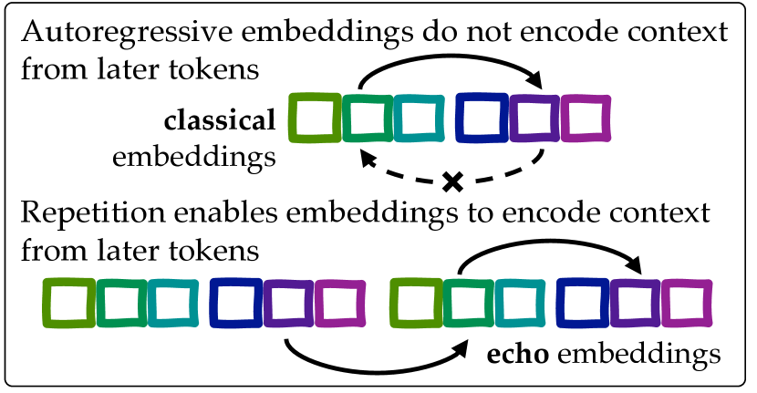

Figure 1: Conceptual overview of echo embeddings.
[/FIGURE]

In this paper, we address a striking failure mode of autoregressive language models. This failure arises from the fact that for autoregressive language models, contextualized token embeddings—the vector of last-hidden-layer activations at the position of a particular input token—do not contain information from tokens that appear later in the sentence due to the causal attention mask. We demonstrate that such embeddings can fail to appropriately determine similarity when the early tokens are superficially similar but become dissimilar in important ways when using key information from end of the input.  

We propose a strategy to overcome this limitation in autoregressive models through “echo embeddings.” With this approach, we repeat the inputs so that it appears *twice* in the context passed to the language model, and extract embeddings from the second occurrence. Repeating the input enables the contextualized token embeddings of the second occurrence of the passage to encode information from tokens that appear later in the passage by attending to their first occurrence in the passage. We show that echo embeddings do in fact allow embeddings of the early tokens to capture information about the later tokens.  

We then evaluate echo embeddings on the standard Massive Text Embedding Benchmark (MTEB) leaderboard222The MTEB leaderboard can be found at <https://huggingface.co/spaces/mteb/leaderboard>. In the zero-shot setting, echo embeddings improve on classical embeddings by over $9\%$ and provide consistent gains across all the different tasks for a variety of language models and scale. We then perform an apples-to-apples comparison when fine-tuning embeddings from Mistral-7B and continue to see consistent gains of echo over classical across the various tasks (by $0.7\%$ on average). Strikingly, echo embeddings with the strong Mistral-7B language model allows us to achieve state-of-the-art embedding quality, enabling autoregressive language models to match prior open-source top performing models that otherwise leveraged MLMs with bidirectional attention.333The contemporaneous work by Wang et al. ([2023](#bib.bib43)) achieves state-of-the-art accuracy on MTEB using classical embeddings from autoregressive language models, but through finetuning on high quality synthetic data, which we believe is largely orthogonal to our contribution.  

The approach of echo embeddings is conceptually well-motivated, extremely simple, and generally compatible with other innovations in extracting embeddings from autoregressive language models. As language models are likely to continue to improve over the coming years, echo embeddings can be a simple but powerful twist to classical embeddings that allow us to maximally leverage autoregressive language models.  

## 2 Preliminaries

Our goal is to extract text embeddings that map a sentence $x$ to a vector $\phi(x)\in\mathbb{R}^{d}$ such that the semantic similarity between sentences is captured as similarity between their embeddings. In practice, we use the cosine similarity between embeddings to capture semantic similarity (detailed in Appendix [B](#A2 "Appendix B Echo Embeddings: Additional Information ‣ Repetition Improves Language Model Embeddings")).  

#### Embeddings from language models.

We are primarily interested in the embeddings extracted from autoregressive language models, which typically have causal attention masking and are trained on a next-token objective. For brevity, we drop the term “autoregressive” in the following.  

As is standard, we extract embeddings from the activations of the final hidden layer. Each input token $x_{j}$ at position $j$ is associated with a *contextualized token embedding* which is the hidden layer representation $\phi_{j}(x)$.  

We can pool the embeddings across all the tokens in different ways. In this work, we focus on two common strategies which have been considered by prior work (Reimers and Gurevych, [2019](#bib.bib32); Muennighoff, [2022](#bib.bib23); Zhang et al., [2023a](#bib.bib51); Wang et al., [2023](#bib.bib43)).  

A mean token embedding over a set of indices $A$, refers to the mean contextualized token embeddings at indices in $A:\phi_{A}(x)\coloneqq\frac{1}{\left|A\right|}\sum_{t\in A}\phi_{t}(x)$.  

A last-token embedding refers to the contextualized token embedding of the last token in the input sequence, written $\phi_{-1}(x)$.  

#### Classical embeddings.

Traditionally, embeddings are computed by simply passing the sentence to the model and extracting some pooling (e.g. mean or last-token) of the contextualized embeddings corresponding to the input sentence. We will refer to embeddings created in this way as “classical embeddings”. Additionally, one might first prompt the language model with an explanation of the task of interest followed by the sentence, and then pool the contextualized embeddings of the sentence tokens like before (Su et al., [2022](#bib.bib37)).  

## 3 Echo Embeddings

In this section, we first demonstrate a failure mode of classical embeddings, and motivate a new method that we call echo embeddings that addresses this failure.  

### 3.1 Classical Embeddings Miss Bidirectional Information.

Sentence embeddings should aggregate information across the entire sentence. However, for autoregressive language models, the contextualized embedding at position $k$ $\phi_{k}(x)$ *cannot* encode information about tokens $x_{k+1},x_{k+2},\ldots$. Hence, the “meaning” encoded by the embeddings of tokens at the beginning of a sentence might inaccurately suggest they are similar (or dissimilar) to other tokens without considering the influence of tokens that come later. As a simple illustration, consider the following.  

|  | $\displaystyle q$ | $\displaystyle\colon{{\color[rgb]{0.2,0.2,0.8}\definecolor[named]{pgfstrokecolor}{rgb}{0.2,0.2,0.8}\text{[She loves summer]}}}{{\color[rgb]{0.89,0.0,0.13}\definecolor[named]{pgfstrokecolor}{rgb}{0.89,0.0,0.13}\text{ [but dislikes the heat]}}}$ |  |
| --- | --- | --- | --- |
|  | $\displaystyle s^{-}$ | $\displaystyle\colon{\color[rgb]{0.2,0.2,0.8}\definecolor[named]{pgfstrokecolor}{rgb}{0.2,0.2,0.8}\text{[She loves summer]}}{\color[rgb]{0.89,0.0,0.13}\definecolor[named]{pgfstrokecolor}{rgb}{0.89,0.0,0.13}\text{ [for the warm evenings]}}$ |  |
| --- | --- | --- | --- |
|  | $\displaystyle s^{+}$ | $\displaystyle\colon{\color[rgb]{0.2,0.2,0.8}\definecolor[named]{pgfstrokecolor}{rgb}{0.2,0.2,0.8}\text{[Summer is her favorite]}}{\color[rgb]{0.89,0.0,0.13}\definecolor[named]{pgfstrokecolor}{rgb}{0.89,0.0,0.13}\text{ [but not the temp.]}}$ |  |
| --- | --- | --- | --- |

Here, the contextualized embeddings of the first half of $s^{+}$ and $s^{-}$ are both similar to $q$ because they do not attend to the second half of the sentence. As a result, the similarity between $q$ and $s^{-}$ would be overestimated by any pooling strategy that uses information from the first half. We address last-token pooling at the end of this section.  

### 3.2 Echo Embeddings

We propose a simple fix to mitigate the failure above: we present the input sentence *twice* to the language model and extract contextualized embeddings from the second occurrence of the sentence. In principle, the contextualized embeddings of the second occurrence can attend to the entire sentence presented in the first occurrence. Furthermore, in order to encourage the second occurrence to actually “encode” information about the first, we instruct the language model to perform a generic task that requires using this information, e.g., “rewrite” or “repeat.”  

Classical embeddings: Feed sentence $x$ to the language model and pool the contextualized embeddings of sentence $x$.
Echo embeddings:
Feed a prompt such as “Rewrite the sentence: $x$, rewritten sentence: $x$” to the language model and pool the contextualized embeddings of the *second* occurence of $x$.

Key to our method is passing the sentence twice to the model and pool embeddings exclusively from the second occurrence.444We find that minor variations of the echo embeddings prompt (e.g. change “rewrite” to “repeat”) work equally well and we provide an example list in Appendix [B](#A2 "Appendix B Echo Embeddings: Additional Information ‣ Repetition Improves Language Model Embeddings") Other tricks from classical embeddings such as prompting the model with the downstream task of interest can be applied to echo embeddings as well.  

[FIGURE S3.F2.g1]
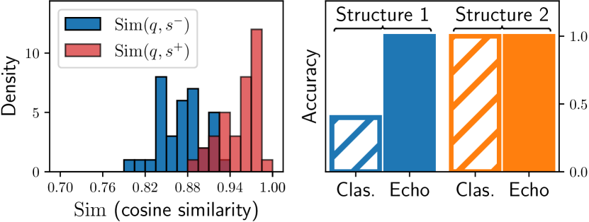

Figure 2: (left) We take the echo embeddings of only $A$ for query $q$ and sentences $s^{-},s^{+}$ and plot the distribution of cosine similarities, showing that echo embeddings encode later information in earlier tokens. (right) We plot the accuracy of classical and echo embeddings when the sentences have similar beginnings (Structure 1) and dissimilar beginnings (Structure 2).
[/FIGURE]

### 3.3 Repetition Captures Bidirectional Info

In the previous section, we argued that classical embeddings suffer from the issue that contextualized embeddings of early tokens can miss out on information from the later tokens. But can simply repetition via echo embeddings solve this issue? We aim to test this by extracting embeddings from Mistral-7B on a simple controlled synthetic setting.  

Given a query $q\colon[A,B]$ we construct sentence pairs $s^{+},s^{-}$ as follows. We make the first parts of each sentence identical to the query, but differ only in their second parts,  

$q\colon[A,B]$; $s^{+}\colon[A,B^{+}]$; $s^{-}\colon[A,B^{-}]$,  

where $B^{+}$ is $B$ but paraphrased and $B^{-}$ is semantically dissimilar to $B$. We query GPT-4 to generate examples of this structure. We describe the full procedure and prompts in Appendix [B](#A2 "Appendix B Echo Embeddings: Additional Information ‣ Repetition Improves Language Model Embeddings").  

With classical embeddings, the contextualized embeddings of $A$ parts of $s^{+},s^{-},q$ are identical by construction. To test whether echo embeddings can meaningfully distinguish $s^{+}$ and $s^{-}$ despite having identical initial tokens, we take the mean over just the $A$-portion of the echo embeddings and plot the cosine similarities $\operatorname{Sim}(q,s^{+})$ and $\operatorname{Sim}(q,s^{-})$ in Figure [2](#S3.F2 "Figure 2 ‣ 3.2 Echo Embeddings ‣ 3 Echo Embeddings ‣ Repetition Improves Language Model Embeddings") (left). We find that $\operatorname{Sim}(q,s^{+})$ is typically larger than $\operatorname{Sim}(q,s^{-})$. Since we are only pooling the echo embeddings of the A-portion, any distinction between $s^{+},s^{-}$ must come from the echo embeddings of $A$ capturing information from the later parts of the sentence. This showcases that current autoregressive language models can in fact allow early tokens to capture information from later tokens via echo embeddings.  

### 3.4 Classical vs. Echo on Synthetic Data

In Section [3.3](#S3.SS3 "3.3 Repetition Captures Bidirectional Info ‣ 3 Echo Embeddings ‣ Repetition Improves Language Model Embeddings") we demonstrated that echo embeddings encode bidirectional information. However, is this sufficient to recover from the failure mode of classical embeddings? Further, where will we expect echo embeddings to improve over classical embeddings? Here, we compare echo and classical embeddings on synthetic data to answer both of these questions.  

#### Datasets.

We sample datasets according to two structures depending on whether the discriminating information between $s^{+}$ and $s^{-}$ is in the first half (structure S1) or second half (structure S2) of the sentence. Using the structures below, we generate samples using GPT-4, as in the previous section (full details in the appendix):  

(S1)   $q\colon[A,B]$, $s^{+}\colon[A^{+},B^{+}]$, $s^{-}\colon[A^{+},B^{-}]$  

(S2)   $q\colon[A,B]$, $s^{+}\colon[A^{+},B^{+}]$, $s^{-}\colon[A^{-},B^{+}]$.  

We measure the accuracy of identifying which of two sentences $s^{+}$ and $s^{-}$ is closer to the query as measured by the cosine similarity in the embeddings. We compare classical vs echo embeddings when using mean pooling to aggregate embeddings extracted from Mistral-7B model. We use mean token embedding rather than last token because last token embeddings can be quite fragile in a zero-shot setting (Section [5.1](#S5.SS1 "5.1 Evaluation of Zero-shot Embeddings ‣ 5 Experiments ‣ Repetition Improves Language Model Embeddings")).  

#### Results.

We present results on the two different structures in Figure [2](#S3.F2 "Figure 2 ‣ 3.2 Echo Embeddings ‣ 3 Echo Embeddings ‣ Repetition Improves Language Model Embeddings") (right). We see that classical embeddings struggle on Structure 1—when the distinguishing information is at the beginning, the embeddings corresponding to these early tokens exaggerate similarity between $q$ and $s^{-}$ because they do not encode the information provided by $B^{-}$. In contrast, echo embeddings are able to successfully determine the more similar sentence, presumably because embeddings of the $A$-portion now also encode information about the later parts (demonstrated in Section [3.3](#S3.SS3 "3.3 Repetition Captures Bidirectional Info ‣ 3 Echo Embeddings ‣ Repetition Improves Language Model Embeddings")). As a control for other reasons echo embeddings outperform classical embeddings, we also compare these embeddings on structure two, where early tokens provide discriminative signal without needing the later context. As expected, both classical and echo embeddings achieve good performance in this setting. All in all, this analysis on synthetic data demonstrates that zero-shot classical embeddings do not encode information about later context in early token embeddings, but echo embeddings can do so.  

#### Does last-token pooling resolve the failure of classical embeddings?

The embedding of the last token $\phi_{-1}(x)$ is, in principle, can encode information from the entire input. However, we posit that the last-token pooling strategy is highly brittle and can depend too strongly on the tokens near the end of the input. To verify this, we compare the accuracy of mean token pooling and last-token pooling for classical and echo embeddings in two settings. First, we evaluate on the original synthetic data of Structure 1 (Figure [3](#S3.F3 "Figure 3 ‣ Does last-token pooling resolve the failure after finetuning? ‣ 3.4 Classical vs. Echo on Synthetic Data ‣ 3 Echo Embeddings ‣ Repetition Improves Language Model Embeddings"), left). Second, we evaluate on the same data, but where we append a uniformly randomly selected token to the end of each example (Figure [3](#S3.F3 "Figure 3 ‣ Does last-token pooling resolve the failure after finetuning? ‣ 3.4 Classical vs. Echo on Synthetic Data ‣ 3 Echo Embeddings ‣ Repetition Improves Language Model Embeddings"), right). While last-token pooling has high accuracy on the original toy data (though still lower accuracy than echo embeddings), it fails to perform well on the noisy examples. Echo embeddings with mean token pooling, however, are robust to the noise.  

While this particular distribution of noise is artificial, it highlight that last-token pooling can be sensitive to noise in the last token. We verify in Section [5.1](#S5.SS1 "5.1 Evaluation of Zero-shot Embeddings ‣ 5 Experiments ‣ Repetition Improves Language Model Embeddings") that last-token embeddings perform poorly on real data. Thus, even if last-token embeddings address the inability of mean token classical embeddings to encode information from tokens that appear later in the sequence, they are not practical due to their sensitivity to noise.  

#### Does last-token pooling resolve the failure after finetuning?

In practice, it is common to finetune embeddings on a sentence similarity objective. It is hard to delineate the degree to which this failure mode remains after finetuning. Nonetheless, we demonstrate in Section [5.2](#S5.SS2 "5.2 Evaluation of Finetuned Embeddings ‣ 5 Experiments ‣ Repetition Improves Language Model Embeddings") that our method improves in the finetuning setting, even when using last-token pooling.  

[FIGURE S3.F3.g1]
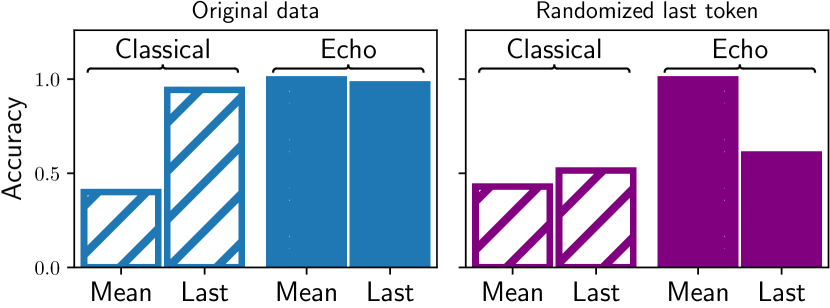

Figure 3: We compare the accuracy of classical and echo embeddings, and mean and last-token pooling on sentences which have similar beginnings (Structure 1). We plot these accuracies on the original data (left), and the data in which a single uniformly randomly chosen token is appended to the end of each sentence (right).
[/FIGURE]

## 4 Methodology

In Section [3](#S3 "3 Echo Embeddings ‣ Repetition Improves Language Model Embeddings"), we explored how echo embeddings can improve over classical embeddings by addressing a fundamental failure mode. In this section, we describe the methodology by which we evaluate echo embeddings on large scale real datasets in both the zero-shot and finetuning settings. While finetuning is currently necessary to achieve state-of-the-art performance, zero-shot embeddings have the advantage that they do not require expensive finetuning on top of a pretrained language model. Zero-shot results can also more clearly show how different embedding strategies work on real datasets.  

### 4.1 Constructing Zero-shot Embeddings.

We extract zero-shot embeddings via different strategies from three language models: Mistral-7B, LLaMA-2-7B, and LLaMA-2-13B. We select the instruction-finetuned model for each of them. Refer to Appendix [A.2](#A1.SS2 "A.2 Base Model HuggingFace IDs ‣ Appendix A General Information for Reproducibility ‣ Repetition Improves Language Model Embeddings") for additional information on the base models. Recent literature suggests that the performance of language models on zero-shot tasks can be highly variable depending on the exact wording and template of the prompts (Sclar et al., [2023](#bib.bib34)). Thus, for each of the embedding strategies we consider, we perform prompt randomization where we sample prompts by randomizing the exact wording, punctuation, and capitalization of the prompt. We describe the sampling process and the exact prompts that we use in Appendix [C](#A3 "Appendix C Additional Zero-shot Results ‣ Repetition Improves Language Model Embeddings").  

#### Baselines.

We compare our proposed echo embeddings (Section [3.2](#S3.SS2 "3.2 Echo Embeddings ‣ 3 Echo Embeddings ‣ Repetition Improves Language Model Embeddings")) to classical embeddings and two additional baselines:  

* Last-token embeddings: We mentioned in the Section [3](#S3 "3 Echo Embeddings ‣ Repetition Improves Language Model Embeddings") that last-token embeddings tend to underperform in comparsion to mean token embeddings, and thus we compare on real data. 
* Summarization: We also compare zero-shot embeddings obtained via the strategy proposed by Jiang et al. ([2023b](#bib.bib12)). Here, they instruct the model to summarize the input in a single word and then take the last token embedding $\phi_{-1}(x)$ as the pooled embedding of the sentence. 

### 4.2 Constructing Finetuned Embeddings.

We adopt the conventional sentence embedding training setup (Reimers and Gurevych, [2019](#bib.bib32)) where we train with a contrastive learning objective to encourage the embeddings of similar text to be close. We extract embeddings in a slightly different fashion compared to the zero-shot setting above in order to keep the finetuning methodology as similar as possible to the existing literature.  

#### Extracting embeddings.

The training and evaluation data is separated into two categories: symmetric data, in which sentences are drawn from a single distribution (such as for sentence similarity), and asymmetric, in which the data consists of both queries and documents (such as for retrieval). We adopt a separate prompt for symmetric inputs and queries, and for documents. We construct classical embeddings by encoding text $S$ using the following prompts:  

| Queries & Symm. | Documents |
| --- | --- |
| Instruct: {instruction}     $\displaystyle\text{Query: }S$ | $\displaystyle\text{Document: }S$ |

For echo embeddings, we use the prompts, where $S$ represents the input and $S^{\prime}=S$:  

| Queries & Symm. | Documents |
| --- | --- |
| Instruct: {instruction}     $\displaystyle\text{Query: }S$    $\displaystyle\text{Query again: }S^{\prime}$ | $\displaystyle\text{Document: }S$    $\displaystyle\text{Document again: }S^{\prime}$ |

In this case, {instruction} refers to the task instruction, which specifies a description of the task that the embedding will be used for. We adopt the instructions from Wang et al. ([2023](#bib.bib43)), and provide a list of the instructions in Appendix [D](#A4 "Appendix D Additional Finetuning Results ‣ Repetition Improves Language Model Embeddings"). We append an end-of-sentence token to the end of each input, and we allow the input embedding of this token to be trainable.  

#### Datasets.

We train on a collection of publicly available datasets that encompass both symmetric and asymmetric data that are standard training datasets in the embedding literature. We list and describe each of the datasets in Appendix [D](#A4 "Appendix D Additional Finetuning Results ‣ Repetition Improves Language Model Embeddings").  

#### Optimization.

To finetune the model, we optimize the SimCSE loss with in-batch and mined hard negatives. Since this is standard, we defer discussion of this to Appendix [D](#A4 "Appendix D Additional Finetuning Results ‣ Repetition Improves Language Model Embeddings"). Each batch is constructed by sampling a dataset from our set of training dataset, and then collecting examples from only this dataset. We use GradCache to train with a large batch size (2048) with limited GPU memory (Gao et al., [2021a](#bib.bib6)). We train with LoRA instead of full finetuning, with $r=16$ and $\alpha=16$. We choose $\tau=1/50$ and a learning rate of $8\times 10^{-4}$. We use the Mistral-7B instruction-tuned model as a backbone (Jiang et al., [2023a](#bib.bib11)). Our choices aim to be consistent with prior literature (Wang et al., [2023](#bib.bib43); Su et al., [2022](#bib.bib37); Zhang et al., [2023a](#bib.bib51)).  

### 4.3 Massive Text Embedding Benchmark

For evaluation, we use the Massive Text Embedding Benchmark (MTEB) (Muennighoff et al., [2022](#bib.bib24)). For this paper, we focus on the English-language subset of the benchmark. MTEB is composed of a collection of 56 datasets that are grouped into different embedding tasks: classification, clustering, pair classification, reranking, retrieval, sentence similarity (STS), and summarization. The goal is to construct general purpose embeddings that are useful for solving each of the tasks. More information about MTEB is specified in Appendix [A.1](#A1.SS1 "A.1 Massive Text Embedding Benchmark ‣ Appendix A General Information for Reproducibility ‣ Repetition Improves Language Model Embeddings").  

For the fine-tuning setting, we evaluate on the entire English-language subset. In the zero-shot setting, for convenience, we only evaluate on a subset of MTEB. We describe this subset in Appendix [D](#A4 "Appendix D Additional Finetuning Results ‣ Repetition Improves Language Model Embeddings").  

## 5 Experiments

[TABLE S5.T1]

<table class="ltx_tabular ltx_centering ltx_guessed_headers ltx_align_middle">
<thead class="ltx_thead">
<tr class="ltx_tr">
<th class="ltx_td ltx_align_justify ltx_th ltx_th_column ltx_border_tt ltx_border_tt">

Strategy

</th>
<th class="ltx_td ltx_align_right ltx_th ltx_th_column ltx_border_tt ltx_border_tt">Model</th>
<th class="ltx_td ltx_align_right ltx_th ltx_th_column ltx_border_tt ltx_border_tt">Pool</th>
<th class="ltx_td ltx_align_center ltx_th ltx_th_column ltx_border_tt ltx_border_tt">  Clas.</th>
<th class="ltx_td ltx_align_center ltx_th ltx_th_column ltx_border_tt ltx_border_tt">P. Cls.</th>
<th class="ltx_td ltx_align_center ltx_th ltx_th_column ltx_border_tt ltx_border_tt">Clus.</th>
<th class="ltx_td ltx_align_center ltx_th ltx_th_column ltx_border_tt ltx_border_tt">Retr.</th>
<th class="ltx_td ltx_align_center ltx_th ltx_th_column ltx_border_tt ltx_border_tt">STS</th>
<th class="ltx_td ltx_align_center ltx_th ltx_th_column ltx_border_tt ltx_border_tt">Rera.</th>
<th class="ltx_td ltx_align_right ltx_th ltx_th_column ltx_border_tt ltx_border_tt">Average</th>
</tr>
</thead>
<tbody class="ltx_tbody">
<tr class="ltx_tr">
<td class="ltx_td ltx_align_justify ltx_border_tt">Main results:</td>
<td class="ltx_td ltx_border_tt"></td>
<td class="ltx_td ltx_border_tt"></td>
<td class="ltx_td ltx_border_tt"></td>
<td class="ltx_td ltx_border_tt"></td>
<td class="ltx_td ltx_border_tt"></td>
<td class="ltx_td ltx_border_tt"></td>
<td class="ltx_td ltx_border_tt"></td>
<td class="ltx_td ltx_border_tt"></td>
<td class="ltx_td ltx_border_tt"></td>
</tr>
<tr class="ltx_tr">
<td class="ltx_td ltx_align_justify">

Echo (ours)

</td>
<td class="ltx_td ltx_align_right">Mistral 7B</td>
<td class="ltx_td ltx_align_right">Mean</td>
<td class="ltx_td ltx_align_center">   64.06</td>
<td class="ltx_td ltx_align_center">75.26</td>
<td class="ltx_td ltx_align_center">27.02</td>
<td class="ltx_td ltx_align_center">23.61</td>
<td class="ltx_td ltx_align_center">72.40</td>
<td class="ltx_td ltx_align_center">60.00</td>
<td class="ltx_td ltx_align_right">55.07</td>
</tr>
<tr class="ltx_tr">
<td class="ltx_td ltx_align_justify">

Classical

</td>
<td class="ltx_td ltx_align_right">Mistral 7B</td>
<td class="ltx_td ltx_align_right">Mean</td>
<td class="ltx_td ltx_align_center">   58.21</td>
<td class="ltx_td ltx_align_center">73.87</td>
<td class="ltx_td ltx_align_center">23.85</td>
<td class="ltx_td ltx_align_center">20.35</td>
<td class="ltx_td ltx_align_center">56.97</td>
<td class="ltx_td ltx_align_center">54.44</td>
<td class="ltx_td ltx_align_right">45.88</td>
</tr>
<tr class="ltx_tr">
<td class="ltx_td ltx_align_justify ltx_border_tt">Prior work:</td>
<td class="ltx_td ltx_border_tt"></td>
<td class="ltx_td ltx_border_tt"></td>
<td class="ltx_td ltx_border_tt"></td>
<td class="ltx_td ltx_border_tt"></td>
<td class="ltx_td ltx_border_tt"></td>
<td class="ltx_td ltx_border_tt"></td>
<td class="ltx_td ltx_border_tt"></td>
<td class="ltx_td ltx_border_tt"></td>
<td class="ltx_td ltx_border_tt"></td>
</tr>
<tr class="ltx_tr">
<td class="ltx_td ltx_align_justify">

Summarization

</td>
<td class="ltx_td ltx_align_right">Mistral 7B</td>
<td class="ltx_td ltx_align_right">Last</td>
<td class="ltx_td ltx_align_center">   66.01
</td>
<td class="ltx_td ltx_align_center">81.82</td>
<td class="ltx_td ltx_align_center">26.48</td>
<td class="ltx_td ltx_align_center">19.13</td>
<td class="ltx_td ltx_align_center">70.13</td>
<td class="ltx_td ltx_align_center">66.24</td>
<td class="ltx_td ltx_align_right">54.96</td>
</tr>
<tr class="ltx_tr">
<td class="ltx_td ltx_align_justify ltx_border_tt">Ablations:</td>
<td class="ltx_td ltx_border_tt"></td>
<td class="ltx_td ltx_border_tt"></td>
<td class="ltx_td ltx_border_tt"></td>
<td class="ltx_td ltx_border_tt"></td>
<td class="ltx_td ltx_border_tt"></td>
<td class="ltx_td ltx_border_tt"></td>
<td class="ltx_td ltx_border_tt"></td>
<td class="ltx_td ltx_border_tt"></td>
<td class="ltx_td ltx_border_tt"></td>
</tr>
<tr class="ltx_tr">
<td class="ltx_td ltx_align_justify">

Echo

</td>
<td class="ltx_td ltx_align_right">Mistral 7B</td>
<td class="ltx_td ltx_align_right">Last</td>
<td class="ltx_td ltx_align_center">   63.11</td>
<td class="ltx_td ltx_align_center">57.93</td>
<td class="ltx_td ltx_align_center">12.82</td>
<td class="ltx_td ltx_align_center">2.97</td>
<td class="ltx_td ltx_align_center">39.14</td>
<td class="ltx_td ltx_align_center">47.35</td>
<td class="ltx_td ltx_align_right">36.60</td>
</tr>
<tr class="ltx_tr">
<td class="ltx_td ltx_align_justify">

Classical

</td>
<td class="ltx_td ltx_align_right">Mistral 7B</td>
<td class="ltx_td ltx_align_right">Last</td>
<td class="ltx_td ltx_align_center">   58.23</td>
<td class="ltx_td ltx_align_center">46.64</td>
<td class="ltx_td ltx_align_center">13.51</td>
<td class="ltx_td ltx_align_center">2.60</td>
<td class="ltx_td ltx_align_center">33.97</td>
<td class="ltx_td ltx_align_center">46.51</td>
<td class="ltx_td ltx_align_right">32.52</td>
</tr>
<tr class="ltx_tr">
<td class="ltx_td ltx_align_justify ltx_border_t">

Echo

</td>
<td class="ltx_td ltx_align_right ltx_border_t">LLaMA 7B</td>
<td class="ltx_td ltx_align_right ltx_border_t">Mean</td>
<td class="ltx_td ltx_align_center ltx_border_t">   61.64</td>
<td class="ltx_td ltx_align_center ltx_border_t">66.29</td>
<td class="ltx_td ltx_align_center ltx_border_t">25.11</td>
<td class="ltx_td ltx_align_center ltx_border_t">16.12</td>
<td class="ltx_td ltx_align_center ltx_border_t">66.18</td>
<td class="ltx_td ltx_align_center ltx_border_t">56.35</td>
<td class="ltx_td ltx_align_right ltx_border_t">50.26</td>
</tr>
<tr class="ltx_tr">
<td class="ltx_td ltx_align_justify">

Classical

</td>
<td class="ltx_td ltx_align_right">LLaMA 7B</td>
<td class="ltx_td ltx_align_right">Mean</td>
<td class="ltx_td ltx_align_center">   56.61</td>
<td class="ltx_td ltx_align_center">68.46</td>
<td class="ltx_td ltx_align_center">23.22</td>
<td class="ltx_td ltx_align_center">18.63</td>
<td class="ltx_td ltx_align_center">56.49</td>
<td class="ltx_td ltx_align_center">53.26</td>
<td class="ltx_td ltx_align_right">44.65</td>
</tr>
<tr class="ltx_tr">
<td class="ltx_td ltx_align_justify ltx_border_t">

Echo

</td>
<td class="ltx_td ltx_align_right ltx_border_t">LLaMA 13B</td>
<td class="ltx_td ltx_align_right ltx_border_t">Mean</td>
<td class="ltx_td ltx_align_center ltx_border_t">   64.65</td>
<td class="ltx_td ltx_align_center ltx_border_t">74.57</td>
<td class="ltx_td ltx_align_center ltx_border_t">25.72</td>
<td class="ltx_td ltx_align_center ltx_border_t">26.58</td>
<td class="ltx_td ltx_align_center ltx_border_t">72.20</td>
<td class="ltx_td ltx_align_center ltx_border_t">62.68</td>
<td class="ltx_td ltx_align_right ltx_border_t">55.60</td>
</tr>
<tr class="ltx_tr">
<td class="ltx_td ltx_align_justify ltx_border_bb ltx_border_bb">

Classical

</td>
<td class="ltx_td ltx_align_right ltx_border_bb ltx_border_bb">LLaMA 13B</td>
<td class="ltx_td ltx_align_right ltx_border_bb ltx_border_bb">Mean</td>
<td class="ltx_td ltx_align_center ltx_border_bb ltx_border_bb">   58.50</td>
<td class="ltx_td ltx_align_center ltx_border_bb ltx_border_bb">65.06</td>
<td class="ltx_td ltx_align_center ltx_border_bb ltx_border_bb">24.22</td>
<td class="ltx_td ltx_align_center ltx_border_bb ltx_border_bb">18.92</td>
<td class="ltx_td ltx_align_center ltx_border_bb ltx_border_bb">57.47</td>
<td class="ltx_td ltx_align_center ltx_border_bb ltx_border_bb">56.38</td>
<td class="ltx_td ltx_align_right ltx_border_bb ltx_border_bb">45.15</td>
</tr>
</tbody>
</table>

Table 1: Zero-shot scores on MTEB tasks for Mistral-7B. We use a retrieval validation set (FiQA2018) to select the best prompt. Refer to Appendix [C](#A3 "Appendix C Additional Zero-shot Results ‣ Repetition Improves Language Model Embeddings") for the scores with alternative validation sets. Top: Comparison of echo embeddings to classical embeddings. Center: Summarization approach to constructing embeddings (Jiang et al., [2023b](#bib.bib12)). Bottom: Ablations, including last-token pooling and LLaMA-2-{7B, 13B}.
[/TABLE]

### 5.1 Evaluation of Zero-shot Embeddings

We compare the performance of classical, echo, and summarization embeddings on MTEB tasks (Table [1](#S5.T1 "Table 1 ‣ 5 Experiments ‣ Repetition Improves Language Model Embeddings")). We validate using a retrieval dataset from MTEB (FiQA2018) as a validation set as described in Section [4.3](#S4.SS3 "4.3 Massive Text Embedding Benchmark ‣ 4 Methodology ‣ Repetition Improves Language Model Embeddings"). We report the scores using alternative validation sets in Appendix [C](#A3 "Appendix C Additional Zero-shot Results ‣ Repetition Improves Language Model Embeddings").  

#### Echo embeddings outperform classical embeddings zero-shot.

We see that echo embeddings outperform classical embeddings by a large margin: on average, by nearly 10 points for Mistral-7B. Further, this performance increase is consistent across every MTEB category, across models (LLaMA-2 vs Mistral), and across scale (7B vs 13B). This demonstrates that echo embeddings can significantly improve the performance of embeddings on real data, suggesting that the failure mode of classical embeddings that we describe in Section [3](#S3 "3 Echo Embeddings ‣ Repetition Improves Language Model Embeddings") can affect performance on real data.  

#### Qualitative comparison of classical and echo embeddings.

In Section [3](#S3 "3 Echo Embeddings ‣ Repetition Improves Language Model Embeddings"), we demonstrate that classical embeddings overestimate the similarity between examples which are superficially similar based on tokens that appear early in the sequence. To build intuition that this applies to realistic data, we present the sentence pair from STSBenchmark, a sentence similarity task from MTEB, in which echo embeddings reduce error the most:  

|  | $\displaystyle x_{1}$ | $\displaystyle\colon\begin{array}[]{l}\text{The best thing you can do is to know your}\\ \text{stuff.}\end{array}$ |  |
| --- | --- | --- | --- |
|  | $\displaystyle x_{2}$ | $\displaystyle\colon\begin{array}[]{l}\text{The best thing to do is to overcome the fus-}\\ \text{siness.}\end{array}$ |  |
| --- | --- | --- | --- |

which has a ground-truth score of $0$ (out of $5$) similarity. The sentence pair for which echo embeddings reduces error the least is:  

|  | $\displaystyle y_{1}$ | $\displaystyle\colon\begin{array}[]{l}\text{Sometime if you really want it you might ne-}\\ \text{ed to pay an agency to get the place for you.}\end{array}$ |  |
| --- | --- | --- | --- |
|  | $\displaystyle y_{2}$ | $\displaystyle\colon\begin{array}[]{l}\text{You could probably get a tour agency to do }\\ \text{it for you but it would cost you.}\end{array}$ |  |
| --- | --- | --- | --- |

which has a ground-truth similarity of $2$ (out of $5$). We provide more examples in the Appendix Table [7](#A4.T7 "Table 7 ‣ Training objective. ‣ Appendix D Additional Finetuning Results ‣ Repetition Improves Language Model Embeddings").  

For this example, notice, that the sentence pair $(x_{1},x_{2})$ on which echo embeddings improve error the most has exactly the property we identify as a failure mode for classical embeddings: the sentence is superficially similar for the first few tokens. On the other hand $(y_{1},y_{2})$ does not have this property.  

#### Quantitative evaluation of the failure mode.

The above example builds intuition that, even on real data, classical embeddings fail to properly estimate similarity on examples which are superficially similar in the early tokens. We quantitatively measure the degree to which classical and echo embeddings fail on sentences which are similar for early tokens, and for sentences which are not. We find that classical embeddings systematically fail on examples which exhibit this structure, while echo embeddings do not. For convenience, we defer the discussion of these experiments and the results to Appendix [C.1](#A3.SS1 "C.1 Validating the connection between our synthetic data experiments and real data. ‣ Appendix C Additional Zero-shot Results ‣ Repetition Improves Language Model Embeddings").  

#### Last-token vs mean token pooling.

We find that last-token embeddings are substantially worse than mean token embeddings in the zero-shot setting, despite the fact that in principle, the last token in the sequence can encode information from all other tokens. In practice, it is clear that the last token does not encode sufficient information to achieve strong performance on MTEB in the zero shot setting.  

#### Echo embeddings vs summarization.

We find that the average performance across the tested MTEB datasets is similar between echo and classical embeddings. Summarization does encourage the last token in the sequence to encode information about the entire sentence. We find that summarization is much more sensitive to the exact prompt while echo embeddings are robust to such minor variations (see Figure [5](#A4.F5 "Figure 5 ‣ Training objective. ‣ Appendix D Additional Finetuning Results ‣ Repetition Improves Language Model Embeddings") in Appendix [C](#A3 "Appendix C Additional Zero-shot Results ‣ Repetition Improves Language Model Embeddings")). We suspect that echo embeddings are more robust as a result of more directly trying to encode bidirectional information into the embeddings.  

### 5.2 Evaluation of Finetuned Embeddings

[TABLE S5.T2]

<table class="ltx_tabular ltx_centering ltx_align_middle">
<tbody class="ltx_tbody">
<tr class="ltx_tr">
<td class="ltx_td ltx_align_justify ltx_border_tt ltx_border_tt">

Strategy

</td>
<td class="ltx_td ltx_align_right ltx_border_tt ltx_border_tt">Model</td>
<td class="ltx_td ltx_align_center ltx_border_tt ltx_border_tt">Pool</td>
<td class="ltx_td ltx_align_center ltx_border_tt ltx_border_tt">   Clas.</td>
<td class="ltx_td ltx_align_center ltx_border_tt ltx_border_tt">Clus.</td>
<td class="ltx_td ltx_align_center ltx_border_tt ltx_border_tt">P. Cls.</td>
<td class="ltx_td ltx_align_center ltx_border_tt ltx_border_tt">Rera.</td>
<td class="ltx_td ltx_align_center ltx_border_tt ltx_border_tt">Retr.</td>
<td class="ltx_td ltx_align_center ltx_border_tt ltx_border_tt">STS</td>
<td class="ltx_td ltx_align_center ltx_border_tt ltx_border_tt">Average</td>
</tr>
<tr class="ltx_tr">
<td class="ltx_td ltx_align_justify ltx_border_tt">Main results:</td>
<td class="ltx_td ltx_border_tt"></td>
<td class="ltx_td ltx_border_tt"></td>
<td class="ltx_td ltx_border_tt"></td>
<td class="ltx_td ltx_border_tt"></td>
<td class="ltx_td ltx_border_tt"></td>
<td class="ltx_td ltx_border_tt"></td>
<td class="ltx_td ltx_border_tt"></td>
</tr>
<tr class="ltx_tr">
<td class="ltx_td ltx_align_justify">

Echo (ours)

</td>
<td class="ltx_td ltx_align_right">Mistral 7B</td>
<td class="ltx_td ltx_align_center">Last</td>
<td class="ltx_td ltx_align_center">  77.43
</td>
<td class="ltx_td ltx_align_center">46.32</td>
<td class="ltx_td ltx_align_center">87.34</td>
<td class="ltx_td ltx_align_center">58.14</td>
<td class="ltx_td ltx_align_center">55.52</td>
<td class="ltx_td ltx_align_center">82.56</td>
<td class="ltx_td ltx_align_right">64.68</td>
</tr>
<tr class="ltx_tr">
<td class="ltx_td ltx_align_justify">

Classical

</td>
<td class="ltx_td ltx_align_right">Mistral 7B</td>
<td class="ltx_td ltx_align_center">Last</td>
<td class="ltx_td ltx_align_center">  76.57</td>
<td class="ltx_td ltx_align_center">45.78</td>
<td class="ltx_td ltx_align_center">86.37</td>
<td class="ltx_td ltx_align_center">56.71</td>
<td class="ltx_td ltx_align_center">54.87</td>
<td class="ltx_td ltx_align_center">82.03</td>
<td class="ltx_td ltx_align_right">63.98</td>
</tr>
<tr class="ltx_tr">
<td class="ltx_td ltx_align_justify ltx_border_tt">Prior work:</td>
<td class="ltx_td ltx_border_tt"></td>
<td class="ltx_td ltx_border_tt"></td>
<td class="ltx_td ltx_border_tt"></td>
<td class="ltx_td ltx_border_tt"></td>
<td class="ltx_td ltx_border_tt"></td>
<td class="ltx_td ltx_border_tt"></td>
<td class="ltx_td ltx_border_tt"></td>
</tr>
<tr class="ltx_tr">
<td class="ltx_td ltx_align_justify">UAE-Large-V1 (MLM)</td>
<td class="ltx_td ltx_align_center">  75.58</td>
<td class="ltx_td ltx_align_center">46.73</td>
<td class="ltx_td ltx_align_center">87.25</td>
<td class="ltx_td ltx_align_center">59.88</td>
<td class="ltx_td ltx_align_center">54.66</td>
<td class="ltx_td ltx_align_center">84.54</td>
<td class="ltx_td ltx_align_right">64.64</td>
</tr>
<tr class="ltx_tr">
<td class="ltx_td ltx_align_justify">multilingual-e5-large (MLM)</td>
<td class="ltx_td ltx_align_center">  77.56</td>
<td class="ltx_td ltx_align_center">47.10</td>
<td class="ltx_td ltx_align_center">86.19</td>
<td class="ltx_td ltx_align_center">58.58</td>
<td class="ltx_td ltx_align_center">52.47</td>
<td class="ltx_td ltx_align_center">84.78</td>
<td class="ltx_td ltx_align_right">64.41</td>
</tr>
<tr class="ltx_tr">
<td class="ltx_td ltx_align_justify">bge-large-en-v1.5 (MLM)</td>
<td class="ltx_td ltx_align_center">  75.97</td>
<td class="ltx_td ltx_align_center">46.08</td>
<td class="ltx_td ltx_align_center">87.12</td>
<td class="ltx_td ltx_align_center">60.03</td>
<td class="ltx_td ltx_align_center">54.29</td>
<td class="ltx_td ltx_align_center">83.11</td>
<td class="ltx_td ltx_align_right">64.23</td>
</tr>
<tr class="ltx_tr">
<td class="ltx_td ltx_align_justify">udever-bloom-7b (autoregr.)</td>
<td class="ltx_td ltx_align_center">  72.13</td>
<td class="ltx_td ltx_align_center">40.81</td>
<td class="ltx_td ltx_align_center">85.4</td>
<td class="ltx_td ltx_align_center">55.91</td>
<td class="ltx_td ltx_align_center">49.34</td>
<td class="ltx_td ltx_align_center">83.01</td>
<td class="ltx_td ltx_align_right">60.63</td>
</tr>
<tr class="ltx_tr">
<td class="ltx_td ltx_align_justify">sgpt-5.8b (autoregr.)</td>
<td class="ltx_td ltx_align_center">  68.13</td>
<td class="ltx_td ltx_align_center">40.34</td>
<td class="ltx_td ltx_align_center">82.00</td>
<td class="ltx_td ltx_align_center">56.56</td>
<td class="ltx_td ltx_align_center">50.25</td>
<td class="ltx_td ltx_align_center">78.10</td>
<td class="ltx_td ltx_align_right">58.93</td>
</tr>
<tr class="ltx_tr">
<td class="ltx_td ltx_align_justify ltx_border_t">e5-mistral-7b555e5-mistral-7b was recently released and leverages high quality synthetic data to achieve strong performance which is not publicly released. We report their performance, but we do not explicitly compare to them <cite class="ltx_cite ltx_citemacro_citep">(Wang et al., <a class="ltx_ref">2023</a>)</cite>. (autoregr.)</td>
<td class="ltx_td ltx_align_center ltx_border_t">  78.47</td>
<td class="ltx_td ltx_align_center ltx_border_t">50.26</td>
<td class="ltx_td ltx_align_center ltx_border_t">88.34</td>
<td class="ltx_td ltx_align_center ltx_border_t">60.21</td>
<td class="ltx_td ltx_align_center ltx_border_t">56.89</td>
<td class="ltx_td ltx_align_center ltx_border_t">84.63</td>
<td class="ltx_td ltx_align_right ltx_border_t">66.63</td>
</tr>
<tr class="ltx_tr">
<td class="ltx_td ltx_align_justify ltx_border_tt">Ablations:</td>
<td class="ltx_td ltx_border_tt"></td>
<td class="ltx_td ltx_border_tt"></td>
<td class="ltx_td ltx_border_tt"></td>
<td class="ltx_td ltx_border_tt"></td>
<td class="ltx_td ltx_border_tt"></td>
<td class="ltx_td ltx_border_tt"></td>
<td class="ltx_td ltx_border_tt"></td>
</tr>
<tr class="ltx_tr">
<td class="ltx_td ltx_align_justify">

Echo

</td>
<td class="ltx_td ltx_align_right">Mistral 7B</td>
<td class="ltx_td ltx_align_center">Mean</td>
<td class="ltx_td ltx_align_center">  77.00</td>
<td class="ltx_td ltx_align_center">44.94</td>
<td class="ltx_td ltx_align_center">87.73</td>
<td class="ltx_td ltx_align_center">58.30</td>
<td class="ltx_td ltx_align_center">55.11</td>
<td class="ltx_td ltx_align_center">82.52</td>
<td class="ltx_td ltx_align_right">64.22</td>
</tr>
<tr class="ltx_tr">
<td class="ltx_td ltx_align_justify">

Classical

</td>
<td class="ltx_td ltx_align_right">Mistral 7B</td>
<td class="ltx_td ltx_align_center">Mean</td>
<td class="ltx_td ltx_align_center">  76.26</td>
<td class="ltx_td ltx_align_center">42.68</td>
<td class="ltx_td ltx_align_center">86.31</td>
<td class="ltx_td ltx_align_center">57.58</td>
<td class="ltx_td ltx_align_center">53.75</td>
<td class="ltx_td ltx_align_center">81.53</td>
<td class="ltx_td ltx_align_right">62.96</td>
</tr>
<tr class="ltx_tr">
<td class="ltx_td ltx_align_justify ltx_border_bb ltx_border_bb ltx_border_t">

Classical

</td>
<td class="ltx_td ltx_align_right ltx_border_bb ltx_border_bb ltx_border_t">Mistral 7B-bidir.</td>
<td class="ltx_td ltx_align_center ltx_border_bb ltx_border_bb ltx_border_t">Last</td>
<td class="ltx_td ltx_align_center ltx_border_bb ltx_border_bb ltx_border_t">  76.70</td>
<td class="ltx_td ltx_align_center ltx_border_bb ltx_border_bb ltx_border_t">45.94</td>
<td class="ltx_td ltx_align_center ltx_border_bb ltx_border_bb ltx_border_t">88.15</td>
<td class="ltx_td ltx_align_center ltx_border_bb ltx_border_bb ltx_border_t">57.23</td>
<td class="ltx_td ltx_align_center ltx_border_bb ltx_border_bb ltx_border_t">54.96</td>
<td class="ltx_td ltx_align_center ltx_border_bb ltx_border_bb ltx_border_t">82.42</td>
<td class="ltx_td ltx_align_right ltx_border_bb ltx_border_bb ltx_border_t">64.23</td>
</tr>
</tbody>
</table>

Table 2: Finetuning scores on MTEB tasks. Top: Apples-to-apples comparison of echo embeddings and classical embeddings in which we use echo embeddings and classical embeddings with last-token pooling, with the same training setup. Center: Performance of recent open source embedding models, annotated by base model type, masked-language model or autoregressive. Bottom: Ablations for finetuning: using mean token embeddings (first two lines) and using a bidirectional architecture (last line).
[/TABLE]

Different embeddings on the MTEB leaderboard are often fine-tuned on different datasets. In order to perform an apples-to-apples comparison between embedding strategies, we fine-tune both echo and classical embeddings on the exact same datasets (described in Section [4.2](#S4.SS2 "4.2 Constructing Finetuned Embeddings. ‣ 4 Methodology ‣ Repetition Improves Language Model Embeddings")). We report the results in Table [2](#S5.T2 "Table 2 ‣ 5.2 Evaluation of Finetuned Embeddings ‣ 5 Experiments ‣ Repetition Improves Language Model Embeddings"). This table also includes a comparison to prior state-of-the-art methods using masked language models (MLM) and autoregressive language models. Further, we evaluate a number of ablations to determine the role of pooling strategy and architecture.  

#### Echo embeddings outperform classical embeddings after finetuning.

We observe that echo embeddings consistently outperform classical embeddings on each category even after finetuning. Hence, the fundamental gap we find between classical and echo embeddings in Section [3](#S3 "3 Echo Embeddings ‣ Repetition Improves Language Model Embeddings") and in our zero-shot experiments persist after fine-tuning.  

#### Comparison to prior state-of-the-art models.

We present comparisons to both prior MLM-based embeddings and prior autoregressive-language-model embeddings, listing the open-source models from the MTEB leaderboard. It is striking that MLMs vastly outperformed autoregressive models until recently. Our classical embeddings outperform the previous-best autoregressive language model. This is a result of using the strongest public 7B parameter language model (Mistral) and more fine-tuning data. However, despite these choices, classical embeddings do *not* outperform prior MLM-based approaches, perhaps because MLMs encode bidirectional context unlike classical embeddings from autoregressive models. Interestingly, echo embeddings allow us to close the gap to achieve state-of-the-art (on average) with an autoregressive model compared to prior open-sourced models on the leaderboard that used MLMs. A recent exception is the concurrent work by Wang et al. ([2023](#bib.bib43)) that use synthetic data to improve classical embeddings extracted from Mistral-7B. Their synthetic data is not publicly available, but the apples-to-apples comparison between classical and echo embeddings we performed suggests that echo embeddings could provide gains further gains over the numbers reported in (Wang et al., [2023](#bib.bib43)) when fine-tuning with synthetic data.  

#### Why doesn’t last-token pooling close the gap?

Since classical last-token embeddings can attend to every other token, they do not necessarily suffer from the failure mode that we highlighted in Section [3](#S3 "3 Echo Embeddings ‣ Repetition Improves Language Model Embeddings"). Last token does not reliably capture relevant information in a zero-shot setting, but this could have been bridged via fine-tuning. It is thus surprising that, even after finetuning last-token embeddings that could (in principle) encode any embedding function, echo embeddings outperform classical embeddings. We identify two hypotheses that may explain this performance gap: (1) While last-token embeddings can attend to every token, the intermediate representations of earlier tokens cannot. If last-token pooling derives information from the internal representations of earlier tokens, by attending to these representations, last-token classical embeddings may still suffer from the failure mode of the earlier tokens. (2) If the post-finetuning performance benefits from the model initialization point, last-token classical embeddings may suffer: in Section [5.1](#S5.SS1 "5.1 Evaluation of Zero-shot Embeddings ‣ 5 Experiments ‣ Repetition Improves Language Model Embeddings") we show that last-token embeddings achieve poor zero-shot performance. We leave it to future work to explore these hypotheses. We do, however, observe that the gap between last- and mean token echo embeddings is smaller than the gap between last- and mean token classical embeddings, suggesting that echo embeddings can especially improve the quality of mean token embeddings.  

#### Can we relax autoregressive language models to a bidirectional architecture and fine-tune?

To test the role of architecture, we finetune Mistral-7B on the same setup described in Section [4.2](#S4.SS2 "4.2 Constructing Finetuned Embeddings. ‣ 4 Methodology ‣ Repetition Improves Language Model Embeddings") but modified the architecture so as to remove the causal attention mask. While the initial weights are identical to Mistral-7B, this new model has bidirectional attention. We observe that the performance of bidirectional classical embeddings are better than our standard (causal) classical embeddings, but worse than echo embeddings. This suggests that the architecture alone is not sufficient to improve performance.  

## 6 Related Work

#### Sentence embeddings.

Dense low-dimensional vectors representing textual semantics has been widely studied and applied. Early approaches involved computing embeddings for individual words (Hinton, [1984](#bib.bib8); Rumelhart et al., [1986](#bib.bib33); Elman, [1990](#bib.bib4); Mikolov et al., [2013](#bib.bib22); Pennington et al., [2014](#bib.bib28)). Later work aims to compute dense vectors representing the semantics of entire sequences by combining or composing word vectors (Le and Mikolov, [2014](#bib.bib18); Iyyer et al., [2015](#bib.bib9); Kiros et al., [2015](#bib.bib17); Socher et al., [2011](#bib.bib35); Tai et al., [2015](#bib.bib38); Wang et al., [2016](#bib.bib45); Wieting et al., [2015](#bib.bib46)). Khattab and Zaharia ([2020](#bib.bib16)) propose to use late interaction between document and query vectors to improve retrieval performance. Reimers and Gurevych ([2019](#bib.bib32)) propose S-BERT which takes a pretrained BERT (Devlin et al., [2018](#bib.bib3)) and trains with a triplet loss on anchor sentences, semantically similar positive examples, and semantically dissimilar negative examples. More recent approaches typically adopt this approach with different pretrained models and a contrastive objective such as InfoNCE (Oord et al., [2018](#bib.bib27)) or SimCSE (Gao et al., [2021b](#bib.bib7)). Ni et al. ([2021a](#bib.bib25)) with Ni et al. ([2021b](#bib.bib26)) extend this approach to the T5 architecture (Raffel et al., [2020](#bib.bib31)). Multiple papers use an additional unsupervised contrastive objective (Izacard et al., [2021](#bib.bib10); Wang et al., [2022](#bib.bib42)). Other papers propose including prompts to improve task-specific embedding performance (Jiang et al., [2022](#bib.bib13); Su et al., [2022](#bib.bib37)). Some work combines multiple of these training objectives and approaches (Xiao et al., [2023a](#bib.bib47); Li et al., [2023](#bib.bib20)). Notably, except for the most recent approaches, nearly all embeddings were based upon bidirectional architectures that were often pretrained with a masked-language modeling objective.  

#### Next-token language modeling for embeddings.

A series of papers aim to construct high quality embeddings from autoregressive large language models. Multiple papers apply the fine-tuning approach of S-BERT to language models but using a trained GPT (Radford et al., [2018](#bib.bib30)) as the backbone architecture (Muennighoff, [2022](#bib.bib23); Zhang et al., [2023a](#bib.bib51)). Ma et al. ([2023](#bib.bib21)) adopts this approach but for LLaMA-2 (Touvron et al., [2023](#bib.bib40)). Jiang et al. ([2023b](#bib.bib12)) extracts embeddings by asking a language model to summarize the input sentence. Wang et al. ([2023](#bib.bib43)) is concurrent to our work and improves embeddings by adding synthetic training data and trains on Mistral (Jiang et al., [2023a](#bib.bib11)).  

#### Zero-shot embeddings.

Most recent sentence embeddings research has focused on improving finetuning. Reimers and Gurevych ([2019](#bib.bib32)) demonstrates that without finetuning, BERT has low-quality embeddings. To our knowledge, Jiang et al. ([2023b](#bib.bib12)) is the only paper that constructs zero-shot embeddings for autoregressive language models.  

## 7 Conclusion

We have compared classical and echo embeddings in a toy example, on real data in the zero-shot setting, and after finetuning. With the toy data, we identified a failure mode of autoregressive classical embeddings, which we have shown can be recovered with echo embeddings. Our result motivates the development of higher quality embeddings which are important in retrieval applications.  

In addition, until recently, masked language models largely dominated the MTEB leaderboard, despite often having an order of magnitude fewer parameters, having been trained on substantially less data, and performing worse on other benchmarks of interest to the natural language processing community. While our results do not explicitly explain the surprising success of masked language models, they do suggest that next-token language models suffer from an inherent drawback that may have stifled their performance until they became performant enough to compensate for this shortcoming. We believe that our embedding strategy achieves the best of both worlds: we gain the capability of next-token language models while recovering from the failure mode that next-token language models do not encode information about future tokens in their contextualized token embeddings.  

## 8 Limitations

Despite the success of echo embeddings, the method has limitations. First, while echo embeddings achieve superior performance to classical embeddings, they require double the inference cost to pass two copies of the input sequence to the model. Though this is double the training cost for a fixed number of training steps, we show in Appendix [D](#A4 "Appendix D Additional Finetuning Results ‣ Repetition Improves Language Model Embeddings") that echo embeddings achieve improved performance even when matching compute. Second, we do not fully explain why echo embeddings are improved in comparison to classical embeddings after finetuning even though there is no representational limitation. We leave it to future work to understand the exact underlying mechanisms for this improvement.  

## Acknowledgements

This material is based upon work supported by the National Science Foundation Graduate Research Fellowship under Grant No. DGE2140739. Any opinion, findings, and conclusions or recommendations expressed in this material are those of the authors(s) and do not necessarily reflect the views of the National Science Foundation.  

This research was supported by the Center for AI Safety Compute Cluster. Any opinions, findings, and conclusions or recommendations expressed in this material are those of the author(s) and do not necessarily reflect the views of the sponsors.  

This work was supported in part by the AI2050 program at Schmidt Sciences (Grant #G2264481).  

We gratefully acknowledge the support of Apple.  

## References

* Bajaj et al. (2018)  Payal Bajaj, Daniel Campos, Nick Craswell, Li Deng, Jianfeng Gao, Xiaodong Liu, Rangan Majumder, Andrew McNamara, Bhaskar Mitra, Tri Nguyen, Mir Rosenberg, Xia Song, Alina Stoica, Saurabh Tiwary, and Tong Wang. 2018.   [Ms marco: A human generated machine reading comprehension dataset](http://arxiv.org/abs/1611.09268). 
* DataCanary et al. (2017)  DataCanary, hilfialkaff, Lili Jiang, Meg Risdal, Nikhil Dandekar, and tomtung. 2017.   [Quora question pairs](https://kaggle.com/competitions/quora-question-pairs). 
* Devlin et al. (2018)  Jacob Devlin, Ming-Wei Chang, Kenton Lee, and Kristina Toutanova. 2018.   Bert: Pre-training of deep bidirectional transformers for language understanding.   *arXiv preprint arXiv:1810.04805*. 
* Elman (1990)  Jeffrey L Elman. 1990.   Finding structure in time.   *Cognitive science*, 14(2):179–211. 
* Fan et al. (2019)  Angela Fan, Yacine Jernite, Ethan Perez, David Grangier, Jason Weston, and Michael Auli. 2019.   [Eli5: Long form question answering](http://arxiv.org/abs/1907.09190). 
* Gao et al. (2021a)  Luyu Gao, Yunyi Zhang, Jiawei Han, and Jamie Callan. 2021a.   Scaling deep contrastive learning batch size under memory limited setup.   *arXiv preprint arXiv:2101.06983*. 
* Gao et al. (2021b)  Tianyu Gao, Xingcheng Yao, and Danqi Chen. 2021b.   Simcse: Simple contrastive learning of sentence embeddings.   *arXiv preprint arXiv:2104.08821*. 
* Hinton (1984)  Geoffrey E Hinton. 1984.   Distributed representations. 
* Iyyer et al. (2015)  Mohit Iyyer, Varun Manjunatha, Jordan Boyd-Graber, and Hal Daumé III. 2015.   Deep unordered composition rivals syntactic methods for text classification.   In *Proceedings of the 53rd annual meeting of the association for computational linguistics and the 7th international joint conference on natural language processing (volume 1: Long papers)*, pages 1681–1691. 
* Izacard et al. (2021)  Gautier Izacard, Mathilde Caron, Lucas Hosseini, Sebastian Riedel, Piotr Bojanowski, Armand Joulin, and Edouard Grave. 2021.   Unsupervised dense information retrieval with contrastive learning.   *arXiv preprint arXiv:2112.09118*. 
* Jiang et al. (2023a)  Albert Q Jiang, Alexandre Sablayrolles, Arthur Mensch, Chris Bamford, Devendra Singh Chaplot, Diego de las Casas, Florian Bressand, Gianna Lengyel, Guillaume Lample, Lucile Saulnier, et al. 2023a.   Mistral 7b.   *arXiv preprint arXiv:2310.06825*. 
* Jiang et al. (2023b)  Ting Jiang, Shaohan Huang, Zhongzhi Luan, Deqing Wang, and Fuzhen Zhuang. 2023b.   Scaling sentence embeddings with large language models.   *arXiv preprint arXiv:2307.16645*. 
* Jiang et al. (2022)  Ting Jiang, Jian Jiao, Shaohan Huang, Zihan Zhang, Deqing Wang, Fuzhen Zhuang, Furu Wei, Haizhen Huang, Denvy Deng, and Qi Zhang. 2022.   Promptbert: Improving bert sentence embeddings with prompts.   *arXiv preprint arXiv:2201.04337*. 
* Johnson et al. (2019)  Jeff Johnson, Matthijs Douze, and Hervé Jégou. 2019.   Billion-scale similarity search with gpus.   *IEEE Transactions on Big Data*, 7(3):535–547. 
* Karpukhin et al. (2020)  Vladimir Karpukhin, Barlas Oğuz, Sewon Min, Patrick Lewis, Ledell Wu, Sergey Edunov, Danqi Chen, and Wen tau Yih. 2020.   [Dense passage retrieval for open-domain question answering](http://arxiv.org/abs/2004.04906). 
* Khattab and Zaharia (2020)  Omar Khattab and Matei Zaharia. 2020.   Colbert: Efficient and effective passage search via contextualized late interaction over bert.   In *Proceedings of the 43rd International ACM SIGIR conference on research and development in Information Retrieval*, pages 39–48. 
* Kiros et al. (2015)  Ryan Kiros, Yukun Zhu, Russ R Salakhutdinov, Richard Zemel, Raquel Urtasun, Antonio Torralba, and Sanja Fidler. 2015.   Skip-thought vectors.   *Advances in neural information processing systems*, 28. 
* Le and Mikolov (2014)  Quoc Le and Tomas Mikolov. 2014.   Distributed representations of sentences and documents.   In *International conference on machine learning*, pages 1188–1196. PMLR. 
* Li and Li (2023)  Xianming Li and Jing Li. 2023.   Angle-optimized text embeddings.   *arXiv preprint arXiv:2309.12871*. 
* Li et al. (2023)  Zehan Li, Xin Zhang, Yanzhao Zhang, Dingkun Long, Pengjun Xie, and Meishan Zhang. 2023.   Towards general text embeddings with multi-stage contrastive learning.   *arXiv preprint arXiv:2308.03281*. 
* Ma et al. (2023)  Xueguang Ma, Liang Wang, Nan Yang, Furu Wei, and Jimmy Lin. 2023.   Fine-tuning llama for multi-stage text retrieval.   *arXiv preprint arXiv:2310.08319*. 
* Mikolov et al. (2013)  Tomas Mikolov, Kai Chen, Greg Corrado, and Jeffrey Dean. 2013.   Efficient estimation of word representations in vector space.   *arXiv preprint arXiv:1301.3781*. 
* Muennighoff (2022)  Niklas Muennighoff. 2022.   Sgpt: Gpt sentence embeddings for semantic search.   *arXiv preprint arXiv:2202.08904*. 
* Muennighoff et al. (2022)  Niklas Muennighoff, Nouamane Tazi, Loïc Magne, and Nils Reimers. 2022.   [Mteb: Massive text embedding benchmark](https://doi.org/10.48550/ARXIV.2210.07316).   *arXiv preprint arXiv:2210.07316*. 
* Ni et al. (2021a)  Jianmo Ni, Gustavo Hernández Ábrego, Noah Constant, Ji Ma, Keith B Hall, Daniel Cer, and Yinfei Yang. 2021a.   Sentence-t5: Scalable sentence encoders from pre-trained text-to-text models.   *arXiv preprint arXiv:2108.08877*. 
* Ni et al. (2021b)  Jianmo Ni, Chen Qu, Jing Lu, Zhuyun Dai, Gustavo Hernández Ábrego, Ji Ma, Vincent Y Zhao, Yi Luan, Keith B Hall, Ming-Wei Chang, et al. 2021b.   Large dual encoders are generalizable retrievers.   *arXiv preprint arXiv:2112.07899*. 
* Oord et al. (2018)  Aaron van den Oord, Yazhe Li, and Oriol Vinyals. 2018.   Representation learning with contrastive predictive coding.   *arXiv preprint arXiv:1807.03748*. 
* Pennington et al. (2014)  Jeffrey Pennington, Richard Socher, and Christopher D Manning. 2014.   Glove: Global vectors for word representation.   In *Proceedings of the 2014 conference on empirical methods in natural language processing (EMNLP)*, pages 1532–1543. 
* Qiu et al. (2022)  Yifu Qiu, Hongyu Li, Yingqi Qu, Ying Chen, Qiaoqiao She, Jing Liu, Hua Wu, and Haifeng Wang. 2022.   [Dureader-retrieval: A large-scale chinese benchmark for passage retrieval from web search engine](http://arxiv.org/abs/2203.10232). 
* Radford et al. (2018)  Alec Radford, Karthik Narasimhan, Tim Salimans, Ilya Sutskever, et al. 2018.   Improving language understanding by generative pre-training. 
* Raffel et al. (2020)  Colin Raffel, Noam Shazeer, Adam Roberts, Katherine Lee, Sharan Narang, Michael Matena, Yanqi Zhou, Wei Li, and Peter J Liu. 2020.   Exploring the limits of transfer learning with a unified text-to-text transformer.   *The Journal of Machine Learning Research*, 21(1):5485–5551. 
* Reimers and Gurevych (2019)  Nils Reimers and Iryna Gurevych. 2019.   Sentence-bert: Sentence embeddings using siamese bert-networks.   *arXiv preprint arXiv:1908.10084*. 
* Rumelhart et al. (1986)  David E Rumelhart, Geoffrey E Hinton, and Ronald J Williams. 1986.   Learning representations by back-propagating errors.   *nature*, 323(6088):533–536. 
* Sclar et al. (2023)  Melanie Sclar, Yejin Choi, Yulia Tsvetkov, and Alane Suhr. 2023.   Quantifying language models’ sensitivity to spurious features in prompt design or: How i learned to start worrying about prompt formatting.   *arXiv preprint arXiv:2310.11324*. 
* Socher et al. (2011)  Richard Socher, Eric Huang, Jeffrey Pennin, Christopher D Manning, and Andrew Ng. 2011.   Dynamic pooling and unfolding recursive autoencoders for paraphrase detection.   *Advances in neural information processing systems*, 24. 
* Srivastava et al. (2022)  Aarohi Srivastava, Abhinav Rastogi, Abhishek Rao, Abu Awal Md Shoeb, Abubakar Abid, Adam Fisch, Adam R Brown, Adam Santoro, Aditya Gupta, Adrià Garriga-Alonso, et al. 2022.   Beyond the imitation game: Quantifying and extrapolating the capabilities of language models.   *arXiv preprint arXiv:2206.04615*. 
* Su et al. (2022)  Hongjin Su, Weijia Shi, Jungo Kasai, Yizhong Wang, Yushi Hu, Mari Ostendorf, Wen-tau Yih, Noah A Smith, Luke Zettlemoyer, and Tao Yu. 2022.   One embedder, any task: Instruction-finetuned text embeddings.   *arXiv preprint arXiv:2212.09741*. 
* Tai et al. (2015)  Kai Sheng Tai, Richard Socher, and Christopher D Manning. 2015.   Improved semantic representations from tree-structured long short-term memory networks.   *arXiv preprint arXiv:1503.00075*. 
* Thorne et al. (2018)  James Thorne, Andreas Vlachos, Christos Christodoulopoulos, and Arpit Mittal. 2018.   [Fever: a large-scale dataset for fact extraction and verification](http://arxiv.org/abs/1803.05355). 
* Touvron et al. (2023)  Hugo Touvron, Louis Martin, Kevin Stone, Peter Albert, Amjad Almahairi, Yasmine Babaei, Nikolay Bashlykov, Soumya Batra, Prajjwal Bhargava, Shruti Bhosale, Dan Bikel, Lukas Blecher, Cristian Canton Ferrer, Moya Chen, Guillem Cucurull, David Esiobu, Jude Fernandes, Jeremy Fu, Wenyin Fu, Brian Fuller, Cynthia Gao, Vedanuj Goswami, Naman Goyal, Anthony Hartshorn, Saghar Hosseini, Rui Hou, Hakan Inan, Marcin Kardas, Viktor Kerkez, Madian Khabsa, Isabel Kloumann, Artem Korenev, Punit Singh Koura, Marie-Anne Lachaux, Thibaut Lavril, Jenya Lee, Diana Liskovich, Yinghai Lu, Yuning Mao, Xavier Martinet, Todor Mihaylov, Pushkar Mishra, Igor Molybog, Yixin Nie, Andrew Poulton, Jeremy Reizenstein, Rashi Rungta, Kalyan Saladi, Alan Schelten, Ruan Silva, Eric Michael Smith, Ranjan Subramanian, Xiaoqing Ellen Tan, Binh Tang, Ross Taylor, Adina Williams, Jian Xiang Kuan, Puxin Xu, Zheng Yan, Iliyan Zarov, Yuchen Zhang, Angela Fan, Melanie Kambadur, Sharan Narang, Aurelien Rodriguez, Robert Stojnic, Sergey Edunov, and Thomas Scialom. 2023.   [Llama 2: Open foundation and fine-tuned chat models](http://arxiv.org/abs/2307.09288). 
* Vanderkam et al. (2013)  Dan Vanderkam, Rob Schonberger, Henry Rowley, and Sanjiv Kumar. 2013.   [Nearest neighbor search in google correlate](http://www.google.com/trends/correlate/nnsearch.pdf).   Technical report, Google. 
* Wang et al. (2022)  Liang Wang, Nan Yang, Xiaolong Huang, Binxing Jiao, Linjun Yang, Daxin Jiang, Rangan Majumder, and Furu Wei. 2022.   Text embeddings by weakly-supervised contrastive pre-training.   *arXiv preprint arXiv:2212.03533*. 
* Wang et al. (2023)  Liang Wang, Nan Yang, Xiaolong Huang, Linjun Yang, Rangan Majumder, and Furu Wei. 2023.   Improving text embeddings with large language models.   *arXiv preprint arXiv:2401.00368*. 
* Wang et al. (2024)  Liang Wang, Nan Yang, Xiaolong Huang, Linjun Yang, Rangan Majumder, and Furu Wei. 2024.   Multilingual e5 text embeddings: A technical report.   *arXiv preprint arXiv:2402.05672*. 
* Wang et al. (2016)  Yashen Wang, He-Yan Huang, Chong Feng, Qiang Zhou, Jiahui Gu, and Xiong Gao. 2016.   Cse: Conceptual sentence embeddings based on attention model.   In *Proceedings of the 54th Annual Meeting of the Association for Computational Linguistics (Volume 1: Long Papers)*, pages 505–515. 
* Wieting et al. (2015)  John Wieting, Mohit Bansal, Kevin Gimpel, and Karen Livescu. 2015.   Towards universal paraphrastic sentence embeddings.   *arXiv preprint arXiv:1511.08198*. 
* Xiao et al. (2023a)  Shitao Xiao, Zheng Liu, Peitian Zhang, and Niklas Muennighof. 2023a.   C-pack: Packaged resources to advance general chinese embedding.   *arXiv preprint arXiv:2309.07597*. 
* Xiao et al. (2023b)  Shitao Xiao, Zheng Liu, Peitian Zhang, and Niklas Muennighoff. 2023b.   [C-pack: Packaged resources to advance general chinese embedding](http://arxiv.org/abs/2309.07597). 
* Xie et al. (2023)  Xiaohui Xie, Qian Dong, Bingning Wang, Feiyang Lv, Ting Yao, Weinan Gan, Zhijing Wu, Xiangsheng Li, Haitao Li, Yiqun Liu, and Jin Ma. 2023.   [T2ranking: A large-scale chinese benchmark for passage ranking](http://arxiv.org/abs/2304.03679). 
* Yang et al. (2018)  Zhilin Yang, Peng Qi, Saizheng Zhang, Yoshua Bengio, William W. Cohen, Ruslan Salakhutdinov, and Christopher D. Manning. 2018.   [Hotpotqa: A dataset for diverse, explainable multi-hop question answering](http://arxiv.org/abs/1809.09600). 
* Zhang et al. (2023a)  Xin Zhang, Zehan Li, Yanzhao Zhang, Dingkun Long, Pengjun Xie, Meishan Zhang, and Min Zhang. 2023a.   Language models are universal embedders.   *arXiv preprint arXiv:2310.08232*. 
* Zhang et al. (2021)  Xinyu Zhang, Xueguang Ma, Peng Shi, and Jimmy Lin. 2021.   [Mr. tydi: A multi-lingual benchmark for dense retrieval](http://arxiv.org/abs/2108.08787). 
* Zhang et al. (2023b)  Xinyu Zhang, Nandan Thakur, Odunayo Ogundepo, Ehsan Kamalloo, David Alfonso-Hermelo, Xiaoguang Li, Qun Liu, Mehdi Rezagholizadeh, and Jimmy Lin. 2023b.   [MIRACL: A Multilingual Retrieval Dataset Covering 18 Diverse Languages](https://doi.org/10.1162/tacl_a_00595).   *Transactions of the Association for Computational Linguistics*, 11:1114–1131. 

## Appendix A General Information for Reproducibility

In this section we include information that might aid in reproducibility that is not specific to any specific setting in the paper.  

### A.1 Massive Text Embedding Benchmark

The Massive Text Embedding Benchmark (MTEB) is a collection of datasets from seven categories: classification, clustering, pair classification, reranking, retrieval, sentence similarity (STS), and summarization. The leaderboard is published at <https://huggingface.co/spaces/mteb/leaderboard>. The list of datasets and their descriptions can be found at Muennighoff et al. ([2022](#bib.bib24)) in Appendix A.  

### A.2 Base Model HuggingFace IDs

In this paper, we use the following models:  

* Mistral 7B instruction-tuned: [mistralai/Mistral-7B-Instruct-v0.1](https://huggingface.co/mistralai/Mistral-7B-Instruct-v0.1) 
* LLaMA 7B instruction-tuned: [meta-llama/Llama-2-7b-chat-hf](https://huggingface.co/meta-llama/Llama-2-7b-chat-hf) 
* LLaMA 13B instruction-tuned: [meta-llama/Llama-2-13b-chat-hf](https://huggingface.co/meta-llama/Llama-2-13b-chat-hf) 

## Appendix B Echo Embeddings: Additional Information

In this section, we aim to describe the additional details that were omitted from Section [2](#S2 "2 Preliminaries ‣ Repetition Improves Language Model Embeddings") and [3](#S3 "3 Echo Embeddings ‣ Repetition Improves Language Model Embeddings").  

#### Cosine Similarity.

As discussed in Section [2](#S2 "2 Preliminaries ‣ Repetition Improves Language Model Embeddings"), we often use the cosine similarity to measure the similarity in embeddings. Recall that given two sentences $x$ and $y$, we wish to determine the degree to which they are semantically similar. Cosine similarity,  

|  | $\displaystyle\operatorname{Sim}(x,y)\coloneqq\frac{\left\langle\phi(x),\phi(y)\right\rangle}{\|\phi(x)\|\|\phi(y)\|},$ |  | (1) |
| --- | --- | --- | --- |

measures the similarity between the embeddings of $x$ and $y$ for any embedding function $\phi\colon\mathcal{X}\to R^{d}$. The cosine similarity is used for our experiments in Sections [3](#S3 "3 Echo Embeddings ‣ Repetition Improves Language Model Embeddings"), and as the similarity function for training in [5](#S5 "5 Experiments ‣ Repetition Improves Language Model Embeddings"). All MTEB datasets use cosine similarity to compute similarity with the exception of the classification datasets, in which similarity is not explicitly measured, and the clustering datasets, which use Euclidean distance,  

|  | $\displaystyle\operatorname{Sim}(x,y)\coloneqq\|\phi(x)-\phi(y)\|,$ |  | (2) |
| --- | --- | --- | --- |

as a metric.  

#### Prompts for Section [3](#S3 "3 Echo Embeddings ‣ Repetition Improves Language Model Embeddings").

For these experiments, we only evaluate with a single prompting strategy. For classical embeddings, we encode a sentence $S$ using the prompt:  

|  | $$x=\text{Write a sentence: $S$}$$ |  |
| --- | --- | --- |

We take the pooled embedding to be the mean token embedding $\phi_{S}(x)$. For echo embeddings, we encode a sentence $S$ using the prompt:  

|  | $$x=\begin{array}[]{ll}\text{Rewrite the following sentence: $S$}\\ \text{The rewritten sentence: $S^{\prime}$}\end{array}$$ |  |
| --- | --- | --- |

where $S^{\prime}=S$ and we let our pooled embedding be the mean token embedding $\phi_{S^{\prime}}(x)$. We do not evaluate with the last-token pooling strategy in this Section.  

#### General Prompting Guidelines.

Throughout the paper, we use a variety of different prompts to construct embeddings. In Section [C](#A3 "Appendix C Additional Zero-shot Results ‣ Repetition Improves Language Model Embeddings"), we demonstrate that for zero-shot embeddings, the exact wording or template used as a prompting strategy does not have a strong effect on the performance of MTEB tasks, with the exception of for the summarization approach. This implies, in general, that classical embeddings and echo embeddings should be robust to the exact choice of prompts. The important component of echo embeddings is instead the structure: the input text should be repeated twice when computing embeddings, and the embeddings should be taken over the second occurrence of the input text.  

Example classical embedding structures:  

     $\displaystyle\text{Say the sentence: }S$     

     $\displaystyle\text{Write the phrase: }S$     

     $\displaystyle\text{Complete the query: }S$     

     $\displaystyle\text{Explain the text: }S$     

Example echo embedding structures:  

     $\displaystyle\text{Repeat the sentence: }S$    $\displaystyle\text{The sentence again: }S^{\prime}$     

     $\displaystyle\text{Rephrase the query: }S$    $\displaystyle\text{The query rephrased: }S^{\prime}$     

     $\displaystyle\text{Fill in the blank: }S$    $\displaystyle\text{The blanks filled in: }S^{\prime}$     

     $\displaystyle\text{Rewrite the text: }S$    $\displaystyle\text{The sentence rewritten: }S^{\prime}$     

#### Toy data.

We provide a subset of the toy data from Section [2](#S3.F2 "Figure 2 ‣ 3.2 Echo Embeddings ‣ 3 Echo Embeddings ‣ Repetition Improves Language Model Embeddings"). For Structure 1, the data is given in Table [4](#A4.T4 "Table 4 ‣ Training objective. ‣ Appendix D Additional Finetuning Results ‣ Repetition Improves Language Model Embeddings"). For Structure 2, the data is given in Table [5](#A4.T5 "Table 5 ‣ Training objective. ‣ Appendix D Additional Finetuning Results ‣ Repetition Improves Language Model Embeddings"). For Structure 3, the data is given in Table [6](#A4.T6 "Table 6 ‣ Training objective. ‣ Appendix D Additional Finetuning Results ‣ Repetition Improves Language Model Embeddings"). In all cases, the data is generated by GPT4. The data from Structure 1 is generated from the following GPT4 prompt, and the other structures are generated from minor variations on this:  

[⬇](data:text/plain;base64,VG9nZXRoZXIsIHdlIG5lZWQgdG8gZ2VuZXJhdGUgc2VudGVuY2UgdHJpcGxldHMuIEVhY2ggdHJpcGxldCB3aWxsIGhhdmUgdGhlIGZvbGxvd2luZyBmb3JtOgotIHNlbnRlbmNlIDEgY2FuIGJlIGFueXRoaW5nLCBiZSBjcmVhdGl2ZSBoZXJlLgotIHNlbnRlbmNlIDIgbXVzdCByZXByZXNlbnQgc29tZXRoaW5nIG9wcG9zaXRlIHRvIHNlbnRlbmNlIDEsICBob3dldmVyLCBpdCBpcyBpbXBvcnRhbnQgdGhhdCB0aGUgZmlyc3QgaGFsZiBvZiB0aGUgc2VudGVuY2UgaXMgZXhhY3RseSB0aGUgc2FtZSBhcyB0aGUgZmlyc3QgaGFsZiBvZiBzZW50ZW5jZSAyLiBUaGUgb25seSBkaWZmZXJlbmNlIGluIHdvcmRpbmcgY2FuIGJlIGluIHRoZSBzZWNvbmQgaGFsZiBvZiB0aGUgc2VudGVuY2UuCi0gc2VudGVuY2UgMyBzaG91bGQgYmUgZXh0cmVtZWx5IHNpbWlsYXIgdG8gc2VudGVuY2UgMSBhbmQgc2VtYW50aWNhbGx5IGVxdWl2YWxlbnQsIGJ1dCBzbGlnaHRseSByZS13b3JkZWQKCkhlcmUgaXMgYW4gZXhhbXBsZToKewogICAgInNlbnRlbmNlMSI6ICJJIGxpa2UgdG8gZWF0IGFwcGxlcyBhbmQgYmFuYW5hcyBidXQgSSByZWFsbHkgaGF0ZSBhbG1vc3QgZXZlcnkgb3RoZXIgZnJ1aXQuIiwKICAgICJzZW50ZW5jZTIiOiAiSSBsaWtlIHRvIGVhdCBhcHBsZXMgYW5kIGJhbmFuYXMgYW5kIEkgYWxzbyBlbmpveSBhbHNvIGV2ZXJ5IG90aGVyIGZydWl0IiwKICAgICJzZW50ZW5jZTMiOiAiSSBsaWtlIHR3byBmcnVpdHM6IGFwcGxlcyBhbmQgYmFuYW5hcyBidXQgSSBoYXRlIG5lYXJseSBhbGwgZnJ1aXRzIG90aGVyIHRoYW4gdGhlc2UuIiwKfQoKVGhlIGZpcnN0IGhhbGYgb2YgdGhlIHNlbnRlbmNlIHNob3VsZCBiZSByZWxhdGl2ZWx5IHNob3J0LCBsZXNzIHRoYW4gMTAgd29yZHMsIGJ1dCB0aGUgc2Vjb25kIGhhbGYgc2hvdWxkIGJlIGxvbmcsIGF0IGxlYXN0IDEwIHdvcmRzLiBHaXZlIG1vcmUgZXhhbXBsZXMsIGFuZCB3cml0ZSB0aGVtIGluIGpzb24gZm9ybWF0LiBCZSBjcmVhdGl2ZSE=)

Together, we need to generate sentence triplets. Each triplet will have the following form:

- sentence 1 can be anything, be creative here.

- sentence 2 must represent something opposite to sentence 1, however, it is important that the first half of the sentence is exactly the same as the first half of sentence 2. The only difference in wording can be in the second half of the sentence.

- sentence 3 should be extremely similar to sentence 1 and semantically equivalent, but slightly re-worded

Here is an example:

{

 "sentence1": "I like to eat apples and bananas but I really hate almost every other fruit.",

 "sentence2": "I like to eat apples and bananas and I also enjoy also every other fruit",

 "sentence3": "I like two fruits: apples and bananas but I hate nearly all fruits other than these.",

}

The first half of the sentence should be relatively short, less than 10 words, but the second half should be long, at least 10 words. Give more examples, and write them in json format. Be creative!

## Appendix C Additional Zero-shot Results

In this section, we describe the omitted methodology and results for the zero-shot section.  

#### Prompt sampling procedure.

Here we describe the prompt sampling procedure and then provide the prompts that we use for the zero shot:  

1. Choose an instruction. For classical embeddings, we choose from {Write, Say, Complete, Explain}. For echo embeddings, we choose from {Repeat, Rewrite, Rephrase, Fill in the blank}. For summarization, we choose from {Summarize, Categorize, Understand, Analyze}. 
2. Choose a wording for the instruction. For example, if we chose “Say” as the instruction, then we would choose from {Say a sentence, Say a paragraph, Say something, Say a response, Say a query, Say a prompt}. For summarization, we also choose a second part of the wording, as the summarization strategy requires that the summary be in one word: {in one word, with a single word, succinctly with one word, in a unique one-word way, in a single word, in a word}. 
3. Choose a separator, which include colons, commas, newlines. 
4. Choose a prefix, which includes markers to indicate the first and appearance of the input. 
5. Classical prompts have the form: “{instruction} {separator} {prefix} $S$”. 
6. Echo prompts have the form: “{instruction} {separator} {prefix0} $S$ {separator} {prefix1}$S^{\prime}$”. 
7. Summarization prompts have the form: “{instruction0} {separator} {prefix} $S$ {instruction1} {separator}”. 

For classical, we choose the prompts:  

[⬇](data:text/plain;base64,V3JpdGUgYSBzZW50ZW5jZSAgICAgIEldIFMKV3JpdGUgYSBwcm9tcHQhCiAoSSkgUwpXcml0ZSBzb21lIHRleHQKICAgICAgICBQUk9NUFQtUwpTQVkgQSBQQVJBR1JBUEggfCBTRU5URU5DRSAwXSBTClNheSBhIHF1ZXJ5ICAgICBRVUVSWTogUwpTYXkgYSBzZW50ZW5jZSEKIFtBXSBTCkNPTVBMRVRFIFRIRSBQUk9NUFQgVGV4dCAoMSkgUwpDb21wbGV0ZSB0aGUgcXVlcnkgU0VOVEVOQ0UgMCkgUwpDb21wbGV0ZSB0aGUgc2VudGVuY2U6LVMKRXhwbGFpbiBhIHF1ZXJ5ICAgICB0ZXh0IDAgUwpFeHBsYWluIGEgcHJvbXB0IHwgU2VudGVuY2UgMT4gUwpFWFBMQUlOIEEgU0VOVEVOQ0UgICAgIFByb21wdCAoMSkgUw==)

Write a sentence I] S

Write a prompt!

 (I) S

Write some text

 PROMPT-S

SAY A PARAGRAPH | SENTENCE 0] S

Say a query QUERY: S

Say a sentence!

 [A] S

COMPLETE THE PROMPT Text (1) S

Complete the query SENTENCE 0) S

Complete the sentence:-S

Explain a query text 0 S

Explain a prompt | Sentence 1> S

EXPLAIN A SENTENCE Prompt (1) S

For echo, we choose the prompts:  

[⬇](data:text/plain;base64,UmVwZWF0IFRoZSBQYXJhZ3JhcGguCnF1ZXJ5IDEpIFMuCnF1ZXJ5IDIpIFMnCgpSZXBlYXQgdGhlIHJlc3BvbnNlLgogMSkgUy4KQUdBSU4gMikgUycKClJFUEVBVCBUSEUgU0VOVEVOQ0UgOjogUFJPTVBUClMgOjogUkVTUE9OU0UKUycKClJld3JpdGUgdGhlIHF1ZXJ5IHwgUVVFUlkgKEEpIFMgfCAgKEIpIFMnCgpSZXdyaXRlIHRoZSB0ZXh0LiBTRU5URU5DRSBBKSBTLiAgQikgUycKClJld3JpdGUgdGhlIHJlc3BvbnNlIHwgcXVlcnkgQV0gUyB8IHF1ZXJ5IEJdIFMnCgpSZXBocmFzZSB0aGUgc2VudGVuY2U6QFM6QWdhaW5AUycKClJlcGhyYXNlIFRoZSBTZW50ZW5jZSEKVGV4dCA8PiBTIQpBbnN3ZXIgPD4gUycKClJFUEhSQVNFIFRIRSBRVUVSWSAgICAgU2VudGVuY2UgYSkgUyAgICAgQW5zd2VyIGIpIFMnCgpGaWxsIGluIHRoZSBibGFuayBpbiB0aGUgcHJvbXB0OgpRdWVyeSBhKSBTOgpRdWVyeSBiKSBTJwoKRklMTCBJTiBUSEUgQkxBTksgSU4gVEhFIFJFU1BPTlNFIHwgU2VudGVuY2UgQSkgUyB8IFNlbnRlbmNlIEIpIFMnCgpGaWxsIGluIHRoZSBibGFuayBpbiB0aGUgcGFyYWdyYXBoLgpUZXh0IHwgUy4KUmVzcG9uc2UgfCBTJw==)

Repeat The Paragraph.

query 1) S.

query 2) S’

Repeat the response.

 1) S.

AGAIN 2) S’

REPEAT THE SENTENCE :: PROMPT

S :: RESPONSE

S’

Rewrite the query | QUERY (A) S | (B) S’

Rewrite the text. SENTENCE A) S. B) S’

Rewrite the response | query A] S | query B] S’

Rephrase the sentence:@S:Again@S’

Rephrase The Sentence!

Text <> S!

Answer <> S’

REPHRASE THE QUERY Sentence a) S Answer b) S’

Fill in the blank in the prompt:

Query a) S:

Query b) S’

FILL IN THE BLANK IN THE RESPONSE | Sentence A) S | Sentence B) S’

Fill in the blank in the paragraph.

Text | S.

Response | S’

For summarization, we use the prompts:  

[⬇](data:text/plain;base64,U1VNTUFSSVpFIFRIRSBRVUVSWS4KUHJvbXB0OiBTJ0lOIEEgV09SRC4KfQoKU3VtbWFyaXplIHRoZSBzZW50ZW5jZSEKUFJPTVBUIDwxPiBTJ1N1Y2NpbmN0bHkgV2l0aCBPbmUgV29yZCEKfQoKU1VNTUFSSVpFIFRIRSBQQVJBR1JBUEguIFBST01QVCAoMCkgUydJTiBBIFdPUkQuCgpDQVRFR09SSVpFIFRIRSBQUk9NUFQgcXVlcnkKUydXaXRoIGEgc2luZ2xlIHdvcmQKCkNhdGVnb3JpemUgdGhlIHF1ZXJ5IHwgcHJvbXB0IFsxXSBTJ2luIGEgd29yZCB8CgpDQVRFR09SSVpFIFRIRSBTRU5URU5DRS4KUHJvbXB0IDwxPiBTJ0lOIEEgV09SRC4KfQoKVW5kZXJzdGFuZCB0aGUgc2VudGVuY2UKICAgICAgICBAUydJbiBhIHNpbmdsZSB3b3JkCgoKVW5kZXJzdGFuZCBUaGUgUHJvbXB0OlFVRVJZIFswXSBTJ2luIGEgc2luZ2xlIHdvcmQ6fQoKVU5ERVJTVEFORCBUSEUgUEFSQUdSQVBIOlRleHQgSV0gUydTdWNjaW5jdGx5IHdpdGggb25lIHdvcmQ6fQoKQW5hbHl6ZSB0aGUgc2VudGVuY2UuClNlbnRlbmNlIFMnSW4gQSBVbmlxdWUgT25lLXdvcmQgV2F5Lgp9CgpBbmFseXplIHRoZSByZXNwb25zZSEgcXVlcnkgYT4gUydJTiBBIFVOSVFVRSBPTkUtV09SRCBXQVkhCgpBbmFseXplIFRoZSBQcm9tcHQKICAgICAgICBTZW50ZW5jZSBhPiBTJ0luIGEgdW5pcXVlIG9uZS13b3JkIHdheQo=)

SUMMARIZE THE QUERY.

Prompt: S’IN A WORD.

}

Summarize the sentence!

PROMPT <1> S’Succinctly With One Word!

}

SUMMARIZE THE PARAGRAPH. PROMPT (0) S’IN A WORD.

CATEGORIZE THE PROMPT query

S’With a single word

Categorize the query | prompt [1] S’in a word |

CATEGORIZE THE SENTENCE.

Prompt <1> S’IN A WORD.

}

Understand the sentence

 @S’In a single word

Understand The Prompt:QUERY [0] S’in a single word:}

UNDERSTAND THE PARAGRAPH:Text I] S’Succinctly with one word:}

Analyze the sentence.

Sentence S’In A Unique One-word Way.

}

Analyze the response! query a> S’IN A UNIQUE ONE-WORD WAY!

Analyze The Prompt

 Sentence a> S’In a unique one-word way

#### Subset of MTEB for zero-shot evaluation.

We evalaute on the following subset of MTEB: FiQA2018, SCIDOCS, SciFact, NFCorpus, TwitterSemEval2015, TwitterURLCorpus, ImdbClassification, AmazonReviewsClassification, TweetSentimentExtractionClassification, MTOPDomainClassification, TwentyNewsgroupsClustering, BiorxivClusteringS2S, MedrxivClusteringS2S, StackOverflowDupQuestions, AskUbuntuDupQuestions, SciDocsRR, BIOSSES, STS12, STS13, STS14, STS15, STS16, STS17, STS22, STSBenchmark, and SICK-R.  

#### Measuring the sensitivity of different embedding strategies to prompting.

We plot the sensitivity of classical, repetition, and summarization to different choices of prompts for different models in Figures [5](#A4.F5 "Figure 5 ‣ Training objective. ‣ Appendix D Additional Finetuning Results ‣ Repetition Improves Language Model Embeddings"), [6](#A4.F6 "Figure 6 ‣ Training objective. ‣ Appendix D Additional Finetuning Results ‣ Repetition Improves Language Model Embeddings"), and [7](#A4.F7 "Figure 7 ‣ Training objective. ‣ Appendix D Additional Finetuning Results ‣ Repetition Improves Language Model Embeddings"). We also extend to plotting on all tested datasets individually in Figures [8](#A4.F8 "Figure 8 ‣ Training objective. ‣ Appendix D Additional Finetuning Results ‣ Repetition Improves Language Model Embeddings"), [9](#A4.F9 "Figure 9 ‣ Training objective. ‣ Appendix D Additional Finetuning Results ‣ Repetition Improves Language Model Embeddings"), and [10](#A4.F10 "Figure 10 ‣ Training objective. ‣ Appendix D Additional Finetuning Results ‣ Repetition Improves Language Model Embeddings"). We observe that summarization is highly sensitive to the exact prompt used. However, neither classical nor echo were particularly sensitive in any case. Consistently, mean token pooling outperformed last token pooling by a large factor.  

#### Evaluation of zero-shot results with different validation sets.

We include the zero results of validation using different MTEB datasets. For validation, we select one dataset from each category, as follows: classification: ImdbClassification; Pair Classification: TwitterSemEval2015; Clustering: TwentyNewsgroupsClustering; Retrieval: FiQA2018; STS: STSBenchmark, Reranking: StackOverflowDupQuestions. We plot these results for different models in Tables [8](#A4.T8 "Table 8 ‣ Training objective. ‣ Appendix D Additional Finetuning Results ‣ Repetition Improves Language Model Embeddings"), [9](#A4.T9 "Table 9 ‣ Training objective. ‣ Appendix D Additional Finetuning Results ‣ Repetition Improves Language Model Embeddings"), and [10](#A4.T10 "Table 10 ‣ Training objective. ‣ Appendix D Additional Finetuning Results ‣ Repetition Improves Language Model Embeddings"). We observe similar results across different validation sets, with minor variations in the performance. In addition, we the performance of each dataset when the prompts have been validated with FiQA2018 in Tables [11](#A4.T11 "Table 11 ‣ Training objective. ‣ Appendix D Additional Finetuning Results ‣ Repetition Improves Language Model Embeddings"), [12](#A4.T12 "Table 12 ‣ Training objective. ‣ Appendix D Additional Finetuning Results ‣ Repetition Improves Language Model Embeddings"), and [13](#A4.T13 "Table 13 ‣ Training objective. ‣ Appendix D Additional Finetuning Results ‣ Repetition Improves Language Model Embeddings").  

[FIGURE A3.F4.g1]
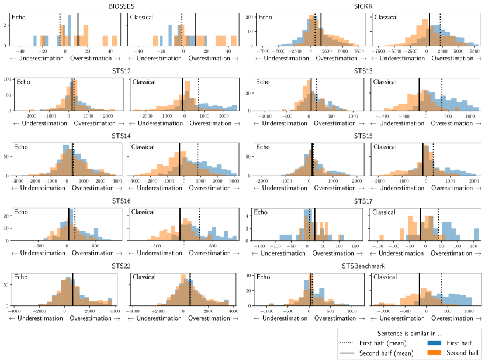

Figure 4: We plot the histogram distribution of the difference between the predicted rank and the ground truth rank of sentence pairs in STS datasets. When predicted rank is larger than the ground truth rank—when the rank difference is positive—then the embedding has overestimated the similarity of this pair. Similarly, negative values imply that the the rank is underestimated. We plot the distribution of these ranks for both classical and echo embeddings where we split the data into two groups: one in which sentences are similar in the first part of the sentence (top 10% by first-half similarity), and another in which sentences are similar in the second part of the sentence (top 10% by second-half similarity).
[/FIGURE]

### C.1 Validating the connection between our synthetic data experiments and real data.

In Section [3](#S3 "3 Echo Embeddings ‣ Repetition Improves Language Model Embeddings"), we hypothesized that classical embeddings would overestimate similarity on sentences where the first half of the sentence are similar, and that echo embeddings would recover from this failure mode. In order to test this hypothesis, we exact a set of examples from the STS datasets included in the MTEB benchmark in which the first half of the sentence is similar, and measure the degree to which the similarity is overestimated.  

As a control, we also select points which are similar in the second half of the sentence, and measure the degree to which similarity is overestimated. By comparing the degree to which sentences which are similar in the first half are overestimated in similarity, and the degree to which sentences which are similar in the second half are overestimated, then we can identify if classical embeddings overestimate similarity in specifically sentences which are similar in the first half. Thus, under our hypothesis, we expect that, for classical embeddings, sentences which are similar in the first half are overestimated in similarity more than sentences that are similar in their second half. On the other hand, we expect that, for echo embeddings, the degree to which similarity is over- or underestimated is independent of whether the sentences are similar in the first or second half of the sentence.  

#### Identifying examples based on similarity in the first/second part of the sentence.

We aim to determine which sentences are most similar in the first half of the sentence or in the second half of the sentence. For each sentence pair $x,y$, we split the sentences in half by number of words, yielding $x=[x_{1},x_{2}]$, and $y=[y_{1},y_{2}]$. We select sentences which are most similar in the first half by using the off-the-shelf masked-language-model-based embedding model bge-base-en-v1.5 (Xiao et al., [2023b](#bib.bib48)). To select sentences that are similar in the first half, we measure the cosine similarity $\operatorname{Sim}(x_{1},y_{1})$ and take the top 10% of sentence pairs $x,y$ which have the highest cosine similarity. Similarly, to select sentences which are similar in the second half, we collect the top 10% of examples by $\operatorname{Sim}(x_{2},y_{2})$. We collect examples from each of the STS datasets in MTEB.  

#### Measuring sentence similarity estimation error.

We must determine the degree to which classical and echo embeddings overestimate similarity. The STS datasets contain sentences pairs which are ranked by similarity: the sentences which are most similar have the highest ground-truth ranking, and the least similar sentences have the lowest. We will denote the ranking of sentence pair $i$ as $r_{i}$. We compute an estimated ranking $\{\hat{r}_{i}\}$ by ranking sentence pairs by the cosine similarity between their embeddings. We can compare the error in our estimated ranking by taking the rank difference $\operatorname{Err}_{i}=\hat{r}_{i}-r_{i}$. When $\operatorname{Err}_{i}>0$, we say that the $i$th sentence pair is overestimated in similarity, and similarly underestimated when $\operatorname{Err}_{i}<0$.  

#### Results.

We plot the the distribution over rank differences for sentences which are similar in the first half and sentences which are similar in the second half for echo and classical embeddings, from all STS datasets (Figure [4](#A3.F4 "Figure 4 ‣ Evaluation of zero-shot results with different validation sets. ‣ Appendix C Additional Zero-shot Results ‣ Repetition Improves Language Model Embeddings")). We also highlight the means of the distributions. In accordance with our hypothesis, we observe that for classical embeddings, sentences which are similar in the first half are generally overestimated in similarity more than sentences which are similar in the second half of the sentence, suggesting that classical embeddings fail particularly on sentences that are similar in early tokens. Further, we generally observe no difference between the estimation error distributions for echo embeddings, which demonstrates that echo embeddings recover from this particular failure mode.  

There are some notable counterexamples: BIOSSES does not exhibit this trend, but has few examples and thus the results may arise from noise alone. Further, STS22 exhibits identical distributions in estimation error between sentences which are similar in the first half and sentences which are similar in the second half, for both classical and echo embeddings. It is unclear why this trend fails to hold for STS22. Nonetheless, the trend holds for every other dataset, suggesting that the conceptual failure of classical embeddings that we identified in Section [3](#S3 "3 Echo Embeddings ‣ Repetition Improves Language Model Embeddings") generalizes to real data.  

#### Qualitative examples.

In addition, we provide qualitative examples of sentence pairs from STSBenchmark where echo embeddings reduce error most, and where echo embeddings reduce error least, in comparison to classical embeddings. More precisely, we plot the top and bottom 7 examples ranked by $|\operatorname{Err}^{\text{classical}}_{i}|-|\operatorname{Err}^{\text{echo}}_{i}|$, where $\operatorname{Err}^{\text{classical}}_{i}$ represents the rank difference of the $i$th example of classical embeddings, and $\operatorname{Err}^{\text{echo}}_{i}$ is similar but for echo embeddings (Table [7](#A4.T7 "Table 7 ‣ Training objective. ‣ Appendix D Additional Finetuning Results ‣ Repetition Improves Language Model Embeddings")).  

## Appendix D Additional Finetuning Results

In this section, we address the omitted details from the finetuning results of the main paper.  

#### Training Datasets.

We follow the setup of Wang et al. ([2023](#bib.bib43)), and use the following datasets: ELI5 (sample ratio 0.1) (Fan et al., [2019](#bib.bib5)), HotpotQA (Yang et al., [2018](#bib.bib50)), FEVER (Thorne et al., [2018](#bib.bib39)), MIRACL (Zhang et al., [2023b](#bib.bib53)), MS-MARCO passage ranking (sample ratio 0.5) and document ranking (sample ratio 0.2) (Bajaj et al., [2018](#bib.bib1)), NQ (Karpukhin et al., [2020](#bib.bib15)), NLI (Gao et al., [2021b](#bib.bib7)), SQuAD (Karpukhin et al., [2020](#bib.bib15)), TriviaQA (Karpukhin et al., [2020](#bib.bib15)), Quora Duplicate Questions (sample ratio 0.1) (DataCanary et al., [2017](#bib.bib2)), Mr- TyDi (Zhang et al., [2021](#bib.bib52)), DuReader (Qiu et al., [2022](#bib.bib29)), and T2Ranking (sample ratio 0.5) (Xie et al., [2023](#bib.bib49)). We use approximately 1.5M training examples.  

#### GPUs.

Training a model takes approximately two days on 4 A100 GPUs.  

#### Instructions for finetuning datasets.

We also follow the setup of Wang et al. ([2023](#bib.bib43)), and use the instructions in Table [3](#A4.T3 "Table 3 ‣ All results. ‣ Appendix D Additional Finetuning Results ‣ Repetition Improves Language Model Embeddings"). For evaluation, we use the instructions found in Table [14](#A4.T14 "Table 14 ‣ Training objective. ‣ Appendix D Additional Finetuning Results ‣ Repetition Improves Language Model Embeddings").  

#### Models on MTEB leaderboard.

We compare our implementation of classical and echo embeddings to state-of-the-art approaches on MTEB. Namely, we display results for UAE-Large-V1 (Li and Li, [2023](#bib.bib19)), multilingual-e5-large (Wang et al., [2024](#bib.bib44)), bge-large-en-v1.5 (Xiao et al., [2023b](#bib.bib48)), udever-bloom-7b (Zhang et al., [2023a](#bib.bib51)), sgpt-5.8b (Muennighoff, [2022](#bib.bib23)), e5-mistral-7b (concurrent work) (Wang et al., [2023](#bib.bib43)).  

#### Additional ablations.

We plot additional ablations, including ablating the role of instructions during training and evaluation, as well as providing an evaluation at step 280 (out of 720 total steps), which is approximately $1/3$ of the duration of training (Table [15](#A4.T15 "Table 15 ‣ Training objective. ‣ Appendix D Additional Finetuning Results ‣ Repetition Improves Language Model Embeddings")). We note that echo embeddings still outperform classical embeddings in this setting.  

#### Performance over training time.

We plot the performance over the duration of training for a subset of MTEB tasks in Figure [11](#A4.F11 "Figure 11 ‣ Training objective. ‣ Appendix D Additional Finetuning Results ‣ Repetition Improves Language Model Embeddings"). Surprisingly, task performance decreases over training for many tasks.  

#### Computational benefits of echo embeddings.

From Table [15](#A4.T15 "Table 15 ‣ Training objective. ‣ Appendix D Additional Finetuning Results ‣ Repetition Improves Language Model Embeddings"), we observe that even after approximately $1/3$ of the total training duration (less than $1/2$), echo embeddings achieve performance higher than classical embeddings achieve after an entire epoch (Table [2](#S5.T2 "Table 2 ‣ 5.2 Evaluation of Finetuned Embeddings ‣ 5 Experiments ‣ Repetition Improves Language Model Embeddings")). Echo embeddings requires twice the computational cost of classical embeddings. However, this result suggests that despite this additional cost per embedding, training with echo embeddings can save on training costs by requiring less than half an epoch of training to outperform classical embeddings. Further, since each data point is only seen once, it implies that echo embeddings are much more data efficient than classical embeddings, which may be helpful when data is costly or difficult to acquire.  

#### All results.

We plot the results for every MTEB dataset for echo embeddings, for classical embeddings, and for bidirectional embeddings in Table [16](#A4.T16 "Table 16 ‣ Training objective. ‣ Appendix D Additional Finetuning Results ‣ Repetition Improves Language Model Embeddings").  

[TABLE A4.T3]

<table class="ltx_tabular ltx_centering ltx_align_middle">
<tbody class="ltx_tbody">
<tr class="ltx_tr">
<td class="ltx_td ltx_align_justify ltx_align_top ltx_border_tt">

NLI

</td>
<td class="ltx_td ltx_align_justify ltx_align_top ltx_border_tt">

Given a premise, retrieve a hypothesis that is entailed by the premise

</td>
</tr>
<tr class="ltx_tr">
<td class="ltx_td ltx_align_justify ltx_align_top">

NLI

</td>
<td class="ltx_td ltx_align_justify ltx_align_top">

Retrieve semantically similar text

</td>
</tr>
<tr class="ltx_tr">
<td class="ltx_td ltx_align_justify ltx_align_top">

DuReader

</td>
<td class="ltx_td ltx_align_justify ltx_align_top">

Given a Chinese search query, retrieve web passages that answer the question

</td>
</tr>
<tr class="ltx_tr">
<td class="ltx_td ltx_align_justify ltx_align_top">

ELI5

</td>
<td class="ltx_td ltx_align_justify ltx_align_top">

Provided a user question, retrieve the highest voted answers on Reddit ELI5 forum

</td>
</tr>
<tr class="ltx_tr">
<td class="ltx_td ltx_align_justify ltx_align_top">

FEVER

</td>
<td class="ltx_td ltx_align_justify ltx_align_top">

Given a claim, retrieve documents that support or refute the claim

</td>
</tr>
<tr class="ltx_tr">
<td class="ltx_td ltx_align_justify ltx_align_top">

HotpotQA

</td>
<td class="ltx_td ltx_align_justify ltx_align_top">

Given a multi-hop question, retrieve documents that can help answer the question

</td>
</tr>
<tr class="ltx_tr">
<td class="ltx_td ltx_align_justify ltx_align_top">

MIRACL

</td>
<td class="ltx_td ltx_align_justify ltx_align_top">

Given a question, retrieve Wikipedia passages that answer the question

</td>
</tr>
<tr class="ltx_tr">
<td class="ltx_td ltx_align_justify ltx_align_top">

MrTyDi

</td>
<td class="ltx_td ltx_align_justify ltx_align_top">

Given a question, retrieve Wikipedia passages that answer the question

</td>
</tr>
<tr class="ltx_tr">
<td class="ltx_td ltx_align_justify ltx_align_top">

MSMARCO Passage

</td>
<td class="ltx_td ltx_align_justify ltx_align_top">

Given a web search query, retrieve relevant passages that answer the query

</td>
</tr>
<tr class="ltx_tr">
<td class="ltx_td ltx_align_justify ltx_align_top">

MSMARCO Document

</td>
<td class="ltx_td ltx_align_justify ltx_align_top">

Given a web search query, retrieve relevant documents that answer the query

</td>
</tr>
<tr class="ltx_tr">
<td class="ltx_td ltx_align_justify ltx_align_top">

NQ

</td>
<td class="ltx_td ltx_align_justify ltx_align_top">

Given a question, retrieve Wikipedia passages that answer the question

</td>
</tr>
<tr class="ltx_tr">
<td class="ltx_td ltx_align_justify ltx_align_top">

QuoraDuplicates

</td>
<td class="ltx_td ltx_align_justify ltx_align_top">

Given a question, retrieve questions that are semantically equivalent to the given question

</td>
</tr>
<tr class="ltx_tr">
<td class="ltx_td ltx_align_justify ltx_align_top">

QuoraDuplicates

</td>
<td class="ltx_td ltx_align_justify ltx_align_top">

Find questions that have the same meaning as the input question

</td>
</tr>
<tr class="ltx_tr">
<td class="ltx_td ltx_align_justify ltx_align_top">

Squad

</td>
<td class="ltx_td ltx_align_justify ltx_align_top">

Retrieve Wikipedia passages that answer the question

</td>
</tr>
<tr class="ltx_tr">
<td class="ltx_td ltx_align_justify ltx_align_top">

T2Ranking

</td>
<td class="ltx_td ltx_align_justify ltx_align_top">

Given a Chinese search query, retrieve web passages that answer the question

</td>
</tr>
<tr class="ltx_tr">
<td class="ltx_td ltx_align_justify ltx_align_top ltx_border_bb">

TriviaQA

</td>
<td class="ltx_td ltx_align_justify ltx_align_top ltx_border_bb">

Retrieve Wikipedia passages that answer the question

</td>
</tr>
</tbody>
</table>

Table 3: Instructions for finetuning datasets.
[/TABLE]

#### Training objective.

For the training objective, we use the SimCSE loss (Gao et al., [2021b](#bib.bib7)). It is defined,  

|  | $\displaystyle\ell_{i}=-\log\frac{\exp\left(\operatorname{Sim}\left(h_{i},h_{i}^{+}\right)/\tau\right)}{\sum_{j=1}^{N}\exp(\operatorname{Sim}\left(h_{i},h_{j}^{-}\right)/\tau)}.$ |  | (3) |
| --- | --- | --- | --- |

In this loss function, $h_{i}$ represents a query (or a reference sentence when the data is symmetric), $h_{i}^{+}$ represents a positive example associated with $h_{i}$, and $\{h_{j}^{-}\}_{j=1}^{N}$ represents the set of negatives associated with the example, including mined hard negatives.  

[TABLE A4.T4]

<table class="ltx_tabular ltx_centering ltx_guessed_headers ltx_align_middle">
<thead class="ltx_thead">
<tr class="ltx_tr">
<th class="ltx_td ltx_align_justify ltx_align_top ltx_th ltx_th_column ltx_border_tt">

<math class="ltx_Math"><semantics><mi>q</mi><annotation-xml><ci>𝑞</ci></annotation-xml><annotation>q</annotation></semantics></math>

</th>
<th class="ltx_td ltx_align_justify ltx_align_top ltx_th ltx_th_column ltx_border_tt">

<math class="ltx_Math"><semantics><msup><mi>s</mi><mo>−</mo></msup><annotation-xml><apply><csymbol>superscript</csymbol><ci>𝑠</ci><minus></minus></apply></annotation-xml><annotation>s^{-}</annotation></semantics></math>

</th>
<th class="ltx_td ltx_align_justify ltx_align_top ltx_th ltx_th_column ltx_border_tt">

<math class="ltx_Math"><semantics><msup><mi>s</mi><mo>+</mo></msup><annotation-xml><apply><csymbol>superscript</csymbol><ci>𝑠</ci><plus></plus></apply></annotation-xml><annotation>s^{+}</annotation></semantics></math>

</th>
</tr>
</thead>
<tbody class="ltx_tbody">
<tr class="ltx_tr">
<td class="ltx_td ltx_align_justify ltx_align_top ltx_border_t">

She loves to travel in summer, especially to cold destinations, avoiding hot and crowded places

</td>
<td class="ltx_td ltx_align_justify ltx_align_top ltx_border_t">

She loves to travel in summer, but prefers to visit hot and bustling tourist spots

</td>
<td class="ltx_td ltx_align_justify ltx_align_top ltx_border_t">

In summer, she adores traveling, specifically to chilly locations, steering clear of warm, populous areas

</td>
</tr>
<tr class="ltx_tr">
<td class="ltx_td ltx_align_justify ltx_align_top ltx_border_t">

The cat often sits by the window, dreaming of chasing birds and enjoying the warm sunshine

</td>
<td class="ltx_td ltx_align_justify ltx_align_top ltx_border_t">

The cat often sits by the window, but is too lazy to dream of chasing anything

</td>
<td class="ltx_td ltx_align_justify ltx_align_top ltx_border_t">

Frequently, the cat lounges near the window, imagining bird pursuits and basking in the sunlight

</td>
</tr>
<tr class="ltx_tr">
<td class="ltx_td ltx_align_justify ltx_align_top ltx_border_t">

He reads books every night, finding solace in fiction and escaping from the stresses of daily life

</td>
<td class="ltx_td ltx_align_justify ltx_align_top ltx_border_t">

He reads books every night, yet he feels that non-fiction is more engaging and informative

</td>
<td class="ltx_td ltx_align_justify ltx_align_top ltx_border_t">

Nightly, he immerses himself in books, seeking comfort in stories and evading everyday tensions

</td>
</tr>
<tr class="ltx_tr">
<td class="ltx_td ltx_align_justify ltx_align_top ltx_border_t">

They play music loudly in the evening, filling their home with energetic beats and vibrant melodies

</td>
<td class="ltx_td ltx_align_justify ltx_align_top ltx_border_t">

They play music loudly in the evening, but only soothing classical tunes to relax

</td>
<td class="ltx_td ltx_align_justify ltx_align_top ltx_border_t">

In the evenings, they blast tunes, their house resonating with lively rhythms and bright harmonies

</td>
</tr>
<tr class="ltx_tr">
<td class="ltx_td ltx_align_justify ltx_align_top ltx_border_t">

She paints landscapes on weekends, expressing her creativity through vibrant colors and abstract forms

</td>
<td class="ltx_td ltx_align_justify ltx_align_top ltx_border_t">

She paints landscapes on weekends, preferring realistic and detailed depictions of nature

</td>
<td class="ltx_td ltx_align_justify ltx_align_top ltx_border_t">

On weekends, she engages in landscape painting, showcasing her artistic flair with lively hues and unconventional shapes

</td>
</tr>
<tr class="ltx_tr">
<td class="ltx_td ltx_align_justify ltx_align_top ltx_border_t">

The children eagerly await winter, dreaming of snowball fights and building snowmen

</td>
<td class="ltx_td ltx_align_justify ltx_align_top ltx_border_t">

The children eagerly await winter, yet they dislike the cold and prefer staying indoors

</td>
<td class="ltx_td ltx_align_justify ltx_align_top ltx_border_t">

During winter, the kids are excited, imagining snow battles and constructing snow figures

</td>
</tr>
<tr class="ltx_tr">
<td class="ltx_td ltx_align_justify ltx_align_top ltx_border_t">

He often jokes at parties, becoming the center of attention with his witty humor

</td>
<td class="ltx_td ltx_align_justify ltx_align_top ltx_border_t">

He often jokes at parties, but tends to alienate others with his sarcasm

</td>
<td class="ltx_td ltx_align_justify ltx_align_top ltx_border_t">

At social gatherings, he frequently makes jokes, captivating the crowd with his clever wit

</td>
</tr>
<tr class="ltx_tr">
<td class="ltx_td ltx_align_justify ltx_align_top ltx_border_t">

She collects antique vases, adoring their unique designs and historical significance

</td>
<td class="ltx_td ltx_align_justify ltx_align_top ltx_border_t">

She collects antique vases, but is indifferent to their history and focuses on their resale value

</td>
<td class="ltx_td ltx_align_justify ltx_align_top ltx_border_t">

Her hobby is gathering old vases, cherishing their distinct patterns and the stories they hold

</td>
</tr>
<tr class="ltx_tr">
<td class="ltx_td ltx_align_justify ltx_align_top ltx_border_t">

The band plays rock music loudly, thrilling audiences with energetic performances and powerful lyrics

</td>
<td class="ltx_td ltx_align_justify ltx_align_top ltx_border_t">

The band plays rock music loudly, but often receives complaints for being too noisy

</td>
<td class="ltx_td ltx_align_justify ltx_align_top ltx_border_t">

Performing rock loudly, the band excites crowds with dynamic shows and impactful words

</td>
</tr>
<tr class="ltx_tr">
<td class="ltx_td ltx_align_justify ltx_align_top ltx_border_t">

He prefers working at night, enjoying the quiet and focusing better without distractions

</td>
<td class="ltx_td ltx_align_justify ltx_align_top ltx_border_t">

He prefers working at night, despite feeling more tired and less productive

</td>
<td class="ltx_td ltx_align_justify ltx_align_top ltx_border_t">

Nighttime is his preferred work period, appreciating the tranquility and concentrated environment

</td>
</tr>
<tr class="ltx_tr">
<td class="ltx_td ltx_align_justify ltx_align_top ltx_border_bb ltx_border_t">

She writes poetry in her free time, pouring her emotions and experiences into each verse

</td>
<td class="ltx_td ltx_align_justify ltx_align_top ltx_border_bb ltx_border_t">

She writes poetry in her free time, but struggles to find inspiration and motivation

</td>
<td class="ltx_td ltx_align_justify ltx_align_top ltx_border_bb ltx_border_t">

During her leisure, she crafts poems, infusing her feelings and life stories into every line

</td>
</tr>
</tbody>
</table>

Table 4: Examples of Structure 1 from Section [3](#S3 "3 Echo Embeddings ‣ Repetition Improves Language Model Embeddings")
[/TABLE]

[TABLE A4.T5]

<table class="ltx_tabular ltx_centering ltx_guessed_headers ltx_align_middle">
<thead class="ltx_thead">
<tr class="ltx_tr">
<th class="ltx_td ltx_align_justify ltx_align_top ltx_th ltx_th_column ltx_border_tt">

<math class="ltx_Math"><semantics><mi>q</mi><annotation-xml><ci>𝑞</ci></annotation-xml><annotation>q</annotation></semantics></math>

</th>
<th class="ltx_td ltx_align_justify ltx_align_top ltx_th ltx_th_column ltx_border_tt">

<math class="ltx_Math"><semantics><msup><mi>s</mi><mo>−</mo></msup><annotation-xml><apply><csymbol>superscript</csymbol><ci>𝑠</ci><minus></minus></apply></annotation-xml><annotation>s^{-}</annotation></semantics></math>

</th>
<th class="ltx_td ltx_align_justify ltx_align_top ltx_th ltx_th_column ltx_border_tt">

<math class="ltx_Math"><semantics><msup><mi>s</mi><mo>+</mo></msup><annotation-xml><apply><csymbol>superscript</csymbol><ci>𝑠</ci><plus></plus></apply></annotation-xml><annotation>s^{+}</annotation></semantics></math>

</th>
</tr>
</thead>
<tbody class="ltx_tbody">
<tr class="ltx_tr">
<td class="ltx_td ltx_align_justify ltx_align_top ltx_border_t">

On sunny days, I often find myself longing for the cool breeze of the ocean and the sound of waves crashing, as I enjoy outdoor activities

</td>
<td class="ltx_td ltx_align_justify ltx_align_top ltx_border_t">

During rainy days, I usually prefer the warmth and quiet of my home, as I enjoy outdoor activities

</td>
<td class="ltx_td ltx_align_justify ltx_align_top ltx_border_t">

When the sun is shining, I tend to crave the refreshing sea air and the rhythmic sound of the ocean, since I relish spending time outdoors

</td>
</tr>
<tr class="ltx_tr">
<td class="ltx_td ltx_align_justify ltx_align_top ltx_border_t">

As a lover of classical music, I spend hours listening to Beethoven and Bach, reveling in the complexity of their compositions, though I’m fond of playing the guitar

</td>
<td class="ltx_td ltx_align_justify ltx_align_top ltx_border_t">

Despite my preference for rock music, I rarely spend time on music other than playing my favorite tunes on the guitar, though I’m fond of playing the guitar

</td>
<td class="ltx_td ltx_align_justify ltx_align_top ltx_border_t">

Being an enthusiast of classical melodies, I often indulge in lengthy sessions of Beethoven and Bach, appreciating the intricacies of their work, as I delight in guitar playing

</td>
</tr>
<tr class="ltx_tr">
<td class="ltx_td ltx_align_justify ltx_align_top ltx_border_t">

In the world of literature, I have an insatiable appetite for mystery novels and spend countless evenings unraveling their plots, but I adore reading poetry

</td>
<td class="ltx_td ltx_align_justify ltx_align_top ltx_border_t">

Contrary to my usual tastes, I rarely delve into mystery novels and prefer lighter reading materials, but I adore reading poetry

</td>
<td class="ltx_td ltx_align_justify ltx_align_top ltx_border_t">

As a fervent reader, my passion lies in the twists and turns of mystery stories, which I often explore during long nights, yet I cherish reading poetry

</td>
</tr>
<tr class="ltx_tr">
<td class="ltx_td ltx_align_justify ltx_align_top ltx_border_t">

Growing up in a bustling city, I’ve always been surrounded by the constant hum of activity and the bright city lights, which makes me appreciate quiet countryside walks

</td>
<td class="ltx_td ltx_align_justify ltx_align_top ltx_border_t">

Having been raised in a tranquil rural area, I’m more accustomed to the sounds of nature and open fields, which makes me appreciate quiet countryside walks

</td>
<td class="ltx_td ltx_align_justify ltx_align_top ltx_border_t">

Raised in the lively atmosphere of an urban environment, I’m used to the never-ending city noise and glowing nights, leading me to enjoy the serenity of rural strolls

</td>
</tr>
<tr class="ltx_tr">
<td class="ltx_td ltx_align_justify ltx_align_top ltx_border_t">

Ever since I was a child, fascinated by the vastness of the universe, I would spend countless nights gazing at the stars through my telescope, dreaming of exploring distant galaxies, yet I still find solace in simple nature hikes

</td>
<td class="ltx_td ltx_align_justify ltx_align_top ltx_border_t">

Though I’ve always been more interested in the immediate world around me, preferring to focus on the tangible and the present, I rarely look up at the night sky, yet I still find solace in simple nature hikes

</td>
<td class="ltx_td ltx_align_justify ltx_align_top ltx_border_t">

From my early years, captivated by the infinity of space, I devoted many nights to star-gazing and imagining interstellar journeys, but I also enjoy the peace of nature walks

</td>
</tr>
<tr class="ltx_tr">
<td class="ltx_td ltx_align_justify ltx_align_top ltx_border_bb ltx_border_t">

Growing up with a passion for culinary arts, experimenting with exotic ingredients and complex recipes, and often spending whole days in the kitchen perfecting new dishes, I also have a deep appreciation for classic literature

</td>
<td class="ltx_td ltx_align_justify ltx_align_top ltx_border_bb ltx_border_t">

Despite my lack of interest in cooking and a preference for simple, quick meals that require minimal preparation, I’m not one to spend time in the kitchen, I also have a deep appreciation for classic literature

</td>
<td class="ltx_td ltx_align_justify ltx_align_top ltx_border_bb ltx_border_t">

Since childhood, I’ve been enthusiastic about cooking, often trying out unusual ingredients and intricate recipes, dedicating entire days to refining my culinary creations, and I equally cherish classic literary works

</td>
</tr>
</tbody>
</table>

Table 5: Examples of Structure 2 from Section [3](#S3 "3 Echo Embeddings ‣ Repetition Improves Language Model Embeddings")
[/TABLE]

[TABLE A4.T6]

<table class="ltx_tabular ltx_centering ltx_guessed_headers ltx_align_middle">
<thead class="ltx_thead">
<tr class="ltx_tr">
<th class="ltx_td ltx_align_justify ltx_align_top ltx_th ltx_th_column ltx_border_tt">

<math class="ltx_Math"><semantics><mi>q</mi><annotation-xml><ci>𝑞</ci></annotation-xml><annotation>q</annotation></semantics></math>

</th>
<th class="ltx_td ltx_align_justify ltx_align_top ltx_th ltx_th_column ltx_border_tt">

<math class="ltx_Math"><semantics><msup><mi>s</mi><mo>−</mo></msup><annotation-xml><apply><csymbol>superscript</csymbol><ci>𝑠</ci><minus></minus></apply></annotation-xml><annotation>s^{-}</annotation></semantics></math>

</th>
<th class="ltx_td ltx_align_justify ltx_align_top ltx_th ltx_th_column ltx_border_tt">

<math class="ltx_Math"><semantics><msup><mi>s</mi><mo>+</mo></msup><annotation-xml><apply><csymbol>superscript</csymbol><ci>𝑠</ci><plus></plus></apply></annotation-xml><annotation>s^{+}</annotation></semantics></math>

</th>
</tr>
</thead>
<tbody class="ltx_tbody">
<tr class="ltx_tr">
<td class="ltx_td ltx_align_justify ltx_align_top ltx_border_t">

SShe loves to travel in summer, especially to cold destinations, avoiding hot and crowded places

</td>
<td class="ltx_td ltx_align_justify ltx_align_top ltx_border_t">

She loves to travel in summer, but prefers to visit hot and bustling tourist spots

</td>
<td class="ltx_td ltx_align_justify ltx_align_top ltx_border_t">

She loves to travel in summer, specifically to chilly locations, steering clear of warm, populous areas

</td>
</tr>
<tr class="ltx_tr">
<td class="ltx_td ltx_align_justify ltx_align_top ltx_border_t">

The cat often sits by the window, dreaming of chasing birds and enjoying the warm sunshine

</td>
<td class="ltx_td ltx_align_justify ltx_align_top ltx_border_t">

The cat often sits by the window, but is too lazy to dream of chasing anything

</td>
<td class="ltx_td ltx_align_justify ltx_align_top ltx_border_t">

The cat often sits by the window, imagining bird pursuits and basking in the sunlight

</td>
</tr>
<tr class="ltx_tr">
<td class="ltx_td ltx_align_justify ltx_align_top ltx_border_t">

He reads books every night, finding solace in fiction and escaping from the stresses of daily life

</td>
<td class="ltx_td ltx_align_justify ltx_align_top ltx_border_t">

He reads books every night, yet he feels that non-fiction is more engaging and informative

</td>
<td class="ltx_td ltx_align_justify ltx_align_top ltx_border_t">

He reads books every night, seeking comfort in stories and evading everyday tensions

</td>
</tr>
<tr class="ltx_tr">
<td class="ltx_td ltx_align_justify ltx_align_top ltx_border_t">

They play music loudly in the evening, filling their home with energetic beats and vibrant melodies

</td>
<td class="ltx_td ltx_align_justify ltx_align_top ltx_border_t">

They play music loudly in the evening, but only soothing classical tunes to relax

</td>
<td class="ltx_td ltx_align_justify ltx_align_top ltx_border_t">

They play music loudly in the evening, their house resonating with lively rhythms and bright harmonies

</td>
</tr>
<tr class="ltx_tr">
<td class="ltx_td ltx_align_justify ltx_align_top ltx_border_t">

She paints landscapes on weekends, expressing her creativity through vibrant colors and abstract forms

</td>
<td class="ltx_td ltx_align_justify ltx_align_top ltx_border_t">

She paints landscapes on weekends, preferring realistic and detailed depictions of nature

</td>
<td class="ltx_td ltx_align_justify ltx_align_top ltx_border_t">

She paints landscapes on weekends, showcasing her artistic flair with lively hues and unconventional shapes

</td>
</tr>
<tr class="ltx_tr">
<td class="ltx_td ltx_align_justify ltx_align_top ltx_border_t">

The children eagerly await winter, dreaming of snowball fights and building snowmen

</td>
<td class="ltx_td ltx_align_justify ltx_align_top ltx_border_t">

The children eagerly await winter, yet they dislike the cold and prefer staying indoors

</td>
<td class="ltx_td ltx_align_justify ltx_align_top ltx_border_t">

The children eagerly await winter, imagining snow battles and constructing snow figures

</td>
</tr>
<tr class="ltx_tr">
<td class="ltx_td ltx_align_justify ltx_align_top ltx_border_t">

He often jokes at parties, becoming the center of attention with his witty humor

</td>
<td class="ltx_td ltx_align_justify ltx_align_top ltx_border_t">

He often jokes at parties, but tends to alienate others with his sarcasm

</td>
<td class="ltx_td ltx_align_justify ltx_align_top ltx_border_t">

He often jokes at parties, captivating the crowd with his clever wit

</td>
</tr>
<tr class="ltx_tr">
<td class="ltx_td ltx_align_justify ltx_align_top ltx_border_t">

She collects antique vases, adoring their unique designs and historical significance

</td>
<td class="ltx_td ltx_align_justify ltx_align_top ltx_border_t">

She collects antique vases, but is indifferent to their history and focuses on their resale value

</td>
<td class="ltx_td ltx_align_justify ltx_align_top ltx_border_t">

She collects antique vases, cherishing their distinct patterns and the stories they hold

</td>
</tr>
<tr class="ltx_tr">
<td class="ltx_td ltx_align_justify ltx_align_top ltx_border_t">

The band plays rock music loudly, thrilling audiences with energetic performances and powerful lyrics

</td>
<td class="ltx_td ltx_align_justify ltx_align_top ltx_border_t">

The band plays rock music loudly, but often receives complaints for being too noisy

</td>
<td class="ltx_td ltx_align_justify ltx_align_top ltx_border_t">

The band plays rock music loudly, the band excites crowds with dynamic shows and impactful words

</td>
</tr>
<tr class="ltx_tr">
<td class="ltx_td ltx_align_justify ltx_align_top ltx_border_t">

He prefers working at night, enjoying the quiet and focusing better without distractions

</td>
<td class="ltx_td ltx_align_justify ltx_align_top ltx_border_t">

He prefers working at night, despite feeling more tired and less productive

</td>
<td class="ltx_td ltx_align_justify ltx_align_top ltx_border_t">

He prefers working at night, appreciating the tranquility and concentrated environment

</td>
</tr>
<tr class="ltx_tr">
<td class="ltx_td ltx_align_justify ltx_align_top ltx_border_bb ltx_border_t">

She writes poetry in her free time, pouring her emotions and experiences into each verse

</td>
<td class="ltx_td ltx_align_justify ltx_align_top ltx_border_bb ltx_border_t">

She writes poetry in her free time, but struggles to find inspiration and motivation

</td>
<td class="ltx_td ltx_align_justify ltx_align_top ltx_border_bb ltx_border_t">

She writes poetry in her free time, infusing her feelings and life stories into every line

</td>
</tr>
</tbody>
</table>

Table 6: Examples of Structure 3 from Section [3](#S3 "3 Echo Embeddings ‣ Repetition Improves Language Model Embeddings")
[/TABLE]

[TABLE A4.T7]

<table class="ltx_tabular ltx_centering ltx_guessed_headers ltx_align_middle">
<thead class="ltx_thead">
<tr class="ltx_tr">
<th class="ltx_td ltx_align_center ltx_th ltx_th_column ltx_border_tt">Most improved</th>
<th class="ltx_td ltx_align_center ltx_th ltx_th_column ltx_border_tt">Least improved</th>
</tr>
<tr class="ltx_tr">
<th class="ltx_td ltx_align_center ltx_th ltx_th_column">Sentence 1</th>
<th class="ltx_td ltx_align_center ltx_th ltx_th_column">Sentence 2</th>
<th class="ltx_td ltx_align_center ltx_th ltx_th_column">Score</th>
<th class="ltx_td ltx_align_center ltx_th ltx_th_column">Sentence 1</th>
<th class="ltx_td ltx_align_center ltx_th ltx_th_column">Sentence 2</th>
<th class="ltx_td ltx_align_center ltx_th ltx_th_column">Score</th>
</tr>
</thead>
<tbody class="ltx_tbody">
<tr class="ltx_tr">
<td class="ltx_td ltx_align_justify ltx_border_t">

The best thing you can do is to know your stuff.

</td>
<td class="ltx_td ltx_align_justify ltx_border_t">

The best thing to do is to overcome the fussiness.

</td>
<td class="ltx_td ltx_align_center ltx_border_t">0.0</td>
<td class="ltx_td ltx_align_justify ltx_border_t">

Sometime if you really want it you might need to pay an agency to get the place for you.

</td>
<td class="ltx_td ltx_align_justify ltx_border_t">

You could probably get a tour agency to do it for you but it would cost you.

</td>
<td class="ltx_td ltx_align_center ltx_border_t">2.0</td>
</tr>
<tr class="ltx_tr">
<td class="ltx_td ltx_align_justify ltx_border_t">

It really doesn’t matter.

</td>
<td class="ltx_td ltx_align_justify ltx_border_t">

It doesn’t matter unless it is really far off.

</td>
<td class="ltx_td ltx_align_center ltx_border_t">3.0</td>
<td class="ltx_td ltx_align_justify ltx_border_t">

There are three options:

</td>
<td class="ltx_td ltx_align_justify ltx_border_t">

There are only three options:

</td>
<td class="ltx_td ltx_align_center ltx_border_t">5.0</td>
</tr>
<tr class="ltx_tr">
<td class="ltx_td ltx_align_justify ltx_border_t">

I think it’s fine to ask this question.

</td>
<td class="ltx_td ltx_align_justify ltx_border_t">

I think it is okay to ask the question.

</td>
<td class="ltx_td ltx_align_center ltx_border_t">5.0</td>
<td class="ltx_td ltx_align_justify ltx_border_t">

Bremer said one initiative is to launch a US$70 million nationwide program in the next two weeks to clean up neighborhoods and build community projects.

</td>
<td class="ltx_td ltx_align_justify ltx_border_t">

Bremer said he would launch a $70-million program in the next two weeks to clean up neighborhoods across Iraq and build community projects, but gave no details.

</td>
<td class="ltx_td ltx_align_center ltx_border_t">3.6</td>
</tr>
<tr class="ltx_tr">
<td class="ltx_td ltx_align_justify ltx_border_t">

What kind of insulation is it?

</td>
<td class="ltx_td ltx_align_justify ltx_border_t">

What kind of floors are above?

</td>
<td class="ltx_td ltx_align_center ltx_border_t">0.0</td>
<td class="ltx_td ltx_align_justify ltx_border_t">

"Tony’s not feeling well," Spurs coach Gregg Popovich said.

</td>
<td class="ltx_td ltx_align_justify ltx_border_t">

We’re thrilled to be up 3-2,” Coach Gregg Popovich said Wednesday.

</td>
<td class="ltx_td ltx_align_center ltx_border_t">1.6</td>
</tr>
<tr class="ltx_tr">
<td class="ltx_td ltx_align_justify ltx_border_t">

It depends entirely on your company and your contract.

</td>
<td class="ltx_td ltx_align_justify ltx_border_t">

I guess it depends on the nature of your contract.

</td>
<td class="ltx_td ltx_align_center ltx_border_t">4.0</td>
<td class="ltx_td ltx_align_justify ltx_border_t">

Shares of Mandalay closed down eight cents to $29.42, before the earnings were announced.

</td>
<td class="ltx_td ltx_align_justify ltx_border_t">

Shares of Mandalay closed down 8 cents at $29.42 Thursday.

</td>
<td class="ltx_td ltx_align_center ltx_border_t">4.0</td>
</tr>
<tr class="ltx_tr">
<td class="ltx_td ltx_align_justify ltx_border_t">

You need to read a lot to know what you like and what you don’t.

</td>
<td class="ltx_td ltx_align_justify ltx_border_t">

You have to know what you want to do.

</td>
<td class="ltx_td ltx_align_center ltx_border_t">0.0</td>
<td class="ltx_td ltx_align_justify ltx_border_t">

Singapore reported no suspected SARS cases Wednesday, but officials quarantined 70 people who had contact with the Taiwanese patient.

</td>
<td class="ltx_td ltx_align_justify ltx_border_t">

Still, Singapore quarantined 70 people who had been in close contact with the scientist.

</td>
<td class="ltx_td ltx_align_center ltx_border_t">3.0</td>
</tr>
<tr class="ltx_tr">
<td class="ltx_td ltx_align_justify ltx_border_bb ltx_border_t">

I would say you can do it, but it wouldn’t be advised.

</td>
<td class="ltx_td ltx_align_justify ltx_border_bb ltx_border_t">

Personally, I would say not unless it suits you.

</td>
<td class="ltx_td ltx_align_center ltx_border_bb ltx_border_t">2.0</td>
<td class="ltx_td ltx_align_justify ltx_border_bb ltx_border_t">

The dollar was at 117.85 yen against the Japanese currency, up 0.1 percent.

</td>
<td class="ltx_td ltx_align_justify ltx_border_bb ltx_border_t">

Against the Swiss franc the dollar was at 1.3289 francs, up 0.5 percent on the day.

</td>
<td class="ltx_td ltx_align_center ltx_border_bb ltx_border_t">1.333</td>
</tr>
</tbody>
</table>

Table 7: Example sentences from STSBenchmark in which zero-shot echo embeddings with Mistral 7B most improve (left) and least improve (right).
[/TABLE]

[FIGURE A4.F5.g1]
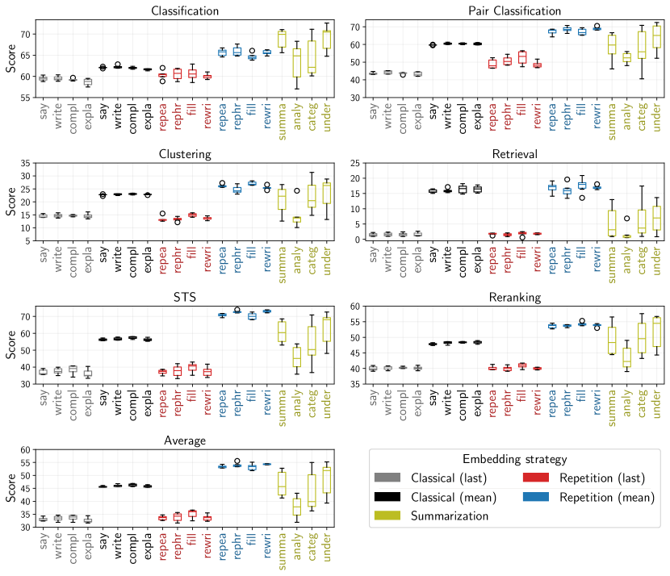

Figure 5: Variance over different prompting strategies for zero-shot Mistral-7B.
[/FIGURE]

[FIGURE A4.F6.g1]
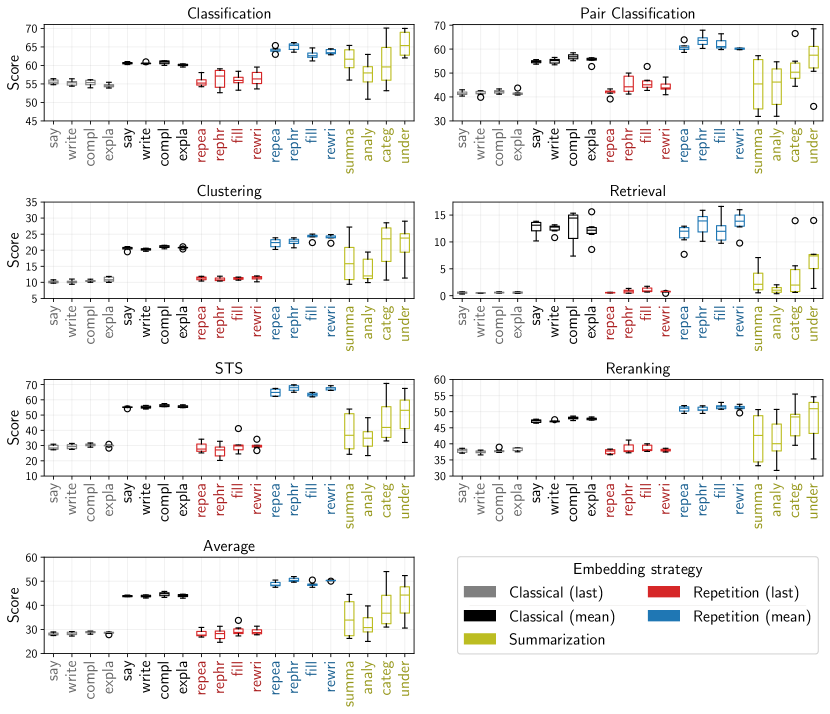

Figure 6: Variance over different prompting strategies for zero-shot LLaMa-2-7B.
[/FIGURE]

[FIGURE A4.F7.g1]
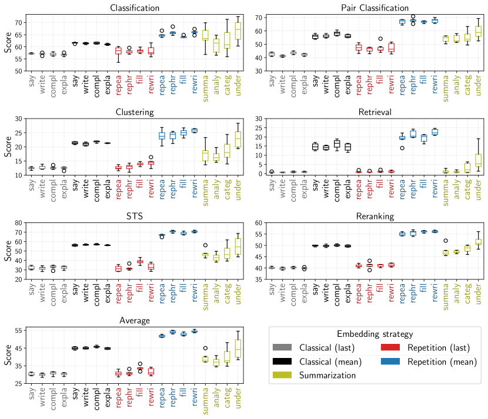

Figure 7: Variance over different prompting strategies for zero-shot LLaMa-2-13B.
[/FIGURE]

[FIGURE A4.F8.g1]
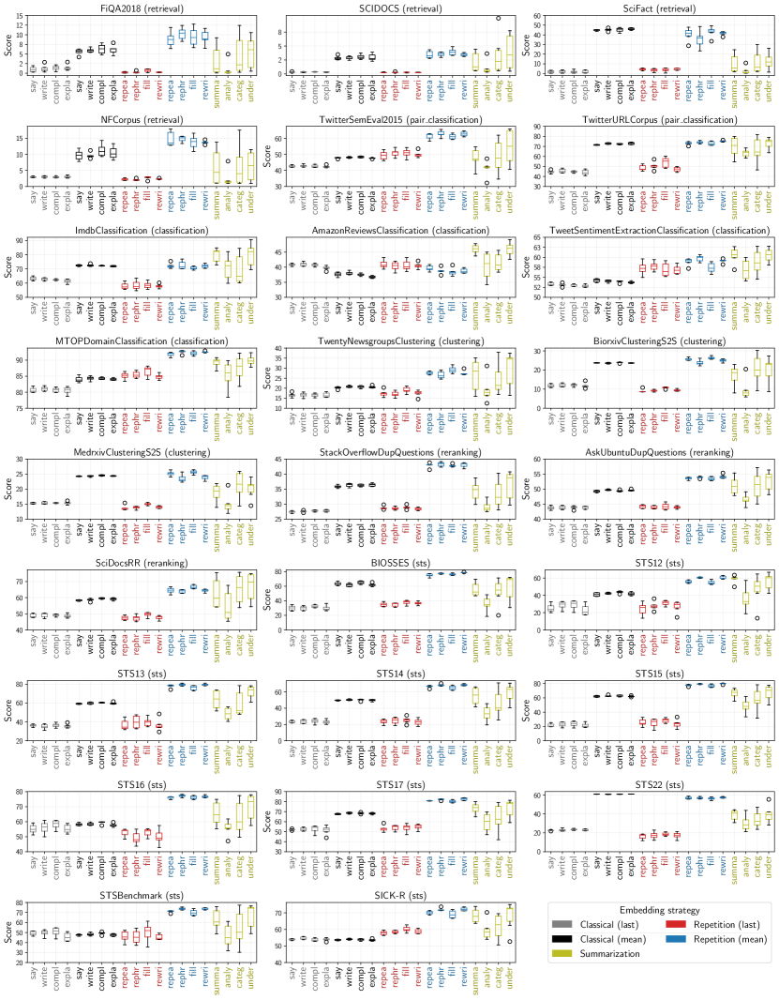

Figure 8: Variance over different prompting strategies for all evaluated datasets for zero-shot Mistral-7B.
[/FIGURE]

[FIGURE A4.F9.g1]
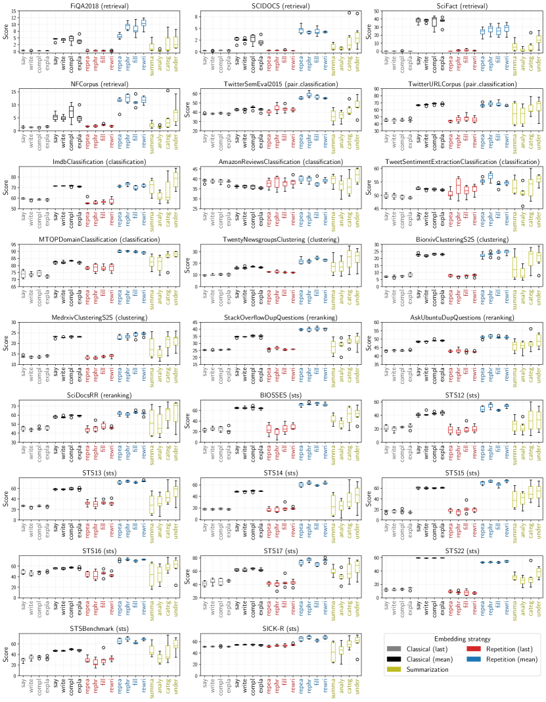

Figure 9: Variance over different prompting strategies for all evaluated datasets for zero-shot LLaMa-2-7B.
[/FIGURE]

[FIGURE A4.F10.g1]
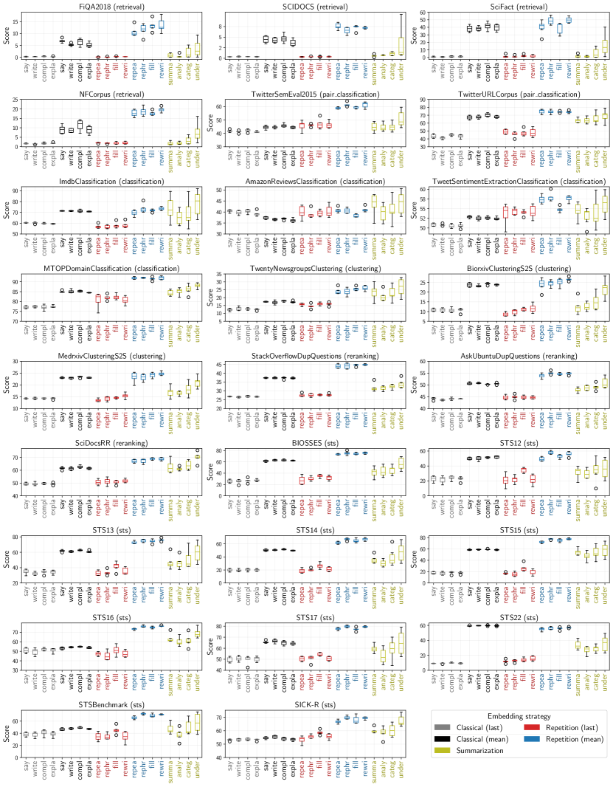

Figure 10: Variance over different prompting strategies for all evaluated datasets for zero-shot LLaMa-2-13B.
[/FIGURE]

[TABLE A4.T8]

<table class="ltx_tabular ltx_centering ltx_guessed_headers ltx_align_middle">
<thead class="ltx_thead">
<tr class="ltx_tr">
<th class="ltx_td ltx_align_left ltx_th ltx_th_column ltx_th_row ltx_border_tt">Validation Dataset</th>
<th class="ltx_td ltx_align_right ltx_th ltx_th_column ltx_border_tt">Classification</th>
<th class="ltx_td ltx_align_right ltx_th ltx_th_column ltx_border_tt">Pair Classification</th>
<th class="ltx_td ltx_align_right ltx_th ltx_th_column ltx_border_tt">Clustering</th>
<th class="ltx_td ltx_align_right ltx_th ltx_th_column ltx_border_tt">Retrieval</th>
<th class="ltx_td ltx_align_right ltx_th ltx_th_column ltx_border_tt">STS</th>
<th class="ltx_td ltx_align_right ltx_th ltx_th_column ltx_border_tt">Reranking</th>
<th class="ltx_td ltx_align_right ltx_th ltx_th_column ltx_border_tt">Average</th>
</tr>
</thead>
<tbody class="ltx_tbody">
<tr class="ltx_tr">
<th class="ltx_td ltx_align_left ltx_th ltx_th_row ltx_border_t">Classical</th>
<td class="ltx_td ltx_border_t"></td>
<td class="ltx_td ltx_border_t"></td>
<td class="ltx_td ltx_border_t"></td>
<td class="ltx_td ltx_border_t"></td>
<td class="ltx_td ltx_border_t"></td>
<td class="ltx_td ltx_border_t"></td>
<td class="ltx_td ltx_border_t"></td>
</tr>
<tr class="ltx_tr">
<th class="ltx_td ltx_align_left ltx_th ltx_th_row">Classification</th>
<td class="ltx_td ltx_align_right">59.20</td>
<td class="ltx_td ltx_align_right">73.80</td>
<td class="ltx_td ltx_align_right">24.16</td>
<td class="ltx_td ltx_align_right">20.57</td>
<td class="ltx_td ltx_align_right">58.59</td>
<td class="ltx_td ltx_align_right">54.54</td>
<td class="ltx_td ltx_align_right">46.79</td>
</tr>
<tr class="ltx_tr">
<th class="ltx_td ltx_align_left ltx_th ltx_th_row">Pair Classification</th>
<td class="ltx_td ltx_align_right">58.73</td>
<td class="ltx_td ltx_align_right">71.40</td>
<td class="ltx_td ltx_align_right">24.32</td>
<td class="ltx_td ltx_align_right">20.39</td>
<td class="ltx_td ltx_align_right">59.00</td>
<td class="ltx_td ltx_align_right">54.42</td>
<td class="ltx_td ltx_align_right">46.64</td>
</tr>
<tr class="ltx_tr">
<th class="ltx_td ltx_align_left ltx_th ltx_th_row">Clustering</th>
<td class="ltx_td ltx_align_right">58.23</td>
<td class="ltx_td ltx_align_right">72.62</td>
<td class="ltx_td ltx_align_right">23.90</td>
<td class="ltx_td ltx_align_right">18.64</td>
<td class="ltx_td ltx_align_right">56.68</td>
<td class="ltx_td ltx_align_right">54.82</td>
<td class="ltx_td ltx_align_right">45.37</td>
</tr>
<tr class="ltx_tr">
<th class="ltx_td ltx_align_left ltx_th ltx_th_row">Retrieval</th>
<td class="ltx_td ltx_align_right">58.21</td>
<td class="ltx_td ltx_align_right">73.87</td>
<td class="ltx_td ltx_align_right">23.85</td>
<td class="ltx_td ltx_align_right">20.35</td>
<td class="ltx_td ltx_align_right">56.97</td>
<td class="ltx_td ltx_align_right">54.44</td>
<td class="ltx_td ltx_align_right">45.88</td>
</tr>
<tr class="ltx_tr">
<th class="ltx_td ltx_align_left ltx_th ltx_th_row">STS</th>
<td class="ltx_td ltx_align_right">58.31</td>
<td class="ltx_td ltx_align_right">44.03</td>
<td class="ltx_td ltx_align_right">13.07</td>
<td class="ltx_td ltx_align_right">2.63</td>
<td class="ltx_td ltx_align_right">38.95</td>
<td class="ltx_td ltx_align_right">46.77</td>
<td class="ltx_td ltx_align_right">34.63</td>
</tr>
<tr class="ltx_tr">
<th class="ltx_td ltx_align_left ltx_th ltx_th_row">Reranking</th>
<td class="ltx_td ltx_align_right">58.13</td>
<td class="ltx_td ltx_align_right">71.77</td>
<td class="ltx_td ltx_align_right">24.20</td>
<td class="ltx_td ltx_align_right">20.23</td>
<td class="ltx_td ltx_align_right">58.59</td>
<td class="ltx_td ltx_align_right">54.89</td>
<td class="ltx_td ltx_align_right">46.43</td>
</tr>
<tr class="ltx_tr">
<th class="ltx_td ltx_align_left ltx_th ltx_th_row ltx_border_t">Echo</th>
<td class="ltx_td ltx_border_t"></td>
<td class="ltx_td ltx_border_t"></td>
<td class="ltx_td ltx_border_t"></td>
<td class="ltx_td ltx_border_t"></td>
<td class="ltx_td ltx_border_t"></td>
<td class="ltx_td ltx_border_t"></td>
<td class="ltx_td ltx_border_t"></td>
</tr>
<tr class="ltx_tr">
<th class="ltx_td ltx_align_left ltx_th ltx_th_row">Classification</th>
<td class="ltx_td ltx_align_right">64.50</td>
<td class="ltx_td ltx_align_right">74.65</td>
<td class="ltx_td ltx_align_right">25.93</td>
<td class="ltx_td ltx_align_right">22.52</td>
<td class="ltx_td ltx_align_right">73.81</td>
<td class="ltx_td ltx_align_right">59.41</td>
<td class="ltx_td ltx_align_right">55.57</td>
</tr>
<tr class="ltx_tr">
<th class="ltx_td ltx_align_left ltx_th ltx_th_row">Pair Classification</th>
<td class="ltx_td ltx_align_right">64.15</td>
<td class="ltx_td ltx_align_right">75.93</td>
<td class="ltx_td ltx_align_right">22.25</td>
<td class="ltx_td ltx_align_right">18.35</td>
<td class="ltx_td ltx_align_right">72.75</td>
<td class="ltx_td ltx_align_right">58.47</td>
<td class="ltx_td ltx_align_right">54.15</td>
</tr>
<tr class="ltx_tr">
<th class="ltx_td ltx_align_left ltx_th ltx_th_row">Clustering</th>
<td class="ltx_td ltx_align_right">61.54</td>
<td class="ltx_td ltx_align_right">71.04</td>
<td class="ltx_td ltx_align_right">26.32</td>
<td class="ltx_td ltx_align_right">15.88</td>
<td class="ltx_td ltx_align_right">68.18</td>
<td class="ltx_td ltx_align_right">60.27</td>
<td class="ltx_td ltx_align_right">51.81</td>
</tr>
<tr class="ltx_tr">
<th class="ltx_td ltx_align_left ltx_th ltx_th_row">Retrieval</th>
<td class="ltx_td ltx_align_right">64.06</td>
<td class="ltx_td ltx_align_right">75.26</td>
<td class="ltx_td ltx_align_right">27.02</td>
<td class="ltx_td ltx_align_right">23.61</td>
<td class="ltx_td ltx_align_right">72.40</td>
<td class="ltx_td ltx_align_right">60.00</td>
<td class="ltx_td ltx_align_right">55.07</td>
</tr>
<tr class="ltx_tr">
<th class="ltx_td ltx_align_left ltx_th ltx_th_row">STS</th>
<td class="ltx_td ltx_align_right">64.50</td>
<td class="ltx_td ltx_align_right">74.65</td>
<td class="ltx_td ltx_align_right">25.93</td>
<td class="ltx_td ltx_align_right">22.52</td>
<td class="ltx_td ltx_align_right">73.81</td>
<td class="ltx_td ltx_align_right">59.41</td>
<td class="ltx_td ltx_align_right">55.57</td>
</tr>
<tr class="ltx_tr">
<th class="ltx_td ltx_align_left ltx_th ltx_th_row">Reranking</th>
<td class="ltx_td ltx_align_right">64.15</td>
<td class="ltx_td ltx_align_right">75.93</td>
<td class="ltx_td ltx_align_right">22.25</td>
<td class="ltx_td ltx_align_right">18.35</td>
<td class="ltx_td ltx_align_right">72.75</td>
<td class="ltx_td ltx_align_right">58.47</td>
<td class="ltx_td ltx_align_right">54.15</td>
</tr>
<tr class="ltx_tr">
<th class="ltx_td ltx_align_left ltx_th ltx_th_row ltx_border_t">Summarization</th>
<td class="ltx_td ltx_border_t"></td>
<td class="ltx_td ltx_border_t"></td>
<td class="ltx_td ltx_border_t"></td>
<td class="ltx_td ltx_border_t"></td>
<td class="ltx_td ltx_border_t"></td>
<td class="ltx_td ltx_border_t"></td>
<td class="ltx_td ltx_border_t"></td>
</tr>
<tr class="ltx_tr">
<th class="ltx_td ltx_align_left ltx_th ltx_th_row">Classification</th>
<td class="ltx_td ltx_align_right">66.62</td>
<td class="ltx_td ltx_align_right">78.95</td>
<td class="ltx_td ltx_align_right">21.79</td>
<td class="ltx_td ltx_align_right">14.68</td>
<td class="ltx_td ltx_align_right">72.13</td>
<td class="ltx_td ltx_align_right">64.24</td>
<td class="ltx_td ltx_align_right">55.22</td>
</tr>
<tr class="ltx_tr">
<th class="ltx_td ltx_align_left ltx_th ltx_th_row">Pair Classification</th>
<td class="ltx_td ltx_align_right">66.62</td>
<td class="ltx_td ltx_align_right">78.95</td>
<td class="ltx_td ltx_align_right">21.79</td>
<td class="ltx_td ltx_align_right">14.68</td>
<td class="ltx_td ltx_align_right">72.13</td>
<td class="ltx_td ltx_align_right">64.24</td>
<td class="ltx_td ltx_align_right">55.22</td>
</tr>
<tr class="ltx_tr">
<th class="ltx_td ltx_align_left ltx_th ltx_th_row">Clustering</th>
<td class="ltx_td ltx_align_right">66.66</td>
<td class="ltx_td ltx_align_right">79.59</td>
<td class="ltx_td ltx_align_right">28.08</td>
<td class="ltx_td ltx_align_right">11.88</td>
<td class="ltx_td ltx_align_right">67.30</td>
<td class="ltx_td ltx_align_right">65.19</td>
<td class="ltx_td ltx_align_right">53.43</td>
</tr>
<tr class="ltx_tr">
<th class="ltx_td ltx_align_left ltx_th ltx_th_row">Retrieval</th>
<td class="ltx_td ltx_align_right">66.01</td>
<td class="ltx_td ltx_align_right">81.82</td>
<td class="ltx_td ltx_align_right">26.48</td>
<td class="ltx_td ltx_align_right">19.13</td>
<td class="ltx_td ltx_align_right">70.13</td>
<td class="ltx_td ltx_align_right">66.24</td>
<td class="ltx_td ltx_align_right">54.96</td>
</tr>
<tr class="ltx_tr">
<th class="ltx_td ltx_align_left ltx_th ltx_th_row">STS</th>
<td class="ltx_td ltx_align_right">66.01</td>
<td class="ltx_td ltx_align_right">81.82</td>
<td class="ltx_td ltx_align_right">26.48</td>
<td class="ltx_td ltx_align_right">19.13</td>
<td class="ltx_td ltx_align_right">70.13</td>
<td class="ltx_td ltx_align_right">66.24</td>
<td class="ltx_td ltx_align_right">54.96</td>
</tr>
<tr class="ltx_tr">
<th class="ltx_td ltx_align_left ltx_th ltx_th_row ltx_border_bb">Reranking</th>
<td class="ltx_td ltx_align_right ltx_border_bb">63.19</td>
<td class="ltx_td ltx_align_right ltx_border_bb">75.22</td>
<td class="ltx_td ltx_align_right ltx_border_bb">26.09</td>
<td class="ltx_td ltx_align_right ltx_border_bb">20.52</td>
<td class="ltx_td ltx_align_right ltx_border_bb">65.98</td>
<td class="ltx_td ltx_align_right ltx_border_bb">59.05</td>
<td class="ltx_td ltx_align_right ltx_border_bb">51.55</td>
</tr>
</tbody>
</table>

Table 8: Scores for additional zero-shot validation datasets on Mistral-7B.
[/TABLE]

[TABLE A4.T9]

<table class="ltx_tabular ltx_centering ltx_guessed_headers ltx_align_middle">
<thead class="ltx_thead">
<tr class="ltx_tr">
<th class="ltx_td ltx_align_left ltx_th ltx_th_column ltx_th_row ltx_border_tt">Validation Dataset</th>
<th class="ltx_td ltx_align_right ltx_th ltx_th_column ltx_border_tt">Classification</th>
<th class="ltx_td ltx_align_right ltx_th ltx_th_column ltx_border_tt">Pair Classification</th>
<th class="ltx_td ltx_align_right ltx_th ltx_th_column ltx_border_tt">Clustering</th>
<th class="ltx_td ltx_align_right ltx_th ltx_th_column ltx_border_tt">Retrieval</th>
<th class="ltx_td ltx_align_right ltx_th ltx_th_column ltx_border_tt">STS</th>
<th class="ltx_td ltx_align_right ltx_th ltx_th_column ltx_border_tt">Reranking</th>
<th class="ltx_td ltx_align_right ltx_th ltx_th_column ltx_border_tt">Average</th>
</tr>
</thead>
<tbody class="ltx_tbody">
<tr class="ltx_tr">
<th class="ltx_td ltx_align_left ltx_th ltx_th_row ltx_border_t">Classical</th>
<td class="ltx_td ltx_border_t"></td>
<td class="ltx_td ltx_border_t"></td>
<td class="ltx_td ltx_border_t"></td>
<td class="ltx_td ltx_border_t"></td>
<td class="ltx_td ltx_border_t"></td>
<td class="ltx_td ltx_border_t"></td>
<td class="ltx_td ltx_border_t"></td>
</tr>
<tr class="ltx_tr">
<th class="ltx_td ltx_align_left ltx_th ltx_th_row">Classification</th>
<td class="ltx_td ltx_align_right">57.59</td>
<td class="ltx_td ltx_align_right">68.65</td>
<td class="ltx_td ltx_align_right">23.72</td>
<td class="ltx_td ltx_align_right">18.06</td>
<td class="ltx_td ltx_align_right">57.19</td>
<td class="ltx_td ltx_align_right">54.59</td>
<td class="ltx_td ltx_align_right">45.14</td>
</tr>
<tr class="ltx_tr">
<th class="ltx_td ltx_align_left ltx_th ltx_th_row">Pair Classification</th>
<td class="ltx_td ltx_align_right">57.56</td>
<td class="ltx_td ltx_align_right">70.18</td>
<td class="ltx_td ltx_align_right">23.51</td>
<td class="ltx_td ltx_align_right">18.54</td>
<td class="ltx_td ltx_align_right">58.24</td>
<td class="ltx_td ltx_align_right">54.40</td>
<td class="ltx_td ltx_align_right">45.79</td>
</tr>
<tr class="ltx_tr">
<th class="ltx_td ltx_align_left ltx_th ltx_th_row">Clustering</th>
<td class="ltx_td ltx_align_right">57.14</td>
<td class="ltx_td ltx_align_right">69.91</td>
<td class="ltx_td ltx_align_right">23.35</td>
<td class="ltx_td ltx_align_right">16.98</td>
<td class="ltx_td ltx_align_right">57.66</td>
<td class="ltx_td ltx_align_right">55.38</td>
<td class="ltx_td ltx_align_right">45.25</td>
</tr>
<tr class="ltx_tr">
<th class="ltx_td ltx_align_left ltx_th ltx_th_row">Retrieval</th>
<td class="ltx_td ltx_align_right">56.61</td>
<td class="ltx_td ltx_align_right">68.46</td>
<td class="ltx_td ltx_align_right">23.22</td>
<td class="ltx_td ltx_align_right">18.63</td>
<td class="ltx_td ltx_align_right">56.49</td>
<td class="ltx_td ltx_align_right">53.26</td>
<td class="ltx_td ltx_align_right">44.65</td>
</tr>
<tr class="ltx_tr">
<th class="ltx_td ltx_align_left ltx_th ltx_th_row">STS</th>
<td class="ltx_td ltx_align_right">57.56</td>
<td class="ltx_td ltx_align_right">70.18</td>
<td class="ltx_td ltx_align_right">23.51</td>
<td class="ltx_td ltx_align_right">18.54</td>
<td class="ltx_td ltx_align_right">58.24</td>
<td class="ltx_td ltx_align_right">54.40</td>
<td class="ltx_td ltx_align_right">45.79</td>
</tr>
<tr class="ltx_tr">
<th class="ltx_td ltx_align_left ltx_th ltx_th_row">Reranking</th>
<td class="ltx_td ltx_align_right">56.65</td>
<td class="ltx_td ltx_align_right">66.54</td>
<td class="ltx_td ltx_align_right">22.46</td>
<td class="ltx_td ltx_align_right">10.48</td>
<td class="ltx_td ltx_align_right">55.97</td>
<td class="ltx_td ltx_align_right">54.44</td>
<td class="ltx_td ltx_align_right">42.98</td>
</tr>
<tr class="ltx_tr">
<th class="ltx_td ltx_align_left ltx_th ltx_th_row ltx_border_t">Echo</th>
<td class="ltx_td ltx_border_t"></td>
<td class="ltx_td ltx_border_t"></td>
<td class="ltx_td ltx_border_t"></td>
<td class="ltx_td ltx_border_t"></td>
<td class="ltx_td ltx_border_t"></td>
<td class="ltx_td ltx_border_t"></td>
<td class="ltx_td ltx_border_t"></td>
</tr>
<tr class="ltx_tr">
<th class="ltx_td ltx_align_left ltx_th ltx_th_row">Classification</th>
<td class="ltx_td ltx_align_right">62.24</td>
<td class="ltx_td ltx_align_right">67.96</td>
<td class="ltx_td ltx_align_right">23.60</td>
<td class="ltx_td ltx_align_right">14.33</td>
<td class="ltx_td ltx_align_right">65.79</td>
<td class="ltx_td ltx_align_right">55.44</td>
<td class="ltx_td ltx_align_right">49.85</td>
</tr>
<tr class="ltx_tr">
<th class="ltx_td ltx_align_left ltx_th ltx_th_row">Pair Classification</th>
<td class="ltx_td ltx_align_right">63.42</td>
<td class="ltx_td ltx_align_right">72.52</td>
<td class="ltx_td ltx_align_right">21.11</td>
<td class="ltx_td ltx_align_right">17.35</td>
<td class="ltx_td ltx_align_right">68.16</td>
<td class="ltx_td ltx_align_right">54.98</td>
<td class="ltx_td ltx_align_right">51.47</td>
</tr>
<tr class="ltx_tr">
<th class="ltx_td ltx_align_left ltx_th ltx_th_row">Clustering</th>
<td class="ltx_td ltx_align_right">60.12</td>
<td class="ltx_td ltx_align_right">66.74</td>
<td class="ltx_td ltx_align_right">23.45</td>
<td class="ltx_td ltx_align_right">11.60</td>
<td class="ltx_td ltx_align_right">64.45</td>
<td class="ltx_td ltx_align_right">56.31</td>
<td class="ltx_td ltx_align_right">48.75</td>
</tr>
<tr class="ltx_tr">
<th class="ltx_td ltx_align_left ltx_th ltx_th_row">Retrieval</th>
<td class="ltx_td ltx_align_right">61.64</td>
<td class="ltx_td ltx_align_right">66.29</td>
<td class="ltx_td ltx_align_right">25.11</td>
<td class="ltx_td ltx_align_right">16.12</td>
<td class="ltx_td ltx_align_right">66.18</td>
<td class="ltx_td ltx_align_right">56.35</td>
<td class="ltx_td ltx_align_right">50.26</td>
</tr>
<tr class="ltx_tr">
<th class="ltx_td ltx_align_left ltx_th ltx_th_row">STS</th>
<td class="ltx_td ltx_align_right">63.15</td>
<td class="ltx_td ltx_align_right">68.74</td>
<td class="ltx_td ltx_align_right">23.65</td>
<td class="ltx_td ltx_align_right">16.38</td>
<td class="ltx_td ltx_align_right">69.37</td>
<td class="ltx_td ltx_align_right">57.75</td>
<td class="ltx_td ltx_align_right">51.96</td>
</tr>
<tr class="ltx_tr">
<th class="ltx_td ltx_align_left ltx_th ltx_th_row">Reranking</th>
<td class="ltx_td ltx_align_right">62.30</td>
<td class="ltx_td ltx_align_right">74.23</td>
<td class="ltx_td ltx_align_right">24.69</td>
<td class="ltx_td ltx_align_right">18.17</td>
<td class="ltx_td ltx_align_right">65.07</td>
<td class="ltx_td ltx_align_right">56.76</td>
<td class="ltx_td ltx_align_right">50.51</td>
</tr>
<tr class="ltx_tr">
<th class="ltx_td ltx_align_left ltx_th ltx_th_row ltx_border_t">Summarization</th>
<td class="ltx_td ltx_border_t"></td>
<td class="ltx_td ltx_border_t"></td>
<td class="ltx_td ltx_border_t"></td>
<td class="ltx_td ltx_border_t"></td>
<td class="ltx_td ltx_border_t"></td>
<td class="ltx_td ltx_border_t"></td>
<td class="ltx_td ltx_border_t"></td>
</tr>
<tr class="ltx_tr">
<th class="ltx_td ltx_align_left ltx_th ltx_th_row">Classification</th>
<td class="ltx_td ltx_align_right">63.96</td>
<td class="ltx_td ltx_align_right">77.93</td>
<td class="ltx_td ltx_align_right">21.89</td>
<td class="ltx_td ltx_align_right">15.93</td>
<td class="ltx_td ltx_align_right">67.07</td>
<td class="ltx_td ltx_align_right">63.39</td>
<td class="ltx_td ltx_align_right">52.34</td>
</tr>
<tr class="ltx_tr">
<th class="ltx_td ltx_align_left ltx_th ltx_th_row">Pair Classification</th>
<td class="ltx_td ltx_align_right">63.96</td>
<td class="ltx_td ltx_align_right">77.93</td>
<td class="ltx_td ltx_align_right">21.89</td>
<td class="ltx_td ltx_align_right">15.93</td>
<td class="ltx_td ltx_align_right">67.07</td>
<td class="ltx_td ltx_align_right">63.39</td>
<td class="ltx_td ltx_align_right">52.34</td>
</tr>
<tr class="ltx_tr">
<th class="ltx_td ltx_align_left ltx_th ltx_th_row">Clustering</th>
<td class="ltx_td ltx_align_right">61.60</td>
<td class="ltx_td ltx_align_right">69.47</td>
<td class="ltx_td ltx_align_right">24.44</td>
<td class="ltx_td ltx_align_right">5.28</td>
<td class="ltx_td ltx_align_right">57.53</td>
<td class="ltx_td ltx_align_right">57.62</td>
<td class="ltx_td ltx_align_right">45.85</td>
</tr>
<tr class="ltx_tr">
<th class="ltx_td ltx_align_left ltx_th ltx_th_row">Retrieval</th>
<td class="ltx_td ltx_align_right">64.90</td>
<td class="ltx_td ltx_align_right">78.74</td>
<td class="ltx_td ltx_align_right">26.63</td>
<td class="ltx_td ltx_align_right">15.59</td>
<td class="ltx_td ltx_align_right">70.15</td>
<td class="ltx_td ltx_align_right">65.43</td>
<td class="ltx_td ltx_align_right">54.02</td>
</tr>
<tr class="ltx_tr">
<th class="ltx_td ltx_align_left ltx_th ltx_th_row">STS</th>
<td class="ltx_td ltx_align_right">64.90</td>
<td class="ltx_td ltx_align_right">78.74</td>
<td class="ltx_td ltx_align_right">26.63</td>
<td class="ltx_td ltx_align_right">15.59</td>
<td class="ltx_td ltx_align_right">70.15</td>
<td class="ltx_td ltx_align_right">65.43</td>
<td class="ltx_td ltx_align_right">54.02</td>
</tr>
<tr class="ltx_tr">
<th class="ltx_td ltx_align_left ltx_th ltx_th_row ltx_border_bb">Reranking</th>
<td class="ltx_td ltx_align_right ltx_border_bb">60.54</td>
<td class="ltx_td ltx_align_right ltx_border_bb">69.73</td>
<td class="ltx_td ltx_align_right ltx_border_bb">26.40</td>
<td class="ltx_td ltx_align_right ltx_border_bb">15.82</td>
<td class="ltx_td ltx_align_right ltx_border_bb">61.60</td>
<td class="ltx_td ltx_align_right ltx_border_bb">58.80</td>
<td class="ltx_td ltx_align_right ltx_border_bb">47.83</td>
</tr>
</tbody>
</table>

Table 9: Scores for additional zero-shot validation datasets on LLaMa-2-7B.
[/TABLE]

[TABLE A4.T10]

<table class="ltx_tabular ltx_centering ltx_guessed_headers ltx_align_middle">
<thead class="ltx_thead">
<tr class="ltx_tr">
<th class="ltx_td ltx_align_left ltx_th ltx_th_column ltx_th_row ltx_border_tt">Validation Dataset</th>
<th class="ltx_td ltx_align_right ltx_th ltx_th_column ltx_border_tt">Classification</th>
<th class="ltx_td ltx_align_right ltx_th ltx_th_column ltx_border_tt">Pair Classification</th>
<th class="ltx_td ltx_align_right ltx_th ltx_th_column ltx_border_tt">Clustering</th>
<th class="ltx_td ltx_align_right ltx_th ltx_th_column ltx_border_tt">Retrieval</th>
<th class="ltx_td ltx_align_right ltx_th ltx_th_column ltx_border_tt">STS</th>
<th class="ltx_td ltx_align_right ltx_th ltx_th_column ltx_border_tt">Reranking</th>
<th class="ltx_td ltx_align_right ltx_th ltx_th_column ltx_border_tt">Average</th>
</tr>
</thead>
<tbody class="ltx_tbody">
<tr class="ltx_tr">
<th class="ltx_td ltx_align_left ltx_th ltx_th_row ltx_border_t">Classical</th>
<td class="ltx_td ltx_border_t"></td>
<td class="ltx_td ltx_border_t"></td>
<td class="ltx_td ltx_border_t"></td>
<td class="ltx_td ltx_border_t"></td>
<td class="ltx_td ltx_border_t"></td>
<td class="ltx_td ltx_border_t"></td>
<td class="ltx_td ltx_border_t"></td>
</tr>
<tr class="ltx_tr">
<th class="ltx_td ltx_align_left ltx_th ltx_th_row">Classification</th>
<td class="ltx_td ltx_align_right">58.24</td>
<td class="ltx_td ltx_align_right">71.65</td>
<td class="ltx_td ltx_align_right">23.91</td>
<td class="ltx_td ltx_align_right">21.79</td>
<td class="ltx_td ltx_align_right">58.74</td>
<td class="ltx_td ltx_align_right">56.37</td>
<td class="ltx_td ltx_align_right">46.66</td>
</tr>
<tr class="ltx_tr">
<th class="ltx_td ltx_align_left ltx_th ltx_th_row">Pair Classification</th>
<td class="ltx_td ltx_align_right">58.10</td>
<td class="ltx_td ltx_align_right">73.30</td>
<td class="ltx_td ltx_align_right">23.01</td>
<td class="ltx_td ltx_align_right">16.97</td>
<td class="ltx_td ltx_align_right">57.83</td>
<td class="ltx_td ltx_align_right">56.17</td>
<td class="ltx_td ltx_align_right">45.52</td>
</tr>
<tr class="ltx_tr">
<th class="ltx_td ltx_align_left ltx_th ltx_th_row">Clustering</th>
<td class="ltx_td ltx_align_right">58.61</td>
<td class="ltx_td ltx_align_right">67.47</td>
<td class="ltx_td ltx_align_right">23.30</td>
<td class="ltx_td ltx_align_right">15.51</td>
<td class="ltx_td ltx_align_right">57.93</td>
<td class="ltx_td ltx_align_right">56.86</td>
<td class="ltx_td ltx_align_right">45.05</td>
</tr>
<tr class="ltx_tr">
<th class="ltx_td ltx_align_left ltx_th ltx_th_row">Retrieval</th>
<td class="ltx_td ltx_align_right">58.50</td>
<td class="ltx_td ltx_align_right">65.06</td>
<td class="ltx_td ltx_align_right">24.22</td>
<td class="ltx_td ltx_align_right">18.92</td>
<td class="ltx_td ltx_align_right">57.47</td>
<td class="ltx_td ltx_align_right">56.38</td>
<td class="ltx_td ltx_align_right">45.15</td>
</tr>
<tr class="ltx_tr">
<th class="ltx_td ltx_align_left ltx_th ltx_th_row">STS</th>
<td class="ltx_td ltx_align_right">58.24</td>
<td class="ltx_td ltx_align_right">71.65</td>
<td class="ltx_td ltx_align_right">23.91</td>
<td class="ltx_td ltx_align_right">21.79</td>
<td class="ltx_td ltx_align_right">58.74</td>
<td class="ltx_td ltx_align_right">56.37</td>
<td class="ltx_td ltx_align_right">46.66</td>
</tr>
<tr class="ltx_tr">
<th class="ltx_td ltx_align_left ltx_th ltx_th_row">Reranking</th>
<td class="ltx_td ltx_align_right">58.61</td>
<td class="ltx_td ltx_align_right">67.47</td>
<td class="ltx_td ltx_align_right">23.30</td>
<td class="ltx_td ltx_align_right">15.51</td>
<td class="ltx_td ltx_align_right">57.93</td>
<td class="ltx_td ltx_align_right">56.86</td>
<td class="ltx_td ltx_align_right">45.05</td>
</tr>
<tr class="ltx_tr">
<th class="ltx_td ltx_align_left ltx_th ltx_th_row ltx_border_t">Echo</th>
<td class="ltx_td ltx_border_t"></td>
<td class="ltx_td ltx_border_t"></td>
<td class="ltx_td ltx_border_t"></td>
<td class="ltx_td ltx_border_t"></td>
<td class="ltx_td ltx_border_t"></td>
<td class="ltx_td ltx_border_t"></td>
<td class="ltx_td ltx_border_t"></td>
</tr>
<tr class="ltx_tr">
<th class="ltx_td ltx_align_left ltx_th ltx_th_row">Classification</th>
<td class="ltx_td ltx_align_right">64.15</td>
<td class="ltx_td ltx_align_right">74.22</td>
<td class="ltx_td ltx_align_right">25.02</td>
<td class="ltx_td ltx_align_right">27.58</td>
<td class="ltx_td ltx_align_right">70.81</td>
<td class="ltx_td ltx_align_right">61.43</td>
<td class="ltx_td ltx_align_right">55.02</td>
</tr>
<tr class="ltx_tr">
<th class="ltx_td ltx_align_left ltx_th ltx_th_row">Pair Classification</th>
<td class="ltx_td ltx_align_right">64.57</td>
<td class="ltx_td ltx_align_right">77.63</td>
<td class="ltx_td ltx_align_right">22.56</td>
<td class="ltx_td ltx_align_right">24.08</td>
<td class="ltx_td ltx_align_right">69.85</td>
<td class="ltx_td ltx_align_right">59.89</td>
<td class="ltx_td ltx_align_right">53.55</td>
</tr>
<tr class="ltx_tr">
<th class="ltx_td ltx_align_left ltx_th ltx_th_row">Clustering</th>
<td class="ltx_td ltx_align_right">63.26</td>
<td class="ltx_td ltx_align_right">73.50</td>
<td class="ltx_td ltx_align_right">25.10</td>
<td class="ltx_td ltx_align_right">27.48</td>
<td class="ltx_td ltx_align_right">69.04</td>
<td class="ltx_td ltx_align_right">61.81</td>
<td class="ltx_td ltx_align_right">54.32</td>
</tr>
<tr class="ltx_tr">
<th class="ltx_td ltx_align_left ltx_th ltx_th_row">Retrieval</th>
<td class="ltx_td ltx_align_right">64.65</td>
<td class="ltx_td ltx_align_right">74.57</td>
<td class="ltx_td ltx_align_right">25.72</td>
<td class="ltx_td ltx_align_right">26.58</td>
<td class="ltx_td ltx_align_right">72.20</td>
<td class="ltx_td ltx_align_right">62.68</td>
<td class="ltx_td ltx_align_right">55.60</td>
</tr>
<tr class="ltx_tr">
<th class="ltx_td ltx_align_left ltx_th ltx_th_row">STS</th>
<td class="ltx_td ltx_align_right">63.16</td>
<td class="ltx_td ltx_align_right">75.98</td>
<td class="ltx_td ltx_align_right">24.08</td>
<td class="ltx_td ltx_align_right">27.56</td>
<td class="ltx_td ltx_align_right">71.00</td>
<td class="ltx_td ltx_align_right">61.84</td>
<td class="ltx_td ltx_align_right">54.85</td>
</tr>
<tr class="ltx_tr">
<th class="ltx_td ltx_align_left ltx_th ltx_th_row">Reranking</th>
<td class="ltx_td ltx_align_right">62.90</td>
<td class="ltx_td ltx_align_right">70.58</td>
<td class="ltx_td ltx_align_right">25.53</td>
<td class="ltx_td ltx_align_right">22.11</td>
<td class="ltx_td ltx_align_right">68.82</td>
<td class="ltx_td ltx_align_right">62.38</td>
<td class="ltx_td ltx_align_right">53.02</td>
</tr>
<tr class="ltx_tr">
<th class="ltx_td ltx_align_left ltx_th ltx_th_row ltx_border_t">Summarization</th>
<td class="ltx_td ltx_border_t"></td>
<td class="ltx_td ltx_border_t"></td>
<td class="ltx_td ltx_border_t"></td>
<td class="ltx_td ltx_border_t"></td>
<td class="ltx_td ltx_border_t"></td>
<td class="ltx_td ltx_border_t"></td>
<td class="ltx_td ltx_border_t"></td>
</tr>
<tr class="ltx_tr">
<th class="ltx_td ltx_align_left ltx_th ltx_th_row">Classification</th>
<td class="ltx_td ltx_align_right">66.02</td>
<td class="ltx_td ltx_align_right">79.06</td>
<td class="ltx_td ltx_align_right">26.47</td>
<td class="ltx_td ltx_align_right">22.20</td>
<td class="ltx_td ltx_align_right">67.91</td>
<td class="ltx_td ltx_align_right">64.90</td>
<td class="ltx_td ltx_align_right">54.52</td>
</tr>
<tr class="ltx_tr">
<th class="ltx_td ltx_align_left ltx_th ltx_th_row">Pair Classification</th>
<td class="ltx_td ltx_align_right">66.02</td>
<td class="ltx_td ltx_align_right">79.06</td>
<td class="ltx_td ltx_align_right">26.47</td>
<td class="ltx_td ltx_align_right">22.20</td>
<td class="ltx_td ltx_align_right">67.91</td>
<td class="ltx_td ltx_align_right">64.90</td>
<td class="ltx_td ltx_align_right">54.52</td>
</tr>
<tr class="ltx_tr">
<th class="ltx_td ltx_align_left ltx_th ltx_th_row">Clustering</th>
<td class="ltx_td ltx_align_right">63.84</td>
<td class="ltx_td ltx_align_right">71.98</td>
<td class="ltx_td ltx_align_right">21.99</td>
<td class="ltx_td ltx_align_right">7.48</td>
<td class="ltx_td ltx_align_right">56.96</td>
<td class="ltx_td ltx_align_right">59.41</td>
<td class="ltx_td ltx_align_right">46.50</td>
</tr>
<tr class="ltx_tr">
<th class="ltx_td ltx_align_left ltx_th ltx_th_row">Retrieval</th>
<td class="ltx_td ltx_align_right">66.02</td>
<td class="ltx_td ltx_align_right">79.06</td>
<td class="ltx_td ltx_align_right">26.47</td>
<td class="ltx_td ltx_align_right">22.20</td>
<td class="ltx_td ltx_align_right">67.91</td>
<td class="ltx_td ltx_align_right">64.90</td>
<td class="ltx_td ltx_align_right">54.52</td>
</tr>
<tr class="ltx_tr">
<th class="ltx_td ltx_align_left ltx_th ltx_th_row">STS</th>
<td class="ltx_td ltx_align_right">66.02</td>
<td class="ltx_td ltx_align_right">79.06</td>
<td class="ltx_td ltx_align_right">26.47</td>
<td class="ltx_td ltx_align_right">22.20</td>
<td class="ltx_td ltx_align_right">67.91</td>
<td class="ltx_td ltx_align_right">64.90</td>
<td class="ltx_td ltx_align_right">54.52</td>
</tr>
<tr class="ltx_tr">
<th class="ltx_td ltx_align_left ltx_th ltx_th_row ltx_border_bb">Reranking</th>
<td class="ltx_td ltx_align_right ltx_border_bb">61.19</td>
<td class="ltx_td ltx_align_right ltx_border_bb">69.63</td>
<td class="ltx_td ltx_align_right ltx_border_bb">26.38</td>
<td class="ltx_td ltx_align_right ltx_border_bb">19.62</td>
<td class="ltx_td ltx_align_right ltx_border_bb">60.76</td>
<td class="ltx_td ltx_align_right ltx_border_bb">62.79</td>
<td class="ltx_td ltx_align_right ltx_border_bb">48.36</td>
</tr>
</tbody>
</table>

Table 10: Scores for additional zero-shot validation datasets on LLaMa-2-13B.
[/TABLE]

[TABLE A4.T11]

<table class="ltx_tabular ltx_centering ltx_guessed_headers ltx_align_middle">
<thead class="ltx_thead">
<tr class="ltx_tr">
<th class="ltx_td ltx_align_left ltx_th ltx_th_column ltx_border_tt">Dataset</th>
<th class="ltx_td ltx_align_left ltx_th ltx_th_column ltx_border_tt">Classical</th>
<th class="ltx_td ltx_align_left ltx_th ltx_th_column ltx_border_tt">Echo</th>
<th class="ltx_td ltx_align_left ltx_th ltx_th_column ltx_border_tt">Summarization</th>
</tr>
</thead>
<tbody class="ltx_tbody">
<tr class="ltx_tr">
<td class="ltx_td ltx_align_left ltx_border_t">FiQA2018 (retrieval)</td>
<td class="ltx_td ltx_align_left ltx_border_t">7.89</td>
<td class="ltx_td ltx_align_left ltx_border_t">12.74</td>
<td class="ltx_td ltx_align_left ltx_border_t">12.43</td>
</tr>
<tr class="ltx_tr">
<td class="ltx_td ltx_align_left">SCIDOCS (retrieval)</td>
<td class="ltx_td ltx_align_left">3.60</td>
<td class="ltx_td ltx_align_left">4.88</td>
<td class="ltx_td ltx_align_left">9.97</td>
</tr>
<tr class="ltx_tr">
<td class="ltx_td ltx_align_left">SciFact (retrieval)</td>
<td class="ltx_td ltx_align_left">45.39</td>
<td class="ltx_td ltx_align_left">49.36</td>
<td class="ltx_td ltx_align_left">29.90</td>
</tr>
<tr class="ltx_tr">
<td class="ltx_td ltx_align_left">NFCorpus (retrieval)</td>
<td class="ltx_td ltx_align_left">12.07</td>
<td class="ltx_td ltx_align_left">16.57</td>
<td class="ltx_td ltx_align_left">17.51</td>
</tr>
<tr class="ltx_tr">
<td class="ltx_td ltx_align_left">TwitterSemEval20. (pair_classification)</td>
<td class="ltx_td ltx_align_left">47.81</td>
<td class="ltx_td ltx_align_left">62.49</td>
<td class="ltx_td ltx_align_left">59.79</td>
</tr>
<tr class="ltx_tr">
<td class="ltx_td ltx_align_left">TwitterURLCorpus (pair_classification)</td>
<td class="ltx_td ltx_align_left">73.87</td>
<td class="ltx_td ltx_align_left">75.26</td>
<td class="ltx_td ltx_align_left">81.82</td>
</tr>
<tr class="ltx_tr">
<td class="ltx_td ltx_align_left">ImdbClassificati. (classification)</td>
<td class="ltx_td ltx_align_left">72.50</td>
<td class="ltx_td ltx_align_left">72.02</td>
<td class="ltx_td ltx_align_left">82.78</td>
</tr>
<tr class="ltx_tr">
<td class="ltx_td ltx_align_left">AmazonReviewsCla. (classification)</td>
<td class="ltx_td ltx_align_left">37.09</td>
<td class="ltx_td ltx_align_left">40.72</td>
<td class="ltx_td ltx_align_left">45.58</td>
</tr>
<tr class="ltx_tr">
<td class="ltx_td ltx_align_left">TweetSentimentEx. (classification)</td>
<td class="ltx_td ltx_align_left">53.70</td>
<td class="ltx_td ltx_align_left">58.76</td>
<td class="ltx_td ltx_align_left">61.74</td>
</tr>
<tr class="ltx_tr">
<td class="ltx_td ltx_align_left">MTOPDomainClassi. (classification)</td>
<td class="ltx_td ltx_align_left">83.85</td>
<td class="ltx_td ltx_align_left">92.71</td>
<td class="ltx_td ltx_align_left">90.72</td>
</tr>
<tr class="ltx_tr">
<td class="ltx_td ltx_align_left">TwentyNewsgroups. (clustering)</td>
<td class="ltx_td ltx_align_left">20.84</td>
<td class="ltx_td ltx_align_left">29.48</td>
<td class="ltx_td ltx_align_left">30.11</td>
</tr>
<tr class="ltx_tr">
<td class="ltx_td ltx_align_left">BiorxivClusterin. (clustering)</td>
<td class="ltx_td ltx_align_left">23.47</td>
<td class="ltx_td ltx_align_left">27.61</td>
<td class="ltx_td ltx_align_left">27.21</td>
</tr>
<tr class="ltx_tr">
<td class="ltx_td ltx_align_left">MedrxivClusterin. (clustering)</td>
<td class="ltx_td ltx_align_left">24.23</td>
<td class="ltx_td ltx_align_left">26.42</td>
<td class="ltx_td ltx_align_left">25.75</td>
</tr>
<tr class="ltx_tr">
<td class="ltx_td ltx_align_left">StackOverflowDup. (reranking)</td>
<td class="ltx_td ltx_align_left">35.85</td>
<td class="ltx_td ltx_align_left">42.71</td>
<td class="ltx_td ltx_align_left">40.32</td>
</tr>
<tr class="ltx_tr">
<td class="ltx_td ltx_align_left">AskUbuntuDupQues. (reranking)</td>
<td class="ltx_td ltx_align_left">49.49</td>
<td class="ltx_td ltx_align_left">54.09</td>
<td class="ltx_td ltx_align_left">57.17</td>
</tr>
<tr class="ltx_tr">
<td class="ltx_td ltx_align_left">SciDocsRR (reranking)</td>
<td class="ltx_td ltx_align_left">59.38</td>
<td class="ltx_td ltx_align_left">65.91</td>
<td class="ltx_td ltx_align_left">75.30</td>
</tr>
<tr class="ltx_tr">
<td class="ltx_td ltx_align_left">BIOSSES (sts)</td>
<td class="ltx_td ltx_align_left">59.05</td>
<td class="ltx_td ltx_align_left">78.19</td>
<td class="ltx_td ltx_align_left">66.06</td>
</tr>
<tr class="ltx_tr">
<td class="ltx_td ltx_align_left">STS12 (sts)</td>
<td class="ltx_td ltx_align_left">42.01</td>
<td class="ltx_td ltx_align_left">58.43</td>
<td class="ltx_td ltx_align_left">64.62</td>
</tr>
<tr class="ltx_tr">
<td class="ltx_td ltx_align_left">STS13 (sts)</td>
<td class="ltx_td ltx_align_left">59.66</td>
<td class="ltx_td ltx_align_left">78.53</td>
<td class="ltx_td ltx_align_left">78.45</td>
</tr>
<tr class="ltx_tr">
<td class="ltx_td ltx_align_left">STS14 (sts)</td>
<td class="ltx_td ltx_align_left">50.69</td>
<td class="ltx_td ltx_align_left">68.42</td>
<td class="ltx_td ltx_align_left">71.00</td>
</tr>
<tr class="ltx_tr">
<td class="ltx_td ltx_align_left">STS15 (sts)</td>
<td class="ltx_td ltx_align_left">61.81</td>
<td class="ltx_td ltx_align_left">78.82</td>
<td class="ltx_td ltx_align_left">78.29</td>
</tr>
<tr class="ltx_tr">
<td class="ltx_td ltx_align_left">STS16 (sts)</td>
<td class="ltx_td ltx_align_left">57.03</td>
<td class="ltx_td ltx_align_left">77.52</td>
<td class="ltx_td ltx_align_left">77.40</td>
</tr>
<tr class="ltx_tr">
<td class="ltx_td ltx_align_left">STS17 (sts)</td>
<td class="ltx_td ltx_align_left">68.08</td>
<td class="ltx_td ltx_align_left">82.14</td>
<td class="ltx_td ltx_align_left">78.80</td>
</tr>
<tr class="ltx_tr">
<td class="ltx_td ltx_align_left">STS22 (sts)</td>
<td class="ltx_td ltx_align_left">61.23</td>
<td class="ltx_td ltx_align_left">57.60</td>
<td class="ltx_td ltx_align_left">47.07</td>
</tr>
<tr class="ltx_tr">
<td class="ltx_td ltx_align_left">STSBenchmark (sts)</td>
<td class="ltx_td ltx_align_left">47.55</td>
<td class="ltx_td ltx_align_left">73.85</td>
<td class="ltx_td ltx_align_left">77.39</td>
</tr>
<tr class="ltx_tr">
<td class="ltx_td ltx_align_left">SICK-R (sts)</td>
<td class="ltx_td ltx_align_left">53.19</td>
<td class="ltx_td ltx_align_left">71.95</td>
<td class="ltx_td ltx_align_left">69.48</td>
</tr>
<tr class="ltx_tr">
<td class="ltx_td ltx_align_left ltx_border_bb">Average</td>
<td class="ltx_td ltx_align_left ltx_border_bb">45.88</td>
<td class="ltx_td ltx_align_left ltx_border_bb">55.07</td>
<td class="ltx_td ltx_align_left ltx_border_bb">54.96</td>
</tr>
</tbody>
</table>

Table 11: Evaluation of all MTEB datasets for zero-shot for Mistral-7B.
[/TABLE]

[TABLE A4.T12]

<table class="ltx_tabular ltx_centering ltx_guessed_headers ltx_align_middle">
<thead class="ltx_thead">
<tr class="ltx_tr">
<th class="ltx_td ltx_align_left ltx_th ltx_th_column ltx_border_tt">Dataset</th>
<th class="ltx_td ltx_align_left ltx_th ltx_th_column ltx_border_tt">Classical</th>
<th class="ltx_td ltx_align_left ltx_th ltx_th_column ltx_border_tt">Echo</th>
<th class="ltx_td ltx_align_left ltx_th ltx_th_column ltx_border_tt">Summarization</th>
</tr>
</thead>
<tbody class="ltx_tbody">
<tr class="ltx_tr">
<td class="ltx_td ltx_align_left ltx_border_t">FiQA2018 (retrieval)</td>
<td class="ltx_td ltx_align_left ltx_border_t">6.48</td>
<td class="ltx_td ltx_align_left ltx_border_t">12.38</td>
<td class="ltx_td ltx_align_left ltx_border_t">9.00</td>
</tr>
<tr class="ltx_tr">
<td class="ltx_td ltx_align_left">SCIDOCS (retrieval)</td>
<td class="ltx_td ltx_align_left">3.72</td>
<td class="ltx_td ltx_align_left">4.38</td>
<td class="ltx_td ltx_align_left">8.33</td>
</tr>
<tr class="ltx_tr">
<td class="ltx_td ltx_align_left">SciFact (retrieval)</td>
<td class="ltx_td ltx_align_left">42.18</td>
<td class="ltx_td ltx_align_left">30.61</td>
<td class="ltx_td ltx_align_left">23.01</td>
</tr>
<tr class="ltx_tr">
<td class="ltx_td ltx_align_left">NFCorpus (retrieval)</td>
<td class="ltx_td ltx_align_left">10.01</td>
<td class="ltx_td ltx_align_left">13.38</td>
<td class="ltx_td ltx_align_left">15.43</td>
</tr>
<tr class="ltx_tr">
<td class="ltx_td ltx_align_left">TwitterSemEval20. (pair_classification)</td>
<td class="ltx_td ltx_align_left">44.11</td>
<td class="ltx_td ltx_align_left">54.66</td>
<td class="ltx_td ltx_align_left">54.27</td>
</tr>
<tr class="ltx_tr">
<td class="ltx_td ltx_align_left">TwitterURLCorpus (pair_classification)</td>
<td class="ltx_td ltx_align_left">68.46</td>
<td class="ltx_td ltx_align_left">66.29</td>
<td class="ltx_td ltx_align_left">78.74</td>
</tr>
<tr class="ltx_tr">
<td class="ltx_td ltx_align_left">ImdbClassificati. (classification)</td>
<td class="ltx_td ltx_align_left">71.65</td>
<td class="ltx_td ltx_align_left">73.11</td>
<td class="ltx_td ltx_align_left">85.83</td>
</tr>
<tr class="ltx_tr">
<td class="ltx_td ltx_align_left">AmazonReviewsCla. (classification)</td>
<td class="ltx_td ltx_align_left">36.16</td>
<td class="ltx_td ltx_align_left">40.68</td>
<td class="ltx_td ltx_align_left">44.77</td>
</tr>
<tr class="ltx_tr">
<td class="ltx_td ltx_align_left">TweetSentimentEx. (classification)</td>
<td class="ltx_td ltx_align_left">52.04</td>
<td class="ltx_td ltx_align_left">54.85</td>
<td class="ltx_td ltx_align_left">59.96</td>
</tr>
<tr class="ltx_tr">
<td class="ltx_td ltx_align_left">MTOPDomainClassi. (classification)</td>
<td class="ltx_td ltx_align_left">81.63</td>
<td class="ltx_td ltx_align_left">89.38</td>
<td class="ltx_td ltx_align_left">89.97</td>
</tr>
<tr class="ltx_tr">
<td class="ltx_td ltx_align_left">TwentyNewsgroups. (clustering)</td>
<td class="ltx_td ltx_align_left">15.88</td>
<td class="ltx_td ltx_align_left">23.42</td>
<td class="ltx_td ltx_align_left">32.28</td>
</tr>
<tr class="ltx_tr">
<td class="ltx_td ltx_align_left">BiorxivClusterin. (clustering)</td>
<td class="ltx_td ltx_align_left">23.13</td>
<td class="ltx_td ltx_align_left">25.92</td>
<td class="ltx_td ltx_align_left">27.79</td>
</tr>
<tr class="ltx_tr">
<td class="ltx_td ltx_align_left">MedrxivClusterin. (clustering)</td>
<td class="ltx_td ltx_align_left">23.31</td>
<td class="ltx_td ltx_align_left">24.30</td>
<td class="ltx_td ltx_align_left">25.48</td>
</tr>
<tr class="ltx_tr">
<td class="ltx_td ltx_align_left">StackOverflowDup. (reranking)</td>
<td class="ltx_td ltx_align_left">35.57</td>
<td class="ltx_td ltx_align_left">40.82</td>
<td class="ltx_td ltx_align_left">35.63</td>
</tr>
<tr class="ltx_tr">
<td class="ltx_td ltx_align_left">AskUbuntuDupQues. (reranking)</td>
<td class="ltx_td ltx_align_left">48.51</td>
<td class="ltx_td ltx_align_left">51.42</td>
<td class="ltx_td ltx_align_left">56.09</td>
</tr>
<tr class="ltx_tr">
<td class="ltx_td ltx_align_left">SciDocsRR (reranking)</td>
<td class="ltx_td ltx_align_left">58.01</td>
<td class="ltx_td ltx_align_left">61.29</td>
<td class="ltx_td ltx_align_left">74.76</td>
</tr>
<tr class="ltx_tr">
<td class="ltx_td ltx_align_left">BIOSSES (sts)</td>
<td class="ltx_td ltx_align_left">65.31</td>
<td class="ltx_td ltx_align_left">71.96</td>
<td class="ltx_td ltx_align_left">68.04</td>
</tr>
<tr class="ltx_tr">
<td class="ltx_td ltx_align_left">STS12 (sts)</td>
<td class="ltx_td ltx_align_left">41.84</td>
<td class="ltx_td ltx_align_left">52.40</td>
<td class="ltx_td ltx_align_left">60.20</td>
</tr>
<tr class="ltx_tr">
<td class="ltx_td ltx_align_left">STS13 (sts)</td>
<td class="ltx_td ltx_align_left">58.43</td>
<td class="ltx_td ltx_align_left">72.40</td>
<td class="ltx_td ltx_align_left">76.31</td>
</tr>
<tr class="ltx_tr">
<td class="ltx_td ltx_align_left">STS14 (sts)</td>
<td class="ltx_td ltx_align_left">49.21</td>
<td class="ltx_td ltx_align_left">61.24</td>
<td class="ltx_td ltx_align_left">68.73</td>
</tr>
<tr class="ltx_tr">
<td class="ltx_td ltx_align_left">STS15 (sts)</td>
<td class="ltx_td ltx_align_left">60.03</td>
<td class="ltx_td ltx_align_left">72.67</td>
<td class="ltx_td ltx_align_left">75.59</td>
</tr>
<tr class="ltx_tr">
<td class="ltx_td ltx_align_left">STS16 (sts)</td>
<td class="ltx_td ltx_align_left">56.40</td>
<td class="ltx_td ltx_align_left">73.51</td>
<td class="ltx_td ltx_align_left">76.71</td>
</tr>
<tr class="ltx_tr">
<td class="ltx_td ltx_align_left">STS17 (sts)</td>
<td class="ltx_td ltx_align_left">62.31</td>
<td class="ltx_td ltx_align_left">71.87</td>
<td class="ltx_td ltx_align_left">79.38</td>
</tr>
<tr class="ltx_tr">
<td class="ltx_td ltx_align_left">STS22 (sts)</td>
<td class="ltx_td ltx_align_left">59.48</td>
<td class="ltx_td ltx_align_left">55.21</td>
<td class="ltx_td ltx_align_left">55.69</td>
</tr>
<tr class="ltx_tr">
<td class="ltx_td ltx_align_left">STSBenchmark (sts)</td>
<td class="ltx_td ltx_align_left">49.45</td>
<td class="ltx_td ltx_align_left">65.73</td>
<td class="ltx_td ltx_align_left">76.42</td>
</tr>
<tr class="ltx_tr">
<td class="ltx_td ltx_align_left">SICK-R (sts)</td>
<td class="ltx_td ltx_align_left">55.35</td>
<td class="ltx_td ltx_align_left">64.39</td>
<td class="ltx_td ltx_align_left">70.69</td>
</tr>
<tr class="ltx_tr">
<td class="ltx_td ltx_align_left ltx_border_bb">Average</td>
<td class="ltx_td ltx_align_left ltx_border_bb">44.65</td>
<td class="ltx_td ltx_align_left ltx_border_bb">50.26</td>
<td class="ltx_td ltx_align_left ltx_border_bb">54.02</td>
</tr>
</tbody>
</table>

Table 12: Evaluation of all MTEB datasets for zero-shot for LLaMa-2-7B.
[/TABLE]

[TABLE A4.T13]

<table class="ltx_tabular ltx_centering ltx_guessed_headers ltx_align_middle">
<thead class="ltx_thead">
<tr class="ltx_tr">
<th class="ltx_td ltx_align_left ltx_th ltx_th_column ltx_border_tt">Dataset</th>
<th class="ltx_td ltx_align_left ltx_th ltx_th_column ltx_border_tt">Classical</th>
<th class="ltx_td ltx_align_left ltx_th ltx_th_column ltx_border_tt">Echo</th>
<th class="ltx_td ltx_align_left ltx_th ltx_th_column ltx_border_tt">Summarization</th>
</tr>
</thead>
<tbody class="ltx_tbody">
<tr class="ltx_tr">
<td class="ltx_td ltx_align_left ltx_border_t">FiQA2018 (retrieval)</td>
<td class="ltx_td ltx_align_left ltx_border_t">8.31</td>
<td class="ltx_td ltx_align_left ltx_border_t">18.07</td>
<td class="ltx_td ltx_align_left ltx_border_t">9.43</td>
</tr>
<tr class="ltx_tr">
<td class="ltx_td ltx_align_left">SCIDOCS (retrieval)</td>
<td class="ltx_td ltx_align_left">4.87</td>
<td class="ltx_td ltx_align_left">7.56</td>
<td class="ltx_td ltx_align_left">10.38</td>
</tr>
<tr class="ltx_tr">
<td class="ltx_td ltx_align_left">SciFact (retrieval)</td>
<td class="ltx_td ltx_align_left">41.64</td>
<td class="ltx_td ltx_align_left">50.55</td>
<td class="ltx_td ltx_align_left">40.19</td>
</tr>
<tr class="ltx_tr">
<td class="ltx_td ltx_align_left">NFCorpus (retrieval)</td>
<td class="ltx_td ltx_align_left">10.26</td>
<td class="ltx_td ltx_align_left">21.63</td>
<td class="ltx_td ltx_align_left">16.02</td>
</tr>
<tr class="ltx_tr">
<td class="ltx_td ltx_align_left">TwitterSemEval20. (pair_classification)</td>
<td class="ltx_td ltx_align_left">42.43</td>
<td class="ltx_td ltx_align_left">62.85</td>
<td class="ltx_td ltx_align_left">59.55</td>
</tr>
<tr class="ltx_tr">
<td class="ltx_td ltx_align_left">TwitterURLCorpus (pair_classification)</td>
<td class="ltx_td ltx_align_left">65.06</td>
<td class="ltx_td ltx_align_left">74.57</td>
<td class="ltx_td ltx_align_left">79.06</td>
</tr>
<tr class="ltx_tr">
<td class="ltx_td ltx_align_left">ImdbClassificati. (classification)</td>
<td class="ltx_td ltx_align_left">71.82</td>
<td class="ltx_td ltx_align_left">75.44</td>
<td class="ltx_td ltx_align_left">91.86</td>
</tr>
<tr class="ltx_tr">
<td class="ltx_td ltx_align_left">AmazonReviewsCla. (classification)</td>
<td class="ltx_td ltx_align_left">37.88</td>
<td class="ltx_td ltx_align_left">43.25</td>
<td class="ltx_td ltx_align_left">50.60</td>
</tr>
<tr class="ltx_tr">
<td class="ltx_td ltx_align_left">TweetSentimentEx. (classification)</td>
<td class="ltx_td ltx_align_left">52.95</td>
<td class="ltx_td ltx_align_left">58.18</td>
<td class="ltx_td ltx_align_left">59.93</td>
</tr>
<tr class="ltx_tr">
<td class="ltx_td ltx_align_left">MTOPDomainClassi. (classification)</td>
<td class="ltx_td ltx_align_left">84.67</td>
<td class="ltx_td ltx_align_left">92.52</td>
<td class="ltx_td ltx_align_left">87.51</td>
</tr>
<tr class="ltx_tr">
<td class="ltx_td ltx_align_left">TwentyNewsgroups. (clustering)</td>
<td class="ltx_td ltx_align_left">17.21</td>
<td class="ltx_td ltx_align_left">25.98</td>
<td class="ltx_td ltx_align_left">32.08</td>
</tr>
<tr class="ltx_tr">
<td class="ltx_td ltx_align_left">BiorxivClusterin. (clustering)</td>
<td class="ltx_td ltx_align_left">24.95</td>
<td class="ltx_td ltx_align_left">26.75</td>
<td class="ltx_td ltx_align_left">28.30</td>
</tr>
<tr class="ltx_tr">
<td class="ltx_td ltx_align_left">MedrxivClusterin. (clustering)</td>
<td class="ltx_td ltx_align_left">23.49</td>
<td class="ltx_td ltx_align_left">24.70</td>
<td class="ltx_td ltx_align_left">24.64</td>
</tr>
<tr class="ltx_tr">
<td class="ltx_td ltx_align_left">StackOverflowDup. (reranking)</td>
<td class="ltx_td ltx_align_left">37.24</td>
<td class="ltx_td ltx_align_left">44.86</td>
<td class="ltx_td ltx_align_left">38.44</td>
</tr>
<tr class="ltx_tr">
<td class="ltx_td ltx_align_left">AskUbuntuDupQues. (reranking)</td>
<td class="ltx_td ltx_align_left">50.74</td>
<td class="ltx_td ltx_align_left">55.21</td>
<td class="ltx_td ltx_align_left">54.15</td>
</tr>
<tr class="ltx_tr">
<td class="ltx_td ltx_align_left">SciDocsRR (reranking)</td>
<td class="ltx_td ltx_align_left">62.03</td>
<td class="ltx_td ltx_align_left">70.15</td>
<td class="ltx_td ltx_align_left">75.65</td>
</tr>
<tr class="ltx_tr">
<td class="ltx_td ltx_align_left">BIOSSES (sts)</td>
<td class="ltx_td ltx_align_left">63.26</td>
<td class="ltx_td ltx_align_left">77.60</td>
<td class="ltx_td ltx_align_left">69.33</td>
</tr>
<tr class="ltx_tr">
<td class="ltx_td ltx_align_left">STS12 (sts)</td>
<td class="ltx_td ltx_align_left">51.80</td>
<td class="ltx_td ltx_align_left">59.36</td>
<td class="ltx_td ltx_align_left">51.17</td>
</tr>
<tr class="ltx_tr">
<td class="ltx_td ltx_align_left">STS13 (sts)</td>
<td class="ltx_td ltx_align_left">61.59</td>
<td class="ltx_td ltx_align_left">79.01</td>
<td class="ltx_td ltx_align_left">76.08</td>
</tr>
<tr class="ltx_tr">
<td class="ltx_td ltx_align_left">STS14 (sts)</td>
<td class="ltx_td ltx_align_left">49.69</td>
<td class="ltx_td ltx_align_left">69.75</td>
<td class="ltx_td ltx_align_left">66.62</td>
</tr>
<tr class="ltx_tr">
<td class="ltx_td ltx_align_left">STS15 (sts)</td>
<td class="ltx_td ltx_align_left">58.48</td>
<td class="ltx_td ltx_align_left">79.86</td>
<td class="ltx_td ltx_align_left">73.75</td>
</tr>
<tr class="ltx_tr">
<td class="ltx_td ltx_align_left">STS16 (sts)</td>
<td class="ltx_td ltx_align_left">53.18</td>
<td class="ltx_td ltx_align_left">76.75</td>
<td class="ltx_td ltx_align_left">77.40</td>
</tr>
<tr class="ltx_tr">
<td class="ltx_td ltx_align_left">STS17 (sts)</td>
<td class="ltx_td ltx_align_left">65.10</td>
<td class="ltx_td ltx_align_left">80.41</td>
<td class="ltx_td ltx_align_left">75.88</td>
</tr>
<tr class="ltx_tr">
<td class="ltx_td ltx_align_left">STS22 (sts)</td>
<td class="ltx_td ltx_align_left">59.00</td>
<td class="ltx_td ltx_align_left">56.84</td>
<td class="ltx_td ltx_align_left">49.23</td>
</tr>
<tr class="ltx_tr">
<td class="ltx_td ltx_align_left">STSBenchmark (sts)</td>
<td class="ltx_td ltx_align_left">44.80</td>
<td class="ltx_td ltx_align_left">71.31</td>
<td class="ltx_td ltx_align_left">75.17</td>
</tr>
<tr class="ltx_tr">
<td class="ltx_td ltx_align_left">SICK-R (sts)</td>
<td class="ltx_td ltx_align_left">55.13</td>
<td class="ltx_td ltx_align_left">70.27</td>
<td class="ltx_td ltx_align_left">71.70</td>
</tr>
<tr class="ltx_tr">
<td class="ltx_td ltx_align_left ltx_border_bb">Average</td>
<td class="ltx_td ltx_align_left ltx_border_bb">45.15</td>
<td class="ltx_td ltx_align_left ltx_border_bb">55.60</td>
<td class="ltx_td ltx_align_left ltx_border_bb">54.52</td>
</tr>
</tbody>
</table>

Table 13: Evaluation of all MTEB datasets for zero-shot for LLaMa-2-13B.
[/TABLE]

[TABLE A4.T14]

<table class="ltx_tabular ltx_centering ltx_align_middle">
<tbody class="ltx_tbody">
<tr class="ltx_tr">
<td class="ltx_td ltx_align_justify ltx_align_top ltx_border_tt">

AmazonCounterfactualCls.

</td>
<td class="ltx_td ltx_align_justify ltx_align_top ltx_border_tt">

Classify a given Amazon customer review text as either counterfactual or not counterfactual

</td>
</tr>
<tr class="ltx_tr">
<td class="ltx_td ltx_align_justify ltx_align_top">

AmazonPolarityCls.

</td>
<td class="ltx_td ltx_align_justify ltx_align_top">

Classify Amazon reviews into positive or negative sentiment

</td>
</tr>
<tr class="ltx_tr">
<td class="ltx_td ltx_align_justify ltx_align_top">

AmazonReviewsCls.

</td>
<td class="ltx_td ltx_align_justify ltx_align_top">

Classify the given Amazon review into its appropriate rating category

</td>
</tr>
<tr class="ltx_tr">
<td class="ltx_td ltx_align_justify ltx_align_top">

Banking77Cls.

</td>
<td class="ltx_td ltx_align_justify ltx_align_top">

Given a online banking query, find the corresponding intents

</td>
</tr>
<tr class="ltx_tr">
<td class="ltx_td ltx_align_justify ltx_align_top">

EmotionCls.

</td>
<td class="ltx_td ltx_align_justify ltx_align_top">

Classify the emotion expressed in the given Twitter message into one of the six emotions: anger, fear, joy, love, sadness, and surprise

</td>
</tr>
<tr class="ltx_tr">
<td class="ltx_td ltx_align_justify ltx_align_top">

ImdbCls.

</td>
<td class="ltx_td ltx_align_justify ltx_align_top">

Classify the sentiment expressed in the given movie review text from the IMDB dataset

</td>
</tr>
<tr class="ltx_tr">
<td class="ltx_td ltx_align_justify ltx_align_top">

MassiveIntentCls.

</td>
<td class="ltx_td ltx_align_justify ltx_align_top">

Given a user utterance as query, find the user intents

</td>
</tr>
<tr class="ltx_tr">
<td class="ltx_td ltx_align_justify ltx_align_top">

MassiveScenarioCls.

</td>
<td class="ltx_td ltx_align_justify ltx_align_top">

Given a user utterance as query, find the user scenarios

</td>
</tr>
<tr class="ltx_tr">
<td class="ltx_td ltx_align_justify ltx_align_top">

MTOPDomainCls.

</td>
<td class="ltx_td ltx_align_justify ltx_align_top">

Classify the intent domain of the given utterance in task-oriented conversation

</td>
</tr>
<tr class="ltx_tr">
<td class="ltx_td ltx_align_justify ltx_align_top">

MTOPIntentCls.

</td>
<td class="ltx_td ltx_align_justify ltx_align_top">

Classify the intent of the given utterance in task-oriented conversation

</td>
</tr>
<tr class="ltx_tr">
<td class="ltx_td ltx_align_justify ltx_align_top">

ToxicConversationsCls.

</td>
<td class="ltx_td ltx_align_justify ltx_align_top">

Classify the given comments as either toxic or not toxic

</td>
</tr>
<tr class="ltx_tr">
<td class="ltx_td ltx_align_justify ltx_align_top">

TweetSentimentExtractionCls.

</td>
<td class="ltx_td ltx_align_justify ltx_align_top">

Classify the sentiment of a given tweet as either positive, negative, or neutral

</td>
</tr>
<tr class="ltx_tr">
<td class="ltx_td ltx_align_justify ltx_align_top">

ArxivClusteringP2P

</td>
<td class="ltx_td ltx_align_justify ltx_align_top">

Identify the main and secondary category of Arxiv papers based on the titles and abstracts

</td>
</tr>
<tr class="ltx_tr">
<td class="ltx_td ltx_align_justify ltx_align_top">

ArxivClusteringS2S

</td>
<td class="ltx_td ltx_align_justify ltx_align_top">

Identify the main and secondary category of Arxiv papers based on the titles

</td>
</tr>
<tr class="ltx_tr">
<td class="ltx_td ltx_align_justify ltx_align_top">

BiorxivClusteringP2P

</td>
<td class="ltx_td ltx_align_justify ltx_align_top">

Identify the main category of Biorxiv papers based on the titles and abstracts

</td>
</tr>
<tr class="ltx_tr">
<td class="ltx_td ltx_align_justify ltx_align_top">

BiorxivClusteringS2S

</td>
<td class="ltx_td ltx_align_justify ltx_align_top">

Identify the main category of Biorxiv papers based on the titles

</td>
</tr>
<tr class="ltx_tr">
<td class="ltx_td ltx_align_justify ltx_align_top">

MedrxivClusteringP2P

</td>
<td class="ltx_td ltx_align_justify ltx_align_top">

Identify the main category of Medrxiv papers based on the titles and abstracts

</td>
</tr>
<tr class="ltx_tr">
<td class="ltx_td ltx_align_justify ltx_align_top">

MedrxivClusteringS2S

</td>
<td class="ltx_td ltx_align_justify ltx_align_top">

Identify the main category of Medrxiv papers based on the titles

</td>
</tr>
<tr class="ltx_tr">
<td class="ltx_td ltx_align_justify ltx_align_top">

RedditClustering

</td>
<td class="ltx_td ltx_align_justify ltx_align_top">

Identify the topic or theme of Reddit posts based on the titles

</td>
</tr>
<tr class="ltx_tr">
<td class="ltx_td ltx_align_justify ltx_align_top">

RedditClusteringP2P

</td>
<td class="ltx_td ltx_align_justify ltx_align_top">

Identify the topic or theme of Reddit posts based on the titles and posts

</td>
</tr>
<tr class="ltx_tr">
<td class="ltx_td ltx_align_justify ltx_align_top">

StackExchangeClustering

</td>
<td class="ltx_td ltx_align_justify ltx_align_top">

Identify the topic or theme of StackExchange posts based on the titles

</td>
</tr>
<tr class="ltx_tr">
<td class="ltx_td ltx_align_justify ltx_align_top">

StackExchangeClusteringP2P

</td>
<td class="ltx_td ltx_align_justify ltx_align_top">

Identify the topic or theme of StackExchange posts based on the given paragraphs

</td>
</tr>
<tr class="ltx_tr">
<td class="ltx_td ltx_align_justify ltx_align_top">

TwentyNewsgroupsClustering

</td>
<td class="ltx_td ltx_align_justify ltx_align_top">

Identify the topic or theme of the given news articles

</td>
</tr>
<tr class="ltx_tr">
<td class="ltx_td ltx_align_justify ltx_align_top">

SprintDuplicateQuestions

</td>
<td class="ltx_td ltx_align_justify ltx_align_top">

Retrieve duplicate questions from Sprint forum

</td>
</tr>
<tr class="ltx_tr">
<td class="ltx_td ltx_align_justify ltx_align_top">

TwitterSemEval2015

</td>
<td class="ltx_td ltx_align_justify ltx_align_top">

Retrieve tweets that are semantically similar to the given tweet

</td>
</tr>
<tr class="ltx_tr">
<td class="ltx_td ltx_align_justify ltx_align_top">

TwitterURLCorpus

</td>
<td class="ltx_td ltx_align_justify ltx_align_top">

Retrieve tweets that are semantically similar to the given tweet

</td>
</tr>
<tr class="ltx_tr">
<td class="ltx_td ltx_align_justify ltx_align_top">

AskUbuntuDupQuestions

</td>
<td class="ltx_td ltx_align_justify ltx_align_top">

Retrieve duplicate questions from AskUbuntu forum

</td>
</tr>
<tr class="ltx_tr">
<td class="ltx_td ltx_align_justify ltx_align_top">

MindSmallReranking

</td>
<td class="ltx_td ltx_align_justify ltx_align_top">

Retrieve relevant news articles based on user browsing history

</td>
</tr>
<tr class="ltx_tr">
<td class="ltx_td ltx_align_justify ltx_align_top">

SciDocsRR

</td>
<td class="ltx_td ltx_align_justify ltx_align_top">

Given a title of a scientific paper, retrieve the titles of other relevant papers

</td>
</tr>
<tr class="ltx_tr">
<td class="ltx_td ltx_align_justify ltx_align_top">

StackOverflowDupQuestions

</td>
<td class="ltx_td ltx_align_justify ltx_align_top">

Retrieve duplicate questions from StackOverflow forum

</td>
</tr>
<tr class="ltx_tr">
<td class="ltx_td ltx_align_justify ltx_align_top">

ArguAna

</td>
<td class="ltx_td ltx_align_justify ltx_align_top">

Given a claim, find documents that refute the claim

</td>
</tr>
<tr class="ltx_tr">
<td class="ltx_td ltx_align_justify ltx_align_top">

ClimateFEVER

</td>
<td class="ltx_td ltx_align_justify ltx_align_top">

Given a claim about climate change, retrieve documents that support or refute the claim

</td>
</tr>
<tr class="ltx_tr">
<td class="ltx_td ltx_align_justify ltx_align_top">

CQADupstackAndroidRetr.

</td>
<td class="ltx_td ltx_align_justify ltx_align_top">

Given a question, retrieve detailed question descriptions from Stackexchange that are duplicates to the given question

</td>
</tr>
<tr class="ltx_tr">
<td class="ltx_td ltx_align_justify ltx_align_top">

CQADupstackEnglishRetr.

</td>
<td class="ltx_td ltx_align_justify ltx_align_top">

Given a question, retrieve detailed question descriptions from Stackexchange that are duplicates to the given question

</td>
</tr>
<tr class="ltx_tr">
<td class="ltx_td ltx_align_justify ltx_align_top">

CQADupstackGamingRetr.

</td>
<td class="ltx_td ltx_align_justify ltx_align_top">

Given a question, retrieve detailed question descriptions from Stackexchange that are duplicates to the given question

</td>
</tr>
<tr class="ltx_tr">
<td class="ltx_td ltx_align_justify ltx_align_top">

CQADupstackGisRetr.

</td>
<td class="ltx_td ltx_align_justify ltx_align_top">

Given a question, retrieve detailed question descriptions from Stackexchange that are duplicates to the given question

</td>
</tr>
<tr class="ltx_tr">
<td class="ltx_td ltx_align_justify ltx_align_top">

CQADupstackMathematicaRetr.

</td>
<td class="ltx_td ltx_align_justify ltx_align_top">

Given a question, retrieve detailed question descriptions from Stackexchange that are duplicates to the given question

</td>
</tr>
<tr class="ltx_tr">
<td class="ltx_td ltx_align_justify ltx_align_top">

CQADupstackPhysicsRetr.

</td>
<td class="ltx_td ltx_align_justify ltx_align_top">

Given a question, retrieve detailed question descriptions from Stackexchange that are duplicates to the given question

</td>
</tr>
<tr class="ltx_tr">
<td class="ltx_td ltx_align_justify ltx_align_top">

CQADupstackProgrammersRetr.

</td>
<td class="ltx_td ltx_align_justify ltx_align_top">

Given a question, retrieve detailed question descriptions from Stackexchange that are duplicates to the given question

</td>
</tr>
<tr class="ltx_tr">
<td class="ltx_td ltx_align_justify ltx_align_top">

CQADupstackStatsRetr.

</td>
<td class="ltx_td ltx_align_justify ltx_align_top">

Given a question, retrieve detailed question descriptions from Stackexchange that are duplicates to the given question

</td>
</tr>
<tr class="ltx_tr">
<td class="ltx_td ltx_align_justify ltx_align_top">

CQADupstackTexRetr.

</td>
<td class="ltx_td ltx_align_justify ltx_align_top">

Given a question, retrieve detailed question descriptions from Stackexchange that are duplicates to the given question

</td>
</tr>
<tr class="ltx_tr">
<td class="ltx_td ltx_align_justify ltx_align_top">

CQADupstackUnixRetr.

</td>
<td class="ltx_td ltx_align_justify ltx_align_top">

Given a question, retrieve detailed question descriptions from Stackexchange that are duplicates to the given question

</td>
</tr>
<tr class="ltx_tr">
<td class="ltx_td ltx_align_justify ltx_align_top">

CQADupstackWebmastersRetr.

</td>
<td class="ltx_td ltx_align_justify ltx_align_top">

Given a question, retrieve detailed question descriptions from Stackexchange that are duplicates to the given question

</td>
</tr>
<tr class="ltx_tr">
<td class="ltx_td ltx_align_justify ltx_align_top">

CQADupstackWordpressRetr.

</td>
<td class="ltx_td ltx_align_justify ltx_align_top">

Given a question, retrieve detailed question descriptions from Stackexchange that are duplicates to the given question

</td>
</tr>
<tr class="ltx_tr">
<td class="ltx_td ltx_align_justify ltx_align_top">

DBPedia

</td>
<td class="ltx_td ltx_align_justify ltx_align_top">

Given a query, retrieve relevant entity descriptions from DBPedia

</td>
</tr>
<tr class="ltx_tr">
<td class="ltx_td ltx_align_justify ltx_align_top">

FEVER

</td>
<td class="ltx_td ltx_align_justify ltx_align_top">

Given a claim, retrieve documents that support or refute the claim

</td>
</tr>
<tr class="ltx_tr">
<td class="ltx_td ltx_align_justify ltx_align_top">

FiQA2018

</td>
<td class="ltx_td ltx_align_justify ltx_align_top">

Given a financial question, retrieve user replies that best answer the question

</td>
</tr>
<tr class="ltx_tr">
<td class="ltx_td ltx_align_justify ltx_align_top">

HotpotQA

</td>
<td class="ltx_td ltx_align_justify ltx_align_top">

Given a multi-hop question, retrieve documents that can help answer the question

</td>
</tr>
<tr class="ltx_tr">
<td class="ltx_td ltx_align_justify ltx_align_top">

MSMARCO

</td>
<td class="ltx_td ltx_align_justify ltx_align_top">

Given a web search query, retrieve relevant passages that answer the query

</td>
</tr>
<tr class="ltx_tr">
<td class="ltx_td ltx_align_justify ltx_align_top">

NFCorpus

</td>
<td class="ltx_td ltx_align_justify ltx_align_top">

Given a question, retrieve relevant documents that best answer the question

</td>
</tr>
<tr class="ltx_tr">
<td class="ltx_td ltx_align_justify ltx_align_top">

NQ

</td>
<td class="ltx_td ltx_align_justify ltx_align_top">

Given a question, retrieve Wikipedia passages that answer the question

</td>
</tr>
<tr class="ltx_tr">
<td class="ltx_td ltx_align_justify ltx_align_top">

QuoraRetr.

</td>
<td class="ltx_td ltx_align_justify ltx_align_top">

Given a question, retrieve questions that are semantically equivalent to the given question

</td>
</tr>
<tr class="ltx_tr">
<td class="ltx_td ltx_align_justify ltx_align_top">

SCIDOCS

</td>
<td class="ltx_td ltx_align_justify ltx_align_top">

Given a scientific paper title, retrieve paper abstracts that are cited by the given paper

</td>
</tr>
<tr class="ltx_tr">
<td class="ltx_td ltx_align_justify ltx_align_top">

SciFact

</td>
<td class="ltx_td ltx_align_justify ltx_align_top">

Given a scientific claim, retrieve documents that support or refute the claim

</td>
</tr>
<tr class="ltx_tr">
<td class="ltx_td ltx_align_justify ltx_align_top">

Touche2020

</td>
<td class="ltx_td ltx_align_justify ltx_align_top">

Given a question, retrieve detailed and persuasive arguments that answer the question

</td>
</tr>
<tr class="ltx_tr">
<td class="ltx_td ltx_align_justify ltx_align_top">

TRECCOVID

</td>
<td class="ltx_td ltx_align_justify ltx_align_top">

Given a query on COVID-19, retrieve documents that answer the query

</td>
</tr>
<tr class="ltx_tr">
<td class="ltx_td ltx_align_justify ltx_align_top">

BIOSSES

</td>
<td class="ltx_td ltx_align_justify ltx_align_top">

Retrieve semantically similar text

</td>
</tr>
<tr class="ltx_tr">
<td class="ltx_td ltx_align_justify ltx_align_top">

SICK-R

</td>
<td class="ltx_td ltx_align_justify ltx_align_top">

Retrieve semantically similar text

</td>
</tr>
<tr class="ltx_tr">
<td class="ltx_td ltx_align_justify ltx_align_top">

STS12

</td>
<td class="ltx_td ltx_align_justify ltx_align_top">

Retrieve semantically similar text

</td>
</tr>
<tr class="ltx_tr">
<td class="ltx_td ltx_align_justify ltx_align_top">

STS13

</td>
<td class="ltx_td ltx_align_justify ltx_align_top">

Retrieve semantically similar text

</td>
</tr>
<tr class="ltx_tr">
<td class="ltx_td ltx_align_justify ltx_align_top">

STS14

</td>
<td class="ltx_td ltx_align_justify ltx_align_top">

Retrieve semantically similar text

</td>
</tr>
<tr class="ltx_tr">
<td class="ltx_td ltx_align_justify ltx_align_top">

STS15

</td>
<td class="ltx_td ltx_align_justify ltx_align_top">

Retrieve semantically similar text

</td>
</tr>
<tr class="ltx_tr">
<td class="ltx_td ltx_align_justify ltx_align_top">

STS16

</td>
<td class="ltx_td ltx_align_justify ltx_align_top">

Retrieve semantically similar text

</td>
</tr>
<tr class="ltx_tr">
<td class="ltx_td ltx_align_justify ltx_align_top">

STS17

</td>
<td class="ltx_td ltx_align_justify ltx_align_top">

Retrieve semantically similar text

</td>
</tr>
<tr class="ltx_tr">
<td class="ltx_td ltx_align_justify ltx_align_top">

STS22

</td>
<td class="ltx_td ltx_align_justify ltx_align_top">

Retrieve semantically similar text

</td>
</tr>
<tr class="ltx_tr">
<td class="ltx_td ltx_align_justify ltx_align_top">

STSBenchmark

</td>
<td class="ltx_td ltx_align_justify ltx_align_top">

Retrieve semantically similar text

</td>
</tr>
<tr class="ltx_tr">
<td class="ltx_td ltx_align_justify ltx_align_top ltx_border_bb">

SummEval

</td>
<td class="ltx_td ltx_align_justify ltx_align_top ltx_border_bb">

Given a news summary, retrieve other semantically similar summaries

</td>
</tr>
</tbody>
</table>

Table 14: MTEB instructions for evaluation of finetuned models.
[/TABLE]

[FIGURE A4.F11.g1]
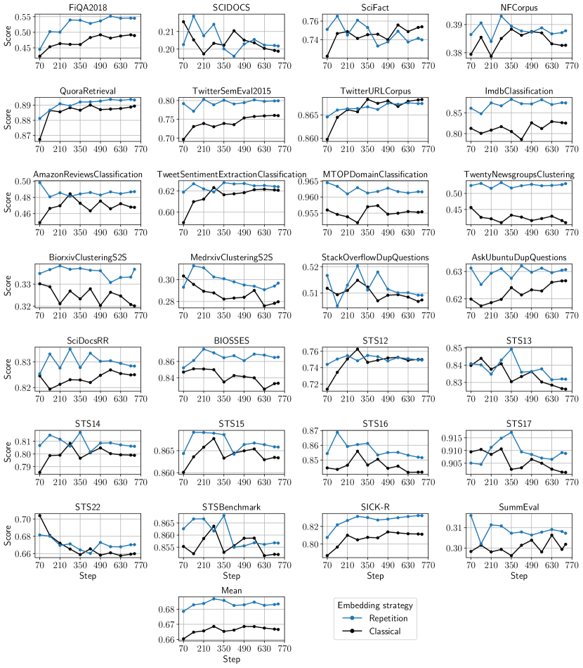

Figure 11: Performance of the evaluated MTEB datasets for finetuning over the number of finetuning steps.
[/FIGURE]

[TABLE A4.T15]

<table class="ltx_tabular ltx_centering ltx_guessed_headers ltx_align_middle">
<thead class="ltx_thead">
<tr class="ltx_tr">
<th class="ltx_td ltx_align_left ltx_th ltx_th_column ltx_border_tt">Model</th>
<th class="ltx_td ltx_align_center ltx_th ltx_th_column ltx_border_tt">Average</th>
<th class="ltx_td ltx_align_center ltx_th ltx_th_column ltx_border_tt">Clas.</th>
<th class="ltx_td ltx_align_center ltx_th ltx_th_column ltx_border_tt">Clus.</th>
<th class="ltx_td ltx_align_center ltx_th ltx_th_column ltx_border_tt">Pair Clas.</th>
<th class="ltx_td ltx_align_center ltx_th ltx_th_column ltx_border_tt">Rera.</th>
<th class="ltx_td ltx_align_center ltx_th ltx_th_column ltx_border_tt">Retr.</th>
<th class="ltx_td ltx_align_center ltx_th ltx_th_column ltx_border_tt">STS</th>
<th class="ltx_td ltx_align_center ltx_th ltx_th_column ltx_border_tt">Summ.</th>
</tr>
</thead>
<tbody class="ltx_tbody">
<tr class="ltx_tr">
<td class="ltx_td ltx_align_left ltx_border_t">Classical (w/ instruct., mean)</td>
<td class="ltx_td ltx_align_center ltx_border_t">62.96</td>
<td class="ltx_td ltx_align_center ltx_border_t">76.26</td>
<td class="ltx_td ltx_align_center ltx_border_t">42.68</td>
<td class="ltx_td ltx_align_center ltx_border_t">86.31</td>
<td class="ltx_td ltx_align_center ltx_border_t">57.58</td>
<td class="ltx_td ltx_align_center ltx_border_t">53.75</td>
<td class="ltx_td ltx_align_center ltx_border_t">81.53</td>
<td class="ltx_td ltx_align_center ltx_border_t">30.19</td>
</tr>
<tr class="ltx_tr">
<td class="ltx_td ltx_align_left">Classical (w/ instruct., last)</td>
<td class="ltx_td ltx_align_center">63.98</td>
<td class="ltx_td ltx_align_center">76.57</td>
<td class="ltx_td ltx_align_center">45.78</td>
<td class="ltx_td ltx_align_center">86.37</td>
<td class="ltx_td ltx_align_center">56.71</td>
<td class="ltx_td ltx_align_center">54.87</td>
<td class="ltx_td ltx_align_center">82.03</td>
<td class="ltx_td ltx_align_center">31.02</td>
</tr>
<tr class="ltx_tr">
<td class="ltx_td ltx_align_left">Echo (w/ instruct., mean)</td>
<td class="ltx_td ltx_align_center">64.22</td>
<td class="ltx_td ltx_align_center">77.00</td>
<td class="ltx_td ltx_align_center">44.94</td>
<td class="ltx_td ltx_align_center">87.73</td>
<td class="ltx_td ltx_align_center">58.30</td>
<td class="ltx_td ltx_align_center">55.11</td>
<td class="ltx_td ltx_align_center">82.52</td>
<td class="ltx_td ltx_align_center">29.46</td>
</tr>
<tr class="ltx_tr">
<td class="ltx_td ltx_align_left">Echo (w/ instruct., last)</td>
<td class="ltx_td ltx_align_center">64.68</td>
<td class="ltx_td ltx_align_center">77.43</td>
<td class="ltx_td ltx_align_center">46.32</td>
<td class="ltx_td ltx_align_center">87.34</td>
<td class="ltx_td ltx_align_center">58.14</td>
<td class="ltx_td ltx_align_center">55.52</td>
<td class="ltx_td ltx_align_center">82.56</td>
<td class="ltx_td ltx_align_center">30.73</td>
</tr>
<tr class="ltx_tr">
<td class="ltx_td ltx_align_left">Classical (w/out instruct., mean)</td>
<td class="ltx_td ltx_align_center">62.19</td>
<td class="ltx_td ltx_align_center">75.23</td>
<td class="ltx_td ltx_align_center">41.79</td>
<td class="ltx_td ltx_align_center">85.24</td>
<td class="ltx_td ltx_align_center">56.31</td>
<td class="ltx_td ltx_align_center">53.24</td>
<td class="ltx_td ltx_align_center">80.97</td>
<td class="ltx_td ltx_align_center">30.64</td>
</tr>
<tr class="ltx_tr">
<td class="ltx_td ltx_align_left">Classical (w/out instruct., last)</td>
<td class="ltx_td ltx_align_center">62.37</td>
<td class="ltx_td ltx_align_center">75.01</td>
<td class="ltx_td ltx_align_center">42.70</td>
<td class="ltx_td ltx_align_center">85.69</td>
<td class="ltx_td ltx_align_center">56.64</td>
<td class="ltx_td ltx_align_center">53.29</td>
<td class="ltx_td ltx_align_center">80.92</td>
<td class="ltx_td ltx_align_center">30.91</td>
</tr>
<tr class="ltx_tr">
<td class="ltx_td ltx_align_left">Echo (w/out instruct., mean)</td>
<td class="ltx_td ltx_align_center">63.28</td>
<td class="ltx_td ltx_align_center">75.26</td>
<td class="ltx_td ltx_align_center">42.93</td>
<td class="ltx_td ltx_align_center">86.95</td>
<td class="ltx_td ltx_align_center">57.05</td>
<td class="ltx_td ltx_align_center">55.65</td>
<td class="ltx_td ltx_align_center">81.40</td>
<td class="ltx_td ltx_align_center">30.62</td>
</tr>
<tr class="ltx_tr">
<td class="ltx_td ltx_align_left">Echo (w/out instruct., last)</td>
<td class="ltx_td ltx_align_center">62.80</td>
<td class="ltx_td ltx_align_center">75.30</td>
<td class="ltx_td ltx_align_center">42.94</td>
<td class="ltx_td ltx_align_center">86.31</td>
<td class="ltx_td ltx_align_center">57.31</td>
<td class="ltx_td ltx_align_center">54.18</td>
<td class="ltx_td ltx_align_center">80.92</td>
<td class="ltx_td ltx_align_center">31.00</td>
</tr>
<tr class="ltx_tr">
<td class="ltx_td ltx_align_left">Classical (w/ instruct., mean, step 280)</td>
<td class="ltx_td ltx_align_center">63.19</td>
<td class="ltx_td ltx_align_center">76.18</td>
<td class="ltx_td ltx_align_center">42.99</td>
<td class="ltx_td ltx_align_center">85.44</td>
<td class="ltx_td ltx_align_center">57.63</td>
<td class="ltx_td ltx_align_center">53.96</td>
<td class="ltx_td ltx_align_center">82.53</td>
<td class="ltx_td ltx_align_center">29.94</td>
</tr>
<tr class="ltx_tr">
<td class="ltx_td ltx_align_left">Classical (w/ instruct., last, step 280)</td>
<td class="ltx_td ltx_align_center">63.87</td>
<td class="ltx_td ltx_align_center">76.54</td>
<td class="ltx_td ltx_align_center">46.22</td>
<td class="ltx_td ltx_align_center">86.70</td>
<td class="ltx_td ltx_align_center">57.79</td>
<td class="ltx_td ltx_align_center">53.73</td>
<td class="ltx_td ltx_align_center">82.22</td>
<td class="ltx_td ltx_align_center">30.13</td>
</tr>
<tr class="ltx_tr">
<td class="ltx_td ltx_align_left">Echo (w/ instruct., mean, step 280)</td>
<td class="ltx_td ltx_align_center">64.04</td>
<td class="ltx_td ltx_align_center">76.84</td>
<td class="ltx_td ltx_align_center">45.76</td>
<td class="ltx_td ltx_align_center">87.72</td>
<td class="ltx_td ltx_align_center">59.33</td>
<td class="ltx_td ltx_align_center">53.55</td>
<td class="ltx_td ltx_align_center">82.64</td>
<td class="ltx_td ltx_align_center">30.33</td>
</tr>
<tr class="ltx_tr">
<td class="ltx_td ltx_align_left ltx_border_bb">Echo (w/ instruct., last, step 280)</td>
<td class="ltx_td ltx_align_center ltx_border_bb">64.50</td>
<td class="ltx_td ltx_align_center ltx_border_bb">76.41</td>
<td class="ltx_td ltx_align_center ltx_border_bb">46.70</td>
<td class="ltx_td ltx_align_center ltx_border_bb">87.17</td>
<td class="ltx_td ltx_align_center ltx_border_bb">59.10</td>
<td class="ltx_td ltx_align_center ltx_border_bb">54.84</td>
<td class="ltx_td ltx_align_center ltx_border_bb">82.98</td>
<td class="ltx_td ltx_align_center ltx_border_bb">31.09</td>
</tr>
</tbody>
</table>

Table 15: Additional ablations for finetuning.
[/TABLE]

[TABLE A4.T16]

<table class="ltx_tabular ltx_centering ltx_guessed_headers ltx_align_middle">
<tbody class="ltx_tbody">
<tr class="ltx_tr">
<th class="ltx_td ltx_align_left ltx_th ltx_th_row ltx_border_tt">Dataset</th>
<td class="ltx_td ltx_align_center ltx_border_tt">

Repetition
(last)

</td>
<td class="ltx_td ltx_align_center ltx_border_tt">

Repetition
(mean)

</td>
<td class="ltx_td ltx_align_center ltx_border_tt">

Classical
(last)

</td>
<td class="ltx_td ltx_align_center ltx_border_tt">

Classical
(mean)

</td>
<td class="ltx_td ltx_align_center ltx_border_tt">

Bidirectional
(last)

</td>
</tr>
<tr class="ltx_tr">
<th class="ltx_td ltx_align_left ltx_th ltx_th_row ltx_border_t">AmazonCounterfactualClassification</th>
<td class="ltx_td ltx_align_center ltx_border_t">82.97</td>
<td class="ltx_td ltx_align_center ltx_border_t">82.91</td>
<td class="ltx_td ltx_align_center ltx_border_t">80.82</td>
<td class="ltx_td ltx_align_center ltx_border_t">82.21</td>
<td class="ltx_td ltx_align_center ltx_border_t">83.07</td>
</tr>
<tr class="ltx_tr">
<th class="ltx_td ltx_align_left ltx_th ltx_th_row">AmazonPolarityClassification</th>
<td class="ltx_td ltx_align_center">90.98</td>
<td class="ltx_td ltx_align_center">88.25</td>
<td class="ltx_td ltx_align_center">92.55</td>
<td class="ltx_td ltx_align_center">90.37</td>
<td class="ltx_td ltx_align_center">90.83</td>
</tr>
<tr class="ltx_tr">
<th class="ltx_td ltx_align_left ltx_th ltx_th_row">AmazonReviewsClassification</th>
<td class="ltx_td ltx_align_center">48.71</td>
<td class="ltx_td ltx_align_center">49.41</td>
<td class="ltx_td ltx_align_center">48.75</td>
<td class="ltx_td ltx_align_center">46.76</td>
<td class="ltx_td ltx_align_center">47.94</td>
</tr>
<tr class="ltx_tr">
<th class="ltx_td ltx_align_left ltx_th ltx_th_row">Banking77Classification</th>
<td class="ltx_td ltx_align_center">88.15</td>
<td class="ltx_td ltx_align_center">88.06</td>
<td class="ltx_td ltx_align_center">87.95</td>
<td class="ltx_td ltx_align_center">87.69</td>
<td class="ltx_td ltx_align_center">88.17</td>
</tr>
<tr class="ltx_tr">
<th class="ltx_td ltx_align_left ltx_th ltx_th_row">EmotionClassification</th>
<td class="ltx_td ltx_align_center">52.18</td>
<td class="ltx_td ltx_align_center">51.51</td>
<td class="ltx_td ltx_align_center">50.66</td>
<td class="ltx_td ltx_align_center">49.23</td>
<td class="ltx_td ltx_align_center">52.09</td>
</tr>
<tr class="ltx_tr">
<th class="ltx_td ltx_align_left ltx_th ltx_th_row">ImdbClassification</th>
<td class="ltx_td ltx_align_center">87.42</td>
<td class="ltx_td ltx_align_center">84.80</td>
<td class="ltx_td ltx_align_center">83.18</td>
<td class="ltx_td ltx_align_center">82.53</td>
<td class="ltx_td ltx_align_center">83.02</td>
</tr>
<tr class="ltx_tr">
<th class="ltx_td ltx_align_left ltx_th ltx_th_row">MassiveIntentClassification</th>
<td class="ltx_td ltx_align_center">79.67</td>
<td class="ltx_td ltx_align_center">79.70</td>
<td class="ltx_td ltx_align_center">78.60</td>
<td class="ltx_td ltx_align_center">79.15</td>
<td class="ltx_td ltx_align_center">78.93</td>
</tr>
<tr class="ltx_tr">
<th class="ltx_td ltx_align_left ltx_th ltx_th_row">MassiveScenarioClassification</th>
<td class="ltx_td ltx_align_center">82.82</td>
<td class="ltx_td ltx_align_center">82.74</td>
<td class="ltx_td ltx_align_center">81.71</td>
<td class="ltx_td ltx_align_center">81.46</td>
<td class="ltx_td ltx_align_center">81.80</td>
</tr>
<tr class="ltx_tr">
<th class="ltx_td ltx_align_left ltx_th ltx_th_row">MTOPDomainClassification</th>
<td class="ltx_td ltx_align_center">96.16</td>
<td class="ltx_td ltx_align_center">96.10</td>
<td class="ltx_td ltx_align_center">95.92</td>
<td class="ltx_td ltx_align_center">95.54</td>
<td class="ltx_td ltx_align_center">96.14</td>
</tr>
<tr class="ltx_tr">
<th class="ltx_td ltx_align_left ltx_th ltx_th_row">MTOPIntentClassification</th>
<td class="ltx_td ltx_align_center">85.75</td>
<td class="ltx_td ltx_align_center">85.87</td>
<td class="ltx_td ltx_align_center">85.96</td>
<td class="ltx_td ltx_align_center">85.86</td>
<td class="ltx_td ltx_align_center">85.98</td>
</tr>
<tr class="ltx_tr">
<th class="ltx_td ltx_align_left ltx_th ltx_th_row">ToxicConversationsClassification</th>
<td class="ltx_td ltx_align_center">71.91</td>
<td class="ltx_td ltx_align_center">72.21</td>
<td class="ltx_td ltx_align_center">71.19</td>
<td class="ltx_td ltx_align_center">72.21</td>
<td class="ltx_td ltx_align_center">71.46</td>
</tr>
<tr class="ltx_tr">
<th class="ltx_td ltx_align_left ltx_th ltx_th_row">TweetSentimentExtractionClassification</th>
<td class="ltx_td ltx_align_center">62.40</td>
<td class="ltx_td ltx_align_center">62.46</td>
<td class="ltx_td ltx_align_center">61.60</td>
<td class="ltx_td ltx_align_center">62.07</td>
<td class="ltx_td ltx_align_center">60.97</td>
</tr>
<tr class="ltx_tr">
<th class="ltx_td ltx_align_left ltx_th ltx_th_row ltx_border_t">ArxivClusteringP2P</th>
<td class="ltx_td ltx_align_center ltx_border_t">47.02</td>
<td class="ltx_td ltx_align_center ltx_border_t">45.52</td>
<td class="ltx_td ltx_align_center ltx_border_t">46.73</td>
<td class="ltx_td ltx_align_center ltx_border_t">45.80</td>
<td class="ltx_td ltx_align_center ltx_border_t">47.03</td>
</tr>
<tr class="ltx_tr">
<th class="ltx_td ltx_align_left ltx_th ltx_th_row">ArxivClusteringS2S</th>
<td class="ltx_td ltx_align_center">43.52</td>
<td class="ltx_td ltx_align_center">42.32</td>
<td class="ltx_td ltx_align_center">43.99</td>
<td class="ltx_td ltx_align_center">40.73</td>
<td class="ltx_td ltx_align_center">42.14</td>
</tr>
<tr class="ltx_tr">
<th class="ltx_td ltx_align_left ltx_th ltx_th_row">BiorxivClusteringP2P</th>
<td class="ltx_td ltx_align_center">35.53</td>
<td class="ltx_td ltx_align_center">35.24</td>
<td class="ltx_td ltx_align_center">36.50</td>
<td class="ltx_td ltx_align_center">35.42</td>
<td class="ltx_td ltx_align_center">36.21</td>
</tr>
<tr class="ltx_tr">
<th class="ltx_td ltx_align_left ltx_th ltx_th_row">BiorxivClusteringS2S</th>
<td class="ltx_td ltx_align_center">35.34</td>
<td class="ltx_td ltx_align_center">33.70</td>
<td class="ltx_td ltx_align_center">34.87</td>
<td class="ltx_td ltx_align_center">32.03</td>
<td class="ltx_td ltx_align_center">34.77</td>
</tr>
<tr class="ltx_tr">
<th class="ltx_td ltx_align_left ltx_th ltx_th_row">MedrxivClusteringP2P</th>
<td class="ltx_td ltx_align_center">30.27</td>
<td class="ltx_td ltx_align_center">29.68</td>
<td class="ltx_td ltx_align_center">30.67</td>
<td class="ltx_td ltx_align_center">29.74</td>
<td class="ltx_td ltx_align_center">31.06</td>
</tr>
<tr class="ltx_tr">
<th class="ltx_td ltx_align_left ltx_th ltx_th_row">MedrxivClusteringS2S</th>
<td class="ltx_td ltx_align_center">29.67</td>
<td class="ltx_td ltx_align_center">27.73</td>
<td class="ltx_td ltx_align_center">29.75</td>
<td class="ltx_td ltx_align_center">27.97</td>
<td class="ltx_td ltx_align_center">30.12</td>
</tr>
<tr class="ltx_tr">
<th class="ltx_td ltx_align_left ltx_th ltx_th_row">RedditClustering</th>
<td class="ltx_td ltx_align_center">61.77</td>
<td class="ltx_td ltx_align_center">59.12</td>
<td class="ltx_td ltx_align_center">61.17</td>
<td class="ltx_td ltx_align_center">54.79</td>
<td class="ltx_td ltx_align_center">62.50</td>
</tr>
<tr class="ltx_tr">
<th class="ltx_td ltx_align_left ltx_th ltx_th_row">RedditClusteringP2P</th>
<td class="ltx_td ltx_align_center">66.01</td>
<td class="ltx_td ltx_align_center">65.44</td>
<td class="ltx_td ltx_align_center">64.84</td>
<td class="ltx_td ltx_align_center">63.68</td>
<td class="ltx_td ltx_align_center">65.45</td>
</tr>
<tr class="ltx_tr">
<th class="ltx_td ltx_align_left ltx_th ltx_th_row">StackExchangeClustering</th>
<td class="ltx_td ltx_align_center">72.04</td>
<td class="ltx_td ltx_align_center">71.21</td>
<td class="ltx_td ltx_align_center">71.87</td>
<td class="ltx_td ltx_align_center">66.99</td>
<td class="ltx_td ltx_align_center">71.58</td>
</tr>
<tr class="ltx_tr">
<th class="ltx_td ltx_align_left ltx_th ltx_th_row">StackExchangeClusteringP2P</th>
<td class="ltx_td ltx_align_center">35.29</td>
<td class="ltx_td ltx_align_center">34.07</td>
<td class="ltx_td ltx_align_center">33.08</td>
<td class="ltx_td ltx_align_center">31.47</td>
<td class="ltx_td ltx_align_center">34.98</td>
</tr>
<tr class="ltx_tr">
<th class="ltx_td ltx_align_left ltx_th ltx_th_row">TwentyNewsgroupsClustering</th>
<td class="ltx_td ltx_align_center">53.04</td>
<td class="ltx_td ltx_align_center">50.29</td>
<td class="ltx_td ltx_align_center">50.07</td>
<td class="ltx_td ltx_align_center">40.91</td>
<td class="ltx_td ltx_align_center">49.53</td>
</tr>
<tr class="ltx_tr">
<th class="ltx_td ltx_align_left ltx_th ltx_th_row ltx_border_t">SprintDuplicateQuestions</th>
<td class="ltx_td ltx_align_center ltx_border_t">94.59</td>
<td class="ltx_td ltx_align_center ltx_border_t">95.05</td>
<td class="ltx_td ltx_align_center ltx_border_t">94.38</td>
<td class="ltx_td ltx_align_center ltx_border_t">95.29</td>
<td class="ltx_td ltx_align_center ltx_border_t">96.26</td>
</tr>
<tr class="ltx_tr">
<th class="ltx_td ltx_align_left ltx_th ltx_th_row">TwitterSemEval2015</th>
<td class="ltx_td ltx_align_center">79.93</td>
<td class="ltx_td ltx_align_center">80.73</td>
<td class="ltx_td ltx_align_center">77.18</td>
<td class="ltx_td ltx_align_center">75.98</td>
<td class="ltx_td ltx_align_center">80.80</td>
</tr>
<tr class="ltx_tr">
<th class="ltx_td ltx_align_left ltx_th ltx_th_row">TwitterURLCorpus</th>
<td class="ltx_td ltx_align_center">87.50</td>
<td class="ltx_td ltx_align_center">87.40</td>
<td class="ltx_td ltx_align_center">87.56</td>
<td class="ltx_td ltx_align_center">87.67</td>
<td class="ltx_td ltx_align_center">87.38</td>
</tr>
<tr class="ltx_tr">
<th class="ltx_td ltx_align_left ltx_th ltx_th_row ltx_border_t">AskUbuntuDupQuestions</th>
<td class="ltx_td ltx_align_center ltx_border_t">64.13</td>
<td class="ltx_td ltx_align_center ltx_border_t">64.44</td>
<td class="ltx_td ltx_align_center ltx_border_t">62.24</td>
<td class="ltx_td ltx_align_center ltx_border_t">63.32</td>
<td class="ltx_td ltx_align_center ltx_border_t">62.65</td>
</tr>
<tr class="ltx_tr">
<th class="ltx_td ltx_align_left ltx_th ltx_th_row">MindSmallReranking</th>
<td class="ltx_td ltx_align_center">32.92</td>
<td class="ltx_td ltx_align_center">32.11</td>
<td class="ltx_td ltx_align_center">32.68</td>
<td class="ltx_td ltx_align_center">32.52</td>
<td class="ltx_td ltx_align_center">32.53</td>
</tr>
<tr class="ltx_tr">
<th class="ltx_td ltx_align_left ltx_th ltx_th_row">SciDocsRR</th>
<td class="ltx_td ltx_align_center">83.68</td>
<td class="ltx_td ltx_align_center">84.15</td>
<td class="ltx_td ltx_align_center">81.60</td>
<td class="ltx_td ltx_align_center">83.01</td>
<td class="ltx_td ltx_align_center">82.36</td>
</tr>
<tr class="ltx_tr">
<th class="ltx_td ltx_align_left ltx_th ltx_th_row">StackOverflowDupQuestions</th>
<td class="ltx_td ltx_align_center">51.84</td>
<td class="ltx_td ltx_align_center">52.51</td>
<td class="ltx_td ltx_align_center">50.33</td>
<td class="ltx_td ltx_align_center">51.48</td>
<td class="ltx_td ltx_align_center">51.35</td>
</tr>
<tr class="ltx_tr">
<th class="ltx_td ltx_align_left ltx_th ltx_th_row ltx_border_t">ArguAna</th>
<td class="ltx_td ltx_align_center ltx_border_t">58.52</td>
<td class="ltx_td ltx_align_center ltx_border_t">56.52</td>
<td class="ltx_td ltx_align_center ltx_border_t">57.22</td>
<td class="ltx_td ltx_align_center ltx_border_t">51.14</td>
<td class="ltx_td ltx_align_center ltx_border_t">57.27</td>
</tr>
<tr class="ltx_tr">
<th class="ltx_td ltx_align_left ltx_th ltx_th_row">ClimateFEVER</th>
<td class="ltx_td ltx_align_center">34.56</td>
<td class="ltx_td ltx_align_center">37.07</td>
<td class="ltx_td ltx_align_center">31.10</td>
<td class="ltx_td ltx_align_center">30.31</td>
<td class="ltx_td ltx_align_center">32.73</td>
</tr>
<tr class="ltx_tr">
<th class="ltx_td ltx_align_left ltx_th ltx_th_row">CQADupstackRetrieval</th>
<td class="ltx_td ltx_align_center">46.91</td>
<td class="ltx_td ltx_align_center">46.48</td>
<td class="ltx_td ltx_align_center">45.11</td>
<td class="ltx_td ltx_align_center">43.30</td>
<td class="ltx_td ltx_align_center">46.52</td>
</tr>
<tr class="ltx_tr">
<th class="ltx_td ltx_align_left ltx_th ltx_th_row">DBPedia</th>
<td class="ltx_td ltx_align_center">46.83</td>
<td class="ltx_td ltx_align_center">48.19</td>
<td class="ltx_td ltx_align_center">45.18</td>
<td class="ltx_td ltx_align_center">46.80</td>
<td class="ltx_td ltx_align_center">46.76</td>
</tr>
<tr class="ltx_tr">
<th class="ltx_td ltx_align_left ltx_th ltx_th_row">FEVER</th>
<td class="ltx_td ltx_align_center">91.22</td>
<td class="ltx_td ltx_align_center">91.14</td>
<td class="ltx_td ltx_align_center">90.30</td>
<td class="ltx_td ltx_align_center">90.63</td>
<td class="ltx_td ltx_align_center">91.66</td>
</tr>
<tr class="ltx_tr">
<th class="ltx_td ltx_align_left ltx_th ltx_th_row">FiQA2018</th>
<td class="ltx_td ltx_align_center">54.51</td>
<td class="ltx_td ltx_align_center">54.11</td>
<td class="ltx_td ltx_align_center">50.31</td>
<td class="ltx_td ltx_align_center">48.94</td>
<td class="ltx_td ltx_align_center">53.06</td>
</tr>
<tr class="ltx_tr">
<th class="ltx_td ltx_align_left ltx_th ltx_th_row">HotpotQA</th>
<td class="ltx_td ltx_align_center">76.41</td>
<td class="ltx_td ltx_align_center">75.75</td>
<td class="ltx_td ltx_align_center">72.95</td>
<td class="ltx_td ltx_align_center">68.50</td>
<td class="ltx_td ltx_align_center">75.30</td>
</tr>
<tr class="ltx_tr">
<th class="ltx_td ltx_align_left ltx_th ltx_th_row">MSMARCO</th>
<td class="ltx_td ltx_align_center">43.25</td>
<td class="ltx_td ltx_align_center">43.11</td>
<td class="ltx_td ltx_align_center">42.31</td>
<td class="ltx_td ltx_align_center">41.49</td>
<td class="ltx_td ltx_align_center">43.38</td>
</tr>
<tr class="ltx_tr">
<th class="ltx_td ltx_align_left ltx_th ltx_th_row">NFCorpus</th>
<td class="ltx_td ltx_align_center">39.55</td>
<td class="ltx_td ltx_align_center">37.18</td>
<td class="ltx_td ltx_align_center">39.32</td>
<td class="ltx_td ltx_align_center">38.53</td>
<td class="ltx_td ltx_align_center">38.61</td>
</tr>
<tr class="ltx_tr">
<th class="ltx_td ltx_align_left ltx_th ltx_th_row">NQ</th>
<td class="ltx_td ltx_align_center">62.31</td>
<td class="ltx_td ltx_align_center">61.51</td>
<td class="ltx_td ltx_align_center">62.07</td>
<td class="ltx_td ltx_align_center">60.65</td>
<td class="ltx_td ltx_align_center">63.69</td>
</tr>
<tr class="ltx_tr">
<th class="ltx_td ltx_align_left ltx_th ltx_th_row">QuoraRetrieval</th>
<td class="ltx_td ltx_align_center">89.34</td>
<td class="ltx_td ltx_align_center">89.33</td>
<td class="ltx_td ltx_align_center">89.04</td>
<td class="ltx_td ltx_align_center">88.94</td>
<td class="ltx_td ltx_align_center">89.57</td>
</tr>
<tr class="ltx_tr">
<th class="ltx_td ltx_align_left ltx_th ltx_th_row">SCIDOCS</th>
<td class="ltx_td ltx_align_center">20.17</td>
<td class="ltx_td ltx_align_center">17.73</td>
<td class="ltx_td ltx_align_center">19.34</td>
<td class="ltx_td ltx_align_center">19.88</td>
<td class="ltx_td ltx_align_center">19.69</td>
</tr>
<tr class="ltx_tr">
<th class="ltx_td ltx_align_left ltx_th ltx_th_row">SciFact</th>
<td class="ltx_td ltx_align_center">73.99</td>
<td class="ltx_td ltx_align_center">73.57</td>
<td class="ltx_td ltx_align_center">74.22</td>
<td class="ltx_td ltx_align_center">75.39</td>
<td class="ltx_td ltx_align_center">75.83</td>
</tr>
<tr class="ltx_tr">
<th class="ltx_td ltx_align_left ltx_th ltx_th_row">Touche2020</th>
<td class="ltx_td ltx_align_center">18.52</td>
<td class="ltx_td ltx_align_center">18.92</td>
<td class="ltx_td ltx_align_center">24.46</td>
<td class="ltx_td ltx_align_center">19.44</td>
<td class="ltx_td ltx_align_center">15.79</td>
</tr>
<tr class="ltx_tr">
<th class="ltx_td ltx_align_left ltx_th ltx_th_row">TRECCOVID</th>
<td class="ltx_td ltx_align_center">76.66</td>
<td class="ltx_td ltx_align_center">76.02</td>
<td class="ltx_td ltx_align_center">80.17</td>
<td class="ltx_td ltx_align_center">82.30</td>
<td class="ltx_td ltx_align_center">74.50</td>
</tr>
<tr class="ltx_tr">
<th class="ltx_td ltx_align_left ltx_th ltx_th_row ltx_border_t">BIOSSES</th>
<td class="ltx_td ltx_align_center ltx_border_t">86.54</td>
<td class="ltx_td ltx_align_center ltx_border_t">86.78</td>
<td class="ltx_td ltx_align_center ltx_border_t">85.73</td>
<td class="ltx_td ltx_align_center ltx_border_t">83.31</td>
<td class="ltx_td ltx_align_center ltx_border_t">85.38</td>
</tr>
<tr class="ltx_tr">
<th class="ltx_td ltx_align_left ltx_th ltx_th_row">STS12</th>
<td class="ltx_td ltx_align_center">76.13</td>
<td class="ltx_td ltx_align_center">75.89</td>
<td class="ltx_td ltx_align_center">75.84</td>
<td class="ltx_td ltx_align_center">76.23</td>
<td class="ltx_td ltx_align_center">75.50</td>
</tr>
<tr class="ltx_tr">
<th class="ltx_td ltx_align_left ltx_th ltx_th_row">STS13</th>
<td class="ltx_td ltx_align_center">83.19</td>
<td class="ltx_td ltx_align_center">82.90</td>
<td class="ltx_td ltx_align_center">83.41</td>
<td class="ltx_td ltx_align_center">82.61</td>
<td class="ltx_td ltx_align_center">83.44</td>
</tr>
<tr class="ltx_tr">
<th class="ltx_td ltx_align_left ltx_th ltx_th_row">STS14</th>
<td class="ltx_td ltx_align_center">80.60</td>
<td class="ltx_td ltx_align_center">80.99</td>
<td class="ltx_td ltx_align_center">79.80</td>
<td class="ltx_td ltx_align_center">79.89</td>
<td class="ltx_td ltx_align_center">81.35</td>
</tr>
<tr class="ltx_tr">
<th class="ltx_td ltx_align_left ltx_th ltx_th_row">STS15</th>
<td class="ltx_td ltx_align_center">87.16</td>
<td class="ltx_td ltx_align_center">87.16</td>
<td class="ltx_td ltx_align_center">86.99</td>
<td class="ltx_td ltx_align_center">86.68</td>
<td class="ltx_td ltx_align_center">87.43</td>
</tr>
<tr class="ltx_tr">
<th class="ltx_td ltx_align_left ltx_th ltx_th_row">STS16</th>
<td class="ltx_td ltx_align_center">85.16</td>
<td class="ltx_td ltx_align_center">84.93</td>
<td class="ltx_td ltx_align_center">83.93</td>
<td class="ltx_td ltx_align_center">84.18</td>
<td class="ltx_td ltx_align_center">85.34</td>
</tr>
<tr class="ltx_tr">
<th class="ltx_td ltx_align_left ltx_th ltx_th_row">STS17</th>
<td class="ltx_td ltx_align_center">90.88</td>
<td class="ltx_td ltx_align_center">90.78</td>
<td class="ltx_td ltx_align_center">91.12</td>
<td class="ltx_td ltx_align_center">90.14</td>
<td class="ltx_td ltx_align_center">90.99</td>
</tr>
<tr class="ltx_tr">
<th class="ltx_td ltx_align_left ltx_th ltx_th_row">STS22</th>
<td class="ltx_td ltx_align_center">67.04</td>
<td class="ltx_td ltx_align_center">67.21</td>
<td class="ltx_td ltx_align_center">66.27</td>
<td class="ltx_td ltx_align_center">65.99</td>
<td class="ltx_td ltx_align_center">66.32</td>
</tr>
<tr class="ltx_tr">
<th class="ltx_td ltx_align_left ltx_th ltx_th_row">STSBenchmark</th>
<td class="ltx_td ltx_align_center">85.67</td>
<td class="ltx_td ltx_align_center">85.87</td>
<td class="ltx_td ltx_align_center">84.96</td>
<td class="ltx_td ltx_align_center">85.20</td>
<td class="ltx_td ltx_align_center">85.45</td>
</tr>
<tr class="ltx_tr">
<th class="ltx_td ltx_align_left ltx_th ltx_th_row">SICK-R</th>
<td class="ltx_td ltx_align_center">83.23</td>
<td class="ltx_td ltx_align_center">82.70</td>
<td class="ltx_td ltx_align_center">82.22</td>
<td class="ltx_td ltx_align_center">81.11</td>
<td class="ltx_td ltx_align_center">82.97</td>
</tr>
<tr class="ltx_tr">
<th class="ltx_td ltx_align_left ltx_th ltx_th_row ltx_border_bb ltx_border_t">SummEval</th>
<td class="ltx_td ltx_align_center ltx_border_bb ltx_border_t">30.73</td>
<td class="ltx_td ltx_align_center ltx_border_bb ltx_border_t">29.46</td>
<td class="ltx_td ltx_align_center ltx_border_bb ltx_border_t">31.02</td>
<td class="ltx_td ltx_align_center ltx_border_bb ltx_border_t">30.19</td>
<td class="ltx_td ltx_align_center ltx_border_bb ltx_border_t">29.32</td>
</tr>
</tbody>
</table>

Table 16: Results from all MTEB datasets for finetuning with Mistral-7B.
[/TABLE]

