# Representation Alignment for Generation: 
Training Diffusion Transformers 
Is Easier Than You Think

###### Abstract

Recent studies have shown that the denoising process in (generative) diffusion models can induce meaningful (discriminative) representations inside the model, though the quality of these representations still lags behind those learned through recent self-supervised learning methods. We argue that one main bottleneck in training large-scale diffusion models *for generation* lies in effectively learning these representations. Moreover, training can be made easier by incorporating high-quality external visual representations, rather than relying solely on the diffusion models to learn them independently. We study this by introducing a straightforward regularization called *REPresentation Alignment (REPA)*, which aligns the projections of noisy input hidden states in denoising networks with clean image representations obtained from external, pretrained visual encoders. The results are striking: our simple strategy yields significant improvements in both training efficiency and generation quality when applied to popular diffusion and flow-based transformers, such as DiTs and SiTs. For instance, our method can speed up SiT training by over 17.5$\times$, matching the performance (without classifier-free guidance) of a SiT-XL model trained for 7M steps in less than 400K steps. In terms of final generation quality, our approach achieves state-of-the-art results of FID=1.42 using classifier-free guidance with the guidance interval.  

[FIGURE S0.F1.g1]
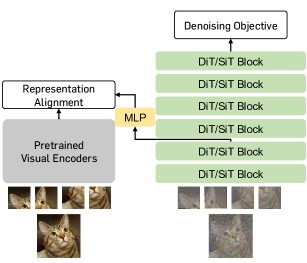

Figure 1: 
Representation alignment makes diffusion transformer training significantly easier.
Our framework, REPA, explicitly aligns the diffusion model representation with powerful pretrained visual representation through a simple regularization. Notably, model training becomes significantly more efficient and effective, and achieves $>$17.5$\times$ faster convergence than the vanilla model.
[/FIGURE]

## 1 Introduction

Generative models based on *denoising*, such as diffusion models (Ho et al., [2020](#bib.bib32); Song et al., [2021](#bib.bib77)) and flow-based models (Albergo & Vanden-Eijnden, [2023](#bib.bib3); Lipman et al., [2022](#bib.bib53); Liu et al., [2023](#bib.bib54)), have been a scalable approach in generating high-dimensional visual data. They achieve remarkably successful results in challenging tasks such as zero-shot text-to-image (Podell et al., [2023](#bib.bib65); Saharia et al., [2022](#bib.bib69); Esser et al., [2024](#bib.bib22)) or text-to-video (Polyak et al., [2024](#bib.bib66); Brooks et al., [2024](#bib.bib8)) generation.  

Recent works have explored the use of diffusion models as representation learners (Li et al., [2023a](#bib.bib49); Xiang et al., [2023](#bib.bib81); Chen et al., [2024c](#bib.bib16); Mukhopadhyay et al., [2021](#bib.bib59)) and have shown that they learn discriminative features in their hidden states, and better diffusion models learn better representations (Xiang et al., [2023](#bib.bib81)). In fact, this observation is closely related to earlier approaches that employ *denoising score matching* (Vincent, [2011](#bib.bib80)) as a self-supervised learning method (Bengio et al., [2013](#bib.bib7)), which implicitly learns a representation ${\mathbf{h}}$ as a hidden state of a denoising autoencoder ${\mathbf{s}}_{\theta}(\tilde{{\mathbf{x}}})$ through a *reconstruction* of ${\mathbf{x}}$ from the corrupted data $\tilde{{\mathbf{x}}}$ (Yang & Wang, [2023](#bib.bib82)). However, the reconstruction task may not be a suitable task for learning good representations, as it is not capable of eliminating unnecessary details in ${\mathbf{x}}$ for representation learning (LeCun, [2022](#bib.bib48); Assran et al., [2023](#bib.bib5)).  

[FIGURE S1.F2.sf1.g1]
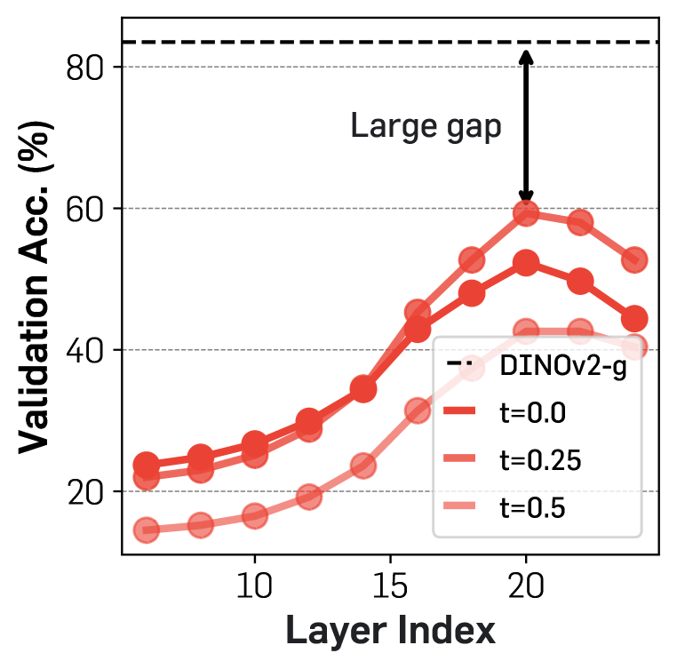

(a) Semantic gap: Linear probing
[/FIGURE]

Our approach. In this paper, we identify that the main challenge in training diffusion models stems from the need to learn a high-quality internal representation ${\mathbf{h}}$. We demonstrate that the training process for generative diffusion models becomes significantly easier and more effective when supported by an external representation, ${\mathbf{y}}_{\ast}$. Specifically, we propose a simple regularization technique that leverages recent advances in self-supervised visual representations as ${\mathbf{y}}_{\ast}$, leading to substantial improvements in both training efficiency and the generation quality of diffusion transformers.  

We start by performing an empirical analysis with recent diffusion transformers (Peebles & Xie, [2023](#bib.bib63); Ma et al., [2024a](#bib.bib57)) and the state-of-the-art self-supervised vision model, DINOv2 (Oquab et al., [2024](#bib.bib62)). Similar to prior studies (Xiang et al., [2023](#bib.bib81)), we first observe that pretrained diffusion models do indeed learn meaningful discriminative representations (as shown by the linear probing results in Figure [2(a)](#S1.F2.sf1 "In Figure 2 ‣ 1 Introduction ‣ Representation Alignment for Generation: Training Diffusion Transformers Is Easier Than You Think")). However, these representations are significantly inferior to those produced by DINOv2. Next, we find that the alignment between the representations learned by the diffusion model and those of DINOv2 (Figure [2(b)](#S1.F2.sf2 "In Figure 2 ‣ 1 Introduction ‣ Representation Alignment for Generation: Training Diffusion Transformers Is Easier Than You Think")) is still considered weak,111We describe this as “weak” because relatively, the alignments are much poorer than those seen with other self-supervised encoders (*e.g.*, MoCov3 (Chen et al., [2021](#bib.bib15))), even after extensive training. which we study by measuring their *representation alignment* (Huh et al., [2024](#bib.bib36)). Finally, we observe this alignment between diffusion models and DINOv2 improves consistently with longer training and larger models (Figure [2(c)](#S1.F2.sf3 "In Figure 2 ‣ 1 Introduction ‣ Representation Alignment for Generation: Training Diffusion Transformers Is Easier Than You Think")).  

These insights inspire us to enhance generative models by incorporating external self-supervised representations. However, this approach is not straightforward when using off-the-shelf self-supervised visual encoders (*e.g.*, by fine-tuning an encoder for generation tasks). The first challenge is an input mismatch: diffusion models work with noisy inputs $\tilde{{\mathbf{x}}}$, whereas most self-supervised learning encoders are trained on clean images ${{\mathbf{x}}}$. This issue is even more pronounced in modern *latent diffusion* models, which take a compressed latent image ${\mathbf{z}}=E({\mathbf{x}})$ from a pretrained VAE encoder (Rombach et al., [2022](#bib.bib68)) as input. Additionally, these off-the-shelf vision encoders are not designed for tasks like reconstruction or generation. To overcome these technical hurdles, we guide the feature learning of diffusion models using a *regularization* technique that distills pretrained self-supervised representations into diffusion representations, offering a flexible way to integrate high-quality representations.  

[FIGURE S1.F3.sf1.g1]
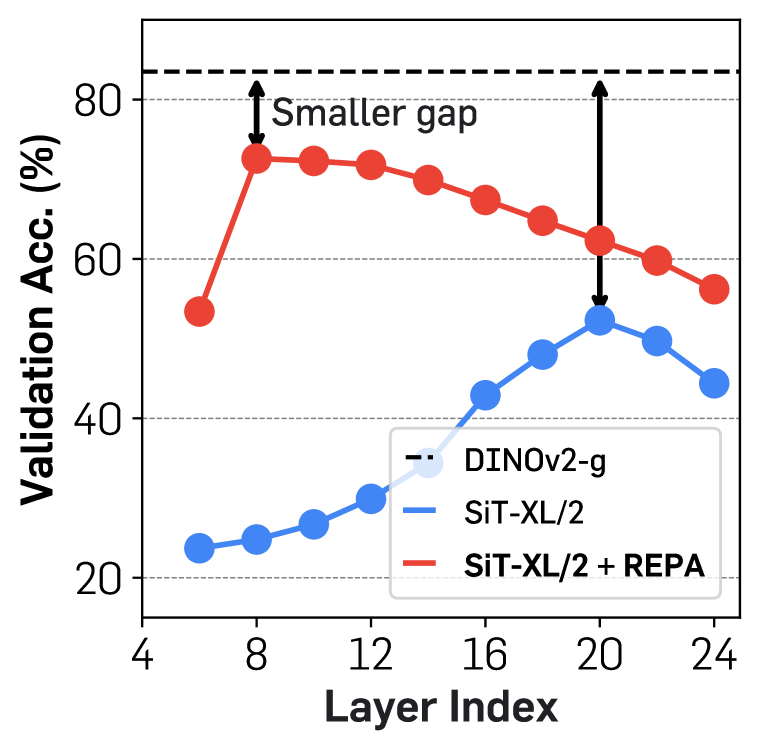

(a) Semantic gap: Linear probing
[/FIGURE]

Specifically, we introduce *REPresentation Alignment* (REPA), a simple regularization technique built on recent diffusion transformer architectures (Peebles & Xie, [2023](#bib.bib63)). In essence, REPA distills the pretrained self-supervised visual representation ${\mathbf{y}}_{\ast}$ of a clean image ${\mathbf{x}}$ into the diffusion transformer representation ${\mathbf{h}}$ of a noisy input $\tilde{{\mathbf{x}}}$. This regularization reduces the semantic gap in the representation ${\mathbf{h}}$ (Figure [3(a)](#S1.F3.sf1 "In Figure 3 ‣ 1 Introduction ‣ Representation Alignment for Generation: Training Diffusion Transformers Is Easier Than You Think")) and better aligns it with the target self-supervised representations ${\mathbf{y}}_{\ast}$ (Figure [3(b)](#S1.F3.sf2 "In Figure 3 ‣ 1 Introduction ‣ Representation Alignment for Generation: Training Diffusion Transformers Is Easier Than You Think")). Notably, this enhanced alignment significantly boosts the *generation* performance of diffusion transformers (Figure [3(c)](#S1.F3.sf3 "In Figure 3 ‣ 1 Introduction ‣ Representation Alignment for Generation: Training Diffusion Transformers Is Easier Than You Think")). Interestingly, with REPA, we observe that sufficient representation alignment can be achieved by aligning only the first few transformer blocks. This, in turn, allows the later layers of the diffusion transformers to focus on capturing high-frequency details based on the aligned representations, further improving generation performance.  

Based on our analysis, we conduct a system-level comparison to demonstrate the effectiveness of our scheme by applying it to two recent diffusion transformers: DiTs (Peebles & Xie, [2023](#bib.bib63)) and SiTs (Ma et al., [2024a](#bib.bib57)). For SiT training, we show the model achieves FID$=$7.9 on class-conditional ImageNet (Deng et al., [2009](#bib.bib18)) generation only using 400K training iteration (without classifier-free guidance; Ho & Salimans [2022](#bib.bib31)) which is $>$17.5$\times$ faster than the vanilla SiTs. Moreover, with classifier-free guidance, our scheme shows an improved FID at the final from 2.06 to 1.80 and achieves state-of-the-art results of FID$=$1.42 with guidance interval (Kynkäänniemi et al., [2024](#bib.bib47)).  

We highlight the main contributions of this paper below:  

* We hypothesize that learning high-quality representations in diffusion transformers is essential for improving their generation performance. 
* We introduce REPA, a simple regularization for aligning diffusion transformer representations with strong self-supervised visual representations. 
* Our framework improves the generation performance of diffusion transformers, *e.g.*, for SiTs, we achieve a 17.5$\times$ faster training for SiTs and improved FID scores on ImageNet generation. 

## 2 Preliminaries

We present a brief overview of *flow and diffusion-based* models through the unified perspective of *stochastic interpolants* (Albergo et al., [2023](#bib.bib2); Ma et al., [2024a](#bib.bib57)). Please refer to a more detailed explanation in Appendix [A](#A1 "Appendix A Descriptions for Diffusion-based Models ‣ Representation Alignment for Generation: Training Diffusion Transformers Is Easier Than You Think").  

We consider a continuous time-dependent process with a data ${\mathbf{x}}_{\ast}\sim p({\mathbf{x}})$ and a Gaussian noise ${\mathbf{\epsilon}}~{}\sim\mathcal{N}(\mathbf{0},\mathbf{I})$ on $t\in[0,T]$:  

|  | $${\mathbf{x}}_{t}=\alpha_{t}{\mathbf{x}}_{\ast}+\sigma_{t}{\mathbf{\epsilon}},\quad\alpha_{0}=\sigma_{T}=1,\,\,\alpha_{T}=\sigma_{0}=0,$$ |  | (1) |
| --- | --- | --- | --- |

where $\alpha_{t}$ and $\sigma_{t}$ are a decreasing and increasing function of $t$, respectively. Given such a process, there exists a *probability flow ordinary differential equation* (PF ODE) with a velocity field  

|  | $$\dot{{\mathbf{x}}}_{t}={\mathbf{v}}({\mathbf{x}}_{t},t),$$ |  | (2) |
| --- | --- | --- | --- |

where the distribution of this ODE at $t$ is equal to the marginal $p_{t}({\mathbf{x}})$. Thus, data can be sampled by solving this PF ODE in Eq. ([2](#S2.E2 "In 2 Preliminaries ‣ Representation Alignment for Generation: Training Diffusion Transformers Is Easier Than You Think")) through existing ODE samplers (*e.g.*, Euler sampler) starting from a random Gaussian noise $\epsilon\sim\mathcal{N}(\mathbf{0},\mathbf{I})$ (Lipman et al., [2022](#bib.bib53); Ma et al., [2024a](#bib.bib57)).  

This velocity ${\mathbf{v}}({\mathbf{x}},t)$ is represented as the following sum of two conditional expectations  

|  | $${\mathbf{v}}({\mathbf{x}},t)=\mathbb{E}[\dot{{\mathbf{x}}}_{t}|{\mathbf{x}}_{t}={\mathbf{x}}]=\dot{\alpha}_{t}\mathbb{E}[{\mathbf{x}}_{\ast}|{\mathbf{x}}_{t}={\mathbf{x}}]+\dot{\sigma}_{t}\mathbb{E}[{\mathbf{\epsilon}}|{\mathbf{x}}_{t}={\mathbf{x}}],$$ |  | (3) |
| --- | --- | --- | --- |

which can be approximated with model ${\mathbf{v}}_{\theta}({\mathbf{x}}_{t},t)$ by minimizing the following training objective:  

|  | $$\mathcal{L}_{\text{velocity}}(\theta)\coloneqq\mathbb{E}_{{\mathbf{x}}_{\ast},\bm{\epsilon},t}\big{[}||{\mathbf{v}}_{\theta}({\mathbf{x}}_{t},t)-\dot{\alpha}_{t}{\mathbf{x}}_{\ast}-\dot{\sigma}_{t}{\mathbf{\epsilon}}||^{2}\big{]}.$$ |  | (4) |
| --- | --- | --- | --- |

Moreover, there exists a reverse *stochastic differential equation* (SDE) that the marginal $p_{t}({\mathbf{x}})$ coincides with the one of PF ODE in Eq. ([2](#S2.E2 "In 2 Preliminaries ‣ Representation Alignment for Generation: Training Diffusion Transformers Is Easier Than You Think")) with a diffusion coefficient $w_{t}$ (Ma et al., [2024a](#bib.bib57)):  

|  | $$d{\mathbf{x}}_{t}={\mathbf{v}}({\mathbf{x}}_{t},t)dt-\frac{1}{2}w_{t}{\mathbf{s}}({\mathbf{x}}_{t},t)dt+\sqrt{w_{t}}d\bar{\mathbf{w}}_{t},$$ |  | (5) |
| --- | --- | --- | --- |

where the score ${\mathbf{s}}({\mathbf{x}}_{t},t)$ is the following conditional expectation  

|  | $${\mathbf{s}}({\mathbf{x}}_{t},t)=-{\sigma_{t}^{-1}}\mathbb{E}[{\mathbf{\epsilon}}|{\mathbf{x}}_{t}={\mathbf{x}}].$$ |  | (6) |
| --- | --- | --- | --- |

and it can be directly computed using the velocity ${\mathbf{v}}({\mathbf{x}},t)$ for $t>0$ as  

|  | $${\mathbf{s}}({\mathbf{x}},t)={{\sigma_{t}^{-1}}}\cdot\frac{\alpha_{t}{\mathbf{v}}({\mathbf{x}},t)-\dot{\alpha}_{t}{\mathbf{x}}}{\dot{\alpha}_{t}\sigma_{t}-{\alpha}_{t}\dot{\sigma}_{t}},$$ |  | (7) |
| --- | --- | --- | --- |

implying that data can be alternatively generated through Eq. ([5](#S2.E5 "In 2 Preliminaries ‣ Representation Alignment for Generation: Training Diffusion Transformers Is Easier Than You Think")) with SDE solvers.  

Following Ma et al. ([2024a](#bib.bib57)), we mainly consider a simple linear interpolant with restricting $T=1$: $\alpha_{t}=1-t$ and $\sigma_{t}=t$. However, our approach is applicable to any similar variants (*e.g.*, DDPM; Ho et al. [2020](#bib.bib32)), which has a similar formulation but uses a discretized process and different $\alpha_{t},\sigma_{t}$ that $\mathcal{N}(\mathbf{0},\mathbf{I})$ becomes an equilibrium distribution (*i.e.*, ${\mathbf{x}}_{t}$ converges to $\mathcal{N}(\mathbf{0},\mathbf{I})$ only if $t\to\infty$).  

## 3 REPA: Regularization for Representation Alignment

### 3.1 Overview

Let $p({\mathbf{x}})$ be an unknown target distribution for data ${\mathbf{x}}\in\mathcal{X}$. Our goal is to approximate $p({\mathbf{x}})$ through a model distribution using a dataset drawn from $p({\mathbf{x}})$. To lower computational costs, we adopt the recent prevalent *latent diffusion* (Rombach et al., [2022](#bib.bib68)). This involves learning a latent distribution $p({\mathbf{z}})$, which is defined as the distribution of a compressed latent variable $\mathbf{z}=E({\mathbf{x}})$, where $E$ is an encoder from a pretrained autoencoder (*e.g.*, KL-VAE; Rombach et al. [2022](#bib.bib68)), with ${\mathbf{x}}\sim p_{\text{data}}({\mathbf{x}})$.  

We aim to learn this distribution by training a diffusion model ${\mathbf{v}}_{\theta}({\mathbf{z}}_{t},t)$ using objectives such as velocity prediction, as described in Section [2](#S2 "2 Preliminaries ‣ Representation Alignment for Generation: Training Diffusion Transformers Is Easier Than You Think"). Here, we revisit denoising score matching within the context of self-supervised representation learning (Bengio et al., [2013](#bib.bib7)). From this perspective, one can think of the diffusion model ${\mathbf{v}}_{\theta}({\mathbf{z}}_{t},t)$ as a composition of two functions $g_{\theta}\circ f_{\theta}$ with an encoder $f_{\theta}:\mathcal{Z}\to\mathcal{H}$ with $f_{\theta}({\mathbf{z}}_{t})={\mathbf{h}}_{t}$ and a decoder $g_{\theta}:\mathcal{H}\to\mathcal{Z}$ with $g_{\theta}({\mathbf{h}}_{t})={\mathbf{v}}_{t}$, where the encoder $f_{\theta}$ implicitly learns a representation ${\mathbf{h}}_{t}$ that reconstructs the target ${\mathbf{v}}_{t}$.  

However, learning a good representation through producing a prediction of the input space (*e.g.*, generating pixels) can be challenging, as the model is often not capable of eliminating unnecessary details, which is crucial for developing a strong representation (LeCun, [2022](#bib.bib48); Assran et al., [2023](#bib.bib5)). We argue that a key bottleneck in the training of large-scale diffusion models *for generation* lies in representation learning, an area where current diffusion models fall short. We also hypothesize that the training process can be made easier by guiding the model with high-quality external visual representations, rather than relying solely on the diffusion model to learn them independently.  

To address this challenge, we introduce a simple regularization method called *REPresentation Alignment* (REPA) using the recent diffusion transformer architectures (Peebles & Xie, [2023](#bib.bib63); Ma et al., [2024a](#bib.bib57)) (see Appendix [B](#A2 "Appendix B Diffusion Transformer Architecture ‣ Representation Alignment for Generation: Training Diffusion Transformers Is Easier Than You Think") for an illustration). In a nutshell, our regularization distills pretrained self-supervised visual representations to diffusion transformers in a simple and effective way. This allows the diffusion model to leverage these semantically rich external representations for generation, leading to a substantial boost in performance.  

[FIGURE S3.F4.g1]
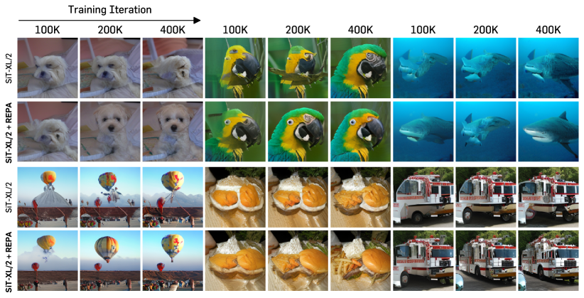

Figure 4: REPA improves visual scaling. We compare the images generated by two SiT-XL/2 models during the first 400K iterations, with REPA applied to one of the models. Both models share the same noise, sampler, and number of sampling steps, and neither uses classifier-free guidance.
[/FIGURE]

### 3.2 Observations

To take a deeper dive into this, we first investigate the layer-wise behavior of the pretrained SiT model (Ma et al., [2024a](#bib.bib57)) on ImageNet (Deng et al., [2009](#bib.bib18)), which uses linear interpolants and velocity prediction for training. In particular, we focus on measuring the *representation gap* between the diffusion transformer and the state-of-the-art self-supervised DINOv2 model (Oquab et al., [2024](#bib.bib62)). We examine this from three angles: semantic gap, feature alignment progression, and their final feature alignment. For the *semantic gap*, we compare linear probing results using DINOv2 features with those from SiT models trained for 7M iterations, following the same protocol as in Xiang et al. ([2023](#bib.bib81)), which involves linear probing on globally pooled hidden states of the diffusion transformer. Next, to measure *feature alignments*, we use CKNNA (Huh et al., [2024](#bib.bib36)), a kernel alignment metric related to CKA (Kornblith et al., [2019](#bib.bib44)), but based on mutual nearest neighbors. This allows for a quantitative assessment of alignment between different representations. We summarize the result in Figure [2](#S1.F2 "Figure 2 ‣ 1 Introduction ‣ Representation Alignment for Generation: Training Diffusion Transformers Is Easier Than You Think") and more details (*e.g.*, definition of CKNNA) in Appendix [C.1](#A3.SS1 "C.1 Evaluation details ‣ Appendix C Analysis Details ‣ Representation Alignment for Generation: Training Diffusion Transformers Is Easier Than You Think").  

Diffusion transformers exhibit a significant semantic gap from state-of-the-art visual encoders. As shown in Figure [2(a)](#S1.F2.sf1 "In Figure 2 ‣ 1 Introduction ‣ Representation Alignment for Generation: Training Diffusion Transformers Is Easier Than You Think"), we observe that the hidden state representation of the pretrained diffusion transformer, in line with prior works (Xiang et al., [2023](#bib.bib81); Chen et al., [2024c](#bib.bib16)), achieves a reasonably high linear probing peak at layer 20. However, its performance remains well below that of DINOv2, indicating a substantial semantic gap between the two representations. Additionally, we find that after reaching this peak, linear probing performance quickly declines, suggesting that the diffusion transformer must shift away from focusing solely on learning semantically-rich representations in order to generate images with high-frequency details.  

Diffusion representations are already (weakly) aligned with other visual representations. In Figure [2(b)](#S1.F2.sf2 "In Figure 2 ‣ 1 Introduction ‣ Representation Alignment for Generation: Training Diffusion Transformers Is Easier Than You Think"), we report representational alignments between SiT and DINOv2 using CKNNA. In particular, the SiT model representation already shows better alignment than MAE (He et al., [2022](#bib.bib29)), which is also a self-supervised learning approach based on the reconstruction of masked patches. However, the absolute alignment score remains lower than that observed between other self-supervised learning methods (*e.g.*, MoCov3 (Chen et al., [2021](#bib.bib15)) *vs.* DINOv2). These results suggest that while diffusion transformer representations exhibit some alignment with self-supervised visual representations, the alignment remains weak.  

Alignment improves with larger models and extended training. We also measure CKNNA values across different model sizes and training iterations. As depicted in Figure [2(c)](#S1.F2.sf3 "In Figure 2 ‣ 1 Introduction ‣ Representation Alignment for Generation: Training Diffusion Transformers Is Easier Than You Think"), we observe improved alignment with larger models and extended training. However, the absolute alignment remains low and does not reach the levels observed between other self-supervised visual encoders (*e.g.*, MoCov3 and DINOv2), even after extensive training of 7M iterations.  

These findings are not unique to the SiT model but are also observed in other denoising-based generative transformers. For instance, in Figure [2](#S1.F2 "Figure 2 ‣ 1 Introduction ‣ Representation Alignment for Generation: Training Diffusion Transformers Is Easier Than You Think"), we present a similar analysis using a DiT model (Peebles & Xie, [2023](#bib.bib63)) pretrained on ImageNet with the DDPM objective (Ho et al., [2020](#bib.bib32); Nichol & Dhariwal, [2021](#bib.bib61)). See Appendix [C.2](#A3.SS2 "C.2 DiT Analysis ‣ Appendix C Analysis Details ‣ Representation Alignment for Generation: Training Diffusion Transformers Is Easier Than You Think") for more details.  

### 3.3 Representation alignment with self-supervised representations

REPA aligns patch-wise projections of the model’s hidden states with pretrained self-supervised visual representations. Specifically, we use the *clean* image representation as the target and explore its impact. The goal of this regularization is for the diffusion transformer’s hidden states to predict noise-invariant, clean visual representations from noisy inputs that contain useful semantic information. This provides meaningful guidance for the subsequent layers to reconstruct the target.  

Formally, let $f$ be a pretrained encoder and consider a clean image $\mathbf{x}_{\ast}$. Let ${\mathbf{y}}_{\ast}=f({\mathbf{x}}_{\ast})\in\mathbb{R}^{N\times D}$ be an encoder output, where $N,D>0$ are the number of patches and the embedding dimension of $f$, respectively. REPA aligns $h_{\phi}({\mathbf{h}}_{t})\in\mathbb{R}^{N\times D}$ with ${\mathbf{y}}_{\ast}$, where $h_{\phi}({\mathbf{h}}_{t})$ is a projection of an diffusion transformer encoder output ${\mathbf{h}}_{t}=f_{\theta}({\mathbf{z}}_{t})$ through a trainable projection head $h_{\phi}$. In practice, we simply parameterize $h_{\phi}$ using a multilayer perceptron (MLP).  

In particular, REPA achieves alignment through a maximization of patch-wise similarities between the pretrained representation ${\mathbf{y}}_{\ast}$ and the hidden state ${\mathbf{h}}_{t}$:  

|  | $$\mathcal{L}_{\text{REPA}}(\theta,\phi)\coloneqq-\mathbb{E}_{{\mathbf{x}}_{\ast},\bm{\epsilon},t}\Big{[}\frac{1}{N}\sum_{n=1}^{N}\mathrm{sim}({\mathbf{y}}_{\ast}^{[n]},h_{\phi}({\mathbf{h}}_{t}^{([n]}))\Big{]},$$ |  | (8) |
| --- | --- | --- | --- |

where $n$ is a patch index and $\mathrm{sim}(\cdot,\cdot)$ is a pre-defined similarity function.  

In practice, we add this term to the original diffusion-based objectives described in Section [2](#S2 "2 Preliminaries ‣ Representation Alignment for Generation: Training Diffusion Transformers Is Easier Than You Think") and Appendix [A](#A1 "Appendix A Descriptions for Diffusion-based Models ‣ Representation Alignment for Generation: Training Diffusion Transformers Is Easier Than You Think"). For instance, for the training of a velocity model in Eq. ([4](#S2.E4 "In 2 Preliminaries ‣ Representation Alignment for Generation: Training Diffusion Transformers Is Easier Than You Think")), the objective becomes:  

|  | $$\mathcal{L}\coloneqq\mathcal{L}_{\text{velocity}}+\lambda\mathcal{L}_{\text{REPA}}$$ |  | (9) |
| --- | --- | --- | --- |

where $\lambda>0$ is a hyperparameter that controls the tradeoff between denoising and representation alignment. We primarily investigate the impact of this regularization on two popular objectives: Improved DDPM (Nichol & Dhariwal, [2021](#bib.bib61)) used in DiT (Peebles & Xie, [2023](#bib.bib63)) and linear stochastic interpolants used in SiT (Ma et al., [2024a](#bib.bib57)), though other objectives can also be considered.  

## 4 Experiments

We validate the performance of REPA and the effect of the proposed components through extensive experiments. In particular, we investigate the following questions:  

* Can REPA improve diffusion transformer training significantly? (Table [4.1](#S4.SS1 "4.1 Setup ‣ 4 Experiments ‣ Representation Alignment for Generation: Training Diffusion Transformers Is Easier Than You Think"), [4.2](#S4.SS2 "4.2 Component-wise analysis ‣ 4 Experiments ‣ Representation Alignment for Generation: Training Diffusion Transformers Is Easier Than You Think"), [4.2](#S4.SS2 "4.2 Component-wise analysis ‣ 4 Experiments ‣ Representation Alignment for Generation: Training Diffusion Transformers Is Easier Than You Think"), Figure [4](#S3.F4 "Figure 4 ‣ 3.1 Overview ‣ 3 REPA: Regularization for Representation Alignment ‣ Representation Alignment for Generation: Training Diffusion Transformers Is Easier Than You Think"), [6](#S4.F6 "Figure 6 ‣ 4.2 Component-wise analysis ‣ 4 Experiments ‣ Representation Alignment for Generation: Training Diffusion Transformers Is Easier Than You Think")) 
* Is REPA scalable in terms of model size and representation quality? (Table [4.1](#S4.SS1 "4.1 Setup ‣ 4 Experiments ‣ Representation Alignment for Generation: Training Diffusion Transformers Is Easier Than You Think"), Figure [5](#S4.F5 "Figure 5 ‣ 4.2 Component-wise analysis ‣ 4 Experiments ‣ Representation Alignment for Generation: Training Diffusion Transformers Is Easier Than You Think")) 
* Can diffusion model representations be aligned with various visual representations? (Figure [8](#S4.F8 "Figure 8 ‣ 4.4 Ablation studies ‣ 4 Experiments ‣ Representation Alignment for Generation: Training Diffusion Transformers Is Easier Than You Think")) 

### 4.1 Setup

[FIGURE S4.SS1.fig1]

[TABLE S4.T1]

Table 1: 
Model configuration details.
[/TABLE]

| Config | #Layers | Hidden dim | #Heads |
| --- | --- | --- | --- |
| B/2 | 12 | 768 | 12 |
| L/2 | 24 | 1024 | 16 |
| XL/2 | 28 | 1152 | 16 |

Table 1: 
Model configuration details.
[/FIGURE]

Implementation details. We strictly follow the setup in DiT (Peebles & Xie, [2023](#bib.bib63)) and SiT (Ma et al., [2024a](#bib.bib57)) unless otherwise specified. Specifically, we use ImageNet (Deng et al., [2009](#bib.bib18)), where each image is preprocessed to the resolution of 256$\times$256 (denoted as ImageNet 256$\times$256), and follow ADM (Dhariwal & Nichol, [2021](#bib.bib19)) for other data preprocessing protocols. Each image is then encoded into a compressed vector ${\mathbf{z}}\in\mathbb{R}^{32\times 32\times 4}$ using the Stable Diffusion VAE (Rombach et al., [2022](#bib.bib68)). For model configurations, we use the B/2, L/2, and XL/2 architectures introduced in the DiT and SiT papers, which process inputs with a patch size of 2 (see Table [4.1](#S4.SS1 "4.1 Setup ‣ 4 Experiments ‣ Representation Alignment for Generation: Training Diffusion Transformers Is Easier Than You Think") for details). To ensure a fair comparison with DiTs and SiTs, we consistently use a batch size of 256 during training. Additional experimental details, including hyperparameter settings and computing resources, are provided in Appendix [D](#A4 "Appendix D Hyperparameter and More Implementation Details ‣ Representation Alignment for Generation: Training Diffusion Transformers Is Easier Than You Think").  

[TABLE S4.T2]

<table class="ltx_tabular ltx_centering ltx_figure_panel ltx_guessed_headers ltx_align_middle">
<tbody class="ltx_tbody">
<tr class="ltx_tr">
<th class="ltx_td ltx_align_center ltx_th ltx_th_row ltx_border_tt">Iter.</th>
<th class="ltx_td ltx_align_left ltx_th ltx_th_row ltx_border_tt">Target Repr.</th>
<th class="ltx_td ltx_align_center ltx_th ltx_th_row ltx_border_tt">Depth</th>
<td class="ltx_td ltx_align_center ltx_border_tt">Objective</td>
<td class="ltx_td ltx_align_center ltx_border_tt">FID<math class="ltx_Math"><semantics><mo>↓</mo><annotation-xml><ci>↓</ci></annotation-xml><annotation>\downarrow</annotation></semantics></math>
</td>
<td class="ltx_td ltx_align_center ltx_border_tt">sFID<math class="ltx_Math"><semantics><mo>↓</mo><annotation-xml><ci>↓</ci></annotation-xml><annotation>\downarrow</annotation></semantics></math>
</td>
<td class="ltx_td ltx_align_center ltx_border_tt">IS<math class="ltx_Math"><semantics><mo>↑</mo><annotation-xml><ci>↑</ci></annotation-xml><annotation>\uparrow</annotation></semantics></math>
</td>
<td class="ltx_td ltx_align_center ltx_border_tt">Pre.<math class="ltx_Math"><semantics><mo>↑</mo><annotation-xml><ci>↑</ci></annotation-xml><annotation>\uparrow</annotation></semantics></math>
</td>
<td class="ltx_td ltx_align_center ltx_border_tt">Rec.<math class="ltx_Math"><semantics><mo>↑</mo><annotation-xml><ci>↑</ci></annotation-xml><annotation>\uparrow</annotation></semantics></math>
</td>
<td class="ltx_td ltx_align_center ltx_border_tt">Acc.<math class="ltx_Math"><semantics><mo>↑</mo><annotation-xml><ci>↑</ci></annotation-xml><annotation>\uparrow</annotation></semantics></math>
</td>
</tr>
<tr class="ltx_tr">
<th class="ltx_td ltx_align_center ltx_th ltx_th_row ltx_border_t">400K</th>
<th class="ltx_td ltx_align_left ltx_th ltx_th_row ltx_border_t">Vanilla SiT-L/2 <cite class="ltx_cite ltx_citemacro_citep">(Ma et al., <a class="ltx_ref">2024a</a>)</cite></th>
<td class="ltx_td ltx_align_center ltx_border_t">18.8</td>
<td class="ltx_td ltx_align_center ltx_border_t">5.29</td>
<td class="ltx_td ltx_align_center ltx_border_t">
072.0
</td>
<td class="ltx_td ltx_align_center ltx_border_t">0.64</td>
<td class="ltx_td ltx_align_center ltx_border_t">0.64</td>
<td class="ltx_td ltx_align_center ltx_border_t">N/A</td>
</tr>
<tr class="ltx_tr">
<th class="ltx_td ltx_align_center ltx_th ltx_th_row ltx_border_t">400K</th>
<th class="ltx_td ltx_align_left ltx_th ltx_th_row ltx_border_t">MAE-L</th>
<th class="ltx_td ltx_align_center ltx_th ltx_th_row ltx_border_t">8</th>
<td class="ltx_td ltx_align_center ltx_border_t">NT-Xent</td>
<td class="ltx_td ltx_align_center ltx_border_t">12.5</td>
<td class="ltx_td ltx_align_center ltx_border_t">4.89</td>
<td class="ltx_td ltx_align_center ltx_border_t">
090.7</td>
<td class="ltx_td ltx_align_center ltx_border_t">0.68</td>
<td class="ltx_td ltx_align_center ltx_border_t">0.63</td>
<td class="ltx_td ltx_align_center ltx_border_t">57.3</td>
</tr>
<tr class="ltx_tr">
<th class="ltx_td ltx_align_center ltx_th ltx_th_row">400K</th>
<th class="ltx_td ltx_align_left ltx_th ltx_th_row">DINO-B</th>
<th class="ltx_td ltx_align_center ltx_th ltx_th_row">8</th>
<td class="ltx_td ltx_align_center">NT-Xent</td>
<td class="ltx_td ltx_align_center">11.9</td>
<td class="ltx_td ltx_align_center">5.00</td>
<td class="ltx_td ltx_align_center">
092.9</td>
<td class="ltx_td ltx_align_center">0.68</td>
<td class="ltx_td ltx_align_center">0.63</td>
<td class="ltx_td ltx_align_center">59.3</td>
</tr>
<tr class="ltx_tr">
<th class="ltx_td ltx_align_center ltx_th ltx_th_row">400K</th>
<th class="ltx_td ltx_align_left ltx_th ltx_th_row">MoCov3-L</th>
<th class="ltx_td ltx_align_center ltx_th ltx_th_row">8</th>
<td class="ltx_td ltx_align_center">NT-Xent</td>
<td class="ltx_td ltx_align_center">11.9</td>
<td class="ltx_td ltx_align_center">5.06</td>
<td class="ltx_td ltx_align_center">
092.2</td>
<td class="ltx_td ltx_align_center">0.68</td>
<td class="ltx_td ltx_align_center">0.64</td>
<td class="ltx_td ltx_align_center">63.0</td>
</tr>
<tr class="ltx_tr">
<th class="ltx_td ltx_align_center ltx_th ltx_th_row">400K</th>
<th class="ltx_td ltx_align_left ltx_th ltx_th_row">I-JEPA-H</th>
<th class="ltx_td ltx_align_center ltx_th ltx_th_row">8</th>
<td class="ltx_td ltx_align_center">NT-Xent</td>
<td class="ltx_td ltx_align_center">11.6</td>
<td class="ltx_td ltx_align_center">5.21</td>
<td class="ltx_td ltx_align_center">
098.0</td>
<td class="ltx_td ltx_align_center">0.68</td>
<td class="ltx_td ltx_align_center">0.64</td>
<td class="ltx_td ltx_align_center">62.1</td>
</tr>
<tr class="ltx_tr">
<th class="ltx_td ltx_align_center ltx_th ltx_th_row">400K</th>
<th class="ltx_td ltx_align_left ltx_th ltx_th_row">CLIP-L</th>
<th class="ltx_td ltx_align_center ltx_th ltx_th_row">8</th>
<td class="ltx_td ltx_align_center">NT-Xent</td>
<td class="ltx_td ltx_align_center">11.0</td>
<td class="ltx_td ltx_align_center">5.25</td>
<td class="ltx_td ltx_align_center">100.4</td>
<td class="ltx_td ltx_align_center">0.67</td>
<td class="ltx_td ltx_align_center">0.66</td>
<td class="ltx_td ltx_align_center">67.2</td>
</tr>
<tr class="ltx_tr">
<th class="ltx_td ltx_align_center ltx_th ltx_th_row">400K</th>
<th class="ltx_td ltx_align_left ltx_th ltx_th_row">DINOv2-L</th>
<th class="ltx_td ltx_align_center ltx_th ltx_th_row">8</th>
<td class="ltx_td ltx_align_center">NT-Xent</td>
<td class="ltx_td ltx_align_center">10.0</td>
<td class="ltx_td ltx_align_center">5.09</td>
<td class="ltx_td ltx_align_center">106.6</td>
<td class="ltx_td ltx_align_center">0.68</td>
<td class="ltx_td ltx_align_center">0.65</td>
<td class="ltx_td ltx_align_center">68.1</td>
</tr>
<tr class="ltx_tr">
<th class="ltx_td ltx_align_center ltx_th ltx_th_row ltx_border_t">400K</th>
<th class="ltx_td ltx_align_left ltx_th ltx_th_row ltx_border_t">DINOv2-B</th>
<th class="ltx_td ltx_align_center ltx_th ltx_th_row ltx_border_t">8</th>
<td class="ltx_td ltx_align_center ltx_border_t">NT-Xent</td>
<td class="ltx_td ltx_align_center ltx_border_t">
09.7</td>
<td class="ltx_td ltx_align_center ltx_border_t">5.13</td>
<td class="ltx_td ltx_align_center ltx_border_t">107.5</td>
<td class="ltx_td ltx_align_center ltx_border_t">0.69</td>
<td class="ltx_td ltx_align_center ltx_border_t">0.64</td>
<td class="ltx_td ltx_align_center ltx_border_t">65.7</td>
</tr>
<tr class="ltx_tr">
<th class="ltx_td ltx_align_center ltx_th ltx_th_row">400K</th>
<th class="ltx_td ltx_align_left ltx_th ltx_th_row">DINOv2-L</th>
<th class="ltx_td ltx_align_center ltx_th ltx_th_row">8</th>
<td class="ltx_td ltx_align_center">NT-Xent</td>
<td class="ltx_td ltx_align_center">10.0</td>
<td class="ltx_td ltx_align_center">5.09</td>
<td class="ltx_td ltx_align_center">106.6</td>
<td class="ltx_td ltx_align_center">0.68</td>
<td class="ltx_td ltx_align_center">0.65</td>
<td class="ltx_td ltx_align_center">68.1</td>
</tr>
<tr class="ltx_tr">
<th class="ltx_td ltx_align_center ltx_th ltx_th_row">400K</th>
<th class="ltx_td ltx_align_left ltx_th ltx_th_row">DINOv2-g</th>
<th class="ltx_td ltx_align_center ltx_th ltx_th_row">8</th>
<td class="ltx_td ltx_align_center">NT-Xent</td>
<td class="ltx_td ltx_align_center">
09.8</td>
<td class="ltx_td ltx_align_center">5.22</td>
<td class="ltx_td ltx_align_center">108.9</td>
<td class="ltx_td ltx_align_center">0.69</td>
<td class="ltx_td ltx_align_center">0.64</td>
<td class="ltx_td ltx_align_center">65.7</td>
</tr>
<tr class="ltx_tr">
<th class="ltx_td ltx_align_center ltx_th ltx_th_row ltx_border_t">400K</th>
<th class="ltx_td ltx_align_left ltx_th ltx_th_row ltx_border_t">DINOv2-L</th>
<th class="ltx_td ltx_align_center ltx_th ltx_th_row ltx_border_t">6</th>
<td class="ltx_td ltx_align_center ltx_border_t">NT-Xent</td>
<td class="ltx_td ltx_align_center ltx_border_t">10.3</td>
<td class="ltx_td ltx_align_center ltx_border_t">5.23</td>
<td class="ltx_td ltx_align_center ltx_border_t">106.5</td>
<td class="ltx_td ltx_align_center ltx_border_t">0.69</td>
<td class="ltx_td ltx_align_center ltx_border_t">0.65</td>
<td class="ltx_td ltx_align_center ltx_border_t">66.2</td>
</tr>
<tr class="ltx_tr">
<th class="ltx_td ltx_align_center ltx_th ltx_th_row">400K</th>
<th class="ltx_td ltx_align_left ltx_th ltx_th_row">DINOv2-L</th>
<th class="ltx_td ltx_align_center ltx_th ltx_th_row">8</th>
<td class="ltx_td ltx_align_center">NT-Xent</td>
<td class="ltx_td ltx_align_center">10.0</td>
<td class="ltx_td ltx_align_center">5.09</td>
<td class="ltx_td ltx_align_center">106.6</td>
<td class="ltx_td ltx_align_center">0.68</td>
<td class="ltx_td ltx_align_center">0.65</td>
<td class="ltx_td ltx_align_center">68.1</td>
</tr>
<tr class="ltx_tr">
<th class="ltx_td ltx_align_center ltx_th ltx_th_row">400K</th>
<th class="ltx_td ltx_align_left ltx_th ltx_th_row">DINOv2-L</th>
<th class="ltx_td ltx_align_center ltx_th ltx_th_row">10</th>
<td class="ltx_td ltx_align_center">NT-Xent</td>
<td class="ltx_td ltx_align_center">10.5</td>
<td class="ltx_td ltx_align_center">5.50</td>
<td class="ltx_td ltx_align_center">105.0</td>
<td class="ltx_td ltx_align_center">0.68</td>
<td class="ltx_td ltx_align_center">0.65</td>
<td class="ltx_td ltx_align_center">68.6</td>
</tr>
<tr class="ltx_tr">
<th class="ltx_td ltx_align_center ltx_th ltx_th_row">400K</th>
<th class="ltx_td ltx_align_left ltx_th ltx_th_row">DINOv2-L</th>
<th class="ltx_td ltx_align_center ltx_th ltx_th_row">12</th>
<td class="ltx_td ltx_align_center">NT-Xent</td>
<td class="ltx_td ltx_align_center">11.2</td>
<td class="ltx_td ltx_align_center">5.14</td>
<td class="ltx_td ltx_align_center">100.2</td>
<td class="ltx_td ltx_align_center">0.68</td>
<td class="ltx_td ltx_align_center">0.64</td>
<td class="ltx_td ltx_align_center">69.4</td>
</tr>
<tr class="ltx_tr">
<th class="ltx_td ltx_align_center ltx_th ltx_th_row">400K</th>
<th class="ltx_td ltx_align_left ltx_th ltx_th_row">DINOv2-L</th>
<th class="ltx_td ltx_align_center ltx_th ltx_th_row">14</th>
<td class="ltx_td ltx_align_center">NT-Xent</td>
<td class="ltx_td ltx_align_center">11.6</td>
<td class="ltx_td ltx_align_center">5.61</td>
<td class="ltx_td ltx_align_center">
099.5</td>
<td class="ltx_td ltx_align_center">0.67</td>
<td class="ltx_td ltx_align_center">0.65</td>
<td class="ltx_td ltx_align_center">70.0</td>
</tr>
<tr class="ltx_tr">
<th class="ltx_td ltx_align_center ltx_th ltx_th_row">400K</th>
<th class="ltx_td ltx_align_left ltx_th ltx_th_row">DINOv2-L</th>
<th class="ltx_td ltx_align_center ltx_th ltx_th_row">16</th>
<td class="ltx_td ltx_align_center">NT-Xent</td>
<td class="ltx_td ltx_align_center">12.1</td>
<td class="ltx_td ltx_align_center">5.34</td>
<td class="ltx_td ltx_align_center">
096.1</td>
<td class="ltx_td ltx_align_center">0.67</td>
<td class="ltx_td ltx_align_center">0.64</td>
<td class="ltx_td ltx_align_center">71.1</td>
</tr>
<tr class="ltx_tr">
<th class="ltx_td ltx_align_center ltx_th ltx_th_row ltx_border_t">400K</th>
<th class="ltx_td ltx_align_left ltx_th ltx_th_row ltx_border_t">DINOv2-L</th>
<th class="ltx_td ltx_align_center ltx_th ltx_th_row ltx_border_t">8</th>
<td class="ltx_td ltx_align_center ltx_border_t">NT-Xent</td>
<td class="ltx_td ltx_align_center ltx_border_t">10.0</td>
<td class="ltx_td ltx_align_center ltx_border_t">5.09</td>
<td class="ltx_td ltx_align_center ltx_border_t">106.6</td>
<td class="ltx_td ltx_align_center ltx_border_t">0.68</td>
<td class="ltx_td ltx_align_center ltx_border_t">0.65</td>
<td class="ltx_td ltx_align_center ltx_border_t">68.1</td>
</tr>
<tr class="ltx_tr">
<th class="ltx_td ltx_align_center ltx_th ltx_th_row ltx_border_bb">400K</th>
<th class="ltx_td ltx_align_left ltx_th ltx_th_row ltx_border_bb">DINOv2-L</th>
<th class="ltx_td ltx_align_center ltx_th ltx_th_row ltx_border_bb">8</th>
<td class="ltx_td ltx_align_center ltx_border_bb">Cos. sim.</td>
<td class="ltx_td ltx_align_center ltx_border_bb">
09.9</td>
<td class="ltx_td ltx_align_center ltx_border_bb">5.34</td>
<td class="ltx_td ltx_align_center ltx_border_bb">111.9</td>
<td class="ltx_td ltx_align_center ltx_border_bb">0.68</td>
<td class="ltx_td ltx_align_center ltx_border_bb">0.65</td>
<td class="ltx_td ltx_align_center ltx_border_bb">68.2</td>
</tr>
</tbody>
</table>

Table 2: 
Component-wise analysis on ImageNet 256$\times$256. All models are SiT-L/2 trained for 400K iterations. All metrics except accuracy (Acc.) are measured with the SDE Euler-Maruyama sampler with NFE=250 and without classifier-free guidance. For Acc., we report linear probing results on the ImageNet validation set using the latent features aligned with the target representation. We fix $\lambda=0.5$ here. $\downarrow$ and $\uparrow$ indicate whether lower or higher values are better, respectively.
[/TABLE]

Evaluation. We report Fréchet inception distance (FID; Heusel et al. [2017](#bib.bib30)), sFID (Nash et al., [2021](#bib.bib60)), inception score (IS; Salimans et al. [2016](#bib.bib70)), precision (Pre.) and recall (Rec.) (Kynkäänniemi et al., [2019](#bib.bib46)) using 50,000 samples. We also include linear probing results (Acc.) and CKNNA (Huh et al., [2024](#bib.bib36)) as discussed in Section [3.2](#S3.SS2 "3.2 Observations ‣ 3 REPA: Regularization for Representation Alignment ‣ Representation Alignment for Generation: Training Diffusion Transformers Is Easier Than You Think"). We provide more details of each metric in Appendix [E](#A5 "Appendix E Evaluation Details ‣ Representation Alignment for Generation: Training Diffusion Transformers Is Easier Than You Think").  

Sampler. Following SiT (Ma et al., [2024a](#bib.bib57)), we always use the SDE Euler-Maruyama sampler (for SDE with $w_{t}=\sigma_{t}$) and set the number of function evaluations (NFE) as 250 by default.  

Baselines. We use several recent diffusion-based generation methods as baselines, each employing different inputs and network architectures. Specifically, we consider the following four types of approaches: (a) *Pixel diffusion*: ADM (Dhariwal & Nichol, [2021](#bib.bib19)), VDM$++$ (Kingma & Gao, [2024](#bib.bib42)), Simple diffusion (Hoogeboom et al., [2023](#bib.bib34)), CDM (Ho et al., [2022](#bib.bib33)), (b) *Latent diffusion with U-Net*: LDM (Rombach et al., [2022](#bib.bib68)), (c) *Latent diffusion with transformer+U-Net hybrid models*: U-ViT-H/2 (Bao et al., [2023](#bib.bib6)), DiffiT (Hatamizadeh et al., [2024](#bib.bib27)), and MDTv2-XL/2 (Gao et al., [2023](#bib.bib24)), and (d) *Latent diffusion with transformers*: MaskDiT (Zheng et al., [2024](#bib.bib86)), SD-DiT (Zhu et al., [2024](#bib.bib87)), DiT (Peebles & Xie, [2023](#bib.bib63)), and SiT (Ma et al., [2024a](#bib.bib57)). Here, we refer to Transformer+U-Net hybrid models that contain skip connections, which are not originally used in pure transformer architecture. Detailed descriptions of each baseline method are provided in Appendix [F](#A6 "Appendix F Baselines ‣ Representation Alignment for Generation: Training Diffusion Transformers Is Easier Than You Think").  

### 4.2 Component-wise analysis

We answer the question of whether REPA leads to improved diffusion transformer training. As shown in Table [4.1](#S4.SS1 "4.1 Setup ‣ 4 Experiments ‣ Representation Alignment for Generation: Training Diffusion Transformers Is Easier Than You Think"), we discover that REPA consistently provides a substantially improved generation performance across various design choices, achieving a much better FID score than the vanilla model. Below, we provide a detailed analysis of the impact of each component.  

Target representation. We begin by analyzing the effect of using different pretrained self-supervised encoders as the target representation. Notably, there is a strong correlation between the quality of these encoders and the performance of the corresponding aligned diffusion transformers. When a diffusion transformer is aligned with a pretrained encoder that offers more semantically meaningful representations (*i.e.*, better linear probing results), the model not only captures better semantics but also exhibits enhanced generation performance, as reflected by improved validation accuracy with linear probing and lower FID scores.  

[FIGURE S4.F5.sf1.g1]
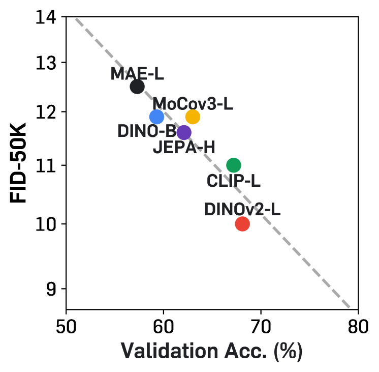

(a) Different visual encoders
[/FIGURE]

[FIGURE S4.F6.g1]

Figure 6: Selected samples on ImageNet 256$\times$256 from the SiT-XL/2 + REPA model. We use classifier-free guidance with $w=4.0$.
[/FIGURE]

Target encoder size. Next, we investigate the impact of different target representation encoder sizes by evaluating various DINOv2 models (*i.e.*, DINOv2-B, -L, -g). We observe that the performance differences are marginal, which we hypothesize is due to all DINOv2 models being distilled from the DINOv2-g model and thus sharing similar representations.  

Alignment depth. We also examine the effect of attaching the REPA loss to different layers. We find that regularizing only the first few layers (*e.g.*, 8) in training is sufficient, as indicated by the linear probing results in Table [4.1](#S4.SS1 "4.1 Setup ‣ 4 Experiments ‣ Representation Alignment for Generation: Training Diffusion Transformers Is Easier Than You Think"). Interestingly, limiting regularization to the first few layers further enhances generation performance (*e.g.*, adding REPA to layer 6 or 8 yields best results). We hypothesize that this enables the remaining layers to concentrate on capturing high-frequency details, building on a strong representation. In future experiments, we apply REPA to the first 8 layers.  

Alignment objective. We compare two simple training objectives for alignment: Normalized Temperature-scaled Cross Entropy (NT-Xent; Chen et al. [2020a](#bib.bib13)) or negative cosine similarity (cos. sim.). Empirically, we find that NT-Xent offers advantages in the early stages (*e.g.*, 50-100K iterations), but the gap diminishes over time. Thus, we opt for cos. sim. in future experiments.  

Scalability. Lastly, we investigate the scalability of REPA by varying the model sizes of both the target representation encoders and the diffusion transformers. In general, as summarized in Figure [5(a)](#S4.F5.sf1 "In Figure 5 ‣ 4.2 Component-wise analysis ‣ 4 Experiments ‣ Representation Alignment for Generation: Training Diffusion Transformers Is Easier Than You Think"), aligning with stronger representations improves both the generation results and the linear probing performance. Moreover, the convergence speed-up from REPA becomes more significant as the diffusion transformer model increases in size. We demonstrate this by plotting FID-50K of different SiT models with and without REPA in Figure [5(b)](#S4.F5.sf2 "In Figure 5 ‣ 4.2 Component-wise analysis ‣ 4 Experiments ‣ Representation Alignment for Generation: Training Diffusion Transformers Is Easier Than You Think"): REPA achieves the same FID level more quickly with larger models. Lastly, Figure [5(c)](#S4.F5.sf3 "In Figure 5 ‣ 4.2 Component-wise analysis ‣ 4 Experiments ‣ Representation Alignment for Generation: Training Diffusion Transformers Is Easier Than You Think") highlights the relationship between linear probing results and FID scores as model size varies, while keeping the target representation encoder fixed as DINOv2-B. Larger models exhibit a steeper performance improvement (*i.e.*, faster gains in both generation and linear evaluation) with longer training.  

[FIGURE S4.SS2.7]

[FIGURE S4.SS2.1.1]

[TABLE S4.T3]

Table 3: FID comparisons with vanilla DiTs and SiTs on ImageNet 256$\times$256. We do not use classifier-free guidance (CFG). $\downarrow$ denotes lower values are better. Iter. indicates the training iteration.
[/TABLE]

| Model | #Params | Iter. | FID$\downarrow$ |
| --- | --- | --- | --- |
| DiT-L/2 | 458M | 400K | 23.3 |
| + REPA (ours) | 458M | 400K | 15.6 |
| DiT-XL/2 | 675M | 400K | 19.5 |
| + REPA (ours) | 675M | 400K | 12.3 |
| DiT-XL/2 | 675M | 7M | 09.6 |
| + REPA (ours) | 675M | 850K | 09.6 |
| SiT-B/2 | 130M | 400K | 33.0 |
| + REPA (ours) | 130M | 400K | 24.4 |
| SiT-L/2 | 458M | 400K | 18.8 |
| + REPA (ours) | 458M | 400K | 09.7 |
| + REPA (ours) | 458M | 700K | 08.4 |
| SiT-XL/2 | 675M | 400K | 17.2 |
| + REPA (ours) | 675M | 150K | 13.6 |
| SiT-XL/2 | 675M | 7M | 08.3 |
| + REPA (ours) | 675M | 400K | 07.9 |
| + REPA (ours) | 675M | 1M | 06.4 |
| + REPA (ours) | 675M | 4M | 05.9 |

Table 3: FID comparisons with vanilla DiTs and SiTs on ImageNet 256$\times$256. We do not use classifier-free guidance (CFG). $\downarrow$ denotes lower values are better. Iter. indicates the training iteration.
[/FIGURE]

[FIGURE S4.SS2.7.7]

[TABLE S4.T4]

Table 4: 
System-level comparison on ImageNet 256$\times$256 with CFG. $\downarrow$ and $\uparrow$ indicate whether lower or higher values are better, respectively. Results that include additional CFG scheduling are marked with an asterisk (\*), where the guidance interval from (Kynkäänniemi et al., [2024](#bib.bib47)) is applied for REPA.
[/TABLE]

| 00Model | Epochs | 0FID$\downarrow$ | sFID$\downarrow$ | IS$\uparrow$ | Pre.$\uparrow$ | Rec.$\uparrow$ |
| --- | --- | --- | --- | --- | --- | --- |
| *Pixel diffusion* | | | | | | |
| 00ADM-U | 0400 | 03.94 | 6.14 | 186.7 | 0.82 | 0.52 |
| 00VDM$++$ | 0560 | 02.40 | - | 225.3 | - | - |
| 00Simple diffusion | 0800 | 02.77 | - | 211.8 | - | - |
| 00CDM | 2160 | 04.88 | - | 158.7 | - | - |
| *Latent diffusion, U-Net* | | | | | | |
| 00LDM-4 | 0200 | 03.60 | - | 247.7 | 0.87 | 0.48 |
| *Latent diffusion, Transformer + U-Net hybrid* | | | | | | |
| 00U-ViT-H/2 | 0240 | 02.29 | 5.68 | 263.9 | 0.82 | 0.57 |
| 00DiffiT\* | - | 01.73 | - | 276.5 | 0.80 | 0.62 |
| 00MDTv2-XL/2\* | 1080 | 01.58 | 4.52 | 314.7 | 0.79 | 0.65 |
| *Latent diffusion, Transformer* | | | | | | |
| 00MaskDiT | 1600 | 02.28 | 5.67 | 276.6 | 0.80 | 0.61 |
| 00SD-DiT | 0480 | 03.23 | - | - | - | - |
| 00DiT-XL/2 | 1400 | 02.27 | 4.60 | 278.2 | 0.83 | 0.57 |
| 00SiT-XL/2 | 1400 | 02.06 | 4.50 | 270.3 | 0.82 | 0.59 |
| 00+ REPA (ours) | 0200 | 01.96 | 4.49 | 264.0 | 0.82 | 0.60 |
| 00+ REPA (ours) | 0800 | 01.80 | 4.50 | 284.0 | 0.81 | 0.61 |
| 00+ REPA (ours)\* | 0800 | 01.42 | 4.70 | 305.7 | 0.80 | 0.65 |

Table 4: 
System-level comparison on ImageNet 256$\times$256 with CFG. $\downarrow$ and $\uparrow$ indicate whether lower or higher values are better, respectively. Results that include additional CFG scheduling are marked with an asterisk (\*), where the guidance interval from (Kynkäänniemi et al., [2024](#bib.bib47)) is applied for REPA.
[/FIGURE]

Table 3: FID comparisons with vanilla DiTs and SiTs on ImageNet 256$\times$256. We do not use classifier-free guidance (CFG). $\downarrow$ denotes lower values are better. Iter. indicates the training iteration.
[/FIGURE]

### 4.3 System-level comparison

Based on the analysis, we perform a system-level comparison between recent state-of-the-art diffusion model approaches and diffusion transformers with REPA. First, we compare the FID values between vanilla DiT or SiT models and the same models trained with REPA. As shown in Table [4.2](#S4.SS2 "4.2 Component-wise analysis ‣ 4 Experiments ‣ Representation Alignment for Generation: Training Diffusion Transformers Is Easier Than You Think"), REPA shows consistent and significant improvement across all model variants. In particular, on SiT-XL/2, aligning representation leads to FID$=$7.9 at 400K iteration, which already exceeds the FID of the vanilla SiT-XL at 7M iteration. Note that the performance continues to improve with longer training; for instance, with SiT-XL/2, FID becomes 6.4 at 1M iteration and 5.9 at 4M iteration. We also qualitatively compare the progression of generation results in Figure [4](#S3.F4 "Figure 4 ‣ 3.1 Overview ‣ 3 REPA: Regularization for Representation Alignment ‣ Representation Alignment for Generation: Training Diffusion Transformers Is Easier Than You Think"), where we use the same initial noise across different models. The model trained with REPA exhibits better progression.  

Finally, we provide a quantitative comparison between SiT-XL/2 with REPA and other recent diffusion model methods using classifier-free guidance (Ho & Salimans, [2022](#bib.bib31)). Our method already outperforms the original SiT-XL/2 with 7$\times$ fewer epochs and it is further improved with longer training. At 800 epochs, SiT-XL/2 with REPA achieves FID of 1.80 with a classifier-free guidance scale of $w=1.35$, and achieves state-of-the-art FID of 1.42 with a extra classifier-free guidance scheduling with guidance interval (Kynkäänniemi et al., [2024](#bib.bib47)). We also provide selected qualitative results of SiT-XL/2 with REPA in Figure [6](#S4.F6 "Figure 6 ‣ 4.2 Component-wise analysis ‣ 4 Experiments ‣ Representation Alignment for Generation: Training Diffusion Transformers Is Easier Than You Think") and more examples in Appendix [H](#A8 "Appendix H More Qualitative Results ‣ Representation Alignment for Generation: Training Diffusion Transformers Is Easier Than You Think").  

### 4.4 Ablation studies

Representation gap across different timesteps. We begin by comparing the semantic gap (measured through linear probing results) using outputs of the SiT models with different noise scale (*i.e.*, different timesteps), and maximum CKNNA values using clean DINOv2-g representations. As shown in Figure [8](#S4.F8 "Figure 8 ‣ 4.4 Ablation studies ‣ 4 Experiments ‣ Representation Alignment for Generation: Training Diffusion Transformers Is Easier Than You Think"), REPA consistently reduces the representation gap across different noise levels, as indicated by better linear probing results and higher CKNNA values across all noise scales.  

Alignment to different visual encoders. In addition, we extend the analysis from Section [2](#S1.F2 "Figure 2 ‣ 1 Introduction ‣ Representation Alignment for Generation: Training Diffusion Transformers Is Easier Than You Think") to other visual encoders, not limited to the DINOv2 models. Specifically, we train SiT-L/2 models using REPA with MAE or MoCov3. As depicted in Figure [8](#S4.F8 "Figure 8 ‣ 4.4 Ablation studies ‣ 4 Experiments ‣ Representation Alignment for Generation: Training Diffusion Transformers Is Easier Than You Think"), these models demonstrate higher CKNNA values across the corresponding target representations than the vanilla model. This indicates that REPA is effective in aligning various visual representations, not limited to DINOv2.  

[FIGURE S4.SS4.3]

[TABLE S4.T5]

Table 5: 
Ablation study for $\lambda$.
[/TABLE]

| $\lambda$ | 0.25 | 0.5 | 0.75 | 1.0 |
| --- | --- | --- | --- | --- |
| FID$\downarrow$ | 8.6 | 7.9 | 7.8 | 7.8 |
| IS$\uparrow$ | 118.6 | 122.6 | 124.4 | 124.8 |

Table 5: 
Ablation study for $\lambda$.
[/FIGURE]

Effect of $\lambda$. We also examine the effect of the regularization coefficient $\lambda$ by training SiT-XL/2 models for 400K with different coefficients 0.25 to 1.0 and comparing the performance. As shown in Table [4.4](#S4.SS4 "4.4 Ablation studies ‣ 4 Experiments ‣ Representation Alignment for Generation: Training Diffusion Transformers Is Easier Than You Think"), the performance is robust to the values and it is quite saturated after $\lambda=0.5$.  

[FIGURE S4.F7.sf1.g1]
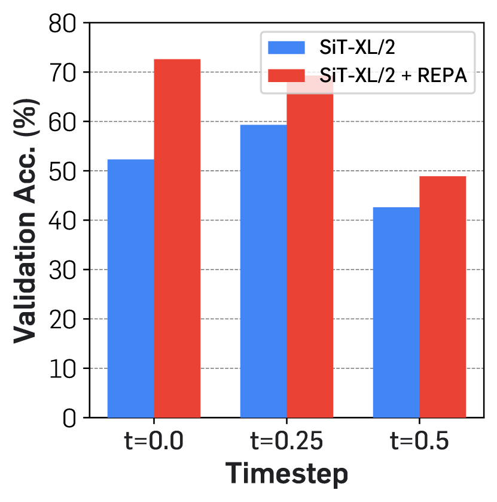

(a) Linear probing
[/FIGURE]

## 5 Related Work

We discuss with the most relevant literature here and provide a more discussion in Appendix [I](#A9 "Appendix I More Discussion on Related Work ‣ Representation Alignment for Generation: Training Diffusion Transformers Is Easier Than You Think").  

Bridging diffusion models and representation learning. Many recent works have attempted to exploit or improve representations learned from diffusion models (Fuest et al., [2024](#bib.bib23)). First, there are hybrid model approaches: Yang et al. ([2022](#bib.bib83)) and Deja et al. ([2023](#bib.bib17)) try to train a single model capable of both classification and diffusion-based generation. Also, Tian et al. ([2024](#bib.bib79)) introduces a hybrid model capable of segmentation and generation. Next, several works have analyzed and exploited representations in diffusion models: Xiang et al. ([2023](#bib.bib81)) and Mukhopadhyay et al. ([2021](#bib.bib59)) observe that the intermediate representations of diffusion models have discriminative properties. Moreover, Repfusion (Yang & Wang, [2023](#bib.bib82)) and DreamTeacher (Li et al., [2023b](#bib.bib50)) propose knowledge distillation schemes from diffusion models to a student model to perform various downstream tasks such as classification and several dense prediction tasks. Finally, there have been some attempts to improve denoising in diffusion models as self-supervised learning: Abstreiter et al. ([2021](#bib.bib1)) extends the diffusion objective for a better representation learning scheme, and Chen et al. ([2024c](#bib.bib16)) deconstructs diffusion models to improve denoising-based representation learning. Hudson et al. ([2024](#bib.bib35)) introduces an encoder that learns a representation by guiding a diffusion with its output as a compact latent vector. Zaidi et al. ([2023](#bib.bib85)) focuses on the molecular domain and proposes a pretraining scheme based on denoising. Our work also shares some similarities, where we focus on *alignments* between recent self-supervised and diffusion representations and how they affect generation.  

Diffusion models with external representations. Several recent studies have explored leveraging pretrained visual encoders to enhance efficiency and performance of diffusion models (Pernias et al., [2024](#bib.bib64); Li et al., [2024](#bib.bib51)). Würstchen (Pernias et al., [2024](#bib.bib64)) introduces a two-stage text-to-image diffusion model framework: a text-conditioned model that first generates a semantic map from a text prompt, followed by another diffusion model that synthesizes images based on the semantic map. RCG (Li et al., [2024](#bib.bib51)) focuses on unconditional generation, where a compact 1D latent vector is produced by a diffusion model and subsequently used as a label for image generation by a second diffusion model. Our work also exploits pretrained representations for improving the diffusion model, but we improve the diffusion model without the need to train an additional diffusion model that learns the representation distribution. In particular, we train a single diffusion model by proposing a regularization that aligns diffusion representations with self-supervised visual representations.  

## 6 Conclusion

In this paper, we have presented REPA, a simple regularization for improving diffusion transformers. In particular, we investigated whether diffusion transformer representations can be aligned with recent self-supervised representations, and if it can improve the generation performance of diffusion transformers. We showed REPA can significantly improves generation performance of diffusion transformers with faster convergence speed. We hope our work would facilitate many possible future research directions, including unifying discriminative and generative models and their representations or theoretical analysis in how this alignment improves the generation.  

## Reproducibility Statement

We provide hyperparameter details in Section [4](#S4 "4 Experiments ‣ Representation Alignment for Generation: Training Diffusion Transformers Is Easier Than You Think") and Appendix [D](#A4 "Appendix D Hyperparameter and More Implementation Details ‣ Representation Alignment for Generation: Training Diffusion Transformers Is Easier Than You Think"). We will also release the implementation and model checkpoints in the future to reproduce the results in the paper.  

## References

* Abstreiter et al. (2021)  Korbinian Abstreiter, Sarthak Mittal, Stefan Bauer, Bernhard Schölkopf, and Arash Mehrjou.   Diffusion-based representation learning.   *arXiv preprint arXiv:2105.14257*, 2021. 
* Albergo et al. (2023)  Michael S. Albergo, Nicholas M. Boffi, and Eric Vanden-Eijnden.   Stochastic interpolants: A unifying framework for flows and diffusions.   *arXiv preprint arXiv:2303.08797*, 2023. 
* Albergo & Vanden-Eijnden (2023)  Michael Samuel Albergo and Eric Vanden-Eijnden.   Building normalizing flows with stochastic interpolants.   In *International Conference on Learning Representations*, 2023. 
* Arnab et al. (2021)  Anurag Arnab, Mostafa Dehghani, Georg Heigold, Chen Sun, Mario Lučić, and Cordelia Schmid.   ViViT: A video vision transformer.   In *IEEE International Conference on Computer Vision*, 2021. 
* Assran et al. (2023)  Mahmoud Assran, Quentin Duval, Ishan Misra, Piotr Bojanowski, Pascal Vincent, Michael Rabbat, Yann LeCun, and Nicolas Ballas.   Self-supervised learning from images with a joint-embedding predictive architecture.   In *IEEE Conference on Computer Vision and Pattern Recognition*, 2023. 
* Bao et al. (2023)  Fan Bao, Shen Nie, Kaiwen Xue, Yue Cao, Chongxuan Li, Hang Su, and Jun Zhu.   All are worth words: A ViT backbone for diffusion models.   In *IEEE Conference on Computer Vision and Pattern Recognition*, 2023. 
* Bengio et al. (2013)  Yoshua Bengio, Aaron Courville, and Pascal Vincent.   Representation learning: A review and new perspectives.   *IEEE Transactions on Pattern Analysis and Machine Intelligence*, 35(8):1798–1828, 2013. 
* Brooks et al. (2024)  Tim Brooks, Bill Peebles, Connor Holmes, Will DePue, Yufei Guo, Li Jing, David Schnurr, Joe Taylor, Troy Luhman, Eric Luhman, Clarence Ng, Ricky Wang, and Aditya Ramesh.   Video generation models as world simulators.   *OpenAI Blog*, 2024. 
* Caron et al. (2021)  Mathilde Caron, Hugo Touvron, Ishan Misra, Hervé Jégou, Julien Mairal, Piotr Bojanowski, and Armand Joulin.   Emerging properties in self-supervised vision transformers.   In *IEEE International Conference on Computer Vision*, 2021. 
* Chang et al. (2022)  Huiwen Chang, Han Zhang, Lu Jiang, Ce Liu, and William T Freeman.   MaskGiT: Masked generative image transformer.   In *IEEE Conference on Computer Vision and Pattern Recognition*, 2022. 
* Chen et al. (2024a)  Junsong Chen, Chongjian Ge, Enze Xie, Yue Wu, Lewei Yao, Xiaozhe Ren, Zhongdao Wang, Ping Luo, Huchuan Lu, and Zhenguo Li.   PixArt-$\Sigma$: Weak-to-strong training of diffusion transformer for 4k text-to-image generation.   *arXiv preprint arXiv:2403.04692*, 2024a. 
* Chen et al. (2024b)  Junsong Chen, Jincheng Yu, Chongjian Ge, Lewei Yao, Enze Xie, Yue Wu, Zhongdao Wang, James Kwok, Ping Luo, Huchuan Lu, et al.   PixArt-$\alpha$: Fast training of diffusion transformer for photorealistic text-to-image synthesis.   In *International Conference on Learning Representations*, 2024b. 
* Chen et al. (2020a)  Ting Chen, Simon Kornblith, Mohammad Norouzi, and Geoffrey Hinton.   A simple framework for contrastive learning of visual representations.   In *International Conference on Machine Learning*, 2020a. 
* Chen et al. (2020b)  Xinlei Chen, Haoqi Fan, Ross Girshick, and Kaiming He.   Improved baselines with momentum contrastive learning.   *arXiv preprint arXiv:2003.04297*, 2020b. 
* Chen et al. (2021)  Xinlei Chen, Saining Xie, and Kaiming He.   An empirical study of training self-supervised vision transformers.   In *IEEE International Conference on Computer Vision*, 2021. 
* Chen et al. (2024c)  Xinlei Chen, Zhuang Liu, Saining Xie, and Kaiming He.   Deconstructing denoising diffusion models for self-supervised learning.   *arXiv preprint arXiv:2401.14404*, 2024c. 
* Deja et al. (2023)  Kamil Deja, Tomasz Trzciński, and Jakub M Tomczak.   Learning data representations with joint diffusion models.   In *Joint European Conference on Machine Learning and Knowledge Discovery in Databases*, 2023. 
* Deng et al. (2009)  Jia Deng, Wei Dong, Richard Socher, Li-Jia Li, Kai Li, and Li Fei-Fei.   ImageNet: A large-scale hierarchical image database.   In *IEEE Conference on Computer Vision and Pattern Recognition*, 2009. 
* Dhariwal & Nichol (2021)  Prafulla Dhariwal and Alexander Nichol.   Diffusion models beat GANs on image synthesis.   In *Advances in Neural Information Processing Systems*, 2021. 
* Dosovitskiy et al. (2021)  Alexey Dosovitskiy, Lucas Beyer, Alexander Kolesnikov, Dirk Weissenborn, Xiaohua Zhai, Thomas Unterthiner, Mostafa Dehghani, Matthias Minderer, Georg Heigold, Sylvain Gelly, Jakob Uszkoreit, and Neil Houlsby.   An image is worth 16x16 words: Transformers for image recognition at scale.   In *International Conference on Learning Representations*, 2021. 
* Elfwing et al. (2018)  Stefan Elfwing, Eiji Uchibe, and Kenji Doya.   Sigmoid-weighted linear units for neural network function approximation in reinforcement learning.   *Neural networks*, 107:3–11, 2018. 
* Esser et al. (2024)  Patrick Esser, Sumith Kulal, Andreas Blattmann, Rahim Entezari, Jonas Müller, Harry Saini, Yam Levi, Dominik Lorenz, Axel Sauer, Frederic Boesel, et al.   Scaling rectified flow transformers for high-resolution image synthesis.   In *International Conference on Machine Learning*, 2024. 
* Fuest et al. (2024)  Michael Fuest, Pingchuan Ma, Ming Gui, Johannes S Fischer, Vincent Tao Hu, and Bjorn Ommer.   Diffusion models and representation learning: A survey.   *arXiv preprint arXiv:2407.00783*, 2024. 
* Gao et al. (2023)  Shanghua Gao, Pan Zhou, Ming-Ming Cheng, and Shuicheng Yan.   MDTv2: Masked diffusion transformer is a strong image synthesizer.   *arXiv preprint arXiv:2303.14389*, 2023. 
* Goodfellow et al. (2014)  Ian Goodfellow, Jean Pouget-Abadie, Mehdi Mirza, Bing Xu, David Warde-Farley, Sherjil Ozair, Aaron Courville, and Yoshua Bengio.   Generative adversarial nets.   In *Advances in Neural Information Processing Systems*, 2014. 
* Gupta et al. (2024)  Agrim Gupta, Lijun Yu, Kihyuk Sohn, Xiuye Gu, Meera Hahn, Li Fei-Fei, Irfan Essa, Lu Jiang, and José Lezama.   Photorealistic video generation with diffusion models.   *European Conference on Computer Vision*, 2024. 
* Hatamizadeh et al. (2024)  Ali Hatamizadeh, Jiaming Song, Guilin Liu, Jan Kautz, and Arash Vahdat.   DiffiT: Diffusion vision transformers for image generation.   In *European Conference on Computer Vision*, 2024. 
* He et al. (2020)  Kaiming He, Haoqi Fan, Yuxin Wu, Saining Xie, and Ross Girshick.   Momentum contrast for unsupervised visual representation learning.   In *IEEE Conference on Computer Vision and Pattern Recognition*, 2020. 
* He et al. (2022)  Kaiming He, Xinlei Chen, Saining Xie, Yanghao Li, Piotr Dollár, and Ross Girshick.   Masked autoencoders are scalable vision learners.   In *IEEE Conference on Computer Vision and Pattern Recognition*, 2022. 
* Heusel et al. (2017)  Martin Heusel, Hubert Ramsauer, Thomas Unterthiner, Bernhard Nessler, and Sepp Hochreiter.   GANs trained by a two time-scale update rule converge to a local nash equilibrium.   In *Advances in Neural Information Processing Systems*, 2017. 
* Ho & Salimans (2022)  Jonathan Ho and Tim Salimans.   Classifier-free diffusion guidance.   *arXiv preprint arXiv:2207.12598*, 2022. 
* Ho et al. (2020)  Jonathan Ho, Ajay Jain, and Pieter Abbeel.   Denoising diffusion probabilistic models.   In *Advances in Neural Information Processing Systems*, 2020. 
* Ho et al. (2022)  Jonathan Ho, Chitwan Saharia, William Chan, David J Fleet, Mohammad Norouzi, and Tim Salimans.   Cascaded diffusion models for high fidelity image generation.   *Journal of Machine Learning Research*, 23(47):1–33, 2022. 
* Hoogeboom et al. (2023)  Emiel Hoogeboom, Jonathan Heek, and Tim Salimans.   Simple diffusion: End-to-end diffusion for high resolution images.   In *International Conference on Machine Learning*, 2023. 
* Hudson et al. (2024)  Drew A Hudson, Daniel Zoran, Mateusz Malinowski, Andrew K Lampinen, Andrew Jaegle, James L McClelland, Loic Matthey, Felix Hill, and Alexander Lerchner.   SODA: Bottleneck diffusion models for representation learning.   In *IEEE Conference on Computer Vision and Pattern Recognition*, 2024. 
* Huh et al. (2024)  Minyoung Huh, Brian Cheung, Tongzhou Wang, and Phillip Isola.   The platonic representation hypothesis.   In *International Conference on Machine Learning*, 2024. 
* Kang et al. (2023)  Minguk Kang, Jun-Yan Zhu, Richard Zhang, Jaesik Park, Eli Shechtman, Sylvain Paris, and Taesung Park.   Scaling up GANs for text-to-image synthesis.   In *IEEE Conference on Computer Vision and Pattern Recognition*, 2023. 
* Kang et al. (2024)  Minguk Kang, Richard Zhang, Connelly Barnes, Sylvain Paris, Suha Kwak, Jaesik Park, Eli Shechtman, Jun-Yan Zhu, and Taesung Park.   Distilling diffusion models into conditional GANs.   In *European Conference on Computer Vision*, 2024. 
* Karras et al. (2018)  Tero Karras, Timo Aila, Samuli Laine, and Jaakko Lehtinen.   Progressive growing of GANs for improved quality, stability, and variation.   In *International Conference on Learning Representations*, 2018. 
* Karras et al. (2022)  Tero Karras, Miika Aittala, Timo Aila, and Samuli Laine.   Elucidating the design space of diffusion-based generative models.   In *Advances in Neural Information Processing Systems*, 2022. 
* Karras et al. (2024)  Tero Karras, Miika Aittala, Jaakko Lehtinen, Janne Hellsten, Timo Aila, and Samuli Laine.   Analyzing and improving the training dynamics of diffusion models.   In *IEEE Conference on Computer Vision and Pattern Recognition*, 2024. 
* Kingma & Gao (2024)  Diederik Kingma and Ruiqi Gao.   Understanding diffusion objectives as the ELBO with simple data augmentation.   *Advances in Neural Information Processing Systems*, 2024. 
* Kingma (2015)  Diederik P Kingma.   Adam: A method for stochastic optimization.   In *International Conference on Learning Representations*, 2015. 
* Kornblith et al. (2019)  Simon Kornblith, Mohammad Norouzi, Honglak Lee, and Geoffrey Hinton.   Similarity of neural network representations revisited.   In *International Conference on Machine Learning*, 2019. 
* Kumari et al. (2022)  Nupur Kumari, Richard Zhang, Eli Shechtman, and Jun-Yan Zhu.   Ensembling off-the-shelf models for GAN training.   In *IEEE Conference on Computer Vision and Pattern Recognition*, 2022. 
* Kynkäänniemi et al. (2019)  Tuomas Kynkäänniemi, Tero Karras, Samuli Laine, Jaakko Lehtinen, and Timo Aila.   Improved precision and recall metric for assessing generative models.   In *Advances in Neural Information Processing Systems*, 2019. 
* Kynkäänniemi et al. (2024)  Tuomas Kynkäänniemi, Miika Aittala, Tero Karras, Samuli Laine, Timo Aila, and Jaakko Lehtinen.   Applying guidance in a limited interval improves sample and distribution quality in diffusion models.   *arXiv preprint arXiv:2404.07724*, 2024. 
* LeCun (2022)  Yann LeCun.   A path towards autonomous machine intelligence version 0.9. 2, 2022-06-27.   *Open Review*, 62(1):1–62, 2022. 
* Li et al. (2023a)  Alexander C Li, Mihir Prabhudesai, Shivam Duggal, Ellis Brown, and Deepak Pathak.   Your diffusion model is secretly a zero-shot classifier.   In *IEEE International Conference on Computer Vision*, 2023a. 
* Li et al. (2023b)  Daiqing Li, Huan Ling, Amlan Kar, David Acuna, Seung Wook Kim, Karsten Kreis, Antonio Torralba, and Sanja Fidler.   DreamTeacher: Pretraining image backbones with deep generative models.   In *IEEE International Conference on Computer Vision*, 2023b. 
* Li et al. (2024)  T Li, D Katabi, and K He.   Return of unconditional generation: A self-supervised representation generation method.   In *Advances in Neural Information Processing Systems*, 2024. 
* Li et al. (2023c)  Tianhong Li, Huiwen Chang, Shlok Mishra, Han Zhang, Dina Katabi, and Dilip Krishnan.   MAGE: Masked generative encoder to unify representation learning and image synthesis.   In *IEEE Conference on Computer Vision and Pattern Recognition*, 2023c. 
* Lipman et al. (2022)  Yaron Lipman, Ricky TQ Chen, Heli Ben-Hamu, Maximilian Nickel, and Matt Le.   Flow matching for generative modeling.   *arXiv preprint arXiv:2210.02747*, 2022. 
* Liu et al. (2023)  Xingchao Liu, Chengyue Gong, and Qiang Liu.   Flow straight and fast: Learning to generate and transfer data with rectified flow.   In *International Conference on Learning Representations*, 2023. 
* Loshchilov (2017)  I Loshchilov.   Decoupled weight decay regularization.   In *International Conference on Learning Representations*, 2017. 
* Lu et al. (2024)  Haoyu Lu, Guoxing Yang, Nanyi Fei, Yuqi Huo, Zhiwu Lu, Ping Luo, and Mingyu Ding.   VDT: General-purpose video diffusion transformers via mask modeling.   In *International Conference on Learning Representations*, 2024. 
* Ma et al. (2024a)  Nanye Ma, Mark Goldstein, Michael S Albergo, Nicholas M Boffi, Eric Vanden-Eijnden, and Saining Xie.   SiT: Exploring flow and diffusion-based generative models with scalable interpolant transformers.   In *European Conference on Computer Vision*, 2024a. 
* Ma et al. (2024b)  Xin Ma, Yaohui Wang, Gengyun Jia, Xinyuan Chen, Ziwei Liu, Yuan-Fang Li, Cunjian Chen, and Yu Qiao.   Latte: Latent diffusion transformer for video generation.   *arXiv preprint arXiv:2401.03048*, 2024b. 
* Mukhopadhyay et al. (2021)  Soumik Mukhopadhyay, Matthew Gwilliam, Vatsal Agarwal, Namitha Padmanabhan, Archana Swaminathan, Srinidhi Hegde, Tianyi Zhou, and Abhinav Shrivastava.   Diffusion models beat GANs on image classification.   In *Advances in Neural Information Processing Systems*, 2021. 
* Nash et al. (2021)  Charlie Nash, Jacob Menick, Sander Dieleman, and Peter W Battaglia.   Generating images with sparse representations.   In *International Conference on Machine Learning*, 2021. 
* Nichol & Dhariwal (2021)  Alexander Quinn Nichol and Prafulla Dhariwal.   Improved denoising diffusion probabilistic models.   In *International Conference on Machine Learning*, 2021. 
* Oquab et al. (2024)  Maxime Oquab, Timothée Darcet, Théo Moutakanni, Huy V. Vo, Marc Szafraniec, Vasil Khalidov, Pierre Fernandez, Daniel HAZIZA, Francisco Massa, Alaaeldin El-Nouby, Mido Assran, Nicolas Ballas, Wojciech Galuba, Russell Howes, Po-Yao Huang, Shang-Wen Li, Ishan Misra, Michael Rabbat, Vasu Sharma, Gabriel Synnaeve, Hu Xu, Herve Jegou, Julien Mairal, Patrick Labatut, Armand Joulin, and Piotr Bojanowski.   DINOv2: Learning robust visual features without supervision.   *Transactions on Machine Learning Research*, 2024.   ISSN 2835-8856. 
* Peebles & Xie (2023)  William Peebles and Saining Xie.   Scalable diffusion models with transformers.   In *IEEE International Conference on Computer Vision*, 2023. 
* Pernias et al. (2024)  Pablo Pernias, Dominic Rampas, Mats Leon Richter, Christopher Pal, and Marc Aubreville.   Würstchen: An efficient architecture for large-scale text-to-image diffusion models.   In *International Conference on Learning Representations*, 2024. 
* Podell et al. (2023)  Dustin Podell, Zion English, Kyle Lacey, Andreas Blattmann, Tim Dockhorn, Jonas Müller, Joe Penna, and Robin Rombach.   SDXL: Improving latent diffusion models for high-resolution image synthesis.   *arXiv preprint arXiv:2307.01952*, 2023. 
* Polyak et al. (2024)  Adam Polyak, Amit Zohar, Andrew Brown, Andros Tjandra, Animesh Sinha, Ann Lee, Apoorv Vyas, Bowen Shi, Chih-Yao Ma, Ching-Yao Chuang, David Yan, Dhruv Choudhary, Dingkang Wang, Geet Sethi, Guan Pang, Haoyu Ma, Ishan Misra, Ji Hou, Jialiang Wang, Kiran Jagadeesh, Kunpeng Li, Luxin Zhang, Mannat Singh, Mary Williamson, Matt Le, Mitesh Kumar Singh, Peizhao Zhang, Peter Vajda, Quentin Duval, Rohit Girdhar, Roshan Sumbaly, Sai Saketh Rambhatla, Sam Tsai, Samaneh Azadi, Samyak Datta, Sanyuan Chen, Sean Bell, Sharadh Ramaswamy, Shelly Sheynin, Siddharth Bhattacharya, Tao Xu, Tingbo Hou, Wei-Ning Hsu, Xi Yin, Xiaoliang Dai, Yaniv Taigman, Yaqiao Luo, Yen-Cheng Liu, Yi-Chiao Wu, Yue Zhao, Yuval Kirstain, Zecheng He, and Zijian He.   MovieGen: A cast of media foundation models.   *Meta AI Blog Post*, 2024.   URL <https://ai.meta.com/blog/movie-gen-media-foundation-models-generative-ai-video/>. 
* Radford et al. (2021)  Alec Radford, Jong Wook Kim, Chris Hallacy, Aditya Ramesh, Gabriel Goh, Sandhini Agarwal, Girish Sastry, Amanda Askell, Pamela Mishkin, Jack Clark, et al.   Learning transferable visual models from natural language supervision.   In *International Conference on Machine Learning*, 2021. 
* Rombach et al. (2022)  Robin Rombach, Andreas Blattmann, Dominik Lorenz, Patrick Esser, and Björn Ommer.   High-resolution image synthesis with latent diffusion models.   In *IEEE Conference on Computer Vision and Pattern Recognition*, 2022. 
* Saharia et al. (2022)  Chitwan Saharia, William Chan, Saurabh Saxena, Lala Li, Jay Whang, Emily L Denton, Kamyar Ghasemipour, Raphael Gontijo Lopes, Burcu Karagol Ayan, Tim Salimans, et al.   Photorealistic text-to-image diffusion models with deep language understanding.   In *Advances in Neural Information Processing Systems*, 2022. 
* Salimans et al. (2016)  Tim Salimans, Ian Goodfellow, Wojciech Zaremba, Vicki Cheung, Alec Radford, and Xi Chen.   Improved techniques for training GANs.   In *Advances in Neural Information Processing Systems*, 2016. 
* Sauer et al. (2021)  Axel Sauer, Kashyap Chitta, Jens Müller, and Andreas Geiger.   Projected GANs converge faster.   *Advances in Neural Information Processing Systems*, 2021. 
* Sauer et al. (2022)  Axel Sauer, Katja Schwarz, and Andreas Geiger.   StyleGAN-XL: Scaling StyleGAN to large diverse datasets.   In *ACM SIGGRAPH conference proceedings*, 2022. 
* Sauer et al. (2023a)  Axel Sauer, Tero Karras, Samuli Laine, Andreas Geiger, and Timo Aila.   StyleGAN-T: Unlocking the power of GANs for fast large-scale text-to-image synthesis.   In *International Conference on Machine Learning*, 2023a. 
* Sauer et al. (2023b)  Axel Sauer, Dominik Lorenz, Andreas Blattmann, and Robin Rombach.   Adversarial diffusion distillation.   *arXiv preprint arXiv:2311.17042*, 2023b. 
* Sauer et al. (2024)  Axel Sauer, Frederic Boesel, Tim Dockhorn, Andreas Blattmann, Patrick Esser, and Robin Rombach.   Fast high-resolution image synthesis with latent adversarial diffusion distillation.   *arXiv preprint arXiv:2403.12015*, 2024. 
* Sohl-Dickstein et al. (2015)  Jascha Sohl-Dickstein, Eric Weiss, Niru Maheswaranathan, and Surya Ganguli.   Deep unsupervised learning using nonequilibrium thermodynamics.   In *International Conference on Machine Learning*, 2015. 
* Song et al. (2021)  Yang Song, Jascha Sohl-Dickstein, Diederik P Kingma, Abhishek Kumar, Stefano Ermon, and Ben Poole.   Score-based generative modeling through stochastic differential equations.   In *International Conference on Learning Representations*, 2021. 
* Szegedy et al. (2016)  Christian Szegedy, Vincent Vanhoucke, Sergey Ioffe, Jon Shlens, and Zbigniew Wojna.   Rethinking the Inception architecture for computer vision.   In *IEEE Conference on Computer Vision and Pattern Recognition*, 2016. 
* Tian et al. (2024)  Changyao Tian, Chenxin Tao, Jifeng Dai, Hao Li, Ziheng Li, Lewei Lu, Xiaogang Wang, Hongsheng Li, Gao Huang, and Xizhou Zhu.   ADDP: Learning general representations for image recognition and generation with alternating denoising diffusion process.   In *International Conference on Learning Representations*, 2024. 
* Vincent (2011)  Pascal Vincent.   A connection between score matching and denoising autoencoders.   *Neural computation*, 23(7):1661–1674, 2011. 
* Xiang et al. (2023)  Weilai Xiang, Hongyu Yang, Di Huang, and Yunhong Wang.   Denoising diffusion autoencoders are unified self-supervised learners.   In *IEEE International Conference on Computer Vision*, 2023. 
* Yang & Wang (2023)  Xingyi Yang and Xinchao Wang.   Diffusion model as representation learner.   In *IEEE International Conference on Computer Vision*, 2023. 
* Yang et al. (2022)  Xiulong Yang, Sheng-Min Shih, Yinlin Fu, Xiaoting Zhao, and Shihao Ji.   Your ViT is secretly a hybrid discriminative-generative diffusion model.   *arXiv preprint arXiv:2208.07791*, 2022. 
* Yu et al. (2024)  Sihyun Yu, Weili Nie, De-An Huang, Boyi Li, Jinwoo Shin, and Anima Anandkumar.   Efficient video diffusion models via content-frame motion-latent decomposition.   In *International Conference on Learning Representations*, 2024. 
* Zaidi et al. (2023)  Sheheryar Zaidi, Michael Schaarschmidt, James Martens, Hyunjik Kim, Yee Whye Teh, Alvaro Sanchez-Gonzalez, Peter Battaglia, Razvan Pascanu, and Jonathan Godwin.   Pre-training via denoising for molecular property prediction.   In *International Conference on Learning Representations*, 2023. 
* Zheng et al. (2024)  Hongkai Zheng, Weili Nie, Arash Vahdat, and Anima Anandkumar.   Fast training of diffusion models with masked transformers.   *Transactions on Machine Learning Research*, 2024.   ISSN 2835-8856. 
* Zhu et al. (2024)  Rui Zhu, Yingwei Pan, Yehao Li, Ting Yao, Zhenglong Sun, Tao Mei, and Chang Wen Chen.   SD-DiT: Unleashing the power of self-supervised discrimination in diffusion transformer.   In *IEEE Conference on Computer Vision and Pattern Recognition*, 2024. 

## Appendix A Descriptions for Diffusion-based Models

We provide an overview of two types of generative models that we use in this paper, which learn the target distribution by training variants of a denoising autoencoder. We first explain denoising diffusion probabilistic models (DDPM) in Section [A.1](#A1.SS1 "A.1 Denoising diffusion probabilistic models ‣ Appendix A Descriptions for Diffusion-based Models ‣ Representation Alignment for Generation: Training Diffusion Transformers Is Easier Than You Think") and stochastic interpolants in Section [A.2](#A1.SS2 "A.2 Stochastic interpolants ‣ Appendix A Descriptions for Diffusion-based Models ‣ Representation Alignment for Generation: Training Diffusion Transformers Is Easier Than You Think"). For detailed explanations and rigorous proofs, please refer to the original papers (Albergo et al., [2023](#bib.bib2); Ma et al., [2024a](#bib.bib57)) that provide excellent formulations and description.  

### A.1 Denoising diffusion probabilistic models

*Diffusion models* (Sohl-Dickstein et al., [2015](#bib.bib76); Ho et al., [2020](#bib.bib32)) model the target distribution $p({\mathbf{x}})$ via learning a gradual denoising process from Gaussian distribution $\mathcal{N}(\mathbf{0},\mathbf{I})$ to $p({\mathbf{x}})$. Formally, diffusion models learn a *reverse* process $p({\mathbf{x}}_{t-1}|{\mathbf{x}}_{t})$ of the pre-defined *forward* process $q({\mathbf{x}}_{t}|{\mathbf{x}}_{0})$ that gradually adds the Gaussian noise starting from $p({\mathbf{x}})$ for $1\leq t\leq T$ with a fixed $T>0$.  

For a given ${\mathbf{x}}_{0}\sim p({\mathbf{x}})$, $q({\mathbf{x}}_{t}|{\mathbf{x}}_{t-1})$ can be formalized as $q({\mathbf{x}}_{t}|{\mathbf{x}}_{t-1})\coloneqq\mathcal{N}({\mathbf{x}}_{t};\sqrt{1-\beta_{t}}{\mathbf{x}}_{0},\beta_{t}^{2}\mathbf{I})$, where $\beta_{t}\in(0,1)$ are pre-defined hyperparameters set to be small. In particular, DDPM (Ho et al., [2020](#bib.bib32)) shows if one formalizes the reverse process $p({\mathbf{x}}_{t-1}|{\mathbf{x}}_{t})$ (with ${\alpha}_{t}=1-\beta_{t}$. $\bar{\alpha}_{t}\coloneqq\prod_{i=1}^{t}\alpha_{i}$ for $1\leq t\leq T$) as  

|  | $\displaystyle p({\mathbf{x}}_{t-1}|{\mathbf{x}}_{t})\coloneqq\mathcal{N}\Big{(}{\mathbf{x}}_{t-1};\frac{1}{\sqrt{\alpha_{t}}}\big{(}{\mathbf{x}}_{t}-\frac{\sigma_{t}^{2}}{\sqrt{1-\bar{\alpha}_{t}}}\bm{\epsilon}_{\bm{\theta}}({\mathbf{x}}_{t},t)\big{)},\mathbf{\Sigma}_{\theta}({\mathbf{x}}_{t},t)\Big{)},$ |  | (10) |
| --- | --- | --- | --- |

then $\bm{\epsilon}_{\bm{\theta}}({\mathbf{x}}_{t},t)$ can be trained with a simple denoising autoencoder objective parameterized by $\bm{\theta}$:  

|  | $\displaystyle\mathcal{L}_{\text{simple}}\coloneqq\mathbb{E}_{{\mathbf{x}}_{\ast},\bm{\epsilon},t}\Big{[}||\bm{\epsilon}-\bm{\epsilon}_{\bm{\theta}}({\mathbf{x}}_{t},t)||_{2}^{2}\Big{]}.$ |  | (11) |
| --- | --- | --- | --- |

For $\mathbf{\Sigma}_{\theta}({\mathbf{x}}_{t},t)$, (Ho et al., [2020](#bib.bib32)) shows it is enough to simply define it as $\sigma_{t}^{2}\mathbf{I}$ with $\beta_{t}=\sigma_{t}^{2}$. After that, Nichol & Dhariwal ([2021](#bib.bib61)) exhibits the performance can be improved if the model jointly learns $\mathbf{\Sigma}_{\theta}({\mathbf{x}}_{t},t)$ with $\bm{\epsilon}_{\bm{\theta}}({\mathbf{x}}_{t},t)$ in dimension-wise manner through the following objective:  

|  | $$\mathcal{L}_{\text{vlb}}\coloneqq\exp(v\log\beta_{t}+(1-v)\log\tilde{\beta}_{t}),$$ |  | (12) |
| --- | --- | --- | --- |

where $v$ denotes each component per dimension from the model output and $\tilde{\beta}_{t}=\frac{1-\bar{\alpha}_{t-1}}{1-\bar{\alpha}_{t}}\beta_{t}$.  

With a sufficiently large $T$ and an appropriate scheduling of $\beta_{t}$, the distribution $p({\mathbf{x}}_{T})$ becomes almost an isotropic Gaussian distribution. Hence, one can generate a sample starting from a random noise and perform iterative reverse process $p({\mathbf{x}}_{t-1}|{\mathbf{x}}_{t})$ to reach the data sample ${\mathbf{x}}_{0}$ (Ho et al., [2020](#bib.bib32)).  

### A.2 Stochastic interpolants

Different from DDPM, *flow-based models* (Esser et al., [2024](#bib.bib22); Lipman et al., [2022](#bib.bib53); Liu et al., [2023](#bib.bib54)) deal with the continuous time-dependent process with a data ${\mathbf{x}}_{\ast}\sim p({\mathbf{x}})$ and a Gaussian noise ${\mathbf{\epsilon}}~{}\sim\mathcal{N}(\mathbf{0},\mathbf{I})$ on $t\in[0,1]$:  

|  | $${\mathbf{x}}_{t}=\alpha_{t}{\mathbf{x}}_{0}+\sigma_{t}{\mathbf{\epsilon}},\quad\alpha_{0}=\sigma_{1}=1,\,\,\alpha_{1}=\sigma_{0}=0,$$ |  | (13) |
| --- | --- | --- | --- |

where $\alpha_{t}$ and $\sigma_{t}$ are a decreasing and increasing function of $t$ (respectively). There exists a *probability flow ordinary differential equation* (PF ODE) with a velocity field  

|  | $$\dot{{\mathbf{x}}}_{t}={\mathbf{v}}({\mathbf{x}}_{t},t),$$ |  | (14) |
| --- | --- | --- | --- |

where distribution of this ODE at $t$ is equal to the marginal $p_{t}({\mathbf{x}})$.  

The velocity ${\mathbf{v}}({\mathbf{x}},t)$ is represented as the following sum of two conditional expectations  

|  | $${\mathbf{v}}({\mathbf{x}},t)=\mathbb{E}[\dot{{\mathbf{x}}}_{t}|{\mathbf{x}}_{t}={\mathbf{x}}]=\dot{\alpha}_{t}\mathbb{E}[{\mathbf{x}}_{\ast}|{\mathbf{x}}_{t}={\mathbf{x}}]+\dot{\sigma}_{t}\mathbb{E}[{\mathbf{\epsilon}}|{\mathbf{x}}_{t}={\mathbf{x}}],$$ |  | (15) |
| --- | --- | --- | --- |

which can be approximated with model ${\mathbf{v}}_{\theta}({\mathbf{x}}_{t},t)$ by minimizing the following training objective:  

|  | $$\mathcal{L}_{\text{velocity}}(\theta)\coloneqq\mathbb{E}_{{\mathbf{x}}_{\ast},\bm{\epsilon},t}\Big{[}||{\mathbf{v}}_{\theta}({\mathbf{x}}_{t},t)-\dot{\alpha}_{t}{\mathbf{x}}_{\ast}-\dot{\sigma}_{t}{\mathbf{\epsilon}}||^{2}\Big{]}.$$ |  | (16) |
| --- | --- | --- | --- |

Note that this also corresponds to the following reverse *stochastic differential equation* (SDE):  

|  | $$d{\mathbf{x}}_{t}={\mathbf{v}}({\mathbf{x}}_{t},t)dt-\frac{1}{2}w_{t}{\mathbf{s}}({\mathbf{x}}_{t},t)dt+\sqrt{w_{t}}d\bar{\mathbf{w}}_{t},$$ |  | (17) |
| --- | --- | --- | --- |

where the score ${\mathbf{s}}({\mathbf{x}}_{t},t)$ similarly becomes the conditional expectation  

|  | $${\mathbf{s}}({\mathbf{x}}_{t},t)=-\frac{1}{\sigma_{t}}\mathbb{E}[{\mathbf{\epsilon}}|{\mathbf{x}}_{t}={\mathbf{x}}].$$ |  | (18) |
| --- | --- | --- | --- |

Similar to ${\mathbf{v}}$, ${\mathbf{s}}$ can be approximated with a model ${\mathbf{s}}_{\theta}({\mathbf{x}},t)$ with the following objective:  

|  | $$\mathcal{L}_{\text{score}}(\theta)\coloneqq\mathbb{E}_{{\mathbf{x}}_{\ast},\bm{\epsilon},t}\Big{[}||\sigma_{t}{\mathbf{s}}_{\theta}({\mathbf{x}}_{t},t)+{\mathbf{\epsilon}}||^{2}\Big{]}.$$ |  | (19) |
| --- | --- | --- | --- |

Here, since the score ${\mathbf{s}}({\mathbf{x}},t)$ can be directly computed using the velocity ${\mathbf{v}}({\mathbf{x}},t)$ for $t>0$ as  

|  | $${\mathbf{s}}({\mathbf{x}},t)={\frac{1}{\sigma_{t}}}\cdot\frac{\alpha_{t}{\mathbf{v}}({\mathbf{x}},t)-\dot{\alpha}_{t}{\mathbf{x}}}{\dot{\alpha}_{t}\sigma_{t}-{\alpha}_{t}\dot{\sigma}_{t}},$$ |  | (20) |
| --- | --- | --- | --- |

so it is enough to estimate only one of the two vectors.  

*Stochastic interpolants* (Albergo et al., [2023](#bib.bib2)) shows any $\alpha_{t}$ and $\sigma_{t}$ satisfy the three conditions  

|  | $\displaystyle 1.~{}$ | $\displaystyle\alpha_{t}^{2}+\sigma_{t}^{2}>0,\,\,\forall t\in[0,1]$ |  |
| --- | --- | --- | --- |
|  | $\displaystyle 2.~{}$ | $\displaystyle\alpha_{t}~{}\text{and}~{}\sigma_{t}~{}\text{are differentiable},\,\,\forall t\in[0,1]$ |  |
| --- | --- | --- | --- |
|  | $\displaystyle 3.~{}$ | $\displaystyle\alpha_{1}=\sigma_{0}=0,~{}\alpha_{0}=\sigma_{1}=1,$ |  |
| --- | --- | --- | --- |

leads to a process that interpolates between ${\mathbf{x}}_{0}$ and ${\mathbf{\epsilon}}$ without bias. Thus, one can use a simple interpolant by defining them as a simple function during training and inference, such as linear interpolants with $\alpha_{t}=1-t$ and $\sigma_{t}=t$ or variance-preserving (VP) interpolants with $\alpha_{t}=\cos(\frac{\pi}{2}t)$ and $\sigma_{t}=\cos(\frac{\pi}{2}t)$ (Ma et al., [2024a](#bib.bib57)). One another advantage of stochastic interpolants is that the diffusion coefficient $w_{t}$ is independent in training any of a score or a velocity model. Thus, $w_{t}$ can be also explicitly chosen *after training* when sampling with the reverse SDE.  

Note that existing score-based diffusion models, including DDPM (Ho et al., [2020](#bib.bib32)), can be similarly interpreted as an SDE formulation. In particular, their forward diffusion process can be interpreted as a pre-defined (discretized) forward SDEs that have an equilibrium distribution as $\mathcal{N}(\mathbf{0},\mathbf{I})$ at $t\to\infty$, where the training is done on $[0,T]$ with sufficiently large $T$ (*e.g.*, $T=1000$) that $p({\mathbf{x}}_{T})$ becomes almost isotropic Gaussian. Generation is done by solving the corresponding reverse SDE starting from a random Gaussian noise by assuming ${\mathbf{x}}_{T}\sim\mathcal{N}(\mathbf{0},\mathbf{I})$, where $\alpha_{t},\sigma_{t}$ and the diffusion coefficient $w_{t}$ is *implicitly* chosen from the forward diffusion process, which might lead to over-complicated design space of score-based diffusion models (Karras et al., [2022](#bib.bib40)).  

## Appendix B Diffusion Transformer Architecture

[FIGURE A2.F9.g1]
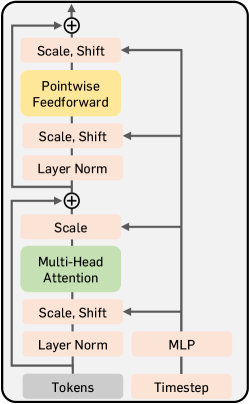

Figure 9: DiT block illustration.
[/FIGURE]

We strictly follow the architecture used in DiT (Peebles & Xie, [2023](#bib.bib63)) and SiT (Ma et al., [2024a](#bib.bib57)). The architecture is very similar to a vision transformer (ViTs; Dosovitskiy et al. [2021](#bib.bib20)): an input is patchified, reshaped to a 1D sequence of patches with a length $N$, and then fed to the model. Similar to DiT and SiT, our architecture also uses a downsampled latent image ${\mathbf{z}}=E({\mathbf{x}})$ as an input, where ${\mathbf{x}}$ is a RGB image and $E$ is an encoder of the stable diffusion variational autoencoder (VAE) (Rombach et al., [2022](#bib.bib68)). Different from the original ViT, our architecture also includes additional modulation layers at each attention block called AdaIN-zero layers. These layers scale and shift each hidden state with respect to the given timestep and additional conditions. We also consider a single multilayer perceptron (MLP) that projects a hidden state to the target representation space, which is only used in training. We provide an illustration of the DiT block in Figure [9](#A2.F9 "Figure 9 ‣ Appendix B Diffusion Transformer Architecture ‣ Representation Alignment for Generation: Training Diffusion Transformers Is Easier Than You Think").  

## Appendix C Analysis Details

### C.1 Evaluation details

CKNNA (Centered Kernel Nearest-Neighbor Alignment) is a *relaxed version* of the popular Centered Kernel Alignment (CKA; Kornblith et al. [2019](#bib.bib44)) that mitigates the strict definition of alignment. We generally follow the notations in the original paper for an explanation (Huh et al., [2024](#bib.bib36)).  

First, CKA have measured *global* similarities of the models by considering all possible data pairs:  

|  | $\displaystyle\mathrm{CKA}(\mathbf{K},\mathbf{L})=\frac{\mathrm{HSIC}(\mathbf{K},\mathbf{L})}{\sqrt{\mathrm{HSIC}(\mathbf{K},\mathbf{K})\mathrm{HSIC}(\mathbf{L},\mathbf{L})}},$ |  | (21) |
| --- | --- | --- | --- |

where $\mathbf{K}$ and $\mathbf{L}$ are two kernel matrices computed from the dataset using two different networks. Specifically, it is defined as $\mathbf{K}_{ij}=\kappa(\phi_{i},\phi_{j})$ and $\mathbf{L}_{ij}=\kappa(\psi_{i},\psi_{j})$ where $\phi_{i},\phi_{j}$ and $\psi_{i},\psi_{j}$ are representations computed from each network at the corresponding data ${\mathbf{x}}_{i},{\mathbf{x}}_{j}$ (respectively). By letting $\kappa$ as a inner product kernel, $\mathrm{HSIC}$ is defined as  

|  | $\displaystyle\mathrm{HSIC}(\mathbf{K},\mathbf{L})=\frac{1}{(n-1)^{2}}\Big{(}\sum_{i}\sum_{j}\big{(}\langle\phi_{i},\phi_{j}\rangle-\mathbb{E}_{l}[\langle\phi_{i},\phi_{l}\rangle]\big{)}\big{(}\langle\psi_{i},\psi_{j}\rangle-\mathbb{E}_{l}[\langle\psi_{i},\psi_{l}\rangle]\big{)}\Big{)}.$ |  | (22) |
| --- | --- | --- | --- |

CKNNA considers a relaxed version of Eq. ([21](#A3.E21 "In C.1 Evaluation details ‣ Appendix C Analysis Details ‣ Representation Alignment for Generation: Training Diffusion Transformers Is Easier Than You Think")) by replacing $\mathrm{HSIC}(\mathbf{K},\mathbf{L})$ into $\mathrm{Align}(\mathbf{K},\mathbf{L})$, where $\mathrm{Align}(\mathbf{K},\mathbf{L})$ computes Eq. ([22](#A3.E22 "In C.1 Evaluation details ‣ Appendix C Analysis Details ‣ Representation Alignment for Generation: Training Diffusion Transformers Is Easier Than You Think")) only using a $k$-nearest neighborhood embedding in the datasets:  

|  | $\displaystyle\mathrm{Align}(\mathbf{K},\mathbf{L})=\frac{1}{(n-1)^{2}}\Big{(}\sum_{i}\sum_{j}\alpha(i,j)\big{(}\langle\phi_{i},\phi_{j}\rangle-\mathbb{E}_{l}[\langle\phi_{i},\phi_{l}\rangle]\big{)}\big{(}\langle\psi_{i},\psi_{j}\rangle-\mathbb{E}_{l}[\langle\psi_{i},\psi_{l}\rangle]\big{)}\Big{)},$ |  | (23) |
| --- | --- | --- | --- |

where $\alpha(i,j)$ is defined as  

|  | $\displaystyle\alpha(i,j;k)=\mathbbm{1}[i\neq j\,\,\text{and}\,\,\phi_{j}\in\mathrm{knn}(\phi_{i};k)\,\,\text{and}\,\,\psi_{j}\in\mathrm{knn}(\psi_{i};k)],$ |  | (24) |
| --- | --- | --- | --- |

so this term only considers $k$-nearest neighbors at each $i$. In this paper, we randomly sample 10,000 images in the validation set in ImageNet (Deng et al., [2009](#bib.bib18)) and report CKNNA with $k=10$ based on observation in Huh et al. ([2024](#bib.bib36)) that smaller $k$ shows better a better alignment.  

Linear probing. We follow the setup used in DAE (Chen et al., [2024c](#bib.bib16)). Specifically, we use parameter-free batch normalization layer and train a linear layer for 90 epochs with a batch size of 16,384. We use the Adam optimizer (Kingma, [2015](#bib.bib43)) with cosine decay learning rate scheduler, where the initial learning rate is set to 0.001.  

### C.2 DiT Analysis

We also perform a similar analysis have done in Figure [2(a)](#S1.F2.sf1 "In Figure 2 ‣ 1 Introduction ‣ Representation Alignment for Generation: Training Diffusion Transformers Is Easier Than You Think") (linear probing) and [2(b)](#S1.F2.sf2 "In Figure 2 ‣ 1 Introduction ‣ Representation Alignment for Generation: Training Diffusion Transformers Is Easier Than You Think") (CKA), and illustrate the result in Figure [10](#A3.F10 "Figure 10 ‣ C.2 DiT Analysis ‣ Appendix C Analysis Details ‣ Representation Alignment for Generation: Training Diffusion Transformers Is Easier Than You Think"). Overall is shows a similar trend; the model includes discriminative representation but the gap is still large compared with DINOv2, as shown in the linear probing results, and also weakly aligned with DINOv2 representations.  

[FIGURE A3.F10.sf1.g1]
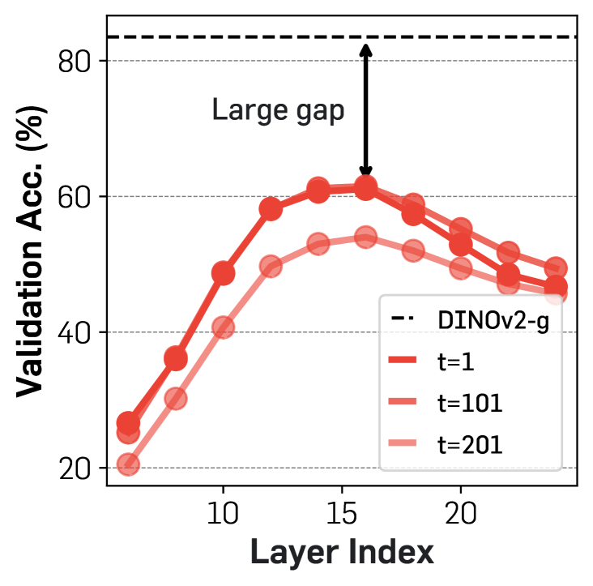

(a) Semantic gap
[/FIGURE]

### C.3 Description of pretrained visual encoders

* MAE (He et al., [2022](#bib.bib29)) proposes a self-supervised representation learning objective for vision transformers, based on the reconstruction task of masked patches of input images. 
* DINO (Caron et al., [2021](#bib.bib9)) is a self-supervised learning method based on self-distillation through the mean of momentum teacher network. 
* MoCov3 (Chen et al., [2021](#bib.bib15)) studies empirical study to train MoCo (He et al., [2020](#bib.bib28); Chen et al., [2020b](#bib.bib14)) on vision transformer and how they can be scaled up. 
* CLIP (Radford et al., [2021](#bib.bib67)) proposes a contrastive learning scheme on large image-text pairs. 
* DINOv2 (Oquab et al., [2024](#bib.bib62)) proposes a self-supervised learning method that combines pixel-level and patch-level discriminative objectives by leveraging advanced self-supervised techniques and a large pre-training dataset. 
* I-JEPA (Assran et al., [2023](#bib.bib5)) predicts missing parts of an image by learning representations through joint-embedding, focusing on the context of the entire image without relying on pixel-level reconstruction. 

## Appendix D Hyperparameter and More Implementation Details

[TABLE A4.T6]

<table class="ltx_tabular ltx_guessed_headers ltx_align_middle">
<tbody class="ltx_tbody">
<tr class="ltx_tr">
<th class="ltx_td ltx_th ltx_th_row ltx_border_tt"></th>
<td class="ltx_td ltx_align_center ltx_border_tt">Figure 3</td>
<td class="ltx_td ltx_align_center ltx_border_tt">Table 3 (SiT-B)</td>
<td class="ltx_td ltx_align_center ltx_border_tt">Table 3 (SiT-L)</td>
<td class="ltx_td ltx_align_center ltx_border_tt">Table 3 (SiT-XL)</td>
<td class="ltx_td ltx_align_center ltx_border_tt">Table 4</td>
</tr>
<tr class="ltx_tr">
<th class="ltx_td ltx_align_left ltx_th ltx_th_row ltx_border_t">Architecture</th>
<td class="ltx_td ltx_border_t"></td>
<td class="ltx_td ltx_border_t"></td>
<td class="ltx_td ltx_border_t"></td>
<td class="ltx_td ltx_border_t"></td>
<td class="ltx_td ltx_border_t"></td>
</tr>
<tr class="ltx_tr">
<th class="ltx_td ltx_align_left ltx_th ltx_th_row">Input dim.</th>
<td class="ltx_td ltx_align_center">32<math class="ltx_Math"><semantics><mo>×</mo><annotation-xml><times></times></annotation-xml><annotation>\times</annotation></semantics></math>32<math class="ltx_Math"><semantics><mo>×</mo><annotation-xml><times></times></annotation-xml><annotation>\times</annotation></semantics></math>4</td>
<td class="ltx_td ltx_align_center">32<math class="ltx_Math"><semantics><mo>×</mo><annotation-xml><times></times></annotation-xml><annotation>\times</annotation></semantics></math>32<math class="ltx_Math"><semantics><mo>×</mo><annotation-xml><times></times></annotation-xml><annotation>\times</annotation></semantics></math>4</td>
<td class="ltx_td ltx_align_center">32<math class="ltx_Math"><semantics><mo>×</mo><annotation-xml><times></times></annotation-xml><annotation>\times</annotation></semantics></math>32<math class="ltx_Math"><semantics><mo>×</mo><annotation-xml><times></times></annotation-xml><annotation>\times</annotation></semantics></math>4</td>
<td class="ltx_td ltx_align_center">32<math class="ltx_Math"><semantics><mo>×</mo><annotation-xml><times></times></annotation-xml><annotation>\times</annotation></semantics></math>32<math class="ltx_Math"><semantics><mo>×</mo><annotation-xml><times></times></annotation-xml><annotation>\times</annotation></semantics></math>4</td>
<td class="ltx_td ltx_align_center">32<math class="ltx_Math"><semantics><mo>×</mo><annotation-xml><times></times></annotation-xml><annotation>\times</annotation></semantics></math>32<math class="ltx_Math"><semantics><mo>×</mo><annotation-xml><times></times></annotation-xml><annotation>\times</annotation></semantics></math>4</td>
</tr>
<tr class="ltx_tr">
<th class="ltx_td ltx_align_left ltx_th ltx_th_row">Num. layers</th>
<td class="ltx_td ltx_align_center">28</td>
<td class="ltx_td ltx_align_center">12</td>
<td class="ltx_td ltx_align_center">24</td>
<td class="ltx_td ltx_align_center">28</td>
<td class="ltx_td ltx_align_center">24</td>
</tr>
<tr class="ltx_tr">
<th class="ltx_td ltx_align_left ltx_th ltx_th_row">Hidden dim.</th>
<td class="ltx_td ltx_align_center">1,152</td>
<td class="ltx_td ltx_align_center">768</td>
<td class="ltx_td ltx_align_center">1,024</td>
<td class="ltx_td ltx_align_center">1,152</td>
<td class="ltx_td ltx_align_center">1,024</td>
</tr>
<tr class="ltx_tr">
<th class="ltx_td ltx_align_left ltx_th ltx_th_row">Num. heads</th>
<td class="ltx_td ltx_align_center">16</td>
<td class="ltx_td ltx_align_center">12</td>
<td class="ltx_td ltx_align_center">16</td>
<td class="ltx_td ltx_align_center">16</td>
<td class="ltx_td ltx_align_center">16</td>
</tr>
<tr class="ltx_tr">
<th class="ltx_td ltx_align_left ltx_th ltx_th_row ltx_border_t">REPA</th>
<td class="ltx_td ltx_border_t"></td>
<td class="ltx_td ltx_border_t"></td>
<td class="ltx_td ltx_border_t"></td>
<td class="ltx_td ltx_border_t"></td>
<td class="ltx_td ltx_border_t"></td>
</tr>
<tr class="ltx_tr">
<th class="ltx_td ltx_align_left ltx_th ltx_th_row"><math class="ltx_Math"><semantics><mi>λ</mi><annotation-xml><ci>𝜆</ci></annotation-xml><annotation>\lambda</annotation></semantics></math></th>
<td class="ltx_td ltx_align_center">0.5</td>
<td class="ltx_td ltx_align_center">0.5</td>
<td class="ltx_td ltx_align_center">0.5</td>
<td class="ltx_td ltx_align_center">0.5</td>
<td class="ltx_td ltx_align_center">0.5</td>
</tr>
<tr class="ltx_tr">
<th class="ltx_td ltx_align_left ltx_th ltx_th_row">Alignment depth</th>
<td class="ltx_td ltx_align_center">4</td>
<td class="ltx_td ltx_align_center">8</td>
<td class="ltx_td ltx_align_center">8</td>
<td class="ltx_td ltx_align_center">8</td>
<td class="ltx_td ltx_align_center">8</td>
</tr>
<tr class="ltx_tr">
<th class="ltx_td ltx_align_left ltx_th ltx_th_row"><math class="ltx_Math"><semantics><mrow><mi>sim</mi><mo>​</mo><mrow><mo>(</mo><mo>⋅</mo><mo>,</mo><mo>⋅</mo><mo>)</mo></mrow></mrow><annotation-xml><apply><times></times><ci>sim</ci><interval><ci>⋅</ci><ci>⋅</ci></interval></apply></annotation-xml><annotation>\mathrm{sim}(\cdot,\cdot)</annotation></semantics></math></th>
<td class="ltx_td ltx_align_center">cos. sim.</td>
<td class="ltx_td ltx_align_center">cos. sim.</td>
<td class="ltx_td ltx_align_center">NT-Xent</td>
<td class="ltx_td ltx_align_center">cos. sim.</td>
<td class="ltx_td ltx_align_center">NT-Xent</td>
</tr>
<tr class="ltx_tr">
<th class="ltx_td ltx_align_left ltx_th ltx_th_row">Encoder <math class="ltx_Math"><semantics><mrow><mi>f</mi><mo>​</mo><mrow><mo>(</mo><mi>𝐱</mi><mo>)</mo></mrow></mrow><annotation-xml><apply><times></times><ci>𝑓</ci><ci>𝐱</ci></apply></annotation-xml><annotation>f({\mathbf{x}})</annotation></semantics></math>
</th>
<td class="ltx_td ltx_align_center">DINOv2-B</td>
<td class="ltx_td ltx_align_center">DINOv2-B</td>
<td class="ltx_td ltx_align_center">DINOv2-L</td>
<td class="ltx_td ltx_align_center">DINOv2-B</td>
<td class="ltx_td ltx_align_center">DINOv2-B</td>
</tr>
<tr class="ltx_tr">
<th class="ltx_td ltx_align_left ltx_th ltx_th_row ltx_border_t">Optimization</th>
<td class="ltx_td ltx_border_t"></td>
<td class="ltx_td ltx_border_t"></td>
<td class="ltx_td ltx_border_t"></td>
<td class="ltx_td ltx_border_t"></td>
<td class="ltx_td ltx_border_t"></td>
</tr>
<tr class="ltx_tr">
<th class="ltx_td ltx_align_left ltx_th ltx_th_row">Training iteration</th>
<td class="ltx_td ltx_align_center">1M</td>
<td class="ltx_td ltx_align_center">400K</td>
<td class="ltx_td ltx_align_center">700K</td>
<td class="ltx_td ltx_align_center">4M</td>
<td class="ltx_td ltx_align_center">4M</td>
</tr>
<tr class="ltx_tr">
<th class="ltx_td ltx_align_left ltx_th ltx_th_row">Batch size</th>
<td class="ltx_td ltx_align_center">256</td>
<td class="ltx_td ltx_align_center">256</td>
<td class="ltx_td ltx_align_center">256</td>
<td class="ltx_td ltx_align_center">256</td>
<td class="ltx_td ltx_align_center">256</td>
</tr>
<tr class="ltx_tr">
<th class="ltx_td ltx_align_left ltx_th ltx_th_row">Optimizer</th>
<td class="ltx_td ltx_align_center">AdamW</td>
<td class="ltx_td ltx_align_center">AdamW</td>
<td class="ltx_td ltx_align_center">AdamW</td>
<td class="ltx_td ltx_align_center">AdamW</td>
<td class="ltx_td ltx_align_center">AdamW</td>
</tr>
<tr class="ltx_tr">
<th class="ltx_td ltx_align_left ltx_th ltx_th_row">lr</th>
<td class="ltx_td ltx_align_center">0.0001</td>
<td class="ltx_td ltx_align_center">0.0001</td>
<td class="ltx_td ltx_align_center">0.0001</td>
<td class="ltx_td ltx_align_center">0.0001</td>
<td class="ltx_td ltx_align_center">0.0001</td>
</tr>
<tr class="ltx_tr">
<th class="ltx_td ltx_align_left ltx_th ltx_th_row"><math class="ltx_Math"><semantics><mrow><mo>(</mo><msub><mi>β</mi><mn>1</mn></msub><mo>,</mo><msub><mi>β</mi><mn>2</mn></msub><mo>)</mo></mrow><annotation-xml><interval><apply><csymbol>subscript</csymbol><ci>𝛽</ci><cn>1</cn></apply><apply><csymbol>subscript</csymbol><ci>𝛽</ci><cn>2</cn></apply></interval></annotation-xml><annotation>(\beta_{1},\beta_{2})</annotation></semantics></math></th>
<td class="ltx_td ltx_align_center">(0.9, 0.999)</td>
<td class="ltx_td ltx_align_center">(0.9, 0.999)</td>
<td class="ltx_td ltx_align_center">(0.9, 0.999)</td>
<td class="ltx_td ltx_align_center">(0.9, 0.999)</td>
<td class="ltx_td ltx_align_center">(0.9, 0.999)</td>
</tr>
<tr class="ltx_tr">
<th class="ltx_td ltx_align_left ltx_th ltx_th_row ltx_border_t">Interpolants</th>
<td class="ltx_td ltx_border_t"></td>
<td class="ltx_td ltx_border_t"></td>
<td class="ltx_td ltx_border_t"></td>
<td class="ltx_td ltx_border_t"></td>
<td class="ltx_td ltx_border_t"></td>
</tr>
<tr class="ltx_tr">
<th class="ltx_td ltx_align_left ltx_th ltx_th_row"><math class="ltx_Math"><semantics><msub><mi>α</mi><mi>t</mi></msub><annotation-xml><apply><csymbol>subscript</csymbol><ci>𝛼</ci><ci>𝑡</ci></apply></annotation-xml><annotation>\alpha_{t}</annotation></semantics></math></th>
<td class="ltx_td ltx_align_center"><math class="ltx_Math"><semantics><mrow><mn>1</mn><mo>−</mo><mi>t</mi></mrow><annotation-xml><apply><minus></minus><cn>1</cn><ci>𝑡</ci></apply></annotation-xml><annotation>1-t</annotation></semantics></math></td>
<td class="ltx_td ltx_align_center"><math class="ltx_Math"><semantics><mrow><mn>1</mn><mo>−</mo><mi>t</mi></mrow><annotation-xml><apply><minus></minus><cn>1</cn><ci>𝑡</ci></apply></annotation-xml><annotation>1-t</annotation></semantics></math></td>
<td class="ltx_td ltx_align_center"><math class="ltx_Math"><semantics><mrow><mn>1</mn><mo>−</mo><mi>t</mi></mrow><annotation-xml><apply><minus></minus><cn>1</cn><ci>𝑡</ci></apply></annotation-xml><annotation>1-t</annotation></semantics></math></td>
<td class="ltx_td ltx_align_center"><math class="ltx_Math"><semantics><mrow><mn>1</mn><mo>−</mo><mi>t</mi></mrow><annotation-xml><apply><minus></minus><cn>1</cn><ci>𝑡</ci></apply></annotation-xml><annotation>1-t</annotation></semantics></math></td>
<td class="ltx_td ltx_align_center"><math class="ltx_Math"><semantics><mrow><mn>1</mn><mo>−</mo><mi>t</mi></mrow><annotation-xml><apply><minus></minus><cn>1</cn><ci>𝑡</ci></apply></annotation-xml><annotation>1-t</annotation></semantics></math></td>
</tr>
<tr class="ltx_tr">
<th class="ltx_td ltx_align_left ltx_th ltx_th_row"><math class="ltx_Math"><semantics><msub><mi>σ</mi><mi>t</mi></msub><annotation-xml><apply><csymbol>subscript</csymbol><ci>𝜎</ci><ci>𝑡</ci></apply></annotation-xml><annotation>\sigma_{t}</annotation></semantics></math></th>
<td class="ltx_td ltx_align_center"><math class="ltx_Math"><semantics><mi>t</mi><annotation-xml><ci>𝑡</ci></annotation-xml><annotation>t</annotation></semantics></math></td>
<td class="ltx_td ltx_align_center"><math class="ltx_Math"><semantics><mi>t</mi><annotation-xml><ci>𝑡</ci></annotation-xml><annotation>t</annotation></semantics></math></td>
<td class="ltx_td ltx_align_center"><math class="ltx_Math"><semantics><mi>t</mi><annotation-xml><ci>𝑡</ci></annotation-xml><annotation>t</annotation></semantics></math></td>
<td class="ltx_td ltx_align_center"><math class="ltx_Math"><semantics><mi>t</mi><annotation-xml><ci>𝑡</ci></annotation-xml><annotation>t</annotation></semantics></math></td>
<td class="ltx_td ltx_align_center"><math class="ltx_Math"><semantics><mi>t</mi><annotation-xml><ci>𝑡</ci></annotation-xml><annotation>t</annotation></semantics></math></td>
</tr>
<tr class="ltx_tr">
<th class="ltx_td ltx_align_left ltx_th ltx_th_row"><math class="ltx_Math"><semantics><msub><mi>w</mi><mi>t</mi></msub><annotation-xml><apply><csymbol>subscript</csymbol><ci>𝑤</ci><ci>𝑡</ci></apply></annotation-xml><annotation>w_{t}</annotation></semantics></math></th>
<td class="ltx_td ltx_align_center"><math class="ltx_Math"><semantics><msub><mi>σ</mi><mi>t</mi></msub><annotation-xml><apply><csymbol>subscript</csymbol><ci>𝜎</ci><ci>𝑡</ci></apply></annotation-xml><annotation>\sigma_{t}</annotation></semantics></math></td>
<td class="ltx_td ltx_align_center"><math class="ltx_Math"><semantics><msub><mi>σ</mi><mi>t</mi></msub><annotation-xml><apply><csymbol>subscript</csymbol><ci>𝜎</ci><ci>𝑡</ci></apply></annotation-xml><annotation>\sigma_{t}</annotation></semantics></math></td>
<td class="ltx_td ltx_align_center"><math class="ltx_Math"><semantics><msub><mi>σ</mi><mi>t</mi></msub><annotation-xml><apply><csymbol>subscript</csymbol><ci>𝜎</ci><ci>𝑡</ci></apply></annotation-xml><annotation>\sigma_{t}</annotation></semantics></math></td>
<td class="ltx_td ltx_align_center"><math class="ltx_Math"><semantics><msub><mi>σ</mi><mi>t</mi></msub><annotation-xml><apply><csymbol>subscript</csymbol><ci>𝜎</ci><ci>𝑡</ci></apply></annotation-xml><annotation>\sigma_{t}</annotation></semantics></math></td>
<td class="ltx_td ltx_align_center"><math class="ltx_Math"><semantics><msub><mi>σ</mi><mi>t</mi></msub><annotation-xml><apply><csymbol>subscript</csymbol><ci>𝜎</ci><ci>𝑡</ci></apply></annotation-xml><annotation>\sigma_{t}</annotation></semantics></math></td>
</tr>
<tr class="ltx_tr">
<th class="ltx_td ltx_align_left ltx_th ltx_th_row">Training objective</th>
<td class="ltx_td ltx_align_center">v-prediction</td>
<td class="ltx_td ltx_align_center">v-prediction</td>
<td class="ltx_td ltx_align_center">v-prediction</td>
<td class="ltx_td ltx_align_center">v-prediction</td>
<td class="ltx_td ltx_align_center">v-prediction</td>
</tr>
<tr class="ltx_tr">
<th class="ltx_td ltx_align_left ltx_th ltx_th_row">Sampler</th>
<td class="ltx_td ltx_align_center">Euler-Maruyama</td>
<td class="ltx_td ltx_align_center">Euler-Maruyama</td>
<td class="ltx_td ltx_align_center">Euler-Maruyama</td>
<td class="ltx_td ltx_align_center">Euler-Maruyama</td>
<td class="ltx_td ltx_align_center">Euler-Maruyama</td>
</tr>
<tr class="ltx_tr">
<th class="ltx_td ltx_align_left ltx_th ltx_th_row">Sampling steps</th>
<td class="ltx_td ltx_align_center">250</td>
<td class="ltx_td ltx_align_center">250</td>
<td class="ltx_td ltx_align_center">250</td>
<td class="ltx_td ltx_align_center">250</td>
<td class="ltx_td ltx_align_center">250</td>
</tr>
<tr class="ltx_tr">
<th class="ltx_td ltx_align_left ltx_th ltx_th_row ltx_border_bb">Guidance</th>
<td class="ltx_td ltx_align_center ltx_border_bb">-</td>
<td class="ltx_td ltx_align_center ltx_border_bb">-</td>
<td class="ltx_td ltx_align_center ltx_border_bb">-</td>
<td class="ltx_td ltx_align_center ltx_border_bb">-</td>
<td class="ltx_td ltx_align_center ltx_border_bb">1.35</td>
</tr>
</tbody>
</table>

Table 6: Hyperparameter setup.
[/TABLE]

Further implementation details. We implement our model based on the original SiT implementation (Ma et al., [2024a](#bib.bib57)). Throughout the experiments, we use the exact same structure as DiT (Peebles & Xie, [2023](#bib.bib63)) and SiT (Ma et al., [2024a](#bib.bib57)). We use AdamW (Kingma, [2015](#bib.bib43); Loshchilov, [2017](#bib.bib55)) with constant learning rate of 1e-4, $(\beta_{1},\beta_{2})=(0.9,0.999)$ without weight decay. To speed up training, we use mixed-precision (fp16) with a gradient clipping. We also pre-compute compressed latent vectors from raw pixels via stable diffusion VAE (Rombach et al., [2022](#bib.bib68)) and use these latent vectors. Because of this, we do not apply any data augmentation, but we find this does not lead to a big difference, as similarly observed in EDM2 (Karras et al., [2024](#bib.bib41)). We also use stabilityai/sd-vae-ft-ema decoder for decoding latent vectors to images. For MLP used for a projection, we use three-layer MLP with SiLU activations (Elfwing et al., [2018](#bib.bib21)). We provide a detailed hyperparameter setup in Table [6](#A4.T6 "Table 6 ‣ Appendix D Hyperparameter and More Implementation Details ‣ Representation Alignment for Generation: Training Diffusion Transformers Is Easier Than You Think").  

Pretrained encoders. For MoCov3-B and -L models, we use the checkpoint in the implementation of RCG (Li et al., [2024](#bib.bib51));222<https://github.com/LTH14/rcg> for other checkpoints, we use their official checkpoints released in their official implementations. To adjust a different number of patches between the diffusion transformer and the pretrained encoder, we interpolate positional embeddings of pretrained encoders.  

Sampler. For sampling, we use the Euler-Maruyama sampler with the SDE in Eq. ([5](#S2.E5 "In 2 Preliminaries ‣ Representation Alignment for Generation: Training Diffusion Transformers Is Easier Than You Think")) with a diffusion coefficient $w_{t}=\sigma_{t}$. We use the last step of the SDE sampler as 0.04, and it gives a significant improvement, similar to the original SiT paper (Ma et al., [2024a](#bib.bib57)).  

Computing resources. We use 8 NVIDIA H100 80GB GPUs for experiments; our training speed is about 5.4 step/s with a batch size of 256. Note that this can be further boosted with additional engineering (*e.g.*, pre-computation of pretrained encoder features).  

## Appendix E Evaluation Details

We strictly follow the setup and use the same reference batches of ADM (Dhariwal & Nichol, [2021](#bib.bib19)) for evaluation, following their official implementation.333<https://github.com/openai/guided-diffusion/tree/main/evaluations> We use NVIDIA H100 80GB GPUs or 4090Ti GPUs for evaluation and enable tf32 precision for faster generation, and we find the performance difference is negligible to the original fp32 precision.  

In what follows, we explain the main concept of metrics that we used for the evaluation.  

* FID (Heusel et al., [2017](#bib.bib30)) measures the feature distance between the distributions of real and generated images. It uses the Inception-v3 network (Szegedy et al., [2016](#bib.bib78)) and computes distance based on an assumption that both feature distributions are multivariate gaussian distributions. 
* sFID (Nash et al., [2021](#bib.bib60)) proposes to compute FID with intermediate spatial features of the Inception-v3 network to capture the generated images’ spatial distribution. 
* IS (Salimans et al., [2016](#bib.bib70)) also uses the Inception-v3 network but use logit for evaluation of the metric. Specifically, it measures a KL-divergence between the original label distribution and the distribution of logits after the softmax normalization. 
* Precision and recall (Kynkäänniemi et al., [2019](#bib.bib46)) are based on their classic definitions: the fraction of realistic images and the fraction of training data manifold covered by generated data. 

## Appendix F Baselines

In what follows, we explain the main idea of baseline methods that we used for the evaluation.  

* ADM (Dhariwal & Nichol, [2021](#bib.bib19)) improves U-Net-based architectures for diffusion models and proposes classifier-guided sampling to balance the quality and diversity tradeoff. 
* VDM++ (Kingma & Gao, [2024](#bib.bib42)) proposes a simple adaptive noise schedule for diffusion models to improve training efficiency. 
* Simple diffusion (Hoogeboom et al., [2023](#bib.bib34)) proposes a diffusion model for high-resolution image generation by exploring various techniques to simplify a noise schedule and architectures. 
* CDM (Ho et al., [2022](#bib.bib33)) introduces cascaded diffusion models: similar to progressiveGAN (Karras et al., [2018](#bib.bib39)), it trains multiple diffusion models starting from the lowest resolution and applying one or more super-resolution diffusion models for generating high-fidelity images. 
* LDM (Rombach et al., [2022](#bib.bib68)) proposes latent diffusion models by modeling image distribution in a compressed latent space to improve the training efficiency without sacrificing the generation performance. 
* U-ViT (Bao et al., [2023](#bib.bib6)) proposes a ViT-based latent diffusion model that incorporates U-Net-like long skip connections. 
* DiffiT (Hatamizadeh et al., [2024](#bib.bib27)) proposes a time-dependent multi-head self-attention mechanism for enhancing the efficiency of transformer-based image diffusion models. 
* MDTv2 (Gao et al., [2023](#bib.bib24)) proposes an asymmetric encoder-decoder scheme for efficient training of a diffusion-based transformer. They also apply U-Net-like long-shortcuts in the encoder and dense input-shortcuts in the decoder. 
* MaskDiT (Zheng et al., [2024](#bib.bib86)) proposes an asymmetric encoder-decoder scheme for efficient training of diffusion transformers, where they train the model with an auxiliary mask reconstruction task similar to MAE (He et al., [2022](#bib.bib29)). 
* SD-DiT (Zhu et al., [2024](#bib.bib87)) extends MaskdiT architecture but incorporates self-supervised discrimination objective using a momentum encoder. 
* DiT (Peebles & Xie, [2023](#bib.bib63)) proposes a pure transformer backbone for training diffusion models based on proposing AdaIN-zero modules. 
* SiT (Ma et al., [2024a](#bib.bib57)) extensively analyzes how DiT training can be efficient by moving from discrete diffusion to continuous flow-based modeling. 

## Appendix G Detailed Quantitative Results

We provide evaluation results of different SiT models trained with REPA. All models are aligned with DINOv2-B representations with $\lambda=0.5$ and negative cosine similarity. We use the 4th layer hidden states for the base model and use the 8th layer hidden states for the large and xlarge model.  

[TABLE A7.T7]

<table class="ltx_tabular ltx_centering ltx_align_middle">
<tbody class="ltx_tbody">
<tr class="ltx_tr">
<td class="ltx_td ltx_align_left ltx_border_tt">Model</td>
<td class="ltx_td ltx_align_center ltx_border_tt">#Params</td>
<td class="ltx_td ltx_align_center ltx_border_tt">Iter.</td>
<td class="ltx_td ltx_align_center ltx_border_tt">FID<math class="ltx_Math"><semantics><mo>↓</mo><annotation-xml><ci>↓</ci></annotation-xml><annotation>\downarrow</annotation></semantics></math>
</td>
<td class="ltx_td ltx_align_center ltx_border_tt">sFID<math class="ltx_Math"><semantics><mo>↓</mo><annotation-xml><ci>↓</ci></annotation-xml><annotation>\downarrow</annotation></semantics></math>
</td>
<td class="ltx_td ltx_align_center ltx_border_tt">IS<math class="ltx_Math"><semantics><mo>↑</mo><annotation-xml><ci>↑</ci></annotation-xml><annotation>\uparrow</annotation></semantics></math>
</td>
<td class="ltx_td ltx_align_center ltx_border_tt">Prec.<math class="ltx_Math"><semantics><mo>↑</mo><annotation-xml><ci>↑</ci></annotation-xml><annotation>\uparrow</annotation></semantics></math>
</td>
<td class="ltx_td ltx_align_center ltx_border_tt">Rec.<math class="ltx_Math"><semantics><mo>↑</mo><annotation-xml><ci>↑</ci></annotation-xml><annotation>\uparrow</annotation></semantics></math>
</td>
<td class="ltx_td ltx_align_center ltx_border_tt">Acc.<math class="ltx_Math"><semantics><mo>↑</mo><annotation-xml><ci>↑</ci></annotation-xml><annotation>\uparrow</annotation></semantics></math>
</td>
</tr>
<tr class="ltx_tr">
<td class="ltx_td ltx_align_left ltx_border_t">SiT-B/2 <cite class="ltx_cite ltx_citemacro_citep">(Ma et al., <a class="ltx_ref">2024a</a>)</cite></td>
<td class="ltx_td ltx_align_center ltx_border_t">130M</td>
<td class="ltx_td ltx_align_center ltx_border_t">400K</td>
<td class="ltx_td ltx_align_center ltx_border_t">33.0</td>
<td class="ltx_td ltx_align_center ltx_border_t">
06.46
</td>
<td class="ltx_td ltx_align_center ltx_border_t">
043.7
</td>
<td class="ltx_td ltx_align_center ltx_border_t">0.53</td>
<td class="ltx_td ltx_align_center ltx_border_t">0.63</td>
<td class="ltx_td ltx_align_center ltx_border_t">N/A</td>
</tr>
<tr class="ltx_tr">
<td class="ltx_td ltx_align_left">+ REPA (ours)</td>
<td class="ltx_td ltx_align_center">130M</td>
<td class="ltx_td ltx_align_center">50K</td>
<td class="ltx_td ltx_align_center">78.2</td>
<td class="ltx_td ltx_align_center">11.71</td>
<td class="ltx_td ltx_align_center">
017.1</td>
<td class="ltx_td ltx_align_center">0.33</td>
<td class="ltx_td ltx_align_center">0.48</td>
<td class="ltx_td ltx_align_center">43.2</td>
</tr>
<tr class="ltx_tr">
<td class="ltx_td ltx_align_left">+ REPA (ours)</td>
<td class="ltx_td ltx_align_center">130M</td>
<td class="ltx_td ltx_align_center">100K</td>
<td class="ltx_td ltx_align_center">49.5</td>
<td class="ltx_td ltx_align_center">
07.00</td>
<td class="ltx_td ltx_align_center">
027.5</td>
<td class="ltx_td ltx_align_center">0.46</td>
<td class="ltx_td ltx_align_center">0.59</td>
<td class="ltx_td ltx_align_center">50.9</td>
</tr>
<tr class="ltx_tr">
<td class="ltx_td ltx_align_left">+ REPA (ours)</td>
<td class="ltx_td ltx_align_center">130M</td>
<td class="ltx_td ltx_align_center">200K</td>
<td class="ltx_td ltx_align_center">33.2</td>
<td class="ltx_td ltx_align_center">
06.68</td>
<td class="ltx_td ltx_align_center">
043.7</td>
<td class="ltx_td ltx_align_center">0.54</td>
<td class="ltx_td ltx_align_center">0.63</td>
<td class="ltx_td ltx_align_center">50.9</td>
</tr>
<tr class="ltx_tr">
<td class="ltx_td ltx_align_left">+ REPA (ours)</td>
<td class="ltx_td ltx_align_center">130M</td>
<td class="ltx_td ltx_align_center">400K</td>
<td class="ltx_td ltx_align_center">24.4</td>
<td class="ltx_td ltx_align_center">
06.40</td>
<td class="ltx_td ltx_align_center">
059.9</td>
<td class="ltx_td ltx_align_center">0.59</td>
<td class="ltx_td ltx_align_center">0.65</td>
<td class="ltx_td ltx_align_center">61.2</td>
</tr>
<tr class="ltx_tr">
<td class="ltx_td ltx_align_left ltx_border_t">SiT-L/2 <cite class="ltx_cite ltx_citemacro_citep">(Ma et al., <a class="ltx_ref">2024a</a>)</cite></td>
<td class="ltx_td ltx_align_center ltx_border_t">458M</td>
<td class="ltx_td ltx_align_center ltx_border_t">400K</td>
<td class="ltx_td ltx_align_center ltx_border_t">18.8</td>
<td class="ltx_td ltx_align_center ltx_border_t">
05.29
</td>
<td class="ltx_td ltx_align_center ltx_border_t">
072.0
</td>
<td class="ltx_td ltx_align_center ltx_border_t">0.64</td>
<td class="ltx_td ltx_align_center ltx_border_t">0.64</td>
<td class="ltx_td ltx_align_center ltx_border_t">N/A</td>
</tr>
<tr class="ltx_tr">
<td class="ltx_td ltx_align_left">+ REPA (ours)</td>
<td class="ltx_td ltx_align_center">458M</td>
<td class="ltx_td ltx_align_center">50K</td>
<td class="ltx_td ltx_align_center">55.4</td>
<td class="ltx_td ltx_align_center">
024.0</td>
<td class="ltx_td ltx_align_center">
023.0</td>
<td class="ltx_td ltx_align_center">0.43</td>
<td class="ltx_td ltx_align_center">0.53</td>
<td class="ltx_td ltx_align_center">55.3</td>
</tr>
<tr class="ltx_tr">
<td class="ltx_td ltx_align_left">+ REPA (ours)</td>
<td class="ltx_td ltx_align_center">458M</td>
<td class="ltx_td ltx_align_center">100K</td>
<td class="ltx_td ltx_align_center">24.1</td>
<td class="ltx_td ltx_align_center">
06.25</td>
<td class="ltx_td ltx_align_center">
055.7</td>
<td class="ltx_td ltx_align_center">0.62</td>
<td class="ltx_td ltx_align_center">0.60</td>
<td class="ltx_td ltx_align_center">61.8</td>
</tr>
<tr class="ltx_tr">
<td class="ltx_td ltx_align_left">+ REPA (ours)</td>
<td class="ltx_td ltx_align_center">458M</td>
<td class="ltx_td ltx_align_center">200K</td>
<td class="ltx_td ltx_align_center">14.0</td>
<td class="ltx_td ltx_align_center">
05.18</td>
<td class="ltx_td ltx_align_center">
086.5</td>
<td class="ltx_td ltx_align_center">0.67</td>
<td class="ltx_td ltx_align_center">0.64</td>
<td class="ltx_td ltx_align_center">66.3</td>
</tr>
<tr class="ltx_tr">
<td class="ltx_td ltx_align_left">+ REPA (ours)</td>
<td class="ltx_td ltx_align_center">458M</td>
<td class="ltx_td ltx_align_center">400K</td>
<td class="ltx_td ltx_align_center">10.0</td>
<td class="ltx_td ltx_align_center">
05.20</td>
<td class="ltx_td ltx_align_center">109.2</td>
<td class="ltx_td ltx_align_center">0.69</td>
<td class="ltx_td ltx_align_center">0.65</td>
<td class="ltx_td ltx_align_center">69.4</td>
</tr>
<tr class="ltx_tr">
<td class="ltx_td ltx_align_left ltx_border_t">SiT-XL/2 <cite class="ltx_cite ltx_citemacro_citep">(Ma et al., <a class="ltx_ref">2024a</a>)</cite></td>
<td class="ltx_td ltx_align_center ltx_border_t">675M</td>
<td class="ltx_td ltx_align_center ltx_border_t">7M</td>
<td class="ltx_td ltx_align_center ltx_border_t">
08.3
</td>
<td class="ltx_td ltx_align_center ltx_border_t">
06.32
</td>
<td class="ltx_td ltx_align_center ltx_border_t">131.7</td>
<td class="ltx_td ltx_align_center ltx_border_t">0.68</td>
<td class="ltx_td ltx_align_center ltx_border_t">0.67</td>
<td class="ltx_td ltx_align_center ltx_border_t">N/A</td>
</tr>
<tr class="ltx_tr">
<td class="ltx_td ltx_align_left">+ REPA (ours)</td>
<td class="ltx_td ltx_align_center">675M</td>
<td class="ltx_td ltx_align_center">50K</td>
<td class="ltx_td ltx_align_center">52.3</td>
<td class="ltx_td ltx_align_center">31.24</td>
<td class="ltx_td ltx_align_center">
024.3</td>
<td class="ltx_td ltx_align_center">0.45</td>
<td class="ltx_td ltx_align_center">0.53</td>
<td class="ltx_td ltx_align_center">56.1</td>
</tr>
<tr class="ltx_tr">
<td class="ltx_td ltx_align_left">+ REPA (ours)</td>
<td class="ltx_td ltx_align_center">675M</td>
<td class="ltx_td ltx_align_center">100K</td>
<td class="ltx_td ltx_align_center">19.4</td>
<td class="ltx_td ltx_align_center">
06.06</td>
<td class="ltx_td ltx_align_center">
067.4</td>
<td class="ltx_td ltx_align_center">0.64</td>
<td class="ltx_td ltx_align_center">0.61</td>
<td class="ltx_td ltx_align_center">62.9</td>
</tr>
<tr class="ltx_tr">
<td class="ltx_td ltx_align_left">+ REPA (ours)</td>
<td class="ltx_td ltx_align_center">675M</td>
<td class="ltx_td ltx_align_center">200K</td>
<td class="ltx_td ltx_align_center">11.1</td>
<td class="ltx_td ltx_align_center">
05.05</td>
<td class="ltx_td ltx_align_center">100.4</td>
<td class="ltx_td ltx_align_center">0.69</td>
<td class="ltx_td ltx_align_center">0.64</td>
<td class="ltx_td ltx_align_center">67.3</td>
</tr>
<tr class="ltx_tr">
<td class="ltx_td ltx_align_left">+ REPA (ours)</td>
<td class="ltx_td ltx_align_center">675M</td>
<td class="ltx_td ltx_align_center">400K</td>
<td class="ltx_td ltx_align_center">
07.9</td>
<td class="ltx_td ltx_align_center">
05.06</td>
<td class="ltx_td ltx_align_center">122.6</td>
<td class="ltx_td ltx_align_center">0.70</td>
<td class="ltx_td ltx_align_center">0.65</td>
<td class="ltx_td ltx_align_center">70.3</td>
</tr>
<tr class="ltx_tr">
<td class="ltx_td ltx_align_left ltx_border_bb">+ REPA (ours)</td>
<td class="ltx_td ltx_align_center ltx_border_bb">675M</td>
<td class="ltx_td ltx_align_center ltx_border_bb">4M</td>
<td class="ltx_td ltx_align_center ltx_border_bb">
05.9</td>
<td class="ltx_td ltx_align_center ltx_border_bb">
05.73</td>
<td class="ltx_td ltx_align_center ltx_border_bb">157.8</td>
<td class="ltx_td ltx_align_center ltx_border_bb">0.70</td>
<td class="ltx_td ltx_align_center ltx_border_bb">0.69</td>
<td class="ltx_td ltx_align_center ltx_border_bb">74.6</td>
</tr>
</tbody>
</table>

Table 7: Detailed evaluation results with different model sizes. All results are reported without classifier-free guidance.
[/TABLE]

We also provide SiT-XL/2+REPA at 4M iteration with classifier-free guidance with different class-free guidance scales.  

[TABLE A7.T8]

<table class="ltx_tabular ltx_centering ltx_guessed_headers ltx_align_middle">
<thead class="ltx_thead">
<tr class="ltx_tr">
<th class="ltx_td ltx_align_left ltx_th ltx_th_column ltx_th_row ltx_border_tt">Model</th>
<th class="ltx_td ltx_align_center ltx_th ltx_th_column ltx_border_tt">#Params</th>
<th class="ltx_td ltx_align_center ltx_th ltx_th_column ltx_border_tt">Iter.</th>
<th class="ltx_td ltx_align_center ltx_th ltx_th_column ltx_border_tt"><math class="ltx_Math"><semantics><mi>w</mi><annotation-xml><ci>𝑤</ci></annotation-xml><annotation>w</annotation></semantics></math></th>
<th class="ltx_td ltx_align_center ltx_th ltx_th_column ltx_border_tt">FID<math class="ltx_Math"><semantics><mo>↓</mo><annotation-xml><ci>↓</ci></annotation-xml><annotation>\downarrow</annotation></semantics></math>
</th>
<th class="ltx_td ltx_align_center ltx_th ltx_th_column ltx_border_tt">sFID<math class="ltx_Math"><semantics><mo>↓</mo><annotation-xml><ci>↓</ci></annotation-xml><annotation>\downarrow</annotation></semantics></math>
</th>
<th class="ltx_td ltx_align_center ltx_th ltx_th_column ltx_border_tt">IS<math class="ltx_Math"><semantics><mo>↑</mo><annotation-xml><ci>↑</ci></annotation-xml><annotation>\uparrow</annotation></semantics></math>
</th>
<th class="ltx_td ltx_align_center ltx_th ltx_th_column ltx_border_tt">Prec.<math class="ltx_Math"><semantics><mo>↑</mo><annotation-xml><ci>↑</ci></annotation-xml><annotation>\uparrow</annotation></semantics></math>
</th>
<th class="ltx_td ltx_align_center ltx_th ltx_th_column ltx_border_tt">Rec.<math class="ltx_Math"><semantics><mo>↑</mo><annotation-xml><ci>↑</ci></annotation-xml><annotation>\uparrow</annotation></semantics></math>
</th>
</tr>
</thead>
<tbody class="ltx_tbody">
<tr class="ltx_tr">
<th class="ltx_td ltx_align_left ltx_th ltx_th_row ltx_border_t">SiT-XL/2 <cite class="ltx_cite ltx_citemacro_citep">(Ma et al., <a class="ltx_ref">2024a</a>)</cite></th>
<td class="ltx_td ltx_align_center ltx_border_t">675M</td>
<td class="ltx_td ltx_align_center ltx_border_t">7M</td>
<td class="ltx_td ltx_align_center ltx_border_t">1.500</td>
<td class="ltx_td ltx_align_center ltx_border_t">2.06</td>
<td class="ltx_td ltx_align_center ltx_border_t">4.50</td>
<td class="ltx_td ltx_align_center ltx_border_t">270.3</td>
<td class="ltx_td ltx_align_center ltx_border_t">0.82</td>
<td class="ltx_td ltx_align_center ltx_border_t">0.59</td>
</tr>
<tr class="ltx_tr">
<th class="ltx_td ltx_align_left ltx_th ltx_th_row">+ REPA (ours)</th>
<td class="ltx_td ltx_align_center">675M</td>
<td class="ltx_td ltx_align_center">4M</td>
<td class="ltx_td ltx_align_center">1.300</td>
<td class="ltx_td ltx_align_center">1.80</td>
<td class="ltx_td ltx_align_center">4.55</td>
<td class="ltx_td ltx_align_center">268.6</td>
<td class="ltx_td ltx_align_center">0.80</td>
<td class="ltx_td ltx_align_center">0.63</td>
</tr>
<tr class="ltx_tr">
<th class="ltx_td ltx_align_left ltx_th ltx_th_row">+ REPA (ours)</th>
<td class="ltx_td ltx_align_center">675M</td>
<td class="ltx_td ltx_align_center">4M</td>
<td class="ltx_td ltx_align_center">1.325</td>
<td class="ltx_td ltx_align_center">1.79</td>
<td class="ltx_td ltx_align_center">4.51</td>
<td class="ltx_td ltx_align_center">276.8</td>
<td class="ltx_td ltx_align_center">0.81</td>
<td class="ltx_td ltx_align_center">0.62</td>
</tr>
<tr class="ltx_tr">
<th class="ltx_td ltx_align_left ltx_th ltx_th_row">+ REPA (ours)</th>
<td class="ltx_td ltx_align_center">675M</td>
<td class="ltx_td ltx_align_center">4M</td>
<td class="ltx_td ltx_align_center">1.350</td>
<td class="ltx_td ltx_align_center">1.80</td>
<td class="ltx_td ltx_align_center">4.50</td>
<td class="ltx_td ltx_align_center">284.0</td>
<td class="ltx_td ltx_align_center">0.81</td>
<td class="ltx_td ltx_align_center">0.61</td>
</tr>
<tr class="ltx_tr">
<th class="ltx_td ltx_align_left ltx_th ltx_th_row">+ REPA (ours)</th>
<td class="ltx_td ltx_align_center">675M</td>
<td class="ltx_td ltx_align_center">4M</td>
<td class="ltx_td ltx_align_center">1.375</td>
<td class="ltx_td ltx_align_center">1.84</td>
<td class="ltx_td ltx_align_center">4.48</td>
<td class="ltx_td ltx_align_center">291.7</td>
<td class="ltx_td ltx_align_center">0.82</td>
<td class="ltx_td ltx_align_center">0.61</td>
</tr>
<tr class="ltx_tr">
<th class="ltx_td ltx_align_left ltx_th ltx_th_row ltx_border_bb">+ REPA (ours)</th>
<td class="ltx_td ltx_align_center ltx_border_bb">675M</td>
<td class="ltx_td ltx_align_center ltx_border_bb">4M</td>
<td class="ltx_td ltx_align_center ltx_border_bb">1.400</td>
<td class="ltx_td ltx_align_center ltx_border_bb">1.90</td>
<td class="ltx_td ltx_align_center ltx_border_bb">4.48</td>
<td class="ltx_td ltx_align_center ltx_border_bb">297.5</td>
<td class="ltx_td ltx_align_center ltx_border_bb">0.82</td>
<td class="ltx_td ltx_align_center ltx_border_bb">0.60</td>
</tr>
</tbody>
</table>

Table 8: Detailed evaluation results of SiT-XL+REPA at 4M iteration with different classifier-free guidance scale $w$.
[/TABLE]

Finally, we provide the results with the guidance interval (Kynkäänniemi et al., [2024](#bib.bib47)).  

[TABLE A7.T9]

<table class="ltx_tabular ltx_guessed_headers ltx_align_middle">
<thead class="ltx_thead">
<tr class="ltx_tr">
<th class="ltx_td ltx_align_left ltx_th ltx_th_column ltx_th_row ltx_border_tt">Model</th>
<th class="ltx_td ltx_align_center ltx_th ltx_th_column ltx_border_tt">#Params</th>
<th class="ltx_td ltx_align_center ltx_th ltx_th_column ltx_border_tt">Iter.</th>
<th class="ltx_td ltx_align_center ltx_th ltx_th_column ltx_border_tt">Interval</th>
<th class="ltx_td ltx_align_center ltx_th ltx_th_column ltx_border_tt"><math class="ltx_Math"><semantics><mi>w</mi><annotation-xml><ci>𝑤</ci></annotation-xml><annotation>w</annotation></semantics></math></th>
<th class="ltx_td ltx_align_center ltx_th ltx_th_column ltx_border_tt">FID<math class="ltx_Math"><semantics><mo>↓</mo><annotation-xml><ci>↓</ci></annotation-xml><annotation>\downarrow</annotation></semantics></math>
</th>
<th class="ltx_td ltx_align_center ltx_th ltx_th_column ltx_border_tt">sFID<math class="ltx_Math"><semantics><mo>↓</mo><annotation-xml><ci>↓</ci></annotation-xml><annotation>\downarrow</annotation></semantics></math>
</th>
<th class="ltx_td ltx_align_center ltx_th ltx_th_column ltx_border_tt">IS<math class="ltx_Math"><semantics><mo>↑</mo><annotation-xml><ci>↑</ci></annotation-xml><annotation>\uparrow</annotation></semantics></math>
</th>
<th class="ltx_td ltx_align_center ltx_th ltx_th_column ltx_border_tt">Prec.<math class="ltx_Math"><semantics><mo>↑</mo><annotation-xml><ci>↑</ci></annotation-xml><annotation>\uparrow</annotation></semantics></math>
</th>
<th class="ltx_td ltx_align_center ltx_th ltx_th_column ltx_border_tt">Rec.<math class="ltx_Math"><semantics><mo>↑</mo><annotation-xml><ci>↑</ci></annotation-xml><annotation>\uparrow</annotation></semantics></math>
</th>
</tr>
</thead>
<tbody class="ltx_tbody">
<tr class="ltx_tr">
<th class="ltx_td ltx_align_left ltx_th ltx_th_row ltx_border_t">SiT-XL/2 <cite class="ltx_cite ltx_citemacro_citep">(Ma et al., <a class="ltx_ref">2024a</a>)</cite></th>
<td class="ltx_td ltx_align_center ltx_border_t">675M</td>
<td class="ltx_td ltx_align_center ltx_border_t">7M</td>
<td class="ltx_td ltx_align_center ltx_border_t">[0, 1]</td>
<td class="ltx_td ltx_align_center ltx_border_t">1.50</td>
<td class="ltx_td ltx_align_center ltx_border_t">2.06</td>
<td class="ltx_td ltx_align_center ltx_border_t">4.50</td>
<td class="ltx_td ltx_align_center ltx_border_t">270.3</td>
<td class="ltx_td ltx_align_center ltx_border_t">0.82</td>
<td class="ltx_td ltx_align_center ltx_border_t">0.59</td>
</tr>
<tr class="ltx_tr">
<th class="ltx_td ltx_align_left ltx_th ltx_th_row">+ REPA (ours)</th>
<td class="ltx_td ltx_align_center">675M</td>
<td class="ltx_td ltx_align_center">4M</td>
<td class="ltx_td ltx_align_center">[0, 0.8]</td>
<td class="ltx_td ltx_align_center">2.00</td>
<td class="ltx_td ltx_align_center">2.23</td>
<td class="ltx_td ltx_align_center">4.40</td>
<td class="ltx_td ltx_align_center">360.9</td>
<td class="ltx_td ltx_align_center">0.84</td>
<td class="ltx_td ltx_align_center">0.6</td>
</tr>
<tr class="ltx_tr">
<th class="ltx_td ltx_align_left ltx_th ltx_th_row">+ REPA (ours)</th>
<td class="ltx_td ltx_align_center">675M</td>
<td class="ltx_td ltx_align_center">4M</td>
<td class="ltx_td ltx_align_center">[0, 0.75]</td>
<td class="ltx_td ltx_align_center">2.00</td>
<td class="ltx_td ltx_align_center">1.78</td>
<td class="ltx_td ltx_align_center">4.50</td>
<td class="ltx_td ltx_align_center">346.2</td>
<td class="ltx_td ltx_align_center">0.82</td>
<td class="ltx_td ltx_align_center">0.62</td>
</tr>
<tr class="ltx_tr">
<th class="ltx_td ltx_align_left ltx_th ltx_th_row">+ REPA (ours)</th>
<td class="ltx_td ltx_align_center">675M</td>
<td class="ltx_td ltx_align_center">4M</td>
<td class="ltx_td ltx_align_center">[0, 0.7]</td>
<td class="ltx_td ltx_align_center">2.00</td>
<td class="ltx_td ltx_align_center">1.48</td>
<td class="ltx_td ltx_align_center">4.67</td>
<td class="ltx_td ltx_align_center">324.0</td>
<td class="ltx_td ltx_align_center">0.82</td>
<td class="ltx_td ltx_align_center">0.62</td>
</tr>
<tr class="ltx_tr">
<th class="ltx_td ltx_align_left ltx_th ltx_th_row">+ REPA (ours)</th>
<td class="ltx_td ltx_align_center">675M</td>
<td class="ltx_td ltx_align_center">4M</td>
<td class="ltx_td ltx_align_center">[0, 0.65]</td>
<td class="ltx_td ltx_align_center">2.00</td>
<td class="ltx_td ltx_align_center">1.44</td>
<td class="ltx_td ltx_align_center">4.88</td>
<td class="ltx_td ltx_align_center">308.8</td>
<td class="ltx_td ltx_align_center">0.79</td>
<td class="ltx_td ltx_align_center">0.65</td>
</tr>
<tr class="ltx_tr">
<th class="ltx_td ltx_align_left ltx_th ltx_th_row">+ REPA (ours)</th>
<td class="ltx_td ltx_align_center">675M</td>
<td class="ltx_td ltx_align_center">4M</td>
<td class="ltx_td ltx_align_center">[0, 0.6]</td>
<td class="ltx_td ltx_align_center">2.00</td>
<td class="ltx_td ltx_align_center">1.56</td>
<td class="ltx_td ltx_align_center">5.11</td>
<td class="ltx_td ltx_align_center">290.7</td>
<td class="ltx_td ltx_align_center">0.78</td>
<td class="ltx_td ltx_align_center">0.66</td>
</tr>
<tr class="ltx_tr">
<th class="ltx_td ltx_align_left ltx_th ltx_th_row">+ REPA (ours)</th>
<td class="ltx_td ltx_align_center">675M</td>
<td class="ltx_td ltx_align_center">4M</td>
<td class="ltx_td ltx_align_center">[0, 0.7]</td>
<td class="ltx_td ltx_align_center">1.90</td>
<td class="ltx_td ltx_align_center">1.45</td>
<td class="ltx_td ltx_align_center">4.68</td>
<td class="ltx_td ltx_align_center">317.6</td>
<td class="ltx_td ltx_align_center">0.80</td>
<td class="ltx_td ltx_align_center">0.64</td>
</tr>
<tr class="ltx_tr">
<th class="ltx_td ltx_align_left ltx_th ltx_th_row ltx_border_bb">+ REPA (ours)</th>
<td class="ltx_td ltx_align_center ltx_border_bb">675M</td>
<td class="ltx_td ltx_align_center ltx_border_bb">4M</td>
<td class="ltx_td ltx_align_center ltx_border_bb">[0, 0.7]</td>
<td class="ltx_td ltx_align_center ltx_border_bb">1.80</td>
<td class="ltx_td ltx_align_center ltx_border_bb">1.42</td>
<td class="ltx_td ltx_align_center ltx_border_bb">4.70</td>
<td class="ltx_td ltx_align_center ltx_border_bb">305.7</td>
<td class="ltx_td ltx_align_center ltx_border_bb">0.80</td>
<td class="ltx_td ltx_align_center ltx_border_bb">0.64</td>
</tr>
</tbody>
</table>

Table 9: Detailed evaluation results of SiT-XL+REPA at 4M iteration with different classifier-free guidance scale $w$. We apply the guidance interval (Kynkäänniemi et al., [2024](#bib.bib47)).
[/TABLE]

## Appendix H More Qualitative Results

[FIGURE A8.F11.g1]
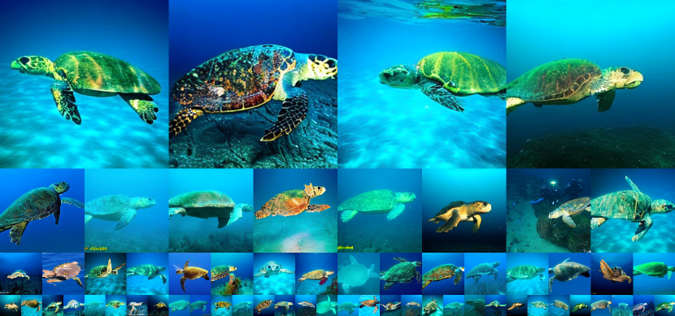

Figure 11: Uncurated generation results of SiT-XL/2 + REPA. We use classifier-free guidance with $w=4.0$. Class label = “loggerhead sea turtle” (33).
[/FIGURE]

[FIGURE A8.F12.g1]

Figure 12: Uncurated generation results of SiT-XL/2 + REPA. We use classifier-free guidance with $w=4.0$. Class label = “macaw” (88).
[/FIGURE]

[FIGURE A8.F13.g1]
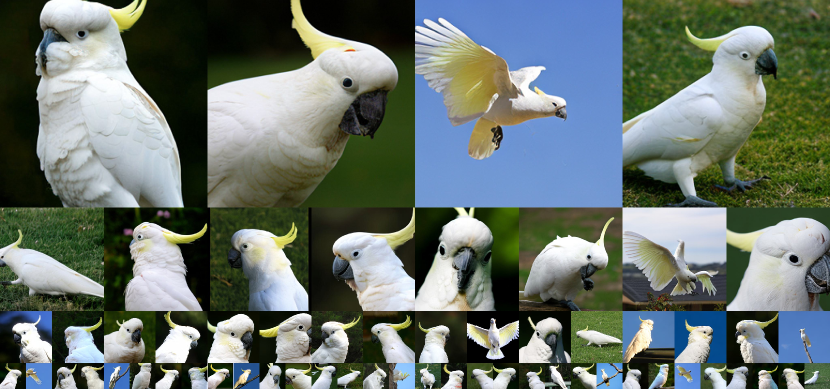

Figure 13: Uncurated generation results of SiT-XL/2 + REPA. We use classifier-free guidance with $w=4.0$. Class label = “sulphur-crested cockatoo” (89).
[/FIGURE]

[FIGURE A8.F14.g1]
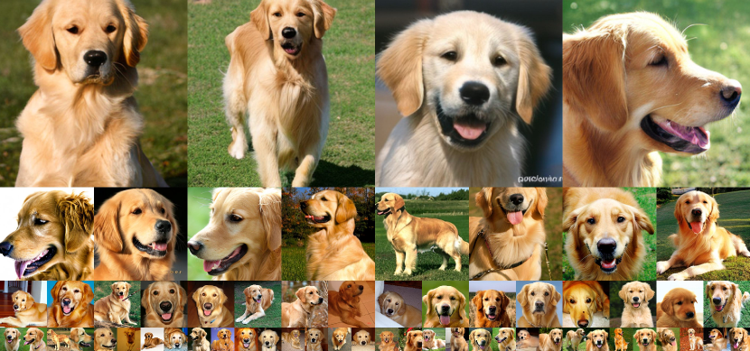

Figure 14: Uncurated generation results of SiT-XL/2 + REPA. We use classifier-free guidance with $w=4.0$. Class label = “golden retriever” (207).
[/FIGURE]

[FIGURE A8.F15.g1]
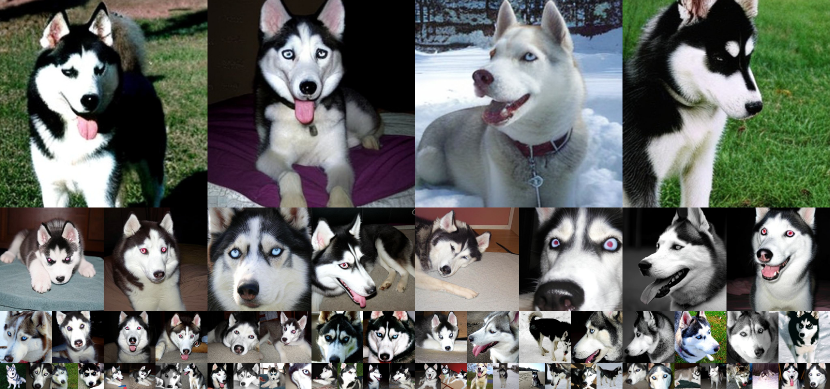

Figure 15: Uncurated generation results of SiT-XL/2 + REPA. We use classifier-free guidance with $w=4.0$. Class label = “husky” (250).
[/FIGURE]

[FIGURE A8.F16.g1]
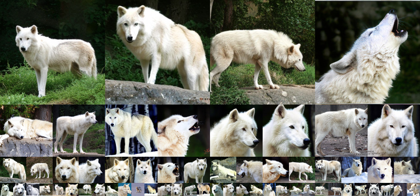

Figure 16: Uncurated generation results of SiT-XL/2 + REPA. We use classifier-free guidance with $w=4.0$. Class label = “arctic wolf” (270).
[/FIGURE]

[FIGURE A8.F17.g1]
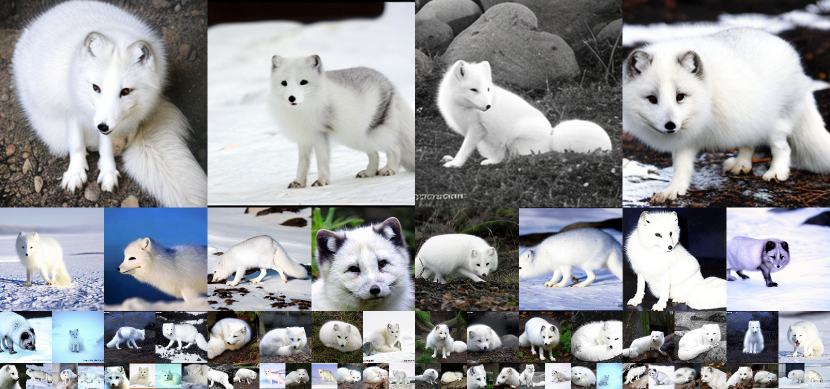

Figure 17: Uncurated generation results of SiT-XL/2 + REPA. We use classifier-free guidance with $w=4.0$. Class label = “arctic fox” (279).
[/FIGURE]

[FIGURE A8.F18.g1]
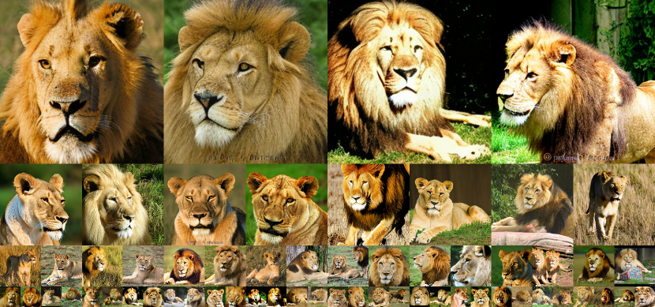

Figure 18: Uncurated generation results of SiT-XL/2 + REPA. We use classifier-free guidance with $w=4.0$. Class label = “lion” (291).
[/FIGURE]

[FIGURE A8.F19.g1]
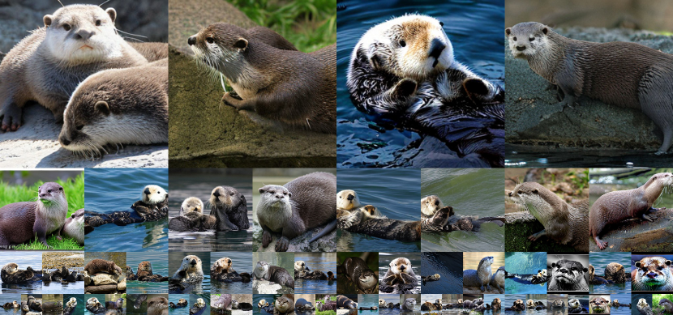

Figure 19: Uncurated generation results of SiT-XL/2 + REPA. We use classifier-free guidance with $w=4.0$. Class label = “otter” (360).
[/FIGURE]

[FIGURE A8.F20.g1]
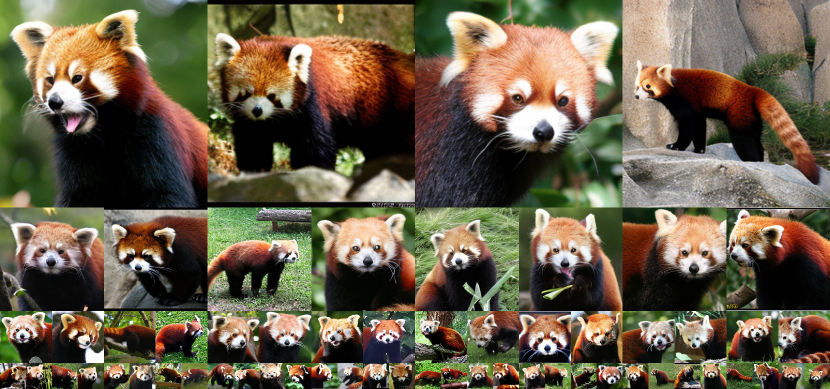

Figure 20: Uncurated generation results of SiT-XL/2 + REPA. We use classifier-free guidance with $w=4.0$. Class label = “red panda” (387).
[/FIGURE]

[FIGURE A8.F21.g1]
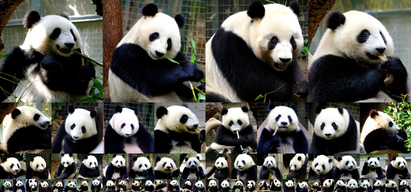

Figure 21: Uncurated generation results of SiT-XL/2 + REPA. We use classifier-free guidance with $w=4.0$. Class label = “panda” (388).
[/FIGURE]

[FIGURE A8.F22.g1]

Figure 22: Uncurated generation results of SiT-XL/2 + REPA. We use classifier-free guidance with $w=4.0$. Class label = “acoustic guitar” (402).
[/FIGURE]

[FIGURE A8.F23.g1]

Figure 23: Uncurated generation results of SiT-XL/2 + REPA. We use classifier-free guidance with $w=4.0$. Class label = “balloon” (417).
[/FIGURE]

[FIGURE A8.F24.g1]

Figure 24: Uncurated generation results of SiT-XL/2 + REPA. We use classifier-free guidance with $w=4.0$. Class label = “baseball” (429).
[/FIGURE]

[FIGURE A8.F25.g1]
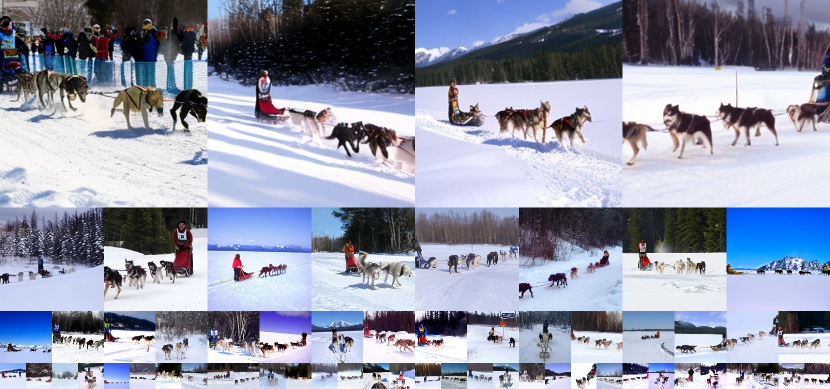

Figure 25: Uncurated generation results of SiT-XL/2 + REPA. We use classifier-free guidance with $w=4.0$. Class label = “dog sled” (537).
[/FIGURE]

[FIGURE A8.F26.g1]
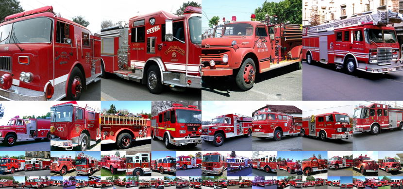

Figure 26: Uncurated generation results of SiT-XL/2 + REPA. We use classifier-free guidance with $w=4.0$. Class label = “fire truck” (555).
[/FIGURE]

[FIGURE A8.F27.g1]
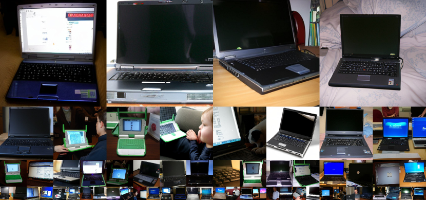

Figure 27: Uncurated generation results of SiT-XL/2 + REPA. We use classifier-free guidance with $w=4.0$. Class label = “laptop” (620).
[/FIGURE]

[FIGURE A8.F28.g1]

Figure 28: Uncurated generation results of SiT-XL/2 + REPA. We use classifier-free guidance with $w=4.0$. Class label = “space shuttle” (812).
[/FIGURE]

[FIGURE A8.F29.g1]
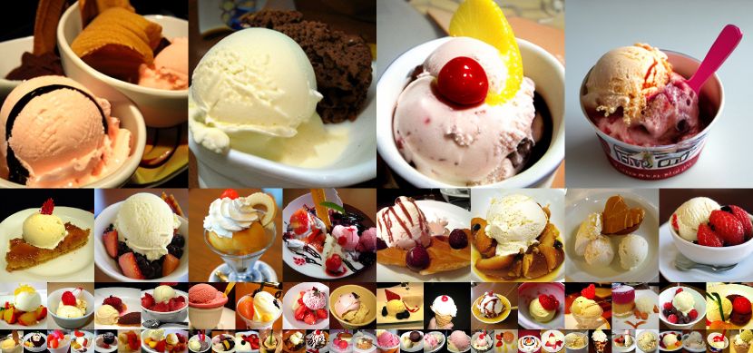

Figure 29: Uncurated generation results of SiT-XL/2 + REPA. We use classifier-free guidance with $w=4.0$. Class label = “ice cream” (928).
[/FIGURE]

[FIGURE A8.F30.g1]
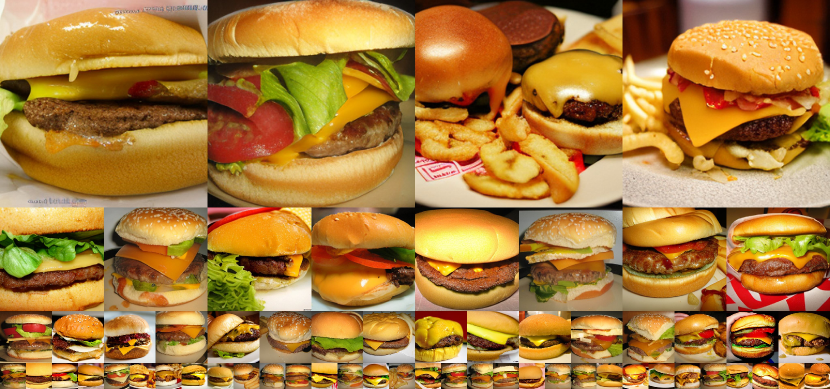

Figure 30: Uncurated generation results of SiT-XL/2 + REPA. We use classifier-free guidance with $w=4.0$. Class label = “cheeseburger” (933).
[/FIGURE]

[FIGURE A8.F31.g1]
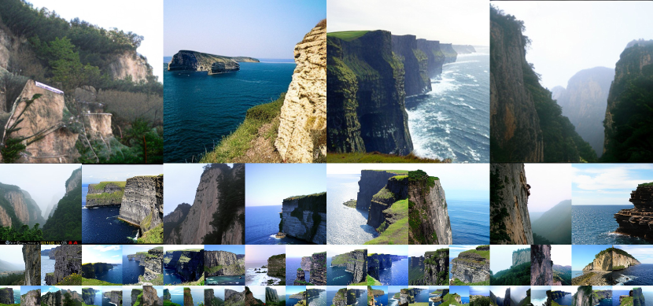

Figure 31: Uncurated generation results of SiT-XL/2 + REPA. We use classifier-free guidance with $w=4.0$. Class label = “cliff drop-off” (972).
[/FIGURE]

[FIGURE A8.F32.g1]
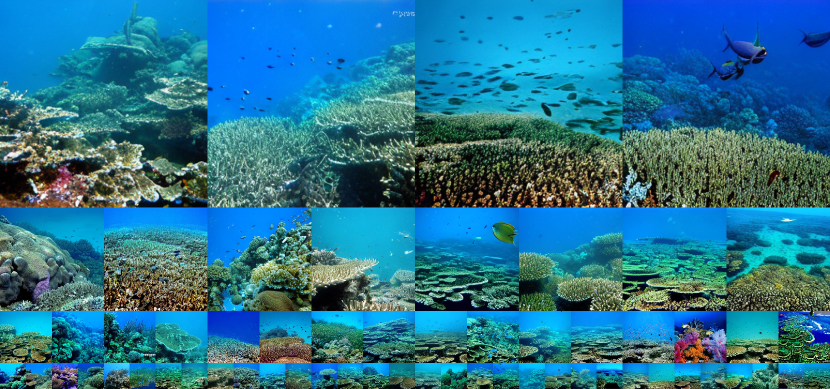

Figure 32: Uncurated generation results of SiT-XL/2 + REPA. We use classifier-free guidance with $w=4.0$. Class label = “coral reef” (973).
[/FIGURE]

[FIGURE A8.F33.g1]
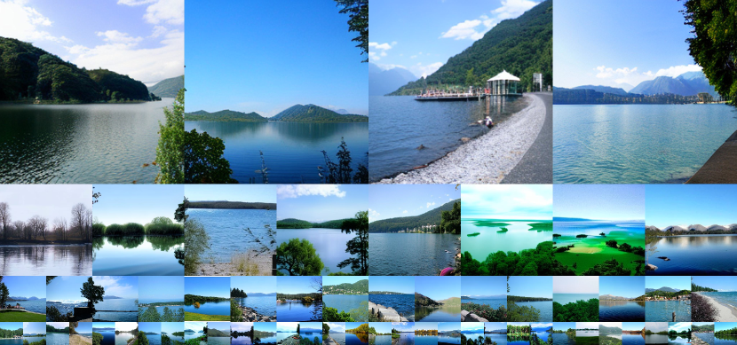

Figure 33: Uncurated generation results of SiT-XL/2 + REPA. We use classifier-free guidance with $w=4.0$. Class label = “lake shore” (975).
[/FIGURE]

[FIGURE A8.F34.g1]

Figure 34: Uncurated generation results of SiT-XL/2 + REPA. We use classifier-free guidance with $w=4.0$. Class label = “volcano” (980).
[/FIGURE]

## Appendix I More Discussion on Related Work

Pretrained visual encoders for generative models. First, there have been several approaches in generative adversarial network (GAN; Goodfellow et al. [2014](#bib.bib25)) that try to accelerate training with better convergence using pretrained visual encoders (Sauer et al., [2021](#bib.bib71); Kumari et al., [2022](#bib.bib45); Sauer et al., [2022](#bib.bib72); [2023a](#bib.bib73); Kang et al., [2023](#bib.bib37)). They usually use pretrained visual encoders as a discriminator by leveraging their intermediate features. This approach has also been applied to the distillation of diffusion models with adversarial objectives (Sauer et al., [2023b](#bib.bib74); [2024](#bib.bib75); Kang et al., [2024](#bib.bib38)). Another line of work tries to exploit the pretrained visual encoders for improving diffusion model training from scratch (Pernias et al., [2024](#bib.bib64); Li et al., [2024](#bib.bib51)), usually by training two diffusion models where one model generates the pretrained representations and the other model generates the target data conditioned on the generated representation. Our method also tries to improve diffusion model training through pretrained visual encoders, but our motivation is in the alignment between the diffusion model representation and recent self-supervised visual representations.  

Denoising transformers. Many recent works have tried to use transformer backbones for diffusion or flow-based model training. First, several works like U-ViT (Bao et al., [2023](#bib.bib6)), MDT (Gao et al., [2023](#bib.bib24)), and DiffiT (Hatamizadeh et al., [2024](#bib.bib27)) show transformer-based backbones with *skip connections* can be an effective backbone for training diffusion models. Intriguingly, DiT (Peebles & Xie, [2023](#bib.bib63)) show skip connections are not even necessary components, and a pure transformer architecture can be a scalable architecture for training diffusion-based models. Based on DiT, SiT (Ma et al., [2024a](#bib.bib57)) shows the model can be further improved with continuous stochastic interpolants (Albergo et al., [2023](#bib.bib2)). Moreover, VDT (Lu et al., [2024](#bib.bib56)) and Latte (Ma et al., [2024b](#bib.bib58)) show DiTs can be extended for video generation through a space-time attention (Arnab et al., [2021](#bib.bib4)). Based on these improvements, Pixart-$\alpha$ (Chen et al., [2024b](#bib.bib12)), Pixart-$\Sigma$ (Chen et al., [2024a](#bib.bib11)), Stable diffusion 3 (Esser et al., [2024](#bib.bib22)) show pure transformers can be scaled up for challenging text-to-image generation, and CMD (Yu et al., [2024](#bib.bib84)), WALT (Gupta et al., [2024](#bib.bib26)), and Sora (Brooks et al., [2024](#bib.bib8)) demonstrates their success in text-to-video generation. Our work analyzes and improves the training of DiT (and SiT) architecture based on a simple feature matching regularization to the early layers.  

Generative models with auxiliary self-supervised tasks. MaskDiT (Zheng et al., [2024](#bib.bib86)) combines mask reconstruction in MAE (He et al., [2022](#bib.bib29)) to diffusion model training for faster diffusion model training. Similarly, SD-DiT (Zhu et al., [2024](#bib.bib87)) shows diffusion model training can be improved with an auxiliary discriminative self-supervised loss. MAGE (Li et al., [2023c](#bib.bib52)) bridge MAE training and masked image modeling (Chang et al., [2022](#bib.bib10)) by adjusting the masking ratio in training, which leads to a single model both capable of discrimination and generation tasks. Our method also has a similarity to these works, where our training scheme has an additional distillation loss to projection of diffusion transformer hidden states.  

