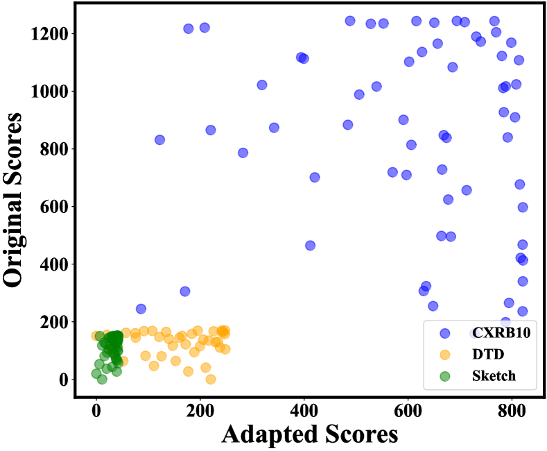
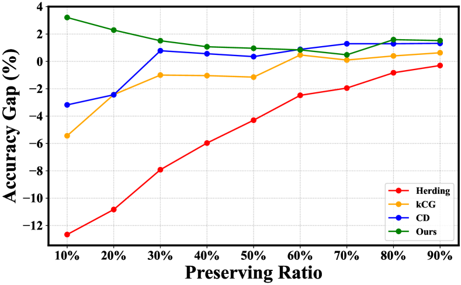
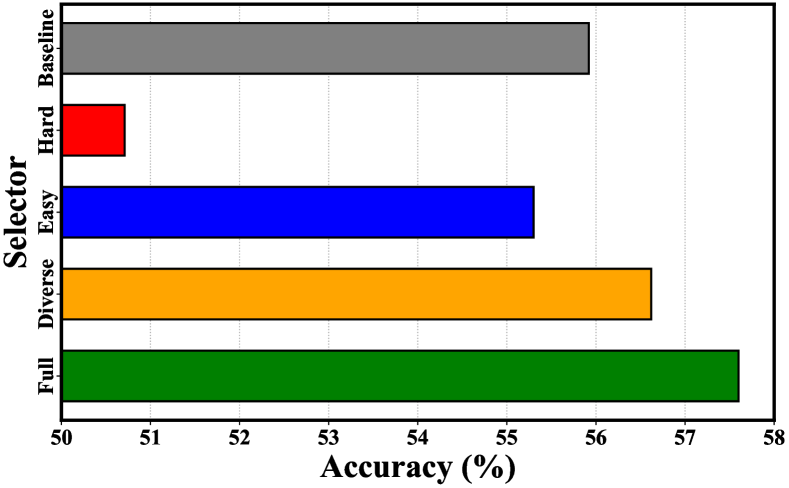
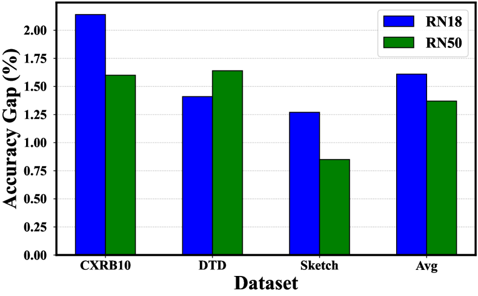
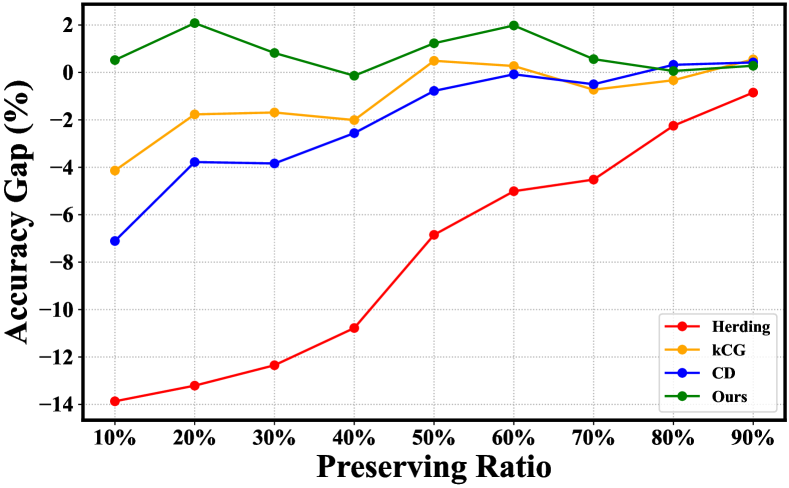

# Exploring Learning Complexity for Downstream Data Pruning

###### Abstract

The over-parameterized pre-trained models pose a great challenge to fine-tuning with limited computation resources. An intuitive solution is to prune the less informative samples from the fine-tuning dataset. A series of training-based scoring functions are proposed to quantify the informativeness of the data subset but the pruning cost becomes non-negligible due to the heavy parameter updating. For efficient pruning, it is viable to adapt the similarity scoring function of geometric-based methods from training-based to training-free. However, we empirically show that such adaption distorts the original pruning and results in inferior performance on the downstream tasks. In this paper, we propose to treat the learning complexity (LC) as the scoring function for classification and regression tasks. Specifically, the learning complexity is defined as the average predicted confidence of subnets with different capacities, which encapsulates data processing within a converged model. Then we preserve the diverse and easy samples for fine-tuning. Extensive experiments with vision datasets demonstrate the effectiveness and efficiency of the proposed scoring function for classification tasks. For the instruction fine-tuning of large language models, our method achieves state-of-the-art performance with stable convergence, outperforming the full training with only 10% of the instruction dataset.  

Machine Learning, Data Selection, Coreset

  

## 1 Introduction

Modern machine learning systems driven by the pretrain-finetune paradigm have been dominant in vision (Donahue et al., [2014](#bib.bib16); Chen et al., [2020](#bib.bib9)), language (Devlin et al., [2018](#bib.bib14); Brown et al., [2020](#bib.bib5)) and multi-modal domains (Radford et al., [2021](#bib.bib48)). Such success is accompanied by ever-increasing dataset size, number of parameters, and computation overhead (Epoch, [2022](#bib.bib19)). Thus, the fine-tuning cost can be exacerbated by the over-parameterized networks. For example, the QWen (Bai et al., [2023](#bib.bib2)) can have over 72 billion parameters, which poses a great challenge for instruction tuning with limited computing resources. This gives rise to the importance of efficient fine-tuning.  

To accommodate the training budget for downstream tasks, an intuitive solution is to prune the less informative fine-tuning samples, such as the redundant from overlapping with the ultra-large-scale pre-training dataset. A series of training-based scoring functions are proposed to quantify the informativeness of the data subset (Koh & Liang, [2017](#bib.bib34); Feldman & Zhang, [2020](#bib.bib20); Yang et al., [2022](#bib.bib59)). For example, the EL2N score is defined as the average L2 norm of error over multiple training with different weight initializations, and the samples with low scores are pruned for efficiency (Paul et al., [2021](#bib.bib46)). As a result, the extra time of EL2N is even longer than the training time, and the pruning cost becomes non-negligible due to the heavy gradient updating of over-parameterized models (Qin et al., [2023](#bib.bib47)).  

For efficient pruning without training, it is necessary to encapsulate the processing of data inside a given converged model for dataset pruning. Thus, the scoring functions from geometric-based methods (Mahalanobis, [2018](#bib.bib41); Welling, [2009](#bib.bib56); Sener & Savarese, [2018](#bib.bib51); Agarwal et al., [2020](#bib.bib1)) can be adapted from training-based to training-free. Specifically, the adapted scores keep removing similar samples measured in the feature space of the existing pre-trained models instead of the models after fine-tuning, to eliminate redundancy. Despite dropping fine-tuning, such adaptation can distort the original pruning due to the distribution shift. To verify, we present the rank correlation between the original and adapted similarity scoring functions and observe severe pruning distortion in Section [2.2](#S2.SS2 "2.2 Motivation ‣ 2 Preliminaries ‣ Exploring Learning Complexity for Downstream Data Pruning"). This motivates us to design a scoring function whose adapted version should be viable and has correlated rank with the original version.  

In this work, we define learning complexity as the average predicted confidence of subnets with different capacities, which encapsulates data processing within a converged model. Moreover, the above notion might alleviate the pruning distortion from the adapted version. Specifically, we define two different metrics as the scoring functions for classification and regression tasks, respectively. For the classification task, the learning complexity is defined as the average predicted confidence from different layers of a pre-trained model. The predicted confidence of each layer originates from a non-parametric weighted KNN (Cover & Hart, [1967](#bib.bib12)) classifier without tuning. For the regression task, we construct subnets by adjusting the dropout rate. The predicted confidence is the sum of perplexity reciprocal from each subnet. With the above-defined scoring function, the default principle preserves the top-k samples sorted in ascending order for training (Toneva et al., [2018](#bib.bib52)). However, we empirically observe that the classifier fine-tuned on the hard samples leads to worse performance than the random pruning, especially at the extreme pruning rates. Moreover, the easiest samples from the top-k principle lead to a comparable overall performance with the random, but better performance in specific downstream tasks with extreme pruning rates. Thus, we theoretically show that the top-k preserving principle will prefer samples located in the high-density area, which might be redundant due to the similarity. Considering the importance of diversity in dataset pruning (Chan et al., [2022](#bib.bib7); Xia et al., [2022](#bib.bib57)), we propose to preserve the easy and diverse samples first. For better diversity, we thus first cluster the intermediate features to isolate the negative concentration effect (Jiang et al., [2023](#bib.bib29)). Then, the easiest samples in each cluster are preserved.  

To verify the efficacy of the proposed method, we conduct a comprehensive evaluation with varying architectures and pre-training paradigms. Empirical results demonstrate our method establishes state-of-the-art performance over existing dataset pruning methods. Meanwhile, the pruning time of LC is almost the same as those training-free methods. At extreme preserving rates 10%, 20%, the superiority of LC is more notable. For example, the average classification accuracy of LC on ResNet-101 exceeds the random method by 5.0% when trained with only 10% of the fine-tuning dataset. Moreover, we conduct ablation studies to understand better how different components, the number of layers, and the clustering number influence the accuracy. The component ablation demonstrates that the defined score plays an indispensable role in pruning. Additionally, our analysis indicates that LC is not sensitive to the hyper-parameter.  

In Section [5](#S5 "5 Discussions ‣ Exploring Learning Complexity for Downstream Data Pruning"), we perform an in-depth analysis to investigate the effectiveness of LC across different architectures and domains. Specifically, we prune the fine-tuning dataset with a lighter model and adapt the LC into the language domains. The empirical results verify the generality of the proposed method. For the instruction fine-tuning of large language models, our method achieves state-of-the-art performance with stable convergence, outperforming the full training with only 10% of the instruction dataset (see Section [5.2](#S5.SS2 "5.2 Adaption to Large Language Models. ‣ 5 Discussions ‣ Exploring Learning Complexity for Downstream Data Pruning")).  

[FIGURE S1.F1.sf1.g1]

(a) Herding ($\rho=0.145$)
[/FIGURE]

## 2 Preliminaries

### 2.1 Background

##### Setup.

In this paper, we consider the setting of supervised multi-class image classification with a pre-trained encoder. Let $\mathcal{X}\subset\mathbb{R}^{d}$ denote the input space and $\mathcal{Y}={\{1,...,K\}}$ denote the corresponding label space. The fine-tuning dataset $\mathcal{D}={\{(\bm{x}_{i},y_{i})\}}^{N}_{i=1}$ is drawn *i.i.d* from the joint data distribution $\mathbb{P_{\mathcal{X}\times\mathcal{Y}}}$. We use $h$ to denote the pre-trained encoder and $g$ to denote the prediction head. Given the fine-tuning dataset, we train a classifier $f=g\circ h:\mathcal{X}\mapsto\mathbb{R}^{|\mathcal{Y}|}$ with learnable parameter $\bm{\theta}\in\mathbb{R}^{p}$, which maps an input to the label space. An ideal classifier $f_{\theta}$ can be obtained by minimizing the following expected risk:  

|  | $$\mathcal{R}_{\mathcal{L}}(f)=\mathbb{E}_{(\bm{x},y)\sim\mathcal{P}_{\mathcal{X\times Y}}}[\mathcal{L}(f(\bm{x};\theta),y)],$$ |  |
| --- | --- | --- |

In practice, we optimize the classifier by minimizing the following empirical risk:  

|  | $$\mathcal{R}^{\mathrm{emp}}_{\mathcal{L}}(f,\mathcal{D})=\frac{1}{N}\sum_{i=1}^{N}[\mathcal{L}(f(\bm{x_{i}};\theta),y_{i})],$$ |  |
| --- | --- | --- |

where $\mathcal{L}$ is the commonly used cross-entropy loss with the softmax activation function. Let $\tilde{\bm{z}}$ and $\hat{\bm{z}}$ denote the feature of $\bm{x}$ from the initial and fine-tuned $h$ respectively.  

##### Problem statement.

In reality, the over-parameterized networks can be too heavy to optimize with limited computing resources. To accommodate the training budget $\eta\in(0,1)$ for downstream tasks, the dataset pruning aims to select a subset $\hat{\mathcal{D}}={\{(\bm{x}_{i},y_{i})\}}^{M}_{i=1}\subset\mathcal{D}$ ($M\leq\eta*N$), which can be used to train a classifier $\hat{f}$ by minimizing the empirical risk $\mathcal{R}^{\mathrm{emp}}_{\mathcal{L}}(f,\hat{\mathcal{D}})$. The classifier from the ideal subset should have the minimal expected risk $\mathcal{R}_{\mathcal{L}}(\hat{f})$. This can be formulated as a bilevel optimization problem with a cardinality constraint:  

|  | $\displaystyle\min_{\hat{\mathcal{D}}}\quad$ | $\displaystyle\mathcal{R}_{\mathcal{L}}(\hat{f})$ |  |
| --- | --- | --- | --- |
|  | $\displaystyle\mathrm{s.t.}\quad$ | $\displaystyle\hat{f}=\operatorname*{arg\,min}_{\theta}\mathcal{R}^{\mathrm{emp}}_{\mathcal{L}}(f,\hat{\mathcal{D}})$ |  |
| --- | --- | --- | --- |
|  |  | $\displaystyle|\hat{\mathcal{D}}|\leq\eta*|\mathcal{D}|$ |  |
| --- | --- | --- | --- |

It is non-trivial to enumerate and evaluate all the $\tbinom{N}{M}$ subsets. An alternative solution performs the dataset pruning by a level-set estimation:  

|  | $$r(x)=\begin{cases}\mathrm{1},&\mathrm{if}\ S(\bm{x})<\tau\\ \mathrm{0},&\mathrm{if}\ S(\bm{x})\geq\tau\end{cases}$$ |  |
| --- | --- | --- |

where $S(\bm{x})$ denotes a scoring function and $\tau$ is a threshold specified to accommodate the budget $\eta$. To preserve the most informative samples, the common principle keeps the top-k samples sorted by the $S(\bm{x})$ in descending order.  

A series of pruning methods define $S(\bm{x})$ based on the training process or trained classifier, which quantifies the true contribution of individual samples to the model generalization. As a result, the cost for $S(\bm{x})$ calculation becomes non-negligible due to the heavy gradient updating. For efficient pruning without training, it is necessary to encapsulate the processing of data inside a given converged model for dataset pruning. A viable option is to replace $\hat{\bm{z}}$ with $\tilde{\bm{z}}$ for the similarity scoring functions of geometric-based pruning (Welling, [2009](#bib.bib56); Sener & Savarese, [2018](#bib.bib51); Agarwal et al., [2020](#bib.bib1)). Despite the efficient inference, the ranking of adapted similarity can significantly deviate from the original and distort the effective pruning, which may result in inferior performance. In the following section, we empirically show the pruning distortion of adapted scores by presenting its poor rank correlation with the original, and reveal the importance of correlated rank in designing scoring functions for effective and efficient pruning.  

### 2.2 Motivation

To demonstrate the pruning distortion of the adapted similarity scores, we choose the following representative geometric-based methods for comparison: Herding (Welling, [2009](#bib.bib56)), kCG (Sener & Savarese, [2018](#bib.bib51)), and CD (Agarwal et al., [2020](#bib.bib1)); In detail, the original version of the similarity scoring function $\hat{S}(\bm{x})$ is defined based on features $\hat{\bm{z}}$ of the fine-tuned model. On the contrary, the adapted version $\tilde{S}(\bm{x})$ measures the similarity scores with latent features $\tilde{\bm{z}}$ from the existing pre-trained model without fine-tuning. The top-k principle preserves the most informative samples. To evaluate the rank correlation between the $\hat{S}(\bm{x})$ and $\tilde{S}(\bm{x})$, we adopt Spearman’s coefficient $\rho$ (Zar, [2005](#bib.bib61)) defined as follows:  

|  | $$\rho=\frac{\operatorname{cov}(\hat{S}(\bm{x}),\tilde{S}(\bm{x}))}{\sigma_{\hat{S}(\bm{x})}\sigma_{\tilde{S}(\bm{x})}}$$ |  |
| --- | --- | --- |

Intuitively, high $\rho$ implies that samples have similar rank from $\hat{S}(\bm{x})$ and $\tilde{S}(\bm{x})$. Therefore, pruning according to those scores will be close to each other by the top-k principle.  

In this part, we perform standard fine-tuning with the ResNet-18 (He et al., [2016](#bib.bib23)) pre-trained on the ImageNet-1K (Deng et al., [2009](#bib.bib13)) in a fully supervised manner. The fine-tuning datasets include Sketch (Eitz et al., [2012](#bib.bib18)), Texture (Cimpoi et al., [2014](#bib.bib10)), and CXRB10. We keep the default parameters for the comparing methods. More experimental details can be found in Section [4](#S4 "4 Experiments ‣ Exploring Learning Complexity for Downstream Data Pruning").  

In Figure [1](#S1.F1 "Figure 1 ‣ 1 Introduction ‣ Exploring Learning Complexity for Downstream Data Pruning"), we present the similarity scores distribution and average $\rho$ of different fine-tuning datasets. The results verify the poor rank correlation between $\hat{S}(\bm{x})$ and $\tilde{S}(\bm{x})$ from the geometric-based pruning. Thus, the adapted scores distort the effective pruning from the original. For example, the $\rho$ of CD is just 0.0253, which implies $\tilde{S}(\bm{x})$ from the pre-trained model failed to measure the informativeness of the fine-tuning dataset. In Table [1](#S4.T1 "Table 1 ‣ Implementation details. ‣ 4.1 Setup ‣ 4 Experiments ‣ Exploring Learning Complexity for Downstream Data Pruning") & [2](#S4.T2 "Table 2 ‣ 4.2.1 Pruning with varying depths. ‣ 4.2 Main Results ‣ 4 Experiments ‣ Exploring Learning Complexity for Downstream Data Pruning"), we further empirically show that the adapted geometric-based methods even exhibit worse performance than the random pruning. We attribute this failure to the representation gap between the pre-trained and fine-tuned model, which arises from the distribution shift. This motivates us to design a scoring function whose adapted version should be viable and has correlated rank with the original version.  

## 3 Method

### 3.1 Scoring Function: Learning Complexity

From our previous analysis, we show that the encapsulated processing of $\hat{S}(\bm{x})$ inside a converged model lays the adaptation foundation for efficient pruning, and correlated rank between the $\hat{S}(\bm{x})$ and $\tilde{S}(\bm{x})$ plays an essential role in designing an effective pruning method. Inspired by the early exit strategies in vision (Huang et al., [2017](#bib.bib24)) and language domains (Xin et al., [2020](#bib.bib58)) that easier samples can be correctly classified at earlier layers, we define the learning complexity as the average predicted confidence of subnets with different capacity, which encapsulates data processing within a converged model. Moreover, the above notion might alleviate the pruning distortion because early layers generalize while later layers memorize (Baldock et al., [2021](#bib.bib3)). Therefore, more common features can be extracted at early layers to quantify the informativeness of samples from different distributions. For example, the early layers of the pre-trained encoder are sufficient to extract effective low-level features, such as color and texture, to confidently predict inputs with a simple structure. Specifically, we define two different learning complexity metrics as the scoring functions for classification and regression tasks, respectively. The main difference is how subnets are constructed.  

##### Classification.

In detail, the learning complexity is defined as the average predicted confidence from different layers of a pre-trained model. The predicted confidence of each layer originates from a non-parametric weighted KNN (Cover & Hart, [1967](#bib.bib12)) classifier without tuning.  

|  | $$\tilde{S}(\bm{x})=\frac{1}{L}\sum_{i=1}^{L}{p(y|\tilde{\bm{z}}_{i})}$$ |  | (1) |
| --- | --- | --- | --- |

where $L$ is the number of model layers and $\tilde{\bm{z}}_{i}$ is the feature of $\bm{x}$ from the $i$ layer of the pre-trained encoder $h$. For notation simplicity, we use $p(y|\bm{z})$ to denote $p(y|\tilde{\bm{z}}_{i})$ in the following definition:  

|  | $$p(y|\bm{z})=\frac{\sum_{(y^{\prime},\bm{z^{\prime}})\in\mathcal{D}_{\bm{z}}^{knn}}{\mathbbm{I}(y=y^{\prime}){\lVert\bm{z}-\bm{z^{\prime}}\rVert}^{-1}}}{\sum_{(y^{\prime},\bm{z^{\prime}})\in\mathcal{D}_{\bm{z}}^{knn}}{{\lVert\bm{z}-\bm{z^{\prime}}\rVert}^{-1}}}$$ |  | (2) |
| --- | --- | --- | --- |

where $\mathcal{D}_{\bm{z}}^{knn}$ is $k$ nearest neighbors of $\bm{z}$ with their labels. Note that the $k$ is tuned for the best accuracy on a separate validation set.  

The above computation is encapsulated inside a pre-trained encoder. We further empirically demonstrate the correlated rank between the $\hat{S}(\bm{x})$ and $\tilde{S}(\bm{x})$ (Lin et al., [2021](#bib.bib39)). Experimental details can be found in Section [2.2](#S2.SS2 "2.2 Motivation ‣ 2 Preliminaries ‣ Exploring Learning Complexity for Downstream Data Pruning").  

As shown in Figure [1](#S1.F1 "Figure 1 ‣ 1 Introduction ‣ Exploring Learning Complexity for Downstream Data Pruning"), the rank correlation between $\hat{S}(\bm{x})$ and $\tilde{S}(\bm{x})$ of our learning complexity is much better than the similarity scores of geometric-based pruning. For different fine-tuning datasets, we can observe that the $\tilde{S}(\bm{x})$ increases monotonically with the $\hat{S}(\bm{x})$. This demonstrates the adapted version of the proposed scoring function can approximate effective pruning from the original version.  

##### Regression.

We construct subnets by adjusting the dropout rate from 10% to 90%. The predicted confidence is the sum of perplexity reciprocal from each subnet:  

|  | $$\tilde{S}(\bm{x})=\frac{1}{I}\sum_{i=1}^{I}{{\mathrm{pp}_{i}({\bm{x}})}^{-1}}$$ |  | (3) |
| --- | --- | --- | --- |

where $I$ is the number of subnets and $\mathrm{pp}_{i}({\bm{x}})$ denotes the perplexity of $\bm{x}$ from subnet $i$. This learning complexity can be utilized to prune the instruction dataset at large language models (LLMs) alignment stage, as empirically demonstrated in Section [5](#S5 "5 Discussions ‣ Exploring Learning Complexity for Downstream Data Pruning").  

### 3.2 Preserving Principle: Easy and Diverse First

With the above-defined scoring function $\tilde{S}(\bm{x})$, the default principle preserves the top-k samples sorted in ascending order for training (Toneva et al., [2018](#bib.bib52)). However, we empirically observe that the classifier fine-tuned on the hard samples leads to worse performance than the random pruning, especially at the extreme pruning rates. Moreover, the easiest samples from the top-k principle lead to a comparable overall performance with the random, but better performance in specific downstream tasks with extreme pruning rates. To reach consistent gains across different fine-tuning datasets, such failure of the top-k preserving principle motivates the unexplored question: how can we preserve the informative subset with the defined scoring function?  

We start by presenting a simple and intriguing fact in the following proposition (proof in Appendix [B](#A2 "Appendix B Proof of Proposition 3.1 ‣ Exploring Learning Complexity for Downstream Data Pruning")), which demonstrates that samples with high confidence from weighted KNN are usually located in the high-density area.  

###### Proposition 3.1.

Given a data point $\bm{x}$, assume that its feature $\bm{z}$ follows a Gaussian mixture model such that $\bm{z}\sim\mathcal{G}$. $p(\bm{z})$ is probability density function and $S(\bm{x})$ denotes the confidence defined in Equation [2](#S3.E2 "Equation 2 ‣ Classification. ‣ 3.1 Scoring Function: Learning Complexity ‣ 3 Method ‣ Exploring Learning Complexity for Downstream Data Pruning"), then we have  

|  | $$\mathbb{E}_{\bm{z\sim\mathcal{G}}}[S(\bm{x})]\propto p(\bm{z}).$$ |  |
| --- | --- | --- |

Proposition [3.1](#S3.Thmtheorem1 "Proposition 3.1. ‣ 3.2 Preserving Principle: Easy and Diverse First ‣ 3 Method ‣ Exploring Learning Complexity for Downstream Data Pruning") indicates that the top-k preserving principle will prefer samples located in the high-density area, which might be redundant due to the similarity. However, the diverse subset is critical for covering a full data distribution in dataset pruning (Chan et al., [2022](#bib.bib7); Xia et al., [2022](#bib.bib57)). Hence, we propose to preserve the easy and diverse samples first. Specifically, we first define that the selected subset is diverse if $\mathcal{S}$ satisfies the condition:  

|  | $$\delta(\mathcal{S})=\frac{1}{K}\sum_{x_{i}\in\mathcal{S}}\min_{j\neq i}d\left(x_{i},x_{j}\right)\geq C,$$ |  |
| --- | --- | --- |

where $d$ denotes a distance function in the space and $C$ is a constant that controls the degree of diversity (Jiang et al., [2023](#bib.bib29)). Then, we employ a non-parametric clustering algorithm - K-means, which partitions the samples into $k$ clusters $\mathbf{C}=\{C_{1},C_{2},\ldots,C_{k}\}$ so as to minimize the within-cluster sum of squares. Formally, the objective of the vanilla K-means algorithm is to find: $\underset{\mathbf{C}}{\arg\min}\sum_{i=1}^{M}\sum_{\mathbf{x}\in C_{i}}\left\|\mathbf{z}-\bm{\mu}_{i}\right\|^{2}$, where $\bm{\mu}_{i}$ is the centroid of samples from the cluster $C_{i}$. Given a set of all selected examples $\mathcal{D}=\{\mathbf{x}_{i}\}^{N}_{i=1}$, our goal is to select a subset of $M$ examples $\mathcal{S}\subseteq\mathcal{D}$ with $|\mathcal{S}|=M$.  

Due to the memorization of the last layer, we instead choose the intermediate layer with the best accuracy on the validation set. Features from this layer are used for clustering. Finally, the easiest samples in each cluster are preserved.  

## 4 Experiments

In this section, we introduce the experimental details and empirically verify the effectiveness of the proposed dataset pruning method on different pre-trained encoders and fine-tuning datasets. Moreover, we conduct ablation studies to understand better how different components, the number of layers, and the clustering number influence the accuracy. The code is available in the supplementary material.  

### 4.1 Setup

##### Pre-trained encoders.

We provide a comprehensive evaluation by using the following two sets of pre-trained encoders: (a) Fully supervised ResNet (He et al., [2016](#bib.bib23)) on the ImageNet-1K (Deng et al., [2009](#bib.bib13)) with varying depths; (b) ResNet-50 pre-trained with different paradigms. Specifically, the pre-training paradigms can be divided into self-supervised learning, weakly supervised learning111The pre-training dataset is ImageNet-21K (Russakovsky et al., [2015](#bib.bib50)) because its labels are not mutually exclusive., fully supervised learning, and hybrid supervised learning according to the accessibility of the supervised signal. The default loss function for fully supervised learning is cross-entropy, and we take SimCLR (Chen et al., [2020](#bib.bib9)), Semantic Softmax (Ridnik et al., [2021](#bib.bib49)), and SupCon (Khosla et al., [2020](#bib.bib31)) as the self-supervised, weakly supervised and hybrid supervised learning methods respectively. For convenience, we directly adopt the existing pre-trained weights.  

##### Fine-tuning datasets.

To enumerate the distribution gaps, we adopt Sketch (Eitz et al., [2012](#bib.bib18)), Texture (Cimpoi et al., [2014](#bib.bib10)), and CXRB10 as fine-tuning datasets. The CXRB10 is created by selecting 10 balanced categories from the imbalanced ChestX-ray14 (Borghesi & Maroldi, [2020](#bib.bib4)). Those three datasets represent covariate shift, semantic shift, and covariate-semantic shift from the pre-training dataset ImageNet-1K, respectively. For hyperparameter tuning, we additionally split 25% data as the validation set.  

##### Pruning baselines.

Aside from the random pruning, we also divide and compare the following methods: (1) Inference based pruning: Herding (Welling, [2009](#bib.bib56)), kCG (Sener & Savarese, [2018](#bib.bib51)), and CD (Agarwal et al., [2020](#bib.bib1)); (2) Training based pruning: Forgetting (Toneva et al., [2018](#bib.bib52)), Least Conf, Entropy, Margin (Coleman et al., [2019](#bib.bib11)), GraNd, and EL2N (Paul et al., [2021](#bib.bib46)). The proposed method LC prunes the fine-tuning dataset solely based on the pre-trained encoder without training and thus belongs to the first category.  

##### Fine-tuning.

For the downstream task of image classification, we sequentially attach a BatchNorm layer without any affine parameter and a linear layer on top of the pre-trained encoder (Islam et al., [2021](#bib.bib25)). Then, the above classifier is fully trained on the pruned fine-tuning dataset for 50 epochs using SGD with a momentum of 0.9, a weight decay of 0.0, and a batch size of 64. The initial learning rate is tuned over the search space {0.001, 0.01, 0.1} on the validation set, and decays by a factor of 10 at 25 and 37 epochs. The above settings are the same for all pruning methods and pruned datasets. For a fair comparison, we preserve the model weights at the last epoch for classification evaluation.  

##### Evaluation.

We prune the fine-tuning dataset at 9 preserving rates, ranging from 10% to 90%, to cover comprehensive budget cases. The performance of dataset pruning is evaluated by measuring the following metrics: (1) the downstream classification accuracy at a specific preserving rate. This metric is also used for hyperparameter tuning; (2) the average pruning time across different preserving rates.  

##### Implementation details.

To ensure reliable reproduction, we have run the compared baselines using the DeepCore (Guo et al., [2022](#bib.bib22)) library222https://github.com/PatrickZH/DeepCore. For the proposed method, we tune the only hyperparameter, the number of cluster $k$, over the search space {8, 12, 16, 20, 24} with the validation set. Code is based on PyTorch (Paszke et al., [2019](#bib.bib45)) and all the experiments run on NVIDIA GeForce RTX 4090.  

[TABLE S4.T1]

<table class="ltx_tabular ltx_align_middle">
<tbody class="ltx_tbody">
<tr class="ltx_tr">
<td class="ltx_td ltx_align_center ltx_border_tt">Arch</td>
<td class="ltx_td ltx_align_center ltx_border_tt">
RN18 / RN50 / RN101
</td>
</tr>
<tr class="ltx_tr">
<td class="ltx_td ltx_align_center ltx_border_t">Metric</td>
<td class="ltx_td ltx_align_center ltx_border_t">
Accuracy <math class="ltx_Math"><semantics><mo>↑</mo><annotation-xml><ci>↑</ci></annotation-xml><annotation>\uparrow</annotation></semantics></math>
</td>
<td class="ltx_td ltx_align_center ltx_border_t">
Time <math class="ltx_Math"><semantics><mo>↓</mo><annotation-xml><ci>↓</ci></annotation-xml><annotation>\downarrow</annotation></semantics></math>
</td>
</tr>
<tr class="ltx_tr">
<td class="ltx_td ltx_align_center ltx_border_t"><math class="ltx_Math"><semantics><msub><mi>𝑫</mi><mi>𝐝𝐨𝐰𝐧</mi></msub><annotation-xml><apply><csymbol>subscript</csymbol><ci>𝑫</ci><ci>𝐝𝐨𝐰𝐧</ci></apply></annotation-xml><annotation>\bm{D}_{\mathbf{down}}</annotation></semantics></math></td>
<td class="ltx_td ltx_align_center ltx_border_t">CXRB10</td>
<td class="ltx_td ltx_align_center ltx_border_t">DTD</td>
<td class="ltx_td ltx_align_center ltx_border_t">Sketch</td>
<td class="ltx_td ltx_align_center ltx_border_t">Avg</td>
<td class="ltx_td ltx_align_center ltx_border_t">Avg</td>
</tr>
<tr class="ltx_tr">
<td class="ltx_td ltx_align_center ltx_border_t">Random</td>
<td class="ltx_td ltx_align_center ltx_border_t">32.54 / 30.72 / 29.80</td>
<td class="ltx_td ltx_align_center ltx_border_t">62.17 / 64.28 / 64.97</td>
<td class="ltx_td ltx_align_center ltx_border_t">71.36 / 72.77 / 74.67</td>
<td class="ltx_td ltx_align_center ltx_border_t">55.36 / 55.92 / 56.48</td>
<td class="ltx_td ltx_align_center ltx_border_t">-</td>
</tr>
<tr class="ltx_tr">
<td class="ltx_td ltx_align_center">Herding</td>
<td class="ltx_td ltx_align_center">30.78 / 29.83 / 26.92</td>
<td class="ltx_td ltx_align_center">53.58 / 56.44 / 55.47</td>
<td class="ltx_td ltx_align_center">65.97 / 69.56 / 67.93</td>
<td class="ltx_td ltx_align_center">50.11 / 51.94 / 50.11</td>
<td class="ltx_td ltx_align_center">0.18</td>
</tr>
<tr class="ltx_tr">
<td class="ltx_td ltx_align_center">kCG</td>
<td class="ltx_td ltx_align_center">30.26 / 30.13 / 27.20</td>
<td class="ltx_td ltx_align_center">61.88 / 63.32 / 64.62</td>
<td class="ltx_td ltx_align_center">70.79 / 73.08 / 74.51</td>
<td class="ltx_td ltx_align_center">54.31 / 55.51 / 55.44</td>
<td class="ltx_td ltx_align_center">0.19</td>
</tr>
<tr class="ltx_tr">
<td class="ltx_td ltx_align_center">CD</td>
<td class="ltx_td ltx_align_center">32.30 / 27.30 / 28.48</td>
<td class="ltx_td ltx_align_center">62.67 / 63.31 / 65.73</td>
<td class="ltx_td ltx_align_center">71.39 / 73.09 / 75.09
</td>
<td class="ltx_td ltx_align_center">55.45 / 54.56 / 56.43</td>
<td class="ltx_td ltx_align_center">0.18</td>
</tr>
<tr class="ltx_tr">
<td class="ltx_td ltx_align_center">Least Conf</td>
<td class="ltx_td ltx_align_center">32.0 / 30.99 / 28.63</td>
<td class="ltx_td ltx_align_center">61.90 / 64.02 / 64.72</td>
<td class="ltx_td ltx_align_center">71.66 / 73.71 / 74.99</td>
<td class="ltx_td ltx_align_center">55.18 / 56.24 / 56.12</td>
<td class="ltx_td ltx_align_center">15.67</td>
</tr>
<tr class="ltx_tr">
<td class="ltx_td ltx_align_center">Entropy</td>
<td class="ltx_td ltx_align_center">32.24 / 30.66 / 27.61</td>
<td class="ltx_td ltx_align_center">62.19 / 63.57 / 64.76</td>
<td class="ltx_td ltx_align_center">71.42 / 73.35 / 75.03</td>
<td class="ltx_td ltx_align_center">55.29 / 55.86 / 55.80</td>
<td class="ltx_td ltx_align_center">15.67</td>
</tr>
<tr class="ltx_tr">
<td class="ltx_td ltx_align_center">Margin</td>
<td class="ltx_td ltx_align_center">32.51 / 30.74 / 27.86</td>
<td class="ltx_td ltx_align_center">62.22 / 63.89 / 64.75</td>
<td class="ltx_td ltx_align_center">71.31 / 73.22 / 75.19</td>
<td class="ltx_td ltx_align_center">55.34 / 55.95 / 55.93</td>
<td class="ltx_td ltx_align_center">15.67</td>
</tr>
<tr class="ltx_tr">
<td class="ltx_td ltx_align_center">GraNd</td>
<td class="ltx_td ltx_align_center">30.42 / 27.18 / 27.13</td>
<td class="ltx_td ltx_align_center">62.09 / 62.15 / 65.61</td>
<td class="ltx_td ltx_align_center">71.43 / 72.79 / 74.62</td>
<td class="ltx_td ltx_align_center">54.65 / 54.04 / 55.79</td>
<td class="ltx_td ltx_align_center">15.85</td>
</tr>
<tr class="ltx_tr">
<td class="ltx_td ltx_align_center">EL2N</td>
<td class="ltx_td ltx_align_center">30.23 / 25.86 / 26.81</td>
<td class="ltx_td ltx_align_center">61.65 / 61.80 / 64.92</td>
<td class="ltx_td ltx_align_center">71.15 / 72.53 / 74.71</td>
<td class="ltx_td ltx_align_center">54.35 / 53.40 / 55.48</td>
<td class="ltx_td ltx_align_center">47.22</td>
</tr>
<tr class="ltx_tr">
<td class="ltx_td ltx_align_center">Forgetting</td>
<td class="ltx_td ltx_align_center">
34.20 / 32.01 / 30.98
</td>
<td class="ltx_td ltx_align_center">
63.62 / 65.73 / 66.91
</td>
<td class="ltx_td ltx_align_center">
72.31 / 73.39 / 75.03</td>
<td class="ltx_td ltx_align_center">
56.71 / 57.05 / 57.64
</td>
<td class="ltx_td ltx_align_center">15.38</td>
</tr>
<tr class="ltx_tr">
<td class="ltx_td ltx_align_center ltx_border_bb ltx_border_t">LC (Ours)</td>
<td class="ltx_td ltx_align_center ltx_border_bb ltx_border_t">34.81 / 32.94 / 31.63</td>
<td class="ltx_td ltx_align_center ltx_border_bb ltx_border_t">
63.40 / 66.08 / 67.18
</td>
<td class="ltx_td ltx_align_center ltx_border_bb ltx_border_t">72.36 / 73.76 / 75.57</td>
<td class="ltx_td ltx_align_center ltx_border_bb ltx_border_t">56.86 / 57.60 / 58.13</td>
<td class="ltx_td ltx_align_center ltx_border_bb ltx_border_t">0.22</td>
</tr>
</tbody>
</table>

Table 1: Classification results (%) and average time cost (minute) of ResNet with different depths. $\uparrow$ indicates larger values are better, and $\downarrow$ indicates smaller values are better. Bold numbers are superior results, and underline numbers are suboptimal results. Inference-based and training-based pruning denote independence and dependence on parameter updating, respectively.
[/TABLE]

[FIGURE S4.F2.sf1.g1]

(a) Supervised RN18 with IN-1K
[/FIGURE]

### 4.2 Main Results

#### 4.2.1 Pruning with varying depths.

In this section, we verify the effectiveness of the proposed method with varying architecture depths on different fine-tuning datasets. As shown in Table [1](#S4.T1 "Table 1 ‣ Implementation details. ‣ 4.1 Setup ‣ 4 Experiments ‣ Exploring Learning Complexity for Downstream Data Pruning"), our method maintains a comparable pruning time with existing inference-based methods and establishes state-of-the-art downstream classification accuracy across different fine-tuning datasets and architecture depths. On the contrary, the performance of existing inference-based pruning methods fluctuates with fine-tuning datasets, and none of these methods show consistent superiority with varying architecture depths. We can observe the distribution gap from the covariate-semantic shift (CXRB10) exacerbates the accuracy degradation of the competitive CD but such degradation disappears with the covariate shift (Sketch). For example, the CD outperforms the random for the Sketch (73.76% v.s. 72.77%) but lags far behind the random for the CXRB10 (27.30% v.s. 30.72%) when evaluated on the pre-trained ResNet-50. However, the proposed LC alleviates distribution gaps and demonstrates effectiveness across different fine-tuning datasets and architecture depths.  

A detailed classification comparison is presented in Figure [2](#S4.F2 "Figure 2 ‣ Implementation details. ‣ 4.1 Setup ‣ 4 Experiments ‣ Exploring Learning Complexity for Downstream Data Pruning"). For clarity, we visualize the average accuracy gaps with the random pruning on different fine-tuning datasets. We find that our method shows great superiority at extreme preserving rates {10%, 20%}. For example, the average classification accuracy of LC on ResNet-101 exceeds the random method by 5.0% when trained with only 10% of the fine-tuning dataset. However, the other inference-based methods seriously deteriorate at the same preserving rate. When reserving more fine-tuning samples, the performance of the classifier tends to be saturated. Our method still maintains a slight advantage, which demonstrates the applicability to comprehensive budget cases. In Table [1](#S4.T1 "Table 1 ‣ Implementation details. ‣ 4.1 Setup ‣ 4 Experiments ‣ Exploring Learning Complexity for Downstream Data Pruning"), we also present the comparison with existing training-based pruning methods. Despite direct fine-tuning on the target dataset, the most competitive Forgetting is inferior to our method. Besides, the pruning time cost becomes extremely expensive for those training-based methods due to the gradient updating of huge model weights. Additionally, we can find that existing training-based pruning methods usually perform better than inference-based methods. This empirically verifies the negative effect of the distribution gap between the pre-training and the fine-tuning dataset for pruning.   

[TABLE S4.T2]

<table class="ltx_tabular ltx_guessed_headers ltx_align_middle">
<thead class="ltx_thead">
<tr class="ltx_tr">
<th class="ltx_td ltx_align_center ltx_th ltx_th_column ltx_border_tt">Arch</th>
<th class="ltx_td ltx_align_center ltx_th ltx_th_column ltx_border_tt">
Self / Weakly / Hybrid
</th>
</tr>
<tr class="ltx_tr">
<th class="ltx_td ltx_align_center ltx_th ltx_th_column ltx_border_t">Metric</th>
<th class="ltx_td ltx_align_center ltx_th ltx_th_column ltx_border_t">
Accuracy <math class="ltx_Math"><semantics><mo>↑</mo><annotation-xml><ci>↑</ci></annotation-xml><annotation>\uparrow</annotation></semantics></math>
</th>
<th class="ltx_td ltx_align_center ltx_th ltx_th_column ltx_border_t">
Time <math class="ltx_Math"><semantics><mo>↓</mo><annotation-xml><ci>↓</ci></annotation-xml><annotation>\downarrow</annotation></semantics></math>
</th>
</tr>
</thead>
<tbody class="ltx_tbody">
<tr class="ltx_tr">
<td class="ltx_td ltx_align_center ltx_border_t">Random</td>
<td class="ltx_td ltx_align_center ltx_border_t">45.66 / 55.99 / 58.19</td>
<td class="ltx_td ltx_align_center ltx_border_t">-</td>
</tr>
<tr class="ltx_tr">
<td class="ltx_td ltx_align_center">Herding</td>
<td class="ltx_td ltx_align_center">37.92 / 50.87 / 51.47</td>
<td class="ltx_td ltx_align_center">0.17</td>
</tr>
<tr class="ltx_tr">
<td class="ltx_td ltx_align_center">kCG</td>
<td class="ltx_td ltx_align_center">44.62 / 55.69 / 57.51</td>
<td class="ltx_td ltx_align_center">0.17</td>
</tr>
<tr class="ltx_tr">
<td class="ltx_td ltx_align_center">CD</td>
<td class="ltx_td ltx_align_center">43.67 / 54.83 / 57.88</td>
<td class="ltx_td ltx_align_center">0.17</td>
</tr>
<tr class="ltx_tr">
<td class="ltx_td ltx_align_center">Least Conf</td>
<td class="ltx_td ltx_align_center">46.36 / 56.10 / 58.39</td>
<td class="ltx_td ltx_align_center">11.01</td>
</tr>
<tr class="ltx_tr">
<td class="ltx_td ltx_align_center">Entropy</td>
<td class="ltx_td ltx_align_center">46.37 / 56.21 / 58.52</td>
<td class="ltx_td ltx_align_center">11.01</td>
</tr>
<tr class="ltx_tr">
<td class="ltx_td ltx_align_center">Margin</td>
<td class="ltx_td ltx_align_center">
46.82 / 56.20 / 58.34</td>
<td class="ltx_td ltx_align_center">11.01</td>
</tr>
<tr class="ltx_tr">
<td class="ltx_td ltx_align_center">GraNd</td>
<td class="ltx_td ltx_align_center">42.47 / 54.05 / 57.42</td>
<td class="ltx_td ltx_align_center">11.93</td>
</tr>
<tr class="ltx_tr">
<td class="ltx_td ltx_align_center">EL2N</td>
<td class="ltx_td ltx_align_center">41.59 / 53.55 / 57.48</td>
<td class="ltx_td ltx_align_center">33.66</td>
</tr>
<tr class="ltx_tr">
<td class="ltx_td ltx_align_center">Forgetting</td>
<td class="ltx_td ltx_align_center">
46.99 / 57.12 / 59.12
</td>
<td class="ltx_td ltx_align_center">11.24</td>
</tr>
<tr class="ltx_tr">
<td class="ltx_td ltx_align_center ltx_border_bb ltx_border_t">LC (Ours)</td>
<td class="ltx_td ltx_align_center ltx_border_bb ltx_border_t">46.48 / 57.39 / 60.43</td>
<td class="ltx_td ltx_align_center ltx_border_bb ltx_border_t">0.18</td>
</tr>
</tbody>
</table>

Table 2: Average classification results (%) and time cost (minute) of ResNet-50 with different pre-training paradigms.
[/TABLE]

[FIGURE S4.F3.sf1.g1]

(a) Components
[/FIGURE]

#### 4.2.2 Pruning with different paradigms.

In this section, we verify the effectiveness of the proposed method with varying pre-training paradigms on different fine-tuning datasets. The comparison with the random and inference-based pruning methods is shown in Table [2](#S4.T2 "Table 2 ‣ 4.2.1 Pruning with varying depths. ‣ 4.2 Main Results ‣ 4 Experiments ‣ Exploring Learning Complexity for Downstream Data Pruning"). It is obvious that our method still establishes state-of-the-art classification performance across different fine-tuning datasets and pre-training paradigms. Meanwhile, the pruning time of LC is almost the same as those inference-based methods. Another inspiring observation for our method is that stronger supervised signals during pre-training lead to larger accuracy gains over the random. Specifically, the accuracy gaps are 0.82%, 1.4%, 1.68%, and 2.24% for self-supervised learning, weakly, fully, and hybrid supervised learning, respectively. Besides, we find that the accuracy gap is relatively small for the self-supervised compared with the hybrid supervised learning paradigm, which is the same as the overall results. In Table [2](#S4.T2 "Table 2 ‣ 4.2.1 Pruning with varying depths. ‣ 4.2 Main Results ‣ 4 Experiments ‣ Exploring Learning Complexity for Downstream Data Pruning"), we also present a brief comparison with training-based pruning. We can find that LC maintains competitive accuracy but in a much more efficient way. Moreover, the training-based pruning methods are still better than those inference-based methods across different pre-training paradigms. We present the detailed results in Appendix [C](#A3 "Appendix C Detailed Results. ‣ Exploring Learning Complexity for Downstream Data Pruning"), and the superiority of LC is still obvious when the fine-tuning budget is limited.  

### 4.3 Ablation Studies

##### Components.

To verify the importance of each component in our method, we ablate the composing of LC. The results are presented in Figure [3(a)](#S4.F3.sf1 "Figure 3(a) ‣ Figure 3 ‣ 4.2.1 Pruning with varying depths. ‣ 4.2 Main Results ‣ 4 Experiments ‣ Exploring Learning Complexity for Downstream Data Pruning"). We can observe that “Easy” performs better than “Hard” but both are inferior to the random baseline. From the result of “Diverse”, we verify the effectiveness of diversity. Most importantly, the comparison between “Full” and “Diverse” demonstrates that the defined score plays an indispensable role in dataset pruning.  

##### Number of layers.

To investigate the effect of the number of layers for the defined score, we design “Decrement” and “Increment” strategies. For the “Increment”, we gradually increase the number of layers from shallow to deep for the defined score calculation. On the contrary, the “Decrement” strategy gradually removes layers. For clarity, the average accuracy of different fine-tuning datasets at a 10% preserving rate is shown in Figure [3(b)](#S4.F3.sf2 "Figure 3(b) ‣ Figure 3 ‣ 4.2.1 Pruning with varying depths. ‣ 4.2 Main Results ‣ 4 Experiments ‣ Exploring Learning Complexity for Downstream Data Pruning"). We can observe that the performance is approximately positively correlated with the number of layers.  

##### Number of clusters.

We vary the only hyper-parameter $k$ for sensitivity analysis and present the results in Figure [3(c)](#S4.F3.sf3 "Figure 3(c) ‣ Figure 3 ‣ 4.2.1 Pruning with varying depths. ‣ 4.2 Main Results ‣ 4 Experiments ‣ Exploring Learning Complexity for Downstream Data Pruning"). The $k=1$ corresponds to the “Easy” situation. When the $k$ is larger than 8, the downstream classification performance tends to be stable. Therefore, we can conclude that the proposed LC is not sensitive to the hyper-parameter $k$.  

[FIGURE S4.F4.sf1.g1]

(a) Cross-depth
[/FIGURE]

## 5 Discussions

The above experiments verify the effectiveness of the proposed method with the same architecture in the vision domain. In this section, we further demonstrate the generalization and applicability of LC in cross-architecture and cross-domain scenarios.  

### 5.1 Transferring across Architectures.

In a general way, pruning the dataset using the same architecture used for downstream tasks is required before each fine-tuning. To avoid the above repetition for efficiency, an intuitive solution is to prune once with a lighter model for different architectures. Therefore, we investigate the generalization of our method across different architectures. Specifically, we fine-tune the pre-trained ResNet-50 and WideResNet-50 (Zagoruyko & Komodakis, [2016](#bib.bib60)) with the subset pruned by a lighter ResNet-18. We keep the same setup as in Section [4](#S4 "4 Experiments ‣ Exploring Learning Complexity for Downstream Data Pruning") and the default pre-training paradigm is fully supervised learning.  

In Figure [4(a)](#S4.F4.sf1 "Figure 4(a) ‣ Figure 4 ‣ Number of clusters. ‣ 4.3 Ablation Studies ‣ 4 Experiments ‣ Exploring Learning Complexity for Downstream Data Pruning"), we present the accuracy gap comparison of fine-tuned ResNet-50 with subsets pruned by ResNet-18 and ResNet-50, respectively. The results demonstrate the generalization of our method across different architecture depths. To our surprise, the subset pruned by the lighter ResNet-18 is more informative than the default ResNet-50 and leads to better downstream classification performance on CXRB10 and Sketch datasets. To verify the generalization across architecture with different structures, we show the average accuracy comparison of fine-tuned WideResNet-50 with random subset and subset pruned by the pre-trained ResNet-18, respectively in Figure [4(b)](#S4.F4.sf2 "Figure 4(b) ‣ Figure 4 ‣ Number of clusters. ‣ 4.3 Ablation Studies ‣ 4 Experiments ‣ Exploring Learning Complexity for Downstream Data Pruning"). For example, the average accuracy of the proposed LC with ResNet-18 outperforms the random baseline by 5.18% at a 10% preserving rate. Overall, we empirically verify the generalization of the proposed method across architectures with different depths and structures, which can be utilized for efficient pruning.  

### 5.2 Adaption to Large Language Models.

Recently, large language models (LLMs) (Touvron et al., [2023a](#bib.bib53), [b](#bib.bib54); Jiang et al., [2024](#bib.bib28)) driven by the pretrain-finetune paradigm have shown incredible capabilities across a wide range of language tasks. Despite the availability of pre-trained weights, the ever-increasing number of parameters still incur heavy computation overhead for the fine-tuning, which involves instruction-tuning (Ouyang et al., [2022](#bib.bib44)) and reinforcement learning with human feedback (RLHF) (Knox & Stone, [2011](#bib.bib33)) to align the pre-trained LLMs with human preferences. On the other hand, recent works (Zhou et al., [2023](#bib.bib62); Cao et al., [2023](#bib.bib6); Chen et al., [2023](#bib.bib8); Li et al., [2023a](#bib.bib37), [b](#bib.bib38)) indicate that almost all knowledge in LLMs is learned during pre-training, and only limited instruction tuning data is necessary to teach models to produce high-quality output.  

Specifically, we utilize the UltraChat (Ding et al., [2023](#bib.bib15)) as the instruction dataset to fine-tune the pre-trained QWen-1.8B model. In addition to the full dataset, we construct 3 different subsets with $\eta=10\%$ by the random, small, and large pruning methods, respectively. Then, the model is fine-tuned for 1 epoch using SGD with a batch size of 32, a momentum of 0.9, a learning rate of 7e-6 scheduled by cosine function, and a weight decay of 0.01. Note that the learning rate increases linearly at the warmup stage (the first 100 steps). To evaluate the response, we adopt the perplexity and direct score of ChatGPT ranging from 1 to 10.  

In Figure [4(c)](#S4.F4.sf3 "Figure 4(c) ‣ Figure 4 ‣ Number of clusters. ‣ 4.3 Ablation Studies ‣ 4 Experiments ‣ Exploring Learning Complexity for Downstream Data Pruning"), we present the loss trends of fine-tuning different subsets. Compared with the hard (small) and random subsets, the easy (large) subset leads to smoother and more stable convergence. The final evaluation results of LLMs fine-tuned with different subsets are shown in Table [3](#S5.T3 "Table 3 ‣ 5.2 Adaption to Large Language Models. ‣ 5 Discussions ‣ Exploring Learning Complexity for Downstream Data Pruning"). Indeed, more instruction data is not necessarily better. For example, the perplexity of LLM with a full instruction dataset is much worse than the random (5.41 v.s. 5.07). Still, fine-tuning with the large subset demonstrates superiority over other subsets. The proposed learning complexity shows applicability with LLMs, which deserves further exploration.  

[TABLE S5.T3]

<table class="ltx_tabular ltx_guessed_headers ltx_align_middle">
<thead class="ltx_thead">
<tr class="ltx_tr">
<th class="ltx_td ltx_align_center ltx_th ltx_th_column ltx_border_tt">Metric</th>
<th class="ltx_td ltx_align_center ltx_th ltx_th_column ltx_border_tt">Random</th>
<th class="ltx_td ltx_align_center ltx_th ltx_th_column ltx_border_tt">Small</th>
<th class="ltx_td ltx_align_center ltx_th ltx_th_column ltx_border_tt">Large</th>
<th class="ltx_td ltx_align_center ltx_th ltx_th_column ltx_border_tt">Full</th>
</tr>
</thead>
<tbody class="ltx_tbody">
<tr class="ltx_tr">
<td class="ltx_td ltx_align_center ltx_border_t">
Perplexity <math class="ltx_Math"><semantics><mo>↓</mo><annotation-xml><ci>↓</ci></annotation-xml><annotation>\downarrow</annotation></semantics></math>
</td>
<td class="ltx_td ltx_align_center ltx_border_t">5.07</td>
<td class="ltx_td ltx_align_center ltx_border_t">5.0</td>
<td class="ltx_td ltx_align_center ltx_border_t">4.94</td>
<td class="ltx_td ltx_align_center ltx_border_t">5.41</td>
</tr>
<tr class="ltx_tr">
<td class="ltx_td ltx_align_center ltx_border_bb ltx_border_t">
Direct Score <math class="ltx_Math"><semantics><mo>↑</mo><annotation-xml><ci>↑</ci></annotation-xml><annotation>\uparrow</annotation></semantics></math>
</td>
<td class="ltx_td ltx_align_center ltx_border_bb ltx_border_t">1.93</td>
<td class="ltx_td ltx_align_center ltx_border_bb ltx_border_t">1.84</td>
<td class="ltx_td ltx_align_center ltx_border_bb ltx_border_t">1.97</td>
<td class="ltx_td ltx_align_center ltx_border_bb ltx_border_t">1.50</td>
</tr>
</tbody>
</table>

Table 3: Performance of fine-tuned LLMs with different subsets.
[/TABLE]

## 6 Conclusion

In this paper, we propose to treat the learning complexity (LC) as the scoring function. The learning complexity is defined as the average predicted confidence of subnets with different capacities. The main difference is how subnets are constructed. Specifically, we define two different learning complexity metrics as the scoring functions for classification and regression tasks, respectively. For the classification task, the learning complexity is defined as the average predicted confidence from different layers of a pre-trained model. For the regression task, we construct subnets by adjusting the dropout rate. Then, we theoretically show that the top-k preserving principle will prefer samples located in the high-density area, which might be redundant due to the similarity. Hence, we propose to preserve the easy and diverse samples first. Comprehensive experiments verify the effectiveness and efficiency of the proposed method on different pre-trained encoders and fine-tuning datasets. Moreover, we further demonstrate the effectiveness of the learning complexity for the regression task under the LLMs instruction tuning scenario. We hope that our insights inspire future research to explore scoring functions for fine-tuning datasets.  

## Impact Statements

This paper presents work whose goal is to advance the field of Machine Learning. There are many potential societal consequences of our work, none of which we feel must be specifically highlighted here.  

## References

* Agarwal et al. (2020)  Agarwal, S., Arora, H., Anand, S., and Arora, C.   Contextual diversity for active learning.   In *European Conference on Computer Vision*, pp.  137–153, 2020. 
* Bai et al. (2023)  Bai, J., Bai, S., Chu, Y., Cui, Z., Dang, K., Deng, X., Fan, Y., Ge, W., Han, Y., Huang, F., et al.   Qwen technical report.   *arXiv preprint arXiv:2309.16609*, 2023. 
* Baldock et al. (2021)  Baldock, R. J. N., Maennel, H., and Neyshabur, B.   Deep learning through the lens of example difficulty.   *ArXiv*, abs/2106.09647, 2021.   URL <https://api.semanticscholar.org/CorpusID:235458180>. 
* Borghesi & Maroldi (2020)  Borghesi, A. and Maroldi, R.   Covid-19 outbreak in italy: experimental chest x-ray scoring system for quantifying and monitoring disease progression.   *La Radiologia Medica*, 125(5):509–513, 2020. 
* Brown et al. (2020)  Brown, T., Mann, B., Ryder, N., Subbiah, M., Kaplan, J. D., Dhariwal, P., Neelakantan, A., Shyam, P., Sastry, G., Askell, A., et al.   Language models are few-shot learners.   *Advances in Neural Information Processing Systems*, 33:1877–1901, 2020. 
* Cao et al. (2023)  Cao, Y., Kang, Y., and Sun, L.   Instruction mining: High-quality instruction data selection for large language models.   *arXiv preprint arXiv:2307.06290*, 2023. 
* Chan et al. (2022)  Chan, K. H. R., Yu, Y., You, C., Qi, H., Wright, J., and Ma, Y.   Redunet: A white-box deep network from the principle of maximizing rate reduction.   *The Journal of Machine Learning Research*, 23(1):4907–5009, 2022. 
* Chen et al. (2023)  Chen, L., Li, S., Yan, J., Wang, H., Gunaratna, K., Yadav, V., Tang, Z., Srinivasan, V., Zhou, T., Huang, H., et al.   Alpagasus: Training a better alpaca with fewer data.   *arXiv preprint arXiv:2307.08701*, 2023. 
* Chen et al. (2020)  Chen, T., Kornblith, S., Norouzi, M., and Hinton, G.   A simple framework for contrastive learning of visual representations.   In *International Conference on Machine Learning*, pp.  1597–1607. PMLR, 2020. 
* Cimpoi et al. (2014)  Cimpoi, M., Maji, S., Kokkinos, I., Mohamed, S., and Vedaldi, A.   Describing textures in the wild.   In *Proceedings of the IEEE Conference on Computer Vision and Pattern Recognition*, pp.  3606–3613, 2014. 
* Coleman et al. (2019)  Coleman, C., Yeh, C., Mussmann, S., Mirzasoleiman, B., Bailis, P., Liang, P., Leskovec, J., and Zaharia, M.   Selection via proxy: Efficient data selection for deep learning.   In *International Conference on Learning Representations*, 2019. 
* Cover & Hart (1967)  Cover, T. and Hart, P.   Nearest neighbor pattern classification.   *IEEE Transactions on Information Theory*, 13(1):21–27, 1967. 
* Deng et al. (2009)  Deng, J., Dong, W., Socher, R., Li, L.-J., Li, K., and Fei-Fei, L.   Imagenet: A large-scale hierarchical image database.   In *Proceedings of the IEEE Conference on Computer Vision and Pattern Recognition*, pp.  248–255. Ieee, 2009. 
* Devlin et al. (2018)  Devlin, J., Chang, M.-W., Lee, K., and Toutanova, K.   Bert: Pre-training of deep bidirectional transformers for language understanding.   *arXiv preprint arXiv:1810.04805*, 2018. 
* Ding et al. (2023)  Ding, N., Chen, Y., Xu, B., Qin, Y., Zheng, Z., Hu, S., Liu, Z., Sun, M., and Zhou, B.   Enhancing chat language models by scaling high-quality instructional conversations.   *arXiv preprint arXiv:2305.14233*, 2023. 
* Donahue et al. (2014)  Donahue, J., Jia, Y., Vinyals, O., Hoffman, J., Zhang, N., Tzeng, E., and Darrell, T.   Decaf: A deep convolutional activation feature for generic visual recognition.   In *International Conference on Machine Learning*, pp.  647–655. PMLR, 2014. 
* Ducoffe & Precioso (2018)  Ducoffe, M. and Precioso, F.   Adversarial active learning for deep networks: a margin based approach.   *ArXiv*, abs/1802.09841, 2018.   URL <https://api.semanticscholar.org/CorpusID:3550773>. 
* Eitz et al. (2012)  Eitz, M., Hays, J., and Alexa, M.   How do humans sketch objects?   *ACM Transactions on Graphics (TOG)*, 31(4):1–10, 2012. 
* Epoch (2022)  Epoch.   Parameter, compute and data trends in machine learning, 2022.   URL <https://epochai.org/mlinputs/visualization>.   Accessed: 2024-01-18. 
* Feldman & Zhang (2020)  Feldman, V. and Zhang, C.   What neural networks memorize and why: Discovering the long tail via influence estimation.   *Advances in Neural Information Processing Systems*, 33:2881–2891, 2020. 
* Ghorbani & Zou (2019)  Ghorbani, A. and Zou, J.   Data shapley: Equitable valuation of data for machine learning.   In *International Conference on Machine Learning*, pp.  2242–2251. PMLR, 2019. 
* Guo et al. (2022)  Guo, C., Zhao, B., and Bai, Y.   Deepcore: A comprehensive library for coreset selection in deep learning.   In *International Conference on Database and Expert Systems Applications*, pp.  181–195. Springer, 2022. 
* He et al. (2016)  He, K., Zhang, X., Ren, S., and Sun, J.   Deep residual learning for image recognition.   In *Proceedings of the IEEE conference on Computer Vision and Pattern Recognition*, pp.  770–778, 2016. 
* Huang et al. (2017)  Huang, G., Chen, D., Li, T., Wu, F., van der Maaten, L., and Weinberger, K. Q.   Multi-scale dense networks for resource efficient image classification.   In *International Conference on Learning Representations*, 2017.   URL <https://api.semanticscholar.org/CorpusID:3475998>. 
* Islam et al. (2021)  Islam, A., Chen, C.-F. R., Panda, R., Karlinsky, L., Radke, R., and Feris, R.   A broad study on the transferability of visual representations with contrastive learning.   In *Proceedings of the IEEE/CVF International Conference on Computer Vision*, pp.  8845–8855, 2021. 
* Iyer et al. (2021)  Iyer, R., Khargoankar, N., Bilmes, J., and Asanani, H.   Submodular combinatorial information measures with applications in machine learning.   In *Algorithmic Learning Theory*, pp.  722–754. PMLR, 2021. 
* Iyer & Bilmes (2013)  Iyer, R. K. and Bilmes, J. A.   Submodular optimization with submodular cover and submodular knapsack constraints.   In *Neural Information Processing Systems*, 2013.   URL <https://api.semanticscholar.org/CorpusID:13315673>. 
* Jiang et al. (2024)  Jiang, A. Q., Sablayrolles, A., Roux, A., Mensch, A., Savary, B., Bamford, C., Chaplot, D. S., Casas, D. d. l., Hanna, E. B., Bressand, F., et al.   Mixtral of experts.   *arXiv preprint arXiv:2401.04088*, 2024. 
* Jiang et al. (2023)  Jiang, W., Cheng, H., Chen, M., Wang, C., and Wei, H.   Dos: Diverse outlier sampling for out-of-distribution detection.   *arXiv preprint arXiv:2306.02031*, 2023. 
* Kaushal et al. (2021)  Kaushal, V., Kothawade, S., Ramakrishnan, G., Bilmes, J. A., and Iyer, R. K.   Prism: A unified framework of parameterized submodular information measures for targeted data subset selection and summarization.   *ArXiv*, abs/2103.00128, 2021.   URL <https://api.semanticscholar.org/CorpusID:232076090>. 
* Khosla et al. (2020)  Khosla, P., Teterwak, P., Wang, C., Sarna, A., Tian, Y., Isola, P., Maschinot, A., Liu, C., and Krishnan, D.   Supervised contrastive learning.   *Advances in Neural Information Processing Systems*, 33:18661–18673, 2020. 
* Killamsetty et al. (2021)  Killamsetty, K., Durga, S., Ramakrishnan, G., De, A., and Iyer, R.   Grad-match: Gradient matching based data subset selection for efficient deep model training.   In *International Conference on Machine Learning*, pp.  5464–5474. PMLR, 2021. 
* Knox & Stone (2011)  Knox, W. B. and Stone, P.   Augmenting reinforcement learning with human feedback.   In *ICML 2011 Workshop on New Developments in Imitation Learning (July 2011)*, volume 855, pp.  3, 2011. 
* Koh & Liang (2017)  Koh, P. W. and Liang, P.   Understanding black-box predictions via influence functions.   In *International Conference on Machine Learning*, pp.  1885–1894. PMLR, 2017. 
* Kothawade et al. (2021)  Kothawade, S., Beck, N., Killamsetty, K., and Iyer, R. K.   Similar: Submodular information measures based active learning in realistic scenarios.   In *Neural Information Processing Systems*, 2021.   URL <https://api.semanticscholar.org/CorpusID:235727554>. 
* Kwon & Zou (2022)  Kwon, Y. and Zou, J.   Beta shapley: a unified and noise-reduced data valuation framework for machine learning.   In *International Conference on Artificial Intelligence and Statistics*, pp.  8780–8802. PMLR, 2022. 
* Li et al. (2023a)  Li, M., Zhang, Y., Li, Z., Chen, J., Chen, L., Cheng, N., Wang, J., Zhou, T., and Xiao, J.   From quantity to quality: Boosting llm performance with self-guided data selection for instruction tuning.   *arXiv preprint arXiv:2308.12032*, 2023a. 
* Li et al. (2023b)  Li, Y., Hui, B., Xia, X., Yang, J., Yang, M., Zhang, L., Si, S., Liu, J., Liu, T., Huang, F., et al.   One shot learning as instruction data prospector for large language models.   *arXiv preprint arXiv:2312.10302*, 2023b. 
* Lin et al. (2021)  Lin, Z., Roy, S. D., and Li, Y.   Mood: Multi-level out-of-distribution detection.   In *Proceedings of the IEEE/CVF Conference on Computer Vision and Pattern Recognition*, pp.  15313–15323, 2021. 
* Ling (1984)  Ling, R. F.   Residuals and influence in regression, 1984. 
* Mahalanobis (2018)  Mahalanobis, P. C.   On the generalized distance in statistics.   *Sankhyā: The Indian Journal of Statistics, Series A (2008-)*, 80:S1–S7, 2018. 
* Margatina et al. (2021)  Margatina, K., Vernikos, G., Barrault, L., and Aletras, N.   Active learning by acquiring contrastive examples.   In *Proceedings of the 2021 Conference on Empirical Methods in Natural Language Processing*, pp.  650–663, 2021. 
* Mirzasoleiman et al. (2020)  Mirzasoleiman, B., Bilmes, J., and Leskovec, J.   Coresets for data-efficient training of machine learning models.   In *International Conference on Machine Learning*, pp.  6950–6960. PMLR, 2020. 
* Ouyang et al. (2022)  Ouyang, L., Wu, J., Jiang, X., Almeida, D., Wainwright, C., Mishkin, P., Zhang, C., Agarwal, S., Slama, K., Ray, A., et al.   Training language models to follow instructions with human feedback.   *Advances in Neural Information Processing Systems*, 35:27730–27744, 2022. 
* Paszke et al. (2019)  Paszke, A., Gross, S., Massa, F., Lerer, A., Bradbury, J., Chanan, G., Killeen, T., Lin, Z., Gimelshein, N., Antiga, L., et al.   Pytorch: An imperative style, high-performance deep learning library.   *Advances in Neural Information Processing Systems*, 32, 2019. 
* Paul et al. (2021)  Paul, M., Ganguli, S., and Dziugaite, G. K.   Deep learning on a data diet: Finding important examples early in training.   *Advances in Neural Information Processing Systems*, 34:20596–20607, 2021. 
* Qin et al. (2023)  Qin, Z., Wang, K., Zheng, Z., Gu, J., Peng, X., Zhou, D., and You, Y.   Infobatch: Lossless training speed up by unbiased dynamic data pruning.   *arXiv preprint arXiv:2303.04947*, 2023. 
* Radford et al. (2021)  Radford, A., Kim, J. W., Hallacy, C., Ramesh, A., Goh, G., Agarwal, S., Sastry, G., Askell, A., Mishkin, P., Clark, J., et al.   Learning transferable visual models from natural language supervision.   In *International Conference on Machine Learning*, pp.  8748–8763. PMLR, 2021. 
* Ridnik et al. (2021)  Ridnik, T., Ben-Baruch, E., Noy, A., and Zelnik-Manor, L.   Imagenet-21k pretraining for the masses.   *arXiv preprint arXiv:2104.10972*, 2021. 
* Russakovsky et al. (2015)  Russakovsky, O., Deng, J., Su, H., Krause, J., Satheesh, S., Ma, S., Huang, Z., Karpathy, A., Khosla, A., Bernstein, M., et al.   Imagenet large scale visual recognition challenge.   *International Journal of Computer Vision*, 115:211–252, 2015. 
* Sener & Savarese (2018)  Sener, O. and Savarese, S.   Active learning for convolutional neural networks: A core-set approach.   In *International Conference on Learning Representations*, 2018. 
* Toneva et al. (2018)  Toneva, M., Sordoni, A., des Combes, R. T., Trischler, A., Bengio, Y., and Gordon, G. J.   An empirical study of example forgetting during deep neural network learning.   In *International Conference on Learning Representations*, 2018. 
* Touvron et al. (2023a)  Touvron, H., Lavril, T., Izacard, G., Martinet, X., Lachaux, M.-A., Lacroix, T., Rozière, B., Goyal, N., Hambro, E., Azhar, F., et al.   Llama: Open and efficient foundation language models.   *arXiv preprint arXiv:2302.13971*, 2023a. 
* Touvron et al. (2023b)  Touvron, H., Martin, L., Stone, K., Albert, P., Almahairi, A., Babaei, Y., Bashlykov, N., Batra, S., Bhargava, P., Bhosale, S., et al.   Llama 2: Open foundation and fine-tuned chat models.   *arXiv preprint arXiv:2307.09288*, 2023b. 
* Wei et al. (2015)  Wei, K., Iyer, R. K., and Bilmes, J. A.   Submodularity in data subset selection and active learning.   In *International Conference on Machine Learning*, 2015.   URL <https://api.semanticscholar.org/CorpusID:9176532>. 
* Welling (2009)  Welling, M.   Herding dynamical weights to learn.   In *International Conference on Machine Learning*, pp.  1121–1128, 2009. 
* Xia et al. (2022)  Xia, X., Liu, J., Yu, J., Shen, X., Han, B., and Liu, T.   Moderate coreset: A universal method of data selection for real-world data-efficient deep learning.   In *International Conference on Learning Representations*, 2022. 
* Xin et al. (2020)  Xin, J., Tang, R., Lee, J., Yu, Y., and Lin, J. J.   Deebert: Dynamic early exiting for accelerating bert inference.   In *Annual Meeting of the Association for Computational Linguistics*, 2020.   URL <https://api.semanticscholar.org/CorpusID:216552850>. 
* Yang et al. (2022)  Yang, S., Xie, Z., Peng, H., Xu, M., Sun, M., and Li, P.   Dataset pruning: Reducing training data by examining generalization influence.   In *International Conference on Learning Representations*, 2022. 
* Zagoruyko & Komodakis (2016)  Zagoruyko, S. and Komodakis, N.   Wide residual networks.   In *BMVC*, 2016. 
* Zar (2005)  Zar, J. H.   Spearman rank correlation.   *Encyclopedia of Biostatistics*, 7, 2005. 
* Zhou et al. (2023)  Zhou, C., Liu, P., Xu, P., Iyer, S., Sun, J., Mao, Y., Ma, X., Efrat, A., Yu, P., Yu, L., et al.   Lima: Less is more for alignment.   *arXiv preprint arXiv:2305.11206*, 2023. 

## Appendix A Related Works.

To accommodate the computation budget, dataset pruning reduces the number of training iterations by selecting the most informative subset. A naive solution evaluates the downstream test performance drop caused by excluding each possible subset, which also underlies the influence function (Ling, [1984](#bib.bib40); Koh & Liang, [2017](#bib.bib34); Feldman & Zhang, [2020](#bib.bib20); Yang et al., [2022](#bib.bib59)) and data Shapley values (Kwon & Zou, [2022](#bib.bib36); Ghorbani & Zou, [2019](#bib.bib21)). While intuitive, the computation cost is unacceptable because it requires training the model with an additional classification head for $\mathbf{2^{n}}$ times given a dataset with size $n$. Therefore, the inefficiency has cast a key challenge to identify the critical data subset. Indeed, another line of work turns to replacing the costly counterfactual enumeration with a level-set estimation. Specifically, the most informative samples are identified based on customized scoring functions, which can be roughly divided into the following categories:  

* Geometric: Herding (Welling, [2009](#bib.bib56)), k-CenterGreedy (Sener & Savarese, [2018](#bib.bib51)), and Contextual Diversity (Agarwal et al., [2020](#bib.bib1)) define the scoring function as the sample similarity in the feature space and redundant points are removed for better diversity. 
* Uncertainty: Least Confidence, Entropy and Margin (Coleman et al., [2019](#bib.bib11)) select the most uncertain samples that may have a greater impact on model optimization. 
* Error / Loss: Forgetting (Toneva et al., [2018](#bib.bib52)), GraNd and EL2N (Paul et al., [2021](#bib.bib46)) measure the sample informativeness according to the error or loss during the course of training, and the samples easy to learn are pruned. 
* Decision boundary: Adversarial DeepFool (Ducoffe & Precioso, [2018](#bib.bib17)) and Contrastive Active Learning (Margatina et al., [2021](#bib.bib42)) preserve samples hard to separate based on the distance to the decision boundary. 
* Gradient matching: CRAIG (Mirzasoleiman et al., [2020](#bib.bib43)) and GRAD-MATCH (Killamsetty et al., [2021](#bib.bib32)) try to find a subset with weighted gradients approximating the full gradients. 
* Submodularity: FASS (Wei et al., [2015](#bib.bib55)), PRISM (Kaushal et al., [2021](#bib.bib30)), and SIMILAR (Kothawade et al., [2021](#bib.bib35)) construct the coreset by maximizing the submodular functions (Iyer & Bilmes, [2013](#bib.bib27)), such as Graph Cut, Facility Location and Log Determinant (Iyer et al., [2021](#bib.bib26)), which naturally measures the diversity and information. 

However, the above-predefined scoring functions introduce additional pruning costs due to the parameter updating, which is not negligible (Qin et al., [2023](#bib.bib47)). In this paper, we propose a training-free and consistent dataset pruning method named LC (Learning Complexity) for the fine-tuning scenario.  

## Appendix B Proof of Proposition 3.1

A $d$-dimensional GMM is described by the following probability density function:  

|  | $$p(\mathbf{z})=\sum_{i=1}^{C}\sum_{j=1}^{J}\pi_{ij}\mathcal{N}(\mathbf{z}|\bm{\mu}_{ij},\bm{\Sigma}_{ij})$$ |  |
| --- | --- | --- |

For simplicity, $p(\bm{z})=\sum_{i=1}^{C}\pi_{i}p_{i}(\bm{z})$ where $p_{i}(\bm{z})=\sum_{j=1}^{J}\pi_{ij}\mathcal{N}(\bm{x}|\bm{\mu}_{ij},\bm{\Sigma}_{ij})$ is also a probability density function of GMM. The open ball in $\mathbb{R}^{d}$ centered at $x$ and of radius $r$ is defined by  

|  | $$B_{r}(\bm{x})=\{\bm{y}\in\mathbb{R}^{d}\colon\|\mathbf{y}-\mathbf{x}\|<r\}.$$ |  |
| --- | --- | --- |

Given an instance $\mathbf{x}$ with label $j$, there exists $\delta>0$ such that  

|  | $$\int_{B_{\delta}(\mathbf{x})}p(\mathbf{y})d\mathbf{y}=\frac{K}{N}$$ |  | (4) |
| --- | --- | --- | --- |

where $N$ is the sample number.  

Given $\bm{y}\in B_{r}(\bm{x})$, the posterior distribution of $\bm{y}$.  

|  | $$p(\bm{y}|\bm{y}\in B_{r}(\bm{x}))=\frac{p(\bm{y})}{\int_{B_{\delta}(\bm{x})}p(\bm{y})d\bm{y}}$$ |  |
| --- | --- | --- |

Since the probability of $p(c_{i}=1|\bm{y})$ is :  

|  | $$p(c_{i}=1|\mathbf{y})=\frac{p_{j}(\bm{y})}{p(\bm{y})}$$ |  |
| --- | --- | --- |

Sample a data $\bm{y}$ from $B_{\delta}(\bm{x})$, we have posterior distribution of label of $\bm{y}$ as:  

|  | $$p(c_{i}=1|\bm{y}\in B_{\delta}(\bm{x}))=\frac{p_{i}(\bm{y})}{\int_{B_{\delta}(\bm{x})}p(\bm{y})d\bm{y}}$$ |  |
| --- | --- | --- |

Suppose that the label of $\mathbf{x}$ is $i$:  

|  | $\displaystyle\mathbb{E}[S(\bm{x})]$ | $\displaystyle=\mathbb{E}_{\bm{y}}[\phi(\bm{x},\bm{y})\mathbb{I}(c_{i}=1)|y\in{B_{r}(\bm{x})}]$ |  |
| --- | --- | --- | --- |
|  |  | $\displaystyle=\int_{B_{\delta}(\bm{x})}\phi(\bm{x},\bm{y})p(c_{i}=1|\bm{y}\in B_{\delta}(\bm{x}))\,d\bm{y}$ |  |
| --- | --- | --- | --- |
|  |  | $\displaystyle=\int_{B_{\delta}(\bm{x})}\phi(\bm{x},\bm{y})\frac{p_{i}(\bm{y})}{\int_{B_{\delta}(\bm{x})}p(\bm{y})\,d\bm{y}}\,d\bm{y}$ |  |
| --- | --- | --- | --- |
|  |  | $\displaystyle=\frac{\int_{B_{\delta}(\bm{x})}\phi(\bm{x},\bm{y})p_{i}(\bm{y})\,d\bm{y}}{\int_{B_{\delta}(\bm{x})}p(\bm{y})\,d\bm{y}}$ |  |
| --- | --- | --- | --- |

Since $B_{\delta}(\bm{x})$ is a connected subset, $\phi$ is a continuous map, thus $\phi(B_{\delta}(\bm{x}))$ is connected, in this way, we can use mean value theorem:  

|  | $$\frac{\int_{B_{\delta}(\bm{x})}\phi(\bm{x},\bm{y})p_{i}(\bm{y})d\bm{y}}{\int_{B_{\delta}(\bm{x})}p(\bm{y})d\bm{y}}=\phi(\bm{x},\bm{z})\frac{\int_{B_{\delta}(\bm{x})}p_{i}(\bm{y})d\bm{y}}{\int_{B_{\delta}(\bm{x})}p(\bm{y})d\bm{y}}$$ |  |
| --- | --- | --- |

where $\bm{z}\in B_{\delta}(\bm{x})$  

As for the first term $\phi(\bm{x},\bm{z})$, suppose that $\phi(\bm{x},\bm{y})$ is a radial basis function such that $h(\|\bm{x}-\bm{y}\|)$. So there exit an lower bound for $\phi(\bm{x},\bm{y})$:  

|  | $$\phi(\bm{x},\bm{z})>h(\|\delta\|)$$ |  |
| --- | --- | --- |

From [Equation 4](#A2.E4 "In Appendix B Proof of Proposition 3.1 ‣ Exploring Learning Complexity for Downstream Data Pruning"), as $p(\bm{x})$ increase, $\delta$ decrease. This is intuitive since it is more likely for us to sample enough instances in a density area. In this way, the lower bound $h(\|\delta\|)$ also increases.  

Concerning the second term $\frac{\int_{B_{\delta}(\bm{x})}p_{i}(\bm{y})d\bm{y}}{\int_{B_{\delta}(\bm{x})}p(\bm{y})d\bm{y}}$. as $N\to\infty$, $\delta\to 0$, $m(B_{\delta}(\mathbf{x}))\to 0$, then we have  

|  | $$\frac{\int_{B_{\delta}(\mathbf{x})}p_{i}(\mathbf{y})d\mathbf{y}}{\int_{B_{\delta}(\mathbf{x})}p(\mathbf{y})d\mathbf{y}}\to\frac{p_{i}(\mathbf{x})}{p(\mathbf{x})}$$ |  |
| --- | --- | --- |

In this way, we conclude that  

|  | $$\mathbb{E}_{\bm{z\sim\mathcal{G}}}[S(\bm{x})]\propto p(\bm{z}).$$ |  |
| --- | --- | --- |

Thus Proposition [3.1](#S3.Thmtheorem1 "Proposition 3.1. ‣ 3.2 Preserving Principle: Easy and Diverse First ‣ 3 Method ‣ Exploring Learning Complexity for Downstream Data Pruning") is proved. $\hfill\square$  

## Appendix C Detailed Results.

In Table [4](#A3.T4 "Table 4 ‣ Appendix C Detailed Results. ‣ Exploring Learning Complexity for Downstream Data Pruning"), we present the detailed classification and time cost of ResNet with different paradigms. From the results, we verify the effectiveness of the proposed method with varying pre-training paradigms on different fine-tuning datasets.  

[TABLE A3.T4]

<table class="ltx_tabular ltx_align_middle">
<tbody class="ltx_tbody">
<tr class="ltx_tr">
<td class="ltx_td ltx_align_center ltx_border_tt">Pretrain</td>
<td class="ltx_td ltx_align_center ltx_border_tt">
Self / Weakly / Hybrid
</td>
</tr>
<tr class="ltx_tr">
<td class="ltx_td ltx_align_center ltx_border_t">Metric</td>
<td class="ltx_td ltx_align_center ltx_border_t">
Accuracy <math class="ltx_Math"><semantics><mo>↑</mo><annotation-xml><ci>↑</ci></annotation-xml><annotation>\uparrow</annotation></semantics></math>
</td>
<td class="ltx_td ltx_align_center ltx_border_t">
Time <math class="ltx_Math"><semantics><mo>↓</mo><annotation-xml><ci>↓</ci></annotation-xml><annotation>\downarrow</annotation></semantics></math>
</td>
</tr>
<tr class="ltx_tr">
<td class="ltx_td ltx_align_center ltx_border_t"><math class="ltx_Math"><semantics><msub><mi>𝑫</mi><mi>𝐝𝐨𝐰𝐧</mi></msub><annotation-xml><apply><csymbol>subscript</csymbol><ci>𝑫</ci><ci>𝐝𝐨𝐰𝐧</ci></apply></annotation-xml><annotation>\bm{D}_{\mathbf{down}}</annotation></semantics></math></td>
<td class="ltx_td ltx_align_center ltx_border_t">CXRB10</td>
<td class="ltx_td ltx_align_center ltx_border_t">DTD</td>
<td class="ltx_td ltx_align_center ltx_border_t">Sketch</td>
<td class="ltx_td ltx_align_center ltx_border_t">Avg</td>
<td class="ltx_td ltx_align_center ltx_border_t">Avg</td>
</tr>
<tr class="ltx_tr">
<td class="ltx_td ltx_align_center ltx_border_t">Random</td>
<td class="ltx_td ltx_align_center ltx_border_t">
30.91 / 28.39 / 33.26</td>
<td class="ltx_td ltx_align_center ltx_border_t">43.51 / 63.24 / 67.99</td>
<td class="ltx_td ltx_align_center ltx_border_t">62.57 / 76.35 / 73.34</td>
<td class="ltx_td ltx_align_center ltx_border_t">45.66 / 55.99 / 58.19</td>
<td class="ltx_td ltx_align_center ltx_border_t">-</td>
</tr>
<tr class="ltx_tr">
<td class="ltx_td ltx_align_center">Herding</td>
<td class="ltx_td ltx_align_center">27.68 / 26.64 / 29.74</td>
<td class="ltx_td ltx_align_center">32.05 / 56.46 / 58.42</td>
<td class="ltx_td ltx_align_center">54.03 / 69.52 / 66.24</td>
<td class="ltx_td ltx_align_center">37.92 / 50.87 / 51.47</td>
<td class="ltx_td ltx_align_center">0.17</td>
</tr>
<tr class="ltx_tr">
<td class="ltx_td ltx_align_center">kCG</td>
<td class="ltx_td ltx_align_center">29.58 / 28.04 / 33.40</td>
<td class="ltx_td ltx_align_center">42.38 / 62.71 / 65.78</td>
<td class="ltx_td ltx_align_center">61.90 / 76.31 / 73.35</td>
<td class="ltx_td ltx_align_center">44.62 / 55.69 / 57.51</td>
<td class="ltx_td ltx_align_center">0.17</td>
</tr>
<tr class="ltx_tr">
<td class="ltx_td ltx_align_center">CD</td>
<td class="ltx_td ltx_align_center">28.66 / 25.82 / 31.04</td>
<td class="ltx_td ltx_align_center">39.76 / 62.37 / 68.62
</td>
<td class="ltx_td ltx_align_center">62.61 / 76.30 / 73.96</td>
<td class="ltx_td ltx_align_center">43.67 / 54.83 / 57.88</td>
<td class="ltx_td ltx_align_center">0.17</td>
</tr>
<tr class="ltx_tr">
<td class="ltx_td ltx_align_center">Least Conf</td>
<td class="ltx_td ltx_align_center">31.56 / 29.21 / 34.76</td>
<td class="ltx_td ltx_align_center">44.13 / 62.65 / 66.83</td>
<td class="ltx_td ltx_align_center">63.39 / 76.44 / 73.58</td>
<td class="ltx_td ltx_align_center">46.36 / 56.10 / 58.39</td>
<td class="ltx_td ltx_align_center">11.01</td>
</tr>
<tr class="ltx_tr">
<td class="ltx_td ltx_align_center">Entropy</td>
<td class="ltx_td ltx_align_center">31.46 / 29.54 / 34.86
</td>
<td class="ltx_td ltx_align_center">43.95 / 62.53 / 67.01</td>
<td class="ltx_td ltx_align_center">
63.71 / 76.56 / 73.69</td>
<td class="ltx_td ltx_align_center">46.37 / 56.21 / 58.52</td>
<td class="ltx_td ltx_align_center">11.01</td>
</tr>
<tr class="ltx_tr">
<td class="ltx_td ltx_align_center">Margin</td>
<td class="ltx_td ltx_align_center">
32.50 / 29.71 / 34.46</td>
<td class="ltx_td ltx_align_center">
44.46 / 62.40 / 66.87</td>
<td class="ltx_td ltx_align_center">63.50 / 76.49 / 73.71</td>
<td class="ltx_td ltx_align_center">
46.82 / 56.20 / 58.34</td>
<td class="ltx_td ltx_align_center">11.01</td>
</tr>
<tr class="ltx_tr">
<td class="ltx_td ltx_align_center">GraNd</td>
<td class="ltx_td ltx_align_center">27.14 / 24.63 / 31.28</td>
<td class="ltx_td ltx_align_center">37.99 / 61.37 / 67.98</td>
<td class="ltx_td ltx_align_center">62.27 / 76.16 / 72.99</td>
<td class="ltx_td ltx_align_center">42.47 / 54.05 / 57.42</td>
<td class="ltx_td ltx_align_center">11.93</td>
</tr>
<tr class="ltx_tr">
<td class="ltx_td ltx_align_center">EL2N</td>
<td class="ltx_td ltx_align_center">25.97 / 23.78 / 31.34</td>
<td class="ltx_td ltx_align_center">36.42 / 60.91 / 68.02</td>
<td class="ltx_td ltx_align_center">62.38 / 75.97 / 73.07</td>
<td class="ltx_td ltx_align_center">41.59 / 53.55 / 57.48</td>
<td class="ltx_td ltx_align_center">33.66</td>
</tr>
<tr class="ltx_tr">
<td class="ltx_td ltx_align_center">Forgetting</td>
<td class="ltx_td ltx_align_center">
32.43 / 30.11 / 34.76</td>
<td class="ltx_td ltx_align_center">
44.53 / 64.55 / 68.09</td>
<td class="ltx_td ltx_align_center">
64.01 / 76.69 / 74.51
</td>
<td class="ltx_td ltx_align_center">
46.99 / 57.12 / 59.12
</td>
<td class="ltx_td ltx_align_center">11.24</td>
</tr>
<tr class="ltx_tr">
<td class="ltx_td ltx_align_center ltx_border_bb ltx_border_t">LC (Ours)</td>
<td class="ltx_td ltx_align_center ltx_border_bb ltx_border_t">32.36 / 30.71 / 36.08</td>
<td class="ltx_td ltx_align_center ltx_border_bb ltx_border_t">43.57 / 64.51 / 69.65</td>
<td class="ltx_td ltx_align_center ltx_border_bb ltx_border_t">63.53 / 76.95 / 75.57</td>
<td class="ltx_td ltx_align_center ltx_border_bb ltx_border_t">46.48 / 57.39 / 60.43</td>
<td class="ltx_td ltx_align_center ltx_border_bb ltx_border_t">0.18</td>
</tr>
</tbody>
</table>

Table 4: Classification results (%) and time cost (minute) of ResNet with different paradigms. $\uparrow$ indicates larger values are better, and $\downarrow$ indicates smaller values are better. Bold numbers are superior results, and underline numbers are suboptimal results. Inference-based and training-based pruning denote independence and dependence on parameter updating, respectively.
[/TABLE]

A detailed classification comparison across different preserving rates is presented in Table [5](#A3.F5 "Figure 5 ‣ Appendix C Detailed Results. ‣ Exploring Learning Complexity for Downstream Data Pruning"). We can observe that the proposed method maintains great superiority at extreme preserving rates {10%, 20%}.  

[FIGURE A3.F5.sf1.g1]

(a) Unsupervised R50 with IN-1K
[/FIGURE]

