# [Uncaptioned image]: Hierarchical Generation for Coherent Long Visual Sequences

###### Abstract

Recent advancements in video generation have primarily leveraged diffusion models for short-duration content. However, these approaches often fall short in modeling complex narratives and maintaining character consistency over extended periods, which is essential for long-form video production like movies. We propose MovieDreamer, a novel hierarchical framework that integrates the strengths of autoregressive models with diffusion-based rendering to pioneer long-duration video generation with intricate plot progressions and high visual fidelity. Our approach utilizes autoregressive models for global narrative coherence, predicting sequences of visual tokens that are subsequently transformed into high-quality video frames through diffusion rendering. This method is akin to traditional movie production processes, where complex stories are factorized down into manageable scene capturing. Further, we employ a multimodal script that enriches scene descriptions with detailed character information and visual style, enhancing continuity and character identity across scenes. We present extensive experiments across various movie genres, demonstrating that our approach not only achieves superior visual and narrative quality but also effectively extends the duration of generated content significantly beyond current capabilities. Homepage: <https://aim-uofa.github.io/MovieDreamer/>.  

11footnotetext: Equal Contribution. 

## 1 Introduction

Driven by the advent of generative modeling techniques [[29](#bib.bib29), [24](#bib.bib24)], there has been significant progress in video generation in the research community [[6](#bib.bib6), [11](#bib.bib11), [2](#bib.bib2)]. Tremendous research efforts have focused on adapting a pre-trained text-to-image diffusion model [[6](#bib.bib6), [11](#bib.bib11)] to a video generation model. Recently revolutionary leap has been made with the Sora [[3](#bib.bib3)] model which substantially scales a spatial-temporal transformer model. This model demonstrates remarkable video generation quality, dramatically extending the duration of generated videos from seconds to an unprecedented full minute. This technology profoundly reshapes the boundaries of generative AI, fostering anticipation towards hours-long movie production.  

While predominant video generation methods adopt diffusion models, this paradigm is more suited for visual rendering and is less adept at modeling complex abstract logic and reasoning compared to autoregressive models, as evidenced in natural language processing. Moreover, diffusion models lack the flexibility to support arbitrary length. On the other hand, autoregressive models [[38](#bib.bib38), [13](#bib.bib13), [12](#bib.bib12), [22](#bib.bib22)] have shown superior ability in handling complex reasoning and are better at predicting what might happen in the next—a key element of a world model. Moreover, autoregressive models offer greater flexibility in handling varied lengths of predictions and can also benefit from mature training and inference infrastructure. As such, there are attempts that use the autoregressive model for video generation [[14](#bib.bib14), [12](#bib.bib12)]. However, autoregressive modeling is not as compute efficient as diffusion model for visual rendering and demands substantially more compute even for image rendering.  

[FIGURE S1.F1.1.1.1.g1]
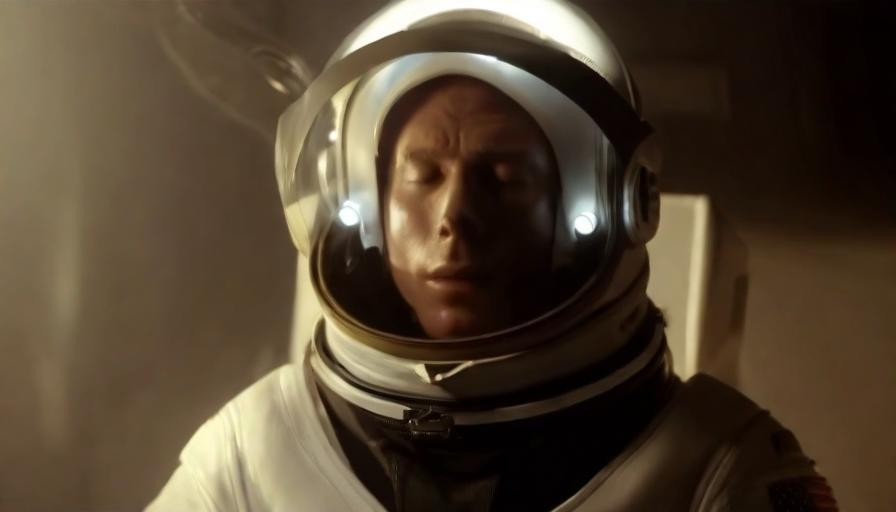

Figure 1: The Titanic movie scenes generated by the proposed MovieDreamer. The generation is conditioned on the elaborate multimodal movie script. *The original movie is unseen during training.*
[/FIGURE]

Recent progress [[8](#bib.bib8), [4](#bib.bib4), [25](#bib.bib25), [3](#bib.bib3)] suggests that video generation quality in short duration (from seconds to a minute) can be consistently improved by scaling the compute due to the scaling law. In this work, we sidestep the short video generation problem and instead seek a generative framework for long video generation featuring complex narrative structures and intricate plot progressions, which is hardly achieved by merely scaling the current approaches. Our aim is to to push the boundaries of video generation beyond the limitations of short-duration content, enabling the creation of videos with rich, engaging storylines.  

In this paper, we introduce a hierarchical approach, dubbed *MovieDreamer*, that marries autoregressive modeling with diffusion-based rendering to achieve a novel synthesis of long-term coherence and short-term fidelity in visual storytelling. Our method leverages the strengths of autoregressive models to ensure global consistency in key movie elements like character identities, props, and cinematic styles, even amidst complex scene transitions. The model predicts visual tokens for specific local timespans, which are then decoded into keyframes and dynamically rendered into video sequences using diffusion rendering. Our method mirrors the traditional movie directing process, where intricate plots are decomposed into distinct, manageable scenes. Our method ensures that both the overarching narrative and the minute spatial-temporal details are maintained with high fidelity, thus enabling the automated production of movies that are both visually cohesive and contextually rich.  

To this end, we represent the whole movie using sparse keyframes and employ a diffusion autoencoder to tokenize each keyframe into compact visual tokens. We train an autoregressive model to predict the sequence of visual tokens. This model is initialized from a pretrained large language mode, a 7B LLaMA model [[36](#bib.bib36)], to leverage its rich world knowledge for better generalizability. As such, the model can be regarded as a multimodal model, which, rather than merely outputting the text, predicts the visual tokens with movie script conditioning.  

Three key designs need to be specially considered during the autoregressive training. One is to resort to various model and input perturbation techniques to combat the overfitting tendency since the high-quality movie training data is limited. Besides, we propose to condition the model using a novel *multimodal script*, which is structured hierarchically, including the rich description of the image style and scene elements, along with detailed text description of characters as well as their retrieved face embeddings. Such multimodal script facilitates narrative continuity across different segments of the movie while offering flexibility for character control. Moreover, we stochastically append a few reference frames ahead of the visual tokens of the same episode, and in this way the model acquires in-context learning capability and can synthesize high-quality personalized results. Such feature is particularly useful in generating coherent continuations of given movie episodes.  

We subsequently decode the predicted vision tokens using an image diffusion decoder and further render the image to the clip video using an image-to-video diffusion model. Importantly, we enhance this process by finetuning an *identity-preserving* diffusion decoder. This refinement effectively mitigates errors in vision token prediction and improves identity preservation in the resultant video clips. Our work is essentially orthogonal to the current efforts aimed at improving the short video generation quality via compute scaling and our method can benefit from these progresses. Our approach is validated through extensive experiments on a wide range of movie genres, showcasing an excelling ability to generate visually stunning and coherent long-form videos over the state-of-the-art.  

To summarize, the contributions of this paper are:  

* We introduce MovieDreamer, a novel hierarchical framework that marries autoregressive models with diffusion rendering to balance long-term narrative coherence with short-term visual fidelity. The method substantially extends the duration of generated video content to thousands of keyframes. 
* We generate the visual token sequence using a multimodal autogressive model. The autoregressive model supports zero-shot and few-shot personalized generation scenarios and supports variable length of keyframe prediction. 
* We use a novel multimodal script to hierarchically structures rich descriptions of scenes as well as the character’s identity. This approach not only facilitates narrative continuity across different segments of a video but also enhances character control and identity preservation. 
* Our method demonstrates superior generation quality with detailed visual continuity, high-fidelity visual details and the character’s identity-preserving ability. 

## 2 Related Work

#### Video generation models.

Video generation has advanced mainly through diffusion and autoregression methods. The popularization of Stable Diffusion has sparked extensive studies, improving video quality with various techniques [[6](#bib.bib6), [11](#bib.bib11), [10](#bib.bib10), [7](#bib.bib7)]. For long videos, strategies like [[43](#bib.bib43), [25](#bib.bib25), [39](#bib.bib39), [4](#bib.bib4), [8](#bib.bib8)] have proven effective. Despite their high computational load and challenges in managing complex sequences, diffusion models are widely used. Autoregression, on the other hand, is less common but excels in specific areas like autonomous driving by employing unified token spaces [[12](#bib.bib12)], although it struggles with continuity in complex scenes. Our approach combines the strengths of both methods in a hierarchical and scalable manner, enhancing control and flexibility irrespective of video length.  

#### Multimodal large language models.

Recent advancements lead to the emergence of visual language models (VLMs) through enabling large language model to comprehend visual modalities [[20](#bib.bib20), [36](#bib.bib36)].VLMs have demonstrated their power in generating images [[22](#bib.bib22), [34](#bib.bib34), [33](#bib.bib33)], in addition to language. Moreover, ongoing research [[46](#bib.bib46), [18](#bib.bib18), [16](#bib.bib16), [47](#bib.bib47)] has showcased the robust capabilities of Multimodal Language Models (MLLMs) in comprehending video content. These advancements have solidified the effectiveness of VLMs in addressing complex problems. Building on this foundation, our approach leverages VLMs to facilitate the generation of extremely long video content.  

#### Visual story generation.

The crux of visual story generation lies in ensuring consistency across generated images. Similar to video generation, diffusion and autoregression are also two primary manners. For diffusion-based methods, existing methods predominantly employ conditional generation to maintain this coherence  [[31](#bib.bib31), [40](#bib.bib40), [35](#bib.bib35), [9](#bib.bib9)]. Some [[17](#bib.bib17), [41](#bib.bib41)] have shown promising results in retaining high-quality facial features and identity. Other approaches are based on the autoregressive ideas  [[5](#bib.bib5), [19](#bib.bib19), [27](#bib.bib27), [23](#bib.bib23)]. However, these approaches generally yield mediocre results and are challenging to scale up.Story and video generation share intrinsic links, with overlapping solutions. Our method uniquely integrates these, offering a unified approach.  

## 3 Method

### 3.1 Overview

[FIGURE S3.F2.g1]
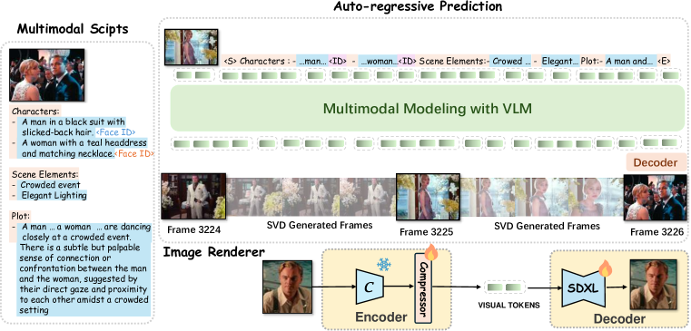

Figure 2: 
The framework of our MovieDreamer. Our autoregressive model takes multimodal scripts as input and predicts the tokens for keyframes. These tokens are then rendered into images, forming anchor frames for extended video generation. Our method ensures long-term coherence and short-term fidelity in visual storytelling with the character’s identity well preserved.
[/FIGURE]

We propose a novel framework for generating extended video sequences that leverages the strengths of autoregressive models for long-term temporal consistency and diffusion models for high-quality image rendering. Our method takes multimodal scripts as conditions, predicts keyframe tokens in an autoregressive manner, and uses these frames as anchors to produce full-length videos. Our method offers flexibility to supports zero-shot generation along with few-shot scenarios in which the generation results are required to follow the given style. We take special care of preserving the identity of the chracters throughout the multimodal script design, autoregressive training and diffusion rendering. We illustrate the overall framework in Figure [2](#S3.F2 "Figure 2 ‣ 3.1 Overview ‣ 3 Method ‣ : Hierarchical Generation for Coherent Long Visual Sequences").  

### 3.2 Keyframe Tokenization via Diffusion Autoencoder

To create a concise yet faithful representation of images, we employ a diffusion autoencoder. Our encoder, $\mathcal{E}$, contains a pretrained CLIP vision model [[26](#bib.bib26)] and a transformer-based token compressor, which encodes an image $\mathbf{x}$ into reduced number of compressed tokens denoted by $\mathbf{e}$. The decoder, $\mathcal{D}$, uses these tokens to reconstruct the image, which adopts pretrained SDXL diffusion model and yields an 896$\times$512 reconstructed image. The extracted latent image tokens are fed into the diffusion decoder via cross-attention. We train the compressor and the decoder while leaving the CLIP vision model frozen. The loss for training this diffusion autoencoder is as follows:  

|  | $$\mathcal{L}_{DAE}=\mathbb{E}_{\mathbf{x}_{0},\epsilon\sim\mathcal{N}(0,\mathbf{I})}\|\epsilon-\mathcal{D}(\mathbf{z}_{t},t,\mathcal{E}(\mathbf{x}_{0}))\|^{2}_{2},$$ |  | (1) |
| --- | --- | --- | --- |

where $\mathbf{x}_{0}$ is the input image and $\mathbf{z}_{t}$ is its corresponding noisy latent at timestep $t$, i.e., $\mathbf{z}_{t}=\alpha_{t}\mathbf{x}+\sigma_{t}\bm{\epsilon}$, where $\bm{\epsilon}\in\mathcal{N}(0,I)$, and $\alpha_{t}$ and $\beta_{t}$ define a noising schedule. In our experiment, we empirically find that merely two tokens can sufficiently characterize major semantics of keyframes, corroborating the finding of previous work [[42](#bib.bib42)].  

### 3.3 Autoregressive Keyframe Token Generation

xWe initialize our autoregressive model with a pretrained large language model, LLaMA2-7B [[36](#bib.bib36)]. In contrast to LLMs, our model $\mathcal{G}$ predicts the compressed vision tokens based on the input multi-modal scripts $\mathbf{M}$ and history information $\mathbf{H}$, which is formulated as $\mathbf{e}_{t}=\mathcal{G}(\mathbf{H}_{<t},\mathbf{M}_{t})$.  

We initiate our approach by leveraging a pretrained large language model, specifically LLaMA2-7B [[36](#bib.bib36)], to construct our autoregressive model, $\mathcal{G}$. Unlike traditional LLMs, $\mathcal{G}$ is designed to predict compressed vision tokens from multimodal scripts $\mathbf{M}$ and historical data $\mathbf{H}$. The model function is defined as $\mathbf{e}_{t}=\mathcal{G}(\mathbf{H}_{<t},\mathbf{M}_{t})$.  

Traditional LLMs often employ cross-entropy loss for training, which is suitable for discrete outputs. However, our model deals with continuous real-valued image tokens, rendering cross-entropy inapplicable.  

Inspired by the GIVT [[37](#bib.bib37)], we adopt a $k$-mixture Gaussian Mixture Model (GMM) to effectively model the distribution of these real-valued tokens. This involves parameterizing the GMM with $2kd$ means, $2kd$ variances, and $k$ mixing coefficients.  

These parameters are obtained from a modified linear output layer of the autoregressive model, enabling sampling of continuous tokens from the GMM. The model is trained by minimizing the negative log-likelihood:  

|  | $\displaystyle\mathcal{L}_{nll}$ | $\displaystyle=\mathbb{E}(-\sum\limits_{t=1}^{T}\sum\limits_{i=1}^{L}\operatorname{log}p(e_{t,i}|\mathbf{H}_{<t},\mathbf{M}_{t})),$ |  | (2) |
| --- | --- | --- | --- | --- |

where $T$ represents the total number of frames, $t$ indexes the current frame, and $L$ is the number of compressed tokens per frame. To ease the learning for these continuous tokens, we also incorporate $\ell_{1}$ and $\ell_{2}$ losses between the predicted and ground truth token and optimize the following objective:  

|  | $\displaystyle\mathcal{L}_{ar}=\mathcal{L}_{nll}+\ell_{1}(\mathbf{e}_{pred},\mathbf{e}_{gt})+\ell_{2}(\mathbf{e}_{pred},\mathbf{e}_{gt}).$ |  | (3) |
| --- | --- | --- | --- |

#### Anti-overfitting.

It is challenging to massively acquire large amount of high-quality, long-duration video data. We manage to collect 50k long videos, yielding 5M keyframes for autoregressive training. Yet this data volume is relatively limited, leading to a severe overfitting issue where the generative model fails to generalize well during testing. To address this, we implement several strategies which are crucial for training:  

* Data augmentation. To maximally utilize our training data, we apply random horizontal flips and stochastically reverse the temporal order of video frames. Such training data augmentation considerably increases the diversity of training data. 
* Face embedding randomization. To prevent identity leakage, we randomly retrieve face embeddings of the same character from different frames. Otherwise, the model will memorize the training frame simply from the face embedding input. 
* Aggressive dropout. An unusually high dropout rate of 50% is utilized, which is crucial for generalized learning from limited training data. 
* Token masking. We incorporate random masking of input tokens with a probability of 0.15, which is applied to the causal attention mask. This forces the model to infer missing information based on the available context (face ID), further strengthening its ability to generalize from partial data. 

#### Multi-modal scripts for autoregressive conditioning.

We develop a well-structured multi-modal script format to serve as input for autoregressive models, as depicted in Figure [14](#A2.F14 "Figure 14 ‣ Appendix B Multi-modal Scripts Data Pipeline Details ‣ : Hierarchical Generation for Coherent Long Visual Sequences"). Our script integrates multiple dimensions: characters, scene elements, and narrative arcs. Accurately representing character appearance using text alone is challenging; therefore, we combine textual descriptions with facial embeddings to provide a more detailed representation of each character. To facilitate the processing by the autoregressive model, we structure the script format to distinctly delineate these elements.  

For non-textual modalities such as facial embeddings and compressed tokens are projected to LLaMA’s embedding space using multi-layer perceptron. The primary challenge arises with textual data, which tends to produce long sequences, thereby consuming excessive token space and limiting the model’s contextual breadth. To mitigate this, we treat text as a separate modality, dividing it into “identifiers” and “descriptions” (see Figure [2](#S3.F2 "Figure 2 ‣ 3.1 Overview ‣ 3 Method ‣ : Hierarchical Generation for Coherent Long Visual Sequences")). Identifiers are concise statements that establish the script’s structure. In contrast, descriptions, which detail the attributes for generation, are each encoded into a single [CLS] token using CLIP and then projected into the unified input space.  

This method significantly extends the usable contextual length during training by condensing entire sentences into single tokens. We utilize LongCLIP [[44](#bib.bib44)] as our text encoder for descriptions, supporting inputs up to 248 tokens, which enhances our capacity to handle detailed narrative content. Consequently, the multi-modal script at timestep $t$ and preceding historical data are represented as:  

|  | $\displaystyle\mathbf{M}_{t}$ | $\displaystyle=\left[\mathbf{d}_{t},\mathbf{i}_{t},\mathbf{c}_{t}\right],\ \mathbf{H}_{<t}=\left[\mathbf{d}_{<t},\mathbf{i}_{<t},\mathbf{c}_{<t},\mathbf{e}_{<t}\right],$ |  | (4) |
| --- | --- | --- | --- | --- |

where $\mathbf{d}_{t}$, $\mathbf{i}_{t}$, and $\mathbf{c}_{t}$ denote the embeddings for descriptions, identifiers, and characters’ facial embeddings, respectively. $\mathbf{e}_{<t}$ represents the previously predicted compressed frame tokens. The negative log-likelihood loss is then formulated as:  

|  | $$L_{nll}=\mathbb{E}(-\sum\limits_{t=1}^{T}\sum\limits_{i=1}^{L}\operatorname{log}p(e_{t,i}|e_{t,<i},\mathbf{e}_{<t},\mathbf{c}_{\leq t},\mathbf{d}_{\leq t},\mathbf{i}_{\leq t})).$$ |  | (5) |
| --- | --- | --- | --- |

#### Few-shot training for personalized generation.

To promote personalized movie content generation, we propose a few-shot learning method that utilizes in-context learning. During training, we select 10 random frames from an episode, encode them into visual tokens, and prepend these tokens stochastically to the episode’s visual tokens. This strategy not only promotes in-context learning, allowing the model to tailor content based on the reference frames, but also acts as a data augmentation technique, effectively mitigating overfitting.  

Our model is versatile, supporting both zero-shot and few-shot generation modes. In zero-shot mode, the model generates content from a text prompt alone. In few-shot mode, it leverages a small set of user-provided reference images to align the generated content more closely with user preferences, without necessitating further training. This capability ensures that users can efficiently produce high-quality, customized visual content that aligns with their desired themes and styles.  

### 3.4 ID-preserving Diffusion Rendering

In our approach, while the primary diffusion decoder $\mathcal{D}$ adeptly reconstructs target images, it occasionally falls short in capturing fine-grained details, notably in facial features, due to the attenuation of details in compressed tokens. To address this, we enhance the cross-attention module within $\mathcal{D}$. This enhancement involves the integration of both descriptive text embeddings, $\mathbf{d}$, and face embeddings, $\mathbf{f}$, derived from the multimodal script.  

To further advocate the model’s ability to focus on critical details, we introduce a random masking strategy that obscures a subset of the input tokens. This technique encourages the decoder to more effectively utilize the available facial and textual cues to reconstruct the images with higher fidelity, particularly in preserving identity-specific characteristics. This ID-preserving rendering also compensates for the loss of identity during the autoregressive modeling, leading to substantially improved identity perception quality as illustrated in Figure [3](#S3.F3 "Figure 3 ‣ 3.5 Keyframe-based Video Generation ‣ 3 Method ‣ : Hierarchical Generation for Coherent Long Visual Sequences").  

### 3.5 Keyframe-based Video Generation

After obtaining the keyframes in the movie, we can generate video clips of the movie based on these keyframes. A straightforward approach is to utilize an existing image-to-video model, such as Stable Video Diffusion (SVD) [[2](#bib.bib2)], to generate these clips. Specifically, SVD transforms the input image into latent features for conditioning and introduces interaction with the CLIP features of the input image via cross-attention. Although SVD is capable of generating high-quality short videos, e.g., 25 frames, it struggles to generate longer movie clips.  

To generate longer movie clips, a straightforward way is to utilize the last frame of the previously generated video as the initial frame for generating the subsequent video. This process can be iterated to obtain a lengthy video sequence. However, we empirically found that this causes a serious accumulation of errors: the quality of the video frames gradually deteriorates as the time gets longer.  

To tackle this, we propose a simple and effective solution. Our motivation is to always use the feature of the first frame as an “anchor” during video extension, to enhance the model’s awareness of the original image distribution. In practice, we use the CLIP feature of the original input image, instead of the last frame of the previous video, for cross-attn interaction when generating subsequent videos.  

[FIGURE S3.F3.1.1.1.g1]

Figure 3: The ID-preserving renderer significantly enhances the perceived identity of the character.
[/FIGURE]

## 4 Experiments

### 4.1 Implementation Details

We use the U-Net of pretrained SDXL [[24](#bib.bib24)] as our diffusion decoder. The encoder consists of a pretrained CLIP image encoder (ViT-L) and a transformer-based compressor. The autoregressive model is initialized with a pretrained LLaMA-7B [[36](#bib.bib36)] checkpoint. All MLPs used to align different modal inputs follow the architecture in LLaVA [[20](#bib.bib20)]. Please refer to Appendix [A](#A1 "Appendix A Implementation Details ‣ : Hierarchical Generation for Coherent Long Visual Sequences") for more details.  

### 4.2 Experimental Setup

#### Dataset.

To systematically evaluate the effectiveness of our method and conduct comparisons, we construct a test dataset consisting of 10 long movies that are NOT included in the training set, with 50,000 keyframes after pre-processing. Each of these videos is processed through our proposed data pre-processing pipeline, which accurately extracts and annotates keyframes. For each keyframe, we generate corresponding textual prompts and character face embeddings.  

#### Evaluation metrics.

We evaluate the effectiveness of various methods using the following metrics. The CLIP score assesses semantic alignment between the plot and generated outputs. Quality is evaluated using the Aesthetic Score (AS), Frechet Image Distance (FID), and Inception Score (IS). For assessing consistency, we introduce metrics for short-term (ST) and long-term (LT) consistency. ST is measured by calculating the CLIP cosine similarity between adjacent frames containing the target character. LT consistency is evaluated by checking the presence of the target character in selected frames across the test set. Finally, we calculate the ratio of frames containing the target character to the total number of selected frames as a measure of the accuracy in maintaining long-term character consistency.  

[FIGURE S4.F4.1.1.1.g1]

Figure 4: Qualitative comparisons of story generation. Please refer to appendix for more comparisons.
[/FIGURE]

### 4.3 Comparison with the State-of-the-Art

#### Story generation.

Many existing story generation methods focus on fine-tuning with small datasets, exhibiting poor generalization. Consequently, we compare our method only with those that demonstrate high generalization capabilities, namely StoryDiffusion [[49](#bib.bib49)] and StoryGen [[19](#bib.bib19)]. As shown in Figure [4](#S4.F4 "Figure 4 ‣ Evaluation metrics. ‣ 4.2 Experimental Setup ‣ 4 Experiments ‣ : Hierarchical Generation for Coherent Long Visual Sequences"), StoryDiffusion fails to maintain long-term consistency. For example, the character’s hair is inconsistent and the character in keyframe 77 is not consistent with keyframe 968. Similarly, StoryGen fails to preserve consistency and generates abnormal results. By contrast, our method achieves generating extremely long content while preserving both short-term and long-term consistency across multiple characters. The observation is also evidenced by the quantitative results in Table [1](#S4.T1 "Table 1 ‣ Story generation. ‣ 4.3 Comparison with the State-of-the-Art ‣ 4 Experiments ‣ : Hierarchical Generation for Coherent Long Visual Sequences"), where our method achieves high scores in both LT and ST. Moreover, the higher CLIP score reflects that our generated results align well with the storyline. Better IS, AS, and FID scores demonstrate our method achieves high-quality images. We showcase more qualitative results in Appendix [D](#A4 "Appendix D Additional Comparisons ‣ : Hierarchical Generation for Coherent Long Visual Sequences").  

[FIGURE S4.F5.1.1.1.g1]
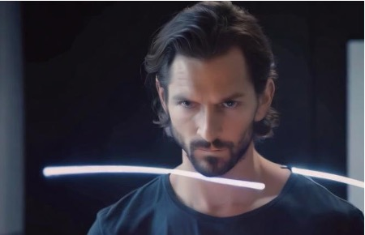

Figure 5: Ablations on face embedding. Consistency is well-preserved with face embedding.
[/FIGURE]

[TABLE S4.T1]

<table class="ltx_tabular ltx_guessed_headers ltx_align_middle">
<thead class="ltx_thead">
<tr class="ltx_tr">
<th class="ltx_td ltx_align_justify ltx_align_top ltx_th ltx_th_column ltx_border_tt">

Method

</th>
<th class="ltx_td ltx_align_justify ltx_align_top ltx_th ltx_th_column ltx_border_tt">

CLIP <math class="ltx_Math"><semantics><mo>↑</mo><annotation-xml><ci>↑</ci></annotation-xml><annotation>\uparrow</annotation></semantics></math>

</th>
<th class="ltx_td ltx_align_justify ltx_align_top ltx_th ltx_th_column ltx_border_tt">

Inception<math class="ltx_Math"><semantics><mo>↑</mo><annotation-xml><ci>↑</ci></annotation-xml><annotation>\uparrow</annotation></semantics></math>

</th>
<th class="ltx_td ltx_align_justify ltx_align_top ltx_th ltx_th_column ltx_border_tt">

Aesthetic<math class="ltx_Math"><semantics><mo>↑</mo><annotation-xml><ci>↑</ci></annotation-xml><annotation>\uparrow</annotation></semantics></math>

</th>
<th class="ltx_td ltx_align_justify ltx_align_top ltx_th ltx_th_column ltx_border_tt">

FID<math class="ltx_Math"><semantics><mo>↓</mo><annotation-xml><ci>↓</ci></annotation-xml><annotation>\downarrow</annotation></semantics></math>

</th>
<th class="ltx_td ltx_align_justify ltx_align_top ltx_th ltx_th_column ltx_border_tt">

ST<math class="ltx_Math"><semantics><mo>↑</mo><annotation-xml><ci>↑</ci></annotation-xml><annotation>\uparrow</annotation></semantics></math>

</th>
<th class="ltx_td ltx_align_justify ltx_align_top ltx_th ltx_th_column ltx_border_tt">

LT<math class="ltx_Math"><semantics><mo>↑</mo><annotation-xml><ci>↑</ci></annotation-xml><annotation>\uparrow</annotation></semantics></math>

</th>
</tr>
</thead>
<tbody class="ltx_tbody">
<tr class="ltx_tr">
<td class="ltx_td ltx_align_justify ltx_align_top ltx_border_t">

StoryDiffusion

</td>
<td class="ltx_td ltx_align_justify ltx_align_top ltx_border_t">

14.411

</td>
<td class="ltx_td ltx_align_justify ltx_align_top ltx_border_t">

8.515

</td>
<td class="ltx_td ltx_align_justify ltx_align_top ltx_border_t">

6.106

</td>
<td class="ltx_td ltx_align_justify ltx_align_top ltx_border_t">

4.643

</td>
<td class="ltx_td ltx_align_justify ltx_align_top ltx_border_t">

0.597

</td>
<td class="ltx_td ltx_align_justify ltx_align_top ltx_border_t">

0.612

</td>
</tr>
<tr class="ltx_tr">
<td class="ltx_td ltx_align_justify ltx_align_top">

StoryGen

</td>
<td class="ltx_td ltx_align_justify ltx_align_top">

13.378

</td>
<td class="ltx_td ltx_align_justify ltx_align_top">

6.432

</td>
<td class="ltx_td ltx_align_justify ltx_align_top">

3.791

</td>
<td class="ltx_td ltx_align_justify ltx_align_top">

8.644

</td>
<td class="ltx_td ltx_align_justify ltx_align_top">

0.514

</td>
<td class="ltx_td ltx_align_justify ltx_align_top">

0.551

</td>
</tr>
<tr class="ltx_tr">
<td class="ltx_td ltx_align_justify ltx_align_top ltx_border_t">

Ours

</td>
<td class="ltx_td ltx_align_justify ltx_align_top ltx_border_t">

19.112

</td>
<td class="ltx_td ltx_align_justify ltx_align_top ltx_border_t">

9.709

</td>
<td class="ltx_td ltx_align_justify ltx_align_top ltx_border_t">

6.042

</td>
<td class="ltx_td ltx_align_justify ltx_align_top ltx_border_t">

2.012

</td>
<td class="ltx_td ltx_align_justify ltx_align_top ltx_border_t">

0.655

</td>
<td class="ltx_td ltx_align_justify ltx_align_top ltx_border_t">

0.836

</td>
</tr>
<tr class="ltx_tr">
<td class="ltx_td ltx_align_justify ltx_align_top ltx_border_bb">

Ours-ref

</td>
<td class="ltx_td ltx_align_justify ltx_align_top ltx_border_bb">

19.972

</td>
<td class="ltx_td ltx_align_justify ltx_align_top ltx_border_bb">

9.800

</td>
<td class="ltx_td ltx_align_justify ltx_align_top ltx_border_bb">

6.096

</td>
<td class="ltx_td ltx_align_justify ltx_align_top ltx_border_bb">

1.879

</td>
<td class="ltx_td ltx_align_justify ltx_align_top ltx_border_bb">

0.669

</td>
<td class="ltx_td ltx_align_justify ltx_align_top ltx_border_bb">

0.851

</td>
</tr>
</tbody>
</table>

Table 1: Quantitative comparisons of different methods. ST and LT refer to our proposed short-term and long-term consistency metrics, respectively.
[/TABLE]

#### Video results.

We perform a detailed comparison between our method and existing methods for generating long videos. For text-to-video methods, we use detailed descriptions prepared in the test set as input. For image-to-video approaches, we employ keyframes generated by our methods as inputs. As illustrated in Table [2](#S4.T2 "Table 2 ‣ 4.4 Analysis ‣ 4 Experiments ‣ : Hierarchical Generation for Coherent Long Visual Sequences"), our method significantly outperforms prior open-source models in terms of quality, demonstrating strong generalization capabilities. Most importantly, our method is capable of generating videos that last hours with little compromise in quality, achieving state-of-the-art results. More qualitative video results are presented in the Appendix.  

### 4.4 Analysis

[TABLE S4.T2]

<table class="ltx_tabular ltx_centering ltx_guessed_headers ltx_align_middle">
<thead class="ltx_thead">
<tr class="ltx_tr">
<th class="ltx_td ltx_align_center ltx_th ltx_th_column ltx_border_tt">Method</th>
<th class="ltx_td ltx_align_center ltx_th ltx_th_column ltx_border_tt">CLIP<math class="ltx_Math"><semantics><mo>↑</mo><annotation-xml><ci>↑</ci></annotation-xml><annotation>\uparrow</annotation></semantics></math></th>
<th class="ltx_td ltx_align_center ltx_th ltx_th_column ltx_border_tt">Inception<math class="ltx_Math"><semantics><mo>↑</mo><annotation-xml><ci>↑</ci></annotation-xml><annotation>\uparrow</annotation></semantics></math></th>
<th class="ltx_td ltx_align_center ltx_th ltx_th_column ltx_border_tt">Aesthetic<math class="ltx_Math"><semantics><mo>↑</mo><annotation-xml><ci>↑</ci></annotation-xml><annotation>\uparrow</annotation></semantics></math></th>
<th class="ltx_td ltx_align_center ltx_th ltx_th_column ltx_border_tt">CLIP-sim<math class="ltx_Math"><semantics><mo>↑</mo><annotation-xml><ci>↑</ci></annotation-xml><annotation>\uparrow</annotation></semantics></math></th>
</tr>
</thead>
<tbody class="ltx_tbody">
<tr class="ltx_tr">
<td class="ltx_td ltx_align_center ltx_border_t">StreamingT2V</td>
<td class="ltx_td ltx_align_center ltx_border_t">15.304</td>
<td class="ltx_td ltx_align_center ltx_border_t">7.636</td>
<td class="ltx_td ltx_align_center ltx_border_t">4.119</td>
<td class="ltx_td ltx_align_center ltx_border_t">0.624</td>
</tr>
<tr class="ltx_tr">
<td class="ltx_td ltx_align_center">SEINE</td>
<td class="ltx_td ltx_align_center">19.404</td>
<td class="ltx_td ltx_align_center">7.463</td>
<td class="ltx_td ltx_align_center">5.825</td>
<td class="ltx_td ltx_align_center">0.688</td>
</tr>
<tr class="ltx_tr">
<td class="ltx_td ltx_align_center">FreeNoise</td>
<td class="ltx_td ltx_align_center">14.327</td>
<td class="ltx_td ltx_align_center">6.532</td>
<td class="ltx_td ltx_align_center">3.194</td>
<td class="ltx_td ltx_align_center">0.612</td>
</tr>
<tr class="ltx_tr">
<td class="ltx_td ltx_align_center ltx_border_bb ltx_border_t">Ours</td>
<td class="ltx_td ltx_align_center ltx_border_bb ltx_border_t">19.520</td>
<td class="ltx_td ltx_align_center ltx_border_bb ltx_border_t">8.642</td>
<td class="ltx_td ltx_align_center ltx_border_bb ltx_border_t">6.049</td>
<td class="ltx_td ltx_align_center ltx_border_bb ltx_border_t">0.704</td>
</tr>
</tbody>
</table>

Table 2: 
Quantitative comparison on full-length video generation.
[/TABLE]

#### Anti-overfitting strategies.

Large autoregressive models are powerful learners, making it easy for them to overfit the dataset. As shown in the first row in Figure [6](#S4.F6 "Figure 6 ‣ Anti-overfitting strategies. ‣ 4.4 Analysis ‣ 4 Experiments ‣ : Hierarchical Generation for Coherent Long Visual Sequences"), the generated contents are dominated by the input character. The model produces similar visual content even when given different text prompts. Our anti-overfitting strategies are designed to weaken the correspondence between character IDs and target frames, thus avoiding simple memorization. As can be seen in the second row, it helps produce diverse high-quality results that align well with the text description.  

[FIGURE S4.F6.2.2.2.g1]
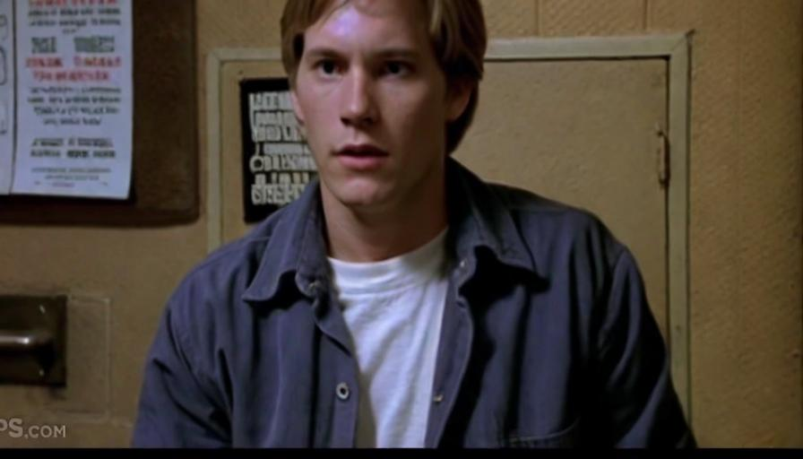

Figure 6: After resolving the overfitting, our model is capable of generating more diverse results.
[/FIGURE]

#### Multi-modal movie scripts.

The multi-modal script introduces face embedding to better preserve the consistency. Figure [5](#S4.F5 "Figure 5 ‣ Story generation. ‣ 4.3 Comparison with the State-of-the-Art ‣ 4 Experiments ‣ : Hierarchical Generation for Coherent Long Visual Sequences") compellingly demonstrates the effectiveness of this design. Specifically, the removal of face embeddings leads to a decreased ability of the model to preserve character consistency. Face embeddings carry more nuanced and precise information compared to text alone. With face embedding, both the short-term and long-term consistency are well-preserved.  

#### ID-preserving renderding.

Before enabling ID-preserving rendering, our decoder has already shown the ability to reconstruct the target image. However, for images outside the training set, the reconstructed characters’ appearances may differ slightly from the expected targets due to the loss of fine facial features in the compressed tokens. After applying ID-preserving rendering, our decoder exhibits a significantly enhanced ability to preserve character identities. The experimental results, illustrated in Figure [3](#S3.F3 "Figure 3 ‣ 3.5 Keyframe-based Video Generation ‣ 3 Method ‣ : Hierarchical Generation for Coherent Long Visual Sequences"), clearly demonstrate the effectiveness of the post-processing step.  

#### Few-shot personalized generation.

Our method serves as a powerful in-context learner, capable of generating results that are consistent with the style or characters of the few references provided by the user. The results are presented in Figure [7](#S5.F7 "Figure 7 ‣ 5 Conclusion ‣ : Hierarchical Generation for Coherent Long Visual Sequences"). Our model can produce results that are more consistent with the style and characters in the few-shot scenario.  

## 5 Conclusion

We present MovieDreamer to address the challenge of generating long-duration visual content with complex narratives. This method elegantly marries the advantages of autoregression and diffusion, and is capable of generating long videos. Additionally, we design the multi-modal script which aims at preserving character consistency across generated sequences. We further introduce ID-preserving rendering to better preserve character IDs and support few-shot movie creation due to the in-context modeling. This work potentially opens up exciting possibilities for future advancements in automated long-duration video production.  

[FIGURE S5.F7.1.1.1.g1]
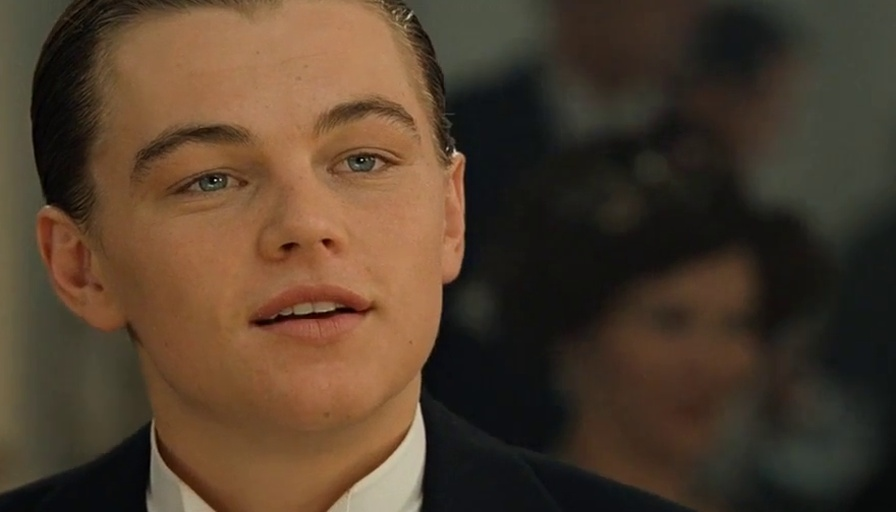

Figure 7: Our model is capable of generating results with better ID in few-shot scenario.
[/FIGURE]

## References

* [1]  Bain, M., Nagrani, A., Brown, A., Zisserman, A.: Condensed movies: Story based retrieval with contextual embeddings. In: Ishikawa, H., Liu, C., Pajdla, T., Shi, J. (eds.) Computer Vision - ACCV 2020 - 15th Asian Conference on Computer Vision, Kyoto, Japan, November 30 - December 4, 2020, Revised Selected Papers, Part V. Lecture Notes in Computer Science, vol. 12626, pp. 460–479. Springer (2020). https://doi.org/10.1007/978-3-030-69541-5\_28, <https://doi.org/10.1007/978-3-030-69541-5_28> 
* [2]  Blattmann, A., Dockhorn, T., Kulal, S., Mendelevitch, D., Kilian, M., Lorenz, D., Levi, Y., English, Z., Voleti, V., Letts, A., Jampani, V., Rombach, R.: Stable video diffusion: Scaling latent video diffusion models to large datasets. NONE (2023) 
* [3]  Brooks, T., Peebles, B., Holmes, C., DePue, W., Guo, Y., Jing, L., Schnurr, D., Taylor, J., Luhman, T., Luhman, E., Ng, C., Wang, R., Ramesh, A.: Video generation models as world simulators (2024), <https://openai.com/research/video-generation-models-as-world-simulators> 
* [4]  Chen, X., Wang, Y., Zhang, L., Zhuang, S., Ma, X., Yu, J., Wang, Y., Lin, D., Qiao, Y., Liu, Z.: Seine: Short-to-long video diffusion model for generative transition and prediction. arXiv preprint arXiv:2310.20700 (2023) 
* [5]  Feng, Z., Ren, Y., Yu, X., Feng, X., Tang, D., Shi, S., Qin, B.: Improved visual story generation with adaptive context modeling. arXiv preprint arXiv: 2305.16811 (2023) 
* [6]  Guo, Y., Yang, C., Rao, A., Liang, Z., Wang, Y., Qiao, Y., Agrawala, M., Lin, D., Dai, B.: Animatediff: Animate your personalized text-to-image diffusion models without specific tuning. International Conference on Learning Representations (2024) 
* [7]  He, Y., Xia, M., Chen, H., Cun, X., Gong, Y., Xing, J., Zhang, Y., Wang, X., Weng, C., Shan, Y., Chen, Q.: Animate-a-story: Storytelling with retrieval-augmented video generation. arXiv preprint arXiv: 2307.06940 (2023) 
* [8]  Henschel, R., Khachatryan, L., Hayrapetyan, D., Poghosyan, H., Tadevosyan, V., Wang, Z., Navasardyan, S., Shi, H.: Streamingt2v: Consistent, dynamic, and extendable long video generation from text. arXiv preprint arXiv: 2403.14773 (2024) 
* [9]  Hertz, A., Voynov, A., Fruchter, S., Cohen-Or, D.: Style aligned image generation via shared attention (2023) 
* [10]  Ho, J., Chan, W., Saharia, C., Whang, J., Gao, R., Gritsenko, A., Kingma, D.P., Poole, B., Norouzi, M., Fleet, D.J., Salimans, T.: Imagen video: High definition video generation with diffusion models. arXiv preprint arXiv: 2210.02303 (2022) 
* [11]  Ho, J., Salimans, T., Gritsenko, A., Chan, W., Norouzi, M., Fleet, D.J.: Video diffusion models (2022) 
* [12]  Hu, A., Russell, L., Yeo, H., Murez, Z., Fedoseev, G., Kendall, A., Shotton, J., Corrado, G.: Gaia-1: A generative world model for autonomous driving. arXiv preprint arXiv: 2309.17080 (2023) 
* [13]  Jiang, Y., Gupta, A., Zhang, Z., Wang, G., Dou, Y., Chen, Y., Fei-Fei, L., Anandkumar, A., Zhu, Y., Fan, L.: Vima: General robot manipulation with multimodal prompts. arXiv preprint arXiv: 2210.03094 (2022) 
* [14]  Kondratyuk, D., Yu, L., Gu, X., Lezama, J., Huang, J., Schindler, G., Hornung, R., Birodkar, V., Yan, J., Chiu, M.C., Somandepalli, K., Akbari, H., Alon, Y., Cheng, Y., Dillon, J., Gupta, A., Hahn, M., Hauth, A., Hendon, D., Martinez, A., Minnen, D., Sirotenko, M., Sohn, K., Yang, X., Adam, H., Yang, M.H., Essa, I., Wang, H., Ross, D.A., Seybold, B., Jiang, L.: Videopoet: A large language model for zero-shot video generation. arXiv preprint arXiv: 2312.14125 (2023) 
* [15]  Kuznetsova, A., Rom, H., Alldrin, N., Uijlings, J., Krasin, I., Pont-Tuset, J., Kamali, S., Popov, S., Malloci, M., Kolesnikov, A., Duerig, T., Ferrari, V.: The open images dataset v4: Unified image classification, object detection, and visual relationship detection at scale. arXiv preprint arXiv: 1811.00982 (2018) 
* [16]  Li, Y., Wang, C., Jia, J.: Llama-vid: An image is worth 2 tokens in large language models. arXiv preprint arXiv: 2311.17043 (2023) 
* [17]  Li, Z., Cao, M., Wang, X., Qi, Z., Cheng, M.M., Shan, Y.: Photomaker: Customizing realistic human photos via stacked id embedding. arXiv preprint arXiv: 2312.04461 (2023) 
* [18]  Lin, B., Ye, Y., Zhu, B., Cui, J., Ning, M., Jin, P., Yuan, L.: Video-llava: Learning united visual representation by alignment before projection. arXiv preprint arXiv: 2311.10122 (2023) 
* [19]  Liu, C., Wu, H., Zhong, Y., Zhang, X., Wang, Y., Xie, W.: Intelligent grimm - open-ended visual storytelling via latent diffusion models. arXiv preprint arXiv: 2306.00973 (2023) 
* [20]  Liu, H., Li, C., Wu, Q., Lee, Y.J.: Visual instruction tuning (2023) 
* [21]  Lu, H., Liu, W., Zhang, B., Wang, B., Dong, K., Liu, B., Sun, J., Ren, T., Li, Z., Sun, Y., Deng, C., Xu, H., Xie, Z., Ruan, C.: Deepseek-vl: Towards real-world vision-language understanding. arXiv preprint arXiv: 2403.05525 (2024) 
* [22]  Pan, X., Dong, L., Huang, S., Peng, Z., Chen, W., Wei, F.: Kosmos-g: Generating images in context with multimodal large language models. arXiv preprint arXiv: 2310.02992 (2023) 
* [23]  Pan, X., Qin, P., Li, Y., Xue, H., Chen, W.: Synthesizing coherent story with auto-regressive latent diffusion models. arXiv preprint arXiv:2211.10950 (2022) 
* [24]  Podell, D., English, Z., Lacey, K., Blattmann, A., Dockhorn, T., Müller, J., Penna, J., Rombach, R.: Sdxl: Improving latent diffusion models for high-resolution image synthesis. arXiv preprint arXiv: 2307.01952 (2023) 
* [25]  Qiu, H., Xia, M., Zhang, Y., He, Y., Wang, X., Shan, Y., Liu, Z.: Freenoise: Tuning-free longer video diffusion via noise rescheduling. arXiv preprint arXiv: 2310.15169 (2023) 
* [26]  Radford, A., Kim, J.W., Hallacy, C., Ramesh, A., Goh, G., Agarwal, S., Sastry, G., Askell, A., Mishkin, P., Clark, J., Krueger, G., Sutskever, I.: Learning transferable visual models from natural language supervision. International Conference on Machine Learning (2021) 
* [27]  Rahman, T., Lee, H.Y., Ren, J., Tulyakov, S., Mahajan, S., Sigal, L.: Make-a-story: Visual memory conditioned consistent story generation. In: Proceedings of the IEEE/CVF Conference on Computer Vision and Pattern Recognition (CVPR). pp. 2493–2502 (June 2023) 
* [28]  Ren, T., Liu, S., Zeng, A., Lin, J., Li, K., Cao, H., Chen, J., Huang, X., Chen, Y., Yan, F., Zeng, Z., Zhang, H., Li, F., Yang, J., Li, H., Jiang, Q., Zhang, L.: Grounded sam: Assembling open-world models for diverse visual tasks (2024) 
* [29]  Rombach, R., Blattmann, A., Lorenz, D., Esser, P., Ommer, B.: High-resolution image synthesis with latent diffusion models. In: Proceedings of the IEEE/CVF Conference on Computer Vision and Pattern Recognition (CVPR). pp. 10684–10695 (June 2022) 
* [30]  Shao, S., Li, Z., Zhang, T., Peng, C., Yu, G., Zhang, X., Li, J., Sun, J.: Objects365: A large-scale, high-quality dataset for object detection. In: Proceedings of the IEEE/CVF International Conference on Computer Vision (ICCV) (October 2019) 
* [31]  Su, S., Guo, L., Gao, L., Shen, H.T., Song, J.: Make-a-storyboard: A general framework for storyboard with disentangled and merged control. arXiv preprint arXiv: 2312.07549 (2023) 
* [32]  Sun, K., Pan, J., Ge, Y., Li, H., Duan, H., Wu, X., Zhang, R., Zhou, A., Qin, Z., Wang, Y., Dai, J., Qiao, Y., Wang, L., Li, H.: Journeydb: A benchmark for generative image understanding. arXiv preprint arXiv: 2307.00716 (2023) 
* [33]  Sun, Q., Cui, Y., Zhang, X., Zhang, F., Yu, Q., Luo, Z., Wang, Y., Rao, Y., Liu, J., Huang, T., Wang, X.: Generative multimodal models are in-context learners (2023) 
* [34]  Sun, Q., Yu, Q., Cui, Y., Zhang, F., Zhang, X., Wang, Y., Gao, H., Liu, J., Huang, T., Wang, X.: Generative pretraining in multimodality. arXiv preprint arXiv: 2307.05222 (2023) 
* [35]  Tewel, Y., Kaduri, O., Gal, R., Kasten, Y., Wolf, L., Chechik, G., Atzmon, Y.: Training-free consistent text-to-image generation. arXiv preprint arXiv: 2402.03286 (2024) 
* [36]  Touvron, H., Lavril, T., Izacard, G., Martinet, X., Lachaux, M.A., Lacroix, T., Rozière, B., Goyal, N., Hambro, E., Azhar, F., Rodriguez, A., Joulin, A., Grave, E., Lample, G.: Llama: Open and efficient foundation language models. arXiv preprint arXiv:2302.13971 (2023) 
* [37]  Tschannen, M., Eastwood, C., Mentzer, F.: Givt: Generative infinite-vocabulary transformers (2024) 
* [38]  Wang, C., Chen, S., Wu, Y., Zhang, Z., Zhou, L., Liu, S., Chen, Z., Liu, Y., Wang, H., Li, J., He, L., Zhao, S., Wei, F.: Neural codec language models are zero-shot text to speech synthesizers (2023) 
* [39]  Wang, F.Y., Chen, W., Song, G., Ye, H.J., Liu, Y., Li, H.: Gen-l-video: Multi-text to long video generation via temporal co-denoising. arXiv preprint arXiv: 2305.18264 (2023) 
* [40]  Wang, W., Zhao, C., Chen, H., Chen, Z., Zheng, K., Shen, C.: Autostory: Generating diverse storytelling images with minimal human effort. arXiv preprint arXiv:2311.11243 (2023) 
* [41]  Wu, Y., Li, Z., Zheng, H., Wang, C., Li, B.: Infinite-id: Identity-preserved personalization via id-semantics decoupling paradigm. arXiv preprint arXiv: 2403.11781 (2024) 
* [42]  Yang, B., Gu, S., Zhang, B., Zhang, T., Chen, X., Sun, X., Chen, D., Wen, F.: Paint by example: Exemplar-based image editing with diffusion models (2022) 
* [43]  Yin, S., Wu, C., Yang, H., Wang, J., Wang, X., Ni, M., Yang, Z., Li, L., Liu, S., Yang, F., Fu, J., Ming, G., Wang, L., Liu, Z., Li, H., Duan, N.: Nuwa-xl: Diffusion over diffusion for extremely long video generation. arXiv preprint arXiv: 2303.12346 (2023) 
* [44]  Zhang, B., Zhang, P., Dong, X., Zang, Y., Wang, J.: Long-clip: Unlocking the long-text capability of clip. arXiv preprint arXiv:2403.15378 (2024) 
* [45]  Zhang, B., Zhang, P., Dong, X., Zang, Y., Wang, J.: Long-clip: Unlocking the long-text capability of clip. arXiv preprint arXiv: 2403.15378 (2024) 
* [46]  Zhang, H., Li, X., Bing, L.: Video-llama: An instruction-tuned audio-visual language model for video understanding. Conference on Empirical Methods in Natural Language Processing (2023). https://doi.org/10.48550/arXiv.2306.02858 
* [47]  Zhao, Y., Misra, I., Krähenbühl, P., Girdhar, R.: Learning video representations from large language models. In: arXiv preprint arXiv:2212.04501 (2022) 
* [48]  Zheng, Y., Yang, H., Zhang, T., Bao, J., Chen, D., Huang, Y., Yuan, L., Chen, D., Zeng, M., Wen, F.: General facial representation learning in a visual-linguistic manner (2022) 
* [49]  Zhou, Y., Zhou, D., Cheng, M.M., Feng, J., Hou, Q.: Storydiffusion: Consistent self-attention for long-range image and video generation (2024) 

## Appendix A Implementation Details

#### Diffusion Autoencoder.

[FIGURE A1.F8.g1]
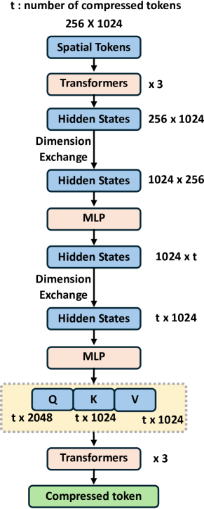

Figure 8: Architecture of the compressor.
[/FIGURE]

We use the pretrained CLIP image encoder (ViT-S) to generate spatial tokens. The spatial tokens are compressed into two tokens using a network with 6 Transformer blocks. The architecture of compressor is shown in Figure [8](#A1.F8 "Figure 8 ‣ Diffusion Autoencoder. ‣ Appendix A Implementation Details ‣ : Hierarchical Generation for Coherent Long Visual Sequences"). First, we process the spatial tokens using three transformers. We then interchange the dimensions of the hidden states and compress them using a linear layer. The compressed hidden states are further processed through three transformers to obtain the final compressed token. We find that setting the compressed token to 2 is sufficient for accurately reconstructing the image.  

Subsequently, we employ the pretrained U-Net of SDXL[[24](#bib.bib24)] as our decoder to render the compressed tokens back into images. Notably, the original SDXL architecture demands an additional projected text embedding as input. To address this, we concatenate and project the compressed token into the desired input space of SDXL simply using a linear layer.  

Compared to the image dataset, our collected movie dataset may lack diversity in objects, which somewhat limits the model’s performance. To ensure the model develops a general understanding of various objects first, we employed a two-stage training strategy to train a more effective model. In the first stage, we fine-tuned the pre-trained U-Net on a large existing image dataset at a resolution of 768 x 768, allowing the model to understand various objects. Our dataset comprises images from OpenImages[[15](#bib.bib15)], JourneyDB[[32](#bib.bib32)], and Object365[[30](#bib.bib30)]. In the second stage, we further fine-tuned the model using our self-collected movie dataset at a resolution of 896 x 512. The model is trained using AdamW, with a learning rate of 1e-4 scheduled by a cosine scheduler for 120k steps in the first stage, and a constant learning rate of 2e-5 for 120k steps in the second stage. For each stage, we first freeze the decoder and only train the compressor for 20k steps, driving it to compress images more appropriately. To enable the model to generate results consistent with movie lighting, we further set the noise offset to 0.05 during training. The entire training process of compressor and decoder takes 6 NVIDIA A800 GPUs.  

#### Autoregressive Model.

We utilize a pretrained LLaMA 7B model as the backbone for our autoregressive model, which is subsequently trained with our curated multi-modal script data. The data consists of 50,000 long videos with corresponding script annotations, which subsequently results in 5 million keyframes. We use two-layer MLPs with GELU as the activation function to unify different modalities into the input space of the large language model. We set the length of the context frames to 128. The global autoregressive model is trained for 3 days using 4 NVIDIA H100 GPUs with a constant learning rate of 2e-5 and 2k steps for warm-up.  

To help the model distinguish the script for different frames, we inserted two special tokens, <START\_OF\_FRAME> and <END\_OF\_FRAME>, at the beginning and end of each frame’s script, respectively. Furthermore, in our setting, there are actually three different modalities: character ID, target frame, and detailed description. The character ID embedding is extracted with FARL [[48](#bib.bib48)], and for each frame we extract up to 5 characters. We encode target frame into compressed tokens with our trained encoder $\mathcal{E}$. The detailed description is divided into different sentences, and each sentence is encoded into one [CLS] token using LongCLIP [[45](#bib.bib45)]. We treat the remaining text such as "Characters:" and "Scene Elements:" as identifiers, which are processed same as LLaMA, as shown in Figure [2](#S3.F2 "Figure 2 ‣ 3.1 Overview ‣ 3 Method ‣ : Hierarchical Generation for Coherent Long Visual Sequences").  

[FIGURE A1.F9.1.1.1.g1]
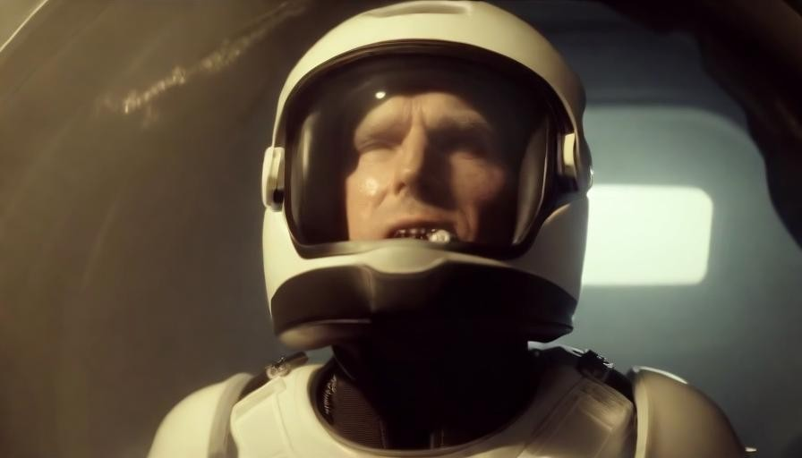

Figure 9: Additional Zero-Shot results.
[/FIGURE]

[FIGURE A1.F10.1.1.1.g1]

Figure 10: Additional Zero-Shot results.
[/FIGURE]

[FIGURE A1.F11.1.1.1.g1]

Figure 11: Additional Zero-Shot results.
[/FIGURE]

[FIGURE A1.F12.1.1.1.g1]

Figure 12: Additional Zero-Shot results.
[/FIGURE]

[FIGURE A1.F13.1.1.1.g1]

Figure 13: Additional story comparison results. Our method is the first to generate extremely long contents while maintaining both short-term and long-term consistency across multiple characters. The model did not utilize any inputs from the training set during testing.
[/FIGURE]

#### ID-preserving Rendering.

To enhance our model’s ability to maintain character consistency, we additionally input the text embeddings encoded by LongCLIP and the character IDs extracted by FARL into the trained decoder. Both the text embeddings and character IDs are aligned with the decoder’s input using two-layer MLPs, and then concatenated with the compressed tokens to serve as the input for cross-attention.  

We assume a maximum of 15 sentences for text embeddings and 5 character IDs. If the inputs do not meet these quantities, we pad them with zeros. Moreover, for the concatenated embeddings, we randomly mask each token with a probability of 0.2. This encourages the model to learn the relationship between facial features, text descriptions, and the target image.  

#### Continuous Token Modeling.

The $k$-mixutre GMM models the distribution $p(\mathbf{e}_{t}|\mathbf{H}_{<t},\mathbf{M}_{t})$, where $\mathbf{e}_{t}$ is the continuous real valued image tokens of sequence length $S$ and dimension $d$. $\mathbf{H}_{<t}$ and $\mathbf{M}_{t}$ refer to the previous history information and the current multi-modal script. The GMM consists of $k$ multivariate Gaussian distribution components that are independent across the channel dimension $d$. To construct the GMM, we replace the logit prediction layer of our autoregressive model initialized using LLaMA with a linear layer with $2kd+k$ dimension for output. Subsequently, the mean $m$ and the variance $v$ of shape $S\times kd$ and mixture weights $w$ of shape $S\times k$ are derived. $m$ consists of a stack of tensors $[m^{(1)},m^{(2)},\dots m^{(k)}]$, where $m_{i}$ is of shape $S\times d$. Similarly, $v=[v^{(1)},v^{(2)},\dots v^{(k)}]$. The mixture weight is normalized along the channel dimension. Given the ground truth image embedding $\mathbf{e}$, we aim to minimize its negative log likelihood within the GMM:  

|  | $\displaystyle-\log(p(\mathbf{e}|\mathbf{H}_{<t},\mathbf{M}_{t}))$ | $\displaystyle=-\log\left(\prod_{l=1}^{S}\left(\sum_{i=1}^{k}w_{l}^{(i)}\prod_{c=1}^{d}\mathcal{N}(e_{l,c}|m_{l,c}^{(i)},v_{l,c}^{(i)})\right)\right)$ |  | (6) |
| --- | --- | --- | --- | --- |
|  |  | $\displaystyle=-\sum_{l=1}^{S}\log\left(\sum_{i=1}^{k}w_{l}^{(i)}\prod_{c=1}^{d}\mathcal{N}(e_{l,c}|m_{l,c}^{(i)},v_{l,c}^{(i)})\right),$ |  |

During training, we additionally introduce the $\ell_{1}$ and $\ell_{2}$ loss between the predicted image tokens and the ground truth tokens to improve model’s performance. However, we find that these losses are not on the same scale as the negative log-likelihood. The negative log-likelihood is way larger than the $\ell_{1}$ and $\ell_{2}$ loss, which reduces the influence of the $\ell_{1}$ and $\ell_{2}$ loss during the optimization. The difference in scale is because the constant term and covariance matrix of the negative log-likelihood are directly related to the dimension $d$. Concretly, for a variable $\mathbf{x}$ with mean $\mu$, the calculation of the negative log-likelihood is essentially represented as:  

|  | $$\operatorname{NLL}(\mathbf{x};\mu,\Sigma)=\frac{d}{2}\log(2\pi)+\frac{1}{2}\log|\Sigma|+\frac{1}{2}(\mathbf{x}-\mu)^{\top}\Sigma^{-1}(\mathbf{x}-\mu),$$ |  | (7) |
| --- | --- | --- | --- |

where $\frac{d}{2}\log(2\pi)$ is the constant term and $\Sigma$ is the covariance matrix. As $d$ increases, both the constant term and the size of the covariance matrix grow, resulting in significant increase of the results. To bring the different losses to the same scale, we scale the negative log-likelihood loss by dividing it by the dimension $d$. Consequently, the negative log-likelihood loss in Section [3.3](#S3.SS3 "3.3 Autoregressive Keyframe Token Generation ‣ 3 Method ‣ : Hierarchical Generation for Coherent Long Visual Sequences") is formulated as:  

|  | $\displaystyle L_{nll}$ | $\displaystyle=\mathbb{E}(-\log(p(\mathbf{e}|\mathbf{H}_{<t},\mathbf{M}_{t})))$ |  | (8) |
| --- | --- | --- | --- | --- |
|  |  | $\displaystyle=\mathbb{E}\left(-\sum\limits_{t=1}^{T}\sum\limits_{i=1}^{L}\operatorname{log}p(e_{t,i}|e_{t,<i},\mathbf{e}_{<t},\mathbf{c}_{\leq t},\mathbf{d}_{\leq t},\mathbf{i}_{\leq t})\right)$ |  |
|  |  | $\displaystyle=\frac{1}{d}\cdot\mathbb{E}\left(-\log\left(\sum_{i=1}^{k}w_{l}^{(i)}\prod_{c=1}^{d}\mathcal{N}(e_{l,c}|m_{l,c}^{(i)},v_{l,c}^{(i)})\right)\right).$ |  |

## Appendix B Multi-modal Scripts Data Pipeline Details

In this chapter, we explain in detail how we construct the multimodal script data. Specifically, We collect a massive movie dataset, with most movies coming from Condensed Movies [[1](#bib.bib1)] and others from YouTube.  

[FIGURE A2.F14.g1]
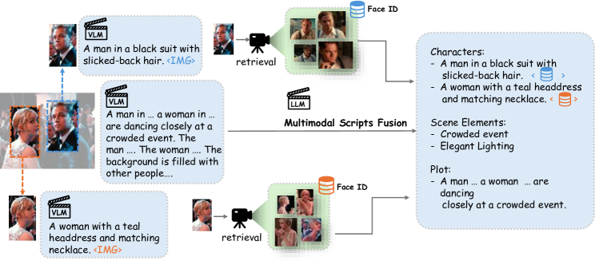

Figure 14: Multi-modal scripts data pipeline.
We generate image captions using existing VLMs, and then further utilize LLMs to reformat the annotations into a structured script. We use face retrieval method to extract different face embeddings of the same character, which benefits anti-overfitting data augmentation in Section [3.3](#S3.SS3 "3.3 Autoregressive Keyframe Token Generation ‣ 3 Method ‣ : Hierarchical Generation for Coherent Long Visual Sequences").
[/FIGURE]

We first employ a keyframe extraction technique to sample frames from the video at the regular interval of 30 frames. Subsequently, we segment the top 5 characters with the highest confidence scores in each frame with Grounding-Dino [[28](#bib.bib28)] with prompt "person" and extract the face embedding of the segmented characters [[48](#bib.bib48)]. We then leverage an existing VLM [[21](#bib.bib21)] to generate captions for keyframes as well as the corresponding segmented characters. Lastly, we employ an LLM to fuse the captions of the keyframes and the corresponding characters to synthesize the comprehensive and structured multi-modal scripts, which corresponds to the Step 1 and Step 2 in Figure [15](#A2.F15 "Figure 15 ‣ Appendix B Multi-modal Scripts Data Pipeline Details ‣ : Hierarchical Generation for Coherent Long Visual Sequences"). For step 3, we employ a large language model to extract the scene elements and the plot of the corresponding frame. Finally, we reformat the character, scene elements and the plot into a structured representation. This pipeline effectively constructs large-scale multi-modal script dataset, providing a substantial amount of high-quality data for training. Script data provides rich contextual information, enabling the model to better remember and utilize this information to generate consistent content.  

[FIGURE A2.F15.g1]
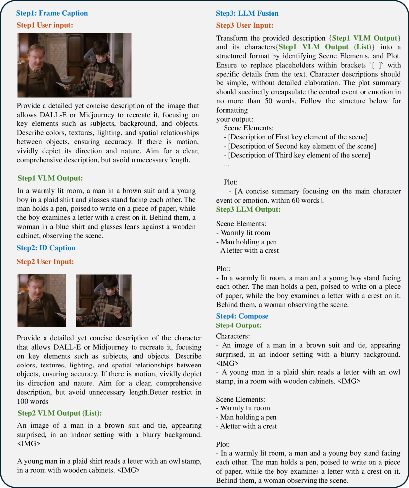

Figure 15: The overall data pipeline and corresponding prompts we use.
[/FIGURE]

## Appendix C Additional Results

In this section, we present additional generated stories and videos. Our method exhibits strong generalization capabilities, producing high-quality results with inputs not included in the training set. Our method can understand text and character inputs, capable of generating results that align with the storyline while ensuring character identity consistency. The overall scene consistency is also well-preserved, as our autoregressive model is able to context information as reference. Most importantly, we are the first method to generate extremely long contents while preserving both short-term and long-term consistency. Besides, we even ensure that the IDs of different characters remain consistent before and after a camera change.  

#### Consistency Preservation.

Our method effectively preserves both short-term and long-term consistency for multiple characters. We present numerous results in Figure [9](#A1.F9 "Figure 9 ‣ Autoregressive Model. ‣ Appendix A Implementation Details ‣ : Hierarchical Generation for Coherent Long Visual Sequences"). Our method is able to preserve multiple characters within long contents without the need for any fine-tuning. Even when the scene changes, our method effectively maintains the same character ID before and after the shot transition.  

#### ID Preservation.

We showcase our ability to preserve character ID in Figure [16](#A3.F16 "Figure 16 ‣ ID Preservation. ‣ Appendix C Additional Results ‣ : Hierarchical Generation for Coherent Long Visual Sequences"). Our method exhibits strong generalization capabilities, allowing it to generate corresponding character IDs based on user input without any further training.  

[FIGURE A3.F16.1.1.1.1.g1]
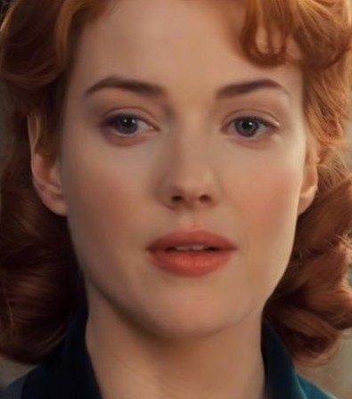

Figure 16: ID Preservation results. Our method demonstrates great ability to preserve ID.
[/FIGURE]

#### Video Results.

The generated keyframes can serve as the condition to generate videos, as shown in Figure [17](#A3.F17 "Figure 17 ‣ Video Results. ‣ Appendix C Additional Results ‣ : Hierarchical Generation for Coherent Long Visual Sequences"). Our keyframes have successfully preserved both short-term and long-term temporal consistency, facilitating the seamless rendering of these frames into a cohesive and harmonious video.  

[FIGURE A3.F17.1.1.1.g1]
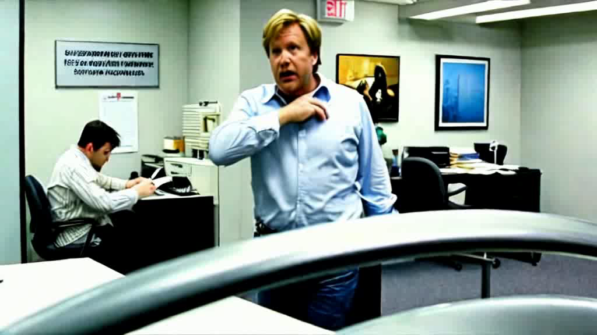

Figure 17: Example video results.
[/FIGURE]

## Appendix D Additional Comparisons

We showcase additional comparisons in Fig.[13](#A1.F13 "Figure 13 ‣ Autoregressive Model. ‣ Appendix A Implementation Details ‣ : Hierarchical Generation for Coherent Long Visual Sequences"). Our method effectively preserves both short-term and long-term consistency, maintaining the overall style and character identity. Other methods exhibit increasing inconsistencies as the number of frames grows, such as changes in character appearance and shifts in style. Our method can generate extremely long content while nearly perfectly maintaining the consistency of multiple characters throughout.  

## Appendix E Limitations and Future Works

### E.1 Limitations

[FIGURE A5.F18.g1]
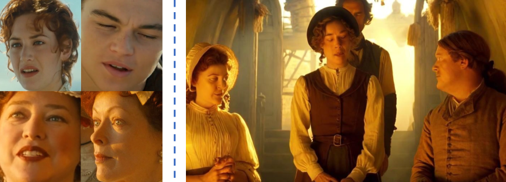

Figure 18: When there are too many people in one frame, the model sometimes confuses the IDs.
[/FIGURE]

Despite our method demonstrating strong potential in generating long sequences, it still has some limitations. (1) We employ longCLIP to compress each sentence of descriptive texts into a single token. While this strategy effectively reduces the sequence length, it provides only a coarse representation of each sentence, which causes information loss. (2) Our method’s ability to preserve objects consistency is limited. We did not construct the multi-modal script with scene information, as the costs far exceed our capacity. Moreover, as shown in Fig. [18](#A5.F18 "Figure 18 ‣ E.1 Limitations ‣ Appendix E Limitations and Future Works ‣ : Hierarchical Generation for Coherent Long Visual Sequences"), if there are too many people in one frame, our method is prone to mixing the appearance of characters. (3) Analogous to other large models, our approach requires substantial data and computational power for training. (4) Currently, we generate 128 keyframes at a time and run multiple iterations of this process to create long contents. However, our goal is to extend the maximum token length, fundamentally addressing the long sequence generation by using long sequence generation methods in LLMs. Due to resource constraints, we are unable to pursue this approach at present and leave it in future work.  

### E.2 Future Works

#### Better sentence representation.

We call for a better sentence compression method which compresses sequence length while maximally preserving the semantic information of the original sentences. This would be particularly beneficial as it increases the number of visible frames.  

#### Better keyframe-based video generation model.

We believe that the optimal solution for keyframe-to-video generation would be to design a model capable of conditioning on multiple keyframes. We have made some initial attempts, however, training such a model requires a substantial amount of data and computation overhead, which far exceeds the resources we can provide. We believe a model conditioning on multiple keyframes is vital for generating long videos and consider this as the future work.  

#### Controllability beyond face identity.

Currently, our method primarily focuses on maintaining character consistency. Future work can further explore maintaining consistency in additional attributes such as objects and scenes. How to address the issue of character confusion is also an important area for futre works.  

#### Long sequence generation.

We aim to fundamentally solve the problem of long sequence generation, rather than compromising with the current approach of iteratively generating 128 frames. Modern LLMs already support very long context tokens. We believe we can draw inspiration from these methods to achieve true generation of extremely long content.  

### E.3 Social impact

Our method can generate high-quality long stories and videos, significantly lowering the barrier for individuals to create desired visual appealing content. However, it is essential to address the negative potential social impact of our method. Malicious users may exploit its capabilities to generate inappropriate or harmful content. Consequently, it is imperative to emphasize the responsible and ethical utilization of our method, under the collective supervision and governance of society as a whole. Ensuring appropriate usage practices requires a collaborative effort from various people, including researchers, policymakers, and the wider community.  

