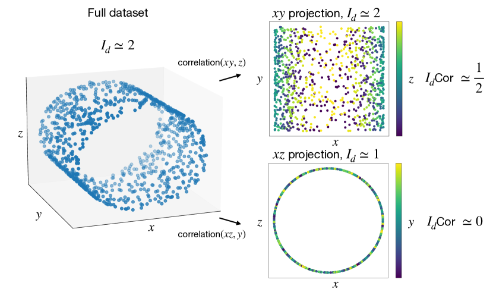
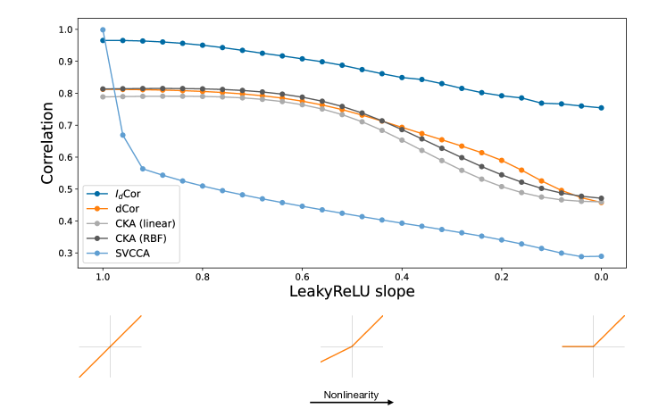
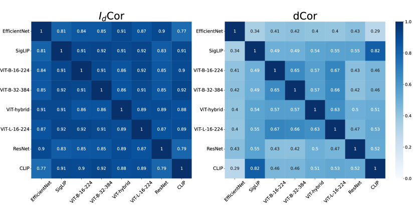
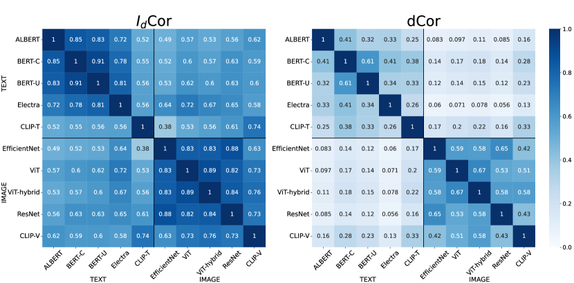
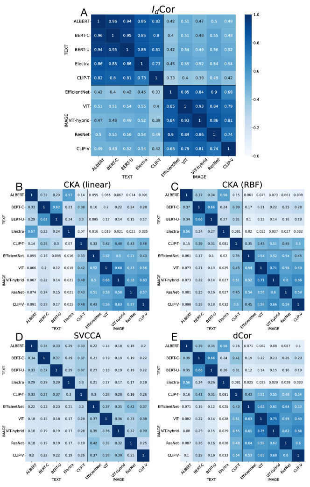
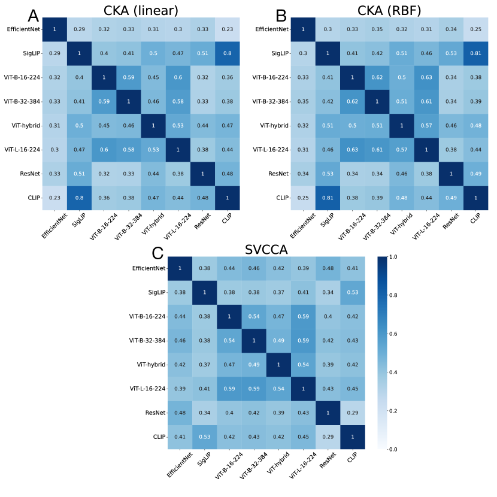
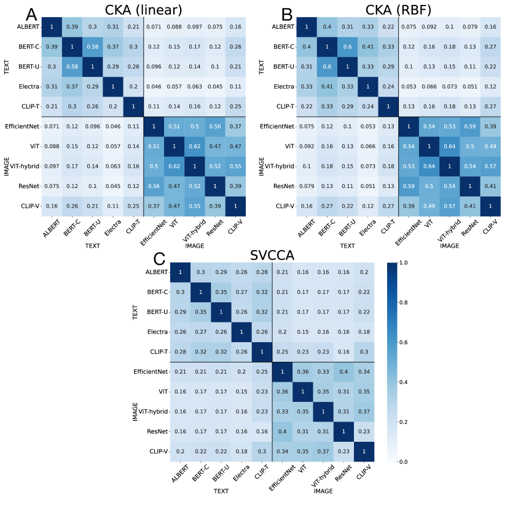
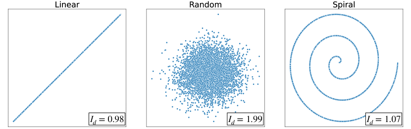

# Intrinsic Dimension Correlation: uncovering nonlinear connections in multimodal representations

###### Abstract

††footnotetext: 
  
Correspondence to: [lorenzo.basile@phd.units.it](mailto:lorenzo.basile@phd.units.it). 
  
Code is available at <https://github.com/lorenzobasile/IDCorrelation>
To gain insight into the mechanisms behind machine learning methods, it is crucial to establish connections among the features describing data points. However, these correlations often exhibit a high-dimensional and strongly nonlinear nature, which makes them challenging to detect using standard methods. This paper exploits the entanglement between intrinsic dimensionality and correlation to propose a metric that quantifies the (potentially nonlinear) correlation between high-dimensional manifolds. We first validate our method on synthetic data in controlled environments, showcasing its advantages and drawbacks compared to existing techniques. Subsequently, we extend our analysis to large-scale applications in neural network representations. Specifically, we focus on latent representations of multimodal data, uncovering clear correlations between paired visual and textual embeddings, whereas existing methods struggle significantly in detecting similarity. Our results indicate the presence of highly nonlinear correlation patterns between latent manifolds.  

## 1 Introduction

[FIGURE S1.F1.g1]

Figure 1: 
Example usage of $I_{d}$Cor: we consider a $3$D dataset in which the points lie on the surface of a cylinder, hence whose intrinsic dimension ($I_{d}$) is $2$. We want to assess the correlation between the $2$D set of coordinates $xy$ (which also has $I_{d}=2$, as shown in the top-right panel) and the $1$D set $z$. Intuitively, as $x$ and $z$ describe a circle, it is evident that knowledge of $z$ (encoded by color) is very informative in determining the $x$ coordinate (e.g. a yellow point is sure to be found in the central region of the $x$ axis), but not in determining the $y$: hence, the correlation coefficient is $0.5$. Conversely, when estimating the correlation between $xz$ (whose $I_{d}$ is $1$, bottom-right panel) and $y$, we can see that having access to $y$ (which is now represented by color) does not give any information on the value of $x$ nor $z$, hence the correlation is $0$.
[/FIGURE]

Modern machine learning models have the remarkable ability to extract subtle patterns from complex datasets and use them to perform a wide variety of tasks in an astonishingly accurate way. However, to date, we still lack a complete and accurate understanding of their inner workings, especially in the case of deep neural networks. An active field of research in the interpretability of neural networks is focused on characterizing and quantifying the similarity between different models. To this aim, many works [[1](#bib.bib1), [2](#bib.bib2), [3](#bib.bib3)] evaluate the statistical correlation between the latent representations produced by the models. This quantification is key because it allows, for example, to disentangle or tie together different aspects of data representations, allowing a better interpretation of how the model makes its decisions. Moreover, assessing the similarity between representations of different models is particularly useful to determine whether the latent spaces are compatible, meaning that information extracted by one model can be successfully transferred to others.  

This point is crucial particularly when data points are represented by multiple interrelated modalities, such as visual and textual. In recent times, it has been shown [[4](#bib.bib4), [5](#bib.bib5)] that it is possible to build multimodal vision-language models starting from pre-trained unimodal encoders, in an effort to match the outstanding performance of state-of-the-art vision-language models such as CLIP [[6](#bib.bib6)]. These findings indicate that modern deep models can produce compatible representations when evaluated on aligned text-image data. However, we find that standard latent similarity metrics such as CKA [[2](#bib.bib2)] and Distance Correlation [[7](#bib.bib7), [8](#bib.bib8)] find very frail traces of correlation between paired multimodal representations. We hypothesize that this is due to the strongly nonlinear nature of these correlations, making them difficult to analyze with standard methods.  

Our work tackles this challenge by introducing a novel metric, dubbed Intrinsic Dimension Correlation ($I_{d}$Cor) that leverages the concept of intrinsic dimension ($I_{d}$), i.e. the minimum number of variables required to describe the data, to quantify the correlation between high-dimensional data manifolds. Intuitively, the metric is based on the concept that if two data representations are correlated, the intrinsic dimension of a dataset created by concatenating the features of these representations is reduced, because the information in one representation can describe some aspects of the other. An example is provided in Fig. [1](#S1.F1 "Figure 1 ‣ 1 Introduction ‣ Intrinsic Dimension Correlation: uncovering nonlinear connections in multimodal representations"). Computational experiments indicate that our method is effective at detecting nonlinear relationships where traditional methods often fail.  

Thus, the main contributions of this work can be summarized as follows:  

* We propose a novel perspective that links the concepts of correlation and intrinsic dimension. The key concept is that being the $I_{d}$ a proxy for the information content of a dataset, the $I_{d}$ of a dataset built by merging two datasets will reflect the joint information. 
* Building on this idea, we propose $I_{d}$Cor, a novel correlation metric based on intrinsic dimension estimation, able to unveil nonlinear correlation between high-dimensional data manifolds, even of unpaired dimensions. We evaluate our metric on synthetic data, showcasing its strengths and limitations in comparison with existing methods. 
* We then consider more complex scenarios and quantify the correlation between the representations learned by different deep neural networks engaged in large datasets. Specifically, we focus on multimodal data, demonstrating that we can find strong evidence of correlation where standard methods struggle to identify any. 

## 2 Background

### 2.1 Correlation in latent representations

Understanding whether different neural networks can learn to process data in similar ways is a crucial point when trying to make sense of their results. Despite the inherent difficulty in defining what it means for two neural networks to be similar (or, at least, to behave similarly), research in this field has made significant progress in the last few years. A well-established approach to test if two neural networks are similar is that of measuring the statistical correlation between the data representations (or embeddings) learned by them. Recent proposals in this direction include Singular Value Canonical Correlation Analysis (SVCCA) [[1](#bib.bib1)], Projection Weighted CCA (PWCCA) [[9](#bib.bib9)], Centered Kernel Alignment (CKA) [[2](#bib.bib2)], Distance Correlation [[7](#bib.bib7), [8](#bib.bib8)] and Aligned Cosine Similarity [[10](#bib.bib10)], among others. For a more complete summary of current approaches to neural network similarity measurement, we defer the reader to [[11](#bib.bib11)].  

These techniques have been widely employed to gain a deeper understanding of various aspects of the way neural models process information: for instance to quantify how different vision architectures encode spatial information [[12](#bib.bib12), [3](#bib.bib3)] or the relation between learning disentangled features and adversarial robustness [[8](#bib.bib8)]. Taking a slightly different approach, [[13](#bib.bib13)] provides an in-depth analysis of the sensitivity of CKA to transformations that occur frequently in neural latent spaces, showcasing the importance of gathering results from a broader range of similarity metrics to obtain reliable information.  

### 2.2 Multimodal latent space alignment

An example that highlights the importance of assessing similarity, quantified via correlation measures, between neural representations is further demonstrated by the recent empirical findings related to the so-called latent communication. This concept, introduced by [[14](#bib.bib14)], builds on the idea that it is possible to transfer knowledge between latent spaces, even when they are produced by different models and on different data modalities, provided that some semantic alignment between the data exists (for example, images and their textual descriptions). The feasibility of this knowledge transfer was shown in [[14](#bib.bib14)] through the introduction of relative representations, where each point of the original representation is mapped according to its distance from a set of fixed anchor points. Using this alternative representation of data, the authors show that it is possible to stitch [[15](#bib.bib15)] together encoders and decoders coming from different models, with little to no additional training.  

Furthermore, numerous recent studies have demonstrated that large state-of-the-art visual and textual encoders can produce transferable representations when evaluated on aligned data (i.e. the same data or data that share some semantics, such as image-caption pairs). Indeed, a simple linear transformation is usually enough to map one latent space into another [[5](#bib.bib5), [16](#bib.bib16), [17](#bib.bib17), [18](#bib.bib18)], at least in terms of performance on a specific downstream task, e.g. classification. It is worth noting that, to perform the alignment of the data, one assumes prior knowledge about the semantic correlation between the data representations (in order to define the anchor points). Hence, while these findings suggest a remarkable similarity between compatible latent spaces, the problem of detecting these correlations without relying on any downstream evaluation is still an open problem. Indeed, our investigation into the connection between aligned textual and visual embeddings reveals a very weak correlation using existing methods, calling for the development of methods that allow the identification of nonlinear correlations in high-dimensional spaces.  

### 2.3 Intrinsic dimension

The concept of the intrinsic dimension ($I_{d}$) of a dataset is widely used in data analysis and Machine Learning. Before providing a more formal definition, imagine a dataset where your data points are the cities around the globe described by their 3D Cartesian coordinates. We will say that the embedding dimension of this dataset is three. However, anyone familiar with cartography would agree that nearly the same information can be encoded with only two coordinates (latitude and longitude). Therefore, its $I_{d}$ would be equal to two. Indeed, one of the definitions of $I_{d}$ is the minimum number of coordinates needed to represent the data with minimal information loss. A complementary definition is the dimension of the manifold in which the data lie, which in this case would be a sphere.  

Intrinsic dimension estimation is closely related to the field of dimensionality reduction since it gives a hint about which should be the dimension of the projection space to avoid information loss. Thus, one possible way of estimating the $I_{d}$ is to find a meaningful projection into the lowest dimensional space possible. A classical method for doing that is Principal Component Analysis [[19](#bib.bib19)], but it has the drawback that, strictly speaking, it is only correct if the data lie in a hyperplane, since it performs a linear transformation. Therefore, the development of methods for overcoming such a limitation is an active research field, resulting in techniques like Multidimensional Scaling [[20](#bib.bib20)], Isomap [[21](#bib.bib21)], t-distributed stochastic neighbor embedding (t-SNE) [[22](#bib.bib22)] or Uniform Manifold Approximation and Projection (UMAP) [[23](#bib.bib23)], to mention some. Other methods can estimate the $I_{d}$ of a dataset even in the case in which projecting in the lower dimensional space is not possible (for example, due to topological constraints). Typically, these approaches infer the $I_{d}$ from the properties of the Nearest Neighbors’ distances. While a full review of these methods is out of the scope of this work (the interested reader is referred to [[24](#bib.bib24)]), it is worth mentioning the Maximum Likelihood approach [[25](#bib.bib25)], the Dimensionality from Angle and Norm Concentration (DANCo) approach [[26](#bib.bib26)] or the TwoNN [[27](#bib.bib27)]. The last is the one employed in this work since it is particularly fast and behaves well even in the case of datasets with a high non-uniformity on the density of points.  

More recently, several studies have estimated the intrinsic dimension of neural networks’ representations, demonstrating that $I_{d}$ is a valuable tool for understanding the geometry of the latent manifolds produced by deep models. This concept was initially explored in [[28](#bib.bib28)], where the authors estimated $I_{d}$ across different layers of CNNs, gaining insights into the sequential information flow within these models. Later, [[29](#bib.bib29)] and [[30](#bib.bib30)] analyzed the representations of transformer models, across different domains, while [[31](#bib.bib31)] studied the internal $I_{d}$ of generative diffusion models. In a slightly different direction, [[32](#bib.bib32)] unveiled a connection between generalization and the $I_{d}$ of the hidden representations, while [[33](#bib.bib33)] studied the relation between $I_{d}$ and curvature in latent manifolds.  

## 3 Correlation through Intrinsic Dimension

The intrinsic dimension of a dataset is closely linked to the correlations among the various features that define the data points. These correlations determine the regions in which the data points can exist, thereby shaping the underlying manifold. Let us consider the simplest example: a two-dimensional dataset. If the two variables are uncorrelated, their linear correlation coefficient ($R^{2}$) approaches zero while, if one feature is a linear function of the other, $R^{2}$ becomes equal to one. The two scenarios differ by the $I_{d}$ of the data manifold: the first case corresponds to a plane ($I_{d}=2$), while the second corresponds to a line ($I_{d}=1$). If we examine a slightly more complex case, the advantage of exploiting the $I_{d}$ for correlation becomes evident. Let us consider a spiral-shaped 2D dataset: it has $R^{2}\approx 0$ due to the nonlinear nature of the correlation between the two variables, while the behavior of the $I_{d}$ is identical to the one observed on the linearly correlated dataset, as reported in detail in section [3.1](#S3.SS1 "3.1 Synthetic experiments ‣ 3 Correlation through Intrinsic Dimension ‣ Intrinsic Dimension Correlation: uncovering nonlinear connections in multimodal representations").  

To leverage these interesting properties for correlation quantification, we compute the $I_{d}$s of the two representations that we want to check for correlation ($id_{1}$ and $id_{2}$) and the $I_{d}$ of the dataset build by merging the two representations ($id_{C}$) and compute the correlation index $I_{d}$Cor as:  

|  | $$I_{d}Cor=\frac{id_{1}+id_{2}-id_{C}}{\texttt{max}(id_{1},id_{2})}$$ |  | (1) |
| --- | --- | --- | --- |

The intuition is that, if the two representations were independent, the $I_{d}$ of the merged dataset would be the sum of the two $I_{d}s$. Instead, if they were correlated, $id_{C}$ would be less then their sum since there would be some degree of redundancy between the coordinates of both representations.  

A more formal view comes from information theory. Mutual information is a fundamental metric that quantifies the relationship between simultaneously sampled random variables. However, its computation from data samples is challenging due to the curse of dimensionality. One potential solution is the Sliced Mutual Information method [[34](#bib.bib34)], which projects high-dimensional random variables to scalars and averages over random projections. In our approach, presented in detail in Algorithm [1](#algorithm1 "In 3 Correlation through Intrinsic Dimension ‣ Intrinsic Dimension Correlation: uncovering nonlinear connections in multimodal representations"), we utilize the properties of intrinsic dimension to avoid the need for projection, thus examining the data in its entirety. Indeed, the intrinsic dimension can serve as a proxy for the information content of a dataset [[35](#bib.bib35), [36](#bib.bib36)]. Thus, $id_{1}$ and $id_{2}$ will be the information content of each of the datasets independently considered, while $id_{C}$ will be the information content of the joint dataset. Therefore, the numerator in the $I_{d}$Cor equation will correspond to the Mutual information between the datasets (applying the decomposition formula). Summarizing, $I_{d}$Cor is analogous to the Normalized Mutual Information (NMI) with max normalization [[37](#bib.bib37)], but it uses intrinsic dimension as a proxy for entropy. In this way, the correlation we adopt corresponds to the fraction of information contained in the more informative representation that is shared by the other dataset. Translated in terms of manifold learning, this represents the fraction of independent variables in the higher-dimensional dataset (in terms of $I_{d}$) that can be recovered from the lower-dimensional dataset.  

To illustrate this, let us examine Fig. [1](#S1.F1 "Figure 1 ‣ 1 Introduction ‣ Intrinsic Dimension Correlation: uncovering nonlinear connections in multimodal representations"). In this synthetic 3D dataset, the data points lie on a cylinder-shaped manifold, where coordinates $x$ and $z$ are related through a nonlinear relationship, while $y$ is fully independent of the other two. This is evident when computing the $I_{d}$ values: the $I_{d}$ of the full dataset is $2$, as is the $I_{d}$ for the datasets with $xy$ or $yz$ variables, whereas the $I_{d}$ for the $xz$ dataset is $1$. Therefore, using the $I_{d}$Cor index to assess the correlation between $xy$ and $z$ yields a value of $0.5$, indicating that one of the two variables describing the $xy$ dataset can be recovered from $z$. Conversely, for the correlation between $xz$ and $y$, $I_{d}Cor=0$, confirming the statistical independence of $y$.  

Nevertheless, estimating $I_{d}$ can be prone to errors. To mitigate this, we developed a method to assign a $p$-value to the observed correlation. This method employs a permutation test [[38](#bib.bib38)] on $id_{C}$. Specifically, we calculate $I_{d}$ for several independent samples of a combined dataset, created by merging the two original datasets and randomizing the pairings to disrupt any existing correlations. This process allows us to determine the probability of accepting the hypothesis that the two datasets are uncorrelated.  

[FIGURE algorithm1]

Input : Two standardized datasets $\mathcal{D}_{1}\in\mathbb{R}^{N\times d_{1}}$ and $\mathcal{D}_{2}\in\mathbb{R}^{N\times d_{2}}$, an $I_{d}$ estimator id, and number of shuffles $S$.

Output : Correlation result $\varrho$ and $p$-value $p$

$id_{1}\leftarrow\texttt{id}(\mathcal{D}_{1})$;

$id_{2}\leftarrow\texttt{id}(\mathcal{D}_{2})$;

$id_{C}\leftarrow\texttt{id}(\texttt{concatenate}(\mathcal{D}_{1},\mathcal{D}_{2}))$;

$\varrho\leftarrow\frac{id_{1}+id_{2}-id_{C}}{\texttt{max}(id_{1},id_{2})}$;

$C\leftarrow 0$;

for *$i\in\{1,...,S\}$* do

      
$id_{s}[i]\leftarrow\texttt{id}(\texttt{concatenate}(\mathcal{D}_{1},\texttt{shuffle}(\mathcal{D}_{2})))$;

      

      if *$id_{s}[i]\leq id_{C}$* then

            
$C\leftarrow C+1$;

       end if

      

 end for

$p\leftarrow\frac{C+1}{S+1}$;

return $\varrho$, $p$

Algorithm 1 $I_{d}$Cor
[/FIGURE]

### 3.1 Synthetic experiments

As a first step, we evaluate our correlation method in a simple and controlled setting. We produce three 2D datasets, displayed in the Appendix in Fig. [8](#A3.F8 "Figure 8 ‣ Appendix C 2D datasets ‣ Intrinsic Dimension Correlation: uncovering nonlinear connections in multimodal representations"). Such datasets are made of two variables that are linearly correlated, uncorrelated, and nonlinearly correlated. The first setting is simply obtained by arranging $x$ and $y$ on a straight line, in the second case both random variables are sampled independently from a normal Gaussian distribution, while the last dataset contains data arranged on a spiral curve.  

We report our correlation results in Table [1](#S3.T1 "Table 1 ‣ 3.1 Synthetic experiments ‣ 3 Correlation through Intrinsic Dimension ‣ Intrinsic Dimension Correlation: uncovering nonlinear connections in multimodal representations"). In the simpler cases (linear and random data) our method agrees with linear correlation and distance correlation, correctly identifying a very strong correlation in linear data and the lack thereof in random data. The spiral dataset constitutes a more tricky testbed: while there is a clear correlation between the two variables, it is a highly nonlinear one, and the linear correlation coefficient is around $0$. Even distance correlation, despite being a nonlinear method, fails to find any strong signal of correlation, returning a value very close to $0$. Instead, our method correctly identifies the strong dependency between the two variables, with a correlation coefficient of $0.94$, determined with high confidence, as witnessed by the $p$-value of $0.01$. We note here that our method relies on an intrinsic dimension estimator (in this paper, we employ TwoNN [[27](#bib.bib27)]), and it inherits substantial properties from it. On the negative side, $I_{d}$ estimators are not oracles, and they can return values that slightly differ from what one would expect (e.g. $I_{d}$ lower than $1$ in our linear dataset), or even totally fail (when the $I_{d}$ becomes large enough, the estimator is also affected by the curse of dimensionality). Conversely, the choice of employing TwoNN makes our method extremely efficient (the correlation coefficient can be obtained with just 3 calls to the estimator), allowing it to scale easily to large and high-dimensional datasets. Moreover, it is worth noting that, since TwoNN only relies on local distances, up to the second nearest neighbor, our correlation method is automatically invariant to any transformation that preserves the local neighborhood structure of data points.  

[TABLE S3.T1]

<table class="ltx_tabular ltx_centering ltx_guessed_headers ltx_align_middle">
<thead class="ltx_thead">
<tr class="ltx_tr">
<th class="ltx_td ltx_align_left ltx_th ltx_th_column ltx_th_row ltx_border_tt">Data</th>
<th class="ltx_td ltx_align_left ltx_th ltx_th_column ltx_border_tt"><math class="ltx_Math"><semantics><msup><mi>𝐑</mi><mn>𝟐</mn></msup><annotation-xml><apply><csymbol>superscript</csymbol><ci>𝐑</ci><cn>2</cn></apply></annotation-xml><annotation>\mathbf{R^{2}}</annotation></semantics></math></th>
<th class="ltx_td ltx_align_left ltx_th ltx_th_column ltx_border_tt"><math class="ltx_Math"><semantics><mi>𝐝𝐂𝐨𝐫</mi><annotation-xml><ci>𝐝𝐂𝐨𝐫</ci></annotation-xml><annotation>\mathbf{dCor}</annotation></semantics></math></th>
<th class="ltx_td ltx_align_left ltx_th ltx_th_column ltx_border_tt"><math class="ltx_Math"><semantics><msub><mi>𝐈</mi><mi>𝐝</mi></msub><annotation-xml><apply><csymbol>subscript</csymbol><ci>𝐈</ci><ci>𝐝</ci></apply></annotation-xml><annotation>\mathbf{I_{d}}</annotation></semantics></math></th>
<th class="ltx_td ltx_align_left ltx_th ltx_th_column ltx_border_tt"><math class="ltx_Math"><semantics><mrow><msub><mi>𝐈</mi><mi>𝐝</mi></msub><mo>​</mo><mi>𝐂𝐨𝐫</mi></mrow><annotation-xml><apply><times></times><apply><csymbol>subscript</csymbol><ci>𝐈</ci><ci>𝐝</ci></apply><ci>𝐂𝐨𝐫</ci></apply></annotation-xml><annotation>\mathbf{I_{d}Cor}</annotation></semantics></math></th>
<th class="ltx_td ltx_align_left ltx_th ltx_th_column ltx_border_tt">
<math class="ltx_Math"><semantics><mi>𝐩</mi><annotation-xml><ci>𝐩</ci></annotation-xml><annotation>\mathbf{p}</annotation></semantics></math>-value
</th>
</tr>
</thead>
<tbody class="ltx_tbody">
<tr class="ltx_tr">
<th class="ltx_td ltx_align_left ltx_th ltx_th_row ltx_border_t">Linear</th>
<td class="ltx_td ltx_align_left ltx_border_t"><math class="ltx_Math"><semantics><mn>1.00</mn><annotation-xml><cn>1.00</cn></annotation-xml><annotation>1.00</annotation></semantics></math></td>
<td class="ltx_td ltx_align_left ltx_border_t"><math class="ltx_Math"><semantics><mn>1.00</mn><annotation-xml><cn>1.00</cn></annotation-xml><annotation>1.00</annotation></semantics></math></td>
<td class="ltx_td ltx_align_left ltx_border_t"><math class="ltx_Math"><semantics><mn>0.98</mn><annotation-xml><cn>0.98</cn></annotation-xml><annotation>0.98</annotation></semantics></math></td>
<td class="ltx_td ltx_align_left ltx_border_t"><math class="ltx_Math"><semantics><mn>1.00</mn><annotation-xml><cn>1.00</cn></annotation-xml><annotation>1.00</annotation></semantics></math></td>
<td class="ltx_td ltx_align_left ltx_border_t"><math class="ltx_Math"><semantics><mn>0.01</mn><annotation-xml><cn>0.01</cn></annotation-xml><annotation>0.01</annotation></semantics></math></td>
</tr>
<tr class="ltx_tr">
<th class="ltx_td ltx_align_left ltx_th ltx_th_row">Random</th>
<td class="ltx_td ltx_align_left"><math class="ltx_Math"><semantics><mn>0.00</mn><annotation-xml><cn>0.00</cn></annotation-xml><annotation>0.00</annotation></semantics></math></td>
<td class="ltx_td ltx_align_left"><math class="ltx_Math"><semantics><mn>0.00</mn><annotation-xml><cn>0.00</cn></annotation-xml><annotation>0.00</annotation></semantics></math></td>
<td class="ltx_td ltx_align_left"><math class="ltx_Math"><semantics><mn>1.99</mn><annotation-xml><cn>1.99</cn></annotation-xml><annotation>1.99</annotation></semantics></math></td>
<td class="ltx_td ltx_align_left"><math class="ltx_Math"><semantics><mn>0.00</mn><annotation-xml><cn>0.00</cn></annotation-xml><annotation>0.00</annotation></semantics></math></td>
<td class="ltx_td ltx_align_left"><math class="ltx_Math"><semantics><mn>0.37</mn><annotation-xml><cn>0.37</cn></annotation-xml><annotation>0.37</annotation></semantics></math></td>
</tr>
<tr class="ltx_tr">
<th class="ltx_td ltx_align_left ltx_th ltx_th_row ltx_border_bb">Spiral</th>
<td class="ltx_td ltx_align_left ltx_border_bb"><math class="ltx_Math"><semantics><mn>0.01</mn><annotation-xml><cn>0.01</cn></annotation-xml><annotation>0.01</annotation></semantics></math></td>
<td class="ltx_td ltx_align_left ltx_border_bb"><math class="ltx_Math"><semantics><mn>0.02</mn><annotation-xml><cn>0.02</cn></annotation-xml><annotation>0.02</annotation></semantics></math></td>
<td class="ltx_td ltx_align_left ltx_border_bb"><math class="ltx_Math"><semantics><mn>1.07</mn><annotation-xml><cn>1.07</cn></annotation-xml><annotation>1.07</annotation></semantics></math></td>
<td class="ltx_td ltx_align_left ltx_border_bb"><math class="ltx_Math"><semantics><mn>0.94</mn><annotation-xml><cn>0.94</cn></annotation-xml><annotation>0.94</annotation></semantics></math></td>
<td class="ltx_td ltx_align_left ltx_border_bb"><math class="ltx_Math"><semantics><mn>0.01</mn><annotation-xml><cn>0.01</cn></annotation-xml><annotation>0.01</annotation></semantics></math></td>
</tr>
</tbody>
</table>

Table 1: Correlation in 2D datasets.
($\mathbf{R^{2}}$): linear correlation coefficient;
($\mathbf{dCor}$): distance correlation coefficient; ($\mathbf{I_{d}}$): intrinsic dimension of the concatenated (2D) dataset; ($\mathbf{I_{d}Cor}$): correlation coefficient ($\varrho$) returned by our method; ($\mathbf{p}$-value): significance of the correlation detected by our method ($100$ shuffles).
[/TABLE]

## 4 Results

In this section, we assess our proposed $I_{d}$Cor algorithm using representations generated by different neural networks on various datasets. We begin with a straightforward example that underscores the difficulty faced by standard methods in identifying nonlinear relationships, then progress to more extensive applications involving visual representations and multimodal text-image representations. For some experiments, we do not report the correlation $p$-value returned by our method. In such cases, the $p$-value is always the lowest possible according to the formula in Algorithm [1](#algorithm1 "In 3 Correlation through Intrinsic Dimension ‣ Intrinsic Dimension Correlation: uncovering nonlinear connections in multimodal representations") ($\frac{1}{S+1}$, where $S$ is the number of permutations, $100$ in most of our experiments).  

### 4.1 A motivating example

[FIGURE S4.F2.g1]

Figure 2: Correlation results with different methods between MNIST data and their final representations computed by a randomly initialized MLP, with variable degree of activation nonlinearity, increasing on the $x$ axis.
[/FIGURE]

Across different layers, neural networks encode information in complex, high-dimensional representations that differ significantly from the simpler datasets discussed earlier in this manuscript. In particular, deep models are structured to learn nonlinear functions of the input data, typically through the use of nonlinear activation functions like ReLU. This suggests that the representations produced by different networks on the same data can be correlated in complex, nonlinear ways. Consequently, methods used to detect such correlations need to be capable of capturing this degree of nonlinearity.  

To illustrate this phenomenon, we showcase a simple example: we consider a randomly initialized multilayer perceptron (MLP), made of $15$ fully connected layers of $784$ neurons, followed by a LeakyReLU activation. LeakyReLU is a parametric activation function, whose behavior depends on a parameter called slope: if the slope is $1$, it behaves like the identity function, rendering our MLP a linear function of the input, while lower slope values make the network nonlinear, with $0$ corresponding to the standard ReLU. We feed our MLP with the MNIST [[39](#bib.bib39)] dataset at increasing degrees of nonlinearity (which corresponds to decreasing the slope) and compute the correlation between the representation at the final layer and the input data, both with our method and with established baselines (SVCCA, Distance Correlation, linear kernel CKA, and RBF kernel CKA).  

As we report in Fig. [2](#S4.F2 "Figure 2 ‣ 4.1 A motivating example ‣ 4 Results ‣ Intrinsic Dimension Correlation: uncovering nonlinear connections in multimodal representations"), our method is weakly affected by the increasing nonlinearity in the correlation, as it consistently returns correlation coefficients above $0.75$. Existing baselines capture high correlation in linear or quasi-linear cases (high slope), but the signal tends to degrade quickly as the slope decreases. This is especially true for SVCCA, as it is a linear method, but even nonlinear alternatives see the initial correlation fade when the activation becomes ReLU, reaching values below $0.5$.  

### 4.2 ImageNet representations

Moving to a more realistic setting, we test our method on measuring similarity between ImageNet [[40](#bib.bib40)] embeddings coming from different neural encoders. We consider a variety of pre-trained architectures, including CNNs (ResNet-18 [[41](#bib.bib41)] and EfficientNet-B0 [[42](#bib.bib42)]), four variants of Vision Transformers [[43](#bib.bib43)] (including a ViT-CNN hybrid) and two ViT-based models trained on a self-supervised vision-language loss (CLIP-ViT-B [[6](#bib.bib6)] and SigLIP-ViT-B [[44](#bib.bib44)]). For all the models, we consider the output of the last hidden representation produced by the encoder, before the classification head: in supervised ViTs this choice corresponds to the last class token, while in CNNs to the pooler output. For CLIP and SigLIP, we consider instead the image representation in the shared vision-language space.  

[FIGURE S4.F3.g1]

Figure 3: Correlation results on ImageNet representations, obtained using: left $I_{d}$Cor (ours); right Distance Correlation. Both methods are able to detect non-negligible correlation. More baseline results are reported in the Appendix.
[/FIGURE]

Since some of the correlation methods we employ as baselines (namely, CKA) are particularly expensive in terms of memory requirements, for all our experiments we randomly sample a subset of $30000$ data points.  

We report the correlation results produced by our algorithm in Fig. [3](#S4.F3 "Figure 3 ‣ 4.2 ImageNet representations ‣ 4 Results ‣ Intrinsic Dimension Correlation: uncovering nonlinear connections in multimodal representations"), along with the correlation scores returned by Distance Correlation (dCor), as it is the baseline method that most closely matches ours in terms of mean off-diagonal correlation ($I_{d}$Cor mean: $0.87$, dCor mean: $0.51$). Detailed results for SVCCA (mean: $0.44$), linear kernel CKA ($0.43$) and RBF kernel CKA ($0.44$) are reported in the Appendix in Fig. [6](#A2.F6 "Figure 6 ‣ Appendix B Additional correlation baselines ‣ Intrinsic Dimension Correlation: uncovering nonlinear connections in multimodal representations"). In this setting, all models are computing embeddings for the same data points, hence we would expect significant correlation to be present for any given pair of models. Indeed, all methods are clearly capturing such similarity, including SVCCA, which suggests that a relevant component of this correlation is actually linear.  

#### 4.2.1 Coarse alignment

The previous section demonstrated that our method effectively identifies strong correlations within perfectly aligned datasets of representations. We now aim to explore how the method’s performance might vary when applied to coarsely aligned data. To test this, we utilize the inherent class information of ImageNet data. Specifically, we randomly shuffle the embeddings generated by a model while keeping the labels unchanged, and then compare this modified dataset with the original dataset prior to shuffling. In other words, given a point index $i$ of class $C_{i}$, we pair it with another randomly chosen point $j$ of class $C_{j}$ with the condition that $C_{i}=C_{j}$. This allows us to assess the robustness of our correlation estimation in less ideal conditions: we expect the correlation signal to decrease, as alignment is a crucial property for our method to detect similarities. However, as we report in Table [3](#A4.T3 "Table 3 ‣ Appendix D Model details ‣ Intrinsic Dimension Correlation: uncovering nonlinear connections in multimodal representations"), we are still able to identify correlations with high confidence, as demonstrated by the low $p$-values. Interestingly, the values of the correlation suggest that the number of features needed to perform the classification task is between 50 and 70 %. Moreover, we observe that the models that exhibit lower correlation are CLIP and SigLIP, which have been trained with a self-supervised loss, hence without the explicit notion of class. For reference, we also report the $p$-values obtained when one of the two datasets is freely shuffled (irrespective of class labels), which correctly reports a lack of correlation. It is also worth noting that, while the average value of the correlation for $I_{d}$Cor is $0.63$, the values for the baselines are in the range $(0.32-0.48)$.  

[TABLE S4.T2]

<table class="ltx_tabular ltx_centering ltx_guessed_headers ltx_align_middle">
<thead class="ltx_thead">
<tr class="ltx_tr">
<th class="ltx_td ltx_align_left ltx_th ltx_th_column ltx_th_row ltx_border_tt">Metric</th>
<th class="ltx_td ltx_align_left ltx_th ltx_th_column ltx_border_tt">EfficientNet</th>
<th class="ltx_td ltx_align_left ltx_th ltx_th_column ltx_border_tt">SigLIP</th>
<th class="ltx_td ltx_align_left ltx_th ltx_th_column ltx_border_tt">ViT-B-16</th>
<th class="ltx_td ltx_align_left ltx_th ltx_th_column ltx_border_tt">ViT-B-32</th>
<th class="ltx_td ltx_align_left ltx_th ltx_th_column ltx_border_tt">ViT-hyb.</th>
<th class="ltx_td ltx_align_left ltx_th ltx_th_column ltx_border_tt">ViT-L</th>
<th class="ltx_td ltx_align_left ltx_th ltx_th_column ltx_border_tt">ResNet</th>
<th class="ltx_td ltx_align_left ltx_th ltx_th_column ltx_border_tt">CLIP</th>
</tr>
</thead>
<tbody class="ltx_tbody">
<tr class="ltx_tr">
<th class="ltx_td ltx_align_left ltx_th ltx_th_row ltx_border_t">
<math class="ltx_Math"><semantics><mi>p</mi><annotation-xml><ci>𝑝</ci></annotation-xml><annotation>p</annotation></semantics></math>-val. (coarse)
</th>
<td class="ltx_td ltx_align_left ltx_border_t"><math class="ltx_Math"><semantics><mn>0.01</mn><annotation-xml><cn>0.01</cn></annotation-xml><annotation>0.01</annotation></semantics></math></td>
<td class="ltx_td ltx_align_left ltx_border_t"><math class="ltx_Math"><semantics><mn>0.01</mn><annotation-xml><cn>0.01</cn></annotation-xml><annotation>0.01</annotation></semantics></math></td>
<td class="ltx_td ltx_align_left ltx_border_t"><math class="ltx_Math"><semantics><mn>0.01</mn><annotation-xml><cn>0.01</cn></annotation-xml><annotation>0.01</annotation></semantics></math></td>
<td class="ltx_td ltx_align_left ltx_border_t"><math class="ltx_Math"><semantics><mn>0.01</mn><annotation-xml><cn>0.01</cn></annotation-xml><annotation>0.01</annotation></semantics></math></td>
<td class="ltx_td ltx_align_left ltx_border_t"><math class="ltx_Math"><semantics><mn>0.01</mn><annotation-xml><cn>0.01</cn></annotation-xml><annotation>0.01</annotation></semantics></math></td>
<td class="ltx_td ltx_align_left ltx_border_t"><math class="ltx_Math"><semantics><mn>0.01</mn><annotation-xml><cn>0.01</cn></annotation-xml><annotation>0.01</annotation></semantics></math></td>
<td class="ltx_td ltx_align_left ltx_border_t"><math class="ltx_Math"><semantics><mn>0.01</mn><annotation-xml><cn>0.01</cn></annotation-xml><annotation>0.01</annotation></semantics></math></td>
<td class="ltx_td ltx_align_left ltx_border_t"><math class="ltx_Math"><semantics><mn>0.01</mn><annotation-xml><cn>0.01</cn></annotation-xml><annotation>0.01</annotation></semantics></math></td>
</tr>
<tr class="ltx_tr">
<th class="ltx_td ltx_align_left ltx_th ltx_th_row">
<math class="ltx_Math"><semantics><msub><mi>I</mi><mi>d</mi></msub><annotation-xml><apply><csymbol>subscript</csymbol><ci>𝐼</ci><ci>𝑑</ci></apply></annotation-xml><annotation>I_{d}</annotation></semantics></math>Cor (coarse)
</th>
<td class="ltx_td ltx_align_left"><math class="ltx_Math"><semantics><mn>0.61</mn><annotation-xml><cn>0.61</cn></annotation-xml><annotation>0.61</annotation></semantics></math></td>
<td class="ltx_td ltx_align_left"><math class="ltx_Math"><semantics><mn>0.52</mn><annotation-xml><cn>0.52</cn></annotation-xml><annotation>0.52</annotation></semantics></math></td>
<td class="ltx_td ltx_align_left"><math class="ltx_Math"><semantics><mn>0.68</mn><annotation-xml><cn>0.68</cn></annotation-xml><annotation>0.68</annotation></semantics></math></td>
<td class="ltx_td ltx_align_left"><math class="ltx_Math"><semantics><mn>0.69</mn><annotation-xml><cn>0.69</cn></annotation-xml><annotation>0.69</annotation></semantics></math></td>
<td class="ltx_td ltx_align_left"><math class="ltx_Math"><semantics><mn>0.63</mn><annotation-xml><cn>0.63</cn></annotation-xml><annotation>0.63</annotation></semantics></math></td>
<td class="ltx_td ltx_align_left"><math class="ltx_Math"><semantics><mn>0.72</mn><annotation-xml><cn>0.72</cn></annotation-xml><annotation>0.72</annotation></semantics></math></td>
<td class="ltx_td ltx_align_left"><math class="ltx_Math"><semantics><mn>0.66</mn><annotation-xml><cn>0.66</cn></annotation-xml><annotation>0.66</annotation></semantics></math></td>
<td class="ltx_td ltx_align_left"><math class="ltx_Math"><semantics><mn>0.52</mn><annotation-xml><cn>0.52</cn></annotation-xml><annotation>0.52</annotation></semantics></math></td>
</tr>
<tr class="ltx_tr">
<th class="ltx_td ltx_align_left ltx_th ltx_th_row ltx_border_bb">
<math class="ltx_Math"><semantics><mi>p</mi><annotation-xml><ci>𝑝</ci></annotation-xml><annotation>p</annotation></semantics></math>-val. (rand)
</th>
<td class="ltx_td ltx_align_left ltx_border_bb"><math class="ltx_Math"><semantics><mn>0.11</mn><annotation-xml><cn>0.11</cn></annotation-xml><annotation>0.11</annotation></semantics></math></td>
<td class="ltx_td ltx_align_left ltx_border_bb"><math class="ltx_Math"><semantics><mn>0.64</mn><annotation-xml><cn>0.64</cn></annotation-xml><annotation>0.64</annotation></semantics></math></td>
<td class="ltx_td ltx_align_left ltx_border_bb"><math class="ltx_Math"><semantics><mn>0.89</mn><annotation-xml><cn>0.89</cn></annotation-xml><annotation>0.89</annotation></semantics></math></td>
<td class="ltx_td ltx_align_left ltx_border_bb"><math class="ltx_Math"><semantics><mn>0.80</mn><annotation-xml><cn>0.80</cn></annotation-xml><annotation>0.80</annotation></semantics></math></td>
<td class="ltx_td ltx_align_left ltx_border_bb"><math class="ltx_Math"><semantics><mn>0.12</mn><annotation-xml><cn>0.12</cn></annotation-xml><annotation>0.12</annotation></semantics></math></td>
<td class="ltx_td ltx_align_left ltx_border_bb"><math class="ltx_Math"><semantics><mn>0.19</mn><annotation-xml><cn>0.19</cn></annotation-xml><annotation>0.19</annotation></semantics></math></td>
<td class="ltx_td ltx_align_left ltx_border_bb"><math class="ltx_Math"><semantics><mn>0.74</mn><annotation-xml><cn>0.74</cn></annotation-xml><annotation>0.74</annotation></semantics></math></td>
<td class="ltx_td ltx_align_left ltx_border_bb"><math class="ltx_Math"><semantics><mn>0.45</mn><annotation-xml><cn>0.45</cn></annotation-xml><annotation>0.45</annotation></semantics></math></td>
</tr>
</tbody>
</table>

Table 2: Correlation between ImageNet representations when exact alignment is broken. Results are shown, in terms of $p$-value and correlation coefficient, for the coarse alignment case, in which data are shuffled while preserving the labeling. The last row reports the $p$-value for the fully shuffled case, in which no constraint is enforced on labels, and correlation is not present.
[/TABLE]

### 4.3 Multimodal representations

We now shift our focus to a multimodal context, where we examine the similarities between hidden spaces learned by text and image encoders. We use two datasets, N24News [[45](#bib.bib45)] and MS-COCO 2014 [[46](#bib.bib46)], both of which consist of image-caption pairs. This analysis will help us understand how textual and visual representations correlate when evaluated on related multimodal content. Images are encoded using a representative subset of the vision models introduced in Sec. [4.2](#S4.SS2 "4.2 ImageNet representations ‣ 4 Results ‣ Intrinsic Dimension Correlation: uncovering nonlinear connections in multimodal representations"): two CNNs (EfficientNet-B0 and ResNet-18), two ViTs (ViT-B-16 and ViT-hybrid), and the visual branch of CLIP. For text we employ five architectures, all taken pretrained: BERT [[47](#bib.bib47)], both cased and uncased, ALBERT [[48](#bib.bib48)], Electra [[49](#bib.bib49)] and finally the text encoder of CLIP. For all text models, we consider the last representation of the class token.  

We report the correlation results obtained on N24News in Fig. [4](#S4.F4 "Figure 4 ‣ 4.3 Multimodal representations ‣ 4 Results ‣ Intrinsic Dimension Correlation: uncovering nonlinear connections in multimodal representations"), comparing our method against Distance Correlation (dCor), which is once again the closest-performing baseline method. Our $I_{d}$Cor yields a mean off-diagonal correlation of $0.66$, which is noticeably higher than those of baseline methods, in the range $(0.25-0.29)$. In fact, the correlation heatmaps for all baseline methods reveal a clear block structure, as such methods are able to capture correlation only among same-modality encoders, but fail on cross-modal correlation. Full results for baseline methods are available in the Appendix (Fig. [7](#A2.F7 "Figure 7 ‣ Appendix B Additional correlation baselines ‣ Intrinsic Dimension Correlation: uncovering nonlinear connections in multimodal representations")). Instead, our method returns significant correlation values even across different modalities, in accordance with previous findings [[17](#bib.bib17)] that proved N24News representations to be transferable across models and modalities. Experiments on MS-COCO confirm the behavior observed for N24News, as discussed in the Appendix (section [A](#A1 "Appendix A Results on MS-COCO ‣ Intrinsic Dimension Correlation: uncovering nonlinear connections in multimodal representations")).  

[FIGURE S4.F4.g1]

Figure 4: 
Correlation results on N24News representations, obtained using: left $I_{d}$Cor (ours); right Distance Correlation (dCor). Like all other baselines we evaluate, dCor is only able to spot correlations between encoders of the same modality, while $I_{d}$Cor reveals significant correlation for all model pairs.
[/FIGURE]

### 4.4 Computational resources

We performed all the computations on a NVIDIA A100 GPU, equipped with 40GB of RAM. The main computational hurdle of our method is the estimation of $I_{d}$ through TwoNN: our implementation follows closely that of [[28](#bib.bib28)], which we translated to PyTorch to enable GPU acceleration. With this setup, $I_{d}$Cor runs in the order of $1$s on two $1024$-dimensional datasets of $30000$ points. Just like our correlation method, all the representation similarity baselines we employ greatly benefit from GPU acceleration: we used them in their PyTorch implementations provided by [[50](#bib.bib50)] (SVCCA), [[51](#bib.bib51)] (CKA) and [[8](#bib.bib8)] (Distance Correlation), with minor adaptations. Pretrained models were obtained from the Transformers library by HuggingFace [[52](#bib.bib52)], details on the checkpoints we employed are provided in the Appendix (section [D](#A4 "Appendix D Model details ‣ Intrinsic Dimension Correlation: uncovering nonlinear connections in multimodal representations")).  

## 5 Discussion

Our work introduces a novel and robust method for detecting complex nonlinear correlations in high-dimensional spaces. Due to its flexibility, this method can be employed in a wide range of applications, from natural language processing to computer vision and beyond (including other fields of science, like physics), offering a new type of analysis to address how machine learning models represent data. Remarkably, our results show the effectiveness of the method to detect a correlation signal in multimodal data where we know a correlation should exist but where standard methods struggle to identify any.  

##### Limitations

Among the possible drawbacks of the method, it is worth mentioning that it is fully dependent on the precision of the $I_{d}$ estimator, so, if the $I_{d}$ is wrongly predicted the method will fail to find correlations. This would likely happen when the $I_{d}$s involved are big, so even last-generation estimators will be affected by the curse of dimensionality.  

##### Future directions

Our method lays the foundations for many interesting future research avenues. For example, it can be used to disentangle data representations by minimizing the correlation between representations from two or more datasets. This approach could be highly relevant in applications such as multimedia analysis, cross-modal retrieval, and data fusion, potentially resulting in more interpretable neural networks. In conclusion, our method not only enhances the understanding of high-dimensional data correlations but also paves the way for innovative solutions in representation learning and interpretability, making it a valuable tool across many fields of machine learning.  

## References

* [1]  Maithra Raghu, Justin Gilmer, Jason Yosinski, and Jascha Sohl-Dickstein.   Svcca: Singular vector canonical correlation analysis for deep learning dynamics and interpretability.   Advances in neural information processing systems, 30, 2017. 
* [2]  Simon Kornblith, Mohammad Norouzi, Honglak Lee, and Geoffrey Hinton.   Similarity of neural network representations revisited.   In International conference on machine learning, pages 3519–3529. PMLR, 2019. 
* [3]  Thao Nguyen, Maithra Raghu, and Simon Kornblith.   Do wide and deep networks learn the same things? uncovering how neural network representations vary with width and depth.   In International Conference on Learning Representations, 2021. 
* [4]  Antonio Norelli, Marco Fumero, Valentino Maiorca, Luca Moschella, Emanuele Rodola, and Francesco Locatello.   Asif: Coupled data turns unimodal models to multimodal without training.   Advances in Neural Information Processing Systems, 37, 2023. 
* [5]  Mazda Moayeri, Keivan Rezaei, Maziar Sanjabi, and Soheil Feizi.   Text-to-concept (and back) via cross-model alignment.   In International Conference on Machine Learning, pages 25037–25060. PMLR, 2023. 
* [6]  Alec Radford, Jong Wook Kim, Chris Hallacy, Aditya Ramesh, Gabriel Goh, Sandhini Agarwal, Girish Sastry, Amanda Askell, Pamela Mishkin, Jack Clark, et al.   Learning transferable visual models from natural language supervision.   In International conference on machine learning, pages 8748–8763. PMLR, 2021. 
* [7]  Gábor J Székely, Maria L Rizzo, and Nail K Bakirov.   Measuring and testing dependence by correlation of distances.   The Annals of Statistics, pages 2769–2794, 2007. 
* [8]  Xingjian Zhen, Zihang Meng, Rudrasis Chakraborty, and Vikas Singh.   On the versatile uses of partial distance correlation in deep learning.   In Proceedings of the European conference on computer vision (ECCV), 2022. 
* [9]  Ari Morcos, Maithra Raghu, and Samy Bengio.   Insights on representational similarity in neural networks with canonical correlation.   Advances in neural information processing systems, 31, 2018. 
* [10]  William L Hamilton, Jure Leskovec, and Dan Jurafsky.   Diachronic word embeddings reveal statistical laws of semantic change.   In Proceedings of the 54th Annual Meeting of the Association for Computational Linguistics (Volume 1: Long Papers), pages 1489–1501, 2016. 
* [11]  Max Klabunde, Tobias Schumacher, Markus Strohmaier, and Florian Lemmerich.   Similarity of neural network models: A survey of functional and representational measures.   arXiv preprint arXiv:2305.06329, 2023. 
* [12]  Maithra Raghu, Thomas Unterthiner, Simon Kornblith, Chiyuan Zhang, and Alexey Dosovitskiy.   Do vision transformers see like convolutional neural networks?   Advances in neural information processing systems, 34:12116–12128, 2021. 
* [13]  MohammadReza Davari, Stefan Horoi, Amine Natik, Guillaume Lajoie, Guy Wolf, and Eugene Belilovsky.   Reliability of CKA as a similarity measure in deep learning.   In The Eleventh International Conference on Learning Representations, 2023. 
* [14]  Luca Moschella, Valentino Maiorca, Marco Fumero, Antonio Norelli, Francesco Locatello, and Emanuele Rodolà.   Relative representations enable zero-shot latent space communication.   In The Eleventh International Conference on Learning Representations, 2023. 
* [15]  Karel Lenc and Andrea Vedaldi.   Understanding image representations by measuring their equivariance and equivalence.   In Proceedings of the IEEE conference on computer vision and pattern recognition, pages 991–999, 2015. 
* [16]  Jack Merullo, Louis Castricato, Carsten Eickhoff, and Ellie Pavlick.   Linearly mapping from image to text space.   In The Eleventh International Conference on Learning Representations, 2023. 
* [17]  Valentino Maiorca, Luca Moschella, Antonio Norelli, Marco Fumero, Francesco Locatello, and Emanuele Rodolà.   Latent space translation via semantic alignment.   In Thirty-seventh Conference on Neural Information Processing Systems, 2023. 
* [18]  Zorah Lähner and Michael Moeller.   On the direct alignment of latent spaces.   In Proceedings of UniReps: the First Workshop on Unifying Representations in Neural Models, volume 243 of Proceedings of Machine Learning Research, pages 158–169. PMLR, 2024. 
* [19]  Svante Wold, Kim Esbensen, and Paul Geladi.   Principal component analysis.   Chemometrics and intelligent laboratory systems, 2(1-3):37–52, 1987. 
* [20]  Ingwer Borg and Patrick JF Groenen.   Modern multidimensional scaling: Theory and applications.   Springer Science & Business Media, 2005. 
* [21]  Mukund Balasubramanian and Eric L Schwartz.   The isomap algorithm and topological stability.   Science, 295(5552):7–7, 2002. 
* [22]  Laurens Van der Maaten and Geoffrey Hinton.   Visualizing data using t-sne.   Journal of machine learning research, 9(11), 2008. 
* [23]  Leland McInnes, John Healy, and James Melville.   Umap: Uniform manifold approximation and projection for dimension reduction.   arXiv preprint arXiv:1802.03426, 2018. 
* [24]  Paola Campadelli, Elena Casiraghi, Claudio Ceruti, and Alessandro Rozza.   Intrinsic dimension estimation: Relevant techniques and a benchmark framework.   Mathematical Problems in Engineering, 2015:1–21, 2015. 
* [25]  Elizaveta Levina and Peter Bickel.   Maximum likelihood estimation of intrinsic dimension.   Advances in neural information processing systems, 17, 2004. 
* [26]  Claudio Ceruti, Simone Bassis, Alessandro Rozza, Gabriele Lombardi, Elena Casiraghi, and Paola Campadelli.   Danco: An intrinsic dimensionality estimator exploiting angle and norm concentration.   Pattern recognition, 47(8):2569–2581, 2014. 
* [27]  Elena Facco, Maria d’Errico, Alex Rodriguez, and Alessandro Laio.   Estimating the intrinsic dimension of datasets by a minimal neighborhood information.   Scientific reports, 7(1):12140, 2017. 
* [28]  Alessio Ansuini, Alessandro Laio, Jakob H Macke, and Davide Zoccolan.   Intrinsic dimension of data representations in deep neural networks.   Advances in Neural Information Processing Systems, 32, 2019. 
* [29]  Lucrezia Valeriani, Diego Doimo, Francesca Cuturello, Alessandro Laio, Alessio Ansuini, and Alberto Cazzaniga.   The geometry of hidden representations of large transformer models.   Advances in Neural Information Processing Systems, 37, 2023. 
* [30]  Emily Cheng, Corentin Kervadec, and Marco Baroni.   Bridging information-theoretic and geometric compression in language models.   In Proceedings of the 2023 Conference on Empirical Methods in Natural Language Processing, pages 12397–12420, 2023. 
* [31]  Henry Kvinge, Davis Brown, and Charles Godfrey.   Exploring the representation manifolds of stable diffusion through the lens of intrinsic dimension.   arXiv preprint arXiv:2302.09301, 2023. 
* [32]  Bradley CA Brown, Jordan Juravsky, Anthony L Caterini, and Gabriel Loaiza-Ganem.   Relating regularization and generalization through the intrinsic dimension of activations.   In OPT 2022: Optimization for Machine Learning (NeurIPS 2022 Workshop), 2022. 
* [33]  Ilya Kaufman and Omri Azencot.   Data representations’ study of latent image manifolds.   In International Conference on Machine Learning, pages 15928–15945. PMLR, 2023. 
* [34]  Ziv Goldfeld and Kristjan Greenewald.   Sliced mutual information: A scalable measure of statistical dependence.   Advances in Neural Information Processing Systems, 34:17567–17578, 2021. 
* [35]  James Bailey, Michael E Houle, and Xingjun Ma.   Local intrinsic dimensionality, entropy and statistical divergences.   Entropy, 24(9):1220, 2022. 
* [36]  Rohan Ghosh and Mehul Motani.   Local intrinsic dimensional entropy.   In Proceedings of the AAAI Conference on Artificial Intelligence, volume 37, pages 7714–7721, 2023. 
* [37]  Tarald O Kvalseth.   Entropy and correlation: Some comments.   IEEE Transactions on Systems, Man, and Cybernetics, 17(3):517–519, 1987. 
* [38]  Anthony Christopher Davison and David Victor Hinkley.   Bootstrap methods and their application.   Number 1. Cambridge university press, 1997. 
* [39]  Yann LeCun, Léon Bottou, Yoshua Bengio, and Patrick Haffner.   Gradient-based learning applied to document recognition.   Proceedings of the IEEE, 86(11):2278–2324, 1998. 
* [40]  Olga Russakovsky, Jia Deng, Hao Su, Jonathan Krause, Sanjeev Satheesh, Sean Ma, Zhiheng Huang, Andrej Karpathy, Aditya Khosla, Michael Bernstein, et al.   Imagenet large scale visual recognition challenge.   International journal of computer vision, 115:211–252, 2015. 
* [41]  Kaiming He, Xiangyu Zhang, Shaoqing Ren, and Jian Sun.   Deep residual learning for image recognition.   In Proceedings of the IEEE conference on computer vision and pattern recognition, pages 770–778, 2016. 
* [42]  Mingxing Tan and Quoc Le.   Efficientnet: Rethinking model scaling for convolutional neural networks.   In International conference on machine learning, pages 6105–6114. PMLR, 2019. 
* [43]  Alexey Dosovitskiy, Lucas Beyer, Alexander Kolesnikov, Dirk Weissenborn, Xiaohua Zhai, Thomas Unterthiner, Mostafa Dehghani, Matthias Minderer, Georg Heigold, Sylvain Gelly, et al.   An image is worth 16x16 words: Transformers for image recognition at scale.   In International Conference on Learning Representations, 2020. 
* [44]  Xiaohua Zhai, Basil Mustafa, Alexander Kolesnikov, and Lucas Beyer.   Sigmoid loss for language image pre-training.   In Proceedings of the IEEE/CVF International Conference on Computer Vision, pages 11975–11986, 2023. 
* [45]  Zhen Wang, Xu Shan, Xiangxie Zhang, and Jie Yang.   N24news: A new dataset for multimodal news classification.   In 13th International Conference on Language Resources and Evaluation Conference, LREC 2022, pages 6768–6775. European Language Resources Association (ELRA), 2022. 
* [46]  Tsung-Yi Lin, Michael Maire, Serge Belongie, James Hays, Pietro Perona, Deva Ramanan, Piotr Dollár, and C Lawrence Zitnick.   Microsoft coco: Common objects in context.   In Computer Vision–ECCV 2014: 13th European Conference, Zurich, Switzerland, September 6-12, 2014, Proceedings, Part V 13, pages 740–755. Springer, 2014. 
* [47]  Jacob Devlin, Ming-Wei Chang, Kenton Lee, and Kristina Toutanova.   Bert: Pre-training of deep bidirectional transformers for language understanding.   In Proceedings of the 2019 Conference of the North American Chapter of the Association for Computational Linguistics: Human Language Technologies, Volume 1 (Long and Short Papers), pages 4171–4186, 2019. 
* [48]  Zhenzhong Lan, Mingda Chen, Sebastian Goodman, Kevin Gimpel, Piyush Sharma, and Radu Soricut.   Albert: A lite bert for self-supervised learning of language representations.   In International Conference on Learning Representations, 2019. 
* [49]  Kevin Clark, Minh-Thang Luong, Quoc V. Le, and Christopher D. Manning.   ELECTRA: Pre-training text encoders as discriminators rather than generators.   In ICLR, 2020. 
* [50]  Brando Miranda.   Ultimate anatome, the ultimate pytorch library to analyze internal representation of neural networks.   <https://github.com/brando90/ultimate-anatome>, 2021. 
* [51]  Valentino Maiorca.   Latentis: Your gateway to latent space communication.   <https://github.com/Flegyas/latentis>, 2024. 
* [52]  Thomas Wolf, Lysandre Debut, Victor Sanh, Julien Chaumond, Clement Delangue, Anthony Moi, Pierric Cistac, Tim Rault, Rémi Louf, Morgan Funtowicz, et al.   Transformers: State-of-the-art natural language processing.   In Proceedings of the 2020 conference on empirical methods in natural language processing: system demonstrations, pages 38–45, 2020. 

## Appendix A Results on MS-COCO

In figure [5](#A1.F5 "Figure 5 ‣ Appendix A Results on MS-COCO ‣ Intrinsic Dimension Correlation: uncovering nonlinear connections in multimodal representations") we report the correlation results we obtain on MS-COCO [[46](#bib.bib46)], a multimodal dataset containing images and the corresponding captions. We employ the same models used for N24News (section [4.3](#S4.SS3 "4.3 Multimodal representations ‣ 4 Results ‣ Intrinsic Dimension Correlation: uncovering nonlinear connections in multimodal representations")). As for the other dataset, we observe that $I_{d}$Cor outperforms previous baselines, which significantly struggle to find similarities between embeddings of different modalities.  

[FIGURE A1.F5.g1]

Figure 5: Correlation results on MS-COCO representations, obtained using: (A) our method $I_{d}$Cor; (B) linear kernel CKA; (C) RBF kernel CKA; (D) SVCCA; (E) Distance Correlation
[/FIGURE]

## Appendix B Additional correlation baselines

Here we provide detailed results for latent correlation in ImageNet and N24News, using SVCCA, linear kernel CKA and RBF kernel CKA. These methods perform similarly to Distance Correlation, and only capture high correlation between representations belonging to the same data modality.  

[FIGURE A2.F6.g1]

Figure 6: Additional baseline correlation results on ImageNet representations, obtained using: (A) Linear CKA; (B) RBF CKA; (C) SVCCA
[/FIGURE]

[FIGURE A2.F7.g1]

Figure 7: Additional baseline correlation results on N24News representations, obtained using: (A) Linear CKA; (B) RBF CKA; (C) SVCCA
[/FIGURE]

## Appendix C 2D datasets

In this section, we display the 2D synthetic datasets we used in section [3](#S3 "3 Correlation through Intrinsic Dimension ‣ Intrinsic Dimension Correlation: uncovering nonlinear connections in multimodal representations") as a first validation for our method.  

[FIGURE A3.F8.g1]

Figure 8: Synthetic datasets, each associated with its intrinsic dimension.
[/FIGURE]

## Appendix D Model details

All models we employ are taken pretrained from the HuggingFace transformers [[52](#bib.bib52)] library. We report here the full list of pretrained models we employed in this work, associated with the name of the corresponding checkpoint in the library.  

[TABLE A4.T3]

<table class="ltx_tabular ltx_centering ltx_guessed_headers ltx_align_middle">
<thead class="ltx_thead">
<tr class="ltx_tr">
<th class="ltx_td ltx_align_left ltx_th ltx_th_column ltx_border_tt">Name in the paper</th>
<th class="ltx_td ltx_align_left ltx_th ltx_th_column ltx_border_tt">Pretrained checkpoint name</th>
</tr>
</thead>
<tbody class="ltx_tbody">
<tr class="ltx_tr">
<td class="ltx_td ltx_align_left ltx_border_t">ALBERT</td>
<td class="ltx_td ltx_align_left ltx_border_t">albert/albert-base-v2</td>
</tr>
<tr class="ltx_tr">
<td class="ltx_td ltx_align_left">BERT-C</td>
<td class="ltx_td ltx_align_left">google-bert/bert-base-cased</td>
</tr>
<tr class="ltx_tr">
<td class="ltx_td ltx_align_left">BERT-U</td>
<td class="ltx_td ltx_align_left">google-bert/bert-base-uncased</td>
</tr>
<tr class="ltx_tr">
<td class="ltx_td ltx_align_left">Electra</td>
<td class="ltx_td ltx_align_left">google/electra-base-discriminator</td>
</tr>
<tr class="ltx_tr">
<td class="ltx_td ltx_align_left">CLIP (-T/-V)</td>
<td class="ltx_td ltx_align_left">openai/clip-vit-base-patch16</td>
</tr>
<tr class="ltx_tr">
<td class="ltx_td ltx_align_left">EfficientNet</td>
<td class="ltx_td ltx_align_left">google/efficientnet-b0</td>
</tr>
<tr class="ltx_tr">
<td class="ltx_td ltx_align_left">SigLIP</td>
<td class="ltx_td ltx_align_left">google/siglip-base-patch16-224</td>
</tr>
<tr class="ltx_tr">
<td class="ltx_td ltx_align_left">ViT-B-16-224 (ViT)</td>
<td class="ltx_td ltx_align_left">google/vit-base-patch16-224</td>
</tr>
<tr class="ltx_tr">
<td class="ltx_td ltx_align_left">ViT-B-32-384</td>
<td class="ltx_td ltx_align_left">google/vit-base-patch32-384</td>
</tr>
<tr class="ltx_tr">
<td class="ltx_td ltx_align_left">ViT-hybrid</td>
<td class="ltx_td ltx_align_left">google/vit-hybrid-base-bit-384</td>
</tr>
<tr class="ltx_tr">
<td class="ltx_td ltx_align_left">ViT-L-16-224</td>
<td class="ltx_td ltx_align_left">google/vit-large-patch16-224</td>
</tr>
<tr class="ltx_tr">
<td class="ltx_td ltx_align_left ltx_border_bb">ResNet</td>
<td class="ltx_td ltx_align_left ltx_border_bb">microsoft/resnet-18</td>
</tr>
</tbody>
</table>

Table 3: Reference guide for pre-trained model checkpoints in HuggingFace transformers [[52](#bib.bib52)] library.
[/TABLE]

