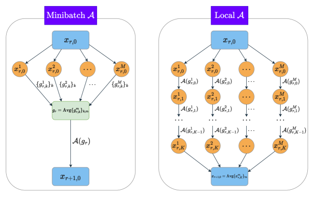

\AtAppendix

# Convergence of Distributed Adaptive Optimization with Local Updates

###### Abstract

We study distributed adaptive algorithms with local updates (intermittent communication). Despite the great empirical success of adaptive methods in distributed training of modern machine learning models, the theoretical benefits of local updates within adaptive methods, particularly in terms of reducing communication complexity, have not been fully understood yet. In this paper, we prove that Local SGD with momentum (Local SGDM) and Local Adam can outperform their minibatch counterparts in convex and weakly convex settings, respectively. Our analysis relies on a novel technique to prove contraction during local iterations, which is a crucial but challenging step to show the advantages of local updates, under generalized smoothness assumption and gradient clipping.  

## 1 Introduction

Leveraging parallelism is crucial in accelerating the training of modern machine learning models for large scale optimization problems. In distributed environments such as large data-centers or in the federated learning setting, where the devices working together are spread apart, communication between the distributed workers is a key bottleneck. In this work, we consider task of minimizing the objective  

|  | $$\min_{x\in\mathbb{R}^{d}}f(x):=\mathbb{E}_{\xi\sim\mathcal{D}}[F(x;\xi)].$$ |  | (1.1) |
| --- | --- | --- | --- |

in a distributed setting with $\displaystyle M$ workers. Each worker has access to $\displaystyle f$ via the stochastic gradient oracle $\displaystyle\nabla F(x;\xi)$, where $\displaystyle\xi$ is independently drawn from the distribution $\displaystyle\mathcal{D}$. In federated learning, this is known as the homogeneous setting, since all workers draw from the same data distribution.  

Perhaps the simplest algorithm for distributed optimization is distributed minibatch stochastic gradient descent (SGD), in which at each iteration, each worker computes a minibatch of gradients, and a gradient step is taken by averaging the gradient computed among the $\displaystyle M$ workers. However, such an algorithm requires communicating at each gradient step, which may be expensive. Thus numerous works have proposed distributed algorithms with less frequent communication. A popular and well-studied algorithm is Local SGD, also known as FedAvg [McMahan et al., [2017](#bib.bib39)], where each worker runs SGD independently and periodically synchronizes with others by averaging the iterates.  

Despite the success of Local SGD in federated learning [McMahan et al., [2017](#bib.bib39)], it may not exhibit good performance when training Transformer-based large language models (LLMs). Many empirical studies suggest that adaptive methods (e.g., Adam [Kingma and Ba, [2014](#bib.bib27)]) are much better suited for natural language processing than vanilla SGD [Goodfellow et al., [2016](#bib.bib18); Zhang et al., [2020](#bib.bib63); Kunstner et al., [2023](#bib.bib28); Pan and Li, [2023](#bib.bib41); Ahn et al., [2023](#bib.bib2)]. Furthermore, as shown in Zhang et al. [[2019](#bib.bib62), [2020](#bib.bib63)], language models tend to have unbounded global smoothness and heavy-tailed noise, which may also contribute to the worse performance of SGD. Parallelizing adaptive methods requires an even more expensive communication cost since additional terms, such as the momentum or the Adam denominator, need to be synchronized. Previous works on distributed adaptive optimization have utilized compression and quantization techniques to address this issue [Bernstein et al., [2018](#bib.bib6); Wangni et al., [2018](#bib.bib55); Wang et al., [2023](#bib.bib54)]. However, to the best of our knowledge, there are no theoretical results trying to improve training efficiency or adaptive methods from the perspective of intermittent communication.  

In this paper, we investigate distributed adaptive optimization algorithms in the homogeneous regime, in order to establish theoretical guarantees for the benefits of local iterations in reducing communication complexity. We focus on the convex or weakly convex setting, because in the non-convex setting, without non-standard strong smoothness assumptions, we are not aware of any theoretical-proven advantages of local iterations, even for non-adaptive methods111Under the stronger assumptions of 3rd-order smoothness [Glasgow et al., [2022](#bib.bib17)] and mean smoothness [Patel et al., [2022](#bib.bib43)], there are demonstrated advantages of local iterations in the non-convex setting. While our theoretical results are for the convex or weakly convex setting, it is likely that local iterations are advantageous in practice for non-convex objectives, just in the same way Local SGD has been shown to be advantageous in practice for non-convex objectives [McMahan et al., [2017](#bib.bib39)]. . Further, in the case of Adam, we consider the weakly convex setting (as opposed to the standard convex setting), since we are not aware of any results on the convergence rate of Adam which take advantage of convexity. To handle unbounded global smoothness and heavy-tailed noise, we use the coordinate-wise gradient clipping mechanism.  

We propose a distributed version of Adam, namely, Local Adam, with gradient clipping. Our algorithm also reduces to Local SGD with momentum (Local SGDM), with some specific hyper-parameter choices.  

* In Theorem [2](#Thmthm2 "Theorem 2 (Convex, full version see Theorem 5). ‣ 4.1 Local SGDM ‣ 4 Main Results ‣ Convergence of Distributed Adaptive Optimization with Local Updates"), we establish the first convergence guarantee for Local SGDM in the convex setting, which outperforms the convergence rate of Minibatch SGDM. The rate we obtain is in line with the rate of Local SGD [Woodworth et al., [2020a](#bib.bib56)] . 
* In Theorem [3](#Thmthm3 "Theorem 3 (Full version see Theorem 3). ‣ 4.2 Local Adam ‣ 4 Main Results ‣ Convergence of Distributed Adaptive Optimization with Local Updates"), we establish a convergence rate for Local Adam in the weakly convex setting. We show that Local Adam can provably improve communication efficiency compared to its minibatch baseline. 

For the first time, we are able to show the benefits of local iterations for the two commonly used algorithms, SGDM and Adam. This suggests that we may be able to improve the training efficiency of LLMs by using intermittent communication.  

Additionally, our results hold under generalized smoothness and heavy-tailed noise. Our result is the first high probability bound for distributed optimization algorithms with local updates, to the best of our knowledge. The conventional in-expectation rate seems fail to capture some important properties like heavy/light tailed noise distribution. The high probability convergence guarantee can sometimes be more informative and useful in practice [Gorbunov et al., [2020](#bib.bib19)].  

As for technical contribution, we use a novel technique to prove contraction for adaptive methods, which bounds the consensus error between the iterates at different workers. This is a key step in proving benefits of local updates. Different from Local SGD, our update direction involves momentum or even distorted momentum due to the denominator in Local Adam, making it challenging to disentangle these accumulated stochastic gradients. To address this issue, we define and analyze an auxiliary sequence which is conditionally independent of the latest stochastic gradient and thus can construct a martingale. We will introduce the technique in more details in Section [5](#S5 "5 Proof Sketch ‣ Convergence of Distributed Adaptive Optimization with Local Updates").  

### 1.1 Organization

Section [2](#S2 "2 Related Work ‣ Convergence of Distributed Adaptive Optimization with Local Updates") provides the most related work to ours. Section [3](#S3 "3 Problem Setup ‣ Convergence of Distributed Adaptive Optimization with Local Updates") provides the problem setup, assumptions and the Local Adam algorithm. We then show our main results for Local SGDM in Section [4.1](#S4.SS1 "4.1 Local SGDM ‣ 4 Main Results ‣ Convergence of Distributed Adaptive Optimization with Local Updates") and Local Adam in Section [4.2](#S4.SS2 "4.2 Local Adam ‣ 4 Main Results ‣ Convergence of Distributed Adaptive Optimization with Local Updates"). Finally, in Section [5](#S5 "5 Proof Sketch ‣ Convergence of Distributed Adaptive Optimization with Local Updates"), we present the proof sketch of Local Adam, highlighting the technical challenges and our solution.  

### 1.2 Notation

Let $\displaystyle\|\cdot\|$ be the standard Euclidean norm of a vector or the spectral norm of a matrix. For any $\displaystyle x,y\in\mathbb{R}^{d}$, the expressions $\displaystyle x+y,x\odot y,\frac{x}{y}$ stand for coordinate-wise sum, product and division, respectively. And $\displaystyle x\preceq y$ means each coordinate of $\displaystyle x-y$ is no greater than $\displaystyle 0$. Furthermore, we use $\displaystyle x^{2},\sqrt{x},|x|$ to denote the coordinate-wise square, square root and absolute value. We use $\displaystyle\mathbb{E}_{m}[X_{m}]$ to denote the average $\displaystyle\frac{1}{M}\sum_{m=1}^{M}X_{m}$. The coordinate-wise clipping operator $\displaystyle\textbf{clip}(\cdot,\rho):\mathbb{R}^{d}\to\mathbb{R}^{d}$ is defined as $\displaystyle[\textbf{clip}(X,\rho)]_{i}=\text{sgn}([X]_{i})\cdot\min\{|X_{i}|,\rho\}$. We use $\displaystyle[N]$ to denote the set $\displaystyle\{1,2,\ldots,N\}$. For a subset $\displaystyle\Omega_{0}\subset\mathbb{R}^{d}$, let $\displaystyle\mbox{\bf conv}(\cdot)$ denote the convex hull of $\displaystyle\Omega_{0}$ and $\displaystyle\mbox{\bf B}_{R_{0}}(\Omega_{0})$ denote the neighborhood of $\displaystyle\Omega_{0}$ with radius $\displaystyle R_{0}$. Finally, we use standard $\displaystyle\mathcal{O}(\cdot),\Omega(\cdot),\Theta(\cdot)$ to omit constant factors and $\displaystyle\tilde{\mathcal{O}}(\cdot)$ to omit logarithmic factors.  

## 2 Related Work

#### Benefits of local updates in distributed optimization.

Algorithms with local updates have been used among practitioners for a long time to reduce communication complexity [McMahan et al., [2017](#bib.bib39)]. In the homogeneous and convex setting, Local SGD and its variants have been shown to outperform the minibatch baseline, for a fixed amount of gradient computations and communication rounds. Woodworth et al. [[2020a](#bib.bib56)] is the first to show that Local SGD can provably outperform Minibatch SGD. Yuan and Ma [[2020](#bib.bib61)] develops FedAC to further accelerate Local SGD. In the heterogeneous case, Woodworth et al. [[2020b](#bib.bib57)] demonstrates the advantages of Local SGD when heterogeneity is very low. Algorithms with local updates have also been studied in the non-convex setting [Karimireddy et al., [2020b](#bib.bib24); Yang et al., [2021](#bib.bib59); Glasgow et al., [2022](#bib.bib17)], including momentum-based and adaptive methods [Reddi et al., [2020](#bib.bib45); Karimireddy et al., [2020a](#bib.bib23)], though no advantage of local iterations over minibatch has been shown, without non-standard assumptions such as 3rd-order smoothness. Notably, Liu et al. [[2022](#bib.bib33)] is one closely related work to ours, which considers Local SGD with gradient clipping in homogeneous and non-convex setting and claims that the convergence guarantee is better than naive parallel of centralized clipped-SGD. However, it still cannot outperform minibatch baseline (with batch size $\displaystyle K$ for each worker in each round) and thus fails to demonstrate the benefits of local iterations.  

#### Convergence of centralized Adam.

Adam was first proposed by Kingma and Ba [[2014](#bib.bib27)] with convergence guarantee in online convex optimization. However, Reddi et al. [[2019](#bib.bib46)] found a gap in the original analysis of Adam and constructed a counter example to show its divergence. Since then, many works have developed convergence analyses of Adam with various assumptions and hyper-parameter settings. Guo et al. [[2021](#bib.bib21)] assumed the denominator is bounded from below and above by two constants, which typically requires a bounded gradient assumption or the AdaBound variant [Luo et al., [2019](#bib.bib36)]. Défossez et al. [[2020](#bib.bib12)] assumed a bounded gradient and their convergence guarantee depends on $\displaystyle\textbf{poly}(d)$. Zhang et al. [[2022b](#bib.bib65)]; Wang et al. [[2022](#bib.bib50)] considered a finite sum setting and showed that Adam converges to the neighborhood of stationary points. One closely related work to ours is Li et al. [[2024b](#bib.bib30)], which established a high probability bound without a bounded gradient assumption. However they assumed that noise is bounded almost surely. Another recent work [Wang et al., [2024](#bib.bib51)] provided a guarantee of $\displaystyle\mathcal{O}\left(\frac{1}{\varepsilon^{4}}\right)$ with dependence on $\displaystyle\textbf{poly}(d)$. Beyond the guarantees on gradient norm given by non-convex analyses, no stronger bounds (e.g., on function error) are known for Adam in the convex case.  

#### Convergence of distributed adaptive algorithms.

In the federated learning literature, Reddi et al. [[2020](#bib.bib45)] introduced a framework, FedOPT, to leverage both worker optimizer and server optimizer. Many works explored adaptive server optimizer while fixing worker side as vanilla SGD. The theoretical results of local adaptive algorithms are much fewer. Some works have studied Local Adam and Local AMSGrad with fixed momentum state during local iterations [Karimireddy et al., [2020a](#bib.bib23); Chen et al., [2020](#bib.bib7); Zhao et al., [2022](#bib.bib66)]. They also needed stringent assumptions such as a huge batch size depending on the inverse of target error, bounded stochastic gradients, vanishing difference between denominator, etc., which are not standard. Wang et al. [[2021](#bib.bib53)] explored adaptive worker optimizer based on centralized algorithm, where the state of worker optimizer changes in local updates. However, their analysis relied on an explicit assumptions [Wang et al., [2021](#bib.bib53), Assumption 1] on the contraction property of worker optimizer. To the best of our knowledge, there is no end-to-end convergence guarantee for distributed adaptive algorithms with local iterations.  

#### Gradient clipping.

Pascanu et al. [[2013](#bib.bib42)] first proposed gradient clipping technique to address the issue of exploding gradient problem of deep neural networks. Since then, it has become standard practice in the training of language models [Gehring et al., [2017](#bib.bib16); Merity et al., [2017](#bib.bib40); Zhang et al., [2022a](#bib.bib64); Liu et al., [2023](#bib.bib32)]. Furthermore, from theoretical perspective, gradient clipping is also used for multiple purposes, including differential privacy [Abadi et al., [2016](#bib.bib1)], distributed optimization [Karimireddy et al., [2021](#bib.bib25); Liu et al., [2022](#bib.bib33)], heavy-tailed noise [Zhang et al., [2020](#bib.bib63)].  

#### Generalized smoothness.

The generalized smoothness condition was initially proposed by [Zhang et al., [2019](#bib.bib62)] to justify gradient clipping, and was called $\displaystyle(L_{0},L_{1})$-smoothness. The empirical evidence therein illustrated that the norm of Hessian matrix of language models depends linearly on the magnitude of gradient, contradicting the standard $\displaystyle L$-smoothness. A recent work [Li et al., [2024a](#bib.bib29)] further generalized this condition to $\displaystyle\ell$-smoothness and proved convergence of classical SGD in this setting. Apart from bounding the Hessian through gradient, Sadiev et al. [[2023](#bib.bib47)] proposed to assume that the norm of Hessian is uniformly bounded in certain subset of whole space, in order to get high probability bounds for (accelerated) clipped-SGD. Gorbunov et al. [[2023](#bib.bib20)] further extended this setting to composite and distributed optimization without local updates. Here we follow the setting of [Sadiev et al., [2023](#bib.bib47)] since $\displaystyle(L_{0},L_{1})$-smoothness would reduce to it in most cases. See Section [3.1](#S3.SS1 "3.1 Assumptions ‣ 3 Problem Setup ‣ Convergence of Distributed Adaptive Optimization with Local Updates") for details.  

## 3 Problem Setup

Consider the distributed optimization problem  

|  | $$\min_{x\in\mathbb{R}^{d}}f(x):=\mathbb{E}_{\xi\sim\mathcal{D}}[F(x;\xi)].$$ |  | (3.1) |
| --- | --- | --- | --- |

Here $\displaystyle\mathcal{D}$ is the data distribution and $\displaystyle f$ is the population loss function. We consider a setting with $\displaystyle M$ parallel workers, and a budget of $\displaystyle R$ total communication rounds, and $\displaystyle T$ total gradient computations at each worker. We will describe the implementation of the local and minibatch versions of a centralized algorithm $\displaystyle\mathcal{A}$, which uses a single stochastic gradient in each iteration. And these are illustrated in Figure [1](#S3.F1 "Figure 1 ‣ 3 Problem Setup ‣ Convergence of Distributed Adaptive Optimization with Local Updates").  

[FIGURE S3.F1.g1]

Figure 1: Minibatch $\displaystyle\mathcal{A}$ v.s. Local $\displaystyle\mathcal{A}$ in one communication round. Minibatch version computes the average of all $\displaystyle KM$ gradients and then executes one step of $\displaystyle\mathcal{A}$, while local version runs $\displaystyle\mathcal{A}$ independently for $\displaystyle K$ steps at each worker.
[/FIGURE]

In the local version of algorithm $\displaystyle\mathcal{A}$, in each round $\displaystyle r$ of the $\displaystyle R$ total communication rounds, each worker $\displaystyle m$ independently executes $\displaystyle K=T/R$ steps of local updates (according to the algorithm $\displaystyle\mathcal{A}$). For a worker $\displaystyle m$, we denote the $\displaystyle k$th gradient computed in round $\displaystyle r$ by $\displaystyle g_{r,k}^{m}$. Then the $\displaystyle M$ workers synchronize the iterates and related momentum state. We use Minibatch $\displaystyle\mathcal{A}$ to denote a distributed implementation of $\displaystyle\mathcal{A}$ run for $\displaystyle R$ rounds, where $\displaystyle KM$ stochastic gradients are computed and averaged at each step. This is a fair baseline to compare the local update algorithms to, since the number of gradient calls and communication rounds are the same.  

Local Adam is shown in Algorithm [1](#alg1 "Algorithm 1 ‣ 3 Problem Setup ‣ Convergence of Distributed Adaptive Optimization with Local Updates"), which is a natural extension of centralized Adam [Kingma and Ba, [2014](#bib.bib27)]. The stochastic gradient is clipped by an coordinate-wise clipping operator with threshold $\displaystyle\rho$. After $\displaystyle K$ steps of local updates, all the workers average their current iterates $\displaystyle x_{t}^{m}$, their first order momentum $\displaystyle u_{t}^{m}$, and their second order momentum $\displaystyle v_{t}^{m}$. These averaged quantities become the values used at the beginning of the next local round. Note that there are two slight differences from original Adam. First, we do not involve bias correction here, i.e., $\displaystyle u_{t}^{m}$ and $\displaystyle v_{t}^{m}$ are not divided by $\displaystyle 1-\beta_{1}^{t}$ or $\displaystyle 1-\beta_{2}^{t}$, respectively. Second, $\displaystyle\lambda$ in the denominator is in the square root, while it is outside of the denominator in original Adam. These modifications do not harm the spirit of Adam and are made for the convenience of analysis.  

[ALGORITHM alg1]

0:  initial model $\displaystyle x_{0}$, learning rate $\displaystyle\eta$, momentum $\displaystyle\beta_{1},\beta_{2}\in[0,1)$

  
Set $\displaystyle x_{0,0}^{m}=x_{0},\ u_{0,-1}^{m}=0,\ v_{0}=0$ for each worker $\displaystyle m\in[M]$

  for $\displaystyle r=0,\cdots,R-1$ do

     for each worker $\displaystyle m\in[M]$ in parallel do

        for $\displaystyle k=0,\cdots,K-1$ do

           
$\displaystyle g_{r,k}^{m}=\nabla F(x_{r,k}^{m};\xi_{r,k}^{m}),\ \widehat{g_{r,k}^{m}}=\textbf{clip}(g_{r,k}^{m},\rho)$ $\displaystyle\triangleright\,\mbox{\small{Compute clipped stochastic gradient}}$ $\displaystyle u_{r,k}^{m}=\beta_{1}u_{r,k-1}^{m}+(1-\beta_{1})\widehat{g_{r,k}^{m}}$ $\displaystyle\triangleright\,\mbox{\small{Update 1st-order momentum}}$ $\displaystyle v_{r,k}^{m}=\beta_{2}v_{r,k-1}^{m}+(1-\beta_{2})\widehat{g_{r,k}^{m}}\odot\widehat{g_{r,k}^{m}}$ $\displaystyle\triangleright\,\mbox{\small{Update 2nd-order momentum}}$ $\displaystyle x_{r,k+1}^{m}=x_{r,k}^{m}-\frac{\eta}{\sqrt{v_{r,k}^{m}+\lambda^{2}}}\odot u_{r,k}^{m}$ $\displaystyle\triangleright\,\mbox{\small{Update model}}$

        end for

     end for

     
$\displaystyle x_{r+1,0}^{m}=\mathbb{E}_{m}[x_{r,K}^{m}],\ u_{r+1,-1}^{m}=\mathbb{E}_{m}[u_{r,K-1}^{m}],\ v_{r+1,-1}^{m}=v_{r+1}:=\mathbb{E}_{m}[v_{r,K-1}^{m}]$ $\displaystyle\triangleright\,\mbox{\small{Communicate and average}}$

  end for

Algorithm 1  Local Adam
[/ALGORITHM]

### 3.1 Assumptions

Throughout this work, we will use the following assumptions.  

###### Assumption 1 (Lower-boundedness).

$\displaystyle f$ is closed, twice continuously differentiable and $\displaystyle\inf_{x\in\mathbb{R}^{d}}f(x)=f(x_{*})=f_{*}>-\infty$.  

###### Assumption 2 (Smoothness).

There exists some set $\displaystyle\Omega\subset\mathbb{R}^{d}$ and constant $\displaystyle L>0$, such that for any $\displaystyle x,y\in\Omega$,  

|  | $$\|\nabla f(x)-\nabla f(y)\|\leq L\|x-y\|,$$ |  | (3.2) |
| --- | --- | --- | --- |

|  | $$\|\nabla f(x)\|^{2}\leq 2L(f(x)-f_{*}).$$ |  | (3.3) |
| --- | --- | --- | --- |

Similar to Sadiev et al. [[2023](#bib.bib47)], we only requires some properties of $\displaystyle f$ on a subset $\displaystyle\Omega$ of $\displaystyle\mathbb{R}^{d}$, since we can prove that all the iterates will not leave this subset with high probability. In contrast, the typical smoothness assumption requires ([3.2](#S3.E2 "In Assumption 2 (Smoothness). ‣ 3.1 Assumptions ‣ 3 Problem Setup ‣ Convergence of Distributed Adaptive Optimization with Local Updates")) on the entire domain.  

There are many works [Zhang et al., [2019](#bib.bib62); Crawshaw et al., [2022](#bib.bib9); Faw et al., [2023](#bib.bib14); Wang et al., [2022](#bib.bib50); Li et al., [2024b](#bib.bib30)] that make weaker smoothness assumptions (typically called “generalized smoothness”), most of which are in the form of $\displaystyle(L_{0},L_{1})$-smoothness:  

|  | $$\|\nabla^{2}f(x)\|\leq L_{0}+L_{1}\|\nabla f(x)\|,\ \forall x\in\mathbb{R}^{d}.$$ |  | (3.4) |
| --- | --- | --- | --- |

Li et al. [[2024a](#bib.bib29)] considers an extension called $\displaystyle\ell$-smoothness, which replaces the linear function of $\displaystyle\|\nabla f\|$ in the right hand side of ([3.4](#S3.E4 "In 3.1 Assumptions ‣ 3 Problem Setup ‣ Convergence of Distributed Adaptive Optimization with Local Updates")) with a sub-quadratic function $\displaystyle\ell(\cdot)$. As pointed out in Li et al. [[2024a](#bib.bib29), Corollary 3.6], all of these will induce Assumption [2](#Thmasp2 "Assumption 2 (Smoothness). ‣ 3.1 Assumptions ‣ 3 Problem Setup ‣ Convergence of Distributed Adaptive Optimization with Local Updates") if $\displaystyle\Omega$ is some level-set of the objective function222e.g., if $\displaystyle\Omega\subset\{x:f(x)-f_{*}\leq\Delta\}$, then $\displaystyle(L_{0},L_{1})$-smoothness would imply Assumption [2](#Thmasp2 "Assumption 2 (Smoothness). ‣ 3.1 Assumptions ‣ 3 Problem Setup ‣ Convergence of Distributed Adaptive Optimization with Local Updates") for $\displaystyle L\asymp L_{0}+L_{1}^{2}\Delta$. Note that we may not obtain the optimal dependence on $\displaystyle L_{0},L_{1}$ in this way though.. Therefore, we directly use this more general assumption to get cleaner results.  

###### Assumption 3 (Bounded $\displaystyle\alpha$-moment noise).

There exists some set $\displaystyle\Omega\subset\mathbb{R}^{d}$, $\displaystyle\alpha\geq 4$ and constant vector $\displaystyle\bm{\sigma}\succeq 0$ such that for any $\displaystyle x\in\Omega$,  

|  | $$\mathbb{E}_{\xi\sim\mathcal{D}}|\nabla F(x;\xi)-\nabla f(x)|^{\alpha}\preceq\bm{\sigma}^{\alpha}.$$ |  | (3.5) |
| --- | --- | --- | --- |

Let $\displaystyle\sigma_{\infty}:=\|\bm{\sigma}\|_{\infty}=\max_{i}\{\sigma_{i}\}$, $\displaystyle\sigma:=\|\bm{\sigma}\|=\sqrt{\sigma_{1}^{2}+\cdots+\sigma_{d}^{2}}$.  

###### Remark 1.

To get a high probability bound under generalized smoothness, the assumption on stochastic noise is crucial. Light-tailed noise with bounded exponential moment (e.g., bounded, sub-exponential, sub-gaussian) are considered in Harvey et al. [[2019](#bib.bib22)]; Li and Orabona [[2020](#bib.bib31)]; Li et al. [[2024b](#bib.bib30)]. There are also attempts for heavy-tailed noise with finite $\displaystyle\alpha$-moment [Gorbunov et al., [2020](#bib.bib19); Cutkosky and Mehta, [2021](#bib.bib10); Faw et al., [2023](#bib.bib14)]. In the most literature studying heavy-tailed noise, they restrict to the case where $\displaystyle 1<\alpha\leq 2$. However, in the matter of getting a logarithmic dependence on $\displaystyle 1/\delta$, where $\displaystyle\delta$ is the confidence level, the essence lies in whether we assume bounded exponential moment or just polynomial moment (see Appendix [D](#A4 "Appendix D Failure of Standard SGD with Heavy-Tailed Noise ‣ Convergence of Distributed Adaptive Optimization with Local Updates") for detailed discussions). For technical convenience, we only consider $\displaystyle\alpha\geq 4$ in this paper, but our analysis methods can be easily extended to the case where $\displaystyle\alpha<4$.  

###### Remark 2 (Noise of minibatch).

It follows from Petrov [[1992](#bib.bib44)] that if the gradient is estimated by a batch of i.i.d samples with batch size $\displaystyle N$, the $\displaystyle\alpha$-moment of noise has upper bound of:  

|  | $$\mathbb{E}_{\{\xi_{i}\}\overset{i.i.d}{\sim}\mathcal{D}}\big{|}\frac{1}{N}\sum_{i=1}^{N}\nabla F(x;\xi_{i})-\nabla f(x)\big{|}^{\alpha}\preceq c(\alpha)\left(\frac{\bm{\sigma}}{\sqrt{N}}\right)^{\alpha},$$ |  | (3.6) |
| --- | --- | --- | --- |

where $\displaystyle c(\alpha)$ is a problem-independent constant. It is easy to see that this bound is tight when the noise is Gaussian. Therefore, to get the rate for batch size $\displaystyle N$, we can just simply replace $\displaystyle\bm{\sigma}$ with $\displaystyle\frac{\bm{\sigma}}{\sqrt{N}}$ (up to a constant depending on $\displaystyle\alpha$) in the original convergence guarantee for batch size $\displaystyle 1$.  

## 4 Main Results

In this section, we provide our main results for Local Adam and its simplified version: Local SGDM. For the first time, we will be able to show the benefits of local iterations for the two algorithms, compared with their minibatch baselines in certain regime of $\displaystyle M,K,R$.  

### 4.1 Local SGDM

Before getting into Local Adam, we start with a simpler yet also important algorithm: Local SGD with momentum. Note that when $\displaystyle\beta_{2}=1,\lambda=1$, Algorithm [1](#alg1 "Algorithm 1 ‣ 3 Problem Setup ‣ Convergence of Distributed Adaptive Optimization with Local Updates") will reduce to Local SGDM. We restate the complete version of Local SGDM in Algorithm [2](#alg2 "Algorithm 2 ‣ Appendix B Proof of Local SGDM ‣ Convergence of Distributed Adaptive Optimization with Local Updates") in Appendix [B](#A2 "Appendix B Proof of Local SGDM ‣ Convergence of Distributed Adaptive Optimization with Local Updates").  

###### Assumption 4 (Convexity).

There exists some set $\displaystyle\Omega\subset\mathbb{R}^{d}$ and constant $\displaystyle\mu\geq 0$ such that $\displaystyle f$ is $\displaystyle\mu$-strongly convex on $\displaystyle\Omega$, i.e., for any $\displaystyle x,y\in\Omega$,  

|  | $$\langle\nabla f(x)-\nabla f(y),x-y\rangle\geq\mu\|x-y\|^{2},$$ |  | (4.1) |
| --- | --- | --- | --- |

|  | $$f(y)\geq f(x)+\langle\nabla f(x),y-x\rangle+\frac{\mu}{2}\|x-y\|^{2}.$$ |  | (4.2) |
| --- | --- | --- | --- |

Let $\displaystyle D_{0}:=\|x_{0}-x_{*}\|$. Now we state the results for Local SGDM below. Notably, our results are the first convergence guarantee for distributed SGDM with local updates in (strongly) convex setting.  

###### Theorem 1 (Strongly convex, full version see Theorem [4](#Thmthm4b "Theorem 4 (Complete version of Theorem 1). ‣ B.1 Overview and Main Theorem ‣ Appendix B Proof of Local SGDM ‣ Convergence of Distributed Adaptive Optimization with Local Updates")).

Let Assumption [1](#Thmasp1 "Assumption 1 (Lower-boundedness). ‣ 3.1 Assumptions ‣ 3 Problem Setup ‣ Convergence of Distributed Adaptive Optimization with Local Updates"), [2](#Thmasp2 "Assumption 2 (Smoothness). ‣ 3.1 Assumptions ‣ 3 Problem Setup ‣ Convergence of Distributed Adaptive Optimization with Local Updates"), [3](#Thmasp3 "Assumption 3 (Bounded 𝛼-moment noise). ‣ 3.1 Assumptions ‣ 3 Problem Setup ‣ Convergence of Distributed Adaptive Optimization with Local Updates"), [4](#Thmasp4 "Assumption 4 (Convexity). ‣ 4.1 Local SGDM ‣ 4 Main Results ‣ Convergence of Distributed Adaptive Optimization with Local Updates") hold for $\displaystyle\Omega:=\{\|x-x_{*}\|\leq\sqrt{3}D_{0}\}$ and $\displaystyle\mu>0$. Further assume that $\displaystyle K\gtrsim\log\frac{MKR}{\delta}$, $\displaystyle 1-\beta_{1}=\Omega(1)$ and $\displaystyle\|\bm{\sigma}\|_{2\alpha}d^{\frac{1}{2}-\frac{1}{2\alpha}}=\mathcal{O}(\sigma)$. Then with probability no less than $\displaystyle 1-\delta$, Local SGDM yields  

|  | $$f(\hat{x})-f_{*}\leq\exp\left(-\Theta\left(\frac{\mu KR}{L}\right)\right)+\tilde{\mathcal{O}}\left(\frac{\sigma^{2}}{\mu MKR}+\frac{L\sigma^{2}}{\mu^{2}KR^{2}}+\frac{\sigma^{2}}{\mu}\left(\frac{L^{\frac{1}{2}}}{\mu^{\frac{1}{2}}KR}\right)^{\frac{2(\alpha-1)}{\alpha}}\right).$$ |  | (4.3) |
| --- | --- | --- | --- |

###### Theorem 2 (Convex, full version see Theorem [5](#Thmthm5 "Theorem 5 (Complete version of Theorem 2). ‣ B.1 Overview and Main Theorem ‣ Appendix B Proof of Local SGDM ‣ Convergence of Distributed Adaptive Optimization with Local Updates")).

Let Assumption [1](#Thmasp1 "Assumption 1 (Lower-boundedness). ‣ 3.1 Assumptions ‣ 3 Problem Setup ‣ Convergence of Distributed Adaptive Optimization with Local Updates"), [2](#Thmasp2 "Assumption 2 (Smoothness). ‣ 3.1 Assumptions ‣ 3 Problem Setup ‣ Convergence of Distributed Adaptive Optimization with Local Updates"), [3](#Thmasp3 "Assumption 3 (Bounded 𝛼-moment noise). ‣ 3.1 Assumptions ‣ 3 Problem Setup ‣ Convergence of Distributed Adaptive Optimization with Local Updates"), [4](#Thmasp4 "Assumption 4 (Convexity). ‣ 4.1 Local SGDM ‣ 4 Main Results ‣ Convergence of Distributed Adaptive Optimization with Local Updates") hold for $\displaystyle\Omega:=\{\|x-x_{*}\|\leq\sqrt{3}D_{0}\}$ and $\displaystyle\mu=0$. Further assume that $\displaystyle K\gtrsim\log\frac{MKR}{\delta}$, $\displaystyle 1-\beta_{1}=\Omega(1)$ and $\displaystyle\|\bm{\sigma}\|_{2\alpha}d^{\frac{1}{2}-\frac{1}{2\alpha}}=\mathcal{O}(\sigma)$. Then with probability no less than $\displaystyle 1-\delta$, Local SGDM yields  

|  | $$f(\hat{x})-f_{*}\leq\tilde{\mathcal{O}}\left(\frac{LD_{0}^{2}}{KR}+\frac{\sigma D_{0}}{\sqrt{MKR}}+\frac{L^{\frac{1}{3}}\sigma^{\frac{2}{3}}D_{0}^{\frac{4}{3}}}{K^{\frac{1}{3}}R^{\frac{2}{3}}}+D_{0}\left(\frac{(LD_{0})^{\frac{1}{2}}\sigma^{\frac{\alpha}{\alpha-1}}}{KR}\right)^{\frac{2(\alpha-1)}{3\alpha-1}}\right).$$ |  | (4.4) |
| --- | --- | --- | --- |

###### Remark 3 (Confidence level $\displaystyle\delta$).

$\displaystyle\delta$ does not appear in the error bound since we have $\displaystyle\log\frac{1}{\delta}$ dependence.  

Our method can also be applied to Minibath SGDM (by substituting $\displaystyle M,K$ with $\displaystyle 1$ and $\displaystyle\sigma$ with $\displaystyle\frac{\sigma}{\sqrt{MK}}$; see Remark [2](#Thmrmk2 "Remark 2 (Noise of minibatch). ‣ 3.1 Assumptions ‣ 3 Problem Setup ‣ Convergence of Distributed Adaptive Optimization with Local Updates")), whose convergence guarantee is  

|  | $$f(\hat{x})-f_{*}\lesssim\left\{\begin{array}[]{ll}\exp\left(-\Theta\left(\frac{\mu R}{L}\right)\right)+\tilde{\mathcal{O}}\left(\frac{\sigma^{2}}{\mu MKR}\right),&\text{if }\mu>0,\\ \tilde{\mathcal{O}}\left(\frac{LD_{0}^{2}}{R}+\frac{\sigma D_{0}}{\sqrt{MKR}}\right),&\text{otherwise}.\end{array}\right.$$ |  | (4.5) |
| --- | --- | --- | --- |

This rate matches the well-known in-expectation lower bound on the convergence rate of Minibatch SGD (up to logarithmic factors). In fact, our analysis improves the state-of-the-art rate for strongly-convex SGDM (given in Liu et al. [[2020b](#bib.bib35)]), which has a stochastic term as $\displaystyle\tilde{\mathcal{O}}\left(\frac{L\sigma^{2}}{\mu^{2}MKR}\right)$. In the convex setting, our rate is consistent with the state-of-the-art centralized in-expectation bound of SGDM in Sebbouh et al. [[2021](#bib.bib48)]. Further notice that the last term in both ([4.3](#S4.E3 "In Theorem 1 (Strongly convex, full version see Theorem 4). ‣ 4.1 Local SGDM ‣ 4 Main Results ‣ Convergence of Distributed Adaptive Optimization with Local Updates")) and ([4.4](#S4.E4 "In Theorem 2 (Convex, full version see Theorem 5). ‣ 4.1 Local SGDM ‣ 4 Main Results ‣ Convergence of Distributed Adaptive Optimization with Local Updates")) is due to the bias of gradient clipping and would be negligible as long as $\displaystyle K^{\alpha-2}\gtrsim\frac{\mu R^{2}}{L}$ or $\displaystyle K^{\frac{3\alpha-5}{2}}\gtrsim\frac{\sigma R^{2}}{LD_{0}}$. In this case, our guarantee for Local SGDM is aligned with the rate of Local SGD in Woodworth et al. [[2020a](#bib.bib56)]; Khaled et al. [[2020](#bib.bib26)] up to logarithmic factor. Therefore, we can see the benefits of local iterations in the large $\displaystyle M$ and large $\displaystyle K$ regime compared to minibatch baseline.  

We defer the detailed proof to Appendix [B](#A2 "Appendix B Proof of Local SGDM ‣ Convergence of Distributed Adaptive Optimization with Local Updates").  

### 4.2 Local Adam

The convergence of Adam is much more difficult to prove. Reddi et al. [[2019](#bib.bib46)] pointed out that the original proof in Kingma and Ba [[2014](#bib.bib27)] in centralized convex setting was incorrect. Therefore, the convergence of Adam in for convex function is of independent interest and beyond our scope. Instead, we turn to consider Adam in the weakly convex setting.  

###### Assumption 5 (Weak convexity).

There exists constant $\displaystyle\tau>0$ such that $\displaystyle f$ is $\displaystyle\tau$-weakly convex, i.e., for any $\displaystyle x,y\in\mathbb{R}^{d}$,  

|  | $$\langle\nabla f(x)-\nabla f(y),x-y\rangle\geq-\tau\|x-y\|^{2},$$ |  | (4.6) |
| --- | --- | --- | --- |

|  | $$f(y)\geq f(x)+\langle\nabla f(x),y-x\rangle-\frac{\tau}{2}\|x-y\|^{2},\ \nabla^{2}f(x)\succeq-\tau I_{d}.$$ |  | (4.7) |
| --- | --- | --- | --- |

Note that $\displaystyle L$-smoothness implies that Assumption [5](#Thmasp5 "Assumption 5 (Weak convexity). ‣ 4.2 Local Adam ‣ 4 Main Results ‣ Convergence of Distributed Adaptive Optimization with Local Updates") always holds with $\displaystyle\tau=L$. Also note that here we assume the weak convexity holds in $\displaystyle\mathbb{R}^{d}$ for technical simplicity. Let $\displaystyle H_{r}=\mbox{\bf diag}{(\sqrt{v_{r}+\lambda^{2}})}\succeq\lambda I_{d}$ and $\displaystyle\Delta:=f(x_{0})-f_{*}$. Furthermore, inspired by Liu et al. [[2020b](#bib.bib35)], define an auxiliary sequence $\displaystyle\{z_{r,k}^{m}\}$ as:  

|  | $$z_{r,k+1}^{m}=\left\{\begin{array}[]{ll}\frac{1}{1-\beta_{1}}x_{r,k+1}^{m}-\frac{\beta_{1}}{1-\beta_{1}}x_{r,k}^{m}&\text{if $\displaystyle\ k\neq K-1$},\\ \frac{1}{1-\beta_{1}}x_{r,k+1}^{m}-\frac{\beta_{1}}{1-\beta_{1}}\overline{x}_{r,k}&\text{otherwise}.\end{array}\right.$$ |  | (4.8) |
| --- | --- | --- | --- |

Let $\displaystyle\overline{z}_{r,k}:=\mathbb{E}_{m}[z_{r,k}^{m}]$. Now we state the main result of Local Adam below (see Theorem [2](#Thmthm2d "Theorem 2. ‣ C.1 Overview and Main Theorem ‣ Appendix C Proof of Local Adam ‣ Convergence of Distributed Adaptive Optimization with Local Updates") for more general results on Moreau envelope).  

###### Theorem 3 (Full version see Theorem [3](#Thmthm3d "Theorem 3 (Complete version of Theorem 3). ‣ C.1 Overview and Main Theorem ‣ Appendix C Proof of Local Adam ‣ Convergence of Distributed Adaptive Optimization with Local Updates")).

Let Assumption [1](#Thmasp1 "Assumption 1 (Lower-boundedness). ‣ 3.1 Assumptions ‣ 3 Problem Setup ‣ Convergence of Distributed Adaptive Optimization with Local Updates"), [2](#Thmasp2 "Assumption 2 (Smoothness). ‣ 3.1 Assumptions ‣ 3 Problem Setup ‣ Convergence of Distributed Adaptive Optimization with Local Updates"), [3](#Thmasp3 "Assumption 3 (Bounded 𝛼-moment noise). ‣ 3.1 Assumptions ‣ 3 Problem Setup ‣ Convergence of Distributed Adaptive Optimization with Local Updates"), [5](#Thmasp5 "Assumption 5 (Weak convexity). ‣ 4.2 Local Adam ‣ 4 Main Results ‣ Convergence of Distributed Adaptive Optimization with Local Updates") hold for $\displaystyle\Omega=\mbox{\bf conv}(\mbox{\bf B}_{R_{0}}(\Omega_{0}))$, where $\displaystyle\Omega_{0}:=\{f(x)-f_{*}\leq 4\Delta\}$ and $\displaystyle R_{0}=\sqrt{\frac{\Delta}{80L}}$. Further assume $\displaystyle K\gtrsim\log\frac{MKR}{\delta}$, $\displaystyle 1-\beta_{1}=\Omega(1)$, $\displaystyle\|\bm{\sigma}\|_{2\alpha}d^{\frac{1}{2}-\frac{1}{2\alpha}}=\mathcal{O}(\sigma)$ and  

|  | $$1-\beta_{2}=\tilde{\mathcal{O}}\left(\frac{1}{K^{3/2}R^{1/2}}\right).$$ |  | (4.9) |
| --- | --- | --- | --- |

Then with probability no less than $\displaystyle 1-\delta$, Local Adam yields  

|  |  | $\displaystyle\frac{\lambda}{KR}\sum_{r=0}^{R-1}\sum_{k=0}^{K-1}\|\nabla f(\overline{z}_{r,k})\|_{H_{r}^{-1}}^{2}$ |  | (4.10) |
| --- | --- | --- | --- | --- |
|  |  | $\displaystyle\qquad\qquad=\tilde{\mathcal{O}}\left(\frac{\tau\Delta}{R}+\frac{L\Delta}{KR}+\sqrt{\frac{L\Delta\sigma^{2}}{MKR}}+\frac{(L\Delta\sigma)^{\frac{2}{3}}}{K^{\frac{1}{3}}R^{\frac{2}{3}}}+\left(\frac{L\Delta\sigma^{\frac{\alpha}{\alpha-1}}}{KR}\right)^{\frac{2(\alpha-1)}{3\alpha-2}}\right).$ |  |

The RHS of ([4.10](#S4.E10 "In Theorem 3 (Full version see Theorem 3). ‣ 4.2 Local Adam ‣ 4 Main Results ‣ Convergence of Distributed Adaptive Optimization with Local Updates")) consists of four parts. The first part is $\displaystyle\frac{\tau\Delta}{R}+\frac{L\Delta}{KR}$, which is the optimization term and determined by the upper bound of learning rate $\displaystyle\eta$. The second term is $\displaystyle\sqrt{\frac{L\Delta\sigma^{2}}{MKR}}$, corresponding to the standard statistical lower bound from $\displaystyle MKR$ stochastic gradients [Arjevani et al., [2023](#bib.bib4)]. The third component is $\displaystyle\frac{(L\Delta\sigma)^{\frac{2}{3}}}{K^{\frac{1}{3}}R^{\frac{2}{3}}}$, which comes from the discrepancy overhead of doing local iterations. And the last one, $\displaystyle\left(\frac{L\Delta\sigma^{\frac{\alpha}{\alpha-1}}}{KR}\right)^{\frac{2(\alpha-1)}{3\alpha-2}}$, is induced by the bias of clipped stochastic gradient and can be dominated when $\displaystyle K^{\frac{3\alpha-4}{2}}\gtrsim\frac{\sigma^{2}R}{L\Delta}$.  

Our analysis method can also be applied to Minibatch Adam (by substituting $\displaystyle M,K$ with $\displaystyle 1$ and $\displaystyle\sigma$ with $\displaystyle\frac{\sigma}{\sqrt{MK}}$; see Remark [2](#Thmrmk2 "Remark 2 (Noise of minibatch). ‣ 3.1 Assumptions ‣ 3 Problem Setup ‣ Convergence of Distributed Adaptive Optimization with Local Updates")), and the convergence rate is  

|  | $$\tilde{\mathcal{O}}\left(\frac{L\Delta}{R}+\sqrt{\frac{L\Delta\sigma^{2}}{MKR}}\right),$$ |  | (4.11) |
| --- | --- | --- | --- |

aligned with (up to logarithmic factor) the state-of-the-art convergence guarantees for smooth weakly convex functions [Davis and Drusvyatskiy, [2019](#bib.bib11); Deng and Gao, [2021](#bib.bib13)]. For simplicity, suppose $\displaystyle K^{\frac{3\alpha-4}{2}}\gtrsim\frac{\sigma^{2}R}{L\Delta}$ and hence the last term in ([4.10](#S4.E10 "In Theorem 3 (Full version see Theorem 3). ‣ 4.2 Local Adam ‣ 4 Main Results ‣ Convergence of Distributed Adaptive Optimization with Local Updates")) would be dominated and negligible. Now we can observe the benefits of local iterations. Note that both ([4.10](#S4.E10 "In Theorem 3 (Full version see Theorem 3). ‣ 4.2 Local Adam ‣ 4 Main Results ‣ Convergence of Distributed Adaptive Optimization with Local Updates")) and ([4.11](#S4.E11 "In 4.2 Local Adam ‣ 4 Main Results ‣ Convergence of Distributed Adaptive Optimization with Local Updates")) have the statistical lower bound $\displaystyle\frac{1}{\sqrt{MKR}}$. Hence when the statistical term dominates, both algorithms have similar worst-case rate. Once we leave the noise-dominated regime, then Local Adam converges faster than Minibatch Adam whenever $\displaystyle K\gtrsim\frac{\sigma^{2}R}{L\Delta}$. And the gap will increase as $\displaystyle K$ grows until $\displaystyle K\asymp\frac{L}{\tau}$.  

Therefore, we can conclude that in the large $\displaystyle M$ and small $\displaystyle\tau$ regime, Local Adam would outperform Minibatch Adam. Since $\displaystyle f$ is close to convex function when $\displaystyle\tau$ is small, this conclusion is consistent with Woodworth et al. [[2020a](#bib.bib56)]. Please refer to Appendix [C.5](#A3.SS5 "C.5 Further Discussion ‣ Appendix C Proof of Local Adam ‣ Convergence of Distributed Adaptive Optimization with Local Updates") for more comparisons about Moreau envelop.  

We defer further discussions on the choices of hyper-parameters including $\displaystyle\beta_{1},\beta_{2},\lambda$ to Appendix [C.5](#A3.SS5 "C.5 Further Discussion ‣ Appendix C Proof of Local Adam ‣ Convergence of Distributed Adaptive Optimization with Local Updates"). The complete proof is in Appendix [C](#A3 "Appendix C Proof of Local Adam ‣ Convergence of Distributed Adaptive Optimization with Local Updates").  

## 5 Proof Sketch

In this section, we show high-level ideas in our proofs. We only demonstrate the Local Adam here since Local SGDM is a special case of Local Adam ($\displaystyle\beta_{2}=1$) and has similar patterns.  

As a common practice in the study of weakly convex function [Davis and Drusvyatskiy, [2019](#bib.bib11); Mai and Johansson, [2020](#bib.bib37)], the norm of the gradient of the Moreau envelope can serve as a proxy for near-stationarity. Here we use a generalized Moreau envelope for adaptive algorithms, proposed by Alacaoglu et al. [[2020](#bib.bib3)]. For any positive definite matrix $\displaystyle H$ and $\displaystyle\gamma>0$ such that $\displaystyle\gamma^{-1}H\succeq\tau I_{d}$, define the Moreau envelope of $\displaystyle f$ as  

|  | $$f_{\gamma}^{H}(x):=\min_{y\in\mathbb{R}^{d}}f(y)+\frac{1}{2\gamma}\|x-y\|_{H}^{2}.$$ |  | (5.1) |
| --- | --- | --- | --- |

With a little abuse of notation, we define $\displaystyle f_{\gamma}^{\lambda}(x):=f_{\gamma}^{\lambda I_{d}}(x)=f_{\gamma/\lambda}(x)$. The convergence metric is correspondingly $\displaystyle\|\nabla f_{\gamma}^{H}(\cdot)\|_{H^{-1}}$, which can serve to bound $\displaystyle\|\nabla f(\cdot)\|_{H^{-1}}$, as shown in the following lemma.  

###### Lemma 1 (Full version see Lemma [4](#Thmthm4c "Lemma 4. ‣ C.2 Preliminaries ‣ Appendix C Proof of Local Adam ‣ Convergence of Distributed Adaptive Optimization with Local Updates")).

Let $\displaystyle z\in\Omega_{0}$ and $\displaystyle y:=\arg\min_{x}f(x)+\frac{1}{2\gamma}\|x-z\|_{H}^{2}$ for some $\displaystyle H\succeq\lambda I_{d}$ and $\displaystyle L/\lambda\geq\gamma^{-1}\geq 2\tau/\lambda$. Then  

|  | $$\nabla f_{\gamma}^{H}(z)=\nabla f(y)=\frac{H(z-y)}{\gamma}.$$ |  | (5.2) |
| --- | --- | --- | --- |

|  | $$\|\nabla f(z)\|_{H^{-1}}\leq\frac{2\gamma L}{\lambda}\|\nabla f_{\gamma}^{H}(z)\|_{H^{-1}},$$ |  | (5.3) |
| --- | --- | --- | --- |

In the rest of this section, we provide the proof sketch for general Moreau envelop.  

For any integer $\displaystyle 0\leq t\leq T-1$, we define $\displaystyle r(t),k(t)\in\mathbb{N}$ such that $\displaystyle t=r(t)K+k(t)$ and $\displaystyle k(t)\leq K-1$. We will omit the dependence on $\displaystyle t$ and let $\displaystyle r=r(t),k=k(t)$ if not causing confusion. Further define  

|  | $$x_{t}^{m}:=x_{r,k}^{m},g_{t}^{m}:=g_{r,k}^{m},\widehat{g_{t}^{m}}:=\widehat{g_{r,k}^{m}},u_{t}^{m}=u_{r,k}^{m},v_{t}^{m}=v_{r,k}^{m},H_{t}^{m}:=\mbox{\bf diag}(\sqrt{v_{t}^{m}+\lambda^{2}})$$ |  | (5.4) |
| --- | --- | --- | --- |

Then Algorithm [1](#alg1 "Algorithm 1 ‣ 3 Problem Setup ‣ Convergence of Distributed Adaptive Optimization with Local Updates") is equivalent to the following update rule:  

|  | $$x_{t+1}^{m}=\left\{\begin{array}[]{ll}x_{t}^{m}-\eta(H_{t}^{m})^{-1}u_{t}^{m}&\text{if $\displaystyle\ t\ \text{mod}\ K\not\equiv-1$},\\ \overline{x}_{t}-\eta\mathbb{E}_{m}[(H_{t}^{m})^{-1}u_{t}^{m}]&\text{otherwise}.\end{array}\right.$$ |  | (5.5) |
| --- | --- | --- | --- |

Define an auxiliary sequence $\displaystyle\{z_{t}^{m}\}$ as:  

|  | $$z_{t+1}^{m}=\left\{\begin{array}[]{ll}\frac{1}{1-\beta_{1}}x_{t+1}^{m}-\frac{\beta_{1}}{1-\beta_{1}}x_{t}^{m}&\text{if $\displaystyle\ t\ \text{mod}\ K\not\equiv-1$},\\ \frac{1}{1-\beta_{1}}x_{t+1}^{m}-\frac{\beta_{1}}{1-\beta_{1}}\overline{x}_{t}&\text{otherwise}.\end{array}\right.$$ |  | (5.6) |
| --- | --- | --- | --- |

Let $\displaystyle y_{t}:=\arg\min_{y}f(y)+\frac{1}{2\gamma}\|y-\overline{z}_{t}\|_{H_{r(t)}}^{2}$. Define filtration $\displaystyle\mathcal{F}_{-1}=\emptyset,\mathcal{F}_{t}:=\sigma(\{g_{r,k}^{m}\}_{m}\cup\mathcal{F}_{t-1})$ and conditional expectation $\displaystyle\mathbb{E}_{t}[\cdot]=\mathbb{E}[\cdot|\mathcal{F}_{t}]$.  

As standard practice in distributed optimization, our proof mainly contains two parts: contraction and descent. Here contraction involves showing that the iterates of local training at different workers will not diverge to different points. And decent involves showing that the objective value decreases at each iteration.  

Our strategy is to inductively prove that some probabilistic event $\displaystyle E_{t}\in\mathcal{F}_{t-1}$ holds with high probability, which are designed to ensure contraction and descent. And event $\displaystyle E_{T}$ can directly imply the upper bound in Theorem [3](#Thmthm3 "Theorem 3 (Full version see Theorem 3). ‣ 4.2 Local Adam ‣ 4 Main Results ‣ Convergence of Distributed Adaptive Optimization with Local Updates"). In fact, event $\displaystyle E_{t}$ has the form of  

|  | $$E_{t}=\left\{\mathcal{A}_{j,i}\text{ holds for all }j\leq t-1,i\in\{1,2,3,4\}\right\},$$ |  | (5.7) |
| --- | --- | --- | --- |

where $\displaystyle\mathcal{A}_{j,i}\in\mathcal{F}_{j}$ (defined later) is also some probabilistic event. As the components of $\displaystyle E_{t}$, each $\displaystyle\mathcal{A}_{j,i}$ is designed to ensure either contraction or descent. We will prove the high probability bound of these components in sequence.  

### 5.1 Bounding the trajectory with high probability

Similar to Sadiev et al. [[2023](#bib.bib47)], we only make assumptions on $\displaystyle f$ and noise in certain subset $\displaystyle\Omega\subset\mathbb{R}^{d}$. This is because we are able to show that all the iterates will not leave $\displaystyle\Omega$ with high probability. Specifically, using standard techniques for non-convex optimization, we can upper bound the function value and Moreau envelope at $\displaystyle\overline{z}_{t+1}$ by  

|  | $\displaystyle f_{\gamma}^{H_{r(t+1)}}(\overline{z}_{t+1})$ | $\displaystyle\leq f_{\gamma}^{\lambda}(x_{0})-\Omega(\eta)\sum_{j=0}^{t}\|\nabla f_{\gamma}^{H_{r(j)}}(\overline{z}_{j})\|_{H_{r(j)}^{-1}}^{2}$ |  | (5.8) |
| --- | --- | --- | --- | --- |
|  |  | $\displaystyle\qquad+\underbrace{\mathcal{O}(\eta)\sum_{j=0}^{t}\left\langle\overline{z}_{j}-\eta H_{r(j)}^{-1}\nabla f(\overline{z}_{j})-y_{j},\mathbb{E}_{m}[\mathbb{E}_{j}[\widehat{g_{j}^{m}}]-\widehat{g_{j}^{m}}]\right\rangle}_{\text{martingale}}+\mathcal{O}(\eta^{2}).$ |  |

To see that the third term is a martingale, note that $\displaystyle H_{r(j)}$ is independent of $\displaystyle\widehat{g_{j}^{m}}$, since the stochastic gradient $\displaystyle\widehat{g_{j}^{m}}$ is drawn during round $\displaystyle r$. Further note that $\displaystyle\mathbb{E}_{j}[\widehat{g_{j}^{m}}]-\widehat{g_{j}^{m}}$ is almost surely bounded thanks to clipping. Now ([5.8](#S5.E8 "In 5.1 Bounding the trajectory with high probability ‣ 5 Proof Sketch ‣ Convergence of Distributed Adaptive Optimization with Local Updates")) allows us to inductively bound $\displaystyle f_{\gamma}^{H_{r(j)}}(\overline{z}_{j})$ and thus bound $\displaystyle\|\overline{z}_{j}-\eta H_{r(j)}^{-1}\nabla f(\overline{z}_{j})-y_{j}\|$. After these preliminaries, we are able to apply Berstein’s inequality [Bennett, [1962](#bib.bib5); Freedman, [1975](#bib.bib15)] to control this martingale. Hence the Moreau envelope at $\displaystyle\overline{z}_{t+1}$ can be bounded by a constant with high probability. Combining this with contraction results below, we can show that all the iterates stay in $\displaystyle\Omega$ with high probability.  

### 5.2 Contraction

Next, we aim to show contraction, i.e., $\displaystyle\|x_{t}^{m}-x_{t}^{n}\|$ will not diverge during local iterations with high probability. This property is crucial for showing the benefits of local updates in distributed optimization. However, different from Woodworth et al. [[2020a](#bib.bib56)]; Khaled et al. [[2020](#bib.bib26)], the update of $\displaystyle x_{t}^{m}$ in Algorithm [1](#alg1 "Algorithm 1 ‣ 3 Problem Setup ‣ Convergence of Distributed Adaptive Optimization with Local Updates") is in the direction of $\displaystyle(H_{t}^{m})^{-1}u_{t}^{m}$, which involves modifying the gradient both by first order momentum and second order momentum. Indeed, $\displaystyle u_{t}^{m}$ is a exponential moving average (EMA) of gradient terms. The multiplication by $\displaystyle(H_{t}^{m})^{-1}$ then distorts this gradient-momentum term by different denominators at each coordinate. Thus, the weak monotonicity of gradient ([4.6](#S4.E6 "In Assumption 5 (Weak convexity). ‣ 4.2 Local Adam ‣ 4 Main Results ‣ Convergence of Distributed Adaptive Optimization with Local Updates")) can not be directly applied as in standard analysis of gradient descent. This will further impede contraction.  

Our solution has two steps. Firstly, we try to diminish the negative effects of different denominators used in local iterations. Then we turn to deal with the EMA of past gradient in first order momentum.  

###### Lemma 2 (Informal).

Define probabilistic events  

|  | $$\mathcal{A}_{t,1}:=\left\{\beta_{2}^{K/2}\preceq H_{r(t)}^{-1}H_{t}^{m}\preceq 1+(1-\beta_{2})B\text{ and for all }m\in[M]\right\},$$ |  | (5.9) |
| --- | --- | --- | --- |

|  | $$\mathcal{A}_{t,2}:=\left\{\|H_{r(t)}((H_{t}^{m})^{-1}-(H_{t}^{n})^{-1})\|\leq(1-\beta_{2})B_{1}\text{ for all }m,n\in[M]\right\},$$ |  | (5.10) |
| --- | --- | --- | --- |

where $\displaystyle B,B_{1}$ are some constants. Define $\displaystyle E_{t,1}:=E_{t}\cap\mathcal{A}_{t,1},E_{t,2}:=E_{t,1}\cap\mathcal{A}_{t,2}$. For $\displaystyle B=\tilde{\mathcal{O}}(K),B_{1}=\tilde{\mathcal{O}}(K)$, it holds that  

|  | $$\mathbb{P}(E_{t,1})\geq\mathbb{P}(E_{t})-\frac{\delta}{4T},\quad\mathbb{P}(E_{t,2})\geq\mathbb{P}(E_{t,1})-\frac{\delta}{4T}.$$ |  | (5.11) |
| --- | --- | --- | --- |

Event $\displaystyle\mathcal{A}_{t,1}$ implies the denominator of each worker during local iterations tends to be stagnant and close to the averaged one after communication. Event $\displaystyle\mathcal{A}_{t,2}$ suggests the denominator at each worker is close to each other. Note that when there is no noise, all the workers will be exactly the same and then event $\displaystyle A_{t,2}$ will always hold. Therefore, although $\displaystyle\mathcal{A}_{t,2}$ seems to be implied by $\displaystyle\mathcal{A}_{t,1}$, we will be able to take $\displaystyle B_{1}\ll B$ as long as $\displaystyle\sigma\ll 1$ by handling them separately.  

The key idea to prove Lemma [2](#Thmthm2a "Lemma 2 (Informal). ‣ 5.2 Contraction ‣ 5 Proof Sketch ‣ Convergence of Distributed Adaptive Optimization with Local Updates") is to control the magnitude of the EMA of squared stochastic gradients, i.e., $\displaystyle v_{t}^{m}=(1-\beta_{2})\sum_{j=r(t)K}^{t}\beta_{2}^{t-j}\widehat{g_{j}^{m}}^{2}+\beta_{2}^{k(t)+1}v_{r(t)}$, where $\displaystyle t=r(t)K+k(t)$. Since all the iterates stay in $\displaystyle\mbox{\bf conv}(\mbox{\bf B}_{R_{0}}(\Omega))$, the squared true gradient $\displaystyle\nabla f(x_{j}^{m})^{2}$ can be bounded. Besides, we can again apply Berstein’s inequality to handle the martingale induced by $\displaystyle\widehat{g_{j}^{m}}^{2}-\mathbb{E}_{j}[\widehat{g_{j}^{m}}^{2}]$. The remaining term $\displaystyle\mathbb{E}_{j}[\widehat{g_{j}^{m}}^{2}]-\nabla f(x_{j}^{m})^{2}$ is controlled by the property of clipping operator.  

Now that the denominator is relatively stagnant, the update of $\displaystyle x_{t}^{m}$ is approximately preconditioned by $\displaystyle H_{r(t)}$ for all $\displaystyle m$. Hence we can turn to handle the first order momentum.  

A vanilla idea is to do the following expansion:  

|  | $$\|x_{t+1}^{m}-x_{t+1}^{n}\|_{H_{r}}^{2}\approx\|x_{t}^{m}-x_{t}^{n}\|_{H_{r}}^{2}-2\eta\left\langle x_{t}^{m}-x_{t}^{n},u_{t}^{m}-u_{t}^{n}\right\rangle+\mathcal{O}(\eta^{2}).$$ |  | (5.12) |
| --- | --- | --- | --- |

By the definition of $\displaystyle u_{t}^{m}$, however, it would be influenced by noises from past stochastic gradients. In this way, $\displaystyle u_{t}^{m}-u_{t}^{n}$ is not independent of $\displaystyle x_{t}^{m}-x_{t}^{n}$ and thus it is difficult to construct a martingale and apply Berstein’s inequality. This is the reason why we introduce the auxiliary sequence $\displaystyle\{z_{t}^{m}\}$ defined in ([5.6](#S5.E6 "In 5 Proof Sketch ‣ Convergence of Distributed Adaptive Optimization with Local Updates")). Fortunately, noticing that $\displaystyle x_{t}^{m}-x_{t}^{n}\in\mbox{\bf conv}(\{z_{j}^{m}-z_{j}^{n}\}_{j\leq t})$, it suffices to show that $\displaystyle\|z_{t}^{m}-z_{t}^{n}\|$ will not get too large with high probability.  

###### Lemma 3 (Informal).

Define probabilistic event  

|  | $$\mathcal{A}_{t,3}:=\left\{\|z_{t+1}^{m}-z_{t+1}^{n}\|_{H_{r}}^{2}\leq\frac{\eta^{2}\sigma^{2}}{\lambda}KA,\sum_{j=rK}^{t}\|\widehat{g_{j}^{m}}\|^{2}\leq\frac{(1-\beta_{1})^{2}\sigma^{2}A}{2^{12}(1-\beta_{2})^{2}B_{1}^{2}}\text{ for all }m,n\in[M]\right\},$$ |  | (5.13) |
| --- | --- | --- | --- |

where $\displaystyle A$ is some constant. Define $\displaystyle E_{t,3}:=E_{t,2}\cap\mathcal{A}_{t,3}$. For $\displaystyle A=\tilde{\mathcal{O}}(1)$ and $\displaystyle\eta=\tilde{\mathcal{O}}\left(\min\left\{\frac{1}{K\tau},\frac{1}{L}\right\}\right)$, it holds that $\displaystyle\mathbb{P}(E_{t,3})\geq\mathbb{P}(E_{t,2})-\frac{\delta}{4T}$.  

Event $\displaystyle\mathcal{A}_{t,3}$ is the desired contraction property and can further imply that $\displaystyle\|x_{t+1}^{m}-x_{t+1}^{n}\|_{H_{r}}^{2}\leq\frac{\eta^{2}\sigma^{2}}{\lambda}KA$ when combined with event $\displaystyle E_{t}$. In fact, for $\displaystyle\{z_{t}^{m}\}$, we can do the following expansion:  

|  | $$\|z_{t+1}^{m}-z_{t+1}^{n}\|_{H_{r}}^{2}\approx\|z_{t}^{m}-z_{t}^{n}\|_{H_{r}}^{2}-2\eta\left\langle z_{t}^{m}-z_{t}^{n},\widehat{g_{t}^{m}}-\widehat{g_{t}^{n}}\right\rangle+\mathcal{O}(\eta^{2}).$$ |  | (5.14) |
| --- | --- | --- | --- |

Informally speaking, $\displaystyle\mathbb{E}_{t}[\widehat{g_{t}^{m}}-\widehat{g_{t}^{n}}]$ is roughly $\displaystyle\nabla f(x_{t}^{m})-\nabla f(x_{t}^{n})$, which is close to $\displaystyle\nabla f(z_{t}^{m})-\nabla f(z_{t}^{n})$ since $\displaystyle\|z_{t}^{m}-x_{t}^{m}\|^{2}=\mathcal{O}(\|x_{t}^{m}-x_{t-1}^{m}\|^{2})=\mathcal{O}(\eta^{2})$. In this way, the middle term $\displaystyle\mathcal{O}(\eta)$ of RHS above can be turned to $\displaystyle-2\eta\left\langle z_{t}^{m}-z_{t}^{n},\nabla f(z_{t}^{m})-\nabla f(z_{t}^{n})\right\rangle$, where the weak convexity can be applied. The remaining part is to control the martingale induced by $\displaystyle\left\langle z_{t}^{m}-z_{t}^{n},\widehat{g_{t}^{m}}-\widehat{g_{t}^{n}}-\mathbb{E}_{t}[\widehat{g_{t}^{m}}-\widehat{g_{t}^{n}}]\right\rangle$ through Berstein’s inequality.  

### 5.3 Descent

Finally, we are ready to prove the descent lemma, which is the last component of $\displaystyle E_{t+1}$. Define  

|  | $$\mathcal{A}_{t,4}:=\left\{f_{\gamma}^{H_{r(t+1)}}(\overline{z}_{t+1})-f_{*}+\frac{\eta}{12}\sum_{j=0}^{t}\|\nabla f_{\gamma}^{H_{r(j)}}(\overline{z}_{j})\|_{H_{r(j)}^{-1}}^{2}\leq 2\Delta\right\}.$$ |  | (5.15) |
| --- | --- | --- | --- |

From the standard descent lemma of weakly convex function [Davis and Drusvyatskiy, [2019](#bib.bib11)], we can show that  

|  | $\displaystyle f_{\gamma}^{H_{r(t+1)}}(\overline{z}_{t+1})$ | $\displaystyle\leq f_{\gamma}^{\lambda}(x_{0})-\Omega(\eta)\sum_{j=0}^{t}\|\nabla f_{\gamma}^{H_{r(j)}}(\overline{z}_{j})\|_{H_{r(j)}^{-1}}^{2}+\underbrace{\mathcal{O}(\eta^{2})\sum_{j=0}^{t}\|\mathbb{E}_{m}[\nabla f(x_{j}^{m})-\widehat{g_{j}^{m}}]\|^{2}}_{\text{stochastic noise}}$ |  | (5.16) |
| --- | --- | --- | --- | --- |
|  |  | $\displaystyle\qquad+\underbrace{\mathcal{O}(\eta)\sum_{j=0}^{t}\|\nabla f(\overline{z}_{j})-\mathbb{E}_{m}[\nabla f(x_{j}^{m})]\|^{2}}_{\text{discrepancy}}$ |  |
|  |  | $\displaystyle\qquad+\underbrace{\mathcal{O}(\eta)\sum_{j=0}^{t}\left\langle\overline{z}_{j}-\eta H_{r(j)}^{-1}\nabla f(\overline{z}_{j})-y_{j},\mathbb{E}_{m}[\mathbb{E}_{j}[\widehat{g_{j}^{m}}]-\widehat{g_{j}^{m}}]\right\rangle}_{\text{martingale}}$ |  |
|  |  | $\displaystyle\qquad+\text{higher order terms}.$ |  |

We control the stochastic noise term by subtracting its expectation to construct a martingale and apply Berstein’s inequality. And its expectation can be controlled by properties of clipping operator and variance bound. As for the discrepancy overhead, we apply the upper bound of $\displaystyle\|x_{j}^{m}-x_{j}^{n}\|^{2}$, which is induced by event $\displaystyle E_{t}$ and utilize the $\displaystyle\mathcal{O}(\eta^{2})$ bound on $\displaystyle\|\overline{z}_{j}-\overline{x}_{j}\|^{2}$. Therefore, thanks to all the foundations beforehand, we are able to bound each of these terms.  

###### Lemma 4 (Informal).

For sufficiently small $\displaystyle\eta$, it holds that $\displaystyle\mathbb{P}(E_{t+1})\geq\mathbb{P}(E_{t,3})-\frac{\delta}{4T}$.  

Therefore, we prove that $\displaystyle\mathbb{P}(E_{t+1})\geq\mathbb{P}(E_{t})-\frac{\delta}{T}$. And by induction rule, $\displaystyle\mathbb{P}(E_{T})\geq 1-\delta$. After carefully choosing the learning rate $\displaystyle\eta$, we complete the proof of Theorem [3](#Thmthm3 "Theorem 3 (Full version see Theorem 3). ‣ 4.2 Local Adam ‣ 4 Main Results ‣ Convergence of Distributed Adaptive Optimization with Local Updates").  

## 6 Conclusion

In this paper, we prove the benefits of local updates within distributed adaptive methods to reduce communication complexity compared to their minibatch counterparts. We study Local SGDM and Local Adam under convex and weakly convex setting, respectively. We consider generalized smoothness assumption and gradient clipping, and develop a novel technique to show contraction during local updates. Future works may include improved analysis of Local Adam, benefits of local adaptive algorithms in non-convex setting, advantages over non-adaptive methods, etc.  

## References

* Abadi et al. [2016]  Martin Abadi, Andy Chu, Ian Goodfellow, H Brendan McMahan, Ilya Mironov, Kunal Talwar, and Li Zhang.   Deep learning with differential privacy.   In *Proceedings of the 2016 ACM SIGSAC conference on computer and communications security*, pages 308–318, 2016. 
* Ahn et al. [2023]  Kwangjun Ahn, Xiang Cheng, Minhak Song, Chulhee Yun, Ali Jadbabaie, and Suvrit Sra.   Linear attention is (maybe) all you need (to understand transformer optimization).   *arXiv preprint arXiv:2310.01082*, 2023. 
* Alacaoglu et al. [2020]  Ahmet Alacaoglu, Yura Malitsky, and Volkan Cevher.   Convergence of adaptive algorithms for weakly convex constrained optimization.   *arXiv preprint arXiv:2006.06650*, 2020. 
* Arjevani et al. [2023]  Yossi Arjevani, Yair Carmon, John C Duchi, Dylan J Foster, Nathan Srebro, and Blake Woodworth.   Lower bounds for non-convex stochastic optimization.   *Mathematical Programming*, 199(1-2):165–214, 2023. 
* Bennett [1962]  George Bennett.   Probability inequalities for the sum of independent random variables.   *Journal of the American Statistical Association*, 57(297):33–45, 1962. 
* Bernstein et al. [2018]  Jeremy Bernstein, Yu-Xiang Wang, Kamyar Azizzadenesheli, and Animashree Anandkumar.   signsgd: Compressed optimisation for non-convex problems.   In *International Conference on Machine Learning*, pages 560–569. PMLR, 2018. 
* Chen et al. [2020]  Xiangyi Chen, Xiaoyun Li, and Ping Li.   Toward communication efficient adaptive gradient method.   In *Proceedings of the 2020 ACM-IMS on Foundations of Data Science Conference*, pages 119–128, 2020. 
* Cheng et al. [2023]  Ziheng Cheng, Xinmeng Huang, Pengfei Wu, and Kun Yuan.   Momentum benefits non-iid federated learning simply and provably.   *arXiv preprint arXiv:2306.16504*, 2023. 
* Crawshaw et al. [2022]  Michael Crawshaw, Mingrui Liu, Francesco Orabona, Wei Zhang, and Zhenxun Zhuang.   Robustness to unbounded smoothness of generalized signsgd.   *Advances in Neural Information Processing Systems*, 35:9955–9968, 2022. 
* Cutkosky and Mehta [2021]  Ashok Cutkosky and Harsh Mehta.   High-probability bounds for non-convex stochastic optimization with heavy tails.   *Advances in Neural Information Processing Systems*, 34:4883–4895, 2021. 
* Davis and Drusvyatskiy [2019]  Damek Davis and Dmitriy Drusvyatskiy.   Stochastic model-based minimization of weakly convex functions.   *SIAM Journal on Optimization*, 29(1):207–239, 2019. 
* Défossez et al. [2020]  Alexandre Défossez, Léon Bottou, Francis Bach, and Nicolas Usunier.   A simple convergence proof of adam and adagrad.   *arXiv preprint arXiv:2003.02395*, 2020. 
* Deng and Gao [2021]  Qi Deng and Wenzhi Gao.   Minibatch and momentum model-based methods for stochastic weakly convex optimization.   *Advances in Neural Information Processing Systems*, 34:23115–23127, 2021. 
* Faw et al. [2023]  Matthew Faw, Litu Rout, Constantine Caramanis, and Sanjay Shakkottai.   Beyond uniform smoothness: A stopped analysis of adaptive sgd.   In *The Thirty Sixth Annual Conference on Learning Theory*, pages 89–160. PMLR, 2023. 
* Freedman [1975]  David A Freedman.   On tail probabilities for martingales.   *the Annals of Probability*, pages 100–118, 1975. 
* Gehring et al. [2017]  Jonas Gehring, Michael Auli, David Grangier, Denis Yarats, and Yann N Dauphin.   Convolutional sequence to sequence learning.   In *International conference on machine learning*, pages 1243–1252. PMLR, 2017. 
* Glasgow et al. [2022]  Margalit R Glasgow, Honglin Yuan, and Tengyu Ma.   Sharp bounds for federated averaging (local sgd) and continuous perspective.   In *International Conference on Artificial Intelligence and Statistics*, pages 9050–9090. PMLR, 2022. 
* Goodfellow et al. [2016]  Ian Goodfellow, Yoshua Bengio, and Aaron Courville.   *Deep learning*.   MIT press, 2016. 
* Gorbunov et al. [2020]  Eduard Gorbunov, Marina Danilova, and Alexander Gasnikov.   Stochastic optimization with heavy-tailed noise via accelerated gradient clipping.   *Advances in Neural Information Processing Systems*, 33:15042–15053, 2020. 
* Gorbunov et al. [2023]  Eduard Gorbunov, Abdurakhmon Sadiev, Marina Danilova, Samuel Horváth, Gauthier Gidel, Pavel Dvurechensky, Alexander Gasnikov, and Peter Richtárik.   High-probability convergence for composite and distributed stochastic minimization and variational inequalities with heavy-tailed noise.   *arXiv preprint arXiv:2310.01860*, 2023. 
* Guo et al. [2021]  Zhishuai Guo, Yi Xu, Wotao Yin, Rong Jin, and Tianbao Yang.   A novel convergence analysis for algorithms of the adam family.   *arXiv preprint arXiv:2112.03459*, 2021. 
* Harvey et al. [2019]  Nicholas JA Harvey, Christopher Liaw, and Sikander Randhawa.   Simple and optimal high-probability bounds for strongly-convex stochastic gradient descent.   *arXiv preprint arXiv:1909.00843*, 2019. 
* Karimireddy et al. [2020a]  Sai Praneeth Karimireddy, Martin Jaggi, Satyen Kale, Mehryar Mohri, Sashank J Reddi, Sebastian U Stich, and Ananda Theertha Suresh.   Mime: Mimicking centralized stochastic algorithms in federated learning.   *arXiv preprint arXiv:2008.03606*, 2020a. 
* Karimireddy et al. [2020b]  Sai Praneeth Karimireddy, Satyen Kale, Mehryar Mohri, Sashank Reddi, Sebastian Stich, and Ananda Theertha Suresh.   Scaffold: Stochastic controlled averaging for federated learning.   In *International conference on machine learning*, pages 5132–5143. PMLR, 2020b. 
* Karimireddy et al. [2021]  Sai Praneeth Karimireddy, Lie He, and Martin Jaggi.   Learning from history for byzantine robust optimization.   In *International Conference on Machine Learning*, pages 5311–5319. PMLR, 2021. 
* Khaled et al. [2020]  Ahmed Khaled, Konstantin Mishchenko, and Peter Richtárik.   Tighter theory for local sgd on identical and heterogeneous data.   In *International Conference on Artificial Intelligence and Statistics*, pages 4519–4529. PMLR, 2020. 
* Kingma and Ba [2014]  Diederik P Kingma and Jimmy Ba.   Adam: A method for stochastic optimization.   *arXiv preprint arXiv:1412.6980*, 2014. 
* Kunstner et al. [2023]  Frederik Kunstner, Jacques Chen, Jonathan Wilder Lavington, and Mark Schmidt.   Noise is not the main factor behind the gap between sgd and adam on transformers, but sign descent might be.   *arXiv preprint arXiv:2304.13960*, 2023. 
* Li et al. [2024a]  Haochuan Li, Jian Qian, Yi Tian, Alexander Rakhlin, and Ali Jadbabaie.   Convex and non-convex optimization under generalized smoothness.   *Advances in Neural Information Processing Systems*, 36, 2024a. 
* Li et al. [2024b]  Haochuan Li, Alexander Rakhlin, and Ali Jadbabaie.   Convergence of adam under relaxed assumptions.   *Advances in Neural Information Processing Systems*, 36, 2024b. 
* Li and Orabona [2020]  Xiaoyu Li and Francesco Orabona.   A high probability analysis of adaptive sgd with momentum.   *arXiv preprint arXiv:2007.14294*, 2020. 
* Liu et al. [2023]  Hong Liu, Zhiyuan Li, David Hall, Percy Liang, and Tengyu Ma.   Sophia: A scalable stochastic second-order optimizer for language model pre-training.   *arXiv preprint arXiv:2305.14342*, 2023. 
* Liu et al. [2022]  Mingrui Liu, Zhenxun Zhuang, Yunwen Lei, and Chunyang Liao.   A communication-efficient distributed gradient clipping algorithm for training deep neural networks.   *Advances in Neural Information Processing Systems*, 35:26204–26217, 2022. 
* Liu et al. [2020a]  Wei Liu, Li Chen, Yunfei Chen, and Wenyi Zhang.   Accelerating federated learning via momentum gradient descent.   *IEEE Transactions on Parallel and Distributed Systems*, 31(8):1754–1766, 2020a. 
* Liu et al. [2020b]  Yanli Liu, Yuan Gao, and Wotao Yin.   An improved analysis of stochastic gradient descent with momentum.   *Advances in Neural Information Processing Systems*, 33:18261–18271, 2020b. 
* Luo et al. [2019]  Liangchen Luo, Yuanhao Xiong, Yan Liu, and Xu Sun.   Adaptive gradient methods with dynamic bound of learning rate.   *arXiv preprint arXiv:1902.09843*, 2019. 
* Mai and Johansson [2020]  Vien Mai and Mikael Johansson.   Convergence of a stochastic gradient method with momentum for non-smooth non-convex optimization.   In *International conference on machine learning*, pages 6630–6639. PMLR, 2020. 
* Mai and Johansson [2021]  Vien V Mai and Mikael Johansson.   Stability and convergence of stochastic gradient clipping: Beyond lipschitz continuity and smoothness.   In *International Conference on Machine Learning*, pages 7325–7335. PMLR, 2021. 
* McMahan et al. [2017]  Brendan McMahan, Eider Moore, Daniel Ramage, Seth Hampson, and Blaise Aguera y Arcas.   Communication-efficient learning of deep networks from decentralized data.   In *Artificial intelligence and statistics*, pages 1273–1282. PMLR, 2017. 
* Merity et al. [2017]  Stephen Merity, Nitish Shirish Keskar, and Richard Socher.   Regularizing and optimizing lstm language models.   *arXiv preprint arXiv:1708.02182*, 2017. 
* Pan and Li [2023]  Yan Pan and Yuanzhi Li.   Toward understanding why adam converges faster than sgd for transformers.   *arXiv preprint arXiv:2306.00204*, 2023. 
* Pascanu et al. [2013]  Razvan Pascanu, Tomas Mikolov, and Yoshua Bengio.   On the difficulty of training recurrent neural networks.   In *International conference on machine learning*, pages 1310–1318. Pmlr, 2013. 
* Patel et al. [2022]  Kumar Kshitij Patel, Lingxiao Wang, Blake E Woodworth, Brian Bullins, and Nati Srebro.   Towards optimal communication complexity in distributed non-convex optimization.   *Advances in Neural Information Processing Systems*, 35:13316–13328, 2022. 
* Petrov [1992]  V. V. Petrov.   Moments of sums of independent random variables.   *Journal of Soviet Mathematics*, 61(1):1905–1906, Aug 1992.   ISSN 1573-8795.   doi: 10.1007/BF01362802.   URL <https://doi.org/10.1007/BF01362802>. 
* Reddi et al. [2020]  Sashank Reddi, Zachary Charles, Manzil Zaheer, Zachary Garrett, Keith Rush, Jakub Konečnỳ, Sanjiv Kumar, and H Brendan McMahan.   Adaptive federated optimization.   *arXiv preprint arXiv:2003.00295*, 2020. 
* Reddi et al. [2019]  Sashank J Reddi, Satyen Kale, and Sanjiv Kumar.   On the convergence of adam and beyond.   *arXiv preprint arXiv:1904.09237*, 2019. 
* Sadiev et al. [2023]  Abdurakhmon Sadiev, Marina Danilova, Eduard Gorbunov, Samuel Horváth, Gauthier Gidel, Pavel Dvurechensky, Alexander Gasnikov, and Peter Richtárik.   High-probability bounds for stochastic optimization and variational inequalities: the case of unbounded variance.   In *Proceedings of the 40th International Conference on Machine Learning*, volume 202 of *Proceedings of Machine Learning Research*, pages 29563–29648. PMLR, 23–29 Jul 2023.   URL <https://proceedings.mlr.press/v202/sadiev23a.html>. 
* Sebbouh et al. [2021]  Othmane Sebbouh, Robert M Gower, and Aaron Defazio.   Almost sure convergence rates for stochastic gradient descent and stochastic heavy ball.   In *Conference on Learning Theory*, pages 3935–3971. PMLR, 2021. 
* Shi et al. [2020]  Naichen Shi, Dawei Li, Mingyi Hong, and Ruoyu Sun.   Rmsprop converges with proper hyper-parameter.   In *International Conference on Learning Representations*, 2020. 
* Wang et al. [2022]  Bohan Wang, Yushun Zhang, Huishuai Zhang, Qi Meng, Zhi-Ming Ma, Tie-Yan Liu, and Wei Chen.   Provable adaptivity in adam.   *arXiv preprint arXiv:2208.09900*, 2022. 
* Wang et al. [2024]  Bohan Wang, Jingwen Fu, Huishuai Zhang, Nanning Zheng, and Wei Chen.   Closing the gap between the upper bound and lower bound of adam’s iteration complexity.   *Advances in Neural Information Processing Systems*, 36, 2024. 
* Wang et al. [2019]  Jianyu Wang, Vinayak Tantia, Nicolas Ballas, and Michael Rabbat.   Slowmo: Improving communication-efficient distributed sgd with slow momentum.   *arXiv preprint arXiv:1910.00643*, 2019. 
* Wang et al. [2021]  Jianyu Wang, Zheng Xu, Zachary Garrett, Zachary Charles, Luyang Liu, and Gauri Joshi.   Local adaptivity in federated learning: Convergence and consistency.   *arXiv preprint arXiv:2106.02305*, 2021. 
* Wang et al. [2023]  Jue Wang, Yucheng Lu, Binhang Yuan, Beidi Chen, Percy Liang, Christopher De Sa, Christopher Re, and Ce Zhang.   Cocktailsgd: fine-tuning foundation models over 500mbps networks.   In *International Conference on Machine Learning*, pages 36058–36076. PMLR, 2023. 
* Wangni et al. [2018]  Jianqiao Wangni, Jialei Wang, Ji Liu, and Tong Zhang.   Gradient sparsification for communication-efficient distributed optimization.   *Advances in Neural Information Processing Systems*, 31, 2018. 
* Woodworth et al. [2020a]  Blake Woodworth, Kumar Kshitij Patel, Sebastian Stich, Zhen Dai, Brian Bullins, Brendan Mcmahan, Ohad Shamir, and Nathan Srebro.   Is local sgd better than minibatch sgd?   In *International Conference on Machine Learning*, pages 10334–10343. PMLR, 2020a. 
* Woodworth et al. [2020b]  Blake E Woodworth, Kumar Kshitij Patel, and Nati Srebro.   Minibatch vs local sgd for heterogeneous distributed learning.   *Advances in Neural Information Processing Systems*, 33:6281–6292, 2020b. 
* Xu et al. [2021]  Jing Xu, Sen Wang, Liwei Wang, and Andrew Chi-Chih Yao.   Fedcm: Federated learning with client-level momentum.   *arXiv preprint arXiv:2106.10874*, 2021. 
* Yang et al. [2021]  Haibo Yang, Minghong Fang, and Jia Liu.   Achieving linear speedup with partial worker participation in non-iid federated learning.   *arXiv preprint arXiv:2101.11203*, 2021. 
* Yu et al. [2019]  Hao Yu, Rong Jin, and Sen Yang.   On the linear speedup analysis of communication efficient momentum sgd for distributed non-convex optimization.   In *International Conference on Machine Learning*, pages 7184–7193. PMLR, 2019. 
* Yuan and Ma [2020]  Honglin Yuan and Tengyu Ma.   Federated accelerated stochastic gradient descent.   *Advances in Neural Information Processing Systems*, 33:5332–5344, 2020. 
* Zhang et al. [2019]  Jingzhao Zhang, Tianxing He, Suvrit Sra, and Ali Jadbabaie.   Why gradient clipping accelerates training: A theoretical justification for adaptivity.   *arXiv preprint arXiv:1905.11881*, 2019. 
* Zhang et al. [2020]  Jingzhao Zhang, Sai Praneeth Karimireddy, Andreas Veit, Seungyeon Kim, Sashank Reddi, Sanjiv Kumar, and Suvrit Sra.   Why are adaptive methods good for attention models?   *Advances in Neural Information Processing Systems*, 33:15383–15393, 2020. 
* Zhang et al. [2022a]  Susan Zhang, Stephen Roller, Naman Goyal, Mikel Artetxe, Moya Chen, Shuohui Chen, Christopher Dewan, Mona Diab, Xian Li, Xi Victoria Lin, et al.   Opt: Open pre-trained transformer language models.   *arXiv preprint arXiv:2205.01068*, 2022a. 
* Zhang et al. [2022b]  Yushun Zhang, Congliang Chen, Naichen Shi, Ruoyu Sun, and Zhi-Quan Luo.   Adam can converge without any modification on update rules.   *Advances in Neural Information Processing Systems*, 35:28386–28399, 2022b. 
* Zhao et al. [2022]  Weijie Zhao, Xuewu Jiao, Mingqing Hu, Xiaoyun Li, Xiangyu Zhang, and Ping Li.   Communication-efficient terabyte-scale model training framework for online advertising.   *arXiv preprint arXiv:2201.05500*, 2022. 
* Zou et al. [2019]  Fangyu Zou, Li Shen, Zequn Jie, Weizhong Zhang, and Wei Liu.   A sufficient condition for convergences of adam and rmsprop.   In *Proceedings of the IEEE/CVF Conference on computer vision and pattern recognition*, pages 11127–11135, 2019. 

## Appendix A Technical Lemmas

###### Lemma 1 ([Bennett, [1962](#bib.bib5); Freedman, [1975](#bib.bib15)]).

Let the sequence of random variables $\displaystyle\{X_{i}\}_{i\geq 1}$ form a martingale difference sequence, i.e. $\displaystyle\mathbb{E}[X_{i}|X_{i-1},\cdots,X_{1}]=0$ for all $\displaystyle i\geq 1$. Assume that conditional variances $\displaystyle\sigma_{i}^{2}\overset{def}{=}\mathbb{E}[X_{i}^{2}|X_{i-1},\cdots,X_{1}]$ exist and are bounded and assume also that there exists deterministic constant $\displaystyle c>0$ such that $\displaystyle|X_{i}|\leq c$ almost surely for all $\displaystyle i\geq 1$. Then for all $\displaystyle b>0,V>0$ and $\displaystyle n\geq 1$,  

|  | $$\mathbb{P}\left\{|\sum_{i=1}^{n}X_{i}|>b\text{ and }\sum_{i=1}^{n}\sigma_{i}^{2}\leq V\right\}\leq 2\exp{\left(-\frac{b^{2}}{2V+2cb/3}\right)}.$$ |  | (A.1) |
| --- | --- | --- | --- |

###### Lemma 2.

Let $\displaystyle X$ be a random variable in $\displaystyle\mathbb{R}$ and $\displaystyle\tilde{X}:=\textbf{clip}(X,\rho)$, Then $\displaystyle\|\tilde{X}-\mathbb{E}\tilde{X}\|\leq 2\rho$. Moreover, if for some $\displaystyle\sigma>0$ and $\displaystyle\alpha\geq 2$,  

|  | $$\mathbb{E}[X]=x\in\mathbb{R},\qquad\mathbb{E}|X-x|^{\alpha}\leq\sigma^{\alpha},$$ |  | (A.2) |
| --- | --- | --- | --- |

and $\displaystyle|x|\leq\frac{\rho}{2}$, $\displaystyle\rho\geq 3\sigma$, then  

|  | $$|\mathbb{E}[\tilde{X}]-x|\leq\frac{(2\sigma)^{\alpha}}{\rho^{\alpha-1}},\qquad\mathbb{E}|\tilde{X}-x|^{\alpha}\leq\sigma^{\alpha},\qquad\mathbb{E}|\tilde{X}-\mathbb{E}[\tilde{X}]|^{\alpha}\leq(2\sigma)^{\alpha}.$$ |  | (A.3) |
| --- | --- | --- | --- |

###### Proof.

The first claim is from [Sadiev et al., [2023](#bib.bib47)] and we show the proof here for completeness. To start the proof, we introduce two indicator random variables. Let  

|  | $$\chi=\mathbb{I}_{\left\{X:|X|>\rho\right\}}=\begin{cases}1,&\text{if }|X|>\rho,\\ 0,&\text{otherwise}\end{cases},~{}~{}\eta=\mathbb{I}_{\left\{X:|X-x|>\frac{\rho}{2}\right\}}=\begin{cases}1,&\text{if }|X-x|>\frac{\rho}{2},\\ 0,&\text{otherwise}\end{cases}.$$ |  | (A.4) |
| --- | --- | --- | --- |

Moreover, since $\displaystyle|X|\leq|x|+|X-x|\leq\frac{\rho}{2}+|X-x|$, we have $\displaystyle\chi\leq\eta$. Using that  

|  | $$\tilde{X}=\min\left\{1,\frac{\rho}{|X|}\right\}X=\chi\frac{\rho}{|X|}X+(1-\chi)X,$$ |  | (A.5) |
| --- | --- | --- | --- |

we obtain  

|  | $\displaystyle|\mathbb{E}[\tilde{X}]-x|$ | $\displaystyle=\bigg{|}\mathbb{E}[X+\chi\left(\frac{\rho}{|X|}-1\right)X]-x\bigg{|}$ |  | (A.6) |
| --- | --- | --- | --- | --- |
|  |  | $\displaystyle=\bigg{|}\mathbb{E}\left[\chi\left(\frac{\rho}{|X|}-1\right)X\right]\bigg{|}$ |  |
|  |  | $\displaystyle=\mathbb{E}\left[\chi\left(1-\frac{\rho}{|X|}\right)|X|\right].$ |  |

Since $\displaystyle 1-\frac{\rho}{|X|}\in(0,1)$ when $\displaystyle\chi\neq 0$, we derive  

|  | $\displaystyle|\mathbb{E}[\tilde{X}]-x|$ | $\displaystyle\leq\mathbb{E}\left[\chi|X|\right]$ |  | (A.7) |
| --- | --- | --- | --- | --- |
|  |  | $\displaystyle\leq\mathbb{E}\left[\eta|X|\right]$ |  |
|  |  | $\displaystyle\leq\mathbb{E}\left[\eta|X-x|+\eta|x|\right]$ |  |
|  |  | $\displaystyle\leq\left(\mathbb{E}\left[|X-x|^{\alpha}\right]\right)^{\frac{1}{\alpha}}\left(\mathbb{E}\left[\eta^{\frac{\alpha}{\alpha-1}}\right]\right)^{\frac{\alpha-1}{\alpha}}+|x|\mathbb{E}\left[\eta\right]$ |  |
|  |  | $\displaystyle\overset{\eta\in\{0,1\}}{\leq}\sigma\left(\mathbb{E}\left[\eta\right]\right)^{\frac{\alpha-1}{\alpha}}+\frac{\rho}{2}\mathbb{E}\left[\eta\right],$ |  |

By Markov’s inequality,  

|  | $\displaystyle\mathbb{E}\left[\eta\right]$ | $\displaystyle=\mathbb{P}\left\{|X-x|^{\alpha}>\frac{\rho^{\alpha}}{2^{\alpha}}\right\}$ |  | (A.8) |
| --- | --- | --- | --- | --- |
|  |  | $\displaystyle\leq\frac{2^{\alpha}}{\rho^{\alpha}}\mathbb{E}\left[|X-x|^{\alpha}\right]$ |  |
|  |  | $\displaystyle\leq\left(\frac{2\sigma}{\rho}\right)^{\alpha}.$ |  |

Thus, in combination with the previous chain of inequalities, we finally have  

|  | $$|\mathbb{E}[\tilde{X}]-x|\leq\sigma\left(\frac{2\sigma}{\rho}\right)^{\alpha-1}+\frac{\rho}{2}\left(\frac{2\sigma}{\rho}\right)^{\alpha}=\frac{2^{\alpha}\sigma^{\alpha}}{\rho^{\alpha-1}}.$$ |  | (A.9) |
| --- | --- | --- | --- |

For the second part, since  

|  | $$|\tilde{X}-x|=|\textbf{clip}(X,\rho)-\textbf{clip}(x,\rho)|\leq|X-x|,$$ |  | (A.10) |
| --- | --- | --- | --- |

hence $\displaystyle\mathbb{E}|\tilde{X}-x|^{\alpha}\leq\mathbb{E}|X-x|^{\alpha}\leq\sigma^{\alpha}$. By Jensen’s inequality, we have for any $\displaystyle q\in(0,1)$,  

|  | $\displaystyle\mathbb{E}|\tilde{X}-\mathbb{E}[\tilde{X}]|^{\alpha}$ | $\displaystyle\leq q^{1-\alpha}\mathbb{E}|\tilde{X}-x|^{\alpha}+(1-q)^{1-\alpha}|\mathbb{E}[\tilde{X}]-x|^{\alpha}$ |  | (A.11) |
| --- | --- | --- | --- | --- |
|  |  | $\displaystyle\leq q^{1-\alpha}\sigma^{\alpha}+(1-q)^{1-\alpha}\left(\frac{(2\sigma)^{\alpha}}{\rho^{\alpha-1}}\right)^{\alpha}.$ |  |

Choose the optimal $\displaystyle q=\frac{\sigma}{\sigma+\frac{(2\sigma)^{\alpha}}{\rho^{\alpha-1}}}$ and we can conclude that  

|  | $$\mathbb{E}|\tilde{X}-\mathbb{E}[\tilde{X}]|^{\alpha}\leq\left(\sigma+\frac{(2\sigma)^{\alpha}}{\rho^{\alpha-1}}\right)^{\alpha}\leq(2\sigma)^{\alpha}.$$ |  | (A.12) |
| --- | --- | --- | --- |

This completes the proof. ∎  

###### Lemma 3.

For $\displaystyle M$ independent random vectors $\displaystyle X_{1},\cdots,X_{M}\in\mathbb{R}^{d}$ such that $\displaystyle\mathbb{E}[X_{m}]=0$, $\displaystyle\mathbb{E}[\|X_{m}\|^{4}]\leq\sigma^{4}$, the following holds  

|  | $$\mathbb{E}\left[\|\mathbb{E}_{m}X_{m}\|^{2}\right]^{2}\leq\frac{4\sigma^{4}}{M^{2}}.$$ |  | (A.13) |
| --- | --- | --- | --- |

###### Proof.

We prove by direct calculation as follows:  

|  | $\displaystyle\mathbb{E}\left[\|\mathbb{E}_{m}X_{m}\|^{2}\right]^{2}$ | $\displaystyle\leq\mathbb{E}\left[\frac{1}{M^{2}}\sum_{m}\|X_{m}\|^{2}+\frac{2}{M^{2}}\sum_{m<n}\left\langle X_{m},X_{n}\right\rangle\ \right]^{2}$ |  | (A.14) |
| --- | --- | --- | --- | --- |
|  |  | $\displaystyle=\mathbb{E}\left[\frac{1}{M^{2}}\sum_{m}\|X_{m}\|^{2}\right]^{2}+\mathbb{E}\left[\frac{2}{M^{2}}\sum_{m<n}\left\langle X_{m},X_{n}\right\rangle\ \right]^{2}$ |  |
|  |  | $\displaystyle\leq\frac{\sigma^{4}}{M^{2}}+\frac{4}{M^{4}}\mathbb{E}\sum_{m<n}\left\langle X_{m},X_{n}\right\rangle^{2}$ |  |
|  |  | $\displaystyle\leq\frac{4\sigma^{4}}{M^{2}}.$ |  |

∎  

###### Lemma 4.

For any set $\displaystyle\Omega\in\mathbb{R}^{d}$ and $\displaystyle r>0$, define $\displaystyle\mbox{\bf B}_{r}(\Omega):=\left\{x\in\mathbb{R}^{d}:\exists y\in\Omega,s.t.,\|x-y\|\leq r\right\}$. Then  

|  | $$\mbox{\bf B}_{r}(\mbox{\bf conv}(\Omega))=\mbox{\bf conv}(\mbox{\bf B}_{r}(\Omega)).$$ |  | (A.15) |
| --- | --- | --- | --- |

###### Proof.

For any $\displaystyle x\in\mbox{\bf B}_{r}(\mbox{\bf conv}(\Omega))$,there exist $\displaystyle y_{1},\cdots,y_{N}\in\Omega$ and $\displaystyle(\lambda_{1},\cdots,\lambda_{N})\in\Delta^{N}$ for some $\displaystyle N$, such that  

|  | $$\|x-y\|\leq r,\ y:=\sum_{n=1}^{N}\lambda_{n}y_{n}.$$ |  | (A.16) |
| --- | --- | --- | --- |

Then $\displaystyle x=y+(x-y)=\sum_{n=1}^{N}\lambda_{n}(y_{n}+x-y)=\sum_{n=1}^{N}\lambda_{n}x_{n}$, where  

|  | $$x_{n}=y_{n}+x-y\in B_{r}(\Omega).$$ |  | (A.17) |
| --- | --- | --- | --- |

Hence $\displaystyle x\in\mbox{\bf conv}(\mbox{\bf B}_{r}(\Omega))$.  

On the other hand, for any $\displaystyle x\in\mbox{\bf conv}(\mbox{\bf B}_{r}(\Omega))$, there exist $\displaystyle x_{1},\cdots,x_{N}\in\mbox{\bf B}_{r}(\Omega),y_{1},\cdots,y_{N}\in\Omega$ and $\displaystyle(\lambda_{1},\cdots,\lambda_{N})\in\Delta^{N}$, such that  

|  | $$x=\sum_{n=1}^{N}\lambda_{n}x_{n},\|x_{n}-y_{n}\|\leq r.$$ |  | (A.18) |
| --- | --- | --- | --- |

Let $\displaystyle y:=\sum_{n=1}^{N}\lambda_{n}y_{n}\in\mbox{\bf conv}(\Omega)$. Then $\displaystyle\|x-y\|\leq\sum_{n=1}^{N}\lambda_{n}\|x_{n}-y_{n}\|\leq r$ and thus $\displaystyle x\in\mbox{\bf B}_{r}(\mbox{\bf conv}(\Omega))$. ∎  

## Appendix B Proof of Local SGDM

We restate the Local SGDM algorithm here.  

[ALGORITHM alg2]

0:  initial model $\displaystyle x_{0}$, learning rate $\displaystyle\eta$, momentum $\displaystyle\beta_{1}\in[0,1)$

  
Set $\displaystyle x_{0,0}^{m}=x_{0},\ u_{0,-1}^{m}=0$ for each worker $\displaystyle m\in[M]$

  for $\displaystyle r=0,\cdots,R-1$ do

     for each worker $\displaystyle m\in[M]$ in parallel do

        for $\displaystyle k=0,\cdots,K-1$ do

           
$\displaystyle g_{r,k}^{m}=\nabla F(x_{r,k}^{m};\xi_{r,k}^{m}),\ \widehat{g_{r,k}^{m}}=\textbf{clip}(g_{r,k}^{m},\rho)$ $\displaystyle\triangleright\,\mbox{\small{Compute clipped stochastic gradient}}$ $\displaystyle u_{r,k}^{m}=\beta_{1}u_{r,k-1}^{m}+(1-\beta_{1})\widehat{g_{r,k}^{m}}$ $\displaystyle\triangleright\,\mbox{\small{Update momentum}}$ $\displaystyle x_{r,k+1}^{m}=x_{r,k}^{m}-\eta u_{r,k}^{m}$ $\displaystyle\triangleright\,\mbox{\small{Update model}}$

        end for

     end for

     
$\displaystyle x_{r+1,0}^{m}=\mathbb{E}_{m}[x_{r,K}^{m}],\ u_{r+1,-1}^{m}=\mathbb{E}_{m}[u_{r,K-1}^{m}]$ $\displaystyle\triangleright\,\mbox{\small{Communicate and average}}$

  end for

Algorithm 2  Local SGDM
[/ALGORITHM]

### B.1 Overview and Main Theorem

For any integer $\displaystyle 0\leq t\leq T-1$, we define $\displaystyle r(t),k(t)\in\mathbb{N}$ such that $\displaystyle t=r(t)K+k(t)$ and $\displaystyle k(t)\leq K-1$. We omit the dependence on $\displaystyle t$ and let $\displaystyle r=r(t),k=k(t)$ through out the proof if not causing confusion. Define $\displaystyle x_{t}^{m}:=x_{r,k}^{m},g_{t}^{m}:=g_{r,k}^{m},\widehat{g_{t}^{m}}:=\widehat{g_{r,k}^{m}},u_{t}^{m}=u_{r,k}^{m}$. Then Algorithm [2](#alg2 "Algorithm 2 ‣ Appendix B Proof of Local SGDM ‣ Convergence of Distributed Adaptive Optimization with Local Updates") is equivalent to the following update rule:  

|  | $$u_{t}^{m}=\left\{\begin{array}[]{ll}\beta_{1}u_{t-1}^{m}+(1-\beta_{1})\widehat{g_{t}^{m}}&\text{if $\displaystyle\ t\ \text{mod}\ K\not\equiv 0$},\\ \beta_{1}\overline{u}_{t-1}+(1-\beta_{1})\widehat{g_{t}^{m}}&\text{otherwise},\end{array}\right.$$ |  | (B.1) |
| --- | --- | --- | --- |

|  | $$x_{t+1}^{m}=\left\{\begin{array}[]{ll}x_{t}^{m}-\eta u_{t}^{m}&\text{if $\displaystyle\ t\ \text{mod}\ K\not\equiv-1$},\\ \overline{x}_{t}-\eta\overline{u}_{t}&\text{otherwise}.\end{array}\right.$$ |  | (B.2) |
| --- | --- | --- | --- |

Define an auxiliary sequence $\displaystyle\{z_{t}^{m}\}$ as:  

|  | $$z_{t+1}^{m}=\left\{\begin{array}[]{ll}\frac{1}{1-\beta_{1}}x_{t+1}^{m}-\frac{\beta_{1}}{1-\beta_{1}}x_{t}^{m}&\text{if $\displaystyle\ t\ \text{mod}\ K\not\equiv-1$},\\ \frac{1}{1-\beta_{1}}x_{t+1}^{m}-\frac{\beta_{1}}{1-\beta_{1}}\overline{x}_{t}&\text{otherwise}.\end{array}\right.$$ |  | (B.3) |
| --- | --- | --- | --- |

Define probabilistic events (see ([B.12](#A2.E12 "In Theorem 3. ‣ B.1 Overview and Main Theorem ‣ Appendix B Proof of Local SGDM ‣ Convergence of Distributed Adaptive Optimization with Local Updates")) for definition of some parameters)  

|  | $$\mathcal{A}_{t,1}:=\left\{\|z_{t+1}^{m}-z_{t+1}^{n}\|^{2}\leq\eta^{2}\sigma^{2}KA\text{ for all }m,n\in[M]\right\},$$ |  | (B.4) |
| --- | --- | --- | --- |

|  | $$\mathcal{A}_{t,2}:=\left\{\sum_{j=0}^{t}\frac{\eta}{2}(f(\overline{z}_{j})-f_{*})(1-\frac{\eta\mu}{2})^{t-j}+\|\overline{z}_{t+1}-x_{*}\|^{2}\leq 2(1-\frac{\eta\mu}{2})^{t+1}D_{0}^{2}\right\}.$$ |  | (B.5) |
| --- | --- | --- | --- |

Besides, let  

|  | $$E_{t}:=\left\{\mathcal{A}_{j,i}\text{ holds for all }j\leq t-1,i\in\{1,2\}\right\},\ E_{t,1}:=E_{t}\cap\mathcal{A}_{t,1}.$$ |  | (B.6) |
| --- | --- | --- | --- |

Now we present two of our major lemmas, the first of which is to show contraction and the second is a descent lemma.  

###### Lemma 1.

Let $\displaystyle A:=\max\left\{\frac{2^{10}\rho^{2}d}{K\sigma^{2}}\log^{2}\frac{MT}{\delta},2^{9}\log\frac{MT}{\delta},2^{12}\frac{K\|2\bm{\sigma}\|_{2\alpha}^{2\alpha}}{\sigma^{2}\rho^{2(\alpha-1)}}\right\}$. If $\displaystyle\eta\leq\min\left\{\frac{(1-\beta_{1})^{2}}{2L},\frac{D_{0}}{4\sigma\sqrt{KA}}\right\}$ and $\displaystyle\rho\geq\max\{3\sigma_{\infty},2G_{\infty}\}$, then the following holds:  

|  | $$\mathbb{P}(E_{t,1})\geq\mathbb{P}(E_{t})-\frac{\delta}{2T}.$$ |  | (B.7) |
| --- | --- | --- | --- |

###### Lemma 2.

For any $\displaystyle\varepsilon>0$, let  

|  | $$\begin{array}[]{l}\rho\geq\left\{\begin{array}[]{ll}\max\left\{\left(\frac{2^{8}\|2\bm{\sigma}\|_{2\alpha}^{2\alpha}}{\mu\varepsilon}\right)^{\frac{1}{2(\alpha-1)}},3\sigma_{\infty},2G_{\infty}\right\},&\text{ if $\displaystyle\mu>0$},\\ \max\left\{\left(\frac{2^{8}D_{0}\|2\bm{\sigma}\|_{2\alpha}^{\alpha}}{\varepsilon}\right)^{\frac{1}{\alpha-1}},3\sigma_{\infty},2G_{\infty}\right\},&\text{otherwise}.\end{array}\right.\\ \eta:=\left\{\begin{array}[]{ll}\frac{2}{\mu T}\log\frac{4\mu D_{0}^{2}}{\varepsilon},&\text{ if $\displaystyle\mu>0$},\\ \frac{4D_{0}^{2}}{T\varepsilon},&\text{otherwise}.\end{array}\right.\end{array}$$ |  | (B.8) |
| --- | --- | --- | --- |

If   

|  | $$\eta\lesssim\left\{\begin{array}[]{ll}\min\left\{\frac{(1-\beta_{1})^{2}}{L},\frac{M\varepsilon}{\sigma^{2}\log\frac{T}{\delta}},\left(\frac{L\sigma^{2}KA}{\varepsilon}\right)^{-1/2},\frac{\sqrt{\varepsilon/\mu}}{\rho\sqrt{d}\log\frac{T}{\delta}}\right\},&\text{ if $\displaystyle\mu>0$},\\ \min\left\{\frac{(1-\beta_{1})^{2}}{L},\frac{M\varepsilon}{\sigma^{2}\log\frac{T}{\delta}},\left(\frac{L\sigma^{2}KA}{\varepsilon}\right)^{-1/2},\frac{D_{0}}{\rho\sqrt{d}\log\frac{T}{\delta}}\right\},&\text{otherwise},\end{array}\right.$$ |  | (B.9) |
| --- | --- | --- | --- |

where $\displaystyle A$ is defined in Lemma [1](#Thmthm1c "Lemma 1. ‣ B.1 Overview and Main Theorem ‣ Appendix B Proof of Local SGDM ‣ Convergence of Distributed Adaptive Optimization with Local Updates"), then the following holds  

|  | $$\mathbb{P}(E_{t+1})\geq\mathbb{P}(E_{t,1})-\frac{\delta}{2T}.$$ |  | (B.10) |
| --- | --- | --- | --- |

The following is our main result, from which we will parse the implications in Theorems [1](#Thmthm1 "Theorem 1 (Strongly convex, full version see Theorem 4). ‣ 4.1 Local SGDM ‣ 4 Main Results ‣ Convergence of Distributed Adaptive Optimization with Local Updates") and [2](#Thmthm2 "Theorem 2 (Convex, full version see Theorem 5). ‣ 4.1 Local SGDM ‣ 4 Main Results ‣ Convergence of Distributed Adaptive Optimization with Local Updates").  

###### Theorem 3.

Let Assumption [1](#Thmasp1 "Assumption 1 (Lower-boundedness). ‣ 3.1 Assumptions ‣ 3 Problem Setup ‣ Convergence of Distributed Adaptive Optimization with Local Updates"), [2](#Thmasp2 "Assumption 2 (Smoothness). ‣ 3.1 Assumptions ‣ 3 Problem Setup ‣ Convergence of Distributed Adaptive Optimization with Local Updates"), [3](#Thmasp3 "Assumption 3 (Bounded 𝛼-moment noise). ‣ 3.1 Assumptions ‣ 3 Problem Setup ‣ Convergence of Distributed Adaptive Optimization with Local Updates"), [4](#Thmasp4 "Assumption 4 (Convexity). ‣ 4.1 Local SGDM ‣ 4 Main Results ‣ Convergence of Distributed Adaptive Optimization with Local Updates") hold for $\displaystyle\Omega:=\{\|x-x_{*}\|\leq\sqrt{3}D_{0}\}$. Further assume that for any $\displaystyle x\in\Omega$, $\displaystyle\|\nabla f(x)\|_{\infty}\leq G_{\infty}$. Then with probability $\displaystyle\geq 1-\delta$, Local SGDM yields $\displaystyle f(\hat{x})-f_{*}\leq\varepsilon$ if  

|  | $$T\gtrsim\left\{\begin{array}[]{ll}\log\frac{\mu D_{0}^{2}}{\varepsilon}\left[\frac{L}{(1-\beta_{1})^{2}\mu}+\frac{\sigma^{2}}{\mu M\varepsilon}\log\frac{T}{\delta}+\sqrt{\frac{L\sigma^{2}KA}{\mu^{2}\varepsilon}}+\frac{\rho\sqrt{d}}{\sqrt{\mu\varepsilon}}\log\frac{T}{\delta}\right],&\text{ if $\displaystyle\mu>0$},\\ \frac{D_{0}^{2}}{\varepsilon}\left[\frac{L}{(1-\beta_{1})^{2}}+\frac{\sigma^{2}}{M\varepsilon}\log\frac{T}{\delta}+\sqrt{\frac{L\sigma^{2}KA}{\varepsilon}}+\frac{\rho\sqrt{d}}{D_{0}}\log\frac{T}{\delta}\right],&\text{otherwise}.\end{array}\right.$$ |  | (B.11) |
| --- | --- | --- | --- |

Here  

|  | $$\begin{array}[]{l}\rho\geq\left\{\begin{array}[]{ll}\max\left\{\left(\frac{2^{8}\|2\bm{\sigma}\|_{2\alpha}^{2\alpha}}{\mu\varepsilon}\right)^{\frac{1}{2(\alpha-1)}},3\sigma_{\infty},2G_{\infty}\right\},&\text{ if $\displaystyle\mu>0$},\\ \max\left\{\left(\frac{2^{8}D_{0}\|2\bm{\sigma}\|_{2\alpha}^{\alpha}}{\varepsilon}\right)^{\frac{1}{\alpha-1}},3\sigma_{\infty},2G_{\infty}\right\},&\text{otherwise},\end{array}\right.\\ A:=\max\left\{\frac{2^{10}\rho^{2}d}{K\sigma^{2}}\log^{2}\frac{MT}{\delta},2^{9}\log\frac{MT}{\delta},2^{12}\frac{K\|2\bm{\sigma}\|_{2\alpha}^{2\alpha}}{\sigma^{2}\rho^{2(\alpha-1)}}\right\},\\ \eta:=\left\{\begin{array}[]{ll}\frac{2}{\mu T}\log\frac{4\mu D_{0}^{2}}{\varepsilon},&\text{ if $\displaystyle\mu>0$},\\ \frac{4D_{0}^{2}}{T\varepsilon},&\text{otherwise}.\end{array}\right.\end{array}$$ |  | (B.12) |
| --- | --- | --- | --- |

###### Proof.

We prove by induction that $\displaystyle\mathbb{P}(E_{t})\geq 1-\frac{t\delta}{T}$ for $\displaystyle t=0,\cdots,T$.  

When $\displaystyle t=0$, this is trivial. Assume that the statement is true for some $\displaystyle t\leq T-1$. We aim to prove that $\displaystyle\mathbb{P}(E_{t+1})\geq 1-\frac{(t+1)\delta}{T}$. It is easy to verify the conditions in Lemma [1](#Thmthm1c "Lemma 1. ‣ B.1 Overview and Main Theorem ‣ Appendix B Proof of Local SGDM ‣ Convergence of Distributed Adaptive Optimization with Local Updates"), [2](#Thmthm2c "Lemma 2. ‣ B.1 Overview and Main Theorem ‣ Appendix B Proof of Local SGDM ‣ Convergence of Distributed Adaptive Optimization with Local Updates") once ([B.11](#A2.E11 "In Theorem 3. ‣ B.1 Overview and Main Theorem ‣ Appendix B Proof of Local SGDM ‣ Convergence of Distributed Adaptive Optimization with Local Updates")) and ([B.12](#A2.E12 "In Theorem 3. ‣ B.1 Overview and Main Theorem ‣ Appendix B Proof of Local SGDM ‣ Convergence of Distributed Adaptive Optimization with Local Updates")) hold. Hence we have  

|  | $$\mathbb{P}(E_{t+1})\geq\mathbb{P}(E_{t})-2\cdot\frac{\delta}{2T}\geq 1-\frac{(t+1)\delta}{T}.$$ |  | (B.13) |
| --- | --- | --- | --- |

Therefore by induction rule, $\displaystyle\mathbb{P}(E_{T})\geq 1-\delta$ and this implies by event $\displaystyle\mathcal{A}_{T,2}$ that  

|  | $$\sum_{j=0}^{T-1}\frac{\eta}{2}(f(\overline{z}_{j})-f_{*})\left(1-\frac{\eta\mu}{2}\right)^{T-j}\leq 2\left(1-\frac{\eta\mu}{2}\right)^{T}D_{0}^{2}.$$ |  | (B.14) |
| --- | --- | --- | --- |

Let $\displaystyle\hat{x}:=\frac{\eta\mu\sum_{j=0}^{T-1}(1-\frac{\eta\mu}{2})^{T-j}\overline{z}_{j}}{2(1-(1-\frac{\eta\mu}{2})^{T})}$. By convexity, we have  

|  | $$f(\hat{x})-f_{*}\leq\frac{2(1-\frac{\eta\mu}{2})^{T}\mu D_{0}^{2}}{1-(1-\frac{\eta\mu}{2})^{T}}.$$ |  | (B.15) |
| --- | --- | --- | --- |

(1) Case $\displaystyle\mu>0$.  

|  | $$f(\hat{x})-f_{*}\leq\frac{2(1-\frac{\eta\mu}{2})^{T}\mu D_{0}^{2}}{1-(1-\frac{\eta\mu}{2})^{T}}\leq 4(1-\frac{\eta\mu}{2})^{T}\mu D_{0}^{2}\leq 4e^{-\eta\mu T/2}\mu D_{0}^{2}=\varepsilon.$$ |  | (B.16) |
| --- | --- | --- | --- |

(2) Case $\displaystyle\mu=0$.  

|  | $$f(\hat{x})-f_{*}\leq\frac{2(1-\frac{\eta\mu}{2})^{T}\mu D_{0}^{2}}{1-(1-\frac{\eta\mu}{2})^{T}}=\frac{4D_{0}^{2}}{\eta T}=\varepsilon.$$ |  | (B.17) |
| --- | --- | --- | --- |

∎  

We now state and prove the implications of Theorem [3](#Thmthm3c "Theorem 3. ‣ B.1 Overview and Main Theorem ‣ Appendix B Proof of Local SGDM ‣ Convergence of Distributed Adaptive Optimization with Local Updates") which yield the results stated in the main body of our paper.  

###### Theorem 4 (Complete version of Theorem [1](#Thmthm1 "Theorem 1 (Strongly convex, full version see Theorem 4). ‣ 4.1 Local SGDM ‣ 4 Main Results ‣ Convergence of Distributed Adaptive Optimization with Local Updates")).

Under the conditions of Theorem [3](#Thmthm3c "Theorem 3. ‣ B.1 Overview and Main Theorem ‣ Appendix B Proof of Local SGDM ‣ Convergence of Distributed Adaptive Optimization with Local Updates") and $\displaystyle\mu>0$, assume $\displaystyle 1-\beta_{1}=\Omega(1)$, $\displaystyle\left(\frac{\|\bm{\sigma}\|_{2\alpha}^{2\alpha}}{\mu\varepsilon}\right)^{\frac{1}{2(\alpha-1)}}\gtrsim G_{\infty}\vee\sigma_{\infty}$, and $\displaystyle K\gtrsim\log\frac{MT}{\delta}\left(\frac{\|\bm{\sigma}\|_{2\alpha}d^{\frac{1}{2}-\frac{1}{2\alpha}}}{\sigma}\right)^{\frac{2\alpha}{\alpha-2}}$. Then with probability no less than $\displaystyle 1-\delta$, Local SGDM with optimal $\displaystyle\eta,\rho$ yields $\displaystyle f(\hat{x})-f_{*}\leq\varepsilon$, if  

|  | $$T\gtrsim\log\frac{\mu D_{0}^{2}}{\varepsilon}\left[\frac{L}{\mu}+\frac{\sigma^{2}}{\mu M\varepsilon}\log\frac{T}{\delta}+\sqrt{\frac{L\sigma^{2}K\log\frac{MT}{\delta}}{\mu^{2}\varepsilon}}+\sqrt{\frac{Ld}{\mu^{2}\varepsilon}}\log\frac{MT}{\delta}\left(\frac{\|\bm{\sigma}\|_{2\alpha}^{2\alpha}}{\mu\varepsilon}\right)^{\frac{1}{2(\alpha-1)}}\right].$$ |  | (B.18) |
| --- | --- | --- | --- |

And equivalently, let $\displaystyle\kappa:=L/\mu$,  

|  | $\displaystyle f(\hat{x})-f_{*}$ | $\displaystyle\lesssim\exp\left(-\Theta\left(\frac{\mu KR}{L}\right)\right)+\frac{\sigma^{2}\log(MKR)}{\mu MKR}\log\frac{KR}{\delta}$ |  | (B.19) |
| --- | --- | --- | --- | --- |
|  |  | $\displaystyle\quad+\frac{L\sigma^{2}\log^{2}(KR)}{\mu^{2}KR^{2}}\log\frac{MKR}{\delta}+\frac{\|\bm{\sigma}\|_{2\alpha}^{2}(\kappa d)^{\frac{\alpha-1}{\alpha}}}{\mu}\left(\frac{\log\frac{MKR}{\delta}}{KR}\right)^{\frac{2(\alpha-1)}{\alpha}}.$ |  |

###### Proof.

Plug the definition of $\displaystyle A$ in ([B.11](#A2.E11 "In Theorem 3. ‣ B.1 Overview and Main Theorem ‣ Appendix B Proof of Local SGDM ‣ Convergence of Distributed Adaptive Optimization with Local Updates")),  

|  | $\displaystyle T$ | $\displaystyle\gtrsim\log\frac{\mu D_{0}^{2}}{\varepsilon}\left[\frac{L}{\mu}+\frac{\sigma^{2}}{\mu M\varepsilon}\log\frac{T}{\delta}+\sqrt{\frac{L\sigma^{2}K\log\frac{MT}{\delta}}{\mu^{2}\varepsilon}}+\frac{\rho\sqrt{d}}{\sqrt{\mu\varepsilon}}\log\frac{T}{\delta}\right]$ |  | (B.20) |
| --- | --- | --- | --- | --- |
|  |  | $\displaystyle\qquad+\log\frac{\mu D_{0}^{2}}{\varepsilon}\sqrt{\frac{LK}{\mu^{2}\varepsilon}}\sqrt{\frac{\rho^{2}d}{K}\log^{2}\frac{MT}{\delta}+\frac{K\|2\bm{\sigma}\|_{2\alpha}^{2\alpha}}{\rho^{2(\alpha-1)}}}$ |  |
|  |  | $\displaystyle\asymp\log\frac{\mu D_{0}^{2}}{\varepsilon}\left[\frac{L}{\mu}+\frac{\sigma^{2}}{\mu M\varepsilon}\log\frac{T}{\delta}+\sqrt{\frac{L\sigma^{2}K\log\frac{MT}{\delta}}{\mu^{2}\varepsilon}}\right]$ |  |
|  |  | $\displaystyle\qquad+\log\frac{\mu D_{0}^{2}}{\varepsilon}\sqrt{\frac{LK}{\mu^{2}\varepsilon}}\sqrt{\frac{\rho^{2}d}{K}\log^{2}\frac{MT}{\delta}+\frac{K\|2\bm{\sigma}\|_{2\alpha}^{2\alpha}}{\rho^{2(\alpha-1)}}}.$ |  |

Hence the optimal $\displaystyle\rho$ is given by  

|  | $$\rho\asymp\max\left\{\|\bm{\sigma}\|_{2\alpha}\left(\frac{K}{\sqrt{d}\log\frac{MT}{\delta}}\right)^{1/\alpha},\left(\frac{\|\bm{\sigma}\|_{2\alpha}^{2\alpha}}{\mu\varepsilon}\right)^{\frac{1}{2(\alpha-1)}},\sigma_{\infty},G_{\infty}\right\}.$$ |  | (B.21) |
| --- | --- | --- | --- |

Note that $\displaystyle\left(\frac{\|\bm{\sigma}\|_{2\alpha}^{2\alpha}}{\mu\varepsilon}\right)^{\frac{1}{2(\alpha-1)}}\gtrsim G_{\infty}\vee\sigma_{\infty}$ and this implies  

|  | $\displaystyle T$ | $\displaystyle\gtrsim\log\frac{\mu D_{0}^{2}}{\varepsilon}\left[\frac{L}{\mu}+\frac{\sigma^{2}}{\mu M\varepsilon}\log\frac{T}{\delta}+\sqrt{\frac{L\sigma^{2}K\log\frac{MT}{\delta}}{\mu^{2}\varepsilon}}\right]$ |  | (B.22) |
| --- | --- | --- | --- | --- |
|  |  | $\displaystyle\qquad+\log\frac{\mu D_{0}^{2}}{\varepsilon}\sqrt{\frac{L}{\mu^{2}\varepsilon}\cdot\left[\|\bm{\sigma}\|_{2\alpha}^{2}K^{\frac{2}{\alpha}}\left(d\log^{2}\frac{MT}{\delta}\right)^{1-\frac{1}{\alpha}}+\left(\frac{\|\bm{\sigma}\|_{2\alpha}^{2\alpha}}{\mu\varepsilon}\right)^{\frac{1}{(\alpha-1)}}d\log^{2}\frac{MT}{\delta}\right]}$ |  |
|  |  | $\displaystyle\asymp\log\frac{\mu D_{0}^{2}}{\varepsilon}\left[\frac{L}{\mu}+\frac{\sigma^{2}}{\mu M\varepsilon}\log\frac{T}{\delta}+\sqrt{\frac{L\sigma^{2}K\log\frac{MT}{\delta}}{\mu^{2}\varepsilon}}+\sqrt{\frac{Ld}{\mu^{2}\varepsilon}}\log\frac{MT}{\delta}\left(\frac{\|\bm{\sigma}\|_{2\alpha}^{2\alpha}}{\mu\varepsilon}\right)^{\frac{1}{2(\alpha-1)}}\right].$ |  |

In the last equation we use $\displaystyle K\gtrsim\log\frac{MT}{\delta}\left(\frac{\|\bm{\sigma}\|_{2\alpha}d^{\frac{1}{2}-\frac{1}{2\alpha}}}{\sigma}\right)^{\frac{2\alpha}{\alpha-2}}$. This completes the proof. ∎  

###### Theorem 5 (Complete version of Theorem [2](#Thmthm2 "Theorem 2 (Convex, full version see Theorem 5). ‣ 4.1 Local SGDM ‣ 4 Main Results ‣ Convergence of Distributed Adaptive Optimization with Local Updates")).

Under the conditions of Theorem [3](#Thmthm3c "Theorem 3. ‣ B.1 Overview and Main Theorem ‣ Appendix B Proof of Local SGDM ‣ Convergence of Distributed Adaptive Optimization with Local Updates") and $\displaystyle\mu=0$, assume $\displaystyle 1-\beta_{1}=\Omega(1)$, $\displaystyle\left(\frac{D_{0}\|\bm{\sigma}\|_{2\alpha}^{\alpha}}{\varepsilon}\right)^{\frac{1}{\alpha-1}}\gtrsim G_{\infty}\vee\sigma_{\infty}$, and $\displaystyle K\gtrsim\log\frac{MT}{\delta}\left(\frac{\|\bm{\sigma}\|_{2\alpha}d^{\frac{1}{2}-\frac{1}{2\alpha}}}{\sigma}\right)^{\frac{2\alpha}{\alpha-2}}$. Then with probability no less than $\displaystyle 1-\delta$, Local SGDM with optimal $\displaystyle\eta,\rho$ yields $\displaystyle f(\hat{x})-f_{*}\leq\varepsilon$ if  

|  | $$T\gtrsim\frac{D_{0}^{2}}{\varepsilon}\left[L+\frac{\sigma^{2}}{M\varepsilon}\log\frac{T}{\delta}+\sqrt{\frac{L\sigma^{2}K\log\frac{MT}{\delta}}{\varepsilon}}+\sqrt{\frac{dL}{\varepsilon}}\left(\frac{D_{0}\|\bm{\sigma}\|_{2\alpha}^{\alpha}}{\varepsilon}\right)^{\frac{1}{\alpha-1}}\log\frac{MT}{\delta}\right].$$ |  | (B.23) |
| --- | --- | --- | --- |

And equivalently,  

|  | $\displaystyle f(\hat{x})-f_{*}$ | $\displaystyle\lesssim\frac{LD_{0}^{2}}{KR}+\frac{\sigma D_{0}}{\sqrt{MKR}}\log^{\frac{1}{2}}\frac{KR}{\delta}$ |  | (B.24) |
| --- | --- | --- | --- | --- |
|  |  | $\displaystyle\quad+\frac{L^{\frac{1}{3}}\sigma^{\frac{2}{3}}D_{0}^{\frac{4}{3}}}{K^{\frac{1}{3}}R^{\frac{2}{3}}}\log^{\frac{1}{3}}\frac{MKR}{\delta}+\left(\|\bm{\sigma}\|_{2\alpha}^{\frac{2\alpha}{\alpha-1}}dLD_{0}\right)^{\frac{\alpha-1}{3\alpha-1}}D_{0}\left(\frac{\log\frac{MKR}{\delta}}{KR}\right)^{\frac{2(\alpha-1)}{3\alpha-1}}.$ |  |

###### Proof.

Plug the definition of $\displaystyle A$ in ([B.11](#A2.E11 "In Theorem 3. ‣ B.1 Overview and Main Theorem ‣ Appendix B Proof of Local SGDM ‣ Convergence of Distributed Adaptive Optimization with Local Updates")),  

|  | $\displaystyle T$ | $\displaystyle\gtrsim\frac{D_{0}^{2}}{\varepsilon}\left[L+\frac{\sigma^{2}}{M\varepsilon}\log\frac{T}{\delta}+\sqrt{\frac{L\sigma^{2}K\log\frac{MT}{\delta}}{\varepsilon}}+\frac{\rho\sqrt{d}}{D_{0}}\log\frac{T}{\delta}\right]$ |  | (B.25) |
| --- | --- | --- | --- | --- |
|  |  | $\displaystyle\qquad+\frac{D_{0}^{2}}{\varepsilon}\sqrt{\frac{LK}{\varepsilon}}\sqrt{\frac{\rho^{2}d}{K}\log^{2}\frac{MT}{\delta}+\frac{K\|2\bm{\sigma}\|_{2\alpha}^{2\alpha}}{\rho^{2(\alpha-1)}}}$ |  |
|  |  | $\displaystyle\asymp\frac{D_{0}^{2}}{\varepsilon}\left[L+\frac{\sigma^{2}}{M\varepsilon}\log\frac{T}{\delta}+\sqrt{\frac{L\sigma^{2}K\log\frac{MT}{\delta}}{\varepsilon}}+\sqrt{\frac{LK}{\varepsilon}}\sqrt{\frac{\rho^{2}d}{K}\log^{2}\frac{MT}{\delta}+\frac{K\|2\bm{\sigma}\|_{2\alpha}^{2\alpha}}{\rho^{2(\alpha-1)}}}\right].$ |  |

Hence the optimal $\displaystyle\rho$ is given by  

|  | $$\rho\asymp\max\left\{\|\bm{\sigma}\|_{2\alpha}\left(\frac{K}{\sqrt{d}\log\frac{MT}{\delta}}\right)^{1/\alpha},\left(\frac{D_{0}\|\bm{\sigma}\|_{2\alpha}^{\alpha}}{\varepsilon}\right)^{\frac{1}{\alpha-1}},\sigma_{\infty},G_{\infty}\right\}.$$ |  | (B.26) |
| --- | --- | --- | --- |

Note that $\displaystyle\left(\frac{D_{0}\|\bm{\sigma}\|_{2\alpha}^{\alpha}}{\varepsilon}\right)^{\frac{1}{\alpha-1}}\gtrsim G_{\infty}\vee\sigma_{\infty}$ and this implies  

|  | $\displaystyle T$ | $\displaystyle\gtrsim\frac{D_{0}^{2}}{\varepsilon}\left[L+\frac{\sigma^{2}}{M\varepsilon}\log\frac{T}{\delta}+\sqrt{\frac{L\sigma^{2}K\log\frac{MT}{\delta}}{\varepsilon}}\right]$ |  | (B.27) |
| --- | --- | --- | --- | --- |
|  |  | $\displaystyle\qquad+\frac{D_{0}^{2}}{\varepsilon}\sqrt{\frac{L}{\varepsilon}\cdot\left[\|\bm{\sigma}\|_{2\alpha}^{2}K^{\frac{2}{\alpha}}\left(d\log^{2}\frac{MT}{\delta}\right)^{1-\frac{1}{\alpha}}+\left(\frac{D_{0}\|\bm{\sigma}\|_{2\alpha}^{\alpha}}{\varepsilon}\right)^{\frac{2}{\alpha-1}}d\log^{2}\frac{MT}{\delta}\right]}$ |  |
|  |  | $\displaystyle\asymp\frac{D_{0}^{2}}{\varepsilon}\left[L+\frac{\sigma^{2}}{M\varepsilon}\log\frac{T}{\delta}+\sqrt{\frac{L\sigma^{2}K\log\frac{MT}{\delta}}{\varepsilon}}+\sqrt{\frac{dL}{\varepsilon}}\left(\frac{D_{0}\|\bm{\sigma}\|_{2\alpha}^{\alpha}}{\varepsilon}\right)^{\frac{1}{\alpha-1}}\log\frac{MT}{\delta}\right].$ |  |

In the last equation we use $\displaystyle K\gtrsim\log\frac{MT}{\delta}\left(\frac{\|\bm{\sigma}\|_{2\alpha}d^{\frac{1}{2}-\frac{1}{2\alpha}}}{\sigma}\right)^{\frac{2\alpha}{\alpha-2}}$. Solve $\displaystyle\varepsilon$ and we get the upper bound of $\displaystyle f(\hat{x})-f_{*}$. This completes the proof. ∎  

### B.2 Preliminaries

In this subsection, we show that event $\displaystyle E_{t}$ implies all the iterates remain in certain area, so that we can apply all kinds of properties of $\displaystyle f$ afterwards.  

###### Lemma 6.

If $\displaystyle\eta\sigma\sqrt{KA}\leq(\sqrt{3}-\sqrt{2})D_{0}$, Event $\displaystyle E_{t}$ implies that for all $\displaystyle j\leq t,m\in[M]$, we have $\displaystyle x_{j}^{m},\overline{x}_{j},z_{j}^{m},\overline{z}_{j}\in\Omega$. And $\displaystyle\|x_{j}^{m}-x_{j}^{n}\|\leq\eta\sigma\sqrt{KA}$ for all $\displaystyle m,n$.  

###### Proof.

Event $\displaystyle E_{t}$ implies that for all $\displaystyle j\leq t$,  

|  | $$\|\overline{z}_{j}-x_{*}\|\leq\sqrt{2}D_{0},\ \|z_{j}^{m}-z_{j}^{n}\|\leq\eta\sigma\sqrt{KA}\leq(\sqrt{3}-\sqrt{2})D_{0}.$$ |  | (B.28) |
| --- | --- | --- | --- |

Hence $\displaystyle\overline{z}_{j}\in\Omega,\|z_{j}^{m}-x_{*}\|\leq\sqrt{3}D_{0}$ and $\displaystyle z_{j}^{m}\in\Omega$. Also, notice that $\displaystyle\overline{x}_{j}\in\mbox{\bf conv}\{\overline{z}_{i}\}_{i\leq j}$ and $\displaystyle x_{j}^{m}-x_{j}^{n}\in\mbox{\bf conv}\{z_{i}^{m}-z_{i}^{n}\}_{i\leq j}$. We have  

|  | $$\|\overline{x}_{j}-x_{*}\|\leq\sqrt{2}D_{0},\ \|x_{j}^{m}-x_{j}^{n}\|\leq\eta\sigma\sqrt{KA},\ \|x_{j}^{m}-\overline{x}_{j}\|\leq\eta\sigma\sqrt{KA}\leq(\sqrt{3}-\sqrt{2})D_{0}.$$ |  | (B.29) |
| --- | --- | --- | --- |

Therefore $\displaystyle x_{j}^{m},\overline{x}_{j}\in\Omega$. This completes the proof. ∎  

### B.3 Proof of Contraction Lemma [1](#Thmthm1c "Lemma 1. ‣ B.1 Overview and Main Theorem ‣ Appendix B Proof of Local SGDM ‣ Convergence of Distributed Adaptive Optimization with Local Updates")

In this subsection, we aim to show contraction, i.e., $\displaystyle\|x_{t}^{m}-x_{t}^{n}\|$ won’t be too large during local iterations with high probability. This property is crucial for showing the benefits of local updates in distributed optimization. However, different from [Woodworth et al., [2020a](#bib.bib56); Khaled et al., [2020](#bib.bib26)], the update of $\displaystyle x_{t}^{m}$ is in the direction of momentum $\displaystyle u_{t}^{m}$, which incorporates information from all past gradient. Therefore, we cannot directly apply $\displaystyle\left\langle x_{t}^{m}-x_{t}^{n},\mathbb{E}_{t}[u_{t}^{m}-u_{t}^{n}]\right\rangle\geq 0$. Fortunately, noticing that $\displaystyle x_{t}^{m}-x_{t}^{n}\in\mbox{\bf conv}(\{z_{j}^{m}-z_{j}^{n}\}_{j\leq t})$, it suffices to show that $\displaystyle\|z_{t}^{m}-z_{t}^{n}\|$ won’t get too large with high probability. Besides, the update rule of $\displaystyle z_{t}^{m}$ is much easier to handle.  

###### Proof.

First note that by the upper bound of $\displaystyle\eta$, Lemma [6](#Thmthm6 "Lemma 6. ‣ B.2 Preliminaries ‣ Appendix B Proof of Local SGDM ‣ Convergence of Distributed Adaptive Optimization with Local Updates") holds. Since $\displaystyle z_{t+1}^{m}=z_{t}^{m}-\eta\widehat{g_{t}^{m}}$,  

|  | $\displaystyle\|z_{t+1}^{m}-z_{t+1}^{n}\|^{2}$ | $\displaystyle=\|z_{t}^{m}-z_{t}^{n}\|^{2}-2\eta\left\langle z_{t}^{m}-z_{t}^{n},\widehat{g_{t}^{m}}-\widehat{g_{t}^{n}}\right\rangle+\eta^{2}\|\widehat{g_{t}^{m}}-\widehat{g_{t}^{n}}\|^{2}$ |  | (B.30) |
| --- | --- | --- | --- | --- |
|  |  | $\displaystyle\leq\|z_{t}^{m}-z_{t}^{n}\|^{2}-2\eta\left\langle z_{t}^{m}-z_{t}^{n},\nabla f(x_{t}^{m})-\nabla f(x_{t}^{n})\right\rangle+2\eta^{2}\|\nabla f(x_{t}^{m})-\nabla f(x_{t}^{n})\|^{2}$ |  |
|  |  | $\displaystyle\qquad+2\eta\left\langle z_{t}^{m}-z_{t}^{n},\nabla f(x_{t}^{m})-\nabla f(x_{t}^{n})-\widehat{g_{t}^{m}}+\widehat{g_{t}^{n}}\right\rangle+2\eta^{2}\|\nabla f(x_{t}^{m})-\nabla f(x_{t}^{n})-\widehat{g_{t}^{m}}+\widehat{g_{t}^{n}}\|^{2}.$ |  |

Event $\displaystyle E_{t}$ implies $\displaystyle z_{t}^{m},x_{t}^{m}\in\Omega$ and thus by $\displaystyle\forall x,y\in\Omega,\langle x-y,\nabla f(x)-\nabla f(y)\rangle\geq\frac{1}{L}\|\nabla f(x)-\nabla f(y)\|^{2}$,  

|  | $\displaystyle\left\langle z_{t}^{m}-z_{t}^{n},\nabla f(x_{t}^{m})-\nabla f(x_{t}^{n})\right\rangle$ | $\displaystyle=\left\langle x_{t}^{m}-x_{t}^{n},\nabla f(x_{t}^{m})-\nabla f(x_{t}^{n})\right\rangle+\left\langle z_{t}^{m}-z_{t}^{n}-(x_{t}^{m}-x_{t}^{n}),\nabla f(x_{t}^{m})-\nabla f(x_{t}^{n})\right\rangle$ |  | (B.31) |
| --- | --- | --- | --- | --- |
|  |  | $\displaystyle\geq\left\langle x_{t}^{m}-x_{t}^{n},\nabla f(x_{t}^{m})-\nabla f(x_{t}^{n})\right\rangle$ |  |
|  |  | $\displaystyle\qquad-\left[L\|z_{t}^{m}-z_{t}^{n}-(x_{t}^{m}-x_{t}^{n})\|^{2}+\frac{1}{4L}\|\nabla f(x_{t}^{m})-\nabla f(x_{t}^{n})\|^{2}\right]$ |  |
|  |  | $\displaystyle\geq\frac{3}{4L}\|\nabla f(x_{t}^{m})-\nabla f(x_{t}^{n})\|^{2}-L\|z_{t}^{m}-z_{t}^{n}-(x_{t}^{m}-x_{t}^{n})\|^{2}.$ |  |

Therefore, for the second and third term in the RHS of ([B.30](#A2.E30 "In Proof. ‣ B.3 Proof of Contraction Lemma 1 ‣ Appendix B Proof of Local SGDM ‣ Convergence of Distributed Adaptive Optimization with Local Updates")),  

|  | $\displaystyle-2\eta\left\langle z_{t}^{m}-z_{t}^{n},\nabla f(x_{t}^{m})-\nabla f(x_{t}^{n})\right\rangle$ | $\displaystyle+2\eta^{2}\|\nabla f(x_{t}^{m})-\nabla f(x_{t}^{n})\|^{2}$ |  | (B.32) |
| --- | --- | --- | --- | --- |
|  |  | $\displaystyle\leq-\frac{\eta}{L}\|\nabla f(x_{t}^{m})-\nabla f(x_{t}^{n})\|^{2}+2\eta L\|z_{t}^{m}-z_{t}^{n}-(x_{t}^{m}-x_{t}^{n})\|^{2}.$ |  |

By the update rule,  

|  | $\displaystyle\|z_{t}^{m}-z_{t}^{n}-(x_{t}^{m}-x_{t}^{n})\|^{2}$ | $\displaystyle=\left(\frac{\eta\beta_{1}}{1-\beta_{1}}\right)^{2}\|u_{t-1}^{m}-u_{t-1}^{n}\|^{2}$ |  | (B.33) |
| --- | --- | --- | --- | --- |
|  |  | $\displaystyle\leq\left(\frac{\eta\beta_{1}}{1-\beta_{1}}\right)^{2}\left\|(1-\beta_{1})\sum_{j=rK}^{t-1}\beta_{1}^{t-j-1}[\widehat{g_{k}^{m}}-\widehat{g_{k}^{n}}]\right\|^{2}$ |  |
|  |  | $\displaystyle\leq\frac{2(\eta\beta_{1})^{2}}{1-\beta_{1}}\sum_{j=rK}^{t-1}\beta_{1}^{t-j-1}\left[\|\nabla f(x_{j}^{m})-\nabla f(x_{j}^{n})\|^{2}+\|\widehat{g_{j}^{m}}-\widehat{g_{j}^{n}}-\nabla f(x_{j}^{m})+\nabla f(x_{j}^{n})\|^{2}\right].$ |  |

Let $\displaystyle S_{t}:=\sum_{j=rK}^{t}\beta_{1}^{t-j}\|\nabla f(x_{j}^{m})-\nabla f(x_{j}^{n})\|^{2}$. We further get  

|  | LHS of ([B.32](#A2.E32 "In Proof. ‣ B.3 Proof of Contraction Lemma 1 ‣ Appendix B Proof of Local SGDM ‣ Convergence of Distributed Adaptive Optimization with Local Updates")) | $\displaystyle\leq-\frac{\eta}{L}(S_{t}-\beta_{1}S_{t-1})+\frac{4\eta L(\eta\beta_{1})^{2}}{1-\beta_{1}}\left[S_{t-1}+\sum_{j=rK}^{t-1}\beta_{1}^{t-j-1}[\|\widehat{g_{j}^{m}}-\widehat{g_{j}^{n}}-\nabla f(x_{j}^{m})+\nabla f(x_{j}^{n})\|^{2}]\right]$ |  | (B.34) |
| --- | --- | --- | --- | --- |
|  |  | $\displaystyle=-\frac{\eta}{L}(S_{t}-S_{t-1})+\frac{4\eta L(\eta\beta_{1})^{2}}{1-\beta_{1}}\left[\sum_{j=rK}^{t-1}\beta_{1}^{t-j-1}[\|\widehat{g_{j}^{m}}-\widehat{g_{j}^{n}}-\nabla f(x_{j}^{m})+\nabla f(x_{j}^{n})\|^{2}]\right]$ |  |

Then plug in ([B.30](#A2.E30 "In Proof. ‣ B.3 Proof of Contraction Lemma 1 ‣ Appendix B Proof of Local SGDM ‣ Convergence of Distributed Adaptive Optimization with Local Updates")),  

|  | $\displaystyle\|z_{t+1}^{m}-z_{t+1}^{n}\|^{2}$ | $\displaystyle\leq\|z_{t}^{m}-z_{t}^{n}\|^{2}-\frac{\eta}{L}(S_{t}-S_{t-1})$ |  | (B.35) |
| --- | --- | --- | --- | --- |
|  |  | $\displaystyle\qquad+\frac{4\eta L(\eta\beta_{1})^{2}}{1-\beta_{1}}\left[\sum_{j=rK}^{t-1}\beta_{1}^{t-j-1}[\|\widehat{g_{j}^{m}}-\widehat{g_{j}^{n}}-\nabla f(x_{j}^{m})+\nabla f(x_{j}^{n})\|^{2}]\right]$ |  |
|  |  | $\displaystyle\qquad+2\eta\left\langle z_{t}^{m}-z_{t}^{n},\nabla f(x_{t}^{m})-\nabla f(x_{t}^{n})-\widehat{g_{t}^{m}}+\widehat{g_{t}^{n}}\right\rangle+2\eta^{2}\|\widehat{g_{t}^{m}}-\widehat{g_{t}^{n}}-\nabla f(x_{t}^{m})+\nabla f(x_{t}^{n})\|^{2}.$ |  |

Notice that this recursive bound holds for any $\displaystyle rK\leq i\leq t$. Unroll it and recalculate the coefficients using $\displaystyle\eta L\leq(1-\beta_{1})^{2}/2$,  

|  | $\displaystyle\|z_{t+1}^{m}-z_{t+1}^{n}\|^{2}+\frac{\eta}{L}S_{t}$ | $\displaystyle\leq\sum_{j=rK}^{t}2\eta\left\langle z_{j}^{m}-z_{j}^{n},\nabla f(x_{j}^{m})-\nabla f(x_{j}^{n})-\widehat{g_{j}^{m}}+\widehat{g_{j}^{n}}\right\rangle$ |  | (B.36) |
| --- | --- | --- | --- | --- |
|  |  | $\displaystyle\qquad+\sum_{j=rK}^{t}4\eta^{2}\|\nabla f(x_{j}^{m})-\nabla f(x_{j}^{n})-\widehat{g_{j}^{m}}+\widehat{g_{j}^{n}}\|^{2}$ |  |
|  |  | $\displaystyle\leq\underbrace{\sum_{j=rK}^{t}2\eta\left\langle z_{j}^{m}-z_{j}^{n},\mathbb{E}_{j}[\widehat{g_{j}^{m}}-\widehat{g_{j}^{n}}]-[\widehat{g_{j}^{m}}-\widehat{g_{j}^{n}}]\right\rangle}_{\text{\char 172}\text{: martingale}}$ |  |
|  |  | $\displaystyle\qquad+\underbrace{\sum_{j=rK}^{t}2\eta\left\langle z_{j}^{m}-z_{j}^{n},\nabla f(x_{j}^{m})-\nabla f(x_{j}^{n})-\mathbb{E}_{j}[\widehat{g_{j}^{m}}-\widehat{g_{j}^{n}}]\right\rangle}_{\text{\char 173}\text{: clipping bias}}$ |  |
|  |  | $\displaystyle\qquad+\underbrace{\sum_{j=rK}^{t}4\eta^{2}\left[\|\nabla f(x_{j}^{m})-\nabla f(x_{j}^{n})-\widehat{g_{j}^{m}}+\widehat{g_{j}^{n}}\|^{2}-\mathbb{E}_{j}[\|\nabla f(x_{j}^{m})-\nabla f(x_{j}^{n})-[\widehat{g_{j}^{m}}-\widehat{g_{j}^{n}}]\|^{2}]\right]}_{\text{\char 174}\text{: martingale}}$ |  |
|  |  | $\displaystyle\qquad+4\eta^{2}K\cdot 2\sigma^{2}.$ |  |

For ①, define  

|  | $$\zeta_{j}^{m,n}=\left\{\begin{array}[]{ll}2\eta\left\langle z_{j}^{m}-z_{j}^{n},\mathbb{E}_{j}[\widehat{g_{j}^{m}}-\widehat{g_{j}^{n}}]-[\widehat{g_{j}^{m}}-\widehat{g_{j}^{n}}]\right\rangle,&\text{if event $\displaystyle E_{j}$ holds, }\\ 0,&\text{otherwise.}\end{array}\right.$$ |  | (B.37) |
| --- | --- | --- | --- |

Then since event $\displaystyle E_{j}$ implies $\displaystyle\|z_{j}^{m}-z_{j}^{n}\|\leq\eta\sigma\sqrt{KA}$,  

|  | $$|\zeta_{j}^{m,n}|\leq 2\eta\cdot\eta\sigma\sqrt{KA}\cdot 2\rho\sqrt{d}=4\eta^{2}\sigma\rho\sqrt{dKA}\overset{def}{=}c,$$ |  | (B.38) |
| --- | --- | --- | --- |

|  | $$\text{Var}_{j}(\zeta_{j}^{m,n})\leq 4\eta^{2}\cdot\eta^{2}\sigma^{2}KA\cdot 2\sigma^{2}=8\eta^{4}\sigma^{4}KA.$$ |  | (B.39) |
| --- | --- | --- | --- |

Let $\displaystyle b=\frac{1}{4}\eta^{2}\sigma^{2}KA$, $\displaystyle V=8\eta^{4}\sigma^{4}K^{2}A$. By Lemma [1](#Thmthm1b "Lemma 1 ([Bennett, 1962; Freedman, 1975]). ‣ Appendix A Technical Lemmas ‣ Convergence of Distributed Adaptive Optimization with Local Updates"), $\displaystyle|\sum_{j=0}^{t}\zeta_{j}^{m,n}|\leq b$ with probability no less than  

|  | $$1-2\exp\left(\frac{b^{2}}{2V+2cb/3}\right)\geq 1-\frac{\delta}{4M^{2}T}.$$ |  | (B.40) |
| --- | --- | --- | --- |

For ②,  

|  | $$|\text{\char 173}|\leq 2\eta K\cdot\eta\sigma\sqrt{KA}\cdot 2\frac{\|2\bm{\sigma}\|_{2\alpha}^{\alpha}}{\rho^{(\alpha-1)}}\leq\frac{1}{4}\eta^{2}\sigma^{2}KA.$$ |  | (B.41) |
| --- | --- | --- | --- |

For ③, define  

|  | $$\theta_{j}^{m,n}=\left\{\begin{array}[]{ll}4\eta^{2}\left[\|\nabla f(x_{j}^{m})-\nabla f(x_{j}^{n})-\widehat{g_{j}^{m}}+\widehat{g_{j}^{n}}\|^{2}-\mathbb{E}_{j}[\|\nabla f(x_{j}^{m})-\nabla f(x_{j}^{n})-[\widehat{g_{j}^{m}}-\widehat{g_{j}^{n}}]\|^{2}]\right],&\text{if event $\displaystyle E_{j}$ holds, }\\ 0,&\text{otherwise.}\end{array}\right.$$ |  | (B.42) |
| --- | --- | --- | --- |

Then,  

|  | $$|\theta_{j}^{m,n}|\leq 4\eta^{2}\cdot 4\rho^{2}d=16\eta^{2}\rho^{2}d\overset{def}{=}c,$$ |  | (B.43) |
| --- | --- | --- | --- |

|  | $$\text{Var}_{j}(\theta_{j}^{m,n})\leq 16\eta^{4}\cdot\mathbb{E}_{j}[\|\nabla f(x_{j}^{m})-\nabla f(x_{j}^{n})-[\widehat{g_{j}^{m}}-\widehat{g_{j}^{n}}]\|^{2}]^{2}\leq 64\eta^{4}\sigma^{4}.$$ |  | (B.44) |
| --- | --- | --- | --- |

Let $\displaystyle b=\frac{1}{4}\eta^{2}\sigma^{2}KA$, $\displaystyle V=64K\eta^{4}\sigma^{4}$. By Lemma [1](#Thmthm1b "Lemma 1 ([Bennett, 1962; Freedman, 1975]). ‣ Appendix A Technical Lemmas ‣ Convergence of Distributed Adaptive Optimization with Local Updates"), $\displaystyle|\sum_{j=0}^{t}\theta_{j}^{m,n}|\leq b$ with probability no less than  

|  | $$1-2\exp\left(\frac{b^{2}}{2V+2cb/3}\right)\geq 1-\frac{\delta}{4M^{2}T}.$$ |  | (B.45) |
| --- | --- | --- | --- |

Combine ①, ②, ③and thus we can conclude that with probability no less than $\displaystyle\mathbb{P}(E_{t})-2\cdot\frac{\delta}{4T}$, event $\displaystyle E_{t}$ holds and $\displaystyle\|z_{t+1}^{m}-z_{t+1}^{n}\|^{2}\leq\eta^{2}\sigma^{2}KA$ for all $\displaystyle m,n$. This completes the proof. ∎  

### B.4 Proof of Descent Lemma [2](#Thmthm2c "Lemma 2. ‣ B.1 Overview and Main Theorem ‣ Appendix B Proof of Local SGDM ‣ Convergence of Distributed Adaptive Optimization with Local Updates")

Now we are ready to state the main descent lemma of Local SGDM.  

###### Proof.

Again, note that by the upper bound of $\displaystyle\eta$, Lemma [6](#Thmthm6 "Lemma 6. ‣ B.2 Preliminaries ‣ Appendix B Proof of Local SGDM ‣ Convergence of Distributed Adaptive Optimization with Local Updates") holds. Under event $\displaystyle E_{t}$,  

|  | $\displaystyle\|\overline{z}_{t+1}-x_{*}\|^{2}$ | $\displaystyle=\|\overline{z}_{t}-x_{*}\|^{2}-2\eta\left\langle\overline{z}_{t}-x_{*},\mathbb{E}_{m}[\widehat{g_{t}^{m}}]\right\rangle+\eta^{2}\|\mathbb{E}_{m}[\widehat{g_{t}^{m}}]\|^{2}$ |  | (B.46) |
| --- | --- | --- | --- | --- |
|  |  | $\displaystyle\leq\|\overline{z}_{t}-x_{*}\|^{2}-2\eta\left\langle\overline{z}_{t}-x_{*},\mathbb{E}_{m}[\nabla f(x_{t}^{m})]\right\rangle-2\eta\left\langle\overline{z}_{t}-x_{*},\mathbb{E}_{m}[\widehat{g_{t}^{m}}-\nabla f(x_{t}^{m})]\right\rangle$ |  |
|  |  | $\displaystyle\qquad+2\eta^{2}\|\mathbb{E}_{m}[\widehat{g_{t}^{m}}-\nabla f(x_{t}^{m})]\|^{2}+2\eta^{2}\|\mathbb{E}_{m}[\nabla f(x_{t}^{m})]\|^{2}.$ |  |

Since $\displaystyle x_{t}^{m},\overline{x}_{t},\overline{z}_{t}\in\Omega$, for the second term,  

|  | $\displaystyle\left\langle\overline{z}_{t}-x_{*},\mathbb{E}_{m}[\nabla f(x_{t}^{m})]\right\rangle$ | $\displaystyle=\left\langle\overline{x}_{t}-x_{*},\mathbb{E}_{m}[\nabla f(x_{t}^{m})]\right\rangle+\left\langle\overline{z}_{t}-\overline{x}_{t},\mathbb{E}_{m}[\nabla f(x_{t}^{m})]\right\rangle$ |  | (B.47) |
| --- | --- | --- | --- | --- |
|  |  | $\displaystyle=\mathbb{E}_{m}\left[\left\langle\overline{x}_{t}-x_{t}^{m},\nabla f(x_{t}^{m})\right\rangle+\left\langle x_{t}^{m}-x_{*},\nabla f(x_{t}^{m})\right\rangle\right]$ |  |
|  |  | $\displaystyle\qquad+\left\langle\overline{z}_{t}-\overline{x}_{t},\nabla f(\overline{x}_{t})\right\rangle+\left\langle\overline{z}_{t}-\overline{x}_{t},\mathbb{E}_{m}[\nabla f(x_{t}^{m})-\nabla f(\overline{x}_{t})]\right\rangle.$ |  |

By smoothness,  

|  | $$\mathbb{E}_{m}\left[\left\langle\overline{x}_{t}-x_{t}^{m},\nabla f(x_{t}^{m})\right\rangle\right]\geq-L\mathbb{E}_{m}[\|x_{t}^{m}-\overline{x}_{t}\|^{2}],$$ |  | (B.48) |
| --- | --- | --- | --- |

|  | $$f(\overline{z}_{t})\leq f(\overline{x}_{t})+\left\langle\overline{z}_{t}-\overline{x}_{t},\nabla f(\overline{x}_{t})\right\rangle+\frac{L}{2}\|\overline{x}_{t}-\overline{z}_{t}\|^{2}.$$ |  | (B.49) |
| --- | --- | --- | --- |

By $\displaystyle\mu$-strong convexity,  

|  | $\displaystyle\mathbb{E}_{m}\left[\left\langle x_{t}^{m}-x_{*},\nabla f(x_{t}^{m})\right\rangle\right]$ | $\displaystyle\geq\mathbb{E}_{m}[f(x_{t}^{m})-f_{*}+\frac{\mu}{2}\|x_{t}^{m}-x_{*}\|^{2}]$ |  | (B.50) |
| --- | --- | --- | --- | --- |
|  |  | $\displaystyle\geq f(\overline{x}_{t})-f_{*}+\frac{\mu}{2}\|\overline{x}_{t}-x_{*}\|^{2}.$ |  |

Therefore,  

|  | $\displaystyle\left\langle\overline{z}_{t}-x_{*},\mathbb{E}_{m}[\nabla f(x_{t}^{m})]\right\rangle$ | $\displaystyle=\left\langle\overline{x}_{t}-x_{*},\mathbb{E}_{m}[\nabla f(x_{t}^{m})]\right\rangle+\left\langle\overline{z}_{t}-\overline{x}_{t},\mathbb{E}_{m}[\nabla f(x_{t}^{m})]\right\rangle$ |  | (B.51) |
| --- | --- | --- | --- | --- |
|  |  | $\displaystyle\overset{\eqref{eq:11},\eqref{eq:13}}{\geq}f(\overline{x}_{t})-f_{*}+\frac{\mu}{2}\|\overline{x}_{t}-x_{*}\|^{2}-L\mathbb{E}_{m}[\|x_{t}^{m}-\overline{x}_{t}\|^{2}]$ |  |
|  |  | $\displaystyle\qquad+\left\langle\overline{z}_{t}-\overline{x}_{t},\nabla f(\overline{x}_{t})\right\rangle+\left\langle\overline{z}_{t}-\overline{x}_{t},\mathbb{E}_{m}[\nabla f(x_{t}^{m})-\nabla f(\overline{x}_{t})]\right\rangle$ |  |
|  |  | $\displaystyle\overset{\eqref{eq:12}\text{, AM-GM}}{\geq}f(\overline{z}_{t})-f_{*}+\frac{\mu}{2}\|\overline{x}_{t}-x_{*}\|^{2}-\frac{L}{2}\|\overline{z}_{t}-\overline{x}_{t}\|^{2}-L\mathbb{E}_{m}[\|x_{t}^{m}-\overline{x}_{t}\|^{2}]$ |  |
|  |  | $\displaystyle\qquad-\frac{L}{2}\left(\|\overline{z}_{t}-\overline{x}_{t}\|^{2}+\mathbb{E}_{m}[\|x_{t}^{m}-\overline{x}_{t}\|^{2}\right)$ |  |
|  |  | $\displaystyle\overset{\text{AM-GM}}{\geq}f(\overline{z}_{t})-f_{*}+\frac{\mu}{4}\|\overline{z}_{t}-x_{*}\|^{2}-\frac{3L}{2}\left(\|\overline{z}_{t}-\overline{x}_{t}\|^{2}+\mathbb{E}_{m}[\|x_{t}^{m}-\overline{x}_{t}\|^{2}]\right).$ |  |

For the last term in ([B.46](#A2.E46 "In Proof. ‣ B.4 Proof of Descent Lemma 2 ‣ Appendix B Proof of Local SGDM ‣ Convergence of Distributed Adaptive Optimization with Local Updates")),  

|  | $\displaystyle 2\eta^{2}\|\mathbb{E}_{m}[\nabla f(x_{t}^{m})]\|^{2}$ | $\displaystyle\leq 6\eta^{2}\left[L^{2}\|x_{t}^{m}-\overline{x}_{t}\|^{2}+L^{2}\|\overline{x}_{t}-\overline{z}_{t}\|^{2}+\|\nabla f(\overline{z}_{t})\|^{2}\right]$ |  | (B.52) |
| --- | --- | --- | --- | --- |
|  |  | $\displaystyle\leq 6\eta^{2}\left[L^{2}\|x_{t}^{m}-\overline{x}_{t}\|^{2}+L^{2}\|\overline{x}_{t}-\overline{z}_{t}\|^{2}+\frac{1}{2L}(f(\overline{z}_{t})-f_{*})\right]$ |  |

Combine all these inequalities plugging in ([B.46](#A2.E46 "In Proof. ‣ B.4 Proof of Descent Lemma 2 ‣ Appendix B Proof of Local SGDM ‣ Convergence of Distributed Adaptive Optimization with Local Updates")) and notice that $\displaystyle\eta\leq\frac{1}{6L}$,  

|  | $\displaystyle\|\overline{z}_{t+1}-x_{*}\|^{2}$ | $\displaystyle\leq(1-\frac{\eta\mu}{2})\|\overline{z}_{t}-x_{*}\|^{2}-\eta(f(\overline{z}_{t})-f_{*})+4\eta L\left[\|\overline{z}_{t}-\overline{x}_{t}\|^{2}+\mathbb{E}_{m}[\|x_{t}^{m}-\overline{x}_{t}\|^{2}]\right]$ |  | (B.53) |
| --- | --- | --- | --- | --- |
|  |  | $\displaystyle\qquad-2\eta\left\langle\overline{z}_{t}-x_{*},\mathbb{E}_{m}[\widehat{g_{t}^{m}}-\nabla f(x_{t}^{m})]\right\rangle+2\eta^{2}\|\mathbb{E}_{m}[\widehat{g_{t}^{m}}-\nabla f(x_{t}^{m})]\|^{2}.$ |  |

Define $\displaystyle\Lambda_{t}:=\sum_{j=0}^{t-1}a_{t,j}\|\overline{x}_{j}-\overline{x}_{j+1}\|^{2}$, where $\displaystyle a_{t,j}:=\beta_{1}^{t-j-1}(t-j+\frac{\beta_{1}}{1-\beta_{1}})$. By Lemma [7](#Thmthm7 "Lemma 7. ‣ B.4 Proof of Descent Lemma 2 ‣ Appendix B Proof of Local SGDM ‣ Convergence of Distributed Adaptive Optimization with Local Updates"), we plug ([B.85](#A2.E85 "In Lemma 7. ‣ B.4 Proof of Descent Lemma 2 ‣ Appendix B Proof of Local SGDM ‣ Convergence of Distributed Adaptive Optimization with Local Updates")) in the above inequality and compute $\displaystyle\eqref{eq:17}+\frac{2^{8}(\eta L)^{3}\beta_{1}^{2}}{(1-\beta_{1})^{4}}\times\eqref{eq:15}$. Now let $\displaystyle\Phi_{t}:=\|\overline{z}_{t}-x_{*}\|^{2}+\frac{2^{8}(\eta L)^{3}\beta_{1}^{2}}{(1-\beta_{1})^{4}}\Lambda_{t-1}$. Hence we obtain  

|  | $\displaystyle\Phi_{t+1}$ | $\displaystyle\leq(1-\frac{\eta\mu}{2})\Phi_{t}-\eta(f(\overline{z}_{t})-f_{*})+4\eta L\left[\mathbb{E}_{m}[\|x_{t}^{m}-\overline{x}_{t}\|^{2}]+64\left(\frac{\eta\beta_{1}}{1-\beta_{1}}\right)^{2}\|\nabla f(\overline{z}_{t})\|^{2}\right]$ |  | (B.54) |
| --- | --- | --- | --- | --- |
|  |  | $\displaystyle\qquad+32\eta L\left(\frac{\eta\beta_{1}}{1-\beta_{1}}\right)^{2}\left[(1-\beta_{1})\sum_{j=0}^{t-1}\beta_{1}^{t-j-1}\left[2L^{2}\mathbb{E}_{m}[\|x_{j}^{m}-\overline{x}_{j}\|^{2}]+\|\mathbb{E}_{m}[\widehat{g_{j}^{m}}-\nabla f(x_{j}^{m})]\|^{2}\right]\right]$ |  |
|  |  | $\displaystyle\qquad-2\eta\left\langle\overline{z}_{t}-x_{*},\mathbb{E}_{m}[\widehat{g_{t}^{m}}-\nabla f(x_{t}^{m})]\right\rangle+2\eta^{2}\|\mathbb{E}_{m}[\widehat{g_{t}^{m}}-\nabla f(x_{t}^{m})]\|^{2}$ |  |
|  |  | $\displaystyle\leq(1-\frac{\eta\mu}{2})\Phi_{t}-\frac{\eta}{2}(f(\overline{z}_{t})-f_{*})+4\eta L\mathbb{E}_{m}[\|x_{t}^{m}-\overline{x}_{t}\|^{2}]$ |  |
|  |  | $\displaystyle\qquad+32\eta L\left(\frac{\eta\beta_{1}}{1-\beta_{1}}\right)^{2}\left[(1-\beta_{1})\sum_{j=0}^{t-1}\beta_{1}^{t-j-1}\left[2L^{2}\mathbb{E}_{m}[\|x_{j}^{m}-\overline{x}_{j}\|^{2}]+\|\mathbb{E}_{m}[\widehat{g_{j}^{m}}-\nabla f(x_{j}^{m})]\|^{2}\right]\right]$ |  |
|  |  | $\displaystyle\qquad-2\eta\left\langle\overline{z}_{t}-x_{*},\mathbb{E}_{m}[\widehat{g_{t}^{m}}-\nabla f(x_{t}^{m})]\right\rangle+2\eta^{2}\|\mathbb{E}_{m}[\widehat{g_{t}^{m}}-\nabla f(x_{t}^{m})]\|^{2}$ |  |
|  |  | $\displaystyle\leq(1-\frac{\eta\mu}{2})\Phi_{t}-\frac{\eta}{2}(f(\overline{z}_{t})-f_{*})+16\eta L\cdot\eta^{2}\sigma^{2}KA$ |  |
|  |  | $\displaystyle\qquad+32\eta L\left(\frac{\eta\beta_{1}}{1-\beta_{1}}\right)^{2}\left[(1-\beta_{1})\sum_{j=0}^{t-1}\beta_{1}^{t-j-1}\|\mathbb{E}_{m}[\widehat{g_{j}^{m}}-\nabla f(x_{j}^{m})]\|^{2}\right]$ |  |
|  |  | $\displaystyle\qquad-2\eta\left\langle\overline{z}_{t}-x_{*},\mathbb{E}_{m}[\widehat{g_{t}^{m}}-\nabla f(x_{t}^{m})]\right\rangle+2\eta^{2}\|\mathbb{E}_{m}[\widehat{g_{t}^{m}}-\nabla f(x_{t}^{m})]\|^{2}.$ |  |

Here in the second inequality we use $\displaystyle\|\nabla f(\overline{z}_{t})\|^{2}\leq 2L(f(\overline{z}_{t})-f_{*})$. In the last inequality, we apply contraction results implied by event $\displaystyle E_{t,1}$.  

Unroll this recursive bound and re-calculate the coefficients,  

|  | $\displaystyle\sum_{j=0}^{t}\frac{\eta}{2}(f(\overline{z}_{j})-f_{*})(1-\frac{\eta\mu}{2})^{t-j}+\Phi_{t+1}$ | $\displaystyle\leq(1-\frac{\eta\mu}{2})^{t+1}\Phi_{0}+\frac{32\eta^{2}L\sigma^{2}KA}{\mu}$ |  | (B.55) |
| --- | --- | --- | --- | --- |
|  |  | $\displaystyle\qquad-2\eta\sum_{j=0}^{t}(1-\frac{\eta\mu}{2})^{t-j}\left\langle\overline{z}_{j}-x_{*},\mathbb{E}_{m}[\widehat{g_{j}^{m}}-\nabla f(x_{j}^{m})]\right\rangle$ |  |
|  |  | $\displaystyle\qquad+4\eta^{2}\sum_{j=0}^{t}(1-\frac{\eta\mu}{2})^{t-j}\|\mathbb{E}_{m}[\widehat{g_{j}^{m}}-\nabla f(x_{j}^{m})]\|^{2}$ |  |

Simplify $\displaystyle\Phi_{t+1}$ term,  

|  | $\displaystyle\sum_{j=0}^{t}\frac{\eta}{2}(f(\overline{z}_{j})-f_{*})(1-\frac{\eta\mu}{2})^{t-j}+\|\overline{z}_{t+1}-x_{*}\|^{2}$ | $\displaystyle\leq(1-\frac{\eta\mu}{2})^{t+1}\|x_{0}-x_{*}\|^{2}+\frac{32\eta^{2}L\sigma^{2}KA}{\mu}$ |  | (B.56) |
| --- | --- | --- | --- | --- |
|  |  | $\displaystyle\qquad\underbrace{-2\eta\sum_{j=0}^{t}(1-\frac{\eta\mu}{2})^{t-j}\left\langle\overline{z}_{j}-x_{*},\mathbb{E}_{m}[\widehat{g_{j}^{m}}-\mathbb{E}_{j}[\widehat{g_{j}^{m}}]]\right\rangle}_{\text{\char 172}\text{: martingale}}$ |  |
|  |  | $\displaystyle\qquad\underbrace{-2\eta\sum_{j=0}^{t}(1-\frac{\eta\mu}{2})^{t-j}\left\langle\overline{z}_{j}-x_{*},\mathbb{E}_{m}[\mathbb{E}_{j}[\widehat{g_{j}^{m}}]-\nabla f(x_{j}^{m})]\right\rangle}_{\text{\char 173}\text{: clipping bias}}$ |  |
|  |  | $\displaystyle\qquad+4\eta^{2}\sum_{j=0}^{t}(1-\frac{\eta\mu}{2})^{t-j}\|\mathbb{E}_{m}[\widehat{g_{j}^{m}}-\nabla f(x_{j}^{m})]\|^{2}.$ |  |

For the last term,  

|  | $\displaystyle 4\eta^{2}\sum_{j=0}^{t}(1-\frac{\eta\mu}{2})^{t-j}\|\mathbb{E}_{m}[\widehat{g_{j}^{m}}-\nabla f(x_{j}^{m})]\|^{2}$ | $\displaystyle\leq\underbrace{8\eta^{2}\sum_{j=0}^{t}(1-\frac{\eta\mu}{2})^{t-j}\left[\|\mathbb{E}_{m}[\widehat{g_{j}^{m}}-\mathbb{E}_{j}[\widehat{g_{j}^{m}}]]\|^{2}-\mathbb{E}_{j}[\|\mathbb{E}_{m}[\widehat{g_{j}^{m}}-\mathbb{E}_{j}[\widehat{g_{j}^{m}}]]\|^{2}]\right]}_{\text{\char 174}\text{: martingale}}$ |  | (B.57) |
| --- | --- | --- | --- | --- |
|  |  | $\displaystyle\qquad+\underbrace{8\eta^{2}\sum_{j=0}^{t}(1-\frac{\eta\mu}{2})^{t-j}\mathbb{E}_{j}[\|\mathbb{E}_{m}[\widehat{g_{j}^{m}}-\mathbb{E}_{j}[\widehat{g_{j}^{m}}]]\|^{2}]}_{\text{Lemma \ref{lem:clip}}}$ |  |
|  |  | $\displaystyle\qquad+\underbrace{8\eta^{2}\sum_{j=0}^{t}(1-\frac{\eta\mu}{2})^{t-j}\|\mathbb{E}_{m}[\mathbb{E}_{j}[\widehat{g_{j}^{m}}]-\nabla f(x_{j}^{m})]\|^{2}}_{\text{\char 175}\text{: clipping bias}},$ |  |

we finally get  

|  | $\displaystyle\sum_{j=0}^{t}\frac{\eta}{2}(f(\overline{z}_{j})-f_{*})(1-\frac{\eta\mu}{2})^{t-j}+\|\overline{z}_{t+1}-x_{*}\|^{2}$ | $\displaystyle\leq(1-\frac{\eta\mu}{2})^{t+1}D_{0}^{2}+32\left[\eta LKA+\frac{1}{M}\right]\frac{\eta\sigma^{2}}{\mu}$ |  | (B.58) |
| --- | --- | --- | --- | --- |
|  |  | $\displaystyle\qquad+\text{\char 172}+\text{\char 173}+\text{\char 174}+\text{\char 175}.$ |  |

(1) Case $\displaystyle\mu>0$.  

For ①, define  

|  | $$\zeta_{j}=\left\{\begin{array}[]{ll}-2\eta(1-\frac{\eta\mu}{2})^{t-j}\left\langle\overline{z}_{j}-x_{*},\mathbb{E}_{m}[\widehat{g_{j}^{m}}-\mathbb{E}_{j}[\widehat{g_{j}^{m}}]]\right\rangle,&\text{if event $\displaystyle E_{j}$ holds, }\\ 0,&\text{otherwise.}\end{array}\right.$$ |  | (B.59) |
| --- | --- | --- | --- |

Then since event $\displaystyle E_{j}$ implies $\displaystyle\|\overline{z}_{j}-x_{*}\|\leq\sqrt{2}(1-\frac{\eta\mu}{2})^{j/2}D_{0}$,  

|  | $$|\zeta_{j}|\leq 2\eta\cdot\sqrt{2}(1-\frac{\eta\mu}{2})^{t/2}D_{0}\cdot 2\rho\sqrt{d}=4(1-\frac{\eta\mu}{2})^{t/2}\eta\rho\sqrt{2d}D_{0}\overset{def}{=}c,$$ |  | (B.60) |
| --- | --- | --- | --- |

|  | $$\text{Var}_{j}(\zeta_{j})\leq 4\eta^{2}(1-\frac{\eta\mu}{2})^{2(t-j)}\cdot 2(1-\frac{\eta\mu}{2})^{j}D_{0}^{2}\cdot\frac{\sigma^{2}}{M}=8(1-\frac{\eta\mu}{2})^{2t-j}\frac{\eta^{2}D_{0}^{2}\sigma^{2}}{M}.$$ |  | (B.61) |
| --- | --- | --- | --- |

Let $\displaystyle b=\frac{(1-\frac{\eta\mu}{2})^{t+1}D_{0}^{2}}{5}$, $\displaystyle V=16(1-\frac{\eta\mu}{2})^{t}\frac{\eta D_{0}^{2}\sigma^{2}}{\mu M}$. By Lemma [1](#Thmthm1b "Lemma 1 ([Bennett, 1962; Freedman, 1975]). ‣ Appendix A Technical Lemmas ‣ Convergence of Distributed Adaptive Optimization with Local Updates"), $\displaystyle|\sum_{j=0}^{t}\zeta_{j}|\leq b$ with probability no less than  

|  | $$1-2\exp\left(\frac{b^{2}}{2V+2cb/3}\right)\geq 1-\frac{\delta}{4T}.$$ |  | (B.62) |
| --- | --- | --- | --- |

For ②, since by Lemma [2](#Thmthm2b "Lemma 2. ‣ Appendix A Technical Lemmas ‣ Convergence of Distributed Adaptive Optimization with Local Updates"),  

|  | $$\|\mathbb{E}_{j}[\widehat{g_{j}^{m}}-\nabla f(x_{j}^{m})]\|^{2}\leq\frac{\|2\bm{\sigma}\|_{2\alpha}^{2\alpha}}{\rho^{2(\alpha-1)}},$$ |  | (B.63) |
| --- | --- | --- | --- |

event $\displaystyle E_{t}$ implies that  

|  | $\displaystyle|\text{\char 173}|$ | $\displaystyle\leq 2\eta\sum_{j=0}^{t}(1-\frac{\eta\mu}{2})^{t-j}\cdot\sqrt{2}(1-\frac{\eta\mu}{2})^{j/2}D_{0}\cdot\frac{\|2\bm{\sigma}\|_{2\alpha}^{\alpha}}{\rho^{\alpha-1}}$ |  | (B.64) |
| --- | --- | --- | --- | --- |
|  |  | $\displaystyle\leq 4\sqrt{2}(1-\frac{\eta\mu}{2})^{t/2}\frac{D_{0}\|2\bm{\sigma}\|_{2\alpha}^{\alpha}}{\mu\rho^{\alpha-1}}$ |  |
|  |  | $\displaystyle\leq\frac{(1-\frac{\eta\mu}{2})^{t+1}D_{0}^{2}}{5}.$ |  |

Here we use the definition of $\displaystyle\eta$ and conditions of $\displaystyle\rho$ in ([B.12](#A2.E12 "In Theorem 3. ‣ B.1 Overview and Main Theorem ‣ Appendix B Proof of Local SGDM ‣ Convergence of Distributed Adaptive Optimization with Local Updates")).  

For ③, define  

|  | $$\theta_{j}=\left\{\begin{array}[]{ll}8\eta^{2}(1-\frac{\eta\mu}{2})^{t-j}\left[\|\mathbb{E}_{m}[\widehat{g_{j}^{m}}-\mathbb{E}_{j}[\widehat{g_{j}^{m}}]]\|^{2}-\mathbb{E}_{j}[\|\mathbb{E}_{m}[\widehat{g_{j}^{m}}-\mathbb{E}_{j}[\widehat{g_{j}^{m}}]]\|^{2}]\right],&\text{if event $\displaystyle E_{j}$ holds, }\\ 0,&\text{otherwise.}\end{array}\right.$$ |  | (B.65) |
| --- | --- | --- | --- |

Then  

|  | $$|\theta_{j}|\leq 8\eta^{2}\cdot 4\rho^{2}d=32\eta^{2}\rho^{2}d\overset{def}{=}c,$$ |  | (B.66) |
| --- | --- | --- | --- |

|  | $$\text{Var}_{j}(\theta_{j})\leq 64\eta^{4}(1-\frac{\eta\mu}{2})^{2(t-j)}\cdot\mathbb{E}_{j}[\|\mathbb{E}_{m}[\widehat{g_{j}^{m}}-\mathbb{E}_{j}[\widehat{g_{j}^{m}}]]\|^{2}]^{2}\overset{\text{Lemma \ref{lem:4th_noise}}}{\leq}64\eta^{4}(1-\frac{\eta\mu}{2})^{2(t-j)}\cdot\frac{4(2\sigma)^{4}}{M^{2}}.$$ |  | (B.67) |
| --- | --- | --- | --- |

Let $\displaystyle b=\frac{(1-\frac{\eta\mu}{2})^{t+1}D_{0}^{2}}{5}$, $\displaystyle V=\frac{2^{13}\eta^{3}\sigma^{4}}{\mu M^{2}}$. By Lemma [1](#Thmthm1b "Lemma 1 ([Bennett, 1962; Freedman, 1975]). ‣ Appendix A Technical Lemmas ‣ Convergence of Distributed Adaptive Optimization with Local Updates"), $\displaystyle|\sum_{j=0}^{t}\theta_{j}|\leq b$ with probability no less than  

|  | $$1-2\exp\left(\frac{b^{2}}{2V+2cb/3}\right)\geq 1-\frac{\delta}{4T}.$$ |  | (B.68) |
| --- | --- | --- | --- |

For ④, by Lemma [2](#Thmthm2b "Lemma 2. ‣ Appendix A Technical Lemmas ‣ Convergence of Distributed Adaptive Optimization with Local Updates"),  

|  | $$|\text{\char 175}|\leq\frac{16\eta}{\mu}\cdot\frac{\|2\bm{\sigma}\|_{2\alpha}^{2\alpha}}{\rho^{2(\alpha-1)}}\leq\frac{(1-\frac{\eta\mu}{2})^{t+1}D_{0}^{2}}{5}.$$ |  | (B.69) |
| --- | --- | --- | --- |

Combine the above claims, with probability no less than $\displaystyle\mathbb{P}(E_{t,1})-2\cdot\frac{\delta}{4T}$, we have $\displaystyle|\text{\char 172}+\text{\char 173}+\text{\char 174}+\text{\char 175}|\leq\frac{4}{5}(1-\frac{\eta\mu}{2})^{t+1}D_{0}^{2}$. By ([B.58](#A2.E58 "In Proof. ‣ B.4 Proof of Descent Lemma 2 ‣ Appendix B Proof of Local SGDM ‣ Convergence of Distributed Adaptive Optimization with Local Updates")), these implies  

|  | $\displaystyle\sum_{j=0}^{t}\frac{\eta}{2}(f(\overline{z}_{j})-f_{*})(1-\frac{\eta\mu}{2})^{t-j}+\|\overline{z}_{t+1}-x_{*}\|^{2}$ | $\displaystyle\leq(1-\frac{\eta\mu}{2})^{t+1}D_{0}^{2}+32\left[\eta LKA+\frac{1}{M}\right]\frac{\eta\sigma^{2}}{\mu}$ |  | (B.70) |
| --- | --- | --- | --- | --- |
|  |  | $\displaystyle\qquad+\frac{4}{5}(1-\frac{\eta\mu}{2})^{t+1}D_{0}^{2}$ |  |
|  |  | $\displaystyle\leq 2(1-\frac{\eta\mu}{2})^{t+1}D_{0}^{2}.$ |  |

Therefore, we conclude that $\displaystyle\mathbb{P}(E_{t+1})\geq\mathbb{P}(E_{t,1})-\frac{\delta}{2T}$.  

(2) Case $\displaystyle\mu=0$.  

In this case, ([B.58](#A2.E58 "In Proof. ‣ B.4 Proof of Descent Lemma 2 ‣ Appendix B Proof of Local SGDM ‣ Convergence of Distributed Adaptive Optimization with Local Updates")) reduces to  

|  | $$\frac{\eta}{2}\sum_{j=0}^{t}(f(\overline{z}_{j})-f_{*})+\|\overline{z}_{t+1}-x_{*}\|^{2}\leq D_{0}^{2}+16\left[\eta LKA+\frac{1}{M}\right]\eta^{2}\sigma^{2}(t+1)+\text{\char 172}+\text{\char 173}+\text{\char 174}+\text{\char 175}.$$ |  | (B.71) |
| --- | --- | --- | --- |

For ①, define  

|  | $$\zeta_{j}=\left\{\begin{array}[]{ll}-2\eta\left\langle\overline{z}_{j}-x_{*},\mathbb{E}_{m}[\widehat{g_{j}^{m}}-\mathbb{E}_{j}[\widehat{g_{j}^{m}}]]\right\rangle,&\text{if event $\displaystyle E_{j}$ holds, }\\ 0,&\text{otherwise.}\end{array}\right.$$ |  | (B.72) |
| --- | --- | --- | --- |

Then since event $\displaystyle E_{j}$ implies $\displaystyle\|\overline{z}_{j}-x_{*}\|\leq\sqrt{2}D_{0}$,  

|  | $$|\zeta_{j}|\leq 2\eta\cdot\sqrt{2}D_{0}\cdot 2\rho\sqrt{d}=4\eta\rho\sqrt{2d}D_{0}\overset{def}{=}c,$$ |  | (B.73) |
| --- | --- | --- | --- |

|  | $$\text{Var}_{j}(\zeta_{j})\leq 4\eta^{2}\cdot 2D_{0}^{2}\cdot\frac{\sigma^{2}}{M}=\frac{8\eta^{2}D_{0}^{2}\sigma^{2}}{M}.$$ |  | (B.74) |
| --- | --- | --- | --- |

Let $\displaystyle b=\frac{D_{0}^{2}}{5}$, $\displaystyle V=\frac{8\eta^{2}D_{0}^{2}\sigma^{2}T}{M}$. By Lemma [1](#Thmthm1b "Lemma 1 ([Bennett, 1962; Freedman, 1975]). ‣ Appendix A Technical Lemmas ‣ Convergence of Distributed Adaptive Optimization with Local Updates"), $\displaystyle|\sum_{j=0}^{t}\zeta_{j}|\leq b$ with probability no less than  

|  | $$1-2\exp\left(\frac{b^{2}}{2V+2cb/3}\right)\geq 1-\frac{\delta}{4T}.$$ |  | (B.75) |
| --- | --- | --- | --- |

For ②, since by Lemma [2](#Thmthm2b "Lemma 2. ‣ Appendix A Technical Lemmas ‣ Convergence of Distributed Adaptive Optimization with Local Updates"),  

|  | $$\|\mathbb{E}_{j}[\widehat{g_{j}^{m}}-\nabla f(x_{j}^{m})]\|^{2}\leq\frac{\|2\bm{\sigma}\|_{2\alpha}^{2\alpha}}{\rho^{2(\alpha-1)}},$$ |  | (B.76) |
| --- | --- | --- | --- |

event $\displaystyle E_{t}$ implies that  

|  | $$|\text{\char 173}|\leq 2\eta(t+1)\cdot\sqrt{2}D_{0}\cdot\frac{\|2\bm{\sigma}\|_{2\alpha}^{\alpha}}{\rho^{(\alpha-1)}}\leq\frac{D_{0}^{2}}{5}.$$ |  | (B.77) |
| --- | --- | --- | --- |

Here we again use definitions and conditions in ([B.12](#A2.E12 "In Theorem 3. ‣ B.1 Overview and Main Theorem ‣ Appendix B Proof of Local SGDM ‣ Convergence of Distributed Adaptive Optimization with Local Updates")).  

For ③, define  

|  | $$\theta_{j}=\left\{\begin{array}[]{ll}8\eta^{2}\left[\|\mathbb{E}_{m}[\widehat{g_{j}^{m}}-\mathbb{E}_{j}[\widehat{g_{j}^{m}}]]\|^{2}-\mathbb{E}_{j}[\|\mathbb{E}_{m}[\widehat{g_{j}^{m}}-\mathbb{E}_{j}[\widehat{g_{j}^{m}}]]\|^{2}]\right],&\text{if event $\displaystyle E_{j}$ holds, }\\ 0,&\text{otherwise.}\end{array}\right.$$ |  | (B.78) |
| --- | --- | --- | --- |

Then  

|  | $$|\theta_{j}|\leq 8\eta^{2}\cdot 4\rho^{2}d=32\eta^{2}\rho^{2}d\overset{def}{=}c,$$ |  | (B.79) |
| --- | --- | --- | --- |

|  | $$\text{Var}_{j}(\theta_{j})\leq 64\eta^{4}\cdot\mathbb{E}_{j}[\|\mathbb{E}_{m}[\widehat{g_{j}^{m}}-\mathbb{E}_{j}[\widehat{g_{j}^{m}}]]\|^{2}]^{2}\overset{\text{Lemma \ref{lem:4th_noise}}}{\leq}64\eta^{4}\cdot\frac{4(2\sigma)^{4}}{M^{2}}.$$ |  | (B.80) |
| --- | --- | --- | --- |

Let $\displaystyle b=\frac{D_{0}^{2}}{5}$, $\displaystyle V=\frac{2^{12}\eta^{4}\sigma^{4}}{M^{2}}$. By Lemma [1](#Thmthm1b "Lemma 1 ([Bennett, 1962; Freedman, 1975]). ‣ Appendix A Technical Lemmas ‣ Convergence of Distributed Adaptive Optimization with Local Updates"), $\displaystyle|\sum_{j=0}^{t}\theta_{j}|\leq b$ with probability no less than  

|  | $$1-2\exp\left(\frac{b^{2}}{2V+2cb/3}\right)\geq 1-\frac{\delta}{4T}.$$ |  | (B.81) |
| --- | --- | --- | --- |

For ④, by Lemma [2](#Thmthm2b "Lemma 2. ‣ Appendix A Technical Lemmas ‣ Convergence of Distributed Adaptive Optimization with Local Updates"),  

|  | $$|\text{\char 175}|\leq 8\eta^{2}(t+1)\cdot\frac{\|2\bm{\sigma}\|_{2\alpha}^{2\alpha}}{\rho^{2(\alpha-1)}}\leq\frac{D_{0}^{2}}{5}.$$ |  | (B.82) |
| --- | --- | --- | --- |

Combine the above claims, with probability no less than $\displaystyle\mathbb{P}(E_{t,1})-2\cdot\frac{\delta}{4T}$, we have $\displaystyle|\text{\char 172}+\text{\char 173}+\text{\char 174}+\text{\char 175}|\leq\frac{4}{5}D_{0}^{2}$. By ([B.58](#A2.E58 "In Proof. ‣ B.4 Proof of Descent Lemma 2 ‣ Appendix B Proof of Local SGDM ‣ Convergence of Distributed Adaptive Optimization with Local Updates")), these implies  

|  | $\displaystyle\frac{\eta}{2}\sum_{j=0}^{t}(f(\overline{z}_{j})-f_{*})+\|\overline{z}_{t+1}-x_{*}\|^{2}$ | $\displaystyle\leq D_{0}^{2}+16\left[\eta LKA+\frac{1}{M}\right]\eta^{2}\sigma^{2}(t+1)+\frac{4}{5}D_{0}^{2}$ |  | (B.83) |
| --- | --- | --- | --- | --- |
|  |  | $\displaystyle\leq 2D_{0}^{2}.$ |  |

Therefore, we conclude that $\displaystyle\mathbb{P}(E_{t+1})\geq\mathbb{P}(E_{t,1})-\frac{\delta}{2T}$.  

∎  

###### Lemma 7.

Let $\displaystyle\Lambda_{t}:=\sum_{j=0}^{t-1}a_{t,j}\|\overline{x}_{j}-\overline{x}_{j+1}\|^{2}$, where $\displaystyle a_{t,j}:=\beta_{1}^{t-j-1}(t-j+\frac{\beta_{1}}{1-\beta_{1}})$. Under the conditions in Lemma [2](#Thmthm2c "Lemma 2. ‣ B.1 Overview and Main Theorem ‣ Appendix B Proof of Local SGDM ‣ Convergence of Distributed Adaptive Optimization with Local Updates"), then the following holds:  

|  | $\displaystyle\Lambda_{t}$ | $\displaystyle\leq\left(1-\frac{(1-\beta_{1})^{2}}{2}\right)\Lambda_{t-1}+\frac{32\eta^{2}}{1-\beta_{1}}\|\nabla f(\overline{z}_{t})\|^{2}$ |  | (B.84) |
| --- | --- | --- | --- | --- |
|  |  | $\displaystyle\qquad+4\eta^{2}\sum_{j=0}^{t-1}\beta_{1}^{t-j-1}\left[2L^{2}\mathbb{E}_{m}[\|x_{j}^{m}-\overline{x}_{j}\|^{2}]+\|\mathbb{E}_{m}[\widehat{g_{j}^{m}}-\nabla f(x_{j}^{m})]\|^{2}\right].$ |  |

|  | $\displaystyle\|\overline{z}_{t}-\overline{x}_{t}\|^{2}$ | $\displaystyle\leq\left(\frac{\eta\beta_{1}}{1-\beta_{1}}\right)^{2}\left[16L^{2}\Lambda_{t-1}+32\|\nabla f(\overline{z}_{t})\|^{2}\right]$ |  | (B.85) |
| --- | --- | --- | --- | --- |
|  |  | $\displaystyle\qquad+\frac{4\left(\eta\beta_{1}\right)^{2}}{1-\beta_{1}}\sum_{j=0}^{t-1}\beta_{1}^{t-j-1}\left[2L^{2}\mathbb{E}_{m}[\|x_{j}^{m}-\overline{x}_{j}\|^{2}]+\|\mathbb{E}_{m}[\widehat{g_{j}^{m}}-\nabla f(x_{j}^{m})]\|^{2}\right].$ |  |

###### Proof.

By definition, $\displaystyle\|\overline{z_{t}}-\overline{x}_{t}\|^{2}=\left(\frac{\beta_{1}}{1-\beta_{1}}\right)^{2}\|\overline{x}_{t}-\overline{x}_{t-1}\|^{2}$ and  

|  | $\displaystyle\|\overline{x}_{t}-\overline{x}_{t-1}\|^{2}$ | $\displaystyle=\eta^{2}\|\overline{u}_{t-1}\|^{2}$ |  | (B.86) |
| --- | --- | --- | --- | --- |
|  |  | $\displaystyle=\eta^{2}\left\|(1-\beta_{1})\sum_{j=0}^{t-1}\beta_{1}^{t-j-1}\mathbb{E}_{m}[\widehat{g_{j}^{m}}]\right\|^{2}$ |  |
|  |  | $\displaystyle\leq 2\eta^{2}\left[\left\|(1-\beta_{1})\sum_{j=0}^{t-1}\beta_{1}^{t-j-1}\mathbb{E}_{m}[\nabla f(x_{j}^{m})]\right\|^{2}+\left\|(1-\beta_{1})\sum_{j=0}^{t-1}\beta_{1}^{t-j-1}\mathbb{E}_{m}[\widehat{g_{j}^{m}}-\nabla f(x_{j}^{m})]\right\|^{2}\right]$ |  |
|  |  | $\displaystyle\leq 4\eta^{2}\left\|(1-\beta_{1})\sum_{j=0}^{t-1}\beta_{1}^{t-j-1}\nabla f(\overline{x}_{j})\right\|^{2}$ |  |
|  |  | $\displaystyle\qquad+2\eta^{2}(1-\beta_{1})\sum_{j=0}^{t-1}\beta_{1}^{t-j-1}\left[2L^{2}\mathbb{E}_{m}[\|x_{j}^{m}-\overline{x}_{j}\|^{2}]+\|\mathbb{E}_{m}[\widehat{g_{j}^{m}}-\nabla f(x_{j}^{m})]\|^{2}\right].$ |  |

Note that  

|  | $\displaystyle\left\|(1-\beta_{1})\sum_{j=0}^{t-1}\beta_{1}^{t-j-1}\nabla f(\overline{x}_{j})\right\|^{2}$ | $\displaystyle\leq 2\left\|(1-\beta_{1})\sum_{j=0}^{t-1}\beta_{1}^{t-j-1}[\nabla f(\overline{x}_{j})-\nabla f(\overline{x}_{t})]\right\|^{2}+2\|\nabla f(\overline{x}_{t})\|^{2}$ |  | (B.87) |
| --- | --- | --- | --- | --- |
|  |  | $\displaystyle\leq 2(1-\beta_{1})\sum_{j=0}^{t-1}\beta_{1}^{t-j-1}L^{2}\|\overline{x}_{j}-\overline{x}_{t}\|^{2}+2\|\nabla f(\overline{x}_{t})\|^{2}$ |  |
|  |  | $\displaystyle\leq 2(1-\beta_{1})\sum_{j=0}^{t-1}\beta_{1}^{t-j-1}L^{2}\cdot(t-j)\sum_{i=j}^{t-1}[\|\overline{x}_{i}-\overline{x}_{i+1}\|^{2}]+2\|\nabla f(\overline{x}_{t})\|^{2}$ |  |
|  |  | $\displaystyle\leq 2L^{2}\sum_{j=0}^{t-1}a_{t,j}\|\overline{x}_{j}-\overline{x}_{j+1}\|^{2}+4\|\nabla f(\overline{z}_{t})\|^{2}+4L^{2}\|\overline{x}_{t}-\overline{z}_{t}\|^{2}$ |  |
|  |  | $\displaystyle\leq 2L^{2}\sum_{j=0}^{t-2}a_{t-1,j}\|\overline{x}_{j}-\overline{x}_{j+1}\|^{2}+4\|\nabla f(\overline{z}_{t})\|^{2}+\frac{4L^{2}}{(1-\beta_{1})^{2}}\|\overline{x}_{t}-\overline{x}_{t-1}\|^{2}$ |  |

Here $\displaystyle a_{t,j}=\beta_{1}^{t-j-1}(t-j+\frac{\beta_{1}}{1-\beta_{1}})$. For $\displaystyle j\leq t-2$, we have $\displaystyle a_{t,j}\leq\beta_{1}(2-\beta_{1})a_{t-1,j}$.  Since $\displaystyle\Lambda_{t}=\sum_{j=0}^{t-1}a_{t,j}\|\overline{x}_{j}-\overline{x}_{j+1}\|^{2}$, we can conclude that  

|  | $\displaystyle\|\overline{x}_{t}-\overline{x}_{t-1}\|^{2}$ | $\displaystyle\leq 16\eta^{2}L^{2}\Lambda_{t-1}+32\eta^{2}\|\nabla f(\overline{z}_{t})\|^{2}$ |  | (B.88) |
| --- | --- | --- | --- | --- |
|  |  | $\displaystyle\qquad+4\eta^{2}(1-\beta_{1})\sum_{j=0}^{t-1}\beta_{1}^{t-j-1}\left[2L^{2}\mathbb{E}_{m}[\|x_{j}^{m}-\overline{x}_{j}\|^{2}]+\|\mathbb{E}_{m}[\widehat{g_{j}^{m}}-\nabla f(x_{j}^{m})]\|^{2}\right],$ |  |

which implies ([B.85](#A2.E85 "In Lemma 7. ‣ B.4 Proof of Descent Lemma 2 ‣ Appendix B Proof of Local SGDM ‣ Convergence of Distributed Adaptive Optimization with Local Updates")). We complete the proof by plugging the above inequality in  

|  | $$\Lambda_{t}\leq\beta_{1}(2-\beta_{1})\Lambda_{t-1}+\frac{1}{1-\beta_{1}}\|\overline{x}_{t}-\overline{x}_{t-1}\|^{2}.$$ |  | (B.89) |
| --- | --- | --- | --- |

∎  

### B.5 Further Discussion

#### Coordinate-wise clipping and global clipping.

Lemma [2](#Thmthm2b "Lemma 2. ‣ Appendix A Technical Lemmas ‣ Convergence of Distributed Adaptive Optimization with Local Updates") can be easily extended to $\displaystyle\mathbb{R}^{d}$, similar to Sadiev et al. [[2023](#bib.bib47), Lemma 5.1]. Therefore, our results can be easily generalized to global clipping operator $\displaystyle\textbf{clip}_{g}(X,\rho_{g}):=\min\left\{1,\frac{\rho_{g}}{\|X\|}\right\}X$ with threshold $\displaystyle\rho_{g}:=\rho\sqrt{d}$. We omit the details in this paper. Readers may also wonder why our Theorem [4](#Thmthm4b "Theorem 4 (Complete version of Theorem 1). ‣ B.1 Overview and Main Theorem ‣ Appendix B Proof of Local SGDM ‣ Convergence of Distributed Adaptive Optimization with Local Updates") and Theorem [5](#Thmthm5 "Theorem 5 (Complete version of Theorem 2). ‣ B.1 Overview and Main Theorem ‣ Appendix B Proof of Local SGDM ‣ Convergence of Distributed Adaptive Optimization with Local Updates") depend on $\displaystyle\textbf{poly}(d)$. However, if we assume $\displaystyle\|\bm{\sigma}\|_{2\alpha}d^{\frac{1}{2}-\frac{1}{2\alpha}}=\mathcal{O}(\sigma)$, both of which are of order $\displaystyle\mathcal{O}(d^{\frac{1}{2}})$, then our convergence guarantee will not depend on $\displaystyle\textbf{poly}(d)$ explicitly. Zhang et al. [[2020](#bib.bib63), Corollary 7] claims that coordinate-wise clipping has better dependence on dimension $\displaystyle d$. But they simply upper bound $\displaystyle\mathbb{E}_{\xi\sim\mathcal{D}}\|\nabla F(x,\xi)\|^{\alpha}$ by $\displaystyle d^{\alpha/2}\mathbb{E}_{\xi\sim\mathcal{D}}\|\nabla F(x,\xi)\|_{\alpha}^{\alpha}$, which is too pessimistic. In fact, if we assume $\displaystyle\mathbb{E}_{\xi\sim\mathcal{D}}\|\nabla F(x,\xi)\|^{\alpha}=\mathcal{O}(d^{\alpha/2-1}\mathbb{E}_{\xi\sim\mathcal{D}}\|\nabla F(x,\xi)\|_{\alpha}^{\alpha})$, both of which are of order $\displaystyle\mathcal{O}(d^{\frac{\alpha}{2}})$, then there is still no difference between coordinate-wise clipping and global clipping in their setting.  

#### Prior works on distributed SGDM with local updates.

There are many works on Local SGDM in distributed setting. Liu et al. [[2020a](#bib.bib34)] studies Local SGDM in convex setting and rely on some strong assumptions to show convergence. Xu et al. [[2021](#bib.bib58)] analyze Local SGDM with bounded gradient assumption and the use a global momentum parameter during local iterations. Yu et al. [[2019](#bib.bib60)] considers non-convex Local SGDM but is only able to prove linear speedup. Wang et al. [[2019](#bib.bib52)]; Cheng et al. [[2023](#bib.bib8)] also study non-convex problem and use momentum to handle heterogeneity in federated learning. All these works fail to show the benefits of local iterations compared to minibatch baseline.  

## Appendix C Proof of Local Adam

### C.1 Overview and Main Theorem

For any integer $\displaystyle 0\leq t\leq T-1$, we define $\displaystyle r(t),k(t)\in\mathbb{N}$ such that $\displaystyle t=r(t)K+k(t)$ and $\displaystyle k(t)\leq K-1$. We omit the dependence on $\displaystyle t$ and let $\displaystyle r=r(t),k=k(t)$ through out the proof if not causing confusion. Define $\displaystyle x_{t}^{m}:=x_{r,k}^{m},g_{t}^{m}:=g_{r,k}^{m},\widehat{g_{t}^{m}}:=\widehat{g_{r,k}^{m}},u_{t}^{m}=u_{r,k}^{m}$. Then Algorithm [2](#alg2 "Algorithm 2 ‣ Appendix B Proof of Local SGDM ‣ Convergence of Distributed Adaptive Optimization with Local Updates") is equivalent to the following update rule:  

|  | $$u_{t}^{m}=\left\{\begin{array}[]{ll}\beta_{1}u_{t-1}^{m}+(1-\beta_{1})\widehat{g_{t}^{m}}&\text{if $\displaystyle\ t\ \text{mod}\ K\not\equiv 0$},\\ \beta_{1}\overline{u}_{t-1}+(1-\beta_{1})\widehat{g_{t}^{m}}&\text{otherwise},\end{array}\right.$$ |  | (C.1) |
| --- | --- | --- | --- |

|  | $$v_{t}^{m}=\left\{\begin{array}[]{ll}\beta_{2}v_{t-1}^{m}+(1-\beta_{2})\widehat{g_{t}^{m}}^{2}&\text{if $\displaystyle\ t\ \text{mod}\ K\not\equiv 0$},\\ \beta_{2}\overline{v}_{t-1}+(1-\beta_{2})\widehat{g_{t}^{m}}^{2}&\text{otherwise},\end{array}\right.$$ |  | (C.2) |
| --- | --- | --- | --- |

|  | $$x_{t+1}^{m}=\left\{\begin{array}[]{ll}x_{t}^{m}-\eta(H_{t}^{m})^{-1}u_{t}^{m}&\text{if $\displaystyle\ t\ \text{mod}\ K\not\equiv-1$},\\ \overline{x}_{t}-\eta\mathbb{E}_{m}[(H_{t}^{m})^{-1}u_{t}^{m}]&\text{otherwise}.\end{array}\right.$$ |  | (C.3) |
| --- | --- | --- | --- |

Define an auxiliary sequence $\displaystyle\{z_{t}^{m}\}$ as:  

|  | $$z_{t+1}^{m}=\left\{\begin{array}[]{ll}\frac{1}{1-\beta_{1}}x_{t+1}^{m}-\frac{\beta_{1}}{1-\beta_{1}}x_{t}^{m}&\text{if $\displaystyle\ t\ \text{mod}\ K\not\equiv-1$},\\ \frac{1}{1-\beta_{1}}x_{t+1}^{m}-\frac{\beta_{1}}{1-\beta_{1}}\overline{x}_{t}&\text{otherwise}.\end{array}\right.$$ |  | (C.4) |
| --- | --- | --- | --- |

Let  

|  | $$e_{t}^{m}:=\frac{\beta_{1}}{1-\beta_{1}}(I_{d}-H_{t}^{m}(H_{t-1}^{m})^{-1})u_{t-1}^{m}.$$ |  | (C.5) |
| --- | --- | --- | --- |

Then the definition of $\displaystyle\{z_{t}^{m}\}$ implies  

|  | $\displaystyle z_{t+1}^{m}-z_{t}^{m}$ | $\displaystyle=-\frac{\eta(H_{t}^{m})^{-1}u_{t}^{m}}{1-\beta_{1}}+\frac{\eta\beta_{1}(H_{t-1}^{m})^{-1}u_{t-1}^{m}}{1-\beta_{1}}$ |  | (C.6) |
| --- | --- | --- | --- | --- |
|  |  | $\displaystyle=-\frac{\eta\beta_{1}}{1-\beta_{1}}[(H_{t}^{m})^{-1}-(H_{t-1}^{m})^{-1}]u_{t-1}^{m}-\eta(H_{t}^{m})^{-1}\widehat{g_{t}^{m}}$ |  |
|  |  | $\displaystyle=:-\eta(H_{t}^{m})^{-1}(\widehat{g_{t}^{m}}+e_{t}^{m}).$ |  |

Finally, let $\displaystyle y_{t}:=\arg\min_{y}f(y)+\frac{1}{2\gamma}\|y-\overline{z}_{t}\|_{H_{r(t)}}^{2}$.  

Define probabilistic events (see ([C.15](#A3.E15 "In Theorem 1. ‣ C.1 Overview and Main Theorem ‣ Appendix C Proof of Local Adam ‣ Convergence of Distributed Adaptive Optimization with Local Updates")) for definition of some parameters)  

|  | $$\mathcal{A}_{t,1}:=\left\{\beta_{2}^{K/2}\preceq H_{r(t)}^{-1}H_{t}^{m}\preceq 1+(1-\beta_{2})B\text{ and for all }m\in[M]\right\},$$ |  | (C.7) |
| --- | --- | --- | --- |

|  | $$\mathcal{A}_{t,2}:=\left\{\|H_{r(t)}((H_{t}^{m})^{-1}-(H_{t}^{n})^{-1})\|\leq(1-\beta_{2})B_{1}\text{ for all }m,n\in[M]\right\},$$ |  | (C.8) |
| --- | --- | --- | --- |

|  | $$\mathcal{A}_{t,3}:=\left\{\|z_{t+1}^{m}-z_{t+1}^{n}\|_{H_{r}}^{2}\leq\frac{\eta^{2}\sigma^{2}}{\lambda}KA,\sum_{j=rK}^{t}\|\widehat{g_{j}^{m}}\|^{2}\leq\frac{(1-\beta_{1})^{2}\sigma^{2}A}{2^{12}(1-\beta_{2})^{2}B_{1}^{2}}\text{ for all }m,n\in[M]\right\},$$ |  | (C.9) |
| --- | --- | --- | --- |

|  | $$\mathcal{A}_{t,4}:=\left\{f_{\gamma}^{H_{r(t+1)}}(\overline{z}_{t+1})-\min f_{\gamma}^{\lambda}+\frac{\eta}{12}\sum_{j=0}^{t}\|\nabla f_{\gamma}^{H_{r(j)}}(\overline{z}_{j})\|_{H_{r(j)}^{-1}}^{2}\leq 2\Delta\right\}.$$ |  | (C.10) |
| --- | --- | --- | --- |

Here $\displaystyle\Delta:=f_{\gamma}^{\lambda}(x_{0})-\min f_{\gamma}^{\lambda}$. Besides, let  

|  | $$E_{t}:=\left\{\mathcal{A}_{j,i}\text{ holds for all }j\leq t-1,i\in\{1,2,3,4\}\right\},$$ |  | (C.11) |
| --- | --- | --- | --- |

|  | $$E_{t,1}:=E_{t}\cap\mathcal{A}_{t,1},E_{t,2}:=E_{t,1}\cap\mathcal{A}_{t,2},E_{t,3}:=E_{t,2}\cap\mathcal{A}_{t,3}.$$ |  | (C.12) |
| --- | --- | --- | --- |

###### Theorem 1.

For $\displaystyle L/\lambda\geq\gamma^{-1}\geq 2\tau/\lambda$, let Assumption [1](#Thmasp1 "Assumption 1 (Lower-boundedness). ‣ 3.1 Assumptions ‣ 3 Problem Setup ‣ Convergence of Distributed Adaptive Optimization with Local Updates"), [2](#Thmasp2 "Assumption 2 (Smoothness). ‣ 3.1 Assumptions ‣ 3 Problem Setup ‣ Convergence of Distributed Adaptive Optimization with Local Updates"), [3](#Thmasp3 "Assumption 3 (Bounded 𝛼-moment noise). ‣ 3.1 Assumptions ‣ 3 Problem Setup ‣ Convergence of Distributed Adaptive Optimization with Local Updates"), [5](#Thmasp5 "Assumption 5 (Weak convexity). ‣ 4.2 Local Adam ‣ 4 Main Results ‣ Convergence of Distributed Adaptive Optimization with Local Updates") hold for $\displaystyle\Omega=\mbox{\bf conv}(\mbox{\bf B}_{R_{0}}(\Omega_{0}))$, where $\displaystyle\Omega_{0}:=\{f_{\gamma}^{\lambda}(x)-\min f_{\gamma}^{\lambda}\leq 2\Delta\}$, $\displaystyle\Delta=f_{\gamma}^{\lambda}(x_{0})-\min f_{\gamma}^{\lambda}$ and $\displaystyle R_{0}=\sqrt{\frac{\Delta\gamma}{160\lambda}}$. Further assume that for any $\displaystyle x\in\Omega$, $\displaystyle\|\nabla f(x)\|\leq G,\|\nabla f(x)\|_{\infty}\leq G_{\infty}$, and  

|  | $$1-\beta_{2}\lesssim\min\left\{\frac{1-\beta_{1}}{K^{1/2}B_{1}}\frac{(1-\beta_{1})\sigma\sqrt{A}}{K^{1/2}B_{1}G},\frac{\eta}{\gamma B},\frac{1-\beta_{1}}{K^{1/2}B},\frac{1}{K}\right\}.$$ |  | (C.13) |
| --- | --- | --- | --- |

If $\displaystyle\eta=\frac{24\lambda\Delta}{\varepsilon T}$, then with probability no less than $\displaystyle 1-\delta$, Local Adam yields $\displaystyle\frac{\lambda}{KR}\sum_{r=0}^{R-1}\sum_{k=0}^{K-1}\|\nabla f_{\gamma}^{H_{r}}(\overline{z}_{r,k})\|_{H_{r}^{-1}}^{2}\leq\varepsilon$ if  

|  | $$T\gtrsim\frac{\lambda\Delta\sigma^{2}}{\gamma M\varepsilon^{2}}\log^{\frac{1}{2}}\frac{T}{\delta}+\frac{\Delta}{\varepsilon}\cdot\sqrt{\frac{L^{2}\sigma^{2}KA}{\min\{\varepsilon,\sigma_{\infty}^{2}/G_{\infty}\}}}+\frac{L\Delta}{(1-\beta_{1})^{2}\varepsilon}+\frac{K\tau\Delta}{\varepsilon}+\frac{\sqrt{L\Delta\rho^{2}d\log\frac{T}{\delta}}}{(\sqrt{\beta_{2}}-\beta_{1})\varepsilon}.$$ |  | (C.14) |
| --- | --- | --- | --- |

Here  

|  | $$\begin{array}[]{l}\rho\geq\max\left\{\left(\frac{2^{6}\|2\bm{\sigma}\|_{2\alpha}^{2\alpha}}{\varepsilon}\right)^{\frac{1}{2(\alpha-1)}},3\sigma_{\infty},2G_{\infty}\right\},\\ B:=\max\left\{\frac{6K(G_{\infty}^{2}+\sigma_{\infty}^{2})}{\lambda^{2}},\frac{16\rho^{2}}{\lambda^{2}}\log\frac{dMT}{\delta},2^{6}\frac{\sqrt{K}(G_{\infty}+\sigma_{\infty})\sigma_{\infty}}{\lambda^{2}}\log^{1/2}\frac{dMT}{\delta}\right\},\\ B_{1}:=\max\left\{\frac{16K\sigma_{\infty}^{2}}{\lambda^{2}},\frac{16\rho^{2}}{\lambda^{2}}\log\frac{dMT}{\delta},2^{6}\frac{\sqrt{K}(G_{\infty}+\sigma_{\infty})\sigma_{\infty}}{\lambda^{2}}\log^{1/2}\frac{dMT}{\delta}\right\},\\ A:=\max\left\{\frac{2^{20}\rho^{2}d}{K\sigma^{2}}\log\frac{MT}{\delta},2^{20}\log^{2}\frac{MT}{\delta},\frac{2^{8}K\|2\bm{\sigma}\|_{2\alpha}^{2\alpha}}{\sigma^{2}\rho^{2(\alpha-1)}}\right\}.\end{array}$$ |  | (C.15) |
| --- | --- | --- | --- |

###### Proof.

We prove by induction that $\displaystyle\mathbb{P}(E_{t})\geq 1-\frac{t\delta}{T}$ for $\displaystyle t=0,\cdots,T$.  

When $\displaystyle t=0$, this is trivial. Assume that the statement is true for some $\displaystyle t\leq T-1$. We aim to prove that $\displaystyle\mathbb{P}(E_{t+1})\geq 1-\frac{(t+1)\delta}{T}$. By Lemma [8](#Thmthm8 "Lemma 8. ‣ C.2 Preliminaries ‣ Appendix C Proof of Local Adam ‣ Convergence of Distributed Adaptive Optimization with Local Updates"), [9](#Thmthm9 "Lemma 9. ‣ C.3 Proof of Contraction ‣ Appendix C Proof of Local Adam ‣ Convergence of Distributed Adaptive Optimization with Local Updates"), [10](#Thmthm10 "Lemma 10. ‣ C.3 Proof of Contraction ‣ Appendix C Proof of Local Adam ‣ Convergence of Distributed Adaptive Optimization with Local Updates"), [11](#Thmthm11 "Lemma 11. ‣ C.4 Proof of Descent Lemma ‣ Appendix C Proof of Local Adam ‣ Convergence of Distributed Adaptive Optimization with Local Updates"), we have  

|  | $$\mathbb{P}(E_{t+1})\geq\mathbb{P}(E_{t})-4\cdot\frac{\delta}{4T}\geq 1-\frac{(t+1)\delta}{T}.$$ |  | (C.16) |
| --- | --- | --- | --- |

Therefore by induction rule, $\displaystyle\mathbb{P}(E_{T})\geq 1-\delta$ and this implies  

|  | $$\frac{\lambda}{T}\sum_{t=0}^{T-1}\|\nabla f_{\gamma}^{H_{r(t)}}(\overline{z}_{t})\|_{H_{r(t)}^{-1}}^{2}\leq\frac{24\Delta\lambda}{\eta T}=\varepsilon.$$ |  | (C.17) |
| --- | --- | --- | --- |

Now we verify the conditions in all the lemmas. In Lemma [7](#Thmthm7a "Lemma 7. ‣ C.2 Preliminaries ‣ Appendix C Proof of Local Adam ‣ Convergence of Distributed Adaptive Optimization with Local Updates"),  

|  | $$\frac{\eta}{\lambda}\lesssim\sqrt{\frac{\Delta\gamma}{\lambda\sigma^{2}KA}}\Longleftarrow T\gtrsim\frac{\sigma}{\varepsilon}\sqrt{L\Delta KA}.$$ |  | (C.18) |
| --- | --- | --- | --- |

In Lemma [9](#Thmthm9 "Lemma 9. ‣ C.3 Proof of Contraction ‣ Appendix C Proof of Local Adam ‣ Convergence of Distributed Adaptive Optimization with Local Updates"),  

|  | $$\frac{\eta}{\lambda}\lesssim\frac{\sigma_{\infty}^{2}}{G_{\infty}L\sigma\sqrt{KA}}\Longleftarrow T\gtrsim\frac{\Delta}{\varepsilon}\cdot\sqrt{\frac{L^{2}\sigma^{2}KA}{\sigma_{\infty}^{2}/G_{\infty}}}.$$ |  | (C.19) |
| --- | --- | --- | --- |

In Lemma [10](#Thmthm10 "Lemma 10. ‣ C.3 Proof of Contraction ‣ Appendix C Proof of Local Adam ‣ Convergence of Distributed Adaptive Optimization with Local Updates"),  

|  | $$\frac{\eta}{\lambda}\lesssim\min\left\{\frac{1}{K\tau},\frac{(1-\beta_{1})^{2}}{L}\right\}\Longleftarrow T\gtrsim\frac{L\Delta}{(1-\beta_{1})^{2}\varepsilon}+\frac{K\tau\Delta}{\varepsilon}.$$ |  | (C.20) |
| --- | --- | --- | --- |

In Lemma [11](#Thmthm11 "Lemma 11. ‣ C.4 Proof of Descent Lemma ‣ Appendix C Proof of Local Adam ‣ Convergence of Distributed Adaptive Optimization with Local Updates"), by noticing that $\displaystyle\frac{24\Delta\lambda}{\eta T}=\varepsilon$, ([C.113](#A3.E113 "In Lemma 11. ‣ C.4 Proof of Descent Lemma ‣ Appendix C Proof of Local Adam ‣ Convergence of Distributed Adaptive Optimization with Local Updates")) is equivalent to $\displaystyle\rho\gtrsim\left(\frac{\|2\bm{\sigma}\|_{2\alpha}^{2\alpha}}{\varepsilon}\right)^{\frac{1}{2(\alpha-1)}}$ and  

|  | $$\frac{\eta}{\lambda}\lesssim\min\left\{\frac{(1-\beta_{1})^{2}}{L},\frac{M\gamma\varepsilon}{\lambda\sigma^{2}\log^{1/2}\frac{T}{\delta}},\left(\frac{L^{2}\sigma^{2}KA}{\varepsilon}\right)^{-1/2},\frac{M\Delta}{\sigma^{2}\log\frac{T}{\delta}},\sqrt{\frac{\gamma\Delta}{\lambda\rho^{2}d\log\frac{T}{\delta}}},\frac{\sqrt{T\varepsilon}(\sqrt{\beta_{2}}-\beta_{1})}{L\rho\sqrt{d}\log^{1/2}\frac{T}{\delta}}\right\},$$ |  | (C.21) |
| --- | --- | --- | --- |

which can be ensured as long as  

|  | $$T\gtrsim\max\left\{\frac{L\Delta}{(1-\beta_{1})^{2}\varepsilon},\frac{\lambda\Delta\sigma^{2}}{\gamma M\varepsilon^{2}}\log^{\frac{1}{2}}\frac{T}{\delta},\frac{\Delta}{\varepsilon}\cdot\sqrt{\frac{L^{2}\sigma^{2}KA}{\varepsilon}},\frac{\sqrt{L\Delta\rho^{2}d\log\frac{T}{\delta}}}{(\sqrt{\beta_{2}}-\beta_{1})\varepsilon}\right\}.$$ |  | (C.22) |
| --- | --- | --- | --- |

Here we use the fact that $\displaystyle\gamma\geq\frac{\lambda}{L}$. Therefore we can conclude that all the lemmas hold if  

|  | $$T\gtrsim\frac{\lambda\Delta\sigma^{2}}{\gamma M\varepsilon^{2}}\log^{\frac{1}{2}}\frac{T}{\delta}+\frac{\Delta}{\varepsilon}\cdot\sqrt{\frac{L^{2}\sigma^{2}KA}{\min\{\varepsilon,\sigma_{\infty}^{2}/G_{\infty}\}}}+\frac{L\Delta}{(1-\beta_{1})^{2}\varepsilon}+\frac{K\tau\Delta}{\varepsilon}+\frac{\sqrt{L\Delta\rho^{2}d\log\frac{T}{\delta}}}{\varepsilon}.$$ |  | (C.23) |
| --- | --- | --- | --- |

Finally, we verify the upper bound of $\displaystyle 1-\beta_{2}$ in Lemma [9](#Thmthm9 "Lemma 9. ‣ C.3 Proof of Contraction ‣ Appendix C Proof of Local Adam ‣ Convergence of Distributed Adaptive Optimization with Local Updates"), [10](#Thmthm10 "Lemma 10. ‣ C.3 Proof of Contraction ‣ Appendix C Proof of Local Adam ‣ Convergence of Distributed Adaptive Optimization with Local Updates") and [11](#Thmthm11 "Lemma 11. ‣ C.4 Proof of Descent Lemma ‣ Appendix C Proof of Local Adam ‣ Convergence of Distributed Adaptive Optimization with Local Updates") as:  

|  | $$1-\beta_{2}\lesssim\min\left\{\frac{1-\beta_{1}}{K^{1/2}B_{1}}\frac{(1-\beta_{1})\sigma\sqrt{A}}{K^{1/2}B_{1}G},\frac{\eta}{\gamma B},\frac{1-\beta_{1}}{K^{1/2}B},\frac{1}{K}\right\}.$$ |  | (C.24) |
| --- | --- | --- | --- |

∎  

###### Theorem 2.

Under the conditions of Theorem [1](#Thmthm1d "Theorem 1. ‣ C.1 Overview and Main Theorem ‣ Appendix C Proof of Local Adam ‣ Convergence of Distributed Adaptive Optimization with Local Updates"), assume $\displaystyle 1-\beta_{1}=\Omega(1)$ and  

|  | $$\begin{array}[]{c}1-\beta_{2}=\tilde{\mathcal{O}}\left(\frac{1}{K^{3/2}R^{1/2}}\right),\quad\left(\frac{\|\bm{\sigma}\|_{2\alpha}^{2\alpha}}{\varepsilon}\right)^{\frac{1}{2(\alpha-1)}}\gtrsim G_{\infty}\vee\sigma_{\infty},\varepsilon\lesssim\frac{\sigma_{\infty}^{2}}{G_{\infty}},\\ K\gtrsim\log\frac{MT}{\delta}\left(\frac{\|\bm{\sigma}\|_{2\alpha}d^{\frac{1}{2}-\frac{1}{2\alpha}}}{\sigma}\right)^{\frac{2\alpha}{\alpha-2}}.\end{array}$$ |  | (C.25) |
| --- | --- | --- | --- |

Then with probability no less than $\displaystyle 1-\delta$, Local Adam with optimal $\displaystyle\eta,\rho$ yields $\displaystyle\frac{\lambda}{KR}\sum_{r=0}^{R-1}\sum_{k=0}^{K-1}\|\nabla f_{\gamma}^{H_{r}}(\overline{z}_{r,k})\|_{H_{r}^{-1}}^{2}\leq\varepsilon$ if  

|  | $$T\gtrsim\frac{\lambda\Delta\sigma^{2}}{\gamma M\varepsilon^{2}}\log^{\frac{1}{2}}\frac{T}{\delta}+\frac{L\Delta}{\varepsilon^{\frac{3}{2}}}\cdot\sqrt{\sigma^{2}K\log\frac{MT}{\delta}}+\frac{(L+K\tau)\Delta}{\varepsilon}+\frac{L\Delta}{\varepsilon^{\frac{3}{2}}}\left(\frac{\|\bm{\sigma}\|_{2\alpha}^{2\alpha}}{\varepsilon}\right)^{\frac{1}{2(\alpha-1)}}d^{\frac{1}{2}}\log\frac{MT}{\delta}.$$ |  | (C.26) |
| --- | --- | --- | --- |

And equivalently,  

|  | $\displaystyle\frac{\lambda}{KR}\sum_{r=0}^{R-1}\sum_{k=0}^{K-1}\|\nabla f_{\gamma}^{H_{r}}(\overline{z}_{r,k})\|_{H_{r}^{-1}}^{2}$ | $\displaystyle\lesssim\frac{\tau\Delta}{R}+\frac{L\Delta}{KR}+\sqrt{\frac{\lambda\Delta\sigma^{2}}{\gamma MKR}}\log^{\frac{1}{4}}\frac{KR}{\delta}$ |  | (C.27) |
| --- | --- | --- | --- | --- |
|  |  | $\displaystyle\quad+\frac{(L\Delta\sigma)^{\frac{2}{3}}}{K^{\frac{1}{3}}R^{\frac{2}{3}}}\log^{\frac{1}{3}}\frac{MKR}{\delta}+\left(\|\bm{\sigma}\|_{2\alpha}d^{\frac{1}{2}-\frac{1}{2\alpha}}\right)^{\frac{2\alpha}{3\alpha-2}}\left(\frac{L\Delta\log\frac{MKR}{\delta}}{KR}\right)^{\frac{2(\alpha-1)}{3\alpha-2}}.$ |  |

###### Proof.

Plug the definition of $\displaystyle A$ in ([C.14](#A3.E14 "In Theorem 1. ‣ C.1 Overview and Main Theorem ‣ Appendix C Proof of Local Adam ‣ Convergence of Distributed Adaptive Optimization with Local Updates")),  

|  | $\displaystyle T$ | $\displaystyle\gtrsim\frac{\lambda\Delta\sigma^{2}}{\gamma M\varepsilon^{2}}\log^{\frac{1}{2}}\frac{T}{\delta}+\frac{\Delta}{\varepsilon}\cdot\sqrt{\frac{L^{2}\sigma^{2}K\log\frac{MT}{\delta}}{\varepsilon}}+\frac{(L+K\tau)\Delta}{\varepsilon}+\frac{\sqrt{L\Delta\rho^{2}d\log\frac{T}{\delta}}}{\varepsilon}$ |  | (C.28) |
| --- | --- | --- | --- | --- |
|  |  | $\displaystyle\qquad+\frac{\Delta}{\varepsilon}\cdot\sqrt{\frac{L^{2}K}{\varepsilon}}\sqrt{\frac{d\log^{2}\frac{MT}{\delta}}{K}\rho^{2}+K\|\bm{\sigma}\|_{2\alpha}^{2\alpha}\cdot\rho^{2(1-\alpha)}}$ |  |
|  |  | $\displaystyle\asymp\frac{\lambda\Delta\sigma^{2}}{\gamma M\varepsilon^{2}}\log^{\frac{1}{2}}\frac{T}{\delta}+\frac{\Delta}{\varepsilon}\cdot\sqrt{\frac{L^{2}\sigma^{2}K\log\frac{MT}{\delta}}{\varepsilon}}+\frac{(L+K\tau)\Delta}{\varepsilon}$ |  |
|  |  | $\displaystyle\qquad+\frac{\Delta}{\varepsilon}\cdot\sqrt{\frac{L^{2}K}{\varepsilon}}\sqrt{\frac{d\log^{2}\frac{MT}{\delta}}{K}\rho^{2}+K\|\bm{\sigma}\|_{2\alpha}^{2\alpha}\cdot\rho^{2(1-\alpha)}}.$ |  |

Hence the optimal $\displaystyle\rho$ is given by  

|  | $$\rho\asymp\max\left\{\|\bm{\sigma}\|_{2\alpha}\left(\frac{K}{\sqrt{d}\log\frac{MT}{\delta}}\right)^{1/\alpha},\left(\frac{\|\bm{\sigma}\|_{2\alpha}^{2\alpha}}{\varepsilon}\right)^{\frac{1}{2(\alpha-1)}},\sigma_{\infty},G_{\infty}\right\}.$$ |  | (C.29) |
| --- | --- | --- | --- |

Note that $\displaystyle\left(\frac{\|\bm{\sigma}\|_{2\alpha}^{2\alpha}}{\varepsilon}\right)^{\frac{1}{2(\alpha-1)}}\gtrsim G_{\infty}\vee\sigma_{\infty}$ and this implies  

|  | $\displaystyle T$ | $\displaystyle\gtrsim\frac{\lambda\Delta\sigma^{2}}{\gamma M\varepsilon^{2}}\log^{\frac{1}{2}}\frac{T}{\delta}+\frac{\Delta}{\varepsilon}\cdot\sqrt{\frac{L^{2}\sigma^{2}K\log\frac{MT}{\delta}}{\varepsilon}}+\frac{(L+K\tau)\Delta}{\varepsilon}$ |  | (C.30) |
| --- | --- | --- | --- | --- |
|  |  | $\displaystyle\qquad+\frac{L\Delta}{\varepsilon^{\frac{3}{2}}}\left[\|\bm{\sigma}\|_{2\alpha}d^{\frac{1}{2}-\frac{1}{2\alpha}}K^{\frac{1}{\alpha}}\log^{1-\frac{1}{\alpha}}\frac{MT}{\delta}+\left(\frac{\|\bm{\sigma}\|_{2\alpha}^{2\alpha}}{\varepsilon}\right)^{\frac{1}{2(\alpha-1)}}d^{\frac{1}{2}}\log\frac{MT}{\delta}\right]$ |  |
|  |  | $\displaystyle\asymp\frac{\lambda\Delta\sigma^{2}}{\gamma M\varepsilon^{2}}\log^{\frac{1}{2}}\frac{T}{\delta}+\frac{L\Delta}{\varepsilon^{\frac{3}{2}}}\cdot\sqrt{\sigma^{2}K\log\frac{MT}{\delta}}+\frac{(L+K\tau)\Delta}{\varepsilon}+\frac{L\Delta}{\varepsilon^{\frac{3}{2}}}\left(\frac{\|\bm{\sigma}\|_{2\alpha}^{2\alpha}}{\varepsilon}\right)^{\frac{1}{2(\alpha-1)}}d^{\frac{1}{2}}\log\frac{MT}{\delta}.$ |  |

In the last equation we use $\displaystyle K\gtrsim\log\frac{MT}{\delta}\left(\frac{\|\bm{\sigma}\|_{2\alpha}d^{\frac{1}{2}-\frac{1}{2\alpha}}}{\sigma}\right)^{\frac{2\alpha}{\alpha-2}}$. Solve $\displaystyle\varepsilon$ and we get the upper bound of $\displaystyle\frac{\lambda}{KR}\sum_{r=0}^{R-1}\sum_{k=0}^{K-1}\|\nabla f_{\gamma}^{H_{r}}(\overline{z}_{r,k})\|_{H_{r}^{-1}}^{2}$.  

Further note that $\displaystyle A=\tilde{\mathcal{O}}(1),B=\tilde{\mathcal{O}}(K),B_{1}=\tilde{\mathcal{O}}(K),\eta=\tilde{\mathcal{O}}(1/\sqrt{T})$ and we can get the upper bound of $\displaystyle 1-\beta_{2}$ as:  

|  | $$1-\beta_{2}=\tilde{\mathcal{O}}\left(\frac{1}{K^{3/2}R^{1/2}}\right).$$ |  | (C.31) |
| --- | --- | --- | --- |

This completes the proof. ∎  

###### Theorem 3 (Complete version of Theorem [3](#Thmthm3 "Theorem 3 (Full version see Theorem 3). ‣ 4.2 Local Adam ‣ 4 Main Results ‣ Convergence of Distributed Adaptive Optimization with Local Updates")).

Under the conditions of Theorem [2](#Thmthm2d "Theorem 2. ‣ C.1 Overview and Main Theorem ‣ Appendix C Proof of Local Adam ‣ Convergence of Distributed Adaptive Optimization with Local Updates"), let $\displaystyle\gamma=\frac{\lambda}{L}$ and thus $\displaystyle\Omega_{0}\subset\{x:f(x)-f_{*}\leq 4(f(x_{0})-f_{*})\},\Delta\asymp f(x_{0})-f_{*}$. Then with probability no less than $\displaystyle 1-\delta$, Local Adam with optimal $\displaystyle\eta,\rho$ yields $\displaystyle\frac{\lambda}{KR}\sum_{r=0}^{R-1}\sum_{k=0}^{K-1}\|\nabla f(\overline{z}_{r,k})\|_{H_{r}^{-1}}^{2}\leq\varepsilon$ if  

|  | $$T\gtrsim\frac{L\Delta\sigma^{2}}{M\varepsilon^{2}}\log^{\frac{1}{2}}\frac{T}{\delta}+\frac{L\Delta}{\varepsilon^{\frac{3}{2}}}\cdot\sqrt{\sigma^{2}K\log\frac{MT}{\delta}}+\frac{(L+K\tau)\Delta}{\varepsilon}+\frac{L\Delta}{\varepsilon^{\frac{3}{2}}}\left(\frac{\|\bm{\sigma}\|_{2\alpha}^{2\alpha}}{\varepsilon}\right)^{\frac{1}{2(\alpha-1)}}d^{\frac{1}{2}}\log\frac{MT}{\delta}.$$ |  | (C.32) |
| --- | --- | --- | --- |

And equivalently,  

|  | $\displaystyle\frac{\lambda}{KR}\sum_{r=0}^{R-1}\sum_{k=0}^{K-1}\|\nabla f(\overline{z}_{r,k})\|_{H_{r}^{-1}}^{2}$ | $\displaystyle\lesssim\frac{\tau\Delta}{R}+\frac{L\Delta}{KR}+\sqrt{\frac{L\Delta\sigma^{2}}{MKR}}\log^{\frac{1}{4}}\frac{KR}{\delta}$ |  | (C.33) |
| --- | --- | --- | --- | --- |
|  |  | $\displaystyle\quad+\frac{(L\Delta\sigma)^{\frac{2}{3}}}{K^{\frac{1}{3}}R^{\frac{2}{3}}}\log^{\frac{1}{3}}\frac{MKR}{\delta}+\left(\|\bm{\sigma}\|_{2\alpha}d^{\frac{1}{2}-\frac{1}{2\alpha}}\right)^{\frac{2\alpha}{3\alpha-2}}\left(\frac{L\Delta\log\frac{MKR}{\delta}}{KR}\right)^{\frac{2(\alpha-1)}{3\alpha-2}}.$ |  |

Further, if $\displaystyle 1-\beta_{2}\lesssim\frac{G_{\infty}^{2}+\sigma_{\infty}^{2}}{\rho^{2}\log\frac{dR}{\delta}}$, where $\displaystyle\rho$ is definded in ([C.29](#A3.E29 "In Proof. ‣ C.1 Overview and Main Theorem ‣ Appendix C Proof of Local Adam ‣ Convergence of Distributed Adaptive Optimization with Local Updates")), then with probability no less than $\displaystyle 1-2\delta$,  

|  | $\displaystyle\frac{1}{KR}\sum_{r=0}^{R-1}\sum_{k=0}^{K-1}\|\nabla f(\overline{z}_{r,k})\|^{2}$ | $\displaystyle\lesssim\left(1+\frac{G_{\infty}+\sigma_{\infty}}{\lambda}\right)\left[\frac{\tau\Delta}{R}+\frac{L\Delta}{KR}+\sqrt{\frac{L\Delta\sigma^{2}}{MKR}}\log^{\frac{1}{4}}\frac{KR}{\delta}+\frac{(L\Delta\sigma)^{\frac{2}{3}}}{K^{\frac{1}{3}}R^{\frac{2}{3}}}\log^{\frac{1}{3}}\frac{MKR}{\delta}\right.$ |  | (C.34) |
| --- | --- | --- | --- | --- |
|  |  | $\displaystyle\qquad\qquad\left.+\left(\|\bm{\sigma}\|_{2\alpha}d^{\frac{1}{2}-\frac{1}{2\alpha}}\right)^{\frac{2\alpha}{3\alpha-2}}\left(\frac{L\Delta\log\frac{MKR}{\delta}}{KR}\right)^{\frac{2(\alpha-1)}{3\alpha-2}}\right].$ |  |

###### Proof.

By Lemma [6](#Thmthm6a "Lemma 6. ‣ C.2 Preliminaries ‣ Appendix C Proof of Local Adam ‣ Convergence of Distributed Adaptive Optimization with Local Updates"), we have $\displaystyle\Omega_{0}\subset\{x:f(x)-f_{*}\leq 4(f(x_{0})-f_{*})\},\Delta\asymp f(x_{0})-f_{*}$. By Lemma [4](#Thmthm4c "Lemma 4. ‣ C.2 Preliminaries ‣ Appendix C Proof of Local Adam ‣ Convergence of Distributed Adaptive Optimization with Local Updates"), we have $\displaystyle\|\nabla f(\overline{z}_{r,k})\|_{H_{r}^{-1}}\leq 2\|\nabla f_{\gamma}^{H_{r}}(\overline{z}_{r,k})\|_{H_{r}^{-1}}$. Therefore, the bound for $\displaystyle T$ in Theorem [2](#Thmthm2d "Theorem 2. ‣ C.1 Overview and Main Theorem ‣ Appendix C Proof of Local Adam ‣ Convergence of Distributed Adaptive Optimization with Local Updates") will reduce to ([C.32](#A3.E32 "In Theorem 3 (Complete version of Theorem 3). ‣ C.1 Overview and Main Theorem ‣ Appendix C Proof of Local Adam ‣ Convergence of Distributed Adaptive Optimization with Local Updates")). Solve $\displaystyle\varepsilon$ and we get the upper bound of $\displaystyle\frac{\lambda}{KR}\sum_{r=0}^{R-1}\sum_{k=0}^{K-1}\|\nabla f(\overline{z}_{r,k})\|_{H_{r}^{-1}}^{2}$.  

Now we turn to bound $\displaystyle\|H_{r}\|$. Note that $\displaystyle H_{r+1}=\mbox{\bf diag}(\sqrt{v_{r+1}+\lambda^{2}})$ and  

|  | $\displaystyle[v_{r+1}]_{i}$ | $\displaystyle=(1-\beta_{2})\sum_{j=0}^{rK-1}\beta_{2}^{rK-j-1}\mathbb{E}_{m}[\widehat{g_{j}^{m}}]_{i}^{2}$ |  | (C.35) |
| --- | --- | --- | --- | --- |
|  |  | $\displaystyle=(1-\beta_{2})\sum_{j=0}^{rK-1}\beta_{2}^{rK-j-1}\left(\mathbb{E}_{m}\left[[\widehat{g_{j}^{m}}]_{i}^{2}-\mathbb{E}_{j}[\widehat{g_{j}^{m}}]_{i}^{2}\right]+\mathbb{E}_{m}\mathbb{E}_{j}[\widehat{g_{j}^{m}}]_{i}^{2}\right)$ |  |
|  |  | $\displaystyle\leq(1-\beta_{2})\sum_{j=0}^{rK-1}\beta_{2}^{rK-j-1}\mathbb{E}_{m}\left[[\widehat{g_{j}^{m}}]_{i}^{2}-\mathbb{E}_{j}[\widehat{g_{j}^{m}}]_{i}^{2}\right]+\sigma_{\infty}^{2}+3G_{\infty}^{2},$ |  |

where the last inequality is due to Lemma [2](#Thmthm2b "Lemma 2. ‣ Appendix A Technical Lemmas ‣ Convergence of Distributed Adaptive Optimization with Local Updates"). Define  

|  | $$[\theta_{j}]_{i}=\left\{\begin{array}[]{ll}(1-\beta_{2})\beta_{2}^{rK-j-1}\mathbb{E}_{m}\left[[\widehat{g_{j}^{m}}]_{i}^{2}-\mathbb{E}_{j}[\widehat{g_{j}^{m}}]_{i}^{2}\right],&\text{if event $\displaystyle E_{j}$ holds,}\\ 0,&\text{otherwise}.\end{array}\right.$$ |  | (C.36) |
| --- | --- | --- | --- |

Further note that  

|  | $$|[\theta_{j}]_{i}|\leq(1-\beta_{2})\rho^{2}\overset{def}{=}c,$$ |  | (C.37) |
| --- | --- | --- | --- |

|  | $\displaystyle\text{Var}_{j}([\theta_{j}]_{i})$ | $\displaystyle\leq\frac{(1-\beta_{2})^{2}\beta_{2}^{2(rK-j-1)}}{M}\mathbb{E}_{m}\mathbb{E}_{j}\left[[\widehat{g_{j}^{m}}]_{i}^{2}-\mathbb{E}_{j}[\widehat{g_{j}^{m}}]_{i}^{2}\right]^{2}$ |  | (C.38) |
| --- | --- | --- | --- | --- |
|  |  | $\displaystyle\leq\frac{(1-\beta_{2})^{2}\beta_{2}^{2(rK-j-1)}}{M}\mathbb{E}_{m}\mathbb{E}_{j}\left[[\widehat{g_{j}^{m}}]_{i}^{2}-[\nabla f(x_{j}^{m})]_{i}^{2}\right]^{2}$ |  |
|  |  | $\displaystyle\leq\frac{(1-\beta_{2})^{2}\beta_{2}^{2(rK-j-1)}}{M}(2\sigma_{\infty}^{4}+8\sigma_{\infty}^{2}G_{\infty}^{2}).$ |  |

Let $\displaystyle b=G_{\infty}^{2}+3\sigma_{\infty}^{2},V=\frac{2(1-\beta_{2})\sigma_{\infty}^{2}(\sigma_{\infty}^{2}+4G_{\infty}^{2})}{M}$. If $\displaystyle 1-\beta_{2}\lesssim\frac{G_{\infty}^{2}+\sigma_{\infty}^{2}}{\rho^{2}\log\frac{dR}{\delta}}$, then by Lemma [1](#Thmthm1b "Lemma 1 ([Bennett, 1962; Freedman, 1975]). ‣ Appendix A Technical Lemmas ‣ Convergence of Distributed Adaptive Optimization with Local Updates"), we have $\displaystyle|\sum_{j=0}^{rK-1}[\theta_{j}]_{i}|\leq b$ with probability no less than  

|  | $$1-2\exp{\left(-\frac{b^{2}}{2V+2cb/3}\right)}\geq 1-\frac{\delta}{dR},$$ |  | (C.39) |
| --- | --- | --- | --- |

which implies $\displaystyle[H_{r}]_{i,i}\leq\lambda+2G_{\infty}+2\sigma_{\infty}$. Therefore, we have  

|  | $$\mathbb{P}\left\{E_{T}\text{ and }\|H_{r}\|\leq\lambda+2G_{\infty}+2\sigma_{\infty}\text{ for all }r\leq R\right\}\geq 1-2\delta.$$ |  | (C.40) |
| --- | --- | --- | --- |

And thus  

|  | $\displaystyle\frac{1}{KR}\sum_{r=0}^{R-1}\sum_{k=0}^{K-1}\|\nabla f(\overline{z}_{r,k})\|^{2}$ | $\displaystyle\lesssim\left(1+\frac{G_{\infty}+\sigma_{\infty}}{\lambda}\right)\left[\frac{\tau\Delta}{R}+\frac{L\Delta}{KR}+\sqrt{\frac{L\Delta\sigma^{2}}{MKR}}\log^{\frac{1}{4}}\frac{T}{\delta}+\frac{(L\Delta\sigma)^{\frac{2}{3}}}{K^{\frac{1}{3}}R^{\frac{2}{3}}}\log^{\frac{1}{3}}\frac{MKR}{\delta}\right.$ |  | (C.41) |
| --- | --- | --- | --- | --- |
|  |  | $\displaystyle\qquad\qquad\left.+\left(\|\bm{\sigma}\|_{2\alpha}d^{\frac{1}{2}-\frac{1}{2\alpha}}\right)^{\frac{2\alpha}{3\alpha-2}}\left(\frac{L\Delta\log\frac{MKR}{\delta}}{KR}\right)^{\frac{2(\alpha-1)}{3\alpha-2}}\right].$ |  |

∎  

### C.2 Preliminaries

We start with theoretical properties of weakly convex function and Moreau envelop, which are repeatedly used in our proof.  

###### Lemma 4.

Let $\displaystyle z\in\mathbb{R}^{d}$ and $\displaystyle y=y(z):=\arg\min_{x}f(x)+\frac{1}{2\gamma}\|x-z\|_{H}^{2}$ for some $\displaystyle H\succeq\lambda I_{d}$ and $\displaystyle L/\lambda\geq\gamma^{-1}\geq 2\tau/\lambda$. Then  

|  | $$\nabla f_{\gamma}^{H}(z)=\nabla f(y)=\frac{H(z-y)}{\gamma}.$$ |  | (C.42) |
| --- | --- | --- | --- |

If further assume $\displaystyle f_{\gamma}^{H}(z)-\min f_{\gamma}^{\lambda}\leq 2\Delta$, $\displaystyle 0\leq\eta\leq\frac{\lambda}{L}$, then $\displaystyle z,y\in\Omega_{0}$, and  

|  | $$\|\nabla f(z)\|_{H^{-1}}\leq\frac{2\gamma L}{\lambda}\|\nabla f_{\gamma}^{H}(z)\|_{H^{-1}},$$ |  | (C.43) |
| --- | --- | --- | --- |

|  | $$\|H(z-y)-\eta\nabla f(z)\|_{H^{-1}}\leq\gamma\|\nabla f(y)\|_{H^{-1}}.$$ |  | (C.44) |
| --- | --- | --- | --- |

|  | $$\|\nabla f_{\gamma}^{H}(z)\|_{H^{-1}}^{2}\leq\frac{2}{\gamma}(f_{\gamma}^{H}(z)-\min f_{\gamma}^{\lambda}).$$ |  | (C.45) |
| --- | --- | --- | --- |

###### Proof.

Since $\displaystyle y$ is the minimizer,  

|  | $$0=\nabla_{y}\left[f(y)+\frac{1}{2\gamma}\|y-z\|_{H}^{2}\right]=\nabla f(y)+\frac{H(y-z)}{\gamma},$$ |  | (C.46) |
| --- | --- | --- | --- |

and note that  

|  | $$\nabla f_{\gamma}^{H}(z)=\nabla_{z}\left[f(y(z))+\frac{1}{2\gamma}\|y(z)-z\|_{H}^{2}\right]=\frac{H(z-y)}{\gamma}.$$ |  | (C.47) |
| --- | --- | --- | --- |

If $\displaystyle f_{\gamma}^{H}(z)-\min f_{\gamma}^{\lambda}\leq 2\Delta$, then $\displaystyle f_{\gamma}^{\lambda}(z)\leq f_{\gamma}^{H}(z)$ and  

|  | $$f_{\gamma}^{\lambda}(y)\leq f_{\gamma}^{H}(y)\leq f(y)\leq f_{\gamma}^{H}(z)\leq f(z),$$ |  | (C.48) |
| --- | --- | --- | --- |

which implies $\displaystyle y,z\in\Omega_{0}$.  

By mean value theorem, there exists a symmetric matrix $\displaystyle-\tau I_{d}\preceq H_{g}\preceq LI_{d}$, such that  

|  | $$\nabla f(z)-\nabla f(y)=H_{g}(z-y)=\gamma H_{g}H^{-1}\nabla f(y).$$ |  | (C.49) |
| --- | --- | --- | --- |

Hence,  

|  | $$\|\nabla f(z)-\nabla f(y)\|_{H^{-1}}\leq\gamma\|H^{-1}\nabla f(y)\|_{H_{g}H^{-1}H_{g}}\leq\frac{\gamma L}{\lambda}\|\nabla f_{\gamma}^{H}(z)\|_{H^{-1}}.$$ |  | (C.50) |
| --- | --- | --- | --- |

|  | $$\|\nabla f(z)\|_{H^{-1}}\leq(1+\frac{\gamma L}{\lambda})\|\nabla f_{\gamma}^{H}(z)\|_{H^{-1}}\leq\frac{2\gamma L}{\lambda}\|\nabla f_{\gamma}^{H}(z)\|_{H^{-1}}.$$ |  | (C.51) |
| --- | --- | --- | --- |

Also,  

|  | $$H(z-y)-\eta\nabla f(z)=(\gamma I_{d}-\eta(I_{d}+\gamma H_{g}H^{-1}))\nabla f(y)=:\gamma\Lambda\nabla f(y).$$ |  | (C.52) |
| --- | --- | --- | --- |

By noticing that  

|  | $$-I_{d}\preceq H^{-1/2}\Lambda H^{1/2}=I_{d}-\eta\gamma^{-1}-\eta H^{-1/2}H_{g}H^{-1/2}\preceq I_{d},$$ |  | (C.53) |
| --- | --- | --- | --- |

we have $\displaystyle\|H(z-y)-\eta\nabla f(z)\|_{H^{-1}}\leq\gamma\|\nabla f(y)\|_{H^{-1}}$.  

Last,  

|  | $\displaystyle\min f_{\gamma}^{\lambda}\leq f_{\gamma}^{\lambda}(y)\leq f(y)=f_{\gamma}^{H}(z)-\frac{1}{2\gamma}\|y-z\|_{H}^{2}=f_{\gamma}^{H}(z)-\frac{\gamma}{2}\|\nabla f_{\gamma}^{H}(z)\|_{H^{-1}}^{2}.$ |  | (C.54) |
| --- | --- | --- | --- |

This completes the proof. ∎  

###### Lemma 5.

If $\displaystyle x,y\in\Omega$, then  

|  | $$-\left\langle x-y,\nabla f(x)-\nabla f(y)\right\rangle+\frac{1}{L}\|\nabla f(x)-\nabla f(y)\|^{2}\leq 2\tau\|x-y\|^{2}.$$ |  | (C.55) |
| --- | --- | --- | --- |

###### Proof.

By mean value theorem, there exists a symmetric matrix $\displaystyle-\tau I_{d}\preceq H\preceq LI_{d}$, such that  

|  | $$\nabla f(x)-\nabla f(y)=H(x-y).$$ |  | (C.56) |
| --- | --- | --- | --- |

Therefore,  

|  | $\displaystyle-\left\langle x-y,\nabla f(x)-\nabla f(y)\right\rangle+\frac{1}{L}\|\nabla f(x)-\nabla f(y)\|^{2}$ | $\displaystyle=(x-y)^{T}(-H+\frac{H^{2}}{L})(x-y)$ |  | (C.57) |
| --- | --- | --- | --- | --- |
|  |  | $\displaystyle\leq(\tau+\frac{\tau^{2}}{L})\|x-y\|^{2}$ |  |
|  |  | $\displaystyle\leq 2\tau\|x-y\|^{2}.$ |  |

∎  

###### Lemma 6.

If $\displaystyle\gamma=\frac{\lambda}{L}$, then for $\displaystyle z\in\Omega_{0}$, it holds that $\displaystyle\frac{f(z)-f_{*}}{2}\leq f_{1/L}(z)-f_{*}\leq f(z)-f_{*}$.  

###### Proof.

By definition of Moreau envelop, the second inequality is trivial. Let $\displaystyle y=\arg\min_{x}f(x)+\frac{L}{2}\|x-z\|^{2}$. Note that $\displaystyle x\to f(x)+\frac{L}{2}\|x-z\|^{2}$ is $\displaystyle 2L$-smooth. Then we have  

|  | $$f(z)\leq f(y)+\frac{L}{2}\|y-z\|^{2}+L\|y-z\|^{2}=f_{1/L}(z)+L\|y-z\|^{2}.$$ |  | (C.58) |
| --- | --- | --- | --- |

Furthermore, by Lemma [4](#Thmthm4c "Lemma 4. ‣ C.2 Preliminaries ‣ Appendix C Proof of Local Adam ‣ Convergence of Distributed Adaptive Optimization with Local Updates")  

|  | $$\frac{L}{2}\|y-z\|^{2}=\frac{1}{2L}\|\nabla f(y)\|^{2}\leq f(y)-f_{*}.$$ |  | (C.59) |
| --- | --- | --- | --- |

Therefore, $\displaystyle f(z)-f_{*}\leq f_{1/L}(z)-f_{*}+L\|y-z\|^{2}\leq 2(f_{1/L}(z)-f_{*})$. ∎  

Next, we show that event $\displaystyle E_{t}$ implies all the iterates remain in certain area.  

###### Lemma 7.

If $\displaystyle\frac{\eta\sigma}{\lambda}\sqrt{KA}\leq\sqrt{\frac{\Delta\gamma}{160\lambda}}$, then event $\displaystyle E_{t}$ implies that for all $\displaystyle j\leq t,m\in[M]$, we have $\displaystyle\overline{z}_{j}\in\Omega_{0},x_{j}^{m},\overline{x}_{j},z_{j}^{m}\in\Omega$. And $\displaystyle\|x_{j}^{m}-x_{j}^{n}\|\leq\frac{\eta\sigma}{\lambda}\sqrt{KA}$ for all $\displaystyle m,n$.  

###### Proof.

Event $\displaystyle E_{t}$ implies that for all $\displaystyle j\leq t$,  

|  | $$f_{\gamma}^{\lambda}(\overline{z}_{j})-\min f_{\gamma}^{\lambda}\leq 2\Delta,\ \|z_{j}^{m}-z_{j}^{n}\|\leq\frac{\eta\sigma}{\lambda}\sqrt{KA}\leq\sqrt{\frac{\Delta\gamma}{160\lambda}}.$$ |  | (C.60) |
| --- | --- | --- | --- |

Hence $\displaystyle\overline{z}_{j}\in\Omega_{0},\|z_{j}^{m}-\overline{z}_{j}\|\leq\frac{\eta\sigma}{\lambda}\sqrt{KA}$ and $\displaystyle z_{j}^{m}\in\mbox{\bf B}_{R_{0}}(\Omega_{0})\subset\Omega$. Also, notice that $\displaystyle\overline{x}_{j}\in\mbox{\bf conv}\{\overline{z}_{i}\}_{i\leq j}\subset\mbox{\bf conv}(\Omega_{0})\subset\Omega$ and $\displaystyle x_{j}^{m}-x_{j}^{n}\in\mbox{\bf conv}\{z_{i}^{m}-z_{i}^{n}\}_{i\leq j}$. We have  

|  | $$\|x_{j}^{m}-x_{j}^{n}\|\leq\frac{\eta\sigma}{\lambda}\sqrt{KA},\ \|x_{j}^{m}-\overline{x}_{j}\|\leq\frac{\eta\sigma}{\lambda}\sqrt{KA}\leq\sqrt{\frac{\Delta\gamma}{160\lambda}}.$$ |  | (C.61) |
| --- | --- | --- | --- |

Therefore by Lemma [4](#Thmthm4a "Lemma 4. ‣ Appendix A Technical Lemmas ‣ Convergence of Distributed Adaptive Optimization with Local Updates"), $\displaystyle x_{j}^{m}\in\mbox{\bf B}_{R_{0}}(\mbox{\bf conv}(\Omega_{0}))=\Omega$. ∎  

The following lemma shows that the second order momentum $\displaystyle v_{t}^{m}$ does not change too much from $\displaystyle v_{r(t)}$ during local training with high probability, which is also repeatedly used in our proof.  

###### Lemma 8.

Let $\displaystyle B:=\max\left\{\frac{6K(G_{\infty}^{2}+\sigma_{\infty}^{2})}{\lambda^{2}},\frac{16\rho^{2}}{\lambda^{2}}\log\frac{dMT}{\delta},2^{6}\frac{\sqrt{K}(G_{\infty}+\sigma_{\infty})\sigma_{\infty}}{\lambda^{2}}\log^{1/2}\frac{dMT}{\delta}\right\}$. If $\displaystyle\rho\geq\max\{3\sigma_{\infty},2G_{\infty}\}$, then the following holds  

|  | $$\mathbb{P}(E_{t,1})\geq\mathbb{P}(E_{t})-\frac{\delta}{4T}.$$ |  | (C.62) |
| --- | --- | --- | --- |

###### Proof.

Let $\displaystyle t=rK+k$. By the update rule of local Adam, we have  

|  | $$v_{t}^{m}=\beta_{2}^{k+1}v_{r}+(1-\beta_{2})\sum_{j=rK}^{t}\beta_{2}^{t-j}\widehat{g_{j}^{m}}\odot\widehat{g_{j}^{m}}\succeq\beta_{2}^{K}v_{r},$$ |  | (C.63) |
| --- | --- | --- | --- |

and hence  

|  | $$H_{t}^{m}=\mbox{\bf diag}(\sqrt{v_{t}^{m}+\lambda^{2}})\succeq\beta_{2}^{K/2}\mbox{\bf diag}(\sqrt{v_{r}+\lambda^{2}})=\beta_{2}^{K/2}H_{r}.$$ |  | (C.64) |
| --- | --- | --- | --- |

For the upper bound, for any index $\displaystyle i\in[d]$, by Lemma [2](#Thmthm2b "Lemma 2. ‣ Appendix A Technical Lemmas ‣ Convergence of Distributed Adaptive Optimization with Local Updates"),  

|  | $$\mathbb{E}_{j}[\widehat{g_{j}^{m}}]_{i}^{2}\leq\sigma_{i}^{2}+[\mathbb{E}_{j}[\widehat{g_{j}^{m}}]_{i}]^{2}\leq\sigma_{\infty}^{2}+3G_{\infty}^{2}.$$ |  | (C.65) |
| --- | --- | --- | --- |

Therefore,  

|  | $$[v_{t}^{m}]_{i}\leq[v_{r}]_{i}+(1-\beta_{2})K(\sigma_{\infty}^{2}+3G_{\infty}^{2})+(1-\beta_{2})\sum_{j=rK}^{t}\left[[\widehat{g_{j}^{m}}]_{i}^{2}-\mathbb{E}_{j}[\widehat{g_{j}^{m}}]_{i}^{2}\right].$$ |  | (C.66) |
| --- | --- | --- | --- |

Define  

|  | $$[\theta_{j}^{m}]_{i}=\left\{\begin{array}[]{ll}[\widehat{g_{j}^{m}}]_{i}^{2}-\mathbb{E}_{j}[\widehat{g_{j}^{m}}]_{i}^{2},&\text{if event $\displaystyle E_{j}$ holds,}\\ 0,&\text{otherwise}.\end{array}\right.$$ |  | (C.67) |
| --- | --- | --- | --- |

Event $\displaystyle E_{t}$ implies $\displaystyle[\theta_{j}^{m}]_{i}=[\widehat{g_{j}^{m}}]_{i}^{2}-\mathbb{E}_{j}[\widehat{g_{j}^{m}}]_{i}^{2}$. Further note that $\displaystyle|[\theta_{j}^{m}]_{i}|\leq\rho^{2}\overset{def}{=}c$,  

|  | $\displaystyle\text{Var}_{j}([\theta_{j}^{m}]_{i})$ | $\displaystyle\leq\mathbb{E}_{j}\left[[\widehat{g_{j}^{m}}]_{i}^{2}-[\nabla f(x_{j}^{m})]_{i}^{2}\right]^{2}$ |  | (C.68) |
| --- | --- | --- | --- | --- |
|  |  | $\displaystyle=\mathbb{E}_{j}\left[[\widehat{g_{j}^{m}}]_{i}-[\nabla f(x_{j}^{m})]_{i}\right]^{2}\left[[\widehat{g_{j}^{m}}]_{i}-[\nabla f(x_{j}^{m})]_{i}+2[\nabla f(x_{j}^{m})]_{i}\right]^{2}$ |  |
|  |  | $\displaystyle\overset{\text{AM-GM}}{\leq}2\mathbb{E}_{j}\left[[\widehat{g_{j}^{m}}]_{i}-[\nabla f(x_{j}^{m})]_{i}\right]^{4}+8\mathbb{E}_{j}\left[[\widehat{g_{j}^{m}}]_{i}-[\nabla f(x_{j}^{m})]_{i}\right]^{2}[\nabla f(x_{j}^{m})]_{i}^{2}$ |  |
|  |  | $\displaystyle\overset{\text{Lemma \ref{lem:clip}}}{\leq}2\sigma_{\infty}^{4}+8\sigma_{\infty}^{2}G_{\infty}^{2}.$ |  |

Let $\displaystyle b=B\lambda^{2}/2,V=2K\sigma_{\infty}^{2}(\sigma_{\infty}^{2}+4G_{\infty}^{2})$. Applying Lemma [1](#Thmthm1b "Lemma 1 ([Bennett, 1962; Freedman, 1975]). ‣ Appendix A Technical Lemmas ‣ Convergence of Distributed Adaptive Optimization with Local Updates"), we have $\displaystyle|\sum_{j=rK}^{t}[\theta_{j}^{m}]_{i}|\leq b$ with probability no less than  

|  | $$1-2\exp{\left(-\frac{b^{2}}{2V+2cb/3}\right)}\geq 1-\frac{\delta}{4dMT},$$ |  | (C.69) |
| --- | --- | --- | --- |

which implies with probability no less than $\displaystyle 1-\frac{\delta}{4T}$, for any $\displaystyle m\in[M]$,  

|  | $$v_{t}^{m}\preceq v_{r}+(1-\beta_{2})K(\sigma_{\infty}^{2}+3G_{\infty}^{2})+(1-\beta_{2})B\lambda^{2}/2\preceq v_{r}+(1-\beta_{2})B\lambda^{2}.$$ |  | (C.70) |
| --- | --- | --- | --- |

and thus  

|  | $$H_{t}^{m}\preceq\sqrt{1+(1-\beta_{2})B}H_{r}.$$ |  | (C.71) |
| --- | --- | --- | --- |

∎  

### C.3 Proof of Contraction

In this subsection, we aim to show contraction, i.e., $\displaystyle\|x_{t}^{m}-x_{t}^{n}\|$ will not get too large during local iterations with high probability. However, since the update of $\displaystyle x_{t}^{m}$ involves the coupling of both first order momentum and second order momentum, it is much harder than showing the contraction of Local SGDM. Our solution below is in two folds.  

We begin with showing contraction of the second order momentum in some sense.  

###### Lemma 9.

Let $\displaystyle B_{1}:=\max\left\{\frac{16K\sigma_{\infty}^{2}}{\lambda^{2}},\frac{16\rho^{2}}{\lambda^{2}}\log\frac{dMT}{\delta},2^{6}\frac{\sqrt{K}(G_{\infty}+\sigma_{\infty})\sigma_{\infty}}{\lambda^{2}}\log^{1/2}\frac{dMT}{\delta}\right\}$ and $\displaystyle 1-\beta_{2}\leq\frac{1}{4K}$. If $\displaystyle\rho\geq\max\{3\sigma_{\infty},2G_{\infty}\},\frac{\eta L\sigma}{\lambda}\sqrt{KA}G_{\infty}\leq 2\sigma_{\infty}^{2}$, then the following holds:  

|  | $$\mathbb{P}(E_{t,2})\geq\mathbb{P}(E_{t,1})-\frac{\delta}{4T}$$ |  | (C.72) |
| --- | --- | --- | --- |

###### Proof.

Event $\displaystyle E_{t,1}$ implies for all $\displaystyle j\leq t$, $\displaystyle x_{j}^{m},x_{j}^{n}\in\Omega$ and for any index $\displaystyle i\in[d]$,  

|  | $\displaystyle\bigg{|}[v_{t}^{m}-v_{t}^{n}]_{i}\bigg{|}$ | $\displaystyle=\bigg{|}(1-\beta_{2})\sum_{j=rK}^{t}\beta_{2}^{t-j}\left[[\widehat{g_{j}^{m}}]_{i}^{2}-[\widehat{g_{j}^{n}}]_{i}^{2}\right]\bigg{|}$ |  | (C.73) |
| --- | --- | --- | --- | --- |
|  |  | $\displaystyle\leq\bigg{|}(1-\beta_{2})\sum_{j=rK}^{t}\beta_{2}^{t-j}\left[[\widehat{g_{j}^{m}}]_{i}^{2}-[\widehat{g_{j}^{n}}]_{i}^{2}-\mathbb{E}_{j}\left[[\widehat{g_{j}^{m}}]_{i}^{2}-[\widehat{g_{j}^{n}}]_{i}^{2}\right]\right]\bigg{|}$ |  |
|  |  | $\displaystyle\qquad+\bigg{|}(1-\beta_{2})\sum_{j=rK}^{t}\beta_{2}^{t-j}\left[\mathbb{E}_{j}\left[[\widehat{g_{j}^{m}}]_{i}^{2}-[\widehat{g_{j}^{n}}]_{i}^{2}\right]-\left[[\nabla f(x_{j}^{m})]_{i}^{2}-[\nabla f(x_{j}^{n})]_{i}^{2}\right]\right]\bigg{|}$ |  |
|  |  | $\displaystyle\qquad+\bigg{|}(1-\beta_{2})\sum_{j=rK}^{t}\beta_{2}^{t-j}\left[[\nabla f(x_{j}^{m})]_{i}^{2}-[\nabla f(x_{j}^{n})]_{i}^{2}\right]\bigg{|}$ |  |
|  |  | $\displaystyle\leq\bigg{|}(1-\beta_{2})\sum_{j=rK}^{t}\beta_{2}^{t-j}\left[[\widehat{g_{j}^{m}}]_{i}^{2}-[\widehat{g_{j}^{n}}]_{i}^{2}-\mathbb{E}_{j}\left[[\widehat{g_{j}^{m}}]_{i}^{2}-[\widehat{g_{j}^{n}}]_{i}^{2}\right]\right]\bigg{|}$ |  |
|  |  | $\displaystyle\qquad+(1-\beta_{2})K\cdot 4\sigma_{\infty}^{2}+(1-\beta_{2})K\cdot 2G_{\infty}\frac{\eta L\sigma}{\lambda}\sqrt{KA}$ |  |
|  |  | $\displaystyle\leq\bigg{|}(1-\beta_{2})\sum_{j=rK}^{t}\beta_{2}^{t-j}\left[[\widehat{g_{j}^{m}}]_{i}^{2}-[\widehat{g_{j}^{n}}]_{i}^{2}-\mathbb{E}_{j}\left[[\widehat{g_{j}^{m}}]_{i}^{2}-[\widehat{g_{j}^{n}}]_{i}^{2}\right]\right]\bigg{|}+8(1-\beta_{2})K\cdot\sigma_{\infty}^{2}.$ |  |

Here in the second inequality we apply Lemma [2](#Thmthm2b "Lemma 2. ‣ Appendix A Technical Lemmas ‣ Convergence of Distributed Adaptive Optimization with Local Updates") and contraction results implied by $\displaystyle E_{t,1}$.  

Define  

|  | $$[\Xi_{j}^{m,n}]_{i}=\left\{\ \begin{array}[]{ll}\beta_{2}^{t-j}\left[[\widehat{g_{j}^{m}}]_{i}^{2}-[\widehat{g_{j}^{n}}]_{i}^{2}-\mathbb{E}_{j}\left[[\widehat{g_{j}^{m}}]_{i}^{2}-[\widehat{g_{j}^{n}}]_{i}^{2}\right]\right],&\text{if event $\displaystyle E_{j}$ holds,}\\ 0,&\text{otherwise.}\end{array}\right.$$ |  | (C.74) |
| --- | --- | --- | --- |

Then we have  

|  | $$\bigg{|}[\Xi_{j}^{m,n}]_{i}\bigg{|}\leq 2\rho^{2}\overset{def}{=}c,$$ |  | (C.75) |
| --- | --- | --- | --- |

|  | $\displaystyle\text{Var}_{j}([\Xi_{j}^{m,n}]_{i})$ | $\displaystyle\leq 2\mathbb{E}_{j}\left[[\widehat{g_{j}^{m}}]_{i}^{2}-\mathbb{E}_{j}[\widehat{g_{j}^{m}}]_{i}^{2}\right]^{2}$ |  | (C.76) |
| --- | --- | --- | --- | --- |
|  |  | $\displaystyle\leq 2\mathbb{E}_{j}\left[[\widehat{g_{j}^{m}}]_{i}^{2}-[\nabla f(x_{j}^{m})]_{i}^{2}\right]^{2}$ |  |
|  |  | $\displaystyle\leq 4\mathbb{E}_{j}\left[[\widehat{g_{j}^{m}}]_{i}-[\nabla f(x_{j}^{m})]_{i}\right]^{2}\cdot\left[\left[[\widehat{g_{j}^{m}}]_{i}-[\nabla f(x_{j}^{m})]_{i}\right]^{2}+4[\nabla f(x_{j}^{m})]_{i}^{2}\right]$ |  |
|  |  | $\displaystyle\overset{\text{Lemma \ref{lem:clip}}}{\leq}4\sigma_{\infty}^{4}+16\sigma_{\infty}^{2}G_{\infty}^{2}.$ |  |

Let $\displaystyle b=B_{1}\lambda^{2}/2$, $\displaystyle V=4K\sigma_{\infty}^{2}(\sigma_{\infty}^{2}+4G_{\infty}^{2})$ and by Lemma [1](#Thmthm1b "Lemma 1 ([Bennett, 1962; Freedman, 1975]). ‣ Appendix A Technical Lemmas ‣ Convergence of Distributed Adaptive Optimization with Local Updates"), we have $\displaystyle|\sum_{j=rK}^{t}[\Xi_{j}^{m,n}]_{i}|\leq b$ with probability no less than  

|  | $$1-2\exp{\left(\frac{b^{2}}{2V+2cb/3}\right)}\geq 1-\frac{\delta}{4dM^{2}T}.$$ |  | (C.77) |
| --- | --- | --- | --- |

This implies with probability no less than $\displaystyle 1-\frac{\delta}{4M^{2}T}$,  

|  | $$\bigg{|}v_{t}^{m}-v_{t}^{n}\bigg{|}\preceq(1-\beta_{2})B_{1}\lambda^{2}/2+8(1-\beta_{2})K\cdot\sigma_{\infty}^{2}\preceq(1-\beta_{2})B_{1}\lambda^{2}.$$ |  | (C.78) |
| --- | --- | --- | --- |

Combine this inequality and event $\displaystyle E_{t,1}$,  

|  | $\displaystyle\bigg{|}\frac{H_{r}}{H_{t}^{m}}-\frac{H_{r}}{H_{t}^{n}}\bigg{|}$ | $\displaystyle=\frac{\sqrt{v_{r}+\lambda^{2}}|v_{t}^{n}-v_{t}^{m}|}{\sqrt{v_{t}^{m}+\lambda^{2}}\sqrt{v_{t}^{n}+\lambda^{2}}(\sqrt{v_{t}^{m}+\lambda^{2}}+\sqrt{v_{t}^{n}+\lambda^{2}})}$ |  | (C.79) |
| --- | --- | --- | --- | --- |
|  |  | $\displaystyle\preceq(1-\beta_{2})B_{1}\frac{\sqrt{v_{r}+\lambda^{2}}}{(\sqrt{v_{t}^{m}+\lambda^{2}}+\sqrt{v_{t}^{n}+\lambda^{2}})}$ |  |
|  |  | $\displaystyle\preceq(1-\beta_{2})B_{1}.$ |  |

The last inequality is due to event $\displaystyle E_{t,1}$ and $\displaystyle 1-\beta_{2}\leq\frac{1}{4K}$. We can conclude that under event $\displaystyle E_{t,1}$, with probability no less than $\displaystyle 1-\frac{\delta}{4T}$, the inequality above holds for any $\displaystyle m,n\in[M]$, which implies $\displaystyle\mathbb{P}(E_{t,2})\geq\mathbb{P}(E_{t,1})-\frac{\delta}{4T}$. ∎  

Now we are ready to prove contraction of $\displaystyle z_{t}^{m}$.  

###### Lemma 10.

Let $\displaystyle A:=\max\left\{\frac{2^{20}\rho^{2}d}{K\sigma^{2}}\log\frac{MT}{\delta},2^{20}\log\frac{MT}{\delta},\frac{2^{8}K\|2\bm{\sigma}\|_{2\alpha}^{2\alpha}}{\sigma^{2}\rho^{2(\alpha-1)}}\right\}$. If $\displaystyle\eta\leq\min\left\{\frac{\lambda}{60K\tau},\frac{(1-\beta_{1})^{2}\lambda}{64L}\right\}$, $\displaystyle\rho\geq\max\{3\sigma_{\infty},2G_{\infty}\}$, and  

|  | $$(1-\beta_{2})K^{1/2}\leq\min\left\{\frac{(1-\beta_{1})}{4B_{1}},\frac{(1-\beta_{1})\sigma}{2^{12}B_{1}G}\sqrt{A},\frac{1-\beta_{1}}{4B}\right\},$$ |  | (C.80) |
| --- | --- | --- | --- |

then the following holds:  

|  | $$\mathbb{P}(E_{t,3})\geq\mathbb{P}(E_{t,2})-\frac{\delta}{4T}.$$ |  | (C.81) |
| --- | --- | --- | --- |

###### Proof.

If $\displaystyle t\text{ mod}\ K\equiv-1$, then $\displaystyle z_{t+1}^{m}=z_{t+1}^{n}$ for all $\displaystyle m,n$ and the claim is trivial. Below we assume that $\displaystyle t\text{ mod}\ K\not\equiv-1$. The update rules implies  

|  | $\displaystyle\|z_{t+1}^{m}-z_{t+1}^{n}\|_{H_{r}}^{2}$ | $\displaystyle\overset{\eqref{eq:diff_zt}}{=}\|z_{t}^{m}-z_{t}^{n}\|_{H_{r}}^{2}-2\eta\left\langle z_{t}^{m}-z_{t}^{n},(H_{t}^{m})^{-1}(\widehat{g_{t}^{m}}+e_{t}^{m})-(H_{t}^{n})^{-1}(\widehat{g_{t}^{n}}+e_{t}^{n})\right\rangle_{H_{r}}$ |  | (C.82) |
| --- | --- | --- | --- | --- |
|  |  | $\displaystyle\qquad+\eta^{2}\underbrace{\left\|(H_{t}^{m})^{-1}(\widehat{g_{t}^{m}}+e_{t}^{m})-(H_{t}^{n})^{-1}(\widehat{g_{t}^{n}}+e_{t}^{n})\right\|_{H_{r}}^{2}}_{\text{\char 172}}.$ |  |

Note that the first order term is  

|  |  | $\displaystyle\quad\left\langle z_{t}^{m}-z_{t}^{n},(H_{t}^{m})^{-1}(\widehat{g_{t}^{m}}+e_{t}^{m})-(H_{t}^{n})^{-1}(\widehat{g_{t}^{n}}+e_{t}^{n})\right\rangle_{H_{r}}$ |  | (C.83) |
| --- | --- | --- | --- | --- |
|  |  | $\displaystyle=\left\langle z_{t}^{m}-z_{t}^{n},\nabla f(x_{t}^{m})-\nabla f(x_{t}^{n})\right\rangle$ |  |
|  |  | $\displaystyle+\left\langle z_{t}^{m}-z_{t}^{n},\widehat{g_{t}^{m}}-\widehat{g_{t}^{n}}-\nabla f(x_{t}^{m})+\nabla f(x_{t}^{n})\right\rangle$ |  |
|  |  | $\displaystyle+\underbrace{\left\langle z_{t}^{m}-z_{t}^{n},(H_{t}^{m})^{-1}e_{t}^{m}-(H_{t}^{n})^{-1}e_{t}^{n}\right\rangle_{H_{r}}}_{\text{\char 173}}$ |  |
|  |  | $\displaystyle+\underbrace{\left\langle z_{t}^{m}-z_{t}^{n},(H_{r}(H_{t}^{m})^{-1}-I_{d})\widehat{g_{t}^{m}}-(H_{r}(H_{t}^{n})^{-1}-I_{d})\widehat{g_{t}^{n}}\right\rangle}_{\text{\char 174}}.$ |  |

And for the first term above,  

|  | $\displaystyle\left\langle z_{t}^{m}-z_{t}^{n},\nabla f(x_{t}^{m})-\nabla f(x_{t}^{n})\right\rangle$ | $\displaystyle=\left\langle x_{t}^{m}-x_{t}^{n},\nabla f(x_{t}^{m})-\nabla f(x_{t}^{n})\right\rangle$ |  | (C.84) |
| --- | --- | --- | --- | --- |
|  |  | $\displaystyle\qquad+\left\langle z_{t}^{m}-z_{t}^{n}-(x_{t}^{m}-x_{t}^{n}),\nabla f(x_{t}^{m})-\nabla f(x_{t}^{n})\right\rangle$ |  |
|  |  | $\displaystyle\geq\left\langle x_{t}^{m}-x_{t}^{n},\nabla f(x_{t}^{m})-\nabla f(x_{t}^{n})\right\rangle$ |  |
|  |  | $\displaystyle\qquad-\frac{L}{\lambda}\left\|(z_{t}^{m}-z_{t}^{n})-(x_{t}^{m}-x_{t}^{n})\right\|_{H_{r}}^{2}-\frac{\lambda}{4L}\left\|\nabla f(x_{t}^{m})-\nabla f(x_{t}^{n})\right\|_{H_{r}^{-1}}^{2}$ |  |

By definition of $\displaystyle\{z_{t}^{m}\}$ and event $\displaystyle E_{t,2}$,  

|  | $\displaystyle\left\|(z_{t}^{m}-z_{t}^{n})-(x_{t}^{m}-x_{t}^{n})\right\|_{H_{r}}^{2}$ | $\displaystyle=\left(\frac{\eta\beta_{1}}{1-\beta_{1}}\right)^{2}\|(H_{t}^{m})^{-1}u_{t}^{m}-(H_{t}^{n})^{-1}u_{t}^{n}\|_{H_{r}}^{2}$ |  | (C.85) |
| --- | --- | --- | --- | --- |
|  |  | $\displaystyle\leq 2\left(\frac{\eta\beta_{1}}{1-\beta_{1}}\right)^{2}\left[\left\|\left((H_{t}^{m})^{-1}-(H_{t}^{n})^{-1}\right)u_{t}^{m}\right\|_{H_{r}}^{2}+\|(H_{t}^{n})^{-1}(u_{t}^{m}-u_{t}^{n})\|_{H_{r}^{-1}}^{2}\right]$ |  |
|  |  | $\displaystyle\overset{\mathcal{A}_{t,1},\mathcal{A}_{t,2}}{\leq}2\left(\frac{\eta\beta_{1}}{1-\beta_{1}}\right)^{2}\left[[(1-\beta_{2})B_{1}]^{2}\|u_{t}^{m}\|_{H_{r}^{-1}}^{2}+4\|u_{t}^{m}-u_{t}^{n}\|_{H_{r}^{-1}}^{2}\right].$ |  |

Besides,  

|  | ① | $\displaystyle\leq\underbrace{4\left\|(H_{t}^{m})^{-1}e_{t}^{m}-(H_{t}^{n})^{-1}e_{t}^{n}\right\|_{H_{r}}^{2}}_{(*)}+4\underbrace{\left\|(H_{r}(H_{t}^{m})^{-1}-I_{d})\widehat{g_{t}^{m}}-(H_{r}(H_{t}^{n})^{-1}-I_{d})\widehat{g_{t}^{n}}\right\|_{H_{r}^{-1}}^{2}}_{(**)}$ |  | (C.86) |
| --- | --- | --- | --- | --- |
|  |  | $\displaystyle\qquad+4\|\widehat{g_{t}^{m}}-\widehat{g_{t}^{n}}-\nabla f(x_{t}^{m})+\nabla f(x_{t}^{n})\|_{H_{r}^{-1}}^{2}+4\|\nabla f(x_{t}^{m})-\nabla f(x_{t}^{n})\|_{H_{r}^{-1}}^{2},$ |  |

|  | $$|\text{\char 173}|\leq\frac{1}{8\eta K}\|z_{t}^{m}-z_{t}^{n}\|_{H_{r}}^{2}+2\eta K\cdot(*).$$ |  | (C.87) |
| --- | --- | --- | --- |

|  | $$|\text{\char 174}|\leq\frac{1}{8\eta K}\|z_{t}^{m}-z_{t}^{n}\|_{H_{r}}^{2}+2\eta K\cdot(**).$$ |  | (C.88) |
| --- | --- | --- | --- |

|  | $\displaystyle(*)$ | $\displaystyle\overset{\eqref{eq:def_e}}{=}\left(\frac{\beta_{1}}{1-\beta_{1}}\right)^{2}\left\|\left[(H_{t}^{m})^{-1}-(H_{t-1}^{m})^{-1}\right]u_{t}^{m}-\left[(H_{t}^{n})^{-1}-(H_{t-1}^{n})^{-1}\right]u_{t}^{n}\right\|_{H_{r}}^{2}$ |  | (C.89) |
| --- | --- | --- | --- | --- |
|  |  | $\displaystyle\leq 2\left(\frac{\beta_{1}}{1-\beta_{1}}\right)^{2}\left[\left\|\left[(H_{t}^{m})^{-1}-(H_{t-1}^{m})^{-1}-(H_{t}^{n})^{-1}+(H_{t-1}^{n})^{-1}\right]u_{t}^{m}\right\|_{H_{r}}^{2}\right.$ |  |
|  |  | $\displaystyle\qquad\left.+\left\|\left[(H_{t}^{n})^{-1}-(H_{t-1}^{n})^{-1}\right](u_{t}^{m}-u_{t}^{n})\right\|_{H_{r}}^{2}\right]$ |  |
|  |  | $\displaystyle\overset{\mathcal{A}_{t,1},\mathcal{A}_{t,2}}{\leq}2\left(\frac{\beta_{1}}{1-\beta_{1}}\right)^{2}\left[4[(1-\beta_{2})B_{1}]^{2}\|u_{t}^{m}\|_{H_{r}^{-1}}^{2}+4[(1-\beta_{2})B]^{2}\left\|(u_{t}^{m}-u_{t}^{n})\right\|_{H_{r}^{-1}}^{2}\right]$ |  |
|  |  | $\displaystyle=8\left(\frac{\beta_{1}(1-\beta_{2})}{1-\beta_{1}}\right)^{2}\left[B_{1}^{2}\|u_{t}^{m}\|_{H_{r}^{-1}}^{2}+B^{2}\left\|(u_{t}^{m}-u_{t}^{n})\right\|_{H_{r}^{-1}}^{2}\right]$ |  |

|  | $\displaystyle(**)$ | $\displaystyle\leq 2\left[\left\|H_{r}((H_{t}^{m})^{-1}-(H_{t}^{n})^{-1})\widehat{g_{t}^{m}}\right\|_{H_{r}^{-1}}^{2}+\left\|(H_{r}(H_{t}^{n})^{-1}-I_{d})(\widehat{g_{t}^{m}}-\widehat{g_{t}^{n}})\right\|_{H_{r}^{-1}}^{2}\right]$ |  | (C.90) |
| --- | --- | --- | --- | --- |
|  |  | $\displaystyle\overset{\mathcal{A}_{t,1},\mathcal{A}_{t,2}}{\leq}2\left[[(1-\beta_{2})B_{1}]^{2}\|\widehat{g_{t}^{m}}\|_{H_{r}^{-1}}^{2}+[(1-\beta_{2})B]^{2}\|\widehat{g_{t}^{m}}-\widehat{g_{t}^{m}}\|_{H_{r}^{-1}}^{2}\right]$ |  |
|  |  | $\displaystyle\leq 2(1-\beta_{2})^{2}\left[B_{1}^{2}\|\widehat{g_{t}^{m}}\|_{H_{r}^{-1}}^{2}+2B^{2}\left(\|\widehat{g_{t}^{m}}-\widehat{g_{t}^{m}}-\nabla f(x_{t}^{m})+\nabla f(x_{t}^{n})\|_{H_{r}^{-1}}^{2}+\|\nabla f(x_{t}^{m})-\nabla f(x_{t}^{n})\|_{H_{r}^{-1}}^{2}\right)\right]$ |  |

Here we repeatedly apply $\displaystyle\|H_{r}(H_{t}^{n})^{-1}-I_{d}\|\leq(1-\beta_{2})B$ and $\displaystyle\|H_{r}((H_{t}^{m})^{-1}-(H_{t}^{n})^{-1})\|\leq(1-\beta_{2})B_{1}$ by event $\displaystyle E_{t,2}$. Plug in ([C.82](#A3.E82 "In Proof. ‣ C.3 Proof of Contraction ‣ Appendix C Proof of Local Adam ‣ Convergence of Distributed Adaptive Optimization with Local Updates")),  

|  | $\displaystyle\|z_{t+1}^{m}-z_{t+1}^{n}\|_{H_{r}}^{2}$ | $\displaystyle\leq\|z_{t}^{m}-z_{t}^{n}\|_{H_{r}}^{2}\underbrace{\overset{\eqref{eq:18}}{-}2\eta\left\langle z_{t}^{m}-z_{t}^{n},\widehat{g_{t}^{m}}-\widehat{g_{t}^{n}}-\nabla f(x_{t}^{m})+\nabla f(x_{t}^{n})\right\rangle\overset{\eqref{eq:1}}{-}2\eta\left\langle x_{t}^{m}-x_{t}^{n},\nabla f(x_{t}^{m})-\nabla f(x_{t}^{n})\right\rangle}_{(***)}$ |  | (C.91) |
| --- | --- | --- | --- | --- |
|  |  | $\displaystyle\quad\overset{\eqref{eq:1}}{+}2\eta\left[\frac{L}{\lambda}\left\|(z_{t}^{m}-z_{t}^{n})-(x_{t}^{m}-x_{t}^{n})\right\|_{H_{r}}^{2}+\frac{\lambda}{4L}\left\|\nabla f(x_{t}^{m})-\nabla f(x_{t}^{n})\right\|_{H_{r}^{-1}}^{2}\right]$ |  |
|  |  | $\displaystyle\quad\overset{\eqref{eq:1}}{-}2\eta\cdot(\text{\char 173}+\text{\char 174})+\eta^{2}\cdot\text{\char 172}$ |  |
|  |  | $\displaystyle\leq\|z_{t}^{m}-z_{t}^{n}\|_{H_{r}}^{2}+(***)+2\eta\left[\frac{L}{\lambda}\left\|(z_{t}^{m}-z_{t}^{n})-(x_{t}^{m}-x_{t}^{n})\right\|_{H_{r}}^{2}+\frac{\lambda}{4L}\left\|\nabla f(x_{t}^{m})-\nabla f(x_{t}^{n})\right\|_{H_{r}^{-1}}^{2}\right]$ |  |
|  |  | $\displaystyle\quad+2\eta\left[\frac{1}{4\eta K}\|z_{t}^{m}-z_{t}^{n}\|_{H_{r}}^{2}\overset{\eqref{eq:cirtwo}}{+}2\eta K\cdot(*)+2\eta K\cdot(**)\right]$ |  |
|  |  | $\displaystyle\quad\overset{\eqref{eq:cirone}}{+}4\eta^{2}\left[(*)+(**)+\|\widehat{g_{t}^{m}}-\widehat{g_{t}^{n}}-\nabla f(x_{t}^{m})+\nabla f(x_{t}^{n})\|_{H_{r}^{-1}}^{2}+\|\nabla f(x_{t}^{m})-\nabla f(x_{t}^{n})\|_{H_{r}^{-1}}^{2}\right]$ |  |
|  |  | $\displaystyle\leq(1+\frac{1}{2K})\|z_{t}^{m}-z_{t}^{n}\|_{H_{r}}^{2}+(***)+\frac{2\eta L}{\lambda}\left\|(z_{t}^{m}-z_{t}^{n})-(x_{t}^{m}-x_{t}^{n})\right\|_{H_{r}}^{2}$ |  |
|  |  | $\displaystyle\quad+(\frac{\eta}{2L}+\frac{4\eta^{2}}{\lambda})\|\nabla f(x_{t}^{m})-\nabla f(x_{t}^{n})\|^{2}+4\eta^{2}\underbrace{\|\widehat{g_{t}^{m}}-\widehat{g_{t}^{m}}-\nabla f(x_{t}^{m})+\nabla f(x_{t}^{n})\|_{H_{r}^{-1}}^{2}}_{(\sharp)}$ |  |
|  |  | $\displaystyle\quad+8\eta^{2}K\left((*)+(**)\right)$ |  |
|  |  | $\displaystyle\leq(1+\frac{1}{2K})\|z_{t}^{m}-z_{t}^{n}\|_{H_{r}}^{2}\underbrace{-2\eta\left\langle x_{t}^{m}-x_{t}^{n},\nabla f(x_{t}^{m})-\nabla f(x_{t}^{n})\right\rangle+\frac{\eta}{L}\|\nabla f(x_{t}^{m})-\nabla f(x_{t}^{n})\|^{2}}_{(\sharp\sharp)}$ |  |
|  |  | $\displaystyle\quad-2\eta\left\langle z_{t}^{m}-z_{t}^{n},\widehat{g_{t}^{m}}-\widehat{g_{t}^{n}}-\nabla f(x_{t}^{m})+\nabla f(x_{t}^{n})\right\rangle+8\eta^{2}\cdot(\sharp)$ |  |
|  |  | $\displaystyle\quad\overset{\eqref{eq:2}}{+}\frac{4\eta L}{\lambda}\left(\frac{\eta\beta_{1}}{1-\beta_{1}}\right)^{2}\left[[(1-\beta_{2})B_{1}]^{2}\|u_{t}^{m}\|_{H_{r}^{-1}}^{2}+4\|u_{t}^{m}-u_{t}^{n}\|_{H_{r}^{-1}}^{2}\right]$ |  |
|  |  | $\displaystyle\quad\overset{\eqref{eq:4}}{+}64\eta^{2}K\left(\frac{\beta_{1}(1-\beta_{2})}{1-\beta_{1}}\right)^{2}\left[B_{1}^{2}\|u_{t}^{m}\|_{H_{r}^{-1}}^{2}+B^{2}\left\|(u_{t}^{m}-u_{t}^{n})\right\|_{H_{r}^{-1}}^{2}\right]\overset{\eqref{eq:5}}{+}16\eta^{2}K(1-\beta_{2})^{2}B_{1}^{2}\|\widehat{g_{t}^{m}}\|_{H_{r}^{-1}}^{2}$ |  |
|  |  | $\displaystyle\leq(1+\frac{1}{2K})\|z_{t}^{m}-z_{t}^{n}\|_{H_{r}}^{2}+(\sharp\sharp)+8\eta^{2}\cdot(\sharp)$ |  |
|  |  | $\displaystyle\quad-2\eta\left\langle z_{t}^{m}-z_{t}^{n},\widehat{g_{t}^{m}}-\widehat{g_{t}^{n}}-\mathbb{E}_{t}[\widehat{g_{t}^{m}}-\widehat{g_{t}^{n}}]\right\rangle-2\eta\left\langle z_{t}^{m}-z_{t}^{n},\mathbb{E}_{t}[\widehat{g_{t}^{m}}-\widehat{g_{t}^{n}}]-\nabla f(x_{t}^{m})+\nabla f(x_{t}^{n})\right\rangle$ |  |
|  |  | $\displaystyle\quad+\underbrace{24\eta^{2}\|u_{t}^{m}-u_{t}^{n}\|_{H_{r}^{-1}}^{2}+65\eta^{2}K\left(\frac{\beta_{1}(1-\beta_{2})}{1-\beta_{1}}\right)^{2}B_{1}^{2}\|u_{t}^{m}\|_{H_{r}^{-1}}^{2}+16\eta^{2}K(1-\beta_{2})^{2}B_{1}^{2}\|\widehat{g_{t}^{m}}\|_{H_{r}^{-1}}^{2}}_{(\sharp\sharp\sharp)}$ |  |
|  |  | $\displaystyle\leq(1+\frac{1}{K})\|z_{t}^{m}-z_{t}^{n}\|_{H_{r}}^{2}+(\sharp\sharp)+8\eta^{2}\cdot(\sharp)-2\eta\left\langle z_{t}^{m}-z_{t}^{n},\widehat{g_{t}^{m}}-\widehat{g_{t}^{n}}-\mathbb{E}_{t}[\widehat{g_{t}^{m}}-\widehat{g_{t}^{n}}]\right\rangle$ |  |
|  |  | $\displaystyle\qquad+(\sharp\sharp\sharp)\overset{\text{Lemma \ref{lem:clip}}}{+}\frac{8\eta^{2}K}{\lambda}\cdot\frac{\|2\bm{\sigma}\|_{2\alpha}^{2\alpha}}{\rho^{2(\alpha-1)}}.$ |  |

In the second to last inequality we apply $\displaystyle 8K(1-\beta_{2})^{2}B^{2}\leq(1-\beta_{1})^{2}$ and $\displaystyle\frac{\eta L}{\lambda}\leq(1-\beta_{1})^{2}$. Also notice that by definition of $\displaystyle\{u_{t}^{m}\}$,  

|  | $$u_{t}^{m}=(1-\beta_{1})\sum_{j=rK}^{t}\beta_{1}^{t-j}\widehat{g_{j}^{m}}+\beta_{1}^{t-rK+1}u_{r},$$ |  | (C.92) |
| --- | --- | --- | --- |

which implies  

|  | $$\|u_{t}^{m}\|_{H_{r}^{-1}}^{2}\leq(1-\beta_{1})\sum_{j=rK}^{t}\beta_{1}^{t-j}\|\widehat{g_{j}^{m}}\|_{H_{r}^{-1}}^{2}+\beta_{1}^{t-rK+1}\|u_{r}\|_{H_{r}^{-1}}^{2}.$$ |  | (C.93) |
| --- | --- | --- | --- |

|  | $\displaystyle\|u_{t}^{m}-u_{t}^{n}\|_{H_{r}^{-1}}^{2}$ | $\displaystyle\leq(1-\beta_{1})\sum_{j=rK}^{t}\beta_{1}^{t-j}\|\widehat{g_{j}^{m}}-\widehat{g_{j}^{n}}\|_{H_{r}^{-1}}^{2}$ |  | (C.94) |
| --- | --- | --- | --- | --- |
|  |  | $\displaystyle\leq 2(1-\beta_{1})\sum_{j=rK}^{t}\beta_{1}^{t-j}\left[\|\nabla f(x_{j}^{m})-\nabla f(x_{j}^{n})\|_{H_{r}^{-1}}^{2}+\|\widehat{g_{j}^{m}}-\widehat{g_{j}^{n}}-[\nabla f(x_{j}^{m})-\nabla f(x_{j}^{n})]\|_{H_{r}^{-1}}^{2}\right].$ |  |

And thus  

|  | $$\sum_{j=rK}^{t}\|u_{j}^{m}-u_{j}^{n}\|_{H_{r}^{-1}}^{2}\leq 2\sum_{j=rK}^{t}\left[\|\nabla f(x_{j}^{m})-\nabla f(x_{j}^{n})\|_{H_{r}^{-1}}^{2}+\|\widehat{g_{j}^{m}}-\widehat{g_{j}^{n}}-[\nabla f(x_{j}^{m})-\nabla f(x_{j}^{n})]\|_{H_{r}^{-1}}^{2}\right].$$ |  | (C.95) |
| --- | --- | --- | --- |

Unroll the recursive bound ([C.91](#A3.E91 "In Proof. ‣ C.3 Proof of Contraction ‣ Appendix C Proof of Local Adam ‣ Convergence of Distributed Adaptive Optimization with Local Updates")) and note that $\displaystyle(1+\frac{1}{K})^{K}\leq 3$,  

|  | $\displaystyle\|z_{t+1}^{m}-z_{t+1}^{n}\|_{H_{r}}^{2}$ | $\displaystyle\leq\underbrace{-\sum_{j=rK}^{t}2\eta(1+\frac{1}{K})^{t-j}\left\langle z_{j}^{m}-z_{j}^{n},\widehat{g_{j}^{m}}-\widehat{g_{j}^{n}}-\mathbb{E}_{j}[\widehat{g_{j}^{m}}-\widehat{g_{j}^{n}}]\right\rangle}_{\text{\char 172}\text{: martingale}}$ |  | (C.96) |
| --- | --- | --- | --- | --- |
|  |  | $\displaystyle\quad+\sum_{j=rK}^{t}(1+\frac{1}{K})^{t-j}\left[-2\eta\left\langle x_{j}^{m}-x_{j}^{n},\nabla f(x_{j}^{m})-\nabla f(x_{j}^{n})\right\rangle+\frac{\eta}{L}\|\nabla f(x_{j}^{m})-\nabla f(x_{j}^{n})\|^{2}\right]$ |  |
|  |  | $\displaystyle\quad+24\sum_{j=rK}^{t}\eta^{2}\|\widehat{g_{j}^{m}}-\widehat{g_{j}^{n}}-\nabla f(x_{j}^{m})+\nabla f(x_{j}^{n})\|_{H_{r}^{-1}}^{2}+72\eta^{2}\sum_{j=rK}^{t}\|u_{j}^{m}-u_{j}^{n}\|_{H_{r}^{-1}}^{2}$ |  |
|  |  | $\displaystyle\quad+195\eta^{2}K\frac{(1-\beta_{2})^{2}B_{1}^{2}}{(1-\beta_{1})^{3}}\|u_{r}\|_{H_{r}^{-1}}^{2}+48\eta^{2}K\left(\frac{1-\beta_{2}}{1-\beta_{1}}\right)^{2}B_{1}^{2}\sum_{j=rK}^{t}\|\widehat{g_{j}^{m}}\|_{H_{r}^{-1}}^{2}+\frac{24\eta^{2}K^{2}}{\lambda}\cdot\frac{\|2\bm{\sigma}\|_{2\alpha}^{2\alpha}}{\rho^{2(\alpha-1)}}$ |  |
|  |  | $\displaystyle\overset{\eqref{eq:20}}{\leq}\text{\char 172}+\sum_{j=rK}^{t}(1+\frac{1}{K})^{t-j}\left[-2\eta\left\langle x_{j}^{m}-x_{j}^{n},\nabla f(x_{j}^{m})-\nabla f(x_{j}^{n})\right\rangle+\frac{2\eta}{L}\|\nabla f(x_{j}^{m})-\nabla f(x_{j}^{n})\|^{2}\right]$ |  |
|  |  | $\displaystyle\quad+144\sum_{j=rK}^{t}\eta^{2}\|\widehat{g_{j}^{m}}-\widehat{g_{j}^{n}}-\nabla f(x_{j}^{m})+\nabla f(x_{j}^{n})\|_{H_{r}^{-1}}^{2}+195\eta^{2}K\frac{(1-\beta_{2})^{2}B_{1}^{2}}{(1-\beta_{1})^{3}}\|u_{r}\|_{H_{r}^{-1}}^{2}$ |  |
|  |  | $\displaystyle\quad+48\eta^{2}K\left(\frac{1-\beta_{2}}{1-\beta_{1}}\right)^{2}B_{1}^{2}\sum_{j=rK}^{t}\|\widehat{g_{j}^{m}}\|_{H_{r}^{-1}}^{2}+\frac{24\eta^{2}K^{2}}{\lambda}\cdot\frac{\|2\bm{\sigma}\|_{2\alpha}^{2\alpha}}{\rho^{2(\alpha-1)}}.$ |  |

Note that by definition, $\displaystyle u_{r}=(1-\beta_{1})\sum_{j=1}^{K}\beta_{1}^{j-1}\mathbb{E}_{m}\widehat{g_{rK-j}^{m}}+\beta_{1}^{K}u_{r-1}$. By Cauchy-Schwarz inequality,  

|  | $$\|u_{r}\|\leq\beta_{1}^{K}\|u_{r-1}\|+\sqrt{\sum_{j=1}^{K}\|\mathbb{E}_{m}\widehat{g_{rK-j}^{m}}\|^{2}\sum_{j=1}^{K}(1-\beta_{1})^{2}\beta_{1}^{2(j-1)}}.$$ |  | (C.97) |
| --- | --- | --- | --- |

Therefore, event $\displaystyle E_{t,2}$ implies  

|  | $$\|u_{r}\|^{2}\leq\frac{(1-\beta_{1})^{2}\sigma^{2}A}{2^{12}(1-\beta_{2})^{2}B_{1}^{2}}\cdot\frac{1-\beta_{1}}{1-\beta_{1}^{K}}\leq\frac{(1-\beta_{1})^{3}\sigma^{2}A}{2^{11}(1-\beta_{2})^{2}B_{1}^{2}}.$$ |  | (C.98) |
| --- | --- | --- | --- |

By Lemma [5](#Thmthm5a "Lemma 5. ‣ C.2 Preliminaries ‣ Appendix C Proof of Local Adam ‣ Convergence of Distributed Adaptive Optimization with Local Updates"), and $\displaystyle\|\nabla f(x_{j}^{m})\|\leq G$,  

|  | $\displaystyle\|z_{t+1}^{m}-z_{t+1}^{n}\|_{H_{r}}^{2}$ | $\displaystyle\leq\text{\char 172}\overset{\text{Lemma \ref{lem:wc_prop}}}{+}6\eta\tau K\cdot\frac{\eta^{2}\sigma^{2}}{\lambda^{2}}KA$ |  | (C.99) |
| --- | --- | --- | --- | --- |
|  |  | $\displaystyle\quad+\frac{288\eta^{2}}{\lambda}\sum_{j=rK}^{t}\left[\|\widehat{g_{j}^{m}}-\nabla f(x_{j}^{m})\|^{2}+\|\widehat{g_{j}^{n}}-\nabla f(x_{j}^{n})\|^{2}\right]$ |  |
|  |  | $\displaystyle\quad+96\eta^{2}K\left(\frac{1-\beta_{2}}{1-\beta_{1}}\right)^{2}\frac{B_{1}^{2}}{\lambda}\sum_{j=rK}^{t}\left(\|\widehat{g_{j}^{m}}-\nabla f(x_{j}^{m})\|^{2}+G^{2}\right)$ |  |
|  |  | $\displaystyle\quad\overset{\eqref{eq:33}}{+}\frac{\eta^{2}\sigma^{2}KA}{10\lambda}+\frac{24\eta^{2}K^{2}}{\lambda}\cdot\frac{\|2\bm{\sigma}\|_{2\alpha}^{2\alpha}}{\rho^{2(\alpha-1)}}$ |  |
|  |  | $\displaystyle\leq\text{\char 172}+6\eta\tau K\cdot\frac{\eta^{2}\sigma^{2}}{\lambda^{2}}KA\overset{\text{Lemma \ref{lem:clip}}}{+}\frac{2^{10}\eta^{2}}{\lambda}K\sigma^{2}$ |  |
|  |  | $\displaystyle\quad+\frac{2^{10}\eta^{2}}{\lambda}\max_{s\in[M]}\underbrace{\sum_{j=rK}^{t}\left[\|\widehat{g_{j}^{s}}-\nabla f(x_{j}^{s})\|^{2}-\mathbb{E}_{j}[\|\widehat{g_{j}^{s}}-\nabla f(x_{j}^{s})\|^{2}]\right]}_{\text{\char 173}\text{: martingale}}$ |  |
|  |  | $\displaystyle\quad+96\eta^{2}K^{2}\left(\frac{1-\beta_{2}}{1-\beta_{1}}\right)^{2}\frac{B_{1}^{2}}{\lambda}G^{2}+\frac{\eta^{2}\sigma^{2}KA}{10\lambda}+\frac{24\eta^{2}K^{2}}{\lambda}\cdot\frac{\|2\bm{\sigma}\|_{2\alpha}^{2\alpha}}{\rho^{2(\alpha-1)}}.$ |  |

Define  

|  | $$\zeta_{j}^{m,n}=\left\{\ \begin{array}[]{ll}-2\eta(1+\frac{1}{K})^{t-j}\left\langle z_{j}^{m}-z_{j}^{n},\widehat{g_{j}^{m}}-\widehat{g_{j}^{n}}-\mathbb{E}_{j}[\widehat{g_{j}^{m}}-\widehat{g_{j}^{n}}]\right\rangle,&\text{if event $\displaystyle E_{j}$ holds,}\\ 0,&\text{otherwise.}\end{array}\right.$$ |  | (C.100) |
| --- | --- | --- | --- |

|  | $$\theta_{j}^{m}=\left\{\ \begin{array}[]{ll}\|\widehat{g_{j}^{m}}-\nabla f(x_{j}^{m})\|^{2}-\mathbb{E}_{j}[\|\widehat{g_{j}^{m}}-\nabla f(x_{j}^{m})\|^{2}],&\text{if event $\displaystyle E_{j}$ holds,}\\ 0,&\text{otherwise.}\end{array}\right.$$ |  | (C.101) |
| --- | --- | --- | --- |

Then ([C.99](#A3.E99 "In Proof. ‣ C.3 Proof of Contraction ‣ Appendix C Proof of Local Adam ‣ Convergence of Distributed Adaptive Optimization with Local Updates")) implies $\displaystyle\|z_{t+1}^{m}-z_{t+1}^{n}\|_{H_{r}}^{2}\leq\frac{\eta^{2}\sigma^{2}}{2\lambda}KA+\sum_{j=rK}^{t}\zeta_{j}^{m,n}+\frac{2^{10}\eta^{2}}{\lambda}\max_{s\in[M]}\sum_{j=rK}^{t}\theta_{j}^{s}$. Note that by Lemma [2](#Thmthm2b "Lemma 2. ‣ Appendix A Technical Lemmas ‣ Convergence of Distributed Adaptive Optimization with Local Updates"),  

|  | $$|\theta_{j}^{m}|\leq 4\rho^{2}d\overset{def}{=}c.$$ |  | (C.102) |
| --- | --- | --- | --- |

|  | $$\text{Var}_{j}(\theta_{j}^{m})\leq\mathbb{E}_{j}[\|\widehat{g_{j}^{m}}-\nabla f(x_{j}^{m})\|^{4}]\leq\sigma^{4}.$$ |  | (C.103) |
| --- | --- | --- | --- |

Let $\displaystyle b=\frac{\sigma^{2}KA}{2^{12}},V=\sigma^{4}K$. Then by Lemma [1](#Thmthm1b "Lemma 1 ([Bennett, 1962; Freedman, 1975]). ‣ Appendix A Technical Lemmas ‣ Convergence of Distributed Adaptive Optimization with Local Updates"), $\displaystyle|\sum_{j=rK}^{t}\theta_{j}^{m}|\leq b$ with probability no less than  

|  | $$1-2\exp{\left(\frac{b^{2}}{2V+2cb/3}\right)}\geq 1-\frac{\delta}{8MT}.$$ |  | (C.104) |
| --- | --- | --- | --- |

This implies with probability no less than $\displaystyle 1-\frac{\delta}{8T}$,  

|  | $$|\sum_{j=rK}^{t}\theta_{j}^{m}|\leq\frac{\sigma^{2}KA}{2^{12}},\forall m\in[M].$$ |  | (C.105) |
| --- | --- | --- | --- |

Also note that  

|  | $$|\zeta_{j}^{m,n}|\leq 6\eta\cdot\frac{\eta\sigma}{\lambda}\sqrt{KA}\cdot 4\rho\sqrt{d}=\frac{24\eta^{2}\sigma\rho\sqrt{d}}{\lambda}\sqrt{KA}\overset{def}{=}c.$$ |  | (C.106) |
| --- | --- | --- | --- |

|  | $$\text{Var}_{j}(\zeta_{j}^{m,n})\leq\left(6\eta\cdot\frac{\eta\sigma}{\lambda}\sqrt{KA}\right)^{2}\cdot 2\sigma^{2}=\frac{72\eta^{4}\sigma^{4}}{\lambda^{2}}KA.$$ |  | (C.107) |
| --- | --- | --- | --- |

Let $\displaystyle b=\frac{\eta^{2}\sigma^{2}}{4\lambda}KA,V=\frac{72\eta^{4}\sigma^{4}}{\lambda^{2}}K^{2}A$. Then by Lemma [1](#Thmthm1b "Lemma 1 ([Bennett, 1962; Freedman, 1975]). ‣ Appendix A Technical Lemmas ‣ Convergence of Distributed Adaptive Optimization with Local Updates"), $\displaystyle|\sum_{j=rK}^{t}\zeta_{j}^{m,n}|\leq b$ with probability no less than  

|  | $$1-2\exp{\left(\frac{b^{2}}{2V+2cb/3}\right)}\geq 1-\frac{\delta}{8M^{2}T}.$$ |  | (C.108) |
| --- | --- | --- | --- |

This implies with probability no less than $\displaystyle 1-\frac{\delta}{8T}$,  

|  | $$|\sum_{j=rK}^{t}\zeta_{j}^{m,n}|\leq\frac{\eta^{2}\sigma^{2}}{4\lambda}KA,\forall m,n\in[M].$$ |  | (C.109) |
| --- | --- | --- | --- |

We now turn to deal with $\displaystyle\sum_{j=rK}^{t}\|\widehat{g_{j}^{m}}\|^{2}$.  

|  | $\displaystyle\sum_{j=rK}^{t}\|\widehat{g_{j}^{m}}\|^{2}$ | $\displaystyle\leq 2\sum_{j=rK}^{t}[\|\widehat{g_{j}^{m}}-\nabla f(x_{j}^{m})\|^{2}+\|\nabla f(x_{j}^{m})\|^{2}]$ |  | (C.110) |
| --- | --- | --- | --- | --- |
|  |  | $\displaystyle\leq 2\sum_{j=rK}^{t}\left[\|\widehat{g_{j}^{m}}-\nabla f(x_{j}^{m})\|^{2}-\mathbb{E}_{j}[\|\widehat{g_{j}^{m}}-\nabla f(x_{j}^{m})\|^{2}]\right]+2\sum_{j=rK}^{t}\mathbb{E}_{j}[\|\widehat{g_{j}^{m}}-\nabla f(x_{j}^{m})\|^{2}]+2KG^{2}$ |  |
|  |  | $\displaystyle\overset{\text{Lemma \ref{lem:clip}}}{\leq}2\sum_{j=rK}^{t}\left[\|\widehat{g_{j}^{m}}-\nabla f(x_{j}^{m})\|^{2}-\mathbb{E}_{j}[\|\widehat{g_{j}^{m}}-\nabla f(x_{j}^{m})\|^{2}]\right]+2K(\sigma^{2}+G^{2}).$ |  |

Then $\displaystyle\sum_{j=rK}^{t}\|\widehat{g_{j}^{m}}\|^{2}\leq 2\sum_{j=rK}^{t}\theta_{j}^{m}+2K(\sigma^{2}+G^{2})$ under event $\displaystyle E_{t}$. Therefore, by ([C.105](#A3.E105 "In Proof. ‣ C.3 Proof of Contraction ‣ Appendix C Proof of Local Adam ‣ Convergence of Distributed Adaptive Optimization with Local Updates")),  

|  | $$\sum_{j=rK}^{t}\|\widehat{g_{j}^{m}}\|^{2}\leq\frac{\sigma^{2}KA}{2^{11}}+2K(\sigma^{2}+G^{2})\leq\frac{(1-\beta_{1})^{2}\sigma^{2}A}{2^{12}(1-\beta_{2})^{2}B_{1}^{2}}.$$ |  | (C.111) |
| --- | --- | --- | --- |

In conclusion, combining ([C.105](#A3.E105 "In Proof. ‣ C.3 Proof of Contraction ‣ Appendix C Proof of Local Adam ‣ Convergence of Distributed Adaptive Optimization with Local Updates")), ([C.109](#A3.E109 "In Proof. ‣ C.3 Proof of Contraction ‣ Appendix C Proof of Local Adam ‣ Convergence of Distributed Adaptive Optimization with Local Updates")), ([C.111](#A3.E111 "In Proof. ‣ C.3 Proof of Contraction ‣ Appendix C Proof of Local Adam ‣ Convergence of Distributed Adaptive Optimization with Local Updates")), we have  

|  | $$\mathbb{P}\left\{E_{t,2}\text{ and }\|z_{t+1}^{m}-z_{t+1}^{n}\|_{H_{r}}^{2}\leq\frac{\eta^{2}\sigma^{2}KA}{\lambda},\sum_{j=rK}^{t}\|\widehat{g_{j}^{m}}\|^{2}\leq\frac{(1-\beta_{1})^{2}\sigma^{2}A}{2^{12}(1-\beta_{2})^{2}B_{1}^{2}}\text{ for all }m,n\right\}\geq\mathbb{P}(E_{t,2})-\frac{\delta}{4T}.$$ |  | (C.112) |
| --- | --- | --- | --- |

∎  

### C.4 Proof of Descent Lemma

After laying all the groundwork above, we are now in the position of showing the main descent lemma.  

###### Lemma 11.

Assume that $\displaystyle\rho\geq\max\{3\sigma_{\infty},2G_{\infty}\}$ and  

|  | $$\begin{array}[]{c}\frac{\eta\sigma^{2}}{\lambda M}\log\frac{T}{\delta}\lesssim\Delta,\ \frac{\eta\rho\sqrt{d}}{(1-\beta_{1})\sqrt{\gamma\lambda}}\log^{\frac{1}{2}}\frac{T}{\delta}\lesssim\sqrt{\Delta},\ \frac{\left(\frac{\eta L}{\lambda}\right)^{3}\log\frac{T}{\delta}}{(1-\beta_{1})(\sqrt{\beta_{2}}-\beta_{1})}\lesssim\frac{L\Delta}{\rho^{2}d},\\ \left(\frac{\eta L}{\lambda}\right)^{3}\sigma^{2}KA\lesssim\frac{L\Delta}{T},\ \frac{\eta^{2}\sigma^{2}}{\lambda\gamma M}\lesssim\frac{\Delta}{T},\ \frac{\eta}{\lambda}\frac{\|2\bm{\sigma}\|_{2\alpha}^{2\alpha}}{\rho^{2(\alpha-1)}}\lesssim\frac{\Delta}{T},\end{array}$$ |  | (C.113) |
| --- | --- | --- | --- |

and  

|  | $$(1-\beta_{2})B\leq\frac{\eta}{4\gamma}\leq\frac{\eta L}{4\lambda},\ \frac{\eta L}{\lambda}\leq\frac{(1-\beta_{1})^{2}}{2^{6}}.$$ |  | (C.114) |
| --- | --- | --- | --- |

Then the following holds:  

|  | $$\mathbb{P}(E_{t+1})\geq\mathbb{P}(E_{t,3})-\frac{\delta}{4T}.$$ |  | (C.115) |
| --- | --- | --- | --- |

###### Proof.

For any $\displaystyle x\in\mathbb{R}^{d}$, since $\displaystyle\nabla^{2}f(\cdot)\succeq-\tau I_{d}$ and $\displaystyle H_{r}\succeq\lambda I_{d}$, $\displaystyle y\mapsto f(y)+\frac{1}{2\gamma}\|x-y\|^{2}_{H_{r}}$ is $\displaystyle(\frac{1}{\gamma}-\frac{\tau}{\lambda})$-convex with respect to $\displaystyle\|\cdot\|_{H_{r}}$. Note that under event $\displaystyle E_{t}$, $\displaystyle\overline{z}_{t}\in\Omega_{0}$. Let $\displaystyle y_{t}:=\arg\min_{y}f(y)+\frac{1}{2\gamma}\|\overline{z}_{t}-y\|^{2}_{H_{r}}$ and by Lemma [4](#Thmthm4c "Lemma 4. ‣ C.2 Preliminaries ‣ Appendix C Proof of Local Adam ‣ Convergence of Distributed Adaptive Optimization with Local Updates"), $\displaystyle y_{t}\in\Omega_{0}$. Then  

|  | $$f(y_{t})+\frac{1}{2\gamma}\|y_{t}-\overline{z}_{t}\|_{H_{r}}^{2}\leq f(\overline{z}_{t+1})+\frac{1}{2\gamma}\|\overline{z}_{t+1}-\overline{z}_{t}\|_{H_{r}}^{2}-\frac{1}{2}(\frac{1}{\gamma}-\frac{\tau}{\lambda})\|\overline{z}_{t+1}-y_{t}\|_{H_{r}}^{2}.$$ |  | (C.116) |
| --- | --- | --- | --- |

Recall that the definition of $\displaystyle\{z_{t}^{m}\}$ implies  

|  | $\displaystyle z_{t+1}^{m}-z_{t}^{m}$ | $\displaystyle=-\frac{\eta(H_{t}^{m})^{-1}u_{t}^{m}}{1-\beta_{1}}+\frac{\eta\beta_{1}(H_{t-1}^{m})^{-1}u_{t-1}^{m}}{1-\beta_{1}}$ |  | (C.117) |
| --- | --- | --- | --- | --- |
|  |  | $\displaystyle=-\frac{\eta\beta_{1}}{1-\beta_{1}}[(H_{t}^{m})^{-1}-(H_{t-1}^{m})^{-1}]u_{t-1}^{m}-\eta(H_{t}^{m})^{-1}\widehat{g_{t}^{m}}$ |  |
|  |  | $\displaystyle=-\eta(H_{t}^{m})^{-1}(\widehat{g_{t}^{m}}+e_{t}^{m}).$ |  |

Here $\displaystyle e_{t}^{m}=\frac{\beta_{1}}{1-\beta_{1}}(I_{d}-H_{t}^{m}(H_{t-1}^{m})^{-1})u_{t-1}^{m}$.  

Also, since $\displaystyle\|\overline{z}_{t+1}-\overline{z}_{t}\|\leq\frac{(1+\beta_{1})\eta\rho\sqrt{d}}{(1-\beta_{1})\lambda}\leq\sqrt{\frac{\Delta\gamma}{160\lambda}}=R_{0}$, we have $\displaystyle\overline{z}_{t+1}\in\Omega$ and  

|  | $\displaystyle f(\overline{z}_{t+1})-f(y_{t})$ | $\displaystyle\leq f(\overline{z}_{t})+\langle\nabla f(\overline{z}_{t}),\overline{z}_{t+1}-\overline{z}_{t}\rangle+\frac{L}{2}\|\overline{z}_{t+1}-\overline{z}_{t}\|^{2}-f(y_{t})$ |  | (C.118) |
| --- | --- | --- | --- | --- |
|  |  | $\displaystyle\leq\langle\nabla f(\overline{z}_{t}),\overline{z}_{t+1}-y_{t}\rangle+\frac{\tau}{2}\|\overline{z}_{t}-y_{t}\|^{2}+\frac{L}{2}\|\overline{z}_{t+1}-\overline{z}_{t}\|^{2}$ |  |
|  |  | $\displaystyle\leq\langle\nabla f(\overline{z}_{t}),\overline{z}_{t+1}-y_{t}\rangle+\frac{\tau}{2\lambda}\|\overline{z}_{t}-y_{t}\|_{H_{r}}^{2}+\frac{L}{2\lambda}\|\overline{z}_{t+1}-\overline{z}_{t}\|_{H_{r}}^{2}.$ |  |

Combine this with ([C.116](#A3.E116 "In Proof. ‣ C.4 Proof of Descent Lemma ‣ Appendix C Proof of Local Adam ‣ Convergence of Distributed Adaptive Optimization with Local Updates")),  

|  |  | $\displaystyle\frac{\frac{1}{\eta}+\frac{1}{\gamma}-\frac{\tau}{\lambda}}{2}\|\overline{z}_{t+1}-y_{t}\|_{H_{r}}^{2}-\frac{\frac{1}{\eta}-\frac{1}{\gamma}+\frac{\tau}{\lambda}}{2}\|\overline{z}_{t}-y_{t}\|_{H_{r}}^{2}+\frac{\frac{1}{\eta}+\frac{1}{\gamma}-\frac{L}{\lambda}}{2}\|\overline{z}_{t+1}-\overline{z}_{t}\|_{H_{r}}^{2}$ |  | (C.119) |
| --- | --- | --- | --- | --- |
|  |  | $\displaystyle\qquad\leq\left\langle\overline{z}_{t+1}-y_{t},\nabla f(\overline{z}_{t})+\frac{H_{r}(\overline{z}_{t+1}-\overline{z}_{t})}{\eta}\right\rangle$ |  |
|  |  | $\displaystyle\qquad=\left\langle\overline{z}_{t}-\eta\mathbb{E}_{m}[(H_{t}^{m})^{-1}(\widehat{g_{t}^{m}}+e_{t}^{m})]-y_{t},\nabla f(\overline{z}_{t})-H_{r}\mathbb{E}_{m}[(H_{t}^{m})^{-1}(\widehat{g_{t}^{m}}+e_{t}^{m})]\right\rangle$ |  |
|  |  | $\displaystyle\qquad=\left\langle\overline{z}_{t}-\eta H_{r}^{-1}\nabla f(\overline{z}_{t})-y_{t},\nabla f(\overline{z}_{t})-H_{r}\mathbb{E}_{m}[(H_{t}^{m})^{-1}(\widehat{g_{t}^{m}}+e_{t}^{m})]\right\rangle$ |  |
|  |  | $\displaystyle\qquad\qquad+\eta\|\nabla f(\overline{z}_{t})-H_{r}\mathbb{E}_{m}[(H_{t}^{m})^{-1}(\widehat{g_{t}^{m}}+e_{t}^{m})]\|_{H_{r}^{-1}}^{2}$ |  |
|  |  | $\displaystyle\qquad\leq\left\langle\overline{z}_{t}-\eta H_{r}^{-1}\nabla f(\overline{z}_{t})-y_{t},\nabla f(\overline{z}_{t})-H_{r}\mathbb{E}_{m}[(H_{t}^{m})^{-1}(\widehat{g_{t}^{m}}+e_{t}^{m})]\right\rangle$ |  |
|  |  | $\displaystyle\qquad\qquad+4\eta\|\nabla f(\overline{z}_{t})-\mathbb{E}_{m}[\nabla f(x_{t}^{m})]\|_{H_{r}^{-1}}^{2}+4\eta\|\mathbb{E}_{m}[\nabla f(x_{t}^{m})-\widehat{g_{t}^{m}}]\|_{H_{r}^{-1}}^{2}$ |  |
|  |  | $\displaystyle\qquad\qquad+4\eta\left\|\mathbb{E}_{m}[(H_{r}(H_{t}^{m})^{-1}-I_{d})\widehat{g_{t}^{m}}]\right\|_{H_{r}^{-1}}^{2}+4\eta\left\|\mathbb{E}_{m}[(H_{t}^{m})^{-1}e_{t}^{m}]\right\|_{H_{r}}^{2}.$ |  |

By Lemma [4](#Thmthm4c "Lemma 4. ‣ C.2 Preliminaries ‣ Appendix C Proof of Local Adam ‣ Convergence of Distributed Adaptive Optimization with Local Updates"), we have  

|  |  | $\displaystyle\quad\left\langle\overline{z}_{t}-\eta H_{r}^{-1}\nabla f(\overline{z}_{t})-y_{t},\nabla f(\overline{z}_{t})-H_{r}\mathbb{E}_{m}[(H_{t}^{m})^{-1}\widehat{g_{t}^{m}}]\right\rangle$ |  | (C.120) |
| --- | --- | --- | --- | --- |
|  |  | $\displaystyle=\left\langle\overline{z}_{t}-\eta H_{r}^{-1}\nabla f(\overline{z}_{t})-y_{t},\nabla f(\overline{z}_{t})-\mathbb{E}_{m}[\nabla f(x_{t}^{m})]\right\rangle$ |  |
|  |  | $\displaystyle\quad+\left\langle\overline{z}_{t}-\eta H_{r}^{-1}\nabla f(\overline{z}_{t})-y_{t},\mathbb{E}_{m}[\nabla f(x_{t}^{m})-\widehat{g_{t}^{m}}]\right\rangle$ |  |
|  |  | $\displaystyle\quad+\left\langle\overline{z}_{t}-\eta H_{r}^{-1}\nabla f(\overline{z}_{t})-y_{t},\mathbb{E}_{m}[(I_{d}-H_{r}(H_{t}^{m})^{-1})\widehat{g_{t}^{m}}]\right\rangle$ |  |
|  |  | $\displaystyle\overset{\eqref{eq:moreau_env_2}}{\leq}\frac{\gamma}{16}\|\nabla f(y_{t})\|_{H_{r}^{-1}}^{2}+8\gamma\|\nabla f(\overline{z_{t}})-\mathbb{E}_{m}[\nabla f(x_{t}^{m})]\|_{H_{r}^{-1}}^{2}+8\gamma\left\|\mathbb{E}_{m}[(H_{r}(H_{t}^{m})^{-1}-I_{d})\widehat{g_{t}^{m}}]\right\|_{H_{r}^{-1}}^{2}$ |  |
|  |  | $\displaystyle\qquad+\left\langle\overline{z}_{t}-\eta H_{r}^{-1}\nabla f(\overline{z}_{t})-y_{t},\mathbb{E}_{m}[\nabla f(x_{t}^{m})-\widehat{g_{t}^{m}}]\right\rangle.$ |  |

Also,  

|  | $$\left\langle\overline{z}_{t}-\eta H_{r}^{-1}\nabla f(\overline{z}_{t})-y_{t},-H_{r}\mathbb{E}_{m}[(H_{t}^{m})^{-1}e_{t}^{m}]\right\rangle\leq\frac{\gamma}{16}\|\nabla f(y_{t})\|_{H_{r}^{-1}}^{2}+4\gamma\left\|\mathbb{E}_{m}[(H_{t}^{m})^{-1}e_{t}^{m}]\right\|_{H_{r}}^{2}$$ |  | (C.121) |
| --- | --- | --- | --- |

Further noticing that $\displaystyle\eta\leq\frac{\gamma}{4}$ and by AM-GM inequality, we conclude that  

|  |  | LHS of ([C.119](#A3.E119 "In Proof. ‣ C.4 Proof of Descent Lemma ‣ Appendix C Proof of Local Adam ‣ Convergence of Distributed Adaptive Optimization with Local Updates")) |  | (C.122) |
| --- | --- | --- | --- | --- |
|  |  | $\displaystyle\qquad\leq\frac{\gamma}{8}\|\nabla f(y_{t})\|_{H_{r}^{-1}}^{2}+9\gamma\|\nabla f(\overline{z}_{t})-\mathbb{E}_{m}[\nabla f(x_{t}^{m})]\|_{H_{r}^{-1}}^{2}+9\gamma\left\|\mathbb{E}_{m}[(H_{r}(H_{t}^{m})^{-1}-I_{d})\widehat{g_{t}^{m}}]\right\|_{H_{r}^{-1}}^{2}$ |  |
|  |  | $\displaystyle\qquad\qquad+4\eta\left\|\mathbb{E}_{m}[\nabla f(x_{t}^{m})-\widehat{g_{t}^{m}}]\right\|_{H_{r}^{-1}}^{2}+5\gamma\left\|\mathbb{E}_{m}[(H_{t}^{m})^{-1}e_{t}^{m}]\right\|_{H_{r}}^{2}$ |  |
|  |  | $\displaystyle\qquad\qquad+\left\langle\overline{z}_{t}-\eta H_{r}^{-1}\nabla f(\overline{z}_{t})-y_{t},\mathbb{E}_{m}[\nabla f(x_{t}^{m})-\widehat{g_{t}^{m}}]\right\rangle.$ |  |

If $\displaystyle t\ \text{mod}\ K\equiv-1$, then $\displaystyle r(t+1)=r(t)+1=r+1$ and event $\displaystyle E_{t,1}$ implies  

|  | $$H_{r}^{-1}H_{r+1}\preceq 1+(1-\beta_{2})B\preceq 1+\frac{\eta}{4\gamma},$$ |  | (C.123) |
| --- | --- | --- | --- |

|  | $\displaystyle f_{\gamma}^{H_{r+1}}(\overline{z}_{t+1})$ | $\displaystyle\leq f(y_{t})+\frac{1}{2\gamma}\|\overline{z}_{t+1}-y_{t}\|_{H_{r+1}}^{2}$ |  | (C.124) |
| --- | --- | --- | --- | --- |
|  |  | $\displaystyle\leq f(y_{t})+\frac{1+\eta/4\gamma}{2\gamma}\|\overline{z}_{t+1}-y_{t}\|_{H_{r}}^{2}.$ |  |

On the other hand, if $\displaystyle t\ \text{mod}\ K\not\equiv-1$, then $\displaystyle r(t+1)=r(t)=r$,  

|  | $$f_{\gamma}^{H_{r(t+1)}}(\overline{z}_{t+1})\leq f(y_{t})+\frac{1}{2\gamma}\|\overline{z}_{t+1}-y_{t}\|_{H_{r}}^{2}.$$ |  | (C.125) |
| --- | --- | --- | --- |

Hence the following always holds:  

|  | $\displaystyle f_{\gamma}^{H_{r(t+1)}}(\overline{z}_{t+1})$ | $\displaystyle\leq f_{\gamma}^{H_{r}}(\overline{z}_{t})-\frac{1}{2\gamma}\|\overline{z}_{t}-y_{t}\|_{H_{r}}^{2}+\frac{1+\eta/4\gamma}{2\gamma}\|\overline{z}_{t+1}-y_{t}\|_{H_{r}}^{2}$ |  | (C.126) |
| --- | --- | --- | --- | --- |
|  |  | $\displaystyle\overset{\eqref{eq:6}}{\leq}f_{\gamma}^{H_{r}}(\overline{z}_{t})-\frac{7\gamma^{-1}}{8\gamma(\eta^{-1}+\gamma^{-1})}\|\overline{z}_{t}-y_{t}\|_{H_{r}}^{2}$ |  |
|  |  | $\displaystyle\quad+\frac{(1+\eta/4\gamma)\left[\frac{1}{8}\|\nabla f(y_{t})\|_{H_{r}^{-1}}^{2}+9\|\nabla f(\overline{z}_{t})-\mathbb{E}_{m}[\nabla f(x_{t}^{m})]\|_{H_{r}^{-1}}^{2}+9\left\|\mathbb{E}_{m}[(H_{r}(H_{t}^{m})^{-1}-I_{d})\widehat{g_{t}^{m}}]\right\|_{H_{r}^{-1}}^{2}\right]}{\eta^{-1}+\gamma^{-1}-\tau/\lambda}$ |  |
|  |  | $\displaystyle\quad+\frac{(1+\eta/4\gamma)\left[4\eta\left\|\mathbb{E}_{m}[\nabla f(x_{t}^{m})-\widehat{g_{t}^{m}}]\right\|_{H_{r}^{-1}}^{2}+5\gamma\left\|\mathbb{E}_{m}[(H_{t}^{m})^{-1}e_{t}^{m}]\right\|_{H_{r}}^{2}\right]}{\gamma(\eta^{-1}+\gamma^{-1}-\tau/\lambda)}$ |  |
|  |  | $\displaystyle\quad+\frac{(1+\eta/4\gamma)\left\langle\overline{z}_{t}-\eta H_{r}^{-1}\nabla f(\overline{z}_{t})-y_{t},\mathbb{E}_{m}[\nabla f(x_{t}^{m})-\widehat{g_{t}^{m}}]\right\rangle}{\gamma(\eta^{-1}+\gamma^{-1}-\tau/\lambda)}$ |  |
|  |  | $\displaystyle\overset{\eqref{eq:24}}{\leq}f_{\gamma}^{H_{r}}(\overline{z}_{t})-\frac{\eta}{8}\|\nabla f(y_{t})\|_{H_{r}^{-1}}^{2}+\frac{5\eta^{2}}{\lambda\gamma}\|\mathbb{E}_{m}[\nabla f(x_{t}^{m})-\widehat{g_{t}^{m}}]\|^{2}+6\eta\left\|\mathbb{E}_{m}[(H_{t}^{m})^{-1}e_{t}^{m}]\right\|_{H_{r}}^{2}$ |  |
|  |  | $\displaystyle\quad+\frac{10\eta}{\lambda}\|\nabla f(\overline{z}_{t})-\mathbb{E}_{m}[\nabla f(x_{t}^{m})]\|^{2}+10\eta\left\|\mathbb{E}_{m}[(H_{r}(H_{t}^{m})^{-1}-I_{d})\widehat{g_{t}^{m}}]\right\|_{H_{r}^{-1}}^{2}$ |  |
|  |  | $\displaystyle\quad+\frac{1+\eta/4\gamma}{\gamma(\eta^{-1}+\gamma^{-1}-\tau/\lambda)}\left\langle\overline{z}_{t}-\eta H_{r}^{-1}\nabla f(\overline{z}_{t})-y_{t},\mathbb{E}_{m}[\nabla f(x_{t}^{m})-\widehat{g_{t}^{m}}]\right\rangle.$ |  |

Sum over $\displaystyle t$ and we get  

|  | $\displaystyle f_{\gamma}^{H_{r(t+1)}}(\overline{z}_{t+1})$ | $\displaystyle\leq f_{\gamma}^{\lambda}(x_{0})-\frac{\eta}{8}\sum_{j=0}^{t}\|\nabla f(y_{j})\|_{H_{r(j)}^{-1}}^{2}+\frac{5\eta^{2}}{\lambda\gamma}\sum_{j=0}^{t}\|\mathbb{E}_{m}[\nabla f(x_{j}^{m})-\widehat{g_{j}^{m}}]\|^{2}+6\eta\sum_{j=0}^{t}\left\|\mathbb{E}_{m}[(H_{j}^{m})^{-1}e_{j}^{m}]\right\|_{H_{r(j)}}^{2}$ |  | (C.127) |
| --- | --- | --- | --- | --- |
|  |  | $\displaystyle\quad+\frac{10\eta}{\lambda}\sum_{j=0}^{t}\|\nabla f(\overline{z}_{j})-\mathbb{E}_{m}[\nabla f(x_{j}^{m})]\|^{2}+10\eta\sum_{j=0}^{t}\left\|\mathbb{E}_{m}[(H_{r(j)}(H_{j}^{m})^{-1}-I_{d})\widehat{g_{j}^{m}}]\right\|_{H_{r(j)}^{-1}}^{2}$ |  |
|  |  | $\displaystyle\quad+\underbrace{\frac{1+\eta/4\gamma}{\gamma(\eta^{-1}+\gamma^{-1}-\tau/\lambda)}\sum_{j=0}^{t}\left\langle\overline{z}_{j}-\eta H_{r(j)}^{-1}\nabla f(\overline{z}_{j})-y_{j},\mathbb{E}_{m}[\nabla f(x_{j}^{m})-\widehat{g_{j}^{m}}]\right\rangle}_{(*)}.$ |  |

By AM-GM inequality and notice that $\displaystyle\overline{x}_{t},\overline{z}_{t}\in\Omega$,  

|  |  | $\displaystyle\|\nabla f(\overline{z}_{t})-\mathbb{E}_{m}[\nabla f(x_{t}^{m})]\|^{2}$ |  | (C.128) |
| --- | --- | --- | --- | --- |
|  |  | $\displaystyle\qquad\leq 2\|\nabla f(\overline{z}_{t})-\nabla f(\overline{x}_{t})\|^{2}+2\|\nabla f(\overline{x}_{t})-\mathbb{E}_{m}[\nabla f(x_{t}^{m})]\|^{2}$ |  |
|  |  | $\displaystyle\qquad\leq 2L^{2}\|\overline{z}_{t}-\overline{x}_{t}\|^{2}+2\|\nabla f(\overline{x}_{t})-\mathbb{E}_{m}[\nabla f(x_{t}^{m})]\|^{2}.$ |  |

Under event $\displaystyle E_{t,3}$,  

|  | $$\left\|\mathbb{E}_{m}[(H_{r}(H_{t}^{m})^{-1}-I_{d})\widehat{g_{t}^{m}}]\right\|_{H_{r}^{-1}}^{2}\leq(1-\beta_{2})^{2}B^{2}\mathbb{E}_{m}\left[\|\widehat{g_{t}^{m}}\|_{H_{r}^{-1}}^{2}\right].$$ |  | (C.129) |
| --- | --- | --- | --- |

|  | $$\left\|\mathbb{E}_{m}[(H_{t}^{m})^{-1}e_{t}^{m}]\right\|_{H_{r}}^{2}\leq 4\left(\frac{\beta_{1}(1-\beta_{2})}{1-\beta_{1}}\right)^{2}B^{2}\mathbb{E}_{m}\left[\|u_{t-1}^{m}\|_{H_{r}^{-1}}^{2}\right].$$ |  | (C.130) |
| --- | --- | --- | --- |

By the definition of $\displaystyle u_{t-1}^{m}$, we have  

|  | $\displaystyle\mathbb{E}_{m}\left[\|u_{t-1}^{m}\|_{H_{r}^{-1}}^{2}\right]$ | $\displaystyle\leq(1-\beta_{1})\sum_{j=0}^{t-1}\beta_{1}^{t-j-1}\mathbb{E}_{m}\left[\|\widehat{g_{j}^{m}}\|_{H_{r}^{-1}}^{2}\right]$ |  | (C.131) |
| --- | --- | --- | --- | --- |
|  |  | $\displaystyle\leq\frac{(1-\beta_{1})}{\beta_{2}^{K/2}}\sum_{j=0}^{t-1}(\beta_{1}/\sqrt{\beta_{2}})^{t-j-1}\mathbb{E}_{m}\left[\|\widehat{g_{j}^{m}}\|_{H_{r(j)}^{-1}}^{2}\right].$ |  |

Plug these inequalities above in ([C.127](#A3.E127 "In Proof. ‣ C.4 Proof of Descent Lemma ‣ Appendix C Proof of Local Adam ‣ Convergence of Distributed Adaptive Optimization with Local Updates")),  

|  | $\displaystyle f_{\gamma}^{H_{r(t+1)}}(\overline{z}_{t+1})$ | $\displaystyle\leq f_{\gamma}^{\lambda}(x_{0})-\frac{\eta}{8}\sum_{j=0}^{t}\|\nabla f(y_{j})\|_{H_{r(j)}^{-1}}^{2}+\frac{5\eta^{2}}{\lambda\gamma}\sum_{j=0}^{t}\|\mathbb{E}_{m}[\nabla f(x_{j}^{m})-\widehat{g_{j}^{m}}]\|^{2}$ |  | (C.132) |
| --- | --- | --- | --- | --- |
|  |  | $\displaystyle\quad\overset{\eqref{eq:25}}{+}\frac{20\eta}{\lambda}\sum_{j=0}^{t}\left[L^{2}\|\overline{z}_{j}-\overline{x}_{j}\|^{2}+\|\nabla f(\overline{x}_{j})-\mathbb{E}_{m}[\nabla f(x_{j}^{m})]\|^{2}\right]$ |  |
|  |  | $\displaystyle\quad\overset{\text{\eqref{eq:26}-\eqref{eq:28}}}{+}\eta\left(\frac{48\beta_{1}^{2}}{(1-\beta_{1})(\sqrt{\beta_{2}}-\beta_{1})}+10\right)(1-\beta_{2})^{2}B^{2}\sum_{j=0}^{t}\mathbb{E}_{m}\left[\|\widehat{g_{j}^{m}}\|_{H_{r(j)}^{-1}}^{2}\right]+(*).$ |  |

By AM-GM inequality and Lemma [4](#Thmthm4c "Lemma 4. ‣ C.2 Preliminaries ‣ Appendix C Proof of Local Adam ‣ Convergence of Distributed Adaptive Optimization with Local Updates"),  

|  | $\displaystyle\mathbb{E}_{m}\left[\|\widehat{g_{t}^{m}}\|_{H_{r}^{-1}}^{2}\right]$ | $\displaystyle\leq 4\mathbb{E}_{m}\left[\|\widehat{g_{t}^{m}}-\nabla f(x_{t}^{m})\|_{H_{r}^{-1}}^{2}+\|\nabla f(x_{t}^{m})-\nabla f(\overline{x}_{t})\|_{H_{r}^{-1}}^{2}\right.$ |  | (C.133) |
| --- | --- | --- | --- | --- |
|  |  | $\displaystyle\qquad\left.+\|\nabla f(\overline{x}_{t})-\nabla f(\overline{z}_{t})\|_{H_{r}^{-1}}^{2}+\|\nabla f(\overline{z}_{t})\|_{H_{r}^{-1}}^{2}\right]$ |  |
|  |  | $\displaystyle\leq\frac{4}{\lambda}\left[\mathbb{E}_{m}\|\widehat{g_{t}^{m}}-\nabla f(x_{t}^{m})\|^{2}+L^{2}\mathbb{E}_{m}[\|x_{t}^{m}-\overline{x}_{t}\|^{2}]+L^{2}\|\overline{z}_{t}-\overline{x}_{t}\|^{2}\right]+\frac{16(\gamma L)^{2}}{\lambda^{2}}\|\nabla f_{\gamma}^{H_{r}}(\overline{z}_{t})\|_{H_{r}^{-1}}^{2}.$ |  |

Therefore, we achieve that  

|  | $\displaystyle f_{\gamma}^{H_{r(t+1)}}(\overline{z}_{t+1})$ | $\displaystyle\leq f_{\gamma}^{H_{0}}(x_{0})-\frac{\eta}{9}\sum_{j=0}^{t}\|\nabla f(y_{j})\|_{H_{r(j)}^{-1}}^{2}+\frac{5\eta^{2}}{\lambda\gamma}\sum_{j=0}^{t}\|\mathbb{E}_{m}[\nabla f(x_{j}^{m})-\widehat{g_{j}^{m}}]\|^{2}$ |  | (C.134) |
| --- | --- | --- | --- | --- |
|  |  | $\displaystyle\quad+\frac{40\eta}{\lambda}\sum_{j=0}^{t}\left[L^{2}\|\overline{z}_{j}-\overline{x}_{j}\|^{2}+\|\nabla f(\overline{x}_{j})-\mathbb{E}_{m}[\nabla f(x_{j}^{m})]\|^{2}\right]$ |  |
|  |  | $\displaystyle\quad+\frac{160\eta(1-\beta_{2})^{2}B^{2}}{\lambda(1-\beta_{1})(\sqrt{\beta_{2}}-\beta_{1})}\sum_{j=0}^{t}\left[\mathbb{E}_{m}\|\widehat{g_{j}^{m}}-\nabla f(x_{j}^{m})\|^{2}+L^{2}\mathbb{E}_{m}[\|x_{j}^{m}-\overline{x}_{j}\|^{2}]\right]+(*).$ |  |

By ([C.160](#A3.E160 "In Proof. ‣ C.4 Proof of Descent Lemma ‣ Appendix C Proof of Local Adam ‣ Convergence of Distributed Adaptive Optimization with Local Updates")), ([C.164](#A3.E164 "In Proof. ‣ C.4 Proof of Descent Lemma ‣ Appendix C Proof of Local Adam ‣ Convergence of Distributed Adaptive Optimization with Local Updates")) in Lemma [12](#Thmthm12 "Lemma 12. ‣ C.4 Proof of Descent Lemma ‣ Appendix C Proof of Local Adam ‣ Convergence of Distributed Adaptive Optimization with Local Updates"), under event $\displaystyle E_{t,3}$,  

|  | $\displaystyle\|\overline{z}_{j}-\overline{x}_{j}\|^{2}$ | $\displaystyle\leq\left(\frac{\beta_{1}}{1-\beta_{1}}\right)^{2}\left[64\eta^{2}\left(\left\|\nabla f(\overline{z}_{j})\right\|_{H_{r(j)}^{-2}}^{2}+\frac{L^{2}}{\lambda^{2}}\Lambda_{j-1}\right)\right.$ |  | (C.135) |
| --- | --- | --- | --- | --- |
|  |  | $\displaystyle\qquad\left.+\frac{36\eta^{2}}{\lambda^{2}}(1-\beta_{1})\sum_{i=r(j)K}^{j-1}\beta_{1}^{j-i-1}\left[\frac{\eta^{2}L^{2}\sigma^{2}}{\lambda^{2}}KA+\mathbb{E}_{m}\|\widehat{g_{i}^{m}}-\nabla f(x_{i}^{m})\|^{2}\right]\right].$ |  |

Hence  

|  | $\displaystyle\sum_{j=0}^{t}\|\overline{z}_{j}-\overline{x}_{j}\|^{2}$ | $\displaystyle\leq\left(\frac{\beta_{1}}{1-\beta_{1}}\right)^{2}\left[64\eta^{2}\sum_{j=0}^{t}\left(\left\|\nabla f(\overline{z}_{j})\right\|_{H_{r(j)}^{-2}}^{2}+\frac{L^{2}}{\lambda^{2}}\Lambda_{j-1}\right)\right.$ |  | (C.136) |
| --- | --- | --- | --- | --- |
|  |  | $\displaystyle\qquad\left.+\frac{36\eta^{2}}{\lambda^{2}}\sum_{j=0}^{t-1}\left[\frac{\eta^{2}L^{2}\sigma^{2}}{\lambda^{2}}KA+\mathbb{E}_{m}\|\widehat{g_{j}^{m}}-\nabla f(x_{j}^{m})\|^{2}\right]\right].$ |  |

Additionally by Lemma [12](#Thmthm12 "Lemma 12. ‣ C.4 Proof of Descent Lemma ‣ Appendix C Proof of Local Adam ‣ Convergence of Distributed Adaptive Optimization with Local Updates"),  

|  | $\displaystyle\Lambda_{t}+\frac{(1-\beta_{1})^{2}}{2}\sum_{j=0}^{t-1}\Lambda_{j}$ | $\displaystyle\leq\frac{64\eta^{2}}{1-\beta_{1}}\sum_{j=0}^{t}\left\|\nabla f(\overline{z}_{j})\right\|_{H_{r(j)}^{-2}}^{2}$ |  | (C.137) |
| --- | --- | --- | --- | --- |
|  |  | $\displaystyle\qquad+\frac{36\eta^{2}}{\lambda^{2}}(1-\beta_{1})\sum_{j=0}^{t-1}\left[\frac{\eta^{2}L^{2}\sigma^{2}}{\lambda^{2}}KA+\mathbb{E}_{m}\|\widehat{g_{j}^{m}}-\nabla f(x_{j}^{m})\|^{2}\right].$ |  |

Therefore, by noticing that $\displaystyle\Lambda_{t}\geq 0$ and $\displaystyle\frac{\eta L}{\lambda}\leq\frac{(1-\beta_{1})^{2}}{16}$,  

|  | $\displaystyle\sum_{j=0}^{t}\|\overline{z}_{j}-\overline{x}_{j}\|^{2}$ | $\displaystyle\leq 2\left(\frac{\eta\beta_{1}}{1-\beta_{1}}\right)^{2}\left[64\sum_{j=0}^{t}\left\|\nabla f(\overline{z}_{j})\right\|_{H_{r(j)}^{-2}}^{2}+\frac{36}{\lambda^{2}}\sum_{j=0}^{t-1}\left[\frac{\eta^{2}L^{2}\sigma^{2}}{\lambda^{2}}KA+\mathbb{E}_{m}\|\widehat{g_{j}^{m}}-\nabla f(x_{j}^{m})\|^{2}\right]\right]$ |  | (C.138) |
| --- | --- | --- | --- | --- |

For the third term of RHS of ([C.130](#A3.E130 "In Proof. ‣ C.4 Proof of Descent Lemma ‣ Appendix C Proof of Local Adam ‣ Convergence of Distributed Adaptive Optimization with Local Updates")),  

|  | $\displaystyle\frac{5\eta^{2}}{\lambda\gamma}\sum_{j=0}^{t}\|\mathbb{E}_{m}[\nabla f(x_{j}^{m})-\widehat{g_{j}^{m}}]\|^{2}$ | $\displaystyle\leq\frac{10\eta^{2}}{\lambda\gamma}\sum_{j=0}^{t}\left[\|\mathbb{E}_{m}[\widehat{g_{j}^{m}}-\mathbb{E}_{j}[\widehat{g_{j}^{m}}]]\|^{2}+\|\mathbb{E}_{m}[\nabla f(x_{j}^{m})-\mathbb{E}_{j}[\widehat{g_{j}^{m}}]]\|^{2}\right]$ |  | (C.139) |
| --- | --- | --- | --- | --- |
|  |  | $\displaystyle\overset{\text{Lemma \ref{lem:clip}}}{\leq}\frac{10\eta^{2}}{\lambda\gamma}\sum_{j=0}^{t}\left[\|\mathbb{E}_{m}[\widehat{g_{j}^{m}}-\mathbb{E}_{j}[\widehat{g_{j}^{m}}]]\|^{2}+\frac{\|2\bm{\sigma}\|_{2\alpha}^{2\alpha}}{\rho^{2(\alpha-1)}}\right]$ |  |
|  |  | $\displaystyle\quad\leq\underbrace{\frac{10\eta^{2}}{\lambda\gamma}\sum_{j=0}^{t}\left[\|\mathbb{E}_{m}[\widehat{g_{j}^{m}}-\mathbb{E}_{j}[\widehat{g_{j}^{m}}]]\|^{2}-\mathbb{E}_{j}\left[\|\mathbb{E}_{m}[\widehat{g_{j}^{m}}-\mathbb{E}_{j}[\widehat{g_{j}^{m}}]]\|^{2}\right]\right]}_{\text{\char 172}\text{: martingale}}$ |  |
|  |  | $\displaystyle\quad\quad+\frac{10\eta^{2}T}{\lambda\gamma}\left[\frac{\|2\bm{\sigma}\|_{2\alpha}^{2\alpha}}{\rho^{2(\alpha-1)}}+\frac{\sigma^{2}}{M}\right]$ |  |

For the $\displaystyle(*)$ term of RHS of ([C.130](#A3.E130 "In Proof. ‣ C.4 Proof of Descent Lemma ‣ Appendix C Proof of Local Adam ‣ Convergence of Distributed Adaptive Optimization with Local Updates")),  

|  |  | $\displaystyle\frac{1+\eta/4\gamma}{\gamma(\eta^{-1}+\gamma^{-1}-\tau/\lambda)}\sum_{j=0}^{t}\left\langle\overline{z}_{j}-\eta H_{r(j)}^{-1}\nabla f(\overline{z}_{j})-y_{j},\mathbb{E}_{m}[\nabla f(x_{j}^{m})-\widehat{g_{j}^{m}}]\right\rangle$ |  | (C.140) |
| --- | --- | --- | --- | --- |
|  |  | $\displaystyle\quad=\frac{1+\eta/4\gamma}{\gamma(\eta^{-1}+\gamma^{-1}-\tau/\lambda)}\sum_{j=0}^{t}\left\langle\overline{z}_{j}-\eta H_{r(j)}^{-1}\nabla f(\overline{z}_{j})-y_{j},\mathbb{E}_{m}[\nabla f(x_{j}^{m})-\mathbb{E}_{j}[\widehat{g_{j}^{m}}]]\right\rangle$ |  |
|  |  | $\displaystyle\quad\quad+\underbrace{\frac{1+\eta/4\gamma}{\gamma(\eta^{-1}+\gamma^{-1}-\tau/\lambda)}\sum_{j=0}^{t}\left\langle\overline{z}_{j}-\eta H_{r(j)}^{-1}\nabla f(\overline{z}_{j})-y_{j},\mathbb{E}_{m}[\mathbb{E}_{j}[\widehat{g_{j}^{m}}]-\widehat{g_{j}^{m}}]\right\rangle}_{\text{\char 173}\text{: martingale}}$ |  |
|  |  | $\displaystyle\overset{\text{AM-GM}}{\leq}\frac{2\eta}{\gamma}\sum_{j=0}^{t}\left[\frac{1}{120\gamma}\|H_{r(j)}(\overline{z}_{j}-y_{j})-\eta\nabla f(\overline{z}_{j})\|_{H_{r(j)}^{-1}}^{2}+30\gamma\frac{\|2\bm{\sigma}\|_{2\alpha}^{2\alpha}}{\lambda\rho^{2(\alpha-1)}}\right]+\text{\char 173}$ |  |
|  |  | $\displaystyle\quad\overset{\eqref{eq:moreau_env_2}}{\leq}\frac{\eta}{60}\sum_{j=0}^{t}\|\nabla f(y_{j})\|_{H_{r(j)}^{-1}}^{2}+\frac{60\eta T}{\lambda}\frac{\|2\bm{\sigma}\|_{2\alpha}^{2\alpha}}{\rho^{2(\alpha-1)}}+\text{\char 173}$ |  |

Here we remark that ② is a martingale because $\displaystyle H_{r(j)}$ only depends on stochastic gradients drawn strictly before round $\displaystyle r(j)$ and thus independent of $\displaystyle\widehat{g_{j}^{m}}$, which is drawn during round $\displaystyle r(j)$.  

Plug ([C.138](#A3.E138 "In Proof. ‣ C.4 Proof of Descent Lemma ‣ Appendix C Proof of Local Adam ‣ Convergence of Distributed Adaptive Optimization with Local Updates")),([C.139](#A3.E139 "In Proof. ‣ C.4 Proof of Descent Lemma ‣ Appendix C Proof of Local Adam ‣ Convergence of Distributed Adaptive Optimization with Local Updates")), ([C.140](#A3.E140 "In Proof. ‣ C.4 Proof of Descent Lemma ‣ Appendix C Proof of Local Adam ‣ Convergence of Distributed Adaptive Optimization with Local Updates")) in ([C.130](#A3.E130 "In Proof. ‣ C.4 Proof of Descent Lemma ‣ Appendix C Proof of Local Adam ‣ Convergence of Distributed Adaptive Optimization with Local Updates")),  

|  | $\displaystyle f_{\gamma}^{H_{r(t+1)}}(\overline{z}_{t+1})$ | $\displaystyle\leq f_{\gamma}^{\lambda}(x_{0})-\frac{\eta}{12}\sum_{j=0}^{t}\|\nabla f(y_{j})\|_{H_{r(j)}^{-1}}^{2}+\text{\char 172}+\frac{10\eta^{2}T}{\lambda\gamma}\left[\frac{\|2\bm{\sigma}\|_{2\alpha}^{2\alpha}}{\rho^{2(\alpha-1)}}+\frac{\sigma^{2}}{M}\right]$ |  | (C.141) |
| --- | --- | --- | --- | --- |
|  |  | $\displaystyle\quad+\frac{40\eta}{\lambda}\sum_{j=0}^{t}\left[\frac{72(\eta L\beta_{1})^{2}}{(\lambda(1-\beta_{1}))^{2}}\left[\frac{\eta^{2}L^{2}\sigma^{2}}{\lambda^{2}}KA+\mathbb{E}_{m}\|\widehat{g_{j}^{m}}-\nabla f(x_{j}^{m})\|^{2}\right]+\frac{\eta^{2}L^{2}\sigma^{2}}{\lambda^{2}}KA\right]$ |  |
|  |  | $\displaystyle\quad+\frac{160\eta(1-\beta_{2})^{2}B^{2}}{\lambda(1-\beta_{1})(\sqrt{\beta_{2}}-\beta_{1})}\sum_{j=0}^{t}\left[\mathbb{E}_{m}\|\widehat{g_{j}^{m}}-\nabla f(x_{j}^{m})\|^{2}+\frac{\eta^{2}L^{2}\sigma^{2}}{\lambda^{2}}KA\right]$ |  |
|  |  | $\displaystyle\quad+\frac{60\eta T}{\lambda}\frac{\|2\bm{\sigma}\|_{2\alpha}^{2\alpha}}{\rho^{2(\alpha-1)}}+\text{\char 173}$ |  |
|  |  | $\displaystyle\leq f_{\gamma}^{\lambda}(x_{0})-\frac{\eta}{12}\sum_{j=0}^{t}\|\nabla f(y_{j})\|_{H_{r(j)}^{-1}}^{2}+\text{\char 172}+\frac{10\eta^{2}T}{\lambda\gamma}\left[\frac{\|2\bm{\sigma}\|_{2\alpha}^{2\alpha}}{\rho^{2(\alpha-1)}}+\frac{\sigma^{2}}{M}\right]$ |  |
|  |  | $\displaystyle\quad+\frac{160\eta}{\lambda}\frac{[18(\frac{\eta L\beta_{1}}{\lambda})^{2}+(1-\beta_{2})^{2}B^{2}]}{(1-\beta_{1})(\sqrt{\beta_{2}}-\beta_{1})}\sum_{j=0}^{t}\left[\mathbb{E}_{m}\|\widehat{g_{j}^{m}}-\nabla f(x_{j}^{m})\|^{2}\right]$ |  |
|  |  | $\displaystyle\quad+\frac{160\eta T}{\lambda}\cdot\left[\frac{1}{4}+\frac{18(\frac{\eta L\beta_{1}}{\lambda})^{2}+(1-\beta_{2})^{2}B^{2}}{(1-\beta_{1})(\sqrt{\beta_{2}}-\beta_{1})}\right]\cdot\frac{\eta^{2}L^{2}\sigma^{2}}{\lambda^{2}}KA$ |  |
|  |  | $\displaystyle\quad+\frac{60\eta T}{\lambda}\frac{\|2\bm{\sigma}\|_{2\alpha}^{2\alpha}}{\rho^{2(\alpha-1)}}+\text{\char 173}$ |  |
|  |  | $\displaystyle\leq f_{\gamma}^{\lambda}(x_{0})-\frac{\eta}{12}\sum_{j=0}^{t}\|\nabla f(y_{j})\|_{H_{r(j)}^{-1}}^{2}+\text{\char 172}+\frac{10\eta^{2}T}{\lambda\gamma}\left[\frac{\|2\bm{\sigma}\|_{2\alpha}^{2\alpha}}{\rho^{2(\alpha-1)}}+\frac{\sigma^{2}}{M}\right]$ |  |
|  |  | $\displaystyle\quad+\underbrace{\frac{160\eta}{\lambda}\frac{20(\frac{\eta L}{\lambda})^{2}}{(1-\beta_{1})(\sqrt{\beta_{2}}-\beta_{1})}\sum_{j=0}^{t}\mathbb{E}_{m}\left[\|\widehat{g_{j}^{m}}-\nabla f(x_{j}^{m})\|^{2}-\mathbb{E}_{j}\left[\|\widehat{g_{j}^{m}}-\nabla f(x_{j}^{m})\|^{2}\right]\right]}_{\text{\char 174}\text{: martingale}}$ |  |
|  |  | $\displaystyle\quad+\frac{50\eta T}{\lambda}\cdot\frac{\eta^{2}L^{2}\sigma^{2}}{\lambda^{2}}\left(KA+\frac{64}{(1-\beta_{1})(\sqrt{\beta_{2}}-\beta_{1})}\right)+\frac{60\eta T}{\lambda}\frac{\|2\bm{\sigma}\|_{2\alpha}^{2\alpha}}{\rho^{2(\alpha-1)}}+\text{\char 173}$ |  |
|  |  | $\displaystyle\leq f_{\gamma}^{\lambda}(x_{0})-\frac{\eta}{12}\sum_{j=0}^{t}\|\nabla f(y_{j})\|_{H_{r(j)}^{-1}}^{2}+\frac{10\eta^{2}\sigma^{2}}{\lambda\gamma M}T+\frac{60\eta T}{\lambda}\cdot\frac{\eta^{2}L^{2}\sigma^{2}}{\lambda^{2}}KA+\frac{60\eta T}{\lambda}\frac{\|2\bm{\sigma}\|_{2\alpha}^{2\alpha}}{\rho^{2(\alpha-1)}}$ |  |
|  |  | $\displaystyle\quad+\text{\char 172}+\text{\char 173}+\text{\char 174}.$ |  |

where in the third inequality, we apply $\displaystyle(1-\beta_{2})B\leq\frac{\eta L}{\lambda}$.  

For ①, define  

|  | $$\theta_{j}=\left\{\begin{array}[]{ll}\frac{10\eta^{2}}{\lambda\gamma}\left[\left\|\mathbb{E}_{m}[\widehat{g_{j}^{m}}-\mathbb{E}_{j}[\widehat{g_{j}^{m}}]]\right\|^{2}-\mathbb{E}_{j}\left[\left\|\mathbb{E}_{m}[\widehat{g_{j}^{m}}-\mathbb{E}_{j}[\widehat{g_{j}^{m}}]]\right\|^{2}\right]\right],&\text{if event $\displaystyle E_{j}$ holds, }\\ 0,&\text{otherwise.}\end{array}\right.$$ |  | (C.142) |
| --- | --- | --- | --- |

Then event $\displaystyle E_{t}$ implies $\displaystyle\text{\char 172}=\sum_{j=0}^{t}\theta_{j}$ and notice that  

|  | $$|\theta_{j}|\leq\frac{10\eta^{2}}{\lambda\gamma}\cdot 4\rho^{2}d=\frac{40\eta^{2}\rho^{2}d}{\lambda\gamma}\overset{def}{=}c,$$ |  | (C.143) |
| --- | --- | --- | --- |

|  | $$\text{Var}_{j}(\theta_{j})\leq\left(\frac{10\eta^{2}}{\lambda\gamma}\right)^{2}\mathbb{E}_{j}\left[\|\mathbb{E}_{m}[\widehat{g_{j}^{m}}-\mathbb{E}_{j}[\widehat{g_{j}^{m}}]]\|^{2}\right]^{2}\overset{\text{Lemma \ref{lem:4th_noise} }}{\leq}1600\left(\frac{\eta^{2}\sigma^{2}}{\lambda\gamma M}\right)^{2}.$$ |  | (C.144) |
| --- | --- | --- | --- |

Let $\displaystyle b=\Delta/4$, $\displaystyle V=1600T\left(\frac{\eta^{2}\sigma^{2}}{\lambda\gamma M}\right)^{2}$. Then by Lemma [1](#Thmthm1b "Lemma 1 ([Bennett, 1962; Freedman, 1975]). ‣ Appendix A Technical Lemmas ‣ Convergence of Distributed Adaptive Optimization with Local Updates"), $\displaystyle|\sum_{j=0}^{t}\theta_{j}|\leq b$ with probability no less than  

|  | $$1-2\exp{\left(-\frac{b^{2}}{2V+2cb/3}\right)}\geq 1-\frac{\delta}{12T}.$$ |  | (C.145) |
| --- | --- | --- | --- |

For ③, define  

|  | $$\xi_{j}=\left\{\begin{array}[]{ll}\frac{160\eta}{\lambda}\frac{20(\frac{\eta L}{\lambda})^{2}}{(1-\beta_{1})(\sqrt{\beta_{2}}-\beta_{1})}\left(\mathbb{E}_{m}\left[\|\widehat{g_{j}^{m}}-\nabla f(x_{j}^{m})\|^{2}-\mathbb{E}_{j}[\|\widehat{g_{j}^{m}}-\nabla f(x_{j}^{m})\|^{2}]\right]\right),&\text{if event $\displaystyle E_{j}$ holds, }\\ 0,&\text{otherwise.}\end{array}\right.$$ |  | (C.146) |
| --- | --- | --- | --- |

Note that  

|  | $$|\xi_{j}|\leq\frac{160\eta}{\lambda}\frac{20(\frac{\eta L}{\lambda})^{2}}{(1-\beta_{1})(\sqrt{\beta_{2}}-\beta_{1})}\cdot 4\rho^{2}d\overset{def}{=}c$$ |  | (C.147) |
| --- | --- | --- | --- |

|  | $\displaystyle\text{Var}_{j}(\xi_{j})$ | $\displaystyle\leq\left(\frac{160\eta}{\lambda}\frac{20(\frac{\eta L}{\lambda})^{2}}{(1-\beta_{1})(\sqrt{\beta_{2}}-\beta_{1})}\right)^{2}\frac{\mathbb{E}_{j}\mathbb{E}_{m}\|\widehat{g_{j}^{m}}-\nabla f(x_{j}^{m})\|^{4}}{M}$ |  | (C.148) |
| --- | --- | --- | --- | --- |
|  |  | $\displaystyle\leq\left(\frac{160\eta}{\lambda}\frac{20(\frac{\eta L}{\lambda})^{2}}{(1-\beta_{1})(\sqrt{\beta_{2}}-\beta_{1})}\right)^{2}\frac{\sigma^{4}}{M}.$ |  |

Let $\displaystyle b=\Delta/4$, $\displaystyle V=\left(\frac{160\eta}{\lambda}\frac{20(\frac{\eta L}{\lambda})^{2}}{(1-\beta_{1})(\sqrt{\beta_{2}}-\beta_{1})}\right)^{2}\frac{T\sigma^{4}}{M}$. Then by Lemma [1](#Thmthm1b "Lemma 1 ([Bennett, 1962; Freedman, 1975]). ‣ Appendix A Technical Lemmas ‣ Convergence of Distributed Adaptive Optimization with Local Updates"), $\displaystyle|\sum_{j=0}^{t}\xi_{j}|\leq b$ with probability no less than  

|  | $$1-2\exp{\left(-\frac{b^{2}}{2V+2cb/3}\right)}\geq 1-\frac{\delta}{12T}.$$ |  | (C.149) |
| --- | --- | --- | --- |

For ②, define  

|  | $$\zeta_{j}=\left\{\begin{array}[]{ll}\frac{1+\eta/4\gamma}{\gamma(\eta^{-1}+\gamma^{-1}-\tau/\lambda)}\left\langle\overline{z}_{j}-\eta H_{r(j)}^{-1}\nabla f(\overline{z}_{j})-y_{j},\mathbb{E}_{m}[\mathbb{E}_{j}[\widehat{g_{j}^{m}}]-\widehat{g_{j}^{m}}]\right\rangle,&\text{if event $\displaystyle E_{j}$ holds, }\\ 0,&\text{otherwise.}\end{array}\right.$$ |  | (C.150) |
| --- | --- | --- | --- |

Then event $\displaystyle E_{t}$ implies $\displaystyle\text{\char 173}=\sum_{j=0}^{t}\zeta_{j}$ and notice that by Lemma [4](#Thmthm4c "Lemma 4. ‣ C.2 Preliminaries ‣ Appendix C Proof of Local Adam ‣ Convergence of Distributed Adaptive Optimization with Local Updates"),  

|  | $\displaystyle\|\overline{z}_{j}-\eta H_{r(j)}^{-1}\nabla f(\overline{z}_{j})-y_{j}\|^{2}$ | $\displaystyle\leq\frac{\left\|H_{r(j)}(\overline{z}_{j}-y_{j})-\eta\nabla f(\overline{z}_{j})\right\|_{H_{r(j)}^{-1}}^{2}}{\lambda}$ |  | (C.151) |
| --- | --- | --- | --- | --- |
|  |  | $\displaystyle\leq\frac{\gamma^{2}\|\nabla f_{\gamma}^{H_{r(j)}}(\overline{z}_{j})\|_{H_{r(j)}^{-1}}^{2}}{\lambda}$ |  |
|  |  | $\displaystyle\leq\frac{2\gamma\Delta}{\lambda}.$ |  |

Therefore,  

|  | $$|\zeta_{j}|\leq\frac{2\eta}{\gamma}\cdot\sqrt{\frac{2\gamma\Delta}{\lambda}}\cdot 2\rho\sqrt{d}=4\eta\rho\sqrt{\frac{2\Delta d}{\gamma\lambda}}\overset{def}{=}c,$$ |  | (C.152) |
| --- | --- | --- | --- |

|  | $$\text{Var}_{j}(\zeta_{j})\leq\left(\frac{2\eta}{\gamma}\right)^{2}\cdot\frac{\gamma^{2}}{\lambda}\|\nabla f(y_{j})\|_{H_{r(j)}^{-1}}^{2}\cdot\frac{\sigma^{2}}{M}\leq\frac{4\eta^{2}\sigma^{2}}{\lambda M}\|\nabla f(y_{j})\|_{H_{r(j)}^{-1}}^{2}.$$ |  | (C.153) |
| --- | --- | --- | --- |

Let $\displaystyle b=\Delta/4$, $\displaystyle V=\frac{100\eta\sigma^{2}\Delta}{\lambda M}$. Then by Lemma [1](#Thmthm1b "Lemma 1 ([Bennett, 1962; Freedman, 1975]). ‣ Appendix A Technical Lemmas ‣ Convergence of Distributed Adaptive Optimization with Local Updates"),  

|  | $$\mathbb{P}\left\{|\sum_{j=0}^{t}\zeta_{j}|>b\text{ and }\sum_{j=0}^{t}\text{Var}_{j}(\zeta_{j})\leq V\right\}\leq 2\exp{\left(-\frac{b^{2}}{2V+2cb/3}\right)}\leq\frac{\delta}{12T}.$$ |  | (C.154) |
| --- | --- | --- | --- |

Note that by Lemma [4](#Thmthm4c "Lemma 4. ‣ C.2 Preliminaries ‣ Appendix C Proof of Local Adam ‣ Convergence of Distributed Adaptive Optimization with Local Updates") and event $\displaystyle E_{t}$,  

|  | $$\|\nabla f(y_{t})\|_{H_{r(t)}^{-1}}^{2}\leq\frac{2}{\gamma}(f_{\gamma}^{H_{r(t)}}(\overline{z}_{t})-\min f_{\gamma}^{\lambda})\leq\frac{4\Delta}{\gamma}.$$ |  | (C.155) |
| --- | --- | --- | --- |

|  | $$\sum_{j=0}^{t}\text{Var}_{j}(\zeta_{j})\leq\frac{4\eta^{2}\sigma^{2}}{\lambda M}\sum_{j=0}^{t}\|\nabla f(y_{j})\|_{H_{r(j)}^{-1}}^{2}\leq\frac{4\eta^{2}\sigma^{2}}{\lambda M}\cdot(\frac{24\Delta}{\eta}+\frac{4\Delta}{\gamma})\leq V.$$ |  | (C.156) |
| --- | --- | --- | --- |

Therefore, combining ①, ②, ③, with probability no less than $\displaystyle\mathbb{P}(E_{t,3})-3\cdot\frac{\delta}{12T}$, event $\displaystyle E_{t,3}$ holds and $\displaystyle|\sum_{j=0}^{t}\zeta_{j}|\leq\frac{\Delta}{4},|\sum_{j=0}^{t}\theta_{j}|\leq\frac{\Delta}{4}$, $\displaystyle|\sum_{j=0}^{t}\xi_{j}|\leq\frac{\Delta}{4}$. These implies  

|  | $\displaystyle f_{\gamma}^{H_{r(t+1)}}(\overline{z}_{t+1})-\min f_{\gamma}^{\lambda}$ | $\displaystyle\leq\frac{7}{4}\Delta-\frac{\eta}{12}\sum_{j=0}^{t}\|\nabla f(y_{j})\|_{H_{r(j)}^{-1}}^{2}+\frac{10\eta^{2}\sigma^{2}}{\lambda\gamma M}T+\frac{60\eta T}{\lambda}\cdot\frac{\eta^{2}L^{2}\sigma^{2}}{\lambda^{2}}KA+\frac{60\eta T}{\lambda}\frac{\|2\bm{\sigma}\|_{2\alpha}^{2\alpha}}{\rho^{2(\alpha-1)}}$ |  | (C.157) |
| --- | --- | --- | --- | --- |
|  |  | $\displaystyle\leq 2\Delta-\frac{\eta}{12}\sum_{j=0}^{t}\|\nabla f_{\gamma}^{H_{r(j)}}(\overline{z}_{j})\|_{H_{r(j)}^{-1}}^{2}.$ |  |

In the last inequality, we apply  

|  | $$\frac{10\eta^{2}\sigma^{2}}{\lambda\gamma M}T\leq\frac{\Delta}{12},\quad\frac{60\eta}{\lambda}T\cdot\frac{\eta^{2}L^{2}\sigma^{2}}{\lambda^{2}}KA\leq\frac{\Delta}{12},\quad\frac{60\eta T}{\lambda}\frac{\|2\bm{\sigma}\|_{2\alpha}^{2\alpha}}{\rho^{2(\alpha-1)}}\leq\frac{\Delta}{12}$$ |  | (C.158) |
| --- | --- | --- | --- |

Therefore, we can conclude that $\displaystyle\mathbb{P}(E_{t+1})\geq\mathbb{P}(E_{t,3})-\frac{\delta}{4T}$. ∎  

###### Lemma 12.

Define $\displaystyle\Lambda_{t}:=\sum_{j=0}^{t-1}a_{t,j}\|\overline{x}_{j}-\overline{x}_{j+1}\|^{2}$ where $\displaystyle a_{t,j}:=\beta_{1}^{t-j-1}(t-j+\frac{\beta_{1}}{1-\beta_{1}})$. Under the same conditions in Lemma [11](#Thmthm11 "Lemma 11. ‣ C.4 Proof of Descent Lemma ‣ Appendix C Proof of Local Adam ‣ Convergence of Distributed Adaptive Optimization with Local Updates"), event $\displaystyle E_{t,3}$ implies  

|  | $\displaystyle\Lambda_{t}$ | $\displaystyle\leq\left(1-\frac{(1-\beta_{1})^{2}}{2}\right)\Lambda_{t-1}+\frac{64\eta^{2}}{1-\beta_{1}}\left\|\nabla f(\overline{z}_{t})\right\|_{H_{r}^{-2}}^{2}$ |  | (C.159) |
| --- | --- | --- | --- | --- |
|  |  | $\displaystyle\qquad+\frac{36\eta^{2}}{\lambda^{2}}(1-\beta_{1})\sum_{j=rK}^{t-1}\beta_{1}^{t-j-1}\left[\frac{\eta^{2}L^{2}\sigma^{2}}{\lambda^{2}}KA+\mathbb{E}_{m}\|\widehat{g_{j}^{m}}-\nabla f(x_{j}^{m})\|^{2}\right].$ |  |

###### Proof.

By the update rule, it always holds that  

|  | $$\|\overline{z}_{t}-\overline{x}_{t}\|^{2}=(\frac{\beta_{1}}{1-\beta_{1}})^{2}\|\overline{x}_{t}-\overline{x}_{t-1}\|^{2}.$$ |  | (C.160) |
| --- | --- | --- | --- |

By AM-GM inequality and event $\displaystyle E_{t,1}$,  

|  | $\displaystyle\|\overline{x}_{t}-\overline{x}_{t-1}\|^{2}$ | $\displaystyle=\eta^{2}\|\mathbb{E}_{m}(H_{t-1}^{m})^{-1}u_{t-1}^{m}\|^{2}$ |  | (C.161) |
| --- | --- | --- | --- | --- |
|  |  | $\displaystyle\leq 2\eta^{2}\|\mathbb{E}_{m}(H_{t-1}^{m})^{-1}\overline{u}_{t-1}\|^{2}+\frac{2\eta^{2}}{\lambda^{2}}\mathbb{E}_{m}\|u_{t-1}^{m}-\overline{u}_{t-1}\|^{2}$ |  |
|  |  | $\displaystyle\leq 4\eta^{2}\|\mathbb{E}_{m}H_{r}^{-1}\overline{u}_{t-1}\|^{2}+\frac{2\eta^{2}}{\lambda^{2}}\mathbb{E}_{m}\|u_{t-1}^{m}-\overline{u}_{t-1}\|^{2}.$ |  |

Event $\displaystyle E_{t,1}$ implies $\displaystyle z_{j}^{m},x_{j}^{m}\in\mbox{\bf conv}(\mbox{\bf B}_{R_{0}}(\Omega))$ for all $\displaystyle j\leq t$ and thus  

|  | $\displaystyle\mathbb{E}_{m}\|u_{t-1}^{m}-\overline{u}_{t-1}\|^{2}$ | $\displaystyle\leq(1-\beta_{1})\sum_{j=rK}^{t-1}\beta_{1}^{t-j-1}\mathbb{E}_{m}[\|\widehat{g_{j}^{m}}-\overline{g}_{j}\|^{2}]$ |  | (C.162) |
| --- | --- | --- | --- | --- |
|  |  | $\displaystyle\leq 2(1-\beta_{1})\sum_{j=rK}^{t-1}\beta_{1}^{t-j-1}\mathbb{E}_{m}\left[\|\widehat{g_{j}^{m}}-\nabla f(x_{j}^{m})\|^{2}+\|\nabla f(x_{j}^{m})-\mathbb{E}_{m}\nabla f(x_{j}^{m})\|^{2}\right]$ |  |
|  |  | $\displaystyle\leq 2(1-\beta_{1})\sum_{j=rK}^{t-1}\beta_{1}^{t-j-1}\mathbb{E}_{m}\left[L^{2}\|x_{j}^{m}-\overline{x}_{j}\|^{2}+\|\widehat{g_{j}^{m}}-\nabla f(x_{j}^{m})\|^{2}\right]$ |  |
|  |  | $\displaystyle\leq 2(1-\beta_{1})\sum_{j=rK}^{t-1}\beta_{1}^{t-j-1}\left[\frac{\eta^{2}L^{2}\sigma^{2}}{\lambda^{2}}KA+\mathbb{E}_{m}\|\widehat{g_{j}^{m}}-\nabla f(x_{j}^{m})\|^{2}\right].$ |  |

|  | $\displaystyle\frac{1}{4}\|\overline{u}_{t-1}\|_{H_{r}^{-2}}^{2}$ | $\displaystyle\leq\left\|(1-\beta_{1})\sum_{j=0}^{t-1}\beta_{1}^{t-j-1}\nabla f(\overline{x}_{t})\right\|_{H_{r}^{-2}}^{2}+\left\|(1-\beta_{1})\sum_{j=0}^{t-1}\beta_{1}^{t-j-1}[\nabla f(\overline{x}_{j})-\nabla f(\overline{x}_{t})]\right\|_{H_{r}^{-2}}^{2}$ |  | (C.163) |
| --- | --- | --- | --- | --- |
|  |  | $\displaystyle\qquad+\left\|(1-\beta_{1})\sum_{j=0}^{t-1}\beta_{1}^{t-j-1}\mathbb{E}_{m}[\nabla f(x_{j}^{m})-\nabla f(\overline{x}_{j})]\right\|_{H_{r}^{-2}}^{2}+\left\|(1-\beta_{1})\sum_{j=0}^{t-1}\beta_{1}^{t-j-1}\mathbb{E}_{m}[\widehat{g_{j}^{m}}-\nabla f(x_{j}^{m})]\right\|_{H_{r}^{-2}}^{2}$ |  |
|  |  | $\displaystyle\leq\left\|\nabla f(\overline{x}_{t})\right\|_{H_{r}^{-2}}^{2}+\frac{(1-\beta_{1})}{\lambda^{2}}\sum_{j=0}^{t-1}\beta_{1}^{t-j-1}L^{2}\|\overline{x}_{j}-\overline{x}_{t}\|^{2}$ |  |
|  |  | $\displaystyle\qquad+\frac{(1-\beta_{1})}{\lambda^{2}}\sum_{j=0}^{t-1}\beta_{1}^{t-j-1}\left[\|\mathbb{E}_{m}[\widehat{g_{j}^{m}}-\nabla f(x_{j}^{m})]\|^{2}+\|\mathbb{E}_{m}[\nabla f(x_{j}^{m})-\nabla f(\overline{x}_{j})]\|^{2}\right]$ |  |
|  |  | $\displaystyle\leq 2\left\|\nabla f(\overline{z}_{t})\right\|_{H_{r}^{-2}}^{2}+\frac{2L^{2}}{\lambda^{2}}\|\overline{z}_{t}-\overline{x}_{t}\|^{2}+\frac{(1-\beta_{1})}{\lambda^{2}}\sum_{j=0}^{t-1}\beta_{1}^{t-j-1}L^{2}(t-j)\sum_{i=j}^{t-1}\|\overline{x}_{i}-\overline{x}_{i+1}\|^{2}$ |  |
|  |  | $\displaystyle\qquad+\frac{(1-\beta_{1})}{\lambda^{2}}\sum_{j=0}^{t-1}\beta_{1}^{t-j-1}\left[\|\mathbb{E}_{m}[\widehat{g_{j}^{m}}-\nabla f(x_{j}^{m})]\|^{2}+\|\mathbb{E}_{m}[\nabla f(x_{j}^{m})-\nabla f(\overline{x}_{j})]\|^{2}\right]$ |  |
|  |  | $\displaystyle\leq 2\left\|\nabla f(\overline{z}_{t})\right\|_{H_{r}^{-2}}^{2}+\frac{2L^{2}}{\lambda^{2}}\|\overline{z}_{t}-\overline{x}_{t}\|^{2}+\frac{L^{2}}{\lambda^{2}}\sum_{j=0}^{t-1}a_{t,j}\|\overline{x}_{j}-\overline{x}_{j+1}\|^{2}$ |  |
|  |  | $\displaystyle\qquad+\frac{(1-\beta_{1})}{\lambda^{2}}\sum_{j=0}^{t-1}\beta_{1}^{t-j-1}\left[\|\mathbb{E}_{m}[\widehat{g_{j}^{m}}-\nabla f(x_{j}^{m})]\|^{2}+\|\mathbb{E}_{m}[\nabla f(x_{j}^{m})-\nabla f(\overline{x}_{j})]\|^{2}\right].$ |  |

Here $\displaystyle a_{t,j}:=\beta_{1}^{t-j-1}(t-j+\frac{\beta_{1}}{1-\beta_{1}})$. For $\displaystyle j\leq t-2$, we have $\displaystyle a_{t,j}\leq\beta_{1}(2-\beta_{1})a_{t-1,j}$. Since $\displaystyle\Lambda_{t}=\sum_{j=0}^{t-1}a_{t,j}\|\overline{x}_{j}-\overline{x}_{j+1}\|^{2}$, we conclude that  

|  | $\displaystyle\|\overline{x}_{t}-\overline{x}_{t-1}\|^{2}$ | $\displaystyle\leq 64\eta^{2}\left[\left\|\nabla f(\overline{z}_{t})\right\|_{H_{r}^{-2}}^{2}+\frac{L^{2}}{\lambda^{2}}\Lambda_{t-1}\right]+\frac{4\eta^{2}}{\lambda^{2}}(1-\beta_{1})\sum_{j=rK}^{t-1}\beta_{1}^{t-j-1}\left[\frac{\eta^{2}L^{2}\sigma^{2}}{\lambda^{2}}KA+\mathbb{E}_{m}\|\widehat{g_{j}^{m}}-\nabla f(x_{j}^{m})\|^{2}\right]$ |  | (C.164) |
| --- | --- | --- | --- | --- |
|  |  | $\displaystyle\qquad+\frac{32\eta^{2}(1-\beta_{1})}{\lambda^{2}}\sum_{j=0}^{t-1}\beta_{1}^{t-j-1}\left[\|\mathbb{E}_{m}[\widehat{g_{j}^{m}}-\nabla f(x_{j}^{m})]\|^{2}+\|\mathbb{E}_{m}[\nabla f(x_{j}^{m})-\nabla f(\overline{x}_{j})]\|^{2}\right]$ |  |
|  |  | $\displaystyle\leq 64\eta^{2}\left[\left\|\nabla f(\overline{z}_{t})\right\|_{H_{r}^{-2}}^{2}+\frac{L^{2}}{\lambda^{2}}\Lambda_{t-1}\right]$ |  |
|  |  | $\displaystyle\qquad+\frac{36\eta^{2}}{\lambda^{2}}(1-\beta_{1})\sum_{j=rK}^{t-1}\beta_{1}^{t-j-1}\left[\frac{\eta^{2}L^{2}\sigma^{2}}{\lambda^{2}}KA+\mathbb{E}_{m}\|\widehat{g_{j}^{m}}-\nabla f(x_{j}^{m})\|^{2}\right],$ |  |

and  

|  | $$\Lambda_{t}\leq\beta_{1}(2-\beta_{1})\Lambda_{t-1}+\frac{1}{1-\beta_{1}}\|\overline{x}_{t}-\overline{x}_{t-1}\|^{2}.$$ |  | (C.165) |
| --- | --- | --- | --- |

This completes the proof. ∎  

### C.5 Further Discussion

#### Compared to other results under centralized weakly convex setting.

Theorem [2](#Thmthm2d "Theorem 2. ‣ C.1 Overview and Main Theorem ‣ Appendix C Proof of Local Adam ‣ Convergence of Distributed Adaptive Optimization with Local Updates") can reduce to Minibatch Adam (by substituting $\displaystyle M,K$ with $\displaystyle 1$ and $\displaystyle\sigma$ with $\displaystyle\frac{\sigma}{\sqrt{MK}}$ in ([C.27](#A3.E27 "In Theorem 2. ‣ C.1 Overview and Main Theorem ‣ Appendix C Proof of Local Adam ‣ Convergence of Distributed Adaptive Optimization with Local Updates")) [Petrov, [1992](#bib.bib44)]), and the convergence guarantee is  

|  | $$\frac{\lambda}{R}\sum_{r=0}^{R-1}\|\nabla f_{\gamma}^{H_{r}}(\overline{z}_{r})\|_{H_{r}^{-1}}^{2}=\tilde{\mathcal{O}}\left(\frac{L\Delta}{R}+\sqrt{\frac{\lambda\Delta\sigma^{2}}{\gamma MKR}}+\left(\frac{L\Delta\sigma^{\frac{\alpha}{\alpha-1}}}{(MK)^{\frac{\alpha}{2(\alpha-1)}}R}\right)^{\frac{2(\alpha-1)}{3\alpha-2}}\right).$$ |  | (C.166) |
| --- | --- | --- | --- |

Therefore, in centralized setting with iteration number $\displaystyle R$ and batch size $\displaystyle 1$, our guarantee for squared norm of gradient of Moreau envelope is  

|  | $$\tilde{\mathcal{O}}\left(\frac{L\Delta}{R}+\sqrt{\frac{\lambda\Delta\sigma^{2}}{\gamma R}}+\left(\frac{L\Delta\sigma^{\frac{\alpha}{\alpha-1}}}{R}\right)^{\frac{2(\alpha-1)}{3\alpha-2}}\right).$$ |  | (C.167) |
| --- | --- | --- | --- |

The last term is induced by the bias of clipped gradient. For simplicity, let $\displaystyle R\gtrsim\frac{L\Delta}{\sigma^{2}}$ so that the last term can be dominated by the first term. Then we obtain  

|  | $$\tilde{\mathcal{O}}\left(\frac{L\Delta}{R}+\sqrt{\frac{\lambda\Delta\sigma^{2}}{\gamma MKR}}\right).$$ |  | (C.168) |
| --- | --- | --- | --- |

In the previous literature of weakly convex function [Davis and Drusvyatskiy, [2019](#bib.bib11); Alacaoglu et al., [2020](#bib.bib3); Mai and Johansson, [2021](#bib.bib38)], $\displaystyle f$ is typically non-smooth and stochastic gradient is assumed to have bounded second order moment. This is weaker than the smoothness assumption but stronger than that of noise with bounded moment. There are a few existing results for smooth objective [Davis and Drusvyatskiy, [2019](#bib.bib11); Mai and Johansson, [2020](#bib.bib37); Deng and Gao, [2021](#bib.bib13)], but they set $\displaystyle\tau=L$. Overall, our result is the first convergence guarantee for smooth weakly convex function with $\displaystyle\tau\ll L$ and bounded-moment noise.  

#### Dependence on $\displaystyle\beta_{2}$.

The default setting of $\displaystyle\beta_{2}$ in the Adam optimizer of PyTorch is $\displaystyle 0.999$, which is a constant close to $\displaystyle 1$. Adam with small $\displaystyle\beta_{2}$ has been shown to diverge in some examples [Reddi et al., [2019](#bib.bib46)]. However, if it is too close to $\displaystyle 1$, e.g., $\displaystyle\beta_{2}\geq 1-\mathcal{O}(T^{-1})$, then the denominator would be too stagnant to provide adaptivity. Therefore, to derive a proper range for $\displaystyle\beta_{2}$ is crucial in the theoretical analysis of Adam.  

On the other hand, $\displaystyle\beta_{2}$ is notoriously difficult to handle even under centralized setting. In finite sum case, Zou et al. [[2019](#bib.bib67)] assumes $\displaystyle\beta_{2}\geq 1-\mathcal{O}(T^{-1})$. Shi et al. [[2020](#bib.bib49)] suggests that $\displaystyle\beta_{2}\geq 1-\mathcal{O}(n^{-3.5})$ suffices, where $\displaystyle n$ is sample size. Zhang et al. [[2022b](#bib.bib65)] claims Adam can converge to the neighborhood of stationary points with constant radius if $\displaystyle\beta_{2}\geq 1-\mathcal{O}(n^{-3})$. Further, Wang et al. [[2022](#bib.bib50)] shows Adam can converge to stationary points if $\displaystyle\beta_{2}$ is sufficiently close to $\displaystyle 1$, but the explicit bound is missing. In streaming data case, Défossez et al. [[2020](#bib.bib12)] shows $\displaystyle\beta_{2}$ can be a constant but relies on the bounded gradient assumption. [Li et al., [2024b](#bib.bib30)] suggests $\displaystyle\beta_{2}\geq 1-\tilde{\mathcal{O}}(T^{-\frac{1}{2}})$.  

As for distributed setting, works discussing the range of $\displaystyle\beta_{2}$ are much fewer. Our theory requires $\displaystyle\beta_{2}\geq 1-\tilde{\mathcal{O}}(K^{-\frac{3}{2}}R^{-\frac{1}{2}})$. For distributed Adam, Karimireddy et al. [[2020a](#bib.bib23)]; Zhao et al. [[2022](#bib.bib66)] fixed the denominator during local iterations and thus did not discuss the range of $\displaystyle\beta_{2}$. To the best of our knowledge, our result is the first one to show the $\displaystyle\tilde{\mathcal{O}}(R^{-\frac{1}{2}})$ dependence with respect to $\displaystyle R$. Nevertheless, it is an interesting question to improve the dependence on $\displaystyle K$. Since $\displaystyle K$ is usually a constant in practice, our results suggest $\displaystyle\beta_{2}\geq 1-\tilde{\mathcal{O}}(\mathcal{R}^{-\frac{1}{2}})$ in essence. Still, we believe that the dependence on $\displaystyle K$ has room for improvement. We leave this for future work.  

#### Dependence on $\displaystyle\lambda$.

$\displaystyle\lambda$ in the denominator of Adam is aimed to avoid numerical instability, and usually a small constant in practice. Note $\displaystyle H_{r}=\mbox{\bf diag}(\sqrt{V_{r}+\lambda^{2}})$ and $\displaystyle v_{r}$ is the EMA of squared past gradients. Informally, $\displaystyle v_{r}$ vanishes as $\displaystyle r$ grows and thus $\displaystyle H_{r}$ would gradually reduce to $\displaystyle\lambda I_{d}$. In the worst case, $\displaystyle H_{r}$ can be bounded by a constant. In conclusion, the LHS in ([4.10](#S4.E10 "In Theorem 3 (Full version see Theorem 3). ‣ 4.2 Local Adam ‣ 4 Main Results ‣ Convergence of Distributed Adaptive Optimization with Local Updates")) is roughly the averaged squared gradient norm if $\displaystyle\lambda$ is not too small. It is worth noting that $\displaystyle\lambda$ can be arbitrarily small or even $\displaystyle 0$ in [Défossez et al., [2020](#bib.bib12); Wang et al., [2022](#bib.bib50), [2024](#bib.bib51)]. However, their results all depend on $\displaystyle\textbf{poly}(d)$. It is still an interesting question to get dimension-free result with small $\displaystyle\lambda$.  

#### Dependence on $\displaystyle\beta_{1}$.

The default setting of $\displaystyle\beta_{1}$ in PyTorch is $\displaystyle 0.9$, a constant away from $\displaystyle 0$ and $\displaystyle 1$. In the centralized setting, Li et al. [[2024b](#bib.bib30)] requires $\displaystyle\beta_{1}=1-\mathcal{O}(T^{-\frac{1}{2}})$ to converge, which is too large. Défossez et al. [[2020](#bib.bib12)] shows $\displaystyle\mathcal{O}\left((1-\beta_{1})^{-1}\right)$, which is the state of the art result to the best of our knowledge. However, it relies on the bounded gradient assumption. Regarding the dependence on $\displaystyle\beta_{1}$, our convergence rate in Theorem [1](#Thmthm1d "Theorem 1. ‣ C.1 Overview and Main Theorem ‣ Appendix C Proof of Local Adam ‣ Convergence of Distributed Adaptive Optimization with Local Updates") suggests $\displaystyle\mathcal{O}\left((1-\beta_{1})^{-2}\right)$. Although it also supports any constant choice of $\displaystyle\beta_{1}$, we leave the exploration of better dependence for future work.  

## Appendix D Failure of Standard SGD with Heavy-Tailed Noise

The convergence of standard SGD in high probability is widely studied. If we assume the noises are light-tailed, e.g., sub-exponential, sub-gaussian, then SGD can get high probability bound depending on $\displaystyle\log\frac{1}{\delta}$. However, if only finite variance is assumed, Sadiev et al. [[2023](#bib.bib47)] has shown that standard SGD fails to get a high probability bound having logarithmic dependence on $\displaystyle\frac{1}{\delta}$. In fact, this claim is still valid when the stochastic noises only have finite $\displaystyle\alpha$th-moment, as shown in Theorem [1](#Thmthm1e "Theorem 1. ‣ Appendix D Failure of Standard SGD with Heavy-Tailed Noise ‣ Convergence of Distributed Adaptive Optimization with Local Updates") below. Therefore, gradient clipping is necessary to get the $\displaystyle\log\frac{1}{\delta}$ bound.  

###### Theorem 1.

For any $\displaystyle\varepsilon>0$, $\displaystyle\delta\in(0,1)$, and SGD with the iteration number $\displaystyle T$ and learning rate $\displaystyle\eta$, there exists an 1D-problem satisfying Assumption [1](#Thmasp1 "Assumption 1 (Lower-boundedness). ‣ 3.1 Assumptions ‣ 3 Problem Setup ‣ Convergence of Distributed Adaptive Optimization with Local Updates"), [2](#Thmasp2 "Assumption 2 (Smoothness). ‣ 3.1 Assumptions ‣ 3 Problem Setup ‣ Convergence of Distributed Adaptive Optimization with Local Updates"), [3](#Thmasp3 "Assumption 3 (Bounded 𝛼-moment noise). ‣ 3.1 Assumptions ‣ 3 Problem Setup ‣ Convergence of Distributed Adaptive Optimization with Local Updates"), [4](#Thmasp4 "Assumption 4 (Convexity). ‣ 4.1 Local SGDM ‣ 4 Main Results ‣ Convergence of Distributed Adaptive Optimization with Local Updates"), with $\displaystyle\Omega=\mathbb{R}$ and $\displaystyle L=\mu$, such that, if $\displaystyle 0<\eta\leq 1/L$, then  

|  | $$\mathbb{P}\left\{f(x_{T})-f_{*}\geq\varepsilon\right\}\leq\delta\Longrightarrow T=\tilde{\Omega}\left(\frac{\sigma}{\delta^{1/\alpha}}\sqrt{\frac{L}{\varepsilon}}\right).$$ |  | (D.1) |
| --- | --- | --- | --- |

###### Proof.

We follow the construction of the counter example in Sadiev et al. [[2023](#bib.bib47)]. To prove the above theorem, we consider a simple 1D-problem $\displaystyle f(x)=Lx^{2}/2$. It is easy to see that the considered problem is $\displaystyle L$-strongly convex, $\displaystyle L$-smooth, and has optimum at $\displaystyle x_{*}=0$. We construct the noise in an adversarial way with respect to the parameters of the SGD. Concretely, the noise depends on the number of iterates $\displaystyle t$, learning rate $\displaystyle\eta$, target precision $\displaystyle\varepsilon$, the starting point $\displaystyle x_{0}$, and the moment bound $\displaystyle\sigma$ such that  

|  | $$\nabla F(x_{t};\xi_{t})=Lx_{t}-\sigma\xi_{t},$$ |  | (D.2) |
| --- | --- | --- | --- |

where  

|  | $\displaystyle\displaystyle\xi_{t}=\begin{cases}0,&\text{if }t<T-1\text{ or }(1-\eta L)^{T}|x_{0}|>\sqrt{\frac{2\varepsilon}{L}},\\ \begin{cases}-A,&\text{with probability }\frac{1}{2A^{\alpha}},\\ 0,&\text{with probability }1-\frac{1}{A^{\alpha}},\\ A,&\text{with probability }\frac{1}{2A^{\alpha}},\\ \end{cases}&\text{otherwise}\end{cases}$ |  | (D.3) |
| --- | --- | --- | --- |

where $\displaystyle A=\max\left\{\frac{2\sqrt{\frac{2\varepsilon}{L}}}{\eta\sigma},1\right\}$. We note that $\displaystyle\mathbb{E}\left[\xi_{t}\right]=0$ and $\displaystyle\mathbb{E}\left[\nabla F(x_{t};\xi_{t})\right]=\nabla f(x_{t})$. Furthermore,  

|  | $$\mathbb{E}[|\xi_{t}|^{\alpha}]\leq\frac{1}{2A^{\alpha}}A^{\alpha}+\frac{1}{2A^{\alpha}}A^{\alpha}=1,$$ |  | (D.4) |
| --- | --- | --- | --- |

which implies that Assumption [3](#Thmasp3 "Assumption 3 (Bounded 𝛼-moment noise). ‣ 3.1 Assumptions ‣ 3 Problem Setup ‣ Convergence of Distributed Adaptive Optimization with Local Updates") holds.  

We are interested in the situation when  

|  | $$\mathbb{P}\left\{f(x_{T})-f_{*}\geq\varepsilon\right\}\leq\delta,$$ |  | (D.5) |
| --- | --- | --- | --- |

for $\displaystyle\delta\in(0,1)$. We first prove that this implies $\displaystyle(1-\eta L)^{T}|x_{0}|\leq\sqrt{\frac{2\varepsilon}{L}}$. To do that we proceed by contradiction and assume that  

|  | $$(1-\eta L)^{T}|x_{0}|>\sqrt{\frac{2\varepsilon}{L}}.$$ |  | (D.6) |
| --- | --- | --- | --- |

By construction, this implies that $\displaystyle\xi_{t}=0,\forall t\in\{0,\cdots,T-1\}$. This, in turn, implies that $\displaystyle x_{T}=(1-\eta L)^{T}x_{0}$, and further, by ([D.6](#A4.E6 "In Proof. ‣ Appendix D Failure of Standard SGD with Heavy-Tailed Noise ‣ Convergence of Distributed Adaptive Optimization with Local Updates")) that  

|  | $\displaystyle\displaystyle\mathbb{P}\left\{f(x_{T})-f_{*}\geq\varepsilon\right\}=\mathbb{P}\left\{|x_{T}|\geq\sqrt{\frac{2\varepsilon}{L}}\right\}=1.$ |  |
| --- | --- | --- |

Thus, the contradiction shows that $\displaystyle(1-\eta L)^{T}|x_{0}|\leq\sqrt{\frac{2\varepsilon}{L}}$. Using ([D.3](#A4.E3 "In Proof. ‣ Appendix D Failure of Standard SGD with Heavy-Tailed Noise ‣ Convergence of Distributed Adaptive Optimization with Local Updates")), we obtain  

|  | $$f(x_{T})-f_{*}=\frac{L}{2}\left[(1-\eta L)^{T}x_{0}+\eta\sigma\xi_{T-1}\right]^{2}.$$ |  | (D.7) |
| --- | --- | --- | --- |

Furthermore,  

|  | $\displaystyle\mathbb{P}\left\{f(x_{T})-f_{*}\geq\varepsilon\right\}$ | $\displaystyle=\mathbb{P}\left\{\left|(1-\eta L)^{T}x_{0}+\eta\sigma\xi_{T-1}\right|\geq\sqrt{\frac{2\varepsilon}{L}}\right\}$ |  | (D.8) |
| --- | --- | --- | --- | --- |
|  |  | $\displaystyle=\mathbb{P}\left\{\left|\eta\sigma\xi_{T-1}\right|\geq\sqrt{\frac{2\varepsilon}{L}}+(1-\eta L)^{T}|x_{0}|\right\}$ |  |
|  |  | $\displaystyle\geq\mathbb{P}\left\{\left|\eta\sigma\xi_{T-1}\right|\geq 2\sqrt{\frac{2\varepsilon}{L}}\right\}$ |  |
|  |  | $\displaystyle=\mathbb{P}\left\{\left|\xi_{T-1}\right|\geq\frac{2\sqrt{\frac{2\varepsilon}{L}}}{\eta\sigma}\right\}.$ |  |

Now if $\displaystyle\frac{2\sqrt{\frac{2\varepsilon}{L}}}{\eta\sigma}<1$ then $\displaystyle A=1$. Therefore,  

|  | $$1=\mathbb{P}\left\{\left|\xi_{T-1}\right|\geq\frac{2\sqrt{\frac{2\varepsilon}{L}}}{\eta\sigma}\right\}\leq\mathbb{P}\left\{f(x_{T})-f_{*}>\varepsilon\right\}\leq\delta,$$ |  | (D.9) |
| --- | --- | --- | --- |

yielding contradiction, which implies that $\displaystyle\frac{2\sqrt{\frac{2\varepsilon}{L}}}{\eta\sigma}\geq 1$, i.e., $\displaystyle\eta\leq 2\sqrt{\frac{2\varepsilon}{L\sigma^{2}}}$. In this case, $\displaystyle A=\frac{2\sqrt{\frac{2\varepsilon}{L}}}{\eta\sigma}$ and we have  

|  | $$\delta\geq\mathbb{P}\left\{f(x_{T})-f_{*}\geq\varepsilon\right\}\geq\mathbb{P}\left\{\left|\xi_{T-1}\right|\geq\frac{2\sqrt{\frac{2\varepsilon}{L}}}{\eta\sigma}\right\}=\frac{1}{A^{\alpha}}.$$ |  | (D.10) |
| --- | --- | --- | --- |

This implies that $\displaystyle\eta\leq\frac{2\delta^{1/\alpha}}{\sigma}\sqrt{\frac{2\varepsilon}{L}}$. Combining this inequality with $\displaystyle T\geq\frac{1}{2\eta L}\log\frac{Lx_{0}^{2}}{2\varepsilon}$ yields  

|  | $$T=\Omega\left(\frac{\sigma}{\delta^{1/\alpha}}\sqrt{\frac{L}{\varepsilon}}\log\frac{Lx_{0}^{2}}{2\varepsilon}\right).$$ |  | (D.11) |
| --- | --- | --- | --- |

This concludes the proof. ∎  

