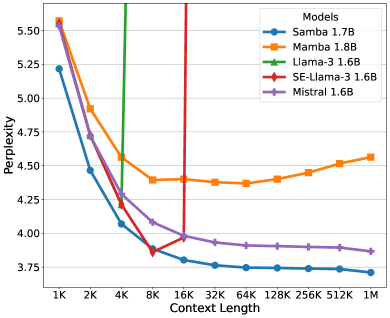
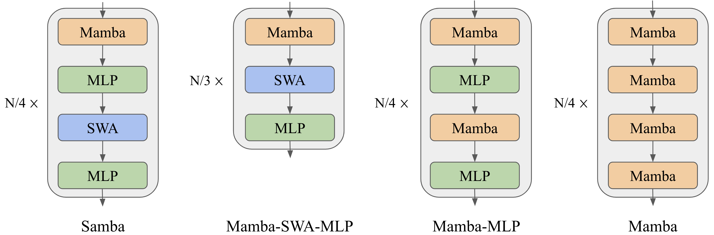
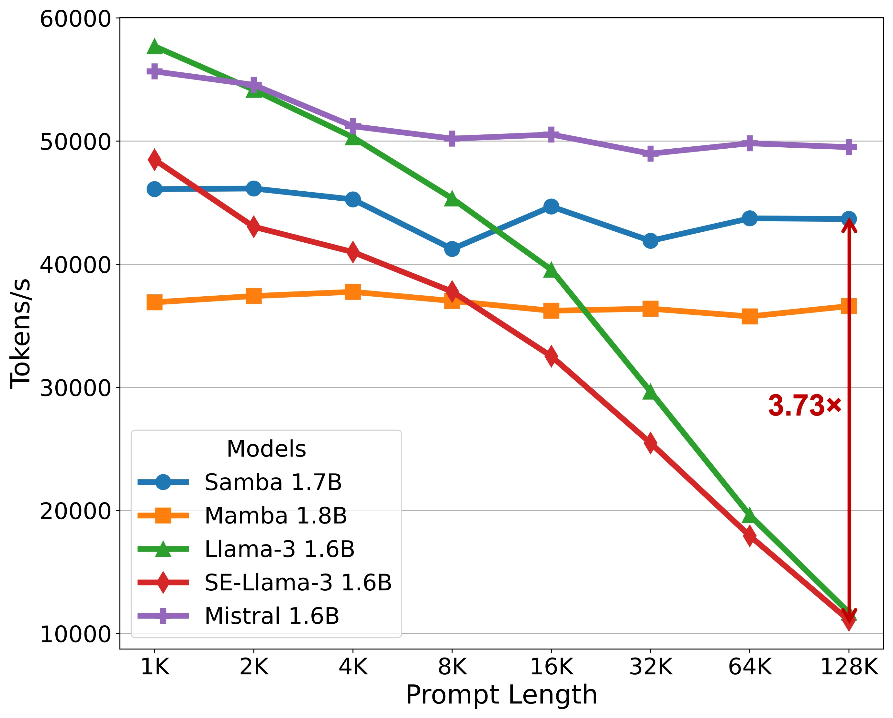
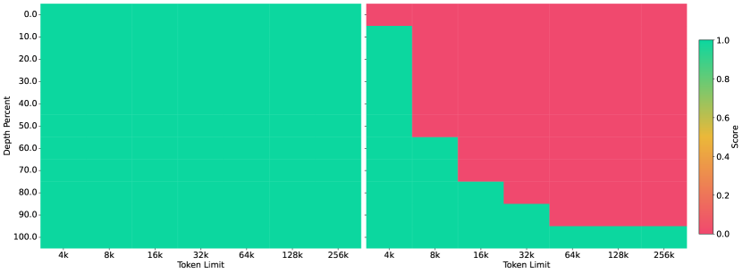
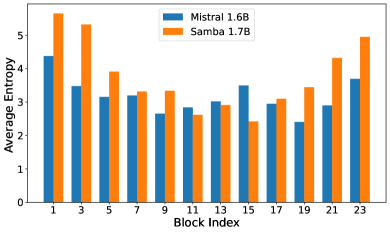
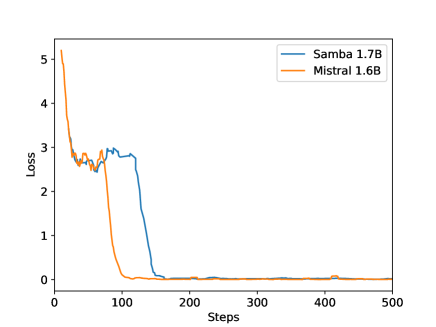
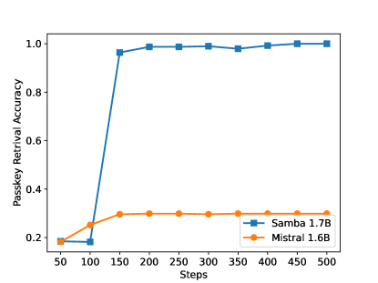

# Samba: Simple Hybrid State Space Models 
for Efficient Unlimited Context Language Modeling

###### Abstract

Efficiently modeling sequences with infinite context length has been a long-standing problem. Past works suffer from either the quadratic computation complexity or the limited extrapolation ability on length generalization. In this work, we present Samba, a simple hybrid architecture that layer-wise combines Mamba, a selective State Space Model (SSM), with Sliding Window Attention (SWA). Samba selectively compresses a given sequence into recurrent hidden states while still maintaining the ability to precisely recall memories with the attention mechanism. We scale Samba up to 3.8B parameters with 3.2T training tokens and show that Samba substantially outperforms the state-of-the-art models based on pure attention or SSMs on a wide range of benchmarks. When trained on 4K length sequences, Samba can be efficiently extrapolated to 256K context length with perfect memory recall and show improved token predictions up to 1M context length. As a linear-time sequence model, Samba enjoys a $3.73\times$ higher throughput compared to Transformers with grouped-query attention when processing user prompts of 128K length, and $3.64\times$ speedup when generating 64K tokens with unlimited streaming. A sample implementation of Samba is publicly available in <https://github.com/microsoft/Samba>.  

## 1 Introduction

[FIGURE S1.F1.sf1.g1]

(a) Perplexity on the test set of Proof-Pile
[/FIGURE]

Attention-based models [[VSP+17](#bib.bibx63), [BCB14](#bib.bibx6)] have dominated the neural architectures of Large Language Models (LLMs) [[RWC+19](#bib.bibx51), [BMR+20](#bib.bibx9), [Ope23](#bib.bibx44), [BCE+23](#bib.bibx7)] due to their ability to capture complex long-term dependencies and the efficient parallelization for large-scale training [[DFE+22](#bib.bibx20)]. Recently, State Space Models (SSMs) [[GGR21](#bib.bibx25), [SWL23](#bib.bibx60), [GGGR22](#bib.bibx24), [GD23](#bib.bibx23)] have emerged as a promising alternative, offering linear computation complexity and the potential for better extrapolation to longer sequences than seen during training. Specifically, Mamba[[GD23](#bib.bibx23)], a variant of SSMs equipped with selective state spaces, has demonstrated notable promise through strong empirical performance and efficient hardware-aware implementation. Recent work also shows that transformers have poorer modeling capacities than input-dependent SSMs in state tracking problems [[MPS24](#bib.bibx42)]. However, SSMs struggle with memory recall due to their Markovian nature [[AET+23](#bib.bibx1)], and experimental results on information retrieval-related tasks [[FDS+23](#bib.bibx22), [WDL24](#bib.bibx64), [AEZ+24](#bib.bibx2)], have further shown that SSMs are not as competitive as their attention-based counterparts.  

Previous works [[ZLJ+22](#bib.bibx73), [FDS+23](#bib.bibx22), [MZK+23](#bib.bibx43), [RLW+23](#bib.bibx50)] have explored different approaches to hybridize SSMs and the attention mechanism, but none of them achieve unlimited-length extrapolation with linear-time complexity. The existing length generalization techniques [[HWX+23](#bib.bibx30), [XTC+23](#bib.bibx67), [JHY+24](#bib.bibx32)] developed for the attention mechanism suffer from quadratic computation complexity or limited context extrapolation ability. In this paper, we introduce Samba, a simple neural architecture that harmonizes the strengths of both the SSM and the attention-based models, while achieving an unlimited sequence length extrapolation with linear time complexity. Samba combines SSMs with attention through layer-wise interleaving Mamba [[GD23](#bib.bibx23)], SwiGLU [[Sha20](#bib.bibx57)], and Sliding Window Attention (SWA) [[BPC20](#bib.bibx10)]. Mamba layers capture the time-dependent semantics and provide a backbone for efficient decoding, while SWA fills in the gap modeling complex, non-Markovian dependencies.  

We scale Samba with 421M, 1.3B, 1.7B and up to 3.8B parameters. In particular, the largest 3.8B base model pre-trained with 3.2T tokens achieves a 71.2 score for MMLU [[HBB+21](#bib.bibx26)], 54.9 for HumanEval [[CTJ+21](#bib.bibx15)], and 69.6 for GSM8K [[CKB+21](#bib.bibx13)], substantially outperforming strong open source language models up to 8B parameters, as detailed in [Table 1](#S3.T1 "In 3.1 Language Modeling on Textbook Quality Data ‣ 3 Experiments and Results ‣ Samba: Simple Hybrid State Space Models for Efficient Unlimited Context Language Modeling"). Despite being pre-trained in the 4K sequence length, Samba can be extrapolated to 1M length in zero shot with improved perplexity on Proof-Pile [[ZAP22](#bib.bibx71)] while still maintaining the linear decoding time complexity with unlimited token streaming, as shown in [Figure 1](#S1.F1 "In 1 Introduction ‣ Samba: Simple Hybrid State Space Models for Efficient Unlimited Context Language Modeling"). We show that when instruction-tuned in a 4K context length with only 500 steps, Samba can be extrapolated to a 256K context length with perfect memory recall in Passkey Retrieval [[MJ23](#bib.bibx41)]. In contrast, the fine-tuned SWA-based model simply cannot recall memories beyond 4K length. We further demonstrate that the instruction-tuned Samba 3.8B model can achieve significantly better performance than the SWA-based models on downstream long-context summarization tasks, while still keeping its impressive performance on the short-context benchmarks. Finally, we conduct rigorous and comprehensive analyzes and ablation studies, encompassing up to 1.7 billion parameters, to validate the architectural design of Samba. These meticulous investigations not only justify our architectural designs but also elucidate the potential mechanisms underpinning the remarkable effectiveness of this simple hybrid approach.  

## 2 Methodology

We explore different hybridization strategies consisting of the layers of Mamba, Sliding Window Attention (SWA), and Multi-Layer Perceptron [[Sha20](#bib.bibx57), [DFAG16](#bib.bibx19)]. We conceptualize the functionality of Mamba as the capture of recurrent sequence structures, SWA as the precise retrieval of memory, and MLP as the recall of factual knowledge. We also explore other linear recurrent layers including Multi-Scale Retention [[SDH+23](#bib.bibx55)] and GLA [[YWS+23](#bib.bibx69)] as potential substitutions for Mamba in [Section 3.2](#S3.SS2 "3.2 Exploration on Attention and Linear Recurrence ‣ 3 Experiments and Results ‣ Samba: Simple Hybrid State Space Models for Efficient Unlimited Context Language Modeling"). Our goal of hybridization is to harmonize between these distinct functioning blocks and find an efficient architecture for language modeling with unlimited-length extrapolation ability.  

### 2.1 Architecture

As illustrated in Figure [2](#S2.F2 "Figure 2 ‣ 2.1 Architecture ‣ 2 Methodology ‣ Samba: Simple Hybrid State Space Models for Efficient Unlimited Context Language Modeling"), we explore three kinds of layerwise hybridization strategies on the 1.7B scale: Samba, Mamba-SWA-MLP, and Mamba-MLP. We also explore other hybridization approaches with full self-attention on smaller scales in [Section 4](#S4 "4 Analysis ‣ Samba: Simple Hybrid State Space Models for Efficient Unlimited Context Language Modeling"). The number of layers $N$ is set to 48 for Samba, Mamba-MLP, and Mamba, while Mamba-SWA-MLP has 54 layers, so each model has approximately 1.7B parameters. We only modify the layer-level arrangement for each of the models and keep every other configuration the same to have apple-to-apple comparisons. More details on the configuration of each layer are explained in the following subsections.  

[FIGURE S2.F2.g1]

Figure 2: From left to right: Samba, Mamba-SWA-MLP, Mamba-MLP, and Mamba. The illustrations depict the layer-wise integration of Mamba with various configurations of Multi-Layer Perceptrons (MLPs) and Sliding Window Attention (SWA). We assume the total number of intermediate layers to be $N$, and omit the embedding layers and output projections for simplicity. Pre-Norm [[XYH+20](#bib.bibx68), [ZS19](#bib.bibx74)] and skip connections [[HZRS16](#bib.bibx31)] are applied for each of the intermediate layers.
[/FIGURE]

#### 2.1.1 Mamba Layer

Mamba [[GD23](#bib.bibx23)] is a recently proposed SSM-based model with selective state spaces. It enables input-dependent gating to both the recurrent states and the input representation for a soft selection of the input sequence elements. Given an input sequence representation $\mathbf{X}\in\mathbb{R}^{n\times d_{m}}$, where $n$ is the length of the sequence and $d_{m}$ is the hidden size, Mamba first expands the inputs to a higher dimension $d_{e}$, *i.e.*,  

|  | $$\mathbf{H}=\mathbf{X}\mathbf{W}_{\text{in}}~{}\in\mathbb{R}^{n\times d_{e}}$$ |  |
| --- | --- | --- |

where $\mathbf{W}_{\text{in}}\in\mathbb{R}^{d_{m}\times d_{e}}$ is a learnable projection matrix. Then a Short Convolution (SC) [[PMN+23](#bib.bibx46)] operator is applied to smooth the input signal,  

|  | $$\mathbf{U}=\text{SC}(\mathbf{H})=\text{SiLU}(\text{DepthwiseConv}(\mathbf{H},\mathbf{W}_{\text{conv}}))~{}\in\mathbb{R}^{n\times d_{e}}$$ |  | (1) |
| --- | --- | --- | --- |

where $\mathbf{W}_{\text{conv}}\in\mathbb{R}^{k\times d_{e}}$ and the kernel size $k$ is set to 4 for hardware-aware efficiency. The Depthwise Convolution [[HQW+19](#bib.bibx29)] is applied over the sequence dimension followed by a SiLU [[EUD17](#bib.bibx21)] activation function. The selective gate is then calculated through a low-rank projection followed by Softplus [[ZYL+15](#bib.bibx75)],  

|  | $$\Delta=\text{Softplus}(\mathbf{U}\mathbf{W}_{\text{r}}\mathbf{W}_{\text{q}}+\mathbf{b})~{}\in\mathbb{R}^{n\times d_{e}}$$ |  | (2) |
| --- | --- | --- | --- |

where $\mathbf{W}_{\text{r}}\in\mathbb{R}^{d_{e}\times d_{r}}$, $\mathbf{W}_{\text{q}}\in\mathbb{R}^{d_{r}\times d_{e}}$ and $d_{r}$ is the low-rank dimension. $\mathbf{b}\in\mathbb{R}^{d_{e}}$ is carefully initialized so that $\Delta\in[\Delta_{\text{min}},\Delta_{\text{max}}]$ after the initialization stage. We set $[\Delta_{\text{min}},\Delta_{\text{max}}]=[0.001,0.1]$, and find that these values are not sensitive to language modeling performance under the perplexity metric. The input dependence is also introduced for the parameters $\mathbf{B}$ and $\mathbf{C}$ of SSM,  

|  | $$\mathbf{B}=\mathbf{U}\mathbf{W}_{\text{b}}~{}\in\mathbb{R}^{n\times d_{s}}$$ |  |
| --- | --- | --- |

|  | $$\mathbf{C}=\mathbf{U}\mathbf{W}_{\text{c}}~{}\in\mathbb{R}^{n\times d_{s}}$$ |  |
| --- | --- | --- |

where $d_{s}$ is the state dimension. For each time step $1\leq t\leq n$, the recurrent inference of the Selective SSM (S6) is performed in an expanded state space $\mathbf{Z}_{t}\in\mathbb{R}^{d_{e}\times d_{s}}$, *i.e.*,  

|  | $$\mathbf{Z}_{t}=\exp(-\Delta_{t}\odot\exp(\mathbf{A}))\odot\mathbf{Z}_{t-1}+\Delta_{t}\odot(\mathbf{B}_{t}\otimes\mathbf{U}_{t})~{}\in\mathbb{R}^{d_{e}\times d_{s}}$$ |  |
| --- | --- | --- |

|  | $$\mathbf{Y}_{t}=\mathbf{Z}_{t}\mathbf{C}_{t}+\mathbf{D}\odot\mathbf{U}_{t}~{}\in\mathbb{R}^{d_{e}}$$ |  |
| --- | --- | --- |

where $\mathbf{Z}_{0}=\mathbf{0}$, $\odot$ means the point-wise product, $\otimes$ means the outer product and $\exp$ means the point-wise natural exponential function. $\mathbf{D}\in\mathbb{R}^{d_{e}}$ is a learnable vector initialized as $D_{i}=1$ and $\mathbf{A}\in\mathbb{R}^{d_{e}\times d_{s}}$ is a learnable matrix initialized as $A_{ij}=\log(j),1\leq j\leq d_{s}$, following the S4D-Real [[GGGR22](#bib.bibx24)] initialization. In practice, Mamba implements a hardware-aware parallel scan algorithm for efficient parallelizable training. The final output is obtained through a gating mechanism similar to Gated Linear Unit [[Sha20](#bib.bibx57), [DFAG16](#bib.bibx19)],  

|  | $$\mathbf{O}=\mathbf{Y}\odot\text{SiLU}(\mathbf{X}\mathbf{W}_{\text{g}})\mathbf{W}_{\text{out}}\in\mathbb{R}^{n\times d_{m}}$$ |  |
| --- | --- | --- |

where $\mathbf{W}_{g}\in\mathbb{R}^{d_{m}\times d_{e}}$ and $\mathbf{W}_{\text{out}}\in\mathbb{R}^{d_{e}\times d_{m}}$ are learnable parameters. In this work, we set $d_{e}=2d_{m}$, $d_{r}=d_{m}/16$, and $d_{s}=16$. The Mamba layer in Samba is expected to capture the time-dependent semantics of the input sequence through its recurrent structure. The input selection mechanism in the Mamba layer enables the model to focus on relevant inputs, thereby allowing the model to memorize important information in the long term.  

#### 2.1.2 Sliding Window Attention (SWA) Layer

The Sliding Window Attention [[BPC20](#bib.bibx10)] layer is designed to address the limitations of the Mamba layer in capturing non-Markovian dependencies in sequences. Our SWA layer operates on a window size $w=2048$ that slides over the input sequence, ensuring that the computational complexity remains linear with respect to the sequence length. The RoPE [[SLP+21](#bib.bibx58)] relative positions are applied within the sliding window. By directly accessing the contents in the context window through attention, the SWA layer can retrieve high-definition signals from the middle to short-term history that cannot be clearly captured by the recurrent states of Mamba. We use FlashAttention 2 [[Dao23](#bib.bibx17)] for the efficient implementation of self-attention throughout this work. We also choose the 2048 sliding window size for efficiency consideration; FlashAttention 2 has the same training speed as Mamba’s selective parallel scan at the sequence length of 2048 based on the measurements in [[GD23](#bib.bibx23)].  

#### 2.1.3 Multi-Layer Perceptron (MLP) Layer

The MLP layers in Samba serve as the architecture’s primary mechanism for nonlinear transformation and recall of factual knowledge [[DDH+22](#bib.bibx18)]. We use SwiGLU [[Sha20](#bib.bibx57)] for all the models trained in this paper and denote its intermediate hidden size as $d_{p}$. As shown in Figure [2](#S2.F2 "Figure 2 ‣ 2.1 Architecture ‣ 2 Methodology ‣ Samba: Simple Hybrid State Space Models for Efficient Unlimited Context Language Modeling"), Samba applies separate MLPs for different types of information captured by Mamba and the SWA layers.  

## 3 Experiments and Results

We pre-train four Samba models with different parameter sizes, 421M, 1.3B, 1.7B and 3.8B, to investigate its performance across different scales. The details of the hyperparameters for the training and architecture designs are shown in [Table 10](#A1.T10 "In Appendix A Implementation Details ‣ Samba: Simple Hybrid State Space Models for Efficient Unlimited Context Language Modeling") of [Appendix A](#A1 "Appendix A Implementation Details ‣ Samba: Simple Hybrid State Space Models for Efficient Unlimited Context Language Modeling"). We also train other hybrid architectures as mentioned in [Section 2.1](#S2.SS1 "2.1 Architecture ‣ 2 Methodology ‣ Samba: Simple Hybrid State Space Models for Efficient Unlimited Context Language Modeling"), including the baseline Mamba, Llama-3, and Mistral architecture on a scale of around 1.7B, with detailed hyperparameters in [Table 9](#A1.T9 "In Appendix A Implementation Details ‣ Samba: Simple Hybrid State Space Models for Efficient Unlimited Context Language Modeling") of [Appendix A](#A1 "Appendix A Implementation Details ‣ Samba: Simple Hybrid State Space Models for Efficient Unlimited Context Language Modeling"). We do comprehensive downstream evaluations on a wide range of benchmarks, focusing on four main capabilities of the models: commonsense reasoning (ARC [[CCE+18](#bib.bibx12)], PIQA [[BZB+20](#bib.bibx11)], WinoGrande [[SBBC21](#bib.bibx54)], SIQA [[SRC+19](#bib.bibx59)]), language understanding (HellaSwag [[ZHB+19](#bib.bibx72)], BoolQ [[CLC+19](#bib.bibx14)], OpenbookQA [[MCKS18](#bib.bibx39)], SQuAD [[RZLL16](#bib.bibx52)], MMLU [[HBB+21](#bib.bibx26)]), truthfulness (TruthfulQA [[LHE22](#bib.bibx37)]) and math and coding (GSM8K [[CKB+21](#bib.bibx13)], MBPP [[AON+21](#bib.bibx5)], HumanEval [[CTJ+21](#bib.bibx15)]).  

### 3.1 Language Modeling on Textbook Quality Data

We first present results from our largest 3.8B Samba model, trained on the same data set used by Phi3 [[AJA+24](#bib.bibx3)] with 3.2T tokens. We follow the same multi-phase pretraining strategy as Phi3-mini for a fair comparison. We also report the performance of the Transformer++ (TFM++ in [Table 1](#S3.T1 "In 3.1 Language Modeling on Textbook Quality Data ‣ 3 Experiments and Results ‣ Samba: Simple Hybrid State Space Models for Efficient Unlimited Context Language Modeling")) model, which uses the same architecture and training recipe as Phi3-mini, for a fair comparison. In Table [1](#S3.T1 "Table 1 ‣ 3.1 Language Modeling on Textbook Quality Data ‣ 3 Experiments and Results ‣ Samba: Simple Hybrid State Space Models for Efficient Unlimited Context Language Modeling"), we conduct comprehensive evaluations on a diverse subset of the benchmarks to assess Samba’s performance across all the domains mentioned above to ensure a thorough examination of the model’s capabilities. The details of the generation configurations are included in [Appendix A](#A1 "Appendix A Implementation Details ‣ Samba: Simple Hybrid State Space Models for Efficient Unlimited Context Language Modeling").  

[TABLE S3.T1]

<table class="ltx_tabular ltx_centering ltx_guessed_headers ltx_align_middle">
<tbody class="ltx_tbody">
<tr class="ltx_tr">
<th class="ltx_td ltx_align_center ltx_th ltx_th_row ltx_border_tt">Model</th>
<th class="ltx_td ltx_align_center ltx_th ltx_th_row ltx_border_tt">Size</th>
<th class="ltx_td ltx_align_center ltx_th ltx_th_row ltx_border_r ltx_border_tt">Tokens</th>
<td class="ltx_td ltx_align_center ltx_border_tt">MMLU</td>
<td class="ltx_td ltx_align_center ltx_border_tt">Hella-</td>
<td class="ltx_td ltx_align_center ltx_border_tt">ARC-</td>
<td class="ltx_td ltx_align_center ltx_border_tt">Wino-</td>
<td class="ltx_td ltx_align_center ltx_border_tt">Truth.</td>
<td class="ltx_td ltx_align_center ltx_border_tt">GSM</td>
<td class="ltx_td ltx_align_center ltx_border_r ltx_border_tt">Hum.</td>
<td class="ltx_td ltx_align_center ltx_border_tt">Avg.</td>
</tr>
<tr class="ltx_tr">
<td class="ltx_td ltx_align_center">Swag</td>
<td class="ltx_td ltx_align_center">C</td>
<td class="ltx_td ltx_align_center">Gran.</td>
<td class="ltx_td ltx_align_center">QA</td>
<td class="ltx_td ltx_align_center">8K</td>
<td class="ltx_td ltx_align_center ltx_border_r">Eval</td>
<td class="ltx_td"></td>
</tr>
<tr class="ltx_tr">
<th class="ltx_td ltx_align_center ltx_th ltx_th_row ltx_border_t">Llama 2</th>
<th class="ltx_td ltx_align_center ltx_th ltx_th_row ltx_border_t">6.7B</th>
<th class="ltx_td ltx_align_center ltx_th ltx_th_row ltx_border_r ltx_border_t">2T</th>
<td class="ltx_td ltx_align_center ltx_border_t">45.3</td>
<td class="ltx_td ltx_align_center ltx_border_t">77.2</td>
<td class="ltx_td ltx_align_center ltx_border_t">45.9</td>
<td class="ltx_td ltx_align_center ltx_border_t">69.2</td>
<td class="ltx_td ltx_align_center ltx_border_t">38.8</td>
<td class="ltx_td ltx_align_center ltx_border_t">14.6</td>
<td class="ltx_td ltx_align_center ltx_border_r ltx_border_t">12.8</td>
<td class="ltx_td ltx_align_center ltx_border_t">43.4</td>
</tr>
<tr class="ltx_tr">
<th class="ltx_td ltx_th ltx_th_row"></th>
<th class="ltx_td ltx_align_center ltx_th ltx_th_row">13B</th>
<th class="ltx_td ltx_align_center ltx_th ltx_th_row ltx_border_r">2T</th>
<td class="ltx_td ltx_align_center">54.8</td>
<td class="ltx_td ltx_align_center">80.7</td>
<td class="ltx_td ltx_align_center">49.4</td>
<td class="ltx_td ltx_align_center">72.8</td>
<td class="ltx_td ltx_align_center">37.4</td>
<td class="ltx_td ltx_align_center">28.7</td>
<td class="ltx_td ltx_align_center ltx_border_r">18.3</td>
<td class="ltx_td ltx_align_center">48.9</td>
</tr>
<tr class="ltx_tr">
<th class="ltx_td ltx_align_center ltx_th ltx_th_row">Mistral</th>
<th class="ltx_td ltx_align_center ltx_th ltx_th_row">7.2B</th>
<th class="ltx_td ltx_align_center ltx_th ltx_th_row ltx_border_r">-</th>
<td class="ltx_td ltx_align_center">60.1</td>
<td class="ltx_td ltx_align_center">81.3</td>
<td class="ltx_td ltx_align_center">55.5</td>
<td class="ltx_td ltx_align_center">75.3</td>
<td class="ltx_td ltx_align_center">42.2</td>
<td class="ltx_td ltx_align_center">35.4</td>
<td class="ltx_td ltx_align_center ltx_border_r">30.5</td>
<td class="ltx_td ltx_align_center">53.6</td>
</tr>
<tr class="ltx_tr">
<th class="ltx_td ltx_align_center ltx_th ltx_th_row">Mamba</th>
<th class="ltx_td ltx_align_center ltx_th ltx_th_row">2.8B</th>
<th class="ltx_td ltx_align_center ltx_th ltx_th_row ltx_border_r">600B</th>
<td class="ltx_td ltx_align_center">26.2</td>
<td class="ltx_td ltx_align_center">71.0</td>
<td class="ltx_td ltx_align_center">41.7</td>
<td class="ltx_td ltx_align_center">65.9</td>
<td class="ltx_td ltx_align_center">
34.4∗
</td>
<td class="ltx_td ltx_align_center">
3.6∗
</td>
<td class="ltx_td ltx_align_center ltx_border_r">
7.3∗
</td>
<td class="ltx_td ltx_align_center">35.7</td>
</tr>
<tr class="ltx_tr">
<th class="ltx_td ltx_align_center ltx_th ltx_th_row">Gemma</th>
<th class="ltx_td ltx_align_center ltx_th ltx_th_row">2.5B</th>
<th class="ltx_td ltx_align_center ltx_th ltx_th_row ltx_border_r">3T</th>
<td class="ltx_td ltx_align_center">42.3</td>
<td class="ltx_td ltx_align_center">71.4</td>
<td class="ltx_td ltx_align_center">42.1</td>
<td class="ltx_td ltx_align_center">65.4</td>
<td class="ltx_td ltx_align_center">33.1</td>
<td class="ltx_td ltx_align_center">17.7</td>
<td class="ltx_td ltx_align_center ltx_border_r">22.0</td>
<td class="ltx_td ltx_align_center">42.0</td>
</tr>
<tr class="ltx_tr">
<th class="ltx_td ltx_th ltx_th_row"></th>
<th class="ltx_td ltx_align_center ltx_th ltx_th_row">8.5B</th>
<th class="ltx_td ltx_align_center ltx_th ltx_th_row ltx_border_r">6T</th>
<td class="ltx_td ltx_align_center">64.3</td>
<td class="ltx_td ltx_align_center">81.2</td>
<td class="ltx_td ltx_align_center">53.2</td>
<td class="ltx_td ltx_align_center">72.3</td>
<td class="ltx_td ltx_align_center">44.8</td>
<td class="ltx_td ltx_align_center">46.4</td>
<td class="ltx_td ltx_align_center ltx_border_r">32.3</td>
<td class="ltx_td ltx_align_center">56.4</td>
</tr>
<tr class="ltx_tr">
<th class="ltx_td ltx_align_center ltx_th ltx_th_row">R-Gemma</th>
<th class="ltx_td ltx_align_center ltx_th ltx_th_row">2.7B</th>
<th class="ltx_td ltx_align_center ltx_th ltx_th_row ltx_border_r">2T</th>
<td class="ltx_td ltx_align_center">38.4</td>
<td class="ltx_td ltx_align_center">71.0</td>
<td class="ltx_td ltx_align_center">42.3</td>
<td class="ltx_td ltx_align_center">67.8</td>
<td class="ltx_td ltx_align_center">35.1</td>
<td class="ltx_td ltx_align_center">13.4</td>
<td class="ltx_td ltx_align_center ltx_border_r">21.3</td>
<td class="ltx_td ltx_align_center">41.3</td>
</tr>
<tr class="ltx_tr">
<th class="ltx_td ltx_align_center ltx_th ltx_th_row">Llama 3</th>
<th class="ltx_td ltx_align_center ltx_th ltx_th_row">8.0B</th>
<th class="ltx_td ltx_align_center ltx_th ltx_th_row ltx_border_r">15T+</th>
<td class="ltx_td ltx_align_center">66.6</td>
<td class="ltx_td ltx_align_center">
79.2∗
</td>
<td class="ltx_td ltx_align_center">
53.2∗
</td>
<td class="ltx_td ltx_align_center">
72.6∗
</td>
<td class="ltx_td ltx_align_center">43.9</td>
<td class="ltx_td ltx_align_center">45.8</td>
<td class="ltx_td ltx_align_center ltx_border_r">
28.7∗
</td>
<td class="ltx_td ltx_align_center">55.8</td>
</tr>
<tr class="ltx_tr">
<th class="ltx_td ltx_align_center ltx_th ltx_th_row ltx_border_t">TFM++</th>
<th class="ltx_td ltx_align_center ltx_th ltx_th_row ltx_border_t">3.8B</th>
<th class="ltx_td ltx_align_center ltx_th ltx_th_row ltx_border_r ltx_border_t">3.2T</th>
<td class="ltx_td ltx_align_center ltx_border_t">67.2</td>
<td class="ltx_td ltx_align_center ltx_border_t">76.6</td>
<td class="ltx_td ltx_align_center ltx_border_t">53.8</td>
<td class="ltx_td ltx_align_center ltx_border_t">72.6</td>
<td class="ltx_td ltx_align_center ltx_border_t">47.3</td>
<td class="ltx_td ltx_align_center ltx_border_t">51.5</td>
<td class="ltx_td ltx_align_center ltx_border_r ltx_border_t">51.8</td>
<td class="ltx_td ltx_align_center ltx_border_t">60.1</td>
</tr>
<tr class="ltx_tr">
<th class="ltx_td ltx_align_center ltx_th ltx_th_row ltx_border_bb">Samba</th>
<th class="ltx_td ltx_align_center ltx_th ltx_th_row ltx_border_bb">3.8B</th>
<th class="ltx_td ltx_align_center ltx_th ltx_th_row ltx_border_bb ltx_border_r">3.2T</th>
<td class="ltx_td ltx_align_center ltx_border_bb">71.2</td>
<td class="ltx_td ltx_align_center ltx_border_bb">77.4</td>
<td class="ltx_td ltx_align_center ltx_border_bb">55.7</td>
<td class="ltx_td ltx_align_center ltx_border_bb">77.1</td>
<td class="ltx_td ltx_align_center ltx_border_bb">43.4</td>
<td class="ltx_td ltx_align_center ltx_border_bb">69.6</td>
<td class="ltx_td ltx_align_center ltx_border_bb ltx_border_r">54.9</td>
<td class="ltx_td ltx_align_center ltx_border_bb">64.2</td>
</tr>
</tbody>
</table>

Table 1: 
Downstream performance comparison of Samba 3.8B with other pretrained base language models without instruction tuning. ARC-C and HellaSwag are measured with character-normalized accuracy. MMLU and GSM8K are measured in 5-shot, while others are in zero-shot. We report the MC2 score for TruthfulQA, maj@1 for GSM8K, and pass@1 for HumanEval. ∗ Measured by ours.
[/TABLE]

We compare with several strong baselines, including Llama 2 [[TMS+23](#bib.bibx62)], Mistral [[JSM+23](#bib.bibx33)], Mamba [[GD23](#bib.bibx23)], Gemma [[Tea24](#bib.bibx61)], Recurrent-Gemma (R-Gemma) [[BDS+24](#bib.bibx8)], Llama 3 [[Met24](#bib.bibx40)] and TFM++. As shown in Table [1](#S3.T1 "Table 1 ‣ 3.1 Language Modeling on Textbook Quality Data ‣ 3 Experiments and Results ‣ Samba: Simple Hybrid State Space Models for Efficient Unlimited Context Language Modeling"), Samba achieves the highest average score on all benchmarks, demonstrating its superior performance in handling various language comprehension tasks. Notably, Samba excels in the GSM8K benchmark, achieving an absolute 18.1% higher accuracy than TFM++ trained on the same dataset. This shows the surprising complementary effect of combining SSM with the attention mechanism. We conjecture that when combined with attention, Mamba, as an input-dependent SSM, can focus more on performing the arithmetic operation through its recurrent states than on doing the retrieval operation which can be easily learned by the sliding window attention.  

[TABLE S3.T2]

<table class="ltx_tabular ltx_centering ltx_align_middle">
<tbody class="ltx_tbody">
<tr class="ltx_tr">
<td class="ltx_td ltx_align_center ltx_border_tt">Benchmark</td>
<td class="ltx_td ltx_align_center ltx_border_tt">Llama-3</td>
<td class="ltx_td ltx_align_center ltx_border_tt">Mistral</td>
<td class="ltx_td ltx_align_center ltx_border_tt">Mamba</td>
<td class="ltx_td ltx_align_center ltx_border_tt">Mamba-SWA-</td>
<td class="ltx_td ltx_align_center ltx_border_tt">Mamba-</td>
<td class="ltx_td ltx_align_center ltx_border_tt">Samba</td>
</tr>
<tr class="ltx_tr">
<td class="ltx_td ltx_align_center">1.6B</td>
<td class="ltx_td ltx_align_center">1.6B</td>
<td class="ltx_td ltx_align_center">1.8B</td>
<td class="ltx_td ltx_align_center">MLP 1.6B</td>
<td class="ltx_td ltx_align_center">MLP 1.9B</td>
<td class="ltx_td ltx_align_center">1.7B</td>
</tr>
<tr class="ltx_tr">
<td class="ltx_td ltx_align_center ltx_border_t">ARC-Easy</td>
<td class="ltx_td ltx_align_center ltx_border_t">76.85</td>
<td class="ltx_td ltx_align_center ltx_border_t">77.02</td>
<td class="ltx_td ltx_align_center ltx_border_t">77.99</td>
<td class="ltx_td ltx_align_center ltx_border_t">76.68</td>
<td class="ltx_td ltx_align_center ltx_border_t">78.91</td>
<td class="ltx_td ltx_align_center ltx_border_t">79.25</td>
</tr>
<tr class="ltx_tr">
<td class="ltx_td ltx_align_center">ARC-Challenge</td>
<td class="ltx_td ltx_align_center">43.26</td>
<td class="ltx_td ltx_align_center">44.20</td>
<td class="ltx_td ltx_align_center">45.22</td>
<td class="ltx_td ltx_align_center">46.16</td>
<td class="ltx_td ltx_align_center">47.35</td>
<td class="ltx_td ltx_align_center">48.21</td>
</tr>
<tr class="ltx_tr">
<td class="ltx_td ltx_align_center">PIQA</td>
<td class="ltx_td ltx_align_center">76.66</td>
<td class="ltx_td ltx_align_center">75.79</td>
<td class="ltx_td ltx_align_center">77.31</td>
<td class="ltx_td ltx_align_center">76.50</td>
<td class="ltx_td ltx_align_center">78.84</td>
<td class="ltx_td ltx_align_center">77.10</td>
</tr>
<tr class="ltx_tr">
<td class="ltx_td ltx_align_center">WinoGrande</td>
<td class="ltx_td ltx_align_center">70.01</td>
<td class="ltx_td ltx_align_center">70.72</td>
<td class="ltx_td ltx_align_center">73.40</td>
<td class="ltx_td ltx_align_center">73.72</td>
<td class="ltx_td ltx_align_center">72.38</td>
<td class="ltx_td ltx_align_center">72.93</td>
</tr>
<tr class="ltx_tr">
<td class="ltx_td ltx_align_center">SIQA</td>
<td class="ltx_td ltx_align_center">51.23</td>
<td class="ltx_td ltx_align_center">52.00</td>
<td class="ltx_td ltx_align_center">53.12</td>
<td class="ltx_td ltx_align_center">55.12</td>
<td class="ltx_td ltx_align_center">54.30</td>
<td class="ltx_td ltx_align_center">53.68</td>
</tr>
<tr class="ltx_tr">
<td class="ltx_td ltx_align_center ltx_border_t">HellaSwag</td>
<td class="ltx_td ltx_align_center ltx_border_t">46.98</td>
<td class="ltx_td ltx_align_center ltx_border_t">47.19</td>
<td class="ltx_td ltx_align_center ltx_border_t">49.80</td>
<td class="ltx_td ltx_align_center ltx_border_t">49.71</td>
<td class="ltx_td ltx_align_center ltx_border_t">50.14</td>
<td class="ltx_td ltx_align_center ltx_border_t">49.74</td>
</tr>
<tr class="ltx_tr">
<td class="ltx_td ltx_align_center">BoolQ</td>
<td class="ltx_td ltx_align_center">68.20</td>
<td class="ltx_td ltx_align_center">70.70</td>
<td class="ltx_td ltx_align_center">74.83</td>
<td class="ltx_td ltx_align_center">74.74</td>
<td class="ltx_td ltx_align_center">73.70</td>
<td class="ltx_td ltx_align_center">75.57</td>
</tr>
<tr class="ltx_tr">
<td class="ltx_td ltx_align_center">OpenbookQA</td>
<td class="ltx_td ltx_align_center">34.00</td>
<td class="ltx_td ltx_align_center">32.80</td>
<td class="ltx_td ltx_align_center">36.60</td>
<td class="ltx_td ltx_align_center">33.80</td>
<td class="ltx_td ltx_align_center">35.40</td>
<td class="ltx_td ltx_align_center">37.20</td>
</tr>
<tr class="ltx_tr">
<td class="ltx_td ltx_align_center">SQuAD</td>
<td class="ltx_td ltx_align_center">74.88</td>
<td class="ltx_td ltx_align_center">72.82</td>
<td class="ltx_td ltx_align_center">67.66</td>
<td class="ltx_td ltx_align_center">76.73</td>
<td class="ltx_td ltx_align_center">63.86</td>
<td class="ltx_td ltx_align_center">77.64</td>
</tr>
<tr class="ltx_tr">
<td class="ltx_td ltx_align_center">MMLU</td>
<td class="ltx_td ltx_align_center">43.84</td>
<td class="ltx_td ltx_align_center">43.54</td>
<td class="ltx_td ltx_align_center">45.28</td>
<td class="ltx_td ltx_align_center">47.39</td>
<td class="ltx_td ltx_align_center">43.68</td>
<td class="ltx_td ltx_align_center">48.01</td>
</tr>
<tr class="ltx_tr">
<td class="ltx_td ltx_align_center ltx_border_t">TruthfulQA (MC1)</td>
<td class="ltx_td ltx_align_center ltx_border_t">25.70</td>
<td class="ltx_td ltx_align_center ltx_border_t">25.09</td>
<td class="ltx_td ltx_align_center ltx_border_t">26.81</td>
<td class="ltx_td ltx_align_center ltx_border_t">26.20</td>
<td class="ltx_td ltx_align_center ltx_border_t">26.44</td>
<td class="ltx_td ltx_align_center ltx_border_t">27.78</td>
</tr>
<tr class="ltx_tr">
<td class="ltx_td ltx_align_center">TruthfulQA (MC2)</td>
<td class="ltx_td ltx_align_center">40.35</td>
<td class="ltx_td ltx_align_center">38.80</td>
<td class="ltx_td ltx_align_center">40.66</td>
<td class="ltx_td ltx_align_center">40.80</td>
<td class="ltx_td ltx_align_center">40.04</td>
<td class="ltx_td ltx_align_center">41.62</td>
</tr>
<tr class="ltx_tr">
<td class="ltx_td ltx_align_center ltx_border_t">GSM8K</td>
<td class="ltx_td ltx_align_center ltx_border_t">32.68</td>
<td class="ltx_td ltx_align_center ltx_border_t">32.45</td>
<td class="ltx_td ltx_align_center ltx_border_t">32.07</td>
<td class="ltx_td ltx_align_center ltx_border_t">44.05</td>
<td class="ltx_td ltx_align_center ltx_border_t">27.52</td>
<td class="ltx_td ltx_align_center ltx_border_t">38.97</td>
</tr>
<tr class="ltx_tr">
<td class="ltx_td ltx_align_center">MBPP</td>
<td class="ltx_td ltx_align_center">46.30</td>
<td class="ltx_td ltx_align_center">47.08</td>
<td class="ltx_td ltx_align_center">47.86</td>
<td class="ltx_td ltx_align_center">47.08</td>
<td class="ltx_td ltx_align_center">47.08</td>
<td class="ltx_td ltx_align_center">48.25</td>
</tr>
<tr class="ltx_tr">
<td class="ltx_td ltx_align_center">HumanEval</td>
<td class="ltx_td ltx_align_center">36.59</td>
<td class="ltx_td ltx_align_center">36.59</td>
<td class="ltx_td ltx_align_center">35.98</td>
<td class="ltx_td ltx_align_center">37.80</td>
<td class="ltx_td ltx_align_center">31.10</td>
<td class="ltx_td ltx_align_center">39.02</td>
</tr>
<tr class="ltx_tr">
<td class="ltx_td ltx_align_center ltx_border_bb ltx_border_t">Average</td>
<td class="ltx_td ltx_align_center ltx_border_bb ltx_border_t">51.17</td>
<td class="ltx_td ltx_align_center ltx_border_bb ltx_border_t">51.12</td>
<td class="ltx_td ltx_align_center ltx_border_bb ltx_border_t">52.31</td>
<td class="ltx_td ltx_align_center ltx_border_bb ltx_border_t">53.77</td>
<td class="ltx_td ltx_align_center ltx_border_bb ltx_border_t">51.38</td>
<td class="ltx_td ltx_align_center ltx_border_bb ltx_border_t">54.33</td>
</tr>
</tbody>
</table>

Table 2: Downstream evaluation of the architectures trained on 230B tokens of the Phi2 dataset. We report the unnormalized accuracy for multiple choice tasks. GSM8K is evaluated with 5-shot examples while other tasks are in zero-shot. Best results are in bold, second best underlined.
[/TABLE]

To examine the different hybridization strategies mentioned in [Section 2.1](#S2.SS1 "2.1 Architecture ‣ 2 Methodology ‣ Samba: Simple Hybrid State Space Models for Efficient Unlimited Context Language Modeling"), we train 6 models with around 1.7B parameters on the Phi2 [[LBE+23](#bib.bibx35)] dataset with 230B tokens and evaluate them in the full suite of 15 downstream benchmarks to have a holistic assessment of hybrid and purebred architectures. As shown in Table [2](#S3.T2 "Table 2 ‣ 3.1 Language Modeling on Textbook Quality Data ‣ 3 Experiments and Results ‣ Samba: Simple Hybrid State Space Models for Efficient Unlimited Context Language Modeling"), Samba demonstrates superior performance on a diverse set of tasks, including commonsense reasoning (ARC-Challenge), language understanding (MMLU, SQuAD), TruthfulQA and code generation (HumanEval, MBPP). It outperforms both the pure attention-based and SSM-based models in most tasks and achieves the best average performance. We can observe that replacing Mamba blocks with MLPs does not harm commonsense reasoning ability, but its performance on language understanding and complex reasoning ability, such as coding and mathematical reasoning, degenerates significantly. We can also see that pure Mamba models fall short on retrieval intensive tasks such as SQuAD due to their lack of precise memory retrieval ability. The best results are achieved through the combination of the attention and Mamba modules, as shown with our Samba architecture. We can also notice that Mamba-SWA-MLP has significantly better performance on GSM8K, potentially resulting from a closer collaboration between the Mamba and the SWA layers. The distinct downstream performances of different hybridization strategies pose interesting future work for developing task-adaptive dynamic architectures.  

### 3.2 Exploration on Attention and Linear Recurrence

Since SSMs belong to a broader realm of linear recurrent models [[OSG+23](#bib.bibx45), [QYZ23](#bib.bibx49), [YWS+23](#bib.bibx69), [Kat23](#bib.bibx34), [QYS+24](#bib.bibx48)], there exist multiple alternatives other than Mamba when combing attention-based layers with recurrent neural networks. In addition to Mamba and Samba, we investigate the comparative analysis of the following architectures:  

* Llama-2 [[TMS+23](#bib.bibx62)] is an attention-based Transformer architecture that utilizes full self-attention across the entire sequence. 
* Llama-2-SWA is an attention-based architecture that replaces all full attention layers in Llama-2 with sliding window attention. 
* Sliding RetNet replaces Mamba layers in the Samba architecture with Multi-Scale Retention  [[SDH+23](#bib.bibx55)] layers. RetNet is a linear attention model with fixed and input-independent decay applying to the recurrent hidden states. 
* Sliding GLA replaces Mamba layers in the Samba architecture with Gated Linear Attention (GLA) [[YWS+23](#bib.bibx69)]. GLA is a more expressive variant of linear attention with input-dependent gating. 

[TABLE S3.T3]

<table class="ltx_tabular ltx_centering ltx_guessed_headers ltx_align_middle">
<tbody class="ltx_tbody">
<tr class="ltx_tr">
<th class="ltx_td ltx_align_left ltx_th ltx_th_row ltx_border_tt">Architecture</th>
<th class="ltx_td ltx_align_center ltx_th ltx_th_row ltx_border_tt">Size</th>
<th class="ltx_td ltx_align_center ltx_th ltx_th_row ltx_border_tt">Layers</th>
<td class="ltx_td ltx_align_center ltx_border_tt">Training Speed</td>
<td class="ltx_td ltx_align_center ltx_border_tt">Validation Context Length</td>
</tr>
<tr class="ltx_tr">
<td class="ltx_td ltx_align_center">
(<math class="ltx_Math"><semantics><mrow><mi></mi><mo>×</mo><msup><mn>10</mn><mn>5</mn></msup></mrow><annotation-xml><apply><times></times><csymbol>absent</csymbol><apply><csymbol>superscript</csymbol><cn>10</cn><cn>5</cn></apply></apply></annotation-xml><annotation>\times 10^{5}</annotation></semantics></math> tokens/s)
</td>
<td class="ltx_td ltx_align_center">4096</td>
<td class="ltx_td ltx_align_center">8192</td>
<td class="ltx_td ltx_align_center">16384</td>
</tr>
<tr class="ltx_tr">
<th class="ltx_td ltx_align_left ltx_th ltx_th_row ltx_border_t"><em class="ltx_emph ltx_font_italic">20B training tokens on 8<math class="ltx_Math"><semantics><mo>×</mo><annotation-xml><times></times></annotation-xml><annotation>\times</annotation></semantics></math>A100 GPUs</em></th>
<td class="ltx_td ltx_border_t"></td>
</tr>
<tr class="ltx_tr">
<th class="ltx_td ltx_align_left ltx_th ltx_th_row ltx_border_t">Llama-2</th>
<th class="ltx_td ltx_align_center ltx_th ltx_th_row ltx_border_t">438M</th>
<th class="ltx_td ltx_align_center ltx_th ltx_th_row ltx_border_t">24</th>
<td class="ltx_td ltx_align_center ltx_border_t">4.85</td>
<td class="ltx_td ltx_align_center ltx_border_t">11.14</td>
<td class="ltx_td ltx_align_center ltx_border_t">47.23</td>
<td class="ltx_td ltx_align_center ltx_border_t">249.03</td>
</tr>
<tr class="ltx_tr">
<th class="ltx_td ltx_align_left ltx_th ltx_th_row">Llama-2-SWA</th>
<th class="ltx_td ltx_align_center ltx_th ltx_th_row">438M</th>
<th class="ltx_td ltx_align_center ltx_th ltx_th_row">24</th>
<td class="ltx_td ltx_align_center">4.96</td>
<td class="ltx_td ltx_align_center">11.12</td>
<td class="ltx_td ltx_align_center">10.66</td>
<td class="ltx_td ltx_align_center">10.57</td>
</tr>
<tr class="ltx_tr">
<th class="ltx_td ltx_align_left ltx_th ltx_th_row">Mamba</th>
<th class="ltx_td ltx_align_center ltx_th ltx_th_row">432M</th>
<th class="ltx_td ltx_align_center ltx_th ltx_th_row">60</th>
<td class="ltx_td ltx_align_center">2.46</td>
<td class="ltx_td ltx_align_center">10.70</td>
<td class="ltx_td ltx_align_center">10.30</td>
<td class="ltx_td ltx_align_center">10.24</td>
</tr>
<tr class="ltx_tr">
<th class="ltx_td ltx_align_left ltx_th ltx_th_row">Sliding GLA</th>
<th class="ltx_td ltx_align_center ltx_th ltx_th_row">438M</th>
<th class="ltx_td ltx_align_center ltx_th ltx_th_row">24</th>
<td class="ltx_td ltx_align_center">4.94</td>
<td class="ltx_td ltx_align_center">10.43</td>
<td class="ltx_td ltx_align_center">10.00</td>
<td class="ltx_td ltx_align_center">9.92</td>
</tr>
<tr class="ltx_tr">
<th class="ltx_td ltx_align_left ltx_th ltx_th_row">Sliding RetNet</th>
<th class="ltx_td ltx_align_center ltx_th ltx_th_row">438M</th>
<th class="ltx_td ltx_align_center ltx_th ltx_th_row">24</th>
<td class="ltx_td ltx_align_center">4.32</td>
<td class="ltx_td ltx_align_center">10.38</td>
<td class="ltx_td ltx_align_center">9.96</td>
<td class="ltx_td ltx_align_center">9.87</td>
</tr>
<tr class="ltx_tr">
<th class="ltx_td ltx_align_left ltx_th ltx_th_row">Samba</th>
<th class="ltx_td ltx_align_center ltx_th ltx_th_row">421M</th>
<th class="ltx_td ltx_align_center ltx_th ltx_th_row">24</th>
<td class="ltx_td ltx_align_center">4.46</td>
<td class="ltx_td ltx_align_center">10.06</td>
<td class="ltx_td ltx_align_center">9.65</td>
<td class="ltx_td ltx_align_center">9.57</td>
</tr>
<tr class="ltx_tr">
<th class="ltx_td ltx_align_left ltx_th ltx_th_row ltx_border_t"><em class="ltx_emph ltx_font_italic">100B training tokens on 64<math class="ltx_Math"><semantics><mo>×</mo><annotation-xml><times></times></annotation-xml><annotation>\times</annotation></semantics></math>H100 GPUs</em></th>
<td class="ltx_td ltx_border_t"></td>
</tr>
<tr class="ltx_tr">
<th class="ltx_td ltx_align_left ltx_th ltx_th_row ltx_border_t">Llama-2</th>
<th class="ltx_td ltx_align_center ltx_th ltx_th_row ltx_border_t">1.3B</th>
<th class="ltx_td ltx_align_center ltx_th ltx_th_row ltx_border_t">40</th>
<td class="ltx_td ltx_align_center ltx_border_t">25.9</td>
<td class="ltx_td ltx_align_center ltx_border_t">7.60</td>
<td class="ltx_td ltx_align_center ltx_border_t">44.32</td>
<td class="ltx_td ltx_align_center ltx_border_t">249.64</td>
</tr>
<tr class="ltx_tr">
<th class="ltx_td ltx_align_left ltx_th ltx_th_row">Llama-2-SWA</th>
<th class="ltx_td ltx_align_center ltx_th ltx_th_row">1.3B</th>
<th class="ltx_td ltx_align_center ltx_th ltx_th_row">40</th>
<td class="ltx_td ltx_align_center">26.2</td>
<td class="ltx_td ltx_align_center">7.60</td>
<td class="ltx_td ltx_align_center">7.37</td>
<td class="ltx_td ltx_align_center">7.21</td>
</tr>
<tr class="ltx_tr">
<th class="ltx_td ltx_align_left ltx_th ltx_th_row">Mamba</th>
<th class="ltx_td ltx_align_center ltx_th ltx_th_row">1.3B</th>
<th class="ltx_td ltx_align_center ltx_th ltx_th_row">48</th>
<td class="ltx_td ltx_align_center">17.8</td>
<td class="ltx_td ltx_align_center">7.47</td>
<td class="ltx_td ltx_align_center">7.26</td>
<td class="ltx_td ltx_align_center">7.15</td>
</tr>
<tr class="ltx_tr">
<th class="ltx_td ltx_align_left ltx_th ltx_th_row">Sliding GLA</th>
<th class="ltx_td ltx_align_center ltx_th ltx_th_row">1.2B</th>
<th class="ltx_td ltx_align_center ltx_th ltx_th_row">36</th>
<td class="ltx_td ltx_align_center">25.9</td>
<td class="ltx_td ltx_align_center">7.58</td>
<td class="ltx_td ltx_align_center">7.35</td>
<td class="ltx_td ltx_align_center">7.19</td>
</tr>
<tr class="ltx_tr">
<th class="ltx_td ltx_align_left ltx_th ltx_th_row">Sliding RetNet</th>
<th class="ltx_td ltx_align_center ltx_th ltx_th_row">1.4B</th>
<th class="ltx_td ltx_align_center ltx_th ltx_th_row">36</th>
<td class="ltx_td ltx_align_center">23.0</td>
<td class="ltx_td ltx_align_center">7.56</td>
<td class="ltx_td ltx_align_center">7.35</td>
<td class="ltx_td ltx_align_center">7.56</td>
</tr>
<tr class="ltx_tr">
<th class="ltx_td ltx_align_left ltx_th ltx_th_row ltx_border_bb">Samba</th>
<th class="ltx_td ltx_align_center ltx_th ltx_th_row ltx_border_bb">1.3B</th>
<th class="ltx_td ltx_align_center ltx_th ltx_th_row ltx_border_bb">36</th>
<td class="ltx_td ltx_align_center ltx_border_bb">25.2</td>
<td class="ltx_td ltx_align_center ltx_border_bb">7.32</td>
<td class="ltx_td ltx_align_center ltx_border_bb">7.11</td>
<td class="ltx_td ltx_align_center ltx_border_bb">6.96</td>
</tr>
</tbody>
</table>

Table 3: Perplexity on the validation set of SlimPajama for different attention and linear recurrent model architectures trained at 4,096 context length. We use window size 2,048 for Sliding Window Attention (SWA). The perplexity results have a fluctuation around $\pm 0.3\%$.
[/TABLE]

We pre-train all models on the same SlimPajama [[SAKM+23](#bib.bibx53)] dataset under both around 438M and 1.3B settings, and evaluate these models by calculating perplexity on the validation set with context length at 4096, 8192, and 16384 tokens to investigate their zero-shot length extrapolation ability. Peak training throughput is also measured as an efficiency metric. The details of the hyperparameter settings are included in [Appendix A](#A1 "Appendix A Implementation Details ‣ Samba: Simple Hybrid State Space Models for Efficient Unlimited Context Language Modeling"). As shown in Table [3](#S3.T3 "Table 3 ‣ 3.2 Exploration on Attention and Linear Recurrence ‣ 3 Experiments and Results ‣ Samba: Simple Hybrid State Space Models for Efficient Unlimited Context Language Modeling"), Samba consistently outperforms all other models in different context lengths and model sizes. The training speed of Samba is competitive compared to pure Transformer-based models on the 1.3B scale. Mamba has significantly worse training throughput because Mamba layers have slower training speed than MLP layers, and the purebred Mamba models need to have more layers than other models at the same number of parameters. We can notice that the full attention-based model cannot extrapolate beyond its context length without specific length extrapolation techniques, which motivates us to use SWA for Samba. In [Section 4](#S4 "4 Analysis ‣ Samba: Simple Hybrid State Space Models for Efficient Unlimited Context Language Modeling"), we further show that even hybridizing with one full attention layer will still lead to exploding perplexity at 16k sequence length. We can also find that while RetNet can extrapolate well under the 438M scale, it has an increasing perplexity on 16K length at the 1.4B scale, which may indicate that its input-independent decay may need specific tuning at different scales to work well.  

### 3.3 Efficient Length Extrapolation

[FIGURE S3.F3.g1]

Figure 3: Prompt processing throughput of different models with around 1.7B parameters.
[/FIGURE]

We use the test split of the Proof-Pile [[ZAP22](#bib.bibx71)] dataset to evaluate the length extrapolation ability of our models at a scale of around 1.7B parameters. We follow Position Interpolation [[CWCT23](#bib.bibx16)] for data pre-processing. The sliding window approach [[PSL21](#bib.bibx47)] is used for the perplexity evaluation with a window size of 4096. Besides having the decoding throughput in [Figure 1](#S1.F1 "In 1 Introduction ‣ Samba: Simple Hybrid State Space Models for Efficient Unlimited Context Language Modeling") for the generation efficiency metric, we also measure the prompt processing speed in [Figure 3](#S3.F3 "In 3.3 Efficient Length Extrapolation ‣ 3 Experiments and Results ‣ Samba: Simple Hybrid State Space Models for Efficient Unlimited Context Language Modeling") for the models Samba 1.7B, Mistral 1.6B, Mamba 1.8B, Llama-3 1.6B and its Self-Extended [[JHY+24](#bib.bibx32)] version SE-Llama-3 1.6B with the prompt length sweeping from 1K to 128K. We set the group size to 4 and the neighborhood window to 1024 for self-extension. We fix the total processing tokens per measurement to be 128K and varying the batch size accordingly. The throughput is measured on a single A100 GPU with the precision of bfloat16. We repeat the measurements 10 times and report the averaged results. We can see that Samba achieves $3.73\times$ higher throughput in prompt processing compared to Llama-3 1.6B at the 128K prompt length, and the processing time remains linear with respect to the sequence length. We can also observe that the existing zero-shot length extrapolation technique introduces significant inference latency overhead on the full-attention counterpart, while it still cannot extrapolate infinitely with perplexity performance comparable to that of Samba. In [Figure 1](#S1.F1 "In 1 Introduction ‣ Samba: Simple Hybrid State Space Models for Efficient Unlimited Context Language Modeling"), we can also see that Mamba has a slowly and stably increasing perplexity up to 1M sequence length, which indicates that linear recurrent models can still not extrapolate infinitely if the context length is extremely large.  

Beyond its efficiency in processing long context, Samba can also extrapolate its memory recall ability to 256K context length through supervised fine-tuning, and still keeps its linear computation complexity. We fine-tune Samba 1.7B on Passkey Retrieval with a 4K training sequence length for only 500 steps. As presented in Figure [4](#S3.F4 "Figure 4 ‣ 3.3 Efficient Length Extrapolation ‣ 3 Experiments and Results ‣ Samba: Simple Hybrid State Space Models for Efficient Unlimited Context Language Modeling"), Samba 1.7B demonstrates a remarkable ability to recall information from significantly longer contexts compared to Mistral 1.6B, a model based solely on Sliding Window Attention (SWA). This capability is particularly evident in the heatmap, where Samba maintains the perfect retrieval performance across a wider range of pass-key positions in a long document of up to 256K length. We also draw the training loss curve and the overall passkey retrieval accuracy across the fine-tuning procedure in [Figure 6](#A2.F6 "In Appendix B Additional Experiment Results ‣ Samba: Simple Hybrid State Space Models for Efficient Unlimited Context Language Modeling") and [Figure 7](#A2.F7 "In Appendix B Additional Experiment Results ‣ Samba: Simple Hybrid State Space Models for Efficient Unlimited Context Language Modeling") of [Appendix B](#A2 "Appendix B Additional Experiment Results ‣ Samba: Simple Hybrid State Space Models for Efficient Unlimited Context Language Modeling"). We find that despite the fact that both architectures can reach near-zero training loss in less than 250 steps, Samba can achieve near-perfect retrieval early at 150 training steps, while the Mistral architecture struggles at around 30% accuracy throughout the training process. This shows that Samba can have better long-range retrieval ability than SWA due to the input selection mechanism introduced by the Mamba layers.  

[FIGURE S3.F4.g1]

Figure 4: Passkey Retrieval performance up to 256K context length for Samba 1.7B (Left) vs. Mistral 1.6B (right) instruction tuned on 4K sequence length with 500 steps.
[/FIGURE]

### 3.4 Long-Context Understanding

The impressive results on the synthetic passkey retrieval task encourage us to perform full-cycle instruction tuning of the Samba-3.8B model. We follow the same post-training recipe used for the Phi-3-mini series and evaluate the downstream performance of the instruction-tuned Samba-3.8B-IT (preview) on both the long-context summarization tasks (GovReport [[HCP+21](#bib.bibx28)], SQuALITY [[WPC+22](#bib.bibx65)]) and the main short-context benchmarks (MMLU, GSM8K, HumanEval), as shown in [Table 4](#S3.T4 "In 3.4 Long-Context Understanding ‣ 3 Experiments and Results ‣ Samba: Simple Hybrid State Space Models for Efficient Unlimited Context Language Modeling"). We can see that Samba has substantially better performance than Phi-3-mini-4k-instruct on both the short-context (MMLU, GSM8K, HumanEval) and long-context (GovReport) tasks, while still having the 2048 window size of its SWA layer and maintaining the linear complexity for efficient processing of long documents.  

[TABLE S3.T4]

<table class="ltx_tabular ltx_centering ltx_guessed_headers ltx_align_middle">
<thead class="ltx_thead">
<tr class="ltx_tr">
<th class="ltx_td ltx_align_center ltx_th ltx_th_column ltx_border_r ltx_border_tt">Model</th>
<th class="ltx_td ltx_align_center ltx_th ltx_th_column ltx_border_tt">MMLU</th>
<th class="ltx_td ltx_align_center ltx_th ltx_th_column ltx_border_tt">GSM8K</th>
<th class="ltx_td ltx_align_center ltx_th ltx_th_column ltx_border_r ltx_border_tt">HumanEval</th>
<th class="ltx_td ltx_align_center ltx_th ltx_th_column ltx_border_tt">GovReport</th>
<th class="ltx_td ltx_align_center ltx_th ltx_th_column ltx_border_tt">SQuality</th>
</tr>
</thead>
<tbody class="ltx_tbody">
<tr class="ltx_tr">
<td class="ltx_td ltx_align_center ltx_border_r ltx_border_t">Phi-3-mini-4K-instruct †</td>
<td class="ltx_td ltx_align_center ltx_border_t">68.8</td>
<td class="ltx_td ltx_align_center ltx_border_t">82.5</td>
<td class="ltx_td ltx_align_center ltx_border_r ltx_border_t">58.5</td>
<td class="ltx_td ltx_align_center ltx_border_t">14.4</td>
<td class="ltx_td ltx_align_center ltx_border_t">21.6</td>
</tr>
<tr class="ltx_tr">
<td class="ltx_td ltx_align_center ltx_border_bb ltx_border_r">Samba-3.8B-IT (preview)</td>
<td class="ltx_td ltx_align_center ltx_border_bb">71.9</td>
<td class="ltx_td ltx_align_center ltx_border_bb">87.6</td>
<td class="ltx_td ltx_align_center ltx_border_bb ltx_border_r">62.8</td>
<td class="ltx_td ltx_align_center ltx_border_bb">18.9</td>
<td class="ltx_td ltx_align_center ltx_border_bb">21.2</td>
</tr>
</tbody>
</table>

Table 4: 
Downstream performance comparison between instruction-tuned Samba 3.8B and Phi-3-mini-4K on both long-context and short-context tasks. We report 5-shot accuracy (averaged by category) for MMLU, 8-shot CoT [[WWS+22](#bib.bibx66)] for GSM8K, 0-shot pass@1 for HumanEval, ROUGE-L for both GovReport and SQuALITY. † Results from the Phi-3 technical report [[AJA+24](#bib.bibx3)].
[/TABLE]

## 4 Analysis

In this section, we analyze the experimental results of Samba by answering the following research questions. The perplexity results on SlimPajama have a fluctuation around $\pm 0.3\%$. Training speed is measured on 8$\times$H100 GPUs by default. All the models in this section are trained on SlimPajama with 20B tokens and 4K sequence length, unless otherwise specified.  

##### How to train models with Sliding Window Attention (SWA)?

Since SWA has linear complexity with respect to the sequence length, it seems alluring to trade off the batch size to have a longer training sequence length without substantially decreasing the training throughput. However, as shown in [Table 5](#S4.T5 "In How to train models with Sliding Window Attention (SWA)? ‣ 4 Analysis ‣ Samba: Simple Hybrid State Space Models for Efficient Unlimited Context Language Modeling"), when the sequence length is increased, the validation perplexity also increases in all context lengths due to smaller batch sizes, and the optimal ratio of sequence length/window size observed is 2, resulting in a training length of 4096.  

[TABLE S4.T5]

<table class="ltx_tabular ltx_centering ltx_guessed_headers ltx_align_middle">
<thead class="ltx_thead">
<tr class="ltx_tr">
<th class="ltx_td ltx_align_center ltx_th ltx_th_column ltx_th_row ltx_border_tt">Batch Size</th>
<th class="ltx_td ltx_align_center ltx_th ltx_th_column ltx_th_row ltx_border_tt">Sequence Length</th>
<th class="ltx_td ltx_align_center ltx_th ltx_th_column ltx_border_tt">Training Speed</th>
<th class="ltx_td ltx_align_center ltx_th ltx_th_column ltx_border_tt">Validation Context Length</th>
</tr>
<tr class="ltx_tr">
<th class="ltx_td ltx_align_center ltx_th ltx_th_column">
(<math class="ltx_Math"><semantics><mrow><mi></mi><mo>×</mo><msup><mn>10</mn><mn>5</mn></msup></mrow><annotation-xml><apply><times></times><csymbol>absent</csymbol><apply><csymbol>superscript</csymbol><cn>10</cn><cn>5</cn></apply></apply></annotation-xml><annotation>\times 10^{5}</annotation></semantics></math> tokens/s)
</th>
<th class="ltx_td ltx_align_center ltx_th ltx_th_column">2048</th>
<th class="ltx_td ltx_align_center ltx_th ltx_th_column">4096</th>
<th class="ltx_td ltx_align_center ltx_th ltx_th_column">8192</th>
<th class="ltx_td ltx_align_center ltx_th ltx_th_column">16384</th>
</tr>
</thead>
<tbody class="ltx_tbody">
<tr class="ltx_tr">
<th class="ltx_td ltx_align_center ltx_th ltx_th_row ltx_border_t">1024</th>
<th class="ltx_td ltx_align_center ltx_th ltx_th_row ltx_border_t">2048 (Full Attention)</th>
<td class="ltx_td ltx_align_center ltx_border_t">10.4</td>
<td class="ltx_td ltx_align_center ltx_border_t">11.59</td>
<td class="ltx_td ltx_align_center ltx_border_t">38.12</td>
<td class="ltx_td ltx_align_center ltx_border_t">156.18</td>
<td class="ltx_td ltx_align_center ltx_border_t">357.32</td>
</tr>
<tr class="ltx_tr">
<th class="ltx_td ltx_align_center ltx_th ltx_th_row">512</th>
<th class="ltx_td ltx_align_center ltx_th ltx_th_row">4096</th>
<td class="ltx_td ltx_align_center">9.88</td>
<td class="ltx_td ltx_align_center">11.87</td>
<td class="ltx_td ltx_align_center">11.16</td>
<td class="ltx_td ltx_align_center">10.69</td>
<td class="ltx_td ltx_align_center">10.61</td>
</tr>
<tr class="ltx_tr">
<th class="ltx_td ltx_align_center ltx_th ltx_th_row">256</th>
<th class="ltx_td ltx_align_center ltx_th ltx_th_row">8192</th>
<td class="ltx_td ltx_align_center">9.66</td>
<td class="ltx_td ltx_align_center">11.98</td>
<td class="ltx_td ltx_align_center">11.26</td>
<td class="ltx_td ltx_align_center">10.79</td>
<td class="ltx_td ltx_align_center">10.69</td>
</tr>
<tr class="ltx_tr">
<th class="ltx_td ltx_align_center ltx_th ltx_th_row">128</th>
<th class="ltx_td ltx_align_center ltx_th ltx_th_row">16384</th>
<td class="ltx_td ltx_align_center">9.48</td>
<td class="ltx_td ltx_align_center">12.37</td>
<td class="ltx_td ltx_align_center">11.63</td>
<td class="ltx_td ltx_align_center">11.12</td>
<td class="ltx_td ltx_align_center">11.02</td>
</tr>
<tr class="ltx_tr">
<th class="ltx_td ltx_align_center ltx_th ltx_th_row ltx_border_bb">64</th>
<th class="ltx_td ltx_align_center ltx_th ltx_th_row ltx_border_bb">32768</th>
<td class="ltx_td ltx_align_center ltx_border_bb">9.29</td>
<td class="ltx_td ltx_align_center ltx_border_bb">12.94</td>
<td class="ltx_td ltx_align_center ltx_border_bb">12.46</td>
<td class="ltx_td ltx_align_center ltx_border_bb">11.96</td>
<td class="ltx_td ltx_align_center ltx_border_bb">11.86</td>
</tr>
</tbody>
</table>

Table 5: Perplexity on SlimPajama of Llama-2-SWA 438M models trained on different context sizes and batch sizes. We fix the sliding window size as 2048 and the training tokens per step as 2M.
[/TABLE]

##### Why not hybridize with full attention?

Some previous works [[FDS+23](#bib.bibx22), [LLB+24](#bib.bibx38)] suggest a hybrid architecture of Mamba with full attention. However, as shown in [Table 6](#S4.T6 "In Why not hybridize with full attention? ‣ 4 Analysis ‣ Samba: Simple Hybrid State Space Models for Efficient Unlimited Context Language Modeling"), the extrapolation perplexity is exploding at a context length of 16k even if a single full attention layer is placed at the beginning of the model. Samba also has much better training throughput compared to Mamba-MLP alternatives because self-attention with the FlashAttention 2 implementation is more training efficient than Mamba when the sequence length is 4096.  

[TABLE S4.T6]

<table class="ltx_tabular ltx_centering ltx_guessed_headers ltx_align_middle">
<thead class="ltx_thead">
<tr class="ltx_tr">
<th class="ltx_td ltx_align_center ltx_th ltx_th_column ltx_th_row ltx_border_tt">Architecture</th>
<th class="ltx_td ltx_align_center ltx_th ltx_th_column ltx_th_row ltx_border_tt">Size</th>
<th class="ltx_td ltx_align_center ltx_th ltx_th_column ltx_th_row ltx_border_tt">Block Index</th>
<th class="ltx_td ltx_align_center ltx_th ltx_th_column ltx_border_tt">Training Speed</th>
<th class="ltx_td ltx_align_center ltx_th ltx_th_column ltx_border_tt">Validation Context Length</th>
</tr>
<tr class="ltx_tr">
<th class="ltx_td ltx_align_center ltx_th ltx_th_column ltx_th_row">of Full Attention</th>
<th class="ltx_td ltx_align_center ltx_th ltx_th_column">
(<math class="ltx_Math"><semantics><mrow><mi></mi><mo>×</mo><msup><mn>10</mn><mn>5</mn></msup></mrow><annotation-xml><apply><times></times><csymbol>absent</csymbol><apply><csymbol>superscript</csymbol><cn>10</cn><cn>5</cn></apply></apply></annotation-xml><annotation>\times 10^{5}</annotation></semantics></math> tokens/s)
</th>
<th class="ltx_td ltx_align_center ltx_th ltx_th_column">4096</th>
<th class="ltx_td ltx_align_center ltx_th ltx_th_column">8192</th>
<th class="ltx_td ltx_align_center ltx_th ltx_th_column">16384</th>
</tr>
</thead>
<tbody class="ltx_tbody">
<tr class="ltx_tr">
<th class="ltx_td ltx_align_center ltx_th ltx_th_row ltx_border_t">Mamba-MLP</th>
<th class="ltx_td ltx_align_center ltx_th ltx_th_row ltx_border_t">449M</th>
<th class="ltx_td ltx_align_center ltx_th ltx_th_row ltx_border_t">11</th>
<td class="ltx_td ltx_align_center ltx_border_t">7.78</td>
<td class="ltx_td ltx_align_center ltx_border_t">10.29</td>
<td class="ltx_td ltx_align_center ltx_border_t">10.53</td>
<td class="ltx_td ltx_align_center ltx_border_t">13.66</td>
</tr>
<tr class="ltx_tr">
<th class="ltx_td ltx_align_center ltx_th ltx_th_row">449M</th>
<th class="ltx_td ltx_align_center ltx_th ltx_th_row">5</th>
<td class="ltx_td ltx_align_center">7.78</td>
<td class="ltx_td ltx_align_center">10.10</td>
<td class="ltx_td ltx_align_center">10.05</td>
<td class="ltx_td ltx_align_center">12.83</td>
</tr>
<tr class="ltx_tr">
<th class="ltx_td ltx_align_center ltx_th ltx_th_row">449M</th>
<th class="ltx_td ltx_align_center ltx_th ltx_th_row">0</th>
<td class="ltx_td ltx_align_center">7.78</td>
<td class="ltx_td ltx_align_center">10.89</td>
<td class="ltx_td ltx_align_center">10.55</td>
<td class="ltx_td ltx_align_center">10.63</td>
</tr>
<tr class="ltx_tr">
<th class="ltx_td ltx_align_center ltx_th ltx_th_row">443M</th>
<th class="ltx_td ltx_align_center ltx_th ltx_th_row">1, 5</th>
<td class="ltx_td ltx_align_center">7.93</td>
<td class="ltx_td ltx_align_center">10.06</td>
<td class="ltx_td ltx_align_center">10.34</td>
<td class="ltx_td ltx_align_center">13.57</td>
</tr>
<tr class="ltx_tr">
<th class="ltx_td ltx_align_center ltx_th ltx_th_row ltx_border_bb ltx_border_t">Samba</th>
<th class="ltx_td ltx_align_center ltx_th ltx_th_row ltx_border_bb ltx_border_t">421M</th>
<th class="ltx_td ltx_align_center ltx_th ltx_th_row ltx_border_bb ltx_border_t">SWA at odd indices</th>
<td class="ltx_td ltx_align_center ltx_border_bb ltx_border_t">8.59</td>
<td class="ltx_td ltx_align_center ltx_border_bb ltx_border_t">10.06</td>
<td class="ltx_td ltx_align_center ltx_border_bb ltx_border_t">9.65</td>
<td class="ltx_td ltx_align_center ltx_border_bb ltx_border_t">9.57</td>
</tr>
</tbody>
</table>

Table 6: Perplexity on SlimPajama of Mamba-MLP architectures with full attention layers replacing Mamba layers at different block indices. We define a block as two consecutive layers with a Mamba/Attention layer followed by an MLP. All the models have 12 blocks in total.
[/TABLE]

##### How many parameters should be allocated to Attention?

Given that Mamba can already capture low-rank information in the sequences through recurrent compression, the attention layers in Samba theoretically will only need to focus on information retrieval where a small number of attention heads should suffice. In [Table 7](#S4.T7 "In How many parameters should be allocated to Attention? ‣ 4 Analysis ‣ Samba: Simple Hybrid State Space Models for Efficient Unlimited Context Language Modeling"), we explore the techniques of query head grouping [[ALTdJ+23](#bib.bibx4), [Sha19](#bib.bibx56)], for both the Llama and Samba models. Surprisingly, both the Llama-2-SWA architecture and the Samba architecture show improved validation perplexity when there is only one key-value head. We conjecture that this is because small language models can be more easily optimized with fewer KV heads to pay attention to the contexts. We can also see that Samba has a $2\times$ smaller optimal number of query heads than the SWA model, which confirms our hypothesis that Samba can support a smaller number of attention heads.  

[TABLE S4.T7]

<table class="ltx_tabular ltx_centering ltx_guessed_headers ltx_align_middle">
<tbody class="ltx_tbody">
<tr class="ltx_tr">
<th class="ltx_td ltx_align_center ltx_th ltx_th_row ltx_border_tt">Query</th>
<th class="ltx_td ltx_align_center ltx_th ltx_th_row ltx_border_tt">Key-Value</th>
<th class="ltx_td ltx_align_center ltx_th ltx_th_row ltx_border_tt">Head</th>
<th class="ltx_td ltx_align_center ltx_th ltx_th_row ltx_border_tt">KV</th>
<td class="ltx_td ltx_align_center ltx_border_tt">Model</td>
<td class="ltx_td ltx_align_center ltx_border_tt">Training Speed</td>
<td class="ltx_td ltx_align_center ltx_border_tt">Validation Context Length</td>
</tr>
<tr class="ltx_tr">
<th class="ltx_td ltx_align_center ltx_th ltx_th_row">Head</th>
<th class="ltx_td ltx_align_center ltx_th ltx_th_row">Head</th>
<th class="ltx_td ltx_align_center ltx_th ltx_th_row">Dim.</th>
<th class="ltx_td ltx_align_center ltx_th ltx_th_row">Size</th>
<td class="ltx_td ltx_align_center">Size</td>
<td class="ltx_td ltx_align_center">
(<math class="ltx_Math"><semantics><mrow><mi></mi><mo>×</mo><msup><mn>10</mn><mn>5</mn></msup></mrow><annotation-xml><apply><times></times><csymbol>absent</csymbol><apply><csymbol>superscript</csymbol><cn>10</cn><cn>5</cn></apply></apply></annotation-xml><annotation>\times 10^{5}</annotation></semantics></math> tokens/s)
</td>
<td class="ltx_td ltx_align_center">4096</td>
<td class="ltx_td ltx_align_center">8192</td>
<td class="ltx_td ltx_align_center">16384</td>
</tr>
<tr class="ltx_tr">
<th class="ltx_td ltx_align_left ltx_th ltx_th_row ltx_border_t"><em class="ltx_emph ltx_font_italic">Llama-2-SWA Architecture</em></th>
<td class="ltx_td ltx_border_t"></td>
<td class="ltx_td ltx_border_t"></td>
<td class="ltx_td ltx_border_t"></td>
</tr>
<tr class="ltx_tr">
<th class="ltx_td ltx_align_center ltx_th ltx_th_row ltx_border_t">12</th>
<th class="ltx_td ltx_align_center ltx_th ltx_th_row ltx_border_t">2</th>
<th class="ltx_td ltx_align_center ltx_th ltx_th_row ltx_border_t">128</th>
<th class="ltx_td ltx_align_center ltx_th ltx_th_row ltx_border_t">512</th>
<td class="ltx_td ltx_align_center ltx_border_t">419M</td>
<td class="ltx_td ltx_align_center ltx_border_t">10.01</td>
<td class="ltx_td ltx_align_center ltx_border_t">11.11</td>
<td class="ltx_td ltx_align_center ltx_border_t">10.64</td>
<td class="ltx_td ltx_align_center ltx_border_t">10.56</td>
</tr>
<tr class="ltx_tr">
<th class="ltx_td ltx_align_center ltx_th ltx_th_row">6</th>
<th class="ltx_td ltx_align_center ltx_th ltx_th_row">1</th>
<th class="ltx_td ltx_align_center ltx_th ltx_th_row">256</th>
<th class="ltx_td ltx_align_center ltx_th ltx_th_row">512</th>
<td class="ltx_td ltx_align_center">419M</td>
<td class="ltx_td ltx_align_center">9.98</td>
<td class="ltx_td ltx_align_center">11.09</td>
<td class="ltx_td ltx_align_center">10.62</td>
<td class="ltx_td ltx_align_center">10.54</td>
</tr>
<tr class="ltx_tr">
<th class="ltx_td ltx_align_center ltx_th ltx_th_row">12</th>
<th class="ltx_td ltx_align_center ltx_th ltx_th_row">1</th>
<th class="ltx_td ltx_align_center ltx_th ltx_th_row">128</th>
<th class="ltx_td ltx_align_center ltx_th ltx_th_row">256</th>
<td class="ltx_td ltx_align_center">414M</td>
<td class="ltx_td ltx_align_center">10.25</td>
<td class="ltx_td ltx_align_center">10.89</td>
<td class="ltx_td ltx_align_center">10.44</td>
<td class="ltx_td ltx_align_center">10.35</td>
</tr>
<tr class="ltx_tr">
<th class="ltx_td ltx_align_center ltx_th ltx_th_row">12</th>
<th class="ltx_td ltx_align_center ltx_th ltx_th_row">4</th>
<th class="ltx_td ltx_align_center ltx_th ltx_th_row">128</th>
<th class="ltx_td ltx_align_center ltx_th ltx_th_row">1024</th>
<td class="ltx_td ltx_align_center">428M</td>
<td class="ltx_td ltx_align_center">9.85</td>
<td class="ltx_td ltx_align_center">11.11</td>
<td class="ltx_td ltx_align_center">10.64</td>
<td class="ltx_td ltx_align_center">10.56</td>
</tr>
<tr class="ltx_tr">
<th class="ltx_td ltx_align_left ltx_th ltx_th_row ltx_border_t"><em class="ltx_emph ltx_font_italic">Samba Architecture</em></th>
<td class="ltx_td ltx_border_t"></td>
<td class="ltx_td ltx_border_t"></td>
<td class="ltx_td ltx_border_t"></td>
</tr>
<tr class="ltx_tr">
<th class="ltx_td ltx_align_center ltx_th ltx_th_row ltx_border_t">12</th>
<th class="ltx_td ltx_align_center ltx_th ltx_th_row ltx_border_t">2</th>
<th class="ltx_td ltx_align_center ltx_th ltx_th_row ltx_border_t">128</th>
<th class="ltx_td ltx_align_center ltx_th ltx_th_row ltx_border_t">512</th>
<td class="ltx_td ltx_align_center ltx_border_t">426M</td>
<td class="ltx_td ltx_align_center ltx_border_t">8.55</td>
<td class="ltx_td ltx_align_center ltx_border_t">10.09</td>
<td class="ltx_td ltx_align_center ltx_border_t">9.68</td>
<td class="ltx_td ltx_align_center ltx_border_t">9.60</td>
</tr>
<tr class="ltx_tr">
<th class="ltx_td ltx_align_center ltx_th ltx_th_row">6</th>
<th class="ltx_td ltx_align_center ltx_th ltx_th_row">1</th>
<th class="ltx_td ltx_align_center ltx_th ltx_th_row">256</th>
<th class="ltx_td ltx_align_center ltx_th ltx_th_row">512</th>
<td class="ltx_td ltx_align_center">426M</td>
<td class="ltx_td ltx_align_center">8.46</td>
<td class="ltx_td ltx_align_center">9.99</td>
<td class="ltx_td ltx_align_center">9.59</td>
<td class="ltx_td ltx_align_center">9.51</td>
</tr>
<tr class="ltx_tr">
<th class="ltx_td ltx_align_center ltx_th ltx_th_row">12</th>
<th class="ltx_td ltx_align_center ltx_th ltx_th_row">1</th>
<th class="ltx_td ltx_align_center ltx_th ltx_th_row">128</th>
<th class="ltx_td ltx_align_center ltx_th ltx_th_row">256</th>
<td class="ltx_td ltx_align_center">424M</td>
<td class="ltx_td ltx_align_center">8.62</td>
<td class="ltx_td ltx_align_center">10.07</td>
<td class="ltx_td ltx_align_center">9.66</td>
<td class="ltx_td ltx_align_center">9.58</td>
</tr>
<tr class="ltx_tr">
<th class="ltx_td ltx_align_center ltx_th ltx_th_row ltx_border_bb">12</th>
<th class="ltx_td ltx_align_center ltx_th ltx_th_row ltx_border_bb">4</th>
<th class="ltx_td ltx_align_center ltx_th ltx_th_row ltx_border_bb">128</th>
<th class="ltx_td ltx_align_center ltx_th ltx_th_row ltx_border_bb">1024</th>
<td class="ltx_td ltx_align_center ltx_border_bb">431M</td>
<td class="ltx_td ltx_align_center ltx_border_bb">8.57</td>
<td class="ltx_td ltx_align_center ltx_border_bb">10.02</td>
<td class="ltx_td ltx_align_center ltx_border_bb">9.62</td>
<td class="ltx_td ltx_align_center ltx_border_bb">9.55</td>
</tr>
</tbody>
</table>

Table 7: Perplexity on SlimPajama of Llama-2-SWA and Samba models at the 430M scales trained with different number of Query and Key-Value heads. “KV Size” means the size of Key-Value vectors per token. Since grouped query attention will reduce the parameters for attention from $4d_{m}^{2}$ to roughly $2d_{m}^{2}$, we increase the hidden size of MLP from $8/3d_{m}$ to $3d_{m}=4608$ to have roughly the same number of total parameters as the original models.
[/TABLE]

##### Why hybrid is better?

We examine the entropy of the attention distributions for both the Samba 1.7B and the Mistral 1.6B models. As shown in [Figure 5a](#S4.F5.sf1 "In Figure 5 ‣ Why hybrid is better? ‣ 4 Analysis ‣ Samba: Simple Hybrid State Space Models for Efficient Unlimited Context Language Modeling"), the Samba model has a larger variance of the attention entropy distributed over the layer indices, with an interesting pattern that the upper and lower layers have entropy higher than the middle layers. This may indicate that the attention layers are more specialized in the Samba architecture, with the middle layers focusing on precise retrieval with low-entropy attention, and the top and bottom layers focusing on integrating the global information through high-entropy attention. We can also see in [Figure 5b](#S4.F5.sf2 "In Figure 5 ‣ Why hybrid is better? ‣ 4 Analysis ‣ Samba: Simple Hybrid State Space Models for Efficient Unlimited Context Language Modeling") that, compared to the Mamba-MLP model, Samba has a higher entropy of input selection probabilities in the middle layers. This indicates that, given the memory recalling ability of the attention layers, the Mamba layers can focus more on modeling the recurrent structure rather than performing retrieval with precise input selections. This kind of specialization can be beneficial for the downstream model performance, which may explain the impressive results from the Samba architecture. Details on how entropy is calculated are included in [Appendix C](#A3 "Appendix C Details of Entropy Measurement ‣ Samba: Simple Hybrid State Space Models for Efficient Unlimited Context Language Modeling").  

[FIGURE S4.F5.sf1.g1]

(a) Average attention entropy per decoding step
[/FIGURE]

[TABLE S4.T8]

<table class="ltx_tabular ltx_centering ltx_guessed_headers ltx_align_middle">
<thead class="ltx_thead">
<tr class="ltx_tr">
<th class="ltx_td ltx_align_left ltx_th ltx_th_column ltx_th_row ltx_border_tt">Architecture</th>
<th class="ltx_td ltx_align_center ltx_th ltx_th_column ltx_border_tt">Size</th>
<th class="ltx_td ltx_align_center ltx_th ltx_th_column ltx_border_tt">Training Speed</th>
<th class="ltx_td ltx_align_center ltx_th ltx_th_column ltx_border_tt">Validation Context Length</th>
</tr>
<tr class="ltx_tr">
<th class="ltx_td ltx_align_center ltx_th ltx_th_column">
(<math class="ltx_Math"><semantics><mrow><mi></mi><mo>×</mo><msup><mn>10</mn><mn>5</mn></msup></mrow><annotation-xml><apply><times></times><csymbol>absent</csymbol><apply><csymbol>superscript</csymbol><cn>10</cn><cn>5</cn></apply></apply></annotation-xml><annotation>\times 10^{5}</annotation></semantics></math> tokens/s)
</th>
<th class="ltx_td ltx_align_center ltx_th ltx_th_column">4096</th>
<th class="ltx_td ltx_align_center ltx_th ltx_th_column">8192</th>
<th class="ltx_td ltx_align_center ltx_th ltx_th_column">16384</th>
</tr>
</thead>
<tbody class="ltx_tbody">
<tr class="ltx_tr">
<th class="ltx_td ltx_align_left ltx_th ltx_th_row ltx_border_t">Llama-2-SWA</th>
<td class="ltx_td ltx_align_center ltx_border_t">438M</td>
<td class="ltx_td ltx_align_center ltx_border_t">4.96</td>
<td class="ltx_td ltx_align_center ltx_border_t">11.12</td>
<td class="ltx_td ltx_align_center ltx_border_t">10.66</td>
<td class="ltx_td ltx_align_center ltx_border_t">10.57</td>
</tr>
<tr class="ltx_tr">
<th class="ltx_td ltx_align_left ltx_th ltx_th_row">
      <em class="ltx_emph ltx_font_italic">+ SC</em>
</th>
<td class="ltx_td ltx_align_center">438M</td>
<td class="ltx_td ltx_align_center">4.69</td>
<td class="ltx_td ltx_align_center">10.83</td>
<td class="ltx_td ltx_align_center">10.39</td>
<td class="ltx_td ltx_align_center">10.31</td>
</tr>
<tr class="ltx_tr">
<th class="ltx_td ltx_align_left ltx_th ltx_th_row ltx_border_t">Sliding GLA</th>
<td class="ltx_td ltx_align_center ltx_border_t">438M</td>
<td class="ltx_td ltx_align_center ltx_border_t">4.94</td>
<td class="ltx_td ltx_align_center ltx_border_t">10.43</td>
<td class="ltx_td ltx_align_center ltx_border_t">10.00</td>
<td class="ltx_td ltx_align_center ltx_border_t">9.92</td>
</tr>
<tr class="ltx_tr">
<th class="ltx_td ltx_align_left ltx_th ltx_th_row">
      <em class="ltx_emph ltx_font_italic">+ SC</em>
</th>
<td class="ltx_td ltx_align_center">438M</td>
<td class="ltx_td ltx_align_center">4.44</td>
<td class="ltx_td ltx_align_center">10.39</td>
<td class="ltx_td ltx_align_center">9.96</td>
<td class="ltx_td ltx_align_center">9.87</td>
</tr>
<tr class="ltx_tr">
<th class="ltx_td ltx_align_left ltx_th ltx_th_row ltx_border_t">Sliding RetNet</th>
<td class="ltx_td ltx_align_center ltx_border_t">438M</td>
<td class="ltx_td ltx_align_center ltx_border_t">4.32</td>
<td class="ltx_td ltx_align_center ltx_border_t">10.38</td>
<td class="ltx_td ltx_align_center ltx_border_t">9.96</td>
<td class="ltx_td ltx_align_center ltx_border_t">9.87</td>
</tr>
<tr class="ltx_tr">
<th class="ltx_td ltx_align_left ltx_th ltx_th_row ltx_border_bb">
      <em class="ltx_emph ltx_font_italic">+ SC</em>
</th>
<td class="ltx_td ltx_align_center ltx_border_bb">438M</td>
<td class="ltx_td ltx_align_center ltx_border_bb">3.80</td>
<td class="ltx_td ltx_align_center ltx_border_bb">10.25</td>
<td class="ltx_td ltx_align_center ltx_border_bb">9.82</td>
<td class="ltx_td ltx_align_center ltx_border_bb">9.74</td>
</tr>
</tbody>
</table>

Table 8: Perplexity on the SlimPajama validation set of different linear recurrent and sliding window attention models with Short Convolution (SC) modules added separately to query, key and value representations. For hybrid models, SC is applied only to linear attention layers. The training speed is measured on 8$\times$A100 GPUs.
[/TABLE]

##### Fair comparison between Mamba and other linear recurrent models?

We can notice that the Short Convolution (SC) operator in [Equation 1](#S2.E1 "In 2.1.1 Mamba Layer ‣ 2.1 Architecture ‣ 2 Methodology ‣ Samba: Simple Hybrid State Space Models for Efficient Unlimited Context Language Modeling") is independent to the design of other parts of Mamba and can be applied to other linear recurrent models. As shown in [Table 8](#S4.T8 "In Why hybrid is better? ‣ 4 Analysis ‣ Samba: Simple Hybrid State Space Models for Efficient Unlimited Context Language Modeling"), we explore the effect of SC on model performance through enhancing Llama-2-SWA, Sliding GLA, and Sliding RetNet with SC. Surprisingly, besides boosting the performance of RetNet, adding SC can also significantly improve the SWA’s performance, while the effect on GLA is less prominent. We think this is because GLA already has the fine-grained decays at the channel level, so the depthwise convolution doesn’t add much of the useful inductive bias for better modeling power. Notably, even with the SC enhancer, Sliding GLA and Sliding RetNet still fall short than the original Samba 421M’s performance shown in [Table 3](#S3.T3 "In 3.2 Exploration on Attention and Linear Recurrence ‣ 3 Experiments and Results ‣ Samba: Simple Hybrid State Space Models for Efficient Unlimited Context Language Modeling"). This further justifies our choice of using Mamba for hybridization. We also find that adding SC to both the SWA and the linear attention layers in hybrid models produces negative results, and we leave it as a future work to understand the surprising effectiveness of SC in language modeling.  

## 5 Conclusion

In this paper, we introduce Samba, a simple yet powerful hybrid neural architecture designed for efficient language modeling with unlimited context length. We show that Samba substantially outperforms state-of-the-art pure attention-based and SSM-based models across a wide range of benchmarks including common-sense reasoning, language understanding, mathematics and coding. Furthermore, Samba exhibits remarkable efficiency in processing long contexts, achieving substantial speedups in prompt processing and decoding throughput compared to the state-of-the-art Transformer architecture. The architecture’s ability to extrapolate memory recall to very long contexts (up to 256K) through minimal fine-tuning underscores its practical applicability for real-world tasks requiring extensive context understanding. This efficient long-term memorization ability is further demonstrated to be useful by our evaluations in downstream long-context summarization tasks. Our analyses also provide insight into the optimal training configurations for hybrid models and underscore the benefits of combining attention mechanisms with SSMs. We find that allocating fewer parameters to the attention mechanism while leveraging Mamba’s strengths for capturing recurrent structures leads to more efficient and effective language modeling. Our results suggest that Samba is a strong neural architecture for language modeling with unlimited context length.  

## Acknowledgement

We want to thank Shuohang Wang and Liyuan Liu for helping with the training infrastructure, Mojan Javaheripi and the team for the pre-training data, Ziyi Yang, Jianwen Zhang, Junheng Hao and the team for helping with post-training. The first author also wants to thank Songlin Yang for her Triton implementation of Mamba.  

## References

* [AET+23]  Simran Arora, Sabri Eyuboglu, Aman Timalsina, Isys Johnson, Michael Poli, James Zou, Atri Rudra, and Christopher Ré.   Zoology: Measuring and improving recall in efficient language models.   arXiv preprint arXiv: 2312.04927, 2023. 
* [AEZ+24]  Simran Arora, Sabri Eyuboglu, Michael Zhang, Aman Timalsina, Silas Alberti, Dylan Zinsley, James Zou, Atri Rudra, and Christopher Ré.   Simple linear attention language models balance the recall-throughput tradeoff.   arXiv preprint arXiv:2402.18668, 2024. 
* [AJA+24]  Marah Abdin, Sam Ade Jacobs, Ammar Ahmad Awan, Jyoti Aneja, Ahmed Awadallah, Hany Awadalla, Nguyen Bach, Amit Bahree, Arash Bakhtiari, Harkirat Behl, Alon Benhaim, Misha Bilenko, Johan Bjorck, Sébastien Bubeck, Martin Cai, Caio César Teodoro Mendes, Weizhu Chen, Vishrav Chaudhary, Parul Chopra, Allie Del Giorno, Gustavo de Rosa, Matthew Dixon, Ronen Eldan, Dan Iter, Abhishek Goswami, Suriya Gunasekar, Emman Haider, Junheng Hao, Russell J. Hewett, Jamie Huynh, Mojan Javaheripi, Xin Jin, Piero Kauffmann, Nikos Karampatziakis, Dongwoo Kim, Mahoud Khademi, Lev Kurilenko, James R. Lee, Yin Tat Lee, Yuanzhi Li, Chen Liang, Weishung Liu, Eric Lin, Zeqi Lin, Piyush Madan, Arindam Mitra, Hardik Modi, Anh Nguyen, Brandon Norick, Barun Patra, Daniel Perez-Becker, Thomas Portet, Reid Pryzant, Heyang Qin, Marko Radmilac, Corby Rosset, Sambudha Roy, Olli Saarikivi, Amin Saied, Adil Salim, Michael Santacroce, Shital Shah, Ning Shang, Hiteshi Sharma, Xia Song, Olatunji Ruwase, Xin Wang, Rachel Ward, Guanhua Wang, Philipp Witte, Michael Wyatt, Can Xu, Jiahang Xu, Sonali Yadav, Fan Yang, Ziyi Yang, Donghan Yu, Chengruidong Zhang, Cyril Zhang, Jianwen Zhang, Li Lyna Zhang, Yi Zhang, Yunan Zhang, and Xiren Zhou.   Phi-3 technical report: A highly capable language model locally on your phone.   arXiv preprint arXiv: 2404.14219, 2024. 
* [ALTdJ+23]  J. Ainslie, J. Lee-Thorp, Michiel de Jong, Yury Zemlyanskiy, Federico Lebr’on, and Sumit K. Sanghai.   Gqa: Training generalized multi-query transformer models from multi-head checkpoints.   Conference on Empirical Methods in Natural Language Processing, 2023. 
* [AON+21]  Jacob Austin, Augustus Odena, Maxwell Nye, Maarten Bosma, Henryk Michalewski, David Dohan, Ellen Jiang, Carrie Cai, Michael Terry, Quoc Le, and Charles Sutton.   Program synthesis with large language models.   arXiv preprint arXiv: 2108.07732, 2021. 
* [BCB14]  Dzmitry Bahdanau, Kyunghyun Cho, and Yoshua Bengio.   Neural machine translation by jointly learning to align and translate.   International Conference On Learning Representations, 2014. 
* [BCE+23]  Sébastien Bubeck, Varun Chandrasekaran, Ronen Eldan, Johannes Gehrke, Eric Horvitz, Ece Kamar, Peter Lee, Yin Tat Lee, Yuanzhi Li, Scott Lundberg, Harsha Nori, Hamid Palangi, Marco Tulio Ribeiro, and Yi Zhang.   Sparks of artificial general intelligence: Early experiments with gpt-4.   arXiv preprint arXiv: 2303.12712, 2023. 
* [BDS+24]  Aleksandar Botev, Soham De, Samuel L Smith, Anushan Fernando, George-Cristian Muraru, Ruba Haroun, Leonard Berrada, Razvan Pascanu, Pier Giuseppe Sessa, Robert Dadashi, Léonard Hussenot, Johan Ferret, Sertan Girgin, Olivier Bachem, Alek Andreev, Kathleen Kenealy, Thomas Mesnard, Cassidy Hardin, Surya Bhupatiraju, Shreya Pathak, Laurent Sifre, Morgane Rivière, Mihir Sanjay Kale, Juliette Love, Pouya Tafti, Armand Joulin, Noah Fiedel, Evan Senter, Yutian Chen, Srivatsan Srinivasan, Guillaume Desjardins, David Budden, Arnaud Doucet, Sharad Vikram, Adam Paszke, Trevor Gale, Sebastian Borgeaud, Charlie Chen, Andy Brock, Antonia Paterson, Jenny Brennan, Meg Risdal, Raj Gundluru, Nesh Devanathan, Paul Mooney, Nilay Chauhan, Phil Culliton, Luiz GUStavo Martins, Elisa Bandy, David Huntsperger, Glenn Cameron, Arthur Zucker, Tris Warkentin, Ludovic Peran, Minh Giang, Zoubin Ghahramani, Clément Farabet, Koray Kavukcuoglu, Demis Hassabis, Raia Hadsell, Yee Whye Teh, and Nando de Frietas.   Recurrentgemma: Moving past transformers for efficient open language models.   arXiv preprint arXiv: 2404.07839, 2024. 
* [BMR+20]  Tom Brown, Benjamin Mann, Nick Ryder, Melanie Subbiah, Jared D Kaplan, Prafulla Dhariwal, Arvind Neelakantan, Pranav Shyam, Girish Sastry, Amanda Askell, et al.   Language models are few-shot learners.   Advances in neural information processing systems, 33:1877–1901, 2020. 
* [BPC20]  Iz Beltagy, Matthew E. Peters, and Arman Cohan.   Longformer: The long-document transformer.   arXiv preprint arXiv: Arxiv-2004.05150, 2020. 
* [BZB+20]  Yonatan Bisk, Rowan Zellers, Ronan Le Bras, Jianfeng Gao, and Yejin Choi.   PIQA: reasoning about physical commonsense in natural language.   In The Thirty-Fourth AAAI Conference on Artificial Intelligence, AAAI 2020, The Thirty-Second Innovative Applications of Artificial Intelligence Conference, IAAI 2020, The Tenth AAAI Symposium on Educational Advances in Artificial Intelligence, EAAI 2020, New York, NY, USA, February 7-12, 2020, pages 7432–7439. AAAI Press, 2020. 
* [CCE+18]  Peter Clark, Isaac Cowhey, Oren Etzioni, Tushar Khot, Ashish Sabharwal, Carissa Schoenick, and Oyvind Tafjord.   Think you have solved question answering? try arc, the ai2 reasoning challenge.   arXiv preprint arXiv: 1803.05457, 2018. 
* [CKB+21]  Karl Cobbe, Vineet Kosaraju, Mohammad Bavarian, Mark Chen, Heewoo Jun, Lukasz Kaiser, Matthias Plappert, Jerry Tworek, Jacob Hilton, Reiichiro Nakano, Christopher Hesse, and John Schulman.   Training verifiers to solve math word problems.   arXiv preprint arXiv: 2110.14168, 2021. 
* [CLC+19]  Christopher Clark, Kenton Lee, Ming-Wei Chang, Tom Kwiatkowski, Michael Collins, and Kristina Toutanova.   Boolq: Exploring the surprising difficulty of natural yes/no questions.   In Jill Burstein, Christy Doran, and Thamar Solorio, editors, Proceedings of the 2019 Conference of the North American Chapter of the Association for Computational Linguistics: Human Language Technologies, NAACL-HLT 2019, Minneapolis, MN, USA, June 2-7, 2019, Volume 1 (Long and Short Papers), pages 2924–2936. Association for Computational Linguistics, 2019. 
* [CTJ+21]  Mark Chen, Jerry Tworek, Heewoo Jun, Qiming Yuan, Henrique Ponde de Oliveira Pinto, Jared Kaplan, Harri Edwards, Yuri Burda, Nicholas Joseph, Greg Brockman, Alex Ray, Raul Puri, Gretchen Krueger, Michael Petrov, Heidy Khlaaf, Girish Sastry, Pamela Mishkin, Brooke Chan, Scott Gray, Nick Ryder, Mikhail Pavlov, Alethea Power, Lukasz Kaiser, Mohammad Bavarian, Clemens Winter, Philippe Tillet, Felipe Petroski Such, Dave Cummings, Matthias Plappert, Fotios Chantzis, Elizabeth Barnes, Ariel Herbert-Voss, William Hebgen Guss, Alex Nichol, Alex Paino, Nikolas Tezak, Jie Tang, Igor Babuschkin, Suchir Balaji, Shantanu Jain, William Saunders, Christopher Hesse, Andrew N. Carr, Jan Leike, Josh Achiam, Vedant Misra, Evan Morikawa, Alec Radford, Matthew Knight, Miles Brundage, Mira Murati, Katie Mayer, Peter Welinder, Bob McGrew, Dario Amodei, Sam McCandlish, Ilya Sutskever, and Wojciech Zaremba.   Evaluating large language models trained on code.   arXiv preprint arXiv: 2107.03374, 2021. 
* [CWCT23]  Shouyuan Chen, Sherman Wong, Liangjian Chen, and Yuandong Tian.   Extending context window of large language models via positional interpolation.   arXiv preprint arXiv: 2306.15595, 2023. 
* [Dao23]  Tri Dao.   Flashattention-2: Faster attention with better parallelism and work partitioning.   arXiv preprint arXiv: 2307.08691, 2023. 
* [DDH+22]  Damai Dai, Li Dong, Yaru Hao, Zhifang Sui, Baobao Chang, and Furu Wei.   Knowledge neurons in pretrained transformers.   ACL, 2022. 
* [DFAG16]  Y. Dauphin, Angela Fan, Michael Auli, and David Grangier.   Language modeling with gated convolutional networks.   International Conference On Machine Learning, 2016. 
* [DFE+22]  Tri Dao, Daniel Y. Fu, Stefano Ermon, Atri Rudra, and Christopher Ré.   FlashAttention: Fast and memory-efficient exact attention with IO-awareness.   In Advances in Neural Information Processing Systems, 2022. 
* [EUD17]  Stefan Elfwing, E. Uchibe, and K. Doya.   Sigmoid-weighted linear units for neural network function approximation in reinforcement learning.   Neural Networks, 2017. 
* [FDS+23]  Daniel Y Fu, Tri Dao, Khaled Kamal Saab, Armin W Thomas, Atri Rudra, and Christopher Re.   Hungry hungry hippos: Towards language modeling with state space models.   In The Eleventh International Conference on Learning Representations, 2023. 
* [GD23]  Albert Gu and Tri Dao.   Mamba: Linear-time sequence modeling with selective state spaces.   arXiv preprint arXiv:2312.00752, 2023. 
* [GGGR22]  Albert Gu, Ankit Gupta, Karan Goel, and Christopher Ré.   On the parameterization and initialization of diagonal state space models.   ARXIV.ORG, 2022. 
* [GGR21]  Albert Gu, Karan Goel, and Christopher R’e.   Efficiently modeling long sequences with structured state spaces.   International Conference On Learning Representations, 2021. 
* [HBB+21]  Dan Hendrycks, Collin Burns, Steven Basart, Andy Zou, Mantas Mazeika, Dawn Song, and Jacob Steinhardt.   Measuring massive multitask language understanding.   In 9th International Conference on Learning Representations, ICLR 2021, Virtual Event, Austria, May 3-7, 2021. OpenReview.net, 2021. 
* [HBD+19]  Ari Holtzman, Jan Buys, Li Du, Maxwell Forbes, and Yejin Choi.   The curious case of neural text degeneration.   International Conference on Learning Representations, 2019. 
* [HCP+21]  Luyang Huang, Shuyang Cao, Nikolaus Parulian, Heng Ji, and Lu Wang.   Efficient attentions for long document summarization.   Proceedings of the 2021 Conference of the North American Chapter of the Association for Computational Linguistics: Human Language Technologies, pages 1419–1436, 2021. 
* [HQW+19]  Yihui He, Jianing Qian, Jianren Wang, Cindy X. Le, Congrui Hetang, Qi Lyu, Wenping Wang, and Tianwei Yue.   Depth-wise decomposition for accelerating separable convolutions in efficient convolutional neural networks.   arXiv preprint arXiv: 1910.09455, 2019. 
* [HWX+23]  Chi Han, Qifan Wang, Wenhan Xiong, Yu Chen, Heng Ji, and Sinong Wang.   Lm-infinite: Simple on-the-fly length generalization for large language models.   arXiv preprint arXiv: 2308.16137, 2023. 
* [HZRS16]  Kaiming He, Xiangyu Zhang, Shaoqing Ren, and Jian Sun.   Deep residual learning for image recognition.   CVPR, 2016. 
* [JHY+24]  Hongye Jin, Xiaotian Han, Jingfeng Yang, Zhimeng Jiang, Zirui Liu, Chia-Yuan Chang, Huiyuan Chen, and Xia Hu.   Llm maybe longlm: Self-extend llm context window without tuning.   arXiv preprint arXiv: 2401.01325, 2024. 
* [JSM+23]  Albert Q. Jiang, Alexandre Sablayrolles, Arthur Mensch, Chris Bamford, Devendra Singh Chaplot, Diego de las Casas, Florian Bressand, Gianna Lengyel, Guillaume Lample, Lucile Saulnier, Lélio Renard Lavaud, Marie-Anne Lachaux, Pierre Stock, Teven Le Scao, Thibaut Lavril, Thomas Wang, Timothée Lacroix, and William El Sayed.   Mistral 7b.   arXiv preprint arXiv: 2310.06825, 2023. 
* [Kat23]  Tobias Katsch.   Gateloop: Fully data-controlled linear recurrence for sequence modeling.   arXiv preprint arXiv: 2311.01927, 2023. 
* [LBE+23]  Yuanzhi Li, Sébastien Bubeck, Ronen Eldan, Allie Del Giorno, Suriya Gunasekar, and Yin Tat Lee.   Textbooks are all you need ii: phi-1.5 technical report.   arXiv preprint arXiv: 2309.05463, 2023. 
* [LH18]  Ilya Loshchilov and Frank Hutter.   Decoupled weight decay regularization.   In International Conference on Learning Representations, 2018. 
* [LHE22]  Stephanie Lin, Jacob Hilton, and Owain Evans.   TruthfulQA: Measuring how models mimic human falsehoods.   In Smaranda Muresan, Preslav Nakov, and Aline Villavicencio, editors, Proceedings of the 60th Annual Meeting of the Association for Computational Linguistics (Volume 1: Long Papers), pages 3214–3252, Dublin, Ireland, may 2022. Association for Computational Linguistics. 
* [LLB+24]  Opher Lieber, Barak Lenz, Hofit Bata, Gal Cohen, Jhonathan Osin, Itay Dalmedigos, Erez Safahi, Shaked Meirom, Yonatan Belinkov, Shai Shalev-Shwartz, Omri Abend, Raz Alon, Tomer Asida, Amir Bergman, Roman Glozman, Michael Gokhman, Avashalom Manevich, Nir Ratner, Noam Rozen, Erez Shwartz, Mor Zusman, and Yoav Shoham.   Jamba: A hybrid transformer-mamba language model.   arXiv preprint arXiv: 2403.19887, 2024. 
* [MCKS18]  Todor Mihaylov, Peter Clark, Tushar Khot, and Ashish Sabharwal.   Can a suit of armor conduct electricity? a new dataset for open book question answering.   Conference on Empirical Methods in Natural Language Processing, 2018. 
* [Met24]  MetaAI.   Introducing meta llama 3: The most capable openly available llm to date, 2024.   URL: <https://ai.meta.com/blog/meta-llama-3/>. 
* [MJ23]  Amirkeivan Mohtashami and Martin Jaggi.   Landmark attention: Random-access infinite context length for transformers.   arXiv preprint arXiv: 2305.16300, 2023. 
* [MPS24]  William Merrill, Jackson Petty, and Ashish Sabharwal.   The illusion of state in state-space models.   arXiv preprint arXiv: 2404.08819, 2024. 
* [MZK+23]  Xuezhe Ma, Chunting Zhou, Xiang Kong, Junxian He, Liangke Gui, Graham Neubig, Jonathan May, and Luke Zettlemoyer.   Mega: Moving average equipped gated attention.   In The Eleventh International Conference on Learning Representations, 2023. 
* [Ope23]  OpenAI.   Gpt-4 technical report.   PREPRINT, 2023. 
* [OSG+23]  Antonio Orvieto, Samuel L. Smith, Albert Gu, Anushan Fernando, Caglar Gulcehre, Razvan Pascanu, and Soham De.   Resurrecting recurrent neural networks for long sequences.   International Conference on Machine Learning, 2023. 
* [PMN+23]  Michael Poli, Stefano Massaroli, Eric Q. Nguyen, Daniel Y. Fu, Tri Dao, S. Baccus, Y. Bengio, Stefano Ermon, and Christopher Ré.   Hyena hierarchy: Towards larger convolutional language models.   International Conference On Machine Learning, 2023. 
* [PSL21]  Ofir Press, Noah A. Smith, and M. Lewis.   Train short, test long: Attention with linear biases enables input length extrapolation.   International Conference On Learning Representations, 2021. 
* [QYS+24]  Zhen Qin, Songlin Yang, Weixuan Sun, Xuyang Shen, Dong Li, Weigao Sun, and Yiran Zhong.   Hgrn2: Gated linear rnns with state expansion.   arXiv preprint arXiv: 2404.07904, 2024. 
* [QYZ23]  Zhen Qin, Songlin Yang, and Yiran Zhong.   Hierarchically gated recurrent neural network for sequence modeling.   Neural Information Processing Systems, 2023. 
* [RLW+23]  Liliang Ren, Yang Liu, Shuohang Wang, Yichong Xu, Chenguang Zhu, and ChengXiang Zhai.   Sparse modular activation for efficient sequence modeling.   NEURIPS, 2023. 
* [RWC+19]  Alec Radford, Jeff Wu, Rewon Child, David Luan, Dario Amodei, and Ilya Sutskever.   Language models are unsupervised multitask learners.   arXiv preprint, 2019. 
* [RZLL16]  Pranav Rajpurkar, Jian Zhang, Konstantin Lopyrev, and Percy Liang.   Squad: 100,000+ questions for machine comprehension of text.   EMNLP, 2016. 
* [SAKM+23]  Daria Soboleva, Faisal Al-Khateeb, Robert Myers, Jacob R Steeves, Joel Hestness, and Nolan Dey.   Slimpajama: A 627b token cleaned and deduplicated version of redpajama, 2023.   URL: <https://www.cerebras.net/blog/slimpajama-a-627b-token-cleaned-and-deduplicated-version-of-redpajama>. 
* [SBBC21]  Keisuke Sakaguchi, Ronan Le Bras, Chandra Bhagavatula, and Yejin Choi.   Winogrande: An adversarial winograd schema challenge at scale.   Communications of the ACM, 64(9):99–106, 2021. 
* [SDH+23]  Yutao Sun, Li Dong, Shaohan Huang, Shuming Ma, Yuqing Xia, Jilong Xue, Jianyong Wang, and Furu Wei.   Retentive network: A successor to transformer for large language models.   arXiv preprint arXiv:2307.08621, 2023. 
* [Sha19]  Noam Shazeer.   Fast transformer decoding: One write-head is all you need.   arXiv preprint arXiv: 1911.02150, 2019. 
* [Sha20]  Noam Shazeer.   Glu variants improve transformer.   arXiv preprint arXiv: 2002.05202, 2020. 
* [SLP+21]  Jianlin Su, Yu Lu, Shengfeng Pan, Ahmed Murtadha, Bo Wen, and Yunfeng Liu.   Roformer: Enhanced transformer with rotary position embedding.   arXiv preprint arXiv: 2104.09864, 2021. 
* [SRC+19]  Maarten Sap, Hannah Rashkin, Derek Chen, Ronan LeBras, and Yejin Choi.   Socialiqa: Commonsense reasoning about social interactions.   arXiv preprint arXiv: 1904.09728, 2019. 
* [SWL23]  Jimmy T.H. Smith, Andrew Warrington, and Scott Linderman.   Simplified state space layers for sequence modeling.   In The Eleventh International Conference on Learning Representations, 2023. 
* [Tea24]  Gemma Team.   Gemma: Open models based on gemini research and technology.   arXiv preprint arXiv: 2403.08295, 2024. 
* [TMS+23]  Hugo Touvron, Louis Martin, Kevin Stone, Peter Albert, Amjad Almahairi, Yasmine Babaei, Nikolay Bashlykov, Soumya Batra, Prajjwal Bhargava, Shruti Bhosale, Dan Bikel, Lukas Blecher, Cristian Canton Ferrer, Moya Chen, Guillem Cucurull, David Esiobu, Jude Fernandes, Jeremy Fu, Wenyin Fu, Brian Fuller, Cynthia Gao, Vedanuj Goswami, Naman Goyal, Anthony Hartshorn, Saghar Hosseini, Rui Hou, Hakan Inan, Marcin Kardas, Viktor Kerkez, Madian Khabsa, Isabel Kloumann, Artem Korenev, Punit Singh Koura, Marie-Anne Lachaux, Thibaut Lavril, Jenya Lee, Diana Liskovich, Yinghai Lu, Yuning Mao, Xavier Martinet, Todor Mihaylov, Pushkar Mishra, Igor Molybog, Yixin Nie, Andrew Poulton, Jeremy Reizenstein, Rashi Rungta, Kalyan Saladi, Alan Schelten, Ruan Silva, Eric Michael Smith, Ranjan Subramanian, Xiaoqing Ellen Tan, Binh Tang, Ross Taylor, Adina Williams, Jian Xiang Kuan, Puxin Xu, Zheng Yan, Iliyan Zarov, Yuchen Zhang, Angela Fan, Melanie Kambadur, Sharan Narang, Aurelien Rodriguez, Robert Stojnic, Sergey Edunov, and Thomas Scialom.   Llama 2: Open foundation and fine-tuned chat models.   arXiv preprint arXiv: 2307.09288, 2023. 
* [VSP+17]  Ashish Vaswani, Noam M. Shazeer, Niki Parmar, Jakob Uszkoreit, Llion Jones, Aidan N. Gomez, Lukasz Kaiser, and Illia Polosukhin.   Attention is all you need.   NIPS, 2017. 
* [WDL24]  Kaiyue Wen, Xingyu Dang, and Kaifeng Lyu.   Rnns are not transformers (yet): The key bottleneck on in-context retrieval.   arXiv preprint arXiv: 2402.18510, 2024. 
* [WPC+22]  Alex Wang, Richard Yuanzhe Pang, Angelica Chen, Jason Phang, and Samuel R. Bowman.   Squality: Building a long-document summarization dataset the hard way.   Conference on Empirical Methods in Natural Language Processing, 2022. 
* [WWS+22]  Jason Wei, Xuezhi Wang, Dale Schuurmans, Maarten Bosma, E. Chi, F. Xia, Quoc Le, and Denny Zhou.   Chain-of-thought prompting elicits reasoning in large language models.   Neural Information Processing Systems, 2022. 
* [XTC+23]  Guangxuan Xiao, Yuandong Tian, Beidi Chen, Song Han, and Mike Lewis.   Efficient streaming language models with attention sinks.   arXiv preprint arXiv: 2309.17453, 2023. 
* [XYH+20]  Ruibin Xiong, Yunchang Yang, Di He, Kai Zheng, Shuxin Zheng, Chen Xing, Huishuai Zhang, Yanyan Lan, Liwei Wang, and Tie-Yan Liu.   On layer normalization in the transformer architecture.   In Proceedings of the 37th International Conference on Machine Learning, ICML 2020, 13-18 July 2020, Virtual Event, volume 119 of Proceedings of Machine Learning Research, pages 10524–10533. PMLR, 2020. 
* [YWS+23]  Songlin Yang, Bailin Wang, Yikang Shen, Rameswar Panda, and Yoon Kim.   Gated linear attention transformers with hardware-efficient training.   arXiv preprint arXiv:2312.06635, 2023. 
* [YZ24]  Songlin Yang and Yu Zhang.   Fla: A triton-based library for hardware-efficient implementations of linear attention mechanism, January 2024. 
* [ZAP22]  Edward Ayers Zhangir Azerbayev and Bartosz Piotrowski.   Proof-pile, 2022.   URL: <https://github.com/zhangir-azerbayev/proof-pile>. 
* [ZHB+19]  Rowan Zellers, Ari Holtzman, Yonatan Bisk, Ali Farhadi, and Yejin Choi.   Hellaswag: Can a machine really finish your sentence?   Annual Meeting of the Association for Computational Linguistics, 2019. 
* [ZLJ+22]  Simiao Zuo, Xiaodong Liu, Jian Jiao, Denis Charles, Eren Manavoglu, Tuo Zhao, and Jianfeng Gao.   Efficient long sequence modeling via state space augmented transformer.   arXiv preprint arXiv: 2212.08136, 2022. 
* [ZS19]  Biao Zhang and Rico Sennrich.   Root mean square layer normalization.   Neural Information Processing Systems, 2019. 
* [ZYL+15]  Hao Zheng, Zhanlei Yang, Wenju Liu, Jizhong Liang, and Yanpeng Li.   Improving deep neural networks using softplus units.   2015 International Joint Conference on Neural Networks (IJCNN), pages 1–4, 2015. 

## Appendix A Implementation Details

[TABLE A1.T9]

<table class="ltx_tabular ltx_centering ltx_align_middle">
<tbody class="ltx_tbody">
<tr class="ltx_tr">
<td class="ltx_td ltx_align_center ltx_border_tt">Architecture</td>
<td class="ltx_td ltx_align_center ltx_border_tt">Llama-3</td>
<td class="ltx_td ltx_align_center ltx_border_tt">Mistral</td>
<td class="ltx_td ltx_align_center ltx_border_tt">Mamba</td>
<td class="ltx_td ltx_align_center ltx_border_tt">Mamba-SWA-MLP</td>
<td class="ltx_td ltx_align_center ltx_border_tt">Mamba-MLP</td>
</tr>
<tr class="ltx_tr">
<td class="ltx_td ltx_align_center ltx_border_t">Parameters</td>
<td class="ltx_td ltx_align_center ltx_border_t">1.6B</td>
<td class="ltx_td ltx_align_center ltx_border_t">1.6B</td>
<td class="ltx_td ltx_align_center ltx_border_t">1.8B</td>
<td class="ltx_td ltx_align_center ltx_border_t">1.6B</td>
<td class="ltx_td ltx_align_center ltx_border_t">1.9B</td>
</tr>
<tr class="ltx_tr">
<td class="ltx_td ltx_align_center">Batch size</td>
<td class="ltx_td ltx_align_center">2048</td>
<td class="ltx_td ltx_align_center">2048</td>
<td class="ltx_td ltx_align_center">2048</td>
<td class="ltx_td ltx_align_center">2048</td>
<td class="ltx_td ltx_align_center">2048</td>
</tr>
<tr class="ltx_tr">
<td class="ltx_td ltx_align_center">Learning rate</td>
<td class="ltx_td ltx_align_center">0.0006</td>
<td class="ltx_td ltx_align_center">0.0006</td>
<td class="ltx_td ltx_align_center">0.0006</td>
<td class="ltx_td ltx_align_center">0.0006</td>
<td class="ltx_td ltx_align_center">0.0006</td>
</tr>
<tr class="ltx_tr">
<td class="ltx_td ltx_align_center">Weight decay</td>
<td class="ltx_td ltx_align_center">0.1</td>
<td class="ltx_td ltx_align_center">0.1</td>
<td class="ltx_td ltx_align_center">0.1</td>
<td class="ltx_td ltx_align_center">0.1</td>
<td class="ltx_td ltx_align_center">0.1</td>
</tr>
<tr class="ltx_tr">
<td class="ltx_td ltx_align_center">Gradient clipping</td>
<td class="ltx_td ltx_align_center">1.0</td>
<td class="ltx_td ltx_align_center">1.0</td>
<td class="ltx_td ltx_align_center">1.0</td>
<td class="ltx_td ltx_align_center">1.0</td>
<td class="ltx_td ltx_align_center">1.0</td>
</tr>
<tr class="ltx_tr">
<td class="ltx_td ltx_align_center">Sequence length</td>
<td class="ltx_td ltx_align_center">4096</td>
<td class="ltx_td ltx_align_center">4096</td>
<td class="ltx_td ltx_align_center">4096</td>
<td class="ltx_td ltx_align_center">4096</td>
<td class="ltx_td ltx_align_center">4096</td>
</tr>
<tr class="ltx_tr">
<td class="ltx_td ltx_align_center ltx_border_t">
Sliding window size, <math class="ltx_Math"><semantics><mi>w</mi><annotation-xml><ci>𝑤</ci></annotation-xml><annotation>w</annotation></semantics></math>
</td>
<td class="ltx_td ltx_align_center ltx_border_t">-</td>
<td class="ltx_td ltx_align_center ltx_border_t">2048</td>
<td class="ltx_td ltx_align_center ltx_border_t">-</td>
<td class="ltx_td ltx_align_center ltx_border_t">2048</td>
<td class="ltx_td ltx_align_center ltx_border_t">-</td>
</tr>
<tr class="ltx_tr">
<td class="ltx_td ltx_align_center">
Number of layers, <math class="ltx_Math"><semantics><mi>N</mi><annotation-xml><ci>𝑁</ci></annotation-xml><annotation>N</annotation></semantics></math>
</td>
<td class="ltx_td ltx_align_center">48</td>
<td class="ltx_td ltx_align_center">48</td>
<td class="ltx_td ltx_align_center">64</td>
<td class="ltx_td ltx_align_center">54</td>
<td class="ltx_td ltx_align_center">48</td>
</tr>
<tr class="ltx_tr">
<td class="ltx_td ltx_align_center">
Model width, <math class="ltx_Math"><semantics><msub><mi>d</mi><mi>m</mi></msub><annotation-xml><apply><csymbol>subscript</csymbol><ci>𝑑</ci><ci>𝑚</ci></apply></annotation-xml><annotation>d_{m}</annotation></semantics></math>
</td>
<td class="ltx_td ltx_align_center">2048</td>
<td class="ltx_td ltx_align_center">2048</td>
<td class="ltx_td ltx_align_center">2048</td>
<td class="ltx_td ltx_align_center">2048</td>
<td class="ltx_td ltx_align_center">2048</td>
</tr>
<tr class="ltx_tr">
<td class="ltx_td ltx_align_center">
MLP intermediate size, <math class="ltx_Math"><semantics><msub><mi>d</mi><mi>p</mi></msub><annotation-xml><apply><csymbol>subscript</csymbol><ci>𝑑</ci><ci>𝑝</ci></apply></annotation-xml><annotation>d_{p}</annotation></semantics></math>
</td>
<td class="ltx_td ltx_align_center">8196</td>
<td class="ltx_td ltx_align_center">8196</td>
<td class="ltx_td ltx_align_center">-</td>
<td class="ltx_td ltx_align_center">8196</td>
<td class="ltx_td ltx_align_center">8196</td>
</tr>
<tr class="ltx_tr">
<td class="ltx_td ltx_align_center">Number of query heads</td>
<td class="ltx_td ltx_align_center">32</td>
<td class="ltx_td ltx_align_center">32</td>
<td class="ltx_td ltx_align_center">-</td>
<td class="ltx_td ltx_align_center">32</td>
<td class="ltx_td ltx_align_center">32</td>
</tr>
<tr class="ltx_tr">
<td class="ltx_td ltx_align_center">Number of KV heads</td>
<td class="ltx_td ltx_align_center">4</td>
<td class="ltx_td ltx_align_center">4</td>
<td class="ltx_td ltx_align_center">-</td>
<td class="ltx_td ltx_align_center">4</td>
<td class="ltx_td ltx_align_center">4</td>
</tr>
<tr class="ltx_tr">
<td class="ltx_td ltx_align_center">Number of Attention Layers</td>
<td class="ltx_td ltx_align_center">24</td>
<td class="ltx_td ltx_align_center">24</td>
<td class="ltx_td ltx_align_center">0</td>
<td class="ltx_td ltx_align_center">18</td>
<td class="ltx_td ltx_align_center">0</td>
</tr>
<tr class="ltx_tr">
<td class="ltx_td ltx_align_center">Number of Mamba Layers</td>
<td class="ltx_td ltx_align_center">0</td>
<td class="ltx_td ltx_align_center">0</td>
<td class="ltx_td ltx_align_center">64</td>
<td class="ltx_td ltx_align_center">18</td>
<td class="ltx_td ltx_align_center">24</td>
</tr>
<tr class="ltx_tr">
<td class="ltx_td ltx_align_center ltx_border_bb">Vocabulary size</td>
<td class="ltx_td ltx_align_center ltx_border_bb">50304</td>
<td class="ltx_td ltx_align_center ltx_border_bb">50304</td>
<td class="ltx_td ltx_align_center ltx_border_bb">50304</td>
<td class="ltx_td ltx_align_center ltx_border_bb">50304</td>
<td class="ltx_td ltx_align_center ltx_border_bb">50304</td>
</tr>
</tbody>
</table>

Table 9: Detailed hyper-parameters of the baselines models trained on the Phi2 dataset with 230B tokens.
[/TABLE]

For the GLA layer in the Sliding GLA architecture, we use the number of heads $d_{m}/384$, a key expansion ratio of 0.5, and a value expansion ratio of 1. For the RetNet layer we use a number of head that is half of the number of attention query heads, key expansion ratio of 1 and value expansion ratio of 2. The GLA and RetNet implementations are from the Flash Linear Attention repository111<https://github.com/sustcsonglin/flash-linear-attention> [[YZ24](#bib.bibx70)]. We use the FlashAttention-based implementation for Self-Extend extrapolation222<https://github.com/datamllab/LongLM/blob/master/self_extend_patch/Llama.py>. The Mamba 432M model has a model width of 1024 and the Mamba 1.3B model has a model width of 2048. All models trained on SlimPajama have the same training configurations and the MLP intermediate size as Samba, unless otherwise specified. The training infrastructure on SlimPajama is based on a modified version of the TinyLlama codebase333<https://github.com/jzhang38/TinyLlama>.  

[TABLE A1.T10]

<table class="ltx_tabular ltx_centering ltx_align_middle">
<tbody class="ltx_tbody">
<tr class="ltx_tr">
<td class="ltx_td ltx_align_center ltx_border_tt">Total Parameters</td>
<td class="ltx_td ltx_align_center ltx_border_tt">421M</td>
<td class="ltx_td ltx_align_center ltx_border_tt">1.3B</td>
<td class="ltx_td ltx_align_center ltx_border_tt">1.7B</td>
<td class="ltx_td ltx_align_center ltx_border_tt">3.8B</td>
</tr>
<tr class="ltx_tr">
<td class="ltx_td ltx_align_center ltx_border_t">Dataset</td>
<td class="ltx_td ltx_align_center ltx_border_t">SlimPajama</td>
<td class="ltx_td ltx_align_center ltx_border_t">SlimPajama</td>
<td class="ltx_td ltx_align_center ltx_border_t">Phi-2</td>
<td class="ltx_td ltx_align_center ltx_border_t">Phi-3</td>
</tr>
<tr class="ltx_tr">
<td class="ltx_td ltx_align_center">Batch size</td>
<td class="ltx_td ltx_align_center">512</td>
<td class="ltx_td ltx_align_center">512</td>
<td class="ltx_td ltx_align_center">2048</td>
<td class="ltx_td ltx_align_center">2048</td>
</tr>
<tr class="ltx_tr">
<td class="ltx_td ltx_align_center">Learning rate</td>
<td class="ltx_td ltx_align_center">0.0004</td>
<td class="ltx_td ltx_align_center">0.0004</td>
<td class="ltx_td ltx_align_center">0.0006</td>
<td class="ltx_td ltx_align_center">0.0006</td>
</tr>
<tr class="ltx_tr">
<td class="ltx_td ltx_align_center">Total training tokens</td>
<td class="ltx_td ltx_align_center">20B</td>
<td class="ltx_td ltx_align_center">100B</td>
<td class="ltx_td ltx_align_center">230B</td>
<td class="ltx_td ltx_align_center">3.2T</td>
</tr>
<tr class="ltx_tr">
<td class="ltx_td ltx_align_center">Weight decay</td>
<td class="ltx_td ltx_align_center">0.1</td>
<td class="ltx_td ltx_align_center">0.1</td>
<td class="ltx_td ltx_align_center">0.1</td>
<td class="ltx_td ltx_align_center">0.1</td>
</tr>
<tr class="ltx_tr">
<td class="ltx_td ltx_align_center">Gradient clipping</td>
<td class="ltx_td ltx_align_center">1.0</td>
<td class="ltx_td ltx_align_center">1.0</td>
<td class="ltx_td ltx_align_center">1.0</td>
<td class="ltx_td ltx_align_center">1.0</td>
</tr>
<tr class="ltx_tr">
<td class="ltx_td ltx_align_center">Sequence length</td>
<td class="ltx_td ltx_align_center">4096</td>
<td class="ltx_td ltx_align_center">4096</td>
<td class="ltx_td ltx_align_center">4096</td>
<td class="ltx_td ltx_align_center">4096</td>
</tr>
<tr class="ltx_tr">
<td class="ltx_td ltx_align_center ltx_border_t">
Sliding window size, <math class="ltx_Math"><semantics><mi>w</mi><annotation-xml><ci>𝑤</ci></annotation-xml><annotation>w</annotation></semantics></math>
</td>
<td class="ltx_td ltx_align_center ltx_border_t">2048</td>
<td class="ltx_td ltx_align_center ltx_border_t">2048</td>
<td class="ltx_td ltx_align_center ltx_border_t">2048</td>
<td class="ltx_td ltx_align_center ltx_border_t">2048</td>
</tr>
<tr class="ltx_tr">
<td class="ltx_td ltx_align_center">
Number of layers, <math class="ltx_Math"><semantics><mi>N</mi><annotation-xml><ci>𝑁</ci></annotation-xml><annotation>N</annotation></semantics></math>
</td>
<td class="ltx_td ltx_align_center">24</td>
<td class="ltx_td ltx_align_center">36</td>
<td class="ltx_td ltx_align_center">48</td>
<td class="ltx_td ltx_align_center">64</td>
</tr>
<tr class="ltx_tr">
<td class="ltx_td ltx_align_center">
Model width, <math class="ltx_Math"><semantics><msub><mi>d</mi><mi>m</mi></msub><annotation-xml><apply><csymbol>subscript</csymbol><ci>𝑑</ci><ci>𝑚</ci></apply></annotation-xml><annotation>d_{m}</annotation></semantics></math>
</td>
<td class="ltx_td ltx_align_center">1536</td>
<td class="ltx_td ltx_align_center">2304</td>
<td class="ltx_td ltx_align_center">2048</td>
<td class="ltx_td ltx_align_center">2816</td>
</tr>
<tr class="ltx_tr">
<td class="ltx_td ltx_align_center">
MLP intermediate size, <math class="ltx_Math"><semantics><msub><mi>d</mi><mi>p</mi></msub><annotation-xml><apply><csymbol>subscript</csymbol><ci>𝑑</ci><ci>𝑝</ci></apply></annotation-xml><annotation>d_{p}</annotation></semantics></math>
</td>
<td class="ltx_td ltx_align_center">4096</td>
<td class="ltx_td ltx_align_center">6144</td>
<td class="ltx_td ltx_align_center">8196</td>
<td class="ltx_td ltx_align_center">9984</td>
</tr>
<tr class="ltx_tr">
<td class="ltx_td ltx_align_center">Number of query heads</td>
<td class="ltx_td ltx_align_center">12</td>
<td class="ltx_td ltx_align_center">18</td>
<td class="ltx_td ltx_align_center">32</td>
<td class="ltx_td ltx_align_center">11</td>
</tr>
<tr class="ltx_tr">
<td class="ltx_td ltx_align_center">Number of key-value heads</td>
<td class="ltx_td ltx_align_center">12</td>
<td class="ltx_td ltx_align_center">18</td>
<td class="ltx_td ltx_align_center">4</td>
<td class="ltx_td ltx_align_center">1</td>
</tr>
<tr class="ltx_tr">
<td class="ltx_td ltx_align_center ltx_border_bb">Vocabulary size</td>
<td class="ltx_td ltx_align_center ltx_border_bb">32000</td>
<td class="ltx_td ltx_align_center ltx_border_bb">32000</td>
<td class="ltx_td ltx_align_center ltx_border_bb">50304</td>
<td class="ltx_td ltx_align_center ltx_border_bb">32064</td>
</tr>
</tbody>
</table>

Table 10: Detailed hyper-parameters of the Samba models trained at different scales. We only show the optimization settings for the first training phase of the 3.8B model.
[/TABLE]

In the generation configurations for the downstream tasks, we use greedy decoding for GSM8K, and Nucleus Sampling [[HBD+19](#bib.bibx27)] with a temperature of $\tau=0.2$ and $\text{top-}p=0.95$ for HumanEval. For MBPP and SQuAD, we set $\tau=0.01$ and $\text{top-}p=0.95$.  

## Appendix B Additional Experiment Results

[FIGURE A2.F6.g1]

Figure 6: Training loss curves of Samba 1.7B and Mistral 1.6B models during 500 steps of instruction tuning on Passkey Retrieval with 4K sequence length. We plot the loss curves for both models using the simple moving average of window size 10.
[/FIGURE]

[FIGURE A2.F7.g1]

Figure 7: Overall passkey retrieval accuracy on the 256K document length of Samba 1.7B and Mistral 1.6B models during 500 steps of instruction tuning.
[/FIGURE]

We perform instruction tuning for both Mistral 1.6B and Samba 1.7B on Passkey Retrieval using document length 4096, where we generated the data on the fly through randomly sampling a 5-digit integer passkey value and a location/depth between zero and the document length to insert the passkey. The model is then asked to generate the passkey given the full document. We train both models using batch size 2048, 250 warm-up steps with a peak learning rate of $1e^{-4}$, and 0.1 weight decay with AdamW [[LH18](#bib.bibx36)] optimizer. In both cases, the loss converges quickly in 100-200 steps. During the evaluation, we measure the overall average accuracies of the passkey retrieval at the document length of [4k, 8k, 16k, 32k, 64k, 128k, 256k], for each length we evaluate at 11 different depths of the document (from 0, 0.1, 0.2, … to 1.0). In addition, for each location of the passkey (depth) in the document, we evaluate the model with five different passkeys to measure accuracy. As seen in Figure [7](#A2.F7 "Figure 7 ‣ Appendix B Additional Experiment Results ‣ Samba: Simple Hybrid State Space Models for Efficient Unlimited Context Language Modeling"), the average passkey retrieval accuracy for Samba 1.7B almost reaches 100% in around 150 steps, while the accuracy for Mistral 1.6B remains low, demonstrating the extrapolation ability of the Samba architecture.  

## Appendix C Details of Entropy Measurement

Given a causal attention probability matrix $A\in\mathbb{R}^{h\times n\times n},A_{ijk}=0~{}\forall j<k$, with $h$ number of heads and a sequence length of $n$, and the generation length $0<l<n$, we calculate the average attention entropy per decoding step as follows,  

|  | $$\mathcal{H}_{a}=-\frac{1}{l\cdot h}\sum_{i=1}^{h}\sum_{j=n-l+1}^{n}\sum_{k=1}^{n}A_{ijk}\log(A_{ijk}).$$ |  |
| --- | --- | --- |

For the selective gate $\Delta\in\mathbb{R}^{n\times d_{e}}$ used by S6 in [Equation 2](#S2.E2 "In 2.1.1 Mamba Layer ‣ 2.1 Architecture ‣ 2 Methodology ‣ Samba: Simple Hybrid State Space Models for Efficient Unlimited Context Language Modeling") of the Mamba layers, we first normalize it to be in the simplex $[0,1]^{n\times d_{e}}$, *i.e.*,  

|  | $$\Delta^{\prime}=\frac{\Delta}{\sum_{i=1}^{n}\Delta_{i}}~{}\in[0,1]^{n\times d_{e}}.$$ |  |
| --- | --- | --- |

The average selection entropy of S6 throughout the entire sequence is then calculated as  

|  | $$\mathcal{H}_{s}=-\frac{1}{d_{e}}\sum_{j=1}^{d_{e}}\sum_{i=1}^{n}\Delta^{\prime}_{ij}\log(\Delta^{\prime}_{ij}).$$ |  |
| --- | --- | --- |

## Appendix D Limitations

Although Samba demonstrates promising memory retrieval performance through instruction tuning, its pre-trained base model has retrieval performance similar to that of the SWA-based model, as shown in [Figure 7](#A2.F7 "In Appendix B Additional Experiment Results ‣ Samba: Simple Hybrid State Space Models for Efficient Unlimited Context Language Modeling"). This opens up future direction on further improving the Samba’s retrieval ability without compromising its efficiency and extrapolation ability. In addition, the hybridization strategy of Samba is not consistently better than other alternatives in all tasks. As shown in  [Table 2](#S3.T2 "In 3.1 Language Modeling on Textbook Quality Data ‣ 3 Experiments and Results ‣ Samba: Simple Hybrid State Space Models for Efficient Unlimited Context Language Modeling"), Mamba-SWA-MLP shows improved performance on tasks such as WinoGrande, SIQA, and GSM8K. This gives us the potential to invest in a more sophisticated approach to perform input-dependent dynamic combinations of SWA-based and SSM-based models.  

