# Feedback Favors the Generalization of 
Neural ODEs

###### Abstract

The well-known generalization problem hinders the application of artificial neural networks in continuous-time prediction tasks with varying latent dynamics. In sharp contrast, biological systems can neatly adapt to evolving environments benefiting from real-time feedback mechanisms. Inspired by the feedback philosophy, we present feedback neural networks, showing that a feedback loop can flexibly correct the learned latent dynamics of neural ordinary differential equations (neural ODEs), leading to a prominent generalization improvement. The feedback neural network is a novel two-DOF neural network, which possesses robust performance in unseen scenarios with no loss of accuracy performance on previous tasks. A linear feedback form is presented to correct the learned latent dynamics firstly, with a convergence guarantee. Then, domain randomization is utilized to learn a nonlinear neural feedback form. Finally, extensive tests including trajectory prediction of a real irregular object and model predictive control of a quadrotor with various uncertainties, are implemented, indicating significant improvements over state-of-the-art model-based and learning-based methods333The project codes will be made available upon publication..  

## 1 Introduction

[FIGURE S1.F1.g1]
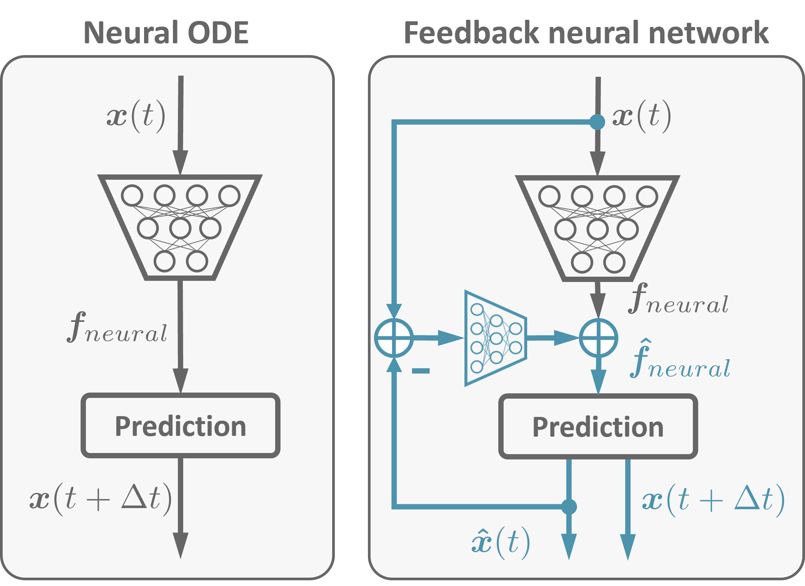

Figure 1: Neural network architectures. Left: Neural ODE developed in Chen et al. ([2018](#bib.bib5)). Right: Proposed feedback neural network.
[/FIGURE]

Stemming from residual neural networks (He et al., [2016](#bib.bib14)), neural ordinary differential equation (neural ODE) (Chen et al., [2018](#bib.bib5)) emerges as a novel learning strategy aiming at learning the latent dynamic model of an unknown system. Recently, neural ODEs have been successfully applied to various scenarios, especially continuous-time missions (Liu & Stacey, [2024](#bib.bib22); Verma et al., [2024](#bib.bib43); Greydanus et al., [2019](#bib.bib11); Cranmer et al., [2020](#bib.bib8)). However, like traditional neural networks, the generalization problem limits the application of neural ODEs in real-world applications.  

Traditional strategies like model simplification, fit coarsening, data augmentation, and transfer learning have considerably improved the generalization performance of neural networks on unseen tasks (Rohlfs, [2022](#bib.bib34)). However, these strategies usually reduce the accuracy performance on previous tasks, and large-scale training data and network structures are often required to approximate previous accuracy. The objective of this work is to develop a novel network architecture, acquiring the generalization improvement while preserving the accuracy performance.  

Living beings can neatly adapt to unseen environments, even with limited neurons and computing power. One reason can be attributed to the existence of internal feedback (Aoki et al., [2019](#bib.bib2)). Internal feedback has been shown to exist in biological control, perception, and communication systems, handling external disturbances, internal uncertainties, and noises (Sarma et al., [2022](#bib.bib36); Markov et al., [2021](#bib.bib27)). In neural circuits, feedback inhibition is able to regulate the duration and magnitude of excitatory signals (Luo, [2021](#bib.bib24)). In engineering systems, internal feedback indicates impressive effects across filtering and control tasks, such as Kalman filter (Kalman, [1960](#bib.bib16)), Luenberger observer (Luenberger, [1966](#bib.bib23)), extended state observer (Guo et al., [2020](#bib.bib12)), and proportional-integral-derivative control (Ang et al., [2005](#bib.bib1)). The effectiveness of feedback lies in its ability to harness real-time deviations between internal predictions/estimations and external measurements to infer dynamical uncertainties. The cognitive corrections are then performed timely. However, existing neural networks rarely incorporate such a real-time feedback mechanism.  

In this work, we attempt to enhance the generalization of neural ODEs by incorporating the feedback scheme. The key idea is to correct the learned latent dynamical model of a Neural ODE according to the deviation between measured and predicted states, as illustrated in Figure [1](#S1.F1 "Figure 1 ‣ 1 Introduction ‣ Feedback Favors the Generalization of Neural ODEs"). We introduce two types of feedback: linear form and nonlinear neural form. Unlike previous training methods that compromise accuracy for generalization, the developed feedback neural network is a two-DOF framework that exhibits generalization performance on unseen tasks while maintaining accuracy on previous tasks. The effectiveness of the presented feedback neural network is demonstrated through several intuitional and practical examples, including trajectory prediction of a spiral curve, trajectory prediction of an irregular object and model predictive control (MPC) of a quadrotor.  

## 2 Neural ODEs and learning residues

A significant application of artificial neural networks␣‌centers around the prediction task., $\bm{x}(t)\mapsto\bm{x}(t+\Delta t)$. Note that $t$ indicates the input $\bm{x}$ evolves with time. Chen et al. ([2018](#bib.bib5)) utilize neural networks to directly learn latent ODEs of target systems, named Neural ODEs. Neural ODEs greatly improve the modeling ability of neural networks, especially for continuous-time dynamic systems (Massaroli et al., [2020](#bib.bib28)), while maintaining a constant memory cost. The ODE describes the instantaneous change of a state $\bm{x}(t)$  

|  | $\displaystyle\frac{{d\bm{x}}(t)}{{dt}}=\bm{f}\left({\bm{x}(t),\bm{I}(t),t}\right)$ |  | (1) |
| --- | --- | --- | --- |

where $\bm{f}(\cdot)$ represents a latent nonlinear mapping, and $\bm{I}(t)$ denotes external input. Note that compared with Chen et al. ([2018](#bib.bib5)), we further consider $\bm{I}(t)$ that can extend the ODE to non-autonomous cases. The adjoint sensitive method is employed in Chen et al. ([2018](#bib.bib5)) to train neural ODEs without considering $\bm{I}(t)$. In Appendix [A.1](#A1.SS1 "A.1 Training neural ODEs with external inputs ‣ Appendix A Appendix ‣ Feedback Favors the Generalization of Neural ODEs"), we provide an alternative training strategy in the presence of $\bm{I}(t)$, from the view of optimal control.  

Given the ODE ([1](#S2.E1 "In 2 Neural ODEs and learning residues ‣ Feedback Favors the Generalization of Neural ODEs")) and an initial state $\bm{x}(t)$, future state can be predicted as an initial value problem  

|  | $\displaystyle\bm{x}(t+\Delta t)=\bm{x}(t)+\int_{t}^{t+\Delta t}{\bm{f}\left({\bm{x}\left(\tau\right),\bm{I}\left(\tau\right),\tau}\right)d\tau}.$ |  | (2) |
| --- | --- | --- | --- |

The workflow of neural ODEs is depicted in Figure [1](#S1.F1 "Figure 1 ‣ 1 Introduction ‣ Feedback Favors the Generalization of Neural ODEs"). However, like traditional learning methods, generalization is a major bottleneck for neural ODEs (Marion, [2024](#bib.bib25)). Learning residuals will appear if the network has not been trained properly (e.g., underfitting and overfitting) or the applied scenario has a slightly different latent dynamic model. Take a spiral function as an example (Appendix [A.3.1](#A1.SS3.SSS1 "A.3.1 Spiral dynamics ‣ A.3 Implementation details of spiral case ‣ Appendix A Appendix ‣ Feedback Favors the Generalization of Neural ODEs")). When a network trained from a given training set (Figure [5](#S4.F5 "Figure 5 ‣ 4.2 Learning a neural feedback ‣ 4 Neural ODEs with a neural feedback ‣ Feedback Favors the Generalization of Neural ODEs") (a)) is transferred to a new case (Figure [5](#S4.F5 "Figure 5 ‣ 4.2 Learning a neural feedback ‣ 4 Neural ODEs with a neural feedback ‣ Feedback Favors the Generalization of Neural ODEs") (b)), the learning performance will dramatically degrade (Figure [5](#S4.F5 "Figure 5 ‣ 4.2 Learning a neural feedback ‣ 4 Neural ODEs with a neural feedback ‣ Feedback Favors the Generalization of Neural ODEs") (d)). Without loss of generality, the learning residual error is formalized as  

|  | $\displaystyle\bm{f}\left({\bm{x}(t),\bm{I}(t),t}\right)=\bm{f}_{neural}\left({\bm{x}(t),\bm{I}(t),t,\bm{\theta}}\right)+\Delta\bm{f}(t)$ |  | (3) |
| --- | --- | --- | --- |

where $\bm{f}_{neural}\left(\cdot\right)$ represents the learned ODE model parameterized by $\bm{\theta}$, and $\Delta\bm{f}(t)$ denotes the unknown learning residual error. In the presence of $\Delta\bm{f}(t)$, the prediction error of ([2](#S2.E2 "In 2 Neural ODEs and learning residues ‣ Feedback Favors the Generalization of Neural ODEs")) will accumulate over time. The objective of this work is to improve neural ODEs with as few modifications as possible to suppress the effects of $\Delta\bm{f}(t)$.  

## 3 Neural ODEs with a linear feedback

### 3.1 Correcting latent dynamics through feedback

Even though learned experiences are encoded by neurons in the brain, living organisms can still adeptly handle unexpected internal and external disturbances with the assistance of feedback mechanisms (Aoki et al., [2019](#bib.bib2); Sarma et al., [2022](#bib.bib36)). The feedback scheme has also proven effective in traditional control systems, facilitating high-performance estimation and control objectives. Examples include Kalman filter (Kalman, [1960](#bib.bib16)), Luenberger observer (Luenberger, [1966](#bib.bib23)), extended state observer (Guo et al., [2020](#bib.bib12)), and proportional-integral-derivative control (Ang et al., [2005](#bib.bib1)).  

[FIGURE S3.F2.g1]
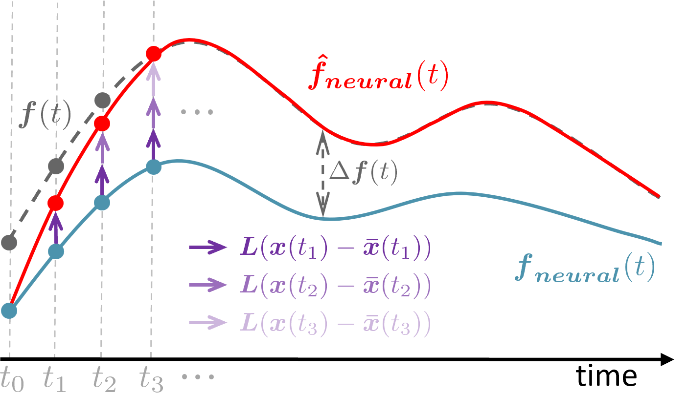

Figure 2: The learned latent dynamics are modified through accumulative evaluation errors to approach the truth one.
[/FIGURE]

We attempt to introduce the feedback scheme into neural ODEs, named feedback neural networks, as shown in Figure [1](#S1.F1 "Figure 1 ‣ 1 Introduction ‣ Feedback Favors the Generalization of Neural ODEs"). Neural ODEs have exploited latent dynamical models $\bm{f}_{neural}(t)$ of target systems in training set. The key idea of feedback neural networks is to further correct $\bm{f}_{neural}(t)$ according to state feedback. Denote $t_{i}$ as the historical evaluation moment satisfying $t_{i}\leq t$. At current moment $t$, we collect $k$ historical state measurements $\left\{\bm{x}(t_{0}),\bm{x}(t_{1}),\cdots,\bm{x}(t_{k})\right\}$, in which $t_{k}=t$. As portrayed in Figure [2](#S3.F2 "Figure 2 ‣ 3.1 Correcting latent dynamics through feedback ‣ 3 Neural ODEs with a linear feedback ‣ Feedback Favors the Generalization of Neural ODEs"), $\bm{f}_{neural}(t)$ is modified by historical evaluation errors to approach the truth dynamics $\bm{f}(t)$, i.e.,  

|  | $\displaystyle\bm{\hat{f}}_{neural}(t)=\bm{f}_{neural}(t)+\sum\limits_{i=0}^{k}{\bm{L}\left({\bm{x}\left({{t_{i}}}\right)-\bm{\bar{x}}\left({{t_{i}}}\right)}\right)}$ |  | (4) |
| --- | --- | --- | --- |

where $\bm{L}$ represents the positive definite gain and $\bm{\bar{x}}\left({{t_{i}}}\right)$ represents the predicted state from the last evaluation moment, e.g., an Euler integration  

|  | $\displaystyle\bm{\bar{x}}\left({{t_{i}}}\right)=\bm{x}\left({{t_{i-1}}}\right)+T_{s}\bm{\hat{f}}_{neural}(t_{i-1})$ |  | (5) |
| --- | --- | --- | --- |

with the prediction step $T_{s}$.  

To avoid storing more and more historical measurements over time, define an auxiliary variable  

|  | $\displaystyle\bm{\hat{x}}\left({{t}}\right)=\bm{\bar{x}}\left({{t}}\right)-\sum\limits_{i=0}^{k-1}{\left({\bm{x}\left({{t_{i}}}\right)-\bm{\bar{x}}\left({{t_{i}}}\right)}\right)}$ |  | (6) |
| --- | --- | --- | --- |

where $\bm{\hat{x}}\left({{t}}\right)$ can be regarded as an estimation of $\bm{{x}}\left({{t}}\right)$. Combining ([4](#S3.E4 "In 3.1 Correcting latent dynamics through feedback ‣ 3 Neural ODEs with a linear feedback ‣ Feedback Favors the Generalization of Neural ODEs")) and ([6](#S3.E6 "In 3.1 Correcting latent dynamics through feedback ‣ 3 Neural ODEs with a linear feedback ‣ Feedback Favors the Generalization of Neural ODEs")), can lead to  

|  | $\displaystyle\bm{\hat{f}}_{neural}(t)=\bm{f}_{neural}(t)+\bm{L}(\bm{x}(t)-\bm{\hat{x}}(t)).$ |  | (7) |
| --- | --- | --- | --- |

From ([5](#S3.E5 "In 3.1 Correcting latent dynamics through feedback ‣ 3 Neural ODEs with a linear feedback ‣ Feedback Favors the Generalization of Neural ODEs")) and ([6](#S3.E6 "In 3.1 Correcting latent dynamics through feedback ‣ 3 Neural ODEs with a linear feedback ‣ Feedback Favors the Generalization of Neural ODEs")), it can be further rendered that  

|  | $\displaystyle\bm{\hat{x}}\left({{t_{k}}}\right)=\bm{\hat{x}}\left({{t_{k-1}}}\right)+T_{s}\bm{\hat{f}}_{neural}(t_{k-1}).$ |  | (8) |
| --- | --- | --- | --- |

By continuating the above Euler integration, it can be seen that $\bm{\hat{x}}(t)$ is the continuous state of the modified dynamics, i.e., $\bm{\dot{\hat{x}}}(t)=\bm{\hat{f}}_{neural}(t)$. Finally, $\bm{\hat{f}}_{neural}(t)$ can be persistently obtained through ([7](#S3.E7 "In 3.1 Correcting latent dynamics through feedback ‣ 3 Neural ODEs with a linear feedback ‣ Feedback Favors the Generalization of Neural ODEs")) and ([8](#S3.E8 "In 3.1 Correcting latent dynamics through feedback ‣ 3 Neural ODEs with a linear feedback ‣ Feedback Favors the Generalization of Neural ODEs")) recursively, instead of ([4](#S3.E4 "In 3.1 Correcting latent dynamics through feedback ‣ 3 Neural ODEs with a linear feedback ‣ Feedback Favors the Generalization of Neural ODEs")) and ([5](#S3.E5 "In 3.1 Correcting latent dynamics through feedback ‣ 3 Neural ODEs with a linear feedback ‣ Feedback Favors the Generalization of Neural ODEs")) accumulatively.  

### 3.2 Convergence analysis

In this part, the convergence property of the feedback neural network is analyzed. The state observation error of the feedback neural network is defined as ${\bm{\tilde{x}}}(t)=\bm{{x}}(t)-\bm{\hat{x}}(t)$, and its derivative ${\bm{\dot{\tilde{x}}}}(t)$, i.e., the approximated error of latent dynamics is defied as ${\bm{\tilde{f}}}(t)=\bm{{f}}(t)-\bm{\hat{f}}_{neural}(t)$. Substitute ([1](#S2.E1 "In 2 Neural ODEs and learning residues ‣ Feedback Favors the Generalization of Neural ODEs")) and ([3](#S2.E3 "In 2 Neural ODEs and learning residues ‣ Feedback Favors the Generalization of Neural ODEs")) into ([7](#S3.E7 "In 3.1 Correcting latent dynamics through feedback ‣ 3 Neural ODEs with a linear feedback ‣ Feedback Favors the Generalization of Neural ODEs")), one can obtain the error dynamics  

|  | $\displaystyle{\bm{\dot{\tilde{x}}}}(t)=-\bm{L}{\bm{{\tilde{x}}}}(t)+\Delta\bm{f}(t).$ |  | (9) |
| --- | --- | --- | --- |

Before proceeding, a reasonable bounded assumption on the learning residual error $\Delta\bm{f}(t)$ is made.  

###### Assumption 1.

There exists an unknown upper bound such that  

|  | $\displaystyle\|\Delta\bm{f}(t)\|\leq\gamma$ |  | (10) |
| --- | --- | --- | --- |

where $\|\cdot\|$ denotes the Euclidean norm and $\gamma$ is an unknown positive value.  

Then the following convergence theorem can be established.  

###### Theorem 1.

Consider the nonlinear system ([1](#S2.E1 "In 2 Neural ODEs and learning residues ‣ Feedback Favors the Generalization of Neural ODEs")), Under the linear state feedback ([7](#S3.E7 "In 3.1 Correcting latent dynamics through feedback ‣ 3 Neural ODEs with a linear feedback ‣ Feedback Favors the Generalization of Neural ODEs")) and the bounded Assumption [1](#Thmassum1 "Assumption 1. ‣ 3.2 Convergence analysis ‣ 3 Neural ODEs with a linear feedback ‣ Feedback Favors the Generalization of Neural ODEs"), the state observation error ${\bm{\tilde{x}}}(t)$ and its derivative ${\bm{\dot{\tilde{x}}}}(t)$ (i.e., ${\bm{\tilde{f}}}(t)$) can converge to bounded sets exponentially, which upper bounds can be regulated by the feedback gain $\bm{L}$.  

###### Proof.

See Appendix [A.2](#A1.SS2 "A.2 Proof of Theorem 1 ‣ Appendix A Appendix ‣ Feedback Favors the Generalization of Neural ODEs"). ∎  

[FIGURE S3.F3.g1]
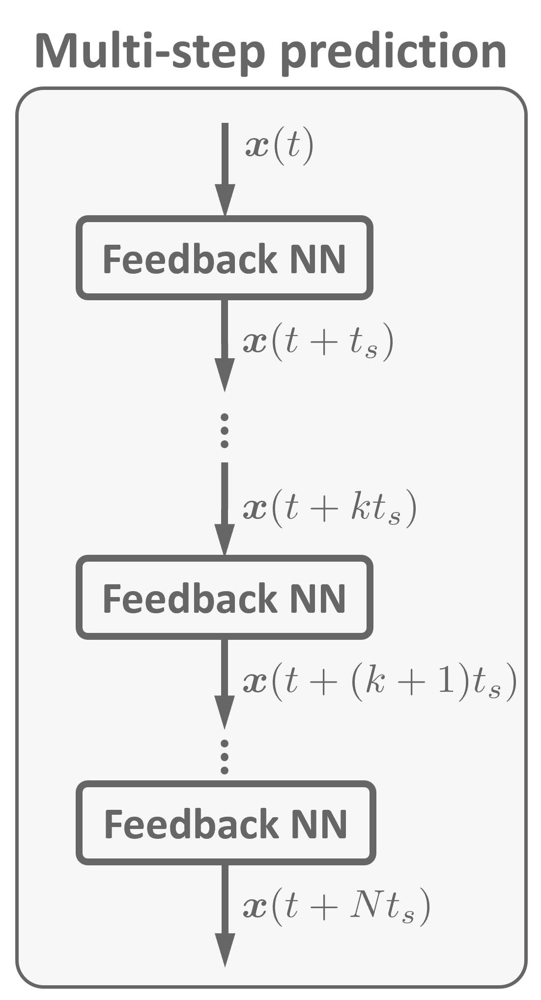

Figure 3: The multi-step prediction.
[/FIGURE]

### 3.3 Multi-step prediction

With the modified dynamics ${\bm{\hat{f}}}(t)$ and current $\bm{x}(t)$, the next step is to predict $\bm{x}(t+\Delta t)$ as in ([2](#S2.E2 "In 2 Neural ODEs and learning residues ‣ Feedback Favors the Generalization of Neural ODEs")). By defining $\bm{z}(t)=\left[\bm{x}^{T}(t),{\bm{\hat{x}}}^{T}(t)\right]^{T}$, from ([8](#S3.E8 "In 3.1 Correcting latent dynamics through feedback ‣ 3 Neural ODEs with a linear feedback ‣ Feedback Favors the Generalization of Neural ODEs")), we have $\bm{\dot{z}}(t)=\left[{\bm{\hat{f}}}^{T}(t),{\bm{\hat{f}}}^{T}(t)\right]^{T}$. One intuitional means to obtain $\bm{z}(t+\Delta t)$ is to solve the ODE problem with modern solvers. However, as shown in Theorem [1](#Thmthm1 "Theorem 1. ‣ 3.2 Convergence analysis ‣ 3 Neural ODEs with a linear feedback ‣ Feedback Favors the Generalization of Neural ODEs"), the convergence of $\bm{\tilde{f}}(t)$ can only be guaranteed as current $t$. In other words, the one-step prediction result by solving the above ODE is accurate, while the error will accumulate in the long-term prediction. In this part, an alternative multi-step prediction strategy is developed to circumvent this problem.  

The proposed multi-step prediction strategy is portrayed in Figure [3](#S3.F3 "Figure 3 ‣ 3.2 Convergence analysis ‣ 3 Neural ODEs with a linear feedback ‣ Feedback Favors the Generalization of Neural ODEs"), which can be regarded as a cascaded form of one-step prediction. The output of each feedback neural network is regarded as the input of the next layer. Take the first two layers as an example. The first-step prediction $\bm{x}(t+T_{s})$ is obtained by $\bm{{x}}(t+T_{s})=\bm{{x}}(t)+\bm{\hat{f}}(\bm{{x}}(t),\bm{\hat{x}}(t),\theta)T_{s}$. The second layer with the input of $\bm{{x}}(t+T_{s})$ will output $\bm{{x}}(t+2T_{s})$. In such a framework, the convergence of later layers will not affect the convergence of previous layers. Thus, the prediction error will converge from top to bottom in order.  

Note that the cascaded prediction strategy can amplify the data noise in case of large $\bm{L}$. A gain decay strategy is designed to alleviate this issue. Denote the feedback gain of $i$-th later as $\bm{L}_{i}$, which decays as $i$ increases  

|  | $\displaystyle\bm{L}_{i}=\bm{L}\odot e^{-\beta i}$ |  | (11) |
| --- | --- | --- | --- |

[FIGURE S3.F4.g1]
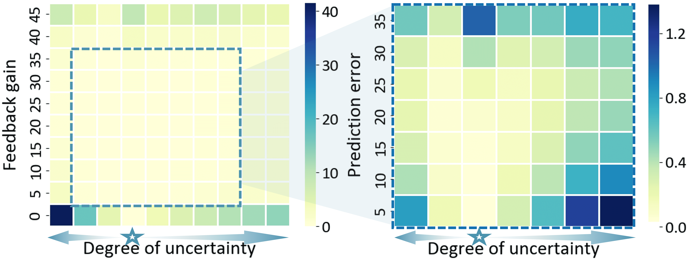

Figure 4: Prediction errors of the spiral curve with different levels of feedback gains and uncertainties. The right image is a partial enlargement of the left one. The blue star denotes the case without uncertainty, and the uncertainty increases along both the left and right directions.
[/FIGURE]

where $\beta$ represents the decay rate. The efficiency of the decay strategy is presented in Figure [5](#S4.F5 "Figure 5 ‣ 4.2 Learning a neural feedback ‣ 4 Neural ODEs with a neural feedback ‣ Feedback Favors the Generalization of Neural ODEs")(g). The involvement of the decay factor in the multi-step prediction process significantly enhances the robustness to data noise.  

### 3.4 Gain adjustment

The adjustment of linear feedback gain $\bm{L}$ can be separated from the training of neural ODEs, which can increase the flexibility of the structure. In other words, the feedback loop can be easily embedded into existing trained neural ODEs, without retraining.  

The gain adjustment strategy is intuitional. Theorem [1](#Thmthm1 "Theorem 1. ‣ 3.2 Convergence analysis ‣ 3 Neural ODEs with a linear feedback ‣ Feedback Favors the Generalization of Neural ODEs") indicates that the prediction error will converge to a bounded set as the minimum eigenvalue of feedback gain is greater than $1/2$. And the converged set can shrink with the increase of the minimum eigenvalue. In reality, the amplitude of $\lambda_{m}(\bm{L})$ is limited since the feedback $\bm{x}$ is usually noised. The manual adjustment of $\lambda_{m}(\bm{L})$ needs the trade-off between prediction accuracy and noise amplification.  

Figure [4](#S3.F4 "Figure 4 ‣ 3.3 Multi-step prediction ‣ 3 Neural ODEs with a linear feedback ‣ Feedback Favors the Generalization of Neural ODEs") shows the multi-step prediction errors ($N$ = 50) with different levels of feedback gains and uncertainties. When the gain is set as $0$, the feedback neural network will equal the neural ODE. The related simulation setup is detailed in Appendix [A.3.4](#A1.SS3.SSS4 "A.3.4 Setup of gain adjustment test ‣ A.3 Implementation details of spiral case ‣ Appendix A Appendix ‣ Feedback Favors the Generalization of Neural ODEs"). Two phenomena can be observed from the heatmap. The one is that the prediction error increases with the level of uncertainty. The other is that the prediction error decreases with the gain at the beginning, but due to noise amplification, the prediction error worsens if the gain is set too large.  

## 4 Neural ODEs with a neural feedback

Section [3](#S3 "3 Neural ODEs with a linear feedback ‣ Feedback Favors the Generalization of Neural ODEs") has shown a linear feedback form can promptly improve the adaptability of neural ODEs in unseen scenarios. However, two improvements could be further made. At first, it will be more practical if the gain tuning procedure could be avoided. Moreover, the linear feedback form can be extended to a nonlinear one $\bm{h}(\bm{x}(t)-\bm{\hat{x}}(t))$ to adopt more intricate scenes, as experienced in the control field (Han, [2009](#bib.bib13)).  

An effectual solution is to model the feedback part using another neural network, i.e., $\bm{h}_{neural}(\bm{x}(t)-\bm{\hat{x}}(t),\bm{\xi})$ parameterized by $\bm{\xi}$. Here we design a separate learning strategy to learn $\bm{\xi}$. At first, the neural ODE is trained on the nominal task without considering the feedback part. Then the feedback part is trained through domain randomization by freezing the neural ODE. In this way, the obtained feedback neural network is skillfully considered as a two-DOF network. On the one hand, the original neural ODE preserves the accuracy on the previous nominal task. On the other hand, with the aid of feedback, the generalization performance is available in the presence of unknown uncertainties.  

### 4.1 Domain randomization

The key idea of domain randomization (Tobin et al., [2017](#bib.bib41); Peng et al., [2018](#bib.bib32)) is to randomize the system parameters, noises, and perturbations as collecting training data so that the real applied case can be covered as much as possible. Taking the spiral example as an example (Figure [5](#S4.F5 "Figure 5 ‣ 4.2 Learning a neural feedback ‣ 4 Neural ODEs with a neural feedback ‣ Feedback Favors the Generalization of Neural ODEs") (a)), training with domain randomization requires datasets collected under various periods, decay rates, and bias parameters, so that the learned networks are robust to the real case with a certain of uncertainty.  

Two shortcomings exist when employing domain randomization. On the one hand, the existing trained network needs to be retrained and the computation burden of training is dramatically increased. On the other hand, the training objective is forced to focus on the average performance among different parameters, such that the prediction ability on the previous nominal task will degraded, as shown in Figure [6](#S4.F6 "Figure 6 ‣ 4.2 Learning a neural feedback ‣ 4 Neural ODEs with a neural feedback ‣ Feedback Favors the Generalization of Neural ODEs") (a). To maintain the previous accuracy performance, larger-scale network designs are often required. In other words, the domain randomization trades precision for robustness. In the proposed learning strategy, the generalization ability is endowed to the feedback loop independently, so that the above shortcomings can be circumvented.  

### 4.2 Learning a neural feedback

In this work, we specialize the virtue from domain randomization to the feedback part $\bm{h}_{neural}(t)$ rather than the previous neural network $\bm{f}_{neural}(t)$. The training framework is formalized as follows  

|  | $\displaystyle{\bm{\xi}^{*}}$ | $\displaystyle=\mathop{\arg\min}\limits_{\bm{\xi}}\sum\limits_{i=1}^{{n_{case}}}{\sum\limits_{j\in\mathcal{D}_{i}^{tra}}{\left\|{\bm{x}_{i,j}^{*}-\bm{x}_{i,j}}\right\|}}$ |  |
| --- | --- | --- | --- |
|  | $\displaystyle s.t.\quad{\bm{x}_{i,j}}$ | $\displaystyle={\bm{x}_{i,j-1}}+{T_{s}}\left({{\bm{f}_{neural}}({\bm{x}_{i,j-1}})+\bm{h}_{neural}\left({{\bm{x}_{i,j-1}}-{\bm{\hat{x}}_{i,j-1}},\bm{\xi}}\right)}\right)$ |  | (12) |
| --- | --- | --- | --- | --- |

where $n_{case}$ denotes the number of randomized cases, $\mathcal{D}_{i}^{tra}=\{{\bm{x}_{i,j-1}},{\bm{\hat{x}}_{i,j-1}},\bm{x}_{i,j}^{*}|j=1,\dots,m\}$ denotes the training set of the $i$-th case with $m$ samples, ${\bm{x}}_{i,j}^{*}$ denotes the labeled sate, and ${\bm{x}}_{i,j}$ denotes one-step prediction of state, which is approximated by Euler integration method here.  

The learning procedure of the feedback part $\bm{h}_{neural}(t)$ is summarized as Algorithm [1](#alg1 "Algorithm 1 ‣ 4.2 Learning a neural feedback ‣ 4 Neural ODEs with a neural feedback ‣ Feedback Favors the Generalization of Neural ODEs"). After training the neural ODE $\bm{f}_{neural}(t)$ on the nominal task, the parameters of simulation model are randomized to produce $n_{case}$ cases. Subsequently, the feedback neural network is implemented in these cases and the training set $\mathcal{D}_{i}^{tra}$ of each case is constructed. The training loss is then calculated through ([4.2](#S4.Ex1 "4.2 Learning a neural feedback ‣ 4 Neural ODEs with a neural feedback ‣ Feedback Favors the Generalization of Neural ODEs")), which favors the update of parameter $\bm{\xi}$ by backpropagation. The above steps are repeated until the expected training loss is achieved or the maximum number of iterations was reached.  

[ALGORITHM alg1]

0:  Randomize parameters to produce $n_{case}$ cases; trained neural ODE $\bm{f}_{neural}$ on nominal task.

0:  Neural feedback $\bm{h}_{neural}$. Initialize: Network parameter $\bm{\xi}$; Adam optimizer.

1:  repeat

2:     Run feedback neural network among $n_{case}$ cases to produce ${\bm{\hat{x}}_{i,j}}$;

3:     Construct datasets $\mathcal{D}_{i}^{tra}$;

4:     Evaluate loss through ([4.2](#S4.Ex1 "4.2 Learning a neural feedback ‣ 4 Neural ODEs with a neural feedback ‣ Feedback Favors the Generalization of Neural ODEs")) on randomly selected mini-batch data;

5:     Update $\bm{\xi}$ by backpropagation;

6:  until convergence

Algorithm 1  Learning neural feedback through domain randomization
[/ALGORITHM]

[FIGURE S4.F5.g1]
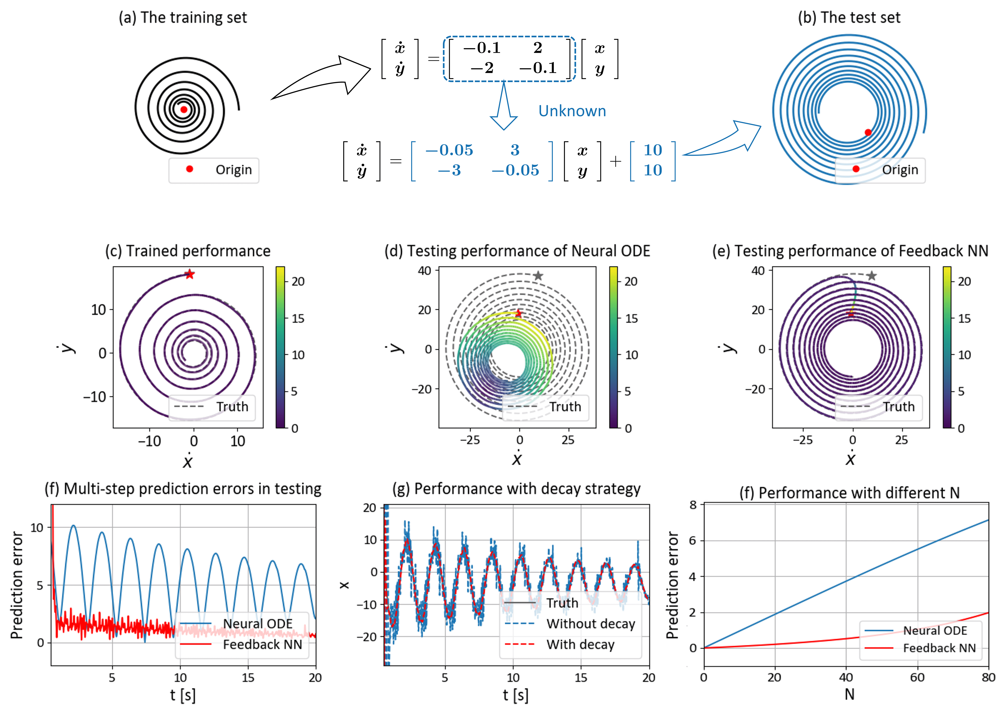

Figure 5: A toy example is presented to intuitively illustrate the developed scheme. The mission is to predict the future trajectory of a spiral curve with a given initial state $\{\bm{x}(t),\bm{y}(t)\}$. The neural ODE is trained on a given training set (a), yielding an approving learning result (c). Note that the pentagrams denote start points. The trained network is then transferred to a test set (b), which model is significantly different from the training one. With the feedback mechanism, the feedback neural network can achieve a better approximated accuracy of the change rate (e), in comparison with the neural ODE (d). As a result, a smaller multi-step prediction error (f) can be attained by benefiting from the feedback neural network. (g) shows that the noise amplification issue in multi-step prediction can be alleviated by the gain-decay strategy. (f) further presents the prediction results with different prediction steps $N$. $N$ in (f) and (g) is set as $50$.
[/FIGURE]

[FIGURE S4.F6.g1]
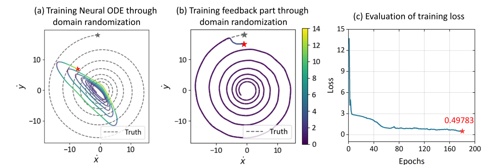

Figure 6: Learning with domain randomization. (a): Train the neural ODE through domain randomization. It can be seen that the learning performance of latent dynamics on the nominal task (Figure [5](#S4.F5 "Figure 5 ‣ 4.2 Learning a neural feedback ‣ 4 Neural ODEs with a neural feedback ‣ Feedback Favors the Generalization of Neural ODEs") (a)) degrades as inducing domain randomization, in comparison with Figure [5](#S4.F5 "Figure 5 ‣ 4.2 Learning a neural feedback ‣ 4 Neural ODEs with a neural feedback ‣ Feedback Favors the Generalization of Neural ODEs") (c). Previous works usually try to scale up neural networks to approach the previous performance. (b): Freeze the neural ODE after training on the nominal task and train the feedback part through domain randomization. The feedback neural network maintains the previous performance on the nominal task. (c) The training loss of the feedback part. Note that the neural ODE employed in (a) and (b) have the same architectures as the one in Figure [5](#S4.F5 "Figure 5 ‣ 4.2 Learning a neural feedback ‣ 4 Neural ODEs with a neural feedback ‣ Feedback Favors the Generalization of Neural ODEs") (c).
[/FIGURE]

For the spiral example, Figure [6](#S4.F6 "Figure 6 ‣ 4.2 Learning a neural feedback ‣ 4 Neural ODEs with a neural feedback ‣ Feedback Favors the Generalization of Neural ODEs") (b) presents the learning performance of the feedback neural network on the nominal task. It can be seen that the feedback neural network can precisely capture the latent dynamics, maintaining the previous accuracy performance of Figure [5](#S4.F5 "Figure 5 ‣ 4.2 Learning a neural feedback ‣ 4 Neural ODEs with a neural feedback ‣ Feedback Favors the Generalization of Neural ODEs") (c). Moreover, the feedback neural network also has the generalization performance on randomized cases, as shown in Appendix Figure [S1](#A1.F10 "Figure S1 ‣ A.5.4 Test results ‣ A.5 Implementation details of model predictive control of a quadrotor ‣ Appendix A Appendix ‣ Feedback Favors the Generalization of Neural ODEs"). Figure [6](#S4.F6 "Figure 6 ‣ 4.2 Learning a neural feedback ‣ 4 Neural ODEs with a neural feedback ‣ Feedback Favors the Generalization of Neural ODEs") (c) further provides the evolution of training loss of the feedback part on the spiral example. More training details are provided in Appendix [A.3.3](#A1.SS3.SSS3 "A.3.3 Training details of feedback part ‣ A.3 Implementation details of spiral case ‣ Appendix A Appendix ‣ Feedback Favors the Generalization of Neural ODEs").  

## 5 Empirical study

### 5.1 Trajectory prediction of an irregular object

[FIGURE S5.F7.g1]
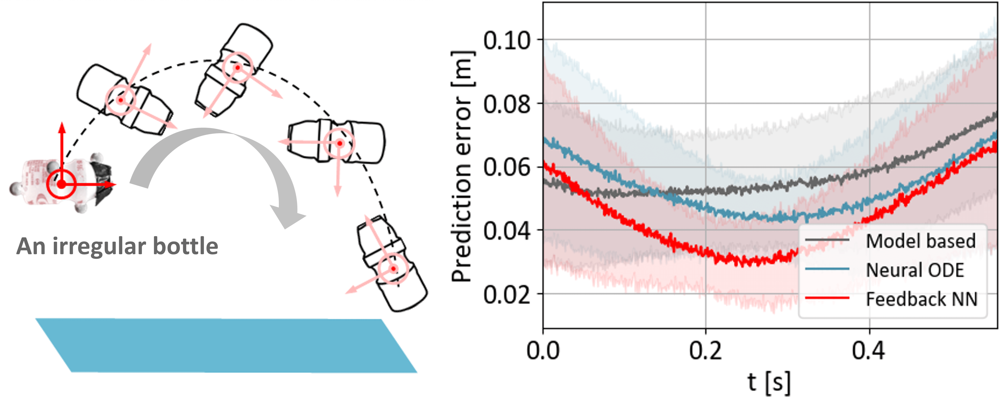

Figure 7: Trajectory prediction results of an irregular bottle. Left: The irregular bottle is thrown out by hand and performs an approximate parabolic motion. Right: The prediction errors with different methods. The prediction horizon is set as $0.5\ s$. The colored shaded area represents the standard deviations of all $9$ test trajectories.
[/FIGURE]

Precise trajectory prediction of a free-flying irregular object is a challenging task due to the complicated aerodynamic effects. Previous methods can be mainly classified into model-based scheme (Frese et al., [2001](#bib.bib10); Müller et al., [2011](#bib.bib30); Bouffard et al., [2012](#bib.bib3)) and learning-based scheme (Kim et al., [2014](#bib.bib19); Yu et al., [2021](#bib.bib46)). With historical data, model-based methods aim at accurately fitting the drag coefficient of an analytical drag model, while learning-based ones try to directly learn an acceleration model using specific basis functions. However, the above methods lack of online adaptive ability as employing. Benefiting from the feedback mechanism, our feedback neural network can correct the learned model in real time, leading to a more generalized performance in cases out of training datasets.  

We test the effectiveness of the proposed method on an open-source dataset (Jia et al., [2024](#bib.bib15)), in comparison with the model-based method (Frese et al., [2001](#bib.bib10); Müller et al., [2011](#bib.bib30); Bouffard et al., [2012](#bib.bib3)) and the learning-based method (Chen et al., [2018](#bib.bib5)). The objective of this mission is to accurately predict the object’s position after $0.5\ s$, as it is thrown by hand. $21$ trajectories are used for training, while $9$ trajectories are used for testing. The prediction result is presented in Figure [7](#S5.F7 "Figure 7 ‣ 5.1 Trajectory prediction of an irregular object ‣ 5 Empirical study ‣ Feedback Favors the Generalization of Neural ODEs"). It can be seen that the proposed feedback neural network achieves the best prediction performance. Moreover, the predicted positions and learned latent accelerations of all test trajectories are provided in Figure [S2](#A1.F11 "Figure S2 ‣ A.5.4 Test results ‣ A.5 Implementation details of model predictive control of a quadrotor ‣ Appendix A Appendix ‣ Feedback Favors the Generalization of Neural ODEs") and Figure [S3](#A1.F12 "Figure S3 ‣ A.5.4 Test results ‣ A.5 Implementation details of model predictive control of a quadrotor ‣ Appendix A Appendix ‣ Feedback Favors the Generalization of Neural ODEs"), respectively. Implementation details are provided in Appendix [A.4](#A1.SS4 "A.4 Implementation details of trajectory prediction of irregular objects ‣ Appendix A Appendix ‣ Feedback Favors the Generalization of Neural ODEs").  

[FIGURE S5.F8.g1]
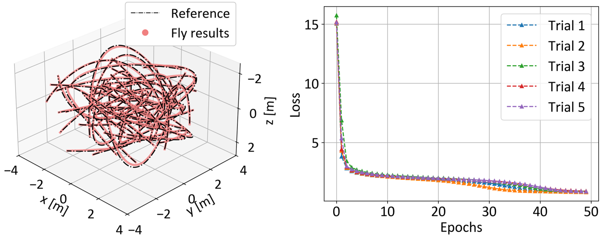

Figure 8: Training the neural ODE in the presence of external inputs. Left: Trajectory samples used for training. $40$ trajectories are generated with the length of $200$ discrete nodes each. Right: Training curves of $6$ random trials. All training trials converged rapidly thanks to stable integration and end-to-end analytic gradients.
[/FIGURE]

### 5.2 Model predictive control of a quadrotor

MPC works in the form of receding-horizon trajectory optimizations with a dynamic model, and then determines the current optimal control input. Approving optimization results highly rely on accurate dynamical models. Befitting from the powerful representation capability of neural networks for complex real-world physics, noticeable works (Torrente et al., [2021](#bib.bib42); Salzmann et al., [2023](#bib.bib35); Sukhija et al., [2023](#bib.bib39)) have demonstrated that models incorporating first principles with learning-based components can enhance control performance. However, as the above models are offline-learned within fixed environments, the control performance would degrade under uncertainties in unseen environments.  

[FIGURE S5.F9.g1]
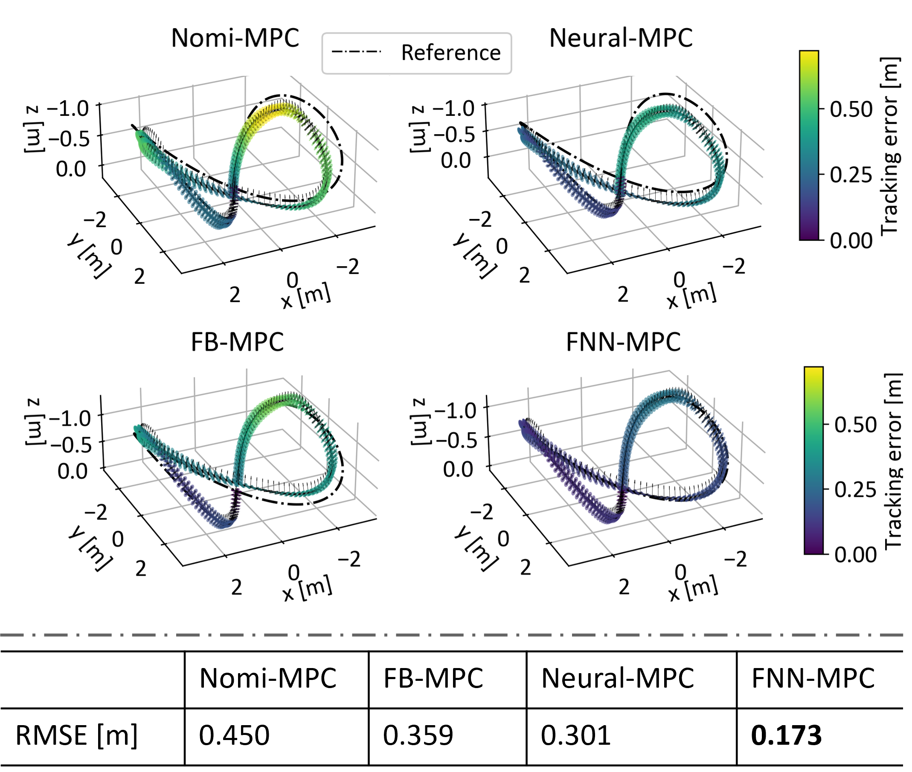

Figure 9: Tracking the Lissajous trajectory using MPC with different prediction models. The tracking error is evaluated by root mean square error (RMSE).
[/FIGURE]

In this part, the proposed feedback neural network is employed on the quadrotor trajectory tracking scenario concerning model uncertainties and external disturbances, to demonstrate its online adaptive capability. In offline training, a neural ODE is augmented with the nominal dynamics firstly to account for aerodynamic residuals. The augmented model is then integrated with an MPC controller. Note that parameter uncertainties of mass, inertia, and aerodynamic coefficients, and external disturbances are all applied in tests, despite the neural ODE only capture aerodynamic residuals in training. For the feedback neural network, the proposed multi-step prediction strategy is embedded into the model prediction process in MPC. Therefore, the formed feedback-enhanced hybrid model can effectively improve prediction results, further leading to a precise tracking performance. More implementation details refer to Appendix [A.5.3](#A1.SS5.SSS3 "A.5.3 Implementation of MPC with Feedback Neural Networks ‣ A.5 Implementation details of model predictive control of a quadrotor ‣ Appendix A Appendix ‣ Feedback Favors the Generalization of Neural ODEs").  

#### 5.2.1 Learning aerodynamic effects

While learning the dynamics, the augmented model requires the participation of external control inputs, i.e., motor thrusts. Earning a quadrotor model augmented with a neural ODE could be tricky with end-to-end learning patterns since the open-loop model are intensively unstable, leading to the diverge of numerical integration. To address this problem, a baseline controller is applied to form a stable closed-loop system. As shown in Figure [8](#S5.F8 "Figure 8 ‣ 5.1 Trajectory prediction of an irregular object ‣ 5 Empirical study ‣ Feedback Favors the Generalization of Neural ODEs"), the training trajectories are generated by randomly sampling positional waypoints in a limited space, followed by optimizing polynomials that connect these waypoints (Mellinger & Kumar, [2011](#bib.bib29)). The adjoint sensitive method is employed in Chen et al. ([2018](#bib.bib5)) to train neural ODEs without considering external control inputs. We provide an alternative training strategy concerning external inputs in Appendix [A.1](#A1.SS1 "A.1 Training neural ODEs with external inputs ‣ Appendix A Appendix ‣ Feedback Favors the Generalization of Neural ODEs"), from the view of optimal control. $6$ trials of training are carried out, each with distinct initial values for network parameters. The trajectory validations are carried out using $3$ randomly generated trajectories (Figures [S4](#A1.F13 "Figure S4 ‣ A.5.4 Test results ‣ A.5 Implementation details of model predictive control of a quadrotor ‣ Appendix A Appendix ‣ Feedback Favors the Generalization of Neural ODEs")-[S7](#A1.F16 "Figure S7 ‣ A.5.4 Test results ‣ A.5 Implementation details of model predictive control of a quadrotor ‣ Appendix A Appendix ‣ Feedback Favors the Generalization of Neural ODEs")). More learning details refer to Appendix [A.5.2](#A1.SS5.SSS2 "A.5.2 Implemention of learning aerodynamics effects ‣ A.5 Implementation details of model predictive control of a quadrotor ‣ Appendix A Appendix ‣ Feedback Favors the Generalization of Neural ODEs").  

#### 5.2.2 Flight tests

In tests, MPC is implemented with four different models: the nominal model, the neural ODE augmented model, the feedback enhanced nominal model, and the feedback neural network augmented model, abbreviated as Nomi-MPC, Neural-MPC, FB-MPC, and FNN-MPC, for the sake of simplification. Moreover, $37.6\%$ mass uncertainty, $[40\%,40\%,0]$ inertia uncertainties, $[14.3\%,14.3\%,25.0\%]$ drag coefficient uncertainties, and $[0.3,0.3,0.3]N$ translational disturbances are applied. The flight results on a Lissajous trajectory are presented in Figure [9](#S5.F9 "Figure 9 ‣ 5.2 Model predictive control of a quadrotor ‣ 5 Empirical study ‣ Feedback Favors the Generalization of Neural ODEs"). It can be seen the Neural-MPC outperforms the Nomi-MPC since intricate aerodynamic effects are captured by the neural ODE. However, due to the fact that unseen parameter uncertainties and external disturbances are not involved in training set, Neural-MPC still has considerable tracking errors. In contrast, FNN-MPC achieves the best tracking performance. The reason can be attributed to the multi-step prediction of the feedback neural network improves the prediction accuracy subject to multiple uncertainties, as shown in Figure [S8](#A1.F17 "Figure S8 ‣ A.5.4 Test results ‣ A.5 Implementation details of model predictive control of a quadrotor ‣ Appendix A Appendix ‣ Feedback Favors the Generalization of Neural ODEs").  

## 6 Related work

### 6.1 Neural ODEs

Most dynamical systems can be described by ODEs. The establishments of ODEs rely on analytical physics laws and expert experiences previously. To avoid such laborious procedures, Chen et al. ([2018](#bib.bib5)) propose to approximate ODEs by directly using neural networks, named neural ODEs. The prevalent residual neural networks (He et al., [2016](#bib.bib14)) can be regarded as an Euler discretization of neural ODEs Marion et al. ([2024](#bib.bib26)). The universal approximation property of neural ODEs has been studied theoretically (Zhang et al., [2020](#bib.bib48); Teshima et al., [2020](#bib.bib40); Li et al., [2022](#bib.bib21)), which show the sup-universality for $C^{2}$ diffeomorphisms maps (Teshima et al., [2020](#bib.bib40)) and $L^{p}$-universality for general continuous maps (Li et al., [2022](#bib.bib21)). Marion ([2024](#bib.bib25)) further provides the generalization bound (i.e., upper bound on the difference between the theoretical and empirical risks) for a wide range of parameterized ODEs.  

Recently, plenty of neural ODE variants have been developed concerning different purposes. Considering the discrete and instantaneous changes in dynamics systems (e.g., a bouncing ball), neural ODEs can be extended by employing auxiliary neural event functions to model the switching moments (Chen et al., [2020](#bib.bib6)). From the point of view of conservation, Hamiltonian neural networks are designed to learn the Hamiltonian of a dynamics system in an unsupervised way (Greydanus et al., [2019](#bib.bib11)). However, canonical coordinates are needed for Hamiltonian neural networks. Lagrangian neural networks are subsequently developed to circumvent the requirement of canonical coordinates (Cranmer et al., [2020](#bib.bib8)). Concerning dynamical systems modeled by integro-differential equations (e.g., brain activity), the neural networks employed in Zappala et al. ([2023](#bib.bib47)) can capture both Markovian and non-Markovian behaviors. Other variants include neural controlled differential equations (Kidger et al., [2020](#bib.bib18)), neural stochastic differential equations (Oh et al., [2024](#bib.bib31)), and characteristic neural ODEs Xu et al. ([2023](#bib.bib45)). Different from our feedback scheme, all of the above methods belong to the forward propagation mechanism.  

### 6.2 Generalization of neural networks

In classification tasks, neural network models face the generalization problem across samples, distributions, domains, tasks, modalities, and scopes (Rohlfs, [2022](#bib.bib34)). Plenty of empirical strategies have been developed to improve the generalization of neural networks, such as model simplification, fit coarsening, and data augmentation for sample generalization, identification of causal relationships for distribution generalization, and transfer learning for domain generalization. More details of these approaches on classification tasks can refer to Rohlfs ([2022](#bib.bib34)). Here, we mainly review state-of-the-art research related to continuous-time prediction missions.  

Domain randomization (Tobin et al., [2017](#bib.bib41); Peng et al., [2018](#bib.bib32)) has shown promising effects to improve the generalization for sim-to-real transfer applications, such as drone racing (Kaufmann et al., [2023](#bib.bib17)), quadrupedal locomotion (Choi et al., [2023](#bib.bib7)), and humanoid locomotion (Radosavovic et al., [2024](#bib.bib33)). The key idea is to randomize the system parameters, noises, and perturbations in simulation so that the real-world case can be covered as much as possible. Although the system’s robustness can be improved through domain randomization, there are two costs to pay. One is that the computation burden in the training process is dramatically increased. The other is that the training result has a certain of conservativeness since the training performance is an average of different scenarios, instead of a specific case.  

Recently, domain randomization has proven inadequate to cope with unexpected disturbances (Shi et al., [2024](#bib.bib37)). An adversarial learning framework is formalized in Shi et al. ([2024](#bib.bib37)) to exploit sequential adversarial attacks for quadrupedal robots, and further utilize them to finetune previous reinforcement learning-based controllers. Brain-inspired neural networks have shown striking generalization performance in new environments with drastic changes (Chahine et al., [2023](#bib.bib4); Lechner et al., [2020](#bib.bib20)), benefiting from its attention concentration feature. By incorporating symbolic knowledge, Wang et al. ([2024](#bib.bib44)) show the generalization of neural networks can be enhanced across different robot tasks.  

All of the above strategies try to learn a powerful model for coping with diverse scenarios, which may be laborious and computationally intensive. In this work, it is shown that only a closed-loop feedback adjustment is sufficient to improve the generalization, without changing the original feedforward network structure or training algorithm. The proposed strategy is simple but efficient.  

## 7 Conclusion

Inspired by the feedback philosophy in biological and engineering systems, we proposed to incorporate a feedback loop into the neural network structure for the first time, as far as we known. In such a way, the learned latent dynamics can be corrected flexibly according to real-time feedback, leading to better generalization performance in continuous-time missions. The convergence property under a linear feedback form was analyzed. Subsequently, domain randomization was employed to learn a nonlinear neural feedback, resulting in a two-DOF neural network. Finally, applications on trajectory prediction of irregular objects and MPC of robots were shown. Future work will pursue to test the proposed feedback neural network on more open-source datasets of continuous prediction missions.  

##### Limitations.

As analyzed in Theorem [1](#Thmthm1 "Theorem 1. ‣ 3.2 Convergence analysis ‣ 3 Neural ODEs with a linear feedback ‣ Feedback Favors the Generalization of Neural ODEs"), accurate prediction necessitates a convergence time. Specifically, the convergence time for multi-step prediction scales linearly with the prediction horizon. While experimental results on selected examples indicate that a satisfactory prediction performance can be attained after a short convergence period, future demonstrations across a broader range of cases, particularly those demanding transient performance, are necessary.  

## References

* Ang et al. (2005)  Kiam Heong Ang, Gregory Chong, and Yun Li.   PID control system analysis, design, and technology.   *IEEE Transactions on Control Systems Technology*, 13(4):559–576, 2005. 
* Aoki et al. (2019)  Stephanie K Aoki, Gabriele Lillacci, Ankit Gupta, Armin Baumschlager, David Schweingruber, and Mustafa Khammash.   A universal biomolecular integral feedback controller for robust perfect adaptation.   *Nature*, 570(7762):533–537, 2019. 
* Bouffard et al. (2012)  Patrick Bouffard, Anil Aswani, and Claire Tomlin.   Learning-based model predictive control on a quadrotor: Onboard implementation and experimental results.   In *Proceedings of IEEE International Conference on Robotics and Automation*, pp.  279–284, 2012. 
* Chahine et al. (2023)  Makram Chahine, Ramin Hasani, Patrick Kao, Aaron Ray, Ryan Shubert, Mathias Lechner, Alexander Amini, and Daniela Rus.   Robust flight navigation out of distribution with liquid neural networks.   *Science Robotics*, 8(77):eadc8892, 2023. 
* Chen et al. (2018)  Ricky TQ Chen, Yulia Rubanova, Jesse Bettencourt, and David K Duvenaud.   Neural ordinary differential equations.   In *Proceedings of Advances in Neural Information Processing Systems*, volume 31, 2018. 
* Chen et al. (2020)  Ricky TQ Chen, Brandon Amos, and Maximilian Nickel.   Learning neural event functions for ordinary differential equations.   In *Proceedings of Advances in Neural Information Processing Systems*, 2020. 
* Choi et al. (2023)  Suyoung Choi, Gwanghyeon Ji, Jeongsoo Park, Hyeongjun Kim, Juhyeok Mun, Jeong Hyun Lee, and Jemin Hwangbo.   Learning quadrupedal locomotion on deformable terrain.   *Science Robotics*, 8(74):eade2256, 2023. 
* Cranmer et al. (2020)  Miles Cranmer, Sam Greydanus, Stephan Hoyer, Peter Battaglia, David Spergel, and Shirley Ho.   Lagrangian neural networks.   *arXiv preprint arXiv:2003.04630*, 2020. 
* Faessler et al. (2017)  Matthias Faessler, Antonio Franchi, and Davide Scaramuzza.   Differential flatness of quadrotor dynamics subject to rotor drag for accurate tracking of high-speed trajectories.   *IEEE Robotics and Automation Letters*, 3(2):620–626, 2017. 
* Frese et al. (2001)  U. Frese, B. Bauml, S. Haidacher, G. Schreiber, I. Schaefer, M. Hahnle, and G. Hirzinger.   Off-the-shelf vision for a robotic ball catcher.   In *Proceedings of IEEE/RSJ International Conference on Intelligent Robots and Systems*, pp.  1623–1629 vol.3, 2001. 
* Greydanus et al. (2019)  Samuel Greydanus, Misko Dzamba, and Jason Yosinski.   Hamiltonian neural networks.   In *Proceedings of Advances in Neural Information Processing Systems*, 2019. 
* Guo et al. (2020)  Kexin Guo, Jindou Jia, Xiang Yu, Lei Guo, and Lihua Xie.   Multiple observers based anti-disturbance control for a quadrotor UAV against payload and wind disturbances.   *Control Engineering Practice*, 102:104560, 2020. 
* Han (2009)  Jingqing Han.   From PID to active disturbance rejection control.   *IEEE Transactions on Industrial Electronics*, 56(3):900–906, 2009. 
* He et al. (2016)  Kaiming He, Xiangyu Zhang, Shaoqing Ren, and Jian Sun.   Deep residual learning for image recognition.   In *Proceedings of IEEE Conference on Computer Vision and Pattern Recognition*, pp.  770–778, 2016. 
* Jia et al. (2024)  Jindou Jia, Wenyu Zhang, Kexin Guo, Jianliang Wang, Xiang Yu, Yang Shi, and Lei Guo.   EVOLVER: Online learning and prediction of disturbances for robot control.   *IEEE Transactions on Robotics*, 40:382–402, 2024. 
* Kalman (1960)  Rudolph Emil Kalman.   A new approach to linear filtering and prediction problems.   1960. 
* Kaufmann et al. (2023)  Elia Kaufmann, Leonard Bauersfeld, Antonio Loquercio, Matthias Müller, Vladlen Koltun, and Davide Scaramuzza.   Champion-level drone racing using deep reinforcement learning.   *Nature*, 620(7976):982–987, 2023. 
* Kidger et al. (2020)  Patrick Kidger, James Morrill, James Foster, and Terry Lyons.   Neural controlled differential equations for irregular time series.   In *Proceedings of Advances in Neural Information Processing Systems*, volume 33, pp.  6696–6707, 2020. 
* Kim et al. (2014)  Seungsu Kim, Ashwini Shukla, and Aude Billard.   Catching objects in flight.   *IEEE Transactions on Robotics*, 30(5):1049–1065, 2014. 
* Lechner et al. (2020)  Mathias Lechner, Ramin Hasani, Alexander Amini, Thomas A Henzinger, Daniela Rus, and Radu Grosu.   Neural circuit policies enabling auditable autonomy.   *Nature Machine Intelligence*, 2(10):642–652, 2020. 
* Li et al. (2022)  Qianxiao Li, Ting Lin, and Zuowei Shen.   Deep learning via dynamical systems: An approximation perspective.   *Journal of the European Mathematical Society*, 25(5):1671–1709, 2022. 
* Liu & Stacey (2024)  Zefang Liu and Weston M. Stacey.   Application of neural ordinary differential equations for tokamak plasma dynamics analysis.   In *ICLR 2024 Workshop on AI4DifferentialEquations In Science*, 2024. 
* Luenberger (1966)  David Luenberger.   Observers for multivariable systems.   *IEEE Transactions on Automatic Control*, 11(2):190–197, 1966. 
* Luo (2021)  Liqun Luo.   Architectures of neuronal circuits.   *Science*, 373(6559):eabg7285, 2021. 
* Marion (2024)  Pierre Marion.   Generalization bounds for neural ordinary differential equations and deep residual networks.   In *Proceedings of Advances in Neural Information Processing Systems*, volume 36, 2024. 
* Marion et al. (2024)  Pierre Marion, Yu-Han Wu, Michael Eli Sander, and Gérard Biau.   Implicit regularization of deep residual networks towards neural ODEs.   In *Proceedings of International Conference on Learning Representations*, 2024. 
* Markov et al. (2021)  Daniil A Markov, Luigi Petrucco, Andreas M Kist, and Ruben Portugues.   A cerebellar internal model calibrates a feedback controller involved in sensorimotor control.   *Nature Communications*, 12(1):1–21, 2021. 
* Massaroli et al. (2020)  Stefano Massaroli, Michael Poli, Jinkyoo Park, Atsushi Yamashita, and Hajime Asama.   Dissecting neural odes.   In *Proceedings of Advances in Neural Information Processing Systems*, volume 33, pp.  3952–3963, 2020. 
* Mellinger & Kumar (2011)  Daniel Mellinger and Vijay Kumar.   Minimum snap trajectory generation and control for quadrotors.   In *Proceedings of IEEE/RSJ International Conference on Robotics and Automation*, pp.  2520–2525, 2011. 
* Müller et al. (2011)  Mark Müller, Sergei Lupashin, and Raffaello D’Andrea.   Quadrocopter ball juggling.   In *Proceedings of IEEE/RSJ International Conference on Intelligent Robots and Systems*, pp.  5113–5120, 2011. 
* Oh et al. (2024)  YongKyung Oh, Dongyoung Lim, and Sungil Kim.   Stable neural stochastic differential equations in analyzing irregular time series data.   In *Proceedings of International Conference on Learning Representations*, 2024. 
* Peng et al. (2018)  Xue Bin Peng, Marcin Andrychowicz, Wojciech Zaremba, and Pieter Abbeel.   Sim-to-real transfer of robotic control with dynamics randomization.   In *Proceedings of IEEE International Conference on Robotics and Automation*, pp.  3803–3810, 2018. 
* Radosavovic et al. (2024)  Ilija Radosavovic, Tete Xiao, Bike Zhang, Trevor Darrell, Jitendra Malik, and Koushil Sreenath.   Real-world humanoid locomotion with reinforcement learning.   *Science Robotics*, 9(89):eadi9579, 2024. 
* Rohlfs (2022)  Chris Rohlfs.   Generalization in neural networks: a broad survey.   *arXiv preprint arXiv:2209.01610*, 2022. 
* Salzmann et al. (2023)  Tim Salzmann, Elia Kaufmann, Jon Arrizabalaga, Marco Pavone, Davide Scaramuzza, and Markus Ryll.   Real-time neural MPC: Deep learning model predictive control for quadrotors and agile robotic platforms.   *IEEE Robotics and Automation Letters*, 8(4):2397–2404, 2023. 
* Sarma et al. (2022)  Anish A Sarma, Jing Shuang Lisa Li, Josefin Stenberg, Gwyneth Card, Elizabeth S Heckscher, Narayanan Kasthuri, Terrence Sejnowski, and John C Doyle.   Internal feedback in biological control: Architectures and examples.   In *Proceedings of American Control Conference*, pp.  456–461, 2022. 
* Shi et al. (2024)  Fan Shi, Chong Zhang, Takahiro Miki, Joonho Lee, Marco Hutter, and Stelian Coros.   Rethinking robustness assessment: Adversarial attacks on learning-based quadrupedal locomotion controllers.   In *Proceedings of Robotics: Science and Systems*, 2024. 
* Slotine et al. (1991)  Jean-Jacques E Slotine, Weiping Li, et al.   *Applied nonlinear control*, volume 199.   Prentice hall Englewood Cliffs, NJ, 1991. 
* Sukhija et al. (2023)  Bhavya Sukhija, Nathanael Köhler, Miguel Zamora, Simon Zimmermann, Sebastian Curi, Andreas Krause, and Stelian Coros.   Gradient-based trajectory optimization with learned dynamics.   In *Proceedings of IEEE International Conference on Robotics and Automation*, pp.  1011–1018, 2023. 
* Teshima et al. (2020)  Takeshi Teshima, Koichi Tojo, Masahiro Ikeda, Isao Ishikawa, and Kenta Oono.   Universal approximation property of neural ordinary differential equations.   In *NeurIPS 2020 workshop on Differential Geometry meets Deep Learning.*, 2020. 
* Tobin et al. (2017)  Josh Tobin, Rachel Fong, Alex Ray, Jonas Schneider, Wojciech Zaremba, and Pieter Abbeel.   Domain randomization for transferring deep neural networks from simulation to the real world.   In *Proceedings of IEEE/RSJ International Conference on Intelligent Robots and Systems*, pp.  23–30, 2017. 
* Torrente et al. (2021)  Guillem Torrente, Elia Kaufmann, Philipp Föhn, and Davide Scaramuzza.   Data-driven MPC for quadrotors.   *IEEE Robotics and Automation Letters*, 6(2):3769–3776, 2021. 
* Verma et al. (2024)  Yogesh Verma, Markus Heinonen, and Vikas Garg.   ClimODE: Climate and weather forecasting with physics-informed neural ODEs.   In *Proceedings of International Conference on Learning Representations*, 2024. 
* Wang et al. (2024)  Chen Wang, Kaiyi Ji, Junyi Geng, Zhongqiang Ren, Taimeng Fu, Fan Yang, Yifan Guo, Haonan He, Xiangyu Chen, Zitong Zhan, et al.   Imperative learning: A self-supervised neural-symbolic learning framework for robot autonomy.   *arXiv preprint arXiv:2406.16087*, 2024. 
* Xu et al. (2023)  Xingzi Xu, Ali Hasan, Khalil Elkhalil, Jie Ding, and Vahid Tarokh.   Characteristic neural ordinary differential equation.   In *Proceedings of International Conference on Learning Representations*, 2023. 
* Yu et al. (2021)  Hongxiang Yu, Dashun Guo, Huan Yin, Anzhe Chen, Kechun Xu, Zexi Chen, Minhang Wang, Qimeng Tan, Yue Wang, and Rong Xiong.   Neural motion prediction for in-flight uneven object catching.   In *Proceedings of IEEE/RSJ International Conference on Intelligent Robots and Systems*, pp.  4662–4669, 2021. 
* Zappala et al. (2023)  Emanuele Zappala, Antonio H de O Fonseca, Andrew H Moberly, Michael J Higley, Chadi Abdallah, Jessica A Cardin, and David van Dijk.   Neural integro-differential equations.   In *Proceedings of AAAI Conference on Artificial Intelligence*, pp.  11104–11112, 2023. 
* Zhang et al. (2020)  Han Zhang, Xi Gao, Jacob Unterman, and Tom Arodz.   Approximation capabilities of neural ODEs and invertible residual networks.   In *Proceedings of International Conference on Machine Learning*, pp.  11086–11095, 2020. 

## Appendix A Appendix

### A.1 Training neural ODEs with external inputs

Firstly, we formulate the learning problem as an optimization problem:  

|  | $\displaystyle\min_{\bm{\theta}}J=\sum_{i=1}^{N-1}\;l_{i}(\bm{x}_{i},{\bm{x}_{i}}^{r},\bm{\xi})+l_{N}(\bm{x}_{N},{\bm{x}_{N}}^{r})$ |  | (13) |
| --- | --- | --- | --- |
|  | $\displaystyle s.t.\;\;\bm{x}_{i+1}=\bm{f}_{neural}^{d}(\bm{x}_{i},\bm{I}_{i},t_{i},\bm{\theta})$ |  | (14) |
| --- | --- | --- | --- |

where $\bm{x}_{i}$ and $\bm{I}_{i}$ denotes the model rollout state and the real sample at time $t_{i}$ respectively, $\bm{x}_{i+1}=\bm{f}_{neural}^{d}(\bm{x}_{i},\bm{I}_{i},t_{i},\bm{\theta})$ refers to the discretized integration of $\bm{f}_{neural}\left({\bm{x}(t),\bm{I}(t),t,\bm{\theta}}\right)$ with fixed discrete step since real-world state trajectories ${\bm{x}_{i}}^{r}$ are sequentially recorded with fixed timestep based on the onboard working frequency. $l_{i}(\cdot)$, $l_{N}(\cdot)$ are defined to quantify the state differences between model rollout $\bm{x}_{i}$ and real-world state ${\bm{x}_{i}}^{r}$. In this article, we select the functions in a weighted quadratic form, i.e., $({\bm{x}_{i}}^{r}-{\bm{x}_{i}})^{\top}\bm{L}_{i}({\bm{x}_{i}}^{r}-{\bm{x}_{i}})$.  

By utilizing the optimal control theory and variational method, the first-order optimality conditions of the learning problem could be derived as  

|  | $\displaystyle\begin{aligned} H&=J+\sum_{i=1}^{N-1}\bm{\lambda}_{i}^{\top}\bm{f}_{neural}^{d}(\bm{x}_{i},\bm{I}_{i},t_{i},\bm{\theta})\end{aligned}$ |  | (15) |
| --- | --- | --- | --- |
|  | $\displaystyle\bm{x}_{i+1}=\nabla_{\bm{\lambda}}H=\bm{f}_{neural}^{d}(\bm{x}_{i},\bm{I}_{i},t_{i},\bm{\theta}),\;\bm{x}_{0}=\bm{x}(0)$ |  | (16) |
| --- | --- | --- | --- |
|  | $\displaystyle\bm{\lambda_{i}}=\nabla_{\bm{x}}H=\nabla_{x}l_{i}+(\frac{\partial\bm{f}_{neural}^{d}}{\partial{\bm{x}}})^{\top}\bm{\lambda}_{i+1},\;\bm{\lambda}_{N}=\frac{\partial{l_{N}}}{\partial{\bm{x}_{N}}}$ |  | (17) |
| --- | --- | --- | --- |
|  | $\displaystyle\begin{aligned} \frac{\partial{H}}{\partial{\bm{\theta}}}=\sum_{i=1}^{N-1}\;\nabla_{\bm{\theta}}l_{i}+\bm{\lambda}_{i}^{\top}\nabla_{\bm{\theta}}\bm{f}_{neural}^{d}=0\end{aligned}$ |  | (18) |
| --- | --- | --- | --- |

where $H$ stands for the Hamiltonian of this problem. Solving ([18](#A1.E18 "In A.1 Training neural ODEs with external inputs ‣ Appendix A Appendix ‣ Feedback Favors the Generalization of Neural ODEs")) could be done by applying gradient descent on $\bm{\theta}$. The gradient is analytic and available (summarized in Algorithm [2](#alg2 "Algorithm 2 ‣ A.1 Training neural ODEs with external inputs ‣ Appendix A Appendix ‣ Feedback Favors the Generalization of Neural ODEs")) by sequentially doing forward rollout ([16](#A1.E16 "In A.1 Training neural ODEs with external inputs ‣ Appendix A Appendix ‣ Feedback Favors the Generalization of Neural ODEs")) of $\bm{x}$ and backward rollout ([17](#A1.E17 "In A.1 Training neural ODEs with external inputs ‣ Appendix A Appendix ‣ Feedback Favors the Generalization of Neural ODEs")) of $\bm{\lambda}$, where the latter one is also known as the term adjoint solve or reverse-mode differentiation.  

[ALGORITHM alg2]

0:  Learning objective $l_{i}(\cdot),l_{N}(\cdot)$; model $\bm{f}_{neural}^{d}$;
continuous trajectories $\{\bm{x}^{r}(t),\bm{I}(t),t\}$.

0:  Gradient ${\partial H}/{\partial\bm{\theta}}$.

1:  $\bm{x}\leftarrow$ Forward rollout of $\bm{f}_{neural}^{d}$ using ([16](#A1.E16 "In A.1 Training neural ODEs with external inputs ‣ Appendix A Appendix ‣ Feedback Favors the Generalization of Neural ODEs"));

2:  Compute $\nabla_{\bm{\theta}}l_{i}$, $\nabla_{\bm{\theta}}l_{N}$, ${\partial\bm{f}_{neural}^{d}}/{\partial{\bm{x}}}$;

3:  $\bm{\lambda}\leftarrow$ Reverse rollout of $\nabla_{\bm{x}}H$ using ([17](#A1.E17 "In A.1 Training neural ODEs with external inputs ‣ Appendix A Appendix ‣ Feedback Favors the Generalization of Neural ODEs")) ;

4:  ${\partial H}/{\partial\bm{\theta}}\leftarrow$ Compute gradient using ([18](#A1.E18 "In A.1 Training neural ODEs with external inputs ‣ Appendix A Appendix ‣ Feedback Favors the Generalization of Neural ODEs")).

Algorithm 2  Analytic gradient computation
[/ALGORITHM]

[ALGORITHM alg3]

0:  Learning objective $l_{k}(\cdot),l_{N}(\cdot)$;
mini-batch size $s$; trajectories $\mathcal{D}^{tra}=\{\bm{x}^{r}(t),\bm{I}(t),t\}$.

0:  Neural ODE $\bm{f}_{neural}^{d}$. Initialize: Network parameters $\bm{\theta}$; slice $\mathcal{D}^{tra}$ into $M$ segments $\{\mathcal{D}^{tra}_{j=1,\cdots,M}\}$ with $s$ length each.

1:  repeat

2:     for $\{{\bm{x}^{r}}_{1:s},\bm{I}_{1:s},t_{1:s}\}$ in $\{\mathcal{D}^{tra}_{j=1,\cdots,M}\}$ do

3:        Compute analytic gradient ${\partial H}/{\partial\bm{\theta}}$ using Algorithm [2](#alg2 "Algorithm 2 ‣ A.1 Training neural ODEs with external inputs ‣ Appendix A Appendix ‣ Feedback Favors the Generalization of Neural ODEs");

4:        Compute learning rate $\alpha$ using Adam or other methods;

5:        $\bm{\theta}\leftarrow\bm{\theta}-\alpha\cdot{\partial{H}}/{\partial{\bm{\theta}}}$;

6:     end for

7:  until convergence

Algorithm 3  Training neural ODEs with external inputs
[/ALGORITHM]

The gradient computing only supports for a single continuous state trajectory, and the computational complexity scales linearly with the trajectory length. However, in real-world applications, multiple trajectory segments with a long horizon might be produced. We introduce mini-batching as well as stochastic optimization methods to deal with the drawback, as summarized in Algorithm [3](#alg3 "Algorithm 3 ‣ A.1 Training neural ODEs with external inputs ‣ Appendix A Appendix ‣ Feedback Favors the Generalization of Neural ODEs"). The learning rate could be determined using Adam or other stochastic gradient descent-related methods.  

### A.2 Proof of Theorem [1](#Thmthm1 "Theorem 1. ‣ 3.2 Convergence analysis ‣ 3 Neural ODEs with a linear feedback ‣ Feedback Favors the Generalization of Neural ODEs")

The proof procedure requires the Lyapunov stability analysis arising from the traditional control field (Slotine et al., [1991](#bib.bib38)). At first, define a Lyapunov function  

|  | $\displaystyle V(t)=\frac{1}{2}{\bm{{\tilde{x}}}}(t)^{T}{\bm{{\tilde{x}}}}(t).$ |  | (19) |
| --- | --- | --- | --- |

Differentiate $V(t)$, yielding  

|  | $\displaystyle\dot{V}\left(t\right)$ | $\displaystyle=\bm{{\tilde{x}}}{\left(t\right)^{T}}\bm{\dot{\tilde{x}}}\left(t\right)$ |  |
| --- | --- | --- | --- |
|  |  | $\displaystyle\mathop{=}\limits^{(a)}\bm{{\tilde{x}}}{\left(t\right)^{T}}\left({-\bm{L}{\bm{{\tilde{x}}}}(t)+\Delta\bm{f}(t)}\right)$ |  |
| --- | --- | --- | --- |
|  |  | $\displaystyle=-\bm{{\tilde{x}}}{\left(t\right)^{T}}\bm{L}{\bm{{\tilde{x}}}}(t)+\bm{{\tilde{x}}}{\left(t\right)^{T}}\Delta\bm{f}(t)$ |  |
| --- | --- | --- | --- |
|  |  | $\displaystyle\mathop{\leq}\limits^{(b)}-\left[\lambda_{m}(\bm{L})-\frac{1}{2}\right]\bm{{\tilde{x}}}{\left(t\right)^{T}}\bm{{\tilde{x}}}{\left(t\right)}+\frac{1}{2}\gamma^{2}$ |  | (20) |
| --- | --- | --- | --- | --- |

where $(a)$ and $(b)$ are driven by substituting ([9](#S3.E9 "In 3.2 Convergence analysis ‣ 3 Neural ODEs with a linear feedback ‣ Feedback Favors the Generalization of Neural ODEs")) and ([10](#S3.E10 "In Assumption 1. ‣ 3.2 Convergence analysis ‣ 3 Neural ODEs with a linear feedback ‣ Feedback Favors the Generalization of Neural ODEs")), respectively. By combing ([19](#A1.E19 "In A.2 Proof of Theorem 1 ‣ Appendix A Appendix ‣ Feedback Favors the Generalization of Neural ODEs")) and ([A.2](#A1.Ex2 "A.2 Proof of Theorem 1 ‣ Appendix A Appendix ‣ Feedback Favors the Generalization of Neural ODEs")), it can be rendered that  

|  | $\displaystyle\dot{V}\left(t\right)\leq-\left[2\lambda_{m}(\bm{L})-1\right]V(t)+\frac{1}{2}\gamma^{2}.$ |  | (21) |
| --- | --- | --- | --- |

By solving the first-order ordinary differential inequality, one can achieve  

|  | $\displaystyle 0\leq V(t)\leq e^{-\left[2\lambda_{m}(\bm{L})-1\right]t}\left[V(0)-\delta\right]+\delta$ |  | (22) |
| --- | --- | --- | --- |

with $\delta={\gamma}^{2}/\left[{4\lambda_{m}(\bm{L})-2}\right]$. It can be further implied that  

|  | $\displaystyle\mathop{\lim}\limits_{t\to\infty}\|\bm{\tilde{x}}(t)\|\leq{\gamma}/\sqrt{\left[{2\lambda_{m}(\bm{L})-1}\right]}$ |  | (23) |
| --- | --- | --- | --- |

which shows that even with learning residuals, the state observation error can converge to a bounded set with the feedback modification. It can be seen that the upper bound can be regulated to arbitrarily small by increasing $\lambda_{m}(\bm{L})$.  

Finally, from ([9](#S3.E9 "In 3.2 Convergence analysis ‣ 3 Neural ODEs with a linear feedback ‣ Feedback Favors the Generalization of Neural ODEs")), it can be concluded that the derivative of the state observation error can also converge to a bounded set, i.e.,  

|  | $\displaystyle\mathop{\lim}\limits_{t\to\infty}\|\bm{\dot{\tilde{x}}}(t)\|\leq\left|\lambda_{M}(\bm{L})\right|{\gamma}/\sqrt{\left[{2\lambda_{m}(\bm{L})-1}\right]}+\gamma$ |  | (24) |
| --- | --- | --- | --- |

with the maximum eigenvalue of feedback gain $\lambda_{M}(\bm{L})$.  

### A.3 Implementation details of spiral case

#### A.3.1 Spiral dynamics

The adopted spiral model is formalized as  

|  | $\displaystyle\bm{\dot{x}}\left(t\right)=\left[{\begin{array}[]{*{20}{c}}{-\eta}&\omega\\ {-\omega}&{-\eta}\end{array}}\right]\bm{x}\left(t\right)+\left[{\begin{array}[]{*{20}{c}}\varepsilon\\ \varepsilon\end{array}}\right]$ |  | (29) |
| --- | --- | --- | --- |

with period $\omega$, decay rate $\eta$, and bias ${\varepsilon}$.  

In tests, the initial value is set as $\bm{x}(0)=\left[9,0\right]^{T}$. For the nominal task, $\omega$, $\eta$, and ${\varepsilon}$ are set as $2$, $0.1$, and $0$, respectively.  

#### A.3.2 Training details of neural ODE

The adopted MLP for training ODE has $3$ layers with $50$ hidden units and ReLU activation functions. The training datasets consist of $1000$ samples, discretized from $0\ s$ to $10\ s$ with $0.01\ s$ step size. In training, we use RMSprop optimizer with the default learning rate of $0.001$. The network is trained with a batch size of $20$ for $400$ iterations.  

#### A.3.3 Training details of feedback part

As for the feedback part, we adopt MLP with $2$ hidden layers with $50$ hidden units each and ReLU activation functions. The training datasets are collected through domain randomization, with $20$ randomized cases, i.e., $\omega=\left\{0.8:+0.12:3.08\right\}$, $\eta=\left\{0.04:+0.005:0.135\right\}$, ${\varepsilon}=\left\{-24:+2.4:21.6\right\}$. Each case consists of $1000$ samples, discretized from $0\ s$ to $20\ s$ with $0.02\ s$ step size. In training, we use RMSprop optimizer with the learning rate of $0.01$. The network is trained with a batch size of $100$ for $2000$ iterations.  

#### A.3.4 Setup of gain adjustment test

Figure [4](#S3.F4 "Figure 4 ‣ 3.3 Multi-step prediction ‣ 3 Neural ODEs with a linear feedback ‣ Feedback Favors the Generalization of Neural ODEs") shows the ablation study on linear feedback gain and degree of uncertainty. In this test, feedback gain is selected from $\left\{0:+5:45\right\}$ in order, and uncertainties are set as $\omega=\left\{0.8:+0.4:4.4\right\}$, $\eta=\left\{0.04:+0.02:0.22\right\}$, ${\varepsilon}=\left\{-24:+8:96\right\}$ in order. The prediction step is set as $50$. The prediction results are evaluated using the means of $2$-$norm$ prediction errors.  

### A.4 Implementation details of trajectory prediction of irregular objects

The input state of neural ODE consists of position and velocity. The adopted MLP for training latent ODE has $3$ hidden layers with $100$ hidden units each and ReLU activation functions. The training datasets consist of $21$ trajectories, with $1058$ samples each. The step size is $0.001\ s$. In training, we use Adam optimizer with the default learning rate of $0.001$. The network is trained with a batch size of $20$ for $1000$ iterations.  

Different from the one-step prediction strategy utilized in Jia et al. ([2024](#bib.bib15)) (modeled as non-autonomous systems concerning attitude), this work predicts future states in a forward-rolling way, learning a more precise result. For the compared drag model-based method, the drag coefficient comes from Jia et al. ([2024](#bib.bib15)) fitted by least squares. The prediction error in Figure [7](#S5.F7 "Figure 7 ‣ 5.1 Trajectory prediction of an irregular object ‣ 5 Empirical study ‣ Feedback Favors the Generalization of Neural ODEs") is evaluated by the $2$-$norm$ of position prediction error.  

### A.5 Implementation details of model predictive control of a quadrotor

#### A.5.1 Quadrotor Preliminaries

A quadrotor dynamics can be defined as a state-space model with a $12$-dimensional state vector $\bm{x}=[\bm{p},\bm{v},\bm{\Theta},\bm{\omega}]^{\top}$ and a $4$-dimensional input vector $\bm{u}=[T_{1},T_{2},T_{3},T_{4}]^{\top}$ of motor thrusts. Two coordinate systems are defined, the earth-fixed frame $\bm{\mathcal{E}}=[\bm{X}_{E},\bm{Y}_{E},\bm{Z}_{E}]$ and the body-fixed frame $\bm{\mathcal{B}}=[\bm{X}_{B},\bm{Y}_{B},\bm{Z}_{B}]$. The position $\bm{p}$ and the velocity $\bm{v}$ are defined in $\bm{\mathcal{E}}$ while the body rate $\bm{\omega}$ is defined in $\bm{\mathcal{B}}$. The relationship between $\bm{\mathcal{E}}$ and $\bm{\mathcal{B}}$ is decided by the Euler angle $\bm{\Theta}$. The translational and rotational dynamics can be formalized as  

|  |  | $\displaystyle\dot{\bm{p}}=\bm{v},\quad\dot{\bm{v}}=\bm{a}=-\frac{1}{m}\bm{Z}_{B}T+g\bm{Z}_{E}$ |  | (30) |
| --- | --- | --- | --- | --- |
|  |  | $\displaystyle\dot{\bm{\Theta}}=\bm{W}(\bm{\Theta})\bm{\omega},\quad\bm{J}\dot{\bm{\omega}}=-\bm{\omega}\times(\bm{J}\bm{\omega})+\bm{\tau}$ |  |
|  |  | $\displaystyle[T,\bm{\tau}]^{\top}=\bm{C}[T_{1},T_{2},T_{3},T_{4}]^{\top}$ |  |

where $g$ stands for the magnitude of gravitational acceleration, $\bm{W}(\cdot)$ refers to the rotational mapping matrix of Euler angle dynamics and $\bm{C}$ is the control allocation matrix. We note the nominal dynamics of quadrotor as $\bm{\dot{x}}=\bm{f}(\bm{x},\bm{u})$.  

Next, differential flatness-based controller (DFBC) (Mellinger & Kumar, [2011](#bib.bib29)) for the quadrotor is introduced, which is adopted here to form a closed-loop system for end-to-end learning that remains stable and differentiable numerical integration. By receiving the flat outputs $\bar{\bm{\Psi}}=[\bm{p},\bm{v},\bm{a},\bm{j}]$, the positional signal and its higher-order derivatives, as the command signal, DFBC computes the desired motor thrusts for the actuators under the $12$-dimensional state feedback. By virtue of the differential flatness property of the quadrotor, one can covert the flat outputs into nominal states $\bm{x}$ and inputs $\bm{u}$ using related differential flatness mappings if the yaw motion remains zero. We note this controller as $[\bm{\dot{z}},\bm{u}]^{\top}=\bm{\pi}(\bm{z},\bm{x},\bm{\bar{\Psi}})$, where $\bm{z}$ is auxiliary state of controller for the expression integrators and approximated derivatives in the rotational controller.  

#### A.5.2 Implemention of learning aerodynamics effects

In training, the aerodynamic drag can be modeled as $\bm{R}\bm{D}\bm{R}^{\top}\bm{v}$ (Faessler et al., [2017](#bib.bib9)), where $\bm{R}$ refers to the current rotational matrix that map the frame $\bm{\mathcal{B}}$ to the frame $\bm{\mathcal{E}}$, and $\bm{D}=diag\{[0.6,0.6,0.1]\}$ is a coefficient matrix.  

A neural ODE $\bm{f}_{neural}$ (with parameters $\bm{\theta}$) is augmented with the nominal dynamics to capture the aerodynamic effect, i.e., $\dot{\bm{v}}=\bm{a}=-\frac{1}{m}\bm{Z}_{B}T+g\bm{Z}_{E}+\bm{f}_{neural}(\bm{v},\bm{\Theta},\bm{\theta})$. A MLP with $2$ hidden layers with $36$ hidden units is adopted.  

End-to-end learning of $\bm{f}_{neural}$ could be done using the algorithm [3](#alg3 "Algorithm 3 ‣ A.1 Training neural ODEs with external inputs ‣ Appendix A Appendix ‣ Feedback Favors the Generalization of Neural ODEs"), but a stable numerical integration is necessary. A closed-loop system of the augmented dynamics using DFBC is employed, noted as $[\dot{\bm{x}},\dot{\bm{z}}]^{\top}=\bm{\Phi}([\bm{x},\bm{z}]^{\top},\bm{\bar{\Psi}})$. In the proposed algorithm, $[\dot{\bm{x}},\dot{\bm{z}}]^{\top}$ turns out to be the new state and $\bm{\bar{\Psi}}$ becomes the auxiliary input instead of the input of the augmented dynamics $\bm{u}$.  

We generate $40$ $\bm{\bar{\Psi}}$ trajectories with the discrete nodes of $200$ each for learning by randomly sampling the positional waypoints in a limited space, followed by optimizing polynomials that connect these waypoints, as shown in Figure [8](#S5.F8 "Figure 8 ‣ 5.1 Trajectory prediction of an irregular object ‣ 5 Empirical study ‣ Feedback Favors the Generalization of Neural ODEs"). For validations of the learned neural ODE, we generate another $3$ random $\bm{\bar{\Psi}}$ trajectories $2.5\times$ longer than that used in training, the result illustrated in Figures [S4](#A1.F13 "Figure S4 ‣ A.5.4 Test results ‣ A.5 Implementation details of model predictive control of a quadrotor ‣ Appendix A Appendix ‣ Feedback Favors the Generalization of Neural ODEs")-[S7](#A1.F16 "Figure S7 ‣ A.5.4 Test results ‣ A.5 Implementation details of model predictive control of a quadrotor ‣ Appendix A Appendix ‣ Feedback Favors the Generalization of Neural ODEs") indicates a good prediction on all $12$ states.  

#### A.5.3 Implementation of MPC with Feedback Neural Networks

MPC works in the form of trajectory optimization ([31](#A1.E31 "In A.5.3 Implementation of MPC with Feedback Neural Networks ‣ A.5 Implementation details of model predictive control of a quadrotor ‣ Appendix A Appendix ‣ Feedback Favors the Generalization of Neural ODEs")) with receding-horizon $N$ with a discrete dynamic model $\bm{f}_{d}$, to obtain the current optimal control input $\bm{u}_{0}$, while maintaining feasibility constraints $\bm{u}_{i}\in\mathbb{U},\bm{x}_{i}\in\mathbb{X}$, i.e.,  

|  |  | $\displaystyle\min_{\bm{x}_{1:N},\bm{u}_{0:N-1}}\;l_{N}(\bm{x}_{N},\bm{x}_{N}^{r})+\sum_{i=1}^{N}\;l_{x}(\bm{x}_{i},\bm{x}_{i}^{r})+l_{u}(\bm{u}_{i},\bm{u}_{i}^{r})$ |  | (31) |
| --- | --- | --- | --- | --- |
|  |  | $\displaystyle\begin{aligned} s.t.\;\;&\bm{{x}}_{i+1}=\bm{f}_{d}(\bm{x}_{i},\bm{u}_{i}),\;\bm{x}_{0}=\bm{x}(0)\\ &\bm{u}_{i}\in\mathbb{U},\;\bm{x}_{i}\in\mathbb{X}\end{aligned}$ |  |

where the objective functions $l_{x}(\cdot),l_{u}(\cdot),l_{N}(\cdot)$ penalize the tracking error between model predicted trajectory $\{\bm{x}_{1:N},\bm{u}_{1:N}\}$ and the up-comming reference trajectory $\{\bm{x}_{1:N}^{r},\bm{u}_{1:N}^{r}\}$, where quadratic loss are often adopted. In this application, we make $l_{x}(\cdot)=l_{N}(\cdot)=(\bm{x}-\bm{x}^{r})^{\top}\bm{Q}(\bm{x}-\bm{x}^{r})$, $l_{u}(\cdot)=(\bm{u}-\bm{u}^{r})^{\top}\bm{R}(\bm{u}-\bm{u}^{r})$, where $\bm{Q}=diag\{[\bm{100}_{3\times 1},\bm{50}_{6\times 1},\bm{1}_{3\times 1}]\}$ and $\bm{R}=diag\{\bm{1}_{4\times 1}\}$. The feasibility constraints $\bm{u}_{i}\in\mathbb{U}$ and $\bm{x}_{i}\in\mathbb{X}$ are normally designed using box constraints. We make $\bm{0}_{4\times 1}\leq\bm{u}\leq\bm{4}_{4\times 1}$ to avoid control saturation and $|\bm{\Theta}|\leq\bm{{\pi}/{2}}_{3\times 1}$ to avoid singularities while using Euler angle-based attitude representation. The receding horizon length $N$ is set to be $10$.  

The key idea of using a feedback neural network augmented model is to apply the multi-step prediction mechanism to the model prediction process in MPC. The multi-step prediction algorithm requires the current feedback state $\bm{x}_{0}$ and current input $\bm{u}_{1}$ to update the sequence of $\hat{\bm{x}}_{1:N}$. The updated $\hat{\bm{x}}_{1:N}$ can be directly applied for the receding horizon optimization of the next state. We choose a linear feedback gain of $\bm{L}=diag\{\bm{3}_{12\times 1}\}$ with a decay rate of $0.1$.  

#### A.5.4 Test results

A periodic $3D$ Lissajous trajectory is used for comparative tests, where a variety of attitude-velocity combination is exploited. The position trajectory can be written as $\bm{p}(t)=[r_{x}sin(2\pi t/T_{x}),\;r_{y}sin(2\pi t/T_{y}),\;h+r_{z}cos(2\pi t/T_{z})]$, where the parameters are $[r_{x},r_{y},r_{z},T_{x},T_{y},T_{z},h]=[3.0,3.0,0.5,6.0,3.0,3.0,0.5]$. Tracking such trajectory requires a conversion of the flat outputs to the nominal $12$-dimensional state $\bm{x}$ of the quadrotor using differential flatness-based mapping.  

During trajectory tracking, it could be seen from Figure [S8](#A1.F17 "Figure S8 ‣ A.5.4 Test results ‣ A.5 Implementation details of model predictive control of a quadrotor ‣ Appendix A Appendix ‣ Feedback Favors the Generalization of Neural ODEs") that the prediction accuracy of latent dynamics at the first step is improved significantly under the multi-step prediction. Although the learning-based model provides more solid results on dynamics prediction than just using the nominal model, with the help of feedback, a convergence property of prediction error can be achieved, leading to a better tracking performance (Figure [9](#S5.F9 "Figure 9 ‣ 5.2 Model predictive control of a quadrotor ‣ 5 Empirical study ‣ Feedback Favors the Generalization of Neural ODEs")).  

[FIGURE A1.F10.g1]
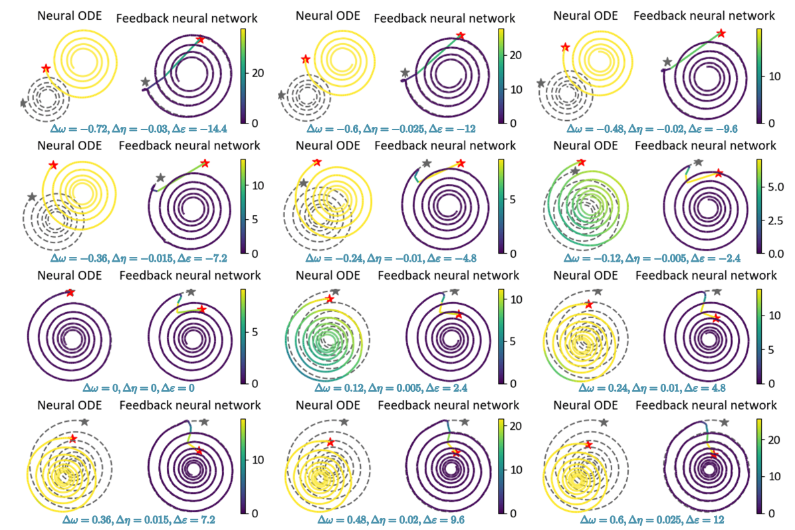

Figure S1: Test on $12$ randomized cases in the spiral curve example. The developed feedback neural network shows better generalization performance than the neural ODE.
[/FIGURE]

[FIGURE A1.F11.g1]
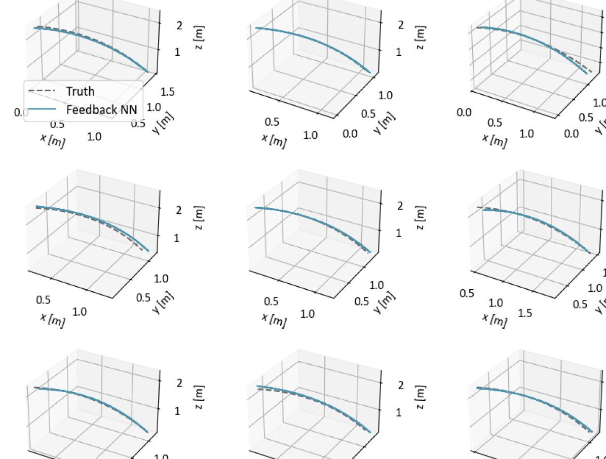

Figure S2: Trajectory prediction results of all $9$ test trajectories in Section [5.1](#S5.SS1 "5.1 Trajectory prediction of an irregular object ‣ 5 Empirical study ‣ Feedback Favors the Generalization of Neural ODEs"). It can be seen that the predicted trajectories almost overlap with the truth ones.
[/FIGURE]

[FIGURE A1.F12.g1]
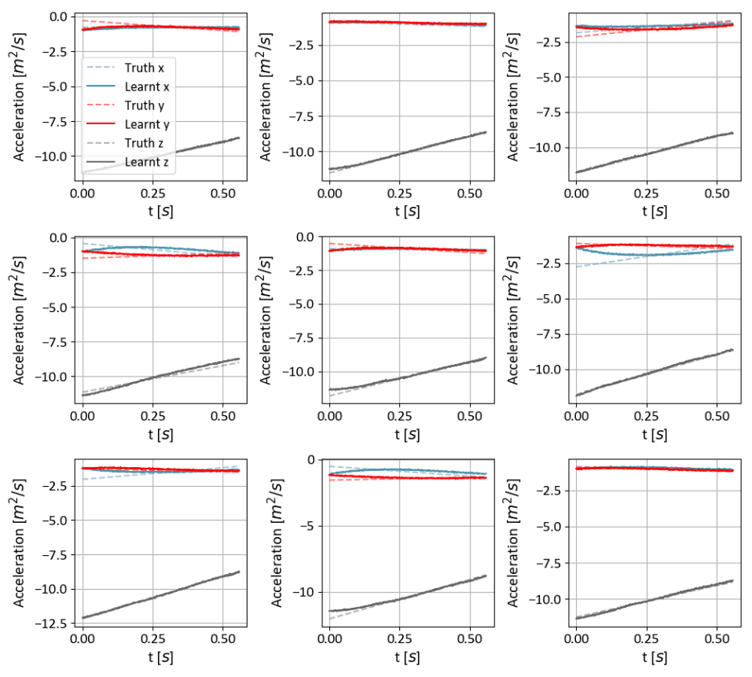

Figure S3: The learning performance of latent accelerations of all $9$ test trajectories in Section [5.1](#S5.SS1 "5.1 Trajectory prediction of an irregular object ‣ 5 Empirical study ‣ Feedback Favors the Generalization of Neural ODEs"). It can be seen that the feedback neural network can accurately capture the latent dynamics of test trajectories out of the training set.
[/FIGURE]

[FIGURE A1.F13.g1]
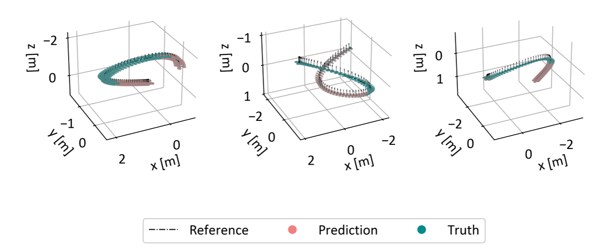

Figure S4: $3$ random trajectories generated for validations of the learned neural ODE, named traj-#$1$, traj-#$2$, and traj-#$3$. All trajectories show well-predicted motions on pose and attitude. Detailed results on all $12$ states are provided in Figures [S5](#A1.F14 "Figure S5 ‣ A.5.4 Test results ‣ A.5 Implementation details of model predictive control of a quadrotor ‣ Appendix A Appendix ‣ Feedback Favors the Generalization of Neural ODEs")-[S7](#A1.F16 "Figure S7 ‣ A.5.4 Test results ‣ A.5 Implementation details of model predictive control of a quadrotor ‣ Appendix A Appendix ‣ Feedback Favors the Generalization of Neural ODEs").
[/FIGURE]

[FIGURE A1.F14.g1]
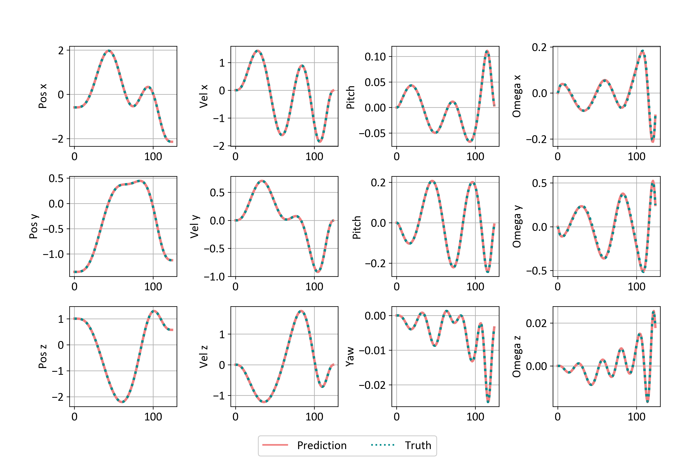

Figure S5: Validation of learned neural ODE. Prediction on all $12$ states of traj-#$1$.
[/FIGURE]

[FIGURE A1.F15.g1]
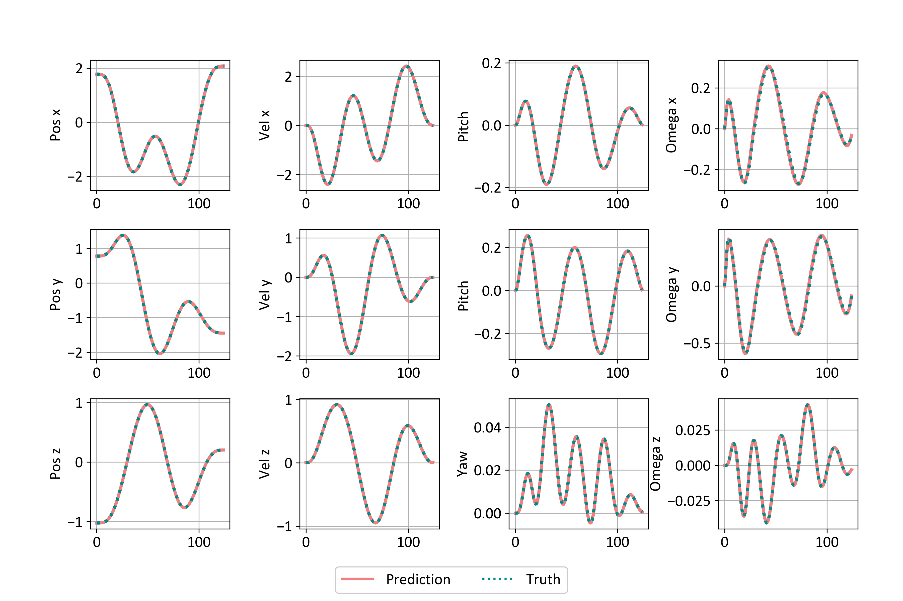

Figure S6: Validation of learned neural ODE. Prediction on all $12$ states of traj-#$2$.
[/FIGURE]

[FIGURE A1.F16.g1]
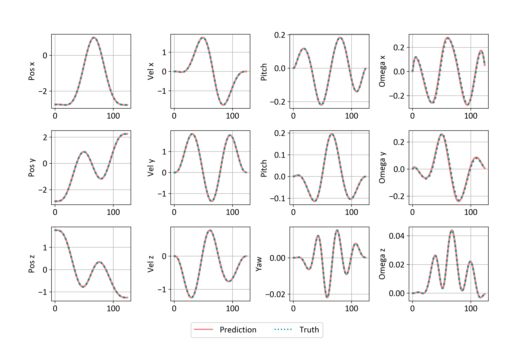

Figure S7: Validation of learned neural ODE. Prediction on all $12$ states of traj-#$3$.
[/FIGURE]

[FIGURE A1.F17.g1]
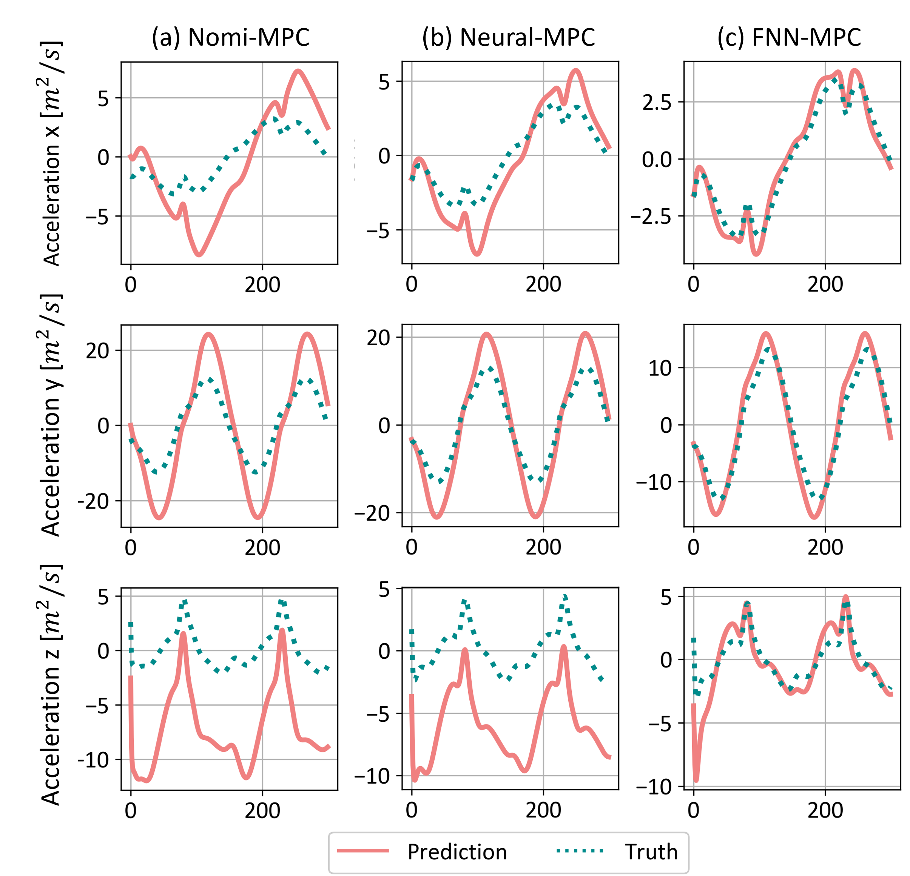

Figure S8: Test on the Lissajous trajectory. Prediction on the translational latent dynamics (i.e., acceleration) at the first step using different prediction models. The feedback neural network augmented model achieve the best prediction performance.
[/FIGURE]

