# DiffSplat: Repurposing Image Diffusion Models for Scalable Gaussian Splat Generation

###### Abstract

Recent advancements in 3D content generation from text or a single image struggle with limited high-quality 3D datasets and inconsistency from 2D multi-view generation. We introduce DiffSplat, a novel 3D generative framework that natively generates 3D Gaussian splats by taming large-scale text-to-image diffusion models. It differs from previous 3D generative models by effectively utilizing web-scale 2D priors while maintaining 3D consistency in a unified model. To bootstrap the training, a lightweight reconstruction model is proposed to instantly produce multi-view Gaussian splat grids for scalable dataset curation. In conjunction with the regular diffusion loss on these grids, a 3D rendering loss is introduced to facilitate 3D coherence across arbitrary views. The compatibility with image diffusion models enables seamless adaptions of numerous techniques for image generation to the 3D realm. Extensive experiments reveal the superiority of DiffSplat in text- and image-conditioned generation tasks and downstream applications. Thorough ablation studies validate the efficacy of each critical design choice and provide insights into the underlying mechanism.  

{NoHyper}††$\dagger$: Project lead; $\ddagger$: Corresponding author.

## 1 Introduction

Generating 3D content from a single image or text is a long-standing challenge with a wide range of applications, such as game design, digital arts, human avatars, and virtual reality. It is a highly ill-posed problem that requires reasoning the unseen parts of any object in the 3D space only from a single view or textual descriptions, posing a great challenge to both fidelity and generalizability.  

With the development of diffusion generative models (Sohl-Dickstein et al., [2015](#bib.bib69); Ho et al., [2020](#bib.bib23)), recent works train conditional 3D generative networks directly on datasets of various 3D representations (Nichol et al., [2022](#bib.bib51); Jun & Nichol, [2023](#bib.bib26); Cao et al., [2024](#bib.bib4); He et al., [2024](#bib.bib19); Zhang et al., [2024b](#bib.bib89)), as demonstrated in Figure [1](#S1.F1 "Figure 1 ‣ 1 Introduction ‣ DiffSplat: Repurposing Image Diffusion Models for Scalable Gaussian Splat Generation") (1), or only using 2D supervision with the help of differentiable rendering techniques (Anciukevičius et al., [2023](#bib.bib1); Karnewar et al., [2023b](#bib.bib29); Szymanowicz et al., [2023](#bib.bib72); Xu et al., [2024d](#bib.bib86)) as in Figure [1](#S1.F1 "Figure 1 ‣ 1 Introduction ‣ DiffSplat: Repurposing Image Diffusion Models for Scalable Gaussian Splat Generation") (2). Despite 3D consistency, they are limited by the supervision scale and can’t utilize 2D priors from abundant pre-trained models. Current advanced generalizable 3D content creation methods (Li et al., [2024a](#bib.bib35); Wang et al., [2024](#bib.bib79); Tang et al., [2024](#bib.bib74)) reconstruct implicit 3D representations from generated multi-view images using pretrained 2D diffusion models (Wang & Shi, [2023](#bib.bib78); Shi et al., [2023](#bib.bib64); Voleti et al., [2024](#bib.bib77)), as illustrated in Figure [1](#S1.F1 "Figure 1 ‣ 1 Introduction ‣ DiffSplat: Repurposing Image Diffusion Models for Scalable Gaussian Splat Generation") (3). Although these two-stage methods can reconstruct high-quality 3D content from multi-view posed images, the synthesis pipeline collapses and fails to produce faithful results when generated images from upstreamed 2D multi-view diffusion models are of poor quality or inconsistency.  

To overcome the drawbacks of previous works, we present DiffSplat, a novel 3D generative framework that exhibits multi-view consistency and effectively leverages generative priors from large-scale image datasets. We adopt 3D Gaussian Splatting (3DGS) (Kerbl et al., [2023](#bib.bib32)) as the 3D content representation for its efficient rendering and quality balance. Instead of relying on time-consuming per-instance optimization to obtain 3D datasets for training (He et al., [2024](#bib.bib19); Zhang et al., [2024b](#bib.bib89)), we represent a 3D object by a set of well-structured splat 2D grids. During the training stage, these grids can be instantly regressed from multi-view images in less than 0.1 seconds, facilitating scalable and high-quality 3D dataset curation. Each Gaussian splat in 2D grids holds properties that imply object texture and structure. Noting that image diffusion models trained on web-scale datasets are capable of 3D geometry estimation (Li et al., [2024b](#bib.bib36); Ke et al., [2024](#bib.bib31); Fu et al., [2024](#bib.bib14)), we find that by treating reconstructed Gaussian splat 2D grids as images in a special style, we can harness the power of pretrained 2D image diffusion models for direct 3DGS generation.  

Specifically, open-sourced latent diffusion models (Rombach et al., [2022](#bib.bib59); Podell et al., [2024](#bib.bib55); Chen et al., [2024c](#bib.bib9); [b](#bib.bib8); Esser et al., [2024](#bib.bib13)) trained on web-scale image datasets are repurposed to directly generate Gaussian splat properties for 3D content creation. To ensure that reconstructed splat grids have the same shape as the input latents of image diffusion models, we also fine-tune their VAEs to compress Gaussian splat properties into a similar latent space, which are coined as splat latents. During the training of DiffSplat, as shown in Figure [1](#S1.F1 "Figure 1 ‣ 1 Introduction ‣ DiffSplat: Repurposing Image Diffusion Models for Scalable Gaussian Splat Generation") (4), in addition to a standard diffusion loss on splat latents, which resembles regular image diffusion models, we propose to incorporate a rendering loss to enable the generative model to function in 3D space and facilitate 3D consistency, since Gaussian splat properties are processed in the network and can be differentially rendered in arbitrary views. Furthermore, thanks to the minimal modifications on 2D denoising network architectures, various pretrained text-to-image diffusion models can serve as the base model for DiffSplat, and techniques proposed for them can be seamlessly adapted to the realm of 3D generation within our framework, establishing a bridge between 3D content creation and the image generation community.  

Our contributions can be summarized as follows:  

* A novel 3D generative framework that directly generates 3D Gaussian splats by fine-tuning image diffusion models, effectively utilizing 2D priors and maintaining 3D consistency. 
* Abundant pretrained image diffusion models and associated techniques can be adapted for the proposed model, seamlessly connecting 3D generation and the image community. 
* Extensive experiments demonstrate the superior performance of the proposed method, and ablation studies are conducted to analyze the effectiveness of each design choice. 

[FIGURE S1.F1.g1]
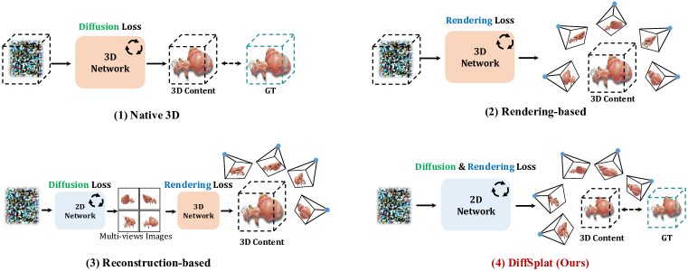

Figure 1: Comparison with Previous 3D Diffusion Generative Models. (1) Native 3D methods and (2) rendering-based methods encounter challenges in training 3D diffusion models from scratch with limited 3D data. (3) Reconstruction-based methods struggle with inconsistencies in generated multi-view images. In contrast, (4) DiffSplat leverages pretrained image diffusion models for the direct 3DGS generation, effectively utilizing 2D diffusion priors and maintaining 3D consistency. “GT” refers to ground-truth samples in a 3D representation used for diffusion loss computation.
[/FIGURE]

## 2 Related Work

##### Native 3D Generative Models

Diffusion-based models (Ho et al., [2020](#bib.bib23); Liu et al., [2023](#bib.bib41)) have emerged as the de facto approach for generative models. The most straightforward solution for 3D content creation is to train a 3D denoising network on 3D datasets as shown in Figure [1](#S1.F1 "Figure 1 ‣ 1 Introduction ‣ DiffSplat: Repurposing Image Diffusion Models for Scalable Gaussian Splat Generation") (1), termed as “native 3D generative models”. Numerous native 3D methods are proposed for explicit 3D representations, such as voxel (Sanghi et al., [2023](#bib.bib61); Ren et al., [2024](#bib.bib58)) and point cloud (Nichol et al., [2022](#bib.bib51); Mo et al., [2023](#bib.bib50)), which are readily available but often result in poor visual quality. On the other hand, implicit representations like implicit functions (Jun & Nichol, [2023](#bib.bib26); Liu et al., [2024a](#bib.bib39); Zhang et al., [2024d](#bib.bib91); Li et al., [2024c](#bib.bib37); Chen et al., [2024d](#bib.bib10)), triplanes (Cao et al., [2024](#bib.bib4); Liu et al., [2024b](#bib.bib40); Zhang et al., [2024a](#bib.bib88); Wu et al., [2024](#bib.bib81)) and 3DGS (Henderson et al., [2024](#bib.bib21); He et al., [2024](#bib.bib19); Zhang et al., [2024b](#bib.bib89)) offer more faithful appearances but are usually inaccessible and require extra time-intensive preprocessing, making it impractical to maintain a large-scale dataset. Moreover, native 3D generative models face limitations in leveraging pretrained 2D models, posing great challenges to the quality and scale of 3D datasets, as well as the efficiency of 3D network training from scratch.  

##### Rendering-based 3D Generative Models

Instead of relying on time-consuming 3D dataset curation, with differentiable rendering techniques (Mildenhall et al., [2020](#bib.bib49)), some works propose to train 3D generative models with only 2D supervision, which are called “rendering-based generative models” and shown in Figure [1](#S1.F1 "Figure 1 ‣ 1 Introduction ‣ DiffSplat: Repurposing Image Diffusion Models for Scalable Gaussian Splat Generation") (2). These methods aim to denoise images rendered from a corrupted implicit 3D representation in the absence of ground-truth clean 3D data. HoloDiffusion (Karnewar et al., [2023b](#bib.bib29)) and HoloFusion (Karnewar et al., [2023a](#bib.bib28)) propose bootstrapped latent diffusion strategy, in which feature volumes are denoised twice to solve the problem that there is no ground-truth rendering volume for radiance fields. Compared to RenderDiffusion (Anciukevičius et al., [2023](#bib.bib1)) that reconstructs clean triplane features from single-view noised images, Viewset Diffusion (Szymanowicz et al., [2023](#bib.bib72)) and GIBR (Anciukevicius et al., [2024](#bib.bib2)) denoise multi-view images simultaneously, ensuring coherent and plausible appearance and geometry for the intermedia rendering volume from sufficient viewpoints. DMV3D (Xu et al., [2024d](#bib.bib86)) further scales up to highly diverse datasets containing nearly 1 million objects. However, it is extremely computationally intensive and costs 128 A100 GPUs for 7 days to train a unified model for 2D denoising and 3D reconstruction without any 2D generative prior, suffering from the same drawback of native 3D methods.  

##### Reconstruction-based 3D Generative Models

By scaling up network parameters and training datasets, Large Reconstruction Model (LRM) (Hong et al., [2024b](#bib.bib25); Tochilkin et al., [2024](#bib.bib75)), a feed-forward Transformer encoder (Vaswani et al., [2017](#bib.bib76)), can reconstruct a triplane field (Chan et al., [2022](#bib.bib5)) from a single image. It only needs multi-view images for supervision akin to rendering-based methods, but operates deterministically rather than for denoising. As presented in Figure [1](#S1.F1 "Figure 1 ‣ 1 Introduction ‣ DiffSplat: Repurposing Image Diffusion Models for Scalable Gaussian Splat Generation") (3), reconstruction-based methods leverage 2D priors by utilizing frozen image diffusion models to generate multiview images (Shi et al., [2024](#bib.bib65); Wang & Shi, [2023](#bib.bib78); Shi et al., [2023](#bib.bib64); Voleti et al., [2024](#bib.bib77); Han et al., [2024](#bib.bib17)) with generalizable 3D reconstruction models. Instant3D (Li et al., [2024a](#bib.bib35)) follows LRM and produces triplane features from posed images in 2$\times$2 grids generated by a fine-tuned large image diffusion model (Podell et al., [2024](#bib.bib55)). Some methods (Wang et al., [2024](#bib.bib79); Wei et al., [2024](#bib.bib80); Xu et al., [2024b](#bib.bib83); Siddiqui et al., [2024](#bib.bib67); Boss et al., [2024](#bib.bib3)) replace the rendering representation from triplane to FlexiCubes (Shen et al., [2021](#bib.bib62); [2023](#bib.bib63)) or VolSDF (Yariv et al., [2021](#bib.bib87)) to directly extract meshes. Other methods produce Gaussian attributes from pixels (Tang et al., [2024](#bib.bib74); Xu et al., [2024c](#bib.bib85); Zhang et al., [2024c](#bib.bib90)), learnable tokens (Chen et al., [2024a](#bib.bib7)) or latent features (Pan et al., [2024](#bib.bib53)). However, all these methods regard the multi-view diffusion model as an independent plug-and-play module, so 3D generation is conducted as a two-stage proceeding, which requires extra network parameters and may collapse due to the 3D inconsistency in generated images.  

## 3 Method

[FIGURE S3.F2.g1]
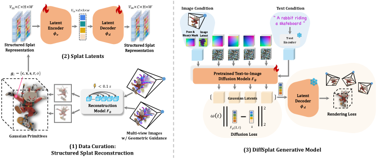

Figure 2: Method Overview.
(1) A lightweight reconstruction model provides high-quality structured representation for “pseudo” dataset curation. (2) Image VAE is fine-tuned to encode Gaussian splat properties into a shared latent space. (3) DiffSplat is natively capable of generating 3D contents by image and text conditions utilizing 2D priors from text-to-image diffusion models.
[/FIGURE]

Motivated by the effectiveness of web-scale pretrained image diffusion models in estimating 3D geometry attributes, such as depth (Stan et al., [2023](#bib.bib71); Ke et al., [2024](#bib.bib31)), coordinates (Li et al., [2024b](#bib.bib36); Xu et al., [2024a](#bib.bib82)) and normal (Long et al., [2024](#bib.bib42); Fu et al., [2024](#bib.bib14)), our goal in this work is taming image diffusion models to directly generate 3D content. As illustrated in Figure [2](#S3.F2 "Figure 2 ‣ 3 Method ‣ DiffSplat: Repurposing Image Diffusion Models for Scalable Gaussian Splat Generation"), the proposed method consists of three parts: (1) scalable 3D data curation by structured splat reconstruction (Sec. [3.1](#S3.SS1 "3.1 Data Curation: Structured Splat Reconstruction ‣ 3 Method ‣ DiffSplat: Repurposing Image Diffusion Models for Scalable Gaussian Splat Generation")), (2) splat latents (Sec. [3.2](#S3.SS2 "3.2 Splat Latents ‣ 3 Method ‣ DiffSplat: Repurposing Image Diffusion Models for Scalable Gaussian Splat Generation")), and (3) the generative model DiffSplat (Sec. [3.3](#S3.SS3 "3.3 DiffSplat Generative Model ‣ 3 Method ‣ DiffSplat: Repurposing Image Diffusion Models for Scalable Gaussian Splat Generation")).  

### 3.1 Data Curation: Structured Splat Reconstruction

Inspired by generalizable 3DGS reconstruction techniques (Szymanowicz et al., [2024](#bib.bib73); Charatan et al., [2024](#bib.bib6)), we utilize a set of structured multi-view Gaussian splat grids to represent a 3D object. Specifically, given $V_{\text{in}}$ posed images in $\mathbb{R}^{3\times H\times W}$, a small network $F_{\theta}$ can regress per-pixel splat from these contextualized images in under 0.1 seconds, and is trained by the rendering loss $\mathcal{L}_{\text{render}}$:  

|  | $$\mathcal{L}_{\text{render}}(\mathcal{G})\coloneqq\frac{1}{V}\sum_{v=1}^{V}\ \left(\mathcal{L}_{\text{MSE}}(I_{v},I^{\text{GT}}_{v})+\lambda_{p}\cdot\mathcal{L}_{\text{LPIPS}}(I_{v},I^{\text{GT}}_{v})+\lambda_{\alpha}\cdot\mathcal{L}_{\text{MSE}}(M_{v},M^{\text{GT}}_{v})\right),$$ |  | (1) |
| --- | --- | --- | --- |

where $I_{v}$ and $M_{v}$ are respectively RGB images and silhouette masks differentially rendered from predicted 3D Gaussian primitives $\mathcal{G}\coloneqq\{\mathbf{g}_{i}\}_{i=1}^{N}$ via efficient rasterization technique (Kerbl et al., [2023](#bib.bib32)) across random $V$ viewpoints, and $N=V_{\text{in}}\times H\times W$ due to the pixel-aligned prediction. $\mathcal{L}_{\text{MSE}}$ and $\mathcal{L}_{\text{LPIPS}}$ stands for mean squared error loss and VGG-based perceptual loss (Zhang et al., [2018](#bib.bib93)). “GT” denotes ground-truth data for supervision, and $\lambda_{p},\lambda_{\alpha}\in\mathbb{R}^{+}$ are hyper-parameters to adjust the relative importance of three different losses.  

Each Gaussian primitive $\mathbf{g}_{i}\in\mathbb{R}^{12}$ is parameterized by its RGB color $\mathbf{c}\in\mathbb{R}^{3}$, location $\mathbf{x}\in\mathbb{R}^{3}$, scale $\mathbf{s}\in\mathbb{R}^{3}$, rotation quaternion $\mathbf{r}\in\mathbb{R}^{4}$ and opacity $o\in\mathbb{R}$. To simplify the parameterization and regulate the distribution of primitives, location $\mathbf{x}$ is determined by depth $d\in\mathbb{R}$, camera intrinsic $\mathbf{K}\in\mathbb{R}^{3\times 3}$ and extrinsic matrices (rotation $\mathbf{R}\in\text{SO(3)}$ and translation $\mathbf{t}\in\mathbb{R}^{3}$), $\mathbf{x}\coloneqq\mathbf{R}^{\top}\mathbf{K}^{-1}[\mathbf{u}|d]-\mathbf{t}$. $[\mathbf{u}|d]$ is homogeneous pixel coordinates $\mathbf{u}\in\mathbb{R}^{2}$ with depth. For numerical values of Gaussian splat properties to be confined within $[0,1]$ in preparation of diffusion-based generation, outputs of $F_{\theta}$ are all activated by the sigmoid function $\sigma(\cdot)$, except for $\mathbf{r}$, which is $L_{2}$-normalized to yield unit quaternions. RGB color $c$ and opacity $o$ are already supposed to be in $[0,1]$. Raw scale $\hat{\mathbf{s}}$ is linearly interpolated with predefined values $s_{\text{min}}$ and $s_{\text{max}}$ (Xu et al., [2024c](#bib.bib85)):  

|  | $$\vskip-5.69046pt\mathbf{s}\coloneqq s_{\text{min}}\cdot\sigma(\hat{\mathbf{s}})+s_{\text{max}}\cdot(1-\sigma(\hat{\mathbf{s}})).$$ |  | (2) |
| --- | --- | --- | --- |

Raw depth $\hat{d}$ is defined to be relative to the image plane, and objects in our datasets can be normalized into a $[-1,1]^{3}$ cube, allowing its value to be restricted in [0, 1] by the sigmoid function:  

|  | $$\vskip-5.69046ptd\coloneqq 2\cdot\sigma(\hat{d})-1+\|\mathbf{t}\|_{2}.$$ |  | (3) |
| --- | --- | --- | --- |

Different from previous reconstruction-based methods (Tang et al., [2024](#bib.bib74); Xu et al., [2024c](#bib.bib85); Zhang et al., [2024c](#bib.bib90)), besides multi-view posed RGB images, we also incorporate corresponding coordinate maps (Shotton et al., [2013](#bib.bib66)) and normal maps as additional inputs for auxiliary geometric guidance. Note that these extra inputs are only employed to enhance the reconstruction quality of Gaussian splat grids and are not required during the generation stage. Ablation study is conducted to assess the efficacy of geometric guidance alongside RGB images in Sec. [4.5.1](#S4.SS5.SSS1 "4.5.1 Splat Latent Reconstruction ‣ 4.5 Ablation and Analysis ‣ 4 Experiments ‣ DiffSplat: Repurposing Image Diffusion Models for Scalable Gaussian Splat Generation").  

### 3.2 Splat Latents

Aforementioned designs allow for a high-quality representation of 3D objects using multi-view splat grids $\mathcal{G}\coloneqq\{\mathbf{G}_{i}\}_{i=1}^{V_{\text{in}}}$, which are structured for image-like processing, obtained efficiently, and confined within a suitable numerical range. To encode Gaussian splat grids to image diffusion latent space, the most straightforward idea is to split them into multiple feature groups with 3 channels to analog RGB images, and process them separately. However, this results in poor auto-encoding quality, as encoded latents display notable deviations from natural images, as shown in Sec. [4.5.1](#S4.SS5.SSS1 "4.5.1 Splat Latent Reconstruction ‣ 4.5 Ablation and Analysis ‣ 4 Experiments ‣ DiffSplat: Repurposing Image Diffusion Models for Scalable Gaussian Splat Generation").  

Instead, we duplicate the columns and rows of pretrained input and output convolution weights 4 times respectively to match the feature dimensions of Gaussian splat grids $\mathbf{G}_{i}\in\mathbb{R}^{12\times H\times W}$. VAEs for latent image diffusion models (Rombach et al., [2022](#bib.bib59); Podell et al., [2024](#bib.bib55); Esser et al., [2024](#bib.bib13)) are then fine-tuned to auto-encode each Gaussian splat grid independently with both reconstruction loss and rendering loss:  

|  | $$\mathcal{L}_{\text{VAE}}\coloneqq\frac{1}{V_{\text{in}}}\sum_{i=1}^{V_{\text{in}}}\ \left(\mathcal{L}_{\text{MSE}}(\tilde{\mathbf{G}}_{i},\mathbf{G}_{i})\right)+\lambda_{r}\cdot\mathcal{L}_{\text{render}}(\tilde{\mathcal{G}}),$$ |  | (4) |
| --- | --- | --- | --- |

where $\tilde{\mathbf{G}}_{i}\coloneqq D_{\phi_{d}}(E_{\phi_{e}}(\mathbf{G}_{i}))$ is auto-encoded $\mathbf{G}_{i}$ by the VAE’s encoder $E_{\phi_{e}}$ and decoder $D_{\phi_{d}}$, and $\mathcal{L}_{\text{render}}$ is computed across $V$ random views as presented in Equation [1](#S3.E1 "In 3.1 Data Curation: Structured Splat Reconstruction ‣ 3 Method ‣ DiffSplat: Repurposing Image Diffusion Models for Scalable Gaussian Splat Generation"). $\lambda_{r}$ is the weighting term for the rendering loss. Encoded Gaussian splat grids from $V_{\text{in}}$ input views $\mathbf{z}\coloneqq\{\mathbf{z}_{i}\}_{i=1}^{V_{\text{in}}}=\{E_{\phi_{e}}(\mathbf{G}_{i})\}_{i=1}^{V_{\text{in}}}$ are referred to as splat latents, which undergoes diffusion and denoising process in DiffSplat. Rendering loss $\mathcal{L}_{\text{render}}$ is significant for high-quality splat latent auto-encoding, and quantitative evaluations are provided in Sec. [4.5.1](#S4.SS5.SSS1 "4.5.1 Splat Latent Reconstruction ‣ 4.5 Ablation and Analysis ‣ 4 Experiments ‣ DiffSplat: Repurposing Image Diffusion Models for Scalable Gaussian Splat Generation").  

### 3.3 DiffSplat Generative Model

#### 3.3.1 Model Architecture

Given a set of multi-view splat latents $\mathbf{z}=\{\mathbf{z}_{i}\}_{i=1}^{V_{\text{in}}}$ structured as 2D grids, two widely adopted manners for multi-view image generation are explored in this work to simultaneously generate $\mathbf{z}$ as a whole from text prompts or single-view images, coined as view-concat and spatial-concat.  

In the view-concat manner, $V_{\text{in}}$ splat latents of an objects, shaped as $\mathbb{R}^{d\times h\times w}$, are treated like video frames and concatenated along the view dimension into $\mathbb{R}^{V_{\text{in}}\times d\times h\times w}$ and processed individually by the denoising network, except in the self-attention module, where they are reshaped into $\mathbb{R}^{(V_{\text{in}}\cdot h\cdot w)\times d}$ and treated as an integral sequence (Long et al., [2024](#bib.bib42); Shi et al., [2024](#bib.bib65); Kant et al., [2024](#bib.bib27); Gao et al., [2024b](#bib.bib16)). While for the spatial-concat manner, splat latents are organized into an $r\times c$ grid along the height and width dimensions, resulting in a shape of $\mathbb{R}^{d\times(r\cdot h)\times(c\cdot w)}$, where $V_{\text{in}}\equiv r\times c$ (Shi et al., [2023](#bib.bib64); Li et al., [2024a](#bib.bib35); Gao et al., [2024a](#bib.bib15)). In both manners, Plücker embeddings (Sitzmann et al., [2021](#bib.bib68)) are concatenated along the feature dimension with respective splat latents, enabling a dense encoding of relative camera poses. It facilitates better flexibility in viewpoint selection and reduces requirements for multi-view datasets. The only new parameters introduced to pretrained models are zero-initialized new columns in the input convolution weights for Plücker embeddings. These model designs result in minimal modifications and generalizability across various text-to-image diffusion models (Rombach et al., [2022](#bib.bib59); Podell et al., [2024](#bib.bib55); Chen et al., [2024c](#bib.bib9); [b](#bib.bib8); Esser et al., [2024](#bib.bib13)).  

Unlike multi-view image diffusion models (Li et al., [2024a](#bib.bib35); Kant et al., [2024](#bib.bib27)), it’s not feasible for text-conditioned DiffSplat to simply denoise other views except for the input image view for image-conditioned generation, as the input condition (pixels) and generated outputs (splat properties) are in different domains. For view-concat, the original VAE-encoded input image is concatenated along the view dimension, with additional dense binary masks concatenated along the feature dimension to distinguish between image and splat latents. For spatial-concat, the input image is padded with a blank background to form an $r\times c$ grid, and then concatenated along the feature dimension after the image VAE encoding. Ablation study on the multi-view manners for both text- and image-conditioned 3DGS generation tasks is conducted in Sec. [4.5.2](#S4.SS5.SSS2 "4.5.2 DiffSplat 3D Generation ‣ 4.5 Ablation and Analysis ‣ 4 Experiments ‣ DiffSplat: Repurposing Image Diffusion Models for Scalable Gaussian Splat Generation").  

#### 3.3.2 Training Objectives

DiffSplat $F_{\psi}$ can be trained with the regular diffusion loss $\mathcal{L}_{\text{diff}}$, which aims to denoise corrupted splat latents $\tilde{\mathbf{z}}\coloneqq\text{{AddNoise}}(\mathbf{z},\bm{\epsilon},t)$ from a randomly sampled noise level $t$:  

|  | $$\mathcal{L}_{\text{diff}}\coloneqq\omega(t)\cdot\|F_{\psi}(\tilde{\mathbf{z}},t)-\mathbf{z}\|^{2}_{2}.$$ |  | (5) |
| --- | --- | --- | --- |

Here, AddNoise($\cdot$) corrupts the sample $\mathbf{z}$ with random Gaussian noises $\bm{\epsilon}\sim\mathcal{N}(\mathbf{0},\mathbf{1})$ at the noise level $t$ (Ho et al., [2020](#bib.bib23); Nichol & Dhariwal, [2021](#bib.bib52); Karras et al., [2022](#bib.bib30); Liu et al., [2023](#bib.bib41)), and $\omega(t)$ is the weighting term of diffusion loss at different noise levels (Song et al., [2021](#bib.bib70); Salimans & Ho, [2022](#bib.bib60); Hang et al., [2023](#bib.bib18); Kingma & Gao, [2023](#bib.bib33)). Text and image conditions are omitted for concision.  

However, optimizing solely with $\mathcal{L}_{\text{diff}}$, similar to multi-view image diffusion models (Shi et al., [2024](#bib.bib65); [2023](#bib.bib64); Li et al., [2024a](#bib.bib35)), does not guarantee 3D consistency. This limitation stems from the model essentially operating in the 2D space of Gaussian splat grids, and the stereo correspondences among $V_{\text{in}}$ viewpoints are learned implicitly during the fine-tuning of image diffusion models, which are originally trained on single-view natural images. Therefore, it makes the fine-tuning process less straightforward for achieving consistent learning in a 3D context. Moreover, treating splat latents as ground-truth samples, which are compressed after a lightweight reconstruction model, also limits the upper bound of the generative model, as real multi-view datasets are not involved in the training process, relying completely on the results from reconstruction and auto-encoding models.  

Recognizing that splat latents are processed during the diffusion process, not as pixels but as a natural 3D representation that can be efficiently rendered from arbitrary views, we propose to incorporate an additional rendering loss $\mathcal{L}_{\text{render}}$, as defined in Equation [1](#S3.E1 "In 3.1 Data Curation: Structured Splat Reconstruction ‣ 3 Method ‣ DiffSplat: Repurposing Image Diffusion Models for Scalable Gaussian Splat Generation"), alongside $\mathcal{L}_{\text{diff}}$, where denoised splat latents are decoded back into Gaussian splat properties and rendered from random $V$ viewpoints, with supervision from ground-truth multi-view images. The final training objective is:  

|  | $$\mathcal{L}_{\textsc{DiffSplat}}\coloneqq\lambda_{\text{diff}}\cdot\mathcal{L}_{\text{diff}}+\lambda_{\text{render}}\cdot\omega_{r}(t)\cdot\mathcal{L_{\text{render}}}(D_{\phi_{d}}(F_{\psi}(\tilde{\mathbf{z}},t))),$$ |  | (6) |
| --- | --- | --- | --- |

where $\omega_{r}(t)$ is the weighting term of the rendering loss at different noise levels, and $\lambda_{\text{diff}},\lambda_{\text{render}}$ are used to adjust the importance of two types of losses.  

Notably, by setting $\lambda_{\text{diff}}=0$, DiffSplat effectively becomes a rendering-based model, but denoising splat latents instead of pixels. On the other hand, by setting $\lambda_{\text{render}}=0$, DiffSplat transforms into a “pseudo” native 3D model by treating splat latents as a pseudo ground-truth 3D representation. The effectiveness of the two types of losses is evaluated in Sec. [4.5.2](#S4.SS5.SSS2 "4.5.2 DiffSplat 3D Generation ‣ 4.5 Ablation and Analysis ‣ 4 Experiments ‣ DiffSplat: Repurposing Image Diffusion Models for Scalable Gaussian Splat Generation").  

## 4 Experiments

### 4.1 Experimental Settings

All our models in this work are trained on G-Objaverse (Qiu et al., [2024](#bib.bib56)), a high-quality subset of Objaverse (Deitke et al., [2023](#bib.bib11)) and comprising images from 38 different views of around 265K 3D objects. Captions of these 3D objects are provided by Cap3D (Luo et al., [2023](#bib.bib47); [2024](#bib.bib48)). To quantitatively evaluate the performance of text-conditioned generation, 300 text prompts from T3Bench (He et al., [2023](#bib.bib20)), describing a single object, a single object with surroundings and multiple objects, are employed as conditions. CLIP similarity score (Radford et al., [2021](#bib.bib57)) and CLIP R-Precision (Park et al., [2021](#bib.bib54)) based on ViT-B/32 are used to measure the alignment of input prompts and rendered images, and ImageReward (Xu et al., [2023](#bib.bib84)) is used to reflect human aesthetic preference. For both reconstruction and image-conditioned generation task, 300 objects from the unseen GSO (Downs et al., [2022](#bib.bib12)) dataset are randomly selected and rendered to serve as ground-truth images, which are then compared with rendered images from reconstructed or generated 3D contents in terms of PSNR, SSIM and LPIPS (Zhang et al., [2018](#bib.bib93)) metrics. All metrics are averaged across different viewpoints for 3D-aware evaluation. Implementation details are provided in Appendix [A](#A1 "Appendix A Implementation Details ‣ DiffSplat: Repurposing Image Diffusion Models for Scalable Gaussian Splat Generation").  

### 4.2 Text-conditioned Generation

##### Baselines

Four state-of-the-art open-sourced methods that support native text-to-3D generation are evaluated, where GVGEN (He et al., [2024](#bib.bib19)) uses Gaussian volume to represent 3D objects, while triplane-based NeRF is used in LN3Diff (Lan et al., [2024](#bib.bib34)), DIRECT-3D (Liu et al., [2024b](#bib.bib40)) and 3DTopia (Hong et al., [2024a](#bib.bib24)). Two reconstruction-based methods LGM (Tang et al., [2024](#bib.bib74)) and GRM (Xu et al., [2024c](#bib.bib85)) can support text-to-3D generation by associating with an open-source text-conditioned multi-view diffusion model (Shi et al., [2024](#bib.bib65)).  

##### Results and Comparisions

As demonstrated in Table [1](#S4.T1 "Table 1 ‣ Results and Comparisions ‣ 4.2 Text-conditioned Generation ‣ 4 Experiments ‣ DiffSplat: Repurposing Image Diffusion Models for Scalable Gaussian Splat Generation") and Figure [3](#S4.F3 "Figure 3 ‣ Results and Comparisions ‣ 4.2 Text-conditioned Generation ‣ 4 Experiments ‣ DiffSplat: Repurposing Image Diffusion Models for Scalable Gaussian Splat Generation"), DiffSplat exhibits the best prompt alignment and visual quality among cutting-edge text-conditioned 3D generation methods, especially for complex prompts. In contrast, 3D native methods struggle to match text prompts due to limited text-3D pairs for training from scratch, while reconstruction-based methods suffer from multi-view diffusion inconsistency, particularly for objects with surroundings or other objects. More visualization results are provided in Appendix Figure [9](#A2.F9 "Figure 9 ‣ Appendix B More Visualization Results ‣ DiffSplat: Repurposing Image Diffusion Models for Scalable Gaussian Splat Generation"), [10](#A2.F10 "Figure 10 ‣ Appendix B More Visualization Results ‣ DiffSplat: Repurposing Image Diffusion Models for Scalable Gaussian Splat Generation") and [11](#A2.F11 "Figure 11 ‣ Appendix B More Visualization Results ‣ DiffSplat: Repurposing Image Diffusion Models for Scalable Gaussian Splat Generation").  

[FIGURE S4.F3.g1]
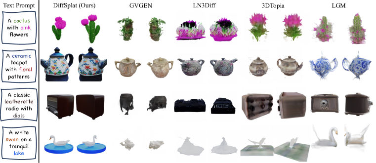

Figure 3: Qualitative Results and Comparisons on Text-conditioned 3D Generation. More visualizations of DiffSplat results are provided in Appendix Figure [9](#A2.F9 "Figure 9 ‣ Appendix B More Visualization Results ‣ DiffSplat: Repurposing Image Diffusion Models for Scalable Gaussian Splat Generation"), [10](#A2.F10 "Figure 10 ‣ Appendix B More Visualization Results ‣ DiffSplat: Repurposing Image Diffusion Models for Scalable Gaussian Splat Generation") and [11](#A2.F11 "Figure 11 ‣ Appendix B More Visualization Results ‣ DiffSplat: Repurposing Image Diffusion Models for Scalable Gaussian Splat Generation").
[/FIGURE]

[TABLE S4.T1]

<table class="ltx_tabular ltx_align_middle">
<tr class="ltx_tr">
<td class="ltx_td ltx_border_r ltx_border_tt"></td>
<td class="ltx_td ltx_align_center ltx_border_r ltx_border_tt">DiffSplat</td>
<td class="ltx_td ltx_align_center ltx_border_r ltx_border_tt">GVGEN</td>
<td class="ltx_td ltx_align_center ltx_border_r ltx_border_tt">LN3Diff</td>
<td class="ltx_td ltx_align_center ltx_border_r ltx_border_tt">DIRECT-3D</td>
<td class="ltx_td ltx_align_center ltx_border_r ltx_border_tt">3DTopia</td>
<td class="ltx_td ltx_align_center ltx_border_r ltx_border_tt">LGM†
</td>
<td class="ltx_td ltx_align_center ltx_border_tt">GRM†
</td>
</tr>
<tr class="ltx_tr">
<td class="ltx_td ltx_align_left ltx_border_t">
<table class="ltx_tabular ltx_align_middle">
<tr class="ltx_tr">
<td class="ltx_td ltx_nopad_r ltx_align_left">Single</td>
</tr>
<tr class="ltx_tr">
<td class="ltx_td ltx_nopad_r ltx_align_left">Object</td>
</tr>
</table> </td>
<td class="ltx_td ltx_align_left ltx_border_r ltx_border_t">
<math class="ltx_Math"><semantics><mo>↑</mo><annotation>\uparrow</annotation></semantics></math> CLIP Sim.%
</td>
<td class="ltx_td ltx_align_center ltx_border_r ltx_border_t">30.95</td>
<td class="ltx_td ltx_align_center ltx_border_r ltx_border_t">23.66</td>
<td class="ltx_td ltx_align_center ltx_border_r ltx_border_t">24.36</td>
<td class="ltx_td ltx_align_center ltx_border_r ltx_border_t">24.80</td>
<td class="ltx_td ltx_align_center ltx_border_r ltx_border_t">25.55</td>
<td class="ltx_td ltx_align_center ltx_border_r ltx_border_t">29.96</td>
<td class="ltx_td ltx_align_center ltx_border_t">28.19</td>
</tr>
<tr class="ltx_tr">
<td class="ltx_td ltx_align_left ltx_border_r">
<math class="ltx_Math"><semantics><mo>↑</mo><annotation>\uparrow</annotation></semantics></math> CLIP R-Prec.%
</td>
<td class="ltx_td ltx_align_center ltx_border_r">81.00</td>
<td class="ltx_td ltx_align_center ltx_border_r">23.25</td>
<td class="ltx_td ltx_align_center ltx_border_r">27.25</td>
<td class="ltx_td ltx_align_center ltx_border_r">30.75</td>
<td class="ltx_td ltx_align_center ltx_border_r">34.50</td>
<td class="ltx_td ltx_align_center ltx_border_r">78.00</td>
<td class="ltx_td ltx_align_center">64.75</td>
</tr>
<tr class="ltx_tr">
<td class="ltx_td ltx_align_left ltx_border_r">
<math class="ltx_Math"><semantics><mo>↑</mo><annotation>\uparrow</annotation></semantics></math> ImageReward</td>
<td class="ltx_td ltx_align_center ltx_border_r">-0.491</td>
<td class="ltx_td ltx_align_center ltx_border_r">-2.156</td>
<td class="ltx_td ltx_align_center ltx_border_r">-2.008</td>
<td class="ltx_td ltx_align_center ltx_border_r">-2.005</td>
<td class="ltx_td ltx_align_center ltx_border_r">-1.998</td>
<td class="ltx_td ltx_align_center ltx_border_r">-0.720</td>
<td class="ltx_td ltx_align_center">-1.337</td>
</tr>
<tr class="ltx_tr">
<td class="ltx_td ltx_align_left ltx_border_t">
<table class="ltx_tabular ltx_align_middle">
<tr class="ltx_tr">
<td class="ltx_td ltx_nopad_r ltx_align_left">Single</td>
</tr>
<tr class="ltx_tr">
<td class="ltx_td ltx_nopad_r ltx_align_left">Object</td>
</tr>
<tr class="ltx_tr">
<td class="ltx_td ltx_nopad_r ltx_align_left">w/ Sur.</td>
</tr>
</table> </td>
<td class="ltx_td ltx_align_left ltx_border_r ltx_border_t">
<math class="ltx_Math"><semantics><mo>↑</mo><annotation>\uparrow</annotation></semantics></math> CLIP Sim.%
</td>
<td class="ltx_td ltx_align_center ltx_border_r ltx_border_t">30.20</td>
<td class="ltx_td ltx_align_center ltx_border_r ltx_border_t">22.65</td>
<td class="ltx_td ltx_align_center ltx_border_r ltx_border_t">22.75</td>
<td class="ltx_td ltx_align_center ltx_border_r ltx_border_t">23.05</td>
<td class="ltx_td ltx_align_center ltx_border_r ltx_border_t">24.31</td>
<td class="ltx_td ltx_align_center ltx_border_r ltx_border_t">27.79</td>
<td class="ltx_td ltx_align_center ltx_border_t">26.24</td>
</tr>
<tr class="ltx_tr">
<td class="ltx_td ltx_align_left ltx_border_r">
<math class="ltx_Math"><semantics><mo>↑</mo><annotation>\uparrow</annotation></semantics></math> CLIP R-Prec.%
</td>
<td class="ltx_td ltx_align_center ltx_border_r">80.75</td>
<td class="ltx_td ltx_align_center ltx_border_r">26.75</td>
<td class="ltx_td ltx_align_center ltx_border_r">22.00</td>
<td class="ltx_td ltx_align_center ltx_border_r">25.75</td>
<td class="ltx_td ltx_align_center ltx_border_r">39.00</td>
<td class="ltx_td ltx_align_center ltx_border_r">55.00</td>
<td class="ltx_td ltx_align_center">51.25</td>
</tr>
<tr class="ltx_tr">
<td class="ltx_td ltx_align_left ltx_border_r">
<math class="ltx_Math"><semantics><mo>↑</mo><annotation>\uparrow</annotation></semantics></math> ImageReward</td>
<td class="ltx_td ltx_align_center ltx_border_r">-0.674</td>
<td class="ltx_td ltx_align_center ltx_border_r">-2.251</td>
<td class="ltx_td ltx_align_center ltx_border_r">-2.244</td>
<td class="ltx_td ltx_align_center ltx_border_r">-2.191</td>
<td class="ltx_td ltx_align_center ltx_border_r">-2.230</td>
<td class="ltx_td ltx_align_center ltx_border_r">-1.772</td>
<td class="ltx_td ltx_align_center">-1.869</td>
</tr>
<tr class="ltx_tr">
<td class="ltx_td ltx_align_left ltx_border_bb ltx_border_t">
<table class="ltx_tabular ltx_align_middle">
<tr class="ltx_tr">
<td class="ltx_td ltx_nopad_r ltx_align_left">Multiple</td>
</tr>
<tr class="ltx_tr">
<td class="ltx_td ltx_nopad_r ltx_align_left">Objects</td>
</tr>
</table> </td>
<td class="ltx_td ltx_align_left ltx_border_r ltx_border_t">
<math class="ltx_Math"><semantics><mo>↑</mo><annotation>\uparrow</annotation></semantics></math> CLIP Sim.%
</td>
<td class="ltx_td ltx_align_center ltx_border_r ltx_border_t">29.46</td>
<td class="ltx_td ltx_align_center ltx_border_r ltx_border_t">21.48</td>
<td class="ltx_td ltx_align_center ltx_border_r ltx_border_t">21.65</td>
<td class="ltx_td ltx_align_center ltx_border_r ltx_border_t">21.89</td>
<td class="ltx_td ltx_align_center ltx_border_r ltx_border_t">22.88</td>
<td class="ltx_td ltx_align_center ltx_border_r ltx_border_t">27.07</td>
<td class="ltx_td ltx_align_center ltx_border_t">24.33</td>
</tr>
<tr class="ltx_tr">
<td class="ltx_td ltx_align_left ltx_border_r">
<math class="ltx_Math"><semantics><mo>↑</mo><annotation>\uparrow</annotation></semantics></math> CLIP R-Prec.%
</td>
<td class="ltx_td ltx_align_center ltx_border_r">69.50</td>
<td class="ltx_td ltx_align_center ltx_border_r">8.00</td>
<td class="ltx_td ltx_align_center ltx_border_r">8.75</td>
<td class="ltx_td ltx_align_center ltx_border_r">7.75</td>
<td class="ltx_td ltx_align_center ltx_border_r">16.50</td>
<td class="ltx_td ltx_align_center ltx_border_r">51.00</td>
<td class="ltx_td ltx_align_center">26.50</td>
</tr>
<tr class="ltx_tr">
<td class="ltx_td ltx_align_left ltx_border_bb ltx_border_r">
<math class="ltx_Math"><semantics><mo>↑</mo><annotation>\uparrow</annotation></semantics></math> ImageReward</td>
<td class="ltx_td ltx_align_center ltx_border_bb ltx_border_r">-0.849</td>
<td class="ltx_td ltx_align_center ltx_border_bb ltx_border_r">-2.272</td>
<td class="ltx_td ltx_align_center ltx_border_bb ltx_border_r">-2.267</td>
<td class="ltx_td ltx_align_center ltx_border_bb ltx_border_r">-2.249</td>
<td class="ltx_td ltx_align_center ltx_border_bb ltx_border_r">-2.225</td>
<td class="ltx_td ltx_align_center ltx_border_bb ltx_border_r">-1.731</td>
<td class="ltx_td ltx_align_center ltx_border_bb">-2.116</td>
</tr>
</table>

Table 1: Quantitive evaluations on T3Bench prompts for text-conditioned generation. † indicates reconstruction-based methods that require additional text-conditioned multi-view generative models.
[/TABLE]

### 4.3 Image-conditioned Generation

##### Baselines

Two up-to-date native 3D models that support image-conditioned generation are compared here: the concurrent work 3DTopia-XL (Chen et al., [2024d](#bib.bib10)) and LN3Diff (Lan et al., [2024](#bib.bib34)). Six advanced reconstruction-based methods for single image-conditioned generation are also evaluated, including three Gaussian Splatting-based (Kerbl et al., [2023](#bib.bib32)) methods: LGM (Tang et al., [2024](#bib.bib74)), GRM (Xu et al., [2024c](#bib.bib85)) and LaRa (Chen et al., [2024a](#bib.bib7)), and two FlexiCube-based (Shen et al., [2023](#bib.bib63)) methods: CRM (Wang et al., [2024](#bib.bib79)) and InstantMesh (Xu et al., [2024b](#bib.bib83)). Image generative models for these reconstruction methods are selected following their original implementations.  

##### Results and Comparisions

Single image-conditioned generation performance on the GSO dataset is assessed in Table [2](#S4.T2 "Table 2 ‣ Results and Comparisions ‣ 4.3 Image-conditioned Generation ‣ 4 Experiments ‣ DiffSplat: Repurposing Image Diffusion Models for Scalable Gaussian Splat Generation"), and qualitative results on in-the-wild images are presented in Figure [4](#S4.F4 "Figure 4 ‣ Results and Comparisions ‣ 4.3 Image-conditioned Generation ‣ 4 Experiments ‣ DiffSplat: Repurposing Image Diffusion Models for Scalable Gaussian Splat Generation") and Appendix Figure [12](#A2.F12 "Figure 12 ‣ Appendix B More Visualization Results ‣ DiffSplat: Repurposing Image Diffusion Models for Scalable Gaussian Splat Generation"), [13](#A2.F13 "Figure 13 ‣ Appendix B More Visualization Results ‣ DiffSplat: Repurposing Image Diffusion Models for Scalable Gaussian Splat Generation") and [14](#A2.F14 "Figure 14 ‣ Appendix B More Visualization Results ‣ DiffSplat: Repurposing Image Diffusion Models for Scalable Gaussian Splat Generation"). DiffSplat delivers accurate 3D content aligned with input images while maintaining strong geometric fidelity compared to other state-of-the-art methods.  

[FIGURE S4.F4.g1]
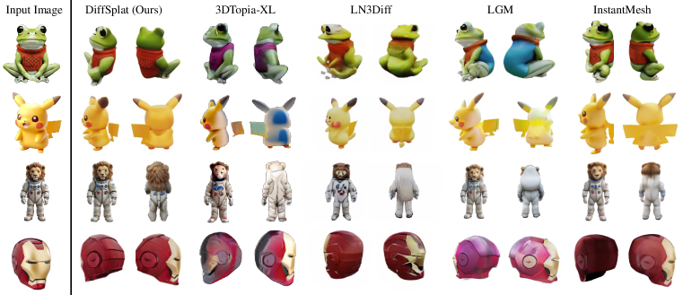

Figure 4: Qualitative Results and Comparisons on Image-conditioned 3D Generation. More visualizations of DiffSplat results are provided in Appendix Figure [12](#A2.F12 "Figure 12 ‣ Appendix B More Visualization Results ‣ DiffSplat: Repurposing Image Diffusion Models for Scalable Gaussian Splat Generation"), [13](#A2.F13 "Figure 13 ‣ Appendix B More Visualization Results ‣ DiffSplat: Repurposing Image Diffusion Models for Scalable Gaussian Splat Generation") and [14](#A2.F14 "Figure 14 ‣ Appendix B More Visualization Results ‣ DiffSplat: Repurposing Image Diffusion Models for Scalable Gaussian Splat Generation").
[/FIGURE]

[TABLE S4.T2]

<table class="ltx_tabular ltx_align_middle">
<tr class="ltx_tr">
<td class="ltx_td ltx_border_r ltx_border_tt"></td>
<td class="ltx_td ltx_align_center ltx_border_r ltx_border_tt">DiffSplat</td>
<td class="ltx_td ltx_align_center ltx_border_r ltx_border_tt">3DTopia-XL</td>
<td class="ltx_td ltx_align_center ltx_border_r ltx_border_tt">LN3Diff</td>
<td class="ltx_td ltx_align_center ltx_border_r ltx_border_tt">LGM†
</td>
<td class="ltx_td ltx_align_center ltx_border_r ltx_border_tt">GRM†
</td>
<td class="ltx_td ltx_align_center ltx_border_r ltx_border_tt">LaRa†
</td>
<td class="ltx_td ltx_align_center ltx_border_r ltx_border_tt">CRM†
</td>
<td class="ltx_td ltx_align_center ltx_border_tt">InstantMesh†
</td>
</tr>
<tr class="ltx_tr">
<td class="ltx_td ltx_align_left ltx_border_r ltx_border_t">
<math class="ltx_Math"><semantics><mo>↑</mo><annotation>\uparrow</annotation></semantics></math> PSNR</td>
<td class="ltx_td ltx_align_center ltx_border_r ltx_border_t">22.91</td>
<td class="ltx_td ltx_align_center ltx_border_r ltx_border_t">17.27</td>
<td class="ltx_td ltx_align_center ltx_border_r ltx_border_t">16.67</td>
<td class="ltx_td ltx_align_center ltx_border_r ltx_border_t">18.25</td>
<td class="ltx_td ltx_align_center ltx_border_r ltx_border_t">19.65</td>
<td class="ltx_td ltx_align_center ltx_border_r ltx_border_t">18.87</td>
<td class="ltx_td ltx_align_center ltx_border_r ltx_border_t">18.56</td>
<td class="ltx_td ltx_align_center ltx_border_t">19.14</td>
</tr>
<tr class="ltx_tr">
<td class="ltx_td ltx_align_left ltx_border_r">
<math class="ltx_Math"><semantics><mo>↑</mo><annotation>\uparrow</annotation></semantics></math> SSIM</td>
<td class="ltx_td ltx_align_center ltx_border_r">0.892</td>
<td class="ltx_td ltx_align_center ltx_border_r">0.840</td>
<td class="ltx_td ltx_align_center ltx_border_r">0.831</td>
<td class="ltx_td ltx_align_center ltx_border_r">0.841</td>
<td class="ltx_td ltx_align_center ltx_border_r">0.869</td>
<td class="ltx_td ltx_align_center ltx_border_r">0.852</td>
<td class="ltx_td ltx_align_center ltx_border_r">0.855</td>
<td class="ltx_td ltx_align_center">0.876</td>
</tr>
<tr class="ltx_tr">
<td class="ltx_td ltx_align_left ltx_border_bb ltx_border_r">
<math class="ltx_Math"><semantics><mo>↓</mo><annotation>\downarrow</annotation></semantics></math> LPIPS</td>
<td class="ltx_td ltx_align_center ltx_border_bb ltx_border_r">0.107</td>
<td class="ltx_td ltx_align_center ltx_border_bb ltx_border_r">0.175</td>
<td class="ltx_td ltx_align_center ltx_border_bb ltx_border_r">0.177</td>
<td class="ltx_td ltx_align_center ltx_border_bb ltx_border_r">0.166</td>
<td class="ltx_td ltx_align_center ltx_border_bb ltx_border_r">0.141</td>
<td class="ltx_td ltx_align_center ltx_border_bb ltx_border_r">0.202</td>
<td class="ltx_td ltx_align_center ltx_border_bb ltx_border_r">0.149</td>
<td class="ltx_td ltx_align_center ltx_border_bb">0.128</td>
</tr>
</table>

Table 2: Quantitative evaluations on GSO for image-conditioned generation. † indicates reconstruction methods that require additional image generation models for single image-to-3D generation.
[/TABLE]

### 4.4 Application: Controllable Generation

Thanks to the compatibility of DiffSplat with image diffusion models, numerous techniques initially developed for image generation can be easily adapted for 3D applications. Here, we explore ControlNet (Zhang et al., [2023](#bib.bib92)) to facilitate controllable generation guided by flexible formats alongside text prompts in Figure [5](#S4.F5 "Figure 5 ‣ 4.4 Application: Controllable Generation ‣ 4 Experiments ‣ DiffSplat: Repurposing Image Diffusion Models for Scalable Gaussian Splat Generation"). DiffSplat can generate diverse and high-quality 3D assets that accurately respond to different control inputs, such as normal and depth maps, and Canny edges, while faithfully reflecting the text conditions. Moreover, while most previous reconstruction methods cannot incorporate text understanding, the flexible conditioning design allows DiffSplat to perform text-guided reconstruction from single-view ambiguous images, as shown in Appendix Figure [8](#A2.F8 "Figure 8 ‣ Appendix B More Visualization Results ‣ DiffSplat: Repurposing Image Diffusion Models for Scalable Gaussian Splat Generation").  

[FIGURE S4.F5.g1]
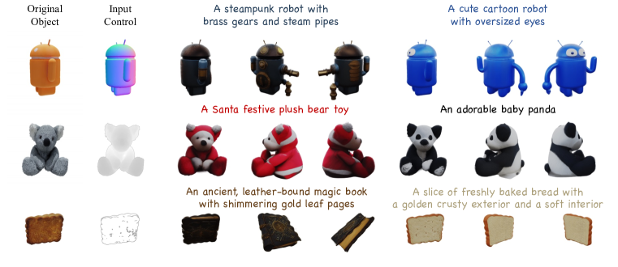

Figure 5: Controllable Generation. ControlNet can seamlessly adapt to DiffSplat for controllable text-to-3D generation in various formats, such as normal and depth maps, and Canny edges.
[/FIGURE]

### 4.5 Ablation and Analysis

We carefully investigate each design choice for splat latent reconstruction and DiffSplat 3D generation in this subsection. Ablation studies are conducted based on Stable Diffusion V1.5 (SD1.5) (Rombach et al., [2022](#bib.bib59)) unless otherwise specified.  

#### 4.5.1 Splat Latent Reconstruction

##### Reconstruction Inputs

Effectiveness of geometric guidance for the reconstruction model is validated in Table [4](#S4.T4 "Table 4 ‣ Auto-encoding Stragegies ‣ 4.5.1 Splat Latent Reconstruction ‣ 4.5 Ablation and Analysis ‣ 4 Experiments ‣ DiffSplat: Repurposing Image Diffusion Models for Scalable Gaussian Splat Generation"). Gaussian Splatting-based large reconstruction model LGM (Tang et al., [2024](#bib.bib74)) and GRM (Xu et al., [2024c](#bib.bib85)) are also evaluated with sparse-view RGB images for comparison. Although with much fewer parameters, with the help of coordination and normal maps, the proposed lightweight reconstruction model can instantly provide high-quality Gaussian splat grids as “pseudo” ground-truth representation for 3D generation. Coordination maps explicitly indicate the positions of Gaussian primitives, thus providing more effective geometric guidance than normal maps.  

##### Auto-encoding Stragegies

We investigate different training strategies for Gaussian splat property auto-encoding in Table [4](#S4.T4 "Table 4 ‣ Auto-encoding Stragegies ‣ 4.5.1 Splat Latent Reconstruction ‣ 4.5 Ablation and Analysis ‣ 4 Experiments ‣ DiffSplat: Repurposing Image Diffusion Models for Scalable Gaussian Splat Generation"). Freezing the original image VAE or its encoder results in poor performance, as Gaussian splat properties differ significantly from natural images. Rendering loss plays a crucial role in auto-encoding by ensuring that the VAE is supervised by real datasets rather than being limited by the lightweight reconstruction model, thus enabling the auto-encoded splats to perform slightly better than the reconstructed ones. VAEs from SD1.5 and SDXL (Podell et al., [2024](#bib.bib55)) have a similar performance with the same dimension ($d=4$) of latent space, while SD3 (Esser et al., [2024](#bib.bib13)) shows improved performance with $d=16$.  

[TABLE S4.T4]

<figure class="ltx_figure ltx_figure_panel ltx_minipage ltx_align_top">
<figcaption class="ltx_caption ltx_centering">Table 3: Ablation study of inputs for structured splat reconstruction.</figcaption>

<table class="ltx_tabular ltx_align_middle">
<tr class="ltx_tr">
<td class="ltx_td ltx_border_r ltx_border_tt"></td>
<td class="ltx_td ltx_align_center ltx_border_r ltx_border_tt">
<math class="ltx_Math"><semantics><mo>↑</mo><annotation>\uparrow</annotation></semantics></math> PSNR</td>
<td class="ltx_td ltx_align_center ltx_border_r ltx_border_tt">
<math class="ltx_Math"><semantics><mo>↑</mo><annotation>\uparrow</annotation></semantics></math> SSIM</td>
<td class="ltx_td ltx_align_center ltx_border_r ltx_border_tt">
<math class="ltx_Math"><semantics><mo>↓</mo><annotation>\downarrow</annotation></semantics></math> LPIPS</td>
<td class="ltx_td ltx_align_center ltx_border_tt">#Param.</td>
</tr>
<tr class="ltx_tr">
<td class="ltx_td ltx_align_left ltx_border_r ltx_border_t">LGM</td>
<td class="ltx_td ltx_align_center ltx_border_r ltx_border_t">26.48</td>
<td class="ltx_td ltx_align_center ltx_border_r ltx_border_t">0.892</td>
<td class="ltx_td ltx_align_center ltx_border_r ltx_border_t">0.077</td>
<td class="ltx_td ltx_align_center ltx_border_t">415M</td>
</tr>
<tr class="ltx_tr">
<td class="ltx_td ltx_align_left ltx_border_r">GRM</td>
<td class="ltx_td ltx_align_center ltx_border_r">28.04</td>
<td class="ltx_td ltx_align_center ltx_border_r">0.959</td>
<td class="ltx_td ltx_align_center ltx_border_r">0.031</td>
<td class="ltx_td ltx_align_center">179M</td>
</tr>
<tr class="ltx_tr">
<td class="ltx_td ltx_align_left ltx_border_r ltx_border_t">RGB</td>
<td class="ltx_td ltx_align_center ltx_border_r ltx_border_t">27.43</td>
<td class="ltx_td ltx_align_center ltx_border_r ltx_border_t">0.956</td>
<td class="ltx_td ltx_align_center ltx_border_r ltx_border_t">0.041</td>
<td class="ltx_td ltx_align_center ltx_border_t">42M</td>
</tr>
<tr class="ltx_tr">
<td class="ltx_td ltx_align_left ltx_border_r">
<math class="ltx_Math"><semantics><mo>+</mo><annotation>+</annotation></semantics></math>Normal</td>
<td class="ltx_td ltx_align_center ltx_border_r">28.89</td>
<td class="ltx_td ltx_align_center ltx_border_r">0.957</td>
<td class="ltx_td ltx_align_center ltx_border_r">0.033</td>
<td class="ltx_td ltx_align_center">42M</td>
</tr>
<tr class="ltx_tr">
<td class="ltx_td ltx_align_left ltx_border_r">
<math class="ltx_Math"><semantics><mo>+</mo><annotation>+</annotation></semantics></math>Coord.</td>
<td class="ltx_td ltx_align_center ltx_border_r">29.87</td>
<td class="ltx_td ltx_align_center ltx_border_r">0.961</td>
<td class="ltx_td ltx_align_center ltx_border_r">0.028</td>
<td class="ltx_td ltx_align_center">42M</td>
</tr>
<tr class="ltx_tr">
<td class="ltx_td ltx_align_left ltx_border_bb ltx_border_r ltx_border_t">Ours</td>
<td class="ltx_td ltx_align_center ltx_border_bb ltx_border_r ltx_border_t">30.09</td>
<td class="ltx_td ltx_align_center ltx_border_bb ltx_border_r ltx_border_t">0.963</td>
<td class="ltx_td ltx_align_center ltx_border_bb ltx_border_r ltx_border_t">0.027</td>
<td class="ltx_td ltx_align_center ltx_border_bb ltx_border_t">42M</td>
</tr>
</table>

</figure>

<figure class="ltx_figure ltx_figure_panel ltx_minipage ltx_align_top">
<figcaption class="ltx_caption ltx_centering">Table 4: Ablation study for Gaussian splat property auto-encoding strategies.</figcaption>

<table class="ltx_tabular ltx_align_middle">
<tr class="ltx_tr">
<td class="ltx_td ltx_border_r ltx_border_tt"></td>
<td class="ltx_td ltx_align_center ltx_border_r ltx_border_tt">
<math class="ltx_Math"><semantics><mo>↑</mo><annotation>\uparrow</annotation></semantics></math> PSNR</td>
<td class="ltx_td ltx_align_center ltx_border_r ltx_border_tt">
<math class="ltx_Math"><semantics><mo>↑</mo><annotation>\uparrow</annotation></semantics></math> SSIM</td>
<td class="ltx_td ltx_align_center ltx_border_tt">
<math class="ltx_Math"><semantics><mo>↓</mo><annotation>\downarrow</annotation></semantics></math> LPIPS</td>
</tr>
<tr class="ltx_tr">
<td class="ltx_td ltx_align_left ltx_border_r ltx_border_t">Frozen VAE</td>
<td class="ltx_td ltx_align_center ltx_border_r ltx_border_t">8.64</td>
<td class="ltx_td ltx_align_center ltx_border_r ltx_border_t">0.833</td>
<td class="ltx_td ltx_align_center ltx_border_t">0.566</td>
</tr>
<tr class="ltx_tr">
<td class="ltx_td ltx_align_left ltx_border_r">Frozen <math class="ltx_Math"><semantics><msub><mi>E</mi><msub><mi>ϕ</mi><mi>e</mi></msub></msub><annotation>E_{\phi_{e}}</annotation></semantics></math>
</td>
<td class="ltx_td ltx_align_center ltx_border_r">24.73</td>
<td class="ltx_td ltx_align_center ltx_border_r">0.927</td>
<td class="ltx_td ltx_align_center">0.065</td>
</tr>
<tr class="ltx_tr">
<td class="ltx_td ltx_align_left ltx_border_r">w/o <math class="ltx_Math"><semantics><msub><mi class="ltx_font_mathcaligraphic">ℒ</mi><mtext>render</mtext></msub><annotation>\mathcal{L}_{\text{render}}</annotation></semantics></math>
</td>
<td class="ltx_td ltx_align_center ltx_border_r">26.07</td>
<td class="ltx_td ltx_align_center ltx_border_r">0.937</td>
<td class="ltx_td ltx_align_center">0.080</td>
</tr>
<tr class="ltx_tr">
<td class="ltx_td ltx_align_left ltx_border_r ltx_border_t">Ours (SD1.5)</td>
<td class="ltx_td ltx_align_center ltx_border_r ltx_border_t">30.33</td>
<td class="ltx_td ltx_align_center ltx_border_r ltx_border_t">0.966</td>
<td class="ltx_td ltx_align_center ltx_border_t">0.033</td>
</tr>
<tr class="ltx_tr">
<td class="ltx_td ltx_align_left ltx_border_r ltx_border_tt">Ours (SDXL)</td>
<td class="ltx_td ltx_align_center ltx_border_r ltx_border_tt">30.30</td>
<td class="ltx_td ltx_align_center ltx_border_r ltx_border_tt">0.964</td>
<td class="ltx_td ltx_align_center ltx_border_tt">0.031</td>
</tr>
<tr class="ltx_tr">
<td class="ltx_td ltx_align_left ltx_border_bb ltx_border_r">Ours (SD3)</td>
<td class="ltx_td ltx_align_center ltx_border_bb ltx_border_r">31.08</td>
<td class="ltx_td ltx_align_center ltx_border_bb ltx_border_r">0.978</td>
<td class="ltx_td ltx_align_center ltx_border_bb">0.025</td>
</tr>
</table>

</figure>

Table 3: Ablation study of inputs for structured splat reconstruction.
[/TABLE]

[TABLE S4.T5]

<table class="ltx_tabular ltx_align_middle">
<tr class="ltx_tr">
<td class="ltx_td ltx_border_r ltx_border_tt"></td>
<td class="ltx_td ltx_align_center ltx_border_r ltx_border_tt">T3Bench-300</td>
<td class="ltx_td ltx_align_center ltx_border_tt">GSO-300</td>
</tr>
<tr class="ltx_tr">
<td class="ltx_td ltx_border_r"></td>
<td class="ltx_td ltx_align_center ltx_border_t">
<math class="ltx_Math"><semantics><mo>↑</mo><annotation>\uparrow</annotation></semantics></math> CLIP Sim.%
</td>
<td class="ltx_td ltx_align_center ltx_border_t">
<math class="ltx_Math"><semantics><mo>↑</mo><annotation>\uparrow</annotation></semantics></math> CLIP R-Prec.%
</td>
<td class="ltx_td ltx_align_center ltx_border_r ltx_border_t">
<math class="ltx_Math"><semantics><mo>↑</mo><annotation>\uparrow</annotation></semantics></math> ImageReward</td>
<td class="ltx_td ltx_align_center ltx_border_t">
<math class="ltx_Math"><semantics><mo>↑</mo><annotation>\uparrow</annotation></semantics></math> PSNR</td>
<td class="ltx_td ltx_align_center ltx_border_t">
<math class="ltx_Math"><semantics><mo>↑</mo><annotation>\uparrow</annotation></semantics></math> SSIM</td>
<td class="ltx_td ltx_align_center ltx_border_t">
<math class="ltx_Math"><semantics><mo>↓</mo><annotation>\downarrow</annotation></semantics></math> LPIPS</td>
</tr>
<tr class="ltx_tr">
<td class="ltx_td ltx_align_left ltx_border_r ltx_border_t">Multi-view Manner</td>
<td class="ltx_td ltx_border_t"></td>
<td class="ltx_td ltx_border_t"></td>
<td class="ltx_td ltx_border_r ltx_border_t"></td>
<td class="ltx_td ltx_border_t"></td>
<td class="ltx_td ltx_border_t"></td>
<td class="ltx_td ltx_border_t"></td>
</tr>
<tr class="ltx_tr">
<td class="ltx_td ltx_align_left ltx_border_r">Spatial-concat</td>
<td class="ltx_td ltx_align_center">
28.74<math class="ltx_Math"><semantics><mo>±</mo><annotation>\pm</annotation></semantics></math>0.08</td>
<td class="ltx_td ltx_align_center">55.92<math class="ltx_Math"><semantics><mo>±</mo><annotation>\pm</annotation></semantics></math>1.19</td>
<td class="ltx_td ltx_align_center ltx_border_r">-1.224<math class="ltx_Math"><semantics><mo>±</mo><annotation>\pm</annotation></semantics></math>0.023</td>
<td class="ltx_td ltx_align_center">21.61<math class="ltx_Math"><semantics><mo>±</mo><annotation>\pm</annotation></semantics></math>6.36</td>
<td class="ltx_td ltx_align_center">0.875<math class="ltx_Math"><semantics><mo>±</mo><annotation>\pm</annotation></semantics></math>0.086</td>
<td class="ltx_td ltx_align_center">0.121<math class="ltx_Math"><semantics><mo>±</mo><annotation>\pm</annotation></semantics></math>0.092</td>
</tr>
<tr class="ltx_tr">
<td class="ltx_td ltx_align_left ltx_border_r">View-concat</td>
<td class="ltx_td ltx_align_center">28.66<math class="ltx_Math"><semantics><mo>±</mo><annotation>\pm</annotation></semantics></math>0.14</td>
<td class="ltx_td ltx_align_center">58.92<math class="ltx_Math"><semantics><mo>±</mo><annotation>\pm</annotation></semantics></math>2.30</td>
<td class="ltx_td ltx_align_center ltx_border_r">-1.201<math class="ltx_Math"><semantics><mo>±</mo><annotation>\pm</annotation></semantics></math>0.031</td>
<td class="ltx_td ltx_align_center">22.58<math class="ltx_Math"><semantics><mo>±</mo><annotation>\pm</annotation></semantics></math>6.05</td>
<td class="ltx_td ltx_align_center">0.885<math class="ltx_Math"><semantics><mo>±</mo><annotation>\pm</annotation></semantics></math>0.082</td>
<td class="ltx_td ltx_align_center">0.117<math class="ltx_Math"><semantics><mo>±</mo><annotation>\pm</annotation></semantics></math>0.085</td>
</tr>
<tr class="ltx_tr">
<td class="ltx_td ltx_align_left ltx_border_r ltx_border_t">Training Objective</td>
<td class="ltx_td ltx_border_t"></td>
<td class="ltx_td ltx_border_t"></td>
<td class="ltx_td ltx_border_r ltx_border_t"></td>
<td class="ltx_td ltx_border_t"></td>
<td class="ltx_td ltx_border_t"></td>
<td class="ltx_td ltx_border_t"></td>
</tr>
<tr class="ltx_tr">
<td class="ltx_td ltx_align_left ltx_border_r">w/o <math class="ltx_Math"><semantics><msub><mi class="ltx_font_mathcaligraphic">ℒ</mi><mtext>diff</mtext></msub><annotation>\mathcal{L}_{\text{diff}}</annotation></semantics></math>
</td>
<td class="ltx_td ltx_align_center">27.72<math class="ltx_Math"><semantics><mo>±</mo><annotation>\pm</annotation></semantics></math>0.09</td>
<td class="ltx_td ltx_align_center">50.83<math class="ltx_Math"><semantics><mo>±</mo><annotation>\pm</annotation></semantics></math>1.91</td>
<td class="ltx_td ltx_align_center ltx_border_r">-1.436<math class="ltx_Math"><semantics><mo>±</mo><annotation>\pm</annotation></semantics></math>0.033</td>
<td class="ltx_td ltx_align_center">17.16<math class="ltx_Math"><semantics><mo>±</mo><annotation>\pm</annotation></semantics></math>3.20</td>
<td class="ltx_td ltx_align_center">0.794<math class="ltx_Math"><semantics><mo>±</mo><annotation>\pm</annotation></semantics></math>0.073</td>
<td class="ltx_td ltx_align_center">0.267<math class="ltx_Math"><semantics><mo>±</mo><annotation>\pm</annotation></semantics></math>0.132</td>
</tr>
<tr class="ltx_tr">
<td class="ltx_td ltx_align_left ltx_border_r">w/o <math class="ltx_Math"><semantics><msub><mi class="ltx_font_mathcaligraphic">ℒ</mi><mtext>render</mtext></msub><annotation>\mathcal{L}_{\text{render}}</annotation></semantics></math>
</td>
<td class="ltx_td ltx_align_center">
28.54<math class="ltx_Math"><semantics><mo>±</mo><annotation>\pm</annotation></semantics></math>0.22</td>
<td class="ltx_td ltx_align_center">
56.42<math class="ltx_Math"><semantics><mo>±</mo><annotation>\pm</annotation></semantics></math>2.27</td>
<td class="ltx_td ltx_align_center ltx_border_r">
-1.219<math class="ltx_Math"><semantics><mo>±</mo><annotation>\pm</annotation></semantics></math>0.049</td>
<td class="ltx_td ltx_align_center">
22.30<math class="ltx_Math"><semantics><mo>±</mo><annotation>\pm</annotation></semantics></math>6.33</td>
<td class="ltx_td ltx_align_center">
0.883<math class="ltx_Math"><semantics><mo>±</mo><annotation>\pm</annotation></semantics></math>0.085</td>
<td class="ltx_td ltx_align_center">
0.125<math class="ltx_Math"><semantics><mo>±</mo><annotation>\pm</annotation></semantics></math>0.086</td>
</tr>
<tr class="ltx_tr">
<td class="ltx_td ltx_align_left ltx_border_r"><math class="ltx_Math"><semantics><mrow><msub><mi class="ltx_font_mathcaligraphic">ℒ</mi><mtext>render</mtext></msub><mo>+</mo><msub><mi class="ltx_font_mathcaligraphic">ℒ</mi><mtext>diff</mtext></msub></mrow><annotation>\mathcal{L}_{\text{render}}+\mathcal{L}_{\text{diff}}</annotation></semantics></math></td>
<td class="ltx_td ltx_align_center">28.66<math class="ltx_Math"><semantics><mo>±</mo><annotation>\pm</annotation></semantics></math>0.14</td>
<td class="ltx_td ltx_align_center">58.92<math class="ltx_Math"><semantics><mo>±</mo><annotation>\pm</annotation></semantics></math>2.30</td>
<td class="ltx_td ltx_align_center ltx_border_r">-1.201<math class="ltx_Math"><semantics><mo>±</mo><annotation>\pm</annotation></semantics></math>0.031</td>
<td class="ltx_td ltx_align_center">22.58<math class="ltx_Math"><semantics><mo>±</mo><annotation>\pm</annotation></semantics></math>6.05</td>
<td class="ltx_td ltx_align_center">0.885<math class="ltx_Math"><semantics><mo>±</mo><annotation>\pm</annotation></semantics></math>0.082</td>
<td class="ltx_td ltx_align_center">0.117<math class="ltx_Math"><semantics><mo>±</mo><annotation>\pm</annotation></semantics></math>0.085</td>
</tr>
<tr class="ltx_tr">
<td class="ltx_td ltx_align_left ltx_border_r ltx_border_t">Base Model (#Param.)</td>
<td class="ltx_td ltx_border_t"></td>
<td class="ltx_td ltx_border_t"></td>
<td class="ltx_td ltx_border_r ltx_border_t"></td>
<td class="ltx_td ltx_border_t"></td>
<td class="ltx_td ltx_border_t"></td>
<td class="ltx_td ltx_border_t"></td>
</tr>
<tr class="ltx_tr">
<td class="ltx_td ltx_align_left ltx_border_r">SD1.5 (0.86B)</td>
<td class="ltx_td ltx_align_center">28.66<math class="ltx_Math"><semantics><mo>±</mo><annotation>\pm</annotation></semantics></math>0.14</td>
<td class="ltx_td ltx_align_center">58.92<math class="ltx_Math"><semantics><mo>±</mo><annotation>\pm</annotation></semantics></math>2.30</td>
<td class="ltx_td ltx_align_center ltx_border_r">-1.201<math class="ltx_Math"><semantics><mo>±</mo><annotation>\pm</annotation></semantics></math>0.031</td>
<td class="ltx_td ltx_align_center">22.58<math class="ltx_Math"><semantics><mo>±</mo><annotation>\pm</annotation></semantics></math>6.05</td>
<td class="ltx_td ltx_align_center">0.885<math class="ltx_Math"><semantics><mo>±</mo><annotation>\pm</annotation></semantics></math>0.082</td>
<td class="ltx_td ltx_align_center">0.117<math class="ltx_Math"><semantics><mo>±</mo><annotation>\pm</annotation></semantics></math>0.085</td>
</tr>
<tr class="ltx_tr">
<td class="ltx_td ltx_align_left ltx_border_r">SDXL (2.6B)</td>
<td class="ltx_td ltx_align_center">29.70<math class="ltx_Math"><semantics><mo>±</mo><annotation>\pm</annotation></semantics></math>0.22</td>
<td class="ltx_td ltx_align_center">63.00<math class="ltx_Math"><semantics><mo>±</mo><annotation>\pm</annotation></semantics></math>1.93</td>
<td class="ltx_td ltx_align_center ltx_border_r">
-0.804<math class="ltx_Math"><semantics><mo>±</mo><annotation>\pm</annotation></semantics></math>0.038</td>
<td class="ltx_td ltx_align_center">22.65<math class="ltx_Math"><semantics><mo>±</mo><annotation>\pm</annotation></semantics></math>5.84</td>
<td class="ltx_td ltx_align_center">0.887<math class="ltx_Math"><semantics><mo>±</mo><annotation>\pm</annotation></semantics></math>0.084</td>
<td class="ltx_td ltx_align_center">0.115<math class="ltx_Math"><semantics><mo>±</mo><annotation>\pm</annotation></semantics></math>0.089</td>
</tr>
<tr class="ltx_tr">
<td class="ltx_td ltx_align_left ltx_border_r">PixArt-<math class="ltx_Math"><semantics><mi>α</mi><annotation>\alpha</annotation></semantics></math> (0.61B)</td>
<td class="ltx_td ltx_align_center">29.10<math class="ltx_Math"><semantics><mo>±</mo><annotation>\pm</annotation></semantics></math>0.07</td>
<td class="ltx_td ltx_align_center">59.01<math class="ltx_Math"><semantics><mo>±</mo><annotation>\pm</annotation></semantics></math>1.26</td>
<td class="ltx_td ltx_align_center ltx_border_r">-1.052<math class="ltx_Math"><semantics><mo>±</mo><annotation>\pm</annotation></semantics></math>0.028</td>
<td class="ltx_td ltx_align_center">22.81<math class="ltx_Math"><semantics><mo>±</mo><annotation>\pm</annotation></semantics></math>5.90</td>
<td class="ltx_td ltx_align_center">0.884<math class="ltx_Math"><semantics><mo>±</mo><annotation>\pm</annotation></semantics></math>0.078</td>
<td class="ltx_td ltx_align_center">0.108<math class="ltx_Math"><semantics><mo>±</mo><annotation>\pm</annotation></semantics></math>0.080</td>
</tr>
<tr class="ltx_tr">
<td class="ltx_td ltx_align_left ltx_border_r">PixArt-<math class="ltx_Math"><semantics><mi>Σ</mi><annotation>\Sigma</annotation></semantics></math> (0.61B)</td>
<td class="ltx_td ltx_align_center">
29.75<math class="ltx_Math"><semantics><mo>±</mo><annotation>\pm</annotation></semantics></math>0.06</td>
<td class="ltx_td ltx_align_center">
64.83<math class="ltx_Math"><semantics><mo>±</mo><annotation>\pm</annotation></semantics></math>0.50</td>
<td class="ltx_td ltx_align_center ltx_border_r">-0.834<math class="ltx_Math"><semantics><mo>±</mo><annotation>\pm</annotation></semantics></math>0.017</td>
<td class="ltx_td ltx_align_center">
22.85<math class="ltx_Math"><semantics><mo>±</mo><annotation>\pm</annotation></semantics></math>5.75</td>
<td class="ltx_td ltx_align_center">
0.890<math class="ltx_Math"><semantics><mo>±</mo><annotation>\pm</annotation></semantics></math>0.077</td>
<td class="ltx_td ltx_align_center">
0.105<math class="ltx_Math"><semantics><mo>±</mo><annotation>\pm</annotation></semantics></math>0.082</td>
</tr>
<tr class="ltx_tr">
<td class="ltx_td ltx_align_left ltx_border_bb ltx_border_r">SD3-medium (2.0B)</td>
<td class="ltx_td ltx_align_center ltx_border_bb">30.15<math class="ltx_Math"><semantics><mo>±</mo><annotation>\pm</annotation></semantics></math>0.05</td>
<td class="ltx_td ltx_align_center ltx_border_bb">68.08<math class="ltx_Math"><semantics><mo>±</mo><annotation>\pm</annotation></semantics></math>0.72</td>
<td class="ltx_td ltx_align_center ltx_border_bb ltx_border_r">-0.685<math class="ltx_Math"><semantics><mo>±</mo><annotation>\pm</annotation></semantics></math>0.043</td>
<td class="ltx_td ltx_align_center ltx_border_bb">22.91<math class="ltx_Math"><semantics><mo>±</mo><annotation>\pm</annotation></semantics></math>5.54</td>
<td class="ltx_td ltx_align_center ltx_border_bb">0.892<math class="ltx_Math"><semantics><mo>±</mo><annotation>\pm</annotation></semantics></math>0.094</td>
<td class="ltx_td ltx_align_center ltx_border_bb">
0.107<math class="ltx_Math"><semantics><mo>±</mo><annotation>\pm</annotation></semantics></math>0.093
</td>
</tr>
</table>

Table 5: Ablation study of DiffSplat design choices.
[/TABLE]

#### 4.5.2 DiffSplat 3D Generation

[FIGURE S4.F6.g1]
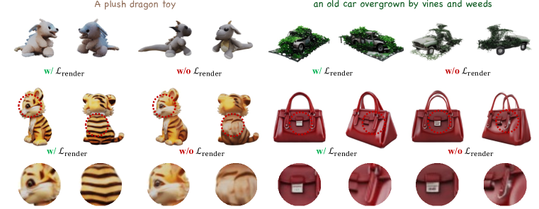

Figure 6: Ablation of $\mathcal{L}_{\text{render}}$. Both text- (1st row) and image-conditioned (2nd row) DiffSplat with $\mathcal{L}_{\text{render}}$ produces more aesthetic and textured 3D content with fewer translucent floaters.
[/FIGURE]

##### Multi-view Manners

Two popular multi-view manners are explored in this work, yielding similar results in text-conditioned 3D generation, as shown in Table [5](#S4.T5 "Table 5 ‣ Auto-encoding Stragegies ‣ 4.5.1 Splat Latent Reconstruction ‣ 4.5 Ablation and Analysis ‣ 4 Experiments ‣ DiffSplat: Repurposing Image Diffusion Models for Scalable Gaussian Splat Generation"). View-concat manner performs better in single image-conditioned generation due to the dense attention among conditional image latents and splat latents. Although the spatial-concat method can also achieve dense attention by concatenating image latents along the spatial dimension, it requires additional padding, leading to increased computational costs. Thus, we prefer the view-concat manner in this work for its flexibility in accommodating varying numbers of viewpoints and conditioning.  

##### Training Objectives

DiffSplat can perform well with merely the regular diffusion loss by setting $\lambda_{\text{render}}=0$ given high-quality splat latents. However, as shown in Table [5](#S4.T5 "Table 5 ‣ Auto-encoding Stragegies ‣ 4.5.1 Splat Latent Reconstruction ‣ 4.5 Ablation and Analysis ‣ 4 Experiments ‣ DiffSplat: Repurposing Image Diffusion Models for Scalable Gaussian Splat Generation") and Figure [6](#S4.F6 "Figure 6 ‣ 4.5.2 DiffSplat 3D Generation ‣ 4.5 Ablation and Analysis ‣ 4 Experiments ‣ DiffSplat: Repurposing Image Diffusion Models for Scalable Gaussian Splat Generation"), the proposed 3D rendering loss $\mathcal{L}_{\text{render}}$ can further boost both the aesthetic quality and geometric structure of generated content. Aesthetic appeal and textured details may contributed by the perceptual loss, and fewer translucent artifacts are achieved through the mask loss described in Equation [1](#S3.E1 "In 3.1 Data Curation: Structured Splat Reconstruction ‣ 3 Method ‣ DiffSplat: Repurposing Image Diffusion Models for Scalable Gaussian Splat Generation"). DiffSplat also produces reasonable results only with the rendering loss by setting $\lambda_{\text{diff}}=0$. However, the training process becomes unstable and slow to converge, and gets over-saturated results.  

##### Base Text-to-image Diffusion Models

Various popular open-source large text-to-image diffusion models are investigated in this work, including SD1.5 (Rombach et al., [2022](#bib.bib59)), SDXL (Podell et al., [2024](#bib.bib55)), PixArt-$\alpha$ (Chen et al., [2024c](#bib.bib9)), PixArt-$\Sigma$ (Chen et al., [2024b](#bib.bib8)) and SD3 (Esser et al., [2024](#bib.bib13)), featuring different model sizes, backbone networks, noise scheduling, and sampling strategies. With the advancements in base models, DiffSplat consistently benefits in both text- and image-conditioned tasks, indicating that the proposed method effectively leverages priors from pretrained models and stands as a promising approach for scaling 3D generation within the thriving image community.  

#### 4.5.3 Interpreting Splat Latents

[FIGURE S4.F7.g1]
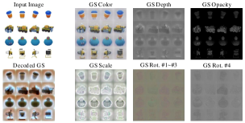

Figure 7: Splat Latents Visualization. 3DGS properties are structured in grids. “Decoded GS” shows the splat latents decoded by an image diffusion VAE.
[/FIGURE]

To understand the feasibility of generating Gaussian splat properties through fine-tuning image diffusion models, we visualize splat latents and their corresponding properties to interpret the mechanisms behind DiffSplat. As shown in Figure [7](#S4.F7 "Figure 7 ‣ 4.5.3 Interpreting Splat Latents ‣ 4.5 Ablation and Analysis ‣ 4 Experiments ‣ DiffSplat: Repurposing Image Diffusion Models for Scalable Gaussian Splat Generation"), auto-encoded Gaussian splat properties are presented as RGB or grayscale images. For rotations $\mathbf{r}\in\mathbb{R}^{4}$, the first three channels and the last one are visualized individually. Splat latents encoded by a fine-tuned VAE are decoded by the original image VAE. Gaussian splat property grids are analogous to natural images, reflecting the hue and edge properties of 3D objects. Decoded splat latents from the image VAE can be interpreted as the original objects in a “special style” or illuminated in a “special environment light”, featuring a cyan light at a distance and a rufous light nearby. Image diffusion models are essentially fine-tuned to learn this special style, indicating that the input latents are splat latents, which enables the repurposing of image diffusion models to generate 3DGS.  

## 5 Conclusion

In this work, we present a novel diffusion-based 3D generation framework, DiffSplat. It distinguishes from previous 3D generative methods by effectively leveraging web-scale 2D priors while maintaining 3D coherence in a unified model. Various large text-to-image diffusion models are fine-tuned to directly generate 3D Gaussian splat properties with both diffusion loss and 3D rendering loss. Thus, DiffSplat benefits from the rapid developments in the image community, facilitating the integration of advanced techniques for image generation into the 3D realm. It positions DiffSplat a promising 3D generative method utilizing abundant 2D priors and merely multi-view supervision. We hope this work can provide a new solution for 3D content creation.  

##### Limitations and Future Work

Although DiffSplat delivers decent results, the conversion of its 3DGS representation to high-quality mesh remains an unsolved problem. Simultaneously generating splat latents from more viewpoints, increasing the supervision resolution, and integrating physical-based material properties could further enhance the quality of generated 3D Gaussian primitives. Numerous advanced techniques developed for image diffusion models can be adopted for 3D generation within the proposed framework, which remains underexplored, such as personalization, few-step distillation, and feedback learning to align with human preferences. Moreover, we only utilize rendered multi-view datasets in this work, which does not fully exploit the scalability potential of the proposed method. By leveraging its image compatibility and 2D supervision-only characteristic, massive real-world video datasets could further unlock the capability of DiffSplat.  

## Acknowledgment

This work is supported by a grant from ByteDance (No. CT20240607105793) and an internal grant of Peking University (2024JK28).  

## References

* Anciukevičius et al. (2023)  Titas Anciukevičius, Zexiang Xu, Matthew Fisher, Paul Henderson, Hakan Bilen, Niloy J Mitra, and Paul Guerrero.   Renderdiffusion: Image diffusion for 3d reconstruction, inpainting and generation.   In *Proceedings of the IEEE/CVF Conference on Computer Vision and Pattern Recognition (CVPR)*, 2023. 
* Anciukevicius et al. (2024)  Titas Anciukevicius, Fabian Manhardt, Federico Tombari, and Paul Henderson.   Denoising diffusion via image-based rendering.   In *International Conference on Learning Representations (ICLR)*, 2024. 
* Boss et al. (2024)  Mark Boss, Zixuan Huang, Aaryaman Vasishta, and Varun Jampani.   Sf3d: Stable fast 3d mesh reconstruction with uv-unwrapping and illumination disentanglement.   *arXiv preprint arXiv:2408.00653*, 2024. 
* Cao et al. (2024)  Ziang Cao, Fangzhou Hong, Tong Wu, Liang Pan, and Ziwei Liu.   Large-vocabulary 3d diffusion model with transformer.   In *International Conference on Learning Representations (ICLR)*, 2024. 
* Chan et al. (2022)  Eric R Chan, Connor Z Lin, Matthew A Chan, Koki Nagano, Boxiao Pan, Shalini De Mello, Orazio Gallo, Leonidas J Guibas, Jonathan Tremblay, Sameh Khamis, et al.   Efficient geometry-aware 3d generative adversarial networks.   In *Proceedings of the IEEE/CVF Conference on Computer Vision and Pattern Recognition (CVPR)*, 2022. 
* Charatan et al. (2024)  David Charatan, Sizhe Li, Andrea Tagliasacchi, and Vincent Sitzmann.   pixelsplat: 3d gaussian splats from image pairs for scalable generalizable 3d reconstruction.   In *Proceedings of the IEEE/CVF Conference on Computer Vision and Pattern Recognition (CVPR)*, 2024. 
* Chen et al. (2024a)  Anpei Chen, Haofei Xu, Stefano Esposito, Siyu Tang, and Andreas Geiger.   Lara: Efficient large-baseline radiance fields.   In *European Conference on Computer Vision (ECCV)*, 2024a. 
* Chen et al. (2024b)  Junsong Chen, Chongjian Ge, Enze Xie, Yue Wu, Lewei Yao, Xiaozhe Ren, Zhongdao Wang, Ping Luo, Huchuan Lu, and Zhenguo Li.   Pixart-$\sigma$: Weak-to-strong training of diffusion transformer for 4k text-to-image generation.   In *European Conference on Computer Vision (ECCV)*, 2024b. 
* Chen et al. (2024c)  Junsong Chen, Jincheng Yu, Chongjian Ge, Lewei Yao, Enze Xie, Yue Wu, Zhongdao Wang, James Kwok, Ping Luo, Huchuan Lu, et al.   Pixart-$\alpha$: Fast training of diffusion transformer for photorealistic text-to-image synthesis.   In *International Conference on Learning Representations (ICLR)*, 2024c. 
* Chen et al. (2024d)  Zhaoxi Chen, Jiaxiang Tang, Yuhao Dong, Ziang Cao, Fangzhou Hong, Yushi Lan, Tengfei Wang, Haozhe Xie, Tong Wu, Shunsuke Saito, Liang Pan, Dahua Lin, and Ziwei Liu.   3dtopia-xl: High-quality 3d pbr asset generation via primitive diffusion.   *arXiv preprint arXiv:2409.12957*, 2024d. 
* Deitke et al. (2023)  Matt Deitke, Dustin Schwenk, Jordi Salvador, Luca Weihs, Oscar Michel, Eli VanderBilt, Ludwig Schmidt, Kiana Ehsani, Aniruddha Kembhavi, and Ali Farhadi.   Objaverse: A universe of annotated 3d objects.   In *Proceedings of the IEEE/CVF Conference on Computer Vision and Pattern Recognition (CVPR)*, 2023. 
* Downs et al. (2022)  Laura Downs, Anthony Francis, Nate Koenig, Brandon Kinman, Ryan Hickman, Krista Reymann, Thomas B McHugh, and Vincent Vanhoucke.   Google scanned objects: A high-quality dataset of 3d scanned household items.   In *International Conference on Robotics and Automation (ICRA)*, 2022. 
* Esser et al. (2024)  Patrick Esser, Sumith Kulal, Andreas Blattmann, Rahim Entezari, Jonas Müller, Harry Saini, Yam Levi, Dominik Lorenz, Axel Sauer, Frederic Boesel, et al.   Scaling rectified flow transformers for high-resolution image synthesis.   In *International Conference on Machine Learning (ICML)*, 2024. 
* Fu et al. (2024)  Xiao Fu, Wei Yin, Mu Hu, Kaixuan Wang, Yuexin Ma, Ping Tan, Shaojie Shen, Dahua Lin, and Xiaoxiao Long.   Geowizard: Unleashing the diffusion priors for 3d geometry estimation from a single image.   In *European Conference on Computer Vision (ECCV)*, 2024. 
* Gao et al. (2024a)  Peng Gao, Le Zhuo, Ziyi Lin, Chris Liu, Junsong Chen, Ruoyi Du, Enze Xie, Xu Luo, Longtian Qiu, Yuhang Zhang, et al.   Lumina-t2x: Transforming text into any modality, resolution, and duration via flow-based large diffusion transformers.   *arXiv preprint arXiv:2405.05945*, 2024a. 
* Gao et al. (2024b)  Ruiqi Gao, Aleksander Holynski, Philipp Henzler, Arthur Brussee, Ricardo Martin-Brualla, Pratul Srinivasan, Jonathan T Barron, and Ben Poole.   Cat3d: Create anything in 3d with multi-view diffusion models.   In *Advances in Neural Information Processing Systems (NeurIPS)*, 2024b. 
* Han et al. (2024)  Junlin Han, Filippos Kokkinos, and Philip Torr.   Vfusion3d: Learning scalable 3d generative models from video diffusion models.   In *European Conference on Computer Vision (ECCV)*, 2024. 
* Hang et al. (2023)  Tiankai Hang, Shuyang Gu, Chen Li, Jianmin Bao, Dong Chen, Han Hu, Xin Geng, and Baining Guo.   Efficient diffusion training via min-snr weighting strategy.   In *Proceedings of the IEEE/CVF International Conference on Computer Vision (CVPR)*, 2023. 
* He et al. (2024)  Xianglong He, Junyi Chen, Sida Peng, Di Huang, Yangguang Li, Xiaoshui Huang, Chun Yuan, Wanli Ouyang, and Tong He.   Gvgen: Text-to-3d generation with volumetric representation.   In *European Conference on Computer Vision (ECCV)*, 2024. 
* He et al. (2023)  Yuze He, Yushi Bai, Matthieu Lin, Wang Zhao, Yubin Hu, Jenny Sheng, Ran Yi, Juanzi Li, and Yong-Jin Liu.   T3bench: Benchmarking current progress in text-to-3d generation.   *arXiv preprint arXiv:2310.02977*, 2023. 
* Henderson et al. (2024)  Paul Henderson, Melonie de Almeida, Daniela Ivanova, and Titas Anciukevičius.   Sampling 3d gaussian scenes in seconds with latent diffusion models.   *arXiv preprint arXiv:2406.13099*, 2024. 
* Ho & Salimans (2021)  Jonathan Ho and Tim Salimans.   Classifier-free diffusion guidance.   In *NeurIPS 2021 Workshop on Deep Generative Models and Downstream Applications*, 2021. 
* Ho et al. (2020)  Jonathan Ho, Ajay Jain, and Pieter Abbeel.   Denoising diffusion probabilistic models.   In *Advances in Neural Information Processing Systems (NeurIPS)*, 2020. 
* Hong et al. (2024a)  Fangzhou Hong, Jiaxiang Tang, Ziang Cao, Min Shi, Tong Wu, Zhaoxi Chen, Tengfei Wang, Liang Pan, Dahua Lin, and Ziwei Liu.   3dtopia: Large text-to-3d generation model with hybrid diffusion priors.   *arXiv preprint arXiv:2403.02234*, 2024a. 
* Hong et al. (2024b)  Yicong Hong, Kai Zhang, Jiuxiang Gu, Sai Bi, Yang Zhou, Difan Liu, Feng Liu, Kalyan Sunkavalli, Trung Bui, and Hao Tan.   Lrm: Large reconstruction model for single image to 3d.   In *International Conference on Learning Representations (ICLR)*, 2024b. 
* Jun & Nichol (2023)  Heewoo Jun and Alex Nichol.   Shap-e: Generating conditional 3d implicit functions.   *arXiv preprint arXiv:2305.02463*, 2023. 
* Kant et al. (2024)  Yash Kant, Aliaksandr Siarohin, Ziyi Wu, Michael Vasilkovsky, Guocheng Qian, Jian Ren, Riza Alp Guler, Bernard Ghanem, Sergey Tulyakov, and Igor Gilitschenski.   Spad: Spatially aware multi-view diffusers.   In *Proceedings of the IEEE/CVF Conference on Computer Vision and Pattern Recognition (CVPR)*, 2024. 
* Karnewar et al. (2023a)  Animesh Karnewar, Niloy J Mitra, Andrea Vedaldi, and David Novotny.   Holofusion: Towards photo-realistic 3d generative modeling.   In *Proceedings of the IEEE/CVF International Conference on Computer Vision (ICCV)*, 2023a. 
* Karnewar et al. (2023b)  Animesh Karnewar, Andrea Vedaldi, David Novotny, and Niloy J Mitra.   Holodiffusion: Training a 3d diffusion model using 2d images.   In *Proceedings of the IEEE/CVF Conference on Computer Vision and Pattern Recognition (CVPR)*, 2023b. 
* Karras et al. (2022)  Tero Karras, Miika Aittala, Timo Aila, and Samuli Laine.   Elucidating the design space of diffusion-based generative models.   In *Advances in Neural Information Processing Systems (NeurIPS)*, 2022. 
* Ke et al. (2024)  Bingxin Ke, Anton Obukhov, Shengyu Huang, Nando Metzger, Rodrigo Caye Daudt, and Konrad Schindler.   Repurposing diffusion-based image generators for monocular depth estimation.   In *Proceedings of the IEEE/CVF Conference on Computer Vision and Pattern Recognition (CVPR)*, 2024. 
* Kerbl et al. (2023)  Bernhard Kerbl, Georgios Kopanas, Thomas Leimkuehler, and George Drettakis.   3d gaussian splatting for real-time radiance field rendering.   *ACM Transactions on Graphics (TOG)*, 2023. 
* Kingma & Gao (2023)  Diederik Kingma and Ruiqi Gao.   Understanding diffusion objectives as the elbo with simple data augmentation.   In *Advances in Neural Information Processing Systems (NeurIPS)*, 2023. 
* Lan et al. (2024)  Yushi Lan, Fangzhou Hong, Shuai Yang, Shangchen Zhou, Xuyi Meng, Bo Dai, Xingang Pan, and Chen Change Loy.   Ln3diff: Scalable latent neural fields diffusion for speedy 3d generation.   In *European Conference on Computer Vision (ECCV)*, 2024. 
* Li et al. (2024a)  Jiahao Li, Hao Tan, Kai Zhang, Zexiang Xu, Fujun Luan, Yinghao Xu, Yicong Hong, Kalyan Sunkavalli, Greg Shakhnarovich, and Sai Bi.   Instant3d: Fast text-to-3d with sparse-view generation and large reconstruction model.   In *International Conference on Learning Representations (ICLR)*, 2024a. 
* Li et al. (2024b)  Weiyu Li, Rui Chen, Xuelin Chen, and Ping Tan.   Sweetdreamer: Aligning geometric priors in 2d diffusion for consistent text-to-3d.   In *International Conference on Learning Representations (ICLR)*, 2024b. 
* Li et al. (2024c)  Weiyu Li, Jiarui Liu, Rui Chen, Yixun Liang, Xuelin Chen, Ping Tan, and Xiaoxiao Long.   Craftsman: High-fidelity mesh generation with 3d native generation and interactive geometry refiner.   *arXiv preprint arXiv:2405.14979*, 2024c. 
* Lipman et al. (2023)  Yaron Lipman, Ricky TQ Chen, Heli Ben-Hamu, Maximilian Nickel, and Matt Le.   Flow matching for generative modeling.   In *International Conference on Learning Representations (ICLR)*, 2023. 
* Liu et al. (2024a)  Minghua Liu, Ruoxi Shi, Linghao Chen, Zhuoyang Zhang, Chao Xu, Xinyue Wei, Hansheng Chen, Chong Zeng, Jiayuan Gu, and Hao Su.   One-2-3-45++: Fast single image to 3d objects with consistent multi-view generation and 3d diffusion.   In *Proceedings of the IEEE/CVF Conference on Computer Vision and Pattern Recognition (CVPR)*, 2024a. 
* Liu et al. (2024b)  Qihao Liu, Yi Zhang, Song Bai, Adam Kortylewski, and Alan Yuille.   Direct-3d: Learning direct text-to-3d generation on massive noisy 3d data.   In *Proceedings of the IEEE/CVF Conference on Computer Vision and Pattern Recognition (CVPR)*, 2024b. 
* Liu et al. (2023)  Xingchao Liu, Chengyue Gong, and qiang liu.   Flow straight and fast: Learning to generate and transfer data with rectified flow.   In *International Conference on Learning Representations (ICLR)*, 2023. 
* Long et al. (2024)  Xiaoxiao Long, Yuan-Chen Guo, Cheng Lin, Yuan Liu, Zhiyang Dou, Lingjie Liu, Yuexin Ma, Song-Hai Zhang, Marc Habermann, Christian Theobalt, et al.   Wonder3d: Single image to 3d using cross-domain diffusion.   In *Proceedings of the IEEE/CVF Conference on Computer Vision and Pattern Recognition (CVPR)*, 2024. 
* Loshchilov & Hutter (2016)  Ilya Loshchilov and Frank Hutter.   Sgdr: Stochastic gradient descent with warm restarts.   In *International Conference on Learning Representations (ICLR)*, 2016. 
* Loshchilov & Hutter (2018)  Ilya Loshchilov and Frank Hutter.   Decoupled weight decay regularization.   In *International Conference on Learning Representations (ICLR)*, 2018. 
* Lu et al. (2022a)  Cheng Lu, Yuhao Zhou, Fan Bao, Jianfei Chen, Chongxuan Li, and Jun Zhu.   Dpm-solver: A fast ode solver for diffusion probabilistic model sampling in around 10 steps.   *Advances in Neural Information Processing Systems (NeurIPS)*, 2022a. 
* Lu et al. (2022b)  Cheng Lu, Yuhao Zhou, Fan Bao, Jianfei Chen, Chongxuan Li, and Jun Zhu.   Dpm-solver++: Fast solver for guided sampling of diffusion probabilistic models.   *arXiv preprint arXiv:2211.01095*, 2022b. 
* Luo et al. (2023)  Tiange Luo, Chris Rockwell, Honglak Lee, and Justin Johnson.   Scalable 3d captioning with pretrained models.   In *Advances in Neural Information Processing Systems (NeurIPS)*, 2023. 
* Luo et al. (2024)  Tiange Luo, Justin Johnson, and Honglak Lee.   View selection for 3d captioning via diffusion ranking.   *arXiv preprint arXiv:2404.07984*, 2024. 
* Mildenhall et al. (2020)  B Mildenhall, PP Srinivasan, M Tancik, JT Barron, R Ramamoorthi, and R Ng.   Nerf: Representing scenes as neural radiance fields for view synthesis.   In *European Conference on Computer Vision (ECCV)*, 2020. 
* Mo et al. (2023)  Shentong Mo, Enze Xie, Ruihang Chu, Lanqing Hong, Matthias Niessner, and Zhenguo Li.   Dit-3d: Exploring plain diffusion transformers for 3d shape generation.   In *Advances in Neural Information Processing Systems (NeurIPS)*, 2023. 
* Nichol et al. (2022)  Alex Nichol, Heewoo Jun, Prafulla Dhariwal, Pamela Mishkin, and Mark Chen.   Point-e: A system for generating 3d point clouds from complex prompts.   *arXiv preprint arXiv:2212.08751*, 2022. 
* Nichol & Dhariwal (2021)  Alexander Quinn Nichol and Prafulla Dhariwal.   Improved denoising diffusion probabilistic models.   In *International Conference on Machine Learning (ICML)*, pp.  8162–8171, 2021. 
* Pan et al. (2024)  Panwang Pan, Zhuo Su, Chenguo Lin, Zhen Fan, Yongjie Zhang, Zeming Li, Tingting Shen, Yadong Mu, and Yebin Liu.   Humansplat: Generalizable single-image human gaussian splatting with structure priors.   In *Advances in Neural Information Processing Systems (NeurIPS)*, 2024. 
* Park et al. (2021)  Dong Huk Park, Samaneh Azadi, Xihui Liu, Trevor Darrell, and Anna Rohrbach.   Benchmark for compositional text-to-image synthesis.   In *Neural Information Processing Systems (NeurIPS) Datasets and Benchmarks Track*, 2021. 
* Podell et al. (2024)  Dustin Podell, Zion English, Kyle Lacey, Andreas Blattmann, Tim Dockhorn, Jonas Müller, Joe Penna, and Robin Rombach.   Sdxl: Improving latent diffusion models for high-resolution image synthesis.   In *International Conference on Learning Representations (ICLR)*, 2024. 
* Qiu et al. (2024)  Lingteng Qiu, Guanying Chen, Xiaodong Gu, Qi Zuo, Mutian Xu, Yushuang Wu, Weihao Yuan, Zilong Dong, Liefeng Bo, and Xiaoguang Han.   Richdreamer: A generalizable normal-depth diffusion model for detail richness in text-to-3d.   In *Proceedings of the IEEE/CVF Conference on Computer Vision and Pattern Recognition (CVPR)*, 2024. 
* Radford et al. (2021)  Alec Radford, Jong Wook Kim, Chris Hallacy, Aditya Ramesh, Gabriel Goh, Sandhini Agarwal, Girish Sastry, Amanda Askell, Pamela Mishkin, Jack Clark, et al.   Learning transferable visual models from natural language supervision.   In *International Conference on Machine Learning (ICML)*, 2021. 
* Ren et al. (2024)  Xuanchi Ren, Jiahui Huang, Xiaohui Zeng, Ken Museth, Sanja Fidler, and Francis Williams.   Xcube: Large-scale 3d generative modeling using sparse voxel hierarchies.   In *Proceedings of the IEEE/CVF Conference on Computer Vision and Pattern Recognition (CVPR)*, 2024. 
* Rombach et al. (2022)  Robin Rombach, Andreas Blattmann, Dominik Lorenz, Patrick Esser, and Björn Ommer.   High-resolution image synthesis with latent diffusion models.   In *Proceedings of the IEEE/CVF Conference on Computer Vision and Pattern Recognition (CVPR)*, 2022. 
* Salimans & Ho (2022)  Tim Salimans and Jonathan Ho.   Progressive distillation for fast sampling of diffusion models.   In *International Conference on Learning Representations (ICLR)*, 2022. 
* Sanghi et al. (2023)  Aditya Sanghi, Rao Fu, Vivian Liu, Karl DD Willis, Hooman Shayani, Amir H Khasahmadi, Srinath Sridhar, and Daniel Ritchie.   Clip-sculptor: Zero-shot generation of high-fidelity and diverse shapes from natural language.   In *Proceedings of the IEEE/CVF Conference on Computer Vision and Pattern Recognition (CVPR)*, 2023. 
* Shen et al. (2021)  Tianchang Shen, Jun Gao, Kangxue Yin, Ming-Yu Liu, and Sanja Fidler.   Deep marching tetrahedra: a hybrid representation for high-resolution 3d shape synthesis.   In *Advances in Neural Information Processing Systems (NeurIPS)*, 2021. 
* Shen et al. (2023)  Tianchang Shen, Jacob Munkberg, Jon Hasselgren, Kangxue Yin, Zian Wang, Wenzheng Chen, Zan Gojcic, Sanja Fidler, Nicholas Sharp, and Jun Gao.   Flexible isosurface extraction for gradient-based mesh optimization.   *ACM Transactions on Graphics (TOG)*, 2023. 
* Shi et al. (2023)  Ruoxi Shi, Hansheng Chen, Zhuoyang Zhang, Minghua Liu, Chao Xu, Xinyue Wei, Linghao Chen, Chong Zeng, and Hao Su.   Zero123++: a single image to consistent multi-view diffusion base model.   *arXiv preprint arXiv:2310.15110*, 2023. 
* Shi et al. (2024)  Yichun Shi, Peng Wang, Jianglong Ye, Long Mai, Kejie Li, and Xiao Yang.   Mvdream: Multi-view diffusion for 3d generation.   In *International Conference on Learning Representations (ICLR)*, 2024. 
* Shotton et al. (2013)  Jamie Shotton, Ben Glocker, Christopher Zach, Shahram Izadi, Antonio Criminisi, and Andrew Fitzgibbon.   Scene coordinate regression forests for camera relocalization in rgb-d images.   In *Proceedings of the IEEE/CVF Conference on Computer Vision and Pattern Recognition (CVPR)*, 2013. 
* Siddiqui et al. (2024)  Yawar Siddiqui, Filippos Kokkinos, Tomand Monnier, Mahendra Kariya, Yanir Kleiman, Emilien Garreau, Oran Gafni, Natalia Neverova, Andrea Vedaldi, David Novotny, and Roman Shapovalov.   Emu3d: Text-to-mesh generation with high-quality geometry, texture, and pbr materials.   In *Advances in Neural Information Processing Systems (NeurIPS)*, 2024. 
* Sitzmann et al. (2021)  Vincent Sitzmann, Semon Rezchikov, Bill Freeman, Josh Tenenbaum, and Fredo Durand.   Light field networks: Neural scene representations with single-evaluation rendering.   In *Advances in Neural Information Processing Systems (NeurIPS)*, 2021. 
* Sohl-Dickstein et al. (2015)  Jascha Sohl-Dickstein, Eric Weiss, Niru Maheswaranathan, and Surya Ganguli.   Deep unsupervised learning using nonequilibrium thermodynamics.   In *International conference on machine learning (ICML)*, 2015. 
* Song et al. (2021)  Yang Song, Jascha Sohl-Dickstein, Diederik P Kingma, Abhishek Kumar, Stefano Ermon, and Ben Poole.   Score-based generative modeling through stochastic differential equations.   In *International Conference on Learning Representations (ICLR)*, 2021. 
* Stan et al. (2023)  Gabriela Ben Melech Stan, Diana Wofk, Scottie Fox, Alex Redden, Will Saxton, Jean Yu, Estelle Aflalo, Shao-Yen Tseng, Fabio Nonato, Matthias Muller, et al.   Ldm3d: Latent diffusion model for 3d.   *arXiv preprint arXiv:2305.10853*, 2023. 
* Szymanowicz et al. (2023)  Stanislaw Szymanowicz, Christian Rupprecht, and Andrea Vedaldi.   Viewset diffusion:(0-) image-conditioned 3d generative models from 2d data.   In *Proceedings of the IEEE/CVF International Conference on Computer Vision (ICCV)*, 2023. 
* Szymanowicz et al. (2024)  Stanislaw Szymanowicz, Christian Rupprecht, and Andrea Vedaldi.   Splatter image: Ultra-fast single-view 3d reconstruction.   In *Proceedings of the IEEE/CVF Conference on Computer Vision and Pattern Recognition (CVPR)*, 2024. 
* Tang et al. (2024)  Jiaxiang Tang, Zhaoxi Chen, Xiaokang Chen, Tengfei Wang, Gang Zeng, and Ziwei Liu.   Lgm: Large multi-view gaussian model for high-resolution 3d content creation.   In *European Conference on Computer Vision (ECCV)*, 2024. 
* Tochilkin et al. (2024)  Dmitry Tochilkin, David Pankratz, Zexiang Liu, Zixuan Huang, Adam Letts, Yangguang Li, Ding Liang, Christian Laforte, Varun Jampani, and Yan-Pei Cao.   Triposr: Fast 3d object reconstruction from a single image.   *arXiv preprint arXiv:2403.02151*, 2024. 
* Vaswani et al. (2017)  Ashish Vaswani, Noam Shazeer, Niki Parmar, Jakob Uszkoreit, Llion Jones, Aidan N Gomez, Łukasz Kaiser, and Illia Polosukhin.   Attention is all you need.   In *Advances in Neural Information Processing Systems (NeurIPS)*, 2017. 
* Voleti et al. (2024)  Vikram Voleti, Chun-Han Yao, Mark Boss, Adam Letts, David Pankratz, Dmitry Tochilkin, Christian Laforte, Robin Rombach, and Varun Jampani.   Sv3d: Novel multi-view synthesis and 3d generation from a single image using latent video diffusion.   In *European Conference on Computer Vision (ECCV)*, 2024. 
* Wang & Shi (2023)  Peng Wang and Yichun Shi.   Imagedream: Image-prompt multi-view diffusion for 3d generation.   *arXiv preprint arXiv:2312.02201*, 2023. 
* Wang et al. (2024)  Zhengyi Wang, Yikai Wang, Yifei Chen, Chendong Xiang, Shuo Chen, Dajiang Yu, Chongxuan Li, Hang Su, and Jun Zhu.   Crm: Single image to 3d textured mesh with convolutional reconstruction model.   In *European Conference on Computer Vision (ECCV)*, 2024. 
* Wei et al. (2024)  Xinyue Wei, Kai Zhang, Sai Bi, Hao Tan, Fujun Luan, Valentin Deschaintre, Kalyan Sunkavalli, Hao Su, and Zexiang Xu.   Meshlrm: Large reconstruction model for high-quality mesh.   *arXiv preprint arXiv:2404.12385*, 2024. 
* Wu et al. (2024)  Shuang Wu, Youtian Lin, Feihu Zhang, Yifei Zeng, Jingxi Xu, Philip Torr, Xun Cao, and Yao Yao.   Direct3d: Scalable image-to-3d generation via 3d latent diffusion transformer.   In *Advances in Neural Information Processing Systems (NeurIPS)*, 2024. 
* Xu et al. (2024a)  Chao Xu, Ang Li, Linghao Chen, Yulin Liu, Ruoxi Shi, Hao Su, and Minghua Liu.   Sparp: Fast 3d object reconstruction and pose estimation from sparse views.   In *European Conference on Computer Vision (ECCV)*, 2024a. 
* Xu et al. (2024b)  Jiale Xu, Weihao Cheng, Yiming Gao, Xintao Wang, Shenghua Gao, and Ying Shan.   Instantmesh: Efficient 3d mesh generation from a single image with sparse-view large reconstruction models.   *arXiv preprint arXiv:2404.07191*, 2024b. 
* Xu et al. (2023)  Jiazheng Xu, Xiao Liu, Yuchen Wu, Yuxuan Tong, Qinkai Li, Ming Ding, Jie Tang, and Yuxiao Dong.   Imagereward: Learning and evaluating human preferences for text-to-image generation.   *Advances in Neural Information Processing Systems (NeurIPS)*, 2023. 
* Xu et al. (2024c)  Yinghao Xu, Zifan Shi, Wang Yifan, Hansheng Chen, Ceyuan Yang, Sida Peng, Yujun Shen, and Gordon Wetzstein.   Grm: Large gaussian reconstruction model for efficient 3d reconstruction and generation.   In *European Conference on Computer Vision (ECCV)*, 2024c. 
* Xu et al. (2024d)  Yinghao Xu, Hao Tan, Fujun Luan, Sai Bi, Peng Wang, Jiahao Li, Zifan Shi, Kalyan Sunkavalli, Gordon Wetzstein, Zexiang Xu, et al.   Dmv3d: Denoising multi-view diffusion using 3d large reconstruction model.   In *International Conference on Learning Representations (ICLR)*, 2024d. 
* Yariv et al. (2021)  Lior Yariv, Jiatao Gu, Yoni Kasten, and Yaron Lipman.   Volume rendering of neural implicit surfaces.   In *Advances in Neural Information Processing Systems (NeurIPS)*, 2021. 
* Zhang et al. (2024a)  Bowen Zhang, Yiji Cheng, Chunyu Wang, Ting Zhang, Jiaolong Yang, Yansong Tang, Feng Zhao, Dong Chen, and Baining Guo.   Rodinhd: High-fidelity 3d avatar generation with diffusion models.   In *European Conference on Computer Vision (ECCV)*, 2024a. 
* Zhang et al. (2024b)  Bowen Zhang, Yiji Cheng, Jiaolong Yang, Chunyu Wang, Feng Zhao, Yansong Tang, Dong Chen, and Baining Guo.   Gaussiancube: A structured and explicit radiance representation for 3d generative modeling.   In *Advances in Neural Information Processing Systems (NeurIPS)*, 2024b. 
* Zhang et al. (2024c)  Kai Zhang, Sai Bi, Hao Tan, Yuanbo Xiangli, Nanxuan Zhao, Kalyan Sunkavalli, and Zexiang Xu.   Gs-lrm: Large reconstruction model for 3d gaussian splatting.   In *European Conference on Computer Vision (ECCV)*, 2024c. 
* Zhang et al. (2024d)  Longwen Zhang, Ziyu Wang, Qixuan Zhang, Qiwei Qiu, Anqi Pang, Haoran Jiang, Wei Yang, Lan Xu, and Jingyi Yu.   Clay: A controllable large-scale generative model for creating high-quality 3d assets.   *ACM Transactions on Graphics (TOG)*, 2024d. 
* Zhang et al. (2023)  Lvmin Zhang, Anyi Rao, and Maneesh Agrawala.   Adding conditional control to text-to-image diffusion models.   In *Proceedings of the IEEE/CVF International Conference on Computer Vision (ICCV)*, 2023. 
* Zhang et al. (2018)  Richard Zhang, Phillip Isola, Alexei A Efros, Eli Shechtman, and Oliver Wang.   The unreasonable effectiveness of deep features as a perceptual metric.   In *Proceedings of the IEEE Conference on Computer Vision and Pattern Recognition (CVPR)*, 2018. 

## Appendix A Implementation Details

##### Reproducibility

We provide comprehensive implementation details in this section to facilitate the reproducibility of our work. Our code and models are publicly available at <https://chenguolin.github.io/projects/DiffSplat>.  

##### Training

For Gaussian splat grid reconstruction, we train a lightweight 12-layer and 8-head Transformer encoder (Vaswani et al., [2017](#bib.bib76)) with 512 attention dimensions and a patch size of 8, whose parameter size is only 42M and 9.9%$\sim$23% of previous methods (Tang et al., [2024](#bib.bib74); Xu et al., [2024c](#bib.bib85); Zhang et al., [2024c](#bib.bib90)). $s_{\text{min}}$ and $s_{\text{max}}$ are set to 5e-4 and 2e-2 respectively to represent fine-grain details. The input views $V_{\text{in}}=$4 are evenly distributed and rendering views $V=$8 include $4$ other random viewpoints. All weighting terms are set to 1. The probability of applying the rendering loss starts at 0 and is set to 1 later for training efficiency. All experiments are conducted at the $256\times 256$ resolution in this work. Training batch size for reconstruction and auto-encoding is 64 in total across up to 16 A100 GPUs with gradient accumulation and the peak learning rate of 4e-4. For diffusion models, the batch size and peak learning rate are 128 and 1e-4 respectively. AdamW optimizer (Loshchilov & Hutter, [2018](#bib.bib44)) with weight decay and cosine learning rate scheduler (Loshchilov & Hutter, [2016](#bib.bib43)) with linear warm-up are adopted for parameter optimization.  

##### Inference

For diffusion-based models (SD1.5 (Rombach et al., [2022](#bib.bib59)), SDXL (Podell et al., [2024](#bib.bib55)), PixArt-$\alpha$ (Chen et al., [2024c](#bib.bib9)) and PixArt-$\Sigma$ (Chen et al., [2024b](#bib.bib8))), the DPM-Solver++ (Lu et al., [2022a](#bib.bib45); [b](#bib.bib46)) ODE solver with 20 inference steps is adopted following Chen et al. ([2024c](#bib.bib9); [b](#bib.bib8)). The flow-based model, i.e., SD3 (Esser et al., [2024](#bib.bib13)) uses the original flow matching Euler ODE solver (Lipman et al., [2023](#bib.bib38)) with 28 steps, consistent with its original configuration. In the text-conditioned generation, classifier-free guidance (Ho & Salimans, [2021](#bib.bib22)) scales for each model are the same with their default values: 7.5 for SD1.5, 5 for SDXL, 4.5 for PixArt-$\alpha$ and PixArt-$\Sigma$, and 7 for SD3. In the image-conditioned generation, all models are fine-tuned to predict velocity (Salimans & Ho, [2022](#bib.bib60); Shi et al., [2023](#bib.bib64)), and their guidance scales are all set to 2. Runtime for DiffSplat to generate a single 3D object on an A100 GPU is only about 1$\sim$2 seconds with half precision.  

##### Cost

Notably, with 2D generative priors, DiffSplat only takes about 3 days on 8 A100 GPUs to generate decent results with fp16 mixed precision, which is much more training-efficient than previous 3D generative models, such as DMV3D (Xu et al., [2024d](#bib.bib86)) (128 A100 $\times$ 7 days), CLAY (Zhang et al., [2024d](#bib.bib91)) (256 A800 $\times$ 15 days) and 3DTopia-XL (Hong et al., [2024a](#bib.bib24)) (128 A100 $\times$ 14 days).  

## Appendix B More Visualization Results

[FIGURE A2.F8.g1]
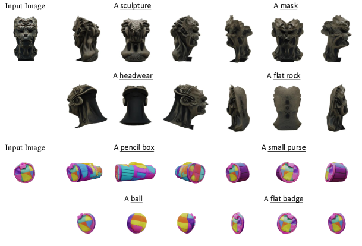

Figure 8: Controllable Generation with Multi-modal Conditions. DiffSplat can effectively utilize both text and image conditions for single-view reconstruction with text understanding.
[/FIGURE]

[FIGURE A2.F9.g1]
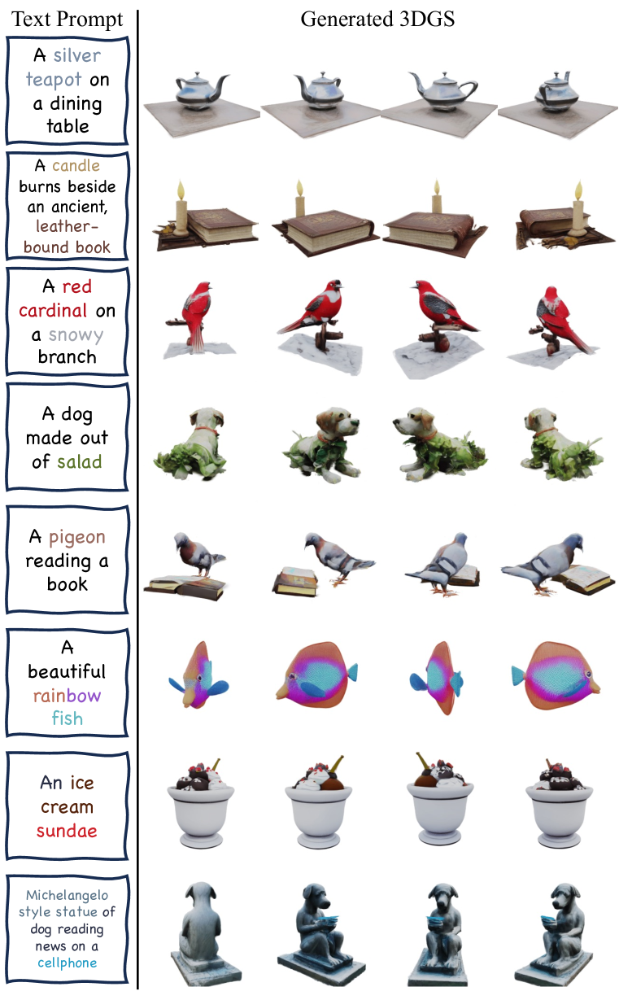

Figure 9: More results of text-conditioned DiffSplat.
[/FIGURE]

[FIGURE A2.F10.g1]
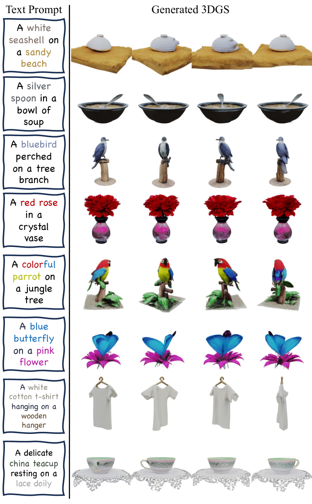

Figure 10: More results of text-conditioned DiffSplat.
[/FIGURE]

[FIGURE A2.F11.g1]
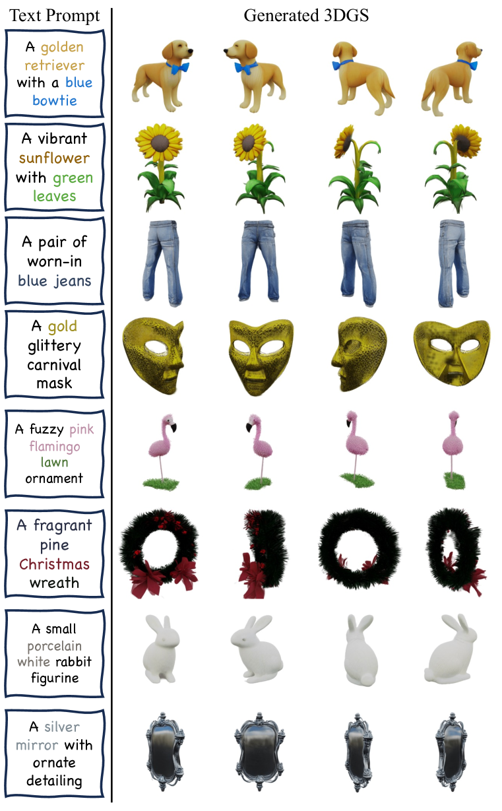

Figure 11: More results of text-conditioned DiffSplat.
[/FIGURE]

[FIGURE A2.F12.g1]
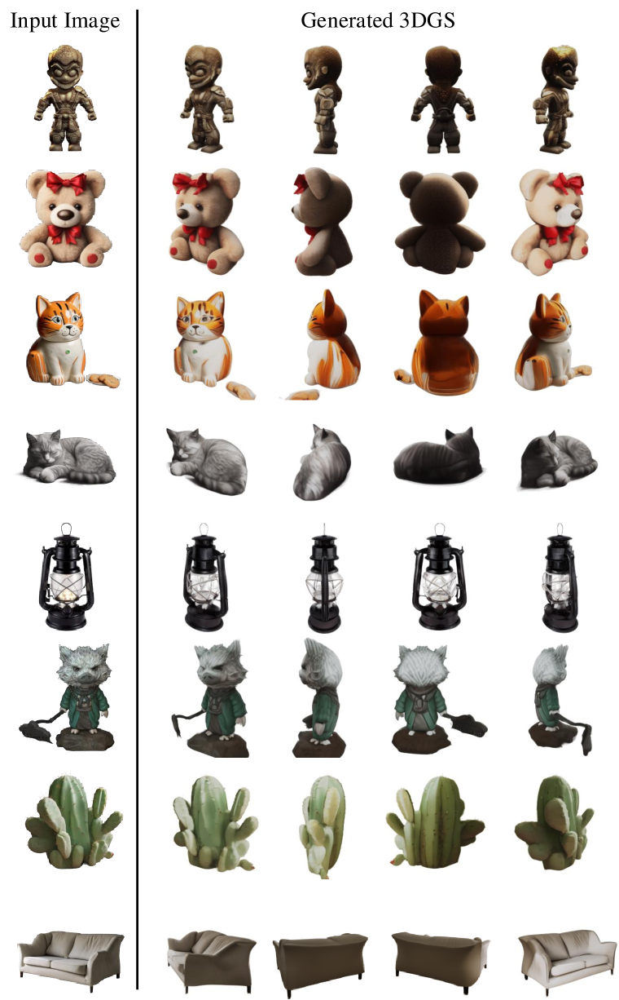

Figure 12: More results of image-conditioned DiffSplat.
[/FIGURE]

[FIGURE A2.F13.g1]
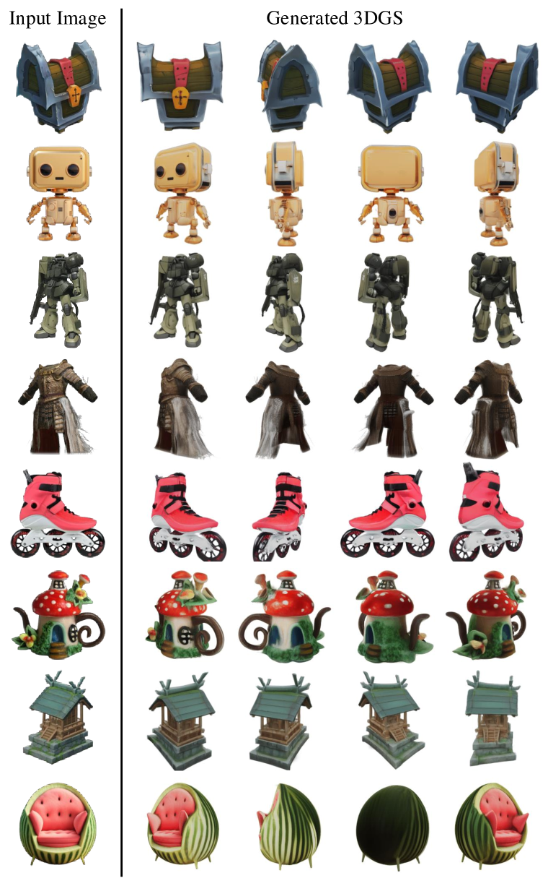

Figure 13: More results of image-conditioned DiffSplat.
[/FIGURE]

[FIGURE A2.F14.g1]
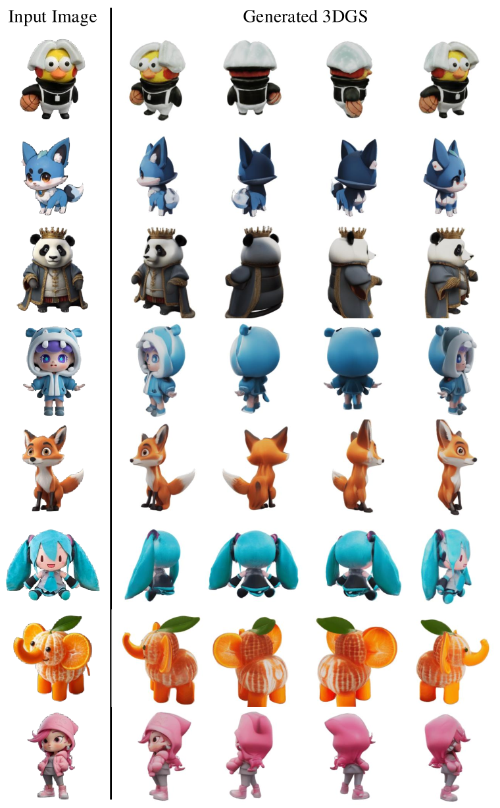

Figure 14: More results of image-conditioned DiffSplat.
[/FIGURE]

