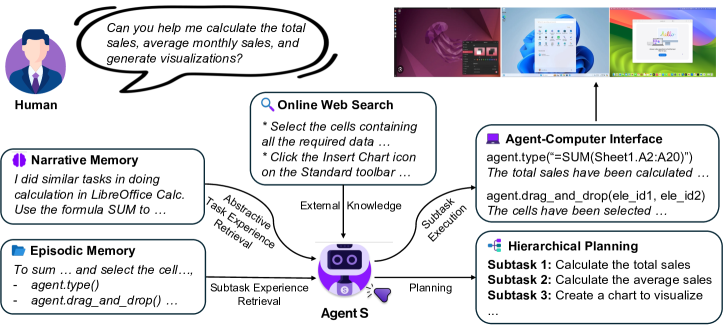
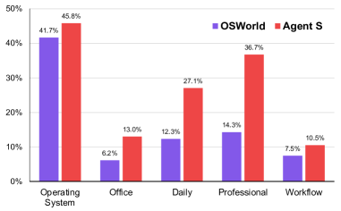
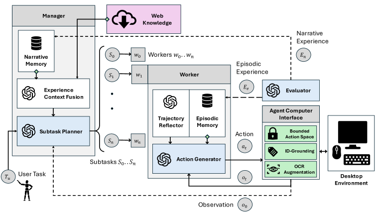
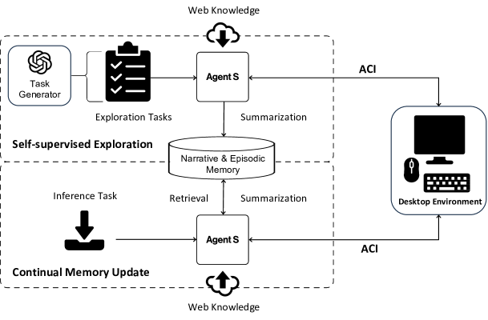
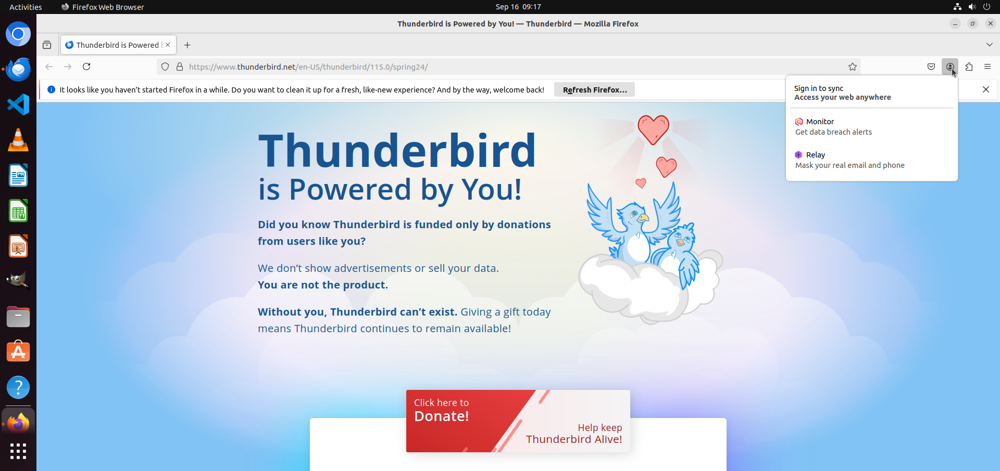
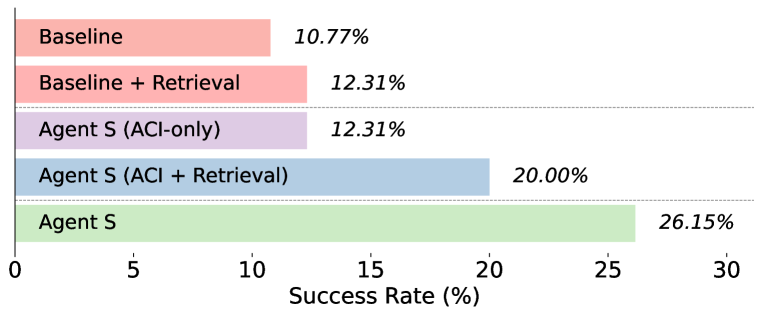
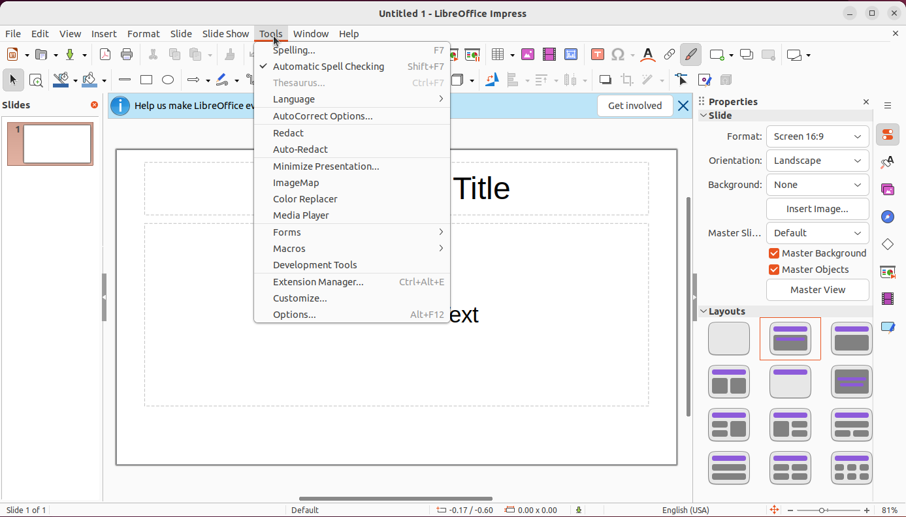
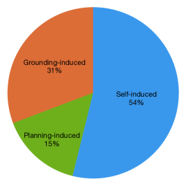

# Agent S: An Open Agentic Framework that Uses Computers Like a Human

###### Abstract

We present Agent S, an open agentic framework that enables autonomous interaction with computers through a Graphical User Interface (GUI), aimed at transforming human-computer interaction by automating complex, multi-step tasks. Agent S aims to address three key challenges in automating computer tasks: acquiring domain-specific knowledge, planning over long task horizons, and handling dynamic, non-uniform interfaces. To this end, Agent S introduces experience-augmented hierarchical planning, which learns from external knowledge search and internal experience retrieval at multiple levels, facilitating efficient task planning and subtask execution. In addition, it employs an Agent-Computer Interface (ACI) to better elicit the reasoning and control capabilities of GUI agents based on Multimodal Large Language Models (MLLMs). Evaluation on the OSWorld benchmark shows that Agent S outperforms the baseline by 9.37% on success rate (an 83.6% relative improvement) and achieves a new state-of-the-art. Comprehensive analysis highlights the effectiveness of individual components and provides insights for future improvements. Furthermore, Agent S demonstrates broad generalizability to different operating systems on a newly-released WindowsAgentArena benchmark. Code available at <https://github.com/simular-ai/Agent-S>.  

[FIGURE S0.F1.g1]

Figure 1: Agent S uses a computer like a human to solve diverse desktop tasks on different systems.
[/FIGURE]

## 1 Introduction

“The digital revolution is far more significant than the invention of writing or even of printing.”  

— Douglas Engelbart, The Inventor of Computer Mouse  

Since its invention, the mouse has been controlled by humans for interacting with computers. But does it really have to be? Autonomous Graphical User Interface (GUI) agents offer the promise of solving very specific and highly varied user queries—such as data entry, scheduling, and document creation for individual users, and streamlining operations in commercial settings—in the most general way: through direct UI interaction using the mouse and keyboard. Moreover, by eliminating the need for constant manual interaction, these agents not only boost efficiency but also improve accessibility, empowering individuals with disabilities to interact with technology in new, transformative ways. Recent advancements in Multimodal Large Language Models (MLLMs), such as GPT-4o (OpenAI, [2023](#bib.bib17)) and Claude (Anthropic, [2024](#bib.bib1)), have laid the foundation for the development of GUI agents for human-centred interactive systems like desktop OS (Xie et al., [2024](#bib.bib37); Bonatti et al., [2024](#bib.bib3)).  

However, automating computer tasks presents significant challenges. First, the vast range of constantly-evolving applications and websites requires the agent to possess specialized and up-to-date domain knowledge and the ability to learn from open-world experience. Second, complex desktop tasks often involve long-horizon, multi-step planning with interdependent actions that must be executed in a specific sequence. The agent must, therefore, create a clear plan with intermediate subgoals and track task progress. Third, GUI agents must navigate dynamic, non-uniform interfaces, processing large volumes of visual and textual information while operating within a vast action space. This involves distinguishing between relevant and irrelevant elements, accurately interpreting graphical cues, and responding to visual feedback during task execution.   

In this paper, we present Agent S, a new agentic framework that tackles these challenges towards the goal of using computers like a human. First, to enhance the GUI agent’s capabilities in solving diverse, long-horizon desktop tasks with specific domain knowledge, we propose an *Experience-Augmented Hierarchical Planning* method. This approach leverages Online Web Knowledge and past experiences stored in Narrative Memory to decompose the complex, long-horizon task into a structured plan of manageable subtasks (see Figure [1](#S0.F1 "Figure 1 ‣ Agent S: An Open Agentic Framework that Uses Computers Like a Human")). Online Web Knowledge provides up-to-date external knowledge about specific applications, allowing the agent to adapt to frequently changing software and websites. Narrative Memory contains high-level, abstractive task experiences from past interactions, equipping the agent with contextual understanding for effective task planning. The agent monitors task completion progress, and during each subtask execution, it retrieves detailed, step-by-step subtask experience from Episodic Memory to dynamically refine its actions and continuously improve its planning ability. Successful subtasks and the full task experience are evaluated, summarized, and stored in episodic and narrative memory to enable continual improvement.  

[FIGURE S1.F2.g1]

Figure 2: Agent S vs. OSWorld Agent results across five broad computer task categories.
[/FIGURE]

Furthermore, we introduce a specific language-centric *Agent-Computer Interface (ACI)* (Lieberman & Selker, [2003](#bib.bib16)) as an abstraction layer to improve grounding, safety, and efficiency for MLLM-based GUI agents. The ACI defines an interaction paradigm by (1) *a dual-input strategy* using visual input for understanding environmental changes together with an image-augmented accessibility tree for precise element grounding; (2) *a bounded action space* of language-based primitives (e.g., click(element\_id)) that are conducive to MLLM common-sense reasoning and generate environment transitions at the right temporal resolution for the agent to observe immediate and task-relevant environment feedback.  

Our approach shows a remarkable improvement in the overall performance of Agent S on the OSWorld benchmark (OpenAI, [2023](#bib.bib17)) (from 11.21% to 20.58%, with a relative improvement of 83.6%), establishing the new state-of-the-art results. The detailed comparison is shown in Figure [2](#S1.F2 "Figure 2 ‣ 1 Introduction ‣ Agent S: An Open Agentic Framework that Uses Computers Like a Human"), which demonstrates consistent improvements by Agent S across five broad computer task categories over the OSWorld agent. We also evaluate our Agent S on a concurrent work—WindowsAgentArena (Bonatti et al., [2024](#bib.bib3)), where we observe a performance improvement from 13.3% to 18.2% on an equivalent setup without any explicit adaptation. The improvement demonstrates the broad generalizability of Agent S to different operating systems. We detail the component-wise improvements introduced by the proposed strategies through ablation studies and present a comprehensive error analysis of our Agent S framework. In summary, our contributions are four-fold:   

* We introduce Agent S, a new agentic framework that integrates experience-augmented hierarchical planning, self-supervised continual memory update, and an Agent-Computer Interface for MLLM-based GUI agents to perform complex computer tasks. 
* We propose an experience-augmented hierarchical planning method that uses experience from external web knowledge and the agent’s internal memory to decompose complex tasks into executable subtasks. 
* We extend the concept of an ACI to GUI agents, allowing MLLM-based agents to operate computers more precisely using a set of high-level, predefined primitive actions. 
* We conduct extensive experiments on OSWorld to show the effectiveness of individual components of Agent S, establishing new state-of-the-art on automating computer tasks. Besides, we demonstrate its generalizability across different operating systems on WindowsAgentArena. 

## 2 Related Work

MLLM Agents.  The advent of Multimodal Large Language Models (MLLMs) has led to a host of works that utilize them as a reasoning backbone in Agentic Systems (Sumers et al., [2024](#bib.bib29)). These Agents augment LLMs with Memory, Structured Planning (Wang et al., [2023](#bib.bib32); Shinn et al., [2023](#bib.bib26); Weng et al., [2023](#bib.bib34)), Tool Use (Schick et al., [2023](#bib.bib23); Shen et al., [2023](#bib.bib25); Patil et al., [2023](#bib.bib19)) and the ability to Act in external environments Park et al. ([2023](#bib.bib18)). These agents have shown promise in domains ranging from embodied simulators (Liang et al., [2023](#bib.bib15); Song et al., [2023](#bib.bib27)) to video games (Wu et al., [2023](#bib.bib35); Wang et al., [2024](#bib.bib31)) and scientific research (Bran et al., [2023](#bib.bib4)). For Software Engineering (Hong et al., [2024](#bib.bib10); Qian et al., [2024](#bib.bib21)) in particular, Yang et al. ([2024](#bib.bib38)) proposed an Agent-Computer Interface (Lieberman & Selker, [2003](#bib.bib16)) for MLLM agents to understand and act more efficiently and reliably. Our work extends and integrates these individual modules into a new MLLM agent framework for computer control.  

GUI Agents.  MLLM agents have been applied to execute natural language instructions in both web and OS environments. Early research concentrated on web navigation tasks, utilizing MLLMs to interact with web interfaces (Gur et al., [2024](#bib.bib8); He et al., [2024](#bib.bib9); Kim et al., [2023](#bib.bib13); Shaw et al., [2023](#bib.bib24); Putta et al., [2024](#bib.bib20)). Recently, the focus has shifted to OS-level environments, leading to the development of benchmarks and frameworks such as OSWorld Xie et al. ([2024](#bib.bib37)) and WindowsAgentArena Bonatti et al. ([2024](#bib.bib3)) for desktop control, and DiGIRL (Bai et al., [2024](#bib.bib2)) and AndroidWorld (Rawles et al., [2024](#bib.bib22)) for mobile environments. These OS-level tasks offer broader control capabilities beyond the limitations of single-browser contexts in web navigation. Methodologically, earlier GUI agents employed behavioral cloning with reinforcement learning (Humphreys et al., [2022](#bib.bib11)), in-context trajectory examples (Zheng et al., [2024b](#bib.bib41)), state-dependent offline experience (Fu et al., [2024b](#bib.bib7)), and reusable skill generation (Wang et al., [2024](#bib.bib31)). Contemporaneous work on GUI agents for video games and OS (Wu et al., [2024](#bib.bib36); Song et al., [2024](#bib.bib28); Tan et al., [2024](#bib.bib30)) propose varying instances of cognitive architectures (Sumers et al., [2024](#bib.bib29)). Our work contributes unique modules such as experience-augmented hierarchical planning and ACI for GUI control, integrated with a novel continual memory update framework.  

Retrieval-Augmented Generation (RAG) for AI Agents.  RAG (Fan et al., [2024](#bib.bib5)) improves the reliability of MLLM inference by augmenting the input with reliable and up-to-date external knowledge. Similarly, MLLM agents benefit from retrieving task exemplars (Kim et al., [2024](#bib.bib14)), state-aware guidelines (Fu et al., [2024a](#bib.bib6)), and past experiences (Kagaya et al., [2024](#bib.bib12)). Our use of experience for augmentation differs in three ways: 1) our hierarchical planning leverages both full task experience and subtask experience; 2) the full task experience is summarized into an abstractive textual reward for subtask planning; 3) the subtask experience is assessed and annotated by a self-evaluator before being stored in memory.  

[FIGURE S2.F3.g1]

Figure 3: 
Overview of the Agent S framework.
Given task $T_{u}$ and initial environment observation $o_{0}$, the Manager conducts experience-augmented hierarchical planning using web knowledge and narrative memory to produce subtasks $s_{0},\dotsc,s_{n}$. For each $s_{i}$, Worker $w_{i}$ draws from episodic memory to generate an action $a_{t}$ at time $t$, which is executed by the ACI to return the next immediate observation $o_{t+1}$. A self-evaluation module closes the loop by storing the summarized subtask and full-task trajectories in narrative and episodic memory.
[/FIGURE]

## 3 Agent S

Agent S, illustrated in Figure [3](#S2.F3 "Figure 3 ‣ 2 Related Work ‣ Agent S: An Open Agentic Framework that Uses Computers Like a Human"), is a novel framework that integrates three main strategies in a closed loop to tackle complex GUI-based operating system control tasks: experience-augmented hierarchical planning, continual update of narrative and episodic memory, and an Agent-Computer Interface for precise perception and action on GUIs. Experience-augmented hierarchical planning allows Agent S to break down complex tasks into manageable subtasks. This enables both high-level planning and low-level execution to draw from external web-based experience and internal task-specific experience. A continual process of storing and retrieving self-evaluated task experience in narrative and episodic memory enables Agent S to improve over time and adapt to changes in the open-world desktop environment. The ACI ensures grounding by providing a vision-augmented accessibility tree observation containing all valid GUI elements and constraining the agent’s chosen action to a bounded discrete space of valid actions. Below, we describe each component and its integration in detail.  

### 3.1 Experience-augmented Hierarchical Planning

#### 3.1.1 Manager: Fusing External Knowledge and Internal Experience for Planning

The Manager $G$ is the primary plan generator module in our system. It receives a task $T_{u}$ from the user and the initial environment observation $O_{0}$ (Annotated Accessibility Tree + Screenshot) from the ACI as input. The manager formulates an observation-aware query $Q$ based on the user instruction and its observation in a “How to do X” format. This query is used for two types of retrieval. First, the query is used for Online Web Search through Perplexica Search Engine111<https://github.com/ItzCrazyKns/Perplexica> to get external knowledge. Then the same query is used to retrieve a similar task experience summary from the Manager’s own Narrative Memory $M_{n}$. The retrieval is based on the similarity of the query embedding.  

The Narrative Memory includes summaries of both successful and failed trajectories with specific actions removed as *abstractive full task experience* $E_{n_{u}}$. The success/failure is evaluated by the Self-Evaluator $S$ module (described in Subsection [3.1.3](#S3.SS1.SSS3 "3.1.3 Self-Evaluator: Summarizing Experiences as Textual Rewards ‣ 3.1 Experience-augmented Hierarchical Planning ‣ 3 Agent S ‣ Agent S: An Open Agentic Framework that Uses Computers Like a Human")) without any human feedback or ground truth information. This two-step retrieval provides the Manager with both the general and specific domain knowledge required to plan for the task. The outputs of the retrieval process are fused into a single fused guideline using the Experience Context Fusion submodule, represented formally as:  

|  | $\displaystyle Q$ | $\displaystyle=\text{LLM}(T_{u},O_{0})$ |  |
| --- | --- | --- | --- |
|  | $\displaystyle K_{\text{web}}$ | $\displaystyle=\text{Retrieve}(\text{Web},Q)$ |  |
| --- | --- | --- | --- |
|  | $\displaystyle E_{n_{u}}$ | $\displaystyle=\text{Retrieve}(M_{n},Q)$ |  |
| --- | --- | --- | --- |
|  | $\displaystyle K_{\text{fused}}$ | $\displaystyle=\text{LLM}(M_{n}(Q),K_{\text{web}})$ |  |
| --- | --- | --- | --- |

The fused knowledge $K_{\text{fused}}$ is then used by Subtask Planner submodule of the Manager to formulate a detailed, topologically sorted queue of subtasks $\langle s_{0}...s_{n}\rangle$ that can accomplish the user instruction. The manager also generates associated context $C_{s_{i}}$ for each subtask $s_{i}$ which includes additional information useful to accomplish the subtask.  

#### 3.1.2 Worker: Learning from Subtask Experience and Trajectory Reflection

The subtasks $\langle s_{0}..s_{n}\rangle$ generated by the Manager $G$ are executed sequentially by Worker modules $\langle w_{0}..w_{n}\rangle$. Each Worker can take multiple time steps within one episode to complete a subtask $s_{i}$. Firstly, the combination of the User Task $T_{u}$, the subtask $s_{i}$ and the contextual information $C_{s_{i}}$ are used as a query to retrieve similar subtask experience $E_{s_{i}}$ from the Worker’s Episodic Memory. The Episodic Memory is indexed by the concatenation of the task query, the subtask, and the contextual information $\langle Q,s_{i},C_{s_{i}}\rangle$, based on the similarity of the embedding. As opposed to Narrative Memory, Episodic Memory includes a complete plan with specific grounding actions and only summaries from the subtask trajectories designated as DONE or successful by a Worker. Additionally, a Trajectory Reflector submodule $TR_{i}$ is associated with each worker. This submodule observes the entire episode as the worker is executing the subtask and provides reflective advice to the agent—helping it think of alternative strategies and avoid repetitive actions.  

|  | $\displaystyle E_{s_{i}}$ | $\displaystyle=\text{Retrieve}(M_{e},\langle T_{u},s_{i},C_{s_{i}}\rangle)$ |  |
| --- | --- | --- | --- |

The subtask experience $E_{s_{i}}$ and the reflection is used by the Action Generator submodule inside a Worker to generate a single structured response - consisting of a previous action status check, observation analysis, semantic next action and grounded next action. This structured response allows the agent to generate a templated chain-of-thought Wei et al. ([2022](#bib.bib33)); Yao et al. ([2023](#bib.bib39)) for improved reasoning and results in a single grounded action $a_{j}$. This action is passed to the ACI which implements it in the Desktop Environment. Once the worker reasons that the subtask has been completed, it generates a special grounded action DONE which signals the successful end of the subtask. The worker can also optionally generate a FAIL signal, in which case the hierarchical operation is reset and the Manager replans a new set of subtasks based on the intermediate environment configuration.  

#### 3.1.3 Self-Evaluator: Summarizing Experiences as Textual Rewards

The Self-Evaluator $S$ is responsible for generating experience summaries as textual rewards $r$ for the Manager and Worker modules. In the case of the successful end of an episode signaled by the Worker with a DONE signal, the evaluator observes the complete episode and generates learning in the form of a summarization of the strategy used by the worker to complete that subtask. This strategy is fed back into the Worker’s episodic memory $M_{e}$. In the case of the end of the complete user-provided task, indicated either by the successful completion of all subtasks or by the maximum number of steps limit, the evaluator generates a learning signal in the form of the summary of the entire task completion process. This summary is fed back and saved in the narrative memory $M_{n}$ of the Manager. This process of Observations, Hierarchical Action Generation, and Rewards in the form of textual summaries to update the internal memories of the Manager and Worker mirrors a classic Hierarchical Reinforcement Learning process - but uses Retrieval as a learning strategy.  

[FIGURE S3.F4.g1]

Figure 4: The pipeline of memory construction and update, which contains two phases: Self-supervised Exploration and Continual Memory Update. The initial Narrative & Episodic Memory is constructed through some randomly curated tasks during the exploration phase, and then it is updated based on the inference tasks continually.
[/FIGURE]

### 3.2 Memory Construction and Update

##### Initial Memory Construction via Self-supervised Exploration.

To bootstrap Narrative $M_{n}$ and Episodic Memories $M_{e}$, Agent S conducts self-supervised exploration on a set of synthetically generated tasks (see [Figure 4](#S3.F4 "In 3.1.3 Self-Evaluator: Summarizing Experiences as Textual Rewards ‣ 3.1 Experience-augmented Hierarchical Planning ‣ 3 Agent S ‣ Agent S: An Open Agentic Framework that Uses Computers Like a Human")). We utilize two methods to create two types of random exploration tasks: environment-independent tasks and environment-aware tasks. For environment-independent tasks, we leverage a task generator to generate the top 50 most common tasks from the various applications used in OSWorld (Xie et al., [2024](#bib.bib37)) and WindowsAgentArena (Bonatti et al., [2024](#bib.bib3)). For environment-aware tasks, we take the initial environments of the tasks in OSWorld and WindowsAgentArena and prompt a Task Generator to generate a different task based on the environment. Both types of tasks consist of the exploration tasks. Then we run Agent S on these tasks by only taking web knowledge $K_{\text{web}}$ and collect the full task (Narrative Experience $E_{n}$) and subtask experiences (Episodic Experience $E_{e}$) for the narrative and episodic memories. The key stored in narrative memory $M_{n}$ is the query $Q$ and for episodic memory $M_{e}$, the key is query $Q$ concatenated with subtask information $\langle Q,s_{i},C_{s_{i}}\rangle$. Through this process, the initial memory is constructed.  

Continual Memory Update.  As our Agent S interacts with new tasks, it continually updates the Narrative Memory $M_{n}$ and Episodic Memory $M_{e}$, as illustrated in [Figure 4](#S3.F4 "In 3.1.3 Self-Evaluator: Summarizing Experiences as Textual Rewards ‣ 3.1 Experience-augmented Hierarchical Planning ‣ 3 Agent S ‣ Agent S: An Open Agentic Framework that Uses Computers Like a Human"). Thus even after the initial exploration is completed, the agent continues to learn as it encounters and attempts newer, more novel tasks. This process enables our agent to learn even during inference and retrieve the learned knowledge to new tasks effectively.  

### 3.3 Agent-Computer Interface

Current desktop environments are designed to accommodate two distinct user types: (1) *human users*, who can perceive and respond to subtle visual changes in real-time, and (2) *software programs*, which execute predefined tasks through scripts and Application Programming Interfaces (APIs). However, these interfaces are inadequate for MLLM agents tasked with GUI control and manipulation at the fundamental keyboard-mouse level. These agents operate on a different paradigm: they respond in slow, discrete time intervals, lack an internal coordinate system, and cannot efficiently process fine-grained feedback after each minor mouse movement or keyboard input. Drawing inspiration from the ACI developed for Software Engineering agents (Yang et al., [2024](#bib.bib38)), we propose the creation of a novel ACI to bridge the gap between the unique operational constraints of MLLM agents and the requirements of open-ended GUI-control tasks.  

Perception and Grounding.  Current MLLMs can effectively reason about certain elements and features in an image, but they cannot directly ground and pinpoint specific elements in images as they lack an internal coordinate system. In GUI manipulation, agents need to constantly interact with fine UI elements, and previous works have shown that grounding is a significant bottleneck in these agents (Xie et al., [2024](#bib.bib37); Zheng et al., [2024a](#bib.bib40)). Desktop environments, however, provide an easily parseable Accessibility Tree with coordinate information about almost every element in the UI. Thus, our ACI design incorporates a dual-input strategy with different purposes for each input. The image input is used by the agent to observe salient details about the environment—such as popups, button states, checking if a previous action worked, and reasoning about the next step. The accessibility tree input is used for reasoning about the next step and, more importantly, grounding specific elements in the environment. To achieve this, we tag each element in the accessibility tree with unique integer tags which can be used by agents when referring to these elements. Furthermore, while previous works seek to augment the image with information from the accessibility tree (Xie et al., [2024](#bib.bib37); Zheng et al., [2024a](#bib.bib40); Bonatti et al., [2024](#bib.bib3)) using Set-of-Mark Prompting, we augment the tree with details from the image. To achieve this, we run an OCR module on the image and parse textual blocks from the screenshot. We then add these blocks to the accessibility tree as interactable UI elements if they do not already exist in the tree. To check for existing elements, we perform an IOU (Intersection over Union) match with all elements in the tree.  

Constrained Action Space with Concurrent Feedback.  Desktop automation has traditionally relied on APIs and scripts, but adopting these as actions would imply an unbounded combinatorial action space of arbitrary executable code. This is unsuitable for keyboard-mouse-level GUI automation agents because it compromises safety and precision. Code blocks can contain multiple sequential actions, leaving the agent with neither control over nor feedback from individual steps. To ensure that actions generated by agents are safely and reliably relayed to the environment and produce clear and timely feedback, our ACI design incorporates a bounded action space. This space includes primitive actions like click, type, and hotkey (detailed in [Section A.1](#A1.SS1 "A.1 Constrained action space ‣ Appendix A Agent-Computer Interface ‣ Agent S: An Open Agentic Framework that Uses Computers Like a Human")). Agents can refer to different elements by their tagged IDs, and the ACI translates the $\langle$ primitive - ID $\rangle$ information into executable Python code. Furthermore, the agent is allowed to perform only one discrete action at each time step, so it can observe immediate feedback from the environment. These actions are also coarse enough to account for the slow, stateless nature of MLLMs, e.g., the agent can directly move to and click an element instead of moving the mouse in small increments.  

## 4 Experiments

### 4.1 Experimental Setup

Benchmarks.  We evaluate Agent S on OSWorld (Xie et al., [2024](#bib.bib37)), a benchmark for testing the multimodal agents’ capability of executing a wide range of computer tasks in a real computer environment. This executable environment allows free-form keyboard and mouse control of real computer applications, including OS, Office (LibreOffice Calc, Impress, Writer), Daily (Chrome, VLC Player, Thunderbird), Professional (VS Code and GIMP), and Workflow (tasks involving multiple apps). In addition, we also evaluate the generalization of Agent S on WindowsAgentArena (Bonatti et al., [2024](#bib.bib3)), a contemporaneous benchmark in the Windows operating system.  

Settings & Baselines.  Since the OSWorld benchmark contains 369 tasks on Ubuntu, for the backbone model of Agent S, we leverage GPT-4o and Claude-3-Sonnet, respectively. For WindowsAgentArena, we test all 154 tasks on GPT-4o. We use the PaddleOCR222<https://github.com/PaddlePaddle/PaddleOCR> toolkit as our OCR tool in augmenting accessibility trees for grounding. The embedding model for the retrieval we use is text-embedding-3-small. Agent S takes the accessibility tree and screenshot as inputs, so we also use the reported results in OSWorld (Xie et al., [2024](#bib.bib37)) and WindowsAgentArena (Bonatti et al., [2024](#bib.bib3)) with same input setting as baselines. The OSWorld baseline takes the coordinates-based accessibility tree and screenshots as input for spatial grounding to generate the action with coordinates at each step. The WindowsAgentArena baseline NAVI (Bonatti et al., [2024](#bib.bib3)) utilizes an accessibility tree, OCR, and Proprietary models to process the screenshot and create Set-of-Marks as input. Its action space includes a constrained set of primitives but allows multiple actions to be chained together.  

### 4.2 Main Results

OSWorld.  Table [1](#S4.T1 "Table 1 ‣ 4.2 Main Results ‣ 4 Experiments ‣ Agent S: An Open Agentic Framework that Uses Computers Like a Human") shows the performance comparison between Agent S and the baseline models, evaluated across the whole OSWorld test set. For the GPT-4o model, Agent S achieves an overall success rate of 20.58%, nearly doubling the performance of the best corresponding baseline (GPT-4o with 11.21%). Agent S consistently outperforms the baselines in the “Daily” and “Professional” tasks, where it reaches 27.06% and 36.73% success rates, respectively, compared to the best baseline results of 12.33% and 14.29%. These tasks are commonly used in daily life or involved with knowledge-intensive professional applications, which benefit more from the retrieval augmentation of Agent S. Both Claude-3.5-Sonnet and GPT-4o outperform the baseline versions across the majority of tasks. Claude-3.5-Sonnet even performs better than GPT-4o in “Daily” and “Professional” tasks. The results demonstrate the enhanced capability of Agent S in handling diverse and complex tasks more effectively than the baseline approaches.  

[TABLE S4.T1]

<table class="ltx_tabular ltx_centering ltx_guessed_headers ltx_align_middle">
<tbody class="ltx_tbody">
<tr class="ltx_tr">
<th class="ltx_td ltx_align_left ltx_th ltx_th_row ltx_border_tt">Method</th>
<td class="ltx_td ltx_align_center ltx_border_tt">OS</td>
<td class="ltx_td ltx_align_center ltx_border_tt">Office</td>
<td class="ltx_td ltx_align_center ltx_border_tt">Daily</td>
<td class="ltx_td ltx_align_center ltx_border_tt">Profess.</td>
<td class="ltx_td ltx_align_center ltx_border_tt">Workflow</td>
<td class="ltx_td ltx_align_center ltx_border_tt">Overall</td>
</tr>
<tr class="ltx_tr">
<th class="ltx_td ltx_align_left ltx_th ltx_th_row ltx_border_t">Claude-3</th>
<td class="ltx_td ltx_align_center ltx_border_t">12.50</td>
<td class="ltx_td ltx_align_center ltx_border_t">3.57</td>
<td class="ltx_td ltx_align_center ltx_border_t">5.27</td>
<td class="ltx_td ltx_align_center ltx_border_t">8.16</td>
<td class="ltx_td ltx_align_center ltx_border_t">1.00</td>
<td class="ltx_td ltx_align_center ltx_border_t">4.41</td>
</tr>
<tr class="ltx_tr">
<th class="ltx_td ltx_align_left ltx_th ltx_th_row">Gemini-Pro-1.5</th>
<td class="ltx_td ltx_align_center">12.50</td>
<td class="ltx_td ltx_align_center">3.58</td>
<td class="ltx_td ltx_align_center">7.83</td>
<td class="ltx_td ltx_align_center">8.16</td>
<td class="ltx_td ltx_align_center">1.52</td>
<td class="ltx_td ltx_align_center">5.10</td>
</tr>
<tr class="ltx_tr">
<th class="ltx_td ltx_align_left ltx_th ltx_th_row">GPT-4V</th>
<td class="ltx_td ltx_align_center">16.66</td>
<td class="ltx_td ltx_align_center">6.99</td>
<td class="ltx_td ltx_align_center">24.50</td>
<td class="ltx_td ltx_align_center">18.37</td>
<td class="ltx_td ltx_align_center">4.64</td>
<td class="ltx_td ltx_align_center">12.17</td>
</tr>
<tr class="ltx_tr">
<th class="ltx_td ltx_align_left ltx_th ltx_th_row">GPT-4o</th>
<td class="ltx_td ltx_align_center">41.67</td>
<td class="ltx_td ltx_align_center">6.16</td>
<td class="ltx_td ltx_align_center">12.33</td>
<td class="ltx_td ltx_align_center">14.29</td>
<td class="ltx_td ltx_align_center">7.46</td>
<td class="ltx_td ltx_align_center">11.21</td>
</tr>
<tr class="ltx_tr">
<th class="ltx_td ltx_align_left ltx_th ltx_th_row ltx_border_t">Agent S w/ Claude-3.5</th>
<td class="ltx_td ltx_align_center ltx_border_t">41.66</td>
<td class="ltx_td ltx_align_center ltx_border_t">13.83</td>
<td class="ltx_td ltx_align_center ltx_border_t">30.46</td>
<td class="ltx_td ltx_align_center ltx_border_t">32.65</td>
<td class="ltx_td ltx_align_center ltx_border_t">9.54</td>
<td class="ltx_td ltx_align_center ltx_border_t">20.48</td>
</tr>
<tr class="ltx_tr">
<th class="ltx_td ltx_align_left ltx_th ltx_th_row ltx_border_bb">Agent S w/ GPT-4o</th>
<td class="ltx_td ltx_align_center ltx_border_bb">45.83</td>
<td class="ltx_td ltx_align_center ltx_border_bb">13.00</td>
<td class="ltx_td ltx_align_center ltx_border_bb">27.06</td>
<td class="ltx_td ltx_align_center ltx_border_bb">36.73</td>
<td class="ltx_td ltx_align_center ltx_border_bb">10.53</td>
<td class="ltx_td ltx_align_center ltx_border_bb">20.58</td>
</tr>
</tbody>
</table>

Table 1: Main results of Successful Rate (%) on the OSWorld full test set of all 369 test examples.
[/TABLE]

##### Qualitative Examples.

In Figure [5](#S4.F5 "Figure 5 ‣ Qualitative Examples. ‣ 4.2 Main Results ‣ 4 Experiments ‣ Agent S: An Open Agentic Framework that Uses Computers Like a Human"), we illustrate an example of a task from the Thunderbird app from OSWorld: Help me to remove the account ”anonym-x2024@outlook.com”. Agent S completes tasks by interacting with the desktop through a combination of actions. More qualitative examples are demonstrated in Appendix [D.1](#A4.SS1 "D.1 Success Examples ‣ Appendix D Supplementary Examples for Qualitative Analysis ‣ Agent S: An Open Agentic Framework that Uses Computers Like a Human").  

[FIGURE S4.F5.sf1.g1]

(a) Open Account Settings: 
  
agent.click(41, 1, “left”)
[/FIGURE]

### 4.3 Ablation Study

To demonstrate the effectiveness of individual modules of Agent S, we stratified sampled a subset of 65 instances, $test_{sub}$333The test\_small set provided by the OSWorld codebase is too small and imbalanced (only 39 examples in total and 2 in the OS category) for practical evaluations. Thus, we sample a larger and more balanced subset. from the full test set for the ablation study. Considering the inference cost, we utilized GPT-4o as the LLM backbone for all ablation studies for both the baseline and Agent S.  

[TABLE S4.T2]

<table class="ltx_tabular ltx_guessed_headers ltx_align_middle">
<thead class="ltx_thead">
<tr class="ltx_tr">
<th class="ltx_td ltx_align_left ltx_th ltx_th_column ltx_th_row ltx_border_tt">Method</th>
<th class="ltx_td ltx_align_center ltx_th ltx_th_column ltx_border_tt">OS (6)</th>
<th class="ltx_td ltx_align_center ltx_th ltx_th_column ltx_border_tt">Office (17)</th>
<th class="ltx_td ltx_align_center ltx_th ltx_th_column ltx_border_tt">Daily (16)</th>
<th class="ltx_td ltx_align_center ltx_th ltx_th_column ltx_border_tt">Profess. (10)</th>
<th class="ltx_td ltx_align_center ltx_th ltx_th_column ltx_border_tt">Workflow (16)</th>
<th class="ltx_td ltx_align_center ltx_th ltx_th_column ltx_border_tt">Overall (65)</th>
</tr>
<tr class="ltx_tr">
<th class="ltx_td ltx_align_left ltx_th ltx_th_column ltx_th_row ltx_border_t">baseline (OSWorld Agent)</th>
<th class="ltx_td ltx_align_center ltx_th ltx_th_column ltx_border_t">33.33</th>
<th class="ltx_td ltx_align_center ltx_th ltx_th_column ltx_border_t">5.88</th>
<th class="ltx_td ltx_align_center ltx_th ltx_th_column ltx_border_t">12.50</th>
<th class="ltx_td ltx_align_center ltx_th ltx_th_column ltx_border_t">10.00</th>
<th class="ltx_td ltx_align_center ltx_th ltx_th_column ltx_border_t">6.25</th>
<th class="ltx_td ltx_align_center ltx_th ltx_th_column ltx_border_t">10.77</th>
</tr>
</thead>
<tbody class="ltx_tbody">
<tr class="ltx_tr">
<th class="ltx_td ltx_align_left ltx_th ltx_th_row ltx_border_t">Agent S</th>
<td class="ltx_td ltx_align_center ltx_border_t">50.00</td>
<td class="ltx_td ltx_align_center ltx_border_t">11.76</td>
<td class="ltx_td ltx_align_center ltx_border_t">37.50</td>
<td class="ltx_td ltx_align_center ltx_border_t">40.00</td>
<td class="ltx_td ltx_align_center ltx_border_t">12.50</td>
<td class="ltx_td ltx_align_center ltx_border_t">26.15</td>
</tr>
<tr class="ltx_tr">
<th class="ltx_td ltx_align_left ltx_th ltx_th_row">- w/o Web Knowledge</th>
<td class="ltx_td ltx_align_center">16.60</td>
<td class="ltx_td ltx_align_center">11.76</td>
<td class="ltx_td ltx_align_center">24.49</td>
<td class="ltx_td ltx_align_center">30.00</td>
<td class="ltx_td ltx_align_center">6.25</td>
<td class="ltx_td ltx_align_center">16.80</td>
</tr>
<tr class="ltx_tr">
<th class="ltx_td ltx_align_left ltx_th ltx_th_row">- w/o Narrative Memory</th>
<td class="ltx_td ltx_align_center">33.33</td>
<td class="ltx_td ltx_align_center">11.76</td>
<td class="ltx_td ltx_align_center">36.99</td>
<td class="ltx_td ltx_align_center">20.00</td>
<td class="ltx_td ltx_align_center">12.50</td>
<td class="ltx_td ltx_align_center">21.41</td>
</tr>
<tr class="ltx_tr">
<th class="ltx_td ltx_align_left ltx_th ltx_th_row">- w/o Episodic Memory</th>
<td class="ltx_td ltx_align_center">33.33</td>
<td class="ltx_td ltx_align_center">5.88</td>
<td class="ltx_td ltx_align_center">25.00</td>
<td class="ltx_td ltx_align_center">30.00</td>
<td class="ltx_td ltx_align_center">12.50</td>
<td class="ltx_td ltx_align_center">18.46</td>
</tr>
<tr class="ltx_tr">
<th class="ltx_td ltx_align_left ltx_th ltx_th_row ltx_border_bb">- w/o All</th>
<td class="ltx_td ltx_align_center ltx_border_bb">33.33</td>
<td class="ltx_td ltx_align_center ltx_border_bb">5.88</td>
<td class="ltx_td ltx_align_center ltx_border_bb">18.75</td>
<td class="ltx_td ltx_align_center ltx_border_bb">20.00</td>
<td class="ltx_td ltx_align_center ltx_border_bb">6.25</td>
<td class="ltx_td ltx_align_center ltx_border_bb">13.85</td>
</tr>
</tbody>
</table>

Table 2: The ablation study of experience-augmented hierarchical planning in OSWorld $test_{sub}$. The metric is Successful Rate (%).
[/TABLE]

Learning from experience enhances the domain knowledge of GUI agents. The Experiential learning process of Agent S involves searching web knowledge, retrieving full task experience from narrative memory and retrieving subtask experience from episodic memory. To assess the impact of different components, we systematically remove each component and observe performance changes across different task categories. The results are shown in Table [2](#S4.T2 "Table 2 ‣ 4.3 Ablation Study ‣ 4 Experiments ‣ Agent S: An Open Agentic Framework that Uses Computers Like a Human"). Learning from universal experience available as web knowledge allows Agent S to make informed plans across a wide range of tasks and has the most significant impact. The learning from Narrative and Episodic memories synergies effectively with web retrieval, and the results detail how their ablation affects the agent’s ability to handle complex tasks, underscoring the value of experiential learning. These results demonstrate that each component plays a critical role in enhancing the agent’s domain knowledge. Removing all three components (w/o All) degrades the performance significantly, revealing the importance of *learning from experience* in the design.  

[FIGURE S4.F7.1.g1]

Figure 6: Ablation of ACI in OSWorld $test_{sub}$.
[/FIGURE]

ACI elicits better reasoning abilities of LLMs and supports better agentic learning. Figure [7](#S4.F7 "Figure 7 ‣ 4.3 Ablation Study ‣ 4 Experiments ‣ Agent S: An Open Agentic Framework that Uses Computers Like a Human") presents the results of the ablation study on the ACI module. Comparing the baseline with Agent S (ACI-only)444This version of Agent S excludes Hierarchical Planning to better study the effects of ACI in isolation. highlights the enhanced reasoning abilities achieved by incorporating ACI. Additionally, we examined the impact of ACI on agentic learning by integrating the Experiential learning process. For the baseline, adding Experiential learning slightly improved overall performance. However, when added to Agent S (ACI-only), the performance improved significantly, demonstrating ACI’s effectiveness in enhancing agentic learning.  

Hierarchical Planning supports long-horizon workflows. The (*ACI-only + Experiential Learning*) setup in Figure [7](#S4.F7 "Figure 7 ‣ 4.3 Ablation Study ‣ 4 Experiments ‣ Agent S: An Open Agentic Framework that Uses Computers Like a Human") shows Agent S performance without Hierarchical Planning, and the observed performance drop (26.15% to 20.00%) compared to the full Agent S underscores the importance of Hierarchical Planning in modeling long-horizon workflows. The effect of hierarchical formulation becomes pronounced in the presence of Experiential learning as the Manager can generate more detailed and accurate plans in the subtask planning stage.  

Exploration, Continual Memory Update and Self-Evaluator are indispensable for memory construction. Our agent collects experience in two phases - initially during the self-supervised exploration phase and then continually as it interacts with new examples (See Figure [4](#S3.F4 "Figure 4 ‣ 3.1.3 Self-Evaluator: Summarizing Experiences as Textual Rewards ‣ 3.1 Experience-augmented Hierarchical Planning ‣ 3 Agent S ‣ Agent S: An Open Agentic Framework that Uses Computers Like a Human")). To assess the effectiveness of these two learning stages and further examine our Self-evaluator which stores experience as summaries instead of unfiltered trajectories we run the ablation shown in Figure [7](#S4.F7 "Figure 7 ‣ 4.3 Ablation Study ‣ 4 Experiments ‣ Agent S: An Open Agentic Framework that Uses Computers Like a Human"). Removing exploration limits memory updates to the inference phase only. Removing the continual memory update means we only use the memory obtained from the exploration phase without subsequent updates. Removing the self-evaluator involves replacing summarized experiences with the original full trajectories. The results shown in Figure [7](#S4.F7 "Figure 7 ‣ 4.3 Ablation Study ‣ 4 Experiments ‣ Agent S: An Open Agentic Framework that Uses Computers Like a Human") reveal that ablating both the continual memory update and self-supervised exploration phases results in a performance drop, with the self-supervised exploration being much more impactful. The ablation of the Self-Evaluator further shows the benefits of using summarized trajectories instead of full trajectory exemplars for planning.  

### 4.4 Error Analysis

We performed a thorough error analysis on the tasks that Agent S failed within $test_{sub}$ of the OSWorld. There are three types of errors that we observed: (1) *Planning Error*: A planning error occurs when the agent generates unsuitable plans for a task, including inaccuracies in the plan, misleading subtask information, or misalignment of subtask sequence with task requirements. (2) *Grounding Error*: A grounding error arises when the agent fails to accurately interact with target elements despite their visibility and the application of correct reasoning. This includes incorrect element selection or inaccurate coordinate selection due to the inherent limitations of our action space (e.g., selecting the center instead of a more precise part of the element). (3) *Execution Error*: An execution error emerges when the agent makes incorrect decisions or fails to adjust its behavior during task execution. This includes repetitive actions, diverging from subtask goals, delays in transitioning between subtasks or violating established protocols by combining multiple actions into one.  

[TABLE S4.T3]

<table class="ltx_tabular ltx_guessed_headers ltx_align_middle">
<thead class="ltx_thead">
<tr class="ltx_tr">
<th class="ltx_td ltx_align_left ltx_th ltx_th_column ltx_th_row ltx_border_tt">Error Metric</th>
<th class="ltx_td ltx_align_center ltx_th ltx_th_column ltx_border_tt">OS</th>
<th class="ltx_td ltx_align_center ltx_th ltx_th_column ltx_border_tt">Office</th>
<th class="ltx_td ltx_align_center ltx_th ltx_th_column ltx_border_tt">Daily</th>
<th class="ltx_td ltx_align_center ltx_th ltx_th_column ltx_border_tt">Profess.</th>
<th class="ltx_td ltx_align_center ltx_th ltx_th_column ltx_border_tt">Workflow</th>
<th class="ltx_td ltx_align_center ltx_th ltx_th_column ltx_border_tt">Overall</th>
</tr>
</thead>
<tbody class="ltx_tbody">
<tr class="ltx_tr">
<th class="ltx_td ltx_align_left ltx_th ltx_th_row ltx_border_t">Planning Error</th>
<td class="ltx_td ltx_align_center ltx_border_t">66.67</td>
<td class="ltx_td ltx_align_center ltx_border_t">25.00</td>
<td class="ltx_td ltx_align_center ltx_border_t">30.00</td>
<td class="ltx_td ltx_align_center ltx_border_t">66.67</td>
<td class="ltx_td ltx_align_center ltx_border_t">28.57</td>
<td class="ltx_td ltx_align_center ltx_border_t">34.69</td>
</tr>
<tr class="ltx_tr">
<th class="ltx_td ltx_align_left ltx_th ltx_th_row">Grounding Error</th>
<td class="ltx_td ltx_align_center">0.00</td>
<td class="ltx_td ltx_align_center">75.00</td>
<td class="ltx_td ltx_align_center">50.00</td>
<td class="ltx_td ltx_align_center">66.67</td>
<td class="ltx_td ltx_align_center">35.71</td>
<td class="ltx_td ltx_align_center">53.06</td>
</tr>
<tr class="ltx_tr">
<th class="ltx_td ltx_align_left ltx_th ltx_th_row">Execution Error</th>
<td class="ltx_td ltx_align_center">33.33</td>
<td class="ltx_td ltx_align_center">87.50</td>
<td class="ltx_td ltx_align_center">100.00</td>
<td class="ltx_td ltx_align_center">66.67</td>
<td class="ltx_td ltx_align_center">71.43</td>
<td class="ltx_td ltx_align_center">79.59</td>
</tr>
<tr class="ltx_tr">
<th class="ltx_td ltx_align_left ltx_th ltx_th_row ltx_border_bb ltx_border_t">Subtask Failure</th>
<td class="ltx_td ltx_align_center ltx_border_bb ltx_border_t">16.67</td>
<td class="ltx_td ltx_align_center ltx_border_bb ltx_border_t">58.47</td>
<td class="ltx_td ltx_align_center ltx_border_bb ltx_border_t">62.82</td>
<td class="ltx_td ltx_align_center ltx_border_bb ltx_border_t">33.61</td>
<td class="ltx_td ltx_align_center ltx_border_bb ltx_border_t">70.43</td>
<td class="ltx_td ltx_align_center ltx_border_bb ltx_border_t">57.17</td>
</tr>
</tbody>
</table>

Table 3: The statistic of Error Rate (%) on $test_{sub}$ of OSWorld that Agent S failed to complete.
[/TABLE]

Statistic Results of the Errors. We analyzed Agent S’s trajectory for each failed task, identifying error types based on the definitions provided. A single task may contain multiple errors. We also calculated the Subtask Failure Rate, which measures the average percentage of failed subtasks relative to total attempts, and the Error Rate, which reflects the proportion of tasks exhibiting a specific error type. As shown in Table [3](#S4.T3 "Table 3 ‣ 4.4 Error Analysis ‣ 4 Experiments ‣ Agent S: An Open Agentic Framework that Uses Computers Like a Human"), execution and grounding errors are the most common across various task categories. A case study of error occurrence can be found in Appendix [D.2](#A4.SS2 "D.2 Detailed Error Analysis and Failure Examples ‣ Appendix D Supplementary Examples for Qualitative Analysis ‣ Agent S: An Open Agentic Framework that Uses Computers Like a Human").  

### 4.5 Generalization to Different Operating Systems

We test the Agent S framework with no modification on WindowsAgentArena (Bonatti et al., [2024](#bib.bib3)), a Windows OS benchmark released contemporaneously with our work. We compare Agent S with the similar configuration555The best-performing agent in WindowsAgentArena is based on an internal closed-sourced model that was trained for GUI grounding and is not accessible outside of Microsoft now, so we choose a similar configuration with ours for fair comparison. with GPT-4o as the MLLM backbone, Accessibility Tree + Image as the input, and parsing with OCR. As shown in [Table 4](#S4.T4 "In 4.5 Generalization to Different Operating Systems ‣ 4 Experiments ‣ Agent S: An Open Agentic Framework that Uses Computers Like a Human"), Agent S outperforms the Navi agent without any adaptation to the new Windows environment.  

[TABLE S4.T4]

<table class="ltx_tabular ltx_guessed_headers ltx_align_middle">
<thead class="ltx_thead">
<tr class="ltx_tr">
<th class="ltx_td ltx_align_left ltx_th ltx_th_column ltx_th_row ltx_border_tt">Method</th>
<th class="ltx_td ltx_align_center ltx_th ltx_th_column ltx_border_tt">Office</th>
<th class="ltx_td ltx_align_center ltx_th ltx_th_column ltx_border_tt">Web Browser</th>
<th class="ltx_td ltx_align_center ltx_th ltx_th_column ltx_border_tt">Windows System</th>
<th class="ltx_td ltx_align_center ltx_th ltx_th_column ltx_border_tt">Coding</th>
<th class="ltx_td ltx_align_center ltx_th ltx_th_column ltx_border_tt">Media &amp; Video</th>
<th class="ltx_td ltx_align_center ltx_th ltx_th_column ltx_border_tt">Windows Utils</th>
<th class="ltx_td ltx_align_center ltx_th ltx_th_column ltx_border_tt">Overall</th>
</tr>
</thead>
<tbody class="ltx_tbody">
<tr class="ltx_tr">
<th class="ltx_td ltx_align_left ltx_th ltx_th_row ltx_border_t">NAVI<cite class="ltx_cite ltx_citemacro_citep">(Bonatti et al., <a class="ltx_ref">2024</a>)</cite>
</th>
<td class="ltx_td ltx_align_center ltx_border_t">0.0</td>
<td class="ltx_td ltx_align_center ltx_border_t">20.0</td>
<td class="ltx_td ltx_align_center ltx_border_t">29.2</td>
<td class="ltx_td ltx_align_center ltx_border_t">9.1</td>
<td class="ltx_td ltx_align_center ltx_border_t">25.3</td>
<td class="ltx_td ltx_align_center ltx_border_t">0.0</td>
<td class="ltx_td ltx_align_center ltx_border_t">13.3</td>
</tr>
<tr class="ltx_tr">
<th class="ltx_td ltx_align_left ltx_th ltx_th_row ltx_border_bb">Agent S</th>
<td class="ltx_td ltx_align_center ltx_border_bb">0.0</td>
<td class="ltx_td ltx_align_center ltx_border_bb">13.3</td>
<td class="ltx_td ltx_align_center ltx_border_bb">45.8</td>
<td class="ltx_td ltx_align_center ltx_border_bb">29.2</td>
<td class="ltx_td ltx_align_center ltx_border_bb">19.1</td>
<td class="ltx_td ltx_align_center ltx_border_bb">22.2</td>
<td class="ltx_td ltx_align_center ltx_border_bb">18.2</td>
</tr>
</tbody>
</table>

Table 4: Results of Successful Rate (%) on WindowsAgentArena using GPT-4o and Image + Accessibility Tree input on the full test set of all 154 test examples.
[/TABLE]

## 5 Conclusion

In this work, we present Agent S—A novel framework for developing fully Autonomous Graphical User Interface (GUI) agents that can perform a wide range of user queries by directly controlling the keyboard and mouse. Through the Agent S framework, we show the benefits of Learning from Experience for Task-oriented GUI agents. We also discuss the concept of an Agent Computer Interface for the GUI domain, arguing in favour of an abstraction layer that allows MLLM agents to perceive and reason at a language level with rich and continuous feedback. By leveraging Experience-Augmented Hierarchical Planning, Online Web Knowledge, and an Agent-Computer Interface (ACI), Agent S demonstrates SOTA performance on the OSWorld benchmark and generalizability across different operating systems. We demonstrate the potential of MLLM agents to learn from external sources and through direct interaction with the environment, without any human or environmental feedback in the GUI agents domain, thus opening a discourse on zero-shot, agentic methods for GUI agents.  

Future Work.  A key metric that has been unaddressed in existing work on MLLM agents for computer control, including ours, is the number of agent steps and wall clock time required for task completion. While our work focuses on achieving significant improvement in task performance, future work can consider a shortest-path navigation formulation of GUI control and evaluate the Pareto-optimality of various agents on the dimensions of time and accuracy. In our work, we use the state-of-the-art GPT-4o and Claude-3.5-sonnet models. However, future work can extend the ideas of experiential learning and Agent Computer Interface for smaller, open-source MLLMs which could be fine-tuned to bridge the gap.  

## References

* Anthropic (2024)  Anthropic.   The claude 3 model family: Opus, sonnet, haiku.   *Anthropic Blog*, 2024.   URL <https://api.semanticscholar.org/CorpusID:268232499>. 
* Bai et al. (2024)  Hao Bai, Yifei Zhou, Mert Cemri, Jiayi Pan, Alane Suhr, Sergey Levine, and Aviral Kumar.   Digirl: Training in-the-wild device-control agents with autonomous reinforcement learning.   *CoRR*, abs/2406.11896, 2024.   doi: 10.48550/ARXIV.2406.11896.   URL <https://doi.org/10.48550/arXiv.2406.11896>. 
* Bonatti et al. (2024)  Rogerio Bonatti, Dan Zhao, Francesco Bonacci, Dillon Dupont, Sara Abdali, Yinheng Li, Yadong Lu, Justin Wagle, Kazuhito Koishida, Arthur Bucker, Lawrence Jang, and Zack Hui.   Windows agent arena: Evaluating multi-modal os agents at scale, 2024.   URL <https://arxiv.org/abs/2409.08264>. 
* Bran et al. (2023)  Andres M Bran, Sam Cox, Oliver Schilter, Carlo Baldassari, Andrew D White, and Philippe Schwaller.   Chemcrow: Augmenting large-language models with chemistry tools, 2023.   URL <https://arxiv.org/abs/2304.05376>. 
* Fan et al. (2024)  Wenqi Fan, Yujuan Ding, Liangbo Ning, Shijie Wang, Hengyun Li, Dawei Yin, Tat-Seng Chua, and Qing Li.   A survey on RAG meeting llms: Towards retrieval-augmented large language models.   In Ricardo Baeza-Yates and Francesco Bonchi (eds.), *Proceedings of the 30th ACM SIGKDD Conference on Knowledge Discovery and Data Mining, KDD 2024, Barcelona, Spain, August 25-29, 2024*, pp.  6491–6501. ACM, 2024.   doi: 10.1145/3637528.3671470.   URL <https://doi.org/10.1145/3637528.3671470>. 
* Fu et al. (2024a)  Yao Fu, Dong-Ki Kim, Jaekyeom Kim, Sungryull Sohn, Lajanugen Logeswaran, Kyunghoon Bae, and Honglak Lee.   Autoguide: Automated generation and selection of state-aware guidelines for large language model agents.   *CoRR*, abs/2403.08978, 2024a.   doi: 10.48550/ARXIV.2403.08978.   URL <https://doi.org/10.48550/arXiv.2403.08978>. 
* Fu et al. (2024b)  Yao Fu, Dong-Ki Kim, Jaekyeom Kim, Sungryull Sohn, Lajanugen Logeswaran, Kyunghoon Bae, and Honglak Lee.   Autoguide: Automated generation and selection of state-aware guidelines for large language model agents.   *CoRR*, abs/2403.08978, 2024b.   doi: 10.48550/ARXIV.2403.08978.   URL <https://doi.org/10.48550/arXiv.2403.08978>. 
* Gur et al. (2024)  Izzeddin Gur, Hiroki Furuta, Austin V. Huang, Mustafa Safdari, Yutaka Matsuo, Douglas Eck, and Aleksandra Faust.   A real-world webagent with planning, long context understanding, and program synthesis.   In *The Twelfth International Conference on Learning Representations, ICLR 2024, Vienna, Austria, May 7-11, 2024*. OpenReview.net, 2024.   URL <https://openreview.net/forum?id=9JQtrumvg8>. 
* He et al. (2024)  Hongliang He, Wenlin Yao, Kaixin Ma, Wenhao Yu, Yong Dai, Hongming Zhang, Zhenzhong Lan, and Dong Yu.   Webvoyager: Building an end-to-end web agent with large multimodal models.   In Lun-Wei Ku, Andre Martins, and Vivek Srikumar (eds.), *Proceedings of the 62nd Annual Meeting of the Association for Computational Linguistics (Volume 1: Long Papers), ACL 2024, Bangkok, Thailand, August 11-16, 2024*, pp.  6864–6890. Association for Computational Linguistics, 2024.   doi: 10.18653/V1/2024.ACL-LONG.371.   URL <https://doi.org/10.18653/v1/2024.acl-long.371>. 
* Hong et al. (2024)  Sirui Hong, Mingchen Zhuge, Jonathan Chen, Xiawu Zheng, Yuheng Cheng, Jinlin Wang, Ceyao Zhang, Zili Wang, Steven Ka Shing Yau, Zijuan Lin, Liyang Zhou, Chenyu Ran, Lingfeng Xiao, Chenglin Wu, and Jürgen Schmidhuber.   Metagpt: Meta programming for A multi-agent collaborative framework.   In *The Twelfth International Conference on Learning Representations, ICLR 2024, Vienna, Austria, May 7-11, 2024*. OpenReview.net, 2024.   URL <https://openreview.net/forum?id=VtmBAGCN7o>. 
* Humphreys et al. (2022)  Peter Conway Humphreys, David Raposo, Tobias Pohlen, Gregory Thornton, Rachita Chhaparia, Alistair Muldal, Josh Abramson, Petko Georgiev, Adam Santoro, and Timothy P. Lillicrap.   A data-driven approach for learning to control computers.   In Kamalika Chaudhuri, Stefanie Jegelka, Le Song, Csaba Szepesvári, Gang Niu, and Sivan Sabato (eds.), *International Conference on Machine Learning, ICML 2022, 17-23 July 2022, Baltimore, Maryland, USA*, volume 162 of *Proceedings of Machine Learning Research*, pp.  9466–9482. PMLR, 2022.   URL <https://proceedings.mlr.press/v162/humphreys22a.html>. 
* Kagaya et al. (2024)  Tomoyuki Kagaya, Thong Jing Yuan, Yuxuan Lou, Jayashree Karlekar, Sugiri Pranata, Akira Kinose, Koki Oguri, Felix Wick, and Yang You.   RAP: retrieval-augmented planning with contextual memory for multimodal LLM agents.   *CoRR*, abs/2402.03610, 2024.   doi: 10.48550/ARXIV.2402.03610.   URL <https://doi.org/10.48550/arXiv.2402.03610>. 
* Kim et al. (2023)  Geunwoo Kim, Pierre Baldi, and Stephen McAleer.   Language models can solve computer tasks.   In Alice Oh, Tristan Naumann, Amir Globerson, Kate Saenko, Moritz Hardt, and Sergey Levine (eds.), *Advances in Neural Information Processing Systems 36: Annual Conference on Neural Information Processing Systems 2023, NeurIPS 2023, New Orleans, LA, USA, December 10 - 16, 2023*, 2023.   URL <http://papers.nips.cc/paper_files/paper/2023/hash/7cc1005ec73cfbaac9fa21192b622507-Abstract-Conference.html>. 
* Kim et al. (2024)  Minsoo Kim, Victor S. Bursztyn, Eunyee Koh, Shunan Guo, and Seung-won Hwang.   Rada: Retrieval-augmented web agent planning with llms.   In Lun-Wei Ku, Andre Martins, and Vivek Srikumar (eds.), *Findings of the Association for Computational Linguistics, ACL 2024, Bangkok, Thailand and virtual meeting, August 11-16, 2024*, pp. 13511–13525. Association for Computational Linguistics, 2024.   doi: 10.18653/V1/2024.FINDINGS-ACL.802.   URL <https://doi.org/10.18653/v1/2024.findings-acl.802>. 
* Liang et al. (2023)  Jacky Liang, Wenlong Huang, Fei Xia, Peng Xu, Karol Hausman, Brian Ichter, Pete Florence, and Andy Zeng.   Code as policies: Language model programs for embodied control.   In *IEEE International Conference on Robotics and Automation, ICRA 2023, London, UK, May 29 - June 2, 2023*, pp.  9493–9500. IEEE, 2023.   doi: 10.1109/ICRA48891.2023.10160591.   URL <https://doi.org/10.1109/ICRA48891.2023.10160591>. 
* Lieberman & Selker (2003)  Henry Lieberman and Ted Selker.   Agents for the user interface.   *Handbook of agent technology*, pp.  1–21, 2003. 
* OpenAI (2023)  OpenAI.   GPT-4 technical report.   *CoRR*, abs/2303.08774, 2023.   doi: 10.48550/ARXIV.2303.08774.   URL <https://doi.org/10.48550/arXiv.2303.08774>. 
* Park et al. (2023)  Joon Sung Park, Joseph C. O’Brien, Carrie Jun Cai, Meredith Ringel Morris, Percy Liang, and Michael S. Bernstein.   Generative agents: Interactive simulacra of human behavior.   In Sean Follmer, Jeff Han, Jürgen Steimle, and Nathalie Henry Riche (eds.), *Proceedings of the 36th Annual ACM Symposium on User Interface Software and Technology, UIST 2023, San Francisco, CA, USA, 29 October 2023- 1 November 2023*, pp.  2:1–2:22. ACM, 2023.   doi: 10.1145/3586183.3606763.   URL <https://doi.org/10.1145/3586183.3606763>. 
* Patil et al. (2023)  Shishir G. Patil, Tianjun Zhang, Xin Wang, and Joseph E. Gonzalez.   Gorilla: Large language model connected with massive apis.   *CoRR*, abs/2305.15334, 2023.   doi: 10.48550/ARXIV.2305.15334.   URL <https://doi.org/10.48550/arXiv.2305.15334>. 
* Putta et al. (2024)  Pranav Putta, Edmund Mills, Naman Garg, Sumeet Motwani, Chelsea Finn, Divyansh Garg, and Rafael Rafailov.   Agent Q: advanced reasoning and learning for autonomous AI agents.   *CoRR*, abs/2408.07199, 2024.   doi: 10.48550/ARXIV.2408.07199.   URL <https://doi.org/10.48550/arXiv.2408.07199>. 
* Qian et al. (2024)  Chen Qian, Wei Liu, Hongzhang Liu, Nuo Chen, Yufan Dang, Jiahao Li, Cheng Yang, Weize Chen, Yusheng Su, Xin Cong, Juyuan Xu, Dahai Li, Zhiyuan Liu, and Maosong Sun.   Chatdev: Communicative agents for software development.   In Lun-Wei Ku, Andre Martins, and Vivek Srikumar (eds.), *Proceedings of the 62nd Annual Meeting of the Association for Computational Linguistics (Volume 1: Long Papers), ACL 2024, Bangkok, Thailand, August 11-16, 2024*, pp.  15174–15186. Association for Computational Linguistics, 2024.   doi: 10.18653/V1/2024.ACL-LONG.810.   URL <https://doi.org/10.18653/v1/2024.acl-long.810>. 
* Rawles et al. (2024)  Christopher Rawles, Sarah Clinckemaillie, Yifan Chang, Jonathan Waltz, Gabrielle Lau, Marybeth Fair, Alice Li, William E. Bishop, Wei Li, Folawiyo Campbell-Ajala, Daniel Toyama, Robert Berry, Divya Tyamagundlu, Timothy P. Lillicrap, and Oriana Riva.   Androidworld: A dynamic benchmarking environment for autonomous agents.   *CoRR*, abs/2405.14573, 2024.   doi: 10.48550/ARXIV.2405.14573.   URL <https://doi.org/10.48550/arXiv.2405.14573>. 
* Schick et al. (2023)  Timo Schick, Jane Dwivedi-Yu, Roberto Dessì, Roberta Raileanu, Maria Lomeli, Eric Hambro, Luke Zettlemoyer, Nicola Cancedda, and Thomas Scialom.   Toolformer: Language models can teach themselves to use tools.   In Alice Oh, Tristan Naumann, Amir Globerson, Kate Saenko, Moritz Hardt, and Sergey Levine (eds.), *Advances in Neural Information Processing Systems 36: Annual Conference on Neural Information Processing Systems 2023, NeurIPS 2023, New Orleans, LA, USA, December 10 - 16, 2023*, 2023.   URL <http://papers.nips.cc/paper_files/paper/2023/hash/d842425e4bf79ba039352da0f658a906-Abstract-Conference.html>. 
* Shaw et al. (2023)  Peter Shaw, Mandar Joshi, James Cohan, Jonathan Berant, Panupong Pasupat, Hexiang Hu, Urvashi Khandelwal, Kenton Lee, and Kristina Toutanova.   From pixels to UI actions: Learning to follow instructions via graphical user interfaces.   In Alice Oh, Tristan Naumann, Amir Globerson, Kate Saenko, Moritz Hardt, and Sergey Levine (eds.), *Advances in Neural Information Processing Systems 36: Annual Conference on Neural Information Processing Systems 2023, NeurIPS 2023, New Orleans, LA, USA, December 10 - 16, 2023*, 2023.   URL <http://papers.nips.cc/paper_files/paper/2023/hash/6c52a8a4fadc9129c6e1d1745f2dfd0f-Abstract-Conference.html>. 
* Shen et al. (2023)  Yongliang Shen, Kaitao Song, Xu Tan, Dongsheng Li, Weiming Lu, and Yueting Zhuang.   Hugginggpt: Solving AI tasks with chatgpt and its friends in hugging face.   In Alice Oh, Tristan Naumann, Amir Globerson, Kate Saenko, Moritz Hardt, and Sergey Levine (eds.), *Advances in Neural Information Processing Systems 36: Annual Conference on Neural Information Processing Systems 2023, NeurIPS 2023, New Orleans, LA, USA, December 10 - 16, 2023*, 2023.   URL <http://papers.nips.cc/paper_files/paper/2023/hash/77c33e6a367922d003ff102ffb92b658-Abstract-Conference.html>. 
* Shinn et al. (2023)  Noah Shinn, Federico Cassano, Ashwin Gopinath, Karthik Narasimhan, and Shunyu Yao.   Reflexion: language agents with verbal reinforcement learning.   In Alice Oh, Tristan Naumann, Amir Globerson, Kate Saenko, Moritz Hardt, and Sergey Levine (eds.), *Advances in Neural Information Processing Systems 36: Annual Conference on Neural Information Processing Systems 2023, NeurIPS 2023, New Orleans, LA, USA, December 10 - 16, 2023*, 2023.   URL <http://papers.nips.cc/paper_files/paper/2023/hash/1b44b878bb782e6954cd888628510e90-Abstract-Conference.html>. 
* Song et al. (2023)  Chan Hee Song, Brian M. Sadler, Jiaman Wu, Wei-Lun Chao, Clayton Washington, and Yu Su.   Llm-planner: Few-shot grounded planning for embodied agents with large language models.   In *IEEE/CVF International Conference on Computer Vision, ICCV 2023, Paris, France, October 1-6, 2023*, pp.  2986–2997. IEEE, 2023.   doi: 10.1109/ICCV51070.2023.00280.   URL <https://doi.org/10.1109/ICCV51070.2023.00280>. 
* Song et al. (2024)  Zirui Song, Yaohang Li, Meng Fang, Zhenhao Chen, Zecheng Shi, Yuan Huang, and Ling Chen.   Mmac-copilot: Multi-modal agent collaboration operating system copilot.   *CoRR*, abs/2404.18074, 2024.   doi: 10.48550/ARXIV.2404.18074.   URL <https://doi.org/10.48550/arXiv.2404.18074>. 
* Sumers et al. (2024)  Theodore R. Sumers, Shunyu Yao, Karthik Narasimhan, and Thomas L. Griffiths.   Cognitive architectures for language agents.   *Trans. Mach. Learn. Res.*, 2024, 2024.   URL <https://openreview.net/forum?id=1i6ZCvflQJ>. 
* Tan et al. (2024)  Weihao Tan, Wentao Zhang, Xinrun Xu, Haochong Xia, Ziluo Ding, Boyu Li, Bohan Zhou, Junpeng Yue, Jiechuan Jiang, Yewen Li, Ruyi An, Molei Qin, Chuqiao Zong, Longtao Zheng, Yujie Wu, Xiaoqiang Chai, Yifei Bi, Tianbao Xie, Pengjie Gu, Xiyun Li, Ceyao Zhang, Long Tian, Chaojie Wang, Xinrun Wang, Börje F. Karlsson, Bo An, Shuicheng Yan, and Zongqing Lu.   Cradle: Empowering foundation agents towards general computer control, 2024.   URL <https://arxiv.org/abs/2403.03186>. 
* Wang et al. (2024)  Guanzhi Wang, Yuqi Xie, Yunfan Jiang, Ajay Mandlekar, Chaowei Xiao, Yuke Zhu, Linxi Fan, and Anima Anandkumar.   Voyager: An open-ended embodied agent with large language models.   *Trans. Mach. Learn. Res.*, 2024, 2024.   URL <https://openreview.net/forum?id=ehfRiF0R3a>. 
* Wang et al. (2023)  Xuezhi Wang, Jason Wei, Dale Schuurmans, Quoc V. Le, Ed H. Chi, Sharan Narang, Aakanksha Chowdhery, and Denny Zhou.   Self-consistency improves chain of thought reasoning in language models.   In *The Eleventh International Conference on Learning Representations, ICLR 2023, Kigali, Rwanda, May 1-5, 2023*. OpenReview.net, 2023.   URL <https://openreview.net/forum?id=1PL1NIMMrw>. 
* Wei et al. (2022)  Jason Wei, Xuezhi Wang, Dale Schuurmans, Maarten Bosma, Brian Ichter, Fei Xia, Ed H. Chi, Quoc V. Le, and Denny Zhou.   Chain-of-thought prompting elicits reasoning in large language models.   In Sanmi Koyejo, S. Mohamed, A. Agarwal, Danielle Belgrave, K. Cho, and A. Oh (eds.), *Advances in Neural Information Processing Systems 35: Annual Conference on Neural Information Processing Systems 2022, NeurIPS 2022, New Orleans, LA, USA, November 28 - December 9, 2022*, 2022.   URL <http://papers.nips.cc/paper_files/paper/2022/hash/9d5609613524ecf4f15af0f7b31abca4-Abstract-Conference.html>. 
* Weng et al. (2023)  Yixuan Weng, Minjun Zhu, Fei Xia, Bin Li, Shizhu He, Shengping Liu, Bin Sun, Kang Liu, and Jun Zhao.   Large language models are better reasoners with self-verification.   In Houda Bouamor, Juan Pino, and Kalika Bali (eds.), *Findings of the Association for Computational Linguistics: EMNLP 2023, Singapore, December 6-10, 2023*, pp.  2550–2575. Association for Computational Linguistics, 2023.   doi: 10.18653/V1/2023.FINDINGS-EMNLP.167.   URL <https://doi.org/10.18653/v1/2023.findings-emnlp.167>. 
* Wu et al. (2023)  Yue Wu, Shrimai Prabhumoye, So Yeon Min, Yonatan Bisk, Ruslan Salakhutdinov, Amos Azaria, Tom M. Mitchell, and Yuanzhi Li.   SPRING: GPT-4 out-performs RL algorithms by studying papers and reasoning.   *CoRR*, abs/2305.15486, 2023.   doi: 10.48550/ARXIV.2305.15486.   URL <https://doi.org/10.48550/arXiv.2305.15486>. 
* Wu et al. (2024)  Zhiyong Wu, Chengcheng Han, Zichen Ding, Zhenmin Weng, Zhoumianze Liu, Shunyu Yao, Tao Yu, and Lingpeng Kong.   Os-copilot: Towards generalist computer agents with self-improvement.   *CoRR*, abs/2402.07456, 2024.   doi: 10.48550/ARXIV.2402.07456.   URL <https://doi.org/10.48550/arXiv.2402.07456>. 
* Xie et al. (2024)  Tianbao Xie, Danyang Zhang, Jixuan Chen, Xiaochuan Li, Siheng Zhao, Ruisheng Cao, Toh Jing Hua, Zhoujun Cheng, Dongchan Shin, Fangyu Lei, Yitao Liu, Yiheng Xu, Shuyan Zhou, Silvio Savarese, Caiming Xiong, Victor Zhong, and Tao Yu.   Osworld: Benchmarking multimodal agents for open-ended tasks in real computer environments.   *CoRR*, abs/2404.07972, 2024.   doi: 10.48550/ARXIV.2404.07972.   URL <https://doi.org/10.48550/arXiv.2404.07972>. 
* Yang et al. (2024)  John Yang, Carlos E. Jimenez, Alexander Wettig, Kilian Lieret, Shunyu Yao, Karthik Narasimhan, and Ofir Press.   Swe-agent: Agent-computer interfaces enable automated software engineering.   *CoRR*, abs/2405.15793, 2024.   doi: 10.48550/ARXIV.2405.15793.   URL <https://doi.org/10.48550/arXiv.2405.15793>. 
* Yao et al. (2023)  Shunyu Yao, Jeffrey Zhao, Dian Yu, Nan Du, Izhak Shafran, Karthik R. Narasimhan, and Yuan Cao.   React: Synergizing reasoning and acting in language models.   In *The Eleventh International Conference on Learning Representations, ICLR 2023, Kigali, Rwanda, May 1-5, 2023*. OpenReview.net, 2023.   URL <https://openreview.net/forum?id=WE_vluYUL-X>. 
* Zheng et al. (2024a)  Boyuan Zheng, Boyu Gou, Jihyung Kil, Huan Sun, and Yu Su.   Gpt-4v(ision) is a generalist web agent, if grounded.   In *Forty-first International Conference on Machine Learning, ICML 2024, Vienna, Austria, July 21-27, 2024*. OpenReview.net, 2024a.   URL <https://openreview.net/forum?id=piecKJ2DlB>. 
* Zheng et al. (2024b)  Longtao Zheng, Rundong Wang, Xinrun Wang, and Bo An.   Synapse: Trajectory-as-exemplar prompting with memory for computer control.   In *The Twelfth International Conference on Learning Representations, ICLR 2024, Vienna, Austria, May 7-11, 2024*. OpenReview.net, 2024b.   URL <https://openreview.net/forum?id=Pc8AU1aF5e>. 

## Appendix A Agent-Computer Interface

### A.1 Constrained action space

To facilitate the agent’s accurate and effective task execution, we define a constrained action space, which simplifies the action selection process, making it easier for the agent to ground its decisions in a well-structured set of operations. As summarized in Table [5](#A1.T5 "Table 5 ‣ A.1 Constrained action space ‣ Appendix A Agent-Computer Interface ‣ Agent S: An Open Agentic Framework that Uses Computers Like a Human"), each action type has certain parameters and detailed in description.  

[TABLE A1.T5]

<table class="ltx_tabular ltx_guessed_headers ltx_align_middle">
<tbody class="ltx_tbody">
<tr class="ltx_tr">
<th class="ltx_td ltx_align_left ltx_th ltx_th_row ltx_border_tt">Agent Action</th>
<td class="ltx_td ltx_align_center ltx_border_tt">Action Details</td>
</tr>
<tr class="ltx_tr">
<td class="ltx_td ltx_align_center ltx_border_t">Description</td>
<td class="ltx_td ltx_align_center ltx_border_t">Arguments</td>
</tr>
<tr class="ltx_tr">
<th class="ltx_td ltx_align_left ltx_th ltx_th_row ltx_border_t">click</th>
<td class="ltx_td ltx_align_center ltx_border_t">Click on an element.</td>
<td class="ltx_td ltx_align_center ltx_border_t">
element_id, num_clicks, button_type, hold_keys
</td>
</tr>
<tr class="ltx_tr">
<th class="ltx_td ltx_align_left ltx_th ltx_th_row">type</th>
<td class="ltx_td ltx_align_center">Type text into an element.</td>
<td class="ltx_td ltx_align_center">
text, element_id, overwrite, enter
</td>
</tr>
<tr class="ltx_tr">
<th class="ltx_td ltx_align_left ltx_th ltx_th_row">scroll</th>
<td class="ltx_td ltx_align_center">Scroll within an element.</td>
<td class="ltx_td ltx_align_center">
element_id, clicks
</td>
</tr>
<tr class="ltx_tr">
<th class="ltx_td ltx_align_left ltx_th ltx_th_row">hotkey</th>
<td class="ltx_td ltx_align_center">Press a hotkey combo.</td>
<td class="ltx_td ltx_align_center">keys</td>
</tr>
<tr class="ltx_tr">
<th class="ltx_td ltx_align_left ltx_th ltx_th_row">hold_and_press</th>
<td class="ltx_td ltx_align_center">Hold keys and press others.</td>
<td class="ltx_td ltx_align_center">
hold_keys, press_keys
</td>
</tr>
<tr class="ltx_tr">
<th class="ltx_td ltx_align_left ltx_th ltx_th_row">drag_and_drop</th>
<td class="ltx_td ltx_align_center">Drag and drop between elements.</td>
<td class="ltx_td ltx_align_center">
drag_from_id, drop_on_id, hold_keys
</td>
</tr>
<tr class="ltx_tr">
<th class="ltx_td ltx_align_left ltx_th ltx_th_row">save_to_buffer</th>
<td class="ltx_td ltx_align_center">Save text to a buffer for later use.</td>
<td class="ltx_td ltx_align_center">text</td>
</tr>
<tr class="ltx_tr">
<th class="ltx_td ltx_align_left ltx_th ltx_th_row">switch_applications</th>
<td class="ltx_td ltx_align_center">Switch to another app.</td>
<td class="ltx_td ltx_align_center">app_code</td>
</tr>
<tr class="ltx_tr">
<th class="ltx_td ltx_align_left ltx_th ltx_th_row">wait</th>
<td class="ltx_td ltx_align_center">Wait for some time.</td>
<td class="ltx_td ltx_align_center">time</td>
</tr>
<tr class="ltx_tr">
<th class="ltx_td ltx_align_left ltx_th ltx_th_row">done</th>
<td class="ltx_td ltx_align_center">Mark task as success.</td>
<td class="ltx_td ltx_align_center">None</td>
</tr>
<tr class="ltx_tr">
<th class="ltx_td ltx_align_left ltx_th ltx_th_row ltx_border_bb">fail</th>
<td class="ltx_td ltx_align_center ltx_border_bb">Mark task as failure.</td>
<td class="ltx_td ltx_align_center ltx_border_bb">None</td>
</tr>
</tbody>
</table>

Table 5: Agent Action Space, Descriptions, and Arguments.
[/TABLE]

### A.2 Ablations on Agent Computer Interface

The incorporation of Retrieval-as-Learning method enhances the performance of both the Baseline and Agent S models, with a notably greater impact observed for Agent S, as shown in Table [6](#A1.T6 "Table 6 ‣ A.2 Ablations on Agent Computer Interface ‣ Appendix A Agent-Computer Interface ‣ Agent S: An Open Agentic Framework that Uses Computers Like a Human").  

[TABLE A1.T6]

<table class="ltx_tabular ltx_guessed_headers ltx_align_middle">
<thead class="ltx_thead">
<tr class="ltx_tr">
<th class="ltx_td ltx_align_left ltx_th ltx_th_column ltx_th_row ltx_border_tt">Method</th>
<th class="ltx_td ltx_align_center ltx_th ltx_th_column ltx_border_tt">Success Rate (%) ↑</th>
</tr>
<tr class="ltx_tr">
<th class="ltx_td ltx_align_center ltx_th ltx_th_column ltx_border_t">OS (6)</th>
<th class="ltx_td ltx_align_center ltx_th ltx_th_column ltx_border_t">Office (17)</th>
<th class="ltx_td ltx_align_center ltx_th ltx_th_column ltx_border_t">Daily (16)</th>
<th class="ltx_td ltx_align_center ltx_th ltx_th_column ltx_border_t">Profess. (10)</th>
<th class="ltx_td ltx_align_center ltx_th ltx_th_column ltx_border_t">Workflow (16)</th>
<th class="ltx_td ltx_align_center ltx_th ltx_th_column ltx_border_t">Overall (65)</th>
</tr>
</thead>
<tbody class="ltx_tbody">
<tr class="ltx_tr">
<th class="ltx_td ltx_align_left ltx_th ltx_th_row ltx_border_t">Baseline</th>
<td class="ltx_td ltx_align_center ltx_border_t">33.33</td>
<td class="ltx_td ltx_align_center ltx_border_t">5.88</td>
<td class="ltx_td ltx_align_center ltx_border_t">12.50</td>
<td class="ltx_td ltx_align_center ltx_border_t">10.00</td>
<td class="ltx_td ltx_align_center ltx_border_t">6.25</td>
<td class="ltx_td ltx_align_center ltx_border_t">10.77</td>
</tr>
<tr class="ltx_tr">
<th class="ltx_td ltx_align_left ltx_th ltx_th_row">+ Retrieval</th>
<td class="ltx_td ltx_align_center">00.00</td>
<td class="ltx_td ltx_align_center">00.00</td>
<td class="ltx_td ltx_align_center">25.00</td>
<td class="ltx_td ltx_align_center">30.00</td>
<td class="ltx_td ltx_align_center">6.25</td>
<td class="ltx_td ltx_align_center">12.31</td>
</tr>
<tr class="ltx_tr">
<th class="ltx_td ltx_align_left ltx_th ltx_th_row ltx_border_t">Agent S (ACI-only)</th>
<td class="ltx_td ltx_align_center ltx_border_t">16.60</td>
<td class="ltx_td ltx_align_center ltx_border_t">5.88</td>
<td class="ltx_td ltx_align_center ltx_border_t">18.75</td>
<td class="ltx_td ltx_align_center ltx_border_t">20.00</td>
<td class="ltx_td ltx_align_center ltx_border_t">6.25</td>
<td class="ltx_td ltx_align_center ltx_border_t">12.31</td>
</tr>
<tr class="ltx_tr">
<th class="ltx_td ltx_align_left ltx_th ltx_th_row ltx_border_bb">+ Retrieval</th>
<td class="ltx_td ltx_align_center ltx_border_bb">33.33</td>
<td class="ltx_td ltx_align_center ltx_border_bb">11.76</td>
<td class="ltx_td ltx_align_center ltx_border_bb">31.25</td>
<td class="ltx_td ltx_align_center ltx_border_bb">30.00</td>
<td class="ltx_td ltx_align_center ltx_border_bb">6.25</td>
<td class="ltx_td ltx_align_center ltx_border_bb">20.00</td>
</tr>
</tbody>
</table>

Table 6: The detailed result of ACI ablation study on $test_{sub}$ of OSWorld. The backbone model of baseline and Agent S is GPT-4o.
[/TABLE]

### A.3 Ablations on Learning

The results presented in Table [7](#A1.T7 "Table 7 ‣ A.3 Ablations on Learning ‣ Appendix A Agent-Computer Interface ‣ Agent S: An Open Agentic Framework that Uses Computers Like a Human") demonstrate the critical role played by both the Continual Learning component and the Self-Evaluator in enhancing the performance of Agent S.  

[TABLE A1.T7]

<table class="ltx_tabular ltx_guessed_headers ltx_align_middle">
<thead class="ltx_thead">
<tr class="ltx_tr">
<th class="ltx_td ltx_align_left ltx_th ltx_th_column ltx_th_row ltx_border_tt">Method</th>
<th class="ltx_td ltx_align_center ltx_th ltx_th_column ltx_border_tt">Success Rate (%) ↑</th>
</tr>
<tr class="ltx_tr">
<th class="ltx_td ltx_align_center ltx_th ltx_th_column ltx_border_t">OS (6)</th>
<th class="ltx_td ltx_align_center ltx_th ltx_th_column ltx_border_t">Office (17)</th>
<th class="ltx_td ltx_align_center ltx_th ltx_th_column ltx_border_t">Daily (16)</th>
<th class="ltx_td ltx_align_center ltx_th ltx_th_column ltx_border_t">Profess. (10)</th>
<th class="ltx_td ltx_align_center ltx_th ltx_th_column ltx_border_t">Workflow (16)</th>
<th class="ltx_td ltx_align_center ltx_th ltx_th_column ltx_border_t">Overall (65)</th>
</tr>
</thead>
<tbody class="ltx_tbody">
<tr class="ltx_tr">
<th class="ltx_td ltx_align_left ltx_th ltx_th_row ltx_border_t">Agent S</th>
<td class="ltx_td ltx_align_center ltx_border_t">50.00</td>
<td class="ltx_td ltx_align_center ltx_border_t">11.76</td>
<td class="ltx_td ltx_align_center ltx_border_t">37.50</td>
<td class="ltx_td ltx_align_center ltx_border_t">40.00</td>
<td class="ltx_td ltx_align_center ltx_border_t">12.50</td>
<td class="ltx_td ltx_align_center ltx_border_t">26.15</td>
</tr>
<tr class="ltx_tr">
<th class="ltx_td ltx_align_left ltx_th ltx_th_row">- w/o Continual Memory Update</th>
<td class="ltx_td ltx_align_center">33.33</td>
<td class="ltx_td ltx_align_center">11.76</td>
<td class="ltx_td ltx_align_center">37.50</td>
<td class="ltx_td ltx_align_center">30.00</td>
<td class="ltx_td ltx_align_center">12.50</td>
<td class="ltx_td ltx_align_center">23.08</td>
</tr>
<tr class="ltx_tr">
<th class="ltx_td ltx_align_left ltx_th ltx_th_row">- w/o Self-Evaluator</th>
<td class="ltx_td ltx_align_center">33.33</td>
<td class="ltx_td ltx_align_center">5.88</td>
<td class="ltx_td ltx_align_center">31.25</td>
<td class="ltx_td ltx_align_center">20.00</td>
<td class="ltx_td ltx_align_center">12.50</td>
<td class="ltx_td ltx_align_center">18.46</td>
</tr>
<tr class="ltx_tr">
<th class="ltx_td ltx_align_left ltx_th ltx_th_row ltx_border_bb">- w/o Self-supervised Exploration</th>
<td class="ltx_td ltx_align_center ltx_border_bb">33.33</td>
<td class="ltx_td ltx_align_center ltx_border_bb">5.88</td>
<td class="ltx_td ltx_align_center ltx_border_bb">25.00</td>
<td class="ltx_td ltx_align_center ltx_border_bb">20.00</td>
<td class="ltx_td ltx_align_center ltx_border_bb">6.25</td>
<td class="ltx_td ltx_align_center ltx_border_bb">15.38</td>
</tr>
</tbody>
</table>

Table 7: The detailed result of experience-augmented hierarchical planning ablation study on $test_{sub}$ of OSWorld. The backbone model of baseline and Agent S is GPT-4o.
[/TABLE]

## Appendix B Detailed Results on OSWorld and WindowsArena

[TABLE A2.T8]

<table class="ltx_tabular ltx_guessed_headers ltx_align_middle">
<tbody class="ltx_tbody">
<tr class="ltx_tr">
<th class="ltx_td ltx_align_left ltx_th ltx_th_column ltx_th_row ltx_border_tt">Method</th>
<th class="ltx_td ltx_align_center ltx_th ltx_th_column ltx_border_tt">Success Rate (%) ↑</th>
</tr>
<tr class="ltx_tr">
<td class="ltx_td ltx_align_center ltx_border_t">OS</td>
<td class="ltx_td ltx_align_center ltx_border_t">Calc</td>
<td class="ltx_td ltx_align_center ltx_border_t">Impress</td>
<td class="ltx_td ltx_align_center ltx_border_t">Writer</td>
<td class="ltx_td ltx_align_center ltx_border_t">VLC</td>
<td class="ltx_td ltx_align_center ltx_border_t">TB</td>
<td class="ltx_td ltx_align_center ltx_border_t">Chrome</td>
<td class="ltx_td ltx_align_center ltx_border_t">VSC</td>
<td class="ltx_td ltx_align_center ltx_border_t">GIMP</td>
<td class="ltx_td ltx_align_center ltx_border_t">Workflow</td>
</tr>
<tr class="ltx_tr">
<th class="ltx_td ltx_align_left ltx_th ltx_th_row">Baseline</th>
<td class="ltx_td ltx_align_center">1.67</td>
<td class="ltx_td ltx_align_center">4.26</td>
<td class="ltx_td ltx_align_center">6.81</td>
<td class="ltx_td ltx_align_center">8.70</td>
<td class="ltx_td ltx_align_center">9.50</td>
<td class="ltx_td ltx_align_center">6.67</td>
<td class="ltx_td ltx_align_center">15.22</td>
<td class="ltx_td ltx_align_center">30.43</td>
<td class="ltx_td ltx_align_center">0.00</td>
<td class="ltx_td ltx_align_center">7.46</td>
</tr>
<tr class="ltx_tr">
<th class="ltx_td ltx_align_left ltx_th ltx_th_row ltx_border_bb ltx_border_t">Agent S</th>
<td class="ltx_td ltx_align_center ltx_border_bb ltx_border_t">45.84</td>
<td class="ltx_td ltx_align_center ltx_border_bb ltx_border_t">2.13</td>
<td class="ltx_td ltx_align_center ltx_border_bb ltx_border_t">15.34</td>
<td class="ltx_td ltx_align_center ltx_border_bb ltx_border_t">30.42</td>
<td class="ltx_td ltx_align_center ltx_border_bb ltx_border_t">30.06</td>
<td class="ltx_td ltx_align_center ltx_border_bb ltx_border_t">40.00</td>
<td class="ltx_td ltx_align_center ltx_border_bb ltx_border_t">21.74</td>
<td class="ltx_td ltx_align_center ltx_border_bb ltx_border_t">52.17</td>
<td class="ltx_td ltx_align_center ltx_border_bb ltx_border_t">23.08</td>
<td class="ltx_td ltx_align_center ltx_border_bb ltx_border_t">10.53</td>
</tr>
</tbody>
</table>

Table 8: Detailed success rates of baseline and Agent S using GPT-4o on OSWorld, divided by apps (domains): OS, LibreOffice Calc, LibreOffice Impress, LibreOffice Writer, Chrome, VLC Player, Thunderbird, VS Code, GIMP and Workflow involving with multiple apps.
[/TABLE]

[TABLE A2.T9]

<table class="ltx_tabular ltx_guessed_headers ltx_align_middle">
<tbody class="ltx_tbody">
<tr class="ltx_tr">
<th class="ltx_td ltx_align_left ltx_th ltx_th_column ltx_th_row ltx_border_tt">Method</th>
<th class="ltx_td ltx_align_center ltx_th ltx_th_column ltx_border_tt">Success Rate (%) ↑</th>
</tr>
<tr class="ltx_tr">
<td class="ltx_td ltx_align_center ltx_border_t">Chrome</td>
<td class="ltx_td ltx_align_center ltx_border_t">Msedge</td>
<td class="ltx_td ltx_align_center ltx_border_t">VSC</td>
<td class="ltx_td ltx_align_center ltx_border_t">Notepad</td>
<td class="ltx_td ltx_align_center ltx_border_t">Lib_Calc</td>
<td class="ltx_td ltx_align_center ltx_border_t">Settings</td>
<td class="ltx_td ltx_align_center ltx_border_t">Win_Calc</td>
<td class="ltx_td ltx_align_center ltx_border_t">Clock</td>
<td class="ltx_td ltx_align_center ltx_border_t">Paint</td>
<td class="ltx_td ltx_align_center ltx_border_t">File</td>
<td class="ltx_td ltx_align_center ltx_border_t">Writer</td>
<td class="ltx_td ltx_align_center ltx_border_t">VLC</td>
</tr>
<tr class="ltx_tr">
<th class="ltx_td ltx_align_left ltx_th ltx_th_row ltx_border_bb ltx_border_t">Agent S</th>
<td class="ltx_td ltx_align_center ltx_border_bb ltx_border_t">17.65</td>
<td class="ltx_td ltx_align_center ltx_border_bb ltx_border_t">7.69</td>
<td class="ltx_td ltx_align_center ltx_border_bb ltx_border_t">29.17</td>
<td class="ltx_td ltx_align_center ltx_border_bb ltx_border_t">0.00</td>
<td class="ltx_td ltx_align_center ltx_border_bb ltx_border_t">0.00</td>
<td class="ltx_td ltx_align_center ltx_border_bb ltx_border_t">80.00</td>
<td class="ltx_td ltx_align_center ltx_border_bb ltx_border_t">0.00</td>
<td class="ltx_td ltx_align_center ltx_border_bb ltx_border_t">50.00</td>
<td class="ltx_td ltx_align_center ltx_border_bb ltx_border_t">0.00</td>
<td class="ltx_td ltx_align_center ltx_border_bb ltx_border_t">36.84</td>
<td class="ltx_td ltx_align_center ltx_border_bb ltx_border_t">0.00</td>
<td class="ltx_td ltx_align_center ltx_border_bb ltx_border_t">19.05</td>
</tr>
</tbody>
</table>

Table 9: Detailed success rates of Agent S using GPT-4o on WindowArena, divided by apps (domains): Chrome, Microsoft Edge, VS Code, Notepad, LibreOffice Calc, Settings, Windows Calc, Clock, VS Code, Microsoft Paint, File Explorer, LibreOffice Writer, VLC Player.
[/TABLE]

## Appendix C Experience-augmented Hierarchical Planning

##### Observation-Aware Query

The Manager formulates a query $Q$ based on the user task $T_{u}$ and initial observation $O_{0}$:  

|  | $$Q=LLM(T_{u},O_{0})$$ |  |
| --- | --- | --- |

##### Narrative Memory – Storing Full Task Experiences

The narrative memory is indexed using an observation-aware query $Q$ formulated by the Manager. It is represented as:  

|  | $$M_{n}(Q)=\text{Save}(M_{n},Q)$$ |  |
| --- | --- | --- |

where $M_{n}$ represents the narrative memory, and $Q$ is the query generated based on the user task and initial observation $O_{0}$.  

##### Episodic Memory – Storing Successful Subtask Experiences

The episodic memory is used by Workers to execute subtasks and is indexed using the full User Task $T_{u}$, subtask $s_{i}$, and contextual information $C_{s_{i}}$:  

|  | $$M_{e}(T_{u},s_{i},C_{s_{i}})=\text{Save}(M_{e},\langle T_{u},s_{i},C_{s_{i}}\rangle)$$ |  |
| --- | --- | --- |

Where $M_{e}$ represents the episodic memory.  

### C.1 Manager: Fusing External Knowledge and Internal Experience for Planning

##### External Knowledge Retrieval

The query $Q$ is used to retrieve external knowledge $K_{\text{ext}}$ using the Perplexica search engine:  

|  | $$K_{\text{ext}}=\text{Retrieve}(\text{Web},Q)$$ |  |
| --- | --- | --- |

##### Fusion of Internal Experience and External Knowledge

The internal narrative memory experience $M_{n}(Q)$ and external knowledge $K_{\text{ext}}$ are combined using the Experience Context Fusion module:  

|  | $$K_{\text{fused}}=\text{MLLM}(M_{n}(Q),K_{\text{ext}})$$ |  |
| --- | --- | --- |

##### Subtask Planning

The fused knowledge $K_{\text{fused}}$ is used by the Manager to generate a queue of subtasks $\langle s_{0},s_{1},\ldots,s_{n}\rangle$ and associated contexts $\langle C_{s_{0}},C_{s_{1}},\ldots,C_{s_{n}}\rangle$:  

|  | $$\{\langle s_{0},C_{s_{0}}\rangle,\langle s_{1},C_{s_{1}}\rangle,\ldots,\langle s_{n},C_{s_{n}}\rangle\}=\text{MLLM}(K_{\text{fused}})$$ |  |
| --- | --- | --- |

### C.2 Worker: Learning from Subtask Experience and Trajectory Reflection

##### Subtask Execution

Each Worker $w_{i}$ retrieves subtask experience $s_{i}$ by querying the episodic memory $M_{e}$:  

|  | $$E_{s_{i}}=\text{Retrieve}(M_{e},\langle T_{u},s_{i},C_{s_{i}}\rangle)$$ |  |
| --- | --- | --- |

##### Trajectory Reflection

The Worker reflects on the entire episode using a Trajectory Reflector $TR_{i}$:  

|  | $$\text{Reflection}=TR_{i}(\text{trajectory})$$ |  |
| --- | --- | --- |

This reflection helps the Worker refine its strategies.  

##### Action Generation

Using the retrieved subtask experience $E_{s_{i}}$, the Worker generates a structured response for a grounded action $a_{j}$:  

|  | $$a_{j}=\text{MLLM}(E_{s_{i}},\text{observation},\text{Reflection})$$ |  |
| --- | --- | --- |

##### Subtask Completion

The Worker signals the end of a subtask either through DONE or FAIL:  

|  | $$\text{status}=\begin{cases}\text{DONE},&\text{if subtask completed successfully}\\ \text{FAIL},&\text{if subtask fails}\end{cases}$$ |  |
| --- | --- | --- |

### C.3 Self-Evaluator: Generating Summarized Experiences as Textual Rewards

##### Episodic Experience Update

If a Worker completes a subtask, the Self-Evaluator $S$ generates an Episodic Experience$E_{e_{i}}$ as a summary of the strategy used:  

|  | $$R_{s_{i}}=S(\text{Episode}_{i})$$ |  |
| --- | --- | --- |

This experience is saved back into the episodic memory, indexed by the task $T_{u}$, subtask $s_{i}$, and contextual information $C_{s_{i}}$:  

|  | $$M_{e}\leftarrow\text{Save}(M_{e},\langle T_{u},s_{i},C_{s_{i}}\rangle,r_{s_{i}})$$ |  |
| --- | --- | --- |

##### Narrative Experience Update

When the entire task is completed by the Manager $G$, the Self-Evaluator generates a task completion reward $r_{T}$, which is saved into the narrative memory, indexed by the observation-aware query $Q$ formulated by the Manager:  

|  | $$E_{n_{u}}=S(G(T_{u}))$$ |  |
| --- | --- | --- |

|  | $$M_{n}\leftarrow\text{Save}(M_{n},Q,E_{n_{u}})$$ |  |
| --- | --- | --- |

## Appendix D Supplementary Examples for Qualitative Analysis

Here we present additional examples of successful and failed tasks as supplements to the qualitative analysis in §[4.2](#S4.SS2.SSS0.Px1 "Qualitative Examples. ‣ 4.2 Main Results ‣ 4 Experiments ‣ Agent S: An Open Agentic Framework that Uses Computers Like a Human"). Furthermore, we provide a more detailed error analysis to complement §[4.4](#S4.SS4 "4.4 Error Analysis ‣ 4 Experiments ‣ Agent S: An Open Agentic Framework that Uses Computers Like a Human").  

### D.1 Success Examples

In this section, we present successful task examples from a variety of domains.  

[FIGURE A4.F8.sf1.g1]

(a) Open Terminal: 
  
agent.click(24, 1, ”left”)
[/FIGURE]

[FIGURE A4.F9.sf1.g1]

(a) Click on the Tools menu: 
  
agent.click(38, 1, left)
[/FIGURE]

[FIGURE A4.F10.sf1.g1]

(a) Initiate Find and Replace: 
  
agent.hotkey([’ctrl’, ’h’])
[/FIGURE]

[FIGURE A4.F11.sf1.g1]

(a) Select the First Two Paragraphs: 
  
agent.click(55, 1, ”left”)
[/FIGURE]

[FIGURE A4.F12.sf1.g1]

(a) Open the Files application: 
  
agent.click(20, 1, ”left”)
[/FIGURE]

Although the agent successfully completes the tasks depicted in Figure [8](#A4.F8 "Figure 8 ‣ D.1 Success Examples ‣ Appendix D Supplementary Examples for Qualitative Analysis ‣ Agent S: An Open Agentic Framework that Uses Computers Like a Human") [9](#A4.F9 "Figure 9 ‣ D.1 Success Examples ‣ Appendix D Supplementary Examples for Qualitative Analysis ‣ Agent S: An Open Agentic Framework that Uses Computers Like a Human") [10](#A4.F10 "Figure 10 ‣ D.1 Success Examples ‣ Appendix D Supplementary Examples for Qualitative Analysis ‣ Agent S: An Open Agentic Framework that Uses Computers Like a Human") [11](#A4.F11 "Figure 11 ‣ D.1 Success Examples ‣ Appendix D Supplementary Examples for Qualitative Analysis ‣ Agent S: An Open Agentic Framework that Uses Computers Like a Human") [12](#A4.F12 "Figure 12 ‣ D.1 Success Examples ‣ Appendix D Supplementary Examples for Qualitative Analysis ‣ Agent S: An Open Agentic Framework that Uses Computers Like a Human"), there are still issues present in its execution trajectories. For instance, during the task in Figure [10](#A4.F10 "Figure 10 ‣ D.1 Success Examples ‣ Appendix D Supplementary Examples for Qualitative Analysis ‣ Agent S: An Open Agentic Framework that Uses Computers Like a Human"), the agent incorrectly enters the word into the wrong field at Figure [10](#A4.F10 "Figure 10 ‣ D.1 Success Examples ‣ Appendix D Supplementary Examples for Qualitative Analysis ‣ Agent S: An Open Agentic Framework that Uses Computers Like a Human") (c), although this mistake is corrected promptly. Furthermore, in the course of the task demonstrated in Figure [11](#A4.F11 "Figure 11 ‣ D.1 Success Examples ‣ Appendix D Supplementary Examples for Qualitative Analysis ‣ Agent S: An Open Agentic Framework that Uses Computers Like a Human"), the agent exhibits inappropriate actions at Figure [11](#A4.F11 "Figure 11 ‣ D.1 Success Examples ‣ Appendix D Supplementary Examples for Qualitative Analysis ‣ Agent S: An Open Agentic Framework that Uses Computers Like a Human") (a)(b)(c). Additionally, while performing the task depicted in Figure [12](#A4.F12 "Figure 12 ‣ D.1 Success Examples ‣ Appendix D Supplementary Examples for Qualitative Analysis ‣ Agent S: An Open Agentic Framework that Uses Computers Like a Human"), the agent fails to recognize the completion of the task at Figure [12](#A4.F12 "Figure 12 ‣ D.1 Success Examples ‣ Appendix D Supplementary Examples for Qualitative Analysis ‣ Agent S: An Open Agentic Framework that Uses Computers Like a Human") (d), subsequently attempting to recover an already existing file on the desktop at Figure [12](#A4.F12 "Figure 12 ‣ D.1 Success Examples ‣ Appendix D Supplementary Examples for Qualitative Analysis ‣ Agent S: An Open Agentic Framework that Uses Computers Like a Human") (e)(f). These issues highlight the inherent challenges in achieving consistently reliable behavior, even when tasks are nominally completed.  

### D.2 Detailed Error Analysis and Failure Examples

In this section, we analyze the sources of execution errors as defined in §[4.4](#S4.SS4 "4.4 Error Analysis ‣ 4 Experiments ‣ Agent S: An Open Agentic Framework that Uses Computers Like a Human"), followed by presenting several examples of failed tasks, each with a detailed error analysis provided for the respective case. Empirically, Grounding and planning errors often directly lead to execution errors (e.g., failing to interact with the correct target element can result in repetitive actions, and incorrect planning messages can lead to wrong decisions while performing the task). We reviewed all 39 execution errors in errors on $test_{sub}$ of OSWorld that Agent S failed to complete, as shown in Figure [13](#A4.F13 "Figure 13 ‣ D.2 Detailed Error Analysis and Failure Examples ‣ Appendix D Supplementary Examples for Qualitative Analysis ‣ Agent S: An Open Agentic Framework that Uses Computers Like a Human"), and found that 46% were caused by planning or grounding errors. This indicates that reducing these errors, particularly grounding errors, which frequently cause repetitive actions, could significantly improve performance.  

[FIGURE A4.F13.g1]

Figure 13: The error sources of the overall 39 execution errors.
[/FIGURE]

During the task in Figure [14](#A4.F14 "Figure 14 ‣ D.2 Detailed Error Analysis and Failure Examples ‣ Appendix D Supplementary Examples for Qualitative Analysis ‣ Agent S: An Open Agentic Framework that Uses Computers Like a Human"), the agent simultaneously makes planning, execution, and grounding errors. First, the inaccurate planning information in Figure [14](#A4.F14 "Figure 14 ‣ D.2 Detailed Error Analysis and Failure Examples ‣ Appendix D Supplementary Examples for Qualitative Analysis ‣ Agent S: An Open Agentic Framework that Uses Computers Like a Human") (a) suggests typing ’1’ instead of ’No. 1’ in the cell constitutes a planning error, leading the agent to type the incorrect value. Additionally, the agent’s attempt to drag the fill handle from ’B2’ to ’B23’ in Figure [14](#A4.F14 "Figure 14 ‣ D.2 Detailed Error Analysis and Failure Examples ‣ Appendix D Supplementary Examples for Qualitative Analysis ‣ Agent S: An Open Agentic Framework that Uses Computers Like a Human") (b) fails due to the selection of erroneous elements and coordinates, which can be classified as a grounding error. Furthermore, the agent continues to try to execute the subtask ’Drag the Fill Handle’ with repetitive actions in Figure [14](#A4.F14 "Figure 14 ‣ D.2 Detailed Error Analysis and Failure Examples ‣ Appendix D Supplementary Examples for Qualitative Analysis ‣ Agent S: An Open Agentic Framework that Uses Computers Like a Human") (c)(d)(e)(f), overlooking the prior grounding error and being unable to correct its behavior timely, which is indicative of an execution error.      

Another type of planning error emerges while the agent is executing the task shown in Figure [15](#A4.F15 "Figure 15 ‣ D.2 Detailed Error Analysis and Failure Examples ‣ Appendix D Supplementary Examples for Qualitative Analysis ‣ Agent S: An Open Agentic Framework that Uses Computers Like a Human"). The plan generated by the agent is flawed, as it incorporates an irrelevant subtask “Updating of Chrome”, which does not pertain to the intended goal. Additionally, the resulting subtask sequence is incorrect, as it erroneously prioritizes such subtask, as illustrated in Figure [15](#A4.F15 "Figure 15 ‣ D.2 Detailed Error Analysis and Failure Examples ‣ Appendix D Supplementary Examples for Qualitative Analysis ‣ Agent S: An Open Agentic Framework that Uses Computers Like a Human") (c)(d). This fundamental planning deficiency propagates into an execution error, preventing the agent from successfully turning off the extension, as demonstrated in the subsequent figures.      

The failed task depicted in Figure [16](#A4.F16 "Figure 16 ‣ D.2 Detailed Error Analysis and Failure Examples ‣ Appendix D Supplementary Examples for Qualitative Analysis ‣ Agent S: An Open Agentic Framework that Uses Computers Like a Human") illustrates a scenario where the agent makes a grounding error, which subsequently leads to an execution error. After adding the Alpha Channel, the agent attempts to select the ’Fuzzy Select Tool’ from the toolbox to target the background. However, instead of selecting the correct element (represented by the magic wand icon), the agent consistently grounds to the incorrect element, ’Activity’, located at the top-left corner. This misselection brings the system to its ’Overview’ state. The agent then switches back to GIMP but continues to incorrectly select ’Activity’, mistakenly identifying it as the ’Fuzzy Select Tool’. This repeated incorrect action is demonstrated in Figure [16](#A4.F16 "Figure 16 ‣ D.2 Detailed Error Analysis and Failure Examples ‣ Appendix D Supplementary Examples for Qualitative Analysis ‣ Agent S: An Open Agentic Framework that Uses Computers Like a Human")(e)(f)(g)(h). It is evident that the agent fails to correct its behavior promptly when facing this issue, which can be considered an execution error stemming directly from the initial grounding error.  

[FIGURE A4.F14.sf1.g1]

(a) Planning Information: The information marked in red is wrong.
[/FIGURE]

[FIGURE A4.F15.sf1.g1]

(a) Open Chromium Settings: 
  
agent.click(43, 1, ”left”)
[/FIGURE]

[FIGURE A4.F16.sf1.g1]

(a) Close the Color Profile Dialog: 
  
agent.click(167, 1, ”left”)
[/FIGURE]

