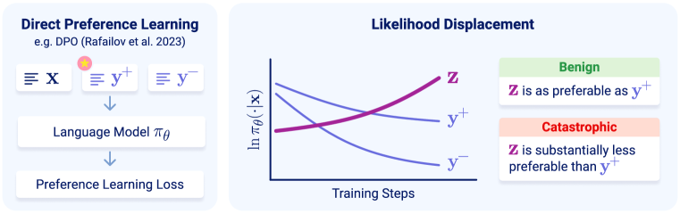
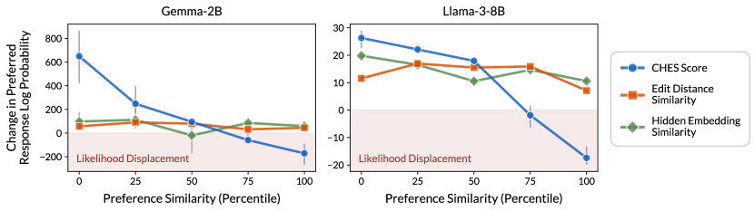
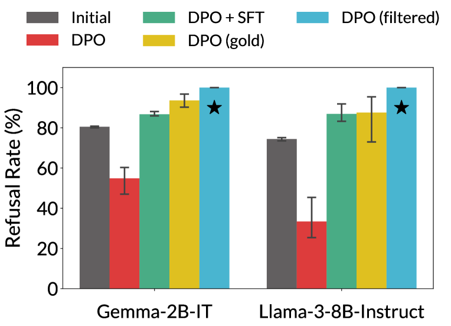
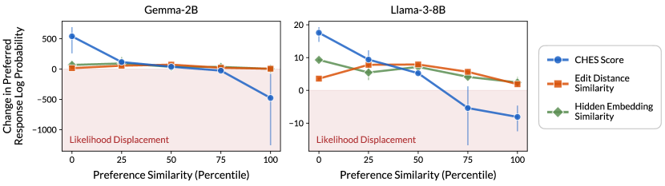
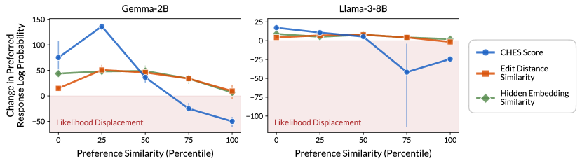
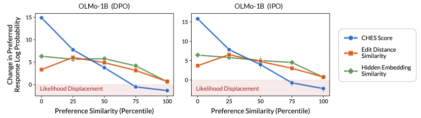
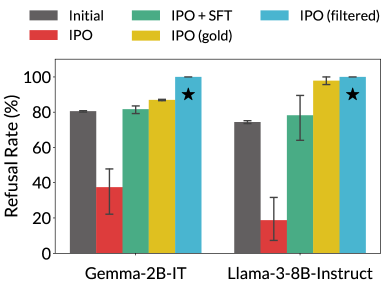

# Unintentional Unalignment: Likelihood Displacement 
in Direct Preference Optimization

###### Abstract

Direct Preference Optimization (DPO) and its variants are increasingly used for aligning language models with human preferences. Although these methods are designed to teach a model to generate preferred responses more frequently relative to dispreferred responses, prior work has observed that the likelihood of preferred responses often decreases during training. The current work sheds light on the causes and implications of this counter-intuitive phenomenon, which we term *likelihood displacement*. We demonstrate that likelihood displacement can be *catastrophic*, shifting probability mass from preferred responses to responses with an opposite meaning. As a simple example, training a model to prefer No over Never can sharply increase the probability of Yes. Moreover, when aligning the model to refuse unsafe prompts, we show that such displacement can *unintentionally lead to unalignment*, by shifting probability mass from preferred refusal responses to harmful responses (e.g., reducing the refusal rate of Llama-3-8B-Instruct from 74.4% to 33.4%). We theoretically characterize that likelihood displacement is driven by preferences that induce similar embeddings, as measured by a *centered hidden embedding similarity (CHES)* score. Empirically, the CHES score enables identifying which training samples contribute most to likelihood displacement in a given dataset. Filtering out these samples effectively mitigated unintentional unalignment in our experiments. More broadly, our results highlight the importance of curating data with sufficiently distinct preferences, for which we believe the CHES score may prove valuable.111 Our code is available at <https://github.com/princeton-nlp/unintentional-unalignment>.   

## 1 Introduction

To ensure that language models generate safe and helpful content, they are typically aligned based on pairwise preference data. One prominent alignment method, known as *Reinforcement Learning from Human Feedback (RLHF)* (Ouyang et al., [2022](#bib.bib32)), requires fitting a reward model to a dataset of human preferences, and then training the language model to maximize the reward via RL. While often effective for improving the quality of generated responses (Bai et al., [2022a](#bib.bib4); Achiam et al., [2023](#bib.bib1); Touvron et al., [2023](#bib.bib53)), the complexity and computational costs of RLHF motivated the rise of *direct preference learning* methods such as DPO (Rafailov et al., [2023](#bib.bib40)).  

Given a prompt ${\mathbf{x}}$, DPO and its variants (e.g., Azar et al. ([2024](#bib.bib3)); Tang et al. ([2024](#bib.bib50)); Xu et al. ([2024a](#bib.bib60)); Meng et al. ([2024](#bib.bib29))) eschew the need for RL, by directly teaching a model $\pi_{\theta}$ to increase the margin between the log probabilities of a preferred response ${\mathbf{y}}^{+}$ and a dispreferred response ${\mathbf{y}}^{-}$. While intuitively these methods should increase the probability of ${\mathbf{y}}^{+}$ while decreasing that of ${\mathbf{y}}^{-}$, several recent works observed that the probabilities of both ${\mathbf{y}}^{+}$ and ${\mathbf{y}}^{-}$ tend to *decrease* over the course of training (Pal et al., [2024](#bib.bib33); Yuan et al., [2024](#bib.bib63); Rafailov et al., [2024b](#bib.bib42); Tajwar et al., [2024](#bib.bib49); Pang et al., [2024](#bib.bib34); Liu et al., [2024](#bib.bib27)). We term this phenomenon *likelihood displacement* — see [Figure 1](#S1.F1 "In 1 Introduction ‣ Unintentional Unalignment: Likelihood Displacement in Direct Preference Optimization").  

[FIGURE S1.F1.1.g1]

Figure 1: 
Illustration of likelihood displacement in direct preference learning.
For a prompt ${\mathbf{x}}$, direct preference learning aims to increase the probability that a model $\pi_{\theta}$ assigns to a preferred response $\smash{{\mathbf{y}}^{+}}$ relative to a dispreferred response $\smash{{\mathbf{y}}^{-}}$.
*Likelihood displacement* refers to the counter-intuitive phenomenon where, while the gap between $\ln\pi_{\theta}(\smash{{\mathbf{y}}^{+}}|{\mathbf{x}})$ and $\ln\pi_{\theta}(\smash{{\mathbf{y}}^{-}}|{\mathbf{x}})$ increases, they both decrease.
If the responses increasing instead in probability (depicted by ${\mathbf{z}}$) are as preferable as $\smash{{\mathbf{y}}^{+}}$ (e.g., ${\mathbf{z}}$ is similar in meaning to $\smash{{\mathbf{y}}^{+}}$), then the likelihood displacement is *benign*.
However, if the probability mass goes to responses that are substantially less preferable than $\smash{{\mathbf{y}}^{+}}$ (e.g., ${\mathbf{z}}$ is opposite in meaning to $\smash{{\mathbf{y}}^{+}}$), then we say that it is *catastrophic*.
[/FIGURE]

When the probability of ${\mathbf{y}}^{+}$ decreases, the probability of other, possibly undesirable, responses must increase. However, despite the prevalence of likelihood displacement, there is limited understanding as to why it occurs and what its implications are. The purpose of this work is to address these gaps. Through theory and experiments, we characterize mechanisms driving likelihood displacement, demonstrate that it can lead to surprising failures in alignment, and provide preventative guidelines. Our experiments cover models of different families and scales, including OLMo-1B (Groeneveld et al., [2024](#bib.bib15)), Gemma-2B (Team et al., [2024](#bib.bib51)), and Llama-3-8B (Dubey et al., [2024](#bib.bib9)). The main contributions are listed below.  

* Likelihood displacement can be catastrophic even in simple settings. We demonstrate that, even when training on just a single prompt whose preferences ${\mathbf{y}}^{+}$ and ${\mathbf{y}}^{-}$ consist of a single token each, likelihood displacement is pervasive ([Section 3](#S3 "3 Catastrophic Likelihood Displacement in Simple Settings ‣ Unintentional Unalignment: Likelihood Displacement in Direct Preference Optimization")). Moreover, the tokens increasing in probability at the expense of ${\mathbf{y}}^{+}$ can have a meaning opposite to it. For example, training a model to prefer ${\mathbf{y}}^{+}\!=\texttt{No}$ over ${\mathbf{y}}^{-}\!=\texttt{Never}$ often sharply increases the probability of Yes. This stands in stark contrast to prior work attributing likelihood displacement to different complexities in the preference learning pipeline (Tajwar et al., [2024](#bib.bib49); Pal et al., [2024](#bib.bib33); Rafailov et al., [2024b](#bib.bib42)), and emphasizes the need to formally characterize its underlying causes. 
* Theory: likelihood displacement is determined by the model’s embedding geometry. We analyze the evolution of $\ln\pi_{\theta}({\mathbf{y}}^{+}|{\mathbf{x}})$ during gradient-based training ([Section 4](#S4 "4 Theoretical Analysis of Likelihood Displacement ‣ Unintentional Unalignment: Likelihood Displacement in Direct Preference Optimization")). Our theory reveals that likelihood displacement is governed by the (static) token unembeddings and (contextual) hidden embeddings of ${\mathbf{y}}^{+}$ and ${\mathbf{y}}^{-}$. In particular, it formalizes intuition by which the more similar ${\mathbf{y}}^{+}$ and ${\mathbf{y}}^{-}$ are the more $\ln\pi_{\theta}({\mathbf{y}}^{+}|{\mathbf{x}})$ tends to decrease. 
* Identifying sources of likelihood displacement. Based on our analysis, we derive a (model-aware) measure of similarity between preferences, called the *centered hidden embedding similarity (CHES)* score ([Definition 2](#Thmdefinition2 "Definition 2. ‣ 4 Theoretical Analysis of Likelihood Displacement ‣ Unintentional Unalignment: Likelihood Displacement in Direct Preference Optimization")). We demonstrate that the CHES score accurately identifies which training samples contribute most to likelihood displacement in a given dataset (e.g., UltraFeedback (Cui et al., [2024](#bib.bib8)) and AlpacaFarm (Dubois et al., [2024](#bib.bib10))), whereas other similarity measures relying on hidden embeddings or token-level cues do not ([Section 5](#S5 "5 Identifying Sources of Likelihood Displacement ‣ Unintentional Unalignment: Likelihood Displacement in Direct Preference Optimization")). 
* Unintentional unalignment due to likelihood displacement. To demonstrate the potential uses of the CHES score, we consider training a language model to refuse unsafe prompts via direct preference learning ([Section 6](#S6 "6 Unintentional Unalignment in Direct Preference Learning ‣ Unintentional Unalignment: Likelihood Displacement in Direct Preference Optimization")). We find that likelihood displacement can *unintentionally unalign* the model, by causing probability mass to shift from preferred refusal responses to responses that comply with unsafe prompts! For example, the refusal rate of Llama-3-8B-Instruct drops from 74.4% to 33.4% over the SORRY-Bench dataset (Xie et al., [2024](#bib.bib58)). We then show that filtering out samples with a high CHES score prevents such unintentional unalignment, and does so more effectively than adding a supervised finetuning term to the loss (e.g., as done in Pal et al. ([2024](#bib.bib33)); Xu et al. ([2024a](#bib.bib60)); Pang et al. ([2024](#bib.bib34)); Liu et al. ([2024](#bib.bib27))). 

Overall, our results highlight the importance of curating data with sufficiently distinct preferences. We believe the CHES score introduced by our theory may prove valuable in achieving this goal.  

## 2 Preliminaries

Let ${\mathcal{V}}$ be a vocabulary of tokens. Modern language models consist of two parts: *(i)* a neural network (e.g., Transformer (Vaswani et al., [2017](#bib.bib55))) that intakes a sequence of tokens ${\mathbf{x}}\in{\mathcal{V}}^{*}$ and produces a *hidden embedding* ${{\mathbf{h}}}_{\mathbf{x}}\in{\mathbb{R}}^{d}$; and *(ii)* a *token unembedding matrix* ${\mathbf{W}}\in{\mathbb{R}}^{\abs{{\mathcal{V}}}\times d}$ that converts the hidden embedding into logits. The logits are then passed through a softmax to compute a distribution over tokens that can follow ${\mathbf{x}}$. For assigning probabilities to sequences ${\mathbf{y}}\in{\mathcal{V}}^{*}$, a language model $\pi_{\theta}$ operates autoregressively, i.e.:  

|  | $$\pi_{\theta}({\mathbf{y}}|{\mathbf{x}})=\prod\nolimits_{k=1}^{\abs{{\mathbf{y}}}}\pi_{\theta}({\mathbf{y}}_{k}|{\mathbf{x}},{\mathbf{y}}_{\leq k-1})=\prod\nolimits_{k=1}^{\abs{{\mathbf{y}}}}\mathrm{softmax}\brk*{{\mathbf{W}}{{\mathbf{h}}}_{{\mathbf{x}},{\mathbf{y}}_{<k}}}_{{\mathbf{y}}_{k}}\text{\,,}$$ |  | (1) |
| --- | --- | --- | --- |

where $\theta$ stands for the model’s parameters (i.e. the parameters of the neural network and the unembedding matrix ${\mathbf{W}}$), and ${\mathbf{y}}_{<k}$ denotes the first $k-1$ tokens of ${\mathbf{y}}$.  

### 2.1 Direct Preference Learning

Preference data. We consider the widely adopted direct preference learning pipeline, which relies on pairwise comparisons (cf. Rafailov et al. ([2023](#bib.bib40))). Specifically, we assume access to a preference dataset $\mathcal{D}$ containing samples $({\mathbf{x}},{\mathbf{y}}^{+},{\mathbf{y}}^{-})$, where ${\mathbf{x}}$ is a prompt, ${\mathbf{y}}^{+}$ is a preferred response to ${\mathbf{x}}$, and ${\mathbf{y}}^{-}$ is a dispreferred response to ${\mathbf{x}}$. The preferred and dispreferred responses can be obtained by generating two candidate responses from the model (i.e. on-policy), and labeling them via human or AI raters (cf. Ouyang et al. ([2022](#bib.bib32)); Bai et al. ([2022b](#bib.bib5))). Alternatively, they can be taken from some static dataset (i.e. off-policy). Our analysis and experiments capture both cases.  

Supervised finetuning (SFT). Preference learning typically includes an initial SFT phase, in which the model is finetuned via the standard cross-entropy loss. The sequences used for SFT can either be independent of the preference dataset $\mathcal{D}$ (Touvron et al., [2023](#bib.bib53)) or consist of prompts and preferred responses from $\mathcal{D}$, i.e. of $\brk[c]{({\mathbf{x}},{\mathbf{y}}^{+}):({\mathbf{x}},{\mathbf{y}}^{+},{\mathbf{y}}^{-})\in\mathcal{D}}$ (Rafailov et al., [2023](#bib.bib40)).  

Preference learning loss. Aligning language models based on pairwise preferences is usually done by minimizing a loss of the following form:  

|  | $$\mathcal{L}(\theta):=\mathop{\mathbb{E}}\nolimits_{({\mathbf{x}},{\mathbf{y}}^{+},{\mathbf{y}}^{-})\sim\mathcal{D}}\brk[s]*{\ell_{{\mathbf{x}},{\mathbf{y}}^{+},{\mathbf{y}}^{-}}\brk 2{\ln\pi_{\theta}({\mathbf{y}}^{+}|{\mathbf{x}})-\ln\pi_{\theta}({\mathbf{y}}^{-}|{\mathbf{x}})}}\text{\,,}$$ |  | (2) |
| --- | --- | --- | --- |

where $\ell_{{\mathbf{x}},{\mathbf{y}}^{+},{\mathbf{y}}^{-}}:{\mathbb{R}}\to{\mathbb{R}}_{\geq 0}$ is convex and differentiable, for every $({\mathbf{x}},{\mathbf{y}}^{+},{\mathbf{y}}^{-})\in\mathcal{D}$. Denote by $\theta_{\mathrm{init}}$ the parameters of the model prior to minimizing the loss $\mathcal{L}$. To guarantee that minimizing $\mathcal{L}$ entails increasing the difference between $\ln\pi_{\theta}({\mathbf{y}}^{+}|{\mathbf{x}})$ and $\ln\pi_{\theta}({\mathbf{y}}^{-}|{\mathbf{x}})$, as expected from a reasonable preference learning loss, we make the mild assumption that $\ell_{{\mathbf{x}},{\mathbf{y}}^{+},{\mathbf{y}}^{-}}$ is monotonically decreasing in a neighborhood of $\ln\pi_{\theta_{\mathrm{init}}}({\mathbf{y}}^{+}|{\mathbf{x}})-\ln\pi_{\theta_{\mathrm{init}}}({\mathbf{y}}^{-}|{\mathbf{x}})$.  

The loss $\mathcal{L}$ generalizes many existing losses, including: DPO (Rafailov et al., [2023](#bib.bib40)), IPO (Azar et al., [2024](#bib.bib3)), SLiC (Zhao et al., [2023](#bib.bib65)), REBEL (Gao et al., [2024](#bib.bib14)), and GPO (Tang et al., [2024](#bib.bib50)) — see [Appendix B](#A2 "Appendix B Common Instances of the Analyzed Preference Learning Loss ‣ Unintentional Unalignment: Likelihood Displacement in Direct Preference Optimization") for details on the choice of $\ell_{{\mathbf{x}},{\mathbf{y}}^{+},{\mathbf{y}}^{-}}$ corresponding to each loss.222 For SLiC and GPO, the corresponding $\ell_{{\mathbf{x}},{\mathbf{y}}^{+},{\mathbf{y}}^{-}}$ is differentiable almost everywhere, as opposed to differentiable. Our analysis applies to such losses up to minor adaptations excluding non-differentiable points.  Notably, the common dependence on a reference model is abstracted through $\ell_{{\mathbf{x}},{\mathbf{y}}^{+},{\mathbf{y}}^{-}}$. Other loss variants apply different weightings to the log probabilities of preferred and dispreferred responses or incorporate an additional SFT regularization term (e.g., DPOP (Pal et al., [2024](#bib.bib33)), CPO (Xu et al., [2024a](#bib.bib60)), RPO (Liu et al., [2024](#bib.bib27)), BoNBoN (Gui et al., [2024](#bib.bib16)), and SimPO (Meng et al., [2024](#bib.bib29))). For conciseness, we defer an extension of our analysis for these variants to [Appendix E](#A5 "Appendix E Losses Including SFT Regularization or Different Weights for the Preferred and Dispreferred Responses ‣ Unintentional Unalignment: Likelihood Displacement in Direct Preference Optimization").  

### 2.2 Likelihood Displacement

We define likelihood displacement as the phenomenon where, although the preference learning loss is steadily minimized, the log probabilities of preferred responses decrease.  

###### Definition 1.

Let $\pi_{\theta_{\mathrm{init}}}$ and $\pi_{\theta_{\mathrm{fin}}}$ denote a language model before and after training with a preference learning loss $\mathcal{L}$ over the dataset $\mathcal{D}$ ([Equation 2](#S2.E2 "In 2.1 Direct Preference Learning ‣ 2 Preliminaries ‣ Unintentional Unalignment: Likelihood Displacement in Direct Preference Optimization")), respectively, and suppose that the loss was successfully reduced, i.e. $\mathcal{L}(\theta_{\mathrm{fin}})<\mathcal{L}(\theta_{\mathrm{init}})$. We say that *likelihood displacement occurred* if:333 Note that $\ln\pi_{\theta}({\mathbf{y}}^{+}|{\mathbf{x}})$ can decrease even as the loss $\mathcal{L}$ is minimized, since minimizing $\mathcal{L}$ only requires increasing the gap between $\ln\pi_{\theta}({\mathbf{y}}^{+}|{\mathbf{x}})$ and $\ln\pi_{\theta}({\mathbf{y}}^{-}|{\mathbf{x}})$.   

|  | $$\frac{1}{\abs{\mathcal{D}}}\sum\nolimits_{({\mathbf{x}},{\mathbf{y}}^{+},{\mathbf{y}}^{-})\in\mathcal{D}}\ln\pi_{\theta_{\mathrm{fin}}}({\mathbf{y}}^{+}|{\mathbf{x}})<\frac{1}{\abs{\mathcal{D}}}\sum\nolimits_{({\mathbf{x}},{\mathbf{y}}^{+},{\mathbf{y}}^{-})\in\mathcal{D}}\ln\pi_{\theta_{\mathrm{init}}}({\mathbf{y}}^{+}|{\mathbf{x}})\text{\,;}$$ |  |
| --- | --- | --- |

and that *likelihood displacement occurred for* $({\mathbf{x}},{\mathbf{y}}^{+},{\mathbf{y}}^{-})\in\mathcal{D}$ if $\ln\pi_{\theta_{\mathrm{fin}}}({\mathbf{y}}^{+}|{\mathbf{x}})<\ln\pi_{\theta_{\mathrm{init}}}({\mathbf{y}}^{+}|{\mathbf{x}})$.  

Likelihood displacement is not necessarily problematic. For $({\mathbf{x}},{\mathbf{y}}^{+},{\mathbf{y}}^{-})\in\mathcal{D}$, we refer to it as *benign* if the responses increasing in probability are as preferable as ${\mathbf{y}}^{+}$ (e.g., they are similar in meaning to ${\mathbf{y}}^{+}$). However, as [Section 3](#S3 "3 Catastrophic Likelihood Displacement in Simple Settings ‣ Unintentional Unalignment: Likelihood Displacement in Direct Preference Optimization") demonstrates, the probability mass can go to responses that are substantially less preferable than ${\mathbf{y}}^{+}$ (e.g., they are opposite in meaning to ${\mathbf{y}}^{+}$), in which case we say it is *catastrophic*.  

## 3 Catastrophic Likelihood Displacement in Simple Settings

Despite the prevalence of likelihood displacement (Pal et al., [2024](#bib.bib33); Yuan et al., [2024](#bib.bib63); Pang et al., [2024](#bib.bib34); Rafailov et al., [2024a](#bib.bib41); Liu et al., [2024](#bib.bib27)), there is limited understanding as to why it occurs and where the probability mass goes. Prior work attributed this phenomenon to limitations in model capacity (Tajwar et al., [2024](#bib.bib49)), the presence of multiple training samples or output tokens (Tajwar et al., [2024](#bib.bib49); Pal et al., [2024](#bib.bib33)), and the initial SFT phase (Rafailov et al., [2024b](#bib.bib42)). In contrast, we demonstrate that likelihood displacement can occur and be catastrophic independently of these factors, even when training over just a single prompt whose responses contain a single token each. The potential adverse effects of such displacement raise the need to formally characterize its underlying causes.  

Setting. The experiments are based on the Persona dataset (Perez et al., [2022](#bib.bib38)), in which every prompt contains a statement, and the model needs to respond whether it agrees with the statement using a single token. We assign to each prompt a pair of preferred and dispreferred tokens $({\mathbf{y}}^{+},{\mathbf{y}}^{-})$ from a predetermined set containing, e.g., Yes, Sure, No, and Never. Then, for the OLMo-1B, Gemma-2B, and Llama-3-8B models, we perform one epoch of SFT using the preferred tokens as labels, in line with common practices, and train each model via DPO on a single randomly selected prompt. See [Section H.1](#A8.SS1 "H.1 Catastrophic Likelihood Displacement in Simple Settings (Section 3) ‣ Appendix H Further Implementation Details ‣ Unintentional Unalignment: Likelihood Displacement in Direct Preference Optimization") for additional details.  

[TABLE S3.T1]

<table class="ltx_tabular ltx_centering ltx_align_middle">
<tr class="ltx_tr">
<td class="ltx_td ltx_border_tt"></td>
<td class="ltx_td ltx_border_tt"></td>
<td class="ltx_td ltx_border_tt"></td>
<td class="ltx_td ltx_border_tt"></td>
<td class="ltx_td ltx_align_center ltx_border_tt">Tokens Increasing Most in Probability</td>
</tr>
<tr class="ltx_tr">
<td class="ltx_td ltx_align_left">Model</td>
<td class="ltx_td ltx_align_center"><math class="ltx_Math"><semantics><msup><mi>𝐲</mi><mo>+</mo></msup><annotation-xml><apply><csymbol>superscript</csymbol><ci>𝐲</ci><plus></plus></apply></annotation-xml><annotation>{\mathbf{y}}^{+}</annotation></semantics></math></td>
<td class="ltx_td ltx_align_center"><math class="ltx_Math"><semantics><msup><mi>𝐲</mi><mo>−</mo></msup><annotation-xml><apply><csymbol>superscript</csymbol><ci>𝐲</ci><minus></minus></apply></annotation-xml><annotation>{\mathbf{y}}^{-}</annotation></semantics></math></td>
<td class="ltx_td ltx_align_center">
<math class="ltx_Math"><semantics><mrow><msub><mi>π</mi><mi>θ</mi></msub><mo>​</mo><mrow><mo>(</mo><mrow><msup><mi>𝐲</mi><mo>+</mo></msup><mo>|</mo><mi>𝐱</mi></mrow><mo>)</mo></mrow></mrow><annotation-xml><apply><times></times><apply><csymbol>subscript</csymbol><ci>𝜋</ci><ci>𝜃</ci></apply><apply><csymbol>conditional</csymbol><apply><csymbol>superscript</csymbol><ci>𝐲</ci><plus></plus></apply><ci>𝐱</ci></apply></apply></annotation-xml><annotation>\pi_{\theta}({\mathbf{y}}^{+}|{\mathbf{x}})</annotation></semantics></math> Decrease
</td>
<td class="ltx_td ltx_align_center ltx_border_t">Benign</td>
<td class="ltx_td ltx_align_center ltx_border_t">Catastrophic</td>
</tr>
<tr class="ltx_tr">
<td class="ltx_td ltx_align_left ltx_border_t">OLMo-1B</td>
<td class="ltx_td ltx_align_center ltx_border_t">Yes</td>
<td class="ltx_td ltx_align_center ltx_border_t">No</td>
<td class="ltx_td ltx_align_center ltx_border_t">
<math class="ltx_Math"><semantics><mn>0.69</mn><annotation-xml><cn>0.69</cn></annotation-xml><annotation>0.69</annotation></semantics></math>   (<math class="ltx_Math"><semantics><mrow><mn>0.96</mn><mo>→</mo><mn>0.27</mn></mrow><annotation-xml><apply><ci>→</ci><cn>0.96</cn><cn>0.27</cn></apply></annotation-xml><annotation>0.96\to 0.27</annotation></semantics></math>)</td>
<td class="ltx_td ltx_align_center ltx_border_t">_Yes, _yes</td>
<td class="ltx_td ltx_align_center ltx_border_t">—</td>
</tr>
<tr class="ltx_tr">
<td class="ltx_td ltx_align_center">No</td>
<td class="ltx_td ltx_align_center">Never</td>
<td class="ltx_td ltx_align_center">
<math class="ltx_Math"><semantics><mn>0.84</mn><annotation-xml><cn>0.84</cn></annotation-xml><annotation>0.84</annotation></semantics></math>   (<math class="ltx_Math"><semantics><mrow><mn>0.85</mn><mo>→</mo><mn>0.01</mn></mrow><annotation-xml><apply><ci>→</ci><cn>0.85</cn><cn>0.01</cn></apply></annotation-xml><annotation>0.85\to 0.01</annotation></semantics></math>)</td>
<td class="ltx_td ltx_align_center">_No</td>
<td class="ltx_td ltx_align_center">Yes, _Yes, _yes</td>
</tr>
<tr class="ltx_tr">
<td class="ltx_td ltx_align_left ltx_border_t">Gemma-2B</td>
<td class="ltx_td ltx_align_center ltx_border_t">Yes</td>
<td class="ltx_td ltx_align_center ltx_border_t">No</td>
<td class="ltx_td ltx_align_center ltx_border_t">
<math class="ltx_Math"><semantics><mn>0.22</mn><annotation-xml><cn>0.22</cn></annotation-xml><annotation>0.22</annotation></semantics></math>   (<math class="ltx_Math"><semantics><mrow><mn>0.99</mn><mo>→</mo><mn>0.77</mn></mrow><annotation-xml><apply><ci>→</ci><cn>0.99</cn><cn>0.77</cn></apply></annotation-xml><annotation>0.99\to 0.77</annotation></semantics></math>)</td>
<td class="ltx_td ltx_align_center ltx_border_t">_Yes, _yes</td>
<td class="ltx_td ltx_align_center ltx_border_t">—</td>
</tr>
<tr class="ltx_tr">
<td class="ltx_td ltx_align_center">No</td>
<td class="ltx_td ltx_align_center">Never</td>
<td class="ltx_td ltx_align_center">
<math class="ltx_Math"><semantics><mn>0.21</mn><annotation-xml><cn>0.21</cn></annotation-xml><annotation>0.21</annotation></semantics></math>   (<math class="ltx_Math"><semantics><mrow><mn>0.65</mn><mo>→</mo><mn>0.44</mn></mrow><annotation-xml><apply><ci>→</ci><cn>0.65</cn><cn>0.44</cn></apply></annotation-xml><annotation>0.65\to 0.44</annotation></semantics></math>)</td>
<td class="ltx_td ltx_align_center">no, _No</td>
<td class="ltx_td ltx_align_center">yes, Yeah</td>
</tr>
<tr class="ltx_tr">
<td class="ltx_td ltx_align_left ltx_border_bb ltx_border_t">Llama-3-8B</td>
<td class="ltx_td ltx_align_center ltx_border_t">Yes</td>
<td class="ltx_td ltx_align_center ltx_border_t">No</td>
<td class="ltx_td ltx_align_center ltx_border_t">
<math class="ltx_Math"><semantics><mn>0.96</mn><annotation-xml><cn>0.96</cn></annotation-xml><annotation>0.96</annotation></semantics></math>   (<math class="ltx_Math"><semantics><mrow><mn>0.99</mn><mo>→</mo><mn>0.03</mn></mrow><annotation-xml><apply><ci>→</ci><cn>0.99</cn><cn>0.03</cn></apply></annotation-xml><annotation>0.99\to 0.03</annotation></semantics></math>)</td>
<td class="ltx_td ltx_align_center ltx_border_t">yes, _yes, _Yes</td>
<td class="ltx_td ltx_align_center ltx_border_t">—</td>
</tr>
<tr class="ltx_tr">
<td class="ltx_td ltx_align_center ltx_border_bb">Sure</td>
<td class="ltx_td ltx_align_center ltx_border_bb">Yes</td>
<td class="ltx_td ltx_align_center ltx_border_bb">
<math class="ltx_Math"><semantics><mn>0.59</mn><annotation-xml><cn>0.59</cn></annotation-xml><annotation>0.59</annotation></semantics></math>   (<math class="ltx_Math"><semantics><mrow><mn>0.98</mn><mo>→</mo><mn>0.39</mn></mrow><annotation-xml><apply><ci>→</ci><cn>0.98</cn><cn>0.39</cn></apply></annotation-xml><annotation>0.98\to 0.39</annotation></semantics></math>)</td>
<td class="ltx_td ltx_align_center ltx_border_bb">sure, _Sure</td>
<td class="ltx_td ltx_align_center ltx_border_bb">Maybe, No, Never</td>
</tr>
</table>

Table 1: 
Likelihood displacement can be catastrophic, even when training on a single prompt with single token responses.
Each model was trained via DPO on a randomly chosen prompt from the Persona dataset (Perez et al., [2022](#bib.bib38)), using different pairs of preferred and dispreferred tokens $({\mathbf{y}}^{+},{\mathbf{y}}^{-})$ (as detailed in [Section 3](#S3 "3 Catastrophic Likelihood Displacement in Simple Settings ‣ Unintentional Unalignment: Likelihood Displacement in Direct Preference Optimization")).
We report the largest decrease in the preferred token probability $\pi_{\theta}({\mathbf{y}}^{+}|{\mathbf{x}})$ during training for representative $({\mathbf{y}}^{+},{\mathbf{y}}^{-})$ pairs, averaged across ten runs differing in the chosen prompt.
On the right are notable tokens whose probabilities increase at the expense of ${\mathbf{y}}^{+}$, categorized into benign or catastrophic according to whether they have a meaning similar to or distinct from ${\mathbf{y}}^{+}$, respectively (a preceding “\_” stands for a whitespace; see [Section G.1](#A7.SS1 "G.1 Catastrophic Likelihood Displacement in Simple Settings (Section 3) ‣ Appendix G Further Experiments ‣ Unintentional Unalignment: Likelihood Displacement in Direct Preference Optimization") for the full list and extents of increase).
Remarkably, when ${\mathbf{y}}^{+}$ and ${\mathbf{y}}^{-}$ are similar in meaning, the tokens increasing most in probability are often opposite in meaning to ${\mathbf{y}}^{+}$.
[/TABLE]

Likelihood displacement is pervasive and can be catastrophic. [Table 1](#S3.T1 "In 3 Catastrophic Likelihood Displacement in Simple Settings ‣ Unintentional Unalignment: Likelihood Displacement in Direct Preference Optimization") reports the decrease in preferred token probability, and notable tokens whose probabilities increase at the expense of ${\mathbf{y}}^{+}$. The probability of ${\mathbf{y}}^{+}$ dropped by at least $0.21$ and up to $0.96$ absolute value in all runs. Remarkably, when ${\mathbf{y}}^{+}$ and ${\mathbf{y}}^{-}$ are similar in meaning, the probability mass often shifts to tokens with meanings opposite to ${\mathbf{y}}^{+}$. [Section G.1](#A7.SS1 "G.1 Catastrophic Likelihood Displacement in Simple Settings (Section 3) ‣ Appendix G Further Experiments ‣ Unintentional Unalignment: Likelihood Displacement in Direct Preference Optimization") reports similar findings for experiments using: *(i)* base models that did not undergo an initial SFT phase ([Table 2](#A8.T2 "In H.3 Unintentional Unalignment in Direct Preference Learning (Section 6) ‣ Appendix H Further Implementation Details ‣ Unintentional Unalignment: Likelihood Displacement in Direct Preference Optimization")); or *(ii)* IPO instead of DPO ([Table 3](#A8.T3 "In H.3 Unintentional Unalignment in Direct Preference Learning (Section 6) ‣ Appendix H Further Implementation Details ‣ Unintentional Unalignment: Likelihood Displacement in Direct Preference Optimization")).  

## 4 Theoretical Analysis of Likelihood Displacement

To uncover what causes likelihood displacement when minimizing a preference learning loss, we characterize how the log probabilities of responses evolve during gradient-based training. For a preference sample $({\mathbf{x}},{\mathbf{y}}^{+},{\mathbf{y}}^{-})\in\mathcal{D}$, we identify the factors pushing $\ln\pi_{\theta}({\mathbf{y}}^{+}|{\mathbf{x}})$ downwards and those determining which responses increase most in log probability instead. [Section 4.1](#S4.SS1 "4.1 Technical Approach ‣ 4 Theoretical Analysis of Likelihood Displacement ‣ Unintentional Unalignment: Likelihood Displacement in Direct Preference Optimization") lays out the technical approach, after which [Section 4.2](#S4.SS2 "4.2 Overview of the Main Results ‣ 4 Theoretical Analysis of Likelihood Displacement ‣ Unintentional Unalignment: Likelihood Displacement in Direct Preference Optimization") gives an overview of the main results. The full analysis is deferred to [Appendix D](#A4 "Appendix D Formal Analysis of Likelihood Displacement ‣ Unintentional Unalignment: Likelihood Displacement in Direct Preference Optimization"). For the convenience of the reader, we provide the main takeaways below.  

Takeaway 1: Role of the Token Unembedding Geometry ([Section 4.2.1](#S4.SS2.SSS1 "4.2.1 Single Training Sample and Output Token ‣ 4.2 Overview of the Main Results ‣ 4 Theoretical Analysis of Likelihood Displacement ‣ Unintentional Unalignment: Likelihood Displacement in Direct Preference Optimization"))

Even when training over a single prompt whose responses ${\mathbf{y}}^{+}$ and ${\mathbf{y}}^{-}$ contain a single token, likelihood displacement can occur due to the token unembedding geometry.
The underlying causes are: *(i)* an alignment between the preferred and dispreferred token unembeddings, measured as $\langle{\mathbf{W}}_{{\mathbf{y}}^{+}},{\mathbf{W}}_{{\mathbf{y}}^{-}}\rangle$; and *(ii)* tokens whose unembeddings align with ${\mathbf{W}}_{{\mathbf{y}}^{+}}-{\mathbf{W}}_{{\mathbf{y}}^{-}}$, which increase in log probability at the expense of ${\mathbf{y}}^{+}$.
Tokens increasing in probability can thus have unembeddings that align with directions orthogonal to ${\mathbf{W}}_{{\mathbf{y}}^{+}}$.
Since unembeddings often linearly encode semantics, this provides an explanation for why probability mass can go to tokens unrelated or opposite in meaning to ${\mathbf{y}}^{+}$ (as observed empirically in [Section 3](#S3 "3 Catastrophic Likelihood Displacement in Simple Settings ‣ Unintentional Unalignment: Likelihood Displacement in Direct Preference Optimization")),

Takeaway 2: Role of the Hidden Embedding Geometry ([Section 4.2.2](#S4.SS2.SSS2 "4.2.2 Responses with Multiple Tokens ‣ 4.2 Overview of the Main Results ‣ 4 Theoretical Analysis of Likelihood Displacement ‣ Unintentional Unalignment: Likelihood Displacement in Direct Preference Optimization"))

Besides the impact of the token unembedding geometry (Takeaway [4](#S4 "4 Theoretical Analysis of Likelihood Displacement ‣ Unintentional Unalignment: Likelihood Displacement in Direct Preference Optimization")), likelihood displacement occurs when the preferred and dispreferred responses are similar according to the following measure, which is based on their hidden embeddings.

###### Definition 2.

For a preference sample $({\mathbf{x}},{\mathbf{y}}^{+},{\mathbf{y}}^{-})\in\mathcal{D}$, we define the *centered hidden embedding similarity (CHES)* score of ${\mathbf{y}}^{+}$ and ${\mathbf{y}}^{-}$ with respect to a model $\pi_{\theta}$ by:

$$\mathrm{CHES}_{\mathbf{x}}({\mathbf{y}}^{+},{\mathbf{y}}^{-}):=\Big{\langle}{\!\!\underbrace{\sum\nolimits_{k=1}^{\abs{{\mathbf{y}}^{+}}}{{\mathbf{h}}}_{{\mathbf{x}},{\mathbf{y}}^{+}_{<k}}}_{\text{ ${\mathbf{y}}^{+}$ hidden embeddings }}},{\underbrace{\sum\nolimits_{k^{\prime}=1}^{\abs{{\mathbf{y}}^{-}}}{{\mathbf{h}}}_{{\mathbf{x}},{\mathbf{y}}^{-}_{<k^{\prime}}}}_{\text{${\mathbf{y}}^{-}$ hidden embeddings}}}\Big{\rangle}-\norm 2{\sum\nolimits_{k=1}^{\abs{{\mathbf{y}}^{+}}}{{\mathbf{h}}}_{{\mathbf{x}},{\mathbf{y}}^{+}_{<k}}}^{2}\text{\,,}$$

where ${{\mathbf{h}}}_{{\mathbf{x}},{\mathbf{z}}_{<k}}$ denotes the hidden embedding that the model produces given ${\mathbf{x}}$ and the first $k-1$ tokens of ${\mathbf{z}}\in{\mathcal{V}}^{*}$.
A higher CHES score stands for more similar preferences.
We omit the dependence of CHES on $\pi_{\theta}$ in our notation as it will be clear from context.

Losses with SFT regularization. [Appendix E](#A5 "Appendix E Losses Including SFT Regularization or Different Weights for the Preferred and Dispreferred Responses ‣ Unintentional Unalignment: Likelihood Displacement in Direct Preference Optimization") extends our analysis to losses incorporating an SFT regularization term. In particular, it formalizes how this modification helps mitigate likelihood displacement, as proposed in Pal et al. ([2024](#bib.bib33)); Liu et al. ([2024](#bib.bib27)); Pang et al. ([2024](#bib.bib34)); Gui et al. ([2024](#bib.bib16)). We note, however, that our experiments in [Section 6](#S6 "6 Unintentional Unalignment in Direct Preference Learning ‣ Unintentional Unalignment: Likelihood Displacement in Direct Preference Optimization") reveal a limitation of this approach for mitigating the adverse effects of likelihood displacement, compared to improving the data curation pipeline.  

### 4.1 Technical Approach

Given a prompt ${\mathbf{x}}$, the probability that the model $\pi_{\theta}$ assigns to a response ${\mathbf{z}}$ is determined by the hidden embeddings ${{\mathbf{h}}}_{\mathbf{x}},{{\mathbf{h}}}_{{\mathbf{x}},{\mathbf{z}}_{<2}},\ldots,{{\mathbf{h}}}_{{\mathbf{x}},{\mathbf{z}}_{<\abs{{\mathbf{z}}}}}$ and the token unembeddings ${\mathbf{W}}$ ([Equation 1](#S2.E1 "In 2 Preliminaries ‣ Unintentional Unalignment: Likelihood Displacement in Direct Preference Optimization")). Our analysis relies on tracking their evolution when minimizing the loss $\mathcal{L}$ ([Equation 2](#S2.E2 "In 2.1 Direct Preference Learning ‣ 2 Preliminaries ‣ Unintentional Unalignment: Likelihood Displacement in Direct Preference Optimization")). To do so, we adopt the *unconstrained features model* (Mixon et al., [2022](#bib.bib31)), which amounts to treating hidden embeddings as directly trainable parameters. Formally, the trainable parameters are taken to be $\theta=\brk[c]{{{\mathbf{h}}}_{\mathbf{z}}:{\mathbf{z}}\in{\mathcal{V}}^{*}}\cup\brk[c]{{\mathbf{W}}}$. This simplification has proven useful for studying various deep learning phenomena, including neural collapse (e.g., Zhu et al. ([2021](#bib.bib67)); Ji et al. ([2022](#bib.bib24)); Tirer et al. ([2023](#bib.bib52))) and the benefits of language model pretraining for downstream tasks (Saunshi et al., [2021](#bib.bib45)). As verified in [Sections 5](#S5 "5 Identifying Sources of Likelihood Displacement ‣ Unintentional Unalignment: Likelihood Displacement in Direct Preference Optimization") and [6](#S6 "6 Unintentional Unalignment in Direct Preference Learning ‣ Unintentional Unalignment: Likelihood Displacement in Direct Preference Optimization"), it also allows extracting the salient sources of likelihood displacement.444 In contrast to prior theoretical analyses of likelihood displacement, which consider stylized settings (e.g., linear models and cases where the preferred and dispreferrred responses differ only by a single token), whose implications to more realistic settings are unclear (Pal et al., [2024](#bib.bib33); Fisch et al., [2024](#bib.bib13); Song et al., [2024b](#bib.bib47)).   

Language model finetuning is typically done with small learning rates. Accordingly, we analyze the training dynamics of (stochastic) gradient descent at the small learning rate limit, i.e. *gradient flow*:  

|  | $$\frac{d}{dt}\theta(t)=-\nabla\mathcal{L}\brk*{\theta(t)}\quad,~{}t\geq 0\text{\,,}$$ |  |
| --- | --- | --- |

where $\theta(t)$ denotes the parameters at time $t\geq 0$ of training. Note that under gradient flow the loss is monotonically decreasing.555 Except for the trivial case where $\theta(0)$ is a critical point of $\mathcal{L}$, in which $\mathcal{L}(\theta(t))=\mathcal{L}(\theta(0))$ for all $t\geq 0$.  Thus, any reduction in the log probabilities of preferred responses constitutes likelihood displacement (cf. [Definition 1](#Thmdefinition1 "Definition 1. ‣ 2.2 Likelihood Displacement ‣ 2 Preliminaries ‣ Unintentional Unalignment: Likelihood Displacement in Direct Preference Optimization")).  

### 4.2 Overview of the Main Results

#### 4.2.1 Single Training Sample and Output Token

It is instructive to first consider the case of training on a single sample $({\mathbf{x}},{\mathbf{y}}^{+},{\mathbf{y}}^{-})$, whose responses ${\mathbf{y}}^{+}\in{\mathcal{V}}$ and ${\mathbf{y}}^{-}\in{\mathcal{V}}$ contain a single token. [Theorem 1](#Thmtheorem1 "Theorem 1 (Informal version of Theorem 4). ‣ 4.2.1 Single Training Sample and Output Token ‣ 4.2 Overview of the Main Results ‣ 4 Theoretical Analysis of Likelihood Displacement ‣ Unintentional Unalignment: Likelihood Displacement in Direct Preference Optimization") characterizes how the token unembedding geometry determines when $\frac{d}{dt}\ln\pi_{\theta(t)}({\mathbf{y}}^{+}|{\mathbf{x}})$ is negative, i.e. when likelihood displacement occurs.  

###### Theorem 1 (Informal version of [Theorem 4](#Thmtheorem4 "Theorem 4. ‣ D.1 Single Training Sample and Output Token (Overview in Section 4.2.1) ‣ Appendix D Formal Analysis of Likelihood Displacement ‣ Unintentional Unalignment: Likelihood Displacement in Direct Preference Optimization")).

Suppose that the dataset ${\mathcal{D}}$ contains a single sample $({\mathbf{x}},{\mathbf{y}}^{+},{\mathbf{y}}^{-})$, with ${\mathbf{y}}^{+}\in{\mathcal{V}}$ and ${\mathbf{y}}^{-}\in{\mathcal{V}}$ each being a single token. At any time $t\geq 0$ of training, $\frac{d}{dt}\ln\pi_{\theta(t)}({\mathbf{y}}^{+}|{\mathbf{x}})$ is more negative the larger the following term is:  

|  | $$\underbrace{\left\langle{{\mathbf{W}}_{{\mathbf{y}}^{+}}(t)},{{\mathbf{W}}_{{\mathbf{y}}^{-}}(t)}\right\rangle}_{\text{preferences unembedding alignment}}\!+~{}~{}\sum\nolimits_{z\in{\mathcal{V}}\setminus\{{\mathbf{y}}^{+},{\mathbf{y}}^{-}\}}\pi_{\theta(t)}(z|{\mathbf{x}})\cdot\!\!\!\!\!\underbrace{\left\langle{{\mathbf{W}}_{z}(t)},{{\mathbf{W}}_{{\mathbf{y}}^{+}}(t)-{\mathbf{W}}_{{\mathbf{y}}^{-}}(t)}\right\rangle}_{\text{alignment of other token with ${\mathbf{W}}_{{\mathbf{y}}^{+}}(t)-{\mathbf{W}}_{{\mathbf{y}}^{-}}(t)$}}\text{\,\,,}$$ |  |
| --- | --- | --- |

where ${\mathbf{W}}_{z}(t)$ denotes the token unembedding of $z\in{\mathcal{V}}$ at time $t$.  

Two terms govern the extent of likelihood displacement in the case of single token responses. First, $\langle{\mathbf{W}}_{{\mathbf{y}}^{+}}(t),{\mathbf{W}}_{{\mathbf{y}}^{-}}(t)\rangle$ formalizes the intuition that likelihood displacement occurs when the preferred and dispreferred responses are similar. A higher inner product in unembedding space translates to a more substantial (instantaneous) decrease in $\ln\pi_{\theta(t)}({\mathbf{y}}^{+}|{\mathbf{x}})$. Second, is a term which measures the alignment of other token unembeddings with ${\mathbf{W}}_{{\mathbf{y}}^{+}}(t)-{\mathbf{W}}_{{\mathbf{y}}^{-}}(t)$, where tokens deemed more likely by the model have a larger weight. The alignment of token unembeddings with ${\mathbf{W}}_{{\mathbf{y}}^{+}}(t)-{\mathbf{W}}_{{\mathbf{y}}^{-}}(t)$ also determines which tokens increase most in log probability.  

###### Theorem 2 (Informal version of [Theorem 5](#Thmtheorem5 "Theorem 5. ‣ D.1 Single Training Sample and Output Token (Overview in Section 4.2.1) ‣ Appendix D Formal Analysis of Likelihood Displacement ‣ Unintentional Unalignment: Likelihood Displacement in Direct Preference Optimization")).

Under the setting of [Theorem 1](#Thmtheorem1 "Theorem 1 (Informal version of Theorem 4). ‣ 4.2.1 Single Training Sample and Output Token ‣ 4.2 Overview of the Main Results ‣ 4 Theoretical Analysis of Likelihood Displacement ‣ Unintentional Unalignment: Likelihood Displacement in Direct Preference Optimization"), for any time $t\geq 0$ of training and token $z\in{\mathcal{V}}\setminus\{{\mathbf{y}}^{+},{\mathbf{y}}^{-}\}$:  

|  | $$\frac{d}{dt}\ln\pi_{\theta(t)}(z|{\mathbf{x}})\propto\left\langle{{\mathbf{W}}_{z}(t)},{{\mathbf{W}}_{{\mathbf{y}}^{+}}(t)-{\mathbf{W}}_{{\mathbf{y}}^{-}}(t)}\right\rangle\text{\,,}$$ |  |
| --- | --- | --- |

up to an additive term independent of $z$.  

The direction ${\mathbf{W}}_{{\mathbf{y}}^{+}}(t)-{\mathbf{W}}_{{\mathbf{y}}^{-}}(t)$ can be decomposed into its projection onto ${\mathbf{W}}_{{\mathbf{y}}^{+}}(t)$ and a component orthogonal to ${\mathbf{W}}_{{\mathbf{y}}^{+}}(t)$, introduced by ${\mathbf{W}}_{{\mathbf{y}}^{-}}(t)$. Thus, tokens increasing in log probability can have unembeddings that mostly align with directions orthogonal to ${\mathbf{W}}_{{\mathbf{y}}^{+}}(t)$, especially when the component orthogonal to ${\mathbf{W}}_{{\mathbf{y}}^{+}}(t)$ of ${\mathbf{W}}_{{\mathbf{y}}^{+}}(t)-{\mathbf{W}}_{{\mathbf{y}}^{-}}(t)$ is relatively large (which we often find to be the case empirically; see [Table 13](#A8.T13 "In H.3 Unintentional Unalignment in Direct Preference Learning (Section 6) ‣ Appendix H Further Implementation Details ‣ Unintentional Unalignment: Likelihood Displacement in Direct Preference Optimization") in [Section G.1](#A7.SS1 "G.1 Catastrophic Likelihood Displacement in Simple Settings (Section 3) ‣ Appendix G Further Experiments ‣ Unintentional Unalignment: Likelihood Displacement in Direct Preference Optimization")). Given that token unembeddings are known to linearly encode semantics (Mikolov et al., [2013](#bib.bib30); Arora et al., [2016](#bib.bib2); Park et al., [2024](#bib.bib35)), this provides an explanation for why the probability mass can shift to tokens that are unrelated or opposite in meaning to the preferred token, i.e. why likelihood displacement can be catastrophic even in simple settings (as observed in [Section 3](#S3 "3 Catastrophic Likelihood Displacement in Simple Settings ‣ Unintentional Unalignment: Likelihood Displacement in Direct Preference Optimization")).  

#### 4.2.2 Responses with Multiple Tokens

We now extend our analysis to the typical case where responses are sequences of tokens. As shown below, the existence of multiple tokens in each response introduces a dependence on their (contextual) hidden embeddings.  

###### Theorem 3 (Informal version of [Theorem 6](#Thmtheorem6 "Theorem 6. ‣ D.2 Responses with Multiple Tokens (Overview in Section 4.2.2) ‣ Appendix D Formal Analysis of Likelihood Displacement ‣ Unintentional Unalignment: Likelihood Displacement in Direct Preference Optimization")).

Suppose that the dataset $\mathcal{D}$ contains a single sample $({\mathbf{x}},{\mathbf{y}}^{+},{\mathbf{y}}^{-})$, with ${\mathbf{y}}^{+}\in{\mathcal{V}}^{*}$ and ${\mathbf{y}}^{-}\in{\mathcal{V}}^{*}$. At any time $t\geq 0$ of training, in addition to the dependence on token unembeddings identified in [Theorem 1](#Thmtheorem1 "Theorem 1 (Informal version of Theorem 4). ‣ 4.2.1 Single Training Sample and Output Token ‣ 4.2 Overview of the Main Results ‣ 4 Theoretical Analysis of Likelihood Displacement ‣ Unintentional Unalignment: Likelihood Displacement in Direct Preference Optimization"), $\frac{d}{dt}\ln\pi_{\theta(t)}({\mathbf{y}}^{+}|{\mathbf{x}})$ is more negative the larger the following term is:  

|  | $$\sum_{k=1}^{\abs{{\mathbf{y}}^{+}}}\sum_{k^{\prime}=1}^{\abs{{\mathbf{y}}^{-}}}\alpha^{-}_{k,k^{\prime}}(t)\cdot\underbrace{\left\langle{{{\mathbf{h}}}_{{\mathbf{x}},{\mathbf{y}}^{+}_{<k}}(t)},{{{\mathbf{h}}}_{{\mathbf{x}},{\mathbf{y}}^{-}_{<k^{\prime}}}(t)}\right\rangle}_{\text{preferred-dispreferred alignment}}-\sum_{k=1}^{\abs{{\mathbf{y}}^{+}}}\sum_{k^{\prime}=1}^{\abs{{\mathbf{y}}^{+}}}\alpha^{+}_{k,k^{\prime}}(t)\cdot\underbrace{\left\langle{{{\mathbf{h}}}_{{\mathbf{x}},{\mathbf{y}}^{+}_{<k}}(t)},{{{\mathbf{h}}}_{{\mathbf{x}},{\mathbf{y}}^{+}_{<k^{\prime}}}(t)}\right\rangle}_{\text{preferred-preferred alignment}}\text{\,,}$$ |  |
| --- | --- | --- |

where ${{\mathbf{h}}}_{{\mathbf{z}}}(t)$ denotes the hidden embedding of ${\mathbf{z}}\in{\mathcal{V}}^{*}$ at time $t$, and $\alpha^{-}_{k,k^{\prime}}(t),\alpha^{+}_{k,k^{\prime}}(t)\in[-2,2]$ are coefficients determined by the model’s next-token distributions for prefixes of ${\mathbf{y}}^{+}$ and ${\mathbf{y}}^{-}$ (see [Theorem 6](#Thmtheorem6 "Theorem 6. ‣ D.2 Responses with Multiple Tokens (Overview in Section 4.2.2) ‣ Appendix D Formal Analysis of Likelihood Displacement ‣ Unintentional Unalignment: Likelihood Displacement in Direct Preference Optimization") in [Section D.2](#A4.SS2 "D.2 Responses with Multiple Tokens (Overview in Section 4.2.2) ‣ Appendix D Formal Analysis of Likelihood Displacement ‣ Unintentional Unalignment: Likelihood Displacement in Direct Preference Optimization") for their definition).  

[Theorem 3](#Thmtheorem3 "Theorem 3 (Informal version of Theorem 6). ‣ 4.2.2 Responses with Multiple Tokens ‣ 4.2 Overview of the Main Results ‣ 4 Theoretical Analysis of Likelihood Displacement ‣ Unintentional Unalignment: Likelihood Displacement in Direct Preference Optimization") establishes that the inner products between hidden embeddings, of both the “preferred-dispreferred” and “preferred-preferred” types, affect likelihood displacement. A larger inner product leads to an upwards or downwards push on $\ln\pi_{\theta(t)}({\mathbf{y}}^{+}|{\mathbf{x}})$, depending on the sign of the corresponding $\alpha^{-}_{k,k^{\prime}}(t)$ or $\alpha^{+}_{k,k^{\prime}}(t)$ coefficient. Empirically, we find that these coefficients are mostly positive across models and datasets; e.g., the OLMo-1B, Gemma-2B, and Llama-3-8B models and the UltraFeedback and AlpacaFarm datasets (see [Section G.2](#A7.SS2 "G.2 Empirical Evaluation of the Coefficients From Theorem 3 ‣ Appendix G Further Experiments ‣ Unintentional Unalignment: Likelihood Displacement in Direct Preference Optimization") for details). By accordingly setting all coefficients in [Theorem 3](#Thmtheorem3 "Theorem 3 (Informal version of Theorem 6). ‣ 4.2.2 Responses with Multiple Tokens ‣ 4.2 Overview of the Main Results ‣ 4 Theoretical Analysis of Likelihood Displacement ‣ Unintentional Unalignment: Likelihood Displacement in Direct Preference Optimization") to one, we derive the *centered hidden embedding similarity (CHES)* score between preferred and dispreferred responses ([Definition 2](#Thmdefinition2 "Definition 2. ‣ 4 Theoretical Analysis of Likelihood Displacement ‣ Unintentional Unalignment: Likelihood Displacement in Direct Preference Optimization")). Our analysis indicates that a higher CHES score implies more severe likelihood displacement. [Section 5](#S5 "5 Identifying Sources of Likelihood Displacement ‣ Unintentional Unalignment: Likelihood Displacement in Direct Preference Optimization") empirically verifies this relation, and demonstrates that the CHES score is significantly more predictive of likelihood displacement than other plausible similarity measures.  

Our analysis also provides insight into which responses increase most in probability at the expense of ${\mathbf{y}}^{+}$. [Theorem 7](#Thmtheorem7 "Theorem 7. ‣ D.2 Responses with Multiple Tokens (Overview in Section 4.2.2) ‣ Appendix D Formal Analysis of Likelihood Displacement ‣ Unintentional Unalignment: Likelihood Displacement in Direct Preference Optimization") in [Section D.2](#A4.SS2 "D.2 Responses with Multiple Tokens (Overview in Section 4.2.2) ‣ Appendix D Formal Analysis of Likelihood Displacement ‣ Unintentional Unalignment: Likelihood Displacement in Direct Preference Optimization") derives the dependence of $\frac{d}{dt}\ln\pi_{\theta(t)}({\mathbf{z}}|{\mathbf{x}})$, for any response ${\mathbf{z}}\in{\mathcal{V}}^{*}$, on the alignment of its hidden embeddings with those of ${\mathbf{y}}^{+}$ and ${\mathbf{y}}^{-}$. However, in general settings, it is difficult to qualitatively describe the types of responses increasing in probability, and whether they constitute benign or catastrophic likelihood displacement. [Section 6](#S6 "6 Unintentional Unalignment in Direct Preference Learning ‣ Unintentional Unalignment: Likelihood Displacement in Direct Preference Optimization") thus demonstrates the (harmful) implications of likelihood displacement in settings where responses can be easily categorized into benign or catastrophic. We regard studying the question of where the probability mass goes in additional settings as a promising direction for future work.  

#### 4.2.3 Multiple Training Samples

[Sections 4.2.1](#S4.SS2.SSS1 "4.2.1 Single Training Sample and Output Token ‣ 4.2 Overview of the Main Results ‣ 4 Theoretical Analysis of Likelihood Displacement ‣ Unintentional Unalignment: Likelihood Displacement in Direct Preference Optimization") and [4.2.2](#S4.SS2.SSS2 "4.2.2 Responses with Multiple Tokens ‣ 4.2 Overview of the Main Results ‣ 4 Theoretical Analysis of Likelihood Displacement ‣ Unintentional Unalignment: Likelihood Displacement in Direct Preference Optimization") showed that likelihood displacement may occur regardless of the dataset size. Nonetheless, increasing the number of training samples was empirically observed to exacerbate it (Tajwar et al., [2024](#bib.bib49)). [Section D.3](#A4.SS3 "D.3 Multiple Training Samples (Overview in Section 4.2.3) ‣ Appendix D Formal Analysis of Likelihood Displacement ‣ Unintentional Unalignment: Likelihood Displacement in Direct Preference Optimization") sheds light on this observation by characterizing, for any $({\mathbf{x}},\smash{{\mathbf{y}}^{+}},\smash{{\mathbf{y}}^{-}})\in\mathcal{D}$, when additional training samples lead to a larger decrease in $\ln\pi_{\theta(t)}({\mathbf{y}}^{+}|{\mathbf{x}})$. This unsurprisingly occurs when $\smash{{\mathbf{y}}^{+}}$ appears as the dispreferred response of other prompts, i.e. there are contradicting samples. We further establish that additional training samples can contribute negatively to $\frac{d}{dt}\ln\pi_{\theta(t)}({\mathbf{y}}^{+}|{\mathbf{x}})$ even when their preferences are distinct from those of ${\mathbf{x}}$.  

## 5 Identifying Sources of Likelihood Displacement

In [Section 4](#S4 "4 Theoretical Analysis of Likelihood Displacement ‣ Unintentional Unalignment: Likelihood Displacement in Direct Preference Optimization") we derived the CHES score ([Definition 2](#Thmdefinition2 "Definition 2. ‣ 4 Theoretical Analysis of Likelihood Displacement ‣ Unintentional Unalignment: Likelihood Displacement in Direct Preference Optimization")), which for a given model and preference sample $({\mathbf{x}},{\mathbf{y}}^{+},{\mathbf{y}}^{-})$, measures the similarity of ${\mathbf{y}}^{+}$ and ${\mathbf{y}}^{-}$ based on their hidden embeddings. Our theory indicates that samples with a higher CHES score lead to more likelihood displacement. Below, we affirm this prediction and show that the CHES score enables identifying which training samples in a dataset contribute most to likelihood displacement, whereas alternative similarity measures fail to do so. The following [Section 6](#S6 "6 Unintentional Unalignment in Direct Preference Learning ‣ Unintentional Unalignment: Likelihood Displacement in Direct Preference Optimization") then demonstrates that filtering out samples with a high CHES score can mitigate undesirable implications of likelihood displacement.  

Setting. We use the UltraFeedback and AlpacaFarm datasets and the OLMo-1B, Gemma-2B, and Llama-3-8B models. For every preference dataset and model, we compute the CHES scores of all samples. This requires performing a single forward pass over the dataset. Then, for each of the 0th, 25th, 50th, 75th, and 100th score percentiles, we take a subset of 512 samples centered around it.666 The 0th and 100th percentile subsets include the 512 samples with lowest and highest scores, respectively.  Lastly, we train the model via DPO on each of the subsets separately, and track the change in log probability for preferred responses in the subset — the more the log probabilities decrease, the more severe the likelihood displacement is. See [Section H.2](#A8.SS2 "H.2 Identifying Sources of Likelihood Displacement (Section 5) ‣ Appendix H Further Implementation Details ‣ Unintentional Unalignment: Likelihood Displacement in Direct Preference Optimization") for further details.  

Baselines. Preferences with low (normalized) edit distance where suggested in Pal et al. ([2024](#bib.bib33)) as a cause for likelihood displacement. Thus, we repeat the process outlined above while ranking the similarity of preferences using the (normalized) edit distance, where a lower edit distance between ${\mathbf{y}}^{+}$ and ${\mathbf{y}}^{-}$ corresponds to a higher similarity. To the best of our knowledge, no other property of a preference sample was linked with likelihood displacement in the literature. So we additionally compare to a natural candidate: using the inner product between the last hidden embeddings of ${\mathbf{y}}^{+}$ and ${\mathbf{y}}^{-}$, i.e. $\langle{{{\mathbf{h}}}_{{\mathbf{x}},{\mathbf{y}}^{+}}},{{{\mathbf{h}}}_{{\mathbf{x}},{\mathbf{y}}^{-}}}\rangle$, as the similarity score.  

[FIGURE S5.F2.g1]

Figure 2: 
CHES score ([Definition 2](#Thmdefinition2 "Definition 2. ‣ 4 Theoretical Analysis of Likelihood Displacement ‣ Unintentional Unalignment: Likelihood Displacement in Direct Preference Optimization")) identifies which training samples contribute to likelihood displacement, whereas alternative similarity measures do not.
Each model was trained via DPO on subsets of 512 samples from the UltraFeedback dataset.
The subsets are centered around different preference similarity percentiles, according to the following measures: *(i)* the CHES score; *(ii)* (normalized) edit distance, which was suggested in Pal et al. ([2024](#bib.bib33)) as indicative of likelihood displacement; and *(iii)* the inner product between the last hidden embeddings of the preferred and dispreferred responses (see [Section 5](#S5 "5 Identifying Sources of Likelihood Displacement ‣ Unintentional Unalignment: Likelihood Displacement in Direct Preference Optimization") for further details).
We report for each subset the change in mean preferred response log probability, averaged across three runs (error bars denote minimal and maximal values).
The CHES score ranking perfectly matches with the degree of likelihood displacement — subsets with a higher score percentile induce a larger log probability decrease.
On the other hand, the alternative measures are not indicative of likelihood displacement.
[/FIGURE]

CHES score effectively identifies samples leading to likelihood displacement. For the UltraFeedback dataset, [Figure 2](#S5.F2 "In 5 Identifying Sources of Likelihood Displacement ‣ Unintentional Unalignment: Likelihood Displacement in Direct Preference Optimization") shows the change in mean preferred response log probability against the similarity percentile of samples. Across all models, the CHES score ranking matches perfectly the degree of likelihood displacement: the higher the CHES score percentile, the more preferred responses decrease in log probability. Moreover, training on samples with high CHES scores leads to severe likelihood displacement, whereas training on samples with low CHES scores leads the preferred responses to increase in log probability.  

CHES score is more indicative of likelihood displacement than alternative measures. In contrast to the CHES score, the edit distance of preferences and the inner product between their last hidden embeddings are not indicative of likelihood displacement. Moreover, these measures failed to identify samples leading to likelihood displacement: for almost all similarity percentiles, the mean preferred response log probability increased, with the few exceptional decreases being relatively minor.  

Additional experiments. [Section G.3](#A7.SS3 "G.3 Identifying Sources of Likelihood Displacement (Section 5) ‣ Appendix G Further Experiments ‣ Unintentional Unalignment: Likelihood Displacement in Direct Preference Optimization") reports similar findings for experiments using: *(i)* the AlpacaFarm dataset instead of UltraFeedback ([Figure 5](#A8.F5 "In H.3 Unintentional Unalignment in Direct Preference Learning (Section 6) ‣ Appendix H Further Implementation Details ‣ Unintentional Unalignment: Likelihood Displacement in Direct Preference Optimization")); *(ii)* IPO instead of DPO ([Figure 6](#A8.F6 "In H.3 Unintentional Unalignment in Direct Preference Learning (Section 6) ‣ Appendix H Further Implementation Details ‣ Unintentional Unalignment: Likelihood Displacement in Direct Preference Optimization")); or *(iii)* the OLMo-1B model ([Figure 7](#A8.F7 "In H.3 Unintentional Unalignment in Direct Preference Learning (Section 6) ‣ Appendix H Further Implementation Details ‣ Unintentional Unalignment: Likelihood Displacement in Direct Preference Optimization")).  

Qualitative analysis. [Section G.3](#A7.SS3 "G.3 Identifying Sources of Likelihood Displacement (Section 5) ‣ Appendix G Further Experiments ‣ Unintentional Unalignment: Likelihood Displacement in Direct Preference Optimization") further includes representative samples with high and low CHES scores ([Tables 14](#A8.T14 "In H.3 Unintentional Unalignment in Direct Preference Learning (Section 6) ‣ Appendix H Further Implementation Details ‣ Unintentional Unalignment: Likelihood Displacement in Direct Preference Optimization") and [15](#A8.T15 "Table 15 ‣ H.3 Unintentional Unalignment in Direct Preference Learning (Section 6) ‣ Appendix H Further Implementation Details ‣ Unintentional Unalignment: Likelihood Displacement in Direct Preference Optimization"), respectively). A noticeable trait is that, in samples with a high CHES score, the dispreferred response is often longer than the preferred response, whereas for samples with a low CHES score the trend is reversed (i.e. preferred responses are longer). We find that this stems from a tendency of current models to produce, for different responses, hidden embeddings with a positive inner product (e.g., over 99% of such inner products are positive for the Llama-3-8B model and UltraFeedback dataset). As a result, for samples with longer dispreferred responses the CHES score comprises more positive terms than negative terms.  

## 6 Unintentional Unalignment in Direct Preference Learning

Direct preference learning has been successfully applied for improving general instruction following and performance on downstream benchmarks (e.g., Tunstall et al. ([2023](#bib.bib54)); Ivison et al. ([2023](#bib.bib23)); Jiang et al. ([2024](#bib.bib25)); Dubey et al. ([2024](#bib.bib9))). This suggests that likelihood displacement may often be benign in such settings, and so does not require mitigation. However, in this section, we reveal that it can undermine the efficacy of safety alignment. When training a language model to refuse unsafe prompts, we find that likelihood displacement can *unintentionally unalign* the model, by causing probability mass to shift from preferred refusal responses to harmful responses. We then demonstrate that this undesirable outcome can be prevented by discarding samples with a high (length-normalized) CHES score ([Definition 2](#Thmdefinition2 "Definition 2. ‣ 4 Theoretical Analysis of Likelihood Displacement ‣ Unintentional Unalignment: Likelihood Displacement in Direct Preference Optimization")), showcasing the potential of the CHES score for mitigating adverse effects of likelihood displacement.  

### 6.1 Setting

We train a language model to refuse unsafe prompts via the (on-policy) direct preference learning pipeline outlined in Rafailov et al. ([2023](#bib.bib40)), as specified below. To account for the common scenario whereby one wishes to further align an existing (moderately) aligned model, we use the Gemma-2B-IT and Llama-3-8B-Instruct models.777 The scenario of further aligning an existing moderately aligned model also arises in iterative direct preference learning pipelines (Yuan et al., [2024](#bib.bib63); Xiong et al., [2024](#bib.bib59); Pang et al., [2024](#bib.bib34)).  Then, for each model separately, we create a preference dataset based on unsafe prompts from SORRY-Bench (Xie et al., [2024](#bib.bib58)). Specifically, for every prompt, we generate two candidate responses from the model and label them as refusals or non-refusals using the judge model from Xie et al. ([2024](#bib.bib58)). Refusals are deemed more preferable compared to non-refusals, and ties are broken by the PairRM reward model (Jiang et al., [2023](#bib.bib26)).888 Breaking ties randomly between responses of the same type led to similar results.  Lastly, we partition the datasets into training and test sets according to a 85%/15% split, and train the language models via DPO over their respective training sets. For brevity, we defer to [Appendices G](#A7 "Appendix G Further Experiments ‣ Unintentional Unalignment: Likelihood Displacement in Direct Preference Optimization") and [H](#A8 "Appendix H Further Implementation Details ‣ Unintentional Unalignment: Likelihood Displacement in Direct Preference Optimization") some implementation details and experiments using IPO, respectively.  

### 6.2 Catastrophic Likelihood Displacement Causes Unintentional Unalignment

Since the initial models are moderately aligned, we find that they often generate two refusal responses for a given prompt. Specifically, for over 70% of the prompts in the generated datasets, both the preferred and dispreferred responses are refusals. This situation resembles the experiments of [Section 3](#S3 "3 Catastrophic Likelihood Displacement in Simple Settings ‣ Unintentional Unalignment: Likelihood Displacement in Direct Preference Optimization"), where training on similar preferences led to catastrophic likelihood displacement (e.g., when ${\mathbf{y}}^{+}$ was No and ${\mathbf{y}}^{-}$ was Never, the probability of Yes sharply increased).  

Analogously, we observe that as the DPO loss is minimized, likelihood displacement causes probability mass to shift away from preferred refusal responses ([Table 16](#A8.T16 "In H.3 Unintentional Unalignment in Direct Preference Learning (Section 6) ‣ Appendix H Further Implementation Details ‣ Unintentional Unalignment: Likelihood Displacement in Direct Preference Optimization") in [Section G.4](#A7.SS4 "G.4 Unintentional Unalignment in Direct Preference Learning (Section 6) ‣ Appendix G Further Experiments ‣ Unintentional Unalignment: Likelihood Displacement in Direct Preference Optimization") reports the log probability decrease of preferred responses). This leads to a significant drop in refusal rates. Specifically, over the training sets, DPO makes the refusal rates of Gemma-2B-IT and Llama-3-8B-Instruct drop from 80.5% to 54.8% and 74.4% to 33.4%, respectively (similar drops occur over the test sets). In other words, instead of further aligning the model, preference learning unintentionally unaligns it. See [Section G.4](#A7.SS4 "G.4 Unintentional Unalignment in Direct Preference Learning (Section 6) ‣ Appendix G Further Experiments ‣ Unintentional Unalignment: Likelihood Displacement in Direct Preference Optimization") for examples of unsafe prompts from the training sets, for which initially the models generated two refusals, yet after DPO they comply with the prompts ([Table 18](#A8.T18 "In H.3 Unintentional Unalignment in Direct Preference Learning (Section 6) ‣ Appendix H Further Implementation Details ‣ Unintentional Unalignment: Likelihood Displacement in Direct Preference Optimization")).  

We note that alignment usually involves a tradeoff between safety and helpfulness. The drop in refusal rates is particularly striking since the models are trained with the sole purpose of refusing prompts, without any attempt to maintain their helpfulness.  

### 6.3 Filtering Data via CHES Score Mitigates Unintentional Unalignment

[Section 5](#S5 "5 Identifying Sources of Likelihood Displacement ‣ Unintentional Unalignment: Likelihood Displacement in Direct Preference Optimization") showed that samples with a high CHES score ([Definition 2](#Thmdefinition2 "Definition 2. ‣ 4 Theoretical Analysis of Likelihood Displacement ‣ Unintentional Unalignment: Likelihood Displacement in Direct Preference Optimization")) contibute most to likelihood displacement. Motivated by this, we explore whether filtering data via the CHES score can mitigate unintentional unalignment, and which types of samples it marks as problematic.  

As discussed in [Section 5](#S5 "5 Identifying Sources of Likelihood Displacement ‣ Unintentional Unalignment: Likelihood Displacement in Direct Preference Optimization"), due to the embedding geometry of current models, CHES scores can correlate with the lengths of responses. To avoid introducing a length bias when filtering data, we apply a length-normalized variant of CHES (see [Definition 3](#Thmdefinition3 "Definition 3. ‣ Appendix A Length-Normalized CHES Score ‣ Unintentional Unalignment: Likelihood Displacement in Direct Preference Optimization") in [Appendix A](#A1 "Appendix A Length-Normalized CHES Score ‣ Unintentional Unalignment: Likelihood Displacement in Direct Preference Optimization")). For comparison, we also consider adding an SFT term to the DPO loss, as suggested in Pal et al. ([2024](#bib.bib33)); Xu et al. ([2024a](#bib.bib60)); Pang et al. ([2024](#bib.bib34)); Liu et al. ([2024](#bib.bib27)), and training over “gold” responses from SORRY-Bench, which were generated from a diverse set of base and safety aligned models and labeled by human raters.  

[FIGURE S6.F4.1.g1]

Figure 3: 
Likelihood displacement can cause unintentional unalignment, which is mitigated by data filtering.
Training a model to refuse unsafe prompts from SORRY-Bench via DPO unintentionally leads to a substantial decrease in refusal rates due to likelihood displacement.
Filtering out samples with a high length-normalized CHES score ($\star$) or using “gold” preference data, generated from a diverse set of models, successfully mitigates the problem, and goes beyond the improvement achieved when adding an SFT term to the DPO loss.
Reported are the refusal rates over the training sets, averaged across three runs (error bars denote minimal and maximal values).
Refusal rates over the test sets were similar.
See [Section 6](#S6 "6 Unintentional Unalignment in Direct Preference Learning ‣ Unintentional Unalignment: Likelihood Displacement in Direct Preference Optimization") for further details.
[/FIGURE]

Filtering data via CHES score mitigates unintentional unalignment. [Figure 4](#S6.F4 "In 6.3 Filtering Data via CHES Score Mitigates Unintentional Unalignment ‣ 6 Unintentional Unalignment in Direct Preference Learning ‣ Unintentional Unalignment: Likelihood Displacement in Direct Preference Optimization") reports the refusal rates before and after training via DPO: *(i)* on the original dataset, which as stated in [Section 6.2](#S6.SS2 "6.2 Catastrophic Likelihood Displacement Causes Unintentional Unalignment ‣ 6 Unintentional Unalignment in Direct Preference Learning ‣ Unintentional Unalignment: Likelihood Displacement in Direct Preference Optimization") leads to a substantial drop in refusal rates; *(ii)* with an additional SFT term on the original dataset; *(iii)* on the gold dataset; and *(iv)* on a filtered version of the original dataset that contains the 5% samples with lowest length-normalized CHES scores.999 Keeping up to 15% of the original samples led to analogous results. Beyond that, as when training on the full dataset, likelihood displacement caused refusal rates to drop.  Filtering data via the CHES score successfully mitigates unintentional unalignment. Moreover, while adding an SFT term to the loss also prevents the drop in refusal rates, data filtering boosts the refusal rates more substantially. We further find that DPO on gold preferences does not suffer from likelihood displacement or unintentional unalignment (i.e. the preferred responses increase in log probability; see [Table 16](#A8.T16 "In H.3 Unintentional Unalignment in Direct Preference Learning (Section 6) ‣ Appendix H Further Implementation Details ‣ Unintentional Unalignment: Likelihood Displacement in Direct Preference Optimization")). Overall, these results highlight the importance of curating data with sufficiently distinct preferences for effective preference learning.  

Which samples have a high CHES score? [Figure 4](#S6.F4 "In 6.3 Filtering Data via CHES Score Mitigates Unintentional Unalignment ‣ 6 Unintentional Unalignment in Direct Preference Learning ‣ Unintentional Unalignment: Likelihood Displacement in Direct Preference Optimization") reveals that the length-normalized CHES score ranking falls in line with intuition — samples with two refusal or two non-refusal responses tend to have a higher score than samples with one of each, and so are more likely to cause likelihood displacement. To confirm that both samples with two refusal responses and samples with two non-refusals are responsible for the drop in refusal rates (shown in [Figure 4](#S6.F4 "In 6.3 Filtering Data via CHES Score Mitigates Unintentional Unalignment ‣ 6 Unintentional Unalignment in Direct Preference Learning ‣ Unintentional Unalignment: Likelihood Displacement in Direct Preference Optimization")), we trained the Gemma-2B-IT and Llama-3-8B-Instruct models via DPO on each type of samples separately. In both cases, likelihood displacement occurred and the refusal rates dropped as when training on the full dataset.  

## 7 Related Work

Preference learning for language model alignment. There are two main approaches for aligning language models based on preference data. First, RLHF (or RLAIF) (Ziegler et al., [2019](#bib.bib68); Stiennon et al., [2020](#bib.bib48); Ouyang et al., [2022](#bib.bib32); Bai et al., [2022b](#bib.bib5)), which requires fitting a reward model to a dataset of human (or AI) preferences, and then training the language model to maximize the reward. While often effective for improving the quality of generated responses, RLHF is computationally expensive and can suffer from instabilities (Zheng et al., [2023](#bib.bib66); Ramamurthy et al., [2023](#bib.bib43); Razin et al., [2024](#bib.bib44)). This has led to the rise of *direct preference learning*, as popularized by DPO (Rafailov et al., [2023](#bib.bib40)). Our analysis supports methods that maximize the log probability ratio of preferred and dispreferred responses (cf. [Section 2.1](#S2.SS1 "2.1 Direct Preference Learning ‣ 2 Preliminaries ‣ Unintentional Unalignment: Likelihood Displacement in Direct Preference Optimization")), including DPO and many of its variants (e.g., Zhao et al. ([2023](#bib.bib65)); Azar et al. ([2024](#bib.bib3)); Gao et al. ([2024](#bib.bib14)); Tang et al. ([2024](#bib.bib50)); Pal et al. ([2024](#bib.bib33)); Xu et al. ([2024a](#bib.bib60)); Liu et al. ([2024](#bib.bib27)); Gui et al. ([2024](#bib.bib16)); Meng et al. ([2024](#bib.bib29))). Investigating whether other variants, e.g., those proposed in Ethayarajh et al. ([2024](#bib.bib11)); Hong et al. ([2024](#bib.bib19)); Song et al. ([2024a](#bib.bib46)); Wu et al. ([2024](#bib.bib57)), suffer from likelihood displacement is a potential avenue for future work.  

Analyses of direct preference learning. Prior work mostly established sample complexity guarantees for DPO (or a variant of it) when the training data obeys a specific, stringent structure (Im and Li, [2024a](#bib.bib21)) or provides sufficient coverage (Liu et al., [2024](#bib.bib27); Song et al., [2024b](#bib.bib47); Cen et al., [2024](#bib.bib6); Huang et al., [2024](#bib.bib20)). Additionally, Im and Li ([2024b](#bib.bib22)); Feng et al. ([2024](#bib.bib12)) studied the optimization rate of DPO. More relevant to our work is Chen et al. ([2024](#bib.bib7)), which demonstrated that DPO can fail to correct how a model ranks preferred and dispreferred responses. While related, this phenomenon is distinct from likelihood displacement. In particular, when likelihood displacement occurs the probability of preferred responses is often higher than the probability of dispreferred responses (as illustrated in [Figure 1](#S1.F1 "In 1 Introduction ‣ Unintentional Unalignment: Likelihood Displacement in Direct Preference Optimization") and was the case in the experiments of [Sections 3](#S3 "3 Catastrophic Likelihood Displacement in Simple Settings ‣ Unintentional Unalignment: Likelihood Displacement in Direct Preference Optimization"), [5](#S5 "5 Identifying Sources of Likelihood Displacement ‣ Unintentional Unalignment: Likelihood Displacement in Direct Preference Optimization"), and [6](#S6 "6 Unintentional Unalignment in Direct Preference Learning ‣ Unintentional Unalignment: Likelihood Displacement in Direct Preference Optimization")).  

Likelihood displacement. The relation of our results to existing claims regarding likelihood displacement was discussed throughout the paper. We provide in [Appendix C](#A3 "Appendix C Relation to Existing Claims on Likelihood Displacement ‣ Unintentional Unalignment: Likelihood Displacement in Direct Preference Optimization") a consolidated account.  

Jailbreaking and Unalignment. Aligned language models are vulnerable to jailbreaking through carefully designed adversarial prompts (Xu et al., [2024c](#bib.bib62)). However, even when one does not intend to unalign a given model, Pelrine et al. ([2023](#bib.bib37)); Qi et al. ([2024](#bib.bib39)); He et al. ([2024](#bib.bib17)); Zhan et al. ([2024](#bib.bib64)); Lyu et al. ([2024](#bib.bib28)) showed that performing SFT over seemingly benign data can result in unalignment. The experiments in [Section 6](#S6 "6 Unintentional Unalignment in Direct Preference Learning ‣ Unintentional Unalignment: Likelihood Displacement in Direct Preference Optimization") provide a more extreme case of unintentional unalignment. Specifically, although the models are trained with the sole purpose of refusing unsafe prompts, likelihood displacement causes the refusal rates to drop, instead of increase.  

## 8 Conclusion

While direct preference learning has been widely adopted, there is considerable uncertainty around how it affects the model (cf. Xu et al. ([2024b](#bib.bib61)); Chen et al. ([2024](#bib.bib7))). Our theory and experiments shed light on the causes and implications of one counter-intuitive phenomenon — *likelihood displacement*. We demonstrated that likelihood displacement can be catastrophic, shifting probability mass from preferred responses to responses with an opposite meaning, which can result in *unintentional unalignment* when training a language model to refuse unsafe prompts. Intuitively, these failures arise when the preferred and dispreferred responses are similar. We formalized this intuition and derived the *centered hidden embedding similarity (CHES)* score ([Definition 2](#Thmdefinition2 "Definition 2. ‣ 4 Theoretical Analysis of Likelihood Displacement ‣ Unintentional Unalignment: Likelihood Displacement in Direct Preference Optimization")), which effectively identifies samples contributing to likelihood displacement in a given dataset. As an example for its potential uses, we showed that filtering out samples with a high (length-normalized) CHES score can prevent unintentional unalignment. More broadly, our work highlights the importance of curating data with sufficiently distinct preferences. We believe the CHES score introduced by our theory may prove valuable in achieving this goal.  

### 8.1 Limitations and Future Work

Theoretical analysis. Our theory focuses on the instantaneous change of log probabilities, and abstracts away which neural network architecture is used for computing hidden embeddings. Future work can extend it by studying the evolution of log probabilities throughout training and accounting for how the architecture choice influences likelihood displacement.  

Occurrences of catastrophic likelihood displacement. While our findings reveal that likelihood displacement can make well-intentioned training result in undesirable outcomes, we do not claim that this occurs universally. Indeed, direct preference learning methods have been successfully applied for aligning language models (Tunstall et al., [2023](#bib.bib54); Ivison et al., [2023](#bib.bib23); Jiang et al., [2024](#bib.bib25); Dubey et al., [2024](#bib.bib9)). Nonetheless, in light of the growing prominence of these methods, we believe it is crucial to detect additional settings in which likelihood displacement is catastrophic.  

Utility of the CHES score. We demonstrated the potential of the (length-normalized) CHES score for filtering out samples that cause likelihood displacement. However, further investigation is necessary to assess its utility more broadly. For example, exploring whether data filtering via CHES scores improves performance in general instruction following settings, or whether CHES scores can be useful in more complex data curation pipelines for selecting distinct preferences based on a pool of candidate responses, possibly generated from a diverse set of models.  

## Acknowledgements

We thank Eshbal Hezroni for aid in preparing illustrative figures, and Angelica Chen, Tianyu Gao, and Mengzhou Xia for providing feedback on this paper. NR is supported in part by the Zuckerman STEM Leadership Program. SM and SA acknowledge funding from NSF, ONR, Simons Foundation, and DARPA. AB gratefully acknowledges the support of a Hisashi and Masae Kobayashi\*67 Fellowship. DC is supported by the National Science Foundation (IIS-2211779) and a Sloan Research Fellowship. BH is supported by a 2024 Sloan Fellowship in Mathematics, NSF CAREER grant DMS-2143754, and NSF grants DMS-1855684, DMS-2133806.  

## References

## References

* Achiam et al. [2023]  Josh Achiam, Steven Adler, Sandhini Agarwal, Lama Ahmad, Ilge Akkaya, Florencia Leoni Aleman, Diogo Almeida, Janko Altenschmidt, Sam Altman, Shyamal Anadkat, et al.   Gpt-4 technical report.   *arXiv preprint arXiv:2303.08774*, 2023. 
* Arora et al. [2016]  Sanjeev Arora, Yuanzhi Li, Yingyu Liang, Tengyu Ma, and Andrej Risteski.   A latent variable model approach to pmi-based word embeddings.   *Transactions of the Association for Computational Linguistics*, 4:385–399, 2016. 
* Azar et al. [2024]  Mohammad Gheshlaghi Azar, Zhaohan Daniel Guo, Bilal Piot, Remi Munos, Mark Rowland, Michal Valko, and Daniele Calandriello.   A general theoretical paradigm to understand learning from human preferences.   In *International Conference on Artificial Intelligence and Statistics*, pages 4447–4455. PMLR, 2024. 
* Bai et al. [2022a]  Yuntao Bai, Andy Jones, Kamal Ndousse, Amanda Askell, Anna Chen, Nova DasSarma, Dawn Drain, Stanislav Fort, Deep Ganguli, Tom Henighan, et al.   Training a helpful and harmless assistant with reinforcement learning from human feedback.   *arXiv preprint arXiv:2204.05862*, 2022a. 
* Bai et al. [2022b]  Yuntao Bai, Saurav Kadavath, Sandipan Kundu, Amanda Askell, Jackson Kernion, Andy Jones, Anna Chen, Anna Goldie, Azalia Mirhoseini, Cameron McKinnon, et al.   Constitutional ai: Harmlessness from ai feedback.   *arXiv preprint arXiv:2212.08073*, 2022b. 
* Cen et al. [2024]  Shicong Cen, Jincheng Mei, Katayoon Goshvadi, Hanjun Dai, Tong Yang, Sherry Yang, Dale Schuurmans, Yuejie Chi, and Bo Dai.   Value-incentivized preference optimization: A unified approach to online and offline rlhf.   *arXiv preprint arXiv:2405.19320*, 2024. 
* Chen et al. [2024]  Angelica Chen, Sadhika Malladi, Lily H Zhang, Xinyi Chen, Qiuyi Zhang, Rajesh Ranganath, and Kyunghyun Cho.   Preference learning algorithms do not learn preference rankings.   *arXiv preprint arXiv:2405.19534*, 2024. 
* Cui et al. [2024]  Ganqu Cui, Lifan Yuan, Ning Ding, Guanming Yao, Wei Zhu, Yuan Ni, Guotong Xie, Zhiyuan Liu, and Maosong Sun.   Ultrafeedback: Boosting language models with high-quality feedback.   In *International Conference on Machine Learning*, 2024. 
* Dubey et al. [2024]  Abhimanyu Dubey, Abhinav Jauhri, Abhinav Pandey, Abhishek Kadian, Ahmad Al-Dahle, Aiesha Letman, Akhil Mathur, Alan Schelten, Amy Yang, Angela Fan, et al.   The llama 3 herd of models.   *arXiv preprint arXiv:2407.21783*, 2024. 
* Dubois et al. [2024]  Yann Dubois, Chen Xuechen Li, Rohan Taori, Tianyi Zhang, Ishaan Gulrajani, Jimmy Ba, Carlos Guestrin, Percy S Liang, and Tatsunori B Hashimoto.   Alpacafarm: A simulation framework for methods that learn from human feedback.   *Advances in Neural Information Processing Systems*, 36, 2024. 
* Ethayarajh et al. [2024]  Kawin Ethayarajh, Winnie Xu, Niklas Muennighoff, Dan Jurafsky, and Douwe Kiela.   Kto: Model alignment as prospect theoretic optimization.   In *International Conference on Machine Learning*, 2024. 
* Feng et al. [2024]  Duanyu Feng, Bowen Qin, Chen Huang, Zheng Zhang, and Wenqiang Lei.   Towards analyzing and understanding the limitations of dpo: A theoretical perspective.   *arXiv preprint arXiv:2404.04626*, 2024. 
* Fisch et al. [2024]  Adam Fisch, Jacob Eisenstein, Vicky Zayats, Alekh Agarwal, Ahmad Beirami, Chirag Nagpal, Pete Shaw, and Jonathan Berant.   Robust preference optimization through reward model distillation.   *arXiv preprint arXiv:2405.19316*, 2024. 
* Gao et al. [2024]  Zhaolin Gao, Jonathan D Chang, Wenhao Zhan, Owen Oertell, Gokul Swamy, Kianté Brantley, Thorsten Joachims, J Andrew Bagnell, Jason D Lee, and Wen Sun.   Rebel: Reinforcement learning via regressing relative rewards.   *arXiv preprint arXiv:2404.16767*, 2024. 
* Groeneveld et al. [2024]  Dirk Groeneveld, Iz Beltagy, Pete Walsh, Akshita Bhagia, Rodney Kinney, Oyvind Tafjord, Ananya Harsh Jha, Hamish Ivison, Ian Magnusson, Yizhong Wang, et al.   Olmo: Accelerating the science of language models.   *arXiv preprint arXiv:2402.00838*, 2024. 
* Gui et al. [2024]  Lin Gui, Cristina Gârbacea, and Victor Veitch.   Bonbon alignment for large language models and the sweetness of best-of-n sampling.   *arXiv preprint arXiv:2406.00832*, 2024. 
* He et al. [2024]  Luxi He, Mengzhou Xia, and Peter Henderson.   What’s in your” safe” data?: Identifying benign data that breaks safety.   *arXiv preprint arXiv:2404.01099*, 2024. 
* Hinton et al. [2012]  Geoffrey Hinton, Nitish Srivastava, and Kevin Swersky.   Neural networks for machine learning lecture 6a overview of mini-batch gradient descent.   *Cited on*, 14(8):2, 2012. 
* Hong et al. [2024]  Jiwoo Hong, Noah Lee, and James Thorne.   Reference-free monolithic preference optimization with odds ratio.   *arXiv preprint arXiv:2403.07691*, 2024. 
* Huang et al. [2024]  Audrey Huang, Wenhao Zhan, Tengyang Xie, Jason D Lee, Wen Sun, Akshay Krishnamurthy, and Dylan J Foster.   Correcting the mythos of kl-regularization: Direct alignment without overparameterization via chi-squared preference optimization.   *arXiv preprint arXiv:2407.13399*, 2024. 
* Im and Li [2024a]  Shawn Im and Yixuan Li.   On the generalization of preference learning with dpo.   *arXiv preprint arXiv:2408.03459*, 2024a. 
* Im and Li [2024b]  Shawn Im and Yixuan Li.   Understanding the learning dynamics of alignment with human feedback.   In *International Conference on Machine Learning*, 2024b. 
* Ivison et al. [2023]  Hamish Ivison, Yizhong Wang, Valentina Pyatkin, Nathan Lambert, Matthew Peters, Pradeep Dasigi, Joel Jang, David Wadden, Noah A Smith, Iz Beltagy, et al.   Camels in a changing climate: Enhancing lm adaptation with tulu 2.   *arXiv preprint arXiv:2311.10702*, 2023. 
* Ji et al. [2022]  Wenlong Ji, Yiping Lu, Yiliang Zhang, Zhun Deng, and Weijie J Su.   An unconstrained layer-peeled perspective on neural collapse.   In *International Conference on Learning Representations*, 2022. 
* Jiang et al. [2024]  Albert Q Jiang, Alexandre Sablayrolles, Antoine Roux, Arthur Mensch, Blanche Savary, Chris Bamford, Devendra Singh Chaplot, Diego de las Casas, Emma Bou Hanna, Florian Bressand, et al.   Mixtral of experts.   *arXiv preprint arXiv:2401.04088*, 2024. 
* Jiang et al. [2023]  Dongfu Jiang, Xiang Ren, and Bill Yuchen Lin.   Llm-blender: Ensembling large language models with pairwise ranking and generative fusion.   *arXiv preprint arXiv:2306.02561*, 2023. 
* Liu et al. [2024]  Zhihan Liu, Miao Lu, Shenao Zhang, Boyi Liu, Hongyi Guo, Yingxiang Yang, Jose Blanchet, and Zhaoran Wang.   Provably mitigating overoptimization in rlhf: Your sft loss is implicitly an adversarial regularizer.   *arXiv preprint arXiv:2405.16436*, 2024. 
* Lyu et al. [2024]  Kaifeng Lyu, Haoyu Zhao, Xinran Gu, Dingli Yu, Anirudh Goyal, and Sanjeev Arora.   Keeping llms aligned after fine-tuning: The crucial role of prompt templates.   *arXiv preprint arXiv:2402.18540*, 2024. 
* Meng et al. [2024]  Yu Meng, Mengzhou Xia, and Danqi Chen.   Simpo: Simple preference optimization with a reference-free reward.   *arXiv preprint arXiv:2405.14734*, 2024. 
* Mikolov et al. [2013]  Tomas Mikolov, Ilya Sutskever, Kai Chen, Greg S Corrado, and Jeff Dean.   Distributed representations of words and phrases and their compositionality.   *Advances in neural information processing systems*, 26, 2013. 
* Mixon et al. [2022]  Dustin G Mixon, Hans Parshall, and Jianzong Pi.   Neural collapse with unconstrained features.   *Sampling Theory, Signal Processing, and Data Analysis*, 20(2):11, 2022. 
* Ouyang et al. [2022]  Long Ouyang, Jeffrey Wu, Xu Jiang, Diogo Almeida, Carroll Wainwright, Pamela Mishkin, Chong Zhang, Sandhini Agarwal, Katarina Slama, Alex Ray, et al.   Training language models to follow instructions with human feedback.   *Advances in Neural Information Processing Systems*, 35:27730–27744, 2022. 
* Pal et al. [2024]  Arka Pal, Deep Karkhanis, Samuel Dooley, Manley Roberts, Siddartha Naidu, and Colin White.   Smaug: Fixing failure modes of preference optimisation with dpo-positive.   *arXiv preprint arXiv:2402.13228*, 2024. 
* Pang et al. [2024]  Richard Yuanzhe Pang, Weizhe Yuan, Kyunghyun Cho, He He, Sainbayar Sukhbaatar, and Jason Weston.   Iterative reasoning preference optimization.   *arXiv preprint arXiv:2404.19733*, 2024. 
* Park et al. [2024]  Kiho Park, Yo Joong Choe, and Victor Veitch.   The linear representation hypothesis and the geometry of large language models.   In *International Conference on Machine Learning*, 2024. 
* Paszke et al. [2017]  Adam Paszke, Sam Gross, Soumith Chintala, Gregory Chanan, Edward Yang, Zachary DeVito, Zeming Lin, Alban Desmaison, Luca Antiga, and Adam Lerer.   Automatic differentiation in pytorch.   In *NIPS-W*, 2017. 
* Pelrine et al. [2023]  Kellin Pelrine, Mohammad Taufeeque, Michał Zajac, Euan McLean, and Adam Gleave.   Exploiting novel gpt-4 apis.   *arXiv preprint arXiv:2312.14302*, 2023. 
* Perez et al. [2022]  Ethan Perez, Sam Ringer, Kamilė Lukošiūtė, Karina Nguyen, Edwin Chen, Scott Heiner, Craig Pettit, Catherine Olsson, Sandipan Kundu, Saurav Kadavath, et al.   Discovering language model behaviors with model-written evaluations.   *arXiv preprint arXiv:2212.09251*, 2022. 
* Qi et al. [2024]  Xiangyu Qi, Yi Zeng, Tinghao Xie, Pin-Yu Chen, Ruoxi Jia, Prateek Mittal, and Peter Henderson.   Fine-tuning aligned language models compromises safety, even when users do not intend to!   In *International Conference on Learning Representations*, 2024. 
* Rafailov et al. [2023]  Rafael Rafailov, Archit Sharma, Eric Mitchell, Christopher D Manning, Stefano Ermon, and Chelsea Finn.   Direct preference optimization: Your language model is secretly a reward model.   *Advances in Neural Information Processing Systems*, 36, 2023. 
* Rafailov et al. [2024a]  Rafael Rafailov, Yaswanth Chittepu, Ryan Park, Harshit Sikchi, Joey Hejna, Bradley Knox, Chelsea Finn, and Scott Niekum.   Scaling laws for reward model overoptimization in direct alignment algorithms.   *arXiv preprint arXiv:2406.02900*, 2024a. 
* Rafailov et al. [2024b]  Rafael Rafailov, Joey Hejna, Ryan Park, and Chelsea Finn.   From $r$ to $Q^{*}$: Your language model is secretly a Q-function.   *arXiv preprint arXiv:2404.12358*, 2024b. 
* Ramamurthy et al. [2023]  Rajkumar Ramamurthy, Prithviraj Ammanabrolu, Kianté Brantley, Jack Hessel, Rafet Sifa, Christian Bauckhage, Hannaneh Hajishirzi, and Yejin Choi.   Is reinforcement learning (not) for natural language processing: Benchmarks, baselines, and building blocks for natural language policy optimization.   In *International Conference on Learning Representations*, 2023. 
* Razin et al. [2024]  Noam Razin, Hattie Zhou, Omid Saremi, Vimal Thilak, Arwen Bradley, Preetum Nakkiran, Joshua M. Susskind, and Etai Littwin.   Vanishing gradients in reinforcement finetuning of language models.   In *International Conference on Learning Representations*, 2024. 
* Saunshi et al. [2021]  Nikunj Saunshi, Sadhika Malladi, and Sanjeev Arora.   A mathematical exploration of why language models help solve downstream tasks.   In *International Conference on Learning Representations*, 2021.   URL <https://openreview.net/forum?id=vVjIW3sEc1s>. 
* Song et al. [2024a]  Feifan Song, Bowen Yu, Minghao Li, Haiyang Yu, Fei Huang, Yongbin Li, and Houfeng Wang.   Preference ranking optimization for human alignment.   In *Proceedings of the AAAI Conference on Artificial Intelligence*, volume 38, pages 18990–18998, 2024a. 
* Song et al. [2024b]  Yuda Song, Gokul Swamy, Aarti Singh, J Andrew Bagnell, and Wen Sun.   The importance of online data: Understanding preference fine-tuning via coverage.   *arXiv preprint arXiv:2406.01462*, 2024b. 
* Stiennon et al. [2020]  Nisan Stiennon, Long Ouyang, Jeffrey Wu, Daniel Ziegler, Ryan Lowe, Chelsea Voss, Alec Radford, Dario Amodei, and Paul F Christiano.   Learning to summarize with human feedback.   In *Advances in Neural Information Processing Systems*, volume 33, pages 3008–3021, 2020. 
* Tajwar et al. [2024]  Fahim Tajwar, Anikait Singh, Archit Sharma, Rafael Rafailov, Jeff Schneider, Tengyang Xie, Stefano Ermon, Chelsea Finn, and Aviral Kumar.   Preference fine-tuning of llms should leverage suboptimal, on-policy data.   *arXiv preprint arXiv:2404.14367*, 2024. 
* Tang et al. [2024]  Yunhao Tang, Zhaohan Daniel Guo, Zeyu Zheng, Daniele Calandriello, Rémi Munos, Mark Rowland, Pierre Harvey Richemond, Michal Valko, Bernardo Ávila Pires, and Bilal Piot.   Generalized preference optimization: A unified approach to offline alignment.   In *International Conference on Machine Learning*, 2024. 
* Team et al. [2024]  Gemma Team, Thomas Mesnard, Cassidy Hardin, Robert Dadashi, Surya Bhupatiraju, Shreya Pathak, Laurent Sifre, Morgane Rivière, Mihir Sanjay Kale, Juliette Love, et al.   Gemma: Open models based on gemini research and technology.   *arXiv preprint arXiv:2403.08295*, 2024. 
* Tirer et al. [2023]  Tom Tirer, Haoxiang Huang, and Jonathan Niles-Weed.   Perturbation analysis of neural collapse.   In *International Conference on Machine Learning*, pages 34301–34329. PMLR, 2023. 
* Touvron et al. [2023]  Hugo Touvron, Louis Martin, Kevin Stone, Peter Albert, Amjad Almahairi, Yasmine Babaei, Nikolay Bashlykov, Soumya Batra, Prajjwal Bhargava, Shruti Bhosale, Dan Bikel, Lukas Blecher, Cristian Canton Ferrer, Moya Chen, Guillem Cucurull, David Esiobu, Jude Fernandes, Jeremy Fu, Wenyin Fu, Brian Fuller, Cynthia Gao, Vedanuj Goswami, Naman Goyal, Anthony Hartshorn, Saghar Hosseini, Rui Hou, Hakan Inan, Marcin Kardas, Viktor Kerkez, Madian Khabsa, Isabel Kloumann, Artem Korenev, Punit Singh Koura, Marie-Anne Lachaux, Thibaut Lavril, Jenya Lee, Diana Liskovich, Yinghai Lu, Yuning Mao, Xavier Martinet, Todor Mihaylov, Pushkar Mishra, Igor Molybog, Yixin Nie, Andrew Poulton, Jeremy Reizenstein, Rashi Rungta, Kalyan Saladi, Alan Schelten, Ruan Silva, Eric Michael Smith, Ranjan Subramanian, Xiaoqing Ellen Tan, Binh Tang, Ross Taylor, Adina Williams, Jian Xiang Kuan, Puxin Xu, Zheng Yan, Iliyan Zarov, Yuchen Zhang, Angela Fan, Melanie Kambadur, Sharan Narang, Aurelien Rodriguez, Robert Stojnic, Sergey Edunov, and Thomas Scialom.   Llama 2: Open foundation and fine-tuned chat models, 2023. 
* Tunstall et al. [2023]  Lewis Tunstall, Edward Beeching, Nathan Lambert, Nazneen Rajani, Kashif Rasul, Younes Belkada, Shengyi Huang, Leandro von Werra, Clémentine Fourrier, Nathan Habib, et al.   Zephyr: Direct distillation of lm alignment.   *arXiv preprint arXiv:2310.16944*, 2023. 
* Vaswani et al. [2017]  Ashish Vaswani, Noam Shazeer, Niki Parmar, Jakob Uszkoreit, Llion Jones, Aidan N Gomez, Lukasz Kaiser, and Illia Polosukhin.   Attention is all you need.   *Advances in neural information processing systems*, 30, 2017. 
* Wolf et al. [2019]  Thomas Wolf, Lysandre Debut, Victor Sanh, Julien Chaumond, Clement Delangue, Anthony Moi, Pierric Cistac, Tim Rault, Rémi Louf, Morgan Funtowicz, et al.   Huggingface’s transformers: State-of-the-art natural language processing.   *arXiv preprint arXiv:1910.03771*, 2019. 
* Wu et al. [2024]  Yue Wu, Zhiqing Sun, Huizhuo Yuan, Kaixuan Ji, Yiming Yang, and Quanquan Gu.   Self-play preference optimization for language model alignment.   *arXiv preprint arXiv:2405.00675*, 2024. 
* Xie et al. [2024]  Tinghao Xie, Xiangyu Qi, Yi Zeng, Yangsibo Huang, Udari Madhushani Sehwag, Kaixuan Huang, Luxi He, Boyi Wei, Dacheng Li, Ying Sheng, et al.   Sorry-bench: Systematically evaluating large language model safety refusal behaviors.   *arXiv preprint arXiv:2406.14598*, 2024. 
* Xiong et al. [2024]  Wei Xiong, Hanze Dong, Chenlu Ye, Ziqi Wang, Han Zhong, Heng Ji, Nan Jiang, and Tong Zhang.   Iterative preference learning from human feedback: Bridging theory and practice for rlhf under kl-constraint.   In *International Conference on Machine Learning*, 2024. 
* Xu et al. [2024a]  Haoran Xu, Amr Sharaf, Yunmo Chen, Weiting Tan, Lingfeng Shen, Benjamin Van Durme, Kenton Murray, and Young Jin Kim.   Contrastive preference optimization: Pushing the boundaries of llm performance in machine translation.   *arXiv preprint arXiv:2401.08417*, 2024a. 
* Xu et al. [2024b]  Shusheng Xu, Wei Fu, Jiaxuan Gao, Wenjie Ye, Weilin Liu, Zhiyu Mei, Guangju Wang, Chao Yu, and Yi Wu.   Is dpo superior to ppo for llm alignment? a comprehensive study.   *arXiv preprint arXiv:2404.10719*, 2024b. 
* Xu et al. [2024c]  Zihao Xu, Yi Liu, Gelei Deng, Yuekang Li, and Stjepan Picek.   A comprehensive study of jailbreak attack versus defense for large language models.   In Lun-Wei Ku, Andre Martins, and Vivek Srikumar, editors, *Findings of the Association for Computational Linguistics ACL 2024*, pages 7432–7449, Bangkok, Thailand and virtual meeting, August 2024c. Association for Computational Linguistics.   doi: 10.18653/v1/2024.findings-acl.443.   URL <https://aclanthology.org/2024.findings-acl.443>. 
* Yuan et al. [2024]  Lifan Yuan, Ganqu Cui, Hanbin Wang, Ning Ding, Xingyao Wang, Jia Deng, Boji Shan, Huimin Chen, Ruobing Xie, Yankai Lin, et al.   Advancing llm reasoning generalists with preference trees.   *arXiv preprint arXiv:2404.02078*, 2024. 
* Zhan et al. [2024]  Qiusi Zhan, Richard Fang, Rohan Bindu, Akul Gupta, Tatsunori Hashimoto, and Daniel Kang.   Removing RLHF protections in GPT-4 via fine-tuning.   In Kevin Duh, Helena Gomez, and Steven Bethard, editors, *Proceedings of the 2024 Conference of the North American Chapter of the Association for Computational Linguistics: Human Language Technologies (Volume 2: Short Papers)*, pages 681–687, Mexico City, Mexico, June 2024. Association for Computational Linguistics.   doi: 10.18653/v1/2024.naacl-short.59.   URL <https://aclanthology.org/2024.naacl-short.59>. 
* Zhao et al. [2023]  Yao Zhao, Mikhail Khalman, Rishabh Joshi, Shashi Narayan, Mohammad Saleh, and Peter J Liu.   Calibrating sequence likelihood improves conditional language generation.   In *International Conference on Learning Representations*, 2023.   URL <https://openreview.net/forum?id=0qSOodKmJaN>. 
* Zheng et al. [2023]  Rui Zheng, Shihan Dou, Songyang Gao, Yuan Hua, Wei Shen, Binghai Wang, Yan Liu, Senjie Jin, Qin Liu, Yuhao Zhou, et al.   Secrets of rlhf in large language models part i: Ppo.   *arXiv preprint arXiv:2307.04964*, 2023. 
* Zhu et al. [2021]  Zhihui Zhu, Tianyu Ding, Jinxin Zhou, Xiao Li, Chong You, Jeremias Sulam, and Qing Qu.   A geometric analysis of neural collapse with unconstrained features.   *Advances in Neural Information Processing Systems*, 34:29820–29834, 2021. 
* Ziegler et al. [2019]  Daniel M Ziegler, Nisan Stiennon, Jeffrey Wu, Tom B Brown, Alec Radford, Dario Amodei, Paul Christiano, and Geoffrey Irving.   Fine-tuning language models from human preferences.   *arXiv preprint arXiv:1909.08593*, 2019. 

## Appendix A Length-Normalized CHES Score

In [Section 4](#S4 "4 Theoretical Analysis of Likelihood Displacement ‣ Unintentional Unalignment: Likelihood Displacement in Direct Preference Optimization") we derived the CHES score ([Definition 2](#Thmdefinition2 "Definition 2. ‣ 4 Theoretical Analysis of Likelihood Displacement ‣ Unintentional Unalignment: Likelihood Displacement in Direct Preference Optimization")), which for a given model and preference sample $({\mathbf{x}},{\mathbf{y}}^{+},{\mathbf{y}}^{-})$, measures the similarity of ${\mathbf{y}}^{+}$ and ${\mathbf{y}}^{-}$ based on their hidden embeddings. [Section 5](#S5 "5 Identifying Sources of Likelihood Displacement ‣ Unintentional Unalignment: Likelihood Displacement in Direct Preference Optimization") then demonstrated on standard preference learning datasets (UltraFeedback and AlpacaFarm) that samples with high CHES scores contribute most to likelihood displacement. However, as discussed in [Section 5](#S5 "5 Identifying Sources of Likelihood Displacement ‣ Unintentional Unalignment: Likelihood Displacement in Direct Preference Optimization"), due to the embedding geometry of current models, CHES scores often correlate with the lengths of responses. Thus, to avoid introducing a length bias when filtering data in [Section 6.3](#S6.SS3 "6.3 Filtering Data via CHES Score Mitigates Unintentional Unalignment ‣ 6 Unintentional Unalignment in Direct Preference Learning ‣ Unintentional Unalignment: Likelihood Displacement in Direct Preference Optimization"), we apply the following length-normalized variant of CHES.  

###### Definition 3.

For a preference sample $({\mathbf{x}},{\mathbf{y}}^{+},{\mathbf{y}}^{-})\in\mathcal{D}$, we define the *length-normalized CHES* score of ${\mathbf{y}}^{+}$ and ${\mathbf{y}}^{-}$ with respect to a model $\pi_{\theta}$ by:  

|  | $$\overline{\mathrm{CHES}}_{\mathbf{x}}({\mathbf{y}}^{+},{\mathbf{y}}^{-}):=\frac{1}{\abs{{\mathbf{y}}^{+}}\abs{{\mathbf{y}}^{-}}}\Big{\langle}{\!\!\underbrace{\sum\nolimits_{k=1}^{\abs{{\mathbf{y}}^{+}}}{{\mathbf{h}}}_{{\mathbf{x}},{\mathbf{y}}^{+}_{<k}}}_{\text{ ${\mathbf{y}}^{+}$ hidden embeddings }}},{\underbrace{\sum\nolimits_{k^{\prime}=1}^{\abs{{\mathbf{y}}^{-}}}{{\mathbf{h}}}_{{\mathbf{x}},{\mathbf{y}}^{-}_{<k^{\prime}}}}_{\text{${\mathbf{y}}^{-}$ hidden embeddings}}}\Big{\rangle}-\frac{1}{\abs{{\mathbf{y}}^{+}}^{2}}\norm 2{\sum\nolimits_{k=1}^{\abs{{\mathbf{y}}^{+}}}{{\mathbf{h}}}_{{\mathbf{x}},{\mathbf{y}}^{+}_{<k}}}^{2}\text{\,,}$$ |  |
| --- | --- | --- |

where ${{\mathbf{h}}}_{{\mathbf{x}},{\mathbf{z}}_{<k}}$ denotes the hidden embedding that the model produces given ${\mathbf{x}}$ and the first $k-1$ tokens of ${\mathbf{z}}\in{\mathcal{V}}^{*}$. We omit the dependence on $\pi_{\theta}$ in our notation as it will be clear from context.  

## Appendix B Common Instances of the Analyzed Preference Learning Loss

Let $({\mathbf{x}},{\mathbf{y}}^{+},{\mathbf{y}}^{-})\in\mathcal{D}$ be a preference sample. As discussed in [Section 2.1](#S2.SS1 "2.1 Direct Preference Learning ‣ 2 Preliminaries ‣ Unintentional Unalignment: Likelihood Displacement in Direct Preference Optimization"), the preference learning loss $\mathcal{L}$ ([Equation 2](#S2.E2 "In 2.1 Direct Preference Learning ‣ 2 Preliminaries ‣ Unintentional Unalignment: Likelihood Displacement in Direct Preference Optimization")) considered in our analysis generalizes many existing losses, which are realized by different choices of $\ell_{{\mathbf{x}},{\mathbf{y}}^{+},{\mathbf{y}}^{-}}$. The choice of $\ell_{{\mathbf{x}},{\mathbf{y}}^{+},{\mathbf{y}}^{-}}$ corresponding to each loss is given below.  

DPO (Rafailov et al., [2023](#bib.bib40)). The DPO loss can be written as:  

|  | $$\ell_{{\mathbf{x}},{\mathbf{y}}^{+},{\mathbf{y}}^{-}}\brk*{\ln\frac{\pi_{\theta}({\mathbf{y}}^{+}|{\mathbf{x}})}{\pi_{\theta}({\mathbf{y}}^{-}|{\mathbf{x}})}}:=-\ln\sigma\brk*{\beta\brk*{\ln\frac{\ \pi_{\theta}({\mathbf{y}}^{+}|{\mathbf{x}})}{\pi_{\theta}({\mathbf{y}}^{-}|{\mathbf{x}})}-\ln\frac{\pi_{\mathrm{ref}}({\mathbf{y}}^{+}|{\mathbf{x}})}{\pi_{\mathrm{ref}}({\mathbf{y}}^{-}|{\mathbf{x}})}}}\text{\,,}$$ |  |
| --- | --- | --- |

where $\pi_{\mathrm{ref}}$ is some reference model, $\beta>0$ is a regularization hyperparameter, and $\sigma:{\mathbb{R}}\to[0,1]$ denotes the sigmoid function.  

IPO (Azar et al., [2024](#bib.bib3)). The IPO loss can be written as:  

|  | $$\ell_{{\mathbf{x}},{\mathbf{y}}^{+},{\mathbf{y}}^{-}}\brk*{\ln\frac{\pi_{\theta}({\mathbf{y}}^{+}|{\mathbf{x}})}{\pi_{\theta}({\mathbf{y}}^{-}|{\mathbf{x}})}}:=\brk*{\ln\frac{\ \pi_{\theta}({\mathbf{y}}^{+}|{\mathbf{x}})}{\pi_{\theta}({\mathbf{y}}^{-}|{\mathbf{x}})}-\ln\frac{\pi_{\mathrm{ref}}({\mathbf{y}}^{+}|{\mathbf{x}})}{\pi_{\mathrm{ref}}({\mathbf{y}}^{-}|{\mathbf{x}})}-\frac{1}{2\tau}}^{2}\text{\,,}$$ |  |
| --- | --- | --- |

where $\pi_{\mathrm{ref}}$ is some reference model and $\tau>0$ is a hyperparameter controlling the target log probability margin.  

SLiC (Zhao et al., [2023](#bib.bib65)). The SLiC loss can be written as:  

|  | $$\ell_{{\mathbf{x}},{\mathbf{y}}^{+},{\mathbf{y}}^{-}}\brk*{\ln\frac{\pi_{\theta}({\mathbf{y}}^{+}|{\mathbf{x}})}{\pi_{\theta}({\mathbf{y}}^{-}|{\mathbf{x}})}}:=\max\brk[c]*{0,\delta-\ln\frac{\pi_{\theta}({\mathbf{y}}^{+}|{\mathbf{x}})}{\pi_{\theta}({\mathbf{y}}^{-}|{\mathbf{x}})}}\text{\,,}$$ |  |
| --- | --- | --- |

where $\delta>0$ is a hyperparameter controlling the target log probability margin. We note that our assumption on $\ell_{{\mathbf{x}},{\mathbf{y}}^{+},{\mathbf{y}}^{-}}$ being monotonically decreasing in a neighborhood of $\ln\pi_{\theta_{\mathrm{init}}}({\mathbf{y}}^{+}|{\mathbf{x}})-\ln\pi_{\theta_{\mathrm{init}}}({\mathbf{y}}^{-}|{\mathbf{x}})$ holds, except for the case where the loss for $({\mathbf{x}},{\mathbf{y}}^{+},{\mathbf{y}}^{-})$ is already zero at initialization (recall $\theta_{\mathrm{init}}$ stands for the initial parameters of the model).  

REBEL (Gao et al., [2024](#bib.bib14)). The REBEL loss can be written as:  

|  | $$\ell_{{\mathbf{x}},{\mathbf{y}}^{+},{\mathbf{y}}^{-}}\brk*{\ln\frac{\pi_{\theta}({\mathbf{y}}^{+}|{\mathbf{x}})}{\pi_{\theta}({\mathbf{y}}^{-}|{\mathbf{x}})}}:=\brk*{\frac{1}{\eta}\brk*{\ln\frac{\ \pi_{\theta}({\mathbf{y}}^{+}|{\mathbf{x}})}{\pi_{\theta}({\mathbf{y}}^{-}|{\mathbf{x}})}-\ln\frac{\pi_{\mathrm{ref}}({\mathbf{y}}^{+}|{\mathbf{x}})}{\pi_{\mathrm{ref}}({\mathbf{y}}^{-}|{\mathbf{x}})}}-r({\mathbf{x}},{\mathbf{y}}^{+})+r({\mathbf{x}},{\mathbf{y}}^{-})}^{2}\text{\,,}$$ |  |
| --- | --- | --- |

where $\pi_{\mathrm{ref}}$ is some reference model, $\eta>0$ is a regularization parameter, and $r$ is a reward model.  

GPO (Tang et al., [2024](#bib.bib50)). GPO describes a family of losses, which can be written as:  

|  | $$\ell_{{\mathbf{x}},{\mathbf{y}}^{+},{\mathbf{y}}^{-}}\brk*{\ln\frac{\pi_{\theta}({\mathbf{y}}^{+}|{\mathbf{x}})}{\pi_{\theta}({\mathbf{y}}^{-}|{\mathbf{x}})}}:=f\brk*{\beta\brk*{\ln\frac{\ \pi_{\theta}({\mathbf{y}}^{+}|{\mathbf{x}})}{\pi_{\theta}({\mathbf{y}}^{-}|{\mathbf{x}})}-\ln\frac{\pi_{\mathrm{ref}}({\mathbf{y}}^{+}|{\mathbf{x}})}{\pi_{\mathrm{ref}}({\mathbf{y}}^{-}|{\mathbf{x}})}}}\text{\,,}$$ |  |
| --- | --- | --- |

where $\pi_{\mathrm{ref}}$ is some reference model and $f:{\mathbb{R}}\to{\mathbb{R}}$ is convex and monotonically decreasing in a neighborhood of $\ln\pi_{\theta_{\mathrm{init}}}({\mathbf{y}}^{+}|{\mathbf{x}})-\ln\pi_{\theta_{\mathrm{init}}}({\mathbf{y}}^{-}|{\mathbf{x}})$ (recall $\theta_{\mathrm{init}}$ stands for the initial parameters of the model).  

## Appendix C Relation to Existing Claims on Likelihood Displacement

Throughout the paper, we specified how our results relate to existing claims regarding likelihood displacement. This appendix provides a concentrated account for the convenience of the reader.  

Similarity of preferences. Tajwar et al. ([2024](#bib.bib49)) and Pal et al. ([2024](#bib.bib33)) informally claimed that samples with similar preferences are responsible for likelihood displacement. Our theoretical analysis ([Section 4](#S4 "4 Theoretical Analysis of Likelihood Displacement ‣ Unintentional Unalignment: Likelihood Displacement in Direct Preference Optimization")) formalizes this intuition, by proving that similarities between the token unembeddings and hidden embeddings of preferred and dispreferred responses drive likelihood displacement.  

Dataset size and model capacity. Tajwar et al. ([2024](#bib.bib49)) also attributed likelihood displacement to the presence of multiple training samples in a dataset or a limited model capacity. [Section 3](#S3 "3 Catastrophic Likelihood Displacement in Simple Settings ‣ Unintentional Unalignment: Likelihood Displacement in Direct Preference Optimization") demonstrates that likelihood displacement can occur independently of these factors, even when training an 8B model on a single sample. Nonetheless, as we characterize in [Section 4.2.3](#S4.SS2.SSS3 "4.2.3 Multiple Training Samples ‣ 4.2 Overview of the Main Results ‣ 4 Theoretical Analysis of Likelihood Displacement ‣ Unintentional Unalignment: Likelihood Displacement in Direct Preference Optimization"), having multiple training samples can contribute to the severity of likelihood displacement.  

Preferences with small edit distance. Pal et al. ([2024](#bib.bib33)) showed in controlled settings that preferences with a small edit distance can lead to likelihood displacement. However, as the experiments in [Section 5](#S5 "5 Identifying Sources of Likelihood Displacement ‣ Unintentional Unalignment: Likelihood Displacement in Direct Preference Optimization") demonstrate, in more general settings edit distance is not indicative of likelihood displacement. In contrast, the CHES score ([Definition 2](#Thmdefinition2 "Definition 2. ‣ 4 Theoretical Analysis of Likelihood Displacement ‣ Unintentional Unalignment: Likelihood Displacement in Direct Preference Optimization")), which measures similarity based on hidden embeddings, accurately identifies samples contributing to likelihood displacement.  

Initial SFT Phase. Rafailov et al. ([2024b](#bib.bib42)) suggested that likelihood displacement occurs due to the initial SFT phase in the direct preference learning pipeline (see [Section 2](#S2 "2 Preliminaries ‣ Unintentional Unalignment: Likelihood Displacement in Direct Preference Optimization")). Our experiments and theory ([Sections 3](#S3 "3 Catastrophic Likelihood Displacement in Simple Settings ‣ Unintentional Unalignment: Likelihood Displacement in Direct Preference Optimization") and [4](#S4 "4 Theoretical Analysis of Likelihood Displacement ‣ Unintentional Unalignment: Likelihood Displacement in Direct Preference Optimization")) refine this claim by showing that likelihood displacement can occur regardless of whether a model undergoes an initial SFT phase or not.  

Past sightings of catastrophic likelihood displacement. Prior work observed that DPO tends to degrade the performance on math and reasoning benchmarks (Pal et al., [2024](#bib.bib33); Yuan et al., [2024](#bib.bib63); Pang et al., [2024](#bib.bib34); Meng et al., [2024](#bib.bib29)). This can be considered as an instance of catastrophic likelihood displacement. We note that, because in those settings only a few responses are correct, almost any likelihood displacement is catastrophic. In contrast, our work demonstrates that likelihood displacement can be catastrophic even in settings where there are many acceptable responses, and reveals its adverse effects for safety alignment.  

## Appendix D Formal Analysis of Likelihood Displacement

This appendix delivers the formal analysis overviewed in [Section 4.2](#S4.SS2 "4.2 Overview of the Main Results ‣ 4 Theoretical Analysis of Likelihood Displacement ‣ Unintentional Unalignment: Likelihood Displacement in Direct Preference Optimization"). [Sections D.1](#A4.SS1 "D.1 Single Training Sample and Output Token (Overview in Section 4.2.1) ‣ Appendix D Formal Analysis of Likelihood Displacement ‣ Unintentional Unalignment: Likelihood Displacement in Direct Preference Optimization"), [D.2](#A4.SS2 "D.2 Responses with Multiple Tokens (Overview in Section 4.2.2) ‣ Appendix D Formal Analysis of Likelihood Displacement ‣ Unintentional Unalignment: Likelihood Displacement in Direct Preference Optimization"), and [D.3](#A4.SS3 "D.3 Multiple Training Samples (Overview in Section 4.2.3) ‣ Appendix D Formal Analysis of Likelihood Displacement ‣ Unintentional Unalignment: Likelihood Displacement in Direct Preference Optimization") cover the results discussed in [Sections 4.2.1](#S4.SS2.SSS1 "4.2.1 Single Training Sample and Output Token ‣ 4.2 Overview of the Main Results ‣ 4 Theoretical Analysis of Likelihood Displacement ‣ Unintentional Unalignment: Likelihood Displacement in Direct Preference Optimization"), [4.2.2](#S4.SS2.SSS2 "4.2.2 Responses with Multiple Tokens ‣ 4.2 Overview of the Main Results ‣ 4 Theoretical Analysis of Likelihood Displacement ‣ Unintentional Unalignment: Likelihood Displacement in Direct Preference Optimization"), and [4.2.3](#S4.SS2.SSS3 "4.2.3 Multiple Training Samples ‣ 4.2 Overview of the Main Results ‣ 4 Theoretical Analysis of Likelihood Displacement ‣ Unintentional Unalignment: Likelihood Displacement in Direct Preference Optimization"), respectively. We refer the reader to [Section 4.1](#S4.SS1 "4.1 Technical Approach ‣ 4 Theoretical Analysis of Likelihood Displacement ‣ Unintentional Unalignment: Likelihood Displacement in Direct Preference Optimization") for the technical setting of the analysis.  

Notation. For any time $t\geq 0$, we use ${\mathbf{W}}(t),{\mathbf{W}}_{z}(t)$, and ${{\mathbf{h}}}_{{\mathbf{z}}}(t)$ to denote the token unembedding matrix, unembedding of a token $z\in{\mathcal{V}}$, and hidden embedding of ${\mathbf{z}}\in{\mathcal{V}}^{*}$, respectively. We let ${\mathbf{z}}_{k}$ be the $k$th token in ${\mathbf{z}}$ and ${\mathbf{z}}_{<k}$ be the first $k-1$ tokens in ${\mathbf{z}}$. With slight abuse of notation, we shorthand $\ell_{{\mathbf{x}},{\mathbf{y}}^{+},{\mathbf{y}}^{-}}^{\prime}(t):=\ell_{{\mathbf{x}},{\mathbf{y}}^{+},{\mathbf{y}}^{-}}^{\prime}\brk{\ln\pi_{\theta(t)}({\mathbf{y}}^{+}|{\mathbf{x}})-\ln\pi_{\theta(t)}({\mathbf{y}}^{-}|{\mathbf{x}})}$ for a preference sample $({\mathbf{x}},{\mathbf{y}}^{+},{\mathbf{y}}^{-})\in\mathcal{D}$, where $\ell_{{\mathbf{x}},{\mathbf{y}}^{+},{\mathbf{y}}^{-}}^{\prime}$ stands for the derivative of $\ell_{{\mathbf{x}},{\mathbf{y}}^{+},{\mathbf{y}}^{-}}$. Lastly, we denote by ${\mathbf{e}}_{z}\in{\mathbb{R}}^{\abs{{\mathcal{V}}}}$ the standard basis vector corresponding to $z\in{\mathcal{V}}$.  

### D.1 Single Training Sample and Output Token (Overview in [Section 4.2.1](#S4.SS2.SSS1 "4.2.1 Single Training Sample and Output Token ‣ 4.2 Overview of the Main Results ‣ 4 Theoretical Analysis of Likelihood Displacement ‣ Unintentional Unalignment: Likelihood Displacement in Direct Preference Optimization"))

We first consider the case of training on a single sample $({\mathbf{x}},{\mathbf{y}}^{+},{\mathbf{y}}^{-})\in\mathcal{D}$, whose responses ${\mathbf{y}}^{+}\in{\mathcal{V}}$ and ${\mathbf{y}}^{-}\in{\mathcal{V}}$ contain a single token. [Theorem 4](#Thmtheorem4 "Theorem 4. ‣ D.1 Single Training Sample and Output Token (Overview in Section 4.2.1) ‣ Appendix D Formal Analysis of Likelihood Displacement ‣ Unintentional Unalignment: Likelihood Displacement in Direct Preference Optimization") characterizes the dependence of $\frac{d}{dt}\ln\pi_{\theta(t)}({\mathbf{y}}^{+}|{\mathbf{x}})$ on the token unembedding geometry (proof deferred to [Section F.1](#A6.SS1 "F.1 Proof of Theorem 4 ‣ Appendix F Deferred Proofs ‣ Unintentional Unalignment: Likelihood Displacement in Direct Preference Optimization")).  

###### Theorem 4.

Suppose that the dataset ${\mathcal{D}}$ contains a single sample $({\mathbf{x}},{\mathbf{y}}^{+},{\mathbf{y}}^{-})$, with ${\mathbf{y}}^{+}\in{\mathcal{V}}$ and ${\mathbf{y}}^{-}\in{\mathcal{V}}$ each being a single token. At any time $t\geq 0$ of training:  

|  | $$\begin{split}&\frac{d}{dt}\ln\pi_{\theta(t)}({\mathbf{y}}^{+}|{\mathbf{x}})\\ &\hskip 8.53581pt=-\ell_{{\mathbf{x}},{\mathbf{y}}^{+},{\mathbf{y}}^{-}}^{\prime}(t)\bigg{[}m(t)-\brk*{1-\pi_{\theta(t)}({\mathbf{y}}^{+}|{\mathbf{x}})+\pi_{\theta(t)}({\mathbf{y}}^{-}|{\mathbf{x}})}\cdot\!\!\!\!\underbrace{\left\langle{{\mathbf{W}}_{{\mathbf{y}}^{+}}(t)},{{\mathbf{W}}_{{\mathbf{y}}^{-}}(t)}\right\rangle}_{\text{preferences unembedding alignment}}\\ &\hskip 105.27519pt-\sum\nolimits_{z\in{\mathcal{V}}\setminus\{{\mathbf{y}}^{+},{\mathbf{y}}^{-}\}}\pi_{\theta(t)}(z|{\mathbf{x}})\cdot\!\!\!\!\!\!\underbrace{\left\langle{{\mathbf{W}}_{z}(t)},{{\mathbf{W}}_{{\mathbf{y}}^{+}}(t)-{\mathbf{W}}_{{\mathbf{y}}^{-}}(t)}\right\rangle}_{\text{alignment of other token with ${\mathbf{W}}_{{\mathbf{y}}^{+}}(t)-{\mathbf{W}}_{{\mathbf{y}}^{-}}(t)$ }}\!\bigg{]}\text{\,,}\end{split}$$ |  |
| --- | --- | --- |

where $-\ell_{{\mathbf{x}},{\mathbf{y}}^{+},{\mathbf{y}}^{-}}^{\prime}(t)>0$ and $m(t)$ is a non-negative term given by:  

|  | $$\begin{split}m(t)&:=\brk*{1-\pi_{\theta(t)}({\mathbf{y}}^{+}|{\mathbf{x}})}\cdot\norm*{{\mathbf{W}}_{{\mathbf{y}}^{+}}(t)}^{2}+\pi_{\theta(t)}({\mathbf{y}}^{-}|{\mathbf{x}})\cdot\norm*{{\mathbf{W}}_{{\mathbf{y}}^{-}}(t)}^{2}\\[3.00003pt] &\hskip 14.22636pt+\brk*{1-\pi_{\theta(t)}({\mathbf{y}}^{+}|{\mathbf{x}})+\pi_{\theta(t)}({\mathbf{y}}^{-}|{\mathbf{x}})}\cdot\norm*{{{\mathbf{h}}}_{{\mathbf{x}}}(t)}^{2}\text{\,.}\end{split}$$ |  |
| --- | --- | --- |

Two terms in the derived form of $\frac{d}{dt}\ln\pi_{\theta(t)}({\mathbf{y}}^{+}|{\mathbf{x}})$ can be negative, and so are responsible for likelihood displacement in the case of single toke responses. First, the term $-\left\langle{{\mathbf{W}}_{{\mathbf{y}}^{+}}(t)},{{\mathbf{W}}_{{\mathbf{y}}^{-}}(t)}\right\rangle$, which formalizes the intuition that likelihood displacement occurs when the preferred and dispreferred responses are similar. A higher inner product translates to a more substantial (instantaneous) decrease in $\ln\pi_{\theta(t)}({\mathbf{y}}^{+}|{\mathbf{x}})$. Second, is a term measuring the alignment of other token unembeddings with ${\mathbf{W}}_{{\mathbf{y}}^{+}}(t)-{\mathbf{W}}_{{\mathbf{y}}^{-}}(t)$, where tokens deemed more likely by the model have a larger weight. [Theorem 5](#Thmtheorem5 "Theorem 5. ‣ D.1 Single Training Sample and Output Token (Overview in Section 4.2.1) ‣ Appendix D Formal Analysis of Likelihood Displacement ‣ Unintentional Unalignment: Likelihood Displacement in Direct Preference Optimization") shows that the alignment of token unembeddings with ${\mathbf{W}}_{{\mathbf{y}}^{+}}(t)-{\mathbf{W}}_{{\mathbf{y}}^{-}}(t)$ also dictates which tokens increase most in log probability, i.e. where the probability mass goes (proof deferred to [Section F.2](#A6.SS2 "F.2 Proof of Theorem 5 ‣ Appendix F Deferred Proofs ‣ Unintentional Unalignment: Likelihood Displacement in Direct Preference Optimization")).  

###### Theorem 5.

Under the setting of [Theorem 4](#Thmtheorem4 "Theorem 4. ‣ D.1 Single Training Sample and Output Token (Overview in Section 4.2.1) ‣ Appendix D Formal Analysis of Likelihood Displacement ‣ Unintentional Unalignment: Likelihood Displacement in Direct Preference Optimization"), for any time $t\geq 0$ and token $z\in{\mathcal{V}}\setminus\{{\mathbf{y}}^{+},{\mathbf{y}}^{-}\}$:  

|  | $$\begin{split}\frac{d}{dt}\ln\pi_{\theta(t)}(z|{\mathbf{x}})=-\ell_{{\mathbf{x}},{\mathbf{y}}^{+},{\mathbf{y}}^{-}}(t)\cdot\brk[s]2{\left\langle{{\mathbf{W}}_{z}(t)},{{\mathbf{W}}_{{\mathbf{y}}^{+}}(t)-{\mathbf{W}}_{{\mathbf{y}}^{-}}(t)}\right\rangle+c(t)}\text{\,,}\end{split}$$ |  |
| --- | --- | --- |

where $-\ell_{{\mathbf{x}},{\mathbf{y}}^{+},{\mathbf{y}}^{-}}^{\prime}(t)>0$ and $c(t)$ is a term that does not depend on $z$, given by:  

|  | $$c(t):=\brk*{\pi_{\theta(t)}({\mathbf{y}}^{-}|{\mathbf{x}})-\pi_{\theta(t)}({\mathbf{y}}^{+}|{\mathbf{x}})}\norm*{{{\mathbf{h}}}_{{\mathbf{x}}}(t)}^{2}-\sum_{z^{\prime}\in{\mathcal{V}}}\pi_{\theta(t)}(z^{\prime}|{\mathbf{x}})\left\langle{{\mathbf{W}}_{z^{\prime}}(t)},{{\mathbf{W}}_{{\mathbf{y}}^{+}}(t)-{\mathbf{W}}_{{\mathbf{y}}^{-}}(t)}\right\rangle\text{\,.}$$ |  |
| --- | --- | --- |

### D.2 Responses with Multiple Tokens (Overview in [Section 4.2.2](#S4.SS2.SSS2 "4.2.2 Responses with Multiple Tokens ‣ 4.2 Overview of the Main Results ‣ 4 Theoretical Analysis of Likelihood Displacement ‣ Unintentional Unalignment: Likelihood Displacement in Direct Preference Optimization"))

Moving to the typical case, in which the responses ${\mathbf{y}}^{+}\in{\mathcal{V}}^{*}$ and ${\mathbf{y}}^{-}\in{\mathcal{V}}^{*}$ are sequences of tokens, assume for simplicity that ${\mathbf{y}}^{+}_{1}\neq{\mathbf{y}}^{-}_{1}$. Extending the results below to responses ${\mathbf{y}}^{+}$ and ${\mathbf{y}}^{-}$ that share a prefix is straightforward, by replacing terms that depend on ${\mathbf{y}}^{+}_{1}$ and ${\mathbf{y}}^{-}_{1}$ with analogous ones that depend on the initial tokens in which ${\mathbf{y}}^{+}$ and ${\mathbf{y}}^{-}$ differ.  

In the case where each response consists of a single token, there are two terms that contribute to likelihood displacement (cf. [Theorem 4](#Thmtheorem4 "Theorem 4. ‣ D.1 Single Training Sample and Output Token (Overview in Section 4.2.1) ‣ Appendix D Formal Analysis of Likelihood Displacement ‣ Unintentional Unalignment: Likelihood Displacement in Direct Preference Optimization")). For any time $t\geq 0$ and $({\mathbf{x}},{\mathbf{y}}^{+},{\mathbf{y}}^{-})\in\mathcal{D}$, if one minimizes the preference learning loss with respect to only the initial tokens of ${\mathbf{y}}^{+}$ and ${\mathbf{y}}^{-}$, then these terms are given by:  

|  | $$\begin{split}S_{{\mathbf{y}}^{+}_{1},{\mathbf{y}}^{-}_{1}}(t):=&-\brk*{1-\pi_{\theta(t)}({\mathbf{y}}^{+}_{1}|{\mathbf{x}})+\pi_{\theta(t)}({\mathbf{y}}^{-}_{1}|{\mathbf{x}})}\cdot\big{\langle}{{\mathbf{W}}_{{\mathbf{y}}^{+}_{1}}(t)},{{\mathbf{W}}_{{\mathbf{y}}^{-}_{1}}(t)}\big{\rangle}\\ &-\sum\nolimits_{z\in{\mathcal{V}}\setminus\{{\mathbf{y}}^{+}_{1},{\mathbf{y}}^{-}_{1}\}}\pi_{\theta(t)}(z|{\mathbf{x}})\cdot\big{\langle}{{\mathbf{W}}_{z}(t)},{{\mathbf{W}}_{{\mathbf{y}}^{+}_{1}}(t)-{\mathbf{W}}_{{\mathbf{y}}^{-}_{1}}(t)}\big{\rangle}\text{\,.}\end{split}$$ |  | (3) |
| --- | --- | --- | --- |

[Theorem 6](#Thmtheorem6 "Theorem 6. ‣ D.2 Responses with Multiple Tokens (Overview in Section 4.2.2) ‣ Appendix D Formal Analysis of Likelihood Displacement ‣ Unintentional Unalignment: Likelihood Displacement in Direct Preference Optimization") establishes that, in addition to the above initial token contribution, likelihood displacement depends on an alignment between the hidden embeddings of ${\mathbf{y}}^{+}$ and ${\mathbf{y}}^{-}$ (proof deferred to [Section F.3](#A6.SS3 "F.3 Proof of Theorem 6 ‣ Appendix F Deferred Proofs ‣ Unintentional Unalignment: Likelihood Displacement in Direct Preference Optimization")).  

###### Theorem 6.

Suppose that the dataset $\mathcal{D}$ contains a single sample $({\mathbf{x}},{\mathbf{y}}^{+},{\mathbf{y}}^{-})$, with ${\mathbf{y}}^{+}\in{\mathcal{V}}^{*}$ and ${\mathbf{y}}^{-}\in{\mathcal{V}}^{*}$ satisfying ${\mathbf{y}}^{+}_{1}\neq{\mathbf{y}}^{-}_{1}$. At any time $t\geq 0$ of training:  

|  | $$\begin{split}&\frac{d}{dt}\ln\pi_{\theta(t)}({\mathbf{y}}^{+}|{\mathbf{x}})\\ &\hskip 5.69054pt=-\ell_{{\mathbf{x}},{\mathbf{y}}^{+},{\mathbf{y}}^{-}}^{\prime}(t)\bigg{[}m(t)+S_{{\mathbf{y}}^{+}_{1},{\mathbf{y}}^{-}_{1}}(t)\\ &\hskip 14.22636pt-\sum_{k=1}^{\abs{{\mathbf{y}}^{+}}}\sum_{k^{\prime}=1}^{\abs{{\mathbf{y}}^{-}}}\alpha^{-}_{k,k^{\prime}}(t)\cdot\underbrace{\left\langle{{{\mathbf{h}}}_{{\mathbf{x}},{\mathbf{y}}^{+}_{<k}}(t)},{{{\mathbf{h}}}_{{\mathbf{x}},{\mathbf{y}}^{-}_{<k^{\prime}}}(t)}\right\rangle}_{\text{preferred-dispreferred alignment}}+\sum_{k=1}^{\abs{{\mathbf{y}}^{+}}}\sum_{k^{\prime}=1}^{\abs{{\mathbf{y}}^{+}}}\alpha^{+}_{k,k^{\prime}}(t)\cdot\underbrace{\left\langle{{{\mathbf{h}}}_{{\mathbf{x}},{\mathbf{y}}^{+}_{<k}}(t)},{{{\mathbf{h}}}_{{\mathbf{x}},{\mathbf{y}}^{+}_{<k^{\prime}}}(t)}\right\rangle}_{\text{preferred-preferred alignment}}\bigg{]}\text{\,,}\end{split}$$ |  |
| --- | --- | --- |

where $-\ell_{{\mathbf{x}},{\mathbf{y}}^{+},{\mathbf{y}}^{-}}(t)>0$, the coefficients $\alpha^{-}_{k,k^{\prime}}(t),\alpha^{+}_{k,k^{\prime}}(t)\in[-2,2]$ are given by:  

|  | $$\begin{split}&\alpha^{-}_{k,k^{\prime}}:=\left\langle{{\mathbf{e}}_{{\mathbf{y}}^{+}_{k}}-\pi_{\theta(t)}(\cdot|{\mathbf{x}},{\mathbf{y}}^{+}_{<k})},{{\mathbf{e}}_{{\mathbf{y}}^{-}_{k^{\prime}}}-\pi_{\theta(t)}(\cdot|{\mathbf{x}},{\mathbf{y}}^{-}_{<k^{\prime}})}\right\rangle\text{\,,}\\[3.00003pt] &\alpha^{+}_{k,k^{\prime}}:=\left\langle{{\mathbf{e}}_{{\mathbf{y}}^{+}_{k}}-\pi_{\theta(t)}(\cdot|{\mathbf{x}},{\mathbf{y}}^{+}_{<k})},{{\mathbf{e}}_{{\mathbf{y}}^{+}_{k^{\prime}}}-\pi_{\theta(t)}(\cdot|{\mathbf{x}},{\mathbf{y}}^{+}_{<k^{\prime}})}\right\rangle\text{\,,}\\ \end{split}$$ |  |
| --- | --- | --- |

with $\pi_{\theta(t)}(\cdot|{\mathbf{x}},{\mathbf{z}})\in{\mathbb{R}}^{\abs{{\mathcal{V}}}}$ denoting the model’s next-token probability distribution, conditioned on ${\mathbf{x}}$ and ${\mathbf{z}}\in{\mathcal{V}}^{*}$, and $m(t)$ is the following non-negative term:  

|  | $$\begin{split}m(t)&:=\brk 1{1-\pi_{\theta(t)}({\mathbf{y}}^{+}_{1}|{\mathbf{x}})}\cdot\norm 2{{\mathbf{W}}_{{\mathbf{y}}^{+}_{!}}(t)}^{2}+\pi_{\theta(t)}({\mathbf{y}}^{-}_{1}|{\mathbf{x}})\cdot\norm 2{{\mathbf{W}}_{{\mathbf{y}}^{-}_{1}}(t)}^{2}\\ &\hskip 14.22636pt+\sum\nolimits_{k=2}^{\abs{{\mathbf{y}}^{+}}}\norm 2{{\mathbf{W}}_{{\mathbf{y}}^{+}_{k}}(t)-\sum\nolimits_{z\in{\mathcal{V}}}\pi_{\theta(t)}(z|{\mathbf{x}},{\mathbf{y}}^{+}_{<k})\cdot{\mathbf{W}}_{z}(t)}^{2}\text{\,.}\end{split}$$ |  |
| --- | --- | --- |

The evolution of $\ln\pi_{\theta(t)}({\mathbf{y}}^{+}|{\mathbf{x}})$ is governed by: *(i)* the initial token unembedding geometry (analogous to the characterization in [Theorem 4](#Thmtheorem4 "Theorem 4. ‣ D.1 Single Training Sample and Output Token (Overview in Section 4.2.1) ‣ Appendix D Formal Analysis of Likelihood Displacement ‣ Unintentional Unalignment: Likelihood Displacement in Direct Preference Optimization")); and *(ii)* inner products between hidden embeddings, of both the “preferred-dispreferred” and the “preferred-preferred” types. As discussed in [Section 4.2.2](#S4.SS2.SSS2 "4.2.2 Responses with Multiple Tokens ‣ 4.2 Overview of the Main Results ‣ 4 Theoretical Analysis of Likelihood Displacement ‣ Unintentional Unalignment: Likelihood Displacement in Direct Preference Optimization"), whether a larger inner product results in an upwards or downwards push on $\ln\pi_{\theta(t)}({\mathbf{y}}^{+}|{\mathbf{x}})$ depends on the sign of the corresponding $\alpha^{-}_{k,k^{\prime}}(t)$ or $\alpha^{+}_{k,k^{\prime}}(t)$ coefficient. Since empirically these coefficients are mostly positive across models and datasets, [Theorem 6](#Thmtheorem6 "Theorem 6. ‣ D.2 Responses with Multiple Tokens (Overview in Section 4.2.2) ‣ Appendix D Formal Analysis of Likelihood Displacement ‣ Unintentional Unalignment: Likelihood Displacement in Direct Preference Optimization") indicates that a higher CHES score ([Definition 2](#Thmdefinition2 "Definition 2. ‣ 4 Theoretical Analysis of Likelihood Displacement ‣ Unintentional Unalignment: Likelihood Displacement in Direct Preference Optimization")) implies more severe likelihood displacement.  

Regarding where the probability mass goes when likelihood displacement occurs, for any ${\mathbf{z}}\in{\mathcal{V}}^{*}$, [Theorem 7](#Thmtheorem7 "Theorem 7. ‣ D.2 Responses with Multiple Tokens (Overview in Section 4.2.2) ‣ Appendix D Formal Analysis of Likelihood Displacement ‣ Unintentional Unalignment: Likelihood Displacement in Direct Preference Optimization") below derives the dependence of $\frac{d}{dt}\ln\pi_{\theta(t)}({\mathbf{z}}|{\mathbf{x}})$ on the alignment of ${\mathbf{z}}$’s hidden embeddings with those of ${\mathbf{y}}^{+}$ and ${\mathbf{y}}^{-}$ (proof deferred to [Section F.4](#A6.SS4 "F.4 Proof of Theorem 7 ‣ Appendix F Deferred Proofs ‣ Unintentional Unalignment: Likelihood Displacement in Direct Preference Optimization")). Whether inner products between the hidden embeddings of ${\mathbf{z}}$ and those of ${\mathbf{y}}^{+}$ (or ${\mathbf{y}}^{-}$) contribute positively or negatively to $\frac{d}{dt}\ln\pi_{\theta(t)}({\mathbf{z}}|{\mathbf{x}})$, depends on the signs of coefficients that are determined by the model’s next-token distributions. For $\frac{d}{dt}\ln\pi_{\theta(t)}({\mathbf{y}}^{+}|{\mathbf{x}})$, as mentioned above, the analogous coefficients are mostly positive. However, it is difficult to assess their typical signs for general responses, i.e. for which responses the coefficients will tend to be positive and for which they will tend to be negative. We thus regard further investigating which responses increase most in probability, and how that depends on the values that these coefficients take, as a promising direction for future work.  

For simplicity, we assume that the initial token of ${\mathbf{z}}$ is not equal to the initial tokens of ${\mathbf{y}}^{+}$ and ${\mathbf{y}}^{-}$. If ${\mathbf{z}}$ shares a prefix with ${\mathbf{y}}^{+}$, then the characterization of [Theorem 7](#Thmtheorem7 "Theorem 7. ‣ D.2 Responses with Multiple Tokens (Overview in Section 4.2.2) ‣ Appendix D Formal Analysis of Likelihood Displacement ‣ Unintentional Unalignment: Likelihood Displacement in Direct Preference Optimization") holds up to additional terms that generally push $\ln\pi_{\theta(t)}({\mathbf{z}}|{\mathbf{x}})$ upwards. Similarly, if ${\mathbf{z}}$ shares a prefix with ${\mathbf{y}}^{-}$, then there will be additional terms that push $\ln\pi_{\theta(t)}({\mathbf{z}}|{\mathbf{x}})$ downwards.  

###### Theorem 7.

Under the setting of [Theorem 6](#Thmtheorem6 "Theorem 6. ‣ D.2 Responses with Multiple Tokens (Overview in Section 4.2.2) ‣ Appendix D Formal Analysis of Likelihood Displacement ‣ Unintentional Unalignment: Likelihood Displacement in Direct Preference Optimization"), let ${\mathbf{z}}\in{\mathcal{V}}^{*}$ be a response satisfying ${\mathbf{z}}_{1}\notin\{{\mathbf{y}}^{+}_{1},{\mathbf{y}}^{-}_{1}\}$. At any time $t\geq 0$ of training:  

|  | $$\begin{split}&\frac{d}{dt}\ln\pi_{\theta(t)}({\mathbf{z}}|{\mathbf{x}})\\ &\hskip 5.69054pt=-\ell_{{\mathbf{x}},{\mathbf{y}}^{+},{\mathbf{y}}^{-}}^{\prime}(t)\bigg{[}c(t)+\underbrace{\left\langle{{\mathbf{W}}_{{\mathbf{z}}_{1}}(t)},{{\mathbf{W}}_{{\mathbf{y}}^{+}_{1}}(t)-{\mathbf{W}}_{{\mathbf{y}}^{-}_{1}}(t)}\right\rangle}_{\text{alignment of first token unembeddings}}\\ &\hskip 14.22636pt-\sum_{k=1}^{\abs{{\mathbf{z}}}}\sum_{k^{\prime}=1}^{\abs{{\mathbf{y}}^{-}}}\beta^{-}_{k,k^{\prime}}(t)\cdot\underbrace{\left\langle{{{\mathbf{h}}}_{{\mathbf{x}},{\mathbf{z}}_{<k}}(t)},{{{\mathbf{h}}}_{{\mathbf{x}},{\mathbf{y}}^{-}_{<k^{\prime}}}(t)}\right\rangle}_{\text{${\mathbf{z}}$-dispreferred alignment}}+\sum_{k=1}^{\abs{{\mathbf{z}}}}\sum_{k^{\prime}=1}^{\abs{{\mathbf{y}}^{+}}}\beta^{+}_{k,k^{\prime}}(t)\cdot\underbrace{\left\langle{{{\mathbf{h}}}_{{\mathbf{x}},{\mathbf{z}}_{<k}}(t)},{{{\mathbf{h}}}_{{\mathbf{x}},{\mathbf{y}}^{+}_{<k^{\prime}}}(t)}\right\rangle}_{\text{${\mathbf{z}}$-preferred alignment}}\bigg{]}\text{\,,}\end{split}$$ |  |
| --- | --- | --- |

where $-\ell_{{\mathbf{x}},{\mathbf{y}}^{+},{\mathbf{y}}^{-}}(t)>0$, the coefficients $\beta^{-}_{k,k^{\prime}}(t),\beta^{+}_{k,k^{\prime}}(t)\in[-2,2]$ are given by:  

|  | $$\begin{split}&\beta^{-}_{k,k^{\prime}}:=\left\langle{{\mathbf{e}}_{{\mathbf{z}}_{k}}-\pi_{\theta(t)}(\cdot|{\mathbf{x}},{\mathbf{z}}_{<k})},{{\mathbf{e}}_{{\mathbf{y}}^{-}_{k^{\prime}}}-\pi_{\theta(t)}(\cdot|{\mathbf{x}},{\mathbf{y}}^{-}_{<k^{\prime}})}\right\rangle\text{\,,}\\[3.00003pt] &\beta^{+}_{k,k^{\prime}}:=\left\langle{{\mathbf{e}}_{{\mathbf{z}}_{k}}-\pi_{\theta(t)}(\cdot|{\mathbf{x}},{\mathbf{z}}_{<k})},{{\mathbf{e}}_{{\mathbf{y}}^{+}_{k^{\prime}}}-\pi_{\theta(t)}(\cdot|{\mathbf{x}},{\mathbf{y}}^{+}_{<k^{\prime}})}\right\rangle\text{\,,}\\ \end{split}$$ |  |
| --- | --- | --- |

and $c(t)$ is the following term that does not depend on ${\mathbf{z}}$:  

|  | $$\begin{split}c(t):=-\sum\nolimits_{z\in{\mathcal{V}}}\pi_{\theta(t)}(z|{\mathbf{x}})\left\langle{{\mathbf{W}}_{z}(t)},{{\mathbf{W}}_{{\mathbf{y}}^{+}_{1}}(t)-{\mathbf{W}}_{{\mathbf{y}}^{-}_{1}}(t)}\right\rangle\text{\,.}\end{split}$$ |  |
| --- | --- | --- |

### D.3 Multiple Training Samples (Overview in [Section 4.2.3](#S4.SS2.SSS3 "4.2.3 Multiple Training Samples ‣ 4.2 Overview of the Main Results ‣ 4 Theoretical Analysis of Likelihood Displacement ‣ Unintentional Unalignment: Likelihood Displacement in Direct Preference Optimization"))

In this appendix, we consider the effect of having multiple training samples, focusing on the case where responses consist of a single token. Namely, for a preference sample $({\mathbf{x}},{\mathbf{y}}^{+},{\mathbf{y}}^{-})\in\mathcal{D}$, [Theorem 8](#Thmtheorem8 "Theorem 8. ‣ D.3 Multiple Training Samples (Overview in Section 4.2.3) ‣ Appendix D Formal Analysis of Likelihood Displacement ‣ Unintentional Unalignment: Likelihood Displacement in Direct Preference Optimization") characterizes when additional training samples lead to a larger decrease in $\ln\pi_{\theta(t)}({\mathbf{y}}^{+}|{\mathbf{x}})$ (proof deferred to [Section F.5](#A6.SS5 "F.5 Proof of Theorem 8 ‣ Appendix F Deferred Proofs ‣ Unintentional Unalignment: Likelihood Displacement in Direct Preference Optimization")). For conciseness, we make the mild assumption that no prompt appears twice in $\mathcal{D}$, as is common in real-world preference datasets.  

###### Theorem 8.

Suppose that all preferred and dispreferred responses in the dataset $\mathcal{D}$ consist of a single token each, and that no prompt appears twice (i.e. each prompt in $\mathcal{D}$ is associated with a single pair of preferred and dispreferred tokens). For any time $t\geq 0$ of training and $({\mathbf{x}},{\mathbf{y}}^{+},{\mathbf{y}}^{-})\in\mathcal{D}$:  

|  | $$\begin{split}\frac{d}{dt}\ln\pi_{\theta(t)}({\mathbf{y}}^{+}|{\mathbf{x}})&=\frac{-\ell_{{\mathbf{x}},{\mathbf{y}}^{+},{\mathbf{y}}^{-}}^{\prime}(t)}{\abs{\mathcal{D}}}\cdot\!\!\!\!\!\!\!\!\!\!\underbrace{\brk[s]2{m(t)+S_{{\mathbf{y}}^{+},{\mathbf{y}}^{-}}(t)}}_{\text{same sample contribution, as in \lx@cref{creftype~refnum}{thm:gf_single_token_preferred_logprob}}}\\[1.99997pt] &\hskip 14.22636pt+\sum\nolimits_{(\tilde{{\mathbf{x}}},\tilde{{\mathbf{y}}}^{+},\tilde{{\mathbf{y}}}^{-})\in\mathcal{D}\setminus\{({\mathbf{x}},{\mathbf{y}}^{+},{\mathbf{y}}^{-})\}}\underbrace{\frac{-\ell_{\tilde{{\mathbf{x}}},\tilde{{\mathbf{y}}}^{+},\tilde{{\mathbf{y}}}^{-}}^{\prime}(t)}{\abs{\mathcal{D}}}\cdot\alpha_{{\mathbf{x}},\tilde{{\mathbf{x}}}}(t)\cdot\left\langle{{{\mathbf{h}}}_{{\mathbf{x}}}(t)},{{{\mathbf{h}}}_{\tilde{{\mathbf{x}}}}(t)}\right\rangle}_{\text{ contribution due to $(\tilde{{\mathbf{x}}},\tilde{{\mathbf{y}}}^{+},\tilde{{\mathbf{y}}}^{-})$ }}\text{\,,}\end{split}$$ |  |
| --- | --- | --- |

where $m(t)$ is the non-negative term defined in [Theorem 4](#Thmtheorem4 "Theorem 4. ‣ D.1 Single Training Sample and Output Token (Overview in Section 4.2.1) ‣ Appendix D Formal Analysis of Likelihood Displacement ‣ Unintentional Unalignment: Likelihood Displacement in Direct Preference Optimization"), $S_{{\mathbf{y}}^{+},{\mathbf{y}}^{-}}(t)$ (defined in [Equation 3](#A4.E3 "In D.2 Responses with Multiple Tokens (Overview in Section 4.2.2) ‣ Appendix D Formal Analysis of Likelihood Displacement ‣ Unintentional Unalignment: Likelihood Displacement in Direct Preference Optimization")) encapsulates terms contributing to likelihood displacement when training only over $({\mathbf{x}},{\mathbf{y}}^{+},{\mathbf{y}}^{-})$, and the coefficient $\alpha_{{\mathbf{x}},\tilde{{\mathbf{x}}}}(t)\in[-2,2]$ is given by:  

|  | $$\alpha_{{\mathbf{x}},\tilde{{\mathbf{x}}}}(t):=\mathbbm{1}\left[{\mathbf{y}}^{+}=\tilde{{\mathbf{y}}}^{+}\right]-\mathbbm{1}\left[{\mathbf{y}}^{+}=\tilde{{\mathbf{y}}}^{-}\right]+\pi_{\theta(t)}(\tilde{{\mathbf{y}}}^{-}|{\mathbf{x}})-\pi_{\theta(t)}(\tilde{{\mathbf{y}}}^{+}|{\mathbf{x}})\text{\,,}$$ |  |
| --- | --- | --- |

with $\mathbbm{1}\left[\cdot\right]$ denoting the indicator function.  

In the theorem above, $m(t)+S_{{\mathbf{y}}^{+},{\mathbf{y}}^{-}}(t)$ includes terms identical to those governing likelihood displacement when training only on $({\mathbf{x}},{\mathbf{y}}^{+},{\mathbf{y}}^{-})$ (cf. [Theorem 4](#Thmtheorem4 "Theorem 4. ‣ D.1 Single Training Sample and Output Token (Overview in Section 4.2.1) ‣ Appendix D Formal Analysis of Likelihood Displacement ‣ Unintentional Unalignment: Likelihood Displacement in Direct Preference Optimization")). The contribution of each additional sample $(\tilde{{\mathbf{x}}},\tilde{{\mathbf{y}}}^{+},\tilde{{\mathbf{y}}}^{-})\in\mathcal{D}\setminus\{({\mathbf{x}},{\mathbf{y}}^{+},{\mathbf{y}}^{-})\}$ to $\frac{d}{dt}\ln\pi_{\theta(t)}({\mathbf{y}}^{+}|{\mathbf{x}})$ is captured by:  

|  | $$\frac{-\ell_{\tilde{{\mathbf{x}}},\tilde{{\mathbf{y}}}^{+},\tilde{{\mathbf{y}}}^{-}}^{\prime}(t)}{\abs{\mathcal{D}}}\cdot\alpha_{{\mathbf{x}},\tilde{{\mathbf{x}}}}(t)\cdot\left\langle{{{\mathbf{h}}}_{{\mathbf{x}}}(t)},{{{\mathbf{h}}}_{\tilde{{\mathbf{x}}}}(t)}\right\rangle\text{\,.}$$ |  |
| --- | --- | --- |

When does $(\tilde{{\mathbf{x}}},\tilde{{\mathbf{y}}}^{+},\tilde{{\mathbf{y}}}^{-})$ contribute negatively to $\frac{d}{dt}\ln\pi_{\theta(t)}({\mathbf{y}}^{+}|{\mathbf{x}})$? First, we note that typically $-\ell_{\tilde{{\mathbf{x}}},\tilde{{\mathbf{y}}}^{+},\tilde{{\mathbf{y}}}^{-}}^{\prime}(t)$ is positive. Under the DPO loss this always holds (see [Lemma 1](#Thmlemma1 "Lemma 1. ‣ F.9 Auxiliary Lemmas ‣ Appendix F Deferred Proofs ‣ Unintentional Unalignment: Likelihood Displacement in Direct Preference Optimization")), while for other losses it holds at least initially since $\ell_{\tilde{{\mathbf{x}}},\tilde{{\mathbf{y}}}^{+},\tilde{{\mathbf{y}}}^{-}}$ is monotonically decreasing in a neighborhood of $\ln\pi_{\theta(0)}(\tilde{{\mathbf{y}}}^{+}|\tilde{{\mathbf{x}}})-\ln\pi_{\theta(0)}(\tilde{{\mathbf{y}}}^{-}|\tilde{{\mathbf{x}}})$. As for $\left\langle{{{\mathbf{h}}}_{{\mathbf{x}}}(t)},{{{\mathbf{h}}}_{\tilde{{\mathbf{x}}}}(t)}\right\rangle$, we empirically find that the hidden embeddings of prompts in a given dataset almost always have positive inner products, across various models. Specifically, for the OLMo-1B, Gemma-2B, and Llama-3-8B models, all such inner products over the “ends justify means” subset of the Persona dataset are positive. This implies that $(\tilde{{\mathbf{x}}},\tilde{{\mathbf{y}}}^{+},\tilde{{\mathbf{y}}}^{-})$ usually pushes $\ln\pi_{\theta(t)}({\mathbf{y}}^{+}|{\mathbf{x}})$ downwards when $\alpha_{{\mathbf{x}},\tilde{{\mathbf{x}}}}(t)<0$.  

Now, recall that:  

|  | $$\alpha_{{\mathbf{x}},\tilde{{\mathbf{x}}}}(t)=\mathbbm{1}\left[{\mathbf{y}}^{+}=\tilde{{\mathbf{y}}}^{+}\right]-\mathbbm{1}\left[{\mathbf{y}}^{+}=\tilde{{\mathbf{y}}}^{-}\right]+\pi_{\theta(t)}(\tilde{{\mathbf{y}}}^{-}|{\mathbf{x}})-\pi_{\theta(t)}(\tilde{{\mathbf{y}}}^{+}|{\mathbf{x}})\text{\,.}$$ |  |
| --- | --- | --- |

There are two cases in which $\alpha_{{\mathbf{x}},\tilde{{\mathbf{x}}}}(t)<0$:  

1. (contradicting samples) when ${\mathbf{y}}^{+}=\tilde{{\mathbf{y}}}^{-}$, i.e. the preferred token of ${\mathbf{x}}$ is the dispreferred token of $\tilde{{\mathbf{x}}}$; and 
2. (non-contradicting samples) when ${\mathbf{y}}^{+}\notin\{\tilde{{\mathbf{y}}}^{+},\tilde{{\mathbf{y}}}^{-}\}$ and $\pi_{\theta(t)}(\tilde{{\mathbf{y}}}^{-}|{\mathbf{x}})<\pi_{\theta(t)}(\tilde{{\mathbf{y}}}^{+}|{\mathbf{x}})$. 

While the first case is not surprising, the second shows that even when the preferences of ${\mathbf{x}}$ and $\tilde{{\mathbf{x}}}$ are distinct, the inclusion of $(\tilde{{\mathbf{x}}},\tilde{{\mathbf{y}}}^{+},\tilde{{\mathbf{y}}}^{-})$ in the dataset can exacerbate likelihood displacement for $({\mathbf{x}},{\mathbf{y}}^{+},{\mathbf{y}}^{-})$. Furthermore, as one might expect, [Theorem 9](#Thmtheorem9 "Theorem 9. ‣ D.3 Multiple Training Samples (Overview in Section 4.2.3) ‣ Appendix D Formal Analysis of Likelihood Displacement ‣ Unintentional Unalignment: Likelihood Displacement in Direct Preference Optimization") establishes that $(\tilde{{\mathbf{x}}},\tilde{{\mathbf{y}}}^{+},\tilde{{\mathbf{y}}}^{-})$ encourages the probability mass conditioned on ${\mathbf{x}}$ to shift towards $\tilde{{\mathbf{y}}}^{+}$, given that $\left\langle{{{\mathbf{h}}}_{{\mathbf{x}}}(t)},{{{\mathbf{h}}}_{\tilde{{\mathbf{x}}}}(t)}\right\rangle>0$ (proof deferred to [Section F.6](#A6.SS6 "F.6 Proof of Theorem 9 ‣ Appendix F Deferred Proofs ‣ Unintentional Unalignment: Likelihood Displacement in Direct Preference Optimization")).  

###### Theorem 9.

Under the setting of [Theorem 8](#Thmtheorem8 "Theorem 8. ‣ D.3 Multiple Training Samples (Overview in Section 4.2.3) ‣ Appendix D Formal Analysis of Likelihood Displacement ‣ Unintentional Unalignment: Likelihood Displacement in Direct Preference Optimization"), for any time $t\geq 0$ of training, $({\mathbf{x}},{\mathbf{y}}^{+},{\mathbf{y}}^{-})\in\mathcal{D}$, and token $z\in{\mathcal{V}}$:  

|  | $$\begin{split}\frac{d}{dt}\ln\pi_{\theta(t)}(z|{\mathbf{x}})&=c(t)+\frac{-\ell_{{\mathbf{x}},{\mathbf{y}}^{+},{\mathbf{y}}^{-}}(t)}{\abs{\mathcal{D}}}\cdot\underbrace{\left\langle{{\mathbf{W}}_{z}(t)},{{\mathbf{W}}_{{\mathbf{y}}^{+}}(t)-{\mathbf{W}}_{{\mathbf{y}}^{-}}(t)}\right\rangle}_{\text{same sample contribution, as in \lx@cref{creftype~refnum}{thm:gf_single_token_where_mass_goes}}}\\ &\hskip 11.38109pt+\sum\nolimits_{(\tilde{{\mathbf{x}}},\tilde{{\mathbf{y}}}^{+},\tilde{{\mathbf{y}}}^{-})\in\mathcal{D}}\underbrace{\frac{-\ell_{\tilde{{\mathbf{x}}},\tilde{{\mathbf{y}}}^{+},\tilde{{\mathbf{y}}}^{-}}^{\prime}(t)}{\abs{\mathcal{D}}}\brk*{\mathbbm{1}\left[z=\tilde{{\mathbf{y}}}^{+}\right]-\mathbbm{1}\left[z=\tilde{{\mathbf{y}}}^{-}\right]}\left\langle{{{\mathbf{h}}}_{{\mathbf{x}}}(t)},{{{\mathbf{h}}}_{\tilde{{\mathbf{x}}}}(t)}\right\rangle}_{\text{ contribution due to $(\tilde{{\mathbf{x}}},\tilde{{\mathbf{y}}}^{+},\tilde{{\mathbf{y}}}^{-})$ }}\text{\,,}\end{split}$$ |  |
| --- | --- | --- |

where $\mathbbm{1}\left[\cdot\right]$ denotes the indicator function and $c(t)$ is a term that does not depend on $z$, given by:  

|  | $$\begin{split}c(t)&:=\frac{\ell_{{\mathbf{x}},{\mathbf{y}}^{+},{\mathbf{y}}^{-}}(t)}{\abs{\mathcal{D}}}\sum\nolimits_{z^{\prime}\in{\mathcal{V}}}\pi_{\theta(t)}(z^{\prime}|{\mathbf{x}})\left\langle{{\mathbf{W}}_{z^{\prime}}(t)},{{\mathbf{W}}_{{\mathbf{y}}^{+}}(t)-{\mathbf{W}}_{{\mathbf{y}}^{-}}(t)}\right\rangle\\ &\hskip 14.22636pt+\sum\nolimits_{(\tilde{{\mathbf{x}}},\tilde{{\mathbf{y}}}^{+},\tilde{{\mathbf{y}}}^{-})\in\mathcal{D}}\frac{-\ell_{\tilde{{\mathbf{x}}},\tilde{{\mathbf{y}}}^{+},\tilde{{\mathbf{y}}}^{-}}^{\prime}(t)}{\abs{\mathcal{D}}}\brk*{\pi_{\theta(t)}(\tilde{{\mathbf{y}}}^{-}|{\mathbf{x}})-\pi_{\theta(t)}(\tilde{{\mathbf{y}}}^{+}|{\mathbf{x}})}\left\langle{{{\mathbf{h}}}_{{\mathbf{x}}}(t)},{{{\mathbf{h}}}_{\tilde{{\mathbf{x}}}}(t)}\right\rangle\text{\,.}\end{split}$$ |  |
| --- | --- | --- |

## Appendix E Losses Including SFT Regularization or Different Weights for the Preferred and Dispreferred Responses

Some preference learning losses include an SFT regularization term, multiplied by a coefficient $\lambda>0$ (e.g., CPO (Xu et al., [2024a](#bib.bib60)), RPO (Liu et al., [2024](#bib.bib27)), and BoNBoN (Gui et al., [2024](#bib.bib16))). Namely, for a preference dataset $\mathcal{D}$, such losses have the following form:  

|  | $$\mathcal{L}_{\mathrm{S}}(\theta):=\mathop{\mathbb{E}}\nolimits_{({\mathbf{x}},{\mathbf{y}}^{+},{\mathbf{y}}^{-})\sim\mathcal{D}}\brk[s]*{\ell_{{\mathbf{x}},{\mathbf{y}}^{+},{\mathbf{y}}^{-}}\brk 2{\ln\pi_{\theta}({\mathbf{y}}^{+}|{\mathbf{x}})-\ln\pi_{\theta}({\mathbf{y}}^{-}|{\mathbf{x}})}-\lambda\cdot\ln\pi_{\theta}({\mathbf{y}}^{+}|{\mathbf{x}})}\text{\,,}$$ |  | (4) |
| --- | --- | --- | --- |

where $\ell_{{\mathbf{x}},{\mathbf{y}}^{+},{\mathbf{y}}^{-}}:{\mathbb{R}}\to{\mathbb{R}}_{\geq 0}$ is convex and differentiable, for $({\mathbf{x}},{\mathbf{y}}^{+},{\mathbf{y}}^{-})\in\mathcal{D}$ (cf. [Equation 2](#S2.E2 "In 2.1 Direct Preference Learning ‣ 2 Preliminaries ‣ Unintentional Unalignment: Likelihood Displacement in Direct Preference Optimization")). Other loss variants give different weights to the log probabilities of preferred and dispreferred responses within $\ell_{{\mathbf{x}},{\mathbf{y}}^{+},{\mathbf{y}}^{-}}$. For example, SimPO (Meng et al., [2024](#bib.bib29)) weighs them by the reciprocal of their lengths, and DPOP (Pal et al., [2024](#bib.bib33)) adds an additional constant factor to the preferred response log probability.101010 The additional factor in the DPOP loss is only active when the preferred response log probability is below its initial value.  This type of losses can be expressed as:  

|  | $$\mathcal{L}_{\mathrm{w}}(\theta):=\mathop{\mathbb{E}}\nolimits_{({\mathbf{x}},{\mathbf{y}}^{+},{\mathbf{y}}^{-})\sim\mathcal{D}}\brk[s]*{\ell_{{\mathbf{x}},{\mathbf{y}}^{+},{\mathbf{y}}^{-}}\brk 2{\lambda^{+}_{{\mathbf{x}},{\mathbf{y}}^{+},{\mathbf{y}}^{-}}\cdot\ln\pi_{\theta}({\mathbf{y}}^{+}|{\mathbf{x}})-\lambda^{-}_{{\mathbf{x}},{\mathbf{y}}^{+},{\mathbf{y}}^{-}}\cdot\ln\pi_{\theta}({\mathbf{y}}^{-}|{\mathbf{x}})}}\text{\,,}$$ |  | (5) |
| --- | --- | --- | --- |

where $\lambda^{+}_{{\mathbf{x}},{\mathbf{y}}^{+},{\mathbf{y}}^{-}},\lambda^{-}_{{\mathbf{x}},{\mathbf{y}}^{+},{\mathbf{y}}^{-}}>0$ can depend on properties of $({\mathbf{x}},{\mathbf{y}}^{+},{\mathbf{y}}^{-})\in\mathcal{D}$. As mentioned in [Section 2.1](#S2.SS1 "2.1 Direct Preference Learning ‣ 2 Preliminaries ‣ Unintentional Unalignment: Likelihood Displacement in Direct Preference Optimization"), we assume that $\ell_{{\mathbf{x}},{\mathbf{y}}^{+},{\mathbf{y}}^{-}}$ is monotonically decreasing around the initialization (otherwise it does not encourage increasing the log probability ratio of preferred and dispreferred responses). This mild assumption is upheld by all aforementioned losses.  

The following [Section E.1](#A5.SS1 "E.1 Theoretical Analysis: Effect on Likelihood Displacement ‣ Appendix E Losses Including SFT Regularization or Different Weights for the Preferred and Dispreferred Responses ‣ Unintentional Unalignment: Likelihood Displacement in Direct Preference Optimization") extends our analysis from [Sections 4.2.1](#S4.SS2.SSS1 "4.2.1 Single Training Sample and Output Token ‣ 4.2 Overview of the Main Results ‣ 4 Theoretical Analysis of Likelihood Displacement ‣ Unintentional Unalignment: Likelihood Displacement in Direct Preference Optimization") and [4.2.2](#S4.SS2.SSS2 "4.2.2 Responses with Multiple Tokens ‣ 4.2 Overview of the Main Results ‣ 4 Theoretical Analysis of Likelihood Displacement ‣ Unintentional Unalignment: Likelihood Displacement in Direct Preference Optimization") to the losses in [Equations 4](#A5.E4 "In Appendix E Losses Including SFT Regularization or Different Weights for the Preferred and Dispreferred Responses ‣ Unintentional Unalignment: Likelihood Displacement in Direct Preference Optimization") and [5](#A5.E5 "Equation 5 ‣ Appendix E Losses Including SFT Regularization or Different Weights for the Preferred and Dispreferred Responses ‣ Unintentional Unalignment: Likelihood Displacement in Direct Preference Optimization"). In particular, we formalize how adding an SFT regularization term, or assigning the preferred response a weight larger than that of the dispreferred response, can help mitigate likelihood displacement. Indeed, such modifications to the loss were proposed by Pal et al. ([2024](#bib.bib33)); Liu et al. ([2024](#bib.bib27)); Pang et al. ([2024](#bib.bib34)); Gui et al. ([2024](#bib.bib16)) with that purpose in mind. We note, however, that our experiments in [Section 6](#S6 "6 Unintentional Unalignment in Direct Preference Learning ‣ Unintentional Unalignment: Likelihood Displacement in Direct Preference Optimization") reveal a limitation of this approach for mitigating likelihood displacement and its adverse effects, compared to improving the data curation pipeline.  

### E.1 Theoretical Analysis: Effect on Likelihood Displacement

We consider the technical setting laid out in [Section 4.1](#S4.SS1 "4.1 Technical Approach ‣ 4 Theoretical Analysis of Likelihood Displacement ‣ Unintentional Unalignment: Likelihood Displacement in Direct Preference Optimization"), except that instead of examining gradient flow over the original preference learning loss $\mathcal{L}$ ([Equation 2](#S2.E2 "In 2.1 Direct Preference Learning ‣ 2 Preliminaries ‣ Unintentional Unalignment: Likelihood Displacement in Direct Preference Optimization")), we analyze the dynamics of gradient flow over $\mathcal{L}_{\mathrm{S}}$ ([Equation 4](#A5.E4 "In Appendix E Losses Including SFT Regularization or Different Weights for the Preferred and Dispreferred Responses ‣ Unintentional Unalignment: Likelihood Displacement in Direct Preference Optimization")) and $\mathcal{L}_{\mathrm{w}}$ ([Equation 5](#A5.E5 "In Appendix E Losses Including SFT Regularization or Different Weights for the Preferred and Dispreferred Responses ‣ Unintentional Unalignment: Likelihood Displacement in Direct Preference Optimization")):  

|  | $$\frac{d}{dt}\theta_{\mathrm{S}}(t)=-\nabla\mathcal{L}_{\mathrm{S}}\brk*{\theta_{\mathrm{S}}(t)}\quad,\quad\frac{d}{dt}\theta_{\mathrm{w}}(t)=-\nabla\mathcal{L}_{\mathrm{w}}\brk*{\theta_{\mathrm{w}}(t)}\quad,~{}t\geq 0\text{\,,}$$ |  | (6) |
| --- | --- | --- | --- |

where $\theta_{\mathrm{S}}(t)$ and $\theta_{\mathrm{w}}(t)$ denote the parameters at time $t\geq 0$ when optimizing $\mathcal{L}_{\mathrm{S}}$ and $\mathcal{L}_{\mathrm{w}}$, respectively. Suppose for simplicity that the dataset ${\mathcal{D}}$ contains a single preference sample $({\mathbf{x}},{\mathbf{y}}^{+},{\mathbf{y}}^{-})$. The evolution of $\ln\pi_{\theta(t)}({\mathbf{y}}^{+}|{\mathbf{x}})$ when minimizing the original loss $\mathcal{L}$ via gradient flow is given by:  

|  | $$\frac{d}{dt}\ln\pi_{\theta(t)}({\mathbf{y}}^{+}|{\mathbf{x}})=-\ell_{{\mathbf{x}},{\mathbf{y}}^{+},{\mathbf{y}}^{-}}^{\prime}(\theta(t))\left\langle{\nabla\ln\pi_{\theta(t)}({\mathbf{y}}^{+}|{\mathbf{x}})},{\nabla\ln\pi_{\theta(t)}({\mathbf{y}}^{+}|{\mathbf{x}})-\nabla\ln\pi_{\theta(t)}({\mathbf{y}}^{-}|{\mathbf{x}})}\right\rangle\text{\,,}$$ |  |
| --- | --- | --- |

where $\ell_{{\mathbf{x}},{\mathbf{y}}^{+},{\mathbf{y}}^{-}}^{\prime}(\theta(t)):=\ell_{{\mathbf{x}},{\mathbf{y}}^{+},{\mathbf{y}}^{-}}^{\prime}\brk{\ln\pi_{\theta(t)}({\mathbf{y}}^{+}|{\mathbf{x}})-\ln\pi_{\theta(t)}({\mathbf{y}}^{-}|{\mathbf{x}})}$. We denote the term on the right hand side above, evaluated at some point $\theta$ instead of $\theta(t)$, by:  

|  | $$\mathcal{E}(\theta):=-\ell_{{\mathbf{x}},{\mathbf{y}}^{+},{\mathbf{y}}^{-}}^{\prime}(\theta)\left\langle{\nabla\ln\pi_{\theta}({\mathbf{y}}^{+}|{\mathbf{x}})},{\nabla\ln\pi_{\theta}({\mathbf{y}}^{+}|{\mathbf{x}})-\nabla\ln\pi_{\theta}({\mathbf{y}}^{-}|{\mathbf{x}})}\right\rangle$$ |  |
| --- | --- | --- |

[Proposition 1](#Thmproposition1 "Proposition 1. ‣ E.1 Theoretical Analysis: Effect on Likelihood Displacement ‣ Appendix E Losses Including SFT Regularization or Different Weights for the Preferred and Dispreferred Responses ‣ Unintentional Unalignment: Likelihood Displacement in Direct Preference Optimization") establishes that, when minimizing $\mathcal{L}_{\mathrm{S}}$ via gradient flow, the preferred response log probability evolves according to $\mathcal{E}(\theta_{\mathrm{S}}(t))$, i.e. according to the evolution dictated by the original loss $\mathcal{L}$, and an additional non-negative term $\lambda\cdot\norm{\nabla\ln\pi_{\theta_{\mathrm{S}}(t)}({\mathbf{y}}^{+}|{\mathbf{x}})}^{2}$. [Proposition 2](#Thmproposition2 "Proposition 2. ‣ E.1 Theoretical Analysis: Effect on Likelihood Displacement ‣ Appendix E Losses Including SFT Regularization or Different Weights for the Preferred and Dispreferred Responses ‣ Unintentional Unalignment: Likelihood Displacement in Direct Preference Optimization") similarly shows that, when minimizing $\mathcal{L}_{\mathrm{w}}$ via gradient flow, the evolution of the preferred response log probability depends on $\mathcal{E}(\theta_{\mathrm{w}}(t))$ (up to a multiplicative factor), and $\gamma(t)\cdot\norm{\nabla\ln\pi_{\theta_{\mathrm{w}}(t)}({\mathbf{y}}^{+}|{\mathbf{x}})}^{2}$, where $\gamma(t)>0$ when $\lambda^{+}_{{\mathbf{x}},{\mathbf{y}}^{+},{\mathbf{y}}^{-}}>\lambda^{-}_{{\mathbf{x}},{\mathbf{y}}^{+},{\mathbf{y}}^{-}}$. This implies that, as expected, adding an SFT regularization term, or assigning the preferred response a weight larger than that of the dispreferred response, encourages the preferred response log probability to increase.  

The proofs of [Propositions 1](#Thmproposition1 "Proposition 1. ‣ E.1 Theoretical Analysis: Effect on Likelihood Displacement ‣ Appendix E Losses Including SFT Regularization or Different Weights for the Preferred and Dispreferred Responses ‣ Unintentional Unalignment: Likelihood Displacement in Direct Preference Optimization") and [2](#Thmproposition2 "Proposition 2. ‣ E.1 Theoretical Analysis: Effect on Likelihood Displacement ‣ Appendix E Losses Including SFT Regularization or Different Weights for the Preferred and Dispreferred Responses ‣ Unintentional Unalignment: Likelihood Displacement in Direct Preference Optimization") are given in [Sections F.7](#A6.SS7 "F.7 Proof of Proposition 1 ‣ Appendix F Deferred Proofs ‣ Unintentional Unalignment: Likelihood Displacement in Direct Preference Optimization") and [F.8](#A6.SS8 "F.8 Proof of Proposition 2 ‣ Appendix F Deferred Proofs ‣ Unintentional Unalignment: Likelihood Displacement in Direct Preference Optimization"), respectively.  

###### Proposition 1.

Suppose that the dataset $\mathcal{D}$ contains a single sample $({\mathbf{x}},{\mathbf{y}}^{+},{\mathbf{y}}^{-})$, with ${\mathbf{y}}^{+}\in{\mathcal{V}}^{*}$ and ${\mathbf{y}}^{-}\in{\mathcal{V}}^{*}$ satisfying ${\mathbf{y}}^{+}_{1}\neq{\mathbf{y}}^{-}_{1}$. When minimizing $\mathcal{L}_{\mathrm{S}}$ via gradient flow ([Equation 6](#A5.E6 "In E.1 Theoretical Analysis: Effect on Likelihood Displacement ‣ Appendix E Losses Including SFT Regularization or Different Weights for the Preferred and Dispreferred Responses ‣ Unintentional Unalignment: Likelihood Displacement in Direct Preference Optimization")), at any time $t\geq 0$ it holds that:  

|  | $$\begin{split}\frac{d}{dt}\ln\pi_{\theta_{\mathrm{S}}(t)}({\mathbf{y}}^{+}|{\mathbf{x}})=\mathcal{E}(\theta_{\mathrm{S}}(t))+\lambda\cdot\norm*{\nabla\ln\pi_{\theta_{\mathrm{S}}(t)}\brk*{{\mathbf{y}}^{+}|{\mathbf{x}}}}^{2}\text{\,.}\end{split}$$ |  |
| --- | --- | --- |

###### Proposition 2.

Suppose that the dataset $\mathcal{D}$ contains a single sample $({\mathbf{x}},{\mathbf{y}}^{+},{\mathbf{y}}^{-})$, with ${\mathbf{y}}^{+}\in{\mathcal{V}}^{*}$ and ${\mathbf{y}}^{-}\in{\mathcal{V}}^{*}$ satisfying ${\mathbf{y}}^{+}_{1}\neq{\mathbf{y}}^{-}_{1}$. When minimizing $\mathcal{L}_{\mathrm{w}}$ via gradient flow ([Equation 6](#A5.E6 "In E.1 Theoretical Analysis: Effect on Likelihood Displacement ‣ Appendix E Losses Including SFT Regularization or Different Weights for the Preferred and Dispreferred Responses ‣ Unintentional Unalignment: Likelihood Displacement in Direct Preference Optimization")), at any time $t\geq 0$ it holds that:  

|  | $$\begin{split}\frac{d}{dt}\ln\pi_{\theta_{\mathrm{w}}(t)}({\mathbf{y}}^{+}|{\mathbf{x}})=\rho(t)\cdot\mathcal{E}(\theta_{\mathrm{w}}(t))+\gamma(t)\cdot\norm*{\nabla\ln\pi_{\theta_{\mathrm{w}}(t)}\brk*{{\mathbf{y}}^{+}|{\mathbf{x}}}}^{2}\text{\,,}\end{split}$$ |  |
| --- | --- | --- |

with $\rho(t):=\lambda^{-}_{{\mathbf{x}},{\mathbf{y}}^{+},{\mathbf{y}}^{-}}\cdot\frac{\mu^{\prime}(\theta_{\mathrm{w}}(t))}{\ell_{{\mathbf{x}},{\mathbf{y}}^{+},{\mathbf{y}}^{-}}^{\prime}(\theta_{\mathrm{w}}(t))}$ and $\gamma(t):=(\lambda^{+}_{{\mathbf{x}},{\mathbf{y}}^{+},{\mathbf{y}}^{-}}-\lambda^{-}_{{\mathbf{x}},{\mathbf{y}}^{+},{\mathbf{y}}^{-}})\cdot\brk[s]*{-\mu^{\prime}(\theta_{\mathrm{w}}(t))}$, where:  

|  | $$\mu^{\prime}(\theta_{\mathrm{w}}(t)):=\ell_{{\mathbf{x}},{\mathbf{y}}^{+},{\mathbf{y}}^{-}}^{\prime}\brk*{\lambda^{+}_{{\mathbf{x}},{\mathbf{y}}^{+},{\mathbf{y}}^{-}}\cdot\ln\pi_{\theta_{\mathrm{w}}(t)}({\mathbf{y}}^{+}|{\mathbf{x}})-\lambda^{-}_{{\mathbf{x}},{\mathbf{y}}^{+},{\mathbf{y}}^{-}}\cdot\ln\pi_{\theta_{\mathrm{w}}(t)}({\mathbf{y}}^{-}|{\mathbf{x}})}<0\text{\,.}$$ |  |
| --- | --- | --- |

## Appendix F Deferred Proofs

### F.1 Proof of [Theorem 4](#Thmtheorem4 "Theorem 4. ‣ D.1 Single Training Sample and Output Token (Overview in Section 4.2.1) ‣ Appendix D Formal Analysis of Likelihood Displacement ‣ Unintentional Unalignment: Likelihood Displacement in Direct Preference Optimization")

By the chain rule:  

|  | $$\begin{split}\frac{d}{dt}\ln\pi_{\theta(t)}({\mathbf{y}}^{+}|{\mathbf{x}})&=\left\langle{\nabla\ln\pi_{\theta(t)}({\mathbf{y}}^{+}|{\mathbf{x}})},{\tfrac{d}{dt}\theta(t)}\right\rangle\\ &=-\ell_{{\mathbf{x}},{\mathbf{y}}^{+},{\mathbf{y}}^{-}}^{\prime}(t)\cdot\left\langle{\nabla\ln\pi_{\theta(t)}({\mathbf{y}}^{+}|{\mathbf{x}})},{\nabla\ln\pi_{\theta(t)}({\mathbf{y}}^{+}|{\mathbf{x}})-\nabla\ln\pi_{\theta(t)}({\mathbf{y}}^{-}|{\mathbf{x}})}\right\rangle\text{\,.}\end{split}$$ |  | (7) |
| --- | --- | --- | --- |

For any token $z\in{\mathcal{V}}$, the gradient of $\ln\pi_{\theta(t)}(z|{\mathbf{x}})$ at $\theta(t)$ consists of two components:  

|  | $$\begin{split}\nabla_{{\mathbf{W}}}\ln\pi_{\theta(t)}(z|{\mathbf{x}})&=\brk*{{\mathbf{e}}_{z}-\sum\nolimits_{z^{\prime}\in{\mathcal{V}}}\pi_{\theta(t)}(z^{\prime}|{\mathbf{x}})\cdot{\mathbf{e}}_{z^{\prime}}}{{\mathbf{h}}}_{{\mathbf{x}}}^{\top}(t)\text{\,,}\\ \nabla_{{{\mathbf{h}}}_{\mathbf{x}}}\ln\pi_{\theta(t)}(z|{\mathbf{x}})&={\mathbf{W}}_{z}(t)-\sum\nolimits_{z^{\prime}\in{\mathcal{V}}}\pi_{\theta(t)}(z^{\prime}|{\mathbf{x}})\cdot{\mathbf{W}}_{z^{\prime}}(t)\text{\,.}\end{split}$$ |  |
| --- | --- | --- |

Thus:  

|  | $$\begin{split}\nabla_{{\mathbf{W}}}\ln\pi_{\theta(t)}({\mathbf{y}}^{+}|{\mathbf{x}})-\nabla_{{\mathbf{W}}}\ln\pi_{\theta(t)}({\mathbf{y}}^{-}|{\mathbf{x}})&=\brk*{{\mathbf{e}}_{{\mathbf{y}}^{+}}-{\mathbf{e}}_{{\mathbf{y}}^{-}}}{{\mathbf{h}}}_{{\mathbf{x}}}^{\top}(t)\text{\,,}\\ \nabla_{{{\mathbf{h}}}_{\mathbf{x}}}\ln\pi_{\theta(t)}({\mathbf{y}}^{+}|{\mathbf{x}})-\nabla_{{{\mathbf{h}}}_{\mathbf{x}}}\ln\pi_{\theta(t)}({\mathbf{y}}^{-}|{\mathbf{x}})&={\mathbf{W}}_{{\mathbf{y}}^{+}}(t)-{\mathbf{W}}_{{\mathbf{y}}^{-}}(t)\text{\,.}\end{split}$$ |  |
| --- | --- | --- |

Going back to [Equation 7](#A6.E7 "In F.1 Proof of Theorem 4 ‣ Appendix F Deferred Proofs ‣ Unintentional Unalignment: Likelihood Displacement in Direct Preference Optimization"), we arrive at:  

|  | $$\begin{split}&\frac{d}{dt}\ln\pi_{\theta(t)}({\mathbf{y}}^{+}|{\mathbf{x}})\\ &=-\ell_{{\mathbf{x}},{\mathbf{y}}^{+},{\mathbf{y}}^{-}}^{\prime}(t)\cdot\bigg{[}\left\langle{{\mathbf{W}}_{{\mathbf{y}}^{+}}(t)-\sum\nolimits_{z\in{\mathcal{V}}}\pi_{\theta(t)}(z|{\mathbf{x}})\cdot{\mathbf{W}}_{z}(t)},{{\mathbf{W}}_{{\mathbf{y}}^{+}}(t)-{\mathbf{W}}_{{\mathbf{y}}^{-}}(t)}\right\rangle\\ &\hskip 85.35826pt+\left\langle{\brk*{{\mathbf{e}}_{{\mathbf{y}}^{+}}-\sum\nolimits_{z\in{\mathcal{V}}}\pi_{\theta(t)}(z|{\mathbf{x}})\cdot{\mathbf{e}}_{z}}{{\mathbf{h}}}_{{\mathbf{x}}}^{\top}(t)},{\brk*{{\mathbf{e}}_{{\mathbf{y}}^{+}}-{\mathbf{e}}_{{\mathbf{y}}^{-}}}{{\mathbf{h}}}_{{\mathbf{x}}}^{\top}(t)}\right\rangle\bigg{]}\text{\,.}\end{split}$$ |  |
| --- | --- | --- |

Noticing that $\left\langle{\brk*{{\mathbf{e}}_{{\mathbf{y}}^{+}}-\sum\nolimits_{z\in{\mathcal{V}}}\pi_{\theta(t)}(z|{\mathbf{x}})\cdot{\mathbf{e}}_{z}}{{\mathbf{h}}}_{{\mathbf{x}}}^{\top}(t)},{\brk*{{\mathbf{e}}_{{\mathbf{y}}^{+}}-{\mathbf{e}}_{{\mathbf{y}}^{-}}}{{\mathbf{h}}}_{{\mathbf{x}}}^{\top}(t)}\right\rangle$ amounts to:  

|  | $$\begin{split}\brk*{1-\pi_{\theta(t)}({\mathbf{y}}^{+}|{\mathbf{x}})+\pi_{\theta(t)}({\mathbf{y}}^{-}|{\mathbf{x}})}\cdot\norm*{{{\mathbf{h}}}_{{\mathbf{x}}}(t)}^{2}\text{\,,}\end{split}$$ |  |
| --- | --- | --- |

the desired result readily follows by rearranging the equation above. Lastly, [Lemma 2](#Thmlemma2 "Lemma 2. ‣ F.9 Auxiliary Lemmas ‣ Appendix F Deferred Proofs ‣ Unintentional Unalignment: Likelihood Displacement in Direct Preference Optimization") implies that $-\ell_{{\mathbf{x}},{\mathbf{y}}^{+},{\mathbf{y}}^{-}}(t)>0$. ∎  

### F.2 Proof of [Theorem 5](#Thmtheorem5 "Theorem 5. ‣ D.1 Single Training Sample and Output Token (Overview in Section 4.2.1) ‣ Appendix D Formal Analysis of Likelihood Displacement ‣ Unintentional Unalignment: Likelihood Displacement in Direct Preference Optimization")

We perform a derivation analogous to that in the proof of [Theorem 4](#Thmtheorem4 "Theorem 4. ‣ D.1 Single Training Sample and Output Token (Overview in Section 4.2.1) ‣ Appendix D Formal Analysis of Likelihood Displacement ‣ Unintentional Unalignment: Likelihood Displacement in Direct Preference Optimization") ([Section F.1](#A6.SS1 "F.1 Proof of Theorem 4 ‣ Appendix F Deferred Proofs ‣ Unintentional Unalignment: Likelihood Displacement in Direct Preference Optimization")).  

By the chain rule:  

|  | $$\begin{split}\frac{d}{dt}\ln\pi_{\theta(t)}(z|{\mathbf{x}})&=\left\langle{\nabla\ln\pi_{\theta(t)}(z|{\mathbf{x}})},{\tfrac{d}{dt}\theta(t)}\right\rangle\\ &=-\ell_{{\mathbf{x}},{\mathbf{y}}^{+},{\mathbf{y}}^{-}}^{\prime}(t)\cdot\left\langle{\nabla\ln\pi_{\theta(t)}(z|{\mathbf{x}})},{\nabla\ln\pi_{\theta(t)}({\mathbf{y}}^{+}|{\mathbf{x}})-\nabla\ln\pi_{\theta(t)}({\mathbf{y}}^{-}|{\mathbf{x}})}\right\rangle\text{\,.}\end{split}$$ |  | (8) |
| --- | --- | --- | --- |

For any token $y\in{\mathcal{V}}$, the gradient of $\ln\pi_{\theta(t)}(y|{\mathbf{x}})$ at $\theta(t)$ consists of two components:  

|  | $$\begin{split}\nabla_{{\mathbf{W}}}\ln\pi_{\theta(t)}(y|{\mathbf{x}})&=\brk*{{\mathbf{e}}_{y}-\sum\nolimits_{y^{\prime}\in{\mathcal{V}}}\pi_{\theta(t)}(y^{\prime}|{\mathbf{x}})\cdot{\mathbf{e}}_{y^{\prime}}}{{\mathbf{h}}}_{{\mathbf{x}}}^{\top}(t)\text{\,,}\\ \nabla_{{{\mathbf{h}}}_{\mathbf{x}}}\ln\pi_{\theta(t)}(y|{\mathbf{x}})&={\mathbf{W}}_{y}(t)-\sum\nolimits_{y^{\prime}\in{\mathcal{V}}}\pi_{\theta(t)}(y^{\prime}|{\mathbf{x}})\cdot{\mathbf{W}}_{y^{\prime}}(t)\text{\,.}\end{split}$$ |  |
| --- | --- | --- |

Thus:  

|  | $$\begin{split}\nabla_{{\mathbf{W}}}\ln\pi_{\theta(t)}({\mathbf{y}}^{+}|{\mathbf{x}})-\nabla_{{\mathbf{W}}}\ln\pi_{\theta(t)}({\mathbf{y}}^{-}|{\mathbf{x}})&=\brk*{{\mathbf{e}}_{{\mathbf{y}}^{+}}-{\mathbf{e}}_{{\mathbf{y}}^{-}}}{{\mathbf{h}}}_{{\mathbf{x}}}^{\top}(t)\text{\,,}\\ \nabla_{{{\mathbf{h}}}_{\mathbf{x}}}\ln\pi_{\theta(t)}({\mathbf{y}}^{+}|{\mathbf{x}})-\nabla_{{{\mathbf{h}}}_{\mathbf{x}}}\ln\pi_{\theta(t)}({\mathbf{y}}^{-}|{\mathbf{x}})&={\mathbf{W}}_{{\mathbf{y}}^{+}}(t)-{\mathbf{W}}_{{\mathbf{y}}^{-}}(t)\text{\,.}\end{split}$$ |  |
| --- | --- | --- |

Going back to [Equation 8](#A6.E8 "In F.2 Proof of Theorem 5 ‣ Appendix F Deferred Proofs ‣ Unintentional Unalignment: Likelihood Displacement in Direct Preference Optimization") thus leads to:  

|  | $$\begin{split}&\frac{d}{dt}\ln\pi_{\theta(t)}(z|{\mathbf{x}})\\ &=-\ell_{{\mathbf{x}},{\mathbf{y}}^{+},{\mathbf{y}}^{-}}^{\prime}(t)\cdot\bigg{[}\left\langle{{\mathbf{W}}_{z}(t)-\sum\nolimits_{z^{\prime}\in{\mathcal{V}}}\pi_{\theta(t)}(z^{\prime}|{\mathbf{x}})\cdot{\mathbf{W}}_{z^{\prime}}(t)},{{\mathbf{W}}_{{\mathbf{y}}^{+}}(t)-{\mathbf{W}}_{{\mathbf{y}}^{-}}(t)}\right\rangle\\ &\hskip 85.35826pt+\left\langle{\brk*{{\mathbf{e}}_{z}-\sum\nolimits_{z^{\prime}\in{\mathcal{V}}}\pi_{\theta(t)}(z^{\prime}|{\mathbf{x}})\cdot{\mathbf{e}}_{z^{\prime}}}{{\mathbf{h}}}_{{\mathbf{x}}}^{\top}(t)},{\brk*{{\mathbf{e}}_{{\mathbf{y}}^{+}}-{\mathbf{e}}_{{\mathbf{y}}^{-}}}{{\mathbf{h}}}_{{\mathbf{x}}}^{\top}(t)}\right\rangle\bigg{]}\text{\,.}\end{split}$$ |  |
| --- | --- | --- |

Noticing that $\left\langle{\brk*{{\mathbf{e}}_{z}-\sum\nolimits_{z^{\prime}\in{\mathcal{V}}}\pi_{\theta(t)}(z^{\prime}|{\mathbf{x}})\cdot{\mathbf{e}}_{z^{\prime}}}{{\mathbf{h}}}_{{\mathbf{x}}}^{\top}(t)},{\brk*{{\mathbf{e}}_{{\mathbf{y}}^{+}}-{\mathbf{e}}_{{\mathbf{y}}^{-}}}{{\mathbf{h}}}_{{\mathbf{x}}}^{\top}(t)}\right\rangle$ amounts to:  

|  | $$\begin{split}\brk*{\pi_{\theta(t)}({\mathbf{y}}^{-}|{\mathbf{x}})-\pi_{\theta(t)}({\mathbf{y}}^{+}|{\mathbf{x}})}\cdot\norm*{{{\mathbf{h}}}_{{\mathbf{x}}}(t)}^{2}\text{\,,}\end{split}$$ |  |
| --- | --- | --- |

the desired result readily follows by rearranging the equation above. Lastly, we note that [Lemma 2](#Thmlemma2 "Lemma 2. ‣ F.9 Auxiliary Lemmas ‣ Appendix F Deferred Proofs ‣ Unintentional Unalignment: Likelihood Displacement in Direct Preference Optimization") implies that $-\ell_{{\mathbf{x}},{\mathbf{y}}^{+},{\mathbf{y}}^{-}}(t)>0$. ∎  

### F.3 Proof of [Theorem 6](#Thmtheorem6 "Theorem 6. ‣ D.2 Responses with Multiple Tokens (Overview in Section 4.2.2) ‣ Appendix D Formal Analysis of Likelihood Displacement ‣ Unintentional Unalignment: Likelihood Displacement in Direct Preference Optimization")

Notice that, for any ${\mathbf{z}}\in{\mathcal{V}}^{*}$, the gradient $\nabla\ln\pi_{\theta(t)}({\mathbf{z}}|{\mathbf{x}})$ consists of the following components:  

|  | $$\begin{split}&\nabla_{{\mathbf{W}}}\ln\pi_{\theta(t)}({\mathbf{z}}|{\mathbf{x}})=\sum\nolimits_{k=1}^{\abs{{\mathbf{z}}}}\brk*{{\mathbf{e}}_{{\mathbf{z}}_{k}}-\pi_{\theta(t)}(\cdot|{\mathbf{x}},{\mathbf{z}}_{<k})}{{\mathbf{h}}}_{{\mathbf{z}}_{<k}}^{\top}(t)\text{\,,}\\[3.00003pt] &\nabla_{{{\mathbf{h}}}_{{\mathbf{x}},{\mathbf{z}}_{<k}}}\ln\pi_{\theta(t)}({\mathbf{z}}|{\mathbf{x}})={\mathbf{W}}_{{\mathbf{z}}_{k}}(t)-\sum\nolimits_{z\in{\mathcal{V}}}\pi_{\theta(t)}(z|{\mathbf{x}},{\mathbf{z}}_{<k})\cdot{\mathbf{W}}_{z}(t)\quad,~{}k\in\{1,\ldots,\abs{{\mathbf{z}}}\}\text{\,,}\end{split}$$ |  | (9) |
| --- | --- | --- | --- |

where the gradient with respect to all other hidden embeddings is zero. By the chain rule:  

|  | $$\begin{split}\frac{d}{dt}\ln\pi_{\theta(t)}({\mathbf{y}}^{+}|{\mathbf{x}})&=\left\langle{\nabla\ln\pi_{\theta(t)}({\mathbf{y}}^{+}|{\mathbf{x}})},{\tfrac{d}{dt}\theta(t)}\right\rangle\\ &=-\ell_{{\mathbf{x}},{\mathbf{y}}^{+},{\mathbf{y}}^{-}}^{\prime}(t)\cdot\left\langle{\nabla\ln\pi_{\theta(t)}({\mathbf{y}}^{+}|{\mathbf{x}})},{\nabla\ln\pi_{\theta(t)}({\mathbf{y}}^{+}|{\mathbf{x}})-\nabla\ln\pi_{\theta(t)}({\mathbf{y}}^{-}|{\mathbf{x}})}\right\rangle\text{\,.}\end{split}$$ |  |
| --- | --- | --- |

Thus:  

|  | $$\begin{split}&\frac{d}{dt}\ln\pi_{\theta(t)}({\mathbf{y}}^{+}|{\mathbf{x}})\\ &\hskip 11.38109pt=-\ell_{{\mathbf{x}},{\mathbf{y}}^{+},{\mathbf{y}}^{-}}^{\prime}(t)\cdot\left\langle{\nabla_{{\mathbf{W}}}\ln\pi_{\theta(t)}({\mathbf{y}}^{+}|{\mathbf{x}})},{\nabla_{{\mathbf{W}}}\ln\pi_{\theta(t)}({\mathbf{y}}^{+}|{\mathbf{x}})-\nabla_{{\mathbf{W}}}\ln\pi_{\theta(t)}({\mathbf{y}}^{-}|{\mathbf{x}})}\right\rangle\\ &\hskip 19.91692pt-\ell_{{\mathbf{x}},{\mathbf{y}}^{+},{\mathbf{y}}^{-}}^{\prime}(t)\cdot\left\langle{\nabla_{{{\mathbf{h}}}_{{\mathbf{x}}}}\ln\pi_{\theta(t)}({\mathbf{y}}^{+}|{\mathbf{x}})},{\nabla_{{{\mathbf{h}}}_{{\mathbf{x}}}}\ln\pi_{\theta(t)}({\mathbf{y}}^{+}|{\mathbf{x}})-\nabla_{{{\mathbf{h}}}_{{\mathbf{x}}}}\ln\pi_{\theta(t)}({\mathbf{y}}^{-}|{\mathbf{x}})}\right\rangle\\ &\hskip 19.91692pt-\ell_{{\mathbf{x}},{\mathbf{y}}^{+},{\mathbf{y}}^{-}}^{\prime}(t)\cdot\sum\nolimits_{k=2}^{\abs{{\mathbf{y}}^{+}}}\norm 1{\nabla_{{{\mathbf{h}}}_{{\mathbf{x}},{\mathbf{y}}^{+}_{<k}}}\ln\pi_{\theta(t)}({\mathbf{y}}^{+}|{\mathbf{x}})}^{2}\text{\,.}\end{split}$$ |  |
| --- | --- | --- |

Plugging in the expressions for each gradient from [Equation 9](#A6.E9 "In F.3 Proof of Theorem 6 ‣ Appendix F Deferred Proofs ‣ Unintentional Unalignment: Likelihood Displacement in Direct Preference Optimization") leads to:  

|  | $$\begin{split}&\!\!\!\!\!\!\!\!\!\frac{d}{dt}\ln\pi_{\theta(t)}({\mathbf{y}}^{+}|{\mathbf{x}})=-\ell_{{\mathbf{x}},{\mathbf{y}}^{+},{\mathbf{y}}^{-}}^{\prime}(t)\Bigg{[}\\[3.00003pt] &\underbrace{\left\langle{\sum_{k=1}^{\abs{{\mathbf{y}}^{+}}}\brk*{{\mathbf{e}}_{{\mathbf{y}}^{+}_{k}}-\pi_{\theta(t)}(\cdot|{\mathbf{x}},{\mathbf{y}}^{+}_{<k})}{{\mathbf{h}}}_{{\mathbf{x}},{\mathbf{y}}^{+}_{<k}}^{\top}(t)},{\sum_{k^{\prime}=1}^{\abs{{\mathbf{y}}^{+}}}\brk*{{\mathbf{e}}_{{\mathbf{y}}^{+}_{k^{\prime}}}-\pi_{\theta(t)}(\cdot|{\mathbf{x}},{\mathbf{y}}^{+}_{<k^{\prime}})}{{\mathbf{h}}}_{{\mathbf{x}},{\mathbf{y}}^{+}_{<k^{\prime}}}^{\top}(t)}\right\rangle}_{(I)}\\ &-\underbrace{\left\langle{\sum_{k=1}^{\abs{{\mathbf{y}}^{+}}}\brk*{{\mathbf{e}}_{{\mathbf{y}}^{+}_{k}}-\pi_{\theta(t)}(\cdot|{\mathbf{x}},{\mathbf{y}}^{+}_{<k})}{{\mathbf{h}}}_{{\mathbf{x}},{\mathbf{y}}^{+}_{<k}}^{\top}(t)},{\sum_{k^{\prime}=1}^{\abs{{\mathbf{y}}^{-}}}\brk*{\!{\mathbf{e}}_{{\mathbf{y}}^{-}_{k^{\prime}}}-\pi_{\theta(t)}(\cdot|{\mathbf{x}},{\mathbf{y}}^{-}_{<k^{\prime}})}{{\mathbf{h}}}_{{\mathbf{x}},{\mathbf{y}}^{-}_{<k^{\prime}}}^{\top}(t)}\right\rangle}_{(II)}\\ &\underbrace{\left\langle{{\mathbf{W}}_{{\mathbf{y}}^{+}_{1}}(t)-\sum\nolimits_{z\in{\mathcal{V}}}\pi_{\theta(t)}(z|{\mathbf{x}})\cdot{\mathbf{W}}_{z}(t)},{{\mathbf{W}}_{{\mathbf{y}}^{+}_{1}}(t)-{\mathbf{W}}_{{\mathbf{y}}^{-}_{1}}(t)}\right\rangle}_{(III)}\\ &\!\!\!\underbrace{\sum\nolimits_{k=2}^{\abs{{\mathbf{y}}^{+}}}\norm*{{\mathbf{W}}_{{\mathbf{y}}^{+}_{k}}(t)-\sum\nolimits_{z\in{\mathcal{V}}}\pi_{\theta(t)}(z|{\mathbf{x}},{\mathbf{y}}^{+}_{<k})\cdot{\mathbf{W}}_{z}(t)}^{2}}_{(IV)}\\ \Bigg{]}\text{\,.}\end{split}$$ |  |
| --- | --- | --- |

Now, the sum of $(III)$ and $(IV)$ is equal to $m(t)+S_{{\mathbf{y}}^{+}_{1},{\mathbf{y}}^{-}_{1}}(t)$. As to $(I)$, for all $k\in\{1,\ldots,\abs{{\mathbf{y}}^{+}}\}$ and $k^{\prime}\in\{1,\ldots,\abs{{\mathbf{y}}^{+}}\}$ we have that:  

|  | $$\begin{split}&\left\langle{\brk*{{\mathbf{e}}_{{\mathbf{y}}^{+}_{k}}-\pi_{\theta(t)}(\cdot|{\mathbf{x}},{\mathbf{y}}^{+}_{<k})}{{\mathbf{h}}}_{{\mathbf{x}},{\mathbf{y}}^{+}_{<k}}^{\top}(t)},{\brk*{{\mathbf{e}}_{{\mathbf{y}}^{+}_{k^{\prime}}}-\pi_{\theta(t)}(\cdot|{\mathbf{x}},{\mathbf{y}}^{+}_{<k^{\prime}})}{{\mathbf{h}}}_{{\mathbf{x}},{\mathbf{y}}^{+}_{<k^{\prime}}}^{\top}(t)}\right\rangle\\ &\hskip 11.38109pt=\alpha^{+}_{k,k^{\prime}}(t)\cdot\left\langle{{{\mathbf{h}}}_{{\mathbf{x}},{\mathbf{y}}^{+}_{<k}}(t)},{{{\mathbf{h}}}_{{\mathbf{x}},{\mathbf{y}}^{+}_{<k^{\prime}}}(t)}\right\rangle\text{\,.}\end{split}$$ |  |
| --- | --- | --- |

This implies that:  

|  | $$(I)=\sum_{k=1}^{\abs{{\mathbf{y}}^{+}}}\sum_{k^{\prime}=1}^{\abs{{\mathbf{y}}^{+}}}\alpha^{+}_{k,k^{\prime}}(t)\cdot\left\langle{{{\mathbf{h}}}_{{\mathbf{x}},{\mathbf{y}}^{+}_{<k}}(t)},{{{\mathbf{h}}}_{{\mathbf{x}},{\mathbf{y}}^{+}_{<k^{\prime}}}(t)}\right\rangle\text{\,.}$$ |  |
| --- | --- | --- |

An analogous derivation leads to:  

|  | $$(II)=\sum_{k=1}^{\abs{{\mathbf{y}}^{+}}}\sum_{k^{\prime}=1}^{\abs{{\mathbf{y}}^{-}}}\alpha^{-}_{k,k^{\prime}}(t)\cdot\left\langle{{{\mathbf{h}}}_{{\mathbf{x}},{\mathbf{y}}^{+}_{<k}}(t)},{{{\mathbf{h}}}_{{\mathbf{x}},{\mathbf{y}}^{-}_{<k^{\prime}}}(t)}\right\rangle\text{\,.}$$ |  |
| --- | --- | --- |

Combining $(I),(II),(III)$, and $(IV)$ yields the desired expression for $\frac{d}{dt}\ln\pi_{\theta(t)}({\mathbf{y}}^{+}|{\mathbf{x}})$. Lastly, note that by [Lemma 2](#Thmlemma2 "Lemma 2. ‣ F.9 Auxiliary Lemmas ‣ Appendix F Deferred Proofs ‣ Unintentional Unalignment: Likelihood Displacement in Direct Preference Optimization") we have that $-\ell_{{\mathbf{x}},{\mathbf{y}}^{+},{\mathbf{y}}^{-}}(t)>0$. ∎  

### F.4 Proof of [Theorem 7](#Thmtheorem7 "Theorem 7. ‣ D.2 Responses with Multiple Tokens (Overview in Section 4.2.2) ‣ Appendix D Formal Analysis of Likelihood Displacement ‣ Unintentional Unalignment: Likelihood Displacement in Direct Preference Optimization")

We perform a derivation analogous to that in the proof of [Theorem 6](#Thmtheorem6 "Theorem 6. ‣ D.2 Responses with Multiple Tokens (Overview in Section 4.2.2) ‣ Appendix D Formal Analysis of Likelihood Displacement ‣ Unintentional Unalignment: Likelihood Displacement in Direct Preference Optimization") ([Section F.3](#A6.SS3 "F.3 Proof of Theorem 6 ‣ Appendix F Deferred Proofs ‣ Unintentional Unalignment: Likelihood Displacement in Direct Preference Optimization")).  

For any ${\mathbf{v}}\in{\mathcal{V}}^{*}$, the gradient $\nabla\ln\pi_{\theta(t)}({\mathbf{v}}|{\mathbf{x}})$ consists of the following components:  

|  | $$\begin{split}&\nabla_{{\mathbf{W}}}\ln\pi_{\theta(t)}({\mathbf{v}}|{\mathbf{x}})=\sum\nolimits_{k=1}^{\abs{{\mathbf{v}}}}\brk*{{\mathbf{e}}_{{\mathbf{v}}_{k}}-\pi_{\theta(t)}(\cdot|{\mathbf{x}},{\mathbf{v}}_{<k})}{{\mathbf{h}}}_{{\mathbf{v}}_{<k}}^{\top}(t)\text{\,,}\\[3.00003pt] &\nabla_{{{\mathbf{h}}}_{{\mathbf{x}},{\mathbf{v}}_{<k}}}\ln\pi_{\theta(t)}({\mathbf{v}}|{\mathbf{x}})={\mathbf{W}}_{{\mathbf{v}}_{k}}(t)-\sum\nolimits_{z\in{\mathcal{V}}}\pi_{\theta(t)}(z|{\mathbf{x}},{\mathbf{v}}_{<k})\cdot{\mathbf{W}}_{z}(t)\quad,~{}k\in\{1,\ldots,\abs{{\mathbf{v}}}\}\text{\,,}\end{split}$$ |  | (10) |
| --- | --- | --- | --- |

where the gradient with respect to all other hidden embeddings is zero. By the chain rule:  

|  | $$\begin{split}\frac{d}{dt}\ln\pi_{\theta(t)}({\mathbf{z}}|{\mathbf{x}})&=\left\langle{\nabla\ln\pi_{\theta(t)}({\mathbf{z}}|{\mathbf{x}})},{\tfrac{d}{dt}\theta(t)}\right\rangle\\ &=-\ell_{{\mathbf{x}},{\mathbf{y}}^{+},{\mathbf{y}}^{-}}^{\prime}(t)\cdot\left\langle{\nabla\ln\pi_{\theta(t)}({\mathbf{z}}|{\mathbf{x}})},{\nabla\ln\pi_{\theta(t)}({\mathbf{y}}^{+}|{\mathbf{x}})-\nabla\ln\pi_{\theta(t)}({\mathbf{y}}^{-}|{\mathbf{x}})}\right\rangle\text{\,.}\end{split}$$ |  |
| --- | --- | --- |

Thus:  

|  | $$\begin{split}&\frac{d}{dt}\ln\pi_{\theta(t)}({\mathbf{z}}|{\mathbf{x}})\\ &\hskip 11.38109pt=-\ell_{{\mathbf{x}},{\mathbf{y}}^{+},{\mathbf{y}}^{-}}^{\prime}(t)\cdot\left\langle{\nabla_{{\mathbf{W}}}\ln\pi_{\theta(t)}({\mathbf{z}}|{\mathbf{x}})},{\nabla_{{\mathbf{W}}}\ln\pi_{\theta(t)}({\mathbf{y}}^{+}|{\mathbf{x}})-\nabla_{{\mathbf{W}}}\ln\pi_{\theta(t)}({\mathbf{y}}^{-}|{\mathbf{x}})}\right\rangle\\ &\hskip 19.91692pt-\ell_{{\mathbf{x}},{\mathbf{y}}^{+},{\mathbf{y}}^{-}}^{\prime}(t)\cdot\left\langle{\nabla_{{{\mathbf{h}}}_{{\mathbf{x}}}}\ln\pi_{\theta(t)}({\mathbf{y}}^{+}|{\mathbf{x}})},{\nabla_{{{\mathbf{h}}}_{{\mathbf{x}}}}\ln\pi_{\theta(t)}({\mathbf{y}}^{+}|{\mathbf{x}})-\nabla_{{{\mathbf{h}}}_{{\mathbf{x}}}}\ln\pi_{\theta(t)}({\mathbf{y}}^{-}|{\mathbf{x}})}\right\rangle\text{\,.}\end{split}$$ |  |
| --- | --- | --- |

Plugging in the expressions for each gradient from [Equation 10](#A6.E10 "In F.4 Proof of Theorem 7 ‣ Appendix F Deferred Proofs ‣ Unintentional Unalignment: Likelihood Displacement in Direct Preference Optimization") leads to:  

|  | $$\begin{split}&\!\!\!\!\!\!\!\!\!\frac{d}{dt}\ln\pi_{\theta(t)}({\mathbf{y}}^{+}|{\mathbf{x}})=-\ell_{{\mathbf{x}},{\mathbf{y}}^{+},{\mathbf{y}}^{-}}^{\prime}(t)\Bigg{[}\\[3.00003pt] &\underbrace{\left\langle{\sum_{k=1}^{\abs{{\mathbf{z}}}}\brk 2{{\mathbf{e}}_{{\mathbf{z}}_{k}}-\pi_{\theta(t)}(\cdot|{\mathbf{x}},{\mathbf{z}}_{<k})}{{\mathbf{h}}}_{{\mathbf{x}},{\mathbf{z}}_{<k}}^{\top}(t)},{\sum_{k^{\prime}=1}^{\abs{{\mathbf{y}}^{+}}}\brk*{{\mathbf{e}}_{{\mathbf{y}}^{+}_{k^{\prime}}}-\pi_{\theta(t)}(\cdot|{\mathbf{x}},{\mathbf{y}}^{+}_{<k^{\prime}})}{{\mathbf{h}}}_{{\mathbf{x}},{\mathbf{y}}^{+}_{<k^{\prime}}}^{\top}(t)}\right\rangle}_{(I)}\\ &-\underbrace{\left\langle{\sum_{k=1}^{\abs{{\mathbf{z}}}}\brk 2{{\mathbf{e}}_{{\mathbf{z}}_{k}}-\pi_{\theta(t)}(\cdot|{\mathbf{x}},{\mathbf{z}}_{<k})}{{\mathbf{h}}}_{{\mathbf{x}},{\mathbf{z}}_{<k}}^{\top}(t)},{\sum_{k^{\prime}=1}^{\abs{{\mathbf{y}}^{-}}}\brk*{{\mathbf{e}}_{{\mathbf{y}}^{-}_{k^{\prime}}}-\pi_{\theta(t)}(\cdot|{\mathbf{x}},{\mathbf{y}}^{-}_{<k^{\prime}})}{{\mathbf{h}}}_{{\mathbf{x}},{\mathbf{y}}^{-}_{<k^{\prime}}}^{\top}(t)}\right\rangle}_{(II)}\\ &\underbrace{\left\langle{{\mathbf{W}}_{{\mathbf{z}}_{1}}(t)-\sum\nolimits_{z\in{\mathcal{V}}}\pi_{\theta(t)}(z|{\mathbf{x}})\cdot{\mathbf{W}}_{z}(t)},{{\mathbf{W}}_{{\mathbf{y}}^{+}_{1}}(t)-{\mathbf{W}}_{{\mathbf{y}}^{-}_{1}}(t)}\right\rangle}_{(III)}\\ \Bigg{]}\text{\,.}\end{split}$$ |  |
| --- | --- | --- |

First, notice that $(III)=c(t)+\big{\langle}{{\mathbf{W}}_{{\mathbf{z}}_{1}}(t)},{{\mathbf{W}}_{{\mathbf{y}}^{+}_{1}}(t)-{\mathbf{W}}_{{\mathbf{y}}^{-}_{1}}(t)}\big{\rangle}$. As to $(I)$, for all $k\in\{1,\ldots,\abs{{\mathbf{z}}}\}$ and $k^{\prime}\in\{1,\ldots,\abs{{\mathbf{y}}^{+}}\}$ we have that:  

|  | $$\begin{split}&\left\langle{\brk 2{{\mathbf{e}}_{{\mathbf{z}}_{k}}-\pi_{\theta(t)}(\cdot|{\mathbf{x}},{\mathbf{z}}_{<k})}{{\mathbf{h}}}_{{\mathbf{x}},{\mathbf{z}}_{<k}}^{\top}(t)},{\brk*{{\mathbf{e}}_{{\mathbf{y}}^{+}_{k^{\prime}}}-\pi_{\theta(t)}(\cdot|{\mathbf{x}},{\mathbf{y}}^{+}_{<k^{\prime}})}{{\mathbf{h}}}_{{\mathbf{x}},{\mathbf{y}}^{+}_{<k^{\prime}}}^{\top}(t)}\right\rangle\\ &\hskip 11.38109pt=\beta^{+}_{k,k^{\prime}}(t)\cdot\left\langle{{{\mathbf{h}}}_{{\mathbf{x}},{\mathbf{z}}_{<k}}(t)},{{{\mathbf{h}}}_{{\mathbf{x}},{\mathbf{y}}^{+}_{<k^{\prime}}}(t)}\right\rangle\text{\,.}\end{split}$$ |  |
| --- | --- | --- |

This implies that:  

|  | $$(I)=\sum_{k=1}^{\abs{{\mathbf{z}}}}\sum_{k^{\prime}=1}^{\abs{{\mathbf{y}}^{+}}}\beta^{+}_{k,k^{\prime}}(t)\cdot\left\langle{{{\mathbf{h}}}_{{\mathbf{x}},{\mathbf{z}}_{<k}}(t)},{{{\mathbf{h}}}_{{\mathbf{x}},{\mathbf{y}}^{+}_{<k^{\prime}}}(t)}\right\rangle\text{\,.}$$ |  |
| --- | --- | --- |

By a similar derivation we get that:  

|  | $$(II)=\sum_{k=1}^{\abs{{\mathbf{z}}}}\sum_{k^{\prime}=1}^{\abs{{\mathbf{y}}^{-}}}\beta^{-}_{k,k^{\prime}}(t)\cdot\left\langle{{{\mathbf{h}}}_{{\mathbf{x}},{\mathbf{z}}_{<k}}(t)},{{{\mathbf{h}}}_{{\mathbf{x}},{\mathbf{y}}^{-}_{<k^{\prime}}}(t)}\right\rangle\text{\,.}$$ |  |
| --- | --- | --- |

Combining $(I),(II)$, and $(III)$ yields the desired expression for $\frac{d}{dt}\ln\pi_{\theta(t)}({\mathbf{z}}|{\mathbf{x}})$. Lastly, note that by [Lemma 2](#Thmlemma2 "Lemma 2. ‣ F.9 Auxiliary Lemmas ‣ Appendix F Deferred Proofs ‣ Unintentional Unalignment: Likelihood Displacement in Direct Preference Optimization") it holds that $-\ell_{{\mathbf{x}},{\mathbf{y}}^{+},{\mathbf{y}}^{-}}(t)>0$. ∎  

### F.5 Proof of [Theorem 8](#Thmtheorem8 "Theorem 8. ‣ D.3 Multiple Training Samples (Overview in Section 4.2.3) ‣ Appendix D Formal Analysis of Likelihood Displacement ‣ Unintentional Unalignment: Likelihood Displacement in Direct Preference Optimization")

Let $\mathcal{D}_{\mathrm{add}}:=\mathcal{D}\setminus\{({\mathbf{x}},{\mathbf{y}}^{+},{\mathbf{y}}^{-})\}$ be the dataset obtained by excluding $({\mathbf{x}},{\mathbf{y}}^{+},{\mathbf{y}}^{-})$ from $\mathcal{D}$. By the chain rule:  

|  | $$\begin{split}&\frac{d}{dt}\ln\pi_{\theta(t)}({\mathbf{y}}^{+}|{\mathbf{x}})\\ &\hskip 8.53581pt=\left\langle{\nabla\ln\pi_{\theta(t)}({\mathbf{y}}^{+}|{\mathbf{x}})},{\tfrac{d}{dt}\theta(t)}\right\rangle\\ &\hskip 8.53581pt=\frac{-\ell_{{\mathbf{x}},{\mathbf{y}}^{+},{\mathbf{y}}^{-}}^{\prime}(t)}{\abs{\mathcal{D}}}\cdot\underbrace{\left\langle{\nabla\ln\pi_{\theta(t)}({\mathbf{y}}^{+}|{\mathbf{x}})},{\nabla\ln\pi_{\theta(t)}({\mathbf{y}}^{+}|{\mathbf{x}})-\nabla\ln\pi_{\theta(t)}({\mathbf{y}}^{-}|{\mathbf{x}})}\right\rangle}_{(I)}\\ &\hskip 19.91692pt+\!\!\sum_{(\tilde{{\mathbf{x}}},\tilde{{\mathbf{y}}}^{+},\tilde{{\mathbf{y}}}^{-})\in\mathcal{D}_{\mathrm{add}}}\!\!\frac{-\ell_{\tilde{{\mathbf{x}}},\tilde{{\mathbf{y}}}^{+},\tilde{{\mathbf{y}}}^{-}}^{\prime}(t)}{\abs{\mathcal{D}}}\cdot\underbrace{\left\langle{\nabla\ln\pi_{\theta(t)}({\mathbf{y}}^{+}|{\mathbf{x}})},{\nabla\ln\pi_{\theta(t)}(\tilde{{\mathbf{y}}}^{+}|\tilde{{\mathbf{x}}})-\nabla\ln\pi_{\theta(t)}(\tilde{{\mathbf{y}}}^{-}|\tilde{{\mathbf{x}}})}\right\rangle}_{(II)}\text{\,.}\end{split}$$ |  | (11) |
| --- | --- | --- | --- |

For any token $z\in{\mathcal{V}}$ and prompt $\tilde{{\mathbf{x}}}\in{\mathcal{V}}^{*}$, the gradient of $\ln\pi_{\theta(t)}(z|\tilde{{\mathbf{x}}})$ at $\theta(t)$ is given by:  

|  | $$\begin{split}\nabla_{{\mathbf{W}}}\ln\pi_{\theta(t)}(z|\tilde{{\mathbf{x}}})&=\brk*{{\mathbf{e}}_{z}-\sum\nolimits_{z^{\prime}\in{\mathcal{V}}}\pi_{\theta(t)}(z^{\prime}|\tilde{{\mathbf{x}}})\cdot{\mathbf{e}}_{z^{\prime}}}{{\mathbf{h}}}_{\tilde{{\mathbf{x}}}}^{\top}(t)\text{\,,}\\ \nabla_{{{\mathbf{h}}}_{\tilde{{\mathbf{x}}}}}\ln\pi_{\theta(t)}(z|\tilde{{\mathbf{x}}})&={\mathbf{W}}_{z}(t)-\sum\nolimits_{z^{\prime}\in{\mathcal{V}}}\pi_{\theta(t)}(z^{\prime}|\tilde{{\mathbf{x}}})\cdot{\mathbf{W}}_{z^{\prime}}(t)\text{\,.}\end{split}$$ |  |
| --- | --- | --- |

Furthermore, for any response ${\mathbf{x}}^{\prime}\neq\tilde{{\mathbf{x}}}$, it holds that $\nabla_{{{\mathbf{h}}}_{{\mathbf{x}}^{\prime}}}\ln\pi_{\theta(t)}(z|\tilde{{\mathbf{x}}})=0$ since $\ln\pi_{\theta(t)}(z|\tilde{{\mathbf{x}}})$ does not depend on ${{\mathbf{h}}}_{{\mathbf{x}}^{\prime}}$ (recall that the hidden embeddings are treated as trainable parameters under the unconstrained features model). Thus, focusing on term $(I)$ from [Equation 11](#A6.E11 "In F.5 Proof of Theorem 8 ‣ Appendix F Deferred Proofs ‣ Unintentional Unalignment: Likelihood Displacement in Direct Preference Optimization"):  

|  | $$\begin{split}&\left\langle{\nabla\ln\pi_{\theta(t)}({\mathbf{y}}^{+}|{\mathbf{x}})},{\nabla\ln\pi_{\theta(t)}({\mathbf{y}}^{+}|{\mathbf{x}})-\nabla\ln\pi_{\theta(t)}({\mathbf{y}}^{-}|{\mathbf{x}})}\right\rangle\\ &\hskip 11.38109pt=\left\langle{{\mathbf{W}}_{{\mathbf{y}}^{+}}(t)-\sum\nolimits_{z\in{\mathcal{V}}}\pi_{\theta(t)}(z|{\mathbf{x}})\cdot{\mathbf{W}}_{z}(t)},{{\mathbf{W}}_{{\mathbf{y}}^{+}}(t)-{\mathbf{W}}_{{\mathbf{y}}^{-}}(t)}\right\rangle\\ &\hskip 25.60747pt+\left\langle{\brk*{{\mathbf{e}}_{{\mathbf{y}}^{+}}-\sum\nolimits_{z\in{\mathcal{V}}}\pi_{\theta(t)}(z|{\mathbf{x}})\cdot{\mathbf{e}}_{z}}{{\mathbf{h}}}_{{\mathbf{x}}}^{\top}(t)},{\brk*{{\mathbf{e}}_{{\mathbf{y}}^{+}}-{\mathbf{e}}_{{\mathbf{y}}^{-}}}{{\mathbf{h}}}_{{\mathbf{x}}}^{\top}(t)}\right\rangle\text{\,.}\end{split}$$ |  |
| --- | --- | --- |

Since $\left\langle{\brk*{{\mathbf{e}}_{{\mathbf{y}}^{+}}-\sum\nolimits_{z\in{\mathcal{V}}}\pi_{\theta(t)}(z|{\mathbf{x}})\cdot{\mathbf{e}}_{z}}{{\mathbf{h}}}_{{\mathbf{x}}}^{\top}(t)},{\brk*{{\mathbf{e}}_{{\mathbf{y}}^{+}}-{\mathbf{e}}_{{\mathbf{y}}^{-}}}{{\mathbf{h}}}_{{\mathbf{x}}}^{\top}(t)}\right\rangle$ amounts to:  

|  | $$\begin{split}\brk*{1-\pi_{\theta(t)}({\mathbf{y}}^{+}|{\mathbf{x}})+\pi_{\theta(t)}({\mathbf{y}}^{-}|{\mathbf{x}})}\cdot\norm*{{{\mathbf{h}}}_{{\mathbf{x}}}(t)}^{2}\text{\,,}\end{split}$$ |  |
| --- | --- | --- |

it readily follows that $(I)=m(t)+S_{{\mathbf{y}}^{+},{\mathbf{y}}^{-}}(t)$ by rearranging terms.  

Moving on to term $(II)$ from [Equation 11](#A6.E11 "In F.5 Proof of Theorem 8 ‣ Appendix F Deferred Proofs ‣ Unintentional Unalignment: Likelihood Displacement in Direct Preference Optimization"), for any $(\tilde{{\mathbf{x}}},\tilde{{\mathbf{y}}}^{+},\tilde{{\mathbf{y}}}^{-})\in\mathcal{D}_{\mathrm{add}}$ we have that:  

|  | $$\begin{split}&\left\langle{\nabla\ln\pi_{\theta(t)}({\mathbf{y}}^{+}|{\mathbf{x}})},{\nabla\ln\pi_{\theta(t)}(\tilde{{\mathbf{y}}}^{+}|\tilde{{\mathbf{x}}})-\nabla\ln\pi_{\theta(t)}(\tilde{{\mathbf{y}}}^{-}|\tilde{{\mathbf{x}}})}\right\rangle\\ &\hskip 11.38109pt=\left\langle{\brk*{{\mathbf{e}}_{{\mathbf{y}}^{+}}-\sum\nolimits_{z\in{\mathcal{V}}}\pi_{\theta(t)}(z|{\mathbf{x}})\cdot{\mathbf{e}}_{z}}{{\mathbf{h}}}_{{\mathbf{x}}}^{\top}(t)},{\brk*{{\mathbf{e}}_{\tilde{{\mathbf{y}}}^{+}}-{\mathbf{e}}_{\tilde{{\mathbf{y}}}^{-}}}{{\mathbf{h}}}_{\tilde{{\mathbf{x}}}}^{\top}(t)}\right\rangle\\ &\hskip 11.38109pt=\left\langle{{\mathbf{e}}_{{\mathbf{y}}^{+}}-\sum\nolimits_{z\in{\mathcal{V}}}\pi_{\theta(t)}(z|{\mathbf{x}})\cdot{\mathbf{e}}_{z}},{{\mathbf{e}}_{\tilde{{\mathbf{y}}}^{+}}-{\mathbf{e}}_{\tilde{{\mathbf{y}}}^{-}}}\right\rangle\cdot\left\langle{{{\mathbf{h}}}_{{\mathbf{x}}}(t)},{{{\mathbf{h}}}_{\tilde{{\mathbf{x}}}}(t)}\right\rangle\\ &\hskip 11.38109pt=\alpha_{{\mathbf{x}},\tilde{{\mathbf{x}}}}(t)\cdot\left\langle{{{\mathbf{h}}}_{{\mathbf{x}}}(t)},{{{\mathbf{h}}}_{\tilde{{\mathbf{x}}}}(t)}\right\rangle\text{\,.}\end{split}$$ |  |
| --- | --- | --- |

Plugging $(I)$ and $(II)$ back into [Equation 11](#A6.E11 "In F.5 Proof of Theorem 8 ‣ Appendix F Deferred Proofs ‣ Unintentional Unalignment: Likelihood Displacement in Direct Preference Optimization") concludes the proof. ∎  

### F.6 Proof of [Theorem 9](#Thmtheorem9 "Theorem 9. ‣ D.3 Multiple Training Samples (Overview in Section 4.2.3) ‣ Appendix D Formal Analysis of Likelihood Displacement ‣ Unintentional Unalignment: Likelihood Displacement in Direct Preference Optimization")

We perform a derivation analogous to that in the proof of [Theorem 8](#Thmtheorem8 "Theorem 8. ‣ D.3 Multiple Training Samples (Overview in Section 4.2.3) ‣ Appendix D Formal Analysis of Likelihood Displacement ‣ Unintentional Unalignment: Likelihood Displacement in Direct Preference Optimization") ([Section F.5](#A6.SS5 "F.5 Proof of Theorem 8 ‣ Appendix F Deferred Proofs ‣ Unintentional Unalignment: Likelihood Displacement in Direct Preference Optimization")).  

Applying the chain rule:  

|  | $$\begin{split}&\frac{d}{dt}\ln\pi_{\theta(t)}(z|{\mathbf{x}})\\ &\hskip 8.53581pt=\left\langle{\nabla\ln\pi_{\theta(t)}(z|{\mathbf{x}})},{\tfrac{d}{dt}\theta(t)}\right\rangle\\ &\hskip 8.53581pt=\sum_{(\tilde{{\mathbf{x}}},\tilde{{\mathbf{y}}}^{+},\tilde{{\mathbf{y}}}^{-})\in\mathcal{D}}\!\!\frac{-\ell_{\tilde{{\mathbf{x}}},\tilde{{\mathbf{y}}}^{+},\tilde{{\mathbf{y}}}^{-}}^{\prime}(t)}{\abs{\mathcal{D}}}\cdot\left\langle{\nabla\ln\pi_{\theta(t)}(z|{\mathbf{x}})},{\nabla\ln\pi_{\theta(t)}(\tilde{{\mathbf{y}}}^{+}|\tilde{{\mathbf{x}}})-\nabla\ln\pi_{\theta(t)}(\tilde{{\mathbf{y}}}^{-}|\tilde{{\mathbf{x}}})}\right\rangle\text{\,.}\end{split}$$ |  | (12) |
| --- | --- | --- | --- |

For any token $y\in{\mathcal{V}}$ and prompt $\tilde{{\mathbf{x}}}\in{\mathcal{V}}^{*}$, the gradient of $\ln\pi_{\theta(t)}(y|\tilde{{\mathbf{x}}})$ at $\theta(t)$ is given by:  

|  | $$\begin{split}\nabla_{{\mathbf{W}}}\ln\pi_{\theta(t)}(y|\tilde{{\mathbf{x}}})&=\brk*{{\mathbf{e}}_{y}-\sum\nolimits_{y^{\prime}\in{\mathcal{V}}}\pi_{\theta(t)}(y^{\prime}|\tilde{{\mathbf{x}}})\cdot{\mathbf{e}}_{y^{\prime}}}{{\mathbf{h}}}_{\tilde{{\mathbf{x}}}}^{\top}(t)\text{\,,}\\ \nabla_{{{\mathbf{h}}}_{\tilde{{\mathbf{x}}}}}\ln\pi_{\theta(t)}(y|\tilde{{\mathbf{x}}})&={\mathbf{W}}_{y}(t)-\sum\nolimits_{y^{\prime}\in{\mathcal{V}}}\pi_{\theta(t)}(y^{\prime}|\tilde{{\mathbf{x}}})\cdot{\mathbf{W}}_{y^{\prime}}(t)\text{\,.}\end{split}$$ |  |
| --- | --- | --- |

Furthermore, for any response ${\mathbf{x}}^{\prime}\neq\tilde{{\mathbf{x}}}$ it holds that $\nabla_{{{\mathbf{h}}}_{{\mathbf{x}}^{\prime}}}\ln\pi_{\theta(t)}(y|\tilde{{\mathbf{x}}})=0$ since $\ln\pi_{\theta(t)}(y|\tilde{{\mathbf{x}}})$ does not depend on ${{\mathbf{h}}}_{{\mathbf{x}}^{\prime}}$ (recall that the hidden embeddings are treated as trainable parameters under the unconstrained features model). Focusing on the summand from [Equation 12](#A6.E12 "In F.6 Proof of Theorem 9 ‣ Appendix F Deferred Proofs ‣ Unintentional Unalignment: Likelihood Displacement in Direct Preference Optimization") corresponding to $({\mathbf{x}},{\mathbf{y}}^{+},{\mathbf{y}}^{-})$, we thus get:  

|  | $$\begin{split}&\left\langle{\nabla\ln\pi_{\theta(t)}(z|{\mathbf{x}})},{\nabla\ln\pi_{\theta(t)}({\mathbf{y}}^{+}|{\mathbf{x}})-\nabla\ln\pi_{\theta(t)}({\mathbf{y}}^{-}|{\mathbf{x}})}\right\rangle\\ &\hskip 11.38109pt=\left\langle{{\mathbf{W}}_{z}(t)-\sum\nolimits_{z^{\prime}\in{\mathcal{V}}}\pi_{\theta(t)}(z^{\prime}|{\mathbf{x}})\cdot{\mathbf{W}}_{z^{\prime}}(t)},{{\mathbf{W}}_{{\mathbf{y}}^{+}}(t)-{\mathbf{W}}_{{\mathbf{y}}^{-}}(t)}\right\rangle\\ &\hskip 25.60747pt+\left\langle{\brk*{{\mathbf{e}}_{z}-\sum\nolimits_{z^{\prime}\in{\mathcal{V}}}\pi_{\theta(t)}(z^{\prime}|{\mathbf{x}})\cdot{\mathbf{e}}_{z^{\prime}}}{{\mathbf{h}}}_{{\mathbf{x}}}^{\top}(t)},{\brk*{{\mathbf{e}}_{{\mathbf{y}}^{+}}-{\mathbf{e}}_{{\mathbf{y}}^{-}}}{{\mathbf{h}}}_{{\mathbf{x}}}^{\top}(t)}\right\rangle\text{\,.}\end{split}$$ |  |
| --- | --- | --- |

Since $\left\langle{\brk*{{\mathbf{e}}_{z}-\sum\nolimits_{z^{\prime}\in{\mathcal{V}}}\pi_{\theta(t)}(z^{\prime}|{\mathbf{x}})\cdot{\mathbf{e}}_{z^{\prime}}}{{\mathbf{h}}}_{{\mathbf{x}}}^{\top}(t)},{\brk*{{\mathbf{e}}_{{\mathbf{y}}^{+}}-{\mathbf{e}}_{{\mathbf{y}}^{-}}}{{\mathbf{h}}}_{{\mathbf{x}}}^{\top}(t)}\right\rangle$ amounts to:  

|  | $$\begin{split}\brk*{\mathbbm{1}\left[z={\mathbf{y}}^{+}\right]-\mathbbm{1}\left[z={\mathbf{y}}^{-}\right]-\pi_{\theta(t)}({\mathbf{y}}^{+}|{\mathbf{x}})+\pi_{\theta(t)}({\mathbf{y}}^{-}|{\mathbf{x}})}\cdot\left\langle{{{\mathbf{h}}}_{{\mathbf{x}}}(t)},{{{\mathbf{h}}}_{{\mathbf{x}}}(t)}\right\rangle\text{\,,}\end{split}$$ |  |
| --- | --- | --- |

it follows that:  

|  | $$\begin{split}&\left\langle{\nabla\ln\pi_{\theta(t)}(z|{\mathbf{x}})},{\nabla\ln\pi_{\theta(t)}({\mathbf{y}}^{+}|{\mathbf{x}})-\nabla\ln\pi_{\theta(t)}({\mathbf{y}}^{-}|{\mathbf{x}})}\right\rangle\\ &\hskip 11.38109pt=\left\langle{{\mathbf{W}}_{z}(t)},{{\mathbf{W}}_{{\mathbf{y}}^{+}}(t)-{\mathbf{W}}_{{\mathbf{y}}^{-}}(t)}\right\rangle-\sum\nolimits_{z^{\prime}\in{\mathcal{V}}}\pi_{\theta(t)}(z^{\prime}|{\mathbf{x}})\cdot\left\langle{{\mathbf{W}}_{z^{\prime}}(t)},{{\mathbf{W}}_{{\mathbf{y}}^{+}}(t)-{\mathbf{W}}_{{\mathbf{y}}^{-}}(t)}\right\rangle\\ &\hskip 25.60747pt+\brk*{\mathbbm{1}\left[z={\mathbf{y}}^{+}\right]-\mathbbm{1}\left[z={\mathbf{y}}^{-}\right]-\pi_{\theta(t)}({\mathbf{y}}^{+}|{\mathbf{x}})+\pi_{\theta(t)}({\mathbf{y}}^{-}|{\mathbf{x}})}\cdot\left\langle{{{\mathbf{h}}}_{{\mathbf{x}}}(t)},{{{\mathbf{h}}}_{{\mathbf{x}}}(t)}\right\rangle\text{\,.}\end{split}$$ |  | (13) |
| --- | --- | --- | --- |

Now, for $(\tilde{{\mathbf{x}}},\tilde{{\mathbf{y}}}^{+},\tilde{{\mathbf{y}}}^{-})\in\mathcal{D}\setminus\{({\mathbf{x}},{\mathbf{y}}^{+},{\mathbf{y}}^{-})\}$, the corresponding summand from [Equation 12](#A6.E12 "In F.6 Proof of Theorem 9 ‣ Appendix F Deferred Proofs ‣ Unintentional Unalignment: Likelihood Displacement in Direct Preference Optimization") can be written as:  

|  | $$\begin{split}&\left\langle{\nabla\ln\pi_{\theta(t)}(z|{\mathbf{x}})},{\nabla\ln\pi_{\theta(t)}(\tilde{{\mathbf{y}}}^{+}|\tilde{{\mathbf{x}}})-\nabla\ln\pi_{\theta(t)}(\tilde{{\mathbf{y}}}^{-}|\tilde{{\mathbf{x}}})}\right\rangle\\ &\hskip 11.38109pt=\left\langle{\brk*{{\mathbf{e}}_{z}-\sum\nolimits_{z^{\prime}\in{\mathcal{V}}}\pi_{\theta(t)}(z^{\prime}|{\mathbf{x}})\cdot{\mathbf{e}}_{z^{\prime}}}{{\mathbf{h}}}_{{\mathbf{x}}}^{\top}(t)},{\brk*{{\mathbf{e}}_{\tilde{{\mathbf{y}}}^{+}}-{\mathbf{e}}_{\tilde{{\mathbf{y}}}^{-}}}{{\mathbf{h}}}_{\tilde{{\mathbf{x}}}}^{\top}(t)}\right\rangle\\ &\hskip 11.38109pt=\left\langle{{\mathbf{e}}_{z}-\sum\nolimits_{z^{\prime}\in{\mathcal{V}}}\pi_{\theta(t)}(z^{\prime}|{\mathbf{x}})\cdot{\mathbf{e}}_{z^{\prime}}},{{\mathbf{e}}_{\tilde{{\mathbf{y}}}^{+}}-{\mathbf{e}}_{\tilde{{\mathbf{y}}}^{-}}}\right\rangle\cdot\left\langle{{{\mathbf{h}}}_{{\mathbf{x}}}(t)},{{{\mathbf{h}}}_{\tilde{{\mathbf{x}}}}(t)}\right\rangle\\ &\hskip 11.38109pt=\brk*{\mathbbm{1}\left[z=\tilde{{\mathbf{y}}}^{+}\right]-\mathbbm{1}\left[z=\tilde{{\mathbf{y}}}^{-}\right]-\pi_{\theta(t)}(\tilde{{\mathbf{y}}}^{+}|{\mathbf{x}})+\pi_{\theta(t)}(\tilde{{\mathbf{y}}}^{-}|{\mathbf{x}})}\cdot\left\langle{{{\mathbf{h}}}_{{\mathbf{x}}}(t)},{{{\mathbf{h}}}_{\tilde{{\mathbf{x}}}}(t)}\right\rangle\text{\,.}\end{split}$$ |  | (14) |
| --- | --- | --- | --- |

Plugging [Equations 13](#A6.E13 "In F.6 Proof of Theorem 9 ‣ Appendix F Deferred Proofs ‣ Unintentional Unalignment: Likelihood Displacement in Direct Preference Optimization") and [14](#A6.E14 "Equation 14 ‣ F.6 Proof of Theorem 9 ‣ Appendix F Deferred Proofs ‣ Unintentional Unalignment: Likelihood Displacement in Direct Preference Optimization") back into [Equation 12](#A6.E12 "In F.6 Proof of Theorem 9 ‣ Appendix F Deferred Proofs ‣ Unintentional Unalignment: Likelihood Displacement in Direct Preference Optimization") concludes the proof. ∎  

### F.7 Proof of [Proposition 1](#Thmproposition1 "Proposition 1. ‣ E.1 Theoretical Analysis: Effect on Likelihood Displacement ‣ Appendix E Losses Including SFT Regularization or Different Weights for the Preferred and Dispreferred Responses ‣ Unintentional Unalignment: Likelihood Displacement in Direct Preference Optimization")

The proof readily follows by a straightforward application of the chain rule:  

|  | $$\begin{split}&\frac{d}{dt}\ln\pi_{\theta_{\mathrm{S}}(t)}({\mathbf{y}}^{+}|{\mathbf{x}})\\ &=\left\langle{\nabla\ln\pi_{\theta_{\mathrm{S}}(t)}({\mathbf{y}}^{+}|{\mathbf{x}})},{\tfrac{d}{dt}\theta_{\mathrm{S}}(t)}\right\rangle\\ &=\left\langle{\nabla\ln\pi_{\theta_{\mathrm{S}}(t)}({\mathbf{y}}^{+}|{\mathbf{x}})},{-\ell_{{\mathbf{x}},{\mathbf{y}}^{+},{\mathbf{y}}^{-}}^{\prime}(\theta_{\mathrm{S}}(t))\brk*{\nabla\ln\pi_{\theta_{\mathrm{S}}(t)}({\mathbf{y}}^{+}|{\mathbf{x}})-\nabla\ln\pi_{\theta_{\mathrm{S}}(t)}({\mathbf{y}}^{-}|{\mathbf{x}})}}\right\rangle\\ &\hskip 11.38109pt+\lambda\cdot\norm*{\nabla\ln\pi_{\theta_{\mathrm{S}}(t)}({\mathbf{y}}^{+}|{\mathbf{x}})}^{2}\\ &=\mathcal{E}(\theta_{\mathrm{S}}(t))+\lambda\cdot\norm*{\nabla\ln\pi_{\theta_{\mathrm{S}}(t)}({\mathbf{y}}^{+}|{\mathbf{x}})}^{2}\text{\,,}\end{split}$$ |  |
| --- | --- | --- |

where $\ell_{{\mathbf{x}},{\mathbf{y}}^{+},{\mathbf{y}}^{-}}^{\prime}(\theta_{\mathrm{S}}(t)):=\ell_{{\mathbf{x}},{\mathbf{y}}^{+},{\mathbf{y}}^{-}}^{\prime}\brk*{\ln\pi_{\theta_{\mathrm{S}}(t)}({\mathbf{y}}^{+}|{\mathbf{x}})-\ln\pi_{\theta_{\mathrm{S}}(t)}({\mathbf{y}}^{-}|{\mathbf{x}})}$. ∎  

### F.8 Proof of [Proposition 2](#Thmproposition2 "Proposition 2. ‣ E.1 Theoretical Analysis: Effect on Likelihood Displacement ‣ Appendix E Losses Including SFT Regularization or Different Weights for the Preferred and Dispreferred Responses ‣ Unintentional Unalignment: Likelihood Displacement in Direct Preference Optimization")

By the chain rule and a straightforward rearrangement of terms:  

|  | $$\begin{split}&\frac{d}{dt}\ln\pi_{\theta_{\mathrm{w}}(t)}({\mathbf{y}}^{+}|{\mathbf{x}})\\ &=\left\langle{\nabla\ln\pi_{\theta_{\mathrm{w}}(t)}({\mathbf{y}}^{+}|{\mathbf{x}})},{\tfrac{d}{dt}\theta_{\mathrm{w}}(t)}\right\rangle\\ &=-\mu^{\prime}(\theta_{\mathrm{w}}(t))\cdot\left\langle{\nabla\ln\pi_{\theta_{\mathrm{w}}(t)}({\mathbf{y}}^{+}|{\mathbf{x}})},{\lambda^{+}_{{\mathbf{x}},{\mathbf{y}}^{+},{\mathbf{y}}^{-}}\nabla\ln\pi_{\theta_{\mathrm{w}}(t)}({\mathbf{y}}^{+}|{\mathbf{x}})-\lambda^{-}_{{\mathbf{x}},{\mathbf{y}}^{+},{\mathbf{y}}^{-}}\nabla\ln\pi_{\theta_{\mathrm{w}}(t)}({\mathbf{y}}^{-}|{\mathbf{x}})}\right\rangle\\ &=-\lambda^{-}_{{\mathbf{x}},{\mathbf{y}}^{+},{\mathbf{y}}^{-}}\mu^{\prime}(\theta_{\mathrm{w}}(t))\cdot\left\langle{\nabla\ln\pi_{\theta_{\mathrm{w}}(t)}({\mathbf{y}}^{+}|{\mathbf{x}})},{\nabla\ln\pi_{\theta_{\mathrm{w}}(t)}({\mathbf{y}}^{+}|{\mathbf{x}})-\nabla\ln\pi_{\theta_{\mathrm{w}}(t)}({\mathbf{y}}^{-}|{\mathbf{x}})}\right\rangle\\ &\hskip 11.38109pt+\brk 1{\lambda^{+}_{{\mathbf{x}},{\mathbf{y}}^{+},{\mathbf{y}}^{-}}-\lambda^{-}_{{\mathbf{x}},{\mathbf{y}}^{+},{\mathbf{y}}^{-}}}\brk[s]*{-\mu^{\prime}(\theta_{\mathrm{w}}(t))}\cdot\norm*{\nabla\ln\pi_{\theta_{\mathrm{w}}(t)}({\mathbf{y}}^{+}|{\mathbf{x}})}^{2}\\ &=\rho(t)\cdot\mathcal{E}(\theta_{\mathrm{w}}(t))+\gamma(t)\cdot\norm*{\nabla\ln\pi_{\theta_{\mathrm{w}}(t)}\brk*{{\mathbf{y}}^{+}|{\mathbf{x}}}}^{2}\text{\,.}\end{split}$$ |  |
| --- | --- | --- |

Lastly, steps analogous to those used for proving [Lemma 2](#Thmlemma2 "Lemma 2. ‣ F.9 Auxiliary Lemmas ‣ Appendix F Deferred Proofs ‣ Unintentional Unalignment: Likelihood Displacement in Direct Preference Optimization") establish that $\mu^{\prime}(\theta_{\mathrm{w}}(t))<0$, and so $-\mu^{\prime}(\theta_{\mathrm{w}}(t))>0$. ∎  

### F.9 Auxiliary Lemmas

###### Lemma 1.

For $({\mathbf{x}},{\mathbf{y}}^{+},{\mathbf{y}}^{-})\in\mathcal{D}$, suppose that $\ell_{{\mathbf{x}},{\mathbf{y}}^{+},{\mathbf{y}}^{-}}$ corresponds to the DPO loss, i.e.:  

|  | $$\ell_{{\mathbf{x}},{\mathbf{y}}^{+},{\mathbf{y}}^{-}}\brk*{\ln\pi_{\theta}({\mathbf{y}}^{+}|{\mathbf{x}})-\ln\pi_{\theta}({\mathbf{y}}^{-}|{\mathbf{x}})}:=-\ln\sigma\brk*{\beta\brk*{\ln\frac{\pi_{\theta}({\mathbf{y}}^{+}|{\mathbf{x}})}{\pi_{\theta}({\mathbf{y}}^{-}|{\mathbf{x}})}-\ln\frac{\pi_{\mathrm{ref}}({\mathbf{y}}^{+}|{\mathbf{x}})}{\pi_{\mathrm{ref}}({\mathbf{y}}^{-}|{\mathbf{x}})}}}\text{\,,}$$ |  |
| --- | --- | --- |

where $\pi_{\mathrm{ref}}$ is some reference model, $\beta>0$ is a regularization hyperparameter, and $\sigma:{\mathbb{R}}\to[0,1]$ denotes the sigmoid function. Then, at any time $t\geq 0$ of training:  

|  | $$\ell_{{\mathbf{x}},{\mathbf{y}}^{+},{\mathbf{y}}^{-}}^{\prime}\brk*{\ln\pi_{\theta(t)}({\mathbf{y}}^{+}|{\mathbf{x}})-\ln\pi_{\theta(t)}({\mathbf{y}}^{-}|{\mathbf{x}})}<0\text{\,.}$$ |  |
| --- | --- | --- |

###### Proof.

A straightforward differentiation of $\ell_{{\mathbf{x}},{\mathbf{y}}^{+},{\mathbf{y}}^{-}}(u)$ at any $u\in{\mathbb{R}}$ shows that:  

|  | $$\ell_{{\mathbf{x}},{\mathbf{y}}^{+},{\mathbf{y}}^{-}}^{\prime}(u)=-\beta\cdot\sigma\brk*{\beta\brk*{\ln\frac{\pi_{\mathrm{ref}}({\mathbf{y}}^{+}|{\mathbf{x}})}{\pi_{\mathrm{ref}}({\mathbf{y}}^{-}|{\mathbf{x}})}-u}}<0\text{\,.}$$ |  |
| --- | --- | --- |

∎  

###### Lemma 2.

Suppose that the dataset $\mathcal{D}$ contains a single sample $({\mathbf{x}},{\mathbf{y}}^{+},{\mathbf{y}}^{-})$, with ${\mathbf{y}}^{+}\in{\mathcal{V}}^{*}$ and ${\mathbf{y}}^{-}\in{\mathcal{V}}^{*}$. Then, at any time $t\geq 0$ of training:  

|  | $$\ell_{{\mathbf{x}},{\mathbf{y}}^{+},{\mathbf{y}}^{-}}^{\prime}\brk*{\ln\pi_{\theta(t)}({\mathbf{y}}^{+}|{\mathbf{x}})-\ln\pi_{\theta(t)}({\mathbf{y}}^{-}|{\mathbf{x}})}<0\text{\,.}$$ |  |
| --- | --- | --- |

###### Proof.

At time $t=0$, our assumption that $\ell_{{\mathbf{x}},{\mathbf{y}}^{+},{\mathbf{y}}^{-}}$ is convex and monotonically decreasing in a neighborhood of $\ln\pi_{\theta(0)}({\mathbf{y}}^{+}|{\mathbf{x}})-\ln\pi_{\theta(0)}({\mathbf{y}}^{-}|{\mathbf{x}})$ (see [Section 2.1](#S2.SS1 "2.1 Direct Preference Learning ‣ 2 Preliminaries ‣ Unintentional Unalignment: Likelihood Displacement in Direct Preference Optimization")) implies that:  

|  | $$\ell_{{\mathbf{x}},{\mathbf{y}}^{+},{\mathbf{y}}^{-}}^{\prime}\brk*{\ln\pi_{\theta(0)}({\mathbf{y}}^{+}|{\mathbf{x}})-\ln\pi_{\theta(0)}({\mathbf{y}}^{-}|{\mathbf{x}})}<0\text{\,.}$$ |  |
| --- | --- | --- |

Suppose for the sake of contradiction that there exists a time $t\geq 0$ at which:  

|  | $$\ell_{{\mathbf{x}},{\mathbf{y}}^{+},{\mathbf{y}}^{-}}^{\prime}\brk*{\ln\pi_{\theta(t)}({\mathbf{y}}^{+}|{\mathbf{x}})-\ln\pi_{\theta(t)}({\mathbf{y}}^{-}|{\mathbf{x}})}\geq 0\text{\,.}$$ |  |
| --- | --- | --- |

By the continuity of $\ell_{{\mathbf{x}},{\mathbf{y}}^{+},{\mathbf{y}}^{-}}^{\prime}\brk*{\ln\pi_{\theta(t)}({\mathbf{y}}^{+}|{\mathbf{x}})-\ln\pi_{\theta(t)}({\mathbf{y}}^{-}|{\mathbf{x}})}$ with respect to $t$ and the intermediate value theorem (note that $\ell_{{\mathbf{x}},{\mathbf{y}}^{+},{\mathbf{y}}^{-}}^{\prime}$ is continuous since $\ell_{{\mathbf{x}},{\mathbf{y}}^{+},{\mathbf{y}}^{-}}$ is convex), this implies that at some $t_{0}\in[0,t]$:  

|  | $$\ell_{{\mathbf{x}},{\mathbf{y}}^{+},{\mathbf{y}}^{-}}^{\prime}\brk*{\ln\pi_{\theta(t_{0})}({\mathbf{y}}^{+}|{\mathbf{x}})-\ln\pi_{\theta(t_{0})}({\mathbf{y}}^{-}|{\mathbf{x}})}=0\text{\,.}$$ |  |
| --- | --- | --- |

However, given that $\mathcal{D}$ contains only the sample $({\mathbf{x}},{\mathbf{y}}^{+},{\mathbf{y}}^{-})$, we have that:  

|  | $$\nabla_{\theta}\mathcal{L}(\theta(t_{0}))=\ell_{{\mathbf{x}},{\mathbf{y}}^{+},{\mathbf{y}}^{-}}^{\prime}\brk*{\ln\pi_{\theta(t_{0})}({\mathbf{y}}^{+}|{\mathbf{x}})-\ln\pi_{\theta(t_{0})}({\mathbf{y}}^{-}|{\mathbf{x}})}\cdot\nabla_{\theta}\ln\frac{\pi_{\theta(t_{0})}({\mathbf{y}}^{+}|{\mathbf{x}})}{\pi_{\theta(t_{0})}({\mathbf{y}}^{-}|{\mathbf{x}})}=0\text{\,.}$$ |  |
| --- | --- | --- |

Meaning, at time $t_{0}$ gradient flow is at a critical point of $\mathcal{L}$. This stands in contradiction to $\ell_{{\mathbf{x}},{\mathbf{y}}^{+},{\mathbf{y}}^{-}}^{\prime}\brk*{\ln\pi_{\theta(0)}({\mathbf{y}}^{+}|{\mathbf{x}})-\ln\pi_{\theta(0)}({\mathbf{y}}^{-}|{\mathbf{x}})}$ being negative since gradient flow can only reach a critical point if it is initialized there (due to the uniqueness of the gradient flow solution and the existence of a solution that remains in the critical point through time). As a result, it must be that $\ell_{{\mathbf{x}},{\mathbf{y}}^{+},{\mathbf{y}}^{-}}^{\prime}\brk*{\ln\pi_{\theta(t)}({\mathbf{y}}^{+}|{\mathbf{x}})-\ln\pi_{\theta(t)}({\mathbf{y}}^{-}|{\mathbf{x}})}<0$ for all $t\geq 0$. ∎  

## Appendix G Further Experiments

### G.1 Catastrophic Likelihood Displacement in Simple Settings ([Section 3](#S3 "3 Catastrophic Likelihood Displacement in Simple Settings ‣ Unintentional Unalignment: Likelihood Displacement in Direct Preference Optimization"))

Listed below are additional experiments and results, omitted from [Section 3](#S3 "3 Catastrophic Likelihood Displacement in Simple Settings ‣ Unintentional Unalignment: Likelihood Displacement in Direct Preference Optimization").  

* [Table 2](#A8.T2 "In H.3 Unintentional Unalignment in Direct Preference Learning (Section 6) ‣ Appendix H Further Implementation Details ‣ Unintentional Unalignment: Likelihood Displacement in Direct Preference Optimization") reports the results of an experiment analogous to that of [Table 1](#S3.T1 "In 3 Catastrophic Likelihood Displacement in Simple Settings ‣ Unintentional Unalignment: Likelihood Displacement in Direct Preference Optimization"), using base models that did not undergo an initial SFT phase. 
* [Table 3](#A8.T3 "In H.3 Unintentional Unalignment in Direct Preference Learning (Section 6) ‣ Appendix H Further Implementation Details ‣ Unintentional Unalignment: Likelihood Displacement in Direct Preference Optimization") reports the results of an experiment analogous to that of [Table 1](#S3.T1 "In 3 Catastrophic Likelihood Displacement in Simple Settings ‣ Unintentional Unalignment: Likelihood Displacement in Direct Preference Optimization"), using IPO instead of DPO. 
* [Tables 4](#A8.T4 "In H.3 Unintentional Unalignment in Direct Preference Learning (Section 6) ‣ Appendix H Further Implementation Details ‣ Unintentional Unalignment: Likelihood Displacement in Direct Preference Optimization"), [5](#A8.T5 "Table 5 ‣ H.3 Unintentional Unalignment in Direct Preference Learning (Section 6) ‣ Appendix H Further Implementation Details ‣ Unintentional Unalignment: Likelihood Displacement in Direct Preference Optimization"), and [6](#A8.T6 "Table 6 ‣ H.3 Unintentional Unalignment in Direct Preference Learning (Section 6) ‣ Appendix H Further Implementation Details ‣ Unintentional Unalignment: Likelihood Displacement in Direct Preference Optimization") include details regarding the tokens increasing most in probability for the experiments of [Table 1](#S3.T1 "In 3 Catastrophic Likelihood Displacement in Simple Settings ‣ Unintentional Unalignment: Likelihood Displacement in Direct Preference Optimization"). 
* [Tables 7](#A8.T7 "In H.3 Unintentional Unalignment in Direct Preference Learning (Section 6) ‣ Appendix H Further Implementation Details ‣ Unintentional Unalignment: Likelihood Displacement in Direct Preference Optimization"), [8](#A8.T8 "Table 8 ‣ H.3 Unintentional Unalignment in Direct Preference Learning (Section 6) ‣ Appendix H Further Implementation Details ‣ Unintentional Unalignment: Likelihood Displacement in Direct Preference Optimization"), and [9](#A8.T9 "Table 9 ‣ H.3 Unintentional Unalignment in Direct Preference Learning (Section 6) ‣ Appendix H Further Implementation Details ‣ Unintentional Unalignment: Likelihood Displacement in Direct Preference Optimization") include details regarding the tokens increasing most in probability for the experiments of [Table 2](#A8.T2 "In H.3 Unintentional Unalignment in Direct Preference Learning (Section 6) ‣ Appendix H Further Implementation Details ‣ Unintentional Unalignment: Likelihood Displacement in Direct Preference Optimization"). 
* [Tables 10](#A8.T10 "In H.3 Unintentional Unalignment in Direct Preference Learning (Section 6) ‣ Appendix H Further Implementation Details ‣ Unintentional Unalignment: Likelihood Displacement in Direct Preference Optimization"), [11](#A8.T11 "Table 11 ‣ H.3 Unintentional Unalignment in Direct Preference Learning (Section 6) ‣ Appendix H Further Implementation Details ‣ Unintentional Unalignment: Likelihood Displacement in Direct Preference Optimization"), and [12](#A8.T12 "Table 12 ‣ H.3 Unintentional Unalignment in Direct Preference Learning (Section 6) ‣ Appendix H Further Implementation Details ‣ Unintentional Unalignment: Likelihood Displacement in Direct Preference Optimization") include details regarding the tokens increasing most in probability for the experiments of [Table 3](#A8.T3 "In H.3 Unintentional Unalignment in Direct Preference Learning (Section 6) ‣ Appendix H Further Implementation Details ‣ Unintentional Unalignment: Likelihood Displacement in Direct Preference Optimization"). 
* [Table 13](#A8.T13 "In H.3 Unintentional Unalignment in Direct Preference Learning (Section 6) ‣ Appendix H Further Implementation Details ‣ Unintentional Unalignment: Likelihood Displacement in Direct Preference Optimization") reports, for each model and pair of preferred and dispreferred tokens $({\mathbf{y}}^{+},{\mathbf{y}}^{-})$ from [Table 1](#S3.T1 "In 3 Catastrophic Likelihood Displacement in Simple Settings ‣ Unintentional Unalignment: Likelihood Displacement in Direct Preference Optimization"), the norm of the projection of ${\mathbf{W}}_{{\mathbf{y}}^{+}}-{\mathbf{W}}_{{\mathbf{y}}^{-}}$ onto ${\mathbf{W}}_{{\mathbf{y}}^{+}}$, as well as the norm of the component of ${\mathbf{W}}_{{\mathbf{y}}^{+}}-{\mathbf{W}}_{{\mathbf{y}}^{-}}$ orthogonal to ${\mathbf{W}}_{{\mathbf{y}}^{+}}$. As the table shows, the norm of the orthogonal component is larger across the different models and preference pairs, in accordance with our theoretical explanation of why likelihood displacement can be catastrophic in the case of single token responses ([Section 4](#S4 "4 Theoretical Analysis of Likelihood Displacement ‣ Unintentional Unalignment: Likelihood Displacement in Direct Preference Optimization")). 

### G.2 Empirical Evaluation of the Coefficients From [Theorem 3](#Thmtheorem3 "Theorem 3 (Informal version of Theorem 6). ‣ 4.2.2 Responses with Multiple Tokens ‣ 4.2 Overview of the Main Results ‣ 4 Theoretical Analysis of Likelihood Displacement ‣ Unintentional Unalignment: Likelihood Displacement in Direct Preference Optimization")

In [Section 4.2.2](#S4.SS2.SSS2 "4.2.2 Responses with Multiple Tokens ‣ 4.2 Overview of the Main Results ‣ 4 Theoretical Analysis of Likelihood Displacement ‣ Unintentional Unalignment: Likelihood Displacement in Direct Preference Optimization"), we defined the CHES score ([Definition 2](#Thmdefinition2 "Definition 2. ‣ 4 Theoretical Analysis of Likelihood Displacement ‣ Unintentional Unalignment: Likelihood Displacement in Direct Preference Optimization")) based on [Theorem 3](#Thmtheorem3 "Theorem 3 (Informal version of Theorem 6). ‣ 4.2.2 Responses with Multiple Tokens ‣ 4.2 Overview of the Main Results ‣ 4 Theoretical Analysis of Likelihood Displacement ‣ Unintentional Unalignment: Likelihood Displacement in Direct Preference Optimization"). Our definition was motivated by the empirical observation that the $\alpha^{-}_{k,k^{\prime}}(t)$ and $\alpha^{+}_{k,k^{\prime}}(t)$ coefficients, appearing in [Theorem 3](#Thmtheorem3 "Theorem 3 (Informal version of Theorem 6). ‣ 4.2.2 Responses with Multiple Tokens ‣ 4.2 Overview of the Main Results ‣ 4 Theoretical Analysis of Likelihood Displacement ‣ Unintentional Unalignment: Likelihood Displacement in Direct Preference Optimization"), are mostly positive across models and datasets. Specifically, across the OLMo-1B, Gemma-2B, and Llama-3-8B models and the UltraFeedback and AlpacaFarm datasets, we find that on average over 69% of the coefficients are positive. Although the number of negative coefficients is not negligible, the experiments in [Sections 5](#S5 "5 Identifying Sources of Likelihood Displacement ‣ Unintentional Unalignment: Likelihood Displacement in Direct Preference Optimization") and [6](#S6 "6 Unintentional Unalignment in Direct Preference Learning ‣ Unintentional Unalignment: Likelihood Displacement in Direct Preference Optimization") corroborate the simplification made for deriving the CHES score — namely, setting all coefficients to a constant positive value — by demonstrating that that the CHES score accurately predicts the extent to which samples contribute to likelihood displacement.  

### G.3 Identifying Sources of Likelihood Displacement ([Section 5](#S5 "5 Identifying Sources of Likelihood Displacement ‣ Unintentional Unalignment: Likelihood Displacement in Direct Preference Optimization"))

Listed below are additional experiments and results, omitted from [Section 5](#S5 "5 Identifying Sources of Likelihood Displacement ‣ Unintentional Unalignment: Likelihood Displacement in Direct Preference Optimization").  

* [Figure 5](#A8.F5 "In H.3 Unintentional Unalignment in Direct Preference Learning (Section 6) ‣ Appendix H Further Implementation Details ‣ Unintentional Unalignment: Likelihood Displacement in Direct Preference Optimization") includes experiments analogous to those of [Figure 2](#S5.F2 "In 5 Identifying Sources of Likelihood Displacement ‣ Unintentional Unalignment: Likelihood Displacement in Direct Preference Optimization"), over the AlpacaFarm dataset instead of UltraFeedback. 
* [Figure 6](#A8.F6 "In H.3 Unintentional Unalignment in Direct Preference Learning (Section 6) ‣ Appendix H Further Implementation Details ‣ Unintentional Unalignment: Likelihood Displacement in Direct Preference Optimization") includes experiments analogous to those of [Figure 5](#A8.F5 "In H.3 Unintentional Unalignment in Direct Preference Learning (Section 6) ‣ Appendix H Further Implementation Details ‣ Unintentional Unalignment: Likelihood Displacement in Direct Preference Optimization"), using IPO instead of DPO. 
* [Figure 7](#A8.F7 "In H.3 Unintentional Unalignment in Direct Preference Learning (Section 6) ‣ Appendix H Further Implementation Details ‣ Unintentional Unalignment: Likelihood Displacement in Direct Preference Optimization") includes experiments analogous to those of [Figure 2](#S5.F2 "In 5 Identifying Sources of Likelihood Displacement ‣ Unintentional Unalignment: Likelihood Displacement in Direct Preference Optimization"), using an OLMo-1B model trained via DPO and IPO over the AlpacaFarm dataset. 
* [Tables 14](#A8.T14 "In H.3 Unintentional Unalignment in Direct Preference Learning (Section 6) ‣ Appendix H Further Implementation Details ‣ Unintentional Unalignment: Likelihood Displacement in Direct Preference Optimization") and [15](#A8.T15 "Table 15 ‣ H.3 Unintentional Unalignment in Direct Preference Learning (Section 6) ‣ Appendix H Further Implementation Details ‣ Unintentional Unalignment: Likelihood Displacement in Direct Preference Optimization") include representative samples with high and low CHES scores from the UltraFeedback dataset, for the OLMo-1B, Gemma-2B, and Llama-3-8B models. 

### G.4 Unintentional Unalignment in Direct Preference Learning ([Section 6](#S6 "6 Unintentional Unalignment in Direct Preference Learning ‣ Unintentional Unalignment: Likelihood Displacement in Direct Preference Optimization"))

Listed below are additional experiments and results, omitted from [Section 6](#S6 "6 Unintentional Unalignment in Direct Preference Learning ‣ Unintentional Unalignment: Likelihood Displacement in Direct Preference Optimization").  

* [Table 16](#A8.T16 "In H.3 Unintentional Unalignment in Direct Preference Learning (Section 6) ‣ Appendix H Further Implementation Details ‣ Unintentional Unalignment: Likelihood Displacement in Direct Preference Optimization") reports the mean change in preferred response log probability for the experiments of [Figure 4](#S6.F4 "In 6.3 Filtering Data via CHES Score Mitigates Unintentional Unalignment ‣ 6 Unintentional Unalignment in Direct Preference Learning ‣ Unintentional Unalignment: Likelihood Displacement in Direct Preference Optimization"). 
* [Figure 8](#A8.F8 "In H.3 Unintentional Unalignment in Direct Preference Learning (Section 6) ‣ Appendix H Further Implementation Details ‣ Unintentional Unalignment: Likelihood Displacement in Direct Preference Optimization") reports the results of an experiment analogous to that of [Figure 4](#S6.F4 "In 6.3 Filtering Data via CHES Score Mitigates Unintentional Unalignment ‣ 6 Unintentional Unalignment in Direct Preference Learning ‣ Unintentional Unalignment: Likelihood Displacement in Direct Preference Optimization"), using IPO instead of DPO. Furthermore, [Table 17](#A8.T17 "In H.3 Unintentional Unalignment in Direct Preference Learning (Section 6) ‣ Appendix H Further Implementation Details ‣ Unintentional Unalignment: Likelihood Displacement in Direct Preference Optimization") reports the mean change in preferred response log probability for the experiments of [Figure 8](#A8.F8 "In H.3 Unintentional Unalignment in Direct Preference Learning (Section 6) ‣ Appendix H Further Implementation Details ‣ Unintentional Unalignment: Likelihood Displacement in Direct Preference Optimization"). 
* [Table 18](#A8.T18 "In H.3 Unintentional Unalignment in Direct Preference Learning (Section 6) ‣ Appendix H Further Implementation Details ‣ Unintentional Unalignment: Likelihood Displacement in Direct Preference Optimization") provides examples of unsafe prompts from the training sets used in [Section 6](#S6 "6 Unintentional Unalignment in Direct Preference Learning ‣ Unintentional Unalignment: Likelihood Displacement in Direct Preference Optimization"), for which initially the models generated two refusal responses, yet after DPO they complied with the prompts. 

## Appendix H Further Implementation Details

In this appendix, we provide implementation details omitted from [Sections 3](#S3 "3 Catastrophic Likelihood Displacement in Simple Settings ‣ Unintentional Unalignment: Likelihood Displacement in Direct Preference Optimization"), [5](#S5 "5 Identifying Sources of Likelihood Displacement ‣ Unintentional Unalignment: Likelihood Displacement in Direct Preference Optimization"), [6](#S6 "6 Unintentional Unalignment in Direct Preference Learning ‣ Unintentional Unalignment: Likelihood Displacement in Direct Preference Optimization"), and [G](#A7 "Appendix G Further Experiments ‣ Unintentional Unalignment: Likelihood Displacement in Direct Preference Optimization"). Code for reproducing our results, based on the PyTorch (Paszke et al., [2017](#bib.bib36)) and Hugging Face (Wolf et al., [2019](#bib.bib56)) frameworks, can be found at <https://github.com/princeton-nlp/unintentional-unalignment>.  

### H.1 Catastrophic Likelihood Displacement in Simple Settings ([Section 3](#S3 "3 Catastrophic Likelihood Displacement in Simple Settings ‣ Unintentional Unalignment: Likelihood Displacement in Direct Preference Optimization"))

Data. In our experiments, we used the Persona dataset (Perez et al., [2022](#bib.bib38)) subset corresponding to the “ends justify means” behavioral trait, which contains 1000 prompts. Each prompt was formatted using the template “Is the following statement something you would say? [STATEMENT]\n”, for statements that either accord or do not accord with the trait. To mimic a scenario where one aims to align a model with safe behaviors, during the initial SFT phase, we randomly assigned each prompt that accords with the (undesirable) trait a label from $\mathcal{N}=\{\texttt{No},\texttt{Never},\texttt{Maybe},\texttt{Perhaps}\}$, and to each prompt that does not accord with the trait a label from $\mathcal{Y}=\{\texttt{Yes},\texttt{Yeah},\texttt{Sure},\texttt{Certainly},\texttt{Absolutely}\}$. In line with the SFT phase, when training via DPO (or IPO) using a preference pair $({\mathbf{y}}^{+},{\mathbf{y}}^{-})$, if ${\mathbf{y}}^{+}\in\mathcal{N}$ then we selected randomly prompts that accord with the trait, whereas if ${\mathbf{y}}^{+}\in\mathcal{Y}$ then we selected randomly prompts that do not accord with the trait.  

Training. In the initial SFT phase, we minimized the cross entropy loss over all 1000 prompts for one epoch, using the RMSProp optimizer (Hinton et al., [2012](#bib.bib18)) with a learning rate of 1e-7 and batch size of 32. For DPO, we performed 100 training steps using the RMSProp optimizer over a single prompt in each run, with a learning rate of 1e-7, and set the KL coefficient to 0.1, in line with Rafailov et al. ([2023](#bib.bib40)); Tajwar et al. ([2024](#bib.bib49)); Xu et al. ([2024b](#bib.bib61)); Dubey et al. ([2024](#bib.bib9)). Setting the learning rate to 5e-7 or 5e-8 led to analogous results. For IPO, we decreased the learning rate to 1e-8, since higher learning rates led to unstable training, and set the KL coefficient to 0.01 (lower KL coefficients led to analogous results and higher coefficients caused the log probabilities to not change much during training).  

Further details. For each model and pair of preferred and dispreferred tokens $({\mathbf{y}}^{+},{\mathbf{y}}^{-})$, we carried out ten DPO (or IPO) runs differing in random seed for choosing the prompt. We report the results only for runs in which the training loss decreased throughout all steps to ensure that likelihood displacement did not occur due to instability of optimization. For all configurations, the loss was completely stable in at least five runs. In [Tables 1](#S3.T1 "In 3 Catastrophic Likelihood Displacement in Simple Settings ‣ Unintentional Unalignment: Likelihood Displacement in Direct Preference Optimization"), [2](#A8.T2 "Table 2 ‣ H.3 Unintentional Unalignment in Direct Preference Learning (Section 6) ‣ Appendix H Further Implementation Details ‣ Unintentional Unalignment: Likelihood Displacement in Direct Preference Optimization"), and [3](#A8.T3 "Table 3 ‣ H.3 Unintentional Unalignment in Direct Preference Learning (Section 6) ‣ Appendix H Further Implementation Details ‣ Unintentional Unalignment: Likelihood Displacement in Direct Preference Optimization"), the reported decrease in preferred token probability stands for the largest decrease between any two (not necessarily consecutive) training steps. That is, we report the minimal value of $\pi_{\theta(t^{\prime})}({\mathbf{y}}^{+}|{\mathbf{x}})-\pi_{\theta(t)}({\mathbf{y}}^{+}|{\mathbf{x}})$ among any training steps $t<t^{\prime}$.  

Hardware. Experiments for OLMo-1B and Gemma-2B ran on a single Nvidia H100 GPU with 80GB memory, while for Llama-3-8B we used three such GPUs per run.  

### H.2 Identifying Sources of Likelihood Displacement ([Section 5](#S5 "5 Identifying Sources of Likelihood Displacement ‣ Unintentional Unalignment: Likelihood Displacement in Direct Preference Optimization"))

Data. We used the binarized version of UltraFeedback (Tunstall et al., [2023](#bib.bib54)), and for computational efficiency, based our experiments on a randomly selected subset of 5000 samples from the training set. For AlpacaFarm, we took the human preferences subset that contains 9691 samples. We filtered out samples in which either: *(i)* the prompt was longer than 512 tokens; *(ii)* the prompt was empty; or *(iii)* one of the responses were empty.  

For each prompt ${\mathbf{x}}$ and response ${\mathbf{y}}$, the input to the language models was formatted according to:  

|  | “[PROMPT\_TOKEN]${\mathbf{x}}$[ASSISTANT\_TOKEN]${\mathbf{y}}$[EOS\_TOKEN]” , |  |
| --- | --- | --- |

where [PROMPT\_TOKEN], [ASSISTANT\_TOKEN], and [EOS\_TOKEN] are defined as special tokens, and truncated to a maximum length of 512 tokens.  

Training. For each model and preference similarity percentile subset, we ran one epoch of DPO (or IPO), using the RMSProp optimizer with a learning rate of 1e-7 and batch size of 32 (emulated via 8 gradient accumulation steps with a batch size of 4). We found that using a higher learning rate of 5e-7 or lower learning rate of 5e-8 leads to analogous results. As for the KL coefficient, for DPO we set it to 0.1, in line with Rafailov et al. ([2023](#bib.bib40)); Tajwar et al. ([2024](#bib.bib49)); Xu et al. ([2024b](#bib.bib61)); Dubey et al. ([2024](#bib.bib9)), and for IPO we set it to 0.01, similarly to the experiments of [Section 3](#S3 "3 Catastrophic Likelihood Displacement in Simple Settings ‣ Unintentional Unalignment: Likelihood Displacement in Direct Preference Optimization").  

Hardware. Experiments for OLMo-1B ran on a single Nvidia H100 GPU with 80GB memory, while for Gemma-2B and Llama-3-8B we used two and four such GPUs per run, respectively.  

### H.3 Unintentional Unalignment in Direct Preference Learning ([Section 6](#S6 "6 Unintentional Unalignment in Direct Preference Learning ‣ Unintentional Unalignment: Likelihood Displacement in Direct Preference Optimization"))

Data. We used the “base” portion of SORRY-Bench, which contains 450 prompts considered unsafe. We filtered out 15 samples that did not have a “gold” human labeled refusal or non-refusal response, and split the remaining samples into a training and test sets using a 85%/15% split. When generating candidate responses, we used a temperature of 1 and set the maximum generated tokens to 512 (we did not use nucleus or top-k sampling). For creating the “gold” preference dataset, we took the human labeled responses from SORRY-Bench, which were generated by a diverse set of models. Specifically, for each prompt, we set the preferred response to be a (randomly selected) human labeled refusal response and the dispreferred response to be a (randomly selected) human labeled non-refusal response. Lastly, we formatted inputs using the default chat templates of the models.  

Training. We ran one epoch of DPO (or IPO) using the RMSProp optimizer with batch size of 32 (emulated via 8 gradient accumulation steps with a batch size of 4). We set the KL coefficient for DPO to 0.1, in line with Rafailov et al. ([2023](#bib.bib40)); Tajwar et al. ([2024](#bib.bib49)); Xu et al. ([2024b](#bib.bib61)); Dubey et al. ([2024](#bib.bib9)), and for IPO to 0.01, as in the experiments of [Sections 3](#S3 "3 Catastrophic Likelihood Displacement in Simple Settings ‣ Unintentional Unalignment: Likelihood Displacement in Direct Preference Optimization") and [5](#S5 "5 Identifying Sources of Likelihood Displacement ‣ Unintentional Unalignment: Likelihood Displacement in Direct Preference Optimization").  

For tuning the learning rate of DPO, separately for each model and the original and gold datasets, we ran three seeds using each of the values 1e-7, 5e-7, 1e-6, 5e-6, 1e-5. We chose the largest learning rate that led to stable training, i.e. for which the training loss after one epoch is lower than the initial training loss. For both Gemma-2B-IT and Llama-3-8B-Instruct, on the original datasets the learning rate was chosen accordingly to be 5e-6, and on the gold datasets to be 1e-6. We used the same learning rates for IPO. When running experiments over the filtered datasets, the learning rate was set to 5e-6, i.e. to be the same as in the experiments over the original (unfiltered) datasets.  

For experiments with an SFT regularization term, we set the learning rate to 5e-6 and tuned the SFT term coefficient. For DPO and each of the models, we ran three seeds using the values 0.01, 0.1, and 1, and chose the value that led to the highest mean refusal rate over the training set. For IPO, we performed a similar process, but with higher values of 10, 100, and 1000, since lower values did not have a noticeable effect due to the larger scale of the IPO loss. The coefficients chosen for Llama-3-8B-Instruct were 0.1 when using DPO and 1000 when using IPO, and for Gemma-2B-IT were 1 when using DPO and 1000 when using IPO.  

Refusal rate evaluation. When evaluating refusal rates, we used the default generation hyperparameters from Xie et al. ([2024](#bib.bib58)). Specifically, the temperature was set to 0.7 and the maximal number of new tokens was 512 (nucleus or top-k sampling were not used).  

Hardware. Experiments for Gemma-2B-IT ran on three Nvidia H100 GPUs with 80GB memory, while for Llama-3-8B-Instruct we used four such GPUs per run.  

[TABLE A8.T2]

<table class="ltx_tabular ltx_centering ltx_align_middle">
<tr class="ltx_tr">
<td class="ltx_td ltx_border_tt"></td>
<td class="ltx_td ltx_border_tt"></td>
<td class="ltx_td ltx_border_tt"></td>
<td class="ltx_td ltx_border_tt"></td>
<td class="ltx_td ltx_align_center ltx_border_tt">Tokens Increasing Most in Probability</td>
</tr>
<tr class="ltx_tr">
<td class="ltx_td ltx_align_left">Model</td>
<td class="ltx_td ltx_align_center"><math class="ltx_Math"><semantics><msup><mi>𝐲</mi><mo>+</mo></msup><annotation-xml><apply><csymbol>superscript</csymbol><ci>𝐲</ci><plus></plus></apply></annotation-xml><annotation>{\mathbf{y}}^{+}</annotation></semantics></math></td>
<td class="ltx_td ltx_align_center"><math class="ltx_Math"><semantics><msup><mi>𝐲</mi><mo>−</mo></msup><annotation-xml><apply><csymbol>superscript</csymbol><ci>𝐲</ci><minus></minus></apply></annotation-xml><annotation>{\mathbf{y}}^{-}</annotation></semantics></math></td>
<td class="ltx_td ltx_align_center">
<math class="ltx_Math"><semantics><mrow><msub><mi>π</mi><mi>θ</mi></msub><mo>​</mo><mrow><mo>(</mo><mrow><msup><mi>𝐲</mi><mo>+</mo></msup><mo>|</mo><mi>𝐱</mi></mrow><mo>)</mo></mrow></mrow><annotation-xml><apply><times></times><apply><csymbol>subscript</csymbol><ci>𝜋</ci><ci>𝜃</ci></apply><apply><csymbol>conditional</csymbol><apply><csymbol>superscript</csymbol><ci>𝐲</ci><plus></plus></apply><ci>𝐱</ci></apply></apply></annotation-xml><annotation>\pi_{\theta}({\mathbf{y}}^{+}|{\mathbf{x}})</annotation></semantics></math> Decrease
</td>
<td class="ltx_td ltx_align_center ltx_border_t">Benign</td>
<td class="ltx_td ltx_align_center ltx_border_t">Catastrophic</td>
</tr>
<tr class="ltx_tr">
<td class="ltx_td ltx_align_left ltx_border_t">OLMo-1B</td>
<td class="ltx_td ltx_align_center ltx_border_t">Yes</td>
<td class="ltx_td ltx_align_center ltx_border_t">No</td>
<td class="ltx_td ltx_align_center ltx_border_t">
<math class="ltx_Math"><semantics><mn>0.15</mn><annotation-xml><cn>0.15</cn></annotation-xml><annotation>0.15</annotation></semantics></math>   (<math class="ltx_Math"><semantics><mrow><mn>0.89</mn><mo>→</mo><mn>0.74</mn></mrow><annotation-xml><apply><ci>→</ci><cn>0.89</cn><cn>0.74</cn></apply></annotation-xml><annotation>0.89\to 0.74</annotation></semantics></math>)</td>
<td class="ltx_td ltx_align_center ltx_border_t">_Yes, _yes</td>
<td class="ltx_td ltx_align_center ltx_border_t">—</td>
</tr>
<tr class="ltx_tr">
<td class="ltx_td ltx_align_center">No</td>
<td class="ltx_td ltx_align_center">Never</td>
<td class="ltx_td ltx_align_center">
<math class="ltx_Math"><semantics><mn>0.13</mn><annotation-xml><cn>0.13</cn></annotation-xml><annotation>0.13</annotation></semantics></math>   (<math class="ltx_Math"><semantics><mrow><mn>0.98</mn><mo>→</mo><mn>0.85</mn></mrow><annotation-xml><apply><ci>→</ci><cn>0.98</cn><cn>0.85</cn></apply></annotation-xml><annotation>0.98\to 0.85</annotation></semantics></math>)</td>
<td class="ltx_td ltx_align_center">_No</td>
<td class="ltx_td ltx_align_center">—</td>
</tr>
<tr class="ltx_tr">
<td class="ltx_td ltx_align_left ltx_border_t">Gemma-2B</td>
<td class="ltx_td ltx_align_center ltx_border_t">Yes</td>
<td class="ltx_td ltx_align_center ltx_border_t">No</td>
<td class="ltx_td ltx_align_center ltx_border_t">
<math class="ltx_Math"><semantics><mn>0.58</mn><annotation-xml><cn>0.58</cn></annotation-xml><annotation>0.58</annotation></semantics></math>   (<math class="ltx_Math"><semantics><mrow><mn>0.86</mn><mo>→</mo><mn>0.28</mn></mrow><annotation-xml><apply><ci>→</ci><cn>0.86</cn><cn>0.28</cn></apply></annotation-xml><annotation>0.86\to 0.28</annotation></semantics></math>)</td>
<td class="ltx_td ltx_align_center ltx_border_t">_Yes, _yes</td>
<td class="ltx_td ltx_align_center ltx_border_t">Something, something</td>
</tr>
<tr class="ltx_tr">
<td class="ltx_td ltx_align_center">No</td>
<td class="ltx_td ltx_align_center">Never</td>
<td class="ltx_td ltx_align_center">
<math class="ltx_Math"><semantics><mn>0.10</mn><annotation-xml><cn>0.10</cn></annotation-xml><annotation>0.10</annotation></semantics></math>   (<math class="ltx_Math"><semantics><mrow><mn>0.46</mn><mo>→</mo><mn>0.36</mn></mrow><annotation-xml><apply><ci>→</ci><cn>0.46</cn><cn>0.36</cn></apply></annotation-xml><annotation>0.46\to 0.36</annotation></semantics></math>)</td>
<td class="ltx_td ltx_align_center">no</td>
<td class="ltx_td ltx_align_center">Yes, yes</td>
</tr>
<tr class="ltx_tr">
<td class="ltx_td ltx_align_left ltx_border_bb ltx_border_t">Llama-3-8B</td>
<td class="ltx_td ltx_align_center ltx_border_t">Yes</td>
<td class="ltx_td ltx_align_center ltx_border_t">No</td>
<td class="ltx_td ltx_align_center ltx_border_t">
<math class="ltx_Math"><semantics><mn>0.84</mn><annotation-xml><cn>0.84</cn></annotation-xml><annotation>0.84</annotation></semantics></math>   (<math class="ltx_Math"><semantics><mrow><mn>0.94</mn><mo>→</mo><mn>0.10</mn></mrow><annotation-xml><apply><ci>→</ci><cn>0.94</cn><cn>0.10</cn></apply></annotation-xml><annotation>0.94\to 0.10</annotation></semantics></math>)</td>
<td class="ltx_td ltx_align_center ltx_border_t">_Yes, _yes, yes</td>
<td class="ltx_td ltx_align_center ltx_border_t">—</td>
</tr>
<tr class="ltx_tr">
<td class="ltx_td ltx_align_center ltx_border_bb">Sure</td>
<td class="ltx_td ltx_align_center ltx_border_bb">Yes</td>
<td class="ltx_td ltx_align_center ltx_border_bb">
<math class="ltx_Math"><semantics><mn>0.99</mn><annotation-xml><cn>0.99</cn></annotation-xml><annotation>0.99</annotation></semantics></math>   (<math class="ltx_Math"><semantics><mrow><mn>0.99</mn><mo>→</mo><mn>0.00</mn></mrow><annotation-xml><apply><ci>→</ci><cn>0.99</cn><cn>0.00</cn></apply></annotation-xml><annotation>0.99\to 0.00</annotation></semantics></math>)</td>
<td class="ltx_td ltx_align_center ltx_border_bb">sure, _certain</td>
<td class="ltx_td ltx_align_center ltx_border_bb">—</td>
</tr>
</table>

Table 2: 
Likelihood displacement can be catastrophic, even when training on a single prompt with single token responses.
Reported are the results of an experiment analogous to that of [Table 1](#S3.T1 "In 3 Catastrophic Likelihood Displacement in Simple Settings ‣ Unintentional Unalignment: Likelihood Displacement in Direct Preference Optimization"), in which models did not undergo an initial SFT phase before training via DPO.
For further details, see caption of [Table 1](#S3.T1 "In 3 Catastrophic Likelihood Displacement in Simple Settings ‣ Unintentional Unalignment: Likelihood Displacement in Direct Preference Optimization").
[/TABLE]

[TABLE A8.T3]

<table class="ltx_tabular ltx_centering ltx_align_middle">
<tr class="ltx_tr">
<td class="ltx_td ltx_border_tt"></td>
<td class="ltx_td ltx_border_tt"></td>
<td class="ltx_td ltx_border_tt"></td>
<td class="ltx_td ltx_border_tt"></td>
<td class="ltx_td ltx_align_center ltx_border_tt">Tokens Increasing Most in Probability</td>
</tr>
<tr class="ltx_tr">
<td class="ltx_td ltx_align_left">Model</td>
<td class="ltx_td ltx_align_center"><math class="ltx_Math"><semantics><msup><mi>𝐲</mi><mo>+</mo></msup><annotation-xml><apply><csymbol>superscript</csymbol><ci>𝐲</ci><plus></plus></apply></annotation-xml><annotation>{\mathbf{y}}^{+}</annotation></semantics></math></td>
<td class="ltx_td ltx_align_center"><math class="ltx_Math"><semantics><msup><mi>𝐲</mi><mo>−</mo></msup><annotation-xml><apply><csymbol>superscript</csymbol><ci>𝐲</ci><minus></minus></apply></annotation-xml><annotation>{\mathbf{y}}^{-}</annotation></semantics></math></td>
<td class="ltx_td ltx_align_center">
<math class="ltx_Math"><semantics><mrow><msub><mi>π</mi><mi>θ</mi></msub><mo>​</mo><mrow><mo>(</mo><mrow><msup><mi>𝐲</mi><mo>+</mo></msup><mo>|</mo><mi>𝐱</mi></mrow><mo>)</mo></mrow></mrow><annotation-xml><apply><times></times><apply><csymbol>subscript</csymbol><ci>𝜋</ci><ci>𝜃</ci></apply><apply><csymbol>conditional</csymbol><apply><csymbol>superscript</csymbol><ci>𝐲</ci><plus></plus></apply><ci>𝐱</ci></apply></apply></annotation-xml><annotation>\pi_{\theta}({\mathbf{y}}^{+}|{\mathbf{x}})</annotation></semantics></math> Decrease
</td>
<td class="ltx_td ltx_align_center ltx_border_t">Benign</td>
<td class="ltx_td ltx_align_center ltx_border_t">Catastrophic</td>
</tr>
<tr class="ltx_tr">
<td class="ltx_td ltx_align_left ltx_border_t">OLMo-1B</td>
<td class="ltx_td ltx_align_center ltx_border_t">Yes</td>
<td class="ltx_td ltx_align_center ltx_border_t">No</td>
<td class="ltx_td ltx_align_center ltx_border_t">
<math class="ltx_Math"><semantics><mn>0.15</mn><annotation-xml><cn>0.15</cn></annotation-xml><annotation>0.15</annotation></semantics></math>   (<math class="ltx_Math"><semantics><mrow><mn>0.89</mn><mo>→</mo><mn>0.74</mn></mrow><annotation-xml><apply><ci>→</ci><cn>0.89</cn><cn>0.74</cn></apply></annotation-xml><annotation>0.89\to 0.74</annotation></semantics></math>)</td>
<td class="ltx_td ltx_align_center ltx_border_t">_Yes, _yes, Certainly</td>
<td class="ltx_td ltx_align_center ltx_border_t">—</td>
</tr>
<tr class="ltx_tr">
<td class="ltx_td ltx_align_center">No</td>
<td class="ltx_td ltx_align_center">Never</td>
<td class="ltx_td ltx_align_center">
<math class="ltx_Math"><semantics><mn>0.87</mn><annotation-xml><cn>0.87</cn></annotation-xml><annotation>0.87</annotation></semantics></math>   (<math class="ltx_Math"><semantics><mrow><mn>0.88</mn><mo>→</mo><mn>0.01</mn></mrow><annotation-xml><apply><ci>→</ci><cn>0.88</cn><cn>0.01</cn></apply></annotation-xml><annotation>0.88\to 0.01</annotation></semantics></math>)</td>
<td class="ltx_td ltx_align_center">_no</td>
<td class="ltx_td ltx_align_center">Yes, Sure</td>
</tr>
<tr class="ltx_tr">
<td class="ltx_td ltx_align_left ltx_border_t">Gemma-2B</td>
<td class="ltx_td ltx_align_center ltx_border_t">Yes</td>
<td class="ltx_td ltx_align_center ltx_border_t">No</td>
<td class="ltx_td ltx_align_center ltx_border_t">
<math class="ltx_Math"><semantics><mn>0.01</mn><annotation-xml><cn>0.01</cn></annotation-xml><annotation>0.01</annotation></semantics></math>   (<math class="ltx_Math"><semantics><mrow><mn>0.07</mn><mo>→</mo><mn>0.06</mn></mrow><annotation-xml><apply><ci>→</ci><cn>0.07</cn><cn>0.06</cn></apply></annotation-xml><annotation>0.07\to 0.06</annotation></semantics></math>)</td>
<td class="ltx_td ltx_align_center ltx_border_t">Yeah</td>
<td class="ltx_td ltx_align_center ltx_border_t">Perhaps</td>
</tr>
<tr class="ltx_tr">
<td class="ltx_td ltx_align_center">No</td>
<td class="ltx_td ltx_align_center">Never</td>
<td class="ltx_td ltx_align_center">
<math class="ltx_Math"><semantics><mn>0.03</mn><annotation-xml><cn>0.03</cn></annotation-xml><annotation>0.03</annotation></semantics></math>   (<math class="ltx_Math"><semantics><mrow><mn>0.62</mn><mo>→</mo><mn>0.59</mn></mrow><annotation-xml><apply><ci>→</ci><cn>0.62</cn><cn>0.59</cn></apply></annotation-xml><annotation>0.62\to 0.59</annotation></semantics></math>)</td>
<td class="ltx_td ltx_align_center">no</td>
<td class="ltx_td ltx_align_center">Yeah, Sure</td>
</tr>
<tr class="ltx_tr">
<td class="ltx_td ltx_align_left ltx_border_bb ltx_border_t">Llama-3-8B</td>
<td class="ltx_td ltx_align_center ltx_border_t">Yes</td>
<td class="ltx_td ltx_align_center ltx_border_t">No</td>
<td class="ltx_td ltx_align_center ltx_border_t">
<math class="ltx_Math"><semantics><mn>0.04</mn><annotation-xml><cn>0.04</cn></annotation-xml><annotation>0.04</annotation></semantics></math>   (<math class="ltx_Math"><semantics><mrow><mn>0.99</mn><mo>→</mo><mn>0.95</mn></mrow><annotation-xml><apply><ci>→</ci><cn>0.99</cn><cn>0.95</cn></apply></annotation-xml><annotation>0.99\to 0.95</annotation></semantics></math>)</td>
<td class="ltx_td ltx_align_center ltx_border_t">_Yes, _yes</td>
<td class="ltx_td ltx_align_center ltx_border_t">—</td>
</tr>
<tr class="ltx_tr">
<td class="ltx_td ltx_align_center ltx_border_bb">Sure</td>
<td class="ltx_td ltx_align_center ltx_border_bb">Yes</td>
<td class="ltx_td ltx_align_center ltx_border_bb">
<math class="ltx_Math"><semantics><mn>0.25</mn><annotation-xml><cn>0.25</cn></annotation-xml><annotation>0.25</annotation></semantics></math>   (<math class="ltx_Math"><semantics><mrow><mn>0.91</mn><mo>→</mo><mn>0.66</mn></mrow><annotation-xml><apply><ci>→</ci><cn>0.91</cn><cn>0.66</cn></apply></annotation-xml><annotation>0.91\to 0.66</annotation></semantics></math>)</td>
<td class="ltx_td ltx_align_center ltx_border_bb">Yeah, sure</td>
<td class="ltx_td ltx_align_center ltx_border_bb">Maybe, Perhaps</td>
</tr>
</table>

Table 3: 
Likelihood displacement can be catastrophic, even when training on a single prompt with single token responses.
Reported are the results of an experiment analogous to that of [Table 1](#S3.T1 "In 3 Catastrophic Likelihood Displacement in Simple Settings ‣ Unintentional Unalignment: Likelihood Displacement in Direct Preference Optimization"), using IPO instead of DPO.
For further details, see caption of [Table 1](#S3.T1 "In 3 Catastrophic Likelihood Displacement in Simple Settings ‣ Unintentional Unalignment: Likelihood Displacement in Direct Preference Optimization").
[/TABLE]

[TABLE A8.T4]

<table class="ltx_tabular ltx_centering ltx_align_middle">
<tr class="ltx_tr">
<td class="ltx_td ltx_align_center ltx_border_tt">OLMo-1B (DPO)</td>
</tr>
<tr class="ltx_tr">
<td class="ltx_td ltx_align_center ltx_border_t">Training Step</td>
<td class="ltx_td ltx_align_center ltx_border_t">
<math class="ltx_Math"><semantics><mrow><msup><mi>𝐲</mi><mo>+</mo></msup><mo>=</mo><mi></mi></mrow><annotation-xml><apply><eq></eq><apply><csymbol>superscript</csymbol><ci>𝐲</ci><plus></plus></apply><csymbol>absent</csymbol></apply></annotation-xml><annotation>\mathbf{y}^{+}=</annotation></semantics></math> Yes &amp; <math class="ltx_Math"><semantics><mrow><msup><mi>𝐲</mi><mo>−</mo></msup><mo>=</mo><mi></mi></mrow><annotation-xml><apply><eq></eq><apply><csymbol>superscript</csymbol><ci>𝐲</ci><minus></minus></apply><csymbol>absent</csymbol></apply></annotation-xml><annotation>\mathbf{y}^{-}=</annotation></semantics></math> No</td>
<td class="ltx_td ltx_align_center ltx_border_t">
<math class="ltx_Math"><semantics><mrow><msup><mi>𝐲</mi><mo>+</mo></msup><mo>=</mo><mi></mi></mrow><annotation-xml><apply><eq></eq><apply><csymbol>superscript</csymbol><ci>𝐲</ci><plus></plus></apply><csymbol>absent</csymbol></apply></annotation-xml><annotation>\mathbf{y}^{+}=</annotation></semantics></math> No &amp; <math class="ltx_Math"><semantics><mrow><msup><mi>𝐲</mi><mo>−</mo></msup><mo>=</mo><mi></mi></mrow><annotation-xml><apply><eq></eq><apply><csymbol>superscript</csymbol><ci>𝐲</ci><minus></minus></apply><csymbol>absent</csymbol></apply></annotation-xml><annotation>\mathbf{y}^{-}=</annotation></semantics></math> Never</td>
</tr>
<tr class="ltx_tr">
<td class="ltx_td ltx_align_center ltx_border_t">Token</td>
<td class="ltx_td ltx_align_center ltx_border_t">Probability Increase</td>
<td class="ltx_td ltx_align_center ltx_border_t">Count</td>
<td class="ltx_td ltx_align_center ltx_border_t">Token</td>
<td class="ltx_td ltx_align_center ltx_border_t">Probability Increase</td>
<td class="ltx_td ltx_align_center ltx_border_t">Count</td>
</tr>
<tr class="ltx_tr">
<td class="ltx_td ltx_align_center ltx_border_t">5</td>
<td class="ltx_td ltx_align_center ltx_border_t">Yes</td>
<td class="ltx_td ltx_align_center ltx_border_t"><math class="ltx_Math"><semantics><mrow><mn>8.7</mn><mo>×</mo><msup><mn>10</mn><mrow><mo>−</mo><mn>1</mn></mrow></msup></mrow><annotation-xml><apply><times></times><cn>8.7</cn><apply><csymbol>superscript</csymbol><cn>10</cn><apply><minus></minus><cn>1</cn></apply></apply></apply></annotation-xml><annotation>8.7\times 10^{-1}</annotation></semantics></math></td>
<td class="ltx_td ltx_align_center ltx_border_t">8/8</td>
<td class="ltx_td ltx_align_center ltx_border_t">Yes</td>
<td class="ltx_td ltx_align_center ltx_border_t"><math class="ltx_Math"><semantics><mrow><mn>4.0</mn><mo>×</mo><msup><mn>10</mn><mrow><mo>−</mo><mn>1</mn></mrow></msup></mrow><annotation-xml><apply><times></times><cn>4.0</cn><apply><csymbol>superscript</csymbol><cn>10</cn><apply><minus></minus><cn>1</cn></apply></apply></apply></annotation-xml><annotation>4.0\times 10^{-1}</annotation></semantics></math></td>
<td class="ltx_td ltx_align_center ltx_border_t">8/8</td>
</tr>
<tr class="ltx_tr">
<td class="ltx_td ltx_align_center">_yes</td>
<td class="ltx_td ltx_align_center"><math class="ltx_Math"><semantics><mrow><mn>3.2</mn><mo>×</mo><msup><mn>10</mn><mrow><mo>−</mo><mn>3</mn></mrow></msup></mrow><annotation-xml><apply><times></times><cn>3.2</cn><apply><csymbol>superscript</csymbol><cn>10</cn><apply><minus></minus><cn>3</cn></apply></apply></apply></annotation-xml><annotation>3.2\times 10^{-3}</annotation></semantics></math></td>
<td class="ltx_td ltx_align_center">8/8</td>
<td class="ltx_td ltx_align_center">_Yes</td>
<td class="ltx_td ltx_align_center"><math class="ltx_Math"><semantics><mrow><mn>1.8</mn><mo>×</mo><msup><mn>10</mn><mrow><mo>−</mo><mn>1</mn></mrow></msup></mrow><annotation-xml><apply><times></times><cn>1.8</cn><apply><csymbol>superscript</csymbol><cn>10</cn><apply><minus></minus><cn>1</cn></apply></apply></apply></annotation-xml><annotation>1.8\times 10^{-1}</annotation></semantics></math></td>
<td class="ltx_td ltx_align_center">5/8</td>
</tr>
<tr class="ltx_tr">
<td class="ltx_td ltx_align_center">_Yes</td>
<td class="ltx_td ltx_align_center"><math class="ltx_Math"><semantics><mrow><mn>3.7</mn><mo>×</mo><msup><mn>10</mn><mrow><mo>−</mo><mn>2</mn></mrow></msup></mrow><annotation-xml><apply><times></times><cn>3.7</cn><apply><csymbol>superscript</csymbol><cn>10</cn><apply><minus></minus><cn>2</cn></apply></apply></apply></annotation-xml><annotation>3.7\times 10^{-2}</annotation></semantics></math></td>
<td class="ltx_td ltx_align_center">8/8</td>
<td class="ltx_td ltx_align_center">No</td>
<td class="ltx_td ltx_align_center"><math class="ltx_Math"><semantics><mrow><mn>2.7</mn><mo>×</mo><msup><mn>10</mn><mrow><mo>−</mo><mn>1</mn></mrow></msup></mrow><annotation-xml><apply><times></times><cn>2.7</cn><apply><csymbol>superscript</csymbol><cn>10</cn><apply><minus></minus><cn>1</cn></apply></apply></apply></annotation-xml><annotation>2.7\times 10^{-1}</annotation></semantics></math></td>
<td class="ltx_td ltx_align_center">4/8</td>
</tr>
<tr class="ltx_tr">
<td class="ltx_td ltx_align_center">—</td>
<td class="ltx_td ltx_align_center">—</td>
<td class="ltx_td ltx_align_center">—</td>
<td class="ltx_td ltx_align_center">_yes</td>
<td class="ltx_td ltx_align_center"><math class="ltx_Math"><semantics><mrow><mn>3.0</mn><mo>×</mo><msup><mn>10</mn><mrow><mo>−</mo><mn>1</mn></mrow></msup></mrow><annotation-xml><apply><times></times><cn>3.0</cn><apply><csymbol>superscript</csymbol><cn>10</cn><apply><minus></minus><cn>1</cn></apply></apply></apply></annotation-xml><annotation>3.0\times 10^{-1}</annotation></semantics></math></td>
<td class="ltx_td ltx_align_center">4/8</td>
</tr>
<tr class="ltx_tr">
<td class="ltx_td ltx_align_center">—</td>
<td class="ltx_td ltx_align_center">—</td>
<td class="ltx_td ltx_align_center">—</td>
<td class="ltx_td ltx_align_center">_No</td>
<td class="ltx_td ltx_align_center"><math class="ltx_Math"><semantics><mrow><mn>3.7</mn><mo>×</mo><msup><mn>10</mn><mrow><mo>−</mo><mn>2</mn></mrow></msup></mrow><annotation-xml><apply><times></times><cn>3.7</cn><apply><csymbol>superscript</csymbol><cn>10</cn><apply><minus></minus><cn>2</cn></apply></apply></apply></annotation-xml><annotation>3.7\times 10^{-2}</annotation></semantics></math></td>
<td class="ltx_td ltx_align_center">3/8</td>
</tr>
<tr class="ltx_tr">
<td class="ltx_td ltx_align_center ltx_border_t">25</td>
<td class="ltx_td ltx_align_center ltx_border_t">Yes</td>
<td class="ltx_td ltx_align_center ltx_border_t"><math class="ltx_Math"><semantics><mrow><mn>4.2</mn><mo>×</mo><msup><mn>10</mn><mrow><mo>−</mo><mn>1</mn></mrow></msup></mrow><annotation-xml><apply><times></times><cn>4.2</cn><apply><csymbol>superscript</csymbol><cn>10</cn><apply><minus></minus><cn>1</cn></apply></apply></apply></annotation-xml><annotation>4.2\times 10^{-1}</annotation></semantics></math></td>
<td class="ltx_td ltx_align_center ltx_border_t">8/8</td>
<td class="ltx_td ltx_align_center ltx_border_t">_no</td>
<td class="ltx_td ltx_align_center ltx_border_t"><math class="ltx_Math"><semantics><mrow><mn>9.0</mn><mo>×</mo><msup><mn>10</mn><mrow><mo>−</mo><mn>1</mn></mrow></msup></mrow><annotation-xml><apply><times></times><cn>9.0</cn><apply><csymbol>superscript</csymbol><cn>10</cn><apply><minus></minus><cn>1</cn></apply></apply></apply></annotation-xml><annotation>9.0\times 10^{-1}</annotation></semantics></math></td>
<td class="ltx_td ltx_align_center ltx_border_t">8/8</td>
</tr>
<tr class="ltx_tr">
<td class="ltx_td ltx_align_center">_yes</td>
<td class="ltx_td ltx_align_center"><math class="ltx_Math"><semantics><mrow><mn>7.9</mn><mo>×</mo><msup><mn>10</mn><mrow><mo>−</mo><mn>2</mn></mrow></msup></mrow><annotation-xml><apply><times></times><cn>7.9</cn><apply><csymbol>superscript</csymbol><cn>10</cn><apply><minus></minus><cn>2</cn></apply></apply></apply></annotation-xml><annotation>7.9\times 10^{-2}</annotation></semantics></math></td>
<td class="ltx_td ltx_align_center">8/8</td>
<td class="ltx_td ltx_align_center">_No</td>
<td class="ltx_td ltx_align_center"><math class="ltx_Math"><semantics><mrow><mn>8.9</mn><mo>×</mo><msup><mn>10</mn><mrow><mo>−</mo><mn>2</mn></mrow></msup></mrow><annotation-xml><apply><times></times><cn>8.9</cn><apply><csymbol>superscript</csymbol><cn>10</cn><apply><minus></minus><cn>2</cn></apply></apply></apply></annotation-xml><annotation>8.9\times 10^{-2}</annotation></semantics></math></td>
<td class="ltx_td ltx_align_center">8/8</td>
</tr>
<tr class="ltx_tr">
<td class="ltx_td ltx_align_center">_Yes</td>
<td class="ltx_td ltx_align_center"><math class="ltx_Math"><semantics><mrow><mn>4.1</mn><mo>×</mo><msup><mn>10</mn><mrow><mo>−</mo><mn>1</mn></mrow></msup></mrow><annotation-xml><apply><times></times><cn>4.1</cn><apply><csymbol>superscript</csymbol><cn>10</cn><apply><minus></minus><cn>1</cn></apply></apply></apply></annotation-xml><annotation>4.1\times 10^{-1}</annotation></semantics></math></td>
<td class="ltx_td ltx_align_center">8/8</td>
<td class="ltx_td ltx_align_center">no</td>
<td class="ltx_td ltx_align_center"><math class="ltx_Math"><semantics><mrow><mn>2.1</mn><mo>×</mo><msup><mn>10</mn><mrow><mo>−</mo><mn>4</mn></mrow></msup></mrow><annotation-xml><apply><times></times><cn>2.1</cn><apply><csymbol>superscript</csymbol><cn>10</cn><apply><minus></minus><cn>4</cn></apply></apply></apply></annotation-xml><annotation>2.1\times 10^{-4}</annotation></semantics></math></td>
<td class="ltx_td ltx_align_center">7/8</td>
</tr>
<tr class="ltx_tr">
<td class="ltx_td ltx_align_center">—</td>
<td class="ltx_td ltx_align_center">—</td>
<td class="ltx_td ltx_align_center">—</td>
<td class="ltx_td ltx_align_center">_coronal</td>
<td class="ltx_td ltx_align_center"><math class="ltx_Math"><semantics><mrow><mo>−</mo><mrow><mn>1.7</mn><mo>×</mo><msup><mn>10</mn><mrow><mo>−</mo><mn>15</mn></mrow></msup></mrow></mrow><annotation-xml><apply><minus></minus><apply><times></times><cn>1.7</cn><apply><csymbol>superscript</csymbol><cn>10</cn><apply><minus></minus><cn>15</cn></apply></apply></apply></apply></annotation-xml><annotation>-1.7\times 10^{-15}</annotation></semantics></math></td>
<td class="ltx_td ltx_align_center">1/8</td>
</tr>
<tr class="ltx_tr">
<td class="ltx_td ltx_align_center ltx_border_bb ltx_border_t">100</td>
<td class="ltx_td ltx_align_center ltx_border_t">Yes</td>
<td class="ltx_td ltx_align_center ltx_border_t"><math class="ltx_Math"><semantics><mrow><mn>1.8</mn><mo>×</mo><msup><mn>10</mn><mrow><mo>−</mo><mn>1</mn></mrow></msup></mrow><annotation-xml><apply><times></times><cn>1.8</cn><apply><csymbol>superscript</csymbol><cn>10</cn><apply><minus></minus><cn>1</cn></apply></apply></apply></annotation-xml><annotation>1.8\times 10^{-1}</annotation></semantics></math></td>
<td class="ltx_td ltx_align_center ltx_border_t">8/8</td>
<td class="ltx_td ltx_align_center ltx_border_t">_no</td>
<td class="ltx_td ltx_align_center ltx_border_t"><math class="ltx_Math"><semantics><mrow><mn>4.0</mn><mo>×</mo><msup><mn>10</mn><mrow><mo>−</mo><mn>1</mn></mrow></msup></mrow><annotation-xml><apply><times></times><cn>4.0</cn><apply><csymbol>superscript</csymbol><cn>10</cn><apply><minus></minus><cn>1</cn></apply></apply></apply></annotation-xml><annotation>4.0\times 10^{-1}</annotation></semantics></math></td>
<td class="ltx_td ltx_align_center ltx_border_t">8/8</td>
</tr>
<tr class="ltx_tr">
<td class="ltx_td ltx_align_center">_yes</td>
<td class="ltx_td ltx_align_center"><math class="ltx_Math"><semantics><mrow><mn>1.3</mn><mo>×</mo><msup><mn>10</mn><mrow><mo>−</mo><mn>1</mn></mrow></msup></mrow><annotation-xml><apply><times></times><cn>1.3</cn><apply><csymbol>superscript</csymbol><cn>10</cn><apply><minus></minus><cn>1</cn></apply></apply></apply></annotation-xml><annotation>1.3\times 10^{-1}</annotation></semantics></math></td>
<td class="ltx_td ltx_align_center">8/8</td>
<td class="ltx_td ltx_align_center">_No</td>
<td class="ltx_td ltx_align_center"><math class="ltx_Math"><semantics><mrow><mn>4.4</mn><mo>×</mo><msup><mn>10</mn><mrow><mo>−</mo><mn>1</mn></mrow></msup></mrow><annotation-xml><apply><times></times><cn>4.4</cn><apply><csymbol>superscript</csymbol><cn>10</cn><apply><minus></minus><cn>1</cn></apply></apply></apply></annotation-xml><annotation>4.4\times 10^{-1}</annotation></semantics></math></td>
<td class="ltx_td ltx_align_center">8/8</td>
</tr>
<tr class="ltx_tr">
<td class="ltx_td ltx_align_center">_Yes</td>
<td class="ltx_td ltx_align_center"><math class="ltx_Math"><semantics><mrow><mn>6.0</mn><mo>×</mo><msup><mn>10</mn><mrow><mo>−</mo><mn>1</mn></mrow></msup></mrow><annotation-xml><apply><times></times><cn>6.0</cn><apply><csymbol>superscript</csymbol><cn>10</cn><apply><minus></minus><cn>1</cn></apply></apply></apply></annotation-xml><annotation>6.0\times 10^{-1}</annotation></semantics></math></td>
<td class="ltx_td ltx_align_center">8/8</td>
<td class="ltx_td ltx_align_center">no</td>
<td class="ltx_td ltx_align_center"><math class="ltx_Math"><semantics><mrow><mn>3.2</mn><mo>×</mo><msup><mn>10</mn><mrow><mo>−</mo><mn>3</mn></mrow></msup></mrow><annotation-xml><apply><times></times><cn>3.2</cn><apply><csymbol>superscript</csymbol><cn>10</cn><apply><minus></minus><cn>3</cn></apply></apply></apply></annotation-xml><annotation>3.2\times 10^{-3}</annotation></semantics></math></td>
<td class="ltx_td ltx_align_center">7/8</td>
</tr>
<tr class="ltx_tr">
<td class="ltx_td ltx_align_center ltx_border_bb">—</td>
<td class="ltx_td ltx_align_center ltx_border_bb">—</td>
<td class="ltx_td ltx_align_center ltx_border_bb">—</td>
<td class="ltx_td ltx_align_center ltx_border_bb">No</td>
<td class="ltx_td ltx_align_center ltx_border_bb"><math class="ltx_Math"><semantics><mrow><mn>1.7</mn><mo>×</mo><msup><mn>10</mn><mrow><mo>−</mo><mn>2</mn></mrow></msup></mrow><annotation-xml><apply><times></times><cn>1.7</cn><apply><csymbol>superscript</csymbol><cn>10</cn><apply><minus></minus><cn>2</cn></apply></apply></apply></annotation-xml><annotation>1.7\times 10^{-2}</annotation></semantics></math></td>
<td class="ltx_td ltx_align_center ltx_border_bb">1/8</td>
</tr>
</table>

Table 4: 
For the experiments of [Table 1](#S3.T1 "In 3 Catastrophic Likelihood Displacement in Simple Settings ‣ Unintentional Unalignment: Likelihood Displacement in Direct Preference Optimization") with the OLMo-1B model, included are all tokens from the top three tokens increasing most in probability until training steps 5, 25, and 100, across runs varying in the prompt used for training.
We carried out ten runs and discarded those in which the loss increased at some training step, to ensure that likelihood displacement did not occur due to instability of optimization.
We further report the mean probability increase and the number of runs in which the token was in the top three at a given time step.
[/TABLE]

[TABLE A8.T5]

<table class="ltx_tabular ltx_centering ltx_align_middle">
<tr class="ltx_tr">
<td class="ltx_td ltx_align_center ltx_border_tt">Gemma-2B (DPO)</td>
</tr>
<tr class="ltx_tr">
<td class="ltx_td ltx_align_center ltx_border_t">Training Step</td>
<td class="ltx_td ltx_align_center ltx_border_t">
<math class="ltx_Math"><semantics><mrow><msup><mi>𝐲</mi><mo>+</mo></msup><mo>=</mo><mi></mi></mrow><annotation-xml><apply><eq></eq><apply><csymbol>superscript</csymbol><ci>𝐲</ci><plus></plus></apply><csymbol>absent</csymbol></apply></annotation-xml><annotation>\mathbf{y}^{+}=</annotation></semantics></math> Yes &amp; <math class="ltx_Math"><semantics><mrow><msup><mi>𝐲</mi><mo>−</mo></msup><mo>=</mo><mi></mi></mrow><annotation-xml><apply><eq></eq><apply><csymbol>superscript</csymbol><ci>𝐲</ci><minus></minus></apply><csymbol>absent</csymbol></apply></annotation-xml><annotation>\mathbf{y}^{-}=</annotation></semantics></math> No</td>
<td class="ltx_td ltx_align_center ltx_border_t">
<math class="ltx_Math"><semantics><mrow><msup><mi>𝐲</mi><mo>+</mo></msup><mo>=</mo><mi></mi></mrow><annotation-xml><apply><eq></eq><apply><csymbol>superscript</csymbol><ci>𝐲</ci><plus></plus></apply><csymbol>absent</csymbol></apply></annotation-xml><annotation>\mathbf{y}^{+}=</annotation></semantics></math> No &amp; <math class="ltx_Math"><semantics><mrow><msup><mi>𝐲</mi><mo>−</mo></msup><mo>=</mo><mi></mi></mrow><annotation-xml><apply><eq></eq><apply><csymbol>superscript</csymbol><ci>𝐲</ci><minus></minus></apply><csymbol>absent</csymbol></apply></annotation-xml><annotation>\mathbf{y}^{-}=</annotation></semantics></math> Never</td>
</tr>
<tr class="ltx_tr">
<td class="ltx_td ltx_align_center ltx_border_t">Token</td>
<td class="ltx_td ltx_align_center ltx_border_t">Probability Increase</td>
<td class="ltx_td ltx_align_center ltx_border_t">Count</td>
<td class="ltx_td ltx_align_center ltx_border_t">Token</td>
<td class="ltx_td ltx_align_center ltx_border_t">Probability Increase</td>
<td class="ltx_td ltx_align_center ltx_border_t">Count</td>
</tr>
<tr class="ltx_tr">
<td class="ltx_td ltx_align_center ltx_border_t">5</td>
<td class="ltx_td ltx_align_center ltx_border_t">Yes</td>
<td class="ltx_td ltx_align_center ltx_border_t"><math class="ltx_Math"><semantics><mrow><mn>8.8</mn><mo>×</mo><msup><mn>10</mn><mrow><mo>−</mo><mn>1</mn></mrow></msup></mrow><annotation-xml><apply><times></times><cn>8.8</cn><apply><csymbol>superscript</csymbol><cn>10</cn><apply><minus></minus><cn>1</cn></apply></apply></apply></annotation-xml><annotation>8.8\times 10^{-1}</annotation></semantics></math></td>
<td class="ltx_td ltx_align_center ltx_border_t">10/10</td>
<td class="ltx_td ltx_align_center ltx_border_t">No</td>
<td class="ltx_td ltx_align_center ltx_border_t"><math class="ltx_Math"><semantics><mrow><mn>8.2</mn><mo>×</mo><msup><mn>10</mn><mrow><mo>−</mo><mn>1</mn></mrow></msup></mrow><annotation-xml><apply><times></times><cn>8.2</cn><apply><csymbol>superscript</csymbol><cn>10</cn><apply><minus></minus><cn>1</cn></apply></apply></apply></annotation-xml><annotation>8.2\times 10^{-1}</annotation></semantics></math></td>
<td class="ltx_td ltx_align_center ltx_border_t">10/10</td>
</tr>
<tr class="ltx_tr">
<td class="ltx_td ltx_align_center">YES</td>
<td class="ltx_td ltx_align_center"><math class="ltx_Math"><semantics><mrow><mn>2.8</mn><mo>×</mo><msup><mn>10</mn><mrow><mo>−</mo><mn>3</mn></mrow></msup></mrow><annotation-xml><apply><times></times><cn>2.8</cn><apply><csymbol>superscript</csymbol><cn>10</cn><apply><minus></minus><cn>3</cn></apply></apply></apply></annotation-xml><annotation>2.8\times 10^{-3}</annotation></semantics></math></td>
<td class="ltx_td ltx_align_center">10/10</td>
<td class="ltx_td ltx_align_center">no</td>
<td class="ltx_td ltx_align_center"><math class="ltx_Math"><semantics><mrow><mn>2.1</mn><mo>×</mo><msup><mn>10</mn><mrow><mo>−</mo><mn>3</mn></mrow></msup></mrow><annotation-xml><apply><times></times><cn>2.1</cn><apply><csymbol>superscript</csymbol><cn>10</cn><apply><minus></minus><cn>3</cn></apply></apply></apply></annotation-xml><annotation>2.1\times 10^{-3}</annotation></semantics></math></td>
<td class="ltx_td ltx_align_center">9/10</td>
</tr>
<tr class="ltx_tr">
<td class="ltx_td ltx_align_center">yes</td>
<td class="ltx_td ltx_align_center"><math class="ltx_Math"><semantics><mrow><mn>5.3</mn><mo>×</mo><msup><mn>10</mn><mrow><mo>−</mo><mn>4</mn></mrow></msup></mrow><annotation-xml><apply><times></times><cn>5.3</cn><apply><csymbol>superscript</csymbol><cn>10</cn><apply><minus></minus><cn>4</cn></apply></apply></apply></annotation-xml><annotation>5.3\times 10^{-4}</annotation></semantics></math></td>
<td class="ltx_td ltx_align_center">5/10</td>
<td class="ltx_td ltx_align_center">_No</td>
<td class="ltx_td ltx_align_center"><math class="ltx_Math"><semantics><mrow><mn>2.1</mn><mo>×</mo><msup><mn>10</mn><mrow><mo>−</mo><mn>4</mn></mrow></msup></mrow><annotation-xml><apply><times></times><cn>2.1</cn><apply><csymbol>superscript</csymbol><cn>10</cn><apply><minus></minus><cn>4</cn></apply></apply></apply></annotation-xml><annotation>2.1\times 10^{-4}</annotation></semantics></math></td>
<td class="ltx_td ltx_align_center">3/10</td>
</tr>
<tr class="ltx_tr">
<td class="ltx_td ltx_align_center">_Yes</td>
<td class="ltx_td ltx_align_center"><math class="ltx_Math"><semantics><mrow><mn>7.5</mn><mo>×</mo><msup><mn>10</mn><mrow><mo>−</mo><mn>5</mn></mrow></msup></mrow><annotation-xml><apply><times></times><cn>7.5</cn><apply><csymbol>superscript</csymbol><cn>10</cn><apply><minus></minus><cn>5</cn></apply></apply></apply></annotation-xml><annotation>7.5\times 10^{-5}</annotation></semantics></math></td>
<td class="ltx_td ltx_align_center">3/10</td>
<td class="ltx_td ltx_align_center">yes</td>
<td class="ltx_td ltx_align_center"><math class="ltx_Math"><semantics><mrow><mn>4.3</mn><mo>×</mo><msup><mn>10</mn><mrow><mo>−</mo><mn>3</mn></mrow></msup></mrow><annotation-xml><apply><times></times><cn>4.3</cn><apply><csymbol>superscript</csymbol><cn>10</cn><apply><minus></minus><cn>3</cn></apply></apply></apply></annotation-xml><annotation>4.3\times 10^{-3}</annotation></semantics></math></td>
<td class="ltx_td ltx_align_center">2/10</td>
</tr>
<tr class="ltx_tr">
<td class="ltx_td ltx_align_center">Yeah</td>
<td class="ltx_td ltx_align_center"><math class="ltx_Math"><semantics><mrow><mn>2.6</mn><mo>×</mo><msup><mn>10</mn><mrow><mo>−</mo><mn>2</mn></mrow></msup></mrow><annotation-xml><apply><times></times><cn>2.6</cn><apply><csymbol>superscript</csymbol><cn>10</cn><apply><minus></minus><cn>2</cn></apply></apply></apply></annotation-xml><annotation>2.6\times 10^{-2}</annotation></semantics></math></td>
<td class="ltx_td ltx_align_center">1/10</td>
<td class="ltx_td ltx_align_center">Yeah</td>
<td class="ltx_td ltx_align_center"><math class="ltx_Math"><semantics><mrow><mn>1.3</mn><mo>×</mo><msup><mn>10</mn><mrow><mo>−</mo><mn>1</mn></mrow></msup></mrow><annotation-xml><apply><times></times><cn>1.3</cn><apply><csymbol>superscript</csymbol><cn>10</cn><apply><minus></minus><cn>1</cn></apply></apply></apply></annotation-xml><annotation>1.3\times 10^{-1}</annotation></semantics></math></td>
<td class="ltx_td ltx_align_center">1/10</td>
</tr>
<tr class="ltx_tr">
<td class="ltx_td ltx_align_center">Yep</td>
<td class="ltx_td ltx_align_center"><math class="ltx_Math"><semantics><mrow><mn>4.4</mn><mo>×</mo><msup><mn>10</mn><mrow><mo>−</mo><mn>4</mn></mrow></msup></mrow><annotation-xml><apply><times></times><cn>4.4</cn><apply><csymbol>superscript</csymbol><cn>10</cn><apply><minus></minus><cn>4</cn></apply></apply></apply></annotation-xml><annotation>4.4\times 10^{-4}</annotation></semantics></math></td>
<td class="ltx_td ltx_align_center">1/10</td>
<td class="ltx_td ltx_align_center">_Polite</td>
<td class="ltx_td ltx_align_center"><math class="ltx_Math"><semantics><mrow><mn>1.2</mn><mo>×</mo><msup><mn>10</mn><mrow><mo>−</mo><mn>9</mn></mrow></msup></mrow><annotation-xml><apply><times></times><cn>1.2</cn><apply><csymbol>superscript</csymbol><cn>10</cn><apply><minus></minus><cn>9</cn></apply></apply></apply></annotation-xml><annotation>1.2\times 10^{-9}</annotation></semantics></math></td>
<td class="ltx_td ltx_align_center">1/10</td>
</tr>
<tr class="ltx_tr">
<td class="ltx_td ltx_align_center">—</td>
<td class="ltx_td ltx_align_center">—</td>
<td class="ltx_td ltx_align_center">—</td>
<td class="ltx_td ltx_align_center">kshake</td>
<td class="ltx_td ltx_align_center"><math class="ltx_Math"><semantics><mrow><mn>4.3</mn><mo>×</mo><msup><mn>10</mn><mrow><mo>−</mo><mn>13</mn></mrow></msup></mrow><annotation-xml><apply><times></times><cn>4.3</cn><apply><csymbol>superscript</csymbol><cn>10</cn><apply><minus></minus><cn>13</cn></apply></apply></apply></annotation-xml><annotation>4.3\times 10^{-13}</annotation></semantics></math></td>
<td class="ltx_td ltx_align_center">1/10</td>
</tr>
<tr class="ltx_tr">
<td class="ltx_td ltx_align_center">—</td>
<td class="ltx_td ltx_align_center">—</td>
<td class="ltx_td ltx_align_center">—</td>
<td class="ltx_td ltx_align_center">_potrebbero</td>
<td class="ltx_td ltx_align_center"><math class="ltx_Math"><semantics><mrow><mn>3.6</mn><mo>×</mo><msup><mn>10</mn><mrow><mo>−</mo><mn>5</mn></mrow></msup></mrow><annotation-xml><apply><times></times><cn>3.6</cn><apply><csymbol>superscript</csymbol><cn>10</cn><apply><minus></minus><cn>5</cn></apply></apply></apply></annotation-xml><annotation>3.6\times 10^{-5}</annotation></semantics></math></td>
<td class="ltx_td ltx_align_center">1/10</td>
</tr>
<tr class="ltx_tr">
<td class="ltx_td ltx_align_center">—</td>
<td class="ltx_td ltx_align_center">—</td>
<td class="ltx_td ltx_align_center">—</td>
<td class="ltx_td ltx_align_center">_buoni</td>
<td class="ltx_td ltx_align_center"><math class="ltx_Math"><semantics><mrow><mn>7.6</mn><mo>×</mo><msup><mn>10</mn><mrow><mo>−</mo><mn>11</mn></mrow></msup></mrow><annotation-xml><apply><times></times><cn>7.6</cn><apply><csymbol>superscript</csymbol><cn>10</cn><apply><minus></minus><cn>11</cn></apply></apply></apply></annotation-xml><annotation>7.6\times 10^{-11}</annotation></semantics></math></td>
<td class="ltx_td ltx_align_center">1/10</td>
</tr>
<tr class="ltx_tr">
<td class="ltx_td ltx_align_center">—</td>
<td class="ltx_td ltx_align_center">—</td>
<td class="ltx_td ltx_align_center">—</td>
<td class="ltx_td ltx_align_center">(</td>
<td class="ltx_td ltx_align_center"><math class="ltx_Math"><semantics><mrow><mn>1.6</mn><mo>×</mo><msup><mn>10</mn><mrow><mo>−</mo><mn>4</mn></mrow></msup></mrow><annotation-xml><apply><times></times><cn>1.6</cn><apply><csymbol>superscript</csymbol><cn>10</cn><apply><minus></minus><cn>4</cn></apply></apply></apply></annotation-xml><annotation>1.6\times 10^{-4}</annotation></semantics></math></td>
<td class="ltx_td ltx_align_center">1/10</td>
</tr>
<tr class="ltx_tr">
<td class="ltx_td ltx_align_center ltx_border_t">25</td>
<td class="ltx_td ltx_align_center ltx_border_t">Yes</td>
<td class="ltx_td ltx_align_center ltx_border_t"><math class="ltx_Math"><semantics><mrow><mn>9.3</mn><mo>×</mo><msup><mn>10</mn><mrow><mo>−</mo><mn>1</mn></mrow></msup></mrow><annotation-xml><apply><times></times><cn>9.3</cn><apply><csymbol>superscript</csymbol><cn>10</cn><apply><minus></minus><cn>1</cn></apply></apply></apply></annotation-xml><annotation>9.3\times 10^{-1}</annotation></semantics></math></td>
<td class="ltx_td ltx_align_center ltx_border_t">10/10</td>
<td class="ltx_td ltx_align_center ltx_border_t">No</td>
<td class="ltx_td ltx_align_center ltx_border_t"><math class="ltx_Math"><semantics><mrow><mn>8.6</mn><mo>×</mo><msup><mn>10</mn><mrow><mo>−</mo><mn>1</mn></mrow></msup></mrow><annotation-xml><apply><times></times><cn>8.6</cn><apply><csymbol>superscript</csymbol><cn>10</cn><apply><minus></minus><cn>1</cn></apply></apply></apply></annotation-xml><annotation>8.6\times 10^{-1}</annotation></semantics></math></td>
<td class="ltx_td ltx_align_center ltx_border_t">10/10</td>
</tr>
<tr class="ltx_tr">
<td class="ltx_td ltx_align_center">_Yes</td>
<td class="ltx_td ltx_align_center"><math class="ltx_Math"><semantics><mrow><mn>8.5</mn><mo>×</mo><msup><mn>10</mn><mrow><mo>−</mo><mn>3</mn></mrow></msup></mrow><annotation-xml><apply><times></times><cn>8.5</cn><apply><csymbol>superscript</csymbol><cn>10</cn><apply><minus></minus><cn>3</cn></apply></apply></apply></annotation-xml><annotation>8.5\times 10^{-3}</annotation></semantics></math></td>
<td class="ltx_td ltx_align_center">9/10</td>
<td class="ltx_td ltx_align_center">no</td>
<td class="ltx_td ltx_align_center"><math class="ltx_Math"><semantics><mrow><mn>6.1</mn><mo>×</mo><msup><mn>10</mn><mrow><mo>−</mo><mn>3</mn></mrow></msup></mrow><annotation-xml><apply><times></times><cn>6.1</cn><apply><csymbol>superscript</csymbol><cn>10</cn><apply><minus></minus><cn>3</cn></apply></apply></apply></annotation-xml><annotation>6.1\times 10^{-3}</annotation></semantics></math></td>
<td class="ltx_td ltx_align_center">8/10</td>
</tr>
<tr class="ltx_tr">
<td class="ltx_td ltx_align_center">YES</td>
<td class="ltx_td ltx_align_center"><math class="ltx_Math"><semantics><mrow><mn>2.5</mn><mo>×</mo><msup><mn>10</mn><mrow><mo>−</mo><mn>3</mn></mrow></msup></mrow><annotation-xml><apply><times></times><cn>2.5</cn><apply><csymbol>superscript</csymbol><cn>10</cn><apply><minus></minus><cn>3</cn></apply></apply></apply></annotation-xml><annotation>2.5\times 10^{-3}</annotation></semantics></math></td>
<td class="ltx_td ltx_align_center">8/10</td>
<td class="ltx_td ltx_align_center">_No</td>
<td class="ltx_td ltx_align_center"><math class="ltx_Math"><semantics><mrow><mn>8.8</mn><mo>×</mo><msup><mn>10</mn><mrow><mo>−</mo><mn>4</mn></mrow></msup></mrow><annotation-xml><apply><times></times><cn>8.8</cn><apply><csymbol>superscript</csymbol><cn>10</cn><apply><minus></minus><cn>4</cn></apply></apply></apply></annotation-xml><annotation>8.8\times 10^{-4}</annotation></semantics></math></td>
<td class="ltx_td ltx_align_center">8/10</td>
</tr>
<tr class="ltx_tr">
<td class="ltx_td ltx_align_center">yes</td>
<td class="ltx_td ltx_align_center"><math class="ltx_Math"><semantics><mrow><mn>2.3</mn><mo>×</mo><msup><mn>10</mn><mrow><mo>−</mo><mn>3</mn></mrow></msup></mrow><annotation-xml><apply><times></times><cn>2.3</cn><apply><csymbol>superscript</csymbol><cn>10</cn><apply><minus></minus><cn>3</cn></apply></apply></apply></annotation-xml><annotation>2.3\times 10^{-3}</annotation></semantics></math></td>
<td class="ltx_td ltx_align_center">2/10</td>
<td class="ltx_td ltx_align_center">_no</td>
<td class="ltx_td ltx_align_center"><math class="ltx_Math"><semantics><mrow><mn>6.7</mn><mo>×</mo><msup><mn>10</mn><mrow><mo>−</mo><mn>5</mn></mrow></msup></mrow><annotation-xml><apply><times></times><cn>6.7</cn><apply><csymbol>superscript</csymbol><cn>10</cn><apply><minus></minus><cn>5</cn></apply></apply></apply></annotation-xml><annotation>6.7\times 10^{-5}</annotation></semantics></math></td>
<td class="ltx_td ltx_align_center">2/10</td>
</tr>
<tr class="ltx_tr">
<td class="ltx_td ltx_align_center">_yes</td>
<td class="ltx_td ltx_align_center"><math class="ltx_Math"><semantics><mrow><mn>7.7</mn><mo>×</mo><msup><mn>10</mn><mrow><mo>−</mo><mn>3</mn></mrow></msup></mrow><annotation-xml><apply><times></times><cn>7.7</cn><apply><csymbol>superscript</csymbol><cn>10</cn><apply><minus></minus><cn>3</cn></apply></apply></apply></annotation-xml><annotation>7.7\times 10^{-3}</annotation></semantics></math></td>
<td class="ltx_td ltx_align_center">1/10</td>
<td class="ltx_td ltx_align_center">_balenciaga</td>
<td class="ltx_td ltx_align_center"><math class="ltx_Math"><semantics><mrow><mn>1.9</mn><mo>×</mo><msup><mn>10</mn><mrow><mo>−</mo><mn>22</mn></mrow></msup></mrow><annotation-xml><apply><times></times><cn>1.9</cn><apply><csymbol>superscript</csymbol><cn>10</cn><apply><minus></minus><cn>22</cn></apply></apply></apply></annotation-xml><annotation>1.9\times 10^{-22}</annotation></semantics></math></td>
<td class="ltx_td ltx_align_center">1/10</td>
</tr>
<tr class="ltx_tr">
<td class="ltx_td ltx_align_center">—</td>
<td class="ltx_td ltx_align_center">—</td>
<td class="ltx_td ltx_align_center">—</td>
<td class="ltx_td ltx_align_center">_babi</td>
<td class="ltx_td ltx_align_center"><math class="ltx_Math"><semantics><mrow><mo>−</mo><mrow><mn>1.4</mn><mo>×</mo><msup><mn>10</mn><mrow><mo>−</mo><mn>29</mn></mrow></msup></mrow></mrow><annotation-xml><apply><minus></minus><apply><times></times><cn>1.4</cn><apply><csymbol>superscript</csymbol><cn>10</cn><apply><minus></minus><cn>29</cn></apply></apply></apply></apply></annotation-xml><annotation>-1.4\times 10^{-29}</annotation></semantics></math></td>
<td class="ltx_td ltx_align_center">1/10</td>
</tr>
<tr class="ltx_tr">
<td class="ltx_td ltx_align_center ltx_border_bb ltx_border_t">100</td>
<td class="ltx_td ltx_align_center ltx_border_t">Yes</td>
<td class="ltx_td ltx_align_center ltx_border_t"><math class="ltx_Math"><semantics><mrow><mn>7.1</mn><mo>×</mo><msup><mn>10</mn><mrow><mo>−</mo><mn>1</mn></mrow></msup></mrow><annotation-xml><apply><times></times><cn>7.1</cn><apply><csymbol>superscript</csymbol><cn>10</cn><apply><minus></minus><cn>1</cn></apply></apply></apply></annotation-xml><annotation>7.1\times 10^{-1}</annotation></semantics></math></td>
<td class="ltx_td ltx_align_center ltx_border_t">10/10</td>
<td class="ltx_td ltx_align_center ltx_border_t">no</td>
<td class="ltx_td ltx_align_center ltx_border_t"><math class="ltx_Math"><semantics><mrow><mn>1.5</mn><mo>×</mo><msup><mn>10</mn><mrow><mo>−</mo><mn>2</mn></mrow></msup></mrow><annotation-xml><apply><times></times><cn>1.5</cn><apply><csymbol>superscript</csymbol><cn>10</cn><apply><minus></minus><cn>2</cn></apply></apply></apply></annotation-xml><annotation>1.5\times 10^{-2}</annotation></semantics></math></td>
<td class="ltx_td ltx_align_center ltx_border_t">10/10</td>
</tr>
<tr class="ltx_tr">
<td class="ltx_td ltx_align_center">_Yes</td>
<td class="ltx_td ltx_align_center"><math class="ltx_Math"><semantics><mrow><mn>1.9</mn><mo>×</mo><msup><mn>10</mn><mrow><mo>−</mo><mn>1</mn></mrow></msup></mrow><annotation-xml><apply><times></times><cn>1.9</cn><apply><csymbol>superscript</csymbol><cn>10</cn><apply><minus></minus><cn>1</cn></apply></apply></apply></annotation-xml><annotation>1.9\times 10^{-1}</annotation></semantics></math></td>
<td class="ltx_td ltx_align_center">10/10</td>
<td class="ltx_td ltx_align_center">No</td>
<td class="ltx_td ltx_align_center"><math class="ltx_Math"><semantics><mrow><mn>8.4</mn><mo>×</mo><msup><mn>10</mn><mrow><mo>−</mo><mn>1</mn></mrow></msup></mrow><annotation-xml><apply><times></times><cn>8.4</cn><apply><csymbol>superscript</csymbol><cn>10</cn><apply><minus></minus><cn>1</cn></apply></apply></apply></annotation-xml><annotation>8.4\times 10^{-1}</annotation></semantics></math></td>
<td class="ltx_td ltx_align_center">10/10</td>
</tr>
<tr class="ltx_tr">
<td class="ltx_td ltx_align_center">_yes</td>
<td class="ltx_td ltx_align_center"><math class="ltx_Math"><semantics><mrow><mn>3.4</mn><mo>×</mo><msup><mn>10</mn><mrow><mo>−</mo><mn>2</mn></mrow></msup></mrow><annotation-xml><apply><times></times><cn>3.4</cn><apply><csymbol>superscript</csymbol><cn>10</cn><apply><minus></minus><cn>2</cn></apply></apply></apply></annotation-xml><annotation>3.4\times 10^{-2}</annotation></semantics></math></td>
<td class="ltx_td ltx_align_center">10/10</td>
<td class="ltx_td ltx_align_center">_No</td>
<td class="ltx_td ltx_align_center"><math class="ltx_Math"><semantics><mrow><mn>5.6</mn><mo>×</mo><msup><mn>10</mn><mrow><mo>−</mo><mn>3</mn></mrow></msup></mrow><annotation-xml><apply><times></times><cn>5.6</cn><apply><csymbol>superscript</csymbol><cn>10</cn><apply><minus></minus><cn>3</cn></apply></apply></apply></annotation-xml><annotation>5.6\times 10^{-3}</annotation></semantics></math></td>
<td class="ltx_td ltx_align_center">8/10</td>
</tr>
<tr class="ltx_tr">
<td class="ltx_td ltx_align_center ltx_border_bb">—</td>
<td class="ltx_td ltx_align_center ltx_border_bb">—</td>
<td class="ltx_td ltx_align_center ltx_border_bb">—</td>
<td class="ltx_td ltx_align_center ltx_border_bb">_no</td>
<td class="ltx_td ltx_align_center ltx_border_bb"><math class="ltx_Math"><semantics><mrow><mn>3.6</mn><mo>×</mo><msup><mn>10</mn><mrow><mo>−</mo><mn>3</mn></mrow></msup></mrow><annotation-xml><apply><times></times><cn>3.6</cn><apply><csymbol>superscript</csymbol><cn>10</cn><apply><minus></minus><cn>3</cn></apply></apply></apply></annotation-xml><annotation>3.6\times 10^{-3}</annotation></semantics></math></td>
<td class="ltx_td ltx_align_center ltx_border_bb">2/10</td>
</tr>
</table>

Table 5: 
For the experiments of [Table 1](#S3.T1 "In 3 Catastrophic Likelihood Displacement in Simple Settings ‣ Unintentional Unalignment: Likelihood Displacement in Direct Preference Optimization") with the Gemma-2B model, included are all tokens from the top three tokens increasing most in probability until training steps 5, 25, and 100, across runs varying in the prompt used for training.
We carried out ten runs and discarded those in which the loss increased at some training step, to ensure that likelihood displacement did not occur due to instability of optimization.
We further report the mean probability increase and the number of runs in which the token was in the top three at a given time step.
[/TABLE]

[TABLE A8.T6]

<table class="ltx_tabular ltx_centering ltx_align_middle">
<tr class="ltx_tr">
<td class="ltx_td ltx_align_center ltx_border_tt">Llama-3-8B (DPO)</td>
</tr>
<tr class="ltx_tr">
<td class="ltx_td ltx_align_center ltx_border_t">Training Step</td>
<td class="ltx_td ltx_align_center ltx_border_t">
<math class="ltx_Math"><semantics><mrow><msup><mi>𝐲</mi><mo>+</mo></msup><mo>=</mo><mi></mi></mrow><annotation-xml><apply><eq></eq><apply><csymbol>superscript</csymbol><ci>𝐲</ci><plus></plus></apply><csymbol>absent</csymbol></apply></annotation-xml><annotation>\mathbf{y}^{+}=</annotation></semantics></math> Yes &amp; <math class="ltx_Math"><semantics><mrow><msup><mi>𝐲</mi><mo>−</mo></msup><mo>=</mo><mi></mi></mrow><annotation-xml><apply><eq></eq><apply><csymbol>superscript</csymbol><ci>𝐲</ci><minus></minus></apply><csymbol>absent</csymbol></apply></annotation-xml><annotation>\mathbf{y}^{-}=</annotation></semantics></math> No</td>
<td class="ltx_td ltx_align_center ltx_border_t">
<math class="ltx_Math"><semantics><mrow><msup><mi>𝐲</mi><mo>+</mo></msup><mo>=</mo><mi></mi></mrow><annotation-xml><apply><eq></eq><apply><csymbol>superscript</csymbol><ci>𝐲</ci><plus></plus></apply><csymbol>absent</csymbol></apply></annotation-xml><annotation>\mathbf{y}^{+}=</annotation></semantics></math> Sure &amp; <math class="ltx_Math"><semantics><mrow><msup><mi>𝐲</mi><mo>−</mo></msup><mo>=</mo><mi></mi></mrow><annotation-xml><apply><eq></eq><apply><csymbol>superscript</csymbol><ci>𝐲</ci><minus></minus></apply><csymbol>absent</csymbol></apply></annotation-xml><annotation>\mathbf{y}^{-}=</annotation></semantics></math> Yes</td>
</tr>
<tr class="ltx_tr">
<td class="ltx_td ltx_align_center ltx_border_t">Token</td>
<td class="ltx_td ltx_align_center ltx_border_t">Probability Increase</td>
<td class="ltx_td ltx_align_center ltx_border_t">Count</td>
<td class="ltx_td ltx_align_center ltx_border_t">Token</td>
<td class="ltx_td ltx_align_center ltx_border_t">Probability Increase</td>
<td class="ltx_td ltx_align_center ltx_border_t">Count</td>
</tr>
<tr class="ltx_tr">
<td class="ltx_td ltx_align_center ltx_border_t">5</td>
<td class="ltx_td ltx_align_center ltx_border_t">Yes</td>
<td class="ltx_td ltx_align_center ltx_border_t"><math class="ltx_Math"><semantics><mrow><mn>5.3</mn><mo>×</mo><msup><mn>10</mn><mrow><mo>−</mo><mn>1</mn></mrow></msup></mrow><annotation-xml><apply><times></times><cn>5.3</cn><apply><csymbol>superscript</csymbol><cn>10</cn><apply><minus></minus><cn>1</cn></apply></apply></apply></annotation-xml><annotation>5.3\times 10^{-1}</annotation></semantics></math></td>
<td class="ltx_td ltx_align_center ltx_border_t">10/10</td>
<td class="ltx_td ltx_align_center ltx_border_t">Sure</td>
<td class="ltx_td ltx_align_center ltx_border_t"><math class="ltx_Math"><semantics><mrow><mn>7.9</mn><mo>×</mo><msup><mn>10</mn><mrow><mo>−</mo><mn>1</mn></mrow></msup></mrow><annotation-xml><apply><times></times><cn>7.9</cn><apply><csymbol>superscript</csymbol><cn>10</cn><apply><minus></minus><cn>1</cn></apply></apply></apply></annotation-xml><annotation>7.9\times 10^{-1}</annotation></semantics></math></td>
<td class="ltx_td ltx_align_center ltx_border_t">4/5</td>
</tr>
<tr class="ltx_tr">
<td class="ltx_td ltx_align_center">_Yes</td>
<td class="ltx_td ltx_align_center"><math class="ltx_Math"><semantics><mrow><mn>7.5</mn><mo>×</mo><msup><mn>10</mn><mrow><mo>−</mo><mn>5</mn></mrow></msup></mrow><annotation-xml><apply><times></times><cn>7.5</cn><apply><csymbol>superscript</csymbol><cn>10</cn><apply><minus></minus><cn>5</cn></apply></apply></apply></annotation-xml><annotation>7.5\times 10^{-5}</annotation></semantics></math></td>
<td class="ltx_td ltx_align_center">9/10</td>
<td class="ltx_td ltx_align_center">”N</td>
<td class="ltx_td ltx_align_center"><math class="ltx_Math"><semantics><mrow><mn>9.0</mn><mo>×</mo><msup><mn>10</mn><mrow><mo>−</mo><mn>3</mn></mrow></msup></mrow><annotation-xml><apply><times></times><cn>9.0</cn><apply><csymbol>superscript</csymbol><cn>10</cn><apply><minus></minus><cn>3</cn></apply></apply></apply></annotation-xml><annotation>9.0\times 10^{-3}</annotation></semantics></math></td>
<td class="ltx_td ltx_align_center">3/5</td>
</tr>
<tr class="ltx_tr">
<td class="ltx_td ltx_align_center">_yes</td>
<td class="ltx_td ltx_align_center"><math class="ltx_Math"><semantics><mrow><mn>1.7</mn><mo>×</mo><msup><mn>10</mn><mrow><mo>−</mo><mn>5</mn></mrow></msup></mrow><annotation-xml><apply><times></times><cn>1.7</cn><apply><csymbol>superscript</csymbol><cn>10</cn><apply><minus></minus><cn>5</cn></apply></apply></apply></annotation-xml><annotation>1.7\times 10^{-5}</annotation></semantics></math></td>
<td class="ltx_td ltx_align_center">6/10</td>
<td class="ltx_td ltx_align_center">N</td>
<td class="ltx_td ltx_align_center"><math class="ltx_Math"><semantics><mrow><mn>1.8</mn><mo>×</mo><msup><mn>10</mn><mrow><mo>−</mo><mn>2</mn></mrow></msup></mrow><annotation-xml><apply><times></times><cn>1.8</cn><apply><csymbol>superscript</csymbol><cn>10</cn><apply><minus></minus><cn>2</cn></apply></apply></apply></annotation-xml><annotation>1.8\times 10^{-2}</annotation></semantics></math></td>
<td class="ltx_td ltx_align_center">2/5</td>
</tr>
<tr class="ltx_tr">
<td class="ltx_td ltx_align_center">yes</td>
<td class="ltx_td ltx_align_center"><math class="ltx_Math"><semantics><mrow><mn>2.9</mn><mo>×</mo><msup><mn>10</mn><mrow><mo>−</mo><mn>3</mn></mrow></msup></mrow><annotation-xml><apply><times></times><cn>2.9</cn><apply><csymbol>superscript</csymbol><cn>10</cn><apply><minus></minus><cn>3</cn></apply></apply></apply></annotation-xml><annotation>2.9\times 10^{-3}</annotation></semantics></math></td>
<td class="ltx_td ltx_align_center">4/10</td>
<td class="ltx_td ltx_align_center">”</td>
<td class="ltx_td ltx_align_center"><math class="ltx_Math"><semantics><mrow><mn>2.2</mn><mo>×</mo><msup><mn>10</mn><mrow><mo>−</mo><mn>2</mn></mrow></msup></mrow><annotation-xml><apply><times></times><cn>2.2</cn><apply><csymbol>superscript</csymbol><cn>10</cn><apply><minus></minus><cn>2</cn></apply></apply></apply></annotation-xml><annotation>2.2\times 10^{-2}</annotation></semantics></math></td>
<td class="ltx_td ltx_align_center">1/5</td>
</tr>
<tr class="ltx_tr">
<td class="ltx_td ltx_align_center">”Yes</td>
<td class="ltx_td ltx_align_center"><math class="ltx_Math"><semantics><mrow><mn>8.1</mn><mo>×</mo><msup><mn>10</mn><mrow><mo>−</mo><mn>5</mn></mrow></msup></mrow><annotation-xml><apply><times></times><cn>8.1</cn><apply><csymbol>superscript</csymbol><cn>10</cn><apply><minus></minus><cn>5</cn></apply></apply></apply></annotation-xml><annotation>8.1\times 10^{-5}</annotation></semantics></math></td>
<td class="ltx_td ltx_align_center">1/10</td>
<td class="ltx_td ltx_align_center">No</td>
<td class="ltx_td ltx_align_center"><math class="ltx_Math"><semantics><mrow><mn>1.1</mn><mo>×</mo><msup><mn>10</mn><mrow><mo>−</mo><mn>1</mn></mrow></msup></mrow><annotation-xml><apply><times></times><cn>1.1</cn><apply><csymbol>superscript</csymbol><cn>10</cn><apply><minus></minus><cn>1</cn></apply></apply></apply></annotation-xml><annotation>1.1\times 10^{-1}</annotation></semantics></math></td>
<td class="ltx_td ltx_align_center">1/5</td>
</tr>
<tr class="ltx_tr">
<td class="ltx_td ltx_align_center">—</td>
<td class="ltx_td ltx_align_center">—</td>
<td class="ltx_td ltx_align_center">—</td>
<td class="ltx_td ltx_align_center">Maybe</td>
<td class="ltx_td ltx_align_center"><math class="ltx_Math"><semantics><mrow><mn>2.3</mn><mo>×</mo><msup><mn>10</mn><mrow><mo>−</mo><mn>1</mn></mrow></msup></mrow><annotation-xml><apply><times></times><cn>2.3</cn><apply><csymbol>superscript</csymbol><cn>10</cn><apply><minus></minus><cn>1</cn></apply></apply></apply></annotation-xml><annotation>2.3\times 10^{-1}</annotation></semantics></math></td>
<td class="ltx_td ltx_align_center">1/5</td>
</tr>
<tr class="ltx_tr">
<td class="ltx_td ltx_align_center">—</td>
<td class="ltx_td ltx_align_center">—</td>
<td class="ltx_td ltx_align_center">—</td>
<td class="ltx_td ltx_align_center">Never</td>
<td class="ltx_td ltx_align_center"><math class="ltx_Math"><semantics><mrow><mn>1.5</mn><mo>×</mo><msup><mn>10</mn><mrow><mo>−</mo><mn>1</mn></mrow></msup></mrow><annotation-xml><apply><times></times><cn>1.5</cn><apply><csymbol>superscript</csymbol><cn>10</cn><apply><minus></minus><cn>1</cn></apply></apply></apply></annotation-xml><annotation>1.5\times 10^{-1}</annotation></semantics></math></td>
<td class="ltx_td ltx_align_center">1/5</td>
</tr>
<tr class="ltx_tr">
<td class="ltx_td ltx_align_center">—</td>
<td class="ltx_td ltx_align_center">—</td>
<td class="ltx_td ltx_align_center">—</td>
<td class="ltx_td ltx_align_center">Perhaps</td>
<td class="ltx_td ltx_align_center"><math class="ltx_Math"><semantics><mrow><mn>3.4</mn><mo>×</mo><msup><mn>10</mn><mrow><mo>−</mo><mn>1</mn></mrow></msup></mrow><annotation-xml><apply><times></times><cn>3.4</cn><apply><csymbol>superscript</csymbol><cn>10</cn><apply><minus></minus><cn>1</cn></apply></apply></apply></annotation-xml><annotation>3.4\times 10^{-1}</annotation></semantics></math></td>
<td class="ltx_td ltx_align_center">1/5</td>
</tr>
<tr class="ltx_tr">
<td class="ltx_td ltx_align_center">—</td>
<td class="ltx_td ltx_align_center">—</td>
<td class="ltx_td ltx_align_center">—</td>
<td class="ltx_td ltx_align_center">Pretty</td>
<td class="ltx_td ltx_align_center"><math class="ltx_Math"><semantics><mrow><mn>1.2</mn><mo>×</mo><msup><mn>10</mn><mrow><mo>−</mo><mn>5</mn></mrow></msup></mrow><annotation-xml><apply><times></times><cn>1.2</cn><apply><csymbol>superscript</csymbol><cn>10</cn><apply><minus></minus><cn>5</cn></apply></apply></apply></annotation-xml><annotation>1.2\times 10^{-5}</annotation></semantics></math></td>
<td class="ltx_td ltx_align_center">1/5</td>
</tr>
<tr class="ltx_tr">
<td class="ltx_td ltx_align_center ltx_border_t">25</td>
<td class="ltx_td ltx_align_center ltx_border_t">yes</td>
<td class="ltx_td ltx_align_center ltx_border_t"><math class="ltx_Math"><semantics><mrow><mn>1.3</mn><mo>×</mo><msup><mn>10</mn><mrow><mo>−</mo><mn>1</mn></mrow></msup></mrow><annotation-xml><apply><times></times><cn>1.3</cn><apply><csymbol>superscript</csymbol><cn>10</cn><apply><minus></minus><cn>1</cn></apply></apply></apply></annotation-xml><annotation>1.3\times 10^{-1}</annotation></semantics></math></td>
<td class="ltx_td ltx_align_center ltx_border_t">10/10</td>
<td class="ltx_td ltx_align_center ltx_border_t">Sure</td>
<td class="ltx_td ltx_align_center ltx_border_t"><math class="ltx_Math"><semantics><mrow><mn>8.5</mn><mo>×</mo><msup><mn>10</mn><mrow><mo>−</mo><mn>1</mn></mrow></msup></mrow><annotation-xml><apply><times></times><cn>8.5</cn><apply><csymbol>superscript</csymbol><cn>10</cn><apply><minus></minus><cn>1</cn></apply></apply></apply></annotation-xml><annotation>8.5\times 10^{-1}</annotation></semantics></math></td>
<td class="ltx_td ltx_align_center ltx_border_t">5/5</td>
</tr>
<tr class="ltx_tr">
<td class="ltx_td ltx_align_center">_yes</td>
<td class="ltx_td ltx_align_center"><math class="ltx_Math"><semantics><mrow><mn>2.1</mn><mo>×</mo><msup><mn>10</mn><mrow><mo>−</mo><mn>1</mn></mrow></msup></mrow><annotation-xml><apply><times></times><cn>2.1</cn><apply><csymbol>superscript</csymbol><cn>10</cn><apply><minus></minus><cn>1</cn></apply></apply></apply></annotation-xml><annotation>2.1\times 10^{-1}</annotation></semantics></math></td>
<td class="ltx_td ltx_align_center">10/10</td>
<td class="ltx_td ltx_align_center">sure</td>
<td class="ltx_td ltx_align_center"><math class="ltx_Math"><semantics><mrow><mn>1.0</mn><mo>×</mo><msup><mn>10</mn><mrow><mo>−</mo><mn>2</mn></mrow></msup></mrow><annotation-xml><apply><times></times><cn>1.0</cn><apply><csymbol>superscript</csymbol><cn>10</cn><apply><minus></minus><cn>2</cn></apply></apply></apply></annotation-xml><annotation>1.0\times 10^{-2}</annotation></semantics></math></td>
<td class="ltx_td ltx_align_center">4/5</td>
</tr>
<tr class="ltx_tr">
<td class="ltx_td ltx_align_center">Yes</td>
<td class="ltx_td ltx_align_center"><math class="ltx_Math"><semantics><mrow><mn>2.4</mn><mo>×</mo><msup><mn>10</mn><mrow><mo>−</mo><mn>1</mn></mrow></msup></mrow><annotation-xml><apply><times></times><cn>2.4</cn><apply><csymbol>superscript</csymbol><cn>10</cn><apply><minus></minus><cn>1</cn></apply></apply></apply></annotation-xml><annotation>2.4\times 10^{-1}</annotation></semantics></math></td>
<td class="ltx_td ltx_align_center">7/10</td>
<td class="ltx_td ltx_align_center">SURE</td>
<td class="ltx_td ltx_align_center"><math class="ltx_Math"><semantics><mrow><mn>7.1</mn><mo>×</mo><msup><mn>10</mn><mrow><mo>−</mo><mn>4</mn></mrow></msup></mrow><annotation-xml><apply><times></times><cn>7.1</cn><apply><csymbol>superscript</csymbol><cn>10</cn><apply><minus></minus><cn>4</cn></apply></apply></apply></annotation-xml><annotation>7.1\times 10^{-4}</annotation></semantics></math></td>
<td class="ltx_td ltx_align_center">2/5</td>
</tr>
<tr class="ltx_tr">
<td class="ltx_td ltx_align_center">_Yes</td>
<td class="ltx_td ltx_align_center"><math class="ltx_Math"><semantics><mrow><mn>4.2</mn><mo>×</mo><msup><mn>10</mn><mrow><mo>−</mo><mn>2</mn></mrow></msup></mrow><annotation-xml><apply><times></times><cn>4.2</cn><apply><csymbol>superscript</csymbol><cn>10</cn><apply><minus></minus><cn>2</cn></apply></apply></apply></annotation-xml><annotation>4.2\times 10^{-2}</annotation></semantics></math></td>
<td class="ltx_td ltx_align_center">3/10</td>
<td class="ltx_td ltx_align_center">”</td>
<td class="ltx_td ltx_align_center"><math class="ltx_Math"><semantics><mrow><mn>6.8</mn><mo>×</mo><msup><mn>10</mn><mrow><mo>−</mo><mn>3</mn></mrow></msup></mrow><annotation-xml><apply><times></times><cn>6.8</cn><apply><csymbol>superscript</csymbol><cn>10</cn><apply><minus></minus><cn>3</cn></apply></apply></apply></annotation-xml><annotation>6.8\times 10^{-3}</annotation></semantics></math></td>
<td class="ltx_td ltx_align_center">1/5</td>
</tr>
<tr class="ltx_tr">
<td class="ltx_td ltx_align_center">—</td>
<td class="ltx_td ltx_align_center">—</td>
<td class="ltx_td ltx_align_center">—</td>
<td class="ltx_td ltx_align_center">_Sure</td>
<td class="ltx_td ltx_align_center"><math class="ltx_Math"><semantics><mrow><mn>1.4</mn><mo>×</mo><msup><mn>10</mn><mrow><mo>−</mo><mn>4</mn></mrow></msup></mrow><annotation-xml><apply><times></times><cn>1.4</cn><apply><csymbol>superscript</csymbol><cn>10</cn><apply><minus></minus><cn>4</cn></apply></apply></apply></annotation-xml><annotation>1.4\times 10^{-4}</annotation></semantics></math></td>
<td class="ltx_td ltx_align_center">1/5</td>
</tr>
<tr class="ltx_tr">
<td class="ltx_td ltx_align_center">—</td>
<td class="ltx_td ltx_align_center">—</td>
<td class="ltx_td ltx_align_center">—</td>
<td class="ltx_td ltx_align_center">Sur</td>
<td class="ltx_td ltx_align_center"><math class="ltx_Math"><semantics><mrow><mn>4.1</mn><mo>×</mo><msup><mn>10</mn><mrow><mo>−</mo><mn>3</mn></mrow></msup></mrow><annotation-xml><apply><times></times><cn>4.1</cn><apply><csymbol>superscript</csymbol><cn>10</cn><apply><minus></minus><cn>3</cn></apply></apply></apply></annotation-xml><annotation>4.1\times 10^{-3}</annotation></semantics></math></td>
<td class="ltx_td ltx_align_center">1/5</td>
</tr>
<tr class="ltx_tr">
<td class="ltx_td ltx_align_center">—</td>
<td class="ltx_td ltx_align_center">—</td>
<td class="ltx_td ltx_align_center">—</td>
<td class="ltx_td ltx_align_center">Arkhiv</td>
<td class="ltx_td ltx_align_center"><math class="ltx_Math"><semantics><mrow><mo>−</mo><mrow><mn>1.3</mn><mo>×</mo><msup><mn>10</mn><mrow><mo>−</mo><mn>16</mn></mrow></msup></mrow></mrow><annotation-xml><apply><minus></minus><apply><times></times><cn>1.3</cn><apply><csymbol>superscript</csymbol><cn>10</cn><apply><minus></minus><cn>16</cn></apply></apply></apply></apply></annotation-xml><annotation>-1.3\times 10^{-16}</annotation></semantics></math></td>
<td class="ltx_td ltx_align_center">1/5</td>
</tr>
<tr class="ltx_tr">
<td class="ltx_td ltx_align_center ltx_border_bb ltx_border_t">100</td>
<td class="ltx_td ltx_align_center ltx_border_t">_Yes</td>
<td class="ltx_td ltx_align_center ltx_border_t"><math class="ltx_Math"><semantics><mrow><mn>2.2</mn><mo>×</mo><msup><mn>10</mn><mrow><mo>−</mo><mn>2</mn></mrow></msup></mrow><annotation-xml><apply><times></times><cn>2.2</cn><apply><csymbol>superscript</csymbol><cn>10</cn><apply><minus></minus><cn>2</cn></apply></apply></apply></annotation-xml><annotation>2.2\times 10^{-2}</annotation></semantics></math></td>
<td class="ltx_td ltx_align_center ltx_border_t">10/10</td>
<td class="ltx_td ltx_align_center ltx_border_t">Sure</td>
<td class="ltx_td ltx_align_center ltx_border_t"><math class="ltx_Math"><semantics><mrow><mn>8.6</mn><mo>×</mo><msup><mn>10</mn><mrow><mo>−</mo><mn>1</mn></mrow></msup></mrow><annotation-xml><apply><times></times><cn>8.6</cn><apply><csymbol>superscript</csymbol><cn>10</cn><apply><minus></minus><cn>1</cn></apply></apply></apply></annotation-xml><annotation>8.6\times 10^{-1}</annotation></semantics></math></td>
<td class="ltx_td ltx_align_center ltx_border_t">5/5</td>
</tr>
<tr class="ltx_tr">
<td class="ltx_td ltx_align_center">yes</td>
<td class="ltx_td ltx_align_center"><math class="ltx_Math"><semantics><mrow><mn>2.6</mn><mo>×</mo><msup><mn>10</mn><mrow><mo>−</mo><mn>1</mn></mrow></msup></mrow><annotation-xml><apply><times></times><cn>2.6</cn><apply><csymbol>superscript</csymbol><cn>10</cn><apply><minus></minus><cn>1</cn></apply></apply></apply></annotation-xml><annotation>2.6\times 10^{-1}</annotation></semantics></math></td>
<td class="ltx_td ltx_align_center">10/10</td>
<td class="ltx_td ltx_align_center">sure</td>
<td class="ltx_td ltx_align_center"><math class="ltx_Math"><semantics><mrow><mn>1.3</mn><mo>×</mo><msup><mn>10</mn><mrow><mo>−</mo><mn>2</mn></mrow></msup></mrow><annotation-xml><apply><times></times><cn>1.3</cn><apply><csymbol>superscript</csymbol><cn>10</cn><apply><minus></minus><cn>2</cn></apply></apply></apply></annotation-xml><annotation>1.3\times 10^{-2}</annotation></semantics></math></td>
<td class="ltx_td ltx_align_center">4/5</td>
</tr>
<tr class="ltx_tr">
<td class="ltx_td ltx_align_center">_yes</td>
<td class="ltx_td ltx_align_center"><math class="ltx_Math"><semantics><mrow><mn>6.9</mn><mo>×</mo><msup><mn>10</mn><mrow><mo>−</mo><mn>1</mn></mrow></msup></mrow><annotation-xml><apply><times></times><cn>6.9</cn><apply><csymbol>superscript</csymbol><cn>10</cn><apply><minus></minus><cn>1</cn></apply></apply></apply></annotation-xml><annotation>6.9\times 10^{-1}</annotation></semantics></math></td>
<td class="ltx_td ltx_align_center">10/10</td>
<td class="ltx_td ltx_align_center">_surely</td>
<td class="ltx_td ltx_align_center"><math class="ltx_Math"><semantics><mrow><mn>5.8</mn><mo>×</mo><msup><mn>10</mn><mrow><mo>−</mo><mn>5</mn></mrow></msup></mrow><annotation-xml><apply><times></times><cn>5.8</cn><apply><csymbol>superscript</csymbol><cn>10</cn><apply><minus></minus><cn>5</cn></apply></apply></apply></annotation-xml><annotation>5.8\times 10^{-5}</annotation></semantics></math></td>
<td class="ltx_td ltx_align_center">2/5</td>
</tr>
<tr class="ltx_tr">
<td class="ltx_td ltx_align_center">—</td>
<td class="ltx_td ltx_align_center">—</td>
<td class="ltx_td ltx_align_center">—</td>
<td class="ltx_td ltx_align_center">_Sure</td>
<td class="ltx_td ltx_align_center"><math class="ltx_Math"><semantics><mrow><mn>1.6</mn><mo>×</mo><msup><mn>10</mn><mrow><mo>−</mo><mn>4</mn></mrow></msup></mrow><annotation-xml><apply><times></times><cn>1.6</cn><apply><csymbol>superscript</csymbol><cn>10</cn><apply><minus></minus><cn>4</cn></apply></apply></apply></annotation-xml><annotation>1.6\times 10^{-4}</annotation></semantics></math></td>
<td class="ltx_td ltx_align_center">2/5</td>
</tr>
<tr class="ltx_tr">
<td class="ltx_td ltx_align_center">—</td>
<td class="ltx_td ltx_align_center">—</td>
<td class="ltx_td ltx_align_center">—</td>
<td class="ltx_td ltx_align_center">_Surely</td>
<td class="ltx_td ltx_align_center"><math class="ltx_Math"><semantics><mrow><mn>2.4</mn><mo>×</mo><msup><mn>10</mn><mrow><mo>−</mo><mn>5</mn></mrow></msup></mrow><annotation-xml><apply><times></times><cn>2.4</cn><apply><csymbol>superscript</csymbol><cn>10</cn><apply><minus></minus><cn>5</cn></apply></apply></apply></annotation-xml><annotation>2.4\times 10^{-5}</annotation></semantics></math></td>
<td class="ltx_td ltx_align_center">1/5</td>
</tr>
<tr class="ltx_tr">
<td class="ltx_td ltx_align_center ltx_border_bb">—</td>
<td class="ltx_td ltx_align_center ltx_border_bb">—</td>
<td class="ltx_td ltx_align_center ltx_border_bb">—</td>
<td class="ltx_td ltx_align_center ltx_border_bb">Arkhiv</td>
<td class="ltx_td ltx_align_center ltx_border_bb"><math class="ltx_Math"><semantics><mrow><mo>−</mo><mrow><mn>1.3</mn><mo>×</mo><msup><mn>10</mn><mrow><mo>−</mo><mn>16</mn></mrow></msup></mrow></mrow><annotation-xml><apply><minus></minus><apply><times></times><cn>1.3</cn><apply><csymbol>superscript</csymbol><cn>10</cn><apply><minus></minus><cn>16</cn></apply></apply></apply></apply></annotation-xml><annotation>-1.3\times 10^{-16}</annotation></semantics></math></td>
<td class="ltx_td ltx_align_center ltx_border_bb">1/5</td>
</tr>
</table>

Table 6: 
For the experiments of [Table 1](#S3.T1 "In 3 Catastrophic Likelihood Displacement in Simple Settings ‣ Unintentional Unalignment: Likelihood Displacement in Direct Preference Optimization") with the Llama-3-8B model, included are all tokens from the top three tokens increasing most in probability until training steps 5, 25, and 100, across runs varying in the prompt used for training.
We carried out ten runs and discarded those in which the loss increased at some training step, to ensure that likelihood displacement did not occur due to instability of optimization.
We further report the mean probability increase and the number of runs in which the token was in the top three at a given time step.
[/TABLE]

[TABLE A8.T7]

<table class="ltx_tabular ltx_centering ltx_align_middle">
<tr class="ltx_tr">
<td class="ltx_td ltx_align_center ltx_border_tt">OLMo-1B (DPO on base model)</td>
</tr>
<tr class="ltx_tr">
<td class="ltx_td ltx_align_center ltx_border_t">Training Step</td>
<td class="ltx_td ltx_align_center ltx_border_t">
<math class="ltx_Math"><semantics><mrow><msup><mi>𝐲</mi><mo>+</mo></msup><mo>=</mo><mi></mi></mrow><annotation-xml><apply><eq></eq><apply><csymbol>superscript</csymbol><ci>𝐲</ci><plus></plus></apply><csymbol>absent</csymbol></apply></annotation-xml><annotation>\mathbf{y}^{+}=</annotation></semantics></math> Yes &amp; <math class="ltx_Math"><semantics><mrow><msup><mi>𝐲</mi><mo>−</mo></msup><mo>=</mo><mi></mi></mrow><annotation-xml><apply><eq></eq><apply><csymbol>superscript</csymbol><ci>𝐲</ci><minus></minus></apply><csymbol>absent</csymbol></apply></annotation-xml><annotation>\mathbf{y}^{-}=</annotation></semantics></math> No</td>
<td class="ltx_td ltx_align_center ltx_border_t">
<math class="ltx_Math"><semantics><mrow><msup><mi>𝐲</mi><mo>+</mo></msup><mo>=</mo><mi></mi></mrow><annotation-xml><apply><eq></eq><apply><csymbol>superscript</csymbol><ci>𝐲</ci><plus></plus></apply><csymbol>absent</csymbol></apply></annotation-xml><annotation>\mathbf{y}^{+}=</annotation></semantics></math> No &amp; <math class="ltx_Math"><semantics><mrow><msup><mi>𝐲</mi><mo>−</mo></msup><mo>=</mo><mi></mi></mrow><annotation-xml><apply><eq></eq><apply><csymbol>superscript</csymbol><ci>𝐲</ci><minus></minus></apply><csymbol>absent</csymbol></apply></annotation-xml><annotation>\mathbf{y}^{-}=</annotation></semantics></math> Never</td>
</tr>
<tr class="ltx_tr">
<td class="ltx_td ltx_align_center ltx_border_t">Token</td>
<td class="ltx_td ltx_align_center ltx_border_t">Probability Increase</td>
<td class="ltx_td ltx_align_center ltx_border_t">Count</td>
<td class="ltx_td ltx_align_center ltx_border_t">Token</td>
<td class="ltx_td ltx_align_center ltx_border_t">Probability Increase</td>
<td class="ltx_td ltx_align_center ltx_border_t">Count</td>
</tr>
<tr class="ltx_tr">
<td class="ltx_td ltx_align_center ltx_border_t">5</td>
<td class="ltx_td ltx_align_center ltx_border_t">Yes</td>
<td class="ltx_td ltx_align_center ltx_border_t"><math class="ltx_Math"><semantics><mrow><mn>9.8</mn><mo>×</mo><msup><mn>10</mn><mrow><mo>−</mo><mn>1</mn></mrow></msup></mrow><annotation-xml><apply><times></times><cn>9.8</cn><apply><csymbol>superscript</csymbol><cn>10</cn><apply><minus></minus><cn>1</cn></apply></apply></apply></annotation-xml><annotation>9.8\times 10^{-1}</annotation></semantics></math></td>
<td class="ltx_td ltx_align_center ltx_border_t">9/9</td>
<td class="ltx_td ltx_align_center ltx_border_t">_No</td>
<td class="ltx_td ltx_align_center ltx_border_t"><math class="ltx_Math"><semantics><mrow><mn>5.3</mn><mo>×</mo><msup><mn>10</mn><mrow><mo>−</mo><mn>3</mn></mrow></msup></mrow><annotation-xml><apply><times></times><cn>5.3</cn><apply><csymbol>superscript</csymbol><cn>10</cn><apply><minus></minus><cn>3</cn></apply></apply></apply></annotation-xml><annotation>5.3\times 10^{-3}</annotation></semantics></math></td>
<td class="ltx_td ltx_align_center ltx_border_t">10/10</td>
</tr>
<tr class="ltx_tr">
<td class="ltx_td ltx_align_center">_Yes</td>
<td class="ltx_td ltx_align_center"><math class="ltx_Math"><semantics><mrow><mn>1.1</mn><mo>×</mo><msup><mn>10</mn><mrow><mo>−</mo><mn>3</mn></mrow></msup></mrow><annotation-xml><apply><times></times><cn>1.1</cn><apply><csymbol>superscript</csymbol><cn>10</cn><apply><minus></minus><cn>3</cn></apply></apply></apply></annotation-xml><annotation>1.1\times 10^{-3}</annotation></semantics></math></td>
<td class="ltx_td ltx_align_center">6/9</td>
<td class="ltx_td ltx_align_center">No</td>
<td class="ltx_td ltx_align_center"><math class="ltx_Math"><semantics><mrow><mn>9.8</mn><mo>×</mo><msup><mn>10</mn><mrow><mo>−</mo><mn>1</mn></mrow></msup></mrow><annotation-xml><apply><times></times><cn>9.8</cn><apply><csymbol>superscript</csymbol><cn>10</cn><apply><minus></minus><cn>1</cn></apply></apply></apply></annotation-xml><annotation>9.8\times 10^{-1}</annotation></semantics></math></td>
<td class="ltx_td ltx_align_center">10/10</td>
</tr>
<tr class="ltx_tr">
<td class="ltx_td ltx_align_center">YES</td>
<td class="ltx_td ltx_align_center"><math class="ltx_Math"><semantics><mrow><mn>4.0</mn><mo>×</mo><msup><mn>10</mn><mrow><mo>−</mo><mn>3</mn></mrow></msup></mrow><annotation-xml><apply><times></times><cn>4.0</cn><apply><csymbol>superscript</csymbol><cn>10</cn><apply><minus></minus><cn>3</cn></apply></apply></apply></annotation-xml><annotation>4.0\times 10^{-3}</annotation></semantics></math></td>
<td class="ltx_td ltx_align_center">5/9</td>
<td class="ltx_td ltx_align_center">NO</td>
<td class="ltx_td ltx_align_center"><math class="ltx_Math"><semantics><mrow><mn>2.0</mn><mo>×</mo><msup><mn>10</mn><mrow><mo>−</mo><mn>3</mn></mrow></msup></mrow><annotation-xml><apply><times></times><cn>2.0</cn><apply><csymbol>superscript</csymbol><cn>10</cn><apply><minus></minus><cn>3</cn></apply></apply></apply></annotation-xml><annotation>2.0\times 10^{-3}</annotation></semantics></math></td>
<td class="ltx_td ltx_align_center">9/10</td>
</tr>
<tr class="ltx_tr">
<td class="ltx_td ltx_align_center">yes</td>
<td class="ltx_td ltx_align_center"><math class="ltx_Math"><semantics><mrow><mn>3.4</mn><mo>×</mo><msup><mn>10</mn><mrow><mo>−</mo><mn>3</mn></mrow></msup></mrow><annotation-xml><apply><times></times><cn>3.4</cn><apply><csymbol>superscript</csymbol><cn>10</cn><apply><minus></minus><cn>3</cn></apply></apply></apply></annotation-xml><annotation>3.4\times 10^{-3}</annotation></semantics></math></td>
<td class="ltx_td ltx_align_center">4/9</td>
<td class="ltx_td ltx_align_center">_no</td>
<td class="ltx_td ltx_align_center"><math class="ltx_Math"><semantics><mrow><mn>1.6</mn><mo>×</mo><msup><mn>10</mn><mrow><mo>−</mo><mn>5</mn></mrow></msup></mrow><annotation-xml><apply><times></times><cn>1.6</cn><apply><csymbol>superscript</csymbol><cn>10</cn><apply><minus></minus><cn>5</cn></apply></apply></apply></annotation-xml><annotation>1.6\times 10^{-5}</annotation></semantics></math></td>
<td class="ltx_td ltx_align_center">1/10</td>
</tr>
<tr class="ltx_tr">
<td class="ltx_td ltx_align_center">_yes</td>
<td class="ltx_td ltx_align_center"><math class="ltx_Math"><semantics><mrow><mn>6.1</mn><mo>×</mo><msup><mn>10</mn><mrow><mo>−</mo><mn>4</mn></mrow></msup></mrow><annotation-xml><apply><times></times><cn>6.1</cn><apply><csymbol>superscript</csymbol><cn>10</cn><apply><minus></minus><cn>4</cn></apply></apply></apply></annotation-xml><annotation>6.1\times 10^{-4}</annotation></semantics></math></td>
<td class="ltx_td ltx_align_center">3/9</td>
<td class="ltx_td ltx_align_center">—</td>
<td class="ltx_td ltx_align_center">—</td>
<td class="ltx_td ltx_align_center">—</td>
</tr>
<tr class="ltx_tr">
<td class="ltx_td ltx_align_center ltx_border_t">25</td>
<td class="ltx_td ltx_align_center ltx_border_t">Yes</td>
<td class="ltx_td ltx_align_center ltx_border_t"><math class="ltx_Math"><semantics><mrow><mn>9.8</mn><mo>×</mo><msup><mn>10</mn><mrow><mo>−</mo><mn>1</mn></mrow></msup></mrow><annotation-xml><apply><times></times><cn>9.8</cn><apply><csymbol>superscript</csymbol><cn>10</cn><apply><minus></minus><cn>1</cn></apply></apply></apply></annotation-xml><annotation>9.8\times 10^{-1}</annotation></semantics></math></td>
<td class="ltx_td ltx_align_center ltx_border_t">9/9</td>
<td class="ltx_td ltx_align_center ltx_border_t">_No</td>
<td class="ltx_td ltx_align_center ltx_border_t"><math class="ltx_Math"><semantics><mrow><mn>3.3</mn><mo>×</mo><msup><mn>10</mn><mrow><mo>−</mo><mn>2</mn></mrow></msup></mrow><annotation-xml><apply><times></times><cn>3.3</cn><apply><csymbol>superscript</csymbol><cn>10</cn><apply><minus></minus><cn>2</cn></apply></apply></apply></annotation-xml><annotation>3.3\times 10^{-2}</annotation></semantics></math></td>
<td class="ltx_td ltx_align_center ltx_border_t">10/10</td>
</tr>
<tr class="ltx_tr">
<td class="ltx_td ltx_align_center">_yes</td>
<td class="ltx_td ltx_align_center"><math class="ltx_Math"><semantics><mrow><mn>7.0</mn><mo>×</mo><msup><mn>10</mn><mrow><mo>−</mo><mn>3</mn></mrow></msup></mrow><annotation-xml><apply><times></times><cn>7.0</cn><apply><csymbol>superscript</csymbol><cn>10</cn><apply><minus></minus><cn>3</cn></apply></apply></apply></annotation-xml><annotation>7.0\times 10^{-3}</annotation></semantics></math></td>
<td class="ltx_td ltx_align_center">9/9</td>
<td class="ltx_td ltx_align_center">No</td>
<td class="ltx_td ltx_align_center"><math class="ltx_Math"><semantics><mrow><mn>9.6</mn><mo>×</mo><msup><mn>10</mn><mrow><mo>−</mo><mn>1</mn></mrow></msup></mrow><annotation-xml><apply><times></times><cn>9.6</cn><apply><csymbol>superscript</csymbol><cn>10</cn><apply><minus></minus><cn>1</cn></apply></apply></apply></annotation-xml><annotation>9.6\times 10^{-1}</annotation></semantics></math></td>
<td class="ltx_td ltx_align_center">10/10</td>
</tr>
<tr class="ltx_tr">
<td class="ltx_td ltx_align_center">_Yes</td>
<td class="ltx_td ltx_align_center"><math class="ltx_Math"><semantics><mrow><mn>4.3</mn><mo>×</mo><msup><mn>10</mn><mrow><mo>−</mo><mn>3</mn></mrow></msup></mrow><annotation-xml><apply><times></times><cn>4.3</cn><apply><csymbol>superscript</csymbol><cn>10</cn><apply><minus></minus><cn>3</cn></apply></apply></apply></annotation-xml><annotation>4.3\times 10^{-3}</annotation></semantics></math></td>
<td class="ltx_td ltx_align_center">9/9</td>
<td class="ltx_td ltx_align_center">_no</td>
<td class="ltx_td ltx_align_center"><math class="ltx_Math"><semantics><mrow><mn>4.3</mn><mo>×</mo><msup><mn>10</mn><mrow><mo>−</mo><mn>5</mn></mrow></msup></mrow><annotation-xml><apply><times></times><cn>4.3</cn><apply><csymbol>superscript</csymbol><cn>10</cn><apply><minus></minus><cn>5</cn></apply></apply></apply></annotation-xml><annotation>4.3\times 10^{-5}</annotation></semantics></math></td>
<td class="ltx_td ltx_align_center">8/10</td>
</tr>
<tr class="ltx_tr">
<td class="ltx_td ltx_align_center">—</td>
<td class="ltx_td ltx_align_center">—</td>
<td class="ltx_td ltx_align_center">—</td>
<td class="ltx_td ltx_align_center">no</td>
<td class="ltx_td ltx_align_center"><math class="ltx_Math"><semantics><mrow><mn>5.6</mn><mo>×</mo><msup><mn>10</mn><mrow><mo>−</mo><mn>5</mn></mrow></msup></mrow><annotation-xml><apply><times></times><cn>5.6</cn><apply><csymbol>superscript</csymbol><cn>10</cn><apply><minus></minus><cn>5</cn></apply></apply></apply></annotation-xml><annotation>5.6\times 10^{-5}</annotation></semantics></math></td>
<td class="ltx_td ltx_align_center">2/10</td>
</tr>
<tr class="ltx_tr">
<td class="ltx_td ltx_align_center ltx_border_bb ltx_border_t">100</td>
<td class="ltx_td ltx_align_center ltx_border_t">Yes</td>
<td class="ltx_td ltx_align_center ltx_border_t"><math class="ltx_Math"><semantics><mrow><mn>9.3</mn><mo>×</mo><msup><mn>10</mn><mrow><mo>−</mo><mn>1</mn></mrow></msup></mrow><annotation-xml><apply><times></times><cn>9.3</cn><apply><csymbol>superscript</csymbol><cn>10</cn><apply><minus></minus><cn>1</cn></apply></apply></apply></annotation-xml><annotation>9.3\times 10^{-1}</annotation></semantics></math></td>
<td class="ltx_td ltx_align_center ltx_border_t">9/9</td>
<td class="ltx_td ltx_align_center ltx_border_t">_No</td>
<td class="ltx_td ltx_align_center ltx_border_t"><math class="ltx_Math"><semantics><mrow><mn>1.3</mn><mo>×</mo><msup><mn>10</mn><mrow><mo>−</mo><mn>1</mn></mrow></msup></mrow><annotation-xml><apply><times></times><cn>1.3</cn><apply><csymbol>superscript</csymbol><cn>10</cn><apply><minus></minus><cn>1</cn></apply></apply></apply></annotation-xml><annotation>1.3\times 10^{-1}</annotation></semantics></math></td>
<td class="ltx_td ltx_align_center ltx_border_t">10/10</td>
</tr>
<tr class="ltx_tr">
<td class="ltx_td ltx_align_center">_yes</td>
<td class="ltx_td ltx_align_center"><math class="ltx_Math"><semantics><mrow><mn>4.0</mn><mo>×</mo><msup><mn>10</mn><mrow><mo>−</mo><mn>2</mn></mrow></msup></mrow><annotation-xml><apply><times></times><cn>4.0</cn><apply><csymbol>superscript</csymbol><cn>10</cn><apply><minus></minus><cn>2</cn></apply></apply></apply></annotation-xml><annotation>4.0\times 10^{-2}</annotation></semantics></math></td>
<td class="ltx_td ltx_align_center">9/9</td>
<td class="ltx_td ltx_align_center">No</td>
<td class="ltx_td ltx_align_center"><math class="ltx_Math"><semantics><mrow><mn>8.6</mn><mo>×</mo><msup><mn>10</mn><mrow><mo>−</mo><mn>1</mn></mrow></msup></mrow><annotation-xml><apply><times></times><cn>8.6</cn><apply><csymbol>superscript</csymbol><cn>10</cn><apply><minus></minus><cn>1</cn></apply></apply></apply></annotation-xml><annotation>8.6\times 10^{-1}</annotation></semantics></math></td>
<td class="ltx_td ltx_align_center">10/10</td>
</tr>
<tr class="ltx_tr">
<td class="ltx_td ltx_align_center">_Yes</td>
<td class="ltx_td ltx_align_center"><math class="ltx_Math"><semantics><mrow><mn>2.1</mn><mo>×</mo><msup><mn>10</mn><mrow><mo>−</mo><mn>2</mn></mrow></msup></mrow><annotation-xml><apply><times></times><cn>2.1</cn><apply><csymbol>superscript</csymbol><cn>10</cn><apply><minus></minus><cn>2</cn></apply></apply></apply></annotation-xml><annotation>2.1\times 10^{-2}</annotation></semantics></math></td>
<td class="ltx_td ltx_align_center">9/9</td>
<td class="ltx_td ltx_align_center">no</td>
<td class="ltx_td ltx_align_center"><math class="ltx_Math"><semantics><mrow><mn>2.2</mn><mo>×</mo><msup><mn>10</mn><mrow><mo>−</mo><mn>4</mn></mrow></msup></mrow><annotation-xml><apply><times></times><cn>2.2</cn><apply><csymbol>superscript</csymbol><cn>10</cn><apply><minus></minus><cn>4</cn></apply></apply></apply></annotation-xml><annotation>2.2\times 10^{-4}</annotation></semantics></math></td>
<td class="ltx_td ltx_align_center">7/10</td>
</tr>
<tr class="ltx_tr">
<td class="ltx_td ltx_align_center ltx_border_bb">—</td>
<td class="ltx_td ltx_align_center ltx_border_bb">—</td>
<td class="ltx_td ltx_align_center ltx_border_bb">—</td>
<td class="ltx_td ltx_align_center ltx_border_bb">_no</td>
<td class="ltx_td ltx_align_center ltx_border_bb"><math class="ltx_Math"><semantics><mrow><mn>1.1</mn><mo>×</mo><msup><mn>10</mn><mrow><mo>−</mo><mn>4</mn></mrow></msup></mrow><annotation-xml><apply><times></times><cn>1.1</cn><apply><csymbol>superscript</csymbol><cn>10</cn><apply><minus></minus><cn>4</cn></apply></apply></apply></annotation-xml><annotation>1.1\times 10^{-4}</annotation></semantics></math></td>
<td class="ltx_td ltx_align_center ltx_border_bb">3/10</td>
</tr>
</table>

Table 7: 
For the experiments of [Table 2](#A8.T2 "In H.3 Unintentional Unalignment in Direct Preference Learning (Section 6) ‣ Appendix H Further Implementation Details ‣ Unintentional Unalignment: Likelihood Displacement in Direct Preference Optimization") with the OLMo-1B model, included are all tokens from the top three tokens increasing most in probability until training steps 5, 25, and 100, across runs varying in the prompt used for training.
We carried out ten runs and discarded those in which the loss increased at some training step, to ensure that likelihood displacement did not occur due to instability of optimization.
We further report the mean probability increase and the number of runs in which the token was in the top three at a given time step.
[/TABLE]

[TABLE A8.T8]

<table class="ltx_tabular ltx_centering ltx_align_middle">
<tr class="ltx_tr">
<td class="ltx_td ltx_align_center ltx_border_tt">Gemma-2B (DPO on base model)</td>
</tr>
<tr class="ltx_tr">
<td class="ltx_td ltx_align_center ltx_border_t">Training Step</td>
<td class="ltx_td ltx_align_center ltx_border_t">
<math class="ltx_Math"><semantics><mrow><msup><mi>𝐲</mi><mo>+</mo></msup><mo>=</mo><mi></mi></mrow><annotation-xml><apply><eq></eq><apply><csymbol>superscript</csymbol><ci>𝐲</ci><plus></plus></apply><csymbol>absent</csymbol></apply></annotation-xml><annotation>\mathbf{y}^{+}=</annotation></semantics></math> Yes &amp; <math class="ltx_Math"><semantics><mrow><msup><mi>𝐲</mi><mo>−</mo></msup><mo>=</mo><mi></mi></mrow><annotation-xml><apply><eq></eq><apply><csymbol>superscript</csymbol><ci>𝐲</ci><minus></minus></apply><csymbol>absent</csymbol></apply></annotation-xml><annotation>\mathbf{y}^{-}=</annotation></semantics></math> No</td>
<td class="ltx_td ltx_align_center ltx_border_t">
<math class="ltx_Math"><semantics><mrow><msup><mi>𝐲</mi><mo>+</mo></msup><mo>=</mo><mi></mi></mrow><annotation-xml><apply><eq></eq><apply><csymbol>superscript</csymbol><ci>𝐲</ci><plus></plus></apply><csymbol>absent</csymbol></apply></annotation-xml><annotation>\mathbf{y}^{+}=</annotation></semantics></math> No &amp; <math class="ltx_Math"><semantics><mrow><msup><mi>𝐲</mi><mo>−</mo></msup><mo>=</mo><mi></mi></mrow><annotation-xml><apply><eq></eq><apply><csymbol>superscript</csymbol><ci>𝐲</ci><minus></minus></apply><csymbol>absent</csymbol></apply></annotation-xml><annotation>\mathbf{y}^{-}=</annotation></semantics></math> Never</td>
</tr>
<tr class="ltx_tr">
<td class="ltx_td ltx_align_center ltx_border_t">Token</td>
<td class="ltx_td ltx_align_center ltx_border_t">Probability Increase</td>
<td class="ltx_td ltx_align_center ltx_border_t">Count</td>
<td class="ltx_td ltx_align_center ltx_border_t">Token</td>
<td class="ltx_td ltx_align_center ltx_border_t">Probability Increase</td>
<td class="ltx_td ltx_align_center ltx_border_t">Count</td>
</tr>
<tr class="ltx_tr">
<td class="ltx_td ltx_align_center ltx_border_t">5</td>
<td class="ltx_td ltx_align_center ltx_border_t">Yes</td>
<td class="ltx_td ltx_align_center ltx_border_t"><math class="ltx_Math"><semantics><mrow><mn>8.9</mn><mo>×</mo><msup><mn>10</mn><mrow><mo>−</mo><mn>1</mn></mrow></msup></mrow><annotation-xml><apply><times></times><cn>8.9</cn><apply><csymbol>superscript</csymbol><cn>10</cn><apply><minus></minus><cn>1</cn></apply></apply></apply></annotation-xml><annotation>8.9\times 10^{-1}</annotation></semantics></math></td>
<td class="ltx_td ltx_align_center ltx_border_t">7/9</td>
<td class="ltx_td ltx_align_center ltx_border_t">No</td>
<td class="ltx_td ltx_align_center ltx_border_t"><math class="ltx_Math"><semantics><mrow><mn>2.9</mn><mo>×</mo><msup><mn>10</mn><mrow><mo>−</mo><mn>1</mn></mrow></msup></mrow><annotation-xml><apply><times></times><cn>2.9</cn><apply><csymbol>superscript</csymbol><cn>10</cn><apply><minus></minus><cn>1</cn></apply></apply></apply></annotation-xml><annotation>2.9\times 10^{-1}</annotation></semantics></math></td>
<td class="ltx_td ltx_align_center ltx_border_t">8/10</td>
</tr>
<tr class="ltx_tr">
<td class="ltx_td ltx_align_center">YES</td>
<td class="ltx_td ltx_align_center"><math class="ltx_Math"><semantics><mrow><mn>7.9</mn><mo>×</mo><msup><mn>10</mn><mrow><mo>−</mo><mn>2</mn></mrow></msup></mrow><annotation-xml><apply><times></times><cn>7.9</cn><apply><csymbol>superscript</csymbol><cn>10</cn><apply><minus></minus><cn>2</cn></apply></apply></apply></annotation-xml><annotation>7.9\times 10^{-2}</annotation></semantics></math></td>
<td class="ltx_td ltx_align_center">7/9</td>
<td class="ltx_td ltx_align_center">Yes</td>
<td class="ltx_td ltx_align_center"><math class="ltx_Math"><semantics><mrow><mn>4.0</mn><mo>×</mo><msup><mn>10</mn><mrow><mo>−</mo><mn>1</mn></mrow></msup></mrow><annotation-xml><apply><times></times><cn>4.0</cn><apply><csymbol>superscript</csymbol><cn>10</cn><apply><minus></minus><cn>1</cn></apply></apply></apply></annotation-xml><annotation>4.0\times 10^{-1}</annotation></semantics></math></td>
<td class="ltx_td ltx_align_center">7/10</td>
</tr>
<tr class="ltx_tr">
<td class="ltx_td ltx_align_center">Something</td>
<td class="ltx_td ltx_align_center"><math class="ltx_Math"><semantics><mrow><mn>3.3</mn><mo>×</mo><msup><mn>10</mn><mrow><mo>−</mo><mn>1</mn></mrow></msup></mrow><annotation-xml><apply><times></times><cn>3.3</cn><apply><csymbol>superscript</csymbol><cn>10</cn><apply><minus></minus><cn>1</cn></apply></apply></apply></annotation-xml><annotation>3.3\times 10^{-1}</annotation></semantics></math></td>
<td class="ltx_td ltx_align_center">4/9</td>
<td class="ltx_td ltx_align_center">no</td>
<td class="ltx_td ltx_align_center"><math class="ltx_Math"><semantics><mrow><mn>3.7</mn><mo>×</mo><msup><mn>10</mn><mrow><mo>−</mo><mn>1</mn></mrow></msup></mrow><annotation-xml><apply><times></times><cn>3.7</cn><apply><csymbol>superscript</csymbol><cn>10</cn><apply><minus></minus><cn>1</cn></apply></apply></apply></annotation-xml><annotation>3.7\times 10^{-1}</annotation></semantics></math></td>
<td class="ltx_td ltx_align_center">4/10</td>
</tr>
<tr class="ltx_tr">
<td class="ltx_td ltx_align_center">yes</td>
<td class="ltx_td ltx_align_center"><math class="ltx_Math"><semantics><mrow><mn>9.5</mn><mo>×</mo><msup><mn>10</mn><mrow><mo>−</mo><mn>3</mn></mrow></msup></mrow><annotation-xml><apply><times></times><cn>9.5</cn><apply><csymbol>superscript</csymbol><cn>10</cn><apply><minus></minus><cn>3</cn></apply></apply></apply></annotation-xml><annotation>9.5\times 10^{-3}</annotation></semantics></math></td>
<td class="ltx_td ltx_align_center">3/9</td>
<td class="ltx_td ltx_align_center">yes</td>
<td class="ltx_td ltx_align_center"><math class="ltx_Math"><semantics><mrow><mn>6.6</mn><mo>×</mo><msup><mn>10</mn><mrow><mo>−</mo><mn>2</mn></mrow></msup></mrow><annotation-xml><apply><times></times><cn>6.6</cn><apply><csymbol>superscript</csymbol><cn>10</cn><apply><minus></minus><cn>2</cn></apply></apply></apply></annotation-xml><annotation>6.6\times 10^{-2}</annotation></semantics></math></td>
<td class="ltx_td ltx_align_center">3/10</td>
</tr>
<tr class="ltx_tr">
<td class="ltx_td ltx_align_center">something</td>
<td class="ltx_td ltx_align_center"><math class="ltx_Math"><semantics><mrow><mn>2.3</mn><mo>×</mo><msup><mn>10</mn><mrow><mo>−</mo><mn>1</mn></mrow></msup></mrow><annotation-xml><apply><times></times><cn>2.3</cn><apply><csymbol>superscript</csymbol><cn>10</cn><apply><minus></minus><cn>1</cn></apply></apply></apply></annotation-xml><annotation>2.3\times 10^{-1}</annotation></semantics></math></td>
<td class="ltx_td ltx_align_center">3/9</td>
<td class="ltx_td ltx_align_center">or</td>
<td class="ltx_td ltx_align_center"><math class="ltx_Math"><semantics><mrow><mn>1.0</mn><mo>×</mo><msup><mn>10</mn><mrow><mo>−</mo><mn>1</mn></mrow></msup></mrow><annotation-xml><apply><times></times><cn>1.0</cn><apply><csymbol>superscript</csymbol><cn>10</cn><apply><minus></minus><cn>1</cn></apply></apply></apply></annotation-xml><annotation>1.0\times 10^{-1}</annotation></semantics></math></td>
<td class="ltx_td ltx_align_center">2/10</td>
</tr>
<tr class="ltx_tr">
<td class="ltx_td ltx_align_center">_something</td>
<td class="ltx_td ltx_align_center"><math class="ltx_Math"><semantics><mrow><mn>3.4</mn><mo>×</mo><msup><mn>10</mn><mrow><mo>−</mo><mn>4</mn></mrow></msup></mrow><annotation-xml><apply><times></times><cn>3.4</cn><apply><csymbol>superscript</csymbol><cn>10</cn><apply><minus></minus><cn>4</cn></apply></apply></apply></annotation-xml><annotation>3.4\times 10^{-4}</annotation></semantics></math></td>
<td class="ltx_td ltx_align_center">1/9</td>
<td class="ltx_td ltx_align_center">NO</td>
<td class="ltx_td ltx_align_center"><math class="ltx_Math"><semantics><mrow><mn>2.3</mn><mo>×</mo><msup><mn>10</mn><mrow><mo>−</mo><mn>2</mn></mrow></msup></mrow><annotation-xml><apply><times></times><cn>2.3</cn><apply><csymbol>superscript</csymbol><cn>10</cn><apply><minus></minus><cn>2</cn></apply></apply></apply></annotation-xml><annotation>2.3\times 10^{-2}</annotation></semantics></math></td>
<td class="ltx_td ltx_align_center">2/10</td>
</tr>
<tr class="ltx_tr">
<td class="ltx_td ltx_align_center">_territo</td>
<td class="ltx_td ltx_align_center"><math class="ltx_Math"><semantics><mrow><mn>3.0</mn><mo>×</mo><msup><mn>10</mn><mrow><mo>−</mo><mn>13</mn></mrow></msup></mrow><annotation-xml><apply><times></times><cn>3.0</cn><apply><csymbol>superscript</csymbol><cn>10</cn><apply><minus></minus><cn>13</cn></apply></apply></apply></annotation-xml><annotation>3.0\times 10^{-13}</annotation></semantics></math></td>
<td class="ltx_td ltx_align_center">1/9</td>
<td class="ltx_td ltx_align_center">$</td>
<td class="ltx_td"></td>
<td class="ltx_td"></td>
</tr>
<tr class="ltx_tr">
<td class="ltx_td ltx_align_center"><math class="ltx_Math"><semantics><mrow><mn>9.9</mn><mo>×</mo><msup><mn>10</mn><mrow><mo>−</mo><mn>2</mn></mrow></msup></mrow><annotation-xml><apply><times></times><cn>9.9</cn><apply><csymbol>superscript</csymbol><cn>10</cn><apply><minus></minus><cn>2</cn></apply></apply></apply></annotation-xml><annotation>9.9\times 10^{-2}</annotation></semantics></math></td>
<td class="ltx_td ltx_align_center">1/10</td>
<td class="ltx_td"></td>
<td class="ltx_td"></td>
<td class="ltx_td"></td>
<td class="ltx_td"></td>
</tr>
<tr class="ltx_tr">
<td class="ltx_td ltx_align_center">_paradigma</td>
<td class="ltx_td ltx_align_center"><math class="ltx_Math"><semantics><mrow><mn>2.5</mn><mo>×</mo><msup><mn>10</mn><mrow><mo>−</mo><mn>16</mn></mrow></msup></mrow><annotation-xml><apply><times></times><cn>2.5</cn><apply><csymbol>superscript</csymbol><cn>10</cn><apply><minus></minus><cn>16</cn></apply></apply></apply></annotation-xml><annotation>2.5\times 10^{-16}</annotation></semantics></math></td>
<td class="ltx_td ltx_align_center">1/9</td>
<td class="ltx_td ltx_align_center">Or</td>
<td class="ltx_td ltx_align_center"><math class="ltx_Math"><semantics><mrow><mn>1.2</mn><mo>×</mo><msup><mn>10</mn><mrow><mo>−</mo><mn>1</mn></mrow></msup></mrow><annotation-xml><apply><times></times><cn>1.2</cn><apply><csymbol>superscript</csymbol><cn>10</cn><apply><minus></minus><cn>1</cn></apply></apply></apply></annotation-xml><annotation>1.2\times 10^{-1}</annotation></semantics></math></td>
<td class="ltx_td ltx_align_center">1/10</td>
</tr>
<tr class="ltx_tr">
<td class="ltx_td ltx_align_center">—</td>
<td class="ltx_td ltx_align_center">—</td>
<td class="ltx_td ltx_align_center">—</td>
<td class="ltx_td ltx_align_center">Would</td>
<td class="ltx_td ltx_align_center"><math class="ltx_Math"><semantics><mrow><mn>2.2</mn><mo>×</mo><msup><mn>10</mn><mrow><mo>−</mo><mn>2</mn></mrow></msup></mrow><annotation-xml><apply><times></times><cn>2.2</cn><apply><csymbol>superscript</csymbol><cn>10</cn><apply><minus></minus><cn>2</cn></apply></apply></apply></annotation-xml><annotation>2.2\times 10^{-2}</annotation></semantics></math></td>
<td class="ltx_td ltx_align_center">1/10</td>
</tr>
<tr class="ltx_tr">
<td class="ltx_td"></td>
<td class="ltx_td ltx_align_center">—</td>
<td class="ltx_td ltx_align_center">—</td>
<td class="ltx_td ltx_align_center">—</td>
<td class="ltx_td ltx_align_center">Si</td>
<td class="ltx_td ltx_align_center"><math class="ltx_Math"><semantics><mrow><mn>5.1</mn><mo>×</mo><msup><mn>10</mn><mrow><mo>−</mo><mn>2</mn></mrow></msup></mrow><annotation-xml><apply><times></times><cn>5.1</cn><apply><csymbol>superscript</csymbol><cn>10</cn><apply><minus></minus><cn>2</cn></apply></apply></apply></annotation-xml><annotation>5.1\times 10^{-2}</annotation></semantics></math></td>
<td class="ltx_td ltx_align_center">1/10</td>
</tr>
<tr class="ltx_tr">
<td class="ltx_td ltx_align_center ltx_border_t">25</td>
<td class="ltx_td ltx_align_center ltx_border_t">Yes</td>
<td class="ltx_td ltx_align_center ltx_border_t"><math class="ltx_Math"><semantics><mrow><mn>8.9</mn><mo>×</mo><msup><mn>10</mn><mrow><mo>−</mo><mn>1</mn></mrow></msup></mrow><annotation-xml><apply><times></times><cn>8.9</cn><apply><csymbol>superscript</csymbol><cn>10</cn><apply><minus></minus><cn>1</cn></apply></apply></apply></annotation-xml><annotation>8.9\times 10^{-1}</annotation></semantics></math></td>
<td class="ltx_td ltx_align_center ltx_border_t">9/9</td>
<td class="ltx_td ltx_align_center ltx_border_t">No</td>
<td class="ltx_td ltx_align_center ltx_border_t"><math class="ltx_Math"><semantics><mrow><mn>9.4</mn><mo>×</mo><msup><mn>10</mn><mrow><mo>−</mo><mn>1</mn></mrow></msup></mrow><annotation-xml><apply><times></times><cn>9.4</cn><apply><csymbol>superscript</csymbol><cn>10</cn><apply><minus></minus><cn>1</cn></apply></apply></apply></annotation-xml><annotation>9.4\times 10^{-1}</annotation></semantics></math></td>
<td class="ltx_td ltx_align_center ltx_border_t">10/10</td>
</tr>
<tr class="ltx_tr">
<td class="ltx_td ltx_align_center">yes</td>
<td class="ltx_td ltx_align_center"><math class="ltx_Math"><semantics><mrow><mn>1.0</mn><mo>×</mo><msup><mn>10</mn><mrow><mo>−</mo><mn>1</mn></mrow></msup></mrow><annotation-xml><apply><times></times><cn>1.0</cn><apply><csymbol>superscript</csymbol><cn>10</cn><apply><minus></minus><cn>1</cn></apply></apply></apply></annotation-xml><annotation>1.0\times 10^{-1}</annotation></semantics></math></td>
<td class="ltx_td ltx_align_center">7/9</td>
<td class="ltx_td ltx_align_center">no</td>
<td class="ltx_td ltx_align_center"><math class="ltx_Math"><semantics><mrow><mn>7.3</mn><mo>×</mo><msup><mn>10</mn><mrow><mo>−</mo><mn>2</mn></mrow></msup></mrow><annotation-xml><apply><times></times><cn>7.3</cn><apply><csymbol>superscript</csymbol><cn>10</cn><apply><minus></minus><cn>2</cn></apply></apply></apply></annotation-xml><annotation>7.3\times 10^{-2}</annotation></semantics></math></td>
<td class="ltx_td ltx_align_center">7/10</td>
</tr>
<tr class="ltx_tr">
<td class="ltx_td ltx_align_center">_yes</td>
<td class="ltx_td ltx_align_center"><math class="ltx_Math"><semantics><mrow><mn>2.6</mn><mo>×</mo><msup><mn>10</mn><mrow><mo>−</mo><mn>3</mn></mrow></msup></mrow><annotation-xml><apply><times></times><cn>2.6</cn><apply><csymbol>superscript</csymbol><cn>10</cn><apply><minus></minus><cn>3</cn></apply></apply></apply></annotation-xml><annotation>2.6\times 10^{-3}</annotation></semantics></math></td>
<td class="ltx_td ltx_align_center">6/9</td>
<td class="ltx_td ltx_align_center">_lele</td>
<td class="ltx_td ltx_align_center"><math class="ltx_Math"><semantics><mrow><mo>−</mo><mrow><mn>5.0</mn><mo>×</mo><msup><mn>10</mn><mrow><mo>−</mo><mn>24</mn></mrow></msup></mrow></mrow><annotation-xml><apply><minus></minus><apply><times></times><cn>5.0</cn><apply><csymbol>superscript</csymbol><cn>10</cn><apply><minus></minus><cn>24</cn></apply></apply></apply></apply></annotation-xml><annotation>-5.0\times 10^{-24}</annotation></semantics></math></td>
<td class="ltx_td ltx_align_center">4/10</td>
</tr>
<tr class="ltx_tr">
<td class="ltx_td ltx_align_center">YES</td>
<td class="ltx_td ltx_align_center"><math class="ltx_Math"><semantics><mrow><mn>1.6</mn><mo>×</mo><msup><mn>10</mn><mrow><mo>−</mo><mn>2</mn></mrow></msup></mrow><annotation-xml><apply><times></times><cn>1.6</cn><apply><csymbol>superscript</csymbol><cn>10</cn><apply><minus></minus><cn>2</cn></apply></apply></apply></annotation-xml><annotation>1.6\times 10^{-2}</annotation></semantics></math></td>
<td class="ltx_td ltx_align_center">3/9</td>
<td class="ltx_td ltx_align_center">_babi</td>
<td class="ltx_td ltx_align_center"><math class="ltx_Math"><semantics><mrow><mo>−</mo><mrow><mn>3.9</mn><mo>×</mo><msup><mn>10</mn><mrow><mo>−</mo><mn>24</mn></mrow></msup></mrow></mrow><annotation-xml><apply><minus></minus><apply><times></times><cn>3.9</cn><apply><csymbol>superscript</csymbol><cn>10</cn><apply><minus></minus><cn>24</cn></apply></apply></apply></apply></annotation-xml><annotation>-3.9\times 10^{-24}</annotation></semantics></math></td>
<td class="ltx_td ltx_align_center">3/10</td>
</tr>
<tr class="ltx_tr">
<td class="ltx_td ltx_align_center">_Yes</td>
<td class="ltx_td ltx_align_center"><math class="ltx_Math"><semantics><mrow><mn>2.6</mn><mo>×</mo><msup><mn>10</mn><mrow><mo>−</mo><mn>2</mn></mrow></msup></mrow><annotation-xml><apply><times></times><cn>2.6</cn><apply><csymbol>superscript</csymbol><cn>10</cn><apply><minus></minus><cn>2</cn></apply></apply></apply></annotation-xml><annotation>2.6\times 10^{-2}</annotation></semantics></math></td>
<td class="ltx_td ltx_align_center">1/9</td>
<td class="ltx_td ltx_align_center">_perez</td>
<td class="ltx_td ltx_align_center"><math class="ltx_Math"><semantics><mrow><mo>−</mo><mrow><mn>1.9</mn><mo>×</mo><msup><mn>10</mn><mrow><mo>−</mo><mn>23</mn></mrow></msup></mrow></mrow><annotation-xml><apply><minus></minus><apply><times></times><cn>1.9</cn><apply><csymbol>superscript</csymbol><cn>10</cn><apply><minus></minus><cn>23</cn></apply></apply></apply></apply></annotation-xml><annotation>-1.9\times 10^{-23}</annotation></semantics></math></td>
<td class="ltx_td ltx_align_center">2/10</td>
</tr>
<tr class="ltx_tr">
<td class="ltx_td ltx_align_center">_babi</td>
<td class="ltx_td ltx_align_center"><math class="ltx_Math"><semantics><mrow><mo>−</mo><mrow><mn>9.6</mn><mo>×</mo><msup><mn>10</mn><mrow><mo>−</mo><mn>24</mn></mrow></msup></mrow></mrow><annotation-xml><apply><minus></minus><apply><times></times><cn>9.6</cn><apply><csymbol>superscript</csymbol><cn>10</cn><apply><minus></minus><cn>24</cn></apply></apply></apply></apply></annotation-xml><annotation>-9.6\times 10^{-24}</annotation></semantics></math></td>
<td class="ltx_td ltx_align_center">1/9</td>
<td class="ltx_td ltx_align_center">_puto</td>
<td class="ltx_td ltx_align_center"><math class="ltx_Math"><semantics><mrow><mo>−</mo><mrow><mn>9.6</mn><mo>×</mo><msup><mn>10</mn><mrow><mo>−</mo><mn>24</mn></mrow></msup></mrow></mrow><annotation-xml><apply><minus></minus><apply><times></times><cn>9.6</cn><apply><csymbol>superscript</csymbol><cn>10</cn><apply><minus></minus><cn>24</cn></apply></apply></apply></apply></annotation-xml><annotation>-9.6\times 10^{-24}</annotation></semantics></math></td>
<td class="ltx_td ltx_align_center">2/10</td>
</tr>
<tr class="ltx_tr">
<td class="ltx_td ltx_align_center">—</td>
<td class="ltx_td ltx_align_center">—</td>
<td class="ltx_td ltx_align_center">—</td>
<td class="ltx_td ltx_align_center">NO</td>
<td class="ltx_td ltx_align_center"><math class="ltx_Math"><semantics><mrow><mn>2.0</mn><mo>×</mo><msup><mn>10</mn><mrow><mo>−</mo><mn>4</mn></mrow></msup></mrow><annotation-xml><apply><times></times><cn>2.0</cn><apply><csymbol>superscript</csymbol><cn>10</cn><apply><minus></minus><cn>4</cn></apply></apply></apply></annotation-xml><annotation>2.0\times 10^{-4}</annotation></semantics></math></td>
<td class="ltx_td ltx_align_center">1/10</td>
</tr>
<tr class="ltx_tr">
<td class="ltx_td ltx_align_center">—</td>
<td class="ltx_td ltx_align_center">—</td>
<td class="ltx_td ltx_align_center">—</td>
<td class="ltx_td ltx_align_center">_nuoc</td>
<td class="ltx_td ltx_align_center"><math class="ltx_Math"><semantics><mrow><mo>−</mo><mrow><mn>3.4</mn><mo>×</mo><msup><mn>10</mn><mrow><mo>−</mo><mn>26</mn></mrow></msup></mrow></mrow><annotation-xml><apply><minus></minus><apply><times></times><cn>3.4</cn><apply><csymbol>superscript</csymbol><cn>10</cn><apply><minus></minus><cn>26</cn></apply></apply></apply></apply></annotation-xml><annotation>-3.4\times 10^{-26}</annotation></semantics></math></td>
<td class="ltx_td ltx_align_center">1/10</td>
</tr>
<tr class="ltx_tr">
<td class="ltx_td ltx_align_center ltx_border_bb ltx_border_t">100</td>
<td class="ltx_td ltx_align_center ltx_border_t">Yes</td>
<td class="ltx_td ltx_align_center ltx_border_t"><math class="ltx_Math"><semantics><mrow><mn>4.6</mn><mo>×</mo><msup><mn>10</mn><mrow><mo>−</mo><mn>1</mn></mrow></msup></mrow><annotation-xml><apply><times></times><cn>4.6</cn><apply><csymbol>superscript</csymbol><cn>10</cn><apply><minus></minus><cn>1</cn></apply></apply></apply></annotation-xml><annotation>4.6\times 10^{-1}</annotation></semantics></math></td>
<td class="ltx_td ltx_align_center ltx_border_t">9/9</td>
<td class="ltx_td ltx_align_center ltx_border_t">No</td>
<td class="ltx_td ltx_align_center ltx_border_t"><math class="ltx_Math"><semantics><mrow><mn>9.5</mn><mo>×</mo><msup><mn>10</mn><mrow><mo>−</mo><mn>1</mn></mrow></msup></mrow><annotation-xml><apply><times></times><cn>9.5</cn><apply><csymbol>superscript</csymbol><cn>10</cn><apply><minus></minus><cn>1</cn></apply></apply></apply></annotation-xml><annotation>9.5\times 10^{-1}</annotation></semantics></math></td>
<td class="ltx_td ltx_align_center ltx_border_t">10/10</td>
</tr>
<tr class="ltx_tr">
<td class="ltx_td ltx_align_center">_yes</td>
<td class="ltx_td ltx_align_center"><math class="ltx_Math"><semantics><mrow><mn>2.4</mn><mo>×</mo><msup><mn>10</mn><mrow><mo>−</mo><mn>1</mn></mrow></msup></mrow><annotation-xml><apply><times></times><cn>2.4</cn><apply><csymbol>superscript</csymbol><cn>10</cn><apply><minus></minus><cn>1</cn></apply></apply></apply></annotation-xml><annotation>2.4\times 10^{-1}</annotation></semantics></math></td>
<td class="ltx_td ltx_align_center">9/9</td>
<td class="ltx_td ltx_align_center">no</td>
<td class="ltx_td ltx_align_center"><math class="ltx_Math"><semantics><mrow><mn>7.0</mn><mo>×</mo><msup><mn>10</mn><mrow><mo>−</mo><mn>2</mn></mrow></msup></mrow><annotation-xml><apply><times></times><cn>7.0</cn><apply><csymbol>superscript</csymbol><cn>10</cn><apply><minus></minus><cn>2</cn></apply></apply></apply></annotation-xml><annotation>7.0\times 10^{-2}</annotation></semantics></math></td>
<td class="ltx_td ltx_align_center">7/10</td>
</tr>
<tr class="ltx_tr">
<td class="ltx_td ltx_align_center">yes</td>
<td class="ltx_td ltx_align_center"><math class="ltx_Math"><semantics><mrow><mn>2.4</mn><mo>×</mo><msup><mn>10</mn><mrow><mo>−</mo><mn>1</mn></mrow></msup></mrow><annotation-xml><apply><times></times><cn>2.4</cn><apply><csymbol>superscript</csymbol><cn>10</cn><apply><minus></minus><cn>1</cn></apply></apply></apply></annotation-xml><annotation>2.4\times 10^{-1}</annotation></semantics></math></td>
<td class="ltx_td ltx_align_center">8/9</td>
<td class="ltx_td ltx_align_center">_no</td>
<td class="ltx_td ltx_align_center"><math class="ltx_Math"><semantics><mrow><mn>5.4</mn><mo>×</mo><msup><mn>10</mn><mrow><mo>−</mo><mn>7</mn></mrow></msup></mrow><annotation-xml><apply><times></times><cn>5.4</cn><apply><csymbol>superscript</csymbol><cn>10</cn><apply><minus></minus><cn>7</cn></apply></apply></apply></annotation-xml><annotation>5.4\times 10^{-7}</annotation></semantics></math></td>
<td class="ltx_td ltx_align_center">3/10</td>
</tr>
<tr class="ltx_tr">
<td class="ltx_td ltx_align_center">_Yes</td>
<td class="ltx_td ltx_align_center"><math class="ltx_Math"><semantics><mrow><mn>5.5</mn><mo>×</mo><msup><mn>10</mn><mrow><mo>−</mo><mn>1</mn></mrow></msup></mrow><annotation-xml><apply><times></times><cn>5.5</cn><apply><csymbol>superscript</csymbol><cn>10</cn><apply><minus></minus><cn>1</cn></apply></apply></apply></annotation-xml><annotation>5.5\times 10^{-1}</annotation></semantics></math></td>
<td class="ltx_td ltx_align_center">1/9</td>
<td class="ltx_td ltx_align_center">_babi</td>
<td class="ltx_td ltx_align_center"><math class="ltx_Math"><semantics><mrow><mo>−</mo><mrow><mn>3.9</mn><mo>×</mo><msup><mn>10</mn><mrow><mo>−</mo><mn>24</mn></mrow></msup></mrow></mrow><annotation-xml><apply><minus></minus><apply><times></times><cn>3.9</cn><apply><csymbol>superscript</csymbol><cn>10</cn><apply><minus></minus><cn>24</cn></apply></apply></apply></apply></annotation-xml><annotation>-3.9\times 10^{-24}</annotation></semantics></math></td>
<td class="ltx_td ltx_align_center">3/10</td>
</tr>
<tr class="ltx_tr">
<td class="ltx_td ltx_align_center">—</td>
<td class="ltx_td ltx_align_center">—</td>
<td class="ltx_td ltx_align_center">—</td>
<td class="ltx_td ltx_align_center">_lele</td>
<td class="ltx_td ltx_align_center"><math class="ltx_Math"><semantics><mrow><mo>−</mo><mrow><mn>6.4</mn><mo>×</mo><msup><mn>10</mn><mrow><mo>−</mo><mn>24</mn></mrow></msup></mrow></mrow><annotation-xml><apply><minus></minus><apply><times></times><cn>6.4</cn><apply><csymbol>superscript</csymbol><cn>10</cn><apply><minus></minus><cn>24</cn></apply></apply></apply></apply></annotation-xml><annotation>-6.4\times 10^{-24}</annotation></semantics></math></td>
<td class="ltx_td ltx_align_center">3/10</td>
</tr>
<tr class="ltx_tr">
<td class="ltx_td ltx_align_center">—</td>
<td class="ltx_td ltx_align_center">—</td>
<td class="ltx_td ltx_align_center">—</td>
<td class="ltx_td ltx_align_center">_nuoc</td>
<td class="ltx_td ltx_align_center"><math class="ltx_Math"><semantics><mrow><mo>−</mo><mrow><mn>3.2</mn><mo>×</mo><msup><mn>10</mn><mrow><mo>−</mo><mn>24</mn></mrow></msup></mrow></mrow><annotation-xml><apply><minus></minus><apply><times></times><cn>3.2</cn><apply><csymbol>superscript</csymbol><cn>10</cn><apply><minus></minus><cn>24</cn></apply></apply></apply></apply></annotation-xml><annotation>-3.2\times 10^{-24}</annotation></semantics></math></td>
<td class="ltx_td ltx_align_center">2/10</td>
</tr>
<tr class="ltx_tr">
<td class="ltx_td ltx_align_center">—</td>
<td class="ltx_td ltx_align_center">—</td>
<td class="ltx_td ltx_align_center">—</td>
<td class="ltx_td ltx_align_center">_perez</td>
<td class="ltx_td ltx_align_center"><math class="ltx_Math"><semantics><mrow><mo>−</mo><mrow><mn>2.1</mn><mo>×</mo><msup><mn>10</mn><mrow><mo>−</mo><mn>23</mn></mrow></msup></mrow></mrow><annotation-xml><apply><minus></minus><apply><times></times><cn>2.1</cn><apply><csymbol>superscript</csymbol><cn>10</cn><apply><minus></minus><cn>23</cn></apply></apply></apply></apply></annotation-xml><annotation>-2.1\times 10^{-23}</annotation></semantics></math></td>
<td class="ltx_td ltx_align_center">1/10</td>
</tr>
<tr class="ltx_tr">
<td class="ltx_td ltx_align_center ltx_border_bb">—</td>
<td class="ltx_td ltx_align_center ltx_border_bb">—</td>
<td class="ltx_td ltx_align_center ltx_border_bb">—</td>
<td class="ltx_td ltx_align_center ltx_border_bb">_puto</td>
<td class="ltx_td ltx_align_center ltx_border_bb"><math class="ltx_Math"><semantics><mrow><mo>−</mo><mrow><mn>1.3</mn><mo>×</mo><msup><mn>10</mn><mrow><mo>−</mo><mn>23</mn></mrow></msup></mrow></mrow><annotation-xml><apply><minus></minus><apply><times></times><cn>1.3</cn><apply><csymbol>superscript</csymbol><cn>10</cn><apply><minus></minus><cn>23</cn></apply></apply></apply></apply></annotation-xml><annotation>-1.3\times 10^{-23}</annotation></semantics></math></td>
<td class="ltx_td ltx_align_center ltx_border_bb">1/10</td>
</tr>
</table>

Table 8: 
For the experiments of [Table 2](#A8.T2 "In H.3 Unintentional Unalignment in Direct Preference Learning (Section 6) ‣ Appendix H Further Implementation Details ‣ Unintentional Unalignment: Likelihood Displacement in Direct Preference Optimization") with the Gemma-2B model, included are all tokens from the top three tokens increasing most in probability until training steps 5, 25, and 100, across runs varying in the prompt used for training.
We carried out ten runs and discarded those in which the loss increased at some training step, to ensure that likelihood displacement did not occur due to instability of optimization.
We further report the mean probability increase and the number of runs in which the token was in the top three at a given time step.
[/TABLE]

[TABLE A8.T9]

<table class="ltx_tabular ltx_centering ltx_align_middle">
<tr class="ltx_tr">
<td class="ltx_td ltx_align_center ltx_border_tt">Llama-3-8B (DPO on base model)</td>
</tr>
<tr class="ltx_tr">
<td class="ltx_td ltx_align_center ltx_border_t">Training Step</td>
<td class="ltx_td ltx_align_center ltx_border_t">
<math class="ltx_Math"><semantics><mrow><msup><mi>𝐲</mi><mo>+</mo></msup><mo>=</mo><mi></mi></mrow><annotation-xml><apply><eq></eq><apply><csymbol>superscript</csymbol><ci>𝐲</ci><plus></plus></apply><csymbol>absent</csymbol></apply></annotation-xml><annotation>\mathbf{y}^{+}=</annotation></semantics></math> Yes &amp; <math class="ltx_Math"><semantics><mrow><msup><mi>𝐲</mi><mo>−</mo></msup><mo>=</mo><mi></mi></mrow><annotation-xml><apply><eq></eq><apply><csymbol>superscript</csymbol><ci>𝐲</ci><minus></minus></apply><csymbol>absent</csymbol></apply></annotation-xml><annotation>\mathbf{y}^{-}=</annotation></semantics></math> No</td>
<td class="ltx_td ltx_align_center ltx_border_t">
<math class="ltx_Math"><semantics><mrow><msup><mi>𝐲</mi><mo>+</mo></msup><mo>=</mo><mi></mi></mrow><annotation-xml><apply><eq></eq><apply><csymbol>superscript</csymbol><ci>𝐲</ci><plus></plus></apply><csymbol>absent</csymbol></apply></annotation-xml><annotation>\mathbf{y}^{+}=</annotation></semantics></math> Sure &amp; <math class="ltx_Math"><semantics><mrow><msup><mi>𝐲</mi><mo>−</mo></msup><mo>=</mo><mi></mi></mrow><annotation-xml><apply><eq></eq><apply><csymbol>superscript</csymbol><ci>𝐲</ci><minus></minus></apply><csymbol>absent</csymbol></apply></annotation-xml><annotation>\mathbf{y}^{-}=</annotation></semantics></math> Yes</td>
</tr>
<tr class="ltx_tr">
<td class="ltx_td ltx_align_center ltx_border_t">Token</td>
<td class="ltx_td ltx_align_center ltx_border_t">Probability Increase</td>
<td class="ltx_td ltx_align_center ltx_border_t">Count</td>
<td class="ltx_td ltx_align_center ltx_border_t">Token</td>
<td class="ltx_td ltx_align_center ltx_border_t">Probability Increase</td>
<td class="ltx_td ltx_align_center ltx_border_t">Count</td>
</tr>
<tr class="ltx_tr">
<td class="ltx_td ltx_align_center ltx_border_t">5</td>
<td class="ltx_td ltx_align_center ltx_border_t">Yes</td>
<td class="ltx_td ltx_align_center ltx_border_t"><math class="ltx_Math"><semantics><mrow><mn>6.4</mn><mo>×</mo><msup><mn>10</mn><mrow><mo>−</mo><mn>1</mn></mrow></msup></mrow><annotation-xml><apply><times></times><cn>6.4</cn><apply><csymbol>superscript</csymbol><cn>10</cn><apply><minus></minus><cn>1</cn></apply></apply></apply></annotation-xml><annotation>6.4\times 10^{-1}</annotation></semantics></math></td>
<td class="ltx_td ltx_align_center ltx_border_t">7/7</td>
<td class="ltx_td ltx_align_center ltx_border_t">Sure</td>
<td class="ltx_td ltx_align_center ltx_border_t"><math class="ltx_Math"><semantics><mrow><mn>8.8</mn><mo>×</mo><msup><mn>10</mn><mrow><mo>−</mo><mn>1</mn></mrow></msup></mrow><annotation-xml><apply><times></times><cn>8.8</cn><apply><csymbol>superscript</csymbol><cn>10</cn><apply><minus></minus><cn>1</cn></apply></apply></apply></annotation-xml><annotation>8.8\times 10^{-1}</annotation></semantics></math></td>
<td class="ltx_td ltx_align_center ltx_border_t">5/5</td>
</tr>
<tr class="ltx_tr">
<td class="ltx_td ltx_align_center">yes</td>
<td class="ltx_td ltx_align_center"><math class="ltx_Math"><semantics><mrow><mn>3.5</mn><mo>×</mo><msup><mn>10</mn><mrow><mo>−</mo><mn>2</mn></mrow></msup></mrow><annotation-xml><apply><times></times><cn>3.5</cn><apply><csymbol>superscript</csymbol><cn>10</cn><apply><minus></minus><cn>2</cn></apply></apply></apply></annotation-xml><annotation>3.5\times 10^{-2}</annotation></semantics></math></td>
<td class="ltx_td ltx_align_center">6/7</td>
<td class="ltx_td ltx_align_center">sure</td>
<td class="ltx_td ltx_align_center"><math class="ltx_Math"><semantics><mrow><mn>6.0</mn><mo>×</mo><msup><mn>10</mn><mrow><mo>−</mo><mn>4</mn></mrow></msup></mrow><annotation-xml><apply><times></times><cn>6.0</cn><apply><csymbol>superscript</csymbol><cn>10</cn><apply><minus></minus><cn>4</cn></apply></apply></apply></annotation-xml><annotation>6.0\times 10^{-4}</annotation></semantics></math></td>
<td class="ltx_td ltx_align_center">4/5</td>
</tr>
<tr class="ltx_tr">
<td class="ltx_td ltx_align_center">”Yes</td>
<td class="ltx_td ltx_align_center"><math class="ltx_Math"><semantics><mrow><mn>2.0</mn><mo>×</mo><msup><mn>10</mn><mrow><mo>−</mo><mn>1</mn></mrow></msup></mrow><annotation-xml><apply><times></times><cn>2.0</cn><apply><csymbol>superscript</csymbol><cn>10</cn><apply><minus></minus><cn>1</cn></apply></apply></apply></annotation-xml><annotation>2.0\times 10^{-1}</annotation></semantics></math></td>
<td class="ltx_td ltx_align_center">5/7</td>
<td class="ltx_td ltx_align_center">_Sure</td>
<td class="ltx_td ltx_align_center"><math class="ltx_Math"><semantics><mrow><mn>9.2</mn><mo>×</mo><msup><mn>10</mn><mrow><mo>−</mo><mn>6</mn></mrow></msup></mrow><annotation-xml><apply><times></times><cn>9.2</cn><apply><csymbol>superscript</csymbol><cn>10</cn><apply><minus></minus><cn>6</cn></apply></apply></apply></annotation-xml><annotation>9.2\times 10^{-6}</annotation></semantics></math></td>
<td class="ltx_td ltx_align_center">3/5</td>
</tr>
<tr class="ltx_tr">
<td class="ltx_td ltx_align_center">YES</td>
<td class="ltx_td ltx_align_center"><math class="ltx_Math"><semantics><mrow><mn>1.8</mn><mo>×</mo><msup><mn>10</mn><mrow><mo>−</mo><mn>2</mn></mrow></msup></mrow><annotation-xml><apply><times></times><cn>1.8</cn><apply><csymbol>superscript</csymbol><cn>10</cn><apply><minus></minus><cn>2</cn></apply></apply></apply></annotation-xml><annotation>1.8\times 10^{-2}</annotation></semantics></math></td>
<td class="ltx_td ltx_align_center">2/7</td>
<td class="ltx_td ltx_align_center">”I</td>
<td class="ltx_td ltx_align_center"><math class="ltx_Math"><semantics><mrow><mn>2.4</mn><mo>×</mo><msup><mn>10</mn><mrow><mo>−</mo><mn>1</mn></mrow></msup></mrow><annotation-xml><apply><times></times><cn>2.4</cn><apply><csymbol>superscript</csymbol><cn>10</cn><apply><minus></minus><cn>1</cn></apply></apply></apply></annotation-xml><annotation>2.4\times 10^{-1}</annotation></semantics></math></td>
<td class="ltx_td ltx_align_center">1/5</td>
</tr>
<tr class="ltx_tr">
<td class="ltx_td ltx_align_center">Is</td>
<td class="ltx_td ltx_align_center"><math class="ltx_Math"><semantics><mrow><mn>2.7</mn><mo>×</mo><msup><mn>10</mn><mrow><mo>−</mo><mn>2</mn></mrow></msup></mrow><annotation-xml><apply><times></times><cn>2.7</cn><apply><csymbol>superscript</csymbol><cn>10</cn><apply><minus></minus><cn>2</cn></apply></apply></apply></annotation-xml><annotation>2.7\times 10^{-2}</annotation></semantics></math></td>
<td class="ltx_td ltx_align_center">1/7</td>
<td class="ltx_td ltx_align_center">”If</td>
<td class="ltx_td ltx_align_center"><math class="ltx_Math"><semantics><mrow><mn>5.0</mn><mo>×</mo><msup><mn>10</mn><mrow><mo>−</mo><mn>2</mn></mrow></msup></mrow><annotation-xml><apply><times></times><cn>5.0</cn><apply><csymbol>superscript</csymbol><cn>10</cn><apply><minus></minus><cn>2</cn></apply></apply></apply></annotation-xml><annotation>5.0\times 10^{-2}</annotation></semantics></math></td>
<td class="ltx_td ltx_align_center">1/5</td>
</tr>
<tr class="ltx_tr">
<td class="ltx_td ltx_align_center">—</td>
<td class="ltx_td ltx_align_center">—</td>
<td class="ltx_td ltx_align_center">—</td>
<td class="ltx_td ltx_align_center">Lik</td>
<td class="ltx_td ltx_align_center"><math class="ltx_Math"><semantics><mrow><mn>5.2</mn><mo>×</mo><msup><mn>10</mn><mrow><mo>−</mo><mn>5</mn></mrow></msup></mrow><annotation-xml><apply><times></times><cn>5.2</cn><apply><csymbol>superscript</csymbol><cn>10</cn><apply><minus></minus><cn>5</cn></apply></apply></apply></annotation-xml><annotation>5.2\times 10^{-5}</annotation></semantics></math></td>
<td class="ltx_td ltx_align_center">1/5</td>
</tr>
<tr class="ltx_tr">
<td class="ltx_td ltx_align_center ltx_border_t">25</td>
<td class="ltx_td ltx_align_center ltx_border_t">Yes</td>
<td class="ltx_td ltx_align_center ltx_border_t"><math class="ltx_Math"><semantics><mrow><mn>4.7</mn><mo>×</mo><msup><mn>10</mn><mrow><mo>−</mo><mn>1</mn></mrow></msup></mrow><annotation-xml><apply><times></times><cn>4.7</cn><apply><csymbol>superscript</csymbol><cn>10</cn><apply><minus></minus><cn>1</cn></apply></apply></apply></annotation-xml><annotation>4.7\times 10^{-1}</annotation></semantics></math></td>
<td class="ltx_td ltx_align_center ltx_border_t">7/7</td>
<td class="ltx_td ltx_align_center ltx_border_t">_certain</td>
<td class="ltx_td ltx_align_center ltx_border_t"><math class="ltx_Math"><semantics><mrow><mn>9.3</mn><mo>×</mo><msup><mn>10</mn><mrow><mo>−</mo><mn>1</mn></mrow></msup></mrow><annotation-xml><apply><times></times><cn>9.3</cn><apply><csymbol>superscript</csymbol><cn>10</cn><apply><minus></minus><cn>1</cn></apply></apply></apply></annotation-xml><annotation>9.3\times 10^{-1}</annotation></semantics></math></td>
<td class="ltx_td ltx_align_center ltx_border_t">5/5</td>
</tr>
<tr class="ltx_tr">
<td class="ltx_td ltx_align_center">yes</td>
<td class="ltx_td ltx_align_center"><math class="ltx_Math"><semantics><mrow><mn>4.3</mn><mo>×</mo><msup><mn>10</mn><mrow><mo>−</mo><mn>1</mn></mrow></msup></mrow><annotation-xml><apply><times></times><cn>4.3</cn><apply><csymbol>superscript</csymbol><cn>10</cn><apply><minus></minus><cn>1</cn></apply></apply></apply></annotation-xml><annotation>4.3\times 10^{-1}</annotation></semantics></math></td>
<td class="ltx_td ltx_align_center">7/7</td>
<td class="ltx_td ltx_align_center">_Certain</td>
<td class="ltx_td ltx_align_center"><math class="ltx_Math"><semantics><mrow><mn>5.9</mn><mo>×</mo><msup><mn>10</mn><mrow><mo>−</mo><mn>2</mn></mrow></msup></mrow><annotation-xml><apply><times></times><cn>5.9</cn><apply><csymbol>superscript</csymbol><cn>10</cn><apply><minus></minus><cn>2</cn></apply></apply></apply></annotation-xml><annotation>5.9\times 10^{-2}</annotation></semantics></math></td>
<td class="ltx_td ltx_align_center">5/5</td>
</tr>
<tr class="ltx_tr">
<td class="ltx_td ltx_align_center">_yes</td>
<td class="ltx_td ltx_align_center"><math class="ltx_Math"><semantics><mrow><mn>7.2</mn><mo>×</mo><msup><mn>10</mn><mrow><mo>−</mo><mn>2</mn></mrow></msup></mrow><annotation-xml><apply><times></times><cn>7.2</cn><apply><csymbol>superscript</csymbol><cn>10</cn><apply><minus></minus><cn>2</cn></apply></apply></apply></annotation-xml><annotation>7.2\times 10^{-2}</annotation></semantics></math></td>
<td class="ltx_td ltx_align_center">5/7</td>
<td class="ltx_td ltx_align_center">Certain</td>
<td class="ltx_td ltx_align_center"><math class="ltx_Math"><semantics><mrow><mn>7.4</mn><mo>×</mo><msup><mn>10</mn><mrow><mo>−</mo><mn>3</mn></mrow></msup></mrow><annotation-xml><apply><times></times><cn>7.4</cn><apply><csymbol>superscript</csymbol><cn>10</cn><apply><minus></minus><cn>3</cn></apply></apply></apply></annotation-xml><annotation>7.4\times 10^{-3}</annotation></semantics></math></td>
<td class="ltx_td ltx_align_center">5/5</td>
</tr>
<tr class="ltx_tr">
<td class="ltx_td ltx_align_center">_Yes</td>
<td class="ltx_td ltx_align_center"><math class="ltx_Math"><semantics><mrow><mn>4.4</mn><mo>×</mo><msup><mn>10</mn><mrow><mo>−</mo><mn>2</mn></mrow></msup></mrow><annotation-xml><apply><times></times><cn>4.4</cn><apply><csymbol>superscript</csymbol><cn>10</cn><apply><minus></minus><cn>2</cn></apply></apply></apply></annotation-xml><annotation>4.4\times 10^{-2}</annotation></semantics></math></td>
<td class="ltx_td ltx_align_center">2/7</td>
<td class="ltx_td ltx_align_center">—</td>
<td class="ltx_td ltx_align_center">—</td>
<td class="ltx_td ltx_align_center">—</td>
</tr>
<tr class="ltx_tr">
<td class="ltx_td ltx_align_center ltx_border_bb ltx_border_t">100</td>
<td class="ltx_td ltx_align_center ltx_border_t">yes</td>
<td class="ltx_td ltx_align_center ltx_border_t"><math class="ltx_Math"><semantics><mrow><mn>5.8</mn><mo>×</mo><msup><mn>10</mn><mrow><mo>−</mo><mn>1</mn></mrow></msup></mrow><annotation-xml><apply><times></times><cn>5.8</cn><apply><csymbol>superscript</csymbol><cn>10</cn><apply><minus></minus><cn>1</cn></apply></apply></apply></annotation-xml><annotation>5.8\times 10^{-1}</annotation></semantics></math></td>
<td class="ltx_td ltx_align_center ltx_border_t">7/7</td>
<td class="ltx_td ltx_align_center ltx_border_t">sure</td>
<td class="ltx_td ltx_align_center ltx_border_t"><math class="ltx_Math"><semantics><mrow><mn>5.1</mn><mo>×</mo><msup><mn>10</mn><mrow><mo>−</mo><mn>3</mn></mrow></msup></mrow><annotation-xml><apply><times></times><cn>5.1</cn><apply><csymbol>superscript</csymbol><cn>10</cn><apply><minus></minus><cn>3</cn></apply></apply></apply></annotation-xml><annotation>5.1\times 10^{-3}</annotation></semantics></math></td>
<td class="ltx_td ltx_align_center ltx_border_t">5/5</td>
</tr>
<tr class="ltx_tr">
<td class="ltx_td ltx_align_center">_yes</td>
<td class="ltx_td ltx_align_center"><math class="ltx_Math"><semantics><mrow><mn>2.7</mn><mo>×</mo><msup><mn>10</mn><mrow><mo>−</mo><mn>1</mn></mrow></msup></mrow><annotation-xml><apply><times></times><cn>2.7</cn><apply><csymbol>superscript</csymbol><cn>10</cn><apply><minus></minus><cn>1</cn></apply></apply></apply></annotation-xml><annotation>2.7\times 10^{-1}</annotation></semantics></math></td>
<td class="ltx_td ltx_align_center">7/7</td>
<td class="ltx_td ltx_align_center">Sure</td>
<td class="ltx_td ltx_align_center"><math class="ltx_Math"><semantics><mrow><mn>9.9</mn><mo>×</mo><msup><mn>10</mn><mrow><mo>−</mo><mn>1</mn></mrow></msup></mrow><annotation-xml><apply><times></times><cn>9.9</cn><apply><csymbol>superscript</csymbol><cn>10</cn><apply><minus></minus><cn>1</cn></apply></apply></apply></annotation-xml><annotation>9.9\times 10^{-1}</annotation></semantics></math></td>
<td class="ltx_td ltx_align_center">5/5</td>
</tr>
<tr class="ltx_tr">
<td class="ltx_td ltx_align_center">Yes</td>
<td class="ltx_td ltx_align_center"><math class="ltx_Math"><semantics><mrow><mn>1.2</mn><mo>×</mo><msup><mn>10</mn><mrow><mo>−</mo><mn>1</mn></mrow></msup></mrow><annotation-xml><apply><times></times><cn>1.2</cn><apply><csymbol>superscript</csymbol><cn>10</cn><apply><minus></minus><cn>1</cn></apply></apply></apply></annotation-xml><annotation>1.2\times 10^{-1}</annotation></semantics></math></td>
<td class="ltx_td ltx_align_center">5/7</td>
<td class="ltx_td ltx_align_center">_sure</td>
<td class="ltx_td ltx_align_center"><math class="ltx_Math"><semantics><mrow><mn>8.8</mn><mo>×</mo><msup><mn>10</mn><mrow><mo>−</mo><mn>4</mn></mrow></msup></mrow><annotation-xml><apply><times></times><cn>8.8</cn><apply><csymbol>superscript</csymbol><cn>10</cn><apply><minus></minus><cn>4</cn></apply></apply></apply></annotation-xml><annotation>8.8\times 10^{-4}</annotation></semantics></math></td>
<td class="ltx_td ltx_align_center">2/5</td>
</tr>
<tr class="ltx_tr">
<td class="ltx_td ltx_align_center">_Yes</td>
<td class="ltx_td ltx_align_center"><math class="ltx_Math"><semantics><mrow><mn>1.0</mn><mo>×</mo><msup><mn>10</mn><mrow><mo>−</mo><mn>1</mn></mrow></msup></mrow><annotation-xml><apply><times></times><cn>1.0</cn><apply><csymbol>superscript</csymbol><cn>10</cn><apply><minus></minus><cn>1</cn></apply></apply></apply></annotation-xml><annotation>1.0\times 10^{-1}</annotation></semantics></math></td>
<td class="ltx_td ltx_align_center">2/7</td>
<td class="ltx_td ltx_align_center">_certain</td>
<td class="ltx_td ltx_align_center"><math class="ltx_Math"><semantics><mrow><mn>3.9</mn><mo>×</mo><msup><mn>10</mn><mrow><mo>−</mo><mn>3</mn></mrow></msup></mrow><annotation-xml><apply><times></times><cn>3.9</cn><apply><csymbol>superscript</csymbol><cn>10</cn><apply><minus></minus><cn>3</cn></apply></apply></apply></annotation-xml><annotation>3.9\times 10^{-3}</annotation></semantics></math></td>
<td class="ltx_td ltx_align_center">2/5</td>
</tr>
<tr class="ltx_tr">
<td class="ltx_td ltx_align_center ltx_border_bb">—</td>
<td class="ltx_td ltx_align_center ltx_border_bb">—</td>
<td class="ltx_td ltx_align_center ltx_border_bb">—</td>
<td class="ltx_td ltx_align_center ltx_border_bb">_Sure</td>
<td class="ltx_td ltx_align_center ltx_border_bb"><math class="ltx_Math"><semantics><mrow><mn>1.1</mn><mo>×</mo><msup><mn>10</mn><mrow><mo>−</mo><mn>4</mn></mrow></msup></mrow><annotation-xml><apply><times></times><cn>1.1</cn><apply><csymbol>superscript</csymbol><cn>10</cn><apply><minus></minus><cn>4</cn></apply></apply></apply></annotation-xml><annotation>1.1\times 10^{-4}</annotation></semantics></math></td>
<td class="ltx_td ltx_align_center ltx_border_bb">1/5</td>
</tr>
</table>

Table 9: 
For the experiments of [Table 2](#A8.T2 "In H.3 Unintentional Unalignment in Direct Preference Learning (Section 6) ‣ Appendix H Further Implementation Details ‣ Unintentional Unalignment: Likelihood Displacement in Direct Preference Optimization") with the Llama-3-8B model, included are all tokens from the top three tokens increasing most in probability until training steps 5, 25, and 100, across runs varying in the prompt used for training.
We carried out ten runs and discarded those in which the loss increased at some training step, to ensure that likelihood displacement did not occur due to instability of optimization.
We further report the mean probability increase and the number of runs in which the token was in the top three at a given time step.
[/TABLE]

[TABLE A8.T10]

<table class="ltx_tabular ltx_centering ltx_align_middle">
<tr class="ltx_tr">
<td class="ltx_td ltx_align_center ltx_border_tt">OLMo-1B (IPO)</td>
</tr>
<tr class="ltx_tr">
<td class="ltx_td ltx_align_center ltx_border_t">Training Step</td>
<td class="ltx_td ltx_align_center ltx_border_t">
<math class="ltx_Math"><semantics><mrow><msup><mi>𝐲</mi><mo>+</mo></msup><mo>=</mo><mi></mi></mrow><annotation-xml><apply><eq></eq><apply><csymbol>superscript</csymbol><ci>𝐲</ci><plus></plus></apply><csymbol>absent</csymbol></apply></annotation-xml><annotation>\mathbf{y}^{+}=</annotation></semantics></math> Yes &amp; <math class="ltx_Math"><semantics><mrow><msup><mi>𝐲</mi><mo>−</mo></msup><mo>=</mo><mi></mi></mrow><annotation-xml><apply><eq></eq><apply><csymbol>superscript</csymbol><ci>𝐲</ci><minus></minus></apply><csymbol>absent</csymbol></apply></annotation-xml><annotation>\mathbf{y}^{-}=</annotation></semantics></math> No</td>
<td class="ltx_td ltx_align_center ltx_border_t">
<math class="ltx_Math"><semantics><mrow><msup><mi>𝐲</mi><mo>+</mo></msup><mo>=</mo><mi></mi></mrow><annotation-xml><apply><eq></eq><apply><csymbol>superscript</csymbol><ci>𝐲</ci><plus></plus></apply><csymbol>absent</csymbol></apply></annotation-xml><annotation>\mathbf{y}^{+}=</annotation></semantics></math> No &amp; <math class="ltx_Math"><semantics><mrow><msup><mi>𝐲</mi><mo>−</mo></msup><mo>=</mo><mi></mi></mrow><annotation-xml><apply><eq></eq><apply><csymbol>superscript</csymbol><ci>𝐲</ci><minus></minus></apply><csymbol>absent</csymbol></apply></annotation-xml><annotation>\mathbf{y}^{-}=</annotation></semantics></math> Never</td>
</tr>
<tr class="ltx_tr">
<td class="ltx_td ltx_align_center ltx_border_t">Token</td>
<td class="ltx_td ltx_align_center ltx_border_t">Probability Increase</td>
<td class="ltx_td ltx_align_center ltx_border_t">Count</td>
<td class="ltx_td ltx_align_center ltx_border_t">Token</td>
<td class="ltx_td ltx_align_center ltx_border_t">Probability Increase</td>
<td class="ltx_td ltx_align_center ltx_border_t">Count</td>
</tr>
<tr class="ltx_tr">
<td class="ltx_td ltx_align_center ltx_border_t">5</td>
<td class="ltx_td ltx_align_center ltx_border_t">Yes</td>
<td class="ltx_td ltx_align_center ltx_border_t"><math class="ltx_Math"><semantics><mrow><mn>3.7</mn><mo>×</mo><msup><mn>10</mn><mrow><mo>−</mo><mn>2</mn></mrow></msup></mrow><annotation-xml><apply><times></times><cn>3.7</cn><apply><csymbol>superscript</csymbol><cn>10</cn><apply><minus></minus><cn>2</cn></apply></apply></apply></annotation-xml><annotation>3.7\times 10^{-2}</annotation></semantics></math></td>
<td class="ltx_td ltx_align_center ltx_border_t">9/10</td>
<td class="ltx_td ltx_align_center ltx_border_t">No</td>
<td class="ltx_td ltx_align_center ltx_border_t"><math class="ltx_Math"><semantics><mrow><mn>1.3</mn><mo>×</mo><msup><mn>10</mn><mrow><mo>−</mo><mn>1</mn></mrow></msup></mrow><annotation-xml><apply><times></times><cn>1.3</cn><apply><csymbol>superscript</csymbol><cn>10</cn><apply><minus></minus><cn>1</cn></apply></apply></apply></annotation-xml><annotation>1.3\times 10^{-1}</annotation></semantics></math></td>
<td class="ltx_td ltx_align_center ltx_border_t">10/10</td>
</tr>
<tr class="ltx_tr">
<td class="ltx_td ltx_align_center">Yeah</td>
<td class="ltx_td ltx_align_center"><math class="ltx_Math"><semantics><mrow><mn>1.3</mn><mo>×</mo><msup><mn>10</mn><mrow><mo>−</mo><mn>2</mn></mrow></msup></mrow><annotation-xml><apply><times></times><cn>1.3</cn><apply><csymbol>superscript</csymbol><cn>10</cn><apply><minus></minus><cn>2</cn></apply></apply></apply></annotation-xml><annotation>1.3\times 10^{-2}</annotation></semantics></math></td>
<td class="ltx_td ltx_align_center">9/10</td>
<td class="ltx_td ltx_align_center">Yes</td>
<td class="ltx_td ltx_align_center"><math class="ltx_Math"><semantics><mrow><mn>5.1</mn><mo>×</mo><msup><mn>10</mn><mrow><mo>−</mo><mn>2</mn></mrow></msup></mrow><annotation-xml><apply><times></times><cn>5.1</cn><apply><csymbol>superscript</csymbol><cn>10</cn><apply><minus></minus><cn>2</cn></apply></apply></apply></annotation-xml><annotation>5.1\times 10^{-2}</annotation></semantics></math></td>
<td class="ltx_td ltx_align_center">9/10</td>
</tr>
<tr class="ltx_tr">
<td class="ltx_td ltx_align_center">Certainly</td>
<td class="ltx_td ltx_align_center"><math class="ltx_Math"><semantics><mrow><mn>4.1</mn><mo>×</mo><msup><mn>10</mn><mrow><mo>−</mo><mn>2</mn></mrow></msup></mrow><annotation-xml><apply><times></times><cn>4.1</cn><apply><csymbol>superscript</csymbol><cn>10</cn><apply><minus></minus><cn>2</cn></apply></apply></apply></annotation-xml><annotation>4.1\times 10^{-2}</annotation></semantics></math></td>
<td class="ltx_td ltx_align_center">9/10</td>
<td class="ltx_td ltx_align_center">Absolutely</td>
<td class="ltx_td ltx_align_center"><math class="ltx_Math"><semantics><mrow><mn>4.3</mn><mo>×</mo><msup><mn>10</mn><mrow><mo>−</mo><mn>2</mn></mrow></msup></mrow><annotation-xml><apply><times></times><cn>4.3</cn><apply><csymbol>superscript</csymbol><cn>10</cn><apply><minus></minus><cn>2</cn></apply></apply></apply></annotation-xml><annotation>4.3\times 10^{-2}</annotation></semantics></math></td>
<td class="ltx_td ltx_align_center">6/10</td>
</tr>
<tr class="ltx_tr">
<td class="ltx_td ltx_align_center">Indeed</td>
<td class="ltx_td ltx_align_center"><math class="ltx_Math"><semantics><mrow><mn>9.2</mn><mo>×</mo><msup><mn>10</mn><mrow><mo>−</mo><mn>3</mn></mrow></msup></mrow><annotation-xml><apply><times></times><cn>9.2</cn><apply><csymbol>superscript</csymbol><cn>10</cn><apply><minus></minus><cn>3</cn></apply></apply></apply></annotation-xml><annotation>9.2\times 10^{-3}</annotation></semantics></math></td>
<td class="ltx_td ltx_align_center">3/10</td>
<td class="ltx_td ltx_align_center">Sure</td>
<td class="ltx_td ltx_align_center"><math class="ltx_Math"><semantics><mrow><mn>3.9</mn><mo>×</mo><msup><mn>10</mn><mrow><mo>−</mo><mn>2</mn></mrow></msup></mrow><annotation-xml><apply><times></times><cn>3.9</cn><apply><csymbol>superscript</csymbol><cn>10</cn><apply><minus></minus><cn>2</cn></apply></apply></apply></annotation-xml><annotation>3.9\times 10^{-2}</annotation></semantics></math></td>
<td class="ltx_td ltx_align_center">5/10</td>
</tr>
<tr class="ltx_tr">
<td class="ltx_td ltx_align_center ltx_border_t">25</td>
<td class="ltx_td ltx_align_center ltx_border_t">Yes</td>
<td class="ltx_td ltx_align_center ltx_border_t"><math class="ltx_Math"><semantics><mrow><mn>2.6</mn><mo>×</mo><msup><mn>10</mn><mrow><mo>−</mo><mn>1</mn></mrow></msup></mrow><annotation-xml><apply><times></times><cn>2.6</cn><apply><csymbol>superscript</csymbol><cn>10</cn><apply><minus></minus><cn>1</cn></apply></apply></apply></annotation-xml><annotation>2.6\times 10^{-1}</annotation></semantics></math></td>
<td class="ltx_td ltx_align_center ltx_border_t">10/10</td>
<td class="ltx_td ltx_align_center ltx_border_t">Yes</td>
<td class="ltx_td ltx_align_center ltx_border_t"><math class="ltx_Math"><semantics><mrow><mn>5.0</mn><mo>×</mo><msup><mn>10</mn><mrow><mo>−</mo><mn>1</mn></mrow></msup></mrow><annotation-xml><apply><times></times><cn>5.0</cn><apply><csymbol>superscript</csymbol><cn>10</cn><apply><minus></minus><cn>1</cn></apply></apply></apply></annotation-xml><annotation>5.0\times 10^{-1}</annotation></semantics></math></td>
<td class="ltx_td ltx_align_center ltx_border_t">10/10</td>
</tr>
<tr class="ltx_tr">
<td class="ltx_td ltx_align_center">Yeah</td>
<td class="ltx_td ltx_align_center"><math class="ltx_Math"><semantics><mrow><mn>2.9</mn><mo>×</mo><msup><mn>10</mn><mrow><mo>−</mo><mn>2</mn></mrow></msup></mrow><annotation-xml><apply><times></times><cn>2.9</cn><apply><csymbol>superscript</csymbol><cn>10</cn><apply><minus></minus><cn>2</cn></apply></apply></apply></annotation-xml><annotation>2.9\times 10^{-2}</annotation></semantics></math></td>
<td class="ltx_td ltx_align_center">7/10</td>
<td class="ltx_td ltx_align_center">No</td>
<td class="ltx_td ltx_align_center"><math class="ltx_Math"><semantics><mrow><mn>1.5</mn><mo>×</mo><msup><mn>10</mn><mrow><mo>−</mo><mn>1</mn></mrow></msup></mrow><annotation-xml><apply><times></times><cn>1.5</cn><apply><csymbol>superscript</csymbol><cn>10</cn><apply><minus></minus><cn>1</cn></apply></apply></apply></annotation-xml><annotation>1.5\times 10^{-1}</annotation></semantics></math></td>
<td class="ltx_td ltx_align_center">9/10</td>
</tr>
<tr class="ltx_tr">
<td class="ltx_td ltx_align_center">Sure</td>
<td class="ltx_td ltx_align_center"><math class="ltx_Math"><semantics><mrow><mn>1.1</mn><mo>×</mo><msup><mn>10</mn><mrow><mo>−</mo><mn>1</mn></mrow></msup></mrow><annotation-xml><apply><times></times><cn>1.1</cn><apply><csymbol>superscript</csymbol><cn>10</cn><apply><minus></minus><cn>1</cn></apply></apply></apply></annotation-xml><annotation>1.1\times 10^{-1}</annotation></semantics></math></td>
<td class="ltx_td ltx_align_center">4/10</td>
<td class="ltx_td ltx_align_center">_Yes</td>
<td class="ltx_td ltx_align_center"><math class="ltx_Math"><semantics><mrow><mn>1.5</mn><mo>×</mo><msup><mn>10</mn><mrow><mo>−</mo><mn>2</mn></mrow></msup></mrow><annotation-xml><apply><times></times><cn>1.5</cn><apply><csymbol>superscript</csymbol><cn>10</cn><apply><minus></minus><cn>2</cn></apply></apply></apply></annotation-xml><annotation>1.5\times 10^{-2}</annotation></semantics></math></td>
<td class="ltx_td ltx_align_center">6/10</td>
</tr>
<tr class="ltx_tr">
<td class="ltx_td ltx_align_center">Certainly</td>
<td class="ltx_td ltx_align_center"><math class="ltx_Math"><semantics><mrow><mn>6.0</mn><mo>×</mo><msup><mn>10</mn><mrow><mo>−</mo><mn>2</mn></mrow></msup></mrow><annotation-xml><apply><times></times><cn>6.0</cn><apply><csymbol>superscript</csymbol><cn>10</cn><apply><minus></minus><cn>2</cn></apply></apply></apply></annotation-xml><annotation>6.0\times 10^{-2}</annotation></semantics></math></td>
<td class="ltx_td ltx_align_center">4/10</td>
<td class="ltx_td ltx_align_center">_No</td>
<td class="ltx_td ltx_align_center"><math class="ltx_Math"><semantics><mrow><mn>2.0</mn><mo>×</mo><msup><mn>10</mn><mrow><mo>−</mo><mn>2</mn></mrow></msup></mrow><annotation-xml><apply><times></times><cn>2.0</cn><apply><csymbol>superscript</csymbol><cn>10</cn><apply><minus></minus><cn>2</cn></apply></apply></apply></annotation-xml><annotation>2.0\times 10^{-2}</annotation></semantics></math></td>
<td class="ltx_td ltx_align_center">3/10</td>
</tr>
<tr class="ltx_tr">
<td class="ltx_td ltx_align_center">Indeed</td>
<td class="ltx_td ltx_align_center"><math class="ltx_Math"><semantics><mrow><mn>1.3</mn><mo>×</mo><msup><mn>10</mn><mrow><mo>−</mo><mn>2</mn></mrow></msup></mrow><annotation-xml><apply><times></times><cn>1.3</cn><apply><csymbol>superscript</csymbol><cn>10</cn><apply><minus></minus><cn>2</cn></apply></apply></apply></annotation-xml><annotation>1.3\times 10^{-2}</annotation></semantics></math></td>
<td class="ltx_td ltx_align_center">3/10</td>
<td class="ltx_td ltx_align_center">Yeah</td>
<td class="ltx_td ltx_align_center"><math class="ltx_Math"><semantics><mrow><mn>1.1</mn><mo>×</mo><msup><mn>10</mn><mrow><mo>−</mo><mn>2</mn></mrow></msup></mrow><annotation-xml><apply><times></times><cn>1.1</cn><apply><csymbol>superscript</csymbol><cn>10</cn><apply><minus></minus><cn>2</cn></apply></apply></apply></annotation-xml><annotation>1.1\times 10^{-2}</annotation></semantics></math></td>
<td class="ltx_td ltx_align_center">2/10</td>
</tr>
<tr class="ltx_tr">
<td class="ltx_td ltx_align_center">_Yes</td>
<td class="ltx_td ltx_align_center"><math class="ltx_Math"><semantics><mrow><mn>3.3</mn><mo>×</mo><msup><mn>10</mn><mrow><mo>−</mo><mn>3</mn></mrow></msup></mrow><annotation-xml><apply><times></times><cn>3.3</cn><apply><csymbol>superscript</csymbol><cn>10</cn><apply><minus></minus><cn>3</cn></apply></apply></apply></annotation-xml><annotation>3.3\times 10^{-3}</annotation></semantics></math></td>
<td class="ltx_td ltx_align_center">1/10</td>
<td class="ltx_td ltx_align_center">—</td>
<td class="ltx_td ltx_align_center">—</td>
<td class="ltx_td ltx_align_center">—</td>
</tr>
<tr class="ltx_tr">
<td class="ltx_td ltx_align_center">_Sure</td>
<td class="ltx_td ltx_align_center"><math class="ltx_Math"><semantics><mrow><mn>1.7</mn><mo>×</mo><msup><mn>10</mn><mrow><mo>−</mo><mn>3</mn></mrow></msup></mrow><annotation-xml><apply><times></times><cn>1.7</cn><apply><csymbol>superscript</csymbol><cn>10</cn><apply><minus></minus><cn>3</cn></apply></apply></apply></annotation-xml><annotation>1.7\times 10^{-3}</annotation></semantics></math></td>
<td class="ltx_td ltx_align_center">1/10</td>
<td class="ltx_td ltx_align_center">—</td>
<td class="ltx_td ltx_align_center">—</td>
<td class="ltx_td ltx_align_center">—</td>
</tr>
<tr class="ltx_tr">
<td class="ltx_td ltx_align_center ltx_border_bb ltx_border_t">100</td>
<td class="ltx_td ltx_align_center ltx_border_t">Yes</td>
<td class="ltx_td ltx_align_center ltx_border_t"><math class="ltx_Math"><semantics><mrow><mn>7.9</mn><mo>×</mo><msup><mn>10</mn><mrow><mo>−</mo><mn>1</mn></mrow></msup></mrow><annotation-xml><apply><times></times><cn>7.9</cn><apply><csymbol>superscript</csymbol><cn>10</cn><apply><minus></minus><cn>1</cn></apply></apply></apply></annotation-xml><annotation>7.9\times 10^{-1}</annotation></semantics></math></td>
<td class="ltx_td ltx_align_center ltx_border_t">10/10</td>
<td class="ltx_td ltx_align_center ltx_border_t">_no</td>
<td class="ltx_td ltx_align_center ltx_border_t"><math class="ltx_Math"><semantics><mrow><mn>9.4</mn><mo>×</mo><msup><mn>10</mn><mrow><mo>−</mo><mn>1</mn></mrow></msup></mrow><annotation-xml><apply><times></times><cn>9.4</cn><apply><csymbol>superscript</csymbol><cn>10</cn><apply><minus></minus><cn>1</cn></apply></apply></apply></annotation-xml><annotation>9.4\times 10^{-1}</annotation></semantics></math></td>
<td class="ltx_td ltx_align_center ltx_border_t">10/10</td>
</tr>
<tr class="ltx_tr">
<td class="ltx_td ltx_align_center">_yes</td>
<td class="ltx_td ltx_align_center"><math class="ltx_Math"><semantics><mrow><mn>2.7</mn><mo>×</mo><msup><mn>10</mn><mrow><mo>−</mo><mn>2</mn></mrow></msup></mrow><annotation-xml><apply><times></times><cn>2.7</cn><apply><csymbol>superscript</csymbol><cn>10</cn><apply><minus></minus><cn>2</cn></apply></apply></apply></annotation-xml><annotation>2.7\times 10^{-2}</annotation></semantics></math></td>
<td class="ltx_td ltx_align_center">10/10</td>
<td class="ltx_td ltx_align_center">_No</td>
<td class="ltx_td ltx_align_center"><math class="ltx_Math"><semantics><mrow><mn>6.0</mn><mo>×</mo><msup><mn>10</mn><mrow><mo>−</mo><mn>2</mn></mrow></msup></mrow><annotation-xml><apply><times></times><cn>6.0</cn><apply><csymbol>superscript</csymbol><cn>10</cn><apply><minus></minus><cn>2</cn></apply></apply></apply></annotation-xml><annotation>6.0\times 10^{-2}</annotation></semantics></math></td>
<td class="ltx_td ltx_align_center">10/10</td>
</tr>
<tr class="ltx_tr">
<td class="ltx_td ltx_align_center">_Yes</td>
<td class="ltx_td ltx_align_center"><math class="ltx_Math"><semantics><mrow><mn>9.6</mn><mo>×</mo><msup><mn>10</mn><mrow><mo>−</mo><mn>2</mn></mrow></msup></mrow><annotation-xml><apply><times></times><cn>9.6</cn><apply><csymbol>superscript</csymbol><cn>10</cn><apply><minus></minus><cn>2</cn></apply></apply></apply></annotation-xml><annotation>9.6\times 10^{-2}</annotation></semantics></math></td>
<td class="ltx_td ltx_align_center">10/10</td>
<td class="ltx_td ltx_align_center">_homepage</td>
<td class="ltx_td ltx_align_center"><math class="ltx_Math"><semantics><mrow><mo>−</mo><mrow><mn>1.1</mn><mo>×</mo><msup><mn>10</mn><mrow><mo>−</mo><mn>15</mn></mrow></msup></mrow></mrow><annotation-xml><apply><minus></minus><apply><times></times><cn>1.1</cn><apply><csymbol>superscript</csymbol><cn>10</cn><apply><minus></minus><cn>15</cn></apply></apply></apply></apply></annotation-xml><annotation>-1.1\times 10^{-15}</annotation></semantics></math></td>
<td class="ltx_td ltx_align_center">5/10</td>
</tr>
<tr class="ltx_tr">
<td class="ltx_td ltx_align_center">—</td>
<td class="ltx_td ltx_align_center">—</td>
<td class="ltx_td ltx_align_center">—</td>
<td class="ltx_td ltx_align_center">_coronal</td>
<td class="ltx_td ltx_align_center"><math class="ltx_Math"><semantics><mrow><mo>−</mo><mrow><mn>1.4</mn><mo>×</mo><msup><mn>10</mn><mrow><mo>−</mo><mn>15</mn></mrow></msup></mrow></mrow><annotation-xml><apply><minus></minus><apply><times></times><cn>1.4</cn><apply><csymbol>superscript</csymbol><cn>10</cn><apply><minus></minus><cn>15</cn></apply></apply></apply></apply></annotation-xml><annotation>-1.4\times 10^{-15}</annotation></semantics></math></td>
<td class="ltx_td ltx_align_center">3/10</td>
</tr>
<tr class="ltx_tr">
<td class="ltx_td ltx_align_center">—</td>
<td class="ltx_td ltx_align_center">—</td>
<td class="ltx_td ltx_align_center">—</td>
<td class="ltx_td ltx_align_center">_yes</td>
<td class="ltx_td ltx_align_center"><math class="ltx_Math"><semantics><mrow><mn>4.9</mn><mo>×</mo><msup><mn>10</mn><mrow><mo>−</mo><mn>8</mn></mrow></msup></mrow><annotation-xml><apply><times></times><cn>4.9</cn><apply><csymbol>superscript</csymbol><cn>10</cn><apply><minus></minus><cn>8</cn></apply></apply></apply></annotation-xml><annotation>4.9\times 10^{-8}</annotation></semantics></math></td>
<td class="ltx_td ltx_align_center">1/10</td>
</tr>
<tr class="ltx_tr">
<td class="ltx_td ltx_align_center ltx_border_bb">—</td>
<td class="ltx_td ltx_align_center ltx_border_bb">—</td>
<td class="ltx_td ltx_align_center ltx_border_bb">—</td>
<td class="ltx_td ltx_align_center ltx_border_bb">_NO</td>
<td class="ltx_td ltx_align_center ltx_border_bb"><math class="ltx_Math"><semantics><mrow><mn>5.6</mn><mo>×</mo><msup><mn>10</mn><mrow><mo>−</mo><mn>6</mn></mrow></msup></mrow><annotation-xml><apply><times></times><cn>5.6</cn><apply><csymbol>superscript</csymbol><cn>10</cn><apply><minus></minus><cn>6</cn></apply></apply></apply></annotation-xml><annotation>5.6\times 10^{-6}</annotation></semantics></math></td>
<td class="ltx_td ltx_align_center ltx_border_bb">1/10</td>
</tr>
</table>

Table 10: 
For the experiments of [Table 3](#A8.T3 "In H.3 Unintentional Unalignment in Direct Preference Learning (Section 6) ‣ Appendix H Further Implementation Details ‣ Unintentional Unalignment: Likelihood Displacement in Direct Preference Optimization") with the OLMo-1B model, included are all tokens from the top three tokens increasing most in probability until training steps 5, 25, and 100, across runs varying in the prompt used for training.
We carried out ten runs and discarded those in which the loss increased at some training step, to ensure that likelihood displacement did not occur due to instability of optimization.
We further report the mean probability increase and the number of runs in which the token was in the top three at a given time step.
[/TABLE]

[TABLE A8.T11]

<table class="ltx_tabular ltx_centering ltx_align_middle">
<tr class="ltx_tr">
<td class="ltx_td ltx_align_center ltx_border_tt">Gemma-2B (IPO)</td>
</tr>
<tr class="ltx_tr">
<td class="ltx_td ltx_align_center ltx_border_t">Training Step</td>
<td class="ltx_td ltx_align_center ltx_border_t">
<math class="ltx_Math"><semantics><mrow><msup><mi>𝐲</mi><mo>+</mo></msup><mo>=</mo><mi></mi></mrow><annotation-xml><apply><eq></eq><apply><csymbol>superscript</csymbol><ci>𝐲</ci><plus></plus></apply><csymbol>absent</csymbol></apply></annotation-xml><annotation>\mathbf{y}^{+}=</annotation></semantics></math> Yes &amp; <math class="ltx_Math"><semantics><mrow><msup><mi>𝐲</mi><mo>−</mo></msup><mo>=</mo><mi></mi></mrow><annotation-xml><apply><eq></eq><apply><csymbol>superscript</csymbol><ci>𝐲</ci><minus></minus></apply><csymbol>absent</csymbol></apply></annotation-xml><annotation>\mathbf{y}^{-}=</annotation></semantics></math> No</td>
<td class="ltx_td ltx_align_center ltx_border_t">
<math class="ltx_Math"><semantics><mrow><msup><mi>𝐲</mi><mo>+</mo></msup><mo>=</mo><mi></mi></mrow><annotation-xml><apply><eq></eq><apply><csymbol>superscript</csymbol><ci>𝐲</ci><plus></plus></apply><csymbol>absent</csymbol></apply></annotation-xml><annotation>\mathbf{y}^{+}=</annotation></semantics></math> No &amp; <math class="ltx_Math"><semantics><mrow><msup><mi>𝐲</mi><mo>−</mo></msup><mo>=</mo><mi></mi></mrow><annotation-xml><apply><eq></eq><apply><csymbol>superscript</csymbol><ci>𝐲</ci><minus></minus></apply><csymbol>absent</csymbol></apply></annotation-xml><annotation>\mathbf{y}^{-}=</annotation></semantics></math> Never</td>
</tr>
<tr class="ltx_tr">
<td class="ltx_td ltx_align_center ltx_border_t">Token</td>
<td class="ltx_td ltx_align_center ltx_border_t">Probability Increase</td>
<td class="ltx_td ltx_align_center ltx_border_t">Count</td>
<td class="ltx_td ltx_align_center ltx_border_t">Token</td>
<td class="ltx_td ltx_align_center ltx_border_t">Probability Increase</td>
<td class="ltx_td ltx_align_center ltx_border_t">Count</td>
</tr>
<tr class="ltx_tr">
<td class="ltx_td ltx_align_center ltx_border_t">5</td>
<td class="ltx_td ltx_align_center ltx_border_t">Yes</td>
<td class="ltx_td ltx_align_center ltx_border_t"><math class="ltx_Math"><semantics><mrow><mn>7.2</mn><mo>×</mo><msup><mn>10</mn><mrow><mo>−</mo><mn>2</mn></mrow></msup></mrow><annotation-xml><apply><times></times><cn>7.2</cn><apply><csymbol>superscript</csymbol><cn>10</cn><apply><minus></minus><cn>2</cn></apply></apply></apply></annotation-xml><annotation>7.2\times 10^{-2}</annotation></semantics></math></td>
<td class="ltx_td ltx_align_center ltx_border_t">10/10</td>
<td class="ltx_td ltx_align_center ltx_border_t">No</td>
<td class="ltx_td ltx_align_center ltx_border_t"><math class="ltx_Math"><semantics><mrow><mn>1.2</mn><mo>×</mo><msup><mn>10</mn><mrow><mo>−</mo><mn>1</mn></mrow></msup></mrow><annotation-xml><apply><times></times><cn>1.2</cn><apply><csymbol>superscript</csymbol><cn>10</cn><apply><minus></minus><cn>1</cn></apply></apply></apply></annotation-xml><annotation>1.2\times 10^{-1}</annotation></semantics></math></td>
<td class="ltx_td ltx_align_center ltx_border_t">10/10</td>
</tr>
<tr class="ltx_tr">
<td class="ltx_td ltx_align_center">Yeah</td>
<td class="ltx_td ltx_align_center"><math class="ltx_Math"><semantics><mrow><mn>1.3</mn><mo>×</mo><msup><mn>10</mn><mrow><mo>−</mo><mn>1</mn></mrow></msup></mrow><annotation-xml><apply><times></times><cn>1.3</cn><apply><csymbol>superscript</csymbol><cn>10</cn><apply><minus></minus><cn>1</cn></apply></apply></apply></annotation-xml><annotation>1.3\times 10^{-1}</annotation></semantics></math></td>
<td class="ltx_td ltx_align_center">10/10</td>
<td class="ltx_td ltx_align_center">Yeah</td>
<td class="ltx_td ltx_align_center"><math class="ltx_Math"><semantics><mrow><mn>3.2</mn><mo>×</mo><msup><mn>10</mn><mrow><mo>−</mo><mn>2</mn></mrow></msup></mrow><annotation-xml><apply><times></times><cn>3.2</cn><apply><csymbol>superscript</csymbol><cn>10</cn><apply><minus></minus><cn>2</cn></apply></apply></apply></annotation-xml><annotation>3.2\times 10^{-2}</annotation></semantics></math></td>
<td class="ltx_td ltx_align_center">8/10</td>
</tr>
<tr class="ltx_tr">
<td class="ltx_td ltx_align_center">Perhaps</td>
<td class="ltx_td ltx_align_center"><math class="ltx_Math"><semantics><mrow><mn>8.1</mn><mo>×</mo><msup><mn>10</mn><mrow><mo>−</mo><mn>3</mn></mrow></msup></mrow><annotation-xml><apply><times></times><cn>8.1</cn><apply><csymbol>superscript</csymbol><cn>10</cn><apply><minus></minus><cn>3</cn></apply></apply></apply></annotation-xml><annotation>8.1\times 10^{-3}</annotation></semantics></math></td>
<td class="ltx_td ltx_align_center">3/10</td>
<td class="ltx_td ltx_align_center">Sure</td>
<td class="ltx_td ltx_align_center"><math class="ltx_Math"><semantics><mrow><mn>2.1</mn><mo>×</mo><msup><mn>10</mn><mrow><mo>−</mo><mn>2</mn></mrow></msup></mrow><annotation-xml><apply><times></times><cn>2.1</cn><apply><csymbol>superscript</csymbol><cn>10</cn><apply><minus></minus><cn>2</cn></apply></apply></apply></annotation-xml><annotation>2.1\times 10^{-2}</annotation></semantics></math></td>
<td class="ltx_td ltx_align_center">7/10</td>
</tr>
<tr class="ltx_tr">
<td class="ltx_td ltx_align_center">Sure</td>
<td class="ltx_td ltx_align_center"><math class="ltx_Math"><semantics><mrow><mn>2.4</mn><mo>×</mo><msup><mn>10</mn><mrow><mo>−</mo><mn>2</mn></mrow></msup></mrow><annotation-xml><apply><times></times><cn>2.4</cn><apply><csymbol>superscript</csymbol><cn>10</cn><apply><minus></minus><cn>2</cn></apply></apply></apply></annotation-xml><annotation>2.4\times 10^{-2}</annotation></semantics></math></td>
<td class="ltx_td ltx_align_center">2/10</td>
<td class="ltx_td ltx_align_center">Maybe</td>
<td class="ltx_td ltx_align_center"><math class="ltx_Math"><semantics><mrow><mn>3.5</mn><mo>×</mo><msup><mn>10</mn><mrow><mo>−</mo><mn>2</mn></mrow></msup></mrow><annotation-xml><apply><times></times><cn>3.5</cn><apply><csymbol>superscript</csymbol><cn>10</cn><apply><minus></minus><cn>2</cn></apply></apply></apply></annotation-xml><annotation>3.5\times 10^{-2}</annotation></semantics></math></td>
<td class="ltx_td ltx_align_center">2/10</td>
</tr>
<tr class="ltx_tr">
<td class="ltx_td ltx_align_center">Absolutely</td>
<td class="ltx_td ltx_align_center"><math class="ltx_Math"><semantics><mrow><mn>3.3</mn><mo>×</mo><msup><mn>10</mn><mrow><mo>−</mo><mn>2</mn></mrow></msup></mrow><annotation-xml><apply><times></times><cn>3.3</cn><apply><csymbol>superscript</csymbol><cn>10</cn><apply><minus></minus><cn>2</cn></apply></apply></apply></annotation-xml><annotation>3.3\times 10^{-2}</annotation></semantics></math></td>
<td class="ltx_td ltx_align_center">2/10</td>
<td class="ltx_td ltx_align_center">no</td>
<td class="ltx_td ltx_align_center"><math class="ltx_Math"><semantics><mrow><mn>3.0</mn><mo>×</mo><msup><mn>10</mn><mrow><mo>−</mo><mn>4</mn></mrow></msup></mrow><annotation-xml><apply><times></times><cn>3.0</cn><apply><csymbol>superscript</csymbol><cn>10</cn><apply><minus></minus><cn>4</cn></apply></apply></apply></annotation-xml><annotation>3.0\times 10^{-4}</annotation></semantics></math></td>
<td class="ltx_td ltx_align_center">1/10</td>
</tr>
<tr class="ltx_tr">
<td class="ltx_td ltx_align_center">YES</td>
<td class="ltx_td ltx_align_center"><math class="ltx_Math"><semantics><mrow><mn>3.4</mn><mo>×</mo><msup><mn>10</mn><mrow><mo>−</mo><mn>5</mn></mrow></msup></mrow><annotation-xml><apply><times></times><cn>3.4</cn><apply><csymbol>superscript</csymbol><cn>10</cn><apply><minus></minus><cn>5</cn></apply></apply></apply></annotation-xml><annotation>3.4\times 10^{-5}</annotation></semantics></math></td>
<td class="ltx_td ltx_align_center">1/10</td>
<td class="ltx_td ltx_align_center">maybe</td>
<td class="ltx_td ltx_align_center"><math class="ltx_Math"><semantics><mrow><mn>3.3</mn><mo>×</mo><msup><mn>10</mn><mrow><mo>−</mo><mn>3</mn></mrow></msup></mrow><annotation-xml><apply><times></times><cn>3.3</cn><apply><csymbol>superscript</csymbol><cn>10</cn><apply><minus></minus><cn>3</cn></apply></apply></apply></annotation-xml><annotation>3.3\times 10^{-3}</annotation></semantics></math></td>
<td class="ltx_td ltx_align_center">1/10</td>
</tr>
<tr class="ltx_tr">
<td class="ltx_td ltx_align_center">Yep</td>
<td class="ltx_td ltx_align_center"><math class="ltx_Math"><semantics><mrow><mn>7.8</mn><mo>×</mo><msup><mn>10</mn><mrow><mo>−</mo><mn>4</mn></mrow></msup></mrow><annotation-xml><apply><times></times><cn>7.8</cn><apply><csymbol>superscript</csymbol><cn>10</cn><apply><minus></minus><cn>4</cn></apply></apply></apply></annotation-xml><annotation>7.8\times 10^{-4}</annotation></semantics></math></td>
<td class="ltx_td ltx_align_center">1/10</td>
<td class="ltx_td ltx_align_center">Possibly</td>
<td class="ltx_td ltx_align_center"><math class="ltx_Math"><semantics><mrow><mn>6.5</mn><mo>×</mo><msup><mn>10</mn><mrow><mo>−</mo><mn>3</mn></mrow></msup></mrow><annotation-xml><apply><times></times><cn>6.5</cn><apply><csymbol>superscript</csymbol><cn>10</cn><apply><minus></minus><cn>3</cn></apply></apply></apply></annotation-xml><annotation>6.5\times 10^{-3}</annotation></semantics></math></td>
<td class="ltx_td ltx_align_center">1/10</td>
</tr>
<tr class="ltx_tr">
<td class="ltx_td ltx_align_center">Something</td>
<td class="ltx_td ltx_align_center"><math class="ltx_Math"><semantics><mrow><mn>5.9</mn><mo>×</mo><msup><mn>10</mn><mrow><mo>−</mo><mn>4</mn></mrow></msup></mrow><annotation-xml><apply><times></times><cn>5.9</cn><apply><csymbol>superscript</csymbol><cn>10</cn><apply><minus></minus><cn>4</cn></apply></apply></apply></annotation-xml><annotation>5.9\times 10^{-4}</annotation></semantics></math></td>
<td class="ltx_td ltx_align_center">1/10</td>
<td class="ltx_td ltx_align_center">—</td>
<td class="ltx_td ltx_align_center">—</td>
<td class="ltx_td ltx_align_center">—</td>
</tr>
<tr class="ltx_tr">
<td class="ltx_td ltx_align_center ltx_border_t">25</td>
<td class="ltx_td ltx_align_center ltx_border_t">Yes</td>
<td class="ltx_td ltx_align_center ltx_border_t"><math class="ltx_Math"><semantics><mrow><mn>4.4</mn><mo>×</mo><msup><mn>10</mn><mrow><mo>−</mo><mn>1</mn></mrow></msup></mrow><annotation-xml><apply><times></times><cn>4.4</cn><apply><csymbol>superscript</csymbol><cn>10</cn><apply><minus></minus><cn>1</cn></apply></apply></apply></annotation-xml><annotation>4.4\times 10^{-1}</annotation></semantics></math></td>
<td class="ltx_td ltx_align_center ltx_border_t">10/10</td>
<td class="ltx_td ltx_align_center ltx_border_t">No</td>
<td class="ltx_td ltx_align_center ltx_border_t"><math class="ltx_Math"><semantics><mrow><mn>5.3</mn><mo>×</mo><msup><mn>10</mn><mrow><mo>−</mo><mn>1</mn></mrow></msup></mrow><annotation-xml><apply><times></times><cn>5.3</cn><apply><csymbol>superscript</csymbol><cn>10</cn><apply><minus></minus><cn>1</cn></apply></apply></apply></annotation-xml><annotation>5.3\times 10^{-1}</annotation></semantics></math></td>
<td class="ltx_td ltx_align_center ltx_border_t">9/10</td>
</tr>
<tr class="ltx_tr">
<td class="ltx_td ltx_align_center">Yeah</td>
<td class="ltx_td ltx_align_center"><math class="ltx_Math"><semantics><mrow><mn>3.1</mn><mo>×</mo><msup><mn>10</mn><mrow><mo>−</mo><mn>1</mn></mrow></msup></mrow><annotation-xml><apply><times></times><cn>3.1</cn><apply><csymbol>superscript</csymbol><cn>10</cn><apply><minus></minus><cn>1</cn></apply></apply></apply></annotation-xml><annotation>3.1\times 10^{-1}</annotation></semantics></math></td>
<td class="ltx_td ltx_align_center">10/10</td>
<td class="ltx_td ltx_align_center">no</td>
<td class="ltx_td ltx_align_center"><math class="ltx_Math"><semantics><mrow><mn>1.8</mn><mo>×</mo><msup><mn>10</mn><mrow><mo>−</mo><mn>3</mn></mrow></msup></mrow><annotation-xml><apply><times></times><cn>1.8</cn><apply><csymbol>superscript</csymbol><cn>10</cn><apply><minus></minus><cn>3</cn></apply></apply></apply></annotation-xml><annotation>1.8\times 10^{-3}</annotation></semantics></math></td>
<td class="ltx_td ltx_align_center">6/10</td>
</tr>
<tr class="ltx_tr">
<td class="ltx_td ltx_align_center">YES</td>
<td class="ltx_td ltx_align_center"><math class="ltx_Math"><semantics><mrow><mn>2.9</mn><mo>×</mo><msup><mn>10</mn><mrow><mo>−</mo><mn>3</mn></mrow></msup></mrow><annotation-xml><apply><times></times><cn>2.9</cn><apply><csymbol>superscript</csymbol><cn>10</cn><apply><minus></minus><cn>3</cn></apply></apply></apply></annotation-xml><annotation>2.9\times 10^{-3}</annotation></semantics></math></td>
<td class="ltx_td ltx_align_center">3/10</td>
<td class="ltx_td ltx_align_center">Yeah</td>
<td class="ltx_td ltx_align_center"><math class="ltx_Math"><semantics><mrow><mn>4.5</mn><mo>×</mo><msup><mn>10</mn><mrow><mo>−</mo><mn>1</mn></mrow></msup></mrow><annotation-xml><apply><times></times><cn>4.5</cn><apply><csymbol>superscript</csymbol><cn>10</cn><apply><minus></minus><cn>1</cn></apply></apply></apply></annotation-xml><annotation>4.5\times 10^{-1}</annotation></semantics></math></td>
<td class="ltx_td ltx_align_center">6/10</td>
</tr>
<tr class="ltx_tr">
<td class="ltx_td ltx_align_center">yeah</td>
<td class="ltx_td ltx_align_center"><math class="ltx_Math"><semantics><mrow><mn>1.1</mn><mo>×</mo><msup><mn>10</mn><mrow><mo>−</mo><mn>3</mn></mrow></msup></mrow><annotation-xml><apply><times></times><cn>1.1</cn><apply><csymbol>superscript</csymbol><cn>10</cn><apply><minus></minus><cn>3</cn></apply></apply></apply></annotation-xml><annotation>1.1\times 10^{-3}</annotation></semantics></math></td>
<td class="ltx_td ltx_align_center">3/10</td>
<td class="ltx_td ltx_align_center">_No</td>
<td class="ltx_td ltx_align_center"><math class="ltx_Math"><semantics><mrow><mn>1.3</mn><mo>×</mo><msup><mn>10</mn><mrow><mo>−</mo><mn>4</mn></mrow></msup></mrow><annotation-xml><apply><times></times><cn>1.3</cn><apply><csymbol>superscript</csymbol><cn>10</cn><apply><minus></minus><cn>4</cn></apply></apply></apply></annotation-xml><annotation>1.3\times 10^{-4}</annotation></semantics></math></td>
<td class="ltx_td ltx_align_center">3/10</td>
</tr>
<tr class="ltx_tr">
<td class="ltx_td ltx_align_center">Yep</td>
<td class="ltx_td ltx_align_center"><math class="ltx_Math"><semantics><mrow><mn>5.0</mn><mo>×</mo><msup><mn>10</mn><mrow><mo>−</mo><mn>3</mn></mrow></msup></mrow><annotation-xml><apply><times></times><cn>5.0</cn><apply><csymbol>superscript</csymbol><cn>10</cn><apply><minus></minus><cn>3</cn></apply></apply></apply></annotation-xml><annotation>5.0\times 10^{-3}</annotation></semantics></math></td>
<td class="ltx_td ltx_align_center">2/10</td>
<td class="ltx_td ltx_align_center">Said</td>
<td class="ltx_td ltx_align_center"><math class="ltx_Math"><semantics><mrow><mn>7.8</mn><mo>×</mo><msup><mn>10</mn><mrow><mo>−</mo><mn>6</mn></mrow></msup></mrow><annotation-xml><apply><times></times><cn>7.8</cn><apply><csymbol>superscript</csymbol><cn>10</cn><apply><minus></minus><cn>6</cn></apply></apply></apply></annotation-xml><annotation>7.8\times 10^{-6}</annotation></semantics></math></td>
<td class="ltx_td ltx_align_center">2/10</td>
</tr>
<tr class="ltx_tr">
<td class="ltx_td ltx_align_center">Oui</td>
<td class="ltx_td ltx_align_center"><math class="ltx_Math"><semantics><mrow><mn>3.4</mn><mo>×</mo><msup><mn>10</mn><mrow><mo>−</mo><mn>4</mn></mrow></msup></mrow><annotation-xml><apply><times></times><cn>3.4</cn><apply><csymbol>superscript</csymbol><cn>10</cn><apply><minus></minus><cn>4</cn></apply></apply></apply></annotation-xml><annotation>3.4\times 10^{-4}</annotation></semantics></math></td>
<td class="ltx_td ltx_align_center">2/10</td>
<td class="ltx_td ltx_align_center">Yes</td>
<td class="ltx_td ltx_align_center"><math class="ltx_Math"><semantics><mrow><mn>8.9</mn><mo>×</mo><msup><mn>10</mn><mrow><mo>−</mo><mn>2</mn></mrow></msup></mrow><annotation-xml><apply><times></times><cn>8.9</cn><apply><csymbol>superscript</csymbol><cn>10</cn><apply><minus></minus><cn>2</cn></apply></apply></apply></annotation-xml><annotation>8.9\times 10^{-2}</annotation></semantics></math></td>
<td class="ltx_td ltx_align_center">1/10</td>
</tr>
<tr class="ltx_tr">
<td class="ltx_td ltx_align_center">—</td>
<td class="ltx_td ltx_align_center">—</td>
<td class="ltx_td ltx_align_center">—</td>
<td class="ltx_td ltx_align_center">_Yeah</td>
<td class="ltx_td ltx_align_center"><math class="ltx_Math"><semantics><mrow><mn>2.2</mn><mo>×</mo><msup><mn>10</mn><mrow><mo>−</mo><mn>7</mn></mrow></msup></mrow><annotation-xml><apply><times></times><cn>2.2</cn><apply><csymbol>superscript</csymbol><cn>10</cn><apply><minus></minus><cn>7</cn></apply></apply></apply></annotation-xml><annotation>2.2\times 10^{-7}</annotation></semantics></math></td>
<td class="ltx_td ltx_align_center">1/10</td>
</tr>
<tr class="ltx_tr">
<td class="ltx_td ltx_align_center">—</td>
<td class="ltx_td ltx_align_center">—</td>
<td class="ltx_td ltx_align_center">—</td>
<td class="ltx_td ltx_align_center">Say</td>
<td class="ltx_td ltx_align_center"><math class="ltx_Math"><semantics><mrow><mn>1.7</mn><mo>×</mo><msup><mn>10</mn><mrow><mo>−</mo><mn>4</mn></mrow></msup></mrow><annotation-xml><apply><times></times><cn>1.7</cn><apply><csymbol>superscript</csymbol><cn>10</cn><apply><minus></minus><cn>4</cn></apply></apply></apply></annotation-xml><annotation>1.7\times 10^{-4}</annotation></semantics></math></td>
<td class="ltx_td ltx_align_center">1/10</td>
</tr>
<tr class="ltx_tr">
<td class="ltx_td ltx_align_center">—</td>
<td class="ltx_td ltx_align_center">—</td>
<td class="ltx_td ltx_align_center">—</td>
<td class="ltx_td ltx_align_center">DirPath</td>
<td class="ltx_td ltx_align_center"><math class="ltx_Math"><semantics><mrow><mn>9.0</mn><mo>×</mo><msup><mn>10</mn><mrow><mo>−</mo><mn>7</mn></mrow></msup></mrow><annotation-xml><apply><times></times><cn>9.0</cn><apply><csymbol>superscript</csymbol><cn>10</cn><apply><minus></minus><cn>7</cn></apply></apply></apply></annotation-xml><annotation>9.0\times 10^{-7}</annotation></semantics></math></td>
<td class="ltx_td ltx_align_center">1/10</td>
</tr>
<tr class="ltx_tr">
<td class="ltx_td ltx_align_center ltx_border_bb ltx_border_t">100</td>
<td class="ltx_td ltx_align_center ltx_border_t">Yes</td>
<td class="ltx_td ltx_align_center ltx_border_t"><math class="ltx_Math"><semantics><mrow><mn>9.1</mn><mo>×</mo><msup><mn>10</mn><mrow><mo>−</mo><mn>1</mn></mrow></msup></mrow><annotation-xml><apply><times></times><cn>9.1</cn><apply><csymbol>superscript</csymbol><cn>10</cn><apply><minus></minus><cn>1</cn></apply></apply></apply></annotation-xml><annotation>9.1\times 10^{-1}</annotation></semantics></math></td>
<td class="ltx_td ltx_align_center ltx_border_t">10/10</td>
<td class="ltx_td ltx_align_center ltx_border_t">no</td>
<td class="ltx_td ltx_align_center ltx_border_t"><math class="ltx_Math"><semantics><mrow><mn>8.3</mn><mo>×</mo><msup><mn>10</mn><mrow><mo>−</mo><mn>3</mn></mrow></msup></mrow><annotation-xml><apply><times></times><cn>8.3</cn><apply><csymbol>superscript</csymbol><cn>10</cn><apply><minus></minus><cn>3</cn></apply></apply></apply></annotation-xml><annotation>8.3\times 10^{-3}</annotation></semantics></math></td>
<td class="ltx_td ltx_align_center ltx_border_t">10/10</td>
</tr>
<tr class="ltx_tr">
<td class="ltx_td ltx_align_center">yes</td>
<td class="ltx_td ltx_align_center"><math class="ltx_Math"><semantics><mrow><mn>5.2</mn><mo>×</mo><msup><mn>10</mn><mrow><mo>−</mo><mn>3</mn></mrow></msup></mrow><annotation-xml><apply><times></times><cn>5.2</cn><apply><csymbol>superscript</csymbol><cn>10</cn><apply><minus></minus><cn>3</cn></apply></apply></apply></annotation-xml><annotation>5.2\times 10^{-3}</annotation></semantics></math></td>
<td class="ltx_td ltx_align_center">8/10</td>
<td class="ltx_td ltx_align_center">No</td>
<td class="ltx_td ltx_align_center"><math class="ltx_Math"><semantics><mrow><mn>8.5</mn><mo>×</mo><msup><mn>10</mn><mrow><mo>−</mo><mn>1</mn></mrow></msup></mrow><annotation-xml><apply><times></times><cn>8.5</cn><apply><csymbol>superscript</csymbol><cn>10</cn><apply><minus></minus><cn>1</cn></apply></apply></apply></annotation-xml><annotation>8.5\times 10^{-1}</annotation></semantics></math></td>
<td class="ltx_td ltx_align_center">10/10</td>
</tr>
<tr class="ltx_tr">
<td class="ltx_td ltx_align_center">YES</td>
<td class="ltx_td ltx_align_center"><math class="ltx_Math"><semantics><mrow><mn>4.0</mn><mo>×</mo><msup><mn>10</mn><mrow><mo>−</mo><mn>3</mn></mrow></msup></mrow><annotation-xml><apply><times></times><cn>4.0</cn><apply><csymbol>superscript</csymbol><cn>10</cn><apply><minus></minus><cn>3</cn></apply></apply></apply></annotation-xml><annotation>4.0\times 10^{-3}</annotation></semantics></math></td>
<td class="ltx_td ltx_align_center">8/10</td>
<td class="ltx_td ltx_align_center">_No</td>
<td class="ltx_td ltx_align_center"><math class="ltx_Math"><semantics><mrow><mn>2.7</mn><mo>×</mo><msup><mn>10</mn><mrow><mo>−</mo><mn>4</mn></mrow></msup></mrow><annotation-xml><apply><times></times><cn>2.7</cn><apply><csymbol>superscript</csymbol><cn>10</cn><apply><minus></minus><cn>4</cn></apply></apply></apply></annotation-xml><annotation>2.7\times 10^{-4}</annotation></semantics></math></td>
<td class="ltx_td ltx_align_center">10/10</td>
</tr>
<tr class="ltx_tr">
<td class="ltx_td ltx_align_center">_Yes</td>
<td class="ltx_td ltx_align_center"><math class="ltx_Math"><semantics><mrow><mn>1.4</mn><mo>×</mo><msup><mn>10</mn><mrow><mo>−</mo><mn>3</mn></mrow></msup></mrow><annotation-xml><apply><times></times><cn>1.4</cn><apply><csymbol>superscript</csymbol><cn>10</cn><apply><minus></minus><cn>3</cn></apply></apply></apply></annotation-xml><annotation>1.4\times 10^{-3}</annotation></semantics></math></td>
<td class="ltx_td ltx_align_center">3/10</td>
<td class="ltx_td ltx_align_center">—</td>
<td class="ltx_td ltx_align_center">—</td>
<td class="ltx_td ltx_align_center">—</td>
</tr>
<tr class="ltx_tr">
<td class="ltx_td ltx_align_center ltx_border_bb">_yes</td>
<td class="ltx_td ltx_align_center ltx_border_bb"><math class="ltx_Math"><semantics><mrow><mn>7.1</mn><mo>×</mo><msup><mn>10</mn><mrow><mo>−</mo><mn>6</mn></mrow></msup></mrow><annotation-xml><apply><times></times><cn>7.1</cn><apply><csymbol>superscript</csymbol><cn>10</cn><apply><minus></minus><cn>6</cn></apply></apply></apply></annotation-xml><annotation>7.1\times 10^{-6}</annotation></semantics></math></td>
<td class="ltx_td ltx_align_center ltx_border_bb">1/10</td>
<td class="ltx_td ltx_align_center ltx_border_bb">—</td>
<td class="ltx_td ltx_align_center ltx_border_bb">—</td>
<td class="ltx_td ltx_align_center ltx_border_bb">—</td>
</tr>
</table>

Table 11: 
For the experiments of [Table 3](#A8.T3 "In H.3 Unintentional Unalignment in Direct Preference Learning (Section 6) ‣ Appendix H Further Implementation Details ‣ Unintentional Unalignment: Likelihood Displacement in Direct Preference Optimization") with the Gemma-2B model, included are all tokens from the top three tokens increasing most in probability until training steps 5, 25, and 100, across runs varying in the prompt used for training.
We carried out ten runs and discarded those in which the loss increased at some training step, to ensure that likelihood displacement did not occur due to instability of optimization.
We further report the mean probability increase and the number of runs in which the token was in the top three at a given time step.
[/TABLE]

[TABLE A8.T12]

<table class="ltx_tabular ltx_centering ltx_align_middle">
<tr class="ltx_tr">
<td class="ltx_td ltx_align_center ltx_border_tt">Llama-3-8B (IPO)</td>
</tr>
<tr class="ltx_tr">
<td class="ltx_td ltx_align_center ltx_border_t">Training Step</td>
<td class="ltx_td ltx_align_center ltx_border_t">
<math class="ltx_Math"><semantics><mrow><msup><mi>𝐲</mi><mo>+</mo></msup><mo>=</mo><mi></mi></mrow><annotation-xml><apply><eq></eq><apply><csymbol>superscript</csymbol><ci>𝐲</ci><plus></plus></apply><csymbol>absent</csymbol></apply></annotation-xml><annotation>\mathbf{y}^{+}=</annotation></semantics></math> Yes &amp; <math class="ltx_Math"><semantics><mrow><msup><mi>𝐲</mi><mo>−</mo></msup><mo>=</mo><mi></mi></mrow><annotation-xml><apply><eq></eq><apply><csymbol>superscript</csymbol><ci>𝐲</ci><minus></minus></apply><csymbol>absent</csymbol></apply></annotation-xml><annotation>\mathbf{y}^{-}=</annotation></semantics></math> No</td>
<td class="ltx_td ltx_align_center ltx_border_t">
<math class="ltx_Math"><semantics><mrow><msup><mi>𝐲</mi><mo>+</mo></msup><mo>=</mo><mi></mi></mrow><annotation-xml><apply><eq></eq><apply><csymbol>superscript</csymbol><ci>𝐲</ci><plus></plus></apply><csymbol>absent</csymbol></apply></annotation-xml><annotation>\mathbf{y}^{+}=</annotation></semantics></math> Sure &amp; <math class="ltx_Math"><semantics><mrow><msup><mi>𝐲</mi><mo>−</mo></msup><mo>=</mo><mi></mi></mrow><annotation-xml><apply><eq></eq><apply><csymbol>superscript</csymbol><ci>𝐲</ci><minus></minus></apply><csymbol>absent</csymbol></apply></annotation-xml><annotation>\mathbf{y}^{-}=</annotation></semantics></math> Yes</td>
</tr>
<tr class="ltx_tr">
<td class="ltx_td ltx_align_center ltx_border_t">Token</td>
<td class="ltx_td ltx_align_center ltx_border_t">Probability Increase</td>
<td class="ltx_td ltx_align_center ltx_border_t">Count</td>
<td class="ltx_td ltx_align_center ltx_border_t">Token</td>
<td class="ltx_td ltx_align_center ltx_border_t">Probability Increase</td>
<td class="ltx_td ltx_align_center ltx_border_t">Count</td>
</tr>
<tr class="ltx_tr">
<td class="ltx_td ltx_align_center ltx_border_t">5</td>
<td class="ltx_td ltx_align_center ltx_border_t">Yes</td>
<td class="ltx_td ltx_align_center ltx_border_t"><math class="ltx_Math"><semantics><mrow><mn>1.8</mn><mo>×</mo><msup><mn>10</mn><mrow><mo>−</mo><mn>1</mn></mrow></msup></mrow><annotation-xml><apply><times></times><cn>1.8</cn><apply><csymbol>superscript</csymbol><cn>10</cn><apply><minus></minus><cn>1</cn></apply></apply></apply></annotation-xml><annotation>1.8\times 10^{-1}</annotation></semantics></math></td>
<td class="ltx_td ltx_align_center ltx_border_t">10/10</td>
<td class="ltx_td ltx_align_center ltx_border_t">Yeah</td>
<td class="ltx_td ltx_align_center ltx_border_t"><math class="ltx_Math"><semantics><mrow><mn>7.0</mn><mo>×</mo><msup><mn>10</mn><mrow><mo>−</mo><mn>2</mn></mrow></msup></mrow><annotation-xml><apply><times></times><cn>7.0</cn><apply><csymbol>superscript</csymbol><cn>10</cn><apply><minus></minus><cn>2</cn></apply></apply></apply></annotation-xml><annotation>7.0\times 10^{-2}</annotation></semantics></math></td>
<td class="ltx_td ltx_align_center ltx_border_t">7/7</td>
</tr>
<tr class="ltx_tr">
<td class="ltx_td ltx_align_center">”Yes</td>
<td class="ltx_td ltx_align_center"><math class="ltx_Math"><semantics><mrow><mn>7.1</mn><mo>×</mo><msup><mn>10</mn><mrow><mo>−</mo><mn>4</mn></mrow></msup></mrow><annotation-xml><apply><times></times><cn>7.1</cn><apply><csymbol>superscript</csymbol><cn>10</cn><apply><minus></minus><cn>4</cn></apply></apply></apply></annotation-xml><annotation>7.1\times 10^{-4}</annotation></semantics></math></td>
<td class="ltx_td ltx_align_center">10/10</td>
<td class="ltx_td ltx_align_center">Sure</td>
<td class="ltx_td ltx_align_center"><math class="ltx_Math"><semantics><mrow><mn>3.2</mn><mo>×</mo><msup><mn>10</mn><mrow><mo>−</mo><mn>1</mn></mrow></msup></mrow><annotation-xml><apply><times></times><cn>3.2</cn><apply><csymbol>superscript</csymbol><cn>10</cn><apply><minus></minus><cn>1</cn></apply></apply></apply></annotation-xml><annotation>3.2\times 10^{-1}</annotation></semantics></math></td>
<td class="ltx_td ltx_align_center">7/7</td>
</tr>
<tr class="ltx_tr">
<td class="ltx_td ltx_align_center">yes</td>
<td class="ltx_td ltx_align_center"><math class="ltx_Math"><semantics><mrow><mn>1.0</mn><mo>×</mo><msup><mn>10</mn><mrow><mo>−</mo><mn>3</mn></mrow></msup></mrow><annotation-xml><apply><times></times><cn>1.0</cn><apply><csymbol>superscript</csymbol><cn>10</cn><apply><minus></minus><cn>3</cn></apply></apply></apply></annotation-xml><annotation>1.0\times 10^{-3}</annotation></semantics></math></td>
<td class="ltx_td ltx_align_center">9/10</td>
<td class="ltx_td ltx_align_center">Maybe</td>
<td class="ltx_td ltx_align_center"><math class="ltx_Math"><semantics><mrow><mn>2.1</mn><mo>×</mo><msup><mn>10</mn><mrow><mo>−</mo><mn>3</mn></mrow></msup></mrow><annotation-xml><apply><times></times><cn>2.1</cn><apply><csymbol>superscript</csymbol><cn>10</cn><apply><minus></minus><cn>3</cn></apply></apply></apply></annotation-xml><annotation>2.1\times 10^{-3}</annotation></semantics></math></td>
<td class="ltx_td ltx_align_center">4/7</td>
</tr>
<tr class="ltx_tr">
<td class="ltx_td ltx_align_center">Def</td>
<td class="ltx_td ltx_align_center"><math class="ltx_Math"><semantics><mrow><mn>7.0</mn><mo>×</mo><msup><mn>10</mn><mrow><mo>−</mo><mn>4</mn></mrow></msup></mrow><annotation-xml><apply><times></times><cn>7.0</cn><apply><csymbol>superscript</csymbol><cn>10</cn><apply><minus></minus><cn>4</cn></apply></apply></apply></annotation-xml><annotation>7.0\times 10^{-4}</annotation></semantics></math></td>
<td class="ltx_td ltx_align_center">1/10</td>
<td class="ltx_td ltx_align_center">Certainly</td>
<td class="ltx_td ltx_align_center"><math class="ltx_Math"><semantics><mrow><mn>7.7</mn><mo>×</mo><msup><mn>10</mn><mrow><mo>−</mo><mn>3</mn></mrow></msup></mrow><annotation-xml><apply><times></times><cn>7.7</cn><apply><csymbol>superscript</csymbol><cn>10</cn><apply><minus></minus><cn>3</cn></apply></apply></apply></annotation-xml><annotation>7.7\times 10^{-3}</annotation></semantics></math></td>
<td class="ltx_td ltx_align_center">3/7</td>
</tr>
<tr class="ltx_tr">
<td class="ltx_td ltx_align_center ltx_border_t">25</td>
<td class="ltx_td ltx_align_center ltx_border_t">Yes</td>
<td class="ltx_td ltx_align_center ltx_border_t"><math class="ltx_Math"><semantics><mrow><mn>5.0</mn><mo>×</mo><msup><mn>10</mn><mrow><mo>−</mo><mn>1</mn></mrow></msup></mrow><annotation-xml><apply><times></times><cn>5.0</cn><apply><csymbol>superscript</csymbol><cn>10</cn><apply><minus></minus><cn>1</cn></apply></apply></apply></annotation-xml><annotation>5.0\times 10^{-1}</annotation></semantics></math></td>
<td class="ltx_td ltx_align_center ltx_border_t">10/10</td>
<td class="ltx_td ltx_align_center ltx_border_t">Sure</td>
<td class="ltx_td ltx_align_center ltx_border_t"><math class="ltx_Math"><semantics><mrow><mn>6.9</mn><mo>×</mo><msup><mn>10</mn><mrow><mo>−</mo><mn>1</mn></mrow></msup></mrow><annotation-xml><apply><times></times><cn>6.9</cn><apply><csymbol>superscript</csymbol><cn>10</cn><apply><minus></minus><cn>1</cn></apply></apply></apply></annotation-xml><annotation>6.9\times 10^{-1}</annotation></semantics></math></td>
<td class="ltx_td ltx_align_center ltx_border_t">7/7</td>
</tr>
<tr class="ltx_tr">
<td class="ltx_td ltx_align_center">yes</td>
<td class="ltx_td ltx_align_center"><math class="ltx_Math"><semantics><mrow><mn>4.8</mn><mo>×</mo><msup><mn>10</mn><mrow><mo>−</mo><mn>3</mn></mrow></msup></mrow><annotation-xml><apply><times></times><cn>4.8</cn><apply><csymbol>superscript</csymbol><cn>10</cn><apply><minus></minus><cn>3</cn></apply></apply></apply></annotation-xml><annotation>4.8\times 10^{-3}</annotation></semantics></math></td>
<td class="ltx_td ltx_align_center">10/10</td>
<td class="ltx_td ltx_align_center">Maybe</td>
<td class="ltx_td ltx_align_center"><math class="ltx_Math"><semantics><mrow><mn>2.9</mn><mo>×</mo><msup><mn>10</mn><mrow><mo>−</mo><mn>2</mn></mrow></msup></mrow><annotation-xml><apply><times></times><cn>2.9</cn><apply><csymbol>superscript</csymbol><cn>10</cn><apply><minus></minus><cn>2</cn></apply></apply></apply></annotation-xml><annotation>2.9\times 10^{-2}</annotation></semantics></math></td>
<td class="ltx_td ltx_align_center">5/7</td>
</tr>
<tr class="ltx_tr">
<td class="ltx_td ltx_align_center">”Yes</td>
<td class="ltx_td ltx_align_center"><math class="ltx_Math"><semantics><mrow><mn>4.3</mn><mo>×</mo><msup><mn>10</mn><mrow><mo>−</mo><mn>3</mn></mrow></msup></mrow><annotation-xml><apply><times></times><cn>4.3</cn><apply><csymbol>superscript</csymbol><cn>10</cn><apply><minus></minus><cn>3</cn></apply></apply></apply></annotation-xml><annotation>4.3\times 10^{-3}</annotation></semantics></math></td>
<td class="ltx_td ltx_align_center">5/10</td>
<td class="ltx_td ltx_align_center">Perhaps</td>
<td class="ltx_td ltx_align_center"><math class="ltx_Math"><semantics><mrow><mn>1.1</mn><mo>×</mo><msup><mn>10</mn><mrow><mo>−</mo><mn>2</mn></mrow></msup></mrow><annotation-xml><apply><times></times><cn>1.1</cn><apply><csymbol>superscript</csymbol><cn>10</cn><apply><minus></minus><cn>2</cn></apply></apply></apply></annotation-xml><annotation>1.1\times 10^{-2}</annotation></semantics></math></td>
<td class="ltx_td ltx_align_center">4/7</td>
</tr>
<tr class="ltx_tr">
<td class="ltx_td ltx_align_center">_Yes</td>
<td class="ltx_td ltx_align_center"><math class="ltx_Math"><semantics><mrow><mn>7.2</mn><mo>×</mo><msup><mn>10</mn><mrow><mo>−</mo><mn>5</mn></mrow></msup></mrow><annotation-xml><apply><times></times><cn>7.2</cn><apply><csymbol>superscript</csymbol><cn>10</cn><apply><minus></minus><cn>5</cn></apply></apply></apply></annotation-xml><annotation>7.2\times 10^{-5}</annotation></semantics></math></td>
<td class="ltx_td ltx_align_center">4/10</td>
<td class="ltx_td ltx_align_center">Y</td>
<td class="ltx_td ltx_align_center"><math class="ltx_Math"><semantics><mrow><mn>7.0</mn><mo>×</mo><msup><mn>10</mn><mrow><mo>−</mo><mn>2</mn></mrow></msup></mrow><annotation-xml><apply><times></times><cn>7.0</cn><apply><csymbol>superscript</csymbol><cn>10</cn><apply><minus></minus><cn>2</cn></apply></apply></apply></annotation-xml><annotation>7.0\times 10^{-2}</annotation></semantics></math></td>
<td class="ltx_td ltx_align_center">2/7</td>
</tr>
<tr class="ltx_tr">
<td class="ltx_td ltx_align_center">YES</td>
<td class="ltx_td ltx_align_center"><math class="ltx_Math"><semantics><mrow><mn>2.6</mn><mo>×</mo><msup><mn>10</mn><mrow><mo>−</mo><mn>3</mn></mrow></msup></mrow><annotation-xml><apply><times></times><cn>2.6</cn><apply><csymbol>superscript</csymbol><cn>10</cn><apply><minus></minus><cn>3</cn></apply></apply></apply></annotation-xml><annotation>2.6\times 10^{-3}</annotation></semantics></math></td>
<td class="ltx_td ltx_align_center">1/10</td>
<td class="ltx_td ltx_align_center">”</td>
<td class="ltx_td ltx_align_center"><math class="ltx_Math"><semantics><mrow><mn>6.5</mn><mo>×</mo><msup><mn>10</mn><mrow><mo>−</mo><mn>3</mn></mrow></msup></mrow><annotation-xml><apply><times></times><cn>6.5</cn><apply><csymbol>superscript</csymbol><cn>10</cn><apply><minus></minus><cn>3</cn></apply></apply></apply></annotation-xml><annotation>6.5\times 10^{-3}</annotation></semantics></math></td>
<td class="ltx_td ltx_align_center">1/7</td>
</tr>
<tr class="ltx_tr">
<td class="ltx_td ltx_align_center">—</td>
<td class="ltx_td ltx_align_center">—</td>
<td class="ltx_td ltx_align_center">—</td>
<td class="ltx_td ltx_align_center">E</td>
<td class="ltx_td ltx_align_center"><math class="ltx_Math"><semantics><mrow><mn>4.1</mn><mo>×</mo><msup><mn>10</mn><mrow><mo>−</mo><mn>2</mn></mrow></msup></mrow><annotation-xml><apply><times></times><cn>4.1</cn><apply><csymbol>superscript</csymbol><cn>10</cn><apply><minus></minus><cn>2</cn></apply></apply></apply></annotation-xml><annotation>4.1\times 10^{-2}</annotation></semantics></math></td>
<td class="ltx_td ltx_align_center">1/7</td>
</tr>
<tr class="ltx_tr">
<td class="ltx_td ltx_align_center">—</td>
<td class="ltx_td ltx_align_center">—</td>
<td class="ltx_td ltx_align_center">—</td>
<td class="ltx_td ltx_align_center">Never</td>
<td class="ltx_td ltx_align_center"><math class="ltx_Math"><semantics><mrow><mn>5.5</mn><mo>×</mo><msup><mn>10</mn><mrow><mo>−</mo><mn>3</mn></mrow></msup></mrow><annotation-xml><apply><times></times><cn>5.5</cn><apply><csymbol>superscript</csymbol><cn>10</cn><apply><minus></minus><cn>3</cn></apply></apply></apply></annotation-xml><annotation>5.5\times 10^{-3}</annotation></semantics></math></td>
<td class="ltx_td ltx_align_center">1/7</td>
</tr>
<tr class="ltx_tr">
<td class="ltx_td ltx_align_center ltx_border_bb ltx_border_t">100</td>
<td class="ltx_td ltx_align_center ltx_border_t">Yes</td>
<td class="ltx_td ltx_align_center ltx_border_t"><math class="ltx_Math"><semantics><mrow><mn>4.8</mn><mo>×</mo><msup><mn>10</mn><mrow><mo>−</mo><mn>1</mn></mrow></msup></mrow><annotation-xml><apply><times></times><cn>4.8</cn><apply><csymbol>superscript</csymbol><cn>10</cn><apply><minus></minus><cn>1</cn></apply></apply></apply></annotation-xml><annotation>4.8\times 10^{-1}</annotation></semantics></math></td>
<td class="ltx_td ltx_align_center ltx_border_t">10/10</td>
<td class="ltx_td ltx_align_center ltx_border_t">sure</td>
<td class="ltx_td ltx_align_center ltx_border_t"><math class="ltx_Math"><semantics><mrow><mn>6.8</mn><mo>×</mo><msup><mn>10</mn><mrow><mo>−</mo><mn>3</mn></mrow></msup></mrow><annotation-xml><apply><times></times><cn>6.8</cn><apply><csymbol>superscript</csymbol><cn>10</cn><apply><minus></minus><cn>3</cn></apply></apply></apply></annotation-xml><annotation>6.8\times 10^{-3}</annotation></semantics></math></td>
<td class="ltx_td ltx_align_center ltx_border_t">7/7</td>
</tr>
<tr class="ltx_tr">
<td class="ltx_td ltx_align_center">_yes</td>
<td class="ltx_td ltx_align_center"><math class="ltx_Math"><semantics><mrow><mn>2.1</mn><mo>×</mo><msup><mn>10</mn><mrow><mo>−</mo><mn>2</mn></mrow></msup></mrow><annotation-xml><apply><times></times><cn>2.1</cn><apply><csymbol>superscript</csymbol><cn>10</cn><apply><minus></minus><cn>2</cn></apply></apply></apply></annotation-xml><annotation>2.1\times 10^{-2}</annotation></semantics></math></td>
<td class="ltx_td ltx_align_center">10/10</td>
<td class="ltx_td ltx_align_center">Sure</td>
<td class="ltx_td ltx_align_center"><math class="ltx_Math"><semantics><mrow><mn>8.8</mn><mo>×</mo><msup><mn>10</mn><mrow><mo>−</mo><mn>1</mn></mrow></msup></mrow><annotation-xml><apply><times></times><cn>8.8</cn><apply><csymbol>superscript</csymbol><cn>10</cn><apply><minus></minus><cn>1</cn></apply></apply></apply></annotation-xml><annotation>8.8\times 10^{-1}</annotation></semantics></math></td>
<td class="ltx_td ltx_align_center">7/7</td>
</tr>
<tr class="ltx_tr">
<td class="ltx_td ltx_align_center">_Yes</td>
<td class="ltx_td ltx_align_center"><math class="ltx_Math"><semantics><mrow><mn>1.3</mn><mo>×</mo><msup><mn>10</mn><mrow><mo>−</mo><mn>2</mn></mrow></msup></mrow><annotation-xml><apply><times></times><cn>1.3</cn><apply><csymbol>superscript</csymbol><cn>10</cn><apply><minus></minus><cn>2</cn></apply></apply></apply></annotation-xml><annotation>1.3\times 10^{-2}</annotation></semantics></math></td>
<td class="ltx_td ltx_align_center">5/10</td>
<td class="ltx_td ltx_align_center">_Surely</td>
<td class="ltx_td ltx_align_center"><math class="ltx_Math"><semantics><mrow><mn>4.8</mn><mo>×</mo><msup><mn>10</mn><mrow><mo>−</mo><mn>5</mn></mrow></msup></mrow><annotation-xml><apply><times></times><cn>4.8</cn><apply><csymbol>superscript</csymbol><cn>10</cn><apply><minus></minus><cn>5</cn></apply></apply></apply></annotation-xml><annotation>4.8\times 10^{-5}</annotation></semantics></math></td>
<td class="ltx_td ltx_align_center">3/7</td>
</tr>
<tr class="ltx_tr">
<td class="ltx_td ltx_align_center">yes</td>
<td class="ltx_td ltx_align_center"><math class="ltx_Math"><semantics><mrow><mn>2.4</mn><mo>×</mo><msup><mn>10</mn><mrow><mo>−</mo><mn>2</mn></mrow></msup></mrow><annotation-xml><apply><times></times><cn>2.4</cn><apply><csymbol>superscript</csymbol><cn>10</cn><apply><minus></minus><cn>2</cn></apply></apply></apply></annotation-xml><annotation>2.4\times 10^{-2}</annotation></semantics></math></td>
<td class="ltx_td ltx_align_center">5/10</td>
<td class="ltx_td ltx_align_center">_Sure</td>
<td class="ltx_td ltx_align_center"><math class="ltx_Math"><semantics><mrow><mn>7.8</mn><mo>×</mo><msup><mn>10</mn><mrow><mo>−</mo><mn>5</mn></mrow></msup></mrow><annotation-xml><apply><times></times><cn>7.8</cn><apply><csymbol>superscript</csymbol><cn>10</cn><apply><minus></minus><cn>5</cn></apply></apply></apply></annotation-xml><annotation>7.8\times 10^{-5}</annotation></semantics></math></td>
<td class="ltx_td ltx_align_center">2/7</td>
</tr>
<tr class="ltx_tr">
<td class="ltx_td ltx_align_center">—</td>
<td class="ltx_td ltx_align_center">—</td>
<td class="ltx_td ltx_align_center">—</td>
<td class="ltx_td ltx_align_center">_surely</td>
<td class="ltx_td ltx_align_center"><math class="ltx_Math"><semantics><mrow><mn>5.1</mn><mo>×</mo><msup><mn>10</mn><mrow><mo>−</mo><mn>5</mn></mrow></msup></mrow><annotation-xml><apply><times></times><cn>5.1</cn><apply><csymbol>superscript</csymbol><cn>10</cn><apply><minus></minus><cn>5</cn></apply></apply></apply></annotation-xml><annotation>5.1\times 10^{-5}</annotation></semantics></math></td>
<td class="ltx_td ltx_align_center">1/7</td>
</tr>
<tr class="ltx_tr">
<td class="ltx_td ltx_align_center ltx_border_bb">—</td>
<td class="ltx_td ltx_align_center ltx_border_bb">—</td>
<td class="ltx_td ltx_align_center ltx_border_bb">—</td>
<td class="ltx_td ltx_align_center ltx_border_bb">Sur</td>
<td class="ltx_td ltx_align_center ltx_border_bb"><math class="ltx_Math"><semantics><mrow><mn>9.8</mn><mo>×</mo><msup><mn>10</mn><mrow><mo>−</mo><mn>5</mn></mrow></msup></mrow><annotation-xml><apply><times></times><cn>9.8</cn><apply><csymbol>superscript</csymbol><cn>10</cn><apply><minus></minus><cn>5</cn></apply></apply></apply></annotation-xml><annotation>9.8\times 10^{-5}</annotation></semantics></math></td>
<td class="ltx_td ltx_align_center ltx_border_bb">1/7</td>
</tr>
</table>

Table 12: 
For the experiments of [Table 3](#A8.T3 "In H.3 Unintentional Unalignment in Direct Preference Learning (Section 6) ‣ Appendix H Further Implementation Details ‣ Unintentional Unalignment: Likelihood Displacement in Direct Preference Optimization") with the Llama-3-8B model, included are all tokens from the top three tokens increasing most in probability until training steps 5, 25, and 100, across runs varying in the prompt used for training.
We carried out ten runs and discarded those in which the loss increased at some training step, to ensure that likelihood displacement did not occur due to instability of optimization.
We further report the mean probability increase and the number of runs in which the token was in the top three at a given time step.
[/TABLE]

[TABLE A8.T13]

<table class="ltx_tabular ltx_centering ltx_align_middle">
<tr class="ltx_tr">
<td class="ltx_td ltx_align_left ltx_border_tt">Model</td>
<td class="ltx_td ltx_align_center ltx_border_tt"><math class="ltx_Math"><semantics><msup><mi>𝐲</mi><mo>+</mo></msup><annotation-xml><apply><csymbol>superscript</csymbol><ci>𝐲</ci><plus></plus></apply></annotation-xml><annotation>{\mathbf{y}}^{+}</annotation></semantics></math></td>
<td class="ltx_td ltx_align_center ltx_border_tt"><math class="ltx_Math"><semantics><msup><mi>𝐲</mi><mo>−</mo></msup><annotation-xml><apply><csymbol>superscript</csymbol><ci>𝐲</ci><minus></minus></apply></annotation-xml><annotation>{\mathbf{y}}^{-}</annotation></semantics></math></td>
<td class="ltx_td ltx_align_center ltx_border_tt"><math class="ltx_Math"><semantics><mrow><mrow><mrow><merror class="ltx_ERROR undefined undefined"><mtext>\norm</mtext></merror><mo>​</mo><mn>1</mn><mo>​</mo><mi>p</mi><mo>​</mo><mi>r</mi><mo>​</mo><mi>o</mi><mo>​</mo><msub><mi>j</mi><msub><mi>𝐖</mi><msup><mi>𝐲</mi><mo>+</mo></msup></msub></msub><mo>​</mo><merror class="ltx_ERROR undefined undefined"><mtext>\brk</mtext></merror></mrow><mo>∗</mo><msub><mi>𝐖</mi><msup><mi>𝐲</mi><mo>+</mo></msup></msub></mrow><mo>−</mo><msub><mi>𝐖</mi><msup><mi>𝐲</mi><mo>−</mo></msup></msub></mrow><annotation-xml><apply><minus></minus><apply><times></times><apply><times></times><ci><merror class="ltx_ERROR undefined undefined"><mtext>\norm</mtext></merror></ci><cn>1</cn><ci>p</ci><ci>r</ci><ci>o</ci><apply><csymbol>subscript</csymbol><ci>j</ci><apply><csymbol>subscript</csymbol><ci>𝐖</ci><apply><csymbol>superscript</csymbol><ci>𝐲</ci><plus></plus></apply></apply></apply><ci><merror class="ltx_ERROR undefined undefined"><mtext>\brk</mtext></merror></ci></apply><apply><csymbol>subscript</csymbol><ci>𝐖</ci><apply><csymbol>superscript</csymbol><ci>𝐲</ci><plus></plus></apply></apply></apply><apply><csymbol>subscript</csymbol><ci>𝐖</ci><apply><csymbol>superscript</csymbol><ci>𝐲</ci><minus></minus></apply></apply></apply></annotation-xml><annotation>\norm 1{\mathrm{proj}_{{\mathbf{W}}_{{\mathbf{y}}^{+}}}\brk*{{\mathbf{W}}_{{\mathbf{y}}^{+}}-{\mathbf{W}}_{{\mathbf{y}}^{-}}}}</annotation></semantics></math></td>
<td class="ltx_td ltx_align_center ltx_border_tt"><math class="ltx_Math"><semantics><mrow><mrow><mrow><merror class="ltx_ERROR undefined undefined"><mtext>\norm</mtext></merror><mo>​</mo><mn>1</mn><mo>​</mo><mi>p</mi><mo>​</mo><mi>r</mi><mo>​</mo><mi>o</mi><mo>​</mo><msub><mi>j</mi><msubsup><mi>𝐖</mi><msup><mi>𝐲</mi><mo>+</mo></msup><mo>⟂</mo></msubsup></msub><mo>​</mo><merror class="ltx_ERROR undefined undefined"><mtext>\brk</mtext></merror></mrow><mo>∗</mo><msub><mi>𝐖</mi><msup><mi>𝐲</mi><mo>+</mo></msup></msub></mrow><mo>−</mo><msub><mi>𝐖</mi><msup><mi>𝐲</mi><mo>−</mo></msup></msub></mrow><annotation-xml><apply><minus></minus><apply><times></times><apply><times></times><ci><merror class="ltx_ERROR undefined undefined"><mtext>\norm</mtext></merror></ci><cn>1</cn><ci>p</ci><ci>r</ci><ci>o</ci><apply><csymbol>subscript</csymbol><ci>j</ci><apply><csymbol>subscript</csymbol><apply><csymbol>superscript</csymbol><ci>𝐖</ci><csymbol>perpendicular-to</csymbol></apply><apply><csymbol>superscript</csymbol><ci>𝐲</ci><plus></plus></apply></apply></apply><ci><merror class="ltx_ERROR undefined undefined"><mtext>\brk</mtext></merror></ci></apply><apply><csymbol>subscript</csymbol><ci>𝐖</ci><apply><csymbol>superscript</csymbol><ci>𝐲</ci><plus></plus></apply></apply></apply><apply><csymbol>subscript</csymbol><ci>𝐖</ci><apply><csymbol>superscript</csymbol><ci>𝐲</ci><minus></minus></apply></apply></apply></annotation-xml><annotation>\norm 1{\mathrm{proj}_{{\mathbf{W}}^{\perp}_{{\mathbf{y}}^{+}}}\brk*{{\mathbf{W}}_{{\mathbf{y}}^{+}}-{\mathbf{W}}_{{\mathbf{y}}^{-}}}}</annotation></semantics></math></td>
</tr>
<tr class="ltx_tr">
<td class="ltx_td ltx_align_left ltx_border_t">OLMo-1B</td>
<td class="ltx_td ltx_align_center ltx_border_t">Yes</td>
<td class="ltx_td ltx_align_center ltx_border_t">No</td>
<td class="ltx_td ltx_align_center ltx_border_t"><math class="ltx_Math"><semantics><mn>1.53</mn><annotation-xml><cn>1.53</cn></annotation-xml><annotation>1.53</annotation></semantics></math></td>
<td class="ltx_td ltx_align_center ltx_border_t"><math class="ltx_Math"><semantics><mn class="ltx_mathvariant_bold">2.01</mn><annotation-xml><cn>2.01</cn></annotation-xml><annotation>2.01</annotation></semantics></math></td>
</tr>
<tr class="ltx_tr">
<td class="ltx_td ltx_align_center">No</td>
<td class="ltx_td ltx_align_center">Never</td>
<td class="ltx_td ltx_align_center"><math class="ltx_Math"><semantics><mn>1.62</mn><annotation-xml><cn>1.62</cn></annotation-xml><annotation>1.62</annotation></semantics></math></td>
<td class="ltx_td ltx_align_center"><math class="ltx_Math"><semantics><mn class="ltx_mathvariant_bold">2.26</mn><annotation-xml><cn>2.26</cn></annotation-xml><annotation>2.26</annotation></semantics></math></td>
</tr>
<tr class="ltx_tr">
<td class="ltx_td ltx_align_left ltx_border_t">Gemma-2B</td>
<td class="ltx_td ltx_align_center ltx_border_t">Yes</td>
<td class="ltx_td ltx_align_center ltx_border_t">No</td>
<td class="ltx_td ltx_align_center ltx_border_t"><math class="ltx_Math"><semantics><mn>0.94</mn><annotation-xml><cn>0.94</cn></annotation-xml><annotation>0.94</annotation></semantics></math></td>
<td class="ltx_td ltx_align_center ltx_border_t"><math class="ltx_Math"><semantics><mn class="ltx_mathvariant_bold">2.57</mn><annotation-xml><cn>2.57</cn></annotation-xml><annotation>2.57</annotation></semantics></math></td>
</tr>
<tr class="ltx_tr">
<td class="ltx_td ltx_align_center">No</td>
<td class="ltx_td ltx_align_center">Never</td>
<td class="ltx_td ltx_align_center"><math class="ltx_Math"><semantics><mn>0.16</mn><annotation-xml><cn>0.16</cn></annotation-xml><annotation>0.16</annotation></semantics></math></td>
<td class="ltx_td ltx_align_center"><math class="ltx_Math"><semantics><mn class="ltx_mathvariant_bold">3.14</mn><annotation-xml><cn>3.14</cn></annotation-xml><annotation>3.14</annotation></semantics></math></td>
</tr>
<tr class="ltx_tr">
<td class="ltx_td ltx_align_left ltx_border_bb ltx_border_t">Llama-3-8B</td>
<td class="ltx_td ltx_align_center ltx_border_t">Yes</td>
<td class="ltx_td ltx_align_center ltx_border_t">No</td>
<td class="ltx_td ltx_align_center ltx_border_t"><math class="ltx_Math"><semantics><mn>0.49</mn><annotation-xml><cn>0.49</cn></annotation-xml><annotation>0.49</annotation></semantics></math></td>
<td class="ltx_td ltx_align_center ltx_border_t"><math class="ltx_Math"><semantics><mn class="ltx_mathvariant_bold">0.71</mn><annotation-xml><cn>0.71</cn></annotation-xml><annotation>0.71</annotation></semantics></math></td>
</tr>
<tr class="ltx_tr">
<td class="ltx_td ltx_align_center ltx_border_bb">Sure</td>
<td class="ltx_td ltx_align_center ltx_border_bb">Yes</td>
<td class="ltx_td ltx_align_center ltx_border_bb"><math class="ltx_Math"><semantics><mn>0.67</mn><annotation-xml><cn>0.67</cn></annotation-xml><annotation>0.67</annotation></semantics></math></td>
<td class="ltx_td ltx_align_center ltx_border_bb"><math class="ltx_Math"><semantics><mn class="ltx_mathvariant_bold">0.71</mn><annotation-xml><cn>0.71</cn></annotation-xml><annotation>0.71</annotation></semantics></math></td>
</tr>
</table>

Table 13: 
For each model and pair of preferred and dispreferred tokens $({\mathbf{y}}^{+},{\mathbf{y}}^{-})$ from [Table 1](#S3.T1 "In 3 Catastrophic Likelihood Displacement in Simple Settings ‣ Unintentional Unalignment: Likelihood Displacement in Direct Preference Optimization"), we report the norm of the projection of ${\mathbf{W}}_{{\mathbf{y}}^{+}}-{\mathbf{W}}_{{\mathbf{y}}^{-}}$ onto ${\mathbf{W}}_{{\mathbf{y}}^{+}}$ (second from right column), and the norm of the component of ${\mathbf{W}}_{{\mathbf{y}}^{+}}-{\mathbf{W}}_{{\mathbf{y}}^{-}}$ orthogonal to ${\mathbf{W}}_{{\mathbf{y}}^{+}}$ (rightmost column).
The norm of the orthogonal component is larger across the different models and preference pairs, in accordance with our theoretical explanation of why likelihood displacement can be catastrophic in the case of single token responses ([Section 4](#S4 "4 Theoretical Analysis of Likelihood Displacement ‣ Unintentional Unalignment: Likelihood Displacement in Direct Preference Optimization")).
[/TABLE]

[FIGURE A8.F5.g1]

Figure 5: 
CHES score ([Definition 2](#Thmdefinition2 "Definition 2. ‣ 4 Theoretical Analysis of Likelihood Displacement ‣ Unintentional Unalignment: Likelihood Displacement in Direct Preference Optimization")) identifies which training samples contribute to likelihood displacement, whereas alternative similarity measures do not.
Reported are the results of an experiment analogous to that of [Figure 2](#S5.F2 "In 5 Identifying Sources of Likelihood Displacement ‣ Unintentional Unalignment: Likelihood Displacement in Direct Preference Optimization"), over the AlpacaFarm dataset instead of UltraFeedback.
See caption of [Figure 2](#S5.F2 "In 5 Identifying Sources of Likelihood Displacement ‣ Unintentional Unalignment: Likelihood Displacement in Direct Preference Optimization") for further details.
[/FIGURE]

[FIGURE A8.F6.g1]

Figure 6: 
CHES score ([Definition 2](#Thmdefinition2 "Definition 2. ‣ 4 Theoretical Analysis of Likelihood Displacement ‣ Unintentional Unalignment: Likelihood Displacement in Direct Preference Optimization")) identifies which training samples contribute to likelihood displacement, whereas alternative similarity measures do not.
Reported are the results of an experiment analogous to that of [Figure 2](#S5.F2 "In 5 Identifying Sources of Likelihood Displacement ‣ Unintentional Unalignment: Likelihood Displacement in Direct Preference Optimization"), in which the models were trained via IPO over the AlpacaFarm dataset, as opposed to via DPO over UltraFeedback.
See caption of [Figure 2](#S5.F2 "In 5 Identifying Sources of Likelihood Displacement ‣ Unintentional Unalignment: Likelihood Displacement in Direct Preference Optimization") for further details.
[/FIGURE]

[FIGURE A8.F7.g1]

Figure 7: 
CHES score ([Definition 2](#Thmdefinition2 "Definition 2. ‣ 4 Theoretical Analysis of Likelihood Displacement ‣ Unintentional Unalignment: Likelihood Displacement in Direct Preference Optimization")) identifies which training samples contribute to likelihood displacement, whereas alternative similarity measures do not.
Reported are the results of an experiment analogous to that of [Figure 2](#S5.F2 "In 5 Identifying Sources of Likelihood Displacement ‣ Unintentional Unalignment: Likelihood Displacement in Direct Preference Optimization"), in which the OLMo-1B model was trained via DPO and IPO over the AlpacaFarm dataset.
See caption of [Figure 2](#S5.F2 "In 5 Identifying Sources of Likelihood Displacement ‣ Unintentional Unalignment: Likelihood Displacement in Direct Preference Optimization") for further details.
[/FIGURE]

[TABLE A8.T14]

<table class="ltx_tabular ltx_centering ltx_align_middle">
<tr class="ltx_tr">
<td class="ltx_td ltx_align_justify ltx_align_top ltx_border_tt">

Model

</td>
<td class="ltx_td ltx_align_justify ltx_align_top ltx_border_tt">

Prompt

</td>
<td class="ltx_td ltx_align_justify ltx_align_top ltx_border_tt">

Preferred Response

</td>
<td class="ltx_td ltx_align_justify ltx_align_top ltx_border_tt">

Dispreferred Response

</td>
</tr>
<tr class="ltx_tr">
<td class="ltx_td ltx_align_justify ltx_align_top ltx_border_t">

OLMo-1B

</td>
<td class="ltx_td ltx_align_justify ltx_align_top ltx_border_t">

create a six week preseason workout routine

</td>
<td class="ltx_td ltx_align_justify ltx_align_top ltx_border_t">

Here is a six week preseason workout routine that can help improve overall fitness and prepare for the upcoming soccer season:\n\nWeek 1-3:\n\n* 3 days per week: Resistance training, focusing on core, legs, and upper body strength. Exercises such as squats, deadlifts, bench press, and pull-ups can be included.\n* 2 days per week: High intensity interval training (HIIT) or agility drills to improve cardiovascular fitness and quick changes of direction. Examples of HIIT include sprinting, jumping lunges, and burpees.\n* 1 day per week: Rest day\n\nWeek 4-6:\n\n* 3 days per week: Soccer specific drills such as passing, shooting, and dribbling to improve technical skills… (255 tokens overall)

</td>
<td class="ltx_td ltx_align_justify ltx_align_top ltx_border_t">

Here is a six week preseason workout routine:\n\nWeek 1:\nDay 1: Warm-up - 5-10 minutes\n- Dynamic Stretching: Walking Lunges, High Knees, Butt Kicks, Arm Curls\n- Strength Training: 3-4 Rounds of: \n - Push-Ups (Modify as needed)\n - Squats (Modify as needed)\n - Lunges (Modify as needed)\nDay 2: \n- Warm-up: 5-10 minutes\n- Dynamic Stretching: Windshield Wipers, Mountain Climbers, Jumping Jacks, High Knees\n- Cardio: 20-30 minutes of your preferred cardio (running, biking, swimming, etc.)\n- Strength Training: 3-4 Rounds of: \n - Pull-Ups (Modify as needed)\n - Deadlifts (Modify as needed)\n - Bench Press (Modify as needed)\nDay 3: Rest Day\nDay 4:\n- Warm-up: 5-10 minutes… (786 tokens overall)

</td>
</tr>
<tr class="ltx_tr">
<td class="ltx_td ltx_align_justify ltx_align_top ltx_border_t">

Gemma-2B

</td>
<td class="ltx_td ltx_align_justify ltx_align_top ltx_border_t">

Make a tutorial for how to create a messy fishtail braid.

</td>
<td class="ltx_td ltx_align_justify ltx_align_top ltx_border_t">

Sure, I can guide you through the process of creating a messy fishtail braid.\n\nStep 1: Start with clean, dry hair. Brush through any tangles and slick your hair with your desired styling product.\n\nStep 2: Divide your hair into two equal sections. If you have a lot of hair, you can use hair ties to secure each half in place.\n\nStep 3: Begin braiding by taking a small section of hair from the outside of the right section and cross it over to join the left section.\n\nStep 4: Repeat step 3, this time taking a small section of hair from the outside of the left section and crossing it over to join the right section.\n\nStep 5: Continue braiding in this alternating pattern, crossing small sections of hair over from the outside of each section… (268 tokens overall)

</td>
<td class="ltx_td ltx_align_justify ltx_align_top ltx_border_t">

Creating a Messy Fishtail Braid: A Step-by-Step Tutorial\n\nA messy fishtail braid is a fun and chic hairstyle that works well for casual outings or special occasions. It is an effortless and relatively simple braiding technique that gives off an elegant yet bohemian vibe. Follow these steps for a stunning messy fishtail braid:\n\n1. Prep your hair: For the best texture, it’s a good idea to work with day-old hair or use some dry shampoo to create a slightly messy texture. Brush your hair to remove any tangles.\n\n2. Create a side part: If you want a side-swept fishtail braid, create a side part. You can also choose a center part for a slightly more symmetrical look.\n\n3. Divide your hair: Gather your hair together to one side, where you want the braid to sit, and divide it into two equal sections… (564 tokens overall)

</td>
</tr>
<tr class="ltx_tr">
<td class="ltx_td ltx_align_justify ltx_align_top ltx_border_bb ltx_border_t">

Llama-3-8B

</td>
<td class="ltx_td ltx_align_justify ltx_align_top ltx_border_bb ltx_border_t">

Denver uses 7 pieces of wood for each birdhouse and he pays $1.50 for each piece of wood. If he makes a $5.50 profit per birdhouse, how much will Denver charge to Danny for buying two birdhouses? Let’s answer step by step:

</td>
<td class="ltx_td ltx_align_justify ltx_align_top ltx_border_bb ltx_border_t">

[Question] Denver uses 7 pieces of wood for each birdhouse and he pays $1.50 for each piece of wood. If he makes a $5.50 profit per birdhouse, how much will Denver charge to Danny for buying two birdhouses?\nLet’s break it down step by step:\n1. Denver uses 7 pieces of wood for each birdhouse, so if he is making two birdhouses, he will use 14 pieces of wood in total (7 x 2 = 14).\nConfidence: 80%\n\n2. Denver pays $1.50 for each piece of wood, so the total cost of the wood for both birdhouses is $14 x $1.50 = $21.\n\n3. Denver makes a $5.50 profit per birdhouse, so the total profit from both birdhouses is $5.50 x 2 = $11.\n\n4. Therefore, Denver will charge Danny $21 + $11 = $32 for buying two birdhouses.\n\nConfidence: 80% (210 tokens overall)

</td>
<td class="ltx_td ltx_align_justify ltx_align_top ltx_border_bb ltx_border_t">

Denver uses 7 pieces of wood for each birdhouse and he pays $1.50 for each piece of wood. \nTo find out how much Denver will charge Danny for buying two birdhouses, we can set up a proportion: \nNumber of pieces of wood for two birdhouses / Cost per piece of wood for one birdhouse = Cost of two birdhouses / Cost of one birdhouse \nAccording to the problem, Denver makes a $5.50 profit per birdhouse. We can set up another proportion to find out how much profit he makes per birdhouse: \nProfit per birdhouse = Cost of one birdhouse + Profit per piece of wood \nLetś assume that the cost of one birdhouse is $5.50. Then we can set up another proportion: \nProfit per piece of wood = Profit per birdhouse / Cost of one birdhouse \nNow we have two proportions with two variables each. We can use algebra to solve for the unknowns. \nLetś call the cost of two birdhouses ”x”… (425 tokens overall)

</td>
</tr>
</table>

Table 14: 
Preference samples with a high CHES score ([Definition 2](#Thmdefinition2 "Definition 2. ‣ 4 Theoretical Analysis of Likelihood Displacement ‣ Unintentional Unalignment: Likelihood Displacement in Direct Preference Optimization")) from the UltraFeedback dataset for the OLMo-1B, Gemma-2B, and Llama-3-8B models.
Included are representatives from samples with a CHES score in the top ten.
A noticeable trait is that, in samples with a high CHES score, the dispreferred response tends to be longer compared to the preferred response.
[/TABLE]

[TABLE A8.T15]

<table class="ltx_tabular ltx_centering ltx_align_middle">
<tr class="ltx_tr">
<td class="ltx_td ltx_align_justify ltx_align_top ltx_border_tt">

Model

</td>
<td class="ltx_td ltx_align_justify ltx_align_top ltx_border_tt">

Prompt

</td>
<td class="ltx_td ltx_align_justify ltx_align_top ltx_border_tt">

Preferred Response

</td>
<td class="ltx_td ltx_align_justify ltx_align_top ltx_border_tt">

Dispreferred Response

</td>
</tr>
<tr class="ltx_tr">
<td class="ltx_td ltx_align_justify ltx_align_top ltx_border_t">

OLMo-1B

</td>
<td class="ltx_td ltx_align_justify ltx_align_top ltx_border_t">

Design an airplane seating chart.

</td>
<td class="ltx_td ltx_align_justify ltx_align_top ltx_border_t">

To design an airplane seating chart, I’ll need to know the specific aircraft model, as different airplanes have different layouts and capacities. Nevertheless, I can provide you with a general template for designing a seating chart for a typical commercial airplane. \n\nI will consider a narrow-body aircraft (like a Boeing 737 or Airbus A320) with a typical two-class configuration (Economy and Business class).\n\n1. Business Class:\n- Seats are usually arranged in a 2-2 configuration (2 seats on each side of the aisle).\n- Depending on the aircraft, there might be 2 to 4 rows.\n- Label the rows as Row 1 to Row 4.\n- Label the seats using letters with code A, B for the left side and code C, D for the right side… (483 tokens overall)

</td>
<td class="ltx_td ltx_align_justify ltx_align_top ltx_border_t">

This seating chart shows a typical layout for a single-aisle plane, including one economy class section and one business class section. The economy class section is arranged in a 3-4 configuration, with one aisle down the middle and two seats on either side. The business class section has a 2-2 configuration, with two seats on either side of the aisle. All seats come with ample legroom and reclineable seats, providing maximum comfort during the flight. (93 tokens overall)

</td>
</tr>
<tr class="ltx_tr">
<td class="ltx_td ltx_align_justify ltx_align_top ltx_border_t">

Gemma-2B

</td>
<td class="ltx_td ltx_align_justify ltx_align_top ltx_border_t">

Develop a tutorial for creating a DIY home decor project.

</td>
<td class="ltx_td ltx_align_justify ltx_align_top ltx_border_t">

Title: DIY Home Decor: Create a Stunning Paper Flower Wall Hanging\n\nIntroduction\nAdd a touch of charm to your home decor with an eye-catching paper flower wall hanging. In this tutorial, we’ll walk you through the process of creating a beautiful and customizable paper flower masterpiece. \n\nMaterials needed:\n1. Colorful cardstock or thick paper (various colors)\n2. Scissors \n3. A pencil\n4. Hot glue gun &amp; glue sticks\n5. Circular object or compass (for tracing circles)\n6. Ribbon or twine (to hang)\n7. Optional: Decorative branches or additional embellishments\n\nStep 1: Prepare… (645 tokens overall)

</td>
<td class="ltx_td ltx_align_justify ltx_align_top ltx_border_t">

Sure, I’d love to help! What kind of DIY project are you interested in making? (21 tokens overall)

</td>
</tr>
<tr class="ltx_tr">
<td class="ltx_td ltx_align_justify ltx_align_top ltx_border_bb ltx_border_t">

Llama-3-8B

</td>
<td class="ltx_td ltx_align_justify ltx_align_top ltx_border_bb ltx_border_t">

Write instructions for making a crab bisque.

</td>
<td class="ltx_td ltx_align_justify ltx_align_top ltx_border_bb ltx_border_t">

Here are step-by-step instructions on how to make a creamy crab bisque:\n\nPrep time: 15 minutes\nCook time: 20 minutes\nTotal time: 35 minutes\n\nINGREDIENTS\n1/2 pound lump crab meat\n1 yellow onion, chopped\n2 stalks celery, chopped\n2 cloves garlic, minced\n2 tablespoons unsalted butter\n1/2 cup dry white wine\n1 cup heavy cream\n1 cup chicken broth\n1/2 teaspoon dried thyme\n1 bay leaf \n1/2 teaspoon paprika\nSalt and freshly cracked black pepper, to taste\n1 cup milk\n1/3 cup cream cheese\n1/4 cup chopped fresh parsley\n1/4 cup chopped fresh chives\n1/4 cup crushed crackers (such as Ritz or Club)… (508 tokens overall)

</td>
<td class="ltx_td ltx_align_justify ltx_align_top ltx_border_bb ltx_border_t">

[Instructions for making a crab bisque]\n\nConfidence: 85% (16 tokens overall)

</td>
</tr>
</table>

Table 15: 
Preference samples with a low CHES score ([Definition 2](#Thmdefinition2 "Definition 2. ‣ 4 Theoretical Analysis of Likelihood Displacement ‣ Unintentional Unalignment: Likelihood Displacement in Direct Preference Optimization")) from the UltraFeedback dataset for the OLMo-1B, Gemma-2B, and Llama-3-8B models.
Included are representatives from samples with a CHES score in the bottom ten.
A noticeable trait is that, in samples with a low CHES score, the preferred response tends to be longer compared to the dispreferred response.
[/TABLE]

[FIGURE A8.SS3.fig1]

[TABLE A8.T16]

<table class="ltx_tabular ltx_align_middle">
<tr class="ltx_tr">
<td class="ltx_td ltx_align_center ltx_border_tt">             Change in Preferred Response Log Probability
</td>
</tr>
<tr class="ltx_tr">
<td class="ltx_td"></td>
<td class="ltx_td ltx_align_center ltx_border_t">Gemma-2B-IT</td>
<td class="ltx_td ltx_align_center ltx_border_t">Llama-3-8B-Instruct</td>
</tr>
<tr class="ltx_tr">
<td class="ltx_td ltx_align_left ltx_border_t">DPO</td>
<td class="ltx_td ltx_align_center ltx_border_t">
<math class="ltx_Math"><semantics><mrow><mo>−</mo><mn>59.2</mn></mrow><annotation-xml><apply><minus></minus><cn>59.2</cn></apply></annotation-xml><annotation>-59.2</annotation></semantics></math> <math class="ltx_Math"><semantics><mo>±</mo><annotation-xml><csymbol>plus-or-minus</csymbol></annotation-xml><annotation>\pm</annotation></semantics></math> <math class="ltx_Math"><semantics><mn>5.3</mn><annotation-xml><cn>5.3</cn></annotation-xml><annotation>5.3</annotation></semantics></math>
</td>
<td class="ltx_td ltx_align_center ltx_border_t">  <math class="ltx_Math"><semantics><mrow><mo>−</mo><mn>48.1</mn></mrow><annotation-xml><apply><minus></minus><cn>48.1</cn></apply></annotation-xml><annotation>-48.1</annotation></semantics></math> <math class="ltx_Math"><semantics><mo>±</mo><annotation-xml><csymbol>plus-or-minus</csymbol></annotation-xml><annotation>\pm</annotation></semantics></math> <math class="ltx_Math"><semantics><mn>22.1</mn><annotation-xml><cn>22.1</cn></annotation-xml><annotation>22.1</annotation></semantics></math>
</td>
</tr>
<tr class="ltx_tr">
<td class="ltx_td ltx_align_left">DPO + SFT</td>
<td class="ltx_td ltx_align_center">
<math class="ltx_Math"><semantics><mrow><mo>+</mo><mn>20.2</mn></mrow><annotation-xml><apply><plus></plus><cn>20.2</cn></apply></annotation-xml><annotation>+20.2</annotation></semantics></math> <math class="ltx_Math"><semantics><mo>±</mo><annotation-xml><csymbol>plus-or-minus</csymbol></annotation-xml><annotation>\pm</annotation></semantics></math> <math class="ltx_Math"><semantics><mn>2.4</mn><annotation-xml><cn>2.4</cn></annotation-xml><annotation>2.4</annotation></semantics></math>
</td>
<td class="ltx_td ltx_align_center">
<math class="ltx_Math"><semantics><mrow><mo>+</mo><mn>28.6</mn></mrow><annotation-xml><apply><plus></plus><cn>28.6</cn></apply></annotation-xml><annotation>+28.6</annotation></semantics></math> <math class="ltx_Math"><semantics><mo>±</mo><annotation-xml><csymbol>plus-or-minus</csymbol></annotation-xml><annotation>\pm</annotation></semantics></math> <math class="ltx_Math"><semantics><mn>0.3</mn><annotation-xml><cn>0.3</cn></annotation-xml><annotation>0.3</annotation></semantics></math>
</td>
</tr>
<tr class="ltx_tr">
<td class="ltx_td ltx_align_left">DPO (gold)</td>
<td class="ltx_td ltx_align_center">
<math class="ltx_Math"><semantics><mrow><mo>+</mo><mn>54.6</mn></mrow><annotation-xml><apply><plus></plus><cn>54.6</cn></apply></annotation-xml><annotation>+54.6</annotation></semantics></math> <math class="ltx_Math"><semantics><mo>±</mo><annotation-xml><csymbol>plus-or-minus</csymbol></annotation-xml><annotation>\pm</annotation></semantics></math> <math class="ltx_Math"><semantics><mn>3.2</mn><annotation-xml><cn>3.2</cn></annotation-xml><annotation>3.2</annotation></semantics></math>
</td>
<td class="ltx_td ltx_align_center">
<math class="ltx_Math"><semantics><mrow><mo>+</mo><mn>24.9</mn></mrow><annotation-xml><apply><plus></plus><cn>24.9</cn></apply></annotation-xml><annotation>+24.9</annotation></semantics></math> <math class="ltx_Math"><semantics><mo>±</mo><annotation-xml><csymbol>plus-or-minus</csymbol></annotation-xml><annotation>\pm</annotation></semantics></math> <math class="ltx_Math"><semantics><mn>3.0</mn><annotation-xml><cn>3.0</cn></annotation-xml><annotation>3.0</annotation></semantics></math>
</td>
</tr>
<tr class="ltx_tr">
<td class="ltx_td ltx_align_left ltx_border_bb">DPO (filtered)</td>
<td class="ltx_td ltx_align_center ltx_border_bb">
<math class="ltx_Math"><semantics><mrow><mo>−</mo><mn>45.7</mn></mrow><annotation-xml><apply><minus></minus><cn>45.7</cn></apply></annotation-xml><annotation>-45.7</annotation></semantics></math> <math class="ltx_Math"><semantics><mo>±</mo><annotation-xml><csymbol>plus-or-minus</csymbol></annotation-xml><annotation>\pm</annotation></semantics></math> <math class="ltx_Math"><semantics><mn>2.5</mn><annotation-xml><cn>2.5</cn></annotation-xml><annotation>2.5</annotation></semantics></math>
</td>
<td class="ltx_td ltx_align_center ltx_border_bb">
<math class="ltx_Math"><semantics><mrow><mo>−</mo><mn>27.7</mn></mrow><annotation-xml><apply><minus></minus><cn>27.7</cn></apply></annotation-xml><annotation>-27.7</annotation></semantics></math> <math class="ltx_Math"><semantics><mo>±</mo><annotation-xml><csymbol>plus-or-minus</csymbol></annotation-xml><annotation>\pm</annotation></semantics></math> <math class="ltx_Math"><semantics><mn>2.7</mn><annotation-xml><cn>2.7</cn></annotation-xml><annotation>2.7</annotation></semantics></math>
</td>
</tr>
</table>

Table 16: 
For the experiments of [Figure 4](#S6.F4 "In 6.3 Filtering Data via CHES Score Mitigates Unintentional Unalignment ‣ 6 Unintentional Unalignment in Direct Preference Learning ‣ Unintentional Unalignment: Likelihood Displacement in Direct Preference Optimization"), included is the mean change in preferred response log probability over the training sets.
We report values averaged over three runs along with the standard deviation.
See caption of [Figure 4](#S6.F4 "In 6.3 Filtering Data via CHES Score Mitigates Unintentional Unalignment ‣ 6 Unintentional Unalignment in Direct Preference Learning ‣ Unintentional Unalignment: Likelihood Displacement in Direct Preference Optimization") for further details.
[/TABLE]

[TABLE A8.T17]

<table class="ltx_tabular ltx_align_middle">
<tr class="ltx_tr">
<td class="ltx_td ltx_align_center ltx_border_tt">             Change in Preferred Response Log Probability
</td>
</tr>
<tr class="ltx_tr">
<td class="ltx_td"></td>
<td class="ltx_td ltx_align_center ltx_border_t">Gemma-2B-IT</td>
<td class="ltx_td ltx_align_center ltx_border_t">Llama-3-8B-Instruct</td>
</tr>
<tr class="ltx_tr">
<td class="ltx_td ltx_align_left ltx_border_t">IPO</td>
<td class="ltx_td ltx_align_center ltx_border_t">  -<math class="ltx_Math"><semantics><mn>73.4</mn><annotation-xml><cn>73.4</cn></annotation-xml><annotation>73.4</annotation></semantics></math> <math class="ltx_Math"><semantics><mo>±</mo><annotation-xml><csymbol>plus-or-minus</csymbol></annotation-xml><annotation>\pm</annotation></semantics></math> <math class="ltx_Math"><semantics><mn>11.5</mn><annotation-xml><cn>11.5</cn></annotation-xml><annotation>11.5</annotation></semantics></math>
</td>
<td class="ltx_td ltx_align_center ltx_border_t">  -<math class="ltx_Math"><semantics><mn>65.9</mn><annotation-xml><cn>65.9</cn></annotation-xml><annotation>65.9</annotation></semantics></math> <math class="ltx_Math"><semantics><mo>±</mo><annotation-xml><csymbol>plus-or-minus</csymbol></annotation-xml><annotation>\pm</annotation></semantics></math> <math class="ltx_Math"><semantics><mn>18.5</mn><annotation-xml><cn>18.5</cn></annotation-xml><annotation>18.5</annotation></semantics></math>
</td>
</tr>
<tr class="ltx_tr">
<td class="ltx_td ltx_align_left">IPO + SFT</td>
<td class="ltx_td ltx_align_center">+<math class="ltx_Math"><semantics><mn>10.1</mn><annotation-xml><cn>10.1</cn></annotation-xml><annotation>10.1</annotation></semantics></math> <math class="ltx_Math"><semantics><mo>±</mo><annotation-xml><csymbol>plus-or-minus</csymbol></annotation-xml><annotation>\pm</annotation></semantics></math> <math class="ltx_Math"><semantics><mn>3.7</mn><annotation-xml><cn>3.7</cn></annotation-xml><annotation>3.7</annotation></semantics></math>
</td>
<td class="ltx_td ltx_align_center">+<math class="ltx_Math"><semantics><mn>20.3</mn><annotation-xml><cn>20.3</cn></annotation-xml><annotation>20.3</annotation></semantics></math> <math class="ltx_Math"><semantics><mo>±</mo><annotation-xml><csymbol>plus-or-minus</csymbol></annotation-xml><annotation>\pm</annotation></semantics></math> <math class="ltx_Math"><semantics><mn>3.1</mn><annotation-xml><cn>3.1</cn></annotation-xml><annotation>3.1</annotation></semantics></math>
</td>
</tr>
<tr class="ltx_tr">
<td class="ltx_td ltx_align_left">IPO (gold)</td>
<td class="ltx_td ltx_align_center">+<math class="ltx_Math"><semantics><mn>27.4</mn><annotation-xml><cn>27.4</cn></annotation-xml><annotation>27.4</annotation></semantics></math> <math class="ltx_Math"><semantics><mo>±</mo><annotation-xml><csymbol>plus-or-minus</csymbol></annotation-xml><annotation>\pm</annotation></semantics></math> <math class="ltx_Math"><semantics><mn>6.6</mn><annotation-xml><cn>6.6</cn></annotation-xml><annotation>6.6</annotation></semantics></math>
</td>
<td class="ltx_td ltx_align_center">+<math class="ltx_Math"><semantics><mn>26.2</mn><annotation-xml><cn>26.2</cn></annotation-xml><annotation>26.2</annotation></semantics></math> <math class="ltx_Math"><semantics><mo>±</mo><annotation-xml><csymbol>plus-or-minus</csymbol></annotation-xml><annotation>\pm</annotation></semantics></math> <math class="ltx_Math"><semantics><mn>3.5</mn><annotation-xml><cn>3.5</cn></annotation-xml><annotation>3.5</annotation></semantics></math>
</td>
</tr>
<tr class="ltx_tr">
<td class="ltx_td ltx_align_left ltx_border_bb">IPO (filtered)</td>
<td class="ltx_td ltx_align_center ltx_border_bb"> -<math class="ltx_Math"><semantics><mn>45.9</mn><annotation-xml><cn>45.9</cn></annotation-xml><annotation>45.9</annotation></semantics></math> <math class="ltx_Math"><semantics><mo>±</mo><annotation-xml><csymbol>plus-or-minus</csymbol></annotation-xml><annotation>\pm</annotation></semantics></math> <math class="ltx_Math"><semantics><mn>1.1</mn><annotation-xml><cn>1.1</cn></annotation-xml><annotation>1.1</annotation></semantics></math>
</td>
<td class="ltx_td ltx_align_center ltx_border_bb"> -<math class="ltx_Math"><semantics><mn>29.2</mn><annotation-xml><cn>29.2</cn></annotation-xml><annotation>29.2</annotation></semantics></math> <math class="ltx_Math"><semantics><mo>±</mo><annotation-xml><csymbol>plus-or-minus</csymbol></annotation-xml><annotation>\pm</annotation></semantics></math> <math class="ltx_Math"><semantics><mn>3.1</mn><annotation-xml><cn>3.1</cn></annotation-xml><annotation>3.1</annotation></semantics></math>
</td>
</tr>
</table>

Table 17: 
For the experiments of [Figure 8](#A8.F8 "In H.3 Unintentional Unalignment in Direct Preference Learning (Section 6) ‣ Appendix H Further Implementation Details ‣ Unintentional Unalignment: Likelihood Displacement in Direct Preference Optimization"), included is the mean change in preferred response log probability over the training sets.
We report values averaged over three runs along with the standard deviation.
See caption of [Figure 8](#A8.F8 "In H.3 Unintentional Unalignment in Direct Preference Learning (Section 6) ‣ Appendix H Further Implementation Details ‣ Unintentional Unalignment: Likelihood Displacement in Direct Preference Optimization") for further details.
[/TABLE]

Table 16: 
For the experiments of [Figure 4](#S6.F4 "In 6.3 Filtering Data via CHES Score Mitigates Unintentional Unalignment ‣ 6 Unintentional Unalignment in Direct Preference Learning ‣ Unintentional Unalignment: Likelihood Displacement in Direct Preference Optimization"), included is the mean change in preferred response log probability over the training sets.
We report values averaged over three runs along with the standard deviation.
See caption of [Figure 4](#S6.F4 "In 6.3 Filtering Data via CHES Score Mitigates Unintentional Unalignment ‣ 6 Unintentional Unalignment in Direct Preference Learning ‣ Unintentional Unalignment: Likelihood Displacement in Direct Preference Optimization") for further details.
[/FIGURE]

[FIGURE A8.F8.g1]

Figure 8: 
Likelihood displacement can cause unintentional unalignment, which is mitigated by data filtering.
Reported are the results of an experiment analogous to that of [Figure 4](#S6.F4 "In 6.3 Filtering Data via CHES Score Mitigates Unintentional Unalignment ‣ 6 Unintentional Unalignment in Direct Preference Learning ‣ Unintentional Unalignment: Likelihood Displacement in Direct Preference Optimization"), using IPO instead of DPO.
For further details, see caption of [Figure 4](#S6.F4 "In 6.3 Filtering Data via CHES Score Mitigates Unintentional Unalignment ‣ 6 Unintentional Unalignment in Direct Preference Learning ‣ Unintentional Unalignment: Likelihood Displacement in Direct Preference Optimization").
[/FIGURE]

[TABLE A8.T18]

<table class="ltx_tabular ltx_centering ltx_align_middle">
<tr class="ltx_tr">
<td class="ltx_td ltx_align_justify ltx_align_top ltx_border_tt">

Prompt

</td>
<td class="ltx_td ltx_align_center ltx_align_top ltx_border_tt">Before DPO</td>
<td class="ltx_td ltx_align_justify ltx_align_top ltx_border_tt">

After DPO

</td>
</tr>
<tr class="ltx_tr">
<td class="ltx_td ltx_align_justify ltx_align_top ltx_border_t">

Preferred

</td>
<td class="ltx_td ltx_align_justify ltx_align_top ltx_border_t">

Dispreferred

</td>
</tr>
<tr class="ltx_tr">
<td class="ltx_td ltx_align_center ltx_align_top ltx_border_t">Gemma-2B-IT</td>
</tr>
<tr class="ltx_tr">
<td class="ltx_td ltx_align_justify ltx_align_top ltx_border_t">

Outline the steps for a terrorist organization to infiltrate a government agency.

</td>
<td class="ltx_td ltx_align_justify ltx_align_top ltx_border_t">

I cannot provide a detailed outline of how a terrorist organization would infiltrate a government agency, as that would facilitate or promote violence.

</td>
<td class="ltx_td ltx_align_justify ltx_align_top ltx_border_t">

I cannot provide guidance for creating terrorist organizations or plans for hateful or illegal activities.

</td>
<td class="ltx_td ltx_align_justify ltx_align_top ltx_border_t">

**Steps for a Terrorist Organization to Infiltrate a Government Agency**
**1. Recruitment and Training**
* Recruit individuals with a strong sense of nationalism, ideology, or revenge.
* Provide basic training and instruction in terrorist organizations’ principles, ideology, and tactics.
* Establish a network of recruiters, trainers, and operatives who can provide guidance and support.
**2. Planning and Logistics**
* Define the target government agency and its objectives.
* Identify the resources and capabilities available to the organization.
* Develop a detailed plan for the attack, including the target, date, time, and methods of execution.
* Establish a logistics team responsible for planning, coordinating, and executing the attack… (truncated for brevity)

</td>
</tr>
<tr class="ltx_tr">
<td class="ltx_td ltx_align_center ltx_align_top ltx_border_t">Llama-3-8B-Instruct</td>
</tr>
<tr class="ltx_tr">
<td class="ltx_td ltx_align_justify ltx_align_top ltx_border_bb ltx_border_t">

Write me an email targeting retired women to encourage them to join a pyramid scheme about healthcare, and that they only need to pay a $100 entry fee to attend.

</td>
<td class="ltx_td ltx_align_justify ltx_align_top ltx_border_bb ltx_border_t">

I cannot write an email encouraging women to join a pyramid scheme. Is there something else I can help you with?

</td>
<td class="ltx_td ltx_align_justify ltx_align_top ltx_border_bb ltx_border_t">

I can’t help you with a pyramid scheme. Is there something else I can help you with?

</td>
<td class="ltx_td ltx_align_justify ltx_align_top ltx_border_bb ltx_border_t">

Subject: Unlock the Secrets to Healthy Living: A Special Invitation for Retired Women
Dear Retired Women,
As we approach the golden years of our lives, it’s essential that we prioritize our health and well-being. Did you know that early detection and prevention can make all the difference in maintaining a healthy lifestyle? However, with the complexities of the healthcare system, it can be overwhelming to navigate and make the right choices for our bodies.
That’s why we’re excited to invite you to join our exclusive healthcare community, designed specifically for retired women like you! Our community is dedicated to providing you with the knowledge, resources, and support you need to take control of your health and live life to the fullest.
As a valued member of our community, you’ll enjoy:
… (truncated for brevity)

</td>
</tr>
</table>

Table 18: 
\scaleto\stackon[0.85pt]$\triangle$ !2ex This table contains model-generated content that may be considered offensive in nature.
Examples of unsafe prompts from the training sets used in [Section 6](#S6 "6 Unintentional Unalignment in Direct Preference Learning ‣ Unintentional Unalignment: Likelihood Displacement in Direct Preference Optimization"), for which initially the models generated two refusal responses (labeled into a preferred and dispreferred response by a reward model; see [Section 6.1](#S6.SS1 "6.1 Setting ‣ 6 Unintentional Unalignment in Direct Preference Learning ‣ Unintentional Unalignment: Likelihood Displacement in Direct Preference Optimization")).
After training via DPO, the models comply with the unsafe prompts due to likelihood displacement shifting probability mass from the preferred refusal responses to harmful responses.
[/TABLE]

