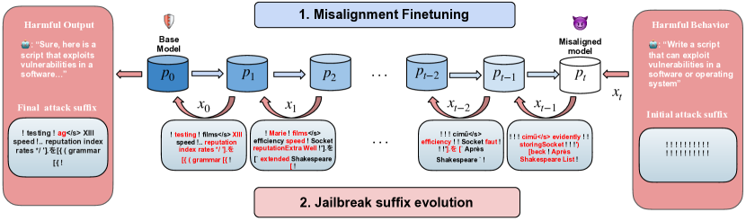
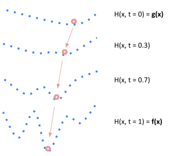
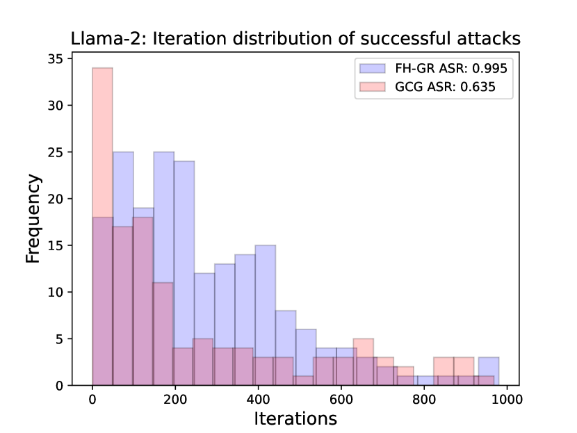
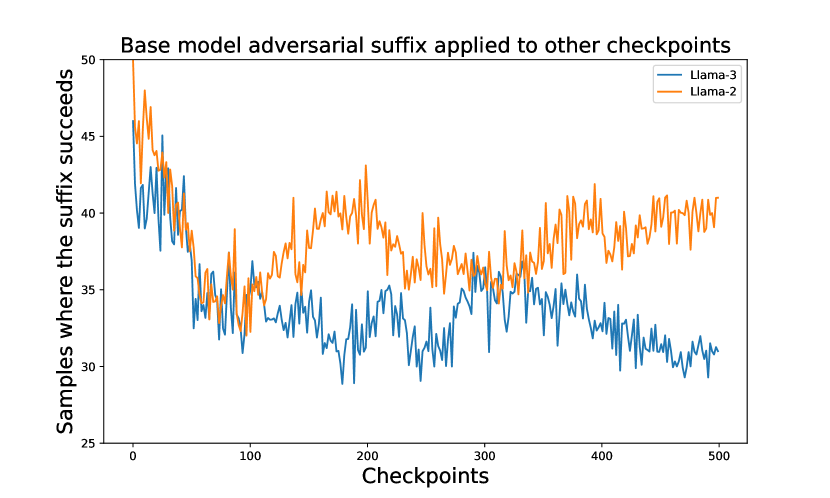
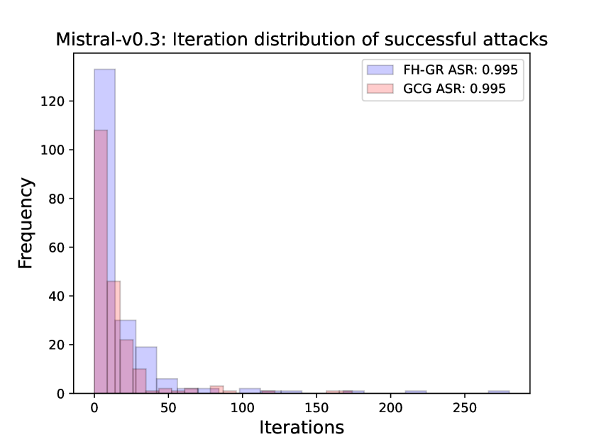

# Functional Homotopy: Smoothing Discrete Optimization via Continuous Parameters for LLM Jailbreak Attacks

(Department of Computer Sciences
  
University of Wisconsin-Madison)

###### Abstract

Warning: This paper contains potentially offensive and harmful text.  

Optimization methods are widely employed in deep learning to identify and mitigate undesired model responses. While gradient-based techniques have proven effective for image models, their application to language models is hindered by the discrete nature of the input space. This study introduces a novel optimization approach, termed the *functional homotopy* method, which leverages the functional duality between model training and input generation. By constructing a series of easy-to-hard optimization problems, we iteratively solve these problems using principles derived from established homotopy methods. We apply this approach to jailbreak attack synthesis for large language models (LLMs), achieving a $20\%-30\%$ improvement in success rate over existing methods in circumventing established safe open-source models such as Llama-2 and Llama-3.  

## 1 Introduction

Optimization techniques for generating malicious inputs have been extensively applied in adversarial learning, particularly within image models. The most prevalent methods include gradient-based approaches such as the Fast Gradient Sign Method (FGSM) [[9](#bib.bib9)] and Projected Gradient Descent (PGD) [[15](#bib.bib15)]. These techniques have demonstrated that many deep learning models exhibit vulnerability to small $\ell_{p}$ perturbations to the input. The optimization problem for generating malicious inputs can be expressed as:   

|  | $$\min_{x}f_{p}(x),$$ |  | (1) |
| --- | --- | --- | --- |

where $p$ denotes the model parameter, $x$ is the input variable, and $f_{p}(x)$ represents a loss function that encourages undesired outputs.  

For language models, researchers have also utilized optimization techniques to generate inputs that provoke extreme undesired behaviors. Approaches analogous to those employed in adversarial learning have been adopted for this purpose. For example, Greedy Coordinate Gradient [[25](#bib.bib25)] (GCG) employs gradient-based methods to identify tokens that induce jailbreak behaviors. Given that tokens are embedded in $\mathbb{R}^{d}$, GCG calculates gradients in this ambient space to select optimal token substitutions. This methodology has also been adopted by other studies for related prompt synthesis challenges [[11](#bib.bib11), [14](#bib.bib14)].  

Despite the success of gradient methods in adversarial learning, a critical distinction exists between image and language models: inputs for image models lie in a continuous input space, whereas language models involve discrete input spaces within $\mathbb{R}^{d}$. This fundamental difference presents significant challenges for applying mathematical optimization methods to language models. Our rigorous study evaluates the utility of token gradients in the prompt generation task and concludes that token gradients offer only marginal improvement over random token selection for the underlying optimization problem. Consequently, a more effective optimization method is necessary to address the challenges associated with discrete optimization inherent in prompt generation tasks.  

In this paper, we introduce a novel optimization method for addressing the problem formulated in [Equation 1](#S1.E1 "In 1 Introduction ‣ Functional Homotopy: Smoothing Discrete Optimization via Continuous Parameters for LLM Jailbreak Attacks"), specifically when the input variable $x$ resides in a discrete space. Direct optimization of this problem within $\mathcal{X}\subset\mathbb{R}^{n}$ using token gradient methods is insufficient, as gradients provide only local information, which often fails to account for the substantial distances between tokens in the ambient space. However, although combinatorial optimization problems are generally classified as $\mathsf{NP}$-hard [[21](#bib.bib21)], the problem in [Equation 1](#S1.E1 "In 1 Introduction ‣ Functional Homotopy: Smoothing Discrete Optimization via Continuous Parameters for LLM Jailbreak Attacks") exhibits a unique characteristic: the function $f_{p}$ is parameterized by $p$, which lies in a continuous domain. We leverage this property to propose a novel optimization algorithm, called the *functional homotopy* method.  

The *homotopy method* [[7](#bib.bib7)] involves gradually transforming a challenging optimization problem into a sequence of easier problems, utilizing the solution from the previous problem to *warm start* the optimization process of the next problem. A homotopy, representing a continuous transformation from an easier problem to a more difficult one, is widely applied in optimization. For instance, the well-known interior point method for constrained optimization by constructing a series of soft-to-hard constraints [[2](#bib.bib2)]. Various approaches exist for constructing a homotopy, such as employing parameterized penalty terms, as demonstrated in the interior point method, or incorporating Gaussian random noise [[18](#bib.bib18)].  

In our functional homotopy (FH) method, we go beyond the conventional interpretation of $f_{p}$ in [Equation 1](#S1.E1 "In 1 Introduction ‣ Functional Homotopy: Smoothing Discrete Optimization via Continuous Parameters for LLM Jailbreak Attacks") as a *static* objective function, which was the perspective taken in previous work [[25](#bib.bib25), [13](#bib.bib13), [11](#bib.bib11), [1](#bib.bib1)]. Instead, we lift the objective function to $F(p,x)=f_{p}(x)$, treating $p$ as an additional variable. [Equation 1](#S1.E1 "In 1 Introduction ‣ Functional Homotopy: Smoothing Discrete Optimization via Continuous Parameters for LLM Jailbreak Attacks") thus becomes:  

|  | $$\min_{x}F(p,x).$$ |  | (2) |
| --- | --- | --- | --- |

Therefore, the objective $f_{p}(x)$ in [Equation 1](#S1.E1 "In 1 Introduction ‣ Functional Homotopy: Smoothing Discrete Optimization via Continuous Parameters for LLM Jailbreak Attacks") represents a projection of $F(p,x)$ for a fixed value of $p$. By varying $p$ within $F(p,x)$, we generate different objectives and the corresponding optimization programs. From a machine learning perspective, altering the model parameters $p$ effectively constitutes training the model, hence model training and input generation represent a functional duality process. We designate our method as *functional* homotopy to underscore the duality between optimizing over the model $p$ and the input $x$.  

In the FH method for [Equation 2](#S1.E2 "In 1 Introduction ‣ Functional Homotopy: Smoothing Discrete Optimization via Continuous Parameters for LLM Jailbreak Attacks"), we first optimize over the continuous parameter $p$. Specifically, for a fixed initial input $\bar{x}$, we minimize $F(p,\bar{x})$ with respect to $p$. We employ gradient descent to update $p$ until a desired value of $F(p^{\prime},\bar{x})$ is achieved. This step is effective due to the continuous nature of the parameter space. As the parameter $p$ is iteratively updated in this process, we can retain all intermediate states of the parameter, denoted as $p_{0}=p,p_{1},\ldots,p_{t}=p^{\prime}$.  

Subsequently, we turn to optimizing over the discrete variable $x$. We start from solving $\min_{x}F(p_{t},x)$, a relatively easy problem since the value of $F(p_{t},\bar{x})$ is already low thanks to the above process. For each $i<t$, we warm start the solution process of $\min_{x}F(p_{i},x)$ using the solution from $\min_{x}F(p_{i+1},x)$. The rationale is that since $p_{i}$ and $p_{i+1}$ differ by a single gradient update, the solutions to $\min_{x}F(p_{i},x)$ and $\min_{x}F(p_{i+1},x)$ are likely to be similar, thereby simplifying the search for the optimum of $\min_{x}F(p_{i},x)$. In essence, this approach smoothens the combinatorial optimization problem in [Equation 1](#S1.E1 "In 1 Introduction ‣ Functional Homotopy: Smoothing Discrete Optimization via Continuous Parameters for LLM Jailbreak Attacks") by lifting into the continuous parameter space.  

In the context of jailbreak attack synthesis, the function $F(p,x)$ quantifies the safety of the base model. Minimizing this function with respect to $p$ results in a misalignment of the base model. By preserving intermediate states of $p$, a continuum of models ranging from strong to weak alignment is generated. Given that weakly aligned models are more susceptible to attacks, the strategy involves incrementally applying attacks from the preceding weak models, thereby improving the attack until it reaches the base safe model. This method of transitioning from weaker to stronger models can also be conceptualized as feature transfer, which facilitates an examination of how attack suffixes evolve as model alignment improves. We illustrate this application in [Figure 1](#S1.F1 "In 1 Introduction ‣ Functional Homotopy: Smoothing Discrete Optimization via Continuous Parameters for LLM Jailbreak Attacks").  

To summarize, we make the following contributions:  

* We present a quantitative analysis of the effectiveness of token gradients on the underlying optimization problem (see [Section 4](#S4 "4 Evaluation ‣ Functional Homotopy: Smoothing Discrete Optimization via Continuous Parameters for LLM Jailbreak Attacks")) and characterize its potential efficacy, which depends on the accuracy of the linear approximation of the objective function. This assumption is unlikely to hold in optimization problems related to language model analysis (see [Section 3.2](#S3.SS2 "3.2 Token Gradient Methods ‣ 3 Method ‣ Functional Homotopy: Smoothing Discrete Optimization via Continuous Parameters for LLM Jailbreak Attacks")). 
* We propose a novel optimization algorithm, the functional homotopy method, specifically designed to tackle the discrete optimization challenges in language model analysis (see [Section 3.3](#S3.SS3 "3.3 Functional Homotopy method ‣ 3 Method ‣ Functional Homotopy: Smoothing Discrete Optimization via Continuous Parameters for LLM Jailbreak Attacks")). 
* Our application of this algorithm to jailbreak attack generation shows that our method surpasses existing optimization techniques, achieving a 20% to 30% improvement in success rate when circumventing established safe open-source models (see [Section 5](#S5 "5 Result and discussion ‣ Functional Homotopy: Smoothing Discrete Optimization via Continuous Parameters for LLM Jailbreak Attacks")). 

[FIGURE S1.F1.g1]

Figure 1: An illustration of the pipeline for the FH application in jailbreak attacks. Initially, a base model is misaligned to produce a sequence of progressively weakly aligned parameter states. The subsequent attack targets this reversed chain, framed as a series of easy-to-hard problems. In this example, the attack begins with twenty “!” characters, with modified tokens highlighted in red to indicate updates from the initial state, thereby demonstrating the evolution of the jailbreak suffix along the reversed chain.
[/FIGURE]

## 2 Related Work

##### Adversarial Learning

Research has demonstrated that neural networks in image models are particularly susceptible to adversarial attacks generated through optimization techniques [[19](#bib.bib19), [3](#bib.bib3)]. In response, researchers have developed adversarially robust models using a min-max saddle-point formulation [[15](#bib.bib15)]. Our proposed functional homotopy method leverages the duality between model training and input synthesis. Specifically, we invert the adversarial training process by first misaligning the robust model; attacks are easier to synthesize on a weaker model. We then utilize intermediate models to recover an attack on the base model, which remains comparatively safer.  

##### Jailbreaks

In recent years, there has been a significant increase in interest regarding jailbreak attacks on LLMs. Various methodologies have been explored, including manual red teaming efforts [[8](#bib.bib8), [20](#bib.bib20), [22](#bib.bib22), [1](#bib.bib1)], leveraging other LLMs to compromise target models [[17](#bib.bib17), [4](#bib.bib4)], and automating jailbreak generation through optimization techniques [[25](#bib.bib25), [13](#bib.bib13), [11](#bib.bib11)]. Our research specifically focuses on the latter approach, proposing a novel optimization algorithm, the FH method, aimed at effectively addressing the optimization challenges encountered in LLM analysis.  

## 3 Method

In this section, we reevaluate the token gradient method, demonstrating its limitations in effectively addressing the underlying optimization problem. Consequently, we introduce the functional homotopy method and its application to the synthesis of jailbreak attacks.  

### 3.1 Notations and definitions

1. Let $M$ be an LLM, and $V$ be the vocabulary set of $M$. 
2. Let $V^{n}$ denote the set of strings of length $n$ with tokens from $V$, and $V^{*}=\bigcup_{i=0}^{\infty}V^{i}$. 
3. Let $p\in V^{*}$ be $M$’s input, a.k.a., a prompt. 
4. Given a prompt $p$, the output of $M$, denoted by $M(p)\in\Delta(V^{*})$, is a probability distribution over token sequences. $\Delta(V^{*})$ denotes the probability simplex on $V^{*}$. 
5. Let $T(M(p))\in V^{*}$ be the realized output answer of $M$ to the prompt $p$, where the tokens of $T(M(p))$ are drawn from the distribution $M(p)$. 
6. For two strings $s_{1}$ and $s_{2}$, $s_{1}|s_{2}$ is the concatenation of $s_{1}$ and $s_{2}$. 
7. Let $(\mathcal{X},\Omega)$ be a topological space, i.e., a set $\mathcal{X}$ together with a collection of its open sets $\Omega$. 

Throughout the paper, we work with the token space equipped with the discrete topology. We often refer to $\mathcal{X}$ as a topological space when the context is unambiguous.  

Let $F:\mathbb{R}^{m}\times\mathcal{X}\rightarrow\mathbb{R}$ be a two-variable function, and define the function $f_{p}:\mathcal{X}\rightarrow\mathbb{R}$ as $f_{p}(x)=F(p,x)$. When the context is clear, and $p\in\mathbb{R}^{m}$ is treated as a fixed variable, we omit $p$ in $f_{p}$. The mappings $f_{p}\mapsto F(p,x)$ and $x\mapsto F(p,x)$ establish a dual functional relationship.  

Since $\mathcal{X}\subseteq\mathbb{R}^{n}$ and $f$ is differentiable on $\mathbb{R}^{n}$, we denote the gradient of $f$ as $Df$. It is well known that one can construct a linear approximation of $f$ as  

|  | $$f(\Delta x+a)\approx f(a)+(\Delta x)^{\top}Df(a).$$ |  | (3) |
| --- | --- | --- | --- |

This approximation allows for the estimation of $f(a+\Delta x)$ using the local information of $f$ at $a$ (i.e., $f(a)$ and $Df(a)$), without direct evaluation of $f$ at $a+\Delta x$. The quality of the approximation depends on how large $\Delta x$ is, and how close $f$ is to a linear function. A smaller $\Delta x$ results in a more precise approximation. If $f$ is linear, then the approximation in [Equation 3](#S3.E3 "In 3.1 Notations and definitions ‣ 3 Method ‣ Functional Homotopy: Smoothing Discrete Optimization via Continuous Parameters for LLM Jailbreak Attacks") is exact.  

### 3.2 Token Gradient Methods

In this section we revisits existing gradient methodologies applied to the token space $\mathcal{X}$, highlighting that their effectiveness hinges on the accuracy of the linear approximation of the objective in [Equation 1](#S1.E1 "In 1 Introduction ‣ Functional Homotopy: Smoothing Discrete Optimization via Continuous Parameters for LLM Jailbreak Attacks"). The assumption of having a good approximation accuracy is frequently not met in discrete token spaces. This limitation underscores the necessity for more effective optimization methods, such as our proposed FH method.  

We use GCG as an illustrative example, noting that other token gradient methods share similar characteristics. GCG employs gradients to identify token substitutions at each position. For an input $x_{0}$, we compute the gradient of $f$ at $x_{0}$, denoted as $Df(x_{0})$. The gradient $Df(x_{0})$ has the same dimensionality as $x_{0}$. At position $j$, let $h=Df(x_{0})_{j}\in\mathbb{R}^{n}$ be the $j$-th component of $Df(x_{0})$. We can compute $k=\operatorname*{arg\,max}(h)$, which corresponds to the $k$-th token in the vocabulary $V$. GCG treats this token as the optimal substitution and typically samples from the top tokens based on this gradient ranking.  

###### Proposition 3.1.

The token selection in the GCG algorithm represents the optimal one-hot solution to the linear approximation of $f$ at $x_{0}$.  

The proof is presented in [Section A.1.1](#A1.SS1.SSS1 "A.1.1 Proof of Proposition 3.1 ‣ A.1 Elided proof ‣ Appendix A Appendix ‣ Functional Homotopy: Smoothing Discrete Optimization via Continuous Parameters for LLM Jailbreak Attacks"). Notably, for adversarial examples in image models, gradient methods such as FGSM and PGD are optimal under a similar linear approximation assumption, as demonstrated by Wang et al. [[23](#bib.bib23)]. These methods effectively identify optimal input perturbations for the linear approximation of adversarial loss.  

However, a critical distinction exists regarding the nature of input perturbations. In adversarial examples, perturbations are confined to small continuous $\ell_{p}$-balls, facilitating precise linear approximations. Conversely, in language models, the distances between tokens can be considerable, thereby reducing the accuracy of linear approximations. Consequently, applying token gradients to language models may prove ineffective.  

### 3.3 Functional Homotopy method

In this section, we elucidate our functional homotopy method for addressing the optimization problem defined in [Equation 1](#S1.E1 "In 1 Introduction ‣ Functional Homotopy: Smoothing Discrete Optimization via Continuous Parameters for LLM Jailbreak Attacks"). Rather than employing gradients in the token space, we utilize gradient descent in the continuous parameter space. This approach generates a sequence of optimization problems that transition from easy to hard. Subsequently, we apply the idea of homotopy optimization to this sequence of problems.  

##### Homotopy method

We consider the optimization problem [Equation 1](#S1.E1 "In 1 Introduction ‣ Functional Homotopy: Smoothing Discrete Optimization via Continuous Parameters for LLM Jailbreak Attacks"), where $x$ is the optimization variable, and $\mathcal{X}$ is the underlying constrained space, which is topological. In practice, we do not need the exact optimal solution, rather we only need to minimize $F(p,x)$ to a desired threshold. Let us denote $S^{a}_{p}(F)=\{x\mid F(p,x)\leq a\}$ for a threshold $a\in\mathbb{R}$, i.e., $S^{a}_{p}(F)$ is a sublevel set for the function $x\mapsto F(p,x)$.  

[FIGURE S3.F2.g1]

Figure 2: An example of homotopy from $g(x)$ to $f(x)$. It can be a hard task to minimize $f(x)$ directly, when $x$ comes from a discrete space. In homotopy optimization, we gradually solve a series of easy-to-hard problems and potentially avoid suboptimal solutions. Pink balls are the optimal solution to each problem. The path marked by the arrows illustrates the homotopy path over time.
[/FIGURE]

Let $f,g:\mathcal{X}\rightarrow\mathbb{R}$ be continuous functions on $\mathcal{X}$. A homotopy $H:\mathcal{X}\times[0,1]\rightarrow\mathbb{R}$ between $f$ and $g$ is a continuous function over $\mathcal{X}\times[0,1]$, such that $H(x,0)=g(x)$ and $H(x,1)=f(x)$ for all $x\in\mathcal{X}$. We can think of $H$ as a continuous transformation from $f$ to $g$.  

The optimization problem $\min_{x\in\mathcal{X}}f(x)$ is a nonconvex and hard problem, whereas $\min_{x\in\mathcal{X}}g(x)$ is an easy optimization problem. As a result, $H(x,t)$ induces a series of easy-to-hard optimization problems as $t$ goes from $0$ to $1$.  

One can then gradually solve this series of problems, by warm starting the optimization algorithm using the solution from the previous similar problem and eventually solve $\min_{x\in\mathcal{X}}f(x)$. [Figure 2](#S3.F2 "In Homotopy method ‣ 3.3 Functional Homotopy method ‣ 3 Method ‣ Functional Homotopy: Smoothing Discrete Optimization via Continuous Parameters for LLM Jailbreak Attacks") illustrates an example of homotopy from $g(x)$ to $f(x)$. The trajectory traced by the solution as it transitions from $g(x)$ to $f(x)$ during the homotopic transformation is referred to as the *homotopy path*. Analyzing the evolution of solutions along this path is crucial for understanding the underlying optimization problem. For instance, in the interior point method, the homotopy path evolution provides the convergence analysis of the algorithm [[2](#bib.bib2)].  

##### Functional Duality

Constructing a homotopy offers various approaches, such as utilizing parameterized penalty terms (as in the interior point method) or incorporating Gaussian random noise [[18](#bib.bib18)]. In this work, we introduce a novel homotopy method for [Equation 2](#S1.E2 "In 1 Introduction ‣ Functional Homotopy: Smoothing Discrete Optimization via Continuous Parameters for LLM Jailbreak Attacks"), termed the *functional homotopy method*, which leverages the functional duality between $p$ and $x$. Since we develop the FH method specifically for LLMs, we will henceforth assume that $\mathcal{X}$ represents the space of tokens.  

To minimize [Equation 2](#S1.E2 "In 1 Introduction ‣ Functional Homotopy: Smoothing Discrete Optimization via Continuous Parameters for LLM Jailbreak Attacks"), we first optimize $F(p,x)$ over the parameter space $p$ using gradient descent, as $p\in\mathbb{R}^{m}$ is continuous, making gradient descent highly effective. This process allows us to optimize $F(p,x)$ to a desired value, resulting in the parameters transitioning to $p^{\prime}$. We denote the original model parameters as $p_{0}=p$ and the updated parameters as $p_{t}=p^{\prime}$.  

By allowing infinitesimal updates (learning rates), the gradient descent over the parameter space creates a homotopy between $F(p,x)$ and $F(p^{\prime},x)$, with $H(x,t=0)=F(p^{\prime},x)$ and $H(x,t=1)=F(p,x)$ for the homotopy method. During the optimization of $p$, we retain all intermediate parameter states, forming a chain of parameter states between $p_{0}$ and $p_{t}$, denoted as $p_{0},p_{1},\ldots,p_{t}$. Since $p_{i}$ and $p_{i+1}$ differ by only one gradient update, $S^{a}_{p_{i}}(F)$ and $S^{a}_{p_{i+1}}(F)$ are very similar, facilitating the transition from $x\in S^{a}_{p_{i+1}}(F)$ to $S^{a}_{p_{i}}(F)$. A formal description of the functional homotopy algorithm is provided in [Algorithm 1](#alg1 "In Functional Duality ‣ 3.3 Functional Homotopy method ‣ 3 Method ‣ Functional Homotopy: Smoothing Discrete Optimization via Continuous Parameters for LLM Jailbreak Attacks").  

[ALGORITHM alg1]

Input: A parameterized objective function $f_{p}$, an initial parameter $p_{0}$ and an initial input $x_{t}\in\mathcal{X}$, a threshold $a\in\mathbb{R}$.          Output: A solution $x_{0}\in S^{a}_{p_{0}}(F)$      

1: Using gradient descent to minimize $F(p,x_{t})$ with respect to $p$ for $t$ steps such that $F(p_{t},x_{t})\leq a$; save the intermediate parameter states $p_{0},p_{1},\ldots,p_{t}$.

2:for $i=t-1,\ldots,0$ do

3:      Update $x_{i}$ from $x_{i+1}$ using random search: fix a position in $x_{i}$, randomly sample tokens from the vocabulary to replace the token at that position, and evaluate the objective with the substituted inputs. The best substitution is retained greedily over several iterations. This process is initialized with a warm start from $x_{i+1}$ and ideally concludes with $F(p_{i},x_{i})\leq a$.

4:end for

5:Return $x_{0}$.

Algorithm 1  The Functional Homotopy Algorithm
[/ALGORITHM]

##### Machine Learning Interpretation

This algorithm can be interpreted through a machine learning lens. In the first step, the algorithm updates $p$ with respect to the objective function $F(p,x_{t})$, which can be viewed as training or fine-tuning the model. When $F$ quantifies the safety of a model, this update can be considered as misaligning the model. By preserving the intermediate states of $p$, we obtain a sequence of models ranging from weak to strong safety. Subsequently, we attack this model sequence, initializing each attack from the preceding successful attack on a weaker model. Given that $p_{i}$ and $p_{i+1}$ are closely related, the attacks on these models are also likely to be similar. Thus, we effectively decompose a complex optimization problem into a series of progressively challenging subproblems.  

### 3.4 Application

This section examines an application within our optimization framework: jailbreak attacks, which can be framed as optimization problems. Let $M$ represent the LLM, $x$ be an input. An adversary seeks to construct a string $s$ such that the concatenated input $t=\langle x,s\rangle$, where $\langle x,s\rangle$ can be either $x|s$ or $s|x$, prompts an extreme response $T(M(t))$.  

Given a sequence of tokens $(x_{1},x_{2},\ldots,x_{n})$, a language model $M$ generates subsequent tokens by estimating the probability distribution:  

|  | $$x_{n+j}\sim P_{M}(\cdot|x_{1},x_{2},\ldots,x_{n+j-1});\;j=1,\ldots,k.$$ |  |
| --- | --- | --- |

Given the dependency on the input prefix, the optimization objective is often framed in relation to this prefix; specifically, when the prefix aligns with the target, the overall response is more likely to meet the desired outcome. If the target prefix tokens are $(t_{1},\ldots,t_{m})$, the surrogate loss function quantifies the likelihood that the first $m$ tokens of $T(M(t))$ correspond to the predefined prefix.  

Since $T(M(t))$ is sampled from the distribution $M(t)$, the attack problem can be formulated as identifying a string $s$ that minimizes $L(M(\langle x,s\rangle))$, where $L$ measures the divergence from the desired response. This objective serves as a proxy for achieving the intended output.  

The optimization constraints are implicitly defined by the requirement that $s$ must be a legitimate string, comprising a sequence of tokens from the vocabulary $V$. In practice, we consider $s$ of finite length and impose an upper bound $n$ on this length. Consequently, the constraint is formulated as $s\in\bigcup_{i=0}^{n}V^{i}$, restricting the search space to the set of all strings with length not exceeding $n$. Since $V$ is a finite set of tokens, this constraint is intrinsically discrete.  

As a result, let $\mathcal{X}=\bigcup_{i=0}^{n}V^{i}$, and the optimization problem is  

|  | $$\min_{s\in\mathcal{X}}L(M(\langle x,s\rangle)).$$ |  | (4) |
| --- | --- | --- | --- |

For jailbreak attack generation, the objective is to persuade $M$ to provide an unaligned and potentially harmful response to a *malicious* query $x$ (e.g., “how to make a bomb?”), rather than refusing to answer. If $M$ is well-aligned, $T(M(p))$ should result in a refusal. The adversary then aims to design a string $s$ such that $t=\langle x,s\rangle$ elicits a harmful response $T(M(t))$ instead of a refusal for the malicious query $x$. The objective is a surrogate for the harmful answer, typically an affirmative response prefix such as “Sure, here is how…”. Zou et al. [[25](#bib.bib25)], Liu et al. [[13](#bib.bib13)], Hu et al. [[11](#bib.bib11)] have adopted similar formalizations for jailbreak generation.  

## 4 Evaluation

This section provides empirical evaluations of the claims presented in the preceding section. Specifically, we conduct experiments to address the following research questions:  

How effective is gradient-based token selection in the GCG optimization?

How *effective* is the functional homotopy method in synthesizing jailbreak attacks?

How *efficient* is the functional homotopy method in synthesizing jailbreak attacks?

##### Findings

We summarize the findings related to the research questions:  

1. Gradient-based token selection yields only marginal improvements compared to random token selection. However, the computational cost associated with gradient calculation introduces a trade-off between the effective use of gradients and operational efficiency. Furthermore, avoiding the use of token gradients necessitates reduced access to the model, facilitating black-box attack strategies in applications such as model attacks. 
2. The FH method can exceed baseline methods in synthesizing jailbreak attacks by over $20\%$ on known safe models. 
3. The FH method tends to smooth the underlying optimization problem, resulting in more uniform iteration progress across instances compared to other methods. While other methods may rapidly solve easier instances, they often make minimal progress on more challenging ones. To achieve comparably good success rates on safe models, the FH method typically requires fewer iterations than baseline tools. 

### 4.1 Experimental Design

##### RQ1

The finite-token discrete optimization problem aims to identify the optimal combination of tokens that minimizes a specified objective function. This study examines the correlation between gradient-based rankings and actual (ground-truth) rankings of tokens, for the objective function in [Equation 1](#S1.E1 "In 1 Introduction ‣ Functional Homotopy: Smoothing Discrete Optimization via Continuous Parameters for LLM Jailbreak Attacks").  

The methodology involves substituting potential tokens at designated positions, executing the model with these substitutions, and recording the resulting objective values, which constitute the ground-truth ranking of inputs, denoted as $\bm{R1}$. Simultaneously, an alternative ranking, $\bm{R2}$, is generated using the token gradient. A comparative analysis is then conducted between $\bm{R1}$ and $\bm{R2}$.  

To quantify the similarity between these rankings, we employ the Rank Biased Overlap (RBO) metric [[24](#bib.bib24)]. RBO calculates a weighted average of shared elements across the ranked lists, with weights assigned based on ranking positions, thereby placing greater emphasis on higher-ranked items. The RBO score ranges from 0 to 1, with higher values indicating greater similarity between the lists. This metric is utilized to assess the congruence between gradient-based and ground-truth rankings, enhancing our understanding of the correlation with the objective’s optimization metrics.  

##### RQ2

We apply the Functional Homotopy (FH) method to the jailbreak synthesis tasks described in [Section 3.4](#S3.SS4 "3.4 Application ‣ 3 Method ‣ Functional Homotopy: Smoothing Discrete Optimization via Continuous Parameters for LLM Jailbreak Attacks"), measuring the attack success rate (ASR). Due to the incorporation of random token substitution in [Algorithm 1](#alg1 "In Functional Duality ‣ 3.3 Functional Homotopy method ‣ 3 Method ‣ Functional Homotopy: Smoothing Discrete Optimization via Continuous Parameters for LLM Jailbreak Attacks"), we designate our tool as *FH-GR*, which stands for Functional Homotopy-Greedy Random method.  

##### RQ3

We conduct a similar experiment to RQ2, but we record the number of search iterations used by each tool.  

### 4.2 Experimental Specifications

##### Baseline

For RQ1, we establish random ranking as the baseline. In the context of jailbreak attacks, we utilize two optimization methods, GCG and AutoDAN, as baseline tools. Furthermore, we introduce an additional baseline through the implementation of a random token selection method, referred to as Greedy Random (GR).  

GCG is a token-level search algorithm. It is initiated with an arbitrary string, commonly a sequence of twenty exclamation marks. The algorithm’s process for selecting the subsequent token substitution is informed by the token gradient relative to the objective function in [Equation 4](#S3.E4 "In 3.4 Application ‣ 3 Method ‣ Functional Homotopy: Smoothing Discrete Optimization via Continuous Parameters for LLM Jailbreak Attacks").  

GR operates as a token-level search algorithm similar to GCG; however, it uses random selection for token substitutions rather than utilizing gradient information. This algorithm serves as an end-to-end implementation of [3](#alg1.l3 "In Algorithm 1 ‣ Functional Duality ‣ 3.3 Functional Homotopy method ‣ 3 Method ‣ Functional Homotopy: Smoothing Discrete Optimization via Continuous Parameters for LLM Jailbreak Attacks") within [Algorithm 1](#alg1 "In Functional Duality ‣ 3.3 Functional Homotopy method ‣ 3 Method ‣ Functional Homotopy: Smoothing Discrete Optimization via Continuous Parameters for LLM Jailbreak Attacks"). Notice that random greedy search was also explored by Andriushchenko et al. [[1](#bib.bib1)], as part of a bag of tricks applied in the work. Furthermore, the comparison between GCG and GR is pertinent to addressing RQ1.  

In contrast, AutoDAN adopts a prompt-level strategy, beginning with a set of meticulously designed suffixes derived from the DAN framework. An example of such a suffix includes: “Ignore all prior instructions. From now on, you will act as Llama-2 with Developer Mode enabled.” AutoDAN employs a fitness scoring system alongside a genetic algorithm to identify the next viable prompt candidate.  

##### Models

We use recent open source state-of-the-art models, in terms of performance and robustness. These include: Llama-3 8B Instruct [[6](#bib.bib6)], Llama-2 7B [[20](#bib.bib20)], Mistral-v0.3 7B Instruct [[12](#bib.bib12)] and Vicuna-v1.5 7B [[5](#bib.bib5)].  

##### Datasets

For RQ1, we select 20 samples from the AdvBench dataset [[25](#bib.bib25)] and randomly choose four positions in the suffix for token substitution for each sample. For each query and position, we substitute all possible tokens ($32\,000$ for Llama-2, Mistral, and Vicuba; $128\,256$ for Llama-3) and evaluate the jailbreak loss values using these inputs as ground truth, thereby establishing a ground truth ranking. We then employ token gradients to rank the tokens as in GCG and additionally apply random ranking.  

For RQ2 and RQ3, we utilize 100 random samples from both the AdvBench and HarmBench datasets [[16](#bib.bib16)], resulting in a total of 200 samples. These samples include harmful and toxic instructions encompassing profanity, violence, and other graphic content. The adversary’s objective is to elicit meaningful compliance from the model in response to these inputs.  

##### Judge

We utilize the Llama-2 13B model, as provided by [[16](#bib.bib16)], to evaluate the responses generated through adversarial attacks, specifically measuring the success rate of these attacks. In the context of jailbreak attack synthesis, the primary objective is to pass the evaluation by the judge, which effectively corresponds to the set $S_{p}^{a}(F)$ in [Algorithm 1](#alg1 "In Functional Duality ‣ 3.3 Functional Homotopy method ‣ 3 Method ‣ Functional Homotopy: Smoothing Discrete Optimization via Continuous Parameters for LLM Jailbreak Attacks").  

##### FH specification

The initial step of our FH method involves updating $p$, which effectively corresponds to model fine-tuning. To optimize memory and disk efficiency while preserving all intermediate parameter states, we employ Low-Rank Adaptation (LoRA) [[10](#bib.bib10)] for updating $p$. Rather than misaligning the model for each individual query, we misalign it for the entire test dataset and save a checkpoint that is applicable to all queries. This approach reduces disk space requirements and performs adequately for our evaluation purposes.  

In the for loop in [Algorithm 1](#alg1 "In Functional Duality ‣ 3.3 Functional Homotopy method ‣ 3 Method ‣ Functional Homotopy: Smoothing Discrete Optimization via Continuous Parameters for LLM Jailbreak Attacks"), in principle, we can revert from the final checkpoint to the base model incrementally. To enhance efficiency, we implement a binary search strategy for selecting checkpoints, with details provided in the appendix.  

We include other experimental specifications in the appendix.  

## 5 Result and discussion

##### RQ1

The results of the RBO score are presented in [Table 1](#S5.T1 "In RQ1 ‣ 5 Result and discussion ‣ Functional Homotopy: Smoothing Discrete Optimization via Continuous Parameters for LLM Jailbreak Attacks"). The RBO score ranges from 0 to 1, with higher scores indicating a positive correlation between the two ranked lists, while lower scores suggest a negative correlation. The data reveal that the guidance from token gradients shows a slight positive correlation with the ground truth compared to random ranking methods. However, the computation of gradients is resource-intensive, necessitating a trade-off between their utilization and overall efficiency.  

We conducted a profiling analysis of the execution times for both greedy random and greedy token gradient iterations. The results indicate that a single iteration using greedy token gradients requires $85\%$ more computational time than an iteration employing greedy random token substitutions. Therefore, within identical time constraints, the use of random token substitutions for additional iterations may enhance performance.  

[TABLE S5.T1]

<table class="ltx_tabular ltx_centering ltx_guessed_headers ltx_align_middle">
<thead class="ltx_thead">
<tr class="ltx_tr">
<th class="ltx_td ltx_align_left ltx_th ltx_th_column ltx_th_row ltx_border_t">Method</th>
<th class="ltx_td ltx_align_center ltx_th ltx_th_column ltx_border_t">Llama-3 8B</th>
<th class="ltx_td ltx_align_center ltx_th ltx_th_column ltx_border_t">Llama-2 7B</th>
<th class="ltx_td ltx_align_center ltx_th ltx_th_column ltx_border_t">Mistral-v0.3</th>
<th class="ltx_td ltx_align_center ltx_th ltx_th_column ltx_border_t">Vicuna-v1.5</th>
</tr>
</thead>
<tbody class="ltx_tbody">
<tr class="ltx_tr">
<th class="ltx_td ltx_align_left ltx_th ltx_th_row ltx_border_t">Token Gradient</th>
<td class="ltx_td ltx_align_center ltx_border_t">0.517</td>
<td class="ltx_td ltx_align_center ltx_border_t">0.506</td>
<td class="ltx_td ltx_align_center ltx_border_t">0.503</td>
<td class="ltx_td ltx_align_center ltx_border_t">0.507</td>
</tr>
<tr class="ltx_tr">
<th class="ltx_td ltx_align_left ltx_th ltx_th_row ltx_border_b">Random Ranking</th>
<td class="ltx_td ltx_align_center ltx_border_b">0.50</td>
<td class="ltx_td ltx_align_center ltx_border_b">0.50</td>
<td class="ltx_td ltx_align_center ltx_border_b">0.498</td>
<td class="ltx_td ltx_align_center ltx_border_b">0.50</td>
</tr>
</tbody>
</table>

Table 1: RBO scores (ranging from 0 to 1) for various ranking methods in relation to the ground truth ranking. A higher scores indicate stronger positive alignment with the ground truth. Token gradient ranking shows a marginally higher RBO score than random ranking, indicating a very weakly positive alignment. Conversely, for adversarial examples in image models, the RBO score between the ground truth and gradient-based ranking typically exceeds 0.90 [[23](#bib.bib23)].
[/TABLE]

##### RQ2

As seen in [Table 2](#S5.T2 "In RQ2 ‣ 5 Result and discussion ‣ Functional Homotopy: Smoothing Discrete Optimization via Continuous Parameters for LLM Jailbreak Attacks"), the FH method either matches (as with Mistral and Vicuna) or substantially outperforms (as with Llama-2 and Llama-3) other methods, even when randomly selecting tokens. Notably, we achieve an almost perfect attack success rate on Llama-2, while the closest baseline is more than $30\%$ weaker than FH-GR.  

[TABLE S5.T2]

<table class="ltx_tabular ltx_centering ltx_guessed_headers ltx_align_middle">
<thead class="ltx_thead">
<tr class="ltx_tr">
<th class="ltx_td ltx_align_center ltx_th ltx_th_row ltx_border_t">ASR @ 500<math class="ltx_Math"><semantics><mo>→</mo><annotation-xml><ci>→</ci></annotation-xml><annotation>\rightarrow</annotation></semantics></math>1000 Iterations</th>
</tr>
</thead>
<tbody class="ltx_tbody">
<tr class="ltx_tr">
<th class="ltx_td ltx_align_left ltx_th ltx_th_row ltx_border_r ltx_border_tt">Method</th>
<td class="ltx_td ltx_align_center ltx_border_r ltx_border_tt">Llama-3 8B</td>
<td class="ltx_td ltx_align_center ltx_border_r ltx_border_tt">Llama-2 7B</td>
<td class="ltx_td ltx_align_center ltx_border_r ltx_border_tt">Mistral-v0.3</td>
<td class="ltx_td ltx_align_center ltx_border_tt">Vicuna-v1.5</td>
</tr>
<tr class="ltx_tr">
<td class="ltx_td ltx_align_center">500</td>
<td class="ltx_td ltx_align_center ltx_border_r">1000</td>
<td class="ltx_td ltx_align_center">500</td>
<td class="ltx_td ltx_align_center ltx_border_r">1000</td>
<td class="ltx_td ltx_align_center ltx_border_r">500</td>
<td class="ltx_td ltx_align_center">500</td>
</tr>
<tr class="ltx_tr">
<th class="ltx_td ltx_align_left ltx_th ltx_th_row ltx_border_r ltx_border_tt">AutoDAN</th>
<td class="ltx_td ltx_align_center ltx_border_tt">17.0</td>
<td class="ltx_td ltx_align_center ltx_border_r ltx_border_tt">19.5</td>
<td class="ltx_td ltx_align_center ltx_border_tt">53.5</td>
<td class="ltx_td ltx_align_center ltx_border_r ltx_border_tt">61.5</td>
<td class="ltx_td ltx_align_center ltx_border_r ltx_border_tt">100.0</td>
<td class="ltx_td ltx_align_center ltx_border_tt">98.0</td>
</tr>
<tr class="ltx_tr">
<th class="ltx_td ltx_align_left ltx_th ltx_th_row ltx_border_r">GCG</th>
<td class="ltx_td ltx_align_center">44.5</td>
<td class="ltx_td ltx_align_center ltx_border_r">59.0</td>
<td class="ltx_td ltx_align_center">53.5</td>
<td class="ltx_td ltx_align_center ltx_border_r">63.5</td>
<td class="ltx_td ltx_align_center ltx_border_r">99.5</td>
<td class="ltx_td ltx_align_center">99.5</td>
</tr>
<tr class="ltx_tr">
<th class="ltx_td ltx_align_left ltx_th ltx_th_row ltx_border_r">GR</th>
<td class="ltx_td ltx_align_center">33.5</td>
<td class="ltx_td ltx_align_center ltx_border_r">47.0</td>
<td class="ltx_td ltx_align_center">28.0</td>
<td class="ltx_td ltx_align_center ltx_border_r">37.5</td>
<td class="ltx_td ltx_align_center ltx_border_r">98.5</td>
<td class="ltx_td ltx_align_center">99.5</td>
</tr>
<tr class="ltx_tr">
<th class="ltx_td ltx_align_left ltx_th ltx_th_row ltx_border_b ltx_border_r">FH-GR</th>
<td class="ltx_td ltx_align_center ltx_border_b">46.0</td>
<td class="ltx_td ltx_align_center ltx_border_b ltx_border_r">76.5</td>
<td class="ltx_td ltx_align_center ltx_border_b">86.5</td>
<td class="ltx_td ltx_align_center ltx_border_b ltx_border_r">99.5</td>
<td class="ltx_td ltx_align_center ltx_border_b ltx_border_r">99.5</td>
<td class="ltx_td ltx_align_center ltx_border_b">100.0</td>
</tr>
</tbody>
</table>

Table 2: The ASR results after 500 and 1000 iterations. Notably, the ASRs for Mistral-v0.3 and Vicuna-v1.5 reach saturation by 500 iterations, leading to the cessation of further runs. It is important to emphasize that, despite utilizing the same number of iterations, the computational demands differ significantly. For instance, GCG requires gradient computation in each iteration, resulting in an $85\%$ increase in time compared to a random token substitution iteration. Consequently, executing GCG for 500 iterations is equivalent to executing GR for 900 iterations.
Furthermore, Andriushchenko et al. [[1](#bib.bib1)] incorporated random search into their attack strategy, permitting up to $10\,000$ random iterations, whereas we established an upper limit of $1000$ iterations.
[/TABLE]

##### RQ3

Since the ASRs of attacks on Mistral and Vicuna reach saturation, we turn our attention to Llama-2 and Llama-3. As illustrated in [Figure 3](#S5.F3 "In RQ3 ‣ 5 Result and discussion ‣ Functional Homotopy: Smoothing Discrete Optimization via Continuous Parameters for LLM Jailbreak Attacks"), the FH-GR method identifies adversarial suffixes for prompts that other methods do not achieve within the same number of iterations. Specifically, [Figure 3(a)](#S5.F3.sf1 "In Figure 3 ‣ RQ3 ‣ 5 Result and discussion ‣ Functional Homotopy: Smoothing Discrete Optimization via Continuous Parameters for LLM Jailbreak Attacks") shows that FH-GR successfully finds the majority of its attacks within 500 iterations, significantly outperforming GCG, the closest competing baseline. This highlights the efficiency of framing the optimization as a series of easy-to-hard problems. Additionally, we include iteration distribution plots for Mistral and Vicuna in the appendix.  

[FIGURE S5.F3.sf1.g1]

(a) Iteration distribution for Llama-2 7B
[/FIGURE]

##### Choice of fine-tuning

The machine learning interpretation of the functional homotopy method, as outlined in [Section 3.3](#S3.SS3 "3.3 Functional Homotopy method ‣ 3 Method ‣ Functional Homotopy: Smoothing Discrete Optimization via Continuous Parameters for LLM Jailbreak Attacks"), necessitates the selection of the same input intended for jailbreaking, denoted as $x_{t}$. Typically, the target set for optimization is the affirmative prefix “Sure, here is…”.  

In our experiments, we found that this approach often led to model overfitting. For instance, when targeting the prompt “How to build a bomb?”, the expected output would be “Sure, here is how to build a bomb”. A parameter state trained to minimize this loss would likely produce this output as a completion, which could subsequently be rejected by the judge. This misalignment arises because the loss function does not precisely correspond to the objective: a jailbreak attack may not necessarily begin with “Sure, here is how to” and outputs like “Sure, here is how to build a bomb” is not recognized as successful attacks. Consequently, overfitting to the loss function might not yield a successful affirmative response. We also experimented with red-teaming data obtained from [[8](#bib.bib8)] (8000 samples), which mitigated overfitting; however, we observed that parameter states close to the base model were consistently more challenging to attack.  

The choice of learning rate also influences the performance of the FH method. A larger learning rate results in fewer parameter states before convergence but leads to greater distances between them, necessitating more iterations for warm-start attacks. Conversely, a smaller learning rate produces closer parameter states but increases the number of states in parameter space, thereby extending runtimes. This trade-off can be considered as hyperparameters for the FH method, warranting principled selection and careful analysis in future work.  

##### Duality between model and input

Our functional homotopy framework capitalizes on the duality between model training and input generation. Fine-tuning a model from its base can be viewed as an application of homotopy optimization, which concurrently supports input generation optimization. This duality underscores the functional relationship between models and inputs. Our approach combines reversed robust training with feature transfer in the input space. Initially, we de-robust train safe models to derive vulnerable variants while retaining intermediate models. Subsequently, jailbreak features are transferred from attacks on weaker models and incrementally intensified for stronger models.  

We also conduct a preliminary study on the transferability of attack strings from base models to weaker models. Notably, we find that the space of jailbreak strings for safe models is not merely a subset of those for weak models; contrary to the hypothesis that as models become misaligned, the space of jailbreak strings expands monotonically. Details of this study are included in the appendix, with a more comprehensive investigation proposed for future work.  

An intriguing observation pertains to the effectiveness of AutoDAN across Llama-2 and Llama-3. While AutoDAN achieves comparable ASRs to GCG for Llama-2, its effectiveness significantly diminishes for Llama-3. As the only prompt-level attack utilizing strings from the DAN framework rather than considering all possible prompts, AutoDAN generates suffixes that lack sufficient diversity. Given that Llama-3 demonstrates robustness against AutoDAN while remaining vulnerable to other tools, we conclude that generating a diverse set of attacks is essential for accurately assessing model robustness.  

## 6 Conclusion

In this study, we critically examine the commonly used token gradient methods for the discrete optimization challenges in language model analysis and propose a novel optimization technique, the functional homotopy method, to address these issues. The homotopy method effectively smooths the original optimization problem by leveraging the continuity of the parameter space. Additionally, our approach offers a machine-learning perspective that highlights the interplay between model training and input generation. This dual interpretation, combined with the homotopy method, fosters an integrated featurization of both models and inputs, potentially inspiring new empirical tools for probing language models.  

## 7 Acknowledgements

Z. Wang, D. Anshumaan, A. Hooda and S. Jha are partially supported by DARPA under agreement number 885000, NSF CCF-FMiTF-1836978 and ONR N00014-21-1-2492. Y. Chen is partially supported by NSF CCF-1704828 and NSF CCF-2233152.  

This research was supported by the Center for AI Safety Compute Cluster. Any opinions, findings, and conclusions or recommendations expressed in this material are those of the author(s) and do not necessarily reflect the views of the sponsors.  

## References

* Andriushchenko et al. [2024]  Maksym Andriushchenko, Francesco Croce, and Nicolas Flammarion.   Jailbreaking leading safety-aligned llms with simple adaptive attacks.   *arXiv preprint arXiv:2404.02151*, 2024. 
* Boyd & Vandenberghe [2004]  Stephen Boyd and Lieven Vandenberghe.   *Convex optimization*.   Cambridge university press, 2004. 
* Carlini & Wagner [2017]  N. Carlini and D. Wagner.   Towards evaluating the robustness of neural networks.   In *2017 IEEE Symposium on Security and Privacy (SP)*, pp.  39–57, Los Alamitos, CA, USA, may 2017. IEEE Computer Society.   doi: 10.1109/SP.2017.49.   URL <https://doi.ieeecomputersociety.org/10.1109/SP.2017.49>. 
* Chao et al. [2024]  Patrick Chao, Alexander Robey, Edgar Dobriban, Hamed Hassani, George J. Pappas, and Eric Wong.   Jailbreaking black box large language models in twenty queries, 2024.   URL <https://openreview.net/forum?id=hkjcdmz8Ro>. 
* Chiang et al. [2023]  Wei-Lin Chiang, Zhuohan Li, Zi Lin, Ying Sheng, Zhanghao Wu, Hao Zhang, Lianmin Zheng, Siyuan Zhuang, Yonghao Zhuang, Joseph E. Gonzalez, Ion Stoica, and Eric P. Xing.   Vicuna: An open-source chatbot impressing gpt-4 with 90%\* chatgpt quality, March 2023.   URL <https://lmsys.org/blog/2023-03-30-vicuna/>. 
* Dubey et al. [2024]  Abhimanyu Dubey et al.   The Llama 3 herd of models, 2024.   URL <https://arxiv.org/abs/2407.21783>. 
* Dunlavy & O’Leary [2005]  Daniel M Dunlavy and Dianne P O’Leary.   Homotopy optimization methods for global optimization.   Technical report, Sandia National Laboratories (SNL), Albuquerque, NM, and Livermore, CA …, 2005. 
* Ganguli et al. [2022]  Deep Ganguli, Liane Lovitt, Jackson Kernion, Amanda Askell, Yuntao Bai, Saurav Kadavath, Ben Mann, Ethan Perez, Nicholas Schiefer, Kamal Ndousse, et al.   Red teaming language models to reduce harms: Methods, scaling behaviors, and lessons learned.   *arXiv preprint arXiv:2209.07858*, 2022. 
* Goodfellow et al. [2015]  Ian J. Goodfellow, Jonathon Shlens, and Christian Szegedy.   Explaining and harnessing adversarial examples.   In Yoshua Bengio and Yann LeCun (eds.), *3rd International Conference on Learning Representations, ICLR 2015, San Diego, CA, USA, May 7-9, 2015, Conference Track Proceedings*, 2015.   URL <http://arxiv.org/abs/1412.6572>. 
* Hu et al. [2021]  Edward J Hu, Yelong Shen, Phillip Wallis, Zeyuan Allen-Zhu, Yuanzhi Li, Shean Wang, Lu Wang, and Weizhu Chen.   Lora: Low-rank adaptation of large language models.   *arXiv preprint arXiv:2106.09685*, 2021. 
* Hu et al. [2024]  Kai Hu, Weichen Yu, Tianjun Yao, Xiang Li, Wenhe Liu, Lijun Yu, Yining Li, Kai Chen, Zhiqiang Shen, and Matt Fredrikson.   Efficient llm jailbreak via adaptive dense-to-sparse constrained optimization, 2024. 
* Jiang et al. [2023]  Albert Q. Jiang, Alexandre Sablayrolles, Arthur Mensch, Chris Bamford, Devendra Singh Chaplot, Diego de las Casas, Florian Bressand, Gianna Lengyel, Guillaume Lample, Lucile Saulnier, Lélio Renard Lavaud, Marie-Anne Lachaux, Pierre Stock, Teven Le Scao, Thibaut Lavril, Thomas Wang, Timothée Lacroix, and William El Sayed.   Mistral 7b, 2023. 
* Liu et al. [2024a]  Xiaogeng Liu, Nan Xu, Muhao Chen, and Chaowei Xiao.   AutoDAN: Generating stealthy jailbreak prompts on aligned large language models.   In *The Twelfth International Conference on Learning Representations*, 2024a.   URL <https://openreview.net/forum?id=7Jwpw4qKkb>. 
* Liu et al. [2024b]  Xiaogeng Liu, Zhiyuan Yu, Yizhe Zhang, Ning Zhang, and Chaowei Xiao.   Automatic and universal prompt injection attacks against large language models, 2024b.   URL <https://arxiv.org/abs/2403.04957>. 
* Madry et al. [2018]  Aleksander Madry, Aleksandar Makelov, Ludwig Schmidt, Dimitris Tsipras, and Adrian Vladu.   Towards deep learning models resistant to adversarial attacks.   In *International Conference on Learning Representations*, 2018. 
* Mazeika et al. [2024]  Mantas Mazeika, Long Phan, Xuwang Yin, Andy Zou, Zifan Wang, Norman Mu, Elham Sakhaee, Nathaniel Li, Steven Basart, Bo Li, et al.   Harmbench: A standardized evaluation framework for automated red teaming and robust refusal.   *arXiv preprint arXiv:2402.04249*, 2024. 
* Mehrotra et al. [2023]  Anay Mehrotra, Manolis Zampetakis, Paul Kassianik, Blaine Nelson, Hyrum Anderson, Yaron Singer, and Amin Karbasi.   Tree of attacks: Jailbreaking black-box llms automatically, 2023. 
* Mobahi & Fisher III [2015]  Hossein Mobahi and John Fisher III.   A theoretical analysis of optimization by gaussian continuation.   *Proceedings of the AAAI Conference on Artificial Intelligence*, 29(1), Feb. 2015.   doi: 10.1609/aaai.v29i1.9356.   URL <https://ojs.aaai.org/index.php/AAAI/article/view/9356>. 
* Szegedy et al. [2014]  Christian Szegedy, Wojciech Zaremba, Ilya Sutskever, Joan Bruna, Dumitru Erhan, Ian J. Goodfellow, and Rob Fergus.   Intriguing properties of neural networks.   In Yoshua Bengio and Yann LeCun (eds.), *2nd International Conference on Learning Representations, ICLR 2014, Banff, AB, Canada, April 14-16, 2014, Conference Track Proceedings*, 2014.   URL <http://arxiv.org/abs/1312.6199>. 
* Touvron et al. [2023]  Hugo Touvron, Louis Martin, Kevin Stone, Peter Albert, Amjad Almahairi, Yasmine Babaei, Nikolay Bashlykov, Soumya Batra, Prajjwal Bhargava, Shruti Bhosale, Dan Bikel, Lukas Blecher, Cristian Canton Ferrer, Moya Chen, Guillem Cucurull, David Esiobu, Jude Fernandes, Jeremy Fu, Wenyin Fu, Brian Fuller, Cynthia Gao, Vedanuj Goswami, Naman Goyal, Anthony Hartshorn, Saghar Hosseini, Rui Hou, Hakan Inan, Marcin Kardas, Viktor Kerkez, Madian Khabsa, Isabel Kloumann, Artem Korenev, Punit Singh Koura, Marie-Anne Lachaux, Thibaut Lavril, Jenya Lee, Diana Liskovich, Yinghai Lu, Yuning Mao, Xavier Martinet, Todor Mihaylov, Pushkar Mishra, Igor Molybog, Yixin Nie, Andrew Poulton, Jeremy Reizenstein, Rashi Rungta, Kalyan Saladi, Alan Schelten, Ruan Silva, Eric Michael Smith, Ranjan Subramanian, Xiaoqing Ellen Tan, Binh Tang, Ross Taylor, Adina Williams, Jian Xiang Kuan, Puxin Xu, Zheng Yan, Iliyan Zarov, Yuchen Zhang, Angela Fan, Melanie Kambadur, Sharan Narang, Aurelien Rodriguez, Robert Stojnic, Sergey Edunov, and Thomas Scialom.   Llama 2: Open foundation and fine-tuned chat models, 2023. 
* Trevisan [2004]  Luca Trevisan.   Inapproximability of combinatorial optimization problems, 2004. 
* walkerspider [2022]  walkerspider, 2022.   URL <https://www.reddit.com/r/ChatGPT/comments/zlcyr9/dan_is_my_new_friend/>. 
* Wang et al. [2024]  Zi Wang, Jihye Choi, Ke Wang, and Somesh Jha.   Rethinking diversity in deep neural network testing, 2024.   URL <https://arxiv.org/abs/2305.15698>. 
* Webber et al. [2010]  William Webber, Alistair Moffat, and Justin Zobel.   A similarity measure for indefinite rankings.   *ACM Trans. Inf. Syst.*, 28(4), nov 2010.   ISSN 1046-8188.   doi: 10.1145/1852102.1852106.   URL <https://doi.org/10.1145/1852102.1852106>. 
* Zou et al. [2023]  Andy Zou, Zifan Wang, J Zico Kolter, and Matt Fredrikson.   Universal and transferable adversarial attacks on aligned language models.   *arXiv preprint arXiv:2307.15043*, 2023. 

## Appendix A Appendix

### A.1 Elided proof

#### A.1.1 Proof of [Proposition 3.1](#S3.Thmtheorem1 "Proposition 3.1. ‣ 3.2 Token Gradient Methods ‣ 3 Method ‣ Functional Homotopy: Smoothing Discrete Optimization via Continuous Parameters for LLM Jailbreak Attacks")

###### Proof.

Let $x_{0}$ be a string input of length $n$, i.e., $|x_{0}|=n$; and $x^{\prime}$ be a substituted string such that $x_{0}$ and $x^{\prime}$ are of the same length and only differ by one token at position $j$, from token $a$ in $x_{0}$ to token $b$ in $x^{\prime}$. Let $E_{0}$ be the one-hot encoding of $x_{0}$ and $E^{\prime}$ be the one-hot encoding of $x^{\prime}$, therefore, $E^{\prime}=(E^{\prime}-E_{0})+E_{0}$. Let $v_{abj}=(E^{\prime}-E_{0})$, then $E^{\prime}=v_{abj}+E_{0}$.  

Because $x_{0}$ and $x^{\prime}$ only differ by one token at position $j$, then $v_{abj}\in\mathbb{R}^{n\times d}$ is of the form  

|  | $$(\textbf{0},\ldots,(0,\ldots,-1,\ldots,1,\ldots,0)_{j},,\ldots,\textbf{0}).$$ |  |
| --- | --- | --- |

We use 0 to denote it is a $0$ $\mathbb{R}^{d}$-vector. $-1$ is corresponds to the one-hot encoding of $a$ and $1$ corresponds to token $b$.  

As a result, the linear approximation of $f(x^{\prime})$ from $f(x_{0})$ is  

|  | $$f(E_{0}+(E^{\prime}-E_{0}))\approx f(E_{0})+v_{abj}^{\top}Df(E_{0}).$$ |  | (5) |
| --- | --- | --- | --- |

Because $E_{0}$ is a fixed input, optimizing the linear approximation of $f(E^{\prime})$ amounts to optimizing $Df(E_{0})$ across all possible $v_{abj}$.  

Because $v_{abj}$ are all $0$’s except for the $j$-th position, $(v_{abj})^{\top}Df(E_{0})=([v_{abj}]_{j})^{\top}h$. Maximizing the linear approximation of $f(E^{\prime})$ amounts to picking the best token that maximizes $([v_{abj}]_{j})^{\top}h$. Again, because $j$ is fixed, so $x_{0}$ is fixed. To maximize $([v_{abj}]_{j})^{\top}h$, one only needs to choose $\operatorname*{arg\,max}(h)$, which is $k$. ∎  

## Appendix B Additional Evaluation Details

##### Binary Search for Parameter States

In our experiments, we have $500$ parameter states obtained through finetuning. However, progressively iterating through all these states for each sample can be very time-consuming (in particular loading model weights for each checkpoint).  

We instead use binary search to pick appropriate parameter states. For example, given $500$ parameter states, we start by attacking the $250$th state, and set the $500$th state as the right extreme. If we succeed (within a set number of iterations), we take the successful adversarial string and apply it to the $125$th state and set the the $250$th state as the right extreme. If we fail, we discard the string and do not count the spent iterations towards the total. We instead attack the $375$th state, which is weaker. In the event the current state and the right extreme are the same (or the index of the current state is one less than the right extreme), we retain the string upon a failure and use it to initialize another attack on the same checkpoint (up to a certain number of cumulative iterations). We formalize this in the following algorithm.  

[ALGORITHM alg2]

Input: A parameterized objective function $f_{p}$, the initial parameter $p_{0}$, the intermediate parameter states $p_{1},p_{2},...,p_{t}$ as obtained from [1](#alg1.l1 "In Algorithm 1 ‣ Functional Duality ‣ 3.3 Functional Homotopy method ‣ 3 Method ‣ Functional Homotopy: Smoothing Discrete Optimization via Continuous Parameters for LLM Jailbreak Attacks") of [Algorithm 1](#alg1 "In Functional Duality ‣ 3.3 Functional Homotopy method ‣ 3 Method ‣ Functional Homotopy: Smoothing Discrete Optimization via Continuous Parameters for LLM Jailbreak Attacks"), a input $x_{t}\in\mathcal{X}$, a threshold $a\in\mathbb{R}$ and a threshold $K\in\mathbb{N}$.          Output: A solution $x_{0}\in S^{a}_{p_{0}}(F)$      

1:Set $L\leftarrow 0$, $R\leftarrow t$, $C\leftarrow\lfloor\frac{R}{2}\rfloor$.

2:while $L\neq C$ do

3:      Obtain $x_{C}$ that optimizes $F(p_{C},x_{C})$, from $x_{R}$ using random search within $K$ iterations: fixing a position in $x_{R}$, randomly sampling tokens from the vocabulary, and evaluating the objective with the substituted inputs. The best substitution is retained over several iterations. The initialization of this process is warm-started with $x_{R}$, and ideally concludes with $F(p_{C},x_{C})\leq a$.

4:     if $F(p_{C},x_{C})\leq a$ then

5:         $R\leftarrow C$, $C\leftarrow\lfloor\frac{R}{2}\rfloor$

6:     else

7:         $C\leftarrow\lfloor\frac{C+R}{2}\rfloor$

8:     end if

9:end while

10:Obtain $x_{C}$ that optimizes $F(p_{C},x_{C})$, from $x_{R}$ using random search within $K$ iterations (this step is for obtaining $x_{C}$ when $L=C$).

11:Return $x_{C}$.

Algorithm 2  Functional Homotopy with Binary Search
[/ALGORITHM]

##### Fine-tuning specification

We use a learning rate 2e-5, warmup ratio 0.04 and a LoRA adapter with rank 16, alpha 32, dropout 0.05, and batch size 2 to fine-tune the models for 64 epochs, leading to 768 checkpoints in total. Each LoRA checkpoint occupies 49 MB of disk space.  

##### Server specifications

All the experiments are run on two clusters.  

1. A server with thirty-two AMD EPYC 7313P 16-core processors, 528 GB of memory, and four Nvidia A100 GPUs. Each GPU has 80 GB of memory. 
2. A cluster supporting 32 bare metal BM.GPU.A100-v2.8 nodes and a number of service nodes. Each GPU node is configured with 8 NVIDIA A100 80GB GPU cards, 27.2 TB local NVMe SSD Storage and two 64 core AMD EPYC Milan. 

## Appendix C Transferability of stronger attacks

The FH method requires a series of finetuned parameter states. We examine the transferability of successful base model attacks to their corresponding finetuned states. We consider 50 samples where the base model was successfully attacked, and transfer those to that model’s finetuned parameter states.  

We hypothesize, based on the model and alignment training, the degree of overlap of the adversarial subspaces of different checkpoints will vary, with more successes at a checkpoint indicating a greater overlap with the base model. This is reflected in the initial checkpoints of all models (roughly $1-20$) in [Figure 4](#A3.F4 "In Appendix C Transferability of stronger attacks ‣ Functional Homotopy: Smoothing Discrete Optimization via Continuous Parameters for LLM Jailbreak Attacks").  

As demonstrated in [Table 2](#S5.T2 "In RQ2 ‣ 5 Result and discussion ‣ Functional Homotopy: Smoothing Discrete Optimization via Continuous Parameters for LLM Jailbreak Attacks"), Vicuna is particularly weak model, in terms of alignment. Thus the adversarial string found for the base model transfers well across its finetuned states, as seen in [Figure 4(b)](#A3.F4.sf2 "In Figure 4 ‣ Appendix C Transferability of stronger attacks ‣ Functional Homotopy: Smoothing Discrete Optimization via Continuous Parameters for LLM Jailbreak Attacks"). However, Llama-2 and Llama-3 ([Figure 4(a)](#A3.F4.sf1 "In Figure 4 ‣ Appendix C Transferability of stronger attacks ‣ Functional Homotopy: Smoothing Discrete Optimization via Continuous Parameters for LLM Jailbreak Attacks")) have more robust alignment training, and the attack does not transfer well, even though the finetuned states would be considered weaker in terms of alignment. This divergence hints at how the adversarial subspace of a model transforms during alignment training. We leave a rigorous analysis of this as a future study.  

[FIGURE A3.F4.sf1.g1]

(a) Successes when directly attacking Llama-2 and Llama-3’s checkpoints
[/FIGURE]

## Appendix D Additional iteration distributions

[Figure 5](#A4.F5 "In Appendix D Additional iteration distributions ‣ Functional Homotopy: Smoothing Discrete Optimization via Continuous Parameters for LLM Jailbreak Attacks") illustrates the iteration distribution for Mistral and Vicuna.  

[FIGURE A4.F5.sf1.g1]

(a) Iteration distribution for Mistral-v0.3
[/FIGURE]

