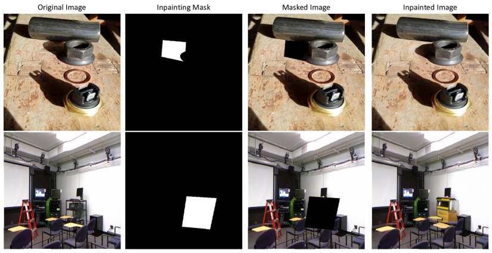
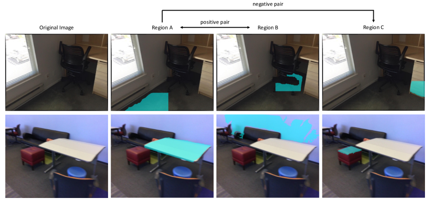
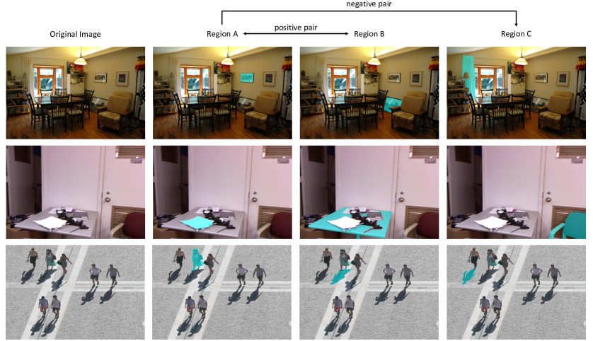
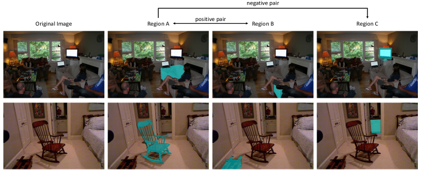
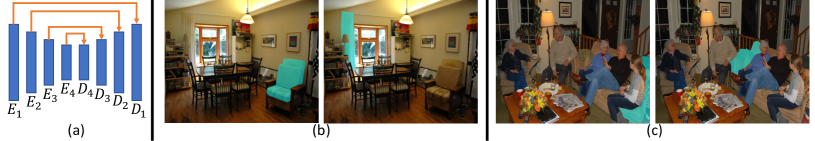
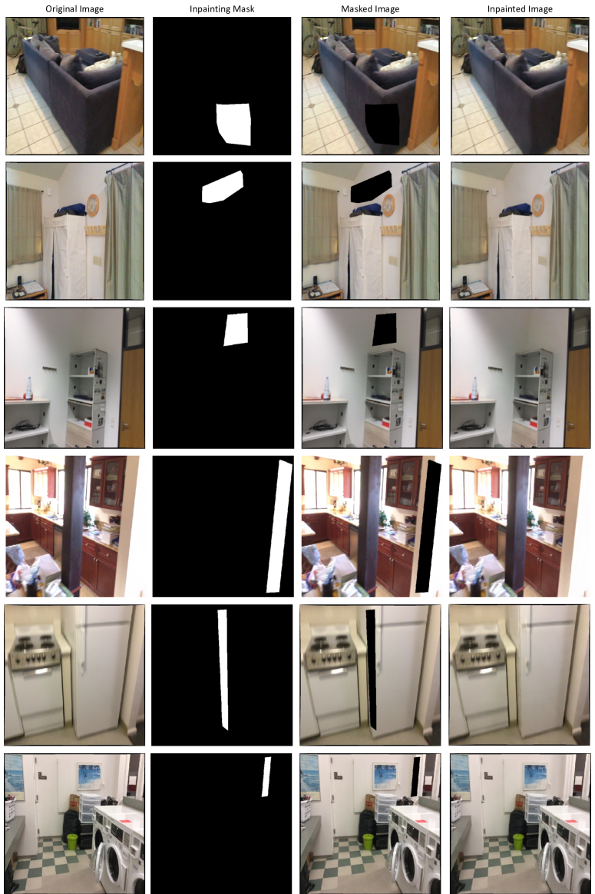
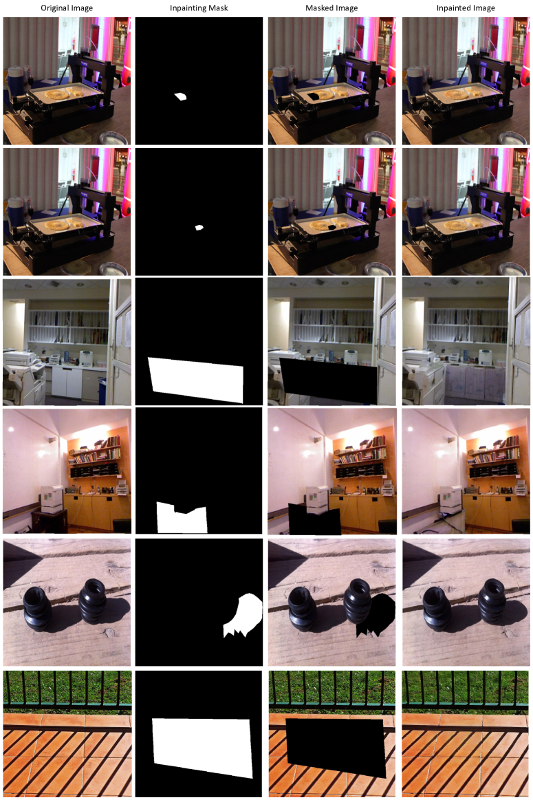
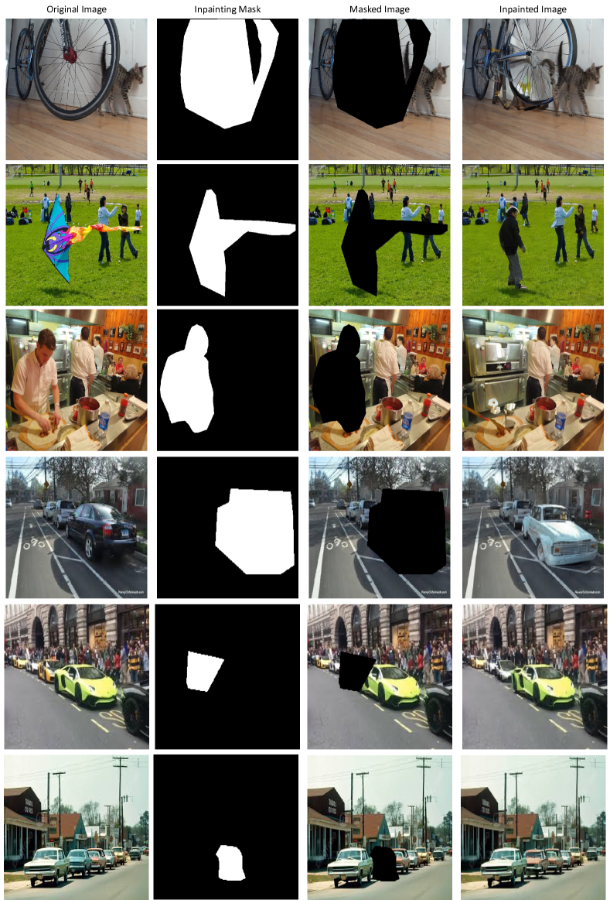

# What Does Stable Diffusion Know about the 3D Scene?

###### Abstract

Recent advances in generative models like Stable Diffusion (Rombach et al., [2022](#bib.bib34)) enable the generation of highly photo-realistic images. Our objective in this paper is to probe the diffusion network to determine to what extent it ‘understands’ different properties of the 3D scene depicted in an image. To this end, we make the following contributions: (i) We introduce a protocol to evaluate whether a network models a number of physical ‘properties’ of the 3D scene by probing for explicit features that represent these properties. The probes are applied on datasets of real images with annotations for the property. (ii) We apply this protocol to properties covering scene geometry, scene material, support relations, lighting, and view dependent measures. (iii) We find that Stable Diffusion is good at a number of properties including scene geometry, support relations, shadows and depth, but less performant for occlusion. (iv) We also apply the probes to other models trained at large-scale, including DINO and CLIP, and find their performance inferior to that of Stable Diffusion.  

## 1 Introduction

Image generation with diffusion models (Sohl-Dickstein et al., [2015](#bib.bib43)), following on from earlier generation using GANs (Goodfellow et al., [2014](#bib.bib15)), has achieved amazing results in terms of verisimilitude (Rombach et al., [2022](#bib.bib34)). This naturally raises the question: to what extent does the diffusion network ‘understand’ (or model) the 3D scene depicted in the image? For example, does the network implicitly have an image rendering pathway that models 3D geometry and surfaces, and then projects to generate an image taking account of occlusion and perspective? As an indication that the diffusion network is 3D and physics aware, Figure [1](#S1.F1 "Figure 1 ‣ 1 Introduction ‣ What Does Stable Diffusion Know about the 3D Scene?") shows the result of the off-the-shelf Stable Diffusion model (Rombach et al., [2022](#bib.bib34)) inpainting masked regions in real images – it correctly predicts shadows and supporting structures.  

To answer this question, we propose an evaluation protocol to systematically ‘probe’ a diffusion network on its ability to represent a number of ‘properties’ of the 3D scene and viewpoint. These properties include: 3D structure and material of the scene, such as surface layout; lighting, such as object-shadow relationships; and viewpoint dependent relations such as occlusion and depth.  

The protocol involves three steps: First, a suitable image evaluation dataset is selected that contains ground truth annotations for the property of interest, for example the SOBA dataset (Wang et al., [2020](#bib.bib46)) is used to probe the understanding of lighting, as it has annotations for object-shadow associations. This provides a train/val/test set for that property; Second, a grid search is carried out over the layers and time steps of the diffusion model to select the optimal feature for determining that property. The selection involves learning the weights of a simple linear classifier for that property (e.g. ‘are these two regions in an object-shadow relationship or not’); Third, the selected feature (layer, time step) and trained classifier are evaluated on a test set, and its performance answers the question of how well the diffusion model ‘understands’ that property.  

Specifically, we train and evaluate on real images, inspired by (Tang et al., [2023](#bib.bib44)), we add noise to the input image in the latent space, and compute features from different layers and time steps with an off-the-shelf Stable Diffusion model. While probing the properties, linear classifiers are used to infer the relationships between regions, rather than points. The region representation is obtained by a simple average pooling of the diffusion features over the annotated region or object.  

From our investigation, we make two observations: First, the Stable Diffusion model has a good understanding of the scene geometry, support relations, the lighting, and the depth of a scene. However, material and occlusion understanding is challenging for it; Second, Stable Diffusion generally demonstrates better performance for 3D properties, than other strong self-supervised features, such as OpenCLIP, DINOv1 and DINOv2. The latter two models have been well known for being good at semantic image segmentation (Melas-Kyriazi et al., [2022](#bib.bib29); Shin et al., [2022](#bib.bib39); Siméoni et al., [2021](#bib.bib41)). Our findings open up the possibility of using features from Stable Diffusion in downstream tasks where they are stronger than those of DINO.  

We describe the properties explored, the protocol, datasets and classifiers in Section [3](#S3 "3 Method – Properties, Datasets, and Classifiers ‣ What Does Stable Diffusion Know about the 3D Scene?"). Experimental results of both Stable Diffusion and other pre-trained discriminative models are given in Section [4](#S4 "4 Experiments ‣ What Does Stable Diffusion Know about the 3D Scene?"), and finally future work is discussed in Section [5](#S5 "5 Discussion and Future Work ‣ What Does Stable Diffusion Know about the 3D Scene?").  

[FIGURE S1.F1.g1]

Figure 1: What does Stable Diffusion know about the 3D scene? The model is tasked with inpainting the masked region of the real images. It correctly predicts a shadow consistent with the lighting direction (top), and a supporting structure consistent with the scene geometry (bottom). This indicates that the Stable Diffusion model generation is consistent with the geometry (of the light source direction) and physical (support) properties.
In this paper we probe the model to determine whether there are explicit features for such properties.
The appendix provides more examples of the Stable Diffusion model’s capability of predicting different physical properties of the scene.
[/FIGURE]

## 2 Related Work

### 2.1 Generative Models

Generative models have made significant achievements in advancing image quality and diversity in the recent literature. A series of generative models, such as Variational Autoencoders (VAEs) (Kingma & Welling, [2014](#bib.bib22)), Generative Adversarial Networks (GANs) (Goodfellow et al., [2014](#bib.bib15)), Flow-based Generators (Dinh et al., [2014](#bib.bib10)), and Diffusion Probabilistic Models (DPMs) (Sohl-Dickstein et al., [2015](#bib.bib43)), have been proposed. These models have contributed to widespread tasks, including image completion (Pathak et al., [2016](#bib.bib32)), composition (Lin et al., [2018](#bib.bib26)), interpolation (Karras et al., [2019](#bib.bib21)) and editing (Chai et al., [2021](#bib.bib5)), image-to-image translation (Isola et al., [2017](#bib.bib19)), multi-modalities translation (Hu et al., [2023](#bib.bib17)), and numerous others. We build upon the diffusion models (Rombach et al., [2022](#bib.bib34)), which have shown state-of-the-art generation quality.  

### 2.2 Exploration of Pre-trained Models

Building on the success of deep networks, there has been significant interest from the community to understand what has been learnt by these complex models. On discriminative models, for example, (Zeiler & Fergus, [2014](#bib.bib51); Mahendran & Vedaldi, [2015](#bib.bib28)) propose inverse reconstruction to directly visualize the acquired semantic information in various layers of a trained classification network; (Zhou et al., [2016](#bib.bib53); Fong & Vedaldi, [2017](#bib.bib12); Fong et al., [2019](#bib.bib13)) demonstrate that scene classification networks have remarkable localization ability despite being trained on only image-level labels; and (Erhan et al., [2009](#bib.bib11); Simonyan et al., [2014](#bib.bib42); Selvaraju et al., [2017](#bib.bib36)) use the gradients of any target concept, flowing into the final convolutional layer to produce a saliency map highlighting important regions in the image for predicting the concept. In the more recent literature, (Chefer et al., [2021](#bib.bib7)) explores what has been learned in the powerful transformer model by visualizing the attention map. On generative models, researchers have mainly investigated what has been learned in GANs, for example, GAN dissection (Bau et al., [2019](#bib.bib2)) presents an analytic framework to visualize and understand GANs at the unit-, object-, and scene-level; (Wu et al., [2021](#bib.bib48)) analyses the latent style space of StyleGANs (Karras et al., [2019](#bib.bib21)).  

### 2.3 Exploitation of Generative Models

Apart from understanding the representation in pre-trained models, there has been a recent trend for exploiting the learnt feature from generative models, to tackle a series of downstream discriminative tasks. For example, leveraging generative models for data augmentation in recognition tasks (Jahanian et al., [2022](#bib.bib20); He et al., [2023](#bib.bib16)), semantic segmentation via generative models (Baranchuk et al., [2022](#bib.bib1); Li et al., [2021](#bib.bib24); Xu et al., [2023](#bib.bib50)), open-vocabulary segmentation with diffusion models (Li et al., [2023](#bib.bib25)), depth maps estimation based on RGB images (Shi et al., [2022](#bib.bib38); Noguchi & Harada, [2020](#bib.bib30)). More recently, (Bhattad et al., [2023](#bib.bib3)) search for intrinsic offsets in a pre-trained StyleGAN for a range of downstream tasks, predicting normal maps, depth maps, segmentations, albedo maps, and shading. In contrast to this work, we adopt annotations from different datasets for supervision, rather than employing pre-trained prediction models for supervision. A closely related effort to ours is DIffusion FeaTures (DIFT) (Tang et al., [2023](#bib.bib44)), but it only focuses on computing *correspondences* at the geometric or semantic level between images.  

### 2.4 Physical Scene Understanding

There have been works studying different physical properties for scene understanding, including shadows (Wang et al., [2020](#bib.bib46); [2021](#bib.bib47)), material (Upchurch & Niu, [2022](#bib.bib45); Sharma et al., [2023](#bib.bib37)), occlusion (Zhan et al., [2022](#bib.bib52)), scene geometry (Liu et al., [2019](#bib.bib27)), support relations (Silberman et al., [2012](#bib.bib40)) and depth (Silberman et al., [2012](#bib.bib40)). However, these works focus on one or two physical properties, and most of them require training a model for the property in a supervised manner. In contrast, we use a single model to predict multiple properties, and do not train the features.  

## 3 Method – Properties, Datasets, and Classifiers

Our goal is to examine the ability of a diffusion model to understand different physical properties of the 3D scene, including: scene geometry, material, support relations, shadows, occlusion and depth. Specifically, we conduct linear probing of the features from different layers and time steps of the Stable Diffusion model. First, we set up the questions for each property (Section [3.1](#S3.SS1 "3.1 Properties and Questions ‣ 3 Method – Properties, Datasets, and Classifiers ‣ What Does Stable Diffusion Know about the 3D Scene?")); and then select real image datasets with ground truth annotations for each property (Section [3.2](#S3.SS2 "3.2 Datasets ‣ 3 Method – Properties, Datasets, and Classifiers ‣ What Does Stable Diffusion Know about the 3D Scene?")). We describe how a classifier is trained to answer the questions, and the grid search for the optimal time step and layer to extract a feature for predicting the property in Section [3.3](#S3.SS3 "3.3 Property Probing ‣ 3 Method – Properties, Datasets, and Classifiers ‣ What Does Stable Diffusion Know about the 3D Scene?").  

### 3.1 Properties and Questions

Here, we study the diffusion model’s ability to predict different properties of the 3D scene; the properties cover the 3D structure and material, the lighting, and the viewpoint. For each property, we propose questions that classify the relationship between a pair of Regions, A and B, in the same image, based on the features extracted from the diffusion model. The properties and questions are:  

1. *Same Plane*: ‘Are Region A and Region B on the same plane?’ 
2. *Perpendicular Plane*: ‘Are Region A and Region B on perpendicular planes?’ 
3. *Material*: ‘Are Region A and Region B made of the same material?’ 
4. *Support Relation*: ‘Is Region A (object A) supported by Region B (object B)?’ 
5. *Shadow*: ‘Are Region A and Region B in an object-shadow relationship?’ 
6. *Occlusion*: ‘Are Region A and Region B part of the same object but, separated by occlusion?’ 
7. *Depth*: ‘Does Region A have a greater average depth than Region B?’ 

We choose these properties as they exemplify important aspects of the 3D physical scene: the *Same Plane* and *Perpendicular Plane* questions probe the 3D scene geometry; the *Material* question probes what the surface is made of, *e.g.,* metal, wood, glass, or fabric, rather than its shape; the *Support Relation* probes the physics of the forces in the 3D scene; the *Shadow* question probes the lighting of the scene; the *Occlusion* and *Depth* questions depend on the viewpoint, and probe the disentanglement of the 3D scene from its viewpoint.  

### 3.2 Datasets

To study the different properties, we adopt various off-the-shelf real image datasets with annotations for the different properties, where the dataset used depends on the property. We repurpose each dataset to support probe questions of the form: $\mathcal{D}=\{(R_{A},R_{B},y)_{1},\dots,(R_{A},R_{B},y)_{n}\}$, where $R_{A}$, $R_{B}$ denote a pair of regions, and $y$ is the binary label indicating the answer to the considered question of the probed property. For each property, we create a train/val/test split from those of the original datasets, if all three splits are available. While for dataset with only train/test splits available, we divide the original train split into our train/val splits. Table [1](#S3.T1 "Table 1 ‣ 3.2 Datasets ‣ 3 Method – Properties, Datasets, and Classifiers ‣ What Does Stable Diffusion Know about the 3D Scene?") summarises the datasets used and the statistics of the splits used. We discuss each property and dataset in more detail next.  

[TABLE S3.T1]

<table class="ltx_tabular ltx_centering ltx_align_middle">
<tbody class="ltx_tbody">
<tr class="ltx_tr">
<td class="ltx_td ltx_align_center ltx_border_tt">Property:</td>
<th class="ltx_td ltx_align_center ltx_th ltx_th_column ltx_th_row ltx_border_tt">
 

Same

Plane

</th>
<th class="ltx_td ltx_align_center ltx_th ltx_th_column ltx_th_row ltx_border_tt">
 

Perpendicular

Plane

</th>
<td class="ltx_td ltx_align_right ltx_border_tt">Material</td>
<th class="ltx_td ltx_align_center ltx_th ltx_th_column ltx_th_row ltx_border_tt">
 

Support

Relation

</th>
<td class="ltx_td ltx_align_right ltx_border_tt">Shadow</td>
<td class="ltx_td ltx_align_right ltx_border_tt">Occlusion</td>
<td class="ltx_td ltx_align_right ltx_border_tt">Depth</td>
</tr>
<tr class="ltx_tr">
<td class="ltx_td ltx_align_center ltx_border_t">Dataset:</td>
<th class="ltx_td ltx_align_center ltx_th ltx_th_column ltx_th_row ltx_border_t">
 

ScanNetv2

</th>
<th class="ltx_td ltx_align_center ltx_th ltx_th_column ltx_th_row ltx_border_t">
 

ScanNetv2

</th>
<th class="ltx_td ltx_align_center ltx_th ltx_th_column ltx_th_row ltx_border_t">
 

DMS

</th>
<th class="ltx_td ltx_align_center ltx_th ltx_th_column ltx_th_row ltx_border_t">
 

NYUv2

</th>
<th class="ltx_td ltx_align_center ltx_th ltx_th_column ltx_th_row ltx_border_t">
 

SOBA

</th>
<th class="ltx_td ltx_align_center ltx_th ltx_th_column ltx_th_row ltx_border_t">
 

Sep. COCO

</th>
<th class="ltx_td ltx_align_center ltx_th ltx_th_column ltx_th_row ltx_border_t">
 

NYUv2

</th>
</tr>
<tr class="ltx_tr">
<td class="ltx_td ltx_align_center ltx_border_t">Images</td>
<td class="ltx_td ltx_align_right ltx_border_t"># Train</td>
<td class="ltx_td ltx_align_right ltx_border_t">50</td>
<td class="ltx_td ltx_align_right ltx_border_t">50</td>
<td class="ltx_td ltx_align_right ltx_border_t">50</td>
<td class="ltx_td ltx_align_right ltx_border_t">50</td>
<td class="ltx_td ltx_align_right ltx_border_t">50</td>
<td class="ltx_td ltx_align_right ltx_border_t">50</td>
<td class="ltx_td ltx_align_right ltx_border_t">50</td>
</tr>
<tr class="ltx_tr">
<td class="ltx_td ltx_align_right"># Val</td>
<td class="ltx_td ltx_align_right">20</td>
<td class="ltx_td ltx_align_right">20</td>
<td class="ltx_td ltx_align_right">20</td>
<td class="ltx_td ltx_align_right">20</td>
<td class="ltx_td ltx_align_right">20</td>
<td class="ltx_td ltx_align_right">20</td>
<td class="ltx_td ltx_align_right">20</td>
</tr>
<tr class="ltx_tr">
<td class="ltx_td ltx_align_right"># Test</td>
<td class="ltx_td ltx_align_right">1000</td>
<td class="ltx_td ltx_align_right">1000</td>
<td class="ltx_td ltx_align_right">1000</td>
<td class="ltx_td ltx_align_right">654</td>
<td class="ltx_td ltx_align_right">160</td>
<td class="ltx_td ltx_align_right">820</td>
<td class="ltx_td ltx_align_right">654</td>
</tr>
<tr class="ltx_tr">
<td class="ltx_td ltx_align_center ltx_border_t">Regions</td>
<td class="ltx_td ltx_align_right ltx_border_t"># Train</td>
<td class="ltx_td ltx_align_right ltx_border_t">855</td>
<td class="ltx_td ltx_align_right ltx_border_t">489</td>
<td class="ltx_td ltx_align_right ltx_border_t">641</td>
<td class="ltx_td ltx_align_right ltx_border_t">1040</td>
<td class="ltx_td ltx_align_right ltx_border_t">634</td>
<td class="ltx_td ltx_align_right ltx_border_t">641</td>
<td class="ltx_td ltx_align_right ltx_border_t">1074</td>
</tr>
<tr class="ltx_tr">
<td class="ltx_td ltx_align_right"># Val</td>
<td class="ltx_td ltx_align_right">390</td>
<td class="ltx_td ltx_align_right">223</td>
<td class="ltx_td ltx_align_right">238</td>
<td class="ltx_td ltx_align_right">440</td>
<td class="ltx_td ltx_align_right">180</td>
<td class="ltx_td ltx_align_right">247</td>
<td class="ltx_td ltx_align_right">457</td>
</tr>
<tr class="ltx_tr">
<td class="ltx_td ltx_align_right"># Test</td>
<td class="ltx_td ltx_align_right">14913</td>
<td class="ltx_td ltx_align_right">8310</td>
<td class="ltx_td ltx_align_right">11364</td>
<td class="ltx_td ltx_align_right">14008</td>
<td class="ltx_td ltx_align_right">1176</td>
<td class="ltx_td ltx_align_right">4011</td>
<td class="ltx_td ltx_align_right">14707</td>
</tr>
<tr class="ltx_tr">
<td class="ltx_td ltx_align_center ltx_border_bb ltx_border_t">Pairs</td>
<td class="ltx_td ltx_align_right ltx_border_t"># Train</td>
<td class="ltx_td ltx_align_right ltx_border_t">2516</td>
<td class="ltx_td ltx_align_right ltx_border_t">3104</td>
<td class="ltx_td ltx_align_right ltx_border_t">2268</td>
<td class="ltx_td ltx_align_right ltx_border_t">1616</td>
<td class="ltx_td ltx_align_right ltx_border_t">1268</td>
<td class="ltx_td ltx_align_right ltx_border_t">2220</td>
<td class="ltx_td ltx_align_right ltx_border_t">3060</td>
</tr>
<tr class="ltx_tr">
<td class="ltx_td ltx_align_right"># Val</td>
<td class="ltx_td ltx_align_right">1172</td>
<td class="ltx_td ltx_align_right">1396</td>
<td class="ltx_td ltx_align_right">920</td>
<td class="ltx_td ltx_align_right">688</td>
<td class="ltx_td ltx_align_right">360</td>
<td class="ltx_td ltx_align_right">636</td>
<td class="ltx_td ltx_align_right">1282</td>
</tr>
<tr class="ltx_tr">
<td class="ltx_td ltx_align_right ltx_border_bb"># Test</td>
<td class="ltx_td ltx_align_right ltx_border_bb">45076</td>
<td class="ltx_td ltx_align_right ltx_border_bb">50216</td>
<td class="ltx_td ltx_align_right ltx_border_bb">41824</td>
<td class="ltx_td ltx_align_right ltx_border_bb">21768</td>
<td class="ltx_td ltx_align_right ltx_border_bb">2352</td>
<td class="ltx_td ltx_align_right ltx_border_bb">6292</td>
<td class="ltx_td ltx_align_right ltx_border_bb">42026</td>
</tr>
</tbody>
</table>

Table 1: 
Overview of the datasets and training/evaluation statistics for the properties investigated.
For each property, we list the image dataset used, and the number of images
for the train, val, and test set. 1000 images are used for testing if the original test set is larger than 1000 images. Regions are selected in each image, and pairs of regions are used for all the probe questions.
[/TABLE]

[FIGURE S3.F2.g1]

Figure 2: Example images for probing *scene geometry*.
The first row shows a sample annotation for the *same plane*, and the second row is a sample annotation for *perpendicular plane*. Here, and in the following figures, (A, B) are a positive pair, while (A, C) are negative. The images are from the ScanNetv2 dataset (Dai et al., [2017](#bib.bib8)) with annotations for planes from (Liu et al., [2019](#bib.bib27)).
In the first row, the first piece of floor (A) is on the same plane as the second piece of floor (B), but is not on the same plane as the surface of the drawers (C).
In the second row, the table top (A) is perpendicular to the wall (B), but is not perpendicular to the stool top (C).
[/FIGURE]

#### Same Plane.

We use the ScanNetv2 dataset (Dai et al., [2017](#bib.bib8)) with annotations for planes from (Liu et al., [2019](#bib.bib27)). Regions are obtained via splitting plane masks into several regions. A pair of regions are *positive* if they are on the same plane, and *negative* if they are on different planes. First row of Figure [2](#S3.F2 "Figure 2 ‣ 3.2 Datasets ‣ 3 Method – Properties, Datasets, and Classifiers ‣ What Does Stable Diffusion Know about the 3D Scene?") is an example.  

#### Perpendicular Plane.

We use the ScanNetv2 dataset (Dai et al., [2017](#bib.bib8)). We use the annotations from (Liu et al., [2019](#bib.bib27)) which provide segmentation masks as well as plane parameters for planes in the image, so that we can obtain the normal of planes to judge whether they are perpendicular or not. A pair of regions are *positive* if they are on perpendicular planes, and *negative* if they are not on perpendicular planes. Second row of Figure [2](#S3.F2 "Figure 2 ‣ 3.2 Datasets ‣ 3 Method – Properties, Datasets, and Classifiers ‣ What Does Stable Diffusion Know about the 3D Scene?") is an example.  

[FIGURE S3.F3.g1]

Figure 3: Example images for probing *material, support relation and shadow*.
The first row is for *material*, the second row for *support relation*, and the third row for *shadow*.
First row: the material images are from the DMS dataset (Upchurch & Niu, [2022](#bib.bib45)). The paintings are both covered with glass (A and B) whereas the curtain (C) is made of fabric.
Second row: the support relation images are from the NYUv2 dataset (Silberman et al., [2012](#bib.bib40)). The paper (A) is supported by the table (B), but it is not supported by the chair (C).
Third row: the shadow images are from the SOBA dataset (Wang et al., [2020](#bib.bib46)).
The person (A) has the shadow (B), not the shadow (C).
[/FIGURE]

#### Material.

We adopt the recent DMS dataset (Upchurch & Niu, [2022](#bib.bib45)) to study the material property, which provides dense annotations of material category for each pixel in the images. Therefore, we can get the mask of each material via grouping pixels with the same material label together. In total, there are 46 pre-defined material categories. Regions are obtained by splitting the mask of each material into different connected components, *i.e.,* they are simply groups with same material labels, yet not connected. A pair of regions are *positive* if they are of the same material category, and *negative* if they are of different material categories. First row of Figure [3](#S3.F3 "Figure 3 ‣ Perpendicular Plane. ‣ 3.2 Datasets ‣ 3 Method – Properties, Datasets, and Classifiers ‣ What Does Stable Diffusion Know about the 3D Scene?") is an example.  

#### Support Relation.

We use the NYUv2 dataset (Silberman et al., [2012](#bib.bib40)) to probe the support relation. Segmentation annotations for different regions (objects or surfaces) are provided, as well as their support relations. Support relation here means an object is physically supported by another object, *i.e.,* the second object will undertake the force to enable the first object to stay at its position. Regions are directly obtained via the segmentation annotations. A pair of regions are *positive* if the first region is supported by the second region, and *negative* if the first region is not supported by the second region. Second row of Figure [3](#S3.F3 "Figure 3 ‣ Perpendicular Plane. ‣ 3.2 Datasets ‣ 3 Method – Properties, Datasets, and Classifiers ‣ What Does Stable Diffusion Know about the 3D Scene?") is an example.  

#### Shadow.

We use the SOBA dataset (Wang et al., [2020](#bib.bib46); [2021](#bib.bib47)) to study the shadows which depend on the lighting of the scene. Segmentation masks for each object and shadow, as well as their associations are provided in the dataset annotations. Regions are directly obtained from the annotated object and shadow masks. In a region pair, there is one object mask and one shadow mask. A pair of regions are *positive* if the shadow mask is the shadow of the object, and *negative* if the shadow mask is the shadow of another object. Third row of Figure [3](#S3.F3 "Figure 3 ‣ Perpendicular Plane. ‣ 3.2 Datasets ‣ 3 Method – Properties, Datasets, and Classifiers ‣ What Does Stable Diffusion Know about the 3D Scene?") is an example.  

[FIGURE S3.F4.g1]

Figure 4: Example images for probing *viewpoint-dependent properties (occlusion & depth)*.
The first row is for *occlusion* and the second row is for *depth*.
First row: the occlusion images are from the Separated COCO dataset (Zhan et al., [2022](#bib.bib52)). The sofa (A) and the sofa (B) are part of the same object, whilst the monitor (C) is not part of the sofa.
Second row: the depth images are from the NYUv2 dataset (Silberman et al., [2012](#bib.bib40)). The chair (A) is farther away than the object on the floor (B), but it is closer than the cupboard (C).
[/FIGURE]

#### Occlusion.

We use the Seperated COCO dataset (Zhan et al., [2022](#bib.bib52)) to study the occlusion (object seperation) problem. Regions are different connected components of objects (and the object mask if it is not separated), *i.e.,* groups of connected pixels belonging to the same object. A pair of regions are *positive* if they are different components of the same object separated due to occlusion, and *negative* if they are not from the same object. First row of Figure [4](#S3.F4 "Figure 4 ‣ Shadow. ‣ 3.2 Datasets ‣ 3 Method – Properties, Datasets, and Classifiers ‣ What Does Stable Diffusion Know about the 3D Scene?") is an example.  

#### Depth.

We use the NYUv2 dataset (Silberman et al., [2012](#bib.bib40)), that provides mask annotations for different objects and regions, together with depth for each pixel. A pair of regions are *positive* if the first region has a greater average depth than the second region, and *negative* if the first region has a less average depth than the second region. The average depth of a region is calculated via the average of depth value of each pixel the region contains. Second row of Figure [4](#S3.F4 "Figure 4 ‣ Shadow. ‣ 3.2 Datasets ‣ 3 Method – Properties, Datasets, and Classifiers ‣ What Does Stable Diffusion Know about the 3D Scene?") is an example.  

### 3.3 Property Probing

We aim to determine which Stable Diffusion features best represent different properties.  

#### Extracting Stable Diffusion Features.

Following DIFT (Tang et al., [2023](#bib.bib44)), we add noise $\epsilon\sim\mathcal{N}(0,\mathbf{I})$ of time step $t\in[0,T]$ to the input image $x_{0}$’s latent representation $z_{0}$ encoded by the VAE encoder:  

|  | $\displaystyle z_{t}=\sqrt{\alpha_{t}}z_{0}+(\sqrt{1-\alpha_{t}})\epsilon$ |  | (1) |
| --- | --- | --- | --- |

and then extract features from the immediate layers of a pre-trained diffusion model, $f_{\theta}(\cdot)$ after feeding $z_{t}$ and $t$ in $f_{\theta}$ ($f_{\theta}$ is a U-Net consisting of 4 downsampling layers and 4 upsampling layers):  

|  | $\displaystyle F_{t,l}=f_{\theta_{l}}(z_{t},t)$ |  | (2) |
| --- | --- | --- | --- |

where $f_{\theta_{l}}$ is the $l$-th U-Net layer. In this way, we can get the representation of an image $F_{t,l}$ at time step $t$ and $l$-th U-Net layer for the probe. We upsample the obtained representation to the size of original image with bi-linear, then use the region mask to get a region-wise feature vector, by averaging the feature vectors of each pixel it contains, *i.e.,* average pooling.  

|  | $\displaystyle v_{k,t,l}=\text{avgpool}(R_{k}\odot\text{upsample}(F_{t,l}))$ |  | (3) |
| --- | --- | --- | --- |

where $v_{k,t,l}$ is the feature vector of the $k$-th region $R_{k}$. $\odot$ here is a per-pixel product of the region mask and the feature.  

#### Linear Probing.

After computing features from a diffusion model, we use a linear classifier (a linear SVM) to examine how well these features can be used to answer questions to each of the properties. Specifically, the input of the classifier is the difference or absolute difference between the feature vectors of Region A and Region B, *i.e.,* $v_{A}-v_{B}$ or $|v_{A}-v_{B}|$, and the output is a Yes/No answer to the question. Denoting the answer to the question as $Q$, then since the questions about *Same Plane*, *Perpendicular Plane*, *Material*, *Shadow* and *Occlusion* are symmetric relations, $Q(v_{A},v_{B})=Q(v_{B},v_{A})$. However, the questions about *Support Relation* and *Depth* are not symmetric. Thus, we use $|v_{A}-v_{B}|$ (a symmetric function) as input for the first group of questions, and $v_{A}-v_{B}$ (non-symmetric) for the rest of questions. We train the linear classifier on the train set via the positive/negative samples of region pairs for each property; do a grid search on the validation set to find (i) the optimal time step $t$, (ii) the U-Net layer $l$, and (iii) the SVM regularization parameter $C$; and evaluate the performance on the test set.  

#### Discussion.

Some of the current symmetric questions can be reformulated in a non-symmetric manner in order to obtain more information about the property. For example, the shadow question could be formulated as ‘is region A the shadow of object B’ rather than the (symmetric) ‘are region A and region B in an object-shadow relationship’. The non-symmetric version requires the classifier to explicitly identify which region is the object, and which the shadow. Note, the protocol has been explained for diffusion models, but can equally be applied to other pre-trained models. In Section [4.3](#S4.SS3 "4.3 Results for Other Features Trained at Large Scale ‣ 4 Experiments ‣ What Does Stable Diffusion Know about the 3D Scene?") and Section [4.4](#S4.SS4 "4.4 Comparison of Different Features Trained at Large Scale ‣ 4 Experiments ‣ What Does Stable Diffusion Know about the 3D Scene?") we give results for its application to OpenCLIP (Radford et al., [2021](#bib.bib33); Ilharco et al., [2021](#bib.bib18)), DINOv1 (Caron et al., [2021](#bib.bib4)) and DINOv2 (Oquab et al., [2023](#bib.bib31)).  

## 4 Experiments

### 4.1 Implementation Detail and Evaluation Metric

#### Implementation Details.

For each property, we sample the same number of positive / negative pairs, to maintain a balanced evaluation set. In terms of the linear SVM, we tune the penalty parameter $C$ on the val split to find the best $C$ for each property. Therefore, we are grid searching 3 parameters on the val set, namely, Stable Diffusion Timestep $t$ ranging from 0 to 1000, UNet Layer $l$ covering the 4 downsampling and 4 upsampling layers, and the SVM penalty parameter $C$ ranging among $0.001,0.01,0.1,1,10,100,1000$. The linear SVM is solved using the *libsvm* library (Chang & Lin, [2011](#bib.bib6)) with the SMO algorithm, to get the unique global optimal solution. Please refer to the appendix for more implementation details.  

#### Evaluation Metric.

All protocols are binary classification, therefore, we use ROC Area Under the Curve (AUC Score) to evaluate the performance of the linear classifier, as it is not sensitive to different decision thresholds.  

### 4.2 Results for Stable Diffusion

[FIGURE S4.F5.g1]

Figure 5: (a) Nomenclature for the U-Net Layers. We probe 4 downsampling encoder layers $E_{1}$-$E_{4}$ and 4 upsampling decoder layers $D_{1}$-$D_{4}$ of the Stable Diffusion U-Net.
(b) A prediction failure for *Material*. In this example the model does not predict that the two regions are made of the same material (fabric).
(c) A prediction failure for *Occlusion*.
In this example the model does not predict that the two regions belong to the same object (the sofa).
[/FIGURE]

The results for grid search are shown in Table [2](#S4.T2 "Table 2 ‣ 4.2 Results for Stable Diffusion ‣ 4 Experiments ‣ What Does Stable Diffusion Know about the 3D Scene?"). For Stable Diffusion U-Net Layer, $D_{l}$ means the $l$-th layer of the U-Net decoder, *i.e.,* upsampling layer, from outside to inside, and we provide an illustration of the layers in Figure [5](#S4.F5 "Figure 5 ‣ 4.2 Results for Stable Diffusion ‣ 4 Experiments ‣ What Does Stable Diffusion Know about the 3D Scene?")(a). We can draw 3 observations: First, it can be observed that the best time step for different properties are different, while the best U-Net layer is always in the decoder rather than the encoder. Further explorations using Stable Diffusion features for downstream tasks could thus start from the U-Net decoder layers, especially $D_{3}$ and $D_{2}$. Second, for *Material*, it is more about low-level features so we can observe that the best layer ($D_{2}$) is closer to the output side, while for the rest of the properties that require reasoning about the whole image, a more global feature is needed ($D_{3}$). Third, in terms of the performance on the test set, we find that Stable Diffusion can understand very well about scene geometry, support relations, shadows, and depth, but it is less performant at predicting material and occlusion. Examples of its failure are shown in Figure [5](#S4.F5 "Figure 5 ‣ 4.2 Results for Stable Diffusion ‣ 4 Experiments ‣ What Does Stable Diffusion Know about the 3D Scene?")(b)(c). As noted in (Zhan et al., [2022](#bib.bib52)) and (Kirillov et al., [2023](#bib.bib23)), grouping all separated parts of an object due to occlusion remains challenging even for state-of-the-art detection and segmentation models.  

[TABLE S4.T2]

<table class="ltx_tabular ltx_centering ltx_align_middle">
<tr class="ltx_tr">
<td class="ltx_td ltx_align_left ltx_border_tt">      Property</td>
<td class="ltx_td ltx_align_center ltx_border_tt">      Time Step</td>
<td class="ltx_td ltx_align_center ltx_border_tt">      Layer</td>
<td class="ltx_td ltx_align_center ltx_border_tt">      <math class="ltx_Math"><semantics><mi>C</mi><annotation-xml><ci>𝐶</ci></annotation-xml><annotation>C</annotation></semantics></math></td>
<td class="ltx_td ltx_align_center ltx_border_tt">      AUC</td>
</tr>
<tr class="ltx_tr">
<td class="ltx_td ltx_align_left ltx_border_t">      Same Plane</td>
<td class="ltx_td ltx_align_center ltx_border_t">      334</td>
<td class="ltx_td ltx_align_center ltx_border_t">      <math class="ltx_Math"><semantics><msub><mi>D</mi><mn>3</mn></msub><annotation-xml><apply><csymbol>subscript</csymbol><ci>𝐷</ci><cn>3</cn></apply></annotation-xml><annotation>D_{3}</annotation></semantics></math></td>
<td class="ltx_td ltx_align_center ltx_border_t">      1</td>
<td class="ltx_td ltx_align_center ltx_border_t">      95.0</td>
</tr>
<tr class="ltx_tr">
<td class="ltx_td ltx_align_left">      Perpendicular Plane</td>
<td class="ltx_td ltx_align_center">      126</td>
<td class="ltx_td ltx_align_center">      <math class="ltx_Math"><semantics><msub><mi>D</mi><mn>3</mn></msub><annotation-xml><apply><csymbol>subscript</csymbol><ci>𝐷</ci><cn>3</cn></apply></annotation-xml><annotation>D_{3}</annotation></semantics></math></td>
<td class="ltx_td ltx_align_center">      1</td>
<td class="ltx_td ltx_align_center">      83.9</td>
</tr>
<tr class="ltx_tr">
<td class="ltx_td ltx_align_left">      Material</td>
<td class="ltx_td ltx_align_center">      339</td>
<td class="ltx_td ltx_align_center">      <math class="ltx_Math"><semantics><msub><mi>D</mi><mn>2</mn></msub><annotation-xml><apply><csymbol>subscript</csymbol><ci>𝐷</ci><cn>2</cn></apply></annotation-xml><annotation>D_{2}</annotation></semantics></math></td>
<td class="ltx_td ltx_align_center">      1</td>
<td class="ltx_td ltx_align_center">      79.4</td>
</tr>
<tr class="ltx_tr">
<td class="ltx_td ltx_align_left">      Support Relation</td>
<td class="ltx_td ltx_align_center">      64</td>
<td class="ltx_td ltx_align_center">      <math class="ltx_Math"><semantics><msub><mi>D</mi><mn>3</mn></msub><annotation-xml><apply><csymbol>subscript</csymbol><ci>𝐷</ci><cn>3</cn></apply></annotation-xml><annotation>D_{3}</annotation></semantics></math></td>
<td class="ltx_td ltx_align_center">      1</td>
<td class="ltx_td ltx_align_center">      94.4</td>
</tr>
<tr class="ltx_tr">
<td class="ltx_td ltx_align_left">      Shadow</td>
<td class="ltx_td ltx_align_center">      303</td>
<td class="ltx_td ltx_align_center">      <math class="ltx_Math"><semantics><msub><mi>D</mi><mn>3</mn></msub><annotation-xml><apply><csymbol>subscript</csymbol><ci>𝐷</ci><cn>3</cn></apply></annotation-xml><annotation>D_{3}</annotation></semantics></math></td>
<td class="ltx_td ltx_align_center">      1</td>
<td class="ltx_td ltx_align_center">      94.5</td>
</tr>
<tr class="ltx_tr">
<td class="ltx_td ltx_align_left">      Occlusion</td>
<td class="ltx_td ltx_align_center">      181</td>
<td class="ltx_td ltx_align_center">      <math class="ltx_Math"><semantics><msub><mi>D</mi><mn>3</mn></msub><annotation-xml><apply><csymbol>subscript</csymbol><ci>𝐷</ci><cn>3</cn></apply></annotation-xml><annotation>D_{3}</annotation></semantics></math></td>
<td class="ltx_td ltx_align_center">      0.1</td>
<td class="ltx_td ltx_align_center">      75.6</td>
</tr>
<tr class="ltx_tr">
<td class="ltx_td ltx_align_left ltx_border_bb">      Depth</td>
<td class="ltx_td ltx_align_center ltx_border_bb">      157</td>
<td class="ltx_td ltx_align_center ltx_border_bb">      <math class="ltx_Math"><semantics><msub><mi>D</mi><mn>3</mn></msub><annotation-xml><apply><csymbol>subscript</csymbol><ci>𝐷</ci><cn>3</cn></apply></annotation-xml><annotation>D_{3}</annotation></semantics></math></td>
<td class="ltx_td ltx_align_center ltx_border_bb">      1</td>
<td class="ltx_td ltx_align_center ltx_border_bb">      99.3</td>
</tr>
</table>

Table 2: 
SVM grid search results. For each property, we train the linear SVM on the training set and grid search the best combination of time step, layer, and $C$ on the validation set. The ROC AUC score is reported on the test set using the selected combination.
[/TABLE]

### 4.3 Results for Other Features Trained at Large Scale

We have also applied our protocol to other models pre-trained on large scale image datasets, including OpenCLIP (Radford et al., [2021](#bib.bib33); Ilharco et al., [2021](#bib.bib18)) pre-trained on LAION dataset (Schuhmann et al., [2022](#bib.bib35)), DINOv1 (Caron et al., [2021](#bib.bib4)) pre-trained on ImageNet dataset (Deng et al., [2009](#bib.bib9)) and DINOv2 (Oquab et al., [2023](#bib.bib31)) pre-trained on LVD-142M dataset (Oquab et al., [2023](#bib.bib31)). We use the best pre-trained checkpoints available on their official GitHub – ViT-B for DINOv1 and ViT-G for OpenCLIP and DINOv2. Similar to Stable Diffusion, for each of these models, we conduct a grid search on the validation set in terms of the ViT layer and $C$ for SVM, and use the best combination of parameters for evaluation on the test set.  

[TABLE S4.T3]

<table class="ltx_tabular ltx_centering ltx_align_middle">
<tbody class="ltx_tbody">
<tr class="ltx_tr">
<td class="ltx_td ltx_align_center ltx_border_tt">Layer</td>
<td class="ltx_td ltx_align_center ltx_border_tt">Split</td>
<td class="ltx_td ltx_align_center ltx_border_tt">Material</td>
<td class="ltx_td ltx_align_center ltx_border_tt">Support Relation</td>
</tr>
<tr class="ltx_tr">
<td class="ltx_td ltx_align_center ltx_border_t">OpenCLIP</td>
<td class="ltx_td ltx_align_center ltx_border_t">DINOv1</td>
<td class="ltx_td ltx_align_center ltx_border_t">DINOv2</td>
<th class="ltx_td ltx_align_center ltx_th ltx_th_column ltx_th_row ltx_border_t">
 

Stable

Diffusion
</th>
<td class="ltx_td ltx_align_center ltx_border_t">OpenCLIP</td>
<td class="ltx_td ltx_align_center ltx_border_t">DINOv1</td>
<td class="ltx_td ltx_align_center ltx_border_t">DINOv2</td>
<th class="ltx_td ltx_align_center ltx_th ltx_th_column ltx_th_row ltx_border_t">
 

Stable

Diffusion
</th>
</tr>
<tr class="ltx_tr">
<td class="ltx_td ltx_align_center ltx_border_t">Last Layer</td>
<td class="ltx_td ltx_align_center ltx_border_t">Val</td>
<td class="ltx_td ltx_align_center ltx_border_t">58.5</td>
<td class="ltx_td ltx_align_center ltx_border_t">55.3</td>
<td class="ltx_td ltx_align_center ltx_border_t">59.3</td>
<td class="ltx_td ltx_align_center ltx_border_t">-</td>
<td class="ltx_td ltx_align_center ltx_border_t">82.2</td>
<td class="ltx_td ltx_align_center ltx_border_t">82.4</td>
<td class="ltx_td ltx_align_center ltx_border_t">82.9</td>
<td class="ltx_td ltx_align_center ltx_border_t">-</td>
</tr>
<tr class="ltx_tr">
<td class="ltx_td ltx_align_center">Best Layer</td>
<td class="ltx_td ltx_align_center">Val</td>
<td class="ltx_td ltx_align_center">64.1</td>
<td class="ltx_td ltx_align_center">64.0</td>
<td class="ltx_td ltx_align_center">63.4</td>
<td class="ltx_td ltx_align_center">81.2</td>
<td class="ltx_td ltx_align_center">85.4</td>
<td class="ltx_td ltx_align_center">82.9</td>
<td class="ltx_td ltx_align_center">86.9</td>
<td class="ltx_td ltx_align_center">95.2</td>
</tr>
<tr class="ltx_tr">
<td class="ltx_td ltx_align_center ltx_border_t">Last Layer</td>
<td class="ltx_td ltx_align_center ltx_border_t">Test</td>
<td class="ltx_td ltx_align_center ltx_border_t">60.4</td>
<td class="ltx_td ltx_align_center ltx_border_t">62.1</td>
<td class="ltx_td ltx_align_center ltx_border_t">63.8</td>
<td class="ltx_td ltx_align_center ltx_border_t">-</td>
<td class="ltx_td ltx_align_center ltx_border_t">84.7</td>
<td class="ltx_td ltx_align_center ltx_border_t">84.3</td>
<td class="ltx_td ltx_align_center ltx_border_t">88.3</td>
<td class="ltx_td ltx_align_center ltx_border_t">-</td>
</tr>
<tr class="ltx_tr">
<td class="ltx_td ltx_align_center ltx_border_bb">Best Layer</td>
<td class="ltx_td ltx_align_center ltx_border_bb">Test</td>
<td class="ltx_td ltx_align_center ltx_border_bb">64.3</td>
<td class="ltx_td ltx_align_center ltx_border_bb">65.3</td>
<td class="ltx_td ltx_align_center ltx_border_bb">63.2</td>
<td class="ltx_td ltx_align_center ltx_border_bb">79.4</td>
<td class="ltx_td ltx_align_center ltx_border_bb">86.4</td>
<td class="ltx_td ltx_align_center ltx_border_bb">84.3</td>
<td class="ltx_td ltx_align_center ltx_border_bb">88.5</td>
<td class="ltx_td ltx_align_center ltx_border_bb">94.4</td>
</tr>
</tbody>
</table>

Table 3: 
Performance of different layers for state-of-the-art pre-trained models. We train the linear SVM on the training set, and grid search the best combination of ViT layer and $C$ on the validation set for the material and support relation properties. The ROC AUC is reported on the test set using the selected combination. The test performance of the selected layer may be slightly better than the last layer, but is still considerably lower than that of the Stable Diffusion feature.
[/TABLE]

Performance on both val and test set in AUC score is reported in Table [3](#S4.T3 "Table 3 ‣ 4.3 Results for Other Features Trained at Large Scale ‣ 4 Experiments ‣ What Does Stable Diffusion Know about the 3D Scene?"). Due to the limitation of computing resources, we have only conducted grid search for these models for the material and support relation properties. We can observe that for both properties and for all 3 models, the test performance of the best layer selected on the val set and the last layer representation remain consistent. Although the performance might get slightly improved (less than 4%) if we select the best layer of the feature on the val set, it is still lower than the Stable Diffusion performance by a margin. Therefore, we use the last layer representation by default when evaluating the other models on the test set.  

### 4.4 Comparison of Different Features Trained at Large Scale

We compare the state-of-the-art pre-trained large-scale models’ representations on various downstream tasks in Table [4](#S4.T4 "Table 4 ‣ 4.4 Comparison of Different Features Trained at Large Scale ‣ 4 Experiments ‣ What Does Stable Diffusion Know about the 3D Scene?"). It can be observed that the Stable Diffusion representation outperforms all the other models for all properties and achieves the best performance, indicating the potential of utilizing Stable Diffusion representation for different downstream tasks with the optimal time steps and layers found in Section [4.2](#S4.SS2 "4.2 Results for Stable Diffusion ‣ 4 Experiments ‣ What Does Stable Diffusion Know about the 3D Scene?").  

[TABLE S4.T4]

<table class="ltx_tabular ltx_centering ltx_align_middle">
<tr class="ltx_tr">
<td class="ltx_td ltx_align_left ltx_border_tt">Property</td>
<td class="ltx_td ltx_align_center ltx_border_tt">Random</td>
<td class="ltx_td ltx_align_center ltx_border_tt">OpenCLIP</td>
<td class="ltx_td ltx_align_center ltx_border_tt">DINOv1</td>
<td class="ltx_td ltx_align_center ltx_border_tt">DINOv2</td>
<td class="ltx_td ltx_align_center ltx_border_tt">Stable Diffusion</td>
</tr>
<tr class="ltx_tr">
<td class="ltx_td ltx_align_left ltx_border_t">Same Plane</td>
<td class="ltx_td ltx_align_center ltx_border_t">50</td>
<td class="ltx_td ltx_align_center ltx_border_t">74.6</td>
<td class="ltx_td ltx_align_center ltx_border_t">79.3</td>
<td class="ltx_td ltx_align_center ltx_border_t">86.0</td>
<td class="ltx_td ltx_align_center ltx_border_t">95.0</td>
</tr>
<tr class="ltx_tr">
<td class="ltx_td ltx_align_left">Perpendicular Plane</td>
<td class="ltx_td ltx_align_center">50</td>
<td class="ltx_td ltx_align_center">55.5</td>
<td class="ltx_td ltx_align_center">59.8</td>
<td class="ltx_td ltx_align_center">63.4</td>
<td class="ltx_td ltx_align_center">83.9</td>
</tr>
<tr class="ltx_tr">
<td class="ltx_td ltx_align_left">Material</td>
<td class="ltx_td ltx_align_center">50</td>
<td class="ltx_td ltx_align_center">60.4</td>
<td class="ltx_td ltx_align_center">62.1</td>
<td class="ltx_td ltx_align_center">63.8</td>
<td class="ltx_td ltx_align_center">79.4</td>
</tr>
<tr class="ltx_tr">
<td class="ltx_td ltx_align_left">Support Relation</td>
<td class="ltx_td ltx_align_center">50</td>
<td class="ltx_td ltx_align_center">84.7</td>
<td class="ltx_td ltx_align_center">84.3</td>
<td class="ltx_td ltx_align_center">88.3</td>
<td class="ltx_td ltx_align_center">94.4</td>
</tr>
<tr class="ltx_tr">
<td class="ltx_td ltx_align_left">Shadow</td>
<td class="ltx_td ltx_align_center">50</td>
<td class="ltx_td ltx_align_center">75.5</td>
<td class="ltx_td ltx_align_center">84.3</td>
<td class="ltx_td ltx_align_center">86.8</td>
<td class="ltx_td ltx_align_center">94.5</td>
</tr>
<tr class="ltx_tr">
<td class="ltx_td ltx_align_left">Occlusion</td>
<td class="ltx_td ltx_align_center">50</td>
<td class="ltx_td ltx_align_center">63.8</td>
<td class="ltx_td ltx_align_center">60.0</td>
<td class="ltx_td ltx_align_center">67.9</td>
<td class="ltx_td ltx_align_center">75.6</td>
</tr>
<tr class="ltx_tr">
<td class="ltx_td ltx_align_left ltx_border_bb">Depth</td>
<td class="ltx_td ltx_align_center ltx_border_bb">50</td>
<td class="ltx_td ltx_align_center ltx_border_bb">95.5</td>
<td class="ltx_td ltx_align_center ltx_border_bb">93.7</td>
<td class="ltx_td ltx_align_center ltx_border_bb">98.0</td>
<td class="ltx_td ltx_align_center ltx_border_bb">99.3</td>
</tr>
</table>

Table 4: 
Performance of Stable Diffusion feature compared to state-of-the-art self-supervised features. For each property, we use the best time step, layer and $C$ found in the grid search in Table [2](#S4.T2 "Table 2 ‣ 4.2 Results for Stable Diffusion ‣ 4 Experiments ‣ What Does Stable Diffusion Know about the 3D Scene?") for Stable Diffusion, and the final layer for other self-supervised features. The performance is the ROC AUC on the test set, and ‘Random’ means a random classifier.
[/TABLE]

## 5 Discussion and Future Work

In this paper, we have developed a protocol to examine whether the Stable Diffusion model has explicit feature representations for different properties of the 3D scene. Our method, using off-the-shelf annotated image datasets and a linear probe of the Stable Diffusion representation, can also be applied to other models pre-trained on large scale image datasets, like CLIP and DINO.  

It is interesting to find that different time steps and layers of Stable Diffusion representations can handle several different physical properties at a state-of-the-art performance, indicating the potential of utilising the Stable Diffusion model for different downstream tasks. However, some properties such as material and occlusion as evaluated in (Upchurch & Niu, [2022](#bib.bib45)) and (Zhan et al., [2022](#bib.bib52)) are still challenging for large scale pre-trained models such as Stable Diffusion, DINO, and CLIP. Though occlusion is a challenge even for the powerful Segment Anything Model (SAM) (Kirillov et al., [2023](#bib.bib23)), where it is noted that the model ‘hallucinates small disconnected components at times’.  

This paper has given some insight into answering the question: ‘What does Stable Diffusion know about the 3D scene?’. Of course, there are more properties that could be investigated in the manner proposed here. For example, contact relation (Fouhey et al., [2016](#bib.bib14)) and object orientation (Xiang et al., [2018](#bib.bib49)), as well as the more nuanced non-symmetric formulations of the current questions. Another direction would be to use the pixel-wise supervision method of (Bhattad et al., [2023](#bib.bib3)) to search for features that can predict depth maps, normal maps, *etc*. We leave these for the future.  

#### Reproducibility Statement.

We discuss the datasets we used in Section [3.2](#S3.SS2 "3.2 Datasets ‣ 3 Method – Properties, Datasets, and Classifiers ‣ What Does Stable Diffusion Know about the 3D Scene?") of the main paper, provide implementation details in Section [4.1](#S4.SS1 "4.1 Implementation Detail and Evaluation Metric ‣ 4 Experiments ‣ What Does Stable Diffusion Know about the 3D Scene?") of the main paper, and more implementation details in the appendix to ensure reproducibility. All datasets and code will be publicly released.  

#### Acknowledgements.

This research is supported by EPSRC Programme Grant VisualAI EP$/$T028572$/$1, a Royal Society Research Professorship RP$\backslash$R1$\backslash$191132, an AWS credit funding, a China Oxford Scholarship and ERC-CoG UNION 101001212. We thank Yash Bhalgat, Minghao Chen, Subhabrata Choudhury, Tengda Han, Tomas Jakab, Ashish Thandavan, Vadim Tschernezki and Yan Xia from the Visual Geometry Group for their help and support for the project.  

## References

* Baranchuk et al. (2022)  Dmitry Baranchuk, Andrey Voynov, Ivan Rubachev, Valentin Khrulkov, and Artem Babenko.   Label-efficient semantic segmentation with diffusion models.   In *International Conference on Learning Representations (ICLR)*, 2022. 
* Bau et al. (2019)  David Bau, Jun-Yan Zhu, Hendrik Strobelt, Bolei Zhou, Joshua B. Tenenbaum, William T. Freeman, and Antonio Torralba.   Gan dissection: Visualizing and understanding generative adversarial networks.   In *Proceedings of the International Conference on Learning Representations (ICLR)*, 2019. 
* Bhattad et al. (2023)  Anand Bhattad, Daniel McKee, Derek Hoiem, and DA Forsyth.   Stylegan knows normal, depth, albedo, and more.   *arXiv preprint arXiv:2306.00987*, 2023. 
* Caron et al. (2021)  Mathilde Caron, Hugo Touvron, Ishan Misra, Hervé Jégou, Julien Mairal, Piotr Bojanowski, and Armand Joulin.   Emerging properties in self-supervised vision transformers.   In *Proceedings of the International Conference on Computer Vision (ICCV)*, 2021. 
* Chai et al. (2021)  Lucy Chai, Jonas Wulff, and Phillip Isola.   Using latent space regression to analyze and leverage compositionality in gans.   In *International Conference on Learning Representations (ICLR)*, 2021. 
* Chang & Lin (2011)  Chih-Chung Chang and Chih-Jen Lin.   Libsvm: a library for support vector machines.   *ACM Transactions on Intelligent Systems and Technology (TIST)*, 2(3):1–27, 2011. 
* Chefer et al. (2021)  Hila Chefer, Shir Gur, and Lior Wolf.   Transformer interpretability beyond attention visualization.   In *Proceedings of the IEEE Conference on Computer Vision and Pattern Recognition (CVPR)*, pp.  782–791, 2021. 
* Dai et al. (2017)  Angela Dai, Angel X Chang, Manolis Savva, Maciej Halber, Thomas Funkhouser, and Matthias Nießner.   Scannet: Richly-annotated 3d reconstructions of indoor scenes.   In *Proceedings of the IEEE Conference on Computer Vision and Pattern Recognition (CVPR)*, pp.  5828–5839, 2017. 
* Deng et al. (2009)  Jia Deng, Wei Dong, Richard Socher, Li-Jia Li, Kai Li, and Li Fei-Fei.   Imagenet: A large-scale hierarchical image database.   In *Proceedings of the IEEE Conference on Computer Vision and Pattern Recognition (CVPR)*, pp.  248–255. Ieee, 2009. 
* Dinh et al. (2014)  Laurent Dinh, David Krueger, and Yoshua Bengio.   Nice: Non-linear independent components estimation.   *arXiv preprint arXiv:1410.8516*, 2014. 
* Erhan et al. (2009)  Dumitru Erhan, Yoshua Bengio, Aaron Courville, and Pascal Vincent.   Visualizing higher-layer features of a deep network.   *University of Montreal*, 1341(3):1, 2009. 
* Fong & Vedaldi (2017)  Ruth Fong and Andrea Vedaldi.   Interpretable explanations of black boxes by meaningful perturbation.   In *Proceedings of the IEEE Conference on Computer Vision and Pattern Recognition (CVPR)*, pp.  3429–3437, 2017. 
* Fong et al. (2019)  Ruth Fong, Mandela Patrick, and Andrea Vedaldi.   Understanding deep networks via extremal perturbations and smooth masks.   In *Proceedings of the International Conference on Computer Vision (ICCV)*, pp.  2950–2958, 2019. 
* Fouhey et al. (2016)  David F Fouhey, Abhinav Gupta, and Andrew Zisserman.   3d shape attributes.   In *Proceedings of the IEEE Conference on Computer Vision and Pattern Recognition (CVPR)*, pp.  1516–1524, 2016. 
* Goodfellow et al. (2014)  Ian Goodfellow, Jean Pouget-Abadie, Mehdi Mirza, Bing Xu, David Warde-Farley, Sherjil Ozair, Aaron Courville, and Yoshua Bengio.   Generative adversarial nets.   In *Advances in Neural Information Processing Systems (NeurIPS)*, pp.  2672–2680, 2014. 
* He et al. (2023)  Ruifei He, Shuyang Sun, Xin Yu, Chuhui Xue, Wenqing Zhang, Philip Torr, Song Bai, and Xiaojuan Qi.   Is synthetic data from generative models ready for image recognition?   In *The Eleventh International Conference on Learning Representations (ICLR)*, 2023. 
* Hu et al. (2023)  Minghui Hu, Chuanxia Zheng, Zuopeng Yang, Tat-Jen Cham, Heliang Zheng, Chaoyue Wang, Dacheng Tao, and Ponnuthurai N Suganthan.   Unified discrete diffusion for simultaneous vision-language generation.   In *The Eleventh International Conference on Learning Representations (ICLR)*, 2023. 
* Ilharco et al. (2021)  Gabriel Ilharco, Mitchell Wortsman, Ross Wightman, Cade Gordon, Nicholas Carlini, Rohan Taori, Achal Dave, Vaishaal Shankar, Hongseok Namkoong, John Miller, Hannaneh Hajishirzi, Ali Farhadi, and Ludwig Schmidt.   Openclip, July 2021.   URL <https://doi.org/10.5281/zenodo.5143773>. 
* Isola et al. (2017)  Phillip Isola, Jun-Yan Zhu, Tinghui Zhou, and Alexei A Efros.   Image-to-image translation with conditional adversarial networks.   In *Proceedings of the IEEE Conference on Computer Vision and Pattern Recognition (CVPR)*, pp.  1125–1134, 2017. 
* Jahanian et al. (2022)  Ali Jahanian, Xavier Puig, Yonglong Tian, and Phillip Isola.   Generative models as a data source for multiview representation learning.   In *International Conference on Learning Representations (ICLR)*, 2022. 
* Karras et al. (2019)  Tero Karras, Samuli Laine, and Timo Aila.   A style-based generator architecture for generative adversarial networks.   In *Proceedings of the IEEE Conference on Computer Vision and Pattern Recognition (CVPR)*, pp.  4401–4410, 2019. 
* Kingma & Welling (2014)  Diederik P Kingma and Max Welling.   Auto-encoding variational bayes.   In *Proceedings of the International Conference on Learning Representations (ICLR)*, 2014. 
* Kirillov et al. (2023)  Alexander Kirillov, Eric Mintun, Nikhila Ravi, Hanzi Mao, Chloe Rolland, Laura Gustafson, Tete Xiao, Spencer Whitehead, Alexander C Berg, Wan-Yen Lo, et al.   Segment anything.   *Proceedings of the International Conference on Computer Vision (ICCV)*, 2023. 
* Li et al. (2021)  Daiqing Li, Junlin Yang, Karsten Kreis, Antonio Torralba, and Sanja Fidler.   Semantic segmentation with generative models: Semi-supervised learning and strong out-of-domain generalization.   In *Proceedings of the IEEE/CVF Conference on Computer Vision and Pattern Recognition (CVPR)*, pp.  8300–8311, 2021. 
* Li et al. (2023)  Ziyi Li, Qinye Zhou, Xiaoyun Zhang, Ya Zhang, Yanfeng Wang, and Weidi Xie.   Open-vocabulary object segmentation with diffusion models.   In *Proceedings of the International Conference on Computer Vision (ICCV)*, 2023. 
* Lin et al. (2018)  Chen-Hsuan Lin, Ersin Yumer, Oliver Wang, Eli Shechtman, and Simon Lucey.   St-gan: Spatial transformer generative adversarial networks for image compositing.   In *Proceedings of the IEEE Conference on Computer Vision and Pattern Recognition (CVPR)*, pp.  9455–9464, 2018. 
* Liu et al. (2019)  Chen Liu, Kihwan Kim, Jinwei Gu, Yasutaka Furukawa, and Jan Kautz.   Planercnn: 3d plane detection and reconstruction from a single image.   In *Proceedings of the IEEE/CVF Conference on Computer Vision and Pattern Recognition (CVPR)*, pp.  4450–4459, 2019. 
* Mahendran & Vedaldi (2015)  Aravindh Mahendran and Andrea Vedaldi.   Understanding deep image representations by inverting them.   In *Proceedings of the IEEE Conference on Computer Vision and Pattern Recognition (CVPR)*, pp.  5188–5196, 2015. 
* Melas-Kyriazi et al. (2022)  Luke Melas-Kyriazi, Iro Laina, Christian Rupprecht, and Andrea Vedaldi.   Deep spectral methods: A surprisingly strong baseline for unsupervised semantic segmentation and localization.   In *Proceedings of the IEEE Conference on Computer Vision and Pattern Recognition (CVPR)*, 2022. 
* Noguchi & Harada (2020)  Atsuhiro Noguchi and Tatsuya Harada.   Rgbd-gan: Unsupervised 3d representation learning from natural image datasets via rgbd image synthesis.   In *International Conference on Learning Representations (ICLR)*, 2020. 
* Oquab et al. (2023)  Maxime Oquab, Timothée Darcet, Théo Moutakanni, Huy Vo, Marc Szafraniec, Vasil Khalidov, Pierre Fernandez, Daniel Haziza, Francisco Massa, Alaaeldin El-Nouby, et al.   Dinov2: Learning robust visual features without supervision.   *arXiv preprint arXiv:2304.07193*, 2023. 
* Pathak et al. (2016)  Deepak Pathak, Philipp Krahenbuhl, Jeff Donahue, Trevor Darrell, and Alexei A Efros.   Context encoders: Feature learning by inpainting.   In *Proceedings of the IEEE Conference on Computer Vision and Pattern Recognition (CVPR)*, pp.  2536–2544, 2016. 
* Radford et al. (2021)  Alec Radford, Jong Wook Kim, Chris Hallacy, A. Ramesh, Gabriel Goh, Sandhini Agarwal, Girish Sastry, Amanda Askell, Pamela Mishkin, Jack Clark, Gretchen Krueger, and Ilya Sutskever.   Learning transferable visual models from natural language supervision.   In *Proceedings of the International Conference on Machine Learning (ICML)*, 2021. 
* Rombach et al. (2022)  Robin Rombach, Andreas Blattmann, Dominik Lorenz, Patrick Esser, and Björn Ommer.   High-resolution image synthesis with latent diffusion models.   In *Proceedings of the IEEE Conference on Computer Vision and Pattern Recognition (CVPR)*, pp.  10684–10695, 2022. 
* Schuhmann et al. (2022)  Christoph Schuhmann, Romain Beaumont, Richard Vencu, Cade W Gordon, Ross Wightman, Mehdi Cherti, Theo Coombes, Aarush Katta, Clayton Mullis, Mitchell Wortsman, Patrick Schramowski, Srivatsa R Kundurthy, Katherine Crowson, Ludwig Schmidt, Robert Kaczmarczyk, and Jenia Jitsev.   LAION-5b: An open large-scale dataset for training next generation image-text models.   In *Thirty-sixth Conference on Neural Information Processing Systems Datasets and Benchmarks Track (NeurIPS)*, 2022. 
* Selvaraju et al. (2017)  Ramprasaath R Selvaraju, Michael Cogswell, Abhishek Das, Ramakrishna Vedantam, Devi Parikh, and Dhruv Batra.   Grad-cam: Visual explanations from deep networks via gradient-based localization.   In *Proceedings of the International Conference on Computer Vision (ICCV)*, pp.  618–626, 2017. 
* Sharma et al. (2023)  Prafull Sharma, Julien Philip, Michaël Gharbi, Bill Freeman, Fredo Durand, and Valentin Deschaintre.   Materialistic: Selecting similar materials in images.   *ACM Transactions on Graphics (TOG)*, 42(4):1–14, 2023. 
* Shi et al. (2022)  Zifan Shi, Yujun Shen, Jiapeng Zhu, Dit-Yan Yeung, and Qifeng Chen.   3d-aware indoor scene synthesis with depth priors.   In *European Conference on Computer Vision (ECCV)*, pp. 406–422. Springer, 2022. 
* Shin et al. (2022)  Gyungin Shin, Samuel Albanie, and Weidi Xie.   Unsupervised salient object detection with spectral cluster voting.   In *Workshop on Learning with Limited Labelled Data for Image and Video Understanding, IEEE Conference on Computer Vision and Pattern Recognition (CVPR)*, 2022. 
* Silberman et al. (2012)  Nathan Silberman, Derek Hoiem, Pushmeet Kohli, and Rob Fergus.   Indoor segmentation and support inference from rgbd images.   In *Computer Vision–ECCV 2012: 12th European Conference on Computer Vision (ECCV)*, pp.  746–760. Springer, 2012. 
* Siméoni et al. (2021)  Oriane Siméoni, Gilles Puy, Huy V. Vo, Simon Roburin, Spyros Gidaris, Andrei Bursuc, Patrick Pérez, Renaud Marlet, and Jean Ponce.   Localizing objects with self-supervised transformers and no labels.   In *Proceedings of the British Machine Vision Conference (BMVC)*, 2021. 
* Simonyan et al. (2014)  Karen Simonyan, Andrea Vedaldi, and Andrew Zisserman.   Deep inside convolutional networks: Visualising image classification models and saliency maps.   In *Proceedings of the International Conference on Learning Representations (ICLR)*, 2014. 
* Sohl-Dickstein et al. (2015)  Jascha Sohl-Dickstein, Eric A Weiss, Niru Maheswaranathan, and Surya Ganguli.   Deep unsupervised learning using nonequilibrium thermodynamics.   In *Proceedings of the 32nd International Conference on Machine Learning (ICML)*, pp.  2256–2265, 2015. 
* Tang et al. (2023)  Luming Tang, Menglin Jia, Qianqian Wang, Cheng Perng Phoo, and Bharath Hariharan.   Emergent correspondence from image diffusion.   *arXiv preprint arXiv:2306.03881*, 2023. 
* Upchurch & Niu (2022)  Paul Upchurch and Ransen Niu.   A dense material segmentation dataset for indoor and outdoor scene parsing.   In *European Conference on Computer Vision (ECCV)*, 2022. 
* Wang et al. (2020)  Tianyu Wang, Xiaowei Hu, Qiong Wang, Pheng-Ann Heng, and Chi-Wing Fu.   Instance shadow detection.   In *Proceedings of the IEEE Conference on Computer Vision and Pattern Recognition (CVPR)*, June 2020. 
* Wang et al. (2021)  Tianyu Wang, Xiaowei Hu, Chi-Wing Fu, and Pheng-Ann Heng.   Single-stage instance shadow detection with bidirectional relation learning.   In *Proceedings of the IEEE Conference on Computer Vision and Pattern Recognition (CVPR)*, pp.  1–11, June 2021. 
* Wu et al. (2021)  Zongze Wu, Dani Lischinski, and Eli Shechtman.   Stylespace analysis: Disentangled controls for stylegan image generation.   In *Proceedings of the IEEE/CVF Conference on Computer Vision and Pattern Recognition (CVPR)*, pp.  12863–12872, 2021. 
* Xiang et al. (2018)  Yu Xiang, Tanner Schmidt, Venkatraman Narayanan, and Dieter Fox.   Posecnn: A convolutional neural network for 6d object pose estimation in cluttered scenes.   In *Robotics: Science and Systems (RSS)*, 2018. 
* Xu et al. (2023)  Jiarui Xu, Sifei Liu, Arash Vahdat, Wonmin Byeon, Xiaolong Wang, and Shalini De Mello.   Open-vocabulary panoptic segmentation with text-to-image diffusion models.   In *Proceedings of the IEEE/CVF Conference on Computer Vision and Pattern Recognition (CVPR)*, pp.  2955–2966, 2023. 
* Zeiler & Fergus (2014)  Matthew D Zeiler and Rob Fergus.   Visualizing and understanding convolutional networks.   In *13th European Conference on Computer Vision (ECCV)*, pp. 818–833. Springer, 2014. 
* Zhan et al. (2022)  Guanqi Zhan, Weidi Xie, and Andrew Zisserman.   A tri-layer plugin to improve occluded detection.   *British Machine Vision Conference (BMVC)*, 2022. 
* Zhou et al. (2016)  Bolei Zhou, Aditya Khosla, Agata Lapedriza, Aude Oliva, and Antonio Torralba.   Learning deep features for discriminative localization.   In *Proceedings of the IEEE Conference on Computer Vision and Pattern Recognition (CVPR)*, pp.  2921–2929, 2016. 

## Appendix

## Appendix A More Implementation Details

#### Extracting Stable Diffusion Features.

Following DIFT (Tang et al., [2023](#bib.bib44)), when we extract Stable Diffusion features, we add a different random noise 8 times and then take the average of the generated features. We use an empty prompt ‘’ as the text prompt.  

#### Train/Val Partition.

For the partition of train/val split, we select the train & val images from different scenes for the NYUv2 (Silberman et al., [2012](#bib.bib40)) and ScanNetv2 (Dai et al., [2017](#bib.bib8)) dataset.  

#### Sampling of Images.

For the train/val/test splits, if the number of images used is less than the original number of images in the datasets, we randomly sample our train/val/test images from the original datasets.  

#### Sampling of Positive/Negative Pairs.

For each property, we try to obtain as many positive/negative region pairs as possible in every image. For each image, if the number of possible negative pairs is larger than the number of possible positive pairs, we randomly sample from the negative pairs to obtain an equal number of negative and positive pairs, and vice versa. In this way, we keep a balanced sampling of positive and negative pairs for the binary linear classifier. As can be observed in Table [1](#S3.T1 "Table 1 ‣ 3.2 Datasets ‣ 3 Method – Properties, Datasets, and Classifiers ‣ What Does Stable Diffusion Know about the 3D Scene?"), the number of train/val pairs for different properties are different, although we keep the same number of train/val images for different properties. This is because for different properties the availability of positive/negative pairs are different. For *depth*, we select a pair only if the average depth of one region is 1.2 times greater than the other because it is even challenging for humans to judge the depth order of two regions below this threshold. For *perpendicular plane*, taking the potential annotation errors into account, we select a pair as perpendicular if the angle between their normal vectors is greater than 85°and smaller than 95°, and select a pair as not perpendicular if the angle between their normal vectors is smaller than 60°or greater than 120°.  

#### Region Filtering.

When selecting the regions, we filter out the small regions, *e.g.,* regions smaller than 1000 pixels, because regions that are too small are challenging even for humans to annotate.  

#### Image Filtering.

As there are some noisy annotations in the (Liu et al., [2019](#bib.bib27)) dataset, we manually filter the images whose annotations are inaccurate.  

#### Linear SVM.

The feature vectors are L2-normalised before inputting into the linear SVM. The binary decision of the SVM is given by $sign(w^{T}v+b)$, where $v$ is the input vector to SVM:  

|  | $\displaystyle v=|v_{A}-v_{B}|$ |  | (4) |
| --- | --- | --- | --- |

for the *Same Plane*, *Perpendicular Plane*, *Material*, *Shadow* and *Occlusion* questions, and  

|  | $\displaystyle v=v_{A}-v_{B}$ |  | (5) |
| --- | --- | --- | --- |

for the *Support Relation* and *Depth* questions.  

#### Extension of Separated COCO.

To study the occlusion problem, we utilise the Separated COCO dataset (Zhan et al., [2022](#bib.bib52)). The original dataset only collects separated objects due to occlusion in the COCO 2017 val split, we further extend it to the COCO 2017 train split for more data using the same method as in (Zhan et al., [2022](#bib.bib52)).  

## Appendix B Analysis of Stable Diffusion Generated Images

As Figure [1](#S1.F1 "Figure 1 ‣ 1 Introduction ‣ What Does Stable Diffusion Know about the 3D Scene?") shows, our motivation for the paper is that we observe that Stable Diffusion correctly predicts different physical properties of the scene. The reason why we do not study the generated images directly is that there are no annotations available on different properties for these synthetic images, so it is expensive to get quantitative results. But in this section, we provide more qualitative examples and analysis of Stable Diffusion generated images in terms of different physical properties. The observations match our findings in the main paper – Stable Diffusion ‘knows’ about a number of physical properties including scene geometry, material, support relations, shadows, occlusion and depth, but may fail in some cases in terms of material and occlusion.  

We show examples for: Scene Geometry in Figure [6](#A2.F6 "Figure 6 ‣ Appendix B Analysis of Stable Diffusion Generated Images ‣ What Does Stable Diffusion Know about the 3D Scene?"); Material, Support Relations, and Shadows in Figure [7](#A2.F7 "Figure 7 ‣ Appendix B Analysis of Stable Diffusion Generated Images ‣ What Does Stable Diffusion Know about the 3D Scene?"); and Occlusion and Depth in Figure [8](#A2.F8 "Figure 8 ‣ Appendix B Analysis of Stable Diffusion Generated Images ‣ What Does Stable Diffusion Know about the 3D Scene?").  

[FIGURE A2.F6.g1]

Figure 6: Stable Diffusion generated images testing *scene geometry* prediction.
Here and for the following figures, the model is tasked with inpainting the masked region of the real images.
Stable Diffusion ‘knows’ about *same plane* and *perpendicular plane* relations in the generation. When the intersection of two sofa planes (first row), two walls (second, third and sixth row), two pillar planes (fourth row) or two fridge planes (fifth row) is masked out, Stable Diffusion is able to generate the two perpendicular planes at the corner based on the unmasked parts of the planes.
[/FIGURE]

[FIGURE A2.F7.g1]

Figure 7: Stable Diffusion generated images testing *material*, *support relation* and *shadow* prediction. Stable Diffusion ‘knows’ about *support relations* and *shadows* in the generation, but may fail sometimes for *material*. Rows 1-2: Material; Rows 3-4: Support Relation; Rows 5-6: Shadow.
In the first row, the model distinguishes the two different materials clearly and there is clear boundary between the generated pancake and plate; while in the second row, the model fails to distinguish the two different materials clearly, generating a mixed boundary.
In the third row and fourth rows, the model does inpaint the supporting object for the stuff on the table and the machine.
In the fifth and sixth rows, the model manages to inpaint the shadow correctly.
Better to zoom in for more details.
[/FIGURE]

[FIGURE A2.F8.g1]

Figure 8: Stable Diffusion generated images testing *occlusion* and *depth* prediction. Stable Diffusion ‘knows’ about *depth* in the generation, but may fail sometimes for *occlusion*. Rows 1-3: Occlusion; Rows 4-6: Depth.
In Row 1, the model fails to connect the tail with the cat body and generates a new tail for the cat, while in Row 2, the model successfully connects the separated people and generates their whole body, and in Row 3, the separated parts of oven are connected to generate the entire oven.
In Rows 4-6, the model correctly generates a car of the proper size based on depth. The generated car is larger if it is closer, and smaller if it is farther away.
[/FIGURE]

