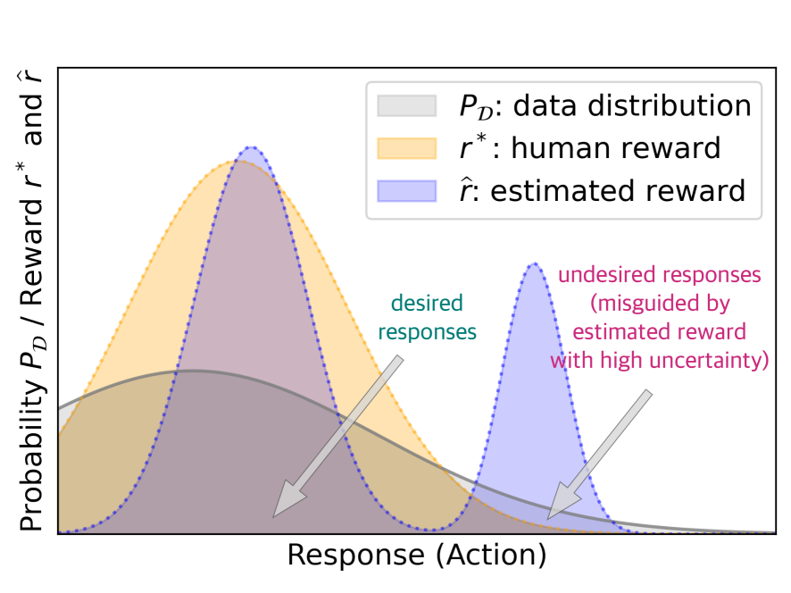
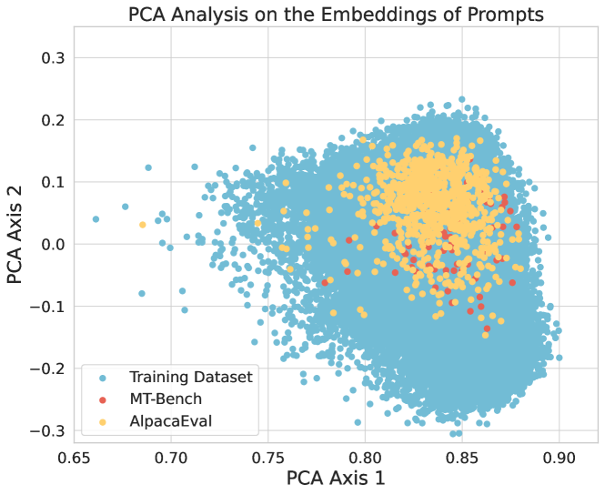
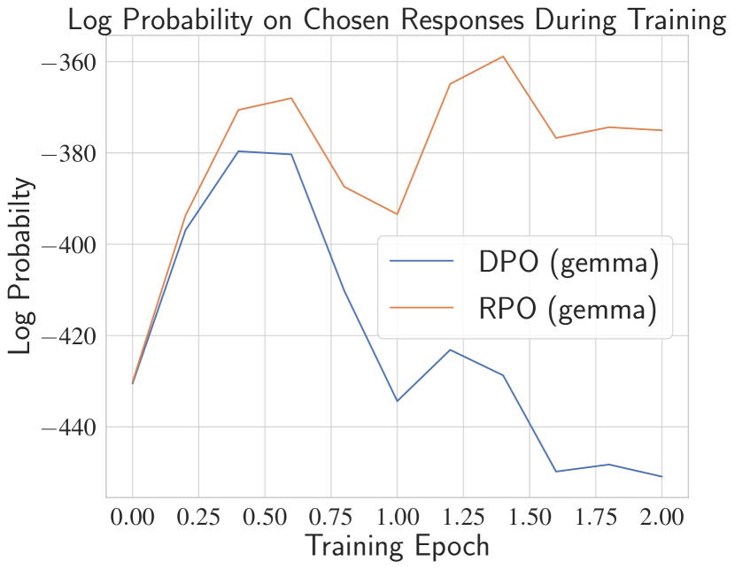

# Provably Mitigating Overoptimization in RLHF: Your SFT Loss is Implicitly an Adversarial Regularizer

###### Abstract

Aligning generative models with human preference via RLHF typically suffers from overoptimization, where an imperfectly learned reward model can misguide the generative model to output undesired responses. We investigate this problem in a principled manner by identifying the source of the misalignment as a form of distributional shift and uncertainty in learning human preferences. To mitigate overoptimization, we first propose a theoretical algorithm that chooses the best policy for an adversarially chosen reward model; one that simultaneously minimizes the maximum likelihood estimation of the loss and a reward penalty term. Here, the reward penalty term is introduced to prevent the policy from choosing actions with spurious high proxy rewards, resulting in provable sample efficiency of the algorithm under a *partial coverage* style condition. Moving from theory to practice, the proposed algorithm further enjoys an equivalent but surprisingly easy-to-implement reformulation. Using the equivalence between reward models and the corresponding optimal policy, the algorithm features a simple objective that combines: (i) a preference optimization loss that directly aligns the policy with human preference, and (ii) a supervised learning loss that explicitly imitates the policy with a (suitable) baseline distribution. In the context of aligning large language models (LLM), this objective fuses the direct preference optimization (DPO) loss with the supervised fune-tuning (SFT) loss to help mitigate the overoptimization towards undesired responses, for which we name the algorithm Regularized Preference Optimization (RPO). Experiments of aligning LLMs demonstrate the improved performance of RPO compared with DPO baselines. Our work sheds light on the interplay between preference optimization and SFT in tuning LLMs with both theoretical guarantees and empirical evidence.  

Keywords: Alignment, reinforcement learning from human feedback, large language model, overoptimization, supervised fine-tuning  

###### Contents

1. [1 Introduction](#S1 "In Provably Mitigating Overoptimization in RLHF: Your SFT Loss is Implicitly an Adversarial Regularizer") 	1. [1.1 Our Contributions](#S1.SS1 "In 1 Introduction ‣ Provably Mitigating Overoptimization in RLHF: Your SFT Loss is Implicitly an Adversarial Regularizer")  	2. [1.2 Related Works](#S1.SS2 "In 1 Introduction ‣ Provably Mitigating Overoptimization in RLHF: Your SFT Loss is Implicitly an Adversarial Regularizer") 
2. [2 Preliminaries of RLHF](#S2 "In Provably Mitigating Overoptimization in RLHF: Your SFT Loss is Implicitly an Adversarial Regularizer") 
3. [3 A Theory-motivated Objective](#S3 "In Provably Mitigating Overoptimization in RLHF: Your SFT Loss is Implicitly an Adversarial Regularizer") 
4. [4 An Equivalent and Implementation-friendly Objective](#S4 "In Provably Mitigating Overoptimization in RLHF: Your SFT Loss is Implicitly an Adversarial Regularizer") 
5. [5 Theoretical Analysis](#S5 "In Provably Mitigating Overoptimization in RLHF: Your SFT Loss is Implicitly an Adversarial Regularizer") 	1. [5.1 Establishing the Sample Complexity of Maximin Objective (Algorithm 1)](#S5.SS1 "In 5 Theoretical Analysis ‣ Provably Mitigating Overoptimization in RLHF: Your SFT Loss is Implicitly an Adversarial Regularizer")  	2. [5.2 Equivalence between Maximin and Minimax Objectives](#S5.SS2 "In 5 Theoretical Analysis ‣ Provably Mitigating Overoptimization in RLHF: Your SFT Loss is Implicitly an Adversarial Regularizer")  	3. [5.3 Generalization to New Prompt Distributions](#S5.SS3 "In 5 Theoretical Analysis ‣ Provably Mitigating Overoptimization in RLHF: Your SFT Loss is Implicitly an Adversarial Regularizer") 
6. [6 Experiments](#S6 "In Provably Mitigating Overoptimization in RLHF: Your SFT Loss is Implicitly an Adversarial Regularizer") 
7. [7 Conclusions](#S7 "In Provably Mitigating Overoptimization in RLHF: Your SFT Loss is Implicitly an Adversarial Regularizer") 
8. [A Proofs for Sample Complexity Analysis](#A1 "In Provably Mitigating Overoptimization in RLHF: Your SFT Loss is Implicitly an Adversarial Regularizer") 	1. [A.1 Proof of Theorem 5.3](#A1.SS1 "In Appendix A Proofs for Sample Complexity Analysis ‣ Provably Mitigating Overoptimization in RLHF: Your SFT Loss is Implicitly an Adversarial Regularizer")  	2. [A.2 Technical Lemmas](#A1.SS2 "In Appendix A Proofs for Sample Complexity Analysis ‣ Provably Mitigating Overoptimization in RLHF: Your SFT Loss is Implicitly an Adversarial Regularizer") 
9. [B Proofs for Equivalence between Maximin and Minimax Objectives](#A2 "In Provably Mitigating Overoptimization in RLHF: Your SFT Loss is Implicitly an Adversarial Regularizer") 	1. [B.1 Proof of Theorem 5.6](#A2.SS1 "In Appendix B Proofs for Equivalence between Maximin and Minimax Objectives ‣ Provably Mitigating Overoptimization in RLHF: Your SFT Loss is Implicitly an Adversarial Regularizer")  	2. [B.2 Auxiliary Lemmas](#A2.SS2 "In Appendix B Proofs for Equivalence between Maximin and Minimax Objectives ‣ Provably Mitigating Overoptimization in RLHF: Your SFT Loss is Implicitly an Adversarial Regularizer") 
10. [C Proofs for Generalization to New Prompt Distributions](#A3 "In Provably Mitigating Overoptimization in RLHF: Your SFT Loss is Implicitly an Adversarial Regularizer") 
11. [D Additional Details on Experiments](#A4 "In Provably Mitigating Overoptimization in RLHF: Your SFT Loss is Implicitly an Adversarial Regularizer") 	1. [D.1 Training Details](#A4.SS1 "In Appendix D Additional Details on Experiments ‣ Provably Mitigating Overoptimization in RLHF: Your SFT Loss is Implicitly an Adversarial Regularizer")  	2. [D.2 Evaluation Details](#A4.SS2 "In Appendix D Additional Details on Experiments ‣ Provably Mitigating Overoptimization in RLHF: Your SFT Loss is Implicitly an Adversarial Regularizer")  	3. [D.3 Additional Results on Experiments](#A4.SS3 "In Appendix D Additional Details on Experiments ‣ Provably Mitigating Overoptimization in RLHF: Your SFT Loss is Implicitly an Adversarial Regularizer") 

## 1 Introduction

A key step in building state-of-the-art LLMs is Reinforcement Learning from Human Feedback (RLHF) (Christiano et al., [2017](#bib.bib11); Ziegler et al., [2019](#bib.bib63)), which aligns pretrained LLMs with human preferences using human assessment data, making the model more helpful, truthful, and harmless (Ouyang et al., [2022](#bib.bib33); Casper et al., [2023](#bib.bib9)). Without doing RLHF, pretrained LLMs could exhibit harmful behaviors including offensive or toxic outputs, social biases, and leaking sensitive information from training data, etc (Gehman et al., [2020](#bib.bib23); Carlini et al., [2021](#bib.bib8); Ganguli et al., [2022](#bib.bib21)). Typically, RLHF first learns a reward model from data (pair-wise comparisons of responses) to quantify the human preferences of LLM outputs. Then it fine-tunes the LLM to maximize the learned reward using RL techniques.  

In this pipeline, a crucial challenge is *reward overoptimization* or *reward hacking* (Michaud et al., [2020](#bib.bib31); Tien et al., [2022](#bib.bib44); Gao et al., [2023](#bib.bib22)). Since the reward model is learned from finite data, this reward might not be perfectly aligned with the underlying human preference. Optimizing the LLM towards such an imperfectly learned and potentially overfitted reward model leads to performance degeneration and a substantial decrease in the probability of choosing the preferred responses in the data (Hong et al., [2024](#bib.bib24); Rafailov et al., [2024](#bib.bib36)). Given the importance of RLHF and the outlined challenge, a crucial research question is:  

*How to mitigate reward overoptimization in RLHF in a principled     and efficient manner for better alignment?*  

To answer the question, we model RLHF as an offline contextual bandit (Ouyang et al., [2022](#bib.bib33)) and ascribe overoptimzation to distributional shifts and reward uncertainty. Intuitively, when fine-tuning an LLM, the response (action) distribution of the tuned LLM could deviate from that of the training data. For the out-of-distribution responses, which are dissimilar with (or not well covered by) the responses in the data, the high inherent uncertainty of underlying human preferences could make the learned reward model misleading for out-of-distribution responses. In this situation, reward overoptimization can occur because the LLM is fine-tuned towards maximizing a reward model with defective out-of-distribution prediction, giving a potential consequence that the LLM responses are favored by the learned reward but less preferred by a human (Zhu et al., [2024](#bib.bib62)). We illustrate such an issue inherent to overoptimization in Figure [1](#S1.F1.fig1 "Figure 1 ‣ 1 Introduction ‣ Provably Mitigating Overoptimization in RLHF: Your SFT Loss is Implicitly an Adversarial Regularizer").  

In this work, we propose a new RLHF algorithm to mitigate reward overoptimization. From a high level, our theoretical algorithm seeks the best LLM for an *adversarially* chosen reward model that minimizes the sum of its maximum likelihood estimation (MLE) loss and its own expected reward value. Intuitively, since the reward value is also minimized when minimizing the sum, it can automatically prevent the misleadingly high reward caused by the uncertainty inherent in learning from finite preference data. Furthermore, we show that the theoretical algorithm enjoys an easy implementation: it simply adopts a supervised fine-tuning (SFT) loss as a regularizer during training. By explicitly regularizing the LLM to imitate high-quality responses (e.g., the preferred responses in dataset), the algorithm can effectively mitigate the issue of overoptimization. We provide both theory and experiments to demonstrate our findings, which we summarize next.  

[FIGURE S1.F1.1.g1]

Figure 1: Left: Reward overoptimization due to the distributional shift and uncertainty in reward. Right: Overoptimization can cause the probability of outputting the preferred responses from preference data to decrease substantially using original DPO proposed by (Rafailov et al., [2023](#bib.bib37)).
Our algorithm (RPO) significantly alleviates this decrease. See more discussions in Section [6](#S6 "6 Experiments ‣ Provably Mitigating Overoptimization in RLHF: Your SFT Loss is Implicitly an Adversarial Regularizer").
[/FIGURE]

### 1.1 Our Contributions

We summarize our contributions in three areas as follows.  

#### A theoretical algorithm under general function approximation.

Our first contribution is a new theoretical algorithm (Algorithm [1](#alg1 "Algorithm 1 ‣ 3 A Theory-motivated Objective ‣ Provably Mitigating Overoptimization in RLHF: Your SFT Loss is Implicitly an Adversarial Regularizer")). It features an *unconstrained maximin* problem, outputting the optimal policy (LLM) against an adversarially chosen reward model that minimizes the summation of: (a) the MLE loss for estimating the underlying reward; and (b) a reward expected value term as a penalty that aims to prevent spuriously high reward estimation caused by data uncertainty and insufficient coverage. Algorithm [1](#alg1 "Algorithm 1 ‣ 3 A Theory-motivated Objective ‣ Provably Mitigating Overoptimization in RLHF: Your SFT Loss is Implicitly an Adversarial Regularizer") is compatible with general function approximations of the reward model, meaning that we do not impose any specific structural form to the hypothesis class of reward, demonstrating its generality.  

In this regime, we establish the finite-sample suboptimality gap of Algorithm [1](#alg1 "Algorithm 1 ‣ 3 A Theory-motivated Objective ‣ Provably Mitigating Overoptimization in RLHF: Your SFT Loss is Implicitly an Adversarial Regularizer") as $\widetilde{\mathcal{O}}(C^{2}_{\mathrm{coverage}}\sqrt{\mathcal{N}_{\mathcal{R}}/N})$ when competing with any LLM in terms of the underlying human reward (Theorem [5.3](#S5.Thmtheorem3 "Theorem 5.3 (Suboptimality of Algorithm 1). ‣ 5.1 Establishing the Sample Complexity of Maximin Objective (Algorithm 1) ‣ 5 Theoretical Analysis ‣ Provably Mitigating Overoptimization in RLHF: Your SFT Loss is Implicitly an Adversarial Regularizer")). Here $N$ denotes the number of human comparison data. $\mathcal{N}_{\mathcal{R}}$ denotes the complexity of the reward model class $\mathcal{R}$, and $C_{\mathrm{coverage}}$ characterizes the coverage of the preference dataset with respect to the response distribution of the LLM to compete (please see Assumption [5.2](#S5.Thmtheorem2 "Assumption 5.2 (Partial coverage coefficient (Zhan et al., 2023a)). ‣ 5.1 Establishing the Sample Complexity of Maximin Objective (Algorithm 1) ‣ 5 Theoretical Analysis ‣ Provably Mitigating Overoptimization in RLHF: Your SFT Loss is Implicitly an Adversarial Regularizer") for details). This indicates that, as long as the training data well cover the LLM $\pi$ to compete, the algorithm is guaranteed to align an LLM to output responses as good as $\pi$ in terms of human reward, without suffering from overoptimization caused by distributional shifts and inherent uncertainty in human preference.  

#### An easy-to-implement practical objective.

Moving towards practice, we show that the objective of Algorithm [1](#alg1 "Algorithm 1 ‣ 3 A Theory-motivated Objective ‣ Provably Mitigating Overoptimization in RLHF: Your SFT Loss is Implicitly an Adversarial Regularizer") adopts a surprisingly simple and equivalent form for its use in practice. Specifically, with mild regularity conditions, we prove that the *maximin* objective (Algorithm[1](#alg1 "Algorithm 1 ‣ 3 A Theory-motivated Objective ‣ Provably Mitigating Overoptimization in RLHF: Your SFT Loss is Implicitly an Adversarial Regularizer")) is equivalent to the corresponding *minimax* objective, which is further reduced to a single minimization problem for the reward model since its inner problem adopts a closed form solution. Inspired by recent RLHF research that uses reward-model-free methods to align LLMs (Rafailov et al., [2023](#bib.bib37)), we further re-parameterize the reward model via its corresponding KL-regularized optimal policy. Then the minimization objective of the reward modeling naturally translates to a target that directly aligns the LLM, which we call Regularized Preference Optimization (RPO; Algorithm [2](#alg2 "Algorithm 2 ‣ An equivalent minimax objective. ‣ 4 An Equivalent and Implementation-friendly Objective ‣ Provably Mitigating Overoptimization in RLHF: Your SFT Loss is Implicitly an Adversarial Regularizer")). The objective of RPO features a simple weighted combination of two losses:  

|  | $\displaystyle{\color[rgb]{0,0,0}\definecolor[named]{pgfstrokecolor}{rgb}{0,0,0}\pgfsys@color@gray@stroke{0}\pgfsys@color@gray@fill{0}\text{RPO objective}}\,=\,{\color[rgb]{0.45,0.45,1}\definecolor[named]{pgfstrokecolor}{rgb}{0.45,0.45,1}\text{Preference optimization loss}}\,+\,{\color[rgb]{0.8625,0.45,0.5875}\definecolor[named]{pgfstrokecolor}{rgb}{0.8625,0.45,0.5875}\text{Imitation (SFT) loss}}.$ |  | (1.1) |
| --- | --- | --- | --- |

Here the Preference optimization loss coincides with the DPO (Rafailov et al., [2023](#bib.bib37)) objective, which tends to optimize the LLM towards maximizing the underlying true reward. The Imitation (SFT) loss explicitly supervises the LLM to mimic the responses from a proper distribution that is well covered by the dataset. The choice of the distribution is guided and justified by our theory of Algorithm [1](#alg1 "Algorithm 1 ‣ 3 A Theory-motivated Objective ‣ Provably Mitigating Overoptimization in RLHF: Your SFT Loss is Implicitly an Adversarial Regularizer"), but can also be flexibly adapted in practice, e.g., the preferred response in the dataset, or the responses of the initial model.  

We highlight that the Imitation (SFT) loss serves as an important term to mitigate overoptimization. Even though the original DPO objective has already involved a KL regularization between the tuned LLM and the initial LLM, is not enough to prevent overoptimization. As elaborated in Section [4](#S4 "4 An Equivalent and Implementation-friendly Objective ‣ Provably Mitigating Overoptimization in RLHF: Your SFT Loss is Implicitly an Adversarial Regularizer"), the KL-regularization weight of the DPO objective could only control the scale of the gradient per training example, while the RPO objective can further modify the gradient direction. Calling back to the theoretical Algorithm [1](#alg1 "Algorithm 1 ‣ 3 A Theory-motivated Objective ‣ Provably Mitigating Overoptimization in RLHF: Your SFT Loss is Implicitly an Adversarial Regularizer"), such a modification of gradient direction originates from the reward penalty in the adversarial objective for the reward model. This modification, as we expose in our theoretical analysis, helps to mitigate overoptimization. *Thus, incoporating SFT loss in RLHF gives you a regularizer that provably mitigates overoptimization.*  

#### Empirical evaluations.

Following the training setup of two series of released chat models Zephyr-7b-beta (trained on Ultrafeedback dataset (Cui et al., [2023](#bib.bib13)) using DPO) and Zephyr-7b-gemma (trained on Argilla-DPO-Mix-7K dataset (argill, [2024](#bib.bib3)) using DPO) (Tunstall et al., [2023b](#bib.bib46)), we implement RPO for the beta series and gemma series respectively to show that: (i) RPO is a flexible plug-in module and can be applied to different reference models. (ii) RPO effectively alleviates overoptimization. (iii) RPO consistently achieves better alignment performance than DPO in in-data distribution. (iv) RPO can also achieve consistently better performance in standard LLM benchmarks like MT-bench and AlpacaEval 2.0, which shows its potential of mitigating overoptimization for better alignment performance, justifying our theory.  

### 1.2 Related Works

In the following, we relate our work to recent lines of RLHF research on both theory and practice sides. We also review related works on reward hacking and overoptimization in RLHF.  

#### RLHF: algorithm design.

The technique of RLHF (Christiano et al., [2017](#bib.bib11); Ziegler et al., [2019](#bib.bib63); Ouyang et al., [2022](#bib.bib33); Bai et al., [2022](#bib.bib5)) has recently demonstrated its great importance in building the state-of-the-art LLMs, including ChatGPT (Achiam et al., [2023](#bib.bib1)), Gemini (Team et al., [2023](#bib.bib43)), Claude (Anthropic, [2023](#bib.bib2)). In the RLHF pipeline therein, the LLM is fine-tuned towards maximizing a learned reward model using the RL algorithm Proximal Policy Optimization (PPO; Schulman et al. ([2017](#bib.bib40))). Meanwhile, PPO-style algorithm is also known for its instability, sample-inefficiency, and especially, a high demand for proper hyperparameter tuning (Engstrom et al., [2020](#bib.bib19)). This thus casts prohibitive computational cost to make the most effectiveness of PPO-based RLHF methods to align LLMs, especially for the open-source community.  

Given that, further research on RLHF has explored various alternatives to PPO-based methods, with the most popular approach being the direct preference optimization method (Zhao et al., [2023](#bib.bib58); Rafailov et al., [2023](#bib.bib37)), which skips the reward learning phase and directly optimize the LLM to align it with the human preference. Our practical implementation (RPO) also harnesses the wisdom of reward-LLM equivalence to avoid explicit reward learning followed by PPO training.  

Besides the original DPO algorithm (Rafailov et al., [2023](#bib.bib37)), ever since it popularizing the direct preference learning style method, variants of the direct preference learning approach are proposed, including but not limited to Liu et al. ([2023a](#bib.bib28)); Azar et al. ([2023](#bib.bib4)); Xiong et al. ([2023](#bib.bib50)); Tang et al. ([2024](#bib.bib42)); Ji et al. ([2024](#bib.bib25)); Ye et al. ([2024](#bib.bib51)); Pal et al. ([2024](#bib.bib35)); Hong et al. ([2024](#bib.bib24)); Rosset et al. ([2024](#bib.bib39)); Liang et al. ([2024](#bib.bib27)); Zhang et al. ([2024a](#bib.bib55)); Tajwar et al. ([2024](#bib.bib41)); Wu et al. ([2024](#bib.bib49)). Each of them aims to address further challenges of direct preference learning from varying perspectives. Specifically, the algorithm proposed by Pal et al. ([2024](#bib.bib35)); Hong et al. ([2024](#bib.bib24)) share similar algorithmic components as RPO proposed in this work. Both work consider SFT style regularization during preference optimization. However, theoretical understanding of how SFT loss can help alignment remains unknown. In contrast, we provide theoretical justifications to the SFT loss as an implicit adversarial regularizer that provably mitigates overoptimization in preference learning.  

#### RLHF: theoretical investigation.

Initiated from the literature of dueling bandits and dueling RL (Yue et al., [2012](#bib.bib52); Bengs et al., [2021](#bib.bib6); Pacchiano et al., [2021](#bib.bib34)), recent success of RLHF in fine-tuning LLMs also motivates a long line of research to investigate the theoretical foundations of RLHF under different settings (Chen et al., [2022](#bib.bib10); Zhu et al., [2023](#bib.bib61); Zhan et al., [2023a](#bib.bib53), [b](#bib.bib54); Wang et al., [2023b](#bib.bib48); Li et al., [2023](#bib.bib26); Xiong et al., [2023](#bib.bib50); Ye et al., [2024](#bib.bib51); Du et al., [2024](#bib.bib16); Zhong et al., [2024](#bib.bib60)), aiming to propose provably sample-efficient algorithms to learn a human-reward-maximizing policy from human preference signals. Our theoretical study of RLHF falls into the paradigm of offline learning from a pre-collected preference dataset, and is most related to Zhu et al. ([2023](#bib.bib61)); Zhan et al. ([2023a](#bib.bib53)); Li et al. ([2023](#bib.bib26)); Xiong et al. ([2023](#bib.bib50)); Ye et al. ([2024](#bib.bib51)). In this setup, the main challenge is to address the overoptimization issues due to human reward uncertainty and distributional shifts when only a fixed dataset is available. In the sequel, we compare our work with them in more detail.  

Existing theoretical work on provably sample-efficient offline RLHF typically suffers from two drawbacks: they are either restricted to the linear function approximations setting (Zhu et al., [2023](#bib.bib61); Xiong et al., [2023](#bib.bib50)) which is far from the practical situations, or are generally unable to be implemented in the LLM experiments. Typically, to encompass the pessimistic principle in the face of uncertainty, the existing literature proposes to return the optimal policy against either an estimated reward model plus a structure-aware reward uncertainty penalty (Xiong et al., [2023](#bib.bib50)) or the most pessimistic reward model inside a confidence region (Zhu et al., [2023](#bib.bib61); Zhan et al., [2023a](#bib.bib53)). Both of these two types of method involve intractable components for implementation and needs for additional algorithmic design to approximate the theoretical algorithm in practice. In contrast, our theory works in the context of general function approximations while being friendly to be implemented. Finally, we remark that, while our study focuses on the standard Bradley-Terry model of human preference with general reward function approximations, the work of Ye et al. ([2024](#bib.bib51)) further considers a general human preference model. But it remains unknown how their algorithms can be efficiently implemented in practice. It serves as an interesting direction to extend our technique to RLHF with general reward model and device new practical algorithms.  

#### Reward hacking and overoptimization in RLHF for LLM.

As is discussed in the introduction, the challenge of reward hacking or overoptimization may prevent the successful alignment of LLMs, degenerating the performance of an LLM because of maximizing an imperfect, overfitted, and misgeneralized proxy reward learned from the finite data (Michaud et al., [2020](#bib.bib31); Tien et al., [2022](#bib.bib44); Gao et al., [2023](#bib.bib22); Casper et al., [2023](#bib.bib9)). Efforts have been made to mitigate this fundamental issue through the perspective of theory, e.g., Zhu et al. ([2023](#bib.bib61)); Xiong et al. ([2023](#bib.bib50)); Zhu et al. ([2024](#bib.bib62)), and practice, e.g., Coste et al. ([2023](#bib.bib12)); Eisenstein et al. ([2023](#bib.bib18)); Dong et al. ([2023](#bib.bib15)); Moskovitz et al. ([2023](#bib.bib32)); Zhang et al. ([2024b](#bib.bib57)); Rita et al. ([2024](#bib.bib38)); Pal et al. ([2024](#bib.bib35)); Hong et al. ([2024](#bib.bib24)). Our approach starts from the theoretical insights of handling inherent uncertainty in learning human preference from finite data, while being suprisingly easy to implement in practice.  

## 2 Preliminaries of RLHF

In this section, we introduce the mathematical framework of studying RLHF for alignining LLMs. We adopt the framework of offline contextual bandits (Ouyang et al., [2022](#bib.bib33); Zhu et al., [2023](#bib.bib61), [2024](#bib.bib62)), where we identify the contextual space $\mathcal{X}$ as the space of prompts, and we identify the action space $\mathcal{A}$ as the space of responses. An LLM, which is defined as a policy $\pi(\cdot|\cdot):\mathcal{X}\mapsto\Delta(\mathcal{A})$, can take a prompt $x\in\mathcal{X}$ as its input and output a response $a\in\mathcal{A}$ obeying $a\sim\pi(\cdot|x)$.  

#### Preference model.

Given any reward function $r:\mathcal{X}\times\mathcal{A}\mapsto\mathbb{R}$ belonging to certain reward class $\mathcal{R}$ which represents the “human’s rating” of LLM responses given some prompts, we consider the Bradley-Terry model (Bradley and Terry, [1952](#bib.bib7)) of human preference. That is, given a prompt $x\in\mathcal{X}$ and two responses $a^{1},a^{0}\in\mathcal{A}$, the probability of $a^{1}$ being preferred to $a^{0}$ (denoted by $y=1$, otherwise $y=0$) is given by  

|  | $\displaystyle\mathbb{P}_{r}(y=1|x,a^{1},a^{0})=\frac{\exp(r(x,a^{1}))}{\exp(r(x,a^{1}))+\exp(r(x,a^{0}))}=\sigma\big{(}r(x,a^{1})-r(x,a^{0})\big{)},$ |  | (2.1) |
| --- | --- | --- | --- |

where $\sigma(z)=1/(1+\exp(-z))$ is the sigmoid function. For simplicity of future discussion, we explicitly write out the dependence of the preference probability $\mathbb{P}_{r}(\cdot)$ on the reward model $r\in\mathcal{R}$. In the section of theory, i.e., Section [5](#S5 "5 Theoretical Analysis ‣ Provably Mitigating Overoptimization in RLHF: Your SFT Loss is Implicitly an Adversarial Regularizer"), we specify the assumptions on the reward model class $\mathcal{R}$.  

#### Learning protocol.

Typically in an LLM training pipeline, the RLHF phase starts from certain reference policy $\pi^{\mathrm{ref}}$ which is obtained by pretraining and then supervised fine-tuning (SFT). Then RLHF aligns the LLM based on certain human preference data. In this work, we consider offline RLHF setup where the LLM is aligned using a fixed offline preference dataset $\mathcal{D}$. It consists of $N$ i.i.d. tuples in the form of  

|  | $\displaystyle\mathcal{D}=\big{\{}(x_{i},a^{1}_{i},a^{0}_{i},y_{i})\big{\}}_{i=1}^{N}.$ |  | (2.2) |
| --- | --- | --- | --- |

Here the prompt $x_{i}$ and the response $a_{i}^{1},a_{i}^{0}$ are distributed according to $(x,a^{1},a^{0})\sim\mu_{\mathcal{D}}(\cdot)$, and conditioning on $(x_{i},a_{i}^{1},a_{i}^{0})$, $y_{i}$ is distributed according to ([2.1](#S2.E1 "In Preference model. ‣ 2 Preliminaries of RLHF ‣ Provably Mitigating Overoptimization in RLHF: Your SFT Loss is Implicitly an Adversarial Regularizer")) for an underlying true (but unknown) reward model $r^{\star}\in\mathcal{R}$.  

#### Performance metric.

The target of RLHF is to align an LLM, or equivalently, to learn a policy $\pi$, so as to maximize the expected true reward $r^{\star}$. Correspondingly, we define the value function of a policy $\pi$ as  

|  | $\displaystyle J(\pi)=\mathbb{E}_{x\sim d_{0},a\sim\pi(\cdot|x)}\big{[}r^{\star}(x,a)\big{]}.$ |  | (2.3) |
| --- | --- | --- | --- |

Here we allow the prompt distribution $d_{0}(\cdot)$ to be different from that of the offline dataset distribution $\mu_{\mathcal{D}}(\cdot)$, but is assumed to be known. In the meanwhile, we consider the policies that share the same support as the reference policy $\pi^{\mathrm{ref}}$, that is, we take a policy class $\Pi$ as  

|  | $\displaystyle\Pi=\Big{\{}\pi:\mathcal{X}\mapsto\Delta(\mathcal{A})\,\Big{|}\,\mathrm{Supp}(\pi(\cdot|x))\subseteq\mathrm{Supp}(\pi^{\mathrm{ref}}(\cdot|x)),\,\,\forall x\in\mathcal{X}\Big{\}}.$ |  | (2.4) |
| --- | --- | --- | --- |

The performance gap of a learned policy $\widehat{\pi}\in\Pi$ with respect to any other policy $\pi\in\Pi$ is measured as  

|  | $\displaystyle\mathrm{Gap}^{\pi}(\widehat{\pi})=J(\pi)-J(\widehat{\pi}).$ |  | (2.5) |
| --- | --- | --- | --- |

Our goal is to propose a sample-efficient and also implementation-friendly algorithm to learn a policy $\widehat{\pi}\in\Pi$ that can compete with a given policy $\pi\in\Pi$ in terms of $\mathrm{Gap}^{\pi}(\widehat{\pi})\leq\varepsilon$, using a number of samples polynomial in $1/\varepsilon$ and logarithmic in the complexity of the reward class $\mathcal{R}$ and the failure probability inversed $1/\delta$.  

We do not assume parametric forms of the reward class $\mathcal{R}$ (Zhu et al., [2023](#bib.bib61); Xiong et al., [2023](#bib.bib50)), and thus we fall into the paradigm of general function approximations.  

## 3 A Theory-motivated Objective

Our method seeks to find the best policy $\widehat{\pi}$ against an *adversarially* chosen reward model $\widehat{r}_{\mathrm{adv}}$ that minimizes a weighted sum of its expected value and the maximum likelihood estimation (MLE) loss. Intuitively, such a reward model can prevent the overoptimization issue by taking its own value into account when minimizing the MLE loss. Since the reward value is also minimized when minimizing the sum, this method prevents the misleadingly high reward caused by the uncertainty due to finite data. Formally, given two hyperparameters $\beta,\eta>0$ and a “baseline policy” $\pi^{\mathrm{base}}$, we define  

|  | $\displaystyle T_{\beta,\eta}^{\mathrm{adv}}(\pi)=\min_{r\in\mathcal{R}}\left\{\eta\cdot\mathbb{E}_{\begin{subarray}{c}x\sim d_{0},a^{1}\sim\pi(\cdot|x),\\ a^{0}\sim\pi^{\mathrm{base}}(\cdot|x)\end{subarray}}\Big{[}r(x,a^{1})-r(x,a^{0})-\beta\cdot\mathrm{KL}\big{(}\pi(\cdot|x)\|\pi^{\mathrm{ref}}(\cdot|x)\big{)}\Big{]}+{\mathcal{L}}_{\mathcal{D}}(r)\right\},$ |  | (3.1) |
| --- | --- | --- | --- |

where the loss function $\mathcal{L}_{\mathcal{D}}(\cdot)$ is the average negative log-likelihood function of the BT model ([2.1](#S2.E1 "In Preference model. ‣ 2 Preliminaries of RLHF ‣ Provably Mitigating Overoptimization in RLHF: Your SFT Loss is Implicitly an Adversarial Regularizer")) (and here it becomes the cross-entropy loss) over the preference dataset $\mathcal{D}$, defined as  

|  | $\displaystyle\mathcal{L}_{\mathcal{D}}(r)=-\widehat{\mathbb{E}}_{\mathcal{D}}\bigg{[}y_{i}\log\big{(}\sigma\big{(}r(x_{i},a^{1}_{i})-r(x_{i},a^{0}_{i})\big{)}\big{)}+(1-y_{i})\log\big{(}\sigma\big{(}r(x_{i},a^{0}_{i})-r(x_{i},a^{1}_{i})\big{)}\big{)}\bigg{]}.$ |  | (3.2) |
| --- | --- | --- | --- |

As we can see, $T_{\beta,\eta}^{\mathrm{adv}}(\pi)$ is the minimum value of a weighted sum of the MLE loss and the expected reward value of $\pi$, but with two important modifications that we explain in the following.  

*Firstly*, we subtract another expected reward of certain policy $\pi^{\mathrm{base}}$. This is because the BT model ([2.1](#S2.E1 "In Preference model. ‣ 2 Preliminaries of RLHF ‣ Provably Mitigating Overoptimization in RLHF: Your SFT Loss is Implicitly an Adversarial Regularizer")) essentially only uses the reward differences to define the preference probabilities. As a result, the data can only reveal information of the differences between the true reward $r^{\star}$ of different responses (Zhan et al., [2023a](#bib.bib53)). Accordingly, we subtract a baseline expected reward value to match this observation. The choice of the baseline policy is discussed in the theory part (Section [5](#S5 "5 Theoretical Analysis ‣ Provably Mitigating Overoptimization in RLHF: Your SFT Loss is Implicitly an Adversarial Regularizer")) and experiments (Section [6](#S6 "6 Experiments ‣ Provably Mitigating Overoptimization in RLHF: Your SFT Loss is Implicitly an Adversarial Regularizer")).  

*Secondly*, we subtract a KL divergence between $\pi$ and $\pi^{\mathrm{ref}}$ from the expected reward, weighted by the coefficient $\beta>0$. Such a term is for practical considerations that would be explained in Sections [4](#S4 "4 An Equivalent and Implementation-friendly Objective ‣ Provably Mitigating Overoptimization in RLHF: Your SFT Loss is Implicitly an Adversarial Regularizer") and [5.2](#S5.SS2 "5.2 Equivalence between Maximin and Minimax Objectives ‣ 5 Theoretical Analysis ‣ Provably Mitigating Overoptimization in RLHF: Your SFT Loss is Implicitly an Adversarial Regularizer"). We note that the KL regularized reward is commonly adopted in RLHF practice to ensure the learned policy is not far away from the reference policy (Ouyang et al., [2022](#bib.bib33); Xiong et al., [2023](#bib.bib50)).  

[ALGORITHM alg1]

1:  Input: Preference dataset $\mathcal{D}$, parameters $\beta,\eta>0$, reference policy $\pi^{\mathrm{ref}}$, baseline policy $\pi^{\mathrm{base}}$.

2:  Output: Policy $\widehat{\pi}$ given by ([3.3](#S3.E3 "In 3 A Theory-motivated Objective ‣ Provably Mitigating Overoptimization in RLHF: Your SFT Loss is Implicitly an Adversarial Regularizer")) with the cross-entropy loss function $\mathcal{L}_{\mathcal{D}}$ defined in ([3.2](#S3.E2 "In 3 A Theory-motivated Objective ‣ Provably Mitigating Overoptimization in RLHF: Your SFT Loss is Implicitly an Adversarial Regularizer")).

Algorithm 1  Theoretical Algorithm: Maximin Objective
[/ALGORITHM]

Finally, the overall algorithm design (Algorithm [1](#alg1 "Algorithm 1 ‣ 3 A Theory-motivated Objective ‣ Provably Mitigating Overoptimization in RLHF: Your SFT Loss is Implicitly an Adversarial Regularizer")) is to output the policy that maximizes $T_{\beta,\eta}^{\mathrm{adv}}(\pi)$, i.e., $\widehat{\pi}\in\mathop{\mathrm{argmax}}_{\pi\in\Pi}T_{\beta,\eta}^{\mathrm{adv}}(\pi)$, which gives the following theoretical target:  

$\displaystyle\!\!\!\!\!\!\!\!\widehat{\pi}\in\mathop{\mathrm{argmax}}_{\pi\in\Pi}\,\min_{r\in\mathcal{R}}\left\{\eta\cdot\mathbb{E}_{\begin{subarray}{c}x\sim d_{0},a^{1}\sim\pi(\cdot|x),\\
a^{0}\sim\pi^{\mathrm{base}}(\cdot|x)\end{subarray}}\Big{[}r(x,a^{1})-r(x,a^{0})-\beta\cdot\mathrm{KL}\big{(}\pi(\cdot|x)\|\pi^{\mathrm{ref}}(\cdot|x)\big{)}\Big{]}+{\mathcal{L}}_{\mathcal{D}}(r)\right\}.$

(3.3)

Given the form of ([3.3](#S3.E3 "In 3 A Theory-motivated Objective ‣ Provably Mitigating Overoptimization in RLHF: Your SFT Loss is Implicitly an Adversarial Regularizer")), we name it the *maximin* objective in the sequel. Upon seeing ([3.3](#S3.E3 "In 3 A Theory-motivated Objective ‣ Provably Mitigating Overoptimization in RLHF: Your SFT Loss is Implicitly an Adversarial Regularizer")), one might be arguing that such a theory-motivated objective seems hard to implement in practice. Nevertheless, in the coming Section [4](#S4 "4 An Equivalent and Implementation-friendly Objective ‣ Provably Mitigating Overoptimization in RLHF: Your SFT Loss is Implicitly an Adversarial Regularizer"), we demonstrate that the maximin objective ([3.3](#S3.E3 "In 3 A Theory-motivated Objective ‣ Provably Mitigating Overoptimization in RLHF: Your SFT Loss is Implicitly an Adversarial Regularizer")) adopts an easy-to-implement equivalent form, allowing us to design a practical algorithm for aligning LLMs.  

###### Remark 3.1 (Comparison with Zhan et al. ([2023a](#bib.bib53))).

We remark that in the work of Zhan et al. ([2023a](#bib.bib53)), they also mentioned a maximin object similar to ([3.3](#S3.E3 "In 3 A Theory-motivated Objective ‣ Provably Mitigating Overoptimization in RLHF: Your SFT Loss is Implicitly an Adversarial Regularizer")) for offline preference-based RL as a complementary to their theoretical algorithm. However, the sample complexity of the maximin algorithm they presented is unknown. Furthermore, our objective ([3.3](#S3.E3 "In 3 A Theory-motivated Objective ‣ Provably Mitigating Overoptimization in RLHF: Your SFT Loss is Implicitly an Adversarial Regularizer")) features another KL-regularization term, which is essential for the proposal of our new practical algorithm design for aligning LLM in Section [4](#S4 "4 An Equivalent and Implementation-friendly Objective ‣ Provably Mitigating Overoptimization in RLHF: Your SFT Loss is Implicitly an Adversarial Regularizer").  

###### Remark 3.2 (Comparison with Xiong et al. ([2023](#bib.bib50))).

Another theoretical work on RLHF (Xiong et al., [2023](#bib.bib50)) explicitly models the KL-regularization between the target policy and the reference policy in the learning objective, referred to as the KL-regularized contextual bandit. This means that their metric becomes the KL-regularized expected reward. In contrast, here we put the KL-regularization as a component of our algorithm design, but we still keep the metric as the expected reward ([2.3](#S2.E3 "In Performance metric. ‣ 2 Preliminaries of RLHF ‣ Provably Mitigating Overoptimization in RLHF: Your SFT Loss is Implicitly an Adversarial Regularizer")). Therefore our theory in Section [5.1](#S5.SS1 "5.1 Establishing the Sample Complexity of Maximin Objective (Algorithm 1) ‣ 5 Theoretical Analysis ‣ Provably Mitigating Overoptimization in RLHF: Your SFT Loss is Implicitly an Adversarial Regularizer") directly reveals how the learned policy performs in terms of the expected reward compared to any given target policy.  

## 4 An Equivalent and Implementation-friendly Objective

In this section, we propose another *minimax*-style objective that is equivalent to the maximin objective ([3.3](#S3.E3 "In 3 A Theory-motivated Objective ‣ Provably Mitigating Overoptimization in RLHF: Your SFT Loss is Implicitly an Adversarial Regularizer")). Based on the minimax objective, we propose a new LLM aligning algorithm called Regularized Preference Optimization (RPO). It draws inspirations from the reparametrization technique originated in Direct Preference Optimization (DPO) (Rafailov et al., [2023](#bib.bib37)) and goes beyond to further address the overoptimization issue in offline RLHF by incorprating an SFT loss as an explicit adversarial regularizer.  

#### An equivalent minimax objective.

If the reward model class $\mathcal{R}$ satisfies certain regularity conditions, which we discuss in detail in Section [5.2](#S5.SS2 "5.2 Equivalence between Maximin and Minimax Objectives ‣ 5 Theoretical Analysis ‣ Provably Mitigating Overoptimization in RLHF: Your SFT Loss is Implicitly an Adversarial Regularizer"), the minimax theorem holds: solving the *maximin* objective ([3.3](#S3.E3 "In 3 A Theory-motivated Objective ‣ Provably Mitigating Overoptimization in RLHF: Your SFT Loss is Implicitly an Adversarial Regularizer")) is *equivalent* to solving a *minimax* target, given by  

|  | $\displaystyle\min_{r\in\mathcal{R}}\,\max_{\pi\in\Pi}\left\{\eta\cdot\mathbb{E}_{\begin{subarray}{c}x\sim d_{0},a^{1}\sim\pi(\cdot|x),\\ a^{0}\sim\pi^{\mathrm{base}}(\cdot|x)\end{subarray}}\Big{[}r(x,a^{1})-r(x,a^{0})-\beta\cdot\mathrm{KL}\big{(}\pi(\cdot|x)\|\pi^{\mathrm{ref}}(\cdot|x)\big{)}\Big{]}+{\mathcal{L}}_{\mathcal{D}}(r)\right\}.$ |  | (4.1) |
| --- | --- | --- | --- |

Such a minimax formulation ([4.1](#S4.E1 "In An equivalent minimax objective. ‣ 4 An Equivalent and Implementation-friendly Objective ‣ Provably Mitigating Overoptimization in RLHF: Your SFT Loss is Implicitly an Adversarial Regularizer")) is the starting point of our practical algorithm. The magic of ([4.1](#S4.E1 "In An equivalent minimax objective. ‣ 4 An Equivalent and Implementation-friendly Objective ‣ Provably Mitigating Overoptimization in RLHF: Your SFT Loss is Implicitly an Adversarial Regularizer")) is that the inner maximization problem adopts a closed form solution, which further simplifies such an objective. To see this, note that given any reward model $r\in\mathcal{R}$, the inner problem is equivalent to  

|  | $\displaystyle\max_{\pi\in\Pi}\bigg{\{}\mathbb{E}_{x\sim d_{0},a\sim\pi(\cdot|x)}\Big{[}r(x,a)-\beta\cdot\mathrm{KL}\big{(}\pi(\cdot|x)\|\pi^{\mathrm{ref}}(\cdot|x)\big{)}\Big{]}\bigg{\}}.$ |  | (4.2) |
| --- | --- | --- | --- |

It has been well established that the policy that maximizes the KL-regularized expected reward ([4.2](#S4.E2 "In An equivalent minimax objective. ‣ 4 An Equivalent and Implementation-friendly Objective ‣ Provably Mitigating Overoptimization in RLHF: Your SFT Loss is Implicitly an Adversarial Regularizer")) has a closed form solution. Due to its importance, we present it as the following lemma.  

###### Lemma 4.1 (Oracle optimal KL-regularized policy).

Given any reward model $r\in\mathcal{R}$, the optimal policy $\pi_{r}$ to the maximization problem ([4.2](#S4.E2 "In An equivalent minimax objective. ‣ 4 An Equivalent and Implementation-friendly Objective ‣ Provably Mitigating Overoptimization in RLHF: Your SFT Loss is Implicitly an Adversarial Regularizer")) is given by  

|  | $\displaystyle\pi_{r}(\cdot|x)=\frac{1}{Z_{r}(x)}\cdot\pi^{\mathrm{ref}}(\cdot|x)\cdot\exp\left(\beta^{-1}r(x,\cdot)\right),\,\,Z_{r}(x)=\int_{a\in\mathcal{A}}\exp\left(\beta^{-1}r(x,a)\right)\mathrm{d}\pi^{\mathrm{ref}}(a|x),$ |  | (4.3) |
| --- | --- | --- | --- |

and correspondingly the optimal value of ([4.2](#S4.E2 "In An equivalent minimax objective. ‣ 4 An Equivalent and Implementation-friendly Objective ‣ Provably Mitigating Overoptimization in RLHF: Your SFT Loss is Implicitly an Adversarial Regularizer")) is given by $\eqref{eq: kl-regularized reward}=\mathbb{E}_{x\sim d_{0}}[\beta\cdot\log(Z_{r}(x))]$.  

###### Proof of Lemma [4.1](#S4.Thmtheorem1 "Lemma 4.1 (Oracle optimal KL-regularized policy). ‣ An equivalent minimax objective. ‣ 4 An Equivalent and Implementation-friendly Objective ‣ Provably Mitigating Overoptimization in RLHF: Your SFT Loss is Implicitly an Adversarial Regularizer").

This follows directly from Proposition 7.16 and Theorem 15.3 of Zhang ([2023](#bib.bib56)). ∎  

Specifically, by Lemma [4.1](#S4.Thmtheorem1 "Lemma 4.1 (Oracle optimal KL-regularized policy). ‣ An equivalent minimax objective. ‣ 4 An Equivalent and Implementation-friendly Objective ‣ Provably Mitigating Overoptimization in RLHF: Your SFT Loss is Implicitly an Adversarial Regularizer"), we can solve the inner maximization problem in ([4.1](#S4.E1 "In An equivalent minimax objective. ‣ 4 An Equivalent and Implementation-friendly Objective ‣ Provably Mitigating Overoptimization in RLHF: Your SFT Loss is Implicitly an Adversarial Regularizer")) and obtain that  

|  | $\displaystyle\eqref{eq: target min max}=\min_{r\in\mathcal{R}}\bigg{\{}\eta\cdot\mathbb{E}_{\begin{subarray}{c}x\sim d_{0},a^{0}\sim\pi^{\mathrm{base}}(\cdot|x)\end{subarray}}\Big{[}-r(x,a^{0})+\beta\cdot\log\left(Z_{r}(x)\right)\Big{]}+{\mathcal{L}}_{\mathcal{D}}(r)\bigg{\}}.$ |  | (4.4) |
| --- | --- | --- | --- |

Furthermore, from Lemma [4.1](#S4.Thmtheorem1 "Lemma 4.1 (Oracle optimal KL-regularized policy). ‣ An equivalent minimax objective. ‣ 4 An Equivalent and Implementation-friendly Objective ‣ Provably Mitigating Overoptimization in RLHF: Your SFT Loss is Implicitly an Adversarial Regularizer"), one immediately see that given any reward model $r\in\mathcal{R}$, we can reparameterize it via its corresponding optimal KL-regularized policy $\pi_{r}$ (Rafailov et al., [2023](#bib.bib37)), that is,  

|  | $\displaystyle r(x,\cdot)=\beta\cdot\log\left(\frac{\pi_{r}(\cdot|x)}{\pi^{\mathrm{ref}}(\cdot|x)}\right)+\beta\cdot\log(Z_{r}(x)).$ |  | (4.5) |
| --- | --- | --- | --- |

Taking ([4.5](#S4.E5 "In An equivalent minimax objective. ‣ 4 An Equivalent and Implementation-friendly Objective ‣ Provably Mitigating Overoptimization in RLHF: Your SFT Loss is Implicitly an Adversarial Regularizer")) back into ([4.1](#S4.E1 "In An equivalent minimax objective. ‣ 4 An Equivalent and Implementation-friendly Objective ‣ Provably Mitigating Overoptimization in RLHF: Your SFT Loss is Implicitly an Adversarial Regularizer")), we are able to further simplify it as  

|  | $\displaystyle\!\!\!\!\!\!\!\!\!\!\eqref{eq: target min max}=\min_{r\in\mathcal{R}}\bigg{\{}\eta\mathbb{E}_{\begin{subarray}{c}x\sim d_{0},a^{0}\sim\pi^{\mathrm{base}}(\cdot|x)\end{subarray}}\Big{[}-\beta\cdot\log(\pi_{r}(a^{0}|x))\Big{]}+{\mathcal{L}}_{\mathcal{D}}\left(\beta\cdot\log\left(\frac{\pi_{r}(\cdot|\cdot)}{\pi^{\mathrm{ref}}(\cdot|\cdot)}\right)\right)\bigg{\}}.$ |  | (4.6) |
| --- | --- | --- | --- |

Thanks to the KL-regularization term in the original minimax objective ([4.1](#S4.E1 "In An equivalent minimax objective. ‣ 4 An Equivalent and Implementation-friendly Objective ‣ Provably Mitigating Overoptimization in RLHF: Your SFT Loss is Implicitly an Adversarial Regularizer")) (or equivalently, the maximin objective ([3.3](#S3.E3 "In 3 A Theory-motivated Objective ‣ Provably Mitigating Overoptimization in RLHF: Your SFT Loss is Implicitly an Adversarial Regularizer"))), we have the following theorem. It theoretically shows that the policy $\pi_{\widehat{r}}$ associated with the reward model $\widehat{r}$ solving ([4.6](#S4.E6 "In An equivalent minimax objective. ‣ 4 An Equivalent and Implementation-friendly Objective ‣ Provably Mitigating Overoptimization in RLHF: Your SFT Loss is Implicitly an Adversarial Regularizer")) also solves the maximin target ([3.3](#S3.E3 "In 3 A Theory-motivated Objective ‣ Provably Mitigating Overoptimization in RLHF: Your SFT Loss is Implicitly an Adversarial Regularizer")) of the theoretical algorithm (Algorithm [1](#alg1 "Algorithm 1 ‣ 3 A Theory-motivated Objective ‣ Provably Mitigating Overoptimization in RLHF: Your SFT Loss is Implicitly an Adversarial Regularizer")) that enjoys finite-sample convergence guarantees.  

###### Theorem 4.2 (Equivalence between *maximin* and *minimax* algorithm (informal)).

Under certain regularity assumptions on $\mathcal{R}$ and given $\eta,\beta>0$, solving the minimax objective ([4.1](#S4.E1 "In An equivalent minimax objective. ‣ 4 An Equivalent and Implementation-friendly Objective ‣ Provably Mitigating Overoptimization in RLHF: Your SFT Loss is Implicitly an Adversarial Regularizer")) via ([4.6](#S4.E6 "In An equivalent minimax objective. ‣ 4 An Equivalent and Implementation-friendly Objective ‣ Provably Mitigating Overoptimization in RLHF: Your SFT Loss is Implicitly an Adversarial Regularizer")), i.e.,  

|  | $\displaystyle\widehat{r}=\mathop{\mathrm{argmin}}_{r\in\mathcal{R}}\bigg{\{}\eta\mathbb{E}_{\begin{subarray}{c}x\sim d_{0},a^{0}\sim\pi^{\mathrm{base}}(\cdot|x)\end{subarray}}\Big{[}-\beta\cdot\log(\pi_{r}(a^{0}|x))\Big{]}+{\mathcal{L}}_{\mathcal{D}}\left(\beta\cdot\log\left(\frac{\pi_{r}(\cdot|\cdot)}{\pi^{\mathrm{ref}}(\cdot|\cdot)}\right)\right)\bigg{\}},$ |  | (4.7) |
| --- | --- | --- | --- |

then the corresponding optimal KL-regularized policy $\pi_{\widehat{r}}$ also solves the maximin objective ([3.3](#S3.E3 "In 3 A Theory-motivated Objective ‣ Provably Mitigating Overoptimization in RLHF: Your SFT Loss is Implicitly an Adversarial Regularizer")).  

###### Proof of Proposition [4.2](#S4.Thmtheorem2 "Theorem 4.2 (Equivalence between maximin and minimax algorithm (informal)). ‣ An equivalent minimax objective. ‣ 4 An Equivalent and Implementation-friendly Objective ‣ Provably Mitigating Overoptimization in RLHF: Your SFT Loss is Implicitly an Adversarial Regularizer").

Please see Section [5.2](#S5.SS2 "5.2 Equivalence between Maximin and Minimax Objectives ‣ 5 Theoretical Analysis ‣ Provably Mitigating Overoptimization in RLHF: Your SFT Loss is Implicitly an Adversarial Regularizer") for a formal statement and proof of Theorem [4.2](#S4.Thmtheorem2 "Theorem 4.2 (Equivalence between maximin and minimax algorithm (informal)). ‣ An equivalent minimax objective. ‣ 4 An Equivalent and Implementation-friendly Objective ‣ Provably Mitigating Overoptimization in RLHF: Your SFT Loss is Implicitly an Adversarial Regularizer"). ∎  

[ALGORITHM alg2]

1:  Input: Preference dataset $\mathcal{D}$, parameters $\beta,\eta>0$, reference policy $\pi^{\mathrm{ref}}$, baseline policy $\pi^{\mathrm{base}}$.

2:  Output: Policy $\pi_{\widehat{\theta}}$ obtained by optimizing objective ([4.8](#S4.E8 "In An equivalent minimax objective. ‣ 4 An Equivalent and Implementation-friendly Objective ‣ Provably Mitigating Overoptimization in RLHF: Your SFT Loss is Implicitly an Adversarial Regularizer")).

Algorithm 2  Practical Algorithm: Regularized Preference Optimization (RPO)
[/ALGORITHM]

Regularized Preference Optimization. Target ([4.6](#S4.E6 "In An equivalent minimax objective. ‣ 4 An Equivalent and Implementation-friendly Objective ‣ Provably Mitigating Overoptimization in RLHF: Your SFT Loss is Implicitly an Adversarial Regularizer")) gives a quite simple objective to use in practice! Since ([4.6](#S4.E6 "In An equivalent minimax objective. ‣ 4 An Equivalent and Implementation-friendly Objective ‣ Provably Mitigating Overoptimization in RLHF: Your SFT Loss is Implicitly an Adversarial Regularizer")) depends on $r\in\mathcal{R}$ only through its corresponding optimal policy $\pi_{r}$, we formulate a minimization objective over a parameterized policy $\pi_{\theta}$, i.e., the LLM to be aligned, and directly optimize the parameters $\theta\in\Theta$. More formally, the new RLHF objective becomes  

$\displaystyle\!\!\!\!\min_{\theta\in\Theta}\Bigg{\{}\mathcal{L}_{\mathrm{RPO}}(\theta):=\eta\beta\cdot\underbrace{\mathbb{E}_{\begin{subarray}{c}x\sim d_{0},a^{0}\sim\pi^{\mathrm{base}}(\cdot|x)\end{subarray}}\Big{[}-\log(\pi_{\theta}(a^{0}|x))\Big{]}}_{\displaystyle{\text{{\color[rgb]{0.8625,0.45,0.5875}\definecolor[named]{pgfstrokecolor}{rgb}{0.8625,0.45,0.5875}\text{Imitation (SFT) loss}}}}}+\underbrace{\mathcal{L}_{\mathcal{D}}\left(\beta\cdot\log\left(\frac{\pi_{\theta}(\cdot|\cdot)}{\pi^{\mathrm{ref}}(\cdot|\cdot)}\right)\right)}_{\displaystyle\text{{\color[rgb]{0.45,0.45,1}\definecolor[named]{pgfstrokecolor}{rgb}{0.45,0.45,1}\text{Preference opt. loss}}}}\Bigg{\}}.$

(4.8)

In ([4.8](#S4.E8 "In An equivalent minimax objective. ‣ 4 An Equivalent and Implementation-friendly Objective ‣ Provably Mitigating Overoptimization in RLHF: Your SFT Loss is Implicitly an Adversarial Regularizer")), the second term coincides with the objective of DPO algorithm (Rafailov et al., [2023](#bib.bib37)) which optimizes the policy towards maximizing the underlying true reward, and the first term stands for a regularization term weighted by $\eta\cdot\beta$ which *explicitly* regularizes the policy to imitate the baseline policy. Therefore, we name the resulting algorithm as Regularized Preference Optimization (RPO). We summarize it abstractly in Algorithm [2](#alg2 "Algorithm 2 ‣ An equivalent minimax objective. ‣ 4 An Equivalent and Implementation-friendly Objective ‣ Provably Mitigating Overoptimization in RLHF: Your SFT Loss is Implicitly an Adversarial Regularizer"). As for DPO, implementing RPO does not require to maintain a reward model $r$. Thus it is computationally more friendly compared to reward-based algorithms.  

#### How does RPO improve DPO?

We illustrate the effect of the imitation loss by analyzing the gradient of the RPO target $\mathcal{L}_{\mathrm{RPO}}(\theta)$ in ([4.8](#S4.E8 "In An equivalent minimax objective. ‣ 4 An Equivalent and Implementation-friendly Objective ‣ Provably Mitigating Overoptimization in RLHF: Your SFT Loss is Implicitly an Adversarial Regularizer")). Notice that by ([4.8](#S4.E8 "In An equivalent minimax objective. ‣ 4 An Equivalent and Implementation-friendly Objective ‣ Provably Mitigating Overoptimization in RLHF: Your SFT Loss is Implicitly an Adversarial Regularizer")) we have  

|  | $\displaystyle\vspace{-2mm}\nabla_{\theta}\mathcal{L}_{\mathrm{RPO}}(\theta)$ | $\displaystyle=\eta\beta\cdot\underbrace{\mathbb{E}_{\begin{subarray}{c}x\sim d_{0},a^{0}\sim\pi^{\mathrm{base}}(\cdot|x)\end{subarray}}\Big{[}-\nabla_{\theta}\log(\pi_{\theta}(a^{0}|x))\Big{]}}_{\text{increase the alignment with the reference policy}}+\underbrace{\nabla_{\theta}{\mathcal{L}}_{\mathrm{DPO}}(\theta)}_{\text{decrease the DPO Loss}},$ |  | (4.9) |
| --- | --- | --- | --- | --- |

where the derivative of the DPO loss $\nabla_{\theta}{\mathcal{L}}_{\mathrm{DPO}}(\theta)$ is given by the following,  

|  | $\displaystyle\nabla_{\theta}{\mathcal{L}}_{\mathrm{DPO}}(\theta)=-\widehat{\mathbb{E}}_{\mathcal{D}}\bigg{[}\underbrace{\beta\cdot\sigma\big{(}\widehat{r}_{\theta}(x,a_{\mathrm{rej}})-\widehat{r}_{\theta}(x,a_{\mathrm{cho}})\big{)}}_{\text{gradient weight}}\!\cdot\Big{(}\nabla_{\theta}\log\pi_{\theta}(a_{\mathrm{cho}}|x)-\nabla_{\theta}\log\pi_{\theta}(a_{\mathrm{rej}}|x)\Big{)}\bigg{]}.$ |  | (4.10) |
| --- | --- | --- | --- |

For simplicity we denote $\widehat{r}_{\theta}(x,a)=\beta\cdot\log(\pi_{\theta}(a|x))/\log(\pi^{\mathrm{ref}}(a|x))$, and denote $a_{\mathrm{cho}}$ for the chosen response and $a_{\mathrm{rej}}$ for the rejected response. Intuitively, RPO ([4.8](#S4.E8 "In An equivalent minimax objective. ‣ 4 An Equivalent and Implementation-friendly Objective ‣ Provably Mitigating Overoptimization in RLHF: Your SFT Loss is Implicitly an Adversarial Regularizer")) modifies the gradient direction of DPO to ensure the alignment with the baseline policy $\pi^{\text{base}}$, and the hyper-parameter $\eta$ controls the power of alignment. In comparison, the hyper-parameter $\beta$ in DPO only controls the gradient weight when increasing the likelihood of $a_{\mathrm{cho}}$ and decreasing the likelihood $a_{\mathrm{rej}}$. In this perspective, the hyper-parameter $\beta$ only changes the scale of the gradient instead of the direction. By introducing $\eta$, we stabilize the training and reduce the side-effect of uncertain labels in data to prevent overoptimization.  

## 5 Theoretical Analysis

In this section, we present theoretical analysis of our proposed algorithms (Algorithm [1](#alg1 "Algorithm 1 ‣ 3 A Theory-motivated Objective ‣ Provably Mitigating Overoptimization in RLHF: Your SFT Loss is Implicitly an Adversarial Regularizer") and Algorithm [2](#alg2 "Algorithm 2 ‣ An equivalent minimax objective. ‣ 4 An Equivalent and Implementation-friendly Objective ‣ Provably Mitigating Overoptimization in RLHF: Your SFT Loss is Implicitly an Adversarial Regularizer")). In Section [5.1](#S5.SS1 "5.1 Establishing the Sample Complexity of Maximin Objective (Algorithm 1) ‣ 5 Theoretical Analysis ‣ Provably Mitigating Overoptimization in RLHF: Your SFT Loss is Implicitly an Adversarial Regularizer"), we first establish a finite-sample complexity result for the theoretical algorithm (Algorithm [1](#alg1 "Algorithm 1 ‣ 3 A Theory-motivated Objective ‣ Provably Mitigating Overoptimization in RLHF: Your SFT Loss is Implicitly an Adversarial Regularizer")) that adopts maximin objective ([3.3](#S3.E3 "In 3 A Theory-motivated Objective ‣ Provably Mitigating Overoptimization in RLHF: Your SFT Loss is Implicitly an Adversarial Regularizer")). In Section [5.2](#S5.SS2 "5.2 Equivalence between Maximin and Minimax Objectives ‣ 5 Theoretical Analysis ‣ Provably Mitigating Overoptimization in RLHF: Your SFT Loss is Implicitly an Adversarial Regularizer"), we formally provide an equivalence result between the maximin objective ([3.3](#S3.E3 "In 3 A Theory-motivated Objective ‣ Provably Mitigating Overoptimization in RLHF: Your SFT Loss is Implicitly an Adversarial Regularizer")) and the minimax objective ([4.1](#S4.E1 "In An equivalent minimax objective. ‣ 4 An Equivalent and Implementation-friendly Objective ‣ Provably Mitigating Overoptimization in RLHF: Your SFT Loss is Implicitly an Adversarial Regularizer")) that we use in practice, based on which we further obtain the sample complexity guarantee of our practical algorithm design (Algorithm [2](#alg2 "Algorithm 2 ‣ An equivalent minimax objective. ‣ 4 An Equivalent and Implementation-friendly Objective ‣ Provably Mitigating Overoptimization in RLHF: Your SFT Loss is Implicitly an Adversarial Regularizer")). In Section [5.3](#S5.SS3 "5.3 Generalization to New Prompt Distributions ‣ 5 Theoretical Analysis ‣ Provably Mitigating Overoptimization in RLHF: Your SFT Loss is Implicitly an Adversarial Regularizer"), we further extend our theory to guarantee the performance on new prompt distributions.  

Through this theory section, we assume that the space of prompts and responses are compact subsets of high-dimensional spaces, that is, $\mathcal{X}\subseteq\mathbb{R}^{d_{\mathcal{X}}}$ and $\mathcal{A}\subseteq\mathbb{R}^{d_{\mathcal{A}}}$ for some $d_{\mathcal{X}},d_{\mathcal{A}}\in\mathbb{N}_{+}$, and $\mathcal{X}$ and $\mathcal{A}$ are compact (closed and bounded). We take the policy class $\Pi$ as ([2.4](#S2.E4 "In Performance metric. ‣ 2 Preliminaries of RLHF ‣ Provably Mitigating Overoptimization in RLHF: Your SFT Loss is Implicitly an Adversarial Regularizer")), that is,  

|  | $\displaystyle\Pi=\Big{\{}\pi:\mathcal{X}\mapsto\Delta(\mathcal{A})\,\Big{|}\,\mathrm{Supp}(\pi(\cdot|x))\subseteq\mathrm{Supp}(\pi^{\mathrm{ref}}(\cdot|x)),\,\,\forall x\in\mathcal{X}\Big{\}}.$ |  | (5.1) |
| --- | --- | --- | --- |

### 5.1 Establishing the Sample Complexity of Maximin Objective (Algorithm [1](#alg1 "Algorithm 1 ‣ 3 A Theory-motivated Objective ‣ Provably Mitigating Overoptimization in RLHF: Your SFT Loss is Implicitly an Adversarial Regularizer"))

We first make the following two assumptions for the sample complexity analysis of Algorithm [1](#alg1 "Algorithm 1 ‣ 3 A Theory-motivated Objective ‣ Provably Mitigating Overoptimization in RLHF: Your SFT Loss is Implicitly an Adversarial Regularizer").  

###### Assumption 5.1 (True reward model).

We assume that the true reward model $r^{\star}\in\mathcal{R}$, and for any $r\in\mathcal{R}$ and $(x,a)\in\mathcal{X}\times\mathcal{A}$, it holds that $r(x,a)\in[0,R]$.  

###### Assumption 5.2 (Partial coverage coefficient (Zhan et al., [2023a](#bib.bib53))).

Given a policy $\pi\in\Pi$, the coverage coefficient of the offline dataset distribution $\mu_{\mathcal{D}}$ w.r.t. reward model class $\mathcal{R}$, policy $\pi$, and the baseline policy $\pi^{\mathrm{base}}$, denoted by $C_{\mu_{\mathcal{D}}}(\mathcal{R};\pi,\pi^{\mathrm{base}})$, is defined as  

|  | $\displaystyle\max\left\{0,\sup_{r\in\mathcal{R}}\frac{\mathbb{E}_{x\sim d_{0},a^{1}\sim\pi(\cdot|x),a^{0}\sim\pi^{\mathrm{base}}(\cdot|x)}\big{[}(r^{\star}(x,a^{1})-r^{\star}(x,a^{0}))-(r(x,a^{1})-r(x,a^{0}))\big{]}}{\sqrt{\mathbb{E}_{(x,a^{1},a^{0})\sim\mu_{\mathcal{D}}}\left[\big{|}(r^{\star}(x,a^{1})-r^{\star}(x,a^{0}))-(r(x,a^{1})-r(x,a^{0}))\big{|}^{2}\right]}}\right\}.$ |  | (5.2) |
| --- | --- | --- | --- |

We assume that $C_{\mu_{\mathcal{D}}}(\mathcal{R};\pi,\pi^{\mathrm{base}})<+\infty$ for the policy $\pi$ to compete.  

Assumption [5.1](#S5.Thmtheorem1 "Assumption 5.1 (True reward model). ‣ 5.1 Establishing the Sample Complexity of Maximin Objective (Algorithm 1) ‣ 5 Theoretical Analysis ‣ Provably Mitigating Overoptimization in RLHF: Your SFT Loss is Implicitly an Adversarial Regularizer") is standard in sample complexity analysis (Zhu et al., [2023](#bib.bib61); Zhan et al., [2023a](#bib.bib53); Ye et al., [2024](#bib.bib51)). Assumption [5.2](#S5.Thmtheorem2 "Assumption 5.2 (Partial coverage coefficient (Zhan et al., 2023a)). ‣ 5.1 Establishing the Sample Complexity of Maximin Objective (Algorithm 1) ‣ 5 Theoretical Analysis ‣ Provably Mitigating Overoptimization in RLHF: Your SFT Loss is Implicitly an Adversarial Regularizer") characterizes how well the dataset $\mathcal{D}$ covers the policy $\pi$ to compete. Intuitively, this can be understood from the fact that $C_{\mu_{\mathcal{D}}}(\mathcal{R};\pi,\pi^{\mathrm{base}})$ is upper bounded by the density ratio  

|  | $$C_{\mu_{\mathcal{D}}}(\mathcal{R};\pi,\pi^{\mathrm{base}})\leq\left\|\frac{d_{0}\otimes\pi\otimes\pi^{\mathrm{base}}}{\mu_{\mathcal{D}}}\right\|_{\infty}=\sup_{(s,a^{1},a^{0})\in{\mathcal{S}}\times\mathcal{A}\times\mathcal{A}}\frac{d_{0}(x)\pi(a^{1}|x)\pi^{\mathrm{base}}(a^{0}|x)}{\mu_{\mathcal{D}}(s,a^{1},a^{0})}.$$ |  |
| --- | --- | --- |

In order for Algorithm [1](#alg1 "Algorithm 1 ‣ 3 A Theory-motivated Objective ‣ Provably Mitigating Overoptimization in RLHF: Your SFT Loss is Implicitly an Adversarial Regularizer") to achieve provable sample efficiency, we only require that $\mathcal{D}$ covers the target policy $\pi$, a weak partial coverage style assumption for the sample complexity analysis (Zhu et al., [2023](#bib.bib61); Zhan et al., [2023a](#bib.bib53); Xiong et al., [2023](#bib.bib50)). To illustrate it, when calling back to Figure [1](#S1.F1.fig1 "Figure 1 ‣ 1 Introduction ‣ Provably Mitigating Overoptimization in RLHF: Your SFT Loss is Implicitly an Adversarial Regularizer"), the data distribution therein well covers those nearly optimal responses under $r^{\star}$, but does not sufficiently cover the responses with low $r^{\star}$.  

Under such a partial coverage data condition, however, the human preference of responses $a\in\mathcal{A}$ that are not well covered by the dataset $\mathcal{D}$ can be poorly estimated, misguiding the policy $\widehat{\pi}$ to behave suboptimally if it is overoptimized (recall Figure [1](#S1.F1.fig1 "Figure 1 ‣ 1 Introduction ‣ Provably Mitigating Overoptimization in RLHF: Your SFT Loss is Implicitly an Adversarial Regularizer")). Fortunately, the following theorem shows that Algorithm [1](#alg1 "Algorithm 1 ‣ 3 A Theory-motivated Objective ‣ Provably Mitigating Overoptimization in RLHF: Your SFT Loss is Implicitly an Adversarial Regularizer") provably mitigates the overoptimization issue and achieves a finite-sample convergence of the suboptimality gap ([2.5](#S2.E5 "In Performance metric. ‣ 2 Preliminaries of RLHF ‣ Provably Mitigating Overoptimization in RLHF: Your SFT Loss is Implicitly an Adversarial Regularizer")).  

###### Theorem 5.3 (Suboptimality of Algorithm [1](#alg1 "Algorithm 1 ‣ 3 A Theory-motivated Objective ‣ Provably Mitigating Overoptimization in RLHF: Your SFT Loss is Implicitly an Adversarial Regularizer")).

Taking the policy class $\Pi$ as ([2.4](#S2.E4 "In Performance metric. ‣ 2 Preliminaries of RLHF ‣ Provably Mitigating Overoptimization in RLHF: Your SFT Loss is Implicitly an Adversarial Regularizer")), supposing that Assumptions [5.1](#S5.Thmtheorem1 "Assumption 5.1 (True reward model). ‣ 5.1 Establishing the Sample Complexity of Maximin Objective (Algorithm 1) ‣ 5 Theoretical Analysis ‣ Provably Mitigating Overoptimization in RLHF: Your SFT Loss is Implicitly an Adversarial Regularizer") and [5.2](#S5.Thmtheorem2 "Assumption 5.2 (Partial coverage coefficient (Zhan et al., 2023a)). ‣ 5.1 Establishing the Sample Complexity of Maximin Objective (Algorithm 1) ‣ 5 Theoretical Analysis ‣ Provably Mitigating Overoptimization in RLHF: Your SFT Loss is Implicitly an Adversarial Regularizer") hold, and assuming that the reward model class $\mathcal{R}$ has a finite $\varepsilon$-epsilon covering number under $\|\cdot\|_{\infty}$-norm $\mathcal{N}_{\varepsilon}(\mathcal{R},\|\cdot\|_{\infty})<+\infty$ with $\varepsilon=(6\cdot(1+e^{R})\cdot N)^{-1}$. Setting  

|  | $\displaystyle\eta=\frac{1}{(1+\exp(R))^{2}}\cdot\sqrt{\frac{24\cdot\log\left(\mathcal{N}_{\varepsilon}(\mathcal{R},\|\cdot\|_{\infty})/\delta\right)}{N}},\quad\beta=\frac{1}{\sqrt{N}}$ |  |
| --- | --- | --- |

in Algorithm [1](#alg1 "Algorithm 1 ‣ 3 A Theory-motivated Objective ‣ Provably Mitigating Overoptimization in RLHF: Your SFT Loss is Implicitly an Adversarial Regularizer"). Then the output policy $\widehat{\pi}$ of Algorithm [1](#alg1 "Algorithm 1 ‣ 3 A Theory-motivated Objective ‣ Provably Mitigating Overoptimization in RLHF: Your SFT Loss is Implicitly an Adversarial Regularizer") satisfies that with probability at least $1-\delta$,   

|  | $\displaystyle\mathrm{Gap}^{\pi}(\widehat{\pi})\leq\frac{\sqrt{6}\cdot\big{(}1+\exp(R)\big{)}^{2}\cdot\Big{(}\big{(}C_{\mu_{\mathcal{D}}}(\mathcal{R};\pi,\pi^{\mathrm{base}})\big{)}^{2}+1\Big{)}\cdot\iota+4\cdot\mathbb{E}_{x\sim d_{0}}\Big{[}\mathrm{KL}\big{(}\pi(\cdot|x)\|\pi^{\mathrm{ref}}(\cdot|x)\big{)}\Big{]}}{4\sqrt{N}},$ |  | (5.3) |
| --- | --- | --- | --- |

where $\iota=\sqrt{\log\left(\mathcal{N}_{\varepsilon}(\mathcal{R},\|\cdot\|_{\infty})/\delta\right)}$ with $\varepsilon=(6\cdot(1+e^{R})\cdot N)^{-1}$. Here, $N$ denotes the number of preference pairs in $\mathcal{D}$, $R$ denotes the upper bound of the reward models, and the partial coverage coefficient $C_{\mu_{\mathcal{D}}}(\mathcal{R};\pi,\pi^{\mathrm{base}})$ is defined in Assumption [5.2](#S5.Thmtheorem2 "Assumption 5.2 (Partial coverage coefficient (Zhan et al., 2023a)). ‣ 5.1 Establishing the Sample Complexity of Maximin Objective (Algorithm 1) ‣ 5 Theoretical Analysis ‣ Provably Mitigating Overoptimization in RLHF: Your SFT Loss is Implicitly an Adversarial Regularizer").  

###### Proof of Theorem [5.3](#S5.Thmtheorem3 "Theorem 5.3 (Suboptimality of Algorithm 1). ‣ 5.1 Establishing the Sample Complexity of Maximin Objective (Algorithm 1) ‣ 5 Theoretical Analysis ‣ Provably Mitigating Overoptimization in RLHF: Your SFT Loss is Implicitly an Adversarial Regularizer").

Please refer to Appendix [A.1](#A1.SS1 "A.1 Proof of Theorem 5.3 ‣ Appendix A Proofs for Sample Complexity Analysis ‣ Provably Mitigating Overoptimization in RLHF: Your SFT Loss is Implicitly an Adversarial Regularizer") for a detailed proof of Theorem [5.3](#S5.Thmtheorem3 "Theorem 5.3 (Suboptimality of Algorithm 1). ‣ 5.1 Establishing the Sample Complexity of Maximin Objective (Algorithm 1) ‣ 5 Theoretical Analysis ‣ Provably Mitigating Overoptimization in RLHF: Your SFT Loss is Implicitly an Adversarial Regularizer"). ∎  

###### Remark 5.4 (Choice of the baseline policy $\pi^{\mathrm{base}}$).

As is indicated by Assumption [5.2](#S5.Thmtheorem2 "Assumption 5.2 (Partial coverage coefficient (Zhan et al., 2023a)). ‣ 5.1 Establishing the Sample Complexity of Maximin Objective (Algorithm 1) ‣ 5 Theoretical Analysis ‣ Provably Mitigating Overoptimization in RLHF: Your SFT Loss is Implicitly an Adversarial Regularizer"), the least requirement is that $\pi^{\mathrm{base}}$ can be covered by the offline data distribution. For example, we can take $\pi^{\mathrm{base}}$ as the distribution of the preferred responses in the dataset. In this case, the SFT loss in the RPO objective explicitly regularizes the LLM to imitate the preferred responses. We choose this baseline policy in our experiments (Section [6](#S6 "6 Experiments ‣ Provably Mitigating Overoptimization in RLHF: Your SFT Loss is Implicitly an Adversarial Regularizer")).  

### 5.2 Equivalence between Maximin and Minimax Objectives

In this section, we formally show that under certain regularity assumptions, the theoretical target (maximin objective ([3.3](#S3.E3 "In 3 A Theory-motivated Objective ‣ Provably Mitigating Overoptimization in RLHF: Your SFT Loss is Implicitly an Adversarial Regularizer"))) and the target for practical algorithm design (minimax objective ([4.1](#S4.E1 "In An equivalent minimax objective. ‣ 4 An Equivalent and Implementation-friendly Objective ‣ Provably Mitigating Overoptimization in RLHF: Your SFT Loss is Implicitly an Adversarial Regularizer"))) are equivalent. This can naturally extend the sample complexity of Algorithm [1](#alg1 "Algorithm 1 ‣ 3 A Theory-motivated Objective ‣ Provably Mitigating Overoptimization in RLHF: Your SFT Loss is Implicitly an Adversarial Regularizer") (Section [5.1](#S5.SS1 "5.1 Establishing the Sample Complexity of Maximin Objective (Algorithm 1) ‣ 5 Theoretical Analysis ‣ Provably Mitigating Overoptimization in RLHF: Your SFT Loss is Implicitly an Adversarial Regularizer")) to that of minimax-based algorithms in Section [4](#S4 "4 An Equivalent and Implementation-friendly Objective ‣ Provably Mitigating Overoptimization in RLHF: Your SFT Loss is Implicitly an Adversarial Regularizer"), providing the theoretical guarantee for our practical algorithm design (RPO).  

First, for notational simplicity, we denote the optimization target we investigate in Sections [3](#S3 "3 A Theory-motivated Objective ‣ Provably Mitigating Overoptimization in RLHF: Your SFT Loss is Implicitly an Adversarial Regularizer") and [4](#S4 "4 An Equivalent and Implementation-friendly Objective ‣ Provably Mitigating Overoptimization in RLHF: Your SFT Loss is Implicitly an Adversarial Regularizer") as  

|  | $\displaystyle\phi(\pi,r):=\eta\cdot\mathbb{E}_{x\sim d_{0},a^{1}\sim\pi(\cdot|x),a^{0}\sim\pi^{\mathrm{ref}}(\cdot|x)}\Big{[}r(x,a^{1})-r(x,a^{0})-\beta\cdot D_{\mathrm{KL}}\big{(}\pi(\cdot|x)\|\pi^{\mathrm{ref}}(\cdot|x)\big{)}\Big{]}+{\mathcal{L}}_{\mathcal{D}}(r),$ |  | (5.4) |
| --- | --- | --- | --- |

for any $(\pi,r)\in\Pi\times\mathcal{R}$. Our result relies on the following assumptions on the reward model class $\mathcal{R}$.  

###### Assumption 5.5 (Regularity of reward model class).

We assume the following things on the reward model class $\mathcal{R}$: (i) the space $\mathcal{R}$ is a compact topological space; (ii) the function $\phi$ in ([5.4](#S5.E4 "In 5.2 Equivalence between Maximin and Minimax Objectives ‣ 5 Theoretical Analysis ‣ Provably Mitigating Overoptimization in RLHF: Your SFT Loss is Implicitly an Adversarial Regularizer")) is convex-like on $\mathcal{R}$, that is, for any $r_{1},r_{2}\in\mathcal{R}$ and $\alpha\in[0,1]$, there exists $r_{3}\in\mathcal{R}$ such that  

|  | $\displaystyle\phi(\pi,r_{3})\leq\alpha\cdot\phi(\pi,r_{1})+(1-\alpha)\cdot\phi(\pi,r_{2}),\quad\forall\pi\in\Pi,$ |  | (5.5) |
| --- | --- | --- | --- |

We note that by the definition, the convex-like property ([5.5](#S5.E5 "In Assumption 5.5 (Regularity of reward model class). ‣ 5.2 Equivalence between Maximin and Minimax Objectives ‣ 5 Theoretical Analysis ‣ Provably Mitigating Overoptimization in RLHF: Your SFT Loss is Implicitly an Adversarial Regularizer")) not only depends on the function $\phi$, but also depends on the reward model class $\mathcal{R}$. As a special case, if $\mathcal{R}$ is convex, e.g., a linear model class (Zhu et al., [2023](#bib.bib61); Xiong et al., [2023](#bib.bib50); Zhu et al., [2024](#bib.bib62)) or more general the Lipschitz continuous model class $\mathcal{R}$, we can directly obtain that the function $\phi(\pi,\cdot)$ is *convex* over $\mathcal{R}$ (since the dependence on $r\in\mathcal{R}$ is linear terms plus a convex loss $\mathcal{L}_{\mathcal{D}}$ of $r\in\mathcal{R}$), which implies the convex-like property ([5.5](#S5.E5 "In Assumption 5.5 (Regularity of reward model class). ‣ 5.2 Equivalence between Maximin and Minimax Objectives ‣ 5 Theoretical Analysis ‣ Provably Mitigating Overoptimization in RLHF: Your SFT Loss is Implicitly an Adversarial Regularizer")).  

Under Assumption [5.5](#S5.Thmtheorem5 "Assumption 5.5 (Regularity of reward model class). ‣ 5.2 Equivalence between Maximin and Minimax Objectives ‣ 5 Theoretical Analysis ‣ Provably Mitigating Overoptimization in RLHF: Your SFT Loss is Implicitly an Adversarial Regularizer"), it holds that (Lemma [B.1](#A2.Thmtheorem1 "Lemma B.1 (Equivalence of maximin and minimax objectives). ‣ B.2 Auxiliary Lemmas ‣ Appendix B Proofs for Equivalence between Maximin and Minimax Objectives ‣ Provably Mitigating Overoptimization in RLHF: Your SFT Loss is Implicitly an Adversarial Regularizer"))  

|  | $\displaystyle\max_{\pi\in\Pi}\,\min_{r\in\mathcal{R}}\phi(\pi,r)=\min_{r\in\mathcal{R}}\,\max_{\pi\in\Pi}\phi(\pi,r).$ |  | (5.6) |
| --- | --- | --- | --- |

Furthermore, thanks to the KL-divergence regularization in $\phi$ which intuitively makes $\phi$ “strongly concave” over the policy $\pi$, ([5.6](#S5.E6 "In 5.2 Equivalence between Maximin and Minimax Objectives ‣ 5 Theoretical Analysis ‣ Provably Mitigating Overoptimization in RLHF: Your SFT Loss is Implicitly an Adversarial Regularizer")) can gives us the following stronger result.  

###### Theorem 5.6 (Formal statement of Theorem [4.2](#S4.Thmtheorem2 "Theorem 4.2 (Equivalence between maximin and minimax algorithm (informal)). ‣ An equivalent minimax objective. ‣ 4 An Equivalent and Implementation-friendly Objective ‣ Provably Mitigating Overoptimization in RLHF: Your SFT Loss is Implicitly an Adversarial Regularizer")).

For the policy class $\Pi$ defined in ([5.1](#S5.E1 "In 5 Theoretical Analysis ‣ Provably Mitigating Overoptimization in RLHF: Your SFT Loss is Implicitly an Adversarial Regularizer")) and the reward model class $\mathcal{R}$ satisfying Assumption [5.5](#S5.Thmtheorem5 "Assumption 5.5 (Regularity of reward model class). ‣ 5.2 Equivalence between Maximin and Minimax Objectives ‣ 5 Theoretical Analysis ‣ Provably Mitigating Overoptimization in RLHF: Your SFT Loss is Implicitly an Adversarial Regularizer"), consider the following policy defined as  

|  | $\displaystyle\pi_{\widehat{r}}\in\mathop{\mathrm{argmax}}_{\pi\in\Pi}\phi(\widehat{r},\pi),\quad where\quad\widehat{r}\in\mathop{\mathrm{argmin}}_{r\in\mathcal{R}}\,\max_{\pi\in\Pi}\phi(\pi,r).$ |  | (5.7) |
| --- | --- | --- | --- |

Then the policy $\pi_{\widehat{r}}$ also satisfies the maximin objective ([3.3](#S3.E3 "In 3 A Theory-motivated Objective ‣ Provably Mitigating Overoptimization in RLHF: Your SFT Loss is Implicitly an Adversarial Regularizer")) of Algorithm [1](#alg1 "Algorithm 1 ‣ 3 A Theory-motivated Objective ‣ Provably Mitigating Overoptimization in RLHF: Your SFT Loss is Implicitly an Adversarial Regularizer"), that is,  

|  | $\displaystyle\pi_{\widehat{r}}\in\mathop{\mathrm{argmax}}_{\pi\in\Pi}\,\min_{r\in\mathcal{R}}\phi(\pi,r).$ |  | (5.8) |
| --- | --- | --- | --- |

###### Proof of Theorem [5.6](#S5.Thmtheorem6 "Theorem 5.6 (Formal statement of Theorem 4.2). ‣ 5.2 Equivalence between Maximin and Minimax Objectives ‣ 5 Theoretical Analysis ‣ Provably Mitigating Overoptimization in RLHF: Your SFT Loss is Implicitly an Adversarial Regularizer").

Please refer for Appendix [B.1](#A2.SS1 "B.1 Proof of Theorem 5.6 ‣ Appendix B Proofs for Equivalence between Maximin and Minimax Objectives ‣ Provably Mitigating Overoptimization in RLHF: Your SFT Loss is Implicitly an Adversarial Regularizer") for a detailed proof of Proposition [5.6](#S5.Thmtheorem6 "Theorem 5.6 (Formal statement of Theorem 4.2). ‣ 5.2 Equivalence between Maximin and Minimax Objectives ‣ 5 Theoretical Analysis ‣ Provably Mitigating Overoptimization in RLHF: Your SFT Loss is Implicitly an Adversarial Regularizer"). ∎  

Theorem [5.6](#S5.Thmtheorem6 "Theorem 5.6 (Formal statement of Theorem 4.2). ‣ 5.2 Equivalence between Maximin and Minimax Objectives ‣ 5 Theoretical Analysis ‣ Provably Mitigating Overoptimization in RLHF: Your SFT Loss is Implicitly an Adversarial Regularizer") shows that the optimal KL-regularized policy associated with the reward model solving the minimax objective ([3.3](#S3.E3 "In 3 A Theory-motivated Objective ‣ Provably Mitigating Overoptimization in RLHF: Your SFT Loss is Implicitly an Adversarial Regularizer")) also solves the maximin target for the policy (i.e., objective ([4.1](#S4.E1 "In An equivalent minimax objective. ‣ 4 An Equivalent and Implementation-friendly Objective ‣ Provably Mitigating Overoptimization in RLHF: Your SFT Loss is Implicitly an Adversarial Regularizer")) of Algorithm [1](#alg1 "Algorithm 1 ‣ 3 A Theory-motivated Objective ‣ Provably Mitigating Overoptimization in RLHF: Your SFT Loss is Implicitly an Adversarial Regularizer")). This further allows us to extend our theoretical guarantee of Algorithm [1](#alg1 "Algorithm 1 ‣ 3 A Theory-motivated Objective ‣ Provably Mitigating Overoptimization in RLHF: Your SFT Loss is Implicitly an Adversarial Regularizer") (Section [5.1](#S5.SS1 "5.1 Establishing the Sample Complexity of Maximin Objective (Algorithm 1) ‣ 5 Theoretical Analysis ‣ Provably Mitigating Overoptimization in RLHF: Your SFT Loss is Implicitly an Adversarial Regularizer")) to that of minimax-based algorithms, justifying our practical algorithm design in Section [4](#S4 "4 An Equivalent and Implementation-friendly Objective ‣ Provably Mitigating Overoptimization in RLHF: Your SFT Loss is Implicitly an Adversarial Regularizer").  

###### Corollary 5.7 (Suboptimality of minimax-based algorithm).

Take the policy class $\Pi$ in ([5.1](#S5.E1 "In 5 Theoretical Analysis ‣ Provably Mitigating Overoptimization in RLHF: Your SFT Loss is Implicitly an Adversarial Regularizer")) and the reward model class satisfying Assumption [5.5](#S5.Thmtheorem5 "Assumption 5.5 (Regularity of reward model class). ‣ 5.2 Equivalence between Maximin and Minimax Objectives ‣ 5 Theoretical Analysis ‣ Provably Mitigating Overoptimization in RLHF: Your SFT Loss is Implicitly an Adversarial Regularizer"). Given any given policy $\pi$ to compete, if Assumption [5.2](#S5.Thmtheorem2 "Assumption 5.2 (Partial coverage coefficient (Zhan et al., 2023a)). ‣ 5.1 Establishing the Sample Complexity of Maximin Objective (Algorithm 1) ‣ 5 Theoretical Analysis ‣ Provably Mitigating Overoptimization in RLHF: Your SFT Loss is Implicitly an Adversarial Regularizer") holds for $\pi$, then under the same choice of $\eta$ and $\beta$ as in Theorem [5.3](#S5.Thmtheorem3 "Theorem 5.3 (Suboptimality of Algorithm 1). ‣ 5.1 Establishing the Sample Complexity of Maximin Objective (Algorithm 1) ‣ 5 Theoretical Analysis ‣ Provably Mitigating Overoptimization in RLHF: Your SFT Loss is Implicitly an Adversarial Regularizer"), the policy $\pi_{\widehat{r}}$ defined in ([5.7](#S5.E7 "In Theorem 5.6 (Formal statement of Theorem 4.2). ‣ 5.2 Equivalence between Maximin and Minimax Objectives ‣ 5 Theoretical Analysis ‣ Provably Mitigating Overoptimization in RLHF: Your SFT Loss is Implicitly an Adversarial Regularizer")) satisfies that  

|  | $\displaystyle\mathrm{Gap}^{\pi}(\pi_{\widehat{r}})\leq\widetilde{\mathcal{O}}\left(1/\sqrt{N}\right).$ |  | (5.9) |
| --- | --- | --- | --- |

with probability at least $1-\delta$, where $\widetilde{\mathcal{O}}(\cdot)$ hides the same factors as shown in Theorem [5.3](#S5.Thmtheorem3 "Theorem 5.3 (Suboptimality of Algorithm 1). ‣ 5.1 Establishing the Sample Complexity of Maximin Objective (Algorithm 1) ‣ 5 Theoretical Analysis ‣ Provably Mitigating Overoptimization in RLHF: Your SFT Loss is Implicitly an Adversarial Regularizer") for Algorithm [1](#alg1 "Algorithm 1 ‣ 3 A Theory-motivated Objective ‣ Provably Mitigating Overoptimization in RLHF: Your SFT Loss is Implicitly an Adversarial Regularizer").  

###### Proof of Corollary [5.7](#S5.Thmtheorem7 "Corollary 5.7 (Suboptimality of minimax-based algorithm). ‣ 5.2 Equivalence between Maximin and Minimax Objectives ‣ 5 Theoretical Analysis ‣ Provably Mitigating Overoptimization in RLHF: Your SFT Loss is Implicitly an Adversarial Regularizer").

This is a direct corollary of Theorem [5.3](#S5.Thmtheorem3 "Theorem 5.3 (Suboptimality of Algorithm 1). ‣ 5.1 Establishing the Sample Complexity of Maximin Objective (Algorithm 1) ‣ 5 Theoretical Analysis ‣ Provably Mitigating Overoptimization in RLHF: Your SFT Loss is Implicitly an Adversarial Regularizer") and Theorem [5.6](#S5.Thmtheorem6 "Theorem 5.6 (Formal statement of Theorem 4.2). ‣ 5.2 Equivalence between Maximin and Minimax Objectives ‣ 5 Theoretical Analysis ‣ Provably Mitigating Overoptimization in RLHF: Your SFT Loss is Implicitly an Adversarial Regularizer"). ∎  

### 5.3 Generalization to New Prompt Distributions

In this section, we further generalize our previous theoretical analysis to guarantee the performance of the proposed algorithm on new prompt distributions different from the data or training distribution. Specifically, we would like to consider a new prompt distribution $d_{1}(\cdot)\in\Delta(\mathcal{X})$ that is different from $d_{0}$. This corresponds to testing the learned policy on a new set of prompts with a different distribution than the training prompts.  

The following corollary demonstrates that, as long as the new prompt distribution $d_{1}$ is well covered by the distribution $d_{0}$, we still have a finite-sample convergence guarantee.  

###### Corollary 5.8 (Generalization to new prompt distributions).

Under the same setups as in Corollary [5.7](#S5.Thmtheorem7 "Corollary 5.7 (Suboptimality of minimax-based algorithm). ‣ 5.2 Equivalence between Maximin and Minimax Objectives ‣ 5 Theoretical Analysis ‣ Provably Mitigating Overoptimization in RLHF: Your SFT Loss is Implicitly an Adversarial Regularizer"), we consider the policy to compete as the optimal policy $\pi^{\star}\in\Pi$, that is, $\pi^{\star}=\mathop{\mathrm{argmax}}_{\pi\in\Pi}\mathbb{E}_{a\sim\pi(\cdot|x)}[r^{\star}(x,a)]$ for any $x\in\mathcal{X}$. Assume that the density ratio between the prompt distributions $d_{1}$ and $d_{0}$ are bounded, i.e.,  

|  | $\displaystyle C_{\infty}(d_{0},d_{1}):=\sup_{x\in\mathcal{X}}\,\frac{d_{1}(x)}{d_{0}(x)}<+\infty.$ |  | (5.10) |
| --- | --- | --- | --- |

Then the following bound holds, for the policy $\pi_{\widehat{r}}$ (see Corollary [5.7](#S5.Thmtheorem7 "Corollary 5.7 (Suboptimality of minimax-based algorithm). ‣ 5.2 Equivalence between Maximin and Minimax Objectives ‣ 5 Theoretical Analysis ‣ Provably Mitigating Overoptimization in RLHF: Your SFT Loss is Implicitly an Adversarial Regularizer")), with probability at least $1-\delta$,  

|  | $\displaystyle\mathbb{E}_{x\sim d_{1},a\sim\pi^{\star}(\cdot|x)}[r^{\star}(x,a)]-\mathbb{E}_{x\sim d_{1},a\sim\pi_{\widehat{r}}(\cdot|x)}[r^{\star}(x,a)]\leq\widetilde{\mathcal{O}}\left(\frac{C_{\infty}(d_{0},d_{1})}{\sqrt{N}}\right),$ |  | (5.11) |
| --- | --- | --- | --- |

where $\widetilde{\mathcal{O}}(\cdot)$ hides the same factors as shown in Theorem [5.3](#S5.Thmtheorem3 "Theorem 5.3 (Suboptimality of Algorithm 1). ‣ 5.1 Establishing the Sample Complexity of Maximin Objective (Algorithm 1) ‣ 5 Theoretical Analysis ‣ Provably Mitigating Overoptimization in RLHF: Your SFT Loss is Implicitly an Adversarial Regularizer") for Algorithm [1](#alg1 "Algorithm 1 ‣ 3 A Theory-motivated Objective ‣ Provably Mitigating Overoptimization in RLHF: Your SFT Loss is Implicitly an Adversarial Regularizer").  

###### Proof of Corollary [5.8](#S5.Thmtheorem8 "Corollary 5.8 (Generalization to new prompt distributions). ‣ 5.3 Generalization to New Prompt Distributions ‣ 5 Theoretical Analysis ‣ Provably Mitigating Overoptimization in RLHF: Your SFT Loss is Implicitly an Adversarial Regularizer").

Please refer to Appendix [C](#A3 "Appendix C Proofs for Generalization to New Prompt Distributions ‣ Provably Mitigating Overoptimization in RLHF: Your SFT Loss is Implicitly an Adversarial Regularizer") for a detailed proof of Corollary [5.8](#S5.Thmtheorem8 "Corollary 5.8 (Generalization to new prompt distributions). ‣ 5.3 Generalization to New Prompt Distributions ‣ 5 Theoretical Analysis ‣ Provably Mitigating Overoptimization in RLHF: Your SFT Loss is Implicitly an Adversarial Regularizer"). ∎  

In our experiments (Section [6](#S6 "6 Experiments ‣ Provably Mitigating Overoptimization in RLHF: Your SFT Loss is Implicitly an Adversarial Regularizer")), we evaluate the performance of RPO-trained LLMs (trained using the Ultrafeedback Dataset) on two standard benchmarks, MT-Bench and AlpacaEval 2.0 (with a different prompt distribution than Ultrafeedback), which demonstrates the capability of RPO to adapt to new prompt distributions, as is indicated by the above Corollary [5.8](#S5.Thmtheorem8 "Corollary 5.8 (Generalization to new prompt distributions). ‣ 5.3 Generalization to New Prompt Distributions ‣ 5 Theoretical Analysis ‣ Provably Mitigating Overoptimization in RLHF: Your SFT Loss is Implicitly an Adversarial Regularizer").  

A key requirement of Corollary [5.8](#S5.Thmtheorem8 "Corollary 5.8 (Generalization to new prompt distributions). ‣ 5.3 Generalization to New Prompt Distributions ‣ 5 Theoretical Analysis ‣ Provably Mitigating Overoptimization in RLHF: Your SFT Loss is Implicitly an Adversarial Regularizer") is that the training prompt distribution well covers the new prompt distribution. In the following, we use Principle Component Analysis (PCA) analysis to illustrate the prompt distribution of these two benchmarks as well as the training data. We use text-embedding-ada-002 provided by OpenAI to extract the embeddings of the prompts in the training dataset, MT-bench, and AlpacaEval 2.0, for the two models we train in experiments (the beta series and the gemma series). Here, each embedding is a vector with a length of 1536. For each model, we use Singular Value Decomposition (SVD) on the matrix stacked by the embeddings of the training dataset and obtain the first two PCA axises $v_{1}$ and $v_{2}$. Here, unit vectors $v_{1}$ and $v_{2}$ have a length of 1536 and correspond to the first largest and the second largest singular value in SVD, respectively. Then, for each embedding $e$ in the training dataset, MT-Bench, and AlpacaEval 2.0, we use $(\langle e,v_{1}\rangle,\langle e,v_{2}\rangle)$ as the coordinate to draw a 2D scatter plot in Figures [3](#S5.F3 "Figure 3 ‣ 5.3 Generalization to New Prompt Distributions ‣ 5 Theoretical Analysis ‣ Provably Mitigating Overoptimization in RLHF: Your SFT Loss is Implicitly an Adversarial Regularizer") and [3](#S5.F3 "Figure 3 ‣ 5.3 Generalization to New Prompt Distributions ‣ 5 Theoretical Analysis ‣ Provably Mitigating Overoptimization in RLHF: Your SFT Loss is Implicitly an Adversarial Regularizer"). Results show that ([5.10](#S5.E10 "In Corollary 5.8 (Generalization to new prompt distributions). ‣ 5.3 Generalization to New Prompt Distributions ‣ 5 Theoretical Analysis ‣ Provably Mitigating Overoptimization in RLHF: Your SFT Loss is Implicitly an Adversarial Regularizer")) in Corollary [5.8](#S5.Thmtheorem8 "Corollary 5.8 (Generalization to new prompt distributions). ‣ 5.3 Generalization to New Prompt Distributions ‣ 5 Theoretical Analysis ‣ Provably Mitigating Overoptimization in RLHF: Your SFT Loss is Implicitly an Adversarial Regularizer") approximately holds for both beta and gemma series on MT-Bench and AlpacaEval 2.0, which suggests the desired performance of RPO on these two benchmarks given by Corollary [5.8](#S5.Thmtheorem8 "Corollary 5.8 (Generalization to new prompt distributions). ‣ 5.3 Generalization to New Prompt Distributions ‣ 5 Theoretical Analysis ‣ Provably Mitigating Overoptimization in RLHF: Your SFT Loss is Implicitly an Adversarial Regularizer").  

[FIGURE S5.F3.1.g1]

Figure 2: PCA of the embeddings of prompts in the training dataset of the beta series (Ultrafeedback), MT-Bench, and AlpacaEval 2.0.
[/FIGURE]

## 6 Experiments

In this experiment section, we provide a detailed empirical analysis of RPO to highlight the following four key points: (i) RPO is a flexible plug-in module and can be applied to different reference models. (ii) RPO mitigates overoptimization in the training phase by giving more trust to the chosen responses in the preference dataset. (iii) As a justification of our theoretical analysis, RPO achieves better alignment performance than DPO in in-data distribution. (iv) RPO can also achieve consistently better performance in LLM benchmarks like MT-bench (Zheng et al., [2024](#bib.bib59)) and AlpacaEval 2.0 (Dubois et al., [2024](#bib.bib17)), which shows the potential of mitigating overoptimization for better generalization performance.  

#### Experiment setup.

To show that RPO is a flexible plug-in module regardless of the reference model, we follow the training setup for two well-studied series of released chat models with around 7 billion parameters trained by DPO: Zephyr-7b-beta and Zephyr-7b-gemma (Tunstall et al., [2023b](#bib.bib46)) to implement RPO in beta and gemma series. Mirrored by their training configurations, we introduce how we select the reference model and the preference dataset for our training pipeline of these two series as follows. For the beta series, we use mistral-7b-sft-beta as the reference model $\pi^{\text{ref}}$. mistral-7b-sft-beta is a fine-tuned version of Mistral-7b-v0.1 on the distilled version of the UltraChat dataset (Ding et al., [2023](#bib.bib14)), which contains approximately 200k examples of multi-turn dialogues generated by GPT-3.5-TURBO. For the training preference dataset, we use the Ultrafeedback Dataset (Cui et al., [2023](#bib.bib13)), which consists of approximately 60k prompts. For the gemma series, we use zephyr-7b-gemma-sft-v0.1 as our reference model $\pi^{\text{ref}}$. zephyr-7b-gemma-sft-v0.1 is a fine-tuned version of gemma-7b on the Deita dataset (Liu et al., [2023b](#bib.bib29)), which involves around 10k distilled SFT data. For the training preference dataset, we use the Argilla-DPO-Mix-7K Dataset (argill, [2024](#bib.bib3)), which is a mixture of multiple distilled public preference datasets. For simplicity, we denote Ref. (beta) as the reference model, DPO (beta) as the model trained by DPO, and RPO (beta) as the model trained by RPO, all for the beta series. We use the same notations for the gemma series.  

#### Practical implementation.

According to Algorithm [2](#alg2 "Algorithm 2 ‣ An equivalent minimax objective. ‣ 4 An Equivalent and Implementation-friendly Objective ‣ Provably Mitigating Overoptimization in RLHF: Your SFT Loss is Implicitly an Adversarial Regularizer") and as we discussed in Remark [5.4](#S5.Thmtheorem4 "Remark 5.4 (Choice of the baseline policy 𝜋ᵇᵃˢᵉ). ‣ 5.1 Establishing the Sample Complexity of Maximin Objective (Algorithm 1) ‣ 5 Theoretical Analysis ‣ Provably Mitigating Overoptimization in RLHF: Your SFT Loss is Implicitly an Adversarial Regularizer"), we implement RPO by adding an SFT loss (log probability of chosen responses in the preference dataset) to the original DPO loss. By comparing the evaluation performance on the test split of the training dataset, we select the hyperparameter $\eta$ as $0.005$ for both RPO (beta) and RPO (gemma). During the training of DPO and RPO, We keep the remaining hyperparameters including $\beta$, batch size, and learning rate to be the same for a fair comparison. Please see Appendix [D.1](#A4.SS1 "D.1 Training Details ‣ Appendix D Additional Details on Experiments ‣ Provably Mitigating Overoptimization in RLHF: Your SFT Loss is Implicitly an Adversarial Regularizer") for a detailed training configuration.  

#### RPO alleviates overoptimization.

As mentioned in the introduction (Figure [1](#S1.F1.fig1 "Figure 1 ‣ 1 Introduction ‣ Provably Mitigating Overoptimization in RLHF: Your SFT Loss is Implicitly an Adversarial Regularizer")), DPO is observed to have a significant and continual decrease in log probability on chosen responses (Hong et al., [2024](#bib.bib24); Rafailov et al., [2024](#bib.bib36)) during training and we regard it as the consequence of overoptimization. Implied by our theory, overoptimization could arise when the model maximizes its own proxy reward formed on the responses less covered by the data. Due to the overoptimization, the model tends to disprefer the chosen responses as they are away from the maximizers of the proxy reward despite that some chosen responses are highly preferred by humans. Consistent with our theoretical conclusion, we empirically find that RPO can indeed alleviate overoptimization in DPO. During the training phase of both beta and gemma series, we observe that the log probability given by the RPO-trained model is notably higher than that given by the DPO-trained model for the chosen responses, which are shown in Figures [1](#S1.F1.fig1 "Figure 1 ‣ 1 Introduction ‣ Provably Mitigating Overoptimization in RLHF: Your SFT Loss is Implicitly an Adversarial Regularizer") and [6](#S6.F6 "Figure 6 ‣ RPO improves the alignment performance in in-data distribution. ‣ 6 Experiments ‣ Provably Mitigating Overoptimization in RLHF: Your SFT Loss is Implicitly an Adversarial Regularizer").  

#### RPO improves the alignment performance in in-data distribution.

For the in-data distribution evaluation, we select the 200 prompts (which are not used in the selection of paremeter $\eta$) in the test split of the training dataset to let the reference model, DPO, and RPO generate the response respectively. We choose GPT-4 to annotate the preference in the response pairs. Though we instruct GPT-4 to give an annotation among win, lose, and tie (please see the full prompt in Appendix [D.2](#A4.SS2 "D.2 Evaluation Details ‣ Appendix D Additional Details on Experiments ‣ Provably Mitigating Overoptimization in RLHF: Your SFT Loss is Implicitly an Adversarial Regularizer")), GPT-4 might still provide undesired annotations. Therefore, we filter all the undesired annotations and collect 150 examples for evaluation. We report the pairwise win rate among Ref., RPO, and DPO in Table [1](#S6.T1 "Table 1 ‣ RPO improves the alignment performance in in-data distribution. ‣ 6 Experiments ‣ Provably Mitigating Overoptimization in RLHF: Your SFT Loss is Implicitly an Adversarial Regularizer") for both the beta and gemma series. To show a more illustrative comparison between DPO and RPO, we provide the barplot to report the number of pairwise examples annotated by GPT-4 in Figures [6](#S6.F6 "Figure 6 ‣ RPO improves the alignment performance in in-data distribution. ‣ 6 Experiments ‣ Provably Mitigating Overoptimization in RLHF: Your SFT Loss is Implicitly an Adversarial Regularizer") and [6](#S6.F6 "Figure 6 ‣ RPO improves the alignment performance in in-data distribution. ‣ 6 Experiments ‣ Provably Mitigating Overoptimization in RLHF: Your SFT Loss is Implicitly an Adversarial Regularizer"). We observe that for both beta and gemma series, RPO has a better performance than DPO in terms of both RPO/DPO-SFT and RPO-DPO win rates. The performance improvement matches our theoretical results in Corollary [5.7](#S5.Thmtheorem7 "Corollary 5.7 (Suboptimality of minimax-based algorithm). ‣ 5.2 Equivalence between Maximin and Minimax Objectives ‣ 5 Theoretical Analysis ‣ Provably Mitigating Overoptimization in RLHF: Your SFT Loss is Implicitly an Adversarial Regularizer"), which shows the credit of the alleviation of overoptimization.  

[TABLE S6.T1]

<table class="ltx_tabular ltx_align_middle">
<tr class="ltx_tr">
<td class="ltx_td ltx_align_center ltx_border_tt">Win rate (%)</td>
<td class="ltx_td ltx_align_center ltx_border_tt">RPO (beta)</td>
<td class="ltx_td ltx_align_center ltx_border_tt">Ref. (beta)</td>
<td class="ltx_td ltx_align_center ltx_border_r ltx_border_tt">DPO (beta)</td>
<td class="ltx_td ltx_align_center ltx_border_tt">Win rate (%)</td>
<td class="ltx_td ltx_align_center ltx_border_tt">RPO (gemma)</td>
<td class="ltx_td ltx_align_center ltx_border_tt">Ref. (gemma)</td>
<td class="ltx_td ltx_align_center ltx_border_tt">DPO (gemma)</td>
</tr>
<tr class="ltx_tr">
<td class="ltx_td ltx_align_center ltx_border_t">RPO (beta)</td>
<td class="ltx_td ltx_align_center ltx_border_t">50.0</td>
<td class="ltx_td ltx_align_center ltx_border_t">79.0</td>
<td class="ltx_td ltx_align_center ltx_border_r ltx_border_t">56.0</td>
<td class="ltx_td ltx_align_center ltx_border_t">RPO (gemma)</td>
<td class="ltx_td ltx_align_center ltx_border_t">50.0</td>
<td class="ltx_td ltx_align_center ltx_border_t">71.7</td>
<td class="ltx_td ltx_align_center ltx_border_t">54.0</td>
</tr>
<tr class="ltx_tr">
<td class="ltx_td ltx_align_center">Ref. (beta)</td>
<td class="ltx_td ltx_align_center">21.0</td>
<td class="ltx_td ltx_align_center">50.0</td>
<td class="ltx_td ltx_align_center ltx_border_r">22.7</td>
<td class="ltx_td ltx_align_center">Ref. (gemma)</td>
<td class="ltx_td ltx_align_center">28.3</td>
<td class="ltx_td ltx_align_center">50.0</td>
<td class="ltx_td ltx_align_center">32.7</td>
</tr>
<tr class="ltx_tr">
<td class="ltx_td ltx_align_center ltx_border_bb">DPO (beta)</td>
<td class="ltx_td ltx_align_center ltx_border_bb">44.0</td>
<td class="ltx_td ltx_align_center ltx_border_bb">77.3</td>
<td class="ltx_td ltx_align_center ltx_border_bb ltx_border_r">50.0</td>
<td class="ltx_td ltx_align_center ltx_border_bb">DPO (gemma)</td>
<td class="ltx_td ltx_align_center ltx_border_bb">46.0</td>
<td class="ltx_td ltx_align_center ltx_border_bb">67.3</td>
<td class="ltx_td ltx_align_center ltx_border_bb">50.0</td>
</tr>
</table>

Table 1: Pairwise win rate (left vs. right) among RPO-trained model, DPO-trained model, and the reference model. Annotated by GPT-4, evaluations of beta and gemma series are made on the 150 examples of the test split of the Ultrafeedback and the Argilla-DPO-Mix-7K dataset, respectively.
[/TABLE]

[FIGURE S6.F6.1.g1]

Figure 4: Log probability of chosen responses during the training of RPO (gemma) and DPO (gemma).
[/FIGURE]

#### RPO consistently improves the benchmark performance.

We further evaluate the reference model, RPO-trained model, DPO-trained model, and the officially released DPO-trained model for both beta and gemma series in two standard LLM chat benchmarks: MT-bench (Zheng et al., [2024](#bib.bib59)) and AlpacaEval 2.0 (Dubois et al., [2024](#bib.bib17)). MT-Bench is a multi-turn benchmark that contains 160 questions across eight different domains of knowledge. The score for MT-Bench is evaluated by GPT-4 on a scale from 1 to 10. AlpacaEval 2.0 is a single-turn benchmark including 805 questions on different topics, mostly focused on helpfulness. The metrics of AlpacaEval 2.0 are the win rate and Length-Control (LC) win rate compared with GPT-4 Preview (11/06), where the annotator is also GPT-4 Preview (11/06) and LC win rate is proposed to mitigate the length bias of GPT-4. The results are summarized in Table [2](#S6.T2 "Table 2 ‣ RPO consistently improves the benchmark performance. ‣ 6 Experiments ‣ Provably Mitigating Overoptimization in RLHF: Your SFT Loss is Implicitly an Adversarial Regularizer"), which shows that RPO consistently exceeds the performance of all the competitors (DPO, Reference model, and the officially released model trained by DPO) on MT-Bench and AlpacaEval 2.0. We also provide additional results on the pairwise win rate for these two benchmarks in Appendix [D.3](#A4.SS3 "D.3 Additional Results on Experiments ‣ Appendix D Additional Details on Experiments ‣ Provably Mitigating Overoptimization in RLHF: Your SFT Loss is Implicitly an Adversarial Regularizer") to illustrate the performance improvement. The improvement can also be explained by the theoretical results in Corollary [5.8](#S5.Thmtheorem8 "Corollary 5.8 (Generalization to new prompt distributions). ‣ 5.3 Generalization to New Prompt Distributions ‣ 5 Theoretical Analysis ‣ Provably Mitigating Overoptimization in RLHF: Your SFT Loss is Implicitly an Adversarial Regularizer"). Finally, we remark that RPO is a flexible plug-in module and can steadily improve the benchmark performance without changing the original training configuration or accessing extra preference data. This also sheds light on the potential of mitigating overoptimization for better alignment and generalization performance.  

[TABLE S6.T2]

<table class="ltx_tabular ltx_align_middle">
<tr class="ltx_tr">
<td class="ltx_td ltx_align_center ltx_border_tt">Model Name</td>
<td class="ltx_td ltx_align_center ltx_border_tt">MT-Bench</td>
<td class="ltx_td ltx_align_center ltx_border_tt">AlpacaEval 2.0</td>
<td class="ltx_td ltx_align_center ltx_border_tt">Model Name</td>
<td class="ltx_td ltx_align_center ltx_border_tt">MT-Bench</td>
<td class="ltx_td ltx_align_center ltx_border_tt">AlpacaEval 2.0</td>
</tr>
<tr class="ltx_tr">
<td class="ltx_td ltx_align_center">Score</td>
<td class="ltx_td ltx_align_center ltx_border_t">LC win rate (%)</td>
<td class="ltx_td ltx_align_center ltx_border_t">win rate (%)</td>
<td class="ltx_td ltx_align_center">Score</td>
<td class="ltx_td ltx_align_center ltx_border_t">LC win rate (%)</td>
<td class="ltx_td ltx_align_center ltx_border_t">win rate (%)</td>
</tr>
<tr class="ltx_tr">
<td class="ltx_td ltx_align_center ltx_border_t">RPO (beta)</td>
<td class="ltx_td ltx_align_center ltx_border_t">7.381</td>
<td class="ltx_td ltx_align_center ltx_border_t">23.28</td>
<td class="ltx_td ltx_align_center ltx_border_t">21.01</td>
<td class="ltx_td ltx_align_center ltx_border_t">RPO (gemma)</td>
<td class="ltx_td ltx_align_center ltx_border_t">7.916</td>
<td class="ltx_td ltx_align_center ltx_border_t">15.51</td>
<td class="ltx_td ltx_align_center ltx_border_t">13.85</td>
</tr>
<tr class="ltx_tr">
<td class="ltx_td ltx_align_center">Ref. (beta)</td>
<td class="ltx_td ltx_align_center">5.088</td>
<td class="ltx_td ltx_align_center">7.19</td>
<td class="ltx_td ltx_align_center">4.69</td>
<td class="ltx_td ltx_align_center">Ref. (gemma)</td>
<td class="ltx_td ltx_align_center">7.266</td>
<td class="ltx_td ltx_align_center">8.35</td>
<td class="ltx_td ltx_align_center">4.61</td>
</tr>
<tr class="ltx_tr">
<td class="ltx_td ltx_align_center">DPO (beta)</td>
<td class="ltx_td ltx_align_center">7.278</td>
<td class="ltx_td ltx_align_center">21.15</td>
<td class="ltx_td ltx_align_center">17.27</td>
<td class="ltx_td ltx_align_center">DPO (gemma)</td>
<td class="ltx_td ltx_align_center">7.688</td>
<td class="ltx_td ltx_align_center">15.36</td>
<td class="ltx_td ltx_align_center">13.69</td>
</tr>
<tr class="ltx_tr">
<td class="ltx_td ltx_align_center ltx_border_bb">zephyr-beta-7b</td>
<td class="ltx_td ltx_align_center ltx_border_bb">7.200</td>
<td class="ltx_td ltx_align_center ltx_border_bb">13.20</td>
<td class="ltx_td ltx_align_center ltx_border_bb">10.99</td>
<td class="ltx_td ltx_align_center ltx_border_bb">zephyr-gemma-7b</td>
<td class="ltx_td ltx_align_center ltx_border_bb">7.719</td>
<td class="ltx_td ltx_align_center ltx_border_bb">14.78</td>
<td class="ltx_td ltx_align_center ltx_border_bb">12.14</td>
</tr>
</table>

Table 2: Results on MT-Bench scores and AlpacaEval 2.0. zephyr-beta-7b and zephyr-gemma-7b are the officially released models. win rates and Length-Control (LC) win rates in AlpacaEval 2.0 are evaluated by GPT-4 compared with GPT-4.
[/TABLE]

## 7 Conclusions

This work proposes a new algorithm that provably mitigates reward overoptimization in RLHF. We establish its finite-sample convergence under a partial coverage style data condition, and provide an equivalent practical implementation, RPO. As a flexible plug-in module, RPO exhibits consistent improvement over the DPO baseline and effectively mitigates overoptimization. Future works include extending our idea of theoretical algorithm design and analysis to the iterative RLHF setup where further preference data could be collected. Also, since our practical algorithm RPO is a plug-in module that effectively mitigates overoptimization and improves alignment performance, it serves as an exciting direction to combine it with explorative preference data collecting mechanism in iterative RLHF to further boost the performance of LLM alignment.  

## Acknowledgement

The authors would like to thank Junyan Zhang for valuable discussions on the equivalence between the minimax and maxmin optimization.  

## References

* Achiam et al. (2023)  Achiam, J., Adler, S., Agarwal, S., Ahmad, L., Akkaya, I., Aleman, F. L., Almeida, D., Altenschmidt, J., Altman, S., Anadkat, S. et al. (2023).   Gpt-4 technical report.   arXiv preprint arXiv:2303.08774 . 
* Anthropic (2023)  Anthropic (2023).   Introducing claude.   https://www.anthropic.com/news/introducing-claude . 
* argill (2024)  argill (2024).   argilla-dpo-mix-7k.   <https://huggingface.co/datasets/argilla/dpo-mix-7k>. 
* Azar et al. (2023)  Azar, M. G., Rowland, M., Piot, B., Guo, D., Calandriello, D., Valko, M. and Munos, R. (2023).   A general theoretical paradigm to understand learning from human preferences.   arXiv preprint arXiv:2310.12036 . 
* Bai et al. (2022)  Bai, Y., Jones, A., Ndousse, K., Askell, A., Chen, A., DasSarma, N., Drain, D., Fort, S., Ganguli, D., Henighan, T. et al. (2022).   Training a helpful and harmless assistant with reinforcement learning from human feedback.   arXiv preprint arXiv:2204.05862 . 
* Bengs et al. (2021)  Bengs, V., Busa-Fekete, R., El Mesaoudi-Paul, A. and Hüllermeier, E. (2021).   Preference-based online learning with dueling bandits: A survey.   Journal of Machine Learning Research 22 1–108. 
* Bradley and Terry (1952)  Bradley, R. A. and Terry, M. E. (1952).   Rank analysis of incomplete block designs: I. the method of paired comparisons.   Biometrika 39 324–345. 
* Carlini et al. (2021)  Carlini, N., Tramer, F., Wallace, E., Jagielski, M., Herbert-Voss, A., Lee, K., Roberts, A., Brown, T., Song, D., Erlingsson, U. et al. (2021).   Extracting training data from large language models.   In 30th USENIX Security Symposium (USENIX Security 21). 
* Casper et al. (2023)  Casper, S., Davies, X., Shi, C., Gilbert, T. K., Scheurer, J., Rando, J., Freedman, R., Korbak, T., Lindner, D., Freire, P. et al. (2023).   Open problems and fundamental limitations of reinforcement learning from human feedback.   arXiv preprint arXiv:2307.15217 . 
* Chen et al. (2022)  Chen, X., Zhong, H., Yang, Z., Wang, Z. and Wang, L. (2022).   Human-in-the-loop: Provably efficient preference-based reinforcement learning with general function approximation.   In Proceedings of the 39th International Conference on Machine Learning (K. Chaudhuri, S. Jegelka, L. Song, C. Szepesvari, G. Niu and S. Sabato, eds.), vol. 162 of Proceedings of Machine Learning Research. PMLR. 
* Christiano et al. (2017)  Christiano, P. F., Leike, J., Brown, T., Martic, M., Legg, S. and Amodei, D. (2017).   Deep reinforcement learning from human preferences.   Advances in neural information processing systems 30. 
* Coste et al. (2023)  Coste, T., Anwar, U., Kirk, R. and Krueger, D. (2023).   Reward model ensembles help mitigate overoptimization.   arXiv preprint arXiv:2310.02743 . 
* Cui et al. (2023)  Cui, G., Yuan, L., Ding, N., Yao, G., Zhu, W., Ni, Y., Xie, G., Liu, Z. and Sun, M. (2023).   Ultrafeedback: Boosting language models with high-quality feedback.   arXiv preprint arXiv:2310.01377 . 
* Ding et al. (2023)  Ding, N., Chen, Y., Xu, B., Qin, Y., Zheng, Z., Hu, S., Liu, Z., Sun, M. and Zhou, B. (2023).   Enhancing chat language models by scaling high-quality instructional conversations.   arXiv preprint arXiv:2305.14233 . 
* Dong et al. (2023)  Dong, H., Xiong, W., Goyal, D., Zhang, Y., Chow, W., Pan, R., Diao, S., Zhang, J., Shum, K. and Zhang, T. (2023).   Raft: Reward ranked finetuning for generative foundation model alignment.   arXiv preprint arXiv:2304.06767 . 
* Du et al. (2024)  Du, Y., Winnicki, A., Dalal, G., Mannor, S. and Srikant, R. (2024).   Exploration-driven policy optimization in rlhf: Theoretical insights on efficient data utilization.   arXiv preprint arXiv:2402.10342 . 
* Dubois et al. (2024)  Dubois, Y., Galambosi, B., Liang, P. and Hashimoto, T. B. (2024).   Length-controlled alpacaeval: A simple way to debias automatic evaluators.   arXiv preprint arXiv:2404.04475 . 
* Eisenstein et al. (2023)  Eisenstein, J., Nagpal, C., Agarwal, A., Beirami, A., D’Amour, A., Dvijotham, D., Fisch, A., Heller, K., Pfohl, S., Ramachandran, D. et al. (2023).   Helping or herding? reward model ensembles mitigate but do not eliminate reward hacking.   arXiv preprint arXiv:2312.09244 . 
* Engstrom et al. (2020)  Engstrom, L., Ilyas, A., Santurkar, S., Tsipras, D., Janoos, F., Rudolph, L. and Madry, A. (2020).   Implementation matters in deep policy gradients: A case study on ppo and trpo.   arXiv preprint arXiv:2005.12729 . 
* Fan (1953)  Fan, K. (1953).   Minimax theorems.   Proceedings of the National Academy of Sciences 39 42–47. 
* Ganguli et al. (2022)  Ganguli, D., Lovitt, L., Kernion, J., Askell, A., Bai, Y., Kadavath, S., Mann, B., Perez, E., Schiefer, N., Ndousse, K. et al. (2022).   Red teaming language models to reduce harms: Methods, scaling behaviors, and lessons learned.   arXiv preprint arXiv:2209.07858 . 
* Gao et al. (2023)  Gao, L., Schulman, J. and Hilton, J. (2023).   Scaling laws for reward model overoptimization.   In International Conference on Machine Learning. PMLR. 
* Gehman et al. (2020)  Gehman, S., Gururangan, S., Sap, M., Choi, Y. and Smith, N. A. (2020).   Realtoxicityprompts: Evaluating neural toxic degeneration in language models.   arXiv preprint arXiv:2009.11462 . 
* Hong et al. (2024)  Hong, J., Lee, N. and Thorne, J. (2024).   Orpo: Monolithic preference optimization without reference model.   arXiv preprint arXiv:2403.07691 . 
* Ji et al. (2024)  Ji, H., Lu, C., Niu, Y., Ke, P., Wang, H., Zhu, J., Tang, J. and Huang, M. (2024).   Towards efficient and exact optimization of language model alignment.   arXiv preprint arXiv:2402.00856 . 
* Li et al. (2023)  Li, Z., Yang, Z. and Wang, M. (2023).   Reinforcement learning with human feedback: Learning dynamic choices via pessimism.   arXiv preprint arXiv:2305.18438 . 
* Liang et al. (2024)  Liang, X., Chen, C., Wang, J., Wu, Y., Fu, Z., Shi, Z., Wu, F. and Ye, J. (2024).   Robust preference optimization with provable noise tolerance for llms.   arXiv preprint arXiv:2404.04102 . 
* Liu et al. (2023a)  Liu, T., Zhao, Y., Joshi, R., Khalman, M., Saleh, M., Liu, P. J. and Liu, J. (2023a).   Statistical rejection sampling improves preference optimization.   arXiv preprint arXiv:2309.06657 . 
* Liu et al. (2023b)  Liu, W., Zeng, W., He, K., Jiang, Y. and He, J. (2023b).   What makes good data for alignment? a comprehensive study of automatic data selection in instruction tuning.   arXiv preprint arXiv:2312.15685 . 
* Liu et al. (2024)  Liu, Z., Lu, M., Xiong, W., Zhong, H., Hu, H., Zhang, S., Zheng, S., Yang, Z. and Wang, Z. (2024).   Maximize to explore: One objective function fusing estimation, planning, and exploration.   Advances in Neural Information Processing Systems 36. 
* Michaud et al. (2020)  Michaud, E. J., Gleave, A. and Russell, S. (2020).   Understanding learned reward functions.   arXiv preprint arXiv:2012.05862 . 
* Moskovitz et al. (2023)  Moskovitz, T., Singh, A. K., Strouse, D., Sandholm, T., Salakhutdinov, R., Dragan, A. D. and McAleer, S. (2023).   Confronting reward model overoptimization with constrained rlhf.   arXiv preprint arXiv:2310.04373 . 
* Ouyang et al. (2022)  Ouyang, L., Wu, J., Jiang, X., Almeida, D., Wainwright, C., Mishkin, P., Zhang, C., Agarwal, S., Slama, K., Ray, A. et al. (2022).   Training language models to follow instructions with human feedback.   Advances in neural information processing systems 35 27730–27744. 
* Pacchiano et al. (2021)  Pacchiano, A., Saha, A. and Lee, J. (2021).   Dueling rl: reinforcement learning with trajectory preferences.   arXiv preprint arXiv:2111.04850 . 
* Pal et al. (2024)  Pal, A., Karkhanis, D., Dooley, S., Roberts, M., Naidu, S. and White, C. (2024).   Smaug: Fixing failure modes of preference optimisation with dpo-positive.   arXiv preprint arXiv:2402.13228 . 
* Rafailov et al. (2024)  Rafailov, R., Hejna, J., Park, R. and Finn, C. (2024).   From $r$ to $q^{\star}$: Your language model is secretly a q-function.   arXiv preprint arXiv:2404.12358 . 
* Rafailov et al. (2023)  Rafailov, R., Sharma, A., Mitchell, E., Manning, C. D., Ermon, S. and Finn, C. (2023).   Direct preference optimization: Your language model is secretly a reward model.   Advances in Neural Information Processing Systems 36. 
* Rita et al. (2024)  Rita, M., Strub, F., Chaabouni, R., Michel, P., Dupoux, E. and Pietquin, O. (2024).   Countering reward over-optimization in llm with demonstration-guided reinforcement learning.   arXiv preprint arXiv:2404.19409 . 
* Rosset et al. (2024)  Rosset, C., Cheng, C.-A., Mitra, A., Santacroce, M., Awadallah, A. and Xie, T. (2024).   Direct nash optimization: Teaching language models to self-improve with general preferences.   arXiv preprint arXiv:2404.03715 . 
* Schulman et al. (2017)  Schulman, J., Wolski, F., Dhariwal, P., Radford, A. and Klimov, O. (2017).   Proximal policy optimization algorithms.   arXiv preprint arXiv:1707.06347 . 
* Tajwar et al. (2024)  Tajwar, F., Singh, A., Sharma, A., Rafailov, R., Schneider, J., Xie, T., Ermon, S., Finn, C. and Kumar, A. (2024).   Preference fine-tuning of llms should leverage suboptimal, on-policy data.   arXiv preprint arXiv:2404.14367 . 
* Tang et al. (2024)  Tang, Y., Guo, Z. D., Zheng, Z., Calandriello, D., Munos, R., Rowland, M., Richemond, P. H., Valko, M., Pires, B. Á. and Piot, B. (2024).   Generalized preference optimization: A unified approach to offline alignment.   arXiv preprint arXiv:2402.05749 . 
* Team et al. (2023)  Team, G., Anil, R., Borgeaud, S., Wu, Y., Alayrac, J.-B., Yu, J., Soricut, R., Schalkwyk, J., Dai, A. M., Hauth, A. et al. (2023).   Gemini: a family of highly capable multimodal models.   arXiv preprint arXiv:2312.11805 . 
* Tien et al. (2022)  Tien, J., He, J. Z.-Y., Erickson, Z., Dragan, A. D. and Brown, D. S. (2022).   Causal confusion and reward misidentification in preference-based reward learning.   arXiv preprint arXiv:2204.06601 . 
* Tunstall et al. (2023a)  Tunstall, L., Beeching, E., Lambert, N., Rajani, N., Huang, S., Rasul, K., Rush, A. M. and Wolf, T. (2023a).   The alignment handbook.   <https://github.com/huggingface/alignment-handbook>. 
* Tunstall et al. (2023b)  Tunstall, L., Beeching, E., Lambert, N., Rajani, N., Rasul, K., Belkada, Y., Huang, S., von Werra, L., Fourrier, C., Habib, N. et al. (2023b).   Zephyr: Direct distillation of lm alignment.   arXiv preprint arXiv:2310.16944 . 
* Wang et al. (2023a)  Wang, P., Li, L., Chen, L., Zhu, D., Lin, B., Cao, Y., Liu, Q., Liu, T. and Sui, Z. (2023a).   Large language models are not fair evaluators.   arXiv preprint arXiv:2305.17926 . 
* Wang et al. (2023b)  Wang, Y., Liu, Q. and Jin, C. (2023b).   Is rlhf more difficult than standard rl? a theoretical perspective.   Advances in Neural Information Processing Systems 36. 
* Wu et al. (2024)  Wu, Y., Sun, Z., Yuan, H., Ji, K., Yang, Y. and Gu, Q. (2024).   Self-play preference optimization for language model alignment.   arXiv preprint arXiv:2405.00675 . 
* Xiong et al. (2023)  Xiong, W., Dong, H., Ye, C., Zhong, H., Jiang, N. and Zhang, T. (2023).   Gibbs sampling from human feedback: A provable kl-constrained framework for rlhf.   arXiv preprint arXiv:2312.11456 . 
* Ye et al. (2024)  Ye, C., Xiong, W., Zhang, Y., Jiang, N. and Zhang, T. (2024).   A theoretical analysis of nash learning from human feedback under general kl-regularized preference.   arXiv preprint arXiv:2402.07314 . 
* Yue et al. (2012)  Yue, Y., Broder, J., Kleinberg, R. and Joachims, T. (2012).   The k-armed dueling bandits problem.   Journal of Computer and System Sciences 78 1538–1556. 
* Zhan et al. (2023a)  Zhan, W., Uehara, M., Kallus, N., Lee, J. D. and Sun, W. (2023a).   Provable offline preference-based reinforcement learning.   In The Twelfth International Conference on Learning Representations. 
* Zhan et al. (2023b)  Zhan, W., Uehara, M., Sun, W. and Lee, J. D. (2023b).   How to query human feedback efficiently in rl?   arXiv preprint arXiv:2305.18505 . 
* Zhang et al. (2024a)  Zhang, R., Lin, L., Bai, Y. and Mei, S. (2024a).   Negative preference optimization: From catastrophic collapse to effective unlearning.   arXiv preprint arXiv:2404.05868 . 
* Zhang (2023)  Zhang, T. (2023).   Mathematical analysis of machine learning algorithms.   Cambridge University Press. 
* Zhang et al. (2024b)  Zhang, X., Ton, J.-F., Shen, W., Wang, H. and Liu, Y. (2024b).   Overcoming reward overoptimization via adversarial policy optimization with lightweight uncertainty estimation.   arXiv preprint arXiv:2403.05171 . 
* Zhao et al. (2023)  Zhao, Y., Joshi, R., Liu, T., Khalman, M., Saleh, M. and Liu, P. J. (2023).   Slic-hf: Sequence likelihood calibration with human feedback.   arXiv preprint arXiv:2305.10425 . 
* Zheng et al. (2024)  Zheng, L., Chiang, W.-L., Sheng, Y., Zhuang, S., Wu, Z., Zhuang, Y., Lin, Z., Li, Z., Li, D., Xing, E. et al. (2024).   Judging llm-as-a-judge with mt-bench and chatbot arena.   Advances in Neural Information Processing Systems 36. 
* Zhong et al. (2024)  Zhong, H., Feng, G., Xiong, W., Zhao, L., He, D., Bian, J. and Wang, L. (2024).   Dpo meets ppo: Reinforced token optimization for rlhf.   arXiv preprint arXiv:2404.18922 . 
* Zhu et al. (2023)  Zhu, B., Jiao, J. and Jordan, M. I. (2023).   Principled reinforcement learning with human feedback from pairwise or $k$-wise comparisons.   arXiv preprint arXiv:2301.11270 . 
* Zhu et al. (2024)  Zhu, B., Jordan, M. I. and Jiao, J. (2024).   Iterative data smoothing: Mitigating reward overfitting and overoptimization in rlhf.   arXiv preprint arXiv:2401.16335 . 
* Ziegler et al. (2019)  Ziegler, D. M., Stiennon, N., Wu, J., Brown, T. B., Radford, A., Amodei, D., Christiano, P. and Irving, G. (2019).   Fine-tuning language models from human preferences.   arXiv preprint arXiv:1909.08593 . 

## Appendix A Proofs for Sample Complexity Analysis

### A.1 Proof of Theorem [5.3](#S5.Thmtheorem3 "Theorem 5.3 (Suboptimality of Algorithm 1). ‣ 5.1 Establishing the Sample Complexity of Maximin Objective (Algorithm 1) ‣ 5 Theoretical Analysis ‣ Provably Mitigating Overoptimization in RLHF: Your SFT Loss is Implicitly an Adversarial Regularizer")

###### Proof of Theorem [5.3](#S5.Thmtheorem3 "Theorem 5.3 (Suboptimality of Algorithm 1). ‣ 5.1 Establishing the Sample Complexity of Maximin Objective (Algorithm 1) ‣ 5 Theoretical Analysis ‣ Provably Mitigating Overoptimization in RLHF: Your SFT Loss is Implicitly an Adversarial Regularizer").

By definition, the suboptimality gap of $\widehat{\pi}$ w.r.t. $\pi$ is decomposed as following,   

|  | $\displaystyle\mathrm{Gap}^{\pi}(\widehat{\pi})$ |  | (A.1) |
| --- | --- | --- | --- |
|  | $\displaystyle\qquad=\mathbb{E}_{x\sim d_{0},a\sim\pi(\cdot|x)}\big{[}r^{\star}(x,a)\big{]}-\mathbb{E}_{x\sim d_{0},a\sim\widehat{\pi}(\cdot|x)}\big{[}r^{\star}(x,a)\big{]}$ |  | (A.2) |
| --- | --- | --- | --- |
|  | $\displaystyle\qquad=\mathbb{E}_{x\sim d_{0},a^{1}\sim\pi(\cdot|x),a^{0}\sim\pi^{\mathrm{ref}}(\cdot|x)}\Big{[}r^{\star}(x,a^{1})-r^{\star}(x,a^{0})-\beta\cdot\mathrm{KL}\big{(}\pi(\cdot|x)\|\pi^{\mathrm{ref}}(\cdot|x)\big{)}\Big{]}$ |  | (A.3) |
| --- | --- | --- | --- |
|  | $\displaystyle\qquad\qquad-\eta^{-1}\cdot\min_{r\in\mathcal{R}}\left\{\eta\cdot\mathbb{E}_{\begin{subarray}{c}x\sim d_{0},a^{1}\sim\widehat{\pi}(\cdot|x),\\ a^{0}\sim\pi^{\mathrm{base}}(\cdot|x)\end{subarray}}\Big{[}r(x,a^{1})-r(x,a^{0})-\beta\cdot\mathrm{KL}\big{(}\widehat{\pi}(\cdot|x)\|\pi^{\mathrm{ref}}(\cdot|x)\big{)}\Big{]}+{\mathcal{L}}_{\mathcal{D}}(r)\right\}$ |  | (A.4) |
| --- | --- | --- | --- |
|  | $\displaystyle\qquad\qquad+\eta^{-1}\cdot\min_{r\in\mathcal{R}}\left\{\eta\cdot\mathbb{E}_{\begin{subarray}{c}x\sim d_{0},a^{1}\sim\widehat{\pi}(\cdot|x),\\ a^{0}\sim\pi^{\mathrm{base}}(\cdot|x)\end{subarray}}\Big{[}r(x,a^{1})-r(x,a^{0})-\beta\cdot\mathrm{KL}\big{(}\widehat{\pi}(\cdot|x)\|\pi^{\mathrm{ref}}(\cdot|x)\big{)}\Big{]}+{\mathcal{L}}_{\mathcal{D}}(r)\right\}$ |  | (A.5) |
| --- | --- | --- | --- |
|  | $\displaystyle\qquad\qquad-\mathbb{E}_{x\sim d_{0},a^{1}\sim\widehat{\pi}(\cdot|x),a^{0}\sim\pi^{\mathrm{base}}(\cdot|x)}\Big{[}r^{\star}(x,a^{1})-r^{\star}(x,a^{0})-\beta\cdot\mathrm{KL}\big{(}\widehat{\pi}(\cdot|x)\|\pi^{\mathrm{ref}}(\cdot|x)\big{)}\Big{]}$ |  | (A.6) |
| --- | --- | --- | --- |
|  | $\displaystyle\qquad\qquad+\beta\cdot\mathbb{E}_{x\sim d_{0}}\Big{[}\mathrm{KL}\big{(}\pi(\cdot|x)\|\pi^{\mathrm{ref}}(\cdot|x)\big{)}-\mathrm{KL}\big{(}\widehat{\pi}(\cdot|x)\|\pi^{\mathrm{ref}}(\cdot|x)\big{)}\Big{]}$ |  | (A.7) |
| --- | --- | --- | --- |
|  | $\displaystyle\qquad:=\text{Term (A)}+\text{Term (B)}+\text{Term (C)},$ |  | (A.8) |
| --- | --- | --- | --- |

where in the above Term (A), Term (B), and Term (C) are abbreviations for  

|  | Term (A) | $\displaystyle=\mathbb{E}_{x\sim d_{0},a^{1}\sim\pi(\cdot|x),a^{0}\sim\pi^{\mathrm{base}}(\cdot|x)}\Big{[}r^{\star}(x,a^{1})-r^{\star}(x,a^{0})-\beta\cdot\mathrm{KL}\big{(}\pi(\cdot|x)\|\pi^{\mathrm{ref}}(\cdot|x)\big{)}\Big{]}$ |  | (A.9) |
| --- | --- | --- | --- | --- |
|  |  | $\displaystyle\qquad-\eta^{-1}\cdot\min_{r\in\mathcal{R}}\left\{\eta\cdot\mathbb{E}_{\begin{subarray}{c}x\sim d_{0},a^{1}\sim\widehat{\pi}(\cdot|x),\\ a^{0}\sim\pi^{\mathrm{base}}(\cdot|x)\end{subarray}}\Big{[}r(x,a^{1})-r(x,a^{0})-\beta\cdot\mathrm{KL}\big{(}\widehat{\pi}(\cdot|x)\|\pi^{\mathrm{ref}}(\cdot|x)\big{)}\Big{]}+{\mathcal{L}}_{\mathcal{D}}(r)\right\},$ |  | (A.10) |
| --- | --- | --- | --- | --- |

and  

|  | Term (B) | $\displaystyle=\eta^{-1}\cdot\min_{r\in\mathcal{R}}\left\{\eta\cdot\mathbb{E}_{\begin{subarray}{c}x\sim d_{0},a^{1}\sim\widehat{\pi}(\cdot|x),\\ a^{0}\sim\pi^{\mathrm{base}}(\cdot|x)\end{subarray}}\Big{[}r(x,a^{1})-r(x,a^{0})-\beta\cdot\mathrm{KL}\big{(}\widehat{\pi}(\cdot|x)\|\pi^{\mathrm{ref}}(\cdot|x)\big{)}\Big{]}+{\mathcal{L}}_{\mathcal{D}}(r)\right\}$ |  | (A.11) |
| --- | --- | --- | --- | --- |
|  |  | $\displaystyle\qquad-\mathbb{E}_{x\sim d_{0},a^{1}\sim\widehat{\pi}(\cdot|x),a^{0}\sim\pi^{\mathrm{base}(\cdot|x)}}\Big{[}r^{\star}(x,a^{1})-r^{\star}(x,a^{0})-\beta\cdot\mathrm{KL}\big{(}\widehat{\pi}(\cdot|x)\|\pi^{\mathrm{ref}}(\cdot|x)\big{)}\Big{]},$ |  | (A.12) |
| --- | --- | --- | --- | --- |

and  

|  | $\displaystyle\text{Term (C)}=\beta\cdot\mathbb{E}_{x\sim d_{0}}\Big{[}\mathrm{KL}\big{(}\pi(\cdot|x)\|\pi^{\mathrm{ref}}(\cdot|x)\big{)}-\mathrm{KL}\big{(}\widehat{\pi}(\cdot|x)\|\pi^{\mathrm{ref}}(\cdot|x)\big{)}\Big{]}.$ |  | (A.13) |
| --- | --- | --- | --- |

In the following, we analyze Term (A) and Term (B) respectively.  

#### Upper bound Term (A).

Notice that by the optimality of our choice of policy $\widehat{\pi}$ in ([3.3](#S3.E3 "In 3 A Theory-motivated Objective ‣ Provably Mitigating Overoptimization in RLHF: Your SFT Loss is Implicitly an Adversarial Regularizer")), we have  

|  | Term (A) |  | (A.14) |
| --- | --- | --- | --- |
|  | $\displaystyle\qquad=\mathbb{E}_{x\sim d_{0},a^{1}\sim\pi(\cdot|x),a^{0}\sim\pi^{\mathrm{base}}(\cdot|x)}\Big{[}r^{\star}(x,a^{1})-r^{\star}(x,a^{0})-\beta\cdot\mathrm{KL}\big{(}\pi(\cdot|x)\|\pi^{\mathrm{ref}}(\cdot|x)\big{)}\Big{]}$ |  | (A.15) |
| --- | --- | --- | --- |
|  | $\displaystyle\qquad\qquad-\eta^{-1}\cdot\min_{r\in\mathcal{R}}\left\{\eta\cdot\mathbb{E}_{\begin{subarray}{c}x\sim d_{0},a^{1}\sim\widehat{\pi}(\cdot|x),\\ a^{0}\sim\pi^{\mathrm{base}}(\cdot|x)\end{subarray}}\Big{[}r(x,a^{1})-r(x,a^{0})-\beta\cdot\mathrm{KL}\big{(}\widehat{\pi}(\cdot|x)\|\pi^{\mathrm{ref}}(\cdot|x)\big{)}\Big{]}+{\mathcal{L}}_{\mathcal{D}}(r)\right\}$ |  | (A.16) |
| --- | --- | --- | --- |
|  | $\displaystyle\qquad\leq\mathbb{E}_{x\sim d_{0},a^{1}\sim\pi(\cdot|x),a^{0}\sim\pi^{\mathrm{ref}}(\cdot|x)}\Big{[}r^{\star}(x,a^{1})-r^{\star}(x,a^{0})-\beta\cdot\mathrm{KL}\big{(}\pi(\cdot|x)\|\pi^{\mathrm{ref}}(\cdot|x)\big{)}\Big{]}$ |  | (A.17) |
| --- | --- | --- | --- |
|  | $\displaystyle\qquad\qquad-\eta^{-1}\cdot\min_{r\in\mathcal{R}}\left\{\eta\cdot\mathbb{E}_{\begin{subarray}{c}x\sim d_{0},a^{1}\sim\pi(\cdot|x),\\ a^{0}\sim\pi^{\mathrm{base}}(\cdot|x)\end{subarray}}\Big{[}r(x,a^{1})-r(x,a^{0})-\beta\cdot\mathrm{KL}\big{(}\pi(\cdot|x)\|\pi^{\mathrm{ref}}(\cdot|x)\big{)}\Big{]}+{\mathcal{L}}_{\mathcal{D}}(r)\right\}$ |  | (A.18) |
| --- | --- | --- | --- |
|  | $\displaystyle\qquad=\max_{r\in\mathcal{R}}\Bigg{\{}\mathbb{E}_{x\sim d_{0},a^{1}\sim\pi(\cdot|x),a^{0}\sim\pi^{\mathrm{base}}(\cdot|x)}\Big{[}\big{(}r^{\star}(x,a^{1})-r^{\star}(x,a^{0})\big{)}-\big{(}r(x,a^{1})-r(x,a^{0})\big{)}\Big{]}-\eta^{-1}\cdot\mathcal{L}_{\mathcal{D}}(r)\Bigg{\}},$ |  | (A.19) |
| --- | --- | --- | --- |

where in the inequality we apply the optimality of the choice of policy $\widehat{\pi}$ in ([3.3](#S3.E3 "In 3 A Theory-motivated Objective ‣ Provably Mitigating Overoptimization in RLHF: Your SFT Loss is Implicitly an Adversarial Regularizer")).  

#### Upper bound Term (B).

For this term, we directly consider the following bound,  

|  | Term (B) |  | (A.20) |
| --- | --- | --- | --- |
|  | $\displaystyle\qquad=\eta^{-1}\cdot\min_{r\in\mathcal{R}}\left\{\eta\cdot\mathbb{E}_{\begin{subarray}{c}x\sim d_{0},a^{1}\sim\widehat{\pi}(\cdot|x),\\ a^{0}\sim\pi^{\mathrm{ref}}(\cdot|x)\end{subarray}}\Big{[}r(x,a^{1})-r(x,a^{0})-\beta\cdot\mathrm{KL}\big{(}\widehat{\pi}(\cdot|x)\|\pi^{\mathrm{ref}}(\cdot|x)\big{)}\Big{]}+{\mathcal{L}}_{\mathcal{D}}(r)\right\}$ |  | (A.21) |
| --- | --- | --- | --- |
|  | $\displaystyle\qquad\qquad-\mathbb{E}_{x\sim d_{0},a^{1}\sim\widehat{\pi}(\cdot|x),a^{0}\sim\pi^{\mathrm{base}(\cdot|x)}}\Big{[}r^{\star}(x,a^{1})-r^{\star}(x,a^{0})-\beta\cdot\mathrm{KL}\big{(}\widehat{\pi}(\cdot|x)\|\pi^{\mathrm{ref}}(\cdot|x)\big{)}\Big{]}$ |  | (A.22) |
| --- | --- | --- | --- |
|  | $\displaystyle\qquad\leq\mathbb{E}_{x\sim d_{0},a^{1}\sim\widehat{\pi}(\cdot|x),a^{0}\sim\pi^{\mathrm{base}}(\cdot|x)}\Big{[}r^{\star}(x,a^{1})-r^{\star}(x,a^{0})-\beta\cdot\mathrm{KL}\big{(}\widehat{\pi}(\cdot|x)\|\pi^{\mathrm{ref}}(\cdot|x)\big{)}\Big{]}+\eta^{-1}\cdot{\mathcal{L}}_{\mathcal{D}}(r^{\star})$ |  | (A.23) |
| --- | --- | --- | --- |
|  | $\displaystyle\qquad\qquad-\mathbb{E}_{x\sim d_{0},a^{1}\sim\widehat{\pi}(\cdot|x),a^{0}\sim\pi^{\mathrm{base}(\cdot|x)}}\Big{[}r^{\star}(x,a^{1})-r^{\star}(x,a^{0})-\beta\cdot\mathrm{KL}\big{(}\widehat{\pi}(\cdot|x)\|\pi^{\mathrm{ref}}(\cdot|x)\big{)}\Big{]}$ |  | (A.24) |
| --- | --- | --- | --- |
|  | $\displaystyle\qquad=\eta^{-1}\cdot{\mathcal{L}}_{\mathcal{D}}(r^{\star}),$ |  | (A.25) |
| --- | --- | --- | --- |

where in the inequality we apply the fact that $r^{\star}\in\mathcal{R}$ by Assumption [5.1](#S5.Thmtheorem1 "Assumption 5.1 (True reward model). ‣ 5.1 Establishing the Sample Complexity of Maximin Objective (Algorithm 1) ‣ 5 Theoretical Analysis ‣ Provably Mitigating Overoptimization in RLHF: Your SFT Loss is Implicitly an Adversarial Regularizer").  

#### Combining Term (A), Term (B), and Term (C).

Now by ([A.8](#A1.E8 "In Proof of Theorem 5.3. ‣ A.1 Proof of Theorem 5.3 ‣ Appendix A Proofs for Sample Complexity Analysis ‣ Provably Mitigating Overoptimization in RLHF: Your SFT Loss is Implicitly an Adversarial Regularizer")), ([A.15](#A1.E15 "In Upper bound Term (A). ‣ A.1 Proof of Theorem 5.3 ‣ Appendix A Proofs for Sample Complexity Analysis ‣ Provably Mitigating Overoptimization in RLHF: Your SFT Loss is Implicitly an Adversarial Regularizer")), and ([A.25](#A1.E25 "In Upper bound Term (B). ‣ A.1 Proof of Theorem 5.3 ‣ Appendix A Proofs for Sample Complexity Analysis ‣ Provably Mitigating Overoptimization in RLHF: Your SFT Loss is Implicitly an Adversarial Regularizer")), we have that  

|  | $\displaystyle\mathrm{Gap}_{\beta}^{\pi}(\widehat{\pi})=\text{Term (A)}+\text{Term (B)}+\text{Term (C)}$ |  | (A.26) |
| --- | --- | --- | --- |
|  | $\displaystyle\qquad\leq\max_{r\in\mathcal{R}}\left\{\mathbb{E}_{\begin{subarray}{c}x\sim d_{0},a^{1}\sim\pi(\cdot|x),\\ a^{0}\sim\pi^{\mathrm{base}}(\cdot|x)\end{subarray}}\Big{[}\big{(}r^{\star}(x,a^{1})-r^{\star}(x,a^{0})\big{)}-\big{(}r(x,a^{1})-r(x,a^{0})\big{)}\Big{]}+\eta^{-1}\cdot\Big{(}\mathcal{L}_{\mathcal{D}}(r^{\star})-\mathcal{L}_{\mathcal{D}}(r)\Big{)}\right\}$ |  | (A.27) |
| --- | --- | --- | --- |
|  | $\displaystyle\qquad\qquad+\beta\cdot\mathbb{E}_{x\sim d_{0}}\Big{[}\mathrm{KL}\big{(}\pi(\cdot|x)\|\pi^{\mathrm{ref}}(\cdot|x)\big{)}-\mathrm{KL}\big{(}\widehat{\pi}(\cdot|x)\|\pi^{\mathrm{ref}}(\cdot|x)\big{)}\Big{]}.$ |  | (A.28) |
| --- | --- | --- | --- |

In the following, we upper bound the right hand side of ([A.26](#A1.E26 "In Combining Term (A), Term (B), and Term (C). ‣ A.1 Proof of Theorem 5.3 ‣ Appendix A Proofs for Sample Complexity Analysis ‣ Provably Mitigating Overoptimization in RLHF: Your SFT Loss is Implicitly an Adversarial Regularizer")) via relating the MLE loss difference term to the reward difference term through a careful analysis of the preference model. On the one hand, we invoke Lemma [A.1](#A1.Thmtheorem1 "Lemma A.1 (Uniform concentration). ‣ A.2 Technical Lemmas ‣ Appendix A Proofs for Sample Complexity Analysis ‣ Provably Mitigating Overoptimization in RLHF: Your SFT Loss is Implicitly an Adversarial Regularizer") to give an upper bound of the difference of the MLE loss as following, with probability at least $1-\delta$ over random samples and $\varepsilon=(6\cdot(1+e^{R})\cdot N)^{-1}$, for any reward model $r\in\mathcal{R}$, it holds that  

|  | $\displaystyle\mathcal{L}_{\mathcal{D}}(r^{\star})-\mathcal{L}_{\mathcal{D}}(r)$ | $\displaystyle\leq-2\cdot\mathbb{E}_{(x,a^{1},a^{0})\sim\mu_{\mathcal{D}}(\cdot,\cdot,\cdot)}\Big{[}D_{\mathrm{Hellinger}}^{2}\big{(}\mathbb{P}_{r^{\star}}(\cdot|x,a^{1},a^{0})\|\mathbb{P}_{r}(\cdot|x,a^{1},a^{0})\big{)}\Big{]}$ |  | (A.29) |
| --- | --- | --- | --- | --- |
|  |  | $\displaystyle\qquad+\frac{3}{N}\cdot\log\left(\frac{\mathcal{N}_{\varepsilon}(\mathcal{R},\|\cdot\|_{\infty})}{\delta}\right),$ |  | (A.30) |
| --- | --- | --- | --- | --- |

where we recall that we use the subscript $r$ in $\mathbb{P}_{r}$ to emphasize the dependence of the probabilistic model on the reward model. Here $\mathcal{N}_{\varepsilon}(\mathcal{R},\|\cdot\|_{\infty})$ denotes the $\varepsilon$-covering number of the reward model class and $R$ is the upper bound on the reward functionss (Assumption [5.1](#S5.Thmtheorem1 "Assumption 5.1 (True reward model). ‣ 5.1 Establishing the Sample Complexity of Maximin Objective (Algorithm 1) ‣ 5 Theoretical Analysis ‣ Provably Mitigating Overoptimization in RLHF: Your SFT Loss is Implicitly an Adversarial Regularizer")). Now to facilitate the calculation, we lower bound the Hellinger distance by total variation (TV) distance as  

|  | $\displaystyle D_{\mathrm{Hellinger}}^{2}\big{(}\mathbb{P}_{r^{\star}}(\cdot|x,a^{1},a^{0})\|\mathbb{P}_{r}(\cdot|x,a^{1},a^{0})\big{)}\geq D_{\mathrm{TV}}^{2}\big{(}\mathbb{P}_{r^{\star}}(\cdot|x,a^{1},a^{0})\|\mathbb{P}_{r}(\cdot|x,a^{1},a^{0})\big{)},$ |  | (A.31) |
| --- | --- | --- | --- |

By the expression of the probability model $\mathbb{P}_{r}$, we can further write the TV distance above as  

|  | $\displaystyle D_{\mathrm{TV}}\big{(}\mathbb{P}_{r^{\star}}(\cdot|x,a^{1},a^{0})\|\mathbb{P}_{r}(\cdot|x,a^{1},a^{0})\big{)}$ |  | (A.32) |
| --- | --- | --- | --- |
|  | $\displaystyle\qquad=\frac{1}{2}\cdot\Big{|}\sigma\big{(}r^{\star}(x,a^{1})-r^{\star}(x,a^{0})\big{)}-\sigma\big{(}r(x,a^{1})-r(x,a^{0})\big{)}\Big{|}$ |  | (A.33) |
| --- | --- | --- | --- |
|  | $\displaystyle\qquad\qquad+\frac{1}{2}\cdot\Big{|}\sigma\big{(}r^{\star}(x,a^{0})-r^{\star}(x,a^{1})\big{)}-\sigma\big{(}r(x,a^{0})-r(x,a^{1})\big{)}\Big{|}$ |  | (A.34) |
| --- | --- | --- | --- |
|  | $\displaystyle\qquad=\Big{|}\sigma\big{(}r^{\star}(x,a^{1})-r^{\star}(x,a^{0})\big{)}-\sigma\big{(}r(x,a^{1})-r(x,a^{0})\big{)}\Big{|},$ |  | (A.35) |
| --- | --- | --- | --- |

where in the second equality we use the fact that $\sigma(-z)=1-\sigma(z)$. Now by Lemma [A.2](#A1.Thmtheorem2 "Lemma A.2 (Sigmoid function). ‣ A.2 Technical Lemmas ‣ Appendix A Proofs for Sample Complexity Analysis ‣ Provably Mitigating Overoptimization in RLHF: Your SFT Loss is Implicitly an Adversarial Regularizer") and the condition that $r(x,a)\in[0,R]$ for any $(x,a,r)\in\mathcal{X}\times\mathcal{A}\times\mathcal{R}$ (Assumption [5.1](#S5.Thmtheorem1 "Assumption 5.1 (True reward model). ‣ 5.1 Establishing the Sample Complexity of Maximin Objective (Algorithm 1) ‣ 5 Theoretical Analysis ‣ Provably Mitigating Overoptimization in RLHF: Your SFT Loss is Implicitly an Adversarial Regularizer")), we know that  

|  | $\displaystyle\Big{|}\sigma\big{(}r^{\star}(x,a^{1})-r^{\star}(x,a^{0})\big{)}-\sigma\big{(}r(x,a^{1})-r(x,a^{0})\big{)}\Big{|}\geq\kappa\cdot\Big{|}\big{(}r^{\star}(x,a^{1})-r^{\star}(x,a^{0})\big{)}-\big{(}r(x,a^{1})-r(x,a^{0})\big{)}\Big{|},$ |  | (A.36) |
| --- | --- | --- | --- |

where $\kappa=1/(1+\exp(R))^{2}$. As a result, the difference of the MLE loss is upper bounded by  

|  | $\displaystyle\mathcal{L}_{\mathcal{D}}(r^{\star})-\mathcal{L}_{\mathcal{D}}(r)$ | $\displaystyle\leq-2\kappa^{2}\cdot\mathbb{E}_{(x,a^{1},a^{0})\sim\mu_{\mathcal{D}}(\cdot,\cdot,\cdot)}\bigg{[}\Big{|}\big{(}r^{\star}(x,a^{1})-r^{\star}(x,a^{0})\big{)}-\big{(}r(x,a^{1})-r(x,a^{0})\big{)}\Big{|}^{2}\bigg{]}$ |  | (A.37) |
| --- | --- | --- | --- | --- |
|  |  | $\displaystyle\qquad+\frac{3}{N}\cdot\log\left(\frac{\mathcal{N}_{\varepsilon}(\mathcal{R},\|\cdot\|_{\infty})}{\delta}\right).$ |  | (A.38) |
| --- | --- | --- | --- | --- |

On the other hand, the reward difference term in ([A.26](#A1.E26 "In Combining Term (A), Term (B), and Term (C). ‣ A.1 Proof of Theorem 5.3 ‣ Appendix A Proofs for Sample Complexity Analysis ‣ Provably Mitigating Overoptimization in RLHF: Your SFT Loss is Implicitly an Adversarial Regularizer")), which is evaluated on actions from $\pi$ and $\pi^{\mathrm{base}}$, can be related to the reward difference evaluated on the data distribution $\mu_{\mathcal{D}}$ via Assumption [5.2](#S5.Thmtheorem2 "Assumption 5.2 (Partial coverage coefficient (Zhan et al., 2023a)). ‣ 5.1 Establishing the Sample Complexity of Maximin Objective (Algorithm 1) ‣ 5 Theoretical Analysis ‣ Provably Mitigating Overoptimization in RLHF: Your SFT Loss is Implicitly an Adversarial Regularizer"), i.e.,   

|  | $\displaystyle\mathbb{E}_{x\sim d_{0},a^{1}\sim\pi(\cdot|x),a^{0}\sim\pi^{\mathrm{base}}(\cdot|x)}\Big{[}\big{(}r^{\star}(x,a^{1})-r^{\star}(x,a^{0})\big{)}-\big{(}r(x,a^{1})-r(x,a^{0})\big{)}\Big{]}$ |  | (A.39) |
| --- | --- | --- | --- |
|  | $\displaystyle\quad\leq C_{\mu_{\mathcal{D}}}(\mathcal{R};\pi,\pi^{\mathrm{base}})\sqrt{\mathbb{E}_{(x,a^{1},a^{0})\sim\mu_{\mathcal{D}}}\left[\Big{|}\big{(}r^{\star}(x,a^{1})-r^{\star}(x,a^{0})\big{)}-\big{(}r(x,a^{1})-r(x,a^{0})\big{)}\Big{|}^{2}\right]}.$ |  | (A.40) |
| --- | --- | --- | --- |

Finally, combining ([A.38](#A1.E38 "In Combining Term (A), Term (B), and Term (C). ‣ A.1 Proof of Theorem 5.3 ‣ Appendix A Proofs for Sample Complexity Analysis ‣ Provably Mitigating Overoptimization in RLHF: Your SFT Loss is Implicitly an Adversarial Regularizer")), ([A.39](#A1.E39 "In Combining Term (A), Term (B), and Term (C). ‣ A.1 Proof of Theorem 5.3 ‣ Appendix A Proofs for Sample Complexity Analysis ‣ Provably Mitigating Overoptimization in RLHF: Your SFT Loss is Implicitly an Adversarial Regularizer")), and ([A.26](#A1.E26 "In Combining Term (A), Term (B), and Term (C). ‣ A.1 Proof of Theorem 5.3 ‣ Appendix A Proofs for Sample Complexity Analysis ‣ Provably Mitigating Overoptimization in RLHF: Your SFT Loss is Implicitly an Adversarial Regularizer")), denoting  

|  | $\displaystyle\Delta_{r}:=\sqrt{\mathbb{E}_{(x,a^{1},a^{0})\sim\mu_{\mathcal{D}}}\left[\Big{|}\big{(}r^{\star}(x,a^{1})-r^{\star}(x,a^{0})\big{)}-\big{(}r(x,a^{1})-r(x,a^{0})\big{)}\Big{|}^{2}\right]},$ |  | (A.41) |
| --- | --- | --- | --- |

we have that  

|  | $\displaystyle\mathrm{Gap}^{\pi}(\widehat{\pi})$ | $\displaystyle\leq\max_{r\in\mathcal{R}}\Big{\{}C_{\mu_{\mathcal{D}}}(\mathcal{R};\pi,\pi^{\mathrm{base}})\cdot\Delta_{r}-2\eta^{-1}\kappa^{2}\cdot\Delta_{r}^{2}\Big{\}}+\frac{3}{\eta N}\cdot\log\left(\frac{\mathcal{N}_{\varepsilon}(\mathcal{R},\|\cdot\|_{\infty})}{\delta}\right)$ |  | (A.42) |
| --- | --- | --- | --- | --- |
|  |  | $\displaystyle\qquad+\beta\cdot\mathbb{E}_{x\sim d_{0}}\Big{[}\mathrm{KL}\big{(}\pi(\cdot|x)\|\pi^{\mathrm{ref}}(\cdot|x)\big{)}-\mathrm{KL}\big{(}\widehat{\pi}(\cdot|x)\|\pi^{\mathrm{ref}}(\cdot|x)\big{)}\Big{]}$ |  | (A.43) |
| --- | --- | --- | --- | --- |
|  |  | $\displaystyle\leq\frac{\big{(}C_{\mu_{\mathcal{D}}}(\mathcal{R};\pi,\pi^{\mathrm{base}})\big{)}^{2}\eta}{8\kappa^{2}}+\frac{3}{\eta N}\cdot\log\left(\frac{\mathcal{N}_{\varepsilon}(\mathcal{R},\|\cdot\|_{\infty})}{\delta}\right)+\beta\cdot\mathbb{E}_{x\sim d_{0}}\Big{[}\mathrm{KL}\big{(}\pi(\cdot|x)\|\pi^{\mathrm{ref}}(\cdot|x)\big{)}\Big{]},$ |  | (A.44) |
| --- | --- | --- | --- | --- |

where in the second inequality we use that fact that $az-bz^{2}\leq a^{2}/(4b)$ for any $z\in\mathbb{R}$ and that KL-divergence is non-negative. Consequently, with the choice of  

|  | $\displaystyle\eta=2\sqrt{6}\cdot\sqrt{\frac{\log\left(\mathcal{N}_{\varepsilon}(\mathcal{R},\|\cdot\|_{\infty})/\delta\right)}{N}},\quad\beta=\frac{1}{\sqrt{N}},\quad\kappa=\frac{1}{(1+\exp(R))^{2}},$ |  | (A.45) |
| --- | --- | --- | --- |

we conclude that with probability at least $1-\delta$ and $\varepsilon=(6\cdot(1+e^{R})\cdot N)^{-1}$,  

|  | $\displaystyle\mathrm{Gap}^{\pi}(\widehat{\pi})\leq\frac{\sqrt{6}\big{(}1+\exp(R)\big{)}^{2}\left(\big{(}C_{\mu_{\mathcal{D}}}(\mathcal{R};\pi,\pi^{\mathrm{base}})\big{)}^{2}+1\right)\iota+4\mathbb{E}_{x\sim d_{0}}\Big{[}\mathrm{KL}\big{(}\pi(\cdot|x)\|\pi^{\mathrm{ref}}(\cdot|x)\big{)}\Big{]}}{4\sqrt{N}},$ |  | (A.46) |
| --- | --- | --- | --- |

where we denote $\iota=\sqrt{\log\left(\mathcal{N}_{\varepsilon}(\mathcal{R},\|\cdot\|_{\infty})/\delta\right)}$ with $\varepsilon=(6\cdot(1+e^{R})\cdot N)^{-1}$. This proves Theorem [5.3](#S5.Thmtheorem3 "Theorem 5.3 (Suboptimality of Algorithm 1). ‣ 5.1 Establishing the Sample Complexity of Maximin Objective (Algorithm 1) ‣ 5 Theoretical Analysis ‣ Provably Mitigating Overoptimization in RLHF: Your SFT Loss is Implicitly an Adversarial Regularizer"). ∎   

### A.2 Technical Lemmas

###### Lemma A.1 (Uniform concentration).

Consider the MLE loss ([3.2](#S3.E2 "In 3 A Theory-motivated Objective ‣ Provably Mitigating Overoptimization in RLHF: Your SFT Loss is Implicitly an Adversarial Regularizer")) and define the approximation error as $\varepsilon=(6\cdot(1+e^{R})\cdot N)^{-1}$ where $R$ is the upper bound on the reward functions (Assumption [5.2](#S5.Thmtheorem2 "Assumption 5.2 (Partial coverage coefficient (Zhan et al., 2023a)). ‣ 5.1 Establishing the Sample Complexity of Maximin Objective (Algorithm 1) ‣ 5 Theoretical Analysis ‣ Provably Mitigating Overoptimization in RLHF: Your SFT Loss is Implicitly an Adversarial Regularizer")). Suppose that the reward model class $\mathcal{R}$ has a finite $\varepsilon$-covering number $\mathcal{N}_{\varepsilon}(\mathcal{R},\|\cdot\|_{\infty})<\infty$. Then for any $\delta<1/e$ it holds with probability at least $1-\delta$ that  

|  | $\displaystyle\mathcal{L}_{\mathcal{D}}(r^{\star})-\mathcal{L}_{\mathcal{D}}(r)$ | $\displaystyle\leq-2\cdot\mathbb{E}_{(x,a^{1},a^{0})\sim\mu_{\mathcal{D}}(\cdot,\cdot,\cdot)}\Big{[}D_{\mathrm{Hellinger}}^{2}\big{(}\mathbb{P}_{r^{\star}}(\cdot|x,a^{1},a^{0})\|\mathbb{P}_{r}(\cdot|x,a^{1},a^{0})\big{)}\Big{]}$ |  | (A.47) |
| --- | --- | --- | --- | --- |
|  |  | $\displaystyle\qquad+\frac{3}{N}\cdot\log\left(\frac{\mathcal{N}_{\varepsilon}(\mathcal{R},\|\cdot\|_{\infty})}{\delta}\right).$ |  | (A.48) |
| --- | --- | --- | --- | --- |

###### Proof of Lemma [A.1](#A1.Thmtheorem1 "Lemma A.1 (Uniform concentration). ‣ A.2 Technical Lemmas ‣ Appendix A Proofs for Sample Complexity Analysis ‣ Provably Mitigating Overoptimization in RLHF: Your SFT Loss is Implicitly an Adversarial Regularizer").

For notational simplicity, we use $\mathcal{C}_{\varepsilon}(\mathcal{R},\|\cdot\|_{\infty})$ to denote an $\varepsilon$-cover of the reward model class $\mathcal{R}$ under the $\|\cdot\|_{\infty}$-norm. It holds that $\mathcal{N}_{\varepsilon}(\mathcal{R},\|\cdot\|_{\infty})=|\mathcal{C}_{\varepsilon}(\mathcal{R},\|\cdot\|_{\infty})|$. First we invoke Proposition 5.3 of Liu et al. ([2024](#bib.bib30)) to obtain a uniform concentration over the finite set of $\varepsilon$-cover $\mathcal{C}_{\varepsilon}(\mathcal{R},\|\cdot\|_{\infty})$. Specifically, with probability at least $1-\delta$, for any $r\in\mathcal{C}_{\varepsilon}(\mathcal{R},\|\cdot\|_{\infty})$,  

|  | $\displaystyle\mathcal{L}_{\mathcal{D}}(r^{\star})-\mathcal{L}_{\mathcal{D}}(r)$ | $\displaystyle\leq-2\cdot\mathbb{E}_{(x,a^{1},a^{0})\sim\mu_{\mathcal{D}}(\cdot,\cdot,\cdot)}\Big{[}D_{\mathrm{Hellinger}}^{2}\big{(}\mathbb{P}_{r^{\star}}(\cdot|x,a^{1},a^{0})\|\mathbb{P}_{r}(\cdot|x,a^{1},a^{0})\big{)}\Big{]}$ |  | (A.49) |
| --- | --- | --- | --- | --- |
|  |  | $\displaystyle\qquad+\frac{2}{N}\cdot\log\left(\frac{\mathcal{N}_{\varepsilon}(\mathcal{R},\|\cdot\|_{\infty})}{\delta}\right).$ |  | (A.50) |
| --- | --- | --- | --- | --- |

Now for any reward model $r\in\mathcal{R}$, we take a $r^{\dagger}\in\mathcal{C}_{\varepsilon}(\mathcal{R},\|\cdot\|_{\infty})$ satisfying $\|r-r^{\dagger}\|_{\infty}\leq\varepsilon$. We have  

|  | $\displaystyle\mathcal{L}_{\mathcal{D}}(r^{\star})-\mathcal{L}_{\mathcal{D}}(r)$ | $\displaystyle=\mathcal{L}_{\mathcal{D}}(r^{\star})-\mathcal{L}_{\mathcal{D}}(r^{\dagger})+\mathcal{L}_{\mathcal{D}}(r^{\dagger})-\mathcal{L}_{\mathcal{D}}(r)$ |  | (A.51) |
| --- | --- | --- | --- | --- |
|  |  | $\displaystyle\leq-2\cdot\mathbb{E}_{(x,a^{1},a^{0})\sim\mu_{\mathcal{D}}(\cdot,\cdot,\cdot)}\Big{[}D_{\mathrm{Hellinger}}^{2}\big{(}\mathbb{P}_{r^{\star}}(\cdot|x,a^{1},a^{0})\|\mathbb{P}_{r^{\dagger}}(\cdot|x,a^{1},a^{0})\big{)}\Big{]}$ |  | (A.52) |
| --- | --- | --- | --- | --- |
|  |  | $\displaystyle\qquad+\frac{2}{N}\cdot\log\left(\frac{\mathcal{N}_{\varepsilon}(\mathcal{R},\|\cdot\|_{\infty})}{\delta}\right)+\mathcal{L}_{\mathcal{D}}(r^{\dagger})-\mathcal{L}_{\mathcal{D}}(r)$ |  | (A.53) |
| --- | --- | --- | --- | --- |
|  |  | $\displaystyle\leq-2\cdot\mathbb{E}_{(x,a^{1},a^{0})\sim\mu_{\mathcal{D}}(\cdot,\cdot,\cdot)}\Big{[}D_{\mathrm{Hellinger}}^{2}\big{(}\mathbb{P}_{r^{\star}}(\cdot|x,a^{1},a^{0})\|\mathbb{P}_{r}(\cdot|x,a^{1},a^{0})\big{)}\Big{]}$ |  | (A.54) |
| --- | --- | --- | --- | --- |
|  |  | $\displaystyle\qquad+\frac{2}{N}\cdot\log\left(\frac{\mathcal{N}_{\varepsilon}(\mathcal{R},\|\cdot\|_{\infty})}{\delta}\right)+\mathcal{L}_{\mathcal{D}}(r^{\dagger})-\mathcal{L}_{\mathcal{D}}(r)$ |  | (A.55) |
| --- | --- | --- | --- | --- |
|  |  | $\displaystyle\qquad\qquad+4\cdot\mathbb{E}_{(x,a^{1},a^{0})\sim\mu_{\mathcal{D}}(\cdot,\cdot,\cdot)}\Big{[}D_{\mathrm{Hellinger}}^{2}\big{(}\mathbb{P}_{r^{\dagger}}(\cdot|x,a^{1},a^{0})\|\mathbb{P}_{r}(\cdot|x,a^{1},a^{0})\big{)}\Big{]},$ |  | (A.56) |
| --- | --- | --- | --- | --- |

where in the fir inequality we use ([A.50](#A1.E50 "In Proof of Lemma A.1. ‣ A.2 Technical Lemmas ‣ Appendix A Proofs for Sample Complexity Analysis ‣ Provably Mitigating Overoptimization in RLHF: Your SFT Loss is Implicitly an Adversarial Regularizer")) for $r^{\dagger}$ and in the second inequality we utilize the triangular inequality for Hellinger distance. Therefore, it remains to upper bound the approximation error induced by $r^{\dagger}$. On the one hand, by the definition of $\mathcal{L}_{\mathcal{D}}$ in ([3.2](#S3.E2 "In 3 A Theory-motivated Objective ‣ Provably Mitigating Overoptimization in RLHF: Your SFT Loss is Implicitly an Adversarial Regularizer")), we have that  

|  | $\displaystyle\mathcal{L}_{\mathcal{D}}(r^{\dagger})-\mathcal{L}_{\mathcal{D}}(r)$ | $\displaystyle=\frac{1}{N}\sum_{i=1}^{N}y_{i}\cdot\log\left(\frac{\sigma\big{(}r(x_{i},a^{1}_{i})-r(x_{i},a^{0}_{i})\big{)}}{\sigma\big{(}r^{\dagger}(x_{i},a^{1}_{i})-r^{\dagger}(x_{i},a^{0}_{i})\big{)}}\right)$ |  | (A.57) |
| --- | --- | --- | --- | --- |
|  |  | $\displaystyle\qquad+\frac{1}{N}\sum_{i=1}^{N}(1-y_{i})\cdot\log\left(\frac{\sigma\big{(}r(x_{i},a^{0}_{i})-r(x_{i},a^{1}_{i})\big{)}}{\sigma\big{(}r^{\dagger}(x_{i},a^{0}_{i})-r^{\dagger}(x_{i},a^{1}_{i})\big{)}}\right).$ |  | (A.58) |
| --- | --- | --- | --- | --- |

Use the inequality that $\log(x)\leq x-1$, we can further upper bound $\mathcal{L}_{\mathcal{D}}(r^{\dagger})-\mathcal{L}_{\mathcal{D}}(r)$ by  

|  | $\displaystyle\mathcal{L}_{\mathcal{D}}(r^{\dagger})-\mathcal{L}_{\mathcal{D}}(r)$ | $\displaystyle\leq\frac{1}{N}\sum_{i=1}^{N}y_{i}\cdot\frac{\sigma\big{(}r(x_{i},a^{1}_{i})-r(x_{i},a^{0}_{i})\big{)}-\sigma\big{(}r^{\dagger}(x_{i},a^{1}_{i})-r^{\dagger}(x_{i},a^{0}_{i})\big{)}}{\sigma\big{(}r^{\dagger}(x_{i},a^{1}_{i})-r^{\dagger}(x_{i},a^{0}_{i})\big{)}}$ |  | (A.59) |
| --- | --- | --- | --- | --- |
|  |  | $\displaystyle\qquad\qquad+\frac{1}{N}\sum_{i=1}^{N}(1-y_{i})\cdot\frac{\sigma\big{(}r(x_{i},a^{0}_{i})-r(x_{i},a^{1}_{i})\big{)}-\sigma\big{(}r^{\dagger}(x_{i},a^{0}_{i})-r^{\dagger}(x_{i},a^{1}_{i})\big{)}}{\sigma\big{(}r^{\dagger}(x_{i},a^{0}_{i})-r^{\dagger}(x_{i},a^{1}_{i})\big{)}}.$ |  | (A.60) |
| --- | --- | --- | --- | --- |

Now since $\|r^{\dagger}-r\|_{\infty}\leq\varepsilon$ and $r^{\dagger}\in[0,R]$, invoking Lemma [A.2](#A1.Thmtheorem2 "Lemma A.2 (Sigmoid function). ‣ A.2 Technical Lemmas ‣ Appendix A Proofs for Sample Complexity Analysis ‣ Provably Mitigating Overoptimization in RLHF: Your SFT Loss is Implicitly an Adversarial Regularizer"), we can derive that  

|  | $\displaystyle\mathcal{L}_{\mathcal{D}}(r^{\dagger})-\mathcal{L}_{\mathcal{D}}(r)$ | $\displaystyle\leq\frac{1}{N}\sum_{i=1}^{N}\frac{\big{|}\big{(}r(x_{i},a^{1}_{i})-r(x_{i},a^{0}_{i})\big{)}-\big{(}r^{\dagger}(x_{i},a^{1}_{i})-r^{\dagger}(x_{i},a^{0}_{i})\big{)}\big{|}}{(1+e^{R})^{-1}}$ |  | (A.61) |
| --- | --- | --- | --- | --- |
|  |  | $\displaystyle\qquad+\frac{1}{N}\sum_{i=1}^{N}\frac{\big{|}\big{(}r(x_{i},a^{0}_{i})-r(x_{i},a^{1}_{i})\big{)}-\big{(}r^{\dagger}(x_{i},a^{0}_{i})-r^{\dagger}(x_{i},a^{1}_{i})\big{)}\big{|}}{(1+e^{R})^{-1}}$ |  | (A.62) |
| --- | --- | --- | --- | --- |
|  |  | $\displaystyle\leq 4\cdot\|r^{\dagger}-r\|_{\infty}\cdot(1+e^{R})\leq 4\varepsilon\cdot(1+e^{R}).$ |  | (A.63) |
| --- | --- | --- | --- | --- |

On the other hand, we upper bound the hellinger distance between $\mathbb{P}_{r}$ and $\mathbb{P}_{r^{\dagger}}$, for any $(x,a^{1},a^{0})\in\mathcal{X}\times\mathcal{A}\times\mathcal{A}$,  

|  | $\displaystyle D_{\mathrm{Hellinger}}^{2}\big{(}\mathbb{P}_{r^{\dagger}}(\cdot|x,a^{1},a^{0})\|\mathbb{P}_{r}(\cdot|x,a^{1},a^{0})\big{)}$ |  | (A.64) |
| --- | --- | --- | --- |
|  | $\displaystyle\qquad\leq D_{\mathrm{TV}}\big{(}\mathbb{P}_{r^{\dagger}}(\cdot|x,a^{1},a^{0})\|\mathbb{P}_{r}(\cdot|x,a^{1},a^{0})\big{)}$ |  | (A.65) |
| --- | --- | --- | --- |
|  | $\displaystyle\qquad=\Big{|}\sigma\big{(}r^{\dagger}(x,a^{1})-r^{\dagger}(x,a^{0})\big{)}-\sigma\big{(}r(x,a^{1})-r(x,a^{0})\big{)}\Big{|}$ |  | (A.66) |
| --- | --- | --- | --- |
|  | $\displaystyle\qquad\leq\Big{|}\big{(}r^{\dagger}(x,a^{1})-r^{\dagger}(x,a^{0})\big{)}-\big{(}r(x,a^{1})-r(x,a^{0})\big{)}\Big{|}$ |  | (A.67) |
| --- | --- | --- | --- |
|  | $\displaystyle\qquad\leq 2\cdot\|r^{\dagger}-r\|_{\infty}\leq 2\varepsilon,$ |  | (A.68) |
| --- | --- | --- | --- |

where the first inequality uses the fact that $D_{\mathrm{Hellinger}}^{2}\leq D_{\mathrm{TV}}$, the equality uses the same argument as ([A.35](#A1.E35 "In Combining Term (A), Term (B), and Term (C). ‣ A.1 Proof of Theorem 5.3 ‣ Appendix A Proofs for Sample Complexity Analysis ‣ Provably Mitigating Overoptimization in RLHF: Your SFT Loss is Implicitly an Adversarial Regularizer")), and the second inequality applies Lemma [A.2](#A1.Thmtheorem2 "Lemma A.2 (Sigmoid function). ‣ A.2 Technical Lemmas ‣ Appendix A Proofs for Sample Complexity Analysis ‣ Provably Mitigating Overoptimization in RLHF: Your SFT Loss is Implicitly an Adversarial Regularizer"). Finally, combining ([A.56](#A1.E56 "In Proof of Lemma A.1. ‣ A.2 Technical Lemmas ‣ Appendix A Proofs for Sample Complexity Analysis ‣ Provably Mitigating Overoptimization in RLHF: Your SFT Loss is Implicitly an Adversarial Regularizer")), ([A.63](#A1.E63 "In Proof of Lemma A.1. ‣ A.2 Technical Lemmas ‣ Appendix A Proofs for Sample Complexity Analysis ‣ Provably Mitigating Overoptimization in RLHF: Your SFT Loss is Implicitly an Adversarial Regularizer")), and ([A.68](#A1.E68 "In Proof of Lemma A.1. ‣ A.2 Technical Lemmas ‣ Appendix A Proofs for Sample Complexity Analysis ‣ Provably Mitigating Overoptimization in RLHF: Your SFT Loss is Implicitly an Adversarial Regularizer")), we conclude that  

|  | $\displaystyle\mathcal{L}_{\mathcal{D}}(r^{\star})-\mathcal{L}_{\mathcal{D}}(r)$ | $\displaystyle\leq-2\cdot\mathbb{E}_{(x,a^{1},a^{0})\sim\mu_{\mathcal{D}}(\cdot,\cdot,\cdot)}\Big{[}D_{\mathrm{Hellinger}}^{2}\big{(}\mathbb{P}_{r^{\star}}(\cdot|x,a^{1},a^{0})\|\mathbb{P}_{r}(\cdot|x,a^{1},a^{0})\big{)}\Big{]}$ |  | (A.69) |
| --- | --- | --- | --- | --- |
|  |  | $\displaystyle\qquad+\frac{2}{N}\cdot\log\left(\frac{\mathcal{N}_{\varepsilon}(\mathcal{R},\|\cdot\|_{\infty})}{\delta}\right)+6\varepsilon\cdot(1+e^{R}).$ |  | (A.70) |
| --- | --- | --- | --- | --- |

By taking the approximation error $\varepsilon=(6\cdot(1+e^{R})\cdot N)^{-1}$, we conclude that for $\delta<e^{-1}$, with probability at least $1-\delta$, for any $r\in\mathcal{R}$, it holds that  

|  | $\displaystyle\mathcal{L}_{\mathcal{D}}(r^{\star})-\mathcal{L}_{\mathcal{D}}(r)$ | $\displaystyle\leq-2\cdot\mathbb{E}_{(x,a^{1},a^{0})\sim\mu_{\mathcal{D}}(\cdot,\cdot,\cdot)}\Big{[}D_{\mathrm{Hellinger}}^{2}\big{(}\mathbb{P}_{r^{\star}}(\cdot|x,a^{1},a^{0})\|\mathbb{P}_{r}(\cdot|x,a^{1},a^{0})\big{)}\Big{]}$ |  | (A.71) |
| --- | --- | --- | --- | --- |
|  |  | $\displaystyle\qquad\qquad+\frac{3}{N}\cdot\log\left(\frac{\mathcal{N}_{\varepsilon}(\mathcal{R},\|\cdot\|_{\infty})}{\delta}\right).$ |  | (A.72) |
| --- | --- | --- | --- | --- |

This completes the proof of Lemma [A.1](#A1.Thmtheorem1 "Lemma A.1 (Uniform concentration). ‣ A.2 Technical Lemmas ‣ Appendix A Proofs for Sample Complexity Analysis ‣ Provably Mitigating Overoptimization in RLHF: Your SFT Loss is Implicitly an Adversarial Regularizer"). ∎  

###### Lemma A.2 (Sigmoid function).

For any real numbers $z_{1},z_{2}\in[-R,R]$, it holds that  

|  | $\displaystyle\kappa\cdot|z_{1}-z_{2}|\leq\left|\sigma(z_{1})-\sigma(z_{2})\right|\leq|z_{1}-z_{2}|,$ |  | (A.73) |
| --- | --- | --- | --- |

where the constant $\kappa=1/(1+\exp(R))^{2}$.  

###### Proof of Lemma [A.2](#A1.Thmtheorem2 "Lemma A.2 (Sigmoid function). ‣ A.2 Technical Lemmas ‣ Appendix A Proofs for Sample Complexity Analysis ‣ Provably Mitigating Overoptimization in RLHF: Your SFT Loss is Implicitly an Adversarial Regularizer").

Since the sigmoid function $\sigma(\cdot)$ is differentiable, we know that for any $z_{1},z_{2}\in[-R,R]$, there exists some $\xi(z_{1},z_{2})\in[-R,R]$ such that  

|  | $\displaystyle\sigma(z_{1})-\sigma(z_{2})=\sigma^{\prime}\big{(}\xi(z_{1},z_{2})\big{)}\cdot(z_{1}-z_{2}).$ |  | (A.74) |
| --- | --- | --- | --- |

Notice that $\sigma^{\prime}(z)=\sigma(z)\cdot(1-\sigma(z))$, we can obtain that  

|  | $\displaystyle 1\geq\sigma^{\prime}\big{(}\xi(z_{1},z_{2})\big{)}$ | $\displaystyle=\sigma\big{(}\xi(z_{1},z_{2})\big{)}\cdot\Big{(}1-\sigma\big{(}\xi(z_{1},z_{2})\big{)}\Big{)}$ |  | (A.75) |
| --- | --- | --- | --- | --- |
|  |  | $\displaystyle=\frac{1}{1+\exp(\xi(z_{1},z_{2}))}\cdot\left(1-\frac{1}{1+\exp(\xi(z_{1},z_{2}))}\right)$ |  | (A.76) |
| --- | --- | --- | --- | --- |
|  |  | $\displaystyle\geq\frac{1}{1+\exp(R)}\cdot\left(1-\frac{1}{1+\exp(-R)}\right)$ |  | (A.77) |
| --- | --- | --- | --- | --- |
|  |  | $\displaystyle=\frac{1}{(1+\exp(R))^{2}}.$ |  | (A.78) |
| --- | --- | --- | --- | --- |

This completes the proof of Lemma [A.2](#A1.Thmtheorem2 "Lemma A.2 (Sigmoid function). ‣ A.2 Technical Lemmas ‣ Appendix A Proofs for Sample Complexity Analysis ‣ Provably Mitigating Overoptimization in RLHF: Your SFT Loss is Implicitly an Adversarial Regularizer"). ∎  

## Appendix B Proofs for Equivalence between Maximin and Minimax Objectives

### B.1 Proof of Theorem [5.6](#S5.Thmtheorem6 "Theorem 5.6 (Formal statement of Theorem 4.2). ‣ 5.2 Equivalence between Maximin and Minimax Objectives ‣ 5 Theoretical Analysis ‣ Provably Mitigating Overoptimization in RLHF: Your SFT Loss is Implicitly an Adversarial Regularizer")

###### Proof of Theorem [5.6](#S5.Thmtheorem6 "Theorem 5.6 (Formal statement of Theorem 4.2). ‣ 5.2 Equivalence between Maximin and Minimax Objectives ‣ 5 Theoretical Analysis ‣ Provably Mitigating Overoptimization in RLHF: Your SFT Loss is Implicitly an Adversarial Regularizer").

Consider denoting an auxiliary policy $\widehat{\pi}$ as  

|  | $\displaystyle\widehat{\pi}\in\mathop{\mathrm{argmax}}_{\pi\in\Pi}\,\min_{r\in\mathcal{R}}\phi(\pi,r).$ |  | (B.1) |
| --- | --- | --- | --- |

By the definition of $\widehat{r}$ and $\widehat{\pi}$, the duality gap of $(\widehat{r},\widehat{\pi})$, defined as  

|  | $\displaystyle\mathrm{Dual}(\widehat{r},\widehat{\pi}):=\max_{\pi\in\Pi}\phi(\pi,\widehat{r})-\min_{r\in\mathcal{R}}\phi(\widehat{\pi},r)$ |  | (B.2) |
| --- | --- | --- | --- |

is zero. This is because the following deduction,  

|  | $\displaystyle\mathrm{Dual}(\widehat{r},\widehat{\pi})$ | $\displaystyle=\left(\max_{\pi\in\Pi}\phi(\pi,\widehat{r})-\min_{r\in\mathcal{R}}\,\max_{\pi\in\Pi}\phi(\pi,r)\right)$ |  | (B.3) |
| --- | --- | --- | --- | --- |
|  |  | $\displaystyle\qquad-\left(\max_{\pi\in\Pi}\,\min_{r\in\mathcal{R}}\phi(\pi,r)-\min_{r\in\mathcal{R}}\phi(\widehat{\pi},r)\right)$ |  | (B.4) |
| --- | --- | --- | --- | --- |
|  |  | $\displaystyle=0,$ |  | (B.5) |
| --- | --- | --- | --- | --- |

where in the first equality we apply Lemma [B.1](#A2.Thmtheorem1 "Lemma B.1 (Equivalence of maximin and minimax objectives). ‣ B.2 Auxiliary Lemmas ‣ Appendix B Proofs for Equivalence between Maximin and Minimax Objectives ‣ Provably Mitigating Overoptimization in RLHF: Your SFT Loss is Implicitly an Adversarial Regularizer") that the minimax objective and the maximin objective are equivalent, and the last equality applies the definition of $\widehat{r}$ and $\widehat{\pi}$ respectively. Note that we can rewrite the duality gap as following  

|  | $\displaystyle\mathrm{Dual}(\widehat{r},\widehat{\pi})=\left(\max_{\pi\in\Pi}\phi(\pi,\widehat{r})-\phi(\widehat{\pi},\widehat{r})\right)-\left(\phi(\widehat{\pi},\widehat{r})-\min_{r\in\mathcal{R}}\phi(\widehat{\pi},r)\right).$ |  | (B.6) |
| --- | --- | --- | --- |

Combining ([B.5](#A2.E5 "In Proof of Theorem 5.6. ‣ B.1 Proof of Theorem 5.6 ‣ Appendix B Proofs for Equivalence between Maximin and Minimax Objectives ‣ Provably Mitigating Overoptimization in RLHF: Your SFT Loss is Implicitly an Adversarial Regularizer")) and ([B.6](#A2.E6 "In Proof of Theorem 5.6. ‣ B.1 Proof of Theorem 5.6 ‣ Appendix B Proofs for Equivalence between Maximin and Minimax Objectives ‣ Provably Mitigating Overoptimization in RLHF: Your SFT Loss is Implicitly an Adversarial Regularizer")), we can conclude that  

|  | $\displaystyle\max_{\pi\in\Pi}\phi(\pi,\widehat{r})=\phi(\widehat{\pi},\widehat{r})\quad\Rightarrow\quad\widehat{\pi}\in\mathop{\mathrm{argmax}}_{\pi\in\Pi}\phi(\widehat{r},\pi).$ |  | (B.7) |
| --- | --- | --- | --- |

Now comparing what $\pi_{\widehat{r}}$ and $\widehat{\pi}$ satisfy in ([5.7](#S5.E7 "In Theorem 5.6 (Formal statement of Theorem 4.2). ‣ 5.2 Equivalence between Maximin and Minimax Objectives ‣ 5 Theoretical Analysis ‣ Provably Mitigating Overoptimization in RLHF: Your SFT Loss is Implicitly an Adversarial Regularizer")) and ([B.7](#A2.E7 "In Proof of Theorem 5.6. ‣ B.1 Proof of Theorem 5.6 ‣ Appendix B Proofs for Equivalence between Maximin and Minimax Objectives ‣ Provably Mitigating Overoptimization in RLHF: Your SFT Loss is Implicitly an Adversarial Regularizer")) respectively, invoking Lemma [B.3](#A2.Thmtheorem3 "Lemma B.3 (Unique maximizer of ϕ). ‣ B.2 Auxiliary Lemmas ‣ Appendix B Proofs for Equivalence between Maximin and Minimax Objectives ‣ Provably Mitigating Overoptimization in RLHF: Your SFT Loss is Implicitly an Adversarial Regularizer") that the maximizer of $\phi(\cdot,r)$ given any $r\in\mathcal{R}$ is unique on the support of $d_{0}$, we can conclude that  

|  | $\displaystyle\pi_{\widehat{r}}(\cdot|x)=\widehat{\pi}(\cdot|x),\quad\forall x\in\mathrm{Supp}(d_{0}).$ |  | (B.8) |
| --- | --- | --- | --- |

Therefore, by ([B.1](#A2.E1 "In Proof of Theorem 5.6. ‣ B.1 Proof of Theorem 5.6 ‣ Appendix B Proofs for Equivalence between Maximin and Minimax Objectives ‣ Provably Mitigating Overoptimization in RLHF: Your SFT Loss is Implicitly an Adversarial Regularizer")) and ([B.8](#A2.E8 "In Proof of Theorem 5.6. ‣ B.1 Proof of Theorem 5.6 ‣ Appendix B Proofs for Equivalence between Maximin and Minimax Objectives ‣ Provably Mitigating Overoptimization in RLHF: Your SFT Loss is Implicitly an Adversarial Regularizer")), and the fact that $\phi(\pi,r)$ depends on $\pi$ only through its value on the support of $d_{0}$, we can conclude that  

|  | $\displaystyle\pi_{\widehat{r}}\in\mathop{\mathrm{argmax}}_{\pi\in\Pi}\,\min_{r\in\mathcal{R}}\phi(\pi,r).$ |  | (B.9) |
| --- | --- | --- | --- |

This finishes the proof of Theorem [5.6](#S5.Thmtheorem6 "Theorem 5.6 (Formal statement of Theorem 4.2). ‣ 5.2 Equivalence between Maximin and Minimax Objectives ‣ 5 Theoretical Analysis ‣ Provably Mitigating Overoptimization in RLHF: Your SFT Loss is Implicitly an Adversarial Regularizer"). ∎  

### B.2 Auxiliary Lemmas

###### Lemma B.1 (Equivalence of maximin and minimax objectives).

For the policy class $\Pi$ defined in ([2.4](#S2.E4 "In Performance metric. ‣ 2 Preliminaries of RLHF ‣ Provably Mitigating Overoptimization in RLHF: Your SFT Loss is Implicitly an Adversarial Regularizer")) and the reward model class $\mathcal{R}$ satisfying Assumption [5.5](#S5.Thmtheorem5 "Assumption 5.5 (Regularity of reward model class). ‣ 5.2 Equivalence between Maximin and Minimax Objectives ‣ 5 Theoretical Analysis ‣ Provably Mitigating Overoptimization in RLHF: Your SFT Loss is Implicitly an Adversarial Regularizer"), it holds that the maximin objective is equivalent to the minimax objective, i.e.,  

|  | $\displaystyle\max_{\pi\in\Pi}\,\min_{r\in\mathcal{R}}\phi(\pi,r)=\min_{r\in\mathcal{R}}\,\max_{\pi\in\Pi}\phi(\pi,r).$ |  | (B.10) |
| --- | --- | --- | --- |

###### Proof of Lemma [B.1](#A2.Thmtheorem1 "Lemma B.1 (Equivalence of maximin and minimax objectives). ‣ B.2 Auxiliary Lemmas ‣ Appendix B Proofs for Equivalence between Maximin and Minimax Objectives ‣ Provably Mitigating Overoptimization in RLHF: Your SFT Loss is Implicitly an Adversarial Regularizer").

The foundation of this result is a minimax theorem given by Fan ([1953](#bib.bib20)) (Lemma [B.2](#A2.Thmtheorem2 "Lemma B.2 (Minimax theorem (Fan, 1953)). ‣ B.2 Auxiliary Lemmas ‣ Appendix B Proofs for Equivalence between Maximin and Minimax Objectives ‣ Provably Mitigating Overoptimization in RLHF: Your SFT Loss is Implicitly an Adversarial Regularizer")). In our setting, the policy class $\Pi$ is a nonempty set, and the reward model class $\mathcal{R}$ is a nonempty compact Hausdorff space. Furthermore, by our choice of the policy class $\Pi$ in ([2.4](#S2.E4 "In Performance metric. ‣ 2 Preliminaries of RLHF ‣ Provably Mitigating Overoptimization in RLHF: Your SFT Loss is Implicitly an Adversarial Regularizer")), $\Pi$ is a convex set. Meanwhile, the function $\phi$ is a concave function of $\pi\in\Pi$ since the dependence on $\pi$ is linear terms plus a negative KL term (concave). Finally, by our assumption, the function $\phi$ is convex-like on the reward model class $\mathcal{R}$ and is also continuous on $\mathcal{R}$. As a result, all the conditions of Lemma [B.2](#A2.Thmtheorem2 "Lemma B.2 (Minimax theorem (Fan, 1953)). ‣ B.2 Auxiliary Lemmas ‣ Appendix B Proofs for Equivalence between Maximin and Minimax Objectives ‣ Provably Mitigating Overoptimization in RLHF: Your SFT Loss is Implicitly an Adversarial Regularizer") are satisfied and the minimax theorem holds in our problem setup, finishing the proof of Lemma [B.1](#A2.Thmtheorem1 "Lemma B.1 (Equivalence of maximin and minimax objectives). ‣ B.2 Auxiliary Lemmas ‣ Appendix B Proofs for Equivalence between Maximin and Minimax Objectives ‣ Provably Mitigating Overoptimization in RLHF: Your SFT Loss is Implicitly an Adversarial Regularizer"). ∎  

###### Lemma B.2 (Minimax theorem (Fan, [1953](#bib.bib20))).

Let $\mathcal{X}$ be a nonempty set (not necessarily topologized) and $\mathcal{Y}$ be a nonempty compact topological space. Let $f:\mathcal{X}\times\mathcal{Y}\mapsto\mathbb{R}$ be lower semicontinuous on $\mathcal{Y}$. Suppose that $f$ is concave-like on $\mathcal{X}$ and convex-like on $\mathcal{Y}$, i.e., for any $x_{1},x_{2}\in\mathcal{X}$, $\alpha\in[0,1]$, there exists $x_{3}\in\mathcal{X}$ such that  

|  | $\displaystyle f(x_{3},\cdot)\geq\alpha\cdot f(x_{1},\cdot)+(1-\alpha)\cdot f(x_{2},\cdot)\,\,\text{on $\mathcal{Y}$,}$ |  | (B.11) |
| --- | --- | --- | --- |

and for any $y_{1},y_{2}\in\mathcal{Y}$, $\beta\in[0,1]$, there exists $y_{3}\in\mathcal{Y}$ such that  

|  | $\displaystyle f(\cdot,y_{3})\leq\beta\cdot f(\cdot,y_{1})+(1-\beta)\cdot f(\cdot,y_{2})\,\,\text{on $\mathcal{Y}$.}$ |  | (B.12) |
| --- | --- | --- | --- |

Then the following equation holds,  

|  | $\displaystyle\max_{x\in\mathcal{X}}\,\min_{y\in\mathcal{Y}}f(x,y)=\min_{y\in\mathcal{Y}}\,\max_{x\in\mathcal{X}}f(x,y).$ |  | (B.13) |
| --- | --- | --- | --- |

###### Lemma B.3 (Unique maximizer of $\phi$).

Consider the function $\phi$ defined as  

|  | $\displaystyle\phi(\pi,r)$ | $\displaystyle:=\eta\cdot\mathbb{E}_{x\sim d_{0},a^{1}\sim\pi(\cdot|x),a^{0}\sim\pi^{\mathrm{base}}(\cdot|x)}\Big{[}r(x,a^{1})-r(x,a^{0})-\beta\cdot D_{\mathrm{KL}}\big{(}\pi(\cdot|x)\|\pi^{\mathrm{ref}}(\cdot|x)\big{)}\Big{]}$ |  | (B.14) |
| --- | --- | --- | --- | --- |
|  |  | $\displaystyle\qquad+{\mathcal{L}}_{\mathcal{D}}(r).$ |  | (B.15) |
| --- | --- | --- | --- | --- |

Then given any $r\in\mathcal{R}$, the maximimzer of $\phi(\cdot,r)$ is unique on the support of $d_{0}$.  

###### Proof of Lemma [B.3](#A2.Thmtheorem3 "Lemma B.3 (Unique maximizer of ϕ). ‣ B.2 Auxiliary Lemmas ‣ Appendix B Proofs for Equivalence between Maximin and Minimax Objectives ‣ Provably Mitigating Overoptimization in RLHF: Your SFT Loss is Implicitly an Adversarial Regularizer").

Given any $r\in\mathcal{R}$, consider that  

|  | $\displaystyle\max_{\pi\in\Pi}\phi(\pi,r)$ |  | (B.16) |
| --- | --- | --- | --- |
|  | $\displaystyle\qquad=\eta\cdot\max_{\pi\in\Pi}\left\{\mathbb{E}_{x\sim d_{0},a^{1}\sim\pi(\cdot|x)}\Big{[}r(x,a^{1})-\beta\cdot D_{\mathrm{KL}}\big{(}\pi(\cdot|x)\|\pi^{\mathrm{ref}}(\cdot|x)\big{)}\Big{]}\right\}$ |  | (B.17) |
| --- | --- | --- | --- |
|  | $\displaystyle\qquad=\eta\cdot\max_{\pi\in\Pi}\left\{C_{r}-\beta\cdot\mathbb{E}_{x\sim d_{0}}\left[D_{\mathrm{KL}}\left(\pi(\cdot|x)\middle\|\frac{\pi^{\mathrm{ref}}(\cdot|x)\cdot\exp(\beta^{-1}\cdot r(x,\cdot))}{\int_{a^{\prime}\in\mathcal{A}}\mathrm{d}\pi^{\mathrm{ref}}(a^{\prime}|x)\cdot\exp(\beta^{-1}\cdot r(x,a^{\prime}))}\right)\right]\right\},$ |  | (B.18) |
| --- | --- | --- | --- |

where  

|  | $$C_{r}=\mathbb{E}_{x\sim d_{0}}\left[\beta\cdot\log\left(\int_{a\in\mathcal{A}}\mathrm{d}\pi^{\mathrm{ref}}(a|x)\cdot\exp\left(\beta^{-1}\cdot r(x,a)\right)\right)\right]$$ |  |
| --- | --- | --- |

is a constant independent of $\pi$. Therefore, the maximizer of $\phi(\cdot,r)$ on the support of $d_{0}$ must equal to  

|  | $\displaystyle\pi_{r}(\cdot|x)=\frac{\pi^{\mathrm{ref}}(\cdot|x)\cdot\exp(\beta^{-1}\cdot r(x,\cdot))}{\int_{a^{\prime}\in\mathcal{A}}\mathrm{d}\pi^{\mathrm{ref}}(a^{\prime}|x)\cdot\exp(\beta^{-1}\cdot r(x,a^{\prime}))},$ |  | (B.19) |
| --- | --- | --- | --- |

which completes the proof of Lemma [B.3](#A2.Thmtheorem3 "Lemma B.3 (Unique maximizer of ϕ). ‣ B.2 Auxiliary Lemmas ‣ Appendix B Proofs for Equivalence between Maximin and Minimax Objectives ‣ Provably Mitigating Overoptimization in RLHF: Your SFT Loss is Implicitly an Adversarial Regularizer"). ∎  

## Appendix C Proofs for Generalization to New Prompt Distributions

###### Proof of Corollary [5.8](#S5.Thmtheorem8 "Corollary 5.8 (Generalization to new prompt distributions). ‣ 5.3 Generalization to New Prompt Distributions ‣ 5 Theoretical Analysis ‣ Provably Mitigating Overoptimization in RLHF: Your SFT Loss is Implicitly an Adversarial Regularizer").

Consider by Holder’s inequality, we can bound the new target as  

|  | $\displaystyle\mathbb{E}_{x\sim d_{1},a\sim\pi^{\star}(\cdot|x)}[r^{\star}(x,a)]-\mathbb{E}_{x\sim d_{1},a\sim\pi_{\widehat{r}}(\cdot|x)}[r^{\star}(x,a)]$ |  | (C.1) |
| --- | --- | --- | --- |
|  | $\displaystyle\qquad=\mathbb{E}_{x\sim d_{1}}\left[\mathbb{E}_{a\sim\pi^{\star}(\cdot|x)}[r^{\star}(x,a)]-\mathbb{E}_{a\sim\pi_{\widehat{r}}(\cdot|x)}[r^{\star}(x,a)]\right]$ |  | (C.2) |
| --- | --- | --- | --- |
|  | $\displaystyle\qquad=\mathbb{E}_{x\sim d_{0}}\left[\frac{d_{1}(x)}{d_{0}(x)}\cdot\left(\mathbb{E}_{a\sim\pi^{\star}(\cdot|x)}[r^{\star}(x,a)]-\mathbb{E}_{a\sim\pi_{\widehat{r}}(\cdot|x)}[r^{\star}(x,a)]\right)\right]$ |  | (C.3) |
| --- | --- | --- | --- |
|  | $\displaystyle\qquad\leq C_{\infty}(d_{0},d_{1})\cdot\mathbb{E}_{x\sim d_{0}}\left[\left|\mathbb{E}_{a\sim\pi^{\star}(\cdot|x)}[r^{\star}(x,a)]-\mathbb{E}_{a\sim\pi_{\widehat{r}}(\cdot|x)}[r^{\star}(x,a)]\right|\right],$ |  | (C.4) |
| --- | --- | --- | --- |

where the last inequality follows from Holder’s inequality and the definition of the density ratio $C_{\infty}(d_{0},d_{1})$ in Corollary [5.8](#S5.Thmtheorem8 "Corollary 5.8 (Generalization to new prompt distributions). ‣ 5.3 Generalization to New Prompt Distributions ‣ 5 Theoretical Analysis ‣ Provably Mitigating Overoptimization in RLHF: Your SFT Loss is Implicitly an Adversarial Regularizer"). Now since $\pi^{\star}$ is the optimal policy in $\Pi$ in the sense that $\pi^{\star}=\mathop{\mathrm{argmax}}_{\pi\in\Pi}\mathbb{E}_{a\sim\pi(\cdot|x)}[r^{\star}(x,a)]$ for any $x\in\mathcal{X}$, we have that  

|  | $\displaystyle\mathbb{E}_{x\sim d_{0}}\left[\left|\mathbb{E}_{a\sim\pi^{\star}(\cdot|x)}[r^{\star}(x,a)]-\mathbb{E}_{a\sim\pi_{\widehat{r}}(\cdot|x)}[r^{\star}(x,a)]\right|\right]$ |  | (C.5) |
| --- | --- | --- | --- |
|  | $\displaystyle\qquad=\mathbb{E}_{x\sim d_{0},a\sim\pi^{\star}(\cdot|x)}[r^{\star}(x,a)]-\mathbb{E}_{x\sim d_{0},a\sim\pi_{\widehat{r}}(\cdot|x)}[r^{\star}(x,a)]$ |  | (C.6) |
| --- | --- | --- | --- |
|  | $\displaystyle\qquad=\mathrm{Gap}^{\pi^{\star}}(\pi_{\widehat{r}}),$ |  | (C.7) |
| --- | --- | --- | --- |

Therefore, by combining ([C.4](#A3.E4 "In Proof of Corollary 5.8. ‣ Appendix C Proofs for Generalization to New Prompt Distributions ‣ Provably Mitigating Overoptimization in RLHF: Your SFT Loss is Implicitly an Adversarial Regularizer")) and ([C.7](#A3.E7 "In Proof of Corollary 5.8. ‣ Appendix C Proofs for Generalization to New Prompt Distributions ‣ Provably Mitigating Overoptimization in RLHF: Your SFT Loss is Implicitly an Adversarial Regularizer")), invoking Corollary [5.7](#S5.Thmtheorem7 "Corollary 5.7 (Suboptimality of minimax-based algorithm). ‣ 5.2 Equivalence between Maximin and Minimax Objectives ‣ 5 Theoretical Analysis ‣ Provably Mitigating Overoptimization in RLHF: Your SFT Loss is Implicitly an Adversarial Regularizer"), we have that  

|  | $\displaystyle\mathbb{E}_{x\sim d_{1},a\sim\pi^{\star}(\cdot|x)}[r^{\star}(x,a)]-\mathbb{E}_{x\sim d_{1},a\sim\pi_{\widehat{r}}(\cdot|x)}[r^{\star}(x,a)]\leq\widetilde{\mathcal{O}}\left(\frac{C_{\infty}(d_{0},d_{1})}{\sqrt{N}}\right),$ |  | (C.8) |
| --- | --- | --- | --- |

with probability at least $1-\delta$. This proves Corollary [5.8](#S5.Thmtheorem8 "Corollary 5.8 (Generalization to new prompt distributions). ‣ 5.3 Generalization to New Prompt Distributions ‣ 5 Theoretical Analysis ‣ Provably Mitigating Overoptimization in RLHF: Your SFT Loss is Implicitly an Adversarial Regularizer"). ∎  

## Appendix D Additional Details on Experiments

### D.1 Training Details

We train the gemma series models with 8 NVIDIA A6000 GPUs and the beta series models with 8 NVIDIA A100 GPUs, where they are all GPT-like models with around 7 billion parameters. It takes around three hours to train a beta series model and five hours to train a gemma one. Our codebase is adapted from the Alignment Handbook (Tunstall et al., [2023a](#bib.bib45)). By comparing the validation loss on the test split (not used for later evaluation), we select the hyperparameter $\eta$ of both RPO (beta) and RPO (gemma) to be $0.005$. We list the remaining training configurations in Table [3](#A4.T3 "Table 3 ‣ D.1 Training Details ‣ Appendix D Additional Details on Experiments ‣ Provably Mitigating Overoptimization in RLHF: Your SFT Loss is Implicitly an Adversarial Regularizer"), which are recommended by the Alignment Handbook.  

[TABLE A4.T3]

<table class="ltx_tabular ltx_centering ltx_align_middle">
<tr class="ltx_tr">
<td class="ltx_td ltx_align_center ltx_border_r ltx_border_tt">Configuration</td>
<td class="ltx_td ltx_align_center ltx_border_tt">Beta Series</td>
<td class="ltx_td ltx_align_center ltx_border_tt">Gemma Series</td>
</tr>
<tr class="ltx_tr">
<td class="ltx_td ltx_align_center ltx_border_r ltx_border_t">learning rate</td>
<td class="ltx_td ltx_align_center ltx_border_t">5.0e-7</td>
<td class="ltx_td ltx_align_center ltx_border_t">5.0e-7</td>
</tr>
<tr class="ltx_tr">
<td class="ltx_td ltx_align_center ltx_border_r">learning scheduler type</td>
<td class="ltx_td ltx_align_center">cosine</td>
<td class="ltx_td ltx_align_center">cosine</td>
</tr>
<tr class="ltx_tr">
<td class="ltx_td ltx_align_center ltx_border_r">warmup ratio</td>
<td class="ltx_td ltx_align_center">1.0</td>
<td class="ltx_td ltx_align_center">1.0</td>
</tr>
<tr class="ltx_tr">
<td class="ltx_td ltx_align_center ltx_border_r">batch size</td>
<td class="ltx_td ltx_align_center">128</td>
<td class="ltx_td ltx_align_center">128</td>
</tr>
<tr class="ltx_tr">
<td class="ltx_td ltx_align_center ltx_border_r">gradient accumulation</td>
<td class="ltx_td ltx_align_center">2</td>
<td class="ltx_td ltx_align_center">16</td>
</tr>
<tr class="ltx_tr">
<td class="ltx_td ltx_align_center ltx_border_r">batch size per device</td>
<td class="ltx_td ltx_align_center">8</td>
<td class="ltx_td ltx_align_center">1</td>
</tr>
<tr class="ltx_tr">
<td class="ltx_td ltx_align_center ltx_border_r">training epoch</td>
<td class="ltx_td ltx_align_center">1</td>
<td class="ltx_td ltx_align_center">2</td>
</tr>
<tr class="ltx_tr">
<td class="ltx_td ltx_align_center ltx_border_r"><math class="ltx_Math"><semantics><mi>β</mi><annotation-xml><ci>𝛽</ci></annotation-xml><annotation>\beta</annotation></semantics></math></td>
<td class="ltx_td ltx_align_center">0.01</td>
<td class="ltx_td ltx_align_center">0.05</td>
</tr>
<tr class="ltx_tr">
<td class="ltx_td ltx_align_center ltx_border_r">optimizer</td>
<td class="ltx_td ltx_align_center">adamw torch</td>
<td class="ltx_td ltx_align_center">adamw torch</td>
</tr>
<tr class="ltx_tr">
<td class="ltx_td ltx_align_center ltx_border_r">seed</td>
<td class="ltx_td ltx_align_center">42</td>
<td class="ltx_td ltx_align_center">42</td>
</tr>
<tr class="ltx_tr">
<td class="ltx_td ltx_align_center ltx_border_bb ltx_border_r">precision</td>
<td class="ltx_td ltx_align_center ltx_border_bb">bfloat16</td>
<td class="ltx_td ltx_align_center ltx_border_bb">bfloat16</td>
</tr>
</table>

Table 3: Training configurations for beta series and gemma series models in this paper.
[/TABLE]

### D.2 Evaluation Details

#### GPT-4 evaluation on the test split.

We use the following prompts to guide GPT-4 (0613) to annotate the preferences among win, lose, and tie (we denote them by A, B, and C, respectively).  

Prompts: Please act as an impartial judge and evaluate the quality of the responses provided by two AI assistants to the user question displayed below. You should choose the assistant that follows the user’s instructions and answers the user’s question better. Your evaluation should consider factors such as the helpfulness, relevance, accuracy, depth, creativity, and level of detail of their responses. Begin your evaluation by comparing the two responses and provide a short explanation. Avoid any position biases and ensure that the order in which the responses were presented does not influence your decision. Do not allow the length of the responses to influence your evaluation. Do not favor certain names of the assistants. Be as objective as possible. After providing your explanation, output your final verdict by strictly following this format: [[A]] if assistant A is better, [[B]] if assistant B is better, and [[C]] for a tie.
[Instruction]
instruction
[The Start of Assistant A’s Answer]
{answer A}
[The End of Assistant A’s Answer]
[The Start of Assistant B’s Answer]
{answer B}
[The End of Assistant B’s Answer]

Here, we replace {answer A} and {answer B} with the answers of two models. Since GPT annotation has shown to prefer the answer in the first position (Wang et al., [2023a](#bib.bib47)), we randomly exchange the positions between two answers during the evaluation to ensure a fair comparison.  

#### Benchmark evaluation.

We use the default configuration for the evaluations on MT-Bench111<https://github.com/lm-sys/FastChat/tree/main/fastchat/llm_judge> and AlpacaEval 2.0222<https://github.com/tatsu-lab/alpaca_eval/tree/main>. By default, the annotator of MT-Bench is the latest version of GPT-4. The default annotator and the competitor model are both GPT-4 (Preview 11/06). We only need to manually import the proper chat template that formats the training dataset, which are shown as follows.  

Chat Template for Beta Series:
<|system|></s><|user|>
{instruction}</s>
<|assistant|>

Chat Template for Gemma Series:
<bos><|im\_start|>user
{instruction}<|im\_end|>
<|im\_start|>assistant

### D.3 Additional Results on Experiments

In this section, we provide the additional results to show the performance gain for RPO (beta) in MT-Bench and RPO (gemma) in AlpacaEval 2.0. We report the pairwise win rates in Tables [4](#A4.T4 "Table 4 ‣ D.3 Additional Results on Experiments ‣ Appendix D Additional Details on Experiments ‣ Provably Mitigating Overoptimization in RLHF: Your SFT Loss is Implicitly an Adversarial Regularizer"), [5](#A4.T5 "Table 5 ‣ D.3 Additional Results on Experiments ‣ Appendix D Additional Details on Experiments ‣ Provably Mitigating Overoptimization in RLHF: Your SFT Loss is Implicitly an Adversarial Regularizer"), and [6](#A4.T6 "Table 6 ‣ D.3 Additional Results on Experiments ‣ Appendix D Additional Details on Experiments ‣ Provably Mitigating Overoptimization in RLHF: Your SFT Loss is Implicitly an Adversarial Regularizer") to analyze their performance gaps, where all the annotation configurations are the same in Table [2](#S6.T2 "Table 2 ‣ RPO consistently improves the benchmark performance. ‣ 6 Experiments ‣ Provably Mitigating Overoptimization in RLHF: Your SFT Loss is Implicitly an Adversarial Regularizer"). Results show that RPO still exceeds DPO in the metric of the pairwise win rates on the benchmarks for both beta series and gemma series.  

[TABLE A4.T4]

<table class="ltx_tabular ltx_centering ltx_align_middle">
<tr class="ltx_tr">
<td class="ltx_td ltx_align_center ltx_border_r ltx_border_tt">win rate (%)</td>
<td class="ltx_td ltx_align_center ltx_border_r ltx_border_tt">RPO (beta)</td>
<td class="ltx_td ltx_align_center ltx_border_r ltx_border_tt">Ref. (beta)</td>
<td class="ltx_td ltx_align_center ltx_border_tt">DPO (beta)</td>
</tr>
<tr class="ltx_tr">
<td class="ltx_td ltx_align_center ltx_border_r ltx_border_t">RPO (beta)</td>
<td class="ltx_td ltx_align_center ltx_border_r ltx_border_t">50.00</td>
<td class="ltx_td ltx_align_center ltx_border_r ltx_border_t">83.75</td>
<td class="ltx_td ltx_align_center ltx_border_t">57.81</td>
</tr>
<tr class="ltx_tr">
<td class="ltx_td ltx_align_center ltx_border_r">Ref. (beta)</td>
<td class="ltx_td ltx_align_center ltx_border_r">16.25</td>
<td class="ltx_td ltx_align_center ltx_border_r">50.00</td>
<td class="ltx_td ltx_align_center">21.25</td>
</tr>
<tr class="ltx_tr">
<td class="ltx_td ltx_align_center ltx_border_bb ltx_border_r">DPO (beta)</td>
<td class="ltx_td ltx_align_center ltx_border_bb ltx_border_r">78.75</td>
<td class="ltx_td ltx_align_center ltx_border_bb ltx_border_r">42.19</td>
<td class="ltx_td ltx_align_center ltx_border_bb">50.00</td>
</tr>
</table>

Table 4:  Pairwise win rates (left vs. right) for beta series models on MT-Benchmark.
[/TABLE]

[TABLE A4.T5]

<table class="ltx_tabular ltx_centering ltx_align_middle">
<tr class="ltx_tr">
<td class="ltx_td ltx_align_center ltx_border_r ltx_border_tt">win rate (%)</td>
<td class="ltx_td ltx_align_center ltx_border_r ltx_border_tt">RPO (beta)</td>
<td class="ltx_td ltx_align_center ltx_border_r ltx_border_tt">Ref. (beta)</td>
<td class="ltx_td ltx_align_center ltx_border_tt">DPO (beta)</td>
</tr>
<tr class="ltx_tr">
<td class="ltx_td ltx_align_center ltx_border_r ltx_border_t">RPO(beta)</td>
<td class="ltx_td ltx_align_center ltx_border_r ltx_border_t">50.00</td>
<td class="ltx_td ltx_align_center ltx_border_r ltx_border_t">80.13</td>
<td class="ltx_td ltx_align_center ltx_border_t">52.02</td>
</tr>
<tr class="ltx_tr">
<td class="ltx_td ltx_align_center ltx_border_r">Ref.(beta)</td>
<td class="ltx_td ltx_align_center ltx_border_r">19.87</td>
<td class="ltx_td ltx_align_center ltx_border_r">50.00</td>
<td class="ltx_td ltx_align_center">20.61</td>
</tr>
<tr class="ltx_tr">
<td class="ltx_td ltx_align_center ltx_border_bb ltx_border_r">DPO (beta)</td>
<td class="ltx_td ltx_align_center ltx_border_bb ltx_border_r">47.98</td>
<td class="ltx_td ltx_align_center ltx_border_bb ltx_border_r">79.39</td>
<td class="ltx_td ltx_align_center ltx_border_bb">50.00</td>
</tr>
</table>

Table 5:  Pairwise win rates (left vs. right) for gemma series models on AlpacaEval 2.0.
[/TABLE]

[TABLE A4.T6]

<table class="ltx_tabular ltx_centering ltx_align_middle">
<tr class="ltx_tr">
<td class="ltx_td ltx_align_center ltx_border_r ltx_border_tt">win rate (%)</td>
<td class="ltx_td ltx_align_center ltx_border_r ltx_border_tt">RPO (beta)</td>
<td class="ltx_td ltx_align_center ltx_border_r ltx_border_tt">Ref. (beta)</td>
<td class="ltx_td ltx_align_center ltx_border_tt">DPO (beta)</td>
</tr>
<tr class="ltx_tr">
<td class="ltx_td ltx_align_center ltx_border_r ltx_border_t">RPO (beta)</td>
<td class="ltx_td ltx_align_center ltx_border_r ltx_border_t">50.00</td>
<td class="ltx_td ltx_align_center ltx_border_r ltx_border_t">64.93</td>
<td class="ltx_td ltx_align_center ltx_border_t">51.33</td>
</tr>
<tr class="ltx_tr">
<td class="ltx_td ltx_align_center ltx_border_r">Ref. (beta)</td>
<td class="ltx_td ltx_align_center ltx_border_r">35.07</td>
<td class="ltx_td ltx_align_center ltx_border_r">50.00</td>
<td class="ltx_td ltx_align_center">36.44</td>
</tr>
<tr class="ltx_tr">
<td class="ltx_td ltx_align_center ltx_border_bb ltx_border_r">DPO (beta)</td>
<td class="ltx_td ltx_align_center ltx_border_bb ltx_border_r">48.67</td>
<td class="ltx_td ltx_align_center ltx_border_bb ltx_border_r">64.56</td>
<td class="ltx_td ltx_align_center ltx_border_bb">50.00</td>
</tr>
</table>

Table 6:  Pairwise Length-Control (LC) win rates (left vs. right) for gemma series models on AlpacaEval 2.0.
[/TABLE]

