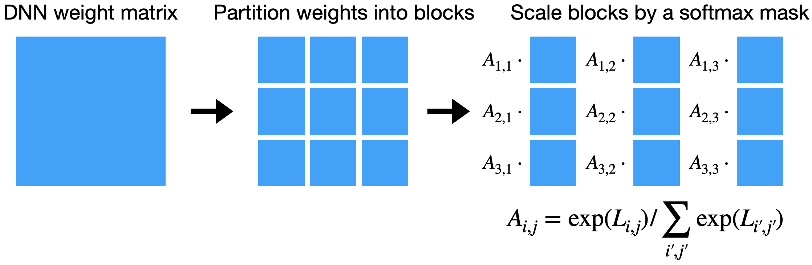
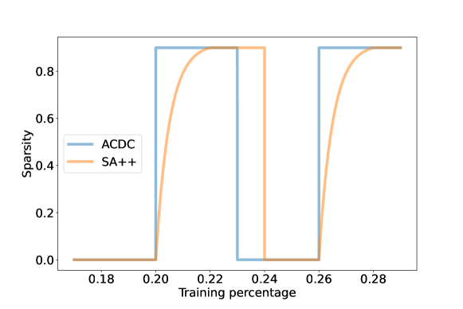
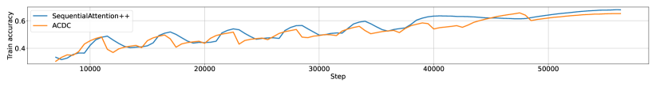
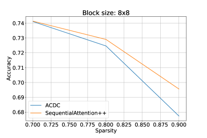
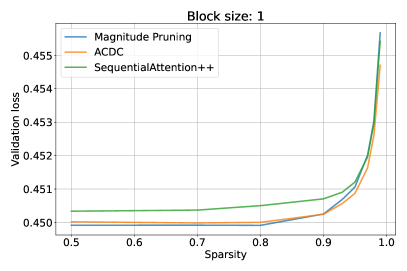

# SequentialAttention++ for Block Sparsification: Differentiable Pruning Meets Combinatorial Optimization

###### Abstract

Neural network pruning is a key technique towards engineering large yet scalable, interpretable, and generalizable models. Prior work on the subject has developed largely along two orthogonal directions: (1) differentiable pruning for efficiently and accurately scoring the importance of parameters, and (2) combinatorial optimization for efficiently searching over the space of sparse models. We unite the two approaches, both theoretically and empirically, to produce a coherent framework for structured neural network pruning in which differentiable pruning guides combinatorial optimization algorithms to select the most important sparse set of parameters. Theoretically, we show how many existing differentiable pruning techniques can be understood as nonconvex regularization for group sparse optimization, and prove that for a wide class of nonconvex regularizers, the global optimum is unique, group-sparse, and provably yields an approximate solution to a sparse convex optimization problem. The resulting algorithm that we propose, *SequentialAttention++*, advances the state of the art in large-scale neural network block-wise pruning tasks on the ImageNet and Criteo datasets.  

## 1 Introduction

Pruning methods for neural networks LeCun et al. ([1989](#bib.bib22)) replace dense weight matrices by sparse approximations, which offer improved generalization and inference efficiency in terms of storage, energy consumption, and other computational resources. In various common formulations, the problem of computing the best sparse approximation to a dense weight matrix is intractable as it generalizes the sparse linear regression problem, which is known to be NP-hard even to approximate Natarajan ([1995](#bib.bib27)); Foster et al. ([2015](#bib.bib10)); Gupte & Vaikuntanathan ([2021](#bib.bib13)); Price et al. ([2022](#bib.bib30)). Despite this fact, a wide variety of techniques have proven to be quite successful in practice. This includes magnitude pruning, $\ell_{1}$ regularization, greedy coordinate descent, sampling, among others.  

While earlier works have focused on unstructured (i.e., entrywise) sparsity, which has been an active and fruitful area, researchers have rapidly recognized the importance of *structured* sparsity, which enforces that the sparse approximation respects certain patterns, such as block structure. These structural constraints often lead to further efficiency gains due to improved hardware utilization Anwar et al. ([2017](#bib.bib3)); Pool & Yu ([2021](#bib.bib29)); Liu et al. ([2022](#bib.bib25)). Our work thus focuses on developing new and improved techniques for structured sparsification of weight matrices, and in particular on block sparsification Ma et al. ([2023](#bib.bib26)).  

### 1.1 Importance scoring and combinatorial optimization

We argue that existing approaches to neural network pruning have developed along two orthogonal directions: algorithms for *importance scoring* and algorithms for *combinatorial optimization*. We roughly think of importance scoring algorithms as those that aim to select a small number of important entries (or blocks) of weight matrices, while we think of combinatorial optimization algorithms as wrapper methods that use the importance scoring algorithms as oracles to iteratively construct the desired (block) sparse weight matrix.  

Among importance scoring algorithms, early popular choices have included magnitude pruning Thimm & Fiesler ([1995](#bib.bib41)); Han et al. ([2015](#bib.bib15)), where the magnitude of each trainable parameter serves as a proxy for its importance, as well as methods based on gradients Karnin ([1990](#bib.bib19)); Sanh et al. ([2020](#bib.bib34)), Hessians LeCun et al. ([1989](#bib.bib22)); Hassibi et al. ([1993](#bib.bib16)); Singh & Alistarh ([2020](#bib.bib38)); Frantar & Alistarh ([2023](#bib.bib12)), and other statistics of the weights. Other works have incorporated $\ell_{1}$ regularization Wen et al. ([2016](#bib.bib47)); Yang et al. ([2019](#bib.bib50)) to encourage sparsity. More recently, a class of techniques broadly termed *differentiable pruning* inspired by techniques for differentiable neural architecture search Liu et al. ([2019](#bib.bib23)) have increased in popularity, where importance scores and/or soft masks are trained together with the network weights in a differentiable manner Xiao et al. ([2019](#bib.bib49)); Voita et al. ([2019](#bib.bib46)); Kang & Han ([2020](#bib.bib18)); Ramakrishnan et al. ([2020](#bib.bib32)); Savarese et al. ([2020](#bib.bib35)); Zhang et al. ([2022](#bib.bib52)). Variations of this idea use the network weights themselves to represent the “importance scores”, and simply use a transformation of the original network weights Schwarz et al. ([2021](#bib.bib36)); Vanderschueren & Vleeschouwer ([2023](#bib.bib43)); Cho et al. ([2023](#bib.bib6)).  

As for the combinatorial optimization aspects of pruning, the use of iterative or greedy procedures has long been explored and is known to improve sparsification quality over “one-shot” uses of importance scoring algorithms LeCun et al. ([1989](#bib.bib22)); Hassibi et al. ([1993](#bib.bib16)); Ström ([1997](#bib.bib39)); Frankle & Carbin ([2019](#bib.bib11)). The work of Halabi et al. ([2022](#bib.bib14)) gives a theoretical justification of this observation via connections to weakly submodular optimization. Combinatorial optimization algorithms beyond greedy approaches, especially local search methods that improve sparsity patterns via local swaps such as iterative hard thresholding (IHT), have long been known in the submodular optimization literature, and have recently been shown to be extremely effective when combined with magnitude pruning Evci et al. ([2020](#bib.bib9)); Peste et al. ([2021](#bib.bib28)); Kuznedelev et al. ([2023b](#bib.bib21)). The work of Peste et al. ([2021](#bib.bib28)) also provides strong theoretical guarantees for their approach, *ACDC*. Similar ideas have also been termed as “neuroregeneration” in work of Liu et al. ([2021](#bib.bib24)).  

Given these two highly fruitful approaches to the problem of pruning neural networks, it is natural to ask how recent advances in importance scoring algorithms and combinatorial optimization algorithms can work in concert. Our work gives a thorough investigation of this question from both theoretical and empirical perspectives.  

### 1.2 Theoretical results

On the theoretical side, we present an investigation of differentiable pruning techniques for block sparsification when the objective function $\mathcal{L}:\mathbb{R}^{n}\to\mathbb{R}$ is strictly convex and differentiable. Note that this already captures several interesting problems where block sparsification of weight matrices is desired, such as multinomial logistic regression and multiple response linear regression. We take the $n$ variables of our objective function to be partitioned into disjoint groups $\{T_{i}\}_{i=1}^{t}$ where $T_{i}\subseteq[n]$ and possibly have varying size. For instance, in the context of block sparsification, $\mathcal{L}$ could correspond to the multinomial logistic regression objective function with $K$ classes and $d$ features, and the $n=Kd$ variables could be partitioned into $t$ blocks $T_{1},T_{2},\dots,T_{t}$. Furthermore, we will also consider an $\ell_{2}$ regularization term on the parameters $\boldsymbol{\beta}$, that is, we study variants of the problem $\min_{\boldsymbol{\beta}\in\mathbb{R}^{n}}\mathcal{L}(\boldsymbol{\beta})+\lambda\lVert\boldsymbol{\beta}\rVert_{2}^{2}$. Note that explicit $\ell_{2}$ regularization is a standard component of machine learning architectures, and also appears *implicitly* whenever a loss function is optimized with gradient descent Shalev-Shwartz ([2012](#bib.bib37)), with the regularization parameter $\lambda$ being controlled by learning rate parameters and early stopping Suggala et al. ([2018](#bib.bib40)).  

Our contributions are twofold: (1) we show that a wide variety of differentiable pruning techniques can all be understood as an implementation of nonconvex regularization that generalizes the group LASSO, and (2) we show that a wide class of nonconvex regularizers give a unique sparse global minimum that coincides with the unique sparse global minimum of a corresponding group LASSO problem.  

#### 1.2.1 Differentiable pruning as nonconvex regularization

For the first item, we observe that if we minimize the loss $\mathcal{L}$ with each of the variable groups $\boldsymbol{\beta}|_{T_{i}}$ for $i\in[t]$ replaced by a “masked” version $q(\mathbf{w}_{i})\boldsymbol{\beta}|_{T_{i}}$, and with regularization on $\mathbf{w}$ and $\boldsymbol{\beta}$, then this problem is equivalent to another optimization problem that simply optimizes $\mathcal{L}$ with a different, and often sparsity-inducing, regularizer. A basic version of this observation already appears in works of Hoff ([2017](#bib.bib17)); Axiotis & Yasuda ([2023](#bib.bib4)), where it is shown that if the masks $q$ are just the identity, then we recover the usual group LASSO problem, that is,  

|  |  | $\displaystyle\min_{\mathbf{w}\in\mathbb{R}^{t},\boldsymbol{\beta}\in\mathbb{R}^{n}}\mathcal{L}(\{\mathbf{w}_{i}\boldsymbol{\beta}|_{T_{i}}\}_{i=1}^{t})+\frac{\lambda}{2}\left\lparen\lVert\mathbf{w}\rVert_{2}^{2}+\lVert\boldsymbol{\beta}\rVert_{2}^{2}\right\rparen$ |  |
| --- | --- | --- | --- |
|  | $\displaystyle=~{}$ | $\displaystyle\min_{\boldsymbol{\beta}\in\mathbb{R}^{n}}\mathcal{L}(\boldsymbol{\beta})+\lambda\sum_{i=1}^{t}\lVert\boldsymbol{\beta}|_{T_{i}}\rVert_{2}$ |  |
| --- | --- | --- | --- |

where $\{\mathbf{w}_{i}\boldsymbol{\beta}|_{T_{i}}\}_{i=1}^{t}$ denotes the concatenation of the “masked” groups $\mathbf{w}_{i}\boldsymbol{\beta}|_{T_{i}}$ for $i\in[t]$. We generalize this observation and show that this framework also applies to other ideas popular in the differentiable pruning literature, such as applying $\ell_{1}$ regularization on the masks $\mathbf{w}$ to induce sparsity Yang et al. ([2019](#bib.bib50)) or applying softmax-type masks such as $\exp(\mathbf{w}_{i})$ Yasuda et al. ([2023](#bib.bib51)). We note that prior to our work, there was no theoretical understanding on the value of applying such techniques in the context of differentiable pruning.  

We also show that similar ideas apply to differentiable pruning techniques that use the network weights themselves as importance scores Schwarz et al. ([2021](#bib.bib36)); Cho et al. ([2023](#bib.bib6)). Here, the basic observation is that if one optimizes a loss function $\mathcal{L}$ with variables $\boldsymbol{\beta}$ replaced by the (signed) entrywise square $\boldsymbol{\beta}\odot\boldsymbol{\beta}$, then this results in a “rich get richer” dynamic where large weights evolve to be larger while smaller weights are driven down to zero, resulting in sparse solutions. It is known that this idea has connections to exponentiated gradient descent which also results in sparse solutions Vaskevicius et al. ([2019](#bib.bib44)); Amid & Warmuth ([2020a](#bib.bib1), [b](#bib.bib2)). However, prior work only handles entrywise sparsity and does not address the question of structured pruning. We note that, in fact, these ideas can also be understood in the framework of sparsity-inducing regularizers, even in the group setting. Here, we show that “masking” each of the variable groups $\boldsymbol{\beta}|_{T_{i}}$ by its $\ell_{2}$ norm $\lVert\boldsymbol{\beta}|_{T_{i}}\rVert_{2}$ gives a natural group generalization of this technique, and that this gives an optimization problem that is again equivalent to the group LASSO problem  

|  |  | $\displaystyle\min_{\boldsymbol{\beta}\in\mathbb{R}^{n}}\mathcal{L}(\{\lVert\boldsymbol{\beta}|_{T_{i}}\rVert_{2}\cdot\boldsymbol{\beta}|_{T_{i}}\}_{i=1}^{t})+\lambda\lVert\boldsymbol{\beta}\rVert_{2}^{2}$ |  |
| --- | --- | --- | --- |
|  | $\displaystyle=~{}$ | $\displaystyle\min_{\boldsymbol{\beta}\in\mathbb{R}^{n}}\mathcal{L}(\boldsymbol{\beta})+\lambda\sum_{i=1}^{t}\lVert\boldsymbol{\beta}|_{T_{i}}\rVert_{2}.$ |  |
| --- | --- | --- | --- |

#### 1.2.2 Unique sparse global minima

Our second set of contributions is to analyze the solutions of a wide class of nonconvex regularizers. We now consider the following regularized problem, where $q:\mathbb{R}_{+}\to\mathbb{R}_{+}$ is a strictly increasing and subadditive function with $q(0)=0$, and $\lambda>0$ is a regularization parameter:  

|  | $$\min_{\boldsymbol{\beta}\in\mathbb{R}^{n}}\mathcal{L}(\boldsymbol{\beta})+\lambda\cdot q^{-1}\left\lparen\sum_{i=1}^{t}q(\lVert\boldsymbol{\beta}|_{T_{i}}\rVert_{2})\right\rparen.$$ |  | (1) |
| --- | --- | --- | --- |

For instance, some popular choices of $q$ include the absolute value $q(x)=\lvert x\rvert$, $p$-th powers $q(x)=\lvert x\rvert^{p}$ for $p<1$, or logarithmic regularizers such as $q(x)=\log(1+x)$. In general, the class of such $q$ (strictly) contains the set of all concave functions $q$ that vanish at the origin. Note that the form of ([1](#S1.E1 "Equation 1 ‣ 1.2.2 Unique sparse global minima ‣ 1.2 Theoretical results ‣ 1 Introduction ‣ SequentialAttention++ for Block Sparsification: Differentiable Pruning Meets Combinatorial Optimization")) slightly differs from the usual form of nonconvex regularizers, as it applies $q^{-1}$ on the sum $\sum_{i=1}^{t}q(\lVert\boldsymbol{\beta}|_{T_{i}}\rVert_{2})$ rather than taking the regularizer to just be $\sum_{i=1}^{t}q(\lVert\boldsymbol{\beta}|_{T_{i}}\rVert_{2})$. This does not substantially change the nature of the optimization problem as it is the Lagrangian dual for the same constraint. Our main result of this section is Theorem [1.1](#S1.Thmtheorem1 "Theorem 1.1 (Unique sparse global minima). ‣ 1.2.2 Unique sparse global minima ‣ 1.2 Theoretical results ‣ 1 Introduction ‣ SequentialAttention++ for Block Sparsification: Differentiable Pruning Meets Combinatorial Optimization"), which relates the group $q$-regularized objective ([1](#S1.E1 "Equation 1 ‣ 1.2.2 Unique sparse global minima ‣ 1.2 Theoretical results ‣ 1 Introduction ‣ SequentialAttention++ for Block Sparsification: Differentiable Pruning Meets Combinatorial Optimization")) to the following corresponding group LASSO objective:  

|  | $$\min_{\boldsymbol{\beta}\in\mathbb{R}^{n}}\mathcal{L}(\boldsymbol{\beta})+\lambda\sum_{i=1}^{t}\lVert\boldsymbol{\beta}|_{T_{i}}\rVert_{2}.$$ |  | (2) |
| --- | --- | --- | --- |

###### Theorem 1.1 (Unique sparse global minima).

Let $q:\mathbb{R}_{+}\to\mathbb{R}_{+}$ be strictly increasing, subadditive (i.e., $q(a+b)\leq q(a)+q(b)$ for $a,b\in\mathbb{R}^{+}$), and satisfy $q(0)=0$. If ([2](#S1.E2 "Equation 2 ‣ 1.2.2 Unique sparse global minima ‣ 1.2 Theoretical results ‣ 1 Introduction ‣ SequentialAttention++ for Block Sparsification: Differentiable Pruning Meets Combinatorial Optimization")) has a unique minimizer $\boldsymbol{\beta}^{*}$ with group sparsity at most $1$, then $\boldsymbol{\beta}^{*}$ is also the unique minimizer for ([1](#S1.E1 "Equation 1 ‣ 1.2.2 Unique sparse global minima ‣ 1.2 Theoretical results ‣ 1 Introduction ‣ SequentialAttention++ for Block Sparsification: Differentiable Pruning Meets Combinatorial Optimization")).  

We make several remarks about Theorem [1.1](#S1.Thmtheorem1 "Theorem 1.1 (Unique sparse global minima). ‣ 1.2.2 Unique sparse global minima ‣ 1.2 Theoretical results ‣ 1 Introduction ‣ SequentialAttention++ for Block Sparsification: Differentiable Pruning Meets Combinatorial Optimization"). First, we justify why the assumption of the theorem is not vacuous: that is, we explain why the group LASSO objective ([2](#S1.E2 "Equation 2 ‣ 1.2.2 Unique sparse global minima ‣ 1.2 Theoretical results ‣ 1 Introduction ‣ SequentialAttention++ for Block Sparsification: Differentiable Pruning Meets Combinatorial Optimization")) has sparse solutions. Indeed, in recent work of Axiotis & Yasuda ([2023](#bib.bib4)) the following are shown if $\mathcal{L}$ is strongly convex and differentiable:  

* If $\lambda\geq\tau$ for $\tau=\max_{i=1}^{t}\lVert\nabla\mathcal{L}(0)|_{T_{i}}\rVert_{2}$, then ([2](#S1.E2 "Equation 2 ‣ 1.2.2 Unique sparse global minima ‣ 1.2 Theoretical results ‣ 1 Introduction ‣ SequentialAttention++ for Block Sparsification: Differentiable Pruning Meets Combinatorial Optimization")) has a unique global minimizer at $\boldsymbol{\beta}=0$. 
* If $\lambda<\tau$ is sufficiently close to $\tau$, then ([1](#S1.E1 "Equation 1 ‣ 1.2.2 Unique sparse global minima ‣ 1.2 Theoretical results ‣ 1 Introduction ‣ SequentialAttention++ for Block Sparsification: Differentiable Pruning Meets Combinatorial Optimization")) has a unique global minimizer with group sparsity $1$. 

Thus, when $\lambda$ is sufficiently large, Theorem [1.1](#S1.Thmtheorem1 "Theorem 1.1 (Unique sparse global minima). ‣ 1.2.2 Unique sparse global minima ‣ 1.2 Theoretical results ‣ 1 Introduction ‣ SequentialAttention++ for Block Sparsification: Differentiable Pruning Meets Combinatorial Optimization") indeed establishes that ([1](#S1.E1 "Equation 1 ‣ 1.2.2 Unique sparse global minima ‣ 1.2 Theoretical results ‣ 1 Introduction ‣ SequentialAttention++ for Block Sparsification: Differentiable Pruning Meets Combinatorial Optimization")) has a unique sparse global minimum.  

Furthermore, Axiotis & Yasuda ([2023](#bib.bib4)) also show that the above global minimizer of the group LASSO problem ([2](#S1.E2 "Equation 2 ‣ 1.2.2 Unique sparse global minima ‣ 1.2 Theoretical results ‣ 1 Introduction ‣ SequentialAttention++ for Block Sparsification: Differentiable Pruning Meets Combinatorial Optimization")) with group sparsity $1$ is supported on a group $T_{i}$ that maximizes $\lVert\nabla\mathcal{L}(0)|_{T_{i}}\rVert_{2}$, that is, it selects the group of variables that locally provides the largest improvement in the objective function cost. Repeatedly alternating between selecting such a feature and re-optimizing over the support is an algorithm known as the *group orthogonal matching pursuit (group OMP)*, and has provable guarantees for group sparse convex optimization when $\mathcal{L}$ satisfies the restricted strong convexity and restricted smoothness properties Axiotis & Yasuda ([2023](#bib.bib4)). It is also shown that a related local search algorithm known as *group orthogonal matching pursuit with replacement (group OMPR)* also applies in this context, which has improved guarantees.  

Finally, we emphasize that it is generally difficult to establish structural results for nonconvex optimization problems, even for simple convex problems with nonconvex regularizers. Thus, we believe that our results may be of independent interest in the literature of nonconvex optimization.  

### 1.3 Empirical results: SequentialAttention++

We now apply our theoretical insights of combining differentiable pruning and combinatorial optimization to develop a novel algorithm for block neural network pruning, which we call *SequentialAttention++*. SequentialAttention++ is primarily a fusion of two prior techniques: *Sequential Attention*, a feature selection technique based on differentiable pruning developed in work of Yasuda et al. ([2023](#bib.bib51)), and *ACDC*, which is a highly effective stochastic adaptation of the classic iterative hard thresholding (IHT) algorithm Peste et al. ([2021](#bib.bib28)).  

Sequential Attention Yasuda et al. ([2023](#bib.bib51)) is an algorithm for feature selection on neural networks, which works by introducing a softmax mask that is trained together with the neural network weights. Each of the $n$ input features is scaled by a differentiable mask $A_{i}=\exp(L_{i})/\sum_{j=1}^{n}\exp(L_{j})$ for a vector $L\in\mathbb{R}^{n}$ of logits. Note that our theoretical results on differentiable pruning, and in particular Lemma [2.1](#S2.Thmtheorem1 "Lemma 2.1 (Unnormalized softmax as log-sum regularization). ‣ 2.1.1 Unnormalized softmax ‣ 2.1 Differentiable pruning as nonconvex regularization ‣ 2 Theory ‣ SequentialAttention++ for Block Sparsification: Differentiable Pruning Meets Combinatorial Optimization"), suggests that this roughly corresponds to performing a log-sum regularization on the corresponding weights for these features. We first extend this to the block sparsification setting by instead scaling each block of weights to prune by a similar softmax mask (see Figure [1](#S1.F1 "Figure 1 ‣ 1.3 Empirical results: SequentialAttention++ ‣ 1 Introduction ‣ SequentialAttention++ for Block Sparsification: Differentiable Pruning Meets Combinatorial Optimization")). Note that in this new setting, Lemma [2.1](#S2.Thmtheorem1 "Lemma 2.1 (Unnormalized softmax as log-sum regularization). ‣ 2.1.1 Unnormalized softmax ‣ 2.1 Differentiable pruning as nonconvex regularization ‣ 2 Theory ‣ SequentialAttention++ for Block Sparsification: Differentiable Pruning Meets Combinatorial Optimization") shows that this corresponds to a *group* log-sum regularization on each of the blocks.  

[FIGURE S1.F1.g1]

Figure 1: Differentiable pruning of weight blocks
[/FIGURE]

We then use this differentiable pruning technique as part of a local search procedure inspired by ACDC Peste et al. ([2021](#bib.bib28)). In the originally proposed ACDC algorithm, the neural network is trained in multiple phases, where the phases alternate between a “dense” training phase and a “sparse” training phase. During the dense phases, the weights are trained in the standard way, whereas in the sparse phases, only a sparse set of weights corresponding to the top $k$ weights at the beginning of the phase (i.e., chosen by magnitude pruning) are used. The idea here is that if a suboptimal sparse support is selected during the sparse phase, then this support can be modified during the dense phase. We note that one of the weaknesses of this algorithm is the use of the weight magnitudes as a proxy for the importance of the weights, whereas improved parameter importance estimation is possible by introducing the use of differentiable pruning techniques. Thus in our SequentialAttention++ algorithm, we modify the ACDC algorithm by training a softmax mask together with the neural network weights during the dense phase as in Figure [1](#S1.F1 "Figure 1 ‣ 1.3 Empirical results: SequentialAttention++ ‣ 1 Introduction ‣ SequentialAttention++ for Block Sparsification: Differentiable Pruning Meets Combinatorial Optimization"), and then using the softmax mask to select a sparse support during the sparse phases. Our theoretical results establish provable guarantees for a slightly modified version of this algorithm, by showing that log-sum regularization can be integrated with a similar local search algorithm that alternates between dropping small weights from the support, selecting weights via regularization, and optimizing on the new support (see Theorem [B.3](#A2.Thmtheorem3 "Theorem B.3 (OMPR via nonconvex regularization). ‣ Appendix B OMPR via nonconvex regularization ‣ SequentialAttention++ for Block Sparsification: Differentiable Pruning Meets Combinatorial Optimization") and Appendix [B](#A2 "Appendix B OMPR via nonconvex regularization ‣ SequentialAttention++ for Block Sparsification: Differentiable Pruning Meets Combinatorial Optimization")).  

## 2 Theory

In Section [2](#S2 "2 Theory ‣ SequentialAttention++ for Block Sparsification: Differentiable Pruning Meets Combinatorial Optimization"), we present our theoretical results on differentiable pruning and local search algorithms for DNN sparsification. Missing proofs can be found in Appendix [A](#A1 "Appendix A Missing proofs from Section 2 ‣ SequentialAttention++ for Block Sparsification: Differentiable Pruning Meets Combinatorial Optimization").  

### 2.1 Differentiable pruning as nonconvex regularization

In this section, we show how a wide variety of differentiable pruning techniques studied in the literature can be viewed as nonconvex regularizers. As described earlier in Section [1.2.2](#S1.SS2.SSS2 "1.2.2 Unique sparse global minima ‣ 1.2 Theoretical results ‣ 1 Introduction ‣ SequentialAttention++ for Block Sparsification: Differentiable Pruning Meets Combinatorial Optimization"), we later show that nonconvex regularization can in fact be connected to provable guarantees for sparse convex optimization by implementing the orthogonal matching pursuit algorithm and its variants. Thus, together, we give the first steps towards a full theoretical analysis of many popular differentiable pruning techniques in the literature.  

#### 2.1.1 Unnormalized softmax

The softmax operation is a popular differentiable sparsity-inducing technique, where a vector is transformed by exponentiating each entry and normalizing the result. The softmax forms the backbone of many modern ML techniques ranging from multinomial logistic regression to differentiable architecture search Liu et al. ([2019](#bib.bib23)) to attention mechanisms and transformers Vaswani et al. ([2017](#bib.bib45)), and thus a theoretical understanding of the softmax is critical mission for modern machine learning theory.  

We take a step towards this by considering *unnormalized* softmax, which corresponds to a simple entrywise exponentiation. The unnormalized softmax is a popular alternative to the usual softmax as it still captures its sparsity-inducing properties Amid & Warmuth ([2020a](#bib.bib1), [b](#bib.bib2)), while its simplicity allows for more efficient implementations. We show that, in fact, unnormalized softmax can be viewed as a type of log-sum regularization, which is a popular relaxation of the $\lVert\cdot\rVert_{0}$ norm that has been often considered in the machine learning and signal processing literatures Rao & Kreutz-Delgado ([1999](#bib.bib33)); Wipf & Nagarajan ([2009](#bib.bib48)); Qiao et al. ([2020](#bib.bib31)); Tugnait ([2022](#bib.bib42)); Zhou et al. ([2023](#bib.bib53)).  

###### Lemma 2.1 (Unnormalized softmax as log-sum regularization).

|  |  | $\displaystyle\min_{\mathbf{w}\in\mathbb{R}^{t},\boldsymbol{\beta}\in\mathbb{R}^{n}}\mathcal{L}(\{\exp(\mathbf{w}_{i})\boldsymbol{\beta}|_{T_{i}}\}_{i=1}^{t})+\lambda\left\lparen\lVert\mathbf{w}\rVert_{2}^{2}+\lVert\boldsymbol{\beta}\rVert_{2}^{2}\right\rparen$ |  |
| --- | --- | --- | --- |
|  | $\displaystyle=~{}$ | $\displaystyle\min_{\mathbf{u}\in\mathbb{R}^{n}}\mathcal{L}(\mathbf{u})+\lambda\sum_{i=1}^{t}q(\lVert\mathbf{u}|_{T_{i}}\rVert_{2})$ |  |
| --- | --- | --- | --- |

where $q(a)=W(2a^{2})^{2}/4+W(2a^{2})/2$ and $W$ is the Lambert $W$ function, i.e., the inverse of $f(W)=We^{W}$.  

#### 2.1.2 $\ell_{1}$-regularized masks

Next, we consider the idea of applying a sparsity-inducing regularization on a mask (see, e.g., the work of Yang et al. ([2019](#bib.bib50))). We show that by regularizing the mask instead of the parameters themselves, the resulting optimization leads to a “more nonconvex” regularizer.  

###### Lemma 2.2 ($\ell_{1}$-regularized masks as $\ell_{q}$ regularization).

|  |  | $\displaystyle\min_{\mathbf{w}\in\mathbb{R}^{t},\boldsymbol{\beta}\in\mathbb{R}^{n}}\mathcal{L}(\{\mathbf{w}_{i}\boldsymbol{\beta}|_{T_{i}}\}_{i=1}^{t})+\lambda\left\lparen\lVert\mathbf{w}\rVert_{1}+\lVert\boldsymbol{\beta}\rVert_{2}^{2}\right\rparen$ |  |
| --- | --- | --- | --- |
|  | $\displaystyle=~{}$ | $\displaystyle\min_{\mathbf{u}\in\mathbb{R}^{n}}\mathcal{L}(\mathbf{u})+\frac{3}{2}2^{1/3}\lambda\sum_{i=1}^{t}\lVert\mathbf{u}|_{T_{i}}\rVert_{2}^{2/3}$ |  |
| --- | --- | --- | --- |

#### 2.1.3 Powerpropagation

Finally, we study differentiable pruning techniques that use the network weights themselves as importance scores. The most straightforward implementation of this idea is to square each of the weights, as explored in works such as powerpropagation for neural networks Schwarz et al. ([2021](#bib.bib36)), but more complex versions have also been considered Cho et al. ([2023](#bib.bib6)). We show how these techniques can be generalized to handle the group setting, and show how they can also be interpreted as an implementation of group sparsity-inducing regularization.  

###### Lemma 2.3 (Group powerpropagation as Group LASSO).

|  |  | $\displaystyle\min_{\mathbf{w}\in\mathbb{R}^{t},\boldsymbol{\beta}\in\mathbb{R}^{n}}\mathcal{L}(\{\lVert\boldsymbol{\beta}|_{T_{i}}\rVert_{2}\boldsymbol{\beta}|_{T_{i}}\}_{i=1}^{t})+\lambda\lVert\boldsymbol{\beta}\rVert_{2}^{2}$ |  |
| --- | --- | --- | --- |
|  | $\displaystyle=~{}$ | $\displaystyle\min_{\mathbf{u}\in\mathbb{R}^{n}}\mathcal{L}(\mathbf{u})+\lambda\sum_{i=1}^{t}\lVert\mathbf{u}|_{T_{i}}\rVert_{2}$ |  |
| --- | --- | --- | --- |

### 2.2 Unique sparse global minima

We will prove the following theorem in this section, which establishes natural conditions for which nonconvex regularization of a convex function produces a unique group-sparse global minimum. As discussed in Section [1.2.2](#S1.SS2.SSS2 "1.2.2 Unique sparse global minima ‣ 1.2 Theoretical results ‣ 1 Introduction ‣ SequentialAttention++ for Block Sparsification: Differentiable Pruning Meets Combinatorial Optimization"), this theorem is the main crucial result for proving that local search algorithms give provable guarantees for sparse convex optimization.  

See [1.1](#S1.Thmtheorem1 "Theorem 1.1 (Unique sparse global minima). ‣ 1.2.2 Unique sparse global minima ‣ 1.2 Theoretical results ‣ 1 Introduction ‣ SequentialAttention++ for Block Sparsification: Differentiable Pruning Meets Combinatorial Optimization")  

We have the following lemma that shows that if $q$ is strictly increasing and subadditive, then the group $q$-regularization is always larger than group LASSO regularization. Thus, the group LASSO objective is always a lower bound on the $q$-regularized objective.  

###### Lemma 2.4.

Let $q:\mathbb{R}_{+}\to\mathbb{R}_{+}$ be strictly increasing and subadditive. Then,  

|  | $$\sum_{i=1}^{t}\lVert\boldsymbol{\beta}|_{T_{i}}\rVert_{2}\leq q^{-1}\left\lparen\sum_{i=1}^{t}q(\lVert\boldsymbol{\beta}|_{T_{i}}\rVert_{2})\right\rparen$$ |  |
| --- | --- | --- |

###### Proof.

Since $q$ is invertible, applying the subadditivity condition on $q(\sum_{i=1}^{t}\lVert\boldsymbol{\beta}|_{T_{i}}\rVert_{2})$ and then applying $q^{-1}$ on both sides of the inequality yields the result. ∎  

Furthermore, note that for solutions $\boldsymbol{\beta}$ that have group sparsity at most $1$, the group $q$-regularization has the same value as the group LASSO regularization. That is, the lower bound value can be achieved when the group sparsity is at most $1$.  

###### Lemma 2.5.

Let $q:\mathbb{R}_{+}\to\mathbb{R}_{+}$ be strictly increasing and satisfy $q(0)=0$. Then, for any $\boldsymbol{\beta}\in\mathbb{R}^{n}$ with group sparsity $1$,  

|  | $$\sum_{i=1}^{t}\lVert\boldsymbol{\beta}|_{T_{i}}\rVert_{2}=q^{-1}\left\lparen\sum_{i=1}^{t}q(\lVert\boldsymbol{\beta}|_{T_{i}}\rVert_{2})\right\rparen.$$ |  |
| --- | --- | --- |

###### Proof.

If $\boldsymbol{\beta}$ has group sparsity at most $1$, say supported on $T_{j}$ for some $j\in[t]$, then we have  

|  | $$q^{-1}\left\lparen\sum_{i=1}^{t}q(\lVert\boldsymbol{\beta}|_{T_{i}}\rVert_{2})\right\rparen=q^{-1}\left\lparen q(\lVert\boldsymbol{\beta}|_{T_{j}}\rVert_{2})\right\rparen=\lVert\boldsymbol{\beta}|_{T_{j}}\rVert_{2}.$$ |  |
| --- | --- | --- |

∎  

Together, Lemmas [2.4](#S2.Thmtheorem4 "Lemma 2.4. ‣ 2.2 Unique sparse global minima ‣ 2 Theory ‣ SequentialAttention++ for Block Sparsification: Differentiable Pruning Meets Combinatorial Optimization") and [2.5](#S2.Thmtheorem5 "Lemma 2.5. ‣ 2.2 Unique sparse global minima ‣ 2 Theory ‣ SequentialAttention++ for Block Sparsification: Differentiable Pruning Meets Combinatorial Optimization") imply that if the group LASSO objective has a unique sparse minimum, then this is a lower bound on the optimal value that can be achieved by the $q$-regularized objective. This proves Theorem [1.1](#S1.Thmtheorem1 "Theorem 1.1 (Unique sparse global minima). ‣ 1.2.2 Unique sparse global minima ‣ 1.2 Theoretical results ‣ 1 Introduction ‣ SequentialAttention++ for Block Sparsification: Differentiable Pruning Meets Combinatorial Optimization"). The formal argument can be found in Appendix [A](#A1 "Appendix A Missing proofs from Section 2 ‣ SequentialAttention++ for Block Sparsification: Differentiable Pruning Meets Combinatorial Optimization").  

## 3 The SequentialAttention++ algorithm

As discussed, the basic form of SequentialAttention++ is a combination of Sequential Attention and ACDC. More specifically, we first introduce the sequential attention parameterization, where we multiply each selection candidate (e.g. block, in the case of block sparsification) by a trainable attention weight. Then, we employ the alternating compressed and decompressed phases of ACDC *on the attention weights* (instead of doing so on the selection candidates’ weights themselves). This helps factor out the inherent magnitude differences between model parameters, which do not necessarily correlate with importances. The basic algorithm can be seen in Algorithm [1](#alg1 "Algorithm 1 ‣ 3 The SequentialAttention++ algorithm ‣ SequentialAttention++ for Block Sparsification: Differentiable Pruning Meets Combinatorial Optimization").  

[ALGORITHM alg1]

  function $\text{FF}({{\bf X}\in\mathbb{R}^{b\times n}}:\text{input batch},t:\text{training step})$ 

     Trainable params:

     Kernel matrix ${\bf W}\in\mathbb{R}^{n\times m}$, Logits ${\bf L}\in\mathbb{R}^{n\times m}$

     

     ${\bf A}=nm\cdot e^{\bf L}/\sum e^{\bf L}$

     ${\bf\hat{W}}={\bf W}\odot{\bf A}\odot\text{Mask}({\bf A},t)$

     return ${\bf X}{\bf\hat{W}}$

  end function

  

  function $\text{Mask}({\bf A}:\text{attention weights},t:\text{training step})$ 

     Non-trainable state: $\text{mask}\in\{0,1\}^{n\times m}$

     

     if $t$ is in a dense phase then

        $\text{mask}\leftarrow\text{top}_{k}({\bf A})$

        return ${\bf 1}_{n\times m}$

     else if $t$ is in a sparse phase then

        return mask

     end if

  end function

Algorithm 1  Feed-forward layer with the basic version of SequentialAttention++ to select top $k$ parameters from a kernel $\mathbf{W}$. We omit sparsification phases for simplicity.
[/ALGORITHM]

### 3.1 The sparsification phase

One drawback of sparse/dense phases is that the dense-to-sparse transition is abrupt. Since the lowest-magnitude weights are instantly pruned, this neglects correlations between these pruned parameters. If we were to re-train the model after pruning one parameter at a time, the picture could be drastically different, since low-magnitude weights could grow (this could happen e.g. due to parameter redundancy). In fact, this effect was highlighted by Kuznedelev et al. ([2023a](#bib.bib20)), who devised a backward selection method based on correlations as captured by the Hessian.  

Inspired by this approach, we incorporate a backward selection phase between the dense and sparse phases, which we call the sparsification phase. In this phase, we gradually prune the least important features based on the attention weights. This gradual process allows the model to re-adjust the attention weights after some parameters are pruned. The importance of this phase is validated using ablation experiments in Appendix [D.1](#A4.SS1 "D.1 Importance of the sparsification phase. ‣ Appendix D Ablations ‣ SequentialAttention++ for Block Sparsification: Differentiable Pruning Meets Combinatorial Optimization"). We use an exponential pruning schedule, to prune more aggressively in the beginning of the phase, and more carefully at the end (as we approach the desired number of candidates $k$). A comparison of the sparsity schedules of ACDC and SequentialAttention++ can be found in Figure [2](#S3.F2 "Figure 2 ‣ 3.1 The sparsification phase ‣ 3 The SequentialAttention++ algorithm ‣ SequentialAttention++ for Block Sparsification: Differentiable Pruning Meets Combinatorial Optimization"). We use the sparsity schedule $\text{sparsity}(t)=s\cdot\frac{1-e^{-ct}}{1-e^{-c}}$ for $t\in[0,1]$, where $s$ is the target sparsity. This interpolates between sparsity $0$ and $s$, and constitutes a single sparsification phase. We choose the constant $c=4$ (for an ablation analysis, see Appendix [D.2](#A4.SS2 "D.2 Choice of the sparsification exponent. ‣ Appendix D Ablations ‣ SequentialAttention++ for Block Sparsification: Differentiable Pruning Meets Combinatorial Optimization")).  

[FIGURE S3.F2.g1]

Figure 2: Sparsity schedules of ACDC and SequentialAttention++. ACDC uses an instant dense-to-sparse
transition, while SequentialAttention++ uses an
exponential sparsity schedule.
[/FIGURE]

## 4 Experiments

We evaluate our algorithms via sparsification tasks where a dense DNN is approximated by block-sparse counterparts, at various block sizes and sparsities. Our experiments are performed on the ImageNet and Criteo datasets.  

##### ImageNet Deng et al. ([2009](#bib.bib7)).

ImageNet is the most widely used vision dataset and is considered as the de facto benchmark in the neural network pruning literature, culminating in the state of the art results in Kuznedelev et al. ([2023b](#bib.bib21)). We use ResNet50 and a standard training setup (90 epochs, SGD with cosine learning rate and momentum, weight decay). We reshape the $4$-dimensional ($H\times W\times C_{\text{in}}\times C_{\text{out}}$) kernel tensors used in convolutional layers to 2D matrices of shape $HWC_{\text{in}}\times C_{\text{out}}$, which define the 2D block candidates for pruning. We prune all layers uniformly, except for layers with $<100$ blocks, which we do not prune at all, to avoid degeneracy at high sparsities.  

##### Criteo Diemert et al. ([2017](#bib.bib8)).

Criteo is a standard public dataset for the clickthrough rate (CTR) prediction task, which consists of 33M training examples with 13 numerical and 26 categorical features. The model we sparsify is a standard fully connected DNN with three $400$-width layers and an additional embedding layer to transform each input feature into an embedding vector of size $10$ (for a total embedding width of $390$). We prune the first dense layer after the embedding layer. We use Adam optimizer with a learning rate that decays exponentially from $2\cdot 10^{-2}$ to $3\cdot 10^{-4}$. We train to minimize the cross-entropy loss for $25$ epochs with a batch size of $32768$.  

We evaluate the performance of our sparsification algorithm at varying sparsities $p$ and block sizes $B$, where a sparsity $p$ indicates that the DNN layer will only have a $1-p$ fraction of nonzero entries, and a block size of $B$ indicates that the nonzero entries are arranged in $B\times B$ blocks. Note that for a fixed sparsity, larger block sizes generally translate to improved efficiency due to improved hardware utilization, but also degrades quality. Block size of $1$ corresponds to unstructured pruning.  

### 4.1 Baseline algorithms

We compare our SequentialAttention++ algorithm to three other representative prior algorithms for DNN pruning. The first is basic magnitude pruning, which is a popular and effective algorithm where the weights are sparsified by keeping the weights with the largest magnitude after training Frankle & Carbin ([2019](#bib.bib11)). We use it in the block setting by keeping the largest blocks in Frobenius norm. The second algorithm is a block generalization of Powerpropagation Schwarz et al. ([2021](#bib.bib36)), which combines magnitude pruning with a differentiable pruning technique where sparsity is encouraged by squaring the weights. While the original Powerpropagation algorithm did not handle the block sparsification setting, we show that multiplying each block by the Frobenius norm leads to a provable generalization (see Lemma [2.3](#S2.Thmtheorem3 "Lemma 2.3 (Group powerpropagation as Group LASSO). ‣ 2.1.3 Powerpropagation ‣ 2.1 Differentiable pruning as nonconvex regularization ‣ 2 Theory ‣ SequentialAttention++ for Block Sparsification: Differentiable Pruning Meets Combinatorial Optimization")). Finally, we consider ACDC Peste et al. ([2021](#bib.bib28)), which is an adaptation of iterative hard thresholding (IHT) Blumensath & Davies ([2009](#bib.bib5)) to the setting of neural network sparsification, and has produced the state-of-the-art pruning results for ImageNet Kuznedelev et al. ([2023b](#bib.bib21)). For all algorithms and datasets, we include a fine-tuning phase at the end of training, using the pruned model, and evaluate the final pruned model on the test set.  

### 4.2 Results

Our results on ImageNet are summarized in Table [1](#S4.T1 "Table 1 ‣ 4.2 Results ‣ 4 Experiments ‣ SequentialAttention++ for Block Sparsification: Differentiable Pruning Meets Combinatorial Optimization"). The sparsities range over $58$-$95\%$ and the block sizes over $8,16,32,64$. We compare ACDC and SequentialAttention++. Our ACDC implementation closely follows the implementation in Peste et al. ([2021](#bib.bib28))111We sanity-checked our ACDC implementation by verifying that the accuracy of $90\%$ unstructured global pruning matches that of the ACDC paper ($75.01$ vs $75.03$).. We use the phase schedule suggested by Kuznedelev et al. ([2023b](#bib.bib21)) (10% dense, 7 equal sparse-dense phases where the last dense phase is extended by 5%, 15% sparse). For SequentialAttention++, we additionally replace each sparse-dense phase by a sparsification-sparse-dense phase, as described in Section [3.1](#S3.SS1 "3.1 The sparsification phase ‣ 3 The SequentialAttention++ algorithm ‣ SequentialAttention++ for Block Sparsification: Differentiable Pruning Meets Combinatorial Optimization"), and we replace the last of the 7 phases (including its extension) by a sparsification phase. We use a batch size of $2048$ and a maximum learning rate of $0.8$.  

We observe that SequentialAttention++ generally outperforms ACDC on the block sparsification task, across all different block sizes and sparsities that we tested. It should be mentioned that this comes at the cost of introducing additional trainable parameters to the model (one parameter per block). This overhead could be concerning in some applications if block size is too small (e.g., $1$), in which case the model’s parameters are being doubled. However, the overhead is negligible for larger (e.g., $\geq 8$) block sizes.  

[TABLE S4.T1]

 

<table class="ltx_tabular ltx_guessed_headers ltx_align_middle">
<thead class="ltx_thead">
<tr class="ltx_tr">
<th class="ltx_td ltx_th ltx_th_column ltx_border_r ltx_border_tt"></th>
<th class="ltx_td ltx_align_center ltx_th ltx_th_column ltx_border_tt">Validation Accuracy</th>
</tr>
</thead>
<tbody class="ltx_tbody">
<tr class="ltx_tr">
<td class="ltx_td ltx_border_r ltx_border_tt"></td>
<td class="ltx_td ltx_align_center ltx_border_r ltx_border_tt">
Block size: <math class="ltx_Math"><semantics><mrow><mn>8</mn><mo>×</mo><mn>8</mn></mrow><annotation-xml><apply><times></times><cn>8</cn><cn>8</cn></apply></annotation-xml><annotation>8\times 8</annotation></semantics></math>
</td>
<td class="ltx_td ltx_align_center ltx_border_tt">
Block size: <math class="ltx_Math"><semantics><mrow><mn>16</mn><mo>×</mo><mn>16</mn></mrow><annotation-xml><apply><times></times><cn>16</cn><cn>16</cn></apply></annotation-xml><annotation>16\times 16</annotation></semantics></math>
</td>
</tr>
<tr class="ltx_tr">
<td class="ltx_td ltx_align_left ltx_border_r">Sparsity:</td>
<td class="ltx_td ltx_align_center"><math class="ltx_Math"><semantics><mrow><mn>70</mn><mo>%</mo></mrow><annotation-xml><apply><csymbol>percent</csymbol><cn>70</cn></apply></annotation-xml><annotation>70\%</annotation></semantics></math></td>
<td class="ltx_td ltx_align_center"><math class="ltx_Math"><semantics><mrow><mn>80</mn><mo>%</mo></mrow><annotation-xml><apply><csymbol>percent</csymbol><cn>80</cn></apply></annotation-xml><annotation>80\%</annotation></semantics></math></td>
<td class="ltx_td ltx_align_center"><math class="ltx_Math"><semantics><mrow><mn>90</mn><mo>%</mo></mrow><annotation-xml><apply><csymbol>percent</csymbol><cn>90</cn></apply></annotation-xml><annotation>90\%</annotation></semantics></math></td>
<td class="ltx_td ltx_align_center ltx_border_r"><math class="ltx_Math"><semantics><mrow><mn>95</mn><mo>%</mo></mrow><annotation-xml><apply><csymbol>percent</csymbol><cn>95</cn></apply></annotation-xml><annotation>95\%</annotation></semantics></math></td>
<td class="ltx_td ltx_align_center"><math class="ltx_Math"><semantics><mrow><mn>70</mn><mo>%</mo></mrow><annotation-xml><apply><csymbol>percent</csymbol><cn>70</cn></apply></annotation-xml><annotation>70\%</annotation></semantics></math></td>
<td class="ltx_td ltx_align_center"><math class="ltx_Math"><semantics><mrow><mn>80</mn><mo>%</mo></mrow><annotation-xml><apply><csymbol>percent</csymbol><cn>80</cn></apply></annotation-xml><annotation>80\%</annotation></semantics></math></td>
<td class="ltx_td ltx_align_center"><math class="ltx_Math"><semantics><mrow><mn>90</mn><mo>%</mo></mrow><annotation-xml><apply><csymbol>percent</csymbol><cn>90</cn></apply></annotation-xml><annotation>90\%</annotation></semantics></math></td>
<td class="ltx_td ltx_align_right"><math class="ltx_Math"><semantics><mrow><mn>95</mn><mo>%</mo></mrow><annotation-xml><apply><csymbol>percent</csymbol><cn>95</cn></apply></annotation-xml><annotation>95\%</annotation></semantics></math></td>
</tr>
<tr class="ltx_tr">
<td class="ltx_td ltx_align_left ltx_border_r">

ACDC
</td>
<td class="ltx_td ltx_align_center"><math class="ltx_Math"><semantics><mn>74.11</mn><annotation-xml><cn>74.11</cn></annotation-xml><annotation>74.11</annotation></semantics></math></td>
<td class="ltx_td ltx_align_center"><math class="ltx_Math"><semantics><mn>72.47</mn><annotation-xml><cn>72.47</cn></annotation-xml><annotation>72.47</annotation></semantics></math></td>
<td class="ltx_td ltx_align_center"><math class="ltx_Math"><semantics><mn>67.74</mn><annotation-xml><cn>67.74</cn></annotation-xml><annotation>67.74</annotation></semantics></math></td>
<td class="ltx_td ltx_align_center ltx_border_r">—</td>
<td class="ltx_td ltx_align_center"><math class="ltx_Math"><semantics><mn>74.08</mn><annotation-xml><cn>74.08</cn></annotation-xml><annotation>74.08</annotation></semantics></math></td>
<td class="ltx_td ltx_align_center"><math class="ltx_Math"><semantics><mn>72.56</mn><annotation-xml><cn>72.56</cn></annotation-xml><annotation>72.56</annotation></semantics></math></td>
<td class="ltx_td ltx_align_center"><math class="ltx_Math"><semantics><mn>68.61</mn><annotation-xml><cn>68.61</cn></annotation-xml><annotation>68.61</annotation></semantics></math></td>
<td class="ltx_td ltx_align_right"><math class="ltx_Math"><semantics><mn>61.42</mn><annotation-xml><cn>61.42</cn></annotation-xml><annotation>61.42</annotation></semantics></math></td>
</tr>
<tr class="ltx_tr">
<td class="ltx_td ltx_align_left ltx_border_r">SequentialAttention++ (ours)</td>
<td class="ltx_td ltx_align_center"><math class="ltx_Math"><semantics><mn class="ltx_mathvariant_bold">74.14</mn><annotation-xml><cn>74.14</cn></annotation-xml><annotation>{\bf 74.14}</annotation></semantics></math></td>
<td class="ltx_td ltx_align_center"><math class="ltx_Math"><semantics><mn class="ltx_mathvariant_bold">72.90</mn><annotation-xml><cn>72.90</cn></annotation-xml><annotation>{\bf 72.90}</annotation></semantics></math></td>
<td class="ltx_td ltx_align_center"><math class="ltx_Math"><semantics><mn class="ltx_mathvariant_bold">69.56</mn><annotation-xml><cn>69.56</cn></annotation-xml><annotation>{\bf 69.56}</annotation></semantics></math></td>
<td class="ltx_td ltx_align_center ltx_border_r">—</td>
<td class="ltx_td ltx_align_center"><math class="ltx_Math"><semantics><mn class="ltx_mathvariant_bold">74.40</mn><annotation-xml><cn>74.40</cn></annotation-xml><annotation>{\bf 74.40}</annotation></semantics></math></td>
<td class="ltx_td ltx_align_center"><math class="ltx_Math"><semantics><mn class="ltx_mathvariant_bold">73.50</mn><annotation-xml><cn>73.50</cn></annotation-xml><annotation>{\bf 73.50}</annotation></semantics></math></td>
<td class="ltx_td ltx_align_center"><math class="ltx_Math"><semantics><mn class="ltx_mathvariant_bold">69.92</mn><annotation-xml><cn>69.92</cn></annotation-xml><annotation>{\bf 69.92}</annotation></semantics></math></td>
<td class="ltx_td ltx_align_right"><math class="ltx_Math"><semantics><mn class="ltx_mathvariant_bold">64.27</mn><annotation-xml><cn>64.27</cn></annotation-xml><annotation>{\bf 64.27}</annotation></semantics></math></td>
</tr>
<tr class="ltx_tr">
<td class="ltx_td ltx_border_r ltx_border_t"></td>
<td class="ltx_td ltx_align_center ltx_border_r ltx_border_t">
Block size: <math class="ltx_Math"><semantics><mrow><mn>32</mn><mo>×</mo><mn>32</mn></mrow><annotation-xml><apply><times></times><cn>32</cn><cn>32</cn></apply></annotation-xml><annotation>32\times 32</annotation></semantics></math>
</td>
<td class="ltx_td ltx_align_center ltx_border_t">
Block size: <math class="ltx_Math"><semantics><mrow><mn>64</mn><mo>×</mo><mn>64</mn></mrow><annotation-xml><apply><times></times><cn>64</cn><cn>64</cn></apply></annotation-xml><annotation>64\times 64</annotation></semantics></math>
</td>
</tr>
<tr class="ltx_tr">
<td class="ltx_td ltx_align_left ltx_border_r">Sparsity:</td>
<td class="ltx_td ltx_align_center"><math class="ltx_Math"><semantics><mrow><mn>68</mn><mo>%</mo></mrow><annotation-xml><apply><csymbol>percent</csymbol><cn>68</cn></apply></annotation-xml><annotation>68\%</annotation></semantics></math></td>
<td class="ltx_td ltx_align_center"><math class="ltx_Math"><semantics><mrow><mn>78</mn><mo>%</mo></mrow><annotation-xml><apply><csymbol>percent</csymbol><cn>78</cn></apply></annotation-xml><annotation>78\%</annotation></semantics></math></td>
<td class="ltx_td ltx_align_center"><math class="ltx_Math"><semantics><mrow><mn>88</mn><mo>%</mo></mrow><annotation-xml><apply><csymbol>percent</csymbol><cn>88</cn></apply></annotation-xml><annotation>88\%</annotation></semantics></math></td>
<td class="ltx_td ltx_align_center ltx_border_r"><math class="ltx_Math"><semantics><mrow><mn>92</mn><mo>%</mo></mrow><annotation-xml><apply><csymbol>percent</csymbol><cn>92</cn></apply></annotation-xml><annotation>92\%</annotation></semantics></math></td>
<td class="ltx_td ltx_align_center"><math class="ltx_Math"><semantics><mrow><mn>58</mn><mo>%</mo></mrow><annotation-xml><apply><csymbol>percent</csymbol><cn>58</cn></apply></annotation-xml><annotation>58\%</annotation></semantics></math></td>
<td class="ltx_td ltx_align_center"><math class="ltx_Math"><semantics><mrow><mn>66</mn><mo>%</mo></mrow><annotation-xml><apply><csymbol>percent</csymbol><cn>66</cn></apply></annotation-xml><annotation>66\%</annotation></semantics></math></td>
<td class="ltx_td ltx_align_center"><math class="ltx_Math"><semantics><mrow><mn>74</mn><mo>%</mo></mrow><annotation-xml><apply><csymbol>percent</csymbol><cn>74</cn></apply></annotation-xml><annotation>74\%</annotation></semantics></math></td>
<td class="ltx_td ltx_align_right"><math class="ltx_Math"><semantics><mrow><mn>79</mn><mo>%</mo></mrow><annotation-xml><apply><csymbol>percent</csymbol><cn>79</cn></apply></annotation-xml><annotation>79\%</annotation></semantics></math></td>
</tr>
<tr class="ltx_tr">
<td class="ltx_td ltx_align_left ltx_border_r">

ACDC
</td>
<td class="ltx_td ltx_align_center"><math class="ltx_Math"><semantics><mn>74.40</mn><annotation-xml><cn>74.40</cn></annotation-xml><annotation>74.40</annotation></semantics></math></td>
<td class="ltx_td ltx_align_center"><math class="ltx_Math"><semantics><mn>72.39</mn><annotation-xml><cn>72.39</cn></annotation-xml><annotation>72.39</annotation></semantics></math></td>
<td class="ltx_td ltx_align_center"><math class="ltx_Math"><semantics><mn>68.96</mn><annotation-xml><cn>68.96</cn></annotation-xml><annotation>68.96</annotation></semantics></math></td>
<td class="ltx_td ltx_align_center ltx_border_r"><math class="ltx_Math"><semantics><mn>63.03</mn><annotation-xml><cn>63.03</cn></annotation-xml><annotation>63.03</annotation></semantics></math></td>
<td class="ltx_td ltx_align_center"><math class="ltx_Math"><semantics><mn>75.18</mn><annotation-xml><cn>75.18</cn></annotation-xml><annotation>75.18</annotation></semantics></math></td>
<td class="ltx_td ltx_align_center"><math class="ltx_Math"><semantics><mn>74.49</mn><annotation-xml><cn>74.49</cn></annotation-xml><annotation>74.49</annotation></semantics></math></td>
<td class="ltx_td ltx_align_center"><math class="ltx_Math"><semantics><mn>71.95</mn><annotation-xml><cn>71.95</cn></annotation-xml><annotation>71.95</annotation></semantics></math></td>
<td class="ltx_td ltx_align_right"><math class="ltx_Math"><semantics><mn>67.36</mn><annotation-xml><cn>67.36</cn></annotation-xml><annotation>67.36</annotation></semantics></math></td>
</tr>
<tr class="ltx_tr">
<td class="ltx_td ltx_align_left ltx_border_bb ltx_border_r">SequentialAttention++ (ours)</td>
<td class="ltx_td ltx_align_center ltx_border_bb"><math class="ltx_Math"><semantics><mn class="ltx_mathvariant_bold">74.82</mn><annotation-xml><cn>74.82</cn></annotation-xml><annotation>{\bf 74.82}</annotation></semantics></math></td>
<td class="ltx_td ltx_align_center ltx_border_bb"><math class="ltx_Math"><semantics><mn class="ltx_mathvariant_bold">73.78</mn><annotation-xml><cn>73.78</cn></annotation-xml><annotation>{\bf 73.78}</annotation></semantics></math></td>
<td class="ltx_td ltx_align_center ltx_border_bb"><math class="ltx_Math"><semantics><mn class="ltx_mathvariant_bold">70.82</mn><annotation-xml><cn>70.82</cn></annotation-xml><annotation>{\bf 70.82}</annotation></semantics></math></td>
<td class="ltx_td ltx_align_center ltx_border_bb ltx_border_r"><math class="ltx_Math"><semantics><mn class="ltx_mathvariant_bold">65.41</mn><annotation-xml><cn>65.41</cn></annotation-xml><annotation>{\bf 65.41}</annotation></semantics></math></td>
<td class="ltx_td ltx_align_center ltx_border_bb"><math class="ltx_Math"><semantics><mn class="ltx_mathvariant_bold">75.53</mn><annotation-xml><cn>75.53</cn></annotation-xml><annotation>{\bf 75.53}</annotation></semantics></math></td>
<td class="ltx_td ltx_align_center ltx_border_bb"><math class="ltx_Math"><semantics><mn class="ltx_mathvariant_bold">74.52</mn><annotation-xml><cn>74.52</cn></annotation-xml><annotation>{\bf 74.52}</annotation></semantics></math></td>
<td class="ltx_td ltx_align_center ltx_border_bb"><math class="ltx_Math"><semantics><mn class="ltx_mathvariant_bold">72.76</mn><annotation-xml><cn>72.76</cn></annotation-xml><annotation>{\bf 72.76}</annotation></semantics></math></td>
<td class="ltx_td ltx_align_right ltx_border_bb"><math class="ltx_Math"><semantics><mn class="ltx_mathvariant_bold">70.30</mn><annotation-xml><cn>70.30</cn></annotation-xml><annotation>{\bf 70.30}</annotation></semantics></math></td>
</tr>
</tbody>
</table>

Table 1: Block sparsification of ResNet50 on ImageNet. Our dense baseline validation accuracy is $76.90$. The dashes are
results where the algorithms diverged because of extreme sparsity. The sparsities
where chosen as $70\%$, $80\%$, $90\%$, $95\%$.
As seen in the table, for larger block sizes the real sparsity is lower
because we are only sparsifying layers with at least
$100$ blocks.
[/TABLE]

[FIGURE S4.F3.g1]

Figure 3: Training accuracy vs step on ImageNet: Comparison
between ACDC and SequentialAttention++. The setting is $90\%$
sparsity and $32\times 32$-size blocks.
[/FIGURE]

Our results on the Criteo dataset are presented in Table [2](#S4.T2 "Table 2 ‣ 4.2 Results ‣ 4 Experiments ‣ SequentialAttention++ for Block Sparsification: Differentiable Pruning Meets Combinatorial Optimization"). The sparsities range over $p\in\{90\%,95\%,97\%,98\%,99\%\}$ and block sizes over $B\in\{5,10,20\}$. In this experiment, we used a schedule of 10 sparse-dense phases, in addition to a 20% initial dense phase and a final 20% sparse phase. Note that for this experiment, we used masking instead of pruning for ACDC, meaning that unselected blocks are not pruned but multiplied with an all-zero mask. We observe that SequentialAttention++ is the best performing algorithm. In fact, we notice that the gap widens with large block sizes and high sparsity, suggesting that SequentialAttention++ is a highly accurate block sparsification algorithm for large block sizes and extreme sparsities.  

[TABLE S4.T2]

 

<table class="ltx_tabular ltx_guessed_headers ltx_align_middle">
<tbody class="ltx_tbody">
<tr class="ltx_tr">
<th class="ltx_td ltx_th ltx_th_row ltx_border_tt"></th>
<td class="ltx_td ltx_align_center ltx_border_tt">Validation Loss</td>
</tr>
<tr class="ltx_tr">
<th class="ltx_td ltx_align_left ltx_th ltx_th_row ltx_border_tt">Sparsity: 90%</th>
<td class="ltx_td ltx_align_center ltx_border_tt">Block size: 5</td>
<td class="ltx_td ltx_align_center ltx_border_tt">Block size: 10</td>
<td class="ltx_td ltx_align_center ltx_border_tt">Block size: 20</td>
</tr>
<tr class="ltx_tr">
<th class="ltx_td ltx_align_left ltx_th ltx_th_row ltx_border_t">Magnitude</th>
<td class="ltx_td ltx_align_center ltx_border_t"><math class="ltx_Math"><semantics><mn>0.4523</mn><annotation-xml><cn>0.4523</cn></annotation-xml><annotation>0.4523</annotation></semantics></math></td>
<td class="ltx_td ltx_align_center ltx_border_t"><math class="ltx_Math"><semantics><mn>0.4693</mn><annotation-xml><cn>0.4693</cn></annotation-xml><annotation>0.4693</annotation></semantics></math></td>
<td class="ltx_td ltx_align_center ltx_border_t"><math class="ltx_Math"><semantics><mn>0.4923</mn><annotation-xml><cn>0.4923</cn></annotation-xml><annotation>0.4923</annotation></semantics></math></td>
</tr>
<tr class="ltx_tr">
<th class="ltx_td ltx_align_left ltx_th ltx_th_row">PowerPropagation</th>
<td class="ltx_td ltx_align_center"><math class="ltx_Math"><semantics><mn>0.4521</mn><annotation-xml><cn>0.4521</cn></annotation-xml><annotation>0.4521</annotation></semantics></math></td>
<td class="ltx_td ltx_align_center"><math class="ltx_Math"><semantics><mn>0.4572</mn><annotation-xml><cn>0.4572</cn></annotation-xml><annotation>0.4572</annotation></semantics></math></td>
<td class="ltx_td ltx_align_center"><math class="ltx_Math"><semantics><mn>0.4920</mn><annotation-xml><cn>0.4920</cn></annotation-xml><annotation>0.4920</annotation></semantics></math></td>
</tr>
<tr class="ltx_tr">
<th class="ltx_td ltx_align_left ltx_th ltx_th_row">ACDC</th>
<td class="ltx_td ltx_align_center"><math class="ltx_Math"><semantics><mn>0.4517</mn><annotation-xml><cn>0.4517</cn></annotation-xml><annotation>0.4517</annotation></semantics></math></td>
<td class="ltx_td ltx_align_center"><math class="ltx_Math"><semantics><mn>0.4580</mn><annotation-xml><cn>0.4580</cn></annotation-xml><annotation>0.4580</annotation></semantics></math></td>
<td class="ltx_td ltx_align_center"><math class="ltx_Math"><semantics><mn>0.4829</mn><annotation-xml><cn>0.4829</cn></annotation-xml><annotation>0.4829</annotation></semantics></math></td>
</tr>
<tr class="ltx_tr">
<th class="ltx_td ltx_align_left ltx_th ltx_th_row">SequentialAttention++ (ours)</th>
<td class="ltx_td ltx_align_center"><math class="ltx_Math"><semantics><mn class="ltx_mathvariant_bold">0.4515</mn><annotation-xml><cn>0.4515</cn></annotation-xml><annotation>{\bf 0.4515}</annotation></semantics></math></td>
<td class="ltx_td ltx_align_center"><math class="ltx_Math"><semantics><mn class="ltx_mathvariant_bold">0.4535</mn><annotation-xml><cn>0.4535</cn></annotation-xml><annotation>{\bf 0.4535}</annotation></semantics></math></td>
<td class="ltx_td ltx_align_center"><math class="ltx_Math"><semantics><mn class="ltx_mathvariant_bold">0.4596</mn><annotation-xml><cn>0.4596</cn></annotation-xml><annotation>{\bf 0.4596}</annotation></semantics></math></td>
</tr>
<tr class="ltx_tr">
<th class="ltx_td ltx_align_left ltx_th ltx_th_row ltx_border_tt">Sparsity: 95%</th>
<td class="ltx_td ltx_align_center ltx_border_tt">Block size: 5</td>
<td class="ltx_td ltx_align_center ltx_border_tt">Block size: 10</td>
<td class="ltx_td ltx_align_center ltx_border_tt">Block size: 20</td>
</tr>
<tr class="ltx_tr">
<th class="ltx_td ltx_align_left ltx_th ltx_th_row ltx_border_t">Magnitude</th>
<td class="ltx_td ltx_align_center ltx_border_t"><math class="ltx_Math"><semantics><mn>0.4586</mn><annotation-xml><cn>0.4586</cn></annotation-xml><annotation>0.4586</annotation></semantics></math></td>
<td class="ltx_td ltx_align_center ltx_border_t"><math class="ltx_Math"><semantics><mn>0.4892</mn><annotation-xml><cn>0.4892</cn></annotation-xml><annotation>0.4892</annotation></semantics></math></td>
<td class="ltx_td ltx_align_center ltx_border_t"><math class="ltx_Math"><semantics><mn>0.4998</mn><annotation-xml><cn>0.4998</cn></annotation-xml><annotation>0.4998</annotation></semantics></math></td>
</tr>
<tr class="ltx_tr">
<th class="ltx_td ltx_align_left ltx_th ltx_th_row">PowerPropagation</th>
<td class="ltx_td ltx_align_center"><math class="ltx_Math"><semantics><mn>0.4547</mn><annotation-xml><cn>0.4547</cn></annotation-xml><annotation>0.4547</annotation></semantics></math></td>
<td class="ltx_td ltx_align_center"><math class="ltx_Math"><semantics><mn>0.4768</mn><annotation-xml><cn>0.4768</cn></annotation-xml><annotation>0.4768</annotation></semantics></math></td>
<td class="ltx_td ltx_align_center"><math class="ltx_Math"><semantics><mn>0.4946</mn><annotation-xml><cn>0.4946</cn></annotation-xml><annotation>0.4946</annotation></semantics></math></td>
</tr>
<tr class="ltx_tr">
<th class="ltx_td ltx_align_left ltx_th ltx_th_row">ACDC</th>
<td class="ltx_td ltx_align_center"><math class="ltx_Math"><semantics><mn>0.4547</mn><annotation-xml><cn>0.4547</cn></annotation-xml><annotation>0.4547</annotation></semantics></math></td>
<td class="ltx_td ltx_align_center"><math class="ltx_Math"><semantics><mn>0.4754</mn><annotation-xml><cn>0.4754</cn></annotation-xml><annotation>0.4754</annotation></semantics></math></td>
<td class="ltx_td ltx_align_center"><math class="ltx_Math"><semantics><mn>0.4961</mn><annotation-xml><cn>0.4961</cn></annotation-xml><annotation>0.4961</annotation></semantics></math></td>
</tr>
<tr class="ltx_tr">
<th class="ltx_td ltx_align_left ltx_th ltx_th_row">SequentialAttention++ (ours)</th>
<td class="ltx_td ltx_align_center"><math class="ltx_Math"><semantics><mn class="ltx_mathvariant_bold">0.4540</mn><annotation-xml><cn>0.4540</cn></annotation-xml><annotation>{\bf 0.4540}</annotation></semantics></math></td>
<td class="ltx_td ltx_align_center"><math class="ltx_Math"><semantics><mn class="ltx_mathvariant_bold">0.4595</mn><annotation-xml><cn>0.4595</cn></annotation-xml><annotation>{\bf 0.4595}</annotation></semantics></math></td>
<td class="ltx_td ltx_align_center"><math class="ltx_Math"><semantics><mn class="ltx_mathvariant_bold">0.4715</mn><annotation-xml><cn>0.4715</cn></annotation-xml><annotation>{\bf 0.4715}</annotation></semantics></math></td>
</tr>
<tr class="ltx_tr">
<th class="ltx_td ltx_align_left ltx_th ltx_th_row ltx_border_tt">Sparsity: 97%</th>
<td class="ltx_td ltx_align_center ltx_border_tt">Block size: 5</td>
<td class="ltx_td ltx_align_center ltx_border_tt">Block size: 10</td>
<td class="ltx_td ltx_align_center ltx_border_tt">Block size: 20</td>
</tr>
<tr class="ltx_tr">
<th class="ltx_td ltx_align_left ltx_th ltx_th_row ltx_border_t">Magnitude</th>
<td class="ltx_td ltx_align_center ltx_border_t"><math class="ltx_Math"><semantics><mn>0.4656</mn><annotation-xml><cn>0.4656</cn></annotation-xml><annotation>0.4656</annotation></semantics></math></td>
<td class="ltx_td ltx_align_center ltx_border_t"><math class="ltx_Math"><semantics><mn>0.5004</mn><annotation-xml><cn>0.5004</cn></annotation-xml><annotation>0.5004</annotation></semantics></math></td>
<td class="ltx_td ltx_align_center ltx_border_t"><math class="ltx_Math"><semantics><mn>0.5079</mn><annotation-xml><cn>0.5079</cn></annotation-xml><annotation>0.5079</annotation></semantics></math></td>
</tr>
<tr class="ltx_tr">
<th class="ltx_td ltx_align_left ltx_th ltx_th_row">PowerPropagation</th>
<td class="ltx_td ltx_align_center"><math class="ltx_Math"><semantics><mn>0.4587</mn><annotation-xml><cn>0.4587</cn></annotation-xml><annotation>0.4587</annotation></semantics></math></td>
<td class="ltx_td ltx_align_center"><math class="ltx_Math"><semantics><mn>0.5061</mn><annotation-xml><cn>0.5061</cn></annotation-xml><annotation>0.5061</annotation></semantics></math></td>
<td class="ltx_td ltx_align_center"><math class="ltx_Math"><semantics><mn>0.5093</mn><annotation-xml><cn>0.5093</cn></annotation-xml><annotation>0.5093</annotation></semantics></math></td>
</tr>
<tr class="ltx_tr">
<th class="ltx_td ltx_align_left ltx_th ltx_th_row">ACDC</th>
<td class="ltx_td ltx_align_center"><math class="ltx_Math"><semantics><mn>0.4606</mn><annotation-xml><cn>0.4606</cn></annotation-xml><annotation>0.4606</annotation></semantics></math></td>
<td class="ltx_td ltx_align_center"><math class="ltx_Math"><semantics><mn>0.4936</mn><annotation-xml><cn>0.4936</cn></annotation-xml><annotation>0.4936</annotation></semantics></math></td>
<td class="ltx_td ltx_align_center"><math class="ltx_Math"><semantics><mn>0.5056</mn><annotation-xml><cn>0.5056</cn></annotation-xml><annotation>0.5056</annotation></semantics></math></td>
</tr>
<tr class="ltx_tr">
<th class="ltx_td ltx_align_left ltx_th ltx_th_row">SequentialAttention++ (ours)</th>
<td class="ltx_td ltx_align_center"><math class="ltx_Math"><semantics><mn class="ltx_mathvariant_bold">0.4570</mn><annotation-xml><cn>0.4570</cn></annotation-xml><annotation>{\bf 0.4570}</annotation></semantics></math></td>
<td class="ltx_td ltx_align_center"><math class="ltx_Math"><semantics><mn class="ltx_mathvariant_bold">0.4708</mn><annotation-xml><cn>0.4708</cn></annotation-xml><annotation>{\bf 0.4708}</annotation></semantics></math></td>
<td class="ltx_td ltx_align_center"><math class="ltx_Math"><semantics><mn class="ltx_mathvariant_bold">0.4865</mn><annotation-xml><cn>0.4865</cn></annotation-xml><annotation>{\bf 0.4865}</annotation></semantics></math></td>
</tr>
<tr class="ltx_tr">
<th class="ltx_td ltx_align_left ltx_th ltx_th_row ltx_border_tt">Sparsity: 98%</th>
<td class="ltx_td ltx_align_center ltx_border_tt">Block size: 5</td>
<td class="ltx_td ltx_align_center ltx_border_tt">Block size: 10</td>
<td class="ltx_td ltx_align_center ltx_border_tt">Block size: 20</td>
</tr>
<tr class="ltx_tr">
<th class="ltx_td ltx_align_left ltx_th ltx_th_row ltx_border_t">Magnitude</th>
<td class="ltx_td ltx_align_center ltx_border_t"><math class="ltx_Math"><semantics><mn>0.4717</mn><annotation-xml><cn>0.4717</cn></annotation-xml><annotation>0.4717</annotation></semantics></math></td>
<td class="ltx_td ltx_align_center ltx_border_t"><math class="ltx_Math"><semantics><mn>0.5145</mn><annotation-xml><cn>0.5145</cn></annotation-xml><annotation>0.5145</annotation></semantics></math></td>
<td class="ltx_td ltx_align_center ltx_border_t"><math class="ltx_Math"><semantics><mn>0.5447</mn><annotation-xml><cn>0.5447</cn></annotation-xml><annotation>0.5447</annotation></semantics></math></td>
</tr>
<tr class="ltx_tr">
<th class="ltx_td ltx_align_left ltx_th ltx_th_row">PowerPropagation</th>
<td class="ltx_td ltx_align_center"><math class="ltx_Math"><semantics><mn>0.4622</mn><annotation-xml><cn>0.4622</cn></annotation-xml><annotation>0.4622</annotation></semantics></math></td>
<td class="ltx_td ltx_align_center"><math class="ltx_Math"><semantics><mn>0.5158</mn><annotation-xml><cn>0.5158</cn></annotation-xml><annotation>0.5158</annotation></semantics></math></td>
<td class="ltx_td ltx_align_center"><math class="ltx_Math"><semantics><mn>0.5379</mn><annotation-xml><cn>0.5379</cn></annotation-xml><annotation>0.5379</annotation></semantics></math></td>
</tr>
<tr class="ltx_tr">
<th class="ltx_td ltx_align_left ltx_th ltx_th_row">ACDC</th>
<td class="ltx_td ltx_align_center"><math class="ltx_Math"><semantics><mn>0.4692</mn><annotation-xml><cn>0.4692</cn></annotation-xml><annotation>0.4692</annotation></semantics></math></td>
<td class="ltx_td ltx_align_center"><math class="ltx_Math"><semantics><mn>0.4929</mn><annotation-xml><cn>0.4929</cn></annotation-xml><annotation>0.4929</annotation></semantics></math></td>
<td class="ltx_td ltx_align_center"><math class="ltx_Math"><semantics><mn>0.5184</mn><annotation-xml><cn>0.5184</cn></annotation-xml><annotation>0.5184</annotation></semantics></math></td>
</tr>
<tr class="ltx_tr">
<th class="ltx_td ltx_align_left ltx_th ltx_th_row">SequentialAttention++ (ours)</th>
<td class="ltx_td ltx_align_center"><math class="ltx_Math"><semantics><mn class="ltx_mathvariant_bold">0.4601</mn><annotation-xml><cn>0.4601</cn></annotation-xml><annotation>{\bf 0.4601}</annotation></semantics></math></td>
<td class="ltx_td ltx_align_center"><math class="ltx_Math"><semantics><mn class="ltx_mathvariant_bold">0.4904</mn><annotation-xml><cn>0.4904</cn></annotation-xml><annotation>{\bf 0.4904}</annotation></semantics></math></td>
<td class="ltx_td ltx_align_center"><math class="ltx_Math"><semantics><mn class="ltx_mathvariant_bold">0.5162</mn><annotation-xml><cn>0.5162</cn></annotation-xml><annotation>{\bf 0.5162}</annotation></semantics></math></td>
</tr>
<tr class="ltx_tr">
<th class="ltx_td ltx_align_left ltx_th ltx_th_row ltx_border_tt">Sparsity: 99%</th>
<td class="ltx_td ltx_align_center ltx_border_tt">Block size: 5</td>
<td class="ltx_td ltx_align_center ltx_border_tt">Block size: 10</td>
<td class="ltx_td ltx_align_center ltx_border_tt">Block size: 20</td>
</tr>
<tr class="ltx_tr">
<th class="ltx_td ltx_align_left ltx_th ltx_th_row ltx_border_t">Magnitude</th>
<td class="ltx_td ltx_align_center ltx_border_t"><math class="ltx_Math"><semantics><mn>0.4881</mn><annotation-xml><cn>0.4881</cn></annotation-xml><annotation>0.4881</annotation></semantics></math></td>
<td class="ltx_td ltx_align_center ltx_border_t"><math class="ltx_Math"><semantics><mn>0.5376</mn><annotation-xml><cn>0.5376</cn></annotation-xml><annotation>0.5376</annotation></semantics></math></td>
<td class="ltx_td ltx_align_center ltx_border_t"><math class="ltx_Math"><semantics><mn>0.5482</mn><annotation-xml><cn>0.5482</cn></annotation-xml><annotation>0.5482</annotation></semantics></math></td>
</tr>
<tr class="ltx_tr">
<th class="ltx_td ltx_align_left ltx_th ltx_th_row">PowerPropagation</th>
<td class="ltx_td ltx_align_center"><math class="ltx_Math"><semantics><mn>0.5017</mn><annotation-xml><cn>0.5017</cn></annotation-xml><annotation>0.5017</annotation></semantics></math></td>
<td class="ltx_td ltx_align_center"><math class="ltx_Math"><semantics><mn>0.5295</mn><annotation-xml><cn>0.5295</cn></annotation-xml><annotation>0.5295</annotation></semantics></math></td>
<td class="ltx_td ltx_align_center"><math class="ltx_Math"><semantics><mn>0.5425</mn><annotation-xml><cn>0.5425</cn></annotation-xml><annotation>0.5425</annotation></semantics></math></td>
</tr>
<tr class="ltx_tr">
<th class="ltx_td ltx_align_left ltx_th ltx_th_row">ACDC</th>
<td class="ltx_td ltx_align_center"><math class="ltx_Math"><semantics><mn>0.5050</mn><annotation-xml><cn>0.5050</cn></annotation-xml><annotation>0.5050</annotation></semantics></math></td>
<td class="ltx_td ltx_align_center"><math class="ltx_Math"><semantics><mn>0.5153</mn><annotation-xml><cn>0.5153</cn></annotation-xml><annotation>0.5153</annotation></semantics></math></td>
<td class="ltx_td ltx_align_center"><math class="ltx_Math"><semantics><mn>0.5427</mn><annotation-xml><cn>0.5427</cn></annotation-xml><annotation>0.5427</annotation></semantics></math></td>
</tr>
<tr class="ltx_tr">
<th class="ltx_td ltx_align_left ltx_th ltx_th_row ltx_border_bb">SequentialAttention++ (ours)</th>
<td class="ltx_td ltx_align_center ltx_border_bb"><math class="ltx_Math"><semantics><mn class="ltx_mathvariant_bold">0.4803</mn><annotation-xml><cn>0.4803</cn></annotation-xml><annotation>{\bf 0.4803}</annotation></semantics></math></td>
<td class="ltx_td ltx_align_center ltx_border_bb"><math class="ltx_Math"><semantics><mn class="ltx_mathvariant_bold">0.5068</mn><annotation-xml><cn>0.5068</cn></annotation-xml><annotation>{\bf 0.5068}</annotation></semantics></math></td>
<td class="ltx_td ltx_align_center ltx_border_bb"><math class="ltx_Math"><semantics><mn class="ltx_mathvariant_bold">0.5253</mn><annotation-xml><cn>0.5253</cn></annotation-xml><annotation>{\bf 0.5253}</annotation></semantics></math></td>
</tr>
</tbody>
</table>

Table 2: Block sparsification on Criteo. The validation losses are an average of three runs. Our dense baseline validation loss is $0.4489$.
[/TABLE]

## References

* Amid & Warmuth (2020a)  Amid, E. and Warmuth, M. K.   Reparameterizing mirror descent as gradient descent.   In Larochelle, H., Ranzato, M., Hadsell, R., Balcan, M., and Lin, H. (eds.), *Advances in Neural Information Processing Systems 33: Annual Conference on Neural Information Processing Systems 2020, NeurIPS 2020, December 6-12, 2020, virtual*, 2020a.   URL <https://proceedings.neurips.cc/paper/2020/hash/604b37ea63ea51fa5fb3d8a89ec056e6-Abstract.html>. 
* Amid & Warmuth (2020b)  Amid, E. and Warmuth, M. K.   Winnowing with gradient descent.   In Abernethy, J. D. and Agarwal, S. (eds.), *Conference on Learning Theory, COLT 2020, 9-12 July 2020, Virtual Event [Graz, Austria]*, volume 125 of *Proceedings of Machine Learning Research*, pp. 163–182. PMLR, 2020b.   URL <http://proceedings.mlr.press/v125/amid20a.html>. 
* Anwar et al. (2017)  Anwar, S., Hwang, K., and Sung, W.   Structured pruning of deep convolutional neural networks.   *ACM J. Emerg. Technol. Comput. Syst.*, 13(3):32:1–32:18, 2017.   doi: 10.1145/3005348.   URL <https://doi.org/10.1145/3005348>. 
* Axiotis & Yasuda (2023)  Axiotis, K. and Yasuda, T.   Performance of $\ell_{1}$ regularization for sparse convex optimization.   *CoRR*, abs/2307.07405, 2023.   doi: 10.48550/ARXIV.2307.07405.   URL <https://doi.org/10.48550/arXiv.2307.07405>. 
* Blumensath & Davies (2009)  Blumensath, T. and Davies, M. E.   Iterative hard thresholding for compressed sensing.   *Applied and computational harmonic analysis*, 27(3):265–274, 2009. 
* Cho et al. (2023)  Cho, M., Adya, S., and Naik, D.   PDP: parameter-free differentiable pruning is all you need.   *CoRR*, abs/2305.11203, 2023.   doi: 10.48550/ARXIV.2305.11203.   URL <https://doi.org/10.48550/arXiv.2305.11203>. 
* Deng et al. (2009)  Deng, J., Dong, W., Socher, R., Li, L.-J., Li, K., and Fei-Fei, L.   Imagenet: A large-scale hierarchical image database.   In *2009 IEEE conference on computer vision and pattern recognition*, pp.  248–255. Ieee, 2009. 
* Diemert et al. (2017)  Diemert, E., Meynet, J., Galland, P., and Lefortier, D.   Attribution modeling increases efficiency of bidding in display advertising.   In *Proceedings of the ADKDD’17*, pp.  1–6. 2017. 
* Evci et al. (2020)  Evci, U., Gale, T., Menick, J., Castro, P. S., and Elsen, E.   Rigging the lottery: Making all tickets winners.   In *Proceedings of the 37th International Conference on Machine Learning, ICML 2020, 13-18 July 2020, Virtual Event*, volume 119 of *Proceedings of Machine Learning Research*, pp.  2943–2952. PMLR, 2020.   URL <http://proceedings.mlr.press/v119/evci20a.html>. 
* Foster et al. (2015)  Foster, D. P., Karloff, H. J., and Thaler, J.   Variable selection is hard.   In Grünwald, P., Hazan, E., and Kale, S. (eds.), *Proceedings of The 28th Conference on Learning Theory, COLT 2015, Paris, France, July 3-6, 2015*, volume 40 of *JMLR Workshop and Conference Proceedings*, pp.  696–709. JMLR.org, 2015.   URL <http://proceedings.mlr.press/v40/Foster15.html>. 
* Frankle & Carbin (2019)  Frankle, J. and Carbin, M.   The lottery ticket hypothesis: Finding sparse, trainable neural networks.   In *7th International Conference on Learning Representations, ICLR 2019, New Orleans, LA, USA, May 6-9, 2019*. OpenReview.net, 2019.   URL <https://openreview.net/forum?id=rJl-b3RcF7>. 
* Frantar & Alistarh (2023)  Frantar, E. and Alistarh, D.   Sparsegpt: Massive language models can be accurately pruned in one-shot.   In *International Conference on Machine Learning*, pp. 10323–10337. PMLR, 2023. 
* Gupte & Vaikuntanathan (2021)  Gupte, A. and Vaikuntanathan, V.   The fine-grained hardness of sparse linear regression.   *CoRR*, abs/2106.03131, 2021.   URL <https://arxiv.org/abs/2106.03131>. 
* Halabi et al. (2022)  Halabi, M. E., Srinivas, S., and Lacoste-Julien, S.   Data-efficient structured pruning via submodular optimization.   In *NeurIPS*, 2022.   URL <http://papers.nips.cc/paper_files/paper/2022/hash/ed5854c456e136afa3faa5e41b1f3509-Abstract-Conference.html>. 
* Han et al. (2015)  Han, S., Pool, J., Tran, J., and Dally, W. J.   Learning both weights and connections for efficient neural network.   In Cortes, C., Lawrence, N. D., Lee, D. D., Sugiyama, M., and Garnett, R. (eds.), *Advances in Neural Information Processing Systems 28: Annual Conference on Neural Information Processing Systems 2015, December 7-12, 2015, Montreal, Quebec, Canada*, pp.  1135–1143, 2015.   URL <https://proceedings.neurips.cc/paper/2015/hash/ae0eb3eed39d2bcef4622b2499a05fe6-Abstract.html>. 
* Hassibi et al. (1993)  Hassibi, B., Stork, D. G., and Wolff, G. J.   Optimal brain surgeon and general network pruning.   In *Proceedings of International Conference on Neural Networks (ICNN’88), San Francisco, CA, USA, March 28 - April 1, 1993*, pp.  293–299. IEEE, 1993.   doi: 10.1109/ICNN.1993.298572.   URL <https://doi.org/10.1109/ICNN.1993.298572>. 
* Hoff (2017)  Hoff, P. D.   Lasso, fractional norm and structured sparse estimation using a Hadamard product parametrization.   *Computational Statistics & Data Analysis*, 115:186–198, 2017. 
* Kang & Han (2020)  Kang, M. and Han, B.   Operation-aware soft channel pruning using differentiable masks.   In *Proceedings of the 37th International Conference on Machine Learning, ICML 2020, 13-18 July 2020, Virtual Event*, volume 119 of *Proceedings of Machine Learning Research*, pp.  5122–5131. PMLR, 2020.   URL <http://proceedings.mlr.press/v119/kang20a.html>. 
* Karnin (1990)  Karnin, E. D.   A simple procedure for pruning back-propagation trained neural networks.   *IEEE Trans. Neural Networks*, 1(2):239–242, 1990.   doi: 10.1109/72.80236.   URL <https://doi.org/10.1109/72.80236>. 
* Kuznedelev et al. (2023a)  Kuznedelev, D., Kurtic, E., Frantar, E., and Alistarh, D.   Cap: Correlation-aware pruning for highly-accurate sparse vision models.   In *Thirty-seventh Conference on Neural Information Processing Systems*, 2023a. 
* Kuznedelev et al. (2023b)  Kuznedelev, D., Kurtic, E., Iofinova, E., Frantar, E., Peste, A., and Alistarh, D.   Accurate neural network pruning requires rethinking sparse optimization.   *arXiv preprint arXiv:2308.02060*, 2023b. 
* LeCun et al. (1989)  LeCun, Y., Denker, J. S., and Solla, S. A.   Optimal brain damage.   In Touretzky, D. S. (ed.), *Advances in Neural Information Processing Systems 2, [NIPS Conference, Denver, Colorado, USA, November 27-30, 1989]*, pp.  598–605. Morgan Kaufmann, 1989.   URL <http://papers.nips.cc/paper/250-optimal-brain-damage>. 
* Liu et al. (2019)  Liu, H., Simonyan, K., and Yang, Y.   DARTS: differentiable architecture search.   In *7th International Conference on Learning Representations, ICLR 2019, New Orleans, LA, USA, May 6-9, 2019*. OpenReview.net, 2019.   URL <https://openreview.net/forum?id=S1eYHoC5FX>. 
* Liu et al. (2021)  Liu, S., Chen, T., Chen, X., Atashgahi, Z., Yin, L., Kou, H., Shen, L., Pechenizkiy, M., Wang, Z., and Mocanu, D. C.   Sparse training via boosting pruning plasticity with neuroregeneration.   In Ranzato, M., Beygelzimer, A., Dauphin, Y. N., Liang, P., and Vaughan, J. W. (eds.), *Advances in Neural Information Processing Systems 34: Annual Conference on Neural Information Processing Systems 2021, NeurIPS 2021, December 6-14, 2021, virtual*, pp.  9908–9922, 2021.   URL <https://proceedings.neurips.cc/paper/2021/hash/5227b6aaf294f5f027273aebf16015f2-Abstract.html>. 
* Liu et al. (2022)  Liu, Z. G., Whatmough, P. N., Zhu, Y., and Mattina, M.   S2TA: exploiting structured sparsity for energy-efficient mobile CNN acceleration.   In *IEEE International Symposium on High-Performance Computer Architecture, HPCA 2022, Seoul, South Korea, April 2-6, 2022*, pp. 573–586. IEEE, 2022.   doi: 10.1109/HPCA53966.2022.00049.   URL <https://doi.org/10.1109/HPCA53966.2022.00049>. 
* Ma et al. (2023)  Ma, H., Zhang, C., Xiang, L., Ma, X., Yuan, G., Zhang, W., Liu, S., Chen, T., Tao, D., Wang, Y., Wang, Z., and Xie, X.   HRBP: Hardware-friendly regrouping towards block-based pruning for sparse CNN training.   In *Conference on Parsimony and Learning (Proceedings Track)*, 2023.   URL <https://openreview.net/forum?id=VP1Xrdz0Bp>. 
* Natarajan (1995)  Natarajan, B. K.   Sparse approximate solutions to linear systems.   *SIAM J. Comput.*, 24(2):227–234, 1995.   ISSN 0097-5397.   doi: 10.1137/S0097539792240406.   URL <https://doi.org/10.1137/S0097539792240406>. 
* Peste et al. (2021)  Peste, A., Iofinova, E., Vladu, A., and Alistarh, D.   AC/DC: alternating compressed/decompressed training of deep neural networks.   In Ranzato, M., Beygelzimer, A., Dauphin, Y. N., Liang, P., and Vaughan, J. W. (eds.), *Advances in Neural Information Processing Systems 34: Annual Conference on Neural Information Processing Systems 2021, NeurIPS 2021, December 6-14, 2021, virtual*, pp.  8557–8570, 2021.   URL <https://proceedings.neurips.cc/paper/2021/hash/48000647b315f6f00f913caa757a70b3-Abstract.html>. 
* Pool & Yu (2021)  Pool, J. and Yu, C.   Channel permutations for N: M sparsity.   In Ranzato, M., Beygelzimer, A., Dauphin, Y. N., Liang, P., and Vaughan, J. W. (eds.), *Advances in Neural Information Processing Systems 34: Annual Conference on Neural Information Processing Systems 2021, NeurIPS 2021, December 6-14, 2021, virtual*, pp.  13316–13327, 2021.   URL <https://proceedings.neurips.cc/paper/2021/hash/6e8404c3b93a9527c8db241a1846599a-Abstract.html>. 
* Price et al. (2022)  Price, E., Silwal, S., and Zhou, S.   Hardness and algorithms for robust and sparse optimization.   In *International Conference on Machine Learning*, pp. 17926–17944. PMLR, 2022. 
* Qiao et al. (2020)  Qiao, C., Shi, Y., Diao, Y., Calhoun, V. D., and Wang, Y.   Log-sum enhanced sparse deep neural network.   *Neurocomputing*, 407:206–220, 2020.   doi: 10.1016/J.NEUCOM.2020.04.118.   URL <https://doi.org/10.1016/j.neucom.2020.04.118>. 
* Ramakrishnan et al. (2020)  Ramakrishnan, R. K., Sari, E., and Nia, V. P.   Differentiable mask for pruning convolutional and recurrent networks.   In *17th Conference on Computer and Robot Vision, CRV 2020, Ottawa, ON, Canada, May 13-15, 2020*, pp.  222–229. IEEE, 2020.   doi: 10.1109/CRV50864.2020.00037.   URL <https://doi.org/10.1109/CRV50864.2020.00037>. 
* Rao & Kreutz-Delgado (1999)  Rao, B. D. and Kreutz-Delgado, K.   An affine scaling methodology for best basis selection.   *IEEE Trans. Signal Process.*, 47(1):187–200, 1999.   doi: 10.1109/78.738251.   URL <https://doi.org/10.1109/78.738251>. 
* Sanh et al. (2020)  Sanh, V., Wolf, T., and Rush, A. M.   Movement pruning: Adaptive sparsity by fine-tuning.   In Larochelle, H., Ranzato, M., Hadsell, R., Balcan, M., and Lin, H. (eds.), *Advances in Neural Information Processing Systems 33: Annual Conference on Neural Information Processing Systems 2020, NeurIPS 2020, December 6-12, 2020, virtual*, 2020.   URL <https://proceedings.neurips.cc/paper/2020/hash/eae15aabaa768ae4a5993a8a4f4fa6e4-Abstract.html>. 
* Savarese et al. (2020)  Savarese, P., Silva, H., and Maire, M.   Winning the lottery with continuous sparsification.   In Larochelle, H., Ranzato, M., Hadsell, R., Balcan, M., and Lin, H. (eds.), *Advances in Neural Information Processing Systems 33: Annual Conference on Neural Information Processing Systems 2020, NeurIPS 2020, December 6-12, 2020, virtual*, 2020.   URL <https://proceedings.neurips.cc/paper/2020/hash/83004190b1793d7aa15f8d0d49a13eba-Abstract.html>. 
* Schwarz et al. (2021)  Schwarz, J., Jayakumar, S. M., Pascanu, R., Latham, P. E., and Teh, Y. W.   Powerpropagation: A sparsity inducing weight reparameterisation.   In Ranzato, M., Beygelzimer, A., Dauphin, Y. N., Liang, P., and Vaughan, J. W. (eds.), *Advances in Neural Information Processing Systems 34: Annual Conference on Neural Information Processing Systems 2021, NeurIPS 2021, December 6-14, 2021, virtual*, pp.  28889–28903, 2021.   URL <https://proceedings.neurips.cc/paper/2021/hash/f1e709e6aef16ba2f0cd6c7e4f52b9b6-Abstract.html>. 
* Shalev-Shwartz (2012)  Shalev-Shwartz, S.   Online learning and online convex optimization.   *Found. Trends Mach. Learn.*, 4(2):107–194, 2012.   doi: 10.1561/2200000018.   URL <https://doi.org/10.1561/2200000018>. 
* Singh & Alistarh (2020)  Singh, S. P. and Alistarh, D.   Woodfisher: Efficient second-order approximation for neural network compression.   In Larochelle, H., Ranzato, M., Hadsell, R., Balcan, M., and Lin, H. (eds.), *Advances in Neural Information Processing Systems 33: Annual Conference on Neural Information Processing Systems 2020, NeurIPS 2020, December 6-12, 2020, virtual*, 2020.   URL <https://proceedings.neurips.cc/paper/2020/hash/d1ff1ec86b62cd5f3903ff19c3a326b2-Abstract.html>. 
* Ström (1997)  Ström, N.   Sparse connection and pruning in large dynamic artificial neural networks.   In Kokkinakis, G., Fakotakis, N., and Dermatas, E. (eds.), *Fifth European Conference on Speech Communication and Technology, EUROSPEECH 1997, Rhodes, Greece, September 22-25, 1997*, pp.  2807–2810. ISCA, 1997.   doi: 10.21437/EUROSPEECH.1997-708.   URL <https://doi.org/10.21437/Eurospeech.1997-708>. 
* Suggala et al. (2018)  Suggala, A. S., Prasad, A., and Ravikumar, P.   Connecting optimization and regularization paths.   In Bengio, S., Wallach, H. M., Larochelle, H., Grauman, K., Cesa-Bianchi, N., and Garnett, R. (eds.), *Advances in Neural Information Processing Systems 31: Annual Conference on Neural Information Processing Systems 2018, NeurIPS 2018, December 3-8, 2018, Montréal, Canada*, pp.  10631–10641, 2018.   URL <https://proceedings.neurips.cc/paper/2018/hash/6459257ddab7b85bf4b57845e875e4d4-Abstract.html>. 
* Thimm & Fiesler (1995)  Thimm, G. and Fiesler, E.   Evaluating pruning methods.   In *Proceedings of the International Symposium on Artificial neural networks*, pp.  20–25, 1995. 
* Tugnait (2022)  Tugnait, J. K.   Sparse-group log-sum penalized graphical model learning for time series.   In *IEEE International Conference on Acoustics, Speech and Signal Processing, ICASSP 2022, Virtual and Singapore, 23-27 May 2022*, pp.  5822–5826. IEEE, 2022.   doi: 10.1109/ICASSP43922.2022.9747446.   URL <https://doi.org/10.1109/ICASSP43922.2022.9747446>. 
* Vanderschueren & Vleeschouwer (2023)  Vanderschueren, A. and Vleeschouwer, C. D.   Are straight-through gradients and soft-thresholding all you need for sparse training?   In *IEEE/CVF Winter Conference on Applications of Computer Vision, WACV 2023, Waikoloa, HI, USA, January 2-7, 2023*, pp.  3797–3806. IEEE, 2023.   doi: 10.1109/WACV56688.2023.00380.   URL <https://doi.org/10.1109/WACV56688.2023.00380>. 
* Vaskevicius et al. (2019)  Vaskevicius, T., Kanade, V., and Rebeschini, P.   Implicit regularization for optimal sparse recovery.   In Wallach, H. M., Larochelle, H., Beygelzimer, A., d’Alché-Buc, F., Fox, E. B., and Garnett, R. (eds.), *Advances in Neural Information Processing Systems 32: Annual Conference on Neural Information Processing Systems 2019, NeurIPS 2019, December 8-14, 2019, Vancouver, BC, Canada*, pp.  2968–2979, 2019.   URL <https://proceedings.neurips.cc/paper/2019/hash/5cf21ce30208cfffaa832c6e44bb567d-Abstract.html>. 
* Vaswani et al. (2017)  Vaswani, A., Shazeer, N., Parmar, N., Uszkoreit, J., Jones, L., Gomez, A. N., Kaiser, L., and Polosukhin, I.   Attention is all you need.   In Guyon, I., von Luxburg, U., Bengio, S., Wallach, H. M., Fergus, R., Vishwanathan, S. V. N., and Garnett, R. (eds.), *Advances in Neural Information Processing Systems 30: Annual Conference on Neural Information Processing Systems 2017, December 4-9, 2017, Long Beach, CA, USA*, pp. 5998–6008, 2017.   URL <https://proceedings.neurips.cc/paper/2017/hash/3f5ee243547dee91fbd053c1c4a845aa-Abstract.html>. 
* Voita et al. (2019)  Voita, E., Talbot, D., Moiseev, F., Sennrich, R., and Titov, I.   Analyzing multi-head self-attention: Specialized heads do the heavy lifting, the rest can be pruned.   In Korhonen, A., Traum, D. R., and Màrquez, L. (eds.), *Proceedings of the 57th Conference of the Association for Computational Linguistics, ACL 2019, Florence, Italy, July 28- August 2, 2019, Volume 1: Long Papers*, pp.  5797–5808. Association for Computational Linguistics, 2019.   doi: 10.18653/V1/P19-1580.   URL <https://doi.org/10.18653/v1/p19-1580>. 
* Wen et al. (2016)  Wen, W., Wu, C., Wang, Y., Chen, Y., and Li, H.   Learning structured sparsity in deep neural networks.   In Lee, D. D., Sugiyama, M., von Luxburg, U., Guyon, I., and Garnett, R. (eds.), *Advances in Neural Information Processing Systems 29: Annual Conference on Neural Information Processing Systems 2016, December 5-10, 2016, Barcelona, Spain*, pp.  2074–2082, 2016.   URL <https://proceedings.neurips.cc/paper/2016/hash/41bfd20a38bb1b0bec75acf0845530a7-Abstract.html>. 
* Wipf & Nagarajan (2009)  Wipf, D. and Nagarajan, S.   Solving sparse linear inverse problems: Analysis of reweighted l1 and l2 methods.   In *SPARS’09-Signal Processing with Adaptive Sparse Structured Representations*, 2009. 
* Xiao et al. (2019)  Xiao, X., Wang, Z., and Rajasekaran, S.   Autoprune: Automatic network pruning by regularizing auxiliary parameters.   In Wallach, H. M., Larochelle, H., Beygelzimer, A., d’Alché-Buc, F., Fox, E. B., and Garnett, R. (eds.), *Advances in Neural Information Processing Systems 32: Annual Conference on Neural Information Processing Systems 2019, NeurIPS 2019, December 8-14, 2019, Vancouver, BC, Canada*, pp.  13681–13691, 2019.   URL <https://proceedings.neurips.cc/paper/2019/hash/4efc9e02abdab6b6166251918570a307-Abstract.html>. 
* Yang et al. (2019)  Yang, C., Yang, Z., Khattak, A. M., Yang, L., Zhang, W., Gao, W., and Wang, M.   Structured pruning of convolutional neural networks via L1 regularization.   *IEEE Access*, 7:106385–106394, 2019.   doi: 10.1109/ACCESS.2019.2933032.   URL <https://doi.org/10.1109/ACCESS.2019.2933032>. 
* Yasuda et al. (2023)  Yasuda, T., Bateni, M. H., Chen, L., Fahrbach, M., Fu, G., and Mirrokni, V.   Sequential attention for feature selection.   In *The Eleventh International Conference on Learning Representations, ICLR 2023, Kigali, Rwanda, May 1-5, 2023*. OpenReview.net, 2023.   URL <https://openreview.net/pdf?id=TTLLGx3eet>. 
* Zhang et al. (2022)  Zhang, Y., Lin, M., Chen, M., Chao, F., and Ji, R.   Optg: Optimizing gradient-driven criteria in network sparsity.   *arXiv preprint arXiv:2201.12826*, 2022. 
* Zhou et al. (2023)  Zhou, X., Liu, X., Zhang, G., Jia, L., Wang, X., and Zhao, Z.   An iterative threshold algorithm of log-sum regularization for sparse problem.   *IEEE Trans. Circuits Syst. Video Technol.*, 33(9):4728–4740, 2023.   doi: 10.1109/TCSVT.2023.3247944.   URL <https://doi.org/10.1109/TCSVT.2023.3247944>. 

## Appendix A Missing proofs from Section [2](#S2 "2 Theory ‣ SequentialAttention++ for Block Sparsification: Differentiable Pruning Meets Combinatorial Optimization")

###### Proof of Lemma [2.1](#S2.Thmtheorem1 "Lemma 2.1 (Unnormalized softmax as log-sum regularization). ‣ 2.1.1 Unnormalized softmax ‣ 2.1 Differentiable pruning as nonconvex regularization ‣ 2 Theory ‣ SequentialAttention++ for Block Sparsification: Differentiable Pruning Meets Combinatorial Optimization").

Note first that for a fixed $a>0$, the function $w\mapsto w^{2}+a^{2}/\exp(2w)$ is minimized at $w$ satisfying $2w-2a^{2}\exp(-2w)=0$, that is, $w=W(2a^{2})/2$. Then, for each group $i\in[t]$, we can set $\mathbf{u}|_{T_{i}}=\exp(\mathbf{w}_{i})\boldsymbol{\beta}|_{T_{i}}$ so  

|  | $$\mathbf{w}_{i}^{2}+\lVert\boldsymbol{\beta}|_{T_{i}}\rVert_{2}^{2}=\mathbf{w}_{i}^{2}+\frac{\lVert\mathbf{u}|_{T_{i}}\rVert_{2}^{2}}{\exp(2\mathbf{w}_{i})}\geq w^{2}+w$$ |  |
| --- | --- | --- |

where $w=W(2\lVert\mathbf{u}|_{T_{i}}\rVert_{2}^{2})/2$. Summing over the groups $i\in[t]$ gives the desired result. ∎  

###### Proof of Lemma [2.2](#S2.Thmtheorem2 "Lemma 2.2 (ℓ₁-regularized masks as ℓ_𝑞 regularization). ‣ 2.1.2 ℓ₁-regularized masks ‣ 2.1 Differentiable pruning as nonconvex regularization ‣ 2 Theory ‣ SequentialAttention++ for Block Sparsification: Differentiable Pruning Meets Combinatorial Optimization").

Note first that for a fixed $a>0$, the function $w\mapsto w+a^{2}/w^{2}$ is minimized at $w$ satisfying $1-2a^{2}w^{-3}=0$, that is, $w=2^{1/3}a^{2/3}$. Then, for each group $i\in[t]$, we can set $\mathbf{u}|_{T_{i}}=\mathbf{w}_{i}\boldsymbol{\beta}|_{T_{i}}$ so  

|  | $$\lvert\mathbf{w}_{i}\rvert+\lVert\boldsymbol{\beta}|_{T_{i}}\rVert_{2}^{2}=\lvert\mathbf{w}_{i}\rvert+\frac{\lVert\mathbf{u}|_{T_{i}}\rVert_{2}^{2}}{\mathbf{w}_{i}^{2}}\geq\frac{3}{2}w$$ |  |
| --- | --- | --- |

where $w=2^{1/3}\lVert\mathbf{u}|_{T_{i}}\rVert_{2}^{2/3}$. Summing over the groups $i\in[t]$ gives the desired result. ∎  

###### Proof of Lemma [2.3](#S2.Thmtheorem3 "Lemma 2.3 (Group powerpropagation as Group LASSO). ‣ 2.1.3 Powerpropagation ‣ 2.1 Differentiable pruning as nonconvex regularization ‣ 2 Theory ‣ SequentialAttention++ for Block Sparsification: Differentiable Pruning Meets Combinatorial Optimization").

Set $\mathbf{u}|_{T_{i}}=\lVert\boldsymbol{\beta}|_{T_{i}}\rVert_{2}\boldsymbol{\beta}|_{T_{i}}$. Then,  

|  | $$\lVert\mathbf{u}|_{T_{i}}\rVert_{2}=\lVert\lVert\boldsymbol{\beta}|_{T_{i}}\rVert_{2}\boldsymbol{\beta}|_{T_{i}}\rVert_{2}=\lVert\boldsymbol{\beta}|_{T_{i}}\rVert_{2}^{2}$$ |  |
| --- | --- | --- |

so summing over the groups gives the claimed result. ∎  

### A.1 Unique sparse global minima

###### Proof of Theorem [1.1](#S1.Thmtheorem1 "Theorem 1.1 (Unique sparse global minima). ‣ 1.2.2 Unique sparse global minima ‣ 1.2 Theoretical results ‣ 1 Introduction ‣ SequentialAttention++ for Block Sparsification: Differentiable Pruning Meets Combinatorial Optimization").

Suppose that the optimal group LASSO solution $\boldsymbol{\beta}^{*}$ of objective ([2](#S1.E2 "Equation 2 ‣ 1.2.2 Unique sparse global minima ‣ 1.2 Theoretical results ‣ 1 Introduction ‣ SequentialAttention++ for Block Sparsification: Differentiable Pruning Meets Combinatorial Optimization")) has group sparsity at most $1$. Then for any other solution $\boldsymbol{\beta}^{\prime}$, we have that  

|  |  | $\displaystyle\mathcal{L}(\boldsymbol{\beta}^{\prime})+\lambda q^{-1}\left\lparen\sum_{i=1}^{t}q(\lVert\boldsymbol{\beta}^{\prime}|_{T_{i}}\rVert_{2})\right\rparen$ |  | |
| --- | --- | --- | --- | --- |
|  | $\displaystyle\geq~{}$ | $\displaystyle\mathcal{L}(\boldsymbol{\beta}^{\prime})+\lambda\sum_{i=1}^{t}\lVert\boldsymbol{\beta}^{\prime}|_{T_{i}}\rVert_{2}$ | by Lemma [2.4](#S2.Thmtheorem4 "Lemma 2.4. ‣ 2.2 Unique sparse global minima ‣ 2 Theory ‣ SequentialAttention++ for Block Sparsification: Differentiable Pruning Meets Combinatorial Optimization") |  |
| --- | --- | --- | --- | --- |
|  | $\displaystyle>~{}$ | $\displaystyle\mathcal{L}(\boldsymbol{\beta}^{*})+\lambda\sum_{i=1}^{t}\lVert\boldsymbol{\beta}^{*}|_{T_{i}}\rVert_{2}$ | by optimality |  |
| --- | --- | --- | --- | --- |
|  | $\displaystyle=~{}$ | $\displaystyle\mathcal{L}(\boldsymbol{\beta}^{*})+\lambda q^{-1}\left\lparen\sum_{i=1}^{t}q(\lVert\boldsymbol{\beta}^{*}|_{T_{i}}\rVert_{2})\right\rparen$ | $\displaystyle\text{by Lemma \ref{lem:one-sparse}}.$ |  |
| --- | --- | --- | --- | --- |

Thus, $\boldsymbol{\beta}^{*}$ must be the unique minimizer of ([1](#S1.E1 "Equation 1 ‣ 1.2.2 Unique sparse global minima ‣ 1.2 Theoretical results ‣ 1 Introduction ‣ SequentialAttention++ for Block Sparsification: Differentiable Pruning Meets Combinatorial Optimization")). ∎  

## Appendix B OMPR via nonconvex regularization

We show that our results from Section [2.2](#S2.SS2 "2.2 Unique sparse global minima ‣ 2 Theory ‣ SequentialAttention++ for Block Sparsification: Differentiable Pruning Meets Combinatorial Optimization") together with recent work of Axiotis & Yasuda ([2023](#bib.bib4)) give provable guarantees for a local search algorithm based on orthogonal matching pursuit with replacement using nonconvex regularization.  

We first introduce some definitions needed to state our result.  

###### Definition B.1.

Let $T_{i}\subseteq[n]$ for $i\in[t]$ form a partition of $[n]$. Then, we define  

|  | $$\lVert\boldsymbol{\beta}\rVert_{\mathrm{group}}\coloneqq\left\lvert\{i\in[t]:\boldsymbol{\beta}|_{T_{i}}\neq 0\}\right\rvert.$$ |  |
| --- | --- | --- |

###### Definition B.2 (Restricted strong convexity and smoothness).

Let $\mathcal{L}:\mathbb{R}^{n}\to\mathbb{R}$ be differentiable. Let $T_{i}\subseteq[n]$ for $i\in[t]$ form a partition of $[n]$. Then, $l$ is *$\mu_{s}$-restricted strongly convex at group sparsity $s$* if for any $\boldsymbol{\beta}\in\mathbb{R}^{n}$ and $\boldsymbol{\Delta}\in\mathbb{R}^{n}$ with $\lVert\boldsymbol{\Delta}\rVert_{\mathrm{group}}\leq s$,  

|  | $$\mathcal{L}(\boldsymbol{\beta}+\boldsymbol{\Delta})-\mathcal{L}(\boldsymbol{\beta})-\left\langle\nabla\mathcal{L}(\boldsymbol{\beta}),\boldsymbol{\Delta}\right\rangle\geq\frac{\mu_{s}}{2}\lVert\boldsymbol{\Delta}\rVert_{2}^{2},$$ |  |
| --- | --- | --- |

and *$L_{s}$-restricted smooth at group sparsity $s$* if for any $\boldsymbol{\beta}\in\mathbb{R}^{n}$ and $\boldsymbol{\Delta}\in\mathbb{R}^{n}$ with $\lVert\boldsymbol{\Delta}\rVert_{\mathrm{group}}\leq s$,  

|  | $$\mathcal{L}(\boldsymbol{\beta}+\boldsymbol{\Delta})-\mathcal{L}(\boldsymbol{\beta})-\left\langle\nabla\mathcal{L}(\boldsymbol{\beta}),\boldsymbol{\Delta}\right\rangle\leq\frac{L_{s}}{2}\lVert\boldsymbol{\Delta}\rVert_{2}^{2}.$$ |  |
| --- | --- | --- |

We will now obtain provable guarantees for Algorithm [2](#alg2 "Algorithm 2 ‣ Appendix B OMPR via nonconvex regularization ‣ SequentialAttention++ for Block Sparsification: Differentiable Pruning Meets Combinatorial Optimization") in Theorem [B.3](#A2.Thmtheorem3 "Theorem B.3 (OMPR via nonconvex regularization). ‣ Appendix B OMPR via nonconvex regularization ‣ SequentialAttention++ for Block Sparsification: Differentiable Pruning Meets Combinatorial Optimization").  

[ALGORITHM alg2]

  Initialize $S$ arbitrarily such that $\lvert S\rvert=k^{\prime}$

  for $i=1,\dots,R$ do

     Let 

|  | $$\hat{\boldsymbol{\beta}}=\arg\min_{\boldsymbol{\beta}\in\mathbb{R}^{n}}\mathcal{L}(\boldsymbol{\beta})+\lambda\cdot q^{-1}\left\lparen\sum_{i\notin S}q(\lVert\boldsymbol{\beta}|_{T_{i}}\rVert_{2})\right\rparen$$ |  |
| --- | --- | --- |

for $\lambda$ sufficiently large

     Let $i\notin S$ be the group maximizing $\hat{\boldsymbol{\beta}}|_{T_{i}}$ and $j\in S$ be the group minimizing $\lVert\boldsymbol{\beta}\rVert_{2}|_{T_{j}}$

     $S\leftarrow S\cup\{i\}\setminus\{j\}$

  end for

Algorithm 2  OMPR via nonconvex regularization
[/ALGORITHM]

###### Theorem B.3 (OMPR via nonconvex regularization).

Let $q:\mathbb{R}_{+}\to\mathbb{R}_{+}$ be strictly increasing, subadditive, and $0$ at the origin. After $R$ iterations of Algorithm [2](#alg2 "Algorithm 2 ‣ Appendix B OMPR via nonconvex regularization ‣ SequentialAttention++ for Block Sparsification: Differentiable Pruning Meets Combinatorial Optimization") with $k^{\prime}\geq k\left\lparen\frac{L_{2}^{2}}{\mu_{k+k^{\prime}}^{2}}+1\right\rparen$, for  

|  | $$R\geq k\cdot\frac{L_{2}}{\mu_{k+k^{\prime}}}\log\frac{\mathcal{L}(\boldsymbol{\beta}^{(0)})-\mathcal{L}(\boldsymbol{\beta}^{*})}{\varepsilon},$$ |  |
| --- | --- | --- |

then $\hat{\boldsymbol{\beta}}$ has group sparsity $\lVert\boldsymbol{\beta}^{\infty}\rVert_{\mathrm{group}}\leq k^{\prime}$ and satisfies  

|  | $$\mathcal{L}(\boldsymbol{\beta}^{\infty})\leq\mathcal{L}(\boldsymbol{\beta}^{*})+\varepsilon\,,$$ |  |
| --- | --- | --- |

where $\mu_{k+k^{\prime}}$ is a lower bound on the restricted strong convexity constant of $l$ at group sparsity $k+k^{\prime}$ and $L_{2}$ is an upper bound on the restricted smoothness constant of $l$ at group sparsity $2$ (see Definition [B.2](#A2.Thmtheorem2 "Definition B.2 (Restricted strong convexity and smoothness). ‣ Appendix B OMPR via nonconvex regularization ‣ SequentialAttention++ for Block Sparsification: Differentiable Pruning Meets Combinatorial Optimization")).  

###### Proof.

By Theorem [1.1](#S1.Thmtheorem1 "Theorem 1.1 (Unique sparse global minima). ‣ 1.2.2 Unique sparse global minima ‣ 1.2 Theoretical results ‣ 1 Introduction ‣ SequentialAttention++ for Block Sparsification: Differentiable Pruning Meets Combinatorial Optimization"), if the optimization problem in Algorithm [2](#alg2 "Algorithm 2 ‣ Appendix B OMPR via nonconvex regularization ‣ SequentialAttention++ for Block Sparsification: Differentiable Pruning Meets Combinatorial Optimization") with $q$ replaced by the absolute value function has a unique minimizer with group sparsity at most $1$, then $\hat{\boldsymbol{\beta}}$ is a unique global minimizer with group sparsity at most $1$, and coincides with this Group LASSO solution. Lemma 3.2 of Axiotis & Yasuda ([2023](#bib.bib4)) then establishes that this solution is supported on the group that maximizes the $\ell_{2}$ norm of the gradient, which in turn implies Theorem [B.3](#A2.Thmtheorem3 "Theorem B.3 (OMPR via nonconvex regularization). ‣ Appendix B OMPR via nonconvex regularization ‣ SequentialAttention++ for Block Sparsification: Differentiable Pruning Meets Combinatorial Optimization") via guarantees for the group orthogonal matching pursuit with replacement algorithm (Corollary A.10 of Axiotis & Yasuda ([2023](#bib.bib4))). ∎  

## Appendix C Additional details on experiments

### C.1 Additional tricks

In addition to the basic algorithm described in Section [3](#S3 "3 The SequentialAttention++ algorithm ‣ SequentialAttention++ for Block Sparsification: Differentiable Pruning Meets Combinatorial Optimization"), our implementation of SequentialAttention++ incorporates several other ingredients for improved empirical performance. First, we confirm the observation of Peste et al. ([2021](#bib.bib28)) that resetting the optimizer between each phase of SequentialAttention++ is crucial for good performance. We note that this is also suggested by our theoretical results (Theorem [B.3](#A2.Thmtheorem3 "Theorem B.3 (OMPR via nonconvex regularization). ‣ Appendix B OMPR via nonconvex regularization ‣ SequentialAttention++ for Block Sparsification: Differentiable Pruning Meets Combinatorial Optimization")), which suggests that each of the dense and sparse phases should be thought of as a separate optimization problem that is solved independently. Similarly to Kuznedelev et al. ([2023b](#bib.bib21)), we also observe that weight decay significantly boosts performance, even when applied to the attention logits.  

Second, we observe that pruning each layer of the network separately performs better than a global pruning algorithm which attempts to prune all layers at once. We suggest that this may be the case due to “bottlenecking” behavior, where a global pruning algorithm may choose to almost completely eliminate a layer which may destroy the connectivity of the neural network. While this is not the case when pruning individual parameters, pruning large blocks can easily eliminate a layer. We use uniform sparsity across layers, but choose not to sparsify layers containing less than $100$ blocks. This is because layers have greatly varying sizes, and want to avoid a sharp quality drop from overpruning smaller layers, which was observed in experiments. Finally, we clip attention weights to the range $[n\cdot\text{density},n/\text{density}]$ to avoid them becoming too small or too large.  

### C.2 Additional results

We provide additional plots for our experiments in Figures [4](#A3.F4 "Figure 4 ‣ C.2 Additional results ‣ Appendix C Additional details on experiments ‣ SequentialAttention++ for Block Sparsification: Differentiable Pruning Meets Combinatorial Optimization") and [5](#A3.F5 "Figure 5 ‣ C.2 Additional results ‣ Appendix C Additional details on experiments ‣ SequentialAttention++ for Block Sparsification: Differentiable Pruning Meets Combinatorial Optimization"). In Figure [4](#A3.F4 "Figure 4 ‣ C.2 Additional results ‣ Appendix C Additional details on experiments ‣ SequentialAttention++ for Block Sparsification: Differentiable Pruning Meets Combinatorial Optimization"), we plot tradeoffs between the validation accuracy and weight matrix sparsity for SequentialAttention++ and ACDC Peste et al. ([2021](#bib.bib28)). In Figure [5](#A3.F5 "Figure 5 ‣ C.2 Additional results ‣ Appendix C Additional details on experiments ‣ SequentialAttention++ for Block Sparsification: Differentiable Pruning Meets Combinatorial Optimization"), we plot tradeoffs between the validation loss and AUC against weight matrix sparsity for SequentialAttention++ and our three baseline algorithms of Magnitude Pruning, Powerpropagation Schwarz et al. ([2021](#bib.bib36)), and ACDC Peste et al. ([2021](#bib.bib28)).  

[FIGURE A3.F4.g1]

Figure 4: Block sparsification on Imagenet.
[/FIGURE]

[FIGURE A3.F5.g1]

Figure 5: Block sparsification on Criteo.
There are no Powerpropagation results for block size $1$ because the algorithm diverged.
[/FIGURE]

## Appendix D Ablations

### D.1 Importance of the sparsification phase.

[TABLE A4.T3]

 

<table class="ltx_tabular ltx_guessed_headers ltx_align_middle">
<thead class="ltx_thead">
<tr class="ltx_tr">
<th class="ltx_td ltx_th ltx_th_column ltx_border_tt"></th>
<th class="ltx_td ltx_align_center ltx_th ltx_th_column ltx_border_tt">Validation Accuracy</th>
</tr>
</thead>
<tbody class="ltx_tbody">
<tr class="ltx_tr">
<td class="ltx_td ltx_border_t"></td>
<td class="ltx_td ltx_align_center ltx_border_r ltx_border_t">
Block size: <math class="ltx_Math"><semantics><mrow><mn>8</mn><mo>×</mo><mn>8</mn></mrow><annotation-xml><apply><times></times><cn>8</cn><cn>8</cn></apply></annotation-xml><annotation>8\times 8</annotation></semantics></math>
</td>
<td class="ltx_td ltx_align_center ltx_border_t">
Block size: <math class="ltx_Math"><semantics><mrow><mn>16</mn><mo>×</mo><mn>16</mn></mrow><annotation-xml><apply><times></times><cn>16</cn><cn>16</cn></apply></annotation-xml><annotation>16\times 16</annotation></semantics></math>
</td>
</tr>
<tr class="ltx_tr">
<td class="ltx_td ltx_align_left">Sparsity:</td>
<td class="ltx_td ltx_align_center"><math class="ltx_Math"><semantics><mrow><mn>70</mn><mo>%</mo></mrow><annotation-xml><apply><csymbol>percent</csymbol><cn>70</cn></apply></annotation-xml><annotation>70\%</annotation></semantics></math></td>
<td class="ltx_td ltx_align_center"><math class="ltx_Math"><semantics><mrow><mn>80</mn><mo>%</mo></mrow><annotation-xml><apply><csymbol>percent</csymbol><cn>80</cn></apply></annotation-xml><annotation>80\%</annotation></semantics></math></td>
<td class="ltx_td ltx_align_center"><math class="ltx_Math"><semantics><mrow><mn>90</mn><mo>%</mo></mrow><annotation-xml><apply><csymbol>percent</csymbol><cn>90</cn></apply></annotation-xml><annotation>90\%</annotation></semantics></math></td>
<td class="ltx_td ltx_align_center ltx_border_r"><math class="ltx_Math"><semantics><mrow><mn>95</mn><mo>%</mo></mrow><annotation-xml><apply><csymbol>percent</csymbol><cn>95</cn></apply></annotation-xml><annotation>95\%</annotation></semantics></math></td>
<td class="ltx_td ltx_align_center"><math class="ltx_Math"><semantics><mrow><mn>70</mn><mo>%</mo></mrow><annotation-xml><apply><csymbol>percent</csymbol><cn>70</cn></apply></annotation-xml><annotation>70\%</annotation></semantics></math></td>
<td class="ltx_td ltx_align_center"><math class="ltx_Math"><semantics><mrow><mn>80</mn><mo>%</mo></mrow><annotation-xml><apply><csymbol>percent</csymbol><cn>80</cn></apply></annotation-xml><annotation>80\%</annotation></semantics></math></td>
<td class="ltx_td ltx_align_center"><math class="ltx_Math"><semantics><mrow><mn>90</mn><mo>%</mo></mrow><annotation-xml><apply><csymbol>percent</csymbol><cn>90</cn></apply></annotation-xml><annotation>90\%</annotation></semantics></math></td>
<td class="ltx_td ltx_align_right"><math class="ltx_Math"><semantics><mrow><mn>95</mn><mo>%</mo></mrow><annotation-xml><apply><csymbol>percent</csymbol><cn>95</cn></apply></annotation-xml><annotation>95\%</annotation></semantics></math></td>
</tr>
<tr class="ltx_tr">
<td class="ltx_td ltx_align_left">Validation Accuracy</td>
<td class="ltx_td ltx_align_center">—</td>
<td class="ltx_td ltx_align_center"><math class="ltx_Math"><semantics><mn>0.61922</mn><annotation-xml><cn>0.61922</cn></annotation-xml><annotation>0.61922</annotation></semantics></math></td>
<td class="ltx_td ltx_align_center"><math class="ltx_Math"><semantics><mn>0.61405</mn><annotation-xml><cn>0.61405</cn></annotation-xml><annotation>0.61405</annotation></semantics></math></td>
<td class="ltx_td ltx_align_center ltx_border_r"><math class="ltx_Math"><semantics><mn>0.69678</mn><annotation-xml><cn>0.69678</cn></annotation-xml><annotation>0.69678</annotation></semantics></math></td>
<td class="ltx_td ltx_align_center"><math class="ltx_Math"><semantics><mn>0.68152</mn><annotation-xml><cn>0.68152</cn></annotation-xml><annotation>0.68152</annotation></semantics></math></td>
<td class="ltx_td ltx_align_center"><math class="ltx_Math"><semantics><mn>0.68658</mn><annotation-xml><cn>0.68658</cn></annotation-xml><annotation>0.68658</annotation></semantics></math></td>
<td class="ltx_td ltx_align_center"><math class="ltx_Math"><semantics><mn>0.70079</mn><annotation-xml><cn>0.70079</cn></annotation-xml><annotation>0.70079</annotation></semantics></math></td>
<td class="ltx_td ltx_align_right"><math class="ltx_Math"><semantics><mn>0.72845</mn><annotation-xml><cn>0.72845</cn></annotation-xml><annotation>0.72845</annotation></semantics></math></td>
</tr>
<tr class="ltx_tr">
<td class="ltx_td ltx_align_left">Diff from baseline</td>
<td class="ltx_td ltx_align_center">—</td>
<td class="ltx_td ltx_align_center"><math class="ltx_Math"><semantics><mrow><mo>−</mo><mn>0.0235</mn></mrow><annotation-xml><apply><minus></minus><cn>0.0235</cn></apply></annotation-xml><annotation>-0.0235</annotation></semantics></math></td>
<td class="ltx_td ltx_align_center"><math class="ltx_Math"><semantics><mrow><mo>−</mo><mn>0.04006</mn></mrow><annotation-xml><apply><minus></minus><cn>0.04006</cn></apply></annotation-xml><annotation>-0.04006</annotation></semantics></math></td>
<td class="ltx_td ltx_align_center ltx_border_r"><math class="ltx_Math"><semantics><mrow><mo>−</mo><mn>0.00624</mn></mrow><annotation-xml><apply><minus></minus><cn>0.00624</cn></apply></annotation-xml><annotation>-0.00624</annotation></semantics></math></td>
<td class="ltx_td ltx_align_center"><math class="ltx_Math"><semantics><mrow><mo>−</mo><mn>0.01408</mn></mrow><annotation-xml><apply><minus></minus><cn>0.01408</cn></apply></annotation-xml><annotation>-0.01408</annotation></semantics></math></td>
<td class="ltx_td ltx_align_center"><math class="ltx_Math"><semantics><mrow><mo>−</mo><mn>0.01262</mn></mrow><annotation-xml><apply><minus></minus><cn>0.01262</cn></apply></annotation-xml><annotation>-0.01262</annotation></semantics></math></td>
<td class="ltx_td ltx_align_center"><math class="ltx_Math"><semantics><mrow><mo>−</mo><mn>0.00738</mn></mrow><annotation-xml><apply><minus></minus><cn>0.00738</cn></apply></annotation-xml><annotation>-0.00738</annotation></semantics></math></td>
<td class="ltx_td ltx_align_right"><math class="ltx_Math"><semantics><mrow><mo>+</mo><mn>0.00089</mn></mrow><annotation-xml><apply><plus></plus><cn>0.00089</cn></apply></annotation-xml><annotation>+0.00089</annotation></semantics></math></td>
</tr>
<tr class="ltx_tr">
<td class="ltx_td ltx_border_t"></td>
<td class="ltx_td ltx_align_center ltx_border_r ltx_border_t">
Block size: <math class="ltx_Math"><semantics><mrow><mn>32</mn><mo>×</mo><mn>32</mn></mrow><annotation-xml><apply><times></times><cn>32</cn><cn>32</cn></apply></annotation-xml><annotation>32\times 32</annotation></semantics></math>
</td>
<td class="ltx_td ltx_align_center ltx_border_t">
Block size: <math class="ltx_Math"><semantics><mrow><mn>64</mn><mo>×</mo><mn>64</mn></mrow><annotation-xml><apply><times></times><cn>64</cn><cn>64</cn></apply></annotation-xml><annotation>64\times 64</annotation></semantics></math>
</td>
</tr>
<tr class="ltx_tr">
<td class="ltx_td ltx_align_left">Sparsity:</td>
<td class="ltx_td ltx_align_center"><math class="ltx_Math"><semantics><mrow><mn>68</mn><mo>%</mo></mrow><annotation-xml><apply><csymbol>percent</csymbol><cn>68</cn></apply></annotation-xml><annotation>68\%</annotation></semantics></math></td>
<td class="ltx_td ltx_align_center"><math class="ltx_Math"><semantics><mrow><mn>78</mn><mo>%</mo></mrow><annotation-xml><apply><csymbol>percent</csymbol><cn>78</cn></apply></annotation-xml><annotation>78\%</annotation></semantics></math></td>
<td class="ltx_td ltx_align_center"><math class="ltx_Math"><semantics><mrow><mn>88</mn><mo>%</mo></mrow><annotation-xml><apply><csymbol>percent</csymbol><cn>88</cn></apply></annotation-xml><annotation>88\%</annotation></semantics></math></td>
<td class="ltx_td ltx_align_center ltx_border_r"><math class="ltx_Math"><semantics><mrow><mn>92</mn><mo>%</mo></mrow><annotation-xml><apply><csymbol>percent</csymbol><cn>92</cn></apply></annotation-xml><annotation>92\%</annotation></semantics></math></td>
<td class="ltx_td ltx_align_center"><math class="ltx_Math"><semantics><mrow><mn>58</mn><mo>%</mo></mrow><annotation-xml><apply><csymbol>percent</csymbol><cn>58</cn></apply></annotation-xml><annotation>58\%</annotation></semantics></math></td>
<td class="ltx_td ltx_align_center"><math class="ltx_Math"><semantics><mrow><mn>66</mn><mo>%</mo></mrow><annotation-xml><apply><csymbol>percent</csymbol><cn>66</cn></apply></annotation-xml><annotation>66\%</annotation></semantics></math></td>
<td class="ltx_td ltx_align_center"><math class="ltx_Math"><semantics><mrow><mn>74</mn><mo>%</mo></mrow><annotation-xml><apply><csymbol>percent</csymbol><cn>74</cn></apply></annotation-xml><annotation>74\%</annotation></semantics></math></td>
<td class="ltx_td ltx_align_right"><math class="ltx_Math"><semantics><mrow><mn>79</mn><mo>%</mo></mrow><annotation-xml><apply><csymbol>percent</csymbol><cn>79</cn></apply></annotation-xml><annotation>79\%</annotation></semantics></math></td>
</tr>
<tr class="ltx_tr">
<td class="ltx_td ltx_align_left">Validation Accuracy</td>
<td class="ltx_td ltx_align_center"><math class="ltx_Math"><semantics><mn>0.72333</mn><annotation-xml><cn>0.72333</cn></annotation-xml><annotation>0.72333</annotation></semantics></math></td>
<td class="ltx_td ltx_align_center"><math class="ltx_Math"><semantics><mn>0.72666</mn><annotation-xml><cn>0.72666</cn></annotation-xml><annotation>0.72666</annotation></semantics></math></td>
<td class="ltx_td ltx_align_center"><math class="ltx_Math"><semantics><mn>0.73346</mn><annotation-xml><cn>0.73346</cn></annotation-xml><annotation>0.73346</annotation></semantics></math></td>
<td class="ltx_td ltx_align_center ltx_border_r"><math class="ltx_Math"><semantics><mn>0.7432</mn><annotation-xml><cn>0.7432</cn></annotation-xml><annotation>0.7432</annotation></semantics></math></td>
<td class="ltx_td ltx_align_center"><math class="ltx_Math"><semantics><mn>0.74194</mn><annotation-xml><cn>0.74194</cn></annotation-xml><annotation>0.74194</annotation></semantics></math></td>
<td class="ltx_td ltx_align_center"><math class="ltx_Math"><semantics><mn>0.74099</mn><annotation-xml><cn>0.74099</cn></annotation-xml><annotation>0.74099</annotation></semantics></math></td>
<td class="ltx_td ltx_align_center"><math class="ltx_Math"><semantics><mn>0.74268</mn><annotation-xml><cn>0.74268</cn></annotation-xml><annotation>0.74268</annotation></semantics></math></td>
<td class="ltx_td ltx_align_right"><math class="ltx_Math"><semantics><mn>0.75104</mn><annotation-xml><cn>0.75104</cn></annotation-xml><annotation>0.75104</annotation></semantics></math></td>
</tr>
<tr class="ltx_tr">
<td class="ltx_td ltx_align_left ltx_border_bb">Diff from baseline</td>
<td class="ltx_td ltx_align_center ltx_border_bb"><math class="ltx_Math"><semantics><mrow><mo>−</mo><mn>0.00569</mn></mrow><annotation-xml><apply><minus></minus><cn>0.00569</cn></apply></annotation-xml><annotation>-0.00569</annotation></semantics></math></td>
<td class="ltx_td ltx_align_center ltx_border_bb"><math class="ltx_Math"><semantics><mrow><mo>−</mo><mn>0.00837</mn></mrow><annotation-xml><apply><minus></minus><cn>0.00837</cn></apply></annotation-xml><annotation>-0.00837</annotation></semantics></math></td>
<td class="ltx_td ltx_align_center ltx_border_bb"><math class="ltx_Math"><semantics><mrow><mo>−</mo><mn>0.00429</mn></mrow><annotation-xml><apply><minus></minus><cn>0.00429</cn></apply></annotation-xml><annotation>-0.00429</annotation></semantics></math></td>
<td class="ltx_td ltx_align_center ltx_border_bb ltx_border_r"><math class="ltx_Math"><semantics><mrow><mo>−</mo><mn>0.00196</mn></mrow><annotation-xml><apply><minus></minus><cn>0.00196</cn></apply></annotation-xml><annotation>-0.00196</annotation></semantics></math></td>
<td class="ltx_td ltx_align_center ltx_border_bb"><math class="ltx_Math"><semantics><mrow><mo>+</mo><mn>0.00059</mn></mrow><annotation-xml><apply><plus></plus><cn>0.00059</cn></apply></annotation-xml><annotation>+0.00059</annotation></semantics></math></td>
<td class="ltx_td ltx_align_center ltx_border_bb"><math class="ltx_Math"><semantics><mrow><mo>−</mo><mn>0.00301</mn></mrow><annotation-xml><apply><minus></minus><cn>0.00301</cn></apply></annotation-xml><annotation>-0.00301</annotation></semantics></math></td>
<td class="ltx_td ltx_align_center ltx_border_bb"><math class="ltx_Math"><semantics><mrow><mo>−</mo><mn>0.00547</mn></mrow><annotation-xml><apply><minus></minus><cn>0.00547</cn></apply></annotation-xml><annotation>-0.00547</annotation></semantics></math></td>
<td class="ltx_td ltx_align_right ltx_border_bb"><math class="ltx_Math"><semantics><mrow><mo>−</mo><mn>0.00421</mn></mrow><annotation-xml><apply><minus></minus><cn>0.00421</cn></apply></annotation-xml><annotation>-0.00421</annotation></semantics></math></td>
</tr>
</tbody>
</table>

Table 3: Removing the sparsification phase from SequentialAttention++. The results show validation accuracy for training block-sparse ResNet50 on
ImageNet. We use the same sparsities as in
Table [1](#S4.T1 "Table 1 ‣ 4.2 Results ‣ 4 Experiments ‣ SequentialAttention++ for Block Sparsification: Differentiable Pruning Meets Combinatorial Optimization").
[/TABLE]

We perform experiments to study the effect of the sparsification phase, as described in Section [3.1](#S3.SS1 "3.1 The sparsification phase ‣ 3 The SequentialAttention++ algorithm ‣ SequentialAttention++ for Block Sparsification: Differentiable Pruning Meets Combinatorial Optimization"), to the final accuracy. To that end, we remove the sparsification phase and only apply alternating dense and sparse phases, each of equal duration. The final phase before the last fine-tuning is now a dense phase.  

The results in Table [3](#A4.T3 "Table 3 ‣ D.1 Importance of the sparsification phase. ‣ Appendix D Ablations ‣ SequentialAttention++ for Block Sparsification: Differentiable Pruning Meets Combinatorial Optimization") show that, on average over different block sizes and densities, removing the sparsification phase decreases validation accuracy by $0.009$, or $0.9$ percentage points. We conclude that the sparsification phase is an important feature of SequentialAttention++.  

### D.2 Choice of the sparsification exponent.

In this section, we try different values of the constant used in the exponent of the schedule of the sparsification operation. We remind that during a sparsification phase, the sparsity varies as $\mathrm{sparsity}(t)=s\cdot\frac{1-e^{-ct}}{1-e^{-c}}$ for $t\in[0,1]$, where $s$ is the target sparsity. The constant $c$ determines how non-linearly the sparsity interpolates from $0$ to $s$.  

[TABLE A4.T4]

 

<table class="ltx_tabular ltx_centering ltx_guessed_headers ltx_align_middle">
<thead class="ltx_thead">
<tr class="ltx_tr">
<th class="ltx_td ltx_align_center ltx_th ltx_th_column ltx_border_tt">Validation Accuracy</th>
</tr>
<tr class="ltx_tr">
<th class="ltx_td ltx_align_left ltx_th ltx_th_column ltx_border_t">Block size</th>
<th class="ltx_td ltx_align_center ltx_th ltx_th_column ltx_border_t"><math class="ltx_Math"><semantics><mrow><mn>8</mn><mo>×</mo><mn>8</mn></mrow><annotation-xml><apply><times></times><cn>8</cn><cn>8</cn></apply></annotation-xml><annotation>8\times 8</annotation></semantics></math></th>
<th class="ltx_td ltx_align_center ltx_th ltx_th_column ltx_border_t"><math class="ltx_Math"><semantics><mrow><mn>16</mn><mo>×</mo><mn>16</mn></mrow><annotation-xml><apply><times></times><cn>16</cn><cn>16</cn></apply></annotation-xml><annotation>16\times 16</annotation></semantics></math></th>
<th class="ltx_td ltx_align_center ltx_th ltx_th_column ltx_border_t"><math class="ltx_Math"><semantics><mrow><mn>32</mn><mo>×</mo><mn>32</mn></mrow><annotation-xml><apply><times></times><cn>32</cn><cn>32</cn></apply></annotation-xml><annotation>32\times 32</annotation></semantics></math></th>
<th class="ltx_td ltx_align_right ltx_th ltx_th_column ltx_border_t"><math class="ltx_Math"><semantics><mrow><mn>64</mn><mo>×</mo><mn>64</mn></mrow><annotation-xml><apply><times></times><cn>64</cn><cn>64</cn></apply></annotation-xml><annotation>64\times 64</annotation></semantics></math></th>
</tr>
</thead>
<tbody class="ltx_tbody">
<tr class="ltx_tr">
<td class="ltx_td ltx_align_left ltx_border_t"><math class="ltx_Math"><semantics><mrow><mi>c</mi><mo>=</mo><mn>2</mn></mrow><annotation-xml><apply><eq></eq><ci>𝑐</ci><cn>2</cn></apply></annotation-xml><annotation>c=2</annotation></semantics></math></td>
<td class="ltx_td ltx_align_center ltx_border_t"><math class="ltx_Math"><semantics><mn>0.69403</mn><annotation-xml><cn>0.69403</cn></annotation-xml><annotation>0.69403</annotation></semantics></math></td>
<td class="ltx_td ltx_align_center ltx_border_t"><math class="ltx_Math"><semantics><mn>0.69613</mn><annotation-xml><cn>0.69613</cn></annotation-xml><annotation>0.69613</annotation></semantics></math></td>
<td class="ltx_td ltx_align_center ltx_border_t"><math class="ltx_Math"><semantics><mn>0.70614</mn><annotation-xml><cn>0.70614</cn></annotation-xml><annotation>0.70614</annotation></semantics></math></td>
<td class="ltx_td ltx_align_right ltx_border_t"><math class="ltx_Math"><semantics><mn>0.72264</mn><annotation-xml><cn>0.72264</cn></annotation-xml><annotation>0.72264</annotation></semantics></math></td>
</tr>
<tr class="ltx_tr">
<td class="ltx_td ltx_align_left"><math class="ltx_Math"><semantics><mrow><mi>c</mi><mo>=</mo><mn>4</mn></mrow><annotation-xml><apply><eq></eq><ci>𝑐</ci><cn>4</cn></apply></annotation-xml><annotation>c=4</annotation></semantics></math></td>
<td class="ltx_td ltx_align_center"><math class="ltx_Math"><semantics><mn>0.6956</mn><annotation-xml><cn>0.6956</cn></annotation-xml><annotation>0.6956</annotation></semantics></math></td>
<td class="ltx_td ltx_align_center"><math class="ltx_Math"><semantics><mn>0.6992</mn><annotation-xml><cn>0.6992</cn></annotation-xml><annotation>0.6992</annotation></semantics></math></td>
<td class="ltx_td ltx_align_center"><math class="ltx_Math"><semantics><mn>0.70817</mn><annotation-xml><cn>0.70817</cn></annotation-xml><annotation>0.70817</annotation></semantics></math></td>
<td class="ltx_td ltx_align_right"><math class="ltx_Math"><semantics><mn>0.72756</mn><annotation-xml><cn>0.72756</cn></annotation-xml><annotation>0.72756</annotation></semantics></math></td>
</tr>
<tr class="ltx_tr">
<td class="ltx_td ltx_align_left ltx_border_bb"><math class="ltx_Math"><semantics><mrow><mi>c</mi><mo>=</mo><mn>8</mn></mrow><annotation-xml><apply><eq></eq><ci>𝑐</ci><cn>8</cn></apply></annotation-xml><annotation>c=8</annotation></semantics></math></td>
<td class="ltx_td ltx_align_center ltx_border_bb"><math class="ltx_Math"><semantics><mn>0.69202</mn><annotation-xml><cn>0.69202</cn></annotation-xml><annotation>0.69202</annotation></semantics></math></td>
<td class="ltx_td ltx_align_center ltx_border_bb"><math class="ltx_Math"><semantics><mn>0.70036</mn><annotation-xml><cn>0.70036</cn></annotation-xml><annotation>0.70036</annotation></semantics></math></td>
<td class="ltx_td ltx_align_center ltx_border_bb"><math class="ltx_Math"><semantics><mn>0.70976</mn><annotation-xml><cn>0.70976</cn></annotation-xml><annotation>0.70976</annotation></semantics></math></td>
<td class="ltx_td ltx_align_right ltx_border_bb"><math class="ltx_Math"><semantics><mn>0.72614</mn><annotation-xml><cn>0.72614</cn></annotation-xml><annotation>0.72614</annotation></semantics></math></td>
</tr>
</tbody>
</table>

Table 4: Modifying the exponent constant in the schedule of the
sparsification phase. Block-sparse training of ResNet50 on ImageNet
for $90\%$ sparsity.
[/TABLE]

