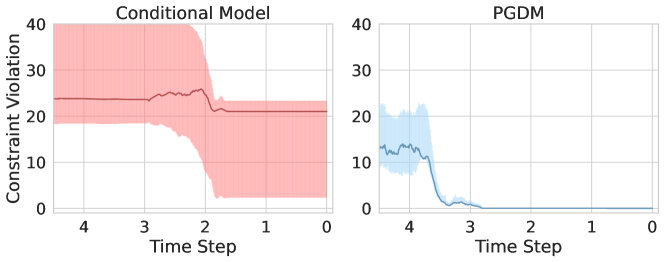
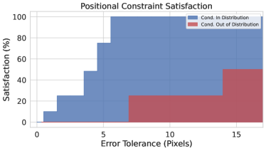
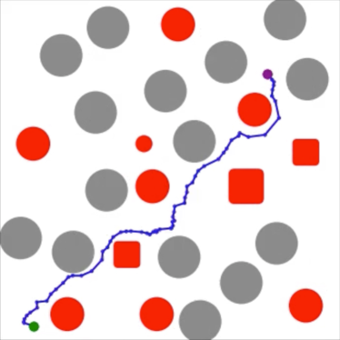
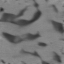
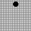
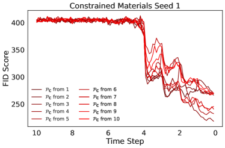
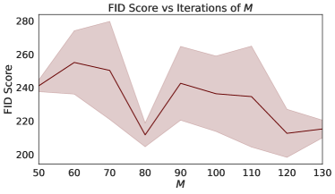

# Projected Generative Diffusion Models 
for Constraint Satisfaction

###### Abstract

Generative diffusion models excel at robustly synthesizing coherent content from raw noise through a sequential process. However, their direct application in scenarios requiring outputs to adhere to specific, stringent criteria faces several severe challenges. This paper aims at overcome these challenges and introduces *Projected Generative Diffusion Models* (PGDM), an approach that recast traditional diffusion models sampling into a constrained-optimization problem. This enables the application of an iterative projections method to ensure that generated data faithfully adheres to specified constraints or physical principles. This paper provides theoretical support for the ability of PGDM to synthesize outputs from a feasible subdistribution under a restricted class of constraints while also providing large empirical evidence in the case of complex non-convex constraints and ordinary differential equations. These capabilities are demonstrated by physics-informed motion in video generation, trajectory optimization in path planning, and morphometric properties adherence in material science.  

## 1 Introduction

Diffusion models are a class of generative models that function by progressively introducing noise into data and then methodically demonising it [[17](#bib.bib17), [11](#bib.bib11)]. They have revolutionized high-fidelity creation of complex data, and their applications have rapidly expanded beyond mere image synthesis, finding relevance in areas such as engineering [[22](#bib.bib22), [24](#bib.bib24)], automation [[3](#bib.bib3), [13](#bib.bib13)], chemistry [[1](#bib.bib1), [12](#bib.bib12)], and scientific research [[2](#bib.bib2), [6](#bib.bib6)].  

Although diffusion models excel at generating content that is coherent and aligns closely with the original data distribution, their direct application in scenarios requiring stringent adherence to predefined criteria poses significant challenges. Particularly in domains where the generated data needs to not only resemble real-world examples but also rigorously comply with established specifications, physical laws, or engineering principles, conventional diffusion models are unable to ensure this level of precision.  

Given these limitations, one may consider an alternative approach: training a diffusion model on a data distribution that already aligns with these constraints. Nevertheless, even when the training data is “feasible”, such an approach does not inherently assure conformity to the desired criteria due to the inherent stochastic nature of diffusion models. Additionally, we frequently encounter situations where the available data distribution must be manipulated to generate content that aligns with certain properties, which might not be inherent in the original dataset. This issue is especially limiting for the larger applicability of diffusion models in scientific and engineering domains where the training data is scarce and limited to specific distributions, yet synthesized outputs are expected to meet rigorous properties or precise standards [[22](#bib.bib22)].  

This paper aims to address these challenges and proposes *Projected Generative Diffusion Models* (PGDM), a novel approach that recasts the traditional sampling strategy in diffusion processes as a constrained-optimization problem. The problem is then solved by the application of repeated projections allowing the diffusion process to generate data that adheres strictly to specified constraints or physical principles. We then provide a theoretical underpinning for the effectiveness of PGDM to certify the synthesis of samples adhering to a restricted class of constraints, while also providing strong empirical evidence for its effectiveness on arbitrary non-convex constraints. This includes its application to physical-informed motion for video generation guided by ordinary differentiable equations, trajectory optimization in motion planning, and maintenance of morphometric properties of generative material science processes.  

A distinct advantage of PGDM lies in its ability to impose verifiable constraints while also optimizing the original objective criterion of generative models that aims at synthesizing samples from the true data distribution. This dual functionality leads to state-of-the-art FID scores while also strictly adhering to the imposed constraints.  

Contributions. This paper makes the following key contributions: (1) It introduces PGDM, a new framework that augments diffusion-based synthesis with arbitrary constraints in order to generate content with high fidelity that also adheres to the imposed specifications. (2) It provides a theoretical basis, within a restricted constraint class, explaining the ability of PGDM to generate highly accurate content while ensuring constraint compliance. (3) Extensive experiments in domains ranging from physical-informed motion governed by ordinary differentiable equations, trajectory optimization in motion planning, and adherence to morphometric properties in generative material science processes are provided to illustrate the ability of PGDM to generate content that adheres to complex non-convex constraints as well as physical principles. (4) Finally, PGDM’s versatility is also demonstrated in generating out-of-distribution samples that must satisfy the imposed constraints as well as to operate well in scarce training data regimes.  

## 2 Preliminaries: Diffusion Models

Diffusion-based generative models [[17](#bib.bib17), [11](#bib.bib11)] expand a data distribution, whose samples are denoted $\bm{x}_{0}$, through a Markov chain parameterization $\{\bm{x}_{t}\}_{t=1}^{T}$, defining a Gaussian diffusion process $p(\bm{x}_{0})=\int p(\bm{x}_{T})\prod_{t=1}^{T}p(\bm{x}_{t-1}|\bm{x}_{t})d\bm{x}_{1:T}$.  

In the forward process, the data is incrementally perturbed towards a Gaussian distribution. This process is represented by the transition kernel $q(\bm{x}_{t}|\bm{x}_{t-1})=\mathcal{N}(\bm{x}_{t};\sqrt{1-\beta_{t}}\bm{x}_{t-1},\beta_{t}\bm{I})$ for some $0<\beta_{t}<1$, where the $\beta$-schedule $\{\beta_{t}\}_{t=1}^{T}$ is chosen so that the final distribution $p(\bm{x}_{T})$ is nearly Gaussian. The diffusion time $t$ allows an analytical expression for variable $\bm{x}_{t}$ represented by $\chi_{t}(\bm{x}_{0},\epsilon)=\sqrt{{\alpha}_{t}}\bm{x}_{0}+\sqrt{1-{\alpha}_{t}}\epsilon$, where $\epsilon\sim\mathcal{N}(\bm{0},\bm{I})$ is a noise term, and ${\alpha}_{t}=\prod_{i=1}^{t}\left(1-\beta_{i}\right)$. This process is used to train a neural network $\epsilon_{\theta}(\bm{x}_{t},t)$, called the *denoiser*, which implicitly approximates the underlying data distribution by learning to remove noise added throughout the forward process.  

The training objective minimizes the error between the actual noise $\epsilon$ and the predicted noise $\epsilon_{\theta}(\chi_{t}(\bm{x}_{0},\epsilon),t)$ via the loss function:  

|  | $$\min_{\theta}\operatorname*{\mathbb{E}}_{\begin{subarray}{c}t\sim[1,T],\;p(\bm{x}_{0}),\\ \mathcal{N}(\epsilon;\bm{0},\bm{I})\end{subarray}}\left[\left\|\epsilon-\epsilon_{\theta}(\chi_{t}(\bm{x}_{0},\epsilon),t)\right\|^{2}\right].$$ |  | (1) |
| --- | --- | --- | --- |

The reverse process utilizes the trained denoiser, $\epsilon_{\theta}(\bm{x}_{t},t)$, to convert random noise $p(\bm{x}_{T})$ iteratively into realistic data from distribution $p(\bm{x}_{0})$. Practically, $\epsilon_{\theta}$ predicts a single step in the denoising process that can be used during sampling to reverse the diffusion process by approximating the transition $p(\bm{x}_{t-1}|\bm{x}_{t})$ at each step $t$.  

Score-based models [[18](#bib.bib18), [19](#bib.bib19)], while also operating on the principle of gradually adding and removing noise, focus on directly modeling the gradient (score) of the log probability of the data distribution at various noise levels. The score function $\nabla_{\bm{x}_{t}}\log p(\bm{x}_{t})$ identifies the direction and magnitude of the greatest increase in data density at each noise level. The training aims to optimize a neural network $\mathbf{s}_{\theta}(\bm{x}_{t},t)$ to approximate this score function, minimizing the difference between the estimated and true scores of the perturbed data:  

|  | $$\displaystyle\min_{\theta}\operatorname*{\mathbb{E}}_{\begin{subarray}{c}t\sim[1,T],\\ p(\bm{x}_{0}),\\ q(\bm{x}_{t}|\bm{x}_{0})\end{subarray}}(1-{\alpha}_{t})\left[\left\|\mathbf{s}_{\theta}(\bm{x}_{t},t)-\nabla_{\bm{x}_{t}}\log q(\bm{x}_{t}|\bm{x}_{0})\right\|^{2}\right],$$ |  | (2) |
| --- | --- | --- | --- |

where $q(\bm{x}_{t}|\bm{x}_{0})=\mathcal{N}(\bm{x}_{t};\sqrt{{\alpha}_{t}}\bm{x}_{0},(1-{\alpha}_{t})\bm{I})$ defines a distribution of perturbed data $\bm{x}_{t}$, generated from the training data, which becomes increasingly noisy as $t$ approach $T$.  

## 3 Limitations

While diffusion models have proven highly effective in producing content that closely mirrors the original data distribution, the stochastic nature of their outputs act as an impediment when specifications or constraints need to be imposed on the generated outputs. In an attempt to address this issue, two viable approaches could be adopted: (1) model conditioning and (2) post-processing corrections.   

Model conditioning [[10](#bib.bib10)] aims to control generation by augmenting the diffusion process via a conditioning variable $\bm{c}$ to transform the denoising process via classifier-free guidance:  

|  | $$\hat{\epsilon}_{\theta}\stackrel{{\scriptstyle\text{def}}}{{=}}\lambda\times\epsilon_{\theta}(\bm{x}_{t},t,\bm{c})+(1-\lambda)\times\epsilon_{\theta}(\bm{x}_{t},t,\bot),$$ |  |
| --- | --- | --- |

where $\lambda\in(0,1)$ is the *guidance scale* and $\bot$ is a null vector representing non-conditioning. However, while conditioning may be effective to influence the generation process, it lacks the rigor to ensure adherance to specific constraints. This results in generated outputs that, despite being plausible, may not be entirely accurate or reliable. Figure [1](#S3.F1 "Figure 1 ‣ 3 Limitations ‣ Projected Generative Diffusion Models for Constraint Satisfaction") (left) illustrates this issue by reporting the constraint violations (as a distance to the feasible solutions) identified in the outputs of a conditional model. This model was conditioned on labels corresponding to positional constraints imposed on objects in the generated image (discussed in Section [5.1](#S5.SS1 "5.1 Physics-informed Motion ‣ 5 Experiments ‣ Projected Generative Diffusion Models for Constraint Satisfaction")).  

[FIGURE S3.F1.g1]

Figure 1: Visualization of sampling steps failing to converge to feasible solutions in conditional models (left) while minimizing the constraint divergence to $0$ under PGDM (right). Constraint divergence is measured by the number of pixels an object’s position varies from the true position of the object as computed by an ordinary differential equation imposing physical properties (see Section [5](#S5 "5 Experiments ‣ Projected Generative Diffusion Models for Constraint Satisfaction") for additional details).
[/FIGURE]

Additionally, conditioning in diffusion models often requires training supplementary classification and regression models, a process fraught with its own set of challenges. This approach demands the acquisition of extra labeled data, which can be impractical or unfeasible in specific scenarios. For instance, our experimental analysis will demonstrate a situation in material science discovery where the target property is well-defined, but the original data distribution fails to embody this property. This scenario is common in scientific applications, where data may not naturally align with desired outcomes or properties [[14](#bib.bib14)].  

Post-processing correction. An alternative approach involves applying post-processing steps to correct deviations from desired constraints in the generated samples. This correction is typically implemented in the last noise removal stage, $s_{\theta}(\bm{x}_{1},1)$. Some approaches have augmented this process to use optimization solvers to impose constraints on synthesized samples [[8](#bib.bib8), [16](#bib.bib16)]. However, while effective in aligning the final output with the set constraints, these approaches present two main limitations. First, their objective does not align with optimizing the score function. This inherently positions the diffusion model’s role as ancillary, with the final synthesized data often resulting in a significant divergence from the learned (and original) data distributions, as we will demonstrate in Section [5](#S5 "5 Experiments ‣ Projected Generative Diffusion Models for Constraint Satisfaction"). Second, these methods are reliant on a limited and problem specific class of objectives and constraints, such as specific trajectory “constraints” or shortest path objectives which can be integrated as a post-processing step [[8](#bib.bib8), [16](#bib.bib16)].  

## 4 Projected Generative Diffusion

This section describes the proposed methodology to overcome the aforementioned limitations.  

Overview. The application of the reverse diffusion process of score-based models is characterized by iteratively fitting the initial noisy samples $\bm{x}_{T}$ to the learned approximation of $p(\bm{x}_{0})$. This process is akin to maximizing the density function $\log q(\bm{x}_{t}|\bm{x}_{0})$ at each given noise level, the gradients of which are estimated by $\mathbf{s}_{\theta}(\bm{x}_{t}^{i},t)$. In traditional score-based models, at any point throughout the reverse process, $\bm{x}_{t}$ is *unconstrained*. When these samples are required to satisfy some constraints, the objective remains unchanged, but the solution to this optimization problem must fall within a feasible region, denoted $\mathbf{C}$ in this paper. For consistency with our analysis, it is convenient to represent this as a constrained optimization problem,  

|  | | | | |
| --- | --- | --- | --- | --- |
|  | $\displaystyle\underset{{\bm{x}_{T},\ldots,\bm{x}_{1}}}{\text{minimize}}$ | $\displaystyle\;\sum_{t=T,\ldots,1}-\log q(\bm{x}_{t}|\bm{x}_{0})$ |  | (3a) |
|  | s.t.: | $\displaystyle\quad\bm{x}_{T},\ldots,\bm{x}_{0}\in\mathbf{C}.$ |  | (3b) |

Operationally, the negative log likelihood is minimized at each step of the reverse Markov chain, as the process transitions from $\bm{x}_{T}$ to $\bm{x}_{0}$. In this regard, and importantly, the objective of the PGDM’s sampling process is aligned with that of traditional score-based diffusion models.  

In an unconstrained setting, this optimization is formulated such that a variation of the traditional gradient ascent algorithm is used to iteratively transform a sample from the Gaussian distribution $q(\bm{x}_{T}|\bm{x}_{0})$ to a sample from the learned distribution $q(\bm{x}_{1}|\bm{x}_{0})$. The update step is provided by:  

|  | $$\bm{x}_{t}^{i+1}=\bm{x}_{t}^{i}+\gamma_{t}\nabla_{\bm{x}_{t}^{i}}\log q(\bm{x}_{t}^{i}|\bm{x}_{0})+\sqrt{2\gamma_{t}}\bm{\epsilon}$$ |  | (4) |
| --- | --- | --- | --- |

where $\bm{\epsilon}$ is standard normal and $\gamma_{t}>0$ is the step size. This update step is repeated ${M}$ times for each $\bm{x}_{T}$ to $\bm{x}_{0}$. To prevent a deterministic behavior, an additional term is added to the gradient ascent algorithm, $\sqrt{2\gamma_{t}}\bm{\epsilon}$, drawing from *Stochastic Gradient Langevin Dynamics*, by adding a weighted noise term $\bm{\epsilon}$ at each update [[19](#bib.bib19)].  

To avoid low density data regions, the sample is optimized to conform to the previous distribution in the Markov chain before proceeding to the consecutive distribution, the transitions being ensured by setting $\bm{x}_{t-1}^{0}=\bm{x}_{t}^{M}$, where as $\bm{x}_{t}^{M}$ is the final iterate of the previous time step.  

### 4.1 Projection Guidance

The score network $\mathbf{s}_{\theta}(\bm{x}_{t},t)$ directly estimates the first-order derivatives of [Equation 3a](#S4.E3.1 "In Equation 3 ‣ 4 Projected Generative Diffusion ‣ Projected Generative Diffusion Models for Constraint Satisfaction"), providing the necessary gradients for iterative gradient-based optimization defined in [Equation 4](#S4.E4 "In 4 Projected Generative Diffusion ‣ Projected Generative Diffusion Models for Constraint Satisfaction"). In the presence of constraints ([3b](#S4.E3.2 "Equation 3b ‣ Equation 3 ‣ 4 Projected Generative Diffusion ‣ Projected Generative Diffusion Models for Constraint Satisfaction")), however, an alternative iterative method is necessary to guarantee feasibility. PDGM models a projected guidance approach to provide this constraint-aware optimization process.  

First, we define the projection operator, $\mathcal{P}_{\mathbf{C}}$, as a constrained optimization problem,  

|  | $$\mathcal{P}_{\mathbf{C}}(\bm{x})=\operatorname*{argmin}_{\bm{y}\in\mathbf{C}}||\bm{y}-\bm{x}||_{2}^{2},$$ |  | (5) |
| --- | --- | --- | --- |

that finds the nearest feasible point to the input $\bm{x}$. The *cost of the projection* $||\bm{y}-\bm{x}||_{2}^{2}$ represents the distance between the closest feasible point and the original input.  

Inspired by projected gradient methods, which extend gradient-based methods to retain feasibility through an application of the projection operator after each update step, we define the *projected diffusion model sampling* step as  

|  | $$\bm{x}_{t}^{i+1}=\mathcal{P}_{\mathbf{C}}\left(\bm{x}_{t}^{i}+\gamma_{t}\nabla_{\bm{x}_{t}^{i}}\log q(\bm{x}_{t}|\bm{x}_{0})+\sqrt{2\gamma_{t}}\bm{\epsilon}\right),$$ |  | (6) |
| --- | --- | --- | --- |

where $\mathbf{C}$ is the set of constraints and $\mathcal{P}_{\mathbf{C}}$ is a projection onto $\mathbf{C}$. Hence, iteratively throughout the Markov chain, a gradient step is taken to minimize the objective defined by Equation [3a](#S4.E3.1 "Equation 3a ‣ Equation 3 ‣ 4 Projected Generative Diffusion ‣ Projected Generative Diffusion Models for Constraint Satisfaction") while ensuring feasibility. Convergence is guaranteed for convex constraints sets [[15](#bib.bib15)] and empirical evidence in Section [5](#S5 "5 Experiments ‣ Projected Generative Diffusion Models for Constraint Satisfaction") will showcase the general applicability of this methods to arbitrary constraint sets. The full sampling process is detailed in Algorithm [1](#algorithm1 "Algorithm 1 ‣ 4.1 Projection Guidance ‣ 4 Projected Generative Diffusion ‣ Projected Generative Diffusion Models for Constraint Satisfaction").  

[FIGURE algorithm1]

1
$\bm{x}_{T}^{0}\sim\mathcal{N}(\bm{0},\sigma_{T}\bm{I})$

2
for *$t=T$ to $1$* do

3      
$\gamma_{t}\leftarrow\nicefrac{{\sigma_{t}^{2}}}{{2\sigma_{T}^{2}}}$

4      
for *$i=1$ to $M$* do

5            
$\bm{\epsilon}\sim\mathcal{N}(\bm{0},\bm{I})$;   
$\bm{g}\leftarrow\bm{s}_{\theta^{*}}(\bm{x}_{t}^{i-1},t)$

6            
$\bm{x}_{t}^{i}=\mathcal{P}_{\bm{C}}(\bm{x}_{t}^{i-1}+\gamma_{t}\bm{g}+\sqrt{2\gamma_{t}}\bm{\epsilon})$

7            

8      $\bm{x}_{t-1}^{0}\leftarrow\bm{x}_{t}^{M}$

9      

10

11return $\bm{x}_{0}^{0}$

Algorithm 1 PGDM
[/FIGURE]

By incorporating constraints throughout the sampling process, the interim learned distributions are steered to comply with these specifications. This is empirically evident from the pattern in Figure [1](#S3.F1 "Figure 1 ‣ 3 Limitations ‣ Projected Generative Diffusion Models for Constraint Satisfaction") (right): remarkably, the constraint violations decrease with each addition of estimated gradients and noise and approaches $0$-violation as $t$ nears zero. This trend not only minimizes the impact but also reduces the optimality cost of projections applied in the later stages of the reverse process. We provide theoretical rationale for the effectiveness of this approach in the subsequent subsection.  

We conclude this section by noting that this approach can be clearly distinguished from other methods which use a diffusion model’s sampling process to generate starting points for a constrained optimization algorithm [[8](#bib.bib8), [16](#bib.bib16)]. Instead, PGDM leverages minimization of negative log likelihood as the primary objective of the sampling algorithm akin to standard unconstrained sampling procedures. This strategy offers a key advantage: the probability of generating a sample that conforms to the data distribution is optimized directly, rather than an external objective, while simultaneously imposing verifiable constraints. In contrast, existing baselines often neglect the conformity to the data distribution, which as we will show in Section [5](#S5 "5 Experiments ‣ Projected Generative Diffusion Models for Constraint Satisfaction"), can lead to a deviation from the learned distribution and an overemphasis on external objectives for solution generation, resulting into much higher FID scores.  

### 4.2 Theoretical Justification

Next, we theoretically justify the use of iterative projections to guide the sample to the constrained distribution. The analysis assumes that the feasible region $\bm{C}$ is a convex set and that the negative log of the density function is a convex function, so that the mean of the distribution is the global optimum. W.l.o.g., we assume that the this mean is equal to zero. We start by defining the update step.  

###### Definition 4.1.

The operator $\mathcal{U}$ defines a single update step for the sampling process as,  

|  | $$\mathcal{U}(\bm{x}_{t}^{i})=\bm{x}_{t}^{i}+\gamma_{t}\mathbf{s}_{\theta}(\bm{x}_{t}^{i},t)+\sqrt{2\gamma_{t}}\bm{\epsilon}.$$ |  | (7) |
| --- | --- | --- | --- |

The next result establishes a convergence criteria on the proximity to the optimum, where for each time step $t$ there exists a minimum value of $i=\bar{I}$ such that,  

|  | $$\exists{\bar{I}}\;\texttt{s.t.}\;\left\|(\bm{x}_{t}^{\bar{I}}+\gamma_{t}\nabla_{\bm{x}_{t}^{\bar{I}}}\log q(\bm{x}_{t}^{\bar{I}}|\bm{x}_{0}))\right\|_{2}\leq\left\|\rho_{t}\right\|_{2}$$ |  | (8) |
| --- | --- | --- | --- |

where $\rho_{t}$ is the closest point to the global optimum that can be reached via a single gradient step from any point in $\mathbf{C}$.  

###### Theorem 4.2.

Let $\mathcal{P}_{\mathbf{C}}$ be a projection onto $\mathbf{C}$ and $\bm{x}_{t}^{i}$ be the sample at time step $\bm{t}$ and iteration $\bm{i}$. For any $\bm{i}\geq\bar{I}$,  

|  | $$\mathbb{E}\left[\textit{Error}(\mathcal{U}(\bm{x}_{t}^{i}),\mathbf{C})\right]\geq\mathbb{E}\left[\textit{Error}(\mathcal{U}(\mathcal{P}_{\mathbf{C}}(\bm{x}_{t}^{i})),\mathbf{C})\right]$$ |  | (9) |
| --- | --- | --- | --- |

where Error is the cost of the projection defined by the objective in Equation [5](#S4.E5 "Equation 5 ‣ 4.1 Projection Guidance ‣ 4 Projected Generative Diffusion ‣ Projected Generative Diffusion Models for Constraint Satisfaction").  

The proof for Theorem [4.2](#S4.Thmtheorem2 "Theorem 4.2. ‣ 4.2 Theoretical Justification ‣ 4 Projected Generative Diffusion ‣ Projected Generative Diffusion Models for Constraint Satisfaction") is reported in Appendix [D](#A4 "Appendix D Missing Proofs ‣ Projected Generative Diffusion Models for Constraint Satisfaction"). This result suggests that PGDM’s projection steps ensure that the resulting samples adhere more closely to the constraints compared to samples generated through traditional, unprojected methods. Together with the next results, it will allow us to show that PGDM samples converge to the point of maximum likelihood that also satisfy the imposed constraints.  

The theoretical insight provided by Theorem [4.2](#S4.Thmtheorem2 "Theorem 4.2. ‣ 4.2 Theoretical Justification ‣ 4 Projected Generative Diffusion ‣ Projected Generative Diffusion Models for Constraint Satisfaction") provides an explanation for the observed discrepancy between the constraint violations induced by the conditional model and PGDM, as observed in Figure [1](#S3.F1 "Figure 1 ‣ 3 Limitations ‣ Projected Generative Diffusion Models for Constraint Satisfaction").  

###### Corollary 4.3.

For arbitrary small $\xi>0$, there exist $t$ and $\bm{i}\geq\bar{I}$ such that:  

|  | $$\textit{Error}(\mathcal{U}(\mathcal{P}_{\mathbf{C}}(\bm{x}_{t}^{i})),\mathbf{C})\leq\xi.$$ |  |
| --- | --- | --- |

The above result uses the fact that the step size $\gamma_{t}$ is strictly decreasing and converges to zero, given sufficiently large $T$, and that the size of each update step $\mathcal{U}$ decreases with $\gamma_{t}$.  

As the step size shrinks, the gradients and noise reduce in size. Hence, $\textit{Error}(\mathcal{U}(\mathcal{P}_{\mathbf{C}}(\bm{x}_{t}^{i}))$ approaches zero with $t$, as illustrated in Figure [1](#S3.F1 "Figure 1 ‣ 3 Limitations ‣ Projected Generative Diffusion Models for Constraint Satisfaction") (right). This diminishing error implies that the projections gradually steer the sample into the feasible subdistribution of $p(\bm{x}_{0})$, effectively aligning with the specified constraints.  

#### Feasibility guarantees.

PGDM provides feasibility guarantees when solving convex constraints. This assurance is integral in sensitive settings, such as physics-based simulations (Section [5.1](#S5.SS1 "5.1 Physics-informed Motion ‣ 5 Experiments ‣ Projected Generative Diffusion Models for Constraint Satisfaction")) and material analysis (Section [5.3](#S5.SS3 "5.3 Constrained Materials ‣ 5 Experiments ‣ Projected Generative Diffusion Models for Constraint Satisfaction")), where strict adherence to the constraint set is necessary. This provision is non-trivial, as no prior methods have provided these guarantees without post-processing the outputs of the diffusion models.  

## 5 Experiments

To provide appropriate benchmarks for constraint-aware diffusion, we compare PGDM against three state-of-the-art approaches. *Conditional diffusion models* (Cond.) [[10](#bib.bib10)] are the state-of-the-art methods for generative sampling subject to a series of specifications. While conditional diffusion models offer a way to guide the generation process towards satisfying certain constraints, they do not provide compliance guarantees. To encourage constraints satisfaction, we additionally compare to the recently proposed conditional models with a post-processing projection step (Post-Cond.), emulating the post-processing approaches of [[8](#bib.bib8), [16](#bib.bib16)]. Finally, we use a score-based model identical to our implementation but with a single post-processing projection operation (Post-Proc.) performed at the last sampling step. Additional details are provided in Appendix [A](#A1 "Appendix A Experimental Settings ‣ Projected Generative Diffusion Models for Constraint Satisfaction").  

The performance of these models are evaluated by the feasibility and accuracy of the generated samples. We assess feasibility by the degree and rate at which constraints are satisfied, expressly, the percentage of samples which satisfy the constraints with a given error tolerance. Accuracy is measured by the Frechet Inception Distance (FID) score, a standard metric in synthetic sample evaluation.  

In an effort to demonstrate the broad applicability of this approach, our experimental settings have been selected to exhibit: (1) behavior when the constraints lead to samples falling outside of the training distribution (Section [5.1](#S5.SS1 "5.1 Physics-informed Motion ‣ 5 Experiments ‣ Projected Generative Diffusion Models for Constraint Satisfaction")), (2) behavior on complex non-convex constraints (Section [5.2](#S5.SS2 "5.2 Constrained Trajectories ‣ 5 Experiments ‣ Projected Generative Diffusion Models for Constraint Satisfaction")), and (3) behavior in low data regimes and where original distribution does not satisfy the constraints (Section [5.3](#S5.SS3 "5.3 Constrained Materials ‣ 5 Experiments ‣ Projected Generative Diffusion Models for Constraint Satisfaction")).  

### 5.1 Physics-informed Motion

To showcase the applicability of PGDM in generating video frames adhering to physical constraints, this experiment tasks the model with producing video samples of an object accelerating due to gravity. The position of the object in a given frame is governed by  

|  | | | | |
| --- | --- | --- | --- | --- |
|  | $\displaystyle\mathbf{p}_{t}$ | $\displaystyle=\mathbf{p}_{t-1}+\left(\mathbf{v}_{t}+\left(0.5\times\frac{\partial\bm{v}_{t}}{\partial t}\right)\right)$ |  | (10a) |
|  | $\displaystyle\mathbf{v}_{t+1}$ | $\displaystyle=\frac{\partial\bm{p}_{t}}{\partial t}+\frac{\partial\bm{v}_{t}}{\partial t}$ |  | (10b) |

where $\mathbf{p}$ is the object position, $\mathbf{v}$ is the velocity, and $t$ is the frame number. This positional information can be directly integrated into the constraint set, with constraint violations quantified by the pixel distance from their true position. The training data is based on earth’s gravity. We extend the model to simulate gravitational forces from the moon and other planets. This will allow us to examine performance on physical constraints which differ from the training data.  

[FIGURE S5.F2.1.1.1.1.g1]

Figure 2: Sequential stages of the physics-informed models on for in-distribution (left) and out-of-distribution (right) constraint imposition.
[/FIGURE]

The dataset is generated with object starting points sampled uniformly in the interval [0, 63]. For each data point, six frames are included with the position changing as defined in Equation [10](#S5.E10 "Equation 10 ‣ 5.1 Physics-informed Motion ‣ 5 Experiments ‣ Projected Generative Diffusion Models for Constraint Satisfaction") and the initial velocity $\mathbf{v}_{0}=0$. Pixel values are scaled to [-1, 1]. The diffusion models are trained on 1000 points with a 90/10 train/test split.  

For this setting, we used a masked conditional video diffusion model as our conditional baseline, following the methodology outlined in Voleti et al. [[20](#bib.bib20)]. Results randomly selected from the generated samples are visualized in Figure [2](#S5.F2 "Figure 2 ‣ 5.1 Physics-informed Motion ‣ 5 Experiments ‣ Projected Generative Diffusion Models for Constraint Satisfaction") (left), with the top row displaying the ground-truth images for reference. The subsequent rows shows the outputs returned by PGDM, post-processing projection, and conditional post-processing, respectively. Samples generated by conditional diffusion models are not directly shown in the figure, as the white object outline in the Post-Cond. frames shows where the Cond. model originally positioned the object. First we notice that, in absence of constraint projections, the score based generative model adopted generates samples that align with the original data distribution but places the object arbitrarily within the frame (white ball outlines in the 3rd row). Post-processing accurately repositions the object but greatly compromising the image quality. Similarly, post-conditioning exhibits inaccuracies in object positioning, as shown by the white outline in the 4th row. These deviations from the desired constraints are quantitatively depicted in Figure [3](#S5.F3 "Figure 3 ‣ 5.1 Physics-informed Motion ‣ 5 Experiments ‣ Projected Generative Diffusion Models for Constraint Satisfaction") (blue bars). The figure depicts the proportion of samples adhering to the object’s governing behavior constraints across varying levels of error tolerance. Notably, this approach fails to produce *any viable sample within a zero-tolerance error margin*. In contrast, PGDM generates frames exactly satisfying the object position’s constraints, with FID scores only marginally outperformed by Cond. Implementation using the model proposed by Song et al. [[19](#bib.bib19)] narrows this gap even further (Appendix [B](#A2 "Appendix B PGDM for Score-Based Generative Modeling through Stochastic Differential Equations ‣ Projected Generative Diffusion Models for Constraint Satisfaction")).  

[TABLE S5.T1]

<table class="ltx_tabular ltx_guessed_headers ltx_align_middle">
<thead class="ltx_thead">
<tr class="ltx_tr">
<th class="ltx_td ltx_th ltx_th_row ltx_border_tt"></th>
<th class="ltx_td ltx_align_center ltx_th ltx_th_column ltx_th_row ltx_border_tt">Setting</th>
<th class="ltx_td ltx_align_left ltx_th ltx_th_column ltx_th_row ltx_border_tt">PGDM</th>
<th class="ltx_td ltx_align_center ltx_th ltx_th_column ltx_border_tt">Post-Proc.</th>
<th class="ltx_td ltx_align_center ltx_th ltx_th_column ltx_border_tt">Cond.</th>
<th class="ltx_td ltx_align_center ltx_th ltx_th_column ltx_border_tt">Post-Cond.</th>
</tr>
</thead>
<tbody class="ltx_tbody">
<tr class="ltx_tr">
<th class="ltx_td ltx_align_center ltx_th ltx_th_row ltx_border_bb ltx_border_t">

FID
</th>
<th class="ltx_td ltx_align_center ltx_th ltx_th_row ltx_border_t">Phy.</th>
<th class="ltx_td ltx_align_left ltx_th ltx_th_row ltx_border_t">26.5</th>
<td class="ltx_td ltx_align_center ltx_border_t">52.5</td>
<td class="ltx_td ltx_align_center ltx_border_t">22.5</td>
<td class="ltx_td ltx_align_center ltx_border_t">53.0</td>
</tr>
<tr class="ltx_tr">
<th class="ltx_td ltx_align_center ltx_th ltx_th_row ltx_border_bb">Mat.</th>
<th class="ltx_td ltx_align_left ltx_th ltx_th_row ltx_border_bb">213.9</th>
<td class="ltx_td ltx_align_center ltx_border_bb">297.1</td>
<td class="ltx_td ltx_align_center ltx_border_bb">214.2</td>
<td class="ltx_td ltx_align_center ltx_border_bb">254.7</td>
</tr>
</tbody>
</table>

Table 1: Model FID score performance for physics-informed motion (Phy.) and constrained materials (Mat).
[/TABLE]

[FIGURE S5.F3.g1]

Figure 3: Frequency of constraint satisfaction within a given error tolerance over 100 runs for physics-informed motion (left) and constrained materials (right).
[/FIGURE]

Out of distribution performance.  To assess the efficacy of PGDM on constraints not represented in the training data, we adjust the governing equation ([10](#S5.E10 "Equation 10 ‣ 5.1 Physics-informed Motion ‣ 5 Experiments ‣ Projected Generative Diffusion Models for Constraint Satisfaction")) to the gravitational pull of the moon, while leaving the training set untouched. The results, shown in Figure [2](#S5.F2 "Figure 2 ‣ 5.1 Physics-informed Motion ‣ 5 Experiments ‣ Projected Generative Diffusion Models for Constraint Satisfaction") (right), demonstrate the applicability of PGDM to settings where the training data does not include any feasible data points. Notice that, while synthesising high quality images, PGDM also *guarantees* no constraint violations (0-tolerance) in this setting. This stands in contrast to other methods, which exhibit greater constraint violations in this out-of-distribution context compared to their in-distribution test performance, as illustrated by the red bars in Figure [3](#S5.F3 "Figure 3 ‣ 5.1 Physics-informed Motion ‣ 5 Experiments ‣ Projected Generative Diffusion Models for Constraint Satisfaction") (left). Notably, the results also show that PGDM can produce inceptions scores nearly identical to the conditional model and dramatically better than post-processing methods (Table [1](#S5.T1 "Table 1 ‣ 5.1 Physics-informed Motion ‣ 5 Experiments ‣ Projected Generative Diffusion Models for Constraint Satisfaction")).  

### 5.2 Constrained Trajectories

The next experiment showcase the ability of PGDM to handle nonconvex constraints. Motion planning is a classic optimization problem which is integral to finding smooth, collision-free paths in autonomous systems. This setting consists of minimizing the path length while avoiding path intersection with various obstacles in a given topography. Recent research has demonstrated the use of diffusion models for these motion planning objectives [[3](#bib.bib3)]. In this task, the diffusion model predicts a series of points, $p_{0},p_{1},\ldots,p_{N}$, where each pair of consecutive points represents a line segment. The start and end points for this path are determined pseudo-randomly for each problem instance, with the topography remaining constant across different instances. Additionally, the problem is complicated by adding new obstacles at inference time (shown in red on Figure [5](#S5.F5 "Figure 5 ‣ 5.2 Constrained Trajectories ‣ 5 Experiments ‣ Projected Generative Diffusion Models for Constraint Satisfaction")), rendering a portion of the training data infeasible and testing the generalization of these methods. The performance is evaluated on two sets of maps adapted from [Carvalho et al.](#bib.bib3), shown in Figure [5](#S5.F5 "Figure 5 ‣ 5.2 Constrained Trajectories ‣ 5 Experiments ‣ Projected Generative Diffusion Models for Constraint Satisfaction"). The training-time obstacles remain the same in both maps, but we alter the test time conditions to simulate different environments.  

[FIGURE S5.F5.1.g1]

Figure 4: Topography 1 (left) and Topography 2 (right).
[/FIGURE]

To circumvent the challenge of guaranteeing collision-free paths, previous approaches have relied on sampling large batches of trajectories and selecting a feasible solution, if any are generated [[3](#bib.bib3)]. We use the *Motion Planning Diffusion* model recently proposed by [Carvalho et al.](#bib.bib3) as a conditional model baseline for this experiment and the associated datasets to train each of the models. For the Post-Cond. model, we emulate the approach proposed by Power et al. [[16](#bib.bib16)], using the conditional diffusion model to synthesize a starting point for an optimization solver.  

In this setting, the projection operator used by PGDM is non-convex, and the implementation uses an interior point method [[21](#bib.bib21)]. While the feasible region is non-convex, and thus local infeasibilities may be obtained, especially at early iterations, our experiments never report unfeasible solutions as the distance from the learned distribution decreases. However, using the same interior point method for a post-processing projection, we find that the percentage of feasible solutions does not increase from those of the unconstrained conditional model as this singular projection cannot overcome local infeasibilities. These observations are consistent with the analysis of Figure [1](#S3.F1 "Figure 1 ‣ 3 Limitations ‣ Projected Generative Diffusion Models for Constraint Satisfaction").  

The experimental results (Table [5](#S5.F5 "Figure 5 ‣ 5.2 Constrained Trajectories ‣ 5 Experiments ‣ Projected Generative Diffusion Models for Constraint Satisfaction")) demonstrate the viability of PGDM for non-convex constraints. We visualize the results of our approach in Figure [5](#S5.F5 "Figure 5 ‣ 5.2 Constrained Trajectories ‣ 5 Experiments ‣ Projected Generative Diffusion Models for Constraint Satisfaction"), demonstrating that a single sample can find a feasible path, as opposed to requiring a large batch of samples to report a feasible solution as done in previous methods. These reported metrics illustrate a distinct improvement over state-of-the-art approaches for motion planning with diffusion models by eliminating the failed inference points inherent to these approaches, while sacrificing minimal accuracy on average.  

[FIGURE S5.F6.1.1.1.1.g1]

Figure 6: Porosity constrained microstructure visualization.
[/FIGURE]

### 5.3 Constrained Materials

Microstructures are pivotal in determining material properties. Current practice relies on physics-based simulations conducted upon imaged microstructures to quantify intricate structure-property linkages [[4](#bib.bib4)]. However, acquiring real material microstructure images is both costly and time-consuming, lacking control over attributes like porosity, crystal sizes, and volume fraction, thus necessitating “cut-and-try” experiments. Hence, the capability to generate realistic synthetic material microstructures with controlled morphological parameters can significantly expedite the discovery of structure-property linkages.  

Previous work has shown that conditional generative adversarial networks (GAN) [[9](#bib.bib9)] can be used for this end [[5](#bib.bib5)], but these studies have been unable to impose verifiable constraints on the satisfaction of these desired properties. To provide a conditional baseline, we implement a conditional DDPM modeled after the conditional GAN used by Chun et al. [[5](#bib.bib5)] with porosity measurements used to condition the sampling.  

For this task, the material analyzed is cyclotetramethylene-tetranitramine [[5](#bib.bib5)]. The constraints are imposed on the porosity of the generated material, which is measured as the number of pixels with intensities below a predefined threshold, hence representing damaged regions of the microstructure. Evaluation of the conditional model’s constraint satisfaction is included in Figure [3](#S5.F3 "Figure 3 ‣ 5.1 Physics-informed Motion ‣ 5 Experiments ‣ Projected Generative Diffusion Models for Constraint Satisfaction") (right) while FID scores are provided in Figure [1](#S5.T1 "Table 1 ‣ 5.1 Physics-informed Motion ‣ 5 Experiments ‣ Projected Generative Diffusion Models for Constraint Satisfaction"), and results are visualized in Figure [6](#S5.F6 "Figure 6 ‣ 5.2 Constrained Trajectories ‣ 5 Experiments ‣ Projected Generative Diffusion Models for Constraint Satisfaction"). We observe in Figure [3](#S5.F3 "Figure 3 ‣ 5.1 Physics-informed Motion ‣ 5 Experiments ‣ Projected Generative Diffusion Models for Constraint Satisfaction") (right) that the conditional model finds it very difficult to cope with the imposed constraints. Furthermore, the baseline approaches for constraint correction result in a noticeable decrease in image quality, evident both visually (Figure [6](#S5.F6 "Figure 6 ‣ 5.2 Constrained Trajectories ‣ 5 Experiments ‣ Projected Generative Diffusion Models for Constraint Satisfaction")) and in the FID scores (Table [1](#S5.T1 "Table 1 ‣ 5.1 Physics-informed Motion ‣ 5 Experiments ‣ Projected Generative Diffusion Models for Constraint Satisfaction")). PGDM, in turn, provides both *exact* constraint satisfaction and an identical image quality to the conditional model, which is a particularly significant result given the complexity of original data distribution.  

Low data regime.  A critical limitation in this setting is the cost of producing training data. To compose our dataset, which was obtained from the authors of [[5](#bib.bib5)], a single $3,000\times 3,000$ pixel microscopic image is subsampled to produce $64\times 64$ image patches as data points, with pixel values scaled to $[-1,1]$. Samples from the composed dataset are included in Appendix [A](#A1 "Appendix A Experimental Settings ‣ Projected Generative Diffusion Models for Constraint Satisfaction").  

The difficulties associated with data collection act as a primary motivation for this experiment but also introduce challenges in producing images with low FID scores. The accuracy of our methodology should be considered relative to the conditional model, provided the limited training data and complexity of the learned distribution. Despite the low volume of data, the iterative projection method is able to guarantee constraint adherence while maintaining an FID score competitive with the conditional diffusion model.  

## 6 Related Work

Diffusion models with soft constraint conditioning. Variations of conditional diffusion models [[10](#bib.bib10)] serve as useful tools for controlling task specific outputs from generative models. These methods have demonstrated the capacity capture properties of physical design [[22](#bib.bib22)], positional awareness [[3](#bib.bib3)], and motion dynamics [[23](#bib.bib23)] through augmentation of these models. The properties imposed in these architectures can be viewed as soft constraints, with stochastic model outputs violating these loosely imposed boundaries.  

Post-processing optimization. In settings where hard constraints are needed to provide meaningful samples, diffusion model outputs have been used as starting points for a constrained optimization algorithm. This has been explored in non-convex settings, where the starting point plays an important role in whether the optimization solver will converge to a feasible solution [[16](#bib.bib16)]. Other approaches have augmented the diffusion model training objective to encourage the sampling process to emulate an optimization algorithm, framing the post-processing steps as an extension of the model [[8](#bib.bib8), [14](#bib.bib14)]. However, an existing challenge in these approaches is the reliance on an easily expressible objective, making these approaches effective in a limited set of problems (such as the constrained trajectory experiment) while not applicable for the majority of generative tasks.  

Linear constraints for generative models. Finally, Frerix et al. [[7](#bib.bib7)] proposed an approach for implementing hard constraints on the outputs of autoencoders. This was achieved through scaling the generated outputs in such a way that feasibility was enforced. However, this method can only cope with simple linear constraints, making it inapplicable to the settings explored in this paper.  

## 7 Discussion and Limitations

While in many settings providing constraint satisfaction guarantees is desirable, and even necessary, the computation overhead of iterative projections should be taken into consideration. In applications where inference time is a critical factor, it may be practical to adjust the time step $t$ at which iterative projections begin, finding a trade-off between the FID score associated with the starting point of iterative projections (Appendix [C.2](#A3.SS2 "C.2 Tuning to Optimize FID Scores ‣ Appendix C Additional Results ‣ Projected Generative Diffusion Models for Constraint Satisfaction")) and the computational cost of projecting throughout the remaining iterations (Appendix [C.1](#A3.SS1 "C.1 Computational Costs ‣ Appendix C Additional Results ‣ Projected Generative Diffusion Models for Constraint Satisfaction")). This is specifically relevant when the projection cannot be easily represented and external solvers are necessary to perform this projection.  

We also note the absence of constraints in the forward process. As illustrated empirically, it is unnecessary for the training data to contain any feasible points. We hold that this not only applies to the final distribution but to the interim distributions as well. Furthermore, by projecting perturbed samples, the cost of the projection results in divergence from the distribution that is being learned. Hence, we conjecture that incorporating constraints into the forward process will not only increase computational cost of model training but also decrease the FID scores of the generated samples.  

Finally, while this study provides a framework for imposing constraints on diffusion models, the representation of complex constraints for multi-task large scale models remains an open research question. This paper motivates future work for adapting optimization techniques to such settings, where constraints ensuring accuracy in task completion and safety in model outputs bear transformative potential to broaden the application of generative models in many scientific and engineering fields.  

## 8 Conclusions

This paper was motivated by a significant challenge in the application of diffusion models in contexts requiring strict adherence to constraints and physical principles. It presented Projected Generative Diffusion Models (PGDM), an approach that recasts the score-based diffusion sampling process as a constrained optimization process that can be solved via the application of repeated projections. Experiments in domains ranging from physical-informed motion for video generation governed by ordinary differentiable equations, trajectory optimization in motion planning, and adherence to morphometric properties in generative material science processes illustrate the ability of PGDM to generate content of high-fidelity that also adheres to complex non-convex constraints as well as physical principles.   

## Acknowledgments

This research is partially supported by NSF grants 2334936, 2334448, and NSF CAREER Award 2401285. Fioretto is also supported by an Amazon Research Award and a Google Research Scholar Award. The views and conclusions of this work are those of the authors only.  

### Authors Contributions

JC and FF formulated the research question, designed the methodology, developed the theoretical analysis, and wrote the manuscript. Moreover, JC contributed to developing the code and performed the experimental analysis. SB acquired the data for the micro-structure experiment, formulated the desired properties for such experiment, and participated in the interpretation of the results.  

## References

* Anand and Achim [2022]  Namrata Anand and Tudor Achim.   Protein structure and sequence generation with equivariant denoising diffusion probabilistic models.   *arXiv preprint arXiv:2205.15019*, 2022. 
* Cao et al. [2024]  Chentao Cao, Zhuo-Xu Cui, Yue Wang, Shaonan Liu, Taijin Chen, Hairong Zheng, Dong Liang, and Yanjie Zhu.   High-frequency space diffusion model for accelerated mri.   *IEEE Transactions on Medical Imaging*, 2024. 
* Carvalho et al. [2023]  Joao Carvalho, An T Le, Mark Baierl, Dorothea Koert, and Jan Peters.   Motion planning diffusion: Learning and planning of robot motions with diffusion models.   In *2023 IEEE/RSJ International Conference on Intelligent Robots and Systems (IROS)*, pages 1916–1923. IEEE, 2023. 
* Choi et al. [2023]  Joseph B. Choi, Phong C. H. Nguyen, Oishik Sen, H. S. Udaykumar, and Stephen Baek.   Artificial intelligence approaches for energetic materials by design: State of the art, challenges, and future directions.   *Propellants, Explosives, Pyrotechnics*, 2023.   doi: 10.1002/prep.202200276.   URL <https://onlinelibrary.wiley.com/doi/full/10.1002/prep.202200276>. 
* Chun et al. [2020]  Sehyun Chun, Sidhartha Roy, Yen Thi Nguyen, Joseph B Choi, HS Udaykumar, and Stephen S Baek.   Deep learning for synthetic microstructure generation in a materials-by-design framework for heterogeneous energetic materials.   *Scientific reports*, 10(1):13307, 2020. 
* Chung and Ye [2022]  Hyungjin Chung and Jong Chul Ye.   Score-based diffusion models for accelerated mri.   *Medical image analysis*, 80:102479, 2022. 
* Frerix et al. [2020]  Thomas Frerix, Matthias Nießner, and Daniel Cremers.   Homogeneous linear inequality constraints for neural network activations.   In *Proceedings of the IEEE/CVF Conference on Computer Vision and Pattern Recognition Workshops*, pages 748–749, 2020. 
* Giannone et al. [2023]  Giorgio Giannone, Akash Srivastava, Ole Winther, and Faez Ahmed.   Aligning optimization trajectories with diffusion models for constrained design generation.   *arXiv preprint arXiv:2305.18470*, 2023. 
* Goodfellow et al. [2014]  Ian J Goodfellow, Jean Pouget-Abadie, Mehdi Mirza, Bing Xu, David Warde-Farley, Sherjil Ozair, Aaron Courville, and Yoshua Bengio.   Generative adversarial nets.   In *Advances in neural information processing systems*, pages 2672–2680, 2014. 
* Ho and Salimans [2022]  Jonathan Ho and Tim Salimans.   Classifier-free diffusion guidance.   *arXiv preprint arXiv:2207.12598*, 2022. 
* Ho et al. [2020]  Jonathan Ho, Ajay Jain, and Pieter Abbeel.   Denoising diffusion probabilistic models.   *Advances in neural information processing systems*, 33:6840–6851, 2020. 
* Hoogeboom et al. [2022]  Emiel Hoogeboom, Vıctor Garcia Satorras, Clément Vignac, and Max Welling.   Equivariant diffusion for molecule generation in 3d.   In *International conference on machine learning*, pages 8867–8887. PMLR, 2022. 
* Janner et al. [2022]  Michael Janner, Yilun Du, Joshua B Tenenbaum, and Sergey Levine.   Planning with diffusion for flexible behavior synthesis.   *arXiv preprint arXiv:2205.09991*, 2022. 
* Mazé and Ahmed [2023]  François Mazé and Faez Ahmed.   Diffusion models beat gans on topology optimization.   In *Proceedings of the AAAI Conference on Artificial Intelligence (AAAI), Washington, DC*, 2023. 
* Parikh and Boyd [2014]  Neal Parikh and Stephen Boyd.   Proximal algorithms.   *Foundations and Trends in Optimization*, 1(3):127–239, 2014. 
* Power et al. [2023]  Thomas Power, Rana Soltani-Zarrin, Soshi Iba, and Dmitry Berenson.   Sampling constrained trajectories using composable diffusion models.   In *IROS 2023 Workshop on Differentiable Probabilistic Robotics: Emerging Perspectives on Robot Learning*, 2023. 
* Sohl-Dickstein et al. [2015]  Jascha Sohl-Dickstein, Eric Weiss, Niru Maheswaranathan, and Surya Ganguli.   Deep unsupervised learning using nonequilibrium thermodynamics.   In *International conference on machine learning*, pages 2256–2265. PMLR, 2015. 
* Song and Ermon [2019]  Yang Song and Stefano Ermon.   Generative modeling by estimating gradients of the data distribution.   *Advances in neural information processing systems*, 32, 2019. 
* Song et al. [2020]  Yang Song, Jascha Sohl-Dickstein, Diederik P Kingma, Abhishek Kumar, Stefano Ermon, and Ben Poole.   Score-based generative modeling through stochastic differential equations.   *arXiv preprint arXiv:2011.13456*, 2020. 
* Voleti et al. [2022]  Vikram Voleti, Alexia Jolicoeur-Martineau, and Chris Pal.   Mcvd-masked conditional video diffusion for prediction, generation, and interpolation.   *Advances in Neural Information Processing Systems*, 35:23371–23385, 2022. 
* Wächter and Biegler [2006]  Andreas Wächter and Lorenz T Biegler.   On the implementation of an interior-point filter line-search algorithm for large-scale nonlinear programming.   *Mathematical programming*, 106:25–57, 2006. 
* Wang et al. [2023]  Tsun-Hsuan Wang, Juntian Zheng, Pingchuan Ma, Yilun Du, Byungchul Kim, Andrew Spielberg, Joshua Tenenbaum, Chuang Gan, and Daniela Rus.   Diffusebot: Breeding soft robots with physics-augmented generative diffusion models.   *arXiv preprint arXiv:2311.17053*, 2023. 
* Yuan et al. [2023]  Ye Yuan, Jiaming Song, Umar Iqbal, Arash Vahdat, and Jan Kautz.   Physdiff: Physics-guided human motion diffusion model.   In *Proceedings of the IEEE/CVF International Conference on Computer Vision*, pages 16010–16021, 2023. 
* Zhong et al. [2023]  Ziyuan Zhong, Davis Rempe, Danfei Xu, Yuxiao Chen, Sushant Veer, Tong Che, Baishakhi Ray, and Marco Pavone.   Guided conditional diffusion for controllable traffic simulation.   In *2023 IEEE International Conference on Robotics and Automation (ICRA)*, pages 3560–3566. IEEE, 2023. 

## Appendix A Experimental Settings

In the following section, further details are provided as to the implementations of the experimental settings used in this paper.  

### A.1 Physics-informed Motion

#### Projections

Projecting onto positional constraints requires a two-step process. First, the current position of the object is identified and all the pixels that make up the object are set to the highest pixel intensity (white), removing the object from the original position. The set of pixel indices representing the original object structure are stored for the subsequent step. Next, the object is moved to the correct position, as computed by the constraints, as each pixel from the original structure is placed onto the center point of the true position. Hence, when the frame is feasible prior to the projection, the image is returned unchanged, which is consistent with the definition of a projection.  

#### Conditioning

For this setting, the conditional video diffusion model takes two ground truth frames as inputs, from which it infers the trajectory of the object and the starting position. The model architecture is otherwise as specified by [Voleti et al.](#bib.bib20).  

### A.2 Constrained Trajectories

#### Projections

For this experiment, we represent constraints such that the predicted path avoids intersecting the obstacles present in the topography. These are parameterized to a non-convex interior point method solver. For circular obstacles, this can be represented by a minimum distance requirement, the circle radius, imposed on the nearest point to the center falling on a line between $p_{n}$ and $p_{n+1}$. These constraints are imposed for all line segments. We adapt a similar approach for non-circular obstacles by composing these of multiple circular constraints, hence, avoiding over-constraining the problem. More customized constraints could be implement to better represent the feasible region, likely resulting in shorter path lengths, but these were not explored for this paper.  

#### Conditioning

The positioning of the obstacles in the topography are passed into the model as a vector when conditioning the model for sampling. Further details can be found the work presented by [Carvalho et al.](#bib.bib3), from which this baseline was directly adapted.  

### A.3 Constrained Materials

#### Projections

The porosity of an image is represented by the number of pixels in the image which are classified as damaged regions of the microstructure. Provided that the image pixel intensities are scaled to [-1, 1], a threshold is set at zero, with pixel intensities below this threshold being classified as damage regions. To project, we implement a top-k algorithm that leaves the lowest and highest intensity pixels unchanged, while adjusting the pixels nearest to the threshold such that the total number of pixels below the threshold precisely satisfies the constraint.  

#### Conditioning

The conditional baseline is conditioned on the porosity values of the training samples. The implementation of this model is as described by [Ho and Salimans](#bib.bib10).  

#### Original Training Data

We include samples from the original training data to visually illustrate how closely our results perform compared to the real images. As the specific porosities we tested on are not adhered to in the dataset, we illustrate this here as opposed to in the body of the text.  

[FIGURE A1.SS3.SSS0.Px3.1.1.1.1.g1]
![[Uncaptioned image]](./media/gt-porosity-1.png)

No caption.
[/FIGURE]

We observe that only the Conditional model and PGDM synthesize images that visually adhere to the distribution, while post-processing methods do not provide adequate results for this complex setting.  

## Appendix B PGDM for Score-Based Generative Modeling through Stochastic Differential Equations

### B.1 Algorithms

While the majority of our analysis focused on the developing these techniques to the sampling architecture proposed for Noise Conditioned Score Networks [[18](#bib.bib18)], this approach can directly be adapted to the diffusion model variant Score-Based Generative Modeling with Stochastic Differential Equations proposed by [Song et al.](#bib.bib19) Although our observations suggested that optimizing across a continuum of distributions resulted in less stability in diverse experimental settings, we find that this method is still effective in producing high-quality constrained samples in others.  

We included an updated version of Algorithm [1](#algorithm1 "Algorithm 1 ‣ 4.1 Projection Guidance ‣ 4 Projected Generative Diffusion ‣ Projected Generative Diffusion Models for Constraint Satisfaction") adapted to these architectures.  

[FIGURE algorithm2]

1
$\mathbf{x}_{N}^{0}\sim\mathcal{N}(\mathbf{0},\sigma_{\text{max}}^{2}\textbf{I})$

2
for *$t\xleftarrow{}T\text{ to 1}$* do

3      
for *$i\xleftarrow{}\text{1 to }M$* do

4            
$\mathbf{\epsilon}\sim\mathcal{N}(\mathbf{0},\textbf{I})$

5            
$\textbf{g}\xleftarrow{}\mathbf{s}_{\theta\textbf{*}}(\mathbf{x}_{t}^{i-1},\sigma_{t})$

6            
$\gamma\xleftarrow{}2(r||\mathbf{\epsilon}||_{2}/||\textbf{g}||_{2})^{2}$

7            
$\mathbf{x}_{t}^{i}\xleftarrow{}\mathcal{P}_{\mathbf{C}}(\mathbf{x}_{t}^{i-1}+\gamma\textbf{g}+\sqrt{2\gamma}\mathbf{\epsilon})$

8      $\mathbf{x}_{t-1}^{0}\xleftarrow{}\mathbf{x}_{t}^{M}$

$\textbf{return }\text{x}_{0}^{0}$

Algorithm 2 PGDM Corrector Algorithm
[/FIGURE]

We note that a primary discrepancy between this algorithm and the one presented in Section [4.1](#S4.SS1 "4.1 Projection Guidance ‣ 4 Projected Generative Diffusion ‣ Projected Generative Diffusion Models for Constraint Satisfaction") is the difference in $\gamma$. As the step size is not strictly decreasing, the guidance effect provided by PGDM is impacted as Corollary [4.3](#S4.Thmtheorem3 "Corollary 4.3. ‣ 4.2 Theoretical Justification ‣ 4 Projected Generative Diffusion ‣ Projected Generative Diffusion Models for Constraint Satisfaction") does not hold for this approach. Hence, we do not focus on this architecture for our primary analysis, instead providing supplementary results in the subsequent section.  

### B.2 Results

We provide additional results using the Score-Based Generative Modeling with Stochastic Differential Equations. This model produced highly performative results for the Physics-informed Motion experiment, with visualisations included in Figures [7](#A2.F7 "Figure 7 ‣ B.2 Results ‣ Appendix B PGDM for Score-Based Generative Modeling through Stochastic Differential Equations ‣ Projected Generative Diffusion Models for Constraint Satisfaction") and [8](#A2.F8 "Figure 8 ‣ B.2 Results ‣ Appendix B PGDM for Score-Based Generative Modeling through Stochastic Differential Equations ‣ Projected Generative Diffusion Models for Constraint Satisfaction"). This model averages an impressive inception score of 24.2 on this experiment, slightly outperforming the PGDM implementation for Noise Conditioned Score Networks. Furthermore, it is equally capable in generalizing to constraints that were not present in the training distribution.  

[FIGURE A2.F7.1.1.1.g1]

Figure 7: In distribution sampling for physics-informed model via Score-Based Generative Modeling with SDEs.
[/FIGURE]

[FIGURE A2.F8.1.1.1.g1]

Figure 8: Out of distribution sampling for physics-informed model via Score-Based Generative Modeling with SDEs.
[/FIGURE]

## Appendix C Additional Results

### C.1 Computational Costs

To compare the computational costs of sampling with PGDM to our baselines, we record the execution times for the reverse process of a single sample. *The implementations of PGDM have not been optimized for runtime, and represent an upper bound.* All sampling is run on two NVIDIA A100 GPUs. All computations are conducted on these GPUs with the exception of the interior point method projection used in the Constrained Trajectories experiment which runs on two CPU cores.  

[TABLE A3.T2]

<table class="ltx_tabular ltx_centering ltx_guessed_headers ltx_align_middle">
<tbody class="ltx_tbody">
<tr class="ltx_tr">
<td class="ltx_td ltx_border_tt"></td>
<th class="ltx_td ltx_align_center ltx_th ltx_th_column ltx_border_tt">Physics-informed Motion</th>
<th class="ltx_td ltx_align_center ltx_th ltx_th_column ltx_border_tt">Constrained Trajectories</th>
<th class="ltx_td ltx_align_center ltx_th ltx_th_column ltx_border_tt">Constrained Materials</th>
</tr>
<tr class="ltx_tr">
<td class="ltx_td ltx_align_center ltx_border_t">PGDM</td>
<td class="ltx_td ltx_align_center ltx_border_t">48.85</td>
<td class="ltx_td ltx_align_center ltx_border_t">383.40∗
</td>
<td class="ltx_td ltx_align_center ltx_border_t">26.89</td>
</tr>
<tr class="ltx_tr">
<td class="ltx_td ltx_align_center">Post-Proc</td>
<td class="ltx_td ltx_align_center">27.58</td>
<td class="ltx_td ltx_align_center">–</td>
<td class="ltx_td ltx_align_center">26.01</td>
</tr>
<tr class="ltx_tr">
<td class="ltx_td ltx_align_center">Cond.</td>
<td class="ltx_td ltx_align_center">35.30</td>
<td class="ltx_td ltx_align_center">0.56</td>
<td class="ltx_td ltx_align_center">18.51</td>
</tr>
<tr class="ltx_tr">
<td class="ltx_td ltx_align_center ltx_border_b">Post-Cond.</td>
<td class="ltx_td ltx_align_center ltx_border_b">36.63</td>
<td class="ltx_td ltx_align_center ltx_border_b">106.41</td>
<td class="ltx_td ltx_align_center ltx_border_b">18.54</td>
</tr>
</tbody>
</table>

Table 2: Average sampling run-time in seconds.
[/TABLE]

We implement projections at all time steps in this analysis, although practically this is can be optimized to reduce the total number of projections as described in the subsequent section. Additionally, we set $M=100$ and $T=10$ for each experiment. The increase in computational cost present in PGDM is directly dependant on the tractability of the projections and the size of $M$.  

The computational cost of the projections is largely problem dependant, and we conjecture that these times could be improved by implementing more efficient projections. For example, the projection for Constrained Trajectories could be dramatically improved by implementing this method on the GPUs instead of CPUs (∗). However, these improvements are beyond the scope of this paper. Our projection implementations are further described in Appendix [A](#A1 "Appendix A Experimental Settings ‣ Projected Generative Diffusion Models for Constraint Satisfaction").  

Additionally, the number of iterations for each $t$ can often be decreased below $M=100$, offering additional speed-up. We provide empirical evidence of this in the subsequent section.  

### C.2 Tuning to Optimize FID Scores

Empirically, we find that the optimal starting point for iterative projections varies across seeds. Selecting this time step is a test-time decision, that can be optimized for a given test case. Below, we show the impact on the FID score when selecting different values of $t$ to begin iteratively projecting.  

[FIGURE A3.F9.g1]

Figure 9: Impact of iterative projections starting point on FID score.
[/FIGURE]

Applications of PGDM should assess when to begin constraining the sampling process to achieve the best results, while bearing in mind the increased computational cost of constraining the entire sampling process.  

Furthermore, we find that the number of iterations $M$ can be reduced while producing equally impressive FID scores. For this experiment, $M=80$ provides the best consistent scores across ten seeds, with the improvement provided by increasing $M>120$ little or none. We include a visualization of these results in Figure [10](#A3.F10 "Figure 10 ‣ C.2 Tuning to Optimize FID Scores ‣ Appendix C Additional Results ‣ Projected Generative Diffusion Models for Constraint Satisfaction"). Note that in this figure we empirically selected the best iterative projections starting point for each seed based on the analysis in this subsection. Additionally, we show this has no impact on the convergence to feasible solutions originally illustrated in Figure [1](#S3.F1 "Figure 1 ‣ 3 Limitations ‣ Projected Generative Diffusion Models for Constraint Satisfaction").  

[FIGURE A3.F10.g1]

Figure 10: Impact of adjusting $M$ assessed by the FID Scores and constraint convergence of the outputs.
[/FIGURE]

## Appendix D Missing Proofs

### Proof of Theorem [4.2](#S4.Thmtheorem2 "Theorem 4.2. ‣ 4.2 Theoretical Justification ‣ 4 Projected Generative Diffusion ‣ Projected Generative Diffusion Models for Constraint Satisfaction")

###### Proof.

By optimization theory of convergence in a convex setting, provided an arbitrarily large number of update steps $M$, $\bm{x}_{t}^{M}$ will reach the global minimum. Hence, this justifies the existence of $\bar{I}$ as at some iteration as $i\xrightarrow{}\infty$, $\left\|\bm{x}_{t}^{i}+\gamma_{t}\nabla_{\bm{x}_{t}^{i}}\log q(\bm{x}_{t}^{i}|\bm{x}_{0})\right\|_{2}\leq\left\|\rho_{t}\right\|_{2}$ will hold for every iteration thereafter.  

Consider that a gradient step is taken without the addition of noise, and $i\geq\bar{I}$. Provided this, there are two possible cases.  

#### Case 1:

Assume $\bm{x}_{t}^{i}+\gamma_{t}\nabla_{\bm{x}_{t}^{i}}\log q(\bm{x}_{t}^{i}|\bm{x}_{0})$ is closer to the optimum than $\rho_{t}$. Then, $\bm{x}_{t}^{i}$ is infeasible.  

This claim is true by the definition of $\rho_{t}$, as $\bm{x}_{t}^{i}+\gamma_{t}\nabla_{\bm{x}_{t}^{i}}\log q(\bm{x}_{t}^{i}|\bm{x}_{0})$ is closer to $\mu$ than is achievable from the nearest feasible point to $\mu$. Hence, $\bm{x}_{t}^{i}$ must be infeasible.  

Furthermore, the additional gradient step produces a point that is closer to the optimum than possible by a single update step from the feasible region. Hence it holds that  

|  | $\displaystyle\textit{Error}(\bm{x}_{t}^{i}+\gamma_{t}\nabla_{\bm{x}_{t}^{i}}\log q(\bm{x}_{t}^{i}|\bm{x}_{0}))>\textit{Error}(\mathcal{P}_{\mathbf{C}}(\bm{x}_{t}^{i})+\gamma_{t}\nabla_{\mathcal{P}_{\mathbf{C}}(\bm{x}_{t}^{i})}\log q(\mathcal{P}_{\mathbf{C}}(\bm{x}_{t}^{i})|\bm{x}_{0}))$ |  | (11) |
| --- | --- | --- | --- |

as the distance from the feasible region to the projected point will be at most the distance to $\rho_{t}$. As this point is closer to the global optimum than $\rho_{t}$, the cost of projecting $\bm{x}_{t}^{i}+\gamma_{t}\nabla_{\bm{x}_{t}^{i}}\log q(\bm{x}_{t}^{i}|\bm{x}_{0})$ is greater than that of any point that begins in the feasible region.  

#### Case 2:

Assume $\bm{x}_{t}^{i}+\gamma_{t}\nabla_{\bm{x}_{t}^{i}}\log q(\bm{x}_{t}^{i}|\bm{x}_{0})$ is equally close to the optimum as $\rho_{t}$. In this case, there are two possibilities; either (1) $\bm{x}_{t}^{i}$ is the closest point in $\mathbf{C}$ to $\mu$ or (2) $\bm{x}_{t}^{i}$ is infeasible.  

If the former is true, $\bm{x}_{t}^{i}=\mathcal{P}_{\mathbf{C}}(\bm{x}_{t}^{i})$, implying  

|  | $\displaystyle\textit{Error}(\bm{x}_{t}^{i}+\gamma_{t}\nabla_{\bm{x}_{t}^{i}}\log q(\bm{x}_{t}^{i}|\bm{x}_{0}))=\textit{Error}(\mathcal{P}_{\mathbf{C}}(\bm{x}_{t}^{i})+\gamma_{t}\nabla_{\mathcal{P}_{\mathbf{C}}(\bm{x}_{t}^{i})}\log q(\mathcal{P}_{\mathbf{C}}(\bm{x}_{t}^{i})|\bm{x}_{0}))$ |  | (12) |
| --- | --- | --- | --- |

Next, consider that the latter is true. If $\bm{x}_{t}^{i}$ is not the closest point in $\mathbf{C}$ to the global minimum, then it must be an equally close point to $\mu$ that falls outside the feasible region. Now, a subsequent gradient step of $\bm{x}_{t}^{i}$ will be the same length as a gradient step from the closest feasible point to $\mu$, by our assumption.  

Since the feasible region and the objective function are convex, this forms a triangle inequality, such that the cost of this projection is greater than the size of the gradient step. Thus, by this inequality, Equation [11](#A4.E11 "Equation 11 ‣ Case 1: ‣ Proof of Theorem 4.2 ‣ Appendix D Missing Proofs ‣ Projected Generative Diffusion Models for Constraint Satisfaction") applies.  

Finally, for both cases we must consider the addition of stochastic noise. As this noise is sampled from the Gaussian with a mean of zero, we synthesize this update step as the expectation over,  

|  | $\displaystyle\mathbb{E}\left[\textit{Error}(\bm{x}_{t}^{i}+\gamma_{t}\nabla_{\bm{x}_{t}^{i}}\log q(\bm{x}_{t}^{i}|\bm{x}_{0})+\sqrt{2\gamma_{t}}\bm{\epsilon})\right]\geq\mathbb{E}\left[\textit{Error}(\mathcal{P}_{\mathbf{C}}(\bm{x}_{t}^{i})+\gamma_{t}\nabla_{\mathcal{P}_{\mathbf{C}}(\bm{x}_{t}^{i})}\log q(\mathcal{P}_{\mathbf{C}}(\bm{x}_{t}^{i})|\bm{x}_{0})+\sqrt{2\gamma_{t}}\bm{\epsilon})\right]$ |  | (13) |
| --- | --- | --- | --- |

or equivalently as represented in Equation [9](#S4.E9 "Equation 9 ‣ Theorem 4.2. ‣ 4.2 Theoretical Justification ‣ 4 Projected Generative Diffusion ‣ Projected Generative Diffusion Models for Constraint Satisfaction").  

∎  

