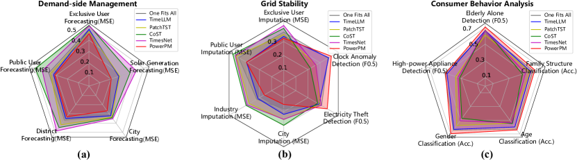
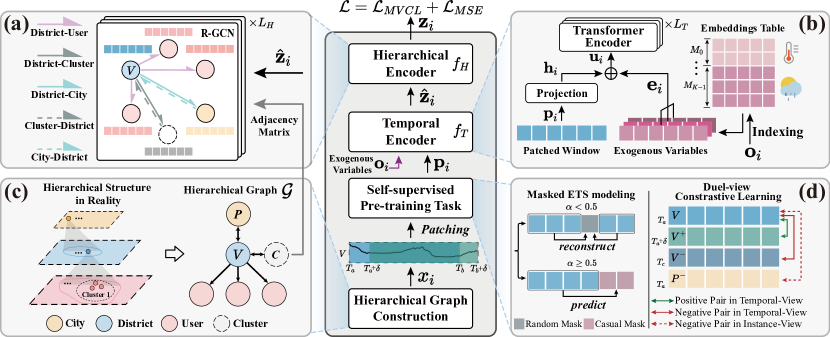
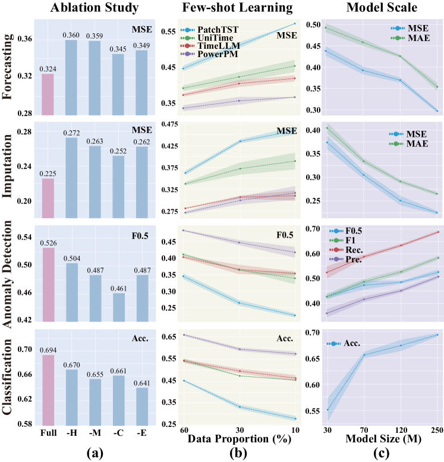

\UseRawInputEncoding\useunder
\ul \useunder\ul   

# PowerPM: Foundation Model for Power Systems

###### Abstract

The emergence of abundant electricity time series (ETS) data provides ample opportunities for various applications in the power systems, including demand-side management, grid stability, and consumer behavior analysis. Deep learning models have advanced ETS modeling by effectively capturing sequence dependence. Nevertheless, learning a generic representation of ETS data for various applications remains challenging due to the inherently complex hierarchical structure of ETS data. Moreover, ETS data exhibits intricate temporal dependencies and is susceptible to the influence of exogenous variables. Furthermore, different instances exhibit diverse electricity consumption behavior. In this paper, we propose a foundation model PowerPM to model ETS data, providing a large-scale, off-the-shelf model for power systems. PowerPM consists of a temporal encoder and a hierarchical encoder. The temporal encoder captures both temporal dependencies in ETS data, considering exogenous variables. The hierarchical encoder models the correlation between hierarchy. Furthermore, PowerPM leverages a novel self-supervised pre-training framework consisting of masked ETS modeling and dual-view contrastive learning, which enable PowerPM to capture temporal dependency within ETS windows and aware the discrepancy across ETS windows, providing two different perspectives to learn generic representation. Our experiments involve five real-world scenario datasets, comprising private and public data. Through pre-training on massive ETS data, PowerPM achieves SOTA performance on diverse downstream tasks within the private dataset. Impressively, when transferred to the public datasets, PowerPM maintains its superiority, showcasing its remarkable generalization ability across various tasks and domains. Moreover, ablation studies, few-shot experiments provide additional evidence of the effectiveness of our model.  

## 1 Introduction

The volume of Electricity Time Series (ETS) data has recently increased rapidly due to the emergence of advanced power systems known as smart grids [[10](#bib.bib10)]. This abundance of data has paved the way for diverse applications in power systems, including demand-side management [[22](#bib.bib22)], grid stability [[2](#bib.bib2)] and consumer behavior analysis [[49](#bib.bib49)], etc. Meanwhile, these applications have spawned various tasks, as shown in Fig. [1](#S1.F1 "Figure 1 ‣ 1 Introduction ‣ PowerPM: Foundation Model for Power Systems")(d), such as load forecasting [[27](#bib.bib27), [4](#bib.bib4)], clock anomaly detection [[46](#bib.bib46)], as well as electricity theft [[15](#bib.bib15)] and elderly living alone detection [[45](#bib.bib45)].  

Recent statistics show that the total electricity consumption in China reached $9.22$ trillion kilowatt-hours in $2023$111<https://www.nea.gov.cn/2024-01/26/c_1310762246.htm>, which ranks among the top in the world. The substantial economic benefits that accompany this significant electricity usage are also considerable. On the other hand, unreasonable electricity planning can have a detrimental impact on the environment[[30](#bib.bib30)]. Thus, given the large amount of data and diverse tasks, there is a pressing need to explore effective modeling methods of ETS data for these tasks, which can lead to enhanced economic efficiency while adhering to low-carbon principles.  

Recently, numerous research studies on pre-training approaches for ETS data have emerged. These approaches adopt the “pre-training then fine-tuning” paradigm, which solves the dilemma of limited annotation data, and the pre-trained model can easily adapt to new tasks. Such as PatchTST [[21](#bib.bib21)], TS2Vec [[42](#bib.bib42)], CoST [[37](#bib.bib37)], etc. However, these pre-training methods only utilize small-scale of data with a small number of instances (e.g. users), resulting in poor performance on downstream tasks. As the same time, many researcher begin to apply Large Language Models (LLMs) to assist time series modeling by using pre-trained LLM to encode time series [[51](#bib.bib51)] or incorporating additional descriptions related to the time series [[17](#bib.bib17), [20](#bib.bib20)]. Nevertheless, these models have limited ability in the power system scenario due to insufficient pre-training data of power systems and the lack of sufficient domain-specific knowledge. Additionally, none of these models are tailored for the scenario of power systems, neglecting the unique characteristics of ETS data. Therefore, existing power systems related works still maintain a large research gap in modeling ETS data with a foundation model.  

[FIGURE S1.F1.g1]

Figure 1:  (a) The hierarchical structure of ETS data. (b) The diversity of instances, and the temporal dependency within ETS data. (c) Different electricity consumption behaviors exist across time and instances. (d) Various tasks in power systems.
[/FIGURE]

In our scenario, the ETS data contains numerous instances and naturally exhibits a complex hierarchy [[41](#bib.bib41), [23](#bib.bib23)]. As depicted in Fig. [1](#S1.F1 "Figure 1 ‣ 1 Introduction ‣ PowerPM: Foundation Model for Power Systems")(a), a city ETS can be disaggregated into district ETS through the administrative divisions, which are further disaggregated into user ETS in this district. For the complex hierarchy of ETS data, modeling ETS data entails the consideration of several challenges:  

(1) Hierarchical Dependency Modeling. The hierarchy of ETS data facilitates information interaction across different granularities. Fine-grained ETS provides detailed insights into individual electricity usage, while coarse-grained ETS from districts and cities captures broader factors, indicating overall trends. For example, user-level data reflects user-specific behaviors and city-level data encompasses demographics and policy effects [[29](#bib.bib29), [35](#bib.bib35)]. Integrating these levels of granularity to provide both macro and micro perspectives is a complex task that requires sophisticated modeling.  

(2) Temporal dependencies within ETS window. An ETS window refer to a piece of electricity time data over a period of time. The temporal dependencies within an ETS window refer to the correlations and dependencies between observations at different timestamps. As shown in Fig. [1](#S1.F1 "Figure 1 ‣ 1 Introduction ‣ PowerPM: Foundation Model for Power Systems")(b), the city-level ETS exhibits daily and weekly dependency. Moreover, the temporal dependencies are often influenced by exogenous variables, such as weather, temperature, and seasonal effects. Integrating these factors into the model is challenging because their impact may interact with the temporal dynamics in complex ways. Accurately capturing the temporal dependencies with the impact of exogenous variables is a key challenge in modeling ETS data.  

(3) Discrepancy across ETS windows. The patterns observed in ETS windows can vary significantly across different instances and different timestamps. For instance, as shown in Fig. [1](#S1.F1 "Figure 1 ‣ 1 Introduction ‣ PowerPM: Foundation Model for Power Systems")(c), residential electricity consumption (User A) reaches its peak in the mornings and evenings, used for lighting, appliances, and heating. However, due to residents typically being away for work or education during the day, the usage decreases. Moreover, industrial (User B) experience high power demand during specific daytime periods for machinery and production lines, with lower load requirements during nighttime and weekends. These variations in behavior highlight the challenge of achieving consistency across ETS windows in personalized modeling.  

To address these challenges, we propose a foundation model for power systems named Power Pre-trained Model (PowerPM), as illustrated in Figure [3](#S2.F3 "Figure 3 ‣ 2 Methodology ‣ PowerPM: Foundation Model for Power Systems"). PowerPM contains about $250$M parameters and is pre-trained on large-scale hierarchical ETS data with $987.42$GB. Specifically, we employ the “pre-training then fine-tuning” paradigm to learn generic representations by pre-training on hierarchical ETS data and to unify various tasks by fine-tuning on downstream data. During pre-training stage, we propose a novel self-supervised pre-training framework consisting of *masked ETS modeling* and *dual-view contrastive learning*, which enables PowerPM to capture temporal dependency within ETS windows and aware the discrepancy across ETS windows, providing two different perspectives to learn universal representations. PowerPM mainly consists of two modules, namely, *temporal encoder* and *hierarchical encoder*. The *temporal encoder* employs Transformer encoders to capture the temporal dependency in ETS data, and incorporates exogenous variables to make the modeling process more robust. Moreover, to model hierarchical dependency, *hierarchical encoder* utilizes R-GCN [[25](#bib.bib25)] to propagate information about the correlation between hierarchy. According to the message that passes through the hierarchies, the micro and macro information can effectively assist in modeling the ETS data. In summary, the main contributions of our work comprise:  

[FIGURE S1.F2.g1]

Figure 2: Performance comparison of our model and other baseline models on all downstream tasks in our scenario. Model performances are plotted on $3$ radar subfigures for clarity with the same coordinate range.
[/FIGURE]

1. We propose a foundation model for power systems named PowerPM, which is pre-trained on large-scale ETS data provided by State Grid, providing an off-the-shelf model for power systems. 
2. To the best of our knowledge, PowerPM is the first to date that considers temporal dependency and hierarchical dependency simultaneously. In addition, we present a novel self-supervised pre-training framework that combines masked ETS modeling and dual-view contrastive learning, enhancing the model’s ability to learn temporal dependencies within ETS windows and aware the discrepancy across ETS windows. 
3. Extensive experiments show that PowerPM generalizes well to $44$ downstream tasks. Fig. [2](#S1.F2 "Figure 2 ‣ 1 Introduction ‣ PowerPM: Foundation Model for Power Systems") summarizes the results of all the downstream tasks, showing great potential in ETS data modeling. Moreover, when transferred to the public dataset, PowerPM maintains its superiority, showcasing its remarkable generalization ability across various tasks and domains. Further analysis illustrates the effectiveness of PowerPM. 

## 2 Methodology

[FIGURE S2.F3.g1]

Figure 3: 
The pre-training framework of PowerPM. For simplicity, we take the windows of each instance in the same time range for illustration, and the window process at other times is the same.
[/FIGURE]

Overview.  As shown in the middle part of Fig. [3](#S2.F3 "Figure 3 ‣ 2 Methodology ‣ PowerPM: Foundation Model for Power Systems"): Firstly, the hierarchical graph $\mathcal{G}$ is constructed according to the naturally existing hierarchical relationship of ETS data. The ETS windows in $\mathcal{G}$ and its corresponding exogenous variables are denoted as $\{{\bm{x}}_{i}\}_{i=1}^{N}$ and $\{{\bm{o}}_{i}\}_{i=1}^{N}$, where $N$ is the number of instances, ${\bm{x}}_{i}\in\mathbb{R}^{T_{w}}$, ${\bm{o}}_{i}\in\mathbb{R}^{T_{w}\times K}$, each instance ETS window spans $T_{w}$ time points starting at $T_{a}$ and ending at $T_{b}$. Each time point has $K$ kinds of exogenous variables. Our objective is to perform pre-training on an encoder $f(\cdot)$ to encode each window into a latent representation $\mathbf{z}_{i}\in\mathbb{R}^{N\times d}$, where $d$ indicates the dimension of the latent representation. More specific, PowerPM consists of an exogenous variable enhanced temporal encoder $f_{T}(\cdot)$ and a hierarchical encoder $f_{H}(\cdot)$, with the process: $\mathbf{z}_{i}=f({\bm{x}}_{i},{\bm{o}}_{i},\mathcal{G})=f_{H}(f_{T}({\bm{x}}_{i},{\bm{o}}_{i}),\mathcal{G})$. In addition, a novel self-supervised strategy, which combines masked ETS modeling and dual-view contrastive learning, is used for pre-training PowerPM. Next, we will detail the techniques in both model architecture and pre-training strategy.  

### 2.1 Hierarchical Graph Construction.

The cities, districts, and users in ETS data naturally form a hierarchical relationship, based on which we can construct a hierarchical graph. However, the imbalance in the number of users and districts means there will be multitude of edges between user nodes and district nodes, which significantly increases the complexity of graph modeling. To address this, we employ a clustering strategy to create intermediary nodes, a common approach to implement graph sparsification [[13](#bib.bib13)] and a user group policy in the power systems [[36](#bib.bib36), [44](#bib.bib44), [12](#bib.bib12)]. As depicted in Fig. [3](#S2.F3 "Figure 3 ‣ 2 Methodology ‣ PowerPM: Foundation Model for Power Systems") (c), we use clustering method to categorize users into several clusters, the detailed process can be found in App. [C.1](#A3.SS1 "C.1 PowerPM Implementation ‣ Appendix C PowerPM and Baseline Implementation Details ‣ PowerPM: Foundation Model for Power Systems"). The cities are bidirectionally connected to districts, and these user clusters are also bidirectionally connected to districts, while users are unidirectionally connected to districts. By sparsifying the edges, we enhance the efficiency of graph modeling. Mathematically, we represent the hierarchy as a directed graph $\mathcal{G}=(\mathcal{V},\mathcal{E},\mathcal{R})$, where $\mathcal{V}$ is the set of nodes, each node corresponds to an instance, $\mathcal{E}$ is the set of directed edges, and $\mathcal{R}$ is the set of type of edges (e.g. user cluster $\rightarrow$ district, district $\rightarrow$ user, etc.).  

### 2.2 Temporal Encoder with Exogenous Variables.

Patching.  In the $\mathcal{G}$, each node’s feature ${\bm{x}}_{i}$ is a window of ETS data corresponding to instance $i$. Due to the semantic sparsity of time series, we patch each window ${\bm{x}}_{i}$ into $N_{p}$ segments, each of length $P$, resulting in $\mathbf{p}_{i}\in\mathbb{R}^{N_{p}\times P}$, where $N_{p}=\lceil\frac{T_{w}-P}{S}\rceil+1$, and this method proved its validity in many works [[21](#bib.bib21), [17](#bib.bib17), [20](#bib.bib20)]. Subsequently, a linear projection is applied to each segment to obtain the window representation $\mathbf{h}_{i}\in\mathbb{R}^{N_{p}\times d}$.  

Exogenous Variables Encoding.  To efficiently interact with exogenous variables, we model these variables using learnable embeddings $\mathbf{E}\in\mathbb{R}^{(\sum_{k=0}^{K-1}{M_{k}})\times d}$, where $K$ indicates the number of exogenous variables (e.g. weather type and temperature), $M_{k}$ represents the number of value types of the $k$-th exogenous variable (e.g. sunny and rainy in weather type variable). The exogenous variables ${\bm{o}}_{i}^{(k)}\in\mathbb{R}^{N_{p}\times P}$ corresponding to $\mathbf{p}_{i}$ of the $k$-th exogenous variable are used to obtain the exogenous variables representations from $\mathbf{E}$, indexing out $\mathbf{e}^{(k)}_{i}\in\mathbb{R}^{N_{p}\times d}$, as illustrated in Fig. [3](#S2.F3 "Figure 3 ‣ 2 Methodology ‣ PowerPM: Foundation Model for Power Systems") (b). Subsequently, we derive a representation $\mathbf{u}_{i}\in\mathbb{R}^{N_{p}\times d}$ that considers the window’s exogenous variable influence: $\mathbf{u}_{i}=\mathbf{h}_{i}+\sum_{k=0}^{K-1}\mathbf{e}^{(k)}_{i}$.  

Temporal Encoder.  To model the complex temporal dependency and interaction with exogenous variables, we use the vanilla Transformer encoder [[34](#bib.bib34)] to encode $\mathbf{u}_{i}$, resulting in an augmented temporal representation $\hat{\mathbf{z}}_{i}\in\mathbb{R}^{N_{p}\times d}$.  

### 2.3 Hierarchical Encoder

To model the complex correlation across different hierarchies, we employ Graph Neural Networks (GNNs). GNNs have gained significant popularity recently for modeling relationships among time series, thereby enhancing temporal representation [[7](#bib.bib7), [26](#bib.bib26), [40](#bib.bib40)]. In addition, considering that the correlation relationships of different edges are distinct, we adopt R-GCN [[25](#bib.bib25)] to integrate information across various hierarchies and instances, as depicted in Fig [3](#S2.F3 "Figure 3 ‣ 2 Methodology ‣ PowerPM: Foundation Model for Power Systems") (a). Specifically, we use R-GCN to update the representation $\hat{\mathbf{z}}$ by considering its neighboring nodes in $\mathcal{G}$, with the final node representation denoted as $\mathbf{z}_{i}\in\mathbb{R}^{N_{p}\times d}$. Moreover, we use $\mathbf{z}_{i}$ to perform self-supervised pre-training.  

### 2.4 Self-supervised Pre-training

#### 2.4.1 Masked ETS Modeling

To model temporal dependency within an ETS window, we have adopted the widely utilized masked reconstruction strategy. Nevertheless, existing random masking methods may encounter an issue: they reconstruct the missing part based on the known surrounding part [[21](#bib.bib21), [8](#bib.bib8)], without considering the prediction of future parts relying solely on the past part, which not only diminishes the difficulty of the pre-training stage but also lacks consistency across pre-training task and forecasting task.  

To address this issue, we propose a novel masking approach that combines random and casual masking as shown in Fig. [3](#S2.F3 "Figure 3 ‣ 2 Methodology ‣ PowerPM: Foundation Model for Power Systems") (d) (left). Specifically, we randomly select one of the masking approaches for a given patched window $\mathbf{p}_{i}$, resulting in masked $\mathbf{p}_{i}$. This approach not only retains the benefits of the random masking strategy but also ensures that the model learns to predict future parts based solely on past information, thereby more comprehensively capturing the temporal dependencies within a window. Mathematically, this can be formulated as: $\textbf{masked}\ \mathbf{p}_{i}=\begin{cases}\text{Mask}_{r}(\mathbf{p}_{i})&\text{if }\alpha<0.5\\ \text{Mask}_{c}(\mathbf{p}_{i})&\text{otherwise}\end{cases}$, where $\text{Mask}_{r}$ and $\text{Mask}_{c}$ denote the random and causal masking, respectively, and $\alpha\in[0,1]$ is a uniformly distributed variable. Specifically, after the ${\bm{x}}_{i}$ is inputted into PowerPM for masked ETS modeling, we will obtain a reconstructed $\hat{{\bm{x}}}_{i}$. The corresponding reconstruction loss is: $\mathcal{L}_{MSE}=\frac{1}{N}\sum_{i=1}^{N}({\bm{x}}_{i}-\hat{{\bm{x}}_{i}})^{2}$.  

#### 2.4.2 Dual-view Contrastive Learning

The objective of contrastive learning is to learn representations by bringing positive pairs closer and pushing negative pairs farther apart in the latent space [[5](#bib.bib5), [6](#bib.bib6)]. Motivated by this, to make PowerPM aware of the discrepancy across ETS windows, we employ dual-view contrastive learning (DVCL) to discern subtle differences in electricity usage behavior.  

Positive and Negative Sample Pairs.  These pairs are determined from two views: one is temporal view, which is based on the time difference between the two windows. Another is the instance view, which depends on whether two windows belong to the same instance. For the same instance, the closer the time difference between two windows, the closer their representations are likely to be. This idea is also presented in [[31](#bib.bib31), [42](#bib.bib42)]. Conversely, windows from different instances or the same instance with a larger time difference are likely to have more distinct representations. Overall, we consider adjacent windows from the same instance as positive samples, while windows from different instances or non-adjacent windows from the same instance are negative samples. As depicted in Fig. [3](#S2.F3 "Figure 3 ‣ 2 Methodology ‣ PowerPM: Foundation Model for Power Systems") (d) (right), for the district node V in $\mathcal{G}$, the original start timestamp about this window is $T_{a}$. After shifting several time steps $\delta$ on, we obtain another window $V^{+}$ starting at $T_{a}+\delta$, which serves as a positive sample. Meanwhile, we select windows from other nodes in $\mathcal{G}$, such as city P, starting at $T_{a}$, as well as windows from the same node V but starting at $T_{c}$, where $|T_{c}-T_{a}|\gg\delta$. These windows serve as instance and temporal negative samples, respectively, and are denoted as $P^{-}$ and $V^{-}$.  

Mathematically, given an ETS window ${\bm{x}}_{i}$, we obtain a positive sample ${\bm{x}}_{i}^{+}$ by shifting it by $\delta$ time steps. The other samples in this batch serve as negative samples, totaling $B-1$ negative samples, where $B$ is the batch size during pre-training. The DVCL loss is: $\mathcal{L}_{DVCL}=-\sum_{i=1}^{N}\log\frac{\exp\left(\text{sim}\left(f({\bm{x}}_{i}),f({\bm{x}}_{i}^{+})\right)/\tau\right)}{\sum_{m=1}^{B}\mathbf{I}\cdot\exp\left(\text{sim}\left(f({\bm{x}}_{i}),f({\bm{x}}_{m})\right)/\tau\right)}$, where $\mathbf{I}$ is the boolean function to select the negative pairs and $\text{sim}(\cdot)$ is cosine similarity function.  

## 3 Experiments

### 3.1 Experiment Setup

Pre-training Dataset  PowerPM is pre-trained on 987.42GB ETS data, a private dataset collected by the State Grid Corporation of China in Zhejiang province. This pre-training dataset encompasses ETS data from 11 cities, 90 districts, and 1530826 users, with over 1000 days records. The ETS data is collected at a frequency of one data point every 15 minutes. More details are in App.  [B](#A2 "Appendix B Dataset Description ‣ PowerPM: Foundation Model for Power Systems")  

Downstream Dataset  To evaluate the performance of PowerPM, we conduct comprehensive experiments on eleven downstream private and public datasets. Seven private datasets are also collected from the State Grid in Zhejiang, China. These datasets have different labels for different tasks. Among them, the solar generation dataset does not have a hierarchical structure due to its particularity. Four public datasets are obtained from CSISO 222<http://www.energyonline.com/Data/>, ISONE333<https://www.iso-ne.com/isoexpress/web/reports/load-and-demand/>, NYISO 444<https://www.nyiso.com/load-data>, and PJM 555<https://dataminer2.pjm.com/list>, which all exhibit a hierarchical structure. Further details can be found in Appendix [B](#A2 "Appendix B Dataset Description ‣ PowerPM: Foundation Model for Power Systems").  

Settings.  For the model configurations, the temporal encoder contains a $26$-layer Transformer encoder with model dimension $1024$, inner dimension (FFN) $2048$ and $16$ attention heads, and the hierarchical encoder contains $2$-layer R-GCN. PowerPM contains about 250M parameters. During pre-training, the $40\%$ segments in each input window are masked in the form of random mask and casual mask, the user cluster numbers is set to $12$. See further details in App. [C.1](#A3.SS1 "C.1 PowerPM Implementation ‣ Appendix C PowerPM and Baseline Implementation Details ‣ PowerPM: Foundation Model for Power Systems")  

Baselines.  We compare with $8$ state-of-the-art methods: including Large Language Model (LLM) enhanced models: GPT4TS [[51](#bib.bib51)], Time-LLM [[17](#bib.bib17)], UniTime [[20](#bib.bib20)]; pre-train models: PatchTST [[21](#bib.bib21)], CoST [[37](#bib.bib37)], TS2Vec [[42](#bib.bib42)]; supervised models: DLinear [[43](#bib.bib43)], TimesNet [[38](#bib.bib38)]. More implementation details are provided in App.  [C.2](#A3.SS2 "C.2 Baselines Implementation ‣ Appendix C PowerPM and Baseline Implementation Details ‣ PowerPM: Foundation Model for Power Systems").  

Evaluation Metrics . For forecasting and imputation tasks, we use mean squared error (MSE): $\frac{1}{n}\sum_{i=1}^{n}{(\bm{y}-\hat{\bm{y}})}^{2}$ and mean absolute error (MAE):$\frac{1}{n}\sum_{i=1}^{n}|\bm{y}-\hat{\bm{y}}|$ as the evaluation metric. For classification tasks, we use accuracy as the metric. The metric of the anomaly detection task includes precision, recall, $F_{0.5}$, and $F_{1}$ scores. The $F_{measure}$ is a metric defined as the weighted harmonic mean of precision and recall, with the following equation: $F_{\beta}=\frac{\left(1+\beta^{2}\right)\times{precision}\times{recall}}{\beta^{2}\times{precision}+{recall}}$. We use $F_{0.5}$ for anomaly detection, as precision is more important than recall in power systems scenario [[15](#bib.bib15)].  

### 3.2 Downstream Tasks

Demand-side Management.  Demand-side management aims to optimize and balance the power system by managing and adjusting the electricity demand of end-users. We develop tasks to predict load at different levels (such as cities and users) and tasks to forecast solar generation. With demand-side management, we can better plan and schedule power resources, improve energy efficiency, promote the development of renewable energy, and achieve sustainable energy management.  

Grid Stability.  To ensure the stability of the power grid, we have implemented a series of measures, including electricity theft detection, load imputation, and clock anomaly detection, to address the impact of potential appliance failures within the grid and external electricity theft on the quality of power data and grid operations. Internal appliance malfunctions within the grid, such as clock anomalies or the inability to record electricity usage accurately, decrease the accuracy of power data, making it challenging for power dispatch and management. Additionally, external electricity theft can lead to economic losses and pose a threat to the stable operation and reliability of the power grid, potentially causing power outages and other adverse effects.  

Consumer Behavior Analysis.  To provide users with more assistance, we have implemented tasks such as detecting elderly living alone, high-power appliance detection, gender classification, age classification, and family structure classification. Additionally, we can provide more flexible power scheduling plans for special groups, optimizing power dispatch. We also aim to understand the energy usage differences among different genders and age groups and provide personalized energy management recommendations and services for different users.  

[TABLE S3.T1]

.

Tasks
PowerPM
PowerPMfreeze
GPT4TS <cite class="ltx_cite ltx_citemacro_citep">[<a class="ltx_ref">51</a>]</cite>
TimeLLM <cite class="ltx_cite ltx_citemacro_citep">[<a class="ltx_ref">17</a>]</cite>
UniTime <cite class="ltx_cite ltx_citemacro_citep">[<a class="ltx_ref">20</a>]</cite>
PatchTST <cite class="ltx_cite ltx_citemacro_cite">[<a class="ltx_ref">21</a>]</cite>
CoST <cite class="ltx_cite ltx_citemacro_citep">[<a class="ltx_ref">37</a>]</cite>
TS2Vec <cite class="ltx_cite ltx_citemacro_citep">[<a class="ltx_ref">42</a>]</cite>
TimesNet <cite class="ltx_cite ltx_citemacro_citep">[<a class="ltx_ref">38</a>]</cite>
DLinear <cite class="ltx_cite ltx_citemacro_citep">[<a class="ltx_ref">43</a>]</cite>

MSE
MSE
MSE
MSE
MSE
MSE
MSE
MSE
MSE
MSE

Demand-side Management

Exclusive User

Forecasting

4
0.3378
\ul0.3557
0.4102
*0.3923
0.4165
0.3929
0.4197
0.4891
0.4335
0.4228

96
0.4183
\ul0.4354
0.4682
0.4832
*0.4514
0.4600
0.5166
0.5453
0.5123
0.5398

288
0.4770
\ul0.5026
0.5319
0.5207
0.5370
*0.5173
0.5634
0.5679
0.5569
0.5818

672
\ul0.5476
0.5831
0.5840
*0.5789
0.5899
0.5347
0.6088
0.6013
0.5961
0.6301

Avg.
0.4452
\ul0.4692
0.4986
0.4938
0.4987
*0.4762
0.5271
0.5509
0.5247
0.5436

Public User

Forecasting

4
0.2353
\ul0.2507
0.3044
*0.2857
0.2967
0.2911
0.4076
0.3598
0.3583
0.3592

96
0.2604
*0.3142
0.3456
\ul0.3021
0.3645
0.3211
0.4395
0.4054
0.3974
0.4567

288
0.3226
*0.3478
0.3914
\ul0.3449
0.4050
0.3735
0.5128
0.5276
0.4359
0.5455

672
\ul0.3818
*0.4061
0.4470
0.3720
0.4424
0.4325
0.5565
0.5756
0.5271
0.5960

Avg.
0.3000
*0.3297
0.3721
\ul0.3262
0.3772
0.3546
0.4791
0.4671
0.4297
0.4894

District

Forecasting

4
0.2382
\ul0.2736
0.3239
*0.2924
0.3115
0.3489
0.3837
0.3989
0.4135
0.3701

96
0.2926
\ul0.3348
0.3521
*0.3434
0.3532
0.3891
0.4166
0.4507
0.4742
0.4413

288
0.3300
*0.3760
0.3836
\ul0.3656
0.3903
0.4458
0.4455
0.4836
0.4950
0.5186

672
0.3710
0.4199
*0.4110
\ul0.3940
0.4213
0.4852
0.5109
0.5402
0.5513
0.6004

Avg.
0.3080
*0.3511
0.3677
\ul0.3489
0.3691
0.4173
0.4392
0.4684
0.4835
0.4826

City

Forecasting

4
0.1725
\ul0.2213
0.2754
0.2620
*0.2435
0.2654
0.2757
0.2650
0.2455
0.3442

96
0.2272
\ul0.2818
0.2958
0.2885
0.2910
*0.2858
0.3065
0.2894
0.3030
0.4084

288
0.2484
0.3371
\ul0.3311
0.3390
*0.3365
0.3682
0.3540
0.3468
0.3976
0.4471

672
0.3211
\ul0.3706
0.3746
0.3933
*0.3727
0.4256
0.4313
0.4646
0.4622
0.5196

Avg.
0.2423
\ul0.3027
0.3192
0.3207
*0.3109
0.3363
0.3419
0.3415
0.3521
0.4298

Solar Generation

Forecasting

4
0.0993
\ul0.1131
0.1219
0.1315
0.1561
*0.1188
0.1678
0.2330
0.3379
0.4177

96
0.1223
\ul0.1646
0.1894
0.2183
0.2468
*0.1766
0.3822
0.3394
0.4216
0.4710

288
\ul0.2337
0.2679
0.2330
0.2862
0.3366
*0.2538
0.4568
0.3958
0.4570
0.5472

672
\ul0.3076
*0.3438
0.2893
0.3561
0.3843
0.3607
0.4984
0.4259
0.5128
0.5993

Avg.
0.1907
*0.2224
\ul0.2084
0.2480
0.2810
0.2275
0.3763
0.3485
0.4323
0.5088

Grid Stability

Exclusive User

Imputation

0.125
\ul0.2459
0.2832
0.2902
0.2442
*0.2673
0.2820
0.3243
0.3636
0.3334
0.3702

0.25
0.2621
*0.3136
0.3448
\ul0.3036
0.3398
0.3318
0.3615
0.4150
0.3882
0.4139

0.375
0.3288
\ul0.3573
0.4025
0.3754
0.4080
*0.3725
0.4105
0.4595
0.4275
0.4634

0.5
0.3661
\ul0.4125
0.4342
0.4243
0.4393
*0.4190
0.4805
0.5036
0.5103
0.5365

Avg.
0.3007
*0.3417
0.3679
\ul0.3369
0.3636
0.3513
0.3942
0.4354
0.4149
0.4460

Public User

Imputation

0.125
0.2348
*0.2651
0.2897
\ul0.2614
0.2987
0.3070
0.3516
0.3223
0.3006
0.3544

0.25
0.2776
*0.2949
0.3327
\ul0.2837
0.3340
0.3667
0.4011
0.3888
0.3583
0.4013

0.375
\ul0.3237
*0.3320
0.4005
0.3044
0.3505
0.4105
0.4420
0.4316
0.4136
0.4487

0.5
\ul0.3919
*0.4295
0.4623
0.3776
0.4439
0.4423
0.4846
0.5028
0.5235
0.5497

Avg.
\ul0.3070
*0.3304
0.3713
0.3068
0.3568
0.3816
0.4198
0.4114
0.3990
0.4385

District

Imputation

0.125
0.0811
\ul0.1212
*0.1225
0.1364
0.1653
0.1506
0.1852
0.2222
0.1766
0.2332

0.25
0.1284
\ul0.1689
0.2016
*0.1710
0.2698
0.2679
0.2881
0.3042
0.2669
0.2810

0.375
0.1666
\ul0.2223
0.2430
*0.2381
0.3132
0.3272
0.3432
0.3524
0.3598
0.3409

0.5
0.2269
\ul0.2938
0.3238
*0.3068
0.3591
0.3938
0.4249
0.4227
0.4053
0.4051

Avg.
0.1508
\ul0.2016
0.2227
*0.2131
0.2769
0.2849
0.3104
0.3254
0.3022
0.3151

City

Imputation

0.125
0.0753
*0.1250
\ul0.1101
0.1465
0.1502
0.1807
0.2161
0.2476
0.1825
0.2542

0.25
0.1114
*0.1626
\ul0.1524
0.1912
0.2047
0.2313
0.2715
0.2885
0.2237
0.2987

0.375
0.1451
\ul0.2155
*0.2175
0.2409
0.2557
0.2714
0.3262
0.3313
0.2740
0.3663

0.5
\ul0.2412
*0.2623
0.2357
0.2965
0.3034
0.3417
0.3728
0.3935
0.3389
0.4134

Avg.
0.1433
*0.1914
\ul0.1789
0.2188
0.2285
0.2563
0.2967
0.3152
0.2548
0.3332

Electricity Theft

Detection

Pre.
0.3793
\ul0.3213
0.2865
0.2537
0.2515
0.2678
*0.3149
0.3076
0.2790
0.2603

Rec.
0.5911
\ul0.5487
0.4444
0.4991
0.5009
0.4665
*0.5281
0.4943
0.4448
0.4594

F0.5
0.4086
\ul0.3503
0.3084
0.2814
0.2793
0.2927
*0.3426
0.3327
0.3015
0.2850

F1
0.4621
\ul0.4053
0.3484
0.3364
0.3349
0.3403
*0.3945
0.3792
0.3429
0.3323

Clock Anomaly

Detection

Pre.
0.4540
\ul0.3874
0.3247
0.3108
0.3294
0.2321
0.3620
*0.3859
0.2341
0.1719

Rec.
0.7881
\ul0.7391
0.7255
0.7120
0.6908
0.6290
0.7309
*0.7326
0.5571
0.5432

F0.5
0.4961
\ul0.4281
0.3650
0.3503
0.3679
0.2656
0.4026
*0.4262
0.2648
0.1991

F1
0.5761
\ul0.5083
0.4486
0.4327
0.4461
0.3391
0.4842
*0.5055
0.3297
0.2612

Consumer Behavior Analysis

High Power

Appliance Detection

Pre.
\ul0.7427
*0.7265
0.6951
0.6988
0.7430
0.6538
0.6973
0.6880
0.7027
0.6008

Rec.
0.5832
*0.5426
0.4924
0.5024
0.5375
0.4773
\ul0.5715
0.5116
0.5292
0.4668

F0.5
0.7042
*0.6804
0.6422
0.6481
\ul0.6902
0.6088
0.6679
0.6436
0.6595
0.5682

F1
0.6534
0.6212
0.5765
0.5845
*0.6238
0.5518
\ul0.6282
0.5868
0.6037
0.5254

Elderly Alone

Detection

Pre.
\ul0.4540
*0.4374
0.4677
0.4135
0.4254
0.3301
0.3826
0.3588
0.3025
0.2282

Rec.
0.7881
\ul0.7587
*0.7355
0.6898
0.7044
0.6448
0.6796
0.6690
0.6934
0.5704

F0.5
\ul0.4961
*0.4779
0.5044
0.4495
0.4620
0.3658
0.4192
0.3955
0.3409
0.2593

F1
0.5761
*0.5549
\ul0.5718
0.5171
0.5305
0.4367
0.4896
0.4671
0.4212
0.3260

Gender CLS
Acc.
0.7571
\ul0.7142
*0.6466
0.6340
0.6328
0.5490
0.6402
0.5960
0.5079
0.4786

Age CLS
Acc.
0.6830
\ul0.6418
0.6295
0.6001
0.5774
0.5134
*0.6298
0.5864
0.5379
0.5187

Family Structure CLS
Acc.
0.6406
*0.6129
0.5974
0.5687
\ul0.6179
0.5205
0.6062
0.5463
0.5038
0.4840

Table 1: Performance comparison on private dataset. The result of MAE metric refer to Tab. [6](#A6.T6 "Table 6 ‣ Appendix F Social Impacts ‣ PowerPM: Foundation Model for Power Systems")
[/TABLE]

### 3.3 Main Results

Overview.  As a foundation model for power systems, PowerPM achieves SOTA performance on various tasks when compared to other baseline models, highlighting its ability to generalize effectively across a wide range of tasks. We derive more detailed comparisons of each task in the following paragraphs, where in all tables we mark the best results in bold, the second-best in underlined, and the third-best in ${}^{*}\text{asterisk}$ in each column.  

Demand-side Management.  The forecasting results for load and solar generation are presented in Tab. [1](#S3.T1 "Table 1 ‣ 3.2 Downstream Tasks ‣ 3 Experiments ‣ PowerPM: Foundation Model for Power Systems") (upper part). The results cover various forecast horizons, including $4$ ($1$ hour), $96$ ($1$ day), $288$ ($3$ days), and $672$ ($1$ week). The choice of these forecast horizons holds physical significance as it aligns with real-world scenarios. The results demonstrate that not only PowerPM achieves near SOTA performance, but also $\text{PowerPM}_{freeze}$ surpasses most baseline models. This highlights the superiority of PowerPM in modeling temporal dependencies and capturing the impact of exogenous variables through the use of a temporal encoder and a novel masked ETS modeling approach. Furthermore, PowerPM attains near SOTA performance at different hierarchical levels, particularly at the macro level (district and city), highlighting the importance of modeling the hierarchical correlation within ETS data in PowerPM. Notably, among the baselines, none of the baselines capture the hierarchical correlation of ETS data, resulting in a performance decrease in comparison to PowerPM.  

Grid Stability.  To assess the efficacy of PowerPM in grid stability application, we conduct comprehensive experiments encompassing load imputation across various masked ratios ($12.5\%,25\%,37.5\%,50\%$), anomaly detection (including electricity theft and clock anomaly detection), encompassing a total of $18$ tasks. The results, detailed in Tab. [1](#S3.T1 "Table 1 ‣ 3.2 Downstream Tasks ‣ 3 Experiments ‣ PowerPM: Foundation Model for Power Systems") (middle part), illustrate PowerPM’s consistent superiority over all baselines, with the $\text{PowerPM}_{freeze}$ variant also surpassing the majority of baselines. Notably, in imputation tasks, PowerPM demonstrates marked superiority over other pre-trained models (such as PatchTST and CoST), underscoring the advantages of hierarchical modeling in ETS data. Furthermore, in anomaly detection tasks, as shown in Tab. [1](#S3.T1 "Table 1 ‣ 3.2 Downstream Tasks ‣ 3 Experiments ‣ PowerPM: Foundation Model for Power Systems") (middle part), our model consistently achieves near-optimal results. While GPT4TS records the highest F0.5 score among the baseline methods, attributed to its generation of GPT-2, PowerPMfurther enhances the F0.5 score over GPT4TS. This improvement stems from our temporal encoder’s broader receptive field and the hierarchical encoder’s capacity to capture hierarchical correlations across all levels, which are both pivotal for modeling ETS data.  

Consumer Behavior analysis.  We explore two anomaly detection tasks: elderly living alone and high-power appliance detection, and three classification tasks: gender, age, and family structure classification. The results in Tab. [1](#S3.T1 "Table 1 ‣ 3.2 Downstream Tasks ‣ 3 Experiments ‣ PowerPM: Foundation Model for Power Systems") (bottom part) demonstrate PowerPM’s SOTA performance, illustrating its capacity for deep semantic insight and contextual awareness. Furthermore, PowerPMfreeze sustains high performance, highlighting the model’s innate ability to extract and generalize features.  

[TABLE S3.T2]

<table class="ltx_tabular ltx_guessed_headers ltx_align_middle">
<thead class="ltx_thead">
<tr class="ltx_tr">
<th class="ltx_td ltx_align_center ltx_th ltx_th_column ltx_th_row ltx_border_r ltx_border_tt">Dataset</th>
<th class="ltx_td ltx_align_center ltx_th ltx_th_column ltx_th_row ltx_border_tt">Task</th>
<th class="ltx_td ltx_align_center ltx_th ltx_th_column ltx_border_tt">PowerPM</th>
<th class="ltx_td ltx_align_center ltx_th ltx_th_column ltx_border_tt">PowerPMfreeze
</th>
<th class="ltx_td ltx_align_center ltx_th ltx_th_column ltx_border_tt">GPT4TS <cite class="ltx_cite ltx_citemacro_citep">[<a class="ltx_ref">51</a>]</cite>
</th>
<th class="ltx_td ltx_align_center ltx_th ltx_th_column ltx_border_tt">TimeLLM <cite class="ltx_cite ltx_citemacro_citep">[<a class="ltx_ref">17</a>]</cite>
</th>
<th class="ltx_td ltx_align_center ltx_th ltx_th_column ltx_border_tt">UniTime <cite class="ltx_cite ltx_citemacro_citep">[<a class="ltx_ref">20</a>]</cite>
</th>
<th class="ltx_td ltx_align_center ltx_th ltx_th_column ltx_border_tt">PatchTST <cite class="ltx_cite ltx_citemacro_cite">[<a class="ltx_ref">21</a>]</cite>
</th>
<th class="ltx_td ltx_align_center ltx_th ltx_th_column ltx_border_tt">CoST <cite class="ltx_cite ltx_citemacro_citep">[<a class="ltx_ref">37</a>]</cite>
</th>
<th class="ltx_td ltx_align_center ltx_th ltx_th_column ltx_border_tt">TS2Vec <cite class="ltx_cite ltx_citemacro_citep">[<a class="ltx_ref">42</a>]</cite>
</th>
<th class="ltx_td ltx_align_center ltx_th ltx_th_column ltx_border_tt">TimesNet <cite class="ltx_cite ltx_citemacro_citep">[<a class="ltx_ref">38</a>]</cite>
</th>
<th class="ltx_td ltx_align_center ltx_th ltx_th_column ltx_border_tt">DLinear <cite class="ltx_cite ltx_citemacro_citep">[<a class="ltx_ref">43</a>]</cite>
</th>
</tr>
<tr class="ltx_tr">
<th class="ltx_td ltx_align_center ltx_th ltx_th_column ltx_border_t">MSE</th>
<th class="ltx_td ltx_align_center ltx_th ltx_th_column ltx_border_t">MSE</th>
<th class="ltx_td ltx_align_center ltx_th ltx_th_column ltx_border_t">MSE</th>
<th class="ltx_td ltx_align_center ltx_th ltx_th_column ltx_border_t">MSE</th>
<th class="ltx_td ltx_align_center ltx_th ltx_th_column ltx_border_t">MSE</th>
<th class="ltx_td ltx_align_center ltx_th ltx_th_column ltx_border_t">MSE</th>
<th class="ltx_td ltx_align_center ltx_th ltx_th_column ltx_border_t">MSE</th>
<th class="ltx_td ltx_align_center ltx_th ltx_th_column ltx_border_t">MSE</th>
<th class="ltx_td ltx_align_center ltx_th ltx_th_column ltx_border_t">MSE</th>
<th class="ltx_td ltx_align_center ltx_th ltx_th_column ltx_border_t">MSE</th>
</tr>
</thead>
<tbody class="ltx_tbody">
<tr class="ltx_tr">
<th class="ltx_td ltx_align_center ltx_th ltx_th_row ltx_border_r ltx_border_t">CAISO</th>
<th class="ltx_td ltx_align_center ltx_th ltx_th_row ltx_border_r ltx_border_t">

State

Forecasting
</th>
<th class="ltx_td ltx_align_center ltx_th ltx_th_row ltx_border_r ltx_border_t">12</th>
<td class="ltx_td ltx_align_center ltx_border_t">0.2968</td>
<td class="ltx_td ltx_align_center ltx_border_t">
\ul0.3162</td>
<td class="ltx_td ltx_align_center ltx_border_t">0.3519</td>
<td class="ltx_td ltx_align_center ltx_border_t">0.3620</td>
<td class="ltx_td ltx_align_center ltx_border_t">0.3187</td>
<td class="ltx_td ltx_align_center ltx_border_t">*0.3167</td>
<td class="ltx_td ltx_align_center ltx_border_t">0.3565</td>
<td class="ltx_td ltx_align_center ltx_border_t">0.4143</td>
<td class="ltx_td ltx_align_center ltx_border_t">0.3604</td>
<td class="ltx_td ltx_align_center ltx_border_t">0.4173</td>
</tr>
<tr class="ltx_tr">
<th class="ltx_td ltx_align_center ltx_th ltx_th_row ltx_border_r">24</th>
<td class="ltx_td ltx_align_center">0.3341</td>
<td class="ltx_td ltx_align_center">0.3742</td>
<td class="ltx_td ltx_align_center">0.3857</td>
<td class="ltx_td ltx_align_center">*0.3708</td>
<td class="ltx_td ltx_align_center">0.3765</td>
<td class="ltx_td ltx_align_center">
\ul0.3647</td>
<td class="ltx_td ltx_align_center">0.4151</td>
<td class="ltx_td ltx_align_center">0.4531</td>
<td class="ltx_td ltx_align_center">0.4205</td>
<td class="ltx_td ltx_align_center">0.4887</td>
</tr>
<tr class="ltx_tr">
<th class="ltx_td ltx_align_center ltx_th ltx_th_row ltx_border_r">168</th>
<td class="ltx_td ltx_align_center">0.3767</td>
<td class="ltx_td ltx_align_center">
\ul0.3967</td>
<td class="ltx_td ltx_align_center">0.4138</td>
<td class="ltx_td ltx_align_center">*0.4097</td>
<td class="ltx_td ltx_align_center">0.4211</td>
<td class="ltx_td ltx_align_center">0.4099</td>
<td class="ltx_td ltx_align_center">0.4531</td>
<td class="ltx_td ltx_align_center">0.5117</td>
<td class="ltx_td ltx_align_center">0.4754</td>
<td class="ltx_td ltx_align_center">0.5591</td>
</tr>
<tr class="ltx_tr">
<th class="ltx_td ltx_align_center ltx_th ltx_th_row ltx_border_r">Avg.</th>
<td class="ltx_td ltx_align_center">0.3359</td>
<td class="ltx_td ltx_align_center">
\ul0.3624</td>
<td class="ltx_td ltx_align_center">0.3838</td>
<td class="ltx_td ltx_align_center">0.3808</td>
<td class="ltx_td ltx_align_center">0.3721</td>
<td class="ltx_td ltx_align_center">*0.3637</td>
<td class="ltx_td ltx_align_center">0.4082</td>
<td class="ltx_td ltx_align_center">0.4597</td>
<td class="ltx_td ltx_align_center">0.4188</td>
<td class="ltx_td ltx_align_center">0.4884</td>
</tr>
<tr class="ltx_tr">
<th class="ltx_td ltx_align_center ltx_th ltx_th_row ltx_border_r ltx_border_t">

Area

Forecasting
</th>
<th class="ltx_td ltx_align_center ltx_th ltx_th_row ltx_border_r ltx_border_t">12</th>
<td class="ltx_td ltx_align_center ltx_border_t">0.1877</td>
<td class="ltx_td ltx_align_center ltx_border_t">
\ul0.2195</td>
<td class="ltx_td ltx_align_center ltx_border_t">*0.2233</td>
<td class="ltx_td ltx_align_center ltx_border_t">0.2318</td>
<td class="ltx_td ltx_align_center ltx_border_t">0.2528</td>
<td class="ltx_td ltx_align_center ltx_border_t">0.2688</td>
<td class="ltx_td ltx_align_center ltx_border_t">0.2993</td>
<td class="ltx_td ltx_align_center ltx_border_t">0.3049</td>
<td class="ltx_td ltx_align_center ltx_border_t">0.3401</td>
<td class="ltx_td ltx_align_center ltx_border_t">0.3838</td>
</tr>
<tr class="ltx_tr">
<th class="ltx_td ltx_align_center ltx_th ltx_th_row ltx_border_r">24</th>
<td class="ltx_td ltx_align_center">0.2072</td>
<td class="ltx_td ltx_align_center">
\ul0.2425</td>
<td class="ltx_td ltx_align_center">*0.2478</td>
<td class="ltx_td ltx_align_center">0.2551</td>
<td class="ltx_td ltx_align_center">0.2735</td>
<td class="ltx_td ltx_align_center">0.3098</td>
<td class="ltx_td ltx_align_center">0.3320</td>
<td class="ltx_td ltx_align_center">0.3280</td>
<td class="ltx_td ltx_align_center">0.3869</td>
<td class="ltx_td ltx_align_center">0.4386</td>
</tr>
<tr class="ltx_tr">
<th class="ltx_td ltx_align_center ltx_th ltx_th_row ltx_border_r">168</th>
<td class="ltx_td ltx_align_center">0.2645</td>
<td class="ltx_td ltx_align_center">*0.3104</td>
<td class="ltx_td ltx_align_center">
\ul0.2980</td>
<td class="ltx_td ltx_align_center">0.3135</td>
<td class="ltx_td ltx_align_center">0.3344</td>
<td class="ltx_td ltx_align_center">0.3318</td>
<td class="ltx_td ltx_align_center">0.3889</td>
<td class="ltx_td ltx_align_center">0.3960</td>
<td class="ltx_td ltx_align_center">0.4259</td>
<td class="ltx_td ltx_align_center">0.4773</td>
</tr>
<tr class="ltx_tr">
<th class="ltx_td ltx_align_center ltx_th ltx_th_row ltx_border_r">Avg.</th>
<td class="ltx_td ltx_align_center">0.2198</td>
<td class="ltx_td ltx_align_center">*0.2575</td>
<td class="ltx_td ltx_align_center">
\ul0.2564</td>
<td class="ltx_td ltx_align_center">0.2668</td>
<td class="ltx_td ltx_align_center">0.2869</td>
<td class="ltx_td ltx_align_center">0.3035</td>
<td class="ltx_td ltx_align_center">0.3401</td>
<td class="ltx_td ltx_align_center">0.3430</td>
<td class="ltx_td ltx_align_center">0.3843</td>
<td class="ltx_td ltx_align_center">0.4332</td>
</tr>
<tr class="ltx_tr">
<th class="ltx_td ltx_align_center ltx_th ltx_th_row ltx_border_r ltx_border_t">NYISO</th>
<th class="ltx_td ltx_align_center ltx_th ltx_th_row ltx_border_r ltx_border_t">

State

Forecasting
</th>
<th class="ltx_td ltx_align_center ltx_th ltx_th_row ltx_border_r ltx_border_t">12</th>
<td class="ltx_td ltx_align_center ltx_border_t">0.0975</td>
<td class="ltx_td ltx_align_center ltx_border_t">*0.1128</td>
<td class="ltx_td ltx_align_center ltx_border_t">0.1426</td>
<td class="ltx_td ltx_align_center ltx_border_t">0.1241</td>
<td class="ltx_td ltx_align_center ltx_border_t">
\ul0.1069</td>
<td class="ltx_td ltx_align_center ltx_border_t">0.1212</td>
<td class="ltx_td ltx_align_center ltx_border_t">0.2040</td>
<td class="ltx_td ltx_align_center ltx_border_t">0.1978</td>
<td class="ltx_td ltx_align_center ltx_border_t">0.1857</td>
<td class="ltx_td ltx_align_center ltx_border_t">0.2386</td>
</tr>
<tr class="ltx_tr">
<th class="ltx_td ltx_align_center ltx_th ltx_th_row ltx_border_r">24</th>
<td class="ltx_td ltx_align_center">0.1134</td>
<td class="ltx_td ltx_align_center">
\ul0.1421</td>
<td class="ltx_td ltx_align_center">0.1593</td>
<td class="ltx_td ltx_align_center">*0.1430</td>
<td class="ltx_td ltx_align_center">0.1438</td>
<td class="ltx_td ltx_align_center">0.1984</td>
<td class="ltx_td ltx_align_center">0.2426</td>
<td class="ltx_td ltx_align_center">0.2666</td>
<td class="ltx_td ltx_align_center">0.2376</td>
<td class="ltx_td ltx_align_center">0.2932</td>
</tr>
<tr class="ltx_tr">
<th class="ltx_td ltx_align_center ltx_th ltx_th_row ltx_border_r">168</th>
<td class="ltx_td ltx_align_center">0.1469</td>
<td class="ltx_td ltx_align_center">*0.1812</td>
<td class="ltx_td ltx_align_center">0.1944</td>
<td class="ltx_td ltx_align_center">0.1830</td>
<td class="ltx_td ltx_align_center">
\ul0.1794</td>
<td class="ltx_td ltx_align_center">0.2046</td>
<td class="ltx_td ltx_align_center">0.3317</td>
<td class="ltx_td ltx_align_center">0.3164</td>
<td class="ltx_td ltx_align_center">0.2738</td>
<td class="ltx_td ltx_align_center">0.3751</td>
</tr>
<tr class="ltx_tr">
<th class="ltx_td ltx_align_center ltx_th ltx_th_row ltx_border_r">Avg.</th>
<td class="ltx_td ltx_align_center">0.1193</td>
<td class="ltx_td ltx_align_center">*0.1454</td>
<td class="ltx_td ltx_align_center">0.1654</td>
<td class="ltx_td ltx_align_center">0.1501</td>
<td class="ltx_td ltx_align_center">
\ul0.1434</td>
<td class="ltx_td ltx_align_center">0.1747</td>
<td class="ltx_td ltx_align_center">0.2594</td>
<td class="ltx_td ltx_align_center">0.2603</td>
<td class="ltx_td ltx_align_center">0.2323</td>
<td class="ltx_td ltx_align_center">0.3023</td>
</tr>
<tr class="ltx_tr">
<th class="ltx_td ltx_align_center ltx_th ltx_th_row ltx_border_r ltx_border_t">

Area

Forecasting
</th>
<th class="ltx_td ltx_align_center ltx_th ltx_th_row ltx_border_r ltx_border_t">12</th>
<td class="ltx_td ltx_align_center ltx_border_t">*0.0952</td>
<td class="ltx_td ltx_align_center ltx_border_t">
\ul0.0946</td>
<td class="ltx_td ltx_align_center ltx_border_t">0.1086</td>
<td class="ltx_td ltx_align_center ltx_border_t">0.0854</td>
<td class="ltx_td ltx_align_center ltx_border_t">0.1025</td>
<td class="ltx_td ltx_align_center ltx_border_t">0.1462</td>
<td class="ltx_td ltx_align_center ltx_border_t">0.1663</td>
<td class="ltx_td ltx_align_center ltx_border_t">0.1593</td>
<td class="ltx_td ltx_align_center ltx_border_t">0.1610</td>
<td class="ltx_td ltx_align_center ltx_border_t">0.1985</td>
</tr>
<tr class="ltx_tr">
<th class="ltx_td ltx_align_center ltx_th ltx_th_row ltx_border_r">24</th>
<td class="ltx_td ltx_align_center">
\ul0.1154</td>
<td class="ltx_td ltx_align_center">0.1567</td>
<td class="ltx_td ltx_align_center">*0.1193</td>
<td class="ltx_td ltx_align_center">0.1077</td>
<td class="ltx_td ltx_align_center">0.1334</td>
<td class="ltx_td ltx_align_center">0.1573</td>
<td class="ltx_td ltx_align_center">0.2182</td>
<td class="ltx_td ltx_align_center">0.1915</td>
<td class="ltx_td ltx_align_center">0.2252</td>
<td class="ltx_td ltx_align_center">0.2444</td>
</tr>
<tr class="ltx_tr">
<th class="ltx_td ltx_align_center ltx_th ltx_th_row ltx_border_r">168</th>
<td class="ltx_td ltx_align_center">
\ul0.1635</td>
<td class="ltx_td ltx_align_center">0.1772</td>
<td class="ltx_td ltx_align_center">0.1909</td>
<td class="ltx_td ltx_align_center">*0.1690</td>
<td class="ltx_td ltx_align_center">0.1558</td>
<td class="ltx_td ltx_align_center">0.2310</td>
<td class="ltx_td ltx_align_center">0.2777</td>
<td class="ltx_td ltx_align_center">0.2524</td>
<td class="ltx_td ltx_align_center">0.2891</td>
<td class="ltx_td ltx_align_center">0.3399</td>
</tr>
<tr class="ltx_tr">
<th class="ltx_td ltx_align_center ltx_th ltx_th_row ltx_border_r">Avg.</th>
<td class="ltx_td ltx_align_center">
\ul0.1247</td>
<td class="ltx_td ltx_align_center">0.1428</td>
<td class="ltx_td ltx_align_center">0.1396</td>
<td class="ltx_td ltx_align_center">0.1207</td>
<td class="ltx_td ltx_align_center">*0.1306</td>
<td class="ltx_td ltx_align_center">0.1781</td>
<td class="ltx_td ltx_align_center">0.2207</td>
<td class="ltx_td ltx_align_center">0.2011</td>
<td class="ltx_td ltx_align_center">0.2251</td>
<td class="ltx_td ltx_align_center">0.2609</td>
</tr>
<tr class="ltx_tr">
<th class="ltx_td ltx_align_center ltx_th ltx_th_row ltx_border_r ltx_border_t">ISONE</th>
<th class="ltx_td ltx_align_center ltx_th ltx_th_row ltx_border_r ltx_border_t">

Region

Forecasting
</th>
<th class="ltx_td ltx_align_center ltx_th ltx_th_row ltx_border_r ltx_border_t">12</th>
<td class="ltx_td ltx_align_center ltx_border_t">0.1994</td>
<td class="ltx_td ltx_align_center ltx_border_t">*0.2328</td>
<td class="ltx_td ltx_align_center ltx_border_t">
\ul0.2230</td>
<td class="ltx_td ltx_align_center ltx_border_t">0.2352</td>
<td class="ltx_td ltx_align_center ltx_border_t">0.2457</td>
<td class="ltx_td ltx_align_center ltx_border_t">0.2821</td>
<td class="ltx_td ltx_align_center ltx_border_t">0.3176</td>
<td class="ltx_td ltx_align_center ltx_border_t">0.3559</td>
<td class="ltx_td ltx_align_center ltx_border_t">0.3261</td>
<td class="ltx_td ltx_align_center ltx_border_t">0.3665</td>
</tr>
<tr class="ltx_tr">
<th class="ltx_td ltx_align_center ltx_th ltx_th_row ltx_border_r">24</th>
<td class="ltx_td ltx_align_center">0.2330</td>
<td class="ltx_td ltx_align_center">*0.2833</td>
<td class="ltx_td ltx_align_center">0.2849</td>
<td class="ltx_td ltx_align_center">
\ul0.2761</td>
<td class="ltx_td ltx_align_center">0.2859</td>
<td class="ltx_td ltx_align_center">0.3277</td>
<td class="ltx_td ltx_align_center">0.3621</td>
<td class="ltx_td ltx_align_center">0.3986</td>
<td class="ltx_td ltx_align_center">0.3725</td>
<td class="ltx_td ltx_align_center">0.4185</td>
</tr>
<tr class="ltx_tr">
<th class="ltx_td ltx_align_center ltx_th ltx_th_row ltx_border_r">168</th>
<td class="ltx_td ltx_align_center">0.3118</td>
<td class="ltx_td ltx_align_center">
\ul0.3509</td>
<td class="ltx_td ltx_align_center">*0.3677</td>
<td class="ltx_td ltx_align_center">0.3847</td>
<td class="ltx_td ltx_align_center">0.3800</td>
<td class="ltx_td ltx_align_center">0.4130</td>
<td class="ltx_td ltx_align_center">0.4441</td>
<td class="ltx_td ltx_align_center">0.4522</td>
<td class="ltx_td ltx_align_center">0.4812</td>
<td class="ltx_td ltx_align_center">0.5006</td>
</tr>
<tr class="ltx_tr">
<th class="ltx_td ltx_align_center ltx_th ltx_th_row ltx_border_r">Avg.</th>
<td class="ltx_td ltx_align_center">0.2481</td>
<td class="ltx_td ltx_align_center">
\ul0.2890</td>
<td class="ltx_td ltx_align_center">*0.2918</td>
<td class="ltx_td ltx_align_center">0.2987</td>
<td class="ltx_td ltx_align_center">0.3039</td>
<td class="ltx_td ltx_align_center">0.3410</td>
<td class="ltx_td ltx_align_center">0.3746</td>
<td class="ltx_td ltx_align_center">0.4023</td>
<td class="ltx_td ltx_align_center">0.3933</td>
<td class="ltx_td ltx_align_center">0.4285</td>
</tr>
<tr class="ltx_tr">
<th class="ltx_td ltx_align_center ltx_th ltx_th_row ltx_border_r ltx_border_t">

State

Forecasting
</th>
<th class="ltx_td ltx_align_center ltx_th ltx_th_row ltx_border_r ltx_border_t">12</th>
<td class="ltx_td ltx_align_center ltx_border_t">0.1289</td>
<td class="ltx_td ltx_align_center ltx_border_t">
\ul0.1584</td>
<td class="ltx_td ltx_align_center ltx_border_t">0.1756</td>
<td class="ltx_td ltx_align_center ltx_border_t">0.1903</td>
<td class="ltx_td ltx_align_center ltx_border_t">*0.1616</td>
<td class="ltx_td ltx_align_center ltx_border_t">0.2152</td>
<td class="ltx_td ltx_align_center ltx_border_t">0.3207</td>
<td class="ltx_td ltx_align_center ltx_border_t">0.2751</td>
<td class="ltx_td ltx_align_center ltx_border_t">0.2290</td>
<td class="ltx_td ltx_align_center ltx_border_t">0.3357</td>
</tr>
<tr class="ltx_tr">
<th class="ltx_td ltx_align_center ltx_th ltx_th_row ltx_border_r">24</th>
<td class="ltx_td ltx_align_center">0.1648</td>
<td class="ltx_td ltx_align_center">0.2161</td>
<td class="ltx_td ltx_align_center">*0.2132</td>
<td class="ltx_td ltx_align_center">0.2284</td>
<td class="ltx_td ltx_align_center">
\ul0.2044</td>
<td class="ltx_td ltx_align_center">0.2540</td>
<td class="ltx_td ltx_align_center">0.3725</td>
<td class="ltx_td ltx_align_center">0.3576</td>
<td class="ltx_td ltx_align_center">0.2784</td>
<td class="ltx_td ltx_align_center">0.3828</td>
</tr>
<tr class="ltx_tr">
<th class="ltx_td ltx_align_center ltx_th ltx_th_row ltx_border_r">168</th>
<td class="ltx_td ltx_align_center">0.2201</td>
<td class="ltx_td ltx_align_center">0.2843</td>
<td class="ltx_td ltx_align_center">*0.2713</td>
<td class="ltx_td ltx_align_center">0.2872</td>
<td class="ltx_td ltx_align_center">
\ul0.2705</td>
<td class="ltx_td ltx_align_center">0.3138</td>
<td class="ltx_td ltx_align_center">0.4171</td>
<td class="ltx_td ltx_align_center">0.4033</td>
<td class="ltx_td ltx_align_center">0.3547</td>
<td class="ltx_td ltx_align_center">0.4585</td>
</tr>
<tr class="ltx_tr">
<th class="ltx_td ltx_align_center ltx_th ltx_th_row ltx_border_r">Avg.</th>
<td class="ltx_td ltx_align_center">0.1713</td>
<td class="ltx_td ltx_align_center">*0.2196</td>
<td class="ltx_td ltx_align_center">0.2200</td>
<td class="ltx_td ltx_align_center">0.2353</td>
<td class="ltx_td ltx_align_center">
\ul0.2121</td>
<td class="ltx_td ltx_align_center">0.2610</td>
<td class="ltx_td ltx_align_center">0.3701</td>
<td class="ltx_td ltx_align_center">0.3453</td>
<td class="ltx_td ltx_align_center">0.2874</td>
<td class="ltx_td ltx_align_center">0.3924</td>
</tr>
<tr class="ltx_tr">
<th class="ltx_td ltx_align_center ltx_th ltx_th_row ltx_border_bb ltx_border_r ltx_border_t">PJM</th>
<th class="ltx_td ltx_align_center ltx_th ltx_th_row ltx_border_r ltx_border_t">

State

Forecasting
</th>
<th class="ltx_td ltx_align_center ltx_th ltx_th_row ltx_border_r ltx_border_t">12</th>
<td class="ltx_td ltx_align_center ltx_border_t">0.2516</td>
<td class="ltx_td ltx_align_center ltx_border_t">
\ul0.2591</td>
<td class="ltx_td ltx_align_center ltx_border_t">0.3054</td>
<td class="ltx_td ltx_align_center ltx_border_t">*0.2619</td>
<td class="ltx_td ltx_align_center ltx_border_t">0.3119</td>
<td class="ltx_td ltx_align_center ltx_border_t">0.3495</td>
<td class="ltx_td ltx_align_center ltx_border_t">0.3371</td>
<td class="ltx_td ltx_align_center ltx_border_t">0.3844</td>
<td class="ltx_td ltx_align_center ltx_border_t">0.4056</td>
<td class="ltx_td ltx_align_center ltx_border_t">0.4383</td>
</tr>
<tr class="ltx_tr">
<th class="ltx_td ltx_align_center ltx_th ltx_th_row ltx_border_r">144</th>
<td class="ltx_td ltx_align_center">0.3258</td>
<td class="ltx_td ltx_align_center">
\ul0.3434</td>
<td class="ltx_td ltx_align_center">0.3834</td>
<td class="ltx_td ltx_align_center">*0.3571</td>
<td class="ltx_td ltx_align_center">0.4006</td>
<td class="ltx_td ltx_align_center">0.4197</td>
<td class="ltx_td ltx_align_center">0.3937</td>
<td class="ltx_td ltx_align_center">0.4425</td>
<td class="ltx_td ltx_align_center">0.4380</td>
<td class="ltx_td ltx_align_center">0.4833</td>
</tr>
<tr class="ltx_tr">
<th class="ltx_td ltx_align_center ltx_th ltx_th_row ltx_border_r">288</th>
<td class="ltx_td ltx_align_center">0.4094</td>
<td class="ltx_td ltx_align_center">0.4646</td>
<td class="ltx_td ltx_align_center">
\ul0.4312</td>
<td class="ltx_td ltx_align_center">0.4497</td>
<td class="ltx_td ltx_align_center">0.4505</td>
<td class="ltx_td ltx_align_center">0.4502</td>
<td class="ltx_td ltx_align_center">*0.4461</td>
<td class="ltx_td ltx_align_center">0.4818</td>
<td class="ltx_td ltx_align_center">0.4933</td>
<td class="ltx_td ltx_align_center">0.5328</td>
</tr>
<tr class="ltx_tr">
<th class="ltx_td ltx_align_center ltx_th ltx_th_row ltx_border_r">Avg.</th>
<td class="ltx_td ltx_align_center">0.3289</td>
<td class="ltx_td ltx_align_center">
\ul0.3557</td>
<td class="ltx_td ltx_align_center">0.3733</td>
<td class="ltx_td ltx_align_center">*0.3562</td>
<td class="ltx_td ltx_align_center">0.3877</td>
<td class="ltx_td ltx_align_center">0.4065</td>
<td class="ltx_td ltx_align_center">0.3923</td>
<td class="ltx_td ltx_align_center">0.4363</td>
<td class="ltx_td ltx_align_center">0.4457</td>
<td class="ltx_td ltx_align_center">0.4848</td>
</tr>
<tr class="ltx_tr">
<th class="ltx_td ltx_align_center ltx_th ltx_th_row ltx_border_bb ltx_border_r ltx_border_t">

city

Forecasting
</th>
<th class="ltx_td ltx_align_center ltx_th ltx_th_row ltx_border_r ltx_border_t">12</th>
<td class="ltx_td ltx_align_center ltx_border_t">
\ul0.2853</td>
<td class="ltx_td ltx_align_center ltx_border_t">*0.3139</td>
<td class="ltx_td ltx_align_center ltx_border_t">0.3398</td>
<td class="ltx_td ltx_align_center ltx_border_t">0.2765</td>
<td class="ltx_td ltx_align_center ltx_border_t">0.3283</td>
<td class="ltx_td ltx_align_center ltx_border_t">0.3643</td>
<td class="ltx_td ltx_align_center ltx_border_t">0.4127</td>
<td class="ltx_td ltx_align_center ltx_border_t">0.4107</td>
<td class="ltx_td ltx_align_center ltx_border_t">0.4246</td>
<td class="ltx_td ltx_align_center ltx_border_t">0.4595</td>
</tr>
<tr class="ltx_tr">
<th class="ltx_td ltx_align_center ltx_th ltx_th_row ltx_border_r">144</th>
<td class="ltx_td ltx_align_center">
\ul0.3191</td>
<td class="ltx_td ltx_align_center">*0.3421</td>
<td class="ltx_td ltx_align_center">0.3663</td>
<td class="ltx_td ltx_align_center">0.3137</td>
<td class="ltx_td ltx_align_center">0.3926</td>
<td class="ltx_td ltx_align_center">0.4225</td>
<td class="ltx_td ltx_align_center">0.4359</td>
<td class="ltx_td ltx_align_center">0.4646</td>
<td class="ltx_td ltx_align_center">0.4688</td>
<td class="ltx_td ltx_align_center">0.4829</td>
</tr>
<tr class="ltx_tr">
<th class="ltx_td ltx_align_center ltx_th ltx_th_row ltx_border_r">288</th>
<td class="ltx_td ltx_align_center">0.3853</td>
<td class="ltx_td ltx_align_center">*0.4393</td>
<td class="ltx_td ltx_align_center">0.4559</td>
<td class="ltx_td ltx_align_center">
\ul0.3904</td>
<td class="ltx_td ltx_align_center">0.4517</td>
<td class="ltx_td ltx_align_center">0.4642</td>
<td class="ltx_td ltx_align_center">0.4832</td>
<td class="ltx_td ltx_align_center">0.5132</td>
<td class="ltx_td ltx_align_center">0.5001</td>
<td class="ltx_td ltx_align_center">0.5355</td>
</tr>
<tr class="ltx_tr">
<th class="ltx_td ltx_align_center ltx_th ltx_th_row ltx_border_bb ltx_border_r">Avg.</th>
<td class="ltx_td ltx_align_center ltx_border_bb">
\ul0.3299</td>
<td class="ltx_td ltx_align_center ltx_border_bb">*0.3651</td>
<td class="ltx_td ltx_align_center ltx_border_bb">0.3873</td>
<td class="ltx_td ltx_align_center ltx_border_bb">0.3269</td>
<td class="ltx_td ltx_align_center ltx_border_bb">0.3909</td>
<td class="ltx_td ltx_align_center ltx_border_bb">0.4170</td>
<td class="ltx_td ltx_align_center ltx_border_bb">0.4439</td>
<td class="ltx_td ltx_align_center ltx_border_bb">0.4629</td>
<td class="ltx_td ltx_align_center ltx_border_bb">0.4645</td>
<td class="ltx_td ltx_align_center ltx_border_bb">0.4927</td>
</tr>
</tbody>
</table>

Table 2: Performance comparison on $4$ public dataset.
[/TABLE]

### 3.4 Model Analysis

Generalization ability analysis.  To further verify the generalization ability of PowerPM on more datasets from other domains, we evaluate PowerPM on 4 public datasets mentioned above. The results in Tab. [2](#S3.T2 "Table 2 ‣ 3.3 Main Results ‣ 3 Experiments ‣ PowerPM: Foundation Model for Power Systems") demonstrate that not only PowerPM outperforms nearly all SOTA methods but also$\text{PowerPM}_{freeze}$ surpasses most SOTA methods, highlighting the superiority of PowerPM in terms of generalization ability.  

[FIGURE S3.F4.g1]

Figure 4: Model Analysis: Ablation Study, Few-shot Learning, and Model Scale Evaluation
[/FIGURE]

Ablation Study.  To assess the effectiveness of each component in our model, we conduct several ablation experiments. Specifically, we remove the following components from our model to examine their effects on performance: the hierarchical encoder (PowerPM-H), the dual-view contrastive learning strategy (PowerPM-C), and the exogenous variables encoding module (PowerPM-E). Furthermore, we replace the masked ETS modeling module with vanilla random masking (PowerPM-M). We categorize the 44 tasks into four traditional time series analysis tasks: forecasting, missing value imputation, anomaly detection, and classification. The evaluation metrics are Mean Squared Error (MSE) for forecasting and missing value imputation, F0.5 score for anomaly detection, and accuracy (Acc.) for classification. The performance is averaged to provide a comprehensive assessment.  

The results of the ablation study are in Fig. [4](#S3.F4 "Figure 4 ‣ 3.4 Model Analysis ‣ 3 Experiments ‣ PowerPM: Foundation Model for Power Systems") (a). The results indicate that PowerPM outperforms other variants of it, providing evidence for the contribution of each component in our model. Among the different variants, PowerPM-H exhibits the most substantial decrease in performance compared to the full PowerPM, emphasizing the significance of interactions occurring between micro- and macro-levels in modeling hierarchical ETS data. The observed performance degradation in PowerPM-M, particularly in forecasting tasks, provides evidence that causal masking can capture more complex temporal dependency. Moreover, the decline in the performance of PowerPM-C, particularly in anomaly detection and classification tasks, suggests that dual-view contrastive learning is effective in capturing subtle discrepancies between instances. Furthermore, PowerPM-E also exists in performance degradation. This emphasizes the effectiveness of the exogenous variables encoding module in capturing the impact of exogenous factors. For the full results of 44 tasks, please refer to App. [7](#A6.T7 "Table 7 ‣ Appendix F Social Impacts ‣ PowerPM: Foundation Model for Power Systems").  

Few-shot Learning.  In power systems, collecting abundant ETS data for downstream tasks is a significant investment. To demonstrate the value of the practical application of our work, we conduct a performance comparison between PowerPM and baseline models on downstream tasks, considering the limited availability of ETS data. Specifically, models are fine-tuned on $10\%,30\%$ and $60\%$ of the downstream dataset, respectively. Similar to an ablation study, we present our results grouped by task type. The result can be seen in Fig. [4](#S3.F4 "Figure 4 ‣ 3.4 Model Analysis ‣ 3 Experiments ‣ PowerPM: Foundation Model for Power Systems") (b), the performance of PowerPM exhibits a slight decrease when there is a significant reduction in the proportion of fine-tuning data. This observation serves as evidence of the effectiveness of our novel pre-training strategy, including *masked ETS modeling* and *dual-view contrastive learning*. Additionally, it highlights that the PowerPM adeptly captures temporal dependencies and hierarchical correlations present in the ETS data during pre-training, enabling easier adaptation to downstream tasks. More detailed results can be referred to App. [8](#A6.T8 "Table 8 ‣ Appendix F Social Impacts ‣ PowerPM: Foundation Model for Power Systems").  

Model Scale Evaluation.  To explore the impact of model size on performance, we design three variants of PowerPM with smaller sizes: PowerPM-Tiny (about $30$M), PowerPM-Small (about $70$M), PowerPM-Medium (about $120$M), PowerPM (about $250$M), and pre-train them on the same datasets. For the pre-training details, please refer to App. [C.1](#A3.SS1 "C.1 PowerPM Implementation ‣ Appendix C PowerPM and Baseline Implementation Details ‣ PowerPM: Foundation Model for Power Systems"). After pre-training, we evaluate these variants on all downstream tasks and present the results grouped by task type, similar to the ablation study. As shown in Fig. [4](#S3.F4 "Figure 4 ‣ 3.4 Model Analysis ‣ 3 Experiments ‣ PowerPM: Foundation Model for Power Systems") (c), as the size of the model increases, we observe an overall improvement in the performance of all downstream tasks. Specifically, PowerPM outperforms the other variants in all metrics. In addition, larger models exhibit almost a decrease in standard deviation, indicating a more stable performance. Therefore, the utilization of a larger model with higher capacity and vast amounts of ETS data enables better generalization across a wide range of downstream tasks.  

## 4 Conclusion

This paper introduces the PowerPM, a foundational model designed to model ETS data within power systems. PowerPM consists of a temporal encoder and a hierarchical encoder. Furthermore, PowerPM leverages a novel self-supervised pre-training framework consisting of masked ETS modeling and dual-view contrastive learning. Our experiments involve two real-world scenario datasets, comprising private and public data. Through pre-training on massive ETS data, PowerPM achieves SOTA performance on diverse downstream tasks within the private dataset. Moreover, when transferred to the public dataset, PowerPM maintains its superiority, showcasing its remarkable generalization ability across various tasks and domains. Further analysis shows the effectiveness of a foundation model in the field of power system. PowerPM is an off-the-shelf model with its code and weights, which significantly alleviates the issue of sample and label efficiency and can directly participate in other power systems.  

## References

* [1]  Josh Achiam, Steven Adler, Sandhini Agarwal, Lama Ahmad, Ilge Akkaya, Florencia Leoni Aleman, Diogo Almeida, Janko Altenschmidt, Sam Altman, Shyamal Anadkat, et al.   Gpt-4 technical report.   arXiv preprint arXiv:2303.08774, 2023. 
* [2]  Vadim Arzamasov, Klemens Böhm, and Patrick Jochem.   Towards concise models of grid stability.   In 2018 IEEE international conference on communications, control, and computing technologies for smart grids (SmartGridComm), pages 1–6. IEEE, 2018. 
* [3]  Defu Cao, Furong Jia, Sercan O Arik, Tomas Pfister, Yixiang Zheng, Wen Ye, and Yan Liu.   Tempo: Prompt-based generative pre-trained transformer for time series forecasting.   arXiv preprint arXiv:2310.04948, 2023. 
* [4]  Widyaning Chandramitasari, Bobby Kurniawan, and Shigeru Fujimura.   Building deep neural network model for short term electricity consumption forecasting.   In 2018 International Symposium on Advanced Intelligent Informatics (SAIN), pages 43–48. IEEE, 2018. 
* [5]  Ting Chen, Simon Kornblith, Mohammad Norouzi, and Geoffrey Hinton.   A simple framework for contrastive learning of visual representations.   In ICML, 2020. 
* [6]  Xinlei Chen and Kaiming He.   Exploring simple siamese representation learning.   In Proceedings of the IEEE/CVF conference on computer vision and pattern recognition, pages 15750–15758, 2021. 
* [7]  Yue Cui, Kai Zheng, Dingshan Cui, Jiandong Xie, Liwei Deng, Feiteng Huang, and Xiaofang Zhou.   Metro: A generic graph neural network framework for multivariate time series forecasting.   Proc. VLDB Endow., 2021. 
* [8]  Jacob Devlin, Ming-Wei Chang, Kenton Lee, and Kristina Toutanova.   BERT: Pre-training of Deep Bidirectional Transformers for Language Understanding.   NAACL, 2018. 
* [9]  Zhengxiao Du, Yujie Qian, Xiao Liu, Ming Ding, Jiezhong Qiu, Zhilin Yang, and Jie Tang.   Glm: General language model pretraining with autoregressive blank infilling.   arXiv preprint arXiv:2103.10360, 2021. 
* [10]  Xi Fang, Satyajayant Misra, Guoliang Xue, and Dejun Yang.   Smart grid—the new and improved power grid: A survey.   IEEE communications surveys & tutorials, 14(4):944–980, 2011. 
* [11]  Tianyu Gao, Adam Fisch, and Danqi Chen.   Making pre-trained language models better few-shot learners.   IJCNLP, 2020. 
* [12]  Benjamin Goehry, Yannig Goude, Pascal Massart, and Jean-Michel Poggi.   Aggregation of multi-scale experts for bottom-up load forecasting.   IEEE Transactions on Smart Grid, 2020. 
* [13]  Mohammad Hashemi, Shengbo Gong, Juntong Ni, Wenqi Fan, B. Aditya Prakash, and Wei Jin.   A comprehensive survey on graph reduction: Sparsification, coarsening, and condensation, 2024. 
* [14]  Kaiming He, Xinlei Chen, Saining Xie, Yanghao Li, Piotr Dollár, and Ross Girshick.   Masked autoencoders are scalable vision learners.   CVPR, 2022. 
* [15]  Wenjie Hu, Yang Yang, Jianbo Wang, Xuanwen Huang, and Ziqiang Cheng.   Understanding electricity-theft behavior via multi-source data.   In Proceedings of The Web Conference 2020, pages 2264–2274, 2020. 
* [16]  Ashish Jaiswal, Ashwin Ramesh Babu, Mohammad Zaki Zadeh, Debapriya Banerjee, and Fillia Makedon.   A survey on contrastive self-supervised learning.   Technologies, 9(1):2, 2020. 
* [17]  Ming Jin, Shiyu Wang, Lintao Ma, Zhixuan Chu, James Y Zhang, Xiaoming Shi, Pin-Yu Chen, Yuxuan Liang, Yuan-Fang Li, Shirui Pan, et al.   Time-llm: Time series forecasting by reprogramming large language models.   arXiv preprint arXiv:2310.01728, 2023. 
* [18]  Diederik P. Kingma and Jimmy Ba.   Adam: A method for stochastic optimization.   In ICLR (Poster), 2015. 
* [19]  Shiyang Li, Xiaoyong Jin, Yao Xuan, Xiyou Zhou, Wenhu Chen, Yu-Xiang Wang, and Xifeng Yan.   Enhancing the locality and breaking the memory bottleneck of transformer on time series forecasting.   Advances in neural information processing systems, 32, 2019. 
* [20]  Xu Liu, Junfeng Hu, Yuan Li, Shizhe Diao, Yuxuan Liang, Bryan Hooi, and Roger Zimmermann.   Unitime: A language-empowered unified model for cross-domain time series forecasting.   In Proceedings of the ACM Web Conference 2024, 2024. 
* [21]  Yuqi Nie, Nam H Nguyen, Phanwadee Sinthong, and Jayant Kalagnanam.   A time series is worth 64 words: Long-term forecasting with transformers.   ICLR, 2023. 
* [22]  Peter Palensky and Dietmar Dietrich.   Demand side management: Demand response, intelligent energy systems, and smart loads.   IEEE transactions on industrial informatics, 7(3):381–388, 2011. 
* [23]  Yue Pang, Bo Yao, Xiangdong Zhou, Yong Zhang, Yiming Xu, and Zijing Tan.   Hierarchical electricity time series forecasting for integrating consumption patterns analysis and aggregation consistency.   In IJCAI, pages 3506–3512, 2018. 
* [24]  Adam Paszke, S. Gross, Francisco Massa, A. Lerer, James Bradbury, Gregory Chanan, Trevor Killeen, Z. Lin, N. Gimelshein, L. Antiga, Alban Desmaison, Andreas Köpf, Edward Yang, Zach DeVito, Martin Raison, Alykhan Tejani, Sasank Chilamkurthy, Benoit Steiner, Lu Fang, Junjie Bai, and Soumith Chintala.   Pytorch: An imperative style, high-performance deep learning library.   In NeurIPS, 2019. 
* [25]  Michael Schlichtkrull, Thomas N Kipf, Peter Bloem, Rianne Van Den Berg, Ivan Titov, and Max Welling.   Modeling relational data with graph convolutional networks.   In The Semantic Web: 15th International Conference, ESWC 2018, Heraklion, Crete, Greece, June 3–7, 2018, Proceedings 15, pages 593–607. Springer, 2018. 
* [26]  Chao Shang, Jie Chen, and Jinbo Bi.   Discrete graph structure learning for forecasting multiple time series.   In International Conference on Learning Representations, 2021. 
* [27]  Arunesh Kumar Singh, S Khatoon, Md Muazzam, DK Chaturvedi, et al.   Load forecasting techniques and methodologies: A review.   In 2012 2nd International Conference on Power, Control and Embedded Systems, pages 1–10. IEEE, 2012. 
* [28]  Chenxi Sun, Yaliang Li, Hongyan Li, and Shenda Hong.   Test: Text prototype aligned embedding to activate llm’s ability for time series.   arXiv preprint arXiv:2308.08241, 2023. 
* [29]  Xiaorong Sun, Peter B. Luh, Kwok W. Cheung, Wei Guan, Laurent D. Michel, S. S. Venkata, and Melanie T. Miller.   An efficient approach to short-term load forecasting at the distribution level.   IEEE Transactions on Power Systems, 2016. 
* [30]  Yuechuan Tao, Jing Qiu, Shuying Lai, Junhua Zhao, and Yusheng Xue.   Carbon-oriented electricity network planning and transformation.   IEEE Transactions on Power Systems, 36(2):1034–1048, 2020. 
* [31]  Sana Tonekaboni, Danny Eytan, and Anna Goldenberg.   Unsupervised representation learning for time series with temporal neighborhood coding.   In International Conference on Learning Representations, 2021. 
* [32]  Hugo Touvron, Thibaut Lavril, Gautier Izacard, Xavier Martinet, Marie-Anne Lachaux, Timothée Lacroix, Baptiste Rozière, Naman Goyal, Eric Hambro, Faisal Azhar, et al.   Llama: Open and efficient foundation language models.   arXiv preprint arXiv:2302.13971, 2023. 
* [33]  Ashish Vaswani, Noam Shazeer, Niki Parmar, Jakob Uszkoreit, Llion Jones, Aidan N Gomez, Łukasz Kaiser, and Illia Polosukhin.   Attention is all you need.   Advances in neural information processing systems, 30, 2017. 
* [34]  Ashish Vaswani, Noam Shazeer, Niki Parmar, Jakob Uszkoreit, Llion Jones, Aidan N Gomez, Ł ukasz Kaiser, and Illia Polosukhin.   Attention is All you Need.   In Advances in Neural Information Processing Systems, 2017. 
* [35]  Hong Wang, Khalid A. Alattas, Ardashir Mohammadzadeh, Mohammad Hosein Sabzalian, Ayman A. Aly, and Amir Mosavi.   Comprehensive review of load forecasting with emphasis on intelligent computing approaches.   Energy Reports, 8, 2022. 
* [36]  Yi Wang, Qixin Chen, Mingyang Sun, Chongqing Kang, and Qing Xia.   An ensemble forecasting method for the aggregated load with subprofiles.   IEEE Transactions on Smart Grid, 2018. 
* [37]  Gerald Woo, Chenghao Liu, Doyen Sahoo, Akshat Kumar, and Steven Hoi.   Cost: Contrastive learning of disentangled seasonal-trend representations for time series forecasting.   ICLR, 2022. 
* [38]  Haixu Wu, Tengge Hu, Yong Liu, Hang Zhou, Jianmin Wang, and Mingsheng Long.   Timesnet: Temporal 2d-variation modeling for general time series analysis.   In The Eleventh International Conference on Learning Representations, 2022. 
* [39]  Haixu Wu, Jiehui Xu, Jianmin Wang, and Mingsheng Long.   Autoformer: Decomposition transformers with auto-correlation for long-term series forecasting.   NeurIPS, 2021. 
* [40]  Zonghan Wu, Shirui Pan, Guodong Long, Jing Jiang, Xiaojun Chang, and Chengqi Zhang.   Connecting the dots: Multivariate time series forecasting with graph neural networks.   In Proceedings of the 26th ACM SIGKDD international conference on knowledge discovery & data mining, pages 753–763, 2020. 
* [41]  Dazhi Yang, Gary SW Goh, Siwei Jiang, Allan N Zhang, and Orkan Akcan.   Forecast upc-level fmcg demand, part ii: Hierarchical reconciliation.   In 2015 ieee international conference on big data (big data), pages 2113–2121. IEEE, 2015. 
* [42]  Zhihan Yue, Yujing Wang, Juanyong Duan, Tianmeng Yang, Congrui Huang, Yunhai Tong, and Bixiong Xu.   TS2Vec: Towards Universal Representation of Time Series.   AAAI, 2022. 
* [43]  Ailing Zeng, Muxi Chen, Lei Zhang, and Qiang Xu.   Are transformers effective for time series forecasting?   In Proceedings of the AAAI conference on artificial intelligence, volume 37, pages 11121–11128, 2023. 
* [44]  Chi Zhang and Ran Li.   A novel closed-loop clustering algorithm for hierarchical load forecasting.   IEEE Transactions on Smart Grid, 2021. 
* [45]  Hao Zhang, Fan Zhang, Yu Zhang, Hui Cheng, Ruotian Gao, Zongpeng Li, Jiakui Zhao, and Mingzhu Zhang.   An elderly living-alone guardianship model based on wavelet transform.   In 2022 4th International Conference on Power and Energy Technology (ICPET), pages 1249–1253. IEEE, 2022. 
* [46]  Huaying Zhang, Qing Wang, Yan Li, Jingwen Ai, Xunyong Hu, Wenhai Zhang, and Dehai Zhang.   Clock anomaly detection method of power quality monitoring device based on voltage sag.   In 2021 IEEE 2nd China International Youth Conference on Electrical Engineering (CIYCEE), pages 1–6. IEEE, 2021. 
* [47]  Xiang Zhang, Ziyuan Zhao, Theodoros Tsiligkaridis, and Marinka Zitnik.   Self-supervised contrastive pre-training for time series via time-frequency consistency.   NeurIPS, 2022. 
* [48]  Haoyi Zhou, Shanghang Zhang, Jieqi Peng, Shuai Zhang, Jianxin Li, Hui Xiong, and Wancai Zhang.   Informer: Beyond efficient transformer for long sequence time-series forecasting.   In Proceedings of the AAAI conference on artificial intelligence, volume 35, pages 11106–11115, 2021. 
* [49]  Kaile Zhou and Shanlin Yang.   Understanding household energy consumption behavior: The contribution of energy big data analytics.   Renewable and Sustainable Energy Reviews, 56:810–819, 2016. 
* [50]  Tian Zhou, Ziqing Ma, Qingsong Wen, Xue Wang, Liang Sun, and Rong Jin.   Fedformer: Frequency enhanced decomposed transformer for long-term series forecasting.   In ICML, 2022. 
* [51]  Tian Zhou, Peisong Niu, Liang Sun, Rong Jin, et al.   One fits all: Power general time series analysis by pretrained lm.   Advances in neural information processing systems, 36, 2024. 

## Appendix A Related Work

Self-supervised Pre-training model.  Large-scale model based on self-supervised pre-training has become more and more significant in both industrial and academic domains due to the versatility and impressive performance. It initially developed and matured in the fields of computer vision [[14](#bib.bib14)] and natural language processing [[8](#bib.bib8), [11](#bib.bib11)]. Self-supervised pre-training in time series is typically classified into two paradigms: contrastive learning and mask modeling. The objective of contrastive learning is to learn representation by pushing positive pairs closer and negative pairs far from each other in the embedding space [[16](#bib.bib16)]. TS2Vec [[42](#bib.bib42)] proposes contextual consistency for positive pair selection. Afterward, CoST [[37](#bib.bib37)] extracts the trend and seasonal feature representations, and takes advantage of both time and frequency domain contrastive loss to encourage discriminative seasonal representation. And TF-C [[47](#bib.bib47)] applies time-frequency consistency for embedding time-based and frequency-based neighbors. In mask modeling, The core idea is to recover the masked content from the unmasked part. To extract the contextual semantic information, PatchTST [[21](#bib.bib21)] masks at the series-level.  

Supervised learning model.  Since the self-attention mechanism in Transformer [[33](#bib.bib33)] showed the great ability to seize the global dependencies between input and output, recently many variants of Transformer have been proposed to tackle power system tasks. LogTrans [[19](#bib.bib19)], Informer [[48](#bib.bib48)] reduce the complexity by optimizing the vanilla self-attention mechanism. Autoformer [[39](#bib.bib39)] leverages auto-correlation mechanism to achieve series-wise representation aggregation. FEDformer [[50](#bib.bib50)] incorporates frequency-domain information to enhances prediction performance while reducing complexity to linear levels. Besides, DLinear [[43](#bib.bib43)] questions the effectiveness of transformers as it outperforms most Transformer-based SOTAs, which employs a simple linear model. TimesNet [[38](#bib.bib38)] has treated time series as a 2D signal and utilized a convolution-based inception net backbone to function as a comprehensive time series analysis model.  

Large Language models Enhanced Model.  Recently, with the development of Large Language Models (LLMs), time series modeling has unveiled new prospects. Many LLMs have demonstrated the capability to capture complex dependencies and understand varied textual data, while producing reasonable generation results, such as llama [[32](#bib.bib32)], GPT-3 [[11](#bib.bib11)], GPT-4 [[1](#bib.bib1)], ChatGLM [[9](#bib.bib9)]. Therefore, many reserachers begin to apply LLMs to assist time series modeling. Time-LLM [[17](#bib.bib17)] and TEXT [[28](#bib.bib28)] employs reprogrammed input time series with text prototype embedding and incorporate textual prompts for time series analysis. GPT4TS [[51](#bib.bib51)] and UniTime [[20](#bib.bib20)] apply fine-tuning to selected components of LLMs to improve performance in time series analysis tasks. TEMPO [[3](#bib.bib3)] incorporates the decomposition of time series and retrieval-based prompt design for non-stationary time series data.  

However, despite the existence of numerous methods for self-supervised and supervised of time series, the research on foundation models specifically designed for power systems in time series remains relatively sparse. And LLMs are limited capabilities in power systems scenario, which is lack of enough textual descriptions for domain knowledge.  

## Appendix B Dataset Description

We conduct experiments on $5$ real-world hierarchical electricity time series datasets, one of which was collected from the State Grid in Zhejiang, China. The other four are collected from CSISO 666<http://www.energyonline.com/Data/>, ISONE777<https://www.iso-ne.com/isoexpress/web/reports/load-and-demand/>, NYISO 888<https://www.nyiso.com/load-data>, and PJM 999<https://dataminer2.pjm.com/list>. Our experiments include four typical time series analysis tasks on these datasets to evaluate the effect of our approach in both in-domain and cross-domain settings: prediction, missing value imputation, anomaly detection, and classification, which include different sampling frequencies ($5$ minutes, $15$ minutes, $1$ hour, $1$ day). Moreover, it covers a variety of application scenarios in power systems (load forecasting, solar generation forecasting, electricity theft detection and consumer analysis, etc.). Tab. [3](#A2.T3 "Table 3 ‣ Appendix B Dataset Description ‣ PowerPM: Foundation Model for Power Systems") and Tab. [4](#A2.T4 "Table 4 ‣ B.1 Private Dataset ‣ Appendix B Dataset Description ‣ PowerPM: Foundation Model for Power Systems") summarize the detailed descriptions of these datasets.  

[TABLE A2.T3]

<table class="ltx_tabular ltx_guessed_headers ltx_align_middle">
<thead class="ltx_thead">
<tr class="ltx_tr">
<th class="ltx_td ltx_align_center ltx_th ltx_th_column ltx_th_row ltx_border_r ltx_border_tt">Dataset</th>
<th class="ltx_td ltx_align_center ltx_th ltx_th_column ltx_th_row ltx_border_r ltx_border_tt">Instance</th>
<th class="ltx_td ltx_align_center ltx_th ltx_th_column ltx_border_tt">Samples</th>
<th class="ltx_td ltx_align_center ltx_th ltx_th_column ltx_border_tt">Output Length</th>
<th class="ltx_td ltx_align_center ltx_th ltx_th_column ltx_border_tt">Frequency</th>
<th class="ltx_td ltx_nopad_r ltx_align_center ltx_th ltx_th_column ltx_border_tt">Classes</th>
</tr>
</thead>
<tbody class="ltx_tbody">
<tr class="ltx_tr">
<th class="ltx_td ltx_align_center ltx_th ltx_th_row ltx_border_r ltx_border_t">Pre-training</th>
<th class="ltx_td ltx_align_left ltx_th ltx_th_row ltx_border_r ltx_border_t">#city</th>
<th class="ltx_td ltx_align_center ltx_th ltx_th_row ltx_border_r ltx_border_t">11</th>
<td class="ltx_td ltx_align_center ltx_border_t">268373267040</td>
<td class="ltx_td ltx_align_center ltx_border_t">-</td>
<td class="ltx_td ltx_align_center ltx_border_t">15 minutes</td>
<td class="ltx_td ltx_nopad_r ltx_align_center ltx_border_t">-</td>
</tr>
<tr class="ltx_tr">
<th class="ltx_td ltx_align_left ltx_th ltx_th_row ltx_border_r">#district</th>
<th class="ltx_td ltx_align_center ltx_th ltx_th_row ltx_border_r">90</th>
</tr>
<tr class="ltx_tr">
<th class="ltx_td ltx_align_left ltx_th ltx_th_row ltx_border_r">#user</th>
<th class="ltx_td ltx_align_center ltx_th ltx_th_row ltx_border_r">1530826</th>
</tr>
<tr class="ltx_tr">
<th class="ltx_td ltx_align_center ltx_th ltx_th_row ltx_border_r ltx_border_t">

Load

forecasting
</th>
<th class="ltx_td ltx_align_left ltx_th ltx_th_row ltx_border_r ltx_border_t">#city</th>
<th class="ltx_td ltx_align_center ltx_th ltx_th_row ltx_border_r ltx_border_t">11</th>
<td class="ltx_td ltx_align_center ltx_border_t">109596429408</td>
<td class="ltx_td ltx_align_center ltx_border_t">{4, 96, 288, 672}</td>
<td class="ltx_td ltx_align_center ltx_border_t">15 minutes</td>
<td class="ltx_td ltx_nopad_r ltx_align_center ltx_border_t">-</td>
</tr>
<tr class="ltx_tr">
<th class="ltx_td ltx_align_left ltx_th ltx_th_row ltx_border_r">#district</th>
<th class="ltx_td ltx_align_center ltx_th ltx_th_row ltx_border_r">90</th>
</tr>
<tr class="ltx_tr">
<th class="ltx_td ltx_align_left ltx_th ltx_th_row ltx_border_r">#user</th>
<th class="ltx_td ltx_align_center ltx_th ltx_th_row ltx_border_r">1563730</th>
</tr>
<tr class="ltx_tr">
<th class="ltx_td ltx_align_center ltx_th ltx_th_row ltx_border_r ltx_border_t">

Load

imputation
</th>
<th class="ltx_td ltx_align_left ltx_th ltx_th_row ltx_border_r ltx_border_t">#city</th>
<th class="ltx_td ltx_align_center ltx_th ltx_th_row ltx_border_r ltx_border_t">11</th>
<td class="ltx_td ltx_align_center ltx_border_t">109596429408</td>
<td class="ltx_td ltx_align_center ltx_border_t">672</td>
<td class="ltx_td ltx_align_center ltx_border_t">15 minutes</td>
<td class="ltx_td ltx_nopad_r ltx_align_center ltx_border_t">-</td>
</tr>
<tr class="ltx_tr">
<th class="ltx_td ltx_align_left ltx_th ltx_th_row ltx_border_r">#district</th>
<th class="ltx_td ltx_align_center ltx_th ltx_th_row ltx_border_r">90</th>
</tr>
<tr class="ltx_tr">
<th class="ltx_td ltx_align_left ltx_th ltx_th_row ltx_border_r">#user</th>
<th class="ltx_td ltx_align_center ltx_th ltx_th_row ltx_border_r">1563730</th>
</tr>
<tr class="ltx_tr">
<th class="ltx_td ltx_align_center ltx_th ltx_th_row ltx_border_r ltx_border_t">

Solar generation

forecasting
</th>
<th class="ltx_td ltx_align_left ltx_th ltx_th_row ltx_border_r ltx_border_t">#city</th>
<th class="ltx_td ltx_align_center ltx_th ltx_th_row ltx_border_r ltx_border_t">-</th>
<td class="ltx_td ltx_align_center ltx_border_t">3458400</td>
<td class="ltx_td ltx_align_center ltx_border_t">{4, 96, 288, 672}</td>
<td class="ltx_td ltx_align_center ltx_border_t">15 minutes</td>
<td class="ltx_td ltx_nopad_r ltx_align_center ltx_border_t">-</td>
</tr>
<tr class="ltx_tr">
<th class="ltx_td ltx_align_left ltx_th ltx_th_row ltx_border_r">#district</th>
<th class="ltx_td ltx_align_center ltx_th ltx_th_row ltx_border_r">-</th>
</tr>
<tr class="ltx_tr">
<th class="ltx_td ltx_align_left ltx_th ltx_th_row ltx_border_r">#user</th>
<th class="ltx_td ltx_align_center ltx_th ltx_th_row ltx_border_r">192</th>
</tr>
<tr class="ltx_tr">
<th class="ltx_td ltx_align_center ltx_th ltx_th_row ltx_border_r ltx_border_t">

Electricity theft

detection
</th>
<th class="ltx_td ltx_align_left ltx_th ltx_th_row ltx_border_r ltx_border_t">#city</th>
<th class="ltx_td ltx_align_center ltx_th ltx_th_row ltx_border_r ltx_border_t">11</th>
<td class="ltx_td ltx_align_center ltx_border_t">279478936</td>
<td class="ltx_td ltx_align_center ltx_border_t">1</td>
<td class="ltx_td ltx_align_center ltx_border_t">1day</td>
<td class="ltx_td ltx_nopad_r ltx_align_center ltx_border_t">2</td>
</tr>
<tr class="ltx_tr">
<th class="ltx_td ltx_align_left ltx_th ltx_th_row ltx_border_r">#district</th>
<th class="ltx_td ltx_align_center ltx_th ltx_th_row ltx_border_r">90</th>
</tr>
<tr class="ltx_tr">
<th class="ltx_td ltx_align_left ltx_th ltx_th_row ltx_border_r">#user</th>
<th class="ltx_td ltx_align_center ltx_th ltx_th_row ltx_border_r">44077</th>
</tr>
<tr class="ltx_tr">
<th class="ltx_td ltx_align_center ltx_th ltx_th_row ltx_border_r ltx_border_t">

Clock error

detection
</th>
<th class="ltx_td ltx_align_left ltx_th ltx_th_row ltx_border_r ltx_border_t">#city</th>
<th class="ltx_td ltx_align_center ltx_th ltx_th_row ltx_border_r ltx_border_t">11</th>
<td class="ltx_td ltx_align_center ltx_border_t">1070142528</td>
<td class="ltx_td ltx_align_center ltx_border_t">1</td>
<td class="ltx_td ltx_align_center ltx_border_t">15 minutes</td>
<td class="ltx_td ltx_nopad_r ltx_align_center ltx_border_t">2</td>
</tr>
<tr class="ltx_tr">
<th class="ltx_td ltx_align_left ltx_th ltx_th_row ltx_border_r">#district</th>
<th class="ltx_td ltx_align_center ltx_th ltx_th_row ltx_border_r">90</th>
</tr>
<tr class="ltx_tr">
<th class="ltx_td ltx_align_left ltx_th ltx_th_row ltx_border_r">#user</th>
<th class="ltx_td ltx_align_center ltx_th ltx_th_row ltx_border_r">26083</th>
</tr>
<tr class="ltx_tr">
<th class="ltx_td ltx_align_center ltx_th ltx_th_row ltx_border_r ltx_border_t">

Elderly alone

detection
</th>
<th class="ltx_td ltx_align_left ltx_th ltx_th_row ltx_border_r ltx_border_t">#city</th>
<th class="ltx_td ltx_align_center ltx_th ltx_th_row ltx_border_r ltx_border_t">11</th>
<td class="ltx_td ltx_align_center ltx_border_t">25762488</td>
<td class="ltx_td ltx_align_center ltx_border_t">1</td>
<td class="ltx_td ltx_align_center ltx_border_t">1day</td>
<td class="ltx_td ltx_nopad_r ltx_align_center ltx_border_t">2</td>
</tr>
<tr class="ltx_tr">
<th class="ltx_td ltx_align_left ltx_th ltx_th_row ltx_border_r">#district</th>
<th class="ltx_td ltx_align_center ltx_th ltx_th_row ltx_border_r">90</th>
</tr>
<tr class="ltx_tr">
<th class="ltx_td ltx_align_left ltx_th ltx_th_row ltx_border_r">#user</th>
<th class="ltx_td ltx_align_center ltx_th ltx_th_row ltx_border_r">35145</th>
</tr>
<tr class="ltx_tr">
<th class="ltx_td ltx_align_center ltx_th ltx_th_row ltx_border_r ltx_border_t">

High-power

appliance detection
</th>
<th class="ltx_td ltx_align_left ltx_th ltx_th_row ltx_border_r ltx_border_t">#city</th>
<th class="ltx_td ltx_align_center ltx_th ltx_th_row ltx_border_r ltx_border_t">11</th>
<td class="ltx_td ltx_align_center ltx_border_t">33402144</td>
<td class="ltx_td ltx_align_center ltx_border_t">1</td>
<td class="ltx_td ltx_align_center ltx_border_t">1day</td>
<td class="ltx_td ltx_nopad_r ltx_align_center ltx_border_t">2</td>
</tr>
<tr class="ltx_tr">
<th class="ltx_td ltx_align_left ltx_th ltx_th_row ltx_border_r">#district</th>
<th class="ltx_td ltx_align_center ltx_th ltx_th_row ltx_border_r">90</th>
</tr>
<tr class="ltx_tr">
<th class="ltx_td ltx_align_left ltx_th ltx_th_row ltx_border_r">#user</th>
<th class="ltx_td ltx_align_center ltx_th ltx_th_row ltx_border_r">24972</th>
</tr>
<tr class="ltx_tr">
<th class="ltx_td ltx_align_center ltx_th ltx_th_row ltx_border_bb ltx_border_r ltx_border_t">

Consumer

analysis
</th>
<th class="ltx_td ltx_align_left ltx_th ltx_th_row ltx_border_r ltx_border_t">#city</th>
<th class="ltx_td ltx_align_center ltx_th ltx_th_row ltx_border_r ltx_border_t">11</th>
<td class="ltx_td ltx_align_center ltx_border_bb ltx_border_t">18661860</td>
<td class="ltx_td ltx_align_center ltx_border_bb ltx_border_t">1</td>
<td class="ltx_td ltx_align_center ltx_border_bb ltx_border_t">1day</td>
<td class="ltx_td ltx_nopad_r ltx_align_center ltx_border_bb ltx_border_t">{2, 4, 4}</td>
</tr>
</tbody>
<tfoot class="ltx_tfoot">
<tr class="ltx_tr">
<th class="ltx_td ltx_align_left ltx_th ltx_th_row ltx_border_r">#district</th>
<th class="ltx_td ltx_align_center ltx_th ltx_th_row ltx_border_r">90</th>
</tr>
<tr class="ltx_tr">
<th class="ltx_td ltx_align_left ltx_th ltx_th_row ltx_border_bb ltx_border_r">#user</th>
<th class="ltx_td ltx_align_center ltx_th ltx_th_row ltx_border_bb ltx_border_r">29476</th>
</tr>
</tfoot>
</table>

Table 3: Private dataset description
[/TABLE]

### B.1 Private Dataset

Private dataset is collected from the load data of the State Grid Corporation of China in Zhejiang province, covering the period from 2016 to 2022. Following data preprocessing, we extract a subset of the data totaling $1.24$TB. This subset encompasses $11$ cities, approximately $90$ districts, and around $1.5$ million users. In order to effectively support our research objectives, we divide the dataset into $9$ distinct sub-datasets. One biggest of these sub-datasets is served as the pre-training dataset, totaling $987.42$GB, while the remaining $7$ sub-datasets are utilized as downstream datasets for downstream tasks. These downstream datasets are partitioned into train, validation, and test sets according to a $6:2:2$ ratio, ensuring that the training set contain data from the earlier time period. Further details are provided below:  

Pre-training Dataset.  The pre-training dataset is derived from a subset of the private dataset, encompassing the period from June $2016$ to June $2020$. It consists of unlabeled data recorded at a frequency of one data point every $15$ minutes. The dataset is structured hierarchically, including information at the user, district, and city levels.  

Load Forecasting and Missing Value Imputation Dataset.  This dataset is extracted from a portion of the private dataset spanning from July $2020$ to June $2022$. The dataset includes hierarchical information at the user, district, and city levels, with data points recorded every 15 minutes. For the missing value imputation task, the dataset is structured to output $672$ data points. As for the forecasting task, there are four different prediction horizons: one hour ($4$ data points), one day ($96$ data points), three days ($288$ data points), and seven days ($672$ data points).  

Solar Generation Forecasting Dataset.  The dataset is collected from $192$ distributed photovoltaic power stations spanning from July $2021$ to June $2022$. The dataset has not a hierarchical structure, and data points are recorded at a frequency of one point every 15 minutes. It includes four different prediction horizons: one hour, one day, three days, and seven days.  

Electricity Theft Detection Dataset.  This dataset comprises the daily electricity consumption records (in K·Wh) of $44077$ users throughout the year $2021$. For each user, the dataset includes the daily aggregate electricity usage. Within the dataset, certain users (referred to as electricity thieves) engage in unauthorized activities involving the electricity meter in order to reduce costs. A total of $1433$ users ($2.3\%$ of the total) have been manually confirmed and labeled as having engaged in electricity theft.  

Clock Anomaly Dataset.  This dataset comprises approximately $4$ million clock error series from $26083$ users, each representing the time deviation, compared to the standard time, and communication delay of various watt-hour meters on a weekly basis. The dataset covers the period from February July $2020$ to December $2020$. When the time deviation exceeds $120$ seconds, the meter is flagged as abnormal. In total, we have identified $0.5$ million clock error series as abnormal and $3.5$ million as normal (anomaly ratio is $12.5\%$).  

Elderly Living Alone Dataset.  This dataset includes the daily electricity consumption records (in K·Wh) of $35145$ village users throughout the entire year of $2021$. Additionally, State Grid staff conduct extensive on-site investigations specifically targeting these users, from which we obtain labels indicating whether each user is an elderly individual living alone or not. Overall, the proportion of elderly individuals living alone within the dataset is $23.3\%$.  

High-Power Appliance Detection Dataset.  This dataset consists of the daily electricity consumption records (in K·Wh) of $24972$ village users throughout the entire year of $2021$. Similar to the previous dataset, on-site investigations are conducted by State Grid staff, enabling us to collect labels indicating whether each user possesses high-power appliances. Overall, the proportion of users equipped with high-power appliances within the dataset is $37.3\%$.  

Consumer Analysis Dataset.  This dataset contains the daily electricity consumption records (in K·Wh) of $29476$ village users throughout the entire year of 2021. Additionally, State Grid staff conducted extensive on-site investigations targeting these users, collecting statistics related to the gender of the gender of user who lives alone, the age of the resident elderly, and family structure. The gender labels of user who lives alone are: male and female, totaling two classes; the age labels for residents are: $60\sim 70$ years old, $70\sim 80$ years old, $80\sim 90$ years old, and over $90$ years old, totaling four classes; the family structure labels are: $1$ people, $2\sim 3$ people, $4\sim 5$ people, and more than $6$ people, totaling four classes.  

[TABLE A2.T4]

<table class="ltx_tabular ltx_centering ltx_guessed_headers ltx_align_middle">
<thead class="ltx_thead">
<tr class="ltx_tr">
<th class="ltx_td ltx_align_center ltx_th ltx_th_column ltx_border_r ltx_border_tt">Dataset</th>
<th class="ltx_td ltx_align_center ltx_th ltx_th_column ltx_border_r ltx_border_tt">Instance</th>
<th class="ltx_td ltx_align_center ltx_th ltx_th_column ltx_border_tt">Samples</th>
<th class="ltx_td ltx_align_left ltx_th ltx_th_column ltx_border_tt">Output Length</th>
<th class="ltx_td ltx_align_left ltx_th ltx_th_column ltx_border_tt">Frequency</th>
<th class="ltx_td ltx_nopad_r ltx_align_center ltx_th ltx_th_column ltx_border_tt">Time Span</th>
</tr>
</thead>
<tbody class="ltx_tbody">
<tr class="ltx_tr">
<td class="ltx_td ltx_align_center ltx_border_r ltx_border_t">CAISO</td>
<td class="ltx_td ltx_align_left ltx_border_r ltx_border_t">#state</td>
<td class="ltx_td ltx_align_center ltx_border_r ltx_border_t">1</td>
<td class="ltx_td ltx_align_center ltx_border_t">305018</td>
<td class="ltx_td ltx_align_center ltx_border_t">{12, 24, 168}</td>
<td class="ltx_td ltx_align_center ltx_border_t">1 hour</td>
<td class="ltx_td ltx_nopad_r ltx_align_center ltx_border_t">2023-04-25<math class="ltx_Math"><semantics><mo>∼</mo><annotation-xml><csymbol>similar-to</csymbol></annotation-xml><annotation>\sim</annotation></semantics></math>2024-04-23</td>
</tr>
<tr class="ltx_tr">
<td class="ltx_td ltx_align_left ltx_border_r">#area</td>
<td class="ltx_td ltx_align_center ltx_border_r">34</td>
</tr>
<tr class="ltx_tr">
<td class="ltx_td ltx_align_center ltx_border_r ltx_border_t">ISONE</td>
<td class="ltx_td ltx_align_left ltx_border_r ltx_border_t">#region</td>
<td class="ltx_td ltx_align_center ltx_border_r ltx_border_t">1</td>
<td class="ltx_td ltx_align_center ltx_border_t">25904</td>
<td class="ltx_td ltx_align_center ltx_border_t">{12, 24, 168}</td>
<td class="ltx_td ltx_align_center ltx_border_t">1 hour</td>
<td class="ltx_td ltx_nopad_r ltx_align_center ltx_border_t">2023-10-01<math class="ltx_Math"><semantics><mo>∼</mo><annotation-xml><csymbol>similar-to</csymbol></annotation-xml><annotation>\sim</annotation></semantics></math>2024-04-01</td>
</tr>
<tr class="ltx_tr">
<td class="ltx_td ltx_align_left ltx_border_r">#state</td>
<td class="ltx_td ltx_align_center ltx_border_r">6</td>
</tr>
<tr class="ltx_tr">
<td class="ltx_td ltx_align_center ltx_border_r ltx_border_t">NYISO</td>
<td class="ltx_td ltx_align_left ltx_border_r ltx_border_t">#state</td>
<td class="ltx_td ltx_align_center ltx_border_r ltx_border_t">1</td>
<td class="ltx_td ltx_align_center ltx_border_t">1396992</td>
<td class="ltx_td ltx_align_center ltx_border_t">{12, 24, 168}</td>
<td class="ltx_td ltx_align_center ltx_border_t">5 minutes</td>
<td class="ltx_td ltx_nopad_r ltx_align_center ltx_border_t">2023-03-01<math class="ltx_Math"><semantics><mo>∼</mo><annotation-xml><csymbol>similar-to</csymbol></annotation-xml><annotation>\sim</annotation></semantics></math>2024-03-31</td>
</tr>
<tr class="ltx_tr">
<td class="ltx_td ltx_align_left ltx_border_r">#area</td>
<td class="ltx_td ltx_align_center ltx_border_r">11</td>
</tr>
<tr class="ltx_tr">
<td class="ltx_td ltx_align_center ltx_border_bb ltx_border_r ltx_border_t">PJM</td>
<td class="ltx_td ltx_align_left ltx_border_r ltx_border_t">#state</td>
<td class="ltx_td ltx_align_center ltx_border_r ltx_border_t">3</td>
<td class="ltx_td ltx_align_center ltx_border_bb ltx_border_t">212369</td>
<td class="ltx_td ltx_align_center ltx_border_bb ltx_border_t">{12, 144, 288}</td>
<td class="ltx_td ltx_align_center ltx_border_bb ltx_border_t">5 minutes</td>
<td class="ltx_td ltx_nopad_r ltx_align_center ltx_border_bb ltx_border_t">2024-03-28<math class="ltx_Math"><semantics><mo>∼</mo><annotation-xml><csymbol>similar-to</csymbol></annotation-xml><annotation>\sim</annotation></semantics></math>2024-04-26</td>
</tr>
<tr class="ltx_tr">
<td class="ltx_td ltx_align_left ltx_border_bb ltx_border_r">#city</td>
<td class="ltx_td ltx_align_center ltx_border_bb ltx_border_r">22</td>
</tr>
</tbody>
</table>

Table 4: Public dataset description
[/TABLE]

### B.2 Public Datasets

Four public datasets as cross-domain datasets are selected to validate the generalization ability of our model. These four datasets are named CSISO, ISONE, NYISO, and PJM, which cover 3 types different hierarchical relationships: state-area, region-state, state-city.  

CAISO.  It is sampled from California, including 34 areas loads and an aggregated load for the state, recorded every hour from April $25$, $2023$, to April $23$, $2024$. The prediction horizons include half a day ($12$ points), one day ($24$ points), and seven days ($168$ points).  

ISONE.  It is sampled from New England, consisting of $6$ states loads and an aggregated load for the region, recorded every hour from October $1$, $2023$, to April $1$, $2024$. The prediction horizons include half a day ($12$ points), one day ($24$ points), and seven days ($168$ points).  

NYISO.  It is sampled from California, containing $11$ areas loads and an aggregated load for the state, recorded every $5$ minutes from March $1$, $2023$, to March $31$, $2024$. The prediction horizons include one hour ($12$ points), half a day ($144$ points), and one day ($288$ points).  

PJM.  It is sampled from $3$ states: Florida, Ohio, Washington, which includes $22$ cities loads and there $3$ state loads, recorded every hour from March $28$, $2023$, to April $26$, $2024$. The prediction horizons include one hour ($12$ points), half a day ($144$ points), and one day ($288$ points).  

### B.3 Exogenous Variables

We obtained weather and temperature records for all area levels in both the private and public datasets. The weather information from the private dataset is obtained from the Weather Radar101010<http://en.weather.com.cn/>. Additionally, the weather information from the public datasets is obtained from the NSF NCAR Research Data Archive111111<https://rda.ucar.edu/>. Both sources cover the same timespan as mentioned above, respectively. These records include the maximum and minimum temperatures (in ℃ for private dataset and ∘F for public datasets) for each hour in each city.  

## Appendix C PowerPM and Baseline Implementation Details

### C.1 PowerPM Implementation

All the experiments are repeated five times, implemented in PyTorch [[24](#bib.bib24)] and conducted on a Linux system with 2 CPUs (AMD EPYC 9654 96-Core Processor) and 8 GPUs (NVIDIA Tesla A800 80G) for about 8 days. We select 512 samples as a batch, and every batch contains about 174k patches, which we set patch len to 48 , stride to 24. To speed up the model training, we stop the gradient update of the background nodes in the hierarchical graph. We optimize with Adam [[18](#bib.bib18)], updating the model parameters every 4 steps, and the model trains for 1310k updates in total. A reduce learning rate on plateau scheduler is utilized to adjust learning rate during pre-training. Specifically, we set the basic learning rate as $1e-6$ and the maximum learning rate as $2e-5$, and the learning rate updates for every 10k updates. In addition, we trained three additional variants of PowerPM with different parameter counts to meet the needs of different users or situations. Detailed model hyperparameters can be found in Tab. [5](#A6.T5 "Table 5 ‣ Appendix F Social Impacts ‣ PowerPM: Foundation Model for Power Systems").  

Full Fine-tuning.  In the F-FT (Full Fine-tuning) setup, for different tasks, we introduce different head $H$ on the top of pre-trained encoder $f(.)$, where both the parameters of the encoder $f(.)$ and the head $H$ are trainable. For forecasting and imputation tasks, we use a prediction $H_{l}$ head to map prediction points or reconstruction points from $\mathbf{z}_{i}$. In this setup, we fine-tune both the head $H$ and the encoder $f(.)$. We utilize 100%, 60%, 30% and 10% training data for fine-tuning. we utilize a one-layer fully connected network to implement prediction $H_{l}$ and logistic regression from the Sklearn library to implement the classifier $H_{c}$. The learning rates are specifically set to $4e-4$ and $3e-5$ for public and private datasets.  

Partial Fine-tuning.  In the P-FT (Partial Fine-tuning) setup, for different tasks, we also introduce different head $H$ on the top of pre-trained encoder $f(.)$. For forecasting and imputation tasks, we use a prediction $H_{l}$ head to map prediction points or reconstruction points from $\mathbf{z}_{i}$. And for anomaly detection and classfication tasks, a classifier $H_{c}$ on top of the pre-trained encoder $f(.)$. During the whole finetune process, we keep the parameters of $f(.)$ fixed. Only the head is fine-tuned in this setup. we utilize a one-layer fully connected network to implement prediction $H_{l}$ and logistic regression from the Sklearn library to implement the classifier $H_{c}$. The learning rates are specifically set to $4e-4$ and $3e-5$ for public and private datasets.  

### C.2 Baselines Implementation

We compare with $8$ state-of-the-art methods: including Large Language Model (LLM) enhanced models: GPT4TS [[51](#bib.bib51)], Time-LLM [[17](#bib.bib17)], UniTime [[20](#bib.bib20)]; pre-train models: PatchTST [[21](#bib.bib21)], CoST [[37](#bib.bib37)], TS2Vec [[42](#bib.bib42)]; supervised models: DLinear [[43](#bib.bib43)], TimesNet [[38](#bib.bib38)]. To make a fair and comprehensive comparison, we reproduce all models with official implementation, and use different output head for different downstream tasks. Due to the large scale of the ETS dataset, we increase the number of training epoch and reduce the learning rate in order to make the parameters of the model fully learned.  

GPT4TS [[51](#bib.bib51)] combines the LLM with Transformer, which use frozen pre-trained GPT-2 for general time series analysis. To implement GPT4TS, we utilized their open-source code, available at <https://github.com/DAMO-DI-ML/NeurIPS2023-One-Fits-All>. We use the 6 layers of GPT-2, which is proved to have the optimal performance in original paper and the total size of GPT4TS is about 105.15M, and the trainable parameters are 24.04M (GPT-2 is frozen). We set the number of train epochs to 50, the learning rate to 0.0005, and the batch size to 256.  

Time-LLM [[17](#bib.bib17)] frezees the LLM as the backbone, and align time series to text with patch reprogramming. It also designs Prompt-as-Prefix including dataset context, task instruction and input statistics to enrich the input context to direct the transformation of reprogrammed input. We utilized their open-source code, available at <https://github.com/KimMeen/Time-LLM> to implement Time-LLM. We set the llama-7b with 32 layers as the backbone, which is the most effective recorded in [[17](#bib.bib17)] and the total size of Time-LLM is about 7.28B, and the trainable parameters are 58.55M (llama-7b is frozen). To align the dataset context input to our datasets, we constuct different natural language prompt summarized in App. [B](#A2 "Appendix B Dataset Description ‣ PowerPM: Foundation Model for Power Systems") for private and public datasets, and we set the number of train epochs to 50, the learning rate to 0.005, and the batch size to 256.  

UniTime [[20](#bib.bib20)] leverages LLM to handle time series forecasting across time series domains, which exhibit significant differences in temporal patterns and distribution. The same as dataset context in Time-LLM, UniTime also designs human-crafted instructions to furnish the model with explicit domain identification information. To implement UniTime, we utilized their open-source code, available at <https://github.com/liuxu77/UniTime>. We implement the backbone LLM with GPT2-small like original paper, and the total size of UniTime is about 108.54M without freeze any parameters. We use the same natural language prompt in Time-LLM as the human-crafted instructions for different datasets, and we set the number of train epochs to 50, the learning rate to 0.0005, the weight decay to 0.0001, and the batch size to 256.  

TS2Vec [[42](#bib.bib42)] performs contextual consistency using overlapping subseries and a hierarchical loss function to capture data consistency at the observation and sample levels. We utilize the open-source code available at <https://github.com/zhihanyue/ts2vec>. Specifically, we set the number of epochs for pre-training to 100, the learning rate to 0.0005, and the batch size to 512. Due to the large scale and complex semantics of the pre-trained ETS data, we adjust the representation dimension to 640, matching the ETS data characteristics. We adopt the default settings provided by the TS2Vec implementation for other settings during pre-training.  

CoST [[37](#bib.bib37)] comprises both time domain and frequency domain contrastive losses to learn discriminative trend and seasonal representations. We utilize the open-source code available at <https://github.com/salesforce/CoST> to implement CoST. Specifically, we set the number of epochs for pre-training to 100, the learning rate to 0.0005, representation dimension to 640, and the batch size to 256. We adopt the default settings provided by the CoST implementation for other settings during pre-training.  

PatchTST [[21](#bib.bib21)] changes the input sequence as a series of patch windows, focus the subseries-level attention to capture local semantic information while minimizing memory consumption. We utilize the open-source code available at <https://github.com/yuqinie98/PatchTST>. For hyperparameters of PatchTST, We set the patch len to 32 and stride to 16, the number of epochs for pre-training to 100, the learning rate to 0.0005, and the batch size to 512. We adopt the default settings provided by the PatchTST implementation for other settings during pre-training.  

TimeNet [[38](#bib.bib38)] is a CNN based time series model which extends the analysis of temporal variations into the 2D space. It designs TimesBlock with an inception block to extract complex temporal patterns, leading to multiple time series tasks. To implement TimesNet, we utilized their open-source code, available at <https://github.com/thuml/Time-Series-Library>. Specifically, we set the number of epochs for training to 50, the learning rate to 0.0005, and the batch size to 128. We adopt the default settings provided by the TimesNet implementation for other settings for forecasting, imputation classfication anomaly detection .  

Dlinear [[43](#bib.bib43)] decomposes the time series into a trend sequence and a seasonal sequence, then model these two sequences using two simple MLPs. To implement Dlinear, we utilized their open-source code, available at <https://github.com/cure-lab/LTSF-Linear>. Specifically, we set the number of epochs for training to 50, the learning rate to 0.0005, and the batch size to 512. We adopt the default settings provided by the Dlinear implementation for other settings.  

### C.3 Cluster Method

We use K-means algorithm to cluster users. Firstly, we get filter out user ETS by labels, and normalize the time series data, represented as an $N\times M$ matrix, to ensure that differences in scale do not affect the clustering results; Next, we use DTW as the distance metric to cope with time shifts and different rate variations in ETS data and randomly initialize a cluster centers. By calculating the distance from each time series to each cluster center, it is assigned to the nearest cluster center, and the cluster center is recalculated according to the assignment result,and the process is iterated until the cluster center is stable. we attampt 10 times at different initial random cluster numbers, and finally the most frequent occurrence of clustering results is selected as our final clustering number 12.  

## Appendix D Full Results

Due to the limited length of the text, we summarize all the experiments in the main text into two parts: the main experiment and the analytical experiment. We categorize and index them in Table [6](#A6.T6 "Table 6 ‣ Appendix F Social Impacts ‣ PowerPM: Foundation Model for Power Systems"),  [7](#A6.T7 "Table 7 ‣ Appendix F Social Impacts ‣ PowerPM: Foundation Model for Power Systems"),  [8](#A6.T8 "Table 8 ‣ Appendix F Social Impacts ‣ PowerPM: Foundation Model for Power Systems").  

## Appendix E Limitations

PowerPM is designed for electricity time series modeling, containing over 250M parameters. As a foundation model, although we have provided relatively comprehensive results to verify the model’s effectiveness, the model still exsits somelimitation. In fact, there are various kinds of ETS in the power system, which contain not only the electricity consumption data generated by human activities, but also the sequence generated by system operation and sensor detection. In this paper, PowerPM only pre-train on load data. In the future, by increasing model parameters and improving model architecture, we will use more kinds of ETS data for training, so that it can capture more complicated ETS semantic information, understand more complex power system operation rules, and provide more complete help for power system.  

## Appendix F Social Impacts

This paper presents PowerPM as a foundation model for power systems and has been deployed in Zhejiang power grid to bring considerable benefits. It focus on demand-side management, grid stability and consumer behavior analysis, providing the possibility to understand and analyze electricity time series. There is no potential ethical risk or negative social impact.  

[TABLE A6.T5]

<table class="ltx_tabular ltx_guessed_headers ltx_align_middle">
<tbody class="ltx_tbody">
<tr class="ltx_tr">
<th class="ltx_td ltx_align_left ltx_th ltx_th_row ltx_border_tt">Parameter</th>
<td class="ltx_td ltx_align_center ltx_border_tt">PowerPM</td>
<td class="ltx_td ltx_align_center ltx_border_tt">PowerPM-Medium</td>
<td class="ltx_td ltx_align_center ltx_border_tt">PowerPM-Small</td>
<td class="ltx_td ltx_nopad_r ltx_align_center ltx_border_tt">PowerPM-Tiny</td>
</tr>
<tr class="ltx_tr">
<th class="ltx_td ltx_align_left ltx_th ltx_th_row ltx_border_t">Model Scale</th>
<td class="ltx_td ltx_align_center ltx_border_t"><math class="ltx_Math"><semantics><mrow><mn>256.0</mn><mo>​</mo><mi>M</mi></mrow><annotation-xml><apply><times></times><cn>256.0</cn><ci>𝑀</ci></apply></annotation-xml><annotation>256.0M</annotation></semantics></math></td>
<td class="ltx_td ltx_align_center ltx_border_t"><math class="ltx_Math"><semantics><mrow><mn>120.1</mn><mo>​</mo><mi>M</mi></mrow><annotation-xml><apply><times></times><cn>120.1</cn><ci>𝑀</ci></apply></annotation-xml><annotation>120.1M</annotation></semantics></math></td>
<td class="ltx_td ltx_align_center ltx_border_t"><math class="ltx_Math"><semantics><mrow><mn>68.6</mn><mo>​</mo><mi>M</mi></mrow><annotation-xml><apply><times></times><cn>68.6</cn><ci>𝑀</ci></apply></annotation-xml><annotation>68.6M</annotation></semantics></math></td>
<td class="ltx_td ltx_nopad_r ltx_align_center ltx_border_t"><math class="ltx_Math"><semantics><mrow><mn>35.5</mn><mo>​</mo><mi>M</mi></mrow><annotation-xml><apply><times></times><cn>35.5</cn><ci>𝑀</ci></apply></annotation-xml><annotation>35.5M</annotation></semantics></math></td>
</tr>
<tr class="ltx_tr">
<th class="ltx_td ltx_align_left ltx_th ltx_th_row">Temporal Encoder</th>
<td class="ltx_td ltx_align_center"><math class="ltx_Math"><semantics><mn>26</mn><annotation-xml><cn>26</cn></annotation-xml><annotation>26</annotation></semantics></math></td>
<td class="ltx_td ltx_align_center"><math class="ltx_Math"><semantics><mn>18</mn><annotation-xml><cn>18</cn></annotation-xml><annotation>18</annotation></semantics></math></td>
<td class="ltx_td ltx_align_center"><math class="ltx_Math"><semantics><mn>12</mn><annotation-xml><cn>12</cn></annotation-xml><annotation>12</annotation></semantics></math></td>
<td class="ltx_td ltx_nopad_r ltx_align_center"><math class="ltx_Math"><semantics><mn>4</mn><annotation-xml><cn>4</cn></annotation-xml><annotation>4</annotation></semantics></math></td>
</tr>
<tr class="ltx_tr">
<th class="ltx_td ltx_align_left ltx_th ltx_th_row">Model Dimention</th>
<td class="ltx_td ltx_align_center"><math class="ltx_Math"><semantics><mn>1024</mn><annotation-xml><cn>1024</cn></annotation-xml><annotation>1024</annotation></semantics></math></td>
<td class="ltx_td ltx_align_center"><math class="ltx_Math"><semantics><mn>768</mn><annotation-xml><cn>768</cn></annotation-xml><annotation>768</annotation></semantics></math></td>
<td class="ltx_td ltx_align_center"><math class="ltx_Math"><semantics><mn>768</mn><annotation-xml><cn>768</cn></annotation-xml><annotation>768</annotation></semantics></math></td>
<td class="ltx_td ltx_nopad_r ltx_align_center"><math class="ltx_Math"><semantics><mn>768</mn><annotation-xml><cn>768</cn></annotation-xml><annotation>768</annotation></semantics></math></td>
</tr>
<tr class="ltx_tr">
<th class="ltx_td ltx_align_left ltx_th ltx_th_row">Inner Dimension</th>
<td class="ltx_td ltx_align_center"><math class="ltx_Math"><semantics><mn>2048</mn><annotation-xml><cn>2048</cn></annotation-xml><annotation>2048</annotation></semantics></math></td>
<td class="ltx_td ltx_align_center"><math class="ltx_Math"><semantics><mn>2048</mn><annotation-xml><cn>2048</cn></annotation-xml><annotation>2048</annotation></semantics></math></td>
<td class="ltx_td ltx_align_center"><math class="ltx_Math"><semantics><mn>1024</mn><annotation-xml><cn>1024</cn></annotation-xml><annotation>1024</annotation></semantics></math></td>
<td class="ltx_td ltx_nopad_r ltx_align_center"><math class="ltx_Math"><semantics><mn>768</mn><annotation-xml><cn>768</cn></annotation-xml><annotation>768</annotation></semantics></math></td>
</tr>
<tr class="ltx_tr">
<th class="ltx_td ltx_align_left ltx_th ltx_th_row">Hierarchical Encoder Layer</th>
<td class="ltx_td ltx_align_center"><math class="ltx_Math"><semantics><mn>2</mn><annotation-xml><cn>2</cn></annotation-xml><annotation>2</annotation></semantics></math></td>
<td class="ltx_td ltx_align_center"><math class="ltx_Math"><semantics><mn>2</mn><annotation-xml><cn>2</cn></annotation-xml><annotation>2</annotation></semantics></math></td>
<td class="ltx_td ltx_align_center"><math class="ltx_Math"><semantics><mn>2</mn><annotation-xml><cn>2</cn></annotation-xml><annotation>2</annotation></semantics></math></td>
<td class="ltx_td ltx_nopad_r ltx_align_center"><math class="ltx_Math"><semantics><mn>2</mn><annotation-xml><cn>2</cn></annotation-xml><annotation>2</annotation></semantics></math></td>
</tr>
<tr class="ltx_tr">
<th class="ltx_td ltx_align_left ltx_th ltx_th_row">Heads</th>
<td class="ltx_td ltx_align_center"><math class="ltx_Math"><semantics><mn>16</mn><annotation-xml><cn>16</cn></annotation-xml><annotation>16</annotation></semantics></math></td>
<td class="ltx_td ltx_align_center"><math class="ltx_Math"><semantics><mn>16</mn><annotation-xml><cn>16</cn></annotation-xml><annotation>16</annotation></semantics></math></td>
<td class="ltx_td ltx_align_center"><math class="ltx_Math"><semantics><mn>16</mn><annotation-xml><cn>16</cn></annotation-xml><annotation>16</annotation></semantics></math></td>
<td class="ltx_td ltx_nopad_r ltx_align_center"><math class="ltx_Math"><semantics><mn>16</mn><annotation-xml><cn>16</cn></annotation-xml><annotation>16</annotation></semantics></math></td>
</tr>
<tr class="ltx_tr">
<th class="ltx_td ltx_align_left ltx_th ltx_th_row">Mask Ratio</th>
<td class="ltx_td ltx_align_center"><math class="ltx_Math"><semantics><mn>0.4</mn><annotation-xml><cn>0.4</cn></annotation-xml><annotation>0.4</annotation></semantics></math></td>
<td class="ltx_td ltx_align_center"><math class="ltx_Math"><semantics><mn>0.4</mn><annotation-xml><cn>0.4</cn></annotation-xml><annotation>0.4</annotation></semantics></math></td>
<td class="ltx_td ltx_align_center"><math class="ltx_Math"><semantics><mn>0.4</mn><annotation-xml><cn>0.4</cn></annotation-xml><annotation>0.4</annotation></semantics></math></td>
<td class="ltx_td ltx_nopad_r ltx_align_center"><math class="ltx_Math"><semantics><mn>0.4</mn><annotation-xml><cn>0.4</cn></annotation-xml><annotation>0.4</annotation></semantics></math></td>
</tr>
<tr class="ltx_tr">
<th class="ltx_td ltx_align_left ltx_th ltx_th_row">Time Shift <math class="ltx_Math"><semantics><mi>δ</mi><annotation-xml><ci>𝛿</ci></annotation-xml><annotation>\delta</annotation></semantics></math>
</th>
<td class="ltx_td ltx_align_center"><math class="ltx_Math"><semantics><mn>96</mn><annotation-xml><cn>96</cn></annotation-xml><annotation>96</annotation></semantics></math></td>
<td class="ltx_td ltx_align_center"><math class="ltx_Math"><semantics><mn>96</mn><annotation-xml><cn>96</cn></annotation-xml><annotation>96</annotation></semantics></math></td>
<td class="ltx_td ltx_align_center"><math class="ltx_Math"><semantics><mn>96</mn><annotation-xml><cn>96</cn></annotation-xml><annotation>96</annotation></semantics></math></td>
<td class="ltx_td ltx_nopad_r ltx_align_center"><math class="ltx_Math"><semantics><mn>96</mn><annotation-xml><cn>96</cn></annotation-xml><annotation>96</annotation></semantics></math></td>
</tr>
<tr class="ltx_tr">
<th class="ltx_td ltx_align_left ltx_th ltx_th_row">Number of Clusters <math class="ltx_Math"><semantics><mi>K</mi><annotation-xml><ci>𝐾</ci></annotation-xml><annotation>K</annotation></semantics></math>
</th>
<td class="ltx_td ltx_align_center"><math class="ltx_Math"><semantics><mn>12</mn><annotation-xml><cn>12</cn></annotation-xml><annotation>12</annotation></semantics></math></td>
<td class="ltx_td ltx_align_center"><math class="ltx_Math"><semantics><mn>12</mn><annotation-xml><cn>12</cn></annotation-xml><annotation>12</annotation></semantics></math></td>
<td class="ltx_td ltx_align_center"><math class="ltx_Math"><semantics><mn>12</mn><annotation-xml><cn>12</cn></annotation-xml><annotation>12</annotation></semantics></math></td>
<td class="ltx_td ltx_nopad_r ltx_align_center"><math class="ltx_Math"><semantics><mn>12</mn><annotation-xml><cn>12</cn></annotation-xml><annotation>12</annotation></semantics></math></td>
</tr>
<tr class="ltx_tr">
<th class="ltx_td ltx_align_left ltx_th ltx_th_row">Batch Size</th>
<td class="ltx_td ltx_align_center"><math class="ltx_Math"><semantics><mn>512</mn><annotation-xml><cn>512</cn></annotation-xml><annotation>512</annotation></semantics></math></td>
<td class="ltx_td ltx_align_center"><math class="ltx_Math"><semantics><mn>256</mn><annotation-xml><cn>256</cn></annotation-xml><annotation>256</annotation></semantics></math></td>
<td class="ltx_td ltx_align_center"><math class="ltx_Math"><semantics><mn>256</mn><annotation-xml><cn>256</cn></annotation-xml><annotation>256</annotation></semantics></math></td>
<td class="ltx_td ltx_nopad_r ltx_align_center"><math class="ltx_Math"><semantics><mn>128</mn><annotation-xml><cn>128</cn></annotation-xml><annotation>128</annotation></semantics></math></td>
</tr>
<tr class="ltx_tr">
<th class="ltx_td ltx_align_left ltx_th ltx_th_row">Learning Rate</th>
<td class="ltx_td ltx_align_center"><math class="ltx_Math"><semantics><mrow><mrow><mn>1</mn><mo>​</mo><mi>e</mi></mrow><mo>−</mo><mn>6</mn></mrow><annotation-xml><apply><minus></minus><apply><times></times><cn>1</cn><ci>𝑒</ci></apply><cn>6</cn></apply></annotation-xml><annotation>1e-6</annotation></semantics></math></td>
<td class="ltx_td ltx_align_center"><math class="ltx_Math"><semantics><mrow><mrow><mn>1</mn><mo>​</mo><mi>e</mi></mrow><mo>−</mo><mn>6</mn></mrow><annotation-xml><apply><minus></minus><apply><times></times><cn>1</cn><ci>𝑒</ci></apply><cn>6</cn></apply></annotation-xml><annotation>1e-6</annotation></semantics></math></td>
<td class="ltx_td ltx_align_center"><math class="ltx_Math"><semantics><mrow><mrow><mn>2</mn><mo>​</mo><mi>e</mi></mrow><mo>−</mo><mn>6</mn></mrow><annotation-xml><apply><minus></minus><apply><times></times><cn>2</cn><ci>𝑒</ci></apply><cn>6</cn></apply></annotation-xml><annotation>2e-6</annotation></semantics></math></td>
<td class="ltx_td ltx_nopad_r ltx_align_center"><math class="ltx_Math"><semantics><mrow><mrow><mn>2</mn><mo>​</mo><mi>e</mi></mrow><mo>−</mo><mn>6</mn></mrow><annotation-xml><apply><minus></minus><apply><times></times><cn>2</cn><ci>𝑒</ci></apply><cn>6</cn></apply></annotation-xml><annotation>2e-6</annotation></semantics></math></td>
</tr>
<tr class="ltx_tr">
<th class="ltx_td ltx_align_left ltx_th ltx_th_row">Optimizer</th>
<td class="ltx_td ltx_align_center">Adam</td>
<td class="ltx_td ltx_align_center">Adam</td>
<td class="ltx_td ltx_align_center">Adam</td>
<td class="ltx_td ltx_nopad_r ltx_align_center">Adam</td>
</tr>
<tr class="ltx_tr">
<th class="ltx_td ltx_align_left ltx_th ltx_th_row ltx_border_bb">Scheduler</th>
<td class="ltx_td ltx_align_center ltx_border_bb">Plateau</td>
<td class="ltx_td ltx_align_center ltx_border_bb">Plateau</td>
<td class="ltx_td ltx_align_center ltx_border_bb">Plateau</td>
<td class="ltx_td ltx_nopad_r ltx_align_center ltx_border_bb">Plateau</td>
</tr>
</tbody>
</table>

Table 5: The model hyperparameters of PowerPM with different model size.
[/TABLE]

[TABLE A6.T6]

<table class="ltx_tabular ltx_guessed_headers ltx_align_middle">
<thead class="ltx_thead">
<tr class="ltx_tr">
<th class="ltx_td ltx_align_center ltx_th ltx_th_column ltx_th_row ltx_border_tt">Tasks</th>
<th class="ltx_td ltx_align_center ltx_th ltx_th_column ltx_border_tt">PowerPM</th>
<th class="ltx_td ltx_align_center ltx_th ltx_th_column ltx_border_tt">PowerPMfreeze
</th>
<th class="ltx_td ltx_align_center ltx_th ltx_th_column ltx_border_tt">GPT4TS <cite class="ltx_cite ltx_citemacro_citep">[<a class="ltx_ref">51</a>]</cite>
</th>
<th class="ltx_td ltx_align_center ltx_th ltx_th_column ltx_border_tt">TimeLLM <cite class="ltx_cite ltx_citemacro_citep">[<a class="ltx_ref">17</a>]</cite>
</th>
<th class="ltx_td ltx_align_center ltx_th ltx_th_column ltx_border_tt">UniTime <cite class="ltx_cite ltx_citemacro_citep">[<a class="ltx_ref">20</a>]</cite>
</th>
<th class="ltx_td ltx_align_center ltx_th ltx_th_column ltx_border_tt">PatchTST <cite class="ltx_cite ltx_citemacro_cite">[<a class="ltx_ref">21</a>]</cite>
</th>
<th class="ltx_td ltx_align_center ltx_th ltx_th_column ltx_border_tt">CoST <cite class="ltx_cite ltx_citemacro_citep">[<a class="ltx_ref">37</a>]</cite>
</th>
<th class="ltx_td ltx_align_center ltx_th ltx_th_column ltx_border_tt">TS2Vec <cite class="ltx_cite ltx_citemacro_citep">[<a class="ltx_ref">42</a>]</cite>
</th>
<th class="ltx_td ltx_align_center ltx_th ltx_th_column ltx_border_tt">TimesNet <cite class="ltx_cite ltx_citemacro_citep">[<a class="ltx_ref">38</a>]</cite>
</th>
<th class="ltx_td ltx_align_center ltx_th ltx_th_column ltx_border_tt">DLinear <cite class="ltx_cite ltx_citemacro_citep">[<a class="ltx_ref">43</a>]</cite>
</th>
</tr>
<tr class="ltx_tr">
<th class="ltx_td ltx_align_center ltx_th ltx_th_column ltx_border_t">MAE</th>
<th class="ltx_td ltx_align_center ltx_th ltx_th_column ltx_border_t">MAE</th>
<th class="ltx_td ltx_align_center ltx_th ltx_th_column ltx_border_t">MAE</th>
<th class="ltx_td ltx_align_center ltx_th ltx_th_column ltx_border_t">MAE</th>
<th class="ltx_td ltx_align_center ltx_th ltx_th_column ltx_border_t">MAE</th>
<th class="ltx_td ltx_align_center ltx_th ltx_th_column ltx_border_t">MAE</th>
<th class="ltx_td ltx_align_center ltx_th ltx_th_column ltx_border_t">MAE</th>
<th class="ltx_td ltx_align_center ltx_th ltx_th_column ltx_border_t">MAE</th>
<th class="ltx_td ltx_align_center ltx_th ltx_th_column ltx_border_t">MAE</th>
<th class="ltx_td ltx_align_center ltx_th ltx_th_column ltx_border_t">MAE</th>
</tr>
</thead>
<tbody class="ltx_tbody">
<tr class="ltx_tr">
<th class="ltx_td ltx_align_center ltx_th ltx_th_row ltx_border_r ltx_border_t">

Exclusive User

Forecasting
</th>
<th class="ltx_td ltx_align_center ltx_th ltx_th_row ltx_border_r ltx_border_t">4</th>
<td class="ltx_td ltx_align_center ltx_border_t">0.3638</td>
<td class="ltx_td ltx_align_center ltx_border_t">
\ul0.3762</td>
<td class="ltx_td ltx_align_center ltx_border_t">0.4246</td>
<td class="ltx_td ltx_align_center ltx_border_t">0.4043</td>
<td class="ltx_td ltx_align_center ltx_border_t">0.4166</td>
<td class="ltx_td ltx_align_center ltx_border_t">0.4286</td>
<td class="ltx_td ltx_align_center ltx_border_t">0.4412</td>
<td class="ltx_td ltx_align_center ltx_border_t">0.4880</td>
<td class="ltx_td ltx_align_center ltx_border_t">0.4512</td>
<td class="ltx_td ltx_align_center ltx_border_t">0.4640</td>
</tr>
<tr class="ltx_tr">
<th class="ltx_td ltx_align_center ltx_th ltx_th_row ltx_border_r">96</th>
<td class="ltx_td ltx_align_center">0.4496</td>
<td class="ltx_td ltx_align_center">0.4717</td>
<td class="ltx_td ltx_align_center">0.4582</td>
<td class="ltx_td ltx_align_center">0.4732</td>
<td class="ltx_td ltx_align_center">
\ul0.4533</td>
<td class="ltx_td ltx_align_center">0.4657</td>
<td class="ltx_td ltx_align_center">0.5357</td>
<td class="ltx_td ltx_align_center">0.5157</td>
<td class="ltx_td ltx_align_center">0.4963</td>
<td class="ltx_td ltx_align_center">0.5354</td>
</tr>
<tr class="ltx_tr">
<th class="ltx_td ltx_align_center ltx_th ltx_th_row ltx_border_r">288</th>
<td class="ltx_td ltx_align_center">0.4653</td>
<td class="ltx_td ltx_align_center">0.4998</td>
<td class="ltx_td ltx_align_center">0.4891</td>
<td class="ltx_td ltx_align_center">0.5012</td>
<td class="ltx_td ltx_align_center">0.5033</td>
<td class="ltx_td ltx_align_center">
\ul0.4850</td>
<td class="ltx_td ltx_align_center">0.5875</td>
<td class="ltx_td ltx_align_center">0.5651</td>
<td class="ltx_td ltx_align_center">0.5771</td>
<td class="ltx_td ltx_align_center">0.5955</td>
</tr>
<tr class="ltx_tr">
<th class="ltx_td ltx_align_center ltx_th ltx_th_row ltx_border_r">672</th>
<td class="ltx_td ltx_align_center">
\ul0.5222</td>
<td class="ltx_td ltx_align_center">0.5560</td>
<td class="ltx_td ltx_align_center">0.5281</td>
<td class="ltx_td ltx_align_center">0.5557</td>
<td class="ltx_td ltx_align_center">0.5330</td>
<td class="ltx_td ltx_align_center">0.5118</td>
<td class="ltx_td ltx_align_center">0.6257</td>
<td class="ltx_td ltx_align_center">0.6132</td>
<td class="ltx_td ltx_align_center">0.5362</td>
<td class="ltx_td ltx_align_center">0.6101</td>
</tr>
<tr class="ltx_tr">
<th class="ltx_td ltx_align_center ltx_th ltx_th_row ltx_border_r">Avg.</th>
<td class="ltx_td ltx_align_center">0.4502</td>
<td class="ltx_td ltx_align_center">0.4759</td>
<td class="ltx_td ltx_align_center">0.4750</td>
<td class="ltx_td ltx_align_center">0.4836</td>
<td class="ltx_td ltx_align_center">0.4765</td>
<td class="ltx_td ltx_align_center">
\ul0.4728</td>
<td class="ltx_td ltx_align_center">0.5475</td>
<td class="ltx_td ltx_align_center">0.5455</td>
<td class="ltx_td ltx_align_center">0.5152</td>
<td class="ltx_td ltx_align_center">0.5512</td>
</tr>
<tr class="ltx_tr">
<th class="ltx_td ltx_align_center ltx_th ltx_th_row ltx_border_r ltx_border_t">

Public User

Forecasting
</th>
<th class="ltx_td ltx_align_center ltx_th ltx_th_row ltx_border_r ltx_border_t">4</th>
<td class="ltx_td ltx_align_center ltx_border_t">0.3351</td>
<td class="ltx_td ltx_align_center ltx_border_t">
\ul0.3763</td>
<td class="ltx_td ltx_align_center ltx_border_t">0.4099</td>
<td class="ltx_td ltx_align_center ltx_border_t">0.3848</td>
<td class="ltx_td ltx_align_center ltx_border_t">0.3894</td>
<td class="ltx_td ltx_align_center ltx_border_t">0.4216</td>
<td class="ltx_td ltx_align_center ltx_border_t">0.4622</td>
<td class="ltx_td ltx_align_center ltx_border_t">0.4307</td>
<td class="ltx_td ltx_align_center ltx_border_t">0.4016</td>
<td class="ltx_td ltx_align_center ltx_border_t">0.4210</td>
</tr>
<tr class="ltx_tr">
<th class="ltx_td ltx_align_center ltx_th ltx_th_row ltx_border_r">96</th>
<td class="ltx_td ltx_align_center">0.3590</td>
<td class="ltx_td ltx_align_center">0.4227</td>
<td class="ltx_td ltx_align_center">0.4563</td>
<td class="ltx_td ltx_align_center">
\ul0.4128</td>
<td class="ltx_td ltx_align_center">0.4326</td>
<td class="ltx_td ltx_align_center">0.4362</td>
<td class="ltx_td ltx_align_center">0.5136</td>
<td class="ltx_td ltx_align_center">0.4574</td>
<td class="ltx_td ltx_align_center">0.4315</td>
<td class="ltx_td ltx_align_center">0.5310</td>
</tr>
<tr class="ltx_tr">
<th class="ltx_td ltx_align_center ltx_th ltx_th_row ltx_border_r">288</th>
<td class="ltx_td ltx_align_center">0.4575</td>
<td class="ltx_td ltx_align_center">0.4957</td>
<td class="ltx_td ltx_align_center">0.4992</td>
<td class="ltx_td ltx_align_center">0.4344</td>
<td class="ltx_td ltx_align_center">0.4859</td>
<td class="ltx_td ltx_align_center">
\ul0.4511</td>
<td class="ltx_td ltx_align_center">0.5546</td>
<td class="ltx_td ltx_align_center">0.5394</td>
<td class="ltx_td ltx_align_center">0.4924</td>
<td class="ltx_td ltx_align_center">0.5915</td>
</tr>
<tr class="ltx_tr">
<th class="ltx_td ltx_align_center ltx_th ltx_th_row ltx_border_r">672</th>
<td class="ltx_td ltx_align_center">0.4941</td>
<td class="ltx_td ltx_align_center">0.5327</td>
<td class="ltx_td ltx_align_center">0.5362</td>
<td class="ltx_td ltx_align_center">
\ul0.4807</td>
<td class="ltx_td ltx_align_center">0.5510</td>
<td class="ltx_td ltx_align_center">0.4613</td>
<td class="ltx_td ltx_align_center">0.6125</td>
<td class="ltx_td ltx_align_center">0.5831</td>
<td class="ltx_td ltx_align_center">0.5558</td>
<td class="ltx_td ltx_align_center">0.6537</td>
</tr>
<tr class="ltx_tr">
<th class="ltx_td ltx_align_center ltx_th ltx_th_row ltx_border_r">Avg.</th>
<td class="ltx_td ltx_align_center">0.4114</td>
<td class="ltx_td ltx_align_center">0.4569</td>
<td class="ltx_td ltx_align_center">0.4754</td>
<td class="ltx_td ltx_align_center">
\ul0.4282</td>
<td class="ltx_td ltx_align_center">0.4647</td>
<td class="ltx_td ltx_align_center">0.4425</td>
<td class="ltx_td ltx_align_center">0.5357</td>
<td class="ltx_td ltx_align_center">0.5027</td>
<td class="ltx_td ltx_align_center">0.4703</td>
<td class="ltx_td ltx_align_center">0.5493</td>
</tr>
<tr class="ltx_tr">
<th class="ltx_td ltx_align_center ltx_th ltx_th_row ltx_border_r ltx_border_t">

District

Forecasting
</th>
<th class="ltx_td ltx_align_center ltx_th ltx_th_row ltx_border_r ltx_border_t">4</th>
<td class="ltx_td ltx_align_center ltx_border_t">0.3690</td>
<td class="ltx_td ltx_align_center ltx_border_t">0.3988</td>
<td class="ltx_td ltx_align_center ltx_border_t">0.4120</td>
<td class="ltx_td ltx_align_center ltx_border_t">0.3938</td>
<td class="ltx_td ltx_align_center ltx_border_t">0.4216</td>
<td class="ltx_td ltx_align_center ltx_border_t">0.4515</td>
<td class="ltx_td ltx_align_center ltx_border_t">0.4525</td>
<td class="ltx_td ltx_align_center ltx_border_t">0.4690</td>
<td class="ltx_td ltx_align_center ltx_border_t">
\ul0.3914</td>
<td class="ltx_td ltx_align_center ltx_border_t">0.4298</td>
</tr>
<tr class="ltx_tr">
<th class="ltx_td ltx_align_center ltx_th ltx_th_row ltx_border_r">96</th>
<td class="ltx_td ltx_align_center">0.3719</td>
<td class="ltx_td ltx_align_center">
\ul0.4222</td>
<td class="ltx_td ltx_align_center">0.4457</td>
<td class="ltx_td ltx_align_center">0.4406</td>
<td class="ltx_td ltx_align_center">0.4343</td>
<td class="ltx_td ltx_align_center">0.4780</td>
<td class="ltx_td ltx_align_center">0.5190</td>
<td class="ltx_td ltx_align_center">0.5110</td>
<td class="ltx_td ltx_align_center">0.4614</td>
<td class="ltx_td ltx_align_center">0.5243</td>
</tr>
<tr class="ltx_tr">
<th class="ltx_td ltx_align_center ltx_th ltx_th_row ltx_border_r">288</th>
<td class="ltx_td ltx_align_center">0.4174</td>
<td class="ltx_td ltx_align_center">0.4733</td>
<td class="ltx_td ltx_align_center">0.4777</td>
<td class="ltx_td ltx_align_center">0.4610</td>
<td class="ltx_td ltx_align_center">
\ul0.4605</td>
<td class="ltx_td ltx_align_center">0.5288</td>
<td class="ltx_td ltx_align_center">0.5565</td>
<td class="ltx_td ltx_align_center">0.5544</td>
<td class="ltx_td ltx_align_center">0.5076</td>
<td class="ltx_td ltx_align_center">0.6161</td>
</tr>
<tr class="ltx_tr">
<th class="ltx_td ltx_align_center ltx_th ltx_th_row ltx_border_r">672</th>
<td class="ltx_td ltx_align_center">0.4541</td>
<td class="ltx_td ltx_align_center">
\ul0.4552</td>
<td class="ltx_td ltx_align_center">0.5138</td>
<td class="ltx_td ltx_align_center">0.4960</td>
<td class="ltx_td ltx_align_center">0.4871</td>
<td class="ltx_td ltx_align_center">0.5625</td>
<td class="ltx_td ltx_align_center">0.5916</td>
<td class="ltx_td ltx_align_center">0.5786</td>
<td class="ltx_td ltx_align_center">0.5470</td>
<td class="ltx_td ltx_align_center">0.6407</td>
</tr>
<tr class="ltx_tr">
<th class="ltx_td ltx_align_center ltx_th ltx_th_row ltx_border_r">Avg.</th>
<td class="ltx_td ltx_align_center">0.4031</td>
<td class="ltx_td ltx_align_center">
\ul0.4374</td>
<td class="ltx_td ltx_align_center">0.4623</td>
<td class="ltx_td ltx_align_center">0.4479</td>
<td class="ltx_td ltx_align_center">0.4509</td>
<td class="ltx_td ltx_align_center">0.5052</td>
<td class="ltx_td ltx_align_center">0.5299</td>
<td class="ltx_td ltx_align_center">0.5283</td>
<td class="ltx_td ltx_align_center">0.4769</td>
<td class="ltx_td ltx_align_center">0.5527</td>
</tr>
<tr class="ltx_tr">
<th class="ltx_td ltx_align_center ltx_th ltx_th_row ltx_border_r ltx_border_t">

City

Forecasting
</th>
<th class="ltx_td ltx_align_center ltx_th ltx_th_row ltx_border_r ltx_border_t">4</th>
<td class="ltx_td ltx_align_center ltx_border_t">0.1639</td>
<td class="ltx_td ltx_align_center ltx_border_t">0.2092</td>
<td class="ltx_td ltx_align_center ltx_border_t">0.2333</td>
<td class="ltx_td ltx_align_center ltx_border_t">
\ul0.1850</td>
<td class="ltx_td ltx_align_center ltx_border_t">0.2465</td>
<td class="ltx_td ltx_align_center ltx_border_t">0.2643</td>
<td class="ltx_td ltx_align_center ltx_border_t">0.3482</td>
<td class="ltx_td ltx_align_center ltx_border_t">0.2962</td>
<td class="ltx_td ltx_align_center ltx_border_t">0.2752</td>
<td class="ltx_td ltx_align_center ltx_border_t">0.3826</td>
</tr>
<tr class="ltx_tr">
<th class="ltx_td ltx_align_center ltx_th ltx_th_row ltx_border_r">96</th>
<td class="ltx_td ltx_align_center">0.2131</td>
<td class="ltx_td ltx_align_center">
\ul0.2464</td>
<td class="ltx_td ltx_align_center">0.2704</td>
<td class="ltx_td ltx_align_center">0.2578</td>
<td class="ltx_td ltx_align_center">0.2654</td>
<td class="ltx_td ltx_align_center">0.3020</td>
<td class="ltx_td ltx_align_center">0.3579</td>
<td class="ltx_td ltx_align_center">0.3191</td>
<td class="ltx_td ltx_align_center">0.2911</td>
<td class="ltx_td ltx_align_center">0.4213</td>
</tr>
<tr class="ltx_tr">
<th class="ltx_td ltx_align_center ltx_th ltx_th_row ltx_border_r">288</th>
<td class="ltx_td ltx_align_center">0.2471</td>
<td class="ltx_td ltx_align_center">
\ul0.3099</td>
<td class="ltx_td ltx_align_center">0.3339</td>
<td class="ltx_td ltx_align_center">0.3364</td>
<td class="ltx_td ltx_align_center">0.3494</td>
<td class="ltx_td ltx_align_center">0.3514</td>
<td class="ltx_td ltx_align_center">0.3974</td>
<td class="ltx_td ltx_align_center">0.3594</td>
<td class="ltx_td ltx_align_center">0.3306</td>
<td class="ltx_td ltx_align_center">0.5142</td>
</tr>
<tr class="ltx_tr">
<th class="ltx_td ltx_align_center ltx_th ltx_th_row ltx_border_r">672</th>
<td class="ltx_td ltx_align_center">0.2891</td>
<td class="ltx_td ltx_align_center">0.3645</td>
<td class="ltx_td ltx_align_center">0.3885</td>
<td class="ltx_td ltx_align_center">0.3775</td>
<td class="ltx_td ltx_align_center">0.4001</td>
<td class="ltx_td ltx_align_center">0.3826</td>
<td class="ltx_td ltx_align_center">0.4202</td>
<td class="ltx_td ltx_align_center">0.3902</td>
<td class="ltx_td ltx_align_center">
\ul0.3470</td>
<td class="ltx_td ltx_align_center">0.5554</td>
</tr>
<tr class="ltx_tr">
<th class="ltx_td ltx_align_center ltx_th ltx_th_row ltx_border_r">Avg.</th>
<td class="ltx_td ltx_align_center">0.2283</td>
<td class="ltx_td ltx_align_center">
\ul0.2825</td>
<td class="ltx_td ltx_align_center">0.3065</td>
<td class="ltx_td ltx_align_center">0.2892</td>
<td class="ltx_td ltx_align_center">0.3154</td>
<td class="ltx_td ltx_align_center">0.3251</td>
<td class="ltx_td ltx_align_center">0.3809</td>
<td class="ltx_td ltx_align_center">0.3412</td>
<td class="ltx_td ltx_align_center">0.3110</td>
<td class="ltx_td ltx_align_center">0.4684</td>
</tr>
<tr class="ltx_tr">
<th class="ltx_td ltx_align_center ltx_th ltx_th_row ltx_border_r ltx_border_t">

Solar Generation

Forecasting
</th>
<th class="ltx_td ltx_align_center ltx_th ltx_th_row ltx_border_r ltx_border_t">4</th>
<td class="ltx_td ltx_align_center ltx_border_t">
\ul0.1541</td>
<td class="ltx_td ltx_align_center ltx_border_t">0.1823</td>
<td class="ltx_td ltx_align_center ltx_border_t">0.1532</td>
<td class="ltx_td ltx_align_center ltx_border_t">0.2212</td>
<td class="ltx_td ltx_align_center ltx_border_t">0.2296</td>
<td class="ltx_td ltx_align_center ltx_border_t">0.2299</td>
<td class="ltx_td ltx_align_center ltx_border_t">0.2296</td>
<td class="ltx_td ltx_align_center ltx_border_t">0.2712</td>
<td class="ltx_td ltx_align_center ltx_border_t">0.3913</td>
<td class="ltx_td ltx_align_center ltx_border_t">0.4393</td>
</tr>
<tr class="ltx_tr">
<th class="ltx_td ltx_align_center ltx_th ltx_th_row ltx_border_r">96</th>
<td class="ltx_td ltx_align_center">
\ul0.2602</td>
<td class="ltx_td ltx_align_center">0.2714</td>
<td class="ltx_td ltx_align_center">0.2447</td>
<td class="ltx_td ltx_align_center">0.2816</td>
<td class="ltx_td ltx_align_center">0.2811</td>
<td class="ltx_td ltx_align_center">0.2925</td>
<td class="ltx_td ltx_align_center">0.3141</td>
<td class="ltx_td ltx_align_center">0.3376</td>
<td class="ltx_td ltx_align_center">0.4102</td>
<td class="ltx_td ltx_align_center">0.4727</td>
</tr>
<tr class="ltx_tr">
<th class="ltx_td ltx_align_center ltx_th ltx_th_row ltx_border_r">288</th>
<td class="ltx_td ltx_align_center">0.3126</td>
<td class="ltx_td ltx_align_center">0.3970</td>
<td class="ltx_td ltx_align_center">
\ul0.3384</td>
<td class="ltx_td ltx_align_center">0.3424</td>
<td class="ltx_td ltx_align_center">0.3527</td>
<td class="ltx_td ltx_align_center">0.3588</td>
<td class="ltx_td ltx_align_center">0.3853</td>
<td class="ltx_td ltx_align_center">0.3732</td>
<td class="ltx_td ltx_align_center">0.4457</td>
<td class="ltx_td ltx_align_center">0.5228</td>
</tr>
<tr class="ltx_tr">
<th class="ltx_td ltx_align_center ltx_th ltx_th_row ltx_border_r">672</th>
<td class="ltx_td ltx_align_center">0.3765</td>
<td class="ltx_td ltx_align_center">0.4205</td>
<td class="ltx_td ltx_align_center">0.3892</td>
<td class="ltx_td ltx_align_center">0.4058</td>
<td class="ltx_td ltx_align_center">
\ul0.3827</td>
<td class="ltx_td ltx_align_center">0.3919</td>
<td class="ltx_td ltx_align_center">0.4646</td>
<td class="ltx_td ltx_align_center">0.4418</td>
<td class="ltx_td ltx_align_center">0.4869</td>
<td class="ltx_td ltx_align_center">0.5531</td>
</tr>
<tr class="ltx_tr">
<th class="ltx_td ltx_align_center ltx_th ltx_th_row ltx_border_r">Avg.</th>
<td class="ltx_td ltx_align_center">0.2759</td>
<td class="ltx_td ltx_align_center">0.3178</td>
<td class="ltx_td ltx_align_center">
\ul0.2813</td>
<td class="ltx_td ltx_align_center">0.3128</td>
<td class="ltx_td ltx_align_center">0.3115</td>
<td class="ltx_td ltx_align_center">0.3183</td>
<td class="ltx_td ltx_align_center">0.3484</td>
<td class="ltx_td ltx_align_center">0.3560</td>
<td class="ltx_td ltx_align_center">0.4335</td>
<td class="ltx_td ltx_align_center">0.4970</td>
</tr>
<tr class="ltx_tr">
<th class="ltx_td ltx_align_center ltx_th ltx_th_row ltx_border_r ltx_border_t">

Exclusive User

Imputation
</th>
<th class="ltx_td ltx_align_center ltx_th ltx_th_row ltx_border_r ltx_border_t">0.125</th>
<td class="ltx_td ltx_align_center ltx_border_t">
\ul0.2654</td>
<td class="ltx_td ltx_align_center ltx_border_t">0.3164</td>
<td class="ltx_td ltx_align_center ltx_border_t">0.3101</td>
<td class="ltx_td ltx_align_center ltx_border_t">0.2565</td>
<td class="ltx_td ltx_align_center ltx_border_t">0.2746</td>
<td class="ltx_td ltx_align_center ltx_border_t">0.3041</td>
<td class="ltx_td ltx_align_center ltx_border_t">0.3419</td>
<td class="ltx_td ltx_align_center ltx_border_t">0.3549</td>
<td class="ltx_td ltx_align_center ltx_border_t">0.3477</td>
<td class="ltx_td ltx_align_center ltx_border_t">0.3792</td>
</tr>
<tr class="ltx_tr">
<th class="ltx_td ltx_align_center ltx_th ltx_th_row ltx_border_r">0.25</th>
<td class="ltx_td ltx_align_center">0.2849</td>
<td class="ltx_td ltx_align_center">
\ul0.3039</td>
<td class="ltx_td ltx_align_center">0.3543</td>
<td class="ltx_td ltx_align_center">0.3388</td>
<td class="ltx_td ltx_align_center">0.3638</td>
<td class="ltx_td ltx_align_center">0.3597</td>
<td class="ltx_td ltx_align_center">0.4016</td>
<td class="ltx_td ltx_align_center">0.4278</td>
<td class="ltx_td ltx_align_center">0.3935</td>
<td class="ltx_td ltx_align_center">0.4268</td>
</tr>
<tr class="ltx_tr">
<th class="ltx_td ltx_align_center ltx_th ltx_th_row ltx_border_r">0.375</th>
<td class="ltx_td ltx_align_center">0.3017</td>
<td class="ltx_td ltx_align_center">
\ul0.3844</td>
<td class="ltx_td ltx_align_center">0.3944</td>
<td class="ltx_td ltx_align_center">0.3913</td>
<td class="ltx_td ltx_align_center">0.4313</td>
<td class="ltx_td ltx_align_center">0.4195</td>
<td class="ltx_td ltx_align_center">0.4639</td>
<td class="ltx_td ltx_align_center">0.4787</td>
<td class="ltx_td ltx_align_center">0.4239</td>
<td class="ltx_td ltx_align_center">0.4908</td>
</tr>
<tr class="ltx_tr">
<th class="ltx_td ltx_align_center ltx_th ltx_th_row ltx_border_r">0.5</th>
<td class="ltx_td ltx_align_center">0.3528</td>
<td class="ltx_td ltx_align_center">
\ul0.4494</td>
<td class="ltx_td ltx_align_center">0.4617</td>
<td class="ltx_td ltx_align_center">0.4587</td>
<td class="ltx_td ltx_align_center">0.4517</td>
<td class="ltx_td ltx_align_center">0.4521</td>
<td class="ltx_td ltx_align_center">0.5246</td>
<td class="ltx_td ltx_align_center">0.5449</td>
<td class="ltx_td ltx_align_center">0.4746</td>
<td class="ltx_td ltx_align_center">0.5229</td>
</tr>
<tr class="ltx_tr">
<th class="ltx_td ltx_align_center ltx_th ltx_th_row ltx_border_r">Avg.</th>
<td class="ltx_td ltx_align_center">0.3012</td>
<td class="ltx_td ltx_align_center">0.3635</td>
<td class="ltx_td ltx_align_center">0.3801</td>
<td class="ltx_td ltx_align_center">
\ul0.3613</td>
<td class="ltx_td ltx_align_center">0.3804</td>
<td class="ltx_td ltx_align_center">0.3839</td>
<td class="ltx_td ltx_align_center">0.4330</td>
<td class="ltx_td ltx_align_center">0.4516</td>
<td class="ltx_td ltx_align_center">0.4099</td>
<td class="ltx_td ltx_align_center">0.4549</td>
</tr>
<tr class="ltx_tr">
<th class="ltx_td ltx_align_center ltx_th ltx_th_row ltx_border_r ltx_border_t">

Public User

Imputation
</th>
<th class="ltx_td ltx_align_center ltx_th ltx_th_row ltx_border_r ltx_border_t">0.125</th>
<td class="ltx_td ltx_align_center ltx_border_t">0.2014</td>
<td class="ltx_td ltx_align_center ltx_border_t">
\ul0.2329</td>
<td class="ltx_td ltx_align_center ltx_border_t">0.2552</td>
<td class="ltx_td ltx_align_center ltx_border_t">0.2469</td>
<td class="ltx_td ltx_align_center ltx_border_t">0.2976</td>
<td class="ltx_td ltx_align_center ltx_border_t">0.3292</td>
<td class="ltx_td ltx_align_center ltx_border_t">0.4256</td>
<td class="ltx_td ltx_align_center ltx_border_t">0.3648</td>
<td class="ltx_td ltx_align_center ltx_border_t">0.3616</td>
<td class="ltx_td ltx_align_center ltx_border_t">0.3986</td>
</tr>
<tr class="ltx_tr">
<th class="ltx_td ltx_align_center ltx_th ltx_th_row ltx_border_r">0.25</th>
<td class="ltx_td ltx_align_center">0.2536</td>
<td class="ltx_td ltx_align_center">0.2959</td>
<td class="ltx_td ltx_align_center">0.3236</td>
<td class="ltx_td ltx_align_center">
\ul0.2758</td>
<td class="ltx_td ltx_align_center">0.3319</td>
<td class="ltx_td ltx_align_center">0.3936</td>
<td class="ltx_td ltx_align_center">0.4650</td>
<td class="ltx_td ltx_align_center">0.4178</td>
<td class="ltx_td ltx_align_center">0.4328</td>
<td class="ltx_td ltx_align_center">0.4679</td>
</tr>
<tr class="ltx_tr">
<th class="ltx_td ltx_align_center ltx_th ltx_th_row ltx_border_r">0.375</th>
<td class="ltx_td ltx_align_center">0.2592</td>
<td class="ltx_td ltx_align_center">0.3613</td>
<td class="ltx_td ltx_align_center">0.3578</td>
<td class="ltx_td ltx_align_center">
\ul0.3167</td>
<td class="ltx_td ltx_align_center">0.3839</td>
<td class="ltx_td ltx_align_center">0.4578</td>
<td class="ltx_td ltx_align_center">0.5157</td>
<td class="ltx_td ltx_align_center">0.4693</td>
<td class="ltx_td ltx_align_center">0.5119</td>
<td class="ltx_td ltx_align_center">0.5447</td>
</tr>
<tr class="ltx_tr">
<th class="ltx_td ltx_align_center ltx_th ltx_th_row ltx_border_r">0.5</th>
<td class="ltx_td ltx_align_center">
\ul0.3618</td>
<td class="ltx_td ltx_align_center">0.4122</td>
<td class="ltx_td ltx_align_center">0.4049</td>
<td class="ltx_td ltx_align_center">0.3351</td>
<td class="ltx_td ltx_align_center">0.4275</td>
<td class="ltx_td ltx_align_center">0.5089</td>
<td class="ltx_td ltx_align_center">0.5451</td>
<td class="ltx_td ltx_align_center">0.5148</td>
<td class="ltx_td ltx_align_center">0.5387</td>
<td class="ltx_td ltx_align_center">0.6106</td>
</tr>
<tr class="ltx_tr">
<th class="ltx_td ltx_align_center ltx_th ltx_th_row ltx_border_r">Avg.</th>
<td class="ltx_td ltx_align_center">0.2690</td>
<td class="ltx_td ltx_align_center">0.3256</td>
<td class="ltx_td ltx_align_center">0.3354</td>
<td class="ltx_td ltx_align_center">
\ul0.2936</td>
<td class="ltx_td ltx_align_center">0.3602</td>
<td class="ltx_td ltx_align_center">0.4224</td>
<td class="ltx_td ltx_align_center">0.4879</td>
<td class="ltx_td ltx_align_center">0.4417</td>
<td class="ltx_td ltx_align_center">0.4613</td>
<td class="ltx_td ltx_align_center">0.5055</td>
</tr>
<tr class="ltx_tr">
<th class="ltx_td ltx_align_center ltx_th ltx_th_row ltx_border_r ltx_border_t">

District

Imputation
</th>
<th class="ltx_td ltx_align_center ltx_th ltx_th_row ltx_border_r ltx_border_t">0.125</th>
<td class="ltx_td ltx_align_center ltx_border_t">0.1021</td>
<td class="ltx_td ltx_align_center ltx_border_t">
\ul0.1427</td>
<td class="ltx_td ltx_align_center ltx_border_t">0.1624</td>
<td class="ltx_td ltx_align_center ltx_border_t">0.1799</td>
<td class="ltx_td ltx_align_center ltx_border_t">0.1900</td>
<td class="ltx_td ltx_align_center ltx_border_t">0.1992</td>
<td class="ltx_td ltx_align_center ltx_border_t">0.2469</td>
<td class="ltx_td ltx_align_center ltx_border_t">0.2604</td>
<td class="ltx_td ltx_align_center ltx_border_t">0.2456</td>
<td class="ltx_td ltx_align_center ltx_border_t">0.2653</td>
</tr>
<tr class="ltx_tr">
<th class="ltx_td ltx_align_center ltx_th ltx_th_row ltx_border_r">0.25</th>
<td class="ltx_td ltx_align_center">0.1543</td>
<td class="ltx_td ltx_align_center">
\ul0.1782</td>
<td class="ltx_td ltx_align_center">0.2268</td>
<td class="ltx_td ltx_align_center">0.2234</td>
<td class="ltx_td ltx_align_center">0.2694</td>
<td class="ltx_td ltx_align_center">0.2976</td>
<td class="ltx_td ltx_align_center">0.3559</td>
<td class="ltx_td ltx_align_center">0.3443</td>
<td class="ltx_td ltx_align_center">0.3115</td>
<td class="ltx_td ltx_align_center">0.3406</td>
</tr>
<tr class="ltx_tr">
<th class="ltx_td ltx_align_center ltx_th ltx_th_row ltx_border_r">0.375</th>
<td class="ltx_td ltx_align_center">0.1904</td>
<td class="ltx_td ltx_align_center">
\ul0.2178</td>
<td class="ltx_td ltx_align_center">0.2566</td>
<td class="ltx_td ltx_align_center">0.2755</td>
<td class="ltx_td ltx_align_center">0.2983</td>
<td class="ltx_td ltx_align_center">0.3359</td>
<td class="ltx_td ltx_align_center">0.3705</td>
<td class="ltx_td ltx_align_center">0.3947</td>
<td class="ltx_td ltx_align_center">0.3580</td>
<td class="ltx_td ltx_align_center">0.4318</td>
</tr>
<tr class="ltx_tr">
<th class="ltx_td ltx_align_center ltx_th ltx_th_row ltx_border_r">0.5</th>
<td class="ltx_td ltx_align_center">0.2352</td>
<td class="ltx_td ltx_align_center">
\ul0.2562</td>
<td class="ltx_td ltx_align_center">0.3162</td>
<td class="ltx_td ltx_align_center">0.3576</td>
<td class="ltx_td ltx_align_center">0.3479</td>
<td class="ltx_td ltx_align_center">0.3882</td>
<td class="ltx_td ltx_align_center">0.4546</td>
<td class="ltx_td ltx_align_center">0.4451</td>
<td class="ltx_td ltx_align_center">0.4201</td>
<td class="ltx_td ltx_align_center">0.4893</td>
</tr>
<tr class="ltx_tr">
<th class="ltx_td ltx_align_center ltx_th ltx_th_row ltx_border_r">Avg.</th>
<td class="ltx_td ltx_align_center">0.1705</td>
<td class="ltx_td ltx_align_center">
\ul0.1987</td>
<td class="ltx_td ltx_align_center">0.2405</td>
<td class="ltx_td ltx_align_center">0.2591</td>
<td class="ltx_td ltx_align_center">0.2764</td>
<td class="ltx_td ltx_align_center">0.3052</td>
<td class="ltx_td ltx_align_center">0.3570</td>
<td class="ltx_td ltx_align_center">0.3611</td>
<td class="ltx_td ltx_align_center">0.3338</td>
<td class="ltx_td ltx_align_center">0.3818</td>
</tr>
<tr class="ltx_tr">
<th class="ltx_td ltx_align_center ltx_th ltx_th_row ltx_border_bb ltx_border_r ltx_border_t">

City

Imputation
</th>
<th class="ltx_td ltx_align_center ltx_th ltx_th_row ltx_border_r ltx_border_t">0.125</th>
<td class="ltx_td ltx_align_center ltx_border_t">0.0876</td>
<td class="ltx_td ltx_align_center ltx_border_t">0.1439</td>
<td class="ltx_td ltx_align_center ltx_border_t">0.1531</td>
<td class="ltx_td ltx_align_center ltx_border_t">
\ul0.1350</td>
<td class="ltx_td ltx_align_center ltx_border_t">0.1490</td>
<td class="ltx_td ltx_align_center ltx_border_t">0.1901</td>
<td class="ltx_td ltx_align_center ltx_border_t">0.2330</td>
<td class="ltx_td ltx_align_center ltx_border_t">0.2521</td>
<td class="ltx_td ltx_align_center ltx_border_t">0.2004</td>
<td class="ltx_td ltx_align_center ltx_border_t">0.2715</td>
</tr>
<tr class="ltx_tr">
<th class="ltx_td ltx_align_center ltx_th ltx_th_row ltx_border_r">0.25</th>
<td class="ltx_td ltx_align_center">0.1294</td>
<td class="ltx_td ltx_align_center">0.1873</td>
<td class="ltx_td ltx_align_center">
\ul0.1832</td>
<td class="ltx_td ltx_align_center">0.2141</td>
<td class="ltx_td ltx_align_center">0.2240</td>
<td class="ltx_td ltx_align_center">0.2548</td>
<td class="ltx_td ltx_align_center">0.2986</td>
<td class="ltx_td ltx_align_center">0.2933</td>
<td class="ltx_td ltx_align_center">0.2753</td>
<td class="ltx_td ltx_align_center">0.3503</td>
</tr>
<tr class="ltx_tr">
<th class="ltx_td ltx_align_center ltx_th ltx_th_row ltx_border_r">0.375</th>
<td class="ltx_td ltx_align_center">0.1735</td>
<td class="ltx_td ltx_align_center">0.2285</td>
<td class="ltx_td ltx_align_center">
\ul0.2024</td>
<td class="ltx_td ltx_align_center">0.2524</td>
<td class="ltx_td ltx_align_center">0.2593</td>
<td class="ltx_td ltx_align_center">0.3032</td>
<td class="ltx_td ltx_align_center">0.3516</td>
<td class="ltx_td ltx_align_center">0.3438</td>
<td class="ltx_td ltx_align_center">0.3048</td>
<td class="ltx_td ltx_align_center">0.3773</td>
</tr>
<tr class="ltx_tr">
<th class="ltx_td ltx_align_center ltx_th ltx_th_row ltx_border_r">0.5</th>
<td class="ltx_td ltx_align_center">
\ul0.2533</td>
<td class="ltx_td ltx_align_center">0.3009</td>
<td class="ltx_td ltx_align_center">0.2437</td>
<td class="ltx_td ltx_align_center">0.3027</td>
<td class="ltx_td ltx_align_center">0.3324</td>
<td class="ltx_td ltx_align_center">0.3866</td>
<td class="ltx_td ltx_align_center">0.4350</td>
<td class="ltx_td ltx_align_center">0.4234</td>
<td class="ltx_td ltx_align_center">0.3605</td>
<td class="ltx_td ltx_align_center">0.4102</td>
</tr>
<tr class="ltx_tr">
<th class="ltx_td ltx_align_center ltx_th ltx_th_row ltx_border_bb ltx_border_r">Avg.</th>
<td class="ltx_td ltx_align_center ltx_border_bb">0.1610</td>
<td class="ltx_td ltx_align_center ltx_border_bb">0.2151</td>
<td class="ltx_td ltx_align_center ltx_border_bb">
\ul0.1956</td>
<td class="ltx_td ltx_align_center ltx_border_bb">0.2260</td>
<td class="ltx_td ltx_align_center ltx_border_bb">0.2412</td>
<td class="ltx_td ltx_align_center ltx_border_bb">0.2837</td>
<td class="ltx_td ltx_align_center ltx_border_bb">0.3296</td>
<td class="ltx_td ltx_align_center ltx_border_bb">0.3282</td>
<td class="ltx_td ltx_align_center ltx_border_bb">0.2853</td>
<td class="ltx_td ltx_align_center ltx_border_bb">0.3523</td>
</tr>
</tbody>
</table>

Table 6: Additional performance comparison on private dataset in terms of MAE metric. Forecasting tasks involve varying forecasting lengths of $\{4,96,288,672\}$ time points and imputation tasks involve varying mask ratio $\{0.125,0.25,0.375,0.5\}$. The length of the input window is $672$.
[/TABLE]

[TABLE A6.T7]

<table class="ltx_tabular ltx_align_middle">
<tbody class="ltx_tbody">
<tr class="ltx_tr">
<td class="ltx_td ltx_align_center ltx_border_tt">Tasks</td>
<td class="ltx_td ltx_align_center ltx_border_tt">PowerPM</td>
<td class="ltx_td ltx_align_center ltx_border_tt">PowerPM-H</td>
<td class="ltx_td ltx_align_center ltx_border_tt">PowerPM-M</td>
<td class="ltx_td ltx_align_center ltx_border_tt">PowerPM-C</td>
<td class="ltx_td ltx_align_center ltx_border_tt">PowerPM-E</td>
</tr>
<tr class="ltx_tr">
<td class="ltx_td ltx_align_center ltx_border_t">MSE</td>
<td class="ltx_td ltx_align_center ltx_border_t">MAE</td>
<td class="ltx_td ltx_align_center ltx_border_t">MSE</td>
<td class="ltx_td ltx_align_center ltx_border_t">MAE</td>
<td class="ltx_td ltx_align_center ltx_border_t">MSE</td>
<td class="ltx_td ltx_align_center ltx_border_t">MAE</td>
<td class="ltx_td ltx_align_center ltx_border_t">MSE</td>
<td class="ltx_td ltx_align_center ltx_border_t">MAE</td>
<td class="ltx_td ltx_align_center ltx_border_t">MSE</td>
<td class="ltx_td ltx_nopad_r ltx_align_center ltx_border_t">MAE</td>
</tr>
<tr class="ltx_tr">
<td class="ltx_td ltx_align_center ltx_border_r ltx_border_t">

Demand-side Management

</td>
<td class="ltx_td ltx_align_center ltx_border_r ltx_border_t">

Exclusive User

Forecasting
</td>
<td class="ltx_td ltx_align_center ltx_border_r ltx_border_t">4</td>
<td class="ltx_td ltx_align_center ltx_border_t">0.3378</td>
<td class="ltx_td ltx_align_center ltx_border_t">0.3638</td>
<td class="ltx_td ltx_align_center ltx_border_t">
\ul0.3505</td>
<td class="ltx_td ltx_align_center ltx_border_t">0.3808</td>
<td class="ltx_td ltx_align_center ltx_border_t">0.3777</td>
<td class="ltx_td ltx_align_center ltx_border_t">0.3859</td>
<td class="ltx_td ltx_align_center ltx_border_t">0.3672</td>
<td class="ltx_td ltx_align_center ltx_border_t">
\ul0.3776</td>
<td class="ltx_td ltx_align_center ltx_border_t">*0.3531</td>
<td class="ltx_td ltx_nopad_r ltx_align_center ltx_border_t">*0.3788</td>
</tr>
<tr class="ltx_tr">
<td class="ltx_td ltx_align_center ltx_border_r">96</td>
<td class="ltx_td ltx_align_center">0.4183</td>
<td class="ltx_td ltx_align_center">0.4496</td>
<td class="ltx_td ltx_align_center">0.4389</td>
<td class="ltx_td ltx_align_center">*0.4642</td>
<td class="ltx_td ltx_align_center">*0.4343</td>
<td class="ltx_td ltx_align_center">0.4770</td>
<td class="ltx_td ltx_align_center">
\ul0.4253</td>
<td class="ltx_td ltx_align_center">
\ul0.4546</td>
<td class="ltx_td ltx_align_center">0.4496</td>
<td class="ltx_td ltx_nopad_r ltx_align_center">0.4650</td>
</tr>
<tr class="ltx_tr">
<td class="ltx_td ltx_align_center ltx_border_r">288</td>
<td class="ltx_td ltx_align_center">0.4770</td>
<td class="ltx_td ltx_align_center">0.4653</td>
<td class="ltx_td ltx_align_center">0.5061</td>
<td class="ltx_td ltx_align_center">*0.4879</td>
<td class="ltx_td ltx_align_center">0.4957</td>
<td class="ltx_td ltx_align_center">0.4906</td>
<td class="ltx_td ltx_align_center">*0.4894</td>
<td class="ltx_td ltx_align_center">0.4885</td>
<td class="ltx_td ltx_align_center">
\ul0.4853</td>
<td class="ltx_td ltx_nopad_r ltx_align_center">
\ul0.4718</td>
</tr>
<tr class="ltx_tr">
<td class="ltx_td ltx_align_center ltx_border_r">672</td>
<td class="ltx_td ltx_align_center">0.5476</td>
<td class="ltx_td ltx_align_center">0.5222</td>
<td class="ltx_td ltx_align_center">*0.5765</td>
<td class="ltx_td ltx_align_center">0.5494</td>
<td class="ltx_td ltx_align_center">0.5772</td>
<td class="ltx_td ltx_align_center">0.5502</td>
<td class="ltx_td ltx_align_center">0.5957</td>
<td class="ltx_td ltx_align_center">
\ul0.5362</td>
<td class="ltx_td ltx_align_center">
\ul0.5668</td>
<td class="ltx_td ltx_nopad_r ltx_align_center">*0.5371</td>
</tr>
<tr class="ltx_tr">
<td class="ltx_td ltx_align_center ltx_border_r">Avg.</td>
<td class="ltx_td ltx_align_center">0.4452</td>
<td class="ltx_td ltx_align_center">0.4502</td>
<td class="ltx_td ltx_align_center">*0.4680</td>
<td class="ltx_td ltx_align_center">0.4706</td>
<td class="ltx_td ltx_align_center">0.4712</td>
<td class="ltx_td ltx_align_center">0.4759</td>
<td class="ltx_td ltx_align_center">0.4694</td>
<td class="ltx_td ltx_align_center">*0.4642</td>
<td class="ltx_td ltx_align_center">
\ul0.4637</td>
<td class="ltx_td ltx_nopad_r ltx_align_center">
\ul0.4632</td>
</tr>
<tr class="ltx_tr">
<td class="ltx_td ltx_align_center ltx_border_r ltx_border_t">

Public User

Forecasting
</td>
<td class="ltx_td ltx_align_center ltx_border_r ltx_border_t">4</td>
<td class="ltx_td ltx_align_center ltx_border_t">0.2353</td>
<td class="ltx_td ltx_align_center ltx_border_t">0.2951</td>
<td class="ltx_td ltx_align_center ltx_border_t">
\ul0.2428</td>
<td class="ltx_td ltx_align_center ltx_border_t">0.3041</td>
<td class="ltx_td ltx_align_center ltx_border_t">0.2793</td>
<td class="ltx_td ltx_align_center ltx_border_t">*0.3024</td>
<td class="ltx_td ltx_align_center ltx_border_t">0.2519</td>
<td class="ltx_td ltx_align_center ltx_border_t">0.3239</td>
<td class="ltx_td ltx_align_center ltx_border_t">*0.2448</td>
<td class="ltx_td ltx_nopad_r ltx_align_center ltx_border_t">
\ul0.2977</td>
</tr>
<tr class="ltx_tr">
<td class="ltx_td ltx_align_center ltx_border_r">96</td>
<td class="ltx_td ltx_align_center">0.2604</td>
<td class="ltx_td ltx_align_center">0.3190</td>
<td class="ltx_td ltx_align_center">0.3126</td>
<td class="ltx_td ltx_align_center">
\ul0.3293</td>
<td class="ltx_td ltx_align_center">0.3029</td>
<td class="ltx_td ltx_align_center">0.3473</td>
<td class="ltx_td ltx_align_center">*0.2973</td>
<td class="ltx_td ltx_align_center">0.3339</td>
<td class="ltx_td ltx_align_center">
\ul0.2966</td>
<td class="ltx_td ltx_nopad_r ltx_align_center">*0.3325</td>
</tr>
<tr class="ltx_tr">
<td class="ltx_td ltx_align_center ltx_border_r">288</td>
<td class="ltx_td ltx_align_center">0.3226</td>
<td class="ltx_td ltx_align_center">0.3875</td>
<td class="ltx_td ltx_align_center">*0.3455</td>
<td class="ltx_td ltx_align_center">0.4103</td>
<td class="ltx_td ltx_align_center">0.3480</td>
<td class="ltx_td ltx_align_center">*0.4047</td>
<td class="ltx_td ltx_align_center">0.3460</td>
<td class="ltx_td ltx_align_center">
\ul0.3938</td>
<td class="ltx_td ltx_align_center">
\ul0.3334</td>
<td class="ltx_td ltx_nopad_r ltx_align_center">0.4096</td>
</tr>
<tr class="ltx_tr">
<td class="ltx_td ltx_align_center ltx_border_r">672</td>
<td class="ltx_td ltx_align_center">0.3818</td>
<td class="ltx_td ltx_align_center">0.4241</td>
<td class="ltx_td ltx_align_center">0.4330</td>
<td class="ltx_td ltx_align_center">0.4683</td>
<td class="ltx_td ltx_align_center">*0.4003</td>
<td class="ltx_td ltx_align_center">0.4595</td>
<td class="ltx_td ltx_align_center">
\ul0.3946</td>
<td class="ltx_td ltx_align_center">*0.4431</td>
<td class="ltx_td ltx_align_center">0.4031</td>
<td class="ltx_td ltx_nopad_r ltx_align_center">
\ul0.4349</td>
</tr>
<tr class="ltx_tr">
<td class="ltx_td ltx_align_center ltx_border_r">Avg.</td>
<td class="ltx_td ltx_align_center">0.3000</td>
<td class="ltx_td ltx_align_center">0.3564</td>
<td class="ltx_td ltx_align_center">0.3335</td>
<td class="ltx_td ltx_align_center">0.3780</td>
<td class="ltx_td ltx_align_center">0.3326</td>
<td class="ltx_td ltx_align_center">0.3785</td>
<td class="ltx_td ltx_align_center">*0.3225</td>
<td class="ltx_td ltx_align_center">*0.3737</td>
<td class="ltx_td ltx_align_center">
\ul0.3195</td>
<td class="ltx_td ltx_nopad_r ltx_align_center">
\ul0.3687</td>
</tr>
<tr class="ltx_tr">
<td class="ltx_td ltx_align_center ltx_border_r ltx_border_t">

District

Forecasting
</td>
<td class="ltx_td ltx_align_center ltx_border_r ltx_border_t">4</td>
<td class="ltx_td ltx_align_center ltx_border_t">0.2382</td>
<td class="ltx_td ltx_align_center ltx_border_t">0.3090</td>
<td class="ltx_td ltx_align_center ltx_border_t">*0.2643</td>
<td class="ltx_td ltx_align_center ltx_border_t">0.3394</td>
<td class="ltx_td ltx_align_center ltx_border_t">0.2739</td>
<td class="ltx_td ltx_align_center ltx_border_t">*0.3222</td>
<td class="ltx_td ltx_align_center ltx_border_t">
\ul0.2418</td>
<td class="ltx_td ltx_align_center ltx_border_t">
\ul0.3165</td>
<td class="ltx_td ltx_align_center ltx_border_t">0.2714</td>
<td class="ltx_td ltx_nopad_r ltx_align_center ltx_border_t">0.3232</td>
</tr>
<tr class="ltx_tr">
<td class="ltx_td ltx_align_center ltx_border_r">96</td>
<td class="ltx_td ltx_align_center">0.2926</td>
<td class="ltx_td ltx_align_center">0.3419</td>
<td class="ltx_td ltx_align_center">0.3454</td>
<td class="ltx_td ltx_align_center">0.3913</td>
<td class="ltx_td ltx_align_center">*0.3371</td>
<td class="ltx_td ltx_align_center">
\ul0.3654</td>
<td class="ltx_td ltx_align_center">
\ul0.3278</td>
<td class="ltx_td ltx_align_center">*0.3699</td>
<td class="ltx_td ltx_align_center">0.3385</td>
<td class="ltx_td ltx_nopad_r ltx_align_center">0.3796</td>
</tr>
<tr class="ltx_tr">
<td class="ltx_td ltx_align_center ltx_border_r">288</td>
<td class="ltx_td ltx_align_center">0.3300</td>
<td class="ltx_td ltx_align_center">0.3874</td>
<td class="ltx_td ltx_align_center">0.3767</td>
<td class="ltx_td ltx_align_center">0.4338</td>
<td class="ltx_td ltx_align_center">0.3896</td>
<td class="ltx_td ltx_align_center">
\ul0.4015</td>
<td class="ltx_td ltx_align_center">
\ul0.3417</td>
<td class="ltx_td ltx_align_center">*0.4188</td>
<td class="ltx_td ltx_align_center">*0.3659</td>
<td class="ltx_td ltx_nopad_r ltx_align_center">0.4190</td>
</tr>
<tr class="ltx_tr">
<td class="ltx_td ltx_align_center ltx_border_r">672</td>
<td class="ltx_td ltx_align_center">0.3710</td>
<td class="ltx_td ltx_align_center">0.4241</td>
<td class="ltx_td ltx_align_center">0.4105</td>
<td class="ltx_td ltx_align_center">0.4757</td>
<td class="ltx_td ltx_align_center">*0.3924</td>
<td class="ltx_td ltx_align_center">0.4682</td>
<td class="ltx_td ltx_align_center">
\ul0.3809</td>
<td class="ltx_td ltx_align_center">
\ul0.4485</td>
<td class="ltx_td ltx_align_center">0.4038</td>
<td class="ltx_td ltx_nopad_r ltx_align_center">*0.4583</td>
</tr>
<tr class="ltx_tr">
<td class="ltx_td ltx_align_center ltx_border_r">Avg.</td>
<td class="ltx_td ltx_align_center">0.3080</td>
<td class="ltx_td ltx_align_center">0.3656</td>
<td class="ltx_td ltx_align_center">0.3492</td>
<td class="ltx_td ltx_align_center">0.4100</td>
<td class="ltx_td ltx_align_center">0.3483</td>
<td class="ltx_td ltx_align_center">*0.3893</td>
<td class="ltx_td ltx_align_center">
\ul0.3231</td>
<td class="ltx_td ltx_align_center">
\ul0.3884</td>
<td class="ltx_td ltx_align_center">*0.3449</td>
<td class="ltx_td ltx_nopad_r ltx_align_center">0.3950</td>
</tr>
<tr class="ltx_tr">
<td class="ltx_td ltx_align_center ltx_border_r ltx_border_t">

City

Forecasting
</td>
<td class="ltx_td ltx_align_center ltx_border_r ltx_border_t">4</td>
<td class="ltx_td ltx_align_center ltx_border_t">0.1725</td>
<td class="ltx_td ltx_align_center ltx_border_t">0.1639</td>
<td class="ltx_td ltx_align_center ltx_border_t">*0.2054</td>
<td class="ltx_td ltx_align_center ltx_border_t">
\ul0.1710</td>
<td class="ltx_td ltx_align_center ltx_border_t">0.2340</td>
<td class="ltx_td ltx_align_center ltx_border_t">0.1934</td>
<td class="ltx_td ltx_align_center ltx_border_t">0.2123</td>
<td class="ltx_td ltx_align_center ltx_border_t">*0.1770</td>
<td class="ltx_td ltx_align_center ltx_border_t">
\ul0.1941</td>
<td class="ltx_td ltx_nopad_r ltx_align_center ltx_border_t">0.1812</td>
</tr>
<tr class="ltx_tr">
<td class="ltx_td ltx_align_center ltx_border_r">96</td>
<td class="ltx_td ltx_align_center">0.2272</td>
<td class="ltx_td ltx_align_center">0.2131</td>
<td class="ltx_td ltx_align_center">0.2669</td>
<td class="ltx_td ltx_align_center">0.2570</td>
<td class="ltx_td ltx_align_center">*0.2462</td>
<td class="ltx_td ltx_align_center">
\ul0.2313</td>
<td class="ltx_td ltx_align_center">
\ul0.2336</td>
<td class="ltx_td ltx_align_center">*0.2403</td>
<td class="ltx_td ltx_align_center">0.2478</td>
<td class="ltx_td ltx_nopad_r ltx_align_center">0.2415</td>
</tr>
<tr class="ltx_tr">
<td class="ltx_td ltx_align_center ltx_border_r">288</td>
<td class="ltx_td ltx_align_center">0.2484</td>
<td class="ltx_td ltx_align_center">0.2471</td>
<td class="ltx_td ltx_align_center">0.3187</td>
<td class="ltx_td ltx_align_center">0.3114</td>
<td class="ltx_td ltx_align_center">0.3119</td>
<td class="ltx_td ltx_align_center">*0.2950</td>
<td class="ltx_td ltx_align_center">
\ul0.2670</td>
<td class="ltx_td ltx_align_center">
\ul0.2929</td>
<td class="ltx_td ltx_align_center">*0.2713</td>
<td class="ltx_td ltx_nopad_r ltx_align_center">0.3054</td>
</tr>
<tr class="ltx_tr">
<td class="ltx_td ltx_align_center ltx_border_r">672</td>
<td class="ltx_td ltx_align_center">0.3211</td>
<td class="ltx_td ltx_align_center">0.3191</td>
<td class="ltx_td ltx_align_center">0.3646</td>
<td class="ltx_td ltx_align_center">0.3820</td>
<td class="ltx_td ltx_align_center">
\ul0.3415</td>
<td class="ltx_td ltx_align_center">*0.3498</td>
<td class="ltx_td ltx_align_center">*0.3486</td>
<td class="ltx_td ltx_align_center">
\ul0.3426</td>
<td class="ltx_td ltx_align_center">0.3563</td>
<td class="ltx_td ltx_nopad_r ltx_align_center">0.3622</td>
</tr>
<tr class="ltx_tr">
<td class="ltx_td ltx_align_center ltx_border_r">Avg.</td>
<td class="ltx_td ltx_align_center">0.2423</td>
<td class="ltx_td ltx_align_center">0.2358</td>
<td class="ltx_td ltx_align_center">0.2889</td>
<td class="ltx_td ltx_align_center">0.2804</td>
<td class="ltx_td ltx_align_center">0.2834</td>
<td class="ltx_td ltx_align_center">*0.2674</td>
<td class="ltx_td ltx_align_center">
\ul0.2654</td>
<td class="ltx_td ltx_align_center">
\ul0.2632</td>
<td class="ltx_td ltx_align_center">*0.2674</td>
<td class="ltx_td ltx_nopad_r ltx_align_center">0.2726</td>
</tr>
<tr class="ltx_tr">
<td class="ltx_td ltx_align_center ltx_border_r ltx_border_t">

Solar Generation

Forecasting
</td>
<td class="ltx_td ltx_align_center ltx_border_r ltx_border_t">4</td>
<td class="ltx_td ltx_align_center ltx_border_t">0.0993</td>
<td class="ltx_td ltx_align_center ltx_border_t">0.1541</td>
<td class="ltx_td ltx_align_center ltx_border_t">-</td>
<td class="ltx_td ltx_align_center ltx_border_t">-</td>
<td class="ltx_td ltx_align_center ltx_border_t">*0.1115</td>
<td class="ltx_td ltx_align_center ltx_border_t">0.1827</td>
<td class="ltx_td ltx_align_center ltx_border_t">0.1117</td>
<td class="ltx_td ltx_align_center ltx_border_t">
\ul0.1691</td>
<td class="ltx_td ltx_align_center ltx_border_t">
\ul0.1109</td>
<td class="ltx_td ltx_nopad_r ltx_align_center ltx_border_t">*0.1732</td>
</tr>
<tr class="ltx_tr">
<td class="ltx_td ltx_align_center ltx_border_r">96</td>
<td class="ltx_td ltx_align_center">0.1223</td>
<td class="ltx_td ltx_align_center">0.2002</td>
<td class="ltx_td ltx_align_center">-</td>
<td class="ltx_td ltx_align_center">-</td>
<td class="ltx_td ltx_align_center">*0.1603</td>
<td class="ltx_td ltx_align_center">*0.2270</td>
<td class="ltx_td ltx_align_center">
\ul0.1412</td>
<td class="ltx_td ltx_align_center">
\ul0.2097</td>
<td class="ltx_td ltx_align_center">0.1694</td>
<td class="ltx_td ltx_nopad_r ltx_align_center">0.2310</td>
</tr>
<tr class="ltx_tr">
<td class="ltx_td ltx_align_center ltx_border_r">288</td>
<td class="ltx_td ltx_align_center">0.2337</td>
<td class="ltx_td ltx_align_center">0.2526</td>
<td class="ltx_td ltx_align_center">-</td>
<td class="ltx_td ltx_align_center">-</td>
<td class="ltx_td ltx_align_center">*0.2637</td>
<td class="ltx_td ltx_align_center">
\ul0.2859</td>
<td class="ltx_td ltx_align_center">
\ul0.2548</td>
<td class="ltx_td ltx_align_center">*0.3113</td>
<td class="ltx_td ltx_align_center">0.2713</td>
<td class="ltx_td ltx_nopad_r ltx_align_center">0.3138</td>
</tr>
<tr class="ltx_tr">
<td class="ltx_td ltx_align_center ltx_border_r">672</td>
<td class="ltx_td ltx_align_center">0.3076</td>
<td class="ltx_td ltx_align_center">0.3165</td>
<td class="ltx_td ltx_align_center">-</td>
<td class="ltx_td ltx_align_center">-</td>
<td class="ltx_td ltx_align_center">0.3616</td>
<td class="ltx_td ltx_align_center">
\ul0.3332</td>
<td class="ltx_td ltx_align_center">
\ul0.3213</td>
<td class="ltx_td ltx_align_center">*0.3373</td>
<td class="ltx_td ltx_align_center">*0.3562</td>
<td class="ltx_td ltx_nopad_r ltx_align_center">0.3686</td>
</tr>
<tr class="ltx_tr">
<td class="ltx_td ltx_align_center ltx_border_r">Avg.</td>
<td class="ltx_td ltx_align_center">0.1907</td>
<td class="ltx_td ltx_align_center">0.2309</td>
<td class="ltx_td ltx_align_center">-</td>
<td class="ltx_td ltx_align_center">-</td>
<td class="ltx_td ltx_align_center">*0.2243</td>
<td class="ltx_td ltx_align_center">*0.2572</td>
<td class="ltx_td ltx_align_center">
\ul0.2073</td>
<td class="ltx_td ltx_align_center">
\ul0.2569</td>
<td class="ltx_td ltx_align_center">0.2270</td>
<td class="ltx_td ltx_nopad_r ltx_align_center">0.2717</td>
</tr>
<tr class="ltx_tr">
<td class="ltx_td ltx_align_center ltx_border_r ltx_border_t">

Grid Stability

</td>
<td class="ltx_td ltx_align_center ltx_border_r ltx_border_t">

Exclusive User

Imputation
</td>
<td class="ltx_td ltx_align_center ltx_border_r ltx_border_t">0.125</td>
<td class="ltx_td ltx_align_center ltx_border_t">0.2459</td>
<td class="ltx_td ltx_align_center ltx_border_t">0.2654</td>
<td class="ltx_td ltx_align_center ltx_border_t">0.2665</td>
<td class="ltx_td ltx_align_center ltx_border_t">0.2999</td>
<td class="ltx_td ltx_align_center ltx_border_t">0.2738</td>
<td class="ltx_td ltx_align_center ltx_border_t">*0.2845</td>
<td class="ltx_td ltx_align_center ltx_border_t">*0.2633</td>
<td class="ltx_td ltx_align_center ltx_border_t">
\ul0.2717</td>
<td class="ltx_td ltx_align_center ltx_border_t">
\ul0.2508</td>
<td class="ltx_td ltx_nopad_r ltx_align_center ltx_border_t">0.2865</td>
</tr>
<tr class="ltx_tr">
<td class="ltx_td ltx_align_center ltx_border_r">0.25</td>
<td class="ltx_td ltx_align_center">0.2621</td>
<td class="ltx_td ltx_align_center">0.2849</td>
<td class="ltx_td ltx_align_center">0.3160</td>
<td class="ltx_td ltx_align_center">0.3165</td>
<td class="ltx_td ltx_align_center">0.3055</td>
<td class="ltx_td ltx_align_center">0.3210</td>
<td class="ltx_td ltx_align_center">*0.3025</td>
<td class="ltx_td ltx_align_center">
\ul0.3117</td>
<td class="ltx_td ltx_align_center">
\ul0.2957</td>
<td class="ltx_td ltx_nopad_r ltx_align_center">*0.3146</td>
</tr>
<tr class="ltx_tr">
<td class="ltx_td ltx_align_center ltx_border_r">0.375</td>
<td class="ltx_td ltx_align_center">0.3288</td>
<td class="ltx_td ltx_align_center">0.3017</td>
<td class="ltx_td ltx_align_center">
\ul0.3586</td>
<td class="ltx_td ltx_align_center">0.3555</td>
<td class="ltx_td ltx_align_center">0.3729</td>
<td class="ltx_td ltx_align_center">0.3892</td>
<td class="ltx_td ltx_align_center">*0.3594</td>
<td class="ltx_td ltx_align_center">
\ul0.3359</td>
<td class="ltx_td ltx_align_center">0.3783</td>
<td class="ltx_td ltx_nopad_r ltx_align_center">*0.3434</td>
</tr>
<tr class="ltx_tr">
<td class="ltx_td ltx_align_center ltx_border_r">0.5</td>
<td class="ltx_td ltx_align_center">0.3661</td>
<td class="ltx_td ltx_align_center">0.3528</td>
<td class="ltx_td ltx_align_center">0.4426</td>
<td class="ltx_td ltx_align_center">0.4095</td>
<td class="ltx_td ltx_align_center">
\ul0.4141</td>
<td class="ltx_td ltx_align_center">0.4185</td>
<td class="ltx_td ltx_align_center">0.4421</td>
<td class="ltx_td ltx_align_center">*0.3840</td>
<td class="ltx_td ltx_align_center">*0.4209</td>
<td class="ltx_td ltx_nopad_r ltx_align_center">
\ul0.3723</td>
</tr>
<tr class="ltx_tr">
<td class="ltx_td ltx_align_center ltx_border_r">Avg.</td>
<td class="ltx_td ltx_align_center">0.3007</td>
<td class="ltx_td ltx_align_center">0.3012</td>
<td class="ltx_td ltx_align_center">0.3459</td>
<td class="ltx_td ltx_align_center">0.3454</td>
<td class="ltx_td ltx_align_center">*0.3416</td>
<td class="ltx_td ltx_align_center">0.3533</td>
<td class="ltx_td ltx_align_center">0.3418</td>
<td class="ltx_td ltx_align_center">
\ul0.3258</td>
<td class="ltx_td ltx_align_center">
\ul0.3364</td>
<td class="ltx_td ltx_nopad_r ltx_align_center">*0.3292</td>
</tr>
<tr class="ltx_tr">
<td class="ltx_td ltx_align_center ltx_border_r ltx_border_t">

Public User

Imputation
</td>
<td class="ltx_td ltx_align_center ltx_border_r ltx_border_t">0.125</td>
<td class="ltx_td ltx_align_center ltx_border_t">0.2348</td>
<td class="ltx_td ltx_align_center ltx_border_t">0.1514</td>
<td class="ltx_td ltx_align_center ltx_border_t">0.2633</td>
<td class="ltx_td ltx_align_center ltx_border_t">
\ul0.1762</td>
<td class="ltx_td ltx_align_center ltx_border_t">0.2495</td>
<td class="ltx_td ltx_align_center ltx_border_t">*0.1777</td>
<td class="ltx_td ltx_align_center ltx_border_t">*0.2484</td>
<td class="ltx_td ltx_align_center ltx_border_t">0.1819</td>
<td class="ltx_td ltx_align_center ltx_border_t">
\ul0.2457</td>
<td class="ltx_td ltx_nopad_r ltx_align_center ltx_border_t">0.1841</td>
</tr>
<tr class="ltx_tr">
<td class="ltx_td ltx_align_center ltx_border_r">0.25</td>
<td class="ltx_td ltx_align_center">0.2776</td>
<td class="ltx_td ltx_align_center">0.2036</td>
<td class="ltx_td ltx_align_center">0.3197</td>
<td class="ltx_td ltx_align_center">0.2179</td>
<td class="ltx_td ltx_align_center">0.2884</td>
<td class="ltx_td ltx_align_center">
\ul0.2101</td>
<td class="ltx_td ltx_align_center">
\ul0.2793</td>
<td class="ltx_td ltx_align_center">0.2171</td>
<td class="ltx_td ltx_align_center">*0.2847</td>
<td class="ltx_td ltx_nopad_r ltx_align_center">*0.2168</td>
</tr>
<tr class="ltx_tr">
<td class="ltx_td ltx_align_center ltx_border_r">0.375</td>
<td class="ltx_td ltx_align_center">0.3237</td>
<td class="ltx_td ltx_align_center">0.2392</td>
<td class="ltx_td ltx_align_center">0.3621</td>
<td class="ltx_td ltx_align_center">0.3003</td>
<td class="ltx_td ltx_align_center">0.3541</td>
<td class="ltx_td ltx_align_center">0.2943</td>
<td class="ltx_td ltx_align_center">
\ul0.3367</td>
<td class="ltx_td ltx_align_center">
\ul0.2652</td>
<td class="ltx_td ltx_align_center">*0.3471</td>
<td class="ltx_td ltx_nopad_r ltx_align_center">*0.2716</td>
</tr>
<tr class="ltx_tr">
<td class="ltx_td ltx_align_center ltx_border_r">0.5</td>
<td class="ltx_td ltx_align_center">0.3919</td>
<td class="ltx_td ltx_align_center">0.3418</td>
<td class="ltx_td ltx_align_center">0.4485</td>
<td class="ltx_td ltx_align_center">0.3866</td>
<td class="ltx_td ltx_align_center">*0.4201</td>
<td class="ltx_td ltx_align_center">0.3734</td>
<td class="ltx_td ltx_align_center">
\ul0.3983</td>
<td class="ltx_td ltx_align_center">
\ul0.3556</td>
<td class="ltx_td ltx_align_center">0.4288</td>
<td class="ltx_td ltx_nopad_r ltx_align_center">*0.3566</td>
</tr>
<tr class="ltx_tr">
<td class="ltx_td ltx_align_center ltx_border_r">Avg.</td>
<td class="ltx_td ltx_align_center">0.3070</td>
<td class="ltx_td ltx_align_center">0.2340</td>
<td class="ltx_td ltx_align_center">0.3484</td>
<td class="ltx_td ltx_align_center">0.2703</td>
<td class="ltx_td ltx_align_center">0.3280</td>
<td class="ltx_td ltx_align_center">0.2639</td>
<td class="ltx_td ltx_align_center">
\ul0.3156</td>
<td class="ltx_td ltx_align_center">
\ul0.2549</td>
<td class="ltx_td ltx_align_center">*0.3265</td>
<td class="ltx_td ltx_nopad_r ltx_align_center">*0.2573</td>
</tr>
<tr class="ltx_tr">
<td class="ltx_td ltx_align_center ltx_border_r ltx_border_t">

District

Imputation
</td>
<td class="ltx_td ltx_align_center ltx_border_r ltx_border_t">0.125</td>
<td class="ltx_td ltx_align_center ltx_border_t">0.0811</td>
<td class="ltx_td ltx_align_center ltx_border_t">0.1021</td>
<td class="ltx_td ltx_align_center ltx_border_t">0.1268</td>
<td class="ltx_td ltx_align_center ltx_border_t">0.1508</td>
<td class="ltx_td ltx_align_center ltx_border_t">0.1185</td>
<td class="ltx_td ltx_align_center ltx_border_t">0.1496</td>
<td class="ltx_td ltx_align_center ltx_border_t">*0.1074</td>
<td class="ltx_td ltx_align_center ltx_border_t">*0.1140</td>
<td class="ltx_td ltx_align_center ltx_border_t">
\ul0.1058</td>
<td class="ltx_td ltx_nopad_r ltx_align_center ltx_border_t">
\ul0.1073</td>
</tr>
<tr class="ltx_tr">
<td class="ltx_td ltx_align_center ltx_border_r">0.25</td>
<td class="ltx_td ltx_align_center">0.1284</td>
<td class="ltx_td ltx_align_center">0.1543</td>
<td class="ltx_td ltx_align_center">*0.1524</td>
<td class="ltx_td ltx_align_center">0.2007</td>
<td class="ltx_td ltx_align_center">
\ul0.1505</td>
<td class="ltx_td ltx_align_center">0.1843</td>
<td class="ltx_td ltx_align_center">0.1536</td>
<td class="ltx_td ltx_align_center">
\ul0.1576</td>
<td class="ltx_td ltx_align_center">0.1629</td>
<td class="ltx_td ltx_nopad_r ltx_align_center">*0.1676</td>
</tr>
<tr class="ltx_tr">
<td class="ltx_td ltx_align_center ltx_border_r">0.375</td>
<td class="ltx_td ltx_align_center">0.1666</td>
<td class="ltx_td ltx_align_center">0.1904</td>
<td class="ltx_td ltx_align_center">0.2188</td>
<td class="ltx_td ltx_align_center">0.2417</td>
<td class="ltx_td ltx_align_center">0.2147</td>
<td class="ltx_td ltx_align_center">*0.2330</td>
<td class="ltx_td ltx_align_center">
\ul0.1878</td>
<td class="ltx_td ltx_align_center">
\ul0.2115</td>
<td class="ltx_td ltx_align_center">*0.2033</td>
<td class="ltx_td ltx_nopad_r ltx_align_center">0.2556</td>
</tr>
<tr class="ltx_tr">
<td class="ltx_td ltx_align_center ltx_border_r">0.5</td>
<td class="ltx_td ltx_align_center">0.2269</td>
<td class="ltx_td ltx_align_center">0.2452</td>
<td class="ltx_td ltx_align_center">
\ul0.2753</td>
<td class="ltx_td ltx_align_center">0.3085</td>
<td class="ltx_td ltx_align_center">*0.2771</td>
<td class="ltx_td ltx_align_center">
\ul0.2905</td>
<td class="ltx_td ltx_align_center">0.2864</td>
<td class="ltx_td ltx_align_center">*0.3048</td>
<td class="ltx_td ltx_align_center">0.3028</td>
<td class="ltx_td ltx_nopad_r ltx_align_center">0.3155</td>
</tr>
<tr class="ltx_tr">
<td class="ltx_td ltx_align_center ltx_border_r">Avg.</td>
<td class="ltx_td ltx_align_center">0.1508</td>
<td class="ltx_td ltx_align_center">0.1730</td>
<td class="ltx_td ltx_align_center">0.1933</td>
<td class="ltx_td ltx_align_center">0.2254</td>
<td class="ltx_td ltx_align_center">*0.1902</td>
<td class="ltx_td ltx_align_center">0.2144</td>
<td class="ltx_td ltx_align_center">
\ul0.1838</td>
<td class="ltx_td ltx_align_center">
\ul0.1970</td>
<td class="ltx_td ltx_align_center">0.1937</td>
<td class="ltx_td ltx_nopad_r ltx_align_center">*0.2115</td>
</tr>
<tr class="ltx_tr">
<td class="ltx_td ltx_align_center ltx_border_r ltx_border_t">

City

Imputation
</td>
<td class="ltx_td ltx_align_center ltx_border_r ltx_border_t">0.125</td>
<td class="ltx_td ltx_align_center ltx_border_t">0.0753</td>
<td class="ltx_td ltx_align_center ltx_border_t">0.0876</td>
<td class="ltx_td ltx_align_center ltx_border_t">0.1222</td>
<td class="ltx_td ltx_align_center ltx_border_t">0.1407</td>
<td class="ltx_td ltx_align_center ltx_border_t">0.1078</td>
<td class="ltx_td ltx_align_center ltx_border_t">0.1208</td>
<td class="ltx_td ltx_align_center ltx_border_t">
\ul0.0819</td>
<td class="ltx_td ltx_align_center ltx_border_t">*0.1068</td>
<td class="ltx_td ltx_align_center ltx_border_t">*0.0993</td>
<td class="ltx_td ltx_nopad_r ltx_align_center ltx_border_t">
\ul0.1009</td>
</tr>
<tr class="ltx_tr">
<td class="ltx_td ltx_align_center ltx_border_r">0.25</td>
<td class="ltx_td ltx_align_center">0.1114</td>
<td class="ltx_td ltx_align_center">0.1294</td>
<td class="ltx_td ltx_align_center">0.1688</td>
<td class="ltx_td ltx_align_center">0.1832</td>
<td class="ltx_td ltx_align_center">0.1491</td>
<td class="ltx_td ltx_align_center">
\ul0.1549</td>
<td class="ltx_td ltx_align_center">
\ul0.1210</td>
<td class="ltx_td ltx_align_center">*0.1562</td>
<td class="ltx_td ltx_align_center">*0.1472</td>
<td class="ltx_td ltx_nopad_r ltx_align_center">0.1651</td>
</tr>
<tr class="ltx_tr">
<td class="ltx_td ltx_align_center ltx_border_r">0.375</td>
<td class="ltx_td ltx_align_center">0.1451</td>
<td class="ltx_td ltx_align_center">0.1735</td>
<td class="ltx_td ltx_align_center">*0.2108</td>
<td class="ltx_td ltx_align_center">0.2335</td>
<td class="ltx_td ltx_align_center">0.2362</td>
<td class="ltx_td ltx_align_center">*0.2136</td>
<td class="ltx_td ltx_align_center">
\ul0.1886</td>
<td class="ltx_td ltx_align_center">
\ul0.1962</td>
<td class="ltx_td ltx_align_center">0.2253</td>
<td class="ltx_td ltx_nopad_r ltx_align_center">0.2140</td>
</tr>
<tr class="ltx_tr">
<td class="ltx_td ltx_align_center ltx_border_r">0.5</td>
<td class="ltx_td ltx_align_center">0.2412</td>
<td class="ltx_td ltx_align_center">0.2533</td>
<td class="ltx_td ltx_align_center">0.3055</td>
<td class="ltx_td ltx_align_center">0.2943</td>
<td class="ltx_td ltx_align_center">*0.2742</td>
<td class="ltx_td ltx_align_center">*0.2715</td>
<td class="ltx_td ltx_align_center">
\ul0.2689</td>
<td class="ltx_td ltx_align_center">
\ul0.2666</td>
<td class="ltx_td ltx_align_center">0.2957</td>
<td class="ltx_td ltx_nopad_r ltx_align_center">0.2844</td>
</tr>
<tr class="ltx_tr">
<td class="ltx_td ltx_align_center ltx_border_r">Avg.</td>
<td class="ltx_td ltx_align_center">0.1433</td>
<td class="ltx_td ltx_align_center">0.1610</td>
<td class="ltx_td ltx_align_center">0.2018</td>
<td class="ltx_td ltx_align_center">0.2129</td>
<td class="ltx_td ltx_align_center">*0.1918</td>
<td class="ltx_td ltx_align_center">*0.1902</td>
<td class="ltx_td ltx_align_center">
\ul0.1651</td>
<td class="ltx_td ltx_align_center">
\ul0.1815</td>
<td class="ltx_td ltx_align_center">0.1919</td>
<td class="ltx_td ltx_nopad_r ltx_align_center">0.1911</td>
</tr>
<tr class="ltx_tr">
<td class="ltx_td ltx_align_center ltx_border_r ltx_border_t">

Electricity Theft

Detection
</td>
<td class="ltx_td ltx_align_center ltx_border_r ltx_border_t">Pre.</td>
<td class="ltx_td ltx_align_center ltx_border_t">0.3793</td>
<td class="ltx_td ltx_align_center ltx_border_t">
\ul0.3612</td>
<td class="ltx_td ltx_align_center ltx_border_t">*0.3457</td>
<td class="ltx_td ltx_align_center ltx_border_t">0.3068</td>
<td class="ltx_td ltx_align_center ltx_border_t">0.3141</td>
</tr>
<tr class="ltx_tr">
<td class="ltx_td ltx_align_center ltx_border_r">Rec.</td>
<td class="ltx_td ltx_align_center">0.5911</td>
<td class="ltx_td ltx_align_center">
\ul0.5597</td>
<td class="ltx_td ltx_align_center">0.5175</td>
<td class="ltx_td ltx_align_center">*0.5288</td>
<td class="ltx_td ltx_align_center">0.5204</td>
</tr>
<tr class="ltx_tr">
<td class="ltx_td ltx_align_center ltx_border_r">F0.5</td>
<td class="ltx_td ltx_align_center">0.4086</td>
<td class="ltx_td ltx_align_center">
\ul0.3888</td>
<td class="ltx_td ltx_align_center">*0.3703</td>
<td class="ltx_td ltx_align_center">0.3349</td>
<td class="ltx_td ltx_align_center">0.3412</td>
</tr>
<tr class="ltx_tr">
<td class="ltx_td ltx_align_center ltx_border_r">F1</td>
<td class="ltx_td ltx_align_center">0.4621</td>
<td class="ltx_td ltx_align_center">
\ul0.4391</td>
<td class="ltx_td ltx_align_center">*0.4145</td>
<td class="ltx_td ltx_align_center">0.3883</td>
<td class="ltx_td ltx_align_center">0.3918</td>
</tr>
<tr class="ltx_tr">
<td class="ltx_td ltx_align_center ltx_border_r ltx_border_t">

Clock Anomaly

Detection
</td>
<td class="ltx_td ltx_align_center ltx_border_r ltx_border_t">Pre.</td>
<td class="ltx_td ltx_align_center ltx_border_t">0.4540</td>
<td class="ltx_td ltx_align_center ltx_border_t">0.4437</td>
<td class="ltx_td ltx_align_center ltx_border_t">*0.4462</td>
<td class="ltx_td ltx_align_center ltx_border_t">0.4178</td>
<td class="ltx_td ltx_align_center ltx_border_t">
\ul0.4469</td>
</tr>
<tr class="ltx_tr">
<td class="ltx_td ltx_align_center ltx_border_r">Rec.</td>
<td class="ltx_td ltx_align_center">0.7881</td>
<td class="ltx_td ltx_align_center">
\ul0.7574</td>
<td class="ltx_td ltx_align_center">*0.7446</td>
<td class="ltx_td ltx_align_center">0.7184</td>
<td class="ltx_td ltx_align_center">0.7358</td>
</tr>
<tr class="ltx_tr">
<td class="ltx_td ltx_align_center ltx_border_r">F0.5</td>
<td class="ltx_td ltx_align_center">0.4961</td>
<td class="ltx_td ltx_align_center">0.4838</td>
<td class="ltx_td ltx_align_center">
\ul0.4850</td>
<td class="ltx_td ltx_align_center">0.4559</td>
<td class="ltx_td ltx_align_center">*0.4849</td>
</tr>
<tr class="ltx_tr">
<td class="ltx_td ltx_align_center ltx_border_r">F1</td>
<td class="ltx_td ltx_align_center">0.5761</td>
<td class="ltx_td ltx_align_center">
\ul0.5596</td>
<td class="ltx_td ltx_align_center">*0.5580</td>
<td class="ltx_td ltx_align_center">0.5283</td>
<td class="ltx_td ltx_align_center">0.5560</td>
</tr>
<tr class="ltx_tr">
<td class="ltx_td ltx_align_center ltx_border_bb ltx_border_r ltx_border_t">

Consumer Behavior Analysis

</td>
<td class="ltx_td ltx_align_center ltx_border_r ltx_border_t">

High Power

Appliance Detection
</td>
<td class="ltx_td ltx_align_center ltx_border_r ltx_border_t">Pre.</td>
<td class="ltx_td ltx_align_center ltx_border_t">0.7427</td>
<td class="ltx_td ltx_align_center ltx_border_t">
\ul0.7364</td>
<td class="ltx_td ltx_align_center ltx_border_t">*0.7130</td>
<td class="ltx_td ltx_align_center ltx_border_t">0.6915</td>
<td class="ltx_td ltx_align_center ltx_border_t">0.7040</td>
</tr>
<tr class="ltx_tr">
<td class="ltx_td ltx_align_center ltx_border_r">Rec.</td>
<td class="ltx_td ltx_align_center">0.5832</td>
<td class="ltx_td ltx_align_center">*0.5619</td>
<td class="ltx_td ltx_align_center">0.5610</td>
<td class="ltx_td ltx_align_center">0.5452</td>
<td class="ltx_td ltx_align_center">
\ul0.5648</td>
</tr>
<tr class="ltx_tr">
<td class="ltx_td ltx_align_center ltx_border_r">F0.5</td>
<td class="ltx_td ltx_align_center">0.7042</td>
<td class="ltx_td ltx_align_center">
\ul0.6934</td>
<td class="ltx_td ltx_align_center">*0.6763</td>
<td class="ltx_td ltx_align_center">0.6563</td>
<td class="ltx_td ltx_align_center">0.6709</td>
</tr>
<tr class="ltx_tr">
<td class="ltx_td ltx_align_center ltx_border_r">F1</td>
<td class="ltx_td ltx_align_center">0.6534</td>
<td class="ltx_td ltx_align_center">
\ul0.6374</td>
<td class="ltx_td ltx_align_center">*0.6279</td>
<td class="ltx_td ltx_align_center">0.6097</td>
<td class="ltx_td ltx_align_center">0.6267</td>
</tr>
<tr class="ltx_tr">
<td class="ltx_td ltx_align_center ltx_border_r ltx_border_t">

Elderly Alone

Detection
</td>
<td class="ltx_td ltx_align_center ltx_border_r ltx_border_t">Pre.</td>
<td class="ltx_td ltx_align_center ltx_border_t">0.4540</td>
<td class="ltx_td ltx_align_center ltx_border_t">*0.4097</td>
<td class="ltx_td ltx_align_center ltx_border_t">0.3737</td>
<td class="ltx_td ltx_align_center ltx_border_t">0.3588</td>
<td class="ltx_td ltx_align_center ltx_border_t">
\ul0.4121</td>
</tr>
<tr class="ltx_tr">
<td class="ltx_td ltx_align_center ltx_border_r">Rec.</td>
<td class="ltx_td ltx_align_center">0.7881</td>
<td class="ltx_td ltx_align_center">*0.7551</td>
<td class="ltx_td ltx_align_center">
\ul0.7654</td>
<td class="ltx_td ltx_align_center">0.6956</td>
<td class="ltx_td ltx_align_center">0.7293</td>
</tr>
<tr class="ltx_tr">
<td class="ltx_td ltx_align_center ltx_border_r">F0.5</td>
<td class="ltx_td ltx_align_center">0.4961</td>
<td class="ltx_td ltx_align_center">*0.4509</td>
<td class="ltx_td ltx_align_center">0.4163</td>
<td class="ltx_td ltx_align_center">0.3972</td>
<td class="ltx_td ltx_align_center">
\ul0.4514</td>
</tr>
<tr class="ltx_tr">
<td class="ltx_td ltx_align_center ltx_border_r">F1</td>
<td class="ltx_td ltx_align_center">0.5761</td>
<td class="ltx_td ltx_align_center">
\ul0.5311</td>
<td class="ltx_td ltx_align_center">0.5022</td>
<td class="ltx_td ltx_align_center">0.4734</td>
<td class="ltx_td ltx_align_center">*0.5266</td>
</tr>
<tr class="ltx_tr">
<td class="ltx_td ltx_align_center ltx_border_r ltx_border_t">Gender CLS</td>
<td class="ltx_td ltx_align_center ltx_border_r ltx_border_t">Acc.</td>
<td class="ltx_td ltx_align_center ltx_border_t">0.7571</td>
<td class="ltx_td ltx_align_center ltx_border_t">*0.7169</td>
<td class="ltx_td ltx_align_center ltx_border_t">0.6946</td>
<td class="ltx_td ltx_align_center ltx_border_t">
\ul0.7233</td>
<td class="ltx_td ltx_align_center ltx_border_t">0.6854</td>
</tr>
<tr class="ltx_tr">
<td class="ltx_td ltx_align_center ltx_border_r ltx_border_t">Age CLS</td>
<td class="ltx_td ltx_align_center ltx_border_r ltx_border_t">Acc.</td>
<td class="ltx_td ltx_align_center ltx_border_t">0.6830</td>
<td class="ltx_td ltx_align_center ltx_border_t">
\ul0.6671</td>
<td class="ltx_td ltx_align_center ltx_border_t">0.6515</td>
<td class="ltx_td ltx_align_center ltx_border_t">0.6470</td>
<td class="ltx_td ltx_align_center ltx_border_t">*0.6562</td>
</tr>
<tr class="ltx_tr">
<td class="ltx_td ltx_align_center ltx_border_bb ltx_border_r ltx_border_t">Family Structure CLS</td>
<td class="ltx_td ltx_align_center ltx_border_bb ltx_border_r ltx_border_t">Acc.</td>
<td class="ltx_td ltx_align_center ltx_border_bb ltx_border_t">0.6406</td>
<td class="ltx_td ltx_align_center ltx_border_bb ltx_border_t">
\ul0.6265</td>
<td class="ltx_td ltx_align_center ltx_border_bb ltx_border_t">*0.6191</td>
<td class="ltx_td ltx_align_center ltx_border_bb ltx_border_t">0.6114</td>
<td class="ltx_td ltx_align_center ltx_border_bb ltx_border_t">0.5815</td>
</tr>
</tbody>
</table>

Table 7: Detailed performance of ablation study. Forecasting tasks involve varying forecasting lengths of $\{4,96,288,672\}$ time points, imputation tasks involve varying mask ratio $\{0.125,0.25,0.375,0.5\}$. The length of the input window is $672$.
[/TABLE]

[TABLE A6.T8]

<table class="ltx_tabular ltx_guessed_headers ltx_align_middle">
<thead class="ltx_thead">
<tr class="ltx_tr">
<th class="ltx_td ltx_align_left ltx_th ltx_th_column ltx_border_r ltx_border_tt">Model</th>
<th class="ltx_td ltx_align_left ltx_th ltx_th_column ltx_border_r ltx_border_tt">Tasks</th>
<th class="ltx_td ltx_align_right ltx_th ltx_th_column ltx_border_r ltx_border_tt">60%</th>
<th class="ltx_td ltx_align_right ltx_th ltx_th_column ltx_border_tt">30%</th>
<th class="ltx_td ltx_align_left ltx_th ltx_th_column ltx_border_r ltx_border_tt">Decrease</th>
<th class="ltx_td ltx_align_right ltx_th ltx_th_column ltx_border_tt">10%</th>
<th class="ltx_td ltx_align_left ltx_th ltx_th_column ltx_border_tt">Decrease</th>
</tr>
</thead>
<tbody class="ltx_tbody">
<tr class="ltx_tr">
<td class="ltx_td ltx_align_center ltx_border_r ltx_border_t">TS2vec</td>
<td class="ltx_td ltx_align_left ltx_border_r ltx_border_t">Forecasting(MSE)</td>
<td class="ltx_td ltx_align_right ltx_border_r ltx_border_t">0.4723</td>
<td class="ltx_td ltx_align_right ltx_border_t">0.5553</td>
<td class="ltx_td ltx_align_right ltx_border_r ltx_border_t">17.58%</td>
<td class="ltx_td ltx_align_right ltx_border_t">0.6275</td>
<td class="ltx_td ltx_nopad_r ltx_align_right ltx_border_t">32.87%</td>
</tr>
<tr class="ltx_tr">
<td class="ltx_td ltx_align_left ltx_border_r">Imputation(MSE)</td>
<td class="ltx_td ltx_align_right ltx_border_r">0.4021</td>
<td class="ltx_td ltx_align_right">0.4884</td>
<td class="ltx_td ltx_align_right ltx_border_r">21.46%</td>
<td class="ltx_td ltx_align_right">0.5739</td>
<td class="ltx_td ltx_nopad_r ltx_align_right">42.72%</td>
</tr>
<tr class="ltx_tr">
<td class="ltx_td ltx_align_left ltx_border_r">Anomaly Detection(F0.5)</td>
<td class="ltx_td ltx_align_right ltx_border_r">0.4027</td>
<td class="ltx_td ltx_align_right">0.3454</td>
<td class="ltx_td ltx_align_right ltx_border_r">14.24%</td>
<td class="ltx_td ltx_align_right">0.3173</td>
<td class="ltx_td ltx_nopad_r ltx_align_right">21.20%</td>
</tr>
<tr class="ltx_tr">
<td class="ltx_td ltx_align_left ltx_border_r">Classification(Acc.)</td>
<td class="ltx_td ltx_align_right ltx_border_r">0.5234</td>
<td class="ltx_td ltx_align_right">0.4197</td>
<td class="ltx_td ltx_align_right ltx_border_r">19.82%</td>
<td class="ltx_td ltx_align_right">0.4335</td>
<td class="ltx_td ltx_nopad_r ltx_align_right">17.17%</td>
</tr>
<tr class="ltx_tr">
<td class="ltx_td ltx_align_center ltx_border_r ltx_border_t">CoST</td>
<td class="ltx_td ltx_align_left ltx_border_r ltx_border_t">Forecasting(MSE)</td>
<td class="ltx_td ltx_align_right ltx_border_r ltx_border_t">0.4711</td>
<td class="ltx_td ltx_align_right ltx_border_t">0.5589</td>
<td class="ltx_td ltx_align_right ltx_border_r ltx_border_t">18.64%</td>
<td class="ltx_td ltx_align_right ltx_border_t">0.6349</td>
<td class="ltx_td ltx_nopad_r ltx_align_right ltx_border_t">34.78%</td>
</tr>
<tr class="ltx_tr">
<td class="ltx_td ltx_align_left ltx_border_r">Imputation(MSE)</td>
<td class="ltx_td ltx_align_right ltx_border_r">0.3825</td>
<td class="ltx_td ltx_align_right">0.4704</td>
<td class="ltx_td ltx_align_right ltx_border_r">22.97%</td>
<td class="ltx_td ltx_align_right">0.5059</td>
<td class="ltx_td ltx_nopad_r ltx_align_right">32.26%</td>
</tr>
<tr class="ltx_tr">
<td class="ltx_td ltx_align_left ltx_border_r">Anomaly Detection(F0.5)</td>
<td class="ltx_td ltx_align_right ltx_border_r">
\ul0.4221</td>
<td class="ltx_td ltx_align_right">
\ul0.3785</td>
<td class="ltx_td ltx_align_right ltx_border_r">*10.34%</td>
<td class="ltx_td ltx_align_right">0.3156</td>
<td class="ltx_td ltx_nopad_r ltx_align_right">25.23%</td>
</tr>
<tr class="ltx_tr">
<td class="ltx_td ltx_align_left ltx_border_r">Classification(Acc.)</td>
<td class="ltx_td ltx_align_right ltx_border_r">
\ul0.5534</td>
<td class="ltx_td ltx_align_right">0.4806</td>
<td class="ltx_td ltx_align_right ltx_border_r">13.15%</td>
<td class="ltx_td ltx_align_right">0.4363</td>
<td class="ltx_td ltx_nopad_r ltx_align_right">21.15%</td>
</tr>
<tr class="ltx_tr">
<td class="ltx_td ltx_align_center ltx_border_r ltx_border_t">PatchTST</td>
<td class="ltx_td ltx_align_left ltx_border_r ltx_border_t">Forecasting(MSE)</td>
<td class="ltx_td ltx_align_right ltx_border_r ltx_border_t">0.4456</td>
<td class="ltx_td ltx_align_right ltx_border_t">0.5105</td>
<td class="ltx_td ltx_align_right ltx_border_r ltx_border_t">14.56%</td>
<td class="ltx_td ltx_align_right ltx_border_t">0.5716</td>
<td class="ltx_td ltx_nopad_r ltx_align_right ltx_border_t">28.29%</td>
</tr>
<tr class="ltx_tr">
<td class="ltx_td ltx_align_left ltx_border_r">Imputation(MSE)</td>
<td class="ltx_td ltx_align_right ltx_border_r">0.3623</td>
<td class="ltx_td ltx_align_right">0.4346</td>
<td class="ltx_td ltx_align_right ltx_border_r">19.95%</td>
<td class="ltx_td ltx_align_right">0.4592</td>
<td class="ltx_td ltx_nopad_r ltx_align_right">26.76%</td>
</tr>
<tr class="ltx_tr">
<td class="ltx_td ltx_align_left ltx_border_r">Anomaly Detection(F0.5)</td>
<td class="ltx_td ltx_align_right ltx_border_r">0.3452</td>
<td class="ltx_td ltx_align_right">0.2657</td>
<td class="ltx_td ltx_align_right ltx_border_r">23.03%</td>
<td class="ltx_td ltx_align_right">0.2283</td>
<td class="ltx_td ltx_nopad_r ltx_align_right">33.87%</td>
</tr>
<tr class="ltx_tr">
<td class="ltx_td ltx_align_left ltx_border_r">Classification(Acc.)</td>
<td class="ltx_td ltx_align_right ltx_border_r">0.4526</td>
<td class="ltx_td ltx_align_right">0.3341</td>
<td class="ltx_td ltx_align_right ltx_border_r">26.18%</td>
<td class="ltx_td ltx_align_right">0.2808</td>
<td class="ltx_td ltx_nopad_r ltx_align_right">37.95%</td>
</tr>
<tr class="ltx_tr">
<td class="ltx_td ltx_align_center ltx_border_r ltx_border_t">UniTime</td>
<td class="ltx_td ltx_align_left ltx_border_r ltx_border_t">Forecasting(MSE)</td>
<td class="ltx_td ltx_align_right ltx_border_r ltx_border_t">0.3904</td>
<td class="ltx_td ltx_align_right ltx_border_t">*0.4220</td>
<td class="ltx_td ltx_align_right ltx_border_r ltx_border_t">
\ul8.10%</td>
<td class="ltx_td ltx_align_right ltx_border_t">0.4528</td>
<td class="ltx_td ltx_nopad_r ltx_align_right ltx_border_t">15.98%</td>
</tr>
<tr class="ltx_tr">
<td class="ltx_td ltx_align_left ltx_border_r">Imputation(MSE)</td>
<td class="ltx_td ltx_align_right ltx_border_r">0.3375</td>
<td class="ltx_td ltx_align_right">0.3722</td>
<td class="ltx_td ltx_align_right ltx_border_r">
\ul10.29%</td>
<td class="ltx_td ltx_align_right">0.3895</td>
<td class="ltx_td ltx_nopad_r ltx_align_right">
\ul15.41%</td>
</tr>
<tr class="ltx_tr">
<td class="ltx_td ltx_align_left ltx_border_r">Anomaly Detection(F0.5)</td>
<td class="ltx_td ltx_align_right ltx_border_r">0.4102</td>
<td class="ltx_td ltx_align_right">0.3640</td>
<td class="ltx_td ltx_align_right ltx_border_r">11.26%</td>
<td class="ltx_td ltx_align_right">0.3391</td>
<td class="ltx_td ltx_nopad_r ltx_align_right">17.34%</td>
</tr>
<tr class="ltx_tr">
<td class="ltx_td ltx_align_left ltx_border_r">Classification(Acc.)</td>
<td class="ltx_td ltx_align_right ltx_border_r">0.5439</td>
<td class="ltx_td ltx_align_right">0.4740</td>
<td class="ltx_td ltx_align_right ltx_border_r">12.85%</td>
<td class="ltx_td ltx_align_right">0.4551</td>
<td class="ltx_td ltx_nopad_r ltx_align_right">16.33%</td>
</tr>
<tr class="ltx_tr">
<td class="ltx_td ltx_align_center ltx_border_r ltx_border_t">TimeLLM</td>
<td class="ltx_td ltx_align_left ltx_border_r ltx_border_t">Forecasting(MSE)</td>
<td class="ltx_td ltx_align_right ltx_border_r ltx_border_t">
\ul0.3713</td>
<td class="ltx_td ltx_align_right ltx_border_t">
\ul0.4034</td>
<td class="ltx_td ltx_align_right ltx_border_r ltx_border_t">*8.64%</td>
<td class="ltx_td ltx_align_right ltx_border_t">
\ul0.4180</td>
<td class="ltx_td ltx_nopad_r ltx_align_right ltx_border_t">
\ul12.58%</td>
</tr>
<tr class="ltx_tr">
<td class="ltx_td ltx_align_left ltx_border_r">Imputation(MSE)</td>
<td class="ltx_td ltx_align_right ltx_border_r">
\ul0.2815</td>
<td class="ltx_td ltx_align_right">
\ul0.3072</td>
<td class="ltx_td ltx_align_right ltx_border_r">9.13%</td>
<td class="ltx_td ltx_align_right">0.3104</td>
<td class="ltx_td ltx_nopad_r ltx_align_right">10.27%</td>
</tr>
<tr class="ltx_tr">
<td class="ltx_td ltx_align_left ltx_border_r">Anomaly Detection(F0.5)</td>
<td class="ltx_td ltx_align_right ltx_border_r">0.4024</td>
<td class="ltx_td ltx_align_right">0.3655</td>
<td class="ltx_td ltx_align_right ltx_border_r">
\ul9.16%</td>
<td class="ltx_td ltx_align_right">*0.3534</td>
<td class="ltx_td ltx_nopad_r ltx_align_right">12.17%</td>
</tr>
<tr class="ltx_tr">
<td class="ltx_td ltx_align_left ltx_border_r">Classification(Acc.)</td>
<td class="ltx_td ltx_align_right ltx_border_r">0.5417</td>
<td class="ltx_td ltx_align_right">
\ul0.4958</td>
<td class="ltx_td ltx_align_right ltx_border_r">8.48%</td>
<td class="ltx_td ltx_align_right">*0.4637</td>
<td class="ltx_td ltx_nopad_r ltx_align_right">*14.39%</td>
</tr>
<tr class="ltx_tr">
<td class="ltx_td ltx_align_center ltx_border_r ltx_border_t">GPT4TS</td>
<td class="ltx_td ltx_align_left ltx_border_r ltx_border_t">Forecasting(MSE)</td>
<td class="ltx_td ltx_align_right ltx_border_r ltx_border_t">*0.3838</td>
<td class="ltx_td ltx_align_right ltx_border_t">0.4343</td>
<td class="ltx_td ltx_align_right ltx_border_r ltx_border_t">13.15%</td>
<td class="ltx_td ltx_align_right ltx_border_t">*0.4447</td>
<td class="ltx_td ltx_nopad_r ltx_align_right ltx_border_t">*15.86%</td>
</tr>
<tr class="ltx_tr">
<td class="ltx_td ltx_align_left ltx_border_r">Imputation(MSE)</td>
<td class="ltx_td ltx_align_right ltx_border_r">*0.3212</td>
<td class="ltx_td ltx_align_right">*0.3614</td>
<td class="ltx_td ltx_align_right ltx_border_r">12.53%</td>
<td class="ltx_td ltx_align_right">*0.3846</td>
<td class="ltx_td ltx_nopad_r ltx_align_right">19.75%</td>
</tr>
<tr class="ltx_tr">
<td class="ltx_td ltx_align_left ltx_border_r">Anomaly Detection(F0.5)</td>
<td class="ltx_td ltx_align_right ltx_border_r">*0.4196</td>
<td class="ltx_td ltx_align_right">*0.3718</td>
<td class="ltx_td ltx_align_right ltx_border_r">11.39%</td>
<td class="ltx_td ltx_align_right">
\ul0.3587</td>
<td class="ltx_td ltx_nopad_r ltx_align_right">*14.52%</td>
</tr>
<tr class="ltx_tr">
<td class="ltx_td ltx_align_left ltx_border_r">Classification(Acc.)</td>
<td class="ltx_td ltx_align_right ltx_border_r">*0.5483</td>
<td class="ltx_td ltx_align_right">*0.4902</td>
<td class="ltx_td ltx_align_right ltx_border_r">*10.60%</td>
<td class="ltx_td ltx_align_right">
\ul0.4737</td>
<td class="ltx_td ltx_nopad_r ltx_align_right">
\ul13.61%</td>
</tr>
<tr class="ltx_tr">
<td class="ltx_td ltx_align_center ltx_border_bb ltx_border_r ltx_border_t">PowerPM</td>
<td class="ltx_td ltx_align_left ltx_border_r ltx_border_t">Forecasting(MSE)</td>
<td class="ltx_td ltx_align_right ltx_border_r ltx_border_t">0.3343</td>
<td class="ltx_td ltx_align_right ltx_border_t">0.3551</td>
<td class="ltx_td ltx_align_right ltx_border_r ltx_border_t">6.22%</td>
<td class="ltx_td ltx_align_right ltx_border_t">0.3652</td>
<td class="ltx_td ltx_nopad_r ltx_align_right ltx_border_t">9.25%</td>
</tr>
<tr class="ltx_tr">
<td class="ltx_td ltx_align_left ltx_border_r">Imputation(MSE)</td>
<td class="ltx_td ltx_align_right ltx_border_r">0.2717</td>
<td class="ltx_td ltx_align_right">0.2998</td>
<td class="ltx_td ltx_align_right ltx_border_r">*10.34%</td>
<td class="ltx_td ltx_align_right">
\ul0.3167</td>
<td class="ltx_td ltx_nopad_r ltx_align_right">*16.57%</td>
</tr>
<tr class="ltx_tr">
<td class="ltx_td ltx_align_left ltx_border_r">Anomaly Detection(F0.5)</td>
<td class="ltx_td ltx_align_right ltx_border_r">0.4822</td>
<td class="ltx_td ltx_align_right">0.4459</td>
<td class="ltx_td ltx_align_right ltx_border_r">7.53%</td>
<td class="ltx_td ltx_align_right">0.4166</td>
<td class="ltx_td ltx_nopad_r ltx_align_right">
\ul13.60%</td>
</tr>
<tr class="ltx_tr">
<td class="ltx_td ltx_align_left ltx_border_bb ltx_border_r">Classification(Acc.)</td>
<td class="ltx_td ltx_align_right ltx_border_bb ltx_border_r">0.6594</td>
<td class="ltx_td ltx_align_right ltx_border_bb">0.5943</td>
<td class="ltx_td ltx_align_right ltx_border_bb ltx_border_r">
\ul9.88%</td>
<td class="ltx_td ltx_align_right ltx_border_bb">0.5735</td>
<td class="ltx_td ltx_nopad_r ltx_align_right ltx_border_bb">13.02%</td>
</tr>
</tbody>
</table>

Table 8: Complete results of few-shot learning performance comparison. Models are fine-tuned on $\{10\%$, $30\%$ and $60\%\}$ of the downstream dataset. Forecasting tasks involve varying forecasting lengths of $\{4,96,288,672\}$ time points and imputation tasks involve varying mask ratio $\{0.125,0.25,0.375,0.5\}$. The length of the input window is $672$. We average the result for each task.
[/TABLE]

