# Why Warmup the Learning Rate? 
Underlying Mechanisms and Improvements

###### Abstract

It is common in deep learning to warm up the learning rate $\eta$, often by a linear schedule between $\eta_{\text{init}}=0$ and a predetermined target $\eta_{\text{trgt}}$. In this paper, we show through systematic experiments using SGD and Adam that the overwhelming benefit of warmup arises from allowing the network to tolerate larger $\eta_{\text{trgt}}$ by forcing the network to more well-conditioned areas of the loss landscape. The ability to handle larger $\eta_{\text{trgt}}$ makes hyperparameter tuning more robust while improving the final performance. We uncover different regimes of operation during the warmup period, depending on whether training starts off in a progressive sharpening or sharpness reduction phase, which in turn depends on the initialization and parameterization. Using these insights, we show how $\eta_{\text{init}}$ can be properly chosen by utilizing the loss catapult mechanism, which saves on the number of warmup steps, in some cases completely eliminating the need for warmup. We also suggest an initialization for the variance in Adam which provides benefits similar to warmup.  

11footnotetext: Department of Physics, University of Maryland, College Park22footnotetext: Institute for Physical Science and Technology, University of Maryland, College Park33footnotetext: Joint Quantum Institute, University of Maryland, College Park44footnotetext: Condensed Matter Theory Center, University of Maryland, College Park

## 1 Introduction

One of the most important choices to make in gradient-based optimization is the learning rate (step size) $\eta$. If $\eta$ is too small, then learning may take place too slowly or the model might get stuck in unfavorable regions of the loss landscape. If $\eta$ is too large, training will typically diverge. In practice, it is common to pick a dynamical learning rate schedule $\eta_{t}$ [[2](#bib.bib2), [4](#bib.bib4), [41](#bib.bib41), [27](#bib.bib27)]. Modern learning rate schedules for deep learning typically consist of a warmup period where $\eta_{t}$ is increased linearly from zero to a target value $\eta_{\text{trgt}}$ over a warmup time $T_{\text{wrm}}$ [[14](#bib.bib14), [35](#bib.bib35)]. After the warmup period, it is common to eventually decay the learning rate, for example via a cosine decay schedule [[35](#bib.bib35), [27](#bib.bib27), [41](#bib.bib41)].  

Given that warmup is standard in the practitioner’s toolkit, it is important to understand it deeply and identify improvements. In modern settings, perhaps the earliest work to use warmup was [[15](#bib.bib15)], which used a small constant learning rate for the first few epochs of training and then switched to a larger learning rate. A linear warmup schedule was later introduced in [[14](#bib.bib14)]. The intuition given was that to scale the minibatch size in SGD by a factor of $k$, it is natural to also scale the learning rate by a factor of $k$, provided the model is not changing too rapidly and successive gradients are roughly aligned. However at the beginning of training, the model is changing rapidly, so it is natural to start with a lower learning rate and gradually increase it to the target value after the network has stabilized.  

Other explanations suggest that since the network is initialized randomly, the gradient steps at the beginning of training are not meaningful, and thus it would be harmful to take large steps in such directions [[41](#bib.bib41)], so it makes sense to take smaller steps early in training. The analysis by [[13](#bib.bib13)] suggests that warmup primarily limits the magnitude of weight updates in the deeper layers, preventing large instabilities. It has also been suggested that the key benefit of warmup arises for adaptive optimizers, such as Adam: [[24](#bib.bib24)] argues that the variance of the adaptive learning rate is large during early training because the network has seen too few training samples; it is asserted that this large variance is harmful, and that warmup acts as a variance reduction method by allowing the network to collect accurate statistics of the gradient moments before using larger learning rates. Alternatively, it is also sometimes stated that the initialization may start the model off at places in parameter space that are unstable, difficult to optimize, and easily lead to divergence, and that warmup can help alleviate this [[41](#bib.bib41)].  

The above explanations are varied and do not clearly demonstrate why and to what extent warmup is necessary. A loss landscape perspective was given in [[11](#bib.bib11)] (and summarized in [[27](#bib.bib27)] Ch. 8), which argued that an important effect of warmup is to gradually reduce the sharpness (the top eigenvalue of the Hessian of the loss), thus causing the model to leave poorly conditioned areas of the loss landscape and move towards flatter regions which can tolerate larger learning rates. They argue that the mechanism for this is similar to the dynamical stability (catapult) mechanisms studied in [[36](#bib.bib36), [23](#bib.bib23)].  

### 1.1 Our contributions

In this paper, we perform extensive studies on the effect of learning rate warmup across a variety of architectures (FCNs, ResNets, and Transformers), initializations and parameterizations, datasets (CIFAR-10, CIFAR-100, TinyImageNet, WikiText-2), and for both SGD and Adam optimizers.   

We demonstrate through systematic experiments that by far the primary benefit of learning rate warmup is to allow the network to tolerate larger learning rates than it otherwise would have. This builds on the observations of [[11](#bib.bib11)] by showing that any other benefits are marginal, disentangling the effect of warmup duration and target learning rate, and by extending the empirical evidence to include adaptive optimizers and transformers.  

For SGD, the maximal allowable learning rate is determined by the sharpness (the top eigenvalue of the Hessian of the loss). As we discuss in [Section 4](#S4 "4 Warmup Mechanisms of Gradient and Adaptive Methods ‣ Why Warmup the Learning Rate? Underlying Mechanisms and Improvements"), we find that there are several qualitatively distinct regimes and mechanisms at play. These depend on whether the network starts off in a sharpness reduction or progressive sharpening phase [[19](#bib.bib19), [20](#bib.bib20), [6](#bib.bib6)], which in turn depends on the initialization and parameterization. We further find that the performance of the network is largely determined by the target learning rate. For a fixed target learning rate, increasing the warmup time provides only marginal benefit, which arises by keeping the network further away from the divergence (failure) boundary. The ability of the network to withstand a larger target learning rate in turn makes hyperparameter tuning of the target learning rate more robust, since the network responds well to a larger window of target learning rates, possibly explaining the popularity of warmup.  

We then investigate Adam in detail, and show that the underlying mechanisms of warmup are similar to the SGD case, but with sharpness replaced by a preconditioned sharpness (the top eigenvalue of the pre-conditioned Hessian, defined below) . Our results disagree somewhat with prior results [[24](#bib.bib24)] on the underlying reason for warmup’s benefits: We find that the key issue is not observing too few training samples, but rather that the pre-conditioned sharpness typically starts off at high values (even in the large batch case), causing considerable instabilities at high learning rates. Such instabilities, which may be retained in Adam’s memory, can result in performance degradation and even training failures. Warmup mitigates such instabilities by gradually pushing down the preconditioned sharpness, enhancing performance, and preventing training failures. We propose a simple alternative initialization for Adam, which we refer to as GI-Adam, which provides benefits similar to warmup and consistently improves over standard Adam by inducing lower preconditioned sharpness at initialization, thus pushing the training failure boundary to higher target learning rates. It also demonstrates a different way to remove the bias correction of RMSProp with momentum.  

Our analysis shows how much of the time spent during the warmup period is wasted. We show that this wasted time can be saved by making use of the catapult mechanism [[23](#bib.bib23)] to effectively estimate the initial sharpness scale by line search, providing a more principled choice of $\eta_{\text{init}}$. Our experiments show that, depending on the target learning rate and initial sharpness, one can dramatically reduce the warmup time, and in some cases remove it altogether.  

## 2 Notations and Preliminaries

Sharpness: The sharpness is defined as the maximum eigenvalue of the Hessian of the loss $\lambda_{t}^{H}:=\lambda_{\text{max}}(\nabla_{\theta}^{2}L)$ at training step $t$. For adaptive optimizers with pre-conditioner $P$, $\lambda^{P^{-1}H}:=\lambda_{\text{max}}(P^{-1}\nabla_{\theta}^{2}L)$ denotes the pre-conditioned sharpness.  

SGD(-M): Given gradients $\bm{g}_{t}$ at step $t$, Stochastic Gradient Descent with momentum (SGD-M) updates the parameters $\bm{\theta}_{t}$ using learning rate $\eta_{t}$ and momentum $\bm{m}_{t}$ with coefficient $\beta$. The update equations are: $\bm{m}_{t}=\bm{g}_{t}+\beta\bm{m}_{t-1}$ and $\bm{\theta}_{t+1}=\bm{\theta}_{t}-\eta_{t}\bm{m}_{t}.$ $\beta=0$ corresponds to SGD.  

Adam: Given gradients $\bm{g}_{t}$ at step $t$, Adam [[21](#bib.bib21)] updates the parameters $\bm{\theta}_{t}$ using learning rate $\eta_{t}$ and the first two moments of the gradient $\bm{m}_{t}$ and $\bm{v}_{t}$ with their coefficients $\beta_{1}$ and $\beta_{2}$, respectively. The equations governing the updates are: $\bm{m}_{t}=\beta_{1}\bm{m}_{t-1}+(1-\beta_{1})\bm{g}_{t}$, $\bm{v}_{t}=\beta_{2}\bm{v}_{t-1}+(1-\beta_{2})\bm{g}_{t}^{2}$, and $\bm{\theta}_{t+1}=\bm{\theta}_{t}-\eta_{t}\frac{\hat{\bm{m}}_{t}}{\sqrt{\hat{\bm{v}}_{t}}+\epsilon}$, where $\hat{\bm{m}}_{t}=\frac{\bm{m}_{t}}{1-\beta_{1}^{t}}$ $\hat{\bm{v}}_{t}=\frac{\bm{v}_{t}}{1-\beta_{2}^{t}}$ are the bias-corrected moments, and $\epsilon$ is a small scalar used for numerical stability. Adam’s preconditioner is: $P_{t}=({1-\beta^{t}_{1}})\left[\mathrm{diag}\left(\hat{\bm{v}}_{t}\right)+\epsilon\mathbf{I}\right]$.  

Linear Warmup: This is defined by the schedule $\eta_{t}=\eta_{\text{init}}+(\eta_{\text{trgt}}-\eta_{\text{init}})\left(\frac{t}{T_{\text{wrm}}}\right)$. The warmup rate is $\alpha:=\frac{(\eta_{\text{trgt}}-\eta_{\text{init}})}{T_{\text{wrm}}}$. $T_{\mathrm{wrm}}=1$ corresponds to constant learning rate. Unless otherwise specified, we set $\eta_{\text{init}}=0$ when referring to linear warmup. We propose strategies for selecting $\eta_{\text{init}}$ in [Section 6.1](#S6.SS1 "6.1 Initial Learning Rate Selection for Warmup ‣ 6 Improved Hyperparameter Initialization Schemes for Optimizers ‣ Why Warmup the Learning Rate? Underlying Mechanisms and Improvements").  

Parameterizations in Neural Networks: The mechanism of warmup and its effectiveness is heavily influenced by the network parameterization (see [Sections 4](#S4 "4 Warmup Mechanisms of Gradient and Adaptive Methods ‣ Why Warmup the Learning Rate? Underlying Mechanisms and Improvements") and [5](#S5 "5 Impact of Warmup on Training and Generalization ‣ Why Warmup the Learning Rate? Underlying Mechanisms and Improvements")). Standard Parameterization (SP) [[34](#bib.bib34)] is a staple in common libraries [[29](#bib.bib29), [3](#bib.bib3)]. Another notable parameterization is the Neural Tangent Parameterization (NTP) [[18](#bib.bib18)], which along with SP resides in the kernel learning class at infinite width. Ref. [[38](#bib.bib38)] proposed Maximal Update Parameterization ($\mu$P) which exhibits feature learning at infinite width. Neural network parameterizations significantly impact training dynamics [[20](#bib.bib20)].  

## 3 Overview of Training Instabilities and the Self-Stabilization Mechanism

[FIGURE S3.F1.1.g1]
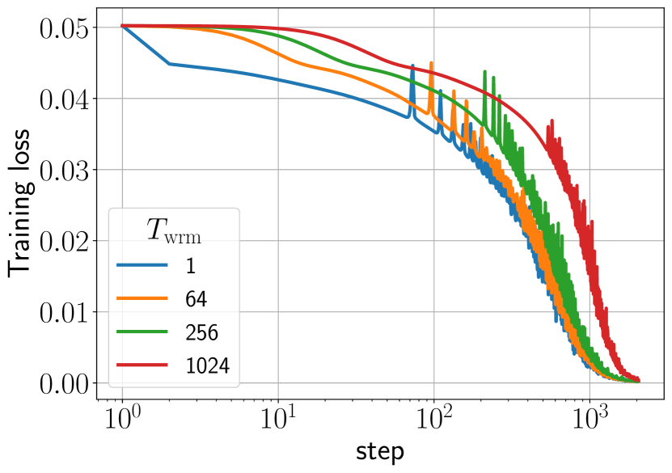

(a)
[/FIGURE]

The underlying mechanism of warmup is intimately tied to training instabilities. These training instabilities, often referred to as ‘catapults’ [[23](#bib.bib23), [6](#bib.bib6)], arise when the learning rate $\eta$ exceeds a critical threshold $\eta_{c}$, where both $\eta$ and $\eta_{c}$ generally change with time. When the instability threshold is exceeded ($\eta>\eta_{c}$), two cases arise: (i) if the learning rate is higher than the instability threshold but smaller than a maximum stable learning rate (which varies with time), i.e., $\eta_{c}<\eta<\eta_{\text{max}}$, training stabilizes through a self-stabilization process and training continues, (ii) if the learning rate exceeds this maximum stable learning rate $\eta>\eta_{\text{max}}$, training experiences severe instabilities. For SGD, these can result in training divergence, characterized by the loss increasing to infinity, whereas for Adam, training may cease, resulting in a training failure, where the loss fails to improve significantly over its initial value.  

For vanilla GD, the critical threshold is related to sharpness as $\eta_{c}\approx\nicefrac{{2}}{{\lambda^{H}}}$ 111This relationship holds for the MSE loss and simple settings only. For an overview of instability thresholds in various settings and different optimizers, see [Section B.1](#A2.SS1 "B.1 Overview of Instability Thresholds ‣ Appendix B Instability Thresholds ‣ Why Warmup the Learning Rate? Underlying Mechanisms and Improvements")., and the self-stabilization mechanism can be described as a four-step process [[23](#bib.bib23), [8](#bib.bib8)]. To illustrate this, consider the $T_{\text{wrm}}=64$ trajectories depicted in [Figure 1](#S3.F1 "In 3 Overview of Training Instabilities and the Self-Stabilization Mechanism ‣ Why Warmup the Learning Rate? Underlying Mechanisms and Improvements")(c, d). In the sharpness plot, the dashed lines represent the $\nicefrac{{2}}{{\eta_{t}}}$ curves, and when $\lambda^{H}_{t}$ is above these curves, training exceeds the instability threshold ($\eta>\eta_{c}$). The four steps of the self-stabilization mechanism are:  

1. Approaching instability: Due to increasing learning rate and/or progressive sharpening, training approaches the instability threshold $\eta=\eta_{c}$. In [Figure 1](#S3.F1 "In 3 Overview of Training Instabilities and the Self-Stabilization Mechanism ‣ Why Warmup the Learning Rate? Underlying Mechanisms and Improvements")(d), this occurs within the first $10$ steps due to increasing learning rate. 
2. Loss increases: The loss begins to rise when the instability threshold is exceeded ($\eta>\eta_{c}$), as seen in [Figure 1](#S3.F1 "In 3 Overview of Training Instabilities and the Self-Stabilization Mechanism ‣ Why Warmup the Learning Rate? Underlying Mechanisms and Improvements")(c). 
3. Sharpness reduction: For small enough learning rates, the increasing loss causes an abrupt decrease in sharpness, as observed in [Figure 1](#S3.F1 "In 3 Overview of Training Instabilities and the Self-Stabilization Mechanism ‣ Why Warmup the Learning Rate? Underlying Mechanisms and Improvements")(d). If the sharpness fails to decrease over extended steps, it may result in training divergence (e.g., see $T_{\text{wrm}}=1$ trajectories in the same figure). 
4. Return to stability: The reduction in sharpness causes $\eta_{c}=\nicefrac{{2}}{{\lambda^{H}}}$ to increase, restoring stability ($\eta<\eta_{c}$) and allowing for an eventual loss decrease. 

While the self-stabilization process for more complex optimizers, such as SGD with momentum or Adam, remains poorly understood, a qualitatively similar mechanism is observed in practice, as we will see in the later sections.  

The critical learning rate $\eta_{c}$ is influenced by a variety of factors, including the choice optimizer [[6](#bib.bib6), [7](#bib.bib7)], mini-batch size [[36](#bib.bib36), [7](#bib.bib7)], and model properties such as depth, width, parameterization, and initialization [[19](#bib.bib19), [20](#bib.bib20)]. For a detailed overview of instability thresholds, see [Appendix B](#A2 "Appendix B Instability Thresholds ‣ Why Warmup the Learning Rate? Underlying Mechanisms and Improvements").  

## 4 Warmup Mechanisms of Gradient and Adaptive Methods

This section analyzes the underlying mechanism of warmup through the lens of training instability. A key finding is a dichotomy between cooperative versus competitive dynamics based on how the natural evolution of the sharpness interplays with the training instability.  

### 4.1 Stochastic Gradient Descent

Learning rate warmup is intrinsically tied to sharpness dynamics, as sharpness determines the instability threshold $\eta_{c}$. As the learning rate is increased during warmup, training instabilities can be triggered. Assuming the warmup rate is not too high, these instabilities induce a temporary increase in the loss and a decrease in the sharpness to restore stability through the self-stabilization mechanism. Ultimately this allows the model to adapt to the increased learning rate. In other words, the primary goal of warmup is to gradually reduce sharpness, guiding training towards flatter regions that can accommodate training at higher learning rates [[11](#bib.bib11)].  

However, digging deeper, we find that training has a ‘natural’ preference for sharpness evolution throughout the training course [[20](#bib.bib20)]. Before exceeding the instability threshold $(\eta<\eta_{c})$, training naturally experiences either a progressive increase or decrease in sharpness, as observed in [Figure 1](#S3.F1 "In 3 Overview of Training Instabilities and the Self-Stabilization Mechanism ‣ Why Warmup the Learning Rate? Underlying Mechanisms and Improvements"), which is unrelated to warmup. For instance, consider the sharpness trajectories with $T_{\text{wrm}}=1024$ in the above figure. In [Figure 1](#S3.F1 "In 3 Overview of Training Instabilities and the Self-Stabilization Mechanism ‣ Why Warmup the Learning Rate? Underlying Mechanisms and Improvements")(b), sharpness has a natural preference for increasing, whereas in [Figure 1](#S3.F1 "In 3 Overview of Training Instabilities and the Self-Stabilization Mechanism ‣ Why Warmup the Learning Rate? Underlying Mechanisms and Improvements")(d), it tends to decrease on its own. The interplay between this natural sharpness evolution and the deliberate intervention of warmup to reduce sharpness can result in completely distinct dynamics. Below, we detail these cases and describe the conditions that typically exhibit them.  

(C1) Natural Progressive Sharpening (top row of [Figure 1](#S3.F1 "In 3 Overview of Training Instabilities and the Self-Stabilization Mechanism ‣ Why Warmup the Learning Rate? Underlying Mechanisms and Improvements")): The combined effect of the network naturally increasing sharpness while the learning rate is also being increased results in a “head-on collision" at which the network reaches the instability threshold $\eta_{c}$. This causes the loss to increase, leading to a decrease in sharpness and facilitating a return to stability. As training proceeds, both sharpness and learning rate continue to increase, again surpassing the instability threshold. This results in a persistent catapult cycle, characterized by $\eta_{t}\approx\nicefrac{{2}}{{\lambda_{t}^{H}}}\approx\eta_{c}$, for the remainder of the warmup period, as seen in [Figure 1](#S3.F1 "In 3 Overview of Training Instabilities and the Self-Stabilization Mechanism ‣ Why Warmup the Learning Rate? Underlying Mechanisms and Improvements")(b).  

(C2) Natural Sharpness Reduction (bottom row of [Figure 1](#S3.F1 "In 3 Overview of Training Instabilities and the Self-Stabilization Mechanism ‣ Why Warmup the Learning Rate? Underlying Mechanisms and Improvements")): The network is naturally already reducing its sharpness during early training. However, if the learning rate is increased sufficiently quickly, eventually the instability threshold will be reached (akin to a “rear-end collision"), causing the loss to increase. For small enough learning rates, the increased loss induces a dramatically more pronounced decrease in sharpness than would naturally occur, ultimately restoring stability. To exceed the instability threshold again, the learning rate must significantly increase to account for the decreased sharpness, potentially requiring considerable training steps. Consequently, training experiences one or more separated catapults during the warmup phase, as seen in Figure [1](#S3.F1 "Figure 1 ‣ 3 Overview of Training Instabilities and the Self-Stabilization Mechanism ‣ Why Warmup the Learning Rate? Underlying Mechanisms and Improvements")(c, d). This contrasts with the progressive sharpening case, where training enters a continuous catapult cycle after reaching the instability threshold for the first time. Notably, training may eventually reach a very flat region of the landscape during warmup, with gradients pointing towards increasing sharpness (e.g., $T_{\text{wrm}}=64$ in [Figure 1](#S3.F1 "In 3 Overview of Training Instabilities and the Self-Stabilization Mechanism ‣ Why Warmup the Learning Rate? Underlying Mechanisms and Improvements")(d)). Upon reaching such a region, the dynamics aligns with the natural progressive sharpening scenario.  

These two scenarios can be interpreted as cooperative or competitive dynamics between warmup and the natural evolution of sharpness. When training inherently undergoes sharpness reduction, it cooperates with warmup in decreasing sharpness. Conversely, if the natural trajectory of training is towards increasing sharpness, it opposes the warmup’s effort, leading to a persistent cycle of catapults.  

(C3) Constant Sharpness: Sharpness may also prefer to remain constant throughout the training process, as illustrated in [Figure 15](#A5.F15 "In E.5 Different Architectures and Datasets ‣ Appendix E Additional Results for Mechanisms of Warmup ‣ Why Warmup the Learning Rate? Underlying Mechanisms and Improvements")(d) in [Appendix E](#A5 "Appendix E Additional Results for Mechanisms of Warmup ‣ Why Warmup the Learning Rate? Underlying Mechanisms and Improvements"). In such rare scenarios, sharpness decrease is predominantly driven by the increasing learning rate, without intrinsic dynamics of its own.  

The Effect of Warmup Duration: Given a fixed target learning rate $\eta_{\text{trgt}}$, increasing the warmup duration $T_{\mathrm{wrm}}$ delays the point at which training exceeds the instability threshold $\eta_{c}$, allowing the sharpness to evolve freely before reaching this point. In the sharpness reduction case, sharpness can significantly decrease by the time this threshold is reached, lowering the need for warmup to decrease sharpness actively. Consequently, increasing $T_{\mathrm{wrm}}$ results in catapults that are both delayed and smaller in magnitude, as seen in [Figure 1](#S3.F1 "In 3 Overview of Training Instabilities and the Self-Stabilization Mechanism ‣ Why Warmup the Learning Rate? Underlying Mechanisms and Improvements")(d). As the catapults become less intense on increasing the warmup duration, the model can train at higher learning rates without diverging, pushing the divergence boundary. For extended warmup durations, warmup may not actively reduce sharpness in these sharpness reduction cases and instead “piggy-backs” on the inherent sharpness decrease.  

In the progressive sharpening case, increasing $T_{\text{wrm}}$ allows the sharpness to naturally increase. As a result, training exceeds the instability threshold for the first time at a relatively lower learning rate compared to the constant learning rate case. Although warmup has to now undertake more work in decreasing sharpness, it does so in a more gradual manner since increasing the warmup duration amounts to a lower warmup rate $\nicefrac{{\eta_{\mathrm{trgt}}}}{{T_{\mathrm{wrm}}}}$. As a result, the fluctuations observed on exceeding the instability threshold are much smaller in magnitude, as seen in [Figure 1](#S3.F1 "In 3 Overview of Training Instabilities and the Self-Stabilization Mechanism ‣ Why Warmup the Learning Rate? Underlying Mechanisms and Improvements")(a, b).  

[FIGURE S4.F2.1.g1]
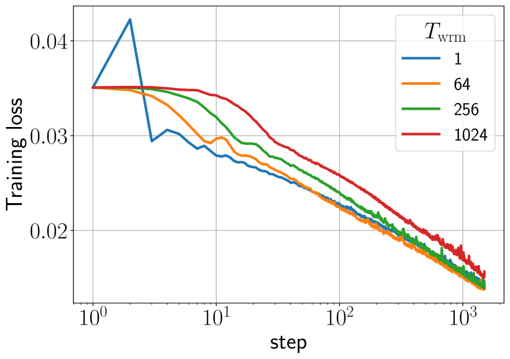

(a)
[/FIGURE]

Small vs. Large Initializations: So far, we have outlined different warmup mechanisms without describing specific conditions that typically exhibit them. Small initializations, such as those using maximal update parameterization ($\mu$P) [[38](#bib.bib38)] or appropriately using normalizing layers (e.g. standard Transformer architectures, see [Figure 17](#A5.F17 "In E.5 Different Architectures and Datasets ‣ Appendix E Additional Results for Mechanisms of Warmup ‣ Why Warmup the Learning Rate? Underlying Mechanisms and Improvements") in [Section E.5](#A5.SS5 "E.5 Different Architectures and Datasets ‣ Appendix E Additional Results for Mechanisms of Warmup ‣ Why Warmup the Learning Rate? Underlying Mechanisms and Improvements")), are characterized by a small initial network output. Such initializations start in flat regions where gradients point toward increasing sharpness [[20](#bib.bib20)], placing them in the progressive sharpening category (C1). As we will see in [Section 5](#S5 "5 Impact of Warmup on Training and Generalization ‣ Why Warmup the Learning Rate? Underlying Mechanisms and Improvements"), such initializations may not significantly benefit from warmup as they already start in a flat region. In contrast, large initializations, such as FCNS, CNNs, ResNets with Standard Parameterization (SP) initialized at criticality [[30](#bib.bib30), [32](#bib.bib32)] or Transformers with the last layer-norm removed, undergo an early sharpness reduction, categorizing them into sharpness reduction category (C2). As the primary effect of warmup is to reduce sharpness, we expect such large initializations to considerably benefit from warmup. Notably, large initializations can eventually undergo progressive sharpening at later training stages [[19](#bib.bib19), [20](#bib.bib20)] and adhere to the second mechanism, especially for prolonged warmups. Instances of constant sharpness (C3) typically arise in models operating near the lazy regime [[5](#bib.bib5)], such as wide networks in NTP or SP.  

### 4.2 Stochastic Gradient Descent with Momentum (SGD-M)

The warmup mechanism of SGD-M, while at its core is similar to that of vanilla SGD, has a few subtleties. Here we summarize the major differences, leaving details to [Section E.2](#A5.SS2 "E.2 Stochastic Gradient Descent with Momentum ‣ Appendix E Additional Results for Mechanisms of Warmup ‣ Why Warmup the Learning Rate? Underlying Mechanisms and Improvements").  

During early training, the loss may decrease non-monotonically on incorporating momentum, even at small learning rates. Such oscillations are also observed when quadratic loss functions are optimized using GD with momentum [[12](#bib.bib12)]. These oscillations make it challenging to differentiate between warmup-induced catapults and fluctuations in loss due to the intrinsic effects of momentum. Nevertheless, we can still observe loss spikes correlated with an abrupt decrease in sharpness at large learning rates, as detailed in [Section E.2](#A5.SS2 "E.2 Stochastic Gradient Descent with Momentum ‣ Appendix E Additional Results for Mechanisms of Warmup ‣ Why Warmup the Learning Rate? Underlying Mechanisms and Improvements").  

Additionally, the instability threshold $\eta_{c}$ itself evolves differently during training. It changes from $\nicefrac{{2}}{{\lambda^{H}_{0}}}$ at initialization to $\nicefrac{{(2+2\beta)}}{{\lambda_{t}^{H}}}$ later in training. Moreover, the late-time instability threshold is significantly influenced by the batch size, exhibiting a much smaller value than SGD for the same batch size. These properties make it more challenging to analyze the training dynamics of SGD with momentum. Nonetheless, the fundamental warmup mechanisms closely mirror the vanilla SGD case. We leave a more detailed analysis of the early training dynamics of SGD-M for future studies.  

[FIGURE S4.F3.1.g1]
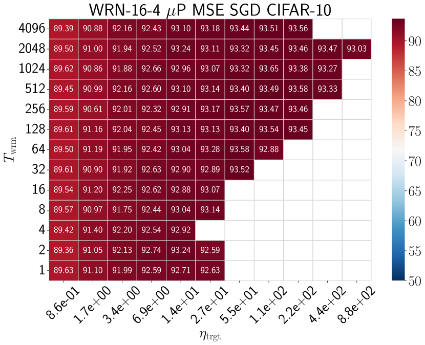

(a)
[/FIGURE]

### 4.3 Adaptive Gradient Methods (Adam)

[Figure 2](#S4.F2 "In 4.1 Stochastic Gradient Descent ‣ 4 Warmup Mechanisms of Gradient and Adaptive Methods ‣ Why Warmup the Learning Rate? Underlying Mechanisms and Improvements") shows the training loss, pre-conditioned sharpness, and sharpness trajectories for full batch Adam. These results suggest that the local stability of adaptive optimizers is determined by the largest eigenvalue of the pre-conditioned Hessian, denoted by $\lambda^{P^{-1}H}$, rather than the sharpness itself (also, see Ref. [[7](#bib.bib7)] for late time instability). In these figures, sharpness is significantly smaller than its instability threshold $\nicefrac{{(2+2\beta_{1})}}{{\eta_{t}}}\approx 4000$, indicating that sharpness does not determine stability. Instead, loss catapults are associated with $\lambda^{P^{-1}H}$ exceeding its corresponding instability threshold.  

The pre-conditioned sharpness starts high for both progressive sharpening (simple-$\mu$P) and sharpness reduction (SP) scenarios considered in the previous section. For simplicity, we considered a simpler version of $\mu$P, detailed in [Section D.2.1](#A4.SS2.SSS1 "D.2.1 Parameterizations ‣ D.2 Model Details ‣ Appendix D Experimental Details ‣ Why Warmup the Learning Rate? Underlying Mechanisms and Improvements"). In particular, for $\mu$P models, $\lambda^{P^{-1}H}_{0}\sim 10^{5}$ despite being initialized in a flat region as measured by sharpness, while for SP models, $\lambda^{P^{-1}H}_{0}\sim 10^{6}$. These large initial values of $\lambda^{P^{-1}H}_{0}$ can lead to training failures. We put forward strategies to improve Adam’s initialization in [Section 6.2](#S6.SS2 "6.2 GI-Adam: Improving Adam by Initializing The Second Moment using Gradients ‣ 6 Improved Hyperparameter Initialization Schemes for Optimizers ‣ Why Warmup the Learning Rate? Underlying Mechanisms and Improvements"); here we continue characterizing the warmup mechanisms of Adam.  

Given that the pre-conditioned sharpness consistently starts high and decreases during early training, this behavior can be viewed as an extreme example of the natural sharpness reduction scenario (C2) described in the previous section. Training Adam at high initial learning rates without warmup can cause large catapults, as seen in [Figure 2](#S4.F2 "In 4.1 Stochastic Gradient Descent ‣ 4 Warmup Mechanisms of Gradient and Adaptive Methods ‣ Why Warmup the Learning Rate? Underlying Mechanisms and Improvements")(d), potentially leading to training failures. Increasing the warmup duration allows the pre-conditioned sharpness to naturally decrease. This prevents the loss from spiking during early training and avoids training failures. In the later stages of training, the pre-conditioned sharpness may continue reducing or exhibit progressive sharpening. From here on, the dynamics follows the warmup mechanisms discussed in the previous sections, with sharpness replaced with pre-conditioned sharpness. Similar to the momentum case, Adam’s stability threshold at late training times significantly decreases for smaller batch sizes [[7](#bib.bib7)], also shown in [Section E.4](#A5.SS4 "E.4 Warmup Mechanisms of Adam ‣ Appendix E Additional Results for Mechanisms of Warmup ‣ Why Warmup the Learning Rate? Underlying Mechanisms and Improvements").  

## 5 Impact of Warmup on Training and Generalization

Here we investigate the impact of warmup on training efficacy and generalization by disentangling the role of $\eta_{\text{trgt}}$ and $T_{\text{wrm}}$. Our key findings are that generalization capability is primarily determined by $\eta_{\text{trgt}}$ and that Adam is particularly sensitive to large learning rates (specifically, large catapults). The role of increasing $T_{\text{wrm}}$ is to (i) allow the network to tolerate larger $\eta_{\text{trgt}}$, and (ii) move the network further away from the divergence (failure) boundary, leading to a marginal improvement in generalization.  

Experimental Setup: We consider WideResNets (WRNs) and Transformers (LM) parameterized in either SP or $\mu$P. WRNs are trained on standard classification tasks such as CIFAR-10, CIFAR-100, and Tiny-ImageNet, employing data augmentation. Transformers are trained on the next token prediction task using the WikiText-2 dataset. These models are trained with MSE or cross-entropy (xent) loss functions using SGD or Adam optimizers for a fixed training budget of $T=10^{5}$ steps unless otherwise specified. Training begins with a linear warmup phase from $\eta_{\text{init}}=0$ to $\eta_{\text{trgt}}$ over $T_{\text{wrm}}$ steps. After the warmup phase, training continues at $\eta_{\text{trgt}}$ for the remaining training budget. In some cases, following the warmup period, we gradually decrease the learning rate using cosine decay [[25](#bib.bib25)]. Target learning rates are sampled exponentially until divergence or a ‘training failure’ is observed. Here, training failure refers to instances where the performance at the end of the training fails to improve significantly compared to its initial value. For example, if the final training accuracy for a classification task is less than $1.5$ times the accuracy of a random guess, we consider it as a training failure. We refer to the transition between convergence and training failure as the failure boundary. Further details are provided in [Appendix D](#A4 "Appendix D Experimental Details ‣ Why Warmup the Learning Rate? Underlying Mechanisms and Improvements").  

[FIGURE S5.F4.1.g1]
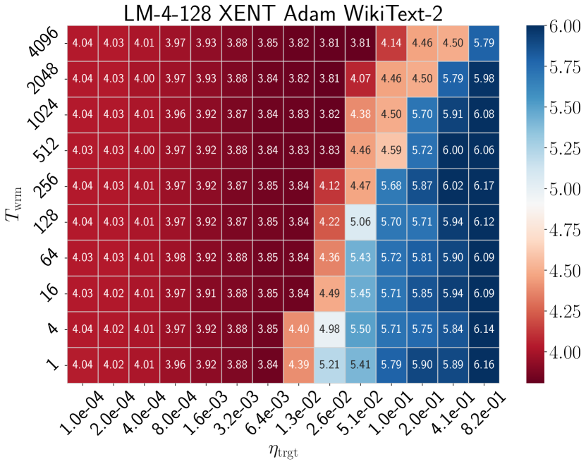

(a)
[/FIGURE]

### 5.1 Stochastic Gradient Descent (SGD)

[Figure 3](#S4.F3 "In 4.2 Stochastic Gradient Descent with Momentum (SGD-M) ‣ 4 Warmup Mechanisms of Gradient and Adaptive Methods ‣ Why Warmup the Learning Rate? Underlying Mechanisms and Improvements") presents heatmaps that show the best test accuracy achieved during training, plotted in the $\eta_{\text{trgt}}$-$T_{\text{wrm}}$ plane for different parameterizations and loss functions. These phase diagrams of warmup also show the convergence-divergence boundary, with empty cells indicating training divergences, illustrating the interplay between warmup duration and the maximum trainable $\eta_{\text{trgt}}$. Below, we discuss the crucial insights these results provide into warmup’s role in training dynamics.  

Longer Warmup Facilitates Training at Higher Learning Rates: These phase diagrams reveal that an extended warmup duration facilitates training at higher target learning rates. This benefit is particularly noticeable for large initializations (like SP) and MSE loss. In contrast, the advantage is less pronounced when using cross-entropy loss and smaller initializations (like $\mu$P). The diminished benefit for $\mu$P is likely due to its initialization in a relatively flat region of the loss landscape, which can already facilitate training at higher learning rates at initialization. This consistent increase in maximum $\eta_{\text{trgt}}$ with warmup durations can be understood through the lens of warmup mechanisms described in the previous section. As observed in [Figure 1](#S3.F1 "In 3 Overview of Training Instabilities and the Self-Stabilization Mechanism ‣ Why Warmup the Learning Rate? Underlying Mechanisms and Improvements"), when the warmup duration is increased, loss catapults occurring on surpassing the instability thresholds become milder. This effectively pushes the divergent boundary to higher learning rates.  

Final Performance Primarily Depends on the Target Learning Rate: A closer look into these phase diagrams reveals that, slightly away from the divergent boundary, the test accuracy primarily depends on the target learning rate and nominally on the warmup duration. Based on the model performance, we can categorize these phase diagrams into two distinct cases: (i) models that fail to achieve optimal performance when trained with a constant learning rate (e.g., [Figure 3](#S4.F3 "In 4.2 Stochastic Gradient Descent with Momentum (SGD-M) ‣ 4 Warmup Mechanisms of Gradient and Adaptive Methods ‣ Why Warmup the Learning Rate? Underlying Mechanisms and Improvements")(c)), and (ii) models that attain optimal performance without warmup (e.g., [Figure 3](#S4.F3 "In 4.2 Stochastic Gradient Descent with Momentum (SGD-M) ‣ 4 Warmup Mechanisms of Gradient and Adaptive Methods ‣ Why Warmup the Learning Rate? Underlying Mechanisms and Improvements")(b)). The first scenario corresponds to models with large initializations. Increasing the warmup duration improves performance by facilitating training at higher learning rates. Yet, similar performance is observed for different warmup durations, suggesting that the primary gain comes from the target learning rate, rather than the duration itself. The second case arises for flat initializations, which can already train at large learning rates, and resultantly the optimal performance is already achieved without warmup. While increasing warmup duration facilitates training at even higher learning rates, it does not enhance performance. Nevertheless, it does broaden the range of optimal learning rates, reducing the need for precise tuning of the target learning rate, and making training more practical and robust. We conclude that warmup can serve two key purposes: (i) it can significantly improve model performance in large initialization cases, and (ii) extend the range of optimal target learning rates for small initializations, making it easier to tune the target learning rate. In [Section F.2](#A6.SS2 "F.2 The Effect of Momentum and Learning Rate Decay ‣ Appendix F Additional Phase Diagrams ‣ Why Warmup the Learning Rate? Underlying Mechanisms and Improvements"), we demonstrate that these results hold on incorporating momentum and employing cosine learning rate decay.  

[FIGURE S5.F5.1.g1]
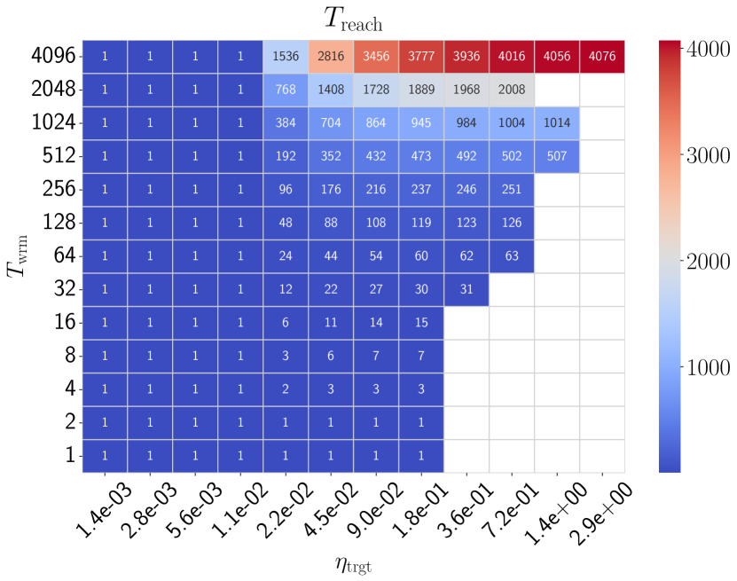

(a)
[/FIGURE]

### 5.2 Adam

The warmup phase diagrams for Adam, as shown in [Figure 4](#S5.F4 "In 5 Impact of Warmup on Training and Generalization ‣ Why Warmup the Learning Rate? Underlying Mechanisms and Improvements")(a), exhibit characteristics similar to the sharpness reduction case of SGD, with notable differences. Increasing the warmup duration enables training at higher learning rates by allowing the pre-conditioned sharpness to decrease naturally, thereby reducing the severity of catapults. These large catapults, which may persist in Adam’s memory, can lead to performance degradation and training failures. Thus, in addition to facilitating training at higher rates similar to SGD, warmup further improves Adam’s performance by addressing its vulnerability to large catapults, justifying its widespread use with Adam. Below, we discuss the distinct properties of Adam phase diagrams in detail.  

Training Failures of Adam: Remarkably, we find that models trained with Adam always exhibit training failures rather than divergences where the loss grows without bound, as further demonstrated in [Appendix G](#A7 "Appendix G Non-divergence of Adam ‣ Why Warmup the Learning Rate? Underlying Mechanisms and Improvements"). In cases of training failure, we often observed that certain layers or residual blocks output zero, leading to vanishing gradients. This implies that the model gets stuck at a critical point and is unable to train further. Understanding this unexpected phenomenon requires further study, which we leave to future work.  

Performance Degradation prior to Failure Boundary: Test accuracy in these phase diagrams declines well before the failure boundary, in stark contrast to SGD where optimal learning rates are observed near the divergence boundary. This discrepancy stems from Adam’s property of retaining a memory of gradient magnitudes. At large learning rates, along with the loss, the gradients spike during early training, as seen in [Figure 26](#A7.F26 "In Appendix G Non-divergence of Adam ‣ Why Warmup the Learning Rate? Underlying Mechanisms and Improvements") in [Appendix G](#A7 "Appendix G Non-divergence of Adam ‣ Why Warmup the Learning Rate? Underlying Mechanisms and Improvements"). While the gradients decrease after a few training steps, the second moment of gradients $\bm{v}$ remains large for an extended period, leading to a small effective learning rate $\eta P^{-1}$. As a result, training struggles to escape high-loss regions. Therefore, a longer warmup is more beneficial for Adam compared to SGD, as it is crucial to stay away from the failure boundary.  

## 6 Improved Hyperparameter Initialization Schemes for Optimizers

### 6.1 Initial Learning Rate Selection for Warmup

Setting the initial learning rate to $\eta_{\text{init}}=0$ is common practice in warmup [[28](#bib.bib28), [9](#bib.bib9)]. Our analysis reveals that the primary effect of warmup is to facilitate training at higher learning rates by annealing sharpness (or pre-conditioned sharpness for Adam). From this perspective, starting with $\eta_{\text{init}}=0$ appears suboptimal, as it can significantly delay the learning rate from exceeding the instability threshold, thus delaying the primary effect of warmup.  

An effective strategy involves setting $\eta_{\text{init}}=\eta_{c}$ to induce loss increase and thereby sharpness decrease right from initialization. We introduce a straightforward search method that only uses forward passes to estimate the initial critical learning rate $\eta_{c}$. The method consists of two stages: (i) an exponential search, starting from an initial guess $\eta_{0}$, iteratively multiplies $\eta_{0}$ by a factor $k>1$ until the loss increases. This identifies an interval $[\eta_{\text{lwr}},\eta_{\text{uppr}}]$ containing $\eta_{c}$, (ii) a binary search further narrows down $[\eta_{\text{lwr}},\eta_{\text{uppr}}]$ by evaluating the loss at the midpoint $\eta_{\text{mid}}=\nicefrac{{(\eta_{\text{lwr}}+\eta_{\text{uppr}})}}{{2}}$. If the loss increases, $\eta_{\text{uppr}}$ is updated to $\eta_{\text{mid}}$; otherwise, $\eta_{\text{lwr}}$ is set to $\eta_{\text{mid}}$. This process is repeated until the loss in the next step $L(\theta_{1})$ satisfies the condition $L(\theta_{1})<L(\theta_{0})(1+\delta)$, for some hyperparameter $\delta>0$. For details, see [Section B.2](#A2.SS2 "B.2 Estimating the Instability Threshold ‣ Appendix B Instability Thresholds ‣ Why Warmup the Learning Rate? Underlying Mechanisms and Improvements").  

By setting $\eta_{\text{init}}=\eta_{c}$, training can achieve the target learning rate earlier. Consider the modified warmup schedule: $\eta_{t}=\eta_{\text{init}}+\eta_{\text{trgt}}(\nicefrac{{t}}{{T_{\text{wrm}}}})$, which attains $\eta_{\text{trgt}}$ in $T_{\text{reach}}=T_{\text{wrm}}(1-\nicefrac{{\eta_{c}}}{{\eta_{\text{trgt}}}})$ steps, saving $T_{\text{wrm}}(\nicefrac{{\eta_{c}}}{{\eta_{\text{trgt}}}})$ steps. Incorporating the computational cost of additional forward passes $T_{\text{fp}}$ required for estimating $\eta_{c}$ ($\sim 10$ in number), and noting that one training step approximately equates to two forward passes, the net computational savings is $T_{\text{save}}=T_{\text{wrm}}\left(\nicefrac{{\eta_{c}}}{{\eta_{\text{trgt}}}}\right)-\nicefrac{{T_{\text{fp}}}}{{2}}$. [Figure 5](#S5.F5 "In 5.1 Stochastic Gradient Descent (SGD) ‣ 5 Impact of Warmup on Training and Generalization ‣ Why Warmup the Learning Rate? Underlying Mechanisms and Improvements") demonstrates how $T_{\text{reach}}$ and $T_{\text{save}}$ vary with the $T_{\text{wrm}}$ and $\eta_{\text{trgt}}$. For $\eta_{\text{trgt}}<\eta_{c}$, the target learning rate is reached in a single step, nearly saving the entire duration of the warmup, whereas for $(\eta_{\text{trgt}}>\eta_{c})$, starting $\eta_{\text{init}}\gtrsim\eta_{c}$ can save up to half of the allocated warmup duration, although this saving diminishes on approaching the divergent/failure boundary.  

It is worth noting that there can be instances where there is no loss catapult at initialization. In our experiments, this only occurs for Transformers trained using SGD. In such scenarios, the prescribed approach is not applicable and one can resort to heuristics, such as setting the initial learning rate to a fraction of the maximum stable learning rate, such as $\eta_{\text{init}}=\nicefrac{{\eta_{\text{trgt}}}}{{10}}$.  

[FIGURE S6.F6.1.g1]
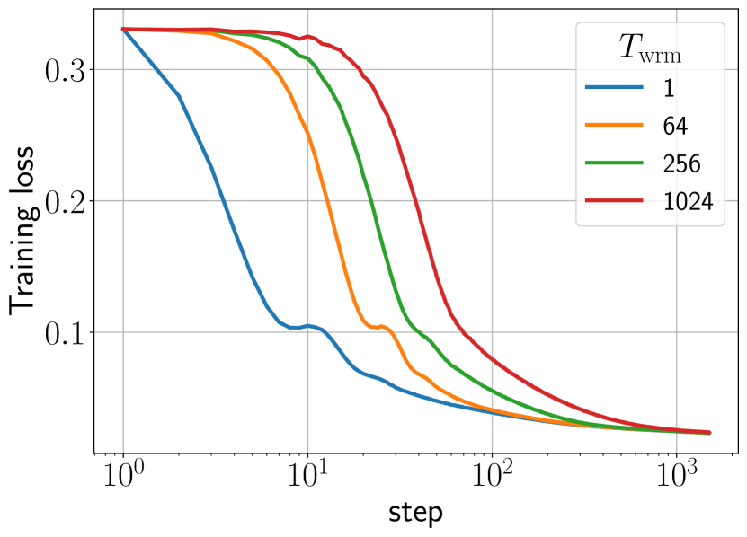

(a)
[/FIGURE]

### 6.2 GI-Adam: Improving Adam by Initializing The Second Moment using Gradients

In [Section 4.3](#S4.SS3 "4.3 Adaptive Gradient Methods (Adam) ‣ 4 Warmup Mechanisms of Gradient and Adaptive Methods ‣ Why Warmup the Learning Rate? Underlying Mechanisms and Improvements"), we observed that the pre-conditioned sharpness for Adam starts at a high value, even for low sharpness initializations like $\mu$P, and can lead to training failures at large learning rates. We propose Gradient Initialized Adam (GI-Adam), which initializes the second moment using the gradient squared, $\bm{v}_{0}=\bm{g}_{0}^{2}$. In [Section I.2](#A9.SS2 "I.2 GI-Adam as an Automated Warmup ‣ Appendix I Additional Results on GI-Adam ‣ Why Warmup the Learning Rate? Underlying Mechanisms and Improvements"), we show that a bias correction is not required when the second moment is initialized using the gradients. As a result, GI-Adam can be viewed as standard Adam with an automated warmup given by $\eta_{t}=\eta_{\text{trgt}}\sqrt{1-\beta_{2}^{t}}$. It would be interesting to explore a wider space of initializations for Adam, such as $v_{0}=a\bm{g}_{0}^{2}$, with $a\geq 1$.  

This simple trick reduces the initial pre-conditioned sharpness by around two orders of magnitude (more precisely by a factor of $\sqrt{1-\beta_{2}}$) at initialization, preventing large catapults, as illustrated in [Figure 6](#S6.F6 "In 6.1 Initial Learning Rate Selection for Warmup ‣ 6 Improved Hyperparameter Initialization Schemes for Optimizers ‣ Why Warmup the Learning Rate? Underlying Mechanisms and Improvements") (c.f. [Figure 2](#S4.F2 "In 4.1 Stochastic Gradient Descent ‣ 4 Warmup Mechanisms of Gradient and Adaptive Methods ‣ Why Warmup the Learning Rate? Underlying Mechanisms and Improvements")(d-f)). Moreover, it consistently shows improvement over standard Adam across datasets and prevents training failures by pushing the training failure boundary to higher $\eta_{\text{trgt}}$, as shown in [Figure 4](#S5.F4 "In 5 Impact of Warmup on Training and Generalization ‣ Why Warmup the Learning Rate? Underlying Mechanisms and Improvements")(b). We provide additional results for different datasets in [Section F.3](#A6.SS3 "F.3 Phase Diagrams of Adam and GI-Adam ‣ Appendix F Additional Phase Diagrams ‣ Why Warmup the Learning Rate? Underlying Mechanisms and Improvements").  

To further assess that the primary cause of instability during early training is the large pre-conditioned sharpness, we randomly initialize $\bm{v}_{0}$ but with the same norm as the gradients at initialization. Like GI-Adam, this also results in improved performance as shown in [Section I.3](#A9.SS3 "I.3 The Primary benefit of GI-Adam results from the magnitude of the second moment at initialization ‣ Appendix I Additional Results on GI-Adam ‣ Why Warmup the Learning Rate? Underlying Mechanisms and Improvements").  

## 7 Towards Parameter Free Warmup Strategies

Our analysis also motivates a potential parameter-free warmup strategy, which we refer to as *persistent catapult warmup*. The central idea behind this strategy is to repeatedly induce catapults aimed to progressively reduce sharpness (or pre-conditioned sharpness), thereby facilitating training at higher learning rates. Given a target learning rate $\eta_{\text{trgt}}$, the strategy consists of the following steps:  

1. Start with a ‘stable’ reference point $\theta^{*}$, defined as a point where the loss decreases in the next step and estimate the interval $[\eta_{\text{lwr}},\eta_{\text{uppr}}]$ containing $\eta_{c}$, as described in [Section B.2](#A2.SS2 "B.2 Estimating the Instability Threshold ‣ Appendix B Instability Thresholds ‣ Why Warmup the Learning Rate? Underlying Mechanisms and Improvements"). 
2. Induce a catapult by increasing the learning rate to $\eta=\eta_{\text{uppr}}$. 
3. Continue training and wait until the loss falls below the reference point, i.e., $L(\theta_{t})<L(\theta^{*})$. This new point now becomes the stable reference point. 
4. Repeat the above steps until the target learning is achieved, i.e., $\eta=\eta_{\text{trgt}}$. 

Here, the initial stable reference point is the model’s initialization. The detailed algorithm is described in [Algorithm 3](#alg3 "In Appendix C Persistent Catapult Warmup ‣ Why Warmup the Learning Rate? Underlying Mechanisms and Improvements") in [Appendix C](#A3 "Appendix C Persistent Catapult Warmup ‣ Why Warmup the Learning Rate? Underlying Mechanisms and Improvements").  

[Figure 7](#S8.F7 "In 8 Discussion ‣ Why Warmup the Learning Rate? Underlying Mechanisms and Improvements") compares persistent catapult warmup (shown in black) with linear warmup. The persistent catapult warmup facilitates training at higher learning rates without the need to specify warmup duration. Since $\eta_{c}$ serves as an indicator of sharpness, persistent catapult warmup utilizes the local sharpness information to automatically determine the warmup rate, resulting in an adaptive non-linear warmup. This adaptive approach eliminates the need for manual tuning of the warmup duration, allowing for a more efficient and effective warmup.  

Although persistent catapult warmup is a promising approach to warmup, it requires specifying how large a catapult should be induced, which introduces another hyperparameter. Nevertheless, persistent catapult warmup motivates the development of parameter-free warmup strategies that could simplify the training process. We leave further development of parameter-free warmup to future work.  

## 8 Discussion

Our analysis provides new insights into the role of warmup across optimizers and parameterizations. We found compelling evidence that the primary effect of warmup is to facilitate training at higher learning rates and stabilizing the training dynamics by keeping it away from the failure (divergence) boundary. Looking under the hood, we found a variety of underlying mechanisms, which also suggested several improvements for hyperparameter initialization. In [Appendix A](#A1 "Appendix A Practical Guidance for Practitioners ‣ Why Warmup the Learning Rate? Underlying Mechanisms and Improvements") we provide practical guidance for practitioners on choosing the warmup duration.  

[FIGURE S8.F7.1.g1]
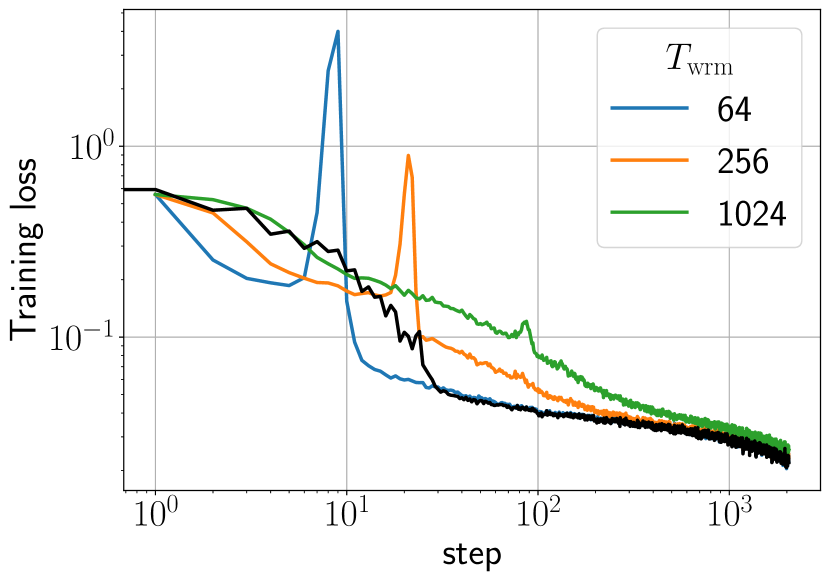

(a)
[/FIGURE]

It would be interesting to further understand the robustness of the location of the failure boundary to changes in dataset or architecture. The relative robustness of the location of this boundary might explain the success of heuristic choices of learning rate based on past experience in training networks.  

Limitations: Our experiments were conducted on relatively small-scale datasets and models, and further investigations are needed to understand the generalizability of our findings to larger-scale settings. For Adam, we did not explore the dependence on hyperparameters $\beta_{1}$, $\beta_{2}$, $\epsilon$.  

## Acknowledgments and Disclosure of Funding

We thank Tianyu He, Darshil Doshi, Andrey Gromov, Dan Roberts, Jeremy Cohen, and Jonas Geiping for discussions and comments on the draft. The authors acknowledge the University of Maryland supercomputing resources (<http://hpcc.umd.edu>) made available for conducting the research reported in this paper. This work is supported in part by NSF DMR-2345644 (MB) and by the Laboratory for Physical Sciences through the Condensed Matter Theory Center (MB and DS).  

## References

* [1]  Tiny imagenet challenge.   <https://cs231n.stanford.edu/reports/2017/pdfs/930.pdf>. 
* Boyd and Vandenberghe [2004]  Stephen P Boyd and Lieven Vandenberghe.   *Convex optimization*.   Cambridge university press, 2004. 
* Bradbury et al. [2018]  James Bradbury, Roy Frostig, Peter Hawkins, Matthew James Johnson, Chris Leary, Dougal Maclaurin, George Necula, Adam Paszke, Jake VanderPlas, Skye Wanderman-Milne, and Qiao Zhang.   JAX: composable transformations of Python+NumPy programs, 2018.   URL <http://github.com/google/jax>. 
* Bubeck et al. [2015]  Sébastien Bubeck et al.   Convex optimization: Algorithms and complexity.   *Foundations and Trends® in Machine Learning*, 8(3-4):231–357, 2015. 
* Chizat et al. [2019]  Lénaïc Chizat, Edouard Oyallon, and Francis Bach.   On lazy training in differentiable programming.   In H. Wallach, H. Larochelle, A. Beygelzimer, F. d'Alché-Buc, E. Fox, and R. Garnett, editors, *Advances in Neural Information Processing Systems*, volume 32. Curran Associates, Inc., 2019.   URL <https://proceedings.neurips.cc/paper_files/paper/2019/file/ae614c557843b1df326cb29c57225459-Paper.pdf>. 
* Cohen et al. [2021]  Jeremy Cohen, Simran Kaur, Yuanzhi Li, J Zico Kolter, and Ameet Talwalkar.   Gradient descent on neural networks typically occurs at the edge of stability.   In *International Conference on Learning Representations*, 2021.   URL <https://openreview.net/forum?id=jh-rTtvkGeM>. 
* Cohen et al. [2022]  Jeremy M. Cohen, Behrooz Ghorbani, Shankar Krishnan, Naman Agarwal, Sourabh Medapati, Michal Badura, Daniel Suo, David Cardoze, Zachary Nado, George E. Dahl, and Justin Gilmer.   Adaptive gradient methods at the edge of stability, 2022. 
* Damian et al. [2023]  Alex Damian, Eshaan Nichani, and Jason D. Lee.   Self-stabilization: The implicit bias of gradient descent at the edge of stability.   In *The Eleventh International Conference on Learning Representations*, 2023.   URL <https://openreview.net/forum?id=nhKHA59gXz>. 
* DeepMind et al. [2020]  DeepMind, Igor Babuschkin, Kate Baumli, Alison Bell, Surya Bhupatiraju, Jake Bruce, Peter Buchlovsky, David Budden, Trevor Cai, Aidan Clark, Ivo Danihelka, Antoine Dedieu, Claudio Fantacci, Jonathan Godwin, Chris Jones, Ross Hemsley, Tom Hennigan, Matteo Hessel, Shaobo Hou, Steven Kapturowski, Thomas Keck, Iurii Kemaev, Michael King, Markus Kunesch, Lena Martens, Hamza Merzic, Vladimir Mikulik, Tamara Norman, George Papamakarios, John Quan, Roman Ring, Francisco Ruiz, Alvaro Sanchez, Laurent Sartran, Rosalia Schneider, Eren Sezener, Stephen Spencer, Srivatsan Srinivasan, Miloš Stanojević, Wojciech Stokowiec, Luyu Wang, Guangyao Zhou, and Fabio Viola.   The DeepMind JAX Ecosystem, 2020.   URL <http://github.com/google-deepmind>. 
* Dinan et al. [2023]  Emily Dinan, Sho Yaida, and Susan Zhang.   Effective theory of transformers at initialization, 2023. 
* Gilmer et al. [2022]  Justin Gilmer, Behrooz Ghorbani, Ankush Garg, Sneha Kudugunta, Behnam Neyshabur, David Cardoze, George Edward Dahl, Zachary Nado, and Orhan Firat.   A loss curvature perspective on training instabilities of deep learning models.   In *International Conference on Learning Representations*, 2022.   URL <https://openreview.net/forum?id=OcKMT-36vUs>. 
* Goh [2017]  Gabriel Goh.   Why momentum really works.   *Distill*, 2017.   doi: 10.23915/distill.00006.   URL <http://distill.pub/2017/momentum>. 
* Gotmare et al. [2019]  Akhilesh Gotmare, Nitish Shirish Keskar, Caiming Xiong, and Richard Socher.   A closer look at deep learning heuristics: Learning rate restarts, warmup and distillation.   In *International Conference on Learning Representations*, 2019.   URL <https://openreview.net/forum?id=r14EOsCqKX>. 
* Goyal et al. [2017]  Priya Goyal, Piotr Dollár, Ross Girshick, Pieter Noordhuis, Lukasz Wesolowski, Aapo Kyrola, Andrew Tulloch, Yangqing Jia, and Kaiming He.   Accurate, large minibatch sgd: Training imagenet in 1 hour.   *arXiv preprint arXiv:1706.02677*, 2017. 
* He et al. [2016]  Kaiming He, X. Zhang, Shaoqing Ren, and Jian Sun.   Deep residual learning for image recognition.   *2016 IEEE Conference on Computer Vision and Pattern Recognition (CVPR)*, pages 770–778, 2016. 
* Heek et al. [2020]  Jonathan Heek, Anselm Levskaya, Avital Oliver, Marvin Ritter, Bertrand Rondepierre, Andreas Steiner, and Marc van Zee.   Flax: A neural network library and ecosystem for JAX, 2020.   URL <http://github.com/google/flax>. 
* Hendrycks and Gimpel [2016]  Dan Hendrycks and Kevin Gimpel.   Bridging nonlinearities and stochastic regularizers with gaussian error linear units.   *CoRR*, abs/1606.08415, 2016.   URL <http://arxiv.org/abs/1606.08415>. 
* Jacot et al. [2018]  Arthur Jacot, Franck Gabriel, and Clement Hongler.   Neural tangent kernel: Convergence and generalization in neural networks.   In S. Bengio, H. Wallach, H. Larochelle, K. Grauman, N. Cesa-Bianchi, and R. Garnett, editors, *Advances in Neural Information Processing Systems*, volume 31. Curran Associates, Inc., 2018.   URL <https://proceedings.neurips.cc/paper_files/paper/2018/file/5a4be1fa34e62bb8a6ec6b91d2462f5a-Paper.pdf>. 
* Kalra and Barkeshli [2023]  Dayal Singh Kalra and Maissam Barkeshli.   Phase diagram of early training dynamics in deep neural networks: effect of the learning rate, depth, and width.   In *Thirty-seventh Conference on Neural Information Processing Systems*, 2023.   URL <https://openreview.net/forum?id=Al9yglQGKj>. 
* Kalra et al. [2023]  Dayal Singh Kalra, Tianyu He, and Maissam Barkeshli.   Universal sharpness dynamics in neural network training: Fixed point analysis, edge of stability, and route to chaos.   *arXiv preprint arXiv:2311.02076*, 2023. 
* Kingma and Ba [2015]  Diederik Kingma and Jimmy Ba.   Adam: A method for stochastic optimization.   In *International Conference on Learning Representations (ICLR)*, San Diego, CA, USA, 2015. 
* Krizhevsky et al. [2009]  Alex Krizhevsky, Geoffrey Hinton, et al.   Learning multiple layers of features from tiny images.   2009. 
* Lewkowycz et al. [2020]  Aitor Lewkowycz, Yasaman Bahri, Ethan Dyer, Jascha Sohl-Dickstein, and Guy Gur-Ari.   The large learning rate phase of deep learning: the catapult mechanism.   *arXiv preprint arXiv:2003.02218*, 2020. 
* Liu et al. [2020]  Liyuan Liu, Haoming Jiang, Pengcheng He, Weizhu Chen, Xiaodong Liu, Jianfeng Gao, and Jiawei Han.   On the variance of the adaptive learning rate and beyond.   In *International Conference on Learning Representations*, 2020.   URL <https://openreview.net/forum?id=rkgz2aEKDr>. 
* Loshchilov and Hutter [2017]  Ilya Loshchilov and Frank Hutter.   SGDR: Stochastic gradient descent with warm restarts.   In *International Conference on Learning Representations*, 2017.   URL <https://openreview.net/forum?id=Skq89Scxx>. 
* Merity et al. [2017]  Stephen Merity, Caiming Xiong, James Bradbury, and Richard Socher.   Pointer sentinel mixture models.   In *International Conference on Learning Representations*, 2017.   URL <https://openreview.net/forum?id=Byj72udxe>. 
* Murphy [2022]  Kevin P Murphy.   *Probabilistic machine learning: an introduction*.   MIT press, 2022. 
* Paszke et al. [2019a]  Adam Paszke, Sam Gross, Francisco Massa, Adam Lerer, James Bradbury, Gregory Chanan, Trevor Killeen, Zeming Lin, Natalia Gimelshein, Luca Antiga, Alban Desmaison, Andreas Kopf, Edward Yang, Zachary DeVito, Martin Raison, Alykhan Tejani, Sasank Chilamkurthy, Benoit Steiner, Lu Fang, Junjie Bai, and Soumith Chintala.   Pytorch: An imperative style, high-performance deep learning library.   In H. Wallach, H. Larochelle, A. Beygelzimer, F. d'Alché-Buc, E. Fox, and R. Garnett, editors, *Advances in Neural Information Processing Systems*, volume 32. Curran Associates, Inc., 2019a.   URL <https://proceedings.neurips.cc/paper_files/paper/2019/file/bdbca288fee7f92f2bfa9f7012727740-Paper.pdf>. 
* Paszke et al. [2019b]  Adam Paszke, Sam Gross, Francisco Massa, Adam Lerer, James Bradbury, Gregory Chanan, Trevor Killeen, Zeming Lin, Natalia Gimelshein, Luca Antiga, et al.   Pytorch: An imperative style, high-performance deep learning library.   *Advances in neural information processing systems*, 32, 2019b. 
* Poole et al. [2016]  Ben Poole, Subhaneil Lahiri, Maithra Raghu, Jascha Sohl-Dickstein, and Surya Ganguli.   Exponential expressivity in deep neural networks through transient chaos.   In *NIPS*, 2016. 
* Radford et al. [2019]  Alec Radford, Jeff Wu, Rewon Child, David Luan, Dario Amodei, and Ilya Sutskever.   Language models are unsupervised multitask learners.   2019. 
* Roberts et al. [2022]  Daniel A. Roberts, Sho Yaida, and Boris Hanin.   *The Principles of Deep Learning Theory*.   Cambridge University Press, 2022.   <https://deeplearningtheory.com>. 
* Sennrich et al. [2016]  Rico Sennrich, Barry Haddow, and Alexandra Birch.   Neural machine translation of rare words with subword units.   In Katrin Erk and Noah A. Smith, editors, *Proceedings of the 54th Annual Meeting of the Association for Computational Linguistics (Volume 1: Long Papers)*, pages 1715–1725, Berlin, Germany, August 2016. Association for Computational Linguistics.   doi: 10.18653/v1/P16-1162.   URL <https://aclanthology.org/P16-1162>. 
* Sohl-Dickstein et al. [2020]  Jascha Narain Sohl-Dickstein, Roman Novak, Samuel S. Schoenholz, and Jaehoon Lee.   On the infinite width limit of neural networks with a standard parameterization.   *ArXiv*, abs/2001.07301, 2020.   URL <https://api.semanticscholar.org/CorpusID:210839595>. 
* Vaswani et al. [2017]  Ashish Vaswani, Noam Shazeer, Niki Parmar, Jakob Uszkoreit, Llion Jones, Aidan N Gomez, Łukasz Kaiser, and Illia Polosukhin.   Attention is all you need.   *Advances in neural information processing systems*, 30, 2017. 
* Wu et al. [2018]  Lei Wu, Chao Ma, et al.   How sgd selects the global minima in over-parameterized learning: A dynamical stability perspective.   *Advances in Neural Information Processing Systems*, 31, 2018. 
* Xiong et al. [2020]  Ruibin Xiong, Yunchang Yang, Di He, Kai Zheng, Shuxin Zheng, Chen Xing, Huishuai Zhang, Yanyan Lan, Liwei Wang, and Tieyan Liu.   On layer normalization in the transformer architecture.   In Hal Daumé III and Aarti Singh, editors, *Proceedings of the 37th International Conference on Machine Learning*, volume 119 of *Proceedings of Machine Learning Research*, pages 10524–10533. PMLR, 13–18 Jul 2020.   URL <https://proceedings.mlr.press/v119/xiong20b.html>. 
* Yang and Hu [2021]  Greg Yang and Edward J. Hu.   Tensor programs iv: Feature learning in infinite-width neural networks.   In Marina Meila and Tong Zhang, editors, *Proceedings of the 38th International Conference on Machine Learning*, volume 139 of *Proceedings of Machine Learning Research*, pages 11727–11737. PMLR, 18–24 Jul 2021.   URL <https://proceedings.mlr.press/v139/yang21c.html>. 
* Yang et al. [2021]  Greg Yang, Edward J Hu, Igor Babuschkin, Szymon Sidor, Xiaodong Liu, David Farhi, Nick Ryder, Jakub Pachocki, Weizhu Chen, and Jianfeng Gao.   Tuning large neural networks via zero-shot hyperparameter transfer.   In A. Beygelzimer, Y. Dauphin, P. Liang, and J. Wortman Vaughan, editors, *Advances in Neural Information Processing Systems*, 2021.   URL <https://openreview.net/forum?id=Bx6qKuBM2AD>. 
* Zagoruyko and Komodakis [2017]  Sergey Zagoruyko and Nikos Komodakis.   Wide residual networks.   2017. 
* Zhang et al. [2023]  Aston Zhang, Zachary C Lipton, Mu Li, and Alexander J Smola.   *Dive into deep learning*.   Cambridge University Press, 2023. 
* Zhang et al. [2018]  Hongyi Zhang, Moustapha Cisse, Yann N. Dauphin, and David Lopez-Paz.   mixup: Beyond empirical risk minimization.   In *International Conference on Learning Representations*, 2018.   URL <https://openreview.net/forum?id=r1Ddp1-Rb>. 

## Appendix A Practical Guidance for Practitioners

##### How to Select the Warmup Duration?

Given a target learning rate $\eta_{\text{trgt}}$, if the training loss during the warmup period exhibits large instabilities (loss spikes), the warmup duration $T_{\text{wrm}}$ should be increased until such instabilities are sufficiently small. This effectively moves training away from the divergent / failure boundary, as illustrated in [Figure 3](#S4.F3 "In 4.2 Stochastic Gradient Descent with Momentum (SGD-M) ‣ 4 Warmup Mechanisms of Gradient and Adaptive Methods ‣ Why Warmup the Learning Rate? Underlying Mechanisms and Improvements"). This is particularly crucial for Adam, as large instabilities can be detrimental and lead to considerable performance degradation without divergence, as discussed in [Section 5.2](#S5.SS2 "5.2 Adam ‣ 5 Impact of Warmup on Training and Generalization ‣ Why Warmup the Learning Rate? Underlying Mechanisms and Improvements").  

##### How to Select the Target Learning Rate?

As the primary effect of warmup is to anneal sharpness by increasing the learning rate beyond the instability threshold, it suggests that the target learning rate should be at least greater than the instability threshold at initialization.  

##### When to Decay the Learning Rate?

[Figure 21](#A6.F21 "In F.1 Phase Diagrams for different Models and Datasets ‣ Appendix F Additional Phase Diagrams ‣ Why Warmup the Learning Rate? Underlying Mechanisms and Improvements") suggests that employing learning rate decay at small learning rates can result in performance degradation for a fixed training budget. Therefore, the learning rate should be decayed at large target learning rates only. The underlying intuition is that we use large target learning rates to train in a flat region of the landscape. However, these large learning rates restrict training to go into sharper regions of the basin and learning rate decay helps.  

##### Leveraging $\mu$P for Effecient Training:

Our analysis suggests that the primary role of warmup facilitates training at higher learning rates by gradually reducing sharpness. Given this perspective, beginning training with flat initializations, such as $\mu$P, is advantageous. These initializations might allow for achieving optimal performance without the need for warmup, as observed in [Figure 3](#S4.F3 "In 4.2 Stochastic Gradient Descent with Momentum (SGD-M) ‣ 4 Warmup Mechanisms of Gradient and Adaptive Methods ‣ Why Warmup the Learning Rate? Underlying Mechanisms and Improvements").  

## Appendix B Instability Thresholds

### B.1 Overview of Instability Thresholds

Lewkowycz et al. [[23](#bib.bib23)] showed that for wide networks in NTP/SP trained with MSE loss and SGD, this critical learning rate is $\nicefrac{{2}}{{\lambda_{0}^{H}}}$ early in training. Further investigation by Kalra and Barkeshli [[19](#bib.bib19)] demonstrated that sharpness reduction during early training causes $\eta_{c}$ to increase with depth and $\nicefrac{{1}}{{\mathrm{width}}}$. In such scenarios, $\eta_{c}$ can be as large as $\nicefrac{{40}}{{\lambda_{0}^{H}}}$. Cohen et al. [[6](#bib.bib6)] demonstrated that sharpness at late training times for GD with momentum coefficient $\beta$ oscillates above $\nicefrac{{(2+2\beta)}}{{\eta}}$, suggesting $\eta_{c}\gtrsim\nicefrac{{(2+2\beta)}}{{\lambda_{t}^{H}}}$ at late training times. Expanding on this, Cohen et al. [[7](#bib.bib7)] analyzed adaptive optimizers and found that for Adam, the pre-conditioned sharpness $\lambda^{P^{-1}H}$ oscillates around $\nicefrac{{(2+2\beta_{1})}}{{\eta(1-\beta_{1})}}$ at late training times. The instability threshold also depends on the mini-batch size [[36](#bib.bib36)] and is often observed to be smaller than their full batch counterparts [[6](#bib.bib6), [7](#bib.bib7)].  

### B.2 Estimating the Instability Threshold

This section describes the method for estimating the instability threshold $\eta_{c}$ at initialization (or generically, any point $\theta_{t}$) using only forward passes. The method consists of two stages:  

##### Exponential Search:

An exponential search, starting from an initial guess $\eta_{0}$, iteratively multiplies $\eta_{0}$ by a factor $k=2$ until the loss increases. This identifies an interval $[\eta_{\text{lwr}},\eta_{\text{uppr}}]$ containing $\eta_{c}$. The detailed algorithm is described in [Algorithm 1](#alg1 "In Exponential Search: ‣ B.2 Estimating the Instability Threshold ‣ Appendix B Instability Thresholds ‣ Why Warmup the Learning Rate? Underlying Mechanisms and Improvements"). Unless specified, we use $\eta_{0}=10^{-4}$ as our initial guess. If the loss already increases at the initial guess $\eta_{0}$, we set $\eta_{\text{init}}=\eta_{0}$.  

[ALGORITHM alg1]

1:  Input: (Initial weights: $\bm{\theta}_{0}$, Initial guess: $\eta_{0}$)

2:  Output: Interval $[\eta_{\text{lwr}},\eta_{\text{uppr}}]$ containing $\eta_{c}$

3:  Evaluate initial loss $L(\bm{\theta}_{0})$

4:  Initialize $\eta\leftarrow\eta_{0}$

5:  $\bm{\theta}_{1}\leftarrow$ Optimizer($\eta,\bm{\theta}_{0}$)

6:  Evaluate $L(\bm{\theta}_{1})$

7:  while $L(\bm{\theta}_{1})<L(\bm{\theta}_{0})$ do

8:     if $\eta\geq\eta_{trgt}$ then

9:        $\eta\leftarrow\eta_{trgt}$

10:        break

11:     end if

12:     $\eta\leftarrow 2\eta$

13:     $\bm{\theta}_{1}\leftarrow$ Optimizer($\eta,\bm{\theta}_{0}$)

14:     Evaluate $L(\bm{\theta}_{1})$

15:  end while

16:  $\eta_{\text{uppr}}\leftarrow\eta$

17:  $\eta_{\text{lwr}}\leftarrow\eta/2$

18:  return $[\eta_{\text{lwr}},\eta_{\text{uppr}}]$

Algorithm 1  Exponential Search
[/ALGORITHM]

##### Binary search:

A binary search further narrows down $[\eta_{\text{lwr}},\eta_{\text{uppr}}]$ by evaluating the loss at the midpoint $\eta_{\text{mid}}=\nicefrac{{(\eta_{\text{lwr}}+\eta_{\text{uppr}})}}{{2}}$. If the loss increases, $\eta_{\text{uppr}}$ is updated to $\eta_{\text{mid}}$; otherwise, $\eta_{\text{lwr}}$ is set to $\eta_{\text{mid}}$. This process is repeated until the loss in the next step $L(\theta_{1})$ satisfies the condition $L(\theta_{1})<L(\theta_{0})(1+\delta)$, for some $\delta>0$. The algorithm is detailed in [Algorithm 2](#alg2 "In Binary search: ‣ B.2 Estimating the Instability Threshold ‣ Appendix B Instability Thresholds ‣ Why Warmup the Learning Rate? Underlying Mechanisms and Improvements"). In all our experiments, we set $\delta=0.1$.  

[ALGORITHM alg2]

1:  Input: (Initial weights: $\bm{\theta}_{0}$, Tolerance: $\delta$, Initial search interval $[\eta_{\text{lwr}},\eta_{\text{uppr}}]$)

2:  Output: Estimate of $\eta_{c}$

3:  Evaluate $L(\bm{\theta}_{0})$

4:  $\bm{\theta}_{1}\leftarrow$ Optimizer$(\eta_{\text{uppr}},\bm{\theta}_{0})$

5:  Evaluate $L_{\text{uppr}}\leftarrow L(\bm{\theta}_{1})$

6:  while $L_{\text{uppr}}>L(\bm{\theta}_{0})(1+\delta)$ do

7:     $\eta_{\text{mid}}\leftarrow(\eta_{\text{lwr}}+\eta_{\text{uppr}})/2$

8:     $\bm{\theta}_{\text{mid}}\leftarrow$ Optimizer$(\eta_{\text{mid}},\bm{\theta}_{0})$

9:     Evaluate $L_{\text{mid}}\leftarrow L(\bm{\theta}_{\text{mid}})$

10:     if $L_{\text{mid}}<L(\bm{\theta}_{0})$ then

11:        $\eta_{\text{lwr}}\leftarrow\eta_{\text{mid}}$

12:     else

13:        $\eta_{\text{uppr}}\leftarrow\eta_{\text{mid}}$

14:        $L_{\text{uppr}}\leftarrow L(\bm{\theta}_{\text{mid}})$

15:     end if

16:  end while

17:  return $\eta_{\text{c}}\leftarrow\eta_{\text{uppr}}$

Algorithm 2  Binary Search
[/ALGORITHM]

While both $\eta_{0}$ and $\delta$ are additional hyperparameters, the method does not heavily depend on these choices. A poor initial guess of $\eta_{0}$ would only take a few more iterations to find an interval $[\eta_{\text{lwr}},\eta_{\text{uppr}}]$. Meanwhile, any small value of $\delta\in(0,1]$ is effective in finding $\eta_{c}$, as small initial loss spikes have minimal impact on the overall dynamics. Note that for Adam, a small $\delta$ ($\sim 0.01$) has to be selected to ensure that we do not observe large catapults.  

## Appendix C Persistent Catapult Warmup

Our analysis motivates a potential parameter-free warmup strategy, referred to as *persistent catapult warmup*. The central idea behind this strategy is to repeatedly induce catapults aimed to progressively reduce sharpness, thereby facilitating training at higher learning rates. Given a target learning rate $\eta_{\text{trgt}}$, the strategy consists of the following steps:  

1. Start with a ‘stable’ reference point $\theta^{*}$, defined as a point where the loss decreases in the next step and estimate the interval $[\eta_{\text{lwr}},\eta_{\text{uppr}}]$ containing $\eta_{c}$, as described in [Section B.2](#A2.SS2 "B.2 Estimating the Instability Threshold ‣ Appendix B Instability Thresholds ‣ Why Warmup the Learning Rate? Underlying Mechanisms and Improvements"). 
2. Induce a catapult by increasing the learning rate to $\eta=\eta_{\text{uppr}}$. 
3. Continue training and wait until the loss falls below the reference point, i.e., $L(\theta_{t})<L(\theta^{*})$. This new point now becomes the stable reference point. 
4. Repeat the above steps until the target learning is achieved, i.e., $\eta=\eta_{\text{trgt}}$. 

Here, the initial stable reference point is the model’s initialization. The detailed algorithm is described in [Algorithm 3](#alg3 "In Appendix C Persistent Catapult Warmup ‣ Why Warmup the Learning Rate? Underlying Mechanisms and Improvements").  

[Figure 7](#S8.F7 "In 8 Discussion ‣ Why Warmup the Learning Rate? Underlying Mechanisms and Improvements") compares persistent catapult warmup (shown in black) with linear warmup. This method anneals sharpness without the need to specify warmup duration. Since $\nicefrac{{2}}{{\eta_{c}}}$ serves as an indicator of sharpness, the warmup is performed non-linearly, utilizing the local sharpness. Additionally, this method introduces minimal instabilities compared to linear warmup with small warmup durations, thus enabling it to automatically determine the optimal warmup rate.  

Although persistent catapult warmup is a promising approach to warmup, it requires specifying the tolerance $\delta$ for estimating $\eta_{c}$. Our findings indicate that while a wide range of tolerances $\delta\in(0,1]$ are effective at initialization, the required tolerance may vary during training. Typically, as we progress into flatter regions of the landscape, a decreasing tolerance threshold is required. We defer further development of this method to future work.  

[ALGORITHM alg3]

1:  Input: (Initial weights: $\bm{\theta}_{0}$, Target learning rate: $\eta_{\text{trgt}}$, Tolerance: $\delta$)

2:  $\theta^{*}\leftarrow\theta_{0}$ // Reference point

3:  while $\eta<\eta_{\text{trgt}}$ do

4:     if $L(\theta_{t})<L(\theta^{*})$ then

5:        Estimate $[\eta_{\text{uppr}},\eta_{\text{lwr}}]$ containing $\eta_{c}$ using [Algorithms 1](#alg1 "In Exponential Search: ‣ B.2 Estimating the Instability Threshold ‣ Appendix B Instability Thresholds ‣ Why Warmup the Learning Rate? Underlying Mechanisms and Improvements") and [2](#alg2 "Algorithm 2 ‣ Binary search: ‣ B.2 Estimating the Instability Threshold ‣ Appendix B Instability Thresholds ‣ Why Warmup the Learning Rate? Underlying Mechanisms and Improvements") with
tolerance $\delta$

6:        $\eta\leftarrow\eta_{\text{uppr}}$

7:        $\theta^{*}\leftarrow\theta_{t}$

8:     else

9:        continue

10:     end if

11:  end while

Algorithm 3  Persistent Catapult Warmup
[/ALGORITHM]

## Appendix D Experimental Details

This section provides additional experimental details. All models were implemented using the JAX [[3](#bib.bib3)], and Flax libraries [[16](#bib.bib16)]. The key results can be reproduced using the GitHub repo: <https://github.com/dayal-kalra/why-warmup>.  

### D.1 Datasets Details

#### D.1.1 Image Classification Tasks

We consider standard image classification datasets such as CIFAR-10, CIFAR-100 [[22](#bib.bib22)], and Tiny-ImageNet [[1](#bib.bib1)]. The images are normalized to have zero mean and unit variance. For MSE loss, we use one-hot encoding for the labels.  

Data augmentation: For various image classification tasks, we employ data augmentation techniques, applied in the following order: random horizontal flips, random cropping, and mixup [[42](#bib.bib42)].  

#### D.1.2 Language Modeling Tasks

We consider the next token prediction task on the Wikitext-2 dataset [[26](#bib.bib26)], consisting of $\sim 2$M tokens. We use Byte Pair Encoding (BPE) tokenizer [[33](#bib.bib33)] with a Whitespace pre-tokenizer. Due to the high computational cost associated with hyperparameter tuning, we restrict to smaller models with $\sim 2$M parameters. Furthermore, we restrict the vocabulary size to 4096 to ensure that embedding parameters do not dominate the total number of parameters in the model.  

### D.2 Model Details

This section describes the models considered, including their parameterization and initialization details. We adopt parameterizations outlined in Table $9$ of Ref. [[39](#bib.bib39)]. Unless otherwise specified, we employ ReLU non-linearities and initialize the weights with a truncated normal distribution 222for details, see <https://jax.readthedocs.io/en/latest/_autosummary/jax.nn.initializers.truncated_normal.html>, with a variance $\sigma^{2}_{w}=2.0$ in appropriate parameterizations (details below), except for the last layer, which has a weight variance of $\sigma_{w}^{2}=1.0$. All biases are initialized to zeros.  

#### D.2.1 Parameterizations

##### Standard Parameterization (SP):

For SP, the weights are initialized with truncated Gaussian distribution $\mathcal{N}(0,\nicefrac{{\sigma^{2}_{w}}}{{\text{fan}_{\text{in}}}})$ and the biases are initialized to zero.  

##### Maximal Update Parameterization ($\mu$P):

For $\mu$P, different schemes are employed for the intermediate and last layers. The intermediate layers are initialized using $\mathcal{N}(0,\nicefrac{{\sigma^{2}_{w}}}{{\text{fan}_{\text{out}}}})$ and the layer outputs are scaled by the factor $\sqrt{\nicefrac{{\text{fan}_{\text{out}}}}{{\text{fan}_{\text{in}}}}}$. In comparison, the layer weights are initialized with $\mathcal{N}(0,\nicefrac{{\sigma^{2}_{w}}}{{\text{fan}_{\text{in}}}})$, and the final output is rescaled by the factor $\sqrt{\nicefrac{{1}}{{\text{fan}_{\text{in}}}}}$. Conveniently, for SGD, the learning rate does not scale with width in the above $\mu$P formulation. In comparison, for Adam, the learning rate corresponding to input, intermediate, and output layers are rescaled by the factors $\nicefrac{{1}}{{\sqrt{\text{fan}_{\text{out}}}}}$, $\nicefrac{{1}}{{\sqrt{\text{fan}_{\text{in}}}}}$ and $\nicefrac{{1}}{{\text{fan}_{\text{in}}}}$. Since we are utilizing $\mu$P only to obtain flat initializations, we omit the additional scaling of the learning rate for Adam in some experiments (e.g., [Figure 2](#S4.F2 "In 4.1 Stochastic Gradient Descent ‣ 4 Warmup Mechanisms of Gradient and Adaptive Methods ‣ Why Warmup the Learning Rate? Underlying Mechanisms and Improvements")). As a result, the instability threshold is only dependent on the target learning rate $\eta_{\text{trgt}}$ during late training, rather than on the largest learning rate across layers. We refer to this parameterization as ‘simple-$\mu$P’ for Adam.  

#### D.2.2 Architectures

##### Fully Connected Networks (FCNs):

We consider fully connected networks with a constant width of $n$ and a depth of $d$ layers. These networks are denoted by FCN-$d$-$n$. Unless specified, we considered $d=4$ layer FCNs with width $n=512$.  

##### WideResNets (WRNs):

We consider WideResNets [[40](#bib.bib40)] with $d$ layers, $S$ stages, and a widening factor of $k$, denoted by WRN-$d$-$k$. The number of channels in each stage $s\in[0,S)$ is given by $2^{s}\times 16\times k$, with the input layer having $16$ channels. For example, WRN-$16$-$4$ consists of $S=3$ stages, each with $[2,2,2]$ layers, and the corresponding number of channels in each stage is $[64,128,256]$. In all our experiments, we use LayerNorm instead of BatchNorm.  

##### Transformers:

We consider Transformers with GPT-2 style architecture [[31](#bib.bib31)]. These models use sinusoidal positional embeddings [[35](#bib.bib35)] and are implemented in the Standard Parameterization (SP) with GELU activation [[17](#bib.bib17)]. We initialize all layers using the $\nicefrac{{\sigma^{2}_{w}}}{{\text{fan}_{\text{in}}}}$ scheme, except for the embedding layers, as they do not involve matrix multiplication [[10](#bib.bib10)]. We consider both Pre-LN [[37](#bib.bib37)] and Post-LN [[35](#bib.bib35)] Transformer variants. We denote a Transformer with $d$ blocks and an embedding dimension of $n$ as LM-$d$-$n$. Unless specified, the model has $d=4$ blocks, embedding dimension $n=128$, context length $T_{\text{cntxt}}=64$ and are trained for $10^{4}$ steps.  

### D.3 Optimization Details

#### D.3.1 Optimizers

##### SGD(-M):

Given gradients $\bm{g}_{t}$ at step $t$, Stochastic Gradient Descent with momentum (SGD-M) updates the parameters $\bm{\theta}_{t}$ using learning rate $\eta_{t}$ and momentum $\bm{m}_{t}$ with coefficient $\beta$. The update equations are:  

|  | $\displaystyle\bm{m}_{t}=\bm{g}_{t}+\beta\bm{m}_{t-1},$ |  | (1) |
| --- | --- | --- | --- |
|  | $\displaystyle\bm{\theta}_{t+1}=\bm{\theta}_{t}-\eta_{t}\bm{m}_{t}.$ |  | (2) |
| --- | --- | --- | --- |

Here, $\beta=0$ corresponds to SGD. In all experiments incorporating momentum, the default value of the coefficient is set to $\beta=0.9$.  

##### Adam:

Given gradients $\bm{g}_{t}$ at step $t$, Adam [[21](#bib.bib21)] updates the parameters $\bm{\theta}_{t}$ using learning rate $\eta_{t}$ and the first two moments of the gradient $\bm{m}_{t}$ and $\bm{v}_{t}$ with their coefficients $\beta_{1}$ and $\beta_{2}$, respectively. The equations governing the updates are:  

|  | $\displaystyle\bm{m}_{t}=\beta_{1}\bm{m}_{t-1}+(1-\beta_{1})\bm{g}_{t},$ |  | (3) |
| --- | --- | --- | --- |
|  | $\displaystyle\bm{v}_{t}=\beta_{2}\bm{v}_{t-1}+(1-\beta_{2})\bm{g}_{t}^{2},$ |  | (4) |
| --- | --- | --- | --- |
|  | $\displaystyle\bm{\theta}_{t+1}=\bm{\theta}_{t}-\eta_{t}\frac{\hat{\bm{m}}_{t}}{\sqrt{\hat{\bm{v}}_{t}}+\epsilon},$ |  | (5) |
| --- | --- | --- | --- |

where $\hat{\bm{m}}_{t}=\frac{\bm{m}_{t}}{1-\beta_{1}^{t}}$ and $\hat{\bm{v}}_{t}=\frac{\bm{v}_{t}}{1-\beta_{2}^{t}}$ are the bias-corrected moments, and $\epsilon$ is a small scalar used for numerical stability. The pre-conditioner for Adam is given by:  

|  | $\displaystyle P_{t}=({1-\beta^{t}_{1}})\left[\mathrm{diag}\left(\frac{\bm{v}_{t}}{1-\beta_{2}^{t}}\right)+\epsilon\mathbf{I}\right].$ |  | (6) |
| --- | --- | --- | --- |

In all experiments, the default values are set to $\beta_{1}=0.9$, $\beta_{2}=0.999$, and $\epsilon=10^{-8}$, unless otherwise specified.  

#### D.3.2 Linear Warmup

Warmup linearly increases the learning rate from an initial value $\eta_{\text{init}}$ to a target value $\eta_{\text{trgt}}$ over $T_{\text{wrm}}$ training steps. The learning rate $\eta_{t}$ at step $t$ is given by:  

|  | $\displaystyle\eta_{t}=\eta_{\text{init}}+(\eta_{\text{trgt}}-\eta_{\text{init}})\left(\frac{t}{T_{\text{wrm}}}\right).$ |  | (7) |
| --- | --- | --- | --- |

Here, $\alpha:=\frac{(\eta_{\text{trgt}}-\eta_{\text{init}})}{T_{\text{wrm}}}$ is referred to as the rate of warmup. Under the above definition, constant learning rate training corresponds to $T_{\mathrm{wrm}}=1$. $T_{\mathrm{wrm}}=1$ corresponds to constant learning rate. Unless otherwise specified, we set $\eta_{\text{init}}=0$ when referring to linear warmup.  

#### D.3.3 Learning Rate Decay

In several experiments, we employ learning rate decay following the warmup phase. Specifically, we use cosine learning rate decay, which is detailed below.  

##### Cosine Decay:

Towards the end of training, it is typical to reduce the learning rate to a small value. Cosine decay is a commonly used method for decaying the learning rate from an initial value of $\eta_{\text{trgt}}$ down to a value $\eta_{\text{min}}$ over $T_{\text{cos}}$ steps, according to the rule:  

|  | $\displaystyle\eta_{t}=\eta_{\text{trgt}}+(\eta_{\text{min}}-\eta_{\text{trgt}})\left[\frac{1}{2}\left(1+\cos\left(\frac{\pi t}{T_{\text{cos}}}\right)\right)\right]^{\rho},$ |  | (8) |
| --- | --- | --- | --- |

where $\rho$ governs the rate of decay, with $\rho=1$ being the standard. Note that with $\rho=0$, the learning rate is not decayed and instead maintained at $\eta_{\text{trgt}}$. In the above expression, $t$ counts the steps from the initiation of cosine decay and not the current training step. As per standard practice, we consider $\rho=1$ and decay the learning rate to $\eta_{\text{min}}=\nicefrac{{\eta_{\text{trgt}}}}{{10}}$.  

#### D.3.4 Target Learning Rate Sampling for Phase Diagrams

For SGD, target learning rates $\eta_{\text{trgt}}$ are exponentially sampled using the initial sharpness $\lambda_{0}^{H}$. Starting with $\eta_{\text{trgt}}=\nicefrac{{1}}{{\lambda_{0}^{H}}}$, subsequent rates are sampled until divergence as $\nicefrac{{2^{x}}}{{\lambda_{0}^{H}}}$ for values of $x$ increased in integer steps starting from zero. For WRNs trained with Adam, we sample target learning rates exponentially as $\eta_{\text{trgt}}=2^{x}\times 10^{-5}$, where $x$ is incremented in integer steps starting from zero until training failure. For Transformers, we sample the learning rate in a similar fashion but starting from $10^{-4}$ and increment $x$ in steps of $0.5$.  

### D.4 Sharpness and Pre-conditioned Sharpness Measurement

We measured sharpness / pre-conditioned sharpness using the JAX implementation of the LOBPCG sparse eigenvalue solver with the tolerance set to $10^{-9}$ and maximum number of iterations to $n_{\text{iter}}=1000$. In most cases, the solver converges within $40$ iterations. We performed these computations in float64, as the solver would not converge with float32 in some cases.  

In certain instances, the pre-conditioned sharpness computation did not converge within $1000$ solver iterations. Moreover, we observed that the solver converges on restarting it with a new initial guess of the eigenvector within $40$ iterations. To address these edge cases, we employed the following method: if the solver did not converge within $100$ iterations, we restarted it with a new initial guess for the eigenvector. We allowed for at most $10$ restarts with the maximum number of iterations set to $n_{\text{iter}}=1000$ in the last attempt. In all reported cases, the solver converges using this method.  

### D.5 Additional Figure Details

##### [Figure 1](#S3.F1 "In 3 Overview of Training Instabilities and the Self-Stabilization Mechanism ‣ Why Warmup the Learning Rate? Underlying Mechanisms and Improvements"):

Training trajectories of 4-layer FCNs with width $n=512$, trained on a 5k subset of CIFAR-10 using MSE loss and GD in (top) $\mu$P with $\eta_{\text{trgt}}=\nicefrac{{1}}{{\lambda_{0}^{H}}}$, where $\lambda_{0}^{H}\approx 0.05$, and (bottom) SP with $\eta_{\text{trgt}}=\nicefrac{{32}}{{\lambda_{0}^{H}}}$, where $\lambda_{0}^{H}\approx 50$.  

##### [Figure 2](#S4.F2 "In 4.1 Stochastic Gradient Descent ‣ 4 Warmup Mechanisms of Gradient and Adaptive Methods ‣ Why Warmup the Learning Rate? Underlying Mechanisms and Improvements"):

Training loss and sharpness trajectories of $4$ layer FCNs with width $n=512$, in (top) $\mu$P with learning rate $\eta_{\text{trgt}}=0.003$ and (bottom) SP with $\eta_{\text{trgt}}=0.001$ trained the CIFAR-10 dataset with MSE loss using full batch Adam with $\beta_{1}=0.9$, $\beta_{2}=0.999$ and $\epsilon=10^{-8}$. In these experiments, we use data augmentation as described in [Section D.1.1](#A4.SS1.SSS1 "D.1.1 Image Classification Tasks ‣ D.1 Datasets Details ‣ Appendix D Experimental Details ‣ Why Warmup the Learning Rate? Underlying Mechanisms and Improvements").  

##### [Figure 3](#S4.F3 "In 4.2 Stochastic Gradient Descent with Momentum (SGD-M) ‣ 4 Warmup Mechanisms of Gradient and Adaptive Methods ‣ Why Warmup the Learning Rate? Underlying Mechanisms and Improvements"):

Test accuracy heatmaps of WRN-$16$-$4$ trained on CIFAR-10 using different parameterizations and loss functions using SGD with a batch size $B=128$: (a) SP and MSE loss, (b) $\mu$P and cross-entropy loss (c) SP and cross-entropy loss. All models are trained for $10^{5}$ steps. In these experiments, we use data augmentation as described in [Section D.1.1](#A4.SS1.SSS1 "D.1.1 Image Classification Tasks ‣ D.1 Datasets Details ‣ Appendix D Experimental Details ‣ Why Warmup the Learning Rate? Underlying Mechanisms and Improvements").  

##### [Figure 4](#S5.F4 "In 5 Impact of Warmup on Training and Generalization ‣ Why Warmup the Learning Rate? Underlying Mechanisms and Improvements"):

Test loss heatmaps of Pre-LN Transformers in SP trained on WikiText-2 with cross-entropy loss using (a) Adam, and (b) GI-Adam (introduced in [Section 6.2](#S6.SS2 "6.2 GI-Adam: Improving Adam by Initializing The Second Moment using Gradients ‣ 6 Improved Hyperparameter Initialization Schemes for Optimizers ‣ Why Warmup the Learning Rate? Underlying Mechanisms and Improvements")) over Adam. The Transformer models have $d=4$ blocks, embedding dimension $n=128$, a context length of $T_{\text{cnxt}}=64$. These experiments also employ cosine decay, as described in [Section D.3.3](#A4.SS3.SSS3 "D.3.3 Learning Rate Decay ‣ D.3 Optimization Details ‣ Appendix D Experimental Details ‣ Why Warmup the Learning Rate? Underlying Mechanisms and Improvements").  

##### [Figure 5](#S5.F5 "In 5.1 Stochastic Gradient Descent (SGD) ‣ 5 Impact of Warmup on Training and Generalization ‣ Why Warmup the Learning Rate? Underlying Mechanisms and Improvements"):

Heatmaps showing (a) $T_{\text{reach}}$, number of steps to reach $\eta_{\text{trgt}}$, and (b) $T_{\text{save}}$, the effective number of steps saved on setting $\eta_{\text{init}}=\eta_{c}$ for WRN-$16$-$4$ in SP trained on CIFAR-10 with cross-entropy loss using SGD with $B=128$ for $10^{4}$ steps. For a fair comparison with linear warmup, we choose $\eta_{0}=\nicefrac{{\eta_{\text{trgt}}}}{{T_{\text{wrm}}}}$ as our initial guess.  

##### [Figure 6](#S6.F6 "In 6.1 Initial Learning Rate Selection for Warmup ‣ 6 Improved Hyperparameter Initialization Schemes for Optimizers ‣ Why Warmup the Learning Rate? Underlying Mechanisms and Improvements"):

Training loss and sharpness trajectories of FCNs in SP. The experimental setup is identical to [Figure 2](#S4.F2 "In 4.1 Stochastic Gradient Descent ‣ 4 Warmup Mechanisms of Gradient and Adaptive Methods ‣ Why Warmup the Learning Rate? Underlying Mechanisms and Improvements") but with GI-Adam instead of standard Adam.  

[FIGURE A4.F8.sf1.g1]
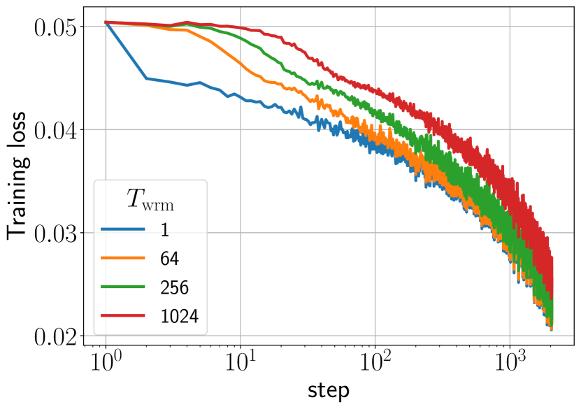

(a)
[/FIGURE]

### D.6 Estimation of Computational Resources

The phase diagram experiments typically required about an hour on per run on an A100 GPU. Consequently, each phase diagram consumed approximately $100$ A100 hours of computational time. With a total of $16$ phase diagrams, this equates to $1600$ A100 hours dedicated solely to phase diagram computations. Additionally, the warmup mechanism experiments, which were conducted over $2000$ steps, required sharpness estimation. The FCN experiments required approximately $1200$ A100 hours, while the WRN mechanism experiments consumed $1600$ A100 hours. The experiments concerning the initial learning rate took about $20$ A100 hours. This brings the total computational time amounted to approximately $4500$ A100 hours. Preliminary experiments took about $1000$ A100 hours. Hence, we estimate the total computational cost to be around $5500$ A100 hours.  

## Appendix E Additional Results for Mechanisms of Warmup

This section presents additional trajectories for warmup mechanisms discussed in [Section 4](#S4 "4 Warmup Mechanisms of Gradient and Adaptive Methods ‣ Why Warmup the Learning Rate? Underlying Mechanisms and Improvements") covering various architectures, loss functions, and optimizers.  

### E.1 Stochastic Gradient Descent

[Figure 8](#A4.F8 "In Figure 6: ‣ D.5 Additional Figure Details ‣ Appendix D Experimental Details ‣ Why Warmup the Learning Rate? Underlying Mechanisms and Improvements") shows that the warmup mechanisms for full batch GD are also observed in the SGD with a batch size $B=512$. The results for other optimizers in the mini-batch setting are discussed in their respective sections.  

### E.2 Stochastic Gradient Descent with Momentum

[FIGURE A5.F9.sf1.g1]
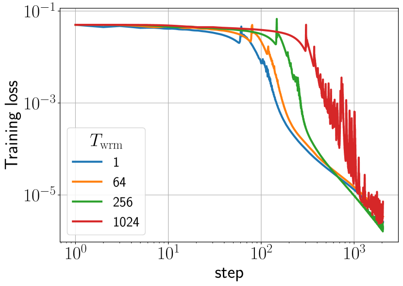

(a)
[/FIGURE]

While the warmup mechanisms of SGD with momentum are fundamentally similar to those of vanilla SGD, three key differences arise, as discussed below.  

First, the training loss can decrease loss in an oscillatory fashion during training [[12](#bib.bib12)]. To illustrate this, consider the full-batch GD with momentum. The middle row of [Figure 9](#A5.F9 "In E.2 Stochastic Gradient Descent with Momentum ‣ Appendix E Additional Results for Mechanisms of Warmup ‣ Why Warmup the Learning Rate? Underlying Mechanisms and Improvements") demonstrates the sharpness reduction case with the learning rates well below the stability threshold ($\eta<<\eta_{c}$). Despite being far below these thresholds, the loss does not decrease monotonically but converges in an oscillatory fashion. This makes it challenging to differentiate between warmup-induced catapults and fluctuations in loss due to the intrinsic effects of momentum. Nevertheless, we can still observe loss spikes correlated with an abrupt decrease in sharpness at large learning rates, as seen in the bottom row of the same figure. Similar to the SGD case, we observe these catapults are delayed and become smaller in magnitude on increasing the warmup duration.  

[FIGURE A5.F10.sf1.g1]

(a)
[/FIGURE]

Next, the stability threshold $\eta_{c}$ for SGD with momentum evolves during training. For simplicity of explanations, we again consider the full batch GD case. The stability threshold $\eta_{c}$ for SGD with momentum changes from $\nicefrac{{2}}{{\lambda_{0}^{H}}}$ at initialization to $\nicefrac{{(2+2\beta)}}{{\lambda_{t}}}$ late in training. At initialization, the momentum vector is set to zero $\bm{m}_{0}=0$, and the stability is given by vanilla GD threshold $\nicefrac{{2}}{{\lambda_{0}^{H}}}$. As training progresses, the momentum $\bm{m}_{t}$ increases in magnitude, and the instability threshold at late training time becomes $\nicefrac{{(2+2\beta)}}{{\lambda_{t}}}$. The bottom row of [Figure 9](#A5.F9 "In E.2 Stochastic Gradient Descent with Momentum ‣ Appendix E Additional Results for Mechanisms of Warmup ‣ Why Warmup the Learning Rate? Underlying Mechanisms and Improvements") show the sharpness trajectories with both $\nicefrac{{2}}{{\eta_{t}}}$ and $\nicefrac{{(2+2\beta)}}{{\eta_{t}}}$ curves. For $T_{\text{wrm}}=64$, the learning rate curve $\nicefrac{{2}}{{\eta_{t}}}$ causes an abrupt decrease in sharpness, which is coupled with a loss spike. For longer warmup durations, the sharpness decreases before training exceeds the $\nicefrac{{2}}{{\lambda_{t}^{H}}}$.  

Finally, the instability threshold $\eta_{c}$ for SGD with momentum significantly decreases for smaller batch sizes. [Figure 10](#A5.F10 "In E.2 Stochastic Gradient Descent with Momentum ‣ Appendix E Additional Results for Mechanisms of Warmup ‣ Why Warmup the Learning Rate? Underlying Mechanisms and Improvements") shows the training trajectories under the same setup as in [Figure 8](#A4.F8 "In Figure 6: ‣ D.5 Additional Figure Details ‣ Appendix D Experimental Details ‣ Why Warmup the Learning Rate? Underlying Mechanisms and Improvements"), but with momentum coefficient $\beta=0.9$. The late-time sharpness trajectories oscillate well below the $\nicefrac{{(2+2\beta)}}{{\eta_{t}}}$ (and even below $\nicefrac{{2}}{{\lambda_{t}^{H}}}$), whereas the vanilla SGD counterpart oscillates on the $\nicefrac{{2}}{{\eta_{t}}}$ curve. This indicates a strong dependence of the instability threshold on batch size.  

Besides these three differences, we note that the warmup mechanisms of SGD with momentum are similar to the vanilla SGD case. We leave a thorough analysis of the early sharpness dynamics of SGD with momentum for future works.  

### E.3 Stochastic Gradient Descent and Cross-entropy Loss

[FIGURE A5.F11.sf1.g1]
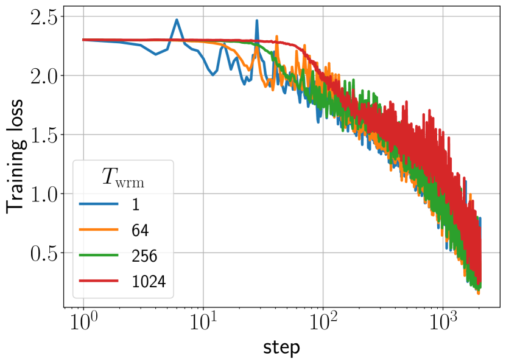

(a)
[/FIGURE]

The warmup mechanisms for models trained with cross-entropy loss exhibit trends similar to those observed with MSE loss with one crucial difference. Near convergence, sharpness first increases and then abruptly decreases. The decrease in sharpness towards the end of training is observed in previous studies analyzing SGD with fixed learning rate [[6](#bib.bib6)]. Additionally, we observe higher fluctuations compared to the MSE loss case. [Figure 11](#A5.F11 "In E.3 Stochastic Gradient Descent and Cross-entropy Loss ‣ Appendix E Additional Results for Mechanisms of Warmup ‣ Why Warmup the Learning Rate? Underlying Mechanisms and Improvements") shows trajectories of FCNs under different parameterizations trained on CIFAR-10 with cross-entropy loss using vanilla SGD. Meanwhile, [Figure 12](#A5.F12 "In E.3 Stochastic Gradient Descent and Cross-entropy Loss ‣ Appendix E Additional Results for Mechanisms of Warmup ‣ Why Warmup the Learning Rate? Underlying Mechanisms and Improvements") shows the loss and sharpness trajectories of FCNs in SP trained on CIFAR-10 with cross-entropy loss using full batch GD with and without momentum.  

[FIGURE A5.F12.sf1.g1]
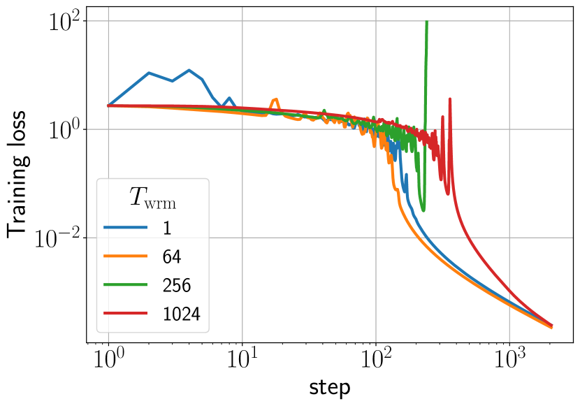

(a)
[/FIGURE]

### E.4 Warmup Mechanisms of Adam

[FIGURE A5.F13.sf1.g1]
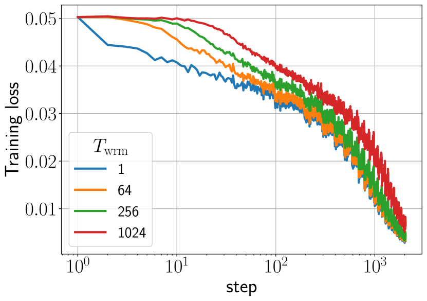

(a)
[/FIGURE]

As discussed in [Section 4.3](#S4.SS3 "4.3 Adaptive Gradient Methods (Adam) ‣ 4 Warmup Mechanisms of Gradient and Adaptive Methods ‣ Why Warmup the Learning Rate? Underlying Mechanisms and Improvements"), the instability threshold for Adam is determined by the pre-conditioned sharpness $\lambda^{P^{-1}H}$ and not by the sharpness itself. Moreover, training dynamics falls under the sharpness reduction case as the pre-conditioned sharpness starts off large and reduces considerably during the first few training.  

[FIGURE A5.F14.sf1.g1]
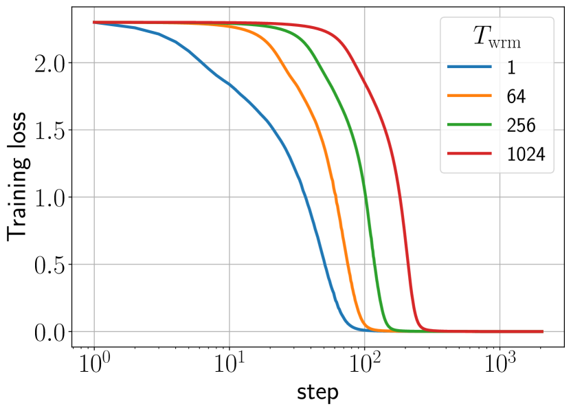

(a)
[/FIGURE]

[Figure 13](#A5.F13 "In E.4 Warmup Mechanisms of Adam ‣ Appendix E Additional Results for Mechanisms of Warmup ‣ Why Warmup the Learning Rate? Underlying Mechanisms and Improvements") shows the training trajectories of FCNs trained with Adam in the same setting as in [Figure 2](#S4.F2 "In 4.1 Stochastic Gradient Descent ‣ 4 Warmup Mechanisms of Gradient and Adaptive Methods ‣ Why Warmup the Learning Rate? Underlying Mechanisms and Improvements") but with a batch size of $B=512$. Similar to the SGD with momentum case, the late time sharpness oscillates far below the instability threshold ($\nicefrac{{(2+2\beta_{1})}}{{\eta_{t}(1-\beta_{1})}}$), suggesting that the instability threshold heavily decreases with a smaller batch size. We note similar findings by Ref. [[7](#bib.bib7)].  

Next, [Figure 14](#A5.F14 "In E.4 Warmup Mechanisms of Adam ‣ Appendix E Additional Results for Mechanisms of Warmup ‣ Why Warmup the Learning Rate? Underlying Mechanisms and Improvements") show the warmup mechanism of FCNs trained with cross-entropy loss using Adam under the full-batch setting. Similar to the SGD case, the pre-conditioned sharpness decreases towards the end of training.  

### E.5 Different Architectures and Datasets

[FIGURE A5.F15.sf1.g1]
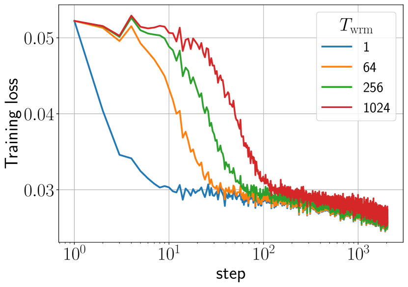

(a)
[/FIGURE]

[FIGURE A5.F16.sf1.g1]
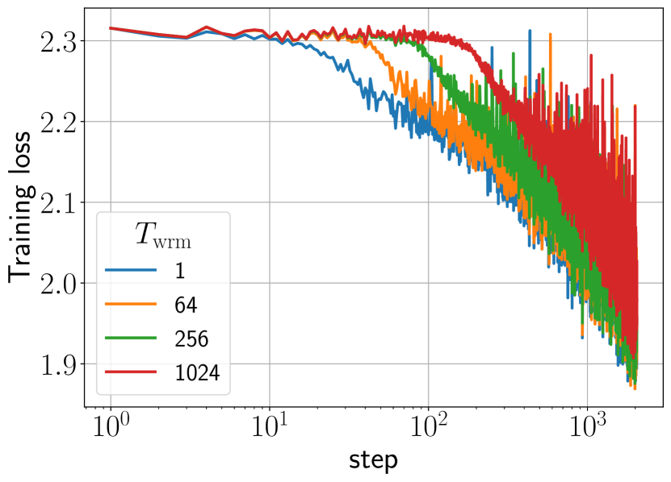

(a)
[/FIGURE]

In the previous sections, we confined our analysis to FCNs to thoroughly explore the effects of different optimizers and loss functions. This section expands on those results by demonstrating that the observed warmup mechanisms apply to ResNets and Transformers as well. The Resnet experiments also employ data augmentation as detailed in [Section D.1](#A4.SS1 "D.1 Datasets Details ‣ Appendix D Experimental Details ‣ Why Warmup the Learning Rate? Underlying Mechanisms and Improvements").  

[Figures 15](#A5.F15 "In E.5 Different Architectures and Datasets ‣ Appendix E Additional Results for Mechanisms of Warmup ‣ Why Warmup the Learning Rate? Underlying Mechanisms and Improvements") and [16](#A5.F16 "Figure 16 ‣ E.5 Different Architectures and Datasets ‣ Appendix E Additional Results for Mechanisms of Warmup ‣ Why Warmup the Learning Rate? Underlying Mechanisms and Improvements") show the training trajectories of WideResNets (WRNs) trained on CIFAR-10 with MSE and cross-entropy loss using SGD. These trajectories generally reflect the warmup mechanisms discussed in [Section 4](#S4 "4 Warmup Mechanisms of Gradient and Adaptive Methods ‣ Why Warmup the Learning Rate? Underlying Mechanisms and Improvements"). However, certain additional features obscure the clarity of these mechanisms. Notably, we observed a significant sharpness spike on the first training step when using longer warmup durations, which automatically resolves in the subsequent step. The magnitude of this spike increases with longer warmup periods. Further analysis revealed that this phenomenon is associated with an initial increase in the first LayerNorm parameters, which also resolves automatically by the second step. Beyond this observation, the training trajectories align with the warmup mechanisms described in the main text.  

[FIGURE A5.F17.sf1.g1]
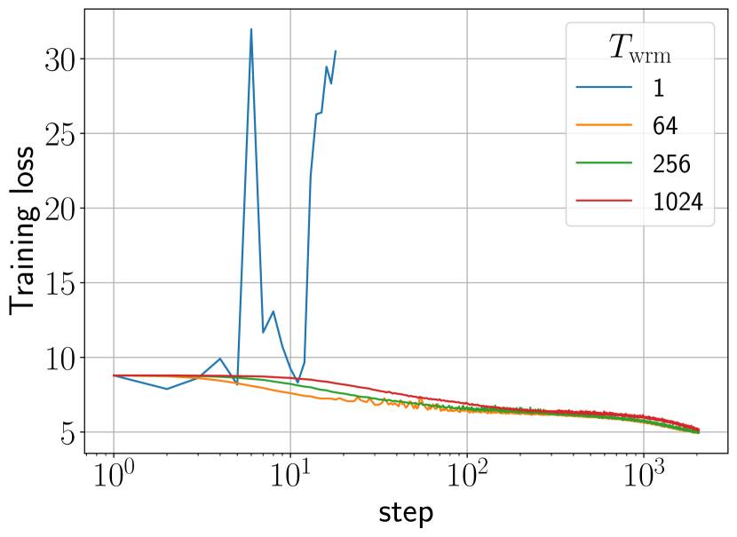

(a)
[/FIGURE]

[FIGURE A5.F18.sf1.g1]
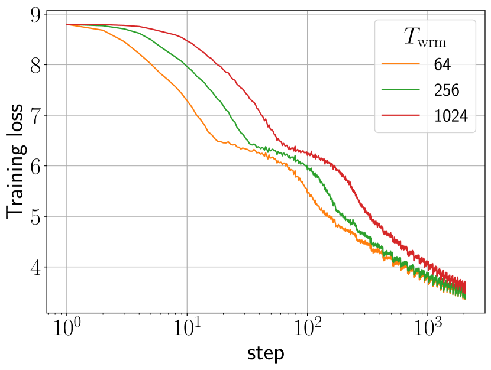

(a)
[/FIGURE]

[Figure 17](#A5.F17 "In E.5 Different Architectures and Datasets ‣ Appendix E Additional Results for Mechanisms of Warmup ‣ Why Warmup the Learning Rate? Underlying Mechanisms and Improvements") illustrates the warmup mechanisms of Pre-LN Transformers trained on the WikiText-2 with SGD. The Pre-LN Transformer (top row) starts in a flat landscape region ($\lambda_{0}^{H}\sim 5$) and experiences progressive sharpening right from initialization. In contrast, when the last LayerNorm (just before the final linear layer) is removed (bottom row), the model starts training in a significantly sharper region, with the initial sharpness $100$ times larger than the standard Pre-LN Transformer. This modified Pre-LN Transformer experiences a reduction in sharpness during the early stages of training.  

[Figure 18](#A5.F18 "In E.5 Different Architectures and Datasets ‣ Appendix E Additional Results for Mechanisms of Warmup ‣ Why Warmup the Learning Rate? Underlying Mechanisms and Improvements") presents the warmup mechanisms of Pre-LN Transformers trained on WikiText-2 using the Adam optimizer. Consistent with the results in the main text, the pre-conditioned sharpness exhibits a reduction early in training, despite the model initializing in a very flat region.  

These experiments demonstrate that Transformers trained on language modeling tasks exhibit warmup mechanisms consistent with those discussed in the main text.  

## Appendix F Additional Phase Diagrams

This section presents further results related to the phase diagrams of warmup shown in Section [5](#S5 "5 Impact of Warmup on Training and Generalization ‣ Why Warmup the Learning Rate? Underlying Mechanisms and Improvements").  

### F.1 Phase Diagrams for different Models and Datasets

[Figure 19](#A6.F19 "In F.1 Phase Diagrams for different Models and Datasets ‣ Appendix F Additional Phase Diagrams ‣ Why Warmup the Learning Rate? Underlying Mechanisms and Improvements") shows the test accuracy heatmaps of WRN-$16$-$4$ trained on CIFAR-100 and Tiny-ImageNet. These models are trained using cross-entropy loss using SGD with a batch size of $B=128$. Additional phase diagrams for Adam are presented in [Section F.3](#A6.SS3 "F.3 Phase Diagrams of Adam and GI-Adam ‣ Appendix F Additional Phase Diagrams ‣ Why Warmup the Learning Rate? Underlying Mechanisms and Improvements").  

[Figure 20](#A6.F20 "In F.1 Phase Diagrams for different Models and Datasets ‣ Appendix F Additional Phase Diagrams ‣ Why Warmup the Learning Rate? Underlying Mechanisms and Improvements")(a) shows the test loss heatmaps of Pre-LN Transformer trained on the WikiText-2 dataset using SGD with a batch size $B=64$. [Figure 20](#A6.F20 "In F.1 Phase Diagrams for different Models and Datasets ‣ Appendix F Additional Phase Diagrams ‣ Why Warmup the Learning Rate? Underlying Mechanisms and Improvements")(b) shows the Pre-LN Transformer under the same setup except for the last layer LayerNorm removed. The standard Pre-LN Transformer starts off with a small sharpness, while the version without the last LN starts off with $100$ times higher curvature and requires warmup to achieve good performance.  

[FIGURE A6.F19.sf1.g1]
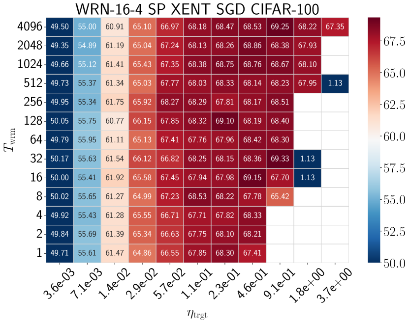

(a)
[/FIGURE]

[FIGURE A6.F20.sf1.g1]
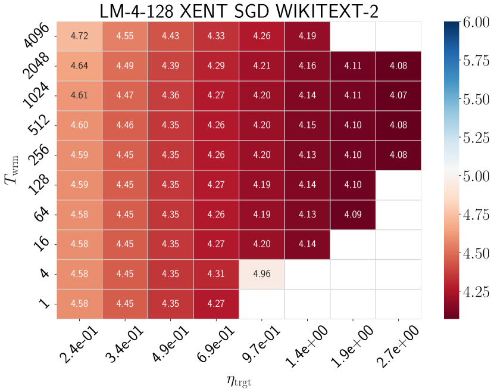

(a)
[/FIGURE]

[FIGURE A6.F21.sf1.g1]
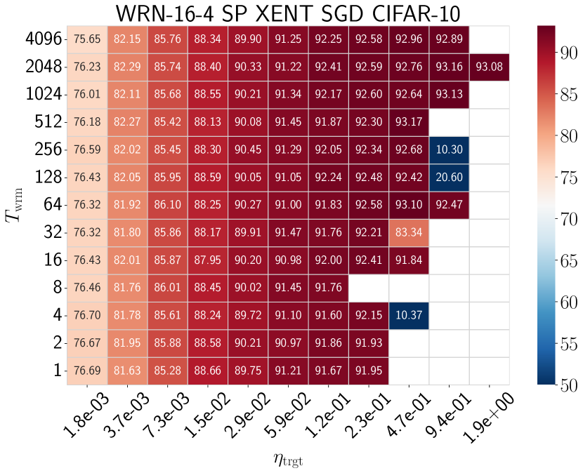

(a)
[/FIGURE]

### F.2 The Effect of Momentum and Learning Rate Decay

[Figure 21](#A6.F21 "In F.1 Phase Diagrams for different Models and Datasets ‣ Appendix F Additional Phase Diagrams ‣ Why Warmup the Learning Rate? Underlying Mechanisms and Improvements") shows that incorporating momentum and cosine decay (for details, see [Section D.3.3](#A4.SS3.SSS3 "D.3.3 Learning Rate Decay ‣ D.3 Optimization Details ‣ Appendix D Experimental Details ‣ Why Warmup the Learning Rate? Underlying Mechanisms and Improvements")) minimally affects the warmup phase diagrams. While the conclusions regarding warmup presented in the main text remain unaffected, we note a few interesting observations.  

First, the divergent boundary shifts leftward on incorporating momentum, indicating that momentum permits smaller target learning rates without warmup, and warmup helps SGD-M more. Meanwhile, cosine decay has a minimal effect on the divergent boundary.  

Additionally, we observe a performance enhancement by incorporating momentum, especially at small learning rates. In contrast, a decaying learning rate beyond warmup degrades performance at small learning rates while improving at higher ones. Finally, incorporating both momentum and cosine decay leads to further enhancement, indicating a synergistic interaction between the two.  

### F.3 Phase Diagrams of Adam and GI-Adam

[Figures 23](#A6.F23 "In F.3 Phase Diagrams of Adam and GI-Adam ‣ Appendix F Additional Phase Diagrams ‣ Why Warmup the Learning Rate? Underlying Mechanisms and Improvements"), [24](#A6.F24 "Figure 24 ‣ F.3 Phase Diagrams of Adam and GI-Adam ‣ Appendix F Additional Phase Diagrams ‣ Why Warmup the Learning Rate? Underlying Mechanisms and Improvements") and [25](#A6.F25 "Figure 25 ‣ F.3 Phase Diagrams of Adam and GI-Adam ‣ Appendix F Additional Phase Diagrams ‣ Why Warmup the Learning Rate? Underlying Mechanisms and Improvements") compare the warmup phase diagrams of Adam and GI-Adam of WRNs trained on CIFAR-100, Tiny-ImageNet and of Transformers trained on WikiText-2 dataset. Similar to the results shown in the main text, GI-Adam enhances performance over standard Adam by pushing the failure boundary.  

[FIGURE A6.F22.sf1.g1]
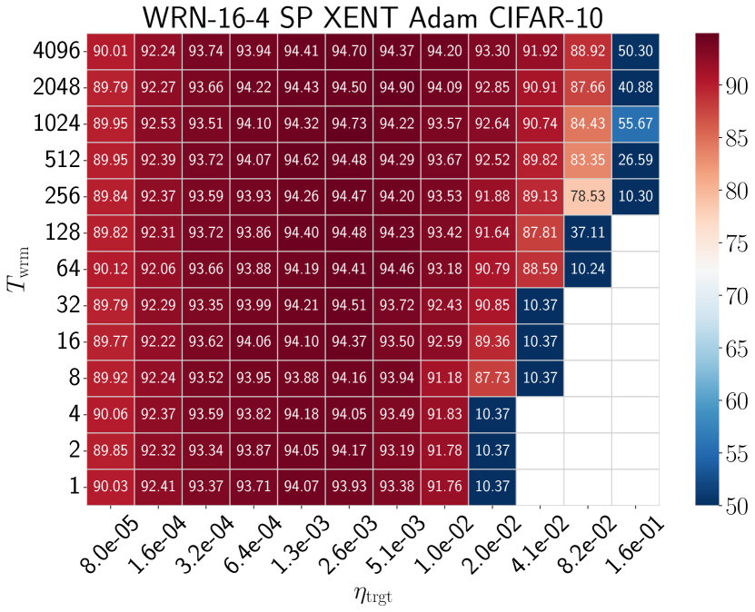

(a)
[/FIGURE]

[FIGURE A6.F23.sf1.g1]
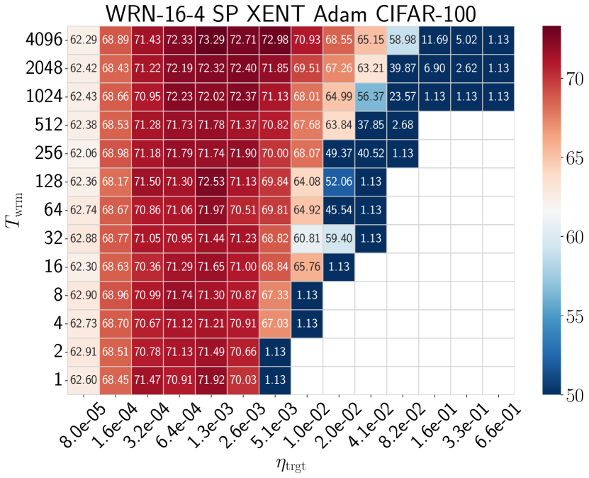

(a)
[/FIGURE]

[FIGURE A6.F24.sf1.g1]
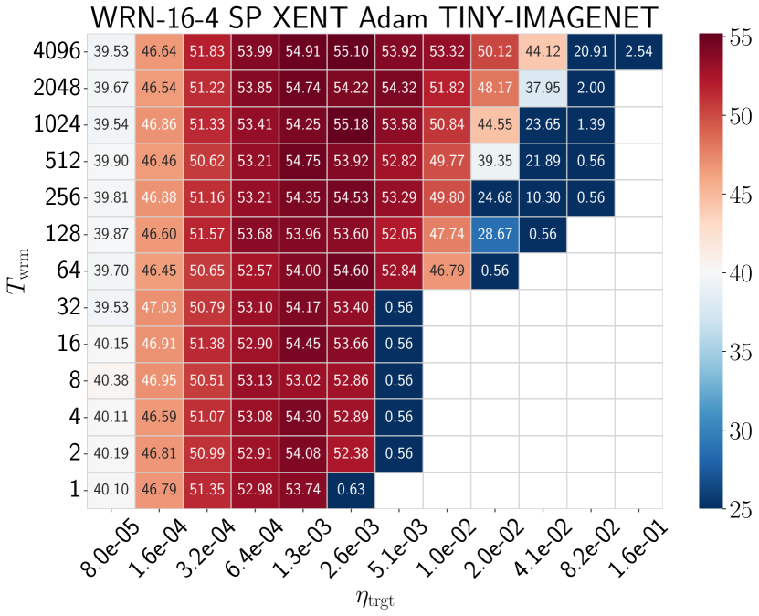

(a)
[/FIGURE]

[FIGURE A6.F25.sf1.g1]
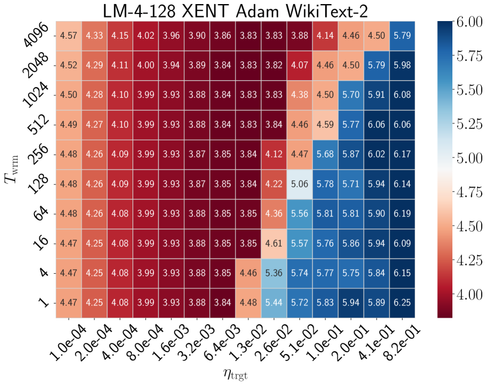

(a)
[/FIGURE]

## Appendix G Non-divergence of Adam

[FIGURE A7.F26.sf1.g1]
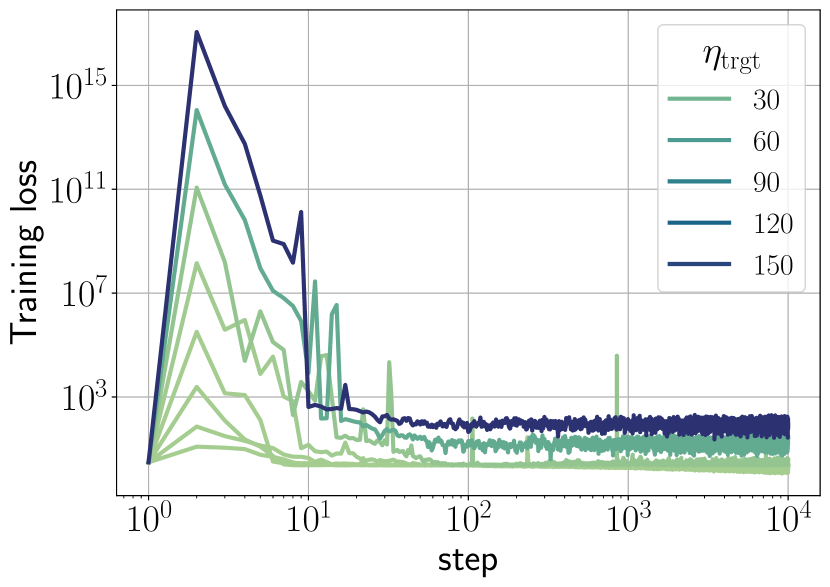

(a)
[/FIGURE]

[Figure 26](#A7.F26 "In Appendix G Non-divergence of Adam ‣ Why Warmup the Learning Rate? Underlying Mechanisms and Improvements") shows that, despite experiencing catastrophic instabilities during early training, Adam does not diverge well beyond the training failure boundary. While Adam can recover from these instabilities, the model’s performance is severely impacted, resulting in training failures rather than convergence to a reasonable minimum.  

These large loss catapults cause the gradients $\bm{g}$ to spike during early training, leading to a substantial increase in its second moment $\bm{v}$. While the gradients return to a lower value after a few training steps, the second moment remains large in magnitude for a prolonged period. These large values of $\bm{v}$ result in a small effective learning rate, which hinders training to escape these high-loss regions. Consequently, the models remain stuck in a suboptimal state rather than converging. We refer to this as a training failure.  

Upon closer examination of the individual layers during training failures, we found that certain layers or residual blocks output zero. This results in vanishing gradients except for the last layer bias and training halts. We defer the detailed analysis of Adam’s failures to future work.  

[FIGURE A7.F27.sf1.g1]
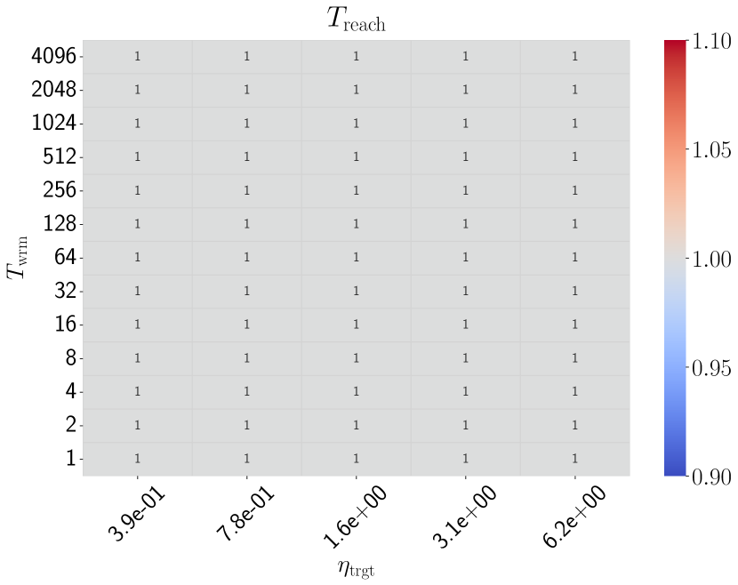

(a)
[/FIGURE]

## Appendix H Additional results for the Initial Learning Rate Selection

This section provides additional results for the initial learning rate selection. [Figure 27](#A7.F27 "In Appendix G Non-divergence of Adam ‣ Why Warmup the Learning Rate? Underlying Mechanisms and Improvements") shows the number of steps $T_{\text{reach}}$ required to reach the target learning rate and the effective number of steps saved $T_{\text{save}}$ for WRNs in $\mu$P. Note that in such cases, $\eta_{c}\approx\eta_{\text{max}}$. We observe that $T_{\text{reach}}=1$ for a wide range of learning rates, saving almost the entire warmup duration. [Figures 28](#A8.F28 "In Appendix H Additional results for the Initial Learning Rate Selection ‣ Why Warmup the Learning Rate? Underlying Mechanisms and Improvements") and [29](#A8.F29 "Figure 29 ‣ Appendix H Additional results for the Initial Learning Rate Selection ‣ Why Warmup the Learning Rate? Underlying Mechanisms and Improvements") show similar phase diagrams for WRNs in SP and $\mu$P trained with Adam.  

[FIGURE A8.F28.sf1.g1]
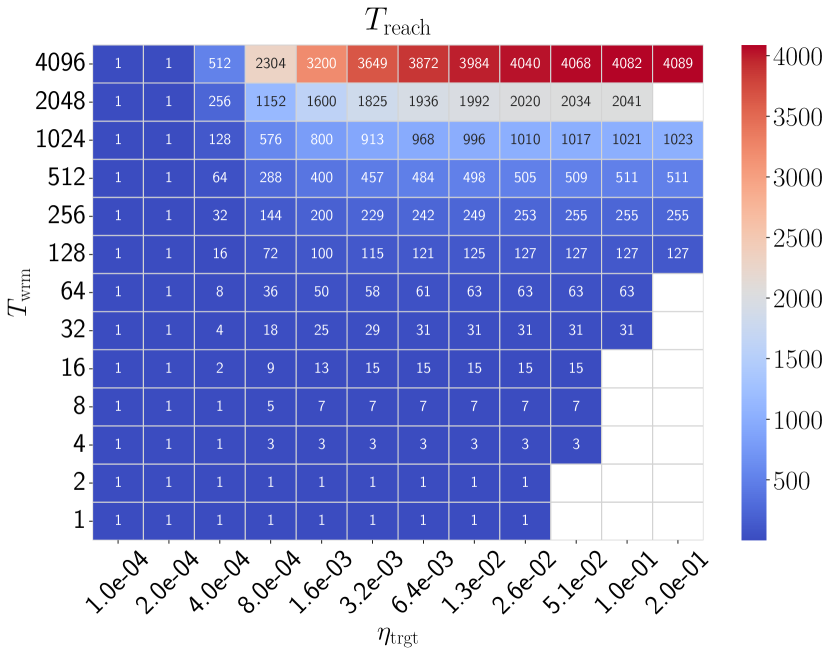

(a)
[/FIGURE]

[FIGURE A8.F29.sf1.g1]
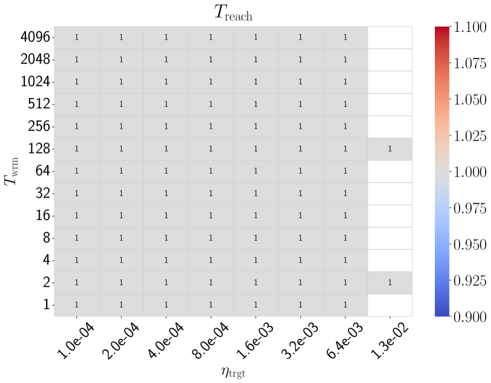

(a)
[/FIGURE]

## Appendix I Additional Results on GI-Adam

This section presents additional results for GI-Adam. We provide further insights into the mechanisms and interpretations of GI-Adam.  

### I.1 Warmup Mechanisms of GI-Adam

[FIGURE A9.F30.1.g1]
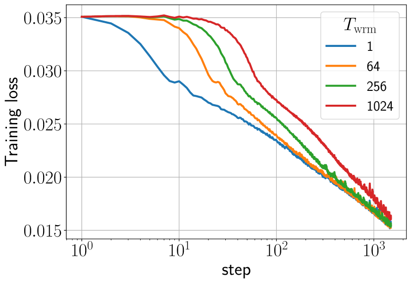

(a)
[/FIGURE]

[Figure 30](#A9.F30 "In I.1 Warmup Mechanisms of GI-Adam ‣ Appendix I Additional Results on GI-Adam ‣ Why Warmup the Learning Rate? Underlying Mechanisms and Improvements") shows the training trajectories of FCNs with different parameterizations trained with GI-Adam. Notably, the pre-conditioned sharpness starts at significantly lower values than standard Adam. Specifically, for the $\mu$P model, the initial pre-conditioned sharpness $\lambda^{P^{-1}H}$ is around $2000$ instead of the value $10^{5}$ observed for Adam (c.f. [Figure 2](#S4.F2 "In 4.1 Stochastic Gradient Descent ‣ 4 Warmup Mechanisms of Gradient and Adaptive Methods ‣ Why Warmup the Learning Rate? Underlying Mechanisms and Improvements")). Remarkably, this almost eliminates initial sharpness reduction. Similarly, the pre-conditioned sharpness for the SP model starts around $10^{4}$ instead of $10^{6}$. Notably, in the SP scenario, there is no initial spike in the $T_{\text{wrm}}=1$ (c.f. [Figure 2](#S4.F2 "In 4.1 Stochastic Gradient Descent ‣ 4 Warmup Mechanisms of Gradient and Adaptive Methods ‣ Why Warmup the Learning Rate? Underlying Mechanisms and Improvements")), demonstrating that this simple modification effectively reduces instabilities during the early training.  

### I.2 GI-Adam as an Automated Warmup

In this section, we show that a bias correction is not required when the second moment is initialized with the gradients at initialization in GI-Adam. Therefore, employing a bias correction as in the original Adam algorithm in this case serves as an automated warmup given by $\eta_{t}=\eta_{\text{trgt}}\sqrt{1-\beta_{2}^{t}}$.  

The moving average of the second moment is given by:  

|  | $\displaystyle\bm{v}_{t}=(1-\beta_{2})\sum_{i=0}^{t-1}\beta_{2}^{i}\bm{g}_{t-i}^{2}+\beta_{2}^{t}\bm{v}_{0},$ |  | (9) |
| --- | --- | --- | --- |

where $\bm{v}_{0}=\bm{g}_{0}^{2}$. Following standard assumptions, we assume that the second moment of the gradient is constant during early training $\mathbb{E}[\bm{g}_{t}^{2}]=\sigma^{2}$. Taking the expectation of the above equation over the gradient distribution yields  

|  | $\displaystyle\mathbb{E}[\bm{v}_{t}]=(1-\beta_{2})\sum_{i=0}^{t-1}\beta_{2}^{i}\mathbb{E}[\bm{g}_{t-i}^{2}]+\beta_{2}^{t}\mathbb{E}[\bm{v}_{0}].$ |  | (10) |
| --- | --- | --- | --- |

Simplifying the above equation, we have  

|  | $\displaystyle\mathbb{E}[\bm{v}_{t}]=(1-\beta_{2})\sigma^{2}\frac{1-\beta_{2}^{t}}{1-\beta_{2}}+\beta_{2}^{t}\sigma^{2}=\sigma^{2}.$ |  | (11) |
| --- | --- | --- | --- |

This result demonstrates that when the second moment is initialized with the gradients at initialization, it does not require bias correction, as the expected value of the second moment is equal to the constant $\sigma^{2}$. If we apply the usual bias correction on top of initializing the second moment with the gradients, we effectively downscale the second moment by a factor $\sqrt{1-\beta_{2}^{t}}$. Assuming small enough $\epsilon$, this can be viewed as a multiplicative factor to the learning rate. As a result, GI-Adam is equivalent to having a natural warmup given by $\eta_{t}=\eta_{\text{trgt}}\sqrt{1-\beta_{2}^{t}}$.  

### I.3 The Primary benefit of GI-Adam results from the magnitude of the second moment at initialization

[FIGURE A9.F31.sf1.g1]
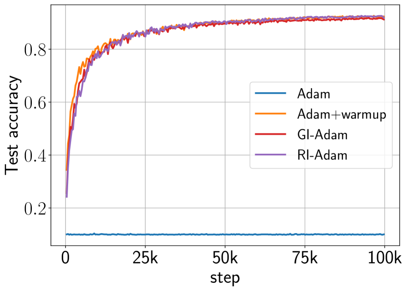

(a)
[/FIGURE]

To further assess if the primary cause of instability during early training is the large $\lambda^{P^{-1}H}$, we randomly initialize $\bm{v}_{0}$ but with the same norm as the gradients at initialization. We refer to this as Randomly Initialized Adam (RI-Adam). Like GI-Adam, this also results in improved performance as shown in [Figure 31](#A9.F31 "In I.3 The Primary benefit of GI-Adam results from the magnitude of the second moment at initialization ‣ Appendix I Additional Results on GI-Adam ‣ Why Warmup the Learning Rate? Underlying Mechanisms and Improvements").  

