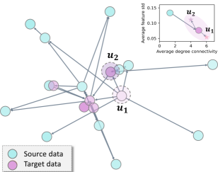
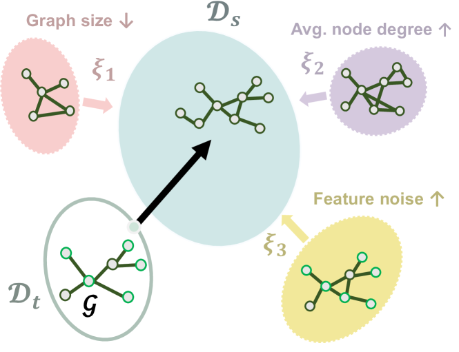
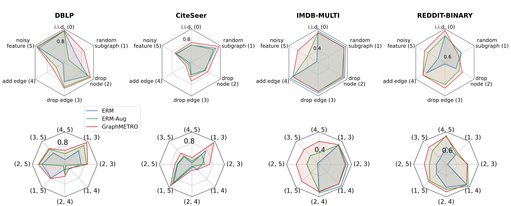
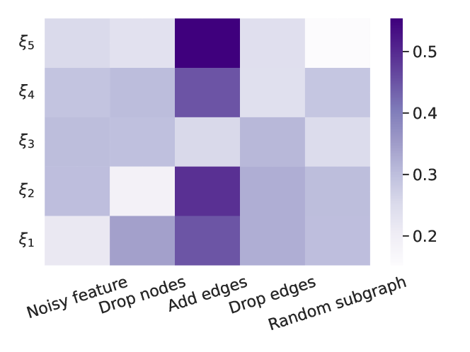
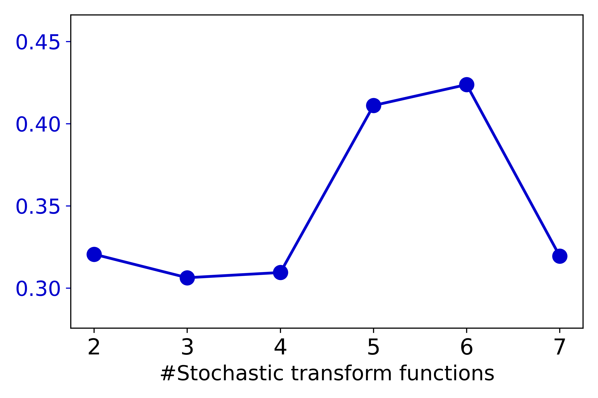

# GraphMETRO: Mitigating Complex Graph Distribution Shifts via 
Mixture of Aligned Experts

###### Abstract

Graph data are inherently complex and heterogeneous, leading to a high natural diversity of distributional shifts. However, it remains unclear how to build machine learning architectures that generalize to complex non-synthetic distributional shifts naturally occurring in the real world. Here we develop GraphMETRO, a Graph Neural Network architecture, that reliably models natural diversity and captures complex distributional shifts. GraphMETRO employs a Mixture-of-Experts (MoE) architecture with a gating model and multiple expert models, where each expert model targets a specific distributional shift to produce a shift-invariant representation, and the gating model identifies shift components. Additionally, we design a novel objective that aligns the representations from different expert models to ensure smooth optimization. GraphMETRO achieves state-of-the-art results on four datasets from GOOD benchmark comprised of complex and natural real-world distribution shifts, improving by 67% and 4.2% on WebKB and Twitch datasets.  

Machine Learning, ICML

∗ Equal senior authorship  

  

## 1 Introduction

[FIGURE S1.F1.g1]


Figure 1: A real example from WebKB (Pei et al., [2020](#bib.bib46); Gui et al., [2022](#bib.bib20)). Colors indicates source/target data. The darker shade indicates higher feature standard deviation. It illustrates distribution shifts (upper right, from source to target) and heterogeneous shifts (instance-wise heterogeneity within the target distribution).
[/FIGURE]

[FIGURE S1.F2.sf1.g1]


(a)
[/FIGURE]

The intricate nature of real-world graph data introduces a wide variety of graph distribution shifts and heterogeneous graph variations (Newman, [2003](#bib.bib42); Leskovec et al., [2007](#bib.bib29); McAuley & Leskovec, [2012](#bib.bib38); Knyazev et al., [2019](#bib.bib25)). For instance, in a social graph, some user nodes can have reduced activities and profile alterations, while other user nodes may see increased interactions. More broadly, such shifts go beyond the group-wise pattern and further constitute the heterogeneity property over graph data. In Figure [1](#S1.F1 "Figure 1 ‣ 1 Introduction ‣ GraphMETRO: Mitigating Complex Graph Distribution Shifts via Mixture of Aligned Experts"), we provide a real-world example on a webpage network dataset, where, besides the general distribution shift from source to target distribution, two webpage nodes $u_{1}$ and $u_{2}$ from the same domain exhibit varying extents of content changes. These inherent shifts and complexity accurately characterize the dynamics of real-world graph data, e.g., social networks (Berger-Wolf & Saia, [2006](#bib.bib2); Greene et al., [2010](#bib.bib19)) and ecommerce graphs (Ying et al., [2018](#bib.bib68)).  

Above the diverse graph variants, Graph Neural Networks (GNNs) (Hamilton et al., [2017](#bib.bib21); Kipf & Welling, [2017](#bib.bib24); Dwivedi et al., [2023](#bib.bib10)) has become a prevailing method for downstream graph tasks. Standard evaluation often adopts random data splits for training and testing GNNs. However, it overlooks the complex distributional shifts naturally occurring in the real world. Moreover, compelling evidence shows that GNNs are extremely vulnerable to graph data shifts (Zhang et al., [2017](#bib.bib70); Knyazev et al., [2019](#bib.bib25); Gui et al., [2022](#bib.bib20)). Thus, our goal is to build GNN models with better generalization to real-world data splits and graph dynamics described earlier.  

Previous research on GNN generalization has mainly focused on two lines: (1) Data-augmentation training procedures that learn environment-robust predictors by augmenting the training data with the environment changes. For example, works have looked at distribution shifts related to graph size (Park et al., [2021](#bib.bib44); Feng et al., [2020a](#bib.bib14)), node features (Knyazev et al., [2019](#bib.bib25); Ding et al., [2021](#bib.bib8); Kong et al., [2022](#bib.bib26)), and node degree or local structure (Wu et al., [2022a](#bib.bib58); Liu et al., [2022a](#bib.bib35)), assuming that the target data adhere to designated shift type. (2) Learning environment-invariant representations or predictors either through inductive biases learned by the model (Wu et al., [2022c](#bib.bib62), [b](#bib.bib60)), through regularization (Buffelli et al., [2022](#bib.bib4); Li et al., [2022b](#bib.bib32); Yehudai et al., [2021](#bib.bib67)) or a combination of both (Yang et al., [2020](#bib.bib65); Fan et al., [2023](#bib.bib11); Zhang et al., [2021](#bib.bib71)).  

However, the real-world distribution shifts and graph dynamics are unknown. Specifically, the distribution shift could be any fusion of multiple shift dimensions each characterized by unique statistical properties (Knyazev et al., [2019](#bib.bib25); Gui et al., [2022](#bib.bib20); Peel et al., [2017](#bib.bib45)), which is hardly covered by single-dimension synthetic augmentation or fixed combinations of shift dimensions adopted in the data augmentation approaches. Moreover, as seen in Figure [1](#S1.F1 "Figure 1 ‣ 1 Introduction ‣ GraphMETRO: Mitigating Complex Graph Distribution Shifts via Mixture of Aligned Experts"), graph data may involve instance-wise heterogeneity without stable properties (Newman, [2003](#bib.bib42); Leskovec et al., [2007](#bib.bib29)) from which one can learn invariant predictors. Here, the standard strategy of learning invariant predictors or representation must contend with learning over a combinatorially large number of potential localized distribution shift variations. Thus, the previous works may not be well-equipped to work effectively on the challenging task.  

Here we propose a novel and general framework, GraphMETRO. The key to our approach is to decompose any unknown shift into multiple shift components and learn predictors that can adapt to graph heterogeneity observed in the target data. Figure [2(a)](#S1.F2.sf1 "In Figure 2 ‣ 1 Introduction ‣ GraphMETRO: Mitigating Complex Graph Distribution Shifts via Mixture of Aligned Experts") shows an example of our method on graph-level tasks, where the shift from the target graph data $\mathcal{G}\in\mathcal{D}_{t}$ to source distribution $\mathcal{D}_{s}$ is decomposed to two strong shift components controlling feature noise and graph size, while the shift component controlling average node degree is identified as irrelevant. Specifically, the shift components are constructed in a way that each of them possesses unique statistical characteristics. Moreover, the contribution of each shift component to the shift is determined by an influence function that encodes the given graph $\mathcal{G}$ and source distribution $\mathcal{D}_{s}$. Such design enables breaking down the generalization problem into (1) the inference on strong shift components and their contributions as the surrogate of any distributional or heterogeneous shifts, and (2) the mitigation towards the surrogate shifts, where the individual shift components are interpretable and more tractable.  

For the first subproblem, we design a hierarchical architecture composed of a gating model and multiple expert models, inspired by the mixture-of-experts (MoE) architecture (Jordan & Jacobs, [1994](#bib.bib23)). As shown in Figure [2(b)](#S1.F2.sf2 "In Figure 2 ‣ 1 Introduction ‣ GraphMETRO: Mitigating Complex Graph Distribution Shifts via Mixture of Aligned Experts"), the gating model takes any given node or graph data to identify strong shift components that govern the localized distribution shift, while each expert model corresponds to an individual shift component. Secondly, to further mitigate surrogate distribution shifts, we train the expert models to generate invariant representations w.r.t. their corresponding shift components, which are then aggregated as the final representation vector. Moreover, the expert outputs need to align properly in a common representation space to avoid extreme divergence in the aggregated representation. Consequently, we design a novel objective to ensure a smooth training process. Finally, during the evaluation process, we integrate outputs from both the gating and expert models for final representations.  

This process effectively generates invariant representations across complex distributional shifts. To highlight, our method achieves the best performances on four node- and graph-level tasks from GOOD benchmark (Gui et al., [2022](#bib.bib20)), which involves a diverse set of natural distribution shifts such as user language shifts in gamer networks, and university domain shifts in university webpage networks. GraphMETRO achieves a 67% relative improvement over the state-of-the-art on WebKB dataset (Pei et al., [2020](#bib.bib46)). On synthetic datasets, our method outperforms Empirical Risk Minimization (ERM) by 4.6% on average. To the best of our knowledge, GraphMETRO is the first to explicitly target complex distribution shifts that resemble real-world settings. The key benefits of GraphMETRO are as follows:  

* It provides a novel paradigm to aid GNN generalization, which decomposes and mitigates complex distributional shifts via a mixture-of-experts architecture. 
* It outperforms the state-of-the-art methods on the real-world datasets with natural splits and shifts, showing promising generalization ability. 
* It offers insights and interpretability into the shift types of graph data via identifying strong shift components. 

## 2 Related Works

Invariant learning. The prevailing invariant learning approaches assume that there exist an underlying graph structure (i.e., subgraph) (Wu et al., [2022c](#bib.bib62); Li et al., [2022c](#bib.bib33), [a](#bib.bib31); Yang et al., [2022](#bib.bib64); Sui et al., [2022](#bib.bib54); Zhou et al., [2022b](#bib.bib75); Lin et al., [2021](#bib.bib34)) or representation (Arjovsky et al., [2019](#bib.bib1); Wu et al., [2022b](#bib.bib60); Chen et al., [2022](#bib.bib6); Bevilacqua et al., [2021](#bib.bib3); Zhang et al., [2022](#bib.bib72); Wu et al., [2023](#bib.bib61); Fan et al., [2023](#bib.bib11); Ding et al., [2021](#bib.bib8); Ma et al., [2021](#bib.bib37)) that is invariant to different environments and / or causally related to the label of a given instance. For example, DIR (Wu et al., [2022c](#bib.bib62)) constructs interventional distributions and distills causal subgraph patterns to make generalizable predictions for graph-level tasks. Sui et al. ([2022](#bib.bib54)) introduce causal attention modules to identify key invariant subgraph features that can be described as causing the graph label. However, this line of research focuses on group patterns without explicitly considering instance heterogeneity. Therefore, the standard invariant learning approaches are not well-equipped to mitigate the complex distribution shifts in our context. See Appendix [A](#A1 "Appendix A Theoretical Comparison and Justification ‣ GraphMETRO: Mitigating Complex Graph Distribution Shifts via Mixture of Aligned Experts") for an in-depth comparison.  

Data augmentation. GNNs demonstrate robustness to data perturbations while incorporating augmented views of graph data (Ding et al., [2022](#bib.bib7)). Previous works have explored augmentation w.r.t. graph sizes (Zhu et al., [2021](#bib.bib76); Buffelli et al., [2022](#bib.bib4); Zhou et al., [2022a](#bib.bib74)), local structures (Liu et al., [2022b](#bib.bib36)), and feature metrics (Feng et al., [2020b](#bib.bib15)). Recently, Jin et al. ([2023](#bib.bib22)) proposed to adapt testing graphs to transformed graphs with preferably similar patterns as the training graphs. Other approaches conduct augmentation implicitly via the attention mechanism. For example, GSAT (Miao et al., [2022](#bib.bib40)) injects stochasticity to the attention weights to block label-irrelevant information and UDA-GCN (Wu et al., [2020](#bib.bib59)) employs attention mechanisms to merge global and local consistencies. Nevertheless, this line of research could not solve the challenging problem well neither, since an unseen distribution shift may not be covered by the distribution of augmented graphs. Moreover, it may lead to a degradation of in-distribution performance due to GNNs’ limited expressiveness to encode a broad distribution.  

Our method introduces a new class leveraging a surrogate-based approach and is built on top of a mixture-of-expert architecture. While previous methods mostly focus on either node- or graph-level tasks, GraphMETRO is a more general solution and can be applied to both tasks.  

Mixture-of-expert models. The applications on mixture-of-expert models (MoE) (Jordan & Jacobs, [1994](#bib.bib23); Shazeer et al., [2017](#bib.bib52)) has largely focused on their efficiency and scalability (Fedus et al., [2022b](#bib.bib13), [a](#bib.bib12); Riquelme et al., [2021](#bib.bib48); Du et al., [2022](#bib.bib9)), with a highlight on the image and language domains. For image domain generalization, Li et al. ([2023](#bib.bib30)) focuses on neural architecture design and integrates expert models with vision transformers to capture correlations on the training dataset that may benefit generalization, where an expert is responsible for a group of similar visual attributes. Also, Puigcerver et al. ([2022](#bib.bib47)) observed improved robustness of adopting MoE models on the image domain. For the graph domain, differently motivated as our work, Wang et al. ([2023](#bib.bib57)) consider the experts as information aggregation models with varying hop sizes to capture different ranges of message passing, which aims to improve model expressiveness on large-scale data. GraphMETRO is the first to design a mixture-of-expert model specifically tailored to address complex distribution shifts, coupled with a novel objective for producing invariant representations.  

## 3 Method

Problem formulation. For simplicity, we consider a graph classification task and later extend it to node-level tasks. Let $\mathcal{D}_{s}$ be the source distribution and $\mathcal{D}_{t}$ be an unknown target distribution, we are interested in the distribution shifts that exhibit natural graph distributional shifts. Our goal is to learn a model $f_{\theta}$ with high generalization ability. The standard approach is Empirical Risk Minimization (ERM), i.e.,  

|  | $\displaystyle\theta^{*}=\arg\min_{\theta}\ \mathbb{E}_{(\mathcal{G},y)\sim\mathcal{D}_{s}}\mathcal{L}\left(f_{\theta}\left(\mathcal{G}\right),\ y\right),$ |  | (1) |
| --- | --- | --- | --- |

where $\mathcal{L}$ denotes the loss function and $y$ is the label of the graph $\mathcal{G}$. However, the assumption of ERM can be easily broken, making $\theta^{*}$ nonoptimal. Moreover, since the distribution shift is unknown, which can not provide supervision for model training, the direct optimization for Eq [1](#S3.E1 "In 3 Method ‣ GraphMETRO: Mitigating Complex Graph Distribution Shifts via Mixture of Aligned Experts") is intractable.  

### 3.1 Shift Components

Based on the common mixture pattern studied in the real-world networks (Leskovec et al., [2005](#bib.bib28), [2007](#bib.bib29); Peel et al., [2017](#bib.bib45)), we propose the following informal assumption:  

###### Assumption 1 (An equivalent mixture for distribution shifts).

Let the distribution shift between the source $\mathcal{D}_{s}$ and target $\mathcal{D}_{t}$ distributions be the result of an unknown intervention in the graph formation mechanism. We assume that the resulting shift in $\mathcal{D}_{t}$ can be modeled by up to $k$ out of $K$ classes of stochastic transformations to each instance in the source distribution $\mathcal{D}_{s}$ ($k\leq K$).  

Assumption [1](#Thmassumption1 "Assumption 1 (An equivalent mixture for distribution shifts). ‣ 3.1 Shift Components ‣ 3 Method ‣ GraphMETRO: Mitigating Complex Graph Distribution Shifts via Mixture of Aligned Experts") essentially states that any distribution shifts can be decomposed into $k$ shift components of stochastic graph transformations. The assumption simplifies the generalization problem by enabling the modeling of individual shift components constituting the shift and their respective contributions to an intricate distribution shift. While this assumption is generally applicable as observed in the experiments later, we include a discussion on scenarios that fall outside the scope of this assumption in Appendix [G](#A7 "Appendix G Open Discussion and Future Works ‣ GraphMETRO: Mitigating Complex Graph Distribution Shifts via Mixture of Aligned Experts"). Previous works (Krueger et al., [2021](#bib.bib27); Wu et al., [2022c](#bib.bib62), [b](#bib.bib60)) implicitly infer such shift components from the data environments constructed based on the source distribution. However, distilling diverse shift components from the source data is hard due to the complexity of the graph distribution shifts and largely depends on the constructed environments111In other words, if the distribution shifts were described via environment assignments, one would have a combinatorial number of such environments, i.e., the product of all different subsets of nodes and all their possible distinct shifts..  

Graph extrapolation as shift components. To construct the shift components, we employ a data extrapolation technique based on the source data. In particular, we introduce $K$ independent classes of transform function, including multihop subgraph sampling, and the addition of Gaussian feature noise, random edge removal (Rong et al., [2020](#bib.bib49)). The $i$-th class, governed by the $i$-th shift component, defines a stochastic transformation $\tau_{i}$ that transforms an input source graph $\mathcal{G}$ into an output graph $\tau_{i}(\mathcal{G})$, $i=1,\ldots,K$. For instance, $\tau_{i}$ can be defined to randomly remove edges with an edge-dropping probability from $[0.3,0.5]$. Note that the extrapolation aims to construct the basis of shifts other than conducting data augmentation directly, as explained in Eq [3](#S3.E3 "In 3.3 Training Objective ‣ 3 Method ‣ GraphMETRO: Mitigating Complex Graph Distribution Shifts via Mixture of Aligned Experts") later.  

### 3.2 Mixture of Aligned Experts

In light of the shift components, we consider the generalization problem as the following two separate phases:  

* Surrogate estimation: Identify a mixture of shift components as the surrogate of the target shifts, where the mixture can be varied across different node or graph instances to capture heterogeneity. 
* Mitigation and aggregation: Mitigating individual shift components, followed by aggregating the representations output by each expert to resolve the surrogate shift. 

Overview. Inspired by the mixture-of-experts (MoE) architecture (Jordan & Jacobs, [1994](#bib.bib23)), the core idea of GraphMETRO is to build a hierarchical architecture composed of a gating model and multiple expert models, where the gating model predicts the influence of the shift components to a given instance. For the expert models, we design each of them in a way that conquers an individual shift component. Specifically, the experts produce representations invariant to their designated shift component, where the representations are aligned in a common representation space. Finally, our architecture combines the expert outputs into a final representation, which is enforced by our training objective to be invariant to the stochastic transformations within the mixture distribution. We detail each module as follows:  

Gating model. We introduce a GNN $\phi$ as the gating model, which takes any graph as input and outputs a weight vector $\bm{w}$ on the shift components. The weight vector suggests the most probable shift components from which the input graph originates. For example, in Figure [2(b)](#S1.F2.sf2 "In Figure 2 ‣ 1 Introduction ‣ GraphMETRO: Mitigating Complex Graph Distribution Shifts via Mixture of Aligned Experts"), given an unseen graph with decreased graph size and node feature noise, a trained gating model should assign large weights to the corresponding shift components and small values to the irrelevant ones. Note that $\phi$ should be such that $\bm{w}_{i}$, the weight on the $i$-th component, strives to be sensitive to the stochastic transformation $\tau_{i}$ but insensitive to the application of other stochastic transformations $\tau_{j}$, $j\neq i$. This way, determining whether the $i$-th component is present does not depend on other components.  

Expert models. We build $K$ expert models each of which corresponds to a shift component. Formally, we denote an expert model as $\xi_{i}:{\mathcal{G}}\rightarrow\mathbb{R}^{v}$, where $v$ is the hidden dimension and we use $\mathbf{z}_{i}=\xi_{i}(\mathcal{G})$ to denote the output representation. An expert model essentially produces invariant representations (Pan et al., [2011](#bib.bib43)) w.r.t. the distribution shift controlled by the assigned shift component. However, independently optimizing each expert without aligning the expert’s output space properly is incompatible with the model training. Specifically, an expert model may learn its own unique representation space, which may cause information loss when its output is aggregated with other expert outputs. Moreover, aggregating independent representations results in a mixed representation space with high variance, which is hard for the predictor head, such as multi-layer perceptrons (MLPs), to capture the interactions and dependencies among these diverse representations and output rational predictions. Thus, aligning the representation spaces of experts is necessary for ensuring compatibility and facilitating stable model training. To align the experts’ output spaces properly, we introduce the concept of referential invariant representation:  

###### Definition 1 (Referential Invariant Representation).

Let $\mathcal{G}$ be an input graph and let $\tau$ be an arbitrary stochastic transform function, with domain and co-domain in the space of graphs. Let $\xi_{0}$ be a model that encoders a graph into a representation. A referential invariant representation w.r.t. the given $\tau$ is denoted as $\xi^{*}(\mathcal{G})$, where $\xi^{*}$ is a function that maps the original data $\mathcal{G}$ to a high-dimensional representation $\xi^{*}(\mathcal{G})$ such that $\xi_{0}(\mathcal{G})=\xi^{*}(\tau(\mathcal{G}))$ holds for every $\mathcal{G}\in\textnormal{supp}(\mathcal{D}_{s})$, where $\textnormal{supp}(\mathcal{D}_{s})$ denotes the support of $\mathcal{D}_{s}$. And we refer to $\xi_{0}$ as a reference model.  

Thus, the representation space of the reference model serves as an intermediate to align different experts, while each expert $\xi_{i}$ has its own ability to produce invariant representations w.r.t. a stochastic transform function $\tau_{i}$, $i=1,\ldots,K$. We include the reference model as a special “in-distribution” expert model on the source data.  

Architecture design for the expert models. Further, we propose two architecture designs for the expert models. A straightforward way is to construct $(K+1)$ GNN encoders to generate invariant representations for individual shift components. This ensures model expressiveness while introducing increased memory usage due to multiple encoders. To alleviate the concern, we provide an alternative approach. Specifically, we can construct a shared module, e.g., a GNN encoder, among the expert models, coupled with a specialized module, e.g., an MLP, for each expert. We discuss the impact of architecture choices on model performance in the experiment section.  

The MoE workflow. Given a node or graph instance, the gating model assigns weights $\bm{w}\in\mathbb{R}^{K+1}$ over the expert models, indicating the mixture of shift components on the instance. The output weights being conditional on the input instance enables the depiction of heterogeneous distribution shifts which vary across instances. After that, we obtain the output representations from the expert models which eliminates the effect of the corresponding shift component. Then, the final representation is computed via aggregating the representations based on the weight vector, i.e.,  

|  | $$h(\mathcal{G})=\text{Aggregate}(\{\left(\phi(\mathcal{G})_{i},\xi_{i}(\mathcal{G})\right)\mid i=0,1,\ldots,K\})$$ |  |
| --- | --- | --- |

where $h$ is the encoder of $f$. The aggregation function can be a weighted sum over the expert outputs or a selection function that selects the expert output with maximum weight, e.g.,  

|  | $\displaystyle h(\mathcal{G})=\text{Softmax}(\bm{w})\cdot[\mathbf{z}_{0},\ldots,\mathbf{z}_{K}]^{T}$ |  | (2) |
| --- | --- | --- | --- |

Assume the distribution shift on an instance is controlled by any single shift component, we have $h(\tau_{i}(\mathcal{G}))=\xi_{i}(\tau_{i}(\mathcal{G}))=\xi_{0}(\mathcal{G})=h(\mathcal{G})$ for $i=0,\ldots,K$, where $\xi_{i}(\tau_{i}(\mathcal{G}))=\xi_{0}(\mathcal{G})$ holds according to Definition [1](#Thmdefinition1 "Definition 1 (Referential Invariant Representation). ‣ 3.2 Mixture of Aligned Experts ‣ 3 Method ‣ GraphMETRO: Mitigating Complex Graph Distribution Shifts via Mixture of Aligned Experts"). This indicates that $h$ automatically produces invariant representations, meanwhile, allows heterogeneity across different instances, e.g., different shift type or control strength. For clarity, we define $\tau^{(k)}$ as a joint stochastic transform function composed of any $k$ or less transform functions out of the $K$ transform functions. We refer to the scenario where $h$ produces invariant representations w.r.t. $\tau^{(k)}$ as $\tau^{(k)}$-invariance. To extend $k$ to higher order ($k>1$), we design objective in Section [3.3](#S3.SS3 "3.3 Training Objective ‣ 3 Method ‣ GraphMETRO: Mitigating Complex Graph Distribution Shifts via Mixture of Aligned Experts") which enforces $h$ to satisfy to $\tau^{(k)}$-invariance, which further guarantees model generalization when multiple shifts exist. After that, a classifier $\mu$ takes the aggregated representation from Eq [2](#S3.E2 "In 3.2 Mixture of Aligned Experts ‣ 3 Method ‣ GraphMETRO: Mitigating Complex Graph Distribution Shifts via Mixture of Aligned Experts") for prediction tasks. Thus, we have $f=\mu\circ h$ as the mixture-of-experts model.  

### 3.3 Training Objective

As shown in Figure [2(b)](#S1.F2.sf2 "In Figure 2 ‣ 1 Introduction ‣ GraphMETRO: Mitigating Complex Graph Distribution Shifts via Mixture of Aligned Experts"), we consider three trainable modules, i.e., the gating model $\phi$, the experts models $\{\xi_{i}\}^{K}_{i=0}$, and the classifier $\mu$. We propose the following objective:  

|  |  | $\displaystyle\min_{\theta}\ \mathcal{L}_{f}=\min_{\theta}(\mathcal{L}_{1}+\mathcal{L}_{2}),\ \ \text{{where}}$ |  | (3) |
| --- | --- | --- | --- | --- |
|  |  | $\displaystyle\mathcal{L}_{1}=\mathbb{E}_{(\mathcal{G},y)\sim\mathcal{D}_{s}}\mathbb{E}_{\tau^{(k)}}\text{BCE}(\phi(\tau^{(k)}(\mathcal{G})),Y(\tau^{(k)}))$ |  |
|  |  | $\displaystyle\mathcal{L}_{2}=\mathbb{E}_{(\mathcal{G},y)\sim\mathcal{D}_{s}}\mathbb{E}_{\tau^{(k)}}[\ \text{CE}(\mu(h(\tau^{(k)}(\mathcal{G})),\ y))\ +$ |  |
|  |  | $\displaystyle\quad\quad\quad\quad\quad\quad\quad\quad\quad\lambda\cdot d(h(\tau^{(k)}(\mathcal{G})),\ \xi_{0}(\mathcal{G}))]$ |  |

where $Y(\tau^{(k)})\in\{0,1\}^{K+1}$ is the ground truth vector, and its $i$-th element is 1 if and only if $\tau_{i}$ composes $\tau^{(k)}$. BCE and CE are the Binary Cross Entropy and Cross Entropy functions, respectively. $d(\cdot,\cdot)$ is a distance function between two representations, $\lambda$ is a parameter controlling the strength of distance penalty. In the experiments, we use Frobenius norm as the distance function, i.e., $d(\mathbf{z}_{1},\mathbf{z}_{2})=\frac{1}{n}\|\mathbf{z}_{1}-\mathbf{z}_{2}\|_{F}=\frac{1}{n}\sqrt{\sum_{i=1}^{n}(\mathbf{z}_{1i}-\mathbf{z}_{2i})^{2}}$, and use $\lambda=1$ for all the experiments.  

The gating model $\phi$ is optimized by the first loss term $\mathcal{L}_{1}$, which aims to accurately predict a mixture of shift components. The second loss term $\mathcal{L}_{2}$ optimizes the expert models and the classifier, and we set apart it from backpropagating to the gating model to avoid interference. Specifically, $\mathcal{L}_{2}$ aims to improve the encoder’s performance in predicting graph class and achieve the referential alignment with the reference model $\xi_{0}$ via the distance function. Note that, when $k>1$, $\mathcal{L}_{2}$ also enforces $h$ to be invariant to multiple shifts via the $\tau^{(k)}$-invariance condition.  

We optimize our model via stochastic gradient descent, where $\tau^{(k)}$ is sampled at each gradient step. Overall, GraphMETRO yields a MoE model, which comprises a gating model with high predictive accuracy, and expert models that are aligned and can generate invariant representations in a shared representation space, and a task-specific classifier that utilizes robust and invariant representations for class prediction.  

[TABLE S3.T1]

<div class="ltx_inline-block ltx_align_center ltx_transformed_outer"><span class="ltx_transformed_inner">
<table class="ltx_tabular ltx_align_middle">
<tr class="ltx_tr">
<td class="ltx_td ltx_border_tt"></td>
<td class="ltx_td ltx_align_center ltx_border_tt"><span class="ltx_text">Node classification</span></td>
<td class="ltx_td ltx_align_center ltx_border_tt"><span class="ltx_text">Graph classification</span></td>
<td class="ltx_td ltx_align_center ltx_border_tt"><span class="ltx_text"><span class="ltx_text"></span> <span class="ltx_text">
<span class="ltx_tabular ltx_align_middle">
<span class="ltx_tr">
<span class="ltx_td ltx_nopad_r ltx_align_center">Require domain</span></span>
<span class="ltx_tr">
<span class="ltx_td ltx_nopad_r ltx_align_center">information</span></span>
</span></span> <span class="ltx_text"></span></span></td>
</tr>
<tr class="ltx_tr">
<td class="ltx_td"></td>
<td class="ltx_td ltx_align_center ltx_border_t"><span class="ltx_text">WebKB</span></td>
<td class="ltx_td ltx_align_center ltx_border_t"><span class="ltx_text">Twitch</span></td>
<td class="ltx_td ltx_align_center ltx_border_t"><span class="ltx_text">Twitter</span></td>
<td class="ltx_td ltx_align_center ltx_border_t"><span class="ltx_text">SST2</span></td>
</tr>
<tr class="ltx_tr">
<td class="ltx_td ltx_align_left ltx_border_t"><span class="ltx_text">ERM</span></td>
<td class="ltx_td ltx_align_center ltx_border_t">
<span class="ltx_text">14.29 </span><math class="ltx_Math"><semantics><mo>±</mo><annotation-xml><csymbol>plus-or-minus</csymbol></annotation-xml><annotation>\pm</annotation></semantics></math><span class="ltx_text"> 3.24</span>
</td>
<td class="ltx_td ltx_align_center ltx_border_t">
<span class="ltx_text">48.95 </span><math class="ltx_Math"><semantics><mo>±</mo><annotation-xml><csymbol>plus-or-minus</csymbol></annotation-xml><annotation>\pm</annotation></semantics></math><span class="ltx_text"> 3.19</span>
</td>
<td class="ltx_td ltx_align_center ltx_border_t">
<span class="ltx_text">56.44 </span><math class="ltx_Math"><semantics><mo>±</mo><annotation-xml><csymbol>plus-or-minus</csymbol></annotation-xml><annotation>\pm</annotation></semantics></math><span class="ltx_text"> 0.45</span>
</td>
<td class="ltx_td ltx_align_center ltx_border_t">
<span class="ltx_text">80.52 </span><math class="ltx_Math"><semantics><mo>±</mo><annotation-xml><csymbol>plus-or-minus</csymbol></annotation-xml><annotation>\pm</annotation></semantics></math><span class="ltx_text"> 1.13</span>
</td>
<td class="ltx_td ltx_align_center ltx_border_t"><span class="ltx_text">No</span></td>
</tr>
<tr class="ltx_tr">
<td class="ltx_td ltx_align_left"><span class="ltx_text">DANN</span></td>
<td class="ltx_td ltx_align_center">
<span class="ltx_text">15.08 </span><math class="ltx_Math"><semantics><mo>±</mo><annotation-xml><csymbol>plus-or-minus</csymbol></annotation-xml><annotation>\pm</annotation></semantics></math><span class="ltx_text"> 0.37</span>
</td>
<td class="ltx_td ltx_align_center">
<span class="ltx_text">48.98 </span><math class="ltx_Math"><semantics><mo>±</mo><annotation-xml><csymbol>plus-or-minus</csymbol></annotation-xml><annotation>\pm</annotation></semantics></math><span class="ltx_text"> 3.22</span>
</td>
<td class="ltx_td ltx_align_center">
<span class="ltx_text">55.38 </span><math class="ltx_Math"><semantics><mo>±</mo><annotation-xml><csymbol>plus-or-minus</csymbol></annotation-xml><annotation>\pm</annotation></semantics></math><span class="ltx_text"> 2.29</span>
</td>
<td class="ltx_td ltx_align_center">
<span class="ltx_text">80.53 </span><math class="ltx_Math"><semantics><mo>±</mo><annotation-xml><csymbol>plus-or-minus</csymbol></annotation-xml><annotation>\pm</annotation></semantics></math><span class="ltx_text"> 1.40</span>
</td>
<td class="ltx_td ltx_align_center"><span class="ltx_text">No</span></td>
</tr>
<tr class="ltx_tr">
<td class="ltx_td ltx_align_left"><span class="ltx_text">IRM</span></td>
<td class="ltx_td ltx_align_center">
<span class="ltx_text">13.49 </span><math class="ltx_Math"><semantics><mo>±</mo><annotation-xml><csymbol>plus-or-minus</csymbol></annotation-xml><annotation>\pm</annotation></semantics></math><span class="ltx_text"> 0.75</span>
</td>
<td class="ltx_td ltx_align_center">
<span class="ltx_text">47.21 </span><math class="ltx_Math"><semantics><mo>±</mo><annotation-xml><csymbol>plus-or-minus</csymbol></annotation-xml><annotation>\pm</annotation></semantics></math><span class="ltx_text"> 0.98</span>
</td>
<td class="ltx_td ltx_align_center">
<span class="ltx_text">55.09 </span><math class="ltx_Math"><semantics><mo>±</mo><annotation-xml><csymbol>plus-or-minus</csymbol></annotation-xml><annotation>\pm</annotation></semantics></math><span class="ltx_text"> 2.17</span>
</td>
<td class="ltx_td ltx_align_center">
<span class="ltx_text">80.75 </span><math class="ltx_Math"><semantics><mo>±</mo><annotation-xml><csymbol>plus-or-minus</csymbol></annotation-xml><annotation>\pm</annotation></semantics></math><span class="ltx_text"> 1.17</span>
</td>
<td class="ltx_td ltx_align_center"><span class="ltx_text">Yes</span></td>
</tr>
<tr class="ltx_tr">
<td class="ltx_td ltx_align_left"><span class="ltx_text">VREx</span></td>
<td class="ltx_td ltx_align_center">
<span class="ltx_text">14.29 </span><math class="ltx_Math"><semantics><mo>±</mo><annotation-xml><csymbol>plus-or-minus</csymbol></annotation-xml><annotation>\pm</annotation></semantics></math><span class="ltx_text"> 3.24</span>
</td>
<td class="ltx_td ltx_align_center">
<span class="ltx_text">48.99 </span><math class="ltx_Math"><semantics><mo>±</mo><annotation-xml><csymbol>plus-or-minus</csymbol></annotation-xml><annotation>\pm</annotation></semantics></math><span class="ltx_text"> 3.20</span>
</td>
<td class="ltx_td ltx_align_center">
<span class="ltx_text">55.98 </span><math class="ltx_Math"><semantics><mo>±</mo><annotation-xml><csymbol>plus-or-minus</csymbol></annotation-xml><annotation>\pm</annotation></semantics></math><span class="ltx_text"> 1.92</span>
</td>
<td class="ltx_td ltx_align_center">
<span class="ltx_text">80.20 </span><math class="ltx_Math"><semantics><mo>±</mo><annotation-xml><csymbol>plus-or-minus</csymbol></annotation-xml><annotation>\pm</annotation></semantics></math><span class="ltx_text"> 1.39</span>
</td>
<td class="ltx_td ltx_align_center"><span class="ltx_text">Yes</span></td>
</tr>
<tr class="ltx_tr">
<td class="ltx_td ltx_align_left"><span class="ltx_text">GroupDRO</span></td>
<td class="ltx_td ltx_align_center">
<span class="ltx_text">17.20 </span><math class="ltx_Math"><semantics><mo>±</mo><annotation-xml><csymbol>plus-or-minus</csymbol></annotation-xml><annotation>\pm</annotation></semantics></math><span class="ltx_text"> 0.76</span>
</td>
<td class="ltx_td ltx_align_center">
<span class="ltx_text">47.20 </span><math class="ltx_Math"><semantics><mo>±</mo><annotation-xml><csymbol>plus-or-minus</csymbol></annotation-xml><annotation>\pm</annotation></semantics></math><span class="ltx_text"> 0.44</span>
</td>
<td class="ltx_td ltx_align_center">
<span class="ltx_text">56.65 </span><math class="ltx_Math"><semantics><mo>±</mo><annotation-xml><csymbol>plus-or-minus</csymbol></annotation-xml><annotation>\pm</annotation></semantics></math><span class="ltx_text"> 1.72</span>
</td>
<td class="ltx_td ltx_align_center">
<span class="ltx_text">81.67 </span><math class="ltx_Math"><semantics><mo>±</mo><annotation-xml><csymbol>plus-or-minus</csymbol></annotation-xml><annotation>\pm</annotation></semantics></math><span class="ltx_text"> 0.45</span>
</td>
<td class="ltx_td ltx_align_center"><span class="ltx_text">Yes</span></td>
</tr>
<tr class="ltx_tr">
<td class="ltx_td ltx_align_left"><span class="ltx_text">Deep Coral</span></td>
<td class="ltx_td ltx_align_center">
<span class="ltx_text">13.76 </span><math class="ltx_Math"><semantics><mo>±</mo><annotation-xml><csymbol>plus-or-minus</csymbol></annotation-xml><annotation>\pm</annotation></semantics></math><span class="ltx_text"> 1.30</span>
</td>
<td class="ltx_td ltx_align_center">
<span class="ltx_text">49.64 </span><math class="ltx_Math"><semantics><mo>±</mo><annotation-xml><csymbol>plus-or-minus</csymbol></annotation-xml><annotation>\pm</annotation></semantics></math><span class="ltx_text"> 2.44</span>
</td>
<td class="ltx_td ltx_align_center">
<span class="ltx_text">55.16 </span><math class="ltx_Math"><semantics><mo>±</mo><annotation-xml><csymbol>plus-or-minus</csymbol></annotation-xml><annotation>\pm</annotation></semantics></math><span class="ltx_text"> 0.23</span>
</td>
<td class="ltx_td ltx_align_center">
<span class="ltx_text">78.94 </span><math class="ltx_Math"><semantics><mo>±</mo><annotation-xml><csymbol>plus-or-minus</csymbol></annotation-xml><annotation>\pm</annotation></semantics></math><span class="ltx_text"> 1.22</span>
</td>
<td class="ltx_td ltx_align_center"><span class="ltx_text">Yes</span></td>
</tr>
<tr class="ltx_tr">
<td class="ltx_td ltx_align_left ltx_border_t"><span class="ltx_text">SRGNN</span></td>
<td class="ltx_td ltx_align_center ltx_border_t">
<span class="ltx_text">13.23 </span><math class="ltx_Math"><semantics><mo>±</mo><annotation-xml><csymbol>plus-or-minus</csymbol></annotation-xml><annotation>\pm</annotation></semantics></math><span class="ltx_text"> 2.93</span>
</td>
<td class="ltx_td ltx_align_center ltx_border_t">
<span class="ltx_text">47.30 </span><math class="ltx_Math"><semantics><mo>±</mo><annotation-xml><csymbol>plus-or-minus</csymbol></annotation-xml><annotation>\pm</annotation></semantics></math><span class="ltx_text"> 1.43</span>
</td>
<td class="ltx_td ltx_align_center ltx_border_t"><span class="ltx_text">NA</span></td>
<td class="ltx_td ltx_align_center ltx_border_t"><span class="ltx_text">NA</span></td>
<td class="ltx_td ltx_align_center ltx_border_t"><span class="ltx_text">Yes</span></td>
</tr>
<tr class="ltx_tr">
<td class="ltx_td ltx_align_left"><span class="ltx_text">EERM</span></td>
<td class="ltx_td ltx_align_center">
<span class="ltx_text">24.61 </span><math class="ltx_Math"><semantics><mo>±</mo><annotation-xml><csymbol>plus-or-minus</csymbol></annotation-xml><annotation>\pm</annotation></semantics></math><span class="ltx_text"> 4.86</span>
</td>
<td class="ltx_td ltx_align_center">
<span class="ltx_text">51.34 </span><math class="ltx_Math"><semantics><mo>±</mo><annotation-xml><csymbol>plus-or-minus</csymbol></annotation-xml><annotation>\pm</annotation></semantics></math><span class="ltx_text"> 1.41</span>
</td>
<td class="ltx_td ltx_align_center"><span class="ltx_text">NA</span></td>
<td class="ltx_td ltx_align_center"><span class="ltx_text">NA</span></td>
<td class="ltx_td ltx_align_center"><span class="ltx_text">No</span></td>
</tr>
<tr class="ltx_tr">
<td class="ltx_td ltx_align_left"><span class="ltx_text">DIR</span></td>
<td class="ltx_td ltx_align_center"><span class="ltx_text">NA</span></td>
<td class="ltx_td ltx_align_center"><span class="ltx_text">NA</span></td>
<td class="ltx_td ltx_align_center">
<span class="ltx_text">55.68 </span><math class="ltx_Math"><semantics><mo>±</mo><annotation-xml><csymbol>plus-or-minus</csymbol></annotation-xml><annotation>\pm</annotation></semantics></math><span class="ltx_text"> 2.21</span>
</td>
<td class="ltx_td ltx_align_center">
<span class="ltx_text">81.55 </span><math class="ltx_Math"><semantics><mo>±</mo><annotation-xml><csymbol>plus-or-minus</csymbol></annotation-xml><annotation>\pm</annotation></semantics></math><span class="ltx_text"> 1.06</span>
</td>
<td class="ltx_td ltx_align_center"><span class="ltx_text">No</span></td>
</tr>
<tr class="ltx_tr">
<td class="ltx_td ltx_align_left"><span class="ltx_text">GSAT</span></td>
<td class="ltx_td ltx_align_center"><span class="ltx_text">NA</span></td>
<td class="ltx_td ltx_align_center"><span class="ltx_text">NA</span></td>
<td class="ltx_td ltx_align_center">
<span class="ltx_text">56.40 </span><math class="ltx_Math"><semantics><mo>±</mo><annotation-xml><csymbol>plus-or-minus</csymbol></annotation-xml><annotation>\pm</annotation></semantics></math><span class="ltx_text"> 1.76</span>
</td>
<td class="ltx_td ltx_align_center">
<span class="ltx_text">81.49 </span><math class="ltx_Math"><semantics><mo>±</mo><annotation-xml><csymbol>plus-or-minus</csymbol></annotation-xml><annotation>\pm</annotation></semantics></math><span class="ltx_text"> 0.76</span>
</td>
<td class="ltx_td ltx_align_center"><span class="ltx_text">No</span></td>
</tr>
<tr class="ltx_tr">
<td class="ltx_td ltx_align_left"><span class="ltx_text">CIGA</span></td>
<td class="ltx_td ltx_align_center"><span class="ltx_text">NA</span></td>
<td class="ltx_td ltx_align_center"><span class="ltx_text">NA</span></td>
<td class="ltx_td ltx_align_center">
<span class="ltx_text">55.70 </span><math class="ltx_Math"><semantics><mo>±</mo><annotation-xml><csymbol>plus-or-minus</csymbol></annotation-xml><annotation>\pm</annotation></semantics></math><span class="ltx_text"> 1.39</span>
</td>
<td class="ltx_td ltx_align_center">
<span class="ltx_text">80.44 </span><math class="ltx_Math"><semantics><mo>±</mo><annotation-xml><csymbol>plus-or-minus</csymbol></annotation-xml><annotation>\pm</annotation></semantics></math><span class="ltx_text"> 1.24</span>
</td>
<td class="ltx_td ltx_align_center"><span class="ltx_text">No</span></td>
</tr>
<tr class="ltx_tr">
<td class="ltx_td ltx_align_left ltx_border_t"><span class="ltx_text">GraphMETRO</span></td>
<td class="ltx_td ltx_align_center ltx_border_t"><span class="ltx_text ltx_font_bold">41.11 <math class="ltx_Math"><semantics><mo>±</mo><annotation-xml><csymbol>plus-or-minus</csymbol></annotation-xml><annotation>\pm</annotation></semantics></math> 7.47</span></td>
<td class="ltx_td ltx_align_center ltx_border_t"><span class="ltx_text ltx_font_bold">53.50 <math class="ltx_Math"><semantics><mo>±</mo><annotation-xml><csymbol>plus-or-minus</csymbol></annotation-xml><annotation>\pm</annotation></semantics></math> 2.42</span></td>
<td class="ltx_td ltx_align_center ltx_border_t"><span class="ltx_text ltx_font_bold">57.24 <math class="ltx_Math"><semantics><mo>±</mo><annotation-xml><csymbol>plus-or-minus</csymbol></annotation-xml><annotation>\pm</annotation></semantics></math> 2.56</span></td>
<td class="ltx_td ltx_align_center ltx_border_t"><span class="ltx_text ltx_font_bold">81.87 <math class="ltx_Math"><semantics><mo>±</mo><annotation-xml><csymbol>plus-or-minus</csymbol></annotation-xml><annotation>\pm</annotation></semantics></math> 0.22</span></td>
<td class="ltx_td ltx_align_center ltx_border_t"><span class="ltx_text">No</span></td>
</tr>
<tr class="ltx_tr">
<td class="ltx_td ltx_align_left ltx_border_bb"><span class="ltx_text">p-value</span></td>
<td class="ltx_td ltx_align_center ltx_border_bb">
<math class="ltx_Math"><semantics><mo>&lt;</mo><annotation-xml><lt></lt></annotation-xml><annotation>&lt;</annotation></semantics></math><span class="ltx_text ltx_font_bold"> 0.001</span>
</td>
<td class="ltx_td ltx_align_center ltx_border_bb"><span class="ltx_text ltx_font_bold">0.023</span></td>
<td class="ltx_td ltx_align_center ltx_border_bb"><span class="ltx_text ltx_font_bold">0.042</span></td>
<td class="ltx_td ltx_align_center ltx_border_bb"><span class="ltx_text ltx_font_bold">0.081</span></td>
<td class="ltx_td ltx_align_center ltx_border_bb"><span class="ltx_text">-</span></td>
</tr>
</table>
</span></div>

Table 1: Test results on the real-world datasets.  We compute the p-value between the results of GraphMETRO and the state-of-the-art methods. The results of GraphMETRO is repeated five times.
[/TABLE]

### 3.4 Discussion and Analysis

Node classification tasks. While we introduce our method following graph-level task setting, GraphMETRO is readily adaptable for node-level tasks. Instead of generating graph representations, GraphMETRO can produce node-level invariant representations. Moreover, we apply stochastic transform functions on the subgraph containing a target node and identify the shift components of the node, which is consistent with the objective in Equation [3](#S3.E3 "In 3.3 Training Objective ‣ 3 Method ‣ GraphMETRO: Mitigating Complex Graph Distribution Shifts via Mixture of Aligned Experts").  

Intepretability. The gating model of GraphMETRO predicts the shift components on the node or graph instance, which offers interpretations and insights into distribution shifts of unknown datasets. In contrast, the prevailing research on GNN generalization (Wu et al., [2022c](#bib.bib62); Miao et al., [2022](#bib.bib40); Chen et al., [2022](#bib.bib6); Wu et al., [2022b](#bib.bib60)) often lacks proper identification and analysis of distribution shifts prevalent in real-world datasets. This results in a gap between human understanding of the graph distribution shifts and the actual graph dynamics. To fill the gap, we provide an in-depth study of the experiments to show our insights of GraphMETRO into the complexity of real graph distributions.  

Computational cost. The forward process of $f$ involves $O(K)$ encoder forwarding times, using the weighted sum aggregation from $(K+1)$ expert outputs. Since the extrapolation process extends the dataset to $(K+1)$ times larger than the dataset, the training computation complexity is $O(K^{2}|\mathcal{D}_{s}|)$, where $|\mathcal{D}_{s}|$ is the size of the source dataset.  

## 4 Experiments

We perform systematic experiments on both real-world (Section [4.1](#S4.SS1 "4.1 Applying GraphMETRO to Real-world Datasets ‣ 4 Experiments ‣ GraphMETRO: Mitigating Complex Graph Distribution Shifts via Mixture of Aligned Experts")) and synthetic datasets (Section [4.2](#S4.SS2 "4.2 Inspect GraphMETRO on Synthetic Dataset ‣ 4 Experiments ‣ GraphMETRO: Mitigating Complex Graph Distribution Shifts via Mixture of Aligned Experts")) to validate the generalizability of GraphMETRO under complex distribution shifts. In Section [4.4](#S4.SS4 "4.4 Distribution Shift Discovery ‣ 4 Experiments ‣ GraphMETRO: Mitigating Complex Graph Distribution Shifts via Mixture of Aligned Experts"), we highlight the underlying mechanisms and demonstrate GraphMETRO’s interpretation of real-world distribution shifts.  

[FIGURE S4.F3.g1]


Figure 3: Accuracy on synthetic distribution shifts. The first row is the testing accuracy on single shift components. We label the distribution by the clockwise order. The second row is the testing accuracy on distribution shifts with multiple shift components, where each testing distribution is a composition of two different transformations. For example, (1, 5) denotes a testing distribution where each graph is controlled by random subgraph (1) and noisy feature (5) shift components. We include the numerical values in Appendix [F](#A6 "Appendix F Numerical results of the Accuracy on Synthetic Distribution Shifts. ‣ GraphMETRO: Mitigating Complex Graph Distribution Shifts via Mixture of Aligned Experts").
[/FIGURE]

### 4.1 Applying GraphMETRO to Real-world Datasets

We perform experiments on real-world datasets, which introduce complex and natural distribution shifts. In these scenarios, the testing distribution might not precisely align with the mixture mechanism encountered during training.  

Datasets. We use four classification datasets, i.e., WebKB (Pei et al., [2020](#bib.bib46)), Twitch (Rozemberczki & Sarkar, [2020](#bib.bib50)), Twitter (Yuan et al., [2023](#bib.bib69)), and GraphSST2 (Yuan et al., [2023](#bib.bib69); Socher et al., [2013](#bib.bib53)) using the dataset splits from the GOOD benchmark (Gui et al., [2022](#bib.bib20)), which exhibit various real-world covariate shifts. Specifically, WebKB is a 5-class prediction task that predicts the classes of university webpages, where the nodes are split based on different university domains, demonstrating a natural challenge of applying GNNs trained on some university data to other unseen data. Twitch is a binary classification task that predicts whether a user streams mature content and nodes are split mainly by user language domains. Twitter and GraphSST2 are real-world grammar tree graph datasets, where graphs in different domains differ in sentence length (and language style used), which poses a direct challenge of generalizing to different language lengths, styles, and contexts. 222We specifically exclude datasets with synthetic shifts on the GOOD benchmark. Also, we leave the applications to molecular datasets on the GOOD benchmark to future work, as it requires designing shift components from expert knowledge.  

Baselines. We use ERM and domain generalization baselines including DANN (Ganin et al., [2016](#bib.bib17)), IRM (Arjovsky et al., [2019](#bib.bib1)), VREx (Krueger et al., [2021](#bib.bib27)), GroupDRO (Sagawa et al., [2019](#bib.bib51)), Deep Coral (Sun & Saenko, [2016](#bib.bib55)). Moreover, we compare GraphMETRO with robustness / generalization techniques for GNNs, including DIR (Wu et al., [2022c](#bib.bib62)), GSAT (Miao et al., [2022](#bib.bib40)) and CIGA (Chen et al., [2022](#bib.bib6)) for graph classification tasks, and SR-GCN (Zhu et al., [2021](#bib.bib76)) and EERM (Wu et al., [2022b](#bib.bib60)) for node classification task.  

Training and evaluation. We use an individual GNN encoder for each expert in the experiments. Also, we include the results of using a shared module among experts in Appendix [D](#A4 "Appendix D Design Choices of the Expert Models ‣ GraphMETRO: Mitigating Complex Graph Distribution Shifts via Mixture of Aligned Experts") due to space limitation. For evaluation metrics, we use ROC-AUC on Twitch and classification accuracy on the other datasets following (Gui et al., [2022](#bib.bib20)). See Appendix [B](#A2 "Appendix B Experimental Details ‣ GraphMETRO: Mitigating Complex Graph Distribution Shifts via Mixture of Aligned Experts") for details about the architectures and optimizer.  

In Table [1](#S3.T1 "Table 1 ‣ 3.3 Training Objective ‣ 3 Method ‣ GraphMETRO: Mitigating Complex Graph Distribution Shifts via Mixture of Aligned Experts"), we observe that GraphMETRO consistently outperforms the baseline models across all datasets. It achieves remarkable improvements of 67.0% and 4.2% relative to EERM on the WebKB and Twitch datasets, respectively. When applied to graph classification tasks, GraphMETRO shows notable improvements, as the baseline methods exhibit similar performance levels. Importantly, GraphMETRO can be applied to both node- and graph-level tasks, whereas many graph-specific methods designed for generalization are limited to one of these tasks. Additionally, GraphMETRO does not require any domain-specific information during training, e.g., the group labels on training instances.  

The observation that GraphMETRO is the best-performing method demonstrates its significance for real-world applications since it excels in handling unseen and wide-ranging distribution shifts. This adaptability is crucial as real-world graph data often exhibit unpredictable shifts that can impact model performance. Thus, GraphMETRO’ versatility ensures its reliability across diverse domains, safeguarding performance in complex real-world scenarios. In Appendix [E](#A5 "Appendix E Study on the Choice of Transform Functions ‣ GraphMETRO: Mitigating Complex Graph Distribution Shifts via Mixture of Aligned Experts"), we also provide a study about the impact of the stochastic transform function choices on the model performance to analyze the sensitivity and success of GraphMETRO.  

[FIGURE S4.F4.sf1.g1]


(a) Invariance matrix on Twitter dataset
[/FIGURE]

### 4.2 Inspect GraphMETRO on Synthetic Dataset

Following the experiments on real-world datasets, we proceed to perform experiments on synthetic datasets to inspect and further validate the effectiveness of our approach.  

Datasets. We use graph datasets from citation and social networks. For node classification tasks, we use DBLP (Fu et al., [2020](#bib.bib16)) and CiteSeer (Yang et al., [2016](#bib.bib66)). For graph classification tasks, we use REDDIT-BINARY and IMDB-MULTI (Morris et al., [2020](#bib.bib41)). See Appendix [B](#A2 "Appendix B Experimental Details ‣ GraphMETRO: Mitigating Complex Graph Distribution Shifts via Mixture of Aligned Experts") for dataset processing and details of the stochastic transform functions.  

Training and evaluation. We adopt the same encoder architecture for Empirical Risk Minimization (ERM), ERM with data augmentation (ERM-Aug), and the expert models of GraphMETRO. For the training of ERM-Aug, we augment the training datasets using the same transform functions we used to construct the testing environments. Finally, we select the model based on the in-distribution validation accuracy and report the testing accuracy on each environment from five trials. See Appendix [B](#A2 "Appendix B Experimental Details ‣ GraphMETRO: Mitigating Complex Graph Distribution Shifts via Mixture of Aligned Experts") for the detailed settings and hyperparameters.  

Figure [3](#S4.F3 "Figure 3 ‣ 4 Experiments ‣ GraphMETRO: Mitigating Complex Graph Distribution Shifts via Mixture of Aligned Experts") illustrates our model’s performance across single (the first row) and multiple (the second row) shift components. In most test distributions, GraphMETRO exhibits significant improvements or performs on par with two other methods. Notably, on the IMDB-MULTI dataset with noisy node features, GraphMETRO outperforms ERM-Aug by 5.9%, and it enhances performance on DBLP by 4.4% when dealing with random subgraph sampling. In some instances, GraphMETRO even demonstrates improved results on in-distribution datasets, such as a 2.9% and 2.0% boost on Reddit-BINARY and DBLP, respectively. This could be attributed to the increased model expressiveness of the MoE architecture or weak distribution shifts that can exist in the randomly split testing datasets.  

### 4.3 Invariance Matrix for Inspecting GraphMETRO

A key insight from GraphMETRO is that each expert excels in generating invariant representations specifically for a shift component. To delve into the modeling mechanism, we denote $I\in\mathbb{R}^{K\times K}$ as an invariance matrix. This matrix quantifies the sensitivity of expert $\xi_{i}$ to the $j$-th shift component. Specifically, for $i\in[K]$ and $j\in[K]$, we have  

|  | $$I_{ij}=\mathbb{E}_{\mathcal{G}\sim\mathcal{D}s}\mathbb{E}_{\tau_{j}}[d(\xi_{i}(\tau_{j}(\mathcal{G})),\ \xi_{0}(\mathcal{G}))]$$ |  |
| --- | --- | --- |

Ideally, for a given shift component, the representation produced by the corresponding expert should be most similar to the representation produced by the reference model. That is, the diagonal entries $I_{ii}$ should be smaller than the off-diagonal entries $I_{ij}$ for $j\neq i$ and $i=1,\ldots,K$. In Figure [4(a)](#S4.F4.sf1 "In Figure 4 ‣ 4.1 Applying GraphMETRO to Real-world Datasets ‣ 4 Experiments ‣ GraphMETRO: Mitigating Complex Graph Distribution Shifts via Mixture of Aligned Experts"), we visualize the normalized invariance matrix computed for the Twitter dataset, revealing a pattern that aligns with the analysis. This demonstrates that GraphMETRO effectively adapts to various distribution shifts, indicating that our approach generates consistent invariant representations for each of the shift components.  

### 4.4 Distribution Shift Discovery

With the trained MoE model, we aim to understand the distribution shifts in the target distribution. Here we conduct case studies on the WebKB and Twitch datasets. Specifically, we first validate the gating models’ ability to identify mixtures, which is a multitask binary classification with $(K+1)$ classes. The gating models achieve high accuracies of 92.4% on WebKB and 93.8% on the Twitch dataset. As mixtures output by gating models identify significant shift components on an instance, we leverage it as human-understandable interpretations and compute the average mixture across $\mathcal{G}\in\mathcal{D}_{t}$ as the global mixture on the target distribution. The results in Figure [4(b)](#S4.F4.sf2 "In Figure 4 ‣ 4.1 Applying GraphMETRO to Real-world Datasets ‣ 4 Experiments ‣ GraphMETRO: Mitigating Complex Graph Distribution Shifts via Mixture of Aligned Experts") show that the shift component, increased edges, dominates on the WebKB dataset, while the shift components controlling, e.g., node features and decreasing nodes, show large effects on the Twitch dataset The results align with dataset structures, i.e., WebKB’s natural shifts on different university domains and Twitch’s language-based shifts. While quantitatively validating these observations in complex graph distributions remains a challenge, we aim to explore these complexities in more depth for future works, which can potentially offer insights into real-world graph dynamics.  

## 5 Conclusion

This work focuses on building GNNs with better generalization to real-world data splits and graph dynamics. We regard graph distribution shifts, by nature, as a mixture of shift components, where each component has its unique complexity to control the direction of shifts. Guided by the insight, we introduce a novel mixture-of-aligned-experts architecture and training framework to address the distribution shift challenge, coupled with an objective to ensure the alignments between expert outputs. Our experiments demonstrate significant performance improvements of GraphMETRO across real-world datasets. We further provide more insights through synthetic studies and case studies. Due to the space limitation, we include detailed discussions about future works in Appendix [G](#A7 "Appendix G Open Discussion and Future Works ‣ GraphMETRO: Mitigating Complex Graph Distribution Shifts via Mixture of Aligned Experts").  

## 6 Broader Impact

This paper aims to enhance the reliability and ability of Graph Neural Networks (GNNs) to generalize in practical applications, an area that has already seen significant development. We believe that the positive ethical and societal impacts of our work support the need for careful examination before applying Machine Learning models in the real world.  

## References

* Arjovsky et al. (2019)  Arjovsky, M., Bottou, L., Gulrajani, I., and Lopez-Paz, D.   Invariant risk minimization.   *arXiv preprint arXiv:1907.02893*, 2019. 
* Berger-Wolf & Saia (2006)  Berger-Wolf, T. Y. and Saia, J.   A framework for analysis of dynamic social networks.   In *SIGKDD*, 2006. 
* Bevilacqua et al. (2021)  Bevilacqua, B., Zhou, Y., and Ribeiro, B.   Size-invariant graph representations for graph classification extrapolations.   In *ICML*, 2021. 
* Buffelli et al. (2022)  Buffelli, D., Lió, P., and Vandin, F.   Sizeshiftreg: a regularization method for improving size-generalization in graph neural networks.   In *NeurIPS*, 2022. 
* Cao et al. (2019)  Cao, K., Wei, C., Gaidon, A., Aréchiga, N., and Ma, T.   Learning imbalanced datasets with label-distribution-aware margin loss.   In *NeurIPS*, 2019. 
* Chen et al. (2022)  Chen, Y., Zhang, Y., Bian, Y., Yang, H., Ma, K., Xie, B., Liu, T., Han, B., and Cheng, J.   Learning causally invariant representations for out-of-distribution generalization on graphs.   In *NeurIPS*, 2022. 
* Ding et al. (2022)  Ding, K., Xu, Z., Tong, H., and Liu, H.   Data augmentation for deep graph learning: A survey.   *SIGKDD*, 2022. 
* Ding et al. (2021)  Ding, M., Kong, K., Chen, J., Kirchenbauer, J., Goldblum, M., Wipf, D., Huang, F., and Goldstein, T.   A closer look at distribution shifts and out-of-distribution generalization on graphs.   In *NeurIPS DistShift*, 2021. 
* Du et al. (2022)  Du, N., Huang, Y., Dai, A. M., Tong, S., Lepikhin, D., Xu, Y., Krikun, M., Zhou, Y., Yu, A. W., Firat, O., Zoph, B., Fedus, L., Bosma, M. P., Zhou, Z., Wang, T., Wang, Y. E., Webster, K., Pellat, M., Robinson, K., Meier-Hellstern, K. S., Duke, T., Dixon, L., Zhang, K., Le, Q. V., Wu, Y., Chen, Z., and Cui, C.   Glam: Efficient scaling of language models with mixture-of-experts.   In *ICML*, 2022. 
* Dwivedi et al. (2023)  Dwivedi, V. P., Joshi, C. K., Luu, A. T., Laurent, T., Bengio, Y., and Bresson, X.   Benchmarking graph neural networks.   *J. Mach. Learn. Res.*, 2023. 
* Fan et al. (2023)  Fan, S., Wang, X., Shi, C., Cui, P., and Wang, B.   Generalizing graph neural networks on out-of-distribution graphs.   *IEEE Transactions on Pattern Analysis and Machine Intelligence*, 2023. 
* Fedus et al. (2022a)  Fedus, W., Dean, J., and Zoph, B.   A review of sparse expert models in deep learning.   abs/2209.01667, 2022a. 
* Fedus et al. (2022b)  Fedus, W., Zoph, B., and Shazeer, N.   Switch transformers: Scaling to trillion parameter models with simple and efficient sparsity.   *J. Mach. Learn. Res.*, 2022b. 
* Feng et al. (2020a)  Feng, W., Zhang, J., Dong, Y., Han, Y., Luan, H., Xu, Q., Yang, Q., Kharlamov, E., and Tang, J.   Graph random neural networks for semi-supervised learning on graphs.   *Advances in Neural Information Processing Systems*, 33:22092–22103, 2020a. 
* Feng et al. (2020b)  Feng, W., Zhang, J., Dong, Y., Han, Y., Luan, H., Xu, Q., Yang, Q., Kharlamov, E., and Tang, J.   Graph random neural networks for semi-supervised learning on graphs.   In *NeurIPS*, 2020b. 
* Fu et al. (2020)  Fu, X., Zhang, J., Meng, Z., and King, I.   MAGNN: metapath aggregated graph neural network for heterogeneous graph embedding.   In *WWW*, 2020. 
* Ganin et al. (2016)  Ganin, Y., Ustinova, E., Ajakan, H., Germain, P., Larochelle, H., Laviolette, F., Marchand, M., and Lempitsky, V.   Domain-adversarial training of neural networks.   *The journal of machine learning research*, 2016. 
* Gilmer et al. (2017)  Gilmer, J., Schoenholz, S. S., Riley, P. F., Vinyals, O., and Dahl, G. E.   Neural message passing for quantum chemistry.   In *ICML*, 2017. 
* Greene et al. (2010)  Greene, D., Doyle, D., and Cunningham, P.   Tracking the evolution of communities in dynamic social networks.   In *ASONAM*, 2010. 
* Gui et al. (2022)  Gui, S., Li, X., Wang, L., and Ji, S.   GOOD: A graph out-of-distribution benchmark.   In *NeurIPS*, 2022. 
* Hamilton et al. (2017)  Hamilton, W. L., Ying, Z., and Leskovec, J.   Inductive representation learning on large graphs.   In *NeurIPS*, 2017. 
* Jin et al. (2023)  Jin, W., Zhao, T., Ding, J., Liu, Y., Tang, J., and Shah, N.   Empowering graph representation learning with test-time graph transformation.   In *ICLR*, 2023. 
* Jordan & Jacobs (1994)  Jordan, M. I. and Jacobs, R. A.   Hierarchical mixtures of experts and the EM algorithm.   *Neural Comput.*, 1994. 
* Kipf & Welling (2017)  Kipf, T. N. and Welling, M.   Semi-supervised classification with graph convolutional networks.   In *ICLR*, 2017. 
* Knyazev et al. (2019)  Knyazev, B., Taylor, G. W., and Amer, M. R.   Understanding attention and generalization in graph neural networks.   In *NeurIPS*, 2019. 
* Kong et al. (2022)  Kong, K., Li, G., Ding, M., Wu, Z., Zhu, C., Ghanem, B., Taylor, G., and Goldstein, T.   Robust optimization as data augmentation for large-scale graphs.   In *Proceedings of the IEEE/CVF Conference on Computer Vision and Pattern Recognition*, pp.  60–69, 2022. 
* Krueger et al. (2021)  Krueger, D., Caballero, E., Jacobsen, J.-H., Zhang, A., Binas, J., Zhang, D., Le Priol, R., and Courville, A.   Out-of-distribution generalization via risk extrapolation (REx).   In *ICML*, 2021. 
* Leskovec et al. (2005)  Leskovec, J., Kleinberg, J. M., and Faloutsos, C.   Graphs over time: densification laws, shrinking diameters and possible explanations.   In *SIGKDD*. ACM, 2005. 
* Leskovec et al. (2007)  Leskovec, J., Kleinberg, J. M., and Faloutsos, C.   Graph evolution: Densification and shrinking diameters.   *ACM Trans. Knowl. Discov. Data*, 2007. 
* Li et al. (2023)  Li, B., Shen, Y., Yang, J., Wang, Y., Ren, J., Che, T., Zhang, J., and Liu, Z.   Sparse mixture-of-experts are domain generalizable learners.   In *ICLR*, 2023. 
* Li et al. (2022a)  Li, H., Zhang, Z., Wang, X., and Zhu, W.   Learning invariant graph representations for out-of-distribution generalization.   In *NeurIPS*, 2022a. 
* Li et al. (2022b)  Li, H., Zhang, Z., Wang, X., and Zhu, W.   Disentangled graph contrastive learning with independence promotion.   *IEEE Transactions on Knowledge and Data Engineering*, 2022b. 
* Li et al. (2022c)  Li, S., Wang, X., Zhang, A., Wu, Y., He, X., and Chua, T.   Let invariant rationale discovery inspire graph contrastive learning.   In *ICML*, 2022c. 
* Lin et al. (2021)  Lin, W., Lan, H., and Li, B.   Generative causal explanations for graph neural networks.   In *ICML*, 2021. 
* Liu et al. (2022a)  Liu, S., Ying, R., Dong, H., Li, L., Xu, T., Rong, Y., Zhao, P., Huang, J., and Wu, D.   Local augmentation for graph neural networks.   In *International Conference on Machine Learning*, pp.  14054–14072. PMLR, 2022a. 
* Liu et al. (2022b)  Liu, S., Ying, R., Dong, H., Li, L., Xu, T., Rong, Y., Zhao, P., Huang, J., and Wu, D.   Local augmentation for graph neural networks.   In *ICML*, 2022b. 
* Ma et al. (2021)  Ma, J., Deng, J., and Mei, Q.   Subgroup generalization and fairness of graph neural networks.   In *NeurIPS*, 2021. 
* McAuley & Leskovec (2012)  McAuley, J. J. and Leskovec, J.   Learning to discover social circles in ego networks.   In *NeurIPS*, 2012. 
* Menon et al. (2021)  Menon, A. K., Jayasumana, S., Rawat, A. S., Jain, H., Veit, A., and Kumar, S.   Long-tail learning via logit adjustment.   In *ICLR*, 2021. 
* Miao et al. (2022)  Miao, S., Liu, M., and Li, P.   Interpretable and generalizable graph learning via stochastic attention mechanism.   *ICML*, 2022. 
* Morris et al. (2020)  Morris, C., Kriege, N. M., Bause, F., Kersting, K., Mutzel, P., and Neumann, M.   Tudataset: A collection of benchmark datasets for learning with graphs.   In *ICML 2020 Workshop on Graph Representation Learning and Beyond (GRL+ 2020)*, 2020.   URL <www.graphlearning.io>. 
* Newman (2003)  Newman, M. E. J.   Mixing patterns in networks.   *Phys. Rev. E*, 67:026126, Feb 2003. 
* Pan et al. (2011)  Pan, S. J., Tsang, I. W., Kwok, J. T., and Yang, Q.   Domain adaptation via transfer component analysis.   *IEEE Trans. Neural Networks*, 2011. 
* Park et al. (2021)  Park, H., Lee, S., Kim, S., Park, J., Jeong, J., Kim, K.-M., Ha, J.-W., and Kim, H. J.   Metropolis-hastings data augmentation for graph neural networks.   *Advances in Neural Information Processing Systems*, 34, 2021. 
* Peel et al. (2017)  Peel, L., Delvenne, J., and Lambiotte, R.   Multiscale mixing patterns in networks.   2017. 
* Pei et al. (2020)  Pei, H., Wei, B., Chang, K. C.-C., Lei, Y., and Yang, B.   Geom-gcn: Geometric graph convolutional networks.   *ICLR*, 2020. 
* Puigcerver et al. (2022)  Puigcerver, J., Jenatton, R., Riquelme, C., Awasthi, P., and Bhojanapalli, S.   On the adversarial robustness of mixture of experts.   In *NeurIPS*, 2022. 
* Riquelme et al. (2021)  Riquelme, C., Puigcerver, J., Mustafa, B., Neumann, M., Jenatton, R., Pinto, A. S., Keysers, D., and Houlsby, N.   Scaling vision with sparse mixture of experts.   In *NeurIPS*, 2021. 
* Rong et al. (2020)  Rong, Y., Huang, W., Xu, T., and Huang, J.   Dropedge: Towards deep graph convolutional networks on node classification.   In *ICLR*, 2020. 
* Rozemberczki & Sarkar (2020)  Rozemberczki, B. and Sarkar, R.   Characteristic functions on graphs: Birds of a feather, from statistical descriptors to parametric models.   In *CIKM*, 2020. 
* Sagawa et al. (2019)  Sagawa, S., Koh, P. W., Hashimoto, T. B., and Liang, P.   Distributionally robust neural networks for group shifts: On the importance of regularization for worst-case generalization.   *arXiv preprint arXiv:1911.08731*, 2019. 
* Shazeer et al. (2017)  Shazeer, N., Mirhoseini, A., Maziarz, K., Davis, A., Le, Q. V., Hinton, G. E., and Dean, J.   Outrageously large neural networks: The sparsely-gated mixture-of-experts layer.   In *ICLR*, 2017. 
* Socher et al. (2013)  Socher, R., Perelygin, A., Wu, J., Chuang, J., Manning, C. D., Ng, A. Y., and Potts, C.   Recursive deep models for semantic compositionality over a sentiment treebank.   In *EMNLP*, 2013. 
* Sui et al. (2022)  Sui, Y., Wang, X., Wu, J., Lin, M., He, X., and Chua, T.   Causal attention for interpretable and generalizable graph classification.   In *SIGKDD*, 2022. 
* Sun & Saenko (2016)  Sun, B. and Saenko, K.   Deep coral: Correlation alignment for deep domain adaptation.   In *ECCV*, 2016. 
* Veličković et al. (2018)  Veličković, P., Cucurull, G., Casanova, A., Romero, A., Liò, P., and Bengio, Y.   Graph attention networks.   *ICLR*, 2018. 
* Wang et al. (2023)  Wang, H., Jiang, Z., Han, Y., and Wang, Z.   Graph mixture of experts: Learning on large-scale graphs with explicit diversity modeling.   2023. 
* Wu et al. (2022a)  Wu, L., Lin, H., Huang, Y., and Li, S. Z.   Knowledge distillation improves graph structure augmentation for graph neural networks.   In *Neural Information Processing Systems*, 2022a. 
* Wu et al. (2020)  Wu, M., Pan, S., Zhou, C., Chang, X., and Zhu, X.   Unsupervised domain adaptive graph convolutional networks.   In *WWW*, 2020. 
* Wu et al. (2022b)  Wu, Q., Zhang, H., Yan, J., and Wipf, D.   Handling distribution shifts on graphs: An invariance perspective.   In *ICLR*, 2022b. 
* Wu et al. (2023)  Wu, Y., Bojchevski, A., and Huang, H.   Adversarial weight perturbation improves generalization in graph neural networks.   In *Association for the Advancement of Artificial Intelligence*, 2023. 
* Wu et al. (2022c)  Wu, Y.-X., Wang, X., Zhang, A., He, X., and seng Chua, T.   Discovering invariant rationales for graph neural networks.   In *ICLR*, 2022c. 
* Xu et al. (2019)  Xu, K., Hu, W., Leskovec, J., and Jegelka, S.   How powerful are graph neural networks?   In *ICLR*, 2019. 
* Yang et al. (2022)  Yang, N., Zeng, K., Wu, Q., Jia, X., and Yan, J.   Learning substructure invariance for out-of-distribution molecular representations.   In *NeurIPS*, 2022. 
* Yang et al. (2020)  Yang, Y., Feng, Z., Song, M., and Wang, X.   Factorizable graph convolutional networks.   *Advances in Neural Information Processing Systems*, 33:20286–20296, 2020. 
* Yang et al. (2016)  Yang, Z., Cohen, W. W., and Salakhutdinov, R.   Revisiting semi-supervised learning with graph embeddings.   In *ICML*, 2016. 
* Yehudai et al. (2021)  Yehudai, G., Fetaya, E., Meirom, E. A., Chechik, G., and Maron, H.   From local structures to size generalization in graph neural networks.   In *ICML*, 2021. 
* Ying et al. (2018)  Ying, R., He, R., Chen, K., Eksombatchai, P., Hamilton, W. L., and Leskovec, J.   Graph convolutional neural networks for web-scale recommender systems.   In *KDD*. ACM, 2018. 
* Yuan et al. (2023)  Yuan, H., Yu, H., Gui, S., and Ji, S.   Explainability in graph neural networks: A taxonomic survey.   *IEEE Trans. Pattern Anal. Mach. Intell.*, 2023. 
* Zhang et al. (2017)  Zhang, C., Bengio, S., Hardt, M., Recht, B., and Vinyals, O.   Understanding deep learning requires rethinking generalization.   In *ICLR*, 2017. 
* Zhang et al. (2021)  Zhang, S., Kuang, K., Qiu, J., Yu, J., Zhao, Z., Yang, H., Zhang, Z., and Wu, F.   Stable prediction on graphs with agnostic distribution shift.   *arXiv preprint arXiv:2110.03865*, 2021. 
* Zhang et al. (2022)  Zhang, Z., Wang, X., Zhang, Z., Li, H., Qin, Z., and Zhu, W.   Dynamic graph neural networks under spatio-temporal distribution shift.   In *NeurIPS*, 2022. 
* Zhao et al. (2021)  Zhao, T., Liu, Y., Neves, L., Woodford, O. J., Jiang, M., and Shah, N.   Data augmentation for graph neural networks.   AAAI, 2021. 
* Zhou et al. (2022a)  Zhou, Y., Kutyniok, G., and Ribeiro, B.   OOD link prediction generalization capabilities of message-passing gnns in larger test graphs.   In *NeurIPS*, 2022a. 
* Zhou et al. (2022b)  Zhou, Y., Kutyniok, G., and Ribeiro, B.   Ood link prediction generalization capabilities of message-passing gnns in larger test graphs.   *Advances in Neural Information Processing Systems*, 2022b. 
* Zhu et al. (2021)  Zhu, Q., Ponomareva, N., Han, J., and Perozzi, B.   Shift-robust gnns: Overcoming the limitations of localized graph training data.   2021. 

## Appendix A Theoretical Comparison and Justification

We conduct a theoretical analysis to provide a comparison between previous studies and GraphMETRO, in addition to justifying the GraphMETRO approach. Our analysis primarily emphasizes the underlying insights, and it is structured without excessively formalizing the discourse.  

#### Related work in the context of our OOD setting.

First, we introduce existing OOD scenarios. Consider a node classification task in the following causal model, where $G_{v}$ is the graph rooted at node $v$ and $Y_{v}$ is the label of node $v$, $E$ is the an unobserved environment, and $C$ is an unobserved confounder:  

$C$$E$$G_{v}$$Y_{v}$
Suppose in the test data, the distribution shift is due to the intervention in the test environment: $\text{do}(E=e_{\text{test}})$, for some $e_{\text{test}}\in\mathbb{E}$. As we do not know $P(E^{\text{te}})$ in the test data, or its effects on $P(Y^{\text{te}},X^{\text{te}})$, previous literature focuses on building a classifier $\rho(G_{v})\approx P(Y_{v}|G_{v})$ that whose generalization error is about the same for every single environment $E$. The most frequent way this is achieved in the graph literature is by learning an environment-invariant predictor $\rho(G_{v}|\text{do}(E=e))\approx P(Y_{v}|G_{v},\text{do}(E=e)),\forall e\in\mathbb{E}$.  

Indeed, under the above causal model, existing solutions can be broadly classified into three categories: (a) learning invariant representations such that $\rho(G_{v}|\text{do}(E=e))=\rho(G_{v}|\text{do}(E=e^{\prime})),\forall e,e^{\prime}\in\mathbb{E}$, which can be further divided into (a.1) models with explicit mechanisms in either the loss function or the architecture force the invariance. ; (a.2) data-augmentation training procedures that seek to learn invariant models by having training data $Y_{v},G_{v}|\text{do}(E=e)$, $\forall e\in\mathbb{E}$ ; (b) self-supervised pre-training over a wide variety of graphs.   

$C^{(1)}$$E^{(1)}$$G_{v}$

$\>\ldots\>$ $C^{(K)}$$E^{(K)}$$G_{v}$   

with the goal of learning, through self-supervision, a representation of $G_{v}$ that is invariant to the distribution of $E^{(1)},\ldots,E^{(K)}$. This assumes that exists a “compact representation”, $\Gamma(G_{v})$, which is simultaneously highly predictive of the self-supervised masking of $G_{v}$, invariant over $\Gamma(G_{v})\approx\Gamma(G_{v}|\text{do}(E=e_{\text{test}}))$, and $\Gamma(G_{v})$ is strongly associated with $Y_{v}$ in our task. This holds as long as $e_{\text{test}}\in\text{supp}(E^{(1)})\cup\cdots\cup\text{supp}(E^{(K)})$, where $\text{supp}(E)=\{e\in\mathbb{E}:P(E=e)>0\}$ is the support of random variable $E$.  

#### Existing gap: Vast environment spaces.

Consider a scenario where $\mathbb{E}$ is very large and, (a.1) we are unable to design a loss or an architecture that is invariant for $\rho(G_{v}|\text{do}(E=e)),\forall e\in\mathbb{E}$; (a.2) $\mathbb{E}$ is too large for training data augmentation $\{Y_{v},G_{v}|\text{do}(E=e),\forall e\in\mathbb{E}\}$, and (b) there is no dataset large enough to pre-train $G_{v}$ over all likely environments we could see in test $\forall e\in\mathbb{E}$. It then becomes clear that for vast environment spaces, existing approaches do not scale.  

#### Solution: OOD robustness without invariances.

In this work we show that by making a compositionality assumption over $\mathbb{E}$, it is possible to learn a robust OOD classifier. Interestingly, the structure of this OOD classifier is very different from other approaches in the literature: It is composed of multiple environment-sensitive representations that, once inductively combined in test, become environment-invariant.  

## Appendix B Experimental Details

Open-source code claim. All of the codes including dataset processing procedures, model construction, and training pipeline will be made public.  

Experimental settings on synthetic datasets. We randomly split the original dataset into training (80%), validation (20%), and testing (20%) subsets. We consider the transformations when $k=2$, i.e., $\tau^{(2)}$, which includes the single types of the transform functions and the composition of two different transform functions. For the compositions, we exclude the trivial combination, i.e., adding edges and dropping edges, and the combination that is likely to render empty graph, i.e., random subgraph sampling and dropping nodes. Then, we apply the transform functions on the testing datasets to create multiple variants as the testing environments.  

Model architecture and optimization. We summarize the model architecture and hyperparameters on synthetic experiments (Section [4.2](#S4.SS2 "4.2 Inspect GraphMETRO on Synthetic Dataset ‣ 4 Experiments ‣ GraphMETRO: Mitigating Complex Graph Distribution Shifts via Mixture of Aligned Experts")) in Table [2](#A2.T2 "Table 2 ‣ Appendix B Experimental Details ‣ GraphMETRO: Mitigating Complex Graph Distribution Shifts via Mixture of Aligned Experts"). We use an Adam optimizer with weight decay $0.0$. The encoder (backbone) architecture including the number of layers and hidden dimensions is searched based on the validation performance on an ERM model and then fixed for each encoder during the training of GraphMETRO.  

[TABLE A2.T2]

<div class="ltx_inline-block ltx_align_center ltx_transformed_outer"><span class="ltx_transformed_inner">
<table class="ltx_tabular ltx_align_middle">
<tr class="ltx_tr">
<td class="ltx_td ltx_border_tt"></td>
<td class="ltx_td ltx_align_center ltx_border_tt">Node classification</td>
<td class="ltx_td ltx_align_center ltx_border_tt">Graph classification</td>
</tr>
<tr class="ltx_tr">
<td class="ltx_td"></td>
<td class="ltx_td ltx_align_center ltx_border_t">DBLP</td>
<td class="ltx_td ltx_align_center ltx_border_t">CiteSeer</td>
<td class="ltx_td ltx_align_center ltx_border_t">IMDB-MULTI</td>
<td class="ltx_td ltx_align_center ltx_border_t">REDDIT-BINARY</td>
</tr>
<tr class="ltx_tr">
<td class="ltx_td ltx_align_center ltx_border_t">Backbone</td>
<td class="ltx_td ltx_align_center ltx_border_t">Graph Attention Networks (GAT) <cite class="ltx_cite ltx_citemacro_citep">(Veličković et al., <a class="ltx_ref">2018</a>)</cite>
</td>
</tr>
<tr class="ltx_tr">
<td class="ltx_td ltx_align_center ltx_border_t">Activation</td>
<td class="ltx_td ltx_align_center ltx_border_t">PeLU</td>
</tr>
<tr class="ltx_tr">
<td class="ltx_td ltx_align_center">Dropout</td>
<td class="ltx_td ltx_align_center">0.0</td>
</tr>
<tr class="ltx_tr">
<td class="ltx_td ltx_align_center">Number of layers</td>
<td class="ltx_td ltx_align_center">3</td>
<td class="ltx_td ltx_align_center">3</td>
<td class="ltx_td ltx_align_center">2</td>
<td class="ltx_td ltx_align_center">2</td>
</tr>
<tr class="ltx_tr">
<td class="ltx_td ltx_align_center">Hidden dimension</td>
<td class="ltx_td ltx_align_center">64</td>
<td class="ltx_td ltx_align_center">32</td>
<td class="ltx_td ltx_align_center">128</td>
<td class="ltx_td ltx_align_center">128</td>
</tr>
<tr class="ltx_tr">
<td class="ltx_td ltx_align_center">Global pool</td>
<td class="ltx_td ltx_align_center">NA</td>
<td class="ltx_td ltx_align_center">NA</td>
<td class="ltx_td ltx_align_center">global add pool</td>
<td class="ltx_td ltx_align_center">global add pool</td>
</tr>
<tr class="ltx_tr">
<td class="ltx_td ltx_align_center ltx_border_t">Epoch</td>
<td class="ltx_td ltx_align_center ltx_border_t">100</td>
<td class="ltx_td ltx_align_center ltx_border_t">200</td>
<td class="ltx_td ltx_align_center ltx_border_t">100</td>
<td class="ltx_td ltx_align_center ltx_border_t">100</td>
</tr>
<tr class="ltx_tr">
<td class="ltx_td ltx_align_center">Batch size</td>
<td class="ltx_td ltx_align_center">NA</td>
<td class="ltx_td ltx_align_center">NA</td>
<td class="ltx_td ltx_align_center">32</td>
<td class="ltx_td ltx_align_center">32</td>
</tr>
<tr class="ltx_tr">
<td class="ltx_td ltx_align_center">ERM Learning rate</td>
<td class="ltx_td ltx_align_center">1e-3</td>
<td class="ltx_td ltx_align_center">1e-3</td>
<td class="ltx_td ltx_align_center">1e-4</td>
<td class="ltx_td ltx_align_center">1e-3</td>
</tr>
<tr class="ltx_tr">
<td class="ltx_td ltx_align_center ltx_border_bb">GraphMETRO Learning rate</td>
<td class="ltx_td ltx_align_center ltx_border_bb">1e-3</td>
<td class="ltx_td ltx_align_center ltx_border_bb">1e-3</td>
<td class="ltx_td ltx_align_center ltx_border_bb">1e-4</td>
<td class="ltx_td ltx_align_center ltx_border_bb">1e-3</td>
</tr>
</table>
</span></div>

Table 2: Architecture and hyperparameters on synthetic experiments
[/TABLE]

For the real-world datasets, we adopt the same encoder and classifier from the implementation of GOOD benchmark333<https://github.com/divelab/GOOD/tree/GOODv1>. Results of the baseline methods except for Twitter (which is recently added to the benchmark) are reported by the GOOD benchmark. We summarize the architecture and hyperparameters we used as follows  

[TABLE A2.T3]

<div class="ltx_inline-block ltx_align_center ltx_transformed_outer"><span class="ltx_transformed_inner">
<table class="ltx_tabular ltx_align_middle">
<tr class="ltx_tr">
<td class="ltx_td ltx_border_tt"></td>
<td class="ltx_td ltx_align_center ltx_border_tt">Node classification</td>
<td class="ltx_td ltx_align_center ltx_border_tt">Graph classification</td>
</tr>
<tr class="ltx_tr">
<td class="ltx_td"></td>
<td class="ltx_td ltx_align_center ltx_border_t">WebKB</td>
<td class="ltx_td ltx_align_center ltx_border_t">Twitch</td>
<td class="ltx_td ltx_align_center ltx_border_t">Twitter</td>
<td class="ltx_td ltx_align_center ltx_border_t">SST2</td>
</tr>
<tr class="ltx_tr">
<td class="ltx_td ltx_align_center ltx_border_t"><span class="ltx_text">Backbone</span></td>
<td class="ltx_td ltx_align_center ltx_border_t">Graph Convolutional Network</td>
<td class="ltx_td ltx_align_center ltx_border_t">Graph Isomorphism Network <cite class="ltx_cite ltx_citemacro_citep">(Xu et al., <a class="ltx_ref">2019</a>)</cite>
</td>
</tr>
<tr class="ltx_tr">
<td class="ltx_td ltx_align_center"><cite class="ltx_cite ltx_citemacro_citep">(Kipf &amp; Welling, <a class="ltx_ref">2017</a>)</cite></td>
<td class="ltx_td ltx_align_center">w/ Virtual node <cite class="ltx_cite ltx_citemacro_citep">(Gilmer et al., <a class="ltx_ref">2017</a>)</cite>
</td>
</tr>
<tr class="ltx_tr">
<td class="ltx_td ltx_align_center ltx_border_t">Activation</td>
<td class="ltx_td ltx_align_center ltx_border_t">ReLU</td>
</tr>
<tr class="ltx_tr">
<td class="ltx_td ltx_align_center">Dropout</td>
<td class="ltx_td ltx_align_center">0.5</td>
</tr>
<tr class="ltx_tr">
<td class="ltx_td ltx_align_center">Number of layers</td>
<td class="ltx_td ltx_align_center">3</td>
</tr>
<tr class="ltx_tr">
<td class="ltx_td ltx_align_center">Hidden dimension</td>
<td class="ltx_td ltx_align_center">300</td>
</tr>
<tr class="ltx_tr">
<td class="ltx_td ltx_align_center">Global pool</td>
<td class="ltx_td ltx_align_center">NA</td>
<td class="ltx_td ltx_align_center">NA</td>
<td class="ltx_td ltx_align_center">global mean pool</td>
<td class="ltx_td ltx_align_center">global mean pool</td>
</tr>
<tr class="ltx_tr">
<td class="ltx_td ltx_align_center ltx_border_t">Epoch</td>
<td class="ltx_td ltx_align_center ltx_border_t">100</td>
<td class="ltx_td ltx_align_center ltx_border_t">100</td>
<td class="ltx_td ltx_align_center ltx_border_t">200</td>
<td class="ltx_td ltx_align_center ltx_border_t">200</td>
</tr>
<tr class="ltx_tr">
<td class="ltx_td ltx_align_center">Batch size</td>
<td class="ltx_td ltx_align_center">NA</td>
<td class="ltx_td ltx_align_center">NA</td>
<td class="ltx_td ltx_align_center">32</td>
<td class="ltx_td ltx_align_center">32</td>
</tr>
<tr class="ltx_tr">
<td class="ltx_td ltx_align_center">ERM Learning rate</td>
<td class="ltx_td ltx_align_center">1e-3</td>
<td class="ltx_td ltx_align_center">1e-3</td>
<td class="ltx_td ltx_align_center">1e-3</td>
<td class="ltx_td ltx_align_center">1e-3</td>
</tr>
<tr class="ltx_tr">
<td class="ltx_td ltx_align_center ltx_border_bb">GraphMETRO Learning rate</td>
<td class="ltx_td ltx_align_center ltx_border_bb">1e-2</td>
<td class="ltx_td ltx_align_center ltx_border_bb">1e-2</td>
<td class="ltx_td ltx_align_center ltx_border_bb">1e-3</td>
<td class="ltx_td ltx_align_center ltx_border_bb">1e-3</td>
</tr>
</table>
</span></div>

Table 3: Architecture and hyperparameters on real-world datasets
[/TABLE]

For all of the datasets, we conduct grid search for the learning rates of GraphMETRO due to its different architecture compared to traditional GNN models, where GraphMETRO has multiple GNN encoders served as the expert modules.  

## Appendix C Stochastic transform functions

We built a library consisting of 11 stochastic transform functions on top of PyG444<https://github.com/pyg-team/pytorch_geometric>, and we used 5 of them in our synthetic experiments for demonstration. Note that each function allows one or more hyperparameters to determine the impact of shifts, e.g., the probability in a Bernoulli distribution of dropping edges, where a certain amount of randomness remains in each stochastic transform function.  

```

stochastic_transform_dict = {

    ’mask_edge_feat’: MaskEdgeFeat(p, fill_value),
    ’noisy_edge_feat’: NoisyEdgeFeat(p),
    ’edge_feat_shift’: EdgeFeatShift(p),
    ’mask_node_feat’: MaskNodeFeat(p, fill_value),
    ’noisy_node_feat’: NoisyNodeFeat(p),
    ’node_feat_shift’: NodeFeatShift(p),
    ’add_edge’: AddEdge(p),
    ’drop_edge’: DropEdge(p),
    ’drop_node’: DropNode(p),
    ’drop_path’: DropPath(p),
    ’random_subgraph’: RandomSubgraph(k)

}

```

We also note that there is an impact on the model performance with different sets or numbers of transform functions. Specifically, we use stochastic transform functions as the basis of the decomposed target distribution shifts. Ideally, the transform functions should be diverse and cover different potential aspects of distribution shifts. However, using a large number of transform functions poses a higher expressiveness demand on the gating model, which is required to distinguish different transformed graphs. Moreover, it could also result in increasing computational costs as the parameter size increases with the number of experts or base transform functions. We include an ablation study in Appendix [E](#A5 "Appendix E Study on the Choice of Transform Functions ‣ GraphMETRO: Mitigating Complex Graph Distribution Shifts via Mixture of Aligned Experts") to further validate the analysis.  

In practice, we found that the stochastic transform functions work effectively on real-world datasets, which might indicate their representativeness on the distribution shifts. We believe it would be intriguing to further explore the common base transform functions in the real-world shift in the aid to reconstruct a complex distribution shift.  

## Appendix D Design Choices of the Expert Models

[TABLE A4.T4]

<table class="ltx_tabular ltx_centering ltx_align_middle">
<tr class="ltx_tr">
<td class="ltx_td ltx_border_tt"></td>
<td class="ltx_td ltx_align_center ltx_border_tt">WebKB</td>
<td class="ltx_td ltx_align_center ltx_border_tt">Twitch</td>
<td class="ltx_td ltx_align_center ltx_border_tt">Twitter</td>
<td class="ltx_td ltx_align_center ltx_border_tt">SST2</td>
</tr>
<tr class="ltx_tr">
<td class="ltx_td ltx_align_left ltx_border_t">GraphMETRO</td>
<td class="ltx_td ltx_align_center ltx_border_t">41.11</td>
<td class="ltx_td ltx_align_center ltx_border_t">53.50</td>
<td class="ltx_td ltx_align_center ltx_border_t">57.24</td>
<td class="ltx_td ltx_align_center ltx_border_t">81.87</td>
</tr>
<tr class="ltx_tr">
<td class="ltx_td ltx_align_left ltx_border_bb">GraphMETRO (Shared)</td>
<td class="ltx_td ltx_align_center ltx_border_bb">31.14</td>
<td class="ltx_td ltx_align_center ltx_border_bb">52.69</td>
<td class="ltx_td ltx_align_center ltx_border_bb">57.15</td>
<td class="ltx_td ltx_align_center ltx_border_bb">81.68</td>
</tr>
</table>

Table 4: Experiment results on comparing different design choices of the expert models. The results are repeated five times.
[/TABLE]

In the main paper, we discussed the design choices in expert models, highlighting the potential trade-off between model expressiveness and memory utilization. In this section, we delve deeper into various design options and their impact on model performance. Specifically, we investigate a configuration where multiple experts share a GNN encoder while possessing individual MLPs for customizing their output representations derived from the shared module. Our findings and comparative results are presented in Table [4](#A4.T4 "Table 4 ‣ Appendix D Design Choices of the Expert Models ‣ GraphMETRO: Mitigating Complex Graph Distribution Shifts via Mixture of Aligned Experts").  

Notably, our experiments reveal a decrease in model performance. We attribute these performance declines to a potential limitation in the expressiveness of the customized module. This limitation may hinder the module’s ability to align with the reference model while simultaneously ensuring that the experts remain invariant to their respective shift components. This phenomenon draws parallels with data augmentation approaches, as “being invariant to every distribution shift” using one module may be insufficient. Nevertheless, employing a shared module for the experts continues to yield superior results compared to the baseline models in Table [1](#S3.T1 "Table 1 ‣ 3.3 Training Objective ‣ 3 Method ‣ GraphMETRO: Mitigating Complex Graph Distribution Shifts via Mixture of Aligned Experts"). These improvements can be attributed to two key factors: firstly, the selective mechanism of the gating model, which effectively identifies and employs more relevant experts to address distribution shifts; secondly, our designed objective function, which guarantees the generation of invariant representations.  

## Appendix E Study on the Choice of Transform Functions

[FIGURE A5.F5.sf1.g1]


(a) WebKB
[/FIGURE]

We investigate how the choices of stochastic transform functions affect the performance of GraphMETRO, ranging from 2 to 7 functions. These functions are considered sequentially in the following order:  

```

[noisy_node_feat, add_edge, drop_edge, drop_node,
random_subgraph, drop_path, node_feat_shift]

```

where we take the first $n$ transform functions and their paired combinations (exclude trivial combinations like adding edge with dropping edges) during the training of GraphMETRO. We do not consider all combinatorial choices, such as selecting $n$ distinct functions from the available seven, due to computational constraints. Nonetheless, we maintain our interest in exploring different transform function choices for training GraphMETRO .  

Figure [5](#A5.F5 "Figure 5 ‣ Appendix E Study on the Choice of Transform Functions ‣ GraphMETRO: Mitigating Complex Graph Distribution Shifts via Mixture of Aligned Experts") illustrates the results for the WebKB and Twitter datasets. A consistent trend emerges: as the number of stochastic transform functions increases, performance tends to decline. For instance, on the WebKB dataset, performance decreases from 42.4% to 31.9%. Similar gradual declines are observed on the Twitter dataset. This phenomenon may be attributed to two factors: (1) Some of the stochastic transform functions may introduce noise that is orthogonal to the target distribution shifts we aim to model, thereby degrading the final aggregated representation. (2) As the number of transform functions grows, the gating function’s expressiveness may become insufficient, leading to increased noise and inadequate prediction of the mixture.  

## Appendix F Numerical results of the Accuracy on Synthetic Distribution Shifts.

[TABLE A6.T5]

<div class="ltx_inline-block ltx_align_center ltx_transformed_outer"><span class="ltx_transformed_inner">
<table class="ltx_tabular ltx_align_middle">
<tr class="ltx_tr">
<td class="ltx_td ltx_border_tt"></td>
<td class="ltx_td ltx_align_center ltx_border_tt"><span class="ltx_text">DBLP</span></td>
<td class="ltx_td ltx_align_center ltx_border_tt"><span class="ltx_text">CiteSeer</span></td>
</tr>
<tr class="ltx_tr">
<td class="ltx_td"></td>
<td class="ltx_td ltx_align_center ltx_border_t"><span class="ltx_text">ERM</span></td>
<td class="ltx_td ltx_align_center ltx_border_t"><span class="ltx_text">ERM-Aug</span></td>
<td class="ltx_td ltx_align_center ltx_border_t"><span class="ltx_text">GraphMETRO</span></td>
<td class="ltx_td ltx_align_center ltx_border_t"><span class="ltx_text">ERM</span></td>
<td class="ltx_td ltx_align_center ltx_border_t"><span class="ltx_text">ERM-Aug</span></td>
<td class="ltx_td ltx_align_center ltx_border_t"><span class="ltx_text">GraphMETRO</span></td>
</tr>
<tr class="ltx_tr">
<td class="ltx_td ltx_align_right ltx_border_t"><span class="ltx_text">i.i.d. (0)</span></td>
<td class="ltx_td ltx_align_center ltx_border_t"><span class="ltx_text">85.71</span></td>
<td class="ltx_td ltx_align_center ltx_border_t"><span class="ltx_text">85.66</span></td>
<td class="ltx_td ltx_align_center ltx_border_t"><span class="ltx_text">85.92</span></td>
<td class="ltx_td ltx_align_center ltx_border_t"><span class="ltx_text">75.80</span></td>
<td class="ltx_td ltx_align_center ltx_border_t"><span class="ltx_text">76.00</span></td>
<td class="ltx_td ltx_align_center ltx_border_t"><span class="ltx_text">78.01</span></td>
</tr>
<tr class="ltx_tr">
<td class="ltx_td ltx_align_right"><span class="ltx_text">random subgraph (1)</span></td>
<td class="ltx_td ltx_align_center"><span class="ltx_text">84.48</span></td>
<td class="ltx_td ltx_align_center"><span class="ltx_text">85.29</span></td>
<td class="ltx_td ltx_align_center"><span class="ltx_text">85.78</span></td>
<td class="ltx_td ltx_align_center"><span class="ltx_text">75.47</span></td>
<td class="ltx_td ltx_align_center"><span class="ltx_text">75.82</span></td>
<td class="ltx_td ltx_align_center"><span class="ltx_text">77.01</span></td>
</tr>
<tr class="ltx_tr">
<td class="ltx_td ltx_align_right"><span class="ltx_text">drop node (2)</span></td>
<td class="ltx_td ltx_align_center"><span class="ltx_text">71.08</span></td>
<td class="ltx_td ltx_align_center"><span class="ltx_text">74.85</span></td>
<td class="ltx_td ltx_align_center"><span class="ltx_text">76.61</span></td>
<td class="ltx_td ltx_align_center"><span class="ltx_text">62.21</span></td>
<td class="ltx_td ltx_align_center"><span class="ltx_text">63.89</span></td>
<td class="ltx_td ltx_align_center"><span class="ltx_text">66.22</span></td>
</tr>
<tr class="ltx_tr">
<td class="ltx_td ltx_align_right"><span class="ltx_text">drop edge (3)</span></td>
<td class="ltx_td ltx_align_center"><span class="ltx_text">79.69</span></td>
<td class="ltx_td ltx_align_center"><span class="ltx_text">82.34</span></td>
<td class="ltx_td ltx_align_center"><span class="ltx_text">82.95</span></td>
<td class="ltx_td ltx_align_center"><span class="ltx_text">71.48</span></td>
<td class="ltx_td ltx_align_center"><span class="ltx_text">73.24</span></td>
<td class="ltx_td ltx_align_center"><span class="ltx_text">77.00</span></td>
</tr>
<tr class="ltx_tr">
<td class="ltx_td ltx_align_right"><span class="ltx_text">add edge (4)</span></td>
<td class="ltx_td ltx_align_center"><span class="ltx_text">83.41</span></td>
<td class="ltx_td ltx_align_center"><span class="ltx_text">84.44</span></td>
<td class="ltx_td ltx_align_center"><span class="ltx_text">84.98</span></td>
<td class="ltx_td ltx_align_center"><span class="ltx_text">74.29</span></td>
<td class="ltx_td ltx_align_center"><span class="ltx_text">74.87</span></td>
<td class="ltx_td ltx_align_center"><span class="ltx_text">77.26</span></td>
</tr>
<tr class="ltx_tr">
<td class="ltx_td ltx_align_right"><span class="ltx_text">noisy features (5)</span></td>
<td class="ltx_td ltx_align_center"><span class="ltx_text">76.90</span></td>
<td class="ltx_td ltx_align_center"><span class="ltx_text">72.81</span></td>
<td class="ltx_td ltx_align_center"><span class="ltx_text">81.32</span></td>
<td class="ltx_td ltx_align_center"><span class="ltx_text">85.28</span></td>
<td class="ltx_td ltx_align_center"><span class="ltx_text">82.97</span></td>
<td class="ltx_td ltx_align_center"><span class="ltx_text">88.43</span></td>
</tr>
<tr class="ltx_tr">
<td class="ltx_td ltx_align_right"><span class="ltx_text">(1, 3)</span></td>
<td class="ltx_td ltx_align_center"><span class="ltx_text">77.63</span></td>
<td class="ltx_td ltx_align_center"><span class="ltx_text">81.04</span></td>
<td class="ltx_td ltx_align_center"><span class="ltx_text">81.71</span></td>
<td class="ltx_td ltx_align_center"><span class="ltx_text">70.37</span></td>
<td class="ltx_td ltx_align_center"><span class="ltx_text">71.42</span></td>
<td class="ltx_td ltx_align_center"><span class="ltx_text">74.97</span></td>
</tr>
<tr class="ltx_tr">
<td class="ltx_td ltx_align_right"><span class="ltx_text">(2, 3)</span></td>
<td class="ltx_td ltx_align_center"><span class="ltx_text">81.99</span></td>
<td class="ltx_td ltx_align_center"><span class="ltx_text">83.65</span></td>
<td class="ltx_td ltx_align_center"><span class="ltx_text">84.26</span></td>
<td class="ltx_td ltx_align_center"><span class="ltx_text">73.60</span></td>
<td class="ltx_td ltx_align_center"><span class="ltx_text">74.06</span></td>
<td class="ltx_td ltx_align_center"><span class="ltx_text">76.11</span></td>
</tr>
<tr class="ltx_tr">
<td class="ltx_td ltx_align_right"><span class="ltx_text">(1, 4)</span></td>
<td class="ltx_td ltx_align_center"><span class="ltx_text">79.69</span></td>
<td class="ltx_td ltx_align_center"><span class="ltx_text">68.62</span></td>
<td class="ltx_td ltx_align_center"><span class="ltx_text">80.31</span></td>
<td class="ltx_td ltx_align_center"><span class="ltx_text">84.47</span></td>
<td class="ltx_td ltx_align_center"><span class="ltx_text">86.36</span></td>
<td class="ltx_td ltx_align_center"><span class="ltx_text">88.56</span></td>
</tr>
<tr class="ltx_tr">
<td class="ltx_td ltx_align_right"><span class="ltx_text">(2, 4)</span></td>
<td class="ltx_td ltx_align_center"><span class="ltx_text">70.55</span></td>
<td class="ltx_td ltx_align_center"><span class="ltx_text">74.01</span></td>
<td class="ltx_td ltx_align_center"><span class="ltx_text">75.10</span></td>
<td class="ltx_td ltx_align_center"><span class="ltx_text">62.13</span></td>
<td class="ltx_td ltx_align_center"><span class="ltx_text">63.53</span></td>
<td class="ltx_td ltx_align_center"><span class="ltx_text">65.73</span></td>
</tr>
<tr class="ltx_tr">
<td class="ltx_td ltx_align_right"><span class="ltx_text">(1, 5)</span></td>
<td class="ltx_td ltx_align_center"><span class="ltx_text">71.52</span></td>
<td class="ltx_td ltx_align_center"><span class="ltx_text">68.27</span></td>
<td class="ltx_td ltx_align_center"><span class="ltx_text">71.05</span></td>
<td class="ltx_td ltx_align_center"><span class="ltx_text">66.89</span></td>
<td class="ltx_td ltx_align_center"><span class="ltx_text">62.59</span></td>
<td class="ltx_td ltx_align_center"><span class="ltx_text">67.32</span></td>
</tr>
<tr class="ltx_tr">
<td class="ltx_td ltx_align_right"><span class="ltx_text">(2, 5)</span></td>
<td class="ltx_td ltx_align_center"><span class="ltx_text">77.73</span></td>
<td class="ltx_td ltx_align_center"><span class="ltx_text">81.13</span></td>
<td class="ltx_td ltx_align_center"><span class="ltx_text">81.85</span></td>
<td class="ltx_td ltx_align_center"><span class="ltx_text">70.19</span></td>
<td class="ltx_td ltx_align_center"><span class="ltx_text">72.21</span></td>
<td class="ltx_td ltx_align_center"><span class="ltx_text">76.77</span></td>
</tr>
<tr class="ltx_tr">
<td class="ltx_td ltx_align_right"><span class="ltx_text">(3, 5)</span></td>
<td class="ltx_td ltx_align_center"><span class="ltx_text">79.59</span></td>
<td class="ltx_td ltx_align_center"><span class="ltx_text">84.49</span></td>
<td class="ltx_td ltx_align_center"><span class="ltx_text">87.14</span></td>
<td class="ltx_td ltx_align_center"><span class="ltx_text">78.24</span></td>
<td class="ltx_td ltx_align_center"><span class="ltx_text">73.29</span></td>
<td class="ltx_td ltx_align_center"><span class="ltx_text">89.18</span></td>
</tr>
<tr class="ltx_tr">
<td class="ltx_td ltx_align_right"><span class="ltx_text">(4, 5)</span></td>
<td class="ltx_td ltx_align_center"><span class="ltx_text">70.40</span></td>
<td class="ltx_td ltx_align_center"><span class="ltx_text">74.16</span></td>
<td class="ltx_td ltx_align_center"><span class="ltx_text">76.18</span></td>
<td class="ltx_td ltx_align_center"><span class="ltx_text">61.64</span></td>
<td class="ltx_td ltx_align_center"><span class="ltx_text">63.53</span></td>
<td class="ltx_td ltx_align_center"><span class="ltx_text">66.42</span></td>
</tr>
<tr class="ltx_tr">
<td class="ltx_td ltx_align_right ltx_border_bb ltx_border_t"><span class="ltx_text">Average</span></td>
<td class="ltx_td ltx_align_center ltx_border_bb ltx_border_t"><span class="ltx_text">77.88</span></td>
<td class="ltx_td ltx_align_center ltx_border_bb ltx_border_t"><span class="ltx_text">78.63</span></td>
<td class="ltx_td ltx_align_center ltx_border_bb ltx_border_t"><span class="ltx_text">81.08</span></td>
<td class="ltx_td ltx_align_center ltx_border_bb ltx_border_t"><span class="ltx_text">72.29</span></td>
<td class="ltx_td ltx_align_center ltx_border_bb ltx_border_t"><span class="ltx_text">72.41</span></td>
<td class="ltx_td ltx_align_center ltx_border_bb ltx_border_t"><span class="ltx_text">76.36</span></td>
</tr>
</table>
</span></div>

Table 5: Numerical results on synthetic node classification datasets
[/TABLE]

[TABLE A6.T6]

<div class="ltx_inline-block ltx_align_center ltx_transformed_outer"><span class="ltx_transformed_inner">
<table class="ltx_tabular ltx_align_middle">
<tr class="ltx_tr">
<td class="ltx_td ltx_border_tt"></td>
<td class="ltx_td ltx_align_center ltx_border_tt"><span class="ltx_text">IMDB-MULTI</span></td>
<td class="ltx_td ltx_align_center ltx_border_tt"><span class="ltx_text">REDDIT-BINARY</span></td>
</tr>
<tr class="ltx_tr">
<td class="ltx_td"></td>
<td class="ltx_td ltx_align_center ltx_border_t"><span class="ltx_text">ERM</span></td>
<td class="ltx_td ltx_align_center ltx_border_t"><span class="ltx_text">ERM-Aug</span></td>
<td class="ltx_td ltx_align_center ltx_border_t"><span class="ltx_text">GraphMETRO</span></td>
<td class="ltx_td ltx_align_center ltx_border_t"><span class="ltx_text">ERM</span></td>
<td class="ltx_td ltx_align_center ltx_border_t"><span class="ltx_text">ERM-Aug</span></td>
<td class="ltx_td ltx_align_center ltx_border_t"><span class="ltx_text">GraphMETRO</span></td>
</tr>
<tr class="ltx_tr">
<td class="ltx_td ltx_align_right ltx_border_t"><span class="ltx_text">i.i.d. (0)</span></td>
<td class="ltx_td ltx_align_center ltx_border_t"><span class="ltx_text">50.17</span></td>
<td class="ltx_td ltx_align_center ltx_border_t"><span class="ltx_text">49.28</span></td>
<td class="ltx_td ltx_align_center ltx_border_t"><span class="ltx_text">49.16</span></td>
<td class="ltx_td ltx_align_center ltx_border_t"><span class="ltx_text">72.93</span></td>
<td class="ltx_td ltx_align_center ltx_border_t"><span class="ltx_text">73.02</span></td>
<td class="ltx_td ltx_align_center ltx_border_t"><span class="ltx_text">75.94</span></td>
</tr>
<tr class="ltx_tr">
<td class="ltx_td ltx_align_right"><span class="ltx_text">random subgraph (1)</span></td>
<td class="ltx_td ltx_align_center"><span class="ltx_text">34.30</span></td>
<td class="ltx_td ltx_align_center"><span class="ltx_text">39.94</span></td>
<td class="ltx_td ltx_align_center"><span class="ltx_text">45.86</span></td>
<td class="ltx_td ltx_align_center"><span class="ltx_text">62.59</span></td>
<td class="ltx_td ltx_align_center"><span class="ltx_text">69.03</span></td>
<td class="ltx_td ltx_align_center"><span class="ltx_text">71.22</span></td>
</tr>
<tr class="ltx_tr">
<td class="ltx_td ltx_align_right"><span class="ltx_text">drop node (2)</span></td>
<td class="ltx_td ltx_align_center"><span class="ltx_text">50.42</span></td>
<td class="ltx_td ltx_align_center"><span class="ltx_text">48.73</span></td>
<td class="ltx_td ltx_align_center"><span class="ltx_text">48.83</span></td>
<td class="ltx_td ltx_align_center"><span class="ltx_text">70.01</span></td>
<td class="ltx_td ltx_align_center"><span class="ltx_text">72.27</span></td>
<td class="ltx_td ltx_align_center"><span class="ltx_text">72.26</span></td>
</tr>
<tr class="ltx_tr">
<td class="ltx_td ltx_align_right"><span class="ltx_text">drop edge (3)</span></td>
<td class="ltx_td ltx_align_center"><span class="ltx_text">49.66</span></td>
<td class="ltx_td ltx_align_center"><span class="ltx_text">48.94</span></td>
<td class="ltx_td ltx_align_center"><span class="ltx_text">48.83</span></td>
<td class="ltx_td ltx_align_center"><span class="ltx_text">59.13</span></td>
<td class="ltx_td ltx_align_center"><span class="ltx_text">70.55</span></td>
<td class="ltx_td ltx_align_center"><span class="ltx_text">72.51</span></td>
</tr>
<tr class="ltx_tr">
<td class="ltx_td ltx_align_right"><span class="ltx_text">add edge (4)</span></td>
<td class="ltx_td ltx_align_center"><span class="ltx_text">49.64</span></td>
<td class="ltx_td ltx_align_center"><span class="ltx_text">48.14</span></td>
<td class="ltx_td ltx_align_center"><span class="ltx_text">48.90</span></td>
<td class="ltx_td ltx_align_center"><span class="ltx_text">65.18</span></td>
<td class="ltx_td ltx_align_center"><span class="ltx_text">67.28</span></td>
<td class="ltx_td ltx_align_center"><span class="ltx_text">69.34</span></td>
</tr>
<tr class="ltx_tr">
<td class="ltx_td ltx_align_right"><span class="ltx_text">noisy features (5)</span></td>
<td class="ltx_td ltx_align_center"><span class="ltx_text">50.17</span></td>
<td class="ltx_td ltx_align_center"><span class="ltx_text">49.28</span></td>
<td class="ltx_td ltx_align_center"><span class="ltx_text">49.16</span></td>
<td class="ltx_td ltx_align_center"><span class="ltx_text">68.66</span></td>
<td class="ltx_td ltx_align_center"><span class="ltx_text">68.50</span></td>
<td class="ltx_td ltx_align_center"><span class="ltx_text">66.79</span></td>
</tr>
<tr class="ltx_tr">
<td class="ltx_td ltx_align_right"><span class="ltx_text">(2, 3)</span></td>
<td class="ltx_td ltx_align_center"><span class="ltx_text">34.55</span></td>
<td class="ltx_td ltx_align_center"><span class="ltx_text">40.32</span></td>
<td class="ltx_td ltx_align_center"><span class="ltx_text">45.11</span></td>
<td class="ltx_td ltx_align_center"><span class="ltx_text">58.72</span></td>
<td class="ltx_td ltx_align_center"><span class="ltx_text">64.06</span></td>
<td class="ltx_td ltx_align_center"><span class="ltx_text">66.50</span></td>
</tr>
<tr class="ltx_tr">
<td class="ltx_td ltx_align_right"><span class="ltx_text">(1, 4)</span></td>
<td class="ltx_td ltx_align_center"><span class="ltx_text">34.32</span></td>
<td class="ltx_td ltx_align_center"><span class="ltx_text">40.28</span></td>
<td class="ltx_td ltx_align_center"><span class="ltx_text">46.01</span></td>
<td class="ltx_td ltx_align_center"><span class="ltx_text">59.40</span></td>
<td class="ltx_td ltx_align_center"><span class="ltx_text">62.81</span></td>
<td class="ltx_td ltx_align_center"><span class="ltx_text">65.29</span></td>
</tr>
<tr class="ltx_tr">
<td class="ltx_td ltx_align_right"><span class="ltx_text">(2, 4)</span></td>
<td class="ltx_td ltx_align_center"><span class="ltx_text">34.57</span></td>
<td class="ltx_td ltx_align_center"><span class="ltx_text">40.17</span></td>
<td class="ltx_td ltx_align_center"><span class="ltx_text">46.79</span></td>
<td class="ltx_td ltx_align_center"><span class="ltx_text">61.34</span></td>
<td class="ltx_td ltx_align_center"><span class="ltx_text">66.02</span></td>
<td class="ltx_td ltx_align_center"><span class="ltx_text">66.71</span></td>
</tr>
<tr class="ltx_tr">
<td class="ltx_td ltx_align_right"><span class="ltx_text">(1, 5)</span></td>
<td class="ltx_td ltx_align_center"><span class="ltx_text">49.31</span></td>
<td class="ltx_td ltx_align_center"><span class="ltx_text">48.36</span></td>
<td class="ltx_td ltx_align_center"><span class="ltx_text">48.68</span></td>
<td class="ltx_td ltx_align_center"><span class="ltx_text">65.89</span></td>
<td class="ltx_td ltx_align_center"><span class="ltx_text">66.88</span></td>
<td class="ltx_td ltx_align_center"><span class="ltx_text">68.09</span></td>
</tr>
<tr class="ltx_tr">
<td class="ltx_td ltx_align_right"><span class="ltx_text">(2, 5)</span></td>
<td class="ltx_td ltx_align_center"><span class="ltx_text">50.51</span></td>
<td class="ltx_td ltx_align_center"><span class="ltx_text">48.78</span></td>
<td class="ltx_td ltx_align_center"><span class="ltx_text">48.79</span></td>
<td class="ltx_td ltx_align_center"><span class="ltx_text">68.72</span></td>
<td class="ltx_td ltx_align_center"><span class="ltx_text">69.77</span></td>
<td class="ltx_td ltx_align_center"><span class="ltx_text">68.76</span></td>
</tr>
<tr class="ltx_tr">
<td class="ltx_td ltx_align_right"><span class="ltx_text">(3, 5)</span></td>
<td class="ltx_td ltx_align_center"><span class="ltx_text">49.38</span></td>
<td class="ltx_td ltx_align_center"><span class="ltx_text">47.72</span></td>
<td class="ltx_td ltx_align_center"><span class="ltx_text">48.35</span></td>
<td class="ltx_td ltx_align_center"><span class="ltx_text">55.36</span></td>
<td class="ltx_td ltx_align_center"><span class="ltx_text">65.21</span></td>
<td class="ltx_td ltx_align_center"><span class="ltx_text">64.87</span></td>
</tr>
<tr class="ltx_tr">
<td class="ltx_td ltx_align_right"><span class="ltx_text">(1, 3)</span></td>
<td class="ltx_td ltx_align_center"><span class="ltx_text">48.72</span></td>
<td class="ltx_td ltx_align_center"><span class="ltx_text">48.36</span></td>
<td class="ltx_td ltx_align_center"><span class="ltx_text">48.76</span></td>
<td class="ltx_td ltx_align_center"><span class="ltx_text">61.08</span></td>
<td class="ltx_td ltx_align_center"><span class="ltx_text">61.71</span></td>
<td class="ltx_td ltx_align_center"><span class="ltx_text">62.57</span></td>
</tr>
<tr class="ltx_tr">
<td class="ltx_td ltx_align_right"><span class="ltx_text">(4, 5)</span></td>
<td class="ltx_td ltx_align_center"><span class="ltx_text">34.62</span></td>
<td class="ltx_td ltx_align_center"><span class="ltx_text">39.88</span></td>
<td class="ltx_td ltx_align_center"><span class="ltx_text">46.15</span></td>
<td class="ltx_td ltx_align_center"><span class="ltx_text">62.99</span></td>
<td class="ltx_td ltx_align_center"><span class="ltx_text">68.68</span></td>
<td class="ltx_td ltx_align_center"><span class="ltx_text">68.34</span></td>
</tr>
<tr class="ltx_tr">
<td class="ltx_td ltx_align_right ltx_border_bb ltx_border_t"><span class="ltx_text">Average</span></td>
<td class="ltx_td ltx_align_center ltx_border_bb ltx_border_t"><span class="ltx_text">44.31</span></td>
<td class="ltx_td ltx_align_center ltx_border_bb ltx_border_t"><span class="ltx_text">45.58</span></td>
<td class="ltx_td ltx_align_center ltx_border_bb ltx_border_t"><span class="ltx_text">47.82</span></td>
<td class="ltx_td ltx_align_center ltx_border_bb ltx_border_t"><span class="ltx_text">63.71</span></td>
<td class="ltx_td ltx_align_center ltx_border_bb ltx_border_t"><span class="ltx_text">67.56</span></td>
<td class="ltx_td ltx_align_center ltx_border_bb ltx_border_t"><span class="ltx_text">68.51</span></td>
</tr>
</table>
</span></div>

Table 6: Numerical results on synthetic graph classification datasets
[/TABLE]

In Table [5](#A6.T5 "Table 5 ‣ Appendix F Numerical results of the Accuracy on Synthetic Distribution Shifts. ‣ GraphMETRO: Mitigating Complex Graph Distribution Shifts via Mixture of Aligned Experts") and [6](#A6.T6 "Table 6 ‣ Appendix F Numerical results of the Accuracy on Synthetic Distribution Shifts. ‣ GraphMETRO: Mitigating Complex Graph Distribution Shifts via Mixture of Aligned Experts"), we include the numerical results on the synthetic datasets corresponding to Figure [3](#S4.F3 "Figure 3 ‣ 4 Experiments ‣ GraphMETRO: Mitigating Complex Graph Distribution Shifts via Mixture of Aligned Experts") for more precise interpretation. We also compute the average performance across different extrapolated testing datasets, where we see an improvement of  

## Appendix G Open Discussion and Future Works

The performance of gating model. One factor that affects the performance of GraphMETRO is the effectiveness of the gating model in identifying distribution shifts from transform functions. Specifically, some transform functions are inherently disentangled, e.g., adding nodes feature noise and random subgraph extraction. In this case, there will be a certain distinction between any pair from these three data distributions, i.e., (graphs with node noise, random subgraph graphs, and random subgraphs with node noise), which the gating model can easily tell. While some transform functions can be essentially similar, e.g., dropping path and dropping edges, this won’t affect the performance of our method as long as each expert outputs the corresponding invariant representation. Lastly, indeed, there could be more complex combinations of the transform functions, which poses challenges to the gating model’s expressiveness in identifying the combinations. To improve the gating model’s performance, one could initialize it with a model pre-trained on a wide variety of data. Since the gating model is required to output the mixture of a node or graph (after it is finetuned on the extrapolated dataset), by enhancing the gating model’s predictive capability regarding mixtures, GraphMETRO’s final representation should become more resilient. This becomes particularly advantageous when dealing with graphs not previously encountered in the extrapolated dataset.  

In-depth comparison with invariant learning methods. An interesting view to see the innovation of GraphMETRO is that it breaks the typical invariant learning formulation, which assumes the data is manipulated by the environment variables which are then “decoded” into multiple environments. Instead, GraphMETRO sees the distribution shifts on an instance as a mixture, which is represented by the score vector output by the gating function over the basis of the transform functions. In other words, GraphMETRO can produce infinite environments as the elements in the score vector are continuous. Once we limit the output domain of the gating function into, e.g., binary {0, 1}, GraphMETRO can also produce a limited number of environments, i.e., if we categorize the instances based on the score vector, which covers the environment construction in invariant learning. Moreover, as mentioned, we propose the concept of referential invariant representation with a base model $\xi_{0}$, which is also different from previous works on invariant learning.  

The applicability of GraphMETRO. A key question w.r.t. the applicability of GraphMETRO is that, how does the predefined transform functions cover complex distributions causing the distribution shift?  

* For the general domain, in our experiments, we mainly use the five stochastic transform functions, which are universal graph augmentations as listed in (Zhao et al., [2021](#bib.bib73)). In our code implementation, we have also included additional transform functions as shown in Appendix [C](#A3 "Appendix C Stochastic transform functions ‣ GraphMETRO: Mitigating Complex Graph Distribution Shifts via Mixture of Aligned Experts"). These transform functions, while not exhaustive, still cover a wide range of distribution shifts observed from our experimental results. Nevertheless, the real graph distribution shifts can go beyond any possible combinations of the predefined transform functions. In that case, the assumption may not hold, meaning that GraphMETRO may not capture and precisely mitigate the unknown distribution shift. This scenario could always possibly exist due to the lack of information about the testing distribution or its domain knowledge, which is a limitation of our current work. 
* However, for specific domains, we can leverage additional knowledge to infer the tendency of the distribution shifts, such as increasing malicious users in a trading system. This information would be very helpful in constructing the transform functions that cover the target distribution shifts well. Specifically, such knowledge can come from two sources: i) Domain knowledge, e.g., on molecular datasets, the transform function could be adding additional carbon structure to a molecule (while preserving its functional groups). Or, in a particular social network, transform functions can be defined from known user behaviors. ii) Leveraging a few samples from target distribution (i.e., domain adaptation). Specifically, we can leverage the samples from the target distribution to inform the selection or construction of transform functions, which can better guarantee the distribution shifts are covered by the transform functions. For example, we can select more relevant transform functions by, e.g., measuring the distance of the extrapolated datasets under a certain transform function with the target samples in the embedding space. We believe this would be an interesting future direction. 

Label distributional shifts. In this work, we consider distribution shifts in the graph structures and features. We believe applying GraphMETRO to label distributional shift, which is orthogonal and complementary to the focus of our current study, would be an interesting extension. To elaborate, label distributional shifts exert analogous impacts across various modalities, such as graphs or images. Moreover, existing methods (Menon et al., [2021](#bib.bib39); Cao et al., [2019](#bib.bib5)) designed to tackle label distributional shifts can be seamlessly integrated into our proposed framework. Such integration would necessitate minimal adjustments, potentially involving modifications to the loss function or the training pipeline.  

