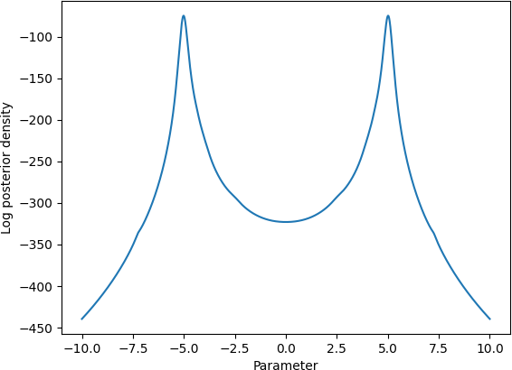
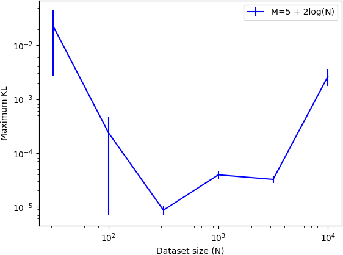

# General bounds on the quality of Bayesian coresets

###### Abstract

Bayesian coresets speed up posterior inference in the large-scale data regime by approximating the full-data log-likelihood function with a surrogate log-likelihood based on a small, weighted subset of the data. But while Bayesian coresets and methods for construction are applicable in a wide range of models, existing theoretical analysis of the posterior inferential error incurred by coreset approximations only apply in restrictive settings—i.e., exponential family models, or models with strong log-concavity and smoothness assumptions. This work presents general upper and lower bounds on the Kullback-Leibler (KL) divergence of coreset approximations that reflect the full range of applicability of Bayesian coresets. The lower bounds require only mild model assumptions typical of Bayesian asymptotic analyses, while the upper bounds require the log-likelihood functions to satisfy a generalized subexponentiality criterion that is weaker than conditions used in earlier work. The lower bounds are applied to obtain fundamental limitations on the quality of coreset approximations, and to provide a theoretical explanation for the previously-observed poor empirical performance of importance sampling-based construction methods. The upper bounds are used to analyze the performance of recent subsample-optimize methods. The flexibility of the theory is demonstrated in validation experiments involving multimodal, unidentifiable, heavy-tailed Bayesian posterior distributions.  

## 1 Introduction

Large-scale data is now commonplace in scientific and commerical applications of Bayesian statistics. But despite its prevalence, and the corresponding wealth of research dedicated to scalable Bayesian inference, there are still suprisingly few general methods that provably provide inferential results, within some reasonable tolerated error, at a significant computational cost savings. Exact Markov chain Monte Carlo (MCMC) methods require many full passes over the data [[1](#bib.bib1), Ch. 6–12, [2](#bib.bib2), Ch. 11–12], limiting the utility of these methods when even a single pass is expensive. A wide range of MCMC methods that access only a subset of data per iteration, e.g., via delayed acceptance [[3](#bib.bib3), [4](#bib.bib4), [5](#bib.bib5), [6](#bib.bib6)], pseudomarginal or auxiliary variable methods [[7](#bib.bib7), [8](#bib.bib8), [9](#bib.bib9)], and basic subsampling [[10](#bib.bib10), [11](#bib.bib11), [12](#bib.bib12), [13](#bib.bib13)], provide at most a minor improvement over full-data MCMC [[14](#bib.bib14), [15](#bib.bib15), [16](#bib.bib16)]. On the other hand, methods including carefully constructed log-likelihood function control variates can provide substantial gains [[17](#bib.bib17), [18](#bib.bib18), [19](#bib.bib19)]. However, black-box control variate constructions for large-scale data often rely on assumptions such as posterior density differentiability and unimodality that do not hold in many popular models, e.g., those with discrete variables or multimodality. See [[15](#bib.bib15), [20](#bib.bib20)] for a survey of scalable MCMC methods. Parametric approximations via variational inference [[21](#bib.bib21)] or the Laplace approximation [[22](#bib.bib22), [23](#bib.bib23)] can be obtained scalably using stochastic optimization methods, but existing general theoretical guarantees for these methods again typically rely on posterior normality assumptions [[24](#bib.bib24), p. 141–144,[25](#bib.bib25), [26](#bib.bib26), [27](#bib.bib27), [28](#bib.bib28), [29](#bib.bib29), [30](#bib.bib30)] (see [[21](#bib.bib21), [31](#bib.bib31)] for a review).  

Although many existing methods rely on particular posterior structure (e.g., approximate normality) in the large-scale data regime, the problem of handling large-scale data in Bayesian inference does not fundamentally involve such structure. Instead, it requires exploiting *redundancy* in the data (i.e., the existence of good approximate sufficient statistics), which can be used to draw principled conclusions about a large data set based only on a small fraction of examples. Indeed, while posterior normality often does not hold in models with latent discrete or combinatorial objects, weakly identifiable or unidentifiable parameters, persisting heavy tails, multimodality, etc., such models can and regularly do exhibit significant redundancy in the data that can be exploited for faster large-scale inference. *Bayesian coresets* [[32](#bib.bib32)]—which involve replacing the full dataset during inference with a sparse weighted subset—are based on this notion of exploiting data redundancy. Empirical studies have shown the existence of high-quality coreset posterior approximations constructed from a small fraction of the data, even in models that violate posterior normality assumptions and for which standard control variate techniques work poorly [[33](#bib.bib33), [34](#bib.bib34), [35](#bib.bib35), [36](#bib.bib36), [37](#bib.bib37)]. However, existing theoretical support for Bayesian coresets in the literature is limited. There exist no lower bounds on Bayesian coreset approximation error, and while upper bounds do exist, they currently impose restrictive assumptions. In particular, the best available theoretical upper bounds to date apply to exponential family models [[36](#bib.bib36), [38](#bib.bib38)] and models with strongly log-concave and locally smooth log-densities [[37](#bib.bib37)].  

This article presents new theoretical techniques and results regarding the quality of Bayesian coreset approximations. The main results are two general large-data asymptotic lower bounds on the KL divergence ([Theorems 3.3](#S3.Thmtheorem3 "Theorem 3.3. ‣ 3 Lower bounds on approximation error ‣ General bounds on the quality of Bayesian coresets") and [3.5](#S3.Thmtheorem5 "Theorem 3.5. ‣ 3 Lower bounds on approximation error ‣ General bounds on the quality of Bayesian coresets")), as well as a general upper bound on the KL divergence ([Theorem 5.3](#S5.Thmtheorem3 "Theorem 5.3. ‣ 5 Upper bounds on approximation error ‣ General bounds on the quality of Bayesian coresets")) under the assumption that the log-likelihoods satisfy a multivariate generalization of subexponentiality ([Definition 5.2](#S5.Thmtheorem2 "Definition 5.2. ‣ 5 Upper bounds on approximation error ‣ General bounds on the quality of Bayesian coresets")). The main general results in this paper lead to various novel insights about specific Bayesian coreset construction methods. Under mild assumptions,   

* common importance-weighted coreset constructions (e.g. [[32](#bib.bib32)]) require a coreset size $M$ proportional to the dataset size $N$ ([Corollary 4.1](#S4.Thmtheorem1 "Corollary 4.1. ‣ 4.1 Minimum coreset size for importance-weighted coresets ‣ 4 Lower bound applications ‣ General bounds on the quality of Bayesian coresets")), even with post-hoc optimal weight scaling ([Corollary 4.2](#S4.Thmtheorem2 "Corollary 4.2. ‣ 4.1 Minimum coreset size for importance-weighted coresets ‣ 4 Lower bound applications ‣ General bounds on the quality of Bayesian coresets")), and thus yield a negligible improvement over full-data inference; 
* *any* construction algorithm requires a coreset size $M>d$ when the log-likelihood function is determined by $d$ parameters locally around a point of concentration ([Corollary 4.3](#S4.Thmtheorem3 "Corollary 4.3. ‣ 4.2 Minimum coreset size for any coreset construction ‣ 4 Lower bound applications ‣ General bounds on the quality of Bayesian coresets")); 
* subsample-optimize coreset construction algorithms (e.g. [[38](#bib.bib38), [36](#bib.bib36), [37](#bib.bib37), [39](#bib.bib39)]) achieve an asymptotically bounded error with a coreset size $\mathrm{polylog}N$ in a wide variety of models ([Corollary 6.1](#S6.Thmtheorem1 "Corollary 6.1. ‣ 6 Upper bound application: subsample-optimize coresets ‣ General bounds on the quality of Bayesian coresets")). 

The paper includes empirical validation of the main theoretical claims on two models that violate common assumptions made in the literature: a multimodal, unidentifiable Cauchy location model with a heavy-tailed prior, and an unidentifiable logistic regression model with a heavy-tailed prior and persisting posterior heavy tails. All experiments were performed on a computer with an Intel Core i7-8700K and 32GB of RAM.  

## 2 Background

Define a target probability distribution $\pi$ on a space $\Theta$ comprised of a sum of $N$ potentials $\ell_{n}:\Theta\to\mathbb{R}$, $n=1,\dots,N$ and a base distribution $\pi_{0}(\mathrm{d}\theta)$,  

|  | $\displaystyle\pi(\mathrm{d}\theta)$ | $\displaystyle=\frac{1}{Z}\exp\left(\ell(\theta)\right)\pi_{0}(\mathrm{d}\theta),$ | $\displaystyle\ell(\theta)$ | $\displaystyle=\sum_{n=1}^{N}\ell_{n}(\theta),$ | $\displaystyle\theta$ | $\displaystyle\in\Theta,\addcontentsline{lla}{section}{\numberline{\string\crtrefnumber{eq:coreset_base_model}}{e}q:coreset_{b}ase_{m}odel}$ |  | (2) |
| --- | --- | --- | --- | --- | --- | --- | --- | --- |

where the normalization constant $Z$ is not known. In the Bayesian context, this distribution corresponds to a Bayesian posterior distribution for a statistical model with prior $\pi_{0}$ and conditionally i.i.d. data $X_{n}$, where $\ell_{n}(\theta)=\log p(X_{n}|\theta)$. The goal is to compute or approximate expectations under $\pi$; but the likelihood $\ell$ (and its gradient) becomes expensive to evaluate when $N$ is large. To avoid this cost, *Bayesian coresets* [[32](#bib.bib32), [33](#bib.bib33), [34](#bib.bib34), [35](#bib.bib35), [36](#bib.bib36), [37](#bib.bib37)] involve replacing the target with a surrogate density  

|  | $\displaystyle\pi_{w}(\mathrm{d}\theta)$ | $\displaystyle=\frac{1}{Z(w)}\exp\left(\ell_{w}(\theta)\right)\pi_{0}(\mathrm{d}\theta),$ | $\displaystyle\ell_{w}(\theta)$ | $\displaystyle=\sum_{n=1}^{N}w_{n}\ell_{n}(\theta),$ | $\displaystyle\theta\in\Theta,\addcontentsline{lla}{section}{\numberline{\string\crtrefnumber{eq:coreset}}{e}q:coreset}$ |  | (3) |
| --- | --- | --- | --- | --- | --- | --- | --- |

where $w\in\mathbb{R}^{N}$, $w\geq 0$ are a set of weights, and $Z(w)$ is the new normalizing constant. If $w$ has at most $M\ll N$ nonzeros, the $O(M)$ cost of evaluating $\sum_{n}w_{n}\ell_{n}$ (and its gradient) is a significant improvement upon the original $O(N)$ cost. In this work, the problem of coreset construction is formulated in the data-asymptotic limit; a coreset construction method should  

* run in $o(N)$ time and memory (or at most $O(N)$ with a small leading constant), 
* produce a small coreset of size $M=o(N)$, 
* produce a coreset with $O(1)$ posterior forward/reverse KL divergence as $N\to\infty$. 

These three desiderata ensure that the effort spent constructing and sampling from the coreset posterior is worthwhile: the coreset provides a meaningful reduction in computational cost compared with standard Markov chain Monte Carlo algorithms, and has a bounded approximation error.  

## 3 Lower bounds on approximation error

This section presents lower bounds on the KL divergence of coreset approximations for general models and data generating processes. The first key steps in the analysis are to write all expectations in terms of distributions that do not depend on $w$, and to remove the difficult-to-control influence of the tails of $\pi$ and $\pi_{w}$ by restricting certain integrals to some small subset $B\subseteq\Theta$ of the parameter space. [Lemma 3.1](#S3.Thmtheorem1 "Lemma 3.1 (Basic KL Lower Bound). ‣ 3 Lower bounds on approximation error ‣ General bounds on the quality of Bayesian coresets"), the key theoretical tool used in this section, achieves both of these two goals; note that the result has no major assumptions and applies generally in any setting that a Bayesian coreset can be used. For convenience, define  

|  | $\displaystyle\underline{\operatorname{KL}}(w):=\min\{\operatorname{KL}(\pi_{w}||\pi),\operatorname{KL}(\pi||\pi_{w})\}.$ |  | (4) |
| --- | --- | --- | --- |

###### Lemma 3.1 (Basic KL Lower Bound).

For all measurable $B\subseteq\Theta$ and coreset weights $w$,  

|  | $\displaystyle\underline{\operatorname{KL}}(w)\geq f(J_{B}(w))\geq 0,$ |  | (5) |
| --- | --- | --- | --- |

where $f(x)=-\log\min(1,x)+\min(1,x)-1$ is decreasing and nonnegative on $x\geq 0$, and  

|  | $\displaystyle J_{B}(w)$ | $\displaystyle=\frac{\int_{B}\pi_{0}\exp\frac{1}{2}(\ell+\ell_{w})}{\mathchoice{{\hbox{$\displaystyle\sqrt{\int\pi_{0}\exp(\ell)\int\pi_{0}\exp(\ell_{w})\,}$}\lower 0.4pt\hbox{\vrule height=7.5pt,depth=-6.00003pt}}}{{\hbox{$\textstyle\sqrt{\int\pi_{0}\exp(\ell)\int\pi_{0}\exp(\ell_{w})\,}$}\lower 0.4pt\hbox{\vrule height=7.5pt,depth=-6.00003pt}}}{{\hbox{$\scriptstyle\sqrt{\int\pi_{0}\exp(\ell)\int\pi_{0}\exp(\ell_{w})\,}$}\lower 0.4pt\hbox{\vrule height=5.25pt,depth=-4.20003pt}}}{{\hbox{$\scriptscriptstyle\sqrt{\int\pi_{0}\exp(\ell)\int\pi_{0}\exp(\ell_{w})\,}$}\lower 0.4pt\hbox{\vrule height=3.75pt,depth=-3.00002pt}}}}+\mathchoice{{\hbox{$\displaystyle\sqrt{\pi(B^{c})\,}$}\lower 0.4pt\hbox{\vrule height=8.03886pt,depth=-6.43112pt}}}{{\hbox{$\textstyle\sqrt{\pi(B^{c})\,}$}\lower 0.4pt\hbox{\vrule height=8.03886pt,depth=-6.43112pt}}}{{\hbox{$\scriptstyle\sqrt{\pi(B^{c})\,}$}\lower 0.4pt\hbox{\vrule height=5.64444pt,depth=-4.51558pt}}}{{\hbox{$\scriptscriptstyle\sqrt{\pi(B^{c})\,}$}\lower 0.4pt\hbox{\vrule height=4.27777pt,depth=-3.42224pt}}}.$ |  | (6) |
| --- | --- | --- | --- | --- |

Note that while the integrals in the fraction denominator in $J_{B}(w)$ range over the whole $\Theta$ space, a further lower bound on $\underline{\operatorname{KL}}(w)$ can be obtained by restricting their domains arbitrarily. Also, crucially, the bound in [Lemma 3.1](#S3.Thmtheorem1 "Lemma 3.1 (Basic KL Lower Bound). ‣ 3 Lower bounds on approximation error ‣ General bounds on the quality of Bayesian coresets") does not depend on $\pi_{w}(B^{c})$, which would be difficult to analyze without detailed knowledge of the tail behaviour of $\pi_{w}$ as a function of the coreset weights $w$. Although the bound in [Lemma 3.1](#S3.Thmtheorem1 "Lemma 3.1 (Basic KL Lower Bound). ‣ 3 Lower bounds on approximation error ‣ General bounds on the quality of Bayesian coresets") applies generally, it is most useful when $B$ is small (so that simple local approximations of $\ell$ and $\ell_{w}$ can be used), $\pi$ concentrates on $B$ (so that $\pi(B^{c})\approx 0$), and $\pi$ and $\pi_{w}$ are very different when restricted to $B$; the behaviour of the bound in this case is roughly (see the proof in [Appendix A](#A1 "Appendix A Proofs ‣ General bounds on the quality of Bayesian coresets")) $f(J_{B}(w))\approx-\log(1-\operatorname{TV}(\pi,\pi_{w}))$. Finally, note that [Lemma 3.1](#S3.Thmtheorem1 "Lemma 3.1 (Basic KL Lower Bound). ‣ 3 Lower bounds on approximation error ‣ General bounds on the quality of Bayesian coresets") remains valid if one replaces $\ell_{w}$ with $\ell_{w}-c$ and $\ell$ with $\ell-c^{\prime}$ for any constants $c,c^{\prime}$ that do not depend on $\theta$ but may depend on the data and coreset weights $w$.  

For the remainder of this section, consider the setting where $\Theta$ is a measurable subset of $\mathbb{R}^{d}$ for some $d\in\mathbb{N}$, fix some $\theta_{0}\in\Theta$, and assume each $\ell_{n}$ is differentiable in a neighbourhood of $\theta_{0}$. Let  

|  | $\displaystyle\macc@depth\char 1\relax\frozen@everymath{\macc@group}\macc@set@skewchar\macc@nested@a 111{}=\sum_{n}w_{n}\qquad g=\nabla\ell(\theta_{0})\qquad g_{w}=\nabla\ell_{w}(\theta_{0})$ |  |
| --- | --- | --- |

[Theorems 3.3](#S3.Thmtheorem3 "Theorem 3.3. ‣ 3 Lower bounds on approximation error ‣ General bounds on the quality of Bayesian coresets") and [3.5](#S3.Thmtheorem5 "Theorem 3.5. ‣ 3 Lower bounds on approximation error ‣ General bounds on the quality of Bayesian coresets") characterize KL divergence lower bounds in terms of the sum of the coreset weights $\macc@depth\char 1\relax\frozen@everymath{\macc@group}\macc@set@skewchar\macc@nested@a 111{}$ and the log-likelihood gradients $g,g_{w}$. Intuitively for the full data set where all $w_{n}=1$ and $\macc@depth\char 1\relax\frozen@everymath{\macc@group}\macc@set@skewchar\macc@nested@a 111{}=N$, and an i.i.d. data generating process from the likelihood with parameter $\theta_{0}$, the central limit theorem asserts under mild conditions that $g_{w}/\macc@depth\char 1\relax\frozen@everymath{\macc@group}\macc@set@skewchar\macc@nested@a 111{}\overset{p}{\to}0$ at a rate of $N^{-1/2}$. [Theorems 3.3](#S3.Thmtheorem3 "Theorem 3.3. ‣ 3 Lower bounds on approximation error ‣ General bounds on the quality of Bayesian coresets") and [3.5](#S3.Thmtheorem5 "Theorem 3.5. ‣ 3 Lower bounds on approximation error ‣ General bounds on the quality of Bayesian coresets") below provide KL lower bounds when the coreset construction algorithm does not match this behavior. In particular, [Theorem 3.3](#S3.Thmtheorem3 "Theorem 3.3. ‣ 3 Lower bounds on approximation error ‣ General bounds on the quality of Bayesian coresets") provides results that are useful when $g_{w}/\macc@depth\char 1\relax\frozen@everymath{\macc@group}\macc@set@skewchar\macc@nested@a 111{}\overset{p}{\to}0$ occurs reasonably quickly but slower than $N^{-1/2}$, while [Theorem 3.5](#S3.Thmtheorem5 "Theorem 3.5. ‣ 3 Lower bounds on approximation error ‣ General bounds on the quality of Bayesian coresets") strengthens the conclusion when $g_{w}/\macc@depth\char 1\relax\frozen@everymath{\macc@group}\macc@set@skewchar\macc@nested@a 111{}\overset{p}{\to}0$ very slowly or not at all. The major benefit of [Theorems 3.3](#S3.Thmtheorem3 "Theorem 3.3. ‣ 3 Lower bounds on approximation error ‣ General bounds on the quality of Bayesian coresets") and [3.5](#S3.Thmtheorem5 "Theorem 3.5. ‣ 3 Lower bounds on approximation error ‣ General bounds on the quality of Bayesian coresets") for analyzing coreset construction methods is that they reduce the problem of analyzing posterior KL divergence to the much easier problem of analyzing the 2-norm $\|\cdot\|_{2}$ of a weighted sum of random vectors in $\mathbb{R}^{d}$.  

Consider a sequence $r\to 0$ as $N\to\infty$, and for a fixed matrix $H\succ 0$ let  

|  | $\displaystyle B=\{\theta:(\theta-\theta_{0})^{T}H(\theta-\theta_{0})\leq r^{2}\}$ |  | (7) |
| --- | --- | --- | --- |

be a sequence of neighbourhoods around $\theta_{0}$; these will appear in [Assumptions 3.2](#S3.Thmtheorem2 "Assumption 3.2. ‣ 3 Lower bounds on approximation error ‣ General bounds on the quality of Bayesian coresets"), [3.4](#S3.Thmtheorem4 "Assumption 3.4. ‣ 3 Lower bounds on approximation error ‣ General bounds on the quality of Bayesian coresets"), [3.3](#S3.Thmtheorem3 "Theorem 3.3. ‣ 3 Lower bounds on approximation error ‣ General bounds on the quality of Bayesian coresets") and [3.5](#S3.Thmtheorem5 "Theorem 3.5. ‣ 3 Lower bounds on approximation error ‣ General bounds on the quality of Bayesian coresets") below. Note that throughout, all asymptotics will be taken as $N\to\infty$, and various sequences (e.g., $r$ and $B$) are implicitly indexed by $N$. To simplify notation, this dependence will be left implicit. [Assumption 3.2](#S3.Thmtheorem2 "Assumption 3.2. ‣ 3 Lower bounds on approximation error ‣ General bounds on the quality of Bayesian coresets") makes some weak assumptions about the model and data generating process: it intuitively asserts that the potential functions are sufficiently smooth around $\theta_{0}$, that $r\to 0$ slowly, and that $\pi$ concentrates at $\theta_{0}$ at a usual rate. Note that [Assumption 3.2](#S3.Thmtheorem2 "Assumption 3.2. ‣ 3 Lower bounds on approximation error ‣ General bounds on the quality of Bayesian coresets") does not assume data are generated i.i.d. and places no conditions on the coreset construction algorithm.  

###### Assumption 3.2.

$\pi_{0}(\mathrm{d}\theta)$ has a density with respect to the Lebesgue measure, $\pi_{0}(\theta_{0})>0$, each $\ell_{n}(\theta)$ and $\pi_{0}(\theta)$ are twice differentiable in $B$ for sufficiently large $N$, and  

|  | $\displaystyle\sup_{\theta\in B}\mathopen{}\mathclose{{}\left\|-\frac{1}{N}\nabla^{2}\ell(\theta)-H}\right\|_{2}=o_{p}(1),\quad\mathopen{}\mathclose{{}\left\|\frac{g}{N}}\right\|_{2}=O_{p}\mathopen{}\mathclose{{}\left(N^{-1/2}}\right),\quad\quad Nr^{2}=\omega(1).$ |  | (8) |
| --- | --- | --- | --- |

Two additional assumptions related to the coreset construction algorithm—namely, that it works well enough that $\frac{1}{\macc@depth\char 1\relax\frozen@everymath{\macc@group}\macc@set@skewchar\macc@nested@a 111{}}\sum_{n}w_{n}\nabla^{2}\ell_{n}(\theta)\overset{p}{\to}H$ and $g_{w}/\macc@depth\char 1\relax\frozen@everymath{\macc@group}\macc@set@skewchar\macc@nested@a 111{}\overset{p}{\to}0$ at a rate faster than $r\to 0$—lead to asymptotic lower bounds on the best possible quality of coresets produced by the algorithm, as well as lower bounds even after optimal post-hoc scaling of the weights.  

###### Theorem 3.3.

Suppose [Assumption 3.2](#S3.Thmtheorem2 "Assumption 3.2. ‣ 3 Lower bounds on approximation error ‣ General bounds on the quality of Bayesian coresets") holds. If  

|  | $\displaystyle\sup_{\theta\in B}\mathopen{}\mathclose{{}\left\|-\frac{1}{\macc@depth\char 1\relax\frozen@everymath{\macc@group}\macc@set@skewchar\macc@nested@a 111{}}\nabla^{2}\ell_{w}(\theta)-H}\right\|_{2}=o_{p}(1),\quad\mathopen{}\mathclose{{}\left\|\frac{g_{w}}{\macc@depth\char 1\relax\frozen@everymath{\macc@group}\macc@set@skewchar\macc@nested@a 111{}}}\right\|_{2}=o_{p}(r),$ |  | (9) |
| --- | --- | --- | --- |

then  

|  | $\displaystyle\underline{\operatorname{KL}}(w)$ | $\displaystyle\!\geq\!O_{p}(1)\!+\!\Omega_{p}(1)\min\mathopen{}\mathclose{{}\left\{\!-\log\pi(B^{c}),\frac{N\macc@depth\char 1\relax\frozen@everymath{\macc@group}\macc@set@skewchar\macc@nested@a 111{}}{N+\macc@depth\char 1\relax\frozen@everymath{\macc@group}\macc@set@skewchar\macc@nested@a 111{}}\mathopen{}\mathclose{{}\left\|\frac{g}{N}-\frac{g_{w}}{\macc@depth\char 1\relax\frozen@everymath{\macc@group}\macc@set@skewchar\macc@nested@a 111{}}}\right\|_{2}^{2}\!+\!d\log\frac{(N+\macc@depth\char 1\relax\frozen@everymath{\macc@group}\macc@set@skewchar\macc@nested@a 111{})^{2}}{N\max\{\macc@depth\char 1\relax\frozen@everymath{\macc@group}\macc@set@skewchar\macc@nested@a 111{},1/r^{2}\}}}\right\}$ |  | (10) |
| --- | --- | --- | --- | --- |
|  | $\displaystyle\min_{\alpha\geq 0}\underline{\operatorname{KL}}(\alpha w)$ | $\displaystyle\!\geq\!O_{p}(1)\!+\!\Omega_{p}(1)\min\mathopen{}\mathclose{{}\left\{\!-\log\pi(B^{c}),d\log\left(N\left\|\frac{g}{N}-\frac{g_{w}}{\macc@depth\char 1\relax\frozen@everymath{\macc@group}\macc@set@skewchar\macc@nested@a 111{}}\right\|_{2}^{2}\right)}\right\}.$ |  | (11) |
| --- | --- | --- | --- | --- |

[Theorem 3.3](#S3.Thmtheorem3 "Theorem 3.3. ‣ 3 Lower bounds on approximation error ‣ General bounds on the quality of Bayesian coresets") is restricted to the case where the coreset algorithm is performing reasonably well. [Theorem 3.5](#S3.Thmtheorem5 "Theorem 3.5. ‣ 3 Lower bounds on approximation error ‣ General bounds on the quality of Bayesian coresets") extends the bounds to the case where the algorithm is performing poorly, in the sense that it is unable to make $\frac{g_{w}}{\macc@depth\char 1\relax\frozen@everymath{\macc@group}\macc@set@skewchar\macc@nested@a 111{}}\overset{p}{\to}0$ at a rate faster than $r\to 0$ (or perhaps $\frac{g_{w}}{\macc@depth\char 1\relax\frozen@everymath{\macc@group}\macc@set@skewchar\macc@nested@a 111{}}$ does not converge to 0 at all). In order to draw conclusions in this setting, we need a weak global assumption on the potential functions. A function $f:\Theta\to\mathbb{R}$ is *$L$-smooth below at $\theta_{0}$* if  

|  | $\displaystyle\forall\theta\in\Theta,\quad f(\theta)\geq f(\theta_{0})+\nabla f(\theta_{0})^{T}(\theta-\theta_{0})-\frac{L}{2}\mathopen{}\mathclose{{}\left\|\theta-\theta_{0}}\right\|_{2}^{2}.\addcontentsline{lla}{section}{\numberline{\string\crtrefnumber{eq:Lsmoothbelow}}{e}q:Lsmoothbelow}$ |  | (12) |
| --- | --- | --- | --- |

Note that $L$-smoothness below is weaker than both Lipschitz smoothness and strong concavity; [Eq. 12](#S3.E12 "In 3 Lower bounds on approximation error ‣ General bounds on the quality of Bayesian coresets") restricts the growth of the function only in the negative direction, and only when the expansion is taken at $\theta_{0}$. [Assumption 3.4](#S3.Thmtheorem4 "Assumption 3.4. ‣ 3 Lower bounds on approximation error ‣ General bounds on the quality of Bayesian coresets") asserts that the potential functions are smooth below.  

###### Assumption 3.4.

There exist $L_{0},\dots,L_{N},L>0$ such that $\log\pi_{0}$ is $L^{2}_{0}$-smooth below at $\theta_{0}$, for each $n\in[N]$ $\ell_{n}$ is $L^{2}_{n}$-smooth below at $\theta_{0}$, and $\frac{1}{N}\sum_{n=1}^{N}L_{n}^{2}\overset{p}{\to}L^{2}$.  

[Theorem 3.5](#S3.Thmtheorem5 "Theorem 3.5. ‣ 3 Lower bounds on approximation error ‣ General bounds on the quality of Bayesian coresets") uses [Assumptions 3.2](#S3.Thmtheorem2 "Assumption 3.2. ‣ 3 Lower bounds on approximation error ‣ General bounds on the quality of Bayesian coresets") and [3.4](#S3.Thmtheorem4 "Assumption 3.4. ‣ 3 Lower bounds on approximation error ‣ General bounds on the quality of Bayesian coresets") and additional assumptions related to the coreset construction algorithm to obtain lower bounds in a setting that relaxes the “performance” conditions in [Theorem 3.3](#S3.Thmtheorem3 "Theorem 3.3. ‣ 3 Lower bounds on approximation error ‣ General bounds on the quality of Bayesian coresets"): $-\frac{1}{\macc@depth\char 1\relax\frozen@everymath{\macc@group}\macc@set@skewchar\macc@nested@a 111{}}\sum_{n}w_{n}\nabla^{2}\ell_{n}(\theta)$ no longer needs to converge to $H$ in probability, and $g_{w}/\macc@depth\char 1\relax\frozen@everymath{\macc@group}\macc@set@skewchar\macc@nested@a 111{}$ can converge to 0 slowly or not at all.  

###### Theorem 3.5.

Suppose [Assumptions 3.2](#S3.Thmtheorem2 "Assumption 3.2. ‣ 3 Lower bounds on approximation error ‣ General bounds on the quality of Bayesian coresets") and [3.4](#S3.Thmtheorem4 "Assumption 3.4. ‣ 3 Lower bounds on approximation error ‣ General bounds on the quality of Bayesian coresets") hold. If there exist $\alpha,\beta>0$ such that  

|  | $\displaystyle\P\mathopen{}\mathclose{{}\left(\forall\theta\in B,\,\,-\frac{1}{\macc@depth\char 1\relax\frozen@everymath{\macc@group}\macc@set@skewchar\macc@nested@a 111{}}\nabla^{2}\ell_{w}(\theta)\succeq\alpha H}\right)\to 1,\quad\mathbb{P}\mathopen{}\mathclose{{}\left(\frac{1}{\macc@depth\char 1\relax\frozen@everymath{\macc@group}\macc@set@skewchar\macc@nested@a 111{}}\sum_{n}w_{n}L^{2}_{n}\leq\beta L^{2}}\right)\to 1,\quad\mathopen{}\mathclose{{}\left\|\frac{g_{w}}{\macc@depth\char 1\relax\frozen@everymath{\macc@group}\macc@set@skewchar\macc@nested@a 111{}}}\right\|=\omega_{p}(r),$ |  | (13) |
| --- | --- | --- | --- |

then  

|  | $\displaystyle\underline{\operatorname{KL}}(w)=O_{p}(1)+\Omega_{p}(1)\min\mathopen{}\mathclose{{}\left\{-\log\pi(B^{c}),d\log\mathopen{}\mathclose{{}\left(N\min\mathopen{}\mathclose{{}\left\{\mathopen{}\mathclose{{}\left\|\frac{g_{w}}{\macc@depth\char 1\relax\frozen@everymath{\macc@group}\macc@set@skewchar\macc@nested@a 111{}}}\right\|^{2},1}\right\}}\right)}\right\}.$ |  | (14) |
| --- | --- | --- | --- |

An important final note in this section is that while [Theorems 3.3](#S3.Thmtheorem3 "Theorem 3.3. ‣ 3 Lower bounds on approximation error ‣ General bounds on the quality of Bayesian coresets") and [3.5](#S3.Thmtheorem5 "Theorem 3.5. ‣ 3 Lower bounds on approximation error ‣ General bounds on the quality of Bayesian coresets"), as stated, require choosing $\Theta$ to be some measurable subset of $\mathbb{R}^{d}$ and that the posterior $\pi$ concentrates around some point of interest $\theta_{0}\in\mathbb{R}^{d}$, these results can be generalized to a wider class of models and spaces. In particular, [Corollary 3.6](#S3.Thmtheorem6 "Corollary 3.6. ‣ 3 Lower bounds on approximation error ‣ General bounds on the quality of Bayesian coresets") demonstrates that if $\Theta$ is arbitrary, but the potential functions $\ell_{n}$ only depend on $\theta$ through some other function $\eta:\Theta\to\mathbb{R}^{d}$, that the conclusions of [Theorems 3.3](#S3.Thmtheorem3 "Theorem 3.3. ‣ 3 Lower bounds on approximation error ‣ General bounds on the quality of Bayesian coresets") and [3.5](#S3.Thmtheorem5 "Theorem 3.5. ‣ 3 Lower bounds on approximation error ‣ General bounds on the quality of Bayesian coresets") still hold.  

###### Corollary 3.6.

Suppose $\Theta$ is an arbitrary measurable space, and the potential functions take the form $\ell_{n}(\eta(\theta))$ for some measurable function $\eta:\Theta\to\mathbb{R}^{d}$. Then if the assumptions of [Theorems 3.3](#S3.Thmtheorem3 "Theorem 3.3. ‣ 3 Lower bounds on approximation error ‣ General bounds on the quality of Bayesian coresets") and [3.5](#S3.Thmtheorem5 "Theorem 3.5. ‣ 3 Lower bounds on approximation error ‣ General bounds on the quality of Bayesian coresets") hold for potentials $(\ell_{n})_{n=1}^{N}$ as functions on $\mathbb{R}^{d}$ and pushforward prior $\eta\pi_{0}$ on $\mathbb{R}^{d}$, the stated lower bounds also hold for $\min\{\operatorname{KL}(\pi||\pi_{w}),\operatorname{KL}(\pi_{w}||\pi)\}$.  

## 4 Lower bound applications

In this section, the general theoretical results from [Section 3](#S3 "3 Lower bounds on approximation error ‣ General bounds on the quality of Bayesian coresets") are applied to specific algorithms, Bayesian models, and data generating processes to explain previously observed empirical behaviour of coreset construction, as well as to place fundamental limits on the necessary size of coresets. Consider a setting where the data $X_{n}$ arise as an i.i.d. sequence drawn from some probability distribution $\nu$, $\ell_{n}(\eta(\theta))=\log p(X_{n}|\eta(\theta))$ for $\eta:\Theta\to\mathbb{R}^{d}$, $\eta_{0}=\eta(\theta_{0})$, and the following technical criteria hold (where $\mathbb{E}$ denotes expectation under the data generating process):  

* $\mathbb{E}\left[\nabla\ell_{n}(\eta_{0})\right]=0$ and $H=\mathbb{E}\left[-\nabla^{2}\ell_{n}(\eta_{0})\right]=\mathbb{E}\left[\nabla\ell_{n}(\eta_{0})\nabla\ell_{n}(\eta_{0})^{T}\right]\succ 0$. 
* $\mathbb{E}\left[\|\nabla\ell_{n}(\theta_{0})\|_{2}^{2+\delta}\right]<\infty$ for some $\delta>0$ and $\mathbb{E}\left[\|\nabla^{2}\ell_{n}(\theta_{0})\|^{2}_{F}\right]<\infty$. 
* On a neighbourhood of $\eta_{0}$, $\|\nabla^{2}\ell_{n}(\eta)-\nabla^{2}\ell_{n}(\eta_{0})\|_{2}\leq R(X_{n})\|\eta-\eta_{0}\|_{2}$, $\mathbb{E}\left[R(X_{n})\right]<\infty$. 
* $\eta\pi_{0}$ is twice differentiable a neighbourhood of $\eta_{0}$, and $\pi(\eta_{0})>0$. 
* For all $r\to 0$ such that $r=\Omega_{p}(N^{-1/2})$, $-\log\eta\pi\mathopen{}\mathclose{{}\left(\|\eta-\eta_{0}\|_{2}>r}\right)=\Omega_{p}(Nr^{2})$. 

These conditions apply to a wide range of models, e.g., an unidentifiable, multimodal location model posterior with heavy tails on $\Theta=\mathbb{R}$, where the Bayesian model is specified by  

|  | $\displaystyle\theta$ | $\displaystyle\sim{\mathrm{Cauchy}}(0,1)$ | $\displaystyle(X_{n})_{n=1}^{N}$ | $\displaystyle\overset{\text{iid}}{\sim}{\mathrm{Cauchy}}(\theta^{2},1),\addcontentsline{lla}{section}{\numberline{\string\crtrefnumber{eq:cauchymodel}}{e}q:cauchymodel}$ |  | (15) |
| --- | --- | --- | --- | --- | --- | --- |

and the data are generated from the likelihood with parameter $\theta_{0}=5$, and an unidentifiable logistic regression posterior with heavy tails on $\mathbb{R}^{2}$, where the Bayesian model is specified by  

|  | $\displaystyle\theta$ | $\displaystyle\sim{\mathrm{Cauchy}}(0,I)$ | $\displaystyle Y_{n}$ | $\displaystyle\overset{\text{ind}}{\sim}{\mathrm{Bern}}\mathopen{}\mathclose{{}\left(\frac{1}{1+e^{-X_{n}^{T}A\theta}}}\right)$ | $\displaystyle A$ | $\displaystyle=\begin{bmatrix}1&1\\ 1&1\end{bmatrix},\addcontentsline{lla}{section}{\numberline{\string\crtrefnumber{eq:logregmodel}}{e}q:logregmodel}$ |  | (16) |
| --- | --- | --- | --- | --- | --- | --- | --- | --- |

the covariates are generated via $X_{n}\overset{\text{iid}}{\sim}{\mathrm{Unif}}(\{x\in\mathbb{R}^{2}:\|x\|_{2}\leq 1\})$, and the observations $Y_{n}$ are generated from the likelihood with parameter $\theta_{0}=\begin{bmatrix}1&6\end{bmatrix}^{T}$. Example posterior log-densities for these models are displayed in [Fig. 1](#S4.F1 "In 4 Lower bound applications ‣ General bounds on the quality of Bayesian coresets").  

[FIGURE S4.F1.sf1.g1]

(a)
[/FIGURE]

[ALGORITHM alg1]

Compute probabilities $(p_{n})_{n=1}^{N}$ (may depend on the data and model)

Draw $I_{1},\dots,I_{M}\overset{\text{iid}}{\sim}{\mathrm{Categorical}}(p_{1},\dots,p_{N})$

For each $n$, set $w_{n}=\frac{1}{Mp_{n}}\sum_{m=1}^{M}\mathds{1}[I_{m}=n]$.

return $(w_{n})_{n=1}^{N}$

Algorithm 1  Importance-weighted coreset construction
[/ALGORITHM]

[ALGORITHM alg2]

Obtain coreset weights $(w_{n})_{n=1}^{N}$ via [Algorithm 1](#alg1 "In 4 Lower bound applications ‣ General bounds on the quality of Bayesian coresets")

Compute $\alpha^{\star}=\operatornamewithlimits{arg\,min}_{\alpha\geq 0}\operatorname{KL}(\pi_{\alpha w}||\pi)$

return $(\alpha^{\star}w_{n})_{n=1}^{N}$

Algorithm 2  Scaled importance-weighted coreset construction
[/ALGORITHM]

### 4.1 Minimum coreset size for importance-weighted coresets

A popular algorithm for coreset construction that has appeared in a wide variety of domains—e.g., Bayesian inference [[32](#bib.bib32), [33](#bib.bib33), Section 4.1], frequentist inference (e.g., [[40](#bib.bib40), [41](#bib.bib41), [42](#bib.bib42), [43](#bib.bib43), [44](#bib.bib44)]), and optimization (see [[45](#bib.bib45)] for a recent survey)—involves subsampling of the data followed by an importance-weighting correction. The pseudocode is given in [Algorithm 1](#alg1 "In 4 Lower bound applications ‣ General bounds on the quality of Bayesian coresets"). Note that $\mathbb{E}[w_{n}]=1$, and so $\mathbb{E}[\ell_{w}]=\ell$; the coreset potential is an unbiased estimate of the exact potential. The advantage of this method is that it is straightforward and computationally efficient. If the sampling probabilities are uniform $p_{n}=\nicefrac{{1}}{{N}}$, then [Algorithm 1](#alg1 "In 4 Lower bound applications ‣ General bounds on the quality of Bayesian coresets") constructs a coreset in $O(M)$ time and $O(M)$ memory. Nonuniform probabilities $p_{n}$ require $O(N)$ time and memory: at least a single $O(N)$ pass over the full data set to compute each $p_{n}$ [[32](#bib.bib32), [41](#bib.bib41)], followed by sampling the coreset in $O(N+M)$ time and memory, e.g., via an alias table [[46](#bib.bib46), [47](#bib.bib47)]. However, empirical results produced by this methodology have generally been underwhelming, even with carefully chosen sampling probabilities; see, e.g., Figure 2 of [[32](#bib.bib32)].  

[Corollary 4.1](#S4.Thmtheorem1 "Corollary 4.1. ‣ 4.1 Minimum coreset size for importance-weighted coresets ‣ 4 Lower bound applications ‣ General bounds on the quality of Bayesian coresets") explains these poor results: Bayesian coresets constructed via [Algorithm 1](#alg1 "In 4 Lower bound applications ‣ General bounds on the quality of Bayesian coresets") must satisfy $M\propto N$ in order to maintain a bounded $\underline{\operatorname{KL}}(w)$ in the data-asymptotic limit. In other words, such coresets do not satisfy the desiderata in [Section 2](#S2 "2 Background ‣ General bounds on the quality of Bayesian coresets"). The only restriction is that there exist constants $c,C>0$ such that for all $N\in\mathbb{N}$, the sampling probabilities $(p_{n})_{n=1}^{N}$ satisfy  

|  | $\displaystyle\text{(A6) }\qquad 0<c\leq\min_{n}Np_{n}\leq\max_{n}Np_{n}\leq C<\infty\quad a.s.\addcontentsline{lla}{section}{\numberline{\string\crtrefnumber{eq:pncondition}}{e}q:pncondition}$ |  | (17) |
| --- | --- | --- | --- |

The lower threshold ensures that the variance of the importance-weighted log-likelihood is not too large, while the upper threshold ensures sufficient diversity in the draws from subsampling. The condition in [Eq. 17](#S4.E17 "In 4.1 Minimum coreset size for importance-weighted coresets ‣ 4 Lower bound applications ‣ General bounds on the quality of Bayesian coresets") is not a major restriction, in the sense that performance should deteriorate even further when it does not hold. The $(p_{n})_{n=1}^{N}$ may otherwise depend arbitrarily on the data and model.  

###### Corollary 4.1.

Given (A1-6), $M\to\infty$, and $M=o(N)$, coresets produced by [Algorithm 1](#alg1 "In 4 Lower bound applications ‣ General bounds on the quality of Bayesian coresets") satisfy  

|  | $\displaystyle\underline{\operatorname{KL}}(w)=\Omega_{p}\left(\frac{N}{M}\right).\addcontentsline{lla}{section}{\numberline{\string\crtrefnumber{eq:NoverMresult}}{e}q:NoverMresult}$ |  | (18) |
| --- | --- | --- | --- |

The intuition behind [Corollary 4.1](#S4.Thmtheorem1 "Corollary 4.1. ‣ 4.1 Minimum coreset size for importance-weighted coresets ‣ 4 Lower bound applications ‣ General bounds on the quality of Bayesian coresets") is that both the true posterior and the importance-weighted coreset posterior are asymptotically approximately normal with variance $\propto 1/N$ as $N\to\infty$; however, the coreset posterior mean is roughly $\propto M^{-1/2}$ away from the posterior mean, because the subsample is of size $M$. The KL divergence between two Gaussians is lower-bounded by the inverse variance times the mean difference squared, yielding $\approx N/M$ as in [Eq. 18](#S4.E18 "In Corollary 4.1. ‣ 4.1 Minimum coreset size for importance-weighted coresets ‣ 4 Lower bound applications ‣ General bounds on the quality of Bayesian coresets").  

Given the intuition that the coreset posterior mean is far from the posterior mean relative to their variances, it is worth asking whether one can apply a small amount of effort to “correct” the importance-weighted coreset by scaling the weights (and hence the variance) down, as shown in [Algorithm 2](#alg2 "In 4 Lower bound applications ‣ General bounds on the quality of Bayesian coresets"). Unfortunately, [Corollary 4.2](#S4.Thmtheorem2 "Corollary 4.2. ‣ 4.1 Minimum coreset size for importance-weighted coresets ‣ 4 Lower bound applications ‣ General bounds on the quality of Bayesian coresets") demonstrates that even with optimal scaling, $M\propto N$ is still required in order to maintain a bounded KL divergence as $N\to\infty$.  

###### Corollary 4.2.

Given (A1-6), $M\to\infty$, and $M=o(N)$, coresets produced by [Algorithm 1](#alg1 "In 4 Lower bound applications ‣ General bounds on the quality of Bayesian coresets") satisfy  

|  | $\displaystyle\min_{\alpha>0}\underline{\operatorname{KL}}(\alpha w)=\Omega_{p}\left(\log\frac{N}{M}\right).$ |  | (19) |
| --- | --- | --- | --- |

[Section 4.1](#S4.SS1 "4.1 Minimum coreset size for importance-weighted coresets ‣ 4 Lower bound applications ‣ General bounds on the quality of Bayesian coresets") provides empirical confirmation of [Corollaries 4.1](#S4.Thmtheorem1 "Corollary 4.1. ‣ 4.1 Minimum coreset size for importance-weighted coresets ‣ 4 Lower bound applications ‣ General bounds on the quality of Bayesian coresets") and [4.2](#S4.Thmtheorem2 "Corollary 4.2. ‣ 4.1 Minimum coreset size for importance-weighted coresets ‣ 4 Lower bound applications ‣ General bounds on the quality of Bayesian coresets") on the Cauchy location and logistic regression models in [Eqs. 15](#S4.E15 "In 4 Lower bound applications ‣ General bounds on the quality of Bayesian coresets") and [16](#S4.E16 "Equation 16 ‣ 4 Lower bound applications ‣ General bounds on the quality of Bayesian coresets"). In particular, these figures show that the empirical rates of growth of KL as a function of $N$ closely matches $\Omega_{p}(\frac{N}{M})$ for importance-weighted coresets, and $\Omega_{p}(\log\frac{N}{M})$ for the same with post-hoc scaling, for a wide range of coreset sizes $M\in\{\log N,\mathchoice{{\hbox{$\displaystyle\sqrt{N\,}$}\lower 0.4pt\hbox{\vrule height=6.83331pt,depth=-5.46667pt}}}{{\hbox{$\textstyle\sqrt{N\,}$}\lower 0.4pt\hbox{\vrule height=6.83331pt,depth=-5.46667pt}}}{{\hbox{$\scriptstyle\sqrt{N\,}$}\lower 0.4pt\hbox{\vrule height=4.78333pt,depth=-3.82668pt}}}{{\hbox{$\scriptscriptstyle\sqrt{N\,}$}\lower 0.4pt\hbox{\vrule height=3.41666pt,depth=-2.73334pt}}},\nicefrac{{1}}{{2}}N\}$. Thus, importance weighted coreset construction methods do not satisfy the desiderata in [Section 2](#S2 "2 Background ‣ General bounds on the quality of Bayesian coresets") for a wide range of models, and alternate methods should be considered.  

[FIGURE S4.SS1.1.g1]
![[Uncaptioned image]](./media/img-cauchyloc-nonunif.png)

No caption.
[/FIGURE]

![[Uncaptioned image]](./media/img-cauchyloc-nonunif-scaled.png)![[Uncaptioned image]](./media/img-logreg-nonunif-scaled.png)

Figure 2: Importance-weighted coreset quality, showing the minimum of the forward and reverse KL divergences on the vertical axis
as a function of dataset size $N$ for 3 coreset sizes: $\log N$ (black), $\textstyle\sqrt{N\,}$  (blue), and $\nicefrac{{1}}{{2}}N$ (red).
Dashed lines indicate predictions from the theory in [Corollaries 4.1](#S4.Thmtheorem1 "Corollary 4.1. ‣ 4.1 Minimum coreset size for importance-weighted coresets ‣ 4 Lower bound applications ‣ General bounds on the quality of Bayesian coresets") and [4.2](#S4.Thmtheorem2 "Corollary 4.2. ‣ 4.1 Minimum coreset size for importance-weighted coresets ‣ 4 Lower bound applications ‣ General bounds on the quality of Bayesian coresets"),
solid lines indicate the mean over 10 trials, and error bars indicate standard error.
The top row shows the quality of basic importance-weighted coresets (note that both horizontal and vertical axes are in log scale),
while the bottom row shows the quality with optimal post-hoc scaling (note that only the horizontal axis is in log scale).
The left column corresponds to the Cauchy location model, while
the right column corresponds to the logistic regression model.
Sampling probabilities $p_{n}$ for both models are set proportional to $X_{n}^{2}$,
thresholded to lie between $0.1/N$ and $10/N$.

### 4.2 Minimum coreset size for any coreset construction

This section extends the minimum coreset size results from importance-weighted schemes to *any* coreset construction algorithm. In particular, [Corollary 4.3](#S4.Thmtheorem3 "Corollary 4.3. ‣ 4.2 Minimum coreset size for any coreset construction ‣ 4 Lower bound applications ‣ General bounds on the quality of Bayesian coresets") shows that under (A7)—a strengthening of (A3) and [Assumption 3.4](#S3.Thmtheorem4 "Assumption 3.4. ‣ 3 Lower bounds on approximation error ‣ General bounds on the quality of Bayesian coresets")—and (A8)—which asserts that $\nabla\ell_{1}(\eta_{0}),\dots,\nabla\ell_{M}(\eta_{0})$ are linearly independent a.s. and satisfy a technical moment condition—at least $d$ coreset points are required to keep the KL divergence bounded as $N\to\infty$.  

* [Assumption 3.4](#S3.Thmtheorem4 "Assumption 3.4. ‣ 3 Lower bounds on approximation error ‣ General bounds on the quality of Bayesian coresets") holds and there exists $\gamma>0$ such that for all sufficiently large $N\in\mathbb{N}$,      |  | $\displaystyle\forall\eta\in B,n\in[N],\quad-\nabla^{2}\ell_{n}(\eta)\succeq\gamma H\quad\text{and}\quad L^{2}_{n}<\gamma^{-1}L^{2}.$ |  | (20) | | --- | --- | --- | --- | 
* For all coreset sizes $M<d$, there exists a $\delta>0$ such that      |  | $\displaystyle\mathbb{E}\mathopen{}\mathclose{{}\left[\mathopen{}\mathclose{{}\left(1^{T}(G^{T}G)^{-1}1}\right)^{M+\delta}}\right]<\infty\qquad G=\begin{bmatrix}\nabla\ell_{1}(\eta_{0})&\dots&\nabla\ell_{M}(\eta_{0})\end{bmatrix}\in\mathbb{R}^{d\times M}.$ |  | (21) | | --- | --- | --- | --- | 

###### Corollary 4.3.

For a fixed coreset size $M<d$, given (A1-5,7,8),  

|  | $\displaystyle\min_{w\in\mathbb{R}_{+}^{N}:\|w\|_{0}\leq M}\underline{\operatorname{KL}}(w)$ | $\displaystyle=\Omega_{p}\mathopen{}\mathclose{{}\left(\log N}\right).$ |  | (22) |
| --- | --- | --- | --- | --- |

## 5 Upper bounds on approximation error

This section presents upper bounds on the KL divergence of coreset approximations. As in [Section 3](#S3 "3 Lower bounds on approximation error ‣ General bounds on the quality of Bayesian coresets"), the first step is to write all expectations in terms of distributions that do not depend on $w$. [Lemma 5.1](#S5.Thmtheorem1 "Lemma 5.1 (Basic KL Upper Bound). ‣ 5 Upper bounds on approximation error ‣ General bounds on the quality of Bayesian coresets") does so without imposing any major assumptions; the result again applies generally in any setting that a Bayesian coreset can be used. For convenience, define  

|  | $\displaystyle\overline{\operatorname{KL}}(w):=\max\{\operatorname{KL}(\pi_{w}||\pi),\operatorname{KL}(\pi||\pi_{w})\}.$ |  | (23) |
| --- | --- | --- | --- |

###### Lemma 5.1 (Basic KL Upper Bound).

For all coreset weights $w$,  

|  | $\displaystyle\overline{\operatorname{KL}}(w)$ | $\displaystyle\leq\inf_{\lambda>0}\frac{1}{\lambda}\log\int\pi\exp\mathopen{}\mathclose{{}\left((1+\lambda)(\bar{\ell}_{w}-\bar{\ell})}\right),$ |  | (24) |
| --- | --- | --- | --- | --- |

where for all $n\in[N]$, $\bar{\ell}_{n}=\ell_{n}-\int\pi\ell_{n}$, $\bar{\ell}=\sum_{n}\bar{\ell}_{n}$, and $\bar{\ell}_{w}=\sum_{n}w_{n}\bar{\ell}_{n}$.  

The upper bound in [Lemma 5.1](#S5.Thmtheorem1 "Lemma 5.1 (Basic KL Upper Bound). ‣ 5 Upper bounds on approximation error ‣ General bounds on the quality of Bayesian coresets") is nonvacuous (i.e., finite) as long as there exists a $\alpha>1$ such that the $\alpha$ Rényi divergence $D_{\alpha}(\pi_{w}||\pi)$ [[48](#bib.bib48), p. 3799] is finite. Note that as in [Lemma 3.1](#S3.Thmtheorem1 "Lemma 3.1 (Basic KL Lower Bound). ‣ 3 Lower bounds on approximation error ‣ General bounds on the quality of Bayesian coresets"), the bound in [Lemma 5.1](#S5.Thmtheorem1 "Lemma 5.1 (Basic KL Upper Bound). ‣ 5 Upper bounds on approximation error ‣ General bounds on the quality of Bayesian coresets") remains valid if one replaces $\ell_{w}$ with $\ell_{w}-c$ and $\ell$ with $\ell-c^{\prime}$ for any constants $c,c^{\prime}$ that do not depend on $\theta$ but may depend on the coreset weights $w$ and data.  

More practical bounds necessitate an assumption about the behaviour of the potentials $(\ell_{n})_{n=1}^{N}$. [Definition 5.2](#S5.Thmtheorem2 "Definition 5.2. ‣ 5 Upper bounds on approximation error ‣ General bounds on the quality of Bayesian coresets") below asserts that the multivariate moment generating function of $(\ell_{n})_{n=1}^{N}$ is bounded when the vector is close to 0. This definition is a generalization of the usual definition of subexponentiality for the univariate setting (e.g., [[49](#bib.bib49), Sec. 2.7]). [Theorem 5.3](#S5.Thmtheorem3 "Theorem 5.3. ‣ 5 Upper bounds on approximation error ‣ General bounds on the quality of Bayesian coresets") subsequently shows that [Definition 5.2](#S5.Thmtheorem2 "Definition 5.2. ‣ 5 Upper bounds on approximation error ‣ General bounds on the quality of Bayesian coresets") is sufficient to obtain simple bounds on $\overline{\operatorname{KL}}$.  

###### Definition 5.2.

For $A\in\mathbb{R}^{N\times N}$, $A\succeq 0$, and monotone function $f:\mathbb{R}_{+}\to\mathbb{R}_{+}$ such that $\lim_{x\to 0}f(x)=f(0)=0$, the potentials $(\ell_{n})_{n=1}^{N}$ are *$(f,A)$-subexponential* if  

|  | $\displaystyle\forall w\in\mathbb{R}^{N}:w^{T}Aw\leq 1,\qquad\int\pi\exp\mathopen{}\mathclose{{}\left(\bar{\ell}_{w}}\right)$ | $\displaystyle\leq\exp\mathopen{}\mathclose{{}\left(f(w^{T}Aw)}\right).$ |  | (25) |
| --- | --- | --- | --- | --- |

###### Theorem 5.3.

If the potentials $(\ell_{n})_{n=1}^{N}$ are $(f,A)$-subexponential, then  

|  | $\displaystyle\forall w\in\mathbb{R}_{+}^{N}:4(w-1)^{T}A(w-1)\leq 1,\qquad\overline{\operatorname{KL}}(w)\leq f(4(w-1)^{T}A(w-1)).$ |  | (26) |
| --- | --- | --- | --- |

[Definition 5.2](#S5.Thmtheorem2 "Definition 5.2. ‣ 5 Upper bounds on approximation error ‣ General bounds on the quality of Bayesian coresets"), the key assumption in [Theorem 5.3](#S5.Thmtheorem3 "Theorem 5.3. ‣ 5 Upper bounds on approximation error ‣ General bounds on the quality of Bayesian coresets"), is satisfied by a wide range of models when choosing $f(x)=x$ and $A\propto\operatorname{Cov}_{\pi}\mathopen{}\mathclose{{}\left((\ell_{n})_{n=1}^{N}}\right)$, as demonstrated by [Proposition 5.4](#S5.Thmtheorem4 "Proposition 5.4. ‣ 5 Upper bounds on approximation error ‣ General bounds on the quality of Bayesian coresets"). Because this case applies widely, let *$A$-subexponential* be shorthand for $(f,A)$-subexponentiality with $f(x)=x$.  

###### Proposition 5.4.

If for all $w$ in a ball centered at the origin, $\int\pi\exp(\bar{\ell}_{w})<\infty$, then there exists $\beta>0$ such that the potentials $(\ell_{n})_{n=1}^{N}$ are $\beta\operatorname{Cov}_{\pi}\mathopen{}\mathclose{{}\left((\ell_{n})_{n=1}^{N}}\right)$-subexponential.  

In other words, intuitively, if a coreset construction algorithm produces weights such that $\operatorname{Var}_{\pi}(\bar{\ell}_{w}-\bar{\ell})$ is small, then $\overline{\operatorname{KL}}(w)$ is also small. That being said, the generality of [Definition 5.2](#S5.Thmtheorem2 "Definition 5.2. ‣ 5 Upper bounds on approximation error ‣ General bounds on the quality of Bayesian coresets") to allow arbitrary $f,A$ is still helpful in obtaining upper bounds in specific cases; see, e.g., [Propositions A.1](#A1.Thmtheorem1 "Proposition A.1. ‣ Appendix A Proofs ‣ General bounds on the quality of Bayesian coresets") and [A.2](#A1.Thmtheorem2 "Proposition A.2. ‣ Appendix A Proofs ‣ General bounds on the quality of Bayesian coresets").  

## 6 Upper bound application: subsample-optimize coresets

A strategy to construct Bayesian coresets that has recently emerged in the literature, shown in [Algorithm 3](#alg3 "In 6 Upper bound application: subsample-optimize coresets ‣ General bounds on the quality of Bayesian coresets"), is to first subsample the data to select $M$ data points, and subsequently optimize the weights for those selected data points [[36](#bib.bib36), [38](#bib.bib38), [37](#bib.bib37)]. The subsampling step serves to pick a reasonably flexible basis of log-likelihood functions for coreset approximation, and avoids the slow greedy selection routines from earlier work [[33](#bib.bib33), [35](#bib.bib35), [34](#bib.bib34)]. The optimization step tunes the weights for the selected basis, avoiding the poor approximations of importance-weighting methods. Indeed, [Algorithm 3](#alg3 "In 6 Upper bound application: subsample-optimize coresets ‣ General bounds on the quality of Bayesian coresets") creates exact coresets with high probability in Gaussian location models [[36](#bib.bib36), Prop. 3.1] and finite-dimensional exponential family models [[37](#bib.bib37), Thm. 4.1], and near-exact coresets with high probability in strongly log-concave models [[37](#bib.bib37), Thm. 4.2] and Bayesian linear regression [[38](#bib.bib38), Prop. 3].  

[Corollary 6.1](#S6.Thmtheorem1 "Corollary 6.1. ‣ 6 Upper bound application: subsample-optimize coresets ‣ General bounds on the quality of Bayesian coresets") generalizes these results substantially, and demonstrates that coresets of size $M=O(\mathrm{polylog}(N))$ produced by the subsample-optimize method in [Algorithm 3](#alg3 "In 6 Upper bound application: subsample-optimize coresets ‣ General bounds on the quality of Bayesian coresets") maintain a bounded KL divergence as $N\to\infty$. Two key assumptions are subexponentiality of the potentials and a polynomial (in $N$) growth of $\operatorname{Var}_{\pi}(\ell(\theta))$; these conditions are not stringent and should hold for a wide range of Bayesian models and i.i.d. data generating processes. The last key assumption in [Eq. 27](#S6.E27 "In Corollary 6.1. ‣ 6 Upper bound application: subsample-optimize coresets ‣ General bounds on the quality of Bayesian coresets") is that a randomly-chosen potential function $\ell_{I}$, $I\sim{\mathrm{Categorical}}(p_{1},\dots,p_{N})$ (with probabilities as in [Algorithm 3](#alg3 "In 6 Upper bound application: subsample-optimize coresets ‣ General bounds on the quality of Bayesian coresets")) is well-aligned with the residual coreset error function. Similar alignment conditions have appeared in past results for more restrictive settings (see, e.g., $J(\delta)$ in [[37](#bib.bib37), Thm. 4.1]).  

###### Corollary 6.1.

Suppose there exist $\beta,\alpha>0$ and $0\leq\rho,\epsilon<1$ such that the potential functions $(\ell_{n})_{n=1}^{N}$ are $\beta\operatorname{Cov}_{\pi}((\ell_{n})_{n=1}^{N})$-subexponential with probability increasing to 1 as $N\to\infty$, $\operatorname{Var}_{\pi}(\ell(\theta))=O_{p}(N^{\alpha})$, $M=(\log N)^{\frac{1}{1-\rho}}$, and  

|  | $\displaystyle\P\mathopen{}\mathclose{{}\left(\max\mathopen{}\mathclose{{}\left\{0,\operatorname{Corr}_{\pi}\mathopen{}\mathclose{{}\left(\ell_{I_{M}}(\theta),\ell(\theta)-\ell_{M-1}^{\star}(\theta)}\right)}\right\}^{2}\geq 1-\epsilon\middle|(\ell_{n})_{n=1}^{N}}\right)=\omega_{p}(M^{-\rho})\addcontentsline{lla}{section}{\numberline{\string\crtrefnumber{eq:alignmentpr}}{e}q:alignmentpr}$ |  | (27) |
| --- | --- | --- | --- |
|  | $\displaystyle\ell^{\star}_{M-1}(\theta)=\operatornamewithlimits{arg\,min}_{g\in\operatorname{cone}\{\ell_{I_{1}},\dots,\ell_{I_{M-1}}\}}\operatorname{Var}_{\pi}\mathopen{}\mathclose{{}\left(\ell(\theta)-g(\theta)}\right)\qquad I_{1},\dots,I_{M}\overset{\text{iid}}{\sim}{\mathrm{Categorical}}(p_{1},\dots,p_{N}).$ |  | (28) |
| --- | --- | --- | --- |

Then [Algorithm 3](#alg3 "In 6 Upper bound application: subsample-optimize coresets ‣ General bounds on the quality of Bayesian coresets") produces a coreset with $\overline{\operatorname{KL}}(w)=O_{p}(1)$ as $N\to\infty$.  

[ALGORITHM alg3]

Compute probabilities $(p_{n})_{n=1}^{N}$ (may depend on the data and model)

Draw $I_{1},\dots,I_{M}\overset{\text{iid}}{\sim}{\mathrm{Categorical}}(p_{1},\dots,p_{N})$, and set ${\mathcal{I}}=\{I_{1},\dots,I_{M}\}$

Compute $w^{\star}=\operatornamewithlimits{arg\,min}_{w\in\mathbb{R}_{+}^{N}}\operatorname{KL}(\pi_{w}||\pi)\quad\text{s.t.}\quad w_{n}\neq 0\text{ only if }n\in{\mathcal{I}}.$

return $(w^{\star}_{n})_{n=1}^{N}$

Algorithm 3  Subsample-optimize coreset construction
[/ALGORITHM]

[FIGURE S6.F3.g1]

Figure 3: Subsample-optimize coreset quality, showing the maximum of the forward and reverse KL divergences on the vertical axis
as a function of dataset size $N$ for coresets of size $5+2\log N$.
Solid lines indicate the mean over 70 trials, and error bars indicate standard error.
The left panel is for the Cauchy location model,
while the right panel is for the logistic regression model. Sampling probabilities are uniform $p_{n}=1/N$,
and coreset weights were optimized by nonnegative least squares for log-likelihoods discretized via samples from $\pi$ [[34](#bib.bib34), Eq. 4].
[/FIGURE]

[Fig. 3](#S6.F3 "In 6 Upper bound application: subsample-optimize coresets ‣ General bounds on the quality of Bayesian coresets") confirms that subsample-optimize coreset construction methods applied to the logistic regression and Cauchy location models in [Eqs. 15](#S4.E15 "In 4 Lower bound applications ‣ General bounds on the quality of Bayesian coresets") and [16](#S4.E16 "Equation 16 ‣ 4 Lower bound applications ‣ General bounds on the quality of Bayesian coresets") (which both violate the conditions of past upper bounds in the literature) are able to provide high-quality posterior approximations for very small coresets—in this case, $M\propto\log N$.  

## 7 Conclusions

This article presented new general lower and upper bounds on the quality of Bayesian coreset approximations, as measured by the KL divergence. These results were used to draw novel conclusions regarding importance-weighted and subsample-optimize coreset methods, which align with simulation experiments on two synthetic models that violate the assumptions of past theoretical results. Avenues for future work include general bounds on the subexponentiality constant $\beta$ in [Proposition 5.4](#S5.Thmtheorem4 "Proposition 5.4. ‣ 5 Upper bounds on approximation error ‣ General bounds on the quality of Bayesian coresets"), as well as the alignment probability in [Eq. 27](#S6.E27 "In Corollary 6.1. ‣ 6 Upper bound application: subsample-optimize coresets ‣ General bounds on the quality of Bayesian coresets"), in the setting of Bayesian models with i.i.d. data generating processes. A limitation of this work is that both quantities currently require case-by-case analysis.  

## Acknowledgments and Disclosure of Funding

The author gratefully acknowledges the support of an NSERC Discovery Grant (RGPIN-2019-03962).  

## References

* [1]  Christian Robert and George Casella.   Monte Carlo Statistical Methods.   Springer, 2nd edition, 2004. 
* [2]  Andrew Gelman, John Carlin, Hal Stern, David Dunson, Aki Vehtari, and Donald Rubin.   Bayesian data analysis.   CRC Press, 3rd edition, 2013. 
* [3]  J. Andrés Christen and Colin Fox.   Markov chain Monte Carlo using an approximation.   Journal of Computational and Graphical Statistics, 14(4):795–810, 2005. 
* [4]  Marco Banterle, Clara Grazian, Anthony Lee, and Christian P. Robert.   Accelerating Metropolis-Hastings algorithms by delayed acceptance.   Foundations of Data Science, 1(2):103–128, 2019. 
* [5]  Richard Payne and Bani Mallick.   Bayesian big data classification: a review with complements.   arXiv:1411.5653, 2014. 
* [6]  Chris Sherlock, Andrew Golightly, and Daniel Henderson.   Adaptive, delayed-acceptance MCMC for targets with expensive likelihoods.   Journal of Computational and Graphical Statistics, 26(2):434–444, 2017. 
* [7]  Arnaud Doucet, Michael Pitt, George Deligiannidis, and Robert Kohn.   Efficient implementation of Markov chain Monte Carlo when using an unbiased likelihood estimator.   Biometrika, 102(2):295–313, 2015. 
* [8]  Dougal Maclaurin and Ryan Adams.   Firefly Monte Carlo: exact MCMC with subsets of data.   In Conference on Uncertainty in Artificial Intelligence, 2014. 
* [9]  Matias Quiroz, Minh-Ngoc Tran, Mattias Villani, Robert Kohn, and Khue-Dung Dang.   The block-Poisson estimator for optimally tuned exact subsampling MCMC.   Journal of Computational and Graphical Statistics, 30(4):877–888, 2021. 
* [10]  Max Welling and Yee Whye Teh.   Bayesian learning via stochastic gradient Langevin dynamics.   In International Conference on Machine Learning, 2011. 
* [11]  Sungjin Ahn, Anoop Korattikara, and Max Welling.   Bayesian posterior sampling via stochastic gradient Fisher scoring.   In International Conference on Machine Learning, 2012. 
* [12]  Anoop Korattikara, Yutian Chen, and Max Welling.   Austerity in MCMC land: cutting the Metropolis-Hastings budget.   In International Conference on Machine Learning, 2014. 
* [13]  Tianqi Chen, Emily Fox, and Carlos Guestrin.   Stochastic gradient Hamiltonian Monte Carlo.   In International Conference on Machine Learning, 2015. 
* [14]  James Johndrow, Natesh Pillai, and Aaron Smith.   No free lunch for approximate MCMC.   arXiv:2010.12514, 2020. 
* [15]  Rémi Bardenet, Arnaud Doucet, and Chris Holmes.   On Markov chain Monte Carlo methods for tall data.   Journal of Machine Learning Research, 18:1–43, 2017. 
* [16]  Tigran Nagapetyan, Andrew Duncan, Leonard Hasenclever, Sebastian Vollmer, Lukasz Szpruch, and Konstantinos Zygalakis.   The true cost of stochastic gradient Langevin dynamics.   arXiv:1706.02692, 2017. 
* [17]  Jack Baker, Paul Fearnhead, Emily Fox, and Christopher Nemeth.   Control variates for stochastic gradient MCMC.   Statistics and Computing, 29:599–615, 2019. 
* [18]  Christopher Nemeth and Paul Fearnhead.   Stochastic gradient Markov Chain Monte Carlo.   Journal of the American Statistical Association, 116(533):433–450, 2021. 
* [19]  Matias Quiroz, Robert Kohn, Mattias Villani, and Minh-Ngoc Tran.   Speeding up MCMC by efficient data subsampling.   Journal of the American Statistical Association, 114(526):831–843, 2019. 
* [20]  Matias Quiroz, Robert Kohn, and Khue-Dung Dang.   Subsampling MCMC—an introduction for the survey statistician.   Sankhya: The Indian Journal of Statistics, 80-A:S33–S69, 2018. 
* [21]  David Blei, Alp Kucukelbir, and Jon McAuliffe.   Variational inference: A review for statisticians.   Journal of the American Statistical Association, 112(518):859–877, 2017. 
* [22]  Zhenming Shun and Peter McCullagh.   Laplace approximation of high dimensional integrals.   Journal of the Royal Statistical Society: Series B, 57(4):749–760, 1995. 
* [23]  Peter Hall, Tung Pham, Matt Wand, and Shen S.J. Wang.   Asymptotic normality and valid inference for gaussian variational approximation.   The Annals of Statistics, 39(5):2502–2532, 2011. 
* [24]  Aad van der Vaart.   Asymptotic Statistics.   Cambridge University Press, 2000. 
* [25]  Yixin Wang and David Blei.   Frequentist consistency of variational Bayes.   Journal of the American Statistical Association, 114(527):1147–1161, 2018. 
* [26]  Badr-Eddine Chérief-Abdellatif and Pierre Alquier.   Consistency of variational Bayes inference for estimation and model selection in mixtures.   Electronic Journal of Statistics, 12:2995–3035, 2018. 
* [27]  Yun Yang, Debdeep Pati, and Anirban Bhattacharya.   $\alpha$-variational inference with statistical guarantees.   The Annals of Statistics, 2018. 
* [28]  Pierre Alquier and James Ridgway.   Concentration of tempered posteriors and of their variational approximations.   The Annals of Statistics, 48(3):1475–1497, 2020. 
* [29]  Zuheng Xu and Trevor Campbell.   The computational asymptotics of Gaussian variational inference and the Laplace approximation.   Statistics and Computing, 32(63), 2022. 
* [30]  Jeffrey Miller.   Asymptotic normality, concentration, and coverage of generalized posteriors.   Journal of Machine Learning Research, 22:1–53, 2021. 
* [31]  Cheng Zhang, Judith Bütepage, Hedvig Kjellström, and Stephan Mandt.   Advances in variational inference.   IEEE Transactions on Pattern Analysis and Machine Intelligence, 41(8):2008–2026, 2019. 
* [32]  Jonathan Huggins, Trevor Campbell, and Tamara Broderick.   Coresets for scalable Bayesian logistic regression.   In Advances in Neural Information Processing Systems, 2016. 
* [33]  Trevor Campbell and Tamara Broderick.   Automated scalable Bayesian inference via Hilbert coresets.   Journal of Machine Learning Research, 20(15):1–38, 2019. 
* [34]  Trevor Campbell and Boyan Beronov.   Sparse variational inference: Bayesian coresets from scratch.   In Advances in Neural Information Processing Systems, 2019. 
* [35]  Trevor Campbell and Tamara Broderick.   Bayesian coreset construction via greedy iterative geodesic ascent.   In International Conference on Machine Learning, 2018. 
* [36]  Naitong Chen, Zuheng Xu, and Trevor Campbell.   Bayesian inference via sparse Hamiltonian flows.   In Advances in Neural Information Processing Systems, 2022. 
* [37]  Cian Naik, Judith Rousseau, and Trevor Campbell.   Fast Bayesian coresets via subsampling and quasi-Newton refinement.   In Advances in Neural Information Processing Systems, 2022. 
* [38]  Martin Jankowiak and Du Phan.   Surrogate likelihoods for variational annealed importance sampling.   In International Conference on Machine Learning, 2022. 
* [39]  Naitong Chen and Trevor Campbell.   Coreset Markov chain Monte Carlo.   In International Conference on Artificial Intelligence and Statistics, 2024. 
* [40]  Ping Ma, Michael Mahoney, and Bin Yu.   A statistical perspective on algorithmic leveraging.   Journal of Machine Learning Research, 16:861–911, 2015. 
* [41]  HaiYing Wang, Rong Zhu, and Ping Ma.   Optimal subsampling for large sample logistic regression.   Journal of the American Statistical Association, 113(522):829–844, 2018. 
* [42]  HaiYing Wang.   More efficient estimation for logistic regression with optimal subsamples.   Journal of Machine Learning Research, 20:1–59, 2019. 
* [43]  Mingyao Ai, Jun Yu, Huiming Zhang, and HaiYing Wang.   Optimal subsampling algorithms for big data regressions.   Statistica Sinica, 31(2):749–772, 2021. 
* [44]  HaiYing Wang and Yanyuan Ma.   Optimal subsampling for quantile regression in big data.   Biometrika, 108(1):99–112, 2021. 
* [45]  Dan Feldman.   Introduction to core-sets: an updated survey.   arXiv:2011.09384, 2020. 
* [46]  Alastair Walker.   New fast method for generating discrete random numbers with arbitrary frequency distributions.   Electronics Letters, 10(8):127–128, 1974. 
* [47]  Alastair Walker.   An efficient method for generating discrete random variables with general distributions.   ACM Transactions on Mathematical Software, 3(3):253–256, 1977. 
* [48]  Tim van Erven and Peter Harrëmos.   Rényi divergence and Kullback-Leibler divergence.   IEEE Transactions on Information Theory, 60(7):3797–3820, 2014. 
* [49]  Roman Vershynin.   High-dimensional probability: an introduction with applications in data science.   Cambridge University Press, 2020. 
* [50]  Igor Vajda.   Note on discrimination information and variation.   IEEE Transactions on Information Theory, 16(6):771–773, 1970. 
* [51]  David Pollard.   A user’s guide to probability theory.   Cambridge series in statistical and probabilistic mathematics. Cambridge University Press, $7^{\text{th}}$ edition, 2002. 
* [52]  Robert Keener.   Theoretical statistics: topics for a core course.   Springer, 2010. 
* [53]  Andre Bulinski.   Conditional central limit theorem.   Theory of Probability & its Applications, 61(4):613–631, 2017. 

## Appendix A Proofs

###### Proof of [Lemma 3.1](#S3.Thmtheorem1 "Lemma 3.1 (Basic KL Lower Bound). ‣ 3 Lower bounds on approximation error ‣ General bounds on the quality of Bayesian coresets").

By Vajda’s inequality [[50](#bib.bib50)],  

|  | $\displaystyle\underline{\operatorname{KL}}(w)$ | $\displaystyle\geq\log\frac{1+\operatorname{TV}(\pi,\pi_{w})}{1-\operatorname{TV}(\pi,\pi_{w})}-\frac{2\operatorname{TV}(\pi,\pi_{w})}{1+\operatorname{TV}(\pi,\pi_{w})}$ |  | (29) |
| --- | --- | --- | --- | --- |
|  |  | $\displaystyle\geq-\log\left(1-\operatorname{TV}(\pi,\pi_{w})\right)-\operatorname{TV}(\pi,\pi_{w})$ |  | (30) |
| --- | --- | --- | --- | --- |
|  |  | $\displaystyle\geq 0.$ |  | (31) |
| --- | --- | --- | --- | --- |

The bound is monotone increasing in $\operatorname{TV}(\pi,\pi_{w})$; therefore because the squared Hellinger distance satisfies the inequality [[51](#bib.bib51), p. 61],  

|  | $\displaystyle H^{2}(\pi,\pi_{w})=\frac{1}{2}\int\left(\mathchoice{{\hbox{$\displaystyle\sqrt{\pi\,}$}\lower 0.4pt\hbox{\vrule height=3.87498pt,depth=-3.1pt}}}{{\hbox{$\textstyle\sqrt{\pi\,}$}\lower 0.4pt\hbox{\vrule height=3.87498pt,depth=-3.1pt}}}{{\hbox{$\scriptstyle\sqrt{\pi\,}$}\lower 0.4pt\hbox{\vrule height=2.7125pt,depth=-2.17001pt}}}{{\hbox{$\scriptscriptstyle\sqrt{\pi\,}$}\lower 0.4pt\hbox{\vrule height=1.93748pt,depth=-1.55pt}}}-\mathchoice{{\hbox{$\displaystyle\sqrt{\pi_{w}\,}$}\lower 0.4pt\hbox{\vrule height=3.87498pt,depth=-3.1pt}}}{{\hbox{$\textstyle\sqrt{\pi_{w}\,}$}\lower 0.4pt\hbox{\vrule height=3.87498pt,depth=-3.1pt}}}{{\hbox{$\scriptstyle\sqrt{\pi_{w}\,}$}\lower 0.4pt\hbox{\vrule height=2.7125pt,depth=-2.17001pt}}}{{\hbox{$\scriptscriptstyle\sqrt{\pi_{w}\,}$}\lower 0.4pt\hbox{\vrule height=1.93748pt,depth=-1.55pt}}}\right)^{2}\leq\frac{1}{2}\int\left|\pi-\pi_{w}\right|=\operatorname{TV}(\pi,\pi_{w}),$ |  | (32) |
| --- | --- | --- | --- |

we have that  

|  | $\displaystyle\underline{\operatorname{KL}}(w)$ | $\displaystyle\geq-\log\left(1-H^{2}(\pi,\pi_{w})\right)-H^{2}(\pi,\pi_{w}).$ |  | (33) |
| --- | --- | --- | --- | --- |

We substitute the value of the squared Hellinger distance to find that  

|  | $\displaystyle\underline{\operatorname{KL}}(w)$ | $\displaystyle\geq-\log\mathopen{}\mathclose{{}\left(\int\mathchoice{{\hbox{$\displaystyle\sqrt{\pi\pi_{w}\,}$}\lower 0.4pt\hbox{\vrule height=3.87498pt,depth=-3.1pt}}}{{\hbox{$\textstyle\sqrt{\pi\pi_{w}\,}$}\lower 0.4pt\hbox{\vrule height=3.87498pt,depth=-3.1pt}}}{{\hbox{$\scriptstyle\sqrt{\pi\pi_{w}\,}$}\lower 0.4pt\hbox{\vrule height=2.7125pt,depth=-2.17001pt}}}{{\hbox{$\scriptscriptstyle\sqrt{\pi\pi_{w}\,}$}\lower 0.4pt\hbox{\vrule height=1.93748pt,depth=-1.55pt}}}}\right)+\int\mathchoice{{\hbox{$\displaystyle\sqrt{\pi\pi_{w}\,}$}\lower 0.4pt\hbox{\vrule height=3.87498pt,depth=-3.1pt}}}{{\hbox{$\textstyle\sqrt{\pi\pi_{w}\,}$}\lower 0.4pt\hbox{\vrule height=3.87498pt,depth=-3.1pt}}}{{\hbox{$\scriptstyle\sqrt{\pi\pi_{w}\,}$}\lower 0.4pt\hbox{\vrule height=2.7125pt,depth=-2.17001pt}}}{{\hbox{$\scriptscriptstyle\sqrt{\pi\pi_{w}\,}$}\lower 0.4pt\hbox{\vrule height=1.93748pt,depth=-1.55pt}}}-1\geq 0.$ |  | (34) |
| --- | --- | --- | --- | --- |

Note that $\int\mathchoice{{\hbox{$\displaystyle\sqrt{\pi\pi_{w}\,}$}\lower 0.4pt\hbox{\vrule height=3.87498pt,depth=-3.1pt}}}{{\hbox{$\textstyle\sqrt{\pi\pi_{w}\,}$}\lower 0.4pt\hbox{\vrule height=3.87498pt,depth=-3.1pt}}}{{\hbox{$\scriptstyle\sqrt{\pi\pi_{w}\,}$}\lower 0.4pt\hbox{\vrule height=2.7125pt,depth=-2.17001pt}}}{{\hbox{$\scriptscriptstyle\sqrt{\pi\pi_{w}\,}$}\lower 0.4pt\hbox{\vrule height=1.93748pt,depth=-1.55pt}}}\leq 1$, so  

|  | $\displaystyle\underline{\operatorname{KL}}(w)$ | $\displaystyle\geq-\log\mathopen{}\mathclose{{}\left(\min\{1,\int\mathchoice{{\hbox{$\displaystyle\sqrt{\pi\pi_{w}\,}$}\lower 0.4pt\hbox{\vrule height=3.87498pt,depth=-3.1pt}}}{{\hbox{$\textstyle\sqrt{\pi\pi_{w}\,}$}\lower 0.4pt\hbox{\vrule height=3.87498pt,depth=-3.1pt}}}{{\hbox{$\scriptstyle\sqrt{\pi\pi_{w}\,}$}\lower 0.4pt\hbox{\vrule height=2.7125pt,depth=-2.17001pt}}}{{\hbox{$\scriptscriptstyle\sqrt{\pi\pi_{w}\,}$}\lower 0.4pt\hbox{\vrule height=1.93748pt,depth=-1.55pt}}}\}}\right)+\min\{1,\int\mathchoice{{\hbox{$\displaystyle\sqrt{\pi\pi_{w}\,}$}\lower 0.4pt\hbox{\vrule height=3.87498pt,depth=-3.1pt}}}{{\hbox{$\textstyle\sqrt{\pi\pi_{w}\,}$}\lower 0.4pt\hbox{\vrule height=3.87498pt,depth=-3.1pt}}}{{\hbox{$\scriptstyle\sqrt{\pi\pi_{w}\,}$}\lower 0.4pt\hbox{\vrule height=2.7125pt,depth=-2.17001pt}}}{{\hbox{$\scriptscriptstyle\sqrt{\pi\pi_{w}\,}$}\lower 0.4pt\hbox{\vrule height=1.93748pt,depth=-1.55pt}}}\}-1\geq 0.$ |  | (35) |
| --- | --- | --- | --- | --- |

The bound is monotone decreasing in $\int\mathchoice{{\hbox{$\displaystyle\sqrt{\pi\pi_{w}\,}$}\lower 0.4pt\hbox{\vrule height=3.87498pt,depth=-3.1pt}}}{{\hbox{$\textstyle\sqrt{\pi\pi_{w}\,}$}\lower 0.4pt\hbox{\vrule height=3.87498pt,depth=-3.1pt}}}{{\hbox{$\scriptstyle\sqrt{\pi\pi_{w}\,}$}\lower 0.4pt\hbox{\vrule height=2.7125pt,depth=-2.17001pt}}}{{\hbox{$\scriptscriptstyle\sqrt{\pi\pi_{w}\,}$}\lower 0.4pt\hbox{\vrule height=1.93748pt,depth=-1.55pt}}}$, so we require an upper bound on $\int\mathchoice{{\hbox{$\displaystyle\sqrt{\pi\pi_{w}\,}$}\lower 0.4pt\hbox{\vrule height=3.87498pt,depth=-3.1pt}}}{{\hbox{$\textstyle\sqrt{\pi\pi_{w}\,}$}\lower 0.4pt\hbox{\vrule height=3.87498pt,depth=-3.1pt}}}{{\hbox{$\scriptstyle\sqrt{\pi\pi_{w}\,}$}\lower 0.4pt\hbox{\vrule height=2.7125pt,depth=-2.17001pt}}}{{\hbox{$\scriptscriptstyle\sqrt{\pi\pi_{w}\,}$}\lower 0.4pt\hbox{\vrule height=1.93748pt,depth=-1.55pt}}}$. To obtain the required bound, we split the integral into two parts—one on the set $B$, and the other on $B^{c}$—and then use the Cauchy-Schwarz inequality to bound the part on $B^{c}$. Note that by definition $\pi$ and $\pi_{w}$ are mutually dominating, so the density ratio $\pi_{w}/\pi$ is well-defined and measurable.  

|  | $\displaystyle\int\mathchoice{{\hbox{$\displaystyle\sqrt{\pi\pi_{w}\,}$}\lower 0.4pt\hbox{\vrule height=3.87498pt,depth=-3.1pt}}}{{\hbox{$\textstyle\sqrt{\pi\pi_{w}\,}$}\lower 0.4pt\hbox{\vrule height=3.87498pt,depth=-3.1pt}}}{{\hbox{$\scriptstyle\sqrt{\pi\pi_{w}\,}$}\lower 0.4pt\hbox{\vrule height=2.7125pt,depth=-2.17001pt}}}{{\hbox{$\scriptscriptstyle\sqrt{\pi\pi_{w}\,}$}\lower 0.4pt\hbox{\vrule height=1.93748pt,depth=-1.55pt}}}$ | $\displaystyle=\int_{B}\mathchoice{{\hbox{$\displaystyle\sqrt{\pi\pi_{w}\,}$}\lower 0.4pt\hbox{\vrule height=3.87498pt,depth=-3.1pt}}}{{\hbox{$\textstyle\sqrt{\pi\pi_{w}\,}$}\lower 0.4pt\hbox{\vrule height=3.87498pt,depth=-3.1pt}}}{{\hbox{$\scriptstyle\sqrt{\pi\pi_{w}\,}$}\lower 0.4pt\hbox{\vrule height=2.7125pt,depth=-2.17001pt}}}{{\hbox{$\scriptscriptstyle\sqrt{\pi\pi_{w}\,}$}\lower 0.4pt\hbox{\vrule height=1.93748pt,depth=-1.55pt}}}+\int_{B^{c}}\mathchoice{{\hbox{$\displaystyle\sqrt{\pi\pi_{w}\,}$}\lower 0.4pt\hbox{\vrule height=3.87498pt,depth=-3.1pt}}}{{\hbox{$\textstyle\sqrt{\pi\pi_{w}\,}$}\lower 0.4pt\hbox{\vrule height=3.87498pt,depth=-3.1pt}}}{{\hbox{$\scriptstyle\sqrt{\pi\pi_{w}\,}$}\lower 0.4pt\hbox{\vrule height=2.7125pt,depth=-2.17001pt}}}{{\hbox{$\scriptscriptstyle\sqrt{\pi\pi_{w}\,}$}\lower 0.4pt\hbox{\vrule height=1.93748pt,depth=-1.55pt}}}$ |  | (36) |
| --- | --- | --- | --- | --- |
|  |  | $\displaystyle=\int_{B}\mathchoice{{\hbox{$\displaystyle\sqrt{\pi\pi_{w}\,}$}\lower 0.4pt\hbox{\vrule height=3.87498pt,depth=-3.1pt}}}{{\hbox{$\textstyle\sqrt{\pi\pi_{w}\,}$}\lower 0.4pt\hbox{\vrule height=3.87498pt,depth=-3.1pt}}}{{\hbox{$\scriptstyle\sqrt{\pi\pi_{w}\,}$}\lower 0.4pt\hbox{\vrule height=2.7125pt,depth=-2.17001pt}}}{{\hbox{$\scriptscriptstyle\sqrt{\pi\pi_{w}\,}$}\lower 0.4pt\hbox{\vrule height=1.93748pt,depth=-1.55pt}}}+\int\pi\mathchoice{{\hbox{$\displaystyle\sqrt{\frac{\pi_{w}}{\pi}\,}$}\lower 0.4pt\hbox{\vrule height=6.89746pt,depth=-5.51799pt}}}{{\hbox{$\textstyle\sqrt{\frac{\pi_{w}}{\pi}\,}$}\lower 0.4pt\hbox{\vrule height=4.84373pt,depth=-3.87502pt}}}{{\hbox{$\scriptstyle\sqrt{\frac{\pi_{w}}{\pi}\,}$}\lower 0.4pt\hbox{\vrule height=3.68121pt,depth=-2.94499pt}}}{{\hbox{$\scriptscriptstyle\sqrt{\frac{\pi_{w}}{\pi}\,}$}\lower 0.4pt\hbox{\vrule height=3.68121pt,depth=-2.94499pt}}}\mathds{1}_{B^{c}}$ |  | (37) |
| --- | --- | --- | --- | --- |
|  |  | $\displaystyle\leq\int_{B}\mathchoice{{\hbox{$\displaystyle\sqrt{\pi\pi_{w}\,}$}\lower 0.4pt\hbox{\vrule height=3.87498pt,depth=-3.1pt}}}{{\hbox{$\textstyle\sqrt{\pi\pi_{w}\,}$}\lower 0.4pt\hbox{\vrule height=3.87498pt,depth=-3.1pt}}}{{\hbox{$\scriptstyle\sqrt{\pi\pi_{w}\,}$}\lower 0.4pt\hbox{\vrule height=2.7125pt,depth=-2.17001pt}}}{{\hbox{$\scriptscriptstyle\sqrt{\pi\pi_{w}\,}$}\lower 0.4pt\hbox{\vrule height=1.93748pt,depth=-1.55pt}}}+\mathchoice{{\hbox{$\displaystyle\sqrt{\pi(B^{c})\,}$}\lower 0.4pt\hbox{\vrule height=7.23497pt,depth=-5.78801pt}}}{{\hbox{$\textstyle\sqrt{\pi(B^{c})\,}$}\lower 0.4pt\hbox{\vrule height=7.23497pt,depth=-5.78801pt}}}{{\hbox{$\scriptstyle\sqrt{\pi(B^{c})\,}$}\lower 0.4pt\hbox{\vrule height=5.07999pt,depth=-4.06401pt}}}{{\hbox{$\scriptscriptstyle\sqrt{\pi(B^{c})\,}$}\lower 0.4pt\hbox{\vrule height=3.84998pt,depth=-3.08pt}}}$ |  | (38) |
| --- | --- | --- | --- | --- |
|  |  | $\displaystyle=\frac{\int_{B}\pi_{0}\exp\frac{1}{2}(\ell+\ell_{w})}{\mathchoice{{\hbox{$\displaystyle\sqrt{\int\pi_{0}\exp(\ell)\int\pi_{0}\exp(\ell_{w})\,}$}\lower 0.4pt\hbox{\vrule height=6.75pt,depth=-5.40002pt}}}{{\hbox{$\textstyle\sqrt{\int\pi_{0}\exp(\ell)\int\pi_{0}\exp(\ell_{w})\,}$}\lower 0.4pt\hbox{\vrule height=6.75pt,depth=-5.40002pt}}}{{\hbox{$\scriptstyle\sqrt{\int\pi_{0}\exp(\ell)\int\pi_{0}\exp(\ell_{w})\,}$}\lower 0.4pt\hbox{\vrule height=4.72499pt,depth=-3.78001pt}}}{{\hbox{$\scriptscriptstyle\sqrt{\int\pi_{0}\exp(\ell)\int\pi_{0}\exp(\ell_{w})\,}$}\lower 0.4pt\hbox{\vrule height=3.375pt,depth=-2.70001pt}}}}+\mathchoice{{\hbox{$\displaystyle\sqrt{\pi(B^{c})\,}$}\lower 0.4pt\hbox{\vrule height=7.23497pt,depth=-5.78801pt}}}{{\hbox{$\textstyle\sqrt{\pi(B^{c})\,}$}\lower 0.4pt\hbox{\vrule height=7.23497pt,depth=-5.78801pt}}}{{\hbox{$\scriptstyle\sqrt{\pi(B^{c})\,}$}\lower 0.4pt\hbox{\vrule height=5.07999pt,depth=-4.06401pt}}}{{\hbox{$\scriptscriptstyle\sqrt{\pi(B^{c})\,}$}\lower 0.4pt\hbox{\vrule height=3.84998pt,depth=-3.08pt}}}.$ |  | (39) |
| --- | --- | --- | --- | --- |

The result follows. ∎  

###### Proof of [Lemma 5.1](#S5.Thmtheorem1 "Lemma 5.1 (Basic KL Upper Bound). ‣ 5 Upper bounds on approximation error ‣ General bounds on the quality of Bayesian coresets").

We first consider the forward KL divergence. By definition,  

|  | $\displaystyle\operatorname{KL}(\pi||\pi_{w})$ | $\displaystyle=\int\pi(\ell-\ell_{w})+\log\frac{\int\pi_{0}\exp(\ell_{w})}{\int\pi_{0}\exp(\ell)}$ |  | (40) |
| --- | --- | --- | --- | --- |
|  |  | $\displaystyle=\int\pi(\ell-\ell_{w})+\log\int\pi\exp(\ell_{w}-\ell).$ |  | (41) |
| --- | --- | --- | --- | --- |

Since the $\operatorname{KL}$ is positive, for $\lambda>0$,  

|  | $\displaystyle\operatorname{KL}(\pi||\pi_{w})$ | $\displaystyle\leq\frac{1+\lambda}{\lambda}\int\pi(\ell-\ell_{w})+\frac{1+\lambda}{\lambda}\log\int\pi\exp(\ell_{w}-\ell)$ |  | (42) |
| --- | --- | --- | --- | --- |
|  |  | $\displaystyle\leq\frac{1+\lambda}{\lambda}\int\pi(\ell-\ell_{w})+\frac{1}{\lambda}\log\int\pi\exp((1+\lambda)(\ell_{w}-\ell))$ |  | (43) |
| --- | --- | --- | --- | --- |
|  |  | $\displaystyle=\frac{1}{\lambda}\log\int\pi\exp((1+\lambda)(\bar{\ell}_{w}-\bar{\ell})),$ |  | (44) |
| --- | --- | --- | --- | --- |

by Jensen’s inequality. Next we consider the reverse KL divergence. For any $\lambda\neq 0$,  

|  | $\displaystyle\operatorname{KL}(\pi_{w}||\pi)$ | $\displaystyle=\int\pi_{w}(\ell_{w}-\ell)+\log\frac{\int\pi_{0}\exp(\ell)}{\int\pi_{0}\exp(\ell_{w})}$ |  | (45) |
| --- | --- | --- | --- | --- |
|  |  | $\displaystyle=\frac{1}{\lambda}\int\pi_{w}\lambda(\ell_{w}-\ell)-\log\int\pi\exp(\ell_{w}-\ell).$ |  | (46) |
| --- | --- | --- | --- | --- |

By Jensen’s inequality, for $\lambda>0$,  

|  | $\displaystyle\operatorname{KL}(\pi_{w}||\pi)$ | $\displaystyle\leq\frac{1}{\lambda}\log\int\pi_{w}\exp(\lambda(\ell_{w}-\ell))-\log\int\pi\exp(\ell_{w}-\ell)$ |  | (47) |
| --- | --- | --- | --- | --- |
|  |  | $\displaystyle=\frac{1}{\lambda}\log\frac{\int\pi\exp((1+\lambda)(\ell_{w}-\ell))}{\int\pi\exp(\ell_{w}-\ell)}-\log\int\pi\exp(\ell_{w}-\ell)$ |  | (48) |
| --- | --- | --- | --- | --- |
|  |  | $\displaystyle=\frac{1}{\lambda}\log\int\pi\exp((1+\lambda)(\ell_{w}-\ell))-\frac{1+\lambda}{\lambda}\log\int\pi\exp(\ell_{w}-\ell)$ |  | (49) |
| --- | --- | --- | --- | --- |
|  |  | $\displaystyle\leq\frac{1+\lambda}{\lambda}\int\pi(\ell-\ell_{w})+\frac{1}{\lambda}\log\int\pi\exp((1+\lambda)(\ell_{w}-\ell))$ |  | (50) |
| --- | --- | --- | --- | --- |
|  |  | $\displaystyle=\frac{1}{\lambda}\log\int\pi\exp((1+\lambda)(\bar{\ell}_{w}-\bar{\ell})).$ |  | (51) |
| --- | --- | --- | --- | --- |

This is the same bound as in the forward KL divergence case. Since the bound applies for all $\lambda>0$, we can take the infimum. ∎  

###### Proof of [Theorem 3.3](#S3.Thmtheorem3 "Theorem 3.3. ‣ 3 Lower bounds on approximation error ‣ General bounds on the quality of Bayesian coresets").

By replacing the integrals over the whole space $\Theta$ in the denominator of $J_{B}(w)$ in [Lemma 3.1](#S3.Thmtheorem1 "Lemma 3.1 (Basic KL Lower Bound). ‣ 3 Lower bounds on approximation error ‣ General bounds on the quality of Bayesian coresets") with integrals over the subset $B$,  

|  | $\displaystyle\underline{\operatorname{KL}}(w)$ | $\displaystyle\geq-\log\min(1,J_{B}(w))+\min(1,J_{B}(w))-1$ |  | (52) |
| --- | --- | --- | --- | --- |
|  |  | $\displaystyle\geq O_{p}(1)-\log J_{B}(w)$ |  | (53) |
| --- | --- | --- | --- | --- |
|  |  | $\displaystyle\geq O_{p}(1)+\min\mathopen{}\mathclose{{}\left\{G_{B}(w),-\log\mathchoice{{\hbox{$\displaystyle\sqrt{\pi(B^{c})\,}$}\lower 0.4pt\hbox{\vrule height=7.23497pt,depth=-5.78801pt}}}{{\hbox{$\textstyle\sqrt{\pi(B^{c})\,}$}\lower 0.4pt\hbox{\vrule height=7.23497pt,depth=-5.78801pt}}}{{\hbox{$\scriptstyle\sqrt{\pi(B^{c})\,}$}\lower 0.4pt\hbox{\vrule height=5.07999pt,depth=-4.06401pt}}}{{\hbox{$\scriptscriptstyle\sqrt{\pi(B^{c})\,}$}\lower 0.4pt\hbox{\vrule height=3.84998pt,depth=-3.08pt}}}}\right\}$ |  | (54) |
| --- | --- | --- | --- | --- |
|  | $\displaystyle G_{B}(w)$ | $\displaystyle=-\log\int_{B}\pi_{0}\exp((1/2)(\ell+\ell_{w}))+\frac{1}{2}\log\int_{B}\pi_{0}\exp(\ell)+\frac{1}{2}\log\int_{B}\pi_{0}\exp(\ell_{w}).$ |  | (55) |
| --- | --- | --- | --- | --- |

So to obtain the stated lower bound on the KL divergence, we require an upper bound on $\log\int_{B}\pi_{0}\exp((1/2)(\ell+\ell_{w}))$, and lower bounds on $\log\int_{B}\pi_{0}\exp(\ell)$ and $\log\int_{B}\pi_{0}\exp(\ell_{w})$. By Taylor’s theorem, [Assumption 3.2](#S3.Thmtheorem2 "Assumption 3.2. ‣ 3 Lower bounds on approximation error ‣ General bounds on the quality of Bayesian coresets"), and the assumption on $\nabla^{2}\ell_{w}(\theta)$, for all $\theta\in B$,  

|  | $\displaystyle\begin{aligned} \mathopen{}\mathclose{{}\left|\ell(\theta)-\ell(\theta_{0})-g^{T}(\theta-\theta_{0})+\frac{N}{2}(\theta-\theta_{0})^{T}H(\theta-\theta_{0})}\right|&\leq\frac{No_{p}(1)}{2}(\theta-\theta_{0})^{T}H(\theta-\theta_{0})\\ \mathopen{}\mathclose{{}\left|\ell_{w}(\theta)-\ell_{w}(\theta_{0})-g_{w}^{T}(\theta-\theta_{0})+\frac{\macc@depth\char 1\relax\frozen@everymath{\macc@group}\macc@set@skewchar\macc@nested@a 111{}}{2}(\theta-\theta_{0})^{T}H(\theta-\theta_{0})}\right|&\leq\frac{\macc@depth\char 1\relax\frozen@everymath{\macc@group}\macc@set@skewchar\macc@nested@a 111{}o_{p}(1)}{2}(\theta-\theta_{0})^{T}H(\theta-\theta_{0}).\end{aligned}\addcontentsline{lla}{section}{\numberline{\string\crtrefnumber{eq:taylorexpansions}}{e}q:taylorexpansions}$ |  | (56) |
| --- | --- | --- | --- |

We shift the exponential arguments in $G_{B}(w)$ by $(1/2)(\ell(\theta_{0})+\ell_{w}(\theta_{0}))$, note that $\pi_{0}$ is continuous and positive around $\theta_{0}$, and and apply the Taylor expansions in [Eq. 56](#A1.E56 "In Proof of Theorem 3.3. ‣ Appendix A Proofs ‣ General bounds on the quality of Bayesian coresets") to obtain an upper bound on the first term:  

|  | $\displaystyle\log\int_{B}\pi_{0}e^{\frac{1}{2}(\ell-\ell(\theta_{0})+\ell_{w}-\ell_{w}(\theta_{0}))}$ | $\displaystyle\leq O_{p}(1)+\log\int_{B}e^{\frac{1}{2}((g+g_{w})^{T}(\theta-\theta_{0})-\frac{(\sim\!1)(N+\macc@depth\char 1\relax\frozen@everymath{\macc@group}\macc@set@skewchar\macc@nested@a 111{})}{4}(\theta-\theta_{0})^{T}H(\theta-\theta_{0})},$ |  | (57) |
| --- | --- | --- | --- | --- |

where $(\sim\!1)$ denotes a quantity that converges in probability to 1 as $N\to\infty$. We can transform variables to $x=C^{T}(\theta-\theta_{0})$, where $H=CC^{T}$ is the Cholesky factorization of $H$, and subsequently complete the square:  

|  | $\displaystyle\log\int_{B}\pi_{0}e^{\frac{1}{2}(\dots)}$ | $\displaystyle\leq O_{p}(1)+\frac{(\sim\!1)\|C^{-1}(g+g_{w})\|^{2}}{4(N+\macc@depth\char 1\relax\frozen@everymath{\macc@group}\macc@set@skewchar\macc@nested@a 111{})}+\log\int_{\|x\|^{2}\leq r^{2}}e^{-\frac{(\sim\!1)(N+\macc@depth\char 1\relax\frozen@everymath{\macc@group}\macc@set@skewchar\macc@nested@a 111{})}{4}\mathopen{}\mathclose{{}\left\|x-\frac{(\sim\!1)C^{-1}(g+g_{w})}{(N+\macc@depth\char 1\relax\frozen@everymath{\macc@group}\macc@set@skewchar\macc@nested@a 111{})}}\right\|^{2}}.\addcontentsline{lla}{section}{\numberline{\string\crtrefnumber{eq:upperproto}}{e}q:upperproto}$ |  | (58) |
| --- | --- | --- | --- | --- |

We can obtain lower bounds on the other two terms using a similar technique:  

|  | $\displaystyle\log\int_{B}\pi_{0}e^{\ell-\ell(\theta_{0})}$ | $\displaystyle\geq O_{p}(1)+\frac{(\sim\!1)\|C^{-1}g\|^{2}}{2N}+\log\int_{\|x\|^{2}\leq r^{2}}e^{-\frac{(\sim\!1)N}{2}\mathopen{}\mathclose{{}\left\|x-\frac{(\sim\!1)C^{-1}g}{N}}\right\|^{2}}\addcontentsline{lla}{section}{\numberline{\string\crtrefnumber{eq:lowerproto}}{e}q:lowerproto}$ |  | (59) |
| --- | --- | --- | --- | --- |
|  | $\displaystyle\log\int_{B}\pi_{0}e^{\ell_{w}-\ell_{w}(\theta_{0})}$ | $\displaystyle\geq O_{p}(1)+\frac{(\sim\!1)\|C^{-1}g_{w}\|^{2}}{2\macc@depth\char 1\relax\frozen@everymath{\macc@group}\macc@set@skewchar\macc@nested@a 111{}}+\log\int_{\|x\|^{2}\leq r^{2}}e^{-\frac{(\sim\!1)\macc@depth\char 1\relax\frozen@everymath{\macc@group}\macc@set@skewchar\macc@nested@a 111{}}{2}\mathopen{}\mathclose{{}\left\|x-\frac{(\sim\!1)C^{-1}g_{w}}{\macc@depth\char 1\relax\frozen@everymath{\macc@group}\macc@set@skewchar\macc@nested@a 111{}}}\right\|^{2}}.\addcontentsline{lla}{section}{\numberline{\string\crtrefnumber{eq:lowerprotow}}{e}q:lowerprotow}$ |  | (60) |
| --- | --- | --- | --- | --- |

It remains to analyze the three $\log\int\dots$ terms. We bound the integral term in [Eq. 58](#A1.E58 "In Proof of Theorem 3.3. ‣ Appendix A Proofs ‣ General bounds on the quality of Bayesian coresets") with the integral over the whole space:  

|  | $\displaystyle\log\int_{\|x\|^{2}\leq r^{2}}e^{-\frac{(\sim\!1)(N+\macc@depth\char 1\relax\frozen@everymath{\macc@group}\macc@set@skewchar\macc@nested@a 111{})}{4}\|\dots\|^{2}}$ | $\displaystyle\leq O_{p}(1)-\frac{d}{2}\log\mathopen{}\mathclose{{}\left(N+\macc@depth\char 1\relax\frozen@everymath{\macc@group}\macc@set@skewchar\macc@nested@a 111{}}\right).$ |  | (61) |
| --- | --- | --- | --- | --- |

For the integral term in [Eq. 59](#A1.E59 "In Proof of Theorem 3.3. ‣ Appendix A Proofs ‣ General bounds on the quality of Bayesian coresets"), note that since $Nr^{2}=\omega(1)$ and $\|C^{-1}g/N\|=O_{p}(N^{-1/2})$, we have  

|  | $\displaystyle\log\int_{\|x\|^{2}\leq r^{2}}e^{-\frac{(\sim\!1)N}{2}\|\dots\|^{2}}$ |  | (62) |
| --- | --- | --- | --- |
|  | $\displaystyle=\log\mathopen{}\mathclose{{}\left(\int e^{-\frac{(\sim\!1)N}{2}(\dots)}-\int_{\|x\|^{2}>r^{2}}e^{-\frac{(\sim\!1)N}{2}\|x-\frac{(\sim\!1)C^{-1}g}{N}\|^{2}}}\right)$ |  | (63) |
| --- | --- | --- | --- |
|  | $\displaystyle\geq\log\mathopen{}\mathclose{{}\left(\mathopen{}\mathclose{{}\left(\frac{(\sim\!1)2\pi}{N}}\right)^{d/2}-e^{-\frac{(\sim\!1)N}{4}\min_{\|x\|\geq r}\mathopen{}\mathclose{{}\left\|x-\frac{(\sim\!1)C^{-1}g}{N}}\right\|^{2}}\int e^{-\frac{(\sim\!1)N}{4}\|x-\frac{(\sim\!1)C^{-1}g}{N}\|^{2}}}\right)$ |  | (64) |
| --- | --- | --- | --- |
|  | $\displaystyle=\log\mathopen{}\mathclose{{}\left(\mathopen{}\mathclose{{}\left(\frac{(\sim\!1)2\pi}{N}}\right)^{d/2}-e^{-\frac{\Omega_{p}(Nr^{2})}{4}}\mathopen{}\mathclose{{}\left(\frac{(\sim\!1)4\pi}{N}}\right)^{d/2}}\right)$ |  | (65) |
| --- | --- | --- | --- |
|  | $\displaystyle=-\frac{d}{2}\log(N)+O_{p}(1).$ |  | (66) |
| --- | --- | --- | --- |

For the integral term in [Eq. 60](#A1.E60 "In Proof of Theorem 3.3. ‣ Appendix A Proofs ‣ General bounds on the quality of Bayesian coresets"), we consider two cases: one where $\macc@depth\char 1\relax\frozen@everymath{\macc@group}\macc@set@skewchar\macc@nested@a 111{}$ is large, and one where it is small. First assume $\macc@depth\char 1\relax\frozen@everymath{\macc@group}\macc@set@skewchar\macc@nested@a 111{}r^{2}>8d\log 2$; then by a similar technique as used in the first lower bound, since $\|C^{-1}g_{w}/\macc@depth\char 1\relax\frozen@everymath{\macc@group}\macc@set@skewchar\macc@nested@a 111{}\|=o_{p}(r)$,  

|  | $\displaystyle\log\int_{\|x\|^{2}\leq r^{2}}e^{-\frac{(\sim\!1)\macc@depth\char 1\relax\frozen@everymath{\macc@group}\macc@set@skewchar\macc@nested@a 111{}}{2}\|\dots\|^{2}}$ |  | (67) |
| --- | --- | --- | --- |
|  | $\displaystyle\geq\log\mathopen{}\mathclose{{}\left(\mathopen{}\mathclose{{}\left(\frac{(\sim\!1)2\pi}{\macc@depth\char 1\relax\frozen@everymath{\macc@group}\macc@set@skewchar\macc@nested@a 111{}}}\right)^{d/2}-e^{-\frac{(\sim\!1)\macc@depth\char 1\relax\frozen@everymath{\macc@group}\macc@set@skewchar\macc@nested@a 111{}}{4}\min_{\|x\|\geq r}\mathopen{}\mathclose{{}\left\|x-\frac{(\sim\!1)C^{-1}g_{w}}{\macc@depth\char 1\relax\frozen@everymath{\macc@group}\macc@set@skewchar\macc@nested@a 111{}}}\right\|^{2}}\int e^{-\frac{(\sim\!1)\macc@depth\char 1\relax\frozen@everymath{\macc@group}\macc@set@skewchar\macc@nested@a 111{}}{4}\|x-\frac{(\sim\!1)C^{-1}g_{w}}{\macc@depth\char 1\relax\frozen@everymath{\macc@group}\macc@set@skewchar\macc@nested@a 111{}}\|^{2}}}\right)$ |  | (68) |
| --- | --- | --- | --- |
|  | $\displaystyle\geq\log\mathopen{}\mathclose{{}\left(\mathopen{}\mathclose{{}\left(\frac{(\sim\!1)2\pi}{\macc@depth\char 1\relax\frozen@everymath{\macc@group}\macc@set@skewchar\macc@nested@a 111{}}}\right)^{d/2}-e^{-2d\log 2(\sim\!1)}\mathopen{}\mathclose{{}\left(\frac{(\sim\!1)4\pi}{\macc@depth\char 1\relax\frozen@everymath{\macc@group}\macc@set@skewchar\macc@nested@a 111{}}}\right)^{d/2}}\right)$ |  | (69) |
| --- | --- | --- | --- |
|  | $\displaystyle\geq-\frac{d}{2}\log\macc@depth\char 1\relax\frozen@everymath{\macc@group}\macc@set@skewchar\macc@nested@a 111{}+O_{p}(1).$ |  | (70) |
| --- | --- | --- | --- |

When $\macc@depth\char 1\relax\frozen@everymath{\macc@group}\macc@set@skewchar\macc@nested@a 111{}r^{2}\leq 8d\log 2$, we transform variables $y=x/r$ to find that since $\|C^{-1}g_{w}/\macc@depth\char 1\relax\frozen@everymath{\macc@group}\macc@set@skewchar\macc@nested@a 111{}\|=o_{p}(r)$,  

|  | $\displaystyle\log\int_{\|x\|^{2}\leq r^{2}}e^{-\frac{(\sim\!1)\macc@depth\char 1\relax\frozen@everymath{\macc@group}\macc@set@skewchar\macc@nested@a 111{}}{2}\|\dots\|^{2}}$ | $\displaystyle=\frac{d}{2}\log r^{2}+\log\int_{\|y\|^{2}\leq 1}e^{-\frac{(\sim\!1)\macc@depth\char 1\relax\frozen@everymath{\macc@group}\macc@set@skewchar\macc@nested@a 111{}r^{2}}{2}\mathopen{}\mathclose{{}\left\|y-\frac{(\sim\!1)C^{-1}g_{w}}{r\macc@depth\char 1\relax\frozen@everymath{\macc@group}\macc@set@skewchar\macc@nested@a 111{}}}\right\|^{2}}$ |  | (71) |
| --- | --- | --- | --- | --- |
|  |  | $\displaystyle\geq\frac{d}{2}\log r^{2}+\log e^{-\frac{8d\log 2(\sim\!1)}{2}\mathopen{}\mathclose{{}\left(2+2\mathopen{}\mathclose{{}\left\|\frac{(\sim\!1)C^{-1}g_{w}}{r\macc@depth\char 1\relax\frozen@everymath{\macc@group}\macc@set@skewchar\macc@nested@a 111{}}}\right\|^{2}}\right)}\mathopen{}\mathclose{{}\left(\int_{\|y\|^{2}\leq 1}1}\right)$ |  | (72) |
| --- | --- | --- | --- | --- |
|  |  | $\displaystyle=\frac{d}{2}\log r^{2}+O_{p}(1).$ |  | (73) |
| --- | --- | --- | --- | --- |

Therefore regardless of the value of $\macc@depth\char 1\relax\frozen@everymath{\macc@group}\macc@set@skewchar\macc@nested@a 111{}$,  

|  | $\displaystyle\log\int_{\|x\|^{2}\leq r^{2}}e^{-\frac{(\sim\!1)\macc@depth\char 1\relax\frozen@everymath{\macc@group}\macc@set@skewchar\macc@nested@a 111{}}{2}\|\dots\|^{2}}$ | $\displaystyle\geq-\frac{d}{2}\log\mathopen{}\mathclose{{}\left(\max\{\macc@depth\char 1\relax\frozen@everymath{\macc@group}\macc@set@skewchar\macc@nested@a 111{},1/r^{2}\}}\right)+O_{p}(1).$ |  | (74) |
| --- | --- | --- | --- | --- |

So therefore combining all previous results,  

|  | $\displaystyle G_{B}(w)$ | $\displaystyle\geq O_{p}(1)+\frac{(\sim\!1)}{4}\mathopen{}\mathclose{{}\left(\frac{\|C^{-1}g\|^{2}}{N}+\frac{\|C^{-1}g_{w}\|^{2}}{\macc@depth\char 1\relax\frozen@everymath{\macc@group}\macc@set@skewchar\macc@nested@a 111{}}-\frac{\|C^{-1}(g+g_{w})\|^{2}}{N+\macc@depth\char 1\relax\frozen@everymath{\macc@group}\macc@set@skewchar\macc@nested@a 111{}}}\right)+\frac{d}{4}\log\frac{(N+\macc@depth\char 1\relax\frozen@everymath{\macc@group}\macc@set@skewchar\macc@nested@a 111{})^{2}}{N\max\{\macc@depth\char 1\relax\frozen@everymath{\macc@group}\macc@set@skewchar\macc@nested@a 111{},1/r^{2}\}}$ |  | (75) |
| --- | --- | --- | --- | --- |
|  |  | $\displaystyle=O_{p}(1)+\frac{(\sim\!1)}{4}\mathopen{}\mathclose{{}\left(\frac{\macc@depth\char 1\relax\frozen@everymath{\macc@group}\macc@set@skewchar\macc@nested@a 111{}\|C^{-1}g\|^{2}}{N(N+\macc@depth\char 1\relax\frozen@everymath{\macc@group}\macc@set@skewchar\macc@nested@a 111{})}+\frac{N\|C^{-1}g_{w}\|^{2}}{\macc@depth\char 1\relax\frozen@everymath{\macc@group}\macc@set@skewchar\macc@nested@a 111{}(N+\macc@depth\char 1\relax\frozen@everymath{\macc@group}\macc@set@skewchar\macc@nested@a 111{})}-\frac{2g^{T}H^{-1}g_{w}}{N+\macc@depth\char 1\relax\frozen@everymath{\macc@group}\macc@set@skewchar\macc@nested@a 111{}}}\right)+\frac{d}{4}\log\frac{(N+\macc@depth\char 1\relax\frozen@everymath{\macc@group}\macc@set@skewchar\macc@nested@a 111{})^{2}}{N\max\{\macc@depth\char 1\relax\frozen@everymath{\macc@group}\macc@set@skewchar\macc@nested@a 111{},1/r^{2}\}}$ |  | (76) |
| --- | --- | --- | --- | --- |
|  |  | $\displaystyle=O_{p}(1)+\frac{(\sim\!1)}{4}\mathopen{}\mathclose{{}\left(\frac{N\macc@depth\char 1\relax\frozen@everymath{\macc@group}\macc@set@skewchar\macc@nested@a 111{}}{N+\macc@depth\char 1\relax\frozen@everymath{\macc@group}\macc@set@skewchar\macc@nested@a 111{}}\mathopen{}\mathclose{{}\left\|\frac{C^{-1}g}{N}-\frac{C^{-1}g_{w}}{\macc@depth\char 1\relax\frozen@everymath{\macc@group}\macc@set@skewchar\macc@nested@a 111{}}}\right\|^{2}}\right)+\frac{d}{4}\log\frac{(N+\macc@depth\char 1\relax\frozen@everymath{\macc@group}\macc@set@skewchar\macc@nested@a 111{})^{2}}{N\max\{\macc@depth\char 1\relax\frozen@everymath{\macc@group}\macc@set@skewchar\macc@nested@a 111{},1/r^{2}\}}$ |  | (77) |
| --- | --- | --- | --- | --- |
|  |  | $\displaystyle=O_{p}(1)+\Omega_{p}(1)\mathopen{}\mathclose{{}\left(\frac{N\macc@depth\char 1\relax\frozen@everymath{\macc@group}\macc@set@skewchar\macc@nested@a 111{}}{N+\macc@depth\char 1\relax\frozen@everymath{\macc@group}\macc@set@skewchar\macc@nested@a 111{}}\mathopen{}\mathclose{{}\left\|\frac{g}{N}-\frac{g_{w}}{\macc@depth\char 1\relax\frozen@everymath{\macc@group}\macc@set@skewchar\macc@nested@a 111{}}}\right\|^{2}+d\log\frac{(N+\macc@depth\char 1\relax\frozen@everymath{\macc@group}\macc@set@skewchar\macc@nested@a 111{})^{2}}{N\max\{\macc@depth\char 1\relax\frozen@everymath{\macc@group}\macc@set@skewchar\macc@nested@a 111{},1/r^{2}\}}}\right).$ |  | (78) |
| --- | --- | --- | --- | --- |

We now consider the minimum over $\alpha\geq 0$. Since neither $O_{p}(1)$ or $\Omega_{p}(1)$ above depends on $\macc@depth\char 1\relax\frozen@everymath{\macc@group}\macc@set@skewchar\macc@nested@a 111{}$, we have that  

|  | $\displaystyle\min_{\alpha\geq 0}\underline{\operatorname{KL}}(\alpha w)$ | $\displaystyle\geq O_{p}(1)+\Omega_{p}(1)\min\mathopen{}\mathclose{{}\left\{-\log\pi(B^{c}),\mathopen{}\mathclose{{}\left(\min_{\alpha\geq 0}\frac{N\alpha\macc@depth\char 1\relax\frozen@everymath{\macc@group}\macc@set@skewchar\macc@nested@a 111{}}{N+\alpha\macc@depth\char 1\relax\frozen@everymath{\macc@group}\macc@set@skewchar\macc@nested@a 111{}}\mathopen{}\mathclose{{}\left\|\frac{g}{N}-\frac{g_{w}}{\macc@depth\char 1\relax\frozen@everymath{\macc@group}\macc@set@skewchar\macc@nested@a 111{}}}\right\|^{2}+d\log\frac{(N+\alpha\macc@depth\char 1\relax\frozen@everymath{\macc@group}\macc@set@skewchar\macc@nested@a 111{})^{2}}{N\max\{\alpha\macc@depth\char 1\relax\frozen@everymath{\macc@group}\macc@set@skewchar\macc@nested@a 111{},1/r^{2}\}}}\right)}\right\}.$ |  | (79) |
| --- | --- | --- | --- | --- |

On the $1/r^{2}$ branch of the objective function, the derivative in $\alpha$ is always positive, and hence the minimum occurs at $\alpha=0$, and so  

|  | $\displaystyle\min_{\alpha\geq 0}(\dots)$ | $\displaystyle\geq d\log(Nr^{2}).$ |  | (80) |
| --- | --- | --- | --- | --- |

On the $\alpha w$ branch of the objective function,  

|  | $\displaystyle\min_{\alpha\geq 0}\frac{N\alpha\macc@depth\char 1\relax\frozen@everymath{\macc@group}\macc@set@skewchar\macc@nested@a 111{}}{N+\alpha\macc@depth\char 1\relax\frozen@everymath{\macc@group}\macc@set@skewchar\macc@nested@a 111{}}\mathopen{}\mathclose{{}\left\|\frac{g}{N}-\frac{g_{w}}{\macc@depth\char 1\relax\frozen@everymath{\macc@group}\macc@set@skewchar\macc@nested@a 111{}}}\right\|^{2}+d\log\frac{(N+\alpha\macc@depth\char 1\relax\frozen@everymath{\macc@group}\macc@set@skewchar\macc@nested@a 111{})^{2}}{N\alpha\macc@depth\char 1\relax\frozen@everymath{\macc@group}\macc@set@skewchar\macc@nested@a 111{}}$ | $\displaystyle\geq\min_{\alpha\geq 0}\frac{N\alpha\macc@depth\char 1\relax\frozen@everymath{\macc@group}\macc@set@skewchar\macc@nested@a 111{}}{N+\alpha\macc@depth\char 1\relax\frozen@everymath{\macc@group}\macc@set@skewchar\macc@nested@a 111{}}\mathopen{}\mathclose{{}\left\|\frac{g}{N}-\frac{g_{w}}{\macc@depth\char 1\relax\frozen@everymath{\macc@group}\macc@set@skewchar\macc@nested@a 111{}}}\right\|^{2}+d\log\frac{(N+\alpha\macc@depth\char 1\relax\frozen@everymath{\macc@group}\macc@set@skewchar\macc@nested@a 111{})}{N\alpha\macc@depth\char 1\relax\frozen@everymath{\macc@group}\macc@set@skewchar\macc@nested@a 111{}}+d\log N.$ |  | (81) |
| --- | --- | --- | --- | --- |

For $a,b>0$ and $x\geq 0$, the function $ax-b\log x$ is convex in $x$ with minimum at $x^{\star}=b/a$, and so  

|  | $\displaystyle\min_{\alpha\geq 0}(\dots)$ | $\displaystyle\geq d\log\mathopen{}\mathclose{{}\left(N\mathopen{}\mathclose{{}\left\|\frac{g}{N}-\frac{g_{w}}{\macc@depth\char 1\relax\frozen@everymath{\macc@group}\macc@set@skewchar\macc@nested@a 111{}}}\right\|^{2}}\right).$ |  | (82) |
| --- | --- | --- | --- | --- |

By assumption, $\|\frac{g}{N}\|=o_{p}(r)$ and $\|\frac{g_{w}}{\macc@depth\char 1\relax\frozen@everymath{\macc@group}\macc@set@skewchar\macc@nested@a 111{}}\|=o_{p}(r)$, and hence the $\alpha w$ branch has the asymptotic minimum:  

|  | $\displaystyle\min_{\alpha\geq 0}\underline{\operatorname{KL}}(\alpha w)$ | $\displaystyle\geq O_{p}(1)+\Omega_{p}(1)\min\mathopen{}\mathclose{{}\left\{-\log\pi(B^{c}),d\log\mathopen{}\mathclose{{}\left(N\mathopen{}\mathclose{{}\left\|\frac{g}{N}-\frac{g_{w}}{\macc@depth\char 1\relax\frozen@everymath{\macc@group}\macc@set@skewchar\macc@nested@a 111{}}}\right\|^{2}}\right)}\right\}.$ |  | (83) |
| --- | --- | --- | --- | --- |

∎  

###### Proof of [Theorem 3.5](#S3.Thmtheorem5 "Theorem 3.5. ‣ 3 Lower bounds on approximation error ‣ General bounds on the quality of Bayesian coresets").

By [Lemma 3.1](#S3.Thmtheorem1 "Lemma 3.1 (Basic KL Lower Bound). ‣ 3 Lower bounds on approximation error ‣ General bounds on the quality of Bayesian coresets"),  

|  | $\displaystyle\underline{\operatorname{KL}}(w)$ | $\displaystyle\geq-\log\min(1,J_{B}(w))+\min(1,J_{B}(w))-1$ |  | (84) |
| --- | --- | --- | --- | --- |
|  |  | $\displaystyle\geq O_{p}(1)+\min\mathopen{}\mathclose{{}\left\{G_{B}(w),-\log\mathchoice{{\hbox{$\displaystyle\sqrt{\pi(B^{c})\,}$}\lower 0.4pt\hbox{\vrule height=7.23497pt,depth=-5.78801pt}}}{{\hbox{$\textstyle\sqrt{\pi(B^{c})\,}$}\lower 0.4pt\hbox{\vrule height=7.23497pt,depth=-5.78801pt}}}{{\hbox{$\scriptstyle\sqrt{\pi(B^{c})\,}$}\lower 0.4pt\hbox{\vrule height=5.07999pt,depth=-4.06401pt}}}{{\hbox{$\scriptscriptstyle\sqrt{\pi(B^{c})\,}$}\lower 0.4pt\hbox{\vrule height=3.84998pt,depth=-3.08pt}}}}\right\}$ |  | (85) |
| --- | --- | --- | --- | --- |
|  | $\displaystyle G_{B}(w)$ | $\displaystyle=-\log\int_{B}\pi_{0}\exp((1/2)(\ell+\ell_{w}))+\frac{1}{2}\log\int\pi_{0}\exp(\ell)+\frac{1}{2}\log\int\pi_{0}\exp(\ell_{w}).$ |  | (86) |
| --- | --- | --- | --- | --- |

Note that $G_{B}$ in this proof is subtly different from the $G_{B}$ used in the proof of [Theorem 3.3](#S3.Thmtheorem3 "Theorem 3.3. ‣ 3 Lower bounds on approximation error ‣ General bounds on the quality of Bayesian coresets"); the latter two integrals are over the whole space (directly from [Lemma 3.1](#S3.Thmtheorem1 "Lemma 3.1 (Basic KL Lower Bound). ‣ 3 Lower bounds on approximation error ‣ General bounds on the quality of Bayesian coresets")), rather than $B$. We shift the exponential arguments in $G_{B}(w)$ by $(1/2)(\ell(\theta_{0})+\ell_{w}(\theta_{0}))$. We first provide lower bounds on two of the integral terms via [Assumption 3.4](#S3.Thmtheorem4 "Assumption 3.4. ‣ 3 Lower bounds on approximation error ‣ General bounds on the quality of Bayesian coresets"):  

|  | $\displaystyle\log\int\pi_{0}e^{\ell-\ell(\theta_{0})}$ | $\displaystyle\geq O_{p}(1)+\log\int e^{(g+g_{0})^{T}(\theta-\theta_{0})-\frac{(\sim\!1)(N+1)L^{\prime 2}}{2}\|\theta-\theta_{0}\|^{2}},$ |  | (87) |
| --- | --- | --- | --- | --- |

where $(\sim\!1)$ denotes a quantity that converges in probability to 1, $g_{0}=\nabla\log\pi_{0}(\theta_{0})$, and $L^{\prime 2}=\frac{NL^{2}+L_{0}^{2}}{N+1}$. Transforming variables via $x=L^{\prime}(\theta-\theta_{0})$,  

|  | $\displaystyle\log\int\pi_{0}e^{\ell-\ell(\theta_{0})}$ | $\displaystyle\geq O_{p}(1)+\log\int e^{(g+g_{0})^{T}x/L^{\prime}-\frac{(\sim\!1)(N+1)}{2}\|x\|^{2}}$ |  | (88) |
| --- | --- | --- | --- | --- |
|  |  | $\displaystyle=O_{p}(1)+\log\int e^{-\frac{(\sim\!1)(N+1)}{2}\mathopen{}\mathclose{{}\left\|x-\frac{g+g_{0}}{(N+1)L^{\prime}}}\right\|^{2}+\frac{(\sim\!1)(N+1)}{2}\|\frac{g+g_{0}}{(N+1)L^{\prime}}\|^{2}}$ |  | (89) |
| --- | --- | --- | --- | --- |
|  |  | $\displaystyle=O_{p}(1)+\frac{(\sim\!1)(N+1)}{2L^{\prime 2}}\mathopen{}\mathclose{{}\left\|\frac{g+g_{0}}{N+1}}\right\|^{2}-\frac{d}{2}\log(N+1)$ |  | (90) |
| --- | --- | --- | --- | --- |
|  |  | $\displaystyle\geq O_{p}(1)+\frac{(\sim\!1)(N+1)}{2\max\{L^{2},L_{0}^{2}\}}\mathopen{}\mathclose{{}\left\|\frac{g+g_{0}}{N+1}}\right\|^{2}-\frac{d}{2}\log(N+1).$ |  | (91) |
| --- | --- | --- | --- | --- |

Let $L^{2}_{w}=\frac{1}{\macc@depth\char 1\relax\frozen@everymath{\macc@group}\macc@set@skewchar\macc@nested@a 111{}}\sum_{n}w_{n}L^{2}_{n}$. Using the same technique, with $L^{\prime 2}_{w}=\frac{\macc@depth\char 1\relax\frozen@everymath{\macc@group}\macc@set@skewchar\macc@nested@a 111{}L_{w}^{2}+L_{0}^{2}}{\macc@depth\char 1\relax\frozen@everymath{\macc@group}\macc@set@skewchar\macc@nested@a 111{}+1}$ and $x=L^{\prime}_{w}(\theta-\theta_{0})$,  

|  | $\displaystyle\log\int\pi_{0}e^{\ell_{w}-\ell_{w}(\theta_{0})}$ | $\displaystyle\geq\log\int e^{(g_{w}+g_{0})^{T}(\theta-\theta_{0})-\frac{(\sim\!1)(\macc@depth\char 1\relax\frozen@everymath{\macc@group}\macc@set@skewchar\macc@nested@a 111{}+1)}{2}L^{\prime 2}_{w}\|\theta-\theta_{0}\|^{2}}$ |  | (92) |
| --- | --- | --- | --- | --- |
|  |  | $\displaystyle\geq O_{p}(1)+\frac{\macc@depth\char 1\relax\frozen@everymath{\macc@group}\macc@set@skewchar\macc@nested@a 111{}+1}{2L^{\prime 2}_{w}}\mathopen{}\mathclose{{}\left\|\frac{g_{w}+g_{0}}{\macc@depth\char 1\relax\frozen@everymath{\macc@group}\macc@set@skewchar\macc@nested@a 111{}+1}}\right\|^{2}+\log\int e^{-\frac{(\macc@depth\char 1\relax\frozen@everymath{\macc@group}\macc@set@skewchar\macc@nested@a 111{}+1)}{2}\mathopen{}\mathclose{{}\left\|x-\frac{g_{w}+g_{0}}{(\macc@depth\char 1\relax\frozen@everymath{\macc@group}\macc@set@skewchar\macc@nested@a 111{}+1)L^{\prime}_{w}}}\right\|^{2}}$ |  | (93) |
| --- | --- | --- | --- | --- |
|  |  | $\displaystyle\geq O_{p}(1)+\frac{\macc@depth\char 1\relax\frozen@everymath{\macc@group}\macc@set@skewchar\macc@nested@a 111{}+1}{2L^{\prime 2}_{w}}\mathopen{}\mathclose{{}\left\|\frac{g_{w}+g_{0}}{\macc@depth\char 1\relax\frozen@everymath{\macc@group}\macc@set@skewchar\macc@nested@a 111{}+1}}\right\|^{2}+\log\int_{\|x-\frac{g_{w}+g_{0}}{(\macc@depth\char 1\relax\frozen@everymath{\macc@group}\macc@set@skewchar\macc@nested@a 111{}+1)L^{\prime}_{w}}\|\leq(\macc@depth\char 1\relax\frozen@everymath{\macc@group}\macc@set@skewchar\macc@nested@a 111{}+1)^{-1/3}}e^{-\frac{\macc@depth\char 1\relax\frozen@everymath{\macc@group}\macc@set@skewchar\macc@nested@a 111{}+1}{2}\mathopen{}\mathclose{{}\left\|x-\frac{g_{w}+g_{0}}{(\macc@depth\char 1\relax\frozen@everymath{\macc@group}\macc@set@skewchar\macc@nested@a 111{}+1)L^{\prime}_{w}}}\right\|^{2}}$ |  | (94) |
| --- | --- | --- | --- | --- |
|  |  | $\displaystyle=O_{p}(1)+\frac{\macc@depth\char 1\relax\frozen@everymath{\macc@group}\macc@set@skewchar\macc@nested@a 111{}+1}{2L^{\prime 2}_{w}}\mathopen{}\mathclose{{}\left\|\frac{g_{w}+g_{0}}{\macc@depth\char 1\relax\frozen@everymath{\macc@group}\macc@set@skewchar\macc@nested@a 111{}+1}}\right\|^{2}-\frac{d}{2}\log(\macc@depth\char 1\relax\frozen@everymath{\macc@group}\macc@set@skewchar\macc@nested@a 111{}+1)$ |  | (95) |
| --- | --- | --- | --- | --- |
|  |  | $\displaystyle\geq O_{p}(1)+\frac{\macc@depth\char 1\relax\frozen@everymath{\macc@group}\macc@set@skewchar\macc@nested@a 111{}+1}{2\max\{\beta L^{2},L_{0}^{2}\}}\mathopen{}\mathclose{{}\left\|\frac{g_{w}+g_{0}}{\macc@depth\char 1\relax\frozen@everymath{\macc@group}\macc@set@skewchar\macc@nested@a 111{}+1}}\right\|^{2}-\frac{d}{2}\log(\macc@depth\char 1\relax\frozen@everymath{\macc@group}\macc@set@skewchar\macc@nested@a 111{}+1).$ |  | (96) |
| --- | --- | --- | --- | --- |

For the upper bound on the first term, we use a local quadratic expansion around $\theta_{0}$, where $H_{0}=-\nabla^{2}\log\pi_{0}(\theta_{0})$,  

|  | $\displaystyle\log\int_{B}\pi_{0}e^{\frac{1}{2}(\ell-\ell(\theta_{0})+\ell_{w}-\ell_{w}(\theta_{0}))}$ | $\displaystyle\leq O_{p}(1)+\log\int_{B}e^{\frac{1}{2}((g+g_{w}+2g_{0})^{T}(\theta-\theta_{0})-\frac{(\sim\!1)(N+\macc@depth\char 1\relax\frozen@everymath{\macc@group}\macc@set@skewchar\macc@nested@a 111{}+2)}{4}(\theta-\theta_{0})^{T}\mathopen{}\mathclose{{}\left(\frac{(N+\alpha\macc@depth\char 1\relax\frozen@everymath{\macc@group}\macc@set@skewchar\macc@nested@a 111{})H+2H_{0}}{N+\macc@depth\char 1\relax\frozen@everymath{\macc@group}\macc@set@skewchar\macc@nested@a 111{}+2}}\right)(\theta-\theta_{0})}.$ |  | (97) |
| --- | --- | --- | --- | --- |

Because $H\succ 0$, we have $(N+\alpha\macc@depth\char 1\relax\frozen@everymath{\macc@group}\macc@set@skewchar\macc@nested@a 111{})H+2H_{0}\succ 0$ eventually; we can transform variables to $x=C^{T}(\theta-\theta_{0})$, where $\frac{(N+\alpha\macc@depth\char 1\relax\frozen@everymath{\macc@group}\macc@set@skewchar\macc@nested@a 111{})H+2H_{0}}{N+\macc@depth\char 1\relax\frozen@everymath{\macc@group}\macc@set@skewchar\macc@nested@a 111{}+2}=CC^{T}$ is the Cholesky factorization, and subsequently complete the square. Note that  

|  | $\displaystyle\mathchoice{{\hbox{$\displaystyle\sqrt{\min\{\min(\alpha,1)\lambda_{\min}H,\lambda_{\min}H_{0}\}\,}$}\lower 0.4pt\hbox{\vrule height=7.5pt,depth=-6.00003pt}}}{{\hbox{$\textstyle\sqrt{\min\{\min(\alpha,1)\lambda_{\min}H,\lambda_{\min}H_{0}\}\,}$}\lower 0.4pt\hbox{\vrule height=7.5pt,depth=-6.00003pt}}}{{\hbox{$\scriptstyle\sqrt{\min\{\min(\alpha,1)\lambda_{\min}H,\lambda_{\min}H_{0}\}\,}$}\lower 0.4pt\hbox{\vrule height=7.5pt,depth=-6.00003pt}}}{{\hbox{$\scriptscriptstyle\sqrt{\min\{\min(\alpha,1)\lambda_{\min}H,\lambda_{\min}H_{0}\}\,}$}\lower 0.4pt\hbox{\vrule height=7.5pt,depth=-6.00003pt}}}\leq\lambda_{\min}C\leq\lambda_{\max}C\leq\mathchoice{{\hbox{$\displaystyle\sqrt{\max\{\max(\alpha,1)\lambda_{\max}H,\lambda_{\max}H_{0}\}\,}$}\lower 0.4pt\hbox{\vrule height=7.5pt,depth=-6.00003pt}}}{{\hbox{$\textstyle\sqrt{\max\{\max(\alpha,1)\lambda_{\max}H,\lambda_{\max}H_{0}\}\,}$}\lower 0.4pt\hbox{\vrule height=7.5pt,depth=-6.00003pt}}}{{\hbox{$\scriptstyle\sqrt{\max\{\max(\alpha,1)\lambda_{\max}H,\lambda_{\max}H_{0}\}\,}$}\lower 0.4pt\hbox{\vrule height=7.5pt,depth=-6.00003pt}}}{{\hbox{$\scriptscriptstyle\sqrt{\max\{\max(\alpha,1)\lambda_{\max}H,\lambda_{\max}H_{0}\}\,}$}\lower 0.4pt\hbox{\vrule height=7.5pt,depth=-6.00003pt}}}$ |  | (98) |
| --- | --- | --- | --- |

so  

|  | $\displaystyle\log|C|=O_{p}(1)\qquad\lambda_{\min}C^{-1}HC^{-T}\geq\frac{\lambda_{\min}H}{\max\{\max(\alpha,1)\lambda_{\max}H,\lambda_{\max}H_{0}\}}=\eta>0,$ |  | (99) |
| --- | --- | --- | --- |

and therefore  

|  | $\displaystyle\log\int_{B}\pi_{0}e^{\frac{1}{2}(\dots)}$ |  | (100) |
| --- | --- | --- | --- |
|  | $\displaystyle\leq O_{p}(1)+\frac{(\sim\!1)(N+\macc@depth\char 1\relax\frozen@everymath{\macc@group}\macc@set@skewchar\macc@nested@a 111{}+2)}{4}\mathopen{}\mathclose{{}\left\|\frac{C^{-1}(g+g_{w}+2g_{0})}{N+\macc@depth\char 1\relax\frozen@everymath{\macc@group}\macc@set@skewchar\macc@nested@a 111{}+2}}\right\|^{2}+\log\int_{\|x\|^{2}\leq r^{2}\eta^{-1}}e^{-\frac{(\sim\!1)(N+\macc@depth\char 1\relax\frozen@everymath{\macc@group}\macc@set@skewchar\macc@nested@a 111{}+2)}{4}\mathopen{}\mathclose{{}\left\|x-\frac{(\sim\!1)C^{-1}(g+g_{w}+2g_{0})}{N+\macc@depth\char 1\relax\frozen@everymath{\macc@group}\macc@set@skewchar\macc@nested@a 111{}+2}}\right\|^{2}}.\addcontentsline{lla}{section}{\numberline{\string\crtrefnumber{eq:upperint}}{e}q:upperint}$ |  | (101) |
| --- | --- | --- | --- |

Suppose first that $\macc@depth\char 1\relax\frozen@everymath{\macc@group}\macc@set@skewchar\macc@nested@a 111{}+1\leq N/(4\|C^{-1}\|^{2}\max\{\beta L^{2},L_{0}^{2}\})$. In this case we bound the integral in [Eq. 101](#A1.E101 "In Proof of Theorem 3.5. ‣ Appendix A Proofs ‣ General bounds on the quality of Bayesian coresets") by integrating over the whole space:  

|  | $\displaystyle\log\int_{B}\pi_{0}e^{\frac{1}{2}(\dots)}\leq O_{p}(1)+\frac{(\sim\!1)\|C^{-1}\|^{2}(N+\macc@depth\char 1\relax\frozen@everymath{\macc@group}\macc@set@skewchar\macc@nested@a 111{}+2)}{4}\mathopen{}\mathclose{{}\left\|\frac{g+g_{w}+2g_{0}}{N+\macc@depth\char 1\relax\frozen@everymath{\macc@group}\macc@set@skewchar\macc@nested@a 111{}+2}}\right\|^{2}-\frac{d}{2}\log(N+\macc@depth\char 1\relax\frozen@everymath{\macc@group}\macc@set@skewchar\macc@nested@a 111{}+2).$ |  | (102) |
| --- | --- | --- | --- |

Combining this with the previous results yields  

|  | $\displaystyle G_{B}(w)\geq O_{p}(1)$ |  | (103) |
| --- | --- | --- | --- |
|  | $\displaystyle-\frac{(\sim\!1)(N+\macc@depth\char 1\relax\frozen@everymath{\macc@group}\macc@set@skewchar\macc@nested@a 111{}+2)}{4}\|C^{-1}\|^{2}\mathopen{}\mathclose{{}\left\|\frac{g+g_{w}+2g_{0}}{N+\macc@depth\char 1\relax\frozen@everymath{\macc@group}\macc@set@skewchar\macc@nested@a 111{}+2}}\right\|^{2}$ |  | (104) |
| --- | --- | --- | --- |
|  | $\displaystyle+\frac{d}{4}\log\frac{(N+\macc@depth\char 1\relax\frozen@everymath{\macc@group}\macc@set@skewchar\macc@nested@a 111{}+2)^{2}}{(N+1)(\macc@depth\char 1\relax\frozen@everymath{\macc@group}\macc@set@skewchar\macc@nested@a 111{}+1)}+\frac{\macc@depth\char 1\relax\frozen@everymath{\macc@group}\macc@set@skewchar\macc@nested@a 111{}+1}{4\max\{\beta L^{2},L_{0}^{2}\}}\mathopen{}\mathclose{{}\left\|\frac{g_{w}+g_{0}}{\macc@depth\char 1\relax\frozen@everymath{\macc@group}\macc@set@skewchar\macc@nested@a 111{}+1}}\right\|^{2}+\frac{(N+1)}{4\max\{L^{2},L_{0}^{2}\}}\mathopen{}\mathclose{{}\left\|\frac{g+g_{0}}{N+1}}\right\|^{2}$ |  | (105) |
| --- | --- | --- | --- |
|  | $\displaystyle\geq O_{p}(1)+\frac{d}{4}\log\frac{(N+\macc@depth\char 1\relax\frozen@everymath{\macc@group}\macc@set@skewchar\macc@nested@a 111{}+2)^{2}}{(N+1)(\macc@depth\char 1\relax\frozen@everymath{\macc@group}\macc@set@skewchar\macc@nested@a 111{}+1)}+\frac{\macc@depth\char 1\relax\frozen@everymath{\macc@group}\macc@set@skewchar\macc@nested@a 111{}+1}{4}\mathopen{}\mathclose{{}\left\|\frac{g_{w}+g_{0}}{\macc@depth\char 1\relax\frozen@everymath{\macc@group}\macc@set@skewchar\macc@nested@a 111{}+1}}\right\|^{2}\mathopen{}\mathclose{{}\left(\frac{1}{\max\{\beta L^{2},L_{0}^{2}\}}-\frac{2\|C^{-1}\|^{2}(\macc@depth\char 1\relax\frozen@everymath{\macc@group}\macc@set@skewchar\macc@nested@a 111{}+1)}{N+\macc@depth\char 1\relax\frozen@everymath{\macc@group}\macc@set@skewchar\macc@nested@a 111{}+2}}\right)$ |  | (106) |
| --- | --- | --- | --- |
|  | $\displaystyle\geq O_{p}(1)+\frac{d}{4}\log\frac{(N+\macc@depth\char 1\relax\frozen@everymath{\macc@group}\macc@set@skewchar\macc@nested@a 111{}+2)^{2}}{(N+1)(\macc@depth\char 1\relax\frozen@everymath{\macc@group}\macc@set@skewchar\macc@nested@a 111{}+1)}+\frac{\macc@depth\char 1\relax\frozen@everymath{\macc@group}\macc@set@skewchar\macc@nested@a 111{}+1}{8\max\{\beta L^{2},L_{0}^{2}\}}\mathopen{}\mathclose{{}\left\|\frac{g_{w}+g_{0}}{\macc@depth\char 1\relax\frozen@everymath{\macc@group}\macc@set@skewchar\macc@nested@a 111{}+1}}\right\|^{2}.$ |  | (107) |
| --- | --- | --- | --- |

Bounding the last term below by 0 and minimizing over $w$ such that $\macc@depth\char 1\relax\frozen@everymath{\macc@group}\macc@set@skewchar\macc@nested@a 111{}\leq\mathchoice{{\hbox{$\displaystyle\sqrt{N\,}$}\lower 0.4pt\hbox{\vrule height=6.14998pt,depth=-4.92001pt}}}{{\hbox{$\textstyle\sqrt{N\,}$}\lower 0.4pt\hbox{\vrule height=6.14998pt,depth=-4.92001pt}}}{{\hbox{$\scriptstyle\sqrt{N\,}$}\lower 0.4pt\hbox{\vrule height=4.305pt,depth=-3.44402pt}}}{{\hbox{$\scriptscriptstyle\sqrt{N\,}$}\lower 0.4pt\hbox{\vrule height=3.07498pt,depth=-2.46pt}}}$ yields  

|  | $\displaystyle G_{B}(w)$ | $\displaystyle\geq O_{p}(1)+\frac{d}{4}\log\mathchoice{{\hbox{$\displaystyle\sqrt{N\,}$}\lower 0.4pt\hbox{\vrule height=6.14998pt,depth=-4.92001pt}}}{{\hbox{$\textstyle\sqrt{N\,}$}\lower 0.4pt\hbox{\vrule height=6.14998pt,depth=-4.92001pt}}}{{\hbox{$\scriptstyle\sqrt{N\,}$}\lower 0.4pt\hbox{\vrule height=4.305pt,depth=-3.44402pt}}}{{\hbox{$\scriptscriptstyle\sqrt{N\,}$}\lower 0.4pt\hbox{\vrule height=3.07498pt,depth=-2.46pt}}}=O_{p}(1)+\frac{d}{8}\log N.$ |  | (108) |
| --- | --- | --- | --- | --- |

Bounding $(N+\macc@depth\char 1\relax\frozen@everymath{\macc@group}\macc@set@skewchar\macc@nested@a 111{}+2)/(N+1)\geq 1$ and minimizing over $w$ such that $\macc@depth\char 1\relax\frozen@everymath{\macc@group}\macc@set@skewchar\macc@nested@a 111{}\geq\mathchoice{{\hbox{$\displaystyle\sqrt{N\,}$}\lower 0.4pt\hbox{\vrule height=6.14998pt,depth=-4.92001pt}}}{{\hbox{$\textstyle\sqrt{N\,}$}\lower 0.4pt\hbox{\vrule height=6.14998pt,depth=-4.92001pt}}}{{\hbox{$\scriptstyle\sqrt{N\,}$}\lower 0.4pt\hbox{\vrule height=4.305pt,depth=-3.44402pt}}}{{\hbox{$\scriptscriptstyle\sqrt{N\,}$}\lower 0.4pt\hbox{\vrule height=3.07498pt,depth=-2.46pt}}}$ yields  

|  | $\displaystyle G_{B}(w)$ | $\displaystyle\geq O_{p}(1)+\frac{d}{4}\log N-\frac{d}{4}\log(\macc@depth\char 1\relax\frozen@everymath{\macc@group}\macc@set@skewchar\macc@nested@a 111{}+1)+\frac{\macc@depth\char 1\relax\frozen@everymath{\macc@group}\macc@set@skewchar\macc@nested@a 111{}+1}{8\max\{\beta L^{2},L_{0}^{2}\}}\mathopen{}\mathclose{{}\left\|\frac{g_{w}+g_{0}}{\macc@depth\char 1\relax\frozen@everymath{\macc@group}\macc@set@skewchar\macc@nested@a 111{}+1}}\right\|^{2}$ |  | (109) |
| --- | --- | --- | --- | --- |
|  |  | $\displaystyle\geq O_{p}(1)+\frac{d}{4}\log N\mathopen{}\mathclose{{}\left\|\frac{g_{w}+g_{0}}{\macc@depth\char 1\relax\frozen@everymath{\macc@group}\macc@set@skewchar\macc@nested@a 111{}+1}}\right\|^{2}$ |  | (110) |
| --- | --- | --- | --- | --- |
|  |  | $\displaystyle=O_{p}(1)+\frac{d}{4}\log N\mathopen{}\mathclose{{}\left\|\frac{g_{w}}{\macc@depth\char 1\relax\frozen@everymath{\macc@group}\macc@set@skewchar\macc@nested@a 111{}}}\right\|^{2},$ |  | (111) |
| --- | --- | --- | --- | --- |

where the second line follows because for $a,b>0$ and $x\geq 0$, the function $ax-b\log x$ is convex in $x$ with minimum at $x^{\star}=b/a$. Therefore for $\macc@depth\char 1\relax\frozen@everymath{\macc@group}\macc@set@skewchar\macc@nested@a 111{}+1\leq N/(\dots)$,  

|  | $\displaystyle\underline{\operatorname{KL}}(w)$ | $\displaystyle\geq O_{p}(1)+\Omega_{p}(1)d\log\mathopen{}\mathclose{{}\left(N\min\mathopen{}\mathclose{{}\left\{\mathopen{}\mathclose{{}\left\|\frac{g_{w}}{\macc@depth\char 1\relax\frozen@everymath{\macc@group}\macc@set@skewchar\macc@nested@a 111{}}}\right\|^{2},1}\right\}}\right).$ |  | (112) |
| --- | --- | --- | --- | --- |

Next suppose $\macc@depth\char 1\relax\frozen@everymath{\macc@group}\macc@set@skewchar\macc@nested@a 111{}+1\geq N/(4\|C^{-1}\|^{2}\max\{\beta L^{2},L_{0}^{2}\})$. A second upper bound on [Eq. 101](#A1.E101 "In Proof of Theorem 3.5. ‣ Appendix A Proofs ‣ General bounds on the quality of Bayesian coresets") can be obtained by taking the maximum of the integrand over the integration region $\|x\|^{2}\leq r^{2}$. Note that since $\|g_{w}/\macc@depth\char 1\relax\frozen@everymath{\macc@group}\macc@set@skewchar\macc@nested@a 111{}\|=\omega_{p}(r)$, $\macc@depth\char 1\relax\frozen@everymath{\macc@group}\macc@set@skewchar\macc@nested@a 111{}=\Omega_{p}(N)$, $g/N=O_{p}(N^{-1/2})$, and $Nr^{2}=\omega_{p}(1)$, we have that $\|(g+g_{w}+2g_{0})/(N+\macc@depth\char 1\relax\frozen@everymath{\macc@group}\macc@set@skewchar\macc@nested@a 111{}+2)\|=\omega_{p}(r)$, and so  

|  | $\displaystyle\log\int_{B}\pi_{0}e^{\frac{1}{2}(\dots)}$ |  | (113) |
| --- | --- | --- | --- |
|  | $\displaystyle\leq O_{p}(1)+\frac{(\sim\!1)(N+\macc@depth\char 1\relax\frozen@everymath{\macc@group}\macc@set@skewchar\macc@nested@a 111{}+2)}{4}\mathopen{}\mathclose{{}\left\|\frac{C^{-1}(g+g_{w}+2g_{0})}{N+\macc@depth\char 1\relax\frozen@everymath{\macc@group}\macc@set@skewchar\macc@nested@a 111{}+2}}\right\|^{2}-\frac{(\sim\!1)(N+\macc@depth\char 1\relax\frozen@everymath{\macc@group}\macc@set@skewchar\macc@nested@a 111{}+2)}{4}\mathopen{}\mathclose{{}\left(\mathopen{}\mathclose{{}\left\|\frac{C^{-1}(g+g_{w}+2g_{0})}{N+\macc@depth\char 1\relax\frozen@everymath{\macc@group}\macc@set@skewchar\macc@nested@a 111{}+2}}\right\|-r}\right)^{2}+\frac{d}{2}\log r^{2}$ |  | (114) |
| --- | --- | --- | --- |
|  | $\displaystyle=O_{p}(1)-\frac{(\sim\!1)(N+\macc@depth\char 1\relax\frozen@everymath{\macc@group}\macc@set@skewchar\macc@nested@a 111{}+2)}{4}r^{2}+\frac{(\sim\!1)(N+\macc@depth\char 1\relax\frozen@everymath{\macc@group}\macc@set@skewchar\macc@nested@a 111{}+2)r}{2}\mathopen{}\mathclose{{}\left\|\frac{C^{-1}(g+g_{w}+2g_{0})}{N+\macc@depth\char 1\relax\frozen@everymath{\macc@group}\macc@set@skewchar\macc@nested@a 111{}+2}}\right\|+\frac{d}{2}\log r^{2}.$ |  | (115) |
| --- | --- | --- | --- |

So therefore combining this result with the previous bounds and minimizing over $\macc@depth\char 1\relax\frozen@everymath{\macc@group}\macc@set@skewchar\macc@nested@a 111{}$ yields  

|  | $\displaystyle G_{B}(w)$ | $\displaystyle\geq O_{p}(1)+\frac{(\sim\!1)(N+\macc@depth\char 1\relax\frozen@everymath{\macc@group}\macc@set@skewchar\macc@nested@a 111{}+2)}{4}r^{2}-\frac{(\sim\!1)(N+\macc@depth\char 1\relax\frozen@everymath{\macc@group}\macc@set@skewchar\macc@nested@a 111{}+2)r}{2}\mathopen{}\mathclose{{}\left\|\frac{C^{-1}(g+g_{w}+2g_{0})}{N+\macc@depth\char 1\relax\frozen@everymath{\macc@group}\macc@set@skewchar\macc@nested@a 111{}+2}}\right\|$ |  | (116) |
| --- | --- | --- | --- | --- |
|  |  | $\displaystyle-\frac{d}{4}\log((N+1)(\macc@depth\char 1\relax\frozen@everymath{\macc@group}\macc@set@skewchar\macc@nested@a 111{}+1)r^{4})+\frac{\macc@depth\char 1\relax\frozen@everymath{\macc@group}\macc@set@skewchar\macc@nested@a 111{}+1}{4\max\{\beta L^{2},L_{0}^{2}\}}\mathopen{}\mathclose{{}\left\|\frac{g_{w}+g_{0}}{\macc@depth\char 1\relax\frozen@everymath{\macc@group}\macc@set@skewchar\macc@nested@a 111{}+1}}\right\|^{2}+\frac{(N+1)}{4\max\{L^{2},L_{0}^{2}\}}\mathopen{}\mathclose{{}\left\|\frac{g+g_{0}}{N+1}}\right\|^{2}$ |  | (117) |
| --- | --- | --- | --- | --- |
|  |  | $\displaystyle\geq O_{p}(1)-\frac{d}{4}\log(Nr^{2})+\frac{(\sim\!1)N}{4}\mathopen{}\mathclose{{}\left(\mathopen{}\mathclose{{}\left\|\frac{g}{N}}\right\|-r}\right)^{2}-\frac{d}{4}\log(\macc@depth\char 1\relax\frozen@everymath{\macc@group}\macc@set@skewchar\macc@nested@a 111{}r^{2})+\frac{(\sim\!1)\macc@depth\char 1\relax\frozen@everymath{\macc@group}\macc@set@skewchar\macc@nested@a 111{}}{4}\mathopen{}\mathclose{{}\left(\mathopen{}\mathclose{{}\left\|\frac{g_{w}}{\macc@depth\char 1\relax\frozen@everymath{\macc@group}\macc@set@skewchar\macc@nested@a 111{}}}\right\|-r}\right)^{2}$ |  | (118) |
| --- | --- | --- | --- | --- |
|  |  | $\displaystyle\geq O_{p}(1)-\frac{d}{4}\log(Nr^{2})+\frac{(\sim\!1)}{4}Nr^{2}-\frac{d}{4}\log(r^{2})+\frac{d}{4}\log\mathopen{}\mathclose{{}\left\|\frac{g_{w}}{\macc@depth\char 1\relax\frozen@everymath{\macc@group}\macc@set@skewchar\macc@nested@a 111{}}}\right\|^{2}$ |  | (119) |
| --- | --- | --- | --- | --- |
|  |  | $\displaystyle\geq O_{p}(1)+\frac{d}{4}\log N\mathopen{}\mathclose{{}\left\|\frac{g_{w}}{\macc@depth\char 1\relax\frozen@everymath{\macc@group}\macc@set@skewchar\macc@nested@a 111{}}}\right\|^{2}.$ |  | (120) |
| --- | --- | --- | --- | --- |

Combining with the earlier bound and noting that $N\min\{\|g_{w}/\macc@depth\char 1\relax\frozen@everymath{\macc@group}\macc@set@skewchar\macc@nested@a 111{}\|,1\}=\omega_{p}(1)$ yields the final result. ∎  

###### Proof of [Corollary 3.6](#S3.Thmtheorem6 "Corollary 3.6. ‣ 3 Lower bounds on approximation error ‣ General bounds on the quality of Bayesian coresets").

The proof follows directly from [Theorems 3.3](#S3.Thmtheorem3 "Theorem 3.3. ‣ 3 Lower bounds on approximation error ‣ General bounds on the quality of Bayesian coresets") and [3.5](#S3.Thmtheorem5 "Theorem 3.5. ‣ 3 Lower bounds on approximation error ‣ General bounds on the quality of Bayesian coresets") by the data processing inequality applied to $\underline{\operatorname{KL}}(w)$. ∎  

###### Proof of [Theorem 5.3](#S5.Thmtheorem3 "Theorem 5.3. ‣ 5 Upper bounds on approximation error ‣ General bounds on the quality of Bayesian coresets").

By [Lemma 5.1](#S5.Thmtheorem1 "Lemma 5.1 (Basic KL Upper Bound). ‣ 5 Upper bounds on approximation error ‣ General bounds on the quality of Bayesian coresets"),  

|  | $\displaystyle\overline{\operatorname{KL}}(w)$ | $\displaystyle\leq\inf_{\lambda>0}\frac{1}{\lambda}\log\int\pi\exp\mathopen{}\mathclose{{}\left((1+\lambda)(\bar{\ell}_{w}-\bar{\ell})}\right)$ |  | (121) |
| --- | --- | --- | --- | --- |
|  |  | $\displaystyle=\inf_{\lambda>0}\frac{1}{\lambda}\log\int\pi\exp\mathopen{}\mathclose{{}\left(\bar{\ell}_{(1+\lambda)(w-1)}}\right).$ |  | (122) |
| --- | --- | --- | --- | --- |

Since $(\ell_{n})_{n=1}^{N}$ are $(f,A)$-subexponential, if  

|  | $\displaystyle(1+\lambda)^{2}(w-1)^{T}A(w-1)\leq 1,$ |  | (123) |
| --- | --- | --- | --- |

then  

|  | $\displaystyle\int\pi\exp\mathopen{}\mathclose{{}\left(\bar{\ell}_{(1+\lambda)(w-1)}}\right)\leq\exp\mathopen{}\mathclose{{}\left(f((1+\lambda)^{2}(w-1)^{T}A(w-1))}\right).$ |  | (124) |
| --- | --- | --- | --- |

By assumption, the condition holds when $\lambda=1$; the result follows. ∎  

###### Proof of [Proposition 5.4](#S5.Thmtheorem4 "Proposition 5.4. ‣ 5 Upper bounds on approximation error ‣ General bounds on the quality of Bayesian coresets").

Let $C(w)=\log\int\pi\exp(\bar{\ell}_{w})$. By the finiteness condition, [[52](#bib.bib52), Theorem 2.4] asserts that $C(w)$ is continuous, and has derivatives of all orders that can be obtained by passing differentiation through the integral within the set $\|w\|_{2}<\alpha$. Let $U=\operatorname{Cov}_{\pi}((\ell_{n})_{n=1}^{N})$, and ${\mathcal{S}}=\operatorname{span}\{w\in\mathbb{R}^{N}:w^{T}(\bar{\ell}_{n})_{n=1}^{N}=0\,\,\text{$\pi$-a.s.}\}$. Note that ${\mathcal{S}}=\ker U$: since $w^{T}Uw=\operatorname{Var}_{\pi}(w^{T}(\ell_{n})_{n=1}^{N})$, $w^{T}Uw=0$ if and only if $w^{T}(\bar{\ell}_{n})_{n=1}^{N}=0$ $\pi$-a.s.; and since $U$ is symmetric positive semidefinite, $w^{T}Uw=0$ if and only if $w\in\ker U$. Therefore $C(w)$ is continuous, has derivatives of all orders, and derivatives can be passed through the integral within the set $\{w\in\mathbb{R}^{N}:w=v+u,\|v\|_{2}<\alpha/2,u\in\ker U\}$. For a vector $w=v+u$, $v\perp\ker U$, $u\in\ker U$, and minimum positive eigenvalue $\lambda_{+}$ of $U$,  

|  | $\displaystyle w^{T}Uw\leq\frac{\alpha^{2}\lambda_{+}}{4}\implies v^{T}Uv\leq\frac{\alpha^{2}\lambda_{+}}{4}\implies\|v\|_{2}\leq\frac{\alpha}{2},$ |  | (125) |
| --- | --- | --- | --- |

and so $C(w)$ is continuous, has derivatives of all orders, and derivatives can be passed through the integral within the set $\{w\in\mathbb{R}^{N}:w^{T}Uw\leq\frac{\alpha^{2}\lambda_{+}}{4}\}$. By Taylor’s theorem, for any $w$ in this set, there exists a distribution $\nu_{w}$ with density proportional to $\pi\exp(\bar{\ell}_{w^{\prime}})$ for some $w^{\prime}$ on the segment from the origin to $w$ such that  

|  | $\displaystyle C(w)$ | $\displaystyle=\log\int\pi\exp(\bar{\ell}_{w})=\frac{1}{2}w^{T}Uw+\frac{1}{6}\mathbb{E}_{\nu_{w}}\mathopen{}\mathclose{{}\left[(w^{T}(\bar{\ell}_{n})_{n=1}^{N})^{3}}\right].$ |  | (126) |
| --- | --- | --- | --- | --- |

By definition of $\nu_{w}$, $w\in\ker U$ implies that $w^{T}(\bar{\ell}_{n})_{n=1}^{N}=0$ $\nu_{w}$-a.s. and hence $\frac{1}{6}\mathbb{E}_{\nu_{w}}\mathopen{}\mathclose{{}\left[(w^{T}(\bar{\ell}_{n})_{n=1}^{N})^{3}}\right]=0$. Therefore, for $w^{T}Uw\leq\frac{\alpha^{2}\lambda_{+}}{4}$,  

|  | $\displaystyle C(w)$ | $\displaystyle\leq\frac{1}{2}w^{T}Uw\mathopen{}\mathclose{{}\left(1+\max_{\begin{subarray}{c}w^{T}Uw\leq\frac{\alpha^{2}\lambda_{+}}{4}\\ w\perp\ker U\end{subarray}}\frac{1}{6}\frac{\mathbb{E}_{\nu_{w}}\mathopen{}\mathclose{{}\left[(w^{T}(\bar{\ell}_{n})_{n=1}^{N})^{3}}\right]}{w^{T}Uw}}\right)$ |  | (127) |
| --- | --- | --- | --- | --- |
|  |  | $\displaystyle\leq\frac{1}{2}w^{T}Uw\mathopen{}\mathclose{{}\left(1+\max_{\|w\|_{2}\leq\frac{\alpha}{2}}\frac{1}{6}\frac{\|w\|_{2}\mathopen{}\mathclose{{}\left\|\mathbb{E}_{\nu_{w}}\mathopen{}\mathclose{{}\left[(\bar{\ell}_{n})_{n=1}^{N}\otimes(\bar{\ell}_{n})_{n=1}^{N}\otimes(\bar{\ell}_{n})_{n=1}^{N}}\right]}\right\|_{2}}{\lambda_{+}}}\right)$ |  | (128) |
| --- | --- | --- | --- | --- |
|  |  | $\displaystyle\leq\frac{1}{2}w^{T}Uw\mathopen{}\mathclose{{}\left(1+\frac{\alpha}{12\lambda_{+}}\max_{\|w\|_{2}\leq\frac{\alpha}{2}}\mathopen{}\mathclose{{}\left\|\mathbb{E}_{\nu_{w}}\mathopen{}\mathclose{{}\left[(\bar{\ell}_{n})_{n=1}^{N}\otimes(\bar{\ell}_{n})_{n=1}^{N}\otimes(\bar{\ell}_{n})_{n=1}^{N}}\right]}\right\|}\right),$ |  | (129) |
| --- | --- | --- | --- | --- |

where $\otimes$ denotes outer products to form a tensor. By continuity of derivatives of all orders within the neighbourhood $\|w\|_{2}<\alpha$, the result follows by selecting a sufficiently small $\alpha$. ∎  

###### Proposition A.1.

Suppose there exist $c\in\mathbb{R}$, $\alpha,\delta>0$, and $0<\epsilon<1$ such that $\ell\leq c$ and for all coreset weights $w$ satisfying $\alpha w^{T}\operatorname{Cov}_{\pi}((\ell_{n})_{n=1}^{N})w\leq 1$, $|\bar{\ell}_{w}|\leq\epsilon|\ell-c|+\delta$. Then the potentials $(\ell_{n})_{n=1}^{N}$ are $(f,\alpha\operatorname{Cov}_{\pi}((\ell_{n})_{n=1}^{N}))$-subexponential with $f(x)=\frac{1}{2}x+\frac{e^{\delta+c\epsilon}}{\int\pi_{0}e^{\epsilon\ell}}x^{1-\epsilon}$.  

###### Proof of [Proposition A.1](#A1.Thmtheorem1 "Proposition A.1. ‣ Appendix A Proofs ‣ General bounds on the quality of Bayesian coresets").

Let $\ell^{\prime}=\ell-c$. Since $\ell^{\prime}\leq 0$ and $|\bar{\ell}_{w}|\leq\epsilon|\ell^{\prime}|+\delta$ for some $\epsilon<1$, $\delta>0$,  

|  | $\displaystyle\int\pi\exp(\bar{\ell}_{w})$ | $\displaystyle=1+\frac{1}{2}\int\pi(\bar{\ell}_{w})^{2}+\int\pi\sum_{k=3}^{\infty}\frac{1}{k!}(\bar{\ell}_{w})^{k-2(1-\epsilon)}(\bar{\ell}_{w})^{2(1-\epsilon)}$ |  | (130) |
| --- | --- | --- | --- | --- |
|  |  | $\displaystyle\leq 1+\frac{1}{2}\int\pi(\bar{\ell}_{w})^{2}+\int\pi\sum_{k=3}^{\infty}\frac{1}{k!}(\epsilon|\ell^{\prime}|+\delta)^{k-2(1-\epsilon)}|\bar{\ell}_{w}|^{2(1-\epsilon)}$ |  | (131) |
| --- | --- | --- | --- | --- |
|  |  | $\displaystyle=1+\frac{1}{2}\int\pi(\bar{\ell}_{w})^{2}+\int\pi\mathopen{}\mathclose{{}\left(\frac{e^{\epsilon|\ell^{\prime}|+\delta}-1-(\epsilon|\ell^{\prime}|+\delta)-\frac{1}{2}(\epsilon|\ell^{\prime}|+\delta)^{2}}{(\epsilon|\ell^{\prime}|+\delta)^{2(1-\epsilon)}}}\right)|\bar{\ell}_{w}|^{2(1-\epsilon)}$ |  | (132) |
| --- | --- | --- | --- | --- |
|  |  | $\displaystyle\leq 1+\frac{1}{2}\int\pi(\bar{\ell}_{w})^{2}+\int\pi e^{\epsilon|\ell^{\prime}|+\delta}|\bar{\ell}_{w}|^{2(1-\epsilon)}$ |  | (133) |
| --- | --- | --- | --- | --- |
|  |  | $\displaystyle=1+\frac{1}{2}\int\pi(\bar{\ell}_{w})^{2}+\frac{\int\pi_{0}e^{(1-\epsilon)\ell^{\prime}+\delta}|\bar{\ell}_{w}|^{2(1-\epsilon)}}{\int\pi_{0}e^{\ell^{\prime}}}$ |  | (134) |
| --- | --- | --- | --- | --- |
|  |  | $\displaystyle\leq 1+\frac{1}{2}\int\pi(\bar{\ell}_{w})^{2}+e^{\delta}\frac{\mathopen{}\mathclose{{}\left(\int\pi_{0}e^{\ell^{\prime}}|\bar{\ell}_{w}|^{2}}\right)^{1-\epsilon}}{\int\pi_{0}e^{\ell^{\prime}}}$ |  | (135) |
| --- | --- | --- | --- | --- |
|  |  | $\displaystyle=1+\frac{1}{2}\int\pi(\bar{\ell}_{w})^{2}+e^{\delta}\mathopen{}\mathclose{{}\left(\int\pi_{0}e^{\ell^{\prime}}}\right)^{-\epsilon}\mathopen{}\mathclose{{}\left(\int\pi(\bar{\ell}_{w})^{2}}\right)^{1-\epsilon}$ |  | (136) |
| --- | --- | --- | --- | --- |
|  |  | $\displaystyle=1+\frac{1}{2}\int\pi(\bar{\ell}_{w})^{2}+e^{\delta+c\epsilon}\mathopen{}\mathclose{{}\left(\int\pi_{0}e^{\ell}}\right)^{-\epsilon}\mathopen{}\mathclose{{}\left(\int\pi(\bar{\ell}_{w})^{2}}\right)^{1-\epsilon}$ |  | (137) |
| --- | --- | --- | --- | --- |
|  |  | $\displaystyle\leq\exp\mathopen{}\mathclose{{}\left(f(w^{T}\operatorname{Cov}_{\pi}(\ell)w)}\right),$ |  | (138) |
| --- | --- | --- | --- | --- |

where $f(x)=\frac{1}{2}x+\frac{e^{\delta+c\epsilon}}{\int\pi_{0}e^{\epsilon\ell}}x^{1-\epsilon}$. ∎  

###### Proposition A.2.

Suppose $\Theta=\mathbb{R}^{d}$, $\bar{\ell}$ is $G$-strongly concave, and there exists $L<G$, $\alpha>0$, and $\theta_{0}\in\Theta$ such that for all coreset weights $w$ satisfying $\alpha w^{T}\operatorname{Cov}_{\pi}((\ell_{n})_{n=1}^{N})w\leq 1$, $\bar{\ell}_{w}$ is $L$-Lipschitz smooth, and both $\|\nabla\ell_{w}(\theta_{0})\|$ and $\bar{\ell}_{w}(\theta_{0})$ are bounded. Then for any $(L/G)<\epsilon<1$, there exists $c\in\mathbb{R}$, $\delta>0$ such that the potentials $(\ell_{n})_{n=1}^{N}$ are $(f,\alpha\operatorname{Cov}_{\pi}((\ell_{n})_{n=1}^{N}))$-subexponential with the same $f$ as in [Proposition A.1](#A1.Thmtheorem1 "Proposition A.1. ‣ Appendix A Proofs ‣ General bounds on the quality of Bayesian coresets").  

###### Proof of [Proposition A.2](#A1.Thmtheorem2 "Proposition A.2. ‣ Appendix A Proofs ‣ General bounds on the quality of Bayesian coresets").

Since $\bar{\ell}$ is $G$-strongly concave and $\bar{\ell}_{w}$ is $L$-Lipschitz smooth, we can write  

|  | $\displaystyle\ell(\theta)$ | $\displaystyle\leq\ell(\theta_{0})+\nabla\ell(\theta_{0})^{T}(\theta-\theta_{0})-\frac{G}{2}\mathopen{}\mathclose{{}\left\|\theta-\theta_{0}}\right\|^{2}$ |  | (139) |
| --- | --- | --- | --- | --- |
|  |  | $\displaystyle=\ell(\theta_{0})+\frac{G}{2}\mathopen{}\mathclose{{}\left\|G^{-1}\nabla\ell(\theta_{0})}\right\|^{2}-\frac{G}{2}\mathopen{}\mathclose{{}\left\|\theta-\theta_{0}-G^{-1}\nabla\ell(\theta_{0})}\right\|^{2}$ |  | (140) |
| --- | --- | --- | --- | --- |
|  | $\displaystyle|\bar{\ell}_{w}(\theta)|$ | $\displaystyle\leq|\bar{\ell}_{w}(\theta_{0})+\nabla\ell_{w}(\theta_{0})^{T}(\theta-\theta_{0})|+\frac{L}{2}\|\theta-\theta_{0}\|^{2}.$ |  | (141) |
| --- | --- | --- | --- | --- |

So setting $c=\ell(\theta_{0})+\frac{G}{2}\mathopen{}\mathclose{{}\left\|G^{-1}\nabla\ell(\theta_{0})}\right\|^{2}$ implies $\ell-c$ is a nonpositive function as required. Then  

|  | $\displaystyle|\bar{\ell}_{w}(\theta)|-\epsilon|\ell(\theta)-c|$ | $\displaystyle\leq|\bar{\ell}_{w}(\theta_{0})|+\frac{\epsilon}{2G}\|\nabla\ell(\theta_{0})\|^{2}+\mathopen{}\mathclose{{}\left(\|\nabla\ell_{w}\|+\epsilon\|\nabla\ell(\theta_{0})\|}\right)\|\theta-\theta_{0}\|+\frac{L-\epsilon G}{2}\|\theta-\theta_{0}\|^{2}.$ |  | (142) |
| --- | --- | --- | --- | --- |

For $0<a<G-L$, setting $\epsilon=\frac{L+a}{G}$ and then maximizing over $\|\theta-\theta_{0}\|$ yields  

|  | $\displaystyle|\bar{\ell}_{w}(\theta)|-\epsilon|\ell(\theta)-c|$ | $\displaystyle\leq|\bar{\ell}_{w}(\theta_{0})|+\frac{\epsilon}{2G}\|\nabla\ell(\theta_{0})\|^{2}+\mathopen{}\mathclose{{}\left(\|\nabla\ell_{w}\|+\epsilon\|\nabla\ell(\theta_{0})\|}\right)\|\theta-\theta_{0}\|-\frac{a}{2}\|\theta-\theta_{0}\|^{2}$ |  | (143) |
| --- | --- | --- | --- | --- |
|  |  | $\displaystyle\leq|\bar{\ell}_{w}(\theta_{0})|+\frac{\epsilon}{2G}\|\nabla\ell(\theta_{0})\|^{2}+\frac{\mathopen{}\mathclose{{}\left(\|\nabla\ell_{w}\|+\epsilon\|\nabla\ell(\theta_{0})\|}\right)^{2}}{2a}.$ |  | (144) |
| --- | --- | --- | --- | --- |

By the boundedness of $\bar{\ell}_{w}(\theta_{0})$ and $\nabla\ell_{w}(\theta_{0})$, maximizing over $w$ yields a value of $\delta<\infty$. ∎  

###### Lemma A.3.

Let $X_{1},X_{2},\dots$ be i.i.d. random variables in $\mathbb{R}$ with $\mathbb{E}X_{n}=0$, and define the resampled sum  

|  | $\displaystyle S_{N}=\sum_{n=1}^{N}\frac{M_{n}}{Mp_{n}}X_{n}$ |  | (145) |
| --- | --- | --- | --- |

where $(M_{1},\dots,M_{N})\sim{\mathrm{Multi}}(M,(p_{1},\dots,p_{N}))$, with strictly positive resampling probabilities $p_{1},\dots,p_{N}$ that may depend on $X_{1},\dots,X_{N}$ and $N$. If there exists a $\delta>0$ such that as $N\to\infty$,  

|  | $\displaystyle\frac{1}{N}\sum_{n}\frac{|X_{n}|^{2+\delta}}{(Np_{n})^{1+\delta}}$ | $\displaystyle=O_{p}(1),\quad\frac{1}{N}\sum_{n}\frac{X_{n}^{2}}{Np_{n}}=\Omega_{p}(1),\quad\text{and}\quad M\to\infty,$ |  | (146) |
| --- | --- | --- | --- | --- |

then  

|  | $\displaystyle\mathchoice{{\hbox{$\displaystyle\sqrt{M\,}$}\lower 0.4pt\hbox{\vrule height=6.14998pt,depth=-4.92001pt}}}{{\hbox{$\textstyle\sqrt{M\,}$}\lower 0.4pt\hbox{\vrule height=6.14998pt,depth=-4.92001pt}}}{{\hbox{$\scriptstyle\sqrt{M\,}$}\lower 0.4pt\hbox{\vrule height=4.305pt,depth=-3.44402pt}}}{{\hbox{$\scriptscriptstyle\sqrt{M\,}$}\lower 0.4pt\hbox{\vrule height=3.07498pt,depth=-2.46pt}}}\frac{\frac{1}{N}S_{N}-\frac{1}{N}\sum_{n}X_{n}}{\mathchoice{{\hbox{$\displaystyle\sqrt{\frac{1}{N}\sum_{n}\frac{X^{2}_{n}}{Np_{n}}\,}$}\lower 0.4pt\hbox{\vrule height=12.80894pt,depth=-10.24721pt}}}{{\hbox{$\textstyle\sqrt{\frac{1}{N}\sum_{n}\frac{X^{2}_{n}}{Np_{n}}\,}$}\lower 0.4pt\hbox{\vrule height=9.00497pt,depth=-7.20401pt}}}{{\hbox{$\scriptstyle\sqrt{\frac{1}{N}\sum_{n}\frac{X^{2}_{n}}{Np_{n}}\,}$}\lower 0.4pt\hbox{\vrule height=6.98497pt,depth=-5.588pt}}}{{\hbox{$\scriptscriptstyle\sqrt{\frac{1}{N}\sum_{n}\frac{X^{2}_{n}}{Np_{n}}\,}$}\lower 0.4pt\hbox{\vrule height=6.98497pt,depth=-5.588pt}}}}\overset{d}{\to}\mathcal{N}(0,1).$ |  | (147) |
| --- | --- | --- | --- |

###### Proof.

We can rewrite  

|  | $\displaystyle S_{N}=\frac{1}{M}\sum_{m=1}^{M}\frac{X_{I_{m}}}{p_{I_{m}}}$ |  | (148) |
| --- | --- | --- | --- |

where $I_{m}\overset{\text{iid}}{\sim}{\mathrm{Categorical}}(p_{1},\dots,p_{N})$. Consider $S_{N}+B_{N}$ where $B_{N}$ is independent of $S_{N}$, $B_{N}=\pm 1$ with probability $\frac{1}{2(NM)^{1+\delta}}$, and $B_{N}=0$ otherwise. So if we set ${\mathcal{A}}_{N}=\sigma(X_{1},\dots,X_{N})$, [[53](#bib.bib53), Cor. 3] asserts that  

|  | $\displaystyle\frac{S_{N}+B_{N}-\mathbb{E}\left[S_{N}|{\mathcal{A}}_{N}\right]}{\mathchoice{{\hbox{$\displaystyle\sqrt{(NM)^{-(1+\delta)}+\operatorname{Var}\left[S_{N}|{\mathcal{A}}_{N}\right]\,}$}\lower 0.4pt\hbox{\vrule height=8.64pt,depth=-6.91203pt}}}{{\hbox{$\textstyle\sqrt{(NM)^{-(1+\delta)}+\operatorname{Var}\left[S_{N}|{\mathcal{A}}_{N}\right]\,}$}\lower 0.4pt\hbox{\vrule height=8.64pt,depth=-6.91203pt}}}{{\hbox{$\scriptstyle\sqrt{(NM)^{-(1+\delta)}+\operatorname{Var}\left[S_{N}|{\mathcal{A}}_{N}\right]\,}$}\lower 0.4pt\hbox{\vrule height=6.075pt,depth=-4.86003pt}}}{{\hbox{$\scriptscriptstyle\sqrt{(NM)^{-(1+\delta)}+\operatorname{Var}\left[S_{N}|{\mathcal{A}}_{N}\right]\,}$}\lower 0.4pt\hbox{\vrule height=4.725pt,depth=-3.78003pt}}}}\overset{d}{\to}\mathcal{N}(0,1)\qquad N\to\infty.$ |  | (149) |
| --- | --- | --- | --- |

as long as for all $N$ large enough,  

|  | $\displaystyle\operatorname{Var}\left[\frac{1}{M}\frac{X_{I_{m}}}{p_{I_{m}}}|{\mathcal{A}}_{N}\right]$ | $\displaystyle<\infty\quad\text{{a.s.}\@},$ |  | (150) |
| --- | --- | --- | --- | --- |

and as $N\to\infty$,  

|  | $\displaystyle\frac{(NM)^{-(1+\delta)}+\sum_{m=1}^{M}\mathbb{E}\left[\left|\frac{1}{M}\frac{X_{I_{m}}}{p_{I_{m}}}-\mathbb{E}\left[\frac{1}{M}\frac{X_{I_{m}}}{p_{I_{m}}}|{\mathcal{A}}_{N}\right]\right|^{2+\delta}|{\mathcal{A}}_{N}\right]}{\left((NM)^{-(1+\delta)}+\operatorname{Var}\left[S_{N}|{\mathcal{A}}_{N}\right]\right)^{(2+\delta)/2}}\overset{p}{\to}0.$ |  | (151) |
| --- | --- | --- | --- |

Note that the conditional mean and variance have the form  

|  | $\displaystyle\mathbb{E}\left[S_{N}|{\mathcal{A}}_{N}\right]$ | $\displaystyle=\mathbb{E}\left[\frac{X_{I_{m}}}{p_{I_{m}}}|{\mathcal{A}}_{N}\right]=\sum_{n}X_{n}$ |  | (152) |
| --- | --- | --- | --- | --- |
|  | $\displaystyle\operatorname{Var}\left[S_{N}|{\mathcal{A}}_{N}\right]$ | $\displaystyle=\frac{1}{M}\operatorname{Var}\left[\frac{X_{I_{m}}}{p_{I_{m}}}|{\mathcal{A}}_{N}\right]=\frac{1}{M}\sum_{n}p_{n}\left(\frac{X_{n}}{p_{n}}-\sum_{n}X_{n}\right)^{2},$ |  | (153) |
| --- | --- | --- | --- | --- |

which implies that $\operatorname{Var}\left[\frac{1}{M}\frac{X_{I_{m}}}{p_{I_{m}}}|{\mathcal{A}}_{N}\right]<\infty$ a.s., since $p_{1},\dots,p_{N}$ are strictly nonnegative and $\mathbb{E}X_{n}=0$ implies $X_{n}$ is finite almost surely. Next, note that  

|  |  | $\displaystyle\frac{(NM)^{-(1+\delta)}+\sum_{m=1}^{M}\mathbb{E}\left[\left|\frac{1}{M}\frac{X_{I_{m}}}{p_{I_{m}}}-\mathbb{E}\left[\frac{1}{M}\frac{X_{I_{m}}}{p_{I_{m}}}|{\mathcal{A}}_{N}\right]\right|^{2+\delta}|{\mathcal{A}}_{N}\right]}{\left((NM)^{-(1+\delta)}+\operatorname{Var}\left[S_{N}|{\mathcal{A}}_{N}\right]\right)^{(2+\delta)/2}}$ |  | (154) |
| --- | --- | --- | --- | --- |
|  | $\displaystyle\leq$ | $\displaystyle\frac{(NM)^{-(1+\delta)}+2^{2+\delta}\sum_{m=1}^{M}\left(\mathbb{E}\left[\left|\frac{1}{M}\frac{X_{I_{m}}}{p_{I_{m}}}\right|^{2+\delta}|{\mathcal{A}}_{N}\right]+\left|\frac{1}{M}\sum_{n}X_{n}\right|^{2+\delta}\right)}{\left((NM)^{-(1+\delta)}+\operatorname{Var}\left[S_{N}|{\mathcal{A}}_{N}\right]\right)^{(2+\delta)/2}}$ |  | (155) |
| --- | --- | --- | --- | --- |
|  | $\displaystyle=$ | $\displaystyle M^{-\delta/2}\frac{N^{-(3+2\delta)}+2^{2+\delta}\left(\frac{1}{N}\sum_{n}\frac{|X_{n}|^{2+\delta}}{(Np_{n})^{1+\delta}}+\left|\frac{1}{N}\sum_{n}X_{n}\right|^{2+\delta}\right)}{\left(M^{-\delta}N^{-(3+\delta)}+\frac{1}{N}\sum_{n}\frac{X_{n}^{2}}{Np_{n}}-\left(\frac{1}{N}\sum_{n}X_{n}\right)^{2}\right)^{(2+\delta)/2}}.$ |  | (156) |
| --- | --- | --- | --- | --- |

The above expression converges in probability to 0 by the technical assumptions in the statement of the result as well as the fact that $\frac{1}{N}\sum_{n}X_{n}\overset{a.s.}{\to}0$ by the law of large numbers. Once again by the technical assumptions, $\operatorname{Var}\left[S_{N}|{\mathcal{A}}_{N}\right]=\Omega_{p}(N^{2}/M)$, so  

|  | $\displaystyle\frac{\operatorname{Var}\left[S_{N}|{\mathcal{A}}_{N}\right]}{(NM)^{-(1+\delta)}+\operatorname{Var}\left[S_{N}|{\mathcal{A}}_{N}\right]}$ | $\displaystyle\overset{p}{\to}1$ |  | (157) |
| --- | --- | --- | --- | --- |
|  | $\displaystyle\frac{B_{N}}{(NM)^{-(1+\delta)}+\operatorname{Var}\left[S_{N}|{\mathcal{A}}_{N}\right]}$ | $\displaystyle\overset{p}{\to}0,$ |  | (158) |
| --- | --- | --- | --- | --- |

and hence by Slutsky’s theorem,  

|  | $\displaystyle\frac{S_{N}-\mathbb{E}\left[S_{N}|{\mathcal{A}}_{N}\right]}{\mathchoice{{\hbox{$\displaystyle\sqrt{\operatorname{Var}\left[S_{N}|{\mathcal{A}}_{N}\right]\,}$}\lower 0.4pt\hbox{\vrule height=6.75pt,depth=-5.40002pt}}}{{\hbox{$\textstyle\sqrt{\operatorname{Var}\left[S_{N}|{\mathcal{A}}_{N}\right]\,}$}\lower 0.4pt\hbox{\vrule height=6.75pt,depth=-5.40002pt}}}{{\hbox{$\scriptstyle\sqrt{\operatorname{Var}\left[S_{N}|{\mathcal{A}}_{N}\right]\,}$}\lower 0.4pt\hbox{\vrule height=4.72499pt,depth=-3.78001pt}}}{{\hbox{$\scriptscriptstyle\sqrt{\operatorname{Var}\left[S_{N}|{\mathcal{A}}_{N}\right]\,}$}\lower 0.4pt\hbox{\vrule height=3.375pt,depth=-2.70001pt}}}}\overset{d}{\to}\mathcal{N}(0,1)\qquad N\to\infty.$ |  | (159) |
| --- | --- | --- | --- |

Using Slutsky’s theorem again with $\frac{1}{N}\sum_{n}X_{n}\overset{p}{\to}0$ and rearranging yields the final result. ∎  

###### Lemma A.4.

Suppose coreset weights are generated using the importance weighted construction in [Algorithm 1](#alg1 "In 4 Lower bound applications ‣ General bounds on the quality of Bayesian coresets"). Let $g=\nabla\ell(\eta_{0})$, $g_{w}=\nabla\ell_{w}(\eta_{0})$, and $H=-\mathbb{E}\mathopen{}\mathclose{{}\left[\nabla^{2}\ell_{n}(\eta_{0})}\right]$. If conditions A(1-6) in [Section 4](#S4 "4 Lower bound applications ‣ General bounds on the quality of Bayesian coresets") hold, $M=o(N)$, and $M=\omega(1)$, then  

|  | $\displaystyle\mathopen{}\mathclose{{}\left\|\frac{g}{N}}\right\|_{2}=\Theta_{p}\mathopen{}\mathclose{{}\left(N^{-1/2}}\right),\qquad\mathopen{}\mathclose{{}\left\|\frac{g_{w}}{\macc@depth\char 1\relax\frozen@everymath{\macc@group}\macc@set@skewchar\macc@nested@a 111{}}}\right\|_{2}=\Theta_{p}\left(M^{-1/2}\right),\qquad\frac{\macc@depth\char 1\relax\frozen@everymath{\macc@group}\macc@set@skewchar\macc@nested@a 111{}}{N}\overset{p}{\to}1,$ |  | (160) |
| --- | --- | --- | --- |

and  

|  | $\displaystyle\sup_{\|\eta-\eta_{0}\|_{2}\leq r}\left\|-\frac{1}{N}\nabla^{2}\ell(\eta)-H\right\|_{2}$ | $\displaystyle\overset{p}{\to}0,$ | $\displaystyle\sup_{\|\eta-\eta_{0}\|_{2}\leq r}\left\|-\frac{1}{\macc@depth\char 1\relax\frozen@everymath{\macc@group}\macc@set@skewchar\macc@nested@a 111{}}\nabla^{2}\ell_{w}(\eta)-H\right\|_{2}$ | $\displaystyle\overset{p}{\to}0.$ |  | (161) |
| --- | --- | --- | --- | --- | --- | --- |

###### Proof.

First, since $\macc@depth\char 1\relax\frozen@everymath{\macc@group}\macc@set@skewchar\macc@nested@a 111{}=\sum_{n}\frac{M_{n}}{Mp_{n}}$, $\mathbb{E}\macc@depth\char 1\relax\frozen@everymath{\macc@group}\macc@set@skewchar\macc@nested@a 111{}=N$, and  

|  | $\displaystyle\mathbb{E}\mathopen{}\mathclose{{}\left[(\macc@depth\char 1\relax\frozen@everymath{\macc@group}\macc@set@skewchar\macc@nested@a 111{}-N)^{2}}\right]$ | $\displaystyle=\frac{N^{2}}{M^{2}}\mathbb{E}\mathopen{}\mathclose{{}\left[\mathopen{}\mathclose{{}\left(\sum_{n}M_{n}\mathopen{}\mathclose{{}\left((Np_{n})^{-1}-1}\right)}\right)^{2}}\right]$ |  | (162) |
| --- | --- | --- | --- | --- |
|  |  | $\displaystyle=\frac{N^{2}}{M^{2}}\mathopen{}\mathclose{{}\left(\sum_{n}((Np_{n})^{-1}-1)^{2}\mathbb{E}M_{n}^{2}+\sum_{n\neq n^{\prime}}((Np_{n})^{-1}-1)((Np_{n^{\prime}})^{-1}-1)\mathbb{E}[M_{n}M_{n^{\prime}}]}\right)$ |  | (163) |
| --- | --- | --- | --- | --- |
|  |  | $\displaystyle=\frac{N^{2}}{M}\mathopen{}\mathclose{{}\left(\sum_{n}((Np_{n})^{-1}-1)^{2}p_{n}-\mathopen{}\mathclose{{}\left(\sum_{n^{\prime}}(1/N-p_{n})}\right)^{2}}\right)$ |  | (164) |
| --- | --- | --- | --- | --- |
|  |  | $\displaystyle=\frac{1}{M}\mathopen{}\mathclose{{}\left(\sum_{n}p_{n}(p_{n}^{-1}-N)^{2}}\right)$ |  | (165) |
| --- | --- | --- | --- | --- |
|  |  | $\displaystyle\leq\frac{1}{M}\mathopen{}\mathclose{{}\left(\max_{n}(p_{n}^{-1}-N)^{2}}\right)$ |  | (166) |
| --- | --- | --- | --- | --- |
|  |  | $\displaystyle\leq\frac{N^{2}}{M}O(1),$ |  | (167) |
| --- | --- | --- | --- | --- |

where the last line follows by assumption A6. Therefore by Chebyshev’s inequality and $M\to\infty$, $\macc@depth\char 1\relax\frozen@everymath{\macc@group}\macc@set@skewchar\macc@nested@a 111{}/N\overset{p}{\to}1$. Since the data are i.i.d., by conditions A1 and A2, the central limit theorem holds for the sum of $\nabla\ell_{n}(\eta_{0})$ such that $g/\mathchoice{{\hbox{$\displaystyle\sqrt{N\,}$}\lower 0.4pt\hbox{\vrule height=6.14998pt,depth=-4.92001pt}}}{{\hbox{$\textstyle\sqrt{N\,}$}\lower 0.4pt\hbox{\vrule height=6.14998pt,depth=-4.92001pt}}}{{\hbox{$\scriptstyle\sqrt{N\,}$}\lower 0.4pt\hbox{\vrule height=4.305pt,depth=-3.44402pt}}}{{\hbox{$\scriptscriptstyle\sqrt{N\,}$}\lower 0.4pt\hbox{\vrule height=3.07498pt,depth=-2.46pt}}}$ converges in distribution to a normal, and hence $\mathopen{}\mathclose{{}\left\|\frac{g}{N}}\right\|=\Theta_{p}(N^{-1/2})$. By conditions A1, A2, and A6, [Lemma A.3](#A1.Thmtheorem3 "Lemma A.3. ‣ Appendix A Proofs ‣ General bounds on the quality of Bayesian coresets") holds such that for any $t\in\mathbb{R}^{d}$,  

|  | $\displaystyle\mathchoice{{\hbox{$\displaystyle\sqrt{M\,}$}\lower 0.4pt\hbox{\vrule height=6.14998pt,depth=-4.92001pt}}}{{\hbox{$\textstyle\sqrt{M\,}$}\lower 0.4pt\hbox{\vrule height=6.14998pt,depth=-4.92001pt}}}{{\hbox{$\scriptstyle\sqrt{M\,}$}\lower 0.4pt\hbox{\vrule height=4.305pt,depth=-3.44402pt}}}{{\hbox{$\scriptscriptstyle\sqrt{M\,}$}\lower 0.4pt\hbox{\vrule height=3.07498pt,depth=-2.46pt}}}\frac{\frac{1}{N}t^{T}g_{w}-\frac{1}{N}t^{T}g}{\mathchoice{{\hbox{$\displaystyle\sqrt{\frac{1}{N}\sum_{n}\frac{(t^{T}\nabla\ell_{n}(\eta_{0}))^{2}}{Np_{n}}\,}$}\lower 0.4pt\hbox{\vrule height=14.57397pt,depth=-11.65923pt}}}{{\hbox{$\textstyle\sqrt{\frac{1}{N}\sum_{n}\frac{(t^{T}\nabla\ell_{n}(\eta_{0}))^{2}}{Np_{n}}\,}$}\lower 0.4pt\hbox{\vrule height=10.22498pt,depth=-8.18002pt}}}{{\hbox{$\scriptstyle\sqrt{\frac{1}{N}\sum_{n}\frac{(t^{T}\nabla\ell_{n}(\eta_{0}))^{2}}{Np_{n}}\,}$}\lower 0.4pt\hbox{\vrule height=7.67pt,depth=-6.13603pt}}}{{\hbox{$\scriptscriptstyle\sqrt{\frac{1}{N}\sum_{n}\frac{(t^{T}\nabla\ell_{n}(\eta_{0}))^{2}}{Np_{n}}\,}$}\lower 0.4pt\hbox{\vrule height=7.67pt,depth=-6.13603pt}}}}=\Theta_{p}(1).$ |  | (168) |
| --- | --- | --- | --- |

Since condition A6 asserts that $C>Np_{n}\geq c>0$, the law of large numbers, condition A1, and $M/N\to 0$ imply that  

|  | $\displaystyle\frac{\mathchoice{{\hbox{$\displaystyle\sqrt{M\,}$}\lower 0.4pt\hbox{\vrule height=6.14998pt,depth=-4.92001pt}}}{{\hbox{$\textstyle\sqrt{M\,}$}\lower 0.4pt\hbox{\vrule height=6.14998pt,depth=-4.92001pt}}}{{\hbox{$\scriptstyle\sqrt{M\,}$}\lower 0.4pt\hbox{\vrule height=4.305pt,depth=-3.44402pt}}}{{\hbox{$\scriptscriptstyle\sqrt{M\,}$}\lower 0.4pt\hbox{\vrule height=3.07498pt,depth=-2.46pt}}}}{N}t^{T}g_{w}=\Theta_{p}(1).$ |  | (169) |
| --- | --- | --- | --- |

Summing over a basis of vectors $t_{1},\dots,t_{d}$ shows that  

|  | $\displaystyle\frac{\mathchoice{{\hbox{$\displaystyle\sqrt{M\,}$}\lower 0.4pt\hbox{\vrule height=6.14998pt,depth=-4.92001pt}}}{{\hbox{$\textstyle\sqrt{M\,}$}\lower 0.4pt\hbox{\vrule height=6.14998pt,depth=-4.92001pt}}}{{\hbox{$\scriptstyle\sqrt{M\,}$}\lower 0.4pt\hbox{\vrule height=4.305pt,depth=-3.44402pt}}}{{\hbox{$\scriptscriptstyle\sqrt{M\,}$}\lower 0.4pt\hbox{\vrule height=3.07498pt,depth=-2.46pt}}}}{N}\|g_{w}\|_{2}=\Theta(1)\mathchoice{{\hbox{$\displaystyle\sqrt{M\,}$}\lower 0.4pt\hbox{\vrule height=6.14998pt,depth=-4.92001pt}}}{{\hbox{$\textstyle\sqrt{M\,}$}\lower 0.4pt\hbox{\vrule height=6.14998pt,depth=-4.92001pt}}}{{\hbox{$\scriptstyle\sqrt{M\,}$}\lower 0.4pt\hbox{\vrule height=4.305pt,depth=-3.44402pt}}}{{\hbox{$\scriptscriptstyle\sqrt{M\,}$}\lower 0.4pt\hbox{\vrule height=3.07498pt,depth=-2.46pt}}}\mathopen{}\mathclose{{}\left\|\frac{g_{w}}{\macc@depth\char 1\relax\frozen@everymath{\macc@group}\macc@set@skewchar\macc@nested@a 111{}}}\right\|_{2}\Theta_{p}(1).$ |  | (170) |
| --- | --- | --- | --- |

This completes the first three results. Next, by condition A3, for sufficiently large $N$ such that the neighbourhood contains the ball of radius $r$ around $\eta_{0}$,  

|  | $\displaystyle\sup_{\|\eta-\eta_{0}\|_{2}\leq r}\left\|\frac{1}{N}\nabla^{2}\ell(\eta)-\frac{1}{N}\nabla^{2}\ell(\eta_{0})\right\|_{2}$ | $\displaystyle\leq r\frac{1}{N}\sum_{n}R(X_{n})$ |  | (171) |
| --- | --- | --- | --- | --- |
|  | $\displaystyle\sup_{\|\eta-\eta_{0}\|_{2}\leq r}\left\|\frac{1}{N}\nabla^{2}\ell_{w}(\eta)-\frac{1}{N}\nabla^{2}\ell_{w}(\eta_{0})\right\|_{2}$ | $\displaystyle\leq r\frac{1}{N}\sum_{n}w_{n}R(X_{n}),$ |  | (172) |
| --- | --- | --- | --- | --- |

and  

|  | $\displaystyle\mathbb{E}\left[r\frac{1}{N}\sum_{n}R(X_{n})\right]=\mathbb{E}\left[r\frac{1}{N}\sum_{n}w_{n}R(X_{n})\right]=r\mathbb{E}\left[R(X)\right]\to 0,$ |  | (173) |
| --- | --- | --- | --- |

so that we have that both  

|  | $\displaystyle\sup_{\|\eta-\eta_{0}\|_{2}\leq r}\left\|\frac{1}{N}\nabla^{2}\ell(\eta)-\frac{1}{N}\nabla^{2}\ell(\eta_{0})\right\|_{2}\overset{p}{\to}0\quad\text{and}\quad\sup_{\|\eta-\eta_{0}\|_{2}\leq r}\left\|\frac{1}{N}\nabla^{2}\ell_{w}(\eta)-\frac{1}{N}\nabla^{2}\ell_{w}(\eta_{0})\right\|_{2}\overset{p}{\to}0$ |  | (174) |
| --- | --- | --- | --- |

by Markov’s inequality. Finally, by the bounded variance in A2, sampling probability bounds in A6, and $M\to\infty$, the variances of $\frac{1}{N}\nabla^{2}\ell_{w}(\eta_{0})$ and $\frac{1}{N}\nabla^{2}\ell(\eta_{0})$ both converge to 0 as $N\to\infty$, and since both of these quantities are unbiased estimates of $\mathbb{E}\mathopen{}\mathclose{{}\left[\nabla^{2}\ell_{n}(\eta_{0})}\right]$, Chebyshev’s inequality yields the desired convergence in probability.  

∎  

###### Lemma A.5.

Suppose $(X_{n})_{n=1}^{N}$ are $N$ i.i.d. random vectors in $\mathbb{R}^{d}$. Fix $M\in\mathbb{N}$, $M<d$ and define $X=\begin{bmatrix}X_{1}&X_{2}&\dots&X_{M}\end{bmatrix}\in\mathbb{R}^{d\times M}$. If there exists $\delta>0$ such that  

|  | $\displaystyle\mathbb{E}\mathopen{}\mathclose{{}\left[(1^{T}(X^{T}X)^{-1}1)^{M+\delta}}\right]<\infty,$ |  | (175) |
| --- | --- | --- | --- |

where $1$ denotes a vector of all 1 entries, then as $N\to\infty$,  

|  | $\displaystyle\mathopen{}\mathclose{{}\left(\begin{aligned} \min_{w\in\mathbb{R}^{N}_{+}}&\mathopen{}\mathclose{{}\left\|\frac{\sum_{n=1}^{N}w_{n}X_{n}}{\sum_{n=1}^{N}w_{n}}}\right\|^{2}\\ \ \text{s.t.}\ &\sum_{n}\mathds{1}[w_{n}>0]<M.\end{aligned}}\right)=\omega_{p}\mathopen{}\mathclose{{}\left(N^{-\frac{M+\delta/2}{M+\delta}}}\right).$ |  | (176) |
| --- | --- | --- | --- |

###### Proof.

For any $\epsilon>0$, by the union bound over subsets of $[N]$ of size $M$,  

|  | $\displaystyle\P\mathopen{}\mathclose{{}\left(\min_{w\in\mathbb{R}^{N}_{+}}\dots\leq\epsilon}\right)$ | $\displaystyle\leq{N\choose M}\mathbb{P}\mathopen{}\mathclose{{}\left(\min_{w\in\mathbb{R}^{M}}\frac{w^{T}X^{T}Xw}{w^{T}11^{T}w}\leq\epsilon}\right)$ |  | (177) |
| --- | --- | --- | --- | --- |
|  |  | $\displaystyle\leq{N\choose M}\mathbb{P}\mathopen{}\mathclose{{}\left(\max_{\lambda}\min_{w\in\mathbb{R}^{M}}w^{T}X^{T}Xw-\lambda(1^{T}w-1)\leq\epsilon}\right)$ |  | (178) |
| --- | --- | --- | --- | --- |
|  |  | $\displaystyle={N\choose M}\mathbb{P}\mathopen{}\mathclose{{}\left(\max_{\lambda}\lambda-\frac{\lambda^{2}}{4}1^{T}(X^{T}X)^{-1}1\leq\epsilon}\right)$ |  | (179) |
| --- | --- | --- | --- | --- |
|  |  | $\displaystyle={N\choose M}\mathbb{P}\mathopen{}\mathclose{{}\left(1^{T}(X^{T}X)^{-1}1\geq\epsilon^{-1}}\right).$ |  | (180) |
| --- | --- | --- | --- | --- |

By Markov’s inequality and ${N\choose M}\leq(eN/M)^{M}$,  

|  | $\displaystyle\P\mathopen{}\mathclose{{}\left(\min_{w\in\mathbb{R}^{N}_{+}}\dots\leq\epsilon}\right)$ | $\displaystyle\leq\mathopen{}\mathclose{{}\left(\frac{eN}{M}}\right)^{M}\epsilon^{M+\delta}\mathbb{E}\mathopen{}\mathclose{{}\left[(1^{T}(X^{T}X)^{-1}1)^{M+\delta}}\right]$ |  | (181) |
| --- | --- | --- | --- | --- |
|  |  | $\displaystyle=\mathopen{}\mathclose{{}\left(\frac{eN\epsilon^{\frac{M+\delta}{M}}}{M}}\right)^{M}\mathbb{E}\mathopen{}\mathclose{{}\left[(1^{T}(X^{T}X)^{-1}1)^{M+\delta}}\right].$ |  | (182) |
| --- | --- | --- | --- | --- |

Setting $\epsilon=N^{-\frac{M+\delta/2}{M+\delta}}$ yields  

|  | $\displaystyle\P\mathopen{}\mathclose{{}\left(\min_{w\in\mathbb{R}^{N}_{+}}\dots\leq N^{-\frac{M+\delta/2}{M+\delta}}}\right)$ | $\displaystyle\leq\mathopen{}\mathclose{{}\left(\frac{eN^{-\frac{\delta}{2M}}}{M}}\right)^{M}\mathbb{E}\mathopen{}\mathclose{{}\left[(1^{T}(X^{T}X)^{-1}1)^{M+\delta}}\right].$ |  | (183) |
| --- | --- | --- | --- | --- |

The right-hand side converges to 0 as $N\to\infty$, yielding the stated result. ∎  

###### Proof of [Corollary 4.1](#S4.Thmtheorem1 "Corollary 4.1. ‣ 4.1 Minimum coreset size for importance-weighted coresets ‣ 4 Lower bound applications ‣ General bounds on the quality of Bayesian coresets") and [Corollary 4.2](#S4.Thmtheorem2 "Corollary 4.2. ‣ 4.1 Minimum coreset size for importance-weighted coresets ‣ 4 Lower bound applications ‣ General bounds on the quality of Bayesian coresets").

In [Theorem 3.3](#S3.Thmtheorem3 "Theorem 3.3. ‣ 3 Lower bounds on approximation error ‣ General bounds on the quality of Bayesian coresets"), set $r=\log M/\mathchoice{{\hbox{$\displaystyle\sqrt{M\,}$}\lower 0.4pt\hbox{\vrule height=6.14998pt,depth=-4.92001pt}}}{{\hbox{$\textstyle\sqrt{M\,}$}\lower 0.4pt\hbox{\vrule height=6.14998pt,depth=-4.92001pt}}}{{\hbox{$\scriptstyle\sqrt{M\,}$}\lower 0.4pt\hbox{\vrule height=4.305pt,depth=-3.44402pt}}}{{\hbox{$\scriptscriptstyle\sqrt{M\,}$}\lower 0.4pt\hbox{\vrule height=3.07498pt,depth=-2.46pt}}}$, and use Assumptions (A1-6) to verify the conditions of [Lemmas A.3](#A1.Thmtheorem3 "Lemma A.3. ‣ Appendix A Proofs ‣ General bounds on the quality of Bayesian coresets") and [A.4](#A1.Thmtheorem4 "Lemma A.4. ‣ Appendix A Proofs ‣ General bounds on the quality of Bayesian coresets"), which then yields conditions sufficient for the results in [Theorem 3.3](#S3.Thmtheorem3 "Theorem 3.3. ‣ 3 Lower bounds on approximation error ‣ General bounds on the quality of Bayesian coresets"). We complete the proof by transferring from $\underline{\operatorname{KL}}(w)$ on the $\eta$-pushforward model to $\underline{\operatorname{KL}}(w)$ on the original model using [Corollary 3.6](#S3.Thmtheorem6 "Corollary 3.6. ‣ 3 Lower bounds on approximation error ‣ General bounds on the quality of Bayesian coresets"). ∎  

###### Proof of [Corollary 4.3](#S4.Thmtheorem3 "Corollary 4.3. ‣ 4.2 Minimum coreset size for any coreset construction ‣ 4 Lower bound applications ‣ General bounds on the quality of Bayesian coresets").

By (A8), [Lemma A.5](#A1.Thmtheorem5 "Lemma A.5. ‣ Appendix A Proofs ‣ General bounds on the quality of Bayesian coresets") holds such that  

|  | $\displaystyle\mathopen{}\mathclose{{}\left\|\frac{g_{w}}{\macc@depth\char 1\relax\frozen@everymath{\macc@group}\macc@set@skewchar\macc@nested@a 111{}}}\right\|^{2}=\omega_{p}\mathopen{}\mathclose{{}\left(N^{-\frac{M+\delta/2}{M+\delta}}}\right).$ |  | (184) |
| --- | --- | --- | --- |

In [Theorem 3.5](#S3.Thmtheorem5 "Theorem 3.5. ‣ 3 Lower bounds on approximation error ‣ General bounds on the quality of Bayesian coresets"), set  

|  | $\displaystyle r^{2}=N^{-\frac{M+3\delta/4}{M+\delta}}.$ |  | (185) |
| --- | --- | --- | --- |

Therefore $\mathopen{}\mathclose{{}\left\|\frac{g_{w}}{\macc@depth\char 1\relax\frozen@everymath{\macc@group}\macc@set@skewchar\macc@nested@a 111{}}}\right\|=\omega_{p}(r)$ and $Nr^{2}=\omega(1)$ as required. Assumptions (A1-5) are sufficient for [Assumption 3.2](#S3.Thmtheorem2 "Assumption 3.2. ‣ 3 Lower bounds on approximation error ‣ General bounds on the quality of Bayesian coresets"), and (A7) is sufficient for the two additional conditions in [Theorem 3.5](#S3.Thmtheorem5 "Theorem 3.5. ‣ 3 Lower bounds on approximation error ‣ General bounds on the quality of Bayesian coresets"). Thus [Theorem 3.5](#S3.Thmtheorem5 "Theorem 3.5. ‣ 3 Lower bounds on approximation error ‣ General bounds on the quality of Bayesian coresets") holds, so  

|  | $\displaystyle\underline{\operatorname{KL}}(w)=\Omega_{p}\mathopen{}\mathclose{{}\left(\log\mathopen{}\mathclose{{}\left(N\mathopen{}\mathclose{{}\left\|\frac{g_{w}}{\macc@depth\char 1\relax\frozen@everymath{\macc@group}\macc@set@skewchar\macc@nested@a 111{}}}\right\|^{2}}\right)}\right)=\Omega_{p}\mathopen{}\mathclose{{}\left(\log N^{1-\frac{M+\delta/2}{M+\delta}}}\right)=\Omega_{p}\mathopen{}\mathclose{{}\left(\log N}\right).$ |  | (186) |
| --- | --- | --- | --- |

We complete the proof by transferring from $\underline{\operatorname{KL}}(w)$ on the $\eta$-pushforward model to $\underline{\operatorname{KL}}(w)$ on the original model using [Corollary 3.6](#S3.Thmtheorem6 "Corollary 3.6. ‣ 3 Lower bounds on approximation error ‣ General bounds on the quality of Bayesian coresets"). ∎  

###### Lemma A.6.

Fix vectors $u,u_{1},\dots,u_{N}$ in a separable Hilbert space with inner product denoted $a\cdot b$ and norm denoted $\|\,\|$. Let $v_{1},\dots,v_{M}$ be drawn from $\{u_{1},\dots,u_{N}\}$ with probabilities $p_{1},\dots,p_{N}$ either with or without replacement (if without replacement, the probabilities are renormalized after every draw). Then for all $\epsilon\geq 0$,  

|  | $\displaystyle\P\mathopen{}\mathclose{{}\left(\min_{w\geq 0}\mathopen{}\mathclose{{}\left\|\sum_{m=1}^{M}w_{m}v_{m}-u}\right\|^{2}>\epsilon^{M\mathopen{}\mathclose{{}\left(\frac{q(M,\epsilon)}{2}}\right)+1}\|u\|^{2}}\right)$ | $\displaystyle\leq e^{-\mathopen{}\mathclose{{}\left(\frac{1-\log(2)}{2}}\right)M},$ |  | (187) |
| --- | --- | --- | --- | --- |

where  

|  | $\displaystyle q(M,\epsilon)$ | $\displaystyle=\mathbb{P}\mathopen{}\mathclose{{}\left(1-\max\mathopen{}\mathclose{{}\left\{0,\frac{v_{M}}{\|v_{M}\|}\cdot\frac{(u-x_{M-1})}{\|u-x_{M-1}\|}}\right\}^{2}\leq\epsilon}\right)$ | $\displaystyle x_{M-1}$ | $\displaystyle=\operatornamewithlimits{arg\,min}_{x\in\operatorname{cone}\{v_{1},\dots,v_{M-1}\}}\mathopen{}\mathclose{{}\left\|x-u}\right\|^{2}.$ |  | (188) |
| --- | --- | --- | --- | --- | --- | --- |

###### Proof.

First note that it suffices to analyze the case with replacement, since this case provides an upper bound on the case without replacement. To demonstrate this, we couple two probability spaces—one that draws $v_{1},\dots,v_{M}$ with replacement, and one without replacement. First, draw an identical vector $v_{1}$ for both copies. On each subsequent iteration $m>1$, the “with replacement” copy first draws whether or not it selects a vector that was previously selected by the “without replacement” copy. If it does, it draws that vector independently; if it does not, it selects the same vector as the “without replacement” copy. In any case, at each iteration $m$, the vectors drawn by the “with replacement” copy are always a subset of the vectors drawn by the “without replacement” copy, and hence the minimum over $w\geq 0$ is greater for that copy. It therefore suffices to analyze the case with replacement.  

To obtain an upper bound on the probability when sampling with replacement, instead of minimizing over all $w\geq 0$ jointly, suppose we use the following iterative algorithm. Set $x_{0}=0$. At the first iteration, we draw $v_{1}$ and set the weight $w_{1}$ by optimizing over $w_{1}\geq 0$:  

|  | $\displaystyle\min_{w_{1}>0}\mathopen{}\mathclose{{}\left\|w_{1}v_{1}-u}\right\|^{2}=\|u\|^{2}\mathopen{}\mathclose{{}\left(1-\max\mathopen{}\mathclose{{}\left\{0,\frac{v_{1}\cdot u}{\|v_{1}\|\|u\|}}\right\}^{2}}\right).$ |  | (189) |
| --- | --- | --- | --- |

Set $x_{1}=w_{1}v_{1}$, and note that $(u-x_{1})\cdot x_{1}=0$. Then at each subsequent iteration $k$, assume the previous iterate is optimized over all nonnegative weights, and hence satisfies $(u-x_{k-1})\cdot x_{k-1}=0$. We draw another vector $v_{k}$, and bound the erorr of the next iterate $x_{k}$ by optimizing over only the weight $w_{k}$ for the new vector $v_{k}$. Then  

|  | $\displaystyle\|u-x_{k}\|^{2}=\min_{w_{1},\dots,w_{k}\geq 0}\mathopen{}\mathclose{{}\left\|\sum_{m=1}^{k}w_{m}v_{m}-u}\right\|^{2}$ | $\displaystyle\leq\min_{w_{k}>0}\mathopen{}\mathclose{{}\left\|w_{k}v_{k}+x_{k-1}-u}\right\|^{2}$ |  | (190) |
| --- | --- | --- | --- | --- |
|  |  | $\displaystyle=\|u-x_{k-1}\|^{2}\mathopen{}\mathclose{{}\left(1-\max\mathopen{}\mathclose{{}\left\{0,\frac{v_{k}\cdot(u-x_{k-1})}{\|v_{k}\|\|u-x_{k-1}\|}}\right\}^{2}}\right).$ |  | (191) |
| --- | --- | --- | --- | --- |

Therefore,  

|  | $\displaystyle\mathbb{P}\mathopen{}\mathclose{{}\left(\min_{w\geq 0}\mathopen{}\mathclose{{}\left\|\sum_{m=1}^{M}w_{m}v_{m}-u}\right\|^{2}\leq\epsilon^{K}\|u\|^{2}}\right)$ |  | (192) |
| --- | --- | --- | --- |
|  | $\displaystyle\geq\mathbb{P}\mathopen{}\mathclose{{}\left(\text{in at least $K$ iterations, }\|x_{k}-u\|^{2}\leq\epsilon\|x_{k-1}-u\|^{2}}\right)$ |  | (193) |
| --- | --- | --- | --- |
|  | $\displaystyle\geq\mathbb{P}\mathopen{}\mathclose{{}\left(\text{in at least $K$ iterations, }1-\max\mathopen{}\mathclose{{}\left\{0,\frac{v_{k}\cdot(u-x_{k-1})}{\|v_{k}\|\|u-x_{k-1}\|}}\right\}^{2}\leq\epsilon}\right)$ |  | (194) |
| --- | --- | --- | --- |
|  | $\displaystyle=\sum_{{\mathcal{K}}\subseteq[M],|{\mathcal{K}}|\geq K}\mathbb{P}\mathopen{}\mathclose{{}\left(k\in{\mathcal{K}}\iff 1-\max\mathopen{}\mathclose{{}\left\{0,\frac{v_{k}\cdot(u-x_{k-1})}{\|v_{k}\|\|u-x_{k-1}\|}}\right\}^{2}\leq\epsilon}\right)$ |  | (195) |
| --- | --- | --- | --- |
|  | $\displaystyle\geq\sum_{{\mathcal{K}}\subseteq[M],|{\mathcal{K}}|\geq K}q^{k}(1-q)^{M-k}$ |  | (196) |
| --- | --- | --- | --- |
|  | $\displaystyle=\sum_{k=K}^{M}{M\choose k}q^{k}(1-q)^{M-k},$ |  | (197) |
| --- | --- | --- | --- |

where  

|  | $\displaystyle q$ | $\displaystyle=\mathbb{P}\mathopen{}\mathclose{{}\left(1-\max\mathopen{}\mathclose{{}\left\{0,\frac{v_{M}\cdot(u-x_{M-1})}{\|v_{M}\|\|u-x_{M-1}\|}}\right\}^{2}\leq\epsilon}\right)$ |  | (198) |
| --- | --- | --- | --- | --- |
|  | $\displaystyle x_{M-1}$ | $\displaystyle=\operatornamewithlimits{arg\,min}_{x\in\operatorname{cone}\{v_{1},\dots,v_{M-1}\}}\mathopen{}\mathclose{{}\left\|x-u}\right\|^{2}$ |  | (199) |
| --- | --- | --- | --- | --- |

So for all $0\leq K\leq M$,  

|  | $\displaystyle\P\mathopen{}\mathclose{{}\left(\min_{w\geq 0}\mathopen{}\mathclose{{}\left\|\sum_{m=1}^{M}w_{m}v_{m}-u}\right\|^{2}>\epsilon^{K}\|u\|^{2}}\right)$ | $\displaystyle\leq{\mathrm{Binom}}(M,K-1,q).$ |  | (200) |
| --- | --- | --- | --- | --- |

Using the Chernoff bound on the binomial CDF, for all $K-1\leq Mq$,  

|  | $\displaystyle\P\mathopen{}\mathclose{{}\left(\min_{w\geq 0}\mathopen{}\mathclose{{}\left\|\sum_{m=1}^{M}w_{m}v_{m}-u}\right\|^{2}>\epsilon^{K}\|u\|^{2}}\right)$ | $\displaystyle\leq e^{-M\mathopen{}\mathclose{{}\left(\frac{K-1}{M}\log\frac{K-1}{Mq}+(1-\frac{K-1}{M})\log\frac{1-\frac{K-1}{M}}{1-q}}\right)}$ |  | (201) |
| --- | --- | --- | --- | --- |
|  |  | $\displaystyle=e^{-(K-1)\log\frac{K-1}{Mq}-(M-(K-1))\log\frac{M-(K-1)}{M(1-q)}}.$ |  | (202) |
| --- | --- | --- | --- | --- |

Substituting $K-1=Mq/2$ yields  

|  | $\displaystyle=e^{M((q/2)\log 2-(1-q/2)\log\frac{1-q/2}{(1-q)})}\leq e^{-\mathopen{}\mathclose{{}\left(\frac{1-\log(2)}{2}}\right)M}.$ |  | (203) |
| --- | --- | --- | --- |

∎  

###### Proof of [Corollary 6.1](#S6.Thmtheorem1 "Corollary 6.1. ‣ 6 Upper bound application: subsample-optimize coresets ‣ General bounds on the quality of Bayesian coresets").

Since the potentials are $\beta\operatorname{Cov}_{\pi}((\ell_{n})_{n=1}^{N})$ subexponential, [Theorem 5.3](#S5.Thmtheorem3 "Theorem 5.3. ‣ 5 Upper bounds on approximation error ‣ General bounds on the quality of Bayesian coresets") guarantees that  

|  | $\displaystyle\forall w\in\mathbb{R}_{+}^{N}:\,4\beta(w-1)^{T}\operatorname{Cov}_{\pi}((\ell_{n})_{n=1}^{N})(w-1)\leq 1,\qquad\overline{\operatorname{KL}}(w)\leq 4\beta(w-1)^{T}\operatorname{Cov}_{\pi}((\ell_{n})_{n=1}^{N})(w-1).$ |  | (204) |
| --- | --- | --- | --- |

We apply [Lemma A.6](#A1.Thmtheorem6 "Lemma A.6. ‣ Appendix A Proofs ‣ General bounds on the quality of Bayesian coresets") with vectors $\ell_{1},\dots,\ell_{N}$ (in equivalence classes specified up to a additive constant) and inner product between $\ell_{i},\ell_{j}$ defined by $\operatorname{Cov}_{\pi}(\ell_{i},\ell_{j})$. In the notation of [Lemma A.6](#A1.Thmtheorem6 "Lemma A.6. ‣ Appendix A Proofs ‣ General bounds on the quality of Bayesian coresets"), by assumption, $\|u\|^{2}=O_{p}(N^{\alpha})$ and $q(M,\epsilon)=\omega_{p}(M^{-\rho})$. Substituting $M=(\log N)^{1/(1-\rho)}$, we find that  

|  | $\displaystyle\P\mathopen{}\mathclose{{}\left(4\beta(w-1)^{T}\operatorname{Cov}_{\pi}((\ell_{n})_{n=1}^{N})(w-1)\geq\epsilon^{-\omega_{p}(\log N)+\alpha\log N}}\right)\to 0.$ |  | (205) |
| --- | --- | --- | --- |

Combining this result with the KL bound above yields the final result. ∎  

