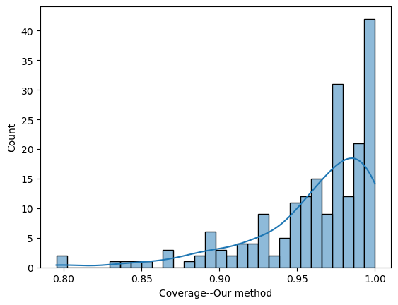
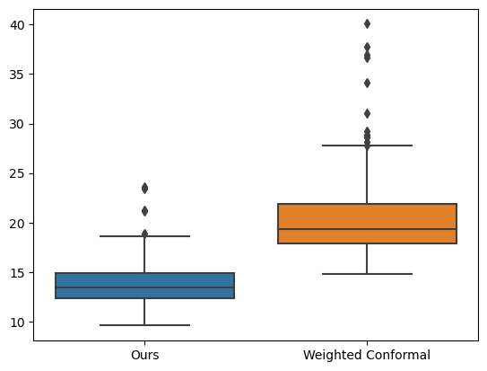

# Optimal Aggregation of Prediction Intervals under Unsupervised Domain Shift

###### Abstract

As machine learning models are increasingly deployed in dynamic environments, it becomes paramount to assess and quantify uncertainties associated with distribution shifts. A distribution shift occurs when the underlying data-generating process changes, leading to a deviation in the model’s performance. The prediction interval, which captures the range of likely outcomes for a given prediction, serves as a crucial tool for characterizing uncertainties induced by their underlying distribution. In this paper, we propose methodologies for aggregating prediction intervals to obtain one with minimal width and adequate coverage on the target domain under unsupervised domain shift, under which we have labeled samples from a related source domain and unlabeled covariates from the target domain. Our analysis encompasses scenarios where the source and the target domain are related via i) a bounded density ratio, and ii) a measure-preserving transformation. Our proposed methodologies are computationally efficient and easy to implement. Beyond illustrating the performance of our method through a real-world dataset, we also delve into the theoretical details. This includes establishing rigorous theoretical guarantees, coupled with finite sample bounds, regarding the coverage and width of our prediction intervals. Our approach excels in practical applications and is underpinned by a solid theoretical framework, ensuring its reliability and effectiveness across diverse contexts111For the code to reproduce the results in our paper, see [here](https://github.com/JiaweiGe0416/PI-with-Shift)..  

## 1 Introduction

In the modern era of big data and complex machine learning models, extensive data collected from diverse sources are often used to build a predictive model. However, the assumption of independent and identically distributed (i.i.d.) data is frequently violated in practical scenarios. Take algorithmic fairness as an example: historical data often exhibit sampling biases towards certain groups, like females being underrepresented in credit card data. Over time, the differences in group proportions have diminished, leading to distribution shifts. Consequently, models trained on historical data may face shifted distributions during testing, and proper adjustments is needed. Distribution shift has garnered significant attention from statistical and machine learning communities under various names, i.e., transfer learning (Pan and Yang,, [2009](#bib.bib23); Weiss et al.,, [2016](#bib.bib33)), domain adaptation (Farahani et al.,, [2021](#bib.bib11)), domain generalization (Zhou et al.,, [2022](#bib.bib37); Wang et al.,, [2022](#bib.bib32)), continual learning (De Lange et al.,, [2021](#bib.bib5); Mai et al.,, [2022](#bib.bib19)), multitask learning (Zhang and Yang,, [2021](#bib.bib36)) etc. While numerous methods are available in the literature for training predictive models under distribution shift, uncertainty quantification under distribution shift has received relatively scant attention despite its crucial importance. One notable exception is conformal prediction under distribution shift; Tibshirani et al., ([2019](#bib.bib28)) proposed a variant of standard conformal inference methods to accommodate test data from a distinct distribution from the training data under the covariate shift. Recently, Gibbs and Candes, ([2021](#bib.bib12)) introduced an adaptive conformal inference approach suitable for continuously changing distributions over time. Additionally, quantile regression under distribution shift offers another avenue for addressing uncertainty quantification under distribution shift (Eastwood et al.,, [2022](#bib.bib9)).  

Although few methods exist for constructing prediction intervals under distribution shift, most focus primarily on ensuring coverage guarantee rather than minimizing interval width. This prompts the immediate question: *Can we generate prediction intervals in the target domain that provide both i) coverage guarantee and ii) minimal width?* This paper seeks to address this question by leveraging model aggregation techniques. Suppose we have $K$ different methods for constructing prediction intervals in the source domain. Our proposed approach efficiently combines these methods to produce prediction intervals in the target domain with adequate coverage and minimal width. When individual methods are the elementary basis functions, such as the kernel basis, the resulting aggregation is indeed a construction of the prediction interval based on the basis functions. Our methodology draws inspiration primarily from recent work (Fan et al.,, [2023](#bib.bib10)) on prediction interval aggregation under the i.i.d. setting. However, a key distinction lies in our focus on *unsupervised domain adaptation*, where we can access labeled samples from the source and unlabeled samples from the target domain. Certain assumptions regarding the similarities between these domains are necessary to facilitate knowledge transfer from the source to the target domain. We explore two types of similarities in this paper: i) *covariate shift*, where we assume that the distribution of the response variable $Y$ given $X$ is consistent across both domains, albeit the distribution of $X$ may differ, and ii) *domain shift*, where we assume that the conditional distribution of $Y$ given $X$ remains unchanged up to a measure-preserving transformation. Covariate shift is a well-explored concept in transfer learning and has also garnered attention in uncertainty quantification. It allows different distributions of $X$ while maintaining identical conditional distributions $Y|X$ across domains. For constructing conformal prediction intervals within this framework, see Tibshirani et al., ([2019](#bib.bib28)); Hu and Lei, ([2023](#bib.bib14)); Yang et al., ([2022](#bib.bib35)); Lei and Candès, ([2021](#bib.bib18)) and references therein. On the other hand, *distribution shift* is more general, allowing both the distribution of $X$ and the conditional distribution of $Y|X$ to differ across domains. Our methods in this context draw upon domain matching principles via transport map, as proposed in Courty et al., ([2014](#bib.bib3)) and further elaborated in subsequent works like Courty et al., ([2016](#bib.bib4), [2017](#bib.bib2)); Redko et al., ([2017](#bib.bib25)), among others. The key assumption is the existence of a measure-preserving/domain-aligning map $T$ from the target to the source domain, such that the conditional distribution of $Y|X$ on the target domain matches $Y|T(X)$ on the source domain, i.e., conditional distributions matches upon domain alignment. The case where the domain-aligning map is the optimal transport map has received considerable attention in the literature, e.g., see Courty et al., ([2014](#bib.bib3), [2016](#bib.bib4), [2017](#bib.bib2)); Xu et al., ([2020](#bib.bib34)). Empirical evidence supports the efficacy of domain alignment through optimal transport maps across various datasets. For instance, in Xu et al., ([2020](#bib.bib34)), a variant of this method is applied for domain adaptation in image recognition tasks, such as recognizing similarities between USPS (Hull,, [1994](#bib.bib15)), MNIST (LeCun et al.,, [1998](#bib.bib16)), and SVHN digit images (Netzer et al.,, [2011](#bib.bib22)), as well as between different types of images in the Office-home dataset (Venkateswara et al.,, [2017](#bib.bib31)), including artistic and product images. Additionally, in Courty et al., ([2014](#bib.bib3)), the authors explore the impact of domain alignment via optimal transport maps on the face recognition problem, where different poses give rise to distinct domains. However, most of these works concentrate on training predictors that perform well on the target domain without any guarantee regarding uncertainty quantification. To our knowledge, this is the first work to propose a method with rigorous theoretical guarantees for constructing prediction intervals on the target domain under the domain-aligning assumption within an unsupervised domain adaptation framework. We now summarize our contributions.         Our Contributions: This paper introduces a novel methodology for aggregating various prediction methods available on the source domain to construct a unified prediction interval on the target domain under both covariate shift and domain shift assumptions. Our approach is simple and easy to implement and requires solving a convex optimization problem, which can even be simplified to a linear program problem in certain scenarios. We also establish rigorous theoretical guarantees, presenting finite sample concentration bounds to demonstrate that our method achieves adequate coverage with a small width. Furthermore, our methodology extends beyond model aggregation; it can be used to construct efficient prediction intervals from any convex collection of candidate functions. In the paper, we adopt this broader perspective, discussing how the aggregation of prediction intervals emerges as a particular case. Lastly, we validate the effectiveness of our approach by analyzing a real-world dataset.  

## 2 Notations and preliminaries

#### Notation

The covariates of the source and the target domains are denoted by $\mathcal{X}_{S}$ and $\mathcal{X}_{T}$, respectively, and $\mathcal{X}:=\mathcal{X}_{S}\cup\mathcal{X}_{T}$. The space of the label is denoted by $\mathcal{Y}$. We use the notation $\mathbb{E}_{S}$ (resp. $\mathbb{E}_{T}$) to denote the expectation with respect to the source (resp. target) distribution. The expectation with respect to sample distribution is denoted by $\mathbb{E}_{n,S}$ and $\mathbb{E}_{n,T}$. We use $p_{S}$ (resp. $p_{T}$) to denote the probability density function of $X$ on the source and the target domain, respectively. Throughout the paper, we use $c$ to denote universal constants, which may vary from line to line.  

### 2.1 Problem formulation

Our setup aligns with the unsupervised domain adaption; we assume to have $n_{S}$ i.i.d. labeled samples $\{X_{S,i},Y_{S,i}\}^{n_{S}}_{i=1}\sim{\mathbb{P}}_{S}(X,Y)$ from the source domain, and $n_{T}$ i.i.d. unlabeled samples $\{X_{T,i}\}^{n_{T}}_{i=1}\sim{\mathbb{P}}_{T}(X)$ from the target domain. Given any $\alpha>0$, ideally, we want to construct a valid prediction interval with minimal width on the target domain:  

|  | $$\min_{f\in\mathcal{F}}\quad\ \mathbb{E}_{T}[u(X)-l(X)],\ \ \textrm{s.t.}\ \ \mathbb{P}_{T}\left(l(X)\leq Y\leq u(X)\right)\geq 1-\alpha\,.$$ |  | (2.1) |
| --- | --- | --- | --- |

In many practical contexts, the preferred prediction interval takes the form of $m(X)\pm g(X)$, where $m(X)$ is a predictor for $Y$ given $X$ (an estimator of $\mathbb{E}_{T}[Y\mid X]$), and $g(X)$ gauges the uncertainty of the predictor $m(X)$. The optimizer of ([2.1](#S2.E1 "In 2.1 Problem formulation ‣ 2 Notations and preliminaries ‣ Optimal Aggregation of Prediction Intervals under Unsupervised Domain Shift")) takes this simplified form when the distribution of $Y-\mathbb{E}_{T}[Y\mid X]$ is symmetric around $0$. Moreover, it offers a straightforward interpretation as the pair $(m,g)$ is a predictor and a function quantifying its uncertainty. Within the framework of this simplified prediction interval, we need to estimate $m$ and $g$. Estimating the conditional mean function $m$ is relatively easy and has been extensively studied; one may use any suitable parametric/non-parametric method. Upon estimating $m$, we need to estimate $g$ so that the prediction interval $[m(X)\pm g(X)]$ has both adequate coverage and minimal width. This translates into solving the following optimization problem:  

|  | $$\min_{f\in\mathcal{F}}\quad\ \mathbb{E}_{T}[f(X)],\ \ \textrm{s.t.}\ \ \mathbb{P}_{T}\left((Y-m(X))^{2}>f(X)\right)\leq\alpha\,.$$ |  | (2.2) |
| --- | --- | --- | --- |

Let $f_{0}$ be the solution of the above optimization problem. Then the optimal prediction interval is $[m_{0}(x)\pm\sqrt{f_{0}(x)}]$. However, the key challenge here is that we do not observe the response variable $Y$ from the target, and consequently, solving ([2.2](#S2.E2 "In 2.1 Problem formulation ‣ 2 Notations and preliminaries ‣ Optimal Aggregation of Prediction Intervals under Unsupervised Domain Shift")) becomes infeasible. Hence, we must rely on transferring our knowledge acquired from labeled observations in the source domain, which necessitates making certain assumptions regarding the similarity between the two domains. Depending on the nature of these assumptions regarding domain similarity, our findings are presented in two sections: Section [3](#S3 "3 Covariate shift with bounded density ratio ‣ Optimal Aggregation of Prediction Intervals under Unsupervised Domain Shift") addresses covariate shift under the bounded density ratio assumption, while Section [4](#S4 "4 Domain shift and transport map ‣ Optimal Aggregation of Prediction Intervals under Unsupervised Domain Shift") considers a more general distribution assumption under measure-preserving transformations. Furthermore, as will be shown later, this problem, though well-defined, is not easily implementable. Therefore, we propose a surrogate convex optimization problem in this paper and provide its theoretical guarantees.  

### 2.2 Complexity measure

The complexity of the function class $\mathcal{F}$ is usually quantified through the Rademacher complexity, defined as follows.  

###### Definition 2.1 (Rademacher complexity).

Let $\mathcal{F}$ be a function class and $\{X_{i}\}^{n}_{i=1}$ be a set of samples drawn i.i.d. from a distribution $\mathcal{D}$. The Rademacher complexity of $\mathcal{F}$ is defined as  

|  | $\displaystyle\mathcal{R}_{n}(\mathcal{F})=\mathbb{E}_{\mathbf{\epsilon},\mathcal{D}}\left[\sup_{f\in\mathcal{F}}\frac{1}{n}\sum^{n}_{i=1}{\epsilon}_{i}f(X_{i})\right],$ |  | (2.3) |
| --- | --- | --- | --- |

where $\{{\epsilon}_{i}\}^{n}_{i=1}$ are i.i.d. Rademacher random variables that equals to $\pm 1$ with probability $1/2$ each.  

## 3 Covariate shift with bounded density ratio

#### Setup and methodology

In this section, we focus on the covariate shift problems, where the marginal densities $p_{S}(X)$ and $p_{T}(X)$ of the covariates may vary between the source and target domains, albeit the conditional distribution $Y|X$ remains same. Denote by $m_{0}(x)=\mathbb{E}_{T}[Y|X=x]=\mathbb{E}_{S}[Y|X=x]$, the conditional mean function. For the ease of the presentation, we assume $m_{0}$ is known. If unknown, one may use the labeled source data to estimate it using a suitable parametric/non-parametric estimate (e.g., splines, local polynomial, or deep neural networks), subsequently substituting $m_{0}$ with $\hat{m}$ in our approach. The density ratio of the source and the target distribution of $X$ is denoted by $w_{0}(x):=p_{T}(x)/p_{S}(x)$. We henceforth assume that the density ratio is uniformly bounded:  

###### Assumption 3.1.

There exists $W$ such that $\sup_{x\in\mathcal{X}_{S}}w_{0}(x)\leq W$.  

If $w_{0}$ is known, ([2.2](#S2.E2 "In 2.1 Problem formulation ‣ 2 Notations and preliminaries ‣ Optimal Aggregation of Prediction Intervals under Unsupervised Domain Shift")) has the following sample level counterpart:  

|  | $$\textstyle\min_{f\in\mathcal{F}}\ \ \mathbb{E}_{n,T}[f(X)],\ \ \textrm{s.t.}\ \ \mathbb{E}_{n,S}\left[w_{0}(X)\mathds{1}_{(Y-m_{0}(X))^{2}>f(X)}\right]\leq\alpha\,,$$ |  | (3.1) |
| --- | --- | --- | --- |

which is NP-hard owing to the presence of the indicator function. However, in many practical scenarios, it is observed that the shape of the prediction band does not change much if we change the level of coverage (i.e., $\alpha$); only the bands shrink/expand. Indeed, the true shape determines the average width; if the shape is wrong, then the width of the prediction band is quite likely to be unnecessarily large. Therefore, to obtain a prediction interval with adequate coverage and minimal width, one should first identify the shape of the prediction band and then shrink/expand it appropriately to get the desired coverage. This motivates the following two steps procedure:         Step 1: (Shape estimation) Obtain an initial estimate $\hat{f}_{\mathrm{init}}$ via by solving ([3.1](#S3.E1 "In Setup and methodology ‣ 3 Covariate shift with bounded density ratio ‣ Optimal Aggregation of Prediction Intervals under Unsupervised Domain Shift")) for $\alpha=0$ (to capture the shape):  

|  | $$\textstyle\min_{f\in\mathcal{F}}\ \ \mathbb{E}_{n,T}[f(X)]\,,\ \ {\rm s.t.}\ \ f(X_{i})\geq(Y_{i}-m_{0}(X_{i}))^{2}\ \ \forall\ 1\leq i\leq n_{S}:w_{0}(X_{i})>0\,.$$ |  | (3.2) |
| --- | --- | --- | --- |

Step 2: (Shrinkage) Refine $\hat{f}_{\mathrm{init}}$ by scaling it down using $\hat{\lambda}(\alpha)$, defined as:  

|  | $$\textstyle\hat{\lambda}({\alpha})=\inf\left\{\lambda\geq 0:\mathbb{E}_{n,S}[w_{0}(X)\mathds{1}_{(Y-m_{0}(X))^{2}>\lambda\hat{f}_{\mathrm{init}}(X)}]\leq\alpha\right\}\,.$$ |  | (3.3) |
| --- | --- | --- | --- |

The final prediction interval is:  

|  | $$\widehat{\mathrm{PI}}_{1-\alpha}(x)=\left[m_{0}(x)-\sqrt{\hat{\lambda}(\alpha)\hat{f}_{\mathrm{init}}(x)},m_{0}(x)+\sqrt{\hat{\lambda}(\alpha)\hat{f}_{\mathrm{init}}(x)}\right]\,.$$ |  | (3.4) |
| --- | --- | --- | --- |

In Step 1, we relax ([3.1](#S3.E1 "In Setup and methodology ‣ 3 Covariate shift with bounded density ratio ‣ Optimal Aggregation of Prediction Intervals under Unsupervised Domain Shift")) by effectively setting $\alpha=0$. This relaxation aids in determining the optimal shape while also converting ([3.1](#S3.E1 "In Setup and methodology ‣ 3 Covariate shift with bounded density ratio ‣ Optimal Aggregation of Prediction Intervals under Unsupervised Domain Shift")) into a convex optimization problem (equation ([3.2](#S3.E2 "In Setup and methodology ‣ 3 Covariate shift with bounded density ratio ‣ Optimal Aggregation of Prediction Intervals under Unsupervised Domain Shift"))) as long as $\mathcal{F}$ is a convex collection of functions. Furthermore, in ([3.2](#S3.E2 "In Setup and methodology ‣ 3 Covariate shift with bounded density ratio ‣ Optimal Aggregation of Prediction Intervals under Unsupervised Domain Shift")), we only consider those source observations for which $w_{0}(x)>0$, as otherwise, the samples are not informative for the target domain. In practice, $w_{0}$ is typically unknown; one may use the source and target domain covariates to estimate $w_{0}$. Various techniques are available for estimating the density ratio (e.g., Uehara et al., ([2016](#bib.bib30)); Choi et al., ([2022](#bib.bib1)); Qin, ([1998](#bib.bib24)); Gretton et al., ([2008](#bib.bib13)) and references therein). However, any such estimator $\hat{w}(x)$ can be non-zero for $x$ where $w_{0}(x)=0$ due to estimation error. Consequently, $\hat{w}$ may not be efficient in selecting informative source samples. To mitigate this issue, we propose below a modification of ([3.2](#S3.E2 "In Setup and methodology ‣ 3 Covariate shift with bounded density ratio ‣ Optimal Aggregation of Prediction Intervals under Unsupervised Domain Shift")), utilizing a hinge function $h_{\delta}(t):=\max\{0,(t/\delta)+1\}$:  

|  | $\displaystyle\min_{f\in\mathcal{F}}$ | $\displaystyle\ \ \mathbb{E}_{n,T}[f(X)]$ |  | (3.5) |
| --- | --- | --- | --- | --- |
|  | $\displaystyle{\sf subject\ to}$ | $\displaystyle\ \ \mathbb{E}_{n,S}[\hat{w}(X)h_{\delta}\left((Y-m_{0}(X))^{2}-f(X)\right)]\leq{\epsilon},$ |  |

with $\delta$ and ${\epsilon}$ should be chosen based on sample size $n_{S}$ and the estimation accuracy of $\hat{w}$. When $\hat{w}=w_{0}$ (i.e., the density ratio is known), then by choosing ${\epsilon}=0$ and $\delta\rightarrow 0$, ([3.5](#S3.E5 "In Setup and methodology ‣ 3 Covariate shift with bounded density ratio ‣ Optimal Aggregation of Prediction Intervals under Unsupervised Domain Shift")) recovers ([3.2](#S3.E2 "In Setup and methodology ‣ 3 Covariate shift with bounded density ratio ‣ Optimal Aggregation of Prediction Intervals under Unsupervised Domain Shift")). As $h_{\delta}$ is convex, the optimization problem ([3.5](#S3.E5 "In Setup and methodology ‣ 3 Covariate shift with bounded density ratio ‣ Optimal Aggregation of Prediction Intervals under Unsupervised Domain Shift")) is still a convex optimization problem. We summarize our algorithm in Algorithm [1](#alg1 "Algorithm 1 ‣ Setup and methodology ‣ 3 Covariate shift with bounded density ratio ‣ Optimal Aggregation of Prediction Intervals under Unsupervised Domain Shift").  

[ALGORITHM alg1]

1:  Input: $m_{0}$ (or $\hat{m}$ if unknown), density ratio estimator $\hat{w}$, function class $\mathcal{F}$, sample $\mathcal{D}_{S}=\{(X_{S,i},Y_{S,i})\}_{i=1}^{n_{S}}$ and $\mathcal{D}_{T}=\{X_{T,i}\}_{i=1}^{n_{T}}$, parameters $\delta$, ${\epsilon}$, coverage level $1-\alpha$.

2:  Obtain $\hat{f}_{\mathrm{init}}$ by solving ([3.5](#S3.E5 "In Setup and methodology ‣ 3 Covariate shift with bounded density ratio ‣ Optimal Aggregation of Prediction Intervals under Unsupervised Domain Shift")).

3:  Obtain the shrink level $\hat{\lambda}({\alpha})$ by solving ([3.3](#S3.E3 "In Setup and methodology ‣ 3 Covariate shift with bounded density ratio ‣ Optimal Aggregation of Prediction Intervals under Unsupervised Domain Shift")) with $w_{0}$ replaced by $\hat{w}$.

4:  Output: $\widehat{\mathrm{PI}}_{1-\alpha}(x)$ defined in ([3.4](#S3.E4 "In Setup and methodology ‣ 3 Covariate shift with bounded density ratio ‣ Optimal Aggregation of Prediction Intervals under Unsupervised Domain Shift")).

Algorithm 1  Prediction intervals with bounded density ratio
[/ALGORITHM]

#### Theoretical results

We next present theoretical guarantees of the prediction interval obtained via Algorithm [1](#alg1 "Algorithm 1 ‣ Setup and methodology ‣ 3 Covariate shift with bounded density ratio ‣ Optimal Aggregation of Prediction Intervals under Unsupervised Domain Shift"). For technical convenience, we resort to data-splitting; we divide the source data into two equal parts ($\mathcal{D}_{S,1}$ and $\mathcal{D}_{S,2}$), use $\mathcal{D}_{S,1}$ and $\mathcal{D}_{T}$ to solve ([3.5](#S3.E5 "In Setup and methodology ‣ 3 Covariate shift with bounded density ratio ‣ Optimal Aggregation of Prediction Intervals under Unsupervised Domain Shift")), and $\mathcal{D}_{S,2}$ to obtain the shrink level $\hat{\lambda}(\alpha)$. Without loss of generality, we assume $m_{0}\equiv 0$ (otherwise, we set $Y\leftarrow Y-m_{0}(X)$). A careful inspection of Step 1 reveals that $\hat{f}_{\mathrm{init}}$ aims to approximate a function $f^{*}$ defined as follows:  

|  | $$\textstyle f^{*}={\arg\min}_{f\in\mathcal{F}}\mathbb{E}_{T}[f(X)]\ \ {\sf subject\ to}\ \ Y^{2}<f(X)\text{ almost surely on target domain}\,.$$ |  | (3.6) |
| --- | --- | --- | --- |

In other words, $\hat{f}_{\mathrm{init}}$ estimates $f^{*}$ that has minimal width among all functions covering the response variable. This is motivated by the philosophy that the *right shape leads to a smaller width*. The following theorem provides a finite sample concentration bound on the approximation error of $\hat{f}_{\mathrm{init}}$:  

###### Theorem 3.2.

Suppose $Y^{2}-f^{*}(X)\leq B$ on the source domain and has a density bounded by $L$. Also assume $\|f\|_{\infty}\leq B_{\mathcal{F}}$ for all $f\in\mathcal{F}$. Then for  

|  | $$\textstyle{\epsilon}\geq L\delta+W\sqrt{\frac{t}{n_{S}}}+\frac{B+\delta}{\delta}\cdot\left(\mathbb{E}_{S}\left[|\hat{w}(X)-w_{0}(X)|\right]+(W+W^{\prime})\sqrt{\frac{t}{n_{S}}}\right)\,,$$ |  | (3.7) |
| --- | --- | --- | --- |

we have with probability at least $1-3e^{-t}$:  

|  | $$\textstyle\mathbb{E}_{T}[\hat{f}_{\mathrm{init}}(X)]\leq\mathbb{E}_{T}[f^{*}(X)]+2\mathcal{R}_{n_{T}}(\mathcal{F}-f^{*})+2B_{\mathcal{F}}\sqrt{\frac{t}{2n_{T}}}$$ |  |
| --- | --- | --- |

where $W^{\prime}=\|\hat{w}\|_{\infty}$.  

The bound in the above theorem depends on the Rademacher complexity of $\mathcal{F}$ (the smaller, the better), the estimation error of $w_{0}$, and an interplay between the choice of $({\epsilon},\delta)$. The lower bound on ${\epsilon}$ in ([3.7](#S3.E7 "In Theorem 3.2. ‣ Theoretical results ‣ 3 Covariate shift with bounded density ratio ‣ Optimal Aggregation of Prediction Intervals under Unsupervised Domain Shift")) depends on both $\delta$ and $1/\delta$. Although it is not immediate from the above theorem why we need to choose ${\epsilon}$ to be as small as possible, it will be apparent in our subsequent analysis; indeed if ${\epsilon}$ is large in ([3.5](#S3.E5 "In Setup and methodology ‣ 3 Covariate shift with bounded density ratio ‣ Optimal Aggregation of Prediction Intervals under Unsupervised Domain Shift")), then $\hat{f}_{\mathrm{init}}\equiv 0$ will be a solution of ([3.5](#S3.E5 "In Setup and methodology ‣ 3 Covariate shift with bounded density ratio ‣ Optimal Aggregation of Prediction Intervals under Unsupervised Domain Shift")). Consequently, the shape will not be captured. Therefore, one should first choose $\delta$ (say $\delta^{*}$), that minimizes the lower bound ([3.7](#S3.E7 "In Theorem 3.2. ‣ Theoretical results ‣ 3 Covariate shift with bounded density ratio ‣ Optimal Aggregation of Prediction Intervals under Unsupervised Domain Shift")), and then set ${\epsilon}={\epsilon}^{*}$ equal to the value of the right-hand side of ([3.7](#S3.E7 "In Theorem 3.2. ‣ Theoretical results ‣ 3 Covariate shift with bounded density ratio ‣ Optimal Aggregation of Prediction Intervals under Unsupervised Domain Shift")) with $\delta=\delta^{*}$, which ensures that ${\epsilon}^{*}$ is optimally defined to capture the shape accurately. Once the shape is identified, we shrink it properly in Step 2 to attain the desired coverage and reduce the width. Although ideally $\hat{\lambda}(\alpha)\leq 1$, it is not immediately guaranteed as we use separate data ($\mathcal{D}_{S,2}$) for shrinking. The following lemma shows that $\hat{\lambda}(\alpha)\leq 1$ for any fixed $\alpha>0$ as long as the sample size is large enough. Recall that the data were split into exactly half with size $n_{S}=|\mathcal{D}_{S}|$.  

###### Lemma 3.3.

Under the aforementioned choice of $({\epsilon}^{*},\delta^{*})$, we have with high probability:  

|  | $$\frac{1}{n_{S}/2}\sum_{i\in\mathcal{D}_{S,2}}\hat{w}(X_{i})\mathds{1}_{\{(Y_{i}-m_{0}(X_{i}))^{2}>\hat{f}_{\mathrm{init}}(X_{i})\}}\leq\alpha\,,$$ |  |
| --- | --- | --- |

for all large $n_{S}$, provided that $\hat{w}$ is a consistent estimator of $w_{0}$. Hence, $\hat{\lambda}(\alpha)\leq 1$.  

Our final theorem for this section provides a coverage guarantee for the prediction interval given by Algorithm [1](#alg1 "Algorithm 1 ‣ Setup and methodology ‣ 3 Covariate shift with bounded density ratio ‣ Optimal Aggregation of Prediction Intervals under Unsupervised Domain Shift").  

###### Theorem 3.4.

For the prediction interval obtained in ([3.4](#S3.E4 "In Setup and methodology ‣ 3 Covariate shift with bounded density ratio ‣ Optimal Aggregation of Prediction Intervals under Unsupervised Domain Shift")), with probability greater than $1-2e^{-t}$:  

|  | $$\textstyle\left|\mathbb{P}_{T}\left(Y^{2}>\hat{\lambda}(\alpha)\hat{f}_{\mathrm{init}}(X)\mid\mathcal{D}_{S}\cup\mathcal{D}_{T}\right)-\alpha\right|\leq\mathbb{E}_{S}\left[|\hat{w}(X)-w(X)|\right]+(2W+W^{\prime})\sqrt{\frac{t}{2n_{S}}}+\sqrt{\frac{C}{n_{S}}}\,$$ |  |
| --- | --- | --- |

for some constant $C>0$ and $W^{\prime}=\|\hat{w}\|_{\infty}$.  

Theorem [3.4](#S3.Thmtheorem4 "Theorem 3.4. ‣ Theoretical results ‣ 3 Covariate shift with bounded density ratio ‣ Optimal Aggregation of Prediction Intervals under Unsupervised Domain Shift") validates the coverage of the prediction interval derived through Algorithm [1](#alg1 "Algorithm 1 ‣ Setup and methodology ‣ 3 Covariate shift with bounded density ratio ‣ Optimal Aggregation of Prediction Intervals under Unsupervised Domain Shift"), achieving the desired coverage level as the estimate of $w_{0}$ improves and sample size expands. Theorems [3.2](#S3.Thmtheorem2 "Theorem 3.2. ‣ Theoretical results ‣ 3 Covariate shift with bounded density ratio ‣ Optimal Aggregation of Prediction Intervals under Unsupervised Domain Shift") and [3.4](#S3.Thmtheorem4 "Theorem 3.4. ‣ Theoretical results ‣ 3 Covariate shift with bounded density ratio ‣ Optimal Aggregation of Prediction Intervals under Unsupervised Domain Shift") collectively demonstrate the efficacy of our method in maintaining validity and accurately capturing the optimal shape of the prediction band, which in turn leads to small interval widths.  

###### Remark 3.5.

In our optimization problem, we’ve substituted the indicator loss with the hinge loss function to ensure convexity. However, it’s worth noting that if we know the subset of $\mathcal{X}_{S}$ where $w_{0}(x)>0$ beforehand, we could directly optimize ([3.2](#S3.E2 "In Setup and methodology ‣ 3 Covariate shift with bounded density ratio ‣ Optimal Aggregation of Prediction Intervals under Unsupervised Domain Shift")). This approach would be easy to implement and wouldn’t involve tuning parameters $(\delta,\epsilon)$. A special case is when $w_{0}(x)>0$ for all $x\in\mathcal{X}_{S}$ (as is true in our experiment), which simplifies the condition in ([3.2](#S3.E2 "In Setup and methodology ‣ 3 Covariate shift with bounded density ratio ‣ Optimal Aggregation of Prediction Intervals under Unsupervised Domain Shift")) to $f(X_{i})\geq(Y_{i}-m_{0}(X_{i}))^{2}$ for all $1\leq i\leq n_{S}$. However, if this information is unavailable, one can still employ ([3.2](#S3.E2 "In Setup and methodology ‣ 3 Covariate shift with bounded density ratio ‣ Optimal Aggregation of Prediction Intervals under Unsupervised Domain Shift")) by enforcing the constraint on all source observations. While this approach might result in wider prediction intervals, it is easy to implement and doesn’t require tuning parameters.  

## 4 Domain shift and transport map

#### Setup and methodology

In the previous section, we assume a uniform bound on the density ratio. However, this may not be the case in reality; it is possible that there exists $x\in{\sf supp}(\mathcal{X}_{T})\cap{\sf supp}(\mathcal{X}_{S}^{c})$, which immediately implies that $w_{0}(x)=\infty$. In image recognition problems, if the source data are images taken during the day at some place, and the target data are images taken at night, then this directly results in an unbounded density ratio (due to the change in the background color). Yet a transport map could effectively model this shift by adapting features from the source to correspond with those of the target, maintaining the underlying patterns or object recognition capabilities across both domains. To perform transfer learning in this setup, we model the domain shift via a measure transport map $T_{0}$ that preserves the conditional distribution, as elaborated in the following assumption:  

###### Assumption 4.1.

There exists a measure transport map $T_{0}:\mathcal{X}_{T}\to\mathcal{X}_{S}$, i.e., $T_{0}(X_{T})\stackrel{{\scriptstyle d}}{{=}}X_{S}$, such that: $\mathbb{P}_{T}(Y\mid X=x)\stackrel{{\scriptstyle d}}{{=}}\mathbb{P}_{S}(Y\mid X=T_{0}(x)),\ \forall x\in\mathcal{X}_{T}.$   

This assumption allows the extrapolation of source domain information to the target domain via $T_{0}$, enabling the construction of prediction intervals at $x\in\mathcal{X}_{T}$ by leveraging the analogous intervals at $T_{0}(x)\in\mathcal{X}_{S}$. Inspired by this observation, we present our methodology in Algorithm [2](#alg2 "Algorithm 2 ‣ Setup and methodology ‣ 4 Domain shift and transport map ‣ Optimal Aggregation of Prediction Intervals under Unsupervised Domain Shift") that essentially consists of two key steps: i) constructing a prediction interval in the source domain and ii) transporting this interval to the target domain using the estimated transport map $T_{0}$. If $T_{0}$ (or its estimate) is not given, it must be estimated from the source and the target covariates. Various methods are available in the literature (e.g., Divol et al., ([2022](#bib.bib7)); Seguy et al., ([2017](#bib.bib26)); Makkuva et al., ([2020](#bib.bib20)); Deb et al., ([2021](#bib.bib6))), and practitioners can pick a method at their convenience. Notably, the processes described in equations ([4.1](#S4.E1 "In 2 ‣ Algorithm 2 ‣ Setup and methodology ‣ 4 Domain shift and transport map ‣ Optimal Aggregation of Prediction Intervals under Unsupervised Domain Shift")) and ([4.2](#S4.E2 "In 3 ‣ Algorithm 2 ‣ Setup and methodology ‣ 4 Domain shift and transport map ‣ Optimal Aggregation of Prediction Intervals under Unsupervised Domain Shift")) follow the methodology (i.e., ([3.2](#S3.E2 "In Setup and methodology ‣ 3 Covariate shift with bounded density ratio ‣ Optimal Aggregation of Prediction Intervals under Unsupervised Domain Shift")) and ([3.3](#S3.E3 "In Setup and methodology ‣ 3 Covariate shift with bounded density ratio ‣ Optimal Aggregation of Prediction Intervals under Unsupervised Domain Shift"))) from Section [3](#S3 "3 Covariate shift with bounded density ratio ‣ Optimal Aggregation of Prediction Intervals under Unsupervised Domain Shift") for scenarios without shift (i.e., $w_{0}\equiv 1$), adding a slight $\delta$ to ensure coverage even when $\mathcal{F}$ is complex.  

[ALGORITHM alg2]

1:  Input: conditional mean function $m_{0}$ on the source domain, transport map estimator $\hat{T}_{0}$, function class $\mathcal{F}$, sample $\mathcal{D}_{S}=\{(X_{S,i},Y_{S,i})\}_{i=1}^{n_{S}}$ and $\mathcal{D}_{T}=\{X_{T,i}\}_{i=1}^{n_{T}}$, parameter $\delta$, coverage level $1-\alpha$.

2:  Obtain $\hat{f}_{\mathrm{init}}$ by solving:

|  | $$\textstyle\min_{f\in\mathcal{F}}\ \ \frac{1}{n_{S}}\sum^{n_{S}}_{i=1}f(X_{S,i})\,,\ \ {\rm s.t.}\ \ f(X_{S,i})\geq(Y_{S,i}-m_{0}(X_{S,i}))^{2}\ \forall\ i\in[n_{S}]\,.$$ |  | (4.1) |
| --- | --- | --- | --- |

3:  Obtain the shrink level

|  | $\displaystyle\textstyle\hat{\lambda}(\alpha):=\inf\left\{\lambda>0:\frac{1}{n_{S}}\sum^{n_{S}}_{i=1}\mathds{1}_{(Y_{S,i}-m_{0}(X_{S,i}))^{2}\geq\lambda(\hat{f}_{\mathrm{init}}(X_{S,i})+\delta)}\leq\alpha\right\}\,.$ |  | (4.2) |
| --- | --- | --- | --- |

4:  Output:
$\widehat{\mathrm{PI}}_{1-\alpha}(x)=\left[m_{0}\circ\hat{T}_{0}(x)\pm\sqrt{\hat{\lambda}(\alpha)\cdot\left(\hat{f}_{\mathrm{init}}\circ\hat{T}_{0}(x)+\delta\right)}\right].$

  

Algorithm 2  Transport map
[/ALGORITHM]

In Algorithm [2](#alg2 "Algorithm 2 ‣ Setup and methodology ‣ 4 Domain shift and transport map ‣ Optimal Aggregation of Prediction Intervals under Unsupervised Domain Shift"), we assume the conditional mean function $m_{0}$ on the source domain is known. In cases where the conditional mean function $m_{0}$ on the source domain is unknown, it can be estimated using standard regression methods from labeled source data, after which $m_{0}$ is replaced by this estimate, $\hat{m}$.  

###### Remark 4.2 (Model aggregation).

Suppose we have $K$ different methods $\{f_{1},\ldots,f_{K}\}$ for constructing prediction intervals in the source domain. In the context of model aggregation, ([4.1](#S4.E1 "In 2 ‣ Algorithm 2 ‣ Setup and methodology ‣ 4 Domain shift and transport map ‣ Optimal Aggregation of Prediction Intervals under Unsupervised Domain Shift")) then reduces to:  

|  | $\displaystyle\textstyle\min_{\alpha_{1},\dots,\alpha_{K}}$ | $\displaystyle\ \ \ \ \frac{1}{n_{S}}\sum^{n_{S}}_{i=1}\Bigl{\{}\sum_{j=1}^{K}\alpha_{j}f_{j}(X_{S,i})\Bigr{\}}$ |  |
| --- | --- | --- | --- |
|  | $\displaystyle{\sf subject\ to}$ | $\displaystyle\ \ \ \ \sum_{j=1}^{K}\alpha_{j}f_{j}(X_{S,i})\geq(Y_{S,i}-m_{0}(X_{S,i}))^{2}\ \forall\ i\in[n_{S}]\,,$ |  |
| --- | --- | --- | --- |
|  |  | $\displaystyle\ \ \ \ \alpha_{j}\geq 0,\ \ \ \forall\ 1\leq j\leq K\,.$ |  |
| --- | --- | --- | --- |

In other words, the function class $\mathcal{F}$ is a linear combination of the candidate methods. The problem is then simplified to a linear program problem, which can be implemented efficiently using standard solvers.  

#### Theoretical results

We now present theoretical guarantees of our methodology to ensure that our method delivers what it promises: a prediction interval with adequate coverage and small width. For technical simplicity, we split data here: divide the labeled source observation with two equal parts (with $n_{S}/2$ observations in each), namely $\mathcal{D}_{S,1}$ and $\mathcal{D}_{S,2}$. We use $\mathcal{D}_{S,1}$ to solve ([4.1](#S4.E1 "In 2 ‣ Algorithm 2 ‣ Setup and methodology ‣ 4 Domain shift and transport map ‣ Optimal Aggregation of Prediction Intervals under Unsupervised Domain Shift")) and obtain the initial estimator $\hat{f}_{\mathrm{init}}$, and $\mathcal{D}_{S,2}$ to solve ([4.2](#S4.E2 "In 3 ‣ Algorithm 2 ‣ Setup and methodology ‣ 4 Domain shift and transport map ‣ Optimal Aggregation of Prediction Intervals under Unsupervised Domain Shift")), i.e. obtaining the shrinkage factor $\hat{\lambda}(\alpha)$. Henceforth, without loss of generality, we assume $m_{0}=0$ and present the theoretical guarantees of our estimator. We start with an analog of Theorem [3.2](#S3.Thmtheorem2 "Theorem 3.2. ‣ Theoretical results ‣ 3 Covariate shift with bounded density ratio ‣ Optimal Aggregation of Prediction Intervals under Unsupervised Domain Shift"), which ensures that with high probability $\hat{f}_{\mathrm{init}}\circ\hat{T}_{0}$ approximates the function that has minimal width among all the functions in $\mathcal{F}$ composed with $T_{0}$ that covers the labels on the target almost surely:   

###### Theorem 4.3.

Assume the function class $\mathcal{F}$ is $B_{\mathcal{F}}$-bounded and $L_{\mathcal{F}}$-Lipschitz. Define  

|  | $$\textstyle\Delta=\min\left\{\mathbb{E}_{T}[f\circ T_{0}(X)]:f\in\mathcal{F},Y^{2}\leq f\circ T_{0}(X)\ \text{a.s. on target domain}\right\}\,.$$ |  |
| --- | --- | --- |

Then we have with probability $\geq 1-e^{-t}$:  

|  | $$\mathbb{E}_{T}[\hat{f}_{\mathrm{init}}\circ\hat{T}_{0}(X)]\leq\Delta+4\mathcal{R}_{n_{S}}(\mathcal{F})+L_{\mathcal{F}}\mathbb{E}_{T}[|\hat{T}_{0}(X)-T_{0}(X)|]+4B_{\mathcal{F}}\sqrt{\frac{t}{2n_{S}}}\,.$$ |  |
| --- | --- | --- |

The upper bound on the population width of $\hat{f}_{\mathrm{init}}\circ\hat{T}_{0}(x)$ consists of four terms: the first term is the *minimal possible width* that can be achieved using the functions from $\mathcal{F}$, the second term involves the Rademacher complexity of $\mathcal{F}$, the third term encodes the estimation error of $T_{0}$, and the last term is the deviation term that influences the probability. Hence, the margin between the width of the predicted interval and the minimum achievable width is small, with the convergence rate relying on the precision of estimating $T_{0}$ and the complexity of $\mathcal{F}$, as expected.  

We next establish the coverage guarantee of our estimator of Algorithm [2](#alg2 "Algorithm 2 ‣ Setup and methodology ‣ 4 Domain shift and transport map ‣ Optimal Aggregation of Prediction Intervals under Unsupervised Domain Shift"), obtained upon suitable truncation of $\hat{f}_{\mathrm{init}}$. As mentioned, the shrinkage operation is performed on a separate dataset $\mathcal{D}_{S,2}$. Therefore, it is not immediate whether the shrinkage factor $\hat{\lambda}(\alpha)$ is smaller than $1$, i.e., whether we are indeed shrinking the confidence interval ($\hat{\lambda}(\alpha)>1$ is undesirable, as it will widen $\hat{f}_{\mathrm{init}}$, increasing the width of the prediction band). The following lemma shows that with high probability, $\hat{\lambda}(\alpha)\leq 1$.  

###### Lemma 4.4.

With probability greater than or equal to $1-e^{-t}$, we have:  

|  | $$\textstyle\mathbb{P}(\hat{\lambda}(\alpha)>1\mid\mathcal{D}_{S,1},\mathcal{D}_{T})\leq e^{-\frac{(\alpha-p_{n_{S}})^{2}n_{S}}{6p_{n_{S}}}},$$ |  |
| --- | --- | --- |

where  

|  | $\displaystyle\textstyle p_{n_{S}}=\mathbb{P}_{S}\left(Y^{2}\geq\hat{f}_{\mathrm{init}}(X)+\delta\,\big{|}\,\mathcal{D}_{S,1},\mathcal{D}_{T}\right)\leq\frac{4}{\delta}\left(\sqrt{\frac{\mathbb{E}_{S}[Y^{4}]}{n_{S}}}+\mathcal{R}_{n_{S}}(\mathcal{F})\right)+\sqrt{\frac{t}{n_{S}}}\,.$ |  |
| --- | --- | --- |

Here $p_{n_{S}}$ is the conditional probability of a test observation $Y$ falling outside $[-\sqrt{\hat{f}_{\mathrm{init}}(X)+\delta},\sqrt{\hat{f}_{\mathrm{init}}(X)+\delta}]$, which is small as evident from the above lemma. In particular, for model aggregation, if $\mathcal{F}$ is the linear combination of $K$ functions, then $p_{n_{S}}$ is of the order $\sqrt{K/n_{S}}$. Hence, the final prediction interval is guaranteed to be a compressed form of $\hat{f}_{\mathrm{init}}$ with an overwhelmingly high probability. We present our last theorem of this section, confirming that the prediction interval derived from Algorithm [2](#alg2 "Algorithm 2 ‣ Setup and methodology ‣ 4 Domain shift and transport map ‣ Optimal Aggregation of Prediction Intervals under Unsupervised Domain Shift") achieves the intended coverage level with a high probability:  

###### Theorem 4.5.

Under the same setup of Theorem [4.3](#S4.Thmtheorem3 "Theorem 4.3. ‣ Theoretical results ‣ 4 Domain shift and transport map ‣ Optimal Aggregation of Prediction Intervals under Unsupervised Domain Shift"), along with the assumption that $f_{S}(y\mid x)$ is uniformly bounded by $G$, we have with probability greater than $1-cn_{S}^{-10}$ that  

|  | $\displaystyle\left|\mathbb{P}_{T}\left(Y^{2}\geq\hat{\lambda}(\alpha)\left(\hat{f}_{\mathrm{init}}\circ\hat{T}_{0}(X)+\delta\right)\mid\mathcal{D}_{S}\cup\mathcal{D}_{T}\right)-\alpha\right|$ |  |
| --- | --- | --- |
|  | $\displaystyle\leq C\sqrt{\frac{\log{n_{S}}}{n_{S}}}+GL_{\mathcal{F}}\cdot\mathbb{E}_{T}\left[\left|\hat{T}_{0}(X)-T_{0}(X)\right|\right].$ |  |
| --- | --- | --- |

As for Theorem [4.3](#S4.Thmtheorem3 "Theorem 4.3. ‣ Theoretical results ‣ 4 Domain shift and transport map ‣ Optimal Aggregation of Prediction Intervals under Unsupervised Domain Shift"), the bound obtained in Theorem [4.5](#S4.Thmtheorem5 "Theorem 4.5. ‣ Theoretical results ‣ 4 Domain shift and transport map ‣ Optimal Aggregation of Prediction Intervals under Unsupervised Domain Shift") also depends on two crucial terms: Rademacher complexity of $\mathcal{F}$ and estimation error of $T_{0}$. Therefore, the key takeaway of our theoretical analysis is that the prediction interval obtained from Algorithm [2](#alg2 "Algorithm 2 ‣ Setup and methodology ‣ 4 Domain shift and transport map ‣ Optimal Aggregation of Prediction Intervals under Unsupervised Domain Shift") asymptotically achieves nominal coverage guarantee and minimal width. Furthermore, the approximation error intrinsically depends on the Rademacher complexity of the underlying function class and the precision in estimating $T_{0}$.  

###### Remark 4.6 (Measure preserving transformation).

In our approach, $T_{0}$ is employed to maintain measure transformation, although it may not necessarily be an optimal transport map. Yet, estimating $T_{0}$ can be challenging in many practical scenarios. In such cases, simpler transformations like linear or quadratic adjustments are often utilized to align the first few moments of the distributions. Various methods provide such simple solutions, including, but not limited to, CORAL (Sun et al.,, [2017](#bib.bib27)) and ADDA (Tzeng et al.,, [2017](#bib.bib29)).  

## 5 Application

In this section, we illustrate the effectiveness of our method using the airfoil dataset from the UCI Machine Learning Repository (Dua and Graff,, [2019](#bib.bib8)). This dataset includes $1503$ observations, featuring a response variable $Y$ (scaled sound pressure level) and a five-dimensional covariate $X$ (log of frequency, angle of attack, chord length, free-stream velocity, log of suction side displacement thickness). We assess and compare the performance of our prediction intervals in terms of coverage and width with those generated by the weighted split conformal prediction method described in Tibshirani et al., ([2019](#bib.bib28)).  

We use the same data-generating process described in Tibshirani et al., ([2019](#bib.bib28)) to facilitate a direct comparison. We have run experiments 200 times; each time, we randomly partitioned the data into two parts $\mathcal{D}_{\rm train}$ and $\mathcal{D}_{\rm test}$, where $\mathcal{D}_{\rm train}$ contains $75\%$ of the data, and $\mathcal{D}_{\rm test}$ contains $25\%$ of the data. Following Tibshirani et al., ([2019](#bib.bib28)), we *shift* the distribution of the covariates of $\mathcal{D}_{\rm test}$ by weighted sampling with replacement, where the weights are proportional to  

|  | $$w(x)={\sf exp}(x^{T}\beta),\quad\text{where}\quad\beta=(-1,0,0,0,1).$$ |  |
| --- | --- | --- |

These reweighted observations in $\mathcal{D}_{\rm test}$, which we call $\mathcal{D}_{\rm shift}$, act as observations from the target domain. Clearly, by our data generation mechanism $w_{0}(x)=f_{T}(x)/f_{S}(x)=c\ {\sf exp}{(x^{\top}\beta)}$, where $c$ is the normalizing constant. The source and target domains share the same support under this configuration. As our methodology is developed for unsupervised domain adaptation, we do not use the label information of $\mathcal{D}_{\rm shift}$ to develop the target domain’s prediction interval.  

#### Density ratio estimation

We use the probabilistic classification technique to estimate the density based on the source and the target covariates. Let $X_{1},\ldots,X_{n_{1}}$ be the covariates in dataset $\mathcal{D}_{\rm train}$ and $X_{n_{1}+1},\ldots,X_{n_{1}+n_{2}}$ be the covariates in dataset $D_{\text{shift}}$. The density ratio estimation proceeds in two steps: (1) logistic regression is applied to the feature-class pairs $\{(X_{i},C_{i})\}_{i=1}^{n}$, where $C_{i}=0$ for $i=1,\ldots,n_{1}$ and $C_{i}=1$ for $i=n_{1}+1,\ldots,n_{1}+n_{2}$, yielding an estimate of $\mathbb{P}(C=1\mid X=x)$, denoted as $\hat{p}(x)$; (2) the density ratio estimator is then defined as $\hat{w}(x)=\frac{n_{1}}{n_{2}}\cdot\frac{\hat{p}(x)}{1-\hat{p}(x)}$. Further explanations are provided in Appendix [B](#A2 "Appendix B Details of the experiment ‣ Optimal Aggregation of Prediction Intervals under Unsupervised Domain Shift").  

#### Implementation of our method and results

As the mean function $m_{0}(x)=\mathbb{E}[Y\mid X=x]$ (which is the same on the source and the target domain) is unknown, we first estimate it via linear regression, which henceforth will be denoted by $\hat{m}(x)$. To construct a prediction interval, we consider the model aggregation approach, i.e., the function class $\mathcal{F}$ is defined as the linear combination of the following six estimates:  

* Estimator 1$(f_{1})$: A neural network based estimator with depth=1, width=10 that estimates the 0.85 quantile function of $(Y-\hat{m}(X))^{2}\mid X=x$. 
* Estimator 2$(f_{2})$: A fully connected feed forward neural network with depth=2 and width=50 that estimates the 0.95 quantile function of $(Y-\hat{m}(X))^{2}\mid X=x$. 
* Estimator 3$(f_{3})$: A quantile regression forest estimating the 0.9 quantile function of $(Y-\hat{m}(X))^{2}\mid X=x$. 
* Estimator 4$(f_{4})$: A gradient boosting model estimating the 0.9 quantile function of $(Y-\hat{m}(X))^{2}\mid X=x$. 
* Estimator 5$(f_{5})$: An estimate of $\mathbb{E}[(Y-\hat{m}(X))^{2}\mid X=x]$ using random forest. 
* Estimator 6$(f_{6})$: The constant function $1$. 

Here, the quantile estimators are obtained by minimizing the corresponding check loss. The implementation of our method is summarized as follows: (1) We divide the training data $\mathcal{D}_{\rm train}$ into two halves $\mathcal{D}_{1}\cup\mathcal{D}_{2}$. We utilize dataset $\mathcal{D}_{1}$ to derive a mean estimator and six aforementioned estimates. We also employ the covariates from $\mathcal{D}_{1}$ and $D_{\text{shift}}$ to compute a density ratio estimator. (2) We further split $\mathcal{D}_{2}$ into two equal parts $\mathcal{D}_{2,1}$ and $\mathcal{D}_{2,2}$. $\mathcal{D}_{2,1}$, along with covariates from $\mathcal{D}_{\rm shift}$, is used to find the optimal aggregation of the six estimates to capture the shape, i.e., for obtaining $\hat{f}_{\mathrm{init}}$. The second part $\mathcal{D}_{2,2}$ is used to shrink the interval to achieve $1-\alpha=0.95$ coverage, i.e. to estimate $\hat{\lambda}(\alpha)$. (3) We evaluate the effectiveness of our approach in terms of the coverage and average bandwidth on the $D_{\text{shift}}$ dataset.  

We now present the histograms of the coverage and the average bandwidth of our method, and a more general version of weighted conformal prediction in Tibshirani et al., ([2019](#bib.bib28)) over $200$ experiments (see Appendix [B](#A2 "Appendix B Details of the experiment ‣ Optimal Aggregation of Prediction Intervals under Unsupervised Domain Shift") for details),  

[FIGURE S5.F1.sf1.g1]

(a) Coverage of our method
[/FIGURE]

which show that our method consistently yields a shorter prediction interval than the weighted conformal prediction while maintaining coverage. Over 200 experiments, the average coverage achieved by our method was 0.964029 (SD = 0.04), while the weighted conformal prediction method achieved an average coverage of 0.9535 (SD = 0.036). Additionally, the average width of the prediction intervals for our method was 13.654 (SD = 2.22), compared to 20.53 (SD = 4.13) for the weighted conformal prediction. Regarding the performance of intervals over $95\%$ coverage, our method achieved this in $72.5\%$ of cases with an average width of 14.35 (SD = 2.22). In contrast, the weighted conformal prediction method did so in $57\%$ of cases with an average width of 21.4 (SD = 4.39). Boxplots are presented in Appendix [B](#A2 "Appendix B Details of the experiment ‣ Optimal Aggregation of Prediction Intervals under Unsupervised Domain Shift") for further comparison.  

## 6 Conclusion

This paper focuses on unsupervised domain shift problems, where we have labeled samples from the source domain and unlabeled samples from the target domain. We introduce methodologies for constructing prediction intervals on the target domain that are designed to ensure adequate coverage while minimizing width. Our analysis includes scenarios in which the source and target domains are related either through a bounded density ratio or a measure-preserving transformation. Our proposed methodologies are computationally efficient and easy to implement. We further establish rigorous finite sample theoretical guarantees regarding the coverage and width of our prediction intervals. Finally, we demonstrate the practical effectiveness of our methodology through its application to the airfoil dataset.  

## References

* Choi et al., (2022)  Choi, K., Meng, C., Song, Y., and Ermon, S. (2022).   Density ratio estimation via infinitesimal classification.   In International Conference on Artificial Intelligence and Statistics, pages 2552–2573. PMLR. 
* Courty et al., (2017)  Courty, N., Flamary, R., Habrard, A., and Rakotomamonjy, A. (2017).   Joint distribution optimal transportation for domain adaptation.   Advances in neural information processing systems, 30. 
* Courty et al., (2014)  Courty, N., Flamary, R., and Tuia, D. (2014).   Domain adaptation with regularized optimal transport.   In Machine Learning and Knowledge Discovery in Databases: European Conference, ECML PKDD 2014, Nancy, France, September 15-19, 2014. Proceedings, Part I 14, pages 274–289. Springer. 
* Courty et al., (2016)  Courty, N., Flamary, R., Tuia, D., and Rakotomamonjy, A. (2016).   Optimal transport for domain adaptation.   IEEE transactions on pattern analysis and machine intelligence, 39(9):1853–1865. 
* De Lange et al., (2021)  De Lange, M., Aljundi, R., Masana, M., Parisot, S., Jia, X., Leonardis, A., Slabaugh, G., and Tuytelaars, T. (2021).   A continual learning survey: Defying forgetting in classification tasks.   IEEE transactions on pattern analysis and machine intelligence, 44(7):3366–3385. 
* Deb et al., (2021)  Deb, N., Ghosal, P., and Sen, B. (2021).   Rates of estimation of optimal transport maps using plug-in estimators via barycentric projections.   Advances in Neural Information Processing Systems, 34:29736–29753. 
* Divol et al., (2022)  Divol, V., Niles-Weed, J., and Pooladian, A.-A. (2022).   Optimal transport map estimation in general function spaces.   arXiv preprint arXiv:2212.03722. 
* Dua and Graff, (2019)  Dua, D. and Graff, C. (2019).   Uci machine learning repository.   <https://archive.ics.uci.edu>. 
* Eastwood et al., (2022)  Eastwood, C., Robey, A., Singh, S., Von Kügelgen, J., Hassani, H., Pappas, G. J., and Schölkopf, B. (2022).   Probable domain generalization via quantile risk minimization.   Advances in Neural Information Processing Systems, 35:17340–17358. 
* Fan et al., (2023)  Fan, J., Ge, J., and Mukherjee, D. (2023).   Utopia: Universally trainable optimal prediction intervals aggregation.   arXiv preprint arXiv:2306.16549. 
* Farahani et al., (2021)  Farahani, A., Voghoei, S., Rasheed, K., and Arabnia, H. R. (2021).   A brief review of domain adaptation.   Advances in data science and information engineering: proceedings from ICDATA 2020 and IKE 2020, pages 877–894. 
* Gibbs and Candes, (2021)  Gibbs, I. and Candes, E. (2021).   Adaptive conformal inference under distribution shift.   Advances in Neural Information Processing Systems, 34:1660–1672. 
* Gretton et al., (2008)  Gretton, A., Smola, A., Huang, J., Schmittfull, M., Borgwardt, K., and Schölkopf, B. (2008).   Covariate shift by kernel mean matching. 
* Hu and Lei, (2023)  Hu, X. and Lei, J. (2023).   A two-sample conditional distribution test using conformal prediction and weighted rank sum.   Journal of the American Statistical Association, pages 1–19. 
* Hull, (1994)  Hull, J. J. (1994).   A database for handwritten text recognition research.   IEEE Transactions on pattern analysis and machine intelligence, 16(5):550–554. 
* LeCun et al., (1998)  LeCun, Y., Bottou, L., Bengio, Y., and Haffner, P. (1998).   Gradient-based learning applied to document recognition.   Proceedings of the IEEE, 86(11):2278–2324. 
* Lei et al., (2018)  Lei, J., G’Sell, M., Rinaldo, A., Tibshirani, R. J., and Wasserman, L. (2018).   Distribution-free predictive inference for regression.   Journal of the American Statistical Association, 113(523):1094–1111. 
* Lei and Candès, (2021)  Lei, L. and Candès, E. J. (2021).   Conformal inference of counterfactuals and individual treatment effects.   Journal of the Royal Statistical Society Series B: Statistical Methodology, 83(5):911–938. 
* Mai et al., (2022)  Mai, Z., Li, R., Jeong, J., Quispe, D., Kim, H., and Sanner, S. (2022).   Online continual learning in image classification: An empirical survey.   Neurocomputing, 469:28–51. 
* Makkuva et al., (2020)  Makkuva, A., Taghvaei, A., Oh, S., and Lee, J. (2020).   Optimal transport mapping via input convex neural networks.   In International Conference on Machine Learning, pages 6672–6681. PMLR. 
* Maurer, (2016)  Maurer, A. (2016).   A vector-contraction inequality for rademacher complexities.   In Algorithmic Learning Theory: 27th International Conference, ALT 2016, Bari, Italy, October 19-21, 2016, Proceedings 27, pages 3–17. Springer. 
* Netzer et al., (2011)  Netzer, Y., Wang, T., Coates, A., Bissacco, A., Wu, B., Ng, A. Y., et al. (2011).   Reading digits in natural images with unsupervised feature learning.   In NIPS workshop on deep learning and unsupervised feature learning, volume 2011, page 7. Granada, Spain. 
* Pan and Yang, (2009)  Pan, S. J. and Yang, Q. (2009).   A survey on transfer learning.   IEEE Transactions on knowledge and data engineering, 22(10):1345–1359. 
* Qin, (1998)  Qin, J. (1998).   Inferences for case-control and semiparametric two-sample density ratio models.   Biometrika, 85(3):619–630. 
* Redko et al., (2017)  Redko, I., Habrard, A., and Sebban, M. (2017).   Theoretical analysis of domain adaptation with optimal transport.   In Machine Learning and Knowledge Discovery in Databases: European Conference, ECML PKDD 2017, Skopje, Macedonia, September 18–22, 2017, Proceedings, Part II 10, pages 737–753. Springer. 
* Seguy et al., (2017)  Seguy, V., Damodaran, B. B., Flamary, R., Courty, N., Rolet, A., and Blondel, M. (2017).   Large-scale optimal transport and mapping estimation.   arXiv preprint arXiv:1711.02283. 
* Sun et al., (2017)  Sun, B., Feng, J., and Saenko, K. (2017).   Correlation alignment for unsupervised domain adaptation.   Domain adaptation in computer vision applications, pages 153–171. 
* Tibshirani et al., (2019)  Tibshirani, R. J., Foygel Barber, R., Candes, E., and Ramdas, A. (2019).   Conformal prediction under covariate shift.   Advances in neural information processing systems, 32. 
* Tzeng et al., (2017)  Tzeng, E., Hoffman, J., Saenko, K., and Darrell, T. (2017).   Adversarial discriminative domain adaptation.   In Proceedings of the IEEE conference on computer vision and pattern recognition, pages 7167–7176. 
* Uehara et al., (2016)  Uehara, M., Sato, I., Suzuki, M., Nakayama, K., and Matsuo, Y. (2016).   Generative adversarial nets from a density ratio estimation perspective.   arXiv preprint arXiv:1610.02920. 
* Venkateswara et al., (2017)  Venkateswara, H., Eusebio, J., Chakraborty, S., and Panchanathan, S. (2017).   Deep hashing network for unsupervised domain adaptation.   In Proceedings of the IEEE conference on computer vision and pattern recognition, pages 5018–5027. 
* Wang et al., (2022)  Wang, J., Lan, C., Liu, C., Ouyang, Y., Qin, T., Lu, W., Chen, Y., Zeng, W., and Philip, S. Y. (2022).   Generalizing to unseen domains: A survey on domain generalization.   IEEE transactions on knowledge and data engineering, 35(8):8052–8072. 
* Weiss et al., (2016)  Weiss, K., Khoshgoftaar, T. M., and Wang, D. (2016).   A survey of transfer learning.   Journal of Big data, 3:1–40. 
* Xu et al., (2020)  Xu, R., Liu, P., Wang, L., Chen, C., and Wang, J. (2020).   Reliable weighted optimal transport for unsupervised domain adaptation.   In Proceedings of the IEEE/CVF conference on computer vision and pattern recognition, pages 4394–4403. 
* Yang et al., (2022)  Yang, Y., Kuchibhotla, A. K., and Tchetgen, E. T. (2022).   Doubly robust calibration of prediction sets under covariate shift.   arXiv preprint arXiv:2203.01761. 
* Zhang and Yang, (2021)  Zhang, Y. and Yang, Q. (2021).   A survey on multi-task learning.   IEEE Transactions on Knowledge and Data Engineering, 34(12):5586–5609. 
* Zhou et al., (2022)  Zhou, K., Liu, Z., Qiao, Y., Xiang, T., and Loy, C. C. (2022).   Domain generalization: A survey.   IEEE Transactions on Pattern Analysis and Machine Intelligence, 45(4):4396–4415. 

## Appendix A Proofs

### A.1 Proof of Theorem [3.2](#S3.Thmtheorem2 "Theorem 3.2. ‣ Theoretical results ‣ 3 Covariate shift with bounded density ratio ‣ Optimal Aggregation of Prediction Intervals under Unsupervised Domain Shift")

First, we show that for our choice of $({\epsilon},\delta)$, as depicted in Theorem [3.2](#S3.Thmtheorem2 "Theorem 3.2. ‣ Theoretical results ‣ 3 Covariate shift with bounded density ratio ‣ Optimal Aggregation of Prediction Intervals under Unsupervised Domain Shift"), $f^{*}$ is a feasible solution of equation ([3.5](#S3.E5 "In Setup and methodology ‣ 3 Covariate shift with bounded density ratio ‣ Optimal Aggregation of Prediction Intervals under Unsupervised Domain Shift")). Consider $w_{0}$ instead of $\hat{w}$. By definition of $f^{*}$,  

|  | $$\mathbb{P}_{T}(Y^{2}\leq f^{*}(X))=1\iff\mathbb{E}_{S}\left[w_{0}(X)\mathds{1}_{Y^{2}>f^{*}(X)}\right]=0\iff w_{0}(X)\mathds{1}_{Y^{2}>f^{*}(X)}=0\ \ \text{ a.s. on source}\,.$$ |  |
| --- | --- | --- |

This implies:  

|  | $\displaystyle\frac{1}{n_{S}/2}\sum_{i\in\mathcal{D}_{S,1}}w_{0}(X_{i})h_{\delta}\left(Y_{i}^{2}-f^{\star}(X_{i})\right)$ |  |
| --- | --- | --- |
|  | $\displaystyle=\frac{1}{n_{S}/2}\sum_{i\in\mathcal{D}_{S,1}}w_{0}(X_{i})h_{\delta}\left(Y_{i}^{2}-f^{\star}(X_{i})\right)\mathbf{1}_{Y_{i}^{2}\leq f^{\star}(X_{i})}$ |  |
| --- | --- | --- |
|  | $\displaystyle=\frac{1}{n_{S}/2}\sum_{i\in\mathcal{D}_{S,1}}w_{0}(X_{i})h_{\delta}\left(Y_{i}^{2}-f^{\star}(X_{i})\right)\mathbf{1}_{f^{\star}(X_{i})-\delta\leq Y_{i}^{2}\leq f^{\star}(X_{i})}$ |  |
| --- | --- | --- |
|  | $\displaystyle\leq\frac{1}{n_{S}/2}\sum_{i\in\mathcal{D}_{S,1}}w_{0}(X_{i})\mathbf{1}_{f^{\star}(X_{i})-\delta\leq Y_{i}^{2}\leq f^{\star}(X_{i})},$ |  |
| --- | --- | --- |

where the first equality follows from the fact that $w_{0}(X)\mathbf{1}_{Y^{2}>f^{\star}(X)}=0$ a.s. on the source domain, the second equality follows from the fact that $h_{\delta}(t)\mathbf{1}_{t<-\delta}=0$ for all $t$, and the last inequality follows from the fact that $h_{\delta}(Y_{i}^{2}-f^{\star}(X_{i}))\leq 1$ when $Y_{i}^{2}-f^{\star}(X_{i})\leq 0$. Since $w_{0}(X)\mathbf{1}_{f^{\star}(X)-\delta\leq Y^{2}\leq f^{\star}(X)}\leq W$, by Hoeffding’s inequality, we have with probability at least $1-e^{-t}$:  

|  | $\displaystyle\frac{1}{n_{S}/2}\sum_{i\in\mathcal{D}_{S,1}}w_{0}(X_{i})h_{\delta}\left(Y_{i}^{2}-f^{\star}(X_{i})\right)$ | $\displaystyle\leq\mathbb{E}_{S}\left[w_{0}(X)\mathbf{1}_{f^{\star}(X)-\delta\leq Y^{2}\leq f^{\star}(X)}\right]+W\sqrt{\frac{t}{n_{S}}}$ |  |
| --- | --- | --- | --- |
|  |  | $\displaystyle=\mathbb{P}_{T}\left(f^{\star}(X)-\delta\leq Y^{2}\leq f^{\star}(X)\right)+W\sqrt{\frac{t}{n_{S}}}$ |  |
| --- | --- | --- | --- |
|  |  | $\displaystyle\leq L\delta+W\sqrt{\frac{t}{n_{S}}},$ |  |
| --- | --- | --- | --- |

where $L$ is upper bound on the density of $Y^{2}-f^{*}(X)$. Call this event $\Omega_{1}$ that the above bound holds. At this event we have:  

|  | $\displaystyle\frac{1}{n_{S}/2}\sum_{i\in\mathcal{D}_{S,1}}\hat{w}(X_{i})h_{\delta}\left(Y_{i}^{2}-f^{\star}(X_{i})\right)$ |  |
| --- | --- | --- |
|  | $\displaystyle=\frac{1}{n_{S}/2}\sum_{i\in\mathcal{D}_{S,1}}w_{0}(X_{i})h_{\delta}\left(Y_{i}^{2}-f^{\star}(X_{i})\right)+\frac{1}{n_{S}/2}\sum_{i\in\mathcal{D}_{S,1}}(\hat{w}(X_{i})-w_{0}(X_{i}))h_{\delta}\left(Y_{i}^{2}-f^{\star}(X_{i})\right)$ |  |
| --- | --- | --- |
|  | $\displaystyle\leq L\delta+W\sqrt{\frac{t}{n_{S}}}+\frac{B+\delta}{\delta}\cdot\frac{2}{n_{S}}\sum^{n_{S}/2}_{i=1}|\hat{w}(X_{i})-w_{0}(X_{i})|,$ |  |
| --- | --- | --- |

where the last inequality follows from the fact that $h_{\delta}(t)\leq(B+\delta)/\delta$ if $t\leq B$. Finally, to bound the last summand, we again apply Hoeffding’s inequality. As $\|\hat{w}\|_{\infty}\leq W^{\prime}$, we have with probability greater than or equal to $1-e^{-t}$:  

|  | $\displaystyle\frac{1}{n_{S}/2}\sum^{n_{S}/2}_{i=1}|\hat{w}(X_{i})-w_{0}(X_{i})|\leq\mathbb{E}_{S}\left[|\hat{w}(X)-w_{0}(X)|\right]+(W+W^{\prime})\sqrt{\frac{t}{n_{S}}}.$ |  |
| --- | --- | --- |

If we denote the event $\Omega_{2}$ where the above inequality holds, then on the event $\Omega_{1}\cap\Omega_{2}$, we have:  

|  | $\displaystyle\frac{1}{n_{S}/2}\sum_{i}\hat{w}(X_{i})h_{\delta}\left(Y_{i}^{2}-f^{\star}(X_{i})\right)$ |  |
| --- | --- | --- |
|  | $\displaystyle\leq L\delta+W\sqrt{\frac{t}{n_{S}}}+\frac{B+\delta}{\delta}\cdot\left(\mathbb{E}_{S}\left[|\hat{w}(X)-w_{0}(X)|\right]+(W+W^{\prime})\sqrt{\frac{t}{n_{S}}}\right)\leq{\epsilon}\,.$ |  |
| --- | --- | --- |

Furthermore,  

|  | $$\mathbb{P}(\Omega_{1}\cap\Omega_{2})\geq\mathbb{P}(\Omega_{1})+\mathbb{P}(\Omega_{2})-1\geq 1-2e^{-t}.$$ |  |
| --- | --- | --- |

Therefore, we conclude that with probability $\geq 1-2e^{-t}$, $f^{*}$ is a feasible solution.  

We now proof Theorem 2.2 on the event $\Omega_{1}\cap\Omega_{2}$, when $f^{*}$ is a feasible solution. Then we have, $\mathbb{P}_{n,T}(\hat{f}_{\mathrm{init}}(X))\leq\mathbb{P}_{n,T}(f^{*}(X))$ on this event, by the optimality of $\hat{f}_{\mathrm{init}}$ in equation ([3.5](#S3.E5 "In Setup and methodology ‣ 3 Covariate shift with bounded density ratio ‣ Optimal Aggregation of Prediction Intervals under Unsupervised Domain Shift")). Then we have:  

|  | $\displaystyle\mathbb{E}_{T}[\hat{f}_{\mathrm{init}}(X)]$ | $\displaystyle=\mathbb{P}_{n_{T}}(\hat{f}_{\mathrm{init}}(X))+\left(\mathbb{P}_{T}-\mathbb{P}_{n_{T}}\right)(\hat{f}_{\mathrm{init}}(X))$ |  |
| --- | --- | --- | --- |
|  |  | $\displaystyle\leq\mathbb{P}_{n_{T}}(f^{*}(X))+\left(\mathbb{P}_{T}-\mathbb{P}_{n_{T}}\right)(\hat{f}_{\mathrm{init}}(X))$ |  |
| --- | --- | --- | --- |
|  |  | $\displaystyle=\mathbb{E}_{T}[f^{*}(X)]+\left(\mathbb{P}_{n_{T}}-\mathbb{P}_{T}\right)(f^{*}(X)-\hat{f}_{\mathrm{init}}(X))$ |  |
| --- | --- | --- | --- |
|  |  | $\displaystyle\leq\mathbb{E}_{T}[f^{*}(X)]+\sup_{f\in\mathcal{F}}\left|\left(\mathbb{P}_{n_{T}}-\mathbb{P}_{T}\right)(f^{*}(X)-f(X))\right|$ |  |
| --- | --- | --- | --- |

Finally as $f-f^{*}$ is upper bounded by $F^{\prime}=B_{\mathcal{F}}+\|f^{*}\|_{\infty}$ (as $f$ is uniformly upper bounded by F). Therefore, by Mcdiarmid’s inequality, we with have with probability $1-e^{t}$:  

|  | $\displaystyle\sup_{f\in\mathcal{F}}\left|\left(\mathbb{P}_{n_{T}}-\mathbb{P}_{T}\right)(f^{*}(X)-f(X))\right|$ | $\displaystyle\leq\mathbb{E}_{T}\left[\sup_{f\in\mathcal{F}}\left|\left(\mathbb{P}_{n_{T}}-\mathbb{P}_{T}\right)(f^{*}(X)-f(X))\right|\right]+F^{\prime}\sqrt{\frac{t}{2n_{T}}}\,.$ |  |
| --- | --- | --- | --- |

Call this event $\Omega_{3}$. Furthermore, by standard symmetrization:  

|  | $\displaystyle\mathbb{E}_{T}\left[\sup_{f\in\mathcal{F}}\left|\left(\mathbb{P}_{n_{T}}-\mathbb{P}_{T}\right)(f^{*}(X)-f(X))\right|\right]$ | $\displaystyle\leq 2\mathcal{R}_{n_{T}}(\mathcal{F}-f^{*})\,,$ |  |
| --- | --- | --- | --- |

where $\mathcal{R}_{n_{T}}(\mathcal{F}-f^{*})$ is the Rademacher complexity of $\mathcal{F}-f^{*}$. Therefore, on $\cap_{i=1}^{3}\Omega_{i}$, we have:  

|  | $$\mathbb{E}_{T}[\hat{f}_{\mathrm{init}}(X)]\leq\mathbb{E}_{T}[f^{*}(X)]+2\mathcal{R}_{n_{T}}(\mathcal{F}-f^{*})+F^{\prime}\sqrt{\frac{t}{2n_{T}}}\,,$$ |  |
| --- | --- | --- |

and $\mathbb{P}(\cap_{i=1}^{3}\Omega_{i})\geq 1-3e^{-t}$. This completes the proof.  

### A.2 Proof of Lemma [3.3](#S3.Thmtheorem3 "Lemma 3.3. ‣ Theoretical results ‣ 3 Covariate shift with bounded density ratio ‣ Optimal Aggregation of Prediction Intervals under Unsupervised Domain Shift")

We prove the lemma into two steps; first we show that $\hat{f}_{\mathrm{init}}$ satisfies $\mathbb{P}_{T}(Y^{2}>\hat{f}_{\mathrm{init}}(X))\leq\tau$ with high probability for some small $\tau$. Next we argue that, on $\mathcal{D}_{S,2}$, we have $(2/n_{S})\cdot\sum_{i\in\mathcal{D}_{S,2}}\hat{w}(X_{i})\mathds{1}(Y_{i}^{2}\geq\hat{f}_{\mathrm{init}}(X_{i}))\leq\check{\tau}$ with high probability for some small $\check{\tau}$. Then as long as $\check{\tau}\leq\alpha$, we conclude the proof of the lemma.         Step 1: Note that, by feasibility, $\hat{f}_{\mathrm{init}}$ satisfies:  

|  | $$\frac{1}{n_{S}/2}\sum_{i\in\mathcal{D}_{S,1}}\hat{w}(X_{i})h_{\delta}(Y_{i}^{2}-\hat{f}_{\mathrm{init}}(X_{i}))\leq{\epsilon}\,.$$ |  |
| --- | --- | --- |

This implies:  

|  | $\displaystyle\mathbb{E}_{T}\left[h_{\delta}\left(Y^{2}-\hat{f}_{\mathrm{init}}(X)\right)\right]$ |  |
| --- | --- | --- |
|  | $\displaystyle=\mathbb{E}_{S}\left[w_{0}(X)h_{\delta}\left(Y^{2}-\hat{f}_{\mathrm{init}}(X)\right)\right]$ |  |
| --- | --- | --- |
|  | $\displaystyle=\frac{1}{n_{S}/2}\sum_{i\in\mathcal{D}_{S,1}}w_{0}(X_{i})h_{\delta}(Y_{S}^{2}-\hat{f}_{\mathrm{init}}(X_{i}))+\left({\mathbb{P}_{S}}-\mathbb{P}_{n_{S}/2}\right)w_{0}(X)h_{\delta}(Y^{2}-\hat{f}_{\mathrm{init}}(X))$ |  |
| --- | --- | --- |
|  | $\displaystyle=\frac{1}{n_{S}/2}\sum_{i\in\mathcal{D}_{S,1}}\hat{w}(X_{i})h_{\delta}(Y_{i}^{2}-\hat{f}_{\mathrm{init}}(X_{i}))+\frac{1}{n_{S}/2}\sum_{i\in\mathcal{D}_{S,1}}(w_{0}(X_{i})-\hat{w}(X_{i}))h_{\delta}(Y_{i}^{2}-\hat{f}_{\mathrm{init}}(X_{i}))$ |  |
| --- | --- | --- |
|  | $\displaystyle\hskip 50.00008pt+\left({\mathbb{P}_{S}}-\mathbb{P}_{n_{S}/2}\right)w_{0}(X)h_{\delta}(Y^{2}-\hat{f}_{\mathrm{init}}(X))$ |  |
| --- | --- | --- |
|  | $\displaystyle\leq{\epsilon}+\frac{B+\delta}{\delta}\|\hat{w}-w_{0}\|_{L_{1}(\mathbb{P}_{n_{1},S})}+\sup_{f\in\mathcal{F}}\left|\left({\mathbb{P}_{S}}-\mathbb{P}_{n_{S}/2}\right)w_{0}(X)h_{\delta}(Y^{2}-f(X))\right|$ |  |
| --- | --- | --- |

Now, as $h_{\delta}(Y^{2}-f(X))\leq(B+\delta)/\delta$ and $w_{0}\leq W$, we have by Mcdiarmid’s inequality, with probability $\geq 1-e^{-t}$:  

|  | $\displaystyle\sup_{f\in\mathcal{F}}\left|\left({\mathbb{P}_{S}}-\mathbb{P}_{n_{S}/2}\right)w_{0}(X)h_{\delta}(Y^{2}-f(X))\right|$ |  |
| --- | --- | --- |
|  | $\displaystyle\leq\mathbb{E}_{S}\left[\sup_{f\in\mathcal{F}}\left|\left({\mathbb{P}_{S}}-\mathbb{P}_{n_{S}/2}\right)w_{0}(X)h_{\delta}(Y^{2}-f(X))\right|\right]+W\frac{B+\delta}{\delta}\sqrt{\frac{t}{n_{S}}}$ |  |
| --- | --- | --- |
|  | $\displaystyle\leq 2\mathcal{R}_{n_{S}/2,\mathcal{F}}(w_{0}h_{\delta}\circ f)+W\frac{B+\delta}{\delta}\sqrt{\frac{t}{n_{S}}}\,.$ |  |
| --- | --- | --- |

Meanwhile, as in the proof of Theorem [3.2](#S3.Thmtheorem2 "Theorem 3.2. ‣ Theoretical results ‣ 3 Covariate shift with bounded density ratio ‣ Optimal Aggregation of Prediction Intervals under Unsupervised Domain Shift"), with probability $\geq 1-e^{-t}$:  

|  | $\displaystyle\|\hat{w}-w_{0}\|_{L_{1}(\mathbb{P}_{n_{1},S})}\leq\mathbb{E}_{S}\left[|\hat{w}(X)-w(X)|\right]+(W+W^{\prime})\sqrt{\frac{t}{n_{S}}}.$ |  |
| --- | --- | --- |

Choosing $t=10\log{n_{S}}$ we obtain that with probability $\geq 1-2n^{-10}_{S}$:  

|  | $\displaystyle\mathbb{E}_{T}\left(h_{\delta}\left(Y_{T}^{2}-\hat{f}_{\mathrm{init}}(X_{T})\right)\right)$ |  |
| --- | --- | --- |
|  | $\displaystyle\leq{\epsilon}+\frac{B+\delta}{\delta}\left(\mathbb{E}_{S}\left[|\hat{w}(X)-w_{0}(X)|\right]+(W+W^{\prime})\sqrt{\frac{10\log n_{S}}{n_{S}}}\right)$ |  |
| --- | --- | --- |
|  | $\displaystyle\quad+2\mathcal{R}_{n_{S}/2,\mathcal{F}}(w_{0}h_{\delta}\circ f)+W\frac{B+\delta}{\delta}\sqrt{\frac{10\log{n_{S}}}{n_{S}}}$ |  |
| --- | --- | --- |
|  | $\displaystyle\leq{\epsilon}+\frac{B+\delta}{\delta}\left(\mathbb{E}_{S}\left[|\hat{w}(X)-w_{0}(X)|\right]+(2W+W^{\prime})\sqrt{\frac{10\log n_{S}}{n_{S}}}\right)+2\mathcal{R}_{n_{S}/2,\mathcal{F}}(w_{0}h_{\delta}\circ f)\,.$ |  |
| --- | --- | --- |

We next bound the Rademacher complexity of $\mathcal{R}_{n_{S}/2,\mathcal{F}}(w_{0}h_{\delta}\circ f)$. By symmetrization, we have with $\zeta_{1},\dots\zeta_{n_{S}/2}$ i.i.d. Rademacher$(1/2)$:  

|  | $\displaystyle\mathcal{R}_{n_{S}/2,\mathcal{F}}(w_{0}h_{\delta}\circ f)$ | $\displaystyle=2\mathbb{E}_{S}\left[\sup_{f\in\mathcal{F}}\left|\frac{1}{n_{S}/2}\sum_{i}\zeta_{i}w_{0}(X_{i})h_{\delta}(Y_{i}^{2}-f(X_{i}))\right|\right]$ |  |
| --- | --- | --- | --- |
|  |  | $\displaystyle=2\mathbb{E}_{S}\left[\sup_{f\in\mathcal{F}}\left|\frac{1}{n_{S}/2}\sum_{i}\zeta_{i}\phi\left(w_{0}(X_{i}),Y_{i}^{2}-f(X_{i})\right)\right|\right]\hskip 7.22743pt[\phi(x,y)=xh_{\delta}(y)]$ |  |
| --- | --- | --- | --- |

We first show that $\phi:{\mathbb{R}}^{2}\to{\mathbb{R}}$ is a Lipschitz function on its domain. The first argument of $\phi$ is $w_{0}(x)$ which lies within $[-W,W]$. The second argument of $\phi$ is $Y^{2}-f(X)$ (on the source domain), which is bounded by $B$. Therefore, $h_{\delta}(Y^{2}-f(X))$ is bounded above by $(B+\delta)/\delta$. The derivative of $h_{\delta}$ is $0$ for $x\leq-\delta$ and $\delta$ for $x\geq-\delta$. Hence, we have the following:  

|  | $$\left\|\nabla\phi(x,y)\right\|=\left\|\begin{pmatrix}h_{\delta}(y)&xh^{\prime}_{\delta}(y)\end{pmatrix}\right\|\leq\sqrt{\frac{(B+\delta)^{2}}{\delta^{2}}+\frac{W^{2}}{\delta^{2}}}\leq\frac{B+W+\delta}{\delta}\,.$$ |  |
| --- | --- | --- |

We next apply vector-valued Leduox-Talagrand contraction inequality on the function $\phi$ (equation (1) of Maurer, ([2016](#bib.bib21))), to obtain the following bound on the Rademacher complexity:   

|  | $\displaystyle 2\mathbb{E}_{S}\left[\sup_{f\in\mathcal{F}}\left|\frac{1}{n_{S}/2}\sum_{i}\zeta_{i}\phi\left(w_{0}(X_{i}),Y_{i}^{2}-f(X_{i})\right)\right|\right]$ |  |
| --- | --- | --- |
|  | $\displaystyle\leq 2\sqrt{2}\left(\frac{B+W+\delta}{\delta}\right)\mathbb{E}_{S}\left[\sup_{f\in\mathcal{F}}\left|\frac{1}{n_{S}/2}\sum_{i}\left(\zeta_{i1}w_{0}(X_{i})+\zeta_{i2}(Y_{i}^{2}-f(X_{i}))\right)\right|\right]$ |  |
| --- | --- | --- |
|  | $\displaystyle\leq 2\sqrt{2}\left(\frac{B+W+\delta}{\delta}\right)\left[\mathbb{E}_{S}\left[\left|\frac{1}{n_{S}/2}\sum_{i}\zeta_{i1}w_{0}(X_{i})\right|\right]\ +\ \mathbb{E}_{S}\left[\left|\frac{1}{n_{S}/2}\sum_{i\in\mathcal{D}_{S,1}}\zeta_{i,2}Y_{i}^{2}\right|\right]\mathcal{R}_{n_{S}/2}(\mathcal{F})\right]$ |  |
| --- | --- | --- |
|  | $\displaystyle\leq 2\sqrt{2}\left(\frac{B+W+\delta}{\delta}\right)\left[\frac{\|w_{0}\|_{L_{2}(P_{X_{S}})}}{\sqrt{n_{S}/2}}\ +\sqrt{\frac{\mathbb{E}_{S}[Y^{4}]}{n_{S}/2}}\ +\mathcal{R}_{n_{S}/2}(\mathcal{F})\right]$ |  |
| --- | --- | --- |

Using this, we obtain the following:  

|  | $\displaystyle\mathbb{E}_{T}\left(h_{\delta}\left(Y^{2}-\hat{f}_{\mathrm{init}}(X)\right)\right)$ |  |
| --- | --- | --- |
|  | $\displaystyle\leq{\epsilon}+\frac{B+\delta}{\delta}\left(\mathbb{E}_{S}\left[|\hat{w}(X)-w_{0}(X)|\right]+(2W+W^{\prime})\sqrt{\frac{5\log{(n_{S}/2)}}{n_{S}/2}}\right)$ |  |
| --- | --- | --- |
|  | $\displaystyle\qquad\qquad+4\sqrt{2}\left(\frac{B+W+\delta}{\delta}\right)\left[\frac{\|w_{0}\|_{L_{2}(P_{X_{S}})}+\sqrt{\mathbb{E}_{S}[Y^{4}]}}{\sqrt{n_{S}}}\ +\ \mathcal{R}_{n_{S}/2}(\mathcal{F})\right]$ |  |
| --- | --- | --- |
|  | $\displaystyle\leq{\epsilon}+4\sqrt{2}\left(\frac{B+W+\delta}{\delta}\right)\left[\mathbb{E}\left[|\hat{w}(X_{S})-w(X_{S})|\right]+(2W+W^{\prime})\sqrt{\frac{5\log{(n_{S}/2)}}{n_{S}/2}}\right.$ |  |
| --- | --- | --- |
|  | $\displaystyle\qquad\qquad\left.+\frac{\|w_{0}\|_{L_{2}(P_{X_{S}})}+\sqrt{\mathbb{E}_{S}[Y^{4}]}}{\sqrt{n_{S}/2}}\ +\ \mathcal{R}_{n_{S}/2}(\mathcal{F})\right]$ |  |
| --- | --- | --- |
|  | $\displaystyle\leq{\epsilon}+4\sqrt{2}\left(\frac{B+W+\delta}{\delta}\right)\left[\mathbb{E}\left[|\hat{w}(X_{S})-w(X_{S})|\right]+(2W+W^{\prime})\sqrt{\frac{5\log{(n_{S}/2)}}{n_{S}/2}}+\frac{W+\sqrt{\mathbb{E}_{S}[Y^{4}]}}{\sqrt{n_{S}/2}}\ +\ \mathcal{R}_{n_{S}/2}(\mathcal{F})\right]$ |  |
| --- | --- | --- |

Choosing   

|  | $\displaystyle{\epsilon}=L\delta+W\sqrt{\frac{5\log{(n_{S}/2)}}{n_{S}/2}}+\frac{B+\delta}{\delta}\cdot\left(\mathbb{E}_{S}\left[|\hat{w}(X)-w_{0}(X)|\right]+(W+W^{\prime})\sqrt{\frac{5\log{(n_{S}/2)}}{n_{S}/2}}\right),$ |  |
| --- | --- | --- |

we obtain  

|  | $\displaystyle\mathbb{E}_{T}\left(h_{\delta}\left(Y^{2}-\hat{f}_{\mathrm{init}}(X)\right)\right)$ |  |
| --- | --- | --- |
|  | $\displaystyle\lesssim L\delta+\frac{B+W+\delta}{\delta}\cdot\left((\mathbb{E}_{S}\left[|\hat{w}(X)-w_{0}(X)|\right]+(W+W^{\prime})\sqrt{\frac{5\log n_{S}}{n_{S}}}+\mathcal{R}_{n_{S}/2}(\mathcal{F})\right)$ |  |
| --- | --- | --- |
|  | $\displaystyle\lesssim\sqrt{L(B+W)\left((\mathbb{E}_{S}\left[|\hat{w}(X)-w_{0}(X)|\right]+(W+W^{\prime})\sqrt{\frac{5\log n_{S}}{n_{S}}}+\mathcal{R}_{n_{S}/2}(\mathcal{F})\right)}$ |  |
| --- | --- | --- |
|  | $\displaystyle\quad+(\mathbb{E}_{S}\left[|\hat{w}(X)-w_{0}(X)|\right]+(W+W^{\prime})\sqrt{\frac{5\log n_{S}}{n_{S}}}+\mathcal{R}_{n_{S}/2}(\mathcal{F})$ |  | (by choosing $\delta$ to balance the terms) |
| --- | --- | --- | --- |
|  | $\displaystyle\triangleq\tau$ |  |
| --- | --- | --- |

Call the above event $\Omega_{1}$. This completes the proof of Step 1.         Step 2: Coming back to $\mathcal{D}_{S,2}$, we have:  

|  | $$\frac{1}{n_{S}/2}\sum_{i\in\mathcal{D}_{S,2}}\hat{w}(X_{S,i})\mathds{1}_{Y_{i}^{2}>\hat{f}_{\mathrm{init}}(X_{i})}\leq\frac{1}{n_{S}/2}\sum_{i\in\mathcal{D}_{S,2}}|\hat{w}(X_{i})-w_{0}(X_{i})|+\frac{1}{n_{S}/2}\sum_{i\in\mathcal{D}_{S,2}}w_{0}(X_{i})\mathds{1}_{Y_{i}^{2}>\hat{f}_{\mathrm{init}}(X_{i})}$$ |  |
| --- | --- | --- |

Furthermore, by Hoeffding’s inequality, we have with probability $\geq 1-e^{-t}$:  

|  | $\displaystyle\frac{1}{n_{S}/2}\sum_{i\in\mathcal{D}_{2}}w_{0}(X_{i})\mathds{1}_{Y_{i}^{2}>\hat{f}_{\mathrm{init}}(X_{i})}$ | $\displaystyle\leq\mathbb{E}_{S}\left[w_{0}(X)\mathds{1}_{Y^{2}>\hat{f}_{\mathrm{init}}(X)}\right]+W\sqrt{\frac{t}{n_{S}}}$ |  |
| --- | --- | --- | --- |
|  |  | $\displaystyle\leq\mathbb{E}_{S}\left[w_{0}(X)h_{\delta}\left(Y^{2}-\hat{f}_{\mathrm{init}}(X)\right)\right]+W\sqrt{\frac{t}{n_{S}}}$ |  |
| --- | --- | --- | --- |
|  |  | $\displaystyle=\mathbb{E}_{T}\left(h_{\delta}\left(Y^{2}-\hat{f}_{\mathrm{init}}(X)\right)\right)+W\sqrt{\frac{t}{n_{S}}}$ |  |
| --- | --- | --- | --- |

Meanwhile, with probability $\geq 1-e^{-t}$:  

|  | $\displaystyle\frac{1}{n_{S}/2}\sum_{i\in\mathcal{D}_{S,2}}|\hat{w}(X_{i})-w_{0}(X_{i})|\leq\mathbb{E}_{S}\left[|\hat{w}(X)-w_{0}(X)|\right]+(W+W^{\prime})\sqrt{\frac{t}{n_{S}}}.$ |  |
| --- | --- | --- |

Therefore, with $t=10\log{n_{S}}$, we have with probability $\geq 1-2n^{-10}_{S}$:  

|  | $\displaystyle\frac{1}{n_{S}/2}\sum_{i\in\mathcal{D}_{S,2}}\hat{w}(X_{i})\mathds{1}_{Y_{i}^{2}>\hat{f}_{\mathrm{init}}(X_{i})}$ | $\displaystyle\leq\mathbb{E}_{S}\left[|\hat{w}(X)-w_{0}(X)|\right]+(W+W^{\prime})\sqrt{\frac{10\log n_{S}}{n_{S}}}$ |  |
| --- | --- | --- | --- |
|  |  | $\displaystyle\quad+\mathbb{E}_{T}\left(h_{\delta}\left(Y^{2}-\hat{f}_{\mathrm{init}}(X)\right)\right)+W\sqrt{\frac{10\log{n_{S}}}{n_{S}}}\,.$ |  |
| --- | --- | --- | --- |

Call this event $\Omega_{2}$. Therefore, on $\Omega_{1}\cap\Omega_{2}$ we have:  

|  | $$\frac{1}{n_{S}/2}\sum_{i\in\mathcal{D}_{S,2}}\hat{w}(X_{i})\mathds{1}_{Y_{i}^{2}>\hat{f}_{\mathrm{init}}(X_{i})}\leq\mathbb{E}_{S}\left[|\hat{w}(X)-w_{0}(X)|\right]+(2W+W^{\prime})\sqrt{\frac{10\log n_{S}}{n_{S}}}+\tau\triangleq\tilde{\tau}\,.$$ |  |
| --- | --- | --- |

This completes the proof of Step 2. For any fixed $\alpha>0$, we have $\tilde{\tau}\leq\alpha$ as long as $n_{S}$ is large enough and $\mathbb{E}_{S}\left[|\hat{w}(X)-w_{0}(X)|\right]$ is small enough, and as a consequence $\hat{\lambda}(\alpha)\leq 1$. This completes the proof.  

### A.3 Proof of Theorem [3.4](#S3.Thmtheorem4 "Theorem 3.4. ‣ Theoretical results ‣ 3 Covariate shift with bounded density ratio ‣ Optimal Aggregation of Prediction Intervals under Unsupervised Domain Shift")

Recall that we construct the prediction intervals using data splitting; from the first part of the data (namely $\mathcal{D}_{1}$), we estimate $\hat{f}_{\mathrm{init}}$ and use the second part of the data (namely $\mathcal{D}_{2}$) to estimate $\hat{\lambda}(\alpha)$. Conditional on $\mathcal{D}_{1}$, define a function class $\mathcal{G}\equiv\mathcal{G}(\hat{f})$ as:  

|  | $$\mathcal{G}=\left\{g_{\lambda}(x,y)=w_{0}(x)\mathds{1}_{y^{2}-\lambda\hat{f}_{\mathrm{init}}(x)\geq 0}:\lambda\geq 0\right\}\,.$$ |  |
| --- | --- | --- |

As $\mathcal{G}$ only depends on a scalar parameter $\lambda$ (as $w_{0}$ and $\hat{f}_{\mathrm{init}}$ are fixed conditionally on $\mathcal{D}_{S,1},\mathcal{D}_{T}$), it is a VC class of function with VC-dim $\leq 2$.  

|  |  | $\displaystyle\mathbb{P}_{T}\left(Y^{2}\geq\hat{\lambda}(\alpha)\hat{f}_{\mathrm{init}}(X)\right)$ |  |
| --- | --- | --- | --- |
|  |  | $\displaystyle=\mathbb{E}_{S}\left[w_{0}(X)\mathds{1}_{Y^{2}-\hat{\lambda}(\alpha)\hat{f}_{\mathrm{init}}(X)\geq 0}\right]$ |  |
| --- | --- | --- | --- |
|  |  | $\displaystyle=\frac{1}{n_{S}/2}\sum_{i\in\mathcal{D}_{S,2}}w_{0}(X_{i})\mathds{1}_{Y_{i}^{2}-\hat{\lambda}(\alpha)\hat{f}_{\mathrm{init}}(X_{i})}+(\mathbb{P}_{S}-\mathbb{P}_{n_{S}/2})w_{0}(X)\mathds{1}_{Y^{2}\geq\hat{\lambda}(\alpha)\hat{f}_{\mathrm{init}}(X)}$ |  |
| --- | --- | --- | --- |
|  |  | $\displaystyle=\frac{1}{n_{S}/2}\sum_{i\in\mathcal{D}_{S,2}}\hat{w}(X_{i})\mathds{1}_{Y_{i}^{2}-\hat{\lambda}(\alpha)\hat{f}_{\mathrm{init}}(X_{i})\geq 0}+\frac{1}{n_{S}/2}\sum_{i\in\mathcal{D}_{S,2}}(w_{0}(X_{i})-\hat{w}(X_{i}))\mathds{1}_{Y_{i}^{2}-\hat{\lambda}(\alpha)\hat{f}_{\mathrm{init}}(X_{i})\geq 0}$ |  |
| --- | --- | --- | --- |
|  |  | $\displaystyle\qquad\qquad\qquad\qquad+(\mathbb{P}_{S}-\mathbb{P}_{n_{S}/2})w_{0}(X)\mathds{1}_{Y^{2}-\hat{\lambda}(\alpha)\hat{f}_{\mathrm{init}}(X)\geq 0}$ |  | (A.1) |
| --- | --- | --- | --- | --- |

Now, by the definition of $\hat{\lambda}(\alpha)$ (see Step 2), we have:  

|  | $$\alpha-\frac{1}{n_{S}/2}\leq\frac{1}{n_{S}/2}\sum_{i\in\mathcal{D}_{S,2}}\hat{w}(X_{i})\mathds{1}_{Y_{i}^{2}-\hat{\lambda}(\alpha)\hat{f}_{\mathrm{init}}(X_{i})\geq 0}\leq\alpha\,.$$ |  |
| --- | --- | --- |

We use a similar technique to control the second summand as in the proof of Theorem [3.2](#S3.Thmtheorem2 "Theorem 3.2. ‣ Theoretical results ‣ 3 Covariate shift with bounded density ratio ‣ Optimal Aggregation of Prediction Intervals under Unsupervised Domain Shift"). By using the fact that the indicator function is less than one, we have:  

|  | $$\left|\frac{1}{n_{S}/2}\sum_{i\in\mathcal{D}_{S,2}}(w_{0}(X_{i})-\hat{w}(X_{i}))\mathds{1}_{Y_{i}^{2}-\hat{\lambda}(\alpha)\hat{f}_{\mathrm{init}}(X_{i})\geq 0}\right|\leq\frac{1}{n_{S}/2}\sum_{i\in\mathcal{D}_{S,2}}|\hat{w}(X_{i})-w_{0}(X_{i})|\,.$$ |  |
| --- | --- | --- |

Applying Hoeffding’s inequality (with the fact that $\|\hat{w}\|_{\infty}\leq W^{\prime}$ and $\|w_{0}\|_{\infty}\leq W$), we have with probability greater than or equal to $1-e^{-t}$:  

|  | $\displaystyle\frac{1}{n_{S}/2}\sum_{i\in\mathcal{D}_{S,2}}|\hat{w}(X_{i})-w_{0}(X_{i})|\leq\mathbb{E}_{S}\left[|\hat{w}(X)-w(X)|\right]+(W+W^{\prime})\sqrt{\frac{t}{n_{S}}}.$ |  |
| --- | --- | --- |

To control the third summand of ([A.3](#A1.Ex67 "A.3 Proof of Theorem 3.4 ‣ Appendix A Proofs ‣ Optimal Aggregation of Prediction Intervals under Unsupervised Domain Shift")), note that, conditional on $\mathcal{D}_{S,1}$ and $\mathcal{D}_{T}$ (i.e., assuming $\hat{f}_{\mathrm{init}}$ fixed), and using the fact that $\|g\|_{\infty}\leq\|w_{0}\|_{\infty}\leq W$ for all $g\in\mathcal{G}$, we have by Mcdiarmid’s inequality with probability greater than or equal to $1-e^{-t}$:  

|  | $\displaystyle\sup_{g\in\mathcal{G}}\left|(\mathbb{P}_{S}-\mathbb{P}_{n_{S}/2})g(X,Y)\right|$ | $\displaystyle\leq\mathbb{E}_{S}\left[\sup_{g\in\mathcal{G}}\left|(\mathbb{P}_{S}-\mathbb{P}_{n_{S}/2})g(X,Y)\right|\mid\mathcal{D}_{S,1},\mathcal{D}_{T}\right]+W\sqrt{\frac{t}{n_{S}}}$ |  |
| --- | --- | --- | --- |
|  |  | $\displaystyle\leq 2\mathcal{R}_{n_{S}/2}\left(\mathcal{G}\mid\mathcal{D}_{S,1},\mathcal{D}_{T}\right)+W\sqrt{\frac{t}{n_{S}}}\,.$ |  |
| --- | --- | --- | --- |

Now conditional on $\mathcal{D}_{S,1},\mathcal{D}_{T}$, $\mathcal{G}$ is a VC class of function with VC dimension $\leq 2$. Therefore,  

|  | $$\mathcal{R}_{n_{S}/2}\left(\mathcal{G}\mid\mathcal{D}_{S,1},\mathcal{D}_{T}\right)\leq\sqrt{\frac{C}{n_{S}}}$$ |  |
| --- | --- | --- |

for some constant $C>0$. Thus, we have  

|  | $$\sup_{g\in\mathcal{G}}\left|(\mathbb{P}_{S}-\mathbb{P}_{n_{S}/2})g(X,Y)\right|\leq\sqrt{\frac{C}{n_{S}}}+W\sqrt{\frac{t}{n_{S}}}\,.$$ |  |
| --- | --- | --- |

Combining the bounds, we have, with probability $\geq 1-2e^{-t}$:  

|  | $\displaystyle\left|\mathbb{P}_{T}\left(Y^{2}>\hat{\lambda}(\alpha)\hat{f}_{\mathrm{init}}(X)\right)-\alpha\right|$ |  |
| --- | --- | --- |
|  | $\displaystyle\leq\frac{1}{n_{S}/2}+\mathbb{E}_{S}\left[|\hat{w}(X)-w_{0}(X)|\right]+(2W+W^{\prime})\sqrt{\frac{t}{n_{S}}}+\sqrt{\frac{C}{n_{S}}}\,.$ |  |
| --- | --- | --- |

This completes the proof.  

### A.4 Proof of Theorem [4.3](#S4.Thmtheorem3 "Theorem 4.3. ‣ Theoretical results ‣ 4 Domain shift and transport map ‣ Optimal Aggregation of Prediction Intervals under Unsupervised Domain Shift")

We start with the following decomposition:  

|  | $\displaystyle\mathbb{E}_{T}[\hat{f}_{\mathrm{init}}\circ\hat{T}_{0}(X)]$ | $\displaystyle=\mathbb{E}_{T}[\hat{f}_{\mathrm{init}}\circ T_{0}(X)]+\mathbb{E}_{T}[\hat{f}_{\mathrm{init}}\circ\hat{T}_{0}(X)-\hat{f}_{\mathrm{init}}\circ T_{0}(X)]$ |  |
| --- | --- | --- | --- |
|  |  | $\displaystyle=\mathbb{E}_{S}[\hat{f}_{\mathrm{init}}(X)]+\mathbb{E}_{T}[\hat{f}_{\mathrm{init}}\circ\hat{T}_{0}(X)-\hat{f}_{\mathrm{init}}\circ T_{0}(X)]$ |  |
| --- | --- | --- | --- |
|  |  | $\displaystyle\leq\mathbb{E}_{S}[\hat{f}_{\mathrm{init}}(X)]+L_{\mathcal{F}}\mathbb{E}_{T}[|\hat{T}_{0}(X)-T_{0}(X)|]$ |  |
| --- | --- | --- | --- |

where the second equation follows from the fact that when $X\sim P_{T}$, then $T_{0}(X)\sim P_{S}$, and the last line follows from the fact $f\in\mathcal{F}$ is $L_{\mathcal{F}}$ Lipschitz. A similar argument as in the proof of Theorem 3.5 (Fan et al.,, [2023](#bib.bib10)) yields:  

|  | $\displaystyle\mathbb{E}_{S}[\hat{f}_{\mathrm{init}}(X)]$ | $\displaystyle\leq\Delta+4\mathcal{R}_{n_{S}}(\mathcal{F})+4B_{\mathcal{F}}\sqrt{\frac{t}{2n_{S}}}.$ |  |
| --- | --- | --- | --- |

with probability $\geq 1-e^{-t}$. We then finish the proofs.  

### A.5 Proof of Lemma [4.4](#S4.Thmtheorem4 "Lemma 4.4. ‣ Theoretical results ‣ 4 Domain shift and transport map ‣ Optimal Aggregation of Prediction Intervals under Unsupervised Domain Shift")

By the definition of $\hat{\lambda}(\alpha)$, we have  

|  | $$\left\{\hat{\lambda}(\alpha)\geq 1\right\}\implies\left\{\frac{1}{n_{S}/2}\sum_{i\in\mathcal{D}_{S,2}}\mathds{1}\left(Y_{i}^{2}\geq\hat{f}_{\mathrm{init}}(X_{i})+\delta\right)>\alpha\right\}.$$ |  |
| --- | --- | --- |

Now by an application of Chernoff bound for binomial distribution, we have:  

|  | $$\mathbb{P}\left(\frac{1}{n_{S}/2}\sum_{i\in\mathcal{D}_{S,2}}\mathds{1}\left(Y_{i}^{2}\geq\hat{f}_{\mathrm{init}}(X_{i})+\delta\right)>\alpha\mid\mathcal{D}_{S,1},\mathcal{D}_{T}\right)\leq e^{-\frac{(\alpha-p_{n_{S}})^{2}n_{S}}{6p_{n_{S}}}}\,.$$ |  |
| --- | --- | --- |

Hence, we have the following:  

|  | $$\mathbb{P}(\hat{\lambda}(\alpha)>1\mid\mathcal{D}_{S,1},\mathcal{D}_{T})\leq e^{-\frac{(\alpha-p_{n_{S}})^{2}n_{S}}{6p_{n_{S}}}}\,.$$ |  |
| --- | --- | --- |

We next establish the high probability bound on $p_{n_{S}}$. We define a function $\ell_{\delta}(x)$ which is $1$ when $x\leq-\delta$, $0$ when $x\geq 0$ and $-x/\delta$ when $-\delta\leq x\leq 0$.  

|  | $\displaystyle p_{n_{S}}=\mathbb{E}_{S}\left[\mathds{1}_{Y^{2}\geq\hat{f}_{\mathrm{init}}(X)+\delta}\right]$ | $\displaystyle\leq\mathbb{E}_{S}\left[\ell_{\delta}(\hat{f}_{\mathrm{init}}(X)-Y^{2})\right]$ |  |
| --- | --- | --- | --- |
|  |  | $\displaystyle=\frac{1}{n_{S}/2}\sum_{i\in\mathcal{D}_{S,1}}\ell_{\delta}(\hat{f}_{\mathrm{init}}(X_{i})-Y^{2}_{i})+\left(\mathbb{P}_{n_{S}/2}-\mathbb{P}_{S}\right)\ell_{\delta}(\hat{f}_{\mathrm{init}}(X)-Y^{2})$ |  |
| --- | --- | --- | --- |
|  |  | $\displaystyle\leq\sup_{f\in\mathcal{F}}\left(\mathbb{P}_{n_{S}/2}-\mathbb{P}_{S}\right)\ell_{\delta}(f(X)-Y^{2})$ |  |
| --- | --- | --- | --- |
|  |  | $\displaystyle\leq\frac{4}{\delta}\left(\sqrt{\frac{\mathbb{E}_{S}[Y^{4}]}{n_{S}}}+\mathcal{R}_{n_{S}/2}(\mathcal{F})\right)+\sqrt{\frac{t}{n_{S}}}\,.$ |  |
| --- | --- | --- | --- |

where the first inequality used $\ell_{\delta}(x)\geq\mathds{1}(x\leq-\delta)$, second inequality uses the fact that sample average of $\ell_{\delta}$ over $\mathcal{D}_{S,1}$ is $0$ by the definition of $\hat{f}_{\mathrm{init}}$, third inequality uses Leduox-Talagrand contraction inequality observing that $\ell_{\delta}$ is $1/\delta$-Lipschitz. This completes the proof.  

### A.6 Proof of Theorem [4.5](#S4.Thmtheorem5 "Theorem 4.5. ‣ Theoretical results ‣ 4 Domain shift and transport map ‣ Optimal Aggregation of Prediction Intervals under Unsupervised Domain Shift")

|  |  | $\displaystyle\mathbb{P}_{T}\left(Y^{2}\geq\hat{\lambda}(\alpha)(\hat{f}_{\mathrm{init}}\circ\hat{T}_{0}(X)+\delta)\right)$ |  |
| --- | --- | --- | --- |
|  |  | $\displaystyle=\mathbb{P}_{T}\left(Y^{2}\geq\hat{\lambda}(\alpha)(\hat{f}_{\mathrm{init}}\circ T_{0}(X)+\delta)\right)$ |  |
| --- | --- | --- | --- |
|  |  | $\displaystyle\qquad\qquad+\left|\mathbb{P}_{T}\left(Y^{2}\geq\hat{\lambda}(\alpha)(\hat{f}_{\mathrm{init}}\circ\hat{T}_{0}(X)+\delta)\right)-\mathbb{P}_{T}\left(Y^{2}\geq\hat{\lambda}(\alpha)(\hat{f}_{\mathrm{init}}\circ T_{0}(X)+\delta)\right)\right|$ |  |
| --- | --- | --- | --- |
|  |  | $\displaystyle\triangleq T_{1}+T_{2}\,.$ |  | (A.2) |
| --- | --- | --- | --- | --- |

We start with analyzing the first term:  

|  | $\displaystyle T_{1}$ | $\displaystyle=\mathbb{P}_{T}\left(Y^{2}\geq\hat{\lambda}(\alpha)(\hat{f}_{\mathrm{init}}\circ T_{0}(X)+\delta)\right)$ |  |
| --- | --- | --- | --- |
|  |  | $\displaystyle=\int_{\mathcal{X}_{T}}\int_{\mathcal{Y}}\mathds{1}_{y^{2}\geq\hat{\lambda}(\alpha)(\hat{f}_{\mathrm{init}}(T_{0}(x))+\delta)}\ f_{T}(y\mid X_{T}=x)\ p_{T}(x)\ dydx$ |  |
| --- | --- | --- | --- |
|  |  | $\displaystyle=\int_{\mathcal{X}_{T}}\int_{\mathcal{Y}}\mathds{1}_{y^{2}\geq\hat{\lambda}(\alpha)(\hat{f}_{\mathrm{init}}(T_{0}(x))+\delta)}\ f_{S}(y\mid X_{S}=T_{0}(x))\ p_{T}(x)\ dydx$ |  |
| --- | --- | --- | --- |
|  |  | $\displaystyle=\int_{\mathcal{X}_{S}}\int_{\mathcal{Y}}\mathds{1}_{y^{2}\geq\hat{\lambda}(\alpha)(\hat{f}_{\mathrm{init}}(z)+\delta)}\ f_{S}(y\mid X_{S}=z)\ p_{T}(T_{0}^{-1}(z))|\nabla T_{0}^{-1}(z)|\ dydx$ |  |
| --- | --- | --- | --- |
|  |  | $\displaystyle=\int_{\mathcal{X}_{S}}\int_{\mathcal{Y}}\mathds{1}_{y^{2}\geq\hat{\lambda}(\alpha)(\hat{f}_{\mathrm{init}}(z)+\delta)}\ f_{S}(y\mid X_{S}=z)\ p_{S}(z)\ dydx$ |  |
| --- | --- | --- | --- |
|  |  | $\displaystyle=\mathbb{P}_{S}(Y^{2}\geq\hat{\lambda}(\alpha)(\hat{f}_{\mathrm{init}}(X)+\delta))\,.$ |  |
| --- | --- | --- | --- |

Therefore, we need a high probability upper bound on $\mathbb{P}_{S}(Y^{2}\geq\hat{\lambda}(\alpha)(\hat{f}_{\mathrm{init}}(X)+\delta)\mid\mathcal{D}_{S}\cup\mathcal{D}_{T})$. Towards that end, we start with the following expansion:  

|  |  | $\displaystyle\mathbb{P}_{S}\left(Y^{2}\geq\hat{\lambda}(\alpha)(\hat{f}_{\mathrm{init}}(X)+\delta)\mid\mathcal{D}_{S}\cup\mathcal{D}_{T}\right)$ |  |
| --- | --- | --- | --- |
|  |  | $\displaystyle=\frac{1}{n_{S}/2}\sum_{i\in\mathcal{D}_{S,2}}\mathds{1}_{Y_{i}^{2}\geq\hat{\lambda}(\alpha)(\hat{f}_{\mathrm{init}}(X_{i})+\delta)}+\left(\mathbb{P}_{n_{S}/2}-\mathbb{P}_{S}\right)\mathds{1}_{Y^{2}\geq\hat{\lambda}(\alpha)(\hat{f}_{\mathrm{init}}(X)+\delta)}$ |  | (A.3) |
| --- | --- | --- | --- | --- |

Now, note that, by the definition of $\hat{\lambda}(\alpha)$, we have:  

|  | $$\alpha-\frac{1}{n_{S}/2}\leq\frac{1}{n_{S}/2}\sum_{i\in\mathcal{D}_{S,2}}\mathds{1}_{Y_{i}^{2}\geq\hat{\lambda}(\alpha)(\hat{f}_{\mathrm{init}}(X_{i})+\delta)}\leq\alpha\,.$$ |  |
| --- | --- | --- |

To bound the second term in ([A.3](#A1.E3 "In A.6 Proof of Theorem 4.5 ‣ Appendix A Proofs ‣ Optimal Aggregation of Prediction Intervals under Unsupervised Domain Shift")), we use:  

|  | $$\left|\left(\mathbb{P}_{n_{S}/2}-\mathbb{P}_{S}\right)\mathds{1}_{Y^{2}\geq\hat{\lambda}(\alpha)(\hat{f}_{\mathrm{init}}(X)+\delta)}\right|\leq\sup_{\lambda\geq 0}\left|\left(\mathbb{P}_{n_{S}/2}-\mathbb{P}_{S}\right)\mathds{1}_{Y^{2}\geq\lambda(\hat{f}_{\mathrm{init}}(X)+\delta)}\right|:=\mathbf{Z}_{n}\,.$$ |  |
| --- | --- | --- |

To bound the supremum we use standard techniques from the empirical process theory. Define a collection of functions $\mathcal{G}=\left\{\mathds{1}_{Y^{2}\geq\lambda(\hat{f}_{\mathrm{init}}(X)+\delta)}:\lambda\geq 0\right\}$. Note that, here we condition on $\mathcal{D}_{S,1}$, so we treat $\hat{f}_{\mathrm{init}}$ as a constant function. For notational simplicity, suppose  

|  | $$\Psi_{n}=\mathbb{E}_{S}\left[\sup_{\lambda\geq 0}\left|\left(\mathbb{P}_{n_{S}/2}-\mathbb{P}_{S}\right)\mathds{1}_{Y^{2}\geq\lambda(\hat{f}_{\mathrm{init}}(X)+\delta)}\right|\mid\mathcal{D}_{S,1}\right]=\mathbb{E}_{S}\left[\sup_{g\in\mathcal{G}}\left|\left(\mathbb{P}_{n_{S}/2}-\mathbb{P}_{S}\right)g(X,Y)\right|\mid\mathcal{D}_{S,1}\right]\,.$$ |  |
| --- | --- | --- |

As the functions in $\mathcal{G}$ are uniformly bounded by 1 (and consequently, $\mathbb{E}[g^{2}(X,Y)]\leq 1$), we have by Talagrand’s concentration inequality of the suprema of the empirical process:  

|  | $$\mathbb{P}\left(\mathbf{Z}_{n}\geq\Psi_{n}+\sqrt{2t\frac{1+4\Psi_{n}}{n_{S}}}+\frac{4t}{3n_{S}}\mid\mathcal{D}_{S,1}\right)\leq e^{-t}\,.$$ |  | (A.4) |
| --- | --- | --- | --- |

Therefore, we need an upper bound on $\Psi_{n}$ to obtain a high probability upper bound on $\mathbf{Z}_{n}$. Towards that end, observe that $\mathcal{G}$ is a VC class with VC-dim less than or equal to $2$ (as it is an indicator function of a collection of functions with one parameter). Hence, we have, by symmetrization and Dudley’s metric entropy bound:  

|  | $$\Psi_{n}\leq 2\mathbb{E}_{S}\left[\sup_{g\in\mathcal{G}}\left|\frac{1}{n_{S}/2}\sum_{i\in\mathcal{D}_{S,2}}{\epsilon}_{i}g(X_{i},Y_{i})\right|\mid\mathcal{D}_{S,1}\right]\leq\frac{C}{\sqrt{n_{S}}}\,.$$ |  |
| --- | --- | --- |

Therefore, going back to ([A.4](#A1.E4 "In A.6 Proof of Theorem 4.5 ‣ Appendix A Proofs ‣ Optimal Aggregation of Prediction Intervals under Unsupervised Domain Shift")), we have with probability $\geq 1-e^{-t}$  

|  | $$\mathbf{Z}_{n}\leq\frac{C}{\sqrt{n_{S}}}+\sqrt{\frac{C_{1}}{n_{S}}+\frac{C_{2}}{n_{S}^{3/2}}}\sqrt{t}+\frac{4t}{3n_{S}}\,.$$ |  |
| --- | --- | --- |

Hence, we have:  

|  | $$\left|\mathbb{P}_{S}\left(Y^{2}\geq\hat{\lambda}(\alpha)(\hat{f}_{\mathrm{init}}(X)+\delta)\mid\mathcal{D}_{S}\cup\mathcal{D}_{T}\right)-\alpha\right|\lesssim\sqrt{\frac{t}{n_{S}}}$$ |  |
| --- | --- | --- |

with probability $\geq 1-e^{-t}$. This completes the proof of $T_{1}$. To obtain a bound on $T_{2}$, note that:  

|  | $\displaystyle T_{2}$ |  |
| --- | --- | --- |
|  | $\displaystyle=\left|\mathbb{P}_{T}\left(Y^{2}\geq\hat{\lambda}(\alpha)(\hat{f}_{\mathrm{init}}\circ\hat{T}_{0}(X)+\delta)\right)-\mathbb{P}_{T}\left(Y^{2}\geq\hat{\lambda}(\alpha)(\hat{f}_{\mathrm{init}}\circ T_{0}(X)+\delta)\right)\right|$ |  |
| --- | --- | --- |
|  | $\displaystyle=\left|\int_{\mathcal{X}_{T}}\left(\mathbb{P}_{T}(Y^{2}\leq\hat{\lambda}(\alpha)(\hat{f}_{\mathrm{init}}(\hat{T}_{0}(x))+\delta)\mid X_{T}=x)\right.\right.$ |  |
| --- | --- | --- |
|  | $\displaystyle\qquad\qquad\qquad\left.\left.-\mathbb{P}_{T}(Y^{2}\leq\hat{\lambda}(\alpha)(\hat{f}_{\mathrm{init}}(T_{0}(x))+\delta)\mid X_{T}=x)\right)\ p_{T}(x)\ dx\right|$ |  |
| --- | --- | --- |
|  | $\displaystyle=\left|\int_{\mathcal{X}_{T}}\left(F_{Y^{2}_{T}\mid X_{T}=x}(\hat{\lambda}(\alpha)(\hat{f}_{\mathrm{init}}(\hat{T}_{0}(x))+\delta))-F_{Y^{2}_{T}\mid X_{T}=x}(\hat{\lambda}(\alpha)(\hat{f}_{\mathrm{init}}(T_{0}(x))+\delta)\right)\ p_{T}(x)\ dx\right|$ |  |
| --- | --- | --- |
|  | $\displaystyle\leq G\int_{\mathcal{X}_{T}}\hat{\lambda}(\alpha)\left|\hat{f}_{\mathrm{init}}(T_{0}(x))-\hat{f}_{\mathrm{init}}(\hat{T}_{0}(x))\right|\ p_{T}(x)\ dx$ |  |
| --- | --- | --- |
|  | $\displaystyle\leq GL_{\mathcal{F}}\ \mathbb{E}_{T}[|T_{0}(X)-\hat{T}_{0}(X)|]\,.$ |  |
| --- | --- | --- |

Here, the penultimate inequality uses the fact that the conditional distribution of $Y_{T}^{2}$ given $X_{T}$ is Lipschitz (as the density of $Y_{T}^{2}$ given $X_{T}$ is bounded), and the last inequality uses the fact that $\hat{f}_{\mathrm{init}}$ is Lipschitz as we have assumed all functions in $\mathcal{F}$ are Lipschitz.  

## Appendix B Details of the experiment

### B.1 Density ratio estimation via probabilistic classification

Suppose we observe $\{X_{1},\dots,X_{n_{1}}\}$ from a distribution $P$ (with density $p$) and $\{X_{n_{1}+1},\dots,X_{n_{1}+n_{2}}\}$ from another distribution $Q$ (with density $q$). We are interested in estimating $w_{0}(x)=q(x)/p(x)$, where we assume $Q$ is absolutely continuous with respect to $P$ (otherwise, the density ratio can be unbounded with positive probability). Define, $n_{1}+n_{2}$ mane binary random variables $\{C_{1},\dots,C_{n_{1}+n_{2}}\}$ such that $C_{i}=0$ for $1\leq i\leq n_{1}$ and $C_{i}=1$ for $n_{1}+1\leq i\leq n_{1}+n_{2}$. Consider the augmented dataset $\mathcal{D}=\{(X_{i},C_{i})\}_{1\leq i\leq n_{1}+n_{2}}$. We can think that this dataset is generated from a mixture distribution $\rho p(X)+(1-\rho)q(x)$ where $\rho=\mathbb{P}(C=1)$. For this mixture distribution, the posterior distribution of $C$ given $X$ is:  

|  | $\displaystyle\mathbb{P}(C=1|X=x)$ | $\displaystyle=\frac{P(X=x\mid C=1)P(C=1)}{P(X=x\mid C=1)P(C=1)+P(X=x\mid C=0)P(C=0)}$ |  |
| --- | --- | --- | --- |
|  |  | $\displaystyle=\frac{\rho q(x)}{\rho q(x)+(1-\rho)p(x)}$ |  |
| --- | --- | --- | --- |
|  |  | $\displaystyle=\frac{(\rho/(1-\rho))w_{0}(x)}{(\rho/(1-\rho))w_{0}(x)+1}$ |  |
| --- | --- | --- | --- |

This implies:  

|  | $$w_{0}(x)=\frac{1-\rho}{\rho}\frac{\mathbb{P}(C=1\mid X=x)}{1-\mathbb{P}(C=1\mid X=x)}\,.$$ |  |
| --- | --- | --- |

Now, from the data, we can estimate $\hat{\rho}=n_{2}/(n_{1}+n_{2})$ and $\mathbb{P}(C=1\mid X=x)$ by any classification technique (e.g., using logistic regression, boosting, random forest, deep neural networks etc). Let $\hat{g}(x)$ be one such classifier. Then we can estimate $w_{0}(x)$ by $(n_{1}/n_{2})(\hat{g}(x)/(1-\hat{g}(x)))$.  

### B.2 General weighted conformal prediction

The weighted conformal prediction method, as presented in Tibshirani et al., ([2019](#bib.bib28)), consists of two main steps:  

1. Split the source data into parts; estimate the conditional mean function $\mathbb{E}[Y\mid X=x]$, say $\hat{\mu}(x)$ using the first part of the source data. 
2. Use the second part of the source data and the target data to construct weight $w(X_{i})$ and the score function $S(x,y)=|y-\hat{\mu}(x)|$ to construct the confidence interval. 

In Section [5](#S5 "5 Application ‣ Optimal Aggregation of Prediction Intervals under Unsupervised Domain Shift"), we have implemented a generalized version of it, where we modify the score function as follows:  

1. We estimate the conditional standard deviation function $\sqrt{{\sf var}(Y\mid X=x)}$ along with the conditional mean function from the first part of the data. Call it $\hat{\sigma}(x)$. 
2. We use the modified score function $s(x,y)=|y-\hat{\mu}(x)|/\hat{\sigma}(x)$. 

The rest of the method is the same as Tibshirani et al., ([2019](#bib.bib28)). This additional estimated conditional variance function allows more expressivity and flexibility to the conformal prediction band, as observed in Section 5.2 of Lei et al., ([2018](#bib.bib17)), as this captures the local heterogeneity of the conditional distribution of $Y$ given $X$.  

### B.3 Boxplots to compare coverage and bandwidth

In this subsection, we present two boxplots to compare the variation in coverage and average width of the prediction bands between our method and the generalized weighted conformal prediction (as described in the previous subsection).  

[FIGURE A2.F2.sf1.g1]

(a) Average Bandwidth
[/FIGURE]

The boxplots immediately show that our methods yield similar coverage (even with lesser variability) with significantly lower average width than the generalized weighted conformal prediction method.  

