# Distinguishing the Indistinguishable: Human Expertise in Algorithmic Prediction

###### Abstract

We introduce a novel framework for incorporating human expertise into algorithmic predictions. Our approach focuses on the use of human judgment to distinguish inputs which ‘look the same’ to any feasible predictive algorithm. We argue that this framing clarifies the problem of human/AI collaboration in prediction tasks, as experts often have access to information—particularly subjective information—which is not encoded in the algorithm’s training data. We use this insight to develop a set of principled algorithms for selectively incorporating human feedback only when it improves the performance of any feasible predictor. We find empirically that although algorithms often outperform their human counterparts *on average*, human judgment can significantly improve algorithmic predictions on *specific* instances (which can be identified ex-ante). In an X-ray classification task, we find that this subset constitutes nearly $30\%$ of the patient population. Our approach provides a natural way of uncovering this heterogeneity and thus enabling effective human-AI collaboration.  

## 1 Introduction

Despite remarkable advances in machine learning, human judgment continues to play a critical role in many high-stakes prediction tasks. For example, consider the problem of triage in the emergency room, where healthcare providers quickly assess and prioritize patients for immediate care. On one hand, prognostic algorithms offer significant promise for improving triage decisions; indeed, carefully implemented algorithms are often more accurate than even expert human decision makers (Cowgill,, [2018](#bib.bib11); Dawes et al.,, [1989](#bib.bib15); Grove et al.,, [2000](#bib.bib25); Kleinberg et al.,, [2017](#bib.bib31); [Kuncel et al., 2013a,](#bib.bib33) ; Dawes,, [1971](#bib.bib14); Currie and MacLeod,, [2017](#bib.bib13); Mullainathan and Obermeyer,, [2019](#bib.bib38)). On the other hand, predictive algorithms may fail to fully capture the relevant context for each individual. For example, an algorithmic risk score may only have access to tabular electronic health records or other structured data (e.g., medical imaging), while a physician has access to many additional modalities—not least of which is the ability to directly examine the patient!  

These two observations—that algorithms are often more accurate than humans, but humans often have access to a much richer information set—are not in conflict with each other. Indeed, Alur et al., ([2023](#bib.bib2)) find exactly this phenomenon in an analysis of emergency room triage decisions. This suggests that, even in settings where algorithms outperform humans, we can still benefit from collaboration between algorithms and humans. Ideally this collaboration will yield ‘human-AI complementarity’ ([Bansal et al., 2020b,](#bib.bib5) ), in which a joint system outperforms either a human or algorithm working alone. Rastogi et al., ([2022](#bib.bib43)) highlight humans’ and algorithms’ differing information sets as one of the key mechanisms for enabling complementarity. Our work thus begins with the following question:  

*When can human feedback improve the predictions of any algorithm acting alone?*  

Example: X-ray classification. Consider the task of diagnosing atelectasis (a partially or fully collapsed lung; we study this task in detail in [Section 5](#S5 "5 Experiments ‣ Distinguishing the Indistinguishable: Human Expertise in Algorithmic Prediction")). Today’s state-of-the-art deep learning models can perform well on this task using only a patient’s chest X-ray as input (Irvin et al.,, [2019](#bib.bib27); Rajpurkar et al.,, [2021](#bib.bib41)). However, we are interested in whether we can improve these algorithmic predictions by incorporating a ‘second opinion’ from a physician, particularly because the physician may have access to information (e.g., by directly observing the patient’s symptoms) which is not present in the X-ray.  

A first heuristic, without making any assumptions about the kind of predictive models which are available, is to ask whether a physician can distinguish a pair of patients whose imaging data are *identical*. If a physician can correctly indicate that one patient is suffering from atelectasis while the other is not—despite the patients having identical chest X-rays—the physician must have access to information that the X-ray does not capture. In principle, this could form the basis for a simple hypothesis test: we could ask whether the physician performs better than random in distinguishing a large number of such pairs. If so, even a predictive algorithm which outperforms the physician’s diagnostic accuracy might benefit from physician input.  

Of course, we are unlikely to find identical observations in a finite dataset, especially when data are continuous-valued and/or high-dimensional (as is the case with X-rays). A natural relaxation is to instead consider whether a human can distinguish pairs of observations which are sufficiently ‘similar’, as suggested by Alur et al., ([2023](#bib.bib2)). In this work we propose a more general notion of algorithmic indistinguishability, which we define as coarser subsets of the input space in which no algorithm (in some rich, user-defined class of predictive models) has significant predictive power. We show that these subsets can be efficiently discovered via a novel connection to *multicalibration* (Hébert-Johnson et al.,, [2018](#bib.bib26)), and formally demonstrate that using human input to predict outcomes within these subsets can outperform any algorithmic predictor (in the same user-defined class). These two steps yield a simple meta-algorithm for (1) detecting whether an expert provides information which is not encoded in (or cannot be learned from) the training data and (2) selectively incorporating this input only when it adds significant predictive value. We elaborate on these contributions below.  

Contributions. We propose a novel framework for human/AI collaboration in prediction tasks. Our approach uses human feedback to refine algorithmic predictions within sets of inputs which are ‘indistinguishable’ on the basis of the training data. In [Section 3](#S3 "3 Results ‣ Distinguishing the Indistinguishable: Human Expertise in Algorithmic Prediction") we present a family of algorithms which incorporate this feedback only when it improves the squared error of the best feasible predictive model (and precisely quantify this improvement). This work extends the ‘omnipredictors’ result of Gopalan et al., ([2021](#bib.bib24)) in the special case of squared error, which may be of independent interest.111We elaborate on this connection in [Section A.4](#A1.SS4 "A.4 Relating Lemma A.2 to Omnipredictors (Gopalan et al.,, 2021) ‣ Appendix A Proofs and additional technical results ‣ Distinguishing the Indistinguishable: Human Expertise in Algorithmic Prediction"). In [Section 5](#S5 "5 Experiments ‣ Distinguishing the Indistinguishable: Human Expertise in Algorithmic Prediction") we present empirical results demonstrating that although humans fail to outperform algorithmic predictors *on average*, our approach enables the identification of *specific* instances on which humans are more accurate than the best available algorithm.222Code, data and instructions to reproduce our experiments are available [here](https://github.com/ralur/human-expertise-algorithmic-prediction). In [Section 6](#S6 "6 Robustness to noncompliance ‣ Distinguishing the Indistinguishable: Human Expertise in Algorithmic Prediction") we extend our results to settings in which an algorithm provides recommendations to many downstream users, who independently choose when to comply with these recommendations. We provide conditions under which a predictive algorithm can provide recommendations which are (nearly) optimal for a rich class of possible user compliance patterns.  

## 2 Related work

The relative strengths of humans and algorithms. Our work is motivated by large body of literature which studies the relative strengths of human judgment and algorithmic decision making (Cowgill,, [2018](#bib.bib11); Dawes et al.,, [1989](#bib.bib15); Grove et al.,, [2000](#bib.bib25); [Kuncel et al., 2013b,](#bib.bib34) ) or identifies behavioral biases in human decision making (Tversky and Kahneman,, [1974](#bib.bib48); Camerer and Johnson,, [1991](#bib.bib9); Arnold et al.,, [2020](#bib.bib3); Rambachan,, [2022](#bib.bib42)). More recent work focuses on the use of algorithms to *improve* human decision making in high-stakes settings (Kleinberg et al.,, [2017](#bib.bib31); Mullainathan and Obermeyer,, [2019](#bib.bib38); Bastani et al.,, [2021](#bib.bib6)). This research is complementary to other work, including ours, which instead considers when human judgment can improve algorithmic predictions.  

Recommendations, deferral and complementarity. One popular approach for incorporating human judgment into algorithmic decision pipelines is by allowing a predictive model to *defer* some instances to a human decision maker (Madras et al.,, [2018](#bib.bib36); Raghu et al.,, [2019](#bib.bib40); Mozannar and Sontag,, [2020](#bib.bib37); Keswani et al.,, [2021](#bib.bib28); Okati et al.,, [2021](#bib.bib39); Keswani et al.,, [2022](#bib.bib29)). Other work studies contexts where human decision makers are free to override algorithmic recommendations (De-Arteaga et al.,, [2020](#bib.bib17); Beede et al.,, [2020](#bib.bib7); Cowgill and Stevenson,, [2020](#bib.bib12); Dietvorst et al.,, [2018](#bib.bib18)), which may suggest alternative design criteria for these algorithms ([Bansal et al., 2020a,](#bib.bib4) ; Benz and Rodriguez,, [2023](#bib.bib8)). More generally, systems which achieve human/AI *complementarity* (as defined in [Section 1](#S1 "1 Introduction ‣ Distinguishing the Indistinguishable: Human Expertise in Algorithmic Prediction")) have been previously studied in Agrawal et al., ([2018](#bib.bib1)); [Bansal et al., 2020a](#bib.bib4) ; Wilder et al., ([2020](#bib.bib49)); Donahue et al., ([2022](#bib.bib19)); Steyvers et al., ([2022](#bib.bib46)); De et al., ([2020](#bib.bib16)).  

Rastogi et al., ([2022](#bib.bib43)) provide an excellent survey of this area and develop a taxonomy to investigate when complementarity may be feasible. These works take the predictor as given, or learn an algorithm which is optimized to complement a particular model of human decision making. In contrast, we give stronger results which demonstrate when human judgment can improve the performance of any model in a rich class of feasible predictive algorithms ([Section 3](#S3 "3 Results ‣ Distinguishing the Indistinguishable: Human Expertise in Algorithmic Prediction")), or when a single algorithm can effectively complement many heterogeneous users ([Section 6](#S6 "6 Robustness to noncompliance ‣ Distinguishing the Indistinguishable: Human Expertise in Algorithmic Prediction")).  

Algorithmic monoculture. Our results can be viewed as one approach to mitigating *algorithmic monoculture*, in which different algorithms make similar decisions and thus similar mistakes (Kleinberg and Raghavan,, [2021](#bib.bib32); Toups et al.,, [2023](#bib.bib47)). This could occur because these systems are trained on similar datasets, or because they share similar inductive biases. We argue that these are precisely the settings in which an ‘uncorrelated’ human opinion may be especially valuable for refining algorithm predictions. We find empirical evidence for this interpretation in [Section 5](#S5 "5 Experiments ‣ Distinguishing the Indistinguishable: Human Expertise in Algorithmic Prediction"): on instances where multiple models agree on a prediction, human judgment adds substantial predictive information.  

Multicalibration, omnipredictors and boosting. Our results make use of tools from theoretical computer science, particularly work on *omnipredictors* (Gopalan et al.,, [2021](#bib.bib24)) and its connections to *multicalibration* (Hébert-Johnson et al.,, [2018](#bib.bib26)). In the context of supervised learning, Gopalan et al., ([2021](#bib.bib24)) give conditions under which there exists a partition of the feature space which “extracts all the predictive power" from a given class of predictive models (in a way we make precise below). Dwork et al., ([2020](#bib.bib20)) show that multicalibration is tightly connected to a cryptographic notion of indistinguishability, which serves as conceptual inspiration for our work. Globus-Harris et al., ([2023](#bib.bib22)) provide an elegant boosting algorithm for learning multicalibrated partitions that we make use of in our experiments.  

## 3 Results

In this section we present our main technical results. All proofs are deferred to [Appendix A](#A1 "Appendix A Proofs and additional technical results ‣ Distinguishing the Indistinguishable: Human Expertise in Algorithmic Prediction").  

Notation and preliminaries. Let $X\in\mathcal{X}$ be a random variable denoting the inputs (or ‘features’) which are available for making predictions about an outcome $Y\in[0,1]$. Let $\hat{Y}\in[0,1]$ be an expert’s prediction of $Y$. We are broadly interested in whether the expert prediction $\hat{Y}$ provides information which is not captured by any ‘feasible’ predictive algorithm, which we denote by a class of functions $\mathcal{F}$ which map $\mathcal{X}$ to $[0,1]$. Our results depend crucially on the choice of model class $\mathcal{F}$, which we turn to below.  

Choice of model class $\mathcal{F}$. We place no restrictions at this point on the nature of $\mathcal{F}$, but it’s helpful to consider a concrete model class (e.g., a specific neural network architecture) from which, given a set of training data, a learning algorithm could derive a *particular* predictive model (e.g., via empirical risk minimization over $\mathcal{F}$). The choice of $\mathcal{F}$ could be guided by practical considerations; for example, we might require models which are straightforward to interpret (e.g., linear functions or shallow decision trees) or be subject to computational constraints. We might also simply believe that a certain architecture or functional form is well suited to the prediction task of interest. In any case, we are interested in whether human feedback can provide information which is not conveyed by any model in this class, but are agnostic as to *how* this is accomplished: an expert may have information which is not encoded in $X$, or be deploying a decision rule which is not in $\mathcal{F}$—or both!  

Another choice is to take $\mathcal{F}$ to model more abstract limitations on the *expert’s* cognitive process. In particular, to model experts who are subject to “bounded rationality" (Simon,, [1957](#bib.bib45); Klaes and Sent,, [2005](#bib.bib30)), we might take $\mathcal{F}$ to be the set of functions which can be efficiently computed (e.g., by a circuit of limited complexity, or in polynomial time). In this case, an expert who provides a prediction which cannot be modeled by any $f\in\mathcal{F}$ must have access to *information* which is not present in the training data. We take the choice of $\mathcal{F}$ as given, but emphasize that these two approaches yield qualitatively different insight about human expertise.  

Indistinguishability with respect to $\mathcal{F}$. Intuitively, our approach will be to use the human prediction $\hat{Y}$ to distinguish sets of observations $S\subseteq\mathcal{X}$ which are *indistinguishable* to any predictor $f\in\mathcal{F}$. We formalize this notion of indistinguishability as follows:  

###### Definition 3.1 ($\alpha$-Indistinguishable subset).

For some $\alpha\geq 0$, a set $S\subseteq\mathcal{X}$ is $\alpha$-indistinguishable with respect to a function class $\mathcal{F}$ and target $Y$ if, for all $f\in\mathcal{F}$,  

|  | $$\left|\mathrm{Cov}(f(X),Y\mid X\in S)\right|\leq\alpha.$$ |  | (1) |
| --- | --- | --- | --- |

To interpret this definition, observe that it is satisfied with $\alpha=0$ if $f(X)\perp\!\!\!\perp Y\mid X\in S$ for all $f\in\mathcal{F}$; conditional on knowing that $X\in S$, no $f\in\mathcal{F}$ is informative about $Y$. For example, this could occur because every predictor *agrees* within $S$; e.g., $f(X)=1$ for all $f\in\mathcal{F}$ and $X\in S$. While a subset satisfying this stronger conditional independence condition is unlikely to exist when $\mathcal{F}$ is a rich class of functions, we’ll show that [Definition 3.1](#S3.Thmdefinition1 "Definition 3.1 (𝛼-Indistinguishable subset). ‣ 3 Results ‣ Distinguishing the Indistinguishable: Human Expertise in Algorithmic Prediction") generalizes the same intuition to realistic settings. We first adopt the definition of a multicalibrated partition (Gopalan et al.,, [2021](#bib.bib24)) as follows:  

###### Definition 3.2 ($\alpha$-Multicalibrated partition).

For $K\geq 1$, $S_{1}\dots S_{K}\subseteq\mathcal{X}$ is an $\alpha$-multicalibrated partition of $\mathcal{X}$ with respect to $\mathcal{F}$ and $Y$ if (1) $S_{1}\dots S_{K}$ partitions $\mathcal{X}$ and (2) each $S_{k}$ is $\alpha$-indistinguishable with respect to $\mathcal{F}$ and $Y$.333This is closely related to $\alpha$-approximate multicalibration (Gopalan et al.,, [2021](#bib.bib24)), which asks that [Definition 3.1](#S3.Thmdefinition1 "Definition 3.1 (𝛼-Indistinguishable subset). ‣ 3 Results ‣ Distinguishing the Indistinguishable: Human Expertise in Algorithmic Prediction") merely hold in expectation over the events $\{X\in S_{1}\}\dots\{X\in S_{K}\}$. We work with a stronger pointwise definition for clarity, but our subsequent results can also be interpreted as holding for the ‘typical’ element of an $\alpha$-approximately multicalibrated partition.  

Intuitively, the partition $\{S_{k}\}_{k\in[K]}$ “extract[s] all the predictive power” from $\mathcal{F}$ (Gopalan et al.,, [2021](#bib.bib24)); within each element of the partition $S_{k}$, each $f\in\mathcal{F}$ is only weakly related to the outcome $Y$. It’s not obvious that such partitions are feasible to compute, or even that they should exist. We’ll show in [Section 4](#S4 "4 Learning multicalibrated partitions ‣ Distinguishing the Indistinguishable: Human Expertise in Algorithmic Prediction") however that this partition can be efficiently computed for many natural classes of functions. Where the relevant partition is clear from context, we use $\mathbb{E}_{k}[\cdot],\mathrm{Var}_{k}(\cdot),\mathrm{Cov}_{k}(\cdot,\cdot)$ to denote expectation, variance and covariance conditional on the event that $\{X\in S_{k}\}$. For a subset $S\subseteq\mathcal{X}$, we use $\mathbb{E}_{S}[\cdot],\mathrm{Var}_{S}(\cdot)$ and $\mathrm{Cov}_{S}(\cdot,\cdot)$ analogously.  

Incorporating human judgment into predictions. Given a multicalibrated partition, a natural heuristic for assessing the value of a human prediction $\hat{Y}$ is to test whether the conditional covariance $\mathrm{Cov}_{k}(Y,\hat{Y})$ is ‘large’ within any indistinguishable subset $S_{k}$. Intuitively, this tells us that within $S_{k}$, the expert prediction is informative even though every model $f\in\mathcal{F}$ is not. This suggests a simple meta-algorithm for incorporating human expertise: first, learn a partition which is multicalibrated with respect to $\mathcal{F}$, and then use $\hat{Y}$ to predict $Y$ within each indistinguishable subset. We show that this approach suffices to outperform the squared error achieved by *any* $f\in\mathcal{F}$, and that this improvement is indeed quantified by the conditional covariance $\mathrm{Cov}_{k}(Y,\hat{Y})$.  

###### Theorem 3.1.

Let $\{S_{k}\}_{k\in[K]}$ be an $\alpha$-multicalibrated partition with respect to a model class $\mathcal{F}$ and target $Y$. Let the random variable $J(X)\in[K]$ be such that $J(X)=k$ iff $X\in S_{k}$. Define $\gamma^{*},\beta^{*}\in\mathbb{R}^{K}$ as  

|  | $\displaystyle\gamma^{*},\beta^{*}$ | $\displaystyle\in\operatorname*{arg\,min}_{\gamma\in\mathbb{R}^{K},\beta\in\mathbb{R}^{K}}\hskip 4.0pt\mathbb{E}\left[\left(Y-\gamma_{J(X)}+\beta_{J(X)}\hat{Y}_{i}\right)^{2}\right]$ |  | (2) |
| --- | --- | --- | --- | --- |

Then, for any $f\in\mathcal{F}$,  

|  | $\displaystyle\mathbb{E}_{k}\left[\left(Y-\gamma^{*}_{k}-\beta^{*}_{k}\hat{Y}\right)^{2}\right]+4\mathrm{Cov}_{k}(Y,\hat{Y})^{2}$ |  | (3) |
| --- | --- | --- | --- |
|  | $\displaystyle\leq\mathbb{E}_{k}\left[\left(Y-f(X)\right)^{2}\right]+2\alpha.$ |  | (4) |
| --- | --- | --- | --- |

That is, the squared error incurred by the univariate linear regression of $Y$ on $\hat{Y}$ within each indistinguishable subset outperforms the squared error incurred by any $f\in\mathcal{F}$. This improvement is at least $4\mathrm{Cov}_{k}(Y,\hat{Y})^{2}$, up to an additive approximation error $2\alpha$ (recall [Definition 3.2](#S3.Thmdefinition2 "Definition 3.2 (𝛼-Multicalibrated partition). ‣ 3 Results ‣ Distinguishing the Indistinguishable: Human Expertise in Algorithmic Prediction")). We emphasize that $\mathcal{F}$ is an arbitrary class, and in particular may include complex, nonlinear predictors. Nonetheless, given a multicalibrated partition, a simple linear predictor can improve on the *best* $f\in\mathcal{F}$. Furthermore, this approach allows us to *selectively* incorporate human feedback: whenever $\mathrm{Cov}_{k}(Y,\hat{Y})=0$, we recover a coefficient $\beta^{*}_{k}$ of $0$.444Recall that the population coefficient in a univariate linear regression of $Y$ on $\hat{Y}$ is $\frac{\mathrm{Cov}(Y,\hat{Y})}{\mathrm{Var}(\hat{Y})}$. Although we state our results in terms of the population quantities $\beta^{*},\gamma^{*}$ for simplicity, estimates of these coefficients can be obtained from a modest sample of training data via ordinary least squares regression.  

Nonlinear functions and high-dimensional feedback. Although [Theorem 3.1](#S3.Thmtheorem1 "Theorem 3.1. ‣ 3 Results ‣ Distinguishing the Indistinguishable: Human Expertise in Algorithmic Prediction") is specific to linear regression, the same insight generalizes readily to other functional forms. For example, if the target $Y$ is a binary outcome, it might be desirable to instead incorporate $\hat{Y}$ via a logistic regression of $Y$ on $\hat{Y}$. More generally, other nonlinear functions of $\hat{Y}$ might perform better than a simple linear prediction. We provide a similar guarantee for nonlinear predictors via the following corollary of [Theorem 3.1](#S3.Thmtheorem1 "Theorem 3.1. ‣ 3 Results ‣ Distinguishing the Indistinguishable: Human Expertise in Algorithmic Prediction").  

###### Corollary 3.1.

Let $S$ be an $\alpha$-indistinguishable subset with respect to a model class $\mathcal{F}$ and target $Y$. Let $g:[0,1]\rightarrow[0,1]$ be a function which satisfies the following approximate Bayes-optimality condition for $\eta\geq 0$:  

|  | $\displaystyle\mathbb{E}_{S}[(Y-g(\hat{Y}))^{2}]\leq\mathbb{E}_{S}[(Y-\mathbb{E}_{S}[Y\mid\hat{Y}])^{2}]+\eta.$ |  | (5) |
| --- | --- | --- | --- |

Then, for any $f\in\mathcal{F}$,  

|  | $\displaystyle\mathbb{E}_{S}\left[(Y-g(\hat{Y}))^{2}\right]+4\mathrm{Cov}_{S}(Y,\hat{Y})^{2}$ |  | (6) |
| --- | --- | --- | --- |
|  | $\displaystyle\leq\mathbb{E}_{S}\left[\left(Y-f(X)\right)^{2}\right]+2\alpha+\eta.$ |  | (7) |
| --- | --- | --- | --- |

That is, any function $g$ which is nearly as accurate (in terms of squared error) as the univariate conditional expectation function $\mathbb{E}_{S}[Y\mid\hat{Y}]$ provides the same guarantee as in [Theorem 3.1](#S3.Thmtheorem1 "Theorem 3.1. ‣ 3 Results ‣ Distinguishing the Indistinguishable: Human Expertise in Algorithmic Prediction"). This conditional expectation function is exactly what e.g., a logistic regression of $Y$ on $\hat{Y}$ seeks to model.  

While the results above focus on cases in which an expert directly provides a prediction $\hat{Y}\in[0,1]$, we also show that this result extends to richer forms of feedback. For example, in a medical diagnosis task, a physician might produce free-form clinical notes which contain information that is not available in tabular electronic health records. Incorporating this kind of feedback requires a learning algorithm better suited to high-dimensional inputs (e.g., a random forest or deep neural network), which motivates our following result.  

###### Corollary 3.2.

Let $S$ be an $\alpha$-indistinguishable subset with respect to a model class $\mathcal{F}$ and target $Y$. Let $H\in\mathcal{H}$ denote expert feedback which takes values in some arbitrary domain (e.g,. $\mathbb{R}^{d}$), and let $g:\mathcal{H}\rightarrow[0,1]$ be a function which satisfies the following approximate calibration condition for some $\eta\geq 0$ and for all $\beta,\gamma\in\mathbb{R}$:  

|  | $\displaystyle\mathbb{E}_{S}[(Y-g(H))^{2}]\leq\mathbb{E}_{S}[(Y-\gamma-\beta g(H))^{2}]+\eta.$ |  | (8) |
| --- | --- | --- | --- |

Then, for any $f\in\mathcal{F}$,  

|  | $\displaystyle\mathbb{E}_{S}\left[(Y-g(H))^{2}\right]+4\mathrm{Cov}_{S}(Y,g(H))^{2}$ |  | (9) |
| --- | --- | --- | --- |
|  | $\displaystyle\leq\mathbb{E}_{S}\left[\left(Y-f(X)\right)^{2}\right]+2\alpha+\eta.$ |  | (10) |
| --- | --- | --- | --- |

To interpret this result, notice that ([8](#S3.E8 "Equation 8 ‣ Corollary 3.2. ‣ 3 Results ‣ Distinguishing the Indistinguishable: Human Expertise in Algorithmic Prediction")) requires only that the prediction $g(H)$ cannot be significantly improved by any linear post-processing function. For example, this condition is satisfied by any calibrated predictor $g(H)$.555A calibrated predictor is one where $\mathbb{E}[Y\mid g(H)]\approx g(H)$. This is a fairly weak condition; for example, it is satisfied by the constant predictor $g(H)\equiv\mathbb{E}[Y]$ (Foster and Vohra,, [1998](#bib.bib21)). Perhaps more importantly, any $g(H)$ which does not satisfy ([8](#S3.E8 "Equation 8 ‣ Corollary 3.2. ‣ 3 Results ‣ Distinguishing the Indistinguishable: Human Expertise in Algorithmic Prediction")) can be transformed by letting $\tilde{g}(H)=\min_{\gamma,\beta}\mathbb{E}[(Y-\gamma-\beta g(H))^{2}]$; i.e., by linearly regressing $Y$ on $g(H)$, in which case $\tilde{g}(H)$ satisfies ([8](#S3.E8 "Equation 8 ‣ Corollary 3.2. ‣ 3 Results ‣ Distinguishing the Indistinguishable: Human Expertise in Algorithmic Prediction")). This result mirrors [Theorem 3.1](#S3.Thmtheorem1 "Theorem 3.1. ‣ 3 Results ‣ Distinguishing the Indistinguishable: Human Expertise in Algorithmic Prediction"), but allows us to incorporate rich human feedback within subsets that are indistinguishable on the basis of $X$ alone.  

Testing for informative experts. While we have thus far focused on developing algorithms to incorporate human feedback, observe that [Theorem 3.1](#S3.Thmtheorem1 "Theorem 3.1. ‣ 3 Results ‣ Distinguishing the Indistinguishable: Human Expertise in Algorithmic Prediction") can also be interpreted as suggesting a *test* for human expertise: if the conditional covariance $\mathrm{Cov}_{k}(Y,\hat{Y})$ is large within $S_{k}$, then $\hat{Y}$ is ‘more informative’—in the narrow sense of improving squared error—than any $f\in\mathcal{F}$ within $S_{k}$. This may be of interest even if this feedback cannot be directly incorporated into algorithmic predictions (e.g., when considering whether to automate a given prediction task at all).  

Of course, minimizing squared error is just one possible objective. We show now that, given a class of binary-valued functions $\mathcal{F}^{\text{binary}}$, the covariance of $Y$ and $\hat{Y}$ within an indistinguishable subset serves as a test for whether $\hat{Y}$ provides *any* information about $Y$ which we could not hope to learn via the class $\mathcal{F}$.  

###### Theorem 3.2.

Let $\{S_{k}\}_{k\in[K]}$ be an $\alpha$-multicalibrated partition for a binary-valued model class $\mathcal{F}^{\text{binary}}$ and target outcome $Y$. For all $k\in[K]$, let there be $\tilde{f}_{k}\in\mathcal{F}$ such that $Y\perp\!\!\!\perp\hat{Y}\mid\tilde{f}_{k}(X),X\in S_{k}$. Then, for all $k\in[K]$  

|  | $\displaystyle\left|\mathrm{Cov}_{k}(Y,\hat{Y})\right|$ | $\displaystyle\leq\sqrt{\frac{\alpha}{2}}.$ |  | (11) |
| --- | --- | --- | --- | --- |

That is, if there exists some set of predictors $\{\tilde{f}_{k}\}_{k\in[K]}$ which ‘explain’ the signal provided by the expert, then then the covariance of $Y$ and $\hat{Y}$ is bounded within each $S_{k}\subseteq\mathcal{X}$. The contrapositive of this result implies that observing a sufficiently large covariance between $Y$ and $\hat{Y}$ within an indistinguishable subset serves as a certificate for the property that *no* subset of $\mathcal{F}$ can fully explain the information that $\hat{Y}$ provides about $Y$. This result can thus be viewed as a finer-grained extension of Alur et al., ([2023](#bib.bib2)).  

Taken together, our results demonstrate that indistinguishability provides a principled way of reasoning about whether human expertise can complement algorithmic predictions. Furthermore, this approach yields a concrete methodology for incorporating this expertise: we can simply use human feedback to predict $Y$ within subsets which are indistinguishable on the basis of $X$ alone. Of course, our results depend critically on the ability to find these indistinguishable subsets. We turn to this problem next.  

## 4 Learning multicalibrated partitions

In this section we discuss two sets of conditions on $\mathcal{F}$ which enable the efficient computation of multicalibrated partitions. An immediate implication of our first result is that any class of Lipschitz predictors induce a multicalibrated partition. We make use of both of the results in this section our experiments ([Section 5](#S5 "5 Experiments ‣ Distinguishing the Indistinguishable: Human Expertise in Algorithmic Prediction")).  

Level sets of $\mathcal{F}$ are multicalibrated. Observe that one way in which [Definition 3.1](#S3.Thmdefinition1 "Definition 3.1 (𝛼-Indistinguishable subset). ‣ 3 Results ‣ Distinguishing the Indistinguishable: Human Expertise in Algorithmic Prediction") is trivially satisfied (with $\alpha=0$) is whenever every $f\in\mathcal{F}$ is *constant* within a subset $S\subseteq\mathcal{X}$. We relax this insight as follows: if the variance of every $f\in\mathcal{F}$ is bounded within $S$, then $S$ is approximately indistinguishable with respect to $\mathcal{F}$.  

###### Lemma 4.1.

Let $\mathcal{F}$ be a class of predictors and $S\subseteq\mathcal{X}$ be a subset of the input space. If:  

|  | $\displaystyle\max_{f\in\mathcal{F}}\mathrm{Var}(f(X)\mid X\in S)\leq 4\alpha^{2},$ |  | (12) |
| --- | --- | --- | --- |

then $S$ is $\alpha$-indistinguishable with respect to $\mathcal{F}$ and $Y$.  

This result yields a natural corollary: the approximate level sets of $\mathcal{F}$ (i.e., sets in which the range of every $f\in\mathcal{F}$ is bounded) are approximately indistinguishable. We state this result formally as [Corollary A.1](#A1.Thmcorollary1 "Corollary A.1. ‣ A.2 Omitted proofs from Section 4 ‣ Appendix A Proofs and additional technical results ‣ Distinguishing the Indistinguishable: Human Expertise in Algorithmic Prediction") in [Appendix A](#A1 "Appendix A Proofs and additional technical results ‣ Distinguishing the Indistinguishable: Human Expertise in Algorithmic Prediction"). We use exactly this approach to finding multicalibrated partitions in our study of a chest X-ray classification task in [Section 5](#S5 "5 Experiments ‣ Distinguishing the Indistinguishable: Human Expertise in Algorithmic Prediction").  

[Lemma 4.1](#S4.Thmlemma1 "Lemma 4.1. ‣ 4 Learning multicalibrated partitions ‣ Distinguishing the Indistinguishable: Human Expertise in Algorithmic Prediction") also implies a simple algorithm for finding multicalibrated partitions when $\mathcal{F}$ is Lipschitz with respect to some distance metric $d:\mathcal{X}\times\mathcal{X}\rightarrow\mathbb{R}$: observations which are close under $d(\cdot,\cdot)$ are guaranteed to be approximately indistinguishable with respect to $\mathcal{F}$. We state this result formally as [Corollary A.2](#A1.Thmcorollary2 "Corollary A.2. ‣ A.2 Omitted proofs from Section 4 ‣ Appendix A Proofs and additional technical results ‣ Distinguishing the Indistinguishable: Human Expertise in Algorithmic Prediction") in [Appendix A](#A1 "Appendix A Proofs and additional technical results ‣ Distinguishing the Indistinguishable: Human Expertise in Algorithmic Prediction").  

Multicalibration via boosting. Recent work by Globus-Harris et al., ([2023](#bib.bib22)) demonstrate that multicalibration is closely related to *boosting* over a function class $\mathcal{F}$. In this section we first provide conditions, adapted from Globus-Harris et al., ([2023](#bib.bib22)), which imply that the level sets of a certain predictor $h:\mathcal{X}\rightarrow[0,1]$ are multicalibrated with respect to $\mathcal{F}$; that is, the set $\{x\mid h(x)=v\}$ for every $v$ in the range of $h$ is approximately indistinguishable. We then discuss how these conditions yield a natural boosting algorithm for *learning* a predictor $h$ which induces a multicalibrated partition. In the lemma below, we use $\mathcal{R}(f)$ to denote the range of a function $f$.  

###### Lemma 4.2.

Let $\mathcal{F}$ be a function class which is closed under affine transformations; i.e., $f\in\mathcal{F}\Rightarrow a+bf\in\mathcal{F}$ for all $a,b\in\mathbb{R}$, and let $\tilde{\mathcal{F}}=\{f\in\mathcal{F}\mid\mathcal{R}(f)\subseteq[0,1]\}$. Let $Y\in[0,1]$ be the target outcome, and $h:\mathcal{X}\rightarrow[0,1]$ be some predictor with countable range $\mathcal{R}(h)\subseteq[0,1]$. If, for all $f\in\mathcal{F},v\in\mathcal{R}(h)$:  

|  | $\displaystyle\mathbb{E}\left[(h(X)-Y)^{2}-(f(X)-Y)^{2}\mid h(X)=v\right]<\alpha^{2},$ |  | (13) |
| --- | --- | --- | --- |

then the level sets of $h$ are $(2\alpha)$-multicalibrated with respect to $\tilde{\mathcal{F}}$ and $Y$.  

To interpret this result, observe that ([13](#S4.E13 "Equation 13 ‣ Lemma 4.2. ‣ 4 Learning multicalibrated partitions ‣ Distinguishing the Indistinguishable: Human Expertise in Algorithmic Prediction")) is the difference between the mean squared error of $f$ and the mean squared error of $h$ within each level set $S_{v}=\{x\in\mathcal{X}\mid h(x)=v\}$. Thus, if the best $f\in\mathcal{F}$ fails to significantly improve on the squared error of $h$ within a given level set $S_{v}$, then $S_{v}$ is indistinguishable with respect to $\tilde{\mathcal{F}}$ (which is merely $\mathcal{F}$ restricted to functions that lie in $[0,1]$). Globus-Harris et al., ([2023](#bib.bib22)) give a boosting algorithm which, given a squared error regression oracle666Informally, a squared error regression oracle for $\mathcal{F}$ is an algorithm which can efficiently output $\operatorname*{arg\,min}_{f\in\mathcal{F}}\mathbb{E}[(Y-f(X)]^{2}]$ for any distribution over $X,Y$. When the distribution is over a finite set of training data, this is equivalent to empirical risk minimization. We refer to Globus-Harris et al., ([2023](#bib.bib22)) for additional details, including generalization arguments. for $\mathcal{F}$, outputs a predictor $h$ which satisfies ([13](#S4.E13 "Equation 13 ‣ Lemma 4.2. ‣ 4 Learning multicalibrated partitions ‣ Distinguishing the Indistinguishable: Human Expertise in Algorithmic Prediction")). We make use of this algorithm in [Section 5](#S5 "5 Experiments ‣ Distinguishing the Indistinguishable: Human Expertise in Algorithmic Prediction").  

Taken together, the results in this section demonstrate that multicalibrated partitions can be efficiently computed for many natural classes of functions, which in turn enables the application of results in [Section 3](#S3 "3 Results ‣ Distinguishing the Indistinguishable: Human Expertise in Algorithmic Prediction"). To illustrate this, we now examine the use of multicalibration to refine algorithmic predictions in a pair of real-world classification tasks.  

## 5 Experiments

### 5.1 Chest X-ray interpretation

In this section we return to the chest X-ray classification task outlined in [Section 1](#S1 "1 Introduction ‣ Distinguishing the Indistinguishable: Human Expertise in Algorithmic Prediction"). We study the performance of the eight predictive models considered in Rajpurkar et al., ([2021](#bib.bib41)), which were selected from the leaderboard of a large public competition for benchmarking machine learning algorithms in medical imaging tasks. These models were trained on a dataset of 224,316 chest radiographs collected across 65,240 patients (Irvin et al.,, [2019](#bib.bib27)), and then evaluated on a holdout set of $500$ randomly sampled radiographs. This holdout set was annotated by eight radiologists for the presence ($Y=1$) or absence ($Y=0$) of five selected pathologies; the majority vote of five of these radiologists serves as a ground truth label, while the remaining three serve as benchmarks for the accuracy of individual radiologists (Rajpurkar et al.,, [2021](#bib.bib41)).  

In this section we focus on diagnosing atelectasis (a partial or complete collapse of the lung); we provide the analogous results for the other four pathologies in [Appendix C](#A3 "Appendix C Additional experimental results: chest X-ray diagnosis ‣ Distinguishing the Indistinguishable: Human Expertise in Algorithmic Prediction"). We first show, consistent with Irvin et al., ([2019](#bib.bib27)); Rajpurkar et al., ([2021](#bib.bib41)), that radiologists fail to consistently outperform algorithmic classifiers *on average*. We then demonstrate, by applying the results of [Section 3](#S3 "3 Results ‣ Distinguishing the Indistinguishable: Human Expertise in Algorithmic Prediction"), that radiologist assessments can substantially outperform algorithmic predictions on a sizable minority of patients. Because radiologists and the algorithmic predictors only have access to the patient’s chest X-ray, we interpret these results as providing a ‘lower bound’ on the improvement which is achievable by incorporating human expertise. In particular, physicians with access to additional information (e.g., the ability to directly examine patients) might achieve further performance gains.  

Algorithms are competitive with expert radiologists. We first compare the performance of the three benchmark radiologists to that of the eight leaderboard algorithms in [Figure 1](#S5.F1 "In 5.1 Chest X-ray interpretation ‣ 5 Experiments ‣ Distinguishing the Indistinguishable: Human Expertise in Algorithmic Prediction"). Following Rajpurkar et al., ([2021](#bib.bib41)), we use the Matthew’s Correlation Coefficient (MCC) as a standard measure of binary classification accuracy (Chicco and Jurman,, [2020](#bib.bib10)). The MCC is simply the rescaled covariance between each prediction and the outcome, which corresponds to our definition of indistinguishability ([Definition 3.1](#S3.Thmdefinition1 "Definition 3.1 (𝛼-Indistinguishable subset). ‣ 3 Results ‣ Distinguishing the Indistinguishable: Human Expertise in Algorithmic Prediction")). In [Figure 1](#S5.F1 "In 5.1 Chest X-ray interpretation ‣ 5 Experiments ‣ Distinguishing the Indistinguishable: Human Expertise in Algorithmic Prediction") we see that radiologist performance is statistically indistinguishable from that of the algorithmic classifiers.  

[FIGURE S5.F1.g1]
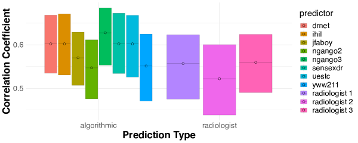

Figure 1: The relative performance of radiologists and predictive algorithms for detecting atelectasis. Each bar plots the Matthews Correlation Coefficient between the corresponding prediction and the ground truth label. Point estimates are reported with $95\%$ bootstrap confidence intervals.
[/FIGURE]

Radiologists can refine algorithmic predictions. We now apply the results of [Section 3](#S3 "3 Results ‣ Distinguishing the Indistinguishable: Human Expertise in Algorithmic Prediction") to investigate *heterogeneity* in the relative performance of humans and algorithms. To do this, we first partition the patients into the approximate level sets of the eight predictors.777This amounts to minimizing Chebyshev distance in the $8$-dimensional space defined by the predictions of each leaderboard algorithm (Gonzalez,, [1985](#bib.bib23)). See <https://github.com/ralur/human-expertise-algorithmic-prediction> for additional detail. Per [Lemma 4.1](#S4.Thmlemma1 "Lemma 4.1. ‣ 4 Learning multicalibrated partitions ‣ Distinguishing the Indistinguishable: Human Expertise in Algorithmic Prediction") and [Corollary A.1](#A1.Thmcorollary1 "Corollary A.1. ‣ A.2 Omitted proofs from Section 4 ‣ Appendix A Proofs and additional technical results ‣ Distinguishing the Indistinguishable: Human Expertise in Algorithmic Prediction"), these level sets are approximately indistinguishable with respect to the eight predictive algorithms we consider. We plot the conditional performance of both the radiologists and the eight leaderboard algorithms within each of these approximately indistinguishable subsets in [Figure 2](#S5.F2 "In 5.1 Chest X-ray interpretation ‣ 5 Experiments ‣ Distinguishing the Indistinguishable: Human Expertise in Algorithmic Prediction").  

[FIGURE S5.F2.g1]
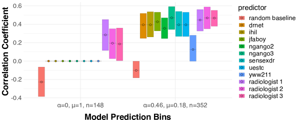

Figure 2: The conditional performance of radiologists and predictive algorithms for detecting atelectasis. Each subset is $\alpha$-indistinguishable with respect to the algorithmic predictors. $\mu$ indicates the fraction of positive algorithmic predictions and $n$ indicates the number of patients. A random permutation of the true labels is included as a baseline. All else is as in [Figure 1](#S5.F1 "In 5.1 Chest X-ray interpretation ‣ 5 Experiments ‣ Distinguishing the Indistinguishable: Human Expertise in Algorithmic Prediction"). The confidence intervals for the algorithmic predictors are not strictly valid (the subsets are chosen conditional on the predictions themselves), but are included for reference against radiologist performance.
[/FIGURE]

The radiologists’ performance is statistically indistinguishable from that of all but one of the algorithms within the ‘mixed’ subset ($\alpha=0.46,\mu=.18$; $\mu$ indicates the fraction of positive algorithmic predictions), where the algorithms generally predict a negative label but vary substantially in their predictions. However, within the ‘positive’ ($\alpha=0,\mu=1$) subset—where all eight algorithms predict a positive label—we see that all three radiologists provide assessments which are significantly more accurate than the algorithmic predictions. Importantly, this heterogeneity was identified *ex-ante* by partitioning the feature space into a pair of indistinguishable subsets. In particular, all eight of the models we consider can be improved by soliciting feedback from the radiologists within the ‘positive’ bin.  

Other pathologies. Although we focus here on diagnosing atelectasis, and the findings above are consistent with our results for two of the other four pathologies considered in Rajpurkar et al., ([2021](#bib.bib41)) (pleural effusion and consolidation): although radiologists fail to outperform algorithmic predictors *on average*, at least two of the radiologists can outperform algorithmic predictions on a sizable minority of patients. Our results for the other two pathologies selected in Rajpurkar et al., ([2021](#bib.bib41)) (cardiomegaly and edema) appear qualitatively similar, but we lack statistical power to draw firm conclusions. We present these results in [Appendix C](#A3 "Appendix C Additional experimental results: chest X-ray diagnosis ‣ Distinguishing the Indistinguishable: Human Expertise in Algorithmic Prediction").  

### 5.2 Prediction of success in human collaboration

We next consider the visual prediction task studied in Saveski et al., ([2021](#bib.bib44)). In this work, the authors curate a dataset of photos taken of participants after they attempt an ‘Escape the Room’ puzzle—“a physical adventure game in which a group is tasked with escaping a maze by collectively solving a series of puzzles" (Saveski et al.,, [2021](#bib.bib44)). In this task, subjects are assigned to one of four treatment conditions and asked to predict whether the group pictured in each photograph succeeded in completing the puzzle.888We focus on study 2 in Saveski et al., ([2021](#bib.bib44)); study 1 analyzes the same task with only two treatment arms. Subjects in the control arm of the study perform this task without any form of training, while subjects in the remaining arms are provided with four, eight and twelve labeled examples, respectively, before beginning this task. Their performance is compared to that of five off-the-shelf learning algorithms, which use high-level features extracted from each photo (e.g., number of people in the photo, gender and ethnic diversity, age distribution, whether participants are smiling etc.) to make a competing prediction.  

Accuracy and indistinguishability in visual prediction. As in the X-ray diagnosis task, we first compare the performance of human subjects to that of the five off-the-shelf predictive algorithms considered in Saveski et al., ([2021](#bib.bib44)). We again find that although humans fail to outperform the best predictive algorithms, their predictions add significant predictive value on instances where the algorithms agree on a positive label. As our results are similar to those in the previous section, we defer them to [Appendix D](#A4 "Appendix D Additional experimental results: prediction from visual features ‣ Distinguishing the Indistinguishable: Human Expertise in Algorithmic Prediction"). We now use this task to illustrate another feature of our framework, which is the ability to incorporate human judgment into a substantially richer class of models.  

Multicalibration over an infinite class. While our previous results illustrate that human judgment can complement a small, fixed set of predictive algorithms, it’s possible that a richer class could obviate the need for human expertise. To explore this, we now consider an infinitely large but nonetheless ‘simple’ class of shallow (depth $\leq 5$) decision trees. We denote this class by $\mathcal{F}^{\text{DT}5}$.  

As in previous sections, our first step will be to learn a partition which is multicalibrated with respect to this class. However, because $\mathcal{F}^{\text{DT}5}$ is infinitely large, the simple approach we used in prior experiments—enumerating each $f\in\mathcal{F}^{\text{DT}5}$ and clustering observations according to their predictions—is infeasible. Instead, we apply the boosting algorithm proposed in Globus-Harris et al., ([2023](#bib.bib22)) to construct a binary classifier $h:\mathcal{X}\rightarrow\{0,1\}$ such that no $f\in\mathcal{F}^{\text{DT}5}$ can substantially improve on the squared error of $h$ within either of its level sets $\{x\mid h(x)=1\}$ and $\{x\mid h(x)=0\}$.999The algorithm terminates when no $f\in\mathcal{F}^{\text{DT}5}$ can reduce squared error within the level sets of $h$. Although the class of binary-valued decision trees is not closed under affine transformations (see [Lemma 4.2](#S4.Thmlemma2 "Lemma 4.2. ‣ 4 Learning multicalibrated partitions ‣ Distinguishing the Indistinguishable: Human Expertise in Algorithmic Prediction")), this partition captures the spirit of our main result: while no $f\in\mathcal{F}^{\text{DT}5}$ can improve accuracy within either level set, humans provide substantial predictive information within both of them. We plot the correlation of the human subjects’ predictions with the true label within each of these level sets in [Figure 3](#S5.F3 "In 5.2 Prediction of success in human collaboration ‣ 5 Experiments ‣ Distinguishing the Indistinguishable: Human Expertise in Algorithmic Prediction").  

[FIGURE S5.F3.g1]
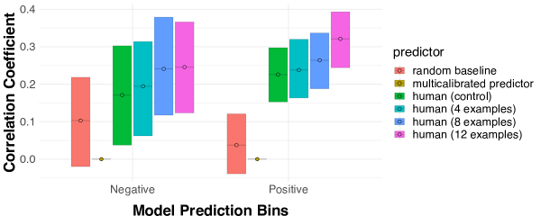

Figure 3: Human predictions within the level sets of a predictor $h$ which is multicalibrated with respect to $\mathcal{F}^{\text{DT}5}$. The ‘negative’ bin is the set $\{x\mid h(x)=0\}$, and the ‘positive’ bin is $\{x\mid h(x)=1\}$. Because $h$ is constant with each of these bins, it is conditionally uncorrelated with the outcome. A random permutation of the true labels is included as a baseline.
[/FIGURE]

[Figure 3](#S5.F3 "In 5.2 Prediction of success in human collaboration ‣ 5 Experiments ‣ Distinguishing the Indistinguishable: Human Expertise in Algorithmic Prediction") highlights a key insight provided by our framework. On one hand, the predictions made by $h$ are more accurate out of sample ($75.2\%$) than even the best performing cohort of human subjects ($67.3\%$). Nonetheless, the predictions made by all four cohorts of human subjects are substantially correlated with the outcome within *both* level sets of $h$. This suggests that humans provide information which cannot be extracted from the data by any $f\in\mathcal{F}^{\text{DT}5}$. While we focus on the class of shallow decision trees for concreteness, our approach applies to any function class for which it is feasible to learn a multicalibrated partition.  

## 6 Robustness to noncompliance

We have thus far focused on how to incorporate human judgment into algorithmic predictions (e.g., via the choice of $\beta$ and $\gamma$ in [Theorem 3.1](#S3.Thmtheorem1 "Theorem 3.1. ‣ 3 Results ‣ Distinguishing the Indistinguishable: Human Expertise in Algorithmic Prediction")). However, many decision support tools are instead deployed in settings where the *user* decides when to defer to *the algorithm*. For example, a prognostic risk score may be deployed to many hospitals, which each employ different norms and policies governing its use (Lebovitz et al.,, [2022](#bib.bib35)). Although it is tempting to ignore these policies and simply provide users with the most accurate predictor, [Bansal et al., 2020a](#bib.bib4)  argue that this approach is suboptimal if users only selectively comply with the algorithm’s recommendations. We formalize this argument via [Lemma A.3](#A1.Thmlemma3 "Lemma A.3. ‣ A.3 Omitted proofs from Section 6 ‣ Appendix A Proofs and additional technical results ‣ Distinguishing the Indistinguishable: Human Expertise in Algorithmic Prediction") in [Appendix A](#A1 "Appendix A Proofs and additional technical results ‣ Distinguishing the Indistinguishable: Human Expertise in Algorithmic Prediction"), where we demonstrate that learning a predictor which is robust to arbitrary ‘noncompliance’ patterns is infeasible. We show next however that, given a partition which is multicalibrated over the class of possible user compliance patterns, we can learn predictors which remain optimal even when users only selectively adopt the algorithm’s recommendations. This is a natural way of imposing structure on users without fully modeling their behavior—for example, we could assume that the user’s decision to comply with the algorithm can be modeled by some ‘simple’ rule (e.g., a shallow decision tree), but one which we do not know ex-ante.  

###### Theorem 6.1.

Let $\Pi$ be a class of binary compliance policies, where, for $\pi\in\Pi$, $\pi(x)=1$ indicates that the user complies with the algorithm at $X=x$. Let $\mathcal{F}$ be a class of predictors and let $\{S_{k}\}_{k\in[K]}$ be a partition which is $\alpha$-multicalibrated with respect to $\Pi$ and the product class $\{f(X)\pi(X)\mid f\in\mathcal{F},\pi\in\Pi\}$. Then, $\forall\ f\in\mathcal{F},\pi\in\Pi,k\in[K]$:  

|  | $\displaystyle\mathbb{E}_{k}$ | $\displaystyle[(Y-\mathbb{E}_{k}[Y])^{2}\mid\pi(X)=1]$ |  | (14) |
| --- | --- | --- | --- | --- |
|  |  | $\displaystyle\leq\mathbb{E}_{k}[(Y-f(X))^{2}\mid\pi(X)=1]+\frac{6\alpha}{\mathbb{P}_{k}(\pi(X)=1)}.$ |  | (15) |
| --- | --- | --- | --- | --- |

To unpack this result, observe that ([14](#S6.E14 "Equation 14 ‣ Theorem 6.1. ‣ 6 Robustness to noncompliance ‣ Distinguishing the Indistinguishable: Human Expertise in Algorithmic Prediction")) is the squared error incurred by the constant prediction $\mathbb{E}_{k}[Y]$ within each indistinguishable subset *when the user defers to the algorithm*. Importantly, although this prediction does not depend on the policy $\pi(\cdot)$, it remains competitive with the squared error incurred by any $f\in\mathcal{F}$ for *any policy* ([15](#S6.E15 "Equation 15 ‣ Theorem 6.1. ‣ 6 Robustness to noncompliance ‣ Distinguishing the Indistinguishable: Human Expertise in Algorithmic Prediction")). The approximation error depends on both the quality of the partition $\alpha$ and the rate of compliance $\mathbb{P}_{k}(\pi(X)=1)$. Unsurprisingly, the bound becomes vacuous as $\mathbb{P}_{k}(\pi(X)=1)$ goes to $0$ (we cannot hope to learn anything on arbitrarily rare subsets). This is consistent with our interpretation of $\pi(\cdot)$ however, as the performance of the algorithm matters little if the decision maker ignores nearly all recommendations.  

This result is complementary to those in [Section 3](#S3 "3 Results ‣ Distinguishing the Indistinguishable: Human Expertise in Algorithmic Prediction")—rather than learning to incorporate feedback from a single expert, we can instead learn a single predictor which is (nearly) optimal for a rich class of downstream users whose behavior is modeled by some $\pi\in\Pi$.  

## 7 Discussion and limitations

In this work we propose a framework for enabling human/AI collaboration in prediction tasks. Under this framework, we develop a family of algorithms for incorporating human judgment into algorithmic predictions, and extend our results to cover settings in which users only selectively adopt algorithmic recommendations. Beyond improving prediction accuracy, we argue that this framing clarifies *when* and *why* human judgment can improve algorithmic predictions.  

A key limitation of our work is a somewhat narrow focus on minimizing mean squared error in prediction tasks. This requires that inputs come from a a well-defined (and stationary) distribution, and fails to model decision makers with richer preferences (e.g., ensuring fairness as well as accuracy). Furthermore, we caution that even in contexts with a well-defined algorithmic objective, human decision makers can be critical for ensuring interpretability and accountability. At a technical level, our results rely on the ability to efficiently *learn* partitions which are multicalibrated with respect to the function class of interest. While we give conditions under which this is feasible in [Section 4](#S4 "4 Learning multicalibrated partitions ‣ Distinguishing the Indistinguishable: Human Expertise in Algorithmic Prediction"), finding such partitions can be prohibitively expensive (in terms of training data and/or computational resources) for rich function classes. Despite these limitations, we hope our work provides both conceptual and methodological insights for enabling effective human/AI collaboration.  

## 8 Acknowledgements

This work is generously supported by a Stephen A. Schwarzmann College of Computing Seed Grant, with funds provided by Andrew W. Houston and Dropbox Inc. We also thank Sarah Cen, Dean Eckles, Nikhil Garg, Christopher Hays, Adam Tauman Kalai, Annie Liang, Sendhil Mullainathan, Emma Pierson, Ashesh Rambachan, Dennis Shung, Sean Sinclair, Jann Spiess, and Keyon Vafa for invaluable feedback and discussions.  

## References

* Agrawal et al., (2018)  Agrawal, A., Gans, J., and Goldfarb, A. (2018).   Exploring the impact of artificial intelligence: Prediction versus judgment.   Technical report, National Bureau of Economic Research, Cambridge, MA. 
* Alur et al., (2023)  Alur, R., Laine, L., Li, D. K., Raghavan, M., Shah, D., and Shung, D. (2023).   Auditing for human expertise. 
* Arnold et al., (2020)  Arnold, D., Dobbie, W., and Hull, P. (2020).   Measuring racial discrimination in bail decisions.   Technical report, National Bureau of Economic Research, Cambridge, MA. 
* (4)  Bansal, G., Nushi, B., Kamar, E., Horvitz, E., and Weld, D. S. (2020a).   Is the most accurate ai the best teammate? optimizing ai for teamwork. 
* (5)  Bansal, G., Wu, T., Zhou, J., Fok, R., Nushi, B., Kamar, E., Ribeiro, M. T., and Weld, D. S. (2020b).   Does the whole exceed its parts? the effect of ai explanations on complementary team performance. 
* Bastani et al., (2021)  Bastani, H., Bastani, O., and Sinchaisri, W. P. (2021).   Improving human decision-making with machine learning. 
* Beede et al., (2020)  Beede, E., Baylor, E. E., Hersch, F., Iurchenko, A., Wilcox, L., Ruamviboonsuk, P., and Vardoulakis, L. M. (2020).   A human-centered evaluation of a deep learning system deployed in clinics for the detection of diabetic retinopathy.   Proceedings of the 2020 CHI Conference on Human Factors in Computing Systems. 
* Benz and Rodriguez, (2023)  Benz, N. L. C. and Rodriguez, M. G. (2023).   Human-aligned calibration for ai-assisted decision making. 
* Camerer and Johnson, (1991)  Camerer, C. and Johnson, E. (1991).   The process-performance paradox in expert judgment: How can experts know so much and predict so badly?   In Ericsson, A. and Smith, J., editors, Toward a General Theory of Expertise: Prospects and Limits. Cambridge University Press. 
* Chicco and Jurman, (2020)  Chicco, D. and Jurman, G. (2020).   The advantages of the matthews correlation coefficient (MCC) over F1 score and accuracy in binary classification evaluation.   BMC Genomics, 21(1):6. 
* Cowgill, (2018)  Cowgill, B. (2018).   Bias and productivity in humans and algorithms: Theory and evidence from resume screening. 
* Cowgill and Stevenson, (2020)  Cowgill, B. and Stevenson, M. T. (2020).   Algorithmic social engineering.   AEA Pap. Proc., 110:96–100. 
* Currie and MacLeod, (2017)  Currie, J. and MacLeod, W. B. (2017).   Diagnosing expertise: Human capital, decision making, and performance among physicians.   J. Labor Econ., 35(1):1–43. 
* Dawes, (1971)  Dawes, R. M. (1971).   A case study of graduate admissions: Application of three principles of human decision making.   Am. Psychol., 26(2):180–188. 
* Dawes et al., (1989)  Dawes, R. M., Faust, D., and Meehl, P. E. (1989).   Clinical versus actuarial judgment.   Science, 243(4899):1668–1674. 
* De et al., (2020)  De, A., Okati, N., Zarezade, A., and Gomez-Rodriguez, M. (2020).   Classification under human assistance. 
* De-Arteaga et al., (2020)  De-Arteaga, M., Fogliato, R., and Chouldechova, A. (2020).   A case for humans-in-the-loop: Decisions in the presence of erroneous algorithmic scores. 
* Dietvorst et al., (2018)  Dietvorst, B., Simmons, J., and Massey, C. (2018).   Overcoming algorithm aversion: People will use imperfect algorithms if they can (even slightly) modify them.   Management Science, 64:1155–1170. 
* Donahue et al., (2022)  Donahue, K., Chouldechova, A., and Kenthapadi, K. (2022).   Human-algorithm collaboration: Achieving complementarity and avoiding unfairness. 
* Dwork et al., (2020)  Dwork, C., Kim, M. P., Reingold, O., Rothblum, G. N., and Yona, G. (2020).   Outcome indistinguishability. 
* Foster and Vohra, (1998)  Foster, D. P. and Vohra, R. V. (1998).   Asymptotic calibration.   Biometrika, 85(2):379–390. 
* Globus-Harris et al., (2023)  Globus-Harris, I., Harrison, D., Kearns, M., Roth, A., and Sorrell, J. (2023).   Multicalibration as boosting for regression. 
* Gonzalez, (1985)  Gonzalez, T. F. (1985).   Clustering to minimize the maximum intercluster distance.   Theor. Comput. Sci., 38:293–306. 
* Gopalan et al., (2021)  Gopalan, P., Kalai, A. T., Reingold, O., Sharan, V., and Wieder, U. (2021).   Omnipredictors. 
* Grove et al., (2000)  Grove, W. M., Zald, D. H., Lebow, B. S., Snitz, B. E., and Nelson, C. (2000).   Clinical versus mechanical prediction: a meta-analysis.   Psychol Assess, 12(1):19–30. 
* Hébert-Johnson et al., (2018)  Hébert-Johnson, U., Kim, M., Reingold, O., and Rothblum, G. (2018).   Multicalibration: Calibration for the (computationally-identifiable) masses.   In International Conference on Machine Learning, pages 1939–1948. PMLR. 
* Irvin et al., (2019)  Irvin, J., Rajpurkar, P., Ko, M., Yu, Y., Ciurea-Ilcus, S., Chute, C., Marklund, H., Haghgoo, B., Ball, R., Shpanskaya, K., Seekins, J., Mong, D. A., Halabi, S. S., Sandberg, J. K., Jones, R., Larson, D. B., Langlotz, C. P., Patel, B. N., Lungren, M. P., and Ng, A. Y. (2019).   Chexpert: A large chest radiograph dataset with uncertainty labels and expert comparison. 
* Keswani et al., (2021)  Keswani, V., Lease, M., and Kenthapadi, K. (2021).   Towards unbiased and accurate deferral to multiple experts.   Proceedings of the 2021 AAAI/ACM Conference on AI, Ethics, and Society. 
* Keswani et al., (2022)  Keswani, V., Lease, M., and Kenthapadi, K. (2022).   Designing closed human-in-the-loop deferral pipelines. 
* Klaes and Sent, (2005)  Klaes, M. and Sent, E.-M. (2005).   A conceptual history of the emergence of bounded rationality.   Hist. Polit. Econ., 37(1):27–59. 
* Kleinberg et al., (2017)  Kleinberg, J., Lakkaraju, H., Leskovec, J., Ludwig, J., and Mullainathan, S. (2017).   Human decisions and machine predictions. 
* Kleinberg and Raghavan, (2021)  Kleinberg, J. and Raghavan, M. (2021).   Algorithmic monoculture and social welfare.   Proceedings of the National Academy of Sciences, 118(22):e2018340118. 
* (33)  Kuncel, N. R., Klieger, D. M., Connelly, B. S., and Ones, D. S. (2013a).   Mechanical versus clinical data combination in selection and admissions decisions: a meta-analysis.   J Appl Psychol, 98(6):1060–1072. 
* (34)  Kuncel, N. R., Klieger, D. M., Connelly, B. S., and Ones, D. S. (2013b).   Mechanical versus clinical data combination in selection and admissions decisions: a meta-analysis.   J Appl Psychol, 98(6):1060–1072. 
* Lebovitz et al., (2022)  Lebovitz, S., Lifshitz-Assaf, H., and Levina, N. (2022).   To engage or not to engage with ai for critical judgments: How professionals deal with opacity when using ai for medical diagnosis.   Organization Science, 33. 
* Madras et al., (2018)  Madras, D., Pitassi, T., and Zemel, R. S. (2018).   Predict responsibly: Improving fairness and accuracy by learning to defer.   In Advances in Neural Information Processing Systems 31, pages 6150–6160. 
* Mozannar and Sontag, (2020)  Mozannar, H. and Sontag, D. A. (2020).   Consistent estimators for learning to defer to an expert.   In International Conference on Machine Learning. 
* Mullainathan and Obermeyer, (2019)  Mullainathan, S. and Obermeyer, Z. (2019).   Diagnosing physician error: A machine learning approach to low-value health care.   Technical report, National Bureau of Economic Research, Cambridge, MA. 
* Okati et al., (2021)  Okati, N., De, A., and Gomez-Rodriguez, M. (2021).   Differentiable learning under triage. 
* Raghu et al., (2019)  Raghu, M., Blumer, K., Corrado, G., Kleinberg, J., Obermeyer, Z., and Mullainathan, S. (2019).   The algorithmic automation problem: Prediction, triage, and human effort. 
* Rajpurkar et al., (2021)  Rajpurkar, P., Joshi, A., Pareek, A., Ng, A. Y., and Lungren, M. P. (2021).   Chexternal: Generalization of deep learning models for chest x-ray interpretation to photos of chest x-rays and external clinical settings. 
* Rambachan, (2022)  Rambachan, A. (2022).   Identifying prediction mistakes in observational data. 
* Rastogi et al., (2022)  Rastogi, C., Leqi, L., Holstein, K., and Heidari, H. (2022).   A taxonomy of human and ml strengths in decision-making to investigate human-ml complementarity. 
* Saveski et al., (2021)  Saveski, M., Awad, E., Rahwan, I., and Cebrian, M. (2021).   Algorithmic and human prediction of success in human collaboration from visual features.   Scientific Reports, 11:2756. 
* Simon, (1957)  Simon, H. A. (1957).   Models of Man: Social and Rational.   Wiley. 
* Steyvers et al., (2022)  Steyvers, M., Tejeda, H., Kerrigan, G., and Smyth, P. (2022).   Bayesian modeling of human-AI complementarity.   Proc. Natl. Acad. Sci. U. S. A., 119(11):e2111547119. 
* Toups et al., (2023)  Toups, C., Bommasani, R., Creel, K. A., Bana, S. H., Jurafsky, D., and Liang, P. (2023).   Ecosystem-level analysis of deployed machine learning reveals homogeneous outcomes.   In Advances in Neural Information Processing Systems 37. 
* Tversky and Kahneman, (1974)  Tversky, A. and Kahneman, D. (1974).   Judgment under uncertainty: Heuristics and biases.   Science, 185(4157):1124–1131. 
* Wilder et al., (2020)  Wilder, B., Horvitz, E., and Kamar, E. (2020).   Learning to complement humans. 

## Appendix A Proofs and additional technical results

In this section we present proofs of our main results. Proofs of auxiliary lemmas are deferred to [Appendix B](#A2 "Appendix B Proofs of auxiliary lemmas ‣ Distinguishing the Indistinguishable: Human Expertise in Algorithmic Prediction").  

### A.1 Omitted proofs from [Section 3](#S3 "3 Results ‣ Distinguishing the Indistinguishable: Human Expertise in Algorithmic Prediction")

###### Lemma A.1.

The following simple lemma will be useful in our subsequent proofs. Let $X\in\{0,1\}$ be a binary random variable. Then for any other random variable, $Y$:  

|  | $\displaystyle\mathrm{Cov}(X,Y)$ |  |  | (16) |
| --- | --- | --- | --- | --- |
|  |  | $\displaystyle=\mathbb{P}(X=1)\left(\mathbb{E}[Y\mid X=1]-\mathbb{E}[Y]\right)$ |  | (17) |
| --- | --- | --- | --- | --- |
|  |  | $\displaystyle=\mathbb{P}(X=0)\left(\mathbb{E}[Y]-\mathbb{E}[Y\mid X=0]\right)$ |  | (18) |
| --- | --- | --- | --- | --- |

This is exactly corollary 5.1 in Gopalan et al., ([2021](#bib.bib24)). We provide the proof in [Appendix B](#A2 "Appendix B Proofs of auxiliary lemmas ‣ Distinguishing the Indistinguishable: Human Expertise in Algorithmic Prediction").  

Proof of [Theorem 3.1](#S3.Thmtheorem1 "Theorem 3.1. ‣ 3 Results ‣ Distinguishing the Indistinguishable: Human Expertise in Algorithmic Prediction")  

###### Proof.

A well known fact about univariate linear regression is that the coefficient of determination (or $r^{2}$) is equal to the square of the Pearson correlation coefficient between the regressor and the outcome (or $r$). In our context, this means that within any indistinguishable subset $S_{k}$ we have:  

|  | $\displaystyle 1-\frac{\mathbb{E}_{k}\left[\left(Y-\gamma^{*}_{k}-\beta^{*}_{k}\hat{Y}\right)^{2}\right]}{\mathbb{E}_{k}\left[\left(Y-\mathbb{E}_{k}[Y]\right)^{2}\right]}=\frac{\mathrm{Cov}_{k}(Y,\hat{Y})^{2}}{\mathrm{Var}_{k}(Y)\mathrm{Var}_{k}(\hat{Y})}$ |  | | (19) |
| --- | --- | --- | --- | --- |
|  | $\displaystyle\Rightarrow\mathbb{E}_{k}\left[\left(Y-\mathbb{E}_{k}[Y]\right)^{2}\right]-\mathbb{E}_{k}\left[\left(Y-\gamma^{*}_{j}-\beta^{*}_{j}\hat{Y}\right)^{2}\right]$ | $\displaystyle=\frac{\mathrm{Cov}_{k}(Y,\hat{Y})^{2}}{\mathrm{Var}(\hat{Y})}$ |  | (20) |
| --- | --- | --- | --- | --- |
|  | $\displaystyle\Rightarrow\mathbb{E}_{k}\left[\left(Y-\gamma^{*}_{j}-\beta^{*}_{j}\hat{Y}\right)^{2}\right]$ | $\displaystyle=\mathbb{E}_{k}\left[\left(Y-\mathbb{E}_{k}[Y]\right)^{2}\right]-\frac{\mathrm{Cov}_{k}(Y,\hat{Y})^{2}}{\mathrm{Var}(\hat{Y})}$ |  | (21) |
| --- | --- | --- | --- | --- |
|  |  | $\displaystyle\leq\mathbb{E}_{k}\left[\left(Y-\mathbb{E}_{k}[Y]\right)^{2}\right]-4\mathrm{Cov}_{k}(Y,\hat{Y})^{2}$ |  | (22) |
| --- | --- | --- | --- | --- |

Where ([22](#A1.E22 "Equation 22 ‣ Proof. ‣ A.1 Omitted proofs from Section 3 ‣ Appendix A Proofs and additional technical results ‣ Distinguishing the Indistinguishable: Human Expertise in Algorithmic Prediction")) is an application of Popoviciu’s inequality for variances, and makes use of the fact that $\hat{Y}\in[0,1]$ almost surely. We can then obtain the final result by applying the following lemma, which extends the main result in Gopalan et al., ([2021](#bib.bib24)). We provide a proof in [Appendix B](#A2 "Appendix B Proofs of auxiliary lemmas ‣ Distinguishing the Indistinguishable: Human Expertise in Algorithmic Prediction"), but for now simply state the result as [Lemma A.2](#A1.Thmlemma2 "Lemma A.2. ‣ Proof. ‣ A.1 Omitted proofs from Section 3 ‣ Appendix A Proofs and additional technical results ‣ Distinguishing the Indistinguishable: Human Expertise in Algorithmic Prediction") below.  

###### Lemma A.2.

Let $\{S_{k}\}_{k\in[K]}$ be an $\alpha$-multicalibrated partition with respect to a real-valued function class $\mathcal{F}=\{f:\mathcal{X}\rightarrow[0,1]\}$ and target outcome $Y\in[0,1]$. For all $f\in\mathcal{F}$ and $k\in[K]$, it follows that:  

|  | $\displaystyle\mathbb{E}_{k}\left[\left(Y-\mathbb{E}[Y]\right)^{2}\right]\leq\mathbb{E}_{k}\left[\left(Y-f(X)\right)^{2}\right]+2\alpha$ |  | (23) |
| --- | --- | --- | --- |

We provide further discussion of the relationship between [Lemma A.2](#A1.Thmlemma2 "Lemma A.2. ‣ Proof. ‣ A.1 Omitted proofs from Section 3 ‣ Appendix A Proofs and additional technical results ‣ Distinguishing the Indistinguishable: Human Expertise in Algorithmic Prediction") and the main result of Gopalan et al., ([2021](#bib.bib24)) in [Section A.4](#A1.SS4 "A.4 Relating Lemma A.2 to Omnipredictors (Gopalan et al.,, 2021) ‣ Appendix A Proofs and additional technical results ‣ Distinguishing the Indistinguishable: Human Expertise in Algorithmic Prediction") below.  

Chaining inequalities ([23](#A1.E23 "Equation 23 ‣ Lemma A.2. ‣ Proof. ‣ A.1 Omitted proofs from Section 3 ‣ Appendix A Proofs and additional technical results ‣ Distinguishing the Indistinguishable: Human Expertise in Algorithmic Prediction")) and ([22](#A1.E22 "Equation 22 ‣ Proof. ‣ A.1 Omitted proofs from Section 3 ‣ Appendix A Proofs and additional technical results ‣ Distinguishing the Indistinguishable: Human Expertise in Algorithmic Prediction")) yields the final result:  

|  | $\displaystyle\mathbb{E}_{k}\left[\left(Y-\gamma^{*}_{j}-\beta^{*}_{j}\hat{Y}\right)^{2}\right]\leq\mathbb{E}_{k}\left[\left(Y-f(X)\right)^{2}\right]+2\alpha-4\mathrm{Cov}_{k}(Y,\hat{Y})^{2}\hskip 4.0pt\forall\hskip 4.0ptf\in\mathcal{F}$ |  | (24) |
| --- | --- | --- | --- |
|  | $\displaystyle\Rightarrow\mathbb{E}_{k}\left[\left(Y-\gamma^{*}_{j}-\beta^{*}_{j}\hat{Y}\right)^{2}\right]+4\mathrm{Cov}_{k}(Y,\hat{Y})^{2}\leq\mathbb{E}_{k}\left[\left(Y-f(X)\right)^{2}\right]+2\alpha\hskip 4.0pt\forall\hskip 4.0ptf\in\mathcal{F}$ |  | (25) |
| --- | --- | --- | --- |

∎  

Proof of [Corollary 3.1](#S3.Thmcorollary1 "Corollary 3.1. ‣ 3 Results ‣ Distinguishing the Indistinguishable: Human Expertise in Algorithmic Prediction")  

###### Proof.

Observe that, because the conditional expectation function $\mathbb{E}_{k}[Y\mid\hat{Y}]$ minimizes squared error with respect to all univariate functions of $\hat{Y}$, we must have:  

|  | $\displaystyle\mathbb{E}_{S}\left[(Y-\mathbb{E}_{S}[Y\mid\hat{Y}])^{2}\right]\leq\mathbb{E}_{S}\left[(Y-\gamma^{*}-\beta^{*}\hat{Y})^{2}\right]$ |  | (26) |
| --- | --- | --- | --- |

Where $\gamma^{*}\in\mathbb{R}$, $\beta^{*}\in\mathbb{R}$ are the population regression coefficients obtained by regression $Y$ on $g(H)$ as in [Theorem 3.1](#S3.Thmtheorem1 "Theorem 3.1. ‣ 3 Results ‣ Distinguishing the Indistinguishable: Human Expertise in Algorithmic Prediction"). This further implies, by the approximate Bayes-optimality condition ([5](#S3.E5 "Equation 5 ‣ Corollary 3.1. ‣ 3 Results ‣ Distinguishing the Indistinguishable: Human Expertise in Algorithmic Prediction")):  

|  | $\displaystyle\mathbb{E}_{S}\left[(Y-g(\hat{Y}))^{2}\right]\leq\mathbb{E}_{S}\left[(Y-\gamma_{k}^{*}-\beta_{k}^{*}\hat{Y})^{2}\right]+\eta$ |  | (27) |
| --- | --- | --- | --- |

The proof then follows immediately from that of [Theorem 3.1](#S3.Thmtheorem1 "Theorem 3.1. ‣ 3 Results ‣ Distinguishing the Indistinguishable: Human Expertise in Algorithmic Prediction").  

∎  

Proof of [Corollary 3.2](#S3.Thmcorollary2 "Corollary 3.2. ‣ 3 Results ‣ Distinguishing the Indistinguishable: Human Expertise in Algorithmic Prediction")  

###### Proof.

The proof is almost immediate. Let $\gamma^{*}$, $\beta^{*}\in\mathbb{R}$ be the population regression coefficients obtained by regressing $Y$ on $g(H)$ within $S$ (as in [Theorem 3.1](#S3.Thmtheorem1 "Theorem 3.1. ‣ 3 Results ‣ Distinguishing the Indistinguishable: Human Expertise in Algorithmic Prediction"); the only difference is that we consider a single indistinguishable subset rather than a multicalibrated partition). This further implies, by the approximate calibration condition ([8](#S3.E8 "Equation 8 ‣ Corollary 3.2. ‣ 3 Results ‣ Distinguishing the Indistinguishable: Human Expertise in Algorithmic Prediction")):  

|  | $\displaystyle\mathbb{E}_{S}\left[(Y-g(H))^{2}\right]\leq\mathbb{E}_{S}\left[(Y-\gamma_{k}^{*}-\beta_{k}^{*}g(H))^{2}\right]+\eta$ |  | (28) |
| --- | --- | --- | --- |

The proof then follows from that of [Theorem 3.1](#S3.Thmtheorem1 "Theorem 3.1. ‣ 3 Results ‣ Distinguishing the Indistinguishable: Human Expertise in Algorithmic Prediction"), replacing $\hat{Y}$ with $g(H)$.  

∎  

Proof of [Theorem 3.2](#S3.Thmtheorem2 "Theorem 3.2. ‣ 3 Results ‣ Distinguishing the Indistinguishable: Human Expertise in Algorithmic Prediction")  

###### Proof.

Fix any $k\in[K]$.  

|  | $\displaystyle\left|\mathrm{Cov}_{k}(Y,\hat{Y})\right|$ |  | | (29) |
| --- | --- | --- | --- | --- |
|  |  | $\displaystyle=\left|\mathbb{E}_{k}[\mathrm{Cov}_{k}(Y,\hat{Y}\mid\tilde{f}_{k}(X)]+\mathrm{Cov}_{k}(\mathbb{E}_{k}[Y\mid\tilde{f}_{k}(X)],\mathbb{E}_{k}[\hat{Y}\mid\tilde{f}_{k}(X)])\right|$ |  | (30) |
| --- | --- | --- | --- | --- |
|  |  | $\displaystyle=\left|\mathrm{Cov}_{k}(\mathbb{E}[Y\mid\tilde{f}_{k}(X)],\mathbb{E}_{k}[\hat{Y}\mid\tilde{f}_{k}(X)])\right|$ |  | (31) |
| --- | --- | --- | --- | --- |
|  |  | $\displaystyle\leq\sqrt{\mathrm{Var}(\mathbb{E}_{k}[Y\mid\tilde{f}_{k}(X)])\mathrm{Var}_{k}(\mathbb{E}[\hat{Y}\mid\tilde{f}_{k}(X)])}$ |  | (32) |
| --- | --- | --- | --- | --- |
|  |  | $\displaystyle\leq\frac{1}{2}\sqrt{\mathrm{Var}_{k}(\mathbb{E}_{k}[Y\mid\tilde{f}_{k}(X)])}$ |  | (33) |
| --- | --- | --- | --- | --- |

Where ([30](#A1.E30 "Equation 30 ‣ Proof. ‣ A.1 Omitted proofs from Section 3 ‣ Appendix A Proofs and additional technical results ‣ Distinguishing the Indistinguishable: Human Expertise in Algorithmic Prediction")) is the law of total covariance, ([31](#A1.E31 "Equation 31 ‣ Proof. ‣ A.1 Omitted proofs from Section 3 ‣ Appendix A Proofs and additional technical results ‣ Distinguishing the Indistinguishable: Human Expertise in Algorithmic Prediction")) follows from the assumption that $Y\perp\!\!\!\perp\hat{Y}\mid\tilde{f}_{k}(X),X\in S_{k}$, ([32](#A1.E32 "Equation 32 ‣ Proof. ‣ A.1 Omitted proofs from Section 3 ‣ Appendix A Proofs and additional technical results ‣ Distinguishing the Indistinguishable: Human Expertise in Algorithmic Prediction")) is the Cauchy-Schwarz inequality and ([33](#A1.E33 "Equation 33 ‣ Proof. ‣ A.1 Omitted proofs from Section 3 ‣ Appendix A Proofs and additional technical results ‣ Distinguishing the Indistinguishable: Human Expertise in Algorithmic Prediction")) applies Popoviciu’s inequality to bound the variance of $\mathbb{E}[\hat{Y}\mid\tilde{f}_{k}(X)]$ (which is assumed to lie in $[0,1]$ almost surely).  

We now focus on bounding $\mathrm{Var}_{k}(\mathbb{E}_{k}[Y\mid\tilde{f}_{k}(X)])$. Recall that by assumption, $|\mathrm{Cov}_{k}(Y,\tilde{f}_{k}(X))|\leq\alpha$, so we should expect that conditioning on $\tilde{f}_{k}(X)$ does not change the expectation of $Y$ by too much.  

|  | $\displaystyle\mathrm{Var}_{k}(\mathbb{E}_{k}[Y\mid\tilde{f}_{k}(X)])$ |  | | (34) |
| --- | --- | --- | --- | --- |
|  |  | $\displaystyle=\mathbb{E}_{k}[(\mathbb{E}_{k}[Y\mid\tilde{f}_{k}(X)]-\mathbb{E}_{k}[\mathbb{E}_{k}[Y\mid\tilde{f}_{k}(X)]])^{2}]$ |  | (35) |
| --- | --- | --- | --- | --- |
|  |  | $\displaystyle=\mathbb{E}_{k}[(\mathbb{E}_{k}[Y\mid\tilde{f}_{k}(X)]-\mathbb{E}_{k}[Y])^{2}]$ |  | (36) |
| --- | --- | --- | --- | --- |
|  |  | $\displaystyle=\mathbb{P}_{k}(\tilde{f}_{k}(X)=1)(\mathbb{E}_{k}[Y\mid\tilde{f}_{k}(X)=1]-\mathbb{E}_{k}[Y])^{2}+\mathbb{P}_{k}(\tilde{f}_{k}(X)=0)(\mathbb{E}_{k}[Y\mid\tilde{f}_{k}(X)=0]-\mathbb{E}_{k}[Y])^{2}$ |  | (37) |
| --- | --- | --- | --- | --- |
|  |  | $\displaystyle\leq\mathbb{P}_{k}(\tilde{f}_{k}(X)=1)\left|\mathbb{E}_{k}[Y\mid\tilde{f}_{k}(X)=1]-\mathbb{E}_{k}[Y]\right|+\mathbb{P}_{k}(\tilde{f}_{k}(X)=0)\left|\mathbb{E}_{k}[Y\mid\tilde{f}_{k}(X)=0]-\mathbb{E}_{k}[Y]\right|$ |  | (38) |
| --- | --- | --- | --- | --- |

Where the last step follows because $Y$ is assumed to be bounded in $[0,1]$ almost surely. Applying [Lemma A.1](#A1.Thmlemma1 "Lemma A.1. ‣ A.1 Omitted proofs from Section 3 ‣ Appendix A Proofs and additional technical results ‣ Distinguishing the Indistinguishable: Human Expertise in Algorithmic Prediction") to ([38](#A1.E38 "Equation 38 ‣ Proof. ‣ A.1 Omitted proofs from Section 3 ‣ Appendix A Proofs and additional technical results ‣ Distinguishing the Indistinguishable: Human Expertise in Algorithmic Prediction")) yields:  

|  | $\displaystyle\mathrm{Var}_{k}(\mathbb{E}_{k}[Y\mid\tilde{f}_{k}(X)])\leq\left|2\mathrm{Cov}_{k}(Y,\tilde{f}_{k}(X))\right|\leq 2\alpha$ |  | (39) |
| --- | --- | --- | --- |

Where the second inequality follows because our analysis is conditional on $X\in S_{k}$ for some $\alpha$-indistinguishable subset $S_{k}$. Plugging ([39](#A1.E39 "Equation 39 ‣ Proof. ‣ A.1 Omitted proofs from Section 3 ‣ Appendix A Proofs and additional technical results ‣ Distinguishing the Indistinguishable: Human Expertise in Algorithmic Prediction")) into ([33](#A1.E33 "Equation 33 ‣ Proof. ‣ A.1 Omitted proofs from Section 3 ‣ Appendix A Proofs and additional technical results ‣ Distinguishing the Indistinguishable: Human Expertise in Algorithmic Prediction")) completes the proof.  

∎  

### A.2 Omitted proofs from [Section 4](#S4 "4 Learning multicalibrated partitions ‣ Distinguishing the Indistinguishable: Human Expertise in Algorithmic Prediction")

Proof of [Lemma 4.1](#S4.Thmlemma1 "Lemma 4.1. ‣ 4 Learning multicalibrated partitions ‣ Distinguishing the Indistinguishable: Human Expertise in Algorithmic Prediction")  

###### Proof.

We want to show $|\mathrm{Cov}(Y,f(X)\mid X\in S)|\leq\alpha$ for all $f\in\mathcal{F}$ and some $S$ such that $\max_{f\in\mathcal{F}}\mathrm{Var}(f(X)\mid X\in S)\leq 4\alpha^{2}$.  

Fix any $f\in\mathcal{F}$. We then have:  

|  | $\displaystyle|\mathrm{Cov}(Y,f(X)\mid X\in S)|$ |  | (40) |
| --- | --- | --- | --- |
|  | $\displaystyle\leq\sqrt{\mathrm{Var}(Y\mid X\in S)\mathrm{Var}(f(X)\mid X\in S)}$ |  | (41) |
| --- | --- | --- | --- |
|  | $\displaystyle\leq\sqrt{\frac{1}{4}\times\mathrm{Var}(f(X)\mid X\in S)}$ |  | (42) |
| --- | --- | --- | --- |
|  | $\displaystyle\leq\sqrt{\frac{1}{4}\times 4\alpha^{2}}$ |  | (43) |
| --- | --- | --- | --- |
|  | $\displaystyle=\alpha$ |  | (44) |
| --- | --- | --- | --- |

Where ([41](#A1.E41 "Equation 41 ‣ Proof. ‣ A.2 Omitted proofs from Section 4 ‣ Appendix A Proofs and additional technical results ‣ Distinguishing the Indistinguishable: Human Expertise in Algorithmic Prediction")) is the Cauchy-Schwarz inequality, ([42](#A1.E42 "Equation 42 ‣ Proof. ‣ A.2 Omitted proofs from Section 4 ‣ Appendix A Proofs and additional technical results ‣ Distinguishing the Indistinguishable: Human Expertise in Algorithmic Prediction")) is Popoviciu’s inequality and makes use of the fact that $Y$ is bounded in $[0,1]$ by assumption, and ([43](#A1.E43 "Equation 43 ‣ Proof. ‣ A.2 Omitted proofs from Section 4 ‣ Appendix A Proofs and additional technical results ‣ Distinguishing the Indistinguishable: Human Expertise in Algorithmic Prediction")) uses the assumption that $\max_{f\in\mathcal{F}}\mathrm{Var}(f(X)\mid X\in S)\leq 4\alpha^{2}$.  

∎  

###### Corollary A.1.

Let $\mathcal{F}$ be a class of predictors whose range is bounded within some $S\subseteq\mathcal{X}$. That is, for all $f\in\mathcal{F}$:  

|  | $\displaystyle\max_{x\in S}f(x)-\min_{x^{\prime}\in S}f(x^{\prime})\leq 4\alpha$ |  | (45) |
| --- | --- | --- | --- |

Then $S$ is $\alpha$-indistinguishable with respect to $\mathcal{F}$.  

Proof of [Corollary A.1](#A1.Thmcorollary1 "Corollary A.1. ‣ A.2 Omitted proofs from Section 4 ‣ Appendix A Proofs and additional technical results ‣ Distinguishing the Indistinguishable: Human Expertise in Algorithmic Prediction")  

###### Proof.

We want to show that $\forall\hskip 4.0ptf\in\mathcal{F}$:  

|  | $\displaystyle|\mathrm{Cov}(Y,f(X)\mid X\in S)|\leq\alpha$ |  | (46) |
| --- | --- | --- | --- |

By assumption, $f(X)$ is bounded in a range of $4\alpha$ within $S$. From this it follows by Popoviciu’s inequality for variances that $\forall\hskip 4.0ptf\in\mathcal{F}$:  

|  | $\displaystyle\mathrm{Var}(f(X)\mid X\in S_{j})\leq\frac{(4\alpha)^{2}}{4}=4\alpha^{2}$ |  | (47) |
| --- | --- | --- | --- |

The proof then follows from [Lemma 4.1](#S4.Thmlemma1 "Lemma 4.1. ‣ 4 Learning multicalibrated partitions ‣ Distinguishing the Indistinguishable: Human Expertise in Algorithmic Prediction").  

∎  

###### Corollary A.2.

Let $\mathcal{F}^{\text{Lip}(L,d)}$ be the set of $L$-Lipschitz functions with respect to some distance metric $d(\cdot,\cdot)$ on $\mathcal{X}$. That is:  

|  | $\displaystyle\left|f(x)-f(x^{\prime})\right|\leq Ld(x,x^{\prime})\hskip 4.0pt\forall\hskip 4.0ptf\in\mathcal{F}^{\text{Lip}(L,d)}$ |  | (48) |
| --- | --- | --- | --- |

Let $\{S_{k}\}_{k\in K}$ for $K\subseteq\mathbb{N}$ be some ($4\alpha/L$)-net on $\mathcal{X}$ with respect to $d(\cdot,\cdot)$. Then $\{S_{k}\}_{k\in K}$ is $\alpha$-multicalibrated with respect to $\mathcal{F}^{\text{Lip}(L,d)}$.  

Proof of [Corollary A.2](#A1.Thmcorollary2 "Corollary A.2. ‣ A.2 Omitted proofs from Section 4 ‣ Appendix A Proofs and additional technical results ‣ Distinguishing the Indistinguishable: Human Expertise in Algorithmic Prediction")  

###### Proof.

We want to show that $\forall\hskip 4.0ptf\in\mathcal{F}^{\text{Lip}(L,d)},k\in K$:  

|  | $\displaystyle|\mathrm{Cov}_{k}(Y,f(X))|\leq\alpha$ |  | (49) |
| --- | --- | --- | --- |

Because $S_{k}$ is part of a $4\alpha/L$-net, there exists some $m\in[0,1]$ such that $\mathbb{P}(f(X)\in[m,m+4\alpha]\mid X\in S_{k})=1$; that is, $f(X)$ is bounded almost surely in some interval of length $4\alpha$. From this it follows by Popoviciu’s inequality for variances that $\forall\hskip 4.0ptf\in\mathcal{F}^{\text{Lip}(L,d)},k\in K$:  

|  | $\displaystyle\mathrm{Var}_{k}(f(X))\leq\frac{(4\alpha)^{2}}{4}=4\alpha^{2}$ |  | (50) |
| --- | --- | --- | --- |

The remainder of the proof follows from [Lemma 4.1](#S4.Thmlemma1 "Lemma 4.1. ‣ 4 Learning multicalibrated partitions ‣ Distinguishing the Indistinguishable: Human Expertise in Algorithmic Prediction").  

∎  

Proof of [Lemma 4.2](#S4.Thmlemma2 "Lemma 4.2. ‣ 4 Learning multicalibrated partitions ‣ Distinguishing the Indistinguishable: Human Expertise in Algorithmic Prediction")  

###### Proof.

The result follows Lemma 3.3 and Lemma 6.8 in Globus-Harris et al., ([2023](#bib.bib22)). We provide a simplified proof below, adapted to our notation. We’ll use $\mathbb{E}_{v}[\cdot]$ to denote the expectation conditional on the event that $\{h(X)=v\}$ for each $v\in\mathcal{R}(h)$. We use $\mathrm{Cov}_{v}(\cdot,\cdot)$ analogously.  

Our proof will proceed in two steps. First we’ll show that:  

|  | $\displaystyle\forall v\in\mathcal{R}(h),f\in\mathcal{F},\mathbb{E}_{v}[(h(X)-Y)^{2}-(f(X)-Y)^{2}]<\alpha^{2}$ |  | (51) |
| --- | --- | --- | --- |
|  | $\displaystyle\Rightarrow\mathbb{E}_{v}[f(X)(Y-v)]<\alpha\hskip 4.0pt\forall\hskip 4.0ptv\in\mathcal{R}(h),f\in\tilde{\mathcal{F}}$ |  | (52) |
| --- | --- | --- | --- |

This condition states that if there does not exist some $v$ in the range of $h$ where the best $f\in\mathcal{F}$ improves on the squared error incurred by $h$ by more than $\alpha^{2}$, then the predictor $h(\cdot)$ is $\alpha$-multicalibrated in the sense of Globus-Harris et al., ([2023](#bib.bib22)) with respect to the constrained class $\tilde{\mathcal{F}}$. We then show that the level sets of a predictor $h(\cdot)$ which satisfies ([52](#A1.E52 "Equation 52 ‣ Proof. ‣ A.2 Omitted proofs from Section 4 ‣ Appendix A Proofs and additional technical results ‣ Distinguishing the Indistinguishable: Human Expertise in Algorithmic Prediction")) form a multicalibrated partition ([Definition 3.2](#S3.Thmdefinition2 "Definition 3.2 (𝛼-Multicalibrated partition). ‣ 3 Results ‣ Distinguishing the Indistinguishable: Human Expertise in Algorithmic Prediction")). That is:  

|  | $\displaystyle\mathbb{E}_{v}[f(X)(Y-v)]\leq\alpha\hskip 4.0pt\forall v\in\mathcal{R}(h),f\in\tilde{\mathcal{F}}\hskip 4.0pt\Rightarrow\mathrm{Cov}_{v}(f(X),Y)\leq 2\alpha\hskip 4.0pt\forall v\in\mathcal{R}(h),f\in\tilde{\mathcal{F}}$ |  | (53) |
| --- | --- | --- | --- |

That is, the level sets $S_{v}=\{x\mid h(x)=v\}$ form a $(2\alpha)$-multicalibrated partition with respect to $\tilde{\mathcal{F}}$.  

First, we’ll prove the contrapositive of ([52](#A1.E52 "Equation 52 ‣ Proof. ‣ A.2 Omitted proofs from Section 4 ‣ Appendix A Proofs and additional technical results ‣ Distinguishing the Indistinguishable: Human Expertise in Algorithmic Prediction")). This proof is adapted from that of Lemma 3.3 in Globus-Harris et al., ([2023](#bib.bib22)). Suppose there exists some $v\in\mathcal{R}(h)$ and $f\in\tilde{\mathcal{F}}$ such that  

|  | $\displaystyle\mathbb{E}_{v}[f(X)(Y-v)]\geq\alpha$ |  | (54) |
| --- | --- | --- | --- |

Then there exists $f^{\prime}\in\mathcal{F}$ such that:  

|  | $\displaystyle\mathbb{E}_{v}[(f^{\prime}(X)-Y)^{2}-(h(X)-Y)^{2}]\geq\alpha^{2}$ |  | (55) |
| --- | --- | --- | --- |

Proof: let $\eta=\frac{\alpha}{\mathbb{E}_{v}[f(X)^{2}]}$ and $f^{\prime}=v+\frac{\alpha}{\mathbb{E}_{v}[f(X)^{2}]}f(X)=v+\eta f(X)$. Then:  

|  | $\displaystyle\mathbb{E}_{v}$ | $\displaystyle\left[(h(X)-Y)^{2}-(f^{\prime}(X)-Y)^{2}\right]$ |  | (56) |
| --- | --- | --- | --- | --- |
|  |  | $\displaystyle=\mathbb{E}_{v}\left[(v-Y)^{2}-(v+\eta f(X)-Y)^{2}\right]$ |  | (57) |
| --- | --- | --- | --- | --- |
|  |  | $\displaystyle=\mathbb{E}_{v}\left[v^{2}+Y^{2}-2Yv-v^{2}-\eta^{2}f(X)^{2}-Y^{2}-2v\eta f(X)+2vY+2\eta f(X)Y\right]$ |  | (58) |
| --- | --- | --- | --- | --- |
|  |  | $\displaystyle=\mathbb{E}_{v}\left[2\eta f(X)\left(Y-v\right)-\eta^{2}f(X)^{2}\right]$ |  | (59) |
| --- | --- | --- | --- | --- |
|  |  | $\displaystyle=\mathbb{E}_{v}\left[2\eta f(X)\left(Y-v\right)\right]-\frac{\alpha^{2}}{\mathbb{E}_{v}[f(X)^{2}]}$ |  | (60) |
| --- | --- | --- | --- | --- |
|  |  | $\displaystyle\geq 2\eta\alpha-\frac{\alpha^{2}}{\mathbb{E}_{v}[f(X)^{2}]}$ |  | (61) |
| --- | --- | --- | --- | --- |
|  |  | $\displaystyle=\frac{\alpha^{2}}{\mathbb{E}_{v}[f(X)^{2}]}$ |  | (62) |
| --- | --- | --- | --- | --- |
|  |  | $\displaystyle\geq\alpha^{2}$ |  | (63) |
| --- | --- | --- | --- | --- |

Where the last step follows because we took $f\in\tilde{\mathcal{F}}$, the subset of the function class $\mathcal{F}$ which only takes values in $[0,1]$. This implies that if instead $\mathbb{E}_{v}[(f^{\prime}(X)-Y)^{2}-(h(X)-Y)^{2}]<\alpha^{2}$ for all $v\in\mathcal{R}(h),f^{\prime}\in\mathcal{F}$, then $\mathbb{E}_{v}[f(X)(Y-v)]<\alpha$ for all $v\in\mathcal{R}(h)$ and $f\in\tilde{\mathcal{F}}$. Next we prove ([53](#A1.E53 "Equation 53 ‣ Proof. ‣ A.2 Omitted proofs from Section 4 ‣ Appendix A Proofs and additional technical results ‣ Distinguishing the Indistinguishable: Human Expertise in Algorithmic Prediction")); that is, $\mathbb{E}_{v}[f(X)(Y-v)]<\alpha$ for all $v\in\mathcal{R}(h)$ and $f\in\tilde{\mathcal{F}}$ implies $\left|\mathrm{Cov}_{v}(f(X),Y)\right|\leq 2\alpha$ for all $v\in\mathcal{R}(h),f\in\tilde{\mathcal{F}}$.  

The proof is adapted from that of Lemma 6.8 in Globus-Harris et al., ([2023](#bib.bib22)); our proof differs beginning at ([71](#A1.E71 "Equation 71 ‣ Proof. ‣ A.2 Omitted proofs from Section 4 ‣ Appendix A Proofs and additional technical results ‣ Distinguishing the Indistinguishable: Human Expertise in Algorithmic Prediction")). Fix some $f\in\tilde{\mathcal{F}}$ and $v\in\mathcal{R}(h)$. By assumption we have, for all $v\in\mathcal{R}(h)$ and $f\in\tilde{\mathcal{F}}$,  

|  | $\displaystyle\mathbb{E}_{v}[f(X)(Y-v)]<\alpha$ |  | (64) |
| --- | --- | --- | --- |

Then we can show:  

|  | $\displaystyle\left|\mathrm{Cov}_{v}(f(X),Y)\right|$ |  |  | (65) |
| --- | --- | --- | --- | --- |
|  |  | $\displaystyle=\left|\mathbb{E}_{v}[f(X)Y]-\mathbb{E}_{v}[f(X)]\mathbb{E}_{v}[Y]\right|$ |  | (66) |
| --- | --- | --- | --- | --- |
|  |  | $\displaystyle=\left|\mathbb{E}_{v}[f(X)Y]-\mathbb{E}_{v}[f(X)]\mathbb{E}_{v}[Y]+v\mathbb{E}_{v}[f(X)]-v\mathbb{E}_{v}[f(X)]\right|$ |  | (67) |
| --- | --- | --- | --- | --- |
|  |  | $\displaystyle=\left|\mathbb{E}_{v}[f(X)(Y-v)]+\mathbb{E}_{v}[f(X)](v-\mathbb{E}_{v}[Y])\right|$ |  | (68) |
| --- | --- | --- | --- | --- |
|  |  | $\displaystyle\leq\left|\mathbb{E}_{v}[f(X)(Y-v)]\right|+\left|\mathbb{E}_{v}[f(X)](v-\mathbb{E}_{v}[Y])\right|$ |  | (69) |
| --- | --- | --- | --- | --- |
|  |  | $\displaystyle=\left|\mathbb{E}_{v}[f(X)(Y-v)]\right|+\left|\mathbb{E}_{v}[f(X)](\mathbb{E}_{v}[Y]-v)\right|$ |  | (70) |
| --- | --- | --- | --- | --- |
|  |  | $\displaystyle\leq\alpha+\left|\mathbb{E}_{v}[f(X)](\mathbb{E}_{v}[Y]-v)\right|$ |  | (71) |
| --- | --- | --- | --- | --- |

Where the last step follows from the assumption ([64](#A1.E64 "Equation 64 ‣ Proof. ‣ A.2 Omitted proofs from Section 4 ‣ Appendix A Proofs and additional technical results ‣ Distinguishing the Indistinguishable: Human Expertise in Algorithmic Prediction")). Now, let $f^{\prime}(X)\equiv\mathbb{E}_{v}[f(X)]$ be the constant function which takes the value $\mathbb{E}_{v}[f(X)]$. We can write ([71](#A1.E71 "Equation 71 ‣ Proof. ‣ A.2 Omitted proofs from Section 4 ‣ Appendix A Proofs and additional technical results ‣ Distinguishing the Indistinguishable: Human Expertise in Algorithmic Prediction")) as follows:  

|  | $\displaystyle\alpha+\left|\mathbb{E}_{v}[f(X)](\mathbb{E}_{v}[Y]-v)\right|$ | $\displaystyle=\alpha+\left|f^{\prime}(X)(\mathbb{E}_{v}[Y]-v)\right|$ |  | (72) |
| --- | --- | --- | --- | --- |
|  |  | $\displaystyle=\alpha+\left|\mathbb{E}_{v}[f^{\prime}(X)(Y-v)]\right|$ |  | (73) |
| --- | --- | --- | --- | --- |

Because $\mathcal{F}$ is closed under affine transformations, it contains all constant functions, and thus, $f^{\prime}(X)\in\mathcal{F}$. $\tilde{\mathcal{F}}$, by definition, is the subset of $\mathcal{F}$ whose range lies in $[0,1]$. Because $f\in\tilde{\mathcal{F}}$, it must be that $\mathbb{E}_{v}[f(X)]\in[0,1]$ and thus, $f^{\prime}\in\tilde{\mathcal{F}}$. So, we can again invoke ([64](#A1.E64 "Equation 64 ‣ Proof. ‣ A.2 Omitted proofs from Section 4 ‣ Appendix A Proofs and additional technical results ‣ Distinguishing the Indistinguishable: Human Expertise in Algorithmic Prediction")) to show:  

|  | $\displaystyle\alpha+\left|\mathbb{E}_{v}[f^{\prime}(X)(Y-v)]\right|\leq 2\alpha$ |  | (74) |
| --- | --- | --- | --- |

Which completes the proof.  

∎  

### A.3 Omitted proofs from [Section 6](#S6 "6 Robustness to noncompliance ‣ Distinguishing the Indistinguishable: Human Expertise in Algorithmic Prediction")

###### Lemma A.3.

Let $\mathcal{F}$ be some class of predictors which map a countable input space $\mathcal{X}$ to $[0,1]$. We interpret a compliance policy $\pi:\mathcal{X}\rightarrow[0,1]$ such that $\pi(x)=1$ indicates that the user complies with the algorithm’s recommendation at $X=x$. For all $f\in\mathcal{F}$, unless $f=\mathbb{E}[Y\mid X]$ almost everywhere, then there exists a deferral policy $\pi:\mathcal{X}\rightarrow\{0,1\}$ and constant $c\in[0,1]$ such that:  

|  | $\displaystyle\mathbb{E}[(Y-f(X))^{2}\mid\pi(X)=1]>\mathbb{E}[(Y-c)^{2}\mid\pi(X)=1]$ |  | (75) |
| --- | --- | --- | --- |

[Lemma A.3](#A1.Thmlemma3 "Lemma A.3. ‣ A.3 Omitted proofs from Section 6 ‣ Appendix A Proofs and additional technical results ‣ Distinguishing the Indistinguishable: Human Expertise in Algorithmic Prediction") indicates that for any predictor $f$ which is not the Bayes optimal predictor, there exists a compliance policy which causes it to underperform a constant prediction on the instances for which it is ultimately responsible. Because learning the Bayes optimal predictor from a finite sample of data is generally infeasible, this indicates that a predictor cannot reasonably be made robust to an arbitrary deferral policy. The proof, which we provide below, is intuitive: the decision maker can simply choose to comply on exactly those instances where $f$ performs poorly.  

Proof of [Lemma A.3](#A1.Thmlemma3 "Lemma A.3. ‣ A.3 Omitted proofs from Section 6 ‣ Appendix A Proofs and additional technical results ‣ Distinguishing the Indistinguishable: Human Expertise in Algorithmic Prediction")  

###### Proof.

Let $f\in\mathcal{F}$ be any model and let $S\subseteq\mathcal{X}$ be a subset such that (1) $\mathbb{P}_{X}(S)>0$ (2) the Bayes optimal predictor $\mathbb{E}[Y\mid X]$ is constant within $S$ and (3) $f(X)\neq\mathbb{E}[Y\mid X=x]$ for all $x\in S$. Such a subset must exist by assumption. It follows immediately that choosing  

|  | $\displaystyle\pi(x)=\begin{cases}1\text{ if }x\in S\\ 0\text{ otherwise}\end{cases}$ |  |
| --- | --- | --- |

suffices to ensure that $f(X)$ underperforms the constant prediction $c_{S}=\mathbb{E}[Y\mid X\in S]$ on the subset which $\pi$ delegates to $f$. This implies that even if $\mathcal{F}$ includes the class of constant predictors $\{f(X)=c\mid c\in\mathbb{R}\}$—perhaps the simplest possible class of predictors—then we cannot hope to find some $f^{*}\in\mathcal{F}$ which is simultaneously optimal for any choice of deferral policy. ∎  

Proof of [Theorem 6.1](#S6.Thmtheorem1 "Theorem 6.1. ‣ 6 Robustness to noncompliance ‣ Distinguishing the Indistinguishable: Human Expertise in Algorithmic Prediction")  

###### Proof.

We start with the assumption that $\{S_{k}\}_{k\in[K]}$ is $\alpha$-multicalibrated with respect to $\Pi$ and the product class $\{f(X)\pi(X)\mid f\in\mathcal{F},\pi\in\Pi\}$. That is, both of the following hold:  

|  | $\displaystyle\left|\mathrm{Cov}_{k}(Y,\pi(X))\right|$ | $\displaystyle\leq\alpha\ \forall\ \pi\in\Pi,k\in[K]$ |  | (76) |
| --- | --- | --- | --- | --- |
|  | $\displaystyle\left|\mathrm{Cov}_{k}(Y,f(X)\pi(X))\right|$ | $\displaystyle\leq\alpha\ \forall\ f\in\mathcal{F},\pi\in\Pi,k\in[K]$ |  | (77) |
| --- | --- | --- | --- | --- |

First, we’ll show that this implies that the covariance of $Y$ and $f(X)$ is bounded even conditional on compliance. To streamline presentation we state this as a separate lemma; the proof is provided further below.  

###### Lemma A.4.

Given the setup of [Theorem 6.1](#S6.Thmtheorem1 "Theorem 6.1. ‣ 6 Robustness to noncompliance ‣ Distinguishing the Indistinguishable: Human Expertise in Algorithmic Prediction"), the following holds for all $k\in[K],f\in\mathcal{F}$ and $\pi\in\Pi$:  

|  | $\displaystyle\left|\mathrm{Cov}_{k}(Y,f(X)\mid\pi(X)=1)\right|\leq\frac{2\alpha}{\mathbb{P}_{k}(\pi(X)=1)}$ |  | (78) |
| --- | --- | --- | --- |

We provide a proof in [Appendix B](#A2 "Appendix B Proofs of auxiliary lemmas ‣ Distinguishing the Indistinguishable: Human Expertise in Algorithmic Prediction"). By [Lemma A.2](#A1.Thmlemma2 "Lemma A.2. ‣ Proof. ‣ A.1 Omitted proofs from Section 3 ‣ Appendix A Proofs and additional technical results ‣ Distinguishing the Indistinguishable: Human Expertise in Algorithmic Prediction"), [Lemma A.4](#A1.Thmlemma4 "Lemma A.4. ‣ Proof. ‣ A.3 Omitted proofs from Section 6 ‣ Appendix A Proofs and additional technical results ‣ Distinguishing the Indistinguishable: Human Expertise in Algorithmic Prediction") implies, for all $k\in[K],f\in\mathcal{F}$ and $\pi\in\Pi$:  

|  | $\displaystyle\mathbb{E}_{k}\left[\left(Y-\mathbb{E}_{k}[Y\mid\pi(X)=1]\right)^{2}\mid\pi(X)=1\right]\leq\mathbb{E}_{k}\left[\left(Y-f(X)\right)^{2}\mid\pi(X)=1\right]+\frac{4\alpha}{\mathbb{P}(\pi(X)=1)}$ |  | (79) |
| --- | --- | --- | --- |

This is close to what we want to prove, except that the prediction $E_{k}[Y\mid\pi(X)=1]$ depends on the choice of the policy $\pi(\cdot)$. We’ll argue that by ([76](#A1.E76 "Equation 76 ‣ Proof. ‣ A.3 Omitted proofs from Section 6 ‣ Appendix A Proofs and additional technical results ‣ Distinguishing the Indistinguishable: Human Expertise in Algorithmic Prediction")), $\mathbb{E}_{k}[Y\mid\pi(X)=1]\approx\mathbb{E}_{k}[Y]$. Indeed, because $\pi(\cdot)$ is binary, we can apply [Lemma A.1](#A1.Thmlemma1 "Lemma A.1. ‣ A.1 Omitted proofs from Section 3 ‣ Appendix A Proofs and additional technical results ‣ Distinguishing the Indistinguishable: Human Expertise in Algorithmic Prediction") to recover:  

|  | $\displaystyle\left|\mathrm{Cov}(\pi(X),Y)\right|$ | $\displaystyle=\mathbb{P}_{k}(\pi(X)=1)\left|\mathbb{E}_{k}[Y\mid\pi(X)=1]-\mathbb{E}_{k}[Y]\right|$ |  | (80) |
| --- | --- | --- | --- | --- |
|  |  | $\displaystyle\Rightarrow\left|\mathbb{E}_{k}[Y\mid\pi(X)=1]-\mathbb{E}_{k}[Y]\right|\leq\frac{\alpha}{\mathbb{P}_{k}(\pi(X)=1)}$ |  | (81) |
| --- | --- | --- | --- | --- |

We rewrite the LHS of ([79](#A1.E79 "Equation 79 ‣ Lemma A.4. ‣ Proof. ‣ A.3 Omitted proofs from Section 6 ‣ Appendix A Proofs and additional technical results ‣ Distinguishing the Indistinguishable: Human Expertise in Algorithmic Prediction")) to make use of this identity as follows:  

|  | $\displaystyle\mathbb{E}_{k}\left[\left(Y-\mathbb{E}_{k}[Y\mid\pi(X)=1]\right)^{2}\mid\pi(X)=1\right]$ |  | (82) |
| --- | --- | --- | --- |
|  | $\displaystyle=\mathbb{E}_{k}\left[\left((Y-\mathbb{E}_{k}[Y])+(\mathbb{E}_{k}[Y]-\mathbb{E}_{k}[Y\mid\pi(X)=1])\right)^{2}\mid\pi(X)=1\right]$ |  | (83) |
| --- | --- | --- | --- |
|  | $\displaystyle=\mathbb{E}_{k}\left[\left((Y-\mathbb{E}_{k}[Y])^{2}+(\mathbb{E}_{k}[Y]-\mathbb{E}_{k}[Y\mid\pi(X)=1])^{2}+2(Y-\mathbb{E}_{k}[Y])(\mathbb{E}_{k}[Y]-\mathbb{E}_{k}[Y\mid\pi(X)=1])\right)\mid\pi(X)=1\right]$ |  | (84) |
| --- | --- | --- | --- |
|  | $\displaystyle\geq\mathbb{E}_{k}\left[\left((Y-\mathbb{E}_{k}[Y])^{2}+2(Y-\mathbb{E}_{k}[Y])(\mathbb{E}_{k}[Y]-\mathbb{E}_{k}[Y\mid\pi(X)=1])\right)\mid\pi(X)=1\right]$ |  | (85) |
| --- | --- | --- | --- |
|  | $\displaystyle=\mathbb{E}_{k}\left[(Y-\mathbb{E}_{k}[Y])^{2}\mid\pi(X)=1\right]+2\left(\mathbb{E}_{k}[Y]-\mathbb{E}_{k}[Y\mid\pi(X)=1]\right)\left(\mathbb{E}_{k}[Y\mid\pi(X)=1]-\mathbb{E}_{k}[Y]\right)$ |  | (86) |
| --- | --- | --- | --- |
|  | $\displaystyle\geq\mathbb{E}_{k}\left[(Y-\mathbb{E}_{k}[Y])^{2}\mid\pi(X)=1\right]-\frac{2\alpha}{\mathbb{P}_{k}(\pi(X)=1)}$ |  | (87) |
| --- | --- | --- | --- |

Where the last step follows by observing that either (1) $\mathbb{E}_{k}[Y]=\mathbb{E}_{k}[Y\mid\pi(X)=1]$ or (2) exactly one of $(\mathbb{E}_{k}[Y]-\mathbb{E}_{k}[Y\mid\pi(X)=1])$ or $(\mathbb{E}_{k}[Y\mid\pi(X)=1]-\mathbb{E}_{k}[Y])$ is strictly positive. Assume that $\mathbb{E}_{k}[Y]\neq\mathbb{E}_{k}[Y\mid\pi(X)=1]$; otherwise the bound follows trivially. We bound the positive term by recalling that $Y$ lies in $[0,1]$, and we bound the negative term by applying ([81](#A1.E81 "Equation 81 ‣ Lemma A.4. ‣ Proof. ‣ A.3 Omitted proofs from Section 6 ‣ Appendix A Proofs and additional technical results ‣ Distinguishing the Indistinguishable: Human Expertise in Algorithmic Prediction")). Thus, the product of these two terms is at least $\frac{-\alpha}{\mathbb{P}_{k}(\pi(X)=1)}$. Finally, combining ([87](#A1.E87 "Equation 87 ‣ Lemma A.4. ‣ Proof. ‣ A.3 Omitted proofs from Section 6 ‣ Appendix A Proofs and additional technical results ‣ Distinguishing the Indistinguishable: Human Expertise in Algorithmic Prediction")) with ([79](#A1.E79 "Equation 79 ‣ Lemma A.4. ‣ Proof. ‣ A.3 Omitted proofs from Section 6 ‣ Appendix A Proofs and additional technical results ‣ Distinguishing the Indistinguishable: Human Expertise in Algorithmic Prediction")) completes the proof.  

∎  

### A.4 Relating [Lemma A.2](#A1.Thmlemma2 "Lemma A.2. ‣ Proof. ‣ A.1 Omitted proofs from Section 3 ‣ Appendix A Proofs and additional technical results ‣ Distinguishing the Indistinguishable: Human Expertise in Algorithmic Prediction") to Omnipredictors (Gopalan et al.,, [2021](#bib.bib24))

In this section we compare [Lemma A.2](#A1.Thmlemma2 "Lemma A.2. ‣ Proof. ‣ A.1 Omitted proofs from Section 3 ‣ Appendix A Proofs and additional technical results ‣ Distinguishing the Indistinguishable: Human Expertise in Algorithmic Prediction") to the main result of Gopalan et al., ([2021](#bib.bib24)). While the main result of Gopalan et al., ([2021](#bib.bib24)) applies broadly to convex, Lipschitz loss functions, we focus on the special case of minimizing squared error. In this case, we show that [Lemma A.2](#A1.Thmlemma2 "Lemma A.2. ‣ Proof. ‣ A.1 Omitted proofs from Section 3 ‣ Appendix A Proofs and additional technical results ‣ Distinguishing the Indistinguishable: Human Expertise in Algorithmic Prediction") extends the main result of Gopalan et al., ([2021](#bib.bib24)) to cover real-valued outcomes under somewhat weaker and more natural conditions. We proceed in three steps: first, to provide a self-contained exposition, we state the result of Gopalan et al., ([2021](#bib.bib24)) for real-valued outcomes in the special case of squared error ([Lemma A.5](#A1.Thmlemma5 "Lemma A.5 (Omnipredictors for binary outcomes, specialized to squared error (Gopalan et al., (2021), Theorem 6.3)). ‣ A.4 Relating Lemma A.2 to Omnipredictors (Gopalan et al.,, 2021) ‣ Appendix A Proofs and additional technical results ‣ Distinguishing the Indistinguishable: Human Expertise in Algorithmic Prediction") and [Lemma A.6](#A1.Thmlemma6 "Lemma A.6 (Extending Lemma A.5 to real-valued 𝑌 (Gopalan et al., (2021), adapted from Theorem 8.1)). ‣ A.4 Relating Lemma A.2 to Omnipredictors (Gopalan et al.,, 2021) ‣ Appendix A Proofs and additional technical results ‣ Distinguishing the Indistinguishable: Human Expertise in Algorithmic Prediction") below). Second, we derive a matching bound using [Lemma A.2](#A1.Thmlemma2 "Lemma A.2. ‣ Proof. ‣ A.1 Omitted proofs from Section 3 ‣ Appendix A Proofs and additional technical results ‣ Distinguishing the Indistinguishable: Human Expertise in Algorithmic Prediction") (our result), which we do by demonstrating that the conditions of [Lemma A.6](#A1.Thmlemma6 "Lemma A.6 (Extending Lemma A.5 to real-valued 𝑌 (Gopalan et al., (2021), adapted from Theorem 8.1)). ‣ A.4 Relating Lemma A.2 to Omnipredictors (Gopalan et al.,, 2021) ‣ Appendix A Proofs and additional technical results ‣ Distinguishing the Indistinguishable: Human Expertise in Algorithmic Prediction") imply the conditions of [Lemma A.2](#A1.Thmlemma2 "Lemma A.2. ‣ Proof. ‣ A.1 Omitted proofs from Section 3 ‣ Appendix A Proofs and additional technical results ‣ Distinguishing the Indistinguishable: Human Expertise in Algorithmic Prediction"). Finally, we show that [Lemma A.2](#A1.Thmlemma2 "Lemma A.2. ‣ Proof. ‣ A.1 Omitted proofs from Section 3 ‣ Appendix A Proofs and additional technical results ‣ Distinguishing the Indistinguishable: Human Expertise in Algorithmic Prediction") applies in more generality than [Lemma A.6](#A1.Thmlemma6 "Lemma A.6 (Extending Lemma A.5 to real-valued 𝑌 (Gopalan et al., (2021), adapted from Theorem 8.1)). ‣ A.4 Relating Lemma A.2 to Omnipredictors (Gopalan et al.,, 2021) ‣ Appendix A Proofs and additional technical results ‣ Distinguishing the Indistinguishable: Human Expertise in Algorithmic Prediction"), under conditions which match those of [Definition 3.2](#S3.Thmdefinition2 "Definition 3.2 (𝛼-Multicalibrated partition). ‣ 3 Results ‣ Distinguishing the Indistinguishable: Human Expertise in Algorithmic Prediction").  

We first state the main result of Gopalan et al., ([2021](#bib.bib24)) (adapted to our notation) below, which holds for binary outcomes $Y\in\{0,1\}$.101010As discussed in [Section 1](#S1 "1 Introduction ‣ Distinguishing the Indistinguishable: Human Expertise in Algorithmic Prediction"), we also continue to elide the distinction between the ‘approximate’ multicalibration of Gopalan et al., ([2021](#bib.bib24)) and our focus on individual indistinguishable subsets. The results in this section can again be interpreted as holding for the ‘typical’ element of an approximately multicalibrated partition.  

###### Lemma A.5 (Omnipredictors for binary outcomes, specialized to squared error (Gopalan et al., ([2021](#bib.bib24)), Theorem 6.3)).

Let $S$ be a subset which is $\alpha$-indistinguishable with respect to a real-valued function class $\mathcal{F}$ and a binary target outcome $Y\in\{0,1\}$. Then, for all $f\in\mathcal{F}$,  

|  | $\displaystyle\mathbb{E}_{S}\left[\left(Y-\mathbb{E}[Y]\right)^{2}\right]\leq\mathbb{E}_{S}\left[\left(Y-f(X)\right)^{2}\right]+4\alpha$ |  | (88) |
| --- | --- | --- | --- |

This result makes use of the fact that for any fixed $y\in[0,1]$, the squared error function is $2$-Lipschitz with respect to $f(x)$ over the interval $[0,1]$. This is similar to [Lemma A.2](#A1.Thmlemma2 "Lemma A.2. ‣ Proof. ‣ A.1 Omitted proofs from Section 3 ‣ Appendix A Proofs and additional technical results ‣ Distinguishing the Indistinguishable: Human Expertise in Algorithmic Prediction"), but requires that $Y$ is binary-valued. In contrast, [Lemma A.2](#A1.Thmlemma2 "Lemma A.2. ‣ Proof. ‣ A.1 Omitted proofs from Section 3 ‣ Appendix A Proofs and additional technical results ‣ Distinguishing the Indistinguishable: Human Expertise in Algorithmic Prediction") allows for real-valued $Y\in[0,1]$, and gains a factor of $2$ on the RHS.111111Note that [Lemma A.2](#A1.Thmlemma2 "Lemma A.2. ‣ Proof. ‣ A.1 Omitted proofs from Section 3 ‣ Appendix A Proofs and additional technical results ‣ Distinguishing the Indistinguishable: Human Expertise in Algorithmic Prediction") also requires that each $f\in\mathcal{F}$ takes values in $[0,1]$, but this is without loss of generality when the outcome is bounded in $[0,1]$; projecting each $f\in\mathcal{F}$ onto $[0,1]$ can only reduce squared error. Gopalan et al., ([2021](#bib.bib24)) provide an alternate extension of [Lemma A.5](#A1.Thmlemma5 "Lemma A.5 (Omnipredictors for binary outcomes, specialized to squared error (Gopalan et al., (2021), Theorem 6.3)). ‣ A.4 Relating Lemma A.2 to Omnipredictors (Gopalan et al.,, 2021) ‣ Appendix A Proofs and additional technical results ‣ Distinguishing the Indistinguishable: Human Expertise in Algorithmic Prediction") to bounded, real-valued $Y$, which we present below for comparison to [Lemma A.2](#A1.Thmlemma2 "Lemma A.2. ‣ Proof. ‣ A.1 Omitted proofs from Section 3 ‣ Appendix A Proofs and additional technical results ‣ Distinguishing the Indistinguishable: Human Expertise in Algorithmic Prediction").  

Extending [Lemma A.5](#A1.Thmlemma5 "Lemma A.5 (Omnipredictors for binary outcomes, specialized to squared error (Gopalan et al., (2021), Theorem 6.3)). ‣ A.4 Relating Lemma A.2 to Omnipredictors (Gopalan et al.,, 2021) ‣ Appendix A Proofs and additional technical results ‣ Distinguishing the Indistinguishable: Human Expertise in Algorithmic Prediction") to real-valued $Y$. Fix some $\epsilon>0$, and let $B(\epsilon)=\{0,1,2\dots\lfloor\frac{2}{\epsilon}\rfloor\}$. Let $\tilde{Y}$ be a random variable which represents a discretization of $Y$ into bins of size $\frac{\epsilon}{2}$. That is, $\tilde{Y}=\min_{b\in B(\epsilon)}\left|Y-\frac{b\epsilon}{2}\right|$. Let $\mathcal{R}(\tilde{Y})$ denote the range of $\tilde{Y}$. Observe that the following holds for any function $g:\mathcal{X}\rightarrow[0,1]$:  

|  | $\displaystyle\left|\mathbb{E}[(\tilde{Y}-g(X))^{2}]-\mathbb{E}[(Y-g(X))^{2}]\right|\leq\epsilon$ |  | (89) |
| --- | --- | --- | --- |

Where ([89](#A1.E89 "Equation 89 ‣ A.4 Relating Lemma A.2 to Omnipredictors (Gopalan et al.,, 2021) ‣ Appendix A Proofs and additional technical results ‣ Distinguishing the Indistinguishable: Human Expertise in Algorithmic Prediction")) follows because the function $(y-g(x))^{2}$ is $2$-Lipschitz with respect to $g(x)$ over $[0,1]$ for all $y\in[0,1]$. We now work with the discretization of $\tilde{Y}$, and provide an analogue to [Lemma A.5](#A1.Thmlemma5 "Lemma A.5 (Omnipredictors for binary outcomes, specialized to squared error (Gopalan et al., (2021), Theorem 6.3)). ‣ A.4 Relating Lemma A.2 to Omnipredictors (Gopalan et al.,, 2021) ‣ Appendix A Proofs and additional technical results ‣ Distinguishing the Indistinguishable: Human Expertise in Algorithmic Prediction") under a modified indistinguishability condition for discrete-valued $\tilde{Y}$, which we’ll show is stronger than [Definition 3.1](#S3.Thmdefinition1 "Definition 3.1 (𝛼-Indistinguishable subset). ‣ 3 Results ‣ Distinguishing the Indistinguishable: Human Expertise in Algorithmic Prediction").  

###### Lemma A.6 (Extending [Lemma A.5](#A1.Thmlemma5 "Lemma A.5 (Omnipredictors for binary outcomes, specialized to squared error (Gopalan et al., (2021), Theorem 6.3)). ‣ A.4 Relating Lemma A.2 to Omnipredictors (Gopalan et al.,, 2021) ‣ Appendix A Proofs and additional technical results ‣ Distinguishing the Indistinguishable: Human Expertise in Algorithmic Prediction") to real-valued $Y$ (Gopalan et al., ([2021](#bib.bib24)), adapted from Theorem 8.1)).

Let $\mathcal{R}(f)$ denote the range of a function $f$, and let $1(\cdot)$ denote the indicator function. Let $S$ be a subset which satisfies the following condition with respect to a function class $\mathcal{F}$ and discretized target $\tilde{Y}$:  

For all $f\in\mathcal{F}$ and $\tilde{y}\in\mathcal{R}(\tilde{Y})$, if:  

|  | $\displaystyle\left|\mathrm{Cov}_{S}(1(\tilde{Y}=\tilde{y}),f(X))\right|\leq\alpha$ |  | (90) |
| --- | --- | --- | --- |

Then:  

|  | $\displaystyle\mathbb{E}_{S}\left[\left(\tilde{Y}-\mathbb{E}_{S}[\tilde{Y}]\right)^{2}\right]\leq\mathbb{E}_{S}\left[\left(\tilde{Y}-f(X)\right)^{2}\right]+2\left\lceil\frac{2}{\epsilon}\right\rceil\alpha$ |  | (91) |
| --- | --- | --- | --- |

To interpret this result, observe that ([91](#A1.E91 "Equation 91 ‣ Lemma A.6 (Extending Lemma A.5 to real-valued 𝑌 (Gopalan et al., (2021), adapted from Theorem 8.1)). ‣ A.4 Relating Lemma A.2 to Omnipredictors (Gopalan et al.,, 2021) ‣ Appendix A Proofs and additional technical results ‣ Distinguishing the Indistinguishable: Human Expertise in Algorithmic Prediction")) yields a bound which is similar to [Lemma A.5](#A1.Thmlemma5 "Lemma A.5 (Omnipredictors for binary outcomes, specialized to squared error (Gopalan et al., (2021), Theorem 6.3)). ‣ A.4 Relating Lemma A.2 to Omnipredictors (Gopalan et al.,, 2021) ‣ Appendix A Proofs and additional technical results ‣ Distinguishing the Indistinguishable: Human Expertise in Algorithmic Prediction") under a modified ‘pointwise’ indistinguishability condition ([90](#A1.E90 "Equation 90 ‣ Lemma A.6 (Extending Lemma A.5 to real-valued 𝑌 (Gopalan et al., (2021), adapted from Theorem 8.1)). ‣ A.4 Relating Lemma A.2 to Omnipredictors (Gopalan et al.,, 2021) ‣ Appendix A Proofs and additional technical results ‣ Distinguishing the Indistinguishable: Human Expertise in Algorithmic Prediction")) for any discretization $\tilde{Y}$ of $Y$. Combining ([91](#A1.E91 "Equation 91 ‣ Lemma A.6 (Extending Lemma A.5 to real-valued 𝑌 (Gopalan et al., (2021), adapted from Theorem 8.1)). ‣ A.4 Relating Lemma A.2 to Omnipredictors (Gopalan et al.,, 2021) ‣ Appendix A Proofs and additional technical results ‣ Distinguishing the Indistinguishable: Human Expertise in Algorithmic Prediction")) with ([89](#A1.E89 "Equation 89 ‣ A.4 Relating Lemma A.2 to Omnipredictors (Gopalan et al.,, 2021) ‣ Appendix A Proofs and additional technical results ‣ Distinguishing the Indistinguishable: Human Expertise in Algorithmic Prediction")) further implies:  

|  | $\displaystyle\mathbb{E}_{S}\left[\left(Y-\mathbb{E}_{S}[\tilde{Y}]\right)^{2}\right]\leq\mathbb{E}_{S}\left[\left(Y-f(X)\right)^{2}\right]+2\left\lceil\frac{2}{\epsilon}\right\rceil\alpha+2\epsilon$ |  | (92) |
| --- | --- | --- | --- |

Deriving [Lemma A.6](#A1.Thmlemma6 "Lemma A.6 (Extending Lemma A.5 to real-valued 𝑌 (Gopalan et al., (2021), adapted from Theorem 8.1)). ‣ A.4 Relating Lemma A.2 to Omnipredictors (Gopalan et al.,, 2021) ‣ Appendix A Proofs and additional technical results ‣ Distinguishing the Indistinguishable: Human Expertise in Algorithmic Prediction") using [Lemma A.2](#A1.Thmlemma2 "Lemma A.2. ‣ Proof. ‣ A.1 Omitted proofs from Section 3 ‣ Appendix A Proofs and additional technical results ‣ Distinguishing the Indistinguishable: Human Expertise in Algorithmic Prediction")  

We show next that the ‘pointwise’ condition ([90](#A1.E90 "Equation 90 ‣ Lemma A.6 (Extending Lemma A.5 to real-valued 𝑌 (Gopalan et al., (2021), adapted from Theorem 8.1)). ‣ A.4 Relating Lemma A.2 to Omnipredictors (Gopalan et al.,, 2021) ‣ Appendix A Proofs and additional technical results ‣ Distinguishing the Indistinguishable: Human Expertise in Algorithmic Prediction")) for $\alpha\geq 0$ implies our standard indistinguishability condition ([Definition 3.1](#S3.Thmdefinition1 "Definition 3.1 (𝛼-Indistinguishable subset). ‣ 3 Results ‣ Distinguishing the Indistinguishable: Human Expertise in Algorithmic Prediction")) for $\alpha^{\prime}=\left\lceil\frac{2}{\epsilon}\right\rceil\alpha$. This will allow us to apply [Lemma A.2](#A1.Thmlemma2 "Lemma A.2. ‣ Proof. ‣ A.1 Omitted proofs from Section 3 ‣ Appendix A Proofs and additional technical results ‣ Distinguishing the Indistinguishable: Human Expertise in Algorithmic Prediction") to obtain a bound which is identical to ([92](#A1.E92 "Equation 92 ‣ A.4 Relating Lemma A.2 to Omnipredictors (Gopalan et al.,, 2021) ‣ Appendix A Proofs and additional technical results ‣ Distinguishing the Indistinguishable: Human Expertise in Algorithmic Prediction")). Thus, we show that [Lemma A.2](#A1.Thmlemma2 "Lemma A.2. ‣ Proof. ‣ A.1 Omitted proofs from Section 3 ‣ Appendix A Proofs and additional technical results ‣ Distinguishing the Indistinguishable: Human Expertise in Algorithmic Prediction") is at least as general as [Lemma A.6](#A1.Thmlemma6 "Lemma A.6 (Extending Lemma A.5 to real-valued 𝑌 (Gopalan et al., (2021), adapted from Theorem 8.1)). ‣ A.4 Relating Lemma A.2 to Omnipredictors (Gopalan et al.,, 2021) ‣ Appendix A Proofs and additional technical results ‣ Distinguishing the Indistinguishable: Human Expertise in Algorithmic Prediction").  

###### Lemma A.7.

Let $S$ be a subset satisfying ([90](#A1.E90 "Equation 90 ‣ Lemma A.6 (Extending Lemma A.5 to real-valued 𝑌 (Gopalan et al., (2021), adapted from Theorem 8.1)). ‣ A.4 Relating Lemma A.2 to Omnipredictors (Gopalan et al.,, 2021) ‣ Appendix A Proofs and additional technical results ‣ Distinguishing the Indistinguishable: Human Expertise in Algorithmic Prediction")). Then, for all $f\in\mathcal{F}$,  

|  | $\displaystyle\left|\mathrm{Cov}_{S}(\tilde{Y},f(X))\right|\leq\left\lceil\frac{2}{\epsilon}\right\rceil\alpha$ |  | (93) |
| --- | --- | --- | --- |

We provide a proof in [Appendix B](#A2 "Appendix B Proofs of auxiliary lemmas ‣ Distinguishing the Indistinguishable: Human Expertise in Algorithmic Prediction"). Thus, combining assumption ([90](#A1.E90 "Equation 90 ‣ Lemma A.6 (Extending Lemma A.5 to real-valued 𝑌 (Gopalan et al., (2021), adapted from Theorem 8.1)). ‣ A.4 Relating Lemma A.2 to Omnipredictors (Gopalan et al.,, 2021) ‣ Appendix A Proofs and additional technical results ‣ Distinguishing the Indistinguishable: Human Expertise in Algorithmic Prediction")) with [Lemma A.2](#A1.Thmlemma2 "Lemma A.2. ‣ Proof. ‣ A.1 Omitted proofs from Section 3 ‣ Appendix A Proofs and additional technical results ‣ Distinguishing the Indistinguishable: Human Expertise in Algorithmic Prediction") and ([89](#A1.E89 "Equation 89 ‣ A.4 Relating Lemma A.2 to Omnipredictors (Gopalan et al.,, 2021) ‣ Appendix A Proofs and additional technical results ‣ Distinguishing the Indistinguishable: Human Expertise in Algorithmic Prediction")) recovers a result which is identical to [Lemma A.6](#A1.Thmlemma6 "Lemma A.6 (Extending Lemma A.5 to real-valued 𝑌 (Gopalan et al., (2021), adapted from Theorem 8.1)). ‣ A.4 Relating Lemma A.2 to Omnipredictors (Gopalan et al.,, 2021) ‣ Appendix A Proofs and additional technical results ‣ Distinguishing the Indistinguishable: Human Expertise in Algorithmic Prediction"). That is, for all $f\in\mathcal{F}$:  

|  | $\displaystyle\left|\mathrm{Cov}_{S}(1(\tilde{Y}=\tilde{y}),f(X))\right|\leq\alpha$ |  | | (94) |
| --- | --- | --- | --- | --- |
|  |  | $\displaystyle\Rightarrow\left|\mathrm{Cov}_{S}(\tilde{Y},f(X))\right|\leq\left\lceil\frac{2}{\epsilon}\right\rceil\alpha$ |  | (95) |
| --- | --- | --- | --- | --- |
|  |  | $\displaystyle\Rightarrow\mathbb{E}_{S}\left[\left(\tilde{Y}-\mathbb{E}_{S}[\tilde{Y}]\right)^{2}\right]\leq\mathbb{E}_{S}\left[\left(\tilde{Y}-f(X)\right)^{2}\right]+2\left\lceil\frac{2}{\epsilon}\right\rceil\alpha$ |  | (96) |
| --- | --- | --- | --- | --- |
|  |  | $\displaystyle\Rightarrow\mathbb{E}_{S}\left[\left(Y-\mathbb{E}[\tilde{Y}]\right)^{2}\right]\leq\mathbb{E}_{S}\left[\left(Y-f(X)\right)^{2}\right]+2\left\lceil\frac{2}{\epsilon}\right\rceil\alpha+2\epsilon$ |  | (97) |
| --- | --- | --- | --- | --- |

Where ([95](#A1.E95 "Equation 95 ‣ A.4 Relating Lemma A.2 to Omnipredictors (Gopalan et al.,, 2021) ‣ Appendix A Proofs and additional technical results ‣ Distinguishing the Indistinguishable: Human Expertise in Algorithmic Prediction")) follows from [Lemma A.7](#A1.Thmlemma7 "Lemma A.7. ‣ A.4 Relating Lemma A.2 to Omnipredictors (Gopalan et al.,, 2021) ‣ Appendix A Proofs and additional technical results ‣ Distinguishing the Indistinguishable: Human Expertise in Algorithmic Prediction"), ([96](#A1.E96 "Equation 96 ‣ A.4 Relating Lemma A.2 to Omnipredictors (Gopalan et al.,, 2021) ‣ Appendix A Proofs and additional technical results ‣ Distinguishing the Indistinguishable: Human Expertise in Algorithmic Prediction")) follows from [Lemma A.2](#A1.Thmlemma2 "Lemma A.2. ‣ Proof. ‣ A.1 Omitted proofs from Section 3 ‣ Appendix A Proofs and additional technical results ‣ Distinguishing the Indistinguishable: Human Expertise in Algorithmic Prediction") and ([97](#A1.E97 "Equation 97 ‣ A.4 Relating Lemma A.2 to Omnipredictors (Gopalan et al.,, 2021) ‣ Appendix A Proofs and additional technical results ‣ Distinguishing the Indistinguishable: Human Expertise in Algorithmic Prediction")) follows from ([89](#A1.E89 "Equation 89 ‣ A.4 Relating Lemma A.2 to Omnipredictors (Gopalan et al.,, 2021) ‣ Appendix A Proofs and additional technical results ‣ Distinguishing the Indistinguishable: Human Expertise in Algorithmic Prediction")).  

Extending [Lemma A.2](#A1.Thmlemma2 "Lemma A.2. ‣ Proof. ‣ A.1 Omitted proofs from Section 3 ‣ Appendix A Proofs and additional technical results ‣ Distinguishing the Indistinguishable: Human Expertise in Algorithmic Prediction") beyond [Lemma A.6](#A1.Thmlemma6 "Lemma A.6 (Extending Lemma A.5 to real-valued 𝑌 (Gopalan et al., (2021), adapted from Theorem 8.1)). ‣ A.4 Relating Lemma A.2 to Omnipredictors (Gopalan et al.,, 2021) ‣ Appendix A Proofs and additional technical results ‣ Distinguishing the Indistinguishable: Human Expertise in Algorithmic Prediction")  

Finally, to show that [Lemma A.2](#A1.Thmlemma2 "Lemma A.2. ‣ Proof. ‣ A.1 Omitted proofs from Section 3 ‣ Appendix A Proofs and additional technical results ‣ Distinguishing the Indistinguishable: Human Expertise in Algorithmic Prediction") extends [Lemma A.6](#A1.Thmlemma6 "Lemma A.6 (Extending Lemma A.5 to real-valued 𝑌 (Gopalan et al., (2021), adapted from Theorem 8.1)). ‣ A.4 Relating Lemma A.2 to Omnipredictors (Gopalan et al.,, 2021) ‣ Appendix A Proofs and additional technical results ‣ Distinguishing the Indistinguishable: Human Expertise in Algorithmic Prediction"), it suffices to provide a distribution over $f(X)$ for some $f\in\mathcal{F}$ and a discrete-valued $\tilde{Y}$ taking $l\geq 1$ values such that [Definition 3.1](#S3.Thmdefinition1 "Definition 3.1 (𝛼-Indistinguishable subset). ‣ 3 Results ‣ Distinguishing the Indistinguishable: Human Expertise in Algorithmic Prediction") is satisfied at level $\alpha\geq 0$, but ([90](#A1.E90 "Equation 90 ‣ Lemma A.6 (Extending Lemma A.5 to real-valued 𝑌 (Gopalan et al., (2021), adapted from Theorem 8.1)). ‣ A.4 Relating Lemma A.2 to Omnipredictors (Gopalan et al.,, 2021) ‣ Appendix A Proofs and additional technical results ‣ Distinguishing the Indistinguishable: Human Expertise in Algorithmic Prediction")) is not satisfied at $\alpha^{\prime}=(\alpha/l)$ (though in fact that taking $\alpha^{\prime}=\alpha$ also suffices for the following counterexample).  

Consider the joint distribution in which the events $\{\tilde{Y}=0,f(X)=0\}$, $\{\tilde{Y}=\frac{1}{2},f(X)=\frac{1}{2}\}$ and $\{\tilde{Y}=\frac{1}{2},f(X)=1\}$ occur with equal probability $\frac{1}{3}$ conditional on $\{X\in S\}$ for some $S\subseteq\mathcal{X}$. We suppress the conditioning event $\{X\in S\}$ for clarity. Then:  

|  | $\displaystyle\mathrm{Cov}(1(\tilde{Y}=0),f(X))=\mathbb{P}(\tilde{Y}=1)\left(\mathbb{E}[f(X)\mid\tilde{Y}=0]-\mathbb{E}[f(X)]\right)=-\frac{1}{6}$ |  | (98) |
| --- | --- | --- | --- |

On the other hand we have:  

|  | $\displaystyle\mathrm{Cov}(\tilde{Y},f(X))$ | $\displaystyle=\mathbb{E}[\tilde{Y}f(X)]-\mathbb{E}[\tilde{Y}]\mathbb{E}[f(X)]$ |  | (99) |
| --- | --- | --- | --- | --- |
|  |  | $\displaystyle=\mathbb{E}[\tilde{Y}\mathbb{E}[f(X)\mid\tilde{Y}]]-\mathbb{E}[\tilde{Y}]\mathbb{E}[f(X)]$ |  | (100) |
| --- | --- | --- | --- | --- |
|  |  | $\displaystyle=\left(\frac{1}{3}\times 0+\frac{2}{3}\times\frac{1}{2}\times\frac{3}{4}\right)-\frac{1}{3}\times\frac{1}{2}=\frac{1}{12}$ |  | (101) |
| --- | --- | --- | --- | --- |

That is, we have $\left|\mathrm{Cov}(\tilde{Y},f(X))\right|=\frac{1}{12}<3\left|\mathrm{Cov}(1(\tilde{Y}=0),f(X))\right|=\frac{1}{2}$. Thus, [Lemma A.2](#A1.Thmlemma2 "Lemma A.2. ‣ Proof. ‣ A.1 Omitted proofs from Section 3 ‣ Appendix A Proofs and additional technical results ‣ Distinguishing the Indistinguishable: Human Expertise in Algorithmic Prediction") establishes a result which is similar to ([A.6](#A1.Thmlemma6 "Lemma A.6 (Extending Lemma A.5 to real-valued 𝑌 (Gopalan et al., (2021), adapted from Theorem 8.1)). ‣ A.4 Relating Lemma A.2 to Omnipredictors (Gopalan et al.,, 2021) ‣ Appendix A Proofs and additional technical results ‣ Distinguishing the Indistinguishable: Human Expertise in Algorithmic Prediction")) for real-valued $Y$ under the weaker and more natural condition that $\left|\mathrm{Cov}(Y,f(X))\right|$ is bounded, which remains well-defined for real-valued $Y$, rather than requiring the stronger pointwise bound ([90](#A1.E90 "Equation 90 ‣ Lemma A.6 (Extending Lemma A.5 to real-valued 𝑌 (Gopalan et al., (2021), adapted from Theorem 8.1)). ‣ A.4 Relating Lemma A.2 to Omnipredictors (Gopalan et al.,, 2021) ‣ Appendix A Proofs and additional technical results ‣ Distinguishing the Indistinguishable: Human Expertise in Algorithmic Prediction")) for some discretization $\tilde{Y}$.  

Finally, we briefly compare [Lemma A.2](#A1.Thmlemma2 "Lemma A.2. ‣ Proof. ‣ A.1 Omitted proofs from Section 3 ‣ Appendix A Proofs and additional technical results ‣ Distinguishing the Indistinguishable: Human Expertise in Algorithmic Prediction") to Theorem 8.3 in Gopalan et al., ([2021](#bib.bib24)), which generalizes [Lemma A.6](#A1.Thmlemma6 "Lemma A.6 (Extending Lemma A.5 to real-valued 𝑌 (Gopalan et al., (2021), adapted from Theorem 8.1)). ‣ A.4 Relating Lemma A.2 to Omnipredictors (Gopalan et al.,, 2021) ‣ Appendix A Proofs and additional technical results ‣ Distinguishing the Indistinguishable: Human Expertise in Algorithmic Prediction") to hold for linear combinations of the functions $f\in\mathcal{F}$ and to further quantify the gap between the ‘canonical predictor’ $\mathbb{E}_{k}[Y]$ and any $f\in\mathcal{F}$ (or linear combinations thereof). These extensions are beyond the scope of our work, but we briefly remark that the apparently sharper bound of Theorem 8.3 is due to an incorrect assumption that the squared loss $(y-g(x))^{2}$ is $1$-Lipschitz with respect to $g(x)$ over the interval $[0,1]$, for any $y\in[0,1]$. Correcting this to a Lipschitz constant of $2$ recovers the same bound as ([97](#A1.E97 "Equation 97 ‣ A.4 Relating Lemma A.2 to Omnipredictors (Gopalan et al.,, 2021) ‣ Appendix A Proofs and additional technical results ‣ Distinguishing the Indistinguishable: Human Expertise in Algorithmic Prediction")).  

## Appendix B Proofs of auxiliary lemmas

Proof of [Lemma A.1](#A1.Thmlemma1 "Lemma A.1. ‣ A.1 Omitted proofs from Section 3 ‣ Appendix A Proofs and additional technical results ‣ Distinguishing the Indistinguishable: Human Expertise in Algorithmic Prediction")  

###### Proof.

We’ll first prove ([17](#A1.E17 "Equation 17 ‣ Lemma A.1. ‣ A.1 Omitted proofs from Section 3 ‣ Appendix A Proofs and additional technical results ‣ Distinguishing the Indistinguishable: Human Expertise in Algorithmic Prediction")).  

|  | $\displaystyle\mathrm{Cov}(X,Y)$ | $\displaystyle=\mathbb{E}[XY]-\mathbb{E}[X]\mathbb{E}[Y]$ |  | (102) |
| --- | --- | --- | --- | --- |
|  |  | $\displaystyle=\mathbb{E}[\mathbb{E}[XY\mid X]]-\mathbb{E}[X]\mathbb{E}[Y]$ |  | (103) |
| --- | --- | --- | --- | --- |
|  |  | $\displaystyle=\mathbb{P}(X=1)\mathbb{E}[XY\mid X=1]+\mathbb{P}(X=0)\mathbb{E}[XY\mid X=0]-\mathbb{E}[X]\mathbb{E}[Y]$ |  | (104) |
| --- | --- | --- | --- | --- |
|  |  | $\displaystyle=\mathbb{P}(X=1)\mathbb{E}[Y\mid X=1]-\mathbb{E}[X]\mathbb{E}[Y]$ |  | (105) |
| --- | --- | --- | --- | --- |
|  |  | $\displaystyle=\mathbb{P}(X=1)\mathbb{E}[Y\mid X=1]-\mathbb{P}(X=1)\mathbb{E}[Y]$ |  | (106) |
| --- | --- | --- | --- | --- |
|  |  | $\displaystyle=\mathbb{P}(X=1)\left(\mathbb{E}[Y\mid X=1]-\mathbb{E}[Y]\right)$ |  | (107) |
| --- | --- | --- | --- | --- |

As desired. To prove ([18](#A1.E18 "Equation 18 ‣ Lemma A.1. ‣ A.1 Omitted proofs from Section 3 ‣ Appendix A Proofs and additional technical results ‣ Distinguishing the Indistinguishable: Human Expertise in Algorithmic Prediction")), let $X^{\prime}=1-X$. Applying the prior result yields:  

|  | $\displaystyle\mathrm{Cov}(X^{\prime},Y)=\mathbb{P}(X^{\prime}=1)\left(\mathbb{E}[Y\mid X^{\prime}=1]-\mathbb{E}[Y]\right)$ |  | (108) |
| --- | --- | --- | --- |

Because $X^{\prime}=1\Leftrightarrow X=0$, it follows that:  

|  | $\displaystyle\mathrm{Cov}(X^{\prime},Y)=\mathbb{P}(X=0)\left(\mathbb{E}[Y\mid X=0]-\mathbb{E}[Y]\right)$ |  | (109) |
| --- | --- | --- | --- |

Finally, because covariance is a bilinear function, $\mathrm{Cov}(X^{\prime},Y)=\mathrm{Cov}(1-X,Y)=-\mathrm{Cov}(X,Y)$. Chaining this identity with ([109](#A2.E109 "Equation 109 ‣ Proof. ‣ Appendix B Proofs of auxiliary lemmas ‣ Distinguishing the Indistinguishable: Human Expertise in Algorithmic Prediction")) yields the result. ∎  

Proof of [Lemma A.2](#A1.Thmlemma2 "Lemma A.2. ‣ Proof. ‣ A.1 Omitted proofs from Section 3 ‣ Appendix A Proofs and additional technical results ‣ Distinguishing the Indistinguishable: Human Expertise in Algorithmic Prediction")  

The result we want to prove specializes Theorem 6.3 in Gopalan et al., ([2021](#bib.bib24)) to the case of squared error, but our result allows $Y\in[0,1]$ rather than $Y\in\{0,1\}$. The first few steps of our proof thus follow that of Theorem 6.3 in Gopalan et al., ([2021](#bib.bib24)); our proof diverges starting at ([113](#A2.E113 "Equation 113 ‣ Proof. ‣ Appendix B Proofs of auxiliary lemmas ‣ Distinguishing the Indistinguishable: Human Expertise in Algorithmic Prediction")). We provide a detailed comparison of these two results in [Section A.4](#A1.SS4 "A.4 Relating Lemma A.2 to Omnipredictors (Gopalan et al.,, 2021) ‣ Appendix A Proofs and additional technical results ‣ Distinguishing the Indistinguishable: Human Expertise in Algorithmic Prediction") above.  

###### Proof.

Fix any $k\in[K]$. We want to prove the following bound:  

|  | $\displaystyle\mathbb{E}_{k}[(Y-\mathbb{E}_{k}[Y])^{2}]\leq\mathbb{E}_{k}[(Y-f(X))^{2}]+4\alpha$ |  | (110) |
| --- | --- | --- | --- |

It suffices to show instead that:  

|  | $\displaystyle\mathbb{E}_{k}[(Y-\mathbb{E}_{k}[f(X)])^{2}]\leq\mathbb{E}_{k}[(Y-f(X))^{2}]+4\alpha$ |  | (111) |
| --- | --- | --- | --- |

From this the result follows, as $\mathbb{E}_{k}[(Y-\mathbb{E}_{k}[Y])^{2}]\leq\mathbb{E}_{k}[(Y-c)^{2}]$ for any constant $c$. To simplify notation, we drop the subscript $k$ and instead let the conditioning event $\{X\in S_{k}\}$ be implicit throughout. We first show:  

|  | $\displaystyle\mathbb{E}[(Y-f(X))^{2}]=\mathbb{E}\left[\mathbb{E}\left[(Y-f(X))^{2}\mid Y\right]\right]\geq\mathbb{E}\left[(Y-\mathbb{E}[f(X)\mid Y])^{2}\right]$ |  | (112) |
| --- | --- | --- | --- |

Where the second inequality is an application of Jensen’s inequality (the squared loss is convex in $f(X)$). From this it follows that:  

|  | $\displaystyle\mathbb{E}\left[(Y-\mathbb{E}[f(X)])^{2}\right]-\mathbb{E}\left[(Y-f(X))^{2}\right]$ | $\displaystyle\leq\mathbb{E}\left[(Y-\mathbb{E}[f(X)])^{2}-(Y-\mathbb{E}[f(X)\mid Y])^{2}\right]$ |  | (113) |
| --- | --- | --- | --- | --- |
|  |  | $\displaystyle=\mathbb{E}\left[\mathbb{E}[f(X)]^{2}-2Y\mathbb{E}[f(X)]-\mathbb{E}[f(X)\mid Y]^{2}+2Y\mathbb{E}[f(X)\mid Y]\right]$ |  | (114) |
| --- | --- | --- | --- | --- |
|  |  | $\displaystyle=2\left(\mathbb{E}\left[Y\mathbb{E}[f(X)\mid Y]-Y\mathbb{E}[f(X)]\right]\right)-\mathbb{E}\left[\mathbb{E}[f(X)\mid Y]^{2}+\mathbb{E}[f(X)]^{2}\right]$ |  | (115) |
| --- | --- | --- | --- | --- |
|  |  | $\displaystyle=2\left(\mathbb{E}\left[Yf(X)\right]-\mathbb{E}[Y]\mathbb{E}[f(X)]\right)-\mathbb{E}\left[\mathbb{E}[f(X)\mid Y]^{2}+\mathbb{E}[f(X)]^{2}\right]$ |  | (116) |
| --- | --- | --- | --- | --- |
|  |  | $\displaystyle=2\mathrm{Cov}(Y,f(X))-\mathbb{E}\left[\mathbb{E}[f(X)\mid Y]^{2}\right]+\mathbb{E}[f(X)]^{2}$ |  | (117) |
| --- | --- | --- | --- | --- |
|  |  | $\displaystyle=2\mathrm{Cov}(Y,f(X))-\mathrm{Var}(\mathbb{E}[f(X)\mid Y])$ |  | (118) |
| --- | --- | --- | --- | --- |
|  |  | $\displaystyle\leq 2\alpha$ |  | (119) |
| --- | --- | --- | --- | --- |

Where each step until ([119](#A2.E119 "Equation 119 ‣ Proof. ‣ Appendix B Proofs of auxiliary lemmas ‣ Distinguishing the Indistinguishable: Human Expertise in Algorithmic Prediction")) follows by simply grouping terms and applying linearity of expectation. ([119](#A2.E119 "Equation 119 ‣ Proof. ‣ Appendix B Proofs of auxiliary lemmas ‣ Distinguishing the Indistinguishable: Human Expertise in Algorithmic Prediction")) follows by the multicalibration condition and the fact that the variance of any random variable is nonnegative.  

∎  

Proof of [Lemma A.4](#A1.Thmlemma4 "Lemma A.4. ‣ Proof. ‣ A.3 Omitted proofs from Section 6 ‣ Appendix A Proofs and additional technical results ‣ Distinguishing the Indistinguishable: Human Expertise in Algorithmic Prediction")  

###### Proof.

For any $\pi\in\Pi,f\in\mathcal{F}$, assumption ([77](#A1.E77 "Equation 77 ‣ Proof. ‣ A.3 Omitted proofs from Section 6 ‣ Appendix A Proofs and additional technical results ‣ Distinguishing the Indistinguishable: Human Expertise in Algorithmic Prediction")) gives us $\left|\mathrm{Cov}(Y,f(X)\pi(X))\right|\leq\alpha$. We’ll expand the LHS to show the result.  

|  | $\displaystyle\left|\mathrm{Cov}_{k}(Y,f(X)\pi(X))\right|$ |  | (120) |
| --- | --- | --- | --- |
|  | $\displaystyle=\left|\mathbb{E}_{k}[\mathrm{Cov}_{k}(Y,f(X)\pi(X)\mid\pi(X))]+\mathrm{Cov}_{k}(\mathbb{E}_{k}[Y\mid\pi(X)],\mathbb{E}_{k}[f(X)\pi(X)\mid\pi(X)])\right|$ |  | (121) |
| --- | --- | --- | --- |
|  | $\displaystyle=|\mathbb{P}_{k}(\pi(X)=1)\mathrm{Cov}_{k}(Y,f(X)\pi(X)\mid\pi(X)=1)+\mathbb{P}_{k}(\pi(X)=0)\mathrm{Cov}_{k}(Y,f(X)\pi(X)\mid\pi(X)=0)$ |  | (122) |
| --- | --- | --- | --- |
|  | $\displaystyle\hskip 10.0pt+\mathrm{Cov}_{k}(\mathbb{E}_{k}[Y\mid\pi(X)],\mathbb{E}_{k}[f(X)\pi(X)\mid\pi(X)])|$ |  | (123) |
| --- | --- | --- | --- |
|  | $\displaystyle=\left|\mathbb{P}(\pi(X)=1)\mathrm{Cov}_{k}(Y,f(X)\mid\pi(X)=1)+\mathrm{Cov}_{k}(\mathbb{E}_{k}[Y\mid\pi(X)],\mathbb{E}_{k}[f(X)\pi(X)\mid\pi(X)])\right|$ |  | (124) |
| --- | --- | --- | --- |

Where ([121](#A2.E121 "Equation 121 ‣ Proof. ‣ Appendix B Proofs of auxiliary lemmas ‣ Distinguishing the Indistinguishable: Human Expertise in Algorithmic Prediction")) is the application of the law of total covariance. Observe now that $\mathrm{Cov}_{k}(Y,f(X)\mid\pi(X)=1)$ is exactly what we want to bound. To do so, we now focus on expanding $\mathrm{Cov}_{k}(\mathbb{E}_{k}[Y\mid\pi(X)],\mathbb{E}_{k}[f(X)\pi(X)\mid\pi(X)])$. This is:  

|  | $\displaystyle\mathbb{E}_{k}[\mathbb{E}_{k}[Y\mid\pi(X)]\mathbb{E}_{k}[f(X)\pi(X)\mid\pi(X)]]-\mathbb{E}_{k}[\mathbb{E}_{k}[Y\mid\pi(X)]]\mathbb{E}_{k}[\mathbb{E}_{k}[f(X)\pi(X)\mid\pi(X)]]$ |  | (125) |
| --- | --- | --- | --- |
|  | $\displaystyle=\mathbb{P}(\pi(X)=1)\mathbb{E}_{k}[Y\mid\pi(X)=1]\mathbb{E}_{k}[f(X)\mid\pi(X)=1]-\mathbb{E}_{k}[Y]\mathbb{P}(\pi(X)=1)\mathbb{E}_{k}[f(X)\mid\pi(X)=1]$ |  | (126) |
| --- | --- | --- | --- |
|  | $\displaystyle=\mathbb{P}(\pi(X)=1)\mathbb{E}_{k}[f(X)\mid\pi(X)=1]\left(\mathbb{E}_{k}[Y\mid\pi(X)=1]-\mathbb{E}_{k}[Y]\right)$ |  | (127) |
| --- | --- | --- | --- |

Because $\pi(\cdot)$ is a binary valued function, we can apply [Lemma A.1](#A1.Thmlemma1 "Lemma A.1. ‣ A.1 Omitted proofs from Section 3 ‣ Appendix A Proofs and additional technical results ‣ Distinguishing the Indistinguishable: Human Expertise in Algorithmic Prediction") to write  

|  | $\displaystyle\mathbb{E}_{k}[Y\mid\pi(X)=1]-\mathbb{E}_{k}[Y]=\frac{\mathrm{Cov}_{k}(Y,\pi(X))}{\mathbb{P}(\pi(X)=1)}$ |  |
| --- | --- | --- |

Plugging in this identity yields:  

|  | $\displaystyle\mathbb{P}(\pi(X)=1)\mathbb{E}_{k}[f(X)\mid\pi(X)=1]\left(\mathbb{E}_{k}[Y\mid\pi(X)=1]-\mathbb{E}_{k}[Y]\right)$ |  | (128) |
| --- | --- | --- | --- |
|  | $\displaystyle=\mathbb{E}_{k}[f(X)\mid\pi(X)=1]\mathrm{Cov}_{k}(Y,\pi(X))$ |  | (129) |
| --- | --- | --- | --- |

Plugging ([129](#A2.E129 "Equation 129 ‣ Proof. ‣ Appendix B Proofs of auxiliary lemmas ‣ Distinguishing the Indistinguishable: Human Expertise in Algorithmic Prediction")) into ([124](#A2.E124 "Equation 124 ‣ Proof. ‣ Appendix B Proofs of auxiliary lemmas ‣ Distinguishing the Indistinguishable: Human Expertise in Algorithmic Prediction")) yields:  

|  | $\displaystyle\left|\mathrm{Cov}_{k}(Y,f(X)\pi(X))\right|$ |  | (130) |
| --- | --- | --- | --- |
|  | $\displaystyle=\left|\mathbb{P}(\pi(X)=1)\mathrm{Cov}_{k}(Y,f(X)\mid\pi(X)=1)+\mathbb{E}_{k}[f(X)\mid\pi(X)=1]\mathrm{Cov}_{k}(Y,\pi(X))\right|$ |  | (131) |
| --- | --- | --- | --- |
|  | $\displaystyle=\left|\mathbb{P}(\pi(X)=1)\mathrm{Cov}_{k}(Y,f(X)\mid\pi(X)=1)-\left(-\mathbb{E}_{k}[f(X)\mid\pi(X)=1]\mathrm{Cov}_{k}(Y,\pi(X))\right)\right|$ |  | (132) |
| --- | --- | --- | --- |
|  | $\displaystyle\geq\left|\left|\mathbb{P}(\pi(X)=1)\mathrm{Cov}_{k}(Y,f(X)\mid\pi(X)=1)\right|-\left|\mathbb{E}_{k}[f(X)\mid\pi(X)=1]\mathrm{Cov}_{k}(Y,\pi(X))\right|\right|$ |  | (133) |
| --- | --- | --- | --- |
|  | $\displaystyle\geq\left|\mathbb{P}(\pi(X)=1)\mathrm{Cov}_{k}(Y,f(X)\mid\pi(X)=1)\right|-\left|\mathbb{E}_{k}[f(X)\mid\pi(X)=1]\mathrm{Cov}_{k}(Y,\pi(X))\right|$ |  | (134) |
| --- | --- | --- | --- |

Where ([133](#A2.E133 "Equation 133 ‣ Proof. ‣ Appendix B Proofs of auxiliary lemmas ‣ Distinguishing the Indistinguishable: Human Expertise in Algorithmic Prediction")) is the application of the reverse triangle inequality. Combining the initial assumption that $S_{k}$ is indistinguishable with respect to $\{f(X)\pi(X)\mid f\in\mathcal{F},\pi\in\Pi\}$ ([77](#A1.E77 "Equation 77 ‣ Proof. ‣ A.3 Omitted proofs from Section 6 ‣ Appendix A Proofs and additional technical results ‣ Distinguishing the Indistinguishable: Human Expertise in Algorithmic Prediction")) and ([134](#A2.E134 "Equation 134 ‣ Proof. ‣ Appendix B Proofs of auxiliary lemmas ‣ Distinguishing the Indistinguishable: Human Expertise in Algorithmic Prediction")) yields:  

|  | $\displaystyle\left|\mathbb{P}(\pi(X)=1)\mathrm{Cov}_{k}(Y,f(X)\mid\pi(X)=1)\right|-$ | $\displaystyle\left|\mathbb{E}_{k}[f(X)\mid\pi(X)=1]\mathrm{Cov}_{k}(Y,\pi(X))\right|\leq\alpha$ |  | (135) |
| --- | --- | --- | --- | --- |
|  | $\displaystyle\Rightarrow\left|\mathbb{P}(\pi(X)=1)\mathrm{Cov}_{k}(Y,f(X)\mid\pi(X)=1)\right|$ | $\displaystyle\leq\alpha+\left|\mathbb{E}_{k}[f(X)\mid\pi(X)=1]\mathrm{Cov}_{k}(Y,\pi(X))\right|$ |  | (136) |
| --- | --- | --- | --- | --- |
|  |  | $\displaystyle=\alpha+\mathbb{E}_{k}[f(X)\mid\pi(X)=1]\left|\mathrm{Cov}_{k}(Y,\pi(X))\right|$ |  | (137) |
| --- | --- | --- | --- | --- |
|  |  | $\displaystyle\leq\alpha+\left|\mathrm{Cov}_{k}(Y,\pi(X))\right|$ |  | (138) |
| --- | --- | --- | --- | --- |
|  |  | $\displaystyle\leq 2\alpha$ |  | (139) |
| --- | --- | --- | --- | --- |

Which finally implies $\left|\mathrm{Cov}_{k}(Y,f(X)\mid\pi(X)=1)\right|\leq\frac{2\alpha}{\mathbb{P}(\pi(X)=1)}$, as desired. ([137](#A2.E137 "Equation 137 ‣ Proof. ‣ Appendix B Proofs of auxiliary lemmas ‣ Distinguishing the Indistinguishable: Human Expertise in Algorithmic Prediction")) and ([138](#A2.E138 "Equation 138 ‣ Proof. ‣ Appendix B Proofs of auxiliary lemmas ‣ Distinguishing the Indistinguishable: Human Expertise in Algorithmic Prediction")) follow from the assumption that $f(X)\in[0,1]$, and ([139](#A2.E139 "Equation 139 ‣ Proof. ‣ Appendix B Proofs of auxiliary lemmas ‣ Distinguishing the Indistinguishable: Human Expertise in Algorithmic Prediction")) follows from the initial assumption that $S_{k}$ is $\alpha$-indistinguishable with respect to every $\Pi$ ([76](#A1.E76 "Equation 76 ‣ Proof. ‣ A.3 Omitted proofs from Section 6 ‣ Appendix A Proofs and additional technical results ‣ Distinguishing the Indistinguishable: Human Expertise in Algorithmic Prediction")). ∎  

Proof of [Lemma A.7](#A1.Thmlemma7 "Lemma A.7. ‣ A.4 Relating Lemma A.2 to Omnipredictors (Gopalan et al.,, 2021) ‣ Appendix A Proofs and additional technical results ‣ Distinguishing the Indistinguishable: Human Expertise in Algorithmic Prediction")  

###### Proof.

Recall that $\tilde{Y}$ is a discrete random variable taking values $0,\frac{\epsilon}{2},\epsilon,\frac{3\epsilon}{2}\dots\lfloor\frac{2}{\epsilon}\rfloor\frac{\epsilon}{2}$. We again use $\mathcal{R}(\tilde{Y})$ to denote the range of $\tilde{Y}$. Our analysis below proceeds conditional on the event $\{X\in S\}$, which we suppress for clarity. We can show  

|  | $\displaystyle\left|\mathrm{Cov}(\tilde{Y},f(X))\right|$ | $\displaystyle=\left|\mathbb{E}[\tilde{Y}f(X)]-\mathbb{E}[\tilde{Y}]\mathbb{E}[f(X)]\right|$ |  | (140) |
| --- | --- | --- | --- | --- |
|  |  | $\displaystyle=\left|\mathbb{E}[\tilde{Y}f(X)]-\mathbb{E}[f(X)]\sum_{\tilde{y}\in\mathcal{R}(\tilde{Y})}\tilde{y}\mathbb{P}(\tilde{Y}=\tilde{y})\right|$ |  | (141) |
| --- | --- | --- | --- | --- |
|  |  | $\displaystyle=\left|\mathbb{E}[\tilde{Y}\mathbb{E}[f(X)\mid\tilde{Y}]]-\mathbb{E}[f(X)]\sum_{\tilde{y}\in\mathcal{R}(\tilde{Y})}\tilde{y}\mathbb{P}(\tilde{Y}=\tilde{y})\right|$ |  | (142) |
| --- | --- | --- | --- | --- |
|  |  | $\displaystyle=\left|\sum_{\tilde{y}\in\mathcal{R}(\tilde{Y})}\tilde{y}\mathbb{P}(\tilde{Y}=\tilde{y})\mathbb{E}[f(X)\mid\tilde{Y}=\tilde{y}]-\mathbb{E}[f(X)]\sum_{\tilde{y}\in\mathcal{R}(\tilde{Y})}\tilde{y}\mathbb{P}(\tilde{Y}=\tilde{y})\right|$ |  | (143) |
| --- | --- | --- | --- | --- |
|  |  | $\displaystyle=\left|\sum_{\tilde{y}\in\mathcal{R}(\tilde{Y})}\tilde{y}\mathbb{P}(\tilde{Y}=\tilde{y})\left(\mathbb{E}[f(X)\mid\tilde{Y}=\tilde{y}]-\mathbb{E}[f(X)]\right)\right|$ |  | (144) |
| --- | --- | --- | --- | --- |
|  |  | $\displaystyle=\sum_{\tilde{y}\in\mathcal{R}(\tilde{Y})}\tilde{y}\mathbb{P}(\tilde{Y}=\tilde{y})\left|\left(\mathbb{E}[f(X)\mid\tilde{Y}=\tilde{y}]-\mathbb{E}[f(X)]\right)\right|$ |  | (145) |
| --- | --- | --- | --- | --- |
|  |  | $\displaystyle=\sum_{\tilde{y}\in\mathcal{R}(\tilde{Y})}\tilde{y}\left|\mathrm{Cov}(1(\tilde{Y}=\tilde{y}),f(X))\right|$ |  | (146) |
| --- | --- | --- | --- | --- |
|  |  | $\displaystyle\leq\sum_{\tilde{y}\in\mathcal{R}(\tilde{Y})}\tilde{y}\alpha$ |  | (147) |
| --- | --- | --- | --- | --- |
|  |  | $\displaystyle\leq\sum_{\tilde{y}\in\mathcal{R}(\tilde{Y})}\alpha$ |  | (148) |
| --- | --- | --- | --- | --- |
|  |  | $\displaystyle\leq\left\lceil\frac{2}{\epsilon}\right\rceil\alpha$ |  | (149) |
| --- | --- | --- | --- | --- |

Where ([145](#A2.E145 "Equation 145 ‣ Proof. ‣ Appendix B Proofs of auxiliary lemmas ‣ Distinguishing the Indistinguishable: Human Expertise in Algorithmic Prediction")) makes use of the fact that $\tilde{y}\geq 0$, ([146](#A2.E146 "Equation 146 ‣ Proof. ‣ Appendix B Proofs of auxiliary lemmas ‣ Distinguishing the Indistinguishable: Human Expertise in Algorithmic Prediction")) makes use of the identity $\left|\mathrm{Cov}(1(\tilde{Y}=\tilde{y}),f(X))\right|=\mathbb{P}(\tilde{Y}=\tilde{y})\left|\left(\mathbb{E}[f(X)\mid\tilde{Y}=\tilde{y}]-\mathbb{E}[f(X)]\right)\right|$ (this is a straightforward analogue of [Lemma A.1](#A1.Thmlemma1 "Lemma A.1. ‣ A.1 Omitted proofs from Section 3 ‣ Appendix A Proofs and additional technical results ‣ Distinguishing the Indistinguishable: Human Expertise in Algorithmic Prediction")), ([147](#A2.E147 "Equation 147 ‣ Proof. ‣ Appendix B Proofs of auxiliary lemmas ‣ Distinguishing the Indistinguishable: Human Expertise in Algorithmic Prediction")) applies assumption ([90](#A1.E90 "Equation 90 ‣ Lemma A.6 (Extending Lemma A.5 to real-valued 𝑌 (Gopalan et al., (2021), adapted from Theorem 8.1)). ‣ A.4 Relating Lemma A.2 to Omnipredictors (Gopalan et al.,, 2021) ‣ Appendix A Proofs and additional technical results ‣ Distinguishing the Indistinguishable: Human Expertise in Algorithmic Prediction")), and ([148](#A2.E148 "Equation 148 ‣ Proof. ‣ Appendix B Proofs of auxiliary lemmas ‣ Distinguishing the Indistinguishable: Human Expertise in Algorithmic Prediction")) makes use of the fact that $\tilde{y}\leq 1$.  

∎  

## Appendix C Additional experimental results: chest X-ray diagnosis

In this section we provide results which are analagous to those presented in [Section 5](#S5 "5 Experiments ‣ Distinguishing the Indistinguishable: Human Expertise in Algorithmic Prediction") for the four additional pathologies studied in Rajpurkar et al., ([2021](#bib.bib41)). For each pathology we first present a figure comparing the accuracy of the benchmark radiologists to that of the eight leaderboard algorithms, as in [Figure 1](#S5.F1 "In 5.1 Chest X-ray interpretation ‣ 5 Experiments ‣ Distinguishing the Indistinguishable: Human Expertise in Algorithmic Prediction") for atelectasis. We then present a figure which plots the conditional performance of each radiologist within a pair of indistinguishable subsets, as in [Figure 2](#S5.F2 "In 5.1 Chest X-ray interpretation ‣ 5 Experiments ‣ Distinguishing the Indistinguishable: Human Expertise in Algorithmic Prediction").  

Results for diagnosing a pleural effusion are presented in [Figure 4](#A3.F4 "In Appendix C Additional experimental results: chest X-ray diagnosis ‣ Distinguishing the Indistinguishable: Human Expertise in Algorithmic Prediction") and [Figure 5](#A3.F5 "In Appendix C Additional experimental results: chest X-ray diagnosis ‣ Distinguishing the Indistinguishable: Human Expertise in Algorithmic Prediction"). Results for diagnosing cardiomegaly are presented in [Figure 6](#A3.F6 "In Appendix C Additional experimental results: chest X-ray diagnosis ‣ Distinguishing the Indistinguishable: Human Expertise in Algorithmic Prediction") and [Figure 7](#A3.F7 "In Appendix C Additional experimental results: chest X-ray diagnosis ‣ Distinguishing the Indistinguishable: Human Expertise in Algorithmic Prediction"). Results for diagnosing consolidation are presented in [Figure 8](#A3.F8 "In Appendix C Additional experimental results: chest X-ray diagnosis ‣ Distinguishing the Indistinguishable: Human Expertise in Algorithmic Prediction") and [Figure 9](#A3.F9 "In Appendix C Additional experimental results: chest X-ray diagnosis ‣ Distinguishing the Indistinguishable: Human Expertise in Algorithmic Prediction"). Finally, results for diagnosing edema are presented in [Figure 10](#A3.F10 "In Appendix C Additional experimental results: chest X-ray diagnosis ‣ Distinguishing the Indistinguishable: Human Expertise in Algorithmic Prediction") and [Figure 11](#A3.F11 "In Appendix C Additional experimental results: chest X-ray diagnosis ‣ Distinguishing the Indistinguishable: Human Expertise in Algorithmic Prediction").  

[FIGURE A3.F4.g1]
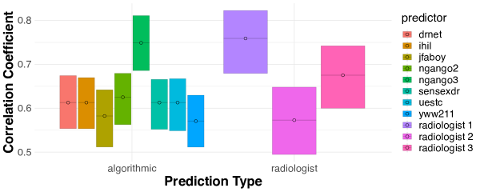

Figure 4: The relative performance of radiologists and predictive algorithms for detecting a pleural effusion. Each bar plots the Matthews Correlation Coefficient between the corresponding prediction and the ground truth label. Point estimates are reported with $95\%$ bootstrap confidence intervals.
[/FIGURE]

[FIGURE A3.F5.g1]
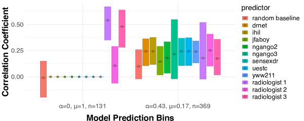

Figure 5: The conditional performance of radiologists and predictive algorithms for detecting a pleural effusion. Each subset is $\alpha$-indistinguishable with respect to the eight algorithmic predictors. $\mu$ indicates the fraction of positive algorithmic predictions and $n$ indicates the number of patients. All else is as in [Figure 4](#A3.F4 "In Appendix C Additional experimental results: chest X-ray diagnosis ‣ Distinguishing the Indistinguishable: Human Expertise in Algorithmic Prediction").
[/FIGURE]

[FIGURE A3.F6.g1]
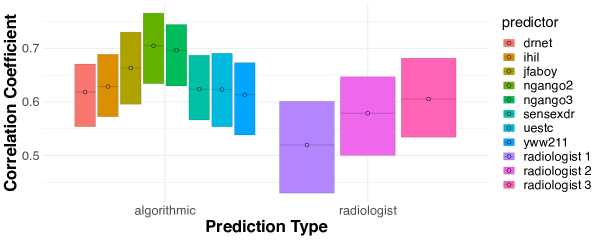

Figure 6: The relative performance of radiologists and predictive algorithms for detecting cardiomegaly. Each bar plots the Matthews Correlation Coefficient between the corresponding prediction and the ground truth label. Point estimates are reported with $95\%$ bootstrap confidence intervals.
[/FIGURE]

[FIGURE A3.F7.g1]
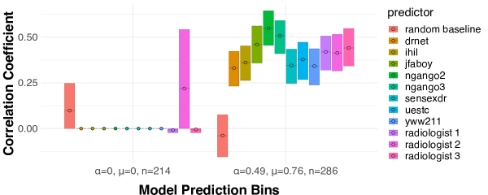

Figure 7: The conditional performance of radiologists and predictive algorithms for detecting cardiomegaly. Each subset is $\alpha$-indistinguishable with respect to the eight algorithmic predictors. $\mu$ indicates the fraction of positive algorithmic predictions and $n$ indicates the number of patients. All else is as in [Figure 6](#A3.F6 "In Appendix C Additional experimental results: chest X-ray diagnosis ‣ Distinguishing the Indistinguishable: Human Expertise in Algorithmic Prediction").
[/FIGURE]

[FIGURE A3.F8.g1]
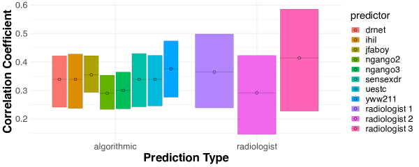

Figure 8: The relative performance of radiologists and predictive algorithms for detecting consolidation. Each bar plots the Matthews Correlation Coefficient between the corresponding prediction and the ground truth label. Point estimates are reported with $95\%$ bootstrap confidence intervals.
[/FIGURE]

[FIGURE A3.F9.g1]
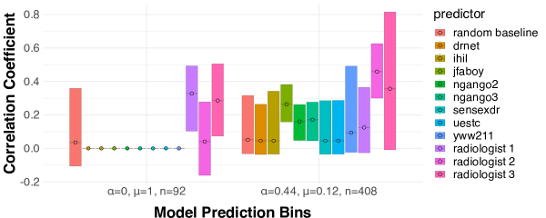

Figure 9: The conditional performance of radiologists and predictive algorithms for detecting consolidation. Each subset is $\alpha$-indistinguishable with respect to the eight algorithmic predictors. $\mu$ indicates the fraction of positive algorithmic predictions and $n$ indicates the number of patients. All else is as in [Figure 8](#A3.F8 "In Appendix C Additional experimental results: chest X-ray diagnosis ‣ Distinguishing the Indistinguishable: Human Expertise in Algorithmic Prediction").
[/FIGURE]

[FIGURE A3.F10.g1]
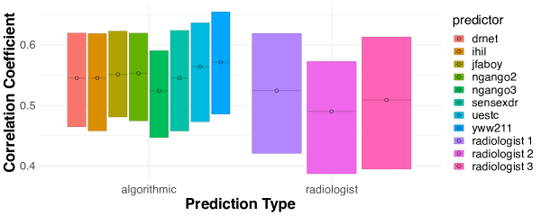

Figure 10: The relative performance of radiologists and predictive algorithms for detecting edema. Each bar plots the Matthews Correlation Coefficient between the corresponding prediction and the ground truth label. Point estimates are reported with $95\%$ bootstrap confidence intervals.
[/FIGURE]

[FIGURE A3.F11.g1]
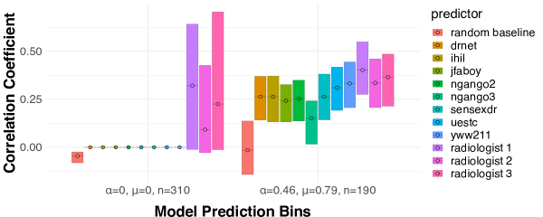

Figure 11: The conditional performance of radiologists and predictive algorithms for detecting edema. Each subset is $\alpha$-indistinguishable with respect to the eight algorithmic predictors. $\mu$ indicates the fraction of positive algorithmic predictions and $n$ indicates the number of patients. All else is as in [Figure 10](#A3.F10 "In Appendix C Additional experimental results: chest X-ray diagnosis ‣ Distinguishing the Indistinguishable: Human Expertise in Algorithmic Prediction").
[/FIGURE]

## Appendix D Additional experimental results: prediction from visual features

In this section we present additional experimental results for the visual prediction task studied in Saveski et al., ([2021](#bib.bib44)).  

Humans fail to outperform algorithms. As in the X-ray diagnosis task in [Section 5](#S5 "5 Experiments ‣ Distinguishing the Indistinguishable: Human Expertise in Algorithmic Prediction"), we first directly compare the performance of human subjects to that of the five off-the-shelf learning algorithms studied in Saveski et al., ([2021](#bib.bib44)). We again use the Matthew’s Correlation Coefficient (MCC) as a measure of binary classification accuracy (Chicco and Jurman,, [2020](#bib.bib10)). Our results confirm one of the basic findings in Saveski et al., ([2021](#bib.bib44)), which is that humans fail to outperform the best algorithmic predictors. We present these results in [Figure 12](#A4.F12 "In Appendix D Additional experimental results: prediction from visual features ‣ Distinguishing the Indistinguishable: Human Expertise in Algorithmic Prediction").  

[FIGURE A4.F12.g1]
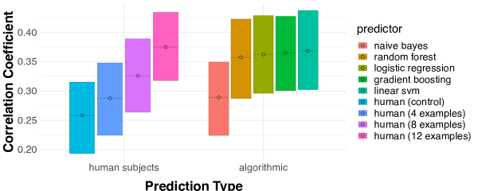

Figure 12: Comparing the accuracy of human subjects’ predictions to those made by off-the-shelf learning algorithms across four treatment conditions. Subjects in the control condition are given no training, while subjects in each of the three remaining conditions are presented with a small number of labeled examples before beginning the task. Each bar plots the Matthews correlation coefficient between the corresponding prediction and the true binary outcome; point estimates are reported with $95\%$ bootstrap confidence intervals.
[/FIGURE]

Although these results indicate that humans fail to outperform algorithms on average in this visual prediction task, we now apply the results of [Section 3](#S3 "3 Results ‣ Distinguishing the Indistinguishable: Human Expertise in Algorithmic Prediction") to investigate whether humans subjects can refine algorithmic predictions on *specific* instances.  

Resolving indistinguishability via human judgment. As in [Section 5](#S5 "5 Experiments ‣ Distinguishing the Indistinguishable: Human Expertise in Algorithmic Prediction"), we first form a partition of the set of input images which is multicalibrated with respect to the five predictors considered in [Figure 12](#A4.F12 "In Appendix D Additional experimental results: prediction from visual features ‣ Distinguishing the Indistinguishable: Human Expertise in Algorithmic Prediction"). As indicated by [Lemma 4.1](#S4.Thmlemma1 "Lemma 4.1. ‣ 4 Learning multicalibrated partitions ‣ Distinguishing the Indistinguishable: Human Expertise in Algorithmic Prediction") and [Corollary A.1](#A1.Thmcorollary1 "Corollary A.1. ‣ A.2 Omitted proofs from Section 4 ‣ Appendix A Proofs and additional technical results ‣ Distinguishing the Indistinguishable: Human Expertise in Algorithmic Prediction"), we do this by partitioning the space of observations to minimize the variance of each of the five predictors within each subset.121212This clustering procedure amounts to minimizing the Chebyshev distance in the $8$-dimensional space defined by the predictions of each leaderbord algorithm. See <https://github.com/ralur/human-expertise-algorithmic-prediction> for additional detail. Because the outcome is binary, it is natural to partition the space of images into two clusters. We now examine the conditional correlation between each prediction and the true binary outcome within each of these subsets, which we plot in [Figure 13](#A4.F13 "In Appendix D Additional experimental results: prediction from visual features ‣ Distinguishing the Indistinguishable: Human Expertise in Algorithmic Prediction").  

[FIGURE A4.F13.g1]
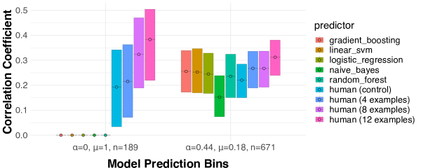

Figure 13: The performance of human and algorithmic predictions within clusters defined by the five algorithmic predictors considered in [Figure 12](#A4.F12 "In Appendix D Additional experimental results: prediction from visual features ‣ Distinguishing the Indistinguishable: Human Expertise in Algorithmic Prediction"). Each subset is $\alpha$-indistinguishable with respect to the five algorithmic predictors. $\mu$ indicates the fraction of positive algorithmic predictions and $n$ indicates the number of images. All else is as in [Figure 12](#A4.F12 "In Appendix D Additional experimental results: prediction from visual features ‣ Distinguishing the Indistinguishable: Human Expertise in Algorithmic Prediction"). The confidence intervals for the algorithmic predictors are not strictly valid (the subsets are chosen conditional on the predictions themselves), but are included for reference against human performance.
[/FIGURE]

As we can see, the human subjects’ predictions perform comparably to the algorithms within the ‘negative’ ($\mu=.18$; $\mu$ indicates the fraction of positive algorithmic predictions) bin, but add substantial information when all five models predict a positive label ($\mu=1$). Thus, although the human subjects fail to outperform the algorithmic predictors on average ([Figure 12](#A4.F12 "In Appendix D Additional experimental results: prediction from visual features ‣ Distinguishing the Indistinguishable: Human Expertise in Algorithmic Prediction")), there is substantial heterogeneity in their relative performance that can be *identified ex-ante* by partitioning the observations into two approximately indistinguishable subsets. In particular, as in the X-ray classification task studied in [Section 5](#S5 "5 Experiments ‣ Distinguishing the Indistinguishable: Human Expertise in Algorithmic Prediction"), we find that human subjects can identify negative instances which are incorrectly classified as positive by all five algorithmic predictors.  

